# Connected attack assessment map and explanations

**One Markdown document. All diagrams and explanations are embedded below.**

Scope: every one of the 2,275 entries in the previously assembled catalogue: 615 CAPEC records, 858 Enterprise ATT&CK records, 190 Mobile ATT&CK records, 118 ICS ATT&CK records and 494 supplementary labels. These overlap and are not 2,275 unique attacks. Source snapshots: CAPEC 3.9 and ATT&CK 19.2, retrieved 08 October 2026.

The visual maps use Mermaid code blocks, which render as flowcharts in Mermaid-capable Markdown viewers. All diagrams and explanations are embedded in this document.

## Reading the connected map

**Start at the master router -> identify the real platform/service -> enter a domain submap -> choose the relevant feature/trust boundary -> choose an applicable catalogue entry -> verify prerequisites -> perform bounded validation -> check proof and defensive detection -> either follow a verified cross-domain connector or mitigate -> retest -> cleanup.**

- A split means choose the branch matching the observation; it does not mean attempt every attack.
- YES and NO outcomes return to explicit gates. A successful test does not automatically authorize another asset, technique or domain.
- The shared **MASTER ROUTER** connector has the same meaning in every submap: repeat ownership, scope, platform and prerequisite checks before the next branch.
- Multiple diagrams are connected sections of one logical map. They keep the complete catalogue readable in a single document. Each catalogue record appears as a named visual node and has its explanation directly beneath its diagram.
- Within each catalogue panel, vertically aligned records are alternatives. Invisible layout links do not represent an attack sequence. Select ONE applicable record.
- Tools and performing steps are assessment-family guidance. ATT&CK detection/mitigation links and CAPEC excerpts are source-backed where stated. Source gaps and generic templates are labelled; the document does not claim individually researched operational exploit instructions for all entries.

## Contents

1. [Master connected map](#master-connected-map)
2. [Seven-stage workflow](#seven-stage-workflow)
3. [MITRE tactic view](#mitre-tactic-view)
4. [Domain submaps and connectors](#domain-submaps-and-connectors)
5. [All catalogue entries: visual nodes and explanations](#all-catalogue-entries-visual-nodes-and-explanations)
6. [Evidence, mitigation, retesting and source provenance](#evidence-mitigation-retesting-and-source-provenance)

## Master connected map

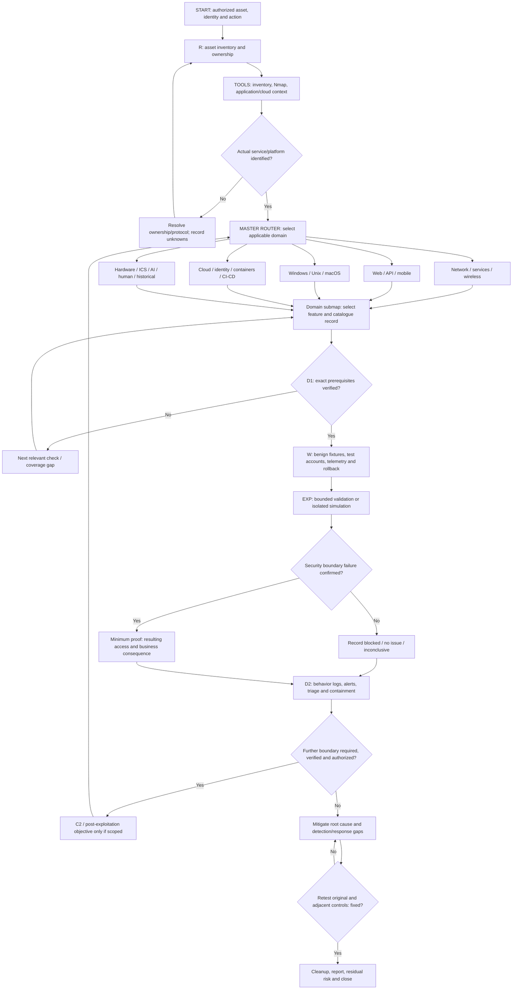

**D1** identifies exposure or a weakness. **D2** asks whether defenders detected and responded to the validation behavior. A scanner alert is not proof of exploitation; a missed defensive alert is not proof of business impact.

At any node: instability, real sensitive data, unsafe process effects or an out-of-scope dependency -> STOP that path, contact the agreed owner and restore test changes. Blocking is an assessment result, not permission to bypass a control.

## Seven-stage workflow

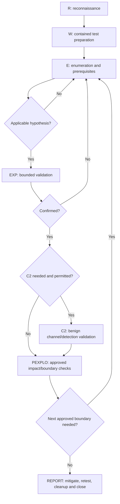

This is the requested custom workflow, not an official sequential MITRE lifecycle. E means enumeration; C2C is interpreted as C2. Reporting and cleanup apply even when no exploitation succeeds.

## MITRE tactic view

The classic Enterprise view has 14 tactics. The current source view has 15: Defense Evasion was split into Stealth and Defense Impairment. Tactics describe objectives and can repeat, overlap or be skipped.

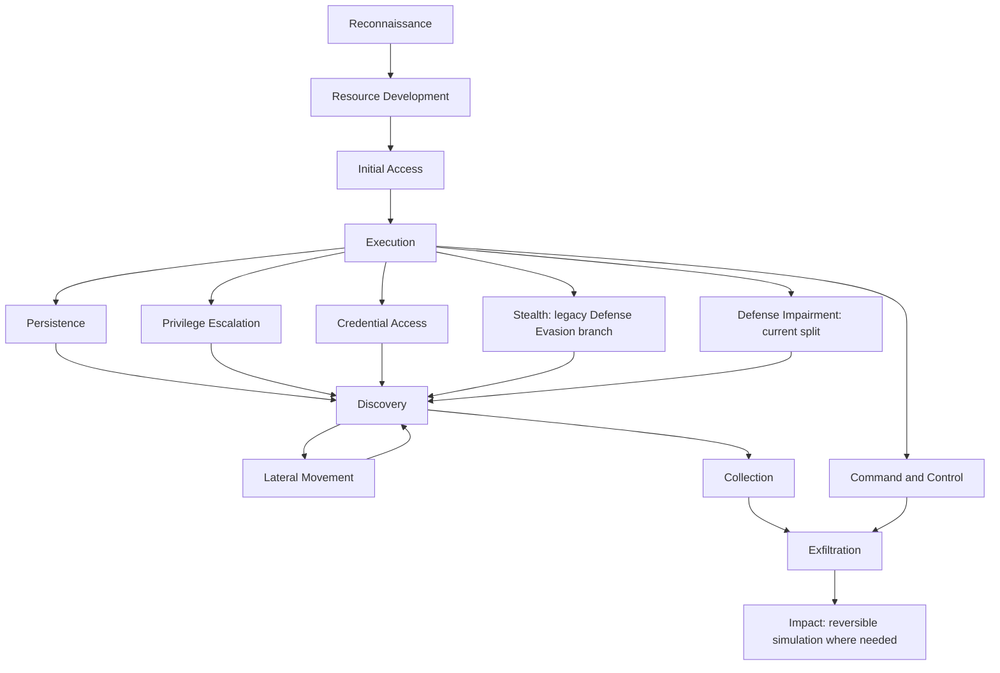

These arrows show possible objective relationships, not automatic prerequisites or permission to progress. Per-entry ATT&CK tactic/platform tags and source defenses are retained in the explanations below.

## Domain submaps and connectors

### Domain: Web applications

ENTRY: an independently identified, authorized asset in this domain. Every branch feeds the shared prerequisite gate; branch labels identify observations and initial tools.


| Verified observation / connector | Destination | Entry condition |
|---|---|---|
| API endpoint identified | APIs and distributed services | Verify resulting capability, next asset ownership and action scope; then repeat destination prerequisites |
| Host execution boundary independently verified | Actual verified host OS | Verify resulting capability, next asset ownership and action scope; then repeat destination prerequisites |
| Cloud identity/resource identified | Cloud / AWS / Azure / GCP / SaaS | Verify resulting capability, next asset ownership and action scope; then repeat destination prerequisites |

Profiles reachable in this submap: access, availability, browser, execution, files, generic, injection, logic, memory, network, session. Select an entry below whose domain/build/prerequisites actually match; profile membership alone does not establish exploitability.

### Domain: APIs and distributed services

ENTRY: an independently identified, authorized asset in this domain. Every branch feeds the shared prerequisite gate; branch labels identify observations and initial tools.

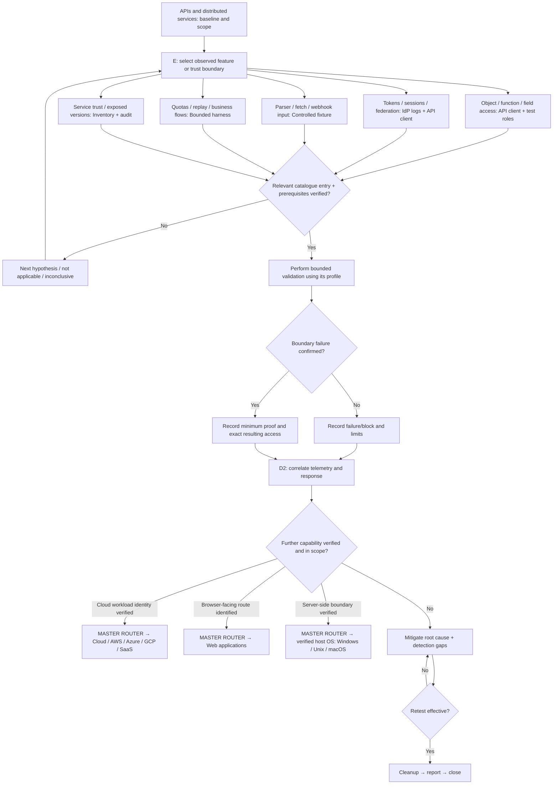

| Verified observation / connector | Destination | Entry condition |
|---|---|---|
| Cloud workload identity verified | Cloud / AWS / Azure / GCP / SaaS | Verify resulting capability, next asset ownership and action scope; then repeat destination prerequisites |
| Browser-facing route identified | Web applications | Verify resulting capability, next asset ownership and action scope; then repeat destination prerequisites |
| Server-side boundary verified | Actual verified host OS | Verify resulting capability, next asset ownership and action scope; then repeat destination prerequisites |

Profiles reachable in this submap: access, availability, browser, crypto, generic, injection, logic, session, stealth. Select an entry below whose domain/build/prerequisites actually match; profile membership alone does not establish exploitability.

### Domain: Networks and exposed services

ENTRY: an independently identified, authorized asset in this domain. Every branch feeds the shared prerequisite gate; branch labels identify observations and initial tools.

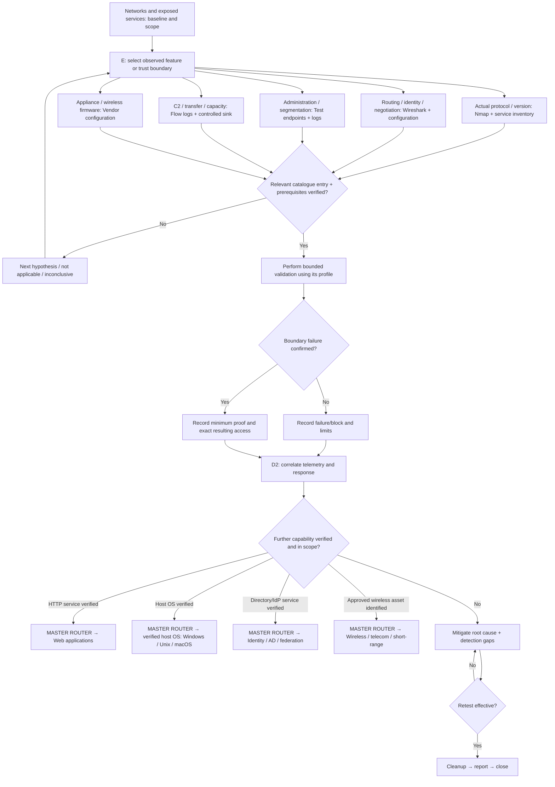

| Verified observation / connector | Destination | Entry condition |
|---|---|---|
| HTTP service verified | Web applications | Verify resulting capability, next asset ownership and action scope; then repeat destination prerequisites |
| Host OS verified | Actual verified host OS | Verify resulting capability, next asset ownership and action scope; then repeat destination prerequisites |
| Directory/IdP service verified | Identity / AD / federation | Verify resulting capability, next asset ownership and action scope; then repeat destination prerequisites |
| Approved wireless asset identified | Wireless / telecom / short-range | Verify resulting capability, next asset ownership and action scope; then repeat destination prerequisites |

Profiles reachable in this submap: access, availability, control, credentials, crypto, discovery, execution, files, generic, hardware, identity, impairment, injection, movement, network, persistence, session, stealth, transfer, unix, wireless. Select an entry below whose domain/build/prerequisites actually match; profile membership alone does not establish exploitability.

### Domain: Windows

ENTRY: an independently identified, authorized asset in this domain. Every branch feeds the shared prerequisite gate; branch labels identify observations and initial tools.

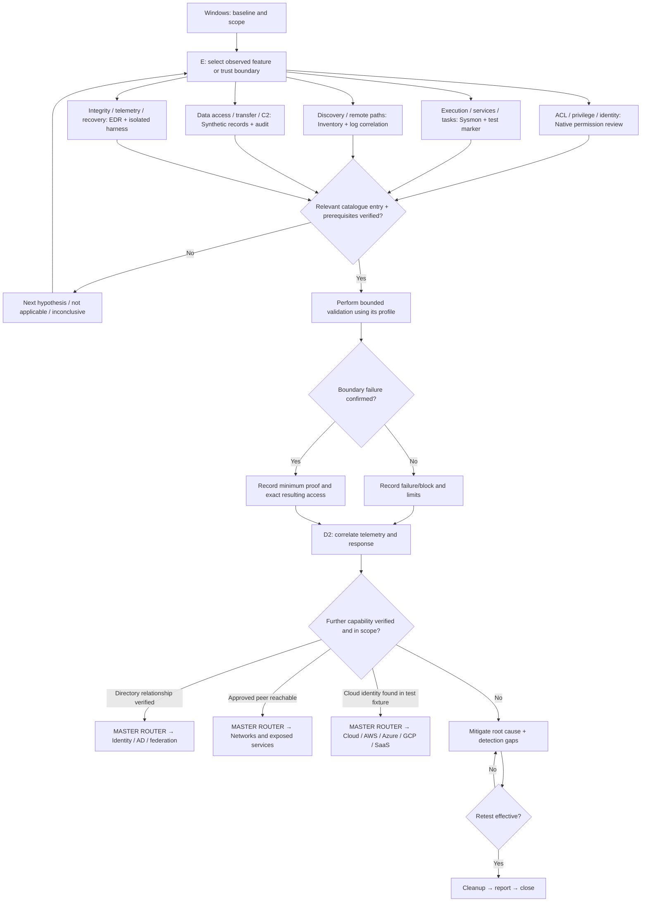

| Verified observation / connector | Destination | Entry condition |
|---|---|---|
| Directory relationship verified | Identity / AD / federation | Verify resulting capability, next asset ownership and action scope; then repeat destination prerequisites |
| Approved peer reachable | Networks and exposed services | Verify resulting capability, next asset ownership and action scope; then repeat destination prerequisites |
| Cloud identity found in test fixture | Cloud / AWS / Azure / GCP / SaaS | Verify resulting capability, next asset ownership and action scope; then repeat destination prerequisites |

Profiles reachable in this submap: access, ai, android, availability, browser, cloud, container, control, credentials, crypto, discovery, execution, files, hardware, human, identity, impairment, injection, movement, network, persistence, session, stealth, supply, transfer, windows, wireless. Select an entry below whose domain/build/prerequisites actually match; profile membership alone does not establish exploitability.

### Domain: Linux / Unix / BSD

ENTRY: an independently identified, authorized asset in this domain. Every branch feeds the shared prerequisite gate; branch labels identify observations and initial tools.

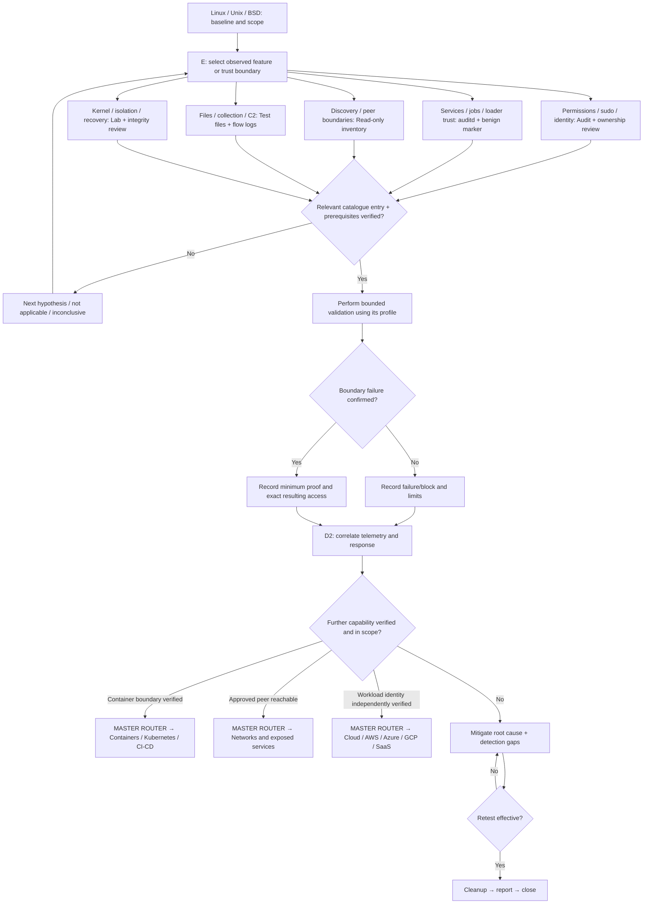

| Verified observation / connector | Destination | Entry condition |
|---|---|---|
| Container boundary verified | Containers / Kubernetes / CI-CD | Verify resulting capability, next asset ownership and action scope; then repeat destination prerequisites |
| Approved peer reachable | Networks and exposed services | Verify resulting capability, next asset ownership and action scope; then repeat destination prerequisites |
| Workload identity independently verified | Cloud / AWS / Azure / GCP / SaaS | Verify resulting capability, next asset ownership and action scope; then repeat destination prerequisites |

Profiles reachable in this submap: access, availability, browser, cloud, control, credentials, crypto, discovery, execution, files, hardware, human, identity, impairment, injection, movement, network, persistence, session, stealth, supply, transfer, unix, wireless. Select an entry below whose domain/build/prerequisites actually match; profile membership alone does not establish exploitability.

### Domain: macOS

ENTRY: an independently identified, authorized asset in this domain. Every branch feeds the shared prerequisite gate; branch labels identify observations and initial tools.

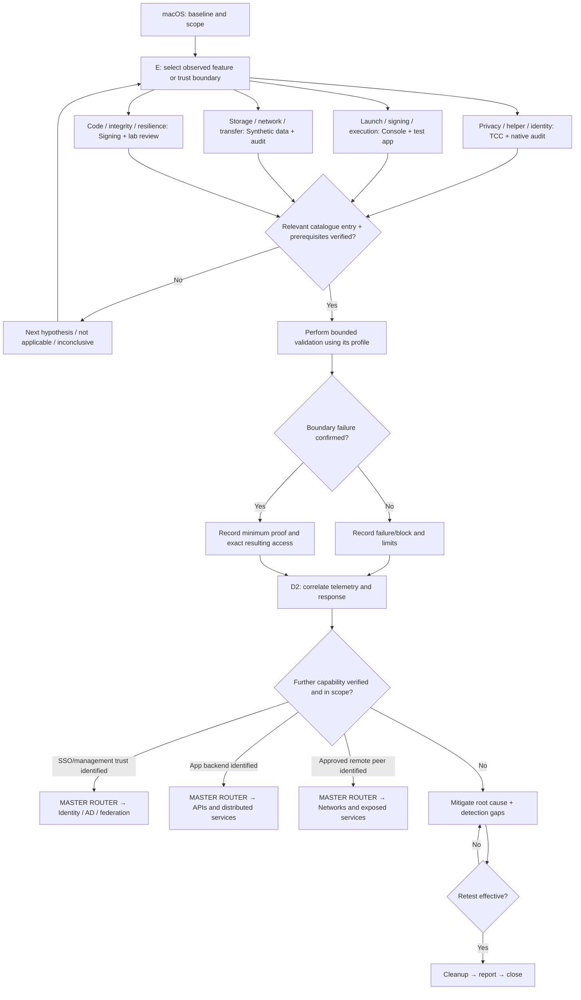

| Verified observation / connector | Destination | Entry condition |
|---|---|---|
| SSO/management trust identified | Identity / AD / federation | Verify resulting capability, next asset ownership and action scope; then repeat destination prerequisites |
| App backend identified | APIs and distributed services | Verify resulting capability, next asset ownership and action scope; then repeat destination prerequisites |
| Approved remote peer identified | Networks and exposed services | Verify resulting capability, next asset ownership and action scope; then repeat destination prerequisites |

Profiles reachable in this submap: access, ai, availability, browser, cloud, control, credentials, crypto, discovery, execution, files, hardware, human, identity, impairment, injection, macos, movement, network, persistence, session, stealth, supply, transfer, unix, wireless. Select an entry below whose domain/build/prerequisites actually match; profile membership alone does not establish exploitability.

### Domain: Android

ENTRY: an independently identified, authorized asset in this domain. Every branch feeds the shared prerequisite gate; branch labels identify observations and initial tools.

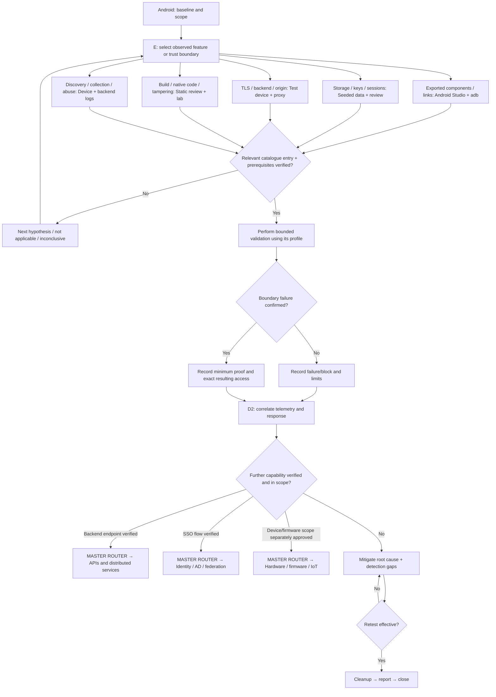

| Verified observation / connector | Destination | Entry condition |
|---|---|---|
| Backend endpoint verified | APIs and distributed services | Verify resulting capability, next asset ownership and action scope; then repeat destination prerequisites |
| SSO flow verified | Identity / AD / federation | Verify resulting capability, next asset ownership and action scope; then repeat destination prerequisites |
| Device/firmware scope separately approved | Hardware / firmware / IoT | Verify resulting capability, next asset ownership and action scope; then repeat destination prerequisites |

Profiles reachable in this submap: access, ai, android, availability, cloud, control, credentials, crypto, discovery, execution, files, generic, human, identity, injection, movement, network, persistence, session, stealth, supply, transfer, unix, wireless. Select an entry below whose domain/build/prerequisites actually match; profile membership alone does not establish exploitability.

### Domain: iOS / iPadOS

ENTRY: an independently identified, authorized asset in this domain. Every branch feeds the shared prerequisite gate; branch labels identify observations and initial tools.


| Verified observation / connector | Destination | Entry condition |
|---|---|---|
| Backend endpoint verified | APIs and distributed services | Verify resulting capability, next asset ownership and action scope; then repeat destination prerequisites |
| Federation flow verified | Identity / AD / federation | Verify resulting capability, next asset ownership and action scope; then repeat destination prerequisites |
| Separate device trust boundary in scope | Hardware / firmware / IoT | Verify resulting capability, next asset ownership and action scope; then repeat destination prerequisites |

Profiles reachable in this submap: access, ai, availability, cloud, control, credentials, crypto, discovery, execution, files, generic, human, identity, injection, ios, macos, movement, network, persistence, session, stealth, supply, transfer, unix, wireless. Select an entry below whose domain/build/prerequisites actually match; profile membership alone does not establish exploitability.

### Domain: Cloud / AWS / Azure / GCP / SaaS

ENTRY: an independently identified, authorized asset in this domain. Every branch feeds the shared prerequisite gate; branch labels identify observations and initial tools.

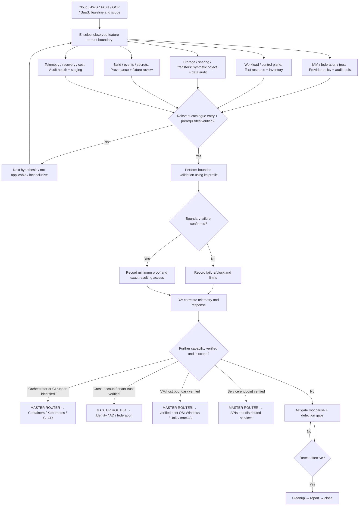

| Verified observation / connector | Destination | Entry condition |
|---|---|---|
| Orchestrator or CI runner identified | Containers / Kubernetes / CI-CD | Verify resulting capability, next asset ownership and action scope; then repeat destination prerequisites |
| Cross-account/tenant trust verified | Identity / AD / federation | Verify resulting capability, next asset ownership and action scope; then repeat destination prerequisites |
| VM/host boundary verified | Actual verified host OS | Verify resulting capability, next asset ownership and action scope; then repeat destination prerequisites |
| Service endpoint verified | APIs and distributed services | Verify resulting capability, next asset ownership and action scope; then repeat destination prerequisites |

Profiles reachable in this submap: access, availability, cloud, container, credentials, crypto, discovery, execution, generic, human, identity, impairment, injection, ios, movement, network, persistence, session, stealth, supply, transfer. Select an entry below whose domain/build/prerequisites actually match; profile membership alone does not establish exploitability.

### Domain: Identity / AD / federation

ENTRY: an independently identified, authorized asset in this domain. Every branch feeds the shared prerequisite gate; branch labels identify observations and initial tools.


| Verified observation / connector | Destination | Entry condition |
|---|---|---|
| Approved Windows identity verified | Windows | Verify resulting capability, next asset ownership and action scope; then repeat destination prerequisites |
| Cloud role/trust verified | Cloud / AWS / Azure / GCP / SaaS | Verify resulting capability, next asset ownership and action scope; then repeat destination prerequisites |
| Application role mapping verified | APIs and distributed services | Verify resulting capability, next asset ownership and action scope; then repeat destination prerequisites |

Profiles reachable in this submap: access, cloud, credentials, crypto, discovery, generic, human, identity, impairment, injection, persistence, session, stealth. Select an entry below whose domain/build/prerequisites actually match; profile membership alone does not establish exploitability.

### Domain: Containers / Kubernetes / CI-CD

ENTRY: an independently identified, authorized asset in this domain. Every branch feeds the shared prerequisite gate; branch labels identify observations and initial tools.


| Verified observation / connector | Destination | Entry condition |
|---|---|---|
| Host boundary independently verified | Linux / Unix / BSD | Verify resulting capability, next asset ownership and action scope; then repeat destination prerequisites |
| Cloud role verified | Cloud / AWS / Azure / GCP / SaaS | Verify resulting capability, next asset ownership and action scope; then repeat destination prerequisites |
| Exposed service verified | APIs and distributed services | Verify resulting capability, next asset ownership and action scope; then repeat destination prerequisites |

Profiles reachable in this submap: access, availability, cloud, container, control, credentials, crypto, discovery, execution, files, generic, identity, impairment, injection, ios, movement, network, persistence, session, stealth, supply, transfer, unix. Select an entry below whose domain/build/prerequisites actually match; profile membership alone does not establish exploitability.

### Domain: Hardware / firmware / IoT

ENTRY: an independently identified, authorized asset in this domain. Every branch feeds the shared prerequisite gate; branch labels identify observations and initial tools.

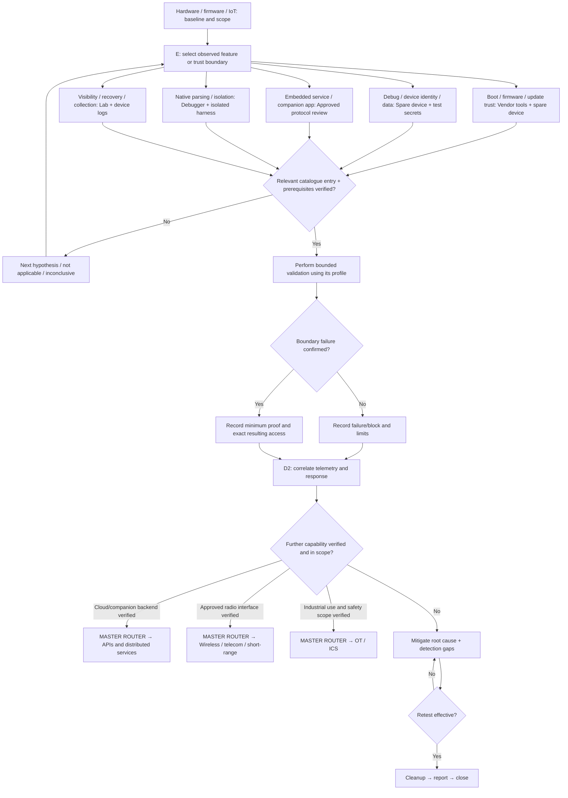

| Verified observation / connector | Destination | Entry condition |
|---|---|---|
| Cloud/companion backend verified | APIs and distributed services | Verify resulting capability, next asset ownership and action scope; then repeat destination prerequisites |
| Approved radio interface verified | Wireless / telecom / short-range | Verify resulting capability, next asset ownership and action scope; then repeat destination prerequisites |
| Industrial use and safety scope verified | OT / ICS | Verify resulting capability, next asset ownership and action scope; then repeat destination prerequisites |

Profiles reachable in this submap: generic, hardware, injection, ios, memory, network, stealth. Select an entry below whose domain/build/prerequisites actually match; profile membership alone does not establish exploitability.

### Domain: OT / ICS

ENTRY: an independently identified, authorized asset in this domain. Every branch feeds the shared prerequisite gate; branch labels identify observations and initial tools.

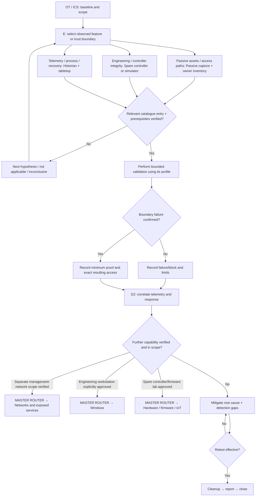

| Verified observation / connector | Destination | Entry condition |
|---|---|---|
| Separate management-network scope verified | Networks and exposed services | Verify resulting capability, next asset ownership and action scope; then repeat destination prerequisites |
| Engineering workstation explicitly approved | Windows | Verify resulting capability, next asset ownership and action scope; then repeat destination prerequisites |
| Spare controller/firmware lab approved | Hardware / firmware / IoT | Verify resulting capability, next asset ownership and action scope; then repeat destination prerequisites |

Profiles reachable in this submap: generic, hardware, ics, injection, ios, network, stealth. Select an entry below whose domain/build/prerequisites actually match; profile membership alone does not establish exploitability.

### Domain: Wireless / telecom / short-range

ENTRY: an independently identified, authorized asset in this domain. Every branch feeds the shared prerequisite gate; branch labels identify observations and initial tools.

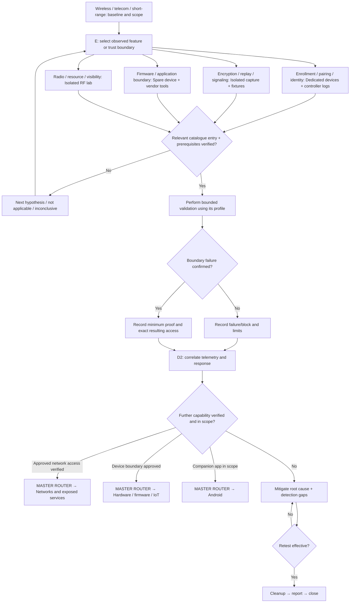

| Verified observation / connector | Destination | Entry condition |
|---|---|---|
| Approved network access verified | Networks and exposed services | Verify resulting capability, next asset ownership and action scope; then repeat destination prerequisites |
| Device boundary approved | Hardware / firmware / IoT | Verify resulting capability, next asset ownership and action scope; then repeat destination prerequisites |
| Companion app in scope | Android | Verify resulting capability, next asset ownership and action scope; then repeat destination prerequisites |

Profiles reachable in this submap: availability, generic, injection, network, session, stealth, wireless. Select an entry below whose domain/build/prerequisites actually match; profile membership alone does not establish exploitability.

### Domain: AI / LLM / agents

ENTRY: an independently identified, authorized asset in this domain. Every branch feeds the shared prerequisite gate; branch labels identify observations and initial tools.

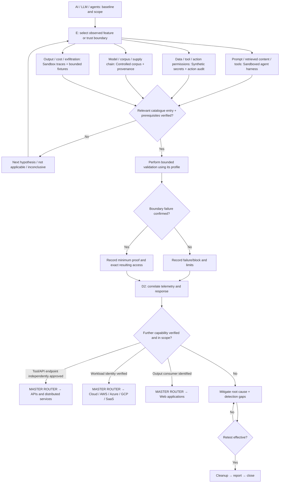

| Verified observation / connector | Destination | Entry condition |
|---|---|---|
| Tool/API endpoint independently approved | APIs and distributed services | Verify resulting capability, next asset ownership and action scope; then repeat destination prerequisites |
| Workload identity verified | Cloud / AWS / Azure / GCP / SaaS | Verify resulting capability, next asset ownership and action scope; then repeat destination prerequisites |
| Output consumer identified | Web applications | Verify resulting capability, next asset ownership and action scope; then repeat destination prerequisites |

Profiles reachable in this submap: ai. Select an entry below whose domain/build/prerequisites actually match; profile membership alone does not establish exploitability.

### Domain: Human / physical / organizational

ENTRY: an independently identified, authorized asset in this domain. Every branch feeds the shared prerequisite gate; branch labels identify observations and initial tools.

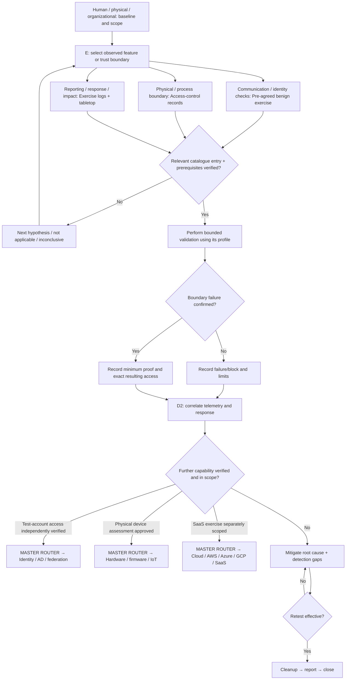

| Verified observation / connector | Destination | Entry condition |
|---|---|---|
| Test-account access independently verified | Identity / AD / federation | Verify resulting capability, next asset ownership and action scope; then repeat destination prerequisites |
| Physical device assessment approved | Hardware / firmware / IoT | Verify resulting capability, next asset ownership and action scope; then repeat destination prerequisites |
| SaaS exercise separately scoped | Cloud / AWS / Azure / GCP / SaaS | Verify resulting capability, next asset ownership and action scope; then repeat destination prerequisites |

Profiles reachable in this submap: human. Select an entry below whose domain/build/prerequisites actually match; profile membership alone does not establish exploitability.

### Domain: Cross-domain / historical / unclassified

ENTRY: an independently identified, authorized asset in this domain. Every branch feeds the shared prerequisite gate; branch labels identify observations and initial tools.

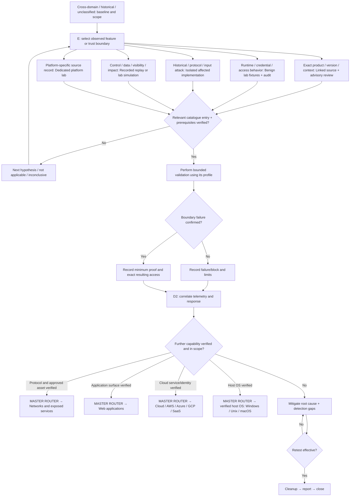

| Verified observation / connector | Destination | Entry condition |
|---|---|---|
| Protocol and approved asset verified | Networks and exposed services | Verify resulting capability, next asset ownership and action scope; then repeat destination prerequisites |
| Application surface verified | Web applications | Verify resulting capability, next asset ownership and action scope; then repeat destination prerequisites |
| Cloud service/identity verified | Cloud / AWS / Azure / GCP / SaaS | Verify resulting capability, next asset ownership and action scope; then repeat destination prerequisites |
| Host OS verified | Actual verified host OS | Verify resulting capability, next asset ownership and action scope; then repeat destination prerequisites |

Profiles reachable in this submap: access, availability, browser, cloud, credentials, crypto, execution, files, generic, hardware, human, identity, logic, memory, network, recon, stealth, supply. Select an entry below whose domain/build/prerequisites actually match; profile membership alone does not establish exploitability.

## All catalogue entries: visual nodes and explanations

The following panels contain **every catalogue entry as a visual node**, followed immediately by its tools, test guidance, evidence, source detection, mitigation and retest explanation. A named **MASTER ROUTER** node reconnects each panel to the domain maps above.

| Assessment profile | Entries | Visual panels |
|---|---:|---:|
| [access](#profile-access) | 77 | 8 |
| [ai](#profile-ai) | 15 | 2 |
| [android](#profile-android) | 63 | 7 |
| [availability](#profile-availability) | 69 | 7 |
| [browser](#profile-browser) | 54 | 6 |
| [cloud](#profile-cloud) | 106 | 11 |
| [container](#profile-container) | 21 | 3 |
| [control](#profile-control) | 28 | 3 |
| [credentials](#profile-credentials) | 41 | 5 |
| [crypto](#profile-crypto) | 57 | 6 |
| [discovery](#profile-discovery) | 29 | 3 |
| [execution](#profile-execution) | 101 | 11 |
| [files](#profile-files) | 70 | 7 |
| [generic](#profile-generic) | 291 | 30 |
| [hardware](#profile-hardware) | 23 | 3 |
| [human](#profile-human) | 39 | 4 |
| [ics](#profile-ics) | 118 | 12 |
| [identity](#profile-identity) | 37 | 4 |
| [impairment](#profile-impairment) | 11 | 2 |
| [injection](#profile-injection) | 111 | 12 |
| [ios](#profile-ios) | 26 | 3 |
| [logic](#profile-logic) | 14 | 2 |
| [macos](#profile-macos) | 51 | 6 |
| [memory](#profile-memory) | 18 | 2 |
| [movement](#profile-movement) | 12 | 2 |
| [network](#profile-network) | 162 | 17 |
| [persistence](#profile-persistence) | 40 | 4 |
| [recon](#profile-recon) | 67 | 7 |
| [session](#profile-session) | 82 | 9 |
| [stealth](#profile-stealth) | 136 | 14 |
| [supply](#profile-supply) | 15 | 2 |
| [transfer](#profile-transfer) | 47 | 5 |
| [unix](#profile-unix) | 53 | 6 |
| [windows](#profile-windows) | 167 | 17 |
| [wireless](#profile-wireless) | 24 | 3 |

### Profile: access

**Starting surface:** Users, roles, tenants and owned synthetic objects.

**Tools:** ZAP or an HTTP inspection proxy; API client; application/IAM audit console.

**D1 checks:** Compare the access matrix with endpoint/object/field permission decisions.

**Perform / validate:** Use two dedicated test identities and one synthetic object; compare allowed and denied operations.

**D2 telemetry:** Application authorization events, object access logs, identity/session context.

**Base mitigation:** Enforce server-side authorization on every object, property and action; deny by default; isolate tenants. Source-specific controls appear under the individual entries.

#### access visual panel 1

Choose ONE applicable record from the two columns; vertical ordering inside a column is layout only. The named record feeds the common prerequisite/test/detection/mitigation decisions.

```mermaid
flowchart TD
 START["`START: enter from the applicable domain submap`"] --> ROOT["`MASTER ROUTER: exact domain, asset, build and scope`"]
 ROOT --> T["`TOOLS: ZAP or an HTTP inspection proxy; API client; application/IAM audit console`"]
 subgraph G0["Choose ONE applicable record"]
 direction TB
 A0["`CAPEC-1: Accessing Functionality Not Properly Constrained by ACLs`"]
 A1["`CAPEC-12: Choosing Message Identifier`"]
 A2["`CAPEC-21: Exploitation of Trusted Identifiers`"]
 A3["`CAPEC-22: Exploiting Trust in Client`"]
 A4["`CAPEC-39: Manipulating Opaque Client-based Data Tokens`"]
 A0 ~~~ A1
 A1 ~~~ A2
 A2 ~~~ A3
 A3 ~~~ A4
 end
 T --> G0
 G0 --> P{"`D1: source prerequisites + expected control verified?`"}
 subgraph G1["Choose ONE applicable record"]
 direction TB
 A5["`CAPEC-58: Restful Privilege Elevation`"]
 A6["`CAPEC-69: Target Programs with Elevated Privileges`"]
 A7["`CAPEC-77: Manipulating User-Controlled Variables`"]
 A8["`CAPEC-96: Block Access to Libraries`"]
 A9["`CAPEC-122: Privilege Abuse`"]
 A5 ~~~ A6
 A6 ~~~ A7
 A7 ~~~ A8
 A8 ~~~ A9
 end
 T --> G1
 G1 --> P{"`D1: source prerequisites + expected control verified?`"}
 P -->|No| NEXT["`RETURN TO MASTER ROUTER: next relevant record / coverage gap`"]
 P -->|Yes| TEST["`PERFORM: Use two dedicated test identities and one synthetic object; compare allowed and denied operations`"]
 TEST --> RESULT{"`Boundary failure confirmed?`"}
 RESULT -->|No| BLOCK["`Record blocked / no issue / inconclusive`"]
 RESULT -->|Yes| PROOF["`Capture minimum proof and exact resulting access`"]
 BLOCK --> DET["`D2: Application authorization events, object access logs, identity/session context`"]
 PROOF --> DET
 DET --> CROSS{"`Further boundary verified, needed and authorized?`"}
 CROSS -->|Yes| ROUTE["`RETURN TO MASTER ROUTER: re-scope and choose next domain`"]
 CROSS -->|No| MIT["`MITIGATE: Enforce server-side authorization on every object, property and action; deny by default; isolate tenants; apply source controls below`"]
 MIT --> RETEST{"`Retest proof, legitimate behavior and detection: fixed?`"}
 RETEST -->|No| MIT
 RETEST -->|Yes| CLOSE["`Cleanup → revoke test secrets → report → close`"]
```

#### Explanations for the entries in this panel

##### CAPEC-1: Accessing Functionality Not Properly Constrained by ACLs

**Connected domain entry points:** Web applications, APIs and distributed services, Identity / AD / federation. **Next connector:** verified outcome -> MASTER ROUTER -> relevant next domain; otherwise mitigation/retest.

**Source:** [CAPEC-1](https://capec.mitre.org/data/definitions/1.html) | **Status:** Draft | **Profile:** access (name heuristic; verify relevance).

**Chain:** START: Users, roles, tenants and owned synthetic objects -> TOOLS: ZAP or an HTTP inspection proxy; API client; application/IAM audit console -> D1: Compare the access matrix with endpoint/object/field permission decisions -> GATE: prerequisites verified? NO -> record gap/skip; YES -> PERFORM: Use two dedicated test identities and one synthetic object; compare allowed and denied operations -> CHECK: boundary failure confirmed? NO -> record blocked/no issue/inconclusive; YES -> capture minimum proof -> D2: Application authorization events, object access logs, identity/session context -> MITIGATE: Enforce server-side authorization on every object, property and action; deny by default; isolate tenants -> RETEST: repeat the bounded proof and telemetry check; fixed? NO -> revise controls; YES -> cleanup and close.

**Source prerequisite excerpt:** The application must be navigable in a manner that associates elements (subsections) of the application with ACLs.; The various resources, or individual URLs, must be somehow discoverable by the attacker; The administrator must have forgotten to associate an ACL or has associated an inappropriately permissive ACL with a particular navigable resource.

**D2 mapping gap:** No explicit active source detection-strategy mapping available for this entry in the imported data; the telemetry step above is editorial guidance.

**Source-specific mitigation references/excerpts:** In a J2EE setting, administrators can associate a role that is impossible for the authenticator to grant users, such as "NoAccess", with all Servlets to which access is guarded by a limited number of servlets visible to, and accessible by, the user. Having done so, any direct access to those protected Servlets will be prohibited by the web container. In a more general setting, the administrator must mark every resource besides the ones supposed to be exposed to the user as accessible by a role impossible for the user to assume. The default security setting must be to deny access and then grant access only to those resources intended by business logic.. Apply the linked detail to this product and build, then verify the fix.

**Evidence:** exact build/configuration, test identity, expected/observed decision, sanitized artifact or log, timestamp, prerequisites and limits. Record D1 outcome separately from D2 alert/triage/containment outcome.

##### CAPEC-12: Choosing Message Identifier

**Connected domain entry points:** Web applications, APIs and distributed services, Identity / AD / federation. **Next connector:** verified outcome -> MASTER ROUTER -> relevant next domain; otherwise mitigation/retest.

**Source:** [CAPEC-12](https://capec.mitre.org/data/definitions/12.html) | **Status:** Draft | **Profile:** access (name heuristic; verify relevance).

**Chain:** START: Users, roles, tenants and owned synthetic objects -> TOOLS: ZAP or an HTTP inspection proxy; API client; application/IAM audit console -> D1: Compare the access matrix with endpoint/object/field permission decisions -> GATE: prerequisites verified? NO -> record gap/skip; YES -> PERFORM: Use two dedicated test identities and one synthetic object; compare allowed and denied operations -> CHECK: boundary failure confirmed? NO -> record blocked/no issue/inconclusive; YES -> capture minimum proof -> D2: Application authorization events, object access logs, identity/session context -> MITIGATE: Enforce server-side authorization on every object, property and action; deny by default; isolate tenants -> RETEST: repeat the bounded proof and telemetry check; fixed? NO -> revise controls; YES -> cleanup and close.

**Source prerequisite excerpt:** Information and client-sensitive (and client-specific) data must be present through a distribution channel available to all users.; Distribution means must code (through channel, message identifiers, or convention) message destination in a manner visible within the distribution means itself (such as a control channel) or in the messages themselves.

**D2 mapping gap:** No explicit active source detection-strategy mapping available for this entry in the imported data; the telemetry step above is editorial guidance.

**Source-specific mitigation references/excerpts:** Associate some ACL (in the form of a token) with an authenticated user which they provide middleware. The middleware uses this token as part of its channel/message selection for that client, or part of a discerning authorization decision for privileged channels/messages. The purpose is to architect the system in a way that associates proper authentication/authorization with each channel/message.; Re-architect system input/output channels as appropriate to distribute self-protecting data. That is, encrypt (or otherwise protect) channels/messages so that only authorized readers can see them.. Apply the linked detail to this product and build, then verify the fix.

**Evidence:** exact build/configuration, test identity, expected/observed decision, sanitized artifact or log, timestamp, prerequisites and limits. Record D1 outcome separately from D2 alert/triage/containment outcome.

##### CAPEC-21: Exploitation of Trusted Identifiers

**Connected domain entry points:** Web applications, APIs and distributed services, Identity / AD / federation. **Next connector:** verified outcome -> MASTER ROUTER -> relevant next domain; otherwise mitigation/retest.

**Source:** [CAPEC-21](https://capec.mitre.org/data/definitions/21.html) | **Status:** Stable | **Profile:** access (name heuristic; verify relevance).

**Chain:** START: Users, roles, tenants and owned synthetic objects -> TOOLS: ZAP or an HTTP inspection proxy; API client; application/IAM audit console -> D1: Compare the access matrix with endpoint/object/field permission decisions -> GATE: prerequisites verified? NO -> record gap/skip; YES -> PERFORM: Use two dedicated test identities and one synthetic object; compare allowed and denied operations -> CHECK: boundary failure confirmed? NO -> record blocked/no issue/inconclusive; YES -> capture minimum proof -> D2: Application authorization events, object access logs, identity/session context -> MITIGATE: Enforce server-side authorization on every object, property and action; deny by default; isolate tenants -> RETEST: repeat the bounded proof and telemetry check; fixed? NO -> revise controls; YES -> cleanup and close.

**Source prerequisite excerpt:** Server software must rely on weak identifier proof and/or verification schemes.; Identifiers must have long lifetimes and potential for reusability.; Server software must allow concurrent sessions to exist.

**D2 mapping gap:** No explicit active source detection-strategy mapping available for this entry in the imported data; the telemetry step above is editorial guidance.

**Source-specific mitigation references/excerpts:** Design: utilize strong federated identity such as SAML to encrypt and sign identity tokens in transit.; Implementation: Use industry standards session key generation mechanisms that utilize high amount of entropy to generate the session key. Many standard web and application servers will perform this task on your behalf.; Implementation: If the identifier is used for authentication, such as in the so-called single sign on use cases, then ensure that it is protected at the same level of assurance as authentication tokens.; Implementation: If the web or application server supports it, then encrypting and/or signing the identifier (such as cookie) can protect the ID if intercepted.; Design: Use strong session identifiers that are protected in transit and at rest.; Implementation: Utilize a session timeout for all sessions, for example 20 minutes. If the user does not explicitly logout, the server terminates their session after this period of inactivity. If the user logs back in then a new session key is generated.; Implementation: Verify authenticity of all identifiers at runtime.. Apply the linked detail to this product and build, then verify the fix.

**Evidence:** exact build/configuration, test identity, expected/observed decision, sanitized artifact or log, timestamp, prerequisites and limits. Record D1 outcome separately from D2 alert/triage/containment outcome.

##### CAPEC-22: Exploiting Trust in Client

**Connected domain entry points:** Web applications, APIs and distributed services, Identity / AD / federation. **Next connector:** verified outcome -> MASTER ROUTER -> relevant next domain; otherwise mitigation/retest.

**Source:** [CAPEC-22](https://capec.mitre.org/data/definitions/22.html) | **Status:** Draft | **Profile:** access (name heuristic; verify relevance).

**Chain:** START: Users, roles, tenants and owned synthetic objects -> TOOLS: ZAP or an HTTP inspection proxy; API client; application/IAM audit console -> D1: Compare the access matrix with endpoint/object/field permission decisions -> GATE: prerequisites verified? NO -> record gap/skip; YES -> PERFORM: Use two dedicated test identities and one synthetic object; compare allowed and denied operations -> CHECK: boundary failure confirmed? NO -> record blocked/no issue/inconclusive; YES -> capture minimum proof -> D2: Application authorization events, object access logs, identity/session context -> MITIGATE: Enforce server-side authorization on every object, property and action; deny by default; isolate tenants -> RETEST: repeat the bounded proof and telemetry check; fixed? NO -> revise controls; YES -> cleanup and close.

**Source prerequisite excerpt:** Server software must rely on client side formatted and validated values, and not reinforce these checks on the server side.

**D2 mapping gap:** No explicit active source detection-strategy mapping available for this entry in the imported data; the telemetry step above is editorial guidance.

**Source-specific mitigation references/excerpts:** Design: Ensure that client process and/or message is authenticated so that anonymous communications and/or messages are not accepted by the system.; Design: Do not rely on client validation or encoding for security purposes.; Design: Utilize digital signatures to increase authentication assurance.; Design: Utilize two factor authentication to increase authentication assurance.; Implementation: Perform input validation for all remote content.. Apply the linked detail to this product and build, then verify the fix.

**Evidence:** exact build/configuration, test identity, expected/observed decision, sanitized artifact or log, timestamp, prerequisites and limits. Record D1 outcome separately from D2 alert/triage/containment outcome.

##### CAPEC-39: Manipulating Opaque Client-based Data Tokens

**Connected domain entry points:** Web applications, APIs and distributed services, Identity / AD / federation. **Next connector:** verified outcome -> MASTER ROUTER -> relevant next domain; otherwise mitigation/retest.

**Source:** [CAPEC-39](https://capec.mitre.org/data/definitions/39.html) | **Status:** Draft | **Profile:** access (source parent-name heuristic: CAPEC-22; verify relevance).

**Chain:** START: Users, roles, tenants and owned synthetic objects -> TOOLS: ZAP or an HTTP inspection proxy; API client; application/IAM audit console -> D1: Compare the access matrix with endpoint/object/field permission decisions -> GATE: prerequisites verified? NO -> record gap/skip; YES -> PERFORM: Use two dedicated test identities and one synthetic object; compare allowed and denied operations -> CHECK: boundary failure confirmed? NO -> record blocked/no issue/inconclusive; YES -> capture minimum proof -> D2: Application authorization events, object access logs, identity/session context -> MITIGATE: Enforce server-side authorization on every object, property and action; deny by default; isolate tenants -> RETEST: repeat the bounded proof and telemetry check; fixed? NO -> revise controls; YES -> cleanup and close.

**Source prerequisite excerpt:** An attacker already has some access to the system or can steal the client based data tokens from another user who has access to the system.; For an Attacker to viably execute this attack, some data (later interpreted by the application) must be held client-side in a way that can be manipulated without detection. This means that the data or tokens are not CRCd as part of their value or through a separate meta-data store elsewhere.

**D2 mapping gap:** No explicit active source detection-strategy mapping available for this entry in the imported data; the telemetry step above is editorial guidance.

**Source-specific mitigation references/excerpts:** One solution to this problem is to protect encrypted data with a CRC of some sort. If knowing who last manipulated the data is important, then using a cryptographic "message authentication code" (or hMAC) is prescribed. However, this guidance is not a panacea. In particular, any value created by (and therefore encrypted by) the client, which itself is a "malicious" value, all the protective cryptography in the world can't make the value 'correct' again. Put simply, if the client has control over the whole process of generating and encoding the value, then simply protecting its integrity doesn't help.; Make sure to protect client side authentication tokens for confidentiality (encryption) and integrity (signed hash); Make sure that all session tokens use a good source of randomness; Perform validation on the server side to make sure that client side data tokens are consistent with what is expected.. Apply the linked detail to this product and build, then verify the fix.

**Evidence:** exact build/configuration, test identity, expected/observed decision, sanitized artifact or log, timestamp, prerequisites and limits. Record D1 outcome separately from D2 alert/triage/containment outcome.

##### CAPEC-58: Restful Privilege Elevation

**Connected domain entry points:** Web applications, APIs and distributed services, Identity / AD / federation. **Next connector:** verified outcome -> MASTER ROUTER -> relevant next domain; otherwise mitigation/retest.

**Source:** [CAPEC-58](https://capec.mitre.org/data/definitions/58.html) | **Status:** Draft | **Profile:** access (name heuristic; verify relevance).

**Chain:** START: Users, roles, tenants and owned synthetic objects -> TOOLS: ZAP or an HTTP inspection proxy; API client; application/IAM audit console -> D1: Compare the access matrix with endpoint/object/field permission decisions -> GATE: prerequisites verified? NO -> record gap/skip; YES -> PERFORM: Use two dedicated test identities and one synthetic object; compare allowed and denied operations -> CHECK: boundary failure confirmed? NO -> record blocked/no issue/inconclusive; YES -> capture minimum proof -> D2: Application authorization events, object access logs, identity/session context -> MITIGATE: Enforce server-side authorization on every object, property and action; deny by default; isolate tenants -> RETEST: repeat the bounded proof and telemetry check; fixed? NO -> revise controls; YES -> cleanup and close.

**Source prerequisite excerpt:** The attacker needs to be able to identify HTTP Get URLs. The Get methods must be set to call applications that perform operations other than get such as update and delete.

**D2 mapping gap:** No explicit active source detection-strategy mapping available for this entry in the imported data; the telemetry step above is editorial guidance.

**Source-specific mitigation references/excerpts:** Design: Enforce principle of least privilege; Implementation: Ensure that HTTP Get methods only retrieve state and do not alter state on the server side; Implementation: Ensure that HTTP methods have proper ACLs based on what the functionality they expose. Apply the linked detail to this product and build, then verify the fix.

**Evidence:** exact build/configuration, test identity, expected/observed decision, sanitized artifact or log, timestamp, prerequisites and limits. Record D1 outcome separately from D2 alert/triage/containment outcome.

##### CAPEC-69: Target Programs with Elevated Privileges

**Connected domain entry points:** Web applications, APIs and distributed services, Identity / AD / federation. **Next connector:** verified outcome -> MASTER ROUTER -> relevant next domain; otherwise mitigation/retest.

**Source:** [CAPEC-69](https://capec.mitre.org/data/definitions/69.html) | **Status:** Draft | **Profile:** access (name heuristic; verify relevance).

**Chain:** START: Users, roles, tenants and owned synthetic objects -> TOOLS: ZAP or an HTTP inspection proxy; API client; application/IAM audit console -> D1: Compare the access matrix with endpoint/object/field permission decisions -> GATE: prerequisites verified? NO -> record gap/skip; YES -> PERFORM: Use two dedicated test identities and one synthetic object; compare allowed and denied operations -> CHECK: boundary failure confirmed? NO -> record blocked/no issue/inconclusive; YES -> capture minimum proof -> D2: Application authorization events, object access logs, identity/session context -> MITIGATE: Enforce server-side authorization on every object, property and action; deny by default; isolate tenants -> RETEST: repeat the bounded proof and telemetry check; fixed? NO -> revise controls; YES -> cleanup and close.

**Source prerequisite excerpt:** The targeted program runs with elevated OS privileges.; The targeted program accepts input data from the user or from another program.; The targeted program is giving away information about itself. Before performing such attack, an eventual attacker may need to gather information about the services running on the host target. The more the host target is verbose about the services that are running (version number of application, etc.) the more information can be gather by an attacker.; This attack often requires communicating with the host target services directly. For instance Telnet may be enough to communicate with the host target.

**D2 mapping gap:** No explicit active source detection-strategy mapping available for this entry in the imported data; the telemetry step above is editorial guidance.

**Source-specific mitigation references/excerpts:** Apply the principle of least privilege.; Validate all untrusted data.; Apply the latest patches.; Scan your services and disable the ones which are not needed and are exposed unnecessarily. Exposing programs increases the attack surface. Only expose the services which are needed and have security mechanisms such as authentication built around them.; Avoid revealing information about your system (e.g., version of the program) to anonymous users.; Make sure that your program or service fail safely. What happen if the communication protocol is interrupted suddenly? What happen if a parameter is missing? Does your system have resistance and resilience to attack? Fail safely when a resource exhaustion occurs.; If possible use a sandbox model which limits the actions that programs can take. A sandbox restricts a program to a set of privileges and commands that make it difficult or impossible for the program to cause any damage.; Check your program for buffer overflow and format String vulnerabilities which can lead to execution of malicious code.; Monitor traffic and resource usage and pay attention if resource exhaustion occurs.; Protect your log file from unauthorized modification and log forging.. Apply the linked detail to this product and build, then verify the fix.

**Evidence:** exact build/configuration, test identity, expected/observed decision, sanitized artifact or log, timestamp, prerequisites and limits. Record D1 outcome separately from D2 alert/triage/containment outcome.

##### CAPEC-77: Manipulating User-Controlled Variables

**Connected domain entry points:** Web applications, APIs and distributed services, Identity / AD / federation. **Next connector:** verified outcome -> MASTER ROUTER -> relevant next domain; otherwise mitigation/retest.

**Source:** [CAPEC-77](https://capec.mitre.org/data/definitions/77.html) | **Status:** Draft | **Profile:** access (source parent-name heuristic: CAPEC-22; verify relevance).

**Chain:** START: Users, roles, tenants and owned synthetic objects -> TOOLS: ZAP or an HTTP inspection proxy; API client; application/IAM audit console -> D1: Compare the access matrix with endpoint/object/field permission decisions -> GATE: prerequisites verified? NO -> record gap/skip; YES -> PERFORM: Use two dedicated test identities and one synthetic object; compare allowed and denied operations -> CHECK: boundary failure confirmed? NO -> record blocked/no issue/inconclusive; YES -> capture minimum proof -> D2: Application authorization events, object access logs, identity/session context -> MITIGATE: Enforce server-side authorization on every object, property and action; deny by default; isolate tenants -> RETEST: repeat the bounded proof and telemetry check; fixed? NO -> revise controls; YES -> cleanup and close.

**Source prerequisite excerpt:** A variable consumed by the application server is exposed to the client.; A variable consumed by the application server can be overwritten by the user.; The application server trusts user supplied data to compute business logic.; The application server does not perform proper input validation.

**D2 mapping gap:** No explicit active source detection-strategy mapping available for this entry in the imported data; the telemetry step above is editorial guidance.

**Source-specific mitigation references/excerpts:** Do not allow override of global variables and do Not Trust Global Variables. If the register_globals option is enabled, PHP will create global variables for each GET, POST, and cookie variable included in the HTTP request. This means that a malicious user may be able to set variables unexpectedly. For instance make sure that the server setting for PHP does not expose global variables.; A software system should be reluctant to trust variables that have been initialized outside of its trust boundary. Ensure adequate checking is performed when relying on input from outside a trust boundary.; Separate the presentation layer and the business logic layer. Variables at the business logic layer should not be exposed at the presentation layer. This is to prevent computation of business logic from user controlled input data.; Use encapsulation when declaring your variables. This is to lower the exposure of your variables.; Assume all input is malicious. Create an allowlist that defines all valid input to the software system based on the requirements specifications. Input that does not match against the allowlist should be rejected by the program.. Apply the linked detail to this product and build, then verify the fix.

**Evidence:** exact build/configuration, test identity, expected/observed decision, sanitized artifact or log, timestamp, prerequisites and limits. Record D1 outcome separately from D2 alert/triage/containment outcome.

##### CAPEC-96: Block Access to Libraries

**Connected domain entry points:** Web applications, APIs and distributed services, Identity / AD / federation. **Next connector:** verified outcome -> MASTER ROUTER -> relevant next domain; otherwise mitigation/retest.

**Source:** [CAPEC-96](https://capec.mitre.org/data/definitions/96.html) | **Status:** Draft | **Profile:** access (name heuristic; verify relevance).

**Chain:** START: Users, roles, tenants and owned synthetic objects -> TOOLS: ZAP or an HTTP inspection proxy; API client; application/IAM audit console -> D1: Compare the access matrix with endpoint/object/field permission decisions -> GATE: prerequisites verified? NO -> record gap/skip; YES -> PERFORM: Use two dedicated test identities and one synthetic object; compare allowed and denied operations -> CHECK: boundary failure confirmed? NO -> record blocked/no issue/inconclusive; YES -> capture minimum proof -> D2: Application authorization events, object access logs, identity/session context -> MITIGATE: Enforce server-side authorization on every object, property and action; deny by default; isolate tenants -> RETEST: repeat the bounded proof and telemetry check; fixed? NO -> revise controls; YES -> cleanup and close.

**Source prerequisite excerpt:** An application requires access to external libraries.; An attacker has the privileges to block application access to external libraries.

**D2 mapping gap:** No explicit active source detection-strategy mapping available for this entry in the imported data; the telemetry step above is editorial guidance.

**Source-specific mitigation references/excerpts:** Ensure that application handles situations where access to APIs in external libraries is not available securely. If the application cannot continue its execution safely it should fail in a consistent and secure fashion.. Apply the linked detail to this product and build, then verify the fix.

**Evidence:** exact build/configuration, test identity, expected/observed decision, sanitized artifact or log, timestamp, prerequisites and limits. Record D1 outcome separately from D2 alert/triage/containment outcome.

##### CAPEC-122: Privilege Abuse

**Connected domain entry points:** Web applications, APIs and distributed services, Identity / AD / federation. **Next connector:** verified outcome -> MASTER ROUTER -> relevant next domain; otherwise mitigation/retest.

**Source:** [CAPEC-122](https://capec.mitre.org/data/definitions/122.html) | **Status:** Draft | **Profile:** access (name heuristic; verify relevance).

**Chain:** START: Users, roles, tenants and owned synthetic objects -> TOOLS: ZAP or an HTTP inspection proxy; API client; application/IAM audit console -> D1: Compare the access matrix with endpoint/object/field permission decisions -> GATE: prerequisites verified? NO -> record gap/skip; YES -> PERFORM: Use two dedicated test identities and one synthetic object; compare allowed and denied operations -> CHECK: boundary failure confirmed? NO -> record blocked/no issue/inconclusive; YES -> capture minimum proof -> D2: Application authorization events, object access logs, identity/session context -> MITIGATE: Enforce server-side authorization on every object, property and action; deny by default; isolate tenants -> RETEST: repeat the bounded proof and telemetry check; fixed? NO -> revise controls; YES -> cleanup and close.

**Source prerequisite excerpt:** The target must have misconfigured their access control mechanisms such that sensitive information, which should only be accessible to more trusted users, remains accessible to less trusted users.; The adversary must have access to the target, albeit with an account that is less privileged than would be appropriate for the targeted resources.

**D2 mapping gap:** No explicit active source detection-strategy mapping available for this entry in the imported data; the telemetry step above is editorial guidance.

**Source-specific mitigation references/excerpts:** Configure account privileges such privileged/administrator functionality is not exposed to non-privileged/lower accounts.. Apply the linked detail to this product and build, then verify the fix.

**Evidence:** exact build/configuration, test identity, expected/observed decision, sanitized artifact or log, timestamp, prerequisites and limits. Record D1 outcome separately from D2 alert/triage/containment outcome.

#### access visual panel 2

Choose ONE applicable record from the two columns; vertical ordering inside a column is layout only. The named record feeds the common prerequisite/test/detection/mitigation decisions.

```mermaid
flowchart TD
 START["`START: enter from the applicable domain submap`"] --> ROOT["`MASTER ROUTER: exact domain, asset, build and scope`"]
 ROOT --> T["`TOOLS: ZAP or an HTTP inspection proxy; API client; application/IAM audit console`"]
 subgraph G0["Choose ONE applicable record"]
 direction TB
 A0["`CAPEC-159: Redirect Access to Libraries`"]
 A1["`CAPEC-180: Exploiting Incorrectly Configured Access Control Security Levels`"]
 A2["`CAPEC-201: Serialized Data External Linking`"]
 A3["`CAPEC-202: Create Malicious Client`"]
 A4["`CAPEC-233: Privilege Escalation`"]
 A0 ~~~ A1
 A1 ~~~ A2
 A2 ~~~ A3
 A3 ~~~ A4
 end
 T --> G0
 G0 --> P{"`D1: source prerequisites + expected control verified?`"}
 subgraph G1["Choose ONE applicable record"]
 direction TB
 A5["`CAPEC-234: Hijacking a privileged process`"]
 A6["`CAPEC-236: DEPRECATED: Catching exception throw/signal from privileged block`"]
 A7["`CAPEC-239: DEPRECATED: Subversion of Authorization Checks: Cache Filtering, Programmatic Security, etc.`"]
 A8["`CAPEC-395: Bypassing Electronic Locks and Access Controls`"]
 A9["`CAPEC-397: Cloning Magnetic Strip Cards`"]
 A5 ~~~ A6
 A6 ~~~ A7
 A7 ~~~ A8
 A8 ~~~ A9
 end
 T --> G1
 G1 --> P{"`D1: source prerequisites + expected control verified?`"}
 P -->|No| NEXT["`RETURN TO MASTER ROUTER: next relevant record / coverage gap`"]
 P -->|Yes| TEST["`PERFORM: Use two dedicated test identities and one synthetic object; compare allowed and denied operations`"]
 TEST --> RESULT{"`Boundary failure confirmed?`"}
 RESULT -->|No| BLOCK["`Record blocked / no issue / inconclusive`"]
 RESULT -->|Yes| PROOF["`Capture minimum proof and exact resulting access`"]
 BLOCK --> DET["`D2: Application authorization events, object access logs, identity/session context`"]
 PROOF --> DET
 DET --> CROSS{"`Further boundary verified, needed and authorized?`"}
 CROSS -->|Yes| ROUTE["`RETURN TO MASTER ROUTER: re-scope and choose next domain`"]
 CROSS -->|No| MIT["`MITIGATE: Enforce server-side authorization on every object, property and action; deny by default; isolate tenants; apply source controls below`"]
 MIT --> RETEST{"`Retest proof, legitimate behavior and detection: fixed?`"}
 RETEST -->|No| MIT
 RETEST -->|Yes| CLOSE["`Cleanup → revoke test secrets → report → close`"]
```

#### Explanations for the entries in this panel

##### CAPEC-159: Redirect Access to Libraries

**Connected domain entry points:** Web applications, APIs and distributed services, Identity / AD / federation. **Next connector:** verified outcome -> MASTER ROUTER -> relevant next domain; otherwise mitigation/retest.

**Source:** [CAPEC-159](https://capec.mitre.org/data/definitions/159.html) | **Status:** Stable | **Profile:** access (name heuristic; verify relevance).

**Chain:** START: Users, roles, tenants and owned synthetic objects -> TOOLS: ZAP or an HTTP inspection proxy; API client; application/IAM audit console -> D1: Compare the access matrix with endpoint/object/field permission decisions -> GATE: prerequisites verified? NO -> record gap/skip; YES -> PERFORM: Use two dedicated test identities and one synthetic object; compare allowed and denied operations -> CHECK: boundary failure confirmed? NO -> record blocked/no issue/inconclusive; YES -> capture minimum proof -> D2: Application authorization events, object access logs, identity/session context -> MITIGATE: Enforce server-side authorization on every object, property and action; deny by default; isolate tenants -> RETEST: repeat the bounded proof and telemetry check; fixed? NO -> revise controls; YES -> cleanup and close.

**Source prerequisite excerpt:** The target must utilize external libraries and must fail to verify the integrity of these libraries before using them.

**D2 mapping gap:** No explicit active source detection-strategy mapping available for this entry in the imported data; the telemetry step above is editorial guidance.

**Source-specific mitigation references/excerpts:** Implementation: Restrict the permission to modify the entries in the configuration file.; Implementation: Check the integrity of the dynamically linked libraries before use them.; Implementation: Use obfuscation and other techniques to prevent reverse engineering the libraries.. Apply the linked detail to this product and build, then verify the fix.

**Evidence:** exact build/configuration, test identity, expected/observed decision, sanitized artifact or log, timestamp, prerequisites and limits. Record D1 outcome separately from D2 alert/triage/containment outcome.

##### CAPEC-180: Exploiting Incorrectly Configured Access Control Security Levels

**Connected domain entry points:** Web applications, APIs and distributed services, Identity / AD / federation. **Next connector:** verified outcome -> MASTER ROUTER -> relevant next domain; otherwise mitigation/retest.

**Source:** [CAPEC-180](https://capec.mitre.org/data/definitions/180.html) | **Status:** Draft | **Profile:** access (name heuristic; verify relevance).

**Chain:** START: Users, roles, tenants and owned synthetic objects -> TOOLS: ZAP or an HTTP inspection proxy; API client; application/IAM audit console -> D1: Compare the access matrix with endpoint/object/field permission decisions -> GATE: prerequisites verified? NO -> record gap/skip; YES -> PERFORM: Use two dedicated test identities and one synthetic object; compare allowed and denied operations -> CHECK: boundary failure confirmed? NO -> record blocked/no issue/inconclusive; YES -> capture minimum proof -> D2: Application authorization events, object access logs, identity/session context -> MITIGATE: Enforce server-side authorization on every object, property and action; deny by default; isolate tenants -> RETEST: repeat the bounded proof and telemetry check; fixed? NO -> revise controls; YES -> cleanup and close.

**Source prerequisite excerpt:** The target must apply access controls, but incorrectly configure them. However, not all incorrect configurations can be exploited by an attacker. If the incorrect configuration applies too little security to some functionality, then the attacker may be able to exploit it if the access control would be the only thing preventing an attacker's access and it no longer does so. If the incorrect configuration applies too much security, it must prevent legitimate activity and the attacker must be able to force others to require this activity..

**D2 mapping gap:** No explicit active source detection-strategy mapping available for this entry in the imported data; the telemetry step above is editorial guidance.

**Source-specific mitigation references/excerpts:** Design: Configure the access control correctly.. Apply the linked detail to this product and build, then verify the fix.

**Evidence:** exact build/configuration, test identity, expected/observed decision, sanitized artifact or log, timestamp, prerequisites and limits. Record D1 outcome separately from D2 alert/triage/containment outcome.

##### CAPEC-201: Serialized Data External Linking

**Connected domain entry points:** Web applications, APIs and distributed services, Identity / AD / federation. **Next connector:** verified outcome -> MASTER ROUTER -> relevant next domain; otherwise mitigation/retest.

**Source:** [CAPEC-201](https://capec.mitre.org/data/definitions/201.html) | **Status:** Draft | **Profile:** access (source parent-name heuristic: CAPEC-122; verify relevance).

**Chain:** START: Users, roles, tenants and owned synthetic objects -> TOOLS: ZAP or an HTTP inspection proxy; API client; application/IAM audit console -> D1: Compare the access matrix with endpoint/object/field permission decisions -> GATE: prerequisites verified? NO -> record gap/skip; YES -> PERFORM: Use two dedicated test identities and one synthetic object; compare allowed and denied operations -> CHECK: boundary failure confirmed? NO -> record blocked/no issue/inconclusive; YES -> capture minimum proof -> D2: Application authorization events, object access logs, identity/session context -> MITIGATE: Enforce server-side authorization on every object, property and action; deny by default; isolate tenants -> RETEST: repeat the bounded proof and telemetry check; fixed? NO -> revise controls; YES -> cleanup and close.

**Source prerequisite excerpt:** The target must follow external data references without validating the validity of the reference target.

**D2 mapping gap:** No explicit active source detection-strategy mapping available for this entry in the imported data; the telemetry step above is editorial guidance.

**Source-specific mitigation references/excerpts:** Configure the serialized data processor to only retrieve external entities from trusted sources.. Apply the linked detail to this product and build, then verify the fix.

**Evidence:** exact build/configuration, test identity, expected/observed decision, sanitized artifact or log, timestamp, prerequisites and limits. Record D1 outcome separately from D2 alert/triage/containment outcome.

##### CAPEC-202: Create Malicious Client

**Connected domain entry points:** Web applications, APIs and distributed services, Identity / AD / federation. **Next connector:** verified outcome -> MASTER ROUTER -> relevant next domain; otherwise mitigation/retest.

**Source:** [CAPEC-202](https://capec.mitre.org/data/definitions/202.html) | **Status:** Draft | **Profile:** access (source parent-name heuristic: CAPEC-22; verify relevance).

**Chain:** START: Users, roles, tenants and owned synthetic objects -> TOOLS: ZAP or an HTTP inspection proxy; API client; application/IAM audit console -> D1: Compare the access matrix with endpoint/object/field permission decisions -> GATE: prerequisites verified? NO -> record gap/skip; YES -> PERFORM: Use two dedicated test identities and one synthetic object; compare allowed and denied operations -> CHECK: boundary failure confirmed? NO -> record blocked/no issue/inconclusive; YES -> capture minimum proof -> D2: Application authorization events, object access logs, identity/session context -> MITIGATE: Enforce server-side authorization on every object, property and action; deny by default; isolate tenants -> RETEST: repeat the bounded proof and telemetry check; fixed? NO -> revise controls; YES -> cleanup and close.

**Source prerequisite excerpt:** The targeted service must make assumptions about the behavior of the client application that interacts with it, which can be abused by an adversary.

**D2 mapping gap:** No explicit active source detection-strategy mapping available for this entry in the imported data; the telemetry step above is editorial guidance.

**Mitigation mapping gap:** No explicit usable source mitigation supplied for this entry; base controls above require engineering review and product-specific guidance.

**Evidence:** exact build/configuration, test identity, expected/observed decision, sanitized artifact or log, timestamp, prerequisites and limits. Record D1 outcome separately from D2 alert/triage/containment outcome.

##### CAPEC-233: Privilege Escalation

**Connected domain entry points:** Web applications, APIs and distributed services, Identity / AD / federation. **Next connector:** verified outcome -> MASTER ROUTER -> relevant next domain; otherwise mitigation/retest.

**Source:** [CAPEC-233](https://capec.mitre.org/data/definitions/233.html) | **Status:** Draft | **Profile:** access (name heuristic; verify relevance).

**Chain:** START: Users, roles, tenants and owned synthetic objects -> TOOLS: ZAP or an HTTP inspection proxy; API client; application/IAM audit console -> D1: Compare the access matrix with endpoint/object/field permission decisions -> GATE: prerequisites verified? NO -> record gap/skip; YES -> PERFORM: Use two dedicated test identities and one synthetic object; compare allowed and denied operations -> CHECK: boundary failure confirmed? NO -> record blocked/no issue/inconclusive; YES -> capture minimum proof -> D2: Application authorization events, object access logs, identity/session context -> MITIGATE: Enforce server-side authorization on every object, property and action; deny by default; isolate tenants -> RETEST: repeat the bounded proof and telemetry check; fixed? NO -> revise controls; YES -> cleanup and close.

**D2 mapping gap:** No explicit active source detection-strategy mapping available for this entry in the imported data; the telemetry step above is editorial guidance.

**Mitigation mapping gap:** No explicit usable source mitigation supplied for this entry; base controls above require engineering review and product-specific guidance.

**Evidence:** exact build/configuration, test identity, expected/observed decision, sanitized artifact or log, timestamp, prerequisites and limits. Record D1 outcome separately from D2 alert/triage/containment outcome.

##### CAPEC-234: Hijacking a privileged process

**Connected domain entry points:** Web applications, APIs and distributed services, Identity / AD / federation. **Next connector:** verified outcome -> MASTER ROUTER -> relevant next domain; otherwise mitigation/retest.

**Source:** [CAPEC-234](https://capec.mitre.org/data/definitions/234.html) | **Status:** Draft | **Profile:** access (name heuristic; verify relevance).

**Chain:** START: Users, roles, tenants and owned synthetic objects -> TOOLS: ZAP or an HTTP inspection proxy; API client; application/IAM audit console -> D1: Compare the access matrix with endpoint/object/field permission decisions -> GATE: prerequisites verified? NO -> record gap/skip; YES -> PERFORM: Use two dedicated test identities and one synthetic object; compare allowed and denied operations -> CHECK: boundary failure confirmed? NO -> record blocked/no issue/inconclusive; YES -> capture minimum proof -> D2: Application authorization events, object access logs, identity/session context -> MITIGATE: Enforce server-side authorization on every object, property and action; deny by default; isolate tenants -> RETEST: repeat the bounded proof and telemetry check; fixed? NO -> revise controls; YES -> cleanup and close.

**Source prerequisite excerpt:** The targeted process or operating system must contain a bug that allows attackers to hijack the targeted process.

**D2 mapping gap:** No explicit active source detection-strategy mapping available for this entry in the imported data; the telemetry step above is editorial guidance.

**Mitigation mapping gap:** No explicit usable source mitigation supplied for this entry; base controls above require engineering review and product-specific guidance.

**Evidence:** exact build/configuration, test identity, expected/observed decision, sanitized artifact or log, timestamp, prerequisites and limits. Record D1 outcome separately from D2 alert/triage/containment outcome.

##### CAPEC-236: DEPRECATED: Catching exception throw/signal from privileged block

**Connected domain entry points:** Web applications, APIs and distributed services, Identity / AD / federation. **Next connector:** verified outcome -> MASTER ROUTER -> relevant next domain; otherwise mitigation/retest.

**Source:** [CAPEC-236](https://capec.mitre.org/data/definitions/236.html) | **Status:** Deprecated | **Profile:** access (name heuristic; verify relevance).

**Chain:** START: Historical product/version and replacement review -> applicability confirmed? YES -> Users, roles, tenants and owned synthetic objects -> TOOLS: ZAP or an HTTP inspection proxy; API client; application/IAM audit console -> D1: Compare the access matrix with endpoint/object/field permission decisions -> GATE: prerequisites verified? NO -> record gap/skip; YES -> PERFORM: Use two dedicated test identities and one synthetic object; compare allowed and denied operations -> CHECK: boundary failure confirmed? NO -> record blocked/no issue/inconclusive; YES -> capture minimum proof -> D2: Application authorization events, object access logs, identity/session context -> MITIGATE: Enforce server-side authorization on every object, property and action; deny by default; isolate tenants -> RETEST: repeat the bounded proof and telemetry check; fixed? NO -> revise controls; YES -> cleanup and close.

**D2 mapping gap:** No explicit active source detection-strategy mapping available for this entry in the imported data; the telemetry step above is editorial guidance.

**Mitigation mapping gap:** No explicit usable source mitigation supplied for this entry; base controls above require engineering review and product-specific guidance.

**Evidence:** exact build/configuration, test identity, expected/observed decision, sanitized artifact or log, timestamp, prerequisites and limits. Record D1 outcome separately from D2 alert/triage/containment outcome.

##### CAPEC-239: DEPRECATED: Subversion of Authorization Checks: Cache Filtering, Programmatic Security, etc.

**Connected domain entry points:** Web applications, APIs and distributed services, Identity / AD / federation. **Next connector:** verified outcome -> MASTER ROUTER -> relevant next domain; otherwise mitigation/retest.

**Source:** [CAPEC-239](https://capec.mitre.org/data/definitions/239.html) | **Status:** Deprecated | **Profile:** access (name heuristic; verify relevance).

**Chain:** START: Historical product/version and replacement review -> applicability confirmed? YES -> Users, roles, tenants and owned synthetic objects -> TOOLS: ZAP or an HTTP inspection proxy; API client; application/IAM audit console -> D1: Compare the access matrix with endpoint/object/field permission decisions -> GATE: prerequisites verified? NO -> record gap/skip; YES -> PERFORM: Use two dedicated test identities and one synthetic object; compare allowed and denied operations -> CHECK: boundary failure confirmed? NO -> record blocked/no issue/inconclusive; YES -> capture minimum proof -> D2: Application authorization events, object access logs, identity/session context -> MITIGATE: Enforce server-side authorization on every object, property and action; deny by default; isolate tenants -> RETEST: repeat the bounded proof and telemetry check; fixed? NO -> revise controls; YES -> cleanup and close.

**D2 mapping gap:** No explicit active source detection-strategy mapping available for this entry in the imported data; the telemetry step above is editorial guidance.

**Mitigation mapping gap:** No explicit usable source mitigation supplied for this entry; base controls above require engineering review and product-specific guidance.

**Evidence:** exact build/configuration, test identity, expected/observed decision, sanitized artifact or log, timestamp, prerequisites and limits. Record D1 outcome separately from D2 alert/triage/containment outcome.

##### CAPEC-395: Bypassing Electronic Locks and Access Controls

**Connected domain entry points:** Web applications, APIs and distributed services, Identity / AD / federation. **Next connector:** verified outcome -> MASTER ROUTER -> relevant next domain; otherwise mitigation/retest.

**Source:** [CAPEC-395](https://capec.mitre.org/data/definitions/395.html) | **Status:** Draft | **Profile:** access (name heuristic; verify relevance).

**Chain:** START: Users, roles, tenants and owned synthetic objects -> TOOLS: ZAP or an HTTP inspection proxy; API client; application/IAM audit console -> D1: Compare the access matrix with endpoint/object/field permission decisions -> GATE: prerequisites verified? NO -> record gap/skip; YES -> PERFORM: Use two dedicated test identities and one synthetic object; compare allowed and denied operations -> CHECK: boundary failure confirmed? NO -> record blocked/no issue/inconclusive; YES -> capture minimum proof -> D2: Application authorization events, object access logs, identity/session context -> MITIGATE: Enforce server-side authorization on every object, property and action; deny by default; isolate tenants -> RETEST: repeat the bounded proof and telemetry check; fixed? NO -> revise controls; YES -> cleanup and close.

**D2 mapping gap:** No explicit active source detection-strategy mapping available for this entry in the imported data; the telemetry step above is editorial guidance.

**Mitigation mapping gap:** No explicit usable source mitigation supplied for this entry; base controls above require engineering review and product-specific guidance.

**Evidence:** exact build/configuration, test identity, expected/observed decision, sanitized artifact or log, timestamp, prerequisites and limits. Record D1 outcome separately from D2 alert/triage/containment outcome.

##### CAPEC-397: Cloning Magnetic Strip Cards

**Connected domain entry points:** Web applications, APIs and distributed services, Identity / AD / federation. **Next connector:** verified outcome -> MASTER ROUTER -> relevant next domain; otherwise mitigation/retest.

**Source:** [CAPEC-397](https://capec.mitre.org/data/definitions/397.html) | **Status:** Draft | **Profile:** access (source parent-name heuristic: CAPEC-395; verify relevance).

**Chain:** START: Users, roles, tenants and owned synthetic objects -> TOOLS: ZAP or an HTTP inspection proxy; API client; application/IAM audit console -> D1: Compare the access matrix with endpoint/object/field permission decisions -> GATE: prerequisites verified? NO -> record gap/skip; YES -> PERFORM: Use two dedicated test identities and one synthetic object; compare allowed and denied operations -> CHECK: boundary failure confirmed? NO -> record blocked/no issue/inconclusive; YES -> capture minimum proof -> D2: Application authorization events, object access logs, identity/session context -> MITIGATE: Enforce server-side authorization on every object, property and action; deny by default; isolate tenants -> RETEST: repeat the bounded proof and telemetry check; fixed? NO -> revise controls; YES -> cleanup and close.

**D2 mapping gap:** No explicit active source detection-strategy mapping available for this entry in the imported data; the telemetry step above is editorial guidance.

**Mitigation mapping gap:** No explicit usable source mitigation supplied for this entry; base controls above require engineering review and product-specific guidance.

**Evidence:** exact build/configuration, test identity, expected/observed decision, sanitized artifact or log, timestamp, prerequisites and limits. Record D1 outcome separately from D2 alert/triage/containment outcome.

#### access visual panel 3

Choose ONE applicable record from the two columns; vertical ordering inside a column is layout only. The named record feeds the common prerequisite/test/detection/mitigation decisions.

```mermaid
flowchart TD
 START["`START: enter from the applicable domain submap`"] --> ROOT["`MASTER ROUTER: exact domain, asset, build and scope`"]
 ROOT --> T["`TOOLS: ZAP or an HTTP inspection proxy; API client; application/IAM audit console`"]
 subgraph G0["Choose ONE applicable record"]
 direction TB
 A0["`CAPEC-471: Search Order Hijacking`"]
 A1["`CAPEC-576: Group Permission Footprinting`"]
 A2["`CAPEC-626: Smudge Attack`"]
 A3["`CAPEC-679: Exploitation of Improperly Configured or Implemented Memory Protections`"]
 A4["`CAPEC-680: Exploitation of Improperly Controlled Registers`"]
 A0 ~~~ A1
 A1 ~~~ A2
 A2 ~~~ A3
 A3 ~~~ A4
 end
 T --> G0
 G0 --> P{"`D1: source prerequisites + expected control verified?`"}
 subgraph G1["Choose ONE applicable record"]
 direction TB
 A5["`CAPEC-681: Exploitation of Improperly Controlled Hardware Security Identifiers`"]
 A6["`CAPEC-702: Exploiting Incorrect Chaining or Granularity of Hardware Debug Components`"]
 A7["`ENTERPRISE / T1006: Direct Volume Access`"]
 A8["`ENTERPRISE / T1068: Exploitation for Privilege Escalation`"]
 A9["`ENTERPRISE / T1069: Permission Groups Discovery`"]
 A5 ~~~ A6
 A6 ~~~ A7
 A7 ~~~ A8
 A8 ~~~ A9
 end
 T --> G1
 G1 --> P{"`D1: source prerequisites + expected control verified?`"}
 P -->|No| NEXT["`RETURN TO MASTER ROUTER: next relevant record / coverage gap`"]
 P -->|Yes| TEST["`PERFORM: Use two dedicated test identities and one synthetic object; compare allowed and denied operations`"]
 TEST --> RESULT{"`Boundary failure confirmed?`"}
 RESULT -->|No| BLOCK["`Record blocked / no issue / inconclusive`"]
 RESULT -->|Yes| PROOF["`Capture minimum proof and exact resulting access`"]
 BLOCK --> DET["`D2: Application authorization events, object access logs, identity/session context`"]
 PROOF --> DET
 DET --> CROSS{"`Further boundary verified, needed and authorized?`"}
 CROSS -->|Yes| ROUTE["`RETURN TO MASTER ROUTER: re-scope and choose next domain`"]
 CROSS -->|No| MIT["`MITIGATE: Enforce server-side authorization on every object, property and action; deny by default; isolate tenants; apply source controls below`"]
 MIT --> RETEST{"`Retest proof, legitimate behavior and detection: fixed?`"}
 RETEST -->|No| MIT
 RETEST -->|Yes| CLOSE["`Cleanup → revoke test secrets → report → close`"]
```

#### Explanations for the entries in this panel

##### CAPEC-471: Search Order Hijacking

**Connected domain entry points:** Web applications, APIs and distributed services, Identity / AD / federation. **Next connector:** verified outcome -> MASTER ROUTER -> relevant next domain; otherwise mitigation/retest.

**Source:** [CAPEC-471](https://capec.mitre.org/data/definitions/471.html) | **Status:** Stable | **Profile:** access (source parent-name heuristic: CAPEC-159; verify relevance).

**Chain:** START: Users, roles, tenants and owned synthetic objects -> TOOLS: ZAP or an HTTP inspection proxy; API client; application/IAM audit console -> D1: Compare the access matrix with endpoint/object/field permission decisions -> GATE: prerequisites verified? NO -> record gap/skip; YES -> PERFORM: Use two dedicated test identities and one synthetic object; compare allowed and denied operations -> CHECK: boundary failure confirmed? NO -> record blocked/no issue/inconclusive; YES -> capture minimum proof -> D2: Application authorization events, object access logs, identity/session context -> MITIGATE: Enforce server-side authorization on every object, property and action; deny by default; isolate tenants -> RETEST: repeat the bounded proof and telemetry check; fixed? NO -> revise controls; YES -> cleanup and close.

**Source prerequisite excerpt:** Attacker has a mechanism to place its malicious libraries in the needed location on the file system.

**D2 mapping gap:** No explicit active source detection-strategy mapping available for this entry in the imported data; the telemetry step above is editorial guidance.

**Source-specific mitigation references/excerpts:** Design: Fix the Windows loading process to eliminate the preferential search order by looking for DLLs in the precise location where they are expected; Design: Sign system DLLs so that unauthorized DLLs can be detected.. Apply the linked detail to this product and build, then verify the fix.

**Evidence:** exact build/configuration, test identity, expected/observed decision, sanitized artifact or log, timestamp, prerequisites and limits. Record D1 outcome separately from D2 alert/triage/containment outcome.

##### CAPEC-576: Group Permission Footprinting

**Connected domain entry points:** Web applications, APIs and distributed services, Identity / AD / federation. **Next connector:** verified outcome -> MASTER ROUTER -> relevant next domain; otherwise mitigation/retest.

**Source:** [CAPEC-576](https://capec.mitre.org/data/definitions/576.html) | **Status:** Stable | **Profile:** access (name heuristic; verify relevance).

**Chain:** START: Users, roles, tenants and owned synthetic objects -> TOOLS: ZAP or an HTTP inspection proxy; API client; application/IAM audit console -> D1: Compare the access matrix with endpoint/object/field permission decisions -> GATE: prerequisites verified? NO -> record gap/skip; YES -> PERFORM: Use two dedicated test identities and one synthetic object; compare allowed and denied operations -> CHECK: boundary failure confirmed? NO -> record blocked/no issue/inconclusive; YES -> capture minimum proof -> D2: Application authorization events, object access logs, identity/session context -> MITIGATE: Enforce server-side authorization on every object, property and action; deny by default; isolate tenants -> RETEST: repeat the bounded proof and telemetry check; fixed? NO -> revise controls; YES -> cleanup and close.

**Source prerequisite excerpt:** The adversary must have gained access to the target system via physical or logical means in order to carry out this attack.

**D2 mapping gap:** No explicit active source detection-strategy mapping available for this entry in the imported data; the telemetry step above is editorial guidance.

**Source-specific mitigation references/excerpts:** Identify programs (such as "net") that may be used to enumerate local group permissions and block them by using a software restriction Policy or tools that restrict program execution by using a process allowlist.. Apply the linked detail to this product and build, then verify the fix.

**Evidence:** exact build/configuration, test identity, expected/observed decision, sanitized artifact or log, timestamp, prerequisites and limits. Record D1 outcome separately from D2 alert/triage/containment outcome.

##### CAPEC-626: Smudge Attack

**Connected domain entry points:** Web applications, APIs and distributed services, Identity / AD / federation. **Next connector:** verified outcome -> MASTER ROUTER -> relevant next domain; otherwise mitigation/retest.

**Source:** [CAPEC-626](https://capec.mitre.org/data/definitions/626.html) | **Status:** Draft | **Profile:** access (source parent-name heuristic: CAPEC-395; verify relevance).

**Chain:** START: Users, roles, tenants and owned synthetic objects -> TOOLS: ZAP or an HTTP inspection proxy; API client; application/IAM audit console -> D1: Compare the access matrix with endpoint/object/field permission decisions -> GATE: prerequisites verified? NO -> record gap/skip; YES -> PERFORM: Use two dedicated test identities and one synthetic object; compare allowed and denied operations -> CHECK: boundary failure confirmed? NO -> record blocked/no issue/inconclusive; YES -> capture minimum proof -> D2: Application authorization events, object access logs, identity/session context -> MITIGATE: Enforce server-side authorization on every object, property and action; deny by default; isolate tenants -> RETEST: repeat the bounded proof and telemetry check; fixed? NO -> revise controls; YES -> cleanup and close.

**Source prerequisite excerpt:** The attacker must have physical access to the device.

**D2 mapping gap:** No explicit active source detection-strategy mapping available for this entry in the imported data; the telemetry step above is editorial guidance.

**Source-specific mitigation references/excerpts:** Strong physical security of the device.. Apply the linked detail to this product and build, then verify the fix.

**Evidence:** exact build/configuration, test identity, expected/observed decision, sanitized artifact or log, timestamp, prerequisites and limits. Record D1 outcome separately from D2 alert/triage/containment outcome.

##### CAPEC-679: Exploitation of Improperly Configured or Implemented Memory Protections

**Connected domain entry points:** Web applications, APIs and distributed services, Identity / AD / federation. **Next connector:** verified outcome -> MASTER ROUTER -> relevant next domain; otherwise mitigation/retest.

**Source:** [CAPEC-679](https://capec.mitre.org/data/definitions/679.html) | **Status:** Draft | **Profile:** access (source parent-name heuristic: CAPEC-1; verify relevance).

**Chain:** START: Users, roles, tenants and owned synthetic objects -> TOOLS: ZAP or an HTTP inspection proxy; API client; application/IAM audit console -> D1: Compare the access matrix with endpoint/object/field permission decisions -> GATE: prerequisites verified? NO -> record gap/skip; YES -> PERFORM: Use two dedicated test identities and one synthetic object; compare allowed and denied operations -> CHECK: boundary failure confirmed? NO -> record blocked/no issue/inconclusive; YES -> capture minimum proof -> D2: Application authorization events, object access logs, identity/session context -> MITIGATE: Enforce server-side authorization on every object, property and action; deny by default; isolate tenants -> RETEST: repeat the bounded proof and telemetry check; fixed? NO -> revise controls; YES -> cleanup and close.

**Source prerequisite excerpt:** Access to the hardware being leveraged.

**D2 mapping gap:** No explicit active source detection-strategy mapping available for this entry in the imported data; the telemetry step above is editorial guidance.

**Source-specific mitigation references/excerpts:** Ensure that protected and unprotected memory ranges are isolated and do not overlap.; If memory regions must overlap, leverage memory priority schemes if memory regions can overlap.; Ensure that original and mirrored memory regions apply the same protections.; Ensure immutable code or data is programmed into ROM or write-once memory.. Apply the linked detail to this product and build, then verify the fix.

**Evidence:** exact build/configuration, test identity, expected/observed decision, sanitized artifact or log, timestamp, prerequisites and limits. Record D1 outcome separately from D2 alert/triage/containment outcome.

##### CAPEC-680: Exploitation of Improperly Controlled Registers

**Connected domain entry points:** Web applications, APIs and distributed services, Identity / AD / federation. **Next connector:** verified outcome -> MASTER ROUTER -> relevant next domain; otherwise mitigation/retest.

**Source:** [CAPEC-680](https://capec.mitre.org/data/definitions/680.html) | **Status:** Draft | **Profile:** access (source parent-name heuristic: CAPEC-1; verify relevance).

**Chain:** START: Users, roles, tenants and owned synthetic objects -> TOOLS: ZAP or an HTTP inspection proxy; API client; application/IAM audit console -> D1: Compare the access matrix with endpoint/object/field permission decisions -> GATE: prerequisites verified? NO -> record gap/skip; YES -> PERFORM: Use two dedicated test identities and one synthetic object; compare allowed and denied operations -> CHECK: boundary failure confirmed? NO -> record blocked/no issue/inconclusive; YES -> capture minimum proof -> D2: Application authorization events, object access logs, identity/session context -> MITIGATE: Enforce server-side authorization on every object, property and action; deny by default; isolate tenants -> RETEST: repeat the bounded proof and telemetry check; fixed? NO -> revise controls; YES -> cleanup and close.

**Source prerequisite excerpt:** Awareness of the hardware being leveraged.; Access to the hardware being leveraged.

**D2 mapping gap:** No explicit active source detection-strategy mapping available for this entry in the imported data; the telemetry step above is editorial guidance.

**Source-specific mitigation references/excerpts:** Design proper access control policies for hardware register access from software and ensure these policies are implemented in accordance with the specified design.; Ensure security lock bit protections are reviewed for design inconsistencies and common weaknesses.; Test security lock programming flow in both pre-silicon and post-silicon environments.; Leverage automated tools to test that values are not reprogrammable and that write-once fields lock on writing zeros.; Ensure that measurement data is stored in registers that are read-only or otherwise have access controls that prevent modification by an untrusted agent.. Apply the linked detail to this product and build, then verify the fix.

**Evidence:** exact build/configuration, test identity, expected/observed decision, sanitized artifact or log, timestamp, prerequisites and limits. Record D1 outcome separately from D2 alert/triage/containment outcome.

##### CAPEC-681: Exploitation of Improperly Controlled Hardware Security Identifiers

**Connected domain entry points:** Web applications, APIs and distributed services, Identity / AD / federation. **Next connector:** verified outcome -> MASTER ROUTER -> relevant next domain; otherwise mitigation/retest.

**Source:** [CAPEC-681](https://capec.mitre.org/data/definitions/681.html) | **Status:** Draft | **Profile:** access (name heuristic; verify relevance).

**Chain:** START: Users, roles, tenants and owned synthetic objects -> TOOLS: ZAP or an HTTP inspection proxy; API client; application/IAM audit console -> D1: Compare the access matrix with endpoint/object/field permission decisions -> GATE: prerequisites verified? NO -> record gap/skip; YES -> PERFORM: Use two dedicated test identities and one synthetic object; compare allowed and denied operations -> CHECK: boundary failure confirmed? NO -> record blocked/no issue/inconclusive; YES -> capture minimum proof -> D2: Application authorization events, object access logs, identity/session context -> MITIGATE: Enforce server-side authorization on every object, property and action; deny by default; isolate tenants -> RETEST: repeat the bounded proof and telemetry check; fixed? NO -> revise controls; YES -> cleanup and close.

**Source prerequisite excerpt:** Awareness of the hardware being leveraged.; Access to the hardware being leveraged.

**D2 mapping gap:** No explicit active source detection-strategy mapping available for this entry in the imported data; the telemetry step above is editorial guidance.

**Source-specific mitigation references/excerpts:** Review generation of security identifiers for design inconsistencies and common weaknesses.; Review security identifier decoders for design inconsistencies and common weaknesses.; Test security identifier definition, access, and programming flow in both pre-silicon and post-silicon environments.. Apply the linked detail to this product and build, then verify the fix.

**Evidence:** exact build/configuration, test identity, expected/observed decision, sanitized artifact or log, timestamp, prerequisites and limits. Record D1 outcome separately from D2 alert/triage/containment outcome.

##### CAPEC-702: Exploiting Incorrect Chaining or Granularity of Hardware Debug Components

**Connected domain entry points:** Web applications, APIs and distributed services, Identity / AD / federation. **Next connector:** verified outcome -> MASTER ROUTER -> relevant next domain; otherwise mitigation/retest.

**Source:** [CAPEC-702](https://capec.mitre.org/data/definitions/702.html) | **Status:** Draft | **Profile:** access (source parent-name heuristic: CAPEC-180; verify relevance).

**Chain:** START: Users, roles, tenants and owned synthetic objects -> TOOLS: ZAP or an HTTP inspection proxy; API client; application/IAM audit console -> D1: Compare the access matrix with endpoint/object/field permission decisions -> GATE: prerequisites verified? NO -> record gap/skip; YES -> PERFORM: Use two dedicated test identities and one synthetic object; compare allowed and denied operations -> CHECK: boundary failure confirmed? NO -> record blocked/no issue/inconclusive; YES -> capture minimum proof -> D2: Application authorization events, object access logs, identity/session context -> MITIGATE: Enforce server-side authorization on every object, property and action; deny by default; isolate tenants -> RETEST: repeat the bounded proof and telemetry check; fixed? NO -> revise controls; YES -> cleanup and close.

**Source prerequisite excerpt:** Hardware device has an exposed debug interface

**D2 mapping gap:** No explicit active source detection-strategy mapping available for this entry in the imported data; the telemetry step above is editorial guidance.

**Source-specific mitigation references/excerpts:** Implement: Ensure that debug components are properly chained, and their granularity is maintained at different authorization levels; Perform Post-silicon validation tests at various authorization levels to ensure that debug components are only accessible to authorized users. Apply the linked detail to this product and build, then verify the fix.

**Evidence:** exact build/configuration, test identity, expected/observed decision, sanitized artifact or log, timestamp, prerequisites and limits. Record D1 outcome separately from D2 alert/triage/containment outcome.

##### ENTERPRISE / T1006: Direct Volume Access

**Connected domain entry points:** Networks and exposed services, Windows. **Next connector:** verified outcome -> MASTER ROUTER -> relevant next domain; otherwise mitigation/retest.

**Source:** [T1006 — Direct Volume Access](https://attack.mitre.org/techniques/T1006) | **Status:** Active | **Profile:** access (name heuristic; verify relevance).
**Platform metadata:** Network Devices, Windows.
**ATT&CK tactics:** stealth.

**Chain:** START: Users, roles, tenants and owned synthetic objects -> TOOLS: ZAP or an HTTP inspection proxy; API client; application/IAM audit console -> D1: Compare the access matrix with endpoint/object/field permission decisions -> GATE: prerequisites verified? NO -> record gap/skip; YES -> PERFORM: Use two dedicated test identities and one synthetic object; compare allowed and denied operations -> CHECK: boundary failure confirmed? NO -> record blocked/no issue/inconclusive; YES -> capture minimum proof -> D2: Application authorization events, object access logs, identity/session context -> MITIGATE: Enforce server-side authorization on every object, property and action; deny by default; isolate tenants -> RETEST: repeat the bounded proof and telemetry check; fixed? NO -> revise controls; YES -> cleanup and close.

**Source-specific D2 strategies:** [DET0426 — Detection of Direct Volume Access for File System Evasion](https://attack.mitre.org/detectionstrategies/DET0426).

**Source-specific mitigation references/excerpts:** [M1040 — Behavior Prevention on Endpoint](https://attack.mitre.org/mitigations/M1040); [M1018 — User Account Management](https://attack.mitre.org/mitigations/M1018). Apply the linked detail to this product and build, then verify the fix.

**Evidence:** exact build/configuration, test identity, expected/observed decision, sanitized artifact or log, timestamp, prerequisites and limits. Record D1 outcome separately from D2 alert/triage/containment outcome.

##### ENTERPRISE / T1068: Exploitation for Privilege Escalation

**Connected domain entry points:** Containers / Kubernetes / CI-CD, Linux / Unix / BSD, macOS, Windows. **Next connector:** verified outcome -> MASTER ROUTER -> relevant next domain; otherwise mitigation/retest.

**Source:** [T1068 — Exploitation for Privilege Escalation](https://attack.mitre.org/techniques/T1068) | **Status:** Active | **Profile:** access (name heuristic; verify relevance).
**Platform metadata:** Containers, Linux, macOS, Windows.
**ATT&CK tactics:** privilege-escalation.

**Chain:** START: Users, roles, tenants and owned synthetic objects -> TOOLS: ZAP or an HTTP inspection proxy; API client; application/IAM audit console -> D1: Compare the access matrix with endpoint/object/field permission decisions -> GATE: prerequisites verified? NO -> record gap/skip; YES -> PERFORM: Use two dedicated test identities and one synthetic object; compare allowed and denied operations -> CHECK: boundary failure confirmed? NO -> record blocked/no issue/inconclusive; YES -> capture minimum proof -> D2: Application authorization events, object access logs, identity/session context -> MITIGATE: Enforce server-side authorization on every object, property and action; deny by default; isolate tenants -> RETEST: repeat the bounded proof and telemetry check; fixed? NO -> revise controls; YES -> cleanup and close.

**Source-specific D2 strategies:** [DET0514 — Detection Strategy for Exploitation for Privilege Escalation](https://attack.mitre.org/detectionstrategies/DET0514).

**Source-specific mitigation references/excerpts:** [M1038 — Execution Prevention](https://attack.mitre.org/mitigations/M1038); [M1019 — Threat Intelligence Program](https://attack.mitre.org/mitigations/M1019); [M1048 — Application Isolation and Sandboxing](https://attack.mitre.org/mitigations/M1048); [M1050 — Exploit Protection](https://attack.mitre.org/mitigations/M1050); [M1051 — Update Software](https://attack.mitre.org/mitigations/M1051). Apply the linked detail to this product and build, then verify the fix.

**Evidence:** exact build/configuration, test identity, expected/observed decision, sanitized artifact or log, timestamp, prerequisites and limits. Record D1 outcome separately from D2 alert/triage/containment outcome.

##### ENTERPRISE / T1069: Permission Groups Discovery

**Connected domain entry points:** Containers / Kubernetes / CI-CD, Cloud / AWS / Azure / GCP / SaaS, Identity / AD / federation, Linux / Unix / BSD, macOS, Windows. **Next connector:** verified outcome -> MASTER ROUTER -> relevant next domain; otherwise mitigation/retest.

**Source:** [T1069 — Permission Groups Discovery](https://attack.mitre.org/techniques/T1069) | **Status:** Active | **Profile:** access (name heuristic; verify relevance).
**Platform metadata:** Containers, IaaS, Identity Provider, Linux, macOS, Office Suite, SaaS, Windows.
**ATT&CK tactics:** discovery.

**Chain:** START: Users, roles, tenants and owned synthetic objects -> TOOLS: ZAP or an HTTP inspection proxy; API client; application/IAM audit console -> D1: Compare the access matrix with endpoint/object/field permission decisions -> GATE: prerequisites verified? NO -> record gap/skip; YES -> PERFORM: Use two dedicated test identities and one synthetic object; compare allowed and denied operations -> CHECK: boundary failure confirmed? NO -> record blocked/no issue/inconclusive; YES -> capture minimum proof -> D2: Application authorization events, object access logs, identity/session context -> MITIGATE: Enforce server-side authorization on every object, property and action; deny by default; isolate tenants -> RETEST: repeat the bounded proof and telemetry check; fixed? NO -> revise controls; YES -> cleanup and close.

**Source-specific D2 strategies:** [DET0179 — Behavioral Detection of Permission Groups Discovery](https://attack.mitre.org/detectionstrategies/DET0179).

**Mitigation mapping gap:** No explicit usable source mitigation supplied for this entry; base controls above require engineering review and product-specific guidance.

**Evidence:** exact build/configuration, test identity, expected/observed decision, sanitized artifact or log, timestamp, prerequisites and limits. Record D1 outcome separately from D2 alert/triage/containment outcome.

#### access visual panel 4

Choose ONE applicable record from the two columns; vertical ordering inside a column is layout only. The named record feeds the common prerequisite/test/detection/mitigation decisions.

```mermaid
flowchart TD
 START["`START: enter from the applicable domain submap`"] --> ROOT["`MASTER ROUTER: exact domain, asset, build and scope`"]
 ROOT --> T["`TOOLS: ZAP or an HTTP inspection proxy; API client; application/IAM audit console`"]
 subgraph G0["Choose ONE applicable record"]
 direction TB
 A0["`ENTERPRISE / T1098.002: Additional Email Delegate Permissions`"]
 A1["`ENTERPRISE / T1108: Redundant Access`"]
 A2["`ENTERPRISE / T1134: Access Token Manipulation`"]
 A3["`ENTERPRISE / T1198: SIP and Trust Provider Hijacking`"]
 A4["`ENTERPRISE / T1199: Trusted Relationship`"]
 A0 ~~~ A1
 A1 ~~~ A2
 A2 ~~~ A3
 A3 ~~~ A4
 end
 T --> G0
 G0 --> P{"`D1: source prerequisites + expected control verified?`"}
 subgraph G1["Choose ONE applicable record"]
 direction TB
 A5["`ENTERPRISE / T1219: Remote Access Tools`"]
 A6["`ENTERPRISE / T1219.003: Remote Access Hardware`"]
 A7["`ENTERPRISE / T1482: Domain Trust Discovery`"]
 A8["`ENTERPRISE / T1484.002: Trust Modification`"]
 A9["`ENTERPRISE / T1527: Application Access Token`"]
 A5 ~~~ A6
 A6 ~~~ A7
 A7 ~~~ A8
 A8 ~~~ A9
 end
 T --> G1
 G1 --> P{"`D1: source prerequisites + expected control verified?`"}
 P -->|No| NEXT["`RETURN TO MASTER ROUTER: next relevant record / coverage gap`"]
 P -->|Yes| TEST["`PERFORM: Use two dedicated test identities and one synthetic object; compare allowed and denied operations`"]
 TEST --> RESULT{"`Boundary failure confirmed?`"}
 RESULT -->|No| BLOCK["`Record blocked / no issue / inconclusive`"]
 RESULT -->|Yes| PROOF["`Capture minimum proof and exact resulting access`"]
 BLOCK --> DET["`D2: Application authorization events, object access logs, identity/session context`"]
 PROOF --> DET
 DET --> CROSS{"`Further boundary verified, needed and authorized?`"}
 CROSS -->|Yes| ROUTE["`RETURN TO MASTER ROUTER: re-scope and choose next domain`"]
 CROSS -->|No| MIT["`MITIGATE: Enforce server-side authorization on every object, property and action; deny by default; isolate tenants; apply source controls below`"]
 MIT --> RETEST{"`Retest proof, legitimate behavior and detection: fixed?`"}
 RETEST -->|No| MIT
 RETEST -->|Yes| CLOSE["`Cleanup → revoke test secrets → report → close`"]
```

#### Explanations for the entries in this panel

##### ENTERPRISE / T1098.002: Additional Email Delegate Permissions

**Connected domain entry points:** Windows, Cloud / AWS / Azure / GCP / SaaS. **Next connector:** verified outcome -> MASTER ROUTER -> relevant next domain; otherwise mitigation/retest.

**Source:** [T1098.002 — Additional Email Delegate Permissions](https://attack.mitre.org/techniques/T1098/002) | **Status:** Active | **Profile:** access (name heuristic; verify relevance).
**Platform metadata:** Windows, Office Suite.
**ATT&CK tactics:** persistence, privilege-escalation.

**Chain:** START: Users, roles, tenants and owned synthetic objects -> TOOLS: ZAP or an HTTP inspection proxy; API client; application/IAM audit console -> D1: Compare the access matrix with endpoint/object/field permission decisions -> GATE: prerequisites verified? NO -> record gap/skip; YES -> PERFORM: Use two dedicated test identities and one synthetic object; compare allowed and denied operations -> CHECK: boundary failure confirmed? NO -> record blocked/no issue/inconclusive; YES -> capture minimum proof -> D2: Application authorization events, object access logs, identity/session context -> MITIGATE: Enforce server-side authorization on every object, property and action; deny by default; isolate tenants -> RETEST: repeat the bounded proof and telemetry check; fixed? NO -> revise controls; YES -> cleanup and close.

**Source-specific D2 strategies:** [DET0373 — Detection Strategy for Addition of Email Delegate Permissions](https://attack.mitre.org/detectionstrategies/DET0373).

**Source-specific mitigation references/excerpts:** [M1026 — Privileged Account Management](https://attack.mitre.org/mitigations/M1026); [M1032 — Multi-factor Authentication](https://attack.mitre.org/mitigations/M1032); [M1042 — Disable or Remove Feature or Program](https://attack.mitre.org/mitigations/M1042). Apply the linked detail to this product and build, then verify the fix.

**Evidence:** exact build/configuration, test identity, expected/observed decision, sanitized artifact or log, timestamp, prerequisites and limits. Record D1 outcome separately from D2 alert/triage/containment outcome.

##### ENTERPRISE / T1108: Redundant Access

**Connected domain entry points:** Windows, Cloud / AWS / Azure / GCP / SaaS, Linux / Unix / BSD, macOS, Identity / AD / federation. **Next connector:** verified outcome -> MASTER ROUTER -> relevant next domain; otherwise mitigation/retest.

**Source:** [T1108 — Redundant Access](https://attack.mitre.org/techniques/T1108) | **Status:** Deprecated | **Profile:** access (name heuristic; verify relevance).
**Platform metadata:** Windows, SaaS, IaaS, Linux, macOS, Office Suite, Identity Provider.
**ATT&CK tactics:** stealth, persistence.

**Chain:** START: Historical product/version and replacement review -> applicability confirmed? YES -> Users, roles, tenants and owned synthetic objects -> TOOLS: ZAP or an HTTP inspection proxy; API client; application/IAM audit console -> D1: Compare the access matrix with endpoint/object/field permission decisions -> GATE: prerequisites verified? NO -> record gap/skip; YES -> PERFORM: Use two dedicated test identities and one synthetic object; compare allowed and denied operations -> CHECK: boundary failure confirmed? NO -> record blocked/no issue/inconclusive; YES -> capture minimum proof -> D2: Application authorization events, object access logs, identity/session context -> MITIGATE: Enforce server-side authorization on every object, property and action; deny by default; isolate tenants -> RETEST: repeat the bounded proof and telemetry check; fixed? NO -> revise controls; YES -> cleanup and close.

**D2 mapping gap:** No explicit active source detection-strategy mapping available for this entry in the imported data; the telemetry step above is editorial guidance.

**Mitigation mapping gap:** No explicit usable source mitigation supplied for this entry; base controls above require engineering review and product-specific guidance.

**Evidence:** exact build/configuration, test identity, expected/observed decision, sanitized artifact or log, timestamp, prerequisites and limits. Record D1 outcome separately from D2 alert/triage/containment outcome.

##### ENTERPRISE / T1134: Access Token Manipulation

**Connected domain entry points:** Windows. **Next connector:** verified outcome -> MASTER ROUTER -> relevant next domain; otherwise mitigation/retest.

**Source:** [T1134 — Access Token Manipulation](https://attack.mitre.org/techniques/T1134) | **Status:** Active | **Profile:** access (name heuristic; verify relevance).
**Platform metadata:** Windows.
**ATT&CK tactics:** stealth, privilege-escalation.

**Chain:** START: Users, roles, tenants and owned synthetic objects -> TOOLS: ZAP or an HTTP inspection proxy; API client; application/IAM audit console -> D1: Compare the access matrix with endpoint/object/field permission decisions -> GATE: prerequisites verified? NO -> record gap/skip; YES -> PERFORM: Use two dedicated test identities and one synthetic object; compare allowed and denied operations -> CHECK: boundary failure confirmed? NO -> record blocked/no issue/inconclusive; YES -> capture minimum proof -> D2: Application authorization events, object access logs, identity/session context -> MITIGATE: Enforce server-side authorization on every object, property and action; deny by default; isolate tenants -> RETEST: repeat the bounded proof and telemetry check; fixed? NO -> revise controls; YES -> cleanup and close.

**Source-specific D2 strategies:** [DET0283 — Behavior-chain detection for T1134 Access Token Manipulation on Windows](https://attack.mitre.org/detectionstrategies/DET0283).

**Source-specific mitigation references/excerpts:** [M1018 — User Account Management](https://attack.mitre.org/mitigations/M1018); [M1026 — Privileged Account Management](https://attack.mitre.org/mitigations/M1026). Apply the linked detail to this product and build, then verify the fix.

**Evidence:** exact build/configuration, test identity, expected/observed decision, sanitized artifact or log, timestamp, prerequisites and limits. Record D1 outcome separately from D2 alert/triage/containment outcome.

##### ENTERPRISE / T1198: SIP and Trust Provider Hijacking

**Connected domain entry points:** Windows. **Next connector:** verified outcome -> MASTER ROUTER -> relevant next domain; otherwise mitigation/retest.

**Source:** [T1198 — SIP and Trust Provider Hijacking](https://attack.mitre.org/techniques/T1198) | **Status:** Revoked | **Profile:** access (name heuristic; verify relevance).
**Platform metadata:** Windows.
**ATT&CK tactics:** stealth, persistence.

**Chain:** START: Historical product/version and replacement review -> applicability confirmed? YES -> Users, roles, tenants and owned synthetic objects -> TOOLS: ZAP or an HTTP inspection proxy; API client; application/IAM audit console -> D1: Compare the access matrix with endpoint/object/field permission decisions -> GATE: prerequisites verified? NO -> record gap/skip; YES -> PERFORM: Use two dedicated test identities and one synthetic object; compare allowed and denied operations -> CHECK: boundary failure confirmed? NO -> record blocked/no issue/inconclusive; YES -> capture minimum proof -> D2: Application authorization events, object access logs, identity/session context -> MITIGATE: Enforce server-side authorization on every object, property and action; deny by default; isolate tenants -> RETEST: repeat the bounded proof and telemetry check; fixed? NO -> revise controls; YES -> cleanup and close.

**D2 mapping gap:** No explicit active source detection-strategy mapping available for this entry in the imported data; the telemetry step above is editorial guidance.

**Mitigation mapping gap:** No explicit usable source mitigation supplied for this entry; base controls above require engineering review and product-specific guidance.

**Evidence:** exact build/configuration, test identity, expected/observed decision, sanitized artifact or log, timestamp, prerequisites and limits. Record D1 outcome separately from D2 alert/triage/containment outcome.

##### ENTERPRISE / T1199: Trusted Relationship

**Connected domain entry points:** Cloud / AWS / Azure / GCP / SaaS, Identity / AD / federation, Linux / Unix / BSD, macOS, Windows. **Next connector:** verified outcome -> MASTER ROUTER -> relevant next domain; otherwise mitigation/retest.

**Source:** [T1199 — Trusted Relationship](https://attack.mitre.org/techniques/T1199) | **Status:** Active | **Profile:** access (name heuristic; verify relevance).
**Platform metadata:** IaaS, Identity Provider, Linux, macOS, Office Suite, SaaS, Windows.
**ATT&CK tactics:** initial-access.

**Chain:** START: Users, roles, tenants and owned synthetic objects -> TOOLS: ZAP or an HTTP inspection proxy; API client; application/IAM audit console -> D1: Compare the access matrix with endpoint/object/field permission decisions -> GATE: prerequisites verified? NO -> record gap/skip; YES -> PERFORM: Use two dedicated test identities and one synthetic object; compare allowed and denied operations -> CHECK: boundary failure confirmed? NO -> record blocked/no issue/inconclusive; YES -> capture minimum proof -> D2: Application authorization events, object access logs, identity/session context -> MITIGATE: Enforce server-side authorization on every object, property and action; deny by default; isolate tenants -> RETEST: repeat the bounded proof and telemetry check; fixed? NO -> revise controls; YES -> cleanup and close.

**Source-specific D2 strategies:** [DET0488 — Detect abuse of Trusted Relationships (third-party and delegated admin access)](https://attack.mitre.org/detectionstrategies/DET0488).

**Source-specific mitigation references/excerpts:** [M1030 — Network Segmentation](https://attack.mitre.org/mitigations/M1030); [M1018 — User Account Management](https://attack.mitre.org/mitigations/M1018); [M1032 — Multi-factor Authentication](https://attack.mitre.org/mitigations/M1032). Apply the linked detail to this product and build, then verify the fix.

**Evidence:** exact build/configuration, test identity, expected/observed decision, sanitized artifact or log, timestamp, prerequisites and limits. Record D1 outcome separately from D2 alert/triage/containment outcome.

##### ENTERPRISE / T1219: Remote Access Tools

**Connected domain entry points:** Linux / Unix / BSD, macOS, Windows. **Next connector:** verified outcome -> MASTER ROUTER -> relevant next domain; otherwise mitigation/retest.

**Source:** [T1219 — Remote Access Tools](https://attack.mitre.org/techniques/T1219) | **Status:** Active | **Profile:** access (name heuristic; verify relevance).
**Platform metadata:** Linux, macOS, Windows.
**ATT&CK tactics:** command-and-control.

**Chain:** START: Users, roles, tenants and owned synthetic objects -> TOOLS: ZAP or an HTTP inspection proxy; API client; application/IAM audit console -> D1: Compare the access matrix with endpoint/object/field permission decisions -> GATE: prerequisites verified? NO -> record gap/skip; YES -> PERFORM: Use two dedicated test identities and one synthetic object; compare allowed and denied operations -> CHECK: boundary failure confirmed? NO -> record blocked/no issue/inconclusive; YES -> capture minimum proof -> D2: Application authorization events, object access logs, identity/session context -> MITIGATE: Enforce server-side authorization on every object, property and action; deny by default; isolate tenants -> RETEST: repeat the bounded proof and telemetry check; fixed? NO -> revise controls; YES -> cleanup and close.

**Source-specific D2 strategies:** [DET0496 — Behavior-Chain Detection for Remote Access Tools (Tool-Agnostic)](https://attack.mitre.org/detectionstrategies/DET0496).

**Source-specific mitigation references/excerpts:** [M1031 — Network Intrusion Prevention](https://attack.mitre.org/mitigations/M1031); [M1037 — Filter Network Traffic](https://attack.mitre.org/mitigations/M1037); [M1034 — Limit Hardware Installation](https://attack.mitre.org/mitigations/M1034); [M1038 — Execution Prevention](https://attack.mitre.org/mitigations/M1038); [M1042 — Disable or Remove Feature or Program](https://attack.mitre.org/mitigations/M1042). Apply the linked detail to this product and build, then verify the fix.

**Evidence:** exact build/configuration, test identity, expected/observed decision, sanitized artifact or log, timestamp, prerequisites and limits. Record D1 outcome separately from D2 alert/triage/containment outcome.

##### ENTERPRISE / T1219.003: Remote Access Hardware

**Connected domain entry points:** Linux / Unix / BSD, macOS, Windows. **Next connector:** verified outcome -> MASTER ROUTER -> relevant next domain; otherwise mitigation/retest.

**Source:** [T1219.003 — Remote Access Hardware](https://attack.mitre.org/techniques/T1219/003) | **Status:** Active | **Profile:** access (name heuristic; verify relevance).
**Platform metadata:** Linux, macOS, Windows.
**ATT&CK tactics:** command-and-control.

**Chain:** START: Users, roles, tenants and owned synthetic objects -> TOOLS: ZAP or an HTTP inspection proxy; API client; application/IAM audit console -> D1: Compare the access matrix with endpoint/object/field permission decisions -> GATE: prerequisites verified? NO -> record gap/skip; YES -> PERFORM: Use two dedicated test identities and one synthetic object; compare allowed and denied operations -> CHECK: boundary failure confirmed? NO -> record blocked/no issue/inconclusive; YES -> capture minimum proof -> D2: Application authorization events, object access logs, identity/session context -> MITIGATE: Enforce server-side authorization on every object, property and action; deny by default; isolate tenants -> RETEST: repeat the bounded proof and telemetry check; fixed? NO -> revise controls; YES -> cleanup and close.

**Source-specific D2 strategies:** [DET0159 — Detect Remote Access via USB Hardware (TinyPilot, PiKVM)](https://attack.mitre.org/detectionstrategies/DET0159).

**Source-specific mitigation references/excerpts:** [M1034 — Limit Hardware Installation](https://attack.mitre.org/mitigations/M1034). Apply the linked detail to this product and build, then verify the fix.

**Evidence:** exact build/configuration, test identity, expected/observed decision, sanitized artifact or log, timestamp, prerequisites and limits. Record D1 outcome separately from D2 alert/triage/containment outcome.

##### ENTERPRISE / T1482: Domain Trust Discovery

**Connected domain entry points:** Windows. **Next connector:** verified outcome -> MASTER ROUTER -> relevant next domain; otherwise mitigation/retest.

**Source:** [T1482 — Domain Trust Discovery](https://attack.mitre.org/techniques/T1482) | **Status:** Active | **Profile:** access (name heuristic; verify relevance).
**Platform metadata:** Windows.
**ATT&CK tactics:** discovery.

**Chain:** START: Users, roles, tenants and owned synthetic objects -> TOOLS: ZAP or an HTTP inspection proxy; API client; application/IAM audit console -> D1: Compare the access matrix with endpoint/object/field permission decisions -> GATE: prerequisites verified? NO -> record gap/skip; YES -> PERFORM: Use two dedicated test identities and one synthetic object; compare allowed and denied operations -> CHECK: boundary failure confirmed? NO -> record blocked/no issue/inconclusive; YES -> capture minimum proof -> D2: Application authorization events, object access logs, identity/session context -> MITIGATE: Enforce server-side authorization on every object, property and action; deny by default; isolate tenants -> RETEST: repeat the bounded proof and telemetry check; fixed? NO -> revise controls; YES -> cleanup and close.

**Source-specific D2 strategies:** [DET0007 — Detection of Domain Trust Discovery via API, Script, and CLI Enumeration](https://attack.mitre.org/detectionstrategies/DET0007).

**Source-specific mitigation references/excerpts:** [M1030 — Network Segmentation](https://attack.mitre.org/mitigations/M1030); [M1047 — Audit](https://attack.mitre.org/mitigations/M1047). Apply the linked detail to this product and build, then verify the fix.

**Evidence:** exact build/configuration, test identity, expected/observed decision, sanitized artifact or log, timestamp, prerequisites and limits. Record D1 outcome separately from D2 alert/triage/containment outcome.

##### ENTERPRISE / T1484.002: Trust Modification

**Connected domain entry points:** Identity / AD / federation, Windows. **Next connector:** verified outcome -> MASTER ROUTER -> relevant next domain; otherwise mitigation/retest.

**Source:** [T1484.002 — Trust Modification](https://attack.mitre.org/techniques/T1484/002) | **Status:** Active | **Profile:** access (name heuristic; verify relevance).
**Platform metadata:** Identity Provider, Windows.
**ATT&CK tactics:** defense-impairment, privilege-escalation.

**Chain:** START: Users, roles, tenants and owned synthetic objects -> TOOLS: ZAP or an HTTP inspection proxy; API client; application/IAM audit console -> D1: Compare the access matrix with endpoint/object/field permission decisions -> GATE: prerequisites verified? NO -> record gap/skip; YES -> PERFORM: Use two dedicated test identities and one synthetic object; compare allowed and denied operations -> CHECK: boundary failure confirmed? NO -> record blocked/no issue/inconclusive; YES -> capture minimum proof -> D2: Application authorization events, object access logs, identity/session context -> MITIGATE: Enforce server-side authorization on every object, property and action; deny by default; isolate tenants -> RETEST: repeat the bounded proof and telemetry check; fixed? NO -> revise controls; YES -> cleanup and close.

**Source-specific D2 strategies:** [DET0458 — Detection of Trust Relationship Modifications in Domain or Tenant Policies](https://attack.mitre.org/detectionstrategies/DET0458).

**Source-specific mitigation references/excerpts:** [M1018 — User Account Management](https://attack.mitre.org/mitigations/M1018); [M1026 — Privileged Account Management](https://attack.mitre.org/mitigations/M1026). Apply the linked detail to this product and build, then verify the fix.

**Evidence:** exact build/configuration, test identity, expected/observed decision, sanitized artifact or log, timestamp, prerequisites and limits. Record D1 outcome separately from D2 alert/triage/containment outcome.

##### ENTERPRISE / T1527: Application Access Token

**Connected domain entry points:** Cloud / AWS / Azure / GCP / SaaS. **Next connector:** verified outcome -> MASTER ROUTER -> relevant next domain; otherwise mitigation/retest.

**Source:** [T1527 — Application Access Token](https://attack.mitre.org/techniques/T1527) | **Status:** Revoked | **Profile:** access (name heuristic; verify relevance).
**Platform metadata:** SaaS, Office 365.
**ATT&CK tactics:** stealth, lateral-movement.

**Chain:** START: Historical product/version and replacement review -> applicability confirmed? YES -> Users, roles, tenants and owned synthetic objects -> TOOLS: ZAP or an HTTP inspection proxy; API client; application/IAM audit console -> D1: Compare the access matrix with endpoint/object/field permission decisions -> GATE: prerequisites verified? NO -> record gap/skip; YES -> PERFORM: Use two dedicated test identities and one synthetic object; compare allowed and denied operations -> CHECK: boundary failure confirmed? NO -> record blocked/no issue/inconclusive; YES -> capture minimum proof -> D2: Application authorization events, object access logs, identity/session context -> MITIGATE: Enforce server-side authorization on every object, property and action; deny by default; isolate tenants -> RETEST: repeat the bounded proof and telemetry check; fixed? NO -> revise controls; YES -> cleanup and close.

**D2 mapping gap:** No explicit active source detection-strategy mapping available for this entry in the imported data; the telemetry step above is editorial guidance.

**Mitigation mapping gap:** No explicit usable source mitigation supplied for this entry; base controls above require engineering review and product-specific guidance.

**Evidence:** exact build/configuration, test identity, expected/observed decision, sanitized artifact or log, timestamp, prerequisites and limits. Record D1 outcome separately from D2 alert/triage/containment outcome.

#### access visual panel 5

Choose ONE applicable record from the two columns; vertical ordering inside a column is layout only. The named record feeds the common prerequisite/test/detection/mitigation decisions.

```mermaid
flowchart TD
 START["`START: enter from the applicable domain submap`"] --> ROOT["`MASTER ROUTER: exact domain, asset, build and scope`"]
 ROOT --> T["`TOOLS: ZAP or an HTTP inspection proxy; API client; application/IAM audit console`"]
 subgraph G0["Choose ONE applicable record"]
 direction TB
 A0["`ENTERPRISE / T1528: Steal Application Access Token`"]
 A1["`ENTERPRISE / T1531: Account Access Removal`"]
 A2["`ENTERPRISE / T1548: Abuse Elevation Control Mechanism`"]
 A3["`ENTERPRISE / T1548.001: Setuid and Setgid`"]
 A4["`ENTERPRISE / T1550.001: Application Access Token`"]
 A0 ~~~ A1
 A1 ~~~ A2
 A2 ~~~ A3
 A3 ~~~ A4
 end
 T --> G0
 G0 --> P{"`D1: source prerequisites + expected control verified?`"}
 subgraph G1["Choose ONE applicable record"]
 direction TB
 A5["`ENTERPRISE / T1553: Subvert Trust Controls`"]
 A6["`ENTERPRISE / T1553.003: SIP and Trust Provider Hijacking`"]
 A7["`ENTERPRISE / T1556.009: Conditional Access Policies`"]
 A8["`ENTERPRISE / T1611: Escape to Host`"]
 A9["`ENTERPRISE / T1650: Acquire Access`"]
 A5 ~~~ A6
 A6 ~~~ A7
 A7 ~~~ A8
 A8 ~~~ A9
 end
 T --> G1
 G1 --> P{"`D1: source prerequisites + expected control verified?`"}
 P -->|No| NEXT["`RETURN TO MASTER ROUTER: next relevant record / coverage gap`"]
 P -->|Yes| TEST["`PERFORM: Use two dedicated test identities and one synthetic object; compare allowed and denied operations`"]
 TEST --> RESULT{"`Boundary failure confirmed?`"}
 RESULT -->|No| BLOCK["`Record blocked / no issue / inconclusive`"]
 RESULT -->|Yes| PROOF["`Capture minimum proof and exact resulting access`"]
 BLOCK --> DET["`D2: Application authorization events, object access logs, identity/session context`"]
 PROOF --> DET
 DET --> CROSS{"`Further boundary verified, needed and authorized?`"}
 CROSS -->|Yes| ROUTE["`RETURN TO MASTER ROUTER: re-scope and choose next domain`"]
 CROSS -->|No| MIT["`MITIGATE: Enforce server-side authorization on every object, property and action; deny by default; isolate tenants; apply source controls below`"]
 MIT --> RETEST{"`Retest proof, legitimate behavior and detection: fixed?`"}
 RETEST -->|No| MIT
 RETEST -->|Yes| CLOSE["`Cleanup → revoke test secrets → report → close`"]
```

#### Explanations for the entries in this panel

##### ENTERPRISE / T1528: Steal Application Access Token

**Connected domain entry points:** Containers / Kubernetes / CI-CD, Cloud / AWS / Azure / GCP / SaaS, Identity / AD / federation. **Next connector:** verified outcome -> MASTER ROUTER -> relevant next domain; otherwise mitigation/retest.

**Source:** [T1528 — Steal Application Access Token](https://attack.mitre.org/techniques/T1528) | **Status:** Active | **Profile:** access (name heuristic; verify relevance).
**Platform metadata:** Containers, IaaS, Identity Provider, Office Suite, SaaS.
**ATT&CK tactics:** credential-access.

**Chain:** START: Users, roles, tenants and owned synthetic objects -> TOOLS: ZAP or an HTTP inspection proxy; API client; application/IAM audit console -> D1: Compare the access matrix with endpoint/object/field permission decisions -> GATE: prerequisites verified? NO -> record gap/skip; YES -> PERFORM: Use two dedicated test identities and one synthetic object; compare allowed and denied operations -> CHECK: boundary failure confirmed? NO -> record blocked/no issue/inconclusive; YES -> capture minimum proof -> D2: Application authorization events, object access logs, identity/session context -> MITIGATE: Enforce server-side authorization on every object, property and action; deny by default; isolate tenants -> RETEST: repeat the bounded proof and telemetry check; fixed? NO -> revise controls; YES -> cleanup and close.

**Source-specific D2 strategies:** [DET0515 — Detection Strategy for T1528 - Steal Application Access Token](https://attack.mitre.org/detectionstrategies/DET0515).

**Source-specific mitigation references/excerpts:** [M1021 — Restrict Web-Based Content](https://attack.mitre.org/mitigations/M1021); [M1017 — User Training](https://attack.mitre.org/mitigations/M1017); [M1018 — User Account Management](https://attack.mitre.org/mitigations/M1018); [M1047 — Audit](https://attack.mitre.org/mitigations/M1047). Apply the linked detail to this product and build, then verify the fix.

**Evidence:** exact build/configuration, test identity, expected/observed decision, sanitized artifact or log, timestamp, prerequisites and limits. Record D1 outcome separately from D2 alert/triage/containment outcome.

##### ENTERPRISE / T1531: Account Access Removal

**Connected domain entry points:** Linux / Unix / BSD, macOS, Windows, Cloud / AWS / Azure / GCP / SaaS, Containers / Kubernetes / CI-CD. **Next connector:** verified outcome -> MASTER ROUTER -> relevant next domain; otherwise mitigation/retest.

**Source:** [T1531 — Account Access Removal](https://attack.mitre.org/techniques/T1531) | **Status:** Active | **Profile:** access (name heuristic; verify relevance).
**Platform metadata:** Linux, macOS, Windows, SaaS, IaaS, Office Suite, ESXi.
**ATT&CK tactics:** impact.

**Chain:** START: Users, roles, tenants and owned synthetic objects -> TOOLS: ZAP or an HTTP inspection proxy; API client; application/IAM audit console -> D1: Compare the access matrix with endpoint/object/field permission decisions -> GATE: prerequisites verified? NO -> record gap/skip; YES -> PERFORM: Use two dedicated test identities and one synthetic object; compare allowed and denied operations -> CHECK: boundary failure confirmed? NO -> record blocked/no issue/inconclusive; YES -> capture minimum proof -> D2: Application authorization events, object access logs, identity/session context -> MITIGATE: Enforce server-side authorization on every object, property and action; deny by default; isolate tenants -> RETEST: repeat the bounded proof and telemetry check; fixed? NO -> revise controls; YES -> cleanup and close.

**Source-specific D2 strategies:** [DET0120 — Account Access Removal via Multi-Platform Audit Correlation](https://attack.mitre.org/detectionstrategies/DET0120).

**Mitigation mapping gap:** No explicit usable source mitigation supplied for this entry; base controls above require engineering review and product-specific guidance.

**Evidence:** exact build/configuration, test identity, expected/observed decision, sanitized artifact or log, timestamp, prerequisites and limits. Record D1 outcome separately from D2 alert/triage/containment outcome.

##### ENTERPRISE / T1548: Abuse Elevation Control Mechanism

**Connected domain entry points:** Linux / Unix / BSD, macOS, Windows, Cloud / AWS / Azure / GCP / SaaS, Identity / AD / federation. **Next connector:** verified outcome -> MASTER ROUTER -> relevant next domain; otherwise mitigation/retest.

**Source:** [T1548 — Abuse Elevation Control Mechanism](https://attack.mitre.org/techniques/T1548) | **Status:** Active | **Profile:** access (source tactic used for editorial profile; verify relevance).
**Platform metadata:** Linux, macOS, Windows, IaaS, Office Suite, Identity Provider.
**ATT&CK tactics:** privilege-escalation.

**Chain:** START: Users, roles, tenants and owned synthetic objects -> TOOLS: ZAP or an HTTP inspection proxy; API client; application/IAM audit console -> D1: Compare the access matrix with endpoint/object/field permission decisions -> GATE: prerequisites verified? NO -> record gap/skip; YES -> PERFORM: Use two dedicated test identities and one synthetic object; compare allowed and denied operations -> CHECK: boundary failure confirmed? NO -> record blocked/no issue/inconclusive; YES -> capture minimum proof -> D2: Application authorization events, object access logs, identity/session context -> MITIGATE: Enforce server-side authorization on every object, property and action; deny by default; isolate tenants -> RETEST: repeat the bounded proof and telemetry check; fixed? NO -> revise controls; YES -> cleanup and close.

**Source-specific D2 strategies:** [DET0345 — Detection Strategy for Abuse Elevation Control Mechanism (T1548)](https://attack.mitre.org/detectionstrategies/DET0345).

**Source-specific mitigation references/excerpts:** [M1052 — User Account Control](https://attack.mitre.org/mitigations/M1052); [M1028 — Operating System Configuration](https://attack.mitre.org/mitigations/M1028); [M1038 — Execution Prevention](https://attack.mitre.org/mitigations/M1038); [M1018 — User Account Management](https://attack.mitre.org/mitigations/M1018); [M1022 — Restrict File and Directory Permissions](https://attack.mitre.org/mitigations/M1022); [M1026 — Privileged Account Management](https://attack.mitre.org/mitigations/M1026); [M1047 — Audit](https://attack.mitre.org/mitigations/M1047); [M1051 — Update Software](https://attack.mitre.org/mitigations/M1051). Apply the linked detail to this product and build, then verify the fix.

**Evidence:** exact build/configuration, test identity, expected/observed decision, sanitized artifact or log, timestamp, prerequisites and limits. Record D1 outcome separately from D2 alert/triage/containment outcome.

##### ENTERPRISE / T1548.001: Setuid and Setgid

**Connected domain entry points:** Linux / Unix / BSD, macOS. **Next connector:** verified outcome -> MASTER ROUTER -> relevant next domain; otherwise mitigation/retest.

**Source:** [T1548.001 — Setuid and Setgid](https://attack.mitre.org/techniques/T1548/001) | **Status:** Active | **Profile:** access (source tactic used for editorial profile; verify relevance).
**Platform metadata:** Linux, macOS.
**ATT&CK tactics:** privilege-escalation.

**Chain:** START: Users, roles, tenants and owned synthetic objects -> TOOLS: ZAP or an HTTP inspection proxy; API client; application/IAM audit console -> D1: Compare the access matrix with endpoint/object/field permission decisions -> GATE: prerequisites verified? NO -> record gap/skip; YES -> PERFORM: Use two dedicated test identities and one synthetic object; compare allowed and denied operations -> CHECK: boundary failure confirmed? NO -> record blocked/no issue/inconclusive; YES -> capture minimum proof -> D2: Application authorization events, object access logs, identity/session context -> MITIGATE: Enforce server-side authorization on every object, property and action; deny by default; isolate tenants -> RETEST: repeat the bounded proof and telemetry check; fixed? NO -> revise controls; YES -> cleanup and close.

**Source-specific D2 strategies:** [DET0110 — Setuid/Setgid Privilege Abuse Detection (Linux/macOS)](https://attack.mitre.org/detectionstrategies/DET0110).

**Source-specific mitigation references/excerpts:** [M1028 — Operating System Configuration](https://attack.mitre.org/mitigations/M1028). Apply the linked detail to this product and build, then verify the fix.

**Evidence:** exact build/configuration, test identity, expected/observed decision, sanitized artifact or log, timestamp, prerequisites and limits. Record D1 outcome separately from D2 alert/triage/containment outcome.

##### ENTERPRISE / T1550.001: Application Access Token

**Connected domain entry points:** Containers / Kubernetes / CI-CD, Cloud / AWS / Azure / GCP / SaaS, Identity / AD / federation. **Next connector:** verified outcome -> MASTER ROUTER -> relevant next domain; otherwise mitigation/retest.

**Source:** [T1550.001 — Application Access Token](https://attack.mitre.org/techniques/T1550/001) | **Status:** Active | **Profile:** access (name heuristic; verify relevance).
**Platform metadata:** Containers, IaaS, Identity Provider, Office Suite, SaaS.
**ATT&CK tactics:** lateral-movement.

**Chain:** START: Users, roles, tenants and owned synthetic objects -> TOOLS: ZAP or an HTTP inspection proxy; API client; application/IAM audit console -> D1: Compare the access matrix with endpoint/object/field permission decisions -> GATE: prerequisites verified? NO -> record gap/skip; YES -> PERFORM: Use two dedicated test identities and one synthetic object; compare allowed and denied operations -> CHECK: boundary failure confirmed? NO -> record blocked/no issue/inconclusive; YES -> capture minimum proof -> D2: Application authorization events, object access logs, identity/session context -> MITIGATE: Enforce server-side authorization on every object, property and action; deny by default; isolate tenants -> RETEST: repeat the bounded proof and telemetry check; fixed? NO -> revise controls; YES -> cleanup and close.

**Source-specific D2 strategies:** [DET0185 — Behavioral Detection Strategy for Use Alternate Authentication Material: Application Access Token (T1550.001)](https://attack.mitre.org/detectionstrategies/DET0185).

**Source-specific mitigation references/excerpts:** [M1021 — Restrict Web-Based Content](https://attack.mitre.org/mitigations/M1021); [M1013 — Application Developer Guidance](https://attack.mitre.org/mitigations/M1013); [M1047 — Audit](https://attack.mitre.org/mitigations/M1047); [M1036 — Account Use Policies](https://attack.mitre.org/mitigations/M1036); [M1041 — Encrypt Sensitive Information](https://attack.mitre.org/mitigations/M1041). Apply the linked detail to this product and build, then verify the fix.

**Evidence:** exact build/configuration, test identity, expected/observed decision, sanitized artifact or log, timestamp, prerequisites and limits. Record D1 outcome separately from D2 alert/triage/containment outcome.

##### ENTERPRISE / T1553: Subvert Trust Controls

**Connected domain entry points:** Linux / Unix / BSD, macOS, Windows. **Next connector:** verified outcome -> MASTER ROUTER -> relevant next domain; otherwise mitigation/retest.

**Source:** [T1553 — Subvert Trust Controls](https://attack.mitre.org/techniques/T1553) | **Status:** Active | **Profile:** access (name heuristic; verify relevance).
**Platform metadata:** Linux, macOS, Windows.
**ATT&CK tactics:** defense-impairment.

**Chain:** START: Users, roles, tenants and owned synthetic objects -> TOOLS: ZAP or an HTTP inspection proxy; API client; application/IAM audit console -> D1: Compare the access matrix with endpoint/object/field permission decisions -> GATE: prerequisites verified? NO -> record gap/skip; YES -> PERFORM: Use two dedicated test identities and one synthetic object; compare allowed and denied operations -> CHECK: boundary failure confirmed? NO -> record blocked/no issue/inconclusive; YES -> capture minimum proof -> D2: Application authorization events, object access logs, identity/session context -> MITIGATE: Enforce server-side authorization on every object, property and action; deny by default; isolate tenants -> RETEST: repeat the bounded proof and telemetry check; fixed? NO -> revise controls; YES -> cleanup and close.

**Source-specific D2 strategies:** [DET0452 — Detect Subversion of Trust Controls via Certificate, Registry, and Attribute Manipulation](https://attack.mitre.org/detectionstrategies/DET0452).

**Source-specific mitigation references/excerpts:** [M1028 — Operating System Configuration](https://attack.mitre.org/mitigations/M1028); [M1038 — Execution Prevention](https://attack.mitre.org/mitigations/M1038); [M1026 — Privileged Account Management](https://attack.mitre.org/mitigations/M1026); [M1024 — Restrict Registry Permissions](https://attack.mitre.org/mitigations/M1024); [M1054 — Software Configuration](https://attack.mitre.org/mitigations/M1054). Apply the linked detail to this product and build, then verify the fix.

**Evidence:** exact build/configuration, test identity, expected/observed decision, sanitized artifact or log, timestamp, prerequisites and limits. Record D1 outcome separately from D2 alert/triage/containment outcome.

##### ENTERPRISE / T1553.003: SIP and Trust Provider Hijacking

**Connected domain entry points:** Windows. **Next connector:** verified outcome -> MASTER ROUTER -> relevant next domain; otherwise mitigation/retest.

**Source:** [T1553.003 — SIP and Trust Provider Hijacking](https://attack.mitre.org/techniques/T1553/003) | **Status:** Active | **Profile:** access (name heuristic; verify relevance).
**Platform metadata:** Windows.
**ATT&CK tactics:** defense-impairment.

**Chain:** START: Users, roles, tenants and owned synthetic objects -> TOOLS: ZAP or an HTTP inspection proxy; API client; application/IAM audit console -> D1: Compare the access matrix with endpoint/object/field permission decisions -> GATE: prerequisites verified? NO -> record gap/skip; YES -> PERFORM: Use two dedicated test identities and one synthetic object; compare allowed and denied operations -> CHECK: boundary failure confirmed? NO -> record blocked/no issue/inconclusive; YES -> capture minimum proof -> D2: Application authorization events, object access logs, identity/session context -> MITIGATE: Enforce server-side authorization on every object, property and action; deny by default; isolate tenants -> RETEST: repeat the bounded proof and telemetry check; fixed? NO -> revise controls; YES -> cleanup and close.

**Source-specific D2 strategies:** [DET0442 — Detection Strategy for Subvert Trust Controls using SIP and Trust Provider Hijacking.](https://attack.mitre.org/detectionstrategies/DET0442).

**Source-specific mitigation references/excerpts:** [M1038 — Execution Prevention](https://attack.mitre.org/mitigations/M1038); [M1022 — Restrict File and Directory Permissions](https://attack.mitre.org/mitigations/M1022); [M1024 — Restrict Registry Permissions](https://attack.mitre.org/mitigations/M1024). Apply the linked detail to this product and build, then verify the fix.

**Evidence:** exact build/configuration, test identity, expected/observed decision, sanitized artifact or log, timestamp, prerequisites and limits. Record D1 outcome separately from D2 alert/triage/containment outcome.

##### ENTERPRISE / T1556.009: Conditional Access Policies

**Connected domain entry points:** Cloud / AWS / Azure / GCP / SaaS, Identity / AD / federation. **Next connector:** verified outcome -> MASTER ROUTER -> relevant next domain; otherwise mitigation/retest.

**Source:** [T1556.009 — Conditional Access Policies](https://attack.mitre.org/techniques/T1556/009) | **Status:** Active | **Profile:** access (name heuristic; verify relevance).
**Platform metadata:** IaaS, Identity Provider.
**ATT&CK tactics:** defense-impairment, persistence, credential-access.

**Chain:** START: Users, roles, tenants and owned synthetic objects -> TOOLS: ZAP or an HTTP inspection proxy; API client; application/IAM audit console -> D1: Compare the access matrix with endpoint/object/field permission decisions -> GATE: prerequisites verified? NO -> record gap/skip; YES -> PERFORM: Use two dedicated test identities and one synthetic object; compare allowed and denied operations -> CHECK: boundary failure confirmed? NO -> record blocked/no issue/inconclusive; YES -> capture minimum proof -> D2: Application authorization events, object access logs, identity/session context -> MITIGATE: Enforce server-side authorization on every object, property and action; deny by default; isolate tenants -> RETEST: repeat the bounded proof and telemetry check; fixed? NO -> revise controls; YES -> cleanup and close.

**Source-specific D2 strategies:** [DET0030 — Detect Conditional Access Policy Modification in Identity and Cloud Platforms](https://attack.mitre.org/detectionstrategies/DET0030).

**Source-specific mitigation references/excerpts:** [M1018 — User Account Management](https://attack.mitre.org/mitigations/M1018). Apply the linked detail to this product and build, then verify the fix.

**Evidence:** exact build/configuration, test identity, expected/observed decision, sanitized artifact or log, timestamp, prerequisites and limits. Record D1 outcome separately from D2 alert/triage/containment outcome.

##### ENTERPRISE / T1611: Escape to Host

**Connected domain entry points:** Windows, Linux / Unix / BSD, Containers / Kubernetes / CI-CD. **Next connector:** verified outcome -> MASTER ROUTER -> relevant next domain; otherwise mitigation/retest.

**Source:** [T1611 — Escape to Host](https://attack.mitre.org/techniques/T1611) | **Status:** Active | **Profile:** access (source tactic used for editorial profile; verify relevance).
**Platform metadata:** Windows, Linux, Containers, ESXi.
**ATT&CK tactics:** privilege-escalation.

**Chain:** START: Users, roles, tenants and owned synthetic objects -> TOOLS: ZAP or an HTTP inspection proxy; API client; application/IAM audit console -> D1: Compare the access matrix with endpoint/object/field permission decisions -> GATE: prerequisites verified? NO -> record gap/skip; YES -> PERFORM: Use two dedicated test identities and one synthetic object; compare allowed and denied operations -> CHECK: boundary failure confirmed? NO -> record blocked/no issue/inconclusive; YES -> capture minimum proof -> D2: Application authorization events, object access logs, identity/session context -> MITIGATE: Enforce server-side authorization on every object, property and action; deny by default; isolate tenants -> RETEST: repeat the bounded proof and telemetry check; fixed? NO -> revise controls; YES -> cleanup and close.

**Source-specific D2 strategies:** [DET0219 — Detection Strategy for Escape to Host](https://attack.mitre.org/detectionstrategies/DET0219).

**Source-specific mitigation references/excerpts:** [M1038 — Execution Prevention](https://attack.mitre.org/mitigations/M1038); [M1026 — Privileged Account Management](https://attack.mitre.org/mitigations/M1026); [M1048 — Application Isolation and Sandboxing](https://attack.mitre.org/mitigations/M1048); [M1051 — Update Software](https://attack.mitre.org/mitigations/M1051); [M1042 — Disable or Remove Feature or Program](https://attack.mitre.org/mitigations/M1042). Apply the linked detail to this product and build, then verify the fix.

**Evidence:** exact build/configuration, test identity, expected/observed decision, sanitized artifact or log, timestamp, prerequisites and limits. Record D1 outcome separately from D2 alert/triage/containment outcome.

##### ENTERPRISE / T1650: Acquire Access

**Connected domain entry points:** Cross-domain / historical / unclassified. **Next connector:** verified outcome -> MASTER ROUTER -> relevant next domain; otherwise mitigation/retest.

**Source:** [T1650 — Acquire Access](https://attack.mitre.org/techniques/T1650) | **Status:** Active | **Profile:** access (name heuristic; verify relevance).
**Platform metadata:** PRE.
**ATT&CK tactics:** resource-development.

**Chain:** START: Users, roles, tenants and owned synthetic objects -> TOOLS: ZAP or an HTTP inspection proxy; API client; application/IAM audit console -> D1: Compare the access matrix with endpoint/object/field permission decisions -> GATE: prerequisites verified? NO -> record gap/skip; YES -> PERFORM: Use two dedicated test identities and one synthetic object; compare allowed and denied operations -> CHECK: boundary failure confirmed? NO -> record blocked/no issue/inconclusive; YES -> capture minimum proof -> D2: Application authorization events, object access logs, identity/session context -> MITIGATE: Enforce server-side authorization on every object, property and action; deny by default; isolate tenants -> RETEST: repeat the bounded proof and telemetry check; fixed? NO -> revise controls; YES -> cleanup and close.

**Source-specific D2 strategies:** [DET0884 — Detection of Acquire Access](https://attack.mitre.org/detectionstrategies/DET0884).

**Source-specific mitigation references/excerpts:** [M1056 — Pre-compromise](https://attack.mitre.org/mitigations/M1056). Apply the linked detail to this product and build, then verify the fix.

**Evidence:** exact build/configuration, test identity, expected/observed decision, sanitized artifact or log, timestamp, prerequisites and limits. Record D1 outcome separately from D2 alert/triage/containment outcome.

#### access visual panel 6

Choose ONE applicable record from the two columns; vertical ordering inside a column is layout only. The named record feeds the common prerequisite/test/detection/mitigation decisions.

```mermaid
flowchart TD
 START["`START: enter from the applicable domain submap`"] --> ROOT["`MASTER ROUTER: exact domain, asset, build and scope`"]
 ROOT --> T["`TOOLS: ZAP or an HTTP inspection proxy; API client; application/IAM audit console`"]
 subgraph G0["Choose ONE applicable record"]
 direction TB
 A0["`MOBILE / T1401: Device Administrator Permissions`"]
 A1["`MOBILE / T1404: Exploitation for Privilege Escalation`"]
 A2["`MOBILE / T1432: Access Contact List`"]
 A3["`MOBILE / T1433: Access Call Log`"]
 A4["`MOBILE / T1435: Access Calendar Entries`"]
 A0 ~~~ A1
 A1 ~~~ A2
 A2 ~~~ A3
 A3 ~~~ A4
 end
 T --> G0
 G0 --> P{"`D1: source prerequisites + expected control verified?`"}
 subgraph G1["Choose ONE applicable record"]
 direction TB
 A5["`MOBILE / T1468: Remotely Track Device Without Authorization`"]
 A6["`MOBILE / T1517: Access Notifications`"]
 A7["`MOBILE / T1626.001: Device Administrator Permissions`"]
 A8["`MOBILE / T1632: Subvert Trust Controls`"]
 A9["`MOBILE / T1635: Steal Application Access Token`"]
 A5 ~~~ A6
 A6 ~~~ A7
 A7 ~~~ A8
 A8 ~~~ A9
 end
 T --> G1
 G1 --> P{"`D1: source prerequisites + expected control verified?`"}
 P -->|No| NEXT["`RETURN TO MASTER ROUTER: next relevant record / coverage gap`"]
 P -->|Yes| TEST["`PERFORM: Use two dedicated test identities and one synthetic object; compare allowed and denied operations`"]
 TEST --> RESULT{"`Boundary failure confirmed?`"}
 RESULT -->|No| BLOCK["`Record blocked / no issue / inconclusive`"]
 RESULT -->|Yes| PROOF["`Capture minimum proof and exact resulting access`"]
 BLOCK --> DET["`D2: Application authorization events, object access logs, identity/session context`"]
 PROOF --> DET
 DET --> CROSS{"`Further boundary verified, needed and authorized?`"}
 CROSS -->|Yes| ROUTE["`RETURN TO MASTER ROUTER: re-scope and choose next domain`"]
 CROSS -->|No| MIT["`MITIGATE: Enforce server-side authorization on every object, property and action; deny by default; isolate tenants; apply source controls below`"]
 MIT --> RETEST{"`Retest proof, legitimate behavior and detection: fixed?`"}
 RETEST -->|No| MIT
 RETEST -->|Yes| CLOSE["`Cleanup → revoke test secrets → report → close`"]
```

#### Explanations for the entries in this panel

##### MOBILE / T1401: Device Administrator Permissions

**Connected domain entry points:** Android. **Next connector:** verified outcome -> MASTER ROUTER -> relevant next domain; otherwise mitigation/retest.

**Source:** [T1401 — Device Administrator Permissions](https://attack.mitre.org/techniques/T1401) | **Status:** Revoked | **Profile:** access (name heuristic; verify relevance).
**Platform metadata:** Android.
**ATT&CK tactics:** privilege-escalation.

**Chain:** START: Historical product/version and replacement review -> applicability confirmed? YES -> Users, roles, tenants and owned synthetic objects -> TOOLS: ZAP or an HTTP inspection proxy; API client; application/IAM audit console -> D1: Compare the access matrix with endpoint/object/field permission decisions -> GATE: prerequisites verified? NO -> record gap/skip; YES -> PERFORM: Use two dedicated test identities and one synthetic object; compare allowed and denied operations -> CHECK: boundary failure confirmed? NO -> record blocked/no issue/inconclusive; YES -> capture minimum proof -> D2: Application authorization events, object access logs, identity/session context -> MITIGATE: Enforce server-side authorization on every object, property and action; deny by default; isolate tenants -> RETEST: repeat the bounded proof and telemetry check; fixed? NO -> revise controls; YES -> cleanup and close.

**D2 mapping gap:** No explicit active source detection-strategy mapping available for this entry in the imported data; the telemetry step above is editorial guidance.

**Mitigation mapping gap:** No explicit usable source mitigation supplied for this entry; base controls above require engineering review and product-specific guidance.

**Evidence:** exact build/configuration, test identity, expected/observed decision, sanitized artifact or log, timestamp, prerequisites and limits. Record D1 outcome separately from D2 alert/triage/containment outcome.

##### MOBILE / T1404: Exploitation for Privilege Escalation

**Connected domain entry points:** Android, iOS / iPadOS. **Next connector:** verified outcome -> MASTER ROUTER -> relevant next domain; otherwise mitigation/retest.

**Source:** [T1404 — Exploitation for Privilege Escalation](https://attack.mitre.org/techniques/T1404) | **Status:** Active | **Profile:** access (name heuristic; verify relevance).
**Platform metadata:** Android, iOS.
**ATT&CK tactics:** privilege-escalation.

**Chain:** START: Users, roles, tenants and owned synthetic objects -> TOOLS: ZAP or an HTTP inspection proxy; API client; application/IAM audit console -> D1: Compare the access matrix with endpoint/object/field permission decisions -> GATE: prerequisites verified? NO -> record gap/skip; YES -> PERFORM: Use two dedicated test identities and one synthetic object; compare allowed and denied operations -> CHECK: boundary failure confirmed? NO -> record blocked/no issue/inconclusive; YES -> capture minimum proof -> D2: Application authorization events, object access logs, identity/session context -> MITIGATE: Enforce server-side authorization on every object, property and action; deny by default; isolate tenants -> RETEST: repeat the bounded proof and telemetry check; fixed? NO -> revise controls; YES -> cleanup and close.

**Source-specific D2 strategies:** [DET0665 — Detection of Exploitation for Privilege Escalation](https://attack.mitre.org/detectionstrategies/DET0665).

**Source-specific mitigation references/excerpts:** [M1001 — Security Updates](https://attack.mitre.org/mitigations/M1001); [M1010 — Deploy Compromised Device Detection Method](https://attack.mitre.org/mitigations/M1010); [M1002 — Attestation](https://attack.mitre.org/mitigations/M1002). Apply the linked detail to this product and build, then verify the fix.

**Evidence:** exact build/configuration, test identity, expected/observed decision, sanitized artifact or log, timestamp, prerequisites and limits. Record D1 outcome separately from D2 alert/triage/containment outcome.

##### MOBILE / T1432: Access Contact List

**Connected domain entry points:** Android, iOS / iPadOS. **Next connector:** verified outcome -> MASTER ROUTER -> relevant next domain; otherwise mitigation/retest.

**Source:** [T1432 — Access Contact List](https://attack.mitre.org/techniques/T1432) | **Status:** Revoked | **Profile:** access (name heuristic; verify relevance).
**Platform metadata:** Android, iOS.
**ATT&CK tactics:** collection.

**Chain:** START: Historical product/version and replacement review -> applicability confirmed? YES -> Users, roles, tenants and owned synthetic objects -> TOOLS: ZAP or an HTTP inspection proxy; API client; application/IAM audit console -> D1: Compare the access matrix with endpoint/object/field permission decisions -> GATE: prerequisites verified? NO -> record gap/skip; YES -> PERFORM: Use two dedicated test identities and one synthetic object; compare allowed and denied operations -> CHECK: boundary failure confirmed? NO -> record blocked/no issue/inconclusive; YES -> capture minimum proof -> D2: Application authorization events, object access logs, identity/session context -> MITIGATE: Enforce server-side authorization on every object, property and action; deny by default; isolate tenants -> RETEST: repeat the bounded proof and telemetry check; fixed? NO -> revise controls; YES -> cleanup and close.

**D2 mapping gap:** No explicit active source detection-strategy mapping available for this entry in the imported data; the telemetry step above is editorial guidance.

**Mitigation mapping gap:** No explicit usable source mitigation supplied for this entry; base controls above require engineering review and product-specific guidance.

**Evidence:** exact build/configuration, test identity, expected/observed decision, sanitized artifact or log, timestamp, prerequisites and limits. Record D1 outcome separately from D2 alert/triage/containment outcome.

##### MOBILE / T1433: Access Call Log

**Connected domain entry points:** Android, iOS / iPadOS. **Next connector:** verified outcome -> MASTER ROUTER -> relevant next domain; otherwise mitigation/retest.

**Source:** [T1433 — Access Call Log](https://attack.mitre.org/techniques/T1433) | **Status:** Revoked | **Profile:** access (name heuristic; verify relevance).
**Platform metadata:** Android, iOS.
**ATT&CK tactics:** collection.

**Chain:** START: Historical product/version and replacement review -> applicability confirmed? YES -> Users, roles, tenants and owned synthetic objects -> TOOLS: ZAP or an HTTP inspection proxy; API client; application/IAM audit console -> D1: Compare the access matrix with endpoint/object/field permission decisions -> GATE: prerequisites verified? NO -> record gap/skip; YES -> PERFORM: Use two dedicated test identities and one synthetic object; compare allowed and denied operations -> CHECK: boundary failure confirmed? NO -> record blocked/no issue/inconclusive; YES -> capture minimum proof -> D2: Application authorization events, object access logs, identity/session context -> MITIGATE: Enforce server-side authorization on every object, property and action; deny by default; isolate tenants -> RETEST: repeat the bounded proof and telemetry check; fixed? NO -> revise controls; YES -> cleanup and close.

**D2 mapping gap:** No explicit active source detection-strategy mapping available for this entry in the imported data; the telemetry step above is editorial guidance.

**Mitigation mapping gap:** No explicit usable source mitigation supplied for this entry; base controls above require engineering review and product-specific guidance.

**Evidence:** exact build/configuration, test identity, expected/observed decision, sanitized artifact or log, timestamp, prerequisites and limits. Record D1 outcome separately from D2 alert/triage/containment outcome.

##### MOBILE / T1435: Access Calendar Entries

**Connected domain entry points:** Android, iOS / iPadOS. **Next connector:** verified outcome -> MASTER ROUTER -> relevant next domain; otherwise mitigation/retest.

**Source:** [T1435 — Access Calendar Entries](https://attack.mitre.org/techniques/T1435) | **Status:** Revoked | **Profile:** access (name heuristic; verify relevance).
**Platform metadata:** Android, iOS.
**ATT&CK tactics:** collection.

**Chain:** START: Historical product/version and replacement review -> applicability confirmed? YES -> Users, roles, tenants and owned synthetic objects -> TOOLS: ZAP or an HTTP inspection proxy; API client; application/IAM audit console -> D1: Compare the access matrix with endpoint/object/field permission decisions -> GATE: prerequisites verified? NO -> record gap/skip; YES -> PERFORM: Use two dedicated test identities and one synthetic object; compare allowed and denied operations -> CHECK: boundary failure confirmed? NO -> record blocked/no issue/inconclusive; YES -> capture minimum proof -> D2: Application authorization events, object access logs, identity/session context -> MITIGATE: Enforce server-side authorization on every object, property and action; deny by default; isolate tenants -> RETEST: repeat the bounded proof and telemetry check; fixed? NO -> revise controls; YES -> cleanup and close.

**D2 mapping gap:** No explicit active source detection-strategy mapping available for this entry in the imported data; the telemetry step above is editorial guidance.

**Mitigation mapping gap:** No explicit usable source mitigation supplied for this entry; base controls above require engineering review and product-specific guidance.

**Evidence:** exact build/configuration, test identity, expected/observed decision, sanitized artifact or log, timestamp, prerequisites and limits. Record D1 outcome separately from D2 alert/triage/containment outcome.

##### MOBILE / T1468: Remotely Track Device Without Authorization

**Connected domain entry points:** Android, iOS / iPadOS. **Next connector:** verified outcome -> MASTER ROUTER -> relevant next domain; otherwise mitigation/retest.

**Source:** [T1468 — Remotely Track Device Without Authorization](https://attack.mitre.org/techniques/T1468) | **Status:** Revoked | **Profile:** access (name heuristic; verify relevance).
**Platform metadata:** Android, iOS.
**ATT&CK tactics:** remote-service-effects.

**Chain:** START: Historical product/version and replacement review -> applicability confirmed? YES -> Users, roles, tenants and owned synthetic objects -> TOOLS: ZAP or an HTTP inspection proxy; API client; application/IAM audit console -> D1: Compare the access matrix with endpoint/object/field permission decisions -> GATE: prerequisites verified? NO -> record gap/skip; YES -> PERFORM: Use two dedicated test identities and one synthetic object; compare allowed and denied operations -> CHECK: boundary failure confirmed? NO -> record blocked/no issue/inconclusive; YES -> capture minimum proof -> D2: Application authorization events, object access logs, identity/session context -> MITIGATE: Enforce server-side authorization on every object, property and action; deny by default; isolate tenants -> RETEST: repeat the bounded proof and telemetry check; fixed? NO -> revise controls; YES -> cleanup and close.

**D2 mapping gap:** No explicit active source detection-strategy mapping available for this entry in the imported data; the telemetry step above is editorial guidance.

**Mitigation mapping gap:** No explicit usable source mitigation supplied for this entry; base controls above require engineering review and product-specific guidance.

**Evidence:** exact build/configuration, test identity, expected/observed decision, sanitized artifact or log, timestamp, prerequisites and limits. Record D1 outcome separately from D2 alert/triage/containment outcome.

##### MOBILE / T1517: Access Notifications

**Connected domain entry points:** Android. **Next connector:** verified outcome -> MASTER ROUTER -> relevant next domain; otherwise mitigation/retest.

**Source:** [T1517 — Access Notifications](https://attack.mitre.org/techniques/T1517) | **Status:** Active | **Profile:** access (name heuristic; verify relevance).
**Platform metadata:** Android.
**ATT&CK tactics:** collection, credential-access.

**Chain:** START: Users, roles, tenants and owned synthetic objects -> TOOLS: ZAP or an HTTP inspection proxy; API client; application/IAM audit console -> D1: Compare the access matrix with endpoint/object/field permission decisions -> GATE: prerequisites verified? NO -> record gap/skip; YES -> PERFORM: Use two dedicated test identities and one synthetic object; compare allowed and denied operations -> CHECK: boundary failure confirmed? NO -> record blocked/no issue/inconclusive; YES -> capture minimum proof -> D2: Application authorization events, object access logs, identity/session context -> MITIGATE: Enforce server-side authorization on every object, property and action; deny by default; isolate tenants -> RETEST: repeat the bounded proof and telemetry check; fixed? NO -> revise controls; YES -> cleanup and close.

**Source-specific D2 strategies:** [DET0611 — Detection of Access Notifications](https://attack.mitre.org/detectionstrategies/DET0611).

**Source-specific mitigation references/excerpts:** [M1013 — Application Developer Guidance](https://attack.mitre.org/mitigations/M1013); [M1012 — Enterprise Policy](https://attack.mitre.org/mitigations/M1012); [M1011 — User Guidance](https://attack.mitre.org/mitigations/M1011). Apply the linked detail to this product and build, then verify the fix.

**Evidence:** exact build/configuration, test identity, expected/observed decision, sanitized artifact or log, timestamp, prerequisites and limits. Record D1 outcome separately from D2 alert/triage/containment outcome.

##### MOBILE / T1626.001: Device Administrator Permissions

**Connected domain entry points:** Android. **Next connector:** verified outcome -> MASTER ROUTER -> relevant next domain; otherwise mitigation/retest.

**Source:** [T1626.001 — Device Administrator Permissions](https://attack.mitre.org/techniques/T1626/001) | **Status:** Active | **Profile:** access (name heuristic; verify relevance).
**Platform metadata:** Android.
**ATT&CK tactics:** privilege-escalation.

**Chain:** START: Users, roles, tenants and owned synthetic objects -> TOOLS: ZAP or an HTTP inspection proxy; API client; application/IAM audit console -> D1: Compare the access matrix with endpoint/object/field permission decisions -> GATE: prerequisites verified? NO -> record gap/skip; YES -> PERFORM: Use two dedicated test identities and one synthetic object; compare allowed and denied operations -> CHECK: boundary failure confirmed? NO -> record blocked/no issue/inconclusive; YES -> capture minimum proof -> D2: Application authorization events, object access logs, identity/session context -> MITIGATE: Enforce server-side authorization on every object, property and action; deny by default; isolate tenants -> RETEST: repeat the bounded proof and telemetry check; fixed? NO -> revise controls; YES -> cleanup and close.

**Source-specific D2 strategies:** [DET0630 — Detection of Device Administrator Permissions](https://attack.mitre.org/detectionstrategies/DET0630).

**Source-specific mitigation references/excerpts:** [M1006 — Use Recent OS Version](https://attack.mitre.org/mitigations/M1006); [M1011 — User Guidance](https://attack.mitre.org/mitigations/M1011). Apply the linked detail to this product and build, then verify the fix.

**Evidence:** exact build/configuration, test identity, expected/observed decision, sanitized artifact or log, timestamp, prerequisites and limits. Record D1 outcome separately from D2 alert/triage/containment outcome.

##### MOBILE / T1632: Subvert Trust Controls

**Connected domain entry points:** Android, iOS / iPadOS. **Next connector:** verified outcome -> MASTER ROUTER -> relevant next domain; otherwise mitigation/retest.

**Source:** [T1632 — Subvert Trust Controls](https://attack.mitre.org/techniques/T1632) | **Status:** Active | **Profile:** access (name heuristic; verify relevance).
**Platform metadata:** Android, iOS.
**ATT&CK tactics:** defense-evasion.

**Chain:** START: Users, roles, tenants and owned synthetic objects -> TOOLS: ZAP or an HTTP inspection proxy; API client; application/IAM audit console -> D1: Compare the access matrix with endpoint/object/field permission decisions -> GATE: prerequisites verified? NO -> record gap/skip; YES -> PERFORM: Use two dedicated test identities and one synthetic object; compare allowed and denied operations -> CHECK: boundary failure confirmed? NO -> record blocked/no issue/inconclusive; YES -> capture minimum proof -> D2: Application authorization events, object access logs, identity/session context -> MITIGATE: Enforce server-side authorization on every object, property and action; deny by default; isolate tenants -> RETEST: repeat the bounded proof and telemetry check; fixed? NO -> revise controls; YES -> cleanup and close.

**Source-specific D2 strategies:** [DET0657 — Detection of Subvert Trust Controls](https://attack.mitre.org/detectionstrategies/DET0657).

**Source-specific mitigation references/excerpts:** [M1006 — Use Recent OS Version](https://attack.mitre.org/mitigations/M1006); [M1012 — Enterprise Policy](https://attack.mitre.org/mitigations/M1012); [M1011 — User Guidance](https://attack.mitre.org/mitigations/M1011). Apply the linked detail to this product and build, then verify the fix.

**Evidence:** exact build/configuration, test identity, expected/observed decision, sanitized artifact or log, timestamp, prerequisites and limits. Record D1 outcome separately from D2 alert/triage/containment outcome.

##### MOBILE / T1635: Steal Application Access Token

**Connected domain entry points:** Android, iOS / iPadOS. **Next connector:** verified outcome -> MASTER ROUTER -> relevant next domain; otherwise mitigation/retest.

**Source:** [T1635 — Steal Application Access Token](https://attack.mitre.org/techniques/T1635) | **Status:** Active | **Profile:** access (name heuristic; verify relevance).
**Platform metadata:** Android, iOS.
**ATT&CK tactics:** credential-access.

**Chain:** START: Users, roles, tenants and owned synthetic objects -> TOOLS: ZAP or an HTTP inspection proxy; API client; application/IAM audit console -> D1: Compare the access matrix with endpoint/object/field permission decisions -> GATE: prerequisites verified? NO -> record gap/skip; YES -> PERFORM: Use two dedicated test identities and one synthetic object; compare allowed and denied operations -> CHECK: boundary failure confirmed? NO -> record blocked/no issue/inconclusive; YES -> capture minimum proof -> D2: Application authorization events, object access logs, identity/session context -> MITIGATE: Enforce server-side authorization on every object, property and action; deny by default; isolate tenants -> RETEST: repeat the bounded proof and telemetry check; fixed? NO -> revise controls; YES -> cleanup and close.

**Source-specific D2 strategies:** [DET0656 — Detection of Steal Application Access Token](https://attack.mitre.org/detectionstrategies/DET0656).

**Source-specific mitigation references/excerpts:** [M1006 — Use Recent OS Version](https://attack.mitre.org/mitigations/M1006); [M1013 — Application Developer Guidance](https://attack.mitre.org/mitigations/M1013); [M1011 — User Guidance](https://attack.mitre.org/mitigations/M1011). Apply the linked detail to this product and build, then verify the fix.

**Evidence:** exact build/configuration, test identity, expected/observed decision, sanitized artifact or log, timestamp, prerequisites and limits. Record D1 outcome separately from D2 alert/triage/containment outcome.

#### access visual panel 7

Choose ONE applicable record from the two columns; vertical ordering inside a column is layout only. The named record feeds the common prerequisite/test/detection/mitigation decisions.

```mermaid
flowchart TD
 START["`START: enter from the applicable domain submap`"] --> ROOT["`MASTER ROUTER: exact domain, asset, build and scope`"]
 ROOT --> T["`TOOLS: ZAP or an HTTP inspection proxy; API client; application/IAM audit console`"]
 subgraph G0["Choose ONE applicable record"]
 direction TB
 A0["`MOBILE / T1640: Account Access Removal`"]
 A1["`MOBILE / T1663: Remote Access Software`"]
 A2["`MOBILE / T1664: Exploitation for Initial Access`"]
 A3["`SUP-0080: BOLA / object authorization bypass`"]
 A4["`SUP-0081: BFLA / function authorization bypass`"]
 A0 ~~~ A1
 A1 ~~~ A2
 A2 ~~~ A3
 A3 ~~~ A4
 end
 T --> G0
 G0 --> P{"`D1: source prerequisites + expected control verified?`"}
 subgraph G1["Choose ONE applicable record"]
 direction TB
 A5["`SUP-0082: Property-level authorization bypass`"]
 A6["`SUP-0083: Mass assignment`"]
 A7["`SUP-0084: Cross-tenant access`"]
 A8["`SUP-0092: GraphQL resolver authorization bypass`"]
 A9["`SUP-0096: WebSocket message authorization bypass`"]
 A5 ~~~ A6
 A6 ~~~ A7
 A7 ~~~ A8
 A8 ~~~ A9
 end
 T --> G1
 G1 --> P{"`D1: source prerequisites + expected control verified?`"}
 P -->|No| NEXT["`RETURN TO MASTER ROUTER: next relevant record / coverage gap`"]
 P -->|Yes| TEST["`PERFORM: Use two dedicated test identities and one synthetic object; compare allowed and denied operations`"]
 TEST --> RESULT{"`Boundary failure confirmed?`"}
 RESULT -->|No| BLOCK["`Record blocked / no issue / inconclusive`"]
 RESULT -->|Yes| PROOF["`Capture minimum proof and exact resulting access`"]
 BLOCK --> DET["`D2: Application authorization events, object access logs, identity/session context`"]
 PROOF --> DET
 DET --> CROSS{"`Further boundary verified, needed and authorized?`"}
 CROSS -->|Yes| ROUTE["`RETURN TO MASTER ROUTER: re-scope and choose next domain`"]
 CROSS -->|No| MIT["`MITIGATE: Enforce server-side authorization on every object, property and action; deny by default; isolate tenants; apply source controls below`"]
 MIT --> RETEST{"`Retest proof, legitimate behavior and detection: fixed?`"}
 RETEST -->|No| MIT
 RETEST -->|Yes| CLOSE["`Cleanup → revoke test secrets → report → close`"]
```

#### Explanations for the entries in this panel

##### MOBILE / T1640: Account Access Removal

**Connected domain entry points:** Android. **Next connector:** verified outcome -> MASTER ROUTER -> relevant next domain; otherwise mitigation/retest.

**Source:** [T1640 — Account Access Removal](https://attack.mitre.org/techniques/T1640) | **Status:** Active | **Profile:** access (name heuristic; verify relevance).
**Platform metadata:** Android.
**ATT&CK tactics:** impact.

**Chain:** START: Users, roles, tenants and owned synthetic objects -> TOOLS: ZAP or an HTTP inspection proxy; API client; application/IAM audit console -> D1: Compare the access matrix with endpoint/object/field permission decisions -> GATE: prerequisites verified? NO -> record gap/skip; YES -> PERFORM: Use two dedicated test identities and one synthetic object; compare allowed and denied operations -> CHECK: boundary failure confirmed? NO -> record blocked/no issue/inconclusive; YES -> capture minimum proof -> D2: Application authorization events, object access logs, identity/session context -> MITIGATE: Enforce server-side authorization on every object, property and action; deny by default; isolate tenants -> RETEST: repeat the bounded proof and telemetry check; fixed? NO -> revise controls; YES -> cleanup and close.

**Source-specific D2 strategies:** [DET0605 — Detection of Account Access Removal](https://attack.mitre.org/detectionstrategies/DET0605).

**Source-specific mitigation references/excerpts:** [M1011 — User Guidance](https://attack.mitre.org/mitigations/M1011). Apply the linked detail to this product and build, then verify the fix.

**Evidence:** exact build/configuration, test identity, expected/observed decision, sanitized artifact or log, timestamp, prerequisites and limits. Record D1 outcome separately from D2 alert/triage/containment outcome.

##### MOBILE / T1663: Remote Access Software

**Connected domain entry points:** Android, iOS / iPadOS. **Next connector:** verified outcome -> MASTER ROUTER -> relevant next domain; otherwise mitigation/retest.

**Source:** [T1663 — Remote Access Software](https://attack.mitre.org/techniques/T1663) | **Status:** Active | **Profile:** access (name heuristic; verify relevance).
**Platform metadata:** Android, iOS.
**ATT&CK tactics:** command-and-control.

**Chain:** START: Users, roles, tenants and owned synthetic objects -> TOOLS: ZAP or an HTTP inspection proxy; API client; application/IAM audit console -> D1: Compare the access matrix with endpoint/object/field permission decisions -> GATE: prerequisites verified? NO -> record gap/skip; YES -> PERFORM: Use two dedicated test identities and one synthetic object; compare allowed and denied operations -> CHECK: boundary failure confirmed? NO -> record blocked/no issue/inconclusive; YES -> capture minimum proof -> D2: Application authorization events, object access logs, identity/session context -> MITIGATE: Enforce server-side authorization on every object, property and action; deny by default; isolate tenants -> RETEST: repeat the bounded proof and telemetry check; fixed? NO -> revise controls; YES -> cleanup and close.

**Source-specific D2 strategies:** [DET0624 — Detection of Remote Access Software](https://attack.mitre.org/detectionstrategies/DET0624).

**Source-specific mitigation references/excerpts:** [M1012 — Enterprise Policy](https://attack.mitre.org/mitigations/M1012); [M1011 — User Guidance](https://attack.mitre.org/mitigations/M1011). Apply the linked detail to this product and build, then verify the fix.

**Evidence:** exact build/configuration, test identity, expected/observed decision, sanitized artifact or log, timestamp, prerequisites and limits. Record D1 outcome separately from D2 alert/triage/containment outcome.

##### MOBILE / T1664: Exploitation for Initial Access

**Connected domain entry points:** Android, iOS / iPadOS. **Next connector:** verified outcome -> MASTER ROUTER -> relevant next domain; otherwise mitigation/retest.

**Source:** [T1664 — Exploitation for Initial Access](https://attack.mitre.org/techniques/T1664) | **Status:** Active | **Profile:** access (name heuristic; verify relevance).
**Platform metadata:** Android, iOS.
**ATT&CK tactics:** initial-access.

**Chain:** START: Users, roles, tenants and owned synthetic objects -> TOOLS: ZAP or an HTTP inspection proxy; API client; application/IAM audit console -> D1: Compare the access matrix with endpoint/object/field permission decisions -> GATE: prerequisites verified? NO -> record gap/skip; YES -> PERFORM: Use two dedicated test identities and one synthetic object; compare allowed and denied operations -> CHECK: boundary failure confirmed? NO -> record blocked/no issue/inconclusive; YES -> capture minimum proof -> D2: Application authorization events, object access logs, identity/session context -> MITIGATE: Enforce server-side authorization on every object, property and action; deny by default; isolate tenants -> RETEST: repeat the bounded proof and telemetry check; fixed? NO -> revise controls; YES -> cleanup and close.

**Source-specific D2 strategies:** [DET0666 — Detection of Exploitation for Initial Access](https://attack.mitre.org/detectionstrategies/DET0666).

**Source-specific mitigation references/excerpts:** [M1058 — Antivirus/Antimalware](https://attack.mitre.org/mitigations/M1058); [M1001 — Security Updates](https://attack.mitre.org/mitigations/M1001). Apply the linked detail to this product and build, then verify the fix.

**Evidence:** exact build/configuration, test identity, expected/observed decision, sanitized artifact or log, timestamp, prerequisites and limits. Record D1 outcome separately from D2 alert/triage/containment outcome.

##### SUP-0080: BOLA / object authorization bypass

**Connected domain entry points:** APIs and distributed services. **Next connector:** verified outcome -> MASTER ROUTER -> relevant next domain; otherwise mitigation/retest.

**Source:** Editorial supplementary label in this catalogue | **Status:** Supplementary; applicability unverified | **Profile:** access (name heuristic; verify relevance).

**Chain:** START: Users, roles, tenants and owned synthetic objects -> TOOLS: ZAP or an HTTP inspection proxy; API client; application/IAM audit console -> D1: Compare the access matrix with endpoint/object/field permission decisions -> GATE: prerequisites verified? NO -> record gap/skip; YES -> PERFORM: Use two dedicated test identities and one synthetic object; compare allowed and denied operations -> CHECK: boundary failure confirmed? NO -> record blocked/no issue/inconclusive; YES -> capture minimum proof -> D2: Application authorization events, object access logs, identity/session context -> MITIGATE: Enforce server-side authorization on every object, property and action; deny by default; isolate tenants -> RETEST: repeat the bounded proof and telemetry check; fixed? NO -> revise controls; YES -> cleanup and close.

**D2 mapping gap:** No explicit active source detection-strategy mapping available for this entry in the imported data; the telemetry step above is editorial guidance.

**Mitigation mapping gap:** No explicit usable source mitigation supplied for this entry; base controls above require engineering review and product-specific guidance.

**Evidence:** exact build/configuration, test identity, expected/observed decision, sanitized artifact or log, timestamp, prerequisites and limits. Record D1 outcome separately from D2 alert/triage/containment outcome.

##### SUP-0081: BFLA / function authorization bypass

**Connected domain entry points:** APIs and distributed services. **Next connector:** verified outcome -> MASTER ROUTER -> relevant next domain; otherwise mitigation/retest.

**Source:** Editorial supplementary label in this catalogue | **Status:** Supplementary; applicability unverified | **Profile:** access (name heuristic; verify relevance).

**Chain:** START: Users, roles, tenants and owned synthetic objects -> TOOLS: ZAP or an HTTP inspection proxy; API client; application/IAM audit console -> D1: Compare the access matrix with endpoint/object/field permission decisions -> GATE: prerequisites verified? NO -> record gap/skip; YES -> PERFORM: Use two dedicated test identities and one synthetic object; compare allowed and denied operations -> CHECK: boundary failure confirmed? NO -> record blocked/no issue/inconclusive; YES -> capture minimum proof -> D2: Application authorization events, object access logs, identity/session context -> MITIGATE: Enforce server-side authorization on every object, property and action; deny by default; isolate tenants -> RETEST: repeat the bounded proof and telemetry check; fixed? NO -> revise controls; YES -> cleanup and close.

**D2 mapping gap:** No explicit active source detection-strategy mapping available for this entry in the imported data; the telemetry step above is editorial guidance.

**Mitigation mapping gap:** No explicit usable source mitigation supplied for this entry; base controls above require engineering review and product-specific guidance.

**Evidence:** exact build/configuration, test identity, expected/observed decision, sanitized artifact or log, timestamp, prerequisites and limits. Record D1 outcome separately from D2 alert/triage/containment outcome.

##### SUP-0082: Property-level authorization bypass

**Connected domain entry points:** APIs and distributed services. **Next connector:** verified outcome -> MASTER ROUTER -> relevant next domain; otherwise mitigation/retest.

**Source:** Editorial supplementary label in this catalogue | **Status:** Supplementary; applicability unverified | **Profile:** access (name heuristic; verify relevance).

**Chain:** START: Users, roles, tenants and owned synthetic objects -> TOOLS: ZAP or an HTTP inspection proxy; API client; application/IAM audit console -> D1: Compare the access matrix with endpoint/object/field permission decisions -> GATE: prerequisites verified? NO -> record gap/skip; YES -> PERFORM: Use two dedicated test identities and one synthetic object; compare allowed and denied operations -> CHECK: boundary failure confirmed? NO -> record blocked/no issue/inconclusive; YES -> capture minimum proof -> D2: Application authorization events, object access logs, identity/session context -> MITIGATE: Enforce server-side authorization on every object, property and action; deny by default; isolate tenants -> RETEST: repeat the bounded proof and telemetry check; fixed? NO -> revise controls; YES -> cleanup and close.

**D2 mapping gap:** No explicit active source detection-strategy mapping available for this entry in the imported data; the telemetry step above is editorial guidance.

**Mitigation mapping gap:** No explicit usable source mitigation supplied for this entry; base controls above require engineering review and product-specific guidance.

**Evidence:** exact build/configuration, test identity, expected/observed decision, sanitized artifact or log, timestamp, prerequisites and limits. Record D1 outcome separately from D2 alert/triage/containment outcome.

##### SUP-0083: Mass assignment

**Connected domain entry points:** APIs and distributed services. **Next connector:** verified outcome -> MASTER ROUTER -> relevant next domain; otherwise mitigation/retest.

**Source:** Editorial supplementary label in this catalogue | **Status:** Supplementary; applicability unverified | **Profile:** access (name heuristic; verify relevance).

**Chain:** START: Users, roles, tenants and owned synthetic objects -> TOOLS: ZAP or an HTTP inspection proxy; API client; application/IAM audit console -> D1: Compare the access matrix with endpoint/object/field permission decisions -> GATE: prerequisites verified? NO -> record gap/skip; YES -> PERFORM: Use two dedicated test identities and one synthetic object; compare allowed and denied operations -> CHECK: boundary failure confirmed? NO -> record blocked/no issue/inconclusive; YES -> capture minimum proof -> D2: Application authorization events, object access logs, identity/session context -> MITIGATE: Enforce server-side authorization on every object, property and action; deny by default; isolate tenants -> RETEST: repeat the bounded proof and telemetry check; fixed? NO -> revise controls; YES -> cleanup and close.

**D2 mapping gap:** No explicit active source detection-strategy mapping available for this entry in the imported data; the telemetry step above is editorial guidance.

**Mitigation mapping gap:** No explicit usable source mitigation supplied for this entry; base controls above require engineering review and product-specific guidance.

**Evidence:** exact build/configuration, test identity, expected/observed decision, sanitized artifact or log, timestamp, prerequisites and limits. Record D1 outcome separately from D2 alert/triage/containment outcome.

##### SUP-0084: Cross-tenant access

**Connected domain entry points:** APIs and distributed services. **Next connector:** verified outcome -> MASTER ROUTER -> relevant next domain; otherwise mitigation/retest.

**Source:** Editorial supplementary label in this catalogue | **Status:** Supplementary; applicability unverified | **Profile:** access (name heuristic; verify relevance).

**Chain:** START: Users, roles, tenants and owned synthetic objects -> TOOLS: ZAP or an HTTP inspection proxy; API client; application/IAM audit console -> D1: Compare the access matrix with endpoint/object/field permission decisions -> GATE: prerequisites verified? NO -> record gap/skip; YES -> PERFORM: Use two dedicated test identities and one synthetic object; compare allowed and denied operations -> CHECK: boundary failure confirmed? NO -> record blocked/no issue/inconclusive; YES -> capture minimum proof -> D2: Application authorization events, object access logs, identity/session context -> MITIGATE: Enforce server-side authorization on every object, property and action; deny by default; isolate tenants -> RETEST: repeat the bounded proof and telemetry check; fixed? NO -> revise controls; YES -> cleanup and close.

**D2 mapping gap:** No explicit active source detection-strategy mapping available for this entry in the imported data; the telemetry step above is editorial guidance.

**Mitigation mapping gap:** No explicit usable source mitigation supplied for this entry; base controls above require engineering review and product-specific guidance.

**Evidence:** exact build/configuration, test identity, expected/observed decision, sanitized artifact or log, timestamp, prerequisites and limits. Record D1 outcome separately from D2 alert/triage/containment outcome.

##### SUP-0092: GraphQL resolver authorization bypass

**Connected domain entry points:** APIs and distributed services. **Next connector:** verified outcome -> MASTER ROUTER -> relevant next domain; otherwise mitigation/retest.

**Source:** Editorial supplementary label in this catalogue | **Status:** Supplementary; applicability unverified | **Profile:** access (name heuristic; verify relevance).

**Chain:** START: Users, roles, tenants and owned synthetic objects -> TOOLS: ZAP or an HTTP inspection proxy; API client; application/IAM audit console -> D1: Compare the access matrix with endpoint/object/field permission decisions -> GATE: prerequisites verified? NO -> record gap/skip; YES -> PERFORM: Use two dedicated test identities and one synthetic object; compare allowed and denied operations -> CHECK: boundary failure confirmed? NO -> record blocked/no issue/inconclusive; YES -> capture minimum proof -> D2: Application authorization events, object access logs, identity/session context -> MITIGATE: Enforce server-side authorization on every object, property and action; deny by default; isolate tenants -> RETEST: repeat the bounded proof and telemetry check; fixed? NO -> revise controls; YES -> cleanup and close.

**D2 mapping gap:** No explicit active source detection-strategy mapping available for this entry in the imported data; the telemetry step above is editorial guidance.

**Mitigation mapping gap:** No explicit usable source mitigation supplied for this entry; base controls above require engineering review and product-specific guidance.

**Evidence:** exact build/configuration, test identity, expected/observed decision, sanitized artifact or log, timestamp, prerequisites and limits. Record D1 outcome separately from D2 alert/triage/containment outcome.

##### SUP-0096: WebSocket message authorization bypass

**Connected domain entry points:** APIs and distributed services. **Next connector:** verified outcome -> MASTER ROUTER -> relevant next domain; otherwise mitigation/retest.

**Source:** Editorial supplementary label in this catalogue | **Status:** Supplementary; applicability unverified | **Profile:** access (name heuristic; verify relevance).

**Chain:** START: Users, roles, tenants and owned synthetic objects -> TOOLS: ZAP or an HTTP inspection proxy; API client; application/IAM audit console -> D1: Compare the access matrix with endpoint/object/field permission decisions -> GATE: prerequisites verified? NO -> record gap/skip; YES -> PERFORM: Use two dedicated test identities and one synthetic object; compare allowed and denied operations -> CHECK: boundary failure confirmed? NO -> record blocked/no issue/inconclusive; YES -> capture minimum proof -> D2: Application authorization events, object access logs, identity/session context -> MITIGATE: Enforce server-side authorization on every object, property and action; deny by default; isolate tenants -> RETEST: repeat the bounded proof and telemetry check; fixed? NO -> revise controls; YES -> cleanup and close.

**D2 mapping gap:** No explicit active source detection-strategy mapping available for this entry in the imported data; the telemetry step above is editorial guidance.

**Mitigation mapping gap:** No explicit usable source mitigation supplied for this entry; base controls above require engineering review and product-specific guidance.

**Evidence:** exact build/configuration, test identity, expected/observed decision, sanitized artifact or log, timestamp, prerequisites and limits. Record D1 outcome separately from D2 alert/triage/containment outcome.

#### access visual panel 8

Choose ONE applicable record from the two columns; vertical ordering inside a column is layout only. The named record feeds the common prerequisite/test/detection/mitigation decisions.

```mermaid
flowchart TD
 START["`START: enter from the applicable domain submap`"] --> ROOT["`MASTER ROUTER: exact domain, asset, build and scope`"]
 ROOT --> T["`TOOLS: ZAP or an HTTP inspection proxy; API client; application/IAM audit console`"]
 subgraph G0["Choose ONE applicable record"]
 direction TB
 A0["`SUP-0097: gRPC method authorization bypass`"]
 A1["`SUP-0284: SSO trust abuse`"]
 A2["`SUP-0306: Pull-request trust abuse`"]
 A3["`SUP-0322: Directory ACL abuse`"]
 A4["`SUP-0326: Certificate trust abuse`"]
 A0 ~~~ A1
 A1 ~~~ A2
 A2 ~~~ A3
 A3 ~~~ A4
 end
 T --> G0
 G0 --> P{"`D1: source prerequisites + expected control verified?`"}
 subgraph G1["Choose ONE applicable record"]
 direction TB
 A5["`SUP-0328: Trust relationship abuse`"]
 A6["`SUP-0399: Bleichenbacher RSA oracle`"]
 A5 ~~~ A6
 end
 T --> G1
 G1 --> P{"`D1: source prerequisites + expected control verified?`"}
 P -->|No| NEXT["`RETURN TO MASTER ROUTER: next relevant record / coverage gap`"]
 P -->|Yes| TEST["`PERFORM: Use two dedicated test identities and one synthetic object; compare allowed and denied operations`"]
 TEST --> RESULT{"`Boundary failure confirmed?`"}
 RESULT -->|No| BLOCK["`Record blocked / no issue / inconclusive`"]
 RESULT -->|Yes| PROOF["`Capture minimum proof and exact resulting access`"]
 BLOCK --> DET["`D2: Application authorization events, object access logs, identity/session context`"]
 PROOF --> DET
 DET --> CROSS{"`Further boundary verified, needed and authorized?`"}
 CROSS -->|Yes| ROUTE["`RETURN TO MASTER ROUTER: re-scope and choose next domain`"]
 CROSS -->|No| MIT["`MITIGATE: Enforce server-side authorization on every object, property and action; deny by default; isolate tenants; apply source controls below`"]
 MIT --> RETEST{"`Retest proof, legitimate behavior and detection: fixed?`"}
 RETEST -->|No| MIT
 RETEST -->|Yes| CLOSE["`Cleanup → revoke test secrets → report → close`"]
```

#### Explanations for the entries in this panel

##### SUP-0097: gRPC method authorization bypass

**Connected domain entry points:** APIs and distributed services. **Next connector:** verified outcome -> MASTER ROUTER -> relevant next domain; otherwise mitigation/retest.

**Source:** Editorial supplementary label in this catalogue | **Status:** Supplementary; applicability unverified | **Profile:** access (name heuristic; verify relevance).

**Chain:** START: Users, roles, tenants and owned synthetic objects -> TOOLS: ZAP or an HTTP inspection proxy; API client; application/IAM audit console -> D1: Compare the access matrix with endpoint/object/field permission decisions -> GATE: prerequisites verified? NO -> record gap/skip; YES -> PERFORM: Use two dedicated test identities and one synthetic object; compare allowed and denied operations -> CHECK: boundary failure confirmed? NO -> record blocked/no issue/inconclusive; YES -> capture minimum proof -> D2: Application authorization events, object access logs, identity/session context -> MITIGATE: Enforce server-side authorization on every object, property and action; deny by default; isolate tenants -> RETEST: repeat the bounded proof and telemetry check; fixed? NO -> revise controls; YES -> cleanup and close.

**D2 mapping gap:** No explicit active source detection-strategy mapping available for this entry in the imported data; the telemetry step above is editorial guidance.

**Mitigation mapping gap:** No explicit usable source mitigation supplied for this entry; base controls above require engineering review and product-specific guidance.

**Evidence:** exact build/configuration, test identity, expected/observed decision, sanitized artifact or log, timestamp, prerequisites and limits. Record D1 outcome separately from D2 alert/triage/containment outcome.

##### SUP-0284: SSO trust abuse

**Connected domain entry points:** Cloud / AWS / Azure / GCP / SaaS, Containers / Kubernetes / CI-CD. **Next connector:** verified outcome -> MASTER ROUTER -> relevant next domain; otherwise mitigation/retest.

**Source:** Editorial supplementary label in this catalogue | **Status:** Supplementary; applicability unverified | **Profile:** access (name heuristic; verify relevance).

**Chain:** START: Users, roles, tenants and owned synthetic objects -> TOOLS: ZAP or an HTTP inspection proxy; API client; application/IAM audit console -> D1: Compare the access matrix with endpoint/object/field permission decisions -> GATE: prerequisites verified? NO -> record gap/skip; YES -> PERFORM: Use two dedicated test identities and one synthetic object; compare allowed and denied operations -> CHECK: boundary failure confirmed? NO -> record blocked/no issue/inconclusive; YES -> capture minimum proof -> D2: Application authorization events, object access logs, identity/session context -> MITIGATE: Enforce server-side authorization on every object, property and action; deny by default; isolate tenants -> RETEST: repeat the bounded proof and telemetry check; fixed? NO -> revise controls; YES -> cleanup and close.

**D2 mapping gap:** No explicit active source detection-strategy mapping available for this entry in the imported data; the telemetry step above is editorial guidance.

**Mitigation mapping gap:** No explicit usable source mitigation supplied for this entry; base controls above require engineering review and product-specific guidance.

**Evidence:** exact build/configuration, test identity, expected/observed decision, sanitized artifact or log, timestamp, prerequisites and limits. Record D1 outcome separately from D2 alert/triage/containment outcome.

##### SUP-0306: Pull-request trust abuse

**Connected domain entry points:** Cloud / AWS / Azure / GCP / SaaS, Containers / Kubernetes / CI-CD. **Next connector:** verified outcome -> MASTER ROUTER -> relevant next domain; otherwise mitigation/retest.

**Source:** Editorial supplementary label in this catalogue | **Status:** Supplementary; applicability unverified | **Profile:** access (name heuristic; verify relevance).

**Chain:** START: Users, roles, tenants and owned synthetic objects -> TOOLS: ZAP or an HTTP inspection proxy; API client; application/IAM audit console -> D1: Compare the access matrix with endpoint/object/field permission decisions -> GATE: prerequisites verified? NO -> record gap/skip; YES -> PERFORM: Use two dedicated test identities and one synthetic object; compare allowed and denied operations -> CHECK: boundary failure confirmed? NO -> record blocked/no issue/inconclusive; YES -> capture minimum proof -> D2: Application authorization events, object access logs, identity/session context -> MITIGATE: Enforce server-side authorization on every object, property and action; deny by default; isolate tenants -> RETEST: repeat the bounded proof and telemetry check; fixed? NO -> revise controls; YES -> cleanup and close.

**D2 mapping gap:** No explicit active source detection-strategy mapping available for this entry in the imported data; the telemetry step above is editorial guidance.

**Mitigation mapping gap:** No explicit usable source mitigation supplied for this entry; base controls above require engineering review and product-specific guidance.

**Evidence:** exact build/configuration, test identity, expected/observed decision, sanitized artifact or log, timestamp, prerequisites and limits. Record D1 outcome separately from D2 alert/triage/containment outcome.

##### SUP-0322: Directory ACL abuse

**Connected domain entry points:** Identity / AD / federation. **Next connector:** verified outcome -> MASTER ROUTER -> relevant next domain; otherwise mitigation/retest.

**Source:** Editorial supplementary label in this catalogue | **Status:** Supplementary; applicability unverified | **Profile:** access (name heuristic; verify relevance).

**Chain:** START: Users, roles, tenants and owned synthetic objects -> TOOLS: ZAP or an HTTP inspection proxy; API client; application/IAM audit console -> D1: Compare the access matrix with endpoint/object/field permission decisions -> GATE: prerequisites verified? NO -> record gap/skip; YES -> PERFORM: Use two dedicated test identities and one synthetic object; compare allowed and denied operations -> CHECK: boundary failure confirmed? NO -> record blocked/no issue/inconclusive; YES -> capture minimum proof -> D2: Application authorization events, object access logs, identity/session context -> MITIGATE: Enforce server-side authorization on every object, property and action; deny by default; isolate tenants -> RETEST: repeat the bounded proof and telemetry check; fixed? NO -> revise controls; YES -> cleanup and close.

**D2 mapping gap:** No explicit active source detection-strategy mapping available for this entry in the imported data; the telemetry step above is editorial guidance.

**Mitigation mapping gap:** No explicit usable source mitigation supplied for this entry; base controls above require engineering review and product-specific guidance.

**Evidence:** exact build/configuration, test identity, expected/observed decision, sanitized artifact or log, timestamp, prerequisites and limits. Record D1 outcome separately from D2 alert/triage/containment outcome.

##### SUP-0326: Certificate trust abuse

**Connected domain entry points:** Identity / AD / federation. **Next connector:** verified outcome -> MASTER ROUTER -> relevant next domain; otherwise mitigation/retest.

**Source:** Editorial supplementary label in this catalogue | **Status:** Supplementary; applicability unverified | **Profile:** access (name heuristic; verify relevance).

**Chain:** START: Users, roles, tenants and owned synthetic objects -> TOOLS: ZAP or an HTTP inspection proxy; API client; application/IAM audit console -> D1: Compare the access matrix with endpoint/object/field permission decisions -> GATE: prerequisites verified? NO -> record gap/skip; YES -> PERFORM: Use two dedicated test identities and one synthetic object; compare allowed and denied operations -> CHECK: boundary failure confirmed? NO -> record blocked/no issue/inconclusive; YES -> capture minimum proof -> D2: Application authorization events, object access logs, identity/session context -> MITIGATE: Enforce server-side authorization on every object, property and action; deny by default; isolate tenants -> RETEST: repeat the bounded proof and telemetry check; fixed? NO -> revise controls; YES -> cleanup and close.

**D2 mapping gap:** No explicit active source detection-strategy mapping available for this entry in the imported data; the telemetry step above is editorial guidance.

**Mitigation mapping gap:** No explicit usable source mitigation supplied for this entry; base controls above require engineering review and product-specific guidance.

**Evidence:** exact build/configuration, test identity, expected/observed decision, sanitized artifact or log, timestamp, prerequisites and limits. Record D1 outcome separately from D2 alert/triage/containment outcome.

##### SUP-0328: Trust relationship abuse

**Connected domain entry points:** Identity / AD / federation. **Next connector:** verified outcome -> MASTER ROUTER -> relevant next domain; otherwise mitigation/retest.

**Source:** Editorial supplementary label in this catalogue | **Status:** Supplementary; applicability unverified | **Profile:** access (name heuristic; verify relevance).

**Chain:** START: Users, roles, tenants and owned synthetic objects -> TOOLS: ZAP or an HTTP inspection proxy; API client; application/IAM audit console -> D1: Compare the access matrix with endpoint/object/field permission decisions -> GATE: prerequisites verified? NO -> record gap/skip; YES -> PERFORM: Use two dedicated test identities and one synthetic object; compare allowed and denied operations -> CHECK: boundary failure confirmed? NO -> record blocked/no issue/inconclusive; YES -> capture minimum proof -> D2: Application authorization events, object access logs, identity/session context -> MITIGATE: Enforce server-side authorization on every object, property and action; deny by default; isolate tenants -> RETEST: repeat the bounded proof and telemetry check; fixed? NO -> revise controls; YES -> cleanup and close.

**D2 mapping gap:** No explicit active source detection-strategy mapping available for this entry in the imported data; the telemetry step above is editorial guidance.

**Mitigation mapping gap:** No explicit usable source mitigation supplied for this entry; base controls above require engineering review and product-specific guidance.

**Evidence:** exact build/configuration, test identity, expected/observed decision, sanitized artifact or log, timestamp, prerequisites and limits. Record D1 outcome separately from D2 alert/triage/containment outcome.

##### SUP-0399: Bleichenbacher RSA oracle

**Connected domain entry points:** Cross-domain / historical / unclassified, Networks and exposed services. **Next connector:** verified outcome -> MASTER ROUTER -> relevant next domain; otherwise mitigation/retest.

**Source:** Editorial supplementary label in this catalogue | **Status:** Supplementary; applicability unverified | **Profile:** access (name heuristic; verify relevance).

**Chain:** START: Users, roles, tenants and owned synthetic objects -> TOOLS: ZAP or an HTTP inspection proxy; API client; application/IAM audit console -> D1: Compare the access matrix with endpoint/object/field permission decisions -> GATE: prerequisites verified? NO -> record gap/skip; YES -> PERFORM: Use two dedicated test identities and one synthetic object; compare allowed and denied operations -> CHECK: boundary failure confirmed? NO -> record blocked/no issue/inconclusive; YES -> capture minimum proof -> D2: Application authorization events, object access logs, identity/session context -> MITIGATE: Enforce server-side authorization on every object, property and action; deny by default; isolate tenants -> RETEST: repeat the bounded proof and telemetry check; fixed? NO -> revise controls; YES -> cleanup and close.

**D2 mapping gap:** No explicit active source detection-strategy mapping available for this entry in the imported data; the telemetry step above is editorial guidance.

**Mitigation mapping gap:** No explicit usable source mitigation supplied for this entry; base controls above require engineering review and product-specific guidance.

**Evidence:** exact build/configuration, test identity, expected/observed decision, sanitized artifact or log, timestamp, prerequisites and limits. Record D1 outcome separately from D2 alert/triage/containment outcome.

### Profile: ai

**Starting surface:** Untrusted input/document/tool response reaches an AI system with data or action access.

**Tools:** Sandboxed agent harness; trace/audit viewer; synthetic retrieval corpus.

**D1 checks:** Map trust boundaries, tool permissions, data exposure and output-consumer behavior.

**Perform / validate:** Use synthetic secrets and sandbox actions to check whether untrusted content changes authorized behavior.

**D2 telemetry:** Prompt/tool/retrieval traces, authorization decisions and downstream action logs.

**Base mitigation:** Separate instruction/data trust; least-privilege tools; validate outputs/actions; isolate secrets; approval for consequential actions. Source-specific controls appear under the individual entries.

#### ai visual panel 1

Choose ONE applicable record from the two columns; vertical ordering inside a column is layout only. The named record feeds the common prerequisite/test/detection/mitigation decisions.

```mermaid
flowchart TD
 START["`START: enter from the applicable domain submap`"] --> ROOT["`MASTER ROUTER: exact domain, asset, build and scope`"]
 ROOT --> T["`TOOLS: Sandboxed agent harness; trace/audit viewer; synthetic retrieval corpus`"]
 subgraph G0["Choose ONE applicable record"]
 direction TB
 A0["`CAPEC-654: Credential Prompt Impersonation`"]
 A1["`ENTERPRISE / T1141: Input Prompt`"]
 A2["`ENTERPRISE / T1514: Elevated Execution with Prompt`"]
 A3["`ENTERPRISE / T1548.004: Elevated Execution with Prompt`"]
 A4["`MOBILE / T1411: Input Prompt`"]
 A0 ~~~ A1
 A1 ~~~ A2
 A2 ~~~ A3
 A3 ~~~ A4
 end
 T --> G0
 G0 --> P{"`D1: source prerequisites + expected control verified?`"}
 subgraph G1["Choose ONE applicable record"]
 direction TB
 A5["`SUP-0440: Direct prompt injection`"]
 A6["`SUP-0441: Indirect prompt injection`"]
 A7["`SUP-0443: Tool poisoning`"]
 A8["`SUP-0444: Retrieval corpus poisoning`"]
 A9["`SUP-0445: Training-data poisoning`"]
 A5 ~~~ A6
 A6 ~~~ A7
 A7 ~~~ A8
 A8 ~~~ A9
 end
 T --> G1
 G1 --> P{"`D1: source prerequisites + expected control verified?`"}
 P -->|No| NEXT["`RETURN TO MASTER ROUTER: next relevant record / coverage gap`"]
 P -->|Yes| TEST["`PERFORM: Use synthetic secrets and sandbox actions to check whether untrusted content changes authorized behavior`"]
 TEST --> RESULT{"`Boundary failure confirmed?`"}
 RESULT -->|No| BLOCK["`Record blocked / no issue / inconclusive`"]
 RESULT -->|Yes| PROOF["`Capture minimum proof and exact resulting access`"]
 BLOCK --> DET["`D2: Prompt/tool/retrieval traces, authorization decisions and downstream action logs`"]
 PROOF --> DET
 DET --> CROSS{"`Further boundary verified, needed and authorized?`"}
 CROSS -->|Yes| ROUTE["`RETURN TO MASTER ROUTER: re-scope and choose next domain`"]
 CROSS -->|No| MIT["`MITIGATE: Separate instruction/data trust; least-privilege tools; validate outputs/actions; isolate secrets; approval for consequential actions; apply source controls below`"]
 MIT --> RETEST{"`Retest proof, legitimate behavior and detection: fixed?`"}
 RETEST -->|No| MIT
 RETEST -->|Yes| CLOSE["`Cleanup → revoke test secrets → report → close`"]
```

#### Explanations for the entries in this panel

##### CAPEC-654: Credential Prompt Impersonation

**Connected domain entry points:** AI / LLM / agents. **Next connector:** verified outcome -> MASTER ROUTER -> relevant next domain; otherwise mitigation/retest.

**Source:** [CAPEC-654](https://capec.mitre.org/data/definitions/654.html) | **Status:** Stable | **Profile:** ai (name heuristic; verify relevance).

**Chain:** START: Untrusted input/document/tool response reaches an AI system with data or action access -> TOOLS: Sandboxed agent harness; trace/audit viewer; synthetic retrieval corpus -> D1: Map trust boundaries, tool permissions, data exposure and output-consumer behavior -> GATE: prerequisites verified? NO -> record gap/skip; YES -> PERFORM: Use synthetic secrets and sandbox actions to check whether untrusted content changes authorized behavior -> CHECK: boundary failure confirmed? NO -> record blocked/no issue/inconclusive; YES -> capture minimum proof -> D2: Prompt/tool/retrieval traces, authorization decisions and downstream action logs -> MITIGATE: Separate instruction/data trust; least-privilege tools; validate outputs/actions; isolate secrets; approval for consequential actions -> RETEST: repeat the bounded proof and telemetry check; fixed? NO -> revise controls; YES -> cleanup and close.

**Source prerequisite excerpt:** The adversary must already have access to the target system via some means.; A legitimate task must exist that an adversary can impersonate to glean credentials.

**D2 mapping gap:** No explicit active source detection-strategy mapping available for this entry in the imported data; the telemetry step above is editorial guidance.

**Source-specific mitigation references/excerpts:** The only known mitigation to this attack is to avoid installing the malicious application on the device. However, to impersonate a running task the malicious application does need the GET_TASKS permission to be able to query the task list, and being suspicious of applications with that permission can help.. Apply the linked detail to this product and build, then verify the fix.

**Evidence:** exact build/configuration, test identity, expected/observed decision, sanitized artifact or log, timestamp, prerequisites and limits. Record D1 outcome separately from D2 alert/triage/containment outcome.

##### ENTERPRISE / T1141: Input Prompt

**Connected domain entry points:** macOS, Windows. **Next connector:** verified outcome -> MASTER ROUTER -> relevant next domain; otherwise mitigation/retest.

**Source:** [T1141 — Input Prompt](https://attack.mitre.org/techniques/T1141) | **Status:** Revoked | **Profile:** ai (name heuristic; verify relevance).
**Platform metadata:** macOS, Windows.
**ATT&CK tactics:** credential-access.

**Chain:** START: Historical product/version and replacement review -> applicability confirmed? YES -> Untrusted input/document/tool response reaches an AI system with data or action access -> TOOLS: Sandboxed agent harness; trace/audit viewer; synthetic retrieval corpus -> D1: Map trust boundaries, tool permissions, data exposure and output-consumer behavior -> GATE: prerequisites verified? NO -> record gap/skip; YES -> PERFORM: Use synthetic secrets and sandbox actions to check whether untrusted content changes authorized behavior -> CHECK: boundary failure confirmed? NO -> record blocked/no issue/inconclusive; YES -> capture minimum proof -> D2: Prompt/tool/retrieval traces, authorization decisions and downstream action logs -> MITIGATE: Separate instruction/data trust; least-privilege tools; validate outputs/actions; isolate secrets; approval for consequential actions -> RETEST: repeat the bounded proof and telemetry check; fixed? NO -> revise controls; YES -> cleanup and close.

**D2 mapping gap:** No explicit active source detection-strategy mapping available for this entry in the imported data; the telemetry step above is editorial guidance.

**Mitigation mapping gap:** No explicit usable source mitigation supplied for this entry; base controls above require engineering review and product-specific guidance.

**Evidence:** exact build/configuration, test identity, expected/observed decision, sanitized artifact or log, timestamp, prerequisites and limits. Record D1 outcome separately from D2 alert/triage/containment outcome.

##### ENTERPRISE / T1514: Elevated Execution with Prompt

**Connected domain entry points:** macOS. **Next connector:** verified outcome -> MASTER ROUTER -> relevant next domain; otherwise mitigation/retest.

**Source:** [T1514 — Elevated Execution with Prompt](https://attack.mitre.org/techniques/T1514) | **Status:** Revoked | **Profile:** ai (name heuristic; verify relevance).
**Platform metadata:** macOS.
**ATT&CK tactics:** privilege-escalation.

**Chain:** START: Historical product/version and replacement review -> applicability confirmed? YES -> Untrusted input/document/tool response reaches an AI system with data or action access -> TOOLS: Sandboxed agent harness; trace/audit viewer; synthetic retrieval corpus -> D1: Map trust boundaries, tool permissions, data exposure and output-consumer behavior -> GATE: prerequisites verified? NO -> record gap/skip; YES -> PERFORM: Use synthetic secrets and sandbox actions to check whether untrusted content changes authorized behavior -> CHECK: boundary failure confirmed? NO -> record blocked/no issue/inconclusive; YES -> capture minimum proof -> D2: Prompt/tool/retrieval traces, authorization decisions and downstream action logs -> MITIGATE: Separate instruction/data trust; least-privilege tools; validate outputs/actions; isolate secrets; approval for consequential actions -> RETEST: repeat the bounded proof and telemetry check; fixed? NO -> revise controls; YES -> cleanup and close.

**D2 mapping gap:** No explicit active source detection-strategy mapping available for this entry in the imported data; the telemetry step above is editorial guidance.

**Mitigation mapping gap:** No explicit usable source mitigation supplied for this entry; base controls above require engineering review and product-specific guidance.

**Evidence:** exact build/configuration, test identity, expected/observed decision, sanitized artifact or log, timestamp, prerequisites and limits. Record D1 outcome separately from D2 alert/triage/containment outcome.

##### ENTERPRISE / T1548.004: Elevated Execution with Prompt

**Connected domain entry points:** macOS. **Next connector:** verified outcome -> MASTER ROUTER -> relevant next domain; otherwise mitigation/retest.

**Source:** [T1548.004 — Elevated Execution with Prompt](https://attack.mitre.org/techniques/T1548/004) | **Status:** Active | **Profile:** ai (name heuristic; verify relevance).
**Platform metadata:** macOS.
**ATT&CK tactics:** privilege-escalation.

**Chain:** START: Untrusted input/document/tool response reaches an AI system with data or action access -> TOOLS: Sandboxed agent harness; trace/audit viewer; synthetic retrieval corpus -> D1: Map trust boundaries, tool permissions, data exposure and output-consumer behavior -> GATE: prerequisites verified? NO -> record gap/skip; YES -> PERFORM: Use synthetic secrets and sandbox actions to check whether untrusted content changes authorized behavior -> CHECK: boundary failure confirmed? NO -> record blocked/no issue/inconclusive; YES -> capture minimum proof -> D2: Prompt/tool/retrieval traces, authorization decisions and downstream action logs -> MITIGATE: Separate instruction/data trust; least-privilege tools; validate outputs/actions; isolate secrets; approval for consequential actions -> RETEST: repeat the bounded proof and telemetry check; fixed? NO -> revise controls; YES -> cleanup and close.

**Source-specific D2 strategies:** [DET0395 — macOS AuthorizationExecuteWithPrivileges Elevation Prompt Detection](https://attack.mitre.org/detectionstrategies/DET0395).

**Source-specific mitigation references/excerpts:** [M1038 — Execution Prevention](https://attack.mitre.org/mitigations/M1038). Apply the linked detail to this product and build, then verify the fix.

**Evidence:** exact build/configuration, test identity, expected/observed decision, sanitized artifact or log, timestamp, prerequisites and limits. Record D1 outcome separately from D2 alert/triage/containment outcome.

##### MOBILE / T1411: Input Prompt

**Connected domain entry points:** Android, iOS / iPadOS. **Next connector:** verified outcome -> MASTER ROUTER -> relevant next domain; otherwise mitigation/retest.

**Source:** [T1411 — Input Prompt](https://attack.mitre.org/techniques/T1411) | **Status:** Revoked | **Profile:** ai (name heuristic; verify relevance).
**Platform metadata:** Android, iOS.
**ATT&CK tactics:** credential-access.

**Chain:** START: Historical product/version and replacement review -> applicability confirmed? YES -> Untrusted input/document/tool response reaches an AI system with data or action access -> TOOLS: Sandboxed agent harness; trace/audit viewer; synthetic retrieval corpus -> D1: Map trust boundaries, tool permissions, data exposure and output-consumer behavior -> GATE: prerequisites verified? NO -> record gap/skip; YES -> PERFORM: Use synthetic secrets and sandbox actions to check whether untrusted content changes authorized behavior -> CHECK: boundary failure confirmed? NO -> record blocked/no issue/inconclusive; YES -> capture minimum proof -> D2: Prompt/tool/retrieval traces, authorization decisions and downstream action logs -> MITIGATE: Separate instruction/data trust; least-privilege tools; validate outputs/actions; isolate secrets; approval for consequential actions -> RETEST: repeat the bounded proof and telemetry check; fixed? NO -> revise controls; YES -> cleanup and close.

**D2 mapping gap:** No explicit active source detection-strategy mapping available for this entry in the imported data; the telemetry step above is editorial guidance.

**Mitigation mapping gap:** No explicit usable source mitigation supplied for this entry; base controls above require engineering review and product-specific guidance.

**Evidence:** exact build/configuration, test identity, expected/observed decision, sanitized artifact or log, timestamp, prerequisites and limits. Record D1 outcome separately from D2 alert/triage/containment outcome.

##### SUP-0440: Direct prompt injection

**Connected domain entry points:** AI / LLM / agents. **Next connector:** verified outcome -> MASTER ROUTER -> relevant next domain; otherwise mitigation/retest.

**Source:** Editorial supplementary label in this catalogue | **Status:** Supplementary; applicability unverified | **Profile:** ai (name heuristic; verify relevance).

**Chain:** START: Untrusted input/document/tool response reaches an AI system with data or action access -> TOOLS: Sandboxed agent harness; trace/audit viewer; synthetic retrieval corpus -> D1: Map trust boundaries, tool permissions, data exposure and output-consumer behavior -> GATE: prerequisites verified? NO -> record gap/skip; YES -> PERFORM: Use synthetic secrets and sandbox actions to check whether untrusted content changes authorized behavior -> CHECK: boundary failure confirmed? NO -> record blocked/no issue/inconclusive; YES -> capture minimum proof -> D2: Prompt/tool/retrieval traces, authorization decisions and downstream action logs -> MITIGATE: Separate instruction/data trust; least-privilege tools; validate outputs/actions; isolate secrets; approval for consequential actions -> RETEST: repeat the bounded proof and telemetry check; fixed? NO -> revise controls; YES -> cleanup and close.

**D2 mapping gap:** No explicit active source detection-strategy mapping available for this entry in the imported data; the telemetry step above is editorial guidance.

**Mitigation mapping gap:** No explicit usable source mitigation supplied for this entry; base controls above require engineering review and product-specific guidance.

**Evidence:** exact build/configuration, test identity, expected/observed decision, sanitized artifact or log, timestamp, prerequisites and limits. Record D1 outcome separately from D2 alert/triage/containment outcome.

##### SUP-0441: Indirect prompt injection

**Connected domain entry points:** AI / LLM / agents. **Next connector:** verified outcome -> MASTER ROUTER -> relevant next domain; otherwise mitigation/retest.

**Source:** Editorial supplementary label in this catalogue | **Status:** Supplementary; applicability unverified | **Profile:** ai (name heuristic; verify relevance).

**Chain:** START: Untrusted input/document/tool response reaches an AI system with data or action access -> TOOLS: Sandboxed agent harness; trace/audit viewer; synthetic retrieval corpus -> D1: Map trust boundaries, tool permissions, data exposure and output-consumer behavior -> GATE: prerequisites verified? NO -> record gap/skip; YES -> PERFORM: Use synthetic secrets and sandbox actions to check whether untrusted content changes authorized behavior -> CHECK: boundary failure confirmed? NO -> record blocked/no issue/inconclusive; YES -> capture minimum proof -> D2: Prompt/tool/retrieval traces, authorization decisions and downstream action logs -> MITIGATE: Separate instruction/data trust; least-privilege tools; validate outputs/actions; isolate secrets; approval for consequential actions -> RETEST: repeat the bounded proof and telemetry check; fixed? NO -> revise controls; YES -> cleanup and close.

**D2 mapping gap:** No explicit active source detection-strategy mapping available for this entry in the imported data; the telemetry step above is editorial guidance.

**Mitigation mapping gap:** No explicit usable source mitigation supplied for this entry; base controls above require engineering review and product-specific guidance.

**Evidence:** exact build/configuration, test identity, expected/observed decision, sanitized artifact or log, timestamp, prerequisites and limits. Record D1 outcome separately from D2 alert/triage/containment outcome.

##### SUP-0443: Tool poisoning

**Connected domain entry points:** AI / LLM / agents. **Next connector:** verified outcome -> MASTER ROUTER -> relevant next domain; otherwise mitigation/retest.

**Source:** Editorial supplementary label in this catalogue | **Status:** Supplementary; applicability unverified | **Profile:** ai (name heuristic; verify relevance).

**Chain:** START: Untrusted input/document/tool response reaches an AI system with data or action access -> TOOLS: Sandboxed agent harness; trace/audit viewer; synthetic retrieval corpus -> D1: Map trust boundaries, tool permissions, data exposure and output-consumer behavior -> GATE: prerequisites verified? NO -> record gap/skip; YES -> PERFORM: Use synthetic secrets and sandbox actions to check whether untrusted content changes authorized behavior -> CHECK: boundary failure confirmed? NO -> record blocked/no issue/inconclusive; YES -> capture minimum proof -> D2: Prompt/tool/retrieval traces, authorization decisions and downstream action logs -> MITIGATE: Separate instruction/data trust; least-privilege tools; validate outputs/actions; isolate secrets; approval for consequential actions -> RETEST: repeat the bounded proof and telemetry check; fixed? NO -> revise controls; YES -> cleanup and close.

**D2 mapping gap:** No explicit active source detection-strategy mapping available for this entry in the imported data; the telemetry step above is editorial guidance.

**Mitigation mapping gap:** No explicit usable source mitigation supplied for this entry; base controls above require engineering review and product-specific guidance.

**Evidence:** exact build/configuration, test identity, expected/observed decision, sanitized artifact or log, timestamp, prerequisites and limits. Record D1 outcome separately from D2 alert/triage/containment outcome.

##### SUP-0444: Retrieval corpus poisoning

**Connected domain entry points:** AI / LLM / agents. **Next connector:** verified outcome -> MASTER ROUTER -> relevant next domain; otherwise mitigation/retest.

**Source:** Editorial supplementary label in this catalogue | **Status:** Supplementary; applicability unverified | **Profile:** ai (name heuristic; verify relevance).

**Chain:** START: Untrusted input/document/tool response reaches an AI system with data or action access -> TOOLS: Sandboxed agent harness; trace/audit viewer; synthetic retrieval corpus -> D1: Map trust boundaries, tool permissions, data exposure and output-consumer behavior -> GATE: prerequisites verified? NO -> record gap/skip; YES -> PERFORM: Use synthetic secrets and sandbox actions to check whether untrusted content changes authorized behavior -> CHECK: boundary failure confirmed? NO -> record blocked/no issue/inconclusive; YES -> capture minimum proof -> D2: Prompt/tool/retrieval traces, authorization decisions and downstream action logs -> MITIGATE: Separate instruction/data trust; least-privilege tools; validate outputs/actions; isolate secrets; approval for consequential actions -> RETEST: repeat the bounded proof and telemetry check; fixed? NO -> revise controls; YES -> cleanup and close.

**D2 mapping gap:** No explicit active source detection-strategy mapping available for this entry in the imported data; the telemetry step above is editorial guidance.

**Mitigation mapping gap:** No explicit usable source mitigation supplied for this entry; base controls above require engineering review and product-specific guidance.

**Evidence:** exact build/configuration, test identity, expected/observed decision, sanitized artifact or log, timestamp, prerequisites and limits. Record D1 outcome separately from D2 alert/triage/containment outcome.

##### SUP-0445: Training-data poisoning

**Connected domain entry points:** AI / LLM / agents. **Next connector:** verified outcome -> MASTER ROUTER -> relevant next domain; otherwise mitigation/retest.

**Source:** Editorial supplementary label in this catalogue | **Status:** Supplementary; applicability unverified | **Profile:** ai (name heuristic; verify relevance).

**Chain:** START: Untrusted input/document/tool response reaches an AI system with data or action access -> TOOLS: Sandboxed agent harness; trace/audit viewer; synthetic retrieval corpus -> D1: Map trust boundaries, tool permissions, data exposure and output-consumer behavior -> GATE: prerequisites verified? NO -> record gap/skip; YES -> PERFORM: Use synthetic secrets and sandbox actions to check whether untrusted content changes authorized behavior -> CHECK: boundary failure confirmed? NO -> record blocked/no issue/inconclusive; YES -> capture minimum proof -> D2: Prompt/tool/retrieval traces, authorization decisions and downstream action logs -> MITIGATE: Separate instruction/data trust; least-privilege tools; validate outputs/actions; isolate secrets; approval for consequential actions -> RETEST: repeat the bounded proof and telemetry check; fixed? NO -> revise controls; YES -> cleanup and close.

**D2 mapping gap:** No explicit active source detection-strategy mapping available for this entry in the imported data; the telemetry step above is editorial guidance.

**Mitigation mapping gap:** No explicit usable source mitigation supplied for this entry; base controls above require engineering review and product-specific guidance.

**Evidence:** exact build/configuration, test identity, expected/observed decision, sanitized artifact or log, timestamp, prerequisites and limits. Record D1 outcome separately from D2 alert/triage/containment outcome.

#### ai visual panel 2

Choose ONE applicable record from the two columns; vertical ordering inside a column is layout only. The named record feeds the common prerequisite/test/detection/mitigation decisions.

```mermaid
flowchart TD
 START["`START: enter from the applicable domain submap`"] --> ROOT["`MASTER ROUTER: exact domain, asset, build and scope`"]
 ROOT --> T["`TOOLS: Sandboxed agent harness; trace/audit viewer; synthetic retrieval corpus`"]
 subgraph G0["Choose ONE applicable record"]
 direction TB
 A0["`SUP-0447: Model extraction`"]
 A1["`SUP-0448: Model inversion`"]
 A2["`SUP-0449: Membership inference`"]
 A3["`SUP-0452: Agent action authorization abuse`"]
 A4["`SUP-0453: Sensitive prompt/context extraction`"]
 A0 ~~~ A1
 A1 ~~~ A2
 A2 ~~~ A3
 A3 ~~~ A4
 end
 T --> G0
 G0 --> P{"`D1: source prerequisites + expected control verified?`"}
 P -->|No| NEXT["`RETURN TO MASTER ROUTER: next relevant record / coverage gap`"]
 P -->|Yes| TEST["`PERFORM: Use synthetic secrets and sandbox actions to check whether untrusted content changes authorized behavior`"]
 TEST --> RESULT{"`Boundary failure confirmed?`"}
 RESULT -->|No| BLOCK["`Record blocked / no issue / inconclusive`"]
 RESULT -->|Yes| PROOF["`Capture minimum proof and exact resulting access`"]
 BLOCK --> DET["`D2: Prompt/tool/retrieval traces, authorization decisions and downstream action logs`"]
 PROOF --> DET
 DET --> CROSS{"`Further boundary verified, needed and authorized?`"}
 CROSS -->|Yes| ROUTE["`RETURN TO MASTER ROUTER: re-scope and choose next domain`"]
 CROSS -->|No| MIT["`MITIGATE: Separate instruction/data trust; least-privilege tools; validate outputs/actions; isolate secrets; approval for consequential actions; apply source controls below`"]
 MIT --> RETEST{"`Retest proof, legitimate behavior and detection: fixed?`"}
 RETEST -->|No| MIT
 RETEST -->|Yes| CLOSE["`Cleanup → revoke test secrets → report → close`"]
```

#### Explanations for the entries in this panel

##### SUP-0447: Model extraction

**Connected domain entry points:** AI / LLM / agents. **Next connector:** verified outcome -> MASTER ROUTER -> relevant next domain; otherwise mitigation/retest.

**Source:** Editorial supplementary label in this catalogue | **Status:** Supplementary; applicability unverified | **Profile:** ai (name heuristic; verify relevance).

**Chain:** START: Untrusted input/document/tool response reaches an AI system with data or action access -> TOOLS: Sandboxed agent harness; trace/audit viewer; synthetic retrieval corpus -> D1: Map trust boundaries, tool permissions, data exposure and output-consumer behavior -> GATE: prerequisites verified? NO -> record gap/skip; YES -> PERFORM: Use synthetic secrets and sandbox actions to check whether untrusted content changes authorized behavior -> CHECK: boundary failure confirmed? NO -> record blocked/no issue/inconclusive; YES -> capture minimum proof -> D2: Prompt/tool/retrieval traces, authorization decisions and downstream action logs -> MITIGATE: Separate instruction/data trust; least-privilege tools; validate outputs/actions; isolate secrets; approval for consequential actions -> RETEST: repeat the bounded proof and telemetry check; fixed? NO -> revise controls; YES -> cleanup and close.

**D2 mapping gap:** No explicit active source detection-strategy mapping available for this entry in the imported data; the telemetry step above is editorial guidance.

**Mitigation mapping gap:** No explicit usable source mitigation supplied for this entry; base controls above require engineering review and product-specific guidance.

**Evidence:** exact build/configuration, test identity, expected/observed decision, sanitized artifact or log, timestamp, prerequisites and limits. Record D1 outcome separately from D2 alert/triage/containment outcome.

##### SUP-0448: Model inversion

**Connected domain entry points:** AI / LLM / agents. **Next connector:** verified outcome -> MASTER ROUTER -> relevant next domain; otherwise mitigation/retest.

**Source:** Editorial supplementary label in this catalogue | **Status:** Supplementary; applicability unverified | **Profile:** ai (name heuristic; verify relevance).

**Chain:** START: Untrusted input/document/tool response reaches an AI system with data or action access -> TOOLS: Sandboxed agent harness; trace/audit viewer; synthetic retrieval corpus -> D1: Map trust boundaries, tool permissions, data exposure and output-consumer behavior -> GATE: prerequisites verified? NO -> record gap/skip; YES -> PERFORM: Use synthetic secrets and sandbox actions to check whether untrusted content changes authorized behavior -> CHECK: boundary failure confirmed? NO -> record blocked/no issue/inconclusive; YES -> capture minimum proof -> D2: Prompt/tool/retrieval traces, authorization decisions and downstream action logs -> MITIGATE: Separate instruction/data trust; least-privilege tools; validate outputs/actions; isolate secrets; approval for consequential actions -> RETEST: repeat the bounded proof and telemetry check; fixed? NO -> revise controls; YES -> cleanup and close.

**D2 mapping gap:** No explicit active source detection-strategy mapping available for this entry in the imported data; the telemetry step above is editorial guidance.

**Mitigation mapping gap:** No explicit usable source mitigation supplied for this entry; base controls above require engineering review and product-specific guidance.

**Evidence:** exact build/configuration, test identity, expected/observed decision, sanitized artifact or log, timestamp, prerequisites and limits. Record D1 outcome separately from D2 alert/triage/containment outcome.

##### SUP-0449: Membership inference

**Connected domain entry points:** AI / LLM / agents. **Next connector:** verified outcome -> MASTER ROUTER -> relevant next domain; otherwise mitigation/retest.

**Source:** Editorial supplementary label in this catalogue | **Status:** Supplementary; applicability unverified | **Profile:** ai (name heuristic; verify relevance).

**Chain:** START: Untrusted input/document/tool response reaches an AI system with data or action access -> TOOLS: Sandboxed agent harness; trace/audit viewer; synthetic retrieval corpus -> D1: Map trust boundaries, tool permissions, data exposure and output-consumer behavior -> GATE: prerequisites verified? NO -> record gap/skip; YES -> PERFORM: Use synthetic secrets and sandbox actions to check whether untrusted content changes authorized behavior -> CHECK: boundary failure confirmed? NO -> record blocked/no issue/inconclusive; YES -> capture minimum proof -> D2: Prompt/tool/retrieval traces, authorization decisions and downstream action logs -> MITIGATE: Separate instruction/data trust; least-privilege tools; validate outputs/actions; isolate secrets; approval for consequential actions -> RETEST: repeat the bounded proof and telemetry check; fixed? NO -> revise controls; YES -> cleanup and close.

**D2 mapping gap:** No explicit active source detection-strategy mapping available for this entry in the imported data; the telemetry step above is editorial guidance.

**Mitigation mapping gap:** No explicit usable source mitigation supplied for this entry; base controls above require engineering review and product-specific guidance.

**Evidence:** exact build/configuration, test identity, expected/observed decision, sanitized artifact or log, timestamp, prerequisites and limits. Record D1 outcome separately from D2 alert/triage/containment outcome.

##### SUP-0452: Agent action authorization abuse

**Connected domain entry points:** AI / LLM / agents. **Next connector:** verified outcome -> MASTER ROUTER -> relevant next domain; otherwise mitigation/retest.

**Source:** Editorial supplementary label in this catalogue | **Status:** Supplementary; applicability unverified | **Profile:** ai (name heuristic; verify relevance).

**Chain:** START: Untrusted input/document/tool response reaches an AI system with data or action access -> TOOLS: Sandboxed agent harness; trace/audit viewer; synthetic retrieval corpus -> D1: Map trust boundaries, tool permissions, data exposure and output-consumer behavior -> GATE: prerequisites verified? NO -> record gap/skip; YES -> PERFORM: Use synthetic secrets and sandbox actions to check whether untrusted content changes authorized behavior -> CHECK: boundary failure confirmed? NO -> record blocked/no issue/inconclusive; YES -> capture minimum proof -> D2: Prompt/tool/retrieval traces, authorization decisions and downstream action logs -> MITIGATE: Separate instruction/data trust; least-privilege tools; validate outputs/actions; isolate secrets; approval for consequential actions -> RETEST: repeat the bounded proof and telemetry check; fixed? NO -> revise controls; YES -> cleanup and close.

**D2 mapping gap:** No explicit active source detection-strategy mapping available for this entry in the imported data; the telemetry step above is editorial guidance.

**Mitigation mapping gap:** No explicit usable source mitigation supplied for this entry; base controls above require engineering review and product-specific guidance.

**Evidence:** exact build/configuration, test identity, expected/observed decision, sanitized artifact or log, timestamp, prerequisites and limits. Record D1 outcome separately from D2 alert/triage/containment outcome.

##### SUP-0453: Sensitive prompt/context extraction

**Connected domain entry points:** AI / LLM / agents. **Next connector:** verified outcome -> MASTER ROUTER -> relevant next domain; otherwise mitigation/retest.

**Source:** Editorial supplementary label in this catalogue | **Status:** Supplementary; applicability unverified | **Profile:** ai (name heuristic; verify relevance).

**Chain:** START: Untrusted input/document/tool response reaches an AI system with data or action access -> TOOLS: Sandboxed agent harness; trace/audit viewer; synthetic retrieval corpus -> D1: Map trust boundaries, tool permissions, data exposure and output-consumer behavior -> GATE: prerequisites verified? NO -> record gap/skip; YES -> PERFORM: Use synthetic secrets and sandbox actions to check whether untrusted content changes authorized behavior -> CHECK: boundary failure confirmed? NO -> record blocked/no issue/inconclusive; YES -> capture minimum proof -> D2: Prompt/tool/retrieval traces, authorization decisions and downstream action logs -> MITIGATE: Separate instruction/data trust; least-privilege tools; validate outputs/actions; isolate secrets; approval for consequential actions -> RETEST: repeat the bounded proof and telemetry check; fixed? NO -> revise controls; YES -> cleanup and close.

**D2 mapping gap:** No explicit active source detection-strategy mapping available for this entry in the imported data; the telemetry step above is editorial guidance.

**Mitigation mapping gap:** No explicit usable source mitigation supplied for this entry; base controls above require engineering review and product-specific guidance.

**Evidence:** exact build/configuration, test identity, expected/observed decision, sanitized artifact or log, timestamp, prerequisites and limits. Record D1 outcome separately from D2 alert/triage/containment outcome.

### Profile: android

**Starting surface:** Android test build, device component, storage or backend boundary.

**Tools:** Android Studio; adb on test device; ZAP; static review; MASTG-guided test harness.

**D1 checks:** Review exported components, links, permissions, storage, TLS and backend decisions.

**Perform / validate:** Use a dedicated device/build, synthetic secret and benign input; distinguish device compromise from app flaws.

**D2 telemetry:** App/device logs, component invocation, storage access and backend audit events.

**Base mitigation:** Minimize exported components/permissions; protect keys/storage; validate links/IPC/TLS; enforce backend authorization. Source-specific controls appear under the individual entries.

#### android visual panel 1

Choose ONE applicable record from the two columns; vertical ordering inside a column is layout only. The named record feeds the common prerequisite/test/detection/mitigation decisions.

```mermaid
flowchart TD
 START["`START: enter from the applicable domain submap`"] --> ROOT["`MASTER ROUTER: exact domain, asset, build and scope`"]
 ROOT --> T["`TOOLS: Android Studio; adb on test device; ZAP; static review; MASTG-guided test harness`"]
 subgraph G0["Choose ONE applicable record"]
 direction TB
 A0["`CAPEC-499: Android Intent Intercept`"]
 A1["`CAPEC-501: Android Activity Hijack`"]
 A2["`CAPEC-502: Intent Spoof`"]
 A3["`CAPEC-503: WebView Exposure`"]
 A4["`CAPEC-506: Tapjacking`"]
 A0 ~~~ A1
 A1 ~~~ A2
 A2 ~~~ A3
 A3 ~~~ A4
 end
 T --> G0
 G0 --> P{"`D1: source prerequisites + expected control verified?`"}
 subgraph G1["Choose ONE applicable record"]
 direction TB
 A5["`ENTERPRISE / T1015: Accessibility Features`"]
 A6["`ENTERPRISE / T1546.008: Accessibility Features`"]
 A7["`MOBILE / T1402: Broadcast Receivers`"]
 A8["`MOBILE / T1405: Exploit TEE Vulnerability`"]
 A9["`MOBILE / T1406.001: Steganography`"]
 A5 ~~~ A6
 A6 ~~~ A7
 A7 ~~~ A8
 A8 ~~~ A9
 end
 T --> G1
 G1 --> P{"`D1: source prerequisites + expected control verified?`"}
 P -->|No| NEXT["`RETURN TO MASTER ROUTER: next relevant record / coverage gap`"]
 P -->|Yes| TEST["`PERFORM: Use a dedicated device/build, synthetic secret and benign input; distinguish device compromise from app flaws`"]
 TEST --> RESULT{"`Boundary failure confirmed?`"}
 RESULT -->|No| BLOCK["`Record blocked / no issue / inconclusive`"]
 RESULT -->|Yes| PROOF["`Capture minimum proof and exact resulting access`"]
 BLOCK --> DET["`D2: App/device logs, component invocation, storage access and backend audit events`"]
 PROOF --> DET
 DET --> CROSS{"`Further boundary verified, needed and authorized?`"}
 CROSS -->|Yes| ROUTE["`RETURN TO MASTER ROUTER: re-scope and choose next domain`"]
 CROSS -->|No| MIT["`MITIGATE: Minimize exported components/permissions; protect keys/storage; validate links/IPC/TLS; enforce backend authorization; apply source controls below`"]
 MIT --> RETEST{"`Retest proof, legitimate behavior and detection: fixed?`"}
 RETEST -->|No| MIT
 RETEST -->|Yes| CLOSE["`Cleanup → revoke test secrets → report → close`"]
```

#### Explanations for the entries in this panel

##### CAPEC-499: Android Intent Intercept

**Connected domain entry points:** Android. **Next connector:** verified outcome -> MASTER ROUTER -> relevant next domain; otherwise mitigation/retest.

**Source:** [CAPEC-499](https://capec.mitre.org/data/definitions/499.html) | **Status:** Draft | **Profile:** android (name heuristic; verify relevance).

**Chain:** START: Android test build, device component, storage or backend boundary -> TOOLS: Android Studio; adb on test device; ZAP; static review; MASTG-guided test harness -> D1: Review exported components, links, permissions, storage, TLS and backend decisions -> GATE: prerequisites verified? NO -> record gap/skip; YES -> PERFORM: Use a dedicated device/build, synthetic secret and benign input; distinguish device compromise from app flaws -> CHECK: boundary failure confirmed? NO -> record blocked/no issue/inconclusive; YES -> capture minimum proof -> D2: App/device logs, component invocation, storage access and backend audit events -> MITIGATE: Minimize exported components/permissions; protect keys/storage; validate links/IPC/TLS; enforce backend authorization -> RETEST: repeat the bounded proof and telemetry check; fixed? NO -> revise controls; YES -> cleanup and close.

**Source prerequisite excerpt:** An adversary must be able install a purpose built malicious application onto the Android device and convince the user to execute it. The malicious application is used to intercept implicit intents.

**D2 mapping gap:** No explicit active source detection-strategy mapping available for this entry in the imported data; the telemetry step above is editorial guidance.

**Source-specific mitigation references/excerpts:** To mitigate this type of an attack, explicit intents should be used whenever sensitive data is being sent. An explicit intent is delivered to a specific application as declared within the intent, whereas the Android operating system determines who receives an implicit intent which could potentially be a malicious application. If an implicit intent must be used, then it should be assumed that the intent will be received by an unknown application and any response should be treated accordingly. Implicit intents should never be used for inter-application communication.. Apply the linked detail to this product and build, then verify the fix.

**Evidence:** exact build/configuration, test identity, expected/observed decision, sanitized artifact or log, timestamp, prerequisites and limits. Record D1 outcome separately from D2 alert/triage/containment outcome.

##### CAPEC-501: Android Activity Hijack

**Connected domain entry points:** Android. **Next connector:** verified outcome -> MASTER ROUTER -> relevant next domain; otherwise mitigation/retest.

**Source:** [CAPEC-501](https://capec.mitre.org/data/definitions/501.html) | **Status:** Draft | **Profile:** android (name heuristic; verify relevance).

**Chain:** START: Android test build, device component, storage or backend boundary -> TOOLS: Android Studio; adb on test device; ZAP; static review; MASTG-guided test harness -> D1: Review exported components, links, permissions, storage, TLS and backend decisions -> GATE: prerequisites verified? NO -> record gap/skip; YES -> PERFORM: Use a dedicated device/build, synthetic secret and benign input; distinguish device compromise from app flaws -> CHECK: boundary failure confirmed? NO -> record blocked/no issue/inconclusive; YES -> capture minimum proof -> D2: App/device logs, component invocation, storage access and backend audit events -> MITIGATE: Minimize exported components/permissions; protect keys/storage; validate links/IPC/TLS; enforce backend authorization -> RETEST: repeat the bounded proof and telemetry check; fixed? NO -> revise controls; YES -> cleanup and close.

**Source prerequisite excerpt:** The adversary must have previously installed the malicious application onto the Android device that will run in place of the trusted activity.

**D2 mapping gap:** No explicit active source detection-strategy mapping available for this entry in the imported data; the telemetry step above is editorial guidance.

**Source-specific mitigation references/excerpts:** To mitigate this type of an attack, explicit intents should be used whenever sensitive data is being sent. An 'explicit intent' is delivered to a specific application as declared within the intent, whereas an 'implicit intent' is directed to an application as defined by the Android operating system. If an implicit intent must be used, then it should be assumed that the intent will be received by an unknown application and any response should be treated accordingly (i.e., with appropriate security controls).; Never use implicit intents for inter-application communication.. Apply the linked detail to this product and build, then verify the fix.

**Evidence:** exact build/configuration, test identity, expected/observed decision, sanitized artifact or log, timestamp, prerequisites and limits. Record D1 outcome separately from D2 alert/triage/containment outcome.

##### CAPEC-502: Intent Spoof

**Connected domain entry points:** Android. **Next connector:** verified outcome -> MASTER ROUTER -> relevant next domain; otherwise mitigation/retest.

**Source:** [CAPEC-502](https://capec.mitre.org/data/definitions/502.html) | **Status:** Draft | **Profile:** android (name heuristic; verify relevance).

**Chain:** START: Android test build, device component, storage or backend boundary -> TOOLS: Android Studio; adb on test device; ZAP; static review; MASTG-guided test harness -> D1: Review exported components, links, permissions, storage, TLS and backend decisions -> GATE: prerequisites verified? NO -> record gap/skip; YES -> PERFORM: Use a dedicated device/build, synthetic secret and benign input; distinguish device compromise from app flaws -> CHECK: boundary failure confirmed? NO -> record blocked/no issue/inconclusive; YES -> capture minimum proof -> D2: App/device logs, component invocation, storage access and backend audit events -> MITIGATE: Minimize exported components/permissions; protect keys/storage; validate links/IPC/TLS; enforce backend authorization -> RETEST: repeat the bounded proof and telemetry check; fixed? NO -> revise controls; YES -> cleanup and close.

**Source prerequisite excerpt:** An adversary must be able install a purpose built malicious application onto the Android device and convince the user to execute it. The malicious application will be used to issue spoofed intents.

**D2 mapping gap:** No explicit active source detection-strategy mapping available for this entry in the imported data; the telemetry step above is editorial guidance.

**Source-specific mitigation references/excerpts:** To limit one's exposure to this type of attack, developers should avoid exporting components unless the component is specifically designed to handle requests from untrusted applications. Developers should be aware that declaring an intent filter will automatically export the component, exposing it to public access. Critical, state-changing actions should not be placed in exported components. If a single component handles both inter- and intra-application requests, the developer should consider dividing that component into separate components. If a component must be exported (e.g., to receive system broadcasts), then the component should dynamically check the caller's identity prior to … [excerpt; see source]. Apply the linked detail to this product and build, then verify the fix.

**Evidence:** exact build/configuration, test identity, expected/observed decision, sanitized artifact or log, timestamp, prerequisites and limits. Record D1 outcome separately from D2 alert/triage/containment outcome.

##### CAPEC-503: WebView Exposure

**Connected domain entry points:** Android. **Next connector:** verified outcome -> MASTER ROUTER -> relevant next domain; otherwise mitigation/retest.

**Source:** [CAPEC-503](https://capec.mitre.org/data/definitions/503.html) | **Status:** Draft | **Profile:** android (name heuristic; verify relevance).

**Chain:** START: Android test build, device component, storage or backend boundary -> TOOLS: Android Studio; adb on test device; ZAP; static review; MASTG-guided test harness -> D1: Review exported components, links, permissions, storage, TLS and backend decisions -> GATE: prerequisites verified? NO -> record gap/skip; YES -> PERFORM: Use a dedicated device/build, synthetic secret and benign input; distinguish device compromise from app flaws -> CHECK: boundary failure confirmed? NO -> record blocked/no issue/inconclusive; YES -> capture minimum proof -> D2: App/device logs, component invocation, storage access and backend audit events -> MITIGATE: Minimize exported components/permissions; protect keys/storage; validate links/IPC/TLS; enforce backend authorization -> RETEST: repeat the bounded proof and telemetry check; fixed? NO -> revise controls; YES -> cleanup and close.

**Source prerequisite excerpt:** This type of an attack requires the adversary to convince the user to load the malicious web page inside the target application. Once loaded, the malicious web page will have the same permissions as the target application and will have access to all registered interfaces. Both the permission and the interface must be in place for the functionality to be exposed.

**D2 mapping gap:** No explicit active source detection-strategy mapping available for this entry in the imported data; the telemetry step above is editorial guidance.

**Source-specific mitigation references/excerpts:** To mitigate this type of an attack, an application should limit permissions to only those required and should verify the origin of all web content it loads.. Apply the linked detail to this product and build, then verify the fix.

**Evidence:** exact build/configuration, test identity, expected/observed decision, sanitized artifact or log, timestamp, prerequisites and limits. Record D1 outcome separately from D2 alert/triage/containment outcome.

##### CAPEC-506: Tapjacking

**Connected domain entry points:** Android. **Next connector:** verified outcome -> MASTER ROUTER -> relevant next domain; otherwise mitigation/retest.

**Source:** [CAPEC-506](https://capec.mitre.org/data/definitions/506.html) | **Status:** Draft | **Profile:** android (name heuristic; verify relevance).

**Chain:** START: Android test build, device component, storage or backend boundary -> TOOLS: Android Studio; adb on test device; ZAP; static review; MASTG-guided test harness -> D1: Review exported components, links, permissions, storage, TLS and backend decisions -> GATE: prerequisites verified? NO -> record gap/skip; YES -> PERFORM: Use a dedicated device/build, synthetic secret and benign input; distinguish device compromise from app flaws -> CHECK: boundary failure confirmed? NO -> record blocked/no issue/inconclusive; YES -> capture minimum proof -> D2: App/device logs, component invocation, storage access and backend audit events -> MITIGATE: Minimize exported components/permissions; protect keys/storage; validate links/IPC/TLS; enforce backend authorization -> RETEST: repeat the bounded proof and telemetry check; fixed? NO -> revise controls; YES -> cleanup and close.

**Source prerequisite excerpt:** This pattern of attack requires the ability to execute a malicious application on the user's device. This malicious application is used to present the interface to the user and make the attack possible.

**D2 mapping gap:** No explicit active source detection-strategy mapping available for this entry in the imported data; the telemetry step above is editorial guidance.

**Mitigation mapping gap:** No explicit usable source mitigation supplied for this entry; base controls above require engineering review and product-specific guidance.

**Evidence:** exact build/configuration, test identity, expected/observed decision, sanitized artifact or log, timestamp, prerequisites and limits. Record D1 outcome separately from D2 alert/triage/containment outcome.

##### ENTERPRISE / T1015: Accessibility Features

**Connected domain entry points:** Windows. **Next connector:** verified outcome -> MASTER ROUTER -> relevant next domain; otherwise mitigation/retest.

**Source:** [T1015 — Accessibility Features](https://attack.mitre.org/techniques/T1015) | **Status:** Revoked | **Profile:** android (name heuristic; verify relevance).
**Platform metadata:** Windows.
**ATT&CK tactics:** persistence, privilege-escalation.

**Chain:** START: Historical product/version and replacement review -> applicability confirmed? YES -> Android test build, device component, storage or backend boundary -> TOOLS: Android Studio; adb on test device; ZAP; static review; MASTG-guided test harness -> D1: Review exported components, links, permissions, storage, TLS and backend decisions -> GATE: prerequisites verified? NO -> record gap/skip; YES -> PERFORM: Use a dedicated device/build, synthetic secret and benign input; distinguish device compromise from app flaws -> CHECK: boundary failure confirmed? NO -> record blocked/no issue/inconclusive; YES -> capture minimum proof -> D2: App/device logs, component invocation, storage access and backend audit events -> MITIGATE: Minimize exported components/permissions; protect keys/storage; validate links/IPC/TLS; enforce backend authorization -> RETEST: repeat the bounded proof and telemetry check; fixed? NO -> revise controls; YES -> cleanup and close.

**D2 mapping gap:** No explicit active source detection-strategy mapping available for this entry in the imported data; the telemetry step above is editorial guidance.

**Mitigation mapping gap:** No explicit usable source mitigation supplied for this entry; base controls above require engineering review and product-specific guidance.

**Evidence:** exact build/configuration, test identity, expected/observed decision, sanitized artifact or log, timestamp, prerequisites and limits. Record D1 outcome separately from D2 alert/triage/containment outcome.

##### ENTERPRISE / T1546.008: Accessibility Features

**Connected domain entry points:** Windows. **Next connector:** verified outcome -> MASTER ROUTER -> relevant next domain; otherwise mitigation/retest.

**Source:** [T1546.008 — Accessibility Features](https://attack.mitre.org/techniques/T1546/008) | **Status:** Active | **Profile:** android (name heuristic; verify relevance).
**Platform metadata:** Windows.
**ATT&CK tactics:** privilege-escalation, persistence.

**Chain:** START: Android test build, device component, storage or backend boundary -> TOOLS: Android Studio; adb on test device; ZAP; static review; MASTG-guided test harness -> D1: Review exported components, links, permissions, storage, TLS and backend decisions -> GATE: prerequisites verified? NO -> record gap/skip; YES -> PERFORM: Use a dedicated device/build, synthetic secret and benign input; distinguish device compromise from app flaws -> CHECK: boundary failure confirmed? NO -> record blocked/no issue/inconclusive; YES -> capture minimum proof -> D2: App/device logs, component invocation, storage access and backend audit events -> MITIGATE: Minimize exported components/permissions; protect keys/storage; validate links/IPC/TLS; enforce backend authorization -> RETEST: repeat the bounded proof and telemetry check; fixed? NO -> revise controls; YES -> cleanup and close.

**Source-specific D2 strategies:** [DET0033 — Detection Strategy for Accessibility Feature Hijacking via Binary Replacement or Registry Modification](https://attack.mitre.org/detectionstrategies/DET0033).

**Source-specific mitigation references/excerpts:** [M1035 — Limit Access to Resource Over Network](https://attack.mitre.org/mitigations/M1035); [M1028 — Operating System Configuration](https://attack.mitre.org/mitigations/M1028); [M1038 — Execution Prevention](https://attack.mitre.org/mitigations/M1038). Apply the linked detail to this product and build, then verify the fix.

**Evidence:** exact build/configuration, test identity, expected/observed decision, sanitized artifact or log, timestamp, prerequisites and limits. Record D1 outcome separately from D2 alert/triage/containment outcome.

##### MOBILE / T1402: Broadcast Receivers

**Connected domain entry points:** Android. **Next connector:** verified outcome -> MASTER ROUTER -> relevant next domain; otherwise mitigation/retest.

**Source:** [T1402 — Broadcast Receivers](https://attack.mitre.org/techniques/T1402) | **Status:** Revoked | **Profile:** android (source platform).
**Platform metadata:** Android.
**ATT&CK tactics:** persistence, execution.

**Chain:** START: Historical product/version and replacement review -> applicability confirmed? YES -> Android test build, device component, storage or backend boundary -> TOOLS: Android Studio; adb on test device; ZAP; static review; MASTG-guided test harness -> D1: Review exported components, links, permissions, storage, TLS and backend decisions -> GATE: prerequisites verified? NO -> record gap/skip; YES -> PERFORM: Use a dedicated device/build, synthetic secret and benign input; distinguish device compromise from app flaws -> CHECK: boundary failure confirmed? NO -> record blocked/no issue/inconclusive; YES -> capture minimum proof -> D2: App/device logs, component invocation, storage access and backend audit events -> MITIGATE: Minimize exported components/permissions; protect keys/storage; validate links/IPC/TLS; enforce backend authorization -> RETEST: repeat the bounded proof and telemetry check; fixed? NO -> revise controls; YES -> cleanup and close.

**D2 mapping gap:** No explicit active source detection-strategy mapping available for this entry in the imported data; the telemetry step above is editorial guidance.

**Mitigation mapping gap:** No explicit usable source mitigation supplied for this entry; base controls above require engineering review and product-specific guidance.

**Evidence:** exact build/configuration, test identity, expected/observed decision, sanitized artifact or log, timestamp, prerequisites and limits. Record D1 outcome separately from D2 alert/triage/containment outcome.

##### MOBILE / T1405: Exploit TEE Vulnerability

**Connected domain entry points:** Android. **Next connector:** verified outcome -> MASTER ROUTER -> relevant next domain; otherwise mitigation/retest.

**Source:** [T1405 — Exploit TEE Vulnerability](https://attack.mitre.org/techniques/T1405) | **Status:** Deprecated | **Profile:** android (source platform).
**Platform metadata:** Android.
**ATT&CK tactics:** credential-access, privilege-escalation.

**Chain:** START: Historical product/version and replacement review -> applicability confirmed? YES -> Android test build, device component, storage or backend boundary -> TOOLS: Android Studio; adb on test device; ZAP; static review; MASTG-guided test harness -> D1: Review exported components, links, permissions, storage, TLS and backend decisions -> GATE: prerequisites verified? NO -> record gap/skip; YES -> PERFORM: Use a dedicated device/build, synthetic secret and benign input; distinguish device compromise from app flaws -> CHECK: boundary failure confirmed? NO -> record blocked/no issue/inconclusive; YES -> capture minimum proof -> D2: App/device logs, component invocation, storage access and backend audit events -> MITIGATE: Minimize exported components/permissions; protect keys/storage; validate links/IPC/TLS; enforce backend authorization -> RETEST: repeat the bounded proof and telemetry check; fixed? NO -> revise controls; YES -> cleanup and close.

**D2 mapping gap:** No explicit active source detection-strategy mapping available for this entry in the imported data; the telemetry step above is editorial guidance.

**Mitigation mapping gap:** No explicit usable source mitigation supplied for this entry; base controls above require engineering review and product-specific guidance.

**Evidence:** exact build/configuration, test identity, expected/observed decision, sanitized artifact or log, timestamp, prerequisites and limits. Record D1 outcome separately from D2 alert/triage/containment outcome.

##### MOBILE / T1406.001: Steganography

**Connected domain entry points:** Android. **Next connector:** verified outcome -> MASTER ROUTER -> relevant next domain; otherwise mitigation/retest.

**Source:** [T1406.001 — Steganography](https://attack.mitre.org/techniques/T1406/001) | **Status:** Active | **Profile:** android (source platform).
**Platform metadata:** Android.
**ATT&CK tactics:** defense-evasion.

**Chain:** START: Android test build, device component, storage or backend boundary -> TOOLS: Android Studio; adb on test device; ZAP; static review; MASTG-guided test harness -> D1: Review exported components, links, permissions, storage, TLS and backend decisions -> GATE: prerequisites verified? NO -> record gap/skip; YES -> PERFORM: Use a dedicated device/build, synthetic secret and benign input; distinguish device compromise from app flaws -> CHECK: boundary failure confirmed? NO -> record blocked/no issue/inconclusive; YES -> capture minimum proof -> D2: App/device logs, component invocation, storage access and backend audit events -> MITIGATE: Minimize exported components/permissions; protect keys/storage; validate links/IPC/TLS; enforce backend authorization -> RETEST: repeat the bounded proof and telemetry check; fixed? NO -> revise controls; YES -> cleanup and close.

**Source-specific D2 strategies:** [DET0677 — Detection of Steganography](https://attack.mitre.org/detectionstrategies/DET0677).

**Mitigation mapping gap:** No explicit usable source mitigation supplied for this entry; base controls above require engineering review and product-specific guidance.

**Evidence:** exact build/configuration, test identity, expected/observed decision, sanitized artifact or log, timestamp, prerequisites and limits. Record D1 outcome separately from D2 alert/triage/containment outcome.

#### android visual panel 2

Choose ONE applicable record from the two columns; vertical ordering inside a column is layout only. The named record feeds the common prerequisite/test/detection/mitigation decisions.

```mermaid
flowchart TD
 START["`START: enter from the applicable domain submap`"] --> ROOT["`MASTER ROUTER: exact domain, asset, build and scope`"]
 ROOT --> T["`TOOLS: Android Studio; adb on test device; ZAP; static review; MASTG-guided test harness`"]
 subgraph G0["Choose ONE applicable record"]
 direction TB
 A0["`MOBILE / T1419: Device Type Discovery`"]
 A1["`MOBILE / T1427: Attack PC via USB Connection`"]
 A2["`MOBILE / T1447: Delete Device Data`"]
 A3["`MOBILE / T1448: Carrier Billing Fraud`"]
 A4["`MOBILE / T1453: Abuse Accessibility Features`"]
 A0 ~~~ A1
 A1 ~~~ A2
 A2 ~~~ A3
 A3 ~~~ A4
 end
 T --> G0
 G0 --> P{"`D1: source prerequisites + expected control verified?`"}
 subgraph G1["Choose ONE applicable record"]
 direction TB
 A5["`MOBILE / T1454: Malicious SMS Message`"]
 A6["`MOBILE / T1471: Data Encrypted for Impact`"]
 A7["`MOBILE / T1508: Suppress Application Icon`"]
 A8["`MOBILE / T1510: Clipboard Modification`"]
 A9["`MOBILE / T1513: Screen Capture`"]
 A5 ~~~ A6
 A6 ~~~ A7
 A7 ~~~ A8
 A8 ~~~ A9
 end
 T --> G1
 G1 --> P{"`D1: source prerequisites + expected control verified?`"}
 P -->|No| NEXT["`RETURN TO MASTER ROUTER: next relevant record / coverage gap`"]
 P -->|Yes| TEST["`PERFORM: Use a dedicated device/build, synthetic secret and benign input; distinguish device compromise from app flaws`"]
 TEST --> RESULT{"`Boundary failure confirmed?`"}
 RESULT -->|No| BLOCK["`Record blocked / no issue / inconclusive`"]
 RESULT -->|Yes| PROOF["`Capture minimum proof and exact resulting access`"]
 BLOCK --> DET["`D2: App/device logs, component invocation, storage access and backend audit events`"]
 PROOF --> DET
 DET --> CROSS{"`Further boundary verified, needed and authorized?`"}
 CROSS -->|Yes| ROUTE["`RETURN TO MASTER ROUTER: re-scope and choose next domain`"]
 CROSS -->|No| MIT["`MITIGATE: Minimize exported components/permissions; protect keys/storage; validate links/IPC/TLS; enforce backend authorization; apply source controls below`"]
 MIT --> RETEST{"`Retest proof, legitimate behavior and detection: fixed?`"}
 RETEST -->|No| MIT
 RETEST -->|Yes| CLOSE["`Cleanup → revoke test secrets → report → close`"]
```

#### Explanations for the entries in this panel

##### MOBILE / T1419: Device Type Discovery

**Connected domain entry points:** Android. **Next connector:** verified outcome -> MASTER ROUTER -> relevant next domain; otherwise mitigation/retest.

**Source:** [T1419 — Device Type Discovery](https://attack.mitre.org/techniques/T1419) | **Status:** Revoked | **Profile:** android (source platform).
**Platform metadata:** Android.
**ATT&CK tactics:** discovery.

**Chain:** START: Historical product/version and replacement review -> applicability confirmed? YES -> Android test build, device component, storage or backend boundary -> TOOLS: Android Studio; adb on test device; ZAP; static review; MASTG-guided test harness -> D1: Review exported components, links, permissions, storage, TLS and backend decisions -> GATE: prerequisites verified? NO -> record gap/skip; YES -> PERFORM: Use a dedicated device/build, synthetic secret and benign input; distinguish device compromise from app flaws -> CHECK: boundary failure confirmed? NO -> record blocked/no issue/inconclusive; YES -> capture minimum proof -> D2: App/device logs, component invocation, storage access and backend audit events -> MITIGATE: Minimize exported components/permissions; protect keys/storage; validate links/IPC/TLS; enforce backend authorization -> RETEST: repeat the bounded proof and telemetry check; fixed? NO -> revise controls; YES -> cleanup and close.

**D2 mapping gap:** No explicit active source detection-strategy mapping available for this entry in the imported data; the telemetry step above is editorial guidance.

**Mitigation mapping gap:** No explicit usable source mitigation supplied for this entry; base controls above require engineering review and product-specific guidance.

**Evidence:** exact build/configuration, test identity, expected/observed decision, sanitized artifact or log, timestamp, prerequisites and limits. Record D1 outcome separately from D2 alert/triage/containment outcome.

##### MOBILE / T1427: Attack PC via USB Connection

**Connected domain entry points:** Android. **Next connector:** verified outcome -> MASTER ROUTER -> relevant next domain; otherwise mitigation/retest.

**Source:** [T1427 — Attack PC via USB Connection](https://attack.mitre.org/techniques/T1427) | **Status:** Deprecated | **Profile:** android (source platform).
**Platform metadata:** Android.
**ATT&CK tactics:** lateral-movement.

**Chain:** START: Historical product/version and replacement review -> applicability confirmed? YES -> Android test build, device component, storage or backend boundary -> TOOLS: Android Studio; adb on test device; ZAP; static review; MASTG-guided test harness -> D1: Review exported components, links, permissions, storage, TLS and backend decisions -> GATE: prerequisites verified? NO -> record gap/skip; YES -> PERFORM: Use a dedicated device/build, synthetic secret and benign input; distinguish device compromise from app flaws -> CHECK: boundary failure confirmed? NO -> record blocked/no issue/inconclusive; YES -> capture minimum proof -> D2: App/device logs, component invocation, storage access and backend audit events -> MITIGATE: Minimize exported components/permissions; protect keys/storage; validate links/IPC/TLS; enforce backend authorization -> RETEST: repeat the bounded proof and telemetry check; fixed? NO -> revise controls; YES -> cleanup and close.

**D2 mapping gap:** No explicit active source detection-strategy mapping available for this entry in the imported data; the telemetry step above is editorial guidance.

**Mitigation mapping gap:** No explicit usable source mitigation supplied for this entry; base controls above require engineering review and product-specific guidance.

**Evidence:** exact build/configuration, test identity, expected/observed decision, sanitized artifact or log, timestamp, prerequisites and limits. Record D1 outcome separately from D2 alert/triage/containment outcome.

##### MOBILE / T1447: Delete Device Data

**Connected domain entry points:** Android. **Next connector:** verified outcome -> MASTER ROUTER -> relevant next domain; otherwise mitigation/retest.

**Source:** [T1447 — Delete Device Data](https://attack.mitre.org/techniques/T1447) | **Status:** Revoked | **Profile:** android (source platform).
**Platform metadata:** Android.
**ATT&CK tactics:** impact, defense-evasion.

**Chain:** START: Historical product/version and replacement review -> applicability confirmed? YES -> Android test build, device component, storage or backend boundary -> TOOLS: Android Studio; adb on test device; ZAP; static review; MASTG-guided test harness -> D1: Review exported components, links, permissions, storage, TLS and backend decisions -> GATE: prerequisites verified? NO -> record gap/skip; YES -> PERFORM: Use a dedicated device/build, synthetic secret and benign input; distinguish device compromise from app flaws -> CHECK: boundary failure confirmed? NO -> record blocked/no issue/inconclusive; YES -> capture minimum proof -> D2: App/device logs, component invocation, storage access and backend audit events -> MITIGATE: Minimize exported components/permissions; protect keys/storage; validate links/IPC/TLS; enforce backend authorization -> RETEST: repeat the bounded proof and telemetry check; fixed? NO -> revise controls; YES -> cleanup and close.

**D2 mapping gap:** No explicit active source detection-strategy mapping available for this entry in the imported data; the telemetry step above is editorial guidance.

**Mitigation mapping gap:** No explicit usable source mitigation supplied for this entry; base controls above require engineering review and product-specific guidance.

**Evidence:** exact build/configuration, test identity, expected/observed decision, sanitized artifact or log, timestamp, prerequisites and limits. Record D1 outcome separately from D2 alert/triage/containment outcome.

##### MOBILE / T1448: Carrier Billing Fraud

**Connected domain entry points:** Android. **Next connector:** verified outcome -> MASTER ROUTER -> relevant next domain; otherwise mitigation/retest.

**Source:** [T1448 — Carrier Billing Fraud](https://attack.mitre.org/techniques/T1448) | **Status:** Revoked | **Profile:** android (source platform).
**Platform metadata:** Android.
**ATT&CK tactics:** impact.

**Chain:** START: Historical product/version and replacement review -> applicability confirmed? YES -> Android test build, device component, storage or backend boundary -> TOOLS: Android Studio; adb on test device; ZAP; static review; MASTG-guided test harness -> D1: Review exported components, links, permissions, storage, TLS and backend decisions -> GATE: prerequisites verified? NO -> record gap/skip; YES -> PERFORM: Use a dedicated device/build, synthetic secret and benign input; distinguish device compromise from app flaws -> CHECK: boundary failure confirmed? NO -> record blocked/no issue/inconclusive; YES -> capture minimum proof -> D2: App/device logs, component invocation, storage access and backend audit events -> MITIGATE: Minimize exported components/permissions; protect keys/storage; validate links/IPC/TLS; enforce backend authorization -> RETEST: repeat the bounded proof and telemetry check; fixed? NO -> revise controls; YES -> cleanup and close.

**D2 mapping gap:** No explicit active source detection-strategy mapping available for this entry in the imported data; the telemetry step above is editorial guidance.

**Mitigation mapping gap:** No explicit usable source mitigation supplied for this entry; base controls above require engineering review and product-specific guidance.

**Evidence:** exact build/configuration, test identity, expected/observed decision, sanitized artifact or log, timestamp, prerequisites and limits. Record D1 outcome separately from D2 alert/triage/containment outcome.

##### MOBILE / T1453: Abuse Accessibility Features

**Connected domain entry points:** Android. **Next connector:** verified outcome -> MASTER ROUTER -> relevant next domain; otherwise mitigation/retest.

**Source:** [T1453 — Abuse Accessibility Features](https://attack.mitre.org/techniques/T1453) | **Status:** Active | **Profile:** android (name heuristic; verify relevance).
**Platform metadata:** Android.
**ATT&CK tactics:** collection, credential-access.

**Chain:** START: Android test build, device component, storage or backend boundary -> TOOLS: Android Studio; adb on test device; ZAP; static review; MASTG-guided test harness -> D1: Review exported components, links, permissions, storage, TLS and backend decisions -> GATE: prerequisites verified? NO -> record gap/skip; YES -> PERFORM: Use a dedicated device/build, synthetic secret and benign input; distinguish device compromise from app flaws -> CHECK: boundary failure confirmed? NO -> record blocked/no issue/inconclusive; YES -> capture minimum proof -> D2: App/device logs, component invocation, storage access and backend audit events -> MITIGATE: Minimize exported components/permissions; protect keys/storage; validate links/IPC/TLS; enforce backend authorization -> RETEST: repeat the bounded proof and telemetry check; fixed? NO -> revise controls; YES -> cleanup and close.

**Source-specific D2 strategies:** [DET0697 — Detection of Abuse Accessibility Features](https://attack.mitre.org/detectionstrategies/DET0697).

**Source-specific mitigation references/excerpts:** [M1011 — User Guidance](https://attack.mitre.org/mitigations/M1011). Apply the linked detail to this product and build, then verify the fix.

**Evidence:** exact build/configuration, test identity, expected/observed decision, sanitized artifact or log, timestamp, prerequisites and limits. Record D1 outcome separately from D2 alert/triage/containment outcome.

##### MOBILE / T1454: Malicious SMS Message

**Connected domain entry points:** Android. **Next connector:** verified outcome -> MASTER ROUTER -> relevant next domain; otherwise mitigation/retest.

**Source:** [T1454 — Malicious SMS Message](https://attack.mitre.org/techniques/T1454) | **Status:** Revoked | **Profile:** android (source platform).
**Platform metadata:** Android.
**ATT&CK tactics:** collection.

**Chain:** START: Historical product/version and replacement review -> applicability confirmed? YES -> Android test build, device component, storage or backend boundary -> TOOLS: Android Studio; adb on test device; ZAP; static review; MASTG-guided test harness -> D1: Review exported components, links, permissions, storage, TLS and backend decisions -> GATE: prerequisites verified? NO -> record gap/skip; YES -> PERFORM: Use a dedicated device/build, synthetic secret and benign input; distinguish device compromise from app flaws -> CHECK: boundary failure confirmed? NO -> record blocked/no issue/inconclusive; YES -> capture minimum proof -> D2: App/device logs, component invocation, storage access and backend audit events -> MITIGATE: Minimize exported components/permissions; protect keys/storage; validate links/IPC/TLS; enforce backend authorization -> RETEST: repeat the bounded proof and telemetry check; fixed? NO -> revise controls; YES -> cleanup and close.

**D2 mapping gap:** No explicit active source detection-strategy mapping available for this entry in the imported data; the telemetry step above is editorial guidance.

**Mitigation mapping gap:** No explicit usable source mitigation supplied for this entry; base controls above require engineering review and product-specific guidance.

**Evidence:** exact build/configuration, test identity, expected/observed decision, sanitized artifact or log, timestamp, prerequisites and limits. Record D1 outcome separately from D2 alert/triage/containment outcome.

##### MOBILE / T1471: Data Encrypted for Impact

**Connected domain entry points:** Android. **Next connector:** verified outcome -> MASTER ROUTER -> relevant next domain; otherwise mitigation/retest.

**Source:** [T1471 — Data Encrypted for Impact](https://attack.mitre.org/techniques/T1471) | **Status:** Active | **Profile:** android (source platform).
**Platform metadata:** Android.
**ATT&CK tactics:** impact.

**Chain:** START: Android test build, device component, storage or backend boundary -> TOOLS: Android Studio; adb on test device; ZAP; static review; MASTG-guided test harness -> D1: Review exported components, links, permissions, storage, TLS and backend decisions -> GATE: prerequisites verified? NO -> record gap/skip; YES -> PERFORM: Use a dedicated device/build, synthetic secret and benign input; distinguish device compromise from app flaws -> CHECK: boundary failure confirmed? NO -> record blocked/no issue/inconclusive; YES -> capture minimum proof -> D2: App/device logs, component invocation, storage access and backend audit events -> MITIGATE: Minimize exported components/permissions; protect keys/storage; validate links/IPC/TLS; enforce backend authorization -> RETEST: repeat the bounded proof and telemetry check; fixed? NO -> revise controls; YES -> cleanup and close.

**Source-specific D2 strategies:** [DET0678 — Detection of Data Encrypted for Impact](https://attack.mitre.org/detectionstrategies/DET0678).

**Mitigation mapping gap:** No explicit usable source mitigation supplied for this entry; base controls above require engineering review and product-specific guidance.

**Evidence:** exact build/configuration, test identity, expected/observed decision, sanitized artifact or log, timestamp, prerequisites and limits. Record D1 outcome separately from D2 alert/triage/containment outcome.

##### MOBILE / T1508: Suppress Application Icon

**Connected domain entry points:** Android. **Next connector:** verified outcome -> MASTER ROUTER -> relevant next domain; otherwise mitigation/retest.

**Source:** [T1508 — Suppress Application Icon](https://attack.mitre.org/techniques/T1508) | **Status:** Revoked | **Profile:** android (source platform).
**Platform metadata:** Android.
**ATT&CK tactics:** defense-evasion.

**Chain:** START: Historical product/version and replacement review -> applicability confirmed? YES -> Android test build, device component, storage or backend boundary -> TOOLS: Android Studio; adb on test device; ZAP; static review; MASTG-guided test harness -> D1: Review exported components, links, permissions, storage, TLS and backend decisions -> GATE: prerequisites verified? NO -> record gap/skip; YES -> PERFORM: Use a dedicated device/build, synthetic secret and benign input; distinguish device compromise from app flaws -> CHECK: boundary failure confirmed? NO -> record blocked/no issue/inconclusive; YES -> capture minimum proof -> D2: App/device logs, component invocation, storage access and backend audit events -> MITIGATE: Minimize exported components/permissions; protect keys/storage; validate links/IPC/TLS; enforce backend authorization -> RETEST: repeat the bounded proof and telemetry check; fixed? NO -> revise controls; YES -> cleanup and close.

**D2 mapping gap:** No explicit active source detection-strategy mapping available for this entry in the imported data; the telemetry step above is editorial guidance.

**Mitigation mapping gap:** No explicit usable source mitigation supplied for this entry; base controls above require engineering review and product-specific guidance.

**Evidence:** exact build/configuration, test identity, expected/observed decision, sanitized artifact or log, timestamp, prerequisites and limits. Record D1 outcome separately from D2 alert/triage/containment outcome.

##### MOBILE / T1510: Clipboard Modification

**Connected domain entry points:** Android. **Next connector:** verified outcome -> MASTER ROUTER -> relevant next domain; otherwise mitigation/retest.

**Source:** [T1510 — Clipboard Modification](https://attack.mitre.org/techniques/T1510) | **Status:** Revoked | **Profile:** android (source platform).
**Platform metadata:** Android.
**ATT&CK tactics:** impact.

**Chain:** START: Historical product/version and replacement review -> applicability confirmed? YES -> Android test build, device component, storage or backend boundary -> TOOLS: Android Studio; adb on test device; ZAP; static review; MASTG-guided test harness -> D1: Review exported components, links, permissions, storage, TLS and backend decisions -> GATE: prerequisites verified? NO -> record gap/skip; YES -> PERFORM: Use a dedicated device/build, synthetic secret and benign input; distinguish device compromise from app flaws -> CHECK: boundary failure confirmed? NO -> record blocked/no issue/inconclusive; YES -> capture minimum proof -> D2: App/device logs, component invocation, storage access and backend audit events -> MITIGATE: Minimize exported components/permissions; protect keys/storage; validate links/IPC/TLS; enforce backend authorization -> RETEST: repeat the bounded proof and telemetry check; fixed? NO -> revise controls; YES -> cleanup and close.

**D2 mapping gap:** No explicit active source detection-strategy mapping available for this entry in the imported data; the telemetry step above is editorial guidance.

**Mitigation mapping gap:** No explicit usable source mitigation supplied for this entry; base controls above require engineering review and product-specific guidance.

**Evidence:** exact build/configuration, test identity, expected/observed decision, sanitized artifact or log, timestamp, prerequisites and limits. Record D1 outcome separately from D2 alert/triage/containment outcome.

##### MOBILE / T1513: Screen Capture

**Connected domain entry points:** Android. **Next connector:** verified outcome -> MASTER ROUTER -> relevant next domain; otherwise mitigation/retest.

**Source:** [T1513 — Screen Capture](https://attack.mitre.org/techniques/T1513) | **Status:** Active | **Profile:** android (source platform).
**Platform metadata:** Android.
**ATT&CK tactics:** collection.

**Chain:** START: Android test build, device component, storage or backend boundary -> TOOLS: Android Studio; adb on test device; ZAP; static review; MASTG-guided test harness -> D1: Review exported components, links, permissions, storage, TLS and backend decisions -> GATE: prerequisites verified? NO -> record gap/skip; YES -> PERFORM: Use a dedicated device/build, synthetic secret and benign input; distinguish device compromise from app flaws -> CHECK: boundary failure confirmed? NO -> record blocked/no issue/inconclusive; YES -> capture minimum proof -> D2: App/device logs, component invocation, storage access and backend audit events -> MITIGATE: Minimize exported components/permissions; protect keys/storage; validate links/IPC/TLS; enforce backend authorization -> RETEST: repeat the bounded proof and telemetry check; fixed? NO -> revise controls; YES -> cleanup and close.

**Source-specific D2 strategies:** [DET0668 — Detection of Screen Capture](https://attack.mitre.org/detectionstrategies/DET0668).

**Source-specific mitigation references/excerpts:** [M1013 — Application Developer Guidance](https://attack.mitre.org/mitigations/M1013); [M1012 — Enterprise Policy](https://attack.mitre.org/mitigations/M1012); [M1011 — User Guidance](https://attack.mitre.org/mitigations/M1011). Apply the linked detail to this product and build, then verify the fix.

**Evidence:** exact build/configuration, test identity, expected/observed decision, sanitized artifact or log, timestamp, prerequisites and limits. Record D1 outcome separately from D2 alert/triage/containment outcome.

#### android visual panel 3

Choose ONE applicable record from the two columns; vertical ordering inside a column is layout only. The named record feeds the common prerequisite/test/detection/mitigation decisions.

```mermaid
flowchart TD
 START["`START: enter from the applicable domain submap`"] --> ROOT["`MASTER ROUTER: exact domain, asset, build and scope`"]
 ROOT --> T["`TOOLS: Android Studio; adb on test device; ZAP; static review; MASTG-guided test harness`"]
 subgraph G0["Choose ONE applicable record"]
 direction TB
 A0["`MOBILE / T1541: Foreground Persistence`"]
 A1["`MOBILE / T1575: Native API`"]
 A2["`MOBILE / T1576: Uninstall Malicious Application`"]
 A3["`MOBILE / T1582: SMS Control`"]
 A4["`MOBILE / T1604: Proxy Through Victim`"]
 A0 ~~~ A1
 A1 ~~~ A2
 A2 ~~~ A3
 A3 ~~~ A4
 end
 T --> G0
 G0 --> P{"`D1: source prerequisites + expected control verified?`"}
 subgraph G1["Choose ONE applicable record"]
 direction TB
 A5["`MOBILE / T1616: Call Control`"]
 A6["`MOBILE / T1617: Hooking`"]
 A7["`MOBILE / T1624.001: Broadcast Receivers`"]
 A8["`MOBILE / T1625.001: System Runtime API Hijacking`"]
 A9["`MOBILE / T1626: Abuse Elevation Control Mechanism`"]
 A5 ~~~ A6
 A6 ~~~ A7
 A7 ~~~ A8
 A8 ~~~ A9
 end
 T --> G1
 G1 --> P{"`D1: source prerequisites + expected control verified?`"}
 P -->|No| NEXT["`RETURN TO MASTER ROUTER: next relevant record / coverage gap`"]
 P -->|Yes| TEST["`PERFORM: Use a dedicated device/build, synthetic secret and benign input; distinguish device compromise from app flaws`"]
 TEST --> RESULT{"`Boundary failure confirmed?`"}
 RESULT -->|No| BLOCK["`Record blocked / no issue / inconclusive`"]
 RESULT -->|Yes| PROOF["`Capture minimum proof and exact resulting access`"]
 BLOCK --> DET["`D2: App/device logs, component invocation, storage access and backend audit events`"]
 PROOF --> DET
 DET --> CROSS{"`Further boundary verified, needed and authorized?`"}
 CROSS -->|Yes| ROUTE["`RETURN TO MASTER ROUTER: re-scope and choose next domain`"]
 CROSS -->|No| MIT["`MITIGATE: Minimize exported components/permissions; protect keys/storage; validate links/IPC/TLS; enforce backend authorization; apply source controls below`"]
 MIT --> RETEST{"`Retest proof, legitimate behavior and detection: fixed?`"}
 RETEST -->|No| MIT
 RETEST -->|Yes| CLOSE["`Cleanup → revoke test secrets → report → close`"]
```

#### Explanations for the entries in this panel

##### MOBILE / T1541: Foreground Persistence

**Connected domain entry points:** Android. **Next connector:** verified outcome -> MASTER ROUTER -> relevant next domain; otherwise mitigation/retest.

**Source:** [T1541 — Foreground Persistence](https://attack.mitre.org/techniques/T1541) | **Status:** Active | **Profile:** android (source platform).
**Platform metadata:** Android.
**ATT&CK tactics:** defense-evasion, persistence.

**Chain:** START: Android test build, device component, storage or backend boundary -> TOOLS: Android Studio; adb on test device; ZAP; static review; MASTG-guided test harness -> D1: Review exported components, links, permissions, storage, TLS and backend decisions -> GATE: prerequisites verified? NO -> record gap/skip; YES -> PERFORM: Use a dedicated device/build, synthetic secret and benign input; distinguish device compromise from app flaws -> CHECK: boundary failure confirmed? NO -> record blocked/no issue/inconclusive; YES -> capture minimum proof -> D2: App/device logs, component invocation, storage access and backend audit events -> MITIGATE: Minimize exported components/permissions; protect keys/storage; validate links/IPC/TLS; enforce backend authorization -> RETEST: repeat the bounded proof and telemetry check; fixed? NO -> revise controls; YES -> cleanup and close.

**Source-specific D2 strategies:** [DET0637 — Detection of Foreground Persistence](https://attack.mitre.org/detectionstrategies/DET0637).

**Source-specific mitigation references/excerpts:** [M1011 — User Guidance](https://attack.mitre.org/mitigations/M1011). Apply the linked detail to this product and build, then verify the fix.

**Evidence:** exact build/configuration, test identity, expected/observed decision, sanitized artifact or log, timestamp, prerequisites and limits. Record D1 outcome separately from D2 alert/triage/containment outcome.

##### MOBILE / T1575: Native API

**Connected domain entry points:** Android. **Next connector:** verified outcome -> MASTER ROUTER -> relevant next domain; otherwise mitigation/retest.

**Source:** [T1575 — Native API](https://attack.mitre.org/techniques/T1575) | **Status:** Active | **Profile:** android (source platform).
**Platform metadata:** Android.
**ATT&CK tactics:** defense-evasion, execution.

**Chain:** START: Android test build, device component, storage or backend boundary -> TOOLS: Android Studio; adb on test device; ZAP; static review; MASTG-guided test harness -> D1: Review exported components, links, permissions, storage, TLS and backend decisions -> GATE: prerequisites verified? NO -> record gap/skip; YES -> PERFORM: Use a dedicated device/build, synthetic secret and benign input; distinguish device compromise from app flaws -> CHECK: boundary failure confirmed? NO -> record blocked/no issue/inconclusive; YES -> capture minimum proof -> D2: App/device logs, component invocation, storage access and backend audit events -> MITIGATE: Minimize exported components/permissions; protect keys/storage; validate links/IPC/TLS; enforce backend authorization -> RETEST: repeat the bounded proof and telemetry check; fixed? NO -> revise controls; YES -> cleanup and close.

**Source-specific D2 strategies:** [DET0717 — Detection of Native API](https://attack.mitre.org/detectionstrategies/DET0717).

**Mitigation mapping gap:** No explicit usable source mitigation supplied for this entry; base controls above require engineering review and product-specific guidance.

**Evidence:** exact build/configuration, test identity, expected/observed decision, sanitized artifact or log, timestamp, prerequisites and limits. Record D1 outcome separately from D2 alert/triage/containment outcome.

##### MOBILE / T1576: Uninstall Malicious Application

**Connected domain entry points:** Android. **Next connector:** verified outcome -> MASTER ROUTER -> relevant next domain; otherwise mitigation/retest.

**Source:** [T1576 — Uninstall Malicious Application](https://attack.mitre.org/techniques/T1576) | **Status:** Revoked | **Profile:** android (source platform).
**Platform metadata:** Android.
**ATT&CK tactics:** defense-evasion.

**Chain:** START: Historical product/version and replacement review -> applicability confirmed? YES -> Android test build, device component, storage or backend boundary -> TOOLS: Android Studio; adb on test device; ZAP; static review; MASTG-guided test harness -> D1: Review exported components, links, permissions, storage, TLS and backend decisions -> GATE: prerequisites verified? NO -> record gap/skip; YES -> PERFORM: Use a dedicated device/build, synthetic secret and benign input; distinguish device compromise from app flaws -> CHECK: boundary failure confirmed? NO -> record blocked/no issue/inconclusive; YES -> capture minimum proof -> D2: App/device logs, component invocation, storage access and backend audit events -> MITIGATE: Minimize exported components/permissions; protect keys/storage; validate links/IPC/TLS; enforce backend authorization -> RETEST: repeat the bounded proof and telemetry check; fixed? NO -> revise controls; YES -> cleanup and close.

**D2 mapping gap:** No explicit active source detection-strategy mapping available for this entry in the imported data; the telemetry step above is editorial guidance.

**Mitigation mapping gap:** No explicit usable source mitigation supplied for this entry; base controls above require engineering review and product-specific guidance.

**Evidence:** exact build/configuration, test identity, expected/observed decision, sanitized artifact or log, timestamp, prerequisites and limits. Record D1 outcome separately from D2 alert/triage/containment outcome.

##### MOBILE / T1582: SMS Control

**Connected domain entry points:** Android. **Next connector:** verified outcome -> MASTER ROUTER -> relevant next domain; otherwise mitigation/retest.

**Source:** [T1582 — SMS Control](https://attack.mitre.org/techniques/T1582) | **Status:** Active | **Profile:** android (source platform).
**Platform metadata:** Android.
**ATT&CK tactics:** impact.

**Chain:** START: Android test build, device component, storage or backend boundary -> TOOLS: Android Studio; adb on test device; ZAP; static review; MASTG-guided test harness -> D1: Review exported components, links, permissions, storage, TLS and backend decisions -> GATE: prerequisites verified? NO -> record gap/skip; YES -> PERFORM: Use a dedicated device/build, synthetic secret and benign input; distinguish device compromise from app flaws -> CHECK: boundary failure confirmed? NO -> record blocked/no issue/inconclusive; YES -> capture minimum proof -> D2: App/device logs, component invocation, storage access and backend audit events -> MITIGATE: Minimize exported components/permissions; protect keys/storage; validate links/IPC/TLS; enforce backend authorization -> RETEST: repeat the bounded proof and telemetry check; fixed? NO -> revise controls; YES -> cleanup and close.

**Source-specific D2 strategies:** [DET0599 — Detection of SMS Control](https://attack.mitre.org/detectionstrategies/DET0599).

**Source-specific mitigation references/excerpts:** [M1011 — User Guidance](https://attack.mitre.org/mitigations/M1011). Apply the linked detail to this product and build, then verify the fix.

**Evidence:** exact build/configuration, test identity, expected/observed decision, sanitized artifact or log, timestamp, prerequisites and limits. Record D1 outcome separately from D2 alert/triage/containment outcome.

##### MOBILE / T1604: Proxy Through Victim

**Connected domain entry points:** Android. **Next connector:** verified outcome -> MASTER ROUTER -> relevant next domain; otherwise mitigation/retest.

**Source:** [T1604 — Proxy Through Victim](https://attack.mitre.org/techniques/T1604) | **Status:** Active | **Profile:** android (source platform).
**Platform metadata:** Android.
**ATT&CK tactics:** defense-evasion.

**Chain:** START: Android test build, device component, storage or backend boundary -> TOOLS: Android Studio; adb on test device; ZAP; static review; MASTG-guided test harness -> D1: Review exported components, links, permissions, storage, TLS and backend decisions -> GATE: prerequisites verified? NO -> record gap/skip; YES -> PERFORM: Use a dedicated device/build, synthetic secret and benign input; distinguish device compromise from app flaws -> CHECK: boundary failure confirmed? NO -> record blocked/no issue/inconclusive; YES -> capture minimum proof -> D2: App/device logs, component invocation, storage access and backend audit events -> MITIGATE: Minimize exported components/permissions; protect keys/storage; validate links/IPC/TLS; enforce backend authorization -> RETEST: repeat the bounded proof and telemetry check; fixed? NO -> revise controls; YES -> cleanup and close.

**Source-specific D2 strategies:** [DET0631 — Detection of Proxy Through Victim](https://attack.mitre.org/detectionstrategies/DET0631).

**Mitigation mapping gap:** No explicit usable source mitigation supplied for this entry; base controls above require engineering review and product-specific guidance.

**Evidence:** exact build/configuration, test identity, expected/observed decision, sanitized artifact or log, timestamp, prerequisites and limits. Record D1 outcome separately from D2 alert/triage/containment outcome.

##### MOBILE / T1616: Call Control

**Connected domain entry points:** Android. **Next connector:** verified outcome -> MASTER ROUTER -> relevant next domain; otherwise mitigation/retest.

**Source:** [T1616 — Call Control](https://attack.mitre.org/techniques/T1616) | **Status:** Active | **Profile:** android (source platform).
**Platform metadata:** Android.
**ATT&CK tactics:** collection, impact, command-and-control.

**Chain:** START: Android test build, device component, storage or backend boundary -> TOOLS: Android Studio; adb on test device; ZAP; static review; MASTG-guided test harness -> D1: Review exported components, links, permissions, storage, TLS and backend decisions -> GATE: prerequisites verified? NO -> record gap/skip; YES -> PERFORM: Use a dedicated device/build, synthetic secret and benign input; distinguish device compromise from app flaws -> CHECK: boundary failure confirmed? NO -> record blocked/no issue/inconclusive; YES -> capture minimum proof -> D2: App/device logs, component invocation, storage access and backend audit events -> MITIGATE: Minimize exported components/permissions; protect keys/storage; validate links/IPC/TLS; enforce backend authorization -> RETEST: repeat the bounded proof and telemetry check; fixed? NO -> revise controls; YES -> cleanup and close.

**Source-specific D2 strategies:** [DET0703 — Detection of Call Control](https://attack.mitre.org/detectionstrategies/DET0703).

**Source-specific mitigation references/excerpts:** [M1011 — User Guidance](https://attack.mitre.org/mitigations/M1011). Apply the linked detail to this product and build, then verify the fix.

**Evidence:** exact build/configuration, test identity, expected/observed decision, sanitized artifact or log, timestamp, prerequisites and limits. Record D1 outcome separately from D2 alert/triage/containment outcome.

##### MOBILE / T1617: Hooking

**Connected domain entry points:** Android. **Next connector:** verified outcome -> MASTER ROUTER -> relevant next domain; otherwise mitigation/retest.

**Source:** [T1617 — Hooking](https://attack.mitre.org/techniques/T1617) | **Status:** Active | **Profile:** android (source platform).
**Platform metadata:** Android.
**ATT&CK tactics:** defense-evasion.

**Chain:** START: Android test build, device component, storage or backend boundary -> TOOLS: Android Studio; adb on test device; ZAP; static review; MASTG-guided test harness -> D1: Review exported components, links, permissions, storage, TLS and backend decisions -> GATE: prerequisites verified? NO -> record gap/skip; YES -> PERFORM: Use a dedicated device/build, synthetic secret and benign input; distinguish device compromise from app flaws -> CHECK: boundary failure confirmed? NO -> record blocked/no issue/inconclusive; YES -> capture minimum proof -> D2: App/device logs, component invocation, storage access and backend audit events -> MITIGATE: Minimize exported components/permissions; protect keys/storage; validate links/IPC/TLS; enforce backend authorization -> RETEST: repeat the bounded proof and telemetry check; fixed? NO -> revise controls; YES -> cleanup and close.

**Source-specific D2 strategies:** [DET0719 — Detection of Hooking](https://attack.mitre.org/detectionstrategies/DET0719).

**Source-specific mitigation references/excerpts:** [M1010 — Deploy Compromised Device Detection Method](https://attack.mitre.org/mitigations/M1010); [M1002 — Attestation](https://attack.mitre.org/mitigations/M1002). Apply the linked detail to this product and build, then verify the fix.

**Evidence:** exact build/configuration, test identity, expected/observed decision, sanitized artifact or log, timestamp, prerequisites and limits. Record D1 outcome separately from D2 alert/triage/containment outcome.

##### MOBILE / T1624.001: Broadcast Receivers

**Connected domain entry points:** Android. **Next connector:** verified outcome -> MASTER ROUTER -> relevant next domain; otherwise mitigation/retest.

**Source:** [T1624.001 — Broadcast Receivers](https://attack.mitre.org/techniques/T1624/001) | **Status:** Active | **Profile:** android (source platform).
**Platform metadata:** Android.
**ATT&CK tactics:** persistence.

**Chain:** START: Android test build, device component, storage or backend boundary -> TOOLS: Android Studio; adb on test device; ZAP; static review; MASTG-guided test harness -> D1: Review exported components, links, permissions, storage, TLS and backend decisions -> GATE: prerequisites verified? NO -> record gap/skip; YES -> PERFORM: Use a dedicated device/build, synthetic secret and benign input; distinguish device compromise from app flaws -> CHECK: boundary failure confirmed? NO -> record blocked/no issue/inconclusive; YES -> capture minimum proof -> D2: App/device logs, component invocation, storage access and backend audit events -> MITIGATE: Minimize exported components/permissions; protect keys/storage; validate links/IPC/TLS; enforce backend authorization -> RETEST: repeat the bounded proof and telemetry check; fixed? NO -> revise controls; YES -> cleanup and close.

**Source-specific D2 strategies:** [DET0711 — Detection of Broadcast Receivers](https://attack.mitre.org/detectionstrategies/DET0711).

**Source-specific mitigation references/excerpts:** [M1006 — Use Recent OS Version](https://attack.mitre.org/mitigations/M1006). Apply the linked detail to this product and build, then verify the fix.

**Evidence:** exact build/configuration, test identity, expected/observed decision, sanitized artifact or log, timestamp, prerequisites and limits. Record D1 outcome separately from D2 alert/triage/containment outcome.

##### MOBILE / T1625.001: System Runtime API Hijacking

**Connected domain entry points:** Android. **Next connector:** verified outcome -> MASTER ROUTER -> relevant next domain; otherwise mitigation/retest.

**Source:** [T1625.001 — System Runtime API Hijacking](https://attack.mitre.org/techniques/T1625/001) | **Status:** Active | **Profile:** android (source platform).
**Platform metadata:** Android.
**ATT&CK tactics:** persistence.

**Chain:** START: Android test build, device component, storage or backend boundary -> TOOLS: Android Studio; adb on test device; ZAP; static review; MASTG-guided test harness -> D1: Review exported components, links, permissions, storage, TLS and backend decisions -> GATE: prerequisites verified? NO -> record gap/skip; YES -> PERFORM: Use a dedicated device/build, synthetic secret and benign input; distinguish device compromise from app flaws -> CHECK: boundary failure confirmed? NO -> record blocked/no issue/inconclusive; YES -> capture minimum proof -> D2: App/device logs, component invocation, storage access and backend audit events -> MITIGATE: Minimize exported components/permissions; protect keys/storage; validate links/IPC/TLS; enforce backend authorization -> RETEST: repeat the bounded proof and telemetry check; fixed? NO -> revise controls; YES -> cleanup and close.

**Source-specific D2 strategies:** [DET0689 — Detection of System Runtime API Hijacking](https://attack.mitre.org/detectionstrategies/DET0689).

**Source-specific mitigation references/excerpts:** [M1004 — System Partition Integrity](https://attack.mitre.org/mitigations/M1004); [M1002 — Attestation](https://attack.mitre.org/mitigations/M1002). Apply the linked detail to this product and build, then verify the fix.

**Evidence:** exact build/configuration, test identity, expected/observed decision, sanitized artifact or log, timestamp, prerequisites and limits. Record D1 outcome separately from D2 alert/triage/containment outcome.

##### MOBILE / T1626: Abuse Elevation Control Mechanism

**Connected domain entry points:** Android. **Next connector:** verified outcome -> MASTER ROUTER -> relevant next domain; otherwise mitigation/retest.

**Source:** [T1626 — Abuse Elevation Control Mechanism](https://attack.mitre.org/techniques/T1626) | **Status:** Active | **Profile:** android (source platform).
**Platform metadata:** Android.
**ATT&CK tactics:** privilege-escalation.

**Chain:** START: Android test build, device component, storage or backend boundary -> TOOLS: Android Studio; adb on test device; ZAP; static review; MASTG-guided test harness -> D1: Review exported components, links, permissions, storage, TLS and backend decisions -> GATE: prerequisites verified? NO -> record gap/skip; YES -> PERFORM: Use a dedicated device/build, synthetic secret and benign input; distinguish device compromise from app flaws -> CHECK: boundary failure confirmed? NO -> record blocked/no issue/inconclusive; YES -> capture minimum proof -> D2: App/device logs, component invocation, storage access and backend audit events -> MITIGATE: Minimize exported components/permissions; protect keys/storage; validate links/IPC/TLS; enforce backend authorization -> RETEST: repeat the bounded proof and telemetry check; fixed? NO -> revise controls; YES -> cleanup and close.

**Source-specific D2 strategies:** [DET0642 — Detection of Abuse Elevation Control Mechanism](https://attack.mitre.org/detectionstrategies/DET0642).

**Source-specific mitigation references/excerpts:** [M1013 — Application Developer Guidance](https://attack.mitre.org/mitigations/M1013). Apply the linked detail to this product and build, then verify the fix.

**Evidence:** exact build/configuration, test identity, expected/observed decision, sanitized artifact or log, timestamp, prerequisites and limits. Record D1 outcome separately from D2 alert/triage/containment outcome.

#### android visual panel 4

Choose ONE applicable record from the two columns; vertical ordering inside a column is layout only. The named record feeds the common prerequisite/test/detection/mitigation decisions.

```mermaid
flowchart TD
 START["`START: enter from the applicable domain submap`"] --> ROOT["`MASTER ROUTER: exact domain, asset, build and scope`"]
 ROOT --> T["`TOOLS: Android Studio; adb on test device; ZAP; static review; MASTG-guided test harness`"]
 subgraph G0["Choose ONE applicable record"]
 direction TB
 A0["`MOBILE / T1628.001: Suppress Application Icon`"]
 A1["`MOBILE / T1629: Impair Defenses`"]
 A2["`MOBILE / T1629.001: Prevent Application Removal`"]
 A3["`MOBILE / T1629.002: Device Lockout`"]
 A4["`MOBILE / T1629.003: Disable or Modify Tools`"]
 A0 ~~~ A1
 A1 ~~~ A2
 A2 ~~~ A3
 A3 ~~~ A4
 end
 T --> G0
 G0 --> P{"`D1: source prerequisites + expected control verified?`"}
 subgraph G1["Choose ONE applicable record"]
 direction TB
 A5["`MOBILE / T1630.001: Uninstall Malicious Application`"]
 A6["`MOBILE / T1641: Data Manipulation`"]
 A7["`MOBILE / T1641.001: Transmitted Data Manipulation`"]
 A8["`MOBILE / T1670: Virtualization Solution`"]
 A9["`SUP-0180: Exported activity abuse`"]
 A5 ~~~ A6
 A6 ~~~ A7
 A7 ~~~ A8
 A8 ~~~ A9
 end
 T --> G1
 G1 --> P{"`D1: source prerequisites + expected control verified?`"}
 P -->|No| NEXT["`RETURN TO MASTER ROUTER: next relevant record / coverage gap`"]
 P -->|Yes| TEST["`PERFORM: Use a dedicated device/build, synthetic secret and benign input; distinguish device compromise from app flaws`"]
 TEST --> RESULT{"`Boundary failure confirmed?`"}
 RESULT -->|No| BLOCK["`Record blocked / no issue / inconclusive`"]
 RESULT -->|Yes| PROOF["`Capture minimum proof and exact resulting access`"]
 BLOCK --> DET["`D2: App/device logs, component invocation, storage access and backend audit events`"]
 PROOF --> DET
 DET --> CROSS{"`Further boundary verified, needed and authorized?`"}
 CROSS -->|Yes| ROUTE["`RETURN TO MASTER ROUTER: re-scope and choose next domain`"]
 CROSS -->|No| MIT["`MITIGATE: Minimize exported components/permissions; protect keys/storage; validate links/IPC/TLS; enforce backend authorization; apply source controls below`"]
 MIT --> RETEST{"`Retest proof, legitimate behavior and detection: fixed?`"}
 RETEST -->|No| MIT
 RETEST -->|Yes| CLOSE["`Cleanup → revoke test secrets → report → close`"]
```

#### Explanations for the entries in this panel

##### MOBILE / T1628.001: Suppress Application Icon

**Connected domain entry points:** Android. **Next connector:** verified outcome -> MASTER ROUTER -> relevant next domain; otherwise mitigation/retest.

**Source:** [T1628.001 — Suppress Application Icon](https://attack.mitre.org/techniques/T1628/001) | **Status:** Active | **Profile:** android (source platform).
**Platform metadata:** Android.
**ATT&CK tactics:** defense-evasion.

**Chain:** START: Android test build, device component, storage or backend boundary -> TOOLS: Android Studio; adb on test device; ZAP; static review; MASTG-guided test harness -> D1: Review exported components, links, permissions, storage, TLS and backend decisions -> GATE: prerequisites verified? NO -> record gap/skip; YES -> PERFORM: Use a dedicated device/build, synthetic secret and benign input; distinguish device compromise from app flaws -> CHECK: boundary failure confirmed? NO -> record blocked/no issue/inconclusive; YES -> capture minimum proof -> D2: App/device logs, component invocation, storage access and backend audit events -> MITIGATE: Minimize exported components/permissions; protect keys/storage; validate links/IPC/TLS; enforce backend authorization -> RETEST: repeat the bounded proof and telemetry check; fixed? NO -> revise controls; YES -> cleanup and close.

**Source-specific D2 strategies:** [DET0714 — Detection of Suppress Application Icon](https://attack.mitre.org/detectionstrategies/DET0714).

**Source-specific mitigation references/excerpts:** [M1006 — Use Recent OS Version](https://attack.mitre.org/mitigations/M1006); [M1011 — User Guidance](https://attack.mitre.org/mitigations/M1011). Apply the linked detail to this product and build, then verify the fix.

**Evidence:** exact build/configuration, test identity, expected/observed decision, sanitized artifact or log, timestamp, prerequisites and limits. Record D1 outcome separately from D2 alert/triage/containment outcome.

##### MOBILE / T1629: Impair Defenses

**Connected domain entry points:** Android. **Next connector:** verified outcome -> MASTER ROUTER -> relevant next domain; otherwise mitigation/retest.

**Source:** [T1629 — Impair Defenses](https://attack.mitre.org/techniques/T1629) | **Status:** Active | **Profile:** android (source platform).
**Platform metadata:** Android.
**ATT&CK tactics:** defense-evasion.

**Chain:** START: Android test build, device component, storage or backend boundary -> TOOLS: Android Studio; adb on test device; ZAP; static review; MASTG-guided test harness -> D1: Review exported components, links, permissions, storage, TLS and backend decisions -> GATE: prerequisites verified? NO -> record gap/skip; YES -> PERFORM: Use a dedicated device/build, synthetic secret and benign input; distinguish device compromise from app flaws -> CHECK: boundary failure confirmed? NO -> record blocked/no issue/inconclusive; YES -> capture minimum proof -> D2: App/device logs, component invocation, storage access and backend audit events -> MITIGATE: Minimize exported components/permissions; protect keys/storage; validate links/IPC/TLS; enforce backend authorization -> RETEST: repeat the bounded proof and telemetry check; fixed? NO -> revise controls; YES -> cleanup and close.

**Source-specific D2 strategies:** [DET0687 — Detection of Impair Defenses](https://attack.mitre.org/detectionstrategies/DET0687).

**Source-specific mitigation references/excerpts:** [M1012 — Enterprise Policy](https://attack.mitre.org/mitigations/M1012); [M1011 — User Guidance](https://attack.mitre.org/mitigations/M1011); [M1004 — System Partition Integrity](https://attack.mitre.org/mitigations/M1004); [M1001 — Security Updates](https://attack.mitre.org/mitigations/M1001); [M1010 — Deploy Compromised Device Detection Method](https://attack.mitre.org/mitigations/M1010). Apply the linked detail to this product and build, then verify the fix.

**Evidence:** exact build/configuration, test identity, expected/observed decision, sanitized artifact or log, timestamp, prerequisites and limits. Record D1 outcome separately from D2 alert/triage/containment outcome.

##### MOBILE / T1629.001: Prevent Application Removal

**Connected domain entry points:** Android. **Next connector:** verified outcome -> MASTER ROUTER -> relevant next domain; otherwise mitigation/retest.

**Source:** [T1629.001 — Prevent Application Removal](https://attack.mitre.org/techniques/T1629/001) | **Status:** Active | **Profile:** android (source platform).
**Platform metadata:** Android.
**ATT&CK tactics:** defense-evasion.

**Chain:** START: Android test build, device component, storage or backend boundary -> TOOLS: Android Studio; adb on test device; ZAP; static review; MASTG-guided test harness -> D1: Review exported components, links, permissions, storage, TLS and backend decisions -> GATE: prerequisites verified? NO -> record gap/skip; YES -> PERFORM: Use a dedicated device/build, synthetic secret and benign input; distinguish device compromise from app flaws -> CHECK: boundary failure confirmed? NO -> record blocked/no issue/inconclusive; YES -> capture minimum proof -> D2: App/device logs, component invocation, storage access and backend audit events -> MITIGATE: Minimize exported components/permissions; protect keys/storage; validate links/IPC/TLS; enforce backend authorization -> RETEST: repeat the bounded proof and telemetry check; fixed? NO -> revise controls; YES -> cleanup and close.

**Source-specific D2 strategies:** [DET0598 — Detection of Prevent Application Removal](https://attack.mitre.org/detectionstrategies/DET0598).

**Source-specific mitigation references/excerpts:** [M1006 — Use Recent OS Version](https://attack.mitre.org/mitigations/M1006); [M1012 — Enterprise Policy](https://attack.mitre.org/mitigations/M1012); [M1011 — User Guidance](https://attack.mitre.org/mitigations/M1011). Apply the linked detail to this product and build, then verify the fix.

**Evidence:** exact build/configuration, test identity, expected/observed decision, sanitized artifact or log, timestamp, prerequisites and limits. Record D1 outcome separately from D2 alert/triage/containment outcome.

##### MOBILE / T1629.002: Device Lockout

**Connected domain entry points:** Android. **Next connector:** verified outcome -> MASTER ROUTER -> relevant next domain; otherwise mitigation/retest.

**Source:** [T1629.002 — Device Lockout](https://attack.mitre.org/techniques/T1629/002) | **Status:** Active | **Profile:** android (source platform).
**Platform metadata:** Android.
**ATT&CK tactics:** defense-evasion.

**Chain:** START: Android test build, device component, storage or backend boundary -> TOOLS: Android Studio; adb on test device; ZAP; static review; MASTG-guided test harness -> D1: Review exported components, links, permissions, storage, TLS and backend decisions -> GATE: prerequisites verified? NO -> record gap/skip; YES -> PERFORM: Use a dedicated device/build, synthetic secret and benign input; distinguish device compromise from app flaws -> CHECK: boundary failure confirmed? NO -> record blocked/no issue/inconclusive; YES -> capture minimum proof -> D2: App/device logs, component invocation, storage access and backend audit events -> MITIGATE: Minimize exported components/permissions; protect keys/storage; validate links/IPC/TLS; enforce backend authorization -> RETEST: repeat the bounded proof and telemetry check; fixed? NO -> revise controls; YES -> cleanup and close.

**Source-specific D2 strategies:** [DET0603 — Detection of Device Lockout](https://attack.mitre.org/detectionstrategies/DET0603).

**Source-specific mitigation references/excerpts:** [M1006 — Use Recent OS Version](https://attack.mitre.org/mitigations/M1006). Apply the linked detail to this product and build, then verify the fix.

**Evidence:** exact build/configuration, test identity, expected/observed decision, sanitized artifact or log, timestamp, prerequisites and limits. Record D1 outcome separately from D2 alert/triage/containment outcome.

##### MOBILE / T1629.003: Disable or Modify Tools

**Connected domain entry points:** Android. **Next connector:** verified outcome -> MASTER ROUTER -> relevant next domain; otherwise mitigation/retest.

**Source:** [T1629.003 — Disable or Modify Tools](https://attack.mitre.org/techniques/T1629/003) | **Status:** Active | **Profile:** android (source platform).
**Platform metadata:** Android.
**ATT&CK tactics:** defense-evasion.

**Chain:** START: Android test build, device component, storage or backend boundary -> TOOLS: Android Studio; adb on test device; ZAP; static review; MASTG-guided test harness -> D1: Review exported components, links, permissions, storage, TLS and backend decisions -> GATE: prerequisites verified? NO -> record gap/skip; YES -> PERFORM: Use a dedicated device/build, synthetic secret and benign input; distinguish device compromise from app flaws -> CHECK: boundary failure confirmed? NO -> record blocked/no issue/inconclusive; YES -> capture minimum proof -> D2: App/device logs, component invocation, storage access and backend audit events -> MITIGATE: Minimize exported components/permissions; protect keys/storage; validate links/IPC/TLS; enforce backend authorization -> RETEST: repeat the bounded proof and telemetry check; fixed? NO -> revise controls; YES -> cleanup and close.

**Source-specific D2 strategies:** [DET0693 — Detection of Disable or Modify Tools](https://attack.mitre.org/detectionstrategies/DET0693).

**Source-specific mitigation references/excerpts:** [M1011 — User Guidance](https://attack.mitre.org/mitigations/M1011); [M1004 — System Partition Integrity](https://attack.mitre.org/mitigations/M1004); [M1001 — Security Updates](https://attack.mitre.org/mitigations/M1001); [M1010 — Deploy Compromised Device Detection Method](https://attack.mitre.org/mitigations/M1010). Apply the linked detail to this product and build, then verify the fix.

**Evidence:** exact build/configuration, test identity, expected/observed decision, sanitized artifact or log, timestamp, prerequisites and limits. Record D1 outcome separately from D2 alert/triage/containment outcome.

##### MOBILE / T1630.001: Uninstall Malicious Application

**Connected domain entry points:** Android. **Next connector:** verified outcome -> MASTER ROUTER -> relevant next domain; otherwise mitigation/retest.

**Source:** [T1630.001 — Uninstall Malicious Application](https://attack.mitre.org/techniques/T1630/001) | **Status:** Active | **Profile:** android (source platform).
**Platform metadata:** Android.
**ATT&CK tactics:** defense-evasion.

**Chain:** START: Android test build, device component, storage or backend boundary -> TOOLS: Android Studio; adb on test device; ZAP; static review; MASTG-guided test harness -> D1: Review exported components, links, permissions, storage, TLS and backend decisions -> GATE: prerequisites verified? NO -> record gap/skip; YES -> PERFORM: Use a dedicated device/build, synthetic secret and benign input; distinguish device compromise from app flaws -> CHECK: boundary failure confirmed? NO -> record blocked/no issue/inconclusive; YES -> capture minimum proof -> D2: App/device logs, component invocation, storage access and backend audit events -> MITIGATE: Minimize exported components/permissions; protect keys/storage; validate links/IPC/TLS; enforce backend authorization -> RETEST: repeat the bounded proof and telemetry check; fixed? NO -> revise controls; YES -> cleanup and close.

**Source-specific D2 strategies:** [DET0690 — Detection of Uninstall Malicious Application](https://attack.mitre.org/detectionstrategies/DET0690).

**Source-specific mitigation references/excerpts:** [M1011 — User Guidance](https://attack.mitre.org/mitigations/M1011); [M1001 — Security Updates](https://attack.mitre.org/mitigations/M1001); [M1002 — Attestation](https://attack.mitre.org/mitigations/M1002). Apply the linked detail to this product and build, then verify the fix.

**Evidence:** exact build/configuration, test identity, expected/observed decision, sanitized artifact or log, timestamp, prerequisites and limits. Record D1 outcome separately from D2 alert/triage/containment outcome.

##### MOBILE / T1641: Data Manipulation

**Connected domain entry points:** Android. **Next connector:** verified outcome -> MASTER ROUTER -> relevant next domain; otherwise mitigation/retest.

**Source:** [T1641 — Data Manipulation](https://attack.mitre.org/techniques/T1641) | **Status:** Active | **Profile:** android (source platform).
**Platform metadata:** Android.
**ATT&CK tactics:** impact.

**Chain:** START: Android test build, device component, storage or backend boundary -> TOOLS: Android Studio; adb on test device; ZAP; static review; MASTG-guided test harness -> D1: Review exported components, links, permissions, storage, TLS and backend decisions -> GATE: prerequisites verified? NO -> record gap/skip; YES -> PERFORM: Use a dedicated device/build, synthetic secret and benign input; distinguish device compromise from app flaws -> CHECK: boundary failure confirmed? NO -> record blocked/no issue/inconclusive; YES -> capture minimum proof -> D2: App/device logs, component invocation, storage access and backend audit events -> MITIGATE: Minimize exported components/permissions; protect keys/storage; validate links/IPC/TLS; enforce backend authorization -> RETEST: repeat the bounded proof and telemetry check; fixed? NO -> revise controls; YES -> cleanup and close.

**Source-specific D2 strategies:** [DET0660 — Detection of Data Manipulation](https://attack.mitre.org/detectionstrategies/DET0660).

**Source-specific mitigation references/excerpts:** [M1006 — Use Recent OS Version](https://attack.mitre.org/mitigations/M1006). Apply the linked detail to this product and build, then verify the fix.

**Evidence:** exact build/configuration, test identity, expected/observed decision, sanitized artifact or log, timestamp, prerequisites and limits. Record D1 outcome separately from D2 alert/triage/containment outcome.

##### MOBILE / T1641.001: Transmitted Data Manipulation

**Connected domain entry points:** Android. **Next connector:** verified outcome -> MASTER ROUTER -> relevant next domain; otherwise mitigation/retest.

**Source:** [T1641.001 — Transmitted Data Manipulation](https://attack.mitre.org/techniques/T1641/001) | **Status:** Active | **Profile:** android (source platform).
**Platform metadata:** Android.
**ATT&CK tactics:** impact.

**Chain:** START: Android test build, device component, storage or backend boundary -> TOOLS: Android Studio; adb on test device; ZAP; static review; MASTG-guided test harness -> D1: Review exported components, links, permissions, storage, TLS and backend decisions -> GATE: prerequisites verified? NO -> record gap/skip; YES -> PERFORM: Use a dedicated device/build, synthetic secret and benign input; distinguish device compromise from app flaws -> CHECK: boundary failure confirmed? NO -> record blocked/no issue/inconclusive; YES -> capture minimum proof -> D2: App/device logs, component invocation, storage access and backend audit events -> MITIGATE: Minimize exported components/permissions; protect keys/storage; validate links/IPC/TLS; enforce backend authorization -> RETEST: repeat the bounded proof and telemetry check; fixed? NO -> revise controls; YES -> cleanup and close.

**Source-specific D2 strategies:** [DET0683 — Detection of Transmitted Data Manipulation](https://attack.mitre.org/detectionstrategies/DET0683).

**Source-specific mitigation references/excerpts:** [M1006 — Use Recent OS Version](https://attack.mitre.org/mitigations/M1006). Apply the linked detail to this product and build, then verify the fix.

**Evidence:** exact build/configuration, test identity, expected/observed decision, sanitized artifact or log, timestamp, prerequisites and limits. Record D1 outcome separately from D2 alert/triage/containment outcome.

##### MOBILE / T1670: Virtualization Solution

**Connected domain entry points:** Android. **Next connector:** verified outcome -> MASTER ROUTER -> relevant next domain; otherwise mitigation/retest.

**Source:** [T1670 — Virtualization Solution](https://attack.mitre.org/techniques/T1670) | **Status:** Active | **Profile:** android (source platform).
**Platform metadata:** Android.
**ATT&CK tactics:** defense-evasion.

**Chain:** START: Android test build, device component, storage or backend boundary -> TOOLS: Android Studio; adb on test device; ZAP; static review; MASTG-guided test harness -> D1: Review exported components, links, permissions, storage, TLS and backend decisions -> GATE: prerequisites verified? NO -> record gap/skip; YES -> PERFORM: Use a dedicated device/build, synthetic secret and benign input; distinguish device compromise from app flaws -> CHECK: boundary failure confirmed? NO -> record blocked/no issue/inconclusive; YES -> capture minimum proof -> D2: App/device logs, component invocation, storage access and backend audit events -> MITIGATE: Minimize exported components/permissions; protect keys/storage; validate links/IPC/TLS; enforce backend authorization -> RETEST: repeat the bounded proof and telemetry check; fixed? NO -> revise controls; YES -> cleanup and close.

**Source-specific D2 strategies:** [DET0606 — Detection of Virtualization Solution](https://attack.mitre.org/detectionstrategies/DET0606).

**Source-specific mitigation references/excerpts:** [M1011 — User Guidance](https://attack.mitre.org/mitigations/M1011). Apply the linked detail to this product and build, then verify the fix.

**Evidence:** exact build/configuration, test identity, expected/observed decision, sanitized artifact or log, timestamp, prerequisites and limits. Record D1 outcome separately from D2 alert/triage/containment outcome.

##### SUP-0180: Exported activity abuse

**Connected domain entry points:** Android. **Next connector:** verified outcome -> MASTER ROUTER -> relevant next domain; otherwise mitigation/retest.

**Source:** Editorial supplementary label in this catalogue | **Status:** Supplementary; applicability unverified | **Profile:** android (supplement domain).

**Chain:** START: Android test build, device component, storage or backend boundary -> TOOLS: Android Studio; adb on test device; ZAP; static review; MASTG-guided test harness -> D1: Review exported components, links, permissions, storage, TLS and backend decisions -> GATE: prerequisites verified? NO -> record gap/skip; YES -> PERFORM: Use a dedicated device/build, synthetic secret and benign input; distinguish device compromise from app flaws -> CHECK: boundary failure confirmed? NO -> record blocked/no issue/inconclusive; YES -> capture minimum proof -> D2: App/device logs, component invocation, storage access and backend audit events -> MITIGATE: Minimize exported components/permissions; protect keys/storage; validate links/IPC/TLS; enforce backend authorization -> RETEST: repeat the bounded proof and telemetry check; fixed? NO -> revise controls; YES -> cleanup and close.

**D2 mapping gap:** No explicit active source detection-strategy mapping available for this entry in the imported data; the telemetry step above is editorial guidance.

**Mitigation mapping gap:** No explicit usable source mitigation supplied for this entry; base controls above require engineering review and product-specific guidance.

**Evidence:** exact build/configuration, test identity, expected/observed decision, sanitized artifact or log, timestamp, prerequisites and limits. Record D1 outcome separately from D2 alert/triage/containment outcome.

#### android visual panel 5

Choose ONE applicable record from the two columns; vertical ordering inside a column is layout only. The named record feeds the common prerequisite/test/detection/mitigation decisions.

```mermaid
flowchart TD
 START["`START: enter from the applicable domain submap`"] --> ROOT["`MASTER ROUTER: exact domain, asset, build and scope`"]
 ROOT --> T["`TOOLS: Android Studio; adb on test device; ZAP; static review; MASTG-guided test harness`"]
 subgraph G0["Choose ONE applicable record"]
 direction TB
 A0["`SUP-0181: Exported service abuse`"]
 A1["`SUP-0182: Broadcast receiver abuse`"]
 A2["`SUP-0183: Content-provider access abuse`"]
 A3["`SUP-0184: Intent spoofing`"]
 A4["`SUP-0185: Intent interception`"]
 A0 ~~~ A1
 A1 ~~~ A2
 A2 ~~~ A3
 A3 ~~~ A4
 end
 T --> G0
 G0 --> P{"`D1: source prerequisites + expected control verified?`"}
 subgraph G1["Choose ONE applicable record"]
 direction TB
 A5["`SUP-0186: PendingIntent abuse`"]
 A6["`SUP-0187: Deep-link hijacking`"]
 A7["`SUP-0188: App-link verification abuse`"]
 A8["`SUP-0189: WebView JavaScript bridge abuse`"]
 A9["`SUP-0190: WebView file access abuse`"]
 A5 ~~~ A6
 A6 ~~~ A7
 A7 ~~~ A8
 A8 ~~~ A9
 end
 T --> G1
 G1 --> P{"`D1: source prerequisites + expected control verified?`"}
 P -->|No| NEXT["`RETURN TO MASTER ROUTER: next relevant record / coverage gap`"]
 P -->|Yes| TEST["`PERFORM: Use a dedicated device/build, synthetic secret and benign input; distinguish device compromise from app flaws`"]
 TEST --> RESULT{"`Boundary failure confirmed?`"}
 RESULT -->|No| BLOCK["`Record blocked / no issue / inconclusive`"]
 RESULT -->|Yes| PROOF["`Capture minimum proof and exact resulting access`"]
 BLOCK --> DET["`D2: App/device logs, component invocation, storage access and backend audit events`"]
 PROOF --> DET
 DET --> CROSS{"`Further boundary verified, needed and authorized?`"}
 CROSS -->|Yes| ROUTE["`RETURN TO MASTER ROUTER: re-scope and choose next domain`"]
 CROSS -->|No| MIT["`MITIGATE: Minimize exported components/permissions; protect keys/storage; validate links/IPC/TLS; enforce backend authorization; apply source controls below`"]
 MIT --> RETEST{"`Retest proof, legitimate behavior and detection: fixed?`"}
 RETEST -->|No| MIT
 RETEST -->|Yes| CLOSE["`Cleanup → revoke test secrets → report → close`"]
```

#### Explanations for the entries in this panel

##### SUP-0181: Exported service abuse

**Connected domain entry points:** Android. **Next connector:** verified outcome -> MASTER ROUTER -> relevant next domain; otherwise mitigation/retest.

**Source:** Editorial supplementary label in this catalogue | **Status:** Supplementary; applicability unverified | **Profile:** android (supplement domain).

**Chain:** START: Android test build, device component, storage or backend boundary -> TOOLS: Android Studio; adb on test device; ZAP; static review; MASTG-guided test harness -> D1: Review exported components, links, permissions, storage, TLS and backend decisions -> GATE: prerequisites verified? NO -> record gap/skip; YES -> PERFORM: Use a dedicated device/build, synthetic secret and benign input; distinguish device compromise from app flaws -> CHECK: boundary failure confirmed? NO -> record blocked/no issue/inconclusive; YES -> capture minimum proof -> D2: App/device logs, component invocation, storage access and backend audit events -> MITIGATE: Minimize exported components/permissions; protect keys/storage; validate links/IPC/TLS; enforce backend authorization -> RETEST: repeat the bounded proof and telemetry check; fixed? NO -> revise controls; YES -> cleanup and close.

**D2 mapping gap:** No explicit active source detection-strategy mapping available for this entry in the imported data; the telemetry step above is editorial guidance.

**Mitigation mapping gap:** No explicit usable source mitigation supplied for this entry; base controls above require engineering review and product-specific guidance.

**Evidence:** exact build/configuration, test identity, expected/observed decision, sanitized artifact or log, timestamp, prerequisites and limits. Record D1 outcome separately from D2 alert/triage/containment outcome.

##### SUP-0182: Broadcast receiver abuse

**Connected domain entry points:** Android. **Next connector:** verified outcome -> MASTER ROUTER -> relevant next domain; otherwise mitigation/retest.

**Source:** Editorial supplementary label in this catalogue | **Status:** Supplementary; applicability unverified | **Profile:** android (supplement domain).

**Chain:** START: Android test build, device component, storage or backend boundary -> TOOLS: Android Studio; adb on test device; ZAP; static review; MASTG-guided test harness -> D1: Review exported components, links, permissions, storage, TLS and backend decisions -> GATE: prerequisites verified? NO -> record gap/skip; YES -> PERFORM: Use a dedicated device/build, synthetic secret and benign input; distinguish device compromise from app flaws -> CHECK: boundary failure confirmed? NO -> record blocked/no issue/inconclusive; YES -> capture minimum proof -> D2: App/device logs, component invocation, storage access and backend audit events -> MITIGATE: Minimize exported components/permissions; protect keys/storage; validate links/IPC/TLS; enforce backend authorization -> RETEST: repeat the bounded proof and telemetry check; fixed? NO -> revise controls; YES -> cleanup and close.

**D2 mapping gap:** No explicit active source detection-strategy mapping available for this entry in the imported data; the telemetry step above is editorial guidance.

**Mitigation mapping gap:** No explicit usable source mitigation supplied for this entry; base controls above require engineering review and product-specific guidance.

**Evidence:** exact build/configuration, test identity, expected/observed decision, sanitized artifact or log, timestamp, prerequisites and limits. Record D1 outcome separately from D2 alert/triage/containment outcome.

##### SUP-0183: Content-provider access abuse

**Connected domain entry points:** Android. **Next connector:** verified outcome -> MASTER ROUTER -> relevant next domain; otherwise mitigation/retest.

**Source:** Editorial supplementary label in this catalogue | **Status:** Supplementary; applicability unverified | **Profile:** android (supplement domain).

**Chain:** START: Android test build, device component, storage or backend boundary -> TOOLS: Android Studio; adb on test device; ZAP; static review; MASTG-guided test harness -> D1: Review exported components, links, permissions, storage, TLS and backend decisions -> GATE: prerequisites verified? NO -> record gap/skip; YES -> PERFORM: Use a dedicated device/build, synthetic secret and benign input; distinguish device compromise from app flaws -> CHECK: boundary failure confirmed? NO -> record blocked/no issue/inconclusive; YES -> capture minimum proof -> D2: App/device logs, component invocation, storage access and backend audit events -> MITIGATE: Minimize exported components/permissions; protect keys/storage; validate links/IPC/TLS; enforce backend authorization -> RETEST: repeat the bounded proof and telemetry check; fixed? NO -> revise controls; YES -> cleanup and close.

**D2 mapping gap:** No explicit active source detection-strategy mapping available for this entry in the imported data; the telemetry step above is editorial guidance.

**Mitigation mapping gap:** No explicit usable source mitigation supplied for this entry; base controls above require engineering review and product-specific guidance.

**Evidence:** exact build/configuration, test identity, expected/observed decision, sanitized artifact or log, timestamp, prerequisites and limits. Record D1 outcome separately from D2 alert/triage/containment outcome.

##### SUP-0184: Intent spoofing

**Connected domain entry points:** Android. **Next connector:** verified outcome -> MASTER ROUTER -> relevant next domain; otherwise mitigation/retest.

**Source:** Editorial supplementary label in this catalogue | **Status:** Supplementary; applicability unverified | **Profile:** android (supplement domain).

**Chain:** START: Android test build, device component, storage or backend boundary -> TOOLS: Android Studio; adb on test device; ZAP; static review; MASTG-guided test harness -> D1: Review exported components, links, permissions, storage, TLS and backend decisions -> GATE: prerequisites verified? NO -> record gap/skip; YES -> PERFORM: Use a dedicated device/build, synthetic secret and benign input; distinguish device compromise from app flaws -> CHECK: boundary failure confirmed? NO -> record blocked/no issue/inconclusive; YES -> capture minimum proof -> D2: App/device logs, component invocation, storage access and backend audit events -> MITIGATE: Minimize exported components/permissions; protect keys/storage; validate links/IPC/TLS; enforce backend authorization -> RETEST: repeat the bounded proof and telemetry check; fixed? NO -> revise controls; YES -> cleanup and close.

**D2 mapping gap:** No explicit active source detection-strategy mapping available for this entry in the imported data; the telemetry step above is editorial guidance.

**Mitigation mapping gap:** No explicit usable source mitigation supplied for this entry; base controls above require engineering review and product-specific guidance.

**Evidence:** exact build/configuration, test identity, expected/observed decision, sanitized artifact or log, timestamp, prerequisites and limits. Record D1 outcome separately from D2 alert/triage/containment outcome.

##### SUP-0185: Intent interception

**Connected domain entry points:** Android. **Next connector:** verified outcome -> MASTER ROUTER -> relevant next domain; otherwise mitigation/retest.

**Source:** Editorial supplementary label in this catalogue | **Status:** Supplementary; applicability unverified | **Profile:** android (supplement domain).

**Chain:** START: Android test build, device component, storage or backend boundary -> TOOLS: Android Studio; adb on test device; ZAP; static review; MASTG-guided test harness -> D1: Review exported components, links, permissions, storage, TLS and backend decisions -> GATE: prerequisites verified? NO -> record gap/skip; YES -> PERFORM: Use a dedicated device/build, synthetic secret and benign input; distinguish device compromise from app flaws -> CHECK: boundary failure confirmed? NO -> record blocked/no issue/inconclusive; YES -> capture minimum proof -> D2: App/device logs, component invocation, storage access and backend audit events -> MITIGATE: Minimize exported components/permissions; protect keys/storage; validate links/IPC/TLS; enforce backend authorization -> RETEST: repeat the bounded proof and telemetry check; fixed? NO -> revise controls; YES -> cleanup and close.

**D2 mapping gap:** No explicit active source detection-strategy mapping available for this entry in the imported data; the telemetry step above is editorial guidance.

**Mitigation mapping gap:** No explicit usable source mitigation supplied for this entry; base controls above require engineering review and product-specific guidance.

**Evidence:** exact build/configuration, test identity, expected/observed decision, sanitized artifact or log, timestamp, prerequisites and limits. Record D1 outcome separately from D2 alert/triage/containment outcome.

##### SUP-0186: PendingIntent abuse

**Connected domain entry points:** Android. **Next connector:** verified outcome -> MASTER ROUTER -> relevant next domain; otherwise mitigation/retest.

**Source:** Editorial supplementary label in this catalogue | **Status:** Supplementary; applicability unverified | **Profile:** android (supplement domain).

**Chain:** START: Android test build, device component, storage or backend boundary -> TOOLS: Android Studio; adb on test device; ZAP; static review; MASTG-guided test harness -> D1: Review exported components, links, permissions, storage, TLS and backend decisions -> GATE: prerequisites verified? NO -> record gap/skip; YES -> PERFORM: Use a dedicated device/build, synthetic secret and benign input; distinguish device compromise from app flaws -> CHECK: boundary failure confirmed? NO -> record blocked/no issue/inconclusive; YES -> capture minimum proof -> D2: App/device logs, component invocation, storage access and backend audit events -> MITIGATE: Minimize exported components/permissions; protect keys/storage; validate links/IPC/TLS; enforce backend authorization -> RETEST: repeat the bounded proof and telemetry check; fixed? NO -> revise controls; YES -> cleanup and close.

**D2 mapping gap:** No explicit active source detection-strategy mapping available for this entry in the imported data; the telemetry step above is editorial guidance.

**Mitigation mapping gap:** No explicit usable source mitigation supplied for this entry; base controls above require engineering review and product-specific guidance.

**Evidence:** exact build/configuration, test identity, expected/observed decision, sanitized artifact or log, timestamp, prerequisites and limits. Record D1 outcome separately from D2 alert/triage/containment outcome.

##### SUP-0187: Deep-link hijacking

**Connected domain entry points:** Android. **Next connector:** verified outcome -> MASTER ROUTER -> relevant next domain; otherwise mitigation/retest.

**Source:** Editorial supplementary label in this catalogue | **Status:** Supplementary; applicability unverified | **Profile:** android (supplement domain).

**Chain:** START: Android test build, device component, storage or backend boundary -> TOOLS: Android Studio; adb on test device; ZAP; static review; MASTG-guided test harness -> D1: Review exported components, links, permissions, storage, TLS and backend decisions -> GATE: prerequisites verified? NO -> record gap/skip; YES -> PERFORM: Use a dedicated device/build, synthetic secret and benign input; distinguish device compromise from app flaws -> CHECK: boundary failure confirmed? NO -> record blocked/no issue/inconclusive; YES -> capture minimum proof -> D2: App/device logs, component invocation, storage access and backend audit events -> MITIGATE: Minimize exported components/permissions; protect keys/storage; validate links/IPC/TLS; enforce backend authorization -> RETEST: repeat the bounded proof and telemetry check; fixed? NO -> revise controls; YES -> cleanup and close.

**D2 mapping gap:** No explicit active source detection-strategy mapping available for this entry in the imported data; the telemetry step above is editorial guidance.

**Mitigation mapping gap:** No explicit usable source mitigation supplied for this entry; base controls above require engineering review and product-specific guidance.

**Evidence:** exact build/configuration, test identity, expected/observed decision, sanitized artifact or log, timestamp, prerequisites and limits. Record D1 outcome separately from D2 alert/triage/containment outcome.

##### SUP-0188: App-link verification abuse

**Connected domain entry points:** Android. **Next connector:** verified outcome -> MASTER ROUTER -> relevant next domain; otherwise mitigation/retest.

**Source:** Editorial supplementary label in this catalogue | **Status:** Supplementary; applicability unverified | **Profile:** android (supplement domain).

**Chain:** START: Android test build, device component, storage or backend boundary -> TOOLS: Android Studio; adb on test device; ZAP; static review; MASTG-guided test harness -> D1: Review exported components, links, permissions, storage, TLS and backend decisions -> GATE: prerequisites verified? NO -> record gap/skip; YES -> PERFORM: Use a dedicated device/build, synthetic secret and benign input; distinguish device compromise from app flaws -> CHECK: boundary failure confirmed? NO -> record blocked/no issue/inconclusive; YES -> capture minimum proof -> D2: App/device logs, component invocation, storage access and backend audit events -> MITIGATE: Minimize exported components/permissions; protect keys/storage; validate links/IPC/TLS; enforce backend authorization -> RETEST: repeat the bounded proof and telemetry check; fixed? NO -> revise controls; YES -> cleanup and close.

**D2 mapping gap:** No explicit active source detection-strategy mapping available for this entry in the imported data; the telemetry step above is editorial guidance.

**Mitigation mapping gap:** No explicit usable source mitigation supplied for this entry; base controls above require engineering review and product-specific guidance.

**Evidence:** exact build/configuration, test identity, expected/observed decision, sanitized artifact or log, timestamp, prerequisites and limits. Record D1 outcome separately from D2 alert/triage/containment outcome.

##### SUP-0189: WebView JavaScript bridge abuse

**Connected domain entry points:** Android. **Next connector:** verified outcome -> MASTER ROUTER -> relevant next domain; otherwise mitigation/retest.

**Source:** Editorial supplementary label in this catalogue | **Status:** Supplementary; applicability unverified | **Profile:** android (supplement domain).

**Chain:** START: Android test build, device component, storage or backend boundary -> TOOLS: Android Studio; adb on test device; ZAP; static review; MASTG-guided test harness -> D1: Review exported components, links, permissions, storage, TLS and backend decisions -> GATE: prerequisites verified? NO -> record gap/skip; YES -> PERFORM: Use a dedicated device/build, synthetic secret and benign input; distinguish device compromise from app flaws -> CHECK: boundary failure confirmed? NO -> record blocked/no issue/inconclusive; YES -> capture minimum proof -> D2: App/device logs, component invocation, storage access and backend audit events -> MITIGATE: Minimize exported components/permissions; protect keys/storage; validate links/IPC/TLS; enforce backend authorization -> RETEST: repeat the bounded proof and telemetry check; fixed? NO -> revise controls; YES -> cleanup and close.

**D2 mapping gap:** No explicit active source detection-strategy mapping available for this entry in the imported data; the telemetry step above is editorial guidance.

**Mitigation mapping gap:** No explicit usable source mitigation supplied for this entry; base controls above require engineering review and product-specific guidance.

**Evidence:** exact build/configuration, test identity, expected/observed decision, sanitized artifact or log, timestamp, prerequisites and limits. Record D1 outcome separately from D2 alert/triage/containment outcome.

##### SUP-0190: WebView file access abuse

**Connected domain entry points:** Android. **Next connector:** verified outcome -> MASTER ROUTER -> relevant next domain; otherwise mitigation/retest.

**Source:** Editorial supplementary label in this catalogue | **Status:** Supplementary; applicability unverified | **Profile:** android (supplement domain).

**Chain:** START: Android test build, device component, storage or backend boundary -> TOOLS: Android Studio; adb on test device; ZAP; static review; MASTG-guided test harness -> D1: Review exported components, links, permissions, storage, TLS and backend decisions -> GATE: prerequisites verified? NO -> record gap/skip; YES -> PERFORM: Use a dedicated device/build, synthetic secret and benign input; distinguish device compromise from app flaws -> CHECK: boundary failure confirmed? NO -> record blocked/no issue/inconclusive; YES -> capture minimum proof -> D2: App/device logs, component invocation, storage access and backend audit events -> MITIGATE: Minimize exported components/permissions; protect keys/storage; validate links/IPC/TLS; enforce backend authorization -> RETEST: repeat the bounded proof and telemetry check; fixed? NO -> revise controls; YES -> cleanup and close.

**D2 mapping gap:** No explicit active source detection-strategy mapping available for this entry in the imported data; the telemetry step above is editorial guidance.

**Mitigation mapping gap:** No explicit usable source mitigation supplied for this entry; base controls above require engineering review and product-specific guidance.

**Evidence:** exact build/configuration, test identity, expected/observed decision, sanitized artifact or log, timestamp, prerequisites and limits. Record D1 outcome separately from D2 alert/triage/containment outcome.

#### android visual panel 6

Choose ONE applicable record from the two columns; vertical ordering inside a column is layout only. The named record feeds the common prerequisite/test/detection/mitigation decisions.

```mermaid
flowchart TD
 START["`START: enter from the applicable domain submap`"] --> ROOT["`MASTER ROUTER: exact domain, asset, build and scope`"]
 ROOT --> T["`TOOLS: Android Studio; adb on test device; ZAP; static review; MASTG-guided test harness`"]
 subgraph G0["Choose ONE applicable record"]
 direction TB
 A0["`SUP-0191: Tapjacking`"]
 A1["`SUP-0192: Overlay attacks`"]
 A2["`SUP-0193: Accessibility-service abuse`"]
 A3["`SUP-0194: Backup data extraction`"]
 A4["`SUP-0195: Clipboard data theft`"]
 A0 ~~~ A1
 A1 ~~~ A2
 A2 ~~~ A3
 A3 ~~~ A4
 end
 T --> G0
 G0 --> P{"`D1: source prerequisites + expected control verified?`"}
 subgraph G1["Choose ONE applicable record"]
 direction TB
 A5["`SUP-0196: Keystore misuse exploitation`"]
 A6["`SUP-0197: Local biometric bypass`"]
 A7["`SUP-0198: APK repackaging`"]
 A8["`SUP-0199: Signing/update trust abuse`"]
 A9["`SUP-0200: Dynamic-code loading abuse`"]
 A5 ~~~ A6
 A6 ~~~ A7
 A7 ~~~ A8
 A8 ~~~ A9
 end
 T --> G1
 G1 --> P{"`D1: source prerequisites + expected control verified?`"}
 P -->|No| NEXT["`RETURN TO MASTER ROUTER: next relevant record / coverage gap`"]
 P -->|Yes| TEST["`PERFORM: Use a dedicated device/build, synthetic secret and benign input; distinguish device compromise from app flaws`"]
 TEST --> RESULT{"`Boundary failure confirmed?`"}
 RESULT -->|No| BLOCK["`Record blocked / no issue / inconclusive`"]
 RESULT -->|Yes| PROOF["`Capture minimum proof and exact resulting access`"]
 BLOCK --> DET["`D2: App/device logs, component invocation, storage access and backend audit events`"]
 PROOF --> DET
 DET --> CROSS{"`Further boundary verified, needed and authorized?`"}
 CROSS -->|Yes| ROUTE["`RETURN TO MASTER ROUTER: re-scope and choose next domain`"]
 CROSS -->|No| MIT["`MITIGATE: Minimize exported components/permissions; protect keys/storage; validate links/IPC/TLS; enforce backend authorization; apply source controls below`"]
 MIT --> RETEST{"`Retest proof, legitimate behavior and detection: fixed?`"}
 RETEST -->|No| MIT
 RETEST -->|Yes| CLOSE["`Cleanup → revoke test secrets → report → close`"]
```

#### Explanations for the entries in this panel

##### SUP-0191: Tapjacking

**Connected domain entry points:** Android. **Next connector:** verified outcome -> MASTER ROUTER -> relevant next domain; otherwise mitigation/retest.

**Source:** Editorial supplementary label in this catalogue | **Status:** Supplementary; applicability unverified | **Profile:** android (supplement domain).

**Chain:** START: Android test build, device component, storage or backend boundary -> TOOLS: Android Studio; adb on test device; ZAP; static review; MASTG-guided test harness -> D1: Review exported components, links, permissions, storage, TLS and backend decisions -> GATE: prerequisites verified? NO -> record gap/skip; YES -> PERFORM: Use a dedicated device/build, synthetic secret and benign input; distinguish device compromise from app flaws -> CHECK: boundary failure confirmed? NO -> record blocked/no issue/inconclusive; YES -> capture minimum proof -> D2: App/device logs, component invocation, storage access and backend audit events -> MITIGATE: Minimize exported components/permissions; protect keys/storage; validate links/IPC/TLS; enforce backend authorization -> RETEST: repeat the bounded proof and telemetry check; fixed? NO -> revise controls; YES -> cleanup and close.

**D2 mapping gap:** No explicit active source detection-strategy mapping available for this entry in the imported data; the telemetry step above is editorial guidance.

**Mitigation mapping gap:** No explicit usable source mitigation supplied for this entry; base controls above require engineering review and product-specific guidance.

**Evidence:** exact build/configuration, test identity, expected/observed decision, sanitized artifact or log, timestamp, prerequisites and limits. Record D1 outcome separately from D2 alert/triage/containment outcome.

##### SUP-0192: Overlay attacks

**Connected domain entry points:** Android. **Next connector:** verified outcome -> MASTER ROUTER -> relevant next domain; otherwise mitigation/retest.

**Source:** Editorial supplementary label in this catalogue | **Status:** Supplementary; applicability unverified | **Profile:** android (supplement domain).

**Chain:** START: Android test build, device component, storage or backend boundary -> TOOLS: Android Studio; adb on test device; ZAP; static review; MASTG-guided test harness -> D1: Review exported components, links, permissions, storage, TLS and backend decisions -> GATE: prerequisites verified? NO -> record gap/skip; YES -> PERFORM: Use a dedicated device/build, synthetic secret and benign input; distinguish device compromise from app flaws -> CHECK: boundary failure confirmed? NO -> record blocked/no issue/inconclusive; YES -> capture minimum proof -> D2: App/device logs, component invocation, storage access and backend audit events -> MITIGATE: Minimize exported components/permissions; protect keys/storage; validate links/IPC/TLS; enforce backend authorization -> RETEST: repeat the bounded proof and telemetry check; fixed? NO -> revise controls; YES -> cleanup and close.

**D2 mapping gap:** No explicit active source detection-strategy mapping available for this entry in the imported data; the telemetry step above is editorial guidance.

**Mitigation mapping gap:** No explicit usable source mitigation supplied for this entry; base controls above require engineering review and product-specific guidance.

**Evidence:** exact build/configuration, test identity, expected/observed decision, sanitized artifact or log, timestamp, prerequisites and limits. Record D1 outcome separately from D2 alert/triage/containment outcome.

##### SUP-0193: Accessibility-service abuse

**Connected domain entry points:** Android. **Next connector:** verified outcome -> MASTER ROUTER -> relevant next domain; otherwise mitigation/retest.

**Source:** Editorial supplementary label in this catalogue | **Status:** Supplementary; applicability unverified | **Profile:** android (supplement domain).

**Chain:** START: Android test build, device component, storage or backend boundary -> TOOLS: Android Studio; adb on test device; ZAP; static review; MASTG-guided test harness -> D1: Review exported components, links, permissions, storage, TLS and backend decisions -> GATE: prerequisites verified? NO -> record gap/skip; YES -> PERFORM: Use a dedicated device/build, synthetic secret and benign input; distinguish device compromise from app flaws -> CHECK: boundary failure confirmed? NO -> record blocked/no issue/inconclusive; YES -> capture minimum proof -> D2: App/device logs, component invocation, storage access and backend audit events -> MITIGATE: Minimize exported components/permissions; protect keys/storage; validate links/IPC/TLS; enforce backend authorization -> RETEST: repeat the bounded proof and telemetry check; fixed? NO -> revise controls; YES -> cleanup and close.

**D2 mapping gap:** No explicit active source detection-strategy mapping available for this entry in the imported data; the telemetry step above is editorial guidance.

**Mitigation mapping gap:** No explicit usable source mitigation supplied for this entry; base controls above require engineering review and product-specific guidance.

**Evidence:** exact build/configuration, test identity, expected/observed decision, sanitized artifact or log, timestamp, prerequisites and limits. Record D1 outcome separately from D2 alert/triage/containment outcome.

##### SUP-0194: Backup data extraction

**Connected domain entry points:** Android. **Next connector:** verified outcome -> MASTER ROUTER -> relevant next domain; otherwise mitigation/retest.

**Source:** Editorial supplementary label in this catalogue | **Status:** Supplementary; applicability unverified | **Profile:** android (supplement domain).

**Chain:** START: Android test build, device component, storage or backend boundary -> TOOLS: Android Studio; adb on test device; ZAP; static review; MASTG-guided test harness -> D1: Review exported components, links, permissions, storage, TLS and backend decisions -> GATE: prerequisites verified? NO -> record gap/skip; YES -> PERFORM: Use a dedicated device/build, synthetic secret and benign input; distinguish device compromise from app flaws -> CHECK: boundary failure confirmed? NO -> record blocked/no issue/inconclusive; YES -> capture minimum proof -> D2: App/device logs, component invocation, storage access and backend audit events -> MITIGATE: Minimize exported components/permissions; protect keys/storage; validate links/IPC/TLS; enforce backend authorization -> RETEST: repeat the bounded proof and telemetry check; fixed? NO -> revise controls; YES -> cleanup and close.

**D2 mapping gap:** No explicit active source detection-strategy mapping available for this entry in the imported data; the telemetry step above is editorial guidance.

**Mitigation mapping gap:** No explicit usable source mitigation supplied for this entry; base controls above require engineering review and product-specific guidance.

**Evidence:** exact build/configuration, test identity, expected/observed decision, sanitized artifact or log, timestamp, prerequisites and limits. Record D1 outcome separately from D2 alert/triage/containment outcome.

##### SUP-0195: Clipboard data theft

**Connected domain entry points:** Android. **Next connector:** verified outcome -> MASTER ROUTER -> relevant next domain; otherwise mitigation/retest.

**Source:** Editorial supplementary label in this catalogue | **Status:** Supplementary; applicability unverified | **Profile:** android (supplement domain).

**Chain:** START: Android test build, device component, storage or backend boundary -> TOOLS: Android Studio; adb on test device; ZAP; static review; MASTG-guided test harness -> D1: Review exported components, links, permissions, storage, TLS and backend decisions -> GATE: prerequisites verified? NO -> record gap/skip; YES -> PERFORM: Use a dedicated device/build, synthetic secret and benign input; distinguish device compromise from app flaws -> CHECK: boundary failure confirmed? NO -> record blocked/no issue/inconclusive; YES -> capture minimum proof -> D2: App/device logs, component invocation, storage access and backend audit events -> MITIGATE: Minimize exported components/permissions; protect keys/storage; validate links/IPC/TLS; enforce backend authorization -> RETEST: repeat the bounded proof and telemetry check; fixed? NO -> revise controls; YES -> cleanup and close.

**D2 mapping gap:** No explicit active source detection-strategy mapping available for this entry in the imported data; the telemetry step above is editorial guidance.

**Mitigation mapping gap:** No explicit usable source mitigation supplied for this entry; base controls above require engineering review and product-specific guidance.

**Evidence:** exact build/configuration, test identity, expected/observed decision, sanitized artifact or log, timestamp, prerequisites and limits. Record D1 outcome separately from D2 alert/triage/containment outcome.

##### SUP-0196: Keystore misuse exploitation

**Connected domain entry points:** Android. **Next connector:** verified outcome -> MASTER ROUTER -> relevant next domain; otherwise mitigation/retest.

**Source:** Editorial supplementary label in this catalogue | **Status:** Supplementary; applicability unverified | **Profile:** android (supplement domain).

**Chain:** START: Android test build, device component, storage or backend boundary -> TOOLS: Android Studio; adb on test device; ZAP; static review; MASTG-guided test harness -> D1: Review exported components, links, permissions, storage, TLS and backend decisions -> GATE: prerequisites verified? NO -> record gap/skip; YES -> PERFORM: Use a dedicated device/build, synthetic secret and benign input; distinguish device compromise from app flaws -> CHECK: boundary failure confirmed? NO -> record blocked/no issue/inconclusive; YES -> capture minimum proof -> D2: App/device logs, component invocation, storage access and backend audit events -> MITIGATE: Minimize exported components/permissions; protect keys/storage; validate links/IPC/TLS; enforce backend authorization -> RETEST: repeat the bounded proof and telemetry check; fixed? NO -> revise controls; YES -> cleanup and close.

**D2 mapping gap:** No explicit active source detection-strategy mapping available for this entry in the imported data; the telemetry step above is editorial guidance.

**Mitigation mapping gap:** No explicit usable source mitigation supplied for this entry; base controls above require engineering review and product-specific guidance.

**Evidence:** exact build/configuration, test identity, expected/observed decision, sanitized artifact or log, timestamp, prerequisites and limits. Record D1 outcome separately from D2 alert/triage/containment outcome.

##### SUP-0197: Local biometric bypass

**Connected domain entry points:** Android. **Next connector:** verified outcome -> MASTER ROUTER -> relevant next domain; otherwise mitigation/retest.

**Source:** Editorial supplementary label in this catalogue | **Status:** Supplementary; applicability unverified | **Profile:** android (supplement domain).

**Chain:** START: Android test build, device component, storage or backend boundary -> TOOLS: Android Studio; adb on test device; ZAP; static review; MASTG-guided test harness -> D1: Review exported components, links, permissions, storage, TLS and backend decisions -> GATE: prerequisites verified? NO -> record gap/skip; YES -> PERFORM: Use a dedicated device/build, synthetic secret and benign input; distinguish device compromise from app flaws -> CHECK: boundary failure confirmed? NO -> record blocked/no issue/inconclusive; YES -> capture minimum proof -> D2: App/device logs, component invocation, storage access and backend audit events -> MITIGATE: Minimize exported components/permissions; protect keys/storage; validate links/IPC/TLS; enforce backend authorization -> RETEST: repeat the bounded proof and telemetry check; fixed? NO -> revise controls; YES -> cleanup and close.

**D2 mapping gap:** No explicit active source detection-strategy mapping available for this entry in the imported data; the telemetry step above is editorial guidance.

**Mitigation mapping gap:** No explicit usable source mitigation supplied for this entry; base controls above require engineering review and product-specific guidance.

**Evidence:** exact build/configuration, test identity, expected/observed decision, sanitized artifact or log, timestamp, prerequisites and limits. Record D1 outcome separately from D2 alert/triage/containment outcome.

##### SUP-0198: APK repackaging

**Connected domain entry points:** Android. **Next connector:** verified outcome -> MASTER ROUTER -> relevant next domain; otherwise mitigation/retest.

**Source:** Editorial supplementary label in this catalogue | **Status:** Supplementary; applicability unverified | **Profile:** android (supplement domain).

**Chain:** START: Android test build, device component, storage or backend boundary -> TOOLS: Android Studio; adb on test device; ZAP; static review; MASTG-guided test harness -> D1: Review exported components, links, permissions, storage, TLS and backend decisions -> GATE: prerequisites verified? NO -> record gap/skip; YES -> PERFORM: Use a dedicated device/build, synthetic secret and benign input; distinguish device compromise from app flaws -> CHECK: boundary failure confirmed? NO -> record blocked/no issue/inconclusive; YES -> capture minimum proof -> D2: App/device logs, component invocation, storage access and backend audit events -> MITIGATE: Minimize exported components/permissions; protect keys/storage; validate links/IPC/TLS; enforce backend authorization -> RETEST: repeat the bounded proof and telemetry check; fixed? NO -> revise controls; YES -> cleanup and close.

**D2 mapping gap:** No explicit active source detection-strategy mapping available for this entry in the imported data; the telemetry step above is editorial guidance.

**Mitigation mapping gap:** No explicit usable source mitigation supplied for this entry; base controls above require engineering review and product-specific guidance.

**Evidence:** exact build/configuration, test identity, expected/observed decision, sanitized artifact or log, timestamp, prerequisites and limits. Record D1 outcome separately from D2 alert/triage/containment outcome.

##### SUP-0199: Signing/update trust abuse

**Connected domain entry points:** Android. **Next connector:** verified outcome -> MASTER ROUTER -> relevant next domain; otherwise mitigation/retest.

**Source:** Editorial supplementary label in this catalogue | **Status:** Supplementary; applicability unverified | **Profile:** android (supplement domain).

**Chain:** START: Android test build, device component, storage or backend boundary -> TOOLS: Android Studio; adb on test device; ZAP; static review; MASTG-guided test harness -> D1: Review exported components, links, permissions, storage, TLS and backend decisions -> GATE: prerequisites verified? NO -> record gap/skip; YES -> PERFORM: Use a dedicated device/build, synthetic secret and benign input; distinguish device compromise from app flaws -> CHECK: boundary failure confirmed? NO -> record blocked/no issue/inconclusive; YES -> capture minimum proof -> D2: App/device logs, component invocation, storage access and backend audit events -> MITIGATE: Minimize exported components/permissions; protect keys/storage; validate links/IPC/TLS; enforce backend authorization -> RETEST: repeat the bounded proof and telemetry check; fixed? NO -> revise controls; YES -> cleanup and close.

**D2 mapping gap:** No explicit active source detection-strategy mapping available for this entry in the imported data; the telemetry step above is editorial guidance.

**Mitigation mapping gap:** No explicit usable source mitigation supplied for this entry; base controls above require engineering review and product-specific guidance.

**Evidence:** exact build/configuration, test identity, expected/observed decision, sanitized artifact or log, timestamp, prerequisites and limits. Record D1 outcome separately from D2 alert/triage/containment outcome.

##### SUP-0200: Dynamic-code loading abuse

**Connected domain entry points:** Android. **Next connector:** verified outcome -> MASTER ROUTER -> relevant next domain; otherwise mitigation/retest.

**Source:** Editorial supplementary label in this catalogue | **Status:** Supplementary; applicability unverified | **Profile:** android (supplement domain).

**Chain:** START: Android test build, device component, storage or backend boundary -> TOOLS: Android Studio; adb on test device; ZAP; static review; MASTG-guided test harness -> D1: Review exported components, links, permissions, storage, TLS and backend decisions -> GATE: prerequisites verified? NO -> record gap/skip; YES -> PERFORM: Use a dedicated device/build, synthetic secret and benign input; distinguish device compromise from app flaws -> CHECK: boundary failure confirmed? NO -> record blocked/no issue/inconclusive; YES -> capture minimum proof -> D2: App/device logs, component invocation, storage access and backend audit events -> MITIGATE: Minimize exported components/permissions; protect keys/storage; validate links/IPC/TLS; enforce backend authorization -> RETEST: repeat the bounded proof and telemetry check; fixed? NO -> revise controls; YES -> cleanup and close.

**D2 mapping gap:** No explicit active source detection-strategy mapping available for this entry in the imported data; the telemetry step above is editorial guidance.

**Mitigation mapping gap:** No explicit usable source mitigation supplied for this entry; base controls above require engineering review and product-specific guidance.

**Evidence:** exact build/configuration, test identity, expected/observed decision, sanitized artifact or log, timestamp, prerequisites and limits. Record D1 outcome separately from D2 alert/triage/containment outcome.

#### android visual panel 7

Choose ONE applicable record from the two columns; vertical ordering inside a column is layout only. The named record feeds the common prerequisite/test/detection/mitigation decisions.

```mermaid
flowchart TD
 START["`START: enter from the applicable domain submap`"] --> ROOT["`MASTER ROUTER: exact domain, asset, build and scope`"]
 ROOT --> T["`TOOLS: Android Studio; adb on test device; ZAP; static review; MASTG-guided test harness`"]
 subgraph G0["Choose ONE applicable record"]
 direction TB
 A0["`SUP-0201: Native library exploitation`"]
 A1["`SUP-0202: Device kernel exploitation`"]
 A2["`SUP-0203: Backend authorization attacks`"]
 A0 ~~~ A1
 A1 ~~~ A2
 end
 T --> G0
 G0 --> P{"`D1: source prerequisites + expected control verified?`"}
 P -->|No| NEXT["`RETURN TO MASTER ROUTER: next relevant record / coverage gap`"]
 P -->|Yes| TEST["`PERFORM: Use a dedicated device/build, synthetic secret and benign input; distinguish device compromise from app flaws`"]
 TEST --> RESULT{"`Boundary failure confirmed?`"}
 RESULT -->|No| BLOCK["`Record blocked / no issue / inconclusive`"]
 RESULT -->|Yes| PROOF["`Capture minimum proof and exact resulting access`"]
 BLOCK --> DET["`D2: App/device logs, component invocation, storage access and backend audit events`"]
 PROOF --> DET
 DET --> CROSS{"`Further boundary verified, needed and authorized?`"}
 CROSS -->|Yes| ROUTE["`RETURN TO MASTER ROUTER: re-scope and choose next domain`"]
 CROSS -->|No| MIT["`MITIGATE: Minimize exported components/permissions; protect keys/storage; validate links/IPC/TLS; enforce backend authorization; apply source controls below`"]
 MIT --> RETEST{"`Retest proof, legitimate behavior and detection: fixed?`"}
 RETEST -->|No| MIT
 RETEST -->|Yes| CLOSE["`Cleanup → revoke test secrets → report → close`"]
```

#### Explanations for the entries in this panel

##### SUP-0201: Native library exploitation

**Connected domain entry points:** Android. **Next connector:** verified outcome -> MASTER ROUTER -> relevant next domain; otherwise mitigation/retest.

**Source:** Editorial supplementary label in this catalogue | **Status:** Supplementary; applicability unverified | **Profile:** android (supplement domain).

**Chain:** START: Android test build, device component, storage or backend boundary -> TOOLS: Android Studio; adb on test device; ZAP; static review; MASTG-guided test harness -> D1: Review exported components, links, permissions, storage, TLS and backend decisions -> GATE: prerequisites verified? NO -> record gap/skip; YES -> PERFORM: Use a dedicated device/build, synthetic secret and benign input; distinguish device compromise from app flaws -> CHECK: boundary failure confirmed? NO -> record blocked/no issue/inconclusive; YES -> capture minimum proof -> D2: App/device logs, component invocation, storage access and backend audit events -> MITIGATE: Minimize exported components/permissions; protect keys/storage; validate links/IPC/TLS; enforce backend authorization -> RETEST: repeat the bounded proof and telemetry check; fixed? NO -> revise controls; YES -> cleanup and close.

**D2 mapping gap:** No explicit active source detection-strategy mapping available for this entry in the imported data; the telemetry step above is editorial guidance.

**Mitigation mapping gap:** No explicit usable source mitigation supplied for this entry; base controls above require engineering review and product-specific guidance.

**Evidence:** exact build/configuration, test identity, expected/observed decision, sanitized artifact or log, timestamp, prerequisites and limits. Record D1 outcome separately from D2 alert/triage/containment outcome.

##### SUP-0202: Device kernel exploitation

**Connected domain entry points:** Android. **Next connector:** verified outcome -> MASTER ROUTER -> relevant next domain; otherwise mitigation/retest.

**Source:** Editorial supplementary label in this catalogue | **Status:** Supplementary; applicability unverified | **Profile:** android (supplement domain).

**Chain:** START: Android test build, device component, storage or backend boundary -> TOOLS: Android Studio; adb on test device; ZAP; static review; MASTG-guided test harness -> D1: Review exported components, links, permissions, storage, TLS and backend decisions -> GATE: prerequisites verified? NO -> record gap/skip; YES -> PERFORM: Use a dedicated device/build, synthetic secret and benign input; distinguish device compromise from app flaws -> CHECK: boundary failure confirmed? NO -> record blocked/no issue/inconclusive; YES -> capture minimum proof -> D2: App/device logs, component invocation, storage access and backend audit events -> MITIGATE: Minimize exported components/permissions; protect keys/storage; validate links/IPC/TLS; enforce backend authorization -> RETEST: repeat the bounded proof and telemetry check; fixed? NO -> revise controls; YES -> cleanup and close.

**D2 mapping gap:** No explicit active source detection-strategy mapping available for this entry in the imported data; the telemetry step above is editorial guidance.

**Mitigation mapping gap:** No explicit usable source mitigation supplied for this entry; base controls above require engineering review and product-specific guidance.

**Evidence:** exact build/configuration, test identity, expected/observed decision, sanitized artifact or log, timestamp, prerequisites and limits. Record D1 outcome separately from D2 alert/triage/containment outcome.

##### SUP-0203: Backend authorization attacks

**Connected domain entry points:** Android. **Next connector:** verified outcome -> MASTER ROUTER -> relevant next domain; otherwise mitigation/retest.

**Source:** Editorial supplementary label in this catalogue | **Status:** Supplementary; applicability unverified | **Profile:** android (supplement domain).

**Chain:** START: Android test build, device component, storage or backend boundary -> TOOLS: Android Studio; adb on test device; ZAP; static review; MASTG-guided test harness -> D1: Review exported components, links, permissions, storage, TLS and backend decisions -> GATE: prerequisites verified? NO -> record gap/skip; YES -> PERFORM: Use a dedicated device/build, synthetic secret and benign input; distinguish device compromise from app flaws -> CHECK: boundary failure confirmed? NO -> record blocked/no issue/inconclusive; YES -> capture minimum proof -> D2: App/device logs, component invocation, storage access and backend audit events -> MITIGATE: Minimize exported components/permissions; protect keys/storage; validate links/IPC/TLS; enforce backend authorization -> RETEST: repeat the bounded proof and telemetry check; fixed? NO -> revise controls; YES -> cleanup and close.

**D2 mapping gap:** No explicit active source detection-strategy mapping available for this entry in the imported data; the telemetry step above is editorial guidance.

**Mitigation mapping gap:** No explicit usable source mitigation supplied for this entry; base controls above require engineering review and product-specific guidance.

**Evidence:** exact build/configuration, test identity, expected/observed decision, sanitized artifact or log, timestamp, prerequisites and limits. Record D1 outcome separately from D2 alert/triage/containment outcome.

### Profile: availability

**Starting surface:** Capacity/recovery objective, dependency and agreed environment/limits.

**Tools:** Monitoring dashboard; staging load harness; backup/restore console.

**D1 checks:** Review bounded resources, rate limits, dependency failure and recovery controls.

**Perform / validate:** Use staging limits or tabletop recovery; avoid production floods, wiping or ransomware deployment.

**D2 telemetry:** Latency/errors, resource saturation, backup/restore events and incident timeline.

**Base mitigation:** Resource limits and backpressure; redundancy; protected backups; tested restore; containment and response. Source-specific controls appear under the individual entries.

#### availability visual panel 1

Choose ONE applicable record from the two columns; vertical ordering inside a column is layout only. The named record feeds the common prerequisite/test/detection/mitigation decisions.

```mermaid
flowchart TD
 START["`START: enter from the applicable domain submap`"] --> ROOT["`MASTER ROUTER: exact domain, asset, build and scope`"]
 ROOT --> T["`TOOLS: Monitoring dashboard; staging load harness; backup/restore console`"]
 subgraph G0["Choose ONE applicable record"]
 direction TB
 A0["`CAPEC-82: DEPRECATED: Violating Implicit Assumptions Regarding XML Content (aka XML Denial of Service (XDoS))`"]
 A1["`CAPEC-125: Flooding`"]
 A2["`CAPEC-147: XML Ping of the Death`"]
 A3["`CAPEC-400: RFID Chip Deactivation or Destruction`"]
 A4["`CAPEC-482: TCP Flood`"]
 A0 ~~~ A1
 A1 ~~~ A2
 A2 ~~~ A3
 A3 ~~~ A4
 end
 T --> G0
 G0 --> P{"`D1: source prerequisites + expected control verified?`"}
 subgraph G1["Choose ONE applicable record"]
 direction TB
 A5["`CAPEC-486: UDP Flood`"]
 A6["`CAPEC-487: ICMP Flood`"]
 A7["`CAPEC-488: HTTP Flood`"]
 A8["`CAPEC-489: SSL Flood`"]
 A9["`CAPEC-490: Amplification`"]
 A5 ~~~ A6
 A6 ~~~ A7
 A7 ~~~ A8
 A8 ~~~ A9
 end
 T --> G1
 G1 --> P{"`D1: source prerequisites + expected control verified?`"}
 P -->|No| NEXT["`RETURN TO MASTER ROUTER: next relevant record / coverage gap`"]
 P -->|Yes| TEST["`PERFORM: Use staging limits or tabletop recovery; avoid production floods, wiping or ransomware deployment`"]
 TEST --> RESULT{"`Boundary failure confirmed?`"}
 RESULT -->|No| BLOCK["`Record blocked / no issue / inconclusive`"]
 RESULT -->|Yes| PROOF["`Capture minimum proof and exact resulting access`"]
 BLOCK --> DET["`D2: Latency/errors, resource saturation, backup/restore events and incident timeline`"]
 PROOF --> DET
 DET --> CROSS{"`Further boundary verified, needed and authorized?`"}
 CROSS -->|Yes| ROUTE["`RETURN TO MASTER ROUTER: re-scope and choose next domain`"]
 CROSS -->|No| MIT["`MITIGATE: Resource limits and backpressure; redundancy; protected backups; tested restore; containment and response; apply source controls below`"]
 MIT --> RETEST{"`Retest proof, legitimate behavior and detection: fixed?`"}
 RETEST -->|No| MIT
 RETEST -->|Yes| CLOSE["`Cleanup → revoke test secrets → report → close`"]
```

#### Explanations for the entries in this panel

##### CAPEC-82: DEPRECATED: Violating Implicit Assumptions Regarding XML Content (aka XML Denial of Service (XDoS))

**Connected domain entry points:** Cross-domain / historical / unclassified. **Next connector:** verified outcome -> MASTER ROUTER -> relevant next domain; otherwise mitigation/retest.

**Source:** [CAPEC-82](https://capec.mitre.org/data/definitions/82.html) | **Status:** Deprecated | **Profile:** availability (name heuristic; verify relevance).

**Chain:** START: Historical product/version and replacement review -> applicability confirmed? YES -> Capacity/recovery objective, dependency and agreed environment/limits -> TOOLS: Monitoring dashboard; staging load harness; backup/restore console -> D1: Review bounded resources, rate limits, dependency failure and recovery controls -> GATE: prerequisites verified? NO -> record gap/skip; YES -> PERFORM: Use staging limits or tabletop recovery; avoid production floods, wiping or ransomware deployment -> CHECK: boundary failure confirmed? NO -> record blocked/no issue/inconclusive; YES -> capture minimum proof -> D2: Latency/errors, resource saturation, backup/restore events and incident timeline -> MITIGATE: Resource limits and backpressure; redundancy; protected backups; tested restore; containment and response -> RETEST: repeat the bounded proof and telemetry check; fixed? NO -> revise controls; YES -> cleanup and close.

**D2 mapping gap:** No explicit active source detection-strategy mapping available for this entry in the imported data; the telemetry step above is editorial guidance.

**Mitigation mapping gap:** No explicit usable source mitigation supplied for this entry; base controls above require engineering review and product-specific guidance.

**Evidence:** exact build/configuration, test identity, expected/observed decision, sanitized artifact or log, timestamp, prerequisites and limits. Record D1 outcome separately from D2 alert/triage/containment outcome.

##### CAPEC-125: Flooding

**Connected domain entry points:** Cross-domain / historical / unclassified. **Next connector:** verified outcome -> MASTER ROUTER -> relevant next domain; otherwise mitigation/retest.

**Source:** [CAPEC-125](https://capec.mitre.org/data/definitions/125.html) | **Status:** Stable | **Profile:** availability (name heuristic; verify relevance).

**Chain:** START: Capacity/recovery objective, dependency and agreed environment/limits -> TOOLS: Monitoring dashboard; staging load harness; backup/restore console -> D1: Review bounded resources, rate limits, dependency failure and recovery controls -> GATE: prerequisites verified? NO -> record gap/skip; YES -> PERFORM: Use staging limits or tabletop recovery; avoid production floods, wiping or ransomware deployment -> CHECK: boundary failure confirmed? NO -> record blocked/no issue/inconclusive; YES -> capture minimum proof -> D2: Latency/errors, resource saturation, backup/restore events and incident timeline -> MITIGATE: Resource limits and backpressure; redundancy; protected backups; tested restore; containment and response -> RETEST: repeat the bounded proof and telemetry check; fixed? NO -> revise controls; YES -> cleanup and close.

**Source prerequisite excerpt:** Any target that services requests is vulnerable to this attack on some level of scale.

**D2 mapping gap:** No explicit active source detection-strategy mapping available for this entry in the imported data; the telemetry step above is editorial guidance.

**Source-specific mitigation references/excerpts:** Ensure that protocols have specific limits of scale configured.; Specify expectations for capabilities and dictate which behaviors are acceptable when resource allocation reaches limits.; Uniformly throttle all requests in order to make it more difficult to consume resources more quickly than they can again be freed.. Apply the linked detail to this product and build, then verify the fix.

**Evidence:** exact build/configuration, test identity, expected/observed decision, sanitized artifact or log, timestamp, prerequisites and limits. Record D1 outcome separately from D2 alert/triage/containment outcome.

##### CAPEC-147: XML Ping of the Death

**Connected domain entry points:** Cross-domain / historical / unclassified. **Next connector:** verified outcome -> MASTER ROUTER -> relevant next domain; otherwise mitigation/retest.

**Source:** [CAPEC-147](https://capec.mitre.org/data/definitions/147.html) | **Status:** Draft | **Profile:** availability (source parent-name heuristic: CAPEC-528; verify relevance).

**Chain:** START: Capacity/recovery objective, dependency and agreed environment/limits -> TOOLS: Monitoring dashboard; staging load harness; backup/restore console -> D1: Review bounded resources, rate limits, dependency failure and recovery controls -> GATE: prerequisites verified? NO -> record gap/skip; YES -> PERFORM: Use staging limits or tabletop recovery; avoid production floods, wiping or ransomware deployment -> CHECK: boundary failure confirmed? NO -> record blocked/no issue/inconclusive; YES -> capture minimum proof -> D2: Latency/errors, resource saturation, backup/restore events and incident timeline -> MITIGATE: Resource limits and backpressure; redundancy; protected backups; tested restore; containment and response -> RETEST: repeat the bounded proof and telemetry check; fixed? NO -> revise controls; YES -> cleanup and close.

**Source prerequisite excerpt:** The target must receive and process XML transactions.

**D2 mapping gap:** No explicit active source detection-strategy mapping available for this entry in the imported data; the telemetry step above is editorial guidance.

**Source-specific mitigation references/excerpts:** Design: Build throttling mechanism into the resource allocation. Provide for a timeout mechanism for allocated resources whose transaction does not complete within a specified interval.; Implementation: Provide for network flow control and traffic shaping to control access to the resources.. Apply the linked detail to this product and build, then verify the fix.

**Evidence:** exact build/configuration, test identity, expected/observed decision, sanitized artifact or log, timestamp, prerequisites and limits. Record D1 outcome separately from D2 alert/triage/containment outcome.

##### CAPEC-400: RFID Chip Deactivation or Destruction

**Connected domain entry points:** Cross-domain / historical / unclassified. **Next connector:** verified outcome -> MASTER ROUTER -> relevant next domain; otherwise mitigation/retest.

**Source:** [CAPEC-400](https://capec.mitre.org/data/definitions/400.html) | **Status:** Draft | **Profile:** availability (name heuristic; verify relevance).

**Chain:** START: Capacity/recovery objective, dependency and agreed environment/limits -> TOOLS: Monitoring dashboard; staging load harness; backup/restore console -> D1: Review bounded resources, rate limits, dependency failure and recovery controls -> GATE: prerequisites verified? NO -> record gap/skip; YES -> PERFORM: Use staging limits or tabletop recovery; avoid production floods, wiping or ransomware deployment -> CHECK: boundary failure confirmed? NO -> record blocked/no issue/inconclusive; YES -> capture minimum proof -> D2: Latency/errors, resource saturation, backup/restore events and incident timeline -> MITIGATE: Resource limits and backpressure; redundancy; protected backups; tested restore; containment and response -> RETEST: repeat the bounded proof and telemetry check; fixed? NO -> revise controls; YES -> cleanup and close.

**D2 mapping gap:** No explicit active source detection-strategy mapping available for this entry in the imported data; the telemetry step above is editorial guidance.

**Mitigation mapping gap:** No explicit usable source mitigation supplied for this entry; base controls above require engineering review and product-specific guidance.

**Evidence:** exact build/configuration, test identity, expected/observed decision, sanitized artifact or log, timestamp, prerequisites and limits. Record D1 outcome separately from D2 alert/triage/containment outcome.

##### CAPEC-482: TCP Flood

**Connected domain entry points:** Cross-domain / historical / unclassified. **Next connector:** verified outcome -> MASTER ROUTER -> relevant next domain; otherwise mitigation/retest.

**Source:** [CAPEC-482](https://capec.mitre.org/data/definitions/482.html) | **Status:** Draft | **Profile:** availability (name heuristic; verify relevance).

**Chain:** START: Capacity/recovery objective, dependency and agreed environment/limits -> TOOLS: Monitoring dashboard; staging load harness; backup/restore console -> D1: Review bounded resources, rate limits, dependency failure and recovery controls -> GATE: prerequisites verified? NO -> record gap/skip; YES -> PERFORM: Use staging limits or tabletop recovery; avoid production floods, wiping or ransomware deployment -> CHECK: boundary failure confirmed? NO -> record blocked/no issue/inconclusive; YES -> capture minimum proof -> D2: Latency/errors, resource saturation, backup/restore events and incident timeline -> MITIGATE: Resource limits and backpressure; redundancy; protected backups; tested restore; containment and response -> RETEST: repeat the bounded proof and telemetry check; fixed? NO -> revise controls; YES -> cleanup and close.

**Source prerequisite excerpt:** This type of an attack requires the ability to generate a large amount of TCP traffic to send to the target port of a functioning server.

**D2 mapping gap:** No explicit active source detection-strategy mapping available for this entry in the imported data; the telemetry step above is editorial guidance.

**Source-specific mitigation references/excerpts:** To mitigate this type of an attack, an organization can monitor incoming packets and look for patterns in the TCP traffic to determine if the network is under an attack. The potential target may implement a rate limit on TCP SYN messages which would provide limited capabilities while under attack.. Apply the linked detail to this product and build, then verify the fix.

**Evidence:** exact build/configuration, test identity, expected/observed decision, sanitized artifact or log, timestamp, prerequisites and limits. Record D1 outcome separately from D2 alert/triage/containment outcome.

##### CAPEC-486: UDP Flood

**Connected domain entry points:** Cross-domain / historical / unclassified. **Next connector:** verified outcome -> MASTER ROUTER -> relevant next domain; otherwise mitigation/retest.

**Source:** [CAPEC-486](https://capec.mitre.org/data/definitions/486.html) | **Status:** Draft | **Profile:** availability (name heuristic; verify relevance).

**Chain:** START: Capacity/recovery objective, dependency and agreed environment/limits -> TOOLS: Monitoring dashboard; staging load harness; backup/restore console -> D1: Review bounded resources, rate limits, dependency failure and recovery controls -> GATE: prerequisites verified? NO -> record gap/skip; YES -> PERFORM: Use staging limits or tabletop recovery; avoid production floods, wiping or ransomware deployment -> CHECK: boundary failure confirmed? NO -> record blocked/no issue/inconclusive; YES -> capture minimum proof -> D2: Latency/errors, resource saturation, backup/restore events and incident timeline -> MITIGATE: Resource limits and backpressure; redundancy; protected backups; tested restore; containment and response -> RETEST: repeat the bounded proof and telemetry check; fixed? NO -> revise controls; YES -> cleanup and close.

**Source prerequisite excerpt:** This type of an attack requires the ability to generate a large amount of UDP traffic to send to the desired port of a target service using UDP.

**D2 mapping gap:** No explicit active source detection-strategy mapping available for this entry in the imported data; the telemetry step above is editorial guidance.

**Source-specific mitigation references/excerpts:** To mitigate this type of an attack, modern firewalls drop UDP traffic destined for closed ports, and unsolicited UDP reply packets. A variety of other countermeasures such as universal reverse path forwarding and remote triggered black holing(RFC3704) along with modifications to BGP like black hole routing and sinkhole routing(RFC3882) help mitigate the spoofed source IP nature of these attacks.. Apply the linked detail to this product and build, then verify the fix.

**Evidence:** exact build/configuration, test identity, expected/observed decision, sanitized artifact or log, timestamp, prerequisites and limits. Record D1 outcome separately from D2 alert/triage/containment outcome.

##### CAPEC-487: ICMP Flood

**Connected domain entry points:** Cross-domain / historical / unclassified. **Next connector:** verified outcome -> MASTER ROUTER -> relevant next domain; otherwise mitigation/retest.

**Source:** [CAPEC-487](https://capec.mitre.org/data/definitions/487.html) | **Status:** Draft | **Profile:** availability (name heuristic; verify relevance).

**Chain:** START: Capacity/recovery objective, dependency and agreed environment/limits -> TOOLS: Monitoring dashboard; staging load harness; backup/restore console -> D1: Review bounded resources, rate limits, dependency failure and recovery controls -> GATE: prerequisites verified? NO -> record gap/skip; YES -> PERFORM: Use staging limits or tabletop recovery; avoid production floods, wiping or ransomware deployment -> CHECK: boundary failure confirmed? NO -> record blocked/no issue/inconclusive; YES -> capture minimum proof -> D2: Latency/errors, resource saturation, backup/restore events and incident timeline -> MITIGATE: Resource limits and backpressure; redundancy; protected backups; tested restore; containment and response -> RETEST: repeat the bounded proof and telemetry check; fixed? NO -> revise controls; YES -> cleanup and close.

**Source prerequisite excerpt:** This type of an attack requires the ability to generate a large amount of ICMP traffic to send to the target server.

**D2 mapping gap:** No explicit active source detection-strategy mapping available for this entry in the imported data; the telemetry step above is editorial guidance.

**Source-specific mitigation references/excerpts:** To mitigate this type of an attack, an organization can enable ingress filtering. Additionally modifications to BGP like black hole routing and sinkhole routing(RFC3882) help mitigate the spoofed source IP nature of these attacks.. Apply the linked detail to this product and build, then verify the fix.

**Evidence:** exact build/configuration, test identity, expected/observed decision, sanitized artifact or log, timestamp, prerequisites and limits. Record D1 outcome separately from D2 alert/triage/containment outcome.

##### CAPEC-488: HTTP Flood

**Connected domain entry points:** Cross-domain / historical / unclassified. **Next connector:** verified outcome -> MASTER ROUTER -> relevant next domain; otherwise mitigation/retest.

**Source:** [CAPEC-488](https://capec.mitre.org/data/definitions/488.html) | **Status:** Draft | **Profile:** availability (name heuristic; verify relevance).

**Chain:** START: Capacity/recovery objective, dependency and agreed environment/limits -> TOOLS: Monitoring dashboard; staging load harness; backup/restore console -> D1: Review bounded resources, rate limits, dependency failure and recovery controls -> GATE: prerequisites verified? NO -> record gap/skip; YES -> PERFORM: Use staging limits or tabletop recovery; avoid production floods, wiping or ransomware deployment -> CHECK: boundary failure confirmed? NO -> record blocked/no issue/inconclusive; YES -> capture minimum proof -> D2: Latency/errors, resource saturation, backup/restore events and incident timeline -> MITIGATE: Resource limits and backpressure; redundancy; protected backups; tested restore; containment and response -> RETEST: repeat the bounded proof and telemetry check; fixed? NO -> revise controls; YES -> cleanup and close.

**Source prerequisite excerpt:** This type of an attack requires the ability to generate a large amount of HTTP traffic to send to a target server.

**D2 mapping gap:** No explicit active source detection-strategy mapping available for this entry in the imported data; the telemetry step above is editorial guidance.

**Source-specific mitigation references/excerpts:** Design: Use a Web Application Firewall (WAF) to help filter out malicious traffic. This can be setup with rules to block IP addresses found in IP reputation databases, which contains lists of known bad IP addresses. Analysts should also monitor when the traffic flow becomes abnormally large, and be able to add on-the-fly rules to block malicious traffic. Special care should be taken to ensure low false positive rates in block rules and functionality should be implemented to allow a legitimate user to resume sending traffic if they have been blocked.; Hire a third party provider to implement a Web Application Firewall (WAF) for your application. Third party providers have dedicated resources and expertise that could allow them to update rules and prevent HTTP Floods very quickly.; Design: Use a load balancer such as nginx to prevent small scale HTTP Floods by dispersing traffic between a group of servers.; Implementation: Make a requesting machine solve some kind of challenge before allowing them to send an HTTP request. This could be a captcha or something similar that works to deter bots.. Apply the linked detail to this product and build, then verify the fix.

**Evidence:** exact build/configuration, test identity, expected/observed decision, sanitized artifact or log, timestamp, prerequisites and limits. Record D1 outcome separately from D2 alert/triage/containment outcome.

##### CAPEC-489: SSL Flood

**Connected domain entry points:** Cross-domain / historical / unclassified. **Next connector:** verified outcome -> MASTER ROUTER -> relevant next domain; otherwise mitigation/retest.

**Source:** [CAPEC-489](https://capec.mitre.org/data/definitions/489.html) | **Status:** Draft | **Profile:** availability (name heuristic; verify relevance).

**Chain:** START: Capacity/recovery objective, dependency and agreed environment/limits -> TOOLS: Monitoring dashboard; staging load harness; backup/restore console -> D1: Review bounded resources, rate limits, dependency failure and recovery controls -> GATE: prerequisites verified? NO -> record gap/skip; YES -> PERFORM: Use staging limits or tabletop recovery; avoid production floods, wiping or ransomware deployment -> CHECK: boundary failure confirmed? NO -> record blocked/no issue/inconclusive; YES -> capture minimum proof -> D2: Latency/errors, resource saturation, backup/restore events and incident timeline -> MITIGATE: Resource limits and backpressure; redundancy; protected backups; tested restore; containment and response -> RETEST: repeat the bounded proof and telemetry check; fixed? NO -> revise controls; YES -> cleanup and close.

**Source prerequisite excerpt:** This type of an attack requires the ability to generate a large amount of SSL traffic to send a target server.

**D2 mapping gap:** No explicit active source detection-strategy mapping available for this entry in the imported data; the telemetry step above is editorial guidance.

**Source-specific mitigation references/excerpts:** To mitigate this type of an attack, an organization can create rule based filters to silently drop connections if too many are attempted in a certain time period.. Apply the linked detail to this product and build, then verify the fix.

**Evidence:** exact build/configuration, test identity, expected/observed decision, sanitized artifact or log, timestamp, prerequisites and limits. Record D1 outcome separately from D2 alert/triage/containment outcome.

##### CAPEC-490: Amplification

**Connected domain entry points:** Cross-domain / historical / unclassified. **Next connector:** verified outcome -> MASTER ROUTER -> relevant next domain; otherwise mitigation/retest.

**Source:** [CAPEC-490](https://capec.mitre.org/data/definitions/490.html) | **Status:** Draft | **Profile:** availability (source parent-name heuristic: CAPEC-125; verify relevance).

**Chain:** START: Capacity/recovery objective, dependency and agreed environment/limits -> TOOLS: Monitoring dashboard; staging load harness; backup/restore console -> D1: Review bounded resources, rate limits, dependency failure and recovery controls -> GATE: prerequisites verified? NO -> record gap/skip; YES -> PERFORM: Use staging limits or tabletop recovery; avoid production floods, wiping or ransomware deployment -> CHECK: boundary failure confirmed? NO -> record blocked/no issue/inconclusive; YES -> capture minimum proof -> D2: Latency/errors, resource saturation, backup/restore events and incident timeline -> MITIGATE: Resource limits and backpressure; redundancy; protected backups; tested restore; containment and response -> RETEST: repeat the bounded proof and telemetry check; fixed? NO -> revise controls; YES -> cleanup and close.

**Source prerequisite excerpt:** This type of an attack requires the existence of a 3rd party service that generates a response that is significantly larger than the request that triggers it.

**D2 mapping gap:** No explicit active source detection-strategy mapping available for this entry in the imported data; the telemetry step above is editorial guidance.

**Source-specific mitigation references/excerpts:** To mitigate this type of an attack, an organization can attempt to identify the 3rd party services being used in an active attack and blocking them until the attack ends. This can be accomplished by filtering traffic for suspicious message patterns such as a spike in traffic where each response contains the same large block of data. Care should be taken to prevent false positive rates so legitimate traffic isn't blocked.. Apply the linked detail to this product and build, then verify the fix.

**Evidence:** exact build/configuration, test identity, expected/observed decision, sanitized artifact or log, timestamp, prerequisites and limits. Record D1 outcome separately from D2 alert/triage/containment outcome.

#### availability visual panel 2

Choose ONE applicable record from the two columns; vertical ordering inside a column is layout only. The named record feeds the common prerequisite/test/detection/mitigation decisions.

```mermaid
flowchart TD
 START["`START: enter from the applicable domain submap`"] --> ROOT["`MASTER ROUTER: exact domain, asset, build and scope`"]
 ROOT --> T["`TOOLS: Monitoring dashboard; staging load harness; backup/restore console`"]
 subgraph G0["Choose ONE applicable record"]
 direction TB
 A0["`CAPEC-528: XML Flood`"]
 A1["`CAPEC-547: Physical Destruction of Device or Component`"]
 A2["`CAPEC-559: Orbital Jamming`"]
 A3["`CAPEC-599: Terrestrial Jamming`"]
 A4["`CAPEC-601: Jamming`"]
 A0 ~~~ A1
 A1 ~~~ A2
 A2 ~~~ A3
 A3 ~~~ A4
 end
 T --> G0
 G0 --> P{"`D1: source prerequisites + expected control verified?`"}
 subgraph G1["Choose ONE applicable record"]
 direction TB
 A5["`CAPEC-604: Wi-Fi Jamming`"]
 A6["`CAPEC-605: Cellular Jamming`"]
 A7["`CAPEC-666: BlueSmacking`"]
 A8["`ENTERPRISE / T1485: Data Destruction`"]
 A9["`ENTERPRISE / T1486: Data Encrypted for Impact`"]
 A5 ~~~ A6
 A6 ~~~ A7
 A7 ~~~ A8
 A8 ~~~ A9
 end
 T --> G1
 G1 --> P{"`D1: source prerequisites + expected control verified?`"}
 P -->|No| NEXT["`RETURN TO MASTER ROUTER: next relevant record / coverage gap`"]
 P -->|Yes| TEST["`PERFORM: Use staging limits or tabletop recovery; avoid production floods, wiping or ransomware deployment`"]
 TEST --> RESULT{"`Boundary failure confirmed?`"}
 RESULT -->|No| BLOCK["`Record blocked / no issue / inconclusive`"]
 RESULT -->|Yes| PROOF["`Capture minimum proof and exact resulting access`"]
 BLOCK --> DET["`D2: Latency/errors, resource saturation, backup/restore events and incident timeline`"]
 PROOF --> DET
 DET --> CROSS{"`Further boundary verified, needed and authorized?`"}
 CROSS -->|Yes| ROUTE["`RETURN TO MASTER ROUTER: re-scope and choose next domain`"]
 CROSS -->|No| MIT["`MITIGATE: Resource limits and backpressure; redundancy; protected backups; tested restore; containment and response; apply source controls below`"]
 MIT --> RETEST{"`Retest proof, legitimate behavior and detection: fixed?`"}
 RETEST -->|No| MIT
 RETEST -->|Yes| CLOSE["`Cleanup → revoke test secrets → report → close`"]
```

#### Explanations for the entries in this panel

##### CAPEC-528: XML Flood

**Connected domain entry points:** Cross-domain / historical / unclassified. **Next connector:** verified outcome -> MASTER ROUTER -> relevant next domain; otherwise mitigation/retest.

**Source:** [CAPEC-528](https://capec.mitre.org/data/definitions/528.html) | **Status:** Draft | **Profile:** availability (name heuristic; verify relevance).

**Chain:** START: Capacity/recovery objective, dependency and agreed environment/limits -> TOOLS: Monitoring dashboard; staging load harness; backup/restore console -> D1: Review bounded resources, rate limits, dependency failure and recovery controls -> GATE: prerequisites verified? NO -> record gap/skip; YES -> PERFORM: Use staging limits or tabletop recovery; avoid production floods, wiping or ransomware deployment -> CHECK: boundary failure confirmed? NO -> record blocked/no issue/inconclusive; YES -> capture minimum proof -> D2: Latency/errors, resource saturation, backup/restore events and incident timeline -> MITIGATE: Resource limits and backpressure; redundancy; protected backups; tested restore; containment and response -> RETEST: repeat the bounded proof and telemetry check; fixed? NO -> revise controls; YES -> cleanup and close.

**Source prerequisite excerpt:** The target must receive and process XML transactions.; An adverssary must possess the ability to generate a large amount of XML based messages to send to the target service.

**D2 mapping gap:** No explicit active source detection-strategy mapping available for this entry in the imported data; the telemetry step above is editorial guidance.

**Source-specific mitigation references/excerpts:** Design: Build throttling mechanism into the resource allocation. Provide for a timeout mechanism for allocated resources whose transaction does not complete within a specified interval.; Implementation: Provide for network flow control and traffic shaping to control access to the resources.. Apply the linked detail to this product and build, then verify the fix.

**Evidence:** exact build/configuration, test identity, expected/observed decision, sanitized artifact or log, timestamp, prerequisites and limits. Record D1 outcome separately from D2 alert/triage/containment outcome.

##### CAPEC-547: Physical Destruction of Device or Component

**Connected domain entry points:** Cross-domain / historical / unclassified. **Next connector:** verified outcome -> MASTER ROUTER -> relevant next domain; otherwise mitigation/retest.

**Source:** [CAPEC-547](https://capec.mitre.org/data/definitions/547.html) | **Status:** Draft | **Profile:** availability (name heuristic; verify relevance).

**Chain:** START: Capacity/recovery objective, dependency and agreed environment/limits -> TOOLS: Monitoring dashboard; staging load harness; backup/restore console -> D1: Review bounded resources, rate limits, dependency failure and recovery controls -> GATE: prerequisites verified? NO -> record gap/skip; YES -> PERFORM: Use staging limits or tabletop recovery; avoid production floods, wiping or ransomware deployment -> CHECK: boundary failure confirmed? NO -> record blocked/no issue/inconclusive; YES -> capture minimum proof -> D2: Latency/errors, resource saturation, backup/restore events and incident timeline -> MITIGATE: Resource limits and backpressure; redundancy; protected backups; tested restore; containment and response -> RETEST: repeat the bounded proof and telemetry check; fixed? NO -> revise controls; YES -> cleanup and close.

**D2 mapping gap:** No explicit active source detection-strategy mapping available for this entry in the imported data; the telemetry step above is editorial guidance.

**Mitigation mapping gap:** No explicit usable source mitigation supplied for this entry; base controls above require engineering review and product-specific guidance.

**Evidence:** exact build/configuration, test identity, expected/observed decision, sanitized artifact or log, timestamp, prerequisites and limits. Record D1 outcome separately from D2 alert/triage/containment outcome.

##### CAPEC-559: Orbital Jamming

**Connected domain entry points:** Cross-domain / historical / unclassified. **Next connector:** verified outcome -> MASTER ROUTER -> relevant next domain; otherwise mitigation/retest.

**Source:** [CAPEC-559](https://capec.mitre.org/data/definitions/559.html) | **Status:** Draft | **Profile:** availability (name heuristic; verify relevance).

**Chain:** START: Capacity/recovery objective, dependency and agreed environment/limits -> TOOLS: Monitoring dashboard; staging load harness; backup/restore console -> D1: Review bounded resources, rate limits, dependency failure and recovery controls -> GATE: prerequisites verified? NO -> record gap/skip; YES -> PERFORM: Use staging limits or tabletop recovery; avoid production floods, wiping or ransomware deployment -> CHECK: boundary failure confirmed? NO -> record blocked/no issue/inconclusive; YES -> capture minimum proof -> D2: Latency/errors, resource saturation, backup/restore events and incident timeline -> MITIGATE: Resource limits and backpressure; redundancy; protected backups; tested restore; containment and response -> RETEST: repeat the bounded proof and telemetry check; fixed? NO -> revise controls; YES -> cleanup and close.

**Source prerequisite excerpt:** This attack requires the knowledge of the satellite's coordinates for targeting.

**D2 mapping gap:** No explicit active source detection-strategy mapping available for this entry in the imported data; the telemetry step above is editorial guidance.

**Mitigation mapping gap:** No explicit usable source mitigation supplied for this entry; base controls above require engineering review and product-specific guidance.

**Evidence:** exact build/configuration, test identity, expected/observed decision, sanitized artifact or log, timestamp, prerequisites and limits. Record D1 outcome separately from D2 alert/triage/containment outcome.

##### CAPEC-599: Terrestrial Jamming

**Connected domain entry points:** Cross-domain / historical / unclassified. **Next connector:** verified outcome -> MASTER ROUTER -> relevant next domain; otherwise mitigation/retest.

**Source:** [CAPEC-599](https://capec.mitre.org/data/definitions/599.html) | **Status:** Draft | **Profile:** availability (name heuristic; verify relevance).

**Chain:** START: Capacity/recovery objective, dependency and agreed environment/limits -> TOOLS: Monitoring dashboard; staging load harness; backup/restore console -> D1: Review bounded resources, rate limits, dependency failure and recovery controls -> GATE: prerequisites verified? NO -> record gap/skip; YES -> PERFORM: Use staging limits or tabletop recovery; avoid production floods, wiping or ransomware deployment -> CHECK: boundary failure confirmed? NO -> record blocked/no issue/inconclusive; YES -> capture minimum proof -> D2: Latency/errors, resource saturation, backup/restore events and incident timeline -> MITIGATE: Resource limits and backpressure; redundancy; protected backups; tested restore; containment and response -> RETEST: repeat the bounded proof and telemetry check; fixed? NO -> revise controls; YES -> cleanup and close.

**D2 mapping gap:** No explicit active source detection-strategy mapping available for this entry in the imported data; the telemetry step above is editorial guidance.

**Mitigation mapping gap:** No explicit usable source mitigation supplied for this entry; base controls above require engineering review and product-specific guidance.

**Evidence:** exact build/configuration, test identity, expected/observed decision, sanitized artifact or log, timestamp, prerequisites and limits. Record D1 outcome separately from D2 alert/triage/containment outcome.

##### CAPEC-601: Jamming

**Connected domain entry points:** Cross-domain / historical / unclassified. **Next connector:** verified outcome -> MASTER ROUTER -> relevant next domain; otherwise mitigation/retest.

**Source:** [CAPEC-601](https://capec.mitre.org/data/definitions/601.html) | **Status:** Draft | **Profile:** availability (name heuristic; verify relevance).

**Chain:** START: Capacity/recovery objective, dependency and agreed environment/limits -> TOOLS: Monitoring dashboard; staging load harness; backup/restore console -> D1: Review bounded resources, rate limits, dependency failure and recovery controls -> GATE: prerequisites verified? NO -> record gap/skip; YES -> PERFORM: Use staging limits or tabletop recovery; avoid production floods, wiping or ransomware deployment -> CHECK: boundary failure confirmed? NO -> record blocked/no issue/inconclusive; YES -> capture minimum proof -> D2: Latency/errors, resource saturation, backup/restore events and incident timeline -> MITIGATE: Resource limits and backpressure; redundancy; protected backups; tested restore; containment and response -> RETEST: repeat the bounded proof and telemetry check; fixed? NO -> revise controls; YES -> cleanup and close.

**D2 mapping gap:** No explicit active source detection-strategy mapping available for this entry in the imported data; the telemetry step above is editorial guidance.

**Mitigation mapping gap:** No explicit usable source mitigation supplied for this entry; base controls above require engineering review and product-specific guidance.

**Evidence:** exact build/configuration, test identity, expected/observed decision, sanitized artifact or log, timestamp, prerequisites and limits. Record D1 outcome separately from D2 alert/triage/containment outcome.

##### CAPEC-604: Wi-Fi Jamming

**Connected domain entry points:** Cross-domain / historical / unclassified. **Next connector:** verified outcome -> MASTER ROUTER -> relevant next domain; otherwise mitigation/retest.

**Source:** [CAPEC-604](https://capec.mitre.org/data/definitions/604.html) | **Status:** Draft | **Profile:** availability (name heuristic; verify relevance).

**Chain:** START: Capacity/recovery objective, dependency and agreed environment/limits -> TOOLS: Monitoring dashboard; staging load harness; backup/restore console -> D1: Review bounded resources, rate limits, dependency failure and recovery controls -> GATE: prerequisites verified? NO -> record gap/skip; YES -> PERFORM: Use staging limits or tabletop recovery; avoid production floods, wiping or ransomware deployment -> CHECK: boundary failure confirmed? NO -> record blocked/no issue/inconclusive; YES -> capture minimum proof -> D2: Latency/errors, resource saturation, backup/restore events and incident timeline -> MITIGATE: Resource limits and backpressure; redundancy; protected backups; tested restore; containment and response -> RETEST: repeat the bounded proof and telemetry check; fixed? NO -> revise controls; YES -> cleanup and close.

**Source prerequisite excerpt:** Lack of anti-jam features in 802.11; Lack of authentication on deauthentication/disassociation packets on 802.11-based networks

**D2 mapping gap:** No explicit active source detection-strategy mapping available for this entry in the imported data; the telemetry step above is editorial guidance.

**Source-specific mitigation references/excerpts:** Countermeasures have been proposed for both disassociation flooding and RF jamming, however these countermeasures are not standardized and would need to be supported on both the retransmission device and the handset in order to be effective. Commercial products are not currently available that support jamming countermeasures for Wi-Fi.. Apply the linked detail to this product and build, then verify the fix.

**Evidence:** exact build/configuration, test identity, expected/observed decision, sanitized artifact or log, timestamp, prerequisites and limits. Record D1 outcome separately from D2 alert/triage/containment outcome.

##### CAPEC-605: Cellular Jamming

**Connected domain entry points:** Cross-domain / historical / unclassified. **Next connector:** verified outcome -> MASTER ROUTER -> relevant next domain; otherwise mitigation/retest.

**Source:** [CAPEC-605](https://capec.mitre.org/data/definitions/605.html) | **Status:** Draft | **Profile:** availability (name heuristic; verify relevance).

**Chain:** START: Capacity/recovery objective, dependency and agreed environment/limits -> TOOLS: Monitoring dashboard; staging load harness; backup/restore console -> D1: Review bounded resources, rate limits, dependency failure and recovery controls -> GATE: prerequisites verified? NO -> record gap/skip; YES -> PERFORM: Use staging limits or tabletop recovery; avoid production floods, wiping or ransomware deployment -> CHECK: boundary failure confirmed? NO -> record blocked/no issue/inconclusive; YES -> capture minimum proof -> D2: Latency/errors, resource saturation, backup/restore events and incident timeline -> MITIGATE: Resource limits and backpressure; redundancy; protected backups; tested restore; containment and response -> RETEST: repeat the bounded proof and telemetry check; fixed? NO -> revise controls; YES -> cleanup and close.

**Source prerequisite excerpt:** Lack of anti-jam features in cellular technology (2G, 3G, 4G, LTE)

**D2 mapping gap:** No explicit active source detection-strategy mapping available for this entry in the imported data; the telemetry step above is editorial guidance.

**Source-specific mitigation references/excerpts:** Mitigating this attack requires countermeasures employed on both the retransmission device as well as on the cell tower. Therefore, any system that relies on existing commercial cell towards will likely be vulnerable to this attack. By using a private cellular LTE network (i.e., a custom cell tower), jamming countermeasures could be developed and employed.. Apply the linked detail to this product and build, then verify the fix.

**Evidence:** exact build/configuration, test identity, expected/observed decision, sanitized artifact or log, timestamp, prerequisites and limits. Record D1 outcome separately from D2 alert/triage/containment outcome.

##### CAPEC-666: BlueSmacking

**Connected domain entry points:** Cross-domain / historical / unclassified. **Next connector:** verified outcome -> MASTER ROUTER -> relevant next domain; otherwise mitigation/retest.

**Source:** [CAPEC-666](https://capec.mitre.org/data/definitions/666.html) | **Status:** Draft | **Profile:** availability (source parent-name heuristic: CAPEC-125; verify relevance).

**Chain:** START: Capacity/recovery objective, dependency and agreed environment/limits -> TOOLS: Monitoring dashboard; staging load harness; backup/restore console -> D1: Review bounded resources, rate limits, dependency failure and recovery controls -> GATE: prerequisites verified? NO -> record gap/skip; YES -> PERFORM: Use staging limits or tabletop recovery; avoid production floods, wiping or ransomware deployment -> CHECK: boundary failure confirmed? NO -> record blocked/no issue/inconclusive; YES -> capture minimum proof -> D2: Latency/errors, resource saturation, backup/restore events and incident timeline -> MITIGATE: Resource limits and backpressure; redundancy; protected backups; tested restore; containment and response -> RETEST: repeat the bounded proof and telemetry check; fixed? NO -> revise controls; YES -> cleanup and close.

**Source prerequisite excerpt:** The system/application has Bluetooth enabled.

**D2 mapping gap:** No explicit active source detection-strategy mapping available for this entry in the imported data; the telemetry step above is editorial guidance.

**Source-specific mitigation references/excerpts:** Disable Bluetooth when not being used.; When using Bluetooth, set it to hidden or non-discoverable mode.. Apply the linked detail to this product and build, then verify the fix.

**Evidence:** exact build/configuration, test identity, expected/observed decision, sanitized artifact or log, timestamp, prerequisites and limits. Record D1 outcome separately from D2 alert/triage/containment outcome.

##### ENTERPRISE / T1485: Data Destruction

**Connected domain entry points:** Containers / Kubernetes / CI-CD, Cloud / AWS / Azure / GCP / SaaS, Linux / Unix / BSD, macOS, Windows. **Next connector:** verified outcome -> MASTER ROUTER -> relevant next domain; otherwise mitigation/retest.

**Source:** [T1485 — Data Destruction](https://attack.mitre.org/techniques/T1485) | **Status:** Active | **Profile:** availability (name heuristic; verify relevance).
**Platform metadata:** Containers, ESXi, IaaS, Linux, macOS, Windows.
**ATT&CK tactics:** impact.

**Chain:** START: Capacity/recovery objective, dependency and agreed environment/limits -> TOOLS: Monitoring dashboard; staging load harness; backup/restore console -> D1: Review bounded resources, rate limits, dependency failure and recovery controls -> GATE: prerequisites verified? NO -> record gap/skip; YES -> PERFORM: Use staging limits or tabletop recovery; avoid production floods, wiping or ransomware deployment -> CHECK: boundary failure confirmed? NO -> record blocked/no issue/inconclusive; YES -> capture minimum proof -> D2: Latency/errors, resource saturation, backup/restore events and incident timeline -> MITIGATE: Resource limits and backpressure; redundancy; protected backups; tested restore; containment and response -> RETEST: repeat the bounded proof and telemetry check; fixed? NO -> revise controls; YES -> cleanup and close.

**Source-specific D2 strategies:** [DET0146 — Detection of Data Destruction Across Platforms via Mass Overwrite and Deletion Patterns](https://attack.mitre.org/detectionstrategies/DET0146).

**Source-specific mitigation references/excerpts:** [M1053 — Data Backup](https://attack.mitre.org/mitigations/M1053); [M1018 — User Account Management](https://attack.mitre.org/mitigations/M1018); [M1032 — Multi-factor Authentication](https://attack.mitre.org/mitigations/M1032). Apply the linked detail to this product and build, then verify the fix.

**Evidence:** exact build/configuration, test identity, expected/observed decision, sanitized artifact or log, timestamp, prerequisites and limits. Record D1 outcome separately from D2 alert/triage/containment outcome.

##### ENTERPRISE / T1486: Data Encrypted for Impact

**Connected domain entry points:** Containers / Kubernetes / CI-CD, Cloud / AWS / Azure / GCP / SaaS, Linux / Unix / BSD, macOS, Windows. **Next connector:** verified outcome -> MASTER ROUTER -> relevant next domain; otherwise mitigation/retest.

**Source:** [T1486 — Data Encrypted for Impact](https://attack.mitre.org/techniques/T1486) | **Status:** Active | **Profile:** availability (source tactic used for editorial profile; verify relevance).
**Platform metadata:** ESXi, IaaS, Linux, macOS, Windows.
**ATT&CK tactics:** impact.

**Chain:** START: Capacity/recovery objective, dependency and agreed environment/limits -> TOOLS: Monitoring dashboard; staging load harness; backup/restore console -> D1: Review bounded resources, rate limits, dependency failure and recovery controls -> GATE: prerequisites verified? NO -> record gap/skip; YES -> PERFORM: Use staging limits or tabletop recovery; avoid production floods, wiping or ransomware deployment -> CHECK: boundary failure confirmed? NO -> record blocked/no issue/inconclusive; YES -> capture minimum proof -> D2: Latency/errors, resource saturation, backup/restore events and incident timeline -> MITIGATE: Resource limits and backpressure; redundancy; protected backups; tested restore; containment and response -> RETEST: repeat the bounded proof and telemetry check; fixed? NO -> revise controls; YES -> cleanup and close.

**Source-specific D2 strategies:** [DET0215 — Detection of Multi-Platform File Encryption for Impact](https://attack.mitre.org/detectionstrategies/DET0215).

**Source-specific mitigation references/excerpts:** [M1053 — Data Backup](https://attack.mitre.org/mitigations/M1053); [M1040 — Behavior Prevention on Endpoint](https://attack.mitre.org/mitigations/M1040). Apply the linked detail to this product and build, then verify the fix.

**Evidence:** exact build/configuration, test identity, expected/observed decision, sanitized artifact or log, timestamp, prerequisites and limits. Record D1 outcome separately from D2 alert/triage/containment outcome.

#### availability visual panel 3

Choose ONE applicable record from the two columns; vertical ordering inside a column is layout only. The named record feeds the common prerequisite/test/detection/mitigation decisions.

```mermaid
flowchart TD
 START["`START: enter from the applicable domain submap`"] --> ROOT["`MASTER ROUTER: exact domain, asset, build and scope`"]
 ROOT --> T["`TOOLS: Monitoring dashboard; staging load harness; backup/restore console`"]
 subgraph G0["Choose ONE applicable record"]
 direction TB
 A0["`ENTERPRISE / T1487: Disk Structure Wipe`"]
 A1["`ENTERPRISE / T1488: Disk Content Wipe`"]
 A2["`ENTERPRISE / T1489: Service Stop`"]
 A3["`ENTERPRISE / T1490: Inhibit System Recovery`"]
 A4["`ENTERPRISE / T1491: Defacement`"]
 A0 ~~~ A1
 A1 ~~~ A2
 A2 ~~~ A3
 A3 ~~~ A4
 end
 T --> G0
 G0 --> P{"`D1: source prerequisites + expected control verified?`"}
 subgraph G1["Choose ONE applicable record"]
 direction TB
 A5["`ENTERPRISE / T1491.001: Internal Defacement`"]
 A6["`ENTERPRISE / T1491.002: External Defacement`"]
 A7["`ENTERPRISE / T1492: Stored Data Manipulation`"]
 A8["`ENTERPRISE / T1493: Transmitted Data Manipulation`"]
 A9["`ENTERPRISE / T1494: Runtime Data Manipulation`"]
 A5 ~~~ A6
 A6 ~~~ A7
 A7 ~~~ A8
 A8 ~~~ A9
 end
 T --> G1
 G1 --> P{"`D1: source prerequisites + expected control verified?`"}
 P -->|No| NEXT["`RETURN TO MASTER ROUTER: next relevant record / coverage gap`"]
 P -->|Yes| TEST["`PERFORM: Use staging limits or tabletop recovery; avoid production floods, wiping or ransomware deployment`"]
 TEST --> RESULT{"`Boundary failure confirmed?`"}
 RESULT -->|No| BLOCK["`Record blocked / no issue / inconclusive`"]
 RESULT -->|Yes| PROOF["`Capture minimum proof and exact resulting access`"]
 BLOCK --> DET["`D2: Latency/errors, resource saturation, backup/restore events and incident timeline`"]
 PROOF --> DET
 DET --> CROSS{"`Further boundary verified, needed and authorized?`"}
 CROSS -->|Yes| ROUTE["`RETURN TO MASTER ROUTER: re-scope and choose next domain`"]
 CROSS -->|No| MIT["`MITIGATE: Resource limits and backpressure; redundancy; protected backups; tested restore; containment and response; apply source controls below`"]
 MIT --> RETEST{"`Retest proof, legitimate behavior and detection: fixed?`"}
 RETEST -->|No| MIT
 RETEST -->|Yes| CLOSE["`Cleanup → revoke test secrets → report → close`"]
```

#### Explanations for the entries in this panel

##### ENTERPRISE / T1487: Disk Structure Wipe

**Connected domain entry points:** Windows, macOS, Linux / Unix / BSD. **Next connector:** verified outcome -> MASTER ROUTER -> relevant next domain; otherwise mitigation/retest.

**Source:** [T1487 — Disk Structure Wipe](https://attack.mitre.org/techniques/T1487) | **Status:** Revoked | **Profile:** availability (name heuristic; verify relevance).
**Platform metadata:** Windows, macOS, Linux.
**ATT&CK tactics:** impact.

**Chain:** START: Historical product/version and replacement review -> applicability confirmed? YES -> Capacity/recovery objective, dependency and agreed environment/limits -> TOOLS: Monitoring dashboard; staging load harness; backup/restore console -> D1: Review bounded resources, rate limits, dependency failure and recovery controls -> GATE: prerequisites verified? NO -> record gap/skip; YES -> PERFORM: Use staging limits or tabletop recovery; avoid production floods, wiping or ransomware deployment -> CHECK: boundary failure confirmed? NO -> record blocked/no issue/inconclusive; YES -> capture minimum proof -> D2: Latency/errors, resource saturation, backup/restore events and incident timeline -> MITIGATE: Resource limits and backpressure; redundancy; protected backups; tested restore; containment and response -> RETEST: repeat the bounded proof and telemetry check; fixed? NO -> revise controls; YES -> cleanup and close.

**D2 mapping gap:** No explicit active source detection-strategy mapping available for this entry in the imported data; the telemetry step above is editorial guidance.

**Mitigation mapping gap:** No explicit usable source mitigation supplied for this entry; base controls above require engineering review and product-specific guidance.

**Evidence:** exact build/configuration, test identity, expected/observed decision, sanitized artifact or log, timestamp, prerequisites and limits. Record D1 outcome separately from D2 alert/triage/containment outcome.

##### ENTERPRISE / T1488: Disk Content Wipe

**Connected domain entry points:** Linux / Unix / BSD, macOS, Windows. **Next connector:** verified outcome -> MASTER ROUTER -> relevant next domain; otherwise mitigation/retest.

**Source:** [T1488 — Disk Content Wipe](https://attack.mitre.org/techniques/T1488) | **Status:** Revoked | **Profile:** availability (name heuristic; verify relevance).
**Platform metadata:** Linux, macOS, Windows.
**ATT&CK tactics:** impact.

**Chain:** START: Historical product/version and replacement review -> applicability confirmed? YES -> Capacity/recovery objective, dependency and agreed environment/limits -> TOOLS: Monitoring dashboard; staging load harness; backup/restore console -> D1: Review bounded resources, rate limits, dependency failure and recovery controls -> GATE: prerequisites verified? NO -> record gap/skip; YES -> PERFORM: Use staging limits or tabletop recovery; avoid production floods, wiping or ransomware deployment -> CHECK: boundary failure confirmed? NO -> record blocked/no issue/inconclusive; YES -> capture minimum proof -> D2: Latency/errors, resource saturation, backup/restore events and incident timeline -> MITIGATE: Resource limits and backpressure; redundancy; protected backups; tested restore; containment and response -> RETEST: repeat the bounded proof and telemetry check; fixed? NO -> revise controls; YES -> cleanup and close.

**D2 mapping gap:** No explicit active source detection-strategy mapping available for this entry in the imported data; the telemetry step above is editorial guidance.

**Mitigation mapping gap:** No explicit usable source mitigation supplied for this entry; base controls above require engineering review and product-specific guidance.

**Evidence:** exact build/configuration, test identity, expected/observed decision, sanitized artifact or log, timestamp, prerequisites and limits. Record D1 outcome separately from D2 alert/triage/containment outcome.

##### ENTERPRISE / T1489: Service Stop

**Connected domain entry points:** Containers / Kubernetes / CI-CD, Cloud / AWS / Azure / GCP / SaaS, Linux / Unix / BSD, macOS, Windows. **Next connector:** verified outcome -> MASTER ROUTER -> relevant next domain; otherwise mitigation/retest.

**Source:** [T1489 — Service Stop](https://attack.mitre.org/techniques/T1489) | **Status:** Active | **Profile:** availability (source tactic used for editorial profile; verify relevance).
**Platform metadata:** ESXi, IaaS, Linux, macOS, Windows.
**ATT&CK tactics:** impact.

**Chain:** START: Capacity/recovery objective, dependency and agreed environment/limits -> TOOLS: Monitoring dashboard; staging load harness; backup/restore console -> D1: Review bounded resources, rate limits, dependency failure and recovery controls -> GATE: prerequisites verified? NO -> record gap/skip; YES -> PERFORM: Use staging limits or tabletop recovery; avoid production floods, wiping or ransomware deployment -> CHECK: boundary failure confirmed? NO -> record blocked/no issue/inconclusive; YES -> capture minimum proof -> D2: Latency/errors, resource saturation, backup/restore events and incident timeline -> MITIGATE: Resource limits and backpressure; redundancy; protected backups; tested restore; containment and response -> RETEST: repeat the bounded proof and telemetry check; fixed? NO -> revise controls; YES -> cleanup and close.

**Source-specific D2 strategies:** [DET0021 — Behavioral Detection for Service Stop across Platforms](https://attack.mitre.org/detectionstrategies/DET0021).

**Source-specific mitigation references/excerpts:** [M1060 — Out-of-Band Communications Channel](https://attack.mitre.org/mitigations/M1060); [M1030 — Network Segmentation](https://attack.mitre.org/mitigations/M1030); [M1018 — User Account Management](https://attack.mitre.org/mitigations/M1018); [M1022 — Restrict File and Directory Permissions](https://attack.mitre.org/mitigations/M1022); [M1024 — Restrict Registry Permissions](https://attack.mitre.org/mitigations/M1024). Apply the linked detail to this product and build, then verify the fix.

**Evidence:** exact build/configuration, test identity, expected/observed decision, sanitized artifact or log, timestamp, prerequisites and limits. Record D1 outcome separately from D2 alert/triage/containment outcome.

##### ENTERPRISE / T1490: Inhibit System Recovery

**Connected domain entry points:** Containers / Kubernetes / CI-CD, Cloud / AWS / Azure / GCP / SaaS, Linux / Unix / BSD, macOS, Networks and exposed services, Windows. **Next connector:** verified outcome -> MASTER ROUTER -> relevant next domain; otherwise mitigation/retest.

**Source:** [T1490 — Inhibit System Recovery](https://attack.mitre.org/techniques/T1490) | **Status:** Active | **Profile:** availability (source tactic used for editorial profile; verify relevance).
**Platform metadata:** Containers, ESXi, IaaS, Linux, macOS, Network Devices, Windows.
**ATT&CK tactics:** impact.

**Chain:** START: Capacity/recovery objective, dependency and agreed environment/limits -> TOOLS: Monitoring dashboard; staging load harness; backup/restore console -> D1: Review bounded resources, rate limits, dependency failure and recovery controls -> GATE: prerequisites verified? NO -> record gap/skip; YES -> PERFORM: Use staging limits or tabletop recovery; avoid production floods, wiping or ransomware deployment -> CHECK: boundary failure confirmed? NO -> record blocked/no issue/inconclusive; YES -> capture minimum proof -> D2: Latency/errors, resource saturation, backup/restore events and incident timeline -> MITIGATE: Resource limits and backpressure; redundancy; protected backups; tested restore; containment and response -> RETEST: repeat the bounded proof and telemetry check; fixed? NO -> revise controls; YES -> cleanup and close.

**Source-specific D2 strategies:** [DET0329 — Behavioral Detection for T1490 - Inhibit System Recovery](https://attack.mitre.org/detectionstrategies/DET0329).

**Source-specific mitigation references/excerpts:** [M1028 — Operating System Configuration](https://attack.mitre.org/mitigations/M1028); [M1053 — Data Backup](https://attack.mitre.org/mitigations/M1053); [M1038 — Execution Prevention](https://attack.mitre.org/mitigations/M1038); [M1018 — User Account Management](https://attack.mitre.org/mitigations/M1018). Apply the linked detail to this product and build, then verify the fix.

**Evidence:** exact build/configuration, test identity, expected/observed decision, sanitized artifact or log, timestamp, prerequisites and limits. Record D1 outcome separately from D2 alert/triage/containment outcome.

##### ENTERPRISE / T1491: Defacement

**Connected domain entry points:** Windows, Cloud / AWS / Azure / GCP / SaaS, Linux / Unix / BSD, macOS, Containers / Kubernetes / CI-CD. **Next connector:** verified outcome -> MASTER ROUTER -> relevant next domain; otherwise mitigation/retest.

**Source:** [T1491 — Defacement](https://attack.mitre.org/techniques/T1491) | **Status:** Active | **Profile:** availability (source tactic used for editorial profile; verify relevance).
**Platform metadata:** Windows, IaaS, Linux, macOS, ESXi.
**ATT&CK tactics:** impact.

**Chain:** START: Capacity/recovery objective, dependency and agreed environment/limits -> TOOLS: Monitoring dashboard; staging load harness; backup/restore console -> D1: Review bounded resources, rate limits, dependency failure and recovery controls -> GATE: prerequisites verified? NO -> record gap/skip; YES -> PERFORM: Use staging limits or tabletop recovery; avoid production floods, wiping or ransomware deployment -> CHECK: boundary failure confirmed? NO -> record blocked/no issue/inconclusive; YES -> capture minimum proof -> D2: Latency/errors, resource saturation, backup/restore events and incident timeline -> MITIGATE: Resource limits and backpressure; redundancy; protected backups; tested restore; containment and response -> RETEST: repeat the bounded proof and telemetry check; fixed? NO -> revise controls; YES -> cleanup and close.

**Source-specific D2 strategies:** [DET0238 — Defacement via File and Web Content Modification Across Platforms](https://attack.mitre.org/detectionstrategies/DET0238).

**Source-specific mitigation references/excerpts:** [M1053 — Data Backup](https://attack.mitre.org/mitigations/M1053). Apply the linked detail to this product and build, then verify the fix.

**Evidence:** exact build/configuration, test identity, expected/observed decision, sanitized artifact or log, timestamp, prerequisites and limits. Record D1 outcome separately from D2 alert/triage/containment outcome.

##### ENTERPRISE / T1491.001: Internal Defacement

**Connected domain entry points:** Containers / Kubernetes / CI-CD, Linux / Unix / BSD, macOS, Windows. **Next connector:** verified outcome -> MASTER ROUTER -> relevant next domain; otherwise mitigation/retest.

**Source:** [T1491.001 — Internal Defacement](https://attack.mitre.org/techniques/T1491/001) | **Status:** Active | **Profile:** availability (source tactic used for editorial profile; verify relevance).
**Platform metadata:** ESXi, Linux, macOS, Windows.
**ATT&CK tactics:** impact.

**Chain:** START: Capacity/recovery objective, dependency and agreed environment/limits -> TOOLS: Monitoring dashboard; staging load harness; backup/restore console -> D1: Review bounded resources, rate limits, dependency failure and recovery controls -> GATE: prerequisites verified? NO -> record gap/skip; YES -> PERFORM: Use staging limits or tabletop recovery; avoid production floods, wiping or ransomware deployment -> CHECK: boundary failure confirmed? NO -> record blocked/no issue/inconclusive; YES -> capture minimum proof -> D2: Latency/errors, resource saturation, backup/restore events and incident timeline -> MITIGATE: Resource limits and backpressure; redundancy; protected backups; tested restore; containment and response -> RETEST: repeat the bounded proof and telemetry check; fixed? NO -> revise controls; YES -> cleanup and close.

**Source-specific D2 strategies:** [DET0082 — Internal Website and System Content Defacement via UI or Messaging Modifications](https://attack.mitre.org/detectionstrategies/DET0082).

**Source-specific mitigation references/excerpts:** [M1053 — Data Backup](https://attack.mitre.org/mitigations/M1053). Apply the linked detail to this product and build, then verify the fix.

**Evidence:** exact build/configuration, test identity, expected/observed decision, sanitized artifact or log, timestamp, prerequisites and limits. Record D1 outcome separately from D2 alert/triage/containment outcome.

##### ENTERPRISE / T1491.002: External Defacement

**Connected domain entry points:** Windows, Cloud / AWS / Azure / GCP / SaaS, Linux / Unix / BSD, macOS. **Next connector:** verified outcome -> MASTER ROUTER -> relevant next domain; otherwise mitigation/retest.

**Source:** [T1491.002 — External Defacement](https://attack.mitre.org/techniques/T1491/002) | **Status:** Active | **Profile:** availability (source tactic used for editorial profile; verify relevance).
**Platform metadata:** Windows, IaaS, Linux, macOS.
**ATT&CK tactics:** impact.

**Chain:** START: Capacity/recovery objective, dependency and agreed environment/limits -> TOOLS: Monitoring dashboard; staging load harness; backup/restore console -> D1: Review bounded resources, rate limits, dependency failure and recovery controls -> GATE: prerequisites verified? NO -> record gap/skip; YES -> PERFORM: Use staging limits or tabletop recovery; avoid production floods, wiping or ransomware deployment -> CHECK: boundary failure confirmed? NO -> record blocked/no issue/inconclusive; YES -> capture minimum proof -> D2: Latency/errors, resource saturation, backup/restore events and incident timeline -> MITIGATE: Resource limits and backpressure; redundancy; protected backups; tested restore; containment and response -> RETEST: repeat the bounded proof and telemetry check; fixed? NO -> revise controls; YES -> cleanup and close.

**Source-specific D2 strategies:** [DET0590 — Behavioral Detection of External Website Defacement across Platforms](https://attack.mitre.org/detectionstrategies/DET0590).

**Source-specific mitigation references/excerpts:** [M1053 — Data Backup](https://attack.mitre.org/mitigations/M1053). Apply the linked detail to this product and build, then verify the fix.

**Evidence:** exact build/configuration, test identity, expected/observed decision, sanitized artifact or log, timestamp, prerequisites and limits. Record D1 outcome separately from D2 alert/triage/containment outcome.

##### ENTERPRISE / T1492: Stored Data Manipulation

**Connected domain entry points:** Linux / Unix / BSD, macOS, Windows. **Next connector:** verified outcome -> MASTER ROUTER -> relevant next domain; otherwise mitigation/retest.

**Source:** [T1492 — Stored Data Manipulation](https://attack.mitre.org/techniques/T1492) | **Status:** Revoked | **Profile:** availability (source tactic used for editorial profile; verify relevance).
**Platform metadata:** Linux, macOS, Windows.
**ATT&CK tactics:** impact.

**Chain:** START: Historical product/version and replacement review -> applicability confirmed? YES -> Capacity/recovery objective, dependency and agreed environment/limits -> TOOLS: Monitoring dashboard; staging load harness; backup/restore console -> D1: Review bounded resources, rate limits, dependency failure and recovery controls -> GATE: prerequisites verified? NO -> record gap/skip; YES -> PERFORM: Use staging limits or tabletop recovery; avoid production floods, wiping or ransomware deployment -> CHECK: boundary failure confirmed? NO -> record blocked/no issue/inconclusive; YES -> capture minimum proof -> D2: Latency/errors, resource saturation, backup/restore events and incident timeline -> MITIGATE: Resource limits and backpressure; redundancy; protected backups; tested restore; containment and response -> RETEST: repeat the bounded proof and telemetry check; fixed? NO -> revise controls; YES -> cleanup and close.

**D2 mapping gap:** No explicit active source detection-strategy mapping available for this entry in the imported data; the telemetry step above is editorial guidance.

**Mitigation mapping gap:** No explicit usable source mitigation supplied for this entry; base controls above require engineering review and product-specific guidance.

**Evidence:** exact build/configuration, test identity, expected/observed decision, sanitized artifact or log, timestamp, prerequisites and limits. Record D1 outcome separately from D2 alert/triage/containment outcome.

##### ENTERPRISE / T1493: Transmitted Data Manipulation

**Connected domain entry points:** Linux / Unix / BSD, macOS, Windows. **Next connector:** verified outcome -> MASTER ROUTER -> relevant next domain; otherwise mitigation/retest.

**Source:** [T1493 — Transmitted Data Manipulation](https://attack.mitre.org/techniques/T1493) | **Status:** Revoked | **Profile:** availability (source tactic used for editorial profile; verify relevance).
**Platform metadata:** Linux, macOS, Windows.
**ATT&CK tactics:** impact.

**Chain:** START: Historical product/version and replacement review -> applicability confirmed? YES -> Capacity/recovery objective, dependency and agreed environment/limits -> TOOLS: Monitoring dashboard; staging load harness; backup/restore console -> D1: Review bounded resources, rate limits, dependency failure and recovery controls -> GATE: prerequisites verified? NO -> record gap/skip; YES -> PERFORM: Use staging limits or tabletop recovery; avoid production floods, wiping or ransomware deployment -> CHECK: boundary failure confirmed? NO -> record blocked/no issue/inconclusive; YES -> capture minimum proof -> D2: Latency/errors, resource saturation, backup/restore events and incident timeline -> MITIGATE: Resource limits and backpressure; redundancy; protected backups; tested restore; containment and response -> RETEST: repeat the bounded proof and telemetry check; fixed? NO -> revise controls; YES -> cleanup and close.

**D2 mapping gap:** No explicit active source detection-strategy mapping available for this entry in the imported data; the telemetry step above is editorial guidance.

**Mitigation mapping gap:** No explicit usable source mitigation supplied for this entry; base controls above require engineering review and product-specific guidance.

**Evidence:** exact build/configuration, test identity, expected/observed decision, sanitized artifact or log, timestamp, prerequisites and limits. Record D1 outcome separately from D2 alert/triage/containment outcome.

##### ENTERPRISE / T1494: Runtime Data Manipulation

**Connected domain entry points:** Linux / Unix / BSD, macOS, Windows. **Next connector:** verified outcome -> MASTER ROUTER -> relevant next domain; otherwise mitigation/retest.

**Source:** [T1494 — Runtime Data Manipulation](https://attack.mitre.org/techniques/T1494) | **Status:** Revoked | **Profile:** availability (source tactic used for editorial profile; verify relevance).
**Platform metadata:** Linux, macOS, Windows.
**ATT&CK tactics:** impact.

**Chain:** START: Historical product/version and replacement review -> applicability confirmed? YES -> Capacity/recovery objective, dependency and agreed environment/limits -> TOOLS: Monitoring dashboard; staging load harness; backup/restore console -> D1: Review bounded resources, rate limits, dependency failure and recovery controls -> GATE: prerequisites verified? NO -> record gap/skip; YES -> PERFORM: Use staging limits or tabletop recovery; avoid production floods, wiping or ransomware deployment -> CHECK: boundary failure confirmed? NO -> record blocked/no issue/inconclusive; YES -> capture minimum proof -> D2: Latency/errors, resource saturation, backup/restore events and incident timeline -> MITIGATE: Resource limits and backpressure; redundancy; protected backups; tested restore; containment and response -> RETEST: repeat the bounded proof and telemetry check; fixed? NO -> revise controls; YES -> cleanup and close.

**D2 mapping gap:** No explicit active source detection-strategy mapping available for this entry in the imported data; the telemetry step above is editorial guidance.

**Mitigation mapping gap:** No explicit usable source mitigation supplied for this entry; base controls above require engineering review and product-specific guidance.

**Evidence:** exact build/configuration, test identity, expected/observed decision, sanitized artifact or log, timestamp, prerequisites and limits. Record D1 outcome separately from D2 alert/triage/containment outcome.

#### availability visual panel 4

Choose ONE applicable record from the two columns; vertical ordering inside a column is layout only. The named record feeds the common prerequisite/test/detection/mitigation decisions.

```mermaid
flowchart TD
 START["`START: enter from the applicable domain submap`"] --> ROOT["`MASTER ROUTER: exact domain, asset, build and scope`"]
 ROOT --> T["`TOOLS: Monitoring dashboard; staging load harness; backup/restore console`"]
 subgraph G0["Choose ONE applicable record"]
 direction TB
 A0["`ENTERPRISE / T1496: Resource Hijacking`"]
 A1["`ENTERPRISE / T1496.001: Compute Hijacking`"]
 A2["`ENTERPRISE / T1496.002: Bandwidth Hijacking`"]
 A3["`ENTERPRISE / T1496.003: SMS Pumping`"]
 A4["`ENTERPRISE / T1498: Network Denial of Service`"]
 A0 ~~~ A1
 A1 ~~~ A2
 A2 ~~~ A3
 A3 ~~~ A4
 end
 T --> G0
 G0 --> P{"`D1: source prerequisites + expected control verified?`"}
 subgraph G1["Choose ONE applicable record"]
 direction TB
 A5["`ENTERPRISE / T1498.001: Direct Network Flood`"]
 A6["`ENTERPRISE / T1498.002: Reflection Amplification`"]
 A7["`ENTERPRISE / T1499: Endpoint Denial of Service`"]
 A8["`ENTERPRISE / T1499.001: OS Exhaustion Flood`"]
 A9["`ENTERPRISE / T1499.002: Service Exhaustion Flood`"]
 A5 ~~~ A6
 A6 ~~~ A7
 A7 ~~~ A8
 A8 ~~~ A9
 end
 T --> G1
 G1 --> P{"`D1: source prerequisites + expected control verified?`"}
 P -->|No| NEXT["`RETURN TO MASTER ROUTER: next relevant record / coverage gap`"]
 P -->|Yes| TEST["`PERFORM: Use staging limits or tabletop recovery; avoid production floods, wiping or ransomware deployment`"]
 TEST --> RESULT{"`Boundary failure confirmed?`"}
 RESULT -->|No| BLOCK["`Record blocked / no issue / inconclusive`"]
 RESULT -->|Yes| PROOF["`Capture minimum proof and exact resulting access`"]
 BLOCK --> DET["`D2: Latency/errors, resource saturation, backup/restore events and incident timeline`"]
 PROOF --> DET
 DET --> CROSS{"`Further boundary verified, needed and authorized?`"}
 CROSS -->|Yes| ROUTE["`RETURN TO MASTER ROUTER: re-scope and choose next domain`"]
 CROSS -->|No| MIT["`MITIGATE: Resource limits and backpressure; redundancy; protected backups; tested restore; containment and response; apply source controls below`"]
 MIT --> RETEST{"`Retest proof, legitimate behavior and detection: fixed?`"}
 RETEST -->|No| MIT
 RETEST -->|Yes| CLOSE["`Cleanup → revoke test secrets → report → close`"]
```

#### Explanations for the entries in this panel

##### ENTERPRISE / T1496: Resource Hijacking

**Connected domain entry points:** Windows, Cloud / AWS / Azure / GCP / SaaS, Linux / Unix / BSD, macOS, Containers / Kubernetes / CI-CD. **Next connector:** verified outcome -> MASTER ROUTER -> relevant next domain; otherwise mitigation/retest.

**Source:** [T1496 — Resource Hijacking](https://attack.mitre.org/techniques/T1496) | **Status:** Active | **Profile:** availability (source tactic used for editorial profile; verify relevance).
**Platform metadata:** Windows, IaaS, Linux, macOS, Containers, SaaS.
**ATT&CK tactics:** impact.

**Chain:** START: Capacity/recovery objective, dependency and agreed environment/limits -> TOOLS: Monitoring dashboard; staging load harness; backup/restore console -> D1: Review bounded resources, rate limits, dependency failure and recovery controls -> GATE: prerequisites verified? NO -> record gap/skip; YES -> PERFORM: Use staging limits or tabletop recovery; avoid production floods, wiping or ransomware deployment -> CHECK: boundary failure confirmed? NO -> record blocked/no issue/inconclusive; YES -> capture minimum proof -> D2: Latency/errors, resource saturation, backup/restore events and incident timeline -> MITIGATE: Resource limits and backpressure; redundancy; protected backups; tested restore; containment and response -> RETEST: repeat the bounded proof and telemetry check; fixed? NO -> revise controls; YES -> cleanup and close.

**Source-specific D2 strategies:** [DET0267 — Resource Hijacking Detection Strategy](https://attack.mitre.org/detectionstrategies/DET0267).

**Mitigation mapping gap:** No explicit usable source mitigation supplied for this entry; base controls above require engineering review and product-specific guidance.

**Evidence:** exact build/configuration, test identity, expected/observed decision, sanitized artifact or log, timestamp, prerequisites and limits. Record D1 outcome separately from D2 alert/triage/containment outcome.

##### ENTERPRISE / T1496.001: Compute Hijacking

**Connected domain entry points:** Windows, Cloud / AWS / Azure / GCP / SaaS, Linux / Unix / BSD, macOS, Containers / Kubernetes / CI-CD. **Next connector:** verified outcome -> MASTER ROUTER -> relevant next domain; otherwise mitigation/retest.

**Source:** [T1496.001 — Compute Hijacking](https://attack.mitre.org/techniques/T1496/001) | **Status:** Active | **Profile:** availability (source tactic used for editorial profile; verify relevance).
**Platform metadata:** Windows, IaaS, Linux, macOS, Containers.
**ATT&CK tactics:** impact.

**Chain:** START: Capacity/recovery objective, dependency and agreed environment/limits -> TOOLS: Monitoring dashboard; staging load harness; backup/restore console -> D1: Review bounded resources, rate limits, dependency failure and recovery controls -> GATE: prerequisites verified? NO -> record gap/skip; YES -> PERFORM: Use staging limits or tabletop recovery; avoid production floods, wiping or ransomware deployment -> CHECK: boundary failure confirmed? NO -> record blocked/no issue/inconclusive; YES -> capture minimum proof -> D2: Latency/errors, resource saturation, backup/restore events and incident timeline -> MITIGATE: Resource limits and backpressure; redundancy; protected backups; tested restore; containment and response -> RETEST: repeat the bounded proof and telemetry check; fixed? NO -> revise controls; YES -> cleanup and close.

**Source-specific D2 strategies:** [DET0540 — Multi-Platform Behavioral Detection for Compute Hijacking](https://attack.mitre.org/detectionstrategies/DET0540).

**Mitigation mapping gap:** No explicit usable source mitigation supplied for this entry; base controls above require engineering review and product-specific guidance.

**Evidence:** exact build/configuration, test identity, expected/observed decision, sanitized artifact or log, timestamp, prerequisites and limits. Record D1 outcome separately from D2 alert/triage/containment outcome.

##### ENTERPRISE / T1496.002: Bandwidth Hijacking

**Connected domain entry points:** Linux / Unix / BSD, Windows, macOS, Cloud / AWS / Azure / GCP / SaaS, Containers / Kubernetes / CI-CD. **Next connector:** verified outcome -> MASTER ROUTER -> relevant next domain; otherwise mitigation/retest.

**Source:** [T1496.002 — Bandwidth Hijacking](https://attack.mitre.org/techniques/T1496/002) | **Status:** Active | **Profile:** availability (source tactic used for editorial profile; verify relevance).
**Platform metadata:** Linux, Windows, macOS, IaaS, Containers.
**ATT&CK tactics:** impact.

**Chain:** START: Capacity/recovery objective, dependency and agreed environment/limits -> TOOLS: Monitoring dashboard; staging load harness; backup/restore console -> D1: Review bounded resources, rate limits, dependency failure and recovery controls -> GATE: prerequisites verified? NO -> record gap/skip; YES -> PERFORM: Use staging limits or tabletop recovery; avoid production floods, wiping or ransomware deployment -> CHECK: boundary failure confirmed? NO -> record blocked/no issue/inconclusive; YES -> capture minimum proof -> D2: Latency/errors, resource saturation, backup/restore events and incident timeline -> MITIGATE: Resource limits and backpressure; redundancy; protected backups; tested restore; containment and response -> RETEST: repeat the bounded proof and telemetry check; fixed? NO -> revise controls; YES -> cleanup and close.

**Source-specific D2 strategies:** [DET0028 — Detect Excessive or Unauthorized Bandwidth Usage for Botnet, Proxyjacking, or Scanning Purposes](https://attack.mitre.org/detectionstrategies/DET0028).

**Mitigation mapping gap:** No explicit usable source mitigation supplied for this entry; base controls above require engineering review and product-specific guidance.

**Evidence:** exact build/configuration, test identity, expected/observed decision, sanitized artifact or log, timestamp, prerequisites and limits. Record D1 outcome separately from D2 alert/triage/containment outcome.

##### ENTERPRISE / T1496.003: SMS Pumping

**Connected domain entry points:** Cloud / AWS / Azure / GCP / SaaS. **Next connector:** verified outcome -> MASTER ROUTER -> relevant next domain; otherwise mitigation/retest.

**Source:** [T1496.003 — SMS Pumping](https://attack.mitre.org/techniques/T1496/003) | **Status:** Active | **Profile:** availability (source tactic used for editorial profile; verify relevance).
**Platform metadata:** SaaS.
**ATT&CK tactics:** impact.

**Chain:** START: Capacity/recovery objective, dependency and agreed environment/limits -> TOOLS: Monitoring dashboard; staging load harness; backup/restore console -> D1: Review bounded resources, rate limits, dependency failure and recovery controls -> GATE: prerequisites verified? NO -> record gap/skip; YES -> PERFORM: Use staging limits or tabletop recovery; avoid production floods, wiping or ransomware deployment -> CHECK: boundary failure confirmed? NO -> record blocked/no issue/inconclusive; YES -> capture minimum proof -> D2: Latency/errors, resource saturation, backup/restore events and incident timeline -> MITIGATE: Resource limits and backpressure; redundancy; protected backups; tested restore; containment and response -> RETEST: repeat the bounded proof and telemetry check; fixed? NO -> revise controls; YES -> cleanup and close.

**Source-specific D2 strategies:** [DET0156 — Detection Strategy for Resource Hijacking: SMS Pumping via SaaS Application Logs](https://attack.mitre.org/detectionstrategies/DET0156).

**Source-specific mitigation references/excerpts:** [M1013 — Application Developer Guidance](https://attack.mitre.org/mitigations/M1013). Apply the linked detail to this product and build, then verify the fix.

**Evidence:** exact build/configuration, test identity, expected/observed decision, sanitized artifact or log, timestamp, prerequisites and limits. Record D1 outcome separately from D2 alert/triage/containment outcome.

##### ENTERPRISE / T1498: Network Denial of Service

**Connected domain entry points:** Windows, Cloud / AWS / Azure / GCP / SaaS, Linux / Unix / BSD, macOS, Containers / Kubernetes / CI-CD. **Next connector:** verified outcome -> MASTER ROUTER -> relevant next domain; otherwise mitigation/retest.

**Source:** [T1498 — Network Denial of Service](https://attack.mitre.org/techniques/T1498) | **Status:** Active | **Profile:** availability (name heuristic; verify relevance).
**Platform metadata:** Windows, IaaS, Linux, macOS, Containers.
**ATT&CK tactics:** impact.

**Chain:** START: Capacity/recovery objective, dependency and agreed environment/limits -> TOOLS: Monitoring dashboard; staging load harness; backup/restore console -> D1: Review bounded resources, rate limits, dependency failure and recovery controls -> GATE: prerequisites verified? NO -> record gap/skip; YES -> PERFORM: Use staging limits or tabletop recovery; avoid production floods, wiping or ransomware deployment -> CHECK: boundary failure confirmed? NO -> record blocked/no issue/inconclusive; YES -> capture minimum proof -> D2: Latency/errors, resource saturation, backup/restore events and incident timeline -> MITIGATE: Resource limits and backpressure; redundancy; protected backups; tested restore; containment and response -> RETEST: repeat the bounded proof and telemetry check; fixed? NO -> revise controls; YES -> cleanup and close.

**Source-specific D2 strategies:** [DET0518 — Behavioral Detection of T1498 – Network Denial of Service Across Platforms](https://attack.mitre.org/detectionstrategies/DET0518).

**Source-specific mitigation references/excerpts:** [M1037 — Filter Network Traffic](https://attack.mitre.org/mitigations/M1037). Apply the linked detail to this product and build, then verify the fix.

**Evidence:** exact build/configuration, test identity, expected/observed decision, sanitized artifact or log, timestamp, prerequisites and limits. Record D1 outcome separately from D2 alert/triage/containment outcome.

##### ENTERPRISE / T1498.001: Direct Network Flood

**Connected domain entry points:** Windows, Cloud / AWS / Azure / GCP / SaaS, Linux / Unix / BSD, macOS. **Next connector:** verified outcome -> MASTER ROUTER -> relevant next domain; otherwise mitigation/retest.

**Source:** [T1498.001 — Direct Network Flood](https://attack.mitre.org/techniques/T1498/001) | **Status:** Active | **Profile:** availability (name heuristic; verify relevance).
**Platform metadata:** Windows, IaaS, Linux, macOS.
**ATT&CK tactics:** impact.

**Chain:** START: Capacity/recovery objective, dependency and agreed environment/limits -> TOOLS: Monitoring dashboard; staging load harness; backup/restore console -> D1: Review bounded resources, rate limits, dependency failure and recovery controls -> GATE: prerequisites verified? NO -> record gap/skip; YES -> PERFORM: Use staging limits or tabletop recovery; avoid production floods, wiping or ransomware deployment -> CHECK: boundary failure confirmed? NO -> record blocked/no issue/inconclusive; YES -> capture minimum proof -> D2: Latency/errors, resource saturation, backup/restore events and incident timeline -> MITIGATE: Resource limits and backpressure; redundancy; protected backups; tested restore; containment and response -> RETEST: repeat the bounded proof and telemetry check; fixed? NO -> revise controls; YES -> cleanup and close.

**Source-specific D2 strategies:** [DET0343 — Direct Network Flood Detection across IaaS, Linux, Windows, and macOS](https://attack.mitre.org/detectionstrategies/DET0343).

**Source-specific mitigation references/excerpts:** [M1037 — Filter Network Traffic](https://attack.mitre.org/mitigations/M1037). Apply the linked detail to this product and build, then verify the fix.

**Evidence:** exact build/configuration, test identity, expected/observed decision, sanitized artifact or log, timestamp, prerequisites and limits. Record D1 outcome separately from D2 alert/triage/containment outcome.

##### ENTERPRISE / T1498.002: Reflection Amplification

**Connected domain entry points:** Windows, Cloud / AWS / Azure / GCP / SaaS, Linux / Unix / BSD, macOS. **Next connector:** verified outcome -> MASTER ROUTER -> relevant next domain; otherwise mitigation/retest.

**Source:** [T1498.002 — Reflection Amplification](https://attack.mitre.org/techniques/T1498/002) | **Status:** Active | **Profile:** availability (source tactic used for editorial profile; verify relevance).
**Platform metadata:** Windows, IaaS, Linux, macOS.
**ATT&CK tactics:** impact.

**Chain:** START: Capacity/recovery objective, dependency and agreed environment/limits -> TOOLS: Monitoring dashboard; staging load harness; backup/restore console -> D1: Review bounded resources, rate limits, dependency failure and recovery controls -> GATE: prerequisites verified? NO -> record gap/skip; YES -> PERFORM: Use staging limits or tabletop recovery; avoid production floods, wiping or ransomware deployment -> CHECK: boundary failure confirmed? NO -> record blocked/no issue/inconclusive; YES -> capture minimum proof -> D2: Latency/errors, resource saturation, backup/restore events and incident timeline -> MITIGATE: Resource limits and backpressure; redundancy; protected backups; tested restore; containment and response -> RETEST: repeat the bounded proof and telemetry check; fixed? NO -> revise controls; YES -> cleanup and close.

**Source-specific D2 strategies:** [DET0408 — Detection Strategy for Reflection Amplification DoS (T1498.002)](https://attack.mitre.org/detectionstrategies/DET0408).

**Source-specific mitigation references/excerpts:** [M1037 — Filter Network Traffic](https://attack.mitre.org/mitigations/M1037). Apply the linked detail to this product and build, then verify the fix.

**Evidence:** exact build/configuration, test identity, expected/observed decision, sanitized artifact or log, timestamp, prerequisites and limits. Record D1 outcome separately from D2 alert/triage/containment outcome.

##### ENTERPRISE / T1499: Endpoint Denial of Service

**Connected domain entry points:** Windows, Linux / Unix / BSD, macOS, Containers / Kubernetes / CI-CD, Cloud / AWS / Azure / GCP / SaaS. **Next connector:** verified outcome -> MASTER ROUTER -> relevant next domain; otherwise mitigation/retest.

**Source:** [T1499 — Endpoint Denial of Service](https://attack.mitre.org/techniques/T1499) | **Status:** Active | **Profile:** availability (name heuristic; verify relevance).
**Platform metadata:** Windows, Linux, macOS, Containers, IaaS.
**ATT&CK tactics:** impact.

**Chain:** START: Capacity/recovery objective, dependency and agreed environment/limits -> TOOLS: Monitoring dashboard; staging load harness; backup/restore console -> D1: Review bounded resources, rate limits, dependency failure and recovery controls -> GATE: prerequisites verified? NO -> record gap/skip; YES -> PERFORM: Use staging limits or tabletop recovery; avoid production floods, wiping or ransomware deployment -> CHECK: boundary failure confirmed? NO -> record blocked/no issue/inconclusive; YES -> capture minimum proof -> D2: Latency/errors, resource saturation, backup/restore events and incident timeline -> MITIGATE: Resource limits and backpressure; redundancy; protected backups; tested restore; containment and response -> RETEST: repeat the bounded proof and telemetry check; fixed? NO -> revise controls; YES -> cleanup and close.

**Source-specific D2 strategies:** [DET0208 — Endpoint Resource Saturation and Crash Pattern Detection Across Platforms](https://attack.mitre.org/detectionstrategies/DET0208).

**Source-specific mitigation references/excerpts:** [M1037 — Filter Network Traffic](https://attack.mitre.org/mitigations/M1037). Apply the linked detail to this product and build, then verify the fix.

**Evidence:** exact build/configuration, test identity, expected/observed decision, sanitized artifact or log, timestamp, prerequisites and limits. Record D1 outcome separately from D2 alert/triage/containment outcome.

##### ENTERPRISE / T1499.001: OS Exhaustion Flood

**Connected domain entry points:** Linux / Unix / BSD, macOS, Windows. **Next connector:** verified outcome -> MASTER ROUTER -> relevant next domain; otherwise mitigation/retest.

**Source:** [T1499.001 — OS Exhaustion Flood](https://attack.mitre.org/techniques/T1499/001) | **Status:** Active | **Profile:** availability (name heuristic; verify relevance).
**Platform metadata:** Linux, macOS, Windows.
**ATT&CK tactics:** impact.

**Chain:** START: Capacity/recovery objective, dependency and agreed environment/limits -> TOOLS: Monitoring dashboard; staging load harness; backup/restore console -> D1: Review bounded resources, rate limits, dependency failure and recovery controls -> GATE: prerequisites verified? NO -> record gap/skip; YES -> PERFORM: Use staging limits or tabletop recovery; avoid production floods, wiping or ransomware deployment -> CHECK: boundary failure confirmed? NO -> record blocked/no issue/inconclusive; YES -> capture minimum proof -> D2: Latency/errors, resource saturation, backup/restore events and incident timeline -> MITIGATE: Resource limits and backpressure; redundancy; protected backups; tested restore; containment and response -> RETEST: repeat the bounded proof and telemetry check; fixed? NO -> revise controls; YES -> cleanup and close.

**Source-specific D2 strategies:** [DET0356 — Endpoint DoS via OS Exhaustion Flood Detection Strategy](https://attack.mitre.org/detectionstrategies/DET0356).

**Source-specific mitigation references/excerpts:** [M1037 — Filter Network Traffic](https://attack.mitre.org/mitigations/M1037). Apply the linked detail to this product and build, then verify the fix.

**Evidence:** exact build/configuration, test identity, expected/observed decision, sanitized artifact or log, timestamp, prerequisites and limits. Record D1 outcome separately from D2 alert/triage/containment outcome.

##### ENTERPRISE / T1499.002: Service Exhaustion Flood

**Connected domain entry points:** Windows, Cloud / AWS / Azure / GCP / SaaS, Linux / Unix / BSD, macOS. **Next connector:** verified outcome -> MASTER ROUTER -> relevant next domain; otherwise mitigation/retest.

**Source:** [T1499.002 — Service Exhaustion Flood](https://attack.mitre.org/techniques/T1499/002) | **Status:** Active | **Profile:** availability (name heuristic; verify relevance).
**Platform metadata:** Windows, IaaS, Linux, macOS.
**ATT&CK tactics:** impact.

**Chain:** START: Capacity/recovery objective, dependency and agreed environment/limits -> TOOLS: Monitoring dashboard; staging load harness; backup/restore console -> D1: Review bounded resources, rate limits, dependency failure and recovery controls -> GATE: prerequisites verified? NO -> record gap/skip; YES -> PERFORM: Use staging limits or tabletop recovery; avoid production floods, wiping or ransomware deployment -> CHECK: boundary failure confirmed? NO -> record blocked/no issue/inconclusive; YES -> capture minimum proof -> D2: Latency/errors, resource saturation, backup/restore events and incident timeline -> MITIGATE: Resource limits and backpressure; redundancy; protected backups; tested restore; containment and response -> RETEST: repeat the bounded proof and telemetry check; fixed? NO -> revise controls; YES -> cleanup and close.

**Source-specific D2 strategies:** [DET0173 — Detection Strategy for Endpoint DoS via Service Exhaustion Flood](https://attack.mitre.org/detectionstrategies/DET0173).

**Source-specific mitigation references/excerpts:** [M1037 — Filter Network Traffic](https://attack.mitre.org/mitigations/M1037). Apply the linked detail to this product and build, then verify the fix.

**Evidence:** exact build/configuration, test identity, expected/observed decision, sanitized artifact or log, timestamp, prerequisites and limits. Record D1 outcome separately from D2 alert/triage/containment outcome.

#### availability visual panel 5

Choose ONE applicable record from the two columns; vertical ordering inside a column is layout only. The named record feeds the common prerequisite/test/detection/mitigation decisions.

```mermaid
flowchart TD
 START["`START: enter from the applicable domain submap`"] --> ROOT["`MASTER ROUTER: exact domain, asset, build and scope`"]
 ROOT --> T["`TOOLS: Monitoring dashboard; staging load harness; backup/restore console`"]
 subgraph G0["Choose ONE applicable record"]
 direction TB
 A0["`ENTERPRISE / T1499.003: Application Exhaustion Flood`"]
 A1["`ENTERPRISE / T1499.004: Application or System Exploitation`"]
 A2["`ENTERPRISE / T1529: System Shutdown/Reboot`"]
 A3["`ENTERPRISE / T1561: Disk Wipe`"]
 A4["`ENTERPRISE / T1561.001: Disk Content Wipe`"]
 A0 ~~~ A1
 A1 ~~~ A2
 A2 ~~~ A3
 A3 ~~~ A4
 end
 T --> G0
 G0 --> P{"`D1: source prerequisites + expected control verified?`"}
 subgraph G1["Choose ONE applicable record"]
 direction TB
 A5["`ENTERPRISE / T1561.002: Disk Structure Wipe`"]
 A6["`ENTERPRISE / T1565: Data Manipulation`"]
 A7["`ENTERPRISE / T1565.001: Stored Data Manipulation`"]
 A8["`ENTERPRISE / T1565.002: Transmitted Data Manipulation`"]
 A9["`ENTERPRISE / T1565.003: Runtime Data Manipulation`"]
 A5 ~~~ A6
 A6 ~~~ A7
 A7 ~~~ A8
 A8 ~~~ A9
 end
 T --> G1
 G1 --> P{"`D1: source prerequisites + expected control verified?`"}
 P -->|No| NEXT["`RETURN TO MASTER ROUTER: next relevant record / coverage gap`"]
 P -->|Yes| TEST["`PERFORM: Use staging limits or tabletop recovery; avoid production floods, wiping or ransomware deployment`"]
 TEST --> RESULT{"`Boundary failure confirmed?`"}
 RESULT -->|No| BLOCK["`Record blocked / no issue / inconclusive`"]
 RESULT -->|Yes| PROOF["`Capture minimum proof and exact resulting access`"]
 BLOCK --> DET["`D2: Latency/errors, resource saturation, backup/restore events and incident timeline`"]
 PROOF --> DET
 DET --> CROSS{"`Further boundary verified, needed and authorized?`"}
 CROSS -->|Yes| ROUTE["`RETURN TO MASTER ROUTER: re-scope and choose next domain`"]
 CROSS -->|No| MIT["`MITIGATE: Resource limits and backpressure; redundancy; protected backups; tested restore; containment and response; apply source controls below`"]
 MIT --> RETEST{"`Retest proof, legitimate behavior and detection: fixed?`"}
 RETEST -->|No| MIT
 RETEST -->|Yes| CLOSE["`Cleanup → revoke test secrets → report → close`"]
```

#### Explanations for the entries in this panel

##### ENTERPRISE / T1499.003: Application Exhaustion Flood

**Connected domain entry points:** Windows, Cloud / AWS / Azure / GCP / SaaS, Linux / Unix / BSD, macOS. **Next connector:** verified outcome -> MASTER ROUTER -> relevant next domain; otherwise mitigation/retest.

**Source:** [T1499.003 — Application Exhaustion Flood](https://attack.mitre.org/techniques/T1499/003) | **Status:** Active | **Profile:** availability (name heuristic; verify relevance).
**Platform metadata:** Windows, IaaS, Linux, macOS.
**ATT&CK tactics:** impact.

**Chain:** START: Capacity/recovery objective, dependency and agreed environment/limits -> TOOLS: Monitoring dashboard; staging load harness; backup/restore console -> D1: Review bounded resources, rate limits, dependency failure and recovery controls -> GATE: prerequisites verified? NO -> record gap/skip; YES -> PERFORM: Use staging limits or tabletop recovery; avoid production floods, wiping or ransomware deployment -> CHECK: boundary failure confirmed? NO -> record blocked/no issue/inconclusive; YES -> capture minimum proof -> D2: Latency/errors, resource saturation, backup/restore events and incident timeline -> MITIGATE: Resource limits and backpressure; redundancy; protected backups; tested restore; containment and response -> RETEST: repeat the bounded proof and telemetry check; fixed? NO -> revise controls; YES -> cleanup and close.

**Source-specific D2 strategies:** [DET0415 — Application Exhaustion Flood Detection Across Platforms](https://attack.mitre.org/detectionstrategies/DET0415).

**Source-specific mitigation references/excerpts:** [M1037 — Filter Network Traffic](https://attack.mitre.org/mitigations/M1037). Apply the linked detail to this product and build, then verify the fix.

**Evidence:** exact build/configuration, test identity, expected/observed decision, sanitized artifact or log, timestamp, prerequisites and limits. Record D1 outcome separately from D2 alert/triage/containment outcome.

##### ENTERPRISE / T1499.004: Application or System Exploitation

**Connected domain entry points:** Windows, Cloud / AWS / Azure / GCP / SaaS, Linux / Unix / BSD, macOS. **Next connector:** verified outcome -> MASTER ROUTER -> relevant next domain; otherwise mitigation/retest.

**Source:** [T1499.004 — Application or System Exploitation](https://attack.mitre.org/techniques/T1499/004) | **Status:** Active | **Profile:** availability (source tactic used for editorial profile; verify relevance).
**Platform metadata:** Windows, IaaS, Linux, macOS.
**ATT&CK tactics:** impact.

**Chain:** START: Capacity/recovery objective, dependency and agreed environment/limits -> TOOLS: Monitoring dashboard; staging load harness; backup/restore console -> D1: Review bounded resources, rate limits, dependency failure and recovery controls -> GATE: prerequisites verified? NO -> record gap/skip; YES -> PERFORM: Use staging limits or tabletop recovery; avoid production floods, wiping or ransomware deployment -> CHECK: boundary failure confirmed? NO -> record blocked/no issue/inconclusive; YES -> capture minimum proof -> D2: Latency/errors, resource saturation, backup/restore events and incident timeline -> MITIGATE: Resource limits and backpressure; redundancy; protected backups; tested restore; containment and response -> RETEST: repeat the bounded proof and telemetry check; fixed? NO -> revise controls; YES -> cleanup and close.

**Source-specific D2 strategies:** [DET0304 — Detection Strategy for Endpoint DoS via Application or System Exploitation](https://attack.mitre.org/detectionstrategies/DET0304).

**Source-specific mitigation references/excerpts:** [M1037 — Filter Network Traffic](https://attack.mitre.org/mitigations/M1037). Apply the linked detail to this product and build, then verify the fix.

**Evidence:** exact build/configuration, test identity, expected/observed decision, sanitized artifact or log, timestamp, prerequisites and limits. Record D1 outcome separately from D2 alert/triage/containment outcome.

##### ENTERPRISE / T1529: System Shutdown/Reboot

**Connected domain entry points:** Containers / Kubernetes / CI-CD, Linux / Unix / BSD, macOS, Networks and exposed services, Windows. **Next connector:** verified outcome -> MASTER ROUTER -> relevant next domain; otherwise mitigation/retest.

**Source:** [T1529 — System Shutdown/Reboot](https://attack.mitre.org/techniques/T1529) | **Status:** Active | **Profile:** availability (source tactic used for editorial profile; verify relevance).
**Platform metadata:** ESXi, Linux, macOS, Network Devices, Windows.
**ATT&CK tactics:** impact.

**Chain:** START: Capacity/recovery objective, dependency and agreed environment/limits -> TOOLS: Monitoring dashboard; staging load harness; backup/restore console -> D1: Review bounded resources, rate limits, dependency failure and recovery controls -> GATE: prerequisites verified? NO -> record gap/skip; YES -> PERFORM: Use staging limits or tabletop recovery; avoid production floods, wiping or ransomware deployment -> CHECK: boundary failure confirmed? NO -> record blocked/no issue/inconclusive; YES -> capture minimum proof -> D2: Latency/errors, resource saturation, backup/restore events and incident timeline -> MITIGATE: Resource limits and backpressure; redundancy; protected backups; tested restore; containment and response -> RETEST: repeat the bounded proof and telemetry check; fixed? NO -> revise controls; YES -> cleanup and close.

**Source-specific D2 strategies:** [DET0559 — Multi-Platform Shutdown or Reboot Detection via Execution and Host Status Events](https://attack.mitre.org/detectionstrategies/DET0559).

**Mitigation mapping gap:** No explicit usable source mitigation supplied for this entry; base controls above require engineering review and product-specific guidance.

**Evidence:** exact build/configuration, test identity, expected/observed decision, sanitized artifact or log, timestamp, prerequisites and limits. Record D1 outcome separately from D2 alert/triage/containment outcome.

##### ENTERPRISE / T1561: Disk Wipe

**Connected domain entry points:** Linux / Unix / BSD, macOS, Windows, Networks and exposed services. **Next connector:** verified outcome -> MASTER ROUTER -> relevant next domain; otherwise mitigation/retest.

**Source:** [T1561 — Disk Wipe](https://attack.mitre.org/techniques/T1561) | **Status:** Active | **Profile:** availability (name heuristic; verify relevance).
**Platform metadata:** Linux, macOS, Windows, Network Devices.
**ATT&CK tactics:** impact.

**Chain:** START: Capacity/recovery objective, dependency and agreed environment/limits -> TOOLS: Monitoring dashboard; staging load harness; backup/restore console -> D1: Review bounded resources, rate limits, dependency failure and recovery controls -> GATE: prerequisites verified? NO -> record gap/skip; YES -> PERFORM: Use staging limits or tabletop recovery; avoid production floods, wiping or ransomware deployment -> CHECK: boundary failure confirmed? NO -> record blocked/no issue/inconclusive; YES -> capture minimum proof -> D2: Latency/errors, resource saturation, backup/restore events and incident timeline -> MITIGATE: Resource limits and backpressure; redundancy; protected backups; tested restore; containment and response -> RETEST: repeat the bounded proof and telemetry check; fixed? NO -> revise controls; YES -> cleanup and close.

**Source-specific D2 strategies:** [DET0137 — Detection Strategy for Disk Wipe via Direct Disk Access and Destructive Commands](https://attack.mitre.org/detectionstrategies/DET0137).

**Source-specific mitigation references/excerpts:** [M1053 — Data Backup](https://attack.mitre.org/mitigations/M1053). Apply the linked detail to this product and build, then verify the fix.

**Evidence:** exact build/configuration, test identity, expected/observed decision, sanitized artifact or log, timestamp, prerequisites and limits. Record D1 outcome separately from D2 alert/triage/containment outcome.

##### ENTERPRISE / T1561.001: Disk Content Wipe

**Connected domain entry points:** Linux / Unix / BSD, macOS, Networks and exposed services, Windows. **Next connector:** verified outcome -> MASTER ROUTER -> relevant next domain; otherwise mitigation/retest.

**Source:** [T1561.001 — Disk Content Wipe](https://attack.mitre.org/techniques/T1561/001) | **Status:** Active | **Profile:** availability (name heuristic; verify relevance).
**Platform metadata:** Linux, macOS, Network Devices, Windows.
**ATT&CK tactics:** impact.

**Chain:** START: Capacity/recovery objective, dependency and agreed environment/limits -> TOOLS: Monitoring dashboard; staging load harness; backup/restore console -> D1: Review bounded resources, rate limits, dependency failure and recovery controls -> GATE: prerequisites verified? NO -> record gap/skip; YES -> PERFORM: Use staging limits or tabletop recovery; avoid production floods, wiping or ransomware deployment -> CHECK: boundary failure confirmed? NO -> record blocked/no issue/inconclusive; YES -> capture minimum proof -> D2: Latency/errors, resource saturation, backup/restore events and incident timeline -> MITIGATE: Resource limits and backpressure; redundancy; protected backups; tested restore; containment and response -> RETEST: repeat the bounded proof and telemetry check; fixed? NO -> revise controls; YES -> cleanup and close.

**Source-specific D2 strategies:** [DET0316 — Detection Strategy for Disk Content Wipe via Direct Access and Overwrite](https://attack.mitre.org/detectionstrategies/DET0316).

**Source-specific mitigation references/excerpts:** [M1053 — Data Backup](https://attack.mitre.org/mitigations/M1053). Apply the linked detail to this product and build, then verify the fix.

**Evidence:** exact build/configuration, test identity, expected/observed decision, sanitized artifact or log, timestamp, prerequisites and limits. Record D1 outcome separately from D2 alert/triage/containment outcome.

##### ENTERPRISE / T1561.002: Disk Structure Wipe

**Connected domain entry points:** Linux / Unix / BSD, macOS, Networks and exposed services, Windows. **Next connector:** verified outcome -> MASTER ROUTER -> relevant next domain; otherwise mitigation/retest.

**Source:** [T1561.002 — Disk Structure Wipe](https://attack.mitre.org/techniques/T1561/002) | **Status:** Active | **Profile:** availability (name heuristic; verify relevance).
**Platform metadata:** Linux, macOS, Network Devices, Windows.
**ATT&CK tactics:** impact.

**Chain:** START: Capacity/recovery objective, dependency and agreed environment/limits -> TOOLS: Monitoring dashboard; staging load harness; backup/restore console -> D1: Review bounded resources, rate limits, dependency failure and recovery controls -> GATE: prerequisites verified? NO -> record gap/skip; YES -> PERFORM: Use staging limits or tabletop recovery; avoid production floods, wiping or ransomware deployment -> CHECK: boundary failure confirmed? NO -> record blocked/no issue/inconclusive; YES -> capture minimum proof -> D2: Latency/errors, resource saturation, backup/restore events and incident timeline -> MITIGATE: Resource limits and backpressure; redundancy; protected backups; tested restore; containment and response -> RETEST: repeat the bounded proof and telemetry check; fixed? NO -> revise controls; YES -> cleanup and close.

**Source-specific D2 strategies:** [DET0297 — Detection Strategy for Disk Structure Wipe via Boot/Partition Overwrite](https://attack.mitre.org/detectionstrategies/DET0297).

**Source-specific mitigation references/excerpts:** [M1053 — Data Backup](https://attack.mitre.org/mitigations/M1053). Apply the linked detail to this product and build, then verify the fix.

**Evidence:** exact build/configuration, test identity, expected/observed decision, sanitized artifact or log, timestamp, prerequisites and limits. Record D1 outcome separately from D2 alert/triage/containment outcome.

##### ENTERPRISE / T1565: Data Manipulation

**Connected domain entry points:** Linux / Unix / BSD, macOS, Windows. **Next connector:** verified outcome -> MASTER ROUTER -> relevant next domain; otherwise mitigation/retest.

**Source:** [T1565 — Data Manipulation](https://attack.mitre.org/techniques/T1565) | **Status:** Active | **Profile:** availability (source tactic used for editorial profile; verify relevance).
**Platform metadata:** Linux, macOS, Windows.
**ATT&CK tactics:** impact.

**Chain:** START: Capacity/recovery objective, dependency and agreed environment/limits -> TOOLS: Monitoring dashboard; staging load harness; backup/restore console -> D1: Review bounded resources, rate limits, dependency failure and recovery controls -> GATE: prerequisites verified? NO -> record gap/skip; YES -> PERFORM: Use staging limits or tabletop recovery; avoid production floods, wiping or ransomware deployment -> CHECK: boundary failure confirmed? NO -> record blocked/no issue/inconclusive; YES -> capture minimum proof -> D2: Latency/errors, resource saturation, backup/restore events and incident timeline -> MITIGATE: Resource limits and backpressure; redundancy; protected backups; tested restore; containment and response -> RETEST: repeat the bounded proof and telemetry check; fixed? NO -> revise controls; YES -> cleanup and close.

**Source-specific D2 strategies:** [DET0059 — Detection Strategy for Data Manipulation](https://attack.mitre.org/detectionstrategies/DET0059).

**Source-specific mitigation references/excerpts:** [M1029 — Remote Data Storage](https://attack.mitre.org/mitigations/M1029); [M1030 — Network Segmentation](https://attack.mitre.org/mitigations/M1030); [M1022 — Restrict File and Directory Permissions](https://attack.mitre.org/mitigations/M1022); [M1041 — Encrypt Sensitive Information](https://attack.mitre.org/mitigations/M1041). Apply the linked detail to this product and build, then verify the fix.

**Evidence:** exact build/configuration, test identity, expected/observed decision, sanitized artifact or log, timestamp, prerequisites and limits. Record D1 outcome separately from D2 alert/triage/containment outcome.

##### ENTERPRISE / T1565.001: Stored Data Manipulation

**Connected domain entry points:** Linux / Unix / BSD, macOS, Windows. **Next connector:** verified outcome -> MASTER ROUTER -> relevant next domain; otherwise mitigation/retest.

**Source:** [T1565.001 — Stored Data Manipulation](https://attack.mitre.org/techniques/T1565/001) | **Status:** Active | **Profile:** availability (source tactic used for editorial profile; verify relevance).
**Platform metadata:** Linux, macOS, Windows.
**ATT&CK tactics:** impact.

**Chain:** START: Capacity/recovery objective, dependency and agreed environment/limits -> TOOLS: Monitoring dashboard; staging load harness; backup/restore console -> D1: Review bounded resources, rate limits, dependency failure and recovery controls -> GATE: prerequisites verified? NO -> record gap/skip; YES -> PERFORM: Use staging limits or tabletop recovery; avoid production floods, wiping or ransomware deployment -> CHECK: boundary failure confirmed? NO -> record blocked/no issue/inconclusive; YES -> capture minimum proof -> D2: Latency/errors, resource saturation, backup/restore events and incident timeline -> MITIGATE: Resource limits and backpressure; redundancy; protected backups; tested restore; containment and response -> RETEST: repeat the bounded proof and telemetry check; fixed? NO -> revise controls; YES -> cleanup and close.

**Source-specific D2 strategies:** [DET0193 — Detection Strategy for Stored Data Manipulation across OS Platforms.](https://attack.mitre.org/detectionstrategies/DET0193).

**Source-specific mitigation references/excerpts:** [M1029 — Remote Data Storage](https://attack.mitre.org/mitigations/M1029); [M1022 — Restrict File and Directory Permissions](https://attack.mitre.org/mitigations/M1022); [M1041 — Encrypt Sensitive Information](https://attack.mitre.org/mitigations/M1041). Apply the linked detail to this product and build, then verify the fix.

**Evidence:** exact build/configuration, test identity, expected/observed decision, sanitized artifact or log, timestamp, prerequisites and limits. Record D1 outcome separately from D2 alert/triage/containment outcome.

##### ENTERPRISE / T1565.002: Transmitted Data Manipulation

**Connected domain entry points:** Linux / Unix / BSD, macOS, Windows. **Next connector:** verified outcome -> MASTER ROUTER -> relevant next domain; otherwise mitigation/retest.

**Source:** [T1565.002 — Transmitted Data Manipulation](https://attack.mitre.org/techniques/T1565/002) | **Status:** Active | **Profile:** availability (source tactic used for editorial profile; verify relevance).
**Platform metadata:** Linux, macOS, Windows.
**ATT&CK tactics:** impact.

**Chain:** START: Capacity/recovery objective, dependency and agreed environment/limits -> TOOLS: Monitoring dashboard; staging load harness; backup/restore console -> D1: Review bounded resources, rate limits, dependency failure and recovery controls -> GATE: prerequisites verified? NO -> record gap/skip; YES -> PERFORM: Use staging limits or tabletop recovery; avoid production floods, wiping or ransomware deployment -> CHECK: boundary failure confirmed? NO -> record blocked/no issue/inconclusive; YES -> capture minimum proof -> D2: Latency/errors, resource saturation, backup/restore events and incident timeline -> MITIGATE: Resource limits and backpressure; redundancy; protected backups; tested restore; containment and response -> RETEST: repeat the bounded proof and telemetry check; fixed? NO -> revise controls; YES -> cleanup and close.

**Source-specific D2 strategies:** [DET0254 — Detection Strategy of Transmitted Data Manipulation](https://attack.mitre.org/detectionstrategies/DET0254).

**Source-specific mitigation references/excerpts:** [M1041 — Encrypt Sensitive Information](https://attack.mitre.org/mitigations/M1041). Apply the linked detail to this product and build, then verify the fix.

**Evidence:** exact build/configuration, test identity, expected/observed decision, sanitized artifact or log, timestamp, prerequisites and limits. Record D1 outcome separately from D2 alert/triage/containment outcome.

##### ENTERPRISE / T1565.003: Runtime Data Manipulation

**Connected domain entry points:** Linux / Unix / BSD, macOS, Windows. **Next connector:** verified outcome -> MASTER ROUTER -> relevant next domain; otherwise mitigation/retest.

**Source:** [T1565.003 — Runtime Data Manipulation](https://attack.mitre.org/techniques/T1565/003) | **Status:** Active | **Profile:** availability (source tactic used for editorial profile; verify relevance).
**Platform metadata:** Linux, macOS, Windows.
**ATT&CK tactics:** impact.

**Chain:** START: Capacity/recovery objective, dependency and agreed environment/limits -> TOOLS: Monitoring dashboard; staging load harness; backup/restore console -> D1: Review bounded resources, rate limits, dependency failure and recovery controls -> GATE: prerequisites verified? NO -> record gap/skip; YES -> PERFORM: Use staging limits or tabletop recovery; avoid production floods, wiping or ransomware deployment -> CHECK: boundary failure confirmed? NO -> record blocked/no issue/inconclusive; YES -> capture minimum proof -> D2: Latency/errors, resource saturation, backup/restore events and incident timeline -> MITIGATE: Resource limits and backpressure; redundancy; protected backups; tested restore; containment and response -> RETEST: repeat the bounded proof and telemetry check; fixed? NO -> revise controls; YES -> cleanup and close.

**Source-specific D2 strategies:** [DET0391 — Detection Strategy for Runtime Data Manipulation.](https://attack.mitre.org/detectionstrategies/DET0391).

**Source-specific mitigation references/excerpts:** [M1030 — Network Segmentation](https://attack.mitre.org/mitigations/M1030); [M1022 — Restrict File and Directory Permissions](https://attack.mitre.org/mitigations/M1022). Apply the linked detail to this product and build, then verify the fix.

**Evidence:** exact build/configuration, test identity, expected/observed decision, sanitized artifact or log, timestamp, prerequisites and limits. Record D1 outcome separately from D2 alert/triage/containment outcome.

#### availability visual panel 6

Choose ONE applicable record from the two columns; vertical ordering inside a column is layout only. The named record feeds the common prerequisite/test/detection/mitigation decisions.

```mermaid
flowchart TD
 START["`START: enter from the applicable domain submap`"] --> ROOT["`MASTER ROUTER: exact domain, asset, build and scope`"]
 ROOT --> T["`TOOLS: Monitoring dashboard; staging load harness; backup/restore console`"]
 subgraph G0["Choose ONE applicable record"]
 direction TB
 A0["`ENTERPRISE / T1657: Financial Theft`"]
 A1["`ENTERPRISE / T1667: Email Bombing`"]
 A2["`MOBILE / T1452: Manipulate App Store Rankings or Ratings`"]
 A3["`MOBILE / T1464: Network Denial of Service`"]
 A4["`MOBILE / T1469: Remotely Wipe Data Without Authorization`"]
 A0 ~~~ A1
 A1 ~~~ A2
 A2 ~~~ A3
 A3 ~~~ A4
 end
 T --> G0
 G0 --> P{"`D1: source prerequisites + expected control verified?`"}
 subgraph G1["Choose ONE applicable record"]
 direction TB
 A5["`MOBILE / T1472: Generate Fraudulent Advertising Revenue`"]
 A6["`MOBILE / T1642: Endpoint Denial of Service`"]
 A7["`MOBILE / T1662: Data Destruction`"]
 A8["`SUP-0068: HTTP range resource exhaustion`"]
 A9["`SUP-0069: Regex denial of service`"]
 A5 ~~~ A6
 A6 ~~~ A7
 A7 ~~~ A8
 A8 ~~~ A9
 end
 T --> G1
 G1 --> P{"`D1: source prerequisites + expected control verified?`"}
 P -->|No| NEXT["`RETURN TO MASTER ROUTER: next relevant record / coverage gap`"]
 P -->|Yes| TEST["`PERFORM: Use staging limits or tabletop recovery; avoid production floods, wiping or ransomware deployment`"]
 TEST --> RESULT{"`Boundary failure confirmed?`"}
 RESULT -->|No| BLOCK["`Record blocked / no issue / inconclusive`"]
 RESULT -->|Yes| PROOF["`Capture minimum proof and exact resulting access`"]
 BLOCK --> DET["`D2: Latency/errors, resource saturation, backup/restore events and incident timeline`"]
 PROOF --> DET
 DET --> CROSS{"`Further boundary verified, needed and authorized?`"}
 CROSS -->|Yes| ROUTE["`RETURN TO MASTER ROUTER: re-scope and choose next domain`"]
 CROSS -->|No| MIT["`MITIGATE: Resource limits and backpressure; redundancy; protected backups; tested restore; containment and response; apply source controls below`"]
 MIT --> RETEST{"`Retest proof, legitimate behavior and detection: fixed?`"}
 RETEST -->|No| MIT
 RETEST -->|Yes| CLOSE["`Cleanup → revoke test secrets → report → close`"]
```

#### Explanations for the entries in this panel

##### ENTERPRISE / T1657: Financial Theft

**Connected domain entry points:** Linux / Unix / BSD, macOS, Cloud / AWS / Azure / GCP / SaaS, Windows. **Next connector:** verified outcome -> MASTER ROUTER -> relevant next domain; otherwise mitigation/retest.

**Source:** [T1657 — Financial Theft](https://attack.mitre.org/techniques/T1657) | **Status:** Active | **Profile:** availability (source tactic used for editorial profile; verify relevance).
**Platform metadata:** Linux, macOS, Office Suite, SaaS, Windows.
**ATT&CK tactics:** impact.

**Chain:** START: Capacity/recovery objective, dependency and agreed environment/limits -> TOOLS: Monitoring dashboard; staging load harness; backup/restore console -> D1: Review bounded resources, rate limits, dependency failure and recovery controls -> GATE: prerequisites verified? NO -> record gap/skip; YES -> PERFORM: Use staging limits or tabletop recovery; avoid production floods, wiping or ransomware deployment -> CHECK: boundary failure confirmed? NO -> record blocked/no issue/inconclusive; YES -> capture minimum proof -> D2: Latency/errors, resource saturation, backup/restore events and incident timeline -> MITIGATE: Resource limits and backpressure; redundancy; protected backups; tested restore; containment and response -> RETEST: repeat the bounded proof and telemetry check; fixed? NO -> revise controls; YES -> cleanup and close.

**Source-specific D2 strategies:** [DET0495 — Detection Strategy for Financial Theft](https://attack.mitre.org/detectionstrategies/DET0495).

**Source-specific mitigation references/excerpts:** [M1017 — User Training](https://attack.mitre.org/mitigations/M1017); [M1018 — User Account Management](https://attack.mitre.org/mitigations/M1018). Apply the linked detail to this product and build, then verify the fix.

**Evidence:** exact build/configuration, test identity, expected/observed decision, sanitized artifact or log, timestamp, prerequisites and limits. Record D1 outcome separately from D2 alert/triage/containment outcome.

##### ENTERPRISE / T1667: Email Bombing

**Connected domain entry points:** Linux / Unix / BSD, Cloud / AWS / Azure / GCP / SaaS, Windows, macOS. **Next connector:** verified outcome -> MASTER ROUTER -> relevant next domain; otherwise mitigation/retest.

**Source:** [T1667 — Email Bombing](https://attack.mitre.org/techniques/T1667) | **Status:** Active | **Profile:** availability (source tactic used for editorial profile; verify relevance).
**Platform metadata:** Linux, Office Suite, Windows, macOS.
**ATT&CK tactics:** impact.

**Chain:** START: Capacity/recovery objective, dependency and agreed environment/limits -> TOOLS: Monitoring dashboard; staging load harness; backup/restore console -> D1: Review bounded resources, rate limits, dependency failure and recovery controls -> GATE: prerequisites verified? NO -> record gap/skip; YES -> PERFORM: Use staging limits or tabletop recovery; avoid production floods, wiping or ransomware deployment -> CHECK: boundary failure confirmed? NO -> record blocked/no issue/inconclusive; YES -> capture minimum proof -> D2: Latency/errors, resource saturation, backup/restore events and incident timeline -> MITIGATE: Resource limits and backpressure; redundancy; protected backups; tested restore; containment and response -> RETEST: repeat the bounded proof and telemetry check; fixed? NO -> revise controls; YES -> cleanup and close.

**Source-specific D2 strategies:** [DET0355 — Detection Strategy for Email Bombing](https://attack.mitre.org/detectionstrategies/DET0355).

**Source-specific mitigation references/excerpts:** [M1017 — User Training](https://attack.mitre.org/mitigations/M1017); [M1054 — Software Configuration](https://attack.mitre.org/mitigations/M1054). Apply the linked detail to this product and build, then verify the fix.

**Evidence:** exact build/configuration, test identity, expected/observed decision, sanitized artifact or log, timestamp, prerequisites and limits. Record D1 outcome separately from D2 alert/triage/containment outcome.

##### MOBILE / T1452: Manipulate App Store Rankings or Ratings

**Connected domain entry points:** Android, iOS / iPadOS. **Next connector:** verified outcome -> MASTER ROUTER -> relevant next domain; otherwise mitigation/retest.

**Source:** [T1452 — Manipulate App Store Rankings or Ratings](https://attack.mitre.org/techniques/T1452) | **Status:** Revoked | **Profile:** availability (source tactic used for editorial profile; verify relevance).
**Platform metadata:** Android, iOS.
**ATT&CK tactics:** impact.

**Chain:** START: Historical product/version and replacement review -> applicability confirmed? YES -> Capacity/recovery objective, dependency and agreed environment/limits -> TOOLS: Monitoring dashboard; staging load harness; backup/restore console -> D1: Review bounded resources, rate limits, dependency failure and recovery controls -> GATE: prerequisites verified? NO -> record gap/skip; YES -> PERFORM: Use staging limits or tabletop recovery; avoid production floods, wiping or ransomware deployment -> CHECK: boundary failure confirmed? NO -> record blocked/no issue/inconclusive; YES -> capture minimum proof -> D2: Latency/errors, resource saturation, backup/restore events and incident timeline -> MITIGATE: Resource limits and backpressure; redundancy; protected backups; tested restore; containment and response -> RETEST: repeat the bounded proof and telemetry check; fixed? NO -> revise controls; YES -> cleanup and close.

**D2 mapping gap:** No explicit active source detection-strategy mapping available for this entry in the imported data; the telemetry step above is editorial guidance.

**Mitigation mapping gap:** No explicit usable source mitigation supplied for this entry; base controls above require engineering review and product-specific guidance.

**Evidence:** exact build/configuration, test identity, expected/observed decision, sanitized artifact or log, timestamp, prerequisites and limits. Record D1 outcome separately from D2 alert/triage/containment outcome.

##### MOBILE / T1464: Network Denial of Service

**Connected domain entry points:** Android, iOS / iPadOS. **Next connector:** verified outcome -> MASTER ROUTER -> relevant next domain; otherwise mitigation/retest.

**Source:** [T1464 — Network Denial of Service](https://attack.mitre.org/techniques/T1464) | **Status:** Active | **Profile:** availability (name heuristic; verify relevance).
**Platform metadata:** Android, iOS.
**ATT&CK tactics:** impact.

**Chain:** START: Capacity/recovery objective, dependency and agreed environment/limits -> TOOLS: Monitoring dashboard; staging load harness; backup/restore console -> D1: Review bounded resources, rate limits, dependency failure and recovery controls -> GATE: prerequisites verified? NO -> record gap/skip; YES -> PERFORM: Use staging limits or tabletop recovery; avoid production floods, wiping or ransomware deployment -> CHECK: boundary failure confirmed? NO -> record blocked/no issue/inconclusive; YES -> capture minimum proof -> D2: Latency/errors, resource saturation, backup/restore events and incident timeline -> MITIGATE: Resource limits and backpressure; redundancy; protected backups; tested restore; containment and response -> RETEST: repeat the bounded proof and telemetry check; fixed? NO -> revise controls; YES -> cleanup and close.

**Source-specific D2 strategies:** [DET0639 — Detection of Network Denial of Service](https://attack.mitre.org/detectionstrategies/DET0639).

**Mitigation mapping gap:** No explicit usable source mitigation supplied for this entry; base controls above require engineering review and product-specific guidance.

**Evidence:** exact build/configuration, test identity, expected/observed decision, sanitized artifact or log, timestamp, prerequisites and limits. Record D1 outcome separately from D2 alert/triage/containment outcome.

##### MOBILE / T1469: Remotely Wipe Data Without Authorization

**Connected domain entry points:** Android, iOS / iPadOS. **Next connector:** verified outcome -> MASTER ROUTER -> relevant next domain; otherwise mitigation/retest.

**Source:** [T1469 — Remotely Wipe Data Without Authorization](https://attack.mitre.org/techniques/T1469) | **Status:** Deprecated | **Profile:** availability (name heuristic; verify relevance).
**Platform metadata:** Android, iOS.
**ATT&CK tactics:** remote-service-effects.

**Chain:** START: Historical product/version and replacement review -> applicability confirmed? YES -> Capacity/recovery objective, dependency and agreed environment/limits -> TOOLS: Monitoring dashboard; staging load harness; backup/restore console -> D1: Review bounded resources, rate limits, dependency failure and recovery controls -> GATE: prerequisites verified? NO -> record gap/skip; YES -> PERFORM: Use staging limits or tabletop recovery; avoid production floods, wiping or ransomware deployment -> CHECK: boundary failure confirmed? NO -> record blocked/no issue/inconclusive; YES -> capture minimum proof -> D2: Latency/errors, resource saturation, backup/restore events and incident timeline -> MITIGATE: Resource limits and backpressure; redundancy; protected backups; tested restore; containment and response -> RETEST: repeat the bounded proof and telemetry check; fixed? NO -> revise controls; YES -> cleanup and close.

**D2 mapping gap:** No explicit active source detection-strategy mapping available for this entry in the imported data; the telemetry step above is editorial guidance.

**Mitigation mapping gap:** No explicit usable source mitigation supplied for this entry; base controls above require engineering review and product-specific guidance.

**Evidence:** exact build/configuration, test identity, expected/observed decision, sanitized artifact or log, timestamp, prerequisites and limits. Record D1 outcome separately from D2 alert/triage/containment outcome.

##### MOBILE / T1472: Generate Fraudulent Advertising Revenue

**Connected domain entry points:** Android, iOS / iPadOS. **Next connector:** verified outcome -> MASTER ROUTER -> relevant next domain; otherwise mitigation/retest.

**Source:** [T1472 — Generate Fraudulent Advertising Revenue](https://attack.mitre.org/techniques/T1472) | **Status:** Revoked | **Profile:** availability (source tactic used for editorial profile; verify relevance).
**Platform metadata:** Android, iOS.
**ATT&CK tactics:** impact.

**Chain:** START: Historical product/version and replacement review -> applicability confirmed? YES -> Capacity/recovery objective, dependency and agreed environment/limits -> TOOLS: Monitoring dashboard; staging load harness; backup/restore console -> D1: Review bounded resources, rate limits, dependency failure and recovery controls -> GATE: prerequisites verified? NO -> record gap/skip; YES -> PERFORM: Use staging limits or tabletop recovery; avoid production floods, wiping or ransomware deployment -> CHECK: boundary failure confirmed? NO -> record blocked/no issue/inconclusive; YES -> capture minimum proof -> D2: Latency/errors, resource saturation, backup/restore events and incident timeline -> MITIGATE: Resource limits and backpressure; redundancy; protected backups; tested restore; containment and response -> RETEST: repeat the bounded proof and telemetry check; fixed? NO -> revise controls; YES -> cleanup and close.

**D2 mapping gap:** No explicit active source detection-strategy mapping available for this entry in the imported data; the telemetry step above is editorial guidance.

**Mitigation mapping gap:** No explicit usable source mitigation supplied for this entry; base controls above require engineering review and product-specific guidance.

**Evidence:** exact build/configuration, test identity, expected/observed decision, sanitized artifact or log, timestamp, prerequisites and limits. Record D1 outcome separately from D2 alert/triage/containment outcome.

##### MOBILE / T1642: Endpoint Denial of Service

**Connected domain entry points:** Android, iOS / iPadOS. **Next connector:** verified outcome -> MASTER ROUTER -> relevant next domain; otherwise mitigation/retest.

**Source:** [T1642 — Endpoint Denial of Service](https://attack.mitre.org/techniques/T1642) | **Status:** Active | **Profile:** availability (name heuristic; verify relevance).
**Platform metadata:** Android, iOS.
**ATT&CK tactics:** impact.

**Chain:** START: Capacity/recovery objective, dependency and agreed environment/limits -> TOOLS: Monitoring dashboard; staging load harness; backup/restore console -> D1: Review bounded resources, rate limits, dependency failure and recovery controls -> GATE: prerequisites verified? NO -> record gap/skip; YES -> PERFORM: Use staging limits or tabletop recovery; avoid production floods, wiping or ransomware deployment -> CHECK: boundary failure confirmed? NO -> record blocked/no issue/inconclusive; YES -> capture minimum proof -> D2: Latency/errors, resource saturation, backup/restore events and incident timeline -> MITIGATE: Resource limits and backpressure; redundancy; protected backups; tested restore; containment and response -> RETEST: repeat the bounded proof and telemetry check; fixed? NO -> revise controls; YES -> cleanup and close.

**Source-specific D2 strategies:** [DET0627 — Detection of Endpoint Denial of Service](https://attack.mitre.org/detectionstrategies/DET0627).

**Source-specific mitigation references/excerpts:** [M1006 — Use Recent OS Version](https://attack.mitre.org/mitigations/M1006); [M1011 — User Guidance](https://attack.mitre.org/mitigations/M1011). Apply the linked detail to this product and build, then verify the fix.

**Evidence:** exact build/configuration, test identity, expected/observed decision, sanitized artifact or log, timestamp, prerequisites and limits. Record D1 outcome separately from D2 alert/triage/containment outcome.

##### MOBILE / T1662: Data Destruction

**Connected domain entry points:** Android. **Next connector:** verified outcome -> MASTER ROUTER -> relevant next domain; otherwise mitigation/retest.

**Source:** [T1662 — Data Destruction](https://attack.mitre.org/techniques/T1662) | **Status:** Active | **Profile:** availability (name heuristic; verify relevance).
**Platform metadata:** Android.
**ATT&CK tactics:** impact.

**Chain:** START: Capacity/recovery objective, dependency and agreed environment/limits -> TOOLS: Monitoring dashboard; staging load harness; backup/restore console -> D1: Review bounded resources, rate limits, dependency failure and recovery controls -> GATE: prerequisites verified? NO -> record gap/skip; YES -> PERFORM: Use staging limits or tabletop recovery; avoid production floods, wiping or ransomware deployment -> CHECK: boundary failure confirmed? NO -> record blocked/no issue/inconclusive; YES -> capture minimum proof -> D2: Latency/errors, resource saturation, backup/restore events and incident timeline -> MITIGATE: Resource limits and backpressure; redundancy; protected backups; tested restore; containment and response -> RETEST: repeat the bounded proof and telemetry check; fixed? NO -> revise controls; YES -> cleanup and close.

**Source-specific D2 strategies:** [DET0671 — Detection of Data Destruction](https://attack.mitre.org/detectionstrategies/DET0671).

**Source-specific mitigation references/excerpts:** [M1011 — User Guidance](https://attack.mitre.org/mitigations/M1011). Apply the linked detail to this product and build, then verify the fix.

**Evidence:** exact build/configuration, test identity, expected/observed decision, sanitized artifact or log, timestamp, prerequisites and limits. Record D1 outcome separately from D2 alert/triage/containment outcome.

##### SUP-0068: HTTP range resource exhaustion

**Connected domain entry points:** Web applications. **Next connector:** verified outcome -> MASTER ROUTER -> relevant next domain; otherwise mitigation/retest.

**Source:** Editorial supplementary label in this catalogue | **Status:** Supplementary; applicability unverified | **Profile:** availability (name heuristic; verify relevance).

**Chain:** START: Capacity/recovery objective, dependency and agreed environment/limits -> TOOLS: Monitoring dashboard; staging load harness; backup/restore console -> D1: Review bounded resources, rate limits, dependency failure and recovery controls -> GATE: prerequisites verified? NO -> record gap/skip; YES -> PERFORM: Use staging limits or tabletop recovery; avoid production floods, wiping or ransomware deployment -> CHECK: boundary failure confirmed? NO -> record blocked/no issue/inconclusive; YES -> capture minimum proof -> D2: Latency/errors, resource saturation, backup/restore events and incident timeline -> MITIGATE: Resource limits and backpressure; redundancy; protected backups; tested restore; containment and response -> RETEST: repeat the bounded proof and telemetry check; fixed? NO -> revise controls; YES -> cleanup and close.

**D2 mapping gap:** No explicit active source detection-strategy mapping available for this entry in the imported data; the telemetry step above is editorial guidance.

**Mitigation mapping gap:** No explicit usable source mitigation supplied for this entry; base controls above require engineering review and product-specific guidance.

**Evidence:** exact build/configuration, test identity, expected/observed decision, sanitized artifact or log, timestamp, prerequisites and limits. Record D1 outcome separately from D2 alert/triage/containment outcome.

##### SUP-0069: Regex denial of service

**Connected domain entry points:** Web applications. **Next connector:** verified outcome -> MASTER ROUTER -> relevant next domain; otherwise mitigation/retest.

**Source:** Editorial supplementary label in this catalogue | **Status:** Supplementary; applicability unverified | **Profile:** availability (name heuristic; verify relevance).

**Chain:** START: Capacity/recovery objective, dependency and agreed environment/limits -> TOOLS: Monitoring dashboard; staging load harness; backup/restore console -> D1: Review bounded resources, rate limits, dependency failure and recovery controls -> GATE: prerequisites verified? NO -> record gap/skip; YES -> PERFORM: Use staging limits or tabletop recovery; avoid production floods, wiping or ransomware deployment -> CHECK: boundary failure confirmed? NO -> record blocked/no issue/inconclusive; YES -> capture minimum proof -> D2: Latency/errors, resource saturation, backup/restore events and incident timeline -> MITIGATE: Resource limits and backpressure; redundancy; protected backups; tested restore; containment and response -> RETEST: repeat the bounded proof and telemetry check; fixed? NO -> revise controls; YES -> cleanup and close.

**D2 mapping gap:** No explicit active source detection-strategy mapping available for this entry in the imported data; the telemetry step above is editorial guidance.

**Mitigation mapping gap:** No explicit usable source mitigation supplied for this entry; base controls above require engineering review and product-specific guidance.

**Evidence:** exact build/configuration, test identity, expected/observed decision, sanitized artifact or log, timestamp, prerequisites and limits. Record D1 outcome separately from D2 alert/triage/containment outcome.

#### availability visual panel 7

Choose ONE applicable record from the two columns; vertical ordering inside a column is layout only. The named record feeds the common prerequisite/test/detection/mitigation decisions.

```mermaid
flowchart TD
 START["`START: enter from the applicable domain submap`"] --> ROOT["`MASTER ROUTER: exact domain, asset, build and scope`"]
 ROOT --> T["`TOOLS: Monitoring dashboard; staging load harness; backup/restore console`"]
 subgraph G0["Choose ONE applicable record"]
 direction TB
 A0["`SUP-0094: GraphQL depth/cost exhaustion`"]
 A1["`SUP-0350: MAC flooding`"]
 A2["`SUP-0374: Radio jamming`"]
 A3["`SUP-0377: SYN flood`"]
 A4["`SUP-0486: Ransomware encryption`"]
 A0 ~~~ A1
 A1 ~~~ A2
 A2 ~~~ A3
 A3 ~~~ A4
 end
 T --> G0
 G0 --> P{"`D1: source prerequisites + expected control verified?`"}
 subgraph G1["Choose ONE applicable record"]
 direction TB
 A5["`SUP-0487: Data wiping`"]
 A6["`SUP-0488: Backup destruction`"]
 A7["`SUP-0489: Recovery inhibition`"]
 A8["`SUP-0493: Availability disruption`"]
 A5 ~~~ A6
 A6 ~~~ A7
 A7 ~~~ A8
 end
 T --> G1
 G1 --> P{"`D1: source prerequisites + expected control verified?`"}
 P -->|No| NEXT["`RETURN TO MASTER ROUTER: next relevant record / coverage gap`"]
 P -->|Yes| TEST["`PERFORM: Use staging limits or tabletop recovery; avoid production floods, wiping or ransomware deployment`"]
 TEST --> RESULT{"`Boundary failure confirmed?`"}
 RESULT -->|No| BLOCK["`Record blocked / no issue / inconclusive`"]
 RESULT -->|Yes| PROOF["`Capture minimum proof and exact resulting access`"]
 BLOCK --> DET["`D2: Latency/errors, resource saturation, backup/restore events and incident timeline`"]
 PROOF --> DET
 DET --> CROSS{"`Further boundary verified, needed and authorized?`"}
 CROSS -->|Yes| ROUTE["`RETURN TO MASTER ROUTER: re-scope and choose next domain`"]
 CROSS -->|No| MIT["`MITIGATE: Resource limits and backpressure; redundancy; protected backups; tested restore; containment and response; apply source controls below`"]
 MIT --> RETEST{"`Retest proof, legitimate behavior and detection: fixed?`"}
 RETEST -->|No| MIT
 RETEST -->|Yes| CLOSE["`Cleanup → revoke test secrets → report → close`"]
```

#### Explanations for the entries in this panel

##### SUP-0094: GraphQL depth/cost exhaustion

**Connected domain entry points:** APIs and distributed services. **Next connector:** verified outcome -> MASTER ROUTER -> relevant next domain; otherwise mitigation/retest.

**Source:** Editorial supplementary label in this catalogue | **Status:** Supplementary; applicability unverified | **Profile:** availability (name heuristic; verify relevance).

**Chain:** START: Capacity/recovery objective, dependency and agreed environment/limits -> TOOLS: Monitoring dashboard; staging load harness; backup/restore console -> D1: Review bounded resources, rate limits, dependency failure and recovery controls -> GATE: prerequisites verified? NO -> record gap/skip; YES -> PERFORM: Use staging limits or tabletop recovery; avoid production floods, wiping or ransomware deployment -> CHECK: boundary failure confirmed? NO -> record blocked/no issue/inconclusive; YES -> capture minimum proof -> D2: Latency/errors, resource saturation, backup/restore events and incident timeline -> MITIGATE: Resource limits and backpressure; redundancy; protected backups; tested restore; containment and response -> RETEST: repeat the bounded proof and telemetry check; fixed? NO -> revise controls; YES -> cleanup and close.

**D2 mapping gap:** No explicit active source detection-strategy mapping available for this entry in the imported data; the telemetry step above is editorial guidance.

**Mitigation mapping gap:** No explicit usable source mitigation supplied for this entry; base controls above require engineering review and product-specific guidance.

**Evidence:** exact build/configuration, test identity, expected/observed decision, sanitized artifact or log, timestamp, prerequisites and limits. Record D1 outcome separately from D2 alert/triage/containment outcome.

##### SUP-0350: MAC flooding

**Connected domain entry points:** Networks and exposed services, Wireless / telecom / short-range. **Next connector:** verified outcome -> MASTER ROUTER -> relevant next domain; otherwise mitigation/retest.

**Source:** Editorial supplementary label in this catalogue | **Status:** Supplementary; applicability unverified | **Profile:** availability (name heuristic; verify relevance).

**Chain:** START: Capacity/recovery objective, dependency and agreed environment/limits -> TOOLS: Monitoring dashboard; staging load harness; backup/restore console -> D1: Review bounded resources, rate limits, dependency failure and recovery controls -> GATE: prerequisites verified? NO -> record gap/skip; YES -> PERFORM: Use staging limits or tabletop recovery; avoid production floods, wiping or ransomware deployment -> CHECK: boundary failure confirmed? NO -> record blocked/no issue/inconclusive; YES -> capture minimum proof -> D2: Latency/errors, resource saturation, backup/restore events and incident timeline -> MITIGATE: Resource limits and backpressure; redundancy; protected backups; tested restore; containment and response -> RETEST: repeat the bounded proof and telemetry check; fixed? NO -> revise controls; YES -> cleanup and close.

**D2 mapping gap:** No explicit active source detection-strategy mapping available for this entry in the imported data; the telemetry step above is editorial guidance.

**Mitigation mapping gap:** No explicit usable source mitigation supplied for this entry; base controls above require engineering review and product-specific guidance.

**Evidence:** exact build/configuration, test identity, expected/observed decision, sanitized artifact or log, timestamp, prerequisites and limits. Record D1 outcome separately from D2 alert/triage/containment outcome.

##### SUP-0374: Radio jamming

**Connected domain entry points:** Networks and exposed services, Wireless / telecom / short-range. **Next connector:** verified outcome -> MASTER ROUTER -> relevant next domain; otherwise mitigation/retest.

**Source:** Editorial supplementary label in this catalogue | **Status:** Supplementary; applicability unverified | **Profile:** availability (name heuristic; verify relevance).

**Chain:** START: Capacity/recovery objective, dependency and agreed environment/limits -> TOOLS: Monitoring dashboard; staging load harness; backup/restore console -> D1: Review bounded resources, rate limits, dependency failure and recovery controls -> GATE: prerequisites verified? NO -> record gap/skip; YES -> PERFORM: Use staging limits or tabletop recovery; avoid production floods, wiping or ransomware deployment -> CHECK: boundary failure confirmed? NO -> record blocked/no issue/inconclusive; YES -> capture minimum proof -> D2: Latency/errors, resource saturation, backup/restore events and incident timeline -> MITIGATE: Resource limits and backpressure; redundancy; protected backups; tested restore; containment and response -> RETEST: repeat the bounded proof and telemetry check; fixed? NO -> revise controls; YES -> cleanup and close.

**D2 mapping gap:** No explicit active source detection-strategy mapping available for this entry in the imported data; the telemetry step above is editorial guidance.

**Mitigation mapping gap:** No explicit usable source mitigation supplied for this entry; base controls above require engineering review and product-specific guidance.

**Evidence:** exact build/configuration, test identity, expected/observed decision, sanitized artifact or log, timestamp, prerequisites and limits. Record D1 outcome separately from D2 alert/triage/containment outcome.

##### SUP-0377: SYN flood

**Connected domain entry points:** Cross-domain / historical / unclassified, Networks and exposed services. **Next connector:** verified outcome -> MASTER ROUTER -> relevant next domain; otherwise mitigation/retest.

**Source:** Editorial supplementary label in this catalogue | **Status:** Supplementary; applicability unverified | **Profile:** availability (name heuristic; verify relevance).

**Chain:** START: Capacity/recovery objective, dependency and agreed environment/limits -> TOOLS: Monitoring dashboard; staging load harness; backup/restore console -> D1: Review bounded resources, rate limits, dependency failure and recovery controls -> GATE: prerequisites verified? NO -> record gap/skip; YES -> PERFORM: Use staging limits or tabletop recovery; avoid production floods, wiping or ransomware deployment -> CHECK: boundary failure confirmed? NO -> record blocked/no issue/inconclusive; YES -> capture minimum proof -> D2: Latency/errors, resource saturation, backup/restore events and incident timeline -> MITIGATE: Resource limits and backpressure; redundancy; protected backups; tested restore; containment and response -> RETEST: repeat the bounded proof and telemetry check; fixed? NO -> revise controls; YES -> cleanup and close.

**D2 mapping gap:** No explicit active source detection-strategy mapping available for this entry in the imported data; the telemetry step above is editorial guidance.

**Mitigation mapping gap:** No explicit usable source mitigation supplied for this entry; base controls above require engineering review and product-specific guidance.

**Evidence:** exact build/configuration, test identity, expected/observed decision, sanitized artifact or log, timestamp, prerequisites and limits. Record D1 outcome separately from D2 alert/triage/containment outcome.

##### SUP-0486: Ransomware encryption

**Connected domain entry points:** Cross-domain / historical / unclassified. **Next connector:** verified outcome -> MASTER ROUTER -> relevant next domain; otherwise mitigation/retest.

**Source:** Editorial supplementary label in this catalogue | **Status:** Supplementary; applicability unverified | **Profile:** availability (name heuristic; verify relevance).

**Chain:** START: Capacity/recovery objective, dependency and agreed environment/limits -> TOOLS: Monitoring dashboard; staging load harness; backup/restore console -> D1: Review bounded resources, rate limits, dependency failure and recovery controls -> GATE: prerequisites verified? NO -> record gap/skip; YES -> PERFORM: Use staging limits or tabletop recovery; avoid production floods, wiping or ransomware deployment -> CHECK: boundary failure confirmed? NO -> record blocked/no issue/inconclusive; YES -> capture minimum proof -> D2: Latency/errors, resource saturation, backup/restore events and incident timeline -> MITIGATE: Resource limits and backpressure; redundancy; protected backups; tested restore; containment and response -> RETEST: repeat the bounded proof and telemetry check; fixed? NO -> revise controls; YES -> cleanup and close.

**D2 mapping gap:** No explicit active source detection-strategy mapping available for this entry in the imported data; the telemetry step above is editorial guidance.

**Mitigation mapping gap:** No explicit usable source mitigation supplied for this entry; base controls above require engineering review and product-specific guidance.

**Evidence:** exact build/configuration, test identity, expected/observed decision, sanitized artifact or log, timestamp, prerequisites and limits. Record D1 outcome separately from D2 alert/triage/containment outcome.

##### SUP-0487: Data wiping

**Connected domain entry points:** Cross-domain / historical / unclassified. **Next connector:** verified outcome -> MASTER ROUTER -> relevant next domain; otherwise mitigation/retest.

**Source:** Editorial supplementary label in this catalogue | **Status:** Supplementary; applicability unverified | **Profile:** availability (name heuristic; verify relevance).

**Chain:** START: Capacity/recovery objective, dependency and agreed environment/limits -> TOOLS: Monitoring dashboard; staging load harness; backup/restore console -> D1: Review bounded resources, rate limits, dependency failure and recovery controls -> GATE: prerequisites verified? NO -> record gap/skip; YES -> PERFORM: Use staging limits or tabletop recovery; avoid production floods, wiping or ransomware deployment -> CHECK: boundary failure confirmed? NO -> record blocked/no issue/inconclusive; YES -> capture minimum proof -> D2: Latency/errors, resource saturation, backup/restore events and incident timeline -> MITIGATE: Resource limits and backpressure; redundancy; protected backups; tested restore; containment and response -> RETEST: repeat the bounded proof and telemetry check; fixed? NO -> revise controls; YES -> cleanup and close.

**D2 mapping gap:** No explicit active source detection-strategy mapping available for this entry in the imported data; the telemetry step above is editorial guidance.

**Mitigation mapping gap:** No explicit usable source mitigation supplied for this entry; base controls above require engineering review and product-specific guidance.

**Evidence:** exact build/configuration, test identity, expected/observed decision, sanitized artifact or log, timestamp, prerequisites and limits. Record D1 outcome separately from D2 alert/triage/containment outcome.

##### SUP-0488: Backup destruction

**Connected domain entry points:** Cross-domain / historical / unclassified. **Next connector:** verified outcome -> MASTER ROUTER -> relevant next domain; otherwise mitigation/retest.

**Source:** Editorial supplementary label in this catalogue | **Status:** Supplementary; applicability unverified | **Profile:** availability (name heuristic; verify relevance).

**Chain:** START: Capacity/recovery objective, dependency and agreed environment/limits -> TOOLS: Monitoring dashboard; staging load harness; backup/restore console -> D1: Review bounded resources, rate limits, dependency failure and recovery controls -> GATE: prerequisites verified? NO -> record gap/skip; YES -> PERFORM: Use staging limits or tabletop recovery; avoid production floods, wiping or ransomware deployment -> CHECK: boundary failure confirmed? NO -> record blocked/no issue/inconclusive; YES -> capture minimum proof -> D2: Latency/errors, resource saturation, backup/restore events and incident timeline -> MITIGATE: Resource limits and backpressure; redundancy; protected backups; tested restore; containment and response -> RETEST: repeat the bounded proof and telemetry check; fixed? NO -> revise controls; YES -> cleanup and close.

**D2 mapping gap:** No explicit active source detection-strategy mapping available for this entry in the imported data; the telemetry step above is editorial guidance.

**Mitigation mapping gap:** No explicit usable source mitigation supplied for this entry; base controls above require engineering review and product-specific guidance.

**Evidence:** exact build/configuration, test identity, expected/observed decision, sanitized artifact or log, timestamp, prerequisites and limits. Record D1 outcome separately from D2 alert/triage/containment outcome.

##### SUP-0489: Recovery inhibition

**Connected domain entry points:** Cross-domain / historical / unclassified. **Next connector:** verified outcome -> MASTER ROUTER -> relevant next domain; otherwise mitigation/retest.

**Source:** Editorial supplementary label in this catalogue | **Status:** Supplementary; applicability unverified | **Profile:** availability (name heuristic; verify relevance).

**Chain:** START: Capacity/recovery objective, dependency and agreed environment/limits -> TOOLS: Monitoring dashboard; staging load harness; backup/restore console -> D1: Review bounded resources, rate limits, dependency failure and recovery controls -> GATE: prerequisites verified? NO -> record gap/skip; YES -> PERFORM: Use staging limits or tabletop recovery; avoid production floods, wiping or ransomware deployment -> CHECK: boundary failure confirmed? NO -> record blocked/no issue/inconclusive; YES -> capture minimum proof -> D2: Latency/errors, resource saturation, backup/restore events and incident timeline -> MITIGATE: Resource limits and backpressure; redundancy; protected backups; tested restore; containment and response -> RETEST: repeat the bounded proof and telemetry check; fixed? NO -> revise controls; YES -> cleanup and close.

**D2 mapping gap:** No explicit active source detection-strategy mapping available for this entry in the imported data; the telemetry step above is editorial guidance.

**Mitigation mapping gap:** No explicit usable source mitigation supplied for this entry; base controls above require engineering review and product-specific guidance.

**Evidence:** exact build/configuration, test identity, expected/observed decision, sanitized artifact or log, timestamp, prerequisites and limits. Record D1 outcome separately from D2 alert/triage/containment outcome.

##### SUP-0493: Availability disruption

**Connected domain entry points:** Cross-domain / historical / unclassified. **Next connector:** verified outcome -> MASTER ROUTER -> relevant next domain; otherwise mitigation/retest.

**Source:** Editorial supplementary label in this catalogue | **Status:** Supplementary; applicability unverified | **Profile:** availability (name heuristic; verify relevance).

**Chain:** START: Capacity/recovery objective, dependency and agreed environment/limits -> TOOLS: Monitoring dashboard; staging load harness; backup/restore console -> D1: Review bounded resources, rate limits, dependency failure and recovery controls -> GATE: prerequisites verified? NO -> record gap/skip; YES -> PERFORM: Use staging limits or tabletop recovery; avoid production floods, wiping or ransomware deployment -> CHECK: boundary failure confirmed? NO -> record blocked/no issue/inconclusive; YES -> capture minimum proof -> D2: Latency/errors, resource saturation, backup/restore events and incident timeline -> MITIGATE: Resource limits and backpressure; redundancy; protected backups; tested restore; containment and response -> RETEST: repeat the bounded proof and telemetry check; fixed? NO -> revise controls; YES -> cleanup and close.

**D2 mapping gap:** No explicit active source detection-strategy mapping available for this entry in the imported data; the telemetry step above is editorial guidance.

**Mitigation mapping gap:** No explicit usable source mitigation supplied for this entry; base controls above require engineering review and product-specific guidance.

**Evidence:** exact build/configuration, test identity, expected/observed decision, sanitized artifact or log, timestamp, prerequisites and limits. Record D1 outcome separately from D2 alert/triage/containment outcome.

### Profile: browser

**Starting surface:** Browser route, document, origin or state-changing action.

**Tools:** ZAP; browser developer tools; test browser profile.

**D1 checks:** Review input sinks, origin checks, session binding and browser security policy.

**Perform / validate:** Use a benign marker page and dedicated test session; observe whether an unintended browser action occurs.

**D2 telemetry:** Browser console/network trace, application events and CSP reports where configured.

**Base mitigation:** Contextual output encoding; safe DOM APIs; CSRF protection; explicit origin policy; protective browser headers. Source-specific controls appear under the individual entries.

#### browser visual panel 1

Choose ONE applicable record from the two columns; vertical ordering inside a column is layout only. The named record feeds the common prerequisite/test/detection/mitigation decisions.

```mermaid
flowchart TD
 START["`START: enter from the applicable domain submap`"] --> ROOT["`MASTER ROUTER: exact domain, asset, build and scope`"]
 ROOT --> T["`TOOLS: ZAP; browser developer tools; test browser profile`"]
 subgraph G0["Choose ONE applicable record"]
 direction TB
 A0["`CAPEC-18: XSS Targeting Non-Script Elements`"]
 A1["`CAPEC-32: XSS Through HTTP Query Strings`"]
 A2["`CAPEC-33: HTTP Request Smuggling`"]
 A3["`CAPEC-34: HTTP Response Splitting`"]
 A4["`CAPEC-62: Cross Site Request Forgery`"]
 A0 ~~~ A1
 A1 ~~~ A2
 A2 ~~~ A3
 A3 ~~~ A4
 end
 T --> G0
 G0 --> P{"`D1: source prerequisites + expected control verified?`"}
 subgraph G1["Choose ONE applicable record"]
 direction TB
 A5["`CAPEC-63: Cross-Site Scripting (XSS)`"]
 A6["`CAPEC-86: XSS Through HTTP Headers`"]
 A7["`CAPEC-91: DEPRECATED: XSS in IMG Tags`"]
 A8["`CAPEC-103: Clickjacking`"]
 A9["`CAPEC-106: DEPRECATED: XSS through Log Files`"]
 A5 ~~~ A6
 A6 ~~~ A7
 A7 ~~~ A8
 A8 ~~~ A9
 end
 T --> G1
 G1 --> P{"`D1: source prerequisites + expected control verified?`"}
 P -->|No| NEXT["`RETURN TO MASTER ROUTER: next relevant record / coverage gap`"]
 P -->|Yes| TEST["`PERFORM: Use a benign marker page and dedicated test session; observe whether an unintended browser action occurs`"]
 TEST --> RESULT{"`Boundary failure confirmed?`"}
 RESULT -->|No| BLOCK["`Record blocked / no issue / inconclusive`"]
 RESULT -->|Yes| PROOF["`Capture minimum proof and exact resulting access`"]
 BLOCK --> DET["`D2: Browser console/network trace, application events and CSP reports where configured`"]
 PROOF --> DET
 DET --> CROSS{"`Further boundary verified, needed and authorized?`"}
 CROSS -->|Yes| ROUTE["`RETURN TO MASTER ROUTER: re-scope and choose next domain`"]
 CROSS -->|No| MIT["`MITIGATE: Contextual output encoding; safe DOM APIs; CSRF protection; explicit origin policy; protective browser headers; apply source controls below`"]
 MIT --> RETEST{"`Retest proof, legitimate behavior and detection: fixed?`"}
 RETEST -->|No| MIT
 RETEST -->|Yes| CLOSE["`Cleanup → revoke test secrets → report → close`"]
```

#### Explanations for the entries in this panel

##### CAPEC-18: XSS Targeting Non-Script Elements

**Connected domain entry points:** Web applications. **Next connector:** verified outcome -> MASTER ROUTER -> relevant next domain; otherwise mitigation/retest.

**Source:** [CAPEC-18](https://capec.mitre.org/data/definitions/18.html) | **Status:** Draft | **Profile:** browser (name heuristic; verify relevance).

**Chain:** START: Browser route, document, origin or state-changing action -> TOOLS: ZAP; browser developer tools; test browser profile -> D1: Review input sinks, origin checks, session binding and browser security policy -> GATE: prerequisites verified? NO -> record gap/skip; YES -> PERFORM: Use a benign marker page and dedicated test session; observe whether an unintended browser action occurs -> CHECK: boundary failure confirmed? NO -> record blocked/no issue/inconclusive; YES -> capture minimum proof -> D2: Browser console/network trace, application events and CSP reports where configured -> MITIGATE: Contextual output encoding; safe DOM APIs; CSRF protection; explicit origin policy; protective browser headers -> RETEST: repeat the bounded proof and telemetry check; fixed? NO -> revise controls; YES -> cleanup and close.

**Source prerequisite excerpt:** The target client software must allow the execution of scripts generated by remote hosts.

**D2 mapping gap:** No explicit active source detection-strategy mapping available for this entry in the imported data; the telemetry step above is editorial guidance.

**Source-specific mitigation references/excerpts:** In addition to the traditional input fields, all other user controllable inputs, such as image tags within messages or the likes, must also be subjected to input validation. Such validation should ensure that content that can be potentially interpreted as script by the browser is appropriately filtered.; All output displayed to clients must be properly escaped. Escaping ensures that the browser interprets special scripting characters literally and not as script to be executed.. Apply the linked detail to this product and build, then verify the fix.

**Evidence:** exact build/configuration, test identity, expected/observed decision, sanitized artifact or log, timestamp, prerequisites and limits. Record D1 outcome separately from D2 alert/triage/containment outcome.

##### CAPEC-32: XSS Through HTTP Query Strings

**Connected domain entry points:** Web applications. **Next connector:** verified outcome -> MASTER ROUTER -> relevant next domain; otherwise mitigation/retest.

**Source:** [CAPEC-32](https://capec.mitre.org/data/definitions/32.html) | **Status:** Draft | **Profile:** browser (name heuristic; verify relevance).

**Chain:** START: Browser route, document, origin or state-changing action -> TOOLS: ZAP; browser developer tools; test browser profile -> D1: Review input sinks, origin checks, session binding and browser security policy -> GATE: prerequisites verified? NO -> record gap/skip; YES -> PERFORM: Use a benign marker page and dedicated test session; observe whether an unintended browser action occurs -> CHECK: boundary failure confirmed? NO -> record blocked/no issue/inconclusive; YES -> capture minimum proof -> D2: Browser console/network trace, application events and CSP reports where configured -> MITIGATE: Contextual output encoding; safe DOM APIs; CSRF protection; explicit origin policy; protective browser headers -> RETEST: repeat the bounded proof and telemetry check; fixed? NO -> revise controls; YES -> cleanup and close.

**Source prerequisite excerpt:** Target client software must allow scripting such as JavaScript. Server software must allow display of remote generated HTML without sufficient input or output validation.

**D2 mapping gap:** No explicit active source detection-strategy mapping available for this entry in the imported data; the telemetry step above is editorial guidance.

**Source-specific mitigation references/excerpts:** Design: Use browser technologies that do not allow client side scripting.; Design: Utilize strict type, character, and encoding enforcement; Design: Server side developers should not proxy content via XHR or other means, if a http proxy for remote content is setup on the server side, the client's browser has no way of discerning where the data is originating from.; Implementation: Ensure all content that is delivered to client is sanitized against an acceptable content specification.; Implementation: Perform input validation for all remote content, including remote and user-generated content; Implementation: Perform output validation for all remote content.; Implementation: Disable scripting languages such as JavaScript in browser; Implementation: Session tokens for specific host; Implementation: Patching software. There are many attack vectors for XSS on the client side and the server side. Many vulnerabilities are fixed in service packs for browser, web servers, and plug in technologies, staying current on patch release that deal with XSS countermeasures mitigates this.; Implementation: Privileges are constrained, if a script is loaded, ensure system runs in chroot jail or other limited authority mode. Apply the linked detail to this product and build, then verify the fix.

**Evidence:** exact build/configuration, test identity, expected/observed decision, sanitized artifact or log, timestamp, prerequisites and limits. Record D1 outcome separately from D2 alert/triage/containment outcome.

##### CAPEC-33: HTTP Request Smuggling

**Connected domain entry points:** Web applications. **Next connector:** verified outcome -> MASTER ROUTER -> relevant next domain; otherwise mitigation/retest.

**Source:** [CAPEC-33](https://capec.mitre.org/data/definitions/33.html) | **Status:** Stable | **Profile:** browser (name heuristic; verify relevance).

**Chain:** START: Browser route, document, origin or state-changing action -> TOOLS: ZAP; browser developer tools; test browser profile -> D1: Review input sinks, origin checks, session binding and browser security policy -> GATE: prerequisites verified? NO -> record gap/skip; YES -> PERFORM: Use a benign marker page and dedicated test session; observe whether an unintended browser action occurs -> CHECK: boundary failure confirmed? NO -> record blocked/no issue/inconclusive; YES -> capture minimum proof -> D2: Browser console/network trace, application events and CSP reports where configured -> MITIGATE: Contextual output encoding; safe DOM APIs; CSRF protection; explicit origin policy; protective browser headers -> RETEST: repeat the bounded proof and telemetry check; fixed? NO -> revise controls; YES -> cleanup and close.

**Source prerequisite excerpt:** An additional intermediary HTTP agent such as an application firewall or a web caching proxy between the adversary and the second agent such as a web server, that sends multiple HTTP messages over same network connection.; Differences in the way the two HTTP agents parse and interpret HTTP requests and its headers.; HTTP agents running on HTTP/1.1 that allow for Keep Alive mode, Pipelined queries, and Chunked queries and responses.

**D2 mapping gap:** No explicit active source detection-strategy mapping available for this entry in the imported data; the telemetry step above is editorial guidance.

**Source-specific mitigation references/excerpts:** Design: evaluate HTTP agents prior to deployment for parsing/interpretation discrepancies.; Configuration: front-end HTTP agents notice ambiguous requests.; Configuration: back-end HTTP agents reject ambiguous requests and close the network connection.; Configuration: Disable reuse of back-end connections.; Configuration: Use HTTP/2 for back-end connections.; Configuration: Use the same web server software for front-end and back-end server.; Implementation: Utilize a Web Application Firewall (WAF) that has built-in mitigation to detect abnormal requests/responses.; Configuration: Prioritize Transfer-Encoding header over Content-Length, whenever an HTTP message contains both.; Configuration: Disallow HTTP messages with both Transfer-Encoding and Content-Length or Double Content-Length Headers.; Configuration: Disallow Malformed/Invalid Transfer-Encoding Headers used in obfuscation, such as: Headers with no space before the value “chunked” Headers with extra spaces Headers beginning with trailing characters Headers providing a value “chunk” instead of “chunked” (the server normalizes this as chunked encoding) Headers with multiple spaces before the value “chunked” Headers with quoted values (whether single or double quotations) Headers with CRLF characters before the value “chunked” Values with invalid characters; Configuration: Install latest vendor security patches available for both intermediary and back-end HTTP infrastructure (i.e. proxies and web servers); Configuration: Ensure that HTTP infrastructure in the chain or network path utilize a strict uniform parsing process.; Implementation: Utilize intermediary HTTP infrastructure capable of filtering and/or sanitizing user-input.. Apply the linked detail to this product and build, then verify the fix.

**Evidence:** exact build/configuration, test identity, expected/observed decision, sanitized artifact or log, timestamp, prerequisites and limits. Record D1 outcome separately from D2 alert/triage/containment outcome.

##### CAPEC-34: HTTP Response Splitting

**Connected domain entry points:** Web applications. **Next connector:** verified outcome -> MASTER ROUTER -> relevant next domain; otherwise mitigation/retest.

**Source:** [CAPEC-34](https://capec.mitre.org/data/definitions/34.html) | **Status:** Stable | **Profile:** browser (name heuristic; verify relevance).

**Chain:** START: Browser route, document, origin or state-changing action -> TOOLS: ZAP; browser developer tools; test browser profile -> D1: Review input sinks, origin checks, session binding and browser security policy -> GATE: prerequisites verified? NO -> record gap/skip; YES -> PERFORM: Use a benign marker page and dedicated test session; observe whether an unintended browser action occurs -> CHECK: boundary failure confirmed? NO -> record blocked/no issue/inconclusive; YES -> capture minimum proof -> D2: Browser console/network trace, application events and CSP reports where configured -> MITIGATE: Contextual output encoding; safe DOM APIs; CSRF protection; explicit origin policy; protective browser headers -> RETEST: repeat the bounded proof and telemetry check; fixed? NO -> revise controls; YES -> cleanup and close.

**Source prerequisite excerpt:** A vulnerable or compromised server or domain/site capable of allowing adversary to insert/inject malicious content that will appear in the server's response to target HTTP agents (e.g., proxies and users' web browsers).; Differences in the way the two HTTP agents parse and interpret HTTP requests and its headers.; HTTP headers capable of being user-manipulated.; HTTP agents running on HTTP/1.0 or HTTP/1.1 that allow for Keep Alive mode, Pipelined queries, and Chunked queries and responses.

**D2 mapping gap:** No explicit active source detection-strategy mapping available for this entry in the imported data; the telemetry step above is editorial guidance.

**Source-specific mitigation references/excerpts:** Design: evaluate HTTP agents prior to deployment for parsing/interpretation discrepancies.; Configuration: front-end HTTP agents notice ambiguous requests.; Configuration: back-end HTTP agents reject ambiguous requests and close the network connection.; Configuration: Disable reuse of back-end connections.; Configuration: Use HTTP/2 for back-end connections.; Configuration: Use the same web server software for front-end and back-end server.; Implementation: Utilize a Web Application Firewall (WAF) that has built-in mitigation to detect abnormal requests/responses.; Configuration: Install latest vendor security patches available for both intermediary and back-end HTTP infrastructure (i.e. proxies and web servers); Configuration: Ensure that HTTP infrastructure in the chain or network path utilize a strict uniform parsing process.; Implementation: Utilize intermediary HTTP infrastructure capable of filtering and/or sanitizing user-input.. Apply the linked detail to this product and build, then verify the fix.

**Evidence:** exact build/configuration, test identity, expected/observed decision, sanitized artifact or log, timestamp, prerequisites and limits. Record D1 outcome separately from D2 alert/triage/containment outcome.

##### CAPEC-62: Cross Site Request Forgery

**Connected domain entry points:** Web applications. **Next connector:** verified outcome -> MASTER ROUTER -> relevant next domain; otherwise mitigation/retest.

**Source:** [CAPEC-62](https://capec.mitre.org/data/definitions/62.html) | **Status:** Draft | **Profile:** browser (name heuristic; verify relevance).

**Chain:** START: Browser route, document, origin or state-changing action -> TOOLS: ZAP; browser developer tools; test browser profile -> D1: Review input sinks, origin checks, session binding and browser security policy -> GATE: prerequisites verified? NO -> record gap/skip; YES -> PERFORM: Use a benign marker page and dedicated test session; observe whether an unintended browser action occurs -> CHECK: boundary failure confirmed? NO -> record blocked/no issue/inconclusive; YES -> capture minimum proof -> D2: Browser console/network trace, application events and CSP reports where configured -> MITIGATE: Contextual output encoding; safe DOM APIs; CSRF protection; explicit origin policy; protective browser headers -> RETEST: repeat the bounded proof and telemetry check; fixed? NO -> revise controls; YES -> cleanup and close.

**D2 mapping gap:** No explicit active source detection-strategy mapping available for this entry in the imported data; the telemetry step above is editorial guidance.

**Source-specific mitigation references/excerpts:** Use cryptographic tokens to associate a request with a specific action. The token can be regenerated at every request so that if a request with an invalid token is encountered, it can be reliably discarded. The token is considered invalid if it arrived with a request other than the action it was supposed to be associated with.; Although less reliable, the use of the optional HTTP Referrer header can also be used to determine whether an incoming request was actually one that the user is authorized for, in the current context.; Additionally, the user can also be prompted to confirm an action every time an action concerning potentially sensitive data is invoked. This way, even if the attacker manages to get the user to click on a malicious link and request the desired action, the user has a chance to recover by denying confirmation. This solution is also implicitly tied to using a second factor of authentication before performing such actions.; In general, every request must be checked for the appropriate authentication token as well as authorization in the current session context.. Apply the linked detail to this product and build, then verify the fix.

**Evidence:** exact build/configuration, test identity, expected/observed decision, sanitized artifact or log, timestamp, prerequisites and limits. Record D1 outcome separately from D2 alert/triage/containment outcome.

##### CAPEC-63: Cross-Site Scripting (XSS)

**Connected domain entry points:** Web applications. **Next connector:** verified outcome -> MASTER ROUTER -> relevant next domain; otherwise mitigation/retest.

**Source:** [CAPEC-63](https://capec.mitre.org/data/definitions/63.html) | **Status:** Draft | **Profile:** browser (name heuristic; verify relevance).

**Chain:** START: Browser route, document, origin or state-changing action -> TOOLS: ZAP; browser developer tools; test browser profile -> D1: Review input sinks, origin checks, session binding and browser security policy -> GATE: prerequisites verified? NO -> record gap/skip; YES -> PERFORM: Use a benign marker page and dedicated test session; observe whether an unintended browser action occurs -> CHECK: boundary failure confirmed? NO -> record blocked/no issue/inconclusive; YES -> capture minimum proof -> D2: Browser console/network trace, application events and CSP reports where configured -> MITIGATE: Contextual output encoding; safe DOM APIs; CSRF protection; explicit origin policy; protective browser headers -> RETEST: repeat the bounded proof and telemetry check; fixed? NO -> revise controls; YES -> cleanup and close.

**Source prerequisite excerpt:** Target client software must be a client that allows scripting communication from remote hosts, such as a JavaScript-enabled Web Browser.

**D2 mapping gap:** No explicit active source detection-strategy mapping available for this entry in the imported data; the telemetry step above is editorial guidance.

**Source-specific mitigation references/excerpts:** Design: Use browser technologies that do not allow client side scripting.; Design: Utilize strict type, character, and encoding enforcement; Design: Server side developers should not proxy content via XHR or other means, if a http proxy for remote content is setup on the server side, the client's browser has no way of discerning where the data is originating from.; Implementation: Ensure all content that is delivered to client is sanitized against an acceptable content specification.; Implementation: Perform input validation for all remote content.; Implementation: Perform output validation for all remote content.; Implementation: Session tokens for specific host; Implementation: Patching software. There are many attack vectors for XSS on the client side and the server side. Many vulnerabilities are fixed in service packs for browser, web servers, and plug in technologies, staying current on patch release that deal with XSS countermeasures mitigates this.. Apply the linked detail to this product and build, then verify the fix.

**Evidence:** exact build/configuration, test identity, expected/observed decision, sanitized artifact or log, timestamp, prerequisites and limits. Record D1 outcome separately from D2 alert/triage/containment outcome.

##### CAPEC-86: XSS Through HTTP Headers

**Connected domain entry points:** Web applications. **Next connector:** verified outcome -> MASTER ROUTER -> relevant next domain; otherwise mitigation/retest.

**Source:** [CAPEC-86](https://capec.mitre.org/data/definitions/86.html) | **Status:** Draft | **Profile:** browser (name heuristic; verify relevance).

**Chain:** START: Browser route, document, origin or state-changing action -> TOOLS: ZAP; browser developer tools; test browser profile -> D1: Review input sinks, origin checks, session binding and browser security policy -> GATE: prerequisites verified? NO -> record gap/skip; YES -> PERFORM: Use a benign marker page and dedicated test session; observe whether an unintended browser action occurs -> CHECK: boundary failure confirmed? NO -> record blocked/no issue/inconclusive; YES -> capture minimum proof -> D2: Browser console/network trace, application events and CSP reports where configured -> MITIGATE: Contextual output encoding; safe DOM APIs; CSRF protection; explicit origin policy; protective browser headers -> RETEST: repeat the bounded proof and telemetry check; fixed? NO -> revise controls; YES -> cleanup and close.

**Source prerequisite excerpt:** Target software must be a client that allows scripting communication from remote hosts.

**D2 mapping gap:** No explicit active source detection-strategy mapping available for this entry in the imported data; the telemetry step above is editorial guidance.

**Source-specific mitigation references/excerpts:** Design: Use browser technologies that do not allow client side scripting.; Design: Utilize strict type, character, and encoding enforcement; Design: Server side developers should not proxy content via XHR or other means, if a http proxy for remote content is setup on the server side, the client's browser has no way of discerning where the data is originating from.; Implementation: Ensure all content that is delivered to client is sanitized against an acceptable content specification.; Implementation: Perform input validation for all remote content.; Implementation: Perform output validation for all remote content.; Implementation: Disable scripting languages such as JavaScript in browser; Implementation: Session tokens for specific host; Implementation: Patching software. There are many attack vectors for XSS on the client side and the server side. Many vulnerabilities are fixed in service packs for browser, web servers, and plug in technologies, staying current on patch release that deal with XSS countermeasures mitigates this.. Apply the linked detail to this product and build, then verify the fix.

**Evidence:** exact build/configuration, test identity, expected/observed decision, sanitized artifact or log, timestamp, prerequisites and limits. Record D1 outcome separately from D2 alert/triage/containment outcome.

##### CAPEC-91: DEPRECATED: XSS in IMG Tags

**Connected domain entry points:** Web applications. **Next connector:** verified outcome -> MASTER ROUTER -> relevant next domain; otherwise mitigation/retest.

**Source:** [CAPEC-91](https://capec.mitre.org/data/definitions/91.html) | **Status:** Deprecated | **Profile:** browser (name heuristic; verify relevance).

**Chain:** START: Historical product/version and replacement review -> applicability confirmed? YES -> Browser route, document, origin or state-changing action -> TOOLS: ZAP; browser developer tools; test browser profile -> D1: Review input sinks, origin checks, session binding and browser security policy -> GATE: prerequisites verified? NO -> record gap/skip; YES -> PERFORM: Use a benign marker page and dedicated test session; observe whether an unintended browser action occurs -> CHECK: boundary failure confirmed? NO -> record blocked/no issue/inconclusive; YES -> capture minimum proof -> D2: Browser console/network trace, application events and CSP reports where configured -> MITIGATE: Contextual output encoding; safe DOM APIs; CSRF protection; explicit origin policy; protective browser headers -> RETEST: repeat the bounded proof and telemetry check; fixed? NO -> revise controls; YES -> cleanup and close.

**D2 mapping gap:** No explicit active source detection-strategy mapping available for this entry in the imported data; the telemetry step above is editorial guidance.

**Mitigation mapping gap:** No explicit usable source mitigation supplied for this entry; base controls above require engineering review and product-specific guidance.

**Evidence:** exact build/configuration, test identity, expected/observed decision, sanitized artifact or log, timestamp, prerequisites and limits. Record D1 outcome separately from D2 alert/triage/containment outcome.

##### CAPEC-103: Clickjacking

**Connected domain entry points:** Web applications. **Next connector:** verified outcome -> MASTER ROUTER -> relevant next domain; otherwise mitigation/retest.

**Source:** [CAPEC-103](https://capec.mitre.org/data/definitions/103.html) | **Status:** Draft | **Profile:** browser (name heuristic; verify relevance).

**Chain:** START: Browser route, document, origin or state-changing action -> TOOLS: ZAP; browser developer tools; test browser profile -> D1: Review input sinks, origin checks, session binding and browser security policy -> GATE: prerequisites verified? NO -> record gap/skip; YES -> PERFORM: Use a benign marker page and dedicated test session; observe whether an unintended browser action occurs -> CHECK: boundary failure confirmed? NO -> record blocked/no issue/inconclusive; YES -> capture minimum proof -> D2: Browser console/network trace, application events and CSP reports where configured -> MITIGATE: Contextual output encoding; safe DOM APIs; CSRF protection; explicit origin policy; protective browser headers -> RETEST: repeat the bounded proof and telemetry check; fixed? NO -> revise controls; YES -> cleanup and close.

**Source prerequisite excerpt:** The victim is communicating with the target application via a web based UI and not a thick client; The victim's browser security policies allow at least one of the following JavaScript, Flash, iFrames, ActiveX, or CSS.; The victim uses a modern browser that supports UI elements like clickable buttons (i.e. not using an old text only browser); The victim has an active session with the target system.; The target system's interaction window is open in the victim's browser and supports the ability for initiating sensitive actions on behalf of the user in the target system

**D2 mapping gap:** No explicit active source detection-strategy mapping available for this entry in the imported data; the telemetry step above is editorial guidance.

**Source-specific mitigation references/excerpts:** If using the Firefox browser, use the NoScript plug-in that will help forbid iFrames.; Turn off JavaScript, Flash and disable CSS.; When maintaining an authenticated session with a privileged target system, do not use the same browser to navigate to unfamiliar sites to perform other activities. Finish working with the target system and logout first before proceeding to other tasks.. Apply the linked detail to this product and build, then verify the fix.

**Evidence:** exact build/configuration, test identity, expected/observed decision, sanitized artifact or log, timestamp, prerequisites and limits. Record D1 outcome separately from D2 alert/triage/containment outcome.

##### CAPEC-106: DEPRECATED: XSS through Log Files

**Connected domain entry points:** Web applications. **Next connector:** verified outcome -> MASTER ROUTER -> relevant next domain; otherwise mitigation/retest.

**Source:** [CAPEC-106](https://capec.mitre.org/data/definitions/106.html) | **Status:** Deprecated | **Profile:** browser (name heuristic; verify relevance).

**Chain:** START: Historical product/version and replacement review -> applicability confirmed? YES -> Browser route, document, origin or state-changing action -> TOOLS: ZAP; browser developer tools; test browser profile -> D1: Review input sinks, origin checks, session binding and browser security policy -> GATE: prerequisites verified? NO -> record gap/skip; YES -> PERFORM: Use a benign marker page and dedicated test session; observe whether an unintended browser action occurs -> CHECK: boundary failure confirmed? NO -> record blocked/no issue/inconclusive; YES -> capture minimum proof -> D2: Browser console/network trace, application events and CSP reports where configured -> MITIGATE: Contextual output encoding; safe DOM APIs; CSRF protection; explicit origin policy; protective browser headers -> RETEST: repeat the bounded proof and telemetry check; fixed? NO -> revise controls; YES -> cleanup and close.

**D2 mapping gap:** No explicit active source detection-strategy mapping available for this entry in the imported data; the telemetry step above is editorial guidance.

**Mitigation mapping gap:** No explicit usable source mitigation supplied for this entry; base controls above require engineering review and product-specific guidance.

**Evidence:** exact build/configuration, test identity, expected/observed decision, sanitized artifact or log, timestamp, prerequisites and limits. Record D1 outcome separately from D2 alert/triage/containment outcome.

#### browser visual panel 2

Choose ONE applicable record from the two columns; vertical ordering inside a column is layout only. The named record feeds the common prerequisite/test/detection/mitigation decisions.

```mermaid
flowchart TD
 START["`START: enter from the applicable domain submap`"] --> ROOT["`MASTER ROUTER: exact domain, asset, build and scope`"]
 ROOT --> T["`TOOLS: ZAP; browser developer tools; test browser profile`"]
 subgraph G0["Choose ONE applicable record"]
 direction TB
 A0["`CAPEC-107: Cross Site Tracing`"]
 A1["`CAPEC-178: Cross-Site Flashing`"]
 A2["`CAPEC-198: XSS Targeting Error Pages`"]
 A3["`CAPEC-199: XSS Using Alternate Syntax`"]
 A4["`CAPEC-209: XSS Using MIME Type Mismatch`"]
 A0 ~~~ A1
 A1 ~~~ A2
 A2 ~~~ A3
 A3 ~~~ A4
 end
 T --> G0
 G0 --> P{"`D1: source prerequisites + expected control verified?`"}
 subgraph G1["Choose ONE applicable record"]
 direction TB
 A5["`CAPEC-222: iFrame Overlay`"]
 A6["`CAPEC-243: XSS Targeting HTML Attributes`"]
 A7["`CAPEC-244: XSS Targeting URI Placeholders`"]
 A8["`CAPEC-245: XSS Using Doubled Characters`"]
 A9["`CAPEC-246: DEPRECATED: XSS Using Flash`"]
 A5 ~~~ A6
 A6 ~~~ A7
 A7 ~~~ A8
 A8 ~~~ A9
 end
 T --> G1
 G1 --> P{"`D1: source prerequisites + expected control verified?`"}
 P -->|No| NEXT["`RETURN TO MASTER ROUTER: next relevant record / coverage gap`"]
 P -->|Yes| TEST["`PERFORM: Use a benign marker page and dedicated test session; observe whether an unintended browser action occurs`"]
 TEST --> RESULT{"`Boundary failure confirmed?`"}
 RESULT -->|No| BLOCK["`Record blocked / no issue / inconclusive`"]
 RESULT -->|Yes| PROOF["`Capture minimum proof and exact resulting access`"]
 BLOCK --> DET["`D2: Browser console/network trace, application events and CSP reports where configured`"]
 PROOF --> DET
 DET --> CROSS{"`Further boundary verified, needed and authorized?`"}
 CROSS -->|Yes| ROUTE["`RETURN TO MASTER ROUTER: re-scope and choose next domain`"]
 CROSS -->|No| MIT["`MITIGATE: Contextual output encoding; safe DOM APIs; CSRF protection; explicit origin policy; protective browser headers; apply source controls below`"]
 MIT --> RETEST{"`Retest proof, legitimate behavior and detection: fixed?`"}
 RETEST -->|No| MIT
 RETEST -->|Yes| CLOSE["`Cleanup → revoke test secrets → report → close`"]
```

#### Explanations for the entries in this panel

##### CAPEC-107: Cross Site Tracing

**Connected domain entry points:** Web applications. **Next connector:** verified outcome -> MASTER ROUTER -> relevant next domain; otherwise mitigation/retest.

**Source:** [CAPEC-107](https://capec.mitre.org/data/definitions/107.html) | **Status:** Draft | **Profile:** browser (name heuristic; verify relevance).

**Chain:** START: Browser route, document, origin or state-changing action -> TOOLS: ZAP; browser developer tools; test browser profile -> D1: Review input sinks, origin checks, session binding and browser security policy -> GATE: prerequisites verified? NO -> record gap/skip; YES -> PERFORM: Use a benign marker page and dedicated test session; observe whether an unintended browser action occurs -> CHECK: boundary failure confirmed? NO -> record blocked/no issue/inconclusive; YES -> capture minimum proof -> D2: Browser console/network trace, application events and CSP reports where configured -> MITIGATE: Contextual output encoding; safe DOM APIs; CSRF protection; explicit origin policy; protective browser headers -> RETEST: repeat the bounded proof and telemetry check; fixed? NO -> revise controls; YES -> cleanup and close.

**Source prerequisite excerpt:** HTTP TRACE is enabled on the web server; The destination system is susceptible to XSS or an adversary can leverage some other weakness to bypass the same origin policy; Scripting is enabled in the client's browser; HTTP is used as the communication protocol between the server and the client

**D2 mapping gap:** No explicit active source detection-strategy mapping available for this entry in the imported data; the telemetry step above is editorial guidance.

**Source-specific mitigation references/excerpts:** Administrators should disable support for HTTP TRACE at the destination's web server. Vendors should disable TRACE by default.; Patch web browser against known security origin policy bypass exploits.. Apply the linked detail to this product and build, then verify the fix.

**Evidence:** exact build/configuration, test identity, expected/observed decision, sanitized artifact or log, timestamp, prerequisites and limits. Record D1 outcome separately from D2 alert/triage/containment outcome.

##### CAPEC-178: Cross-Site Flashing

**Connected domain entry points:** Web applications. **Next connector:** verified outcome -> MASTER ROUTER -> relevant next domain; otherwise mitigation/retest.

**Source:** [CAPEC-178](https://capec.mitre.org/data/definitions/178.html) | **Status:** Draft | **Profile:** browser (name heuristic; verify relevance).

**Chain:** START: Browser route, document, origin or state-changing action -> TOOLS: ZAP; browser developer tools; test browser profile -> D1: Review input sinks, origin checks, session binding and browser security policy -> GATE: prerequisites verified? NO -> record gap/skip; YES -> PERFORM: Use a benign marker page and dedicated test session; observe whether an unintended browser action occurs -> CHECK: boundary failure confirmed? NO -> record blocked/no issue/inconclusive; YES -> capture minimum proof -> D2: Browser console/network trace, application events and CSP reports where configured -> MITIGATE: Contextual output encoding; safe DOM APIs; CSRF protection; explicit origin policy; protective browser headers -> RETEST: repeat the bounded proof and telemetry check; fixed? NO -> revise controls; YES -> cleanup and close.

**Source prerequisite excerpt:** The targeted Flash application must reference external URLs and the locations thus referenced must be controllable through parameters. The Flash application must fail to sanitize such parameters against malicious manipulation. The victim must follow a crafted link created by the attacker.

**D2 mapping gap:** No explicit active source detection-strategy mapping available for this entry in the imported data; the telemetry step above is editorial guidance.

**Source-specific mitigation references/excerpts:** Implementation: Only allow known URL to be included as remote flash movies in a flash application; Configuration: Properly configure the crossdomain.xml file to only include the known domains that should host remote flash movies.. Apply the linked detail to this product and build, then verify the fix.

**Evidence:** exact build/configuration, test identity, expected/observed decision, sanitized artifact or log, timestamp, prerequisites and limits. Record D1 outcome separately from D2 alert/triage/containment outcome.

##### CAPEC-198: XSS Targeting Error Pages

**Connected domain entry points:** Web applications. **Next connector:** verified outcome -> MASTER ROUTER -> relevant next domain; otherwise mitigation/retest.

**Source:** [CAPEC-198](https://capec.mitre.org/data/definitions/198.html) | **Status:** Draft | **Profile:** browser (name heuristic; verify relevance).

**Chain:** START: Browser route, document, origin or state-changing action -> TOOLS: ZAP; browser developer tools; test browser profile -> D1: Review input sinks, origin checks, session binding and browser security policy -> GATE: prerequisites verified? NO -> record gap/skip; YES -> PERFORM: Use a benign marker page and dedicated test session; observe whether an unintended browser action occurs -> CHECK: boundary failure confirmed? NO -> record blocked/no issue/inconclusive; YES -> capture minimum proof -> D2: Browser console/network trace, application events and CSP reports where configured -> MITIGATE: Contextual output encoding; safe DOM APIs; CSRF protection; explicit origin policy; protective browser headers -> RETEST: repeat the bounded proof and telemetry check; fixed? NO -> revise controls; YES -> cleanup and close.

**Source prerequisite excerpt:** A third party web server which fails to adequately sanitize messages sent in error pages.; The victim must be made to execute a query crafted by the adversary which results in the infected error report.

**D2 mapping gap:** No explicit active source detection-strategy mapping available for this entry in the imported data; the telemetry step above is editorial guidance.

**Source-specific mitigation references/excerpts:** Design: Use libraries and templates that minimize unfiltered input.; Implementation: Normalize, filter and use an allowlist for any input that will be used in error messages.; Implementation: The victim should configure the browser to minimize active content from untrusted sources.. Apply the linked detail to this product and build, then verify the fix.

**Evidence:** exact build/configuration, test identity, expected/observed decision, sanitized artifact or log, timestamp, prerequisites and limits. Record D1 outcome separately from D2 alert/triage/containment outcome.

##### CAPEC-199: XSS Using Alternate Syntax

**Connected domain entry points:** Web applications. **Next connector:** verified outcome -> MASTER ROUTER -> relevant next domain; otherwise mitigation/retest.

**Source:** [CAPEC-199](https://capec.mitre.org/data/definitions/199.html) | **Status:** Draft | **Profile:** browser (name heuristic; verify relevance).

**Chain:** START: Browser route, document, origin or state-changing action -> TOOLS: ZAP; browser developer tools; test browser profile -> D1: Review input sinks, origin checks, session binding and browser security policy -> GATE: prerequisites verified? NO -> record gap/skip; YES -> PERFORM: Use a benign marker page and dedicated test session; observe whether an unintended browser action occurs -> CHECK: boundary failure confirmed? NO -> record blocked/no issue/inconclusive; YES -> capture minimum proof -> D2: Browser console/network trace, application events and CSP reports where configured -> MITIGATE: Contextual output encoding; safe DOM APIs; CSRF protection; explicit origin policy; protective browser headers -> RETEST: repeat the bounded proof and telemetry check; fixed? NO -> revise controls; YES -> cleanup and close.

**Source prerequisite excerpt:** Target client software must allow scripting such as JavaScript.

**D2 mapping gap:** No explicit active source detection-strategy mapping available for this entry in the imported data; the telemetry step above is editorial guidance.

**Source-specific mitigation references/excerpts:** Design: Use browser technologies that do not allow client side scripting.; Design: Utilize strict type, character, and encoding enforcement; Implementation: Ensure all content that is delivered to client is sanitized against an acceptable content specification.; Implementation: Ensure all content coming from the client is using the same encoding; if not, the server-side application must canonicalize the data before applying any filtering.; Implementation: Perform input validation for all remote content, including remote and user-generated content; Implementation: Perform output validation for all remote content.; Implementation: Disable scripting languages such as JavaScript in browser; Implementation: Patching software. There are many attack vectors for XSS on the client side and the server side. Many vulnerabilities are fixed in service packs for browser, web servers, and plug in technologies, staying current on patch release that deal with XSS countermeasures mitigates this.. Apply the linked detail to this product and build, then verify the fix.

**Evidence:** exact build/configuration, test identity, expected/observed decision, sanitized artifact or log, timestamp, prerequisites and limits. Record D1 outcome separately from D2 alert/triage/containment outcome.

##### CAPEC-209: XSS Using MIME Type Mismatch

**Connected domain entry points:** Web applications. **Next connector:** verified outcome -> MASTER ROUTER -> relevant next domain; otherwise mitigation/retest.

**Source:** [CAPEC-209](https://capec.mitre.org/data/definitions/209.html) | **Status:** Draft | **Profile:** browser (name heuristic; verify relevance).

**Chain:** START: Browser route, document, origin or state-changing action -> TOOLS: ZAP; browser developer tools; test browser profile -> D1: Review input sinks, origin checks, session binding and browser security policy -> GATE: prerequisites verified? NO -> record gap/skip; YES -> PERFORM: Use a benign marker page and dedicated test session; observe whether an unintended browser action occurs -> CHECK: boundary failure confirmed? NO -> record blocked/no issue/inconclusive; YES -> capture minimum proof -> D2: Browser console/network trace, application events and CSP reports where configured -> MITIGATE: Contextual output encoding; safe DOM APIs; CSRF protection; explicit origin policy; protective browser headers -> RETEST: repeat the bounded proof and telemetry check; fixed? NO -> revise controls; YES -> cleanup and close.

**Source prerequisite excerpt:** The victim must follow a crafted link that references a scripting file that is mis-typed as a non-executable file.; The victim's browser must detect the true type of a mis-labeled scripting file and invoke the appropriate script interpreter without first performing filtering on the content.

**D2 mapping gap:** No explicit active source detection-strategy mapping available for this entry in the imported data; the telemetry step above is editorial guidance.

**Mitigation mapping gap:** No explicit usable source mitigation supplied for this entry; base controls above require engineering review and product-specific guidance.

**Evidence:** exact build/configuration, test identity, expected/observed decision, sanitized artifact or log, timestamp, prerequisites and limits. Record D1 outcome separately from D2 alert/triage/containment outcome.

##### CAPEC-222: iFrame Overlay

**Connected domain entry points:** Web applications. **Next connector:** verified outcome -> MASTER ROUTER -> relevant next domain; otherwise mitigation/retest.

**Source:** [CAPEC-222](https://capec.mitre.org/data/definitions/222.html) | **Status:** Draft | **Profile:** browser (source parent-name heuristic: CAPEC-103; verify relevance).

**Chain:** START: Browser route, document, origin or state-changing action -> TOOLS: ZAP; browser developer tools; test browser profile -> D1: Review input sinks, origin checks, session binding and browser security policy -> GATE: prerequisites verified? NO -> record gap/skip; YES -> PERFORM: Use a benign marker page and dedicated test session; observe whether an unintended browser action occurs -> CHECK: boundary failure confirmed? NO -> record blocked/no issue/inconclusive; YES -> capture minimum proof -> D2: Browser console/network trace, application events and CSP reports where configured -> MITIGATE: Contextual output encoding; safe DOM APIs; CSRF protection; explicit origin policy; protective browser headers -> RETEST: repeat the bounded proof and telemetry check; fixed? NO -> revise controls; YES -> cleanup and close.

**Source prerequisite excerpt:** The victim is communicating with the target application via a web based UI and not a thick client. The victim's browser security policies allow iFrames. The victim uses a modern browser that supports UI elements like clickable buttons (i.e. not using an old text only browser). The victim has an active session with the target system. The target system's interaction window is open in the victim's browser and supports the ability for initiating sensitive actions on behalf of the user in the target system.

**D2 mapping gap:** No explicit active source detection-strategy mapping available for this entry in the imported data; the telemetry step above is editorial guidance.

**Source-specific mitigation references/excerpts:** Configuration: Disable iFrames in the Web browser.; Operation: When maintaining an authenticated session with a privileged target system, do not use the same browser to navigate to unfamiliar sites to perform other activities. Finish working with the target system and logout first before proceeding to other tasks.; Operation: If using the Firefox browser, use the NoScript plug-in that will help forbid iFrames.. Apply the linked detail to this product and build, then verify the fix.

**Evidence:** exact build/configuration, test identity, expected/observed decision, sanitized artifact or log, timestamp, prerequisites and limits. Record D1 outcome separately from D2 alert/triage/containment outcome.

##### CAPEC-243: XSS Targeting HTML Attributes

**Connected domain entry points:** Web applications. **Next connector:** verified outcome -> MASTER ROUTER -> relevant next domain; otherwise mitigation/retest.

**Source:** [CAPEC-243](https://capec.mitre.org/data/definitions/243.html) | **Status:** Draft | **Profile:** browser (name heuristic; verify relevance).

**Chain:** START: Browser route, document, origin or state-changing action -> TOOLS: ZAP; browser developer tools; test browser profile -> D1: Review input sinks, origin checks, session binding and browser security policy -> GATE: prerequisites verified? NO -> record gap/skip; YES -> PERFORM: Use a benign marker page and dedicated test session; observe whether an unintended browser action occurs -> CHECK: boundary failure confirmed? NO -> record blocked/no issue/inconclusive; YES -> capture minimum proof -> D2: Browser console/network trace, application events and CSP reports where configured -> MITIGATE: Contextual output encoding; safe DOM APIs; CSRF protection; explicit origin policy; protective browser headers -> RETEST: repeat the bounded proof and telemetry check; fixed? NO -> revise controls; YES -> cleanup and close.

**Source prerequisite excerpt:** The target application must fail to adequately sanitize HTML attributes against the presence of dangerous commands.

**D2 mapping gap:** No explicit active source detection-strategy mapping available for this entry in the imported data; the telemetry step above is editorial guidance.

**Source-specific mitigation references/excerpts:** Design: Use libraries and templates that minimize unfiltered input.; Implementation: Normalize, filter and use an allowlist for all input including that which is not expected to have any scripting content.; Implementation: The victim should configure the browser to minimize active content from untrusted sources.. Apply the linked detail to this product and build, then verify the fix.

**Evidence:** exact build/configuration, test identity, expected/observed decision, sanitized artifact or log, timestamp, prerequisites and limits. Record D1 outcome separately from D2 alert/triage/containment outcome.

##### CAPEC-244: XSS Targeting URI Placeholders

**Connected domain entry points:** Web applications. **Next connector:** verified outcome -> MASTER ROUTER -> relevant next domain; otherwise mitigation/retest.

**Source:** [CAPEC-244](https://capec.mitre.org/data/definitions/244.html) | **Status:** Draft | **Profile:** browser (name heuristic; verify relevance).

**Chain:** START: Browser route, document, origin or state-changing action -> TOOLS: ZAP; browser developer tools; test browser profile -> D1: Review input sinks, origin checks, session binding and browser security policy -> GATE: prerequisites verified? NO -> record gap/skip; YES -> PERFORM: Use a benign marker page and dedicated test session; observe whether an unintended browser action occurs -> CHECK: boundary failure confirmed? NO -> record blocked/no issue/inconclusive; YES -> capture minimum proof -> D2: Browser console/network trace, application events and CSP reports where configured -> MITIGATE: Contextual output encoding; safe DOM APIs; CSRF protection; explicit origin policy; protective browser headers -> RETEST: repeat the bounded proof and telemetry check; fixed? NO -> revise controls; YES -> cleanup and close.

**Source prerequisite excerpt:** Target client software must allow scripting such as JavaScript and allows executable content delivered using a data URI scheme.

**D2 mapping gap:** No explicit active source detection-strategy mapping available for this entry in the imported data; the telemetry step above is editorial guidance.

**Source-specific mitigation references/excerpts:** Design: Use browser technologies that do not allow client side scripting.; Design: Utilize strict type, character, and encoding enforcement.; Implementation: Ensure all content that is delivered to client is sanitized against an acceptable content specification.; Implementation: Ensure all content coming from the client is using the same encoding; if not, the server-side application must canonicalize the data before applying any filtering.; Implementation: Perform input validation for all remote content, including remote and user-generated content; Implementation: Perform output validation for all remote content.; Implementation: Disable scripting languages such as JavaScript in browser; Implementation: Patching software. There are many attack vectors for XSS on the client side and the server side. Many vulnerabilities are fixed in service packs for browser, web servers, and plug in technologies, staying current on patch release that deal with XSS countermeasures mitigates this.. Apply the linked detail to this product and build, then verify the fix.

**Evidence:** exact build/configuration, test identity, expected/observed decision, sanitized artifact or log, timestamp, prerequisites and limits. Record D1 outcome separately from D2 alert/triage/containment outcome.

##### CAPEC-245: XSS Using Doubled Characters

**Connected domain entry points:** Web applications. **Next connector:** verified outcome -> MASTER ROUTER -> relevant next domain; otherwise mitigation/retest.

**Source:** [CAPEC-245](https://capec.mitre.org/data/definitions/245.html) | **Status:** Draft | **Profile:** browser (name heuristic; verify relevance).

**Chain:** START: Browser route, document, origin or state-changing action -> TOOLS: ZAP; browser developer tools; test browser profile -> D1: Review input sinks, origin checks, session binding and browser security policy -> GATE: prerequisites verified? NO -> record gap/skip; YES -> PERFORM: Use a benign marker page and dedicated test session; observe whether an unintended browser action occurs -> CHECK: boundary failure confirmed? NO -> record blocked/no issue/inconclusive; YES -> capture minimum proof -> D2: Browser console/network trace, application events and CSP reports where configured -> MITIGATE: Contextual output encoding; safe DOM APIs; CSRF protection; explicit origin policy; protective browser headers -> RETEST: repeat the bounded proof and telemetry check; fixed? NO -> revise controls; YES -> cleanup and close.

**Source prerequisite excerpt:** The targeted web application does not fully normalize input before checking for prohibited syntax. In particular, it must fail to recognize prohibited methods preceded by certain sequences of repeated characters.

**D2 mapping gap:** No explicit active source detection-strategy mapping available for this entry in the imported data; the telemetry step above is editorial guidance.

**Source-specific mitigation references/excerpts:** Design: Use libraries and templates that minimize unfiltered input.; Implementation: Normalize, filter and sanitize all user supplied fields.; Implementation: The victim should configure the browser to minimize active content from untrusted sources.. Apply the linked detail to this product and build, then verify the fix.

**Evidence:** exact build/configuration, test identity, expected/observed decision, sanitized artifact or log, timestamp, prerequisites and limits. Record D1 outcome separately from D2 alert/triage/containment outcome.

##### CAPEC-246: DEPRECATED: XSS Using Flash

**Connected domain entry points:** Web applications. **Next connector:** verified outcome -> MASTER ROUTER -> relevant next domain; otherwise mitigation/retest.

**Source:** [CAPEC-246](https://capec.mitre.org/data/definitions/246.html) | **Status:** Deprecated | **Profile:** browser (name heuristic; verify relevance).

**Chain:** START: Historical product/version and replacement review -> applicability confirmed? YES -> Browser route, document, origin or state-changing action -> TOOLS: ZAP; browser developer tools; test browser profile -> D1: Review input sinks, origin checks, session binding and browser security policy -> GATE: prerequisites verified? NO -> record gap/skip; YES -> PERFORM: Use a benign marker page and dedicated test session; observe whether an unintended browser action occurs -> CHECK: boundary failure confirmed? NO -> record blocked/no issue/inconclusive; YES -> capture minimum proof -> D2: Browser console/network trace, application events and CSP reports where configured -> MITIGATE: Contextual output encoding; safe DOM APIs; CSRF protection; explicit origin policy; protective browser headers -> RETEST: repeat the bounded proof and telemetry check; fixed? NO -> revise controls; YES -> cleanup and close.

**D2 mapping gap:** No explicit active source detection-strategy mapping available for this entry in the imported data; the telemetry step above is editorial guidance.

**Mitigation mapping gap:** No explicit usable source mitigation supplied for this entry; base controls above require engineering review and product-specific guidance.

**Evidence:** exact build/configuration, test identity, expected/observed decision, sanitized artifact or log, timestamp, prerequisites and limits. Record D1 outcome separately from D2 alert/triage/containment outcome.

#### browser visual panel 3

Choose ONE applicable record from the two columns; vertical ordering inside a column is layout only. The named record feeds the common prerequisite/test/detection/mitigation decisions.

```mermaid
flowchart TD
 START["`START: enter from the applicable domain submap`"] --> ROOT["`MASTER ROUTER: exact domain, asset, build and scope`"]
 ROOT --> T["`TOOLS: ZAP; browser developer tools; test browser profile`"]
 subgraph G0["Choose ONE applicable record"]
 direction TB
 A0["`CAPEC-247: XSS Using Invalid Characters`"]
 A1["`CAPEC-460: HTTP Parameter Pollution (HPP)`"]
 A2["`CAPEC-467: Cross Site Identification`"]
 A3["`CAPEC-468: Generic Cross-Browser Cross-Domain Theft`"]
 A4["`CAPEC-472: Browser Fingerprinting`"]
 A0 ~~~ A1
 A1 ~~~ A2
 A2 ~~~ A3
 A3 ~~~ A4
 end
 T --> G0
 G0 --> P{"`D1: source prerequisites + expected control verified?`"}
 subgraph G1["Choose ONE applicable record"]
 direction TB
 A5["`CAPEC-588: DOM-Based XSS`"]
 A6["`CAPEC-591: Reflected XSS`"]
 A7["`CAPEC-592: Stored XSS`"]
 A8["`CAPEC-662: Adversary in the Browser (AiTB)`"]
 A9["`CAPEC-701: Browser in the Middle (BiTM)`"]
 A5 ~~~ A6
 A6 ~~~ A7
 A7 ~~~ A8
 A8 ~~~ A9
 end
 T --> G1
 G1 --> P{"`D1: source prerequisites + expected control verified?`"}
 P -->|No| NEXT["`RETURN TO MASTER ROUTER: next relevant record / coverage gap`"]
 P -->|Yes| TEST["`PERFORM: Use a benign marker page and dedicated test session; observe whether an unintended browser action occurs`"]
 TEST --> RESULT{"`Boundary failure confirmed?`"}
 RESULT -->|No| BLOCK["`Record blocked / no issue / inconclusive`"]
 RESULT -->|Yes| PROOF["`Capture minimum proof and exact resulting access`"]
 BLOCK --> DET["`D2: Browser console/network trace, application events and CSP reports where configured`"]
 PROOF --> DET
 DET --> CROSS{"`Further boundary verified, needed and authorized?`"}
 CROSS -->|Yes| ROUTE["`RETURN TO MASTER ROUTER: re-scope and choose next domain`"]
 CROSS -->|No| MIT["`MITIGATE: Contextual output encoding; safe DOM APIs; CSRF protection; explicit origin policy; protective browser headers; apply source controls below`"]
 MIT --> RETEST{"`Retest proof, legitimate behavior and detection: fixed?`"}
 RETEST -->|No| MIT
 RETEST -->|Yes| CLOSE["`Cleanup → revoke test secrets → report → close`"]
```

#### Explanations for the entries in this panel

##### CAPEC-247: XSS Using Invalid Characters

**Connected domain entry points:** Web applications. **Next connector:** verified outcome -> MASTER ROUTER -> relevant next domain; otherwise mitigation/retest.

**Source:** [CAPEC-247](https://capec.mitre.org/data/definitions/247.html) | **Status:** Draft | **Profile:** browser (name heuristic; verify relevance).

**Chain:** START: Browser route, document, origin or state-changing action -> TOOLS: ZAP; browser developer tools; test browser profile -> D1: Review input sinks, origin checks, session binding and browser security policy -> GATE: prerequisites verified? NO -> record gap/skip; YES -> PERFORM: Use a benign marker page and dedicated test session; observe whether an unintended browser action occurs -> CHECK: boundary failure confirmed? NO -> record blocked/no issue/inconclusive; YES -> capture minimum proof -> D2: Browser console/network trace, application events and CSP reports where configured -> MITIGATE: Contextual output encoding; safe DOM APIs; CSRF protection; explicit origin policy; protective browser headers -> RETEST: repeat the bounded proof and telemetry check; fixed? NO -> revise controls; YES -> cleanup and close.

**Source prerequisite excerpt:** The target must fail to remove invalid characters from input and fail to adequately scan beyond these characters.

**D2 mapping gap:** No explicit active source detection-strategy mapping available for this entry in the imported data; the telemetry step above is editorial guidance.

**Source-specific mitigation references/excerpts:** Design: Use libraries and templates that minimize unfiltered input.; Implementation: Normalize, filter and use an allowlist for any input that will be included in any subsequent web pages or back end operations.; Implementation: The victim should configure the browser to minimize active content from untrusted sources.. Apply the linked detail to this product and build, then verify the fix.

**Evidence:** exact build/configuration, test identity, expected/observed decision, sanitized artifact or log, timestamp, prerequisites and limits. Record D1 outcome separately from D2 alert/triage/containment outcome.

##### CAPEC-460: HTTP Parameter Pollution (HPP)

**Connected domain entry points:** Web applications. **Next connector:** verified outcome -> MASTER ROUTER -> relevant next domain; otherwise mitigation/retest.

**Source:** [CAPEC-460](https://capec.mitre.org/data/definitions/460.html) | **Status:** Draft | **Profile:** browser (name heuristic; verify relevance).

**Chain:** START: Browser route, document, origin or state-changing action -> TOOLS: ZAP; browser developer tools; test browser profile -> D1: Review input sinks, origin checks, session binding and browser security policy -> GATE: prerequisites verified? NO -> record gap/skip; YES -> PERFORM: Use a benign marker page and dedicated test session; observe whether an unintended browser action occurs -> CHECK: boundary failure confirmed? NO -> record blocked/no issue/inconclusive; YES -> capture minimum proof -> D2: Browser console/network trace, application events and CSP reports where configured -> MITIGATE: Contextual output encoding; safe DOM APIs; CSRF protection; explicit origin policy; protective browser headers -> RETEST: repeat the bounded proof and telemetry check; fixed? NO -> revise controls; YES -> cleanup and close.

**Source prerequisite excerpt:** HTTP protocol is used with some GET/POST parameters passed

**D2 mapping gap:** No explicit active source detection-strategy mapping available for this entry in the imported data; the telemetry step above is editorial guidance.

**Source-specific mitigation references/excerpts:** Configuration: If using a Web Application Firewall (WAF), filters should be carefully configured to detect abnormal HTTP requests; Design: Perform URL encoding; Implementation: Use strict regular expressions in URL rewriting; Implementation: Beware of multiple occurrences of a parameter in a Query String. Apply the linked detail to this product and build, then verify the fix.

**Evidence:** exact build/configuration, test identity, expected/observed decision, sanitized artifact or log, timestamp, prerequisites and limits. Record D1 outcome separately from D2 alert/triage/containment outcome.

##### CAPEC-467: Cross Site Identification

**Connected domain entry points:** Web applications. **Next connector:** verified outcome -> MASTER ROUTER -> relevant next domain; otherwise mitigation/retest.

**Source:** [CAPEC-467](https://capec.mitre.org/data/definitions/467.html) | **Status:** Draft | **Profile:** browser (name heuristic; verify relevance).

**Chain:** START: Browser route, document, origin or state-changing action -> TOOLS: ZAP; browser developer tools; test browser profile -> D1: Review input sinks, origin checks, session binding and browser security policy -> GATE: prerequisites verified? NO -> record gap/skip; YES -> PERFORM: Use a benign marker page and dedicated test session; observe whether an unintended browser action occurs -> CHECK: boundary failure confirmed? NO -> record blocked/no issue/inconclusive; YES -> capture minimum proof -> D2: Browser console/network trace, application events and CSP reports where configured -> MITIGATE: Contextual output encoding; safe DOM APIs; CSRF protection; explicit origin policy; protective browser headers -> RETEST: repeat the bounded proof and telemetry check; fixed? NO -> revise controls; YES -> cleanup and close.

**Source prerequisite excerpt:** The victim has an active session with the social networking site.

**D2 mapping gap:** No explicit active source detection-strategy mapping available for this entry in the imported data; the telemetry step above is editorial guidance.

**Source-specific mitigation references/excerpts:** Usage: Users should always explicitly log out from the social networking sites when done using them.; Usage: Users should not open other tabs in the browser when using a social networking site.. Apply the linked detail to this product and build, then verify the fix.

**Evidence:** exact build/configuration, test identity, expected/observed decision, sanitized artifact or log, timestamp, prerequisites and limits. Record D1 outcome separately from D2 alert/triage/containment outcome.

##### CAPEC-468: Generic Cross-Browser Cross-Domain Theft

**Connected domain entry points:** Web applications. **Next connector:** verified outcome -> MASTER ROUTER -> relevant next domain; otherwise mitigation/retest.

**Source:** [CAPEC-468](https://capec.mitre.org/data/definitions/468.html) | **Status:** Draft | **Profile:** browser (name heuristic; verify relevance).

**Chain:** START: Browser route, document, origin or state-changing action -> TOOLS: ZAP; browser developer tools; test browser profile -> D1: Review input sinks, origin checks, session binding and browser security policy -> GATE: prerequisites verified? NO -> record gap/skip; YES -> PERFORM: Use a benign marker page and dedicated test session; observe whether an unintended browser action occurs -> CHECK: boundary failure confirmed? NO -> record blocked/no issue/inconclusive; YES -> capture minimum proof -> D2: Browser console/network trace, application events and CSP reports where configured -> MITIGATE: Contextual output encoding; safe DOM APIs; CSRF protection; explicit origin policy; protective browser headers -> RETEST: repeat the bounded proof and telemetry check; fixed? NO -> revise controls; YES -> cleanup and close.

**Source prerequisite excerpt:** No new lines can be present in the injected CSS stringProper HTML or URL escaping of the " and ' characters is not presentThe attacker has control of two injection points: pre-string and post-string

**D2 mapping gap:** No explicit active source detection-strategy mapping available for this entry in the imported data; the telemetry step above is editorial guidance.

**Source-specific mitigation references/excerpts:** Design: Prior to performing CSS parsing, require the CSS to start with well-formed CSS when it is a cross-domain load and the MIME type is broken. This is a browser level fix.; Implementation: Perform proper HTML encoding and URL escaping. Apply the linked detail to this product and build, then verify the fix.

**Evidence:** exact build/configuration, test identity, expected/observed decision, sanitized artifact or log, timestamp, prerequisites and limits. Record D1 outcome separately from D2 alert/triage/containment outcome.

##### CAPEC-472: Browser Fingerprinting

**Connected domain entry points:** Web applications. **Next connector:** verified outcome -> MASTER ROUTER -> relevant next domain; otherwise mitigation/retest.

**Source:** [CAPEC-472](https://capec.mitre.org/data/definitions/472.html) | **Status:** Draft | **Profile:** browser (name heuristic; verify relevance).

**Chain:** START: Browser route, document, origin or state-changing action -> TOOLS: ZAP; browser developer tools; test browser profile -> D1: Review input sinks, origin checks, session binding and browser security policy -> GATE: prerequisites verified? NO -> record gap/skip; YES -> PERFORM: Use a benign marker page and dedicated test session; observe whether an unintended browser action occurs -> CHECK: boundary failure confirmed? NO -> record blocked/no issue/inconclusive; YES -> capture minimum proof -> D2: Browser console/network trace, application events and CSP reports where configured -> MITIGATE: Contextual output encoding; safe DOM APIs; CSRF protection; explicit origin policy; protective browser headers -> RETEST: repeat the bounded proof and telemetry check; fixed? NO -> revise controls; YES -> cleanup and close.

**Source prerequisite excerpt:** Victim's browser visits a website that contains attacker's Java ScriptJava Script is not disabled in the victim's browser

**D2 mapping gap:** No explicit active source detection-strategy mapping available for this entry in the imported data; the telemetry step above is editorial guidance.

**Source-specific mitigation references/excerpts:** Configuration: Disable Java Script in the browser. Apply the linked detail to this product and build, then verify the fix.

**Evidence:** exact build/configuration, test identity, expected/observed decision, sanitized artifact or log, timestamp, prerequisites and limits. Record D1 outcome separately from D2 alert/triage/containment outcome.

##### CAPEC-588: DOM-Based XSS

**Connected domain entry points:** Web applications. **Next connector:** verified outcome -> MASTER ROUTER -> relevant next domain; otherwise mitigation/retest.

**Source:** [CAPEC-588](https://capec.mitre.org/data/definitions/588.html) | **Status:** Stable | **Profile:** browser (name heuristic; verify relevance).

**Chain:** START: Browser route, document, origin or state-changing action -> TOOLS: ZAP; browser developer tools; test browser profile -> D1: Review input sinks, origin checks, session binding and browser security policy -> GATE: prerequisites verified? NO -> record gap/skip; YES -> PERFORM: Use a benign marker page and dedicated test session; observe whether an unintended browser action occurs -> CHECK: boundary failure confirmed? NO -> record blocked/no issue/inconclusive; YES -> capture minimum proof -> D2: Browser console/network trace, application events and CSP reports where configured -> MITIGATE: Contextual output encoding; safe DOM APIs; CSRF protection; explicit origin policy; protective browser headers -> RETEST: repeat the bounded proof and telemetry check; fixed? NO -> revise controls; YES -> cleanup and close.

**Source prerequisite excerpt:** An application that leverages a client-side web browser with scripting enabled.; An application that manipulates the DOM via client-side scripting.; An application that failS to adequately sanitize or encode untrusted input.

**D2 mapping gap:** No explicit active source detection-strategy mapping available for this entry in the imported data; the telemetry step above is editorial guidance.

**Source-specific mitigation references/excerpts:** Use browser technologies that do not allow client-side scripting.; Utilize proper character encoding for all output produced within client-site scripts manipulating the DOM.; Ensure that all user-supplied input is validated before use.. Apply the linked detail to this product and build, then verify the fix.

**Evidence:** exact build/configuration, test identity, expected/observed decision, sanitized artifact or log, timestamp, prerequisites and limits. Record D1 outcome separately from D2 alert/triage/containment outcome.

##### CAPEC-591: Reflected XSS

**Connected domain entry points:** Web applications. **Next connector:** verified outcome -> MASTER ROUTER -> relevant next domain; otherwise mitigation/retest.

**Source:** [CAPEC-591](https://capec.mitre.org/data/definitions/591.html) | **Status:** Stable | **Profile:** browser (name heuristic; verify relevance).

**Chain:** START: Browser route, document, origin or state-changing action -> TOOLS: ZAP; browser developer tools; test browser profile -> D1: Review input sinks, origin checks, session binding and browser security policy -> GATE: prerequisites verified? NO -> record gap/skip; YES -> PERFORM: Use a benign marker page and dedicated test session; observe whether an unintended browser action occurs -> CHECK: boundary failure confirmed? NO -> record blocked/no issue/inconclusive; YES -> capture minimum proof -> D2: Browser console/network trace, application events and CSP reports where configured -> MITIGATE: Contextual output encoding; safe DOM APIs; CSRF protection; explicit origin policy; protective browser headers -> RETEST: repeat the bounded proof and telemetry check; fixed? NO -> revise controls; YES -> cleanup and close.

**Source prerequisite excerpt:** An application that leverages a client-side web browser with scripting enabled.; An application that fail to adequately sanitize or encode untrusted input.

**D2 mapping gap:** No explicit active source detection-strategy mapping available for this entry in the imported data; the telemetry step above is editorial guidance.

**Source-specific mitigation references/excerpts:** Use browser technologies that do not allow client-side scripting.; Utilize strict type, character, and encoding enforcement.; Ensure that all user-supplied input is validated before use.. Apply the linked detail to this product and build, then verify the fix.

**Evidence:** exact build/configuration, test identity, expected/observed decision, sanitized artifact or log, timestamp, prerequisites and limits. Record D1 outcome separately from D2 alert/triage/containment outcome.

##### CAPEC-592: Stored XSS

**Connected domain entry points:** Web applications. **Next connector:** verified outcome -> MASTER ROUTER -> relevant next domain; otherwise mitigation/retest.

**Source:** [CAPEC-592](https://capec.mitre.org/data/definitions/592.html) | **Status:** Stable | **Profile:** browser (name heuristic; verify relevance).

**Chain:** START: Browser route, document, origin or state-changing action -> TOOLS: ZAP; browser developer tools; test browser profile -> D1: Review input sinks, origin checks, session binding and browser security policy -> GATE: prerequisites verified? NO -> record gap/skip; YES -> PERFORM: Use a benign marker page and dedicated test session; observe whether an unintended browser action occurs -> CHECK: boundary failure confirmed? NO -> record blocked/no issue/inconclusive; YES -> capture minimum proof -> D2: Browser console/network trace, application events and CSP reports where configured -> MITIGATE: Contextual output encoding; safe DOM APIs; CSRF protection; explicit origin policy; protective browser headers -> RETEST: repeat the bounded proof and telemetry check; fixed? NO -> revise controls; YES -> cleanup and close.

**Source prerequisite excerpt:** An application that leverages a client-side web browser with scripting enabled.; An application that fails to adequately sanitize or encode untrusted input.; An application that stores information provided by the user in data storage of some kind.

**D2 mapping gap:** No explicit active source detection-strategy mapping available for this entry in the imported data; the telemetry step above is editorial guidance.

**Source-specific mitigation references/excerpts:** Use browser technologies that do not allow client-side scripting.; Utilize strict type, character, and encoding enforcement.; Ensure that all user-supplied input is validated before being stored.. Apply the linked detail to this product and build, then verify the fix.

**Evidence:** exact build/configuration, test identity, expected/observed decision, sanitized artifact or log, timestamp, prerequisites and limits. Record D1 outcome separately from D2 alert/triage/containment outcome.

##### CAPEC-662: Adversary in the Browser (AiTB)

**Connected domain entry points:** Web applications. **Next connector:** verified outcome -> MASTER ROUTER -> relevant next domain; otherwise mitigation/retest.

**Source:** [CAPEC-662](https://capec.mitre.org/data/definitions/662.html) | **Status:** Stable | **Profile:** browser (name heuristic; verify relevance).

**Chain:** START: Browser route, document, origin or state-changing action -> TOOLS: ZAP; browser developer tools; test browser profile -> D1: Review input sinks, origin checks, session binding and browser security policy -> GATE: prerequisites verified? NO -> record gap/skip; YES -> PERFORM: Use a benign marker page and dedicated test session; observe whether an unintended browser action occurs -> CHECK: boundary failure confirmed? NO -> record blocked/no issue/inconclusive; YES -> capture minimum proof -> D2: Browser console/network trace, application events and CSP reports where configured -> MITIGATE: Contextual output encoding; safe DOM APIs; CSRF protection; explicit origin policy; protective browser headers -> RETEST: repeat the bounded proof and telemetry check; fixed? NO -> revise controls; YES -> cleanup and close.

**Source prerequisite excerpt:** The adversary must install or convince a user to install a Trojan.; There are two components communicating with each other.; An attacker is able to identify the nature and mechanism of communication between the two target components.; Strong mutual authentication is not used between the two target components yielding opportunity for adversarial interposition.; For browser pivoting, the SeDebugPrivilege and a high-integrity process must both exist to execute this attack.

**D2 mapping gap:** No explicit active source detection-strategy mapping available for this entry in the imported data; the telemetry step above is editorial guidance.

**Source-specific mitigation references/excerpts:** Ensure software and applications are only downloaded from legitimate and reputable sources, in addition to conducting integrity checks on the downloaded component.; Leverage anti-malware tools, which can detect Trojan Horse malware.; Use strong, out-of-band mutual authentication to always fully authenticate both ends of any communications channel.; Limit user permissions to prevent browser pivoting.; Ensure browser sessions are regularly terminated and when their effective lifetime ends.. Apply the linked detail to this product and build, then verify the fix.

**Evidence:** exact build/configuration, test identity, expected/observed decision, sanitized artifact or log, timestamp, prerequisites and limits. Record D1 outcome separately from D2 alert/triage/containment outcome.

##### CAPEC-701: Browser in the Middle (BiTM)

**Connected domain entry points:** Web applications. **Next connector:** verified outcome -> MASTER ROUTER -> relevant next domain; otherwise mitigation/retest.

**Source:** [CAPEC-701](https://capec.mitre.org/data/definitions/701.html) | **Status:** Draft | **Profile:** browser (name heuristic; verify relevance).

**Chain:** START: Browser route, document, origin or state-changing action -> TOOLS: ZAP; browser developer tools; test browser profile -> D1: Review input sinks, origin checks, session binding and browser security policy -> GATE: prerequisites verified? NO -> record gap/skip; YES -> PERFORM: Use a benign marker page and dedicated test session; observe whether an unintended browser action occurs -> CHECK: boundary failure confirmed? NO -> record blocked/no issue/inconclusive; YES -> capture minimum proof -> D2: Browser console/network trace, application events and CSP reports where configured -> MITIGATE: Contextual output encoding; safe DOM APIs; CSRF protection; explicit origin policy; protective browser headers -> RETEST: repeat the bounded proof and telemetry check; fixed? NO -> revise controls; YES -> cleanup and close.

**Source prerequisite excerpt:** The adversary must create a convincing web client to establish the connection. The victim then needs to be lured onto the adversary's webpage. In addition, the victim's machine must not use local authentication APIs, a hardware token, or a Trusted Platform Module (TPM) to authenticate.

**D2 mapping gap:** No explicit active source detection-strategy mapping available for this entry in the imported data; the telemetry step above is editorial guidance.

**Source-specific mitigation references/excerpts:** Implementation: Use strong, mutual authentication to fully authenticate with both ends of any communications channel. Apply the linked detail to this product and build, then verify the fix.

**Evidence:** exact build/configuration, test identity, expected/observed decision, sanitized artifact or log, timestamp, prerequisites and limits. Record D1 outcome separately from D2 alert/triage/containment outcome.

#### browser visual panel 4

Choose ONE applicable record from the two columns; vertical ordering inside a column is layout only. The named record feeds the common prerequisite/test/detection/mitigation decisions.

```mermaid
flowchart TD
 START["`START: enter from the applicable domain submap`"] --> ROOT["`MASTER ROUTER: exact domain, asset, build and scope`"]
 ROOT --> T["`TOOLS: ZAP; browser developer tools; test browser profile`"]
 subgraph G0["Choose ONE applicable record"]
 direction TB
 A0["`ENTERPRISE / T1036.012: Browser Fingerprint`"]
 A1["`ENTERPRISE / T1176.001: Browser Extensions`"]
 A2["`ENTERPRISE / T1185: Browser Session Hijacking`"]
 A3["`ENTERPRISE / T1217: Browser Information Discovery`"]
 A4["`ENTERPRISE / T1503: Credentials from Web Browsers`"]
 A0 ~~~ A1
 A1 ~~~ A2
 A2 ~~~ A3
 A3 ~~~ A4
 end
 T --> G0
 G0 --> P{"`D1: source prerequisites + expected control verified?`"}
 subgraph G1["Choose ONE applicable record"]
 direction TB
 A5["`ENTERPRISE / T1555.003: Credentials from Web Browsers`"]
 A6["`SUP-0030: Reflected XSS`"]
 A7["`SUP-0031: Stored XSS`"]
 A8["`SUP-0032: DOM XSS`"]
 A9["`SUP-0033: Mutation XSS`"]
 A5 ~~~ A6
 A6 ~~~ A7
 A7 ~~~ A8
 A8 ~~~ A9
 end
 T --> G1
 G1 --> P{"`D1: source prerequisites + expected control verified?`"}
 P -->|No| NEXT["`RETURN TO MASTER ROUTER: next relevant record / coverage gap`"]
 P -->|Yes| TEST["`PERFORM: Use a benign marker page and dedicated test session; observe whether an unintended browser action occurs`"]
 TEST --> RESULT{"`Boundary failure confirmed?`"}
 RESULT -->|No| BLOCK["`Record blocked / no issue / inconclusive`"]
 RESULT -->|Yes| PROOF["`Capture minimum proof and exact resulting access`"]
 BLOCK --> DET["`D2: Browser console/network trace, application events and CSP reports where configured`"]
 PROOF --> DET
 DET --> CROSS{"`Further boundary verified, needed and authorized?`"}
 CROSS -->|Yes| ROUTE["`RETURN TO MASTER ROUTER: re-scope and choose next domain`"]
 CROSS -->|No| MIT["`MITIGATE: Contextual output encoding; safe DOM APIs; CSRF protection; explicit origin policy; protective browser headers; apply source controls below`"]
 MIT --> RETEST{"`Retest proof, legitimate behavior and detection: fixed?`"}
 RETEST -->|No| MIT
 RETEST -->|Yes| CLOSE["`Cleanup → revoke test secrets → report → close`"]
```

#### Explanations for the entries in this panel

##### ENTERPRISE / T1036.012: Browser Fingerprint

**Connected domain entry points:** Linux / Unix / BSD, macOS, Windows. **Next connector:** verified outcome -> MASTER ROUTER -> relevant next domain; otherwise mitigation/retest.

**Source:** [T1036.012 — Browser Fingerprint](https://attack.mitre.org/techniques/T1036/012) | **Status:** Active | **Profile:** browser (name heuristic; verify relevance).
**Platform metadata:** Linux, macOS, Windows.
**ATT&CK tactics:** stealth.

**Chain:** START: Browser route, document, origin or state-changing action -> TOOLS: ZAP; browser developer tools; test browser profile -> D1: Review input sinks, origin checks, session binding and browser security policy -> GATE: prerequisites verified? NO -> record gap/skip; YES -> PERFORM: Use a benign marker page and dedicated test session; observe whether an unintended browser action occurs -> CHECK: boundary failure confirmed? NO -> record blocked/no issue/inconclusive; YES -> capture minimum proof -> D2: Browser console/network trace, application events and CSP reports where configured -> MITIGATE: Contextual output encoding; safe DOM APIs; CSRF protection; explicit origin policy; protective browser headers -> RETEST: repeat the bounded proof and telemetry check; fixed? NO -> revise controls; YES -> cleanup and close.

**Source-specific D2 strategies:** [DET0898 — Detection of Spoofed User-Agent](https://attack.mitre.org/detectionstrategies/DET0898).

**Source-specific mitigation references/excerpts:** [M1047 — Audit](https://attack.mitre.org/mitigations/M1047). Apply the linked detail to this product and build, then verify the fix.

**Evidence:** exact build/configuration, test identity, expected/observed decision, sanitized artifact or log, timestamp, prerequisites and limits. Record D1 outcome separately from D2 alert/triage/containment outcome.

##### ENTERPRISE / T1176.001: Browser Extensions

**Connected domain entry points:** Linux / Unix / BSD, Windows, macOS. **Next connector:** verified outcome -> MASTER ROUTER -> relevant next domain; otherwise mitigation/retest.

**Source:** [T1176.001 — Browser Extensions](https://attack.mitre.org/techniques/T1176/001) | **Status:** Active | **Profile:** browser (name heuristic; verify relevance).
**Platform metadata:** Linux, Windows, macOS.
**ATT&CK tactics:** persistence.

**Chain:** START: Browser route, document, origin or state-changing action -> TOOLS: ZAP; browser developer tools; test browser profile -> D1: Review input sinks, origin checks, session binding and browser security policy -> GATE: prerequisites verified? NO -> record gap/skip; YES -> PERFORM: Use a benign marker page and dedicated test session; observe whether an unintended browser action occurs -> CHECK: boundary failure confirmed? NO -> record blocked/no issue/inconclusive; YES -> capture minimum proof -> D2: Browser console/network trace, application events and CSP reports where configured -> MITIGATE: Contextual output encoding; safe DOM APIs; CSRF protection; explicit origin policy; protective browser headers -> RETEST: repeat the bounded proof and telemetry check; fixed? NO -> revise controls; YES -> cleanup and close.

**Source-specific D2 strategies:** [DET0044 — Detecting Malicious Browser Extensions Across Platforms](https://attack.mitre.org/detectionstrategies/DET0044).

**Source-specific mitigation references/excerpts:** [M1033 — Limit Software Installation](https://attack.mitre.org/mitigations/M1033); [M1017 — User Training](https://attack.mitre.org/mitigations/M1017); [M1038 — Execution Prevention](https://attack.mitre.org/mitigations/M1038); [M1047 — Audit](https://attack.mitre.org/mitigations/M1047); [M1051 — Update Software](https://attack.mitre.org/mitigations/M1051). Apply the linked detail to this product and build, then verify the fix.

**Evidence:** exact build/configuration, test identity, expected/observed decision, sanitized artifact or log, timestamp, prerequisites and limits. Record D1 outcome separately from D2 alert/triage/containment outcome.

##### ENTERPRISE / T1185: Browser Session Hijacking

**Connected domain entry points:** Windows. **Next connector:** verified outcome -> MASTER ROUTER -> relevant next domain; otherwise mitigation/retest.

**Source:** [T1185 — Browser Session Hijacking](https://attack.mitre.org/techniques/T1185) | **Status:** Active | **Profile:** browser (name heuristic; verify relevance).
**Platform metadata:** Windows.
**ATT&CK tactics:** collection.

**Chain:** START: Browser route, document, origin or state-changing action -> TOOLS: ZAP; browser developer tools; test browser profile -> D1: Review input sinks, origin checks, session binding and browser security policy -> GATE: prerequisites verified? NO -> record gap/skip; YES -> PERFORM: Use a benign marker page and dedicated test session; observe whether an unintended browser action occurs -> CHECK: boundary failure confirmed? NO -> record blocked/no issue/inconclusive; YES -> capture minimum proof -> D2: Browser console/network trace, application events and CSP reports where configured -> MITIGATE: Contextual output encoding; safe DOM APIs; CSRF protection; explicit origin policy; protective browser headers -> RETEST: repeat the bounded proof and telemetry check; fixed? NO -> revise controls; YES -> cleanup and close.

**Source-specific D2 strategies:** [DET0507 — Detect browser session hijacking via privilege, handle access, and remote thread into browsers](https://attack.mitre.org/detectionstrategies/DET0507).

**Source-specific mitigation references/excerpts:** [M1017 — User Training](https://attack.mitre.org/mitigations/M1017); [M1018 — User Account Management](https://attack.mitre.org/mitigations/M1018). Apply the linked detail to this product and build, then verify the fix.

**Evidence:** exact build/configuration, test identity, expected/observed decision, sanitized artifact or log, timestamp, prerequisites and limits. Record D1 outcome separately from D2 alert/triage/containment outcome.

##### ENTERPRISE / T1217: Browser Information Discovery

**Connected domain entry points:** Linux / Unix / BSD, macOS, Windows. **Next connector:** verified outcome -> MASTER ROUTER -> relevant next domain; otherwise mitigation/retest.

**Source:** [T1217 — Browser Information Discovery](https://attack.mitre.org/techniques/T1217) | **Status:** Active | **Profile:** browser (name heuristic; verify relevance).
**Platform metadata:** Linux, macOS, Windows.
**ATT&CK tactics:** discovery.

**Chain:** START: Browser route, document, origin or state-changing action -> TOOLS: ZAP; browser developer tools; test browser profile -> D1: Review input sinks, origin checks, session binding and browser security policy -> GATE: prerequisites verified? NO -> record gap/skip; YES -> PERFORM: Use a benign marker page and dedicated test session; observe whether an unintended browser action occurs -> CHECK: boundary failure confirmed? NO -> record blocked/no issue/inconclusive; YES -> capture minimum proof -> D2: Browser console/network trace, application events and CSP reports where configured -> MITIGATE: Contextual output encoding; safe DOM APIs; CSRF protection; explicit origin policy; protective browser headers -> RETEST: repeat the bounded proof and telemetry check; fixed? NO -> revise controls; YES -> cleanup and close.

**Source-specific D2 strategies:** [DET0013 — Detection of Local Browser Artifact Access for Reconnaissance](https://attack.mitre.org/detectionstrategies/DET0013).

**Mitigation mapping gap:** No explicit usable source mitigation supplied for this entry; base controls above require engineering review and product-specific guidance.

**Evidence:** exact build/configuration, test identity, expected/observed decision, sanitized artifact or log, timestamp, prerequisites and limits. Record D1 outcome separately from D2 alert/triage/containment outcome.

##### ENTERPRISE / T1503: Credentials from Web Browsers

**Connected domain entry points:** Linux / Unix / BSD, macOS, Windows. **Next connector:** verified outcome -> MASTER ROUTER -> relevant next domain; otherwise mitigation/retest.

**Source:** [T1503 — Credentials from Web Browsers](https://attack.mitre.org/techniques/T1503) | **Status:** Revoked | **Profile:** browser (name heuristic; verify relevance).
**Platform metadata:** Linux, macOS, Windows.
**ATT&CK tactics:** credential-access.

**Chain:** START: Historical product/version and replacement review -> applicability confirmed? YES -> Browser route, document, origin or state-changing action -> TOOLS: ZAP; browser developer tools; test browser profile -> D1: Review input sinks, origin checks, session binding and browser security policy -> GATE: prerequisites verified? NO -> record gap/skip; YES -> PERFORM: Use a benign marker page and dedicated test session; observe whether an unintended browser action occurs -> CHECK: boundary failure confirmed? NO -> record blocked/no issue/inconclusive; YES -> capture minimum proof -> D2: Browser console/network trace, application events and CSP reports where configured -> MITIGATE: Contextual output encoding; safe DOM APIs; CSRF protection; explicit origin policy; protective browser headers -> RETEST: repeat the bounded proof and telemetry check; fixed? NO -> revise controls; YES -> cleanup and close.

**D2 mapping gap:** No explicit active source detection-strategy mapping available for this entry in the imported data; the telemetry step above is editorial guidance.

**Mitigation mapping gap:** No explicit usable source mitigation supplied for this entry; base controls above require engineering review and product-specific guidance.

**Evidence:** exact build/configuration, test identity, expected/observed decision, sanitized artifact or log, timestamp, prerequisites and limits. Record D1 outcome separately from D2 alert/triage/containment outcome.

##### ENTERPRISE / T1555.003: Credentials from Web Browsers

**Connected domain entry points:** Linux / Unix / BSD, macOS, Windows. **Next connector:** verified outcome -> MASTER ROUTER -> relevant next domain; otherwise mitigation/retest.

**Source:** [T1555.003 — Credentials from Web Browsers](https://attack.mitre.org/techniques/T1555/003) | **Status:** Active | **Profile:** browser (name heuristic; verify relevance).
**Platform metadata:** Linux, macOS, Windows.
**ATT&CK tactics:** credential-access.

**Chain:** START: Browser route, document, origin or state-changing action -> TOOLS: ZAP; browser developer tools; test browser profile -> D1: Review input sinks, origin checks, session binding and browser security policy -> GATE: prerequisites verified? NO -> record gap/skip; YES -> PERFORM: Use a benign marker page and dedicated test session; observe whether an unintended browser action occurs -> CHECK: boundary failure confirmed? NO -> record blocked/no issue/inconclusive; YES -> capture minimum proof -> D2: Browser console/network trace, application events and CSP reports where configured -> MITIGATE: Contextual output encoding; safe DOM APIs; CSRF protection; explicit origin policy; protective browser headers -> RETEST: repeat the bounded proof and telemetry check; fixed? NO -> revise controls; YES -> cleanup and close.

**Source-specific D2 strategies:** [DET0037 — Detect Suspicious Access to Browser Credential Stores](https://attack.mitre.org/detectionstrategies/DET0037).

**Source-specific mitigation references/excerpts:** [M1021 — Restrict Web-Based Content](https://attack.mitre.org/mitigations/M1021); [M1017 — User Training](https://attack.mitre.org/mitigations/M1017); [M1027 — Password Policies](https://attack.mitre.org/mitigations/M1027); [M1018 — User Account Management](https://attack.mitre.org/mitigations/M1018); [M1051 — Update Software](https://attack.mitre.org/mitigations/M1051). Apply the linked detail to this product and build, then verify the fix.

**Evidence:** exact build/configuration, test identity, expected/observed decision, sanitized artifact or log, timestamp, prerequisites and limits. Record D1 outcome separately from D2 alert/triage/containment outcome.

##### SUP-0030: Reflected XSS

**Connected domain entry points:** Web applications. **Next connector:** verified outcome -> MASTER ROUTER -> relevant next domain; otherwise mitigation/retest.

**Source:** Editorial supplementary label in this catalogue | **Status:** Supplementary; applicability unverified | **Profile:** browser (name heuristic; verify relevance).

**Chain:** START: Browser route, document, origin or state-changing action -> TOOLS: ZAP; browser developer tools; test browser profile -> D1: Review input sinks, origin checks, session binding and browser security policy -> GATE: prerequisites verified? NO -> record gap/skip; YES -> PERFORM: Use a benign marker page and dedicated test session; observe whether an unintended browser action occurs -> CHECK: boundary failure confirmed? NO -> record blocked/no issue/inconclusive; YES -> capture minimum proof -> D2: Browser console/network trace, application events and CSP reports where configured -> MITIGATE: Contextual output encoding; safe DOM APIs; CSRF protection; explicit origin policy; protective browser headers -> RETEST: repeat the bounded proof and telemetry check; fixed? NO -> revise controls; YES -> cleanup and close.

**D2 mapping gap:** No explicit active source detection-strategy mapping available for this entry in the imported data; the telemetry step above is editorial guidance.

**Mitigation mapping gap:** No explicit usable source mitigation supplied for this entry; base controls above require engineering review and product-specific guidance.

**Evidence:** exact build/configuration, test identity, expected/observed decision, sanitized artifact or log, timestamp, prerequisites and limits. Record D1 outcome separately from D2 alert/triage/containment outcome.

##### SUP-0031: Stored XSS

**Connected domain entry points:** Web applications. **Next connector:** verified outcome -> MASTER ROUTER -> relevant next domain; otherwise mitigation/retest.

**Source:** Editorial supplementary label in this catalogue | **Status:** Supplementary; applicability unverified | **Profile:** browser (name heuristic; verify relevance).

**Chain:** START: Browser route, document, origin or state-changing action -> TOOLS: ZAP; browser developer tools; test browser profile -> D1: Review input sinks, origin checks, session binding and browser security policy -> GATE: prerequisites verified? NO -> record gap/skip; YES -> PERFORM: Use a benign marker page and dedicated test session; observe whether an unintended browser action occurs -> CHECK: boundary failure confirmed? NO -> record blocked/no issue/inconclusive; YES -> capture minimum proof -> D2: Browser console/network trace, application events and CSP reports where configured -> MITIGATE: Contextual output encoding; safe DOM APIs; CSRF protection; explicit origin policy; protective browser headers -> RETEST: repeat the bounded proof and telemetry check; fixed? NO -> revise controls; YES -> cleanup and close.

**D2 mapping gap:** No explicit active source detection-strategy mapping available for this entry in the imported data; the telemetry step above is editorial guidance.

**Mitigation mapping gap:** No explicit usable source mitigation supplied for this entry; base controls above require engineering review and product-specific guidance.

**Evidence:** exact build/configuration, test identity, expected/observed decision, sanitized artifact or log, timestamp, prerequisites and limits. Record D1 outcome separately from D2 alert/triage/containment outcome.

##### SUP-0032: DOM XSS

**Connected domain entry points:** Web applications. **Next connector:** verified outcome -> MASTER ROUTER -> relevant next domain; otherwise mitigation/retest.

**Source:** Editorial supplementary label in this catalogue | **Status:** Supplementary; applicability unverified | **Profile:** browser (name heuristic; verify relevance).

**Chain:** START: Browser route, document, origin or state-changing action -> TOOLS: ZAP; browser developer tools; test browser profile -> D1: Review input sinks, origin checks, session binding and browser security policy -> GATE: prerequisites verified? NO -> record gap/skip; YES -> PERFORM: Use a benign marker page and dedicated test session; observe whether an unintended browser action occurs -> CHECK: boundary failure confirmed? NO -> record blocked/no issue/inconclusive; YES -> capture minimum proof -> D2: Browser console/network trace, application events and CSP reports where configured -> MITIGATE: Contextual output encoding; safe DOM APIs; CSRF protection; explicit origin policy; protective browser headers -> RETEST: repeat the bounded proof and telemetry check; fixed? NO -> revise controls; YES -> cleanup and close.

**D2 mapping gap:** No explicit active source detection-strategy mapping available for this entry in the imported data; the telemetry step above is editorial guidance.

**Mitigation mapping gap:** No explicit usable source mitigation supplied for this entry; base controls above require engineering review and product-specific guidance.

**Evidence:** exact build/configuration, test identity, expected/observed decision, sanitized artifact or log, timestamp, prerequisites and limits. Record D1 outcome separately from D2 alert/triage/containment outcome.

##### SUP-0033: Mutation XSS

**Connected domain entry points:** Web applications. **Next connector:** verified outcome -> MASTER ROUTER -> relevant next domain; otherwise mitigation/retest.

**Source:** Editorial supplementary label in this catalogue | **Status:** Supplementary; applicability unverified | **Profile:** browser (name heuristic; verify relevance).

**Chain:** START: Browser route, document, origin or state-changing action -> TOOLS: ZAP; browser developer tools; test browser profile -> D1: Review input sinks, origin checks, session binding and browser security policy -> GATE: prerequisites verified? NO -> record gap/skip; YES -> PERFORM: Use a benign marker page and dedicated test session; observe whether an unintended browser action occurs -> CHECK: boundary failure confirmed? NO -> record blocked/no issue/inconclusive; YES -> capture minimum proof -> D2: Browser console/network trace, application events and CSP reports where configured -> MITIGATE: Contextual output encoding; safe DOM APIs; CSRF protection; explicit origin policy; protective browser headers -> RETEST: repeat the bounded proof and telemetry check; fixed? NO -> revise controls; YES -> cleanup and close.

**D2 mapping gap:** No explicit active source detection-strategy mapping available for this entry in the imported data; the telemetry step above is editorial guidance.

**Mitigation mapping gap:** No explicit usable source mitigation supplied for this entry; base controls above require engineering review and product-specific guidance.

**Evidence:** exact build/configuration, test identity, expected/observed decision, sanitized artifact or log, timestamp, prerequisites and limits. Record D1 outcome separately from D2 alert/triage/containment outcome.

#### browser visual panel 5

Choose ONE applicable record from the two columns; vertical ordering inside a column is layout only. The named record feeds the common prerequisite/test/detection/mitigation decisions.

```mermaid
flowchart TD
 START["`START: enter from the applicable domain submap`"] --> ROOT["`MASTER ROUTER: exact domain, asset, build and scope`"]
 ROOT --> T["`TOOLS: ZAP; browser developer tools; test browser profile`"]
 subgraph G0["Choose ONE applicable record"]
 direction TB
 A0["`SUP-0034: Universal XSS`"]
 A1["`SUP-0035: CSRF`"]
 A2["`SUP-0036: Login CSRF`"]
 A3["`SUP-0037: Clickjacking`"]
 A4["`SUP-0038: Reverse tabnabbing`"]
 A0 ~~~ A1
 A1 ~~~ A2
 A2 ~~~ A3
 A3 ~~~ A4
 end
 T --> G0
 G0 --> P{"`D1: source prerequisites + expected control verified?`"}
 subgraph G1["Choose ONE applicable record"]
 direction TB
 A5["`SUP-0039: Cross-site leaks`"]
 A6["`SUP-0041: CORS policy abuse`"]
 A7["`SUP-0045: HTTP request smuggling`"]
 A8["`SUP-0047: HTTP response splitting`"]
 A9["`SUP-0051: Browser cache poisoning`"]
 A5 ~~~ A6
 A6 ~~~ A7
 A7 ~~~ A8
 A8 ~~~ A9
 end
 T --> G1
 G1 --> P{"`D1: source prerequisites + expected control verified?`"}
 P -->|No| NEXT["`RETURN TO MASTER ROUTER: next relevant record / coverage gap`"]
 P -->|Yes| TEST["`PERFORM: Use a benign marker page and dedicated test session; observe whether an unintended browser action occurs`"]
 TEST --> RESULT{"`Boundary failure confirmed?`"}
 RESULT -->|No| BLOCK["`Record blocked / no issue / inconclusive`"]
 RESULT -->|Yes| PROOF["`Capture minimum proof and exact resulting access`"]
 BLOCK --> DET["`D2: Browser console/network trace, application events and CSP reports where configured`"]
 PROOF --> DET
 DET --> CROSS{"`Further boundary verified, needed and authorized?`"}
 CROSS -->|Yes| ROUTE["`RETURN TO MASTER ROUTER: re-scope and choose next domain`"]
 CROSS -->|No| MIT["`MITIGATE: Contextual output encoding; safe DOM APIs; CSRF protection; explicit origin policy; protective browser headers; apply source controls below`"]
 MIT --> RETEST{"`Retest proof, legitimate behavior and detection: fixed?`"}
 RETEST -->|No| MIT
 RETEST -->|Yes| CLOSE["`Cleanup → revoke test secrets → report → close`"]
```

#### Explanations for the entries in this panel

##### SUP-0034: Universal XSS

**Connected domain entry points:** Web applications. **Next connector:** verified outcome -> MASTER ROUTER -> relevant next domain; otherwise mitigation/retest.

**Source:** Editorial supplementary label in this catalogue | **Status:** Supplementary; applicability unverified | **Profile:** browser (name heuristic; verify relevance).

**Chain:** START: Browser route, document, origin or state-changing action -> TOOLS: ZAP; browser developer tools; test browser profile -> D1: Review input sinks, origin checks, session binding and browser security policy -> GATE: prerequisites verified? NO -> record gap/skip; YES -> PERFORM: Use a benign marker page and dedicated test session; observe whether an unintended browser action occurs -> CHECK: boundary failure confirmed? NO -> record blocked/no issue/inconclusive; YES -> capture minimum proof -> D2: Browser console/network trace, application events and CSP reports where configured -> MITIGATE: Contextual output encoding; safe DOM APIs; CSRF protection; explicit origin policy; protective browser headers -> RETEST: repeat the bounded proof and telemetry check; fixed? NO -> revise controls; YES -> cleanup and close.

**D2 mapping gap:** No explicit active source detection-strategy mapping available for this entry in the imported data; the telemetry step above is editorial guidance.

**Mitigation mapping gap:** No explicit usable source mitigation supplied for this entry; base controls above require engineering review and product-specific guidance.

**Evidence:** exact build/configuration, test identity, expected/observed decision, sanitized artifact or log, timestamp, prerequisites and limits. Record D1 outcome separately from D2 alert/triage/containment outcome.

##### SUP-0035: CSRF

**Connected domain entry points:** Web applications. **Next connector:** verified outcome -> MASTER ROUTER -> relevant next domain; otherwise mitigation/retest.

**Source:** Editorial supplementary label in this catalogue | **Status:** Supplementary; applicability unverified | **Profile:** browser (name heuristic; verify relevance).

**Chain:** START: Browser route, document, origin or state-changing action -> TOOLS: ZAP; browser developer tools; test browser profile -> D1: Review input sinks, origin checks, session binding and browser security policy -> GATE: prerequisites verified? NO -> record gap/skip; YES -> PERFORM: Use a benign marker page and dedicated test session; observe whether an unintended browser action occurs -> CHECK: boundary failure confirmed? NO -> record blocked/no issue/inconclusive; YES -> capture minimum proof -> D2: Browser console/network trace, application events and CSP reports where configured -> MITIGATE: Contextual output encoding; safe DOM APIs; CSRF protection; explicit origin policy; protective browser headers -> RETEST: repeat the bounded proof and telemetry check; fixed? NO -> revise controls; YES -> cleanup and close.

**D2 mapping gap:** No explicit active source detection-strategy mapping available for this entry in the imported data; the telemetry step above is editorial guidance.

**Mitigation mapping gap:** No explicit usable source mitigation supplied for this entry; base controls above require engineering review and product-specific guidance.

**Evidence:** exact build/configuration, test identity, expected/observed decision, sanitized artifact or log, timestamp, prerequisites and limits. Record D1 outcome separately from D2 alert/triage/containment outcome.

##### SUP-0036: Login CSRF

**Connected domain entry points:** Web applications. **Next connector:** verified outcome -> MASTER ROUTER -> relevant next domain; otherwise mitigation/retest.

**Source:** Editorial supplementary label in this catalogue | **Status:** Supplementary; applicability unverified | **Profile:** browser (name heuristic; verify relevance).

**Chain:** START: Browser route, document, origin or state-changing action -> TOOLS: ZAP; browser developer tools; test browser profile -> D1: Review input sinks, origin checks, session binding and browser security policy -> GATE: prerequisites verified? NO -> record gap/skip; YES -> PERFORM: Use a benign marker page and dedicated test session; observe whether an unintended browser action occurs -> CHECK: boundary failure confirmed? NO -> record blocked/no issue/inconclusive; YES -> capture minimum proof -> D2: Browser console/network trace, application events and CSP reports where configured -> MITIGATE: Contextual output encoding; safe DOM APIs; CSRF protection; explicit origin policy; protective browser headers -> RETEST: repeat the bounded proof and telemetry check; fixed? NO -> revise controls; YES -> cleanup and close.

**D2 mapping gap:** No explicit active source detection-strategy mapping available for this entry in the imported data; the telemetry step above is editorial guidance.

**Mitigation mapping gap:** No explicit usable source mitigation supplied for this entry; base controls above require engineering review and product-specific guidance.

**Evidence:** exact build/configuration, test identity, expected/observed decision, sanitized artifact or log, timestamp, prerequisites and limits. Record D1 outcome separately from D2 alert/triage/containment outcome.

##### SUP-0037: Clickjacking

**Connected domain entry points:** Web applications. **Next connector:** verified outcome -> MASTER ROUTER -> relevant next domain; otherwise mitigation/retest.

**Source:** Editorial supplementary label in this catalogue | **Status:** Supplementary; applicability unverified | **Profile:** browser (name heuristic; verify relevance).

**Chain:** START: Browser route, document, origin or state-changing action -> TOOLS: ZAP; browser developer tools; test browser profile -> D1: Review input sinks, origin checks, session binding and browser security policy -> GATE: prerequisites verified? NO -> record gap/skip; YES -> PERFORM: Use a benign marker page and dedicated test session; observe whether an unintended browser action occurs -> CHECK: boundary failure confirmed? NO -> record blocked/no issue/inconclusive; YES -> capture minimum proof -> D2: Browser console/network trace, application events and CSP reports where configured -> MITIGATE: Contextual output encoding; safe DOM APIs; CSRF protection; explicit origin policy; protective browser headers -> RETEST: repeat the bounded proof and telemetry check; fixed? NO -> revise controls; YES -> cleanup and close.

**D2 mapping gap:** No explicit active source detection-strategy mapping available for this entry in the imported data; the telemetry step above is editorial guidance.

**Mitigation mapping gap:** No explicit usable source mitigation supplied for this entry; base controls above require engineering review and product-specific guidance.

**Evidence:** exact build/configuration, test identity, expected/observed decision, sanitized artifact or log, timestamp, prerequisites and limits. Record D1 outcome separately from D2 alert/triage/containment outcome.

##### SUP-0038: Reverse tabnabbing

**Connected domain entry points:** Web applications. **Next connector:** verified outcome -> MASTER ROUTER -> relevant next domain; otherwise mitigation/retest.

**Source:** Editorial supplementary label in this catalogue | **Status:** Supplementary; applicability unverified | **Profile:** browser (name heuristic; verify relevance).

**Chain:** START: Browser route, document, origin or state-changing action -> TOOLS: ZAP; browser developer tools; test browser profile -> D1: Review input sinks, origin checks, session binding and browser security policy -> GATE: prerequisites verified? NO -> record gap/skip; YES -> PERFORM: Use a benign marker page and dedicated test session; observe whether an unintended browser action occurs -> CHECK: boundary failure confirmed? NO -> record blocked/no issue/inconclusive; YES -> capture minimum proof -> D2: Browser console/network trace, application events and CSP reports where configured -> MITIGATE: Contextual output encoding; safe DOM APIs; CSRF protection; explicit origin policy; protective browser headers -> RETEST: repeat the bounded proof and telemetry check; fixed? NO -> revise controls; YES -> cleanup and close.

**D2 mapping gap:** No explicit active source detection-strategy mapping available for this entry in the imported data; the telemetry step above is editorial guidance.

**Mitigation mapping gap:** No explicit usable source mitigation supplied for this entry; base controls above require engineering review and product-specific guidance.

**Evidence:** exact build/configuration, test identity, expected/observed decision, sanitized artifact or log, timestamp, prerequisites and limits. Record D1 outcome separately from D2 alert/triage/containment outcome.

##### SUP-0039: Cross-site leaks

**Connected domain entry points:** Web applications. **Next connector:** verified outcome -> MASTER ROUTER -> relevant next domain; otherwise mitigation/retest.

**Source:** Editorial supplementary label in this catalogue | **Status:** Supplementary; applicability unverified | **Profile:** browser (name heuristic; verify relevance).

**Chain:** START: Browser route, document, origin or state-changing action -> TOOLS: ZAP; browser developer tools; test browser profile -> D1: Review input sinks, origin checks, session binding and browser security policy -> GATE: prerequisites verified? NO -> record gap/skip; YES -> PERFORM: Use a benign marker page and dedicated test session; observe whether an unintended browser action occurs -> CHECK: boundary failure confirmed? NO -> record blocked/no issue/inconclusive; YES -> capture minimum proof -> D2: Browser console/network trace, application events and CSP reports where configured -> MITIGATE: Contextual output encoding; safe DOM APIs; CSRF protection; explicit origin policy; protective browser headers -> RETEST: repeat the bounded proof and telemetry check; fixed? NO -> revise controls; YES -> cleanup and close.

**D2 mapping gap:** No explicit active source detection-strategy mapping available for this entry in the imported data; the telemetry step above is editorial guidance.

**Mitigation mapping gap:** No explicit usable source mitigation supplied for this entry; base controls above require engineering review and product-specific guidance.

**Evidence:** exact build/configuration, test identity, expected/observed decision, sanitized artifact or log, timestamp, prerequisites and limits. Record D1 outcome separately from D2 alert/triage/containment outcome.

##### SUP-0041: CORS policy abuse

**Connected domain entry points:** Web applications. **Next connector:** verified outcome -> MASTER ROUTER -> relevant next domain; otherwise mitigation/retest.

**Source:** Editorial supplementary label in this catalogue | **Status:** Supplementary; applicability unverified | **Profile:** browser (name heuristic; verify relevance).

**Chain:** START: Browser route, document, origin or state-changing action -> TOOLS: ZAP; browser developer tools; test browser profile -> D1: Review input sinks, origin checks, session binding and browser security policy -> GATE: prerequisites verified? NO -> record gap/skip; YES -> PERFORM: Use a benign marker page and dedicated test session; observe whether an unintended browser action occurs -> CHECK: boundary failure confirmed? NO -> record blocked/no issue/inconclusive; YES -> capture minimum proof -> D2: Browser console/network trace, application events and CSP reports where configured -> MITIGATE: Contextual output encoding; safe DOM APIs; CSRF protection; explicit origin policy; protective browser headers -> RETEST: repeat the bounded proof and telemetry check; fixed? NO -> revise controls; YES -> cleanup and close.

**D2 mapping gap:** No explicit active source detection-strategy mapping available for this entry in the imported data; the telemetry step above is editorial guidance.

**Mitigation mapping gap:** No explicit usable source mitigation supplied for this entry; base controls above require engineering review and product-specific guidance.

**Evidence:** exact build/configuration, test identity, expected/observed decision, sanitized artifact or log, timestamp, prerequisites and limits. Record D1 outcome separately from D2 alert/triage/containment outcome.

##### SUP-0045: HTTP request smuggling

**Connected domain entry points:** Web applications. **Next connector:** verified outcome -> MASTER ROUTER -> relevant next domain; otherwise mitigation/retest.

**Source:** Editorial supplementary label in this catalogue | **Status:** Supplementary; applicability unverified | **Profile:** browser (name heuristic; verify relevance).

**Chain:** START: Browser route, document, origin or state-changing action -> TOOLS: ZAP; browser developer tools; test browser profile -> D1: Review input sinks, origin checks, session binding and browser security policy -> GATE: prerequisites verified? NO -> record gap/skip; YES -> PERFORM: Use a benign marker page and dedicated test session; observe whether an unintended browser action occurs -> CHECK: boundary failure confirmed? NO -> record blocked/no issue/inconclusive; YES -> capture minimum proof -> D2: Browser console/network trace, application events and CSP reports where configured -> MITIGATE: Contextual output encoding; safe DOM APIs; CSRF protection; explicit origin policy; protective browser headers -> RETEST: repeat the bounded proof and telemetry check; fixed? NO -> revise controls; YES -> cleanup and close.

**D2 mapping gap:** No explicit active source detection-strategy mapping available for this entry in the imported data; the telemetry step above is editorial guidance.

**Mitigation mapping gap:** No explicit usable source mitigation supplied for this entry; base controls above require engineering review and product-specific guidance.

**Evidence:** exact build/configuration, test identity, expected/observed decision, sanitized artifact or log, timestamp, prerequisites and limits. Record D1 outcome separately from D2 alert/triage/containment outcome.

##### SUP-0047: HTTP response splitting

**Connected domain entry points:** Web applications. **Next connector:** verified outcome -> MASTER ROUTER -> relevant next domain; otherwise mitigation/retest.

**Source:** Editorial supplementary label in this catalogue | **Status:** Supplementary; applicability unverified | **Profile:** browser (name heuristic; verify relevance).

**Chain:** START: Browser route, document, origin or state-changing action -> TOOLS: ZAP; browser developer tools; test browser profile -> D1: Review input sinks, origin checks, session binding and browser security policy -> GATE: prerequisites verified? NO -> record gap/skip; YES -> PERFORM: Use a benign marker page and dedicated test session; observe whether an unintended browser action occurs -> CHECK: boundary failure confirmed? NO -> record blocked/no issue/inconclusive; YES -> capture minimum proof -> D2: Browser console/network trace, application events and CSP reports where configured -> MITIGATE: Contextual output encoding; safe DOM APIs; CSRF protection; explicit origin policy; protective browser headers -> RETEST: repeat the bounded proof and telemetry check; fixed? NO -> revise controls; YES -> cleanup and close.

**D2 mapping gap:** No explicit active source detection-strategy mapping available for this entry in the imported data; the telemetry step above is editorial guidance.

**Mitigation mapping gap:** No explicit usable source mitigation supplied for this entry; base controls above require engineering review and product-specific guidance.

**Evidence:** exact build/configuration, test identity, expected/observed decision, sanitized artifact or log, timestamp, prerequisites and limits. Record D1 outcome separately from D2 alert/triage/containment outcome.

##### SUP-0051: Browser cache poisoning

**Connected domain entry points:** Web applications. **Next connector:** verified outcome -> MASTER ROUTER -> relevant next domain; otherwise mitigation/retest.

**Source:** Editorial supplementary label in this catalogue | **Status:** Supplementary; applicability unverified | **Profile:** browser (name heuristic; verify relevance).

**Chain:** START: Browser route, document, origin or state-changing action -> TOOLS: ZAP; browser developer tools; test browser profile -> D1: Review input sinks, origin checks, session binding and browser security policy -> GATE: prerequisites verified? NO -> record gap/skip; YES -> PERFORM: Use a benign marker page and dedicated test session; observe whether an unintended browser action occurs -> CHECK: boundary failure confirmed? NO -> record blocked/no issue/inconclusive; YES -> capture minimum proof -> D2: Browser console/network trace, application events and CSP reports where configured -> MITIGATE: Contextual output encoding; safe DOM APIs; CSRF protection; explicit origin policy; protective browser headers -> RETEST: repeat the bounded proof and telemetry check; fixed? NO -> revise controls; YES -> cleanup and close.

**D2 mapping gap:** No explicit active source detection-strategy mapping available for this entry in the imported data; the telemetry step above is editorial guidance.

**Mitigation mapping gap:** No explicit usable source mitigation supplied for this entry; base controls above require engineering review and product-specific guidance.

**Evidence:** exact build/configuration, test identity, expected/observed decision, sanitized artifact or log, timestamp, prerequisites and limits. Record D1 outcome separately from D2 alert/triage/containment outcome.

#### browser visual panel 6

Choose ONE applicable record from the two columns; vertical ordering inside a column is layout only. The named record feeds the common prerequisite/test/detection/mitigation decisions.

```mermaid
flowchart TD
 START["`START: enter from the applicable domain submap`"] --> ROOT["`MASTER ROUTER: exact domain, asset, build and scope`"]
 ROOT --> T["`TOOLS: ZAP; browser developer tools; test browser profile`"]
 subgraph G0["Choose ONE applicable record"]
 direction TB
 A0["`SUP-0055: HTTP parameter pollution`"]
 A1["`SUP-0058: Cross-site tracing`"]
 A2["`SUP-0095: WebSocket cross-site hijacking`"]
 A3["`SUP-0475: Browser extension compromise`"]
 A0 ~~~ A1
 A1 ~~~ A2
 A2 ~~~ A3
 end
 T --> G0
 G0 --> P{"`D1: source prerequisites + expected control verified?`"}
 P -->|No| NEXT["`RETURN TO MASTER ROUTER: next relevant record / coverage gap`"]
 P -->|Yes| TEST["`PERFORM: Use a benign marker page and dedicated test session; observe whether an unintended browser action occurs`"]
 TEST --> RESULT{"`Boundary failure confirmed?`"}
 RESULT -->|No| BLOCK["`Record blocked / no issue / inconclusive`"]
 RESULT -->|Yes| PROOF["`Capture minimum proof and exact resulting access`"]
 BLOCK --> DET["`D2: Browser console/network trace, application events and CSP reports where configured`"]
 PROOF --> DET
 DET --> CROSS{"`Further boundary verified, needed and authorized?`"}
 CROSS -->|Yes| ROUTE["`RETURN TO MASTER ROUTER: re-scope and choose next domain`"]
 CROSS -->|No| MIT["`MITIGATE: Contextual output encoding; safe DOM APIs; CSRF protection; explicit origin policy; protective browser headers; apply source controls below`"]
 MIT --> RETEST{"`Retest proof, legitimate behavior and detection: fixed?`"}
 RETEST -->|No| MIT
 RETEST -->|Yes| CLOSE["`Cleanup → revoke test secrets → report → close`"]
```

#### Explanations for the entries in this panel

##### SUP-0055: HTTP parameter pollution

**Connected domain entry points:** Web applications. **Next connector:** verified outcome -> MASTER ROUTER -> relevant next domain; otherwise mitigation/retest.

**Source:** Editorial supplementary label in this catalogue | **Status:** Supplementary; applicability unverified | **Profile:** browser (name heuristic; verify relevance).

**Chain:** START: Browser route, document, origin or state-changing action -> TOOLS: ZAP; browser developer tools; test browser profile -> D1: Review input sinks, origin checks, session binding and browser security policy -> GATE: prerequisites verified? NO -> record gap/skip; YES -> PERFORM: Use a benign marker page and dedicated test session; observe whether an unintended browser action occurs -> CHECK: boundary failure confirmed? NO -> record blocked/no issue/inconclusive; YES -> capture minimum proof -> D2: Browser console/network trace, application events and CSP reports where configured -> MITIGATE: Contextual output encoding; safe DOM APIs; CSRF protection; explicit origin policy; protective browser headers -> RETEST: repeat the bounded proof and telemetry check; fixed? NO -> revise controls; YES -> cleanup and close.

**D2 mapping gap:** No explicit active source detection-strategy mapping available for this entry in the imported data; the telemetry step above is editorial guidance.

**Mitigation mapping gap:** No explicit usable source mitigation supplied for this entry; base controls above require engineering review and product-specific guidance.

**Evidence:** exact build/configuration, test identity, expected/observed decision, sanitized artifact or log, timestamp, prerequisites and limits. Record D1 outcome separately from D2 alert/triage/containment outcome.

##### SUP-0058: Cross-site tracing

**Connected domain entry points:** Web applications. **Next connector:** verified outcome -> MASTER ROUTER -> relevant next domain; otherwise mitigation/retest.

**Source:** Editorial supplementary label in this catalogue | **Status:** Supplementary; applicability unverified | **Profile:** browser (name heuristic; verify relevance).

**Chain:** START: Browser route, document, origin or state-changing action -> TOOLS: ZAP; browser developer tools; test browser profile -> D1: Review input sinks, origin checks, session binding and browser security policy -> GATE: prerequisites verified? NO -> record gap/skip; YES -> PERFORM: Use a benign marker page and dedicated test session; observe whether an unintended browser action occurs -> CHECK: boundary failure confirmed? NO -> record blocked/no issue/inconclusive; YES -> capture minimum proof -> D2: Browser console/network trace, application events and CSP reports where configured -> MITIGATE: Contextual output encoding; safe DOM APIs; CSRF protection; explicit origin policy; protective browser headers -> RETEST: repeat the bounded proof and telemetry check; fixed? NO -> revise controls; YES -> cleanup and close.

**D2 mapping gap:** No explicit active source detection-strategy mapping available for this entry in the imported data; the telemetry step above is editorial guidance.

**Mitigation mapping gap:** No explicit usable source mitigation supplied for this entry; base controls above require engineering review and product-specific guidance.

**Evidence:** exact build/configuration, test identity, expected/observed decision, sanitized artifact or log, timestamp, prerequisites and limits. Record D1 outcome separately from D2 alert/triage/containment outcome.

##### SUP-0095: WebSocket cross-site hijacking

**Connected domain entry points:** APIs and distributed services. **Next connector:** verified outcome -> MASTER ROUTER -> relevant next domain; otherwise mitigation/retest.

**Source:** Editorial supplementary label in this catalogue | **Status:** Supplementary; applicability unverified | **Profile:** browser (name heuristic; verify relevance).

**Chain:** START: Browser route, document, origin or state-changing action -> TOOLS: ZAP; browser developer tools; test browser profile -> D1: Review input sinks, origin checks, session binding and browser security policy -> GATE: prerequisites verified? NO -> record gap/skip; YES -> PERFORM: Use a benign marker page and dedicated test session; observe whether an unintended browser action occurs -> CHECK: boundary failure confirmed? NO -> record blocked/no issue/inconclusive; YES -> capture minimum proof -> D2: Browser console/network trace, application events and CSP reports where configured -> MITIGATE: Contextual output encoding; safe DOM APIs; CSRF protection; explicit origin policy; protective browser headers -> RETEST: repeat the bounded proof and telemetry check; fixed? NO -> revise controls; YES -> cleanup and close.

**D2 mapping gap:** No explicit active source detection-strategy mapping available for this entry in the imported data; the telemetry step above is editorial guidance.

**Mitigation mapping gap:** No explicit usable source mitigation supplied for this entry; base controls above require engineering review and product-specific guidance.

**Evidence:** exact build/configuration, test identity, expected/observed decision, sanitized artifact or log, timestamp, prerequisites and limits. Record D1 outcome separately from D2 alert/triage/containment outcome.

##### SUP-0475: Browser extension compromise

**Connected domain entry points:** Cross-domain / historical / unclassified. **Next connector:** verified outcome -> MASTER ROUTER -> relevant next domain; otherwise mitigation/retest.

**Source:** Editorial supplementary label in this catalogue | **Status:** Supplementary; applicability unverified | **Profile:** browser (name heuristic; verify relevance).

**Chain:** START: Browser route, document, origin or state-changing action -> TOOLS: ZAP; browser developer tools; test browser profile -> D1: Review input sinks, origin checks, session binding and browser security policy -> GATE: prerequisites verified? NO -> record gap/skip; YES -> PERFORM: Use a benign marker page and dedicated test session; observe whether an unintended browser action occurs -> CHECK: boundary failure confirmed? NO -> record blocked/no issue/inconclusive; YES -> capture minimum proof -> D2: Browser console/network trace, application events and CSP reports where configured -> MITIGATE: Contextual output encoding; safe DOM APIs; CSRF protection; explicit origin policy; protective browser headers -> RETEST: repeat the bounded proof and telemetry check; fixed? NO -> revise controls; YES -> cleanup and close.

**D2 mapping gap:** No explicit active source detection-strategy mapping available for this entry in the imported data; the telemetry step above is editorial guidance.

**Mitigation mapping gap:** No explicit usable source mitigation supplied for this entry; base controls above require engineering review and product-specific guidance.

**Evidence:** exact build/configuration, test identity, expected/observed decision, sanitized artifact or log, timestamp, prerequisites and limits. Record D1 outcome separately from D2 alert/triage/containment outcome.

### Profile: cloud

**Starting surface:** Approved cloud identity, policy, resource, workload or trust relationship.

**Tools:** Provider IAM/policy tools; cloud audit console; read-only inventory; isolated test tenant.

**D1 checks:** Review effective permission, resource policy, workload identity, sharing and cross-account trust.

**Perform / validate:** Use a test principal and synthetic resource to compare allowed/denied access; remain within resource and cost ceilings.

**D2 telemetry:** Cloud control/data-plane audit events, role changes, object access and workload identity logs.

**Base mitigation:** Least-privilege IAM; constrain trusts; private resource policies; protect credentials; continuous audit and configuration monitoring. Source-specific controls appear under the individual entries.

#### cloud visual panel 1

Choose ONE applicable record from the two columns; vertical ordering inside a column is layout only. The named record feeds the common prerequisite/test/detection/mitigation decisions.

```mermaid
flowchart TD
 START["`START: enter from the applicable domain submap`"] --> ROOT["`MASTER ROUTER: exact domain, asset, build and scope`"]
 ROOT --> T["`TOOLS: Provider IAM/policy tools; cloud audit console; read-only inventory; isolated test tenant`"]
 subgraph G0["Choose ONE applicable record"]
 direction TB
 A0["`CAPEC-510: SaaS User Request Forgery`"]
 A1["`CAPEC-571: Block Logging to Central Repository`"]
 A2["`CAPEC-665: Exploitation of Thunderbolt Protection Flaws`"]
 A3["`CAPEC-690: Metadata Spoofing`"]
 A4["`CAPEC-691: Spoof Open-Source Software Metadata`"]
 A0 ~~~ A1
 A1 ~~~ A2
 A2 ~~~ A3
 A3 ~~~ A4
 end
 T --> G0
 G0 --> P{"`D1: source prerequisites + expected control verified?`"}
 subgraph G1["Choose ONE applicable record"]
 direction TB
 A5["`CAPEC-692: Spoof Version Control System Commit Metadata`"]
 A6["`CAPEC-693: StarJacking`"]
 A7["`ENTERPRISE / T1021.007: Cloud Services`"]
 A8["`ENTERPRISE / T1021.008: Direct Cloud VM Connections`"]
 A9["`ENTERPRISE / T1059.009: Cloud API`"]
 A5 ~~~ A6
 A6 ~~~ A7
 A7 ~~~ A8
 A8 ~~~ A9
 end
 T --> G1
 G1 --> P{"`D1: source prerequisites + expected control verified?`"}
 P -->|No| NEXT["`RETURN TO MASTER ROUTER: next relevant record / coverage gap`"]
 P -->|Yes| TEST["`PERFORM: Use a test principal and synthetic resource to compare allowed/denied access; remain within resource and cost ceilings`"]
 TEST --> RESULT{"`Boundary failure confirmed?`"}
 RESULT -->|No| BLOCK["`Record blocked / no issue / inconclusive`"]
 RESULT -->|Yes| PROOF["`Capture minimum proof and exact resulting access`"]
 BLOCK --> DET["`D2: Cloud control/data-plane audit events, role changes, object access and workload identity logs`"]
 PROOF --> DET
 DET --> CROSS{"`Further boundary verified, needed and authorized?`"}
 CROSS -->|Yes| ROUTE["`RETURN TO MASTER ROUTER: re-scope and choose next domain`"]
 CROSS -->|No| MIT["`MITIGATE: Least-privilege IAM; constrain trusts; private resource policies; protect credentials; continuous audit and configuration monitoring; apply source controls below`"]
 MIT --> RETEST{"`Retest proof, legitimate behavior and detection: fixed?`"}
 RETEST -->|No| MIT
 RETEST -->|Yes| CLOSE["`Cleanup → revoke test secrets → report → close`"]
```

#### Explanations for the entries in this panel

##### CAPEC-510: SaaS User Request Forgery

**Connected domain entry points:** Cloud / AWS / Azure / GCP / SaaS. **Next connector:** verified outcome -> MASTER ROUTER -> relevant next domain; otherwise mitigation/retest.

**Source:** [CAPEC-510](https://capec.mitre.org/data/definitions/510.html) | **Status:** Draft | **Profile:** cloud (name heuristic; verify relevance).

**Chain:** START: Approved cloud identity, policy, resource, workload or trust relationship -> TOOLS: Provider IAM/policy tools; cloud audit console; read-only inventory; isolated test tenant -> D1: Review effective permission, resource policy, workload identity, sharing and cross-account trust -> GATE: prerequisites verified? NO -> record gap/skip; YES -> PERFORM: Use a test principal and synthetic resource to compare allowed/denied access; remain within resource and cost ceilings -> CHECK: boundary failure confirmed? NO -> record blocked/no issue/inconclusive; YES -> capture minimum proof -> D2: Cloud control/data-plane audit events, role changes, object access and workload identity logs -> MITIGATE: Least-privilege IAM; constrain trusts; private resource policies; protect credentials; continuous audit and configuration monitoring -> RETEST: repeat the bounded proof and telemetry check; fixed? NO -> revise controls; YES -> cleanup and close.

**Source prerequisite excerpt:** An adversary must be able install a purpose built malicious application onto the trusted user's system and convince the user to execute it while authenticated to the SaaS application.

**D2 mapping gap:** No explicit active source detection-strategy mapping available for this entry in the imported data; the telemetry step above is editorial guidance.

**Source-specific mitigation references/excerpts:** To limit one's exposure to this type of attack, tunnel communications through a secure proxy service.; Detection of this type of attack can be done through heuristic analysis of behavioral anomalies (a la credit card fraud detection) which can be used to identify inhuman behavioral patterns. (e.g., spidering). Apply the linked detail to this product and build, then verify the fix.

**Evidence:** exact build/configuration, test identity, expected/observed decision, sanitized artifact or log, timestamp, prerequisites and limits. Record D1 outcome separately from D2 alert/triage/containment outcome.

##### CAPEC-571: Block Logging to Central Repository

**Connected domain entry points:** Cloud / AWS / Azure / GCP / SaaS. **Next connector:** verified outcome -> MASTER ROUTER -> relevant next domain; otherwise mitigation/retest.

**Source:** [CAPEC-571](https://capec.mitre.org/data/definitions/571.html) | **Status:** Draft | **Profile:** cloud (name heuristic; verify relevance).

**Chain:** START: Approved cloud identity, policy, resource, workload or trust relationship -> TOOLS: Provider IAM/policy tools; cloud audit console; read-only inventory; isolated test tenant -> D1: Review effective permission, resource policy, workload identity, sharing and cross-account trust -> GATE: prerequisites verified? NO -> record gap/skip; YES -> PERFORM: Use a test principal and synthetic resource to compare allowed/denied access; remain within resource and cost ceilings -> CHECK: boundary failure confirmed? NO -> record blocked/no issue/inconclusive; YES -> capture minimum proof -> D2: Cloud control/data-plane audit events, role changes, object access and workload identity logs -> MITIGATE: Least-privilege IAM; constrain trusts; private resource policies; protect credentials; continuous audit and configuration monitoring -> RETEST: repeat the bounded proof and telemetry check; fixed? NO -> revise controls; YES -> cleanup and close.

**D2 mapping gap:** No explicit active source detection-strategy mapping available for this entry in the imported data; the telemetry step above is editorial guidance.

**Mitigation mapping gap:** No explicit usable source mitigation supplied for this entry; base controls above require engineering review and product-specific guidance.

**Evidence:** exact build/configuration, test identity, expected/observed decision, sanitized artifact or log, timestamp, prerequisites and limits. Record D1 outcome separately from D2 alert/triage/containment outcome.

##### CAPEC-665: Exploitation of Thunderbolt Protection Flaws

**Connected domain entry points:** Cloud / AWS / Azure / GCP / SaaS. **Next connector:** verified outcome -> MASTER ROUTER -> relevant next domain; otherwise mitigation/retest.

**Source:** [CAPEC-665](https://capec.mitre.org/data/definitions/665.html) | **Status:** Stable | **Profile:** cloud (name heuristic; verify relevance).

**Chain:** START: Approved cloud identity, policy, resource, workload or trust relationship -> TOOLS: Provider IAM/policy tools; cloud audit console; read-only inventory; isolated test tenant -> D1: Review effective permission, resource policy, workload identity, sharing and cross-account trust -> GATE: prerequisites verified? NO -> record gap/skip; YES -> PERFORM: Use a test principal and synthetic resource to compare allowed/denied access; remain within resource and cost ceilings -> CHECK: boundary failure confirmed? NO -> record blocked/no issue/inconclusive; YES -> capture minimum proof -> D2: Cloud control/data-plane audit events, role changes, object access and workload identity logs -> MITIGATE: Least-privilege IAM; constrain trusts; private resource policies; protect credentials; continuous audit and configuration monitoring -> RETEST: repeat the bounded proof and telemetry check; fixed? NO -> revise controls; YES -> cleanup and close.

**Source prerequisite excerpt:** The adversary needs at least a few minutes of physical access to a system with an open Thunderbolt port, version 3 or lower, and an external thunderbolt device controlled by the adversary with maliciously crafted software and firmware, via an SPI Programming device, to exploit weaknesses in security protections.

**D2 mapping gap:** No explicit active source detection-strategy mapping available for this entry in the imported data; the telemetry step above is editorial guidance.

**Source-specific mitigation references/excerpts:** Implementation: Kernel Direct Memory Access Protection; Configuration: Enable UEFI option USB Passthrough mode - Thunderbolt 3 system port operates as USB 3.1 Type C interface; Configuration: Enable UEFI option DisplayPort mode - Thunderbolt 3 system port operates as video-only DP interface; Configuration: Enable UEFI option Mixed USB/DisplayPort mode - Thunderbolt 3 system port operates as USB 3.1 Type C interface with support for DP mode; Configuration: Set Security Level to SL3 for Thunderbolt 2 system port; Configuration: Disable PCIe tunneling to set Security Level to SL3; Configuration: Disable Boot Camp upon MacOS systems. Apply the linked detail to this product and build, then verify the fix.

**Evidence:** exact build/configuration, test identity, expected/observed decision, sanitized artifact or log, timestamp, prerequisites and limits. Record D1 outcome separately from D2 alert/triage/containment outcome.

##### CAPEC-690: Metadata Spoofing

**Connected domain entry points:** Cloud / AWS / Azure / GCP / SaaS. **Next connector:** verified outcome -> MASTER ROUTER -> relevant next domain; otherwise mitigation/retest.

**Source:** [CAPEC-690](https://capec.mitre.org/data/definitions/690.html) | **Status:** Stable | **Profile:** cloud (name heuristic; verify relevance).

**Chain:** START: Approved cloud identity, policy, resource, workload or trust relationship -> TOOLS: Provider IAM/policy tools; cloud audit console; read-only inventory; isolated test tenant -> D1: Review effective permission, resource policy, workload identity, sharing and cross-account trust -> GATE: prerequisites verified? NO -> record gap/skip; YES -> PERFORM: Use a test principal and synthetic resource to compare allowed/denied access; remain within resource and cost ceilings -> CHECK: boundary failure confirmed? NO -> record blocked/no issue/inconclusive; YES -> capture minimum proof -> D2: Cloud control/data-plane audit events, role changes, object access and workload identity logs -> MITIGATE: Least-privilege IAM; constrain trusts; private resource policies; protect credentials; continuous audit and configuration monitoring -> RETEST: repeat the bounded proof and telemetry check; fixed? NO -> revise controls; YES -> cleanup and close.

**Source prerequisite excerpt:** Identification of a resource whose metadata is to be spoofed

**D2 mapping gap:** No explicit active source detection-strategy mapping available for this entry in the imported data; the telemetry step above is editorial guidance.

**Source-specific mitigation references/excerpts:** Validate metadata of resources such as authors, timestamps, and statistics.; Confirm the pedigree of open source packages and ensure the code being downloaded does not originate from another source.; Even if the metadata is properly checked and a user believes it to be legitimate, there may still be a chance that they've been duped. Therefore, leverage automated testing techniques to determine where malicious areas of the code may exist.. Apply the linked detail to this product and build, then verify the fix.

**Evidence:** exact build/configuration, test identity, expected/observed decision, sanitized artifact or log, timestamp, prerequisites and limits. Record D1 outcome separately from D2 alert/triage/containment outcome.

##### CAPEC-691: Spoof Open-Source Software Metadata

**Connected domain entry points:** Cloud / AWS / Azure / GCP / SaaS. **Next connector:** verified outcome -> MASTER ROUTER -> relevant next domain; otherwise mitigation/retest.

**Source:** [CAPEC-691](https://capec.mitre.org/data/definitions/691.html) | **Status:** Stable | **Profile:** cloud (name heuristic; verify relevance).

**Chain:** START: Approved cloud identity, policy, resource, workload or trust relationship -> TOOLS: Provider IAM/policy tools; cloud audit console; read-only inventory; isolated test tenant -> D1: Review effective permission, resource policy, workload identity, sharing and cross-account trust -> GATE: prerequisites verified? NO -> record gap/skip; YES -> PERFORM: Use a test principal and synthetic resource to compare allowed/denied access; remain within resource and cost ceilings -> CHECK: boundary failure confirmed? NO -> record blocked/no issue/inconclusive; YES -> capture minimum proof -> D2: Cloud control/data-plane audit events, role changes, object access and workload identity logs -> MITIGATE: Least-privilege IAM; constrain trusts; private resource policies; protect credentials; continuous audit and configuration monitoring -> RETEST: repeat the bounded proof and telemetry check; fixed? NO -> revise controls; YES -> cleanup and close.

**Source prerequisite excerpt:** Identification of a popular open-source component whose metadata is to be spoofed.

**D2 mapping gap:** No explicit active source detection-strategy mapping available for this entry in the imported data; the telemetry step above is editorial guidance.

**Source-specific mitigation references/excerpts:** Before downloading open-source software, perform precursory metadata checks to determine the author(s), frequency of updates, when the software was last updated, and if the software is widely leveraged.; Within package managers, look for conflicting or non-unique repository references to determine if multiple packages share the same repository reference.; Reference vulnerability databases to determine if the software contains known vulnerabilities.; Only download open-source software from reputable hosting sites or package managers.; Only download open-source software that has been adequately signed by the developer(s). For repository commits/tags, look for the "Verified" status and for developers leveraging "Vigilant Mode" (GitHub) or similar modes.; After downloading open-source software, ensure integrity values have not changed.; Before executing or incorporating the software, leverage automated testing techniques (e.g., static and dynamic analysis) to determine if the software behaves maliciously.. Apply the linked detail to this product and build, then verify the fix.

**Evidence:** exact build/configuration, test identity, expected/observed decision, sanitized artifact or log, timestamp, prerequisites and limits. Record D1 outcome separately from D2 alert/triage/containment outcome.

##### CAPEC-692: Spoof Version Control System Commit Metadata

**Connected domain entry points:** Cloud / AWS / Azure / GCP / SaaS. **Next connector:** verified outcome -> MASTER ROUTER -> relevant next domain; otherwise mitigation/retest.

**Source:** [CAPEC-692](https://capec.mitre.org/data/definitions/692.html) | **Status:** Stable | **Profile:** cloud (name heuristic; verify relevance).

**Chain:** START: Approved cloud identity, policy, resource, workload or trust relationship -> TOOLS: Provider IAM/policy tools; cloud audit console; read-only inventory; isolated test tenant -> D1: Review effective permission, resource policy, workload identity, sharing and cross-account trust -> GATE: prerequisites verified? NO -> record gap/skip; YES -> PERFORM: Use a test principal and synthetic resource to compare allowed/denied access; remain within resource and cost ceilings -> CHECK: boundary failure confirmed? NO -> record blocked/no issue/inconclusive; YES -> capture minimum proof -> D2: Cloud control/data-plane audit events, role changes, object access and workload identity logs -> MITIGATE: Least-privilege IAM; constrain trusts; private resource policies; protect credentials; continuous audit and configuration monitoring -> RETEST: repeat the bounded proof and telemetry check; fixed? NO -> revise controls; YES -> cleanup and close.

**Source prerequisite excerpt:** Identification of a popular open-source repository whose metadata is to be spoofed.

**D2 mapping gap:** No explicit active source detection-strategy mapping available for this entry in the imported data; the telemetry step above is editorial guidance.

**Source-specific mitigation references/excerpts:** Before downloading open-source software, perform precursory metadata checks to determine the author(s), frequency of updates, when the software was last updated, and if the software is widely leveraged.; Reference vulnerability databases to determine if the software contains known vulnerabilities.; Only download open-source software from reputable hosting sites or package managers.; Only download open-source software that has been adequately signed by the developer(s). For repository commits/tags, look for the "Verified" status and for developers leveraging "Vigilant Mode" (GitHub) or similar modes.; After downloading open-source software, ensure integrity values have not changed.; Before executing or incorporating the software, leverage automated testing techniques (e.g., static and dynamic analysis) to determine if the software behaves maliciously.. Apply the linked detail to this product and build, then verify the fix.

**Evidence:** exact build/configuration, test identity, expected/observed decision, sanitized artifact or log, timestamp, prerequisites and limits. Record D1 outcome separately from D2 alert/triage/containment outcome.

##### CAPEC-693: StarJacking

**Connected domain entry points:** Cloud / AWS / Azure / GCP / SaaS. **Next connector:** verified outcome -> MASTER ROUTER -> relevant next domain; otherwise mitigation/retest.

**Source:** [CAPEC-693](https://capec.mitre.org/data/definitions/693.html) | **Status:** Stable | **Profile:** cloud (source parent-name heuristic: CAPEC-691; verify relevance).

**Chain:** START: Approved cloud identity, policy, resource, workload or trust relationship -> TOOLS: Provider IAM/policy tools; cloud audit console; read-only inventory; isolated test tenant -> D1: Review effective permission, resource policy, workload identity, sharing and cross-account trust -> GATE: prerequisites verified? NO -> record gap/skip; YES -> PERFORM: Use a test principal and synthetic resource to compare allowed/denied access; remain within resource and cost ceilings -> CHECK: boundary failure confirmed? NO -> record blocked/no issue/inconclusive; YES -> capture minimum proof -> D2: Cloud control/data-plane audit events, role changes, object access and workload identity logs -> MITIGATE: Least-privilege IAM; constrain trusts; private resource policies; protect credentials; continuous audit and configuration monitoring -> RETEST: repeat the bounded proof and telemetry check; fixed? NO -> revise controls; YES -> cleanup and close.

**Source prerequisite excerpt:** Identification of a popular open-source package whose popularity metadata is to be used for the malicious package.

**D2 mapping gap:** No explicit active source detection-strategy mapping available for this entry in the imported data; the telemetry step above is editorial guidance.

**Source-specific mitigation references/excerpts:** Before downloading open-source packages, perform precursory metadata checks to determine the author(s), frequency of updates, when the software was last updated, and if the software is widely leveraged.; Look for conflicting or non-unique repository references to determine if multiple packages share the same repository reference.; Reference vulnerability databases to determine if the software contains known vulnerabilities.; Only download open-source packages from reputable package managers.; After downloading open-source packages, ensure integrity values have not changed.; Before executing or incorporating the package, leverage automated testing techniques (e.g., static and dynamic analysis) to determine if the software behaves maliciously.. Apply the linked detail to this product and build, then verify the fix.

**Evidence:** exact build/configuration, test identity, expected/observed decision, sanitized artifact or log, timestamp, prerequisites and limits. Record D1 outcome separately from D2 alert/triage/containment outcome.

##### ENTERPRISE / T1021.007: Cloud Services

**Connected domain entry points:** Cloud / AWS / Azure / GCP / SaaS, Identity / AD / federation. **Next connector:** verified outcome -> MASTER ROUTER -> relevant next domain; otherwise mitigation/retest.

**Source:** [T1021.007 — Cloud Services](https://attack.mitre.org/techniques/T1021/007) | **Status:** Active | **Profile:** cloud (name heuristic; verify relevance).
**Platform metadata:** IaaS, Identity Provider, Office Suite, SaaS.
**ATT&CK tactics:** lateral-movement.

**Chain:** START: Approved cloud identity, policy, resource, workload or trust relationship -> TOOLS: Provider IAM/policy tools; cloud audit console; read-only inventory; isolated test tenant -> D1: Review effective permission, resource policy, workload identity, sharing and cross-account trust -> GATE: prerequisites verified? NO -> record gap/skip; YES -> PERFORM: Use a test principal and synthetic resource to compare allowed/denied access; remain within resource and cost ceilings -> CHECK: boundary failure confirmed? NO -> record blocked/no issue/inconclusive; YES -> capture minimum proof -> D2: Cloud control/data-plane audit events, role changes, object access and workload identity logs -> MITIGATE: Least-privilege IAM; constrain trusts; private resource policies; protect credentials; continuous audit and configuration monitoring -> RETEST: repeat the bounded proof and telemetry check; fixed? NO -> revise controls; YES -> cleanup and close.

**Source-specific D2 strategies:** [DET0008 — Behavioral Detection of Remote Cloud Logins via Valid Accounts](https://attack.mitre.org/detectionstrategies/DET0008).

**Source-specific mitigation references/excerpts:** [M1026 — Privileged Account Management](https://attack.mitre.org/mitigations/M1026); [M1032 — Multi-factor Authentication](https://attack.mitre.org/mitigations/M1032). Apply the linked detail to this product and build, then verify the fix.

**Evidence:** exact build/configuration, test identity, expected/observed decision, sanitized artifact or log, timestamp, prerequisites and limits. Record D1 outcome separately from D2 alert/triage/containment outcome.

##### ENTERPRISE / T1021.008: Direct Cloud VM Connections

**Connected domain entry points:** Cloud / AWS / Azure / GCP / SaaS. **Next connector:** verified outcome -> MASTER ROUTER -> relevant next domain; otherwise mitigation/retest.

**Source:** [T1021.008 — Direct Cloud VM Connections](https://attack.mitre.org/techniques/T1021/008) | **Status:** Active | **Profile:** cloud (name heuristic; verify relevance).
**Platform metadata:** IaaS.
**ATT&CK tactics:** lateral-movement.

**Chain:** START: Approved cloud identity, policy, resource, workload or trust relationship -> TOOLS: Provider IAM/policy tools; cloud audit console; read-only inventory; isolated test tenant -> D1: Review effective permission, resource policy, workload identity, sharing and cross-account trust -> GATE: prerequisites verified? NO -> record gap/skip; YES -> PERFORM: Use a test principal and synthetic resource to compare allowed/denied access; remain within resource and cost ceilings -> CHECK: boundary failure confirmed? NO -> record blocked/no issue/inconclusive; YES -> capture minimum proof -> D2: Cloud control/data-plane audit events, role changes, object access and workload identity logs -> MITIGATE: Least-privilege IAM; constrain trusts; private resource policies; protect credentials; continuous audit and configuration monitoring -> RETEST: repeat the bounded proof and telemetry check; fixed? NO -> revise controls; YES -> cleanup and close.

**Source-specific D2 strategies:** [DET0211 — Detection of Direct VM Console Access via Cloud-Native Methods](https://attack.mitre.org/detectionstrategies/DET0211).

**Source-specific mitigation references/excerpts:** [M1018 — User Account Management](https://attack.mitre.org/mitigations/M1018); [M1042 — Disable or Remove Feature or Program](https://attack.mitre.org/mitigations/M1042). Apply the linked detail to this product and build, then verify the fix.

**Evidence:** exact build/configuration, test identity, expected/observed decision, sanitized artifact or log, timestamp, prerequisites and limits. Record D1 outcome separately from D2 alert/triage/containment outcome.

##### ENTERPRISE / T1059.009: Cloud API

**Connected domain entry points:** Cloud / AWS / Azure / GCP / SaaS, Identity / AD / federation. **Next connector:** verified outcome -> MASTER ROUTER -> relevant next domain; otherwise mitigation/retest.

**Source:** [T1059.009 — Cloud API](https://attack.mitre.org/techniques/T1059/009) | **Status:** Active | **Profile:** cloud (name heuristic; verify relevance).
**Platform metadata:** IaaS, Identity Provider, Office Suite, SaaS.
**ATT&CK tactics:** execution.

**Chain:** START: Approved cloud identity, policy, resource, workload or trust relationship -> TOOLS: Provider IAM/policy tools; cloud audit console; read-only inventory; isolated test tenant -> D1: Review effective permission, resource policy, workload identity, sharing and cross-account trust -> GATE: prerequisites verified? NO -> record gap/skip; YES -> PERFORM: Use a test principal and synthetic resource to compare allowed/denied access; remain within resource and cost ceilings -> CHECK: boundary failure confirmed? NO -> record blocked/no issue/inconclusive; YES -> capture minimum proof -> D2: Cloud control/data-plane audit events, role changes, object access and workload identity logs -> MITIGATE: Least-privilege IAM; constrain trusts; private resource policies; protect credentials; continuous audit and configuration monitoring -> RETEST: repeat the bounded proof and telemetry check; fixed? NO -> revise controls; YES -> cleanup and close.

**Source-specific D2 strategies:** [DET0078 — Behavioral Detection of Malicious Cloud API Scripting](https://attack.mitre.org/detectionstrategies/DET0078).

**Source-specific mitigation references/excerpts:** [M1038 — Execution Prevention](https://attack.mitre.org/mitigations/M1038); [M1026 — Privileged Account Management](https://attack.mitre.org/mitigations/M1026). Apply the linked detail to this product and build, then verify the fix.

**Evidence:** exact build/configuration, test identity, expected/observed decision, sanitized artifact or log, timestamp, prerequisites and limits. Record D1 outcome separately from D2 alert/triage/containment outcome.

#### cloud visual panel 2

Choose ONE applicable record from the two columns; vertical ordering inside a column is layout only. The named record feeds the common prerequisite/test/detection/mitigation decisions.

```mermaid
flowchart TD
 START["`START: enter from the applicable domain submap`"] --> ROOT["`MASTER ROUTER: exact domain, asset, build and scope`"]
 ROOT --> T["`TOOLS: Provider IAM/policy tools; cloud audit console; read-only inventory; isolated test tenant`"]
 subgraph G0["Choose ONE applicable record"]
 direction TB
 A0["`ENTERPRISE / T1069.003: Cloud Groups`"]
 A1["`ENTERPRISE / T1078.004: Cloud Accounts`"]
 A2["`ENTERPRISE / T1087.004: Cloud Account`"]
 A3["`ENTERPRISE / T1098.001: Additional Cloud Credentials`"]
 A4["`ENTERPRISE / T1098.003: Additional Cloud Roles`"]
 A0 ~~~ A1
 A1 ~~~ A2
 A2 ~~~ A3
 A3 ~~~ A4
 end
 T --> G0
 G0 --> P{"`D1: source prerequisites + expected control verified?`"}
 subgraph G1["Choose ONE applicable record"]
 direction TB
 A5["`ENTERPRISE / T1136.003: Cloud Account`"]
 A6["`ENTERPRISE / T1485.001: Lifecycle-Triggered Deletion`"]
 A7["`ENTERPRISE / T1496.004: Cloud Service Hijacking`"]
 A8["`ENTERPRISE / T1522: Cloud Instance Metadata API`"]
 A9["`ENTERPRISE / T1526: Cloud Service Discovery`"]
 A5 ~~~ A6
 A6 ~~~ A7
 A7 ~~~ A8
 A8 ~~~ A9
 end
 T --> G1
 G1 --> P{"`D1: source prerequisites + expected control verified?`"}
 P -->|No| NEXT["`RETURN TO MASTER ROUTER: next relevant record / coverage gap`"]
 P -->|Yes| TEST["`PERFORM: Use a test principal and synthetic resource to compare allowed/denied access; remain within resource and cost ceilings`"]
 TEST --> RESULT{"`Boundary failure confirmed?`"}
 RESULT -->|No| BLOCK["`Record blocked / no issue / inconclusive`"]
 RESULT -->|Yes| PROOF["`Capture minimum proof and exact resulting access`"]
 BLOCK --> DET["`D2: Cloud control/data-plane audit events, role changes, object access and workload identity logs`"]
 PROOF --> DET
 DET --> CROSS{"`Further boundary verified, needed and authorized?`"}
 CROSS -->|Yes| ROUTE["`RETURN TO MASTER ROUTER: re-scope and choose next domain`"]
 CROSS -->|No| MIT["`MITIGATE: Least-privilege IAM; constrain trusts; private resource policies; protect credentials; continuous audit and configuration monitoring; apply source controls below`"]
 MIT --> RETEST{"`Retest proof, legitimate behavior and detection: fixed?`"}
 RETEST -->|No| MIT
 RETEST -->|Yes| CLOSE["`Cleanup → revoke test secrets → report → close`"]
```

#### Explanations for the entries in this panel

##### ENTERPRISE / T1069.003: Cloud Groups

**Connected domain entry points:** Cloud / AWS / Azure / GCP / SaaS, Identity / AD / federation. **Next connector:** verified outcome -> MASTER ROUTER -> relevant next domain; otherwise mitigation/retest.

**Source:** [T1069.003 — Cloud Groups](https://attack.mitre.org/techniques/T1069/003) | **Status:** Active | **Profile:** cloud (name heuristic; verify relevance).
**Platform metadata:** SaaS, IaaS, Office Suite, Identity Provider.
**ATT&CK tactics:** discovery.

**Chain:** START: Approved cloud identity, policy, resource, workload or trust relationship -> TOOLS: Provider IAM/policy tools; cloud audit console; read-only inventory; isolated test tenant -> D1: Review effective permission, resource policy, workload identity, sharing and cross-account trust -> GATE: prerequisites verified? NO -> record gap/skip; YES -> PERFORM: Use a test principal and synthetic resource to compare allowed/denied access; remain within resource and cost ceilings -> CHECK: boundary failure confirmed? NO -> record blocked/no issue/inconclusive; YES -> capture minimum proof -> D2: Cloud control/data-plane audit events, role changes, object access and workload identity logs -> MITIGATE: Least-privilege IAM; constrain trusts; private resource policies; protect credentials; continuous audit and configuration monitoring -> RETEST: repeat the bounded proof and telemetry check; fixed? NO -> revise controls; YES -> cleanup and close.

**Source-specific D2 strategies:** [DET0251 — Behavioral Detection of Cloud Group Enumeration via API and CLI Access](https://attack.mitre.org/detectionstrategies/DET0251).

**Mitigation mapping gap:** No explicit usable source mitigation supplied for this entry; base controls above require engineering review and product-specific guidance.

**Evidence:** exact build/configuration, test identity, expected/observed decision, sanitized artifact or log, timestamp, prerequisites and limits. Record D1 outcome separately from D2 alert/triage/containment outcome.

##### ENTERPRISE / T1078.004: Cloud Accounts

**Connected domain entry points:** Cloud / AWS / Azure / GCP / SaaS, Identity / AD / federation. **Next connector:** verified outcome -> MASTER ROUTER -> relevant next domain; otherwise mitigation/retest.

**Source:** [T1078.004 — Cloud Accounts](https://attack.mitre.org/techniques/T1078/004) | **Status:** Active | **Profile:** cloud (name heuristic; verify relevance).
**Platform metadata:** IaaS, Identity Provider, Office Suite, SaaS.
**ATT&CK tactics:** stealth, persistence, privilege-escalation, initial-access.

**Chain:** START: Approved cloud identity, policy, resource, workload or trust relationship -> TOOLS: Provider IAM/policy tools; cloud audit console; read-only inventory; isolated test tenant -> D1: Review effective permission, resource policy, workload identity, sharing and cross-account trust -> GATE: prerequisites verified? NO -> record gap/skip; YES -> PERFORM: Use a test principal and synthetic resource to compare allowed/denied access; remain within resource and cost ceilings -> CHECK: boundary failure confirmed? NO -> record blocked/no issue/inconclusive; YES -> capture minimum proof -> D2: Cloud control/data-plane audit events, role changes, object access and workload identity logs -> MITIGATE: Least-privilege IAM; constrain trusts; private resource policies; protect credentials; continuous audit and configuration monitoring -> RETEST: repeat the bounded proof and telemetry check; fixed? NO -> revise controls; YES -> cleanup and close.

**Source-specific D2 strategies:** [DET0546 — Detection of Abused or Compromised Cloud Accounts for Access and Persistence](https://attack.mitre.org/detectionstrategies/DET0546).

**Source-specific mitigation references/excerpts:** [M1017 — User Training](https://attack.mitre.org/mitigations/M1017); [M1027 — Password Policies](https://attack.mitre.org/mitigations/M1027); [M1018 — User Account Management](https://attack.mitre.org/mitigations/M1018); [M1026 — Privileged Account Management](https://attack.mitre.org/mitigations/M1026); [M1032 — Multi-factor Authentication](https://attack.mitre.org/mitigations/M1032); [M1015 — Active Directory Configuration](https://attack.mitre.org/mitigations/M1015); [M1036 — Account Use Policies](https://attack.mitre.org/mitigations/M1036). Apply the linked detail to this product and build, then verify the fix.

**Evidence:** exact build/configuration, test identity, expected/observed decision, sanitized artifact or log, timestamp, prerequisites and limits. Record D1 outcome separately from D2 alert/triage/containment outcome.

##### ENTERPRISE / T1087.004: Cloud Account

**Connected domain entry points:** Cloud / AWS / Azure / GCP / SaaS, Identity / AD / federation. **Next connector:** verified outcome -> MASTER ROUTER -> relevant next domain; otherwise mitigation/retest.

**Source:** [T1087.004 — Cloud Account](https://attack.mitre.org/techniques/T1087/004) | **Status:** Active | **Profile:** cloud (name heuristic; verify relevance).
**Platform metadata:** IaaS, Identity Provider, Office Suite, SaaS.
**ATT&CK tactics:** discovery.

**Chain:** START: Approved cloud identity, policy, resource, workload or trust relationship -> TOOLS: Provider IAM/policy tools; cloud audit console; read-only inventory; isolated test tenant -> D1: Review effective permission, resource policy, workload identity, sharing and cross-account trust -> GATE: prerequisites verified? NO -> record gap/skip; YES -> PERFORM: Use a test principal and synthetic resource to compare allowed/denied access; remain within resource and cost ceilings -> CHECK: boundary failure confirmed? NO -> record blocked/no issue/inconclusive; YES -> capture minimum proof -> D2: Cloud control/data-plane audit events, role changes, object access and workload identity logs -> MITIGATE: Least-privilege IAM; constrain trusts; private resource policies; protect credentials; continuous audit and configuration monitoring -> RETEST: repeat the bounded proof and telemetry check; fixed? NO -> revise controls; YES -> cleanup and close.

**Source-specific D2 strategies:** [DET0386 — Cloud Account Enumeration via API, CLI, and Scripting Interfaces](https://attack.mitre.org/detectionstrategies/DET0386).

**Source-specific mitigation references/excerpts:** [M1018 — User Account Management](https://attack.mitre.org/mitigations/M1018); [M1047 — Audit](https://attack.mitre.org/mitigations/M1047). Apply the linked detail to this product and build, then verify the fix.

**Evidence:** exact build/configuration, test identity, expected/observed decision, sanitized artifact or log, timestamp, prerequisites and limits. Record D1 outcome separately from D2 alert/triage/containment outcome.

##### ENTERPRISE / T1098.001: Additional Cloud Credentials

**Connected domain entry points:** Cloud / AWS / Azure / GCP / SaaS, Identity / AD / federation. **Next connector:** verified outcome -> MASTER ROUTER -> relevant next domain; otherwise mitigation/retest.

**Source:** [T1098.001 — Additional Cloud Credentials](https://attack.mitre.org/techniques/T1098/001) | **Status:** Active | **Profile:** cloud (name heuristic; verify relevance).
**Platform metadata:** IaaS, Identity Provider, SaaS.
**ATT&CK tactics:** persistence, privilege-escalation.

**Chain:** START: Approved cloud identity, policy, resource, workload or trust relationship -> TOOLS: Provider IAM/policy tools; cloud audit console; read-only inventory; isolated test tenant -> D1: Review effective permission, resource policy, workload identity, sharing and cross-account trust -> GATE: prerequisites verified? NO -> record gap/skip; YES -> PERFORM: Use a test principal and synthetic resource to compare allowed/denied access; remain within resource and cost ceilings -> CHECK: boundary failure confirmed? NO -> record blocked/no issue/inconclusive; YES -> capture minimum proof -> D2: Cloud control/data-plane audit events, role changes, object access and workload identity logs -> MITIGATE: Least-privilege IAM; constrain trusts; private resource policies; protect credentials; continuous audit and configuration monitoring -> RETEST: repeat the bounded proof and telemetry check; fixed? NO -> revise controls; YES -> cleanup and close.

**Source-specific D2 strategies:** [DET0531 — Detection Strategy for Additional Cloud Credentials in IaaS/IdP/SaaS](https://attack.mitre.org/detectionstrategies/DET0531).

**Source-specific mitigation references/excerpts:** [M1030 — Network Segmentation](https://attack.mitre.org/mitigations/M1030); [M1018 — User Account Management](https://attack.mitre.org/mitigations/M1018); [M1026 — Privileged Account Management](https://attack.mitre.org/mitigations/M1026); [M1032 — Multi-factor Authentication](https://attack.mitre.org/mitigations/M1032); [M1042 — Disable or Remove Feature or Program](https://attack.mitre.org/mitigations/M1042). Apply the linked detail to this product and build, then verify the fix.

**Evidence:** exact build/configuration, test identity, expected/observed decision, sanitized artifact or log, timestamp, prerequisites and limits. Record D1 outcome separately from D2 alert/triage/containment outcome.

##### ENTERPRISE / T1098.003: Additional Cloud Roles

**Connected domain entry points:** Cloud / AWS / Azure / GCP / SaaS, Identity / AD / federation. **Next connector:** verified outcome -> MASTER ROUTER -> relevant next domain; otherwise mitigation/retest.

**Source:** [T1098.003 — Additional Cloud Roles](https://attack.mitre.org/techniques/T1098/003) | **Status:** Active | **Profile:** cloud (name heuristic; verify relevance).
**Platform metadata:** IaaS, Identity Provider, Office Suite, SaaS.
**ATT&CK tactics:** persistence, privilege-escalation.

**Chain:** START: Approved cloud identity, policy, resource, workload or trust relationship -> TOOLS: Provider IAM/policy tools; cloud audit console; read-only inventory; isolated test tenant -> D1: Review effective permission, resource policy, workload identity, sharing and cross-account trust -> GATE: prerequisites verified? NO -> record gap/skip; YES -> PERFORM: Use a test principal and synthetic resource to compare allowed/denied access; remain within resource and cost ceilings -> CHECK: boundary failure confirmed? NO -> record blocked/no issue/inconclusive; YES -> capture minimum proof -> D2: Cloud control/data-plane audit events, role changes, object access and workload identity logs -> MITIGATE: Least-privilege IAM; constrain trusts; private resource policies; protect credentials; continuous audit and configuration monitoring -> RETEST: repeat the bounded proof and telemetry check; fixed? NO -> revise controls; YES -> cleanup and close.

**Source-specific D2 strategies:** [DET0277 — Detection Strategy for Role Addition to Cloud Accounts](https://attack.mitre.org/detectionstrategies/DET0277).

**Source-specific mitigation references/excerpts:** [M1018 — User Account Management](https://attack.mitre.org/mitigations/M1018); [M1026 — Privileged Account Management](https://attack.mitre.org/mitigations/M1026); [M1032 — Multi-factor Authentication](https://attack.mitre.org/mitigations/M1032). Apply the linked detail to this product and build, then verify the fix.

**Evidence:** exact build/configuration, test identity, expected/observed decision, sanitized artifact or log, timestamp, prerequisites and limits. Record D1 outcome separately from D2 alert/triage/containment outcome.

##### ENTERPRISE / T1136.003: Cloud Account

**Connected domain entry points:** Cloud / AWS / Azure / GCP / SaaS, Identity / AD / federation. **Next connector:** verified outcome -> MASTER ROUTER -> relevant next domain; otherwise mitigation/retest.

**Source:** [T1136.003 — Cloud Account](https://attack.mitre.org/techniques/T1136/003) | **Status:** Active | **Profile:** cloud (name heuristic; verify relevance).
**Platform metadata:** IaaS, SaaS, Office Suite, Identity Provider.
**ATT&CK tactics:** persistence.

**Chain:** START: Approved cloud identity, policy, resource, workload or trust relationship -> TOOLS: Provider IAM/policy tools; cloud audit console; read-only inventory; isolated test tenant -> D1: Review effective permission, resource policy, workload identity, sharing and cross-account trust -> GATE: prerequisites verified? NO -> record gap/skip; YES -> PERFORM: Use a test principal and synthetic resource to compare allowed/denied access; remain within resource and cost ceilings -> CHECK: boundary failure confirmed? NO -> record blocked/no issue/inconclusive; YES -> capture minimum proof -> D2: Cloud control/data-plane audit events, role changes, object access and workload identity logs -> MITIGATE: Least-privilege IAM; constrain trusts; private resource policies; protect credentials; continuous audit and configuration monitoring -> RETEST: repeat the bounded proof and telemetry check; fixed? NO -> revise controls; YES -> cleanup and close.

**Source-specific D2 strategies:** [DET0319 — Detection Strategy for T1136.003 - Cloud Account Creation across IaaS, IdP, SaaS, Office](https://attack.mitre.org/detectionstrategies/DET0319).

**Source-specific mitigation references/excerpts:** [M1030 — Network Segmentation](https://attack.mitre.org/mitigations/M1030); [M1026 — Privileged Account Management](https://attack.mitre.org/mitigations/M1026); [M1032 — Multi-factor Authentication](https://attack.mitre.org/mitigations/M1032). Apply the linked detail to this product and build, then verify the fix.

**Evidence:** exact build/configuration, test identity, expected/observed decision, sanitized artifact or log, timestamp, prerequisites and limits. Record D1 outcome separately from D2 alert/triage/containment outcome.

##### ENTERPRISE / T1485.001: Lifecycle-Triggered Deletion

**Connected domain entry points:** Cloud / AWS / Azure / GCP / SaaS. **Next connector:** verified outcome -> MASTER ROUTER -> relevant next domain; otherwise mitigation/retest.

**Source:** [T1485.001 — Lifecycle-Triggered Deletion](https://attack.mitre.org/techniques/T1485/001) | **Status:** Active | **Profile:** cloud (source platform).
**Platform metadata:** IaaS.
**ATT&CK tactics:** impact.

**Chain:** START: Approved cloud identity, policy, resource, workload or trust relationship -> TOOLS: Provider IAM/policy tools; cloud audit console; read-only inventory; isolated test tenant -> D1: Review effective permission, resource policy, workload identity, sharing and cross-account trust -> GATE: prerequisites verified? NO -> record gap/skip; YES -> PERFORM: Use a test principal and synthetic resource to compare allowed/denied access; remain within resource and cost ceilings -> CHECK: boundary failure confirmed? NO -> record blocked/no issue/inconclusive; YES -> capture minimum proof -> D2: Cloud control/data-plane audit events, role changes, object access and workload identity logs -> MITIGATE: Least-privilege IAM; constrain trusts; private resource policies; protect credentials; continuous audit and configuration monitoring -> RETEST: repeat the bounded proof and telemetry check; fixed? NO -> revise controls; YES -> cleanup and close.

**Source-specific D2 strategies:** [DET0041 — Detection of Lifecycle Policy Modifications for Triggered Deletion in IaaS Cloud Storage](https://attack.mitre.org/detectionstrategies/DET0041).

**Source-specific mitigation references/excerpts:** [M1053 — Data Backup](https://attack.mitre.org/mitigations/M1053); [M1018 — User Account Management](https://attack.mitre.org/mitigations/M1018). Apply the linked detail to this product and build, then verify the fix.

**Evidence:** exact build/configuration, test identity, expected/observed decision, sanitized artifact or log, timestamp, prerequisites and limits. Record D1 outcome separately from D2 alert/triage/containment outcome.

##### ENTERPRISE / T1496.004: Cloud Service Hijacking

**Connected domain entry points:** Cloud / AWS / Azure / GCP / SaaS. **Next connector:** verified outcome -> MASTER ROUTER -> relevant next domain; otherwise mitigation/retest.

**Source:** [T1496.004 — Cloud Service Hijacking](https://attack.mitre.org/techniques/T1496/004) | **Status:** Active | **Profile:** cloud (name heuristic; verify relevance).
**Platform metadata:** SaaS.
**ATT&CK tactics:** impact.

**Chain:** START: Approved cloud identity, policy, resource, workload or trust relationship -> TOOLS: Provider IAM/policy tools; cloud audit console; read-only inventory; isolated test tenant -> D1: Review effective permission, resource policy, workload identity, sharing and cross-account trust -> GATE: prerequisites verified? NO -> record gap/skip; YES -> PERFORM: Use a test principal and synthetic resource to compare allowed/denied access; remain within resource and cost ceilings -> CHECK: boundary failure confirmed? NO -> record blocked/no issue/inconclusive; YES -> capture minimum proof -> D2: Cloud control/data-plane audit events, role changes, object access and workload identity logs -> MITIGATE: Least-privilege IAM; constrain trusts; private resource policies; protect credentials; continuous audit and configuration monitoring -> RETEST: repeat the bounded proof and telemetry check; fixed? NO -> revise controls; YES -> cleanup and close.

**Source-specific D2 strategies:** [DET0147 — Detection Strategy for Cloud Service Hijacking via SaaS Abuse](https://attack.mitre.org/detectionstrategies/DET0147).

**Mitigation mapping gap:** No explicit usable source mitigation supplied for this entry; base controls above require engineering review and product-specific guidance.

**Evidence:** exact build/configuration, test identity, expected/observed decision, sanitized artifact or log, timestamp, prerequisites and limits. Record D1 outcome separately from D2 alert/triage/containment outcome.

##### ENTERPRISE / T1522: Cloud Instance Metadata API

**Connected domain entry points:** Cloud / AWS / Azure / GCP / SaaS. **Next connector:** verified outcome -> MASTER ROUTER -> relevant next domain; otherwise mitigation/retest.

**Source:** [T1522 — Cloud Instance Metadata API](https://attack.mitre.org/techniques/T1522) | **Status:** Revoked | **Profile:** cloud (name heuristic; verify relevance).
**Platform metadata:** IaaS.
**ATT&CK tactics:** credential-access.

**Chain:** START: Historical product/version and replacement review -> applicability confirmed? YES -> Approved cloud identity, policy, resource, workload or trust relationship -> TOOLS: Provider IAM/policy tools; cloud audit console; read-only inventory; isolated test tenant -> D1: Review effective permission, resource policy, workload identity, sharing and cross-account trust -> GATE: prerequisites verified? NO -> record gap/skip; YES -> PERFORM: Use a test principal and synthetic resource to compare allowed/denied access; remain within resource and cost ceilings -> CHECK: boundary failure confirmed? NO -> record blocked/no issue/inconclusive; YES -> capture minimum proof -> D2: Cloud control/data-plane audit events, role changes, object access and workload identity logs -> MITIGATE: Least-privilege IAM; constrain trusts; private resource policies; protect credentials; continuous audit and configuration monitoring -> RETEST: repeat the bounded proof and telemetry check; fixed? NO -> revise controls; YES -> cleanup and close.

**D2 mapping gap:** No explicit active source detection-strategy mapping available for this entry in the imported data; the telemetry step above is editorial guidance.

**Mitigation mapping gap:** No explicit usable source mitigation supplied for this entry; base controls above require engineering review and product-specific guidance.

**Evidence:** exact build/configuration, test identity, expected/observed decision, sanitized artifact or log, timestamp, prerequisites and limits. Record D1 outcome separately from D2 alert/triage/containment outcome.

##### ENTERPRISE / T1526: Cloud Service Discovery

**Connected domain entry points:** Cloud / AWS / Azure / GCP / SaaS, Identity / AD / federation. **Next connector:** verified outcome -> MASTER ROUTER -> relevant next domain; otherwise mitigation/retest.

**Source:** [T1526 — Cloud Service Discovery](https://attack.mitre.org/techniques/T1526) | **Status:** Active | **Profile:** cloud (name heuristic; verify relevance).
**Platform metadata:** IaaS, Identity Provider, Office Suite, SaaS.
**ATT&CK tactics:** discovery.

**Chain:** START: Approved cloud identity, policy, resource, workload or trust relationship -> TOOLS: Provider IAM/policy tools; cloud audit console; read-only inventory; isolated test tenant -> D1: Review effective permission, resource policy, workload identity, sharing and cross-account trust -> GATE: prerequisites verified? NO -> record gap/skip; YES -> PERFORM: Use a test principal and synthetic resource to compare allowed/denied access; remain within resource and cost ceilings -> CHECK: boundary failure confirmed? NO -> record blocked/no issue/inconclusive; YES -> capture minimum proof -> D2: Cloud control/data-plane audit events, role changes, object access and workload identity logs -> MITIGATE: Least-privilege IAM; constrain trusts; private resource policies; protect credentials; continuous audit and configuration monitoring -> RETEST: repeat the bounded proof and telemetry check; fixed? NO -> revise controls; YES -> cleanup and close.

**Source-specific D2 strategies:** [DET0402 — Detection Strategy for Cloud Service Discovery](https://attack.mitre.org/detectionstrategies/DET0402).

**Mitigation mapping gap:** No explicit usable source mitigation supplied for this entry; base controls above require engineering review and product-specific guidance.

**Evidence:** exact build/configuration, test identity, expected/observed decision, sanitized artifact or log, timestamp, prerequisites and limits. Record D1 outcome separately from D2 alert/triage/containment outcome.

#### cloud visual panel 3

Choose ONE applicable record from the two columns; vertical ordering inside a column is layout only. The named record feeds the common prerequisite/test/detection/mitigation decisions.

```mermaid
flowchart TD
 START["`START: enter from the applicable domain submap`"] --> ROOT["`MASTER ROUTER: exact domain, asset, build and scope`"]
 ROOT --> T["`TOOLS: Provider IAM/policy tools; cloud audit console; read-only inventory; isolated test tenant`"]
 subgraph G0["Choose ONE applicable record"]
 direction TB
 A0["`ENTERPRISE / T1530: Data from Cloud Storage`"]
 A1["`ENTERPRISE / T1535: Unused/Unsupported Cloud Regions`"]
 A2["`ENTERPRISE / T1536: Revert Cloud Instance`"]
 A3["`ENTERPRISE / T1537: Transfer Data to Cloud Account`"]
 A4["`ENTERPRISE / T1538: Cloud Service Dashboard`"]
 A0 ~~~ A1
 A1 ~~~ A2
 A2 ~~~ A3
 A3 ~~~ A4
 end
 T --> G0
 G0 --> P{"`D1: source prerequisites + expected control verified?`"}
 subgraph G1["Choose ONE applicable record"]
 direction TB
 A5["`ENTERPRISE / T1548.005: Temporary Elevated Cloud Access`"]
 A6["`ENTERPRISE / T1552.005: Cloud Instance Metadata API`"]
 A7["`ENTERPRISE / T1555.006: Cloud Secrets Management Stores`"]
 A8["`ENTERPRISE / T1562.007: Disable or Modify Cloud Firewall`"]
 A9["`ENTERPRISE / T1562.008: Disable or Modify Cloud Logs`"]
 A5 ~~~ A6
 A6 ~~~ A7
 A7 ~~~ A8
 A8 ~~~ A9
 end
 T --> G1
 G1 --> P{"`D1: source prerequisites + expected control verified?`"}
 P -->|No| NEXT["`RETURN TO MASTER ROUTER: next relevant record / coverage gap`"]
 P -->|Yes| TEST["`PERFORM: Use a test principal and synthetic resource to compare allowed/denied access; remain within resource and cost ceilings`"]
 TEST --> RESULT{"`Boundary failure confirmed?`"}
 RESULT -->|No| BLOCK["`Record blocked / no issue / inconclusive`"]
 RESULT -->|Yes| PROOF["`Capture minimum proof and exact resulting access`"]
 BLOCK --> DET["`D2: Cloud control/data-plane audit events, role changes, object access and workload identity logs`"]
 PROOF --> DET
 DET --> CROSS{"`Further boundary verified, needed and authorized?`"}
 CROSS -->|Yes| ROUTE["`RETURN TO MASTER ROUTER: re-scope and choose next domain`"]
 CROSS -->|No| MIT["`MITIGATE: Least-privilege IAM; constrain trusts; private resource policies; protect credentials; continuous audit and configuration monitoring; apply source controls below`"]
 MIT --> RETEST{"`Retest proof, legitimate behavior and detection: fixed?`"}
 RETEST -->|No| MIT
 RETEST -->|Yes| CLOSE["`Cleanup → revoke test secrets → report → close`"]
```

#### Explanations for the entries in this panel

##### ENTERPRISE / T1530: Data from Cloud Storage

**Connected domain entry points:** Cloud / AWS / Azure / GCP / SaaS. **Next connector:** verified outcome -> MASTER ROUTER -> relevant next domain; otherwise mitigation/retest.

**Source:** [T1530 — Data from Cloud Storage](https://attack.mitre.org/techniques/T1530) | **Status:** Active | **Profile:** cloud (name heuristic; verify relevance).
**Platform metadata:** IaaS, Office Suite, SaaS.
**ATT&CK tactics:** collection.

**Chain:** START: Approved cloud identity, policy, resource, workload or trust relationship -> TOOLS: Provider IAM/policy tools; cloud audit console; read-only inventory; isolated test tenant -> D1: Review effective permission, resource policy, workload identity, sharing and cross-account trust -> GATE: prerequisites verified? NO -> record gap/skip; YES -> PERFORM: Use a test principal and synthetic resource to compare allowed/denied access; remain within resource and cost ceilings -> CHECK: boundary failure confirmed? NO -> record blocked/no issue/inconclusive; YES -> capture minimum proof -> D2: Cloud control/data-plane audit events, role changes, object access and workload identity logs -> MITIGATE: Least-privilege IAM; constrain trusts; private resource policies; protect credentials; continuous audit and configuration monitoring -> RETEST: repeat the bounded proof and telemetry check; fixed? NO -> revise controls; YES -> cleanup and close.

**Source-specific D2 strategies:** [DET0484 — Multi-Platform Cloud Storage Exfiltration Behavior Chain](https://attack.mitre.org/detectionstrategies/DET0484).

**Source-specific mitigation references/excerpts:** [M1037 — Filter Network Traffic](https://attack.mitre.org/mitigations/M1037); [M1018 — User Account Management](https://attack.mitre.org/mitigations/M1018); [M1022 — Restrict File and Directory Permissions](https://attack.mitre.org/mitigations/M1022); [M1032 — Multi-factor Authentication](https://attack.mitre.org/mitigations/M1032); [M1047 — Audit](https://attack.mitre.org/mitigations/M1047); [M1041 — Encrypt Sensitive Information](https://attack.mitre.org/mitigations/M1041). Apply the linked detail to this product and build, then verify the fix.

**Evidence:** exact build/configuration, test identity, expected/observed decision, sanitized artifact or log, timestamp, prerequisites and limits. Record D1 outcome separately from D2 alert/triage/containment outcome.

##### ENTERPRISE / T1535: Unused/Unsupported Cloud Regions

**Connected domain entry points:** Cloud / AWS / Azure / GCP / SaaS. **Next connector:** verified outcome -> MASTER ROUTER -> relevant next domain; otherwise mitigation/retest.

**Source:** [T1535 — Unused/Unsupported Cloud Regions](https://attack.mitre.org/techniques/T1535) | **Status:** Active | **Profile:** cloud (name heuristic; verify relevance).
**Platform metadata:** IaaS.
**ATT&CK tactics:** stealth.

**Chain:** START: Approved cloud identity, policy, resource, workload or trust relationship -> TOOLS: Provider IAM/policy tools; cloud audit console; read-only inventory; isolated test tenant -> D1: Review effective permission, resource policy, workload identity, sharing and cross-account trust -> GATE: prerequisites verified? NO -> record gap/skip; YES -> PERFORM: Use a test principal and synthetic resource to compare allowed/denied access; remain within resource and cost ceilings -> CHECK: boundary failure confirmed? NO -> record blocked/no issue/inconclusive; YES -> capture minimum proof -> D2: Cloud control/data-plane audit events, role changes, object access and workload identity logs -> MITIGATE: Least-privilege IAM; constrain trusts; private resource policies; protect credentials; continuous audit and configuration monitoring -> RETEST: repeat the bounded proof and telemetry check; fixed? NO -> revise controls; YES -> cleanup and close.

**Source-specific D2 strategies:** [DET0247 — Detection of Adversary Use of Unused or Unsupported Cloud Regions (IaaS)](https://attack.mitre.org/detectionstrategies/DET0247).

**Source-specific mitigation references/excerpts:** [M1054 — Software Configuration](https://attack.mitre.org/mitigations/M1054). Apply the linked detail to this product and build, then verify the fix.

**Evidence:** exact build/configuration, test identity, expected/observed decision, sanitized artifact or log, timestamp, prerequisites and limits. Record D1 outcome separately from D2 alert/triage/containment outcome.

##### ENTERPRISE / T1536: Revert Cloud Instance

**Connected domain entry points:** Cloud / AWS / Azure / GCP / SaaS. **Next connector:** verified outcome -> MASTER ROUTER -> relevant next domain; otherwise mitigation/retest.

**Source:** [T1536 — Revert Cloud Instance](https://attack.mitre.org/techniques/T1536) | **Status:** Revoked | **Profile:** cloud (name heuristic; verify relevance).
**Platform metadata:** IaaS.
**ATT&CK tactics:** stealth.

**Chain:** START: Historical product/version and replacement review -> applicability confirmed? YES -> Approved cloud identity, policy, resource, workload or trust relationship -> TOOLS: Provider IAM/policy tools; cloud audit console; read-only inventory; isolated test tenant -> D1: Review effective permission, resource policy, workload identity, sharing and cross-account trust -> GATE: prerequisites verified? NO -> record gap/skip; YES -> PERFORM: Use a test principal and synthetic resource to compare allowed/denied access; remain within resource and cost ceilings -> CHECK: boundary failure confirmed? NO -> record blocked/no issue/inconclusive; YES -> capture minimum proof -> D2: Cloud control/data-plane audit events, role changes, object access and workload identity logs -> MITIGATE: Least-privilege IAM; constrain trusts; private resource policies; protect credentials; continuous audit and configuration monitoring -> RETEST: repeat the bounded proof and telemetry check; fixed? NO -> revise controls; YES -> cleanup and close.

**D2 mapping gap:** No explicit active source detection-strategy mapping available for this entry in the imported data; the telemetry step above is editorial guidance.

**Mitigation mapping gap:** No explicit usable source mitigation supplied for this entry; base controls above require engineering review and product-specific guidance.

**Evidence:** exact build/configuration, test identity, expected/observed decision, sanitized artifact or log, timestamp, prerequisites and limits. Record D1 outcome separately from D2 alert/triage/containment outcome.

##### ENTERPRISE / T1537: Transfer Data to Cloud Account

**Connected domain entry points:** Cloud / AWS / Azure / GCP / SaaS. **Next connector:** verified outcome -> MASTER ROUTER -> relevant next domain; otherwise mitigation/retest.

**Source:** [T1537 — Transfer Data to Cloud Account](https://attack.mitre.org/techniques/T1537) | **Status:** Active | **Profile:** cloud (name heuristic; verify relevance).
**Platform metadata:** IaaS, Office Suite, SaaS.
**ATT&CK tactics:** exfiltration.

**Chain:** START: Approved cloud identity, policy, resource, workload or trust relationship -> TOOLS: Provider IAM/policy tools; cloud audit console; read-only inventory; isolated test tenant -> D1: Review effective permission, resource policy, workload identity, sharing and cross-account trust -> GATE: prerequisites verified? NO -> record gap/skip; YES -> PERFORM: Use a test principal and synthetic resource to compare allowed/denied access; remain within resource and cost ceilings -> CHECK: boundary failure confirmed? NO -> record blocked/no issue/inconclusive; YES -> capture minimum proof -> D2: Cloud control/data-plane audit events, role changes, object access and workload identity logs -> MITIGATE: Least-privilege IAM; constrain trusts; private resource policies; protect credentials; continuous audit and configuration monitoring -> RETEST: repeat the bounded proof and telemetry check; fixed? NO -> revise controls; YES -> cleanup and close.

**Source-specific D2 strategies:** [DET0573 — Cross-Platform Detection of Data Transfer to Cloud Account](https://attack.mitre.org/detectionstrategies/DET0573).

**Source-specific mitigation references/excerpts:** [M1037 — Filter Network Traffic](https://attack.mitre.org/mitigations/M1037); [M1057 — Data Loss Prevention](https://attack.mitre.org/mitigations/M1057); [M1018 — User Account Management](https://attack.mitre.org/mitigations/M1018); [M1054 — Software Configuration](https://attack.mitre.org/mitigations/M1054). Apply the linked detail to this product and build, then verify the fix.

**Evidence:** exact build/configuration, test identity, expected/observed decision, sanitized artifact or log, timestamp, prerequisites and limits. Record D1 outcome separately from D2 alert/triage/containment outcome.

##### ENTERPRISE / T1538: Cloud Service Dashboard

**Connected domain entry points:** Cloud / AWS / Azure / GCP / SaaS, Identity / AD / federation. **Next connector:** verified outcome -> MASTER ROUTER -> relevant next domain; otherwise mitigation/retest.

**Source:** [T1538 — Cloud Service Dashboard](https://attack.mitre.org/techniques/T1538) | **Status:** Active | **Profile:** cloud (name heuristic; verify relevance).
**Platform metadata:** IaaS, SaaS, Office Suite, Identity Provider.
**ATT&CK tactics:** discovery.

**Chain:** START: Approved cloud identity, policy, resource, workload or trust relationship -> TOOLS: Provider IAM/policy tools; cloud audit console; read-only inventory; isolated test tenant -> D1: Review effective permission, resource policy, workload identity, sharing and cross-account trust -> GATE: prerequisites verified? NO -> record gap/skip; YES -> PERFORM: Use a test principal and synthetic resource to compare allowed/denied access; remain within resource and cost ceilings -> CHECK: boundary failure confirmed? NO -> record blocked/no issue/inconclusive; YES -> capture minimum proof -> D2: Cloud control/data-plane audit events, role changes, object access and workload identity logs -> MITIGATE: Least-privilege IAM; constrain trusts; private resource policies; protect credentials; continuous audit and configuration monitoring -> RETEST: repeat the bounded proof and telemetry check; fixed? NO -> revise controls; YES -> cleanup and close.

**Source-specific D2 strategies:** [DET0291 — Detection of Cloud Service Dashboard Usage via GUI-Based Cloud Access](https://attack.mitre.org/detectionstrategies/DET0291).

**Source-specific mitigation references/excerpts:** [M1018 — User Account Management](https://attack.mitre.org/mitigations/M1018). Apply the linked detail to this product and build, then verify the fix.

**Evidence:** exact build/configuration, test identity, expected/observed decision, sanitized artifact or log, timestamp, prerequisites and limits. Record D1 outcome separately from D2 alert/triage/containment outcome.

##### ENTERPRISE / T1548.005: Temporary Elevated Cloud Access

**Connected domain entry points:** Cloud / AWS / Azure / GCP / SaaS, Identity / AD / federation. **Next connector:** verified outcome -> MASTER ROUTER -> relevant next domain; otherwise mitigation/retest.

**Source:** [T1548.005 — Temporary Elevated Cloud Access](https://attack.mitre.org/techniques/T1548/005) | **Status:** Active | **Profile:** cloud (name heuristic; verify relevance).
**Platform metadata:** IaaS, Office Suite, Identity Provider.
**ATT&CK tactics:** privilege-escalation.

**Chain:** START: Approved cloud identity, policy, resource, workload or trust relationship -> TOOLS: Provider IAM/policy tools; cloud audit console; read-only inventory; isolated test tenant -> D1: Review effective permission, resource policy, workload identity, sharing and cross-account trust -> GATE: prerequisites verified? NO -> record gap/skip; YES -> PERFORM: Use a test principal and synthetic resource to compare allowed/denied access; remain within resource and cost ceilings -> CHECK: boundary failure confirmed? NO -> record blocked/no issue/inconclusive; YES -> capture minimum proof -> D2: Cloud control/data-plane audit events, role changes, object access and workload identity logs -> MITIGATE: Least-privilege IAM; constrain trusts; private resource policies; protect credentials; continuous audit and configuration monitoring -> RETEST: repeat the bounded proof and telemetry check; fixed? NO -> revise controls; YES -> cleanup and close.

**Source-specific D2 strategies:** [DET0393 — Detection Strategy for Temporary Elevated Cloud Access Abuse (T1548.005)](https://attack.mitre.org/detectionstrategies/DET0393).

**Source-specific mitigation references/excerpts:** [M1018 — User Account Management](https://attack.mitre.org/mitigations/M1018). Apply the linked detail to this product and build, then verify the fix.

**Evidence:** exact build/configuration, test identity, expected/observed decision, sanitized artifact or log, timestamp, prerequisites and limits. Record D1 outcome separately from D2 alert/triage/containment outcome.

##### ENTERPRISE / T1552.005: Cloud Instance Metadata API

**Connected domain entry points:** Cloud / AWS / Azure / GCP / SaaS. **Next connector:** verified outcome -> MASTER ROUTER -> relevant next domain; otherwise mitigation/retest.

**Source:** [T1552.005 — Cloud Instance Metadata API](https://attack.mitre.org/techniques/T1552/005) | **Status:** Active | **Profile:** cloud (name heuristic; verify relevance).
**Platform metadata:** IaaS.
**ATT&CK tactics:** credential-access.

**Chain:** START: Approved cloud identity, policy, resource, workload or trust relationship -> TOOLS: Provider IAM/policy tools; cloud audit console; read-only inventory; isolated test tenant -> D1: Review effective permission, resource policy, workload identity, sharing and cross-account trust -> GATE: prerequisites verified? NO -> record gap/skip; YES -> PERFORM: Use a test principal and synthetic resource to compare allowed/denied access; remain within resource and cost ceilings -> CHECK: boundary failure confirmed? NO -> record blocked/no issue/inconclusive; YES -> capture minimum proof -> D2: Cloud control/data-plane audit events, role changes, object access and workload identity logs -> MITIGATE: Least-privilege IAM; constrain trusts; private resource policies; protect credentials; continuous audit and configuration monitoring -> RETEST: repeat the bounded proof and telemetry check; fixed? NO -> revise controls; YES -> cleanup and close.

**Source-specific D2 strategies:** [DET0001 — Detect Access to Cloud Instance Metadata API (IaaS)](https://attack.mitre.org/detectionstrategies/DET0001).

**Source-specific mitigation references/excerpts:** [M1035 — Limit Access to Resource Over Network](https://attack.mitre.org/mitigations/M1035); [M1037 — Filter Network Traffic](https://attack.mitre.org/mitigations/M1037); [M1042 — Disable or Remove Feature or Program](https://attack.mitre.org/mitigations/M1042). Apply the linked detail to this product and build, then verify the fix.

**Evidence:** exact build/configuration, test identity, expected/observed decision, sanitized artifact or log, timestamp, prerequisites and limits. Record D1 outcome separately from D2 alert/triage/containment outcome.

##### ENTERPRISE / T1555.006: Cloud Secrets Management Stores

**Connected domain entry points:** Cloud / AWS / Azure / GCP / SaaS. **Next connector:** verified outcome -> MASTER ROUTER -> relevant next domain; otherwise mitigation/retest.

**Source:** [T1555.006 — Cloud Secrets Management Stores](https://attack.mitre.org/techniques/T1555/006) | **Status:** Active | **Profile:** cloud (name heuristic; verify relevance).
**Platform metadata:** IaaS.
**ATT&CK tactics:** credential-access.

**Chain:** START: Approved cloud identity, policy, resource, workload or trust relationship -> TOOLS: Provider IAM/policy tools; cloud audit console; read-only inventory; isolated test tenant -> D1: Review effective permission, resource policy, workload identity, sharing and cross-account trust -> GATE: prerequisites verified? NO -> record gap/skip; YES -> PERFORM: Use a test principal and synthetic resource to compare allowed/denied access; remain within resource and cost ceilings -> CHECK: boundary failure confirmed? NO -> record blocked/no issue/inconclusive; YES -> capture minimum proof -> D2: Cloud control/data-plane audit events, role changes, object access and workload identity logs -> MITIGATE: Least-privilege IAM; constrain trusts; private resource policies; protect credentials; continuous audit and configuration monitoring -> RETEST: repeat the bounded proof and telemetry check; fixed? NO -> revise controls; YES -> cleanup and close.

**Source-specific D2 strategies:** [DET0130 — Detect Unauthorized Access to Cloud Secrets Management Stores](https://attack.mitre.org/detectionstrategies/DET0130).

**Source-specific mitigation references/excerpts:** [M1026 — Privileged Account Management](https://attack.mitre.org/mitigations/M1026). Apply the linked detail to this product and build, then verify the fix.

**Evidence:** exact build/configuration, test identity, expected/observed decision, sanitized artifact or log, timestamp, prerequisites and limits. Record D1 outcome separately from D2 alert/triage/containment outcome.

##### ENTERPRISE / T1562.007: Disable or Modify Cloud Firewall

**Connected domain entry points:** Cloud / AWS / Azure / GCP / SaaS. **Next connector:** verified outcome -> MASTER ROUTER -> relevant next domain; otherwise mitigation/retest.

**Source:** [T1562.007 — Disable or Modify Cloud Firewall](https://attack.mitre.org/techniques/T1562/007) | **Status:** Revoked | **Profile:** cloud (name heuristic; verify relevance).
**Platform metadata:** IaaS.
**ATT&CK tactics:** stealth.

**Chain:** START: Historical product/version and replacement review -> applicability confirmed? YES -> Approved cloud identity, policy, resource, workload or trust relationship -> TOOLS: Provider IAM/policy tools; cloud audit console; read-only inventory; isolated test tenant -> D1: Review effective permission, resource policy, workload identity, sharing and cross-account trust -> GATE: prerequisites verified? NO -> record gap/skip; YES -> PERFORM: Use a test principal and synthetic resource to compare allowed/denied access; remain within resource and cost ceilings -> CHECK: boundary failure confirmed? NO -> record blocked/no issue/inconclusive; YES -> capture minimum proof -> D2: Cloud control/data-plane audit events, role changes, object access and workload identity logs -> MITIGATE: Least-privilege IAM; constrain trusts; private resource policies; protect credentials; continuous audit and configuration monitoring -> RETEST: repeat the bounded proof and telemetry check; fixed? NO -> revise controls; YES -> cleanup and close.

**D2 mapping gap:** No explicit active source detection-strategy mapping available for this entry in the imported data; the telemetry step above is editorial guidance.

**Mitigation mapping gap:** No explicit usable source mitigation supplied for this entry; base controls above require engineering review and product-specific guidance.

**Evidence:** exact build/configuration, test identity, expected/observed decision, sanitized artifact or log, timestamp, prerequisites and limits. Record D1 outcome separately from D2 alert/triage/containment outcome.

##### ENTERPRISE / T1562.008: Disable or Modify Cloud Logs

**Connected domain entry points:** Cloud / AWS / Azure / GCP / SaaS, Identity / AD / federation. **Next connector:** verified outcome -> MASTER ROUTER -> relevant next domain; otherwise mitigation/retest.

**Source:** [T1562.008 — Disable or Modify Cloud Logs](https://attack.mitre.org/techniques/T1562/008) | **Status:** Revoked | **Profile:** cloud (name heuristic; verify relevance).
**Platform metadata:** IaaS, SaaS, Office Suite, Identity Provider.
**ATT&CK tactics:** stealth.

**Chain:** START: Historical product/version and replacement review -> applicability confirmed? YES -> Approved cloud identity, policy, resource, workload or trust relationship -> TOOLS: Provider IAM/policy tools; cloud audit console; read-only inventory; isolated test tenant -> D1: Review effective permission, resource policy, workload identity, sharing and cross-account trust -> GATE: prerequisites verified? NO -> record gap/skip; YES -> PERFORM: Use a test principal and synthetic resource to compare allowed/denied access; remain within resource and cost ceilings -> CHECK: boundary failure confirmed? NO -> record blocked/no issue/inconclusive; YES -> capture minimum proof -> D2: Cloud control/data-plane audit events, role changes, object access and workload identity logs -> MITIGATE: Least-privilege IAM; constrain trusts; private resource policies; protect credentials; continuous audit and configuration monitoring -> RETEST: repeat the bounded proof and telemetry check; fixed? NO -> revise controls; YES -> cleanup and close.

**D2 mapping gap:** No explicit active source detection-strategy mapping available for this entry in the imported data; the telemetry step above is editorial guidance.

**Mitigation mapping gap:** No explicit usable source mitigation supplied for this entry; base controls above require engineering review and product-specific guidance.

**Evidence:** exact build/configuration, test identity, expected/observed decision, sanitized artifact or log, timestamp, prerequisites and limits. Record D1 outcome separately from D2 alert/triage/containment outcome.

#### cloud visual panel 4

Choose ONE applicable record from the two columns; vertical ordering inside a column is layout only. The named record feeds the common prerequisite/test/detection/mitigation decisions.

```mermaid
flowchart TD
 START["`START: enter from the applicable domain submap`"] --> ROOT["`MASTER ROUTER: exact domain, asset, build and scope`"]
 ROOT --> T["`TOOLS: Provider IAM/policy tools; cloud audit console; read-only inventory; isolated test tenant`"]
 subgraph G0["Choose ONE applicable record"]
 direction TB
 A0["`ENTERPRISE / T1567.002: Exfiltration to Cloud Storage`"]
 A1["`ENTERPRISE / T1578: Modify Cloud Compute Infrastructure`"]
 A2["`ENTERPRISE / T1578.001: Create Snapshot`"]
 A3["`ENTERPRISE / T1578.002: Create Cloud Instance`"]
 A4["`ENTERPRISE / T1578.003: Delete Cloud Instance`"]
 A0 ~~~ A1
 A1 ~~~ A2
 A2 ~~~ A3
 A3 ~~~ A4
 end
 T --> G0
 G0 --> P{"`D1: source prerequisites + expected control verified?`"}
 subgraph G1["Choose ONE applicable record"]
 direction TB
 A5["`ENTERPRISE / T1578.004: Revert Cloud Instance`"]
 A6["`ENTERPRISE / T1578.005: Modify Cloud Compute Configurations`"]
 A7["`ENTERPRISE / T1580: Cloud Infrastructure Discovery`"]
 A8["`ENTERPRISE / T1585.003: Cloud Accounts`"]
 A9["`ENTERPRISE / T1586.003: Cloud Accounts`"]
 A5 ~~~ A6
 A6 ~~~ A7
 A7 ~~~ A8
 A8 ~~~ A9
 end
 T --> G1
 G1 --> P{"`D1: source prerequisites + expected control verified?`"}
 P -->|No| NEXT["`RETURN TO MASTER ROUTER: next relevant record / coverage gap`"]
 P -->|Yes| TEST["`PERFORM: Use a test principal and synthetic resource to compare allowed/denied access; remain within resource and cost ceilings`"]
 TEST --> RESULT{"`Boundary failure confirmed?`"}
 RESULT -->|No| BLOCK["`Record blocked / no issue / inconclusive`"]
 RESULT -->|Yes| PROOF["`Capture minimum proof and exact resulting access`"]
 BLOCK --> DET["`D2: Cloud control/data-plane audit events, role changes, object access and workload identity logs`"]
 PROOF --> DET
 DET --> CROSS{"`Further boundary verified, needed and authorized?`"}
 CROSS -->|Yes| ROUTE["`RETURN TO MASTER ROUTER: re-scope and choose next domain`"]
 CROSS -->|No| MIT["`MITIGATE: Least-privilege IAM; constrain trusts; private resource policies; protect credentials; continuous audit and configuration monitoring; apply source controls below`"]
 MIT --> RETEST{"`Retest proof, legitimate behavior and detection: fixed?`"}
 RETEST -->|No| MIT
 RETEST -->|Yes| CLOSE["`Cleanup → revoke test secrets → report → close`"]
```

#### Explanations for the entries in this panel

##### ENTERPRISE / T1567.002: Exfiltration to Cloud Storage

**Connected domain entry points:** Containers / Kubernetes / CI-CD, Linux / Unix / BSD, macOS, Windows. **Next connector:** verified outcome -> MASTER ROUTER -> relevant next domain; otherwise mitigation/retest.

**Source:** [T1567.002 — Exfiltration to Cloud Storage](https://attack.mitre.org/techniques/T1567/002) | **Status:** Active | **Profile:** cloud (name heuristic; verify relevance).
**Platform metadata:** ESXi, Linux, macOS, Windows.
**ATT&CK tactics:** exfiltration.

**Chain:** START: Approved cloud identity, policy, resource, workload or trust relationship -> TOOLS: Provider IAM/policy tools; cloud audit console; read-only inventory; isolated test tenant -> D1: Review effective permission, resource policy, workload identity, sharing and cross-account trust -> GATE: prerequisites verified? NO -> record gap/skip; YES -> PERFORM: Use a test principal and synthetic resource to compare allowed/denied access; remain within resource and cost ceilings -> CHECK: boundary failure confirmed? NO -> record blocked/no issue/inconclusive; YES -> capture minimum proof -> D2: Cloud control/data-plane audit events, role changes, object access and workload identity logs -> MITIGATE: Least-privilege IAM; constrain trusts; private resource policies; protect credentials; continuous audit and configuration monitoring -> RETEST: repeat the bounded proof and telemetry check; fixed? NO -> revise controls; YES -> cleanup and close.

**Source-specific D2 strategies:** [DET0570 — Detection Strategy for Exfiltration to Cloud Storage](https://attack.mitre.org/detectionstrategies/DET0570).

**Source-specific mitigation references/excerpts:** [M1021 — Restrict Web-Based Content](https://attack.mitre.org/mitigations/M1021). Apply the linked detail to this product and build, then verify the fix.

**Evidence:** exact build/configuration, test identity, expected/observed decision, sanitized artifact or log, timestamp, prerequisites and limits. Record D1 outcome separately from D2 alert/triage/containment outcome.

##### ENTERPRISE / T1578: Modify Cloud Compute Infrastructure

**Connected domain entry points:** Cloud / AWS / Azure / GCP / SaaS. **Next connector:** verified outcome -> MASTER ROUTER -> relevant next domain; otherwise mitigation/retest.

**Source:** [T1578 — Modify Cloud Compute Infrastructure](https://attack.mitre.org/techniques/T1578) | **Status:** Active | **Profile:** cloud (name heuristic; verify relevance).
**Platform metadata:** IaaS.
**ATT&CK tactics:** defense-impairment.

**Chain:** START: Approved cloud identity, policy, resource, workload or trust relationship -> TOOLS: Provider IAM/policy tools; cloud audit console; read-only inventory; isolated test tenant -> D1: Review effective permission, resource policy, workload identity, sharing and cross-account trust -> GATE: prerequisites verified? NO -> record gap/skip; YES -> PERFORM: Use a test principal and synthetic resource to compare allowed/denied access; remain within resource and cost ceilings -> CHECK: boundary failure confirmed? NO -> record blocked/no issue/inconclusive; YES -> capture minimum proof -> D2: Cloud control/data-plane audit events, role changes, object access and workload identity logs -> MITIGATE: Least-privilege IAM; constrain trusts; private resource policies; protect credentials; continuous audit and configuration monitoring -> RETEST: repeat the bounded proof and telemetry check; fixed? NO -> revise controls; YES -> cleanup and close.

**Source-specific D2 strategies:** [DET0308 — Detection Strategy for Modify Cloud Compute Infrastructure](https://attack.mitre.org/detectionstrategies/DET0308).

**Source-specific mitigation references/excerpts:** [M1018 — User Account Management](https://attack.mitre.org/mitigations/M1018); [M1047 — Audit](https://attack.mitre.org/mitigations/M1047). Apply the linked detail to this product and build, then verify the fix.

**Evidence:** exact build/configuration, test identity, expected/observed decision, sanitized artifact or log, timestamp, prerequisites and limits. Record D1 outcome separately from D2 alert/triage/containment outcome.

##### ENTERPRISE / T1578.001: Create Snapshot

**Connected domain entry points:** Cloud / AWS / Azure / GCP / SaaS. **Next connector:** verified outcome -> MASTER ROUTER -> relevant next domain; otherwise mitigation/retest.

**Source:** [T1578.001 — Create Snapshot](https://attack.mitre.org/techniques/T1578/001) | **Status:** Active | **Profile:** cloud (source platform).
**Platform metadata:** IaaS.
**ATT&CK tactics:** defense-impairment.

**Chain:** START: Approved cloud identity, policy, resource, workload or trust relationship -> TOOLS: Provider IAM/policy tools; cloud audit console; read-only inventory; isolated test tenant -> D1: Review effective permission, resource policy, workload identity, sharing and cross-account trust -> GATE: prerequisites verified? NO -> record gap/skip; YES -> PERFORM: Use a test principal and synthetic resource to compare allowed/denied access; remain within resource and cost ceilings -> CHECK: boundary failure confirmed? NO -> record blocked/no issue/inconclusive; YES -> capture minimum proof -> D2: Cloud control/data-plane audit events, role changes, object access and workload identity logs -> MITIGATE: Least-privilege IAM; constrain trusts; private resource policies; protect credentials; continuous audit and configuration monitoring -> RETEST: repeat the bounded proof and telemetry check; fixed? NO -> revise controls; YES -> cleanup and close.

**Source-specific D2 strategies:** [DET0423 — Detection Strategy for Modify Cloud Compute Infrastructure: Create Snapshot](https://attack.mitre.org/detectionstrategies/DET0423).

**Source-specific mitigation references/excerpts:** [M1018 — User Account Management](https://attack.mitre.org/mitigations/M1018); [M1047 — Audit](https://attack.mitre.org/mitigations/M1047). Apply the linked detail to this product and build, then verify the fix.

**Evidence:** exact build/configuration, test identity, expected/observed decision, sanitized artifact or log, timestamp, prerequisites and limits. Record D1 outcome separately from D2 alert/triage/containment outcome.

##### ENTERPRISE / T1578.002: Create Cloud Instance

**Connected domain entry points:** Cloud / AWS / Azure / GCP / SaaS. **Next connector:** verified outcome -> MASTER ROUTER -> relevant next domain; otherwise mitigation/retest.

**Source:** [T1578.002 — Create Cloud Instance](https://attack.mitre.org/techniques/T1578/002) | **Status:** Active | **Profile:** cloud (name heuristic; verify relevance).
**Platform metadata:** IaaS.
**ATT&CK tactics:** defense-impairment.

**Chain:** START: Approved cloud identity, policy, resource, workload or trust relationship -> TOOLS: Provider IAM/policy tools; cloud audit console; read-only inventory; isolated test tenant -> D1: Review effective permission, resource policy, workload identity, sharing and cross-account trust -> GATE: prerequisites verified? NO -> record gap/skip; YES -> PERFORM: Use a test principal and synthetic resource to compare allowed/denied access; remain within resource and cost ceilings -> CHECK: boundary failure confirmed? NO -> record blocked/no issue/inconclusive; YES -> capture minimum proof -> D2: Cloud control/data-plane audit events, role changes, object access and workload identity logs -> MITIGATE: Least-privilege IAM; constrain trusts; private resource policies; protect credentials; continuous audit and configuration monitoring -> RETEST: repeat the bounded proof and telemetry check; fixed? NO -> revise controls; YES -> cleanup and close.

**Source-specific D2 strategies:** [DET0449 — Detection Strategy for Modify Cloud Compute Infrastructure: Create Cloud Instance](https://attack.mitre.org/detectionstrategies/DET0449).

**Source-specific mitigation references/excerpts:** [M1018 — User Account Management](https://attack.mitre.org/mitigations/M1018); [M1047 — Audit](https://attack.mitre.org/mitigations/M1047). Apply the linked detail to this product and build, then verify the fix.

**Evidence:** exact build/configuration, test identity, expected/observed decision, sanitized artifact or log, timestamp, prerequisites and limits. Record D1 outcome separately from D2 alert/triage/containment outcome.

##### ENTERPRISE / T1578.003: Delete Cloud Instance

**Connected domain entry points:** Cloud / AWS / Azure / GCP / SaaS. **Next connector:** verified outcome -> MASTER ROUTER -> relevant next domain; otherwise mitigation/retest.

**Source:** [T1578.003 — Delete Cloud Instance](https://attack.mitre.org/techniques/T1578/003) | **Status:** Active | **Profile:** cloud (name heuristic; verify relevance).
**Platform metadata:** IaaS.
**ATT&CK tactics:** defense-impairment.

**Chain:** START: Approved cloud identity, policy, resource, workload or trust relationship -> TOOLS: Provider IAM/policy tools; cloud audit console; read-only inventory; isolated test tenant -> D1: Review effective permission, resource policy, workload identity, sharing and cross-account trust -> GATE: prerequisites verified? NO -> record gap/skip; YES -> PERFORM: Use a test principal and synthetic resource to compare allowed/denied access; remain within resource and cost ceilings -> CHECK: boundary failure confirmed? NO -> record blocked/no issue/inconclusive; YES -> capture minimum proof -> D2: Cloud control/data-plane audit events, role changes, object access and workload identity logs -> MITIGATE: Least-privilege IAM; constrain trusts; private resource policies; protect credentials; continuous audit and configuration monitoring -> RETEST: repeat the bounded proof and telemetry check; fixed? NO -> revise controls; YES -> cleanup and close.

**Source-specific D2 strategies:** [DET0084 — Detection Strategy for Modify Cloud Compute Infrastructure: Delete Cloud Instance](https://attack.mitre.org/detectionstrategies/DET0084).

**Source-specific mitigation references/excerpts:** [M1018 — User Account Management](https://attack.mitre.org/mitigations/M1018); [M1047 — Audit](https://attack.mitre.org/mitigations/M1047). Apply the linked detail to this product and build, then verify the fix.

**Evidence:** exact build/configuration, test identity, expected/observed decision, sanitized artifact or log, timestamp, prerequisites and limits. Record D1 outcome separately from D2 alert/triage/containment outcome.

##### ENTERPRISE / T1578.004: Revert Cloud Instance

**Connected domain entry points:** Cloud / AWS / Azure / GCP / SaaS. **Next connector:** verified outcome -> MASTER ROUTER -> relevant next domain; otherwise mitigation/retest.

**Source:** [T1578.004 — Revert Cloud Instance](https://attack.mitre.org/techniques/T1578/004) | **Status:** Active | **Profile:** cloud (name heuristic; verify relevance).
**Platform metadata:** IaaS.
**ATT&CK tactics:** defense-impairment.

**Chain:** START: Approved cloud identity, policy, resource, workload or trust relationship -> TOOLS: Provider IAM/policy tools; cloud audit console; read-only inventory; isolated test tenant -> D1: Review effective permission, resource policy, workload identity, sharing and cross-account trust -> GATE: prerequisites verified? NO -> record gap/skip; YES -> PERFORM: Use a test principal and synthetic resource to compare allowed/denied access; remain within resource and cost ceilings -> CHECK: boundary failure confirmed? NO -> record blocked/no issue/inconclusive; YES -> capture minimum proof -> D2: Cloud control/data-plane audit events, role changes, object access and workload identity logs -> MITIGATE: Least-privilege IAM; constrain trusts; private resource policies; protect credentials; continuous audit and configuration monitoring -> RETEST: repeat the bounded proof and telemetry check; fixed? NO -> revise controls; YES -> cleanup and close.

**Source-specific D2 strategies:** [DET0337 — Detection Strategy for Modify Cloud Compute Infrastructure: Revert Cloud Instance](https://attack.mitre.org/detectionstrategies/DET0337).

**Mitigation mapping gap:** No explicit usable source mitigation supplied for this entry; base controls above require engineering review and product-specific guidance.

**Evidence:** exact build/configuration, test identity, expected/observed decision, sanitized artifact or log, timestamp, prerequisites and limits. Record D1 outcome separately from D2 alert/triage/containment outcome.

##### ENTERPRISE / T1578.005: Modify Cloud Compute Configurations

**Connected domain entry points:** Cloud / AWS / Azure / GCP / SaaS. **Next connector:** verified outcome -> MASTER ROUTER -> relevant next domain; otherwise mitigation/retest.

**Source:** [T1578.005 — Modify Cloud Compute Configurations](https://attack.mitre.org/techniques/T1578/005) | **Status:** Active | **Profile:** cloud (name heuristic; verify relevance).
**Platform metadata:** IaaS.
**ATT&CK tactics:** defense-impairment.

**Chain:** START: Approved cloud identity, policy, resource, workload or trust relationship -> TOOLS: Provider IAM/policy tools; cloud audit console; read-only inventory; isolated test tenant -> D1: Review effective permission, resource policy, workload identity, sharing and cross-account trust -> GATE: prerequisites verified? NO -> record gap/skip; YES -> PERFORM: Use a test principal and synthetic resource to compare allowed/denied access; remain within resource and cost ceilings -> CHECK: boundary failure confirmed? NO -> record blocked/no issue/inconclusive; YES -> capture minimum proof -> D2: Cloud control/data-plane audit events, role changes, object access and workload identity logs -> MITIGATE: Least-privilege IAM; constrain trusts; private resource policies; protect credentials; continuous audit and configuration monitoring -> RETEST: repeat the bounded proof and telemetry check; fixed? NO -> revise controls; YES -> cleanup and close.

**Source-specific D2 strategies:** [DET0492 — Detection Strategy for Modify Cloud Compute Infrastructure: Modify Cloud Compute Configurations](https://attack.mitre.org/detectionstrategies/DET0492).

**Source-specific mitigation references/excerpts:** [M1018 — User Account Management](https://attack.mitre.org/mitigations/M1018); [M1047 — Audit](https://attack.mitre.org/mitigations/M1047). Apply the linked detail to this product and build, then verify the fix.

**Evidence:** exact build/configuration, test identity, expected/observed decision, sanitized artifact or log, timestamp, prerequisites and limits. Record D1 outcome separately from D2 alert/triage/containment outcome.

##### ENTERPRISE / T1580: Cloud Infrastructure Discovery

**Connected domain entry points:** Cloud / AWS / Azure / GCP / SaaS. **Next connector:** verified outcome -> MASTER ROUTER -> relevant next domain; otherwise mitigation/retest.

**Source:** [T1580 — Cloud Infrastructure Discovery](https://attack.mitre.org/techniques/T1580) | **Status:** Active | **Profile:** cloud (name heuristic; verify relevance).
**Platform metadata:** IaaS.
**ATT&CK tactics:** discovery.

**Chain:** START: Approved cloud identity, policy, resource, workload or trust relationship -> TOOLS: Provider IAM/policy tools; cloud audit console; read-only inventory; isolated test tenant -> D1: Review effective permission, resource policy, workload identity, sharing and cross-account trust -> GATE: prerequisites verified? NO -> record gap/skip; YES -> PERFORM: Use a test principal and synthetic resource to compare allowed/denied access; remain within resource and cost ceilings -> CHECK: boundary failure confirmed? NO -> record blocked/no issue/inconclusive; YES -> capture minimum proof -> D2: Cloud control/data-plane audit events, role changes, object access and workload identity logs -> MITIGATE: Least-privilege IAM; constrain trusts; private resource policies; protect credentials; continuous audit and configuration monitoring -> RETEST: repeat the bounded proof and telemetry check; fixed? NO -> revise controls; YES -> cleanup and close.

**Source-specific D2 strategies:** [DET0169 — Detection Strategy for Cloud Infrastructure Discovery](https://attack.mitre.org/detectionstrategies/DET0169).

**Source-specific mitigation references/excerpts:** [M1018 — User Account Management](https://attack.mitre.org/mitigations/M1018). Apply the linked detail to this product and build, then verify the fix.

**Evidence:** exact build/configuration, test identity, expected/observed decision, sanitized artifact or log, timestamp, prerequisites and limits. Record D1 outcome separately from D2 alert/triage/containment outcome.

##### ENTERPRISE / T1585.003: Cloud Accounts

**Connected domain entry points:** Cross-domain / historical / unclassified. **Next connector:** verified outcome -> MASTER ROUTER -> relevant next domain; otherwise mitigation/retest.

**Source:** [T1585.003 — Cloud Accounts](https://attack.mitre.org/techniques/T1585/003) | **Status:** Active | **Profile:** cloud (name heuristic; verify relevance).
**Platform metadata:** PRE.
**ATT&CK tactics:** resource-development.

**Chain:** START: Approved cloud identity, policy, resource, workload or trust relationship -> TOOLS: Provider IAM/policy tools; cloud audit console; read-only inventory; isolated test tenant -> D1: Review effective permission, resource policy, workload identity, sharing and cross-account trust -> GATE: prerequisites verified? NO -> record gap/skip; YES -> PERFORM: Use a test principal and synthetic resource to compare allowed/denied access; remain within resource and cost ceilings -> CHECK: boundary failure confirmed? NO -> record blocked/no issue/inconclusive; YES -> capture minimum proof -> D2: Cloud control/data-plane audit events, role changes, object access and workload identity logs -> MITIGATE: Least-privilege IAM; constrain trusts; private resource policies; protect credentials; continuous audit and configuration monitoring -> RETEST: repeat the bounded proof and telemetry check; fixed? NO -> revise controls; YES -> cleanup and close.

**Source-specific D2 strategies:** [DET0846 — Detection of Cloud Accounts](https://attack.mitre.org/detectionstrategies/DET0846).

**Source-specific mitigation references/excerpts:** [M1056 — Pre-compromise](https://attack.mitre.org/mitigations/M1056). Apply the linked detail to this product and build, then verify the fix.

**Evidence:** exact build/configuration, test identity, expected/observed decision, sanitized artifact or log, timestamp, prerequisites and limits. Record D1 outcome separately from D2 alert/triage/containment outcome.

##### ENTERPRISE / T1586.003: Cloud Accounts

**Connected domain entry points:** Cross-domain / historical / unclassified. **Next connector:** verified outcome -> MASTER ROUTER -> relevant next domain; otherwise mitigation/retest.

**Source:** [T1586.003 — Cloud Accounts](https://attack.mitre.org/techniques/T1586/003) | **Status:** Active | **Profile:** cloud (name heuristic; verify relevance).
**Platform metadata:** PRE.
**ATT&CK tactics:** resource-development.

**Chain:** START: Approved cloud identity, policy, resource, workload or trust relationship -> TOOLS: Provider IAM/policy tools; cloud audit console; read-only inventory; isolated test tenant -> D1: Review effective permission, resource policy, workload identity, sharing and cross-account trust -> GATE: prerequisites verified? NO -> record gap/skip; YES -> PERFORM: Use a test principal and synthetic resource to compare allowed/denied access; remain within resource and cost ceilings -> CHECK: boundary failure confirmed? NO -> record blocked/no issue/inconclusive; YES -> capture minimum proof -> D2: Cloud control/data-plane audit events, role changes, object access and workload identity logs -> MITIGATE: Least-privilege IAM; constrain trusts; private resource policies; protect credentials; continuous audit and configuration monitoring -> RETEST: repeat the bounded proof and telemetry check; fixed? NO -> revise controls; YES -> cleanup and close.

**Source-specific D2 strategies:** [DET0879 — Detection of Cloud Accounts](https://attack.mitre.org/detectionstrategies/DET0879).

**Source-specific mitigation references/excerpts:** [M1056 — Pre-compromise](https://attack.mitre.org/mitigations/M1056). Apply the linked detail to this product and build, then verify the fix.

**Evidence:** exact build/configuration, test identity, expected/observed decision, sanitized artifact or log, timestamp, prerequisites and limits. Record D1 outcome separately from D2 alert/triage/containment outcome.

#### cloud visual panel 5

Choose ONE applicable record from the two columns; vertical ordering inside a column is layout only. The named record feeds the common prerequisite/test/detection/mitigation decisions.

```mermaid
flowchart TD
 START["`START: enter from the applicable domain submap`"] --> ROOT["`MASTER ROUTER: exact domain, asset, build and scope`"]
 ROOT --> T["`TOOLS: Provider IAM/policy tools; cloud audit console; read-only inventory; isolated test tenant`"]
 subgraph G0["Choose ONE applicable record"]
 direction TB
 A0["`ENTERPRISE / T1619: Cloud Storage Object Discovery`"]
 A1["`ENTERPRISE / T1651: Cloud Administration Command`"]
 A2["`ENTERPRISE / T1666: Modify Cloud Resource Hierarchy`"]
 A3["`ENTERPRISE / T1671: Cloud Application Integration`"]
 A4["`ENTERPRISE / T1685.002: Disable or Modify Cloud Log`"]
 A0 ~~~ A1
 A1 ~~~ A2
 A2 ~~~ A3
 A3 ~~~ A4
 end
 T --> G0
 G0 --> P{"`D1: source prerequisites + expected control verified?`"}
 subgraph G1["Choose ONE applicable record"]
 direction TB
 A5["`ENTERPRISE / T1686.001: Cloud Firewall`"]
 A6["`MOBILE / T1470: Obtain Device Cloud Backups`"]
 A7["`SUP-0224: IAM policy privilege escalation`"]
 A8["`SUP-0225: Role trust-policy abuse`"]
 A9["`SUP-0226: AssumeRole abuse`"]
 A5 ~~~ A6
 A6 ~~~ A7
 A7 ~~~ A8
 A8 ~~~ A9
 end
 T --> G1
 G1 --> P{"`D1: source prerequisites + expected control verified?`"}
 P -->|No| NEXT["`RETURN TO MASTER ROUTER: next relevant record / coverage gap`"]
 P -->|Yes| TEST["`PERFORM: Use a test principal and synthetic resource to compare allowed/denied access; remain within resource and cost ceilings`"]
 TEST --> RESULT{"`Boundary failure confirmed?`"}
 RESULT -->|No| BLOCK["`Record blocked / no issue / inconclusive`"]
 RESULT -->|Yes| PROOF["`Capture minimum proof and exact resulting access`"]
 BLOCK --> DET["`D2: Cloud control/data-plane audit events, role changes, object access and workload identity logs`"]
 PROOF --> DET
 DET --> CROSS{"`Further boundary verified, needed and authorized?`"}
 CROSS -->|Yes| ROUTE["`RETURN TO MASTER ROUTER: re-scope and choose next domain`"]
 CROSS -->|No| MIT["`MITIGATE: Least-privilege IAM; constrain trusts; private resource policies; protect credentials; continuous audit and configuration monitoring; apply source controls below`"]
 MIT --> RETEST{"`Retest proof, legitimate behavior and detection: fixed?`"}
 RETEST -->|No| MIT
 RETEST -->|Yes| CLOSE["`Cleanup → revoke test secrets → report → close`"]
```

#### Explanations for the entries in this panel

##### ENTERPRISE / T1619: Cloud Storage Object Discovery

**Connected domain entry points:** Cloud / AWS / Azure / GCP / SaaS. **Next connector:** verified outcome -> MASTER ROUTER -> relevant next domain; otherwise mitigation/retest.

**Source:** [T1619 — Cloud Storage Object Discovery](https://attack.mitre.org/techniques/T1619) | **Status:** Active | **Profile:** cloud (name heuristic; verify relevance).
**Platform metadata:** IaaS.
**ATT&CK tactics:** discovery.

**Chain:** START: Approved cloud identity, policy, resource, workload or trust relationship -> TOOLS: Provider IAM/policy tools; cloud audit console; read-only inventory; isolated test tenant -> D1: Review effective permission, resource policy, workload identity, sharing and cross-account trust -> GATE: prerequisites verified? NO -> record gap/skip; YES -> PERFORM: Use a test principal and synthetic resource to compare allowed/denied access; remain within resource and cost ceilings -> CHECK: boundary failure confirmed? NO -> record blocked/no issue/inconclusive; YES -> capture minimum proof -> D2: Cloud control/data-plane audit events, role changes, object access and workload identity logs -> MITIGATE: Least-privilege IAM; constrain trusts; private resource policies; protect credentials; continuous audit and configuration monitoring -> RETEST: repeat the bounded proof and telemetry check; fixed? NO -> revise controls; YES -> cleanup and close.

**Source-specific D2 strategies:** [DET0578 — Detection Strategy for Cloud Storage Object Discovery](https://attack.mitre.org/detectionstrategies/DET0578).

**Source-specific mitigation references/excerpts:** [M1018 — User Account Management](https://attack.mitre.org/mitigations/M1018). Apply the linked detail to this product and build, then verify the fix.

**Evidence:** exact build/configuration, test identity, expected/observed decision, sanitized artifact or log, timestamp, prerequisites and limits. Record D1 outcome separately from D2 alert/triage/containment outcome.

##### ENTERPRISE / T1651: Cloud Administration Command

**Connected domain entry points:** Cloud / AWS / Azure / GCP / SaaS. **Next connector:** verified outcome -> MASTER ROUTER -> relevant next domain; otherwise mitigation/retest.

**Source:** [T1651 — Cloud Administration Command](https://attack.mitre.org/techniques/T1651) | **Status:** Active | **Profile:** cloud (name heuristic; verify relevance).
**Platform metadata:** IaaS.
**ATT&CK tactics:** execution.

**Chain:** START: Approved cloud identity, policy, resource, workload or trust relationship -> TOOLS: Provider IAM/policy tools; cloud audit console; read-only inventory; isolated test tenant -> D1: Review effective permission, resource policy, workload identity, sharing and cross-account trust -> GATE: prerequisites verified? NO -> record gap/skip; YES -> PERFORM: Use a test principal and synthetic resource to compare allowed/denied access; remain within resource and cost ceilings -> CHECK: boundary failure confirmed? NO -> record blocked/no issue/inconclusive; YES -> capture minimum proof -> D2: Cloud control/data-plane audit events, role changes, object access and workload identity logs -> MITIGATE: Least-privilege IAM; constrain trusts; private resource policies; protect credentials; continuous audit and configuration monitoring -> RETEST: repeat the bounded proof and telemetry check; fixed? NO -> revise controls; YES -> cleanup and close.

**Source-specific D2 strategies:** [DET0545 — Detection Strategy for Cloud Administration Command](https://attack.mitre.org/detectionstrategies/DET0545).

**Source-specific mitigation references/excerpts:** [M1026 — Privileged Account Management](https://attack.mitre.org/mitigations/M1026). Apply the linked detail to this product and build, then verify the fix.

**Evidence:** exact build/configuration, test identity, expected/observed decision, sanitized artifact or log, timestamp, prerequisites and limits. Record D1 outcome separately from D2 alert/triage/containment outcome.

##### ENTERPRISE / T1666: Modify Cloud Resource Hierarchy

**Connected domain entry points:** Cloud / AWS / Azure / GCP / SaaS. **Next connector:** verified outcome -> MASTER ROUTER -> relevant next domain; otherwise mitigation/retest.

**Source:** [T1666 — Modify Cloud Resource Hierarchy](https://attack.mitre.org/techniques/T1666) | **Status:** Active | **Profile:** cloud (name heuristic; verify relevance).
**Platform metadata:** IaaS.
**ATT&CK tactics:** defense-impairment.

**Chain:** START: Approved cloud identity, policy, resource, workload or trust relationship -> TOOLS: Provider IAM/policy tools; cloud audit console; read-only inventory; isolated test tenant -> D1: Review effective permission, resource policy, workload identity, sharing and cross-account trust -> GATE: prerequisites verified? NO -> record gap/skip; YES -> PERFORM: Use a test principal and synthetic resource to compare allowed/denied access; remain within resource and cost ceilings -> CHECK: boundary failure confirmed? NO -> record blocked/no issue/inconclusive; YES -> capture minimum proof -> D2: Cloud control/data-plane audit events, role changes, object access and workload identity logs -> MITIGATE: Least-privilege IAM; constrain trusts; private resource policies; protect credentials; continuous audit and configuration monitoring -> RETEST: repeat the bounded proof and telemetry check; fixed? NO -> revise controls; YES -> cleanup and close.

**Source-specific D2 strategies:** [DET0155 — Detection Strategy for Modify Cloud Resource Hierarchy](https://attack.mitre.org/detectionstrategies/DET0155).

**Source-specific mitigation references/excerpts:** [M1018 — User Account Management](https://attack.mitre.org/mitigations/M1018); [M1054 — Software Configuration](https://attack.mitre.org/mitigations/M1054); [M1047 — Audit](https://attack.mitre.org/mitigations/M1047). Apply the linked detail to this product and build, then verify the fix.

**Evidence:** exact build/configuration, test identity, expected/observed decision, sanitized artifact or log, timestamp, prerequisites and limits. Record D1 outcome separately from D2 alert/triage/containment outcome.

##### ENTERPRISE / T1671: Cloud Application Integration

**Connected domain entry points:** Cloud / AWS / Azure / GCP / SaaS. **Next connector:** verified outcome -> MASTER ROUTER -> relevant next domain; otherwise mitigation/retest.

**Source:** [T1671 — Cloud Application Integration](https://attack.mitre.org/techniques/T1671) | **Status:** Active | **Profile:** cloud (name heuristic; verify relevance).
**Platform metadata:** Office Suite, SaaS.
**ATT&CK tactics:** persistence.

**Chain:** START: Approved cloud identity, policy, resource, workload or trust relationship -> TOOLS: Provider IAM/policy tools; cloud audit console; read-only inventory; isolated test tenant -> D1: Review effective permission, resource policy, workload identity, sharing and cross-account trust -> GATE: prerequisites verified? NO -> record gap/skip; YES -> PERFORM: Use a test principal and synthetic resource to compare allowed/denied access; remain within resource and cost ceilings -> CHECK: boundary failure confirmed? NO -> record blocked/no issue/inconclusive; YES -> capture minimum proof -> D2: Cloud control/data-plane audit events, role changes, object access and workload identity logs -> MITIGATE: Least-privilege IAM; constrain trusts; private resource policies; protect credentials; continuous audit and configuration monitoring -> RETEST: repeat the bounded proof and telemetry check; fixed? NO -> revise controls; YES -> cleanup and close.

**Source-specific D2 strategies:** [DET0539 — Detection Strategy for Cloud Application Integration](https://attack.mitre.org/detectionstrategies/DET0539).

**Source-specific mitigation references/excerpts:** [M1047 — Audit](https://attack.mitre.org/mitigations/M1047); [M1042 — Disable or Remove Feature or Program](https://attack.mitre.org/mitigations/M1042). Apply the linked detail to this product and build, then verify the fix.

**Evidence:** exact build/configuration, test identity, expected/observed decision, sanitized artifact or log, timestamp, prerequisites and limits. Record D1 outcome separately from D2 alert/triage/containment outcome.

##### ENTERPRISE / T1685.002: Disable or Modify Cloud Log

**Connected domain entry points:** Cloud / AWS / Azure / GCP / SaaS, Identity / AD / federation. **Next connector:** verified outcome -> MASTER ROUTER -> relevant next domain; otherwise mitigation/retest.

**Source:** [T1685.002 — Disable or Modify Cloud Log](https://attack.mitre.org/techniques/T1685/002) | **Status:** Active | **Profile:** cloud (name heuristic; verify relevance).
**Platform metadata:** IaaS, SaaS, Identity Provider, Office Suite.
**ATT&CK tactics:** defense-impairment.

**Chain:** START: Approved cloud identity, policy, resource, workload or trust relationship -> TOOLS: Provider IAM/policy tools; cloud audit console; read-only inventory; isolated test tenant -> D1: Review effective permission, resource policy, workload identity, sharing and cross-account trust -> GATE: prerequisites verified? NO -> record gap/skip; YES -> PERFORM: Use a test principal and synthetic resource to compare allowed/denied access; remain within resource and cost ceilings -> CHECK: boundary failure confirmed? NO -> record blocked/no issue/inconclusive; YES -> capture minimum proof -> D2: Cloud control/data-plane audit events, role changes, object access and workload identity logs -> MITIGATE: Least-privilege IAM; constrain trusts; private resource policies; protect credentials; continuous audit and configuration monitoring -> RETEST: repeat the bounded proof and telemetry check; fixed? NO -> revise controls; YES -> cleanup and close.

**Source-specific D2 strategies:** [DET0289 — Detection Strategy for Disable or Modify Cloud Log](https://attack.mitre.org/detectionstrategies/DET0289).

**Source-specific mitigation references/excerpts:** [M1018 — User Account Management](https://attack.mitre.org/mitigations/M1018). Apply the linked detail to this product and build, then verify the fix.

**Evidence:** exact build/configuration, test identity, expected/observed decision, sanitized artifact or log, timestamp, prerequisites and limits. Record D1 outcome separately from D2 alert/triage/containment outcome.

##### ENTERPRISE / T1686.001: Cloud Firewall

**Connected domain entry points:** Cloud / AWS / Azure / GCP / SaaS. **Next connector:** verified outcome -> MASTER ROUTER -> relevant next domain; otherwise mitigation/retest.

**Source:** [T1686.001 — Cloud Firewall](https://attack.mitre.org/techniques/T1686/001) | **Status:** Active | **Profile:** cloud (name heuristic; verify relevance).
**Platform metadata:** IaaS.
**ATT&CK tactics:** defense-impairment.

**Chain:** START: Approved cloud identity, policy, resource, workload or trust relationship -> TOOLS: Provider IAM/policy tools; cloud audit console; read-only inventory; isolated test tenant -> D1: Review effective permission, resource policy, workload identity, sharing and cross-account trust -> GATE: prerequisites verified? NO -> record gap/skip; YES -> PERFORM: Use a test principal and synthetic resource to compare allowed/denied access; remain within resource and cost ceilings -> CHECK: boundary failure confirmed? NO -> record blocked/no issue/inconclusive; YES -> capture minimum proof -> D2: Cloud control/data-plane audit events, role changes, object access and workload identity logs -> MITIGATE: Least-privilege IAM; constrain trusts; private resource policies; protect credentials; continuous audit and configuration monitoring -> RETEST: repeat the bounded proof and telemetry check; fixed? NO -> revise controls; YES -> cleanup and close.

**Source-specific D2 strategies:** [DET0424 — Detection Strategy for Disable or Modify Cloud Firewall](https://attack.mitre.org/detectionstrategies/DET0424).

**Source-specific mitigation references/excerpts:** [M1018 — User Account Management](https://attack.mitre.org/mitigations/M1018); [M1047 — Audit](https://attack.mitre.org/mitigations/M1047). Apply the linked detail to this product and build, then verify the fix.

**Evidence:** exact build/configuration, test identity, expected/observed decision, sanitized artifact or log, timestamp, prerequisites and limits. Record D1 outcome separately from D2 alert/triage/containment outcome.

##### MOBILE / T1470: Obtain Device Cloud Backups

**Connected domain entry points:** Android, iOS / iPadOS. **Next connector:** verified outcome -> MASTER ROUTER -> relevant next domain; otherwise mitigation/retest.

**Source:** [T1470 — Obtain Device Cloud Backups](https://attack.mitre.org/techniques/T1470) | **Status:** Deprecated | **Profile:** cloud (name heuristic; verify relevance).
**Platform metadata:** Android, iOS.
**ATT&CK tactics:** remote-service-effects.

**Chain:** START: Historical product/version and replacement review -> applicability confirmed? YES -> Approved cloud identity, policy, resource, workload or trust relationship -> TOOLS: Provider IAM/policy tools; cloud audit console; read-only inventory; isolated test tenant -> D1: Review effective permission, resource policy, workload identity, sharing and cross-account trust -> GATE: prerequisites verified? NO -> record gap/skip; YES -> PERFORM: Use a test principal and synthetic resource to compare allowed/denied access; remain within resource and cost ceilings -> CHECK: boundary failure confirmed? NO -> record blocked/no issue/inconclusive; YES -> capture minimum proof -> D2: Cloud control/data-plane audit events, role changes, object access and workload identity logs -> MITIGATE: Least-privilege IAM; constrain trusts; private resource policies; protect credentials; continuous audit and configuration monitoring -> RETEST: repeat the bounded proof and telemetry check; fixed? NO -> revise controls; YES -> cleanup and close.

**D2 mapping gap:** No explicit active source detection-strategy mapping available for this entry in the imported data; the telemetry step above is editorial guidance.

**Mitigation mapping gap:** No explicit usable source mitigation supplied for this entry; base controls above require engineering review and product-specific guidance.

**Evidence:** exact build/configuration, test identity, expected/observed decision, sanitized artifact or log, timestamp, prerequisites and limits. Record D1 outcome separately from D2 alert/triage/containment outcome.

##### SUP-0224: IAM policy privilege escalation

**Connected domain entry points:** Cloud / AWS / Azure / GCP / SaaS. **Next connector:** verified outcome -> MASTER ROUTER -> relevant next domain; otherwise mitigation/retest.

**Source:** Editorial supplementary label in this catalogue | **Status:** Supplementary; applicability unverified | **Profile:** cloud (supplement domain).

**Chain:** START: Approved cloud identity, policy, resource, workload or trust relationship -> TOOLS: Provider IAM/policy tools; cloud audit console; read-only inventory; isolated test tenant -> D1: Review effective permission, resource policy, workload identity, sharing and cross-account trust -> GATE: prerequisites verified? NO -> record gap/skip; YES -> PERFORM: Use a test principal and synthetic resource to compare allowed/denied access; remain within resource and cost ceilings -> CHECK: boundary failure confirmed? NO -> record blocked/no issue/inconclusive; YES -> capture minimum proof -> D2: Cloud control/data-plane audit events, role changes, object access and workload identity logs -> MITIGATE: Least-privilege IAM; constrain trusts; private resource policies; protect credentials; continuous audit and configuration monitoring -> RETEST: repeat the bounded proof and telemetry check; fixed? NO -> revise controls; YES -> cleanup and close.

**D2 mapping gap:** No explicit active source detection-strategy mapping available for this entry in the imported data; the telemetry step above is editorial guidance.

**Mitigation mapping gap:** No explicit usable source mitigation supplied for this entry; base controls above require engineering review and product-specific guidance.

**Evidence:** exact build/configuration, test identity, expected/observed decision, sanitized artifact or log, timestamp, prerequisites and limits. Record D1 outcome separately from D2 alert/triage/containment outcome.

##### SUP-0225: Role trust-policy abuse

**Connected domain entry points:** Cloud / AWS / Azure / GCP / SaaS. **Next connector:** verified outcome -> MASTER ROUTER -> relevant next domain; otherwise mitigation/retest.

**Source:** Editorial supplementary label in this catalogue | **Status:** Supplementary; applicability unverified | **Profile:** cloud (supplement domain).

**Chain:** START: Approved cloud identity, policy, resource, workload or trust relationship -> TOOLS: Provider IAM/policy tools; cloud audit console; read-only inventory; isolated test tenant -> D1: Review effective permission, resource policy, workload identity, sharing and cross-account trust -> GATE: prerequisites verified? NO -> record gap/skip; YES -> PERFORM: Use a test principal and synthetic resource to compare allowed/denied access; remain within resource and cost ceilings -> CHECK: boundary failure confirmed? NO -> record blocked/no issue/inconclusive; YES -> capture minimum proof -> D2: Cloud control/data-plane audit events, role changes, object access and workload identity logs -> MITIGATE: Least-privilege IAM; constrain trusts; private resource policies; protect credentials; continuous audit and configuration monitoring -> RETEST: repeat the bounded proof and telemetry check; fixed? NO -> revise controls; YES -> cleanup and close.

**D2 mapping gap:** No explicit active source detection-strategy mapping available for this entry in the imported data; the telemetry step above is editorial guidance.

**Mitigation mapping gap:** No explicit usable source mitigation supplied for this entry; base controls above require engineering review and product-specific guidance.

**Evidence:** exact build/configuration, test identity, expected/observed decision, sanitized artifact or log, timestamp, prerequisites and limits. Record D1 outcome separately from D2 alert/triage/containment outcome.

##### SUP-0226: AssumeRole abuse

**Connected domain entry points:** Cloud / AWS / Azure / GCP / SaaS. **Next connector:** verified outcome -> MASTER ROUTER -> relevant next domain; otherwise mitigation/retest.

**Source:** Editorial supplementary label in this catalogue | **Status:** Supplementary; applicability unverified | **Profile:** cloud (supplement domain).

**Chain:** START: Approved cloud identity, policy, resource, workload or trust relationship -> TOOLS: Provider IAM/policy tools; cloud audit console; read-only inventory; isolated test tenant -> D1: Review effective permission, resource policy, workload identity, sharing and cross-account trust -> GATE: prerequisites verified? NO -> record gap/skip; YES -> PERFORM: Use a test principal and synthetic resource to compare allowed/denied access; remain within resource and cost ceilings -> CHECK: boundary failure confirmed? NO -> record blocked/no issue/inconclusive; YES -> capture minimum proof -> D2: Cloud control/data-plane audit events, role changes, object access and workload identity logs -> MITIGATE: Least-privilege IAM; constrain trusts; private resource policies; protect credentials; continuous audit and configuration monitoring -> RETEST: repeat the bounded proof and telemetry check; fixed? NO -> revise controls; YES -> cleanup and close.

**D2 mapping gap:** No explicit active source detection-strategy mapping available for this entry in the imported data; the telemetry step above is editorial guidance.

**Mitigation mapping gap:** No explicit usable source mitigation supplied for this entry; base controls above require engineering review and product-specific guidance.

**Evidence:** exact build/configuration, test identity, expected/observed decision, sanitized artifact or log, timestamp, prerequisites and limits. Record D1 outcome separately from D2 alert/triage/containment outcome.

#### cloud visual panel 6

Choose ONE applicable record from the two columns; vertical ordering inside a column is layout only. The named record feeds the common prerequisite/test/detection/mitigation decisions.

```mermaid
flowchart TD
 START["`START: enter from the applicable domain submap`"] --> ROOT["`MASTER ROUTER: exact domain, asset, build and scope`"]
 ROOT --> T["`TOOLS: Provider IAM/policy tools; cloud audit console; read-only inventory; isolated test tenant`"]
 subgraph G0["Choose ONE applicable record"]
 direction TB
 A0["`SUP-0227: Access-key theft`"]
 A1["`SUP-0228: Instance-profile credential theft`"]
 A2["`SUP-0229: EC2 metadata exposure through SSRF`"]
 A3["`SUP-0230: S3 unauthorized/public access`"]
 A4["`SUP-0231: S3 object tampering`"]
 A0 ~~~ A1
 A1 ~~~ A2
 A2 ~~~ A3
 A3 ~~~ A4
 end
 T --> G0
 G0 --> P{"`D1: source prerequisites + expected control verified?`"}
 subgraph G1["Choose ONE applicable record"]
 direction TB
 A5["`SUP-0232: S3 presigned URL misuse`"]
 A6["`SUP-0233: Lambda event injection`"]
 A7["`SUP-0234: Lambda execution-role abuse`"]
 A8["`SUP-0235: EKS service-account identity abuse`"]
 A9["`SUP-0236: ECS task-role abuse`"]
 A5 ~~~ A6
 A6 ~~~ A7
 A7 ~~~ A8
 A8 ~~~ A9
 end
 T --> G1
 G1 --> P{"`D1: source prerequisites + expected control verified?`"}
 P -->|No| NEXT["`RETURN TO MASTER ROUTER: next relevant record / coverage gap`"]
 P -->|Yes| TEST["`PERFORM: Use a test principal and synthetic resource to compare allowed/denied access; remain within resource and cost ceilings`"]
 TEST --> RESULT{"`Boundary failure confirmed?`"}
 RESULT -->|No| BLOCK["`Record blocked / no issue / inconclusive`"]
 RESULT -->|Yes| PROOF["`Capture minimum proof and exact resulting access`"]
 BLOCK --> DET["`D2: Cloud control/data-plane audit events, role changes, object access and workload identity logs`"]
 PROOF --> DET
 DET --> CROSS{"`Further boundary verified, needed and authorized?`"}
 CROSS -->|Yes| ROUTE["`RETURN TO MASTER ROUTER: re-scope and choose next domain`"]
 CROSS -->|No| MIT["`MITIGATE: Least-privilege IAM; constrain trusts; private resource policies; protect credentials; continuous audit and configuration monitoring; apply source controls below`"]
 MIT --> RETEST{"`Retest proof, legitimate behavior and detection: fixed?`"}
 RETEST -->|No| MIT
 RETEST -->|Yes| CLOSE["`Cleanup → revoke test secrets → report → close`"]
```

#### Explanations for the entries in this panel

##### SUP-0227: Access-key theft

**Connected domain entry points:** Cloud / AWS / Azure / GCP / SaaS. **Next connector:** verified outcome -> MASTER ROUTER -> relevant next domain; otherwise mitigation/retest.

**Source:** Editorial supplementary label in this catalogue | **Status:** Supplementary; applicability unverified | **Profile:** cloud (supplement domain).

**Chain:** START: Approved cloud identity, policy, resource, workload or trust relationship -> TOOLS: Provider IAM/policy tools; cloud audit console; read-only inventory; isolated test tenant -> D1: Review effective permission, resource policy, workload identity, sharing and cross-account trust -> GATE: prerequisites verified? NO -> record gap/skip; YES -> PERFORM: Use a test principal and synthetic resource to compare allowed/denied access; remain within resource and cost ceilings -> CHECK: boundary failure confirmed? NO -> record blocked/no issue/inconclusive; YES -> capture minimum proof -> D2: Cloud control/data-plane audit events, role changes, object access and workload identity logs -> MITIGATE: Least-privilege IAM; constrain trusts; private resource policies; protect credentials; continuous audit and configuration monitoring -> RETEST: repeat the bounded proof and telemetry check; fixed? NO -> revise controls; YES -> cleanup and close.

**D2 mapping gap:** No explicit active source detection-strategy mapping available for this entry in the imported data; the telemetry step above is editorial guidance.

**Mitigation mapping gap:** No explicit usable source mitigation supplied for this entry; base controls above require engineering review and product-specific guidance.

**Evidence:** exact build/configuration, test identity, expected/observed decision, sanitized artifact or log, timestamp, prerequisites and limits. Record D1 outcome separately from D2 alert/triage/containment outcome.

##### SUP-0228: Instance-profile credential theft

**Connected domain entry points:** Cloud / AWS / Azure / GCP / SaaS. **Next connector:** verified outcome -> MASTER ROUTER -> relevant next domain; otherwise mitigation/retest.

**Source:** Editorial supplementary label in this catalogue | **Status:** Supplementary; applicability unverified | **Profile:** cloud (supplement domain).

**Chain:** START: Approved cloud identity, policy, resource, workload or trust relationship -> TOOLS: Provider IAM/policy tools; cloud audit console; read-only inventory; isolated test tenant -> D1: Review effective permission, resource policy, workload identity, sharing and cross-account trust -> GATE: prerequisites verified? NO -> record gap/skip; YES -> PERFORM: Use a test principal and synthetic resource to compare allowed/denied access; remain within resource and cost ceilings -> CHECK: boundary failure confirmed? NO -> record blocked/no issue/inconclusive; YES -> capture minimum proof -> D2: Cloud control/data-plane audit events, role changes, object access and workload identity logs -> MITIGATE: Least-privilege IAM; constrain trusts; private resource policies; protect credentials; continuous audit and configuration monitoring -> RETEST: repeat the bounded proof and telemetry check; fixed? NO -> revise controls; YES -> cleanup and close.

**D2 mapping gap:** No explicit active source detection-strategy mapping available for this entry in the imported data; the telemetry step above is editorial guidance.

**Mitigation mapping gap:** No explicit usable source mitigation supplied for this entry; base controls above require engineering review and product-specific guidance.

**Evidence:** exact build/configuration, test identity, expected/observed decision, sanitized artifact or log, timestamp, prerequisites and limits. Record D1 outcome separately from D2 alert/triage/containment outcome.

##### SUP-0229: EC2 metadata exposure through SSRF

**Connected domain entry points:** Cloud / AWS / Azure / GCP / SaaS. **Next connector:** verified outcome -> MASTER ROUTER -> relevant next domain; otherwise mitigation/retest.

**Source:** Editorial supplementary label in this catalogue | **Status:** Supplementary; applicability unverified | **Profile:** cloud (supplement domain).

**Chain:** START: Approved cloud identity, policy, resource, workload or trust relationship -> TOOLS: Provider IAM/policy tools; cloud audit console; read-only inventory; isolated test tenant -> D1: Review effective permission, resource policy, workload identity, sharing and cross-account trust -> GATE: prerequisites verified? NO -> record gap/skip; YES -> PERFORM: Use a test principal and synthetic resource to compare allowed/denied access; remain within resource and cost ceilings -> CHECK: boundary failure confirmed? NO -> record blocked/no issue/inconclusive; YES -> capture minimum proof -> D2: Cloud control/data-plane audit events, role changes, object access and workload identity logs -> MITIGATE: Least-privilege IAM; constrain trusts; private resource policies; protect credentials; continuous audit and configuration monitoring -> RETEST: repeat the bounded proof and telemetry check; fixed? NO -> revise controls; YES -> cleanup and close.

**D2 mapping gap:** No explicit active source detection-strategy mapping available for this entry in the imported data; the telemetry step above is editorial guidance.

**Mitigation mapping gap:** No explicit usable source mitigation supplied for this entry; base controls above require engineering review and product-specific guidance.

**Evidence:** exact build/configuration, test identity, expected/observed decision, sanitized artifact or log, timestamp, prerequisites and limits. Record D1 outcome separately from D2 alert/triage/containment outcome.

##### SUP-0230: S3 unauthorized/public access

**Connected domain entry points:** Cloud / AWS / Azure / GCP / SaaS. **Next connector:** verified outcome -> MASTER ROUTER -> relevant next domain; otherwise mitigation/retest.

**Source:** Editorial supplementary label in this catalogue | **Status:** Supplementary; applicability unverified | **Profile:** cloud (supplement domain).

**Chain:** START: Approved cloud identity, policy, resource, workload or trust relationship -> TOOLS: Provider IAM/policy tools; cloud audit console; read-only inventory; isolated test tenant -> D1: Review effective permission, resource policy, workload identity, sharing and cross-account trust -> GATE: prerequisites verified? NO -> record gap/skip; YES -> PERFORM: Use a test principal and synthetic resource to compare allowed/denied access; remain within resource and cost ceilings -> CHECK: boundary failure confirmed? NO -> record blocked/no issue/inconclusive; YES -> capture minimum proof -> D2: Cloud control/data-plane audit events, role changes, object access and workload identity logs -> MITIGATE: Least-privilege IAM; constrain trusts; private resource policies; protect credentials; continuous audit and configuration monitoring -> RETEST: repeat the bounded proof and telemetry check; fixed? NO -> revise controls; YES -> cleanup and close.

**D2 mapping gap:** No explicit active source detection-strategy mapping available for this entry in the imported data; the telemetry step above is editorial guidance.

**Mitigation mapping gap:** No explicit usable source mitigation supplied for this entry; base controls above require engineering review and product-specific guidance.

**Evidence:** exact build/configuration, test identity, expected/observed decision, sanitized artifact or log, timestamp, prerequisites and limits. Record D1 outcome separately from D2 alert/triage/containment outcome.

##### SUP-0231: S3 object tampering

**Connected domain entry points:** Cloud / AWS / Azure / GCP / SaaS. **Next connector:** verified outcome -> MASTER ROUTER -> relevant next domain; otherwise mitigation/retest.

**Source:** Editorial supplementary label in this catalogue | **Status:** Supplementary; applicability unverified | **Profile:** cloud (supplement domain).

**Chain:** START: Approved cloud identity, policy, resource, workload or trust relationship -> TOOLS: Provider IAM/policy tools; cloud audit console; read-only inventory; isolated test tenant -> D1: Review effective permission, resource policy, workload identity, sharing and cross-account trust -> GATE: prerequisites verified? NO -> record gap/skip; YES -> PERFORM: Use a test principal and synthetic resource to compare allowed/denied access; remain within resource and cost ceilings -> CHECK: boundary failure confirmed? NO -> record blocked/no issue/inconclusive; YES -> capture minimum proof -> D2: Cloud control/data-plane audit events, role changes, object access and workload identity logs -> MITIGATE: Least-privilege IAM; constrain trusts; private resource policies; protect credentials; continuous audit and configuration monitoring -> RETEST: repeat the bounded proof and telemetry check; fixed? NO -> revise controls; YES -> cleanup and close.

**D2 mapping gap:** No explicit active source detection-strategy mapping available for this entry in the imported data; the telemetry step above is editorial guidance.

**Mitigation mapping gap:** No explicit usable source mitigation supplied for this entry; base controls above require engineering review and product-specific guidance.

**Evidence:** exact build/configuration, test identity, expected/observed decision, sanitized artifact or log, timestamp, prerequisites and limits. Record D1 outcome separately from D2 alert/triage/containment outcome.

##### SUP-0232: S3 presigned URL misuse

**Connected domain entry points:** Cloud / AWS / Azure / GCP / SaaS. **Next connector:** verified outcome -> MASTER ROUTER -> relevant next domain; otherwise mitigation/retest.

**Source:** Editorial supplementary label in this catalogue | **Status:** Supplementary; applicability unverified | **Profile:** cloud (supplement domain).

**Chain:** START: Approved cloud identity, policy, resource, workload or trust relationship -> TOOLS: Provider IAM/policy tools; cloud audit console; read-only inventory; isolated test tenant -> D1: Review effective permission, resource policy, workload identity, sharing and cross-account trust -> GATE: prerequisites verified? NO -> record gap/skip; YES -> PERFORM: Use a test principal and synthetic resource to compare allowed/denied access; remain within resource and cost ceilings -> CHECK: boundary failure confirmed? NO -> record blocked/no issue/inconclusive; YES -> capture minimum proof -> D2: Cloud control/data-plane audit events, role changes, object access and workload identity logs -> MITIGATE: Least-privilege IAM; constrain trusts; private resource policies; protect credentials; continuous audit and configuration monitoring -> RETEST: repeat the bounded proof and telemetry check; fixed? NO -> revise controls; YES -> cleanup and close.

**D2 mapping gap:** No explicit active source detection-strategy mapping available for this entry in the imported data; the telemetry step above is editorial guidance.

**Mitigation mapping gap:** No explicit usable source mitigation supplied for this entry; base controls above require engineering review and product-specific guidance.

**Evidence:** exact build/configuration, test identity, expected/observed decision, sanitized artifact or log, timestamp, prerequisites and limits. Record D1 outcome separately from D2 alert/triage/containment outcome.

##### SUP-0233: Lambda event injection

**Connected domain entry points:** Cloud / AWS / Azure / GCP / SaaS. **Next connector:** verified outcome -> MASTER ROUTER -> relevant next domain; otherwise mitigation/retest.

**Source:** Editorial supplementary label in this catalogue | **Status:** Supplementary; applicability unverified | **Profile:** cloud (supplement domain).

**Chain:** START: Approved cloud identity, policy, resource, workload or trust relationship -> TOOLS: Provider IAM/policy tools; cloud audit console; read-only inventory; isolated test tenant -> D1: Review effective permission, resource policy, workload identity, sharing and cross-account trust -> GATE: prerequisites verified? NO -> record gap/skip; YES -> PERFORM: Use a test principal and synthetic resource to compare allowed/denied access; remain within resource and cost ceilings -> CHECK: boundary failure confirmed? NO -> record blocked/no issue/inconclusive; YES -> capture minimum proof -> D2: Cloud control/data-plane audit events, role changes, object access and workload identity logs -> MITIGATE: Least-privilege IAM; constrain trusts; private resource policies; protect credentials; continuous audit and configuration monitoring -> RETEST: repeat the bounded proof and telemetry check; fixed? NO -> revise controls; YES -> cleanup and close.

**D2 mapping gap:** No explicit active source detection-strategy mapping available for this entry in the imported data; the telemetry step above is editorial guidance.

**Mitigation mapping gap:** No explicit usable source mitigation supplied for this entry; base controls above require engineering review and product-specific guidance.

**Evidence:** exact build/configuration, test identity, expected/observed decision, sanitized artifact or log, timestamp, prerequisites and limits. Record D1 outcome separately from D2 alert/triage/containment outcome.

##### SUP-0234: Lambda execution-role abuse

**Connected domain entry points:** Cloud / AWS / Azure / GCP / SaaS. **Next connector:** verified outcome -> MASTER ROUTER -> relevant next domain; otherwise mitigation/retest.

**Source:** Editorial supplementary label in this catalogue | **Status:** Supplementary; applicability unverified | **Profile:** cloud (supplement domain).

**Chain:** START: Approved cloud identity, policy, resource, workload or trust relationship -> TOOLS: Provider IAM/policy tools; cloud audit console; read-only inventory; isolated test tenant -> D1: Review effective permission, resource policy, workload identity, sharing and cross-account trust -> GATE: prerequisites verified? NO -> record gap/skip; YES -> PERFORM: Use a test principal and synthetic resource to compare allowed/denied access; remain within resource and cost ceilings -> CHECK: boundary failure confirmed? NO -> record blocked/no issue/inconclusive; YES -> capture minimum proof -> D2: Cloud control/data-plane audit events, role changes, object access and workload identity logs -> MITIGATE: Least-privilege IAM; constrain trusts; private resource policies; protect credentials; continuous audit and configuration monitoring -> RETEST: repeat the bounded proof and telemetry check; fixed? NO -> revise controls; YES -> cleanup and close.

**D2 mapping gap:** No explicit active source detection-strategy mapping available for this entry in the imported data; the telemetry step above is editorial guidance.

**Mitigation mapping gap:** No explicit usable source mitigation supplied for this entry; base controls above require engineering review and product-specific guidance.

**Evidence:** exact build/configuration, test identity, expected/observed decision, sanitized artifact or log, timestamp, prerequisites and limits. Record D1 outcome separately from D2 alert/triage/containment outcome.

##### SUP-0235: EKS service-account identity abuse

**Connected domain entry points:** Cloud / AWS / Azure / GCP / SaaS. **Next connector:** verified outcome -> MASTER ROUTER -> relevant next domain; otherwise mitigation/retest.

**Source:** Editorial supplementary label in this catalogue | **Status:** Supplementary; applicability unverified | **Profile:** cloud (supplement domain).

**Chain:** START: Approved cloud identity, policy, resource, workload or trust relationship -> TOOLS: Provider IAM/policy tools; cloud audit console; read-only inventory; isolated test tenant -> D1: Review effective permission, resource policy, workload identity, sharing and cross-account trust -> GATE: prerequisites verified? NO -> record gap/skip; YES -> PERFORM: Use a test principal and synthetic resource to compare allowed/denied access; remain within resource and cost ceilings -> CHECK: boundary failure confirmed? NO -> record blocked/no issue/inconclusive; YES -> capture minimum proof -> D2: Cloud control/data-plane audit events, role changes, object access and workload identity logs -> MITIGATE: Least-privilege IAM; constrain trusts; private resource policies; protect credentials; continuous audit and configuration monitoring -> RETEST: repeat the bounded proof and telemetry check; fixed? NO -> revise controls; YES -> cleanup and close.

**D2 mapping gap:** No explicit active source detection-strategy mapping available for this entry in the imported data; the telemetry step above is editorial guidance.

**Mitigation mapping gap:** No explicit usable source mitigation supplied for this entry; base controls above require engineering review and product-specific guidance.

**Evidence:** exact build/configuration, test identity, expected/observed decision, sanitized artifact or log, timestamp, prerequisites and limits. Record D1 outcome separately from D2 alert/triage/containment outcome.

##### SUP-0236: ECS task-role abuse

**Connected domain entry points:** Cloud / AWS / Azure / GCP / SaaS. **Next connector:** verified outcome -> MASTER ROUTER -> relevant next domain; otherwise mitigation/retest.

**Source:** Editorial supplementary label in this catalogue | **Status:** Supplementary; applicability unverified | **Profile:** cloud (supplement domain).

**Chain:** START: Approved cloud identity, policy, resource, workload or trust relationship -> TOOLS: Provider IAM/policy tools; cloud audit console; read-only inventory; isolated test tenant -> D1: Review effective permission, resource policy, workload identity, sharing and cross-account trust -> GATE: prerequisites verified? NO -> record gap/skip; YES -> PERFORM: Use a test principal and synthetic resource to compare allowed/denied access; remain within resource and cost ceilings -> CHECK: boundary failure confirmed? NO -> record blocked/no issue/inconclusive; YES -> capture minimum proof -> D2: Cloud control/data-plane audit events, role changes, object access and workload identity logs -> MITIGATE: Least-privilege IAM; constrain trusts; private resource policies; protect credentials; continuous audit and configuration monitoring -> RETEST: repeat the bounded proof and telemetry check; fixed? NO -> revise controls; YES -> cleanup and close.

**D2 mapping gap:** No explicit active source detection-strategy mapping available for this entry in the imported data; the telemetry step above is editorial guidance.

**Mitigation mapping gap:** No explicit usable source mitigation supplied for this entry; base controls above require engineering review and product-specific guidance.

**Evidence:** exact build/configuration, test identity, expected/observed decision, sanitized artifact or log, timestamp, prerequisites and limits. Record D1 outcome separately from D2 alert/triage/containment outcome.

#### cloud visual panel 7

Choose ONE applicable record from the two columns; vertical ordering inside a column is layout only. The named record feeds the common prerequisite/test/detection/mitigation decisions.

```mermaid
flowchart TD
 START["`START: enter from the applicable domain submap`"] --> ROOT["`MASTER ROUTER: exact domain, asset, build and scope`"]
 ROOT --> T["`TOOLS: Provider IAM/policy tools; cloud audit console; read-only inventory; isolated test tenant`"]
 subgraph G0["Choose ONE applicable record"]
 direction TB
 A0["`SUP-0237: Secrets Manager access abuse`"]
 A1["`SUP-0238: KMS permission abuse`"]
 A2["`SUP-0239: ECR image substitution`"]
 A3["`SUP-0240: CI/CD deployment-role abuse`"]
 A4["`SUP-0241: Cross-account trust abuse`"]
 A0 ~~~ A1
 A1 ~~~ A2
 A2 ~~~ A3
 A3 ~~~ A4
 end
 T --> G0
 G0 --> P{"`D1: source prerequisites + expected control verified?`"}
 subgraph G1["Choose ONE applicable record"]
 direction TB
 A5["`SUP-0242: Snapshot/backup sharing abuse`"]
 A6["`SUP-0243: CloudTrail monitoring impairment`"]
 A7["`SUP-0244: Resource hijacking`"]
 A8["`SUP-0245: Billing/cost amplification`"]
 A9["`SUP-0246: Entra ID application consent abuse`"]
 A5 ~~~ A6
 A6 ~~~ A7
 A7 ~~~ A8
 A8 ~~~ A9
 end
 T --> G1
 G1 --> P{"`D1: source prerequisites + expected control verified?`"}
 P -->|No| NEXT["`RETURN TO MASTER ROUTER: next relevant record / coverage gap`"]
 P -->|Yes| TEST["`PERFORM: Use a test principal and synthetic resource to compare allowed/denied access; remain within resource and cost ceilings`"]
 TEST --> RESULT{"`Boundary failure confirmed?`"}
 RESULT -->|No| BLOCK["`Record blocked / no issue / inconclusive`"]
 RESULT -->|Yes| PROOF["`Capture minimum proof and exact resulting access`"]
 BLOCK --> DET["`D2: Cloud control/data-plane audit events, role changes, object access and workload identity logs`"]
 PROOF --> DET
 DET --> CROSS{"`Further boundary verified, needed and authorized?`"}
 CROSS -->|Yes| ROUTE["`RETURN TO MASTER ROUTER: re-scope and choose next domain`"]
 CROSS -->|No| MIT["`MITIGATE: Least-privilege IAM; constrain trusts; private resource policies; protect credentials; continuous audit and configuration monitoring; apply source controls below`"]
 MIT --> RETEST{"`Retest proof, legitimate behavior and detection: fixed?`"}
 RETEST -->|No| MIT
 RETEST -->|Yes| CLOSE["`Cleanup → revoke test secrets → report → close`"]
```

#### Explanations for the entries in this panel

##### SUP-0237: Secrets Manager access abuse

**Connected domain entry points:** Cloud / AWS / Azure / GCP / SaaS. **Next connector:** verified outcome -> MASTER ROUTER -> relevant next domain; otherwise mitigation/retest.

**Source:** Editorial supplementary label in this catalogue | **Status:** Supplementary; applicability unverified | **Profile:** cloud (supplement domain).

**Chain:** START: Approved cloud identity, policy, resource, workload or trust relationship -> TOOLS: Provider IAM/policy tools; cloud audit console; read-only inventory; isolated test tenant -> D1: Review effective permission, resource policy, workload identity, sharing and cross-account trust -> GATE: prerequisites verified? NO -> record gap/skip; YES -> PERFORM: Use a test principal and synthetic resource to compare allowed/denied access; remain within resource and cost ceilings -> CHECK: boundary failure confirmed? NO -> record blocked/no issue/inconclusive; YES -> capture minimum proof -> D2: Cloud control/data-plane audit events, role changes, object access and workload identity logs -> MITIGATE: Least-privilege IAM; constrain trusts; private resource policies; protect credentials; continuous audit and configuration monitoring -> RETEST: repeat the bounded proof and telemetry check; fixed? NO -> revise controls; YES -> cleanup and close.

**D2 mapping gap:** No explicit active source detection-strategy mapping available for this entry in the imported data; the telemetry step above is editorial guidance.

**Mitigation mapping gap:** No explicit usable source mitigation supplied for this entry; base controls above require engineering review and product-specific guidance.

**Evidence:** exact build/configuration, test identity, expected/observed decision, sanitized artifact or log, timestamp, prerequisites and limits. Record D1 outcome separately from D2 alert/triage/containment outcome.

##### SUP-0238: KMS permission abuse

**Connected domain entry points:** Cloud / AWS / Azure / GCP / SaaS. **Next connector:** verified outcome -> MASTER ROUTER -> relevant next domain; otherwise mitigation/retest.

**Source:** Editorial supplementary label in this catalogue | **Status:** Supplementary; applicability unverified | **Profile:** cloud (supplement domain).

**Chain:** START: Approved cloud identity, policy, resource, workload or trust relationship -> TOOLS: Provider IAM/policy tools; cloud audit console; read-only inventory; isolated test tenant -> D1: Review effective permission, resource policy, workload identity, sharing and cross-account trust -> GATE: prerequisites verified? NO -> record gap/skip; YES -> PERFORM: Use a test principal and synthetic resource to compare allowed/denied access; remain within resource and cost ceilings -> CHECK: boundary failure confirmed? NO -> record blocked/no issue/inconclusive; YES -> capture minimum proof -> D2: Cloud control/data-plane audit events, role changes, object access and workload identity logs -> MITIGATE: Least-privilege IAM; constrain trusts; private resource policies; protect credentials; continuous audit and configuration monitoring -> RETEST: repeat the bounded proof and telemetry check; fixed? NO -> revise controls; YES -> cleanup and close.

**D2 mapping gap:** No explicit active source detection-strategy mapping available for this entry in the imported data; the telemetry step above is editorial guidance.

**Mitigation mapping gap:** No explicit usable source mitigation supplied for this entry; base controls above require engineering review and product-specific guidance.

**Evidence:** exact build/configuration, test identity, expected/observed decision, sanitized artifact or log, timestamp, prerequisites and limits. Record D1 outcome separately from D2 alert/triage/containment outcome.

##### SUP-0239: ECR image substitution

**Connected domain entry points:** Cloud / AWS / Azure / GCP / SaaS. **Next connector:** verified outcome -> MASTER ROUTER -> relevant next domain; otherwise mitigation/retest.

**Source:** Editorial supplementary label in this catalogue | **Status:** Supplementary; applicability unverified | **Profile:** cloud (supplement domain).

**Chain:** START: Approved cloud identity, policy, resource, workload or trust relationship -> TOOLS: Provider IAM/policy tools; cloud audit console; read-only inventory; isolated test tenant -> D1: Review effective permission, resource policy, workload identity, sharing and cross-account trust -> GATE: prerequisites verified? NO -> record gap/skip; YES -> PERFORM: Use a test principal and synthetic resource to compare allowed/denied access; remain within resource and cost ceilings -> CHECK: boundary failure confirmed? NO -> record blocked/no issue/inconclusive; YES -> capture minimum proof -> D2: Cloud control/data-plane audit events, role changes, object access and workload identity logs -> MITIGATE: Least-privilege IAM; constrain trusts; private resource policies; protect credentials; continuous audit and configuration monitoring -> RETEST: repeat the bounded proof and telemetry check; fixed? NO -> revise controls; YES -> cleanup and close.

**D2 mapping gap:** No explicit active source detection-strategy mapping available for this entry in the imported data; the telemetry step above is editorial guidance.

**Mitigation mapping gap:** No explicit usable source mitigation supplied for this entry; base controls above require engineering review and product-specific guidance.

**Evidence:** exact build/configuration, test identity, expected/observed decision, sanitized artifact or log, timestamp, prerequisites and limits. Record D1 outcome separately from D2 alert/triage/containment outcome.

##### SUP-0240: CI/CD deployment-role abuse

**Connected domain entry points:** Cloud / AWS / Azure / GCP / SaaS. **Next connector:** verified outcome -> MASTER ROUTER -> relevant next domain; otherwise mitigation/retest.

**Source:** Editorial supplementary label in this catalogue | **Status:** Supplementary; applicability unverified | **Profile:** cloud (supplement domain).

**Chain:** START: Approved cloud identity, policy, resource, workload or trust relationship -> TOOLS: Provider IAM/policy tools; cloud audit console; read-only inventory; isolated test tenant -> D1: Review effective permission, resource policy, workload identity, sharing and cross-account trust -> GATE: prerequisites verified? NO -> record gap/skip; YES -> PERFORM: Use a test principal and synthetic resource to compare allowed/denied access; remain within resource and cost ceilings -> CHECK: boundary failure confirmed? NO -> record blocked/no issue/inconclusive; YES -> capture minimum proof -> D2: Cloud control/data-plane audit events, role changes, object access and workload identity logs -> MITIGATE: Least-privilege IAM; constrain trusts; private resource policies; protect credentials; continuous audit and configuration monitoring -> RETEST: repeat the bounded proof and telemetry check; fixed? NO -> revise controls; YES -> cleanup and close.

**D2 mapping gap:** No explicit active source detection-strategy mapping available for this entry in the imported data; the telemetry step above is editorial guidance.

**Mitigation mapping gap:** No explicit usable source mitigation supplied for this entry; base controls above require engineering review and product-specific guidance.

**Evidence:** exact build/configuration, test identity, expected/observed decision, sanitized artifact or log, timestamp, prerequisites and limits. Record D1 outcome separately from D2 alert/triage/containment outcome.

##### SUP-0241: Cross-account trust abuse

**Connected domain entry points:** Cloud / AWS / Azure / GCP / SaaS. **Next connector:** verified outcome -> MASTER ROUTER -> relevant next domain; otherwise mitigation/retest.

**Source:** Editorial supplementary label in this catalogue | **Status:** Supplementary; applicability unverified | **Profile:** cloud (supplement domain).

**Chain:** START: Approved cloud identity, policy, resource, workload or trust relationship -> TOOLS: Provider IAM/policy tools; cloud audit console; read-only inventory; isolated test tenant -> D1: Review effective permission, resource policy, workload identity, sharing and cross-account trust -> GATE: prerequisites verified? NO -> record gap/skip; YES -> PERFORM: Use a test principal and synthetic resource to compare allowed/denied access; remain within resource and cost ceilings -> CHECK: boundary failure confirmed? NO -> record blocked/no issue/inconclusive; YES -> capture minimum proof -> D2: Cloud control/data-plane audit events, role changes, object access and workload identity logs -> MITIGATE: Least-privilege IAM; constrain trusts; private resource policies; protect credentials; continuous audit and configuration monitoring -> RETEST: repeat the bounded proof and telemetry check; fixed? NO -> revise controls; YES -> cleanup and close.

**D2 mapping gap:** No explicit active source detection-strategy mapping available for this entry in the imported data; the telemetry step above is editorial guidance.

**Mitigation mapping gap:** No explicit usable source mitigation supplied for this entry; base controls above require engineering review and product-specific guidance.

**Evidence:** exact build/configuration, test identity, expected/observed decision, sanitized artifact or log, timestamp, prerequisites and limits. Record D1 outcome separately from D2 alert/triage/containment outcome.

##### SUP-0242: Snapshot/backup sharing abuse

**Connected domain entry points:** Cloud / AWS / Azure / GCP / SaaS. **Next connector:** verified outcome -> MASTER ROUTER -> relevant next domain; otherwise mitigation/retest.

**Source:** Editorial supplementary label in this catalogue | **Status:** Supplementary; applicability unverified | **Profile:** cloud (supplement domain).

**Chain:** START: Approved cloud identity, policy, resource, workload or trust relationship -> TOOLS: Provider IAM/policy tools; cloud audit console; read-only inventory; isolated test tenant -> D1: Review effective permission, resource policy, workload identity, sharing and cross-account trust -> GATE: prerequisites verified? NO -> record gap/skip; YES -> PERFORM: Use a test principal and synthetic resource to compare allowed/denied access; remain within resource and cost ceilings -> CHECK: boundary failure confirmed? NO -> record blocked/no issue/inconclusive; YES -> capture minimum proof -> D2: Cloud control/data-plane audit events, role changes, object access and workload identity logs -> MITIGATE: Least-privilege IAM; constrain trusts; private resource policies; protect credentials; continuous audit and configuration monitoring -> RETEST: repeat the bounded proof and telemetry check; fixed? NO -> revise controls; YES -> cleanup and close.

**D2 mapping gap:** No explicit active source detection-strategy mapping available for this entry in the imported data; the telemetry step above is editorial guidance.

**Mitigation mapping gap:** No explicit usable source mitigation supplied for this entry; base controls above require engineering review and product-specific guidance.

**Evidence:** exact build/configuration, test identity, expected/observed decision, sanitized artifact or log, timestamp, prerequisites and limits. Record D1 outcome separately from D2 alert/triage/containment outcome.

##### SUP-0243: CloudTrail monitoring impairment

**Connected domain entry points:** Cloud / AWS / Azure / GCP / SaaS. **Next connector:** verified outcome -> MASTER ROUTER -> relevant next domain; otherwise mitigation/retest.

**Source:** Editorial supplementary label in this catalogue | **Status:** Supplementary; applicability unverified | **Profile:** cloud (supplement domain).

**Chain:** START: Approved cloud identity, policy, resource, workload or trust relationship -> TOOLS: Provider IAM/policy tools; cloud audit console; read-only inventory; isolated test tenant -> D1: Review effective permission, resource policy, workload identity, sharing and cross-account trust -> GATE: prerequisites verified? NO -> record gap/skip; YES -> PERFORM: Use a test principal and synthetic resource to compare allowed/denied access; remain within resource and cost ceilings -> CHECK: boundary failure confirmed? NO -> record blocked/no issue/inconclusive; YES -> capture minimum proof -> D2: Cloud control/data-plane audit events, role changes, object access and workload identity logs -> MITIGATE: Least-privilege IAM; constrain trusts; private resource policies; protect credentials; continuous audit and configuration monitoring -> RETEST: repeat the bounded proof and telemetry check; fixed? NO -> revise controls; YES -> cleanup and close.

**D2 mapping gap:** No explicit active source detection-strategy mapping available for this entry in the imported data; the telemetry step above is editorial guidance.

**Mitigation mapping gap:** No explicit usable source mitigation supplied for this entry; base controls above require engineering review and product-specific guidance.

**Evidence:** exact build/configuration, test identity, expected/observed decision, sanitized artifact or log, timestamp, prerequisites and limits. Record D1 outcome separately from D2 alert/triage/containment outcome.

##### SUP-0244: Resource hijacking

**Connected domain entry points:** Cloud / AWS / Azure / GCP / SaaS. **Next connector:** verified outcome -> MASTER ROUTER -> relevant next domain; otherwise mitigation/retest.

**Source:** Editorial supplementary label in this catalogue | **Status:** Supplementary; applicability unverified | **Profile:** cloud (supplement domain).

**Chain:** START: Approved cloud identity, policy, resource, workload or trust relationship -> TOOLS: Provider IAM/policy tools; cloud audit console; read-only inventory; isolated test tenant -> D1: Review effective permission, resource policy, workload identity, sharing and cross-account trust -> GATE: prerequisites verified? NO -> record gap/skip; YES -> PERFORM: Use a test principal and synthetic resource to compare allowed/denied access; remain within resource and cost ceilings -> CHECK: boundary failure confirmed? NO -> record blocked/no issue/inconclusive; YES -> capture minimum proof -> D2: Cloud control/data-plane audit events, role changes, object access and workload identity logs -> MITIGATE: Least-privilege IAM; constrain trusts; private resource policies; protect credentials; continuous audit and configuration monitoring -> RETEST: repeat the bounded proof and telemetry check; fixed? NO -> revise controls; YES -> cleanup and close.

**D2 mapping gap:** No explicit active source detection-strategy mapping available for this entry in the imported data; the telemetry step above is editorial guidance.

**Mitigation mapping gap:** No explicit usable source mitigation supplied for this entry; base controls above require engineering review and product-specific guidance.

**Evidence:** exact build/configuration, test identity, expected/observed decision, sanitized artifact or log, timestamp, prerequisites and limits. Record D1 outcome separately from D2 alert/triage/containment outcome.

##### SUP-0245: Billing/cost amplification

**Connected domain entry points:** Cloud / AWS / Azure / GCP / SaaS. **Next connector:** verified outcome -> MASTER ROUTER -> relevant next domain; otherwise mitigation/retest.

**Source:** Editorial supplementary label in this catalogue | **Status:** Supplementary; applicability unverified | **Profile:** cloud (supplement domain).

**Chain:** START: Approved cloud identity, policy, resource, workload or trust relationship -> TOOLS: Provider IAM/policy tools; cloud audit console; read-only inventory; isolated test tenant -> D1: Review effective permission, resource policy, workload identity, sharing and cross-account trust -> GATE: prerequisites verified? NO -> record gap/skip; YES -> PERFORM: Use a test principal and synthetic resource to compare allowed/denied access; remain within resource and cost ceilings -> CHECK: boundary failure confirmed? NO -> record blocked/no issue/inconclusive; YES -> capture minimum proof -> D2: Cloud control/data-plane audit events, role changes, object access and workload identity logs -> MITIGATE: Least-privilege IAM; constrain trusts; private resource policies; protect credentials; continuous audit and configuration monitoring -> RETEST: repeat the bounded proof and telemetry check; fixed? NO -> revise controls; YES -> cleanup and close.

**D2 mapping gap:** No explicit active source detection-strategy mapping available for this entry in the imported data; the telemetry step above is editorial guidance.

**Mitigation mapping gap:** No explicit usable source mitigation supplied for this entry; base controls above require engineering review and product-specific guidance.

**Evidence:** exact build/configuration, test identity, expected/observed decision, sanitized artifact or log, timestamp, prerequisites and limits. Record D1 outcome separately from D2 alert/triage/containment outcome.

##### SUP-0246: Entra ID application consent abuse

**Connected domain entry points:** Cloud / AWS / Azure / GCP / SaaS. **Next connector:** verified outcome -> MASTER ROUTER -> relevant next domain; otherwise mitigation/retest.

**Source:** Editorial supplementary label in this catalogue | **Status:** Supplementary; applicability unverified | **Profile:** cloud (supplement domain).

**Chain:** START: Approved cloud identity, policy, resource, workload or trust relationship -> TOOLS: Provider IAM/policy tools; cloud audit console; read-only inventory; isolated test tenant -> D1: Review effective permission, resource policy, workload identity, sharing and cross-account trust -> GATE: prerequisites verified? NO -> record gap/skip; YES -> PERFORM: Use a test principal and synthetic resource to compare allowed/denied access; remain within resource and cost ceilings -> CHECK: boundary failure confirmed? NO -> record blocked/no issue/inconclusive; YES -> capture minimum proof -> D2: Cloud control/data-plane audit events, role changes, object access and workload identity logs -> MITIGATE: Least-privilege IAM; constrain trusts; private resource policies; protect credentials; continuous audit and configuration monitoring -> RETEST: repeat the bounded proof and telemetry check; fixed? NO -> revise controls; YES -> cleanup and close.

**D2 mapping gap:** No explicit active source detection-strategy mapping available for this entry in the imported data; the telemetry step above is editorial guidance.

**Mitigation mapping gap:** No explicit usable source mitigation supplied for this entry; base controls above require engineering review and product-specific guidance.

**Evidence:** exact build/configuration, test identity, expected/observed decision, sanitized artifact or log, timestamp, prerequisites and limits. Record D1 outcome separately from D2 alert/triage/containment outcome.

#### cloud visual panel 8

Choose ONE applicable record from the two columns; vertical ordering inside a column is layout only. The named record feeds the common prerequisite/test/detection/mitigation decisions.

```mermaid
flowchart TD
 START["`START: enter from the applicable domain submap`"] --> ROOT["`MASTER ROUTER: exact domain, asset, build and scope`"]
 ROOT --> T["`TOOLS: Provider IAM/policy tools; cloud audit console; read-only inventory; isolated test tenant`"]
 subgraph G0["Choose ONE applicable record"]
 direction TB
 A0["`SUP-0247: Service-principal credential theft`"]
 A1["`SUP-0248: Managed-identity abuse`"]
 A2["`SUP-0249: Azure RBAC privilege escalation`"]
 A3["`SUP-0250: Cross-tenant trust abuse`"]
 A4["`SUP-0251: OAuth application permission abuse`"]
 A0 ~~~ A1
 A1 ~~~ A2
 A2 ~~~ A3
 A3 ~~~ A4
 end
 T --> G0
 G0 --> P{"`D1: source prerequisites + expected control verified?`"}
 subgraph G1["Choose ONE applicable record"]
 direction TB
 A5["`SUP-0252: Storage account exposure`"]
 A6["`SUP-0253: SAS token misuse`"]
 A7["`SUP-0254: Key Vault authorization abuse`"]
 A8["`SUP-0255: Azure Function trigger abuse`"]
 A9["`SUP-0256: AKS workload identity abuse`"]
 A5 ~~~ A6
 A6 ~~~ A7
 A7 ~~~ A8
 A8 ~~~ A9
 end
 T --> G1
 G1 --> P{"`D1: source prerequisites + expected control verified?`"}
 P -->|No| NEXT["`RETURN TO MASTER ROUTER: next relevant record / coverage gap`"]
 P -->|Yes| TEST["`PERFORM: Use a test principal and synthetic resource to compare allowed/denied access; remain within resource and cost ceilings`"]
 TEST --> RESULT{"`Boundary failure confirmed?`"}
 RESULT -->|No| BLOCK["`Record blocked / no issue / inconclusive`"]
 RESULT -->|Yes| PROOF["`Capture minimum proof and exact resulting access`"]
 BLOCK --> DET["`D2: Cloud control/data-plane audit events, role changes, object access and workload identity logs`"]
 PROOF --> DET
 DET --> CROSS{"`Further boundary verified, needed and authorized?`"}
 CROSS -->|Yes| ROUTE["`RETURN TO MASTER ROUTER: re-scope and choose next domain`"]
 CROSS -->|No| MIT["`MITIGATE: Least-privilege IAM; constrain trusts; private resource policies; protect credentials; continuous audit and configuration monitoring; apply source controls below`"]
 MIT --> RETEST{"`Retest proof, legitimate behavior and detection: fixed?`"}
 RETEST -->|No| MIT
 RETEST -->|Yes| CLOSE["`Cleanup → revoke test secrets → report → close`"]
```

#### Explanations for the entries in this panel

##### SUP-0247: Service-principal credential theft

**Connected domain entry points:** Cloud / AWS / Azure / GCP / SaaS. **Next connector:** verified outcome -> MASTER ROUTER -> relevant next domain; otherwise mitigation/retest.

**Source:** Editorial supplementary label in this catalogue | **Status:** Supplementary; applicability unverified | **Profile:** cloud (supplement domain).

**Chain:** START: Approved cloud identity, policy, resource, workload or trust relationship -> TOOLS: Provider IAM/policy tools; cloud audit console; read-only inventory; isolated test tenant -> D1: Review effective permission, resource policy, workload identity, sharing and cross-account trust -> GATE: prerequisites verified? NO -> record gap/skip; YES -> PERFORM: Use a test principal and synthetic resource to compare allowed/denied access; remain within resource and cost ceilings -> CHECK: boundary failure confirmed? NO -> record blocked/no issue/inconclusive; YES -> capture minimum proof -> D2: Cloud control/data-plane audit events, role changes, object access and workload identity logs -> MITIGATE: Least-privilege IAM; constrain trusts; private resource policies; protect credentials; continuous audit and configuration monitoring -> RETEST: repeat the bounded proof and telemetry check; fixed? NO -> revise controls; YES -> cleanup and close.

**D2 mapping gap:** No explicit active source detection-strategy mapping available for this entry in the imported data; the telemetry step above is editorial guidance.

**Mitigation mapping gap:** No explicit usable source mitigation supplied for this entry; base controls above require engineering review and product-specific guidance.

**Evidence:** exact build/configuration, test identity, expected/observed decision, sanitized artifact or log, timestamp, prerequisites and limits. Record D1 outcome separately from D2 alert/triage/containment outcome.

##### SUP-0248: Managed-identity abuse

**Connected domain entry points:** Cloud / AWS / Azure / GCP / SaaS. **Next connector:** verified outcome -> MASTER ROUTER -> relevant next domain; otherwise mitigation/retest.

**Source:** Editorial supplementary label in this catalogue | **Status:** Supplementary; applicability unverified | **Profile:** cloud (supplement domain).

**Chain:** START: Approved cloud identity, policy, resource, workload or trust relationship -> TOOLS: Provider IAM/policy tools; cloud audit console; read-only inventory; isolated test tenant -> D1: Review effective permission, resource policy, workload identity, sharing and cross-account trust -> GATE: prerequisites verified? NO -> record gap/skip; YES -> PERFORM: Use a test principal and synthetic resource to compare allowed/denied access; remain within resource and cost ceilings -> CHECK: boundary failure confirmed? NO -> record blocked/no issue/inconclusive; YES -> capture minimum proof -> D2: Cloud control/data-plane audit events, role changes, object access and workload identity logs -> MITIGATE: Least-privilege IAM; constrain trusts; private resource policies; protect credentials; continuous audit and configuration monitoring -> RETEST: repeat the bounded proof and telemetry check; fixed? NO -> revise controls; YES -> cleanup and close.

**D2 mapping gap:** No explicit active source detection-strategy mapping available for this entry in the imported data; the telemetry step above is editorial guidance.

**Mitigation mapping gap:** No explicit usable source mitigation supplied for this entry; base controls above require engineering review and product-specific guidance.

**Evidence:** exact build/configuration, test identity, expected/observed decision, sanitized artifact or log, timestamp, prerequisites and limits. Record D1 outcome separately from D2 alert/triage/containment outcome.

##### SUP-0249: Azure RBAC privilege escalation

**Connected domain entry points:** Cloud / AWS / Azure / GCP / SaaS. **Next connector:** verified outcome -> MASTER ROUTER -> relevant next domain; otherwise mitigation/retest.

**Source:** Editorial supplementary label in this catalogue | **Status:** Supplementary; applicability unverified | **Profile:** cloud (supplement domain).

**Chain:** START: Approved cloud identity, policy, resource, workload or trust relationship -> TOOLS: Provider IAM/policy tools; cloud audit console; read-only inventory; isolated test tenant -> D1: Review effective permission, resource policy, workload identity, sharing and cross-account trust -> GATE: prerequisites verified? NO -> record gap/skip; YES -> PERFORM: Use a test principal and synthetic resource to compare allowed/denied access; remain within resource and cost ceilings -> CHECK: boundary failure confirmed? NO -> record blocked/no issue/inconclusive; YES -> capture minimum proof -> D2: Cloud control/data-plane audit events, role changes, object access and workload identity logs -> MITIGATE: Least-privilege IAM; constrain trusts; private resource policies; protect credentials; continuous audit and configuration monitoring -> RETEST: repeat the bounded proof and telemetry check; fixed? NO -> revise controls; YES -> cleanup and close.

**D2 mapping gap:** No explicit active source detection-strategy mapping available for this entry in the imported data; the telemetry step above is editorial guidance.

**Mitigation mapping gap:** No explicit usable source mitigation supplied for this entry; base controls above require engineering review and product-specific guidance.

**Evidence:** exact build/configuration, test identity, expected/observed decision, sanitized artifact or log, timestamp, prerequisites and limits. Record D1 outcome separately from D2 alert/triage/containment outcome.

##### SUP-0250: Cross-tenant trust abuse

**Connected domain entry points:** Cloud / AWS / Azure / GCP / SaaS. **Next connector:** verified outcome -> MASTER ROUTER -> relevant next domain; otherwise mitigation/retest.

**Source:** Editorial supplementary label in this catalogue | **Status:** Supplementary; applicability unverified | **Profile:** cloud (supplement domain).

**Chain:** START: Approved cloud identity, policy, resource, workload or trust relationship -> TOOLS: Provider IAM/policy tools; cloud audit console; read-only inventory; isolated test tenant -> D1: Review effective permission, resource policy, workload identity, sharing and cross-account trust -> GATE: prerequisites verified? NO -> record gap/skip; YES -> PERFORM: Use a test principal and synthetic resource to compare allowed/denied access; remain within resource and cost ceilings -> CHECK: boundary failure confirmed? NO -> record blocked/no issue/inconclusive; YES -> capture minimum proof -> D2: Cloud control/data-plane audit events, role changes, object access and workload identity logs -> MITIGATE: Least-privilege IAM; constrain trusts; private resource policies; protect credentials; continuous audit and configuration monitoring -> RETEST: repeat the bounded proof and telemetry check; fixed? NO -> revise controls; YES -> cleanup and close.

**D2 mapping gap:** No explicit active source detection-strategy mapping available for this entry in the imported data; the telemetry step above is editorial guidance.

**Mitigation mapping gap:** No explicit usable source mitigation supplied for this entry; base controls above require engineering review and product-specific guidance.

**Evidence:** exact build/configuration, test identity, expected/observed decision, sanitized artifact or log, timestamp, prerequisites and limits. Record D1 outcome separately from D2 alert/triage/containment outcome.

##### SUP-0251: OAuth application permission abuse

**Connected domain entry points:** Cloud / AWS / Azure / GCP / SaaS. **Next connector:** verified outcome -> MASTER ROUTER -> relevant next domain; otherwise mitigation/retest.

**Source:** Editorial supplementary label in this catalogue | **Status:** Supplementary; applicability unverified | **Profile:** cloud (supplement domain).

**Chain:** START: Approved cloud identity, policy, resource, workload or trust relationship -> TOOLS: Provider IAM/policy tools; cloud audit console; read-only inventory; isolated test tenant -> D1: Review effective permission, resource policy, workload identity, sharing and cross-account trust -> GATE: prerequisites verified? NO -> record gap/skip; YES -> PERFORM: Use a test principal and synthetic resource to compare allowed/denied access; remain within resource and cost ceilings -> CHECK: boundary failure confirmed? NO -> record blocked/no issue/inconclusive; YES -> capture minimum proof -> D2: Cloud control/data-plane audit events, role changes, object access and workload identity logs -> MITIGATE: Least-privilege IAM; constrain trusts; private resource policies; protect credentials; continuous audit and configuration monitoring -> RETEST: repeat the bounded proof and telemetry check; fixed? NO -> revise controls; YES -> cleanup and close.

**D2 mapping gap:** No explicit active source detection-strategy mapping available for this entry in the imported data; the telemetry step above is editorial guidance.

**Mitigation mapping gap:** No explicit usable source mitigation supplied for this entry; base controls above require engineering review and product-specific guidance.

**Evidence:** exact build/configuration, test identity, expected/observed decision, sanitized artifact or log, timestamp, prerequisites and limits. Record D1 outcome separately from D2 alert/triage/containment outcome.

##### SUP-0252: Storage account exposure

**Connected domain entry points:** Cloud / AWS / Azure / GCP / SaaS. **Next connector:** verified outcome -> MASTER ROUTER -> relevant next domain; otherwise mitigation/retest.

**Source:** Editorial supplementary label in this catalogue | **Status:** Supplementary; applicability unverified | **Profile:** cloud (supplement domain).

**Chain:** START: Approved cloud identity, policy, resource, workload or trust relationship -> TOOLS: Provider IAM/policy tools; cloud audit console; read-only inventory; isolated test tenant -> D1: Review effective permission, resource policy, workload identity, sharing and cross-account trust -> GATE: prerequisites verified? NO -> record gap/skip; YES -> PERFORM: Use a test principal and synthetic resource to compare allowed/denied access; remain within resource and cost ceilings -> CHECK: boundary failure confirmed? NO -> record blocked/no issue/inconclusive; YES -> capture minimum proof -> D2: Cloud control/data-plane audit events, role changes, object access and workload identity logs -> MITIGATE: Least-privilege IAM; constrain trusts; private resource policies; protect credentials; continuous audit and configuration monitoring -> RETEST: repeat the bounded proof and telemetry check; fixed? NO -> revise controls; YES -> cleanup and close.

**D2 mapping gap:** No explicit active source detection-strategy mapping available for this entry in the imported data; the telemetry step above is editorial guidance.

**Mitigation mapping gap:** No explicit usable source mitigation supplied for this entry; base controls above require engineering review and product-specific guidance.

**Evidence:** exact build/configuration, test identity, expected/observed decision, sanitized artifact or log, timestamp, prerequisites and limits. Record D1 outcome separately from D2 alert/triage/containment outcome.

##### SUP-0253: SAS token misuse

**Connected domain entry points:** Cloud / AWS / Azure / GCP / SaaS. **Next connector:** verified outcome -> MASTER ROUTER -> relevant next domain; otherwise mitigation/retest.

**Source:** Editorial supplementary label in this catalogue | **Status:** Supplementary; applicability unverified | **Profile:** cloud (supplement domain).

**Chain:** START: Approved cloud identity, policy, resource, workload or trust relationship -> TOOLS: Provider IAM/policy tools; cloud audit console; read-only inventory; isolated test tenant -> D1: Review effective permission, resource policy, workload identity, sharing and cross-account trust -> GATE: prerequisites verified? NO -> record gap/skip; YES -> PERFORM: Use a test principal and synthetic resource to compare allowed/denied access; remain within resource and cost ceilings -> CHECK: boundary failure confirmed? NO -> record blocked/no issue/inconclusive; YES -> capture minimum proof -> D2: Cloud control/data-plane audit events, role changes, object access and workload identity logs -> MITIGATE: Least-privilege IAM; constrain trusts; private resource policies; protect credentials; continuous audit and configuration monitoring -> RETEST: repeat the bounded proof and telemetry check; fixed? NO -> revise controls; YES -> cleanup and close.

**D2 mapping gap:** No explicit active source detection-strategy mapping available for this entry in the imported data; the telemetry step above is editorial guidance.

**Mitigation mapping gap:** No explicit usable source mitigation supplied for this entry; base controls above require engineering review and product-specific guidance.

**Evidence:** exact build/configuration, test identity, expected/observed decision, sanitized artifact or log, timestamp, prerequisites and limits. Record D1 outcome separately from D2 alert/triage/containment outcome.

##### SUP-0254: Key Vault authorization abuse

**Connected domain entry points:** Cloud / AWS / Azure / GCP / SaaS. **Next connector:** verified outcome -> MASTER ROUTER -> relevant next domain; otherwise mitigation/retest.

**Source:** Editorial supplementary label in this catalogue | **Status:** Supplementary; applicability unverified | **Profile:** cloud (supplement domain).

**Chain:** START: Approved cloud identity, policy, resource, workload or trust relationship -> TOOLS: Provider IAM/policy tools; cloud audit console; read-only inventory; isolated test tenant -> D1: Review effective permission, resource policy, workload identity, sharing and cross-account trust -> GATE: prerequisites verified? NO -> record gap/skip; YES -> PERFORM: Use a test principal and synthetic resource to compare allowed/denied access; remain within resource and cost ceilings -> CHECK: boundary failure confirmed? NO -> record blocked/no issue/inconclusive; YES -> capture minimum proof -> D2: Cloud control/data-plane audit events, role changes, object access and workload identity logs -> MITIGATE: Least-privilege IAM; constrain trusts; private resource policies; protect credentials; continuous audit and configuration monitoring -> RETEST: repeat the bounded proof and telemetry check; fixed? NO -> revise controls; YES -> cleanup and close.

**D2 mapping gap:** No explicit active source detection-strategy mapping available for this entry in the imported data; the telemetry step above is editorial guidance.

**Mitigation mapping gap:** No explicit usable source mitigation supplied for this entry; base controls above require engineering review and product-specific guidance.

**Evidence:** exact build/configuration, test identity, expected/observed decision, sanitized artifact or log, timestamp, prerequisites and limits. Record D1 outcome separately from D2 alert/triage/containment outcome.

##### SUP-0255: Azure Function trigger abuse

**Connected domain entry points:** Cloud / AWS / Azure / GCP / SaaS. **Next connector:** verified outcome -> MASTER ROUTER -> relevant next domain; otherwise mitigation/retest.

**Source:** Editorial supplementary label in this catalogue | **Status:** Supplementary; applicability unverified | **Profile:** cloud (supplement domain).

**Chain:** START: Approved cloud identity, policy, resource, workload or trust relationship -> TOOLS: Provider IAM/policy tools; cloud audit console; read-only inventory; isolated test tenant -> D1: Review effective permission, resource policy, workload identity, sharing and cross-account trust -> GATE: prerequisites verified? NO -> record gap/skip; YES -> PERFORM: Use a test principal and synthetic resource to compare allowed/denied access; remain within resource and cost ceilings -> CHECK: boundary failure confirmed? NO -> record blocked/no issue/inconclusive; YES -> capture minimum proof -> D2: Cloud control/data-plane audit events, role changes, object access and workload identity logs -> MITIGATE: Least-privilege IAM; constrain trusts; private resource policies; protect credentials; continuous audit and configuration monitoring -> RETEST: repeat the bounded proof and telemetry check; fixed? NO -> revise controls; YES -> cleanup and close.

**D2 mapping gap:** No explicit active source detection-strategy mapping available for this entry in the imported data; the telemetry step above is editorial guidance.

**Mitigation mapping gap:** No explicit usable source mitigation supplied for this entry; base controls above require engineering review and product-specific guidance.

**Evidence:** exact build/configuration, test identity, expected/observed decision, sanitized artifact or log, timestamp, prerequisites and limits. Record D1 outcome separately from D2 alert/triage/containment outcome.

##### SUP-0256: AKS workload identity abuse

**Connected domain entry points:** Cloud / AWS / Azure / GCP / SaaS. **Next connector:** verified outcome -> MASTER ROUTER -> relevant next domain; otherwise mitigation/retest.

**Source:** Editorial supplementary label in this catalogue | **Status:** Supplementary; applicability unverified | **Profile:** cloud (supplement domain).

**Chain:** START: Approved cloud identity, policy, resource, workload or trust relationship -> TOOLS: Provider IAM/policy tools; cloud audit console; read-only inventory; isolated test tenant -> D1: Review effective permission, resource policy, workload identity, sharing and cross-account trust -> GATE: prerequisites verified? NO -> record gap/skip; YES -> PERFORM: Use a test principal and synthetic resource to compare allowed/denied access; remain within resource and cost ceilings -> CHECK: boundary failure confirmed? NO -> record blocked/no issue/inconclusive; YES -> capture minimum proof -> D2: Cloud control/data-plane audit events, role changes, object access and workload identity logs -> MITIGATE: Least-privilege IAM; constrain trusts; private resource policies; protect credentials; continuous audit and configuration monitoring -> RETEST: repeat the bounded proof and telemetry check; fixed? NO -> revise controls; YES -> cleanup and close.

**D2 mapping gap:** No explicit active source detection-strategy mapping available for this entry in the imported data; the telemetry step above is editorial guidance.

**Mitigation mapping gap:** No explicit usable source mitigation supplied for this entry; base controls above require engineering review and product-specific guidance.

**Evidence:** exact build/configuration, test identity, expected/observed decision, sanitized artifact or log, timestamp, prerequisites and limits. Record D1 outcome separately from D2 alert/triage/containment outcome.

#### cloud visual panel 9

Choose ONE applicable record from the two columns; vertical ordering inside a column is layout only. The named record feeds the common prerequisite/test/detection/mitigation decisions.

```mermaid
flowchart TD
 START["`START: enter from the applicable domain submap`"] --> ROOT["`MASTER ROUTER: exact domain, asset, build and scope`"]
 ROOT --> T["`TOOLS: Provider IAM/policy tools; cloud audit console; read-only inventory; isolated test tenant`"]
 subgraph G0["Choose ONE applicable record"]
 direction TB
 A0["`SUP-0257: Automation account abuse`"]
 A1["`SUP-0258: Deployment pipeline credential abuse`"]
 A2["`SUP-0259: VM extension abuse`"]
 A3["`SUP-0260: Microsoft 365 mailbox access abuse`"]
 A4["`SUP-0261: Federation signing-key abuse`"]
 A0 ~~~ A1
 A1 ~~~ A2
 A2 ~~~ A3
 A3 ~~~ A4
 end
 T --> G0
 G0 --> P{"`D1: source prerequisites + expected control verified?`"}
 subgraph G1["Choose ONE applicable record"]
 direction TB
 A5["`SUP-0262: Audit-log impairment`"]
 A6["`SUP-0263: Resource hijacking`"]
 A7["`SUP-0264: Service-account key theft`"]
 A8["`SUP-0265: Service-account impersonation abuse`"]
 A9["`SUP-0266: IAM policy privilege escalation`"]
 A5 ~~~ A6
 A6 ~~~ A7
 A7 ~~~ A8
 A8 ~~~ A9
 end
 T --> G1
 G1 --> P{"`D1: source prerequisites + expected control verified?`"}
 P -->|No| NEXT["`RETURN TO MASTER ROUTER: next relevant record / coverage gap`"]
 P -->|Yes| TEST["`PERFORM: Use a test principal and synthetic resource to compare allowed/denied access; remain within resource and cost ceilings`"]
 TEST --> RESULT{"`Boundary failure confirmed?`"}
 RESULT -->|No| BLOCK["`Record blocked / no issue / inconclusive`"]
 RESULT -->|Yes| PROOF["`Capture minimum proof and exact resulting access`"]
 BLOCK --> DET["`D2: Cloud control/data-plane audit events, role changes, object access and workload identity logs`"]
 PROOF --> DET
 DET --> CROSS{"`Further boundary verified, needed and authorized?`"}
 CROSS -->|Yes| ROUTE["`RETURN TO MASTER ROUTER: re-scope and choose next domain`"]
 CROSS -->|No| MIT["`MITIGATE: Least-privilege IAM; constrain trusts; private resource policies; protect credentials; continuous audit and configuration monitoring; apply source controls below`"]
 MIT --> RETEST{"`Retest proof, legitimate behavior and detection: fixed?`"}
 RETEST -->|No| MIT
 RETEST -->|Yes| CLOSE["`Cleanup → revoke test secrets → report → close`"]
```

#### Explanations for the entries in this panel

##### SUP-0257: Automation account abuse

**Connected domain entry points:** Cloud / AWS / Azure / GCP / SaaS. **Next connector:** verified outcome -> MASTER ROUTER -> relevant next domain; otherwise mitigation/retest.

**Source:** Editorial supplementary label in this catalogue | **Status:** Supplementary; applicability unverified | **Profile:** cloud (supplement domain).

**Chain:** START: Approved cloud identity, policy, resource, workload or trust relationship -> TOOLS: Provider IAM/policy tools; cloud audit console; read-only inventory; isolated test tenant -> D1: Review effective permission, resource policy, workload identity, sharing and cross-account trust -> GATE: prerequisites verified? NO -> record gap/skip; YES -> PERFORM: Use a test principal and synthetic resource to compare allowed/denied access; remain within resource and cost ceilings -> CHECK: boundary failure confirmed? NO -> record blocked/no issue/inconclusive; YES -> capture minimum proof -> D2: Cloud control/data-plane audit events, role changes, object access and workload identity logs -> MITIGATE: Least-privilege IAM; constrain trusts; private resource policies; protect credentials; continuous audit and configuration monitoring -> RETEST: repeat the bounded proof and telemetry check; fixed? NO -> revise controls; YES -> cleanup and close.

**D2 mapping gap:** No explicit active source detection-strategy mapping available for this entry in the imported data; the telemetry step above is editorial guidance.

**Mitigation mapping gap:** No explicit usable source mitigation supplied for this entry; base controls above require engineering review and product-specific guidance.

**Evidence:** exact build/configuration, test identity, expected/observed decision, sanitized artifact or log, timestamp, prerequisites and limits. Record D1 outcome separately from D2 alert/triage/containment outcome.

##### SUP-0258: Deployment pipeline credential abuse

**Connected domain entry points:** Cloud / AWS / Azure / GCP / SaaS. **Next connector:** verified outcome -> MASTER ROUTER -> relevant next domain; otherwise mitigation/retest.

**Source:** Editorial supplementary label in this catalogue | **Status:** Supplementary; applicability unverified | **Profile:** cloud (supplement domain).

**Chain:** START: Approved cloud identity, policy, resource, workload or trust relationship -> TOOLS: Provider IAM/policy tools; cloud audit console; read-only inventory; isolated test tenant -> D1: Review effective permission, resource policy, workload identity, sharing and cross-account trust -> GATE: prerequisites verified? NO -> record gap/skip; YES -> PERFORM: Use a test principal and synthetic resource to compare allowed/denied access; remain within resource and cost ceilings -> CHECK: boundary failure confirmed? NO -> record blocked/no issue/inconclusive; YES -> capture minimum proof -> D2: Cloud control/data-plane audit events, role changes, object access and workload identity logs -> MITIGATE: Least-privilege IAM; constrain trusts; private resource policies; protect credentials; continuous audit and configuration monitoring -> RETEST: repeat the bounded proof and telemetry check; fixed? NO -> revise controls; YES -> cleanup and close.

**D2 mapping gap:** No explicit active source detection-strategy mapping available for this entry in the imported data; the telemetry step above is editorial guidance.

**Mitigation mapping gap:** No explicit usable source mitigation supplied for this entry; base controls above require engineering review and product-specific guidance.

**Evidence:** exact build/configuration, test identity, expected/observed decision, sanitized artifact or log, timestamp, prerequisites and limits. Record D1 outcome separately from D2 alert/triage/containment outcome.

##### SUP-0259: VM extension abuse

**Connected domain entry points:** Cloud / AWS / Azure / GCP / SaaS. **Next connector:** verified outcome -> MASTER ROUTER -> relevant next domain; otherwise mitigation/retest.

**Source:** Editorial supplementary label in this catalogue | **Status:** Supplementary; applicability unverified | **Profile:** cloud (supplement domain).

**Chain:** START: Approved cloud identity, policy, resource, workload or trust relationship -> TOOLS: Provider IAM/policy tools; cloud audit console; read-only inventory; isolated test tenant -> D1: Review effective permission, resource policy, workload identity, sharing and cross-account trust -> GATE: prerequisites verified? NO -> record gap/skip; YES -> PERFORM: Use a test principal and synthetic resource to compare allowed/denied access; remain within resource and cost ceilings -> CHECK: boundary failure confirmed? NO -> record blocked/no issue/inconclusive; YES -> capture minimum proof -> D2: Cloud control/data-plane audit events, role changes, object access and workload identity logs -> MITIGATE: Least-privilege IAM; constrain trusts; private resource policies; protect credentials; continuous audit and configuration monitoring -> RETEST: repeat the bounded proof and telemetry check; fixed? NO -> revise controls; YES -> cleanup and close.

**D2 mapping gap:** No explicit active source detection-strategy mapping available for this entry in the imported data; the telemetry step above is editorial guidance.

**Mitigation mapping gap:** No explicit usable source mitigation supplied for this entry; base controls above require engineering review and product-specific guidance.

**Evidence:** exact build/configuration, test identity, expected/observed decision, sanitized artifact or log, timestamp, prerequisites and limits. Record D1 outcome separately from D2 alert/triage/containment outcome.

##### SUP-0260: Microsoft 365 mailbox access abuse

**Connected domain entry points:** Cloud / AWS / Azure / GCP / SaaS. **Next connector:** verified outcome -> MASTER ROUTER -> relevant next domain; otherwise mitigation/retest.

**Source:** Editorial supplementary label in this catalogue | **Status:** Supplementary; applicability unverified | **Profile:** cloud (supplement domain).

**Chain:** START: Approved cloud identity, policy, resource, workload or trust relationship -> TOOLS: Provider IAM/policy tools; cloud audit console; read-only inventory; isolated test tenant -> D1: Review effective permission, resource policy, workload identity, sharing and cross-account trust -> GATE: prerequisites verified? NO -> record gap/skip; YES -> PERFORM: Use a test principal and synthetic resource to compare allowed/denied access; remain within resource and cost ceilings -> CHECK: boundary failure confirmed? NO -> record blocked/no issue/inconclusive; YES -> capture minimum proof -> D2: Cloud control/data-plane audit events, role changes, object access and workload identity logs -> MITIGATE: Least-privilege IAM; constrain trusts; private resource policies; protect credentials; continuous audit and configuration monitoring -> RETEST: repeat the bounded proof and telemetry check; fixed? NO -> revise controls; YES -> cleanup and close.

**D2 mapping gap:** No explicit active source detection-strategy mapping available for this entry in the imported data; the telemetry step above is editorial guidance.

**Mitigation mapping gap:** No explicit usable source mitigation supplied for this entry; base controls above require engineering review and product-specific guidance.

**Evidence:** exact build/configuration, test identity, expected/observed decision, sanitized artifact or log, timestamp, prerequisites and limits. Record D1 outcome separately from D2 alert/triage/containment outcome.

##### SUP-0261: Federation signing-key abuse

**Connected domain entry points:** Cloud / AWS / Azure / GCP / SaaS. **Next connector:** verified outcome -> MASTER ROUTER -> relevant next domain; otherwise mitigation/retest.

**Source:** Editorial supplementary label in this catalogue | **Status:** Supplementary; applicability unverified | **Profile:** cloud (supplement domain).

**Chain:** START: Approved cloud identity, policy, resource, workload or trust relationship -> TOOLS: Provider IAM/policy tools; cloud audit console; read-only inventory; isolated test tenant -> D1: Review effective permission, resource policy, workload identity, sharing and cross-account trust -> GATE: prerequisites verified? NO -> record gap/skip; YES -> PERFORM: Use a test principal and synthetic resource to compare allowed/denied access; remain within resource and cost ceilings -> CHECK: boundary failure confirmed? NO -> record blocked/no issue/inconclusive; YES -> capture minimum proof -> D2: Cloud control/data-plane audit events, role changes, object access and workload identity logs -> MITIGATE: Least-privilege IAM; constrain trusts; private resource policies; protect credentials; continuous audit and configuration monitoring -> RETEST: repeat the bounded proof and telemetry check; fixed? NO -> revise controls; YES -> cleanup and close.

**D2 mapping gap:** No explicit active source detection-strategy mapping available for this entry in the imported data; the telemetry step above is editorial guidance.

**Mitigation mapping gap:** No explicit usable source mitigation supplied for this entry; base controls above require engineering review and product-specific guidance.

**Evidence:** exact build/configuration, test identity, expected/observed decision, sanitized artifact or log, timestamp, prerequisites and limits. Record D1 outcome separately from D2 alert/triage/containment outcome.

##### SUP-0262: Audit-log impairment

**Connected domain entry points:** Cloud / AWS / Azure / GCP / SaaS. **Next connector:** verified outcome -> MASTER ROUTER -> relevant next domain; otherwise mitigation/retest.

**Source:** Editorial supplementary label in this catalogue | **Status:** Supplementary; applicability unverified | **Profile:** cloud (supplement domain).

**Chain:** START: Approved cloud identity, policy, resource, workload or trust relationship -> TOOLS: Provider IAM/policy tools; cloud audit console; read-only inventory; isolated test tenant -> D1: Review effective permission, resource policy, workload identity, sharing and cross-account trust -> GATE: prerequisites verified? NO -> record gap/skip; YES -> PERFORM: Use a test principal and synthetic resource to compare allowed/denied access; remain within resource and cost ceilings -> CHECK: boundary failure confirmed? NO -> record blocked/no issue/inconclusive; YES -> capture minimum proof -> D2: Cloud control/data-plane audit events, role changes, object access and workload identity logs -> MITIGATE: Least-privilege IAM; constrain trusts; private resource policies; protect credentials; continuous audit and configuration monitoring -> RETEST: repeat the bounded proof and telemetry check; fixed? NO -> revise controls; YES -> cleanup and close.

**D2 mapping gap:** No explicit active source detection-strategy mapping available for this entry in the imported data; the telemetry step above is editorial guidance.

**Mitigation mapping gap:** No explicit usable source mitigation supplied for this entry; base controls above require engineering review and product-specific guidance.

**Evidence:** exact build/configuration, test identity, expected/observed decision, sanitized artifact or log, timestamp, prerequisites and limits. Record D1 outcome separately from D2 alert/triage/containment outcome.

##### SUP-0263: Resource hijacking

**Connected domain entry points:** Cloud / AWS / Azure / GCP / SaaS. **Next connector:** verified outcome -> MASTER ROUTER -> relevant next domain; otherwise mitigation/retest.

**Source:** Editorial supplementary label in this catalogue | **Status:** Supplementary; applicability unverified | **Profile:** cloud (supplement domain).

**Chain:** START: Approved cloud identity, policy, resource, workload or trust relationship -> TOOLS: Provider IAM/policy tools; cloud audit console; read-only inventory; isolated test tenant -> D1: Review effective permission, resource policy, workload identity, sharing and cross-account trust -> GATE: prerequisites verified? NO -> record gap/skip; YES -> PERFORM: Use a test principal and synthetic resource to compare allowed/denied access; remain within resource and cost ceilings -> CHECK: boundary failure confirmed? NO -> record blocked/no issue/inconclusive; YES -> capture minimum proof -> D2: Cloud control/data-plane audit events, role changes, object access and workload identity logs -> MITIGATE: Least-privilege IAM; constrain trusts; private resource policies; protect credentials; continuous audit and configuration monitoring -> RETEST: repeat the bounded proof and telemetry check; fixed? NO -> revise controls; YES -> cleanup and close.

**D2 mapping gap:** No explicit active source detection-strategy mapping available for this entry in the imported data; the telemetry step above is editorial guidance.

**Mitigation mapping gap:** No explicit usable source mitigation supplied for this entry; base controls above require engineering review and product-specific guidance.

**Evidence:** exact build/configuration, test identity, expected/observed decision, sanitized artifact or log, timestamp, prerequisites and limits. Record D1 outcome separately from D2 alert/triage/containment outcome.

##### SUP-0264: Service-account key theft

**Connected domain entry points:** Cloud / AWS / Azure / GCP / SaaS. **Next connector:** verified outcome -> MASTER ROUTER -> relevant next domain; otherwise mitigation/retest.

**Source:** Editorial supplementary label in this catalogue | **Status:** Supplementary; applicability unverified | **Profile:** cloud (supplement domain).

**Chain:** START: Approved cloud identity, policy, resource, workload or trust relationship -> TOOLS: Provider IAM/policy tools; cloud audit console; read-only inventory; isolated test tenant -> D1: Review effective permission, resource policy, workload identity, sharing and cross-account trust -> GATE: prerequisites verified? NO -> record gap/skip; YES -> PERFORM: Use a test principal and synthetic resource to compare allowed/denied access; remain within resource and cost ceilings -> CHECK: boundary failure confirmed? NO -> record blocked/no issue/inconclusive; YES -> capture minimum proof -> D2: Cloud control/data-plane audit events, role changes, object access and workload identity logs -> MITIGATE: Least-privilege IAM; constrain trusts; private resource policies; protect credentials; continuous audit and configuration monitoring -> RETEST: repeat the bounded proof and telemetry check; fixed? NO -> revise controls; YES -> cleanup and close.

**D2 mapping gap:** No explicit active source detection-strategy mapping available for this entry in the imported data; the telemetry step above is editorial guidance.

**Mitigation mapping gap:** No explicit usable source mitigation supplied for this entry; base controls above require engineering review and product-specific guidance.

**Evidence:** exact build/configuration, test identity, expected/observed decision, sanitized artifact or log, timestamp, prerequisites and limits. Record D1 outcome separately from D2 alert/triage/containment outcome.

##### SUP-0265: Service-account impersonation abuse

**Connected domain entry points:** Cloud / AWS / Azure / GCP / SaaS. **Next connector:** verified outcome -> MASTER ROUTER -> relevant next domain; otherwise mitigation/retest.

**Source:** Editorial supplementary label in this catalogue | **Status:** Supplementary; applicability unverified | **Profile:** cloud (supplement domain).

**Chain:** START: Approved cloud identity, policy, resource, workload or trust relationship -> TOOLS: Provider IAM/policy tools; cloud audit console; read-only inventory; isolated test tenant -> D1: Review effective permission, resource policy, workload identity, sharing and cross-account trust -> GATE: prerequisites verified? NO -> record gap/skip; YES -> PERFORM: Use a test principal and synthetic resource to compare allowed/denied access; remain within resource and cost ceilings -> CHECK: boundary failure confirmed? NO -> record blocked/no issue/inconclusive; YES -> capture minimum proof -> D2: Cloud control/data-plane audit events, role changes, object access and workload identity logs -> MITIGATE: Least-privilege IAM; constrain trusts; private resource policies; protect credentials; continuous audit and configuration monitoring -> RETEST: repeat the bounded proof and telemetry check; fixed? NO -> revise controls; YES -> cleanup and close.

**D2 mapping gap:** No explicit active source detection-strategy mapping available for this entry in the imported data; the telemetry step above is editorial guidance.

**Mitigation mapping gap:** No explicit usable source mitigation supplied for this entry; base controls above require engineering review and product-specific guidance.

**Evidence:** exact build/configuration, test identity, expected/observed decision, sanitized artifact or log, timestamp, prerequisites and limits. Record D1 outcome separately from D2 alert/triage/containment outcome.

##### SUP-0266: IAM policy privilege escalation

**Connected domain entry points:** Cloud / AWS / Azure / GCP / SaaS. **Next connector:** verified outcome -> MASTER ROUTER -> relevant next domain; otherwise mitigation/retest.

**Source:** Editorial supplementary label in this catalogue | **Status:** Supplementary; applicability unverified | **Profile:** cloud (supplement domain).

**Chain:** START: Approved cloud identity, policy, resource, workload or trust relationship -> TOOLS: Provider IAM/policy tools; cloud audit console; read-only inventory; isolated test tenant -> D1: Review effective permission, resource policy, workload identity, sharing and cross-account trust -> GATE: prerequisites verified? NO -> record gap/skip; YES -> PERFORM: Use a test principal and synthetic resource to compare allowed/denied access; remain within resource and cost ceilings -> CHECK: boundary failure confirmed? NO -> record blocked/no issue/inconclusive; YES -> capture minimum proof -> D2: Cloud control/data-plane audit events, role changes, object access and workload identity logs -> MITIGATE: Least-privilege IAM; constrain trusts; private resource policies; protect credentials; continuous audit and configuration monitoring -> RETEST: repeat the bounded proof and telemetry check; fixed? NO -> revise controls; YES -> cleanup and close.

**D2 mapping gap:** No explicit active source detection-strategy mapping available for this entry in the imported data; the telemetry step above is editorial guidance.

**Mitigation mapping gap:** No explicit usable source mitigation supplied for this entry; base controls above require engineering review and product-specific guidance.

**Evidence:** exact build/configuration, test identity, expected/observed decision, sanitized artifact or log, timestamp, prerequisites and limits. Record D1 outcome separately from D2 alert/triage/containment outcome.

#### cloud visual panel 10

Choose ONE applicable record from the two columns; vertical ordering inside a column is layout only. The named record feeds the common prerequisite/test/detection/mitigation decisions.

```mermaid
flowchart TD
 START["`START: enter from the applicable domain submap`"] --> ROOT["`MASTER ROUTER: exact domain, asset, build and scope`"]
 ROOT --> T["`TOOLS: Provider IAM/policy tools; cloud audit console; read-only inventory; isolated test tenant`"]
 subgraph G0["Choose ONE applicable record"]
 direction TB
 A0["`SUP-0267: Workload identity federation abuse`"]
 A1["`SUP-0268: Compute metadata credential exposure`"]
 A2["`SUP-0269: Cloud Storage access-policy abuse`"]
 A3["`SUP-0270: Signed URL misuse`"]
 A4["`SUP-0271: Secret Manager access abuse`"]
 A0 ~~~ A1
 A1 ~~~ A2
 A2 ~~~ A3
 A3 ~~~ A4
 end
 T --> G0
 G0 --> P{"`D1: source prerequisites + expected control verified?`"}
 subgraph G1["Choose ONE applicable record"]
 direction TB
 A5["`SUP-0272: Cloud Functions trigger abuse`"]
 A6["`SUP-0273: Cloud Run identity abuse`"]
 A7["`SUP-0274: GKE workload identity abuse`"]
 A8["`SUP-0275: Pub/Sub authorization abuse`"]
 A9["`SUP-0276: Cloud Build pipeline abuse`"]
 A5 ~~~ A6
 A6 ~~~ A7
 A7 ~~~ A8
 A8 ~~~ A9
 end
 T --> G1
 G1 --> P{"`D1: source prerequisites + expected control verified?`"}
 P -->|No| NEXT["`RETURN TO MASTER ROUTER: next relevant record / coverage gap`"]
 P -->|Yes| TEST["`PERFORM: Use a test principal and synthetic resource to compare allowed/denied access; remain within resource and cost ceilings`"]
 TEST --> RESULT{"`Boundary failure confirmed?`"}
 RESULT -->|No| BLOCK["`Record blocked / no issue / inconclusive`"]
 RESULT -->|Yes| PROOF["`Capture minimum proof and exact resulting access`"]
 BLOCK --> DET["`D2: Cloud control/data-plane audit events, role changes, object access and workload identity logs`"]
 PROOF --> DET
 DET --> CROSS{"`Further boundary verified, needed and authorized?`"}
 CROSS -->|Yes| ROUTE["`RETURN TO MASTER ROUTER: re-scope and choose next domain`"]
 CROSS -->|No| MIT["`MITIGATE: Least-privilege IAM; constrain trusts; private resource policies; protect credentials; continuous audit and configuration monitoring; apply source controls below`"]
 MIT --> RETEST{"`Retest proof, legitimate behavior and detection: fixed?`"}
 RETEST -->|No| MIT
 RETEST -->|Yes| CLOSE["`Cleanup → revoke test secrets → report → close`"]
```

#### Explanations for the entries in this panel

##### SUP-0267: Workload identity federation abuse

**Connected domain entry points:** Cloud / AWS / Azure / GCP / SaaS. **Next connector:** verified outcome -> MASTER ROUTER -> relevant next domain; otherwise mitigation/retest.

**Source:** Editorial supplementary label in this catalogue | **Status:** Supplementary; applicability unverified | **Profile:** cloud (supplement domain).

**Chain:** START: Approved cloud identity, policy, resource, workload or trust relationship -> TOOLS: Provider IAM/policy tools; cloud audit console; read-only inventory; isolated test tenant -> D1: Review effective permission, resource policy, workload identity, sharing and cross-account trust -> GATE: prerequisites verified? NO -> record gap/skip; YES -> PERFORM: Use a test principal and synthetic resource to compare allowed/denied access; remain within resource and cost ceilings -> CHECK: boundary failure confirmed? NO -> record blocked/no issue/inconclusive; YES -> capture minimum proof -> D2: Cloud control/data-plane audit events, role changes, object access and workload identity logs -> MITIGATE: Least-privilege IAM; constrain trusts; private resource policies; protect credentials; continuous audit and configuration monitoring -> RETEST: repeat the bounded proof and telemetry check; fixed? NO -> revise controls; YES -> cleanup and close.

**D2 mapping gap:** No explicit active source detection-strategy mapping available for this entry in the imported data; the telemetry step above is editorial guidance.

**Mitigation mapping gap:** No explicit usable source mitigation supplied for this entry; base controls above require engineering review and product-specific guidance.

**Evidence:** exact build/configuration, test identity, expected/observed decision, sanitized artifact or log, timestamp, prerequisites and limits. Record D1 outcome separately from D2 alert/triage/containment outcome.

##### SUP-0268: Compute metadata credential exposure

**Connected domain entry points:** Cloud / AWS / Azure / GCP / SaaS. **Next connector:** verified outcome -> MASTER ROUTER -> relevant next domain; otherwise mitigation/retest.

**Source:** Editorial supplementary label in this catalogue | **Status:** Supplementary; applicability unverified | **Profile:** cloud (supplement domain).

**Chain:** START: Approved cloud identity, policy, resource, workload or trust relationship -> TOOLS: Provider IAM/policy tools; cloud audit console; read-only inventory; isolated test tenant -> D1: Review effective permission, resource policy, workload identity, sharing and cross-account trust -> GATE: prerequisites verified? NO -> record gap/skip; YES -> PERFORM: Use a test principal and synthetic resource to compare allowed/denied access; remain within resource and cost ceilings -> CHECK: boundary failure confirmed? NO -> record blocked/no issue/inconclusive; YES -> capture minimum proof -> D2: Cloud control/data-plane audit events, role changes, object access and workload identity logs -> MITIGATE: Least-privilege IAM; constrain trusts; private resource policies; protect credentials; continuous audit and configuration monitoring -> RETEST: repeat the bounded proof and telemetry check; fixed? NO -> revise controls; YES -> cleanup and close.

**D2 mapping gap:** No explicit active source detection-strategy mapping available for this entry in the imported data; the telemetry step above is editorial guidance.

**Mitigation mapping gap:** No explicit usable source mitigation supplied for this entry; base controls above require engineering review and product-specific guidance.

**Evidence:** exact build/configuration, test identity, expected/observed decision, sanitized artifact or log, timestamp, prerequisites and limits. Record D1 outcome separately from D2 alert/triage/containment outcome.

##### SUP-0269: Cloud Storage access-policy abuse

**Connected domain entry points:** Cloud / AWS / Azure / GCP / SaaS. **Next connector:** verified outcome -> MASTER ROUTER -> relevant next domain; otherwise mitigation/retest.

**Source:** Editorial supplementary label in this catalogue | **Status:** Supplementary; applicability unverified | **Profile:** cloud (supplement domain).

**Chain:** START: Approved cloud identity, policy, resource, workload or trust relationship -> TOOLS: Provider IAM/policy tools; cloud audit console; read-only inventory; isolated test tenant -> D1: Review effective permission, resource policy, workload identity, sharing and cross-account trust -> GATE: prerequisites verified? NO -> record gap/skip; YES -> PERFORM: Use a test principal and synthetic resource to compare allowed/denied access; remain within resource and cost ceilings -> CHECK: boundary failure confirmed? NO -> record blocked/no issue/inconclusive; YES -> capture minimum proof -> D2: Cloud control/data-plane audit events, role changes, object access and workload identity logs -> MITIGATE: Least-privilege IAM; constrain trusts; private resource policies; protect credentials; continuous audit and configuration monitoring -> RETEST: repeat the bounded proof and telemetry check; fixed? NO -> revise controls; YES -> cleanup and close.

**D2 mapping gap:** No explicit active source detection-strategy mapping available for this entry in the imported data; the telemetry step above is editorial guidance.

**Mitigation mapping gap:** No explicit usable source mitigation supplied for this entry; base controls above require engineering review and product-specific guidance.

**Evidence:** exact build/configuration, test identity, expected/observed decision, sanitized artifact or log, timestamp, prerequisites and limits. Record D1 outcome separately from D2 alert/triage/containment outcome.

##### SUP-0270: Signed URL misuse

**Connected domain entry points:** Cloud / AWS / Azure / GCP / SaaS. **Next connector:** verified outcome -> MASTER ROUTER -> relevant next domain; otherwise mitigation/retest.

**Source:** Editorial supplementary label in this catalogue | **Status:** Supplementary; applicability unverified | **Profile:** cloud (supplement domain).

**Chain:** START: Approved cloud identity, policy, resource, workload or trust relationship -> TOOLS: Provider IAM/policy tools; cloud audit console; read-only inventory; isolated test tenant -> D1: Review effective permission, resource policy, workload identity, sharing and cross-account trust -> GATE: prerequisites verified? NO -> record gap/skip; YES -> PERFORM: Use a test principal and synthetic resource to compare allowed/denied access; remain within resource and cost ceilings -> CHECK: boundary failure confirmed? NO -> record blocked/no issue/inconclusive; YES -> capture minimum proof -> D2: Cloud control/data-plane audit events, role changes, object access and workload identity logs -> MITIGATE: Least-privilege IAM; constrain trusts; private resource policies; protect credentials; continuous audit and configuration monitoring -> RETEST: repeat the bounded proof and telemetry check; fixed? NO -> revise controls; YES -> cleanup and close.

**D2 mapping gap:** No explicit active source detection-strategy mapping available for this entry in the imported data; the telemetry step above is editorial guidance.

**Mitigation mapping gap:** No explicit usable source mitigation supplied for this entry; base controls above require engineering review and product-specific guidance.

**Evidence:** exact build/configuration, test identity, expected/observed decision, sanitized artifact or log, timestamp, prerequisites and limits. Record D1 outcome separately from D2 alert/triage/containment outcome.

##### SUP-0271: Secret Manager access abuse

**Connected domain entry points:** Cloud / AWS / Azure / GCP / SaaS. **Next connector:** verified outcome -> MASTER ROUTER -> relevant next domain; otherwise mitigation/retest.

**Source:** Editorial supplementary label in this catalogue | **Status:** Supplementary; applicability unverified | **Profile:** cloud (supplement domain).

**Chain:** START: Approved cloud identity, policy, resource, workload or trust relationship -> TOOLS: Provider IAM/policy tools; cloud audit console; read-only inventory; isolated test tenant -> D1: Review effective permission, resource policy, workload identity, sharing and cross-account trust -> GATE: prerequisites verified? NO -> record gap/skip; YES -> PERFORM: Use a test principal and synthetic resource to compare allowed/denied access; remain within resource and cost ceilings -> CHECK: boundary failure confirmed? NO -> record blocked/no issue/inconclusive; YES -> capture minimum proof -> D2: Cloud control/data-plane audit events, role changes, object access and workload identity logs -> MITIGATE: Least-privilege IAM; constrain trusts; private resource policies; protect credentials; continuous audit and configuration monitoring -> RETEST: repeat the bounded proof and telemetry check; fixed? NO -> revise controls; YES -> cleanup and close.

**D2 mapping gap:** No explicit active source detection-strategy mapping available for this entry in the imported data; the telemetry step above is editorial guidance.

**Mitigation mapping gap:** No explicit usable source mitigation supplied for this entry; base controls above require engineering review and product-specific guidance.

**Evidence:** exact build/configuration, test identity, expected/observed decision, sanitized artifact or log, timestamp, prerequisites and limits. Record D1 outcome separately from D2 alert/triage/containment outcome.

##### SUP-0272: Cloud Functions trigger abuse

**Connected domain entry points:** Cloud / AWS / Azure / GCP / SaaS. **Next connector:** verified outcome -> MASTER ROUTER -> relevant next domain; otherwise mitigation/retest.

**Source:** Editorial supplementary label in this catalogue | **Status:** Supplementary; applicability unverified | **Profile:** cloud (supplement domain).

**Chain:** START: Approved cloud identity, policy, resource, workload or trust relationship -> TOOLS: Provider IAM/policy tools; cloud audit console; read-only inventory; isolated test tenant -> D1: Review effective permission, resource policy, workload identity, sharing and cross-account trust -> GATE: prerequisites verified? NO -> record gap/skip; YES -> PERFORM: Use a test principal and synthetic resource to compare allowed/denied access; remain within resource and cost ceilings -> CHECK: boundary failure confirmed? NO -> record blocked/no issue/inconclusive; YES -> capture minimum proof -> D2: Cloud control/data-plane audit events, role changes, object access and workload identity logs -> MITIGATE: Least-privilege IAM; constrain trusts; private resource policies; protect credentials; continuous audit and configuration monitoring -> RETEST: repeat the bounded proof and telemetry check; fixed? NO -> revise controls; YES -> cleanup and close.

**D2 mapping gap:** No explicit active source detection-strategy mapping available for this entry in the imported data; the telemetry step above is editorial guidance.

**Mitigation mapping gap:** No explicit usable source mitigation supplied for this entry; base controls above require engineering review and product-specific guidance.

**Evidence:** exact build/configuration, test identity, expected/observed decision, sanitized artifact or log, timestamp, prerequisites and limits. Record D1 outcome separately from D2 alert/triage/containment outcome.

##### SUP-0273: Cloud Run identity abuse

**Connected domain entry points:** Cloud / AWS / Azure / GCP / SaaS. **Next connector:** verified outcome -> MASTER ROUTER -> relevant next domain; otherwise mitigation/retest.

**Source:** Editorial supplementary label in this catalogue | **Status:** Supplementary; applicability unverified | **Profile:** cloud (supplement domain).

**Chain:** START: Approved cloud identity, policy, resource, workload or trust relationship -> TOOLS: Provider IAM/policy tools; cloud audit console; read-only inventory; isolated test tenant -> D1: Review effective permission, resource policy, workload identity, sharing and cross-account trust -> GATE: prerequisites verified? NO -> record gap/skip; YES -> PERFORM: Use a test principal and synthetic resource to compare allowed/denied access; remain within resource and cost ceilings -> CHECK: boundary failure confirmed? NO -> record blocked/no issue/inconclusive; YES -> capture minimum proof -> D2: Cloud control/data-plane audit events, role changes, object access and workload identity logs -> MITIGATE: Least-privilege IAM; constrain trusts; private resource policies; protect credentials; continuous audit and configuration monitoring -> RETEST: repeat the bounded proof and telemetry check; fixed? NO -> revise controls; YES -> cleanup and close.

**D2 mapping gap:** No explicit active source detection-strategy mapping available for this entry in the imported data; the telemetry step above is editorial guidance.

**Mitigation mapping gap:** No explicit usable source mitigation supplied for this entry; base controls above require engineering review and product-specific guidance.

**Evidence:** exact build/configuration, test identity, expected/observed decision, sanitized artifact or log, timestamp, prerequisites and limits. Record D1 outcome separately from D2 alert/triage/containment outcome.

##### SUP-0274: GKE workload identity abuse

**Connected domain entry points:** Cloud / AWS / Azure / GCP / SaaS. **Next connector:** verified outcome -> MASTER ROUTER -> relevant next domain; otherwise mitigation/retest.

**Source:** Editorial supplementary label in this catalogue | **Status:** Supplementary; applicability unverified | **Profile:** cloud (supplement domain).

**Chain:** START: Approved cloud identity, policy, resource, workload or trust relationship -> TOOLS: Provider IAM/policy tools; cloud audit console; read-only inventory; isolated test tenant -> D1: Review effective permission, resource policy, workload identity, sharing and cross-account trust -> GATE: prerequisites verified? NO -> record gap/skip; YES -> PERFORM: Use a test principal and synthetic resource to compare allowed/denied access; remain within resource and cost ceilings -> CHECK: boundary failure confirmed? NO -> record blocked/no issue/inconclusive; YES -> capture minimum proof -> D2: Cloud control/data-plane audit events, role changes, object access and workload identity logs -> MITIGATE: Least-privilege IAM; constrain trusts; private resource policies; protect credentials; continuous audit and configuration monitoring -> RETEST: repeat the bounded proof and telemetry check; fixed? NO -> revise controls; YES -> cleanup and close.

**D2 mapping gap:** No explicit active source detection-strategy mapping available for this entry in the imported data; the telemetry step above is editorial guidance.

**Mitigation mapping gap:** No explicit usable source mitigation supplied for this entry; base controls above require engineering review and product-specific guidance.

**Evidence:** exact build/configuration, test identity, expected/observed decision, sanitized artifact or log, timestamp, prerequisites and limits. Record D1 outcome separately from D2 alert/triage/containment outcome.

##### SUP-0275: Pub/Sub authorization abuse

**Connected domain entry points:** Cloud / AWS / Azure / GCP / SaaS. **Next connector:** verified outcome -> MASTER ROUTER -> relevant next domain; otherwise mitigation/retest.

**Source:** Editorial supplementary label in this catalogue | **Status:** Supplementary; applicability unverified | **Profile:** cloud (supplement domain).

**Chain:** START: Approved cloud identity, policy, resource, workload or trust relationship -> TOOLS: Provider IAM/policy tools; cloud audit console; read-only inventory; isolated test tenant -> D1: Review effective permission, resource policy, workload identity, sharing and cross-account trust -> GATE: prerequisites verified? NO -> record gap/skip; YES -> PERFORM: Use a test principal and synthetic resource to compare allowed/denied access; remain within resource and cost ceilings -> CHECK: boundary failure confirmed? NO -> record blocked/no issue/inconclusive; YES -> capture minimum proof -> D2: Cloud control/data-plane audit events, role changes, object access and workload identity logs -> MITIGATE: Least-privilege IAM; constrain trusts; private resource policies; protect credentials; continuous audit and configuration monitoring -> RETEST: repeat the bounded proof and telemetry check; fixed? NO -> revise controls; YES -> cleanup and close.

**D2 mapping gap:** No explicit active source detection-strategy mapping available for this entry in the imported data; the telemetry step above is editorial guidance.

**Mitigation mapping gap:** No explicit usable source mitigation supplied for this entry; base controls above require engineering review and product-specific guidance.

**Evidence:** exact build/configuration, test identity, expected/observed decision, sanitized artifact or log, timestamp, prerequisites and limits. Record D1 outcome separately from D2 alert/triage/containment outcome.

##### SUP-0276: Cloud Build pipeline abuse

**Connected domain entry points:** Cloud / AWS / Azure / GCP / SaaS. **Next connector:** verified outcome -> MASTER ROUTER -> relevant next domain; otherwise mitigation/retest.

**Source:** Editorial supplementary label in this catalogue | **Status:** Supplementary; applicability unverified | **Profile:** cloud (supplement domain).

**Chain:** START: Approved cloud identity, policy, resource, workload or trust relationship -> TOOLS: Provider IAM/policy tools; cloud audit console; read-only inventory; isolated test tenant -> D1: Review effective permission, resource policy, workload identity, sharing and cross-account trust -> GATE: prerequisites verified? NO -> record gap/skip; YES -> PERFORM: Use a test principal and synthetic resource to compare allowed/denied access; remain within resource and cost ceilings -> CHECK: boundary failure confirmed? NO -> record blocked/no issue/inconclusive; YES -> capture minimum proof -> D2: Cloud control/data-plane audit events, role changes, object access and workload identity logs -> MITIGATE: Least-privilege IAM; constrain trusts; private resource policies; protect credentials; continuous audit and configuration monitoring -> RETEST: repeat the bounded proof and telemetry check; fixed? NO -> revise controls; YES -> cleanup and close.

**D2 mapping gap:** No explicit active source detection-strategy mapping available for this entry in the imported data; the telemetry step above is editorial guidance.

**Mitigation mapping gap:** No explicit usable source mitigation supplied for this entry; base controls above require engineering review and product-specific guidance.

**Evidence:** exact build/configuration, test identity, expected/observed decision, sanitized artifact or log, timestamp, prerequisites and limits. Record D1 outcome separately from D2 alert/triage/containment outcome.

#### cloud visual panel 11

Choose ONE applicable record from the two columns; vertical ordering inside a column is layout only. The named record feeds the common prerequisite/test/detection/mitigation decisions.

```mermaid
flowchart TD
 START["`START: enter from the applicable domain submap`"] --> ROOT["`MASTER ROUTER: exact domain, asset, build and scope`"]
 ROOT --> T["`TOOLS: Provider IAM/policy tools; cloud audit console; read-only inventory; isolated test tenant`"]
 subgraph G0["Choose ONE applicable record"]
 direction TB
 A0["`SUP-0277: Artifact Registry substitution`"]
 A1["`SUP-0278: BigQuery dataset authorization abuse`"]
 A2["`SUP-0279: Cross-project trust abuse`"]
 A3["`SUP-0280: Audit logging impairment`"]
 A4["`SUP-0281: Resource hijacking`"]
 A0 ~~~ A1
 A1 ~~~ A2
 A2 ~~~ A3
 A3 ~~~ A4
 end
 T --> G0
 G0 --> P{"`D1: source prerequisites + expected control verified?`"}
 subgraph G1["Choose ONE applicable record"]
 direction TB
 A5["`SUP-0282: SaaS token theft`"]
 end
 T --> G1
 G1 --> P{"`D1: source prerequisites + expected control verified?`"}
 P -->|No| NEXT["`RETURN TO MASTER ROUTER: next relevant record / coverage gap`"]
 P -->|Yes| TEST["`PERFORM: Use a test principal and synthetic resource to compare allowed/denied access; remain within resource and cost ceilings`"]
 TEST --> RESULT{"`Boundary failure confirmed?`"}
 RESULT -->|No| BLOCK["`Record blocked / no issue / inconclusive`"]
 RESULT -->|Yes| PROOF["`Capture minimum proof and exact resulting access`"]
 BLOCK --> DET["`D2: Cloud control/data-plane audit events, role changes, object access and workload identity logs`"]
 PROOF --> DET
 DET --> CROSS{"`Further boundary verified, needed and authorized?`"}
 CROSS -->|Yes| ROUTE["`RETURN TO MASTER ROUTER: re-scope and choose next domain`"]
 CROSS -->|No| MIT["`MITIGATE: Least-privilege IAM; constrain trusts; private resource policies; protect credentials; continuous audit and configuration monitoring; apply source controls below`"]
 MIT --> RETEST{"`Retest proof, legitimate behavior and detection: fixed?`"}
 RETEST -->|No| MIT
 RETEST -->|Yes| CLOSE["`Cleanup → revoke test secrets → report → close`"]
```

#### Explanations for the entries in this panel

##### SUP-0277: Artifact Registry substitution

**Connected domain entry points:** Cloud / AWS / Azure / GCP / SaaS. **Next connector:** verified outcome -> MASTER ROUTER -> relevant next domain; otherwise mitigation/retest.

**Source:** Editorial supplementary label in this catalogue | **Status:** Supplementary; applicability unverified | **Profile:** cloud (supplement domain).

**Chain:** START: Approved cloud identity, policy, resource, workload or trust relationship -> TOOLS: Provider IAM/policy tools; cloud audit console; read-only inventory; isolated test tenant -> D1: Review effective permission, resource policy, workload identity, sharing and cross-account trust -> GATE: prerequisites verified? NO -> record gap/skip; YES -> PERFORM: Use a test principal and synthetic resource to compare allowed/denied access; remain within resource and cost ceilings -> CHECK: boundary failure confirmed? NO -> record blocked/no issue/inconclusive; YES -> capture minimum proof -> D2: Cloud control/data-plane audit events, role changes, object access and workload identity logs -> MITIGATE: Least-privilege IAM; constrain trusts; private resource policies; protect credentials; continuous audit and configuration monitoring -> RETEST: repeat the bounded proof and telemetry check; fixed? NO -> revise controls; YES -> cleanup and close.

**D2 mapping gap:** No explicit active source detection-strategy mapping available for this entry in the imported data; the telemetry step above is editorial guidance.

**Mitigation mapping gap:** No explicit usable source mitigation supplied for this entry; base controls above require engineering review and product-specific guidance.

**Evidence:** exact build/configuration, test identity, expected/observed decision, sanitized artifact or log, timestamp, prerequisites and limits. Record D1 outcome separately from D2 alert/triage/containment outcome.

##### SUP-0278: BigQuery dataset authorization abuse

**Connected domain entry points:** Cloud / AWS / Azure / GCP / SaaS. **Next connector:** verified outcome -> MASTER ROUTER -> relevant next domain; otherwise mitigation/retest.

**Source:** Editorial supplementary label in this catalogue | **Status:** Supplementary; applicability unverified | **Profile:** cloud (supplement domain).

**Chain:** START: Approved cloud identity, policy, resource, workload or trust relationship -> TOOLS: Provider IAM/policy tools; cloud audit console; read-only inventory; isolated test tenant -> D1: Review effective permission, resource policy, workload identity, sharing and cross-account trust -> GATE: prerequisites verified? NO -> record gap/skip; YES -> PERFORM: Use a test principal and synthetic resource to compare allowed/denied access; remain within resource and cost ceilings -> CHECK: boundary failure confirmed? NO -> record blocked/no issue/inconclusive; YES -> capture minimum proof -> D2: Cloud control/data-plane audit events, role changes, object access and workload identity logs -> MITIGATE: Least-privilege IAM; constrain trusts; private resource policies; protect credentials; continuous audit and configuration monitoring -> RETEST: repeat the bounded proof and telemetry check; fixed? NO -> revise controls; YES -> cleanup and close.

**D2 mapping gap:** No explicit active source detection-strategy mapping available for this entry in the imported data; the telemetry step above is editorial guidance.

**Mitigation mapping gap:** No explicit usable source mitigation supplied for this entry; base controls above require engineering review and product-specific guidance.

**Evidence:** exact build/configuration, test identity, expected/observed decision, sanitized artifact or log, timestamp, prerequisites and limits. Record D1 outcome separately from D2 alert/triage/containment outcome.

##### SUP-0279: Cross-project trust abuse

**Connected domain entry points:** Cloud / AWS / Azure / GCP / SaaS. **Next connector:** verified outcome -> MASTER ROUTER -> relevant next domain; otherwise mitigation/retest.

**Source:** Editorial supplementary label in this catalogue | **Status:** Supplementary; applicability unverified | **Profile:** cloud (supplement domain).

**Chain:** START: Approved cloud identity, policy, resource, workload or trust relationship -> TOOLS: Provider IAM/policy tools; cloud audit console; read-only inventory; isolated test tenant -> D1: Review effective permission, resource policy, workload identity, sharing and cross-account trust -> GATE: prerequisites verified? NO -> record gap/skip; YES -> PERFORM: Use a test principal and synthetic resource to compare allowed/denied access; remain within resource and cost ceilings -> CHECK: boundary failure confirmed? NO -> record blocked/no issue/inconclusive; YES -> capture minimum proof -> D2: Cloud control/data-plane audit events, role changes, object access and workload identity logs -> MITIGATE: Least-privilege IAM; constrain trusts; private resource policies; protect credentials; continuous audit and configuration monitoring -> RETEST: repeat the bounded proof and telemetry check; fixed? NO -> revise controls; YES -> cleanup and close.

**D2 mapping gap:** No explicit active source detection-strategy mapping available for this entry in the imported data; the telemetry step above is editorial guidance.

**Mitigation mapping gap:** No explicit usable source mitigation supplied for this entry; base controls above require engineering review and product-specific guidance.

**Evidence:** exact build/configuration, test identity, expected/observed decision, sanitized artifact or log, timestamp, prerequisites and limits. Record D1 outcome separately from D2 alert/triage/containment outcome.

##### SUP-0280: Audit logging impairment

**Connected domain entry points:** Cloud / AWS / Azure / GCP / SaaS. **Next connector:** verified outcome -> MASTER ROUTER -> relevant next domain; otherwise mitigation/retest.

**Source:** Editorial supplementary label in this catalogue | **Status:** Supplementary; applicability unverified | **Profile:** cloud (supplement domain).

**Chain:** START: Approved cloud identity, policy, resource, workload or trust relationship -> TOOLS: Provider IAM/policy tools; cloud audit console; read-only inventory; isolated test tenant -> D1: Review effective permission, resource policy, workload identity, sharing and cross-account trust -> GATE: prerequisites verified? NO -> record gap/skip; YES -> PERFORM: Use a test principal and synthetic resource to compare allowed/denied access; remain within resource and cost ceilings -> CHECK: boundary failure confirmed? NO -> record blocked/no issue/inconclusive; YES -> capture minimum proof -> D2: Cloud control/data-plane audit events, role changes, object access and workload identity logs -> MITIGATE: Least-privilege IAM; constrain trusts; private resource policies; protect credentials; continuous audit and configuration monitoring -> RETEST: repeat the bounded proof and telemetry check; fixed? NO -> revise controls; YES -> cleanup and close.

**D2 mapping gap:** No explicit active source detection-strategy mapping available for this entry in the imported data; the telemetry step above is editorial guidance.

**Mitigation mapping gap:** No explicit usable source mitigation supplied for this entry; base controls above require engineering review and product-specific guidance.

**Evidence:** exact build/configuration, test identity, expected/observed decision, sanitized artifact or log, timestamp, prerequisites and limits. Record D1 outcome separately from D2 alert/triage/containment outcome.

##### SUP-0281: Resource hijacking

**Connected domain entry points:** Cloud / AWS / Azure / GCP / SaaS. **Next connector:** verified outcome -> MASTER ROUTER -> relevant next domain; otherwise mitigation/retest.

**Source:** Editorial supplementary label in this catalogue | **Status:** Supplementary; applicability unverified | **Profile:** cloud (supplement domain).

**Chain:** START: Approved cloud identity, policy, resource, workload or trust relationship -> TOOLS: Provider IAM/policy tools; cloud audit console; read-only inventory; isolated test tenant -> D1: Review effective permission, resource policy, workload identity, sharing and cross-account trust -> GATE: prerequisites verified? NO -> record gap/skip; YES -> PERFORM: Use a test principal and synthetic resource to compare allowed/denied access; remain within resource and cost ceilings -> CHECK: boundary failure confirmed? NO -> record blocked/no issue/inconclusive; YES -> capture minimum proof -> D2: Cloud control/data-plane audit events, role changes, object access and workload identity logs -> MITIGATE: Least-privilege IAM; constrain trusts; private resource policies; protect credentials; continuous audit and configuration monitoring -> RETEST: repeat the bounded proof and telemetry check; fixed? NO -> revise controls; YES -> cleanup and close.

**D2 mapping gap:** No explicit active source detection-strategy mapping available for this entry in the imported data; the telemetry step above is editorial guidance.

**Mitigation mapping gap:** No explicit usable source mitigation supplied for this entry; base controls above require engineering review and product-specific guidance.

**Evidence:** exact build/configuration, test identity, expected/observed decision, sanitized artifact or log, timestamp, prerequisites and limits. Record D1 outcome separately from D2 alert/triage/containment outcome.

##### SUP-0282: SaaS token theft

**Connected domain entry points:** Cloud / AWS / Azure / GCP / SaaS, Containers / Kubernetes / CI-CD. **Next connector:** verified outcome -> MASTER ROUTER -> relevant next domain; otherwise mitigation/retest.

**Source:** Editorial supplementary label in this catalogue | **Status:** Supplementary; applicability unverified | **Profile:** cloud (name heuristic; verify relevance).

**Chain:** START: Approved cloud identity, policy, resource, workload or trust relationship -> TOOLS: Provider IAM/policy tools; cloud audit console; read-only inventory; isolated test tenant -> D1: Review effective permission, resource policy, workload identity, sharing and cross-account trust -> GATE: prerequisites verified? NO -> record gap/skip; YES -> PERFORM: Use a test principal and synthetic resource to compare allowed/denied access; remain within resource and cost ceilings -> CHECK: boundary failure confirmed? NO -> record blocked/no issue/inconclusive; YES -> capture minimum proof -> D2: Cloud control/data-plane audit events, role changes, object access and workload identity logs -> MITIGATE: Least-privilege IAM; constrain trusts; private resource policies; protect credentials; continuous audit and configuration monitoring -> RETEST: repeat the bounded proof and telemetry check; fixed? NO -> revise controls; YES -> cleanup and close.

**D2 mapping gap:** No explicit active source detection-strategy mapping available for this entry in the imported data; the telemetry step above is editorial guidance.

**Mitigation mapping gap:** No explicit usable source mitigation supplied for this entry; base controls above require engineering review and product-specific guidance.

**Evidence:** exact build/configuration, test identity, expected/observed decision, sanitized artifact or log, timestamp, prerequisites and limits. Record D1 outcome separately from D2 alert/triage/containment outcome.

### Profile: container

**Starting surface:** Container image, workload, service account, orchestrator or host boundary.

**Tools:** Read-only kubectl inspection; image/SBOM scanner; orchestrator audit console; isolated namespace.

**D1 checks:** Review RBAC, capabilities, mounts, namespace separation, provenance and network policy.

**Perform / validate:** Use a dedicated namespace/workload and benign marker; reproduce escape hypotheses only in an isolated lab.

**D2 telemetry:** API audit, runtime process/file events, workload changes and admission decisions.

**Base mitigation:** Least-privilege RBAC; nonprivileged workloads; isolate host resources; enforce admission/network policy; verify images. Source-specific controls appear under the individual entries.

#### container visual panel 1

Choose ONE applicable record from the two columns; vertical ordering inside a column is layout only. The named record feeds the common prerequisite/test/detection/mitigation decisions.

```mermaid
flowchart TD
 START["`START: enter from the applicable domain submap`"] --> ROOT["`MASTER ROUTER: exact domain, asset, build and scope`"]
 ROOT --> T["`TOOLS: Read-only kubectl inspection; image/SBOM scanner; orchestrator audit console; isolated namespace`"]
 subgraph G0["Choose ONE applicable record"]
 direction TB
 A0["`ENTERPRISE / T1053.007: Container Orchestration Job`"]
 A1["`ENTERPRISE / T1059.012: Hypervisor CLI`"]
 A2["`ENTERPRISE / T1059.013: Container CLI/API`"]
 A3["`ENTERPRISE / T1062: Hypervisor`"]
 A4["`ENTERPRISE / T1098.006: Additional Container Cluster Roles`"]
 A0 ~~~ A1
 A1 ~~~ A2
 A2 ~~~ A3
 A3 ~~~ A4
 end
 T --> G0
 G0 --> P{"`D1: source prerequisites + expected control verified?`"}
 subgraph G1["Choose ONE applicable record"]
 direction TB
 A5["`ENTERPRISE / T1543.005: Container Service`"]
 A6["`ENTERPRISE / T1552.007: Container API`"]
 A7["`ENTERPRISE / T1609: Container Administration Command`"]
 A8["`ENTERPRISE / T1610: Deploy Container`"]
 A9["`ENTERPRISE / T1612: Build Image on Host`"]
 A5 ~~~ A6
 A6 ~~~ A7
 A7 ~~~ A8
 A8 ~~~ A9
 end
 T --> G1
 G1 --> P{"`D1: source prerequisites + expected control verified?`"}
 P -->|No| NEXT["`RETURN TO MASTER ROUTER: next relevant record / coverage gap`"]
 P -->|Yes| TEST["`PERFORM: Use a dedicated namespace/workload and benign marker; reproduce escape hypotheses only in an isolated lab`"]
 TEST --> RESULT{"`Boundary failure confirmed?`"}
 RESULT -->|No| BLOCK["`Record blocked / no issue / inconclusive`"]
 RESULT -->|Yes| PROOF["`Capture minimum proof and exact resulting access`"]
 BLOCK --> DET["`D2: API audit, runtime process/file events, workload changes and admission decisions`"]
 PROOF --> DET
 DET --> CROSS{"`Further boundary verified, needed and authorized?`"}
 CROSS -->|Yes| ROUTE["`RETURN TO MASTER ROUTER: re-scope and choose next domain`"]
 CROSS -->|No| MIT["`MITIGATE: Least-privilege RBAC; nonprivileged workloads; isolate host resources; enforce admission/network policy; verify images; apply source controls below`"]
 MIT --> RETEST{"`Retest proof, legitimate behavior and detection: fixed?`"}
 RETEST -->|No| MIT
 RETEST -->|Yes| CLOSE["`Cleanup → revoke test secrets → report → close`"]
```

#### Explanations for the entries in this panel

##### ENTERPRISE / T1053.007: Container Orchestration Job

**Connected domain entry points:** Containers / Kubernetes / CI-CD. **Next connector:** verified outcome -> MASTER ROUTER -> relevant next domain; otherwise mitigation/retest.

**Source:** [T1053.007 — Container Orchestration Job](https://attack.mitre.org/techniques/T1053/007) | **Status:** Active | **Profile:** container (name heuristic; verify relevance).
**Platform metadata:** Containers.
**ATT&CK tactics:** execution, persistence, privilege-escalation.

**Chain:** START: Container image, workload, service account, orchestrator or host boundary -> TOOLS: Read-only kubectl inspection; image/SBOM scanner; orchestrator audit console; isolated namespace -> D1: Review RBAC, capabilities, mounts, namespace separation, provenance and network policy -> GATE: prerequisites verified? NO -> record gap/skip; YES -> PERFORM: Use a dedicated namespace/workload and benign marker; reproduce escape hypotheses only in an isolated lab -> CHECK: boundary failure confirmed? NO -> record blocked/no issue/inconclusive; YES -> capture minimum proof -> D2: API audit, runtime process/file events, workload changes and admission decisions -> MITIGATE: Least-privilege RBAC; nonprivileged workloads; isolate host resources; enforce admission/network policy; verify images -> RETEST: repeat the bounded proof and telemetry check; fixed? NO -> revise controls; YES -> cleanup and close.

**Source-specific D2 strategies:** [DET0206 — Detection of Malicious Kubernetes CronJob Scheduling](https://attack.mitre.org/detectionstrategies/DET0206).

**Source-specific mitigation references/excerpts:** [M1018 — User Account Management](https://attack.mitre.org/mitigations/M1018); [M1026 — Privileged Account Management](https://attack.mitre.org/mitigations/M1026). Apply the linked detail to this product and build, then verify the fix.

**Evidence:** exact build/configuration, test identity, expected/observed decision, sanitized artifact or log, timestamp, prerequisites and limits. Record D1 outcome separately from D2 alert/triage/containment outcome.

##### ENTERPRISE / T1059.012: Hypervisor CLI

**Connected domain entry points:** Containers / Kubernetes / CI-CD. **Next connector:** verified outcome -> MASTER ROUTER -> relevant next domain; otherwise mitigation/retest.

**Source:** [T1059.012 — Hypervisor CLI](https://attack.mitre.org/techniques/T1059/012) | **Status:** Active | **Profile:** container (name heuristic; verify relevance).
**Platform metadata:** ESXi.
**ATT&CK tactics:** execution.

**Chain:** START: Container image, workload, service account, orchestrator or host boundary -> TOOLS: Read-only kubectl inspection; image/SBOM scanner; orchestrator audit console; isolated namespace -> D1: Review RBAC, capabilities, mounts, namespace separation, provenance and network policy -> GATE: prerequisites verified? NO -> record gap/skip; YES -> PERFORM: Use a dedicated namespace/workload and benign marker; reproduce escape hypotheses only in an isolated lab -> CHECK: boundary failure confirmed? NO -> record blocked/no issue/inconclusive; YES -> capture minimum proof -> D2: API audit, runtime process/file events, workload changes and admission decisions -> MITIGATE: Least-privilege RBAC; nonprivileged workloads; isolate host resources; enforce admission/network policy; verify images -> RETEST: repeat the bounded proof and telemetry check; fixed? NO -> revise controls; YES -> cleanup and close.

**Source-specific D2 strategies:** [DET0558 — Detection Strategy for ESXi Hypervisor CLI Abuse](https://attack.mitre.org/detectionstrategies/DET0558).

**Mitigation mapping gap:** No explicit usable source mitigation supplied for this entry; base controls above require engineering review and product-specific guidance.

**Evidence:** exact build/configuration, test identity, expected/observed decision, sanitized artifact or log, timestamp, prerequisites and limits. Record D1 outcome separately from D2 alert/triage/containment outcome.

##### ENTERPRISE / T1059.013: Container CLI/API

**Connected domain entry points:** Containers / Kubernetes / CI-CD. **Next connector:** verified outcome -> MASTER ROUTER -> relevant next domain; otherwise mitigation/retest.

**Source:** [T1059.013 — Container CLI/API](https://attack.mitre.org/techniques/T1059/013) | **Status:** Active | **Profile:** container (name heuristic; verify relevance).
**Platform metadata:** Containers.
**ATT&CK tactics:** execution.

**Chain:** START: Container image, workload, service account, orchestrator or host boundary -> TOOLS: Read-only kubectl inspection; image/SBOM scanner; orchestrator audit console; isolated namespace -> D1: Review RBAC, capabilities, mounts, namespace separation, provenance and network policy -> GATE: prerequisites verified? NO -> record gap/skip; YES -> PERFORM: Use a dedicated namespace/workload and benign marker; reproduce escape hypotheses only in an isolated lab -> CHECK: boundary failure confirmed? NO -> record blocked/no issue/inconclusive; YES -> capture minimum proof -> D2: API audit, runtime process/file events, workload changes and admission decisions -> MITIGATE: Least-privilege RBAC; nonprivileged workloads; isolate host resources; enforce admission/network policy; verify images -> RETEST: repeat the bounded proof and telemetry check; fixed? NO -> revise controls; YES -> cleanup and close.

**Source-specific D2 strategies:** [DET0083 — Container CLI and API Abuse via Docker/Kubernetes (T1059.013)](https://attack.mitre.org/detectionstrategies/DET0083).

**Source-specific mitigation references/excerpts:** [M1038 — Execution Prevention](https://attack.mitre.org/mitigations/M1038); [M1026 — Privileged Account Management](https://attack.mitre.org/mitigations/M1026). Apply the linked detail to this product and build, then verify the fix.

**Evidence:** exact build/configuration, test identity, expected/observed decision, sanitized artifact or log, timestamp, prerequisites and limits. Record D1 outcome separately from D2 alert/triage/containment outcome.

##### ENTERPRISE / T1062: Hypervisor

**Connected domain entry points:** Windows. **Next connector:** verified outcome -> MASTER ROUTER -> relevant next domain; otherwise mitigation/retest.

**Source:** [T1062 — Hypervisor](https://attack.mitre.org/techniques/T1062) | **Status:** Deprecated | **Profile:** container (name heuristic; verify relevance).
**Platform metadata:** Windows.
**ATT&CK tactics:** persistence.

**Chain:** START: Historical product/version and replacement review -> applicability confirmed? YES -> Container image, workload, service account, orchestrator or host boundary -> TOOLS: Read-only kubectl inspection; image/SBOM scanner; orchestrator audit console; isolated namespace -> D1: Review RBAC, capabilities, mounts, namespace separation, provenance and network policy -> GATE: prerequisites verified? NO -> record gap/skip; YES -> PERFORM: Use a dedicated namespace/workload and benign marker; reproduce escape hypotheses only in an isolated lab -> CHECK: boundary failure confirmed? NO -> record blocked/no issue/inconclusive; YES -> capture minimum proof -> D2: API audit, runtime process/file events, workload changes and admission decisions -> MITIGATE: Least-privilege RBAC; nonprivileged workloads; isolate host resources; enforce admission/network policy; verify images -> RETEST: repeat the bounded proof and telemetry check; fixed? NO -> revise controls; YES -> cleanup and close.

**D2 mapping gap:** No explicit active source detection-strategy mapping available for this entry in the imported data; the telemetry step above is editorial guidance.

**Mitigation mapping gap:** No explicit usable source mitigation supplied for this entry; base controls above require engineering review and product-specific guidance.

**Evidence:** exact build/configuration, test identity, expected/observed decision, sanitized artifact or log, timestamp, prerequisites and limits. Record D1 outcome separately from D2 alert/triage/containment outcome.

##### ENTERPRISE / T1098.006: Additional Container Cluster Roles

**Connected domain entry points:** Containers / Kubernetes / CI-CD. **Next connector:** verified outcome -> MASTER ROUTER -> relevant next domain; otherwise mitigation/retest.

**Source:** [T1098.006 — Additional Container Cluster Roles](https://attack.mitre.org/techniques/T1098/006) | **Status:** Active | **Profile:** container (name heuristic; verify relevance).
**Platform metadata:** Containers.
**ATT&CK tactics:** persistence, privilege-escalation.

**Chain:** START: Container image, workload, service account, orchestrator or host boundary -> TOOLS: Read-only kubectl inspection; image/SBOM scanner; orchestrator audit console; isolated namespace -> D1: Review RBAC, capabilities, mounts, namespace separation, provenance and network policy -> GATE: prerequisites verified? NO -> record gap/skip; YES -> PERFORM: Use a dedicated namespace/workload and benign marker; reproduce escape hypotheses only in an isolated lab -> CHECK: boundary failure confirmed? NO -> record blocked/no issue/inconclusive; YES -> capture minimum proof -> D2: API audit, runtime process/file events, workload changes and admission decisions -> MITIGATE: Least-privilege RBAC; nonprivileged workloads; isolate host resources; enforce admission/network policy; verify images -> RETEST: repeat the bounded proof and telemetry check; fixed? NO -> revise controls; YES -> cleanup and close.

**Source-specific D2 strategies:** [DET0572 — Suspicious RoleBinding or ClusterRoleBinding Assignment in Kubernetes](https://attack.mitre.org/detectionstrategies/DET0572).

**Source-specific mitigation references/excerpts:** [M1018 — User Account Management](https://attack.mitre.org/mitigations/M1018); [M1032 — Multi-factor Authentication](https://attack.mitre.org/mitigations/M1032). Apply the linked detail to this product and build, then verify the fix.

**Evidence:** exact build/configuration, test identity, expected/observed decision, sanitized artifact or log, timestamp, prerequisites and limits. Record D1 outcome separately from D2 alert/triage/containment outcome.

##### ENTERPRISE / T1543.005: Container Service

**Connected domain entry points:** Containers / Kubernetes / CI-CD. **Next connector:** verified outcome -> MASTER ROUTER -> relevant next domain; otherwise mitigation/retest.

**Source:** [T1543.005 — Container Service](https://attack.mitre.org/techniques/T1543/005) | **Status:** Active | **Profile:** container (name heuristic; verify relevance).
**Platform metadata:** Containers.
**ATT&CK tactics:** persistence, privilege-escalation.

**Chain:** START: Container image, workload, service account, orchestrator or host boundary -> TOOLS: Read-only kubectl inspection; image/SBOM scanner; orchestrator audit console; isolated namespace -> D1: Review RBAC, capabilities, mounts, namespace separation, provenance and network policy -> GATE: prerequisites verified? NO -> record gap/skip; YES -> PERFORM: Use a dedicated namespace/workload and benign marker; reproduce escape hypotheses only in an isolated lab -> CHECK: boundary failure confirmed? NO -> record blocked/no issue/inconclusive; YES -> capture minimum proof -> D2: API audit, runtime process/file events, workload changes and admission decisions -> MITIGATE: Least-privilege RBAC; nonprivileged workloads; isolate host resources; enforce admission/network policy; verify images -> RETEST: repeat the bounded proof and telemetry check; fixed? NO -> revise controls; YES -> cleanup and close.

**Source-specific D2 strategies:** [DET0473 — Detect persistent or elevated container services via container runtime or cluster manipulation](https://attack.mitre.org/detectionstrategies/DET0473).

**Source-specific mitigation references/excerpts:** [M1018 — User Account Management](https://attack.mitre.org/mitigations/M1018); [M1054 — Software Configuration](https://attack.mitre.org/mitigations/M1054). Apply the linked detail to this product and build, then verify the fix.

**Evidence:** exact build/configuration, test identity, expected/observed decision, sanitized artifact or log, timestamp, prerequisites and limits. Record D1 outcome separately from D2 alert/triage/containment outcome.

##### ENTERPRISE / T1552.007: Container API

**Connected domain entry points:** Containers / Kubernetes / CI-CD. **Next connector:** verified outcome -> MASTER ROUTER -> relevant next domain; otherwise mitigation/retest.

**Source:** [T1552.007 — Container API](https://attack.mitre.org/techniques/T1552/007) | **Status:** Active | **Profile:** container (name heuristic; verify relevance).
**Platform metadata:** Containers.
**ATT&CK tactics:** credential-access.

**Chain:** START: Container image, workload, service account, orchestrator or host boundary -> TOOLS: Read-only kubectl inspection; image/SBOM scanner; orchestrator audit console; isolated namespace -> D1: Review RBAC, capabilities, mounts, namespace separation, provenance and network policy -> GATE: prerequisites verified? NO -> record gap/skip; YES -> PERFORM: Use a dedicated namespace/workload and benign marker; reproduce escape hypotheses only in an isolated lab -> CHECK: boundary failure confirmed? NO -> record blocked/no issue/inconclusive; YES -> capture minimum proof -> D2: API audit, runtime process/file events, workload changes and admission decisions -> MITIGATE: Least-privilege RBAC; nonprivileged workloads; isolate host resources; enforce admission/network policy; verify images -> RETEST: repeat the bounded proof and telemetry check; fixed? NO -> revise controls; YES -> cleanup and close.

**Source-specific D2 strategies:** [DET0198 — Detect Abuse of Container APIs for Credential Access](https://attack.mitre.org/detectionstrategies/DET0198).

**Source-specific mitigation references/excerpts:** [M1035 — Limit Access to Resource Over Network](https://attack.mitre.org/mitigations/M1035); [M1030 — Network Segmentation](https://attack.mitre.org/mitigations/M1030); [M1018 — User Account Management](https://attack.mitre.org/mitigations/M1018); [M1026 — Privileged Account Management](https://attack.mitre.org/mitigations/M1026). Apply the linked detail to this product and build, then verify the fix.

**Evidence:** exact build/configuration, test identity, expected/observed decision, sanitized artifact or log, timestamp, prerequisites and limits. Record D1 outcome separately from D2 alert/triage/containment outcome.

##### ENTERPRISE / T1609: Container Administration Command

**Connected domain entry points:** Containers / Kubernetes / CI-CD. **Next connector:** verified outcome -> MASTER ROUTER -> relevant next domain; otherwise mitigation/retest.

**Source:** [T1609 — Container Administration Command](https://attack.mitre.org/techniques/T1609) | **Status:** Active | **Profile:** container (name heuristic; verify relevance).
**Platform metadata:** Containers.
**ATT&CK tactics:** execution.

**Chain:** START: Container image, workload, service account, orchestrator or host boundary -> TOOLS: Read-only kubectl inspection; image/SBOM scanner; orchestrator audit console; isolated namespace -> D1: Review RBAC, capabilities, mounts, namespace separation, provenance and network policy -> GATE: prerequisites verified? NO -> record gap/skip; YES -> PERFORM: Use a dedicated namespace/workload and benign marker; reproduce escape hypotheses only in an isolated lab -> CHECK: boundary failure confirmed? NO -> record blocked/no issue/inconclusive; YES -> capture minimum proof -> D2: API audit, runtime process/file events, workload changes and admission decisions -> MITIGATE: Least-privilege RBAC; nonprivileged workloads; isolate host resources; enforce admission/network policy; verify images -> RETEST: repeat the bounded proof and telemetry check; fixed? NO -> revise controls; YES -> cleanup and close.

**Source-specific D2 strategies:** [DET0065 — Detection Strategy for Container Administration Command Abuse](https://attack.mitre.org/detectionstrategies/DET0065).

**Source-specific mitigation references/excerpts:** [M1035 — Limit Access to Resource Over Network](https://attack.mitre.org/mitigations/M1035); [M1038 — Execution Prevention](https://attack.mitre.org/mitigations/M1038); [M1018 — User Account Management](https://attack.mitre.org/mitigations/M1018); [M1026 — Privileged Account Management](https://attack.mitre.org/mitigations/M1026); [M1042 — Disable or Remove Feature or Program](https://attack.mitre.org/mitigations/M1042). Apply the linked detail to this product and build, then verify the fix.

**Evidence:** exact build/configuration, test identity, expected/observed decision, sanitized artifact or log, timestamp, prerequisites and limits. Record D1 outcome separately from D2 alert/triage/containment outcome.

##### ENTERPRISE / T1610: Deploy Container

**Connected domain entry points:** Containers / Kubernetes / CI-CD. **Next connector:** verified outcome -> MASTER ROUTER -> relevant next domain; otherwise mitigation/retest.

**Source:** [T1610 — Deploy Container](https://attack.mitre.org/techniques/T1610) | **Status:** Active | **Profile:** container (name heuristic; verify relevance).
**Platform metadata:** Containers.
**ATT&CK tactics:** execution.

**Chain:** START: Container image, workload, service account, orchestrator or host boundary -> TOOLS: Read-only kubectl inspection; image/SBOM scanner; orchestrator audit console; isolated namespace -> D1: Review RBAC, capabilities, mounts, namespace separation, provenance and network policy -> GATE: prerequisites verified? NO -> record gap/skip; YES -> PERFORM: Use a dedicated namespace/workload and benign marker; reproduce escape hypotheses only in an isolated lab -> CHECK: boundary failure confirmed? NO -> record blocked/no issue/inconclusive; YES -> capture minimum proof -> D2: API audit, runtime process/file events, workload changes and admission decisions -> MITIGATE: Least-privilege RBAC; nonprivileged workloads; isolate host resources; enforce admission/network policy; verify images -> RETEST: repeat the bounded proof and telemetry check; fixed? NO -> revise controls; YES -> cleanup and close.

**Source-specific D2 strategies:** [DET0249 — Behavior-chain detection for T1610 Deploy Container across Docker & Kubernetes control/node planes](https://attack.mitre.org/detectionstrategies/DET0249).

**Source-specific mitigation references/excerpts:** [M1018 — User Account Management](https://attack.mitre.org/mitigations/M1018); [M1047 — Audit](https://attack.mitre.org/mitigations/M1047); [M1030 — Network Segmentation](https://attack.mitre.org/mitigations/M1030); [M1035 — Limit Access to Resource Over Network](https://attack.mitre.org/mitigations/M1035). Apply the linked detail to this product and build, then verify the fix.

**Evidence:** exact build/configuration, test identity, expected/observed decision, sanitized artifact or log, timestamp, prerequisites and limits. Record D1 outcome separately from D2 alert/triage/containment outcome.

##### ENTERPRISE / T1612: Build Image on Host

**Connected domain entry points:** Containers / Kubernetes / CI-CD. **Next connector:** verified outcome -> MASTER ROUTER -> relevant next domain; otherwise mitigation/retest.

**Source:** [T1612 — Build Image on Host](https://attack.mitre.org/techniques/T1612) | **Status:** Active | **Profile:** container (source platform).
**Platform metadata:** Containers.
**ATT&CK tactics:** stealth.

**Chain:** START: Container image, workload, service account, orchestrator or host boundary -> TOOLS: Read-only kubectl inspection; image/SBOM scanner; orchestrator audit console; isolated namespace -> D1: Review RBAC, capabilities, mounts, namespace separation, provenance and network policy -> GATE: prerequisites verified? NO -> record gap/skip; YES -> PERFORM: Use a dedicated namespace/workload and benign marker; reproduce escape hypotheses only in an isolated lab -> CHECK: boundary failure confirmed? NO -> record blocked/no issue/inconclusive; YES -> capture minimum proof -> D2: API audit, runtime process/file events, workload changes and admission decisions -> MITIGATE: Least-privilege RBAC; nonprivileged workloads; isolate host resources; enforce admission/network policy; verify images -> RETEST: repeat the bounded proof and telemetry check; fixed? NO -> revise controls; YES -> cleanup and close.

**Source-specific D2 strategies:** [DET0459 — Detection Strategy for Build Image on Host](https://attack.mitre.org/detectionstrategies/DET0459).

**Source-specific mitigation references/excerpts:** [M1035 — Limit Access to Resource Over Network](https://attack.mitre.org/mitigations/M1035); [M1030 — Network Segmentation](https://attack.mitre.org/mitigations/M1030); [M1026 — Privileged Account Management](https://attack.mitre.org/mitigations/M1026); [M1047 — Audit](https://attack.mitre.org/mitigations/M1047). Apply the linked detail to this product and build, then verify the fix.

**Evidence:** exact build/configuration, test identity, expected/observed decision, sanitized artifact or log, timestamp, prerequisites and limits. Record D1 outcome separately from D2 alert/triage/containment outcome.

#### container visual panel 2

Choose ONE applicable record from the two columns; vertical ordering inside a column is layout only. The named record feeds the common prerequisite/test/detection/mitigation decisions.

```mermaid
flowchart TD
 START["`START: enter from the applicable domain submap`"] --> ROOT["`MASTER ROUTER: exact domain, asset, build and scope`"]
 ROOT --> T["`TOOLS: Read-only kubectl inspection; image/SBOM scanner; orchestrator audit console; isolated namespace`"]
 subgraph G0["Choose ONE applicable record"]
 direction TB
 A0["`ENTERPRISE / T1613: Container and Resource Discovery`"]
 A1["`SUP-0288: Container escape`"]
 A2["`SUP-0289: Privileged-container abuse`"]
 A3["`SUP-0291: Host namespace abuse`"]
 A4["`SUP-0292: Exposed Docker API abuse`"]
 A0 ~~~ A1
 A1 ~~~ A2
 A2 ~~~ A3
 A3 ~~~ A4
 end
 T --> G0
 G0 --> P{"`D1: source prerequisites + expected control verified?`"}
 subgraph G1["Choose ONE applicable record"]
 direction TB
 A5["`SUP-0293: Kubernetes RBAC escalation`"]
 A6["`SUP-0294: Kubernetes service-account token theft`"]
 A7["`SUP-0295: Kubelet API abuse`"]
 A8["`SUP-0296: Etcd secret exposure`"]
 A9["`SUP-0300: Helm chart trust abuse`"]
 A5 ~~~ A6
 A6 ~~~ A7
 A7 ~~~ A8
 A8 ~~~ A9
 end
 T --> G1
 G1 --> P{"`D1: source prerequisites + expected control verified?`"}
 P -->|No| NEXT["`RETURN TO MASTER ROUTER: next relevant record / coverage gap`"]
 P -->|Yes| TEST["`PERFORM: Use a dedicated namespace/workload and benign marker; reproduce escape hypotheses only in an isolated lab`"]
 TEST --> RESULT{"`Boundary failure confirmed?`"}
 RESULT -->|No| BLOCK["`Record blocked / no issue / inconclusive`"]
 RESULT -->|Yes| PROOF["`Capture minimum proof and exact resulting access`"]
 BLOCK --> DET["`D2: API audit, runtime process/file events, workload changes and admission decisions`"]
 PROOF --> DET
 DET --> CROSS{"`Further boundary verified, needed and authorized?`"}
 CROSS -->|Yes| ROUTE["`RETURN TO MASTER ROUTER: re-scope and choose next domain`"]
 CROSS -->|No| MIT["`MITIGATE: Least-privilege RBAC; nonprivileged workloads; isolate host resources; enforce admission/network policy; verify images; apply source controls below`"]
 MIT --> RETEST{"`Retest proof, legitimate behavior and detection: fixed?`"}
 RETEST -->|No| MIT
 RETEST -->|Yes| CLOSE["`Cleanup → revoke test secrets → report → close`"]
```

#### Explanations for the entries in this panel

##### ENTERPRISE / T1613: Container and Resource Discovery

**Connected domain entry points:** Containers / Kubernetes / CI-CD. **Next connector:** verified outcome -> MASTER ROUTER -> relevant next domain; otherwise mitigation/retest.

**Source:** [T1613 — Container and Resource Discovery](https://attack.mitre.org/techniques/T1613) | **Status:** Active | **Profile:** container (name heuristic; verify relevance).
**Platform metadata:** Containers.
**ATT&CK tactics:** discovery.

**Chain:** START: Container image, workload, service account, orchestrator or host boundary -> TOOLS: Read-only kubectl inspection; image/SBOM scanner; orchestrator audit console; isolated namespace -> D1: Review RBAC, capabilities, mounts, namespace separation, provenance and network policy -> GATE: prerequisites verified? NO -> record gap/skip; YES -> PERFORM: Use a dedicated namespace/workload and benign marker; reproduce escape hypotheses only in an isolated lab -> CHECK: boundary failure confirmed? NO -> record blocked/no issue/inconclusive; YES -> capture minimum proof -> D2: API audit, runtime process/file events, workload changes and admission decisions -> MITIGATE: Least-privilege RBAC; nonprivileged workloads; isolate host resources; enforce admission/network policy; verify images -> RETEST: repeat the bounded proof and telemetry check; fixed? NO -> revise controls; YES -> cleanup and close.

**Source-specific D2 strategies:** [DET0490 — Detection Strategy for Container and Resource Discovery](https://attack.mitre.org/detectionstrategies/DET0490).

**Source-specific mitigation references/excerpts:** [M1035 — Limit Access to Resource Over Network](https://attack.mitre.org/mitigations/M1035); [M1030 — Network Segmentation](https://attack.mitre.org/mitigations/M1030); [M1018 — User Account Management](https://attack.mitre.org/mitigations/M1018). Apply the linked detail to this product and build, then verify the fix.

**Evidence:** exact build/configuration, test identity, expected/observed decision, sanitized artifact or log, timestamp, prerequisites and limits. Record D1 outcome separately from D2 alert/triage/containment outcome.

##### SUP-0288: Container escape

**Connected domain entry points:** Cloud / AWS / Azure / GCP / SaaS, Containers / Kubernetes / CI-CD. **Next connector:** verified outcome -> MASTER ROUTER -> relevant next domain; otherwise mitigation/retest.

**Source:** Editorial supplementary label in this catalogue | **Status:** Supplementary; applicability unverified | **Profile:** container (name heuristic; verify relevance).

**Chain:** START: Container image, workload, service account, orchestrator or host boundary -> TOOLS: Read-only kubectl inspection; image/SBOM scanner; orchestrator audit console; isolated namespace -> D1: Review RBAC, capabilities, mounts, namespace separation, provenance and network policy -> GATE: prerequisites verified? NO -> record gap/skip; YES -> PERFORM: Use a dedicated namespace/workload and benign marker; reproduce escape hypotheses only in an isolated lab -> CHECK: boundary failure confirmed? NO -> record blocked/no issue/inconclusive; YES -> capture minimum proof -> D2: API audit, runtime process/file events, workload changes and admission decisions -> MITIGATE: Least-privilege RBAC; nonprivileged workloads; isolate host resources; enforce admission/network policy; verify images -> RETEST: repeat the bounded proof and telemetry check; fixed? NO -> revise controls; YES -> cleanup and close.

**D2 mapping gap:** No explicit active source detection-strategy mapping available for this entry in the imported data; the telemetry step above is editorial guidance.

**Mitigation mapping gap:** No explicit usable source mitigation supplied for this entry; base controls above require engineering review and product-specific guidance.

**Evidence:** exact build/configuration, test identity, expected/observed decision, sanitized artifact or log, timestamp, prerequisites and limits. Record D1 outcome separately from D2 alert/triage/containment outcome.

##### SUP-0289: Privileged-container abuse

**Connected domain entry points:** Cloud / AWS / Azure / GCP / SaaS, Containers / Kubernetes / CI-CD. **Next connector:** verified outcome -> MASTER ROUTER -> relevant next domain; otherwise mitigation/retest.

**Source:** Editorial supplementary label in this catalogue | **Status:** Supplementary; applicability unverified | **Profile:** container (name heuristic; verify relevance).

**Chain:** START: Container image, workload, service account, orchestrator or host boundary -> TOOLS: Read-only kubectl inspection; image/SBOM scanner; orchestrator audit console; isolated namespace -> D1: Review RBAC, capabilities, mounts, namespace separation, provenance and network policy -> GATE: prerequisites verified? NO -> record gap/skip; YES -> PERFORM: Use a dedicated namespace/workload and benign marker; reproduce escape hypotheses only in an isolated lab -> CHECK: boundary failure confirmed? NO -> record blocked/no issue/inconclusive; YES -> capture minimum proof -> D2: API audit, runtime process/file events, workload changes and admission decisions -> MITIGATE: Least-privilege RBAC; nonprivileged workloads; isolate host resources; enforce admission/network policy; verify images -> RETEST: repeat the bounded proof and telemetry check; fixed? NO -> revise controls; YES -> cleanup and close.

**D2 mapping gap:** No explicit active source detection-strategy mapping available for this entry in the imported data; the telemetry step above is editorial guidance.

**Mitigation mapping gap:** No explicit usable source mitigation supplied for this entry; base controls above require engineering review and product-specific guidance.

**Evidence:** exact build/configuration, test identity, expected/observed decision, sanitized artifact or log, timestamp, prerequisites and limits. Record D1 outcome separately from D2 alert/triage/containment outcome.

##### SUP-0291: Host namespace abuse

**Connected domain entry points:** Cloud / AWS / Azure / GCP / SaaS, Containers / Kubernetes / CI-CD. **Next connector:** verified outcome -> MASTER ROUTER -> relevant next domain; otherwise mitigation/retest.

**Source:** Editorial supplementary label in this catalogue | **Status:** Supplementary; applicability unverified | **Profile:** container (name heuristic; verify relevance).

**Chain:** START: Container image, workload, service account, orchestrator or host boundary -> TOOLS: Read-only kubectl inspection; image/SBOM scanner; orchestrator audit console; isolated namespace -> D1: Review RBAC, capabilities, mounts, namespace separation, provenance and network policy -> GATE: prerequisites verified? NO -> record gap/skip; YES -> PERFORM: Use a dedicated namespace/workload and benign marker; reproduce escape hypotheses only in an isolated lab -> CHECK: boundary failure confirmed? NO -> record blocked/no issue/inconclusive; YES -> capture minimum proof -> D2: API audit, runtime process/file events, workload changes and admission decisions -> MITIGATE: Least-privilege RBAC; nonprivileged workloads; isolate host resources; enforce admission/network policy; verify images -> RETEST: repeat the bounded proof and telemetry check; fixed? NO -> revise controls; YES -> cleanup and close.

**D2 mapping gap:** No explicit active source detection-strategy mapping available for this entry in the imported data; the telemetry step above is editorial guidance.

**Mitigation mapping gap:** No explicit usable source mitigation supplied for this entry; base controls above require engineering review and product-specific guidance.

**Evidence:** exact build/configuration, test identity, expected/observed decision, sanitized artifact or log, timestamp, prerequisites and limits. Record D1 outcome separately from D2 alert/triage/containment outcome.

##### SUP-0292: Exposed Docker API abuse

**Connected domain entry points:** Cloud / AWS / Azure / GCP / SaaS, Containers / Kubernetes / CI-CD. **Next connector:** verified outcome -> MASTER ROUTER -> relevant next domain; otherwise mitigation/retest.

**Source:** Editorial supplementary label in this catalogue | **Status:** Supplementary; applicability unverified | **Profile:** container (name heuristic; verify relevance).

**Chain:** START: Container image, workload, service account, orchestrator or host boundary -> TOOLS: Read-only kubectl inspection; image/SBOM scanner; orchestrator audit console; isolated namespace -> D1: Review RBAC, capabilities, mounts, namespace separation, provenance and network policy -> GATE: prerequisites verified? NO -> record gap/skip; YES -> PERFORM: Use a dedicated namespace/workload and benign marker; reproduce escape hypotheses only in an isolated lab -> CHECK: boundary failure confirmed? NO -> record blocked/no issue/inconclusive; YES -> capture minimum proof -> D2: API audit, runtime process/file events, workload changes and admission decisions -> MITIGATE: Least-privilege RBAC; nonprivileged workloads; isolate host resources; enforce admission/network policy; verify images -> RETEST: repeat the bounded proof and telemetry check; fixed? NO -> revise controls; YES -> cleanup and close.

**D2 mapping gap:** No explicit active source detection-strategy mapping available for this entry in the imported data; the telemetry step above is editorial guidance.

**Mitigation mapping gap:** No explicit usable source mitigation supplied for this entry; base controls above require engineering review and product-specific guidance.

**Evidence:** exact build/configuration, test identity, expected/observed decision, sanitized artifact or log, timestamp, prerequisites and limits. Record D1 outcome separately from D2 alert/triage/containment outcome.

##### SUP-0293: Kubernetes RBAC escalation

**Connected domain entry points:** Cloud / AWS / Azure / GCP / SaaS, Containers / Kubernetes / CI-CD. **Next connector:** verified outcome -> MASTER ROUTER -> relevant next domain; otherwise mitigation/retest.

**Source:** Editorial supplementary label in this catalogue | **Status:** Supplementary; applicability unverified | **Profile:** container (name heuristic; verify relevance).

**Chain:** START: Container image, workload, service account, orchestrator or host boundary -> TOOLS: Read-only kubectl inspection; image/SBOM scanner; orchestrator audit console; isolated namespace -> D1: Review RBAC, capabilities, mounts, namespace separation, provenance and network policy -> GATE: prerequisites verified? NO -> record gap/skip; YES -> PERFORM: Use a dedicated namespace/workload and benign marker; reproduce escape hypotheses only in an isolated lab -> CHECK: boundary failure confirmed? NO -> record blocked/no issue/inconclusive; YES -> capture minimum proof -> D2: API audit, runtime process/file events, workload changes and admission decisions -> MITIGATE: Least-privilege RBAC; nonprivileged workloads; isolate host resources; enforce admission/network policy; verify images -> RETEST: repeat the bounded proof and telemetry check; fixed? NO -> revise controls; YES -> cleanup and close.

**D2 mapping gap:** No explicit active source detection-strategy mapping available for this entry in the imported data; the telemetry step above is editorial guidance.

**Mitigation mapping gap:** No explicit usable source mitigation supplied for this entry; base controls above require engineering review and product-specific guidance.

**Evidence:** exact build/configuration, test identity, expected/observed decision, sanitized artifact or log, timestamp, prerequisites and limits. Record D1 outcome separately from D2 alert/triage/containment outcome.

##### SUP-0294: Kubernetes service-account token theft

**Connected domain entry points:** Cloud / AWS / Azure / GCP / SaaS, Containers / Kubernetes / CI-CD. **Next connector:** verified outcome -> MASTER ROUTER -> relevant next domain; otherwise mitigation/retest.

**Source:** Editorial supplementary label in this catalogue | **Status:** Supplementary; applicability unverified | **Profile:** container (name heuristic; verify relevance).

**Chain:** START: Container image, workload, service account, orchestrator or host boundary -> TOOLS: Read-only kubectl inspection; image/SBOM scanner; orchestrator audit console; isolated namespace -> D1: Review RBAC, capabilities, mounts, namespace separation, provenance and network policy -> GATE: prerequisites verified? NO -> record gap/skip; YES -> PERFORM: Use a dedicated namespace/workload and benign marker; reproduce escape hypotheses only in an isolated lab -> CHECK: boundary failure confirmed? NO -> record blocked/no issue/inconclusive; YES -> capture minimum proof -> D2: API audit, runtime process/file events, workload changes and admission decisions -> MITIGATE: Least-privilege RBAC; nonprivileged workloads; isolate host resources; enforce admission/network policy; verify images -> RETEST: repeat the bounded proof and telemetry check; fixed? NO -> revise controls; YES -> cleanup and close.

**D2 mapping gap:** No explicit active source detection-strategy mapping available for this entry in the imported data; the telemetry step above is editorial guidance.

**Mitigation mapping gap:** No explicit usable source mitigation supplied for this entry; base controls above require engineering review and product-specific guidance.

**Evidence:** exact build/configuration, test identity, expected/observed decision, sanitized artifact or log, timestamp, prerequisites and limits. Record D1 outcome separately from D2 alert/triage/containment outcome.

##### SUP-0295: Kubelet API abuse

**Connected domain entry points:** Cloud / AWS / Azure / GCP / SaaS, Containers / Kubernetes / CI-CD. **Next connector:** verified outcome -> MASTER ROUTER -> relevant next domain; otherwise mitigation/retest.

**Source:** Editorial supplementary label in this catalogue | **Status:** Supplementary; applicability unverified | **Profile:** container (name heuristic; verify relevance).

**Chain:** START: Container image, workload, service account, orchestrator or host boundary -> TOOLS: Read-only kubectl inspection; image/SBOM scanner; orchestrator audit console; isolated namespace -> D1: Review RBAC, capabilities, mounts, namespace separation, provenance and network policy -> GATE: prerequisites verified? NO -> record gap/skip; YES -> PERFORM: Use a dedicated namespace/workload and benign marker; reproduce escape hypotheses only in an isolated lab -> CHECK: boundary failure confirmed? NO -> record blocked/no issue/inconclusive; YES -> capture minimum proof -> D2: API audit, runtime process/file events, workload changes and admission decisions -> MITIGATE: Least-privilege RBAC; nonprivileged workloads; isolate host resources; enforce admission/network policy; verify images -> RETEST: repeat the bounded proof and telemetry check; fixed? NO -> revise controls; YES -> cleanup and close.

**D2 mapping gap:** No explicit active source detection-strategy mapping available for this entry in the imported data; the telemetry step above is editorial guidance.

**Mitigation mapping gap:** No explicit usable source mitigation supplied for this entry; base controls above require engineering review and product-specific guidance.

**Evidence:** exact build/configuration, test identity, expected/observed decision, sanitized artifact or log, timestamp, prerequisites and limits. Record D1 outcome separately from D2 alert/triage/containment outcome.

##### SUP-0296: Etcd secret exposure

**Connected domain entry points:** Cloud / AWS / Azure / GCP / SaaS, Containers / Kubernetes / CI-CD. **Next connector:** verified outcome -> MASTER ROUTER -> relevant next domain; otherwise mitigation/retest.

**Source:** Editorial supplementary label in this catalogue | **Status:** Supplementary; applicability unverified | **Profile:** container (name heuristic; verify relevance).

**Chain:** START: Container image, workload, service account, orchestrator or host boundary -> TOOLS: Read-only kubectl inspection; image/SBOM scanner; orchestrator audit console; isolated namespace -> D1: Review RBAC, capabilities, mounts, namespace separation, provenance and network policy -> GATE: prerequisites verified? NO -> record gap/skip; YES -> PERFORM: Use a dedicated namespace/workload and benign marker; reproduce escape hypotheses only in an isolated lab -> CHECK: boundary failure confirmed? NO -> record blocked/no issue/inconclusive; YES -> capture minimum proof -> D2: API audit, runtime process/file events, workload changes and admission decisions -> MITIGATE: Least-privilege RBAC; nonprivileged workloads; isolate host resources; enforce admission/network policy; verify images -> RETEST: repeat the bounded proof and telemetry check; fixed? NO -> revise controls; YES -> cleanup and close.

**D2 mapping gap:** No explicit active source detection-strategy mapping available for this entry in the imported data; the telemetry step above is editorial guidance.

**Mitigation mapping gap:** No explicit usable source mitigation supplied for this entry; base controls above require engineering review and product-specific guidance.

**Evidence:** exact build/configuration, test identity, expected/observed decision, sanitized artifact or log, timestamp, prerequisites and limits. Record D1 outcome separately from D2 alert/triage/containment outcome.

##### SUP-0300: Helm chart trust abuse

**Connected domain entry points:** Cloud / AWS / Azure / GCP / SaaS, Containers / Kubernetes / CI-CD. **Next connector:** verified outcome -> MASTER ROUTER -> relevant next domain; otherwise mitigation/retest.

**Source:** Editorial supplementary label in this catalogue | **Status:** Supplementary; applicability unverified | **Profile:** container (name heuristic; verify relevance).

**Chain:** START: Container image, workload, service account, orchestrator or host boundary -> TOOLS: Read-only kubectl inspection; image/SBOM scanner; orchestrator audit console; isolated namespace -> D1: Review RBAC, capabilities, mounts, namespace separation, provenance and network policy -> GATE: prerequisites verified? NO -> record gap/skip; YES -> PERFORM: Use a dedicated namespace/workload and benign marker; reproduce escape hypotheses only in an isolated lab -> CHECK: boundary failure confirmed? NO -> record blocked/no issue/inconclusive; YES -> capture minimum proof -> D2: API audit, runtime process/file events, workload changes and admission decisions -> MITIGATE: Least-privilege RBAC; nonprivileged workloads; isolate host resources; enforce admission/network policy; verify images -> RETEST: repeat the bounded proof and telemetry check; fixed? NO -> revise controls; YES -> cleanup and close.

**D2 mapping gap:** No explicit active source detection-strategy mapping available for this entry in the imported data; the telemetry step above is editorial guidance.

**Mitigation mapping gap:** No explicit usable source mitigation supplied for this entry; base controls above require engineering review and product-specific guidance.

**Evidence:** exact build/configuration, test identity, expected/observed decision, sanitized artifact or log, timestamp, prerequisites and limits. Record D1 outcome separately from D2 alert/triage/containment outcome.

#### container visual panel 3

Choose ONE applicable record from the two columns; vertical ordering inside a column is layout only. The named record feeds the common prerequisite/test/detection/mitigation decisions.

```mermaid
flowchart TD
 START["`START: enter from the applicable domain submap`"] --> ROOT["`MASTER ROUTER: exact domain, asset, build and scope`"]
 ROOT --> T["`TOOLS: Read-only kubectl inspection; image/SBOM scanner; orchestrator audit console; isolated namespace`"]
 subgraph G0["Choose ONE applicable record"]
 direction TB
 A0["`SUP-0311: Hypervisor escape`"]
 end
 T --> G0
 G0 --> P{"`D1: source prerequisites + expected control verified?`"}
 P -->|No| NEXT["`RETURN TO MASTER ROUTER: next relevant record / coverage gap`"]
 P -->|Yes| TEST["`PERFORM: Use a dedicated namespace/workload and benign marker; reproduce escape hypotheses only in an isolated lab`"]
 TEST --> RESULT{"`Boundary failure confirmed?`"}
 RESULT -->|No| BLOCK["`Record blocked / no issue / inconclusive`"]
 RESULT -->|Yes| PROOF["`Capture minimum proof and exact resulting access`"]
 BLOCK --> DET["`D2: API audit, runtime process/file events, workload changes and admission decisions`"]
 PROOF --> DET
 DET --> CROSS{"`Further boundary verified, needed and authorized?`"}
 CROSS -->|Yes| ROUTE["`RETURN TO MASTER ROUTER: re-scope and choose next domain`"]
 CROSS -->|No| MIT["`MITIGATE: Least-privilege RBAC; nonprivileged workloads; isolate host resources; enforce admission/network policy; verify images; apply source controls below`"]
 MIT --> RETEST{"`Retest proof, legitimate behavior and detection: fixed?`"}
 RETEST -->|No| MIT
 RETEST -->|Yes| CLOSE["`Cleanup → revoke test secrets → report → close`"]
```

#### Explanations for the entries in this panel

##### SUP-0311: Hypervisor escape

**Connected domain entry points:** Cloud / AWS / Azure / GCP / SaaS, Containers / Kubernetes / CI-CD. **Next connector:** verified outcome -> MASTER ROUTER -> relevant next domain; otherwise mitigation/retest.

**Source:** Editorial supplementary label in this catalogue | **Status:** Supplementary; applicability unverified | **Profile:** container (name heuristic; verify relevance).

**Chain:** START: Container image, workload, service account, orchestrator or host boundary -> TOOLS: Read-only kubectl inspection; image/SBOM scanner; orchestrator audit console; isolated namespace -> D1: Review RBAC, capabilities, mounts, namespace separation, provenance and network policy -> GATE: prerequisites verified? NO -> record gap/skip; YES -> PERFORM: Use a dedicated namespace/workload and benign marker; reproduce escape hypotheses only in an isolated lab -> CHECK: boundary failure confirmed? NO -> record blocked/no issue/inconclusive; YES -> capture minimum proof -> D2: API audit, runtime process/file events, workload changes and admission decisions -> MITIGATE: Least-privilege RBAC; nonprivileged workloads; isolate host resources; enforce admission/network policy; verify images -> RETEST: repeat the bounded proof and telemetry check; fixed? NO -> revise controls; YES -> cleanup and close.

**D2 mapping gap:** No explicit active source detection-strategy mapping available for this entry in the imported data; the telemetry step above is editorial guidance.

**Mitigation mapping gap:** No explicit usable source mitigation supplied for this entry; base controls above require engineering review and product-specific guidance.

**Evidence:** exact build/configuration, test identity, expected/observed decision, sanitized artifact or log, timestamp, prerequisites and limits. Record D1 outcome separately from D2 alert/triage/containment outcome.

### Profile: control

**Starting surface:** A required C2/remote-control objective and controlled endpoint.

**Tools:** Approved benign test agent; proxy/firewall/flow logs; endpoint audit console.

**D1 checks:** Review remote-agent policy, egress restrictions, channel attribution and containment.

**Perform / validate:** Use a pre-agreed benign beacon in the isolated/approved setup; verify visibility, containment and removal.

**D2 telemetry:** Agent/process/network correlation, outbound flow and endpoint/proxy alerts.

**Base mitigation:** Restrict unauthorized remote agents and egress; correlate endpoint/network behavior; isolate affected assets and revoke access. Source-specific controls appear under the individual entries.

#### control visual panel 1

Choose ONE applicable record from the two columns; vertical ordering inside a column is layout only. The named record feeds the common prerequisite/test/detection/mitigation decisions.

```mermaid
flowchart TD
 START["`START: enter from the applicable domain submap`"] --> ROOT["`MASTER ROUTER: exact domain, asset, build and scope`"]
 ROOT --> T["`TOOLS: Approved benign test agent; proxy/firewall/flow logs; endpoint audit console`"]
 subgraph G0["Choose ONE applicable record"]
 direction TB
 A0["`ENTERPRISE / T1001.001: Junk Data`"]
 A1["`ENTERPRISE / T1001.002: Steganography`"]
 A2["`ENTERPRISE / T1008: Fallback Channels`"]
 A3["`ENTERPRISE / T1090: Proxy`"]
 A4["`ENTERPRISE / T1090.001: Internal Proxy`"]
 A0 ~~~ A1
 A1 ~~~ A2
 A2 ~~~ A3
 A3 ~~~ A4
 end
 T --> G0
 G0 --> P{"`D1: source prerequisites + expected control verified?`"}
 subgraph G1["Choose ONE applicable record"]
 direction TB
 A5["`ENTERPRISE / T1090.002: External Proxy`"]
 A6["`ENTERPRISE / T1090.003: Multi-hop Proxy`"]
 A7["`ENTERPRISE / T1090.004: Domain Fronting`"]
 A8["`ENTERPRISE / T1102: Web Service`"]
 A9["`ENTERPRISE / T1102.001: Dead Drop Resolver`"]
 A5 ~~~ A6
 A6 ~~~ A7
 A7 ~~~ A8
 A8 ~~~ A9
 end
 T --> G1
 G1 --> P{"`D1: source prerequisites + expected control verified?`"}
 P -->|No| NEXT["`RETURN TO MASTER ROUTER: next relevant record / coverage gap`"]
 P -->|Yes| TEST["`PERFORM: Use a pre-agreed benign beacon in the isolated/approved setup; verify visibility, containment and removal`"]
 TEST --> RESULT{"`Boundary failure confirmed?`"}
 RESULT -->|No| BLOCK["`Record blocked / no issue / inconclusive`"]
 RESULT -->|Yes| PROOF["`Capture minimum proof and exact resulting access`"]
 BLOCK --> DET["`D2: Agent/process/network correlation, outbound flow and endpoint/proxy alerts`"]
 PROOF --> DET
 DET --> CROSS{"`Further boundary verified, needed and authorized?`"}
 CROSS -->|Yes| ROUTE["`RETURN TO MASTER ROUTER: re-scope and choose next domain`"]
 CROSS -->|No| MIT["`MITIGATE: Restrict unauthorized remote agents and egress; correlate endpoint/network behavior; isolate affected assets and revoke access; apply source controls below`"]
 MIT --> RETEST{"`Retest proof, legitimate behavior and detection: fixed?`"}
 RETEST -->|No| MIT
 RETEST -->|Yes| CLOSE["`Cleanup → revoke test secrets → report → close`"]
```

#### Explanations for the entries in this panel

##### ENTERPRISE / T1001.001: Junk Data

**Connected domain entry points:** Containers / Kubernetes / CI-CD, Linux / Unix / BSD, macOS, Windows. **Next connector:** verified outcome -> MASTER ROUTER -> relevant next domain; otherwise mitigation/retest.

**Source:** [T1001.001 — Junk Data](https://attack.mitre.org/techniques/T1001/001) | **Status:** Active | **Profile:** control (source tactic used for editorial profile; verify relevance).
**Platform metadata:** ESXi, Linux, macOS, Windows.
**ATT&CK tactics:** command-and-control.

**Chain:** START: A required C2/remote-control objective and controlled endpoint -> TOOLS: Approved benign test agent; proxy/firewall/flow logs; endpoint audit console -> D1: Review remote-agent policy, egress restrictions, channel attribution and containment -> GATE: prerequisites verified? NO -> record gap/skip; YES -> PERFORM: Use a pre-agreed benign beacon in the isolated/approved setup; verify visibility, containment and removal -> CHECK: boundary failure confirmed? NO -> record blocked/no issue/inconclusive; YES -> capture minimum proof -> D2: Agent/process/network correlation, outbound flow and endpoint/proxy alerts -> MITIGATE: Restrict unauthorized remote agents and egress; correlate endpoint/network behavior; isolate affected assets and revoke access -> RETEST: repeat the bounded proof and telemetry check; fixed? NO -> revise controls; YES -> cleanup and close.

**Source-specific D2 strategies:** [DET0011 — Detecting Junk Data in C2 Channels via Behavioral Analysis](https://attack.mitre.org/detectionstrategies/DET0011).

**Source-specific mitigation references/excerpts:** [M1031 — Network Intrusion Prevention](https://attack.mitre.org/mitigations/M1031). Apply the linked detail to this product and build, then verify the fix.

**Evidence:** exact build/configuration, test identity, expected/observed decision, sanitized artifact or log, timestamp, prerequisites and limits. Record D1 outcome separately from D2 alert/triage/containment outcome.

##### ENTERPRISE / T1001.002: Steganography

**Connected domain entry points:** Linux / Unix / BSD, macOS, Windows, Containers / Kubernetes / CI-CD. **Next connector:** verified outcome -> MASTER ROUTER -> relevant next domain; otherwise mitigation/retest.

**Source:** [T1001.002 — Steganography](https://attack.mitre.org/techniques/T1001/002) | **Status:** Active | **Profile:** control (source tactic used for editorial profile; verify relevance).
**Platform metadata:** Linux, macOS, Windows, ESXi.
**ATT&CK tactics:** command-and-control.

**Chain:** START: A required C2/remote-control objective and controlled endpoint -> TOOLS: Approved benign test agent; proxy/firewall/flow logs; endpoint audit console -> D1: Review remote-agent policy, egress restrictions, channel attribution and containment -> GATE: prerequisites verified? NO -> record gap/skip; YES -> PERFORM: Use a pre-agreed benign beacon in the isolated/approved setup; verify visibility, containment and removal -> CHECK: boundary failure confirmed? NO -> record blocked/no issue/inconclusive; YES -> capture minimum proof -> D2: Agent/process/network correlation, outbound flow and endpoint/proxy alerts -> MITIGATE: Restrict unauthorized remote agents and egress; correlate endpoint/network behavior; isolate affected assets and revoke access -> RETEST: repeat the bounded proof and telemetry check; fixed? NO -> revise controls; YES -> cleanup and close.

**Source-specific D2 strategies:** [DET0235 — Detecting Steganographic Command and Control via File + Network Correlation](https://attack.mitre.org/detectionstrategies/DET0235).

**Source-specific mitigation references/excerpts:** [M1031 — Network Intrusion Prevention](https://attack.mitre.org/mitigations/M1031). Apply the linked detail to this product and build, then verify the fix.

**Evidence:** exact build/configuration, test identity, expected/observed decision, sanitized artifact or log, timestamp, prerequisites and limits. Record D1 outcome separately from D2 alert/triage/containment outcome.

##### ENTERPRISE / T1008: Fallback Channels

**Connected domain entry points:** Containers / Kubernetes / CI-CD, Linux / Unix / BSD, macOS, Windows. **Next connector:** verified outcome -> MASTER ROUTER -> relevant next domain; otherwise mitigation/retest.

**Source:** [T1008 — Fallback Channels](https://attack.mitre.org/techniques/T1008) | **Status:** Active | **Profile:** control (source tactic used for editorial profile; verify relevance).
**Platform metadata:** ESXi, Linux, macOS, Windows.
**ATT&CK tactics:** command-and-control.

**Chain:** START: A required C2/remote-control objective and controlled endpoint -> TOOLS: Approved benign test agent; proxy/firewall/flow logs; endpoint audit console -> D1: Review remote-agent policy, egress restrictions, channel attribution and containment -> GATE: prerequisites verified? NO -> record gap/skip; YES -> PERFORM: Use a pre-agreed benign beacon in the isolated/approved setup; verify visibility, containment and removal -> CHECK: boundary failure confirmed? NO -> record blocked/no issue/inconclusive; YES -> capture minimum proof -> D2: Agent/process/network correlation, outbound flow and endpoint/proxy alerts -> MITIGATE: Restrict unauthorized remote agents and egress; correlate endpoint/network behavior; isolate affected assets and revoke access -> RETEST: repeat the bounded proof and telemetry check; fixed? NO -> revise controls; YES -> cleanup and close.

**Source-specific D2 strategies:** [DET0499 — Behavioral Detection of Fallback or Alternate C2 Channels](https://attack.mitre.org/detectionstrategies/DET0499).

**Source-specific mitigation references/excerpts:** [M1031 — Network Intrusion Prevention](https://attack.mitre.org/mitigations/M1031). Apply the linked detail to this product and build, then verify the fix.

**Evidence:** exact build/configuration, test identity, expected/observed decision, sanitized artifact or log, timestamp, prerequisites and limits. Record D1 outcome separately from D2 alert/triage/containment outcome.

##### ENTERPRISE / T1090: Proxy

**Connected domain entry points:** Containers / Kubernetes / CI-CD, Linux / Unix / BSD, macOS, Networks and exposed services, Windows. **Next connector:** verified outcome -> MASTER ROUTER -> relevant next domain; otherwise mitigation/retest.

**Source:** [T1090 — Proxy](https://attack.mitre.org/techniques/T1090) | **Status:** Active | **Profile:** control (source tactic used for editorial profile; verify relevance).
**Platform metadata:** ESXi, Linux, macOS, Network Devices, Windows.
**ATT&CK tactics:** command-and-control.

**Chain:** START: A required C2/remote-control objective and controlled endpoint -> TOOLS: Approved benign test agent; proxy/firewall/flow logs; endpoint audit console -> D1: Review remote-agent policy, egress restrictions, channel attribution and containment -> GATE: prerequisites verified? NO -> record gap/skip; YES -> PERFORM: Use a pre-agreed benign beacon in the isolated/approved setup; verify visibility, containment and removal -> CHECK: boundary failure confirmed? NO -> record blocked/no issue/inconclusive; YES -> capture minimum proof -> D2: Agent/process/network correlation, outbound flow and endpoint/proxy alerts -> MITIGATE: Restrict unauthorized remote agents and egress; correlate endpoint/network behavior; isolate affected assets and revoke access -> RETEST: repeat the bounded proof and telemetry check; fixed? NO -> revise controls; YES -> cleanup and close.

**Source-specific D2 strategies:** [DET0445 — Detection of Proxy Infrastructure Setup and Traffic Bridging](https://attack.mitre.org/detectionstrategies/DET0445).

**Source-specific mitigation references/excerpts:** [M1031 — Network Intrusion Prevention](https://attack.mitre.org/mitigations/M1031); [M1037 — Filter Network Traffic](https://attack.mitre.org/mitigations/M1037); [M1020 — SSL/TLS Inspection](https://attack.mitre.org/mitigations/M1020). Apply the linked detail to this product and build, then verify the fix.

**Evidence:** exact build/configuration, test identity, expected/observed decision, sanitized artifact or log, timestamp, prerequisites and limits. Record D1 outcome separately from D2 alert/triage/containment outcome.

##### ENTERPRISE / T1090.001: Internal Proxy

**Connected domain entry points:** Containers / Kubernetes / CI-CD, Linux / Unix / BSD, macOS, Networks and exposed services, Windows. **Next connector:** verified outcome -> MASTER ROUTER -> relevant next domain; otherwise mitigation/retest.

**Source:** [T1090.001 — Internal Proxy](https://attack.mitre.org/techniques/T1090/001) | **Status:** Active | **Profile:** control (source tactic used for editorial profile; verify relevance).
**Platform metadata:** ESXi, Linux, macOS, Network Devices, Windows.
**ATT&CK tactics:** command-and-control.

**Chain:** START: A required C2/remote-control objective and controlled endpoint -> TOOLS: Approved benign test agent; proxy/firewall/flow logs; endpoint audit console -> D1: Review remote-agent policy, egress restrictions, channel attribution and containment -> GATE: prerequisites verified? NO -> record gap/skip; YES -> PERFORM: Use a pre-agreed benign beacon in the isolated/approved setup; verify visibility, containment and removal -> CHECK: boundary failure confirmed? NO -> record blocked/no issue/inconclusive; YES -> capture minimum proof -> D2: Agent/process/network correlation, outbound flow and endpoint/proxy alerts -> MITIGATE: Restrict unauthorized remote agents and egress; correlate endpoint/network behavior; isolate affected assets and revoke access -> RETEST: repeat the bounded proof and telemetry check; fixed? NO -> revise controls; YES -> cleanup and close.

**Source-specific D2 strategies:** [DET0075 — Internal Proxy Behavior via Lateral Host-to-Host C2 Relay](https://attack.mitre.org/detectionstrategies/DET0075).

**Source-specific mitigation references/excerpts:** [M1031 — Network Intrusion Prevention](https://attack.mitre.org/mitigations/M1031). Apply the linked detail to this product and build, then verify the fix.

**Evidence:** exact build/configuration, test identity, expected/observed decision, sanitized artifact or log, timestamp, prerequisites and limits. Record D1 outcome separately from D2 alert/triage/containment outcome.

##### ENTERPRISE / T1090.002: External Proxy

**Connected domain entry points:** Containers / Kubernetes / CI-CD, Linux / Unix / BSD, macOS, Networks and exposed services, Windows. **Next connector:** verified outcome -> MASTER ROUTER -> relevant next domain; otherwise mitigation/retest.

**Source:** [T1090.002 — External Proxy](https://attack.mitre.org/techniques/T1090/002) | **Status:** Active | **Profile:** control (source tactic used for editorial profile; verify relevance).
**Platform metadata:** ESXi, Linux, macOS, Network Devices, Windows.
**ATT&CK tactics:** command-and-control.

**Chain:** START: A required C2/remote-control objective and controlled endpoint -> TOOLS: Approved benign test agent; proxy/firewall/flow logs; endpoint audit console -> D1: Review remote-agent policy, egress restrictions, channel attribution and containment -> GATE: prerequisites verified? NO -> record gap/skip; YES -> PERFORM: Use a pre-agreed benign beacon in the isolated/approved setup; verify visibility, containment and removal -> CHECK: boundary failure confirmed? NO -> record blocked/no issue/inconclusive; YES -> capture minimum proof -> D2: Agent/process/network correlation, outbound flow and endpoint/proxy alerts -> MITIGATE: Restrict unauthorized remote agents and egress; correlate endpoint/network behavior; isolate affected assets and revoke access -> RETEST: repeat the bounded proof and telemetry check; fixed? NO -> revise controls; YES -> cleanup and close.

**Source-specific D2 strategies:** [DET0325 — External Proxy Behavior via Outbound Relay to Intermediate Infrastructure](https://attack.mitre.org/detectionstrategies/DET0325).

**Source-specific mitigation references/excerpts:** [M1031 — Network Intrusion Prevention](https://attack.mitre.org/mitigations/M1031). Apply the linked detail to this product and build, then verify the fix.

**Evidence:** exact build/configuration, test identity, expected/observed decision, sanitized artifact or log, timestamp, prerequisites and limits. Record D1 outcome separately from D2 alert/triage/containment outcome.

##### ENTERPRISE / T1090.003: Multi-hop Proxy

**Connected domain entry points:** Containers / Kubernetes / CI-CD, Linux / Unix / BSD, macOS, Networks and exposed services, Windows. **Next connector:** verified outcome -> MASTER ROUTER -> relevant next domain; otherwise mitigation/retest.

**Source:** [T1090.003 — Multi-hop Proxy](https://attack.mitre.org/techniques/T1090/003) | **Status:** Active | **Profile:** control (source tactic used for editorial profile; verify relevance).
**Platform metadata:** ESXi, Linux, macOS, Network Devices, Windows.
**ATT&CK tactics:** command-and-control.

**Chain:** START: A required C2/remote-control objective and controlled endpoint -> TOOLS: Approved benign test agent; proxy/firewall/flow logs; endpoint audit console -> D1: Review remote-agent policy, egress restrictions, channel attribution and containment -> GATE: prerequisites verified? NO -> record gap/skip; YES -> PERFORM: Use a pre-agreed benign beacon in the isolated/approved setup; verify visibility, containment and removal -> CHECK: boundary failure confirmed? NO -> record blocked/no issue/inconclusive; YES -> capture minimum proof -> D2: Agent/process/network correlation, outbound flow and endpoint/proxy alerts -> MITIGATE: Restrict unauthorized remote agents and egress; correlate endpoint/network behavior; isolate affected assets and revoke access -> RETEST: repeat the bounded proof and telemetry check; fixed? NO -> revise controls; YES -> cleanup and close.

**Source-specific D2 strategies:** [DET0359 — Multi-hop Proxy Behavior via Relay Node Chaining, Onion Routing, and Network Tunneling](https://attack.mitre.org/detectionstrategies/DET0359).

**Source-specific mitigation references/excerpts:** [M1037 — Filter Network Traffic](https://attack.mitre.org/mitigations/M1037). Apply the linked detail to this product and build, then verify the fix.

**Evidence:** exact build/configuration, test identity, expected/observed decision, sanitized artifact or log, timestamp, prerequisites and limits. Record D1 outcome separately from D2 alert/triage/containment outcome.

##### ENTERPRISE / T1090.004: Domain Fronting

**Connected domain entry points:** Linux / Unix / BSD, macOS, Windows, Containers / Kubernetes / CI-CD. **Next connector:** verified outcome -> MASTER ROUTER -> relevant next domain; otherwise mitigation/retest.

**Source:** [T1090.004 — Domain Fronting](https://attack.mitre.org/techniques/T1090/004) | **Status:** Active | **Profile:** control (source tactic used for editorial profile; verify relevance).
**Platform metadata:** Linux, macOS, Windows, ESXi.
**ATT&CK tactics:** command-and-control.

**Chain:** START: A required C2/remote-control objective and controlled endpoint -> TOOLS: Approved benign test agent; proxy/firewall/flow logs; endpoint audit console -> D1: Review remote-agent policy, egress restrictions, channel attribution and containment -> GATE: prerequisites verified? NO -> record gap/skip; YES -> PERFORM: Use a pre-agreed benign beacon in the isolated/approved setup; verify visibility, containment and removal -> CHECK: boundary failure confirmed? NO -> record blocked/no issue/inconclusive; YES -> capture minimum proof -> D2: Agent/process/network correlation, outbound flow and endpoint/proxy alerts -> MITIGATE: Restrict unauthorized remote agents and egress; correlate endpoint/network behavior; isolate affected assets and revoke access -> RETEST: repeat the bounded proof and telemetry check; fixed? NO -> revise controls; YES -> cleanup and close.

**Source-specific D2 strategies:** [DET0196 — Domain Fronting Behavior via Mismatched TLS SNI and HTTP Host Headers](https://attack.mitre.org/detectionstrategies/DET0196).

**Source-specific mitigation references/excerpts:** [M1020 — SSL/TLS Inspection](https://attack.mitre.org/mitigations/M1020). Apply the linked detail to this product and build, then verify the fix.

**Evidence:** exact build/configuration, test identity, expected/observed decision, sanitized artifact or log, timestamp, prerequisites and limits. Record D1 outcome separately from D2 alert/triage/containment outcome.

##### ENTERPRISE / T1102: Web Service

**Connected domain entry points:** Containers / Kubernetes / CI-CD, Linux / Unix / BSD, macOS, Windows. **Next connector:** verified outcome -> MASTER ROUTER -> relevant next domain; otherwise mitigation/retest.

**Source:** [T1102 — Web Service](https://attack.mitre.org/techniques/T1102) | **Status:** Active | **Profile:** control (source tactic used for editorial profile; verify relevance).
**Platform metadata:** ESXi, Linux, macOS, Windows.
**ATT&CK tactics:** command-and-control.

**Chain:** START: A required C2/remote-control objective and controlled endpoint -> TOOLS: Approved benign test agent; proxy/firewall/flow logs; endpoint audit console -> D1: Review remote-agent policy, egress restrictions, channel attribution and containment -> GATE: prerequisites verified? NO -> record gap/skip; YES -> PERFORM: Use a pre-agreed benign beacon in the isolated/approved setup; verify visibility, containment and removal -> CHECK: boundary failure confirmed? NO -> record blocked/no issue/inconclusive; YES -> capture minimum proof -> D2: Agent/process/network correlation, outbound flow and endpoint/proxy alerts -> MITIGATE: Restrict unauthorized remote agents and egress; correlate endpoint/network behavior; isolate affected assets and revoke access -> RETEST: repeat the bounded proof and telemetry check; fixed? NO -> revise controls; YES -> cleanup and close.

**Source-specific D2 strategies:** [DET0425 — Suspicious Use of Web Services for C2](https://attack.mitre.org/detectionstrategies/DET0425).

**Source-specific mitigation references/excerpts:** [M1031 — Network Intrusion Prevention](https://attack.mitre.org/mitigations/M1031); [M1021 — Restrict Web-Based Content](https://attack.mitre.org/mitigations/M1021). Apply the linked detail to this product and build, then verify the fix.

**Evidence:** exact build/configuration, test identity, expected/observed decision, sanitized artifact or log, timestamp, prerequisites and limits. Record D1 outcome separately from D2 alert/triage/containment outcome.

##### ENTERPRISE / T1102.001: Dead Drop Resolver

**Connected domain entry points:** Containers / Kubernetes / CI-CD, Linux / Unix / BSD, macOS, Windows. **Next connector:** verified outcome -> MASTER ROUTER -> relevant next domain; otherwise mitigation/retest.

**Source:** [T1102.001 — Dead Drop Resolver](https://attack.mitre.org/techniques/T1102/001) | **Status:** Active | **Profile:** control (source tactic used for editorial profile; verify relevance).
**Platform metadata:** ESXi, Linux, macOS, Windows.
**ATT&CK tactics:** command-and-control.

**Chain:** START: A required C2/remote-control objective and controlled endpoint -> TOOLS: Approved benign test agent; proxy/firewall/flow logs; endpoint audit console -> D1: Review remote-agent policy, egress restrictions, channel attribution and containment -> GATE: prerequisites verified? NO -> record gap/skip; YES -> PERFORM: Use a pre-agreed benign beacon in the isolated/approved setup; verify visibility, containment and removal -> CHECK: boundary failure confirmed? NO -> record blocked/no issue/inconclusive; YES -> capture minimum proof -> D2: Agent/process/network correlation, outbound flow and endpoint/proxy alerts -> MITIGATE: Restrict unauthorized remote agents and egress; correlate endpoint/network behavior; isolate affected assets and revoke access -> RETEST: repeat the bounded proof and telemetry check; fixed? NO -> revise controls; YES -> cleanup and close.

**Source-specific D2 strategies:** [DET0058 — Detection Strategy for Web Service: Dead Drop Resolver](https://attack.mitre.org/detectionstrategies/DET0058).

**Source-specific mitigation references/excerpts:** [M1031 — Network Intrusion Prevention](https://attack.mitre.org/mitigations/M1031); [M1021 — Restrict Web-Based Content](https://attack.mitre.org/mitigations/M1021). Apply the linked detail to this product and build, then verify the fix.

**Evidence:** exact build/configuration, test identity, expected/observed decision, sanitized artifact or log, timestamp, prerequisites and limits. Record D1 outcome separately from D2 alert/triage/containment outcome.

#### control visual panel 2

Choose ONE applicable record from the two columns; vertical ordering inside a column is layout only. The named record feeds the common prerequisite/test/detection/mitigation decisions.

```mermaid
flowchart TD
 START["`START: enter from the applicable domain submap`"] --> ROOT["`MASTER ROUTER: exact domain, asset, build and scope`"]
 ROOT --> T["`TOOLS: Approved benign test agent; proxy/firewall/flow logs; endpoint audit console`"]
 subgraph G0["Choose ONE applicable record"]
 direction TB
 A0["`ENTERPRISE / T1104: Multi-Stage Channels`"]
 A1["`ENTERPRISE / T1105: Ingress Tool Transfer`"]
 A2["`ENTERPRISE / T1172: Domain Fronting`"]
 A3["`ENTERPRISE / T1188: Multi-hop Proxy`"]
 A4["`ENTERPRISE / T1219.001: IDE Tunneling`"]
 A0 ~~~ A1
 A1 ~~~ A2
 A2 ~~~ A3
 A3 ~~~ A4
 end
 T --> G0
 G0 --> P{"`D1: source prerequisites + expected control verified?`"}
 subgraph G1["Choose ONE applicable record"]
 direction TB
 A5["`ENTERPRISE / T1219.002: Remote Desktop Software`"]
 A6["`ENTERPRISE / T1483: Domain Generation Algorithms`"]
 A7["`ENTERPRISE / T1568: Dynamic Resolution`"]
 A8["`ENTERPRISE / T1568.002: Domain Generation Algorithms`"]
 A9["`ENTERPRISE / T1573: Encrypted Channel`"]
 A5 ~~~ A6
 A6 ~~~ A7
 A7 ~~~ A8
 A8 ~~~ A9
 end
 T --> G1
 G1 --> P{"`D1: source prerequisites + expected control verified?`"}
 P -->|No| NEXT["`RETURN TO MASTER ROUTER: next relevant record / coverage gap`"]
 P -->|Yes| TEST["`PERFORM: Use a pre-agreed benign beacon in the isolated/approved setup; verify visibility, containment and removal`"]
 TEST --> RESULT{"`Boundary failure confirmed?`"}
 RESULT -->|No| BLOCK["`Record blocked / no issue / inconclusive`"]
 RESULT -->|Yes| PROOF["`Capture minimum proof and exact resulting access`"]
 BLOCK --> DET["`D2: Agent/process/network correlation, outbound flow and endpoint/proxy alerts`"]
 PROOF --> DET
 DET --> CROSS{"`Further boundary verified, needed and authorized?`"}
 CROSS -->|Yes| ROUTE["`RETURN TO MASTER ROUTER: re-scope and choose next domain`"]
 CROSS -->|No| MIT["`MITIGATE: Restrict unauthorized remote agents and egress; correlate endpoint/network behavior; isolate affected assets and revoke access; apply source controls below`"]
 MIT --> RETEST{"`Retest proof, legitimate behavior and detection: fixed?`"}
 RETEST -->|No| MIT
 RETEST -->|Yes| CLOSE["`Cleanup → revoke test secrets → report → close`"]
```

#### Explanations for the entries in this panel

##### ENTERPRISE / T1104: Multi-Stage Channels

**Connected domain entry points:** Linux / Unix / BSD, macOS, Windows, Containers / Kubernetes / CI-CD. **Next connector:** verified outcome -> MASTER ROUTER -> relevant next domain; otherwise mitigation/retest.

**Source:** [T1104 — Multi-Stage Channels](https://attack.mitre.org/techniques/T1104) | **Status:** Active | **Profile:** control (source tactic used for editorial profile; verify relevance).
**Platform metadata:** Linux, macOS, Windows, ESXi.
**ATT&CK tactics:** command-and-control.

**Chain:** START: A required C2/remote-control objective and controlled endpoint -> TOOLS: Approved benign test agent; proxy/firewall/flow logs; endpoint audit console -> D1: Review remote-agent policy, egress restrictions, channel attribution and containment -> GATE: prerequisites verified? NO -> record gap/skip; YES -> PERFORM: Use a pre-agreed benign beacon in the isolated/approved setup; verify visibility, containment and removal -> CHECK: boundary failure confirmed? NO -> record blocked/no issue/inconclusive; YES -> capture minimum proof -> D2: Agent/process/network correlation, outbound flow and endpoint/proxy alerts -> MITIGATE: Restrict unauthorized remote agents and egress; correlate endpoint/network behavior; isolate affected assets and revoke access -> RETEST: repeat the bounded proof and telemetry check; fixed? NO -> revise controls; YES -> cleanup and close.

**Source-specific D2 strategies:** [DET0228 — Detect Multi-Stage Command and Control Channels](https://attack.mitre.org/detectionstrategies/DET0228).

**Source-specific mitigation references/excerpts:** [M1031 — Network Intrusion Prevention](https://attack.mitre.org/mitigations/M1031). Apply the linked detail to this product and build, then verify the fix.

**Evidence:** exact build/configuration, test identity, expected/observed decision, sanitized artifact or log, timestamp, prerequisites and limits. Record D1 outcome separately from D2 alert/triage/containment outcome.

##### ENTERPRISE / T1105: Ingress Tool Transfer

**Connected domain entry points:** Containers / Kubernetes / CI-CD, Linux / Unix / BSD, macOS, Networks and exposed services, Windows. **Next connector:** verified outcome -> MASTER ROUTER -> relevant next domain; otherwise mitigation/retest.

**Source:** [T1105 — Ingress Tool Transfer](https://attack.mitre.org/techniques/T1105) | **Status:** Active | **Profile:** control (source tactic used for editorial profile; verify relevance).
**Platform metadata:** ESXi, Linux, macOS, Network Devices, Windows.
**ATT&CK tactics:** command-and-control.

**Chain:** START: A required C2/remote-control objective and controlled endpoint -> TOOLS: Approved benign test agent; proxy/firewall/flow logs; endpoint audit console -> D1: Review remote-agent policy, egress restrictions, channel attribution and containment -> GATE: prerequisites verified? NO -> record gap/skip; YES -> PERFORM: Use a pre-agreed benign beacon in the isolated/approved setup; verify visibility, containment and removal -> CHECK: boundary failure confirmed? NO -> record blocked/no issue/inconclusive; YES -> capture minimum proof -> D2: Agent/process/network correlation, outbound flow and endpoint/proxy alerts -> MITIGATE: Restrict unauthorized remote agents and egress; correlate endpoint/network behavior; isolate affected assets and revoke access -> RETEST: repeat the bounded proof and telemetry check; fixed? NO -> revise controls; YES -> cleanup and close.

**Source-specific D2 strategies:** [DET0060 — Detect Ingress Tool Transfers via Behavioral Chain](https://attack.mitre.org/detectionstrategies/DET0060).

**Source-specific mitigation references/excerpts:** [M1031 — Network Intrusion Prevention](https://attack.mitre.org/mitigations/M1031); [M1037 — Filter Network Traffic](https://attack.mitre.org/mitigations/M1037). Apply the linked detail to this product and build, then verify the fix.

**Evidence:** exact build/configuration, test identity, expected/observed decision, sanitized artifact or log, timestamp, prerequisites and limits. Record D1 outcome separately from D2 alert/triage/containment outcome.

##### ENTERPRISE / T1172: Domain Fronting

**Connected domain entry points:** Linux / Unix / BSD, macOS, Windows. **Next connector:** verified outcome -> MASTER ROUTER -> relevant next domain; otherwise mitigation/retest.

**Source:** [T1172 — Domain Fronting](https://attack.mitre.org/techniques/T1172) | **Status:** Revoked | **Profile:** control (source tactic used for editorial profile; verify relevance).
**Platform metadata:** Linux, macOS, Windows.
**ATT&CK tactics:** command-and-control.

**Chain:** START: Historical product/version and replacement review -> applicability confirmed? YES -> A required C2/remote-control objective and controlled endpoint -> TOOLS: Approved benign test agent; proxy/firewall/flow logs; endpoint audit console -> D1: Review remote-agent policy, egress restrictions, channel attribution and containment -> GATE: prerequisites verified? NO -> record gap/skip; YES -> PERFORM: Use a pre-agreed benign beacon in the isolated/approved setup; verify visibility, containment and removal -> CHECK: boundary failure confirmed? NO -> record blocked/no issue/inconclusive; YES -> capture minimum proof -> D2: Agent/process/network correlation, outbound flow and endpoint/proxy alerts -> MITIGATE: Restrict unauthorized remote agents and egress; correlate endpoint/network behavior; isolate affected assets and revoke access -> RETEST: repeat the bounded proof and telemetry check; fixed? NO -> revise controls; YES -> cleanup and close.

**D2 mapping gap:** No explicit active source detection-strategy mapping available for this entry in the imported data; the telemetry step above is editorial guidance.

**Mitigation mapping gap:** No explicit usable source mitigation supplied for this entry; base controls above require engineering review and product-specific guidance.

**Evidence:** exact build/configuration, test identity, expected/observed decision, sanitized artifact or log, timestamp, prerequisites and limits. Record D1 outcome separately from D2 alert/triage/containment outcome.

##### ENTERPRISE / T1188: Multi-hop Proxy

**Connected domain entry points:** Linux / Unix / BSD, macOS, Windows. **Next connector:** verified outcome -> MASTER ROUTER -> relevant next domain; otherwise mitigation/retest.

**Source:** [T1188 — Multi-hop Proxy](https://attack.mitre.org/techniques/T1188) | **Status:** Revoked | **Profile:** control (source tactic used for editorial profile; verify relevance).
**Platform metadata:** Linux, macOS, Windows.
**ATT&CK tactics:** command-and-control.

**Chain:** START: Historical product/version and replacement review -> applicability confirmed? YES -> A required C2/remote-control objective and controlled endpoint -> TOOLS: Approved benign test agent; proxy/firewall/flow logs; endpoint audit console -> D1: Review remote-agent policy, egress restrictions, channel attribution and containment -> GATE: prerequisites verified? NO -> record gap/skip; YES -> PERFORM: Use a pre-agreed benign beacon in the isolated/approved setup; verify visibility, containment and removal -> CHECK: boundary failure confirmed? NO -> record blocked/no issue/inconclusive; YES -> capture minimum proof -> D2: Agent/process/network correlation, outbound flow and endpoint/proxy alerts -> MITIGATE: Restrict unauthorized remote agents and egress; correlate endpoint/network behavior; isolate affected assets and revoke access -> RETEST: repeat the bounded proof and telemetry check; fixed? NO -> revise controls; YES -> cleanup and close.

**D2 mapping gap:** No explicit active source detection-strategy mapping available for this entry in the imported data; the telemetry step above is editorial guidance.

**Mitigation mapping gap:** No explicit usable source mitigation supplied for this entry; base controls above require engineering review and product-specific guidance.

**Evidence:** exact build/configuration, test identity, expected/observed decision, sanitized artifact or log, timestamp, prerequisites and limits. Record D1 outcome separately from D2 alert/triage/containment outcome.

##### ENTERPRISE / T1219.001: IDE Tunneling

**Connected domain entry points:** Linux / Unix / BSD, macOS, Windows. **Next connector:** verified outcome -> MASTER ROUTER -> relevant next domain; otherwise mitigation/retest.

**Source:** [T1219.001 — IDE Tunneling](https://attack.mitre.org/techniques/T1219/001) | **Status:** Active | **Profile:** control (source tactic used for editorial profile; verify relevance).
**Platform metadata:** Linux, macOS, Windows.
**ATT&CK tactics:** command-and-control.

**Chain:** START: A required C2/remote-control objective and controlled endpoint -> TOOLS: Approved benign test agent; proxy/firewall/flow logs; endpoint audit console -> D1: Review remote-agent policy, egress restrictions, channel attribution and containment -> GATE: prerequisites verified? NO -> record gap/skip; YES -> PERFORM: Use a pre-agreed benign beacon in the isolated/approved setup; verify visibility, containment and removal -> CHECK: boundary failure confirmed? NO -> record blocked/no issue/inconclusive; YES -> capture minimum proof -> D2: Agent/process/network correlation, outbound flow and endpoint/proxy alerts -> MITIGATE: Restrict unauthorized remote agents and egress; correlate endpoint/network behavior; isolate affected assets and revoke access -> RETEST: repeat the bounded proof and telemetry check; fixed? NO -> revise controls; YES -> cleanup and close.

**Source-specific D2 strategies:** [DET0133 — IDE Tunneling Detection via Process, File, and Network Behaviors](https://attack.mitre.org/detectionstrategies/DET0133).

**Source-specific mitigation references/excerpts:** [M1038 — Execution Prevention](https://attack.mitre.org/mitigations/M1038). Apply the linked detail to this product and build, then verify the fix.

**Evidence:** exact build/configuration, test identity, expected/observed decision, sanitized artifact or log, timestamp, prerequisites and limits. Record D1 outcome separately from D2 alert/triage/containment outcome.

##### ENTERPRISE / T1219.002: Remote Desktop Software

**Connected domain entry points:** Linux / Unix / BSD, macOS, Windows. **Next connector:** verified outcome -> MASTER ROUTER -> relevant next domain; otherwise mitigation/retest.

**Source:** [T1219.002 — Remote Desktop Software](https://attack.mitre.org/techniques/T1219/002) | **Status:** Active | **Profile:** control (source tactic used for editorial profile; verify relevance).
**Platform metadata:** Linux, macOS, Windows.
**ATT&CK tactics:** command-and-control.

**Chain:** START: A required C2/remote-control objective and controlled endpoint -> TOOLS: Approved benign test agent; proxy/firewall/flow logs; endpoint audit console -> D1: Review remote-agent policy, egress restrictions, channel attribution and containment -> GATE: prerequisites verified? NO -> record gap/skip; YES -> PERFORM: Use a pre-agreed benign beacon in the isolated/approved setup; verify visibility, containment and removal -> CHECK: boundary failure confirmed? NO -> record blocked/no issue/inconclusive; YES -> capture minimum proof -> D2: Agent/process/network correlation, outbound flow and endpoint/proxy alerts -> MITIGATE: Restrict unauthorized remote agents and egress; correlate endpoint/network behavior; isolate affected assets and revoke access -> RETEST: repeat the bounded proof and telemetry check; fixed? NO -> revise controls; YES -> cleanup and close.

**Source-specific D2 strategies:** [DET0259 — Remote Desktop Software Execution and Beaconing Detection](https://attack.mitre.org/detectionstrategies/DET0259).

**Source-specific mitigation references/excerpts:** [M1037 — Filter Network Traffic](https://attack.mitre.org/mitigations/M1037); [M1038 — Execution Prevention](https://attack.mitre.org/mitigations/M1038); [M1042 — Disable or Remove Feature or Program](https://attack.mitre.org/mitigations/M1042). Apply the linked detail to this product and build, then verify the fix.

**Evidence:** exact build/configuration, test identity, expected/observed decision, sanitized artifact or log, timestamp, prerequisites and limits. Record D1 outcome separately from D2 alert/triage/containment outcome.

##### ENTERPRISE / T1483: Domain Generation Algorithms

**Connected domain entry points:** Linux / Unix / BSD, macOS, Windows. **Next connector:** verified outcome -> MASTER ROUTER -> relevant next domain; otherwise mitigation/retest.

**Source:** [T1483 — Domain Generation Algorithms](https://attack.mitre.org/techniques/T1483) | **Status:** Revoked | **Profile:** control (source tactic used for editorial profile; verify relevance).
**Platform metadata:** Linux, macOS, Windows.
**ATT&CK tactics:** command-and-control.

**Chain:** START: Historical product/version and replacement review -> applicability confirmed? YES -> A required C2/remote-control objective and controlled endpoint -> TOOLS: Approved benign test agent; proxy/firewall/flow logs; endpoint audit console -> D1: Review remote-agent policy, egress restrictions, channel attribution and containment -> GATE: prerequisites verified? NO -> record gap/skip; YES -> PERFORM: Use a pre-agreed benign beacon in the isolated/approved setup; verify visibility, containment and removal -> CHECK: boundary failure confirmed? NO -> record blocked/no issue/inconclusive; YES -> capture minimum proof -> D2: Agent/process/network correlation, outbound flow and endpoint/proxy alerts -> MITIGATE: Restrict unauthorized remote agents and egress; correlate endpoint/network behavior; isolate affected assets and revoke access -> RETEST: repeat the bounded proof and telemetry check; fixed? NO -> revise controls; YES -> cleanup and close.

**D2 mapping gap:** No explicit active source detection-strategy mapping available for this entry in the imported data; the telemetry step above is editorial guidance.

**Mitigation mapping gap:** No explicit usable source mitigation supplied for this entry; base controls above require engineering review and product-specific guidance.

**Evidence:** exact build/configuration, test identity, expected/observed decision, sanitized artifact or log, timestamp, prerequisites and limits. Record D1 outcome separately from D2 alert/triage/containment outcome.

##### ENTERPRISE / T1568: Dynamic Resolution

**Connected domain entry points:** Containers / Kubernetes / CI-CD, Linux / Unix / BSD, macOS, Windows. **Next connector:** verified outcome -> MASTER ROUTER -> relevant next domain; otherwise mitigation/retest.

**Source:** [T1568 — Dynamic Resolution](https://attack.mitre.org/techniques/T1568) | **Status:** Active | **Profile:** control (source tactic used for editorial profile; verify relevance).
**Platform metadata:** ESXi, Linux, macOS, Windows.
**ATT&CK tactics:** command-and-control.

**Chain:** START: A required C2/remote-control objective and controlled endpoint -> TOOLS: Approved benign test agent; proxy/firewall/flow logs; endpoint audit console -> D1: Review remote-agent policy, egress restrictions, channel attribution and containment -> GATE: prerequisites verified? NO -> record gap/skip; YES -> PERFORM: Use a pre-agreed benign beacon in the isolated/approved setup; verify visibility, containment and removal -> CHECK: boundary failure confirmed? NO -> record blocked/no issue/inconclusive; YES -> capture minimum proof -> D2: Agent/process/network correlation, outbound flow and endpoint/proxy alerts -> MITIGATE: Restrict unauthorized remote agents and egress; correlate endpoint/network behavior; isolate affected assets and revoke access -> RETEST: repeat the bounded proof and telemetry check; fixed? NO -> revise controls; YES -> cleanup and close.

**Source-specific D2 strategies:** [DET0039 — Detection Strategy for Dynamic Resolution across OS Platforms](https://attack.mitre.org/detectionstrategies/DET0039).

**Source-specific mitigation references/excerpts:** [M1031 — Network Intrusion Prevention](https://attack.mitre.org/mitigations/M1031); [M1021 — Restrict Web-Based Content](https://attack.mitre.org/mitigations/M1021). Apply the linked detail to this product and build, then verify the fix.

**Evidence:** exact build/configuration, test identity, expected/observed decision, sanitized artifact or log, timestamp, prerequisites and limits. Record D1 outcome separately from D2 alert/triage/containment outcome.

##### ENTERPRISE / T1568.002: Domain Generation Algorithms

**Connected domain entry points:** Containers / Kubernetes / CI-CD, Linux / Unix / BSD, macOS, Windows. **Next connector:** verified outcome -> MASTER ROUTER -> relevant next domain; otherwise mitigation/retest.

**Source:** [T1568.002 — Domain Generation Algorithms](https://attack.mitre.org/techniques/T1568/002) | **Status:** Active | **Profile:** control (source tactic used for editorial profile; verify relevance).
**Platform metadata:** ESXi, Linux, macOS, Windows.
**ATT&CK tactics:** command-and-control.

**Chain:** START: A required C2/remote-control objective and controlled endpoint -> TOOLS: Approved benign test agent; proxy/firewall/flow logs; endpoint audit console -> D1: Review remote-agent policy, egress restrictions, channel attribution and containment -> GATE: prerequisites verified? NO -> record gap/skip; YES -> PERFORM: Use a pre-agreed benign beacon in the isolated/approved setup; verify visibility, containment and removal -> CHECK: boundary failure confirmed? NO -> record blocked/no issue/inconclusive; YES -> capture minimum proof -> D2: Agent/process/network correlation, outbound flow and endpoint/proxy alerts -> MITIGATE: Restrict unauthorized remote agents and egress; correlate endpoint/network behavior; isolate affected assets and revoke access -> RETEST: repeat the bounded proof and telemetry check; fixed? NO -> revise controls; YES -> cleanup and close.

**Source-specific D2 strategies:** [DET0419 — Detection Strategy for Dynamic Resolution using Domain Generation Algorithms.](https://attack.mitre.org/detectionstrategies/DET0419).

**Source-specific mitigation references/excerpts:** [M1031 — Network Intrusion Prevention](https://attack.mitre.org/mitigations/M1031); [M1021 — Restrict Web-Based Content](https://attack.mitre.org/mitigations/M1021). Apply the linked detail to this product and build, then verify the fix.

**Evidence:** exact build/configuration, test identity, expected/observed decision, sanitized artifact or log, timestamp, prerequisites and limits. Record D1 outcome separately from D2 alert/triage/containment outcome.

##### ENTERPRISE / T1573: Encrypted Channel

**Connected domain entry points:** Containers / Kubernetes / CI-CD, Linux / Unix / BSD, macOS, Networks and exposed services, Windows. **Next connector:** verified outcome -> MASTER ROUTER -> relevant next domain; otherwise mitigation/retest.

**Source:** [T1573 — Encrypted Channel](https://attack.mitre.org/techniques/T1573) | **Status:** Active | **Profile:** control (source tactic used for editorial profile; verify relevance).
**Platform metadata:** ESXi, Linux, macOS, Network Devices, Windows.
**ATT&CK tactics:** command-and-control.

**Chain:** START: A required C2/remote-control objective and controlled endpoint -> TOOLS: Approved benign test agent; proxy/firewall/flow logs; endpoint audit console -> D1: Review remote-agent policy, egress restrictions, channel attribution and containment -> GATE: prerequisites verified? NO -> record gap/skip; YES -> PERFORM: Use a pre-agreed benign beacon in the isolated/approved setup; verify visibility, containment and removal -> CHECK: boundary failure confirmed? NO -> record blocked/no issue/inconclusive; YES -> capture minimum proof -> D2: Agent/process/network correlation, outbound flow and endpoint/proxy alerts -> MITIGATE: Restrict unauthorized remote agents and egress; correlate endpoint/network behavior; isolate affected assets and revoke access -> RETEST: repeat the bounded proof and telemetry check; fixed? NO -> revise controls; YES -> cleanup and close.

**Source-specific D2 strategies:** [DET0273 — Detection Strategy for Encrypted Channel across OS Platforms](https://attack.mitre.org/detectionstrategies/DET0273).

**Source-specific mitigation references/excerpts:** [M1031 — Network Intrusion Prevention](https://attack.mitre.org/mitigations/M1031); [M1020 — SSL/TLS Inspection](https://attack.mitre.org/mitigations/M1020). Apply the linked detail to this product and build, then verify the fix.

**Evidence:** exact build/configuration, test identity, expected/observed decision, sanitized artifact or log, timestamp, prerequisites and limits. Record D1 outcome separately from D2 alert/triage/containment outcome.

#### control visual panel 3

Choose ONE applicable record from the two columns; vertical ordering inside a column is layout only. The named record feeds the common prerequisite/test/detection/mitigation decisions.

```mermaid
flowchart TD
 START["`START: enter from the applicable domain submap`"] --> ROOT["`MASTER ROUTER: exact domain, asset, build and scope`"]
 ROOT --> T["`TOOLS: Approved benign test agent; proxy/firewall/flow logs; endpoint audit console`"]
 subgraph G0["Choose ONE applicable record"]
 direction TB
 A0["`MOBILE / T1481: Web Service`"]
 A1["`MOBILE / T1481.001: Dead Drop Resolver`"]
 A2["`MOBILE / T1520: Domain Generation Algorithms`"]
 A3["`MOBILE / T1521: Encrypted Channel`"]
 A4["`MOBILE / T1544: Ingress Tool Transfer`"]
 A0 ~~~ A1
 A1 ~~~ A2
 A2 ~~~ A3
 A3 ~~~ A4
 end
 T --> G0
 G0 --> P{"`D1: source prerequisites + expected control verified?`"}
 subgraph G1["Choose ONE applicable record"]
 direction TB
 A5["`MOBILE / T1637: Dynamic Resolution`"]
 A6["`MOBILE / T1637.001: Domain Generation Algorithms`"]
 A7["`MOBILE / T1644: Out of Band Data`"]
 A5 ~~~ A6
 A6 ~~~ A7
 end
 T --> G1
 G1 --> P{"`D1: source prerequisites + expected control verified?`"}
 P -->|No| NEXT["`RETURN TO MASTER ROUTER: next relevant record / coverage gap`"]
 P -->|Yes| TEST["`PERFORM: Use a pre-agreed benign beacon in the isolated/approved setup; verify visibility, containment and removal`"]
 TEST --> RESULT{"`Boundary failure confirmed?`"}
 RESULT -->|No| BLOCK["`Record blocked / no issue / inconclusive`"]
 RESULT -->|Yes| PROOF["`Capture minimum proof and exact resulting access`"]
 BLOCK --> DET["`D2: Agent/process/network correlation, outbound flow and endpoint/proxy alerts`"]
 PROOF --> DET
 DET --> CROSS{"`Further boundary verified, needed and authorized?`"}
 CROSS -->|Yes| ROUTE["`RETURN TO MASTER ROUTER: re-scope and choose next domain`"]
 CROSS -->|No| MIT["`MITIGATE: Restrict unauthorized remote agents and egress; correlate endpoint/network behavior; isolate affected assets and revoke access; apply source controls below`"]
 MIT --> RETEST{"`Retest proof, legitimate behavior and detection: fixed?`"}
 RETEST -->|No| MIT
 RETEST -->|Yes| CLOSE["`Cleanup → revoke test secrets → report → close`"]
```

#### Explanations for the entries in this panel

##### MOBILE / T1481: Web Service

**Connected domain entry points:** Android, iOS / iPadOS. **Next connector:** verified outcome -> MASTER ROUTER -> relevant next domain; otherwise mitigation/retest.

**Source:** [T1481 — Web Service](https://attack.mitre.org/techniques/T1481) | **Status:** Active | **Profile:** control (source tactic used for editorial profile; verify relevance).
**Platform metadata:** Android, iOS.
**ATT&CK tactics:** command-and-control.

**Chain:** START: A required C2/remote-control objective and controlled endpoint -> TOOLS: Approved benign test agent; proxy/firewall/flow logs; endpoint audit console -> D1: Review remote-agent policy, egress restrictions, channel attribution and containment -> GATE: prerequisites verified? NO -> record gap/skip; YES -> PERFORM: Use a pre-agreed benign beacon in the isolated/approved setup; verify visibility, containment and removal -> CHECK: boundary failure confirmed? NO -> record blocked/no issue/inconclusive; YES -> capture minimum proof -> D2: Agent/process/network correlation, outbound flow and endpoint/proxy alerts -> MITIGATE: Restrict unauthorized remote agents and egress; correlate endpoint/network behavior; isolate affected assets and revoke access -> RETEST: repeat the bounded proof and telemetry check; fixed? NO -> revise controls; YES -> cleanup and close.

**Source-specific D2 strategies:** [DET0672 — Detection of Web Service](https://attack.mitre.org/detectionstrategies/DET0672).

**Mitigation mapping gap:** No explicit usable source mitigation supplied for this entry; base controls above require engineering review and product-specific guidance.

**Evidence:** exact build/configuration, test identity, expected/observed decision, sanitized artifact or log, timestamp, prerequisites and limits. Record D1 outcome separately from D2 alert/triage/containment outcome.

##### MOBILE / T1481.001: Dead Drop Resolver

**Connected domain entry points:** Android, iOS / iPadOS. **Next connector:** verified outcome -> MASTER ROUTER -> relevant next domain; otherwise mitigation/retest.

**Source:** [T1481.001 — Dead Drop Resolver](https://attack.mitre.org/techniques/T1481/001) | **Status:** Active | **Profile:** control (source tactic used for editorial profile; verify relevance).
**Platform metadata:** Android, iOS.
**ATT&CK tactics:** command-and-control.

**Chain:** START: A required C2/remote-control objective and controlled endpoint -> TOOLS: Approved benign test agent; proxy/firewall/flow logs; endpoint audit console -> D1: Review remote-agent policy, egress restrictions, channel attribution and containment -> GATE: prerequisites verified? NO -> record gap/skip; YES -> PERFORM: Use a pre-agreed benign beacon in the isolated/approved setup; verify visibility, containment and removal -> CHECK: boundary failure confirmed? NO -> record blocked/no issue/inconclusive; YES -> capture minimum proof -> D2: Agent/process/network correlation, outbound flow and endpoint/proxy alerts -> MITIGATE: Restrict unauthorized remote agents and egress; correlate endpoint/network behavior; isolate affected assets and revoke access -> RETEST: repeat the bounded proof and telemetry check; fixed? NO -> revise controls; YES -> cleanup and close.

**Source-specific D2 strategies:** [DET0617 — Detection of Dead Drop Resolver](https://attack.mitre.org/detectionstrategies/DET0617).

**Mitigation mapping gap:** No explicit usable source mitigation supplied for this entry; base controls above require engineering review and product-specific guidance.

**Evidence:** exact build/configuration, test identity, expected/observed decision, sanitized artifact or log, timestamp, prerequisites and limits. Record D1 outcome separately from D2 alert/triage/containment outcome.

##### MOBILE / T1520: Domain Generation Algorithms

**Connected domain entry points:** Android, iOS / iPadOS. **Next connector:** verified outcome -> MASTER ROUTER -> relevant next domain; otherwise mitigation/retest.

**Source:** [T1520 — Domain Generation Algorithms](https://attack.mitre.org/techniques/T1520) | **Status:** Revoked | **Profile:** control (source tactic used for editorial profile; verify relevance).
**Platform metadata:** Android, iOS.
**ATT&CK tactics:** command-and-control.

**Chain:** START: Historical product/version and replacement review -> applicability confirmed? YES -> A required C2/remote-control objective and controlled endpoint -> TOOLS: Approved benign test agent; proxy/firewall/flow logs; endpoint audit console -> D1: Review remote-agent policy, egress restrictions, channel attribution and containment -> GATE: prerequisites verified? NO -> record gap/skip; YES -> PERFORM: Use a pre-agreed benign beacon in the isolated/approved setup; verify visibility, containment and removal -> CHECK: boundary failure confirmed? NO -> record blocked/no issue/inconclusive; YES -> capture minimum proof -> D2: Agent/process/network correlation, outbound flow and endpoint/proxy alerts -> MITIGATE: Restrict unauthorized remote agents and egress; correlate endpoint/network behavior; isolate affected assets and revoke access -> RETEST: repeat the bounded proof and telemetry check; fixed? NO -> revise controls; YES -> cleanup and close.

**D2 mapping gap:** No explicit active source detection-strategy mapping available for this entry in the imported data; the telemetry step above is editorial guidance.

**Mitigation mapping gap:** No explicit usable source mitigation supplied for this entry; base controls above require engineering review and product-specific guidance.

**Evidence:** exact build/configuration, test identity, expected/observed decision, sanitized artifact or log, timestamp, prerequisites and limits. Record D1 outcome separately from D2 alert/triage/containment outcome.

##### MOBILE / T1521: Encrypted Channel

**Connected domain entry points:** Android, iOS / iPadOS. **Next connector:** verified outcome -> MASTER ROUTER -> relevant next domain; otherwise mitigation/retest.

**Source:** [T1521 — Encrypted Channel](https://attack.mitre.org/techniques/T1521) | **Status:** Active | **Profile:** control (source tactic used for editorial profile; verify relevance).
**Platform metadata:** Android, iOS.
**ATT&CK tactics:** command-and-control.

**Chain:** START: A required C2/remote-control objective and controlled endpoint -> TOOLS: Approved benign test agent; proxy/firewall/flow logs; endpoint audit console -> D1: Review remote-agent policy, egress restrictions, channel attribution and containment -> GATE: prerequisites verified? NO -> record gap/skip; YES -> PERFORM: Use a pre-agreed benign beacon in the isolated/approved setup; verify visibility, containment and removal -> CHECK: boundary failure confirmed? NO -> record blocked/no issue/inconclusive; YES -> capture minimum proof -> D2: Agent/process/network correlation, outbound flow and endpoint/proxy alerts -> MITIGATE: Restrict unauthorized remote agents and egress; correlate endpoint/network behavior; isolate affected assets and revoke access -> RETEST: repeat the bounded proof and telemetry check; fixed? NO -> revise controls; YES -> cleanup and close.

**Source-specific D2 strategies:** [DET0641 — Detection of Encrypted Channel](https://attack.mitre.org/detectionstrategies/DET0641).

**Mitigation mapping gap:** No explicit usable source mitigation supplied for this entry; base controls above require engineering review and product-specific guidance.

**Evidence:** exact build/configuration, test identity, expected/observed decision, sanitized artifact or log, timestamp, prerequisites and limits. Record D1 outcome separately from D2 alert/triage/containment outcome.

##### MOBILE / T1544: Ingress Tool Transfer

**Connected domain entry points:** Android, iOS / iPadOS. **Next connector:** verified outcome -> MASTER ROUTER -> relevant next domain; otherwise mitigation/retest.

**Source:** [T1544 — Ingress Tool Transfer](https://attack.mitre.org/techniques/T1544) | **Status:** Active | **Profile:** control (source tactic used for editorial profile; verify relevance).
**Platform metadata:** Android, iOS.
**ATT&CK tactics:** command-and-control.

**Chain:** START: A required C2/remote-control objective and controlled endpoint -> TOOLS: Approved benign test agent; proxy/firewall/flow logs; endpoint audit console -> D1: Review remote-agent policy, egress restrictions, channel attribution and containment -> GATE: prerequisites verified? NO -> record gap/skip; YES -> PERFORM: Use a pre-agreed benign beacon in the isolated/approved setup; verify visibility, containment and removal -> CHECK: boundary failure confirmed? NO -> record blocked/no issue/inconclusive; YES -> capture minimum proof -> D2: Agent/process/network correlation, outbound flow and endpoint/proxy alerts -> MITIGATE: Restrict unauthorized remote agents and egress; correlate endpoint/network behavior; isolate affected assets and revoke access -> RETEST: repeat the bounded proof and telemetry check; fixed? NO -> revise controls; YES -> cleanup and close.

**Source-specific D2 strategies:** [DET0718 — Detection of Ingress Tool Transfer](https://attack.mitre.org/detectionstrategies/DET0718).

**Mitigation mapping gap:** No explicit usable source mitigation supplied for this entry; base controls above require engineering review and product-specific guidance.

**Evidence:** exact build/configuration, test identity, expected/observed decision, sanitized artifact or log, timestamp, prerequisites and limits. Record D1 outcome separately from D2 alert/triage/containment outcome.

##### MOBILE / T1637: Dynamic Resolution

**Connected domain entry points:** Android, iOS / iPadOS. **Next connector:** verified outcome -> MASTER ROUTER -> relevant next domain; otherwise mitigation/retest.

**Source:** [T1637 — Dynamic Resolution](https://attack.mitre.org/techniques/T1637) | **Status:** Active | **Profile:** control (source tactic used for editorial profile; verify relevance).
**Platform metadata:** Android, iOS.
**ATT&CK tactics:** command-and-control.

**Chain:** START: A required C2/remote-control objective and controlled endpoint -> TOOLS: Approved benign test agent; proxy/firewall/flow logs; endpoint audit console -> D1: Review remote-agent policy, egress restrictions, channel attribution and containment -> GATE: prerequisites verified? NO -> record gap/skip; YES -> PERFORM: Use a pre-agreed benign beacon in the isolated/approved setup; verify visibility, containment and removal -> CHECK: boundary failure confirmed? NO -> record blocked/no issue/inconclusive; YES -> capture minimum proof -> D2: Agent/process/network correlation, outbound flow and endpoint/proxy alerts -> MITIGATE: Restrict unauthorized remote agents and egress; correlate endpoint/network behavior; isolate affected assets and revoke access -> RETEST: repeat the bounded proof and telemetry check; fixed? NO -> revise controls; YES -> cleanup and close.

**Source-specific D2 strategies:** [DET0613 — Detection of Dynamic Resolution](https://attack.mitre.org/detectionstrategies/DET0613).

**Mitigation mapping gap:** No explicit usable source mitigation supplied for this entry; base controls above require engineering review and product-specific guidance.

**Evidence:** exact build/configuration, test identity, expected/observed decision, sanitized artifact or log, timestamp, prerequisites and limits. Record D1 outcome separately from D2 alert/triage/containment outcome.

##### MOBILE / T1637.001: Domain Generation Algorithms

**Connected domain entry points:** Android, iOS / iPadOS. **Next connector:** verified outcome -> MASTER ROUTER -> relevant next domain; otherwise mitigation/retest.

**Source:** [T1637.001 — Domain Generation Algorithms](https://attack.mitre.org/techniques/T1637/001) | **Status:** Active | **Profile:** control (source tactic used for editorial profile; verify relevance).
**Platform metadata:** Android, iOS.
**ATT&CK tactics:** command-and-control.

**Chain:** START: A required C2/remote-control objective and controlled endpoint -> TOOLS: Approved benign test agent; proxy/firewall/flow logs; endpoint audit console -> D1: Review remote-agent policy, egress restrictions, channel attribution and containment -> GATE: prerequisites verified? NO -> record gap/skip; YES -> PERFORM: Use a pre-agreed benign beacon in the isolated/approved setup; verify visibility, containment and removal -> CHECK: boundary failure confirmed? NO -> record blocked/no issue/inconclusive; YES -> capture minimum proof -> D2: Agent/process/network correlation, outbound flow and endpoint/proxy alerts -> MITIGATE: Restrict unauthorized remote agents and egress; correlate endpoint/network behavior; isolate affected assets and revoke access -> RETEST: repeat the bounded proof and telemetry check; fixed? NO -> revise controls; YES -> cleanup and close.

**Source-specific D2 strategies:** [DET0669 — Detection of Domain Generation Algorithms](https://attack.mitre.org/detectionstrategies/DET0669).

**Mitigation mapping gap:** No explicit usable source mitigation supplied for this entry; base controls above require engineering review and product-specific guidance.

**Evidence:** exact build/configuration, test identity, expected/observed decision, sanitized artifact or log, timestamp, prerequisites and limits. Record D1 outcome separately from D2 alert/triage/containment outcome.

##### MOBILE / T1644: Out of Band Data

**Connected domain entry points:** Android, iOS / iPadOS. **Next connector:** verified outcome -> MASTER ROUTER -> relevant next domain; otherwise mitigation/retest.

**Source:** [T1644 — Out of Band Data](https://attack.mitre.org/techniques/T1644) | **Status:** Active | **Profile:** control (source tactic used for editorial profile; verify relevance).
**Platform metadata:** Android, iOS.
**ATT&CK tactics:** command-and-control.

**Chain:** START: A required C2/remote-control objective and controlled endpoint -> TOOLS: Approved benign test agent; proxy/firewall/flow logs; endpoint audit console -> D1: Review remote-agent policy, egress restrictions, channel attribution and containment -> GATE: prerequisites verified? NO -> record gap/skip; YES -> PERFORM: Use a pre-agreed benign beacon in the isolated/approved setup; verify visibility, containment and removal -> CHECK: boundary failure confirmed? NO -> record blocked/no issue/inconclusive; YES -> capture minimum proof -> D2: Agent/process/network correlation, outbound flow and endpoint/proxy alerts -> MITIGATE: Restrict unauthorized remote agents and egress; correlate endpoint/network behavior; isolate affected assets and revoke access -> RETEST: repeat the bounded proof and telemetry check; fixed? NO -> revise controls; YES -> cleanup and close.

**Source-specific D2 strategies:** [DET0688 — Detection of Out of Band Data](https://attack.mitre.org/detectionstrategies/DET0688).

**Source-specific mitigation references/excerpts:** [M1011 — User Guidance](https://attack.mitre.org/mitigations/M1011). Apply the linked detail to this product and build, then verify the fix.

**Evidence:** exact build/configuration, test identity, expected/observed decision, sanitized artifact or log, timestamp, prerequisites and limits. Record D1 outcome separately from D2 alert/triage/containment outcome.

### Profile: credentials

**Starting surface:** Seeded test secret or test identity and a defined protection boundary.

**Tools:** Native secret-store/configuration inspector; identity logs; isolated fixture harness.

**D1 checks:** Review access to seeded secrets and authentication material without collecting real credentials.

**Perform / validate:** Verify exposure using one seeded secret in a lab or approved fixture; revoke it afterward; simulate harvesting when necessary.

**D2 telemetry:** Secret-store access, sensitive file/memory access events where available and identity use.

**Base mitigation:** Protect secret stores and memory boundaries; least privilege; remove embedded secrets; rotate exposed material and monitor access. Source-specific controls appear under the individual entries.

#### credentials visual panel 1

Choose ONE applicable record from the two columns; vertical ordering inside a column is layout only. The named record feeds the common prerequisite/test/detection/mitigation decisions.

```mermaid
flowchart TD
 START["`START: enter from the applicable domain submap`"] --> ROOT["`MASTER ROUTER: exact domain, asset, build and scope`"]
 ROOT --> T["`TOOLS: Native secret-store/configuration inspector; identity logs; isolated fixture harness`"]
 subgraph G0["Choose ONE applicable record"]
 direction TB
 A0["`CAPEC-37: Retrieve Embedded Sensitive Data`"]
 A1["`CAPEC-57: Utilizing REST's Trust in the System Resource to Obtain Sensitive Data`"]
 A2["`CAPEC-204: Lifting Sensitive Data Embedded in Cache`"]
 A3["`CAPEC-205: DEPRECATED: Lifting credential(s)/key material embedded in client distributions (thick or thin)`"]
 A4["`CAPEC-261: Fuzzing for garnering other adjacent user/sensitive data`"]
 A0 ~~~ A1
 A1 ~~~ A2
 A2 ~~~ A3
 A3 ~~~ A4
 end
 T --> G0
 G0 --> P{"`D1: source prerequisites + expected control verified?`"}
 subgraph G1["Choose ONE applicable record"]
 direction TB
 A5["`CAPEC-555: Remote Services with Stolen Credentials`"]
 A6["`CAPEC-560: Use of Known Domain Credentials`"]
 A7["`CAPEC-568: Capture Credentials via Keylogger`"]
 A8["`CAPEC-653: Use of Known Operating System Credentials`"]
 A9["`ENTERPRISE / T1003: OS Credential Dumping`"]
 A5 ~~~ A6
 A6 ~~~ A7
 A7 ~~~ A8
 A8 ~~~ A9
 end
 T --> G1
 G1 --> P{"`D1: source prerequisites + expected control verified?`"}
 P -->|No| NEXT["`RETURN TO MASTER ROUTER: next relevant record / coverage gap`"]
 P -->|Yes| TEST["`PERFORM: Verify exposure using one seeded secret in a lab or approved fixture; revoke it afterward; simulate harvesting when necessary`"]
 TEST --> RESULT{"`Boundary failure confirmed?`"}
 RESULT -->|No| BLOCK["`Record blocked / no issue / inconclusive`"]
 RESULT -->|Yes| PROOF["`Capture minimum proof and exact resulting access`"]
 BLOCK --> DET["`D2: Secret-store access, sensitive file/memory access events where available and identity use`"]
 PROOF --> DET
 DET --> CROSS{"`Further boundary verified, needed and authorized?`"}
 CROSS -->|Yes| ROUTE["`RETURN TO MASTER ROUTER: re-scope and choose next domain`"]
 CROSS -->|No| MIT["`MITIGATE: Protect secret stores and memory boundaries; least privilege; remove embedded secrets; rotate exposed material and monitor access; apply source controls below`"]
 MIT --> RETEST{"`Retest proof, legitimate behavior and detection: fixed?`"}
 RETEST -->|No| MIT
 RETEST -->|Yes| CLOSE["`Cleanup → revoke test secrets → report → close`"]
```

#### Explanations for the entries in this panel

##### CAPEC-37: Retrieve Embedded Sensitive Data

**Connected domain entry points:** Identity / AD / federation, Cross-domain / historical / unclassified. **Next connector:** verified outcome -> MASTER ROUTER -> relevant next domain; otherwise mitigation/retest.

**Source:** [CAPEC-37](https://capec.mitre.org/data/definitions/37.html) | **Status:** Draft | **Profile:** credentials (name heuristic; verify relevance).

**Chain:** START: Seeded test secret or test identity and a defined protection boundary -> TOOLS: Native secret-store/configuration inspector; identity logs; isolated fixture harness -> D1: Review access to seeded secrets and authentication material without collecting real credentials -> GATE: prerequisites verified? NO -> record gap/skip; YES -> PERFORM: Verify exposure using one seeded secret in a lab or approved fixture; revoke it afterward; simulate harvesting when necessary -> CHECK: boundary failure confirmed? NO -> record blocked/no issue/inconclusive; YES -> capture minimum proof -> D2: Secret-store access, sensitive file/memory access events where available and identity use -> MITIGATE: Protect secret stores and memory boundaries; least privilege; remove embedded secrets; rotate exposed material and monitor access -> RETEST: repeat the bounded proof and telemetry check; fixed? NO -> revise controls; YES -> cleanup and close.

**Source prerequisite excerpt:** In order to feasibly execute this type of attack, some valuable data must be present in client software.; Additionally, this information must be unprotected, or protected in a flawed fashion, or through a mechanism that fails to resist reverse engineering, statistical, or other attack.

**D2 mapping gap:** No explicit active source detection-strategy mapping available for this entry in the imported data; the telemetry step above is editorial guidance.

**Mitigation mapping gap:** No explicit usable source mitigation supplied for this entry; base controls above require engineering review and product-specific guidance.

**Evidence:** exact build/configuration, test identity, expected/observed decision, sanitized artifact or log, timestamp, prerequisites and limits. Record D1 outcome separately from D2 alert/triage/containment outcome.

##### CAPEC-57: Utilizing REST's Trust in the System Resource to Obtain Sensitive Data

**Connected domain entry points:** Identity / AD / federation, Cross-domain / historical / unclassified. **Next connector:** verified outcome -> MASTER ROUTER -> relevant next domain; otherwise mitigation/retest.

**Source:** [CAPEC-57](https://capec.mitre.org/data/definitions/57.html) | **Status:** Draft | **Profile:** credentials (name heuristic; verify relevance).

**Chain:** START: Seeded test secret or test identity and a defined protection boundary -> TOOLS: Native secret-store/configuration inspector; identity logs; isolated fixture harness -> D1: Review access to seeded secrets and authentication material without collecting real credentials -> GATE: prerequisites verified? NO -> record gap/skip; YES -> PERFORM: Verify exposure using one seeded secret in a lab or approved fixture; revoke it afterward; simulate harvesting when necessary -> CHECK: boundary failure confirmed? NO -> record blocked/no issue/inconclusive; YES -> capture minimum proof -> D2: Secret-store access, sensitive file/memory access events where available and identity use -> MITIGATE: Protect secret stores and memory boundaries; least privilege; remove embedded secrets; rotate exposed material and monitor access -> RETEST: repeat the bounded proof and telemetry check; fixed? NO -> revise controls; YES -> cleanup and close.

**Source prerequisite excerpt:** Opportunity to intercept must exist beyond the point where SSL is terminated.; The adversary must be able to insert a listener actively (proxying the communication) or passively (sniffing the communication) in the client-server communication path.

**D2 mapping gap:** No explicit active source detection-strategy mapping available for this entry in the imported data; the telemetry step above is editorial guidance.

**Source-specific mitigation references/excerpts:** Implementation: Implement message level security such as HMAC in the HTTP communication; Design: Utilize defense in depth, do not rely on a single security mechanism like SSL; Design: Enforce principle of least privilege. Apply the linked detail to this product and build, then verify the fix.

**Evidence:** exact build/configuration, test identity, expected/observed decision, sanitized artifact or log, timestamp, prerequisites and limits. Record D1 outcome separately from D2 alert/triage/containment outcome.

##### CAPEC-204: Lifting Sensitive Data Embedded in Cache

**Connected domain entry points:** Identity / AD / federation, Cross-domain / historical / unclassified. **Next connector:** verified outcome -> MASTER ROUTER -> relevant next domain; otherwise mitigation/retest.

**Source:** [CAPEC-204](https://capec.mitre.org/data/definitions/204.html) | **Status:** Draft | **Profile:** credentials (name heuristic; verify relevance).

**Chain:** START: Seeded test secret or test identity and a defined protection boundary -> TOOLS: Native secret-store/configuration inspector; identity logs; isolated fixture harness -> D1: Review access to seeded secrets and authentication material without collecting real credentials -> GATE: prerequisites verified? NO -> record gap/skip; YES -> PERFORM: Verify exposure using one seeded secret in a lab or approved fixture; revoke it afterward; simulate harvesting when necessary -> CHECK: boundary failure confirmed? NO -> record blocked/no issue/inconclusive; YES -> capture minimum proof -> D2: Secret-store access, sensitive file/memory access events where available and identity use -> MITIGATE: Protect secret stores and memory boundaries; least privilege; remove embedded secrets; rotate exposed material and monitor access -> RETEST: repeat the bounded proof and telemetry check; fixed? NO -> revise controls; YES -> cleanup and close.

**Source prerequisite excerpt:** The target application must store sensitive information in a cache.; The cache must be inadequately protected against attacker access.

**D2 mapping gap:** No explicit active source detection-strategy mapping available for this entry in the imported data; the telemetry step above is editorial guidance.

**Mitigation mapping gap:** No explicit usable source mitigation supplied for this entry; base controls above require engineering review and product-specific guidance.

**Evidence:** exact build/configuration, test identity, expected/observed decision, sanitized artifact or log, timestamp, prerequisites and limits. Record D1 outcome separately from D2 alert/triage/containment outcome.

##### CAPEC-205: DEPRECATED: Lifting credential(s)/key material embedded in client distributions (thick or thin)

**Connected domain entry points:** Identity / AD / federation, Cross-domain / historical / unclassified. **Next connector:** verified outcome -> MASTER ROUTER -> relevant next domain; otherwise mitigation/retest.

**Source:** [CAPEC-205](https://capec.mitre.org/data/definitions/205.html) | **Status:** Deprecated | **Profile:** credentials (name heuristic; verify relevance).

**Chain:** START: Historical product/version and replacement review -> applicability confirmed? YES -> Seeded test secret or test identity and a defined protection boundary -> TOOLS: Native secret-store/configuration inspector; identity logs; isolated fixture harness -> D1: Review access to seeded secrets and authentication material without collecting real credentials -> GATE: prerequisites verified? NO -> record gap/skip; YES -> PERFORM: Verify exposure using one seeded secret in a lab or approved fixture; revoke it afterward; simulate harvesting when necessary -> CHECK: boundary failure confirmed? NO -> record blocked/no issue/inconclusive; YES -> capture minimum proof -> D2: Secret-store access, sensitive file/memory access events where available and identity use -> MITIGATE: Protect secret stores and memory boundaries; least privilege; remove embedded secrets; rotate exposed material and monitor access -> RETEST: repeat the bounded proof and telemetry check; fixed? NO -> revise controls; YES -> cleanup and close.

**D2 mapping gap:** No explicit active source detection-strategy mapping available for this entry in the imported data; the telemetry step above is editorial guidance.

**Mitigation mapping gap:** No explicit usable source mitigation supplied for this entry; base controls above require engineering review and product-specific guidance.

**Evidence:** exact build/configuration, test identity, expected/observed decision, sanitized artifact or log, timestamp, prerequisites and limits. Record D1 outcome separately from D2 alert/triage/containment outcome.

##### CAPEC-261: Fuzzing for garnering other adjacent user/sensitive data

**Connected domain entry points:** Identity / AD / federation, Cross-domain / historical / unclassified. **Next connector:** verified outcome -> MASTER ROUTER -> relevant next domain; otherwise mitigation/retest.

**Source:** [CAPEC-261](https://capec.mitre.org/data/definitions/261.html) | **Status:** Draft | **Profile:** credentials (name heuristic; verify relevance).

**Chain:** START: Seeded test secret or test identity and a defined protection boundary -> TOOLS: Native secret-store/configuration inspector; identity logs; isolated fixture harness -> D1: Review access to seeded secrets and authentication material without collecting real credentials -> GATE: prerequisites verified? NO -> record gap/skip; YES -> PERFORM: Verify exposure using one seeded secret in a lab or approved fixture; revoke it afterward; simulate harvesting when necessary -> CHECK: boundary failure confirmed? NO -> record blocked/no issue/inconclusive; YES -> capture minimum proof -> D2: Secret-store access, sensitive file/memory access events where available and identity use -> MITIGATE: Protect secret stores and memory boundaries; least privilege; remove embedded secrets; rotate exposed material and monitor access -> RETEST: repeat the bounded proof and telemetry check; fixed? NO -> revise controls; YES -> cleanup and close.

**Source prerequisite excerpt:** The server must assume that the queries it receives follow specific templates and/or have fields or attributes that follow specific procedures. The server must process queries that it receives without adequately checking or sanitizing queries to ensure they follow these templates.

**D2 mapping gap:** No explicit active source detection-strategy mapping available for this entry in the imported data; the telemetry step above is editorial guidance.

**Mitigation mapping gap:** No explicit usable source mitigation supplied for this entry; base controls above require engineering review and product-specific guidance.

**Evidence:** exact build/configuration, test identity, expected/observed decision, sanitized artifact or log, timestamp, prerequisites and limits. Record D1 outcome separately from D2 alert/triage/containment outcome.

##### CAPEC-555: Remote Services with Stolen Credentials

**Connected domain entry points:** Identity / AD / federation, Cross-domain / historical / unclassified. **Next connector:** verified outcome -> MASTER ROUTER -> relevant next domain; otherwise mitigation/retest.

**Source:** [CAPEC-555](https://capec.mitre.org/data/definitions/555.html) | **Status:** Stable | **Profile:** credentials (name heuristic; verify relevance).

**Chain:** START: Seeded test secret or test identity and a defined protection boundary -> TOOLS: Native secret-store/configuration inspector; identity logs; isolated fixture harness -> D1: Review access to seeded secrets and authentication material without collecting real credentials -> GATE: prerequisites verified? NO -> record gap/skip; YES -> PERFORM: Verify exposure using one seeded secret in a lab or approved fixture; revoke it afterward; simulate harvesting when necessary -> CHECK: boundary failure confirmed? NO -> record blocked/no issue/inconclusive; YES -> capture minimum proof -> D2: Secret-store access, sensitive file/memory access events where available and identity use -> MITIGATE: Protect secret stores and memory boundaries; least privilege; remove embedded secrets; rotate exposed material and monitor access -> RETEST: repeat the bounded proof and telemetry check; fixed? NO -> revise controls; YES -> cleanup and close.

**D2 mapping gap:** No explicit active source detection-strategy mapping available for this entry in the imported data; the telemetry step above is editorial guidance.

**Source-specific mitigation references/excerpts:** Disable RDP, telnet, SSH and enable firewall rules to block such traffic. Limit users and accounts that have remote interactive login access. Remove the Local Administrators group from the list of groups allowed to login through RDP. Limit remote user permissions. Use remote desktop gateways and multifactor authentication for remote logins.. Apply the linked detail to this product and build, then verify the fix.

**Evidence:** exact build/configuration, test identity, expected/observed decision, sanitized artifact or log, timestamp, prerequisites and limits. Record D1 outcome separately from D2 alert/triage/containment outcome.

##### CAPEC-560: Use of Known Domain Credentials

**Connected domain entry points:** Identity / AD / federation, Cross-domain / historical / unclassified. **Next connector:** verified outcome -> MASTER ROUTER -> relevant next domain; otherwise mitigation/retest.

**Source:** [CAPEC-560](https://capec.mitre.org/data/definitions/560.html) | **Status:** Stable | **Profile:** credentials (name heuristic; verify relevance).

**Chain:** START: Seeded test secret or test identity and a defined protection boundary -> TOOLS: Native secret-store/configuration inspector; identity logs; isolated fixture harness -> D1: Review access to seeded secrets and authentication material without collecting real credentials -> GATE: prerequisites verified? NO -> record gap/skip; YES -> PERFORM: Verify exposure using one seeded secret in a lab or approved fixture; revoke it afterward; simulate harvesting when necessary -> CHECK: boundary failure confirmed? NO -> record blocked/no issue/inconclusive; YES -> capture minimum proof -> D2: Secret-store access, sensitive file/memory access events where available and identity use -> MITIGATE: Protect secret stores and memory boundaries; least privilege; remove embedded secrets; rotate exposed material and monitor access -> RETEST: repeat the bounded proof and telemetry check; fixed? NO -> revise controls; YES -> cleanup and close.

**Source prerequisite excerpt:** The system/application uses one factor password based authentication, SSO, and/or cloud-based authentication.; The system/application does not have a sound password policy that is being enforced.; The system/application does not implement an effective password throttling mechanism.; The adversary possesses a list of known user accounts and corresponding passwords that may exist on the target.

**D2 mapping gap:** No explicit active source detection-strategy mapping available for this entry in the imported data; the telemetry step above is editorial guidance.

**Source-specific mitigation references/excerpts:** Leverage multi-factor authentication for all authentication services and prior to granting an entity access to the domain network.; Create a strong password policy and ensure that your system enforces this policy.; Ensure users are not reusing username/password combinations for multiple systems, applications, or services.; Do not reuse local administrator account credentials across systems.; Deny remote use of local admin credentials to log into domain systems.; Do not allow accounts to be a local administrator on more than one system.; Implement an intelligent password throttling mechanism. Care must be taken to assure that these mechanisms do not excessively enable account lockout attacks such as CAPEC-2.; Monitor system and domain logs for abnormal credential access.. Apply the linked detail to this product and build, then verify the fix.

**Evidence:** exact build/configuration, test identity, expected/observed decision, sanitized artifact or log, timestamp, prerequisites and limits. Record D1 outcome separately from D2 alert/triage/containment outcome.

##### CAPEC-568: Capture Credentials via Keylogger

**Connected domain entry points:** Identity / AD / federation, Cross-domain / historical / unclassified. **Next connector:** verified outcome -> MASTER ROUTER -> relevant next domain; otherwise mitigation/retest.

**Source:** [CAPEC-568](https://capec.mitre.org/data/definitions/568.html) | **Status:** Draft | **Profile:** credentials (name heuristic; verify relevance).

**Chain:** START: Seeded test secret or test identity and a defined protection boundary -> TOOLS: Native secret-store/configuration inspector; identity logs; isolated fixture harness -> D1: Review access to seeded secrets and authentication material without collecting real credentials -> GATE: prerequisites verified? NO -> record gap/skip; YES -> PERFORM: Verify exposure using one seeded secret in a lab or approved fixture; revoke it afterward; simulate harvesting when necessary -> CHECK: boundary failure confirmed? NO -> record blocked/no issue/inconclusive; YES -> capture minimum proof -> D2: Secret-store access, sensitive file/memory access events where available and identity use -> MITIGATE: Protect secret stores and memory boundaries; least privilege; remove embedded secrets; rotate exposed material and monitor access -> RETEST: repeat the bounded proof and telemetry check; fixed? NO -> revise controls; YES -> cleanup and close.

**Source prerequisite excerpt:** The ability to install the keylogger, either in person or remote.

**D2 mapping gap:** No explicit active source detection-strategy mapping available for this entry in the imported data; the telemetry step above is editorial guidance.

**Source-specific mitigation references/excerpts:** Strong physical security can help reduce the ability of an adversary to install a keylogger.. Apply the linked detail to this product and build, then verify the fix.

**Evidence:** exact build/configuration, test identity, expected/observed decision, sanitized artifact or log, timestamp, prerequisites and limits. Record D1 outcome separately from D2 alert/triage/containment outcome.

##### CAPEC-653: Use of Known Operating System Credentials

**Connected domain entry points:** Identity / AD / federation, Cross-domain / historical / unclassified. **Next connector:** verified outcome -> MASTER ROUTER -> relevant next domain; otherwise mitigation/retest.

**Source:** [CAPEC-653](https://capec.mitre.org/data/definitions/653.html) | **Status:** Draft | **Profile:** credentials (name heuristic; verify relevance).

**Chain:** START: Seeded test secret or test identity and a defined protection boundary -> TOOLS: Native secret-store/configuration inspector; identity logs; isolated fixture harness -> D1: Review access to seeded secrets and authentication material without collecting real credentials -> GATE: prerequisites verified? NO -> record gap/skip; YES -> PERFORM: Verify exposure using one seeded secret in a lab or approved fixture; revoke it afterward; simulate harvesting when necessary -> CHECK: boundary failure confirmed? NO -> record blocked/no issue/inconclusive; YES -> capture minimum proof -> D2: Secret-store access, sensitive file/memory access events where available and identity use -> MITIGATE: Protect secret stores and memory boundaries; least privilege; remove embedded secrets; rotate exposed material and monitor access -> RETEST: repeat the bounded proof and telemetry check; fixed? NO -> revise controls; YES -> cleanup and close.

**Source prerequisite excerpt:** The system/application uses one factor password-based authentication, SSO, and/or cloud-based authentication.; The system/application does not have a sound password policy that is being enforced.; The system/application does not implement an effective password throttling mechanism.; The adversary possesses a list of known user accounts and corresponding passwords that may exist on the target.

**D2 mapping gap:** No explicit active source detection-strategy mapping available for this entry in the imported data; the telemetry step above is editorial guidance.

**Source-specific mitigation references/excerpts:** Leverage multi-factor authentication for all authentication services and prior to granting an entity access to the network.; Create a strong password policy and ensure that your system enforces this policy.; Ensure users are not reusing username/password combinations for multiple systems, applications, or services.; Do not reuse local administrator account credentials across systems.; Deny remote use of local admin credentials to log into domain systems.; Do not allow accounts to be a local administrator on more than one system.; Implement an intelligent password throttling mechanism. Care must be taken to assure that these mechanisms do not excessively enable account lockout attacks such as CAPEC-2.; Monitor system and domain logs for abnormal credential access.. Apply the linked detail to this product and build, then verify the fix.

**Evidence:** exact build/configuration, test identity, expected/observed decision, sanitized artifact or log, timestamp, prerequisites and limits. Record D1 outcome separately from D2 alert/triage/containment outcome.

##### ENTERPRISE / T1003: OS Credential Dumping

**Connected domain entry points:** Linux / Unix / BSD, macOS, Windows. **Next connector:** verified outcome -> MASTER ROUTER -> relevant next domain; otherwise mitigation/retest.

**Source:** [T1003 — OS Credential Dumping](https://attack.mitre.org/techniques/T1003) | **Status:** Active | **Profile:** credentials (name heuristic; verify relevance).
**Platform metadata:** Linux, macOS, Windows.
**ATT&CK tactics:** credential-access.

**Chain:** START: Seeded test secret or test identity and a defined protection boundary -> TOOLS: Native secret-store/configuration inspector; identity logs; isolated fixture harness -> D1: Review access to seeded secrets and authentication material without collecting real credentials -> GATE: prerequisites verified? NO -> record gap/skip; YES -> PERFORM: Verify exposure using one seeded secret in a lab or approved fixture; revoke it afterward; simulate harvesting when necessary -> CHECK: boundary failure confirmed? NO -> record blocked/no issue/inconclusive; YES -> capture minimum proof -> D2: Secret-store access, sensitive file/memory access events where available and identity use -> MITIGATE: Protect secret stores and memory boundaries; least privilege; remove embedded secrets; rotate exposed material and monitor access -> RETEST: repeat the bounded proof and telemetry check; fixed? NO -> revise controls; YES -> cleanup and close.

**Source-specific D2 strategies:** [DET0234 — Credential Dumping via Sensitive Memory and Registry Access Correlation](https://attack.mitre.org/detectionstrategies/DET0234).

**Source-specific mitigation references/excerpts:** [M1041 — Encrypt Sensitive Information](https://attack.mitre.org/mitigations/M1041); [M1040 — Behavior Prevention on Endpoint](https://attack.mitre.org/mitigations/M1040); [M1027 — Password Policies](https://attack.mitre.org/mitigations/M1027); [M1017 — User Training](https://attack.mitre.org/mitigations/M1017); [M1026 — Privileged Account Management](https://attack.mitre.org/mitigations/M1026); [M1025 — Privileged Process Integrity](https://attack.mitre.org/mitigations/M1025); [M1043 — Credential Access Protection](https://attack.mitre.org/mitigations/M1043); [M1015 — Active Directory Configuration](https://attack.mitre.org/mitigations/M1015); [M1028 — Operating System Configuration](https://attack.mitre.org/mitigations/M1028). Apply the linked detail to this product and build, then verify the fix.

**Evidence:** exact build/configuration, test identity, expected/observed decision, sanitized artifact or log, timestamp, prerequisites and limits. Record D1 outcome separately from D2 alert/triage/containment outcome.

#### credentials visual panel 2

Choose ONE applicable record from the two columns; vertical ordering inside a column is layout only. The named record feeds the common prerequisite/test/detection/mitigation decisions.

```mermaid
flowchart TD
 START["`START: enter from the applicable domain submap`"] --> ROOT["`MASTER ROUTER: exact domain, asset, build and scope`"]
 ROOT --> T["`TOOLS: Native secret-store/configuration inspector; identity logs; isolated fixture harness`"]
 subgraph G0["Choose ONE applicable record"]
 direction TB
 A0["`ENTERPRISE / T1003.005: Cached Domain Credentials`"]
 A1["`ENTERPRISE / T1056: Input Capture`"]
 A2["`ENTERPRISE / T1056.001: Keylogging`"]
 A3["`ENTERPRISE / T1056.002: GUI Input Capture`"]
 A4["`ENTERPRISE / T1056.004: Credential API Hooking`"]
 A0 ~~~ A1
 A1 ~~~ A2
 A2 ~~~ A3
 A3 ~~~ A4
 end
 T --> G0
 G0 --> P{"`D1: source prerequisites + expected control verified?`"}
 subgraph G1["Choose ONE applicable record"]
 direction TB
 A5["`ENTERPRISE / T1081: Credentials in Files`"]
 A6["`ENTERPRISE / T1139: Bash History`"]
 A7["`ENTERPRISE / T1145: Private Keys`"]
 A8["`ENTERPRISE / T1212: Exploitation for Credential Access`"]
 A9["`ENTERPRISE / T1552: Unsecured Credentials`"]
 A5 ~~~ A6
 A6 ~~~ A7
 A7 ~~~ A8
 A8 ~~~ A9
 end
 T --> G1
 G1 --> P{"`D1: source prerequisites + expected control verified?`"}
 P -->|No| NEXT["`RETURN TO MASTER ROUTER: next relevant record / coverage gap`"]
 P -->|Yes| TEST["`PERFORM: Verify exposure using one seeded secret in a lab or approved fixture; revoke it afterward; simulate harvesting when necessary`"]
 TEST --> RESULT{"`Boundary failure confirmed?`"}
 RESULT -->|No| BLOCK["`Record blocked / no issue / inconclusive`"]
 RESULT -->|Yes| PROOF["`Capture minimum proof and exact resulting access`"]
 BLOCK --> DET["`D2: Secret-store access, sensitive file/memory access events where available and identity use`"]
 PROOF --> DET
 DET --> CROSS{"`Further boundary verified, needed and authorized?`"}
 CROSS -->|Yes| ROUTE["`RETURN TO MASTER ROUTER: re-scope and choose next domain`"]
 CROSS -->|No| MIT["`MITIGATE: Protect secret stores and memory boundaries; least privilege; remove embedded secrets; rotate exposed material and monitor access; apply source controls below`"]
 MIT --> RETEST{"`Retest proof, legitimate behavior and detection: fixed?`"}
 RETEST -->|No| MIT
 RETEST -->|Yes| CLOSE["`Cleanup → revoke test secrets → report → close`"]
```

#### Explanations for the entries in this panel

##### ENTERPRISE / T1003.005: Cached Domain Credentials

**Connected domain entry points:** Windows, Linux / Unix / BSD. **Next connector:** verified outcome -> MASTER ROUTER -> relevant next domain; otherwise mitigation/retest.

**Source:** [T1003.005 — Cached Domain Credentials](https://attack.mitre.org/techniques/T1003/005) | **Status:** Active | **Profile:** credentials (name heuristic; verify relevance).
**Platform metadata:** Windows, Linux.
**ATT&CK tactics:** credential-access.

**Chain:** START: Seeded test secret or test identity and a defined protection boundary -> TOOLS: Native secret-store/configuration inspector; identity logs; isolated fixture harness -> D1: Review access to seeded secrets and authentication material without collecting real credentials -> GATE: prerequisites verified? NO -> record gap/skip; YES -> PERFORM: Verify exposure using one seeded secret in a lab or approved fixture; revoke it afterward; simulate harvesting when necessary -> CHECK: boundary failure confirmed? NO -> record blocked/no issue/inconclusive; YES -> capture minimum proof -> D2: Secret-store access, sensitive file/memory access events where available and identity use -> MITIGATE: Protect secret stores and memory boundaries; least privilege; remove embedded secrets; rotate exposed material and monitor access -> RETEST: repeat the bounded proof and telemetry check; fixed? NO -> revise controls; YES -> cleanup and close.

**Source-specific D2 strategies:** [DET0513 — Detection of Cached Domain Credential Dumping via Local Hash Cache Access](https://attack.mitre.org/detectionstrategies/DET0513).

**Source-specific mitigation references/excerpts:** [M1017 — User Training](https://attack.mitre.org/mitigations/M1017); [M1028 — Operating System Configuration](https://attack.mitre.org/mitigations/M1028); [M1027 — Password Policies](https://attack.mitre.org/mitigations/M1027); [M1026 — Privileged Account Management](https://attack.mitre.org/mitigations/M1026); [M1015 — Active Directory Configuration](https://attack.mitre.org/mitigations/M1015). Apply the linked detail to this product and build, then verify the fix.

**Evidence:** exact build/configuration, test identity, expected/observed decision, sanitized artifact or log, timestamp, prerequisites and limits. Record D1 outcome separately from D2 alert/triage/containment outcome.

##### ENTERPRISE / T1056: Input Capture

**Connected domain entry points:** Linux / Unix / BSD, macOS, Networks and exposed services, Windows. **Next connector:** verified outcome -> MASTER ROUTER -> relevant next domain; otherwise mitigation/retest.

**Source:** [T1056 — Input Capture](https://attack.mitre.org/techniques/T1056) | **Status:** Active | **Profile:** credentials (name heuristic; verify relevance).
**Platform metadata:** Linux, macOS, Network Devices, Windows.
**ATT&CK tactics:** collection, credential-access.

**Chain:** START: Seeded test secret or test identity and a defined protection boundary -> TOOLS: Native secret-store/configuration inspector; identity logs; isolated fixture harness -> D1: Review access to seeded secrets and authentication material without collecting real credentials -> GATE: prerequisites verified? NO -> record gap/skip; YES -> PERFORM: Verify exposure using one seeded secret in a lab or approved fixture; revoke it afterward; simulate harvesting when necessary -> CHECK: boundary failure confirmed? NO -> record blocked/no issue/inconclusive; YES -> capture minimum proof -> D2: Secret-store access, sensitive file/memory access events where available and identity use -> MITIGATE: Protect secret stores and memory boundaries; least privilege; remove embedded secrets; rotate exposed material and monitor access -> RETEST: repeat the bounded proof and telemetry check; fixed? NO -> revise controls; YES -> cleanup and close.

**Source-specific D2 strategies:** [DET0102 — Behavioral Detection of Input Capture Across Platforms](https://attack.mitre.org/detectionstrategies/DET0102).

**Mitigation mapping gap:** No explicit usable source mitigation supplied for this entry; base controls above require engineering review and product-specific guidance.

**Evidence:** exact build/configuration, test identity, expected/observed decision, sanitized artifact or log, timestamp, prerequisites and limits. Record D1 outcome separately from D2 alert/triage/containment outcome.

##### ENTERPRISE / T1056.001: Keylogging

**Connected domain entry points:** Linux / Unix / BSD, macOS, Networks and exposed services, Windows. **Next connector:** verified outcome -> MASTER ROUTER -> relevant next domain; otherwise mitigation/retest.

**Source:** [T1056.001 — Keylogging](https://attack.mitre.org/techniques/T1056/001) | **Status:** Active | **Profile:** credentials (name heuristic; verify relevance).
**Platform metadata:** Linux, macOS, Network Devices, Windows.
**ATT&CK tactics:** collection, credential-access.

**Chain:** START: Seeded test secret or test identity and a defined protection boundary -> TOOLS: Native secret-store/configuration inspector; identity logs; isolated fixture harness -> D1: Review access to seeded secrets and authentication material without collecting real credentials -> GATE: prerequisites verified? NO -> record gap/skip; YES -> PERFORM: Verify exposure using one seeded secret in a lab or approved fixture; revoke it afterward; simulate harvesting when necessary -> CHECK: boundary failure confirmed? NO -> record blocked/no issue/inconclusive; YES -> capture minimum proof -> D2: Secret-store access, sensitive file/memory access events where available and identity use -> MITIGATE: Protect secret stores and memory boundaries; least privilege; remove embedded secrets; rotate exposed material and monitor access -> RETEST: repeat the bounded proof and telemetry check; fixed? NO -> revise controls; YES -> cleanup and close.

**Source-specific D2 strategies:** [DET0089 — Behavioral Detection of Keylogging Activity Across Platforms](https://attack.mitre.org/detectionstrategies/DET0089).

**Mitigation mapping gap:** No explicit usable source mitigation supplied for this entry; base controls above require engineering review and product-specific guidance.

**Evidence:** exact build/configuration, test identity, expected/observed decision, sanitized artifact or log, timestamp, prerequisites and limits. Record D1 outcome separately from D2 alert/triage/containment outcome.

##### ENTERPRISE / T1056.002: GUI Input Capture

**Connected domain entry points:** Linux / Unix / BSD, macOS, Windows. **Next connector:** verified outcome -> MASTER ROUTER -> relevant next domain; otherwise mitigation/retest.

**Source:** [T1056.002 — GUI Input Capture](https://attack.mitre.org/techniques/T1056/002) | **Status:** Active | **Profile:** credentials (name heuristic; verify relevance).
**Platform metadata:** Linux, macOS, Windows.
**ATT&CK tactics:** collection, credential-access.

**Chain:** START: Seeded test secret or test identity and a defined protection boundary -> TOOLS: Native secret-store/configuration inspector; identity logs; isolated fixture harness -> D1: Review access to seeded secrets and authentication material without collecting real credentials -> GATE: prerequisites verified? NO -> record gap/skip; YES -> PERFORM: Verify exposure using one seeded secret in a lab or approved fixture; revoke it afterward; simulate harvesting when necessary -> CHECK: boundary failure confirmed? NO -> record blocked/no issue/inconclusive; YES -> capture minimum proof -> D2: Secret-store access, sensitive file/memory access events where available and identity use -> MITIGATE: Protect secret stores and memory boundaries; least privilege; remove embedded secrets; rotate exposed material and monitor access -> RETEST: repeat the bounded proof and telemetry check; fixed? NO -> revise controls; YES -> cleanup and close.

**Source-specific D2 strategies:** [DET0521 — Behavioral Detection of Spoofed GUI Credential Prompts](https://attack.mitre.org/detectionstrategies/DET0521).

**Source-specific mitigation references/excerpts:** [M1017 — User Training](https://attack.mitre.org/mitigations/M1017). Apply the linked detail to this product and build, then verify the fix.

**Evidence:** exact build/configuration, test identity, expected/observed decision, sanitized artifact or log, timestamp, prerequisites and limits. Record D1 outcome separately from D2 alert/triage/containment outcome.

##### ENTERPRISE / T1056.004: Credential API Hooking

**Connected domain entry points:** Windows, Linux / Unix / BSD, macOS. **Next connector:** verified outcome -> MASTER ROUTER -> relevant next domain; otherwise mitigation/retest.

**Source:** [T1056.004 — Credential API Hooking](https://attack.mitre.org/techniques/T1056/004) | **Status:** Active | **Profile:** credentials (name heuristic; verify relevance).
**Platform metadata:** Windows, Linux, macOS.
**ATT&CK tactics:** collection, credential-access.

**Chain:** START: Seeded test secret or test identity and a defined protection boundary -> TOOLS: Native secret-store/configuration inspector; identity logs; isolated fixture harness -> D1: Review access to seeded secrets and authentication material without collecting real credentials -> GATE: prerequisites verified? NO -> record gap/skip; YES -> PERFORM: Verify exposure using one seeded secret in a lab or approved fixture; revoke it afterward; simulate harvesting when necessary -> CHECK: boundary failure confirmed? NO -> record blocked/no issue/inconclusive; YES -> capture minimum proof -> D2: Secret-store access, sensitive file/memory access events where available and identity use -> MITIGATE: Protect secret stores and memory boundaries; least privilege; remove embedded secrets; rotate exposed material and monitor access -> RETEST: repeat the bounded proof and telemetry check; fixed? NO -> revise controls; YES -> cleanup and close.

**Source-specific D2 strategies:** [DET0139 — Detection of Credential Harvesting via API Hooking](https://attack.mitre.org/detectionstrategies/DET0139).

**Mitigation mapping gap:** No explicit usable source mitigation supplied for this entry; base controls above require engineering review and product-specific guidance.

**Evidence:** exact build/configuration, test identity, expected/observed decision, sanitized artifact or log, timestamp, prerequisites and limits. Record D1 outcome separately from D2 alert/triage/containment outcome.

##### ENTERPRISE / T1081: Credentials in Files

**Connected domain entry points:** Windows, Cloud / AWS / Azure / GCP / SaaS, Linux / Unix / BSD, macOS. **Next connector:** verified outcome -> MASTER ROUTER -> relevant next domain; otherwise mitigation/retest.

**Source:** [T1081 — Credentials in Files](https://attack.mitre.org/techniques/T1081) | **Status:** Revoked | **Profile:** credentials (name heuristic; verify relevance).
**Platform metadata:** Windows, IaaS, Linux, macOS.
**ATT&CK tactics:** credential-access.

**Chain:** START: Historical product/version and replacement review -> applicability confirmed? YES -> Seeded test secret or test identity and a defined protection boundary -> TOOLS: Native secret-store/configuration inspector; identity logs; isolated fixture harness -> D1: Review access to seeded secrets and authentication material without collecting real credentials -> GATE: prerequisites verified? NO -> record gap/skip; YES -> PERFORM: Verify exposure using one seeded secret in a lab or approved fixture; revoke it afterward; simulate harvesting when necessary -> CHECK: boundary failure confirmed? NO -> record blocked/no issue/inconclusive; YES -> capture minimum proof -> D2: Secret-store access, sensitive file/memory access events where available and identity use -> MITIGATE: Protect secret stores and memory boundaries; least privilege; remove embedded secrets; rotate exposed material and monitor access -> RETEST: repeat the bounded proof and telemetry check; fixed? NO -> revise controls; YES -> cleanup and close.

**D2 mapping gap:** No explicit active source detection-strategy mapping available for this entry in the imported data; the telemetry step above is editorial guidance.

**Mitigation mapping gap:** No explicit usable source mitigation supplied for this entry; base controls above require engineering review and product-specific guidance.

**Evidence:** exact build/configuration, test identity, expected/observed decision, sanitized artifact or log, timestamp, prerequisites and limits. Record D1 outcome separately from D2 alert/triage/containment outcome.

##### ENTERPRISE / T1139: Bash History

**Connected domain entry points:** Linux / Unix / BSD, macOS. **Next connector:** verified outcome -> MASTER ROUTER -> relevant next domain; otherwise mitigation/retest.

**Source:** [T1139 — Bash History](https://attack.mitre.org/techniques/T1139) | **Status:** Revoked | **Profile:** credentials (source tactic used for editorial profile; verify relevance).
**Platform metadata:** Linux, macOS.
**ATT&CK tactics:** credential-access.

**Chain:** START: Historical product/version and replacement review -> applicability confirmed? YES -> Seeded test secret or test identity and a defined protection boundary -> TOOLS: Native secret-store/configuration inspector; identity logs; isolated fixture harness -> D1: Review access to seeded secrets and authentication material without collecting real credentials -> GATE: prerequisites verified? NO -> record gap/skip; YES -> PERFORM: Verify exposure using one seeded secret in a lab or approved fixture; revoke it afterward; simulate harvesting when necessary -> CHECK: boundary failure confirmed? NO -> record blocked/no issue/inconclusive; YES -> capture minimum proof -> D2: Secret-store access, sensitive file/memory access events where available and identity use -> MITIGATE: Protect secret stores and memory boundaries; least privilege; remove embedded secrets; rotate exposed material and monitor access -> RETEST: repeat the bounded proof and telemetry check; fixed? NO -> revise controls; YES -> cleanup and close.

**D2 mapping gap:** No explicit active source detection-strategy mapping available for this entry in the imported data; the telemetry step above is editorial guidance.

**Mitigation mapping gap:** No explicit usable source mitigation supplied for this entry; base controls above require engineering review and product-specific guidance.

**Evidence:** exact build/configuration, test identity, expected/observed decision, sanitized artifact or log, timestamp, prerequisites and limits. Record D1 outcome separately from D2 alert/triage/containment outcome.

##### ENTERPRISE / T1145: Private Keys

**Connected domain entry points:** Linux / Unix / BSD, macOS, Windows. **Next connector:** verified outcome -> MASTER ROUTER -> relevant next domain; otherwise mitigation/retest.

**Source:** [T1145 — Private Keys](https://attack.mitre.org/techniques/T1145) | **Status:** Revoked | **Profile:** credentials (source tactic used for editorial profile; verify relevance).
**Platform metadata:** Linux, macOS, Windows.
**ATT&CK tactics:** credential-access.

**Chain:** START: Historical product/version and replacement review -> applicability confirmed? YES -> Seeded test secret or test identity and a defined protection boundary -> TOOLS: Native secret-store/configuration inspector; identity logs; isolated fixture harness -> D1: Review access to seeded secrets and authentication material without collecting real credentials -> GATE: prerequisites verified? NO -> record gap/skip; YES -> PERFORM: Verify exposure using one seeded secret in a lab or approved fixture; revoke it afterward; simulate harvesting when necessary -> CHECK: boundary failure confirmed? NO -> record blocked/no issue/inconclusive; YES -> capture minimum proof -> D2: Secret-store access, sensitive file/memory access events where available and identity use -> MITIGATE: Protect secret stores and memory boundaries; least privilege; remove embedded secrets; rotate exposed material and monitor access -> RETEST: repeat the bounded proof and telemetry check; fixed? NO -> revise controls; YES -> cleanup and close.

**D2 mapping gap:** No explicit active source detection-strategy mapping available for this entry in the imported data; the telemetry step above is editorial guidance.

**Mitigation mapping gap:** No explicit usable source mitigation supplied for this entry; base controls above require engineering review and product-specific guidance.

**Evidence:** exact build/configuration, test identity, expected/observed decision, sanitized artifact or log, timestamp, prerequisites and limits. Record D1 outcome separately from D2 alert/triage/containment outcome.

##### ENTERPRISE / T1212: Exploitation for Credential Access

**Connected domain entry points:** Linux / Unix / BSD, Windows, macOS, Identity / AD / federation. **Next connector:** verified outcome -> MASTER ROUTER -> relevant next domain; otherwise mitigation/retest.

**Source:** [T1212 — Exploitation for Credential Access](https://attack.mitre.org/techniques/T1212) | **Status:** Active | **Profile:** credentials (name heuristic; verify relevance).
**Platform metadata:** Linux, Windows, macOS, Identity Provider.
**ATT&CK tactics:** credential-access.

**Chain:** START: Seeded test secret or test identity and a defined protection boundary -> TOOLS: Native secret-store/configuration inspector; identity logs; isolated fixture harness -> D1: Review access to seeded secrets and authentication material without collecting real credentials -> GATE: prerequisites verified? NO -> record gap/skip; YES -> PERFORM: Verify exposure using one seeded secret in a lab or approved fixture; revoke it afterward; simulate harvesting when necessary -> CHECK: boundary failure confirmed? NO -> record blocked/no issue/inconclusive; YES -> capture minimum proof -> D2: Secret-store access, sensitive file/memory access events where available and identity use -> MITIGATE: Protect secret stores and memory boundaries; least privilege; remove embedded secrets; rotate exposed material and monitor access -> RETEST: repeat the bounded proof and telemetry check; fixed? NO -> revise controls; YES -> cleanup and close.

**Source-specific D2 strategies:** [DET0174 — Detection Strategy for Exploitation for Credential Access](https://attack.mitre.org/detectionstrategies/DET0174).

**Source-specific mitigation references/excerpts:** [M1013 — Application Developer Guidance](https://attack.mitre.org/mitigations/M1013); [M1019 — Threat Intelligence Program](https://attack.mitre.org/mitigations/M1019); [M1048 — Application Isolation and Sandboxing](https://attack.mitre.org/mitigations/M1048); [M1050 — Exploit Protection](https://attack.mitre.org/mitigations/M1050); [M1051 — Update Software](https://attack.mitre.org/mitigations/M1051). Apply the linked detail to this product and build, then verify the fix.

**Evidence:** exact build/configuration, test identity, expected/observed decision, sanitized artifact or log, timestamp, prerequisites and limits. Record D1 outcome separately from D2 alert/triage/containment outcome.

##### ENTERPRISE / T1552: Unsecured Credentials

**Connected domain entry points:** Windows, Cloud / AWS / Azure / GCP / SaaS, Linux / Unix / BSD, macOS, Containers / Kubernetes / CI-CD, Networks and exposed services, Identity / AD / federation. **Next connector:** verified outcome -> MASTER ROUTER -> relevant next domain; otherwise mitigation/retest.

**Source:** [T1552 — Unsecured Credentials](https://attack.mitre.org/techniques/T1552) | **Status:** Active | **Profile:** credentials (name heuristic; verify relevance).
**Platform metadata:** Windows, SaaS, IaaS, Linux, macOS, Containers, Network Devices, Office Suite, Identity Provider.
**ATT&CK tactics:** credential-access.

**Chain:** START: Seeded test secret or test identity and a defined protection boundary -> TOOLS: Native secret-store/configuration inspector; identity logs; isolated fixture harness -> D1: Review access to seeded secrets and authentication material without collecting real credentials -> GATE: prerequisites verified? NO -> record gap/skip; YES -> PERFORM: Verify exposure using one seeded secret in a lab or approved fixture; revoke it afterward; simulate harvesting when necessary -> CHECK: boundary failure confirmed? NO -> record blocked/no issue/inconclusive; YES -> capture minimum proof -> D2: Secret-store access, sensitive file/memory access events where available and identity use -> MITIGATE: Protect secret stores and memory boundaries; least privilege; remove embedded secrets; rotate exposed material and monitor access -> RETEST: repeat the bounded proof and telemetry check; fixed? NO -> revise controls; YES -> cleanup and close.

**Source-specific D2 strategies:** [DET0412 — Detect Access or Search for Unsecured Credentials Across Platforms](https://attack.mitre.org/detectionstrategies/DET0412).

**Source-specific mitigation references/excerpts:** [M1035 — Limit Access to Resource Over Network](https://attack.mitre.org/mitigations/M1035); [M1037 — Filter Network Traffic](https://attack.mitre.org/mitigations/M1037); [M1017 — User Training](https://attack.mitre.org/mitigations/M1017); [M1028 — Operating System Configuration](https://attack.mitre.org/mitigations/M1028); [M1027 — Password Policies](https://attack.mitre.org/mitigations/M1027); [M1022 — Restrict File and Directory Permissions](https://attack.mitre.org/mitigations/M1022); [M1026 — Privileged Account Management](https://attack.mitre.org/mitigations/M1026); [M1047 — Audit](https://attack.mitre.org/mitigations/M1047); [M1015 — Active Directory Configuration](https://attack.mitre.org/mitigations/M1015); [M1051 — Update Software](https://attack.mitre.org/mitigations/M1051); [M1041 — Encrypt Sensitive Information](https://attack.mitre.org/mitigations/M1041). Apply the linked detail to this product and build, then verify the fix.

**Evidence:** exact build/configuration, test identity, expected/observed decision, sanitized artifact or log, timestamp, prerequisites and limits. Record D1 outcome separately from D2 alert/triage/containment outcome.

#### credentials visual panel 3

Choose ONE applicable record from the two columns; vertical ordering inside a column is layout only. The named record feeds the common prerequisite/test/detection/mitigation decisions.

```mermaid
flowchart TD
 START["`START: enter from the applicable domain submap`"] --> ROOT["`MASTER ROUTER: exact domain, asset, build and scope`"]
 ROOT --> T["`TOOLS: Native secret-store/configuration inspector; identity logs; isolated fixture harness`"]
 subgraph G0["Choose ONE applicable record"]
 direction TB
 A0["`ENTERPRISE / T1552.001: Credentials In Files`"]
 A1["`ENTERPRISE / T1552.003: Shell History`"]
 A2["`ENTERPRISE / T1552.004: Private Keys`"]
 A3["`ENTERPRISE / T1552.008: Chat Messages`"]
 A4["`ENTERPRISE / T1555.002: Securityd Memory`"]
 A0 ~~~ A1
 A1 ~~~ A2
 A2 ~~~ A3
 A3 ~~~ A4
 end
 T --> G0
 G0 --> P{"`D1: source prerequisites + expected control verified?`"}
 subgraph G1["Choose ONE applicable record"]
 direction TB
 A5["`ENTERPRISE / T1557: Adversary-in-the-Middle`"]
 A6["`ENTERPRISE / T1557.004: Evil Twin`"]
 A7["`ENTERPRISE / T1589.001: Credentials`"]
 A8["`ENTERPRISE / T1606: Forge Web Credentials`"]
 A9["`ENTERPRISE / T1606.002: SAML Tokens`"]
 A5 ~~~ A6
 A6 ~~~ A7
 A7 ~~~ A8
 A8 ~~~ A9
 end
 T --> G1
 G1 --> P{"`D1: source prerequisites + expected control verified?`"}
 P -->|No| NEXT["`RETURN TO MASTER ROUTER: next relevant record / coverage gap`"]
 P -->|Yes| TEST["`PERFORM: Verify exposure using one seeded secret in a lab or approved fixture; revoke it afterward; simulate harvesting when necessary`"]
 TEST --> RESULT{"`Boundary failure confirmed?`"}
 RESULT -->|No| BLOCK["`Record blocked / no issue / inconclusive`"]
 RESULT -->|Yes| PROOF["`Capture minimum proof and exact resulting access`"]
 BLOCK --> DET["`D2: Secret-store access, sensitive file/memory access events where available and identity use`"]
 PROOF --> DET
 DET --> CROSS{"`Further boundary verified, needed and authorized?`"}
 CROSS -->|Yes| ROUTE["`RETURN TO MASTER ROUTER: re-scope and choose next domain`"]
 CROSS -->|No| MIT["`MITIGATE: Protect secret stores and memory boundaries; least privilege; remove embedded secrets; rotate exposed material and monitor access; apply source controls below`"]
 MIT --> RETEST{"`Retest proof, legitimate behavior and detection: fixed?`"}
 RETEST -->|No| MIT
 RETEST -->|Yes| CLOSE["`Cleanup → revoke test secrets → report → close`"]
```

#### Explanations for the entries in this panel

##### ENTERPRISE / T1552.001: Credentials In Files

**Connected domain entry points:** Containers / Kubernetes / CI-CD, Cloud / AWS / Azure / GCP / SaaS, Linux / Unix / BSD, macOS, Windows. **Next connector:** verified outcome -> MASTER ROUTER -> relevant next domain; otherwise mitigation/retest.

**Source:** [T1552.001 — Credentials In Files](https://attack.mitre.org/techniques/T1552/001) | **Status:** Active | **Profile:** credentials (name heuristic; verify relevance).
**Platform metadata:** Containers, IaaS, Linux, macOS, Windows.
**ATT&CK tactics:** credential-access.

**Chain:** START: Seeded test secret or test identity and a defined protection boundary -> TOOLS: Native secret-store/configuration inspector; identity logs; isolated fixture harness -> D1: Review access to seeded secrets and authentication material without collecting real credentials -> GATE: prerequisites verified? NO -> record gap/skip; YES -> PERFORM: Verify exposure using one seeded secret in a lab or approved fixture; revoke it afterward; simulate harvesting when necessary -> CHECK: boundary failure confirmed? NO -> record blocked/no issue/inconclusive; YES -> capture minimum proof -> D2: Secret-store access, sensitive file/memory access events where available and identity use -> MITIGATE: Protect secret stores and memory boundaries; least privilege; remove embedded secrets; rotate exposed material and monitor access -> RETEST: repeat the bounded proof and telemetry check; fixed? NO -> revise controls; YES -> cleanup and close.

**Source-specific D2 strategies:** [DET0307 — Detect Access to Unsecured Credential Files Across Platforms](https://attack.mitre.org/detectionstrategies/DET0307).

**Source-specific mitigation references/excerpts:** [M1017 — User Training](https://attack.mitre.org/mitigations/M1017); [M1027 — Password Policies](https://attack.mitre.org/mitigations/M1027); [M1022 — Restrict File and Directory Permissions](https://attack.mitre.org/mitigations/M1022); [M1047 — Audit](https://attack.mitre.org/mitigations/M1047). Apply the linked detail to this product and build, then verify the fix.

**Evidence:** exact build/configuration, test identity, expected/observed decision, sanitized artifact or log, timestamp, prerequisites and limits. Record D1 outcome separately from D2 alert/triage/containment outcome.

##### ENTERPRISE / T1552.003: Shell History

**Connected domain entry points:** Linux / Unix / BSD, macOS, Windows. **Next connector:** verified outcome -> MASTER ROUTER -> relevant next domain; otherwise mitigation/retest.

**Source:** [T1552.003 — Shell History](https://attack.mitre.org/techniques/T1552/003) | **Status:** Active | **Profile:** credentials (source tactic used for editorial profile; verify relevance).
**Platform metadata:** Linux, macOS, Windows.
**ATT&CK tactics:** credential-access.

**Chain:** START: Seeded test secret or test identity and a defined protection boundary -> TOOLS: Native secret-store/configuration inspector; identity logs; isolated fixture harness -> D1: Review access to seeded secrets and authentication material without collecting real credentials -> GATE: prerequisites verified? NO -> record gap/skip; YES -> PERFORM: Verify exposure using one seeded secret in a lab or approved fixture; revoke it afterward; simulate harvesting when necessary -> CHECK: boundary failure confirmed? NO -> record blocked/no issue/inconclusive; YES -> capture minimum proof -> D2: Secret-store access, sensitive file/memory access events where available and identity use -> MITIGATE: Protect secret stores and memory boundaries; least privilege; remove embedded secrets; rotate exposed material and monitor access -> RETEST: repeat the bounded proof and telemetry check; fixed? NO -> revise controls; YES -> cleanup and close.

**Source-specific D2 strategies:** [DET0385 — Detect Access and Parsing of .bash_history Files for Credential Harvesting](https://attack.mitre.org/detectionstrategies/DET0385).

**Source-specific mitigation references/excerpts:** [M1028 — Operating System Configuration](https://attack.mitre.org/mitigations/M1028). Apply the linked detail to this product and build, then verify the fix.

**Evidence:** exact build/configuration, test identity, expected/observed decision, sanitized artifact or log, timestamp, prerequisites and limits. Record D1 outcome separately from D2 alert/triage/containment outcome.

##### ENTERPRISE / T1552.004: Private Keys

**Connected domain entry points:** Linux / Unix / BSD, macOS, Networks and exposed services, Windows. **Next connector:** verified outcome -> MASTER ROUTER -> relevant next domain; otherwise mitigation/retest.

**Source:** [T1552.004 — Private Keys](https://attack.mitre.org/techniques/T1552/004) | **Status:** Active | **Profile:** credentials (source tactic used for editorial profile; verify relevance).
**Platform metadata:** Linux, macOS, Network Devices, Windows.
**ATT&CK tactics:** credential-access.

**Chain:** START: Seeded test secret or test identity and a defined protection boundary -> TOOLS: Native secret-store/configuration inspector; identity logs; isolated fixture harness -> D1: Review access to seeded secrets and authentication material without collecting real credentials -> GATE: prerequisites verified? NO -> record gap/skip; YES -> PERFORM: Verify exposure using one seeded secret in a lab or approved fixture; revoke it afterward; simulate harvesting when necessary -> CHECK: boundary failure confirmed? NO -> record blocked/no issue/inconclusive; YES -> capture minimum proof -> D2: Secret-store access, sensitive file/memory access events where available and identity use -> MITIGATE: Protect secret stores and memory boundaries; least privilege; remove embedded secrets; rotate exposed material and monitor access -> RETEST: repeat the bounded proof and telemetry check; fixed? NO -> revise controls; YES -> cleanup and close.

**Source-specific D2 strategies:** [DET0549 — Detect Suspicious Access to Private Key Files and Export Attempts Across Platforms](https://attack.mitre.org/detectionstrategies/DET0549).

**Source-specific mitigation references/excerpts:** [M1027 — Password Policies](https://attack.mitre.org/mitigations/M1027); [M1022 — Restrict File and Directory Permissions](https://attack.mitre.org/mitigations/M1022); [M1047 — Audit](https://attack.mitre.org/mitigations/M1047); [M1041 — Encrypt Sensitive Information](https://attack.mitre.org/mitigations/M1041). Apply the linked detail to this product and build, then verify the fix.

**Evidence:** exact build/configuration, test identity, expected/observed decision, sanitized artifact or log, timestamp, prerequisites and limits. Record D1 outcome separately from D2 alert/triage/containment outcome.

##### ENTERPRISE / T1552.008: Chat Messages

**Connected domain entry points:** Cloud / AWS / Azure / GCP / SaaS. **Next connector:** verified outcome -> MASTER ROUTER -> relevant next domain; otherwise mitigation/retest.

**Source:** [T1552.008 — Chat Messages](https://attack.mitre.org/techniques/T1552/008) | **Status:** Active | **Profile:** credentials (source tactic used for editorial profile; verify relevance).
**Platform metadata:** SaaS, Office Suite.
**ATT&CK tactics:** credential-access.

**Chain:** START: Seeded test secret or test identity and a defined protection boundary -> TOOLS: Native secret-store/configuration inspector; identity logs; isolated fixture harness -> D1: Review access to seeded secrets and authentication material without collecting real credentials -> GATE: prerequisites verified? NO -> record gap/skip; YES -> PERFORM: Verify exposure using one seeded secret in a lab or approved fixture; revoke it afterward; simulate harvesting when necessary -> CHECK: boundary failure confirmed? NO -> record blocked/no issue/inconclusive; YES -> capture minimum proof -> D2: Secret-store access, sensitive file/memory access events where available and identity use -> MITIGATE: Protect secret stores and memory boundaries; least privilege; remove embedded secrets; rotate exposed material and monitor access -> RETEST: repeat the bounded proof and telemetry check; fixed? NO -> revise controls; YES -> cleanup and close.

**Source-specific D2 strategies:** [DET0111 — Detect Unsecured Credentials Shared in Chat Messages](https://attack.mitre.org/detectionstrategies/DET0111).

**Source-specific mitigation references/excerpts:** [M1017 — User Training](https://attack.mitre.org/mitigations/M1017); [M1047 — Audit](https://attack.mitre.org/mitigations/M1047). Apply the linked detail to this product and build, then verify the fix.

**Evidence:** exact build/configuration, test identity, expected/observed decision, sanitized artifact or log, timestamp, prerequisites and limits. Record D1 outcome separately from D2 alert/triage/containment outcome.

##### ENTERPRISE / T1555.002: Securityd Memory

**Connected domain entry points:** Linux / Unix / BSD, macOS. **Next connector:** verified outcome -> MASTER ROUTER -> relevant next domain; otherwise mitigation/retest.

**Source:** [T1555.002 — Securityd Memory](https://attack.mitre.org/techniques/T1555/002) | **Status:** Active | **Profile:** credentials (source tactic used for editorial profile; verify relevance).
**Platform metadata:** Linux, macOS.
**ATT&CK tactics:** credential-access.

**Chain:** START: Seeded test secret or test identity and a defined protection boundary -> TOOLS: Native secret-store/configuration inspector; identity logs; isolated fixture harness -> D1: Review access to seeded secrets and authentication material without collecting real credentials -> GATE: prerequisites verified? NO -> record gap/skip; YES -> PERFORM: Verify exposure using one seeded secret in a lab or approved fixture; revoke it afterward; simulate harvesting when necessary -> CHECK: boundary failure confirmed? NO -> record blocked/no issue/inconclusive; YES -> capture minimum proof -> D2: Secret-store access, sensitive file/memory access events where available and identity use -> MITIGATE: Protect secret stores and memory boundaries; least privilege; remove embedded secrets; rotate exposed material and monitor access -> RETEST: repeat the bounded proof and telemetry check; fixed? NO -> revise controls; YES -> cleanup and close.

**Source-specific D2 strategies:** [DET0057 — Detect Suspicious Access to securityd Memory for Credential Extraction](https://attack.mitre.org/detectionstrategies/DET0057).

**Mitigation mapping gap:** No explicit usable source mitigation supplied for this entry; base controls above require engineering review and product-specific guidance.

**Evidence:** exact build/configuration, test identity, expected/observed decision, sanitized artifact or log, timestamp, prerequisites and limits. Record D1 outcome separately from D2 alert/triage/containment outcome.

##### ENTERPRISE / T1557: Adversary-in-the-Middle

**Connected domain entry points:** Linux / Unix / BSD, macOS, Networks and exposed services, Windows. **Next connector:** verified outcome -> MASTER ROUTER -> relevant next domain; otherwise mitigation/retest.

**Source:** [T1557 — Adversary-in-the-Middle](https://attack.mitre.org/techniques/T1557) | **Status:** Active | **Profile:** credentials (source tactic used for editorial profile; verify relevance).
**Platform metadata:** Linux, macOS, Network Devices, Windows.
**ATT&CK tactics:** credential-access, collection.

**Chain:** START: Seeded test secret or test identity and a defined protection boundary -> TOOLS: Native secret-store/configuration inspector; identity logs; isolated fixture harness -> D1: Review access to seeded secrets and authentication material without collecting real credentials -> GATE: prerequisites verified? NO -> record gap/skip; YES -> PERFORM: Verify exposure using one seeded secret in a lab or approved fixture; revoke it afterward; simulate harvesting when necessary -> CHECK: boundary failure confirmed? NO -> record blocked/no issue/inconclusive; YES -> capture minimum proof -> D2: Secret-store access, sensitive file/memory access events where available and identity use -> MITIGATE: Protect secret stores and memory boundaries; least privilege; remove embedded secrets; rotate exposed material and monitor access -> RETEST: repeat the bounded proof and telemetry check; fixed? NO -> revise controls; YES -> cleanup and close.

**Source-specific D2 strategies:** [DET0296 — Detect Adversary-in-the-Middle via Network and Configuration Anomalies](https://attack.mitre.org/detectionstrategies/DET0296).

**Source-specific mitigation references/excerpts:** [M1031 — Network Intrusion Prevention](https://attack.mitre.org/mitigations/M1031); [M1035 — Limit Access to Resource Over Network](https://attack.mitre.org/mitigations/M1035); [M1037 — Filter Network Traffic](https://attack.mitre.org/mitigations/M1037); [M1017 — User Training](https://attack.mitre.org/mitigations/M1017); [M1030 — Network Segmentation](https://attack.mitre.org/mitigations/M1030); [M1042 — Disable or Remove Feature or Program](https://attack.mitre.org/mitigations/M1042); [M1041 — Encrypt Sensitive Information](https://attack.mitre.org/mitigations/M1041). Apply the linked detail to this product and build, then verify the fix.

**Evidence:** exact build/configuration, test identity, expected/observed decision, sanitized artifact or log, timestamp, prerequisites and limits. Record D1 outcome separately from D2 alert/triage/containment outcome.

##### ENTERPRISE / T1557.004: Evil Twin

**Connected domain entry points:** Networks and exposed services. **Next connector:** verified outcome -> MASTER ROUTER -> relevant next domain; otherwise mitigation/retest.

**Source:** [T1557.004 — Evil Twin](https://attack.mitre.org/techniques/T1557/004) | **Status:** Active | **Profile:** credentials (source tactic used for editorial profile; verify relevance).
**Platform metadata:** Network Devices.
**ATT&CK tactics:** credential-access, collection.

**Chain:** START: Seeded test secret or test identity and a defined protection boundary -> TOOLS: Native secret-store/configuration inspector; identity logs; isolated fixture harness -> D1: Review access to seeded secrets and authentication material without collecting real credentials -> GATE: prerequisites verified? NO -> record gap/skip; YES -> PERFORM: Verify exposure using one seeded secret in a lab or approved fixture; revoke it afterward; simulate harvesting when necessary -> CHECK: boundary failure confirmed? NO -> record blocked/no issue/inconclusive; YES -> capture minimum proof -> D2: Secret-store access, sensitive file/memory access events where available and identity use -> MITIGATE: Protect secret stores and memory boundaries; least privilege; remove embedded secrets; rotate exposed material and monitor access -> RETEST: repeat the bounded proof and telemetry check; fixed? NO -> revise controls; YES -> cleanup and close.

**Source-specific D2 strategies:** [DET0379 — Detect Evil Twin Wi-Fi Access Points on Network Devices](https://attack.mitre.org/detectionstrategies/DET0379).

**Source-specific mitigation references/excerpts:** [M1031 — Network Intrusion Prevention](https://attack.mitre.org/mitigations/M1031); [M1017 — User Training](https://attack.mitre.org/mitigations/M1017). Apply the linked detail to this product and build, then verify the fix.

**Evidence:** exact build/configuration, test identity, expected/observed decision, sanitized artifact or log, timestamp, prerequisites and limits. Record D1 outcome separately from D2 alert/triage/containment outcome.

##### ENTERPRISE / T1589.001: Credentials

**Connected domain entry points:** Cross-domain / historical / unclassified. **Next connector:** verified outcome -> MASTER ROUTER -> relevant next domain; otherwise mitigation/retest.

**Source:** [T1589.001 — Credentials](https://attack.mitre.org/techniques/T1589/001) | **Status:** Active | **Profile:** credentials (name heuristic; verify relevance).
**Platform metadata:** PRE.
**ATT&CK tactics:** reconnaissance.

**Chain:** START: Seeded test secret or test identity and a defined protection boundary -> TOOLS: Native secret-store/configuration inspector; identity logs; isolated fixture harness -> D1: Review access to seeded secrets and authentication material without collecting real credentials -> GATE: prerequisites verified? NO -> record gap/skip; YES -> PERFORM: Verify exposure using one seeded secret in a lab or approved fixture; revoke it afterward; simulate harvesting when necessary -> CHECK: boundary failure confirmed? NO -> record blocked/no issue/inconclusive; YES -> capture minimum proof -> D2: Secret-store access, sensitive file/memory access events where available and identity use -> MITIGATE: Protect secret stores and memory boundaries; least privilege; remove embedded secrets; rotate exposed material and monitor access -> RETEST: repeat the bounded proof and telemetry check; fixed? NO -> revise controls; YES -> cleanup and close.

**Source-specific D2 strategies:** [DET0813 — Detection of Credentials](https://attack.mitre.org/detectionstrategies/DET0813).

**Source-specific mitigation references/excerpts:** [M1056 — Pre-compromise](https://attack.mitre.org/mitigations/M1056). Apply the linked detail to this product and build, then verify the fix.

**Evidence:** exact build/configuration, test identity, expected/observed decision, sanitized artifact or log, timestamp, prerequisites and limits. Record D1 outcome separately from D2 alert/triage/containment outcome.

##### ENTERPRISE / T1606: Forge Web Credentials

**Connected domain entry points:** Cloud / AWS / Azure / GCP / SaaS, Windows, macOS, Linux / Unix / BSD, Identity / AD / federation. **Next connector:** verified outcome -> MASTER ROUTER -> relevant next domain; otherwise mitigation/retest.

**Source:** [T1606 — Forge Web Credentials](https://attack.mitre.org/techniques/T1606) | **Status:** Active | **Profile:** credentials (name heuristic; verify relevance).
**Platform metadata:** SaaS, Windows, macOS, Linux, IaaS, Office Suite, Identity Provider.
**ATT&CK tactics:** credential-access.

**Chain:** START: Seeded test secret or test identity and a defined protection boundary -> TOOLS: Native secret-store/configuration inspector; identity logs; isolated fixture harness -> D1: Review access to seeded secrets and authentication material without collecting real credentials -> GATE: prerequisites verified? NO -> record gap/skip; YES -> PERFORM: Verify exposure using one seeded secret in a lab or approved fixture; revoke it afterward; simulate harvesting when necessary -> CHECK: boundary failure confirmed? NO -> record blocked/no issue/inconclusive; YES -> capture minimum proof -> D2: Secret-store access, sensitive file/memory access events where available and identity use -> MITIGATE: Protect secret stores and memory boundaries; least privilege; remove embedded secrets; rotate exposed material and monitor access -> RETEST: repeat the bounded proof and telemetry check; fixed? NO -> revise controls; YES -> cleanup and close.

**Source-specific D2 strategies:** [DET0260 — Detection Strategy for Forged Web Credentials](https://attack.mitre.org/detectionstrategies/DET0260).

**Source-specific mitigation references/excerpts:** [M1018 — User Account Management](https://attack.mitre.org/mitigations/M1018); [M1026 — Privileged Account Management](https://attack.mitre.org/mitigations/M1026); [M1054 — Software Configuration](https://attack.mitre.org/mitigations/M1054); [M1047 — Audit](https://attack.mitre.org/mitigations/M1047). Apply the linked detail to this product and build, then verify the fix.

**Evidence:** exact build/configuration, test identity, expected/observed decision, sanitized artifact or log, timestamp, prerequisites and limits. Record D1 outcome separately from D2 alert/triage/containment outcome.

##### ENTERPRISE / T1606.002: SAML Tokens

**Connected domain entry points:** Cloud / AWS / Azure / GCP / SaaS, Windows, Identity / AD / federation. **Next connector:** verified outcome -> MASTER ROUTER -> relevant next domain; otherwise mitigation/retest.

**Source:** [T1606.002 — SAML Tokens](https://attack.mitre.org/techniques/T1606/002) | **Status:** Active | **Profile:** credentials (source tactic used for editorial profile; verify relevance).
**Platform metadata:** SaaS, Windows, IaaS, Office Suite, Identity Provider.
**ATT&CK tactics:** credential-access.

**Chain:** START: Seeded test secret or test identity and a defined protection boundary -> TOOLS: Native secret-store/configuration inspector; identity logs; isolated fixture harness -> D1: Review access to seeded secrets and authentication material without collecting real credentials -> GATE: prerequisites verified? NO -> record gap/skip; YES -> PERFORM: Verify exposure using one seeded secret in a lab or approved fixture; revoke it afterward; simulate harvesting when necessary -> CHECK: boundary failure confirmed? NO -> record blocked/no issue/inconclusive; YES -> capture minimum proof -> D2: Secret-store access, sensitive file/memory access events where available and identity use -> MITIGATE: Protect secret stores and memory boundaries; least privilege; remove embedded secrets; rotate exposed material and monitor access -> RETEST: repeat the bounded proof and telemetry check; fixed? NO -> revise controls; YES -> cleanup and close.

**Source-specific D2 strategies:** [DET0148 — Detection Strategy for Forged SAML Tokens](https://attack.mitre.org/detectionstrategies/DET0148).

**Source-specific mitigation references/excerpts:** [M1018 — User Account Management](https://attack.mitre.org/mitigations/M1018); [M1026 — Privileged Account Management](https://attack.mitre.org/mitigations/M1026); [M1047 — Audit](https://attack.mitre.org/mitigations/M1047); [M1015 — Active Directory Configuration](https://attack.mitre.org/mitigations/M1015). Apply the linked detail to this product and build, then verify the fix.

**Evidence:** exact build/configuration, test identity, expected/observed decision, sanitized artifact or log, timestamp, prerequisites and limits. Record D1 outcome separately from D2 alert/triage/containment outcome.

#### credentials visual panel 4

Choose ONE applicable record from the two columns; vertical ordering inside a column is layout only. The named record feeds the common prerequisite/test/detection/mitigation decisions.

```mermaid
flowchart TD
 START["`START: enter from the applicable domain submap`"] --> ROOT["`MASTER ROUTER: exact domain, asset, build and scope`"]
 ROOT --> T["`TOOLS: Native secret-store/configuration inspector; identity logs; isolated fixture harness`"]
 subgraph G0["Choose ONE applicable record"]
 direction TB
 A0["`MOBILE / T1412: Capture SMS Messages`"]
 A1["`MOBILE / T1413: Access Sensitive Data in Device Logs`"]
 A2["`MOBILE / T1414: Clipboard Data`"]
 A3["`MOBILE / T1416: URI Hijacking`"]
 A4["`MOBILE / T1417: Input Capture`"]
 A0 ~~~ A1
 A1 ~~~ A2
 A2 ~~~ A3
 A3 ~~~ A4
 end
 T --> G0
 G0 --> P{"`D1: source prerequisites + expected control verified?`"}
 subgraph G1["Choose ONE applicable record"]
 direction TB
 A5["`MOBILE / T1417.001: Keylogging`"]
 A6["`MOBILE / T1417.002: GUI Input Capture`"]
 A7["`MOBILE / T1441: Stolen Developer Credentials or Signing Keys`"]
 A8["`MOBILE / T1635.001: URI Hijacking`"]
 A9["`SUP-0307: Build secret theft`"]
 A5 ~~~ A6
 A6 ~~~ A7
 A7 ~~~ A8
 A8 ~~~ A9
 end
 T --> G1
 G1 --> P{"`D1: source prerequisites + expected control verified?`"}
 P -->|No| NEXT["`RETURN TO MASTER ROUTER: next relevant record / coverage gap`"]
 P -->|Yes| TEST["`PERFORM: Verify exposure using one seeded secret in a lab or approved fixture; revoke it afterward; simulate harvesting when necessary`"]
 TEST --> RESULT{"`Boundary failure confirmed?`"}
 RESULT -->|No| BLOCK["`Record blocked / no issue / inconclusive`"]
 RESULT -->|Yes| PROOF["`Capture minimum proof and exact resulting access`"]
 BLOCK --> DET["`D2: Secret-store access, sensitive file/memory access events where available and identity use`"]
 PROOF --> DET
 DET --> CROSS{"`Further boundary verified, needed and authorized?`"}
 CROSS -->|Yes| ROUTE["`RETURN TO MASTER ROUTER: re-scope and choose next domain`"]
 CROSS -->|No| MIT["`MITIGATE: Protect secret stores and memory boundaries; least privilege; remove embedded secrets; rotate exposed material and monitor access; apply source controls below`"]
 MIT --> RETEST{"`Retest proof, legitimate behavior and detection: fixed?`"}
 RETEST -->|No| MIT
 RETEST -->|Yes| CLOSE["`Cleanup → revoke test secrets → report → close`"]
```

#### Explanations for the entries in this panel

##### MOBILE / T1412: Capture SMS Messages

**Connected domain entry points:** Android, iOS / iPadOS. **Next connector:** verified outcome -> MASTER ROUTER -> relevant next domain; otherwise mitigation/retest.

**Source:** [T1412 — Capture SMS Messages](https://attack.mitre.org/techniques/T1412) | **Status:** Revoked | **Profile:** credentials (source tactic used for editorial profile; verify relevance).
**Platform metadata:** Android, iOS.
**ATT&CK tactics:** collection, credential-access.

**Chain:** START: Historical product/version and replacement review -> applicability confirmed? YES -> Seeded test secret or test identity and a defined protection boundary -> TOOLS: Native secret-store/configuration inspector; identity logs; isolated fixture harness -> D1: Review access to seeded secrets and authentication material without collecting real credentials -> GATE: prerequisites verified? NO -> record gap/skip; YES -> PERFORM: Verify exposure using one seeded secret in a lab or approved fixture; revoke it afterward; simulate harvesting when necessary -> CHECK: boundary failure confirmed? NO -> record blocked/no issue/inconclusive; YES -> capture minimum proof -> D2: Secret-store access, sensitive file/memory access events where available and identity use -> MITIGATE: Protect secret stores and memory boundaries; least privilege; remove embedded secrets; rotate exposed material and monitor access -> RETEST: repeat the bounded proof and telemetry check; fixed? NO -> revise controls; YES -> cleanup and close.

**D2 mapping gap:** No explicit active source detection-strategy mapping available for this entry in the imported data; the telemetry step above is editorial guidance.

**Mitigation mapping gap:** No explicit usable source mitigation supplied for this entry; base controls above require engineering review and product-specific guidance.

**Evidence:** exact build/configuration, test identity, expected/observed decision, sanitized artifact or log, timestamp, prerequisites and limits. Record D1 outcome separately from D2 alert/triage/containment outcome.

##### MOBILE / T1413: Access Sensitive Data in Device Logs

**Connected domain entry points:** Android. **Next connector:** verified outcome -> MASTER ROUTER -> relevant next domain; otherwise mitigation/retest.

**Source:** [T1413 — Access Sensitive Data in Device Logs](https://attack.mitre.org/techniques/T1413) | **Status:** Deprecated | **Profile:** credentials (name heuristic; verify relevance).
**Platform metadata:** Android.
**ATT&CK tactics:** collection, credential-access.

**Chain:** START: Historical product/version and replacement review -> applicability confirmed? YES -> Seeded test secret or test identity and a defined protection boundary -> TOOLS: Native secret-store/configuration inspector; identity logs; isolated fixture harness -> D1: Review access to seeded secrets and authentication material without collecting real credentials -> GATE: prerequisites verified? NO -> record gap/skip; YES -> PERFORM: Verify exposure using one seeded secret in a lab or approved fixture; revoke it afterward; simulate harvesting when necessary -> CHECK: boundary failure confirmed? NO -> record blocked/no issue/inconclusive; YES -> capture minimum proof -> D2: Secret-store access, sensitive file/memory access events where available and identity use -> MITIGATE: Protect secret stores and memory boundaries; least privilege; remove embedded secrets; rotate exposed material and monitor access -> RETEST: repeat the bounded proof and telemetry check; fixed? NO -> revise controls; YES -> cleanup and close.

**D2 mapping gap:** No explicit active source detection-strategy mapping available for this entry in the imported data; the telemetry step above is editorial guidance.

**Mitigation mapping gap:** No explicit usable source mitigation supplied for this entry; base controls above require engineering review and product-specific guidance.

**Evidence:** exact build/configuration, test identity, expected/observed decision, sanitized artifact or log, timestamp, prerequisites and limits. Record D1 outcome separately from D2 alert/triage/containment outcome.

##### MOBILE / T1414: Clipboard Data

**Connected domain entry points:** Android, iOS / iPadOS. **Next connector:** verified outcome -> MASTER ROUTER -> relevant next domain; otherwise mitigation/retest.

**Source:** [T1414 — Clipboard Data](https://attack.mitre.org/techniques/T1414) | **Status:** Active | **Profile:** credentials (source tactic used for editorial profile; verify relevance).
**Platform metadata:** Android, iOS.
**ATT&CK tactics:** collection, credential-access.

**Chain:** START: Seeded test secret or test identity and a defined protection boundary -> TOOLS: Native secret-store/configuration inspector; identity logs; isolated fixture harness -> D1: Review access to seeded secrets and authentication material without collecting real credentials -> GATE: prerequisites verified? NO -> record gap/skip; YES -> PERFORM: Verify exposure using one seeded secret in a lab or approved fixture; revoke it afterward; simulate harvesting when necessary -> CHECK: boundary failure confirmed? NO -> record blocked/no issue/inconclusive; YES -> capture minimum proof -> D2: Secret-store access, sensitive file/memory access events where available and identity use -> MITIGATE: Protect secret stores and memory boundaries; least privilege; remove embedded secrets; rotate exposed material and monitor access -> RETEST: repeat the bounded proof and telemetry check; fixed? NO -> revise controls; YES -> cleanup and close.

**Source-specific D2 strategies:** [DET0643 — Detection of Clipboard Data](https://attack.mitre.org/detectionstrategies/DET0643).

**Source-specific mitigation references/excerpts:** [M1006 — Use Recent OS Version](https://attack.mitre.org/mitigations/M1006). Apply the linked detail to this product and build, then verify the fix.

**Evidence:** exact build/configuration, test identity, expected/observed decision, sanitized artifact or log, timestamp, prerequisites and limits. Record D1 outcome separately from D2 alert/triage/containment outcome.

##### MOBILE / T1416: URI Hijacking

**Connected domain entry points:** Android, iOS / iPadOS. **Next connector:** verified outcome -> MASTER ROUTER -> relevant next domain; otherwise mitigation/retest.

**Source:** [T1416 — URI Hijacking](https://attack.mitre.org/techniques/T1416) | **Status:** Revoked | **Profile:** credentials (source tactic used for editorial profile; verify relevance).
**Platform metadata:** Android, iOS.
**ATT&CK tactics:** credential-access.

**Chain:** START: Historical product/version and replacement review -> applicability confirmed? YES -> Seeded test secret or test identity and a defined protection boundary -> TOOLS: Native secret-store/configuration inspector; identity logs; isolated fixture harness -> D1: Review access to seeded secrets and authentication material without collecting real credentials -> GATE: prerequisites verified? NO -> record gap/skip; YES -> PERFORM: Verify exposure using one seeded secret in a lab or approved fixture; revoke it afterward; simulate harvesting when necessary -> CHECK: boundary failure confirmed? NO -> record blocked/no issue/inconclusive; YES -> capture minimum proof -> D2: Secret-store access, sensitive file/memory access events where available and identity use -> MITIGATE: Protect secret stores and memory boundaries; least privilege; remove embedded secrets; rotate exposed material and monitor access -> RETEST: repeat the bounded proof and telemetry check; fixed? NO -> revise controls; YES -> cleanup and close.

**D2 mapping gap:** No explicit active source detection-strategy mapping available for this entry in the imported data; the telemetry step above is editorial guidance.

**Mitigation mapping gap:** No explicit usable source mitigation supplied for this entry; base controls above require engineering review and product-specific guidance.

**Evidence:** exact build/configuration, test identity, expected/observed decision, sanitized artifact or log, timestamp, prerequisites and limits. Record D1 outcome separately from D2 alert/triage/containment outcome.

##### MOBILE / T1417: Input Capture

**Connected domain entry points:** Android, iOS / iPadOS. **Next connector:** verified outcome -> MASTER ROUTER -> relevant next domain; otherwise mitigation/retest.

**Source:** [T1417 — Input Capture](https://attack.mitre.org/techniques/T1417) | **Status:** Active | **Profile:** credentials (name heuristic; verify relevance).
**Platform metadata:** Android, iOS.
**ATT&CK tactics:** collection, credential-access.

**Chain:** START: Seeded test secret or test identity and a defined protection boundary -> TOOLS: Native secret-store/configuration inspector; identity logs; isolated fixture harness -> D1: Review access to seeded secrets and authentication material without collecting real credentials -> GATE: prerequisites verified? NO -> record gap/skip; YES -> PERFORM: Verify exposure using one seeded secret in a lab or approved fixture; revoke it afterward; simulate harvesting when necessary -> CHECK: boundary failure confirmed? NO -> record blocked/no issue/inconclusive; YES -> capture minimum proof -> D2: Secret-store access, sensitive file/memory access events where available and identity use -> MITIGATE: Protect secret stores and memory boundaries; least privilege; remove embedded secrets; rotate exposed material and monitor access -> RETEST: repeat the bounded proof and telemetry check; fixed? NO -> revise controls; YES -> cleanup and close.

**Source-specific D2 strategies:** [DET0705 — Detection of Input Capture](https://attack.mitre.org/detectionstrategies/DET0705).

**Source-specific mitigation references/excerpts:** [M1006 — Use Recent OS Version](https://attack.mitre.org/mitigations/M1006); [M1012 — Enterprise Policy](https://attack.mitre.org/mitigations/M1012); [M1011 — User Guidance](https://attack.mitre.org/mitigations/M1011). Apply the linked detail to this product and build, then verify the fix.

**Evidence:** exact build/configuration, test identity, expected/observed decision, sanitized artifact or log, timestamp, prerequisites and limits. Record D1 outcome separately from D2 alert/triage/containment outcome.

##### MOBILE / T1417.001: Keylogging

**Connected domain entry points:** Android, iOS / iPadOS. **Next connector:** verified outcome -> MASTER ROUTER -> relevant next domain; otherwise mitigation/retest.

**Source:** [T1417.001 — Keylogging](https://attack.mitre.org/techniques/T1417/001) | **Status:** Active | **Profile:** credentials (name heuristic; verify relevance).
**Platform metadata:** Android, iOS.
**ATT&CK tactics:** collection, credential-access.

**Chain:** START: Seeded test secret or test identity and a defined protection boundary -> TOOLS: Native secret-store/configuration inspector; identity logs; isolated fixture harness -> D1: Review access to seeded secrets and authentication material without collecting real credentials -> GATE: prerequisites verified? NO -> record gap/skip; YES -> PERFORM: Verify exposure using one seeded secret in a lab or approved fixture; revoke it afterward; simulate harvesting when necessary -> CHECK: boundary failure confirmed? NO -> record blocked/no issue/inconclusive; YES -> capture minimum proof -> D2: Secret-store access, sensitive file/memory access events where available and identity use -> MITIGATE: Protect secret stores and memory boundaries; least privilege; remove embedded secrets; rotate exposed material and monitor access -> RETEST: repeat the bounded proof and telemetry check; fixed? NO -> revise controls; YES -> cleanup and close.

**Source-specific D2 strategies:** [DET0661 — Detection of Keylogging](https://attack.mitre.org/detectionstrategies/DET0661).

**Source-specific mitigation references/excerpts:** [M1012 — Enterprise Policy](https://attack.mitre.org/mitigations/M1012); [M1011 — User Guidance](https://attack.mitre.org/mitigations/M1011). Apply the linked detail to this product and build, then verify the fix.

**Evidence:** exact build/configuration, test identity, expected/observed decision, sanitized artifact or log, timestamp, prerequisites and limits. Record D1 outcome separately from D2 alert/triage/containment outcome.

##### MOBILE / T1417.002: GUI Input Capture

**Connected domain entry points:** Android, iOS / iPadOS. **Next connector:** verified outcome -> MASTER ROUTER -> relevant next domain; otherwise mitigation/retest.

**Source:** [T1417.002 — GUI Input Capture](https://attack.mitre.org/techniques/T1417/002) | **Status:** Active | **Profile:** credentials (name heuristic; verify relevance).
**Platform metadata:** Android, iOS.
**ATT&CK tactics:** credential-access, collection.

**Chain:** START: Seeded test secret or test identity and a defined protection boundary -> TOOLS: Native secret-store/configuration inspector; identity logs; isolated fixture harness -> D1: Review access to seeded secrets and authentication material without collecting real credentials -> GATE: prerequisites verified? NO -> record gap/skip; YES -> PERFORM: Verify exposure using one seeded secret in a lab or approved fixture; revoke it afterward; simulate harvesting when necessary -> CHECK: boundary failure confirmed? NO -> record blocked/no issue/inconclusive; YES -> capture minimum proof -> D2: Secret-store access, sensitive file/memory access events where available and identity use -> MITIGATE: Protect secret stores and memory boundaries; least privilege; remove embedded secrets; rotate exposed material and monitor access -> RETEST: repeat the bounded proof and telemetry check; fixed? NO -> revise controls; YES -> cleanup and close.

**Source-specific D2 strategies:** [DET0676 — Detection of GUI Input Capture](https://attack.mitre.org/detectionstrategies/DET0676).

**Source-specific mitigation references/excerpts:** [M1006 — Use Recent OS Version](https://attack.mitre.org/mitigations/M1006); [M1012 — Enterprise Policy](https://attack.mitre.org/mitigations/M1012). Apply the linked detail to this product and build, then verify the fix.

**Evidence:** exact build/configuration, test identity, expected/observed decision, sanitized artifact or log, timestamp, prerequisites and limits. Record D1 outcome separately from D2 alert/triage/containment outcome.

##### MOBILE / T1441: Stolen Developer Credentials or Signing Keys

**Connected domain entry points:** Identity / AD / federation, Cross-domain / historical / unclassified. **Next connector:** verified outcome -> MASTER ROUTER -> relevant next domain; otherwise mitigation/retest.

**Source:** [T1441 — Stolen Developer Credentials or Signing Keys](https://attack.mitre.org/techniques/T1441) | **Status:** Revoked | **Profile:** credentials (name heuristic; verify relevance).
**Platform metadata:** Not supplied.

**Chain:** START: Historical product/version and replacement review -> applicability confirmed? YES -> Seeded test secret or test identity and a defined protection boundary -> TOOLS: Native secret-store/configuration inspector; identity logs; isolated fixture harness -> D1: Review access to seeded secrets and authentication material without collecting real credentials -> GATE: prerequisites verified? NO -> record gap/skip; YES -> PERFORM: Verify exposure using one seeded secret in a lab or approved fixture; revoke it afterward; simulate harvesting when necessary -> CHECK: boundary failure confirmed? NO -> record blocked/no issue/inconclusive; YES -> capture minimum proof -> D2: Secret-store access, sensitive file/memory access events where available and identity use -> MITIGATE: Protect secret stores and memory boundaries; least privilege; remove embedded secrets; rotate exposed material and monitor access -> RETEST: repeat the bounded proof and telemetry check; fixed? NO -> revise controls; YES -> cleanup and close.

**D2 mapping gap:** No explicit active source detection-strategy mapping available for this entry in the imported data; the telemetry step above is editorial guidance.

**Mitigation mapping gap:** No explicit usable source mitigation supplied for this entry; base controls above require engineering review and product-specific guidance.

**Evidence:** exact build/configuration, test identity, expected/observed decision, sanitized artifact or log, timestamp, prerequisites and limits. Record D1 outcome separately from D2 alert/triage/containment outcome.

##### MOBILE / T1635.001: URI Hijacking

**Connected domain entry points:** Android, iOS / iPadOS. **Next connector:** verified outcome -> MASTER ROUTER -> relevant next domain; otherwise mitigation/retest.

**Source:** [T1635.001 — URI Hijacking](https://attack.mitre.org/techniques/T1635/001) | **Status:** Active | **Profile:** credentials (source tactic used for editorial profile; verify relevance).
**Platform metadata:** Android, iOS.
**ATT&CK tactics:** credential-access.

**Chain:** START: Seeded test secret or test identity and a defined protection boundary -> TOOLS: Native secret-store/configuration inspector; identity logs; isolated fixture harness -> D1: Review access to seeded secrets and authentication material without collecting real credentials -> GATE: prerequisites verified? NO -> record gap/skip; YES -> PERFORM: Verify exposure using one seeded secret in a lab or approved fixture; revoke it afterward; simulate harvesting when necessary -> CHECK: boundary failure confirmed? NO -> record blocked/no issue/inconclusive; YES -> capture minimum proof -> D2: Secret-store access, sensitive file/memory access events where available and identity use -> MITIGATE: Protect secret stores and memory boundaries; least privilege; remove embedded secrets; rotate exposed material and monitor access -> RETEST: repeat the bounded proof and telemetry check; fixed? NO -> revise controls; YES -> cleanup and close.

**Source-specific D2 strategies:** [DET0626 — Detection of URI Hijacking](https://attack.mitre.org/detectionstrategies/DET0626).

**Source-specific mitigation references/excerpts:** [M1006 — Use Recent OS Version](https://attack.mitre.org/mitigations/M1006); [M1013 — Application Developer Guidance](https://attack.mitre.org/mitigations/M1013); [M1011 — User Guidance](https://attack.mitre.org/mitigations/M1011). Apply the linked detail to this product and build, then verify the fix.

**Evidence:** exact build/configuration, test identity, expected/observed decision, sanitized artifact or log, timestamp, prerequisites and limits. Record D1 outcome separately from D2 alert/triage/containment outcome.

##### SUP-0307: Build secret theft

**Connected domain entry points:** Cloud / AWS / Azure / GCP / SaaS, Containers / Kubernetes / CI-CD. **Next connector:** verified outcome -> MASTER ROUTER -> relevant next domain; otherwise mitigation/retest.

**Source:** Editorial supplementary label in this catalogue | **Status:** Supplementary; applicability unverified | **Profile:** credentials (name heuristic; verify relevance).

**Chain:** START: Seeded test secret or test identity and a defined protection boundary -> TOOLS: Native secret-store/configuration inspector; identity logs; isolated fixture harness -> D1: Review access to seeded secrets and authentication material without collecting real credentials -> GATE: prerequisites verified? NO -> record gap/skip; YES -> PERFORM: Verify exposure using one seeded secret in a lab or approved fixture; revoke it afterward; simulate harvesting when necessary -> CHECK: boundary failure confirmed? NO -> record blocked/no issue/inconclusive; YES -> capture minimum proof -> D2: Secret-store access, sensitive file/memory access events where available and identity use -> MITIGATE: Protect secret stores and memory boundaries; least privilege; remove embedded secrets; rotate exposed material and monitor access -> RETEST: repeat the bounded proof and telemetry check; fixed? NO -> revise controls; YES -> cleanup and close.

**D2 mapping gap:** No explicit active source detection-strategy mapping available for this entry in the imported data; the telemetry step above is editorial guidance.

**Mitigation mapping gap:** No explicit usable source mitigation supplied for this entry; base controls above require engineering review and product-specific guidance.

**Evidence:** exact build/configuration, test identity, expected/observed decision, sanitized artifact or log, timestamp, prerequisites and limits. Record D1 outcome separately from D2 alert/triage/containment outcome.

#### credentials visual panel 5

Choose ONE applicable record from the two columns; vertical ordering inside a column is layout only. The named record feeds the common prerequisite/test/detection/mitigation decisions.

```mermaid
flowchart TD
 START["`START: enter from the applicable domain submap`"] --> ROOT["`MASTER ROUTER: exact domain, asset, build and scope`"]
 ROOT --> T["`TOOLS: Native secret-store/configuration inspector; identity logs; isolated fixture harness`"]
 subgraph G0["Choose ONE applicable record"]
 direction TB
 A0["`SUP-0480: Keylogging`"]
 end
 T --> G0
 G0 --> P{"`D1: source prerequisites + expected control verified?`"}
 P -->|No| NEXT["`RETURN TO MASTER ROUTER: next relevant record / coverage gap`"]
 P -->|Yes| TEST["`PERFORM: Verify exposure using one seeded secret in a lab or approved fixture; revoke it afterward; simulate harvesting when necessary`"]
 TEST --> RESULT{"`Boundary failure confirmed?`"}
 RESULT -->|No| BLOCK["`Record blocked / no issue / inconclusive`"]
 RESULT -->|Yes| PROOF["`Capture minimum proof and exact resulting access`"]
 BLOCK --> DET["`D2: Secret-store access, sensitive file/memory access events where available and identity use`"]
 PROOF --> DET
 DET --> CROSS{"`Further boundary verified, needed and authorized?`"}
 CROSS -->|Yes| ROUTE["`RETURN TO MASTER ROUTER: re-scope and choose next domain`"]
 CROSS -->|No| MIT["`MITIGATE: Protect secret stores and memory boundaries; least privilege; remove embedded secrets; rotate exposed material and monitor access; apply source controls below`"]
 MIT --> RETEST{"`Retest proof, legitimate behavior and detection: fixed?`"}
 RETEST -->|No| MIT
 RETEST -->|Yes| CLOSE["`Cleanup → revoke test secrets → report → close`"]
```

#### Explanations for the entries in this panel

##### SUP-0480: Keylogging

**Connected domain entry points:** Cross-domain / historical / unclassified. **Next connector:** verified outcome -> MASTER ROUTER -> relevant next domain; otherwise mitigation/retest.

**Source:** Editorial supplementary label in this catalogue | **Status:** Supplementary; applicability unverified | **Profile:** credentials (name heuristic; verify relevance).

**Chain:** START: Seeded test secret or test identity and a defined protection boundary -> TOOLS: Native secret-store/configuration inspector; identity logs; isolated fixture harness -> D1: Review access to seeded secrets and authentication material without collecting real credentials -> GATE: prerequisites verified? NO -> record gap/skip; YES -> PERFORM: Verify exposure using one seeded secret in a lab or approved fixture; revoke it afterward; simulate harvesting when necessary -> CHECK: boundary failure confirmed? NO -> record blocked/no issue/inconclusive; YES -> capture minimum proof -> D2: Secret-store access, sensitive file/memory access events where available and identity use -> MITIGATE: Protect secret stores and memory boundaries; least privilege; remove embedded secrets; rotate exposed material and monitor access -> RETEST: repeat the bounded proof and telemetry check; fixed? NO -> revise controls; YES -> cleanup and close.

**D2 mapping gap:** No explicit active source detection-strategy mapping available for this entry in the imported data; the telemetry step above is editorial guidance.

**Mitigation mapping gap:** No explicit usable source mitigation supplied for this entry; base controls above require engineering review and product-specific guidance.

**Evidence:** exact build/configuration, test identity, expected/observed decision, sanitized artifact or log, timestamp, prerequisites and limits. Record D1 outcome separately from D2 alert/triage/containment outcome.

### Profile: crypto

**Starting surface:** TLS/protocol negotiation, cryptographic operation or key lifecycle.

**Tools:** TLS configuration analyzer; protocol capture; code review; isolated cryptographic harness.

**D1 checks:** Check affected implementation, protocol, trust validation, randomness and key/nonce handling.

**Perform / validate:** Reproduce only with test certificates/keys and an isolated affected implementation.

**D2 telemetry:** Negotiation failures, certificate events, protocol errors and key-access audit logs.

**Base mitigation:** Use supported protocols and vetted cryptographic APIs; validate peers; protect/rotate keys; patch affected implementations. Source-specific controls appear under the individual entries.

#### crypto visual panel 1

Choose ONE applicable record from the two columns; vertical ordering inside a column is layout only. The named record feeds the common prerequisite/test/detection/mitigation decisions.

```mermaid
flowchart TD
 START["`START: enter from the applicable domain submap`"] --> ROOT["`MASTER ROUTER: exact domain, asset, build and scope`"]
 ROOT --> T["`TOOLS: TLS configuration analyzer; protocol capture; code review; isolated cryptographic harness`"]
 subgraph G0["Choose ONE applicable record"]
 direction TB
 A0["`CAPEC-20: Encryption Brute Forcing`"]
 A1["`CAPEC-97: Cryptanalysis`"]
 A2["`CAPEC-112: Brute Force`"]
 A3["`CAPEC-145: Checksum Spoofing`"]
 A4["`CAPEC-217: Exploiting Incorrectly Configured SSL/TLS`"]
 A0 ~~~ A1
 A1 ~~~ A2
 A2 ~~~ A3
 A3 ~~~ A4
 end
 T --> G0
 G0 --> P{"`D1: source prerequisites + expected control verified?`"}
 subgraph G1["Choose ONE applicable record"]
 direction TB
 A5["`CAPEC-398: Magnetic Strip Card Brute Force Attacks`"]
 A6["`CAPEC-459: Creating a Rogue Certification Authority Certificate`"]
 A7["`CAPEC-461: Web Services API Signature Forgery Leveraging Hash Function Extension Weakness`"]
 A8["`CAPEC-463: Padding Oracle Crypto Attack`"]
 A9["`CAPEC-473: Signature Spoof`"]
 A5 ~~~ A6
 A6 ~~~ A7
 A7 ~~~ A8
 A8 ~~~ A9
 end
 T --> G1
 G1 --> P{"`D1: source prerequisites + expected control verified?`"}
 P -->|No| NEXT["`RETURN TO MASTER ROUTER: next relevant record / coverage gap`"]
 P -->|Yes| TEST["`PERFORM: Reproduce only with test certificates/keys and an isolated affected implementation`"]
 TEST --> RESULT{"`Boundary failure confirmed?`"}
 RESULT -->|No| BLOCK["`Record blocked / no issue / inconclusive`"]
 RESULT -->|Yes| PROOF["`Capture minimum proof and exact resulting access`"]
 BLOCK --> DET["`D2: Negotiation failures, certificate events, protocol errors and key-access audit logs`"]
 PROOF --> DET
 DET --> CROSS{"`Further boundary verified, needed and authorized?`"}
 CROSS -->|Yes| ROUTE["`RETURN TO MASTER ROUTER: re-scope and choose next domain`"]
 CROSS -->|No| MIT["`MITIGATE: Use supported protocols and vetted cryptographic APIs; validate peers; protect/rotate keys; patch affected implementations; apply source controls below`"]
 MIT --> RETEST{"`Retest proof, legitimate behavior and detection: fixed?`"}
 RETEST -->|No| MIT
 RETEST -->|Yes| CLOSE["`Cleanup → revoke test secrets → report → close`"]
```

#### Explanations for the entries in this panel

##### CAPEC-20: Encryption Brute Forcing

**Connected domain entry points:** Cross-domain / historical / unclassified, Networks and exposed services. **Next connector:** verified outcome -> MASTER ROUTER -> relevant next domain; otherwise mitigation/retest.

**Source:** [CAPEC-20](https://capec.mitre.org/data/definitions/20.html) | **Status:** Draft | **Profile:** crypto (name heuristic; verify relevance).

**Chain:** START: TLS/protocol negotiation, cryptographic operation or key lifecycle -> TOOLS: TLS configuration analyzer; protocol capture; code review; isolated cryptographic harness -> D1: Check affected implementation, protocol, trust validation, randomness and key/nonce handling -> GATE: prerequisites verified? NO -> record gap/skip; YES -> PERFORM: Reproduce only with test certificates/keys and an isolated affected implementation -> CHECK: boundary failure confirmed? NO -> record blocked/no issue/inconclusive; YES -> capture minimum proof -> D2: Negotiation failures, certificate events, protocol errors and key-access audit logs -> MITIGATE: Use supported protocols and vetted cryptographic APIs; validate peers; protect/rotate keys; patch affected implementations -> RETEST: repeat the bounded proof and telemetry check; fixed? NO -> revise controls; YES -> cleanup and close.

**Source prerequisite excerpt:** Ciphertext is known.; Encryption algorithm and key size are known.

**D2 mapping gap:** No explicit active source detection-strategy mapping available for this entry in the imported data; the telemetry step above is editorial guidance.

**Source-specific mitigation references/excerpts:** Use commonly accepted algorithms and recommended key sizes. The key size used will depend on how important it is to keep the data confidential and for how long.; In theory a brute force attack performing an exhaustive key space search will always succeed, so the goal is to have computational security. Moore's law needs to be taken into account that suggests that computing resources double every eighteen months.. Apply the linked detail to this product and build, then verify the fix.

**Evidence:** exact build/configuration, test identity, expected/observed decision, sanitized artifact or log, timestamp, prerequisites and limits. Record D1 outcome separately from D2 alert/triage/containment outcome.

##### CAPEC-97: Cryptanalysis

**Connected domain entry points:** Cross-domain / historical / unclassified, Networks and exposed services. **Next connector:** verified outcome -> MASTER ROUTER -> relevant next domain; otherwise mitigation/retest.

**Source:** [CAPEC-97](https://capec.mitre.org/data/definitions/97.html) | **Status:** Draft | **Profile:** crypto (name heuristic; verify relevance).

**Chain:** START: TLS/protocol negotiation, cryptographic operation or key lifecycle -> TOOLS: TLS configuration analyzer; protocol capture; code review; isolated cryptographic harness -> D1: Check affected implementation, protocol, trust validation, randomness and key/nonce handling -> GATE: prerequisites verified? NO -> record gap/skip; YES -> PERFORM: Reproduce only with test certificates/keys and an isolated affected implementation -> CHECK: boundary failure confirmed? NO -> record blocked/no issue/inconclusive; YES -> capture minimum proof -> D2: Negotiation failures, certificate events, protocol errors and key-access audit logs -> MITIGATE: Use supported protocols and vetted cryptographic APIs; validate peers; protect/rotate keys; patch affected implementations -> RETEST: repeat the bounded proof and telemetry check; fixed? NO -> revise controls; YES -> cleanup and close.

**Source prerequisite excerpt:** The target software utilizes some sort of cryptographic algorithm.; An underlying weaknesses exists either in the cryptographic algorithm used or in the way that it was applied to a particular chunk of plaintext.; The encryption algorithm is known to the attacker.; An attacker has access to the ciphertext.

**D2 mapping gap:** No explicit active source detection-strategy mapping available for this entry in the imported data; the telemetry step above is editorial guidance.

**Source-specific mitigation references/excerpts:** Use proven cryptographic algorithms with recommended key sizes.; Ensure that the algorithms are used properly. That means: 1. Not rolling out your own crypto; Use proven algorithms and implementations. 2. Choosing initialization vectors with sufficiently random numbers 3. Generating key material using good sources of randomness and avoiding known weak keys 4. Using proven protocols and their implementations. 5. Picking the most appropriate cryptographic algorithm for your usage context and data. Apply the linked detail to this product and build, then verify the fix.

**Evidence:** exact build/configuration, test identity, expected/observed decision, sanitized artifact or log, timestamp, prerequisites and limits. Record D1 outcome separately from D2 alert/triage/containment outcome.

##### CAPEC-112: Brute Force

**Connected domain entry points:** Cross-domain / historical / unclassified, Networks and exposed services. **Next connector:** verified outcome -> MASTER ROUTER -> relevant next domain; otherwise mitigation/retest.

**Source:** [CAPEC-112](https://capec.mitre.org/data/definitions/112.html) | **Status:** Draft | **Profile:** crypto (name heuristic; verify relevance).

**Chain:** START: TLS/protocol negotiation, cryptographic operation or key lifecycle -> TOOLS: TLS configuration analyzer; protocol capture; code review; isolated cryptographic harness -> D1: Check affected implementation, protocol, trust validation, randomness and key/nonce handling -> GATE: prerequisites verified? NO -> record gap/skip; YES -> PERFORM: Reproduce only with test certificates/keys and an isolated affected implementation -> CHECK: boundary failure confirmed? NO -> record blocked/no issue/inconclusive; YES -> capture minimum proof -> D2: Negotiation failures, certificate events, protocol errors and key-access audit logs -> MITIGATE: Use supported protocols and vetted cryptographic APIs; validate peers; protect/rotate keys; patch affected implementations -> RETEST: repeat the bounded proof and telemetry check; fixed? NO -> revise controls; YES -> cleanup and close.

**Source prerequisite excerpt:** The attacker must be able to determine when they have successfully guessed the secret. As such, one-time pads are immune to this type of attack since there is no way to determine when a guess is correct.

**D2 mapping gap:** No explicit active source detection-strategy mapping available for this entry in the imported data; the telemetry step above is editorial guidance.

**Source-specific mitigation references/excerpts:** Select a provably large secret space for selection of the secret. Provably large means that the procedure by which the secret is selected does not have artifacts that significantly reduce the size of the total secret space.; Use a secret space that is well known and with no known patterns that may reduce functional size.; Do not provide the means for an attacker to determine success independently. This forces the attacker to check their guesses against an external authority, which can slow the attack and warn the defender. This mitigation may not be possible if testing material must appear externally, such as with a transmitted cryptotext.. Apply the linked detail to this product and build, then verify the fix.

**Evidence:** exact build/configuration, test identity, expected/observed decision, sanitized artifact or log, timestamp, prerequisites and limits. Record D1 outcome separately from D2 alert/triage/containment outcome.

##### CAPEC-145: Checksum Spoofing

**Connected domain entry points:** Cross-domain / historical / unclassified, Networks and exposed services. **Next connector:** verified outcome -> MASTER ROUTER -> relevant next domain; otherwise mitigation/retest.

**Source:** [CAPEC-145](https://capec.mitre.org/data/definitions/145.html) | **Status:** Draft | **Profile:** crypto (name heuristic; verify relevance).

**Chain:** START: TLS/protocol negotiation, cryptographic operation or key lifecycle -> TOOLS: TLS configuration analyzer; protocol capture; code review; isolated cryptographic harness -> D1: Check affected implementation, protocol, trust validation, randomness and key/nonce handling -> GATE: prerequisites verified? NO -> record gap/skip; YES -> PERFORM: Reproduce only with test certificates/keys and an isolated affected implementation -> CHECK: boundary failure confirmed? NO -> record blocked/no issue/inconclusive; YES -> capture minimum proof -> D2: Negotiation failures, certificate events, protocol errors and key-access audit logs -> MITIGATE: Use supported protocols and vetted cryptographic APIs; validate peers; protect/rotate keys; patch affected implementations -> RETEST: repeat the bounded proof and telemetry check; fixed? NO -> revise controls; YES -> cleanup and close.

**Source prerequisite excerpt:** The adversary must be able to intercept a message from the sender (keeping the recipient from getting it), modify it, and send the modified message to the recipient.; The sender and recipient must use a checksum to protect the integrity of their message and transmit this checksum in a manner where the adversary can intercept and modify it.; The checksum value must be computable using information known to the adversary. A cryptographic checksum, which uses a key known only to the sender and recipient, would thwart this attack.

**D2 mapping gap:** No explicit active source detection-strategy mapping available for this entry in the imported data; the telemetry step above is editorial guidance.

**Mitigation mapping gap:** No explicit usable source mitigation supplied for this entry; base controls above require engineering review and product-specific guidance.

**Evidence:** exact build/configuration, test identity, expected/observed decision, sanitized artifact or log, timestamp, prerequisites and limits. Record D1 outcome separately from D2 alert/triage/containment outcome.

##### CAPEC-217: Exploiting Incorrectly Configured SSL/TLS

**Connected domain entry points:** Cross-domain / historical / unclassified, Networks and exposed services. **Next connector:** verified outcome -> MASTER ROUTER -> relevant next domain; otherwise mitigation/retest.

**Source:** [CAPEC-217](https://capec.mitre.org/data/definitions/217.html) | **Status:** Draft | **Profile:** crypto (name heuristic; verify relevance).

**Chain:** START: TLS/protocol negotiation, cryptographic operation or key lifecycle -> TOOLS: TLS configuration analyzer; protocol capture; code review; isolated cryptographic harness -> D1: Check affected implementation, protocol, trust validation, randomness and key/nonce handling -> GATE: prerequisites verified? NO -> record gap/skip; YES -> PERFORM: Reproduce only with test certificates/keys and an isolated affected implementation -> CHECK: boundary failure confirmed? NO -> record blocked/no issue/inconclusive; YES -> capture minimum proof -> D2: Negotiation failures, certificate events, protocol errors and key-access audit logs -> MITIGATE: Use supported protocols and vetted cryptographic APIs; validate peers; protect/rotate keys; patch affected implementations -> RETEST: repeat the bounded proof and telemetry check; fixed? NO -> revise controls; YES -> cleanup and close.

**Source prerequisite excerpt:** Access to the client/server stream.

**D2 mapping gap:** No explicit active source detection-strategy mapping available for this entry in the imported data; the telemetry step above is editorial guidance.

**Source-specific mitigation references/excerpts:** Do not use SSL, as all SSL versions have been broken and should not be used. If TLS is not an option for the client or server, consider setting timeouts on SSL sessions to extremely low values to lessen the potential impact.; Only use TLS version 1.2+, as versions 1.0 and 1.1 are insecure.; Configure TLS to use secure algorithms. The current recommendation is to use ECDH, ECDSA, AES256-GCM, and SHA384 for the most security.. Apply the linked detail to this product and build, then verify the fix.

**Evidence:** exact build/configuration, test identity, expected/observed decision, sanitized artifact or log, timestamp, prerequisites and limits. Record D1 outcome separately from D2 alert/triage/containment outcome.

##### CAPEC-398: Magnetic Strip Card Brute Force Attacks

**Connected domain entry points:** Cross-domain / historical / unclassified, Networks and exposed services. **Next connector:** verified outcome -> MASTER ROUTER -> relevant next domain; otherwise mitigation/retest.

**Source:** [CAPEC-398](https://capec.mitre.org/data/definitions/398.html) | **Status:** Draft | **Profile:** crypto (name heuristic; verify relevance).

**Chain:** START: TLS/protocol negotiation, cryptographic operation or key lifecycle -> TOOLS: TLS configuration analyzer; protocol capture; code review; isolated cryptographic harness -> D1: Check affected implementation, protocol, trust validation, randomness and key/nonce handling -> GATE: prerequisites verified? NO -> record gap/skip; YES -> PERFORM: Reproduce only with test certificates/keys and an isolated affected implementation -> CHECK: boundary failure confirmed? NO -> record blocked/no issue/inconclusive; YES -> capture minimum proof -> D2: Negotiation failures, certificate events, protocol errors and key-access audit logs -> MITIGATE: Use supported protocols and vetted cryptographic APIs; validate peers; protect/rotate keys; patch affected implementations -> RETEST: repeat the bounded proof and telemetry check; fixed? NO -> revise controls; YES -> cleanup and close.

**Source prerequisite excerpt:** The ability to calculate a card checksum and write out a valid checksum value. Some cards are protected by a checksum calculation, therefore it is necessary to determine what algorithm is being used to calculate the checksum and to employ that algorithm to calculate and write a new valid checksum for the card being created.

**D2 mapping gap:** No explicit active source detection-strategy mapping available for this entry in the imported data; the telemetry step above is editorial guidance.

**Mitigation mapping gap:** No explicit usable source mitigation supplied for this entry; base controls above require engineering review and product-specific guidance.

**Evidence:** exact build/configuration, test identity, expected/observed decision, sanitized artifact or log, timestamp, prerequisites and limits. Record D1 outcome separately from D2 alert/triage/containment outcome.

##### CAPEC-459: Creating a Rogue Certification Authority Certificate

**Connected domain entry points:** Cross-domain / historical / unclassified, Networks and exposed services. **Next connector:** verified outcome -> MASTER ROUTER -> relevant next domain; otherwise mitigation/retest.

**Source:** [CAPEC-459](https://capec.mitre.org/data/definitions/459.html) | **Status:** Draft | **Profile:** crypto (source parent-name heuristic: CAPEC-473; verify relevance).

**Chain:** START: TLS/protocol negotiation, cryptographic operation or key lifecycle -> TOOLS: TLS configuration analyzer; protocol capture; code review; isolated cryptographic harness -> D1: Check affected implementation, protocol, trust validation, randomness and key/nonce handling -> GATE: prerequisites verified? NO -> record gap/skip; YES -> PERFORM: Reproduce only with test certificates/keys and an isolated affected implementation -> CHECK: boundary failure confirmed? NO -> record blocked/no issue/inconclusive; YES -> capture minimum proof -> D2: Negotiation failures, certificate events, protocol errors and key-access audit logs -> MITIGATE: Use supported protocols and vetted cryptographic APIs; validate peers; protect/rotate keys; patch affected implementations -> RETEST: repeat the bounded proof and telemetry check; fixed? NO -> revise controls; YES -> cleanup and close.

**Source prerequisite excerpt:** Certification Authority is using a hash function with insufficient collision resistance to generate the certificate hash to be signed

**D2 mapping gap:** No explicit active source detection-strategy mapping available for this entry in the imported data; the telemetry step above is editorial guidance.

**Source-specific mitigation references/excerpts:** Certification Authorities need to stop using deprecated or cryptographically insecure hashing algorithms to hash the certificates that they are about to sign. Instead they should be using stronger hashing functions such as SHA-256 or SHA-512.. Apply the linked detail to this product and build, then verify the fix.

**Evidence:** exact build/configuration, test identity, expected/observed decision, sanitized artifact or log, timestamp, prerequisites and limits. Record D1 outcome separately from D2 alert/triage/containment outcome.

##### CAPEC-461: Web Services API Signature Forgery Leveraging Hash Function Extension Weakness

**Connected domain entry points:** Cross-domain / historical / unclassified, Networks and exposed services. **Next connector:** verified outcome -> MASTER ROUTER -> relevant next domain; otherwise mitigation/retest.

**Source:** [CAPEC-461](https://capec.mitre.org/data/definitions/461.html) | **Status:** Draft | **Profile:** crypto (name heuristic; verify relevance).

**Chain:** START: TLS/protocol negotiation, cryptographic operation or key lifecycle -> TOOLS: TLS configuration analyzer; protocol capture; code review; isolated cryptographic harness -> D1: Check affected implementation, protocol, trust validation, randomness and key/nonce handling -> GATE: prerequisites verified? NO -> record gap/skip; YES -> PERFORM: Reproduce only with test certificates/keys and an isolated affected implementation -> CHECK: boundary failure confirmed? NO -> record blocked/no issue/inconclusive; YES -> capture minimum proof -> D2: Negotiation failures, certificate events, protocol errors and key-access audit logs -> MITIGATE: Use supported protocols and vetted cryptographic APIs; validate peers; protect/rotate keys; patch affected implementations -> RETEST: repeat the bounded proof and telemetry check; fixed? NO -> revise controls; YES -> cleanup and close.

**Source prerequisite excerpt:** Web services check the signature of the API calls; Authentication tokens / secrets are shared between the server and the legitimate client; The API call signature is generated by concatenating the parameter list with the shared secret and hashing the result.; An iterative hash function like MD5 and SHA1 is used.; An attacker is able to intercept or in some other way gain access to the information passed between the legitimate client and the server in order to retrieve the hash value and length of the original message.; The communication channel between the client and the server is not secured via channel security such as TLS

**D2 mapping gap:** No explicit active source detection-strategy mapping available for this entry in the imported data; the telemetry step above is editorial guidance.

**Source-specific mitigation references/excerpts:** Design: Use a secure message authentication code (MAC) function such as an HMAC-SHA1. Apply the linked detail to this product and build, then verify the fix.

**Evidence:** exact build/configuration, test identity, expected/observed decision, sanitized artifact or log, timestamp, prerequisites and limits. Record D1 outcome separately from D2 alert/triage/containment outcome.

##### CAPEC-463: Padding Oracle Crypto Attack

**Connected domain entry points:** Cross-domain / historical / unclassified, Networks and exposed services. **Next connector:** verified outcome -> MASTER ROUTER -> relevant next domain; otherwise mitigation/retest.

**Source:** [CAPEC-463](https://capec.mitre.org/data/definitions/463.html) | **Status:** Draft | **Profile:** crypto (name heuristic; verify relevance).

**Chain:** START: TLS/protocol negotiation, cryptographic operation or key lifecycle -> TOOLS: TLS configuration analyzer; protocol capture; code review; isolated cryptographic harness -> D1: Check affected implementation, protocol, trust validation, randomness and key/nonce handling -> GATE: prerequisites verified? NO -> record gap/skip; YES -> PERFORM: Reproduce only with test certificates/keys and an isolated affected implementation -> CHECK: boundary failure confirmed? NO -> record blocked/no issue/inconclusive; YES -> capture minimum proof -> D2: Negotiation failures, certificate events, protocol errors and key-access audit logs -> MITIGATE: Use supported protocols and vetted cryptographic APIs; validate peers; protect/rotate keys; patch affected implementations -> RETEST: repeat the bounded proof and telemetry check; fixed? NO -> revise controls; YES -> cleanup and close.

**Source prerequisite excerpt:** The decryption routine does not properly authenticate the message / does not verify its integrity prior to performing the decryption operation; The target system leaks data (in some way) on whether a padding error has occurred when attempting to decrypt the ciphertext.; The padding oracle remains available for enough time / for as many requests as needed for the adversary to decrypt the ciphertext.

**D2 mapping gap:** No explicit active source detection-strategy mapping available for this entry in the imported data; the telemetry step above is editorial guidance.

**Source-specific mitigation references/excerpts:** Design: Use a message authentication code (MAC) or another mechanism to perform verification of message authenticity / integrity prior to decryption; Implementation: Do not leak information back to the user as to any cryptography (e.g., padding) encountered during decryption.. Apply the linked detail to this product and build, then verify the fix.

**Evidence:** exact build/configuration, test identity, expected/observed decision, sanitized artifact or log, timestamp, prerequisites and limits. Record D1 outcome separately from D2 alert/triage/containment outcome.

##### CAPEC-473: Signature Spoof

**Connected domain entry points:** Cross-domain / historical / unclassified, Networks and exposed services. **Next connector:** verified outcome -> MASTER ROUTER -> relevant next domain; otherwise mitigation/retest.

**Source:** [CAPEC-473](https://capec.mitre.org/data/definitions/473.html) | **Status:** Draft | **Profile:** crypto (name heuristic; verify relevance).

**Chain:** START: TLS/protocol negotiation, cryptographic operation or key lifecycle -> TOOLS: TLS configuration analyzer; protocol capture; code review; isolated cryptographic harness -> D1: Check affected implementation, protocol, trust validation, randomness and key/nonce handling -> GATE: prerequisites verified? NO -> record gap/skip; YES -> PERFORM: Reproduce only with test certificates/keys and an isolated affected implementation -> CHECK: boundary failure confirmed? NO -> record blocked/no issue/inconclusive; YES -> capture minimum proof -> D2: Negotiation failures, certificate events, protocol errors and key-access audit logs -> MITIGATE: Use supported protocols and vetted cryptographic APIs; validate peers; protect/rotate keys; patch affected implementations -> RETEST: repeat the bounded proof and telemetry check; fixed? NO -> revise controls; YES -> cleanup and close.

**Source prerequisite excerpt:** The victim or victim system is dependent upon a cryptographic signature-based verification system for validation of one or more security events or actions.; The validation can be bypassed via an attacker-provided signature that makes it appear that the legitimate authoritative or reputable source provided the signature.

**D2 mapping gap:** No explicit active source detection-strategy mapping available for this entry in the imported data; the telemetry step above is editorial guidance.

**Mitigation mapping gap:** No explicit usable source mitigation supplied for this entry; base controls above require engineering review and product-specific guidance.

**Evidence:** exact build/configuration, test identity, expected/observed decision, sanitized artifact or log, timestamp, prerequisites and limits. Record D1 outcome separately from D2 alert/triage/containment outcome.

#### crypto visual panel 2

Choose ONE applicable record from the two columns; vertical ordering inside a column is layout only. The named record feeds the common prerequisite/test/detection/mitigation decisions.

```mermaid
flowchart TD
 START["`START: enter from the applicable domain submap`"] --> ROOT["`MASTER ROUTER: exact domain, asset, build and scope`"]
 ROOT --> T["`TOOLS: TLS configuration analyzer; protocol capture; code review; isolated cryptographic harness`"]
 subgraph G0["Choose ONE applicable record"]
 direction TB
 A0["`CAPEC-474: Signature Spoofing by Key Theft`"]
 A1["`CAPEC-475: Signature Spoofing by Improper Validation`"]
 A2["`CAPEC-476: Signature Spoofing by Misrepresentation`"]
 A3["`CAPEC-477: Signature Spoofing by Mixing Signed and Unsigned Content`"]
 A4["`CAPEC-479: Malicious Root Certificate`"]
 A0 ~~~ A1
 A1 ~~~ A2
 A2 ~~~ A3
 A3 ~~~ A4
 end
 T --> G0
 G0 --> P{"`D1: source prerequisites + expected control verified?`"}
 subgraph G1["Choose ONE applicable record"]
 direction TB
 A5["`CAPEC-485: Signature Spoofing by Key Recreation`"]
 A6["`CAPEC-570: DEPRECATED: Signature-Based Avoidance`"]
 A7["`CAPEC-606: Weakening of Cellular Encryption`"]
 A8["`CAPEC-608: Cryptanalysis of Cellular Encryption`"]
 A9["`CAPEC-620: Drop Encryption Level`"]
 A5 ~~~ A6
 A6 ~~~ A7
 A7 ~~~ A8
 A8 ~~~ A9
 end
 T --> G1
 G1 --> P{"`D1: source prerequisites + expected control verified?`"}
 P -->|No| NEXT["`RETURN TO MASTER ROUTER: next relevant record / coverage gap`"]
 P -->|Yes| TEST["`PERFORM: Reproduce only with test certificates/keys and an isolated affected implementation`"]
 TEST --> RESULT{"`Boundary failure confirmed?`"}
 RESULT -->|No| BLOCK["`Record blocked / no issue / inconclusive`"]
 RESULT -->|Yes| PROOF["`Capture minimum proof and exact resulting access`"]
 BLOCK --> DET["`D2: Negotiation failures, certificate events, protocol errors and key-access audit logs`"]
 PROOF --> DET
 DET --> CROSS{"`Further boundary verified, needed and authorized?`"}
 CROSS -->|Yes| ROUTE["`RETURN TO MASTER ROUTER: re-scope and choose next domain`"]
 CROSS -->|No| MIT["`MITIGATE: Use supported protocols and vetted cryptographic APIs; validate peers; protect/rotate keys; patch affected implementations; apply source controls below`"]
 MIT --> RETEST{"`Retest proof, legitimate behavior and detection: fixed?`"}
 RETEST -->|No| MIT
 RETEST -->|Yes| CLOSE["`Cleanup → revoke test secrets → report → close`"]
```

#### Explanations for the entries in this panel

##### CAPEC-474: Signature Spoofing by Key Theft

**Connected domain entry points:** Cross-domain / historical / unclassified, Networks and exposed services. **Next connector:** verified outcome -> MASTER ROUTER -> relevant next domain; otherwise mitigation/retest.

**Source:** [CAPEC-474](https://capec.mitre.org/data/definitions/474.html) | **Status:** Draft | **Profile:** crypto (name heuristic; verify relevance).

**Chain:** START: TLS/protocol negotiation, cryptographic operation or key lifecycle -> TOOLS: TLS configuration analyzer; protocol capture; code review; isolated cryptographic harness -> D1: Check affected implementation, protocol, trust validation, randomness and key/nonce handling -> GATE: prerequisites verified? NO -> record gap/skip; YES -> PERFORM: Reproduce only with test certificates/keys and an isolated affected implementation -> CHECK: boundary failure confirmed? NO -> record blocked/no issue/inconclusive; YES -> capture minimum proof -> D2: Negotiation failures, certificate events, protocol errors and key-access audit logs -> MITIGATE: Use supported protocols and vetted cryptographic APIs; validate peers; protect/rotate keys; patch affected implementations -> RETEST: repeat the bounded proof and telemetry check; fixed? NO -> revise controls; YES -> cleanup and close.

**Source prerequisite excerpt:** An authoritative or reputable signer is storing their private signature key with insufficient protection.

**D2 mapping gap:** No explicit active source detection-strategy mapping available for this entry in the imported data; the telemetry step above is editorial guidance.

**Source-specific mitigation references/excerpts:** Restrict access to private keys from non-supervisory accounts; Restrict access to administrative personnel and processes only; Ensure all remote methods are secured; Ensure all services are patched and up to date. Apply the linked detail to this product and build, then verify the fix.

**Evidence:** exact build/configuration, test identity, expected/observed decision, sanitized artifact or log, timestamp, prerequisites and limits. Record D1 outcome separately from D2 alert/triage/containment outcome.

##### CAPEC-475: Signature Spoofing by Improper Validation

**Connected domain entry points:** Cross-domain / historical / unclassified, Networks and exposed services. **Next connector:** verified outcome -> MASTER ROUTER -> relevant next domain; otherwise mitigation/retest.

**Source:** [CAPEC-475](https://capec.mitre.org/data/definitions/475.html) | **Status:** Draft | **Profile:** crypto (name heuristic; verify relevance).

**Chain:** START: TLS/protocol negotiation, cryptographic operation or key lifecycle -> TOOLS: TLS configuration analyzer; protocol capture; code review; isolated cryptographic harness -> D1: Check affected implementation, protocol, trust validation, randomness and key/nonce handling -> GATE: prerequisites verified? NO -> record gap/skip; YES -> PERFORM: Reproduce only with test certificates/keys and an isolated affected implementation -> CHECK: boundary failure confirmed? NO -> record blocked/no issue/inconclusive; YES -> capture minimum proof -> D2: Negotiation failures, certificate events, protocol errors and key-access audit logs -> MITIGATE: Use supported protocols and vetted cryptographic APIs; validate peers; protect/rotate keys; patch affected implementations -> RETEST: repeat the bounded proof and telemetry check; fixed? NO -> revise controls; YES -> cleanup and close.

**Source prerequisite excerpt:** Recipient is using a weak cryptographic signature verification algorithm or a weak implementation of a cryptographic signature verification algorithm, or the configuration of the recipient's application accepts the use of keys generated using cryptographically weak signature verification algorithms.

**D2 mapping gap:** No explicit active source detection-strategy mapping available for this entry in the imported data; the telemetry step above is editorial guidance.

**Source-specific mitigation references/excerpts:** Use programs and products that contain cryptographic elements that have been thoroughly tested for flaws in the signature verification routines.. Apply the linked detail to this product and build, then verify the fix.

**Evidence:** exact build/configuration, test identity, expected/observed decision, sanitized artifact or log, timestamp, prerequisites and limits. Record D1 outcome separately from D2 alert/triage/containment outcome.

##### CAPEC-476: Signature Spoofing by Misrepresentation

**Connected domain entry points:** Cross-domain / historical / unclassified, Networks and exposed services. **Next connector:** verified outcome -> MASTER ROUTER -> relevant next domain; otherwise mitigation/retest.

**Source:** [CAPEC-476](https://capec.mitre.org/data/definitions/476.html) | **Status:** Draft | **Profile:** crypto (name heuristic; verify relevance).

**Chain:** START: TLS/protocol negotiation, cryptographic operation or key lifecycle -> TOOLS: TLS configuration analyzer; protocol capture; code review; isolated cryptographic harness -> D1: Check affected implementation, protocol, trust validation, randomness and key/nonce handling -> GATE: prerequisites verified? NO -> record gap/skip; YES -> PERFORM: Reproduce only with test certificates/keys and an isolated affected implementation -> CHECK: boundary failure confirmed? NO -> record blocked/no issue/inconclusive; YES -> capture minimum proof -> D2: Negotiation failures, certificate events, protocol errors and key-access audit logs -> MITIGATE: Use supported protocols and vetted cryptographic APIs; validate peers; protect/rotate keys; patch affected implementations -> RETEST: repeat the bounded proof and telemetry check; fixed? NO -> revise controls; YES -> cleanup and close.

**Source prerequisite excerpt:** Recipient is using signature verification software that does not clearly indicate potential homographs in the signer identity.Recipient is using signature verification software that contains a parsing vulnerability, or allows control characters in the signer identity field, such that a signature is mistakenly displayed as valid and from a known or authoritative signer.

**D2 mapping gap:** No explicit active source detection-strategy mapping available for this entry in the imported data; the telemetry step above is editorial guidance.

**Source-specific mitigation references/excerpts:** Ensure the application is using parsing and data display techniques that will accurately display control characters, international symbols and markings, and ultimately recognize potential homograph attacks.. Apply the linked detail to this product and build, then verify the fix.

**Evidence:** exact build/configuration, test identity, expected/observed decision, sanitized artifact or log, timestamp, prerequisites and limits. Record D1 outcome separately from D2 alert/triage/containment outcome.

##### CAPEC-477: Signature Spoofing by Mixing Signed and Unsigned Content

**Connected domain entry points:** Cross-domain / historical / unclassified, Networks and exposed services. **Next connector:** verified outcome -> MASTER ROUTER -> relevant next domain; otherwise mitigation/retest.

**Source:** [CAPEC-477](https://capec.mitre.org/data/definitions/477.html) | **Status:** Draft | **Profile:** crypto (name heuristic; verify relevance).

**Chain:** START: TLS/protocol negotiation, cryptographic operation or key lifecycle -> TOOLS: TLS configuration analyzer; protocol capture; code review; isolated cryptographic harness -> D1: Check affected implementation, protocol, trust validation, randomness and key/nonce handling -> GATE: prerequisites verified? NO -> record gap/skip; YES -> PERFORM: Reproduce only with test certificates/keys and an isolated affected implementation -> CHECK: boundary failure confirmed? NO -> record blocked/no issue/inconclusive; YES -> capture minimum proof -> D2: Negotiation failures, certificate events, protocol errors and key-access audit logs -> MITIGATE: Use supported protocols and vetted cryptographic APIs; validate peers; protect/rotate keys; patch affected implementations -> RETEST: repeat the bounded proof and telemetry check; fixed? NO -> revise controls; YES -> cleanup and close.

**Source prerequisite excerpt:** Signer and recipient are using complex data storage structures that allow for a mix between signed and unsigned data; Recipient is using signature verification software that does not maintain separation between signed and unsigned data once the signature has been verified.

**D2 mapping gap:** No explicit active source detection-strategy mapping available for this entry in the imported data; the telemetry step above is editorial guidance.

**Source-specific mitigation references/excerpts:** Ensure the application is fully patched and does not allow the processing of unsigned data as if it is signed data.. Apply the linked detail to this product and build, then verify the fix.

**Evidence:** exact build/configuration, test identity, expected/observed decision, sanitized artifact or log, timestamp, prerequisites and limits. Record D1 outcome separately from D2 alert/triage/containment outcome.

##### CAPEC-479: Malicious Root Certificate

**Connected domain entry points:** Cross-domain / historical / unclassified, Networks and exposed services. **Next connector:** verified outcome -> MASTER ROUTER -> relevant next domain; otherwise mitigation/retest.

**Source:** [CAPEC-479](https://capec.mitre.org/data/definitions/479.html) | **Status:** Stable | **Profile:** crypto (source parent-name heuristic: CAPEC-473; verify relevance).

**Chain:** START: TLS/protocol negotiation, cryptographic operation or key lifecycle -> TOOLS: TLS configuration analyzer; protocol capture; code review; isolated cryptographic harness -> D1: Check affected implementation, protocol, trust validation, randomness and key/nonce handling -> GATE: prerequisites verified? NO -> record gap/skip; YES -> PERFORM: Reproduce only with test certificates/keys and an isolated affected implementation -> CHECK: boundary failure confirmed? NO -> record blocked/no issue/inconclusive; YES -> capture minimum proof -> D2: Negotiation failures, certificate events, protocol errors and key-access audit logs -> MITIGATE: Use supported protocols and vetted cryptographic APIs; validate peers; protect/rotate keys; patch affected implementations -> RETEST: repeat the bounded proof and telemetry check; fixed? NO -> revise controls; YES -> cleanup and close.

**Source prerequisite excerpt:** The adversary must have the ability to create a new root certificate.

**D2 mapping gap:** No explicit active source detection-strategy mapping available for this entry in the imported data; the telemetry step above is editorial guidance.

**Mitigation mapping gap:** No explicit usable source mitigation supplied for this entry; base controls above require engineering review and product-specific guidance.

**Evidence:** exact build/configuration, test identity, expected/observed decision, sanitized artifact or log, timestamp, prerequisites and limits. Record D1 outcome separately from D2 alert/triage/containment outcome.

##### CAPEC-485: Signature Spoofing by Key Recreation

**Connected domain entry points:** Cross-domain / historical / unclassified, Networks and exposed services. **Next connector:** verified outcome -> MASTER ROUTER -> relevant next domain; otherwise mitigation/retest.

**Source:** [CAPEC-485](https://capec.mitre.org/data/definitions/485.html) | **Status:** Draft | **Profile:** crypto (name heuristic; verify relevance).

**Chain:** START: TLS/protocol negotiation, cryptographic operation or key lifecycle -> TOOLS: TLS configuration analyzer; protocol capture; code review; isolated cryptographic harness -> D1: Check affected implementation, protocol, trust validation, randomness and key/nonce handling -> GATE: prerequisites verified? NO -> record gap/skip; YES -> PERFORM: Reproduce only with test certificates/keys and an isolated affected implementation -> CHECK: boundary failure confirmed? NO -> record blocked/no issue/inconclusive; YES -> capture minimum proof -> D2: Negotiation failures, certificate events, protocol errors and key-access audit logs -> MITIGATE: Use supported protocols and vetted cryptographic APIs; validate peers; protect/rotate keys; patch affected implementations -> RETEST: repeat the bounded proof and telemetry check; fixed? NO -> revise controls; YES -> cleanup and close.

**Source prerequisite excerpt:** An authoritative signer is using a weak method of random number generation or weak signing software that causes key leakage or permits key inference.; An authoritative signer is using a signature algorithm with a direct weakness or with poorly chosen parameters that enable the key to be recovered using signatures from that signer.

**D2 mapping gap:** No explicit active source detection-strategy mapping available for this entry in the imported data; the telemetry step above is editorial guidance.

**Source-specific mitigation references/excerpts:** Ensure cryptographic elements have been sufficiently tested for weaknesses.. Apply the linked detail to this product and build, then verify the fix.

**Evidence:** exact build/configuration, test identity, expected/observed decision, sanitized artifact or log, timestamp, prerequisites and limits. Record D1 outcome separately from D2 alert/triage/containment outcome.

##### CAPEC-570: DEPRECATED: Signature-Based Avoidance

**Connected domain entry points:** Cross-domain / historical / unclassified, Networks and exposed services. **Next connector:** verified outcome -> MASTER ROUTER -> relevant next domain; otherwise mitigation/retest.

**Source:** [CAPEC-570](https://capec.mitre.org/data/definitions/570.html) | **Status:** Deprecated | **Profile:** crypto (name heuristic; verify relevance).

**Chain:** START: Historical product/version and replacement review -> applicability confirmed? YES -> TLS/protocol negotiation, cryptographic operation or key lifecycle -> TOOLS: TLS configuration analyzer; protocol capture; code review; isolated cryptographic harness -> D1: Check affected implementation, protocol, trust validation, randomness and key/nonce handling -> GATE: prerequisites verified? NO -> record gap/skip; YES -> PERFORM: Reproduce only with test certificates/keys and an isolated affected implementation -> CHECK: boundary failure confirmed? NO -> record blocked/no issue/inconclusive; YES -> capture minimum proof -> D2: Negotiation failures, certificate events, protocol errors and key-access audit logs -> MITIGATE: Use supported protocols and vetted cryptographic APIs; validate peers; protect/rotate keys; patch affected implementations -> RETEST: repeat the bounded proof and telemetry check; fixed? NO -> revise controls; YES -> cleanup and close.

**D2 mapping gap:** No explicit active source detection-strategy mapping available for this entry in the imported data; the telemetry step above is editorial guidance.

**Mitigation mapping gap:** No explicit usable source mitigation supplied for this entry; base controls above require engineering review and product-specific guidance.

**Evidence:** exact build/configuration, test identity, expected/observed decision, sanitized artifact or log, timestamp, prerequisites and limits. Record D1 outcome separately from D2 alert/triage/containment outcome.

##### CAPEC-606: Weakening of Cellular Encryption

**Connected domain entry points:** Cross-domain / historical / unclassified, Networks and exposed services. **Next connector:** verified outcome -> MASTER ROUTER -> relevant next domain; otherwise mitigation/retest.

**Source:** [CAPEC-606](https://capec.mitre.org/data/definitions/606.html) | **Status:** Draft | **Profile:** crypto (name heuristic; verify relevance).

**Chain:** START: TLS/protocol negotiation, cryptographic operation or key lifecycle -> TOOLS: TLS configuration analyzer; protocol capture; code review; isolated cryptographic harness -> D1: Check affected implementation, protocol, trust validation, randomness and key/nonce handling -> GATE: prerequisites verified? NO -> record gap/skip; YES -> PERFORM: Reproduce only with test certificates/keys and an isolated affected implementation -> CHECK: boundary failure confirmed? NO -> record blocked/no issue/inconclusive; YES -> capture minimum proof -> D2: Negotiation failures, certificate events, protocol errors and key-access audit logs -> MITIGATE: Use supported protocols and vetted cryptographic APIs; validate peers; protect/rotate keys; patch affected implementations -> RETEST: repeat the bounded proof and telemetry check; fixed? NO -> revise controls; YES -> cleanup and close.

**Source prerequisite excerpt:** Cellular devices that allow negotiating security modes to facilitate backwards compatibility and roaming on legacy networks.

**D2 mapping gap:** No explicit active source detection-strategy mapping available for this entry in the imported data; the telemetry step above is editorial guidance.

**Source-specific mitigation references/excerpts:** Use of hardened baseband firmware on retransmission device to detect and prevent the use of weak cellular encryption.; Monitor cellular RF interface to detect the usage of weaker-than-expected cellular encryption.. Apply the linked detail to this product and build, then verify the fix.

**Evidence:** exact build/configuration, test identity, expected/observed decision, sanitized artifact or log, timestamp, prerequisites and limits. Record D1 outcome separately from D2 alert/triage/containment outcome.

##### CAPEC-608: Cryptanalysis of Cellular Encryption

**Connected domain entry points:** Cross-domain / historical / unclassified, Networks and exposed services. **Next connector:** verified outcome -> MASTER ROUTER -> relevant next domain; otherwise mitigation/retest.

**Source:** [CAPEC-608](https://capec.mitre.org/data/definitions/608.html) | **Status:** Draft | **Profile:** crypto (name heuristic; verify relevance).

**Chain:** START: TLS/protocol negotiation, cryptographic operation or key lifecycle -> TOOLS: TLS configuration analyzer; protocol capture; code review; isolated cryptographic harness -> D1: Check affected implementation, protocol, trust validation, randomness and key/nonce handling -> GATE: prerequisites verified? NO -> record gap/skip; YES -> PERFORM: Reproduce only with test certificates/keys and an isolated affected implementation -> CHECK: boundary failure confirmed? NO -> record blocked/no issue/inconclusive; YES -> capture minimum proof -> D2: Negotiation failures, certificate events, protocol errors and key-access audit logs -> MITIGATE: Use supported protocols and vetted cryptographic APIs; validate peers; protect/rotate keys; patch affected implementations -> RETEST: repeat the bounded proof and telemetry check; fixed? NO -> revise controls; YES -> cleanup and close.

**Source prerequisite excerpt:** None

**D2 mapping gap:** No explicit active source detection-strategy mapping available for this entry in the imported data; the telemetry step above is editorial guidance.

**Source-specific mitigation references/excerpts:** Use of hardened baseband firmware on retransmission device to detect and prevent the use of weak cellular encryption.; Monitor cellular RF interface to detect the usage of weaker-than-expected cellular encryption.. Apply the linked detail to this product and build, then verify the fix.

**Evidence:** exact build/configuration, test identity, expected/observed decision, sanitized artifact or log, timestamp, prerequisites and limits. Record D1 outcome separately from D2 alert/triage/containment outcome.

##### CAPEC-620: Drop Encryption Level

**Connected domain entry points:** Cross-domain / historical / unclassified, Networks and exposed services. **Next connector:** verified outcome -> MASTER ROUTER -> relevant next domain; otherwise mitigation/retest.

**Source:** [CAPEC-620](https://capec.mitre.org/data/definitions/620.html) | **Status:** Draft | **Profile:** crypto (name heuristic; verify relevance).

**Chain:** START: TLS/protocol negotiation, cryptographic operation or key lifecycle -> TOOLS: TLS configuration analyzer; protocol capture; code review; isolated cryptographic harness -> D1: Check affected implementation, protocol, trust validation, randomness and key/nonce handling -> GATE: prerequisites verified? NO -> record gap/skip; YES -> PERFORM: Reproduce only with test certificates/keys and an isolated affected implementation -> CHECK: boundary failure confirmed? NO -> record blocked/no issue/inconclusive; YES -> capture minimum proof -> D2: Negotiation failures, certificate events, protocol errors and key-access audit logs -> MITIGATE: Use supported protocols and vetted cryptographic APIs; validate peers; protect/rotate keys; patch affected implementations -> RETEST: repeat the bounded proof and telemetry check; fixed? NO -> revise controls; YES -> cleanup and close.

**D2 mapping gap:** No explicit active source detection-strategy mapping available for this entry in the imported data; the telemetry step above is editorial guidance.

**Mitigation mapping gap:** No explicit usable source mitigation supplied for this entry; base controls above require engineering review and product-specific guidance.

**Evidence:** exact build/configuration, test identity, expected/observed decision, sanitized artifact or log, timestamp, prerequisites and limits. Record D1 outcome separately from D2 alert/triage/containment outcome.

#### crypto visual panel 3

Choose ONE applicable record from the two columns; vertical ordering inside a column is layout only. The named record feeds the common prerequisite/test/detection/mitigation decisions.

```mermaid
flowchart TD
 START["`START: enter from the applicable domain submap`"] --> ROOT["`MASTER ROUTER: exact domain, asset, build and scope`"]
 ROOT --> T["`TOOLS: TLS configuration analyzer; protocol capture; code review; isolated cryptographic harness`"]
 subgraph G0["Choose ONE applicable record"]
 direction TB
 A0["`CAPEC-622: Electromagnetic Side-Channel Attack`"]
 A1["`ENTERPRISE / T1009: Binary Padding`"]
 A2["`ENTERPRISE / T1024: Custom Cryptographic Protocol`"]
 A3["`ENTERPRISE / T1027.001: Binary Padding`"]
 A4["`ENTERPRISE / T1032: Standard Cryptographic Protocol`"]
 A0 ~~~ A1
 A1 ~~~ A2
 A2 ~~~ A3
 A3 ~~~ A4
 end
 T --> G0
 G0 --> P{"`D1: source prerequisites + expected control verified?`"}
 subgraph G1["Choose ONE applicable record"]
 direction TB
 A5["`ENTERPRISE / T1036.001: Invalid Code Signature`"]
 A6["`ENTERPRISE / T1079: Multilayer Encryption`"]
 A7["`ENTERPRISE / T1110: Brute Force`"]
 A8["`ENTERPRISE / T1556.005: Reversible Encryption`"]
 A9["`ENTERPRISE / T1573.001: Symmetric Cryptography`"]
 A5 ~~~ A6
 A6 ~~~ A7
 A7 ~~~ A8
 A8 ~~~ A9
 end
 T --> G1
 G1 --> P{"`D1: source prerequisites + expected control verified?`"}
 P -->|No| NEXT["`RETURN TO MASTER ROUTER: next relevant record / coverage gap`"]
 P -->|Yes| TEST["`PERFORM: Reproduce only with test certificates/keys and an isolated affected implementation`"]
 TEST --> RESULT{"`Boundary failure confirmed?`"}
 RESULT -->|No| BLOCK["`Record blocked / no issue / inconclusive`"]
 RESULT -->|Yes| PROOF["`Capture minimum proof and exact resulting access`"]
 BLOCK --> DET["`D2: Negotiation failures, certificate events, protocol errors and key-access audit logs`"]
 PROOF --> DET
 DET --> CROSS{"`Further boundary verified, needed and authorized?`"}
 CROSS -->|Yes| ROUTE["`RETURN TO MASTER ROUTER: re-scope and choose next domain`"]
 CROSS -->|No| MIT["`MITIGATE: Use supported protocols and vetted cryptographic APIs; validate peers; protect/rotate keys; patch affected implementations; apply source controls below`"]
 MIT --> RETEST{"`Retest proof, legitimate behavior and detection: fixed?`"}
 RETEST -->|No| MIT
 RETEST -->|Yes| CLOSE["`Cleanup → revoke test secrets → report → close`"]
```

#### Explanations for the entries in this panel

##### CAPEC-622: Electromagnetic Side-Channel Attack

**Connected domain entry points:** Cross-domain / historical / unclassified, Networks and exposed services. **Next connector:** verified outcome -> MASTER ROUTER -> relevant next domain; otherwise mitigation/retest.

**Source:** [CAPEC-622](https://capec.mitre.org/data/definitions/622.html) | **Status:** Draft | **Profile:** crypto (name heuristic; verify relevance).

**Chain:** START: TLS/protocol negotiation, cryptographic operation or key lifecycle -> TOOLS: TLS configuration analyzer; protocol capture; code review; isolated cryptographic harness -> D1: Check affected implementation, protocol, trust validation, randomness and key/nonce handling -> GATE: prerequisites verified? NO -> record gap/skip; YES -> PERFORM: Reproduce only with test certificates/keys and an isolated affected implementation -> CHECK: boundary failure confirmed? NO -> record blocked/no issue/inconclusive; YES -> capture minimum proof -> D2: Negotiation failures, certificate events, protocol errors and key-access audit logs -> MITIGATE: Use supported protocols and vetted cryptographic APIs; validate peers; protect/rotate keys; patch affected implementations -> RETEST: repeat the bounded proof and telemetry check; fixed? NO -> revise controls; YES -> cleanup and close.

**Source prerequisite excerpt:** Proximal access to the device.

**D2 mapping gap:** No explicit active source detection-strategy mapping available for this entry in the imported data; the telemetry step above is editorial guidance.

**Source-specific mitigation references/excerpts:** Utilize side-channel resistant implementations of all crypto algorithms.; Strong physical security of all devices that contain secret key information. (even when devices are not in use). Apply the linked detail to this product and build, then verify the fix.

**Evidence:** exact build/configuration, test identity, expected/observed decision, sanitized artifact or log, timestamp, prerequisites and limits. Record D1 outcome separately from D2 alert/triage/containment outcome.

##### ENTERPRISE / T1009: Binary Padding

**Connected domain entry points:** Linux / Unix / BSD, macOS, Windows. **Next connector:** verified outcome -> MASTER ROUTER -> relevant next domain; otherwise mitigation/retest.

**Source:** [T1009 — Binary Padding](https://attack.mitre.org/techniques/T1009) | **Status:** Revoked | **Profile:** crypto (name heuristic; verify relevance).
**Platform metadata:** Linux, macOS, Windows.
**ATT&CK tactics:** stealth.

**Chain:** START: Historical product/version and replacement review -> applicability confirmed? YES -> TLS/protocol negotiation, cryptographic operation or key lifecycle -> TOOLS: TLS configuration analyzer; protocol capture; code review; isolated cryptographic harness -> D1: Check affected implementation, protocol, trust validation, randomness and key/nonce handling -> GATE: prerequisites verified? NO -> record gap/skip; YES -> PERFORM: Reproduce only with test certificates/keys and an isolated affected implementation -> CHECK: boundary failure confirmed? NO -> record blocked/no issue/inconclusive; YES -> capture minimum proof -> D2: Negotiation failures, certificate events, protocol errors and key-access audit logs -> MITIGATE: Use supported protocols and vetted cryptographic APIs; validate peers; protect/rotate keys; patch affected implementations -> RETEST: repeat the bounded proof and telemetry check; fixed? NO -> revise controls; YES -> cleanup and close.

**D2 mapping gap:** No explicit active source detection-strategy mapping available for this entry in the imported data; the telemetry step above is editorial guidance.

**Mitigation mapping gap:** No explicit usable source mitigation supplied for this entry; base controls above require engineering review and product-specific guidance.

**Evidence:** exact build/configuration, test identity, expected/observed decision, sanitized artifact or log, timestamp, prerequisites and limits. Record D1 outcome separately from D2 alert/triage/containment outcome.

##### ENTERPRISE / T1024: Custom Cryptographic Protocol

**Connected domain entry points:** Linux / Unix / BSD, macOS, Windows. **Next connector:** verified outcome -> MASTER ROUTER -> relevant next domain; otherwise mitigation/retest.

**Source:** [T1024 — Custom Cryptographic Protocol](https://attack.mitre.org/techniques/T1024) | **Status:** Revoked | **Profile:** crypto (name heuristic; verify relevance).
**Platform metadata:** Linux, macOS, Windows.
**ATT&CK tactics:** command-and-control.

**Chain:** START: Historical product/version and replacement review -> applicability confirmed? YES -> TLS/protocol negotiation, cryptographic operation or key lifecycle -> TOOLS: TLS configuration analyzer; protocol capture; code review; isolated cryptographic harness -> D1: Check affected implementation, protocol, trust validation, randomness and key/nonce handling -> GATE: prerequisites verified? NO -> record gap/skip; YES -> PERFORM: Reproduce only with test certificates/keys and an isolated affected implementation -> CHECK: boundary failure confirmed? NO -> record blocked/no issue/inconclusive; YES -> capture minimum proof -> D2: Negotiation failures, certificate events, protocol errors and key-access audit logs -> MITIGATE: Use supported protocols and vetted cryptographic APIs; validate peers; protect/rotate keys; patch affected implementations -> RETEST: repeat the bounded proof and telemetry check; fixed? NO -> revise controls; YES -> cleanup and close.

**D2 mapping gap:** No explicit active source detection-strategy mapping available for this entry in the imported data; the telemetry step above is editorial guidance.

**Mitigation mapping gap:** No explicit usable source mitigation supplied for this entry; base controls above require engineering review and product-specific guidance.

**Evidence:** exact build/configuration, test identity, expected/observed decision, sanitized artifact or log, timestamp, prerequisites and limits. Record D1 outcome separately from D2 alert/triage/containment outcome.

##### ENTERPRISE / T1027.001: Binary Padding

**Connected domain entry points:** Linux / Unix / BSD, macOS, Windows. **Next connector:** verified outcome -> MASTER ROUTER -> relevant next domain; otherwise mitigation/retest.

**Source:** [T1027.001 — Binary Padding](https://attack.mitre.org/techniques/T1027/001) | **Status:** Active | **Profile:** crypto (name heuristic; verify relevance).
**Platform metadata:** Linux, macOS, Windows.
**ATT&CK tactics:** stealth.

**Chain:** START: TLS/protocol negotiation, cryptographic operation or key lifecycle -> TOOLS: TLS configuration analyzer; protocol capture; code review; isolated cryptographic harness -> D1: Check affected implementation, protocol, trust validation, randomness and key/nonce handling -> GATE: prerequisites verified? NO -> record gap/skip; YES -> PERFORM: Reproduce only with test certificates/keys and an isolated affected implementation -> CHECK: boundary failure confirmed? NO -> record blocked/no issue/inconclusive; YES -> capture minimum proof -> D2: Negotiation failures, certificate events, protocol errors and key-access audit logs -> MITIGATE: Use supported protocols and vetted cryptographic APIs; validate peers; protect/rotate keys; patch affected implementations -> RETEST: repeat the bounded proof and telemetry check; fixed? NO -> revise controls; YES -> cleanup and close.

**Source-specific D2 strategies:** [DET0553 — Detection Strategy for Obfuscated Files or Information: Binary Padding](https://attack.mitre.org/detectionstrategies/DET0553).

**Mitigation mapping gap:** No explicit usable source mitigation supplied for this entry; base controls above require engineering review and product-specific guidance.

**Evidence:** exact build/configuration, test identity, expected/observed decision, sanitized artifact or log, timestamp, prerequisites and limits. Record D1 outcome separately from D2 alert/triage/containment outcome.

##### ENTERPRISE / T1032: Standard Cryptographic Protocol

**Connected domain entry points:** Linux / Unix / BSD, macOS, Windows. **Next connector:** verified outcome -> MASTER ROUTER -> relevant next domain; otherwise mitigation/retest.

**Source:** [T1032 — Standard Cryptographic Protocol](https://attack.mitre.org/techniques/T1032) | **Status:** Revoked | **Profile:** crypto (name heuristic; verify relevance).
**Platform metadata:** Linux, macOS, Windows.
**ATT&CK tactics:** command-and-control.

**Chain:** START: Historical product/version and replacement review -> applicability confirmed? YES -> TLS/protocol negotiation, cryptographic operation or key lifecycle -> TOOLS: TLS configuration analyzer; protocol capture; code review; isolated cryptographic harness -> D1: Check affected implementation, protocol, trust validation, randomness and key/nonce handling -> GATE: prerequisites verified? NO -> record gap/skip; YES -> PERFORM: Reproduce only with test certificates/keys and an isolated affected implementation -> CHECK: boundary failure confirmed? NO -> record blocked/no issue/inconclusive; YES -> capture minimum proof -> D2: Negotiation failures, certificate events, protocol errors and key-access audit logs -> MITIGATE: Use supported protocols and vetted cryptographic APIs; validate peers; protect/rotate keys; patch affected implementations -> RETEST: repeat the bounded proof and telemetry check; fixed? NO -> revise controls; YES -> cleanup and close.

**D2 mapping gap:** No explicit active source detection-strategy mapping available for this entry in the imported data; the telemetry step above is editorial guidance.

**Mitigation mapping gap:** No explicit usable source mitigation supplied for this entry; base controls above require engineering review and product-specific guidance.

**Evidence:** exact build/configuration, test identity, expected/observed decision, sanitized artifact or log, timestamp, prerequisites and limits. Record D1 outcome separately from D2 alert/triage/containment outcome.

##### ENTERPRISE / T1036.001: Invalid Code Signature

**Connected domain entry points:** macOS, Windows. **Next connector:** verified outcome -> MASTER ROUTER -> relevant next domain; otherwise mitigation/retest.

**Source:** [T1036.001 — Invalid Code Signature](https://attack.mitre.org/techniques/T1036/001) | **Status:** Active | **Profile:** crypto (name heuristic; verify relevance).
**Platform metadata:** macOS, Windows.
**ATT&CK tactics:** stealth.

**Chain:** START: TLS/protocol negotiation, cryptographic operation or key lifecycle -> TOOLS: TLS configuration analyzer; protocol capture; code review; isolated cryptographic harness -> D1: Check affected implementation, protocol, trust validation, randomness and key/nonce handling -> GATE: prerequisites verified? NO -> record gap/skip; YES -> PERFORM: Reproduce only with test certificates/keys and an isolated affected implementation -> CHECK: boundary failure confirmed? NO -> record blocked/no issue/inconclusive; YES -> capture minimum proof -> D2: Negotiation failures, certificate events, protocol errors and key-access audit logs -> MITIGATE: Use supported protocols and vetted cryptographic APIs; validate peers; protect/rotate keys; patch affected implementations -> RETEST: repeat the bounded proof and telemetry check; fixed? NO -> revise controls; YES -> cleanup and close.

**Source-specific D2 strategies:** [DET0031 — Invalid Code Signature Execution Detection via Metadata and Behavioral Context](https://attack.mitre.org/detectionstrategies/DET0031).

**Source-specific mitigation references/excerpts:** [M1045 — Code Signing](https://attack.mitre.org/mitigations/M1045). Apply the linked detail to this product and build, then verify the fix.

**Evidence:** exact build/configuration, test identity, expected/observed decision, sanitized artifact or log, timestamp, prerequisites and limits. Record D1 outcome separately from D2 alert/triage/containment outcome.

##### ENTERPRISE / T1079: Multilayer Encryption

**Connected domain entry points:** Linux / Unix / BSD, macOS, Windows. **Next connector:** verified outcome -> MASTER ROUTER -> relevant next domain; otherwise mitigation/retest.

**Source:** [T1079 — Multilayer Encryption](https://attack.mitre.org/techniques/T1079) | **Status:** Revoked | **Profile:** crypto (name heuristic; verify relevance).
**Platform metadata:** Linux, macOS, Windows.
**ATT&CK tactics:** command-and-control.

**Chain:** START: Historical product/version and replacement review -> applicability confirmed? YES -> TLS/protocol negotiation, cryptographic operation or key lifecycle -> TOOLS: TLS configuration analyzer; protocol capture; code review; isolated cryptographic harness -> D1: Check affected implementation, protocol, trust validation, randomness and key/nonce handling -> GATE: prerequisites verified? NO -> record gap/skip; YES -> PERFORM: Reproduce only with test certificates/keys and an isolated affected implementation -> CHECK: boundary failure confirmed? NO -> record blocked/no issue/inconclusive; YES -> capture minimum proof -> D2: Negotiation failures, certificate events, protocol errors and key-access audit logs -> MITIGATE: Use supported protocols and vetted cryptographic APIs; validate peers; protect/rotate keys; patch affected implementations -> RETEST: repeat the bounded proof and telemetry check; fixed? NO -> revise controls; YES -> cleanup and close.

**D2 mapping gap:** No explicit active source detection-strategy mapping available for this entry in the imported data; the telemetry step above is editorial guidance.

**Mitigation mapping gap:** No explicit usable source mitigation supplied for this entry; base controls above require engineering review and product-specific guidance.

**Evidence:** exact build/configuration, test identity, expected/observed decision, sanitized artifact or log, timestamp, prerequisites and limits. Record D1 outcome separately from D2 alert/triage/containment outcome.

##### ENTERPRISE / T1110: Brute Force

**Connected domain entry points:** Containers / Kubernetes / CI-CD, Cloud / AWS / Azure / GCP / SaaS, Identity / AD / federation, Linux / Unix / BSD, macOS, Networks and exposed services, Windows. **Next connector:** verified outcome -> MASTER ROUTER -> relevant next domain; otherwise mitigation/retest.

**Source:** [T1110 — Brute Force](https://attack.mitre.org/techniques/T1110) | **Status:** Active | **Profile:** crypto (name heuristic; verify relevance).
**Platform metadata:** Containers, ESXi, IaaS, Identity Provider, Linux, macOS, Network Devices, Office Suite, SaaS, Windows.
**ATT&CK tactics:** credential-access.

**Chain:** START: TLS/protocol negotiation, cryptographic operation or key lifecycle -> TOOLS: TLS configuration analyzer; protocol capture; code review; isolated cryptographic harness -> D1: Check affected implementation, protocol, trust validation, randomness and key/nonce handling -> GATE: prerequisites verified? NO -> record gap/skip; YES -> PERFORM: Reproduce only with test certificates/keys and an isolated affected implementation -> CHECK: boundary failure confirmed? NO -> record blocked/no issue/inconclusive; YES -> capture minimum proof -> D2: Negotiation failures, certificate events, protocol errors and key-access audit logs -> MITIGATE: Use supported protocols and vetted cryptographic APIs; validate peers; protect/rotate keys; patch affected implementations -> RETEST: repeat the bounded proof and telemetry check; fixed? NO -> revise controls; YES -> cleanup and close.

**Source-specific D2 strategies:** [DET0463 — Brute Force Authentication Failures with Multi-Platform Log Correlation](https://attack.mitre.org/detectionstrategies/DET0463).

**Source-specific mitigation references/excerpts:** [M1027 — Password Policies](https://attack.mitre.org/mitigations/M1027); [M1018 — User Account Management](https://attack.mitre.org/mitigations/M1018); [M1032 — Multi-factor Authentication](https://attack.mitre.org/mitigations/M1032); [M1036 — Account Use Policies](https://attack.mitre.org/mitigations/M1036). Apply the linked detail to this product and build, then verify the fix.

**Evidence:** exact build/configuration, test identity, expected/observed decision, sanitized artifact or log, timestamp, prerequisites and limits. Record D1 outcome separately from D2 alert/triage/containment outcome.

##### ENTERPRISE / T1556.005: Reversible Encryption

**Connected domain entry points:** Windows. **Next connector:** verified outcome -> MASTER ROUTER -> relevant next domain; otherwise mitigation/retest.

**Source:** [T1556.005 — Reversible Encryption](https://attack.mitre.org/techniques/T1556/005) | **Status:** Active | **Profile:** crypto (name heuristic; verify relevance).
**Platform metadata:** Windows.
**ATT&CK tactics:** defense-impairment, persistence, credential-access.

**Chain:** START: TLS/protocol negotiation, cryptographic operation or key lifecycle -> TOOLS: TLS configuration analyzer; protocol capture; code review; isolated cryptographic harness -> D1: Check affected implementation, protocol, trust validation, randomness and key/nonce handling -> GATE: prerequisites verified? NO -> record gap/skip; YES -> PERFORM: Reproduce only with test certificates/keys and an isolated affected implementation -> CHECK: boundary failure confirmed? NO -> record blocked/no issue/inconclusive; YES -> capture minimum proof -> D2: Negotiation failures, certificate events, protocol errors and key-access audit logs -> MITIGATE: Use supported protocols and vetted cryptographic APIs; validate peers; protect/rotate keys; patch affected implementations -> RETEST: repeat the bounded proof and telemetry check; fixed? NO -> revise controls; YES -> cleanup and close.

**Source-specific D2 strategies:** [DET0589 — Detect Modification of Authentication Process via Reversible Encryption](https://attack.mitre.org/detectionstrategies/DET0589).

**Source-specific mitigation references/excerpts:** [M1027 — Password Policies](https://attack.mitre.org/mitigations/M1027); [M1026 — Privileged Account Management](https://attack.mitre.org/mitigations/M1026). Apply the linked detail to this product and build, then verify the fix.

**Evidence:** exact build/configuration, test identity, expected/observed decision, sanitized artifact or log, timestamp, prerequisites and limits. Record D1 outcome separately from D2 alert/triage/containment outcome.

##### ENTERPRISE / T1573.001: Symmetric Cryptography

**Connected domain entry points:** Containers / Kubernetes / CI-CD, Linux / Unix / BSD, macOS, Networks and exposed services, Windows. **Next connector:** verified outcome -> MASTER ROUTER -> relevant next domain; otherwise mitigation/retest.

**Source:** [T1573.001 — Symmetric Cryptography](https://attack.mitre.org/techniques/T1573/001) | **Status:** Active | **Profile:** crypto (name heuristic; verify relevance).
**Platform metadata:** ESXi, Linux, macOS, Network Devices, Windows.
**ATT&CK tactics:** command-and-control.

**Chain:** START: TLS/protocol negotiation, cryptographic operation or key lifecycle -> TOOLS: TLS configuration analyzer; protocol capture; code review; isolated cryptographic harness -> D1: Check affected implementation, protocol, trust validation, randomness and key/nonce handling -> GATE: prerequisites verified? NO -> record gap/skip; YES -> PERFORM: Reproduce only with test certificates/keys and an isolated affected implementation -> CHECK: boundary failure confirmed? NO -> record blocked/no issue/inconclusive; YES -> capture minimum proof -> D2: Negotiation failures, certificate events, protocol errors and key-access audit logs -> MITIGATE: Use supported protocols and vetted cryptographic APIs; validate peers; protect/rotate keys; patch affected implementations -> RETEST: repeat the bounded proof and telemetry check; fixed? NO -> revise controls; YES -> cleanup and close.

**Source-specific D2 strategies:** [DET0143 — Detection Strategy for Encrypted Channel via Symmetric Cryptography across OS Platforms](https://attack.mitre.org/detectionstrategies/DET0143).

**Source-specific mitigation references/excerpts:** [M1031 — Network Intrusion Prevention](https://attack.mitre.org/mitigations/M1031). Apply the linked detail to this product and build, then verify the fix.

**Evidence:** exact build/configuration, test identity, expected/observed decision, sanitized artifact or log, timestamp, prerequisites and limits. Record D1 outcome separately from D2 alert/triage/containment outcome.

#### crypto visual panel 4

Choose ONE applicable record from the two columns; vertical ordering inside a column is layout only. The named record feeds the common prerequisite/test/detection/mitigation decisions.

```mermaid
flowchart TD
 START["`START: enter from the applicable domain submap`"] --> ROOT["`MASTER ROUTER: exact domain, asset, build and scope`"]
 ROOT --> T["`TOOLS: TLS configuration analyzer; protocol capture; code review; isolated cryptographic harness`"]
 subgraph G0["Choose ONE applicable record"]
 direction TB
 A0["`ENTERPRISE / T1573.002: Asymmetric Cryptography`"]
 A1["`ENTERPRISE / T1600: Weaken Encryption`"]
 A2["`ENTERPRISE / T1600.002: Disable Crypto Hardware`"]
 A3["`MOBILE / T1459: Device Unlock Code Guessing or Brute Force`"]
 A4["`MOBILE / T1521.001: Symmetric Cryptography`"]
 A0 ~~~ A1
 A1 ~~~ A2
 A2 ~~~ A3
 A3 ~~~ A4
 end
 T --> G0
 G0 --> P{"`D1: source prerequisites + expected control verified?`"}
 subgraph G1["Choose ONE applicable record"]
 direction TB
 A5["`MOBILE / T1521.002: Asymmetric Cryptography`"]
 A6["`MOBILE / T1521.003: SSL Pinning`"]
 A7["`SUP-0098: SOAP signature wrapping`"]
 A8["`SUP-0099: Webhook signature bypass`"]
 A9["`SUP-0330: SAML signature wrapping`"]
 A5 ~~~ A6
 A6 ~~~ A7
 A7 ~~~ A8
 A8 ~~~ A9
 end
 T --> G1
 G1 --> P{"`D1: source prerequisites + expected control verified?`"}
 P -->|No| NEXT["`RETURN TO MASTER ROUTER: next relevant record / coverage gap`"]
 P -->|Yes| TEST["`PERFORM: Reproduce only with test certificates/keys and an isolated affected implementation`"]
 TEST --> RESULT{"`Boundary failure confirmed?`"}
 RESULT -->|No| BLOCK["`Record blocked / no issue / inconclusive`"]
 RESULT -->|Yes| PROOF["`Capture minimum proof and exact resulting access`"]
 BLOCK --> DET["`D2: Negotiation failures, certificate events, protocol errors and key-access audit logs`"]
 PROOF --> DET
 DET --> CROSS{"`Further boundary verified, needed and authorized?`"}
 CROSS -->|Yes| ROUTE["`RETURN TO MASTER ROUTER: re-scope and choose next domain`"]
 CROSS -->|No| MIT["`MITIGATE: Use supported protocols and vetted cryptographic APIs; validate peers; protect/rotate keys; patch affected implementations; apply source controls below`"]
 MIT --> RETEST{"`Retest proof, legitimate behavior and detection: fixed?`"}
 RETEST -->|No| MIT
 RETEST -->|Yes| CLOSE["`Cleanup → revoke test secrets → report → close`"]
```

#### Explanations for the entries in this panel

##### ENTERPRISE / T1573.002: Asymmetric Cryptography

**Connected domain entry points:** Containers / Kubernetes / CI-CD, Linux / Unix / BSD, macOS, Networks and exposed services, Windows. **Next connector:** verified outcome -> MASTER ROUTER -> relevant next domain; otherwise mitigation/retest.

**Source:** [T1573.002 — Asymmetric Cryptography](https://attack.mitre.org/techniques/T1573/002) | **Status:** Active | **Profile:** crypto (name heuristic; verify relevance).
**Platform metadata:** ESXi, Linux, macOS, Network Devices, Windows.
**ATT&CK tactics:** command-and-control.

**Chain:** START: TLS/protocol negotiation, cryptographic operation or key lifecycle -> TOOLS: TLS configuration analyzer; protocol capture; code review; isolated cryptographic harness -> D1: Check affected implementation, protocol, trust validation, randomness and key/nonce handling -> GATE: prerequisites verified? NO -> record gap/skip; YES -> PERFORM: Reproduce only with test certificates/keys and an isolated affected implementation -> CHECK: boundary failure confirmed? NO -> record blocked/no issue/inconclusive; YES -> capture minimum proof -> D2: Negotiation failures, certificate events, protocol errors and key-access audit logs -> MITIGATE: Use supported protocols and vetted cryptographic APIs; validate peers; protect/rotate keys; patch affected implementations -> RETEST: repeat the bounded proof and telemetry check; fixed? NO -> revise controls; YES -> cleanup and close.

**Source-specific D2 strategies:** [DET0543 — Detection Strategy for Encrypted Channel via Asymmetric Cryptography across OS Platforms](https://attack.mitre.org/detectionstrategies/DET0543).

**Source-specific mitigation references/excerpts:** [M1031 — Network Intrusion Prevention](https://attack.mitre.org/mitigations/M1031); [M1020 — SSL/TLS Inspection](https://attack.mitre.org/mitigations/M1020). Apply the linked detail to this product and build, then verify the fix.

**Evidence:** exact build/configuration, test identity, expected/observed decision, sanitized artifact or log, timestamp, prerequisites and limits. Record D1 outcome separately from D2 alert/triage/containment outcome.

##### ENTERPRISE / T1600: Weaken Encryption

**Connected domain entry points:** Networks and exposed services. **Next connector:** verified outcome -> MASTER ROUTER -> relevant next domain; otherwise mitigation/retest.

**Source:** [T1600 — Weaken Encryption](https://attack.mitre.org/techniques/T1600) | **Status:** Active | **Profile:** crypto (name heuristic; verify relevance).
**Platform metadata:** Network Devices.
**ATT&CK tactics:** defense-impairment.

**Chain:** START: TLS/protocol negotiation, cryptographic operation or key lifecycle -> TOOLS: TLS configuration analyzer; protocol capture; code review; isolated cryptographic harness -> D1: Check affected implementation, protocol, trust validation, randomness and key/nonce handling -> GATE: prerequisites verified? NO -> record gap/skip; YES -> PERFORM: Reproduce only with test certificates/keys and an isolated affected implementation -> CHECK: boundary failure confirmed? NO -> record blocked/no issue/inconclusive; YES -> capture minimum proof -> D2: Negotiation failures, certificate events, protocol errors and key-access audit logs -> MITIGATE: Use supported protocols and vetted cryptographic APIs; validate peers; protect/rotate keys; patch affected implementations -> RETEST: repeat the bounded proof and telemetry check; fixed? NO -> revise controls; YES -> cleanup and close.

**Source-specific D2 strategies:** [DET0339 — Detection Strategy for Weaken Encryption on Network Devices](https://attack.mitre.org/detectionstrategies/DET0339).

**Mitigation mapping gap:** No explicit usable source mitigation supplied for this entry; base controls above require engineering review and product-specific guidance.

**Evidence:** exact build/configuration, test identity, expected/observed decision, sanitized artifact or log, timestamp, prerequisites and limits. Record D1 outcome separately from D2 alert/triage/containment outcome.

##### ENTERPRISE / T1600.002: Disable Crypto Hardware

**Connected domain entry points:** Networks and exposed services. **Next connector:** verified outcome -> MASTER ROUTER -> relevant next domain; otherwise mitigation/retest.

**Source:** [T1600.002 — Disable Crypto Hardware](https://attack.mitre.org/techniques/T1600/002) | **Status:** Active | **Profile:** crypto (name heuristic; verify relevance).
**Platform metadata:** Network Devices.
**ATT&CK tactics:** defense-impairment.

**Chain:** START: TLS/protocol negotiation, cryptographic operation or key lifecycle -> TOOLS: TLS configuration analyzer; protocol capture; code review; isolated cryptographic harness -> D1: Check affected implementation, protocol, trust validation, randomness and key/nonce handling -> GATE: prerequisites verified? NO -> record gap/skip; YES -> PERFORM: Reproduce only with test certificates/keys and an isolated affected implementation -> CHECK: boundary failure confirmed? NO -> record blocked/no issue/inconclusive; YES -> capture minimum proof -> D2: Negotiation failures, certificate events, protocol errors and key-access audit logs -> MITIGATE: Use supported protocols and vetted cryptographic APIs; validate peers; protect/rotate keys; patch affected implementations -> RETEST: repeat the bounded proof and telemetry check; fixed? NO -> revise controls; YES -> cleanup and close.

**Source-specific D2 strategies:** [DET0494 — Detection Strategy for Weaken Encryption: Disable Crypto Hardware on Network Devices](https://attack.mitre.org/detectionstrategies/DET0494).

**Mitigation mapping gap:** No explicit usable source mitigation supplied for this entry; base controls above require engineering review and product-specific guidance.

**Evidence:** exact build/configuration, test identity, expected/observed decision, sanitized artifact or log, timestamp, prerequisites and limits. Record D1 outcome separately from D2 alert/triage/containment outcome.

##### MOBILE / T1459: Device Unlock Code Guessing or Brute Force

**Connected domain entry points:** Cross-domain / historical / unclassified, Networks and exposed services. **Next connector:** verified outcome -> MASTER ROUTER -> relevant next domain; otherwise mitigation/retest.

**Source:** [T1459 — Device Unlock Code Guessing or Brute Force](https://attack.mitre.org/techniques/T1459) | **Status:** Revoked | **Profile:** crypto (name heuristic; verify relevance).
**Platform metadata:** Not supplied.

**Chain:** START: Historical product/version and replacement review -> applicability confirmed? YES -> TLS/protocol negotiation, cryptographic operation or key lifecycle -> TOOLS: TLS configuration analyzer; protocol capture; code review; isolated cryptographic harness -> D1: Check affected implementation, protocol, trust validation, randomness and key/nonce handling -> GATE: prerequisites verified? NO -> record gap/skip; YES -> PERFORM: Reproduce only with test certificates/keys and an isolated affected implementation -> CHECK: boundary failure confirmed? NO -> record blocked/no issue/inconclusive; YES -> capture minimum proof -> D2: Negotiation failures, certificate events, protocol errors and key-access audit logs -> MITIGATE: Use supported protocols and vetted cryptographic APIs; validate peers; protect/rotate keys; patch affected implementations -> RETEST: repeat the bounded proof and telemetry check; fixed? NO -> revise controls; YES -> cleanup and close.

**D2 mapping gap:** No explicit active source detection-strategy mapping available for this entry in the imported data; the telemetry step above is editorial guidance.

**Mitigation mapping gap:** No explicit usable source mitigation supplied for this entry; base controls above require engineering review and product-specific guidance.

**Evidence:** exact build/configuration, test identity, expected/observed decision, sanitized artifact or log, timestamp, prerequisites and limits. Record D1 outcome separately from D2 alert/triage/containment outcome.

##### MOBILE / T1521.001: Symmetric Cryptography

**Connected domain entry points:** Android, iOS / iPadOS. **Next connector:** verified outcome -> MASTER ROUTER -> relevant next domain; otherwise mitigation/retest.

**Source:** [T1521.001 — Symmetric Cryptography](https://attack.mitre.org/techniques/T1521/001) | **Status:** Active | **Profile:** crypto (name heuristic; verify relevance).
**Platform metadata:** Android, iOS.
**ATT&CK tactics:** command-and-control.

**Chain:** START: TLS/protocol negotiation, cryptographic operation or key lifecycle -> TOOLS: TLS configuration analyzer; protocol capture; code review; isolated cryptographic harness -> D1: Check affected implementation, protocol, trust validation, randomness and key/nonce handling -> GATE: prerequisites verified? NO -> record gap/skip; YES -> PERFORM: Reproduce only with test certificates/keys and an isolated affected implementation -> CHECK: boundary failure confirmed? NO -> record blocked/no issue/inconclusive; YES -> capture minimum proof -> D2: Negotiation failures, certificate events, protocol errors and key-access audit logs -> MITIGATE: Use supported protocols and vetted cryptographic APIs; validate peers; protect/rotate keys; patch affected implementations -> RETEST: repeat the bounded proof and telemetry check; fixed? NO -> revise controls; YES -> cleanup and close.

**Source-specific D2 strategies:** [DET0650 — Detection of Symmetric Cryptography](https://attack.mitre.org/detectionstrategies/DET0650).

**Mitigation mapping gap:** No explicit usable source mitigation supplied for this entry; base controls above require engineering review and product-specific guidance.

**Evidence:** exact build/configuration, test identity, expected/observed decision, sanitized artifact or log, timestamp, prerequisites and limits. Record D1 outcome separately from D2 alert/triage/containment outcome.

##### MOBILE / T1521.002: Asymmetric Cryptography

**Connected domain entry points:** Android, iOS / iPadOS. **Next connector:** verified outcome -> MASTER ROUTER -> relevant next domain; otherwise mitigation/retest.

**Source:** [T1521.002 — Asymmetric Cryptography](https://attack.mitre.org/techniques/T1521/002) | **Status:** Active | **Profile:** crypto (name heuristic; verify relevance).
**Platform metadata:** Android, iOS.
**ATT&CK tactics:** command-and-control.

**Chain:** START: TLS/protocol negotiation, cryptographic operation or key lifecycle -> TOOLS: TLS configuration analyzer; protocol capture; code review; isolated cryptographic harness -> D1: Check affected implementation, protocol, trust validation, randomness and key/nonce handling -> GATE: prerequisites verified? NO -> record gap/skip; YES -> PERFORM: Reproduce only with test certificates/keys and an isolated affected implementation -> CHECK: boundary failure confirmed? NO -> record blocked/no issue/inconclusive; YES -> capture minimum proof -> D2: Negotiation failures, certificate events, protocol errors and key-access audit logs -> MITIGATE: Use supported protocols and vetted cryptographic APIs; validate peers; protect/rotate keys; patch affected implementations -> RETEST: repeat the bounded proof and telemetry check; fixed? NO -> revise controls; YES -> cleanup and close.

**Source-specific D2 strategies:** [DET0667 — Detection of Asymmetric Cryptography](https://attack.mitre.org/detectionstrategies/DET0667).

**Mitigation mapping gap:** No explicit usable source mitigation supplied for this entry; base controls above require engineering review and product-specific guidance.

**Evidence:** exact build/configuration, test identity, expected/observed decision, sanitized artifact or log, timestamp, prerequisites and limits. Record D1 outcome separately from D2 alert/triage/containment outcome.

##### MOBILE / T1521.003: SSL Pinning

**Connected domain entry points:** Android, iOS / iPadOS. **Next connector:** verified outcome -> MASTER ROUTER -> relevant next domain; otherwise mitigation/retest.

**Source:** [T1521.003 — SSL Pinning](https://attack.mitre.org/techniques/T1521/003) | **Status:** Active | **Profile:** crypto (name heuristic; verify relevance).
**Platform metadata:** Android, iOS.
**ATT&CK tactics:** command-and-control.

**Chain:** START: TLS/protocol negotiation, cryptographic operation or key lifecycle -> TOOLS: TLS configuration analyzer; protocol capture; code review; isolated cryptographic harness -> D1: Check affected implementation, protocol, trust validation, randomness and key/nonce handling -> GATE: prerequisites verified? NO -> record gap/skip; YES -> PERFORM: Reproduce only with test certificates/keys and an isolated affected implementation -> CHECK: boundary failure confirmed? NO -> record blocked/no issue/inconclusive; YES -> capture minimum proof -> D2: Negotiation failures, certificate events, protocol errors and key-access audit logs -> MITIGATE: Use supported protocols and vetted cryptographic APIs; validate peers; protect/rotate keys; patch affected implementations -> RETEST: repeat the bounded proof and telemetry check; fixed? NO -> revise controls; YES -> cleanup and close.

**Source-specific D2 strategies:** [DET0646 — Detection of SSL Pinning](https://attack.mitre.org/detectionstrategies/DET0646).

**Source-specific mitigation references/excerpts:** [M1012 — Enterprise Policy](https://attack.mitre.org/mitigations/M1012); [M1011 — User Guidance](https://attack.mitre.org/mitigations/M1011). Apply the linked detail to this product and build, then verify the fix.

**Evidence:** exact build/configuration, test identity, expected/observed decision, sanitized artifact or log, timestamp, prerequisites and limits. Record D1 outcome separately from D2 alert/triage/containment outcome.

##### SUP-0098: SOAP signature wrapping

**Connected domain entry points:** APIs and distributed services. **Next connector:** verified outcome -> MASTER ROUTER -> relevant next domain; otherwise mitigation/retest.

**Source:** Editorial supplementary label in this catalogue | **Status:** Supplementary; applicability unverified | **Profile:** crypto (name heuristic; verify relevance).

**Chain:** START: TLS/protocol negotiation, cryptographic operation or key lifecycle -> TOOLS: TLS configuration analyzer; protocol capture; code review; isolated cryptographic harness -> D1: Check affected implementation, protocol, trust validation, randomness and key/nonce handling -> GATE: prerequisites verified? NO -> record gap/skip; YES -> PERFORM: Reproduce only with test certificates/keys and an isolated affected implementation -> CHECK: boundary failure confirmed? NO -> record blocked/no issue/inconclusive; YES -> capture minimum proof -> D2: Negotiation failures, certificate events, protocol errors and key-access audit logs -> MITIGATE: Use supported protocols and vetted cryptographic APIs; validate peers; protect/rotate keys; patch affected implementations -> RETEST: repeat the bounded proof and telemetry check; fixed? NO -> revise controls; YES -> cleanup and close.

**D2 mapping gap:** No explicit active source detection-strategy mapping available for this entry in the imported data; the telemetry step above is editorial guidance.

**Mitigation mapping gap:** No explicit usable source mitigation supplied for this entry; base controls above require engineering review and product-specific guidance.

**Evidence:** exact build/configuration, test identity, expected/observed decision, sanitized artifact or log, timestamp, prerequisites and limits. Record D1 outcome separately from D2 alert/triage/containment outcome.

##### SUP-0099: Webhook signature bypass

**Connected domain entry points:** APIs and distributed services. **Next connector:** verified outcome -> MASTER ROUTER -> relevant next domain; otherwise mitigation/retest.

**Source:** Editorial supplementary label in this catalogue | **Status:** Supplementary; applicability unverified | **Profile:** crypto (name heuristic; verify relevance).

**Chain:** START: TLS/protocol negotiation, cryptographic operation or key lifecycle -> TOOLS: TLS configuration analyzer; protocol capture; code review; isolated cryptographic harness -> D1: Check affected implementation, protocol, trust validation, randomness and key/nonce handling -> GATE: prerequisites verified? NO -> record gap/skip; YES -> PERFORM: Reproduce only with test certificates/keys and an isolated affected implementation -> CHECK: boundary failure confirmed? NO -> record blocked/no issue/inconclusive; YES -> capture minimum proof -> D2: Negotiation failures, certificate events, protocol errors and key-access audit logs -> MITIGATE: Use supported protocols and vetted cryptographic APIs; validate peers; protect/rotate keys; patch affected implementations -> RETEST: repeat the bounded proof and telemetry check; fixed? NO -> revise controls; YES -> cleanup and close.

**D2 mapping gap:** No explicit active source detection-strategy mapping available for this entry in the imported data; the telemetry step above is editorial guidance.

**Mitigation mapping gap:** No explicit usable source mitigation supplied for this entry; base controls above require engineering review and product-specific guidance.

**Evidence:** exact build/configuration, test identity, expected/observed decision, sanitized artifact or log, timestamp, prerequisites and limits. Record D1 outcome separately from D2 alert/triage/containment outcome.

##### SUP-0330: SAML signature wrapping

**Connected domain entry points:** Identity / AD / federation. **Next connector:** verified outcome -> MASTER ROUTER -> relevant next domain; otherwise mitigation/retest.

**Source:** Editorial supplementary label in this catalogue | **Status:** Supplementary; applicability unverified | **Profile:** crypto (name heuristic; verify relevance).

**Chain:** START: TLS/protocol negotiation, cryptographic operation or key lifecycle -> TOOLS: TLS configuration analyzer; protocol capture; code review; isolated cryptographic harness -> D1: Check affected implementation, protocol, trust validation, randomness and key/nonce handling -> GATE: prerequisites verified? NO -> record gap/skip; YES -> PERFORM: Reproduce only with test certificates/keys and an isolated affected implementation -> CHECK: boundary failure confirmed? NO -> record blocked/no issue/inconclusive; YES -> capture minimum proof -> D2: Negotiation failures, certificate events, protocol errors and key-access audit logs -> MITIGATE: Use supported protocols and vetted cryptographic APIs; validate peers; protect/rotate keys; patch affected implementations -> RETEST: repeat the bounded proof and telemetry check; fixed? NO -> revise controls; YES -> cleanup and close.

**D2 mapping gap:** No explicit active source detection-strategy mapping available for this entry in the imported data; the telemetry step above is editorial guidance.

**Mitigation mapping gap:** No explicit usable source mitigation supplied for this entry; base controls above require engineering review and product-specific guidance.

**Evidence:** exact build/configuration, test identity, expected/observed decision, sanitized artifact or log, timestamp, prerequisites and limits. Record D1 outcome separately from D2 alert/triage/containment outcome.

#### crypto visual panel 5

Choose ONE applicable record from the two columns; vertical ordering inside a column is layout only. The named record feeds the common prerequisite/test/detection/mitigation decisions.

```mermaid
flowchart TD
 START["`START: enter from the applicable domain submap`"] --> ROOT["`MASTER ROUTER: exact domain, asset, build and scope`"]
 ROOT --> T["`TOOLS: TLS configuration analyzer; protocol capture; code review; isolated cryptographic harness`"]
 subgraph G0["Choose ONE applicable record"]
 direction TB
 A0["`SUP-0387: SSL stripping`"]
 A1["`SUP-0388: BEAST`"]
 A2["`SUP-0389: CRIME`"]
 A3["`SUP-0390: BREACH`"]
 A4["`SUP-0391: POODLE`"]
 A0 ~~~ A1
 A1 ~~~ A2
 A2 ~~~ A3
 A3 ~~~ A4
 end
 T --> G0
 G0 --> P{"`D1: source prerequisites + expected control verified?`"}
 subgraph G1["Choose ONE applicable record"]
 direction TB
 A5["`SUP-0392: Lucky Thirteen`"]
 A6["`SUP-0394: FREAK`"]
 A7["`SUP-0395: Logjam`"]
 A8["`SUP-0396: DROWN`"]
 A9["`SUP-0397: ROBOT`"]
 A5 ~~~ A6
 A6 ~~~ A7
 A7 ~~~ A8
 A8 ~~~ A9
 end
 T --> G1
 G1 --> P{"`D1: source prerequisites + expected control verified?`"}
 P -->|No| NEXT["`RETURN TO MASTER ROUTER: next relevant record / coverage gap`"]
 P -->|Yes| TEST["`PERFORM: Reproduce only with test certificates/keys and an isolated affected implementation`"]
 TEST --> RESULT{"`Boundary failure confirmed?`"}
 RESULT -->|No| BLOCK["`Record blocked / no issue / inconclusive`"]
 RESULT -->|Yes| PROOF["`Capture minimum proof and exact resulting access`"]
 BLOCK --> DET["`D2: Negotiation failures, certificate events, protocol errors and key-access audit logs`"]
 PROOF --> DET
 DET --> CROSS{"`Further boundary verified, needed and authorized?`"}
 CROSS -->|Yes| ROUTE["`RETURN TO MASTER ROUTER: re-scope and choose next domain`"]
 CROSS -->|No| MIT["`MITIGATE: Use supported protocols and vetted cryptographic APIs; validate peers; protect/rotate keys; patch affected implementations; apply source controls below`"]
 MIT --> RETEST{"`Retest proof, legitimate behavior and detection: fixed?`"}
 RETEST -->|No| MIT
 RETEST -->|Yes| CLOSE["`Cleanup → revoke test secrets → report → close`"]
```

#### Explanations for the entries in this panel

##### SUP-0387: SSL stripping

**Connected domain entry points:** Cross-domain / historical / unclassified, Networks and exposed services. **Next connector:** verified outcome -> MASTER ROUTER -> relevant next domain; otherwise mitigation/retest.

**Source:** Editorial supplementary label in this catalogue | **Status:** Supplementary; applicability unverified | **Profile:** crypto (name heuristic; verify relevance).

**Chain:** START: TLS/protocol negotiation, cryptographic operation or key lifecycle -> TOOLS: TLS configuration analyzer; protocol capture; code review; isolated cryptographic harness -> D1: Check affected implementation, protocol, trust validation, randomness and key/nonce handling -> GATE: prerequisites verified? NO -> record gap/skip; YES -> PERFORM: Reproduce only with test certificates/keys and an isolated affected implementation -> CHECK: boundary failure confirmed? NO -> record blocked/no issue/inconclusive; YES -> capture minimum proof -> D2: Negotiation failures, certificate events, protocol errors and key-access audit logs -> MITIGATE: Use supported protocols and vetted cryptographic APIs; validate peers; protect/rotate keys; patch affected implementations -> RETEST: repeat the bounded proof and telemetry check; fixed? NO -> revise controls; YES -> cleanup and close.

**D2 mapping gap:** No explicit active source detection-strategy mapping available for this entry in the imported data; the telemetry step above is editorial guidance.

**Mitigation mapping gap:** No explicit usable source mitigation supplied for this entry; base controls above require engineering review and product-specific guidance.

**Evidence:** exact build/configuration, test identity, expected/observed decision, sanitized artifact or log, timestamp, prerequisites and limits. Record D1 outcome separately from D2 alert/triage/containment outcome.

##### SUP-0388: BEAST

**Connected domain entry points:** Cross-domain / historical / unclassified, Networks and exposed services. **Next connector:** verified outcome -> MASTER ROUTER -> relevant next domain; otherwise mitigation/retest.

**Source:** Editorial supplementary label in this catalogue | **Status:** Supplementary; applicability unverified | **Profile:** crypto (name heuristic; verify relevance).

**Chain:** START: TLS/protocol negotiation, cryptographic operation or key lifecycle -> TOOLS: TLS configuration analyzer; protocol capture; code review; isolated cryptographic harness -> D1: Check affected implementation, protocol, trust validation, randomness and key/nonce handling -> GATE: prerequisites verified? NO -> record gap/skip; YES -> PERFORM: Reproduce only with test certificates/keys and an isolated affected implementation -> CHECK: boundary failure confirmed? NO -> record blocked/no issue/inconclusive; YES -> capture minimum proof -> D2: Negotiation failures, certificate events, protocol errors and key-access audit logs -> MITIGATE: Use supported protocols and vetted cryptographic APIs; validate peers; protect/rotate keys; patch affected implementations -> RETEST: repeat the bounded proof and telemetry check; fixed? NO -> revise controls; YES -> cleanup and close.

**D2 mapping gap:** No explicit active source detection-strategy mapping available for this entry in the imported data; the telemetry step above is editorial guidance.

**Mitigation mapping gap:** No explicit usable source mitigation supplied for this entry; base controls above require engineering review and product-specific guidance.

**Evidence:** exact build/configuration, test identity, expected/observed decision, sanitized artifact or log, timestamp, prerequisites and limits. Record D1 outcome separately from D2 alert/triage/containment outcome.

##### SUP-0389: CRIME

**Connected domain entry points:** Cross-domain / historical / unclassified, Networks and exposed services. **Next connector:** verified outcome -> MASTER ROUTER -> relevant next domain; otherwise mitigation/retest.

**Source:** Editorial supplementary label in this catalogue | **Status:** Supplementary; applicability unverified | **Profile:** crypto (name heuristic; verify relevance).

**Chain:** START: TLS/protocol negotiation, cryptographic operation or key lifecycle -> TOOLS: TLS configuration analyzer; protocol capture; code review; isolated cryptographic harness -> D1: Check affected implementation, protocol, trust validation, randomness and key/nonce handling -> GATE: prerequisites verified? NO -> record gap/skip; YES -> PERFORM: Reproduce only with test certificates/keys and an isolated affected implementation -> CHECK: boundary failure confirmed? NO -> record blocked/no issue/inconclusive; YES -> capture minimum proof -> D2: Negotiation failures, certificate events, protocol errors and key-access audit logs -> MITIGATE: Use supported protocols and vetted cryptographic APIs; validate peers; protect/rotate keys; patch affected implementations -> RETEST: repeat the bounded proof and telemetry check; fixed? NO -> revise controls; YES -> cleanup and close.

**D2 mapping gap:** No explicit active source detection-strategy mapping available for this entry in the imported data; the telemetry step above is editorial guidance.

**Mitigation mapping gap:** No explicit usable source mitigation supplied for this entry; base controls above require engineering review and product-specific guidance.

**Evidence:** exact build/configuration, test identity, expected/observed decision, sanitized artifact or log, timestamp, prerequisites and limits. Record D1 outcome separately from D2 alert/triage/containment outcome.

##### SUP-0390: BREACH

**Connected domain entry points:** Cross-domain / historical / unclassified, Networks and exposed services. **Next connector:** verified outcome -> MASTER ROUTER -> relevant next domain; otherwise mitigation/retest.

**Source:** Editorial supplementary label in this catalogue | **Status:** Supplementary; applicability unverified | **Profile:** crypto (name heuristic; verify relevance).

**Chain:** START: TLS/protocol negotiation, cryptographic operation or key lifecycle -> TOOLS: TLS configuration analyzer; protocol capture; code review; isolated cryptographic harness -> D1: Check affected implementation, protocol, trust validation, randomness and key/nonce handling -> GATE: prerequisites verified? NO -> record gap/skip; YES -> PERFORM: Reproduce only with test certificates/keys and an isolated affected implementation -> CHECK: boundary failure confirmed? NO -> record blocked/no issue/inconclusive; YES -> capture minimum proof -> D2: Negotiation failures, certificate events, protocol errors and key-access audit logs -> MITIGATE: Use supported protocols and vetted cryptographic APIs; validate peers; protect/rotate keys; patch affected implementations -> RETEST: repeat the bounded proof and telemetry check; fixed? NO -> revise controls; YES -> cleanup and close.

**D2 mapping gap:** No explicit active source detection-strategy mapping available for this entry in the imported data; the telemetry step above is editorial guidance.

**Mitigation mapping gap:** No explicit usable source mitigation supplied for this entry; base controls above require engineering review and product-specific guidance.

**Evidence:** exact build/configuration, test identity, expected/observed decision, sanitized artifact or log, timestamp, prerequisites and limits. Record D1 outcome separately from D2 alert/triage/containment outcome.

##### SUP-0391: POODLE

**Connected domain entry points:** Cross-domain / historical / unclassified, Networks and exposed services. **Next connector:** verified outcome -> MASTER ROUTER -> relevant next domain; otherwise mitigation/retest.

**Source:** Editorial supplementary label in this catalogue | **Status:** Supplementary; applicability unverified | **Profile:** crypto (name heuristic; verify relevance).

**Chain:** START: TLS/protocol negotiation, cryptographic operation or key lifecycle -> TOOLS: TLS configuration analyzer; protocol capture; code review; isolated cryptographic harness -> D1: Check affected implementation, protocol, trust validation, randomness and key/nonce handling -> GATE: prerequisites verified? NO -> record gap/skip; YES -> PERFORM: Reproduce only with test certificates/keys and an isolated affected implementation -> CHECK: boundary failure confirmed? NO -> record blocked/no issue/inconclusive; YES -> capture minimum proof -> D2: Negotiation failures, certificate events, protocol errors and key-access audit logs -> MITIGATE: Use supported protocols and vetted cryptographic APIs; validate peers; protect/rotate keys; patch affected implementations -> RETEST: repeat the bounded proof and telemetry check; fixed? NO -> revise controls; YES -> cleanup and close.

**D2 mapping gap:** No explicit active source detection-strategy mapping available for this entry in the imported data; the telemetry step above is editorial guidance.

**Mitigation mapping gap:** No explicit usable source mitigation supplied for this entry; base controls above require engineering review and product-specific guidance.

**Evidence:** exact build/configuration, test identity, expected/observed decision, sanitized artifact or log, timestamp, prerequisites and limits. Record D1 outcome separately from D2 alert/triage/containment outcome.

##### SUP-0392: Lucky Thirteen

**Connected domain entry points:** Cross-domain / historical / unclassified, Networks and exposed services. **Next connector:** verified outcome -> MASTER ROUTER -> relevant next domain; otherwise mitigation/retest.

**Source:** Editorial supplementary label in this catalogue | **Status:** Supplementary; applicability unverified | **Profile:** crypto (name heuristic; verify relevance).

**Chain:** START: TLS/protocol negotiation, cryptographic operation or key lifecycle -> TOOLS: TLS configuration analyzer; protocol capture; code review; isolated cryptographic harness -> D1: Check affected implementation, protocol, trust validation, randomness and key/nonce handling -> GATE: prerequisites verified? NO -> record gap/skip; YES -> PERFORM: Reproduce only with test certificates/keys and an isolated affected implementation -> CHECK: boundary failure confirmed? NO -> record blocked/no issue/inconclusive; YES -> capture minimum proof -> D2: Negotiation failures, certificate events, protocol errors and key-access audit logs -> MITIGATE: Use supported protocols and vetted cryptographic APIs; validate peers; protect/rotate keys; patch affected implementations -> RETEST: repeat the bounded proof and telemetry check; fixed? NO -> revise controls; YES -> cleanup and close.

**D2 mapping gap:** No explicit active source detection-strategy mapping available for this entry in the imported data; the telemetry step above is editorial guidance.

**Mitigation mapping gap:** No explicit usable source mitigation supplied for this entry; base controls above require engineering review and product-specific guidance.

**Evidence:** exact build/configuration, test identity, expected/observed decision, sanitized artifact or log, timestamp, prerequisites and limits. Record D1 outcome separately from D2 alert/triage/containment outcome.

##### SUP-0394: FREAK

**Connected domain entry points:** Cross-domain / historical / unclassified, Networks and exposed services. **Next connector:** verified outcome -> MASTER ROUTER -> relevant next domain; otherwise mitigation/retest.

**Source:** Editorial supplementary label in this catalogue | **Status:** Supplementary; applicability unverified | **Profile:** crypto (name heuristic; verify relevance).

**Chain:** START: TLS/protocol negotiation, cryptographic operation or key lifecycle -> TOOLS: TLS configuration analyzer; protocol capture; code review; isolated cryptographic harness -> D1: Check affected implementation, protocol, trust validation, randomness and key/nonce handling -> GATE: prerequisites verified? NO -> record gap/skip; YES -> PERFORM: Reproduce only with test certificates/keys and an isolated affected implementation -> CHECK: boundary failure confirmed? NO -> record blocked/no issue/inconclusive; YES -> capture minimum proof -> D2: Negotiation failures, certificate events, protocol errors and key-access audit logs -> MITIGATE: Use supported protocols and vetted cryptographic APIs; validate peers; protect/rotate keys; patch affected implementations -> RETEST: repeat the bounded proof and telemetry check; fixed? NO -> revise controls; YES -> cleanup and close.

**D2 mapping gap:** No explicit active source detection-strategy mapping available for this entry in the imported data; the telemetry step above is editorial guidance.

**Mitigation mapping gap:** No explicit usable source mitigation supplied for this entry; base controls above require engineering review and product-specific guidance.

**Evidence:** exact build/configuration, test identity, expected/observed decision, sanitized artifact or log, timestamp, prerequisites and limits. Record D1 outcome separately from D2 alert/triage/containment outcome.

##### SUP-0395: Logjam

**Connected domain entry points:** Cross-domain / historical / unclassified, Networks and exposed services. **Next connector:** verified outcome -> MASTER ROUTER -> relevant next domain; otherwise mitigation/retest.

**Source:** Editorial supplementary label in this catalogue | **Status:** Supplementary; applicability unverified | **Profile:** crypto (name heuristic; verify relevance).

**Chain:** START: TLS/protocol negotiation, cryptographic operation or key lifecycle -> TOOLS: TLS configuration analyzer; protocol capture; code review; isolated cryptographic harness -> D1: Check affected implementation, protocol, trust validation, randomness and key/nonce handling -> GATE: prerequisites verified? NO -> record gap/skip; YES -> PERFORM: Reproduce only with test certificates/keys and an isolated affected implementation -> CHECK: boundary failure confirmed? NO -> record blocked/no issue/inconclusive; YES -> capture minimum proof -> D2: Negotiation failures, certificate events, protocol errors and key-access audit logs -> MITIGATE: Use supported protocols and vetted cryptographic APIs; validate peers; protect/rotate keys; patch affected implementations -> RETEST: repeat the bounded proof and telemetry check; fixed? NO -> revise controls; YES -> cleanup and close.

**D2 mapping gap:** No explicit active source detection-strategy mapping available for this entry in the imported data; the telemetry step above is editorial guidance.

**Mitigation mapping gap:** No explicit usable source mitigation supplied for this entry; base controls above require engineering review and product-specific guidance.

**Evidence:** exact build/configuration, test identity, expected/observed decision, sanitized artifact or log, timestamp, prerequisites and limits. Record D1 outcome separately from D2 alert/triage/containment outcome.

##### SUP-0396: DROWN

**Connected domain entry points:** Cross-domain / historical / unclassified, Networks and exposed services. **Next connector:** verified outcome -> MASTER ROUTER -> relevant next domain; otherwise mitigation/retest.

**Source:** Editorial supplementary label in this catalogue | **Status:** Supplementary; applicability unverified | **Profile:** crypto (name heuristic; verify relevance).

**Chain:** START: TLS/protocol negotiation, cryptographic operation or key lifecycle -> TOOLS: TLS configuration analyzer; protocol capture; code review; isolated cryptographic harness -> D1: Check affected implementation, protocol, trust validation, randomness and key/nonce handling -> GATE: prerequisites verified? NO -> record gap/skip; YES -> PERFORM: Reproduce only with test certificates/keys and an isolated affected implementation -> CHECK: boundary failure confirmed? NO -> record blocked/no issue/inconclusive; YES -> capture minimum proof -> D2: Negotiation failures, certificate events, protocol errors and key-access audit logs -> MITIGATE: Use supported protocols and vetted cryptographic APIs; validate peers; protect/rotate keys; patch affected implementations -> RETEST: repeat the bounded proof and telemetry check; fixed? NO -> revise controls; YES -> cleanup and close.

**D2 mapping gap:** No explicit active source detection-strategy mapping available for this entry in the imported data; the telemetry step above is editorial guidance.

**Mitigation mapping gap:** No explicit usable source mitigation supplied for this entry; base controls above require engineering review and product-specific guidance.

**Evidence:** exact build/configuration, test identity, expected/observed decision, sanitized artifact or log, timestamp, prerequisites and limits. Record D1 outcome separately from D2 alert/triage/containment outcome.

##### SUP-0397: ROBOT

**Connected domain entry points:** Cross-domain / historical / unclassified, Networks and exposed services. **Next connector:** verified outcome -> MASTER ROUTER -> relevant next domain; otherwise mitigation/retest.

**Source:** Editorial supplementary label in this catalogue | **Status:** Supplementary; applicability unverified | **Profile:** crypto (name heuristic; verify relevance).

**Chain:** START: TLS/protocol negotiation, cryptographic operation or key lifecycle -> TOOLS: TLS configuration analyzer; protocol capture; code review; isolated cryptographic harness -> D1: Check affected implementation, protocol, trust validation, randomness and key/nonce handling -> GATE: prerequisites verified? NO -> record gap/skip; YES -> PERFORM: Reproduce only with test certificates/keys and an isolated affected implementation -> CHECK: boundary failure confirmed? NO -> record blocked/no issue/inconclusive; YES -> capture minimum proof -> D2: Negotiation failures, certificate events, protocol errors and key-access audit logs -> MITIGATE: Use supported protocols and vetted cryptographic APIs; validate peers; protect/rotate keys; patch affected implementations -> RETEST: repeat the bounded proof and telemetry check; fixed? NO -> revise controls; YES -> cleanup and close.

**D2 mapping gap:** No explicit active source detection-strategy mapping available for this entry in the imported data; the telemetry step above is editorial guidance.

**Mitigation mapping gap:** No explicit usable source mitigation supplied for this entry; base controls above require engineering review and product-specific guidance.

**Evidence:** exact build/configuration, test identity, expected/observed decision, sanitized artifact or log, timestamp, prerequisites and limits. Record D1 outcome separately from D2 alert/triage/containment outcome.

#### crypto visual panel 6

Choose ONE applicable record from the two columns; vertical ordering inside a column is layout only. The named record feeds the common prerequisite/test/detection/mitigation decisions.

```mermaid
flowchart TD
 START["`START: enter from the applicable domain submap`"] --> ROOT["`MASTER ROUTER: exact domain, asset, build and scope`"]
 ROOT --> T["`TOOLS: TLS configuration analyzer; protocol capture; code review; isolated cryptographic harness`"]
 subgraph G0["Choose ONE applicable record"]
 direction TB
 A0["`SUP-0398: Padding-oracle attacks`"]
 A1["`SUP-0401: Nonce reuse`"]
 A2["`SUP-0402: Hash length extension`"]
 A3["`SUP-0404: Chosen-ciphertext attacks`"]
 A4["`SUP-0407: Meet-in-the-middle cryptanalysis`"]
 A0 ~~~ A1
 A1 ~~~ A2
 A2 ~~~ A3
 A3 ~~~ A4
 end
 T --> G0
 G0 --> P{"`D1: source prerequisites + expected control verified?`"}
 subgraph G1["Choose ONE applicable record"]
 direction TB
 A5["`SUP-0411: Cache side channels`"]
 A6["`SUP-0490: Cryptomining`"]
 A5 ~~~ A6
 end
 T --> G1
 G1 --> P{"`D1: source prerequisites + expected control verified?`"}
 P -->|No| NEXT["`RETURN TO MASTER ROUTER: next relevant record / coverage gap`"]
 P -->|Yes| TEST["`PERFORM: Reproduce only with test certificates/keys and an isolated affected implementation`"]
 TEST --> RESULT{"`Boundary failure confirmed?`"}
 RESULT -->|No| BLOCK["`Record blocked / no issue / inconclusive`"]
 RESULT -->|Yes| PROOF["`Capture minimum proof and exact resulting access`"]
 BLOCK --> DET["`D2: Negotiation failures, certificate events, protocol errors and key-access audit logs`"]
 PROOF --> DET
 DET --> CROSS{"`Further boundary verified, needed and authorized?`"}
 CROSS -->|Yes| ROUTE["`RETURN TO MASTER ROUTER: re-scope and choose next domain`"]
 CROSS -->|No| MIT["`MITIGATE: Use supported protocols and vetted cryptographic APIs; validate peers; protect/rotate keys; patch affected implementations; apply source controls below`"]
 MIT --> RETEST{"`Retest proof, legitimate behavior and detection: fixed?`"}
 RETEST -->|No| MIT
 RETEST -->|Yes| CLOSE["`Cleanup → revoke test secrets → report → close`"]
```

#### Explanations for the entries in this panel

##### SUP-0398: Padding-oracle attacks

**Connected domain entry points:** Cross-domain / historical / unclassified, Networks and exposed services. **Next connector:** verified outcome -> MASTER ROUTER -> relevant next domain; otherwise mitigation/retest.

**Source:** Editorial supplementary label in this catalogue | **Status:** Supplementary; applicability unverified | **Profile:** crypto (name heuristic; verify relevance).

**Chain:** START: TLS/protocol negotiation, cryptographic operation or key lifecycle -> TOOLS: TLS configuration analyzer; protocol capture; code review; isolated cryptographic harness -> D1: Check affected implementation, protocol, trust validation, randomness and key/nonce handling -> GATE: prerequisites verified? NO -> record gap/skip; YES -> PERFORM: Reproduce only with test certificates/keys and an isolated affected implementation -> CHECK: boundary failure confirmed? NO -> record blocked/no issue/inconclusive; YES -> capture minimum proof -> D2: Negotiation failures, certificate events, protocol errors and key-access audit logs -> MITIGATE: Use supported protocols and vetted cryptographic APIs; validate peers; protect/rotate keys; patch affected implementations -> RETEST: repeat the bounded proof and telemetry check; fixed? NO -> revise controls; YES -> cleanup and close.

**D2 mapping gap:** No explicit active source detection-strategy mapping available for this entry in the imported data; the telemetry step above is editorial guidance.

**Mitigation mapping gap:** No explicit usable source mitigation supplied for this entry; base controls above require engineering review and product-specific guidance.

**Evidence:** exact build/configuration, test identity, expected/observed decision, sanitized artifact or log, timestamp, prerequisites and limits. Record D1 outcome separately from D2 alert/triage/containment outcome.

##### SUP-0401: Nonce reuse

**Connected domain entry points:** Cross-domain / historical / unclassified, Networks and exposed services. **Next connector:** verified outcome -> MASTER ROUTER -> relevant next domain; otherwise mitigation/retest.

**Source:** Editorial supplementary label in this catalogue | **Status:** Supplementary; applicability unverified | **Profile:** crypto (name heuristic; verify relevance).

**Chain:** START: TLS/protocol negotiation, cryptographic operation or key lifecycle -> TOOLS: TLS configuration analyzer; protocol capture; code review; isolated cryptographic harness -> D1: Check affected implementation, protocol, trust validation, randomness and key/nonce handling -> GATE: prerequisites verified? NO -> record gap/skip; YES -> PERFORM: Reproduce only with test certificates/keys and an isolated affected implementation -> CHECK: boundary failure confirmed? NO -> record blocked/no issue/inconclusive; YES -> capture minimum proof -> D2: Negotiation failures, certificate events, protocol errors and key-access audit logs -> MITIGATE: Use supported protocols and vetted cryptographic APIs; validate peers; protect/rotate keys; patch affected implementations -> RETEST: repeat the bounded proof and telemetry check; fixed? NO -> revise controls; YES -> cleanup and close.

**D2 mapping gap:** No explicit active source detection-strategy mapping available for this entry in the imported data; the telemetry step above is editorial guidance.

**Mitigation mapping gap:** No explicit usable source mitigation supplied for this entry; base controls above require engineering review and product-specific guidance.

**Evidence:** exact build/configuration, test identity, expected/observed decision, sanitized artifact or log, timestamp, prerequisites and limits. Record D1 outcome separately from D2 alert/triage/containment outcome.

##### SUP-0402: Hash length extension

**Connected domain entry points:** Cross-domain / historical / unclassified, Networks and exposed services. **Next connector:** verified outcome -> MASTER ROUTER -> relevant next domain; otherwise mitigation/retest.

**Source:** Editorial supplementary label in this catalogue | **Status:** Supplementary; applicability unverified | **Profile:** crypto (name heuristic; verify relevance).

**Chain:** START: TLS/protocol negotiation, cryptographic operation or key lifecycle -> TOOLS: TLS configuration analyzer; protocol capture; code review; isolated cryptographic harness -> D1: Check affected implementation, protocol, trust validation, randomness and key/nonce handling -> GATE: prerequisites verified? NO -> record gap/skip; YES -> PERFORM: Reproduce only with test certificates/keys and an isolated affected implementation -> CHECK: boundary failure confirmed? NO -> record blocked/no issue/inconclusive; YES -> capture minimum proof -> D2: Negotiation failures, certificate events, protocol errors and key-access audit logs -> MITIGATE: Use supported protocols and vetted cryptographic APIs; validate peers; protect/rotate keys; patch affected implementations -> RETEST: repeat the bounded proof and telemetry check; fixed? NO -> revise controls; YES -> cleanup and close.

**D2 mapping gap:** No explicit active source detection-strategy mapping available for this entry in the imported data; the telemetry step above is editorial guidance.

**Mitigation mapping gap:** No explicit usable source mitigation supplied for this entry; base controls above require engineering review and product-specific guidance.

**Evidence:** exact build/configuration, test identity, expected/observed decision, sanitized artifact or log, timestamp, prerequisites and limits. Record D1 outcome separately from D2 alert/triage/containment outcome.

##### SUP-0404: Chosen-ciphertext attacks

**Connected domain entry points:** Cross-domain / historical / unclassified, Networks and exposed services. **Next connector:** verified outcome -> MASTER ROUTER -> relevant next domain; otherwise mitigation/retest.

**Source:** Editorial supplementary label in this catalogue | **Status:** Supplementary; applicability unverified | **Profile:** crypto (name heuristic; verify relevance).

**Chain:** START: TLS/protocol negotiation, cryptographic operation or key lifecycle -> TOOLS: TLS configuration analyzer; protocol capture; code review; isolated cryptographic harness -> D1: Check affected implementation, protocol, trust validation, randomness and key/nonce handling -> GATE: prerequisites verified? NO -> record gap/skip; YES -> PERFORM: Reproduce only with test certificates/keys and an isolated affected implementation -> CHECK: boundary failure confirmed? NO -> record blocked/no issue/inconclusive; YES -> capture minimum proof -> D2: Negotiation failures, certificate events, protocol errors and key-access audit logs -> MITIGATE: Use supported protocols and vetted cryptographic APIs; validate peers; protect/rotate keys; patch affected implementations -> RETEST: repeat the bounded proof and telemetry check; fixed? NO -> revise controls; YES -> cleanup and close.

**D2 mapping gap:** No explicit active source detection-strategy mapping available for this entry in the imported data; the telemetry step above is editorial guidance.

**Mitigation mapping gap:** No explicit usable source mitigation supplied for this entry; base controls above require engineering review and product-specific guidance.

**Evidence:** exact build/configuration, test identity, expected/observed decision, sanitized artifact or log, timestamp, prerequisites and limits. Record D1 outcome separately from D2 alert/triage/containment outcome.

##### SUP-0407: Meet-in-the-middle cryptanalysis

**Connected domain entry points:** Cross-domain / historical / unclassified, Networks and exposed services. **Next connector:** verified outcome -> MASTER ROUTER -> relevant next domain; otherwise mitigation/retest.

**Source:** Editorial supplementary label in this catalogue | **Status:** Supplementary; applicability unverified | **Profile:** crypto (name heuristic; verify relevance).

**Chain:** START: TLS/protocol negotiation, cryptographic operation or key lifecycle -> TOOLS: TLS configuration analyzer; protocol capture; code review; isolated cryptographic harness -> D1: Check affected implementation, protocol, trust validation, randomness and key/nonce handling -> GATE: prerequisites verified? NO -> record gap/skip; YES -> PERFORM: Reproduce only with test certificates/keys and an isolated affected implementation -> CHECK: boundary failure confirmed? NO -> record blocked/no issue/inconclusive; YES -> capture minimum proof -> D2: Negotiation failures, certificate events, protocol errors and key-access audit logs -> MITIGATE: Use supported protocols and vetted cryptographic APIs; validate peers; protect/rotate keys; patch affected implementations -> RETEST: repeat the bounded proof and telemetry check; fixed? NO -> revise controls; YES -> cleanup and close.

**D2 mapping gap:** No explicit active source detection-strategy mapping available for this entry in the imported data; the telemetry step above is editorial guidance.

**Mitigation mapping gap:** No explicit usable source mitigation supplied for this entry; base controls above require engineering review and product-specific guidance.

**Evidence:** exact build/configuration, test identity, expected/observed decision, sanitized artifact or log, timestamp, prerequisites and limits. Record D1 outcome separately from D2 alert/triage/containment outcome.

##### SUP-0411: Cache side channels

**Connected domain entry points:** Cross-domain / historical / unclassified, Networks and exposed services. **Next connector:** verified outcome -> MASTER ROUTER -> relevant next domain; otherwise mitigation/retest.

**Source:** Editorial supplementary label in this catalogue | **Status:** Supplementary; applicability unverified | **Profile:** crypto (name heuristic; verify relevance).

**Chain:** START: TLS/protocol negotiation, cryptographic operation or key lifecycle -> TOOLS: TLS configuration analyzer; protocol capture; code review; isolated cryptographic harness -> D1: Check affected implementation, protocol, trust validation, randomness and key/nonce handling -> GATE: prerequisites verified? NO -> record gap/skip; YES -> PERFORM: Reproduce only with test certificates/keys and an isolated affected implementation -> CHECK: boundary failure confirmed? NO -> record blocked/no issue/inconclusive; YES -> capture minimum proof -> D2: Negotiation failures, certificate events, protocol errors and key-access audit logs -> MITIGATE: Use supported protocols and vetted cryptographic APIs; validate peers; protect/rotate keys; patch affected implementations -> RETEST: repeat the bounded proof and telemetry check; fixed? NO -> revise controls; YES -> cleanup and close.

**D2 mapping gap:** No explicit active source detection-strategy mapping available for this entry in the imported data; the telemetry step above is editorial guidance.

**Mitigation mapping gap:** No explicit usable source mitigation supplied for this entry; base controls above require engineering review and product-specific guidance.

**Evidence:** exact build/configuration, test identity, expected/observed decision, sanitized artifact or log, timestamp, prerequisites and limits. Record D1 outcome separately from D2 alert/triage/containment outcome.

##### SUP-0490: Cryptomining

**Connected domain entry points:** Cross-domain / historical / unclassified. **Next connector:** verified outcome -> MASTER ROUTER -> relevant next domain; otherwise mitigation/retest.

**Source:** Editorial supplementary label in this catalogue | **Status:** Supplementary; applicability unverified | **Profile:** crypto (name heuristic; verify relevance).

**Chain:** START: TLS/protocol negotiation, cryptographic operation or key lifecycle -> TOOLS: TLS configuration analyzer; protocol capture; code review; isolated cryptographic harness -> D1: Check affected implementation, protocol, trust validation, randomness and key/nonce handling -> GATE: prerequisites verified? NO -> record gap/skip; YES -> PERFORM: Reproduce only with test certificates/keys and an isolated affected implementation -> CHECK: boundary failure confirmed? NO -> record blocked/no issue/inconclusive; YES -> capture minimum proof -> D2: Negotiation failures, certificate events, protocol errors and key-access audit logs -> MITIGATE: Use supported protocols and vetted cryptographic APIs; validate peers; protect/rotate keys; patch affected implementations -> RETEST: repeat the bounded proof and telemetry check; fixed? NO -> revise controls; YES -> cleanup and close.

**D2 mapping gap:** No explicit active source detection-strategy mapping available for this entry in the imported data; the telemetry step above is editorial guidance.

**Mitigation mapping gap:** No explicit usable source mitigation supplied for this entry; base controls above require engineering review and product-specific guidance.

**Evidence:** exact build/configuration, test identity, expected/observed decision, sanitized artifact or log, timestamp, prerequisites and limits. Record D1 outcome separately from D2 alert/triage/containment outcome.

### Profile: discovery

**Starting surface:** Approved inventory objective and current test identity.

**Tools:** Read-only inventory tools; native directory/cloud/host queries; audit console.

**D1 checks:** Compare visible assets, identities and configuration with the intended disclosure boundary.

**Perform / validate:** Enumerate only approved objects using the test identity; record unintended visibility without accessing their data.

**D2 telemetry:** Query/API/process events and information-disclosure audit records.

**Base mitigation:** Limit unnecessary discovery permissions and exposed metadata; segment administrative visibility; monitor sensitive enumeration. Source-specific controls appear under the individual entries.

#### discovery visual panel 1

Choose ONE applicable record from the two columns; vertical ordering inside a column is layout only. The named record feeds the common prerequisite/test/detection/mitigation decisions.

```mermaid
flowchart TD
 START["`START: enter from the applicable domain submap`"] --> ROOT["`MASTER ROUTER: exact domain, asset, build and scope`"]
 ROOT --> T["`TOOLS: Read-only inventory tools; native directory/cloud/host queries; audit console`"]
 subgraph G0["Choose ONE applicable record"]
 direction TB
 A0["`ENTERPRISE / T1010: Application Window Discovery`"]
 A1["`ENTERPRISE / T1016.001: Internet Connection Discovery`"]
 A2["`ENTERPRISE / T1018: Remote System Discovery`"]
 A3["`ENTERPRISE / T1033: System Owner/User Discovery`"]
 A4["`ENTERPRISE / T1057: Process Discovery`"]
 A0 ~~~ A1
 A1 ~~~ A2
 A2 ~~~ A3
 A3 ~~~ A4
 end
 T --> G0
 G0 --> P{"`D1: source prerequisites + expected control verified?`"}
 subgraph G1["Choose ONE applicable record"]
 direction TB
 A5["`ENTERPRISE / T1063: Security Software Discovery`"]
 A6["`ENTERPRISE / T1069.001: Local Groups`"]
 A7["`ENTERPRISE / T1069.002: Domain Groups`"]
 A8["`ENTERPRISE / T1082: System Information Discovery`"]
 A9["`ENTERPRISE / T1087: Account Discovery`"]
 A5 ~~~ A6
 A6 ~~~ A7
 A7 ~~~ A8
 A8 ~~~ A9
 end
 T --> G1
 G1 --> P{"`D1: source prerequisites + expected control verified?`"}
 P -->|No| NEXT["`RETURN TO MASTER ROUTER: next relevant record / coverage gap`"]
 P -->|Yes| TEST["`PERFORM: Enumerate only approved objects using the test identity; record unintended visibility without accessing their data`"]
 TEST --> RESULT{"`Boundary failure confirmed?`"}
 RESULT -->|No| BLOCK["`Record blocked / no issue / inconclusive`"]
 RESULT -->|Yes| PROOF["`Capture minimum proof and exact resulting access`"]
 BLOCK --> DET["`D2: Query/API/process events and information-disclosure audit records`"]
 PROOF --> DET
 DET --> CROSS{"`Further boundary verified, needed and authorized?`"}
 CROSS -->|Yes| ROUTE["`RETURN TO MASTER ROUTER: re-scope and choose next domain`"]
 CROSS -->|No| MIT["`MITIGATE: Limit unnecessary discovery permissions and exposed metadata; segment administrative visibility; monitor sensitive enumeration; apply source controls below`"]
 MIT --> RETEST{"`Retest proof, legitimate behavior and detection: fixed?`"}
 RETEST -->|No| MIT
 RETEST -->|Yes| CLOSE["`Cleanup → revoke test secrets → report → close`"]
```

#### Explanations for the entries in this panel

##### ENTERPRISE / T1010: Application Window Discovery

**Connected domain entry points:** Linux / Unix / BSD, macOS, Windows. **Next connector:** verified outcome -> MASTER ROUTER -> relevant next domain; otherwise mitigation/retest.

**Source:** [T1010 — Application Window Discovery](https://attack.mitre.org/techniques/T1010) | **Status:** Active | **Profile:** discovery (source tactic used for editorial profile; verify relevance).
**Platform metadata:** Linux, macOS, Windows.
**ATT&CK tactics:** discovery.

**Chain:** START: Approved inventory objective and current test identity -> TOOLS: Read-only inventory tools; native directory/cloud/host queries; audit console -> D1: Compare visible assets, identities and configuration with the intended disclosure boundary -> GATE: prerequisites verified? NO -> record gap/skip; YES -> PERFORM: Enumerate only approved objects using the test identity; record unintended visibility without accessing their data -> CHECK: boundary failure confirmed? NO -> record blocked/no issue/inconclusive; YES -> capture minimum proof -> D2: Query/API/process events and information-disclosure audit records -> MITIGATE: Limit unnecessary discovery permissions and exposed metadata; segment administrative visibility; monitor sensitive enumeration -> RETEST: repeat the bounded proof and telemetry check; fixed? NO -> revise controls; YES -> cleanup and close.

**Source-specific D2 strategies:** [DET0097 — Detection of Application Window Enumeration via API or Scripting](https://attack.mitre.org/detectionstrategies/DET0097).

**Mitigation mapping gap:** No explicit usable source mitigation supplied for this entry; base controls above require engineering review and product-specific guidance.

**Evidence:** exact build/configuration, test identity, expected/observed decision, sanitized artifact or log, timestamp, prerequisites and limits. Record D1 outcome separately from D2 alert/triage/containment outcome.

##### ENTERPRISE / T1016.001: Internet Connection Discovery

**Connected domain entry points:** Windows, Linux / Unix / BSD, macOS, Containers / Kubernetes / CI-CD. **Next connector:** verified outcome -> MASTER ROUTER -> relevant next domain; otherwise mitigation/retest.

**Source:** [T1016.001 — Internet Connection Discovery](https://attack.mitre.org/techniques/T1016/001) | **Status:** Active | **Profile:** discovery (source tactic used for editorial profile; verify relevance).
**Platform metadata:** Windows, Linux, macOS, ESXi.
**ATT&CK tactics:** discovery.

**Chain:** START: Approved inventory objective and current test identity -> TOOLS: Read-only inventory tools; native directory/cloud/host queries; audit console -> D1: Compare visible assets, identities and configuration with the intended disclosure boundary -> GATE: prerequisites verified? NO -> record gap/skip; YES -> PERFORM: Enumerate only approved objects using the test identity; record unintended visibility without accessing their data -> CHECK: boundary failure confirmed? NO -> record blocked/no issue/inconclusive; YES -> capture minimum proof -> D2: Query/API/process events and information-disclosure audit records -> MITIGATE: Limit unnecessary discovery permissions and exposed metadata; segment administrative visibility; monitor sensitive enumeration -> RETEST: repeat the bounded proof and telemetry check; fixed? NO -> revise controls; YES -> cleanup and close.

**Source-specific D2 strategies:** [DET0357 — Behavioral Detection of Internet Connection Discovery](https://attack.mitre.org/detectionstrategies/DET0357).

**Mitigation mapping gap:** No explicit usable source mitigation supplied for this entry; base controls above require engineering review and product-specific guidance.

**Evidence:** exact build/configuration, test identity, expected/observed decision, sanitized artifact or log, timestamp, prerequisites and limits. Record D1 outcome separately from D2 alert/triage/containment outcome.

##### ENTERPRISE / T1018: Remote System Discovery

**Connected domain entry points:** Containers / Kubernetes / CI-CD, Linux / Unix / BSD, macOS, Networks and exposed services, Windows. **Next connector:** verified outcome -> MASTER ROUTER -> relevant next domain; otherwise mitigation/retest.

**Source:** [T1018 — Remote System Discovery](https://attack.mitre.org/techniques/T1018) | **Status:** Active | **Profile:** discovery (source tactic used for editorial profile; verify relevance).
**Platform metadata:** ESXi, Linux, macOS, Network Devices, Windows.
**ATT&CK tactics:** discovery.

**Chain:** START: Approved inventory objective and current test identity -> TOOLS: Read-only inventory tools; native directory/cloud/host queries; audit console -> D1: Compare visible assets, identities and configuration with the intended disclosure boundary -> GATE: prerequisites verified? NO -> record gap/skip; YES -> PERFORM: Enumerate only approved objects using the test identity; record unintended visibility without accessing their data -> CHECK: boundary failure confirmed? NO -> record blocked/no issue/inconclusive; YES -> capture minimum proof -> D2: Query/API/process events and information-disclosure audit records -> MITIGATE: Limit unnecessary discovery permissions and exposed metadata; segment administrative visibility; monitor sensitive enumeration -> RETEST: repeat the bounded proof and telemetry check; fixed? NO -> revise controls; YES -> cleanup and close.

**Source-specific D2 strategies:** [DET0574 — Detection Strategy for Remote System Enumeration Behavior](https://attack.mitre.org/detectionstrategies/DET0574).

**Mitigation mapping gap:** No explicit usable source mitigation supplied for this entry; base controls above require engineering review and product-specific guidance.

**Evidence:** exact build/configuration, test identity, expected/observed decision, sanitized artifact or log, timestamp, prerequisites and limits. Record D1 outcome separately from D2 alert/triage/containment outcome.

##### ENTERPRISE / T1033: System Owner/User Discovery

**Connected domain entry points:** Linux / Unix / BSD, macOS, Networks and exposed services, Windows. **Next connector:** verified outcome -> MASTER ROUTER -> relevant next domain; otherwise mitigation/retest.

**Source:** [T1033 — System Owner/User Discovery](https://attack.mitre.org/techniques/T1033) | **Status:** Active | **Profile:** discovery (source tactic used for editorial profile; verify relevance).
**Platform metadata:** Linux, macOS, Network Devices, Windows.
**ATT&CK tactics:** discovery.

**Chain:** START: Approved inventory objective and current test identity -> TOOLS: Read-only inventory tools; native directory/cloud/host queries; audit console -> D1: Compare visible assets, identities and configuration with the intended disclosure boundary -> GATE: prerequisites verified? NO -> record gap/skip; YES -> PERFORM: Enumerate only approved objects using the test identity; record unintended visibility without accessing their data -> CHECK: boundary failure confirmed? NO -> record blocked/no issue/inconclusive; YES -> capture minimum proof -> D2: Query/API/process events and information-disclosure audit records -> MITIGATE: Limit unnecessary discovery permissions and exposed metadata; segment administrative visibility; monitor sensitive enumeration -> RETEST: repeat the bounded proof and telemetry check; fixed? NO -> revise controls; YES -> cleanup and close.

**Source-specific D2 strategies:** [DET0093 — Behavioral Detection of User Discovery via Local and Remote Enumeration](https://attack.mitre.org/detectionstrategies/DET0093).

**Mitigation mapping gap:** No explicit usable source mitigation supplied for this entry; base controls above require engineering review and product-specific guidance.

**Evidence:** exact build/configuration, test identity, expected/observed decision, sanitized artifact or log, timestamp, prerequisites and limits. Record D1 outcome separately from D2 alert/triage/containment outcome.

##### ENTERPRISE / T1057: Process Discovery

**Connected domain entry points:** Containers / Kubernetes / CI-CD, Linux / Unix / BSD, macOS, Networks and exposed services, Windows. **Next connector:** verified outcome -> MASTER ROUTER -> relevant next domain; otherwise mitigation/retest.

**Source:** [T1057 — Process Discovery](https://attack.mitre.org/techniques/T1057) | **Status:** Active | **Profile:** discovery (source tactic used for editorial profile; verify relevance).
**Platform metadata:** ESXi, Linux, macOS, Network Devices, Windows.
**ATT&CK tactics:** discovery.

**Chain:** START: Approved inventory objective and current test identity -> TOOLS: Read-only inventory tools; native directory/cloud/host queries; audit console -> D1: Compare visible assets, identities and configuration with the intended disclosure boundary -> GATE: prerequisites verified? NO -> record gap/skip; YES -> PERFORM: Enumerate only approved objects using the test identity; record unintended visibility without accessing their data -> CHECK: boundary failure confirmed? NO -> record blocked/no issue/inconclusive; YES -> capture minimum proof -> D2: Query/API/process events and information-disclosure audit records -> MITIGATE: Limit unnecessary discovery permissions and exposed metadata; segment administrative visibility; monitor sensitive enumeration -> RETEST: repeat the bounded proof and telemetry check; fixed? NO -> revise controls; YES -> cleanup and close.

**Source-specific D2 strategies:** [DET0034 — Detection of Adversarial Process Discovery Behavior](https://attack.mitre.org/detectionstrategies/DET0034).

**Mitigation mapping gap:** No explicit usable source mitigation supplied for this entry; base controls above require engineering review and product-specific guidance.

**Evidence:** exact build/configuration, test identity, expected/observed decision, sanitized artifact or log, timestamp, prerequisites and limits. Record D1 outcome separately from D2 alert/triage/containment outcome.

##### ENTERPRISE / T1063: Security Software Discovery

**Connected domain entry points:** macOS, Windows. **Next connector:** verified outcome -> MASTER ROUTER -> relevant next domain; otherwise mitigation/retest.

**Source:** [T1063 — Security Software Discovery](https://attack.mitre.org/techniques/T1063) | **Status:** Revoked | **Profile:** discovery (source tactic used for editorial profile; verify relevance).
**Platform metadata:** macOS, Windows.
**ATT&CK tactics:** discovery.

**Chain:** START: Historical product/version and replacement review -> applicability confirmed? YES -> Approved inventory objective and current test identity -> TOOLS: Read-only inventory tools; native directory/cloud/host queries; audit console -> D1: Compare visible assets, identities and configuration with the intended disclosure boundary -> GATE: prerequisites verified? NO -> record gap/skip; YES -> PERFORM: Enumerate only approved objects using the test identity; record unintended visibility without accessing their data -> CHECK: boundary failure confirmed? NO -> record blocked/no issue/inconclusive; YES -> capture minimum proof -> D2: Query/API/process events and information-disclosure audit records -> MITIGATE: Limit unnecessary discovery permissions and exposed metadata; segment administrative visibility; monitor sensitive enumeration -> RETEST: repeat the bounded proof and telemetry check; fixed? NO -> revise controls; YES -> cleanup and close.

**D2 mapping gap:** No explicit active source detection-strategy mapping available for this entry in the imported data; the telemetry step above is editorial guidance.

**Mitigation mapping gap:** No explicit usable source mitigation supplied for this entry; base controls above require engineering review and product-specific guidance.

**Evidence:** exact build/configuration, test identity, expected/observed decision, sanitized artifact or log, timestamp, prerequisites and limits. Record D1 outcome separately from D2 alert/triage/containment outcome.

##### ENTERPRISE / T1069.001: Local Groups

**Connected domain entry points:** Linux / Unix / BSD, macOS, Windows. **Next connector:** verified outcome -> MASTER ROUTER -> relevant next domain; otherwise mitigation/retest.

**Source:** [T1069.001 — Local Groups](https://attack.mitre.org/techniques/T1069/001) | **Status:** Active | **Profile:** discovery (source tactic used for editorial profile; verify relevance).
**Platform metadata:** Linux, macOS, Windows.
**ATT&CK tactics:** discovery.

**Chain:** START: Approved inventory objective and current test identity -> TOOLS: Read-only inventory tools; native directory/cloud/host queries; audit console -> D1: Compare visible assets, identities and configuration with the intended disclosure boundary -> GATE: prerequisites verified? NO -> record gap/skip; YES -> PERFORM: Enumerate only approved objects using the test identity; record unintended visibility without accessing their data -> CHECK: boundary failure confirmed? NO -> record blocked/no issue/inconclusive; YES -> capture minimum proof -> D2: Query/API/process events and information-disclosure audit records -> MITIGATE: Limit unnecessary discovery permissions and exposed metadata; segment administrative visibility; monitor sensitive enumeration -> RETEST: repeat the bounded proof and telemetry check; fixed? NO -> revise controls; YES -> cleanup and close.

**Source-specific D2 strategies:** [DET0114 — Behavioral Detection of Local Group Enumeration Across OS Platforms](https://attack.mitre.org/detectionstrategies/DET0114).

**Mitigation mapping gap:** No explicit usable source mitigation supplied for this entry; base controls above require engineering review and product-specific guidance.

**Evidence:** exact build/configuration, test identity, expected/observed decision, sanitized artifact or log, timestamp, prerequisites and limits. Record D1 outcome separately from D2 alert/triage/containment outcome.

##### ENTERPRISE / T1069.002: Domain Groups

**Connected domain entry points:** Linux / Unix / BSD, macOS, Windows. **Next connector:** verified outcome -> MASTER ROUTER -> relevant next domain; otherwise mitigation/retest.

**Source:** [T1069.002 — Domain Groups](https://attack.mitre.org/techniques/T1069/002) | **Status:** Active | **Profile:** discovery (source tactic used for editorial profile; verify relevance).
**Platform metadata:** Linux, macOS, Windows.
**ATT&CK tactics:** discovery.

**Chain:** START: Approved inventory objective and current test identity -> TOOLS: Read-only inventory tools; native directory/cloud/host queries; audit console -> D1: Compare visible assets, identities and configuration with the intended disclosure boundary -> GATE: prerequisites verified? NO -> record gap/skip; YES -> PERFORM: Enumerate only approved objects using the test identity; record unintended visibility without accessing their data -> CHECK: boundary failure confirmed? NO -> record blocked/no issue/inconclusive; YES -> capture minimum proof -> D2: Query/API/process events and information-disclosure audit records -> MITIGATE: Limit unnecessary discovery permissions and exposed metadata; segment administrative visibility; monitor sensitive enumeration -> RETEST: repeat the bounded proof and telemetry check; fixed? NO -> revise controls; YES -> cleanup and close.

**Source-specific D2 strategies:** [DET0360 — Behavioral Detection of Domain Group Discovery](https://attack.mitre.org/detectionstrategies/DET0360).

**Mitigation mapping gap:** No explicit usable source mitigation supplied for this entry; base controls above require engineering review and product-specific guidance.

**Evidence:** exact build/configuration, test identity, expected/observed decision, sanitized artifact or log, timestamp, prerequisites and limits. Record D1 outcome separately from D2 alert/triage/containment outcome.

##### ENTERPRISE / T1082: System Information Discovery

**Connected domain entry points:** Containers / Kubernetes / CI-CD, Cloud / AWS / Azure / GCP / SaaS, Linux / Unix / BSD, macOS, Networks and exposed services, Windows. **Next connector:** verified outcome -> MASTER ROUTER -> relevant next domain; otherwise mitigation/retest.

**Source:** [T1082 — System Information Discovery](https://attack.mitre.org/techniques/T1082) | **Status:** Active | **Profile:** discovery (source tactic used for editorial profile; verify relevance).
**Platform metadata:** ESXi, IaaS, Linux, macOS, Network Devices, Windows.
**ATT&CK tactics:** discovery.

**Chain:** START: Approved inventory objective and current test identity -> TOOLS: Read-only inventory tools; native directory/cloud/host queries; audit console -> D1: Compare visible assets, identities and configuration with the intended disclosure boundary -> GATE: prerequisites verified? NO -> record gap/skip; YES -> PERFORM: Enumerate only approved objects using the test identity; record unintended visibility without accessing their data -> CHECK: boundary failure confirmed? NO -> record blocked/no issue/inconclusive; YES -> capture minimum proof -> D2: Query/API/process events and information-disclosure audit records -> MITIGATE: Limit unnecessary discovery permissions and exposed metadata; segment administrative visibility; monitor sensitive enumeration -> RETEST: repeat the bounded proof and telemetry check; fixed? NO -> revise controls; YES -> cleanup and close.

**Source-specific D2 strategies:** [DET0525 — System Discovery via Native and Remote Utilities](https://attack.mitre.org/detectionstrategies/DET0525).

**Mitigation mapping gap:** No explicit usable source mitigation supplied for this entry; base controls above require engineering review and product-specific guidance.

**Evidence:** exact build/configuration, test identity, expected/observed decision, sanitized artifact or log, timestamp, prerequisites and limits. Record D1 outcome separately from D2 alert/triage/containment outcome.

##### ENTERPRISE / T1087: Account Discovery

**Connected domain entry points:** Containers / Kubernetes / CI-CD, Cloud / AWS / Azure / GCP / SaaS, Identity / AD / federation, Linux / Unix / BSD, macOS, Windows. **Next connector:** verified outcome -> MASTER ROUTER -> relevant next domain; otherwise mitigation/retest.

**Source:** [T1087 — Account Discovery](https://attack.mitre.org/techniques/T1087) | **Status:** Active | **Profile:** discovery (source tactic used for editorial profile; verify relevance).
**Platform metadata:** ESXi, IaaS, Identity Provider, Linux, macOS, Office Suite, SaaS, Windows.
**ATT&CK tactics:** discovery.

**Chain:** START: Approved inventory objective and current test identity -> TOOLS: Read-only inventory tools; native directory/cloud/host queries; audit console -> D1: Compare visible assets, identities and configuration with the intended disclosure boundary -> GATE: prerequisites verified? NO -> record gap/skip; YES -> PERFORM: Enumerate only approved objects using the test identity; record unintended visibility without accessing their data -> CHECK: boundary failure confirmed? NO -> record blocked/no issue/inconclusive; YES -> capture minimum proof -> D2: Query/API/process events and information-disclosure audit records -> MITIGATE: Limit unnecessary discovery permissions and exposed metadata; segment administrative visibility; monitor sensitive enumeration -> RETEST: repeat the bounded proof and telemetry check; fixed? NO -> revise controls; YES -> cleanup and close.

**Source-specific D2 strategies:** [DET0587 — Enumeration of User or Account Information Across Platforms](https://attack.mitre.org/detectionstrategies/DET0587).

**Source-specific mitigation references/excerpts:** [M1028 — Operating System Configuration](https://attack.mitre.org/mitigations/M1028); [M1018 — User Account Management](https://attack.mitre.org/mitigations/M1018). Apply the linked detail to this product and build, then verify the fix.

**Evidence:** exact build/configuration, test identity, expected/observed decision, sanitized artifact or log, timestamp, prerequisites and limits. Record D1 outcome separately from D2 alert/triage/containment outcome.

#### discovery visual panel 2

Choose ONE applicable record from the two columns; vertical ordering inside a column is layout only. The named record feeds the common prerequisite/test/detection/mitigation decisions.

```mermaid
flowchart TD
 START["`START: enter from the applicable domain submap`"] --> ROOT["`MASTER ROUTER: exact domain, asset, build and scope`"]
 ROOT --> T["`TOOLS: Read-only inventory tools; native directory/cloud/host queries; audit console`"]
 subgraph G0["Choose ONE applicable record"]
 direction TB
 A0["`ENTERPRISE / T1087.001: Local Account`"]
 A1["`ENTERPRISE / T1087.002: Domain Account`"]
 A2["`ENTERPRISE / T1087.003: Email Account`"]
 A3["`ENTERPRISE / T1120: Peripheral Device Discovery`"]
 A4["`ENTERPRISE / T1124: System Time Discovery`"]
 A0 ~~~ A1
 A1 ~~~ A2
 A2 ~~~ A3
 A3 ~~~ A4
 end
 T --> G0
 G0 --> P{"`D1: source prerequisites + expected control verified?`"}
 subgraph G1["Choose ONE applicable record"]
 direction TB
 A5["`ENTERPRISE / T1518: Software Discovery`"]
 A6["`ENTERPRISE / T1518.001: Security Software Discovery`"]
 A7["`ENTERPRISE / T1518.002: Backup Software Discovery`"]
 A8["`ENTERPRISE / T1614: System Location Discovery`"]
 A9["`ENTERPRISE / T1614.001: System Language Discovery`"]
 A5 ~~~ A6
 A6 ~~~ A7
 A7 ~~~ A8
 A8 ~~~ A9
 end
 T --> G1
 G1 --> P{"`D1: source prerequisites + expected control verified?`"}
 P -->|No| NEXT["`RETURN TO MASTER ROUTER: next relevant record / coverage gap`"]
 P -->|Yes| TEST["`PERFORM: Enumerate only approved objects using the test identity; record unintended visibility without accessing their data`"]
 TEST --> RESULT{"`Boundary failure confirmed?`"}
 RESULT -->|No| BLOCK["`Record blocked / no issue / inconclusive`"]
 RESULT -->|Yes| PROOF["`Capture minimum proof and exact resulting access`"]
 BLOCK --> DET["`D2: Query/API/process events and information-disclosure audit records`"]
 PROOF --> DET
 DET --> CROSS{"`Further boundary verified, needed and authorized?`"}
 CROSS -->|Yes| ROUTE["`RETURN TO MASTER ROUTER: re-scope and choose next domain`"]
 CROSS -->|No| MIT["`MITIGATE: Limit unnecessary discovery permissions and exposed metadata; segment administrative visibility; monitor sensitive enumeration; apply source controls below`"]
 MIT --> RETEST{"`Retest proof, legitimate behavior and detection: fixed?`"}
 RETEST -->|No| MIT
 RETEST -->|Yes| CLOSE["`Cleanup → revoke test secrets → report → close`"]
```

#### Explanations for the entries in this panel

##### ENTERPRISE / T1087.001: Local Account

**Connected domain entry points:** Containers / Kubernetes / CI-CD, Linux / Unix / BSD, macOS, Windows. **Next connector:** verified outcome -> MASTER ROUTER -> relevant next domain; otherwise mitigation/retest.

**Source:** [T1087.001 — Local Account](https://attack.mitre.org/techniques/T1087/001) | **Status:** Active | **Profile:** discovery (source tactic used for editorial profile; verify relevance).
**Platform metadata:** ESXi, Linux, macOS, Windows.
**ATT&CK tactics:** discovery.

**Chain:** START: Approved inventory objective and current test identity -> TOOLS: Read-only inventory tools; native directory/cloud/host queries; audit console -> D1: Compare visible assets, identities and configuration with the intended disclosure boundary -> GATE: prerequisites verified? NO -> record gap/skip; YES -> PERFORM: Enumerate only approved objects using the test identity; record unintended visibility without accessing their data -> CHECK: boundary failure confirmed? NO -> record blocked/no issue/inconclusive; YES -> capture minimum proof -> D2: Query/API/process events and information-disclosure audit records -> MITIGATE: Limit unnecessary discovery permissions and exposed metadata; segment administrative visibility; monitor sensitive enumeration -> RETEST: repeat the bounded proof and telemetry check; fixed? NO -> revise controls; YES -> cleanup and close.

**Source-specific D2 strategies:** [DET0303 — Local Account Enumeration Across Host Platforms](https://attack.mitre.org/detectionstrategies/DET0303).

**Source-specific mitigation references/excerpts:** [M1028 — Operating System Configuration](https://attack.mitre.org/mitigations/M1028). Apply the linked detail to this product and build, then verify the fix.

**Evidence:** exact build/configuration, test identity, expected/observed decision, sanitized artifact or log, timestamp, prerequisites and limits. Record D1 outcome separately from D2 alert/triage/containment outcome.

##### ENTERPRISE / T1087.002: Domain Account

**Connected domain entry points:** Linux / Unix / BSD, macOS, Windows. **Next connector:** verified outcome -> MASTER ROUTER -> relevant next domain; otherwise mitigation/retest.

**Source:** [T1087.002 — Domain Account](https://attack.mitre.org/techniques/T1087/002) | **Status:** Active | **Profile:** discovery (source tactic used for editorial profile; verify relevance).
**Platform metadata:** Linux, macOS, Windows.
**ATT&CK tactics:** discovery.

**Chain:** START: Approved inventory objective and current test identity -> TOOLS: Read-only inventory tools; native directory/cloud/host queries; audit console -> D1: Compare visible assets, identities and configuration with the intended disclosure boundary -> GATE: prerequisites verified? NO -> record gap/skip; YES -> PERFORM: Enumerate only approved objects using the test identity; record unintended visibility without accessing their data -> CHECK: boundary failure confirmed? NO -> record blocked/no issue/inconclusive; YES -> capture minimum proof -> D2: Query/API/process events and information-disclosure audit records -> MITIGATE: Limit unnecessary discovery permissions and exposed metadata; segment administrative visibility; monitor sensitive enumeration -> RETEST: repeat the bounded proof and telemetry check; fixed? NO -> revise controls; YES -> cleanup and close.

**Source-specific D2 strategies:** [DET0129 — Domain Account Enumeration Across Platforms](https://attack.mitre.org/detectionstrategies/DET0129).

**Source-specific mitigation references/excerpts:** [M1028 — Operating System Configuration](https://attack.mitre.org/mitigations/M1028). Apply the linked detail to this product and build, then verify the fix.

**Evidence:** exact build/configuration, test identity, expected/observed decision, sanitized artifact or log, timestamp, prerequisites and limits. Record D1 outcome separately from D2 alert/triage/containment outcome.

##### ENTERPRISE / T1087.003: Email Account

**Connected domain entry points:** Windows, Cloud / AWS / Azure / GCP / SaaS. **Next connector:** verified outcome -> MASTER ROUTER -> relevant next domain; otherwise mitigation/retest.

**Source:** [T1087.003 — Email Account](https://attack.mitre.org/techniques/T1087/003) | **Status:** Active | **Profile:** discovery (source tactic used for editorial profile; verify relevance).
**Platform metadata:** Windows, Office Suite.
**ATT&CK tactics:** discovery.

**Chain:** START: Approved inventory objective and current test identity -> TOOLS: Read-only inventory tools; native directory/cloud/host queries; audit console -> D1: Compare visible assets, identities and configuration with the intended disclosure boundary -> GATE: prerequisites verified? NO -> record gap/skip; YES -> PERFORM: Enumerate only approved objects using the test identity; record unintended visibility without accessing their data -> CHECK: boundary failure confirmed? NO -> record blocked/no issue/inconclusive; YES -> capture minimum proof -> D2: Query/API/process events and information-disclosure audit records -> MITIGATE: Limit unnecessary discovery permissions and exposed metadata; segment administrative visibility; monitor sensitive enumeration -> RETEST: repeat the bounded proof and telemetry check; fixed? NO -> revise controls; YES -> cleanup and close.

**Source-specific D2 strategies:** [DET0229 — Enumeration of Global Address Lists via Email Account Discovery](https://attack.mitre.org/detectionstrategies/DET0229).

**Mitigation mapping gap:** No explicit usable source mitigation supplied for this entry; base controls above require engineering review and product-specific guidance.

**Evidence:** exact build/configuration, test identity, expected/observed decision, sanitized artifact or log, timestamp, prerequisites and limits. Record D1 outcome separately from D2 alert/triage/containment outcome.

##### ENTERPRISE / T1120: Peripheral Device Discovery

**Connected domain entry points:** Linux / Unix / BSD, macOS, Windows. **Next connector:** verified outcome -> MASTER ROUTER -> relevant next domain; otherwise mitigation/retest.

**Source:** [T1120 — Peripheral Device Discovery](https://attack.mitre.org/techniques/T1120) | **Status:** Active | **Profile:** discovery (source tactic used for editorial profile; verify relevance).
**Platform metadata:** Linux, macOS, Windows.
**ATT&CK tactics:** discovery.

**Chain:** START: Approved inventory objective and current test identity -> TOOLS: Read-only inventory tools; native directory/cloud/host queries; audit console -> D1: Compare visible assets, identities and configuration with the intended disclosure boundary -> GATE: prerequisites verified? NO -> record gap/skip; YES -> PERFORM: Enumerate only approved objects using the test identity; record unintended visibility without accessing their data -> CHECK: boundary failure confirmed? NO -> record blocked/no issue/inconclusive; YES -> capture minimum proof -> D2: Query/API/process events and information-disclosure audit records -> MITIGATE: Limit unnecessary discovery permissions and exposed metadata; segment administrative visibility; monitor sensitive enumeration -> RETEST: repeat the bounded proof and telemetry check; fixed? NO -> revise controls; YES -> cleanup and close.

**Source-specific D2 strategies:** [DET0491 — Peripheral Device Enumeration via System Utilities and API Calls](https://attack.mitre.org/detectionstrategies/DET0491).

**Mitigation mapping gap:** No explicit usable source mitigation supplied for this entry; base controls above require engineering review and product-specific guidance.

**Evidence:** exact build/configuration, test identity, expected/observed decision, sanitized artifact or log, timestamp, prerequisites and limits. Record D1 outcome separately from D2 alert/triage/containment outcome.

##### ENTERPRISE / T1124: System Time Discovery

**Connected domain entry points:** Containers / Kubernetes / CI-CD, Linux / Unix / BSD, macOS, Networks and exposed services, Windows. **Next connector:** verified outcome -> MASTER ROUTER -> relevant next domain; otherwise mitigation/retest.

**Source:** [T1124 — System Time Discovery](https://attack.mitre.org/techniques/T1124) | **Status:** Active | **Profile:** discovery (source tactic used for editorial profile; verify relevance).
**Platform metadata:** ESXi, Linux, macOS, Network Devices, Windows.
**ATT&CK tactics:** discovery.

**Chain:** START: Approved inventory objective and current test identity -> TOOLS: Read-only inventory tools; native directory/cloud/host queries; audit console -> D1: Compare visible assets, identities and configuration with the intended disclosure boundary -> GATE: prerequisites verified? NO -> record gap/skip; YES -> PERFORM: Enumerate only approved objects using the test identity; record unintended visibility without accessing their data -> CHECK: boundary failure confirmed? NO -> record blocked/no issue/inconclusive; YES -> capture minimum proof -> D2: Query/API/process events and information-disclosure audit records -> MITIGATE: Limit unnecessary discovery permissions and exposed metadata; segment administrative visibility; monitor sensitive enumeration -> RETEST: repeat the bounded proof and telemetry check; fixed? NO -> revise controls; YES -> cleanup and close.

**Source-specific D2 strategies:** [DET0151 — Behavior-chain, platform-aware detection strategy for T1124 System Time Discovery](https://attack.mitre.org/detectionstrategies/DET0151).

**Mitigation mapping gap:** No explicit usable source mitigation supplied for this entry; base controls above require engineering review and product-specific guidance.

**Evidence:** exact build/configuration, test identity, expected/observed decision, sanitized artifact or log, timestamp, prerequisites and limits. Record D1 outcome separately from D2 alert/triage/containment outcome.

##### ENTERPRISE / T1518: Software Discovery

**Connected domain entry points:** Containers / Kubernetes / CI-CD, Cloud / AWS / Azure / GCP / SaaS, Linux / Unix / BSD, macOS, Windows. **Next connector:** verified outcome -> MASTER ROUTER -> relevant next domain; otherwise mitigation/retest.

**Source:** [T1518 — Software Discovery](https://attack.mitre.org/techniques/T1518) | **Status:** Active | **Profile:** discovery (source tactic used for editorial profile; verify relevance).
**Platform metadata:** ESXi, IaaS, Linux, macOS, Windows.
**ATT&CK tactics:** discovery.

**Chain:** START: Approved inventory objective and current test identity -> TOOLS: Read-only inventory tools; native directory/cloud/host queries; audit console -> D1: Compare visible assets, identities and configuration with the intended disclosure boundary -> GATE: prerequisites verified? NO -> record gap/skip; YES -> PERFORM: Enumerate only approved objects using the test identity; record unintended visibility without accessing their data -> CHECK: boundary failure confirmed? NO -> record blocked/no issue/inconclusive; YES -> capture minimum proof -> D2: Query/API/process events and information-disclosure audit records -> MITIGATE: Limit unnecessary discovery permissions and exposed metadata; segment administrative visibility; monitor sensitive enumeration -> RETEST: repeat the bounded proof and telemetry check; fixed? NO -> revise controls; YES -> cleanup and close.

**Source-specific D2 strategies:** [DET0392 — Multi-Platform Software Discovery Behavior Chain](https://attack.mitre.org/detectionstrategies/DET0392).

**Mitigation mapping gap:** No explicit usable source mitigation supplied for this entry; base controls above require engineering review and product-specific guidance.

**Evidence:** exact build/configuration, test identity, expected/observed decision, sanitized artifact or log, timestamp, prerequisites and limits. Record D1 outcome separately from D2 alert/triage/containment outcome.

##### ENTERPRISE / T1518.001: Security Software Discovery

**Connected domain entry points:** Cloud / AWS / Azure / GCP / SaaS, Linux / Unix / BSD, macOS, Windows. **Next connector:** verified outcome -> MASTER ROUTER -> relevant next domain; otherwise mitigation/retest.

**Source:** [T1518.001 — Security Software Discovery](https://attack.mitre.org/techniques/T1518/001) | **Status:** Active | **Profile:** discovery (source tactic used for editorial profile; verify relevance).
**Platform metadata:** IaaS, Linux, macOS, Windows.
**ATT&CK tactics:** discovery.

**Chain:** START: Approved inventory objective and current test identity -> TOOLS: Read-only inventory tools; native directory/cloud/host queries; audit console -> D1: Compare visible assets, identities and configuration with the intended disclosure boundary -> GATE: prerequisites verified? NO -> record gap/skip; YES -> PERFORM: Enumerate only approved objects using the test identity; record unintended visibility without accessing their data -> CHECK: boundary failure confirmed? NO -> record blocked/no issue/inconclusive; YES -> capture minimum proof -> D2: Query/API/process events and information-disclosure audit records -> MITIGATE: Limit unnecessary discovery permissions and exposed metadata; segment administrative visibility; monitor sensitive enumeration -> RETEST: repeat the bounded proof and telemetry check; fixed? NO -> revise controls; YES -> cleanup and close.

**Source-specific D2 strategies:** [DET0016 — Security Software Discovery Across Platforms](https://attack.mitre.org/detectionstrategies/DET0016).

**Mitigation mapping gap:** No explicit usable source mitigation supplied for this entry; base controls above require engineering review and product-specific guidance.

**Evidence:** exact build/configuration, test identity, expected/observed decision, sanitized artifact or log, timestamp, prerequisites and limits. Record D1 outcome separately from D2 alert/triage/containment outcome.

##### ENTERPRISE / T1518.002: Backup Software Discovery

**Connected domain entry points:** Windows, macOS, Linux / Unix / BSD. **Next connector:** verified outcome -> MASTER ROUTER -> relevant next domain; otherwise mitigation/retest.

**Source:** [T1518.002 — Backup Software Discovery](https://attack.mitre.org/techniques/T1518/002) | **Status:** Active | **Profile:** discovery (source tactic used for editorial profile; verify relevance).
**Platform metadata:** Windows, macOS, Linux.
**ATT&CK tactics:** discovery.

**Chain:** START: Approved inventory objective and current test identity -> TOOLS: Read-only inventory tools; native directory/cloud/host queries; audit console -> D1: Compare visible assets, identities and configuration with the intended disclosure boundary -> GATE: prerequisites verified? NO -> record gap/skip; YES -> PERFORM: Enumerate only approved objects using the test identity; record unintended visibility without accessing their data -> CHECK: boundary failure confirmed? NO -> record blocked/no issue/inconclusive; YES -> capture minimum proof -> D2: Query/API/process events and information-disclosure audit records -> MITIGATE: Limit unnecessary discovery permissions and exposed metadata; segment administrative visibility; monitor sensitive enumeration -> RETEST: repeat the bounded proof and telemetry check; fixed? NO -> revise controls; YES -> cleanup and close.

**Source-specific D2 strategies:** [DET0088 — Backup Software Discovery via CLI, Registry, and Process Inspection (T1518.002)](https://attack.mitre.org/detectionstrategies/DET0088).

**Mitigation mapping gap:** No explicit usable source mitigation supplied for this entry; base controls above require engineering review and product-specific guidance.

**Evidence:** exact build/configuration, test identity, expected/observed decision, sanitized artifact or log, timestamp, prerequisites and limits. Record D1 outcome separately from D2 alert/triage/containment outcome.

##### ENTERPRISE / T1614: System Location Discovery

**Connected domain entry points:** Cloud / AWS / Azure / GCP / SaaS, Linux / Unix / BSD, macOS, Windows. **Next connector:** verified outcome -> MASTER ROUTER -> relevant next domain; otherwise mitigation/retest.

**Source:** [T1614 — System Location Discovery](https://attack.mitre.org/techniques/T1614) | **Status:** Active | **Profile:** discovery (source tactic used for editorial profile; verify relevance).
**Platform metadata:** IaaS, Linux, macOS, Windows.
**ATT&CK tactics:** discovery.

**Chain:** START: Approved inventory objective and current test identity -> TOOLS: Read-only inventory tools; native directory/cloud/host queries; audit console -> D1: Compare visible assets, identities and configuration with the intended disclosure boundary -> GATE: prerequisites verified? NO -> record gap/skip; YES -> PERFORM: Enumerate only approved objects using the test identity; record unintended visibility without accessing their data -> CHECK: boundary failure confirmed? NO -> record blocked/no issue/inconclusive; YES -> capture minimum proof -> D2: Query/API/process events and information-disclosure audit records -> MITIGATE: Limit unnecessary discovery permissions and exposed metadata; segment administrative visibility; monitor sensitive enumeration -> RETEST: repeat the bounded proof and telemetry check; fixed? NO -> revise controls; YES -> cleanup and close.

**Source-specific D2 strategies:** [DET0043 — Detection Strategy for System Location Discovery](https://attack.mitre.org/detectionstrategies/DET0043).

**Mitigation mapping gap:** No explicit usable source mitigation supplied for this entry; base controls above require engineering review and product-specific guidance.

**Evidence:** exact build/configuration, test identity, expected/observed decision, sanitized artifact or log, timestamp, prerequisites and limits. Record D1 outcome separately from D2 alert/triage/containment outcome.

##### ENTERPRISE / T1614.001: System Language Discovery

**Connected domain entry points:** Linux / Unix / BSD, macOS, Windows. **Next connector:** verified outcome -> MASTER ROUTER -> relevant next domain; otherwise mitigation/retest.

**Source:** [T1614.001 — System Language Discovery](https://attack.mitre.org/techniques/T1614/001) | **Status:** Active | **Profile:** discovery (source tactic used for editorial profile; verify relevance).
**Platform metadata:** Linux, macOS, Windows.
**ATT&CK tactics:** discovery.

**Chain:** START: Approved inventory objective and current test identity -> TOOLS: Read-only inventory tools; native directory/cloud/host queries; audit console -> D1: Compare visible assets, identities and configuration with the intended disclosure boundary -> GATE: prerequisites verified? NO -> record gap/skip; YES -> PERFORM: Enumerate only approved objects using the test identity; record unintended visibility without accessing their data -> CHECK: boundary failure confirmed? NO -> record blocked/no issue/inconclusive; YES -> capture minimum proof -> D2: Query/API/process events and information-disclosure audit records -> MITIGATE: Limit unnecessary discovery permissions and exposed metadata; segment administrative visibility; monitor sensitive enumeration -> RETEST: repeat the bounded proof and telemetry check; fixed? NO -> revise controls; YES -> cleanup and close.

**Source-specific D2 strategies:** [DET0565 — Detection Strategy for System Language Discovery](https://attack.mitre.org/detectionstrategies/DET0565).

**Mitigation mapping gap:** No explicit usable source mitigation supplied for this entry; base controls above require engineering review and product-specific guidance.

**Evidence:** exact build/configuration, test identity, expected/observed decision, sanitized artifact or log, timestamp, prerequisites and limits. Record D1 outcome separately from D2 alert/triage/containment outcome.

#### discovery visual panel 3

Choose ONE applicable record from the two columns; vertical ordering inside a column is layout only. The named record feeds the common prerequisite/test/detection/mitigation decisions.

```mermaid
flowchart TD
 START["`START: enter from the applicable domain submap`"] --> ROOT["`MASTER ROUTER: exact domain, asset, build and scope`"]
 ROOT --> T["`TOOLS: Read-only inventory tools; native directory/cloud/host queries; audit console`"]
 subgraph G0["Choose ONE applicable record"]
 direction TB
 A0["`ENTERPRISE / T1652: Device Driver Discovery`"]
 A1["`ENTERPRISE / T1654: Log Enumeration`"]
 A2["`ENTERPRISE / T1673: Virtual Machine Discovery`"]
 A3["`ENTERPRISE / T1680: Local Storage Discovery`"]
 A4["`MOBILE / T1418: Software Discovery`"]
 A0 ~~~ A1
 A1 ~~~ A2
 A2 ~~~ A3
 A3 ~~~ A4
 end
 T --> G0
 G0 --> P{"`D1: source prerequisites + expected control verified?`"}
 subgraph G1["Choose ONE applicable record"]
 direction TB
 A5["`MOBILE / T1418.001: Security Software Discovery`"]
 A6["`MOBILE / T1422.001: Internet Connection Discovery`"]
 A7["`MOBILE / T1424: Process Discovery`"]
 A8["`MOBILE / T1426: System Information Discovery`"]
 A5 ~~~ A6
 A6 ~~~ A7
 A7 ~~~ A8
 end
 T --> G1
 G1 --> P{"`D1: source prerequisites + expected control verified?`"}
 P -->|No| NEXT["`RETURN TO MASTER ROUTER: next relevant record / coverage gap`"]
 P -->|Yes| TEST["`PERFORM: Enumerate only approved objects using the test identity; record unintended visibility without accessing their data`"]
 TEST --> RESULT{"`Boundary failure confirmed?`"}
 RESULT -->|No| BLOCK["`Record blocked / no issue / inconclusive`"]
 RESULT -->|Yes| PROOF["`Capture minimum proof and exact resulting access`"]
 BLOCK --> DET["`D2: Query/API/process events and information-disclosure audit records`"]
 PROOF --> DET
 DET --> CROSS{"`Further boundary verified, needed and authorized?`"}
 CROSS -->|Yes| ROUTE["`RETURN TO MASTER ROUTER: re-scope and choose next domain`"]
 CROSS -->|No| MIT["`MITIGATE: Limit unnecessary discovery permissions and exposed metadata; segment administrative visibility; monitor sensitive enumeration; apply source controls below`"]
 MIT --> RETEST{"`Retest proof, legitimate behavior and detection: fixed?`"}
 RETEST -->|No| MIT
 RETEST -->|Yes| CLOSE["`Cleanup → revoke test secrets → report → close`"]
```

#### Explanations for the entries in this panel

##### ENTERPRISE / T1652: Device Driver Discovery

**Connected domain entry points:** Linux / Unix / BSD, macOS, Windows. **Next connector:** verified outcome -> MASTER ROUTER -> relevant next domain; otherwise mitigation/retest.

**Source:** [T1652 — Device Driver Discovery](https://attack.mitre.org/techniques/T1652) | **Status:** Active | **Profile:** discovery (source tactic used for editorial profile; verify relevance).
**Platform metadata:** Linux, macOS, Windows.
**ATT&CK tactics:** discovery.

**Chain:** START: Approved inventory objective and current test identity -> TOOLS: Read-only inventory tools; native directory/cloud/host queries; audit console -> D1: Compare visible assets, identities and configuration with the intended disclosure boundary -> GATE: prerequisites verified? NO -> record gap/skip; YES -> PERFORM: Enumerate only approved objects using the test identity; record unintended visibility without accessing their data -> CHECK: boundary failure confirmed? NO -> record blocked/no issue/inconclusive; YES -> capture minimum proof -> D2: Query/API/process events and information-disclosure audit records -> MITIGATE: Limit unnecessary discovery permissions and exposed metadata; segment administrative visibility; monitor sensitive enumeration -> RETEST: repeat the bounded proof and telemetry check; fixed? NO -> revise controls; YES -> cleanup and close.

**Source-specific D2 strategies:** [DET0579 — Detection Strategy for Device Driver Discovery](https://attack.mitre.org/detectionstrategies/DET0579).

**Mitigation mapping gap:** No explicit usable source mitigation supplied for this entry; base controls above require engineering review and product-specific guidance.

**Evidence:** exact build/configuration, test identity, expected/observed decision, sanitized artifact or log, timestamp, prerequisites and limits. Record D1 outcome separately from D2 alert/triage/containment outcome.

##### ENTERPRISE / T1654: Log Enumeration

**Connected domain entry points:** Containers / Kubernetes / CI-CD, Cloud / AWS / Azure / GCP / SaaS, Linux / Unix / BSD, macOS, Windows. **Next connector:** verified outcome -> MASTER ROUTER -> relevant next domain; otherwise mitigation/retest.

**Source:** [T1654 — Log Enumeration](https://attack.mitre.org/techniques/T1654) | **Status:** Active | **Profile:** discovery (source tactic used for editorial profile; verify relevance).
**Platform metadata:** ESXi, IaaS, Linux, macOS, Windows.
**ATT&CK tactics:** discovery.

**Chain:** START: Approved inventory objective and current test identity -> TOOLS: Read-only inventory tools; native directory/cloud/host queries; audit console -> D1: Compare visible assets, identities and configuration with the intended disclosure boundary -> GATE: prerequisites verified? NO -> record gap/skip; YES -> PERFORM: Enumerate only approved objects using the test identity; record unintended visibility without accessing their data -> CHECK: boundary failure confirmed? NO -> record blocked/no issue/inconclusive; YES -> capture minimum proof -> D2: Query/API/process events and information-disclosure audit records -> MITIGATE: Limit unnecessary discovery permissions and exposed metadata; segment administrative visibility; monitor sensitive enumeration -> RETEST: repeat the bounded proof and telemetry check; fixed? NO -> revise controls; YES -> cleanup and close.

**Source-specific D2 strategies:** [DET0255 — Detection Strategy for Log Enumeration](https://attack.mitre.org/detectionstrategies/DET0255).

**Source-specific mitigation references/excerpts:** [M1018 — User Account Management](https://attack.mitre.org/mitigations/M1018). Apply the linked detail to this product and build, then verify the fix.

**Evidence:** exact build/configuration, test identity, expected/observed decision, sanitized artifact or log, timestamp, prerequisites and limits. Record D1 outcome separately from D2 alert/triage/containment outcome.

##### ENTERPRISE / T1673: Virtual Machine Discovery

**Connected domain entry points:** Containers / Kubernetes / CI-CD, Linux / Unix / BSD, macOS, Windows. **Next connector:** verified outcome -> MASTER ROUTER -> relevant next domain; otherwise mitigation/retest.

**Source:** [T1673 — Virtual Machine Discovery](https://attack.mitre.org/techniques/T1673) | **Status:** Active | **Profile:** discovery (source tactic used for editorial profile; verify relevance).
**Platform metadata:** ESXi, Linux, macOS, Windows.
**ATT&CK tactics:** discovery.

**Chain:** START: Approved inventory objective and current test identity -> TOOLS: Read-only inventory tools; native directory/cloud/host queries; audit console -> D1: Compare visible assets, identities and configuration with the intended disclosure boundary -> GATE: prerequisites verified? NO -> record gap/skip; YES -> PERFORM: Enumerate only approved objects using the test identity; record unintended visibility without accessing their data -> CHECK: boundary failure confirmed? NO -> record blocked/no issue/inconclusive; YES -> capture minimum proof -> D2: Query/API/process events and information-disclosure audit records -> MITIGATE: Limit unnecessary discovery permissions and exposed metadata; segment administrative visibility; monitor sensitive enumeration -> RETEST: repeat the bounded proof and telemetry check; fixed? NO -> revise controls; YES -> cleanup and close.

**Source-specific D2 strategies:** [DET0199 — Detection Strategy for Virtual Machine Discovery](https://attack.mitre.org/detectionstrategies/DET0199).

**Mitigation mapping gap:** No explicit usable source mitigation supplied for this entry; base controls above require engineering review and product-specific guidance.

**Evidence:** exact build/configuration, test identity, expected/observed decision, sanitized artifact or log, timestamp, prerequisites and limits. Record D1 outcome separately from D2 alert/triage/containment outcome.

##### ENTERPRISE / T1680: Local Storage Discovery

**Connected domain entry points:** Containers / Kubernetes / CI-CD, Cloud / AWS / Azure / GCP / SaaS, Linux / Unix / BSD, macOS, Windows. **Next connector:** verified outcome -> MASTER ROUTER -> relevant next domain; otherwise mitigation/retest.

**Source:** [T1680 — Local Storage Discovery](https://attack.mitre.org/techniques/T1680) | **Status:** Active | **Profile:** discovery (source tactic used for editorial profile; verify relevance).
**Platform metadata:** ESXi, IaaS, Linux, macOS, Windows.
**ATT&CK tactics:** discovery.

**Chain:** START: Approved inventory objective and current test identity -> TOOLS: Read-only inventory tools; native directory/cloud/host queries; audit console -> D1: Compare visible assets, identities and configuration with the intended disclosure boundary -> GATE: prerequisites verified? NO -> record gap/skip; YES -> PERFORM: Enumerate only approved objects using the test identity; record unintended visibility without accessing their data -> CHECK: boundary failure confirmed? NO -> record blocked/no issue/inconclusive; YES -> capture minimum proof -> D2: Query/API/process events and information-disclosure audit records -> MITIGATE: Limit unnecessary discovery permissions and exposed metadata; segment administrative visibility; monitor sensitive enumeration -> RETEST: repeat the bounded proof and telemetry check; fixed? NO -> revise controls; YES -> cleanup and close.

**Source-specific D2 strategies:** [DET0188 — Local Storage Discovery via Drive Enumeration and Filesystem Probing](https://attack.mitre.org/detectionstrategies/DET0188).

**Mitigation mapping gap:** No explicit usable source mitigation supplied for this entry; base controls above require engineering review and product-specific guidance.

**Evidence:** exact build/configuration, test identity, expected/observed decision, sanitized artifact or log, timestamp, prerequisites and limits. Record D1 outcome separately from D2 alert/triage/containment outcome.

##### MOBILE / T1418: Software Discovery

**Connected domain entry points:** Android, iOS / iPadOS. **Next connector:** verified outcome -> MASTER ROUTER -> relevant next domain; otherwise mitigation/retest.

**Source:** [T1418 — Software Discovery](https://attack.mitre.org/techniques/T1418) | **Status:** Active | **Profile:** discovery (source tactic used for editorial profile; verify relevance).
**Platform metadata:** Android, iOS.
**ATT&CK tactics:** discovery.

**Chain:** START: Approved inventory objective and current test identity -> TOOLS: Read-only inventory tools; native directory/cloud/host queries; audit console -> D1: Compare visible assets, identities and configuration with the intended disclosure boundary -> GATE: prerequisites verified? NO -> record gap/skip; YES -> PERFORM: Enumerate only approved objects using the test identity; record unintended visibility without accessing their data -> CHECK: boundary failure confirmed? NO -> record blocked/no issue/inconclusive; YES -> capture minimum proof -> D2: Query/API/process events and information-disclosure audit records -> MITIGATE: Limit unnecessary discovery permissions and exposed metadata; segment administrative visibility; monitor sensitive enumeration -> RETEST: repeat the bounded proof and telemetry check; fixed? NO -> revise controls; YES -> cleanup and close.

**Source-specific D2 strategies:** [DET0600 — Detection of Software Discovery](https://attack.mitre.org/detectionstrategies/DET0600).

**Source-specific mitigation references/excerpts:** [M1006 — Use Recent OS Version](https://attack.mitre.org/mitigations/M1006); [M1011 — User Guidance](https://attack.mitre.org/mitigations/M1011). Apply the linked detail to this product and build, then verify the fix.

**Evidence:** exact build/configuration, test identity, expected/observed decision, sanitized artifact or log, timestamp, prerequisites and limits. Record D1 outcome separately from D2 alert/triage/containment outcome.

##### MOBILE / T1418.001: Security Software Discovery

**Connected domain entry points:** Android, iOS / iPadOS. **Next connector:** verified outcome -> MASTER ROUTER -> relevant next domain; otherwise mitigation/retest.

**Source:** [T1418.001 — Security Software Discovery](https://attack.mitre.org/techniques/T1418/001) | **Status:** Active | **Profile:** discovery (source tactic used for editorial profile; verify relevance).
**Platform metadata:** Android, iOS.
**ATT&CK tactics:** discovery.

**Chain:** START: Approved inventory objective and current test identity -> TOOLS: Read-only inventory tools; native directory/cloud/host queries; audit console -> D1: Compare visible assets, identities and configuration with the intended disclosure boundary -> GATE: prerequisites verified? NO -> record gap/skip; YES -> PERFORM: Enumerate only approved objects using the test identity; record unintended visibility without accessing their data -> CHECK: boundary failure confirmed? NO -> record blocked/no issue/inconclusive; YES -> capture minimum proof -> D2: Query/API/process events and information-disclosure audit records -> MITIGATE: Limit unnecessary discovery permissions and exposed metadata; segment administrative visibility; monitor sensitive enumeration -> RETEST: repeat the bounded proof and telemetry check; fixed? NO -> revise controls; YES -> cleanup and close.

**Source-specific D2 strategies:** [DET0680 — Detection of Security Software Discovery](https://attack.mitre.org/detectionstrategies/DET0680).

**Source-specific mitigation references/excerpts:** [M1006 — Use Recent OS Version](https://attack.mitre.org/mitigations/M1006); [M1011 — User Guidance](https://attack.mitre.org/mitigations/M1011). Apply the linked detail to this product and build, then verify the fix.

**Evidence:** exact build/configuration, test identity, expected/observed decision, sanitized artifact or log, timestamp, prerequisites and limits. Record D1 outcome separately from D2 alert/triage/containment outcome.

##### MOBILE / T1422.001: Internet Connection Discovery

**Connected domain entry points:** Android, iOS / iPadOS. **Next connector:** verified outcome -> MASTER ROUTER -> relevant next domain; otherwise mitigation/retest.

**Source:** [T1422.001 — Internet Connection Discovery](https://attack.mitre.org/techniques/T1422/001) | **Status:** Active | **Profile:** discovery (source tactic used for editorial profile; verify relevance).
**Platform metadata:** Android, iOS.
**ATT&CK tactics:** discovery.

**Chain:** START: Approved inventory objective and current test identity -> TOOLS: Read-only inventory tools; native directory/cloud/host queries; audit console -> D1: Compare visible assets, identities and configuration with the intended disclosure boundary -> GATE: prerequisites verified? NO -> record gap/skip; YES -> PERFORM: Enumerate only approved objects using the test identity; record unintended visibility without accessing their data -> CHECK: boundary failure confirmed? NO -> record blocked/no issue/inconclusive; YES -> capture minimum proof -> D2: Query/API/process events and information-disclosure audit records -> MITIGATE: Limit unnecessary discovery permissions and exposed metadata; segment administrative visibility; monitor sensitive enumeration -> RETEST: repeat the bounded proof and telemetry check; fixed? NO -> revise controls; YES -> cleanup and close.

**Source-specific D2 strategies:** [DET0708 — Detection of Internet Connection Discovery](https://attack.mitre.org/detectionstrategies/DET0708).

**Source-specific mitigation references/excerpts:** [M1009 — Encrypt Network Traffic](https://attack.mitre.org/mitigations/M1009). Apply the linked detail to this product and build, then verify the fix.

**Evidence:** exact build/configuration, test identity, expected/observed decision, sanitized artifact or log, timestamp, prerequisites and limits. Record D1 outcome separately from D2 alert/triage/containment outcome.

##### MOBILE / T1424: Process Discovery

**Connected domain entry points:** Android, iOS / iPadOS. **Next connector:** verified outcome -> MASTER ROUTER -> relevant next domain; otherwise mitigation/retest.

**Source:** [T1424 — Process Discovery](https://attack.mitre.org/techniques/T1424) | **Status:** Active | **Profile:** discovery (source tactic used for editorial profile; verify relevance).
**Platform metadata:** Android, iOS.
**ATT&CK tactics:** discovery.

**Chain:** START: Approved inventory objective and current test identity -> TOOLS: Read-only inventory tools; native directory/cloud/host queries; audit console -> D1: Compare visible assets, identities and configuration with the intended disclosure boundary -> GATE: prerequisites verified? NO -> record gap/skip; YES -> PERFORM: Enumerate only approved objects using the test identity; record unintended visibility without accessing their data -> CHECK: boundary failure confirmed? NO -> record blocked/no issue/inconclusive; YES -> capture minimum proof -> D2: Query/API/process events and information-disclosure audit records -> MITIGATE: Limit unnecessary discovery permissions and exposed metadata; segment administrative visibility; monitor sensitive enumeration -> RETEST: repeat the bounded proof and telemetry check; fixed? NO -> revise controls; YES -> cleanup and close.

**Source-specific D2 strategies:** [DET0692 — Detection of Process Discovery](https://attack.mitre.org/detectionstrategies/DET0692).

**Source-specific mitigation references/excerpts:** [M1006 — Use Recent OS Version](https://attack.mitre.org/mitigations/M1006); [M1002 — Attestation](https://attack.mitre.org/mitigations/M1002). Apply the linked detail to this product and build, then verify the fix.

**Evidence:** exact build/configuration, test identity, expected/observed decision, sanitized artifact or log, timestamp, prerequisites and limits. Record D1 outcome separately from D2 alert/triage/containment outcome.

##### MOBILE / T1426: System Information Discovery

**Connected domain entry points:** Android, iOS / iPadOS. **Next connector:** verified outcome -> MASTER ROUTER -> relevant next domain; otherwise mitigation/retest.

**Source:** [T1426 — System Information Discovery](https://attack.mitre.org/techniques/T1426) | **Status:** Active | **Profile:** discovery (source tactic used for editorial profile; verify relevance).
**Platform metadata:** Android, iOS.
**ATT&CK tactics:** discovery.

**Chain:** START: Approved inventory objective and current test identity -> TOOLS: Read-only inventory tools; native directory/cloud/host queries; audit console -> D1: Compare visible assets, identities and configuration with the intended disclosure boundary -> GATE: prerequisites verified? NO -> record gap/skip; YES -> PERFORM: Enumerate only approved objects using the test identity; record unintended visibility without accessing their data -> CHECK: boundary failure confirmed? NO -> record blocked/no issue/inconclusive; YES -> capture minimum proof -> D2: Query/API/process events and information-disclosure audit records -> MITIGATE: Limit unnecessary discovery permissions and exposed metadata; segment administrative visibility; monitor sensitive enumeration -> RETEST: repeat the bounded proof and telemetry check; fixed? NO -> revise controls; YES -> cleanup and close.

**Source-specific D2 strategies:** [DET0601 — Detection of System Information Discovery](https://attack.mitre.org/detectionstrategies/DET0601).

**Mitigation mapping gap:** No explicit usable source mitigation supplied for this entry; base controls above require engineering review and product-specific guidance.

**Evidence:** exact build/configuration, test identity, expected/observed decision, sanitized artifact or log, timestamp, prerequisites and limits. Record D1 outcome separately from D2 alert/triage/containment outcome.

### Profile: execution

**Starting surface:** A permitted test identity and candidate execution trust boundary.

**Tools:** Native execution/signing inspector; disposable harness; EDR/audit viewer.

**D1 checks:** Review who may execute which signed/interpreted artifacts and in what privilege context.

**Perform / validate:** Use a harmless marker program or pre-agreed simulation in the lab; record execution context and policy decision.

**D2 telemetry:** Process ancestry, image loads, interpreter events, signing and application-control decisions.

**Base mitigation:** Patch the execution path; restrict interpreters and writable executable locations; enforce code trust and least privilege. Source-specific controls appear under the individual entries.

#### execution visual panel 1

Choose ONE applicable record from the two columns; vertical ordering inside a column is layout only. The named record feeds the common prerequisite/test/detection/mitigation decisions.

```mermaid
flowchart TD
 START["`START: enter from the applicable domain submap`"] --> ROOT["`MASTER ROUTER: exact domain, asset, build and scope`"]
 ROOT --> T["`TOOLS: Native execution/signing inspector; disposable harness; EDR/audit viewer`"]
 subgraph G0["Choose ONE applicable record"]
 direction TB
 A0["`CAPEC-11: Cause Web Server Misclassification`"]
 A1["`CAPEC-13: Subverting Environment Variable Values`"]
 A2["`CAPEC-15: Command Delimiters`"]
 A3["`CAPEC-19: Embedding Scripts within Scripts`"]
 A4["`CAPEC-30: Hijacking a Privileged Thread of Execution`"]
 A0 ~~~ A1
 A1 ~~~ A2
 A2 ~~~ A3
 A3 ~~~ A4
 end
 T --> G0
 G0 --> P{"`D1: source prerequisites + expected control verified?`"}
 subgraph G1["Choose ONE applicable record"]
 direction TB
 A5["`CAPEC-35: Leverage Executable Code in Non-Executable Files`"]
 A6["`CAPEC-65: Sniff Application Code`"]
 A7["`CAPEC-68: Subvert Code-signing Facilities`"]
 A8["`CAPEC-71: Using Unicode Encoding to Bypass Validation Logic`"]
 A9["`CAPEC-104: Cross Zone Scripting`"]
 A5 ~~~ A6
 A6 ~~~ A7
 A7 ~~~ A8
 A8 ~~~ A9
 end
 T --> G1
 G1 --> P{"`D1: source prerequisites + expected control verified?`"}
 P -->|No| NEXT["`RETURN TO MASTER ROUTER: next relevant record / coverage gap`"]
 P -->|Yes| TEST["`PERFORM: Use a harmless marker program or pre-agreed simulation in the lab; record execution context and policy decision`"]
 TEST --> RESULT{"`Boundary failure confirmed?`"}
 RESULT -->|No| BLOCK["`Record blocked / no issue / inconclusive`"]
 RESULT -->|Yes| PROOF["`Capture minimum proof and exact resulting access`"]
 BLOCK --> DET["`D2: Process ancestry, image loads, interpreter events, signing and application-control decisions`"]
 PROOF --> DET
 DET --> CROSS{"`Further boundary verified, needed and authorized?`"}
 CROSS -->|Yes| ROUTE["`RETURN TO MASTER ROUTER: re-scope and choose next domain`"]
 CROSS -->|No| MIT["`MITIGATE: Patch the execution path; restrict interpreters and writable executable locations; enforce code trust and least privilege; apply source controls below`"]
 MIT --> RETEST{"`Retest proof, legitimate behavior and detection: fixed?`"}
 RETEST -->|No| MIT
 RETEST -->|Yes| CLOSE["`Cleanup → revoke test secrets → report → close`"]
```

#### Explanations for the entries in this panel

##### CAPEC-11: Cause Web Server Misclassification

**Connected domain entry points:** Cross-domain / historical / unclassified. **Next connector:** verified outcome -> MASTER ROUTER -> relevant next domain; otherwise mitigation/retest.

**Source:** [CAPEC-11](https://capec.mitre.org/data/definitions/11.html) | **Status:** Draft | **Profile:** execution (source parent-name heuristic: CAPEC-635; verify relevance).

**Chain:** START: A permitted test identity and candidate execution trust boundary -> TOOLS: Native execution/signing inspector; disposable harness; EDR/audit viewer -> D1: Review who may execute which signed/interpreted artifacts and in what privilege context -> GATE: prerequisites verified? NO -> record gap/skip; YES -> PERFORM: Use a harmless marker program or pre-agreed simulation in the lab; record execution context and policy decision -> CHECK: boundary failure confirmed? NO -> record blocked/no issue/inconclusive; YES -> capture minimum proof -> D2: Process ancestry, image loads, interpreter events, signing and application-control decisions -> MITIGATE: Patch the execution path; restrict interpreters and writable executable locations; enforce code trust and least privilege -> RETEST: repeat the bounded proof and telemetry check; fixed? NO -> revise controls; YES -> cleanup and close.

**Source prerequisite excerpt:** Web server software must rely on file name or file extension for processing.; The attacker must be able to make HTTP requests to the web server.

**D2 mapping gap:** No explicit active source detection-strategy mapping available for this entry in the imported data; the telemetry step above is editorial guidance.

**Source-specific mitigation references/excerpts:** Implementation: Server routines should be determined by content not determined by filename or file extension.. Apply the linked detail to this product and build, then verify the fix.

**Evidence:** exact build/configuration, test identity, expected/observed decision, sanitized artifact or log, timestamp, prerequisites and limits. Record D1 outcome separately from D2 alert/triage/containment outcome.

##### CAPEC-13: Subverting Environment Variable Values

**Connected domain entry points:** Cross-domain / historical / unclassified. **Next connector:** verified outcome -> MASTER ROUTER -> relevant next domain; otherwise mitigation/retest.

**Source:** [CAPEC-13](https://capec.mitre.org/data/definitions/13.html) | **Status:** Stable | **Profile:** execution (name heuristic; verify relevance).

**Chain:** START: A permitted test identity and candidate execution trust boundary -> TOOLS: Native execution/signing inspector; disposable harness; EDR/audit viewer -> D1: Review who may execute which signed/interpreted artifacts and in what privilege context -> GATE: prerequisites verified? NO -> record gap/skip; YES -> PERFORM: Use a harmless marker program or pre-agreed simulation in the lab; record execution context and policy decision -> CHECK: boundary failure confirmed? NO -> record blocked/no issue/inconclusive; YES -> capture minimum proof -> D2: Process ancestry, image loads, interpreter events, signing and application-control decisions -> MITIGATE: Patch the execution path; restrict interpreters and writable executable locations; enforce code trust and least privilege -> RETEST: repeat the bounded proof and telemetry check; fixed? NO -> revise controls; YES -> cleanup and close.

**Source prerequisite excerpt:** An environment variable is accessible to the user.; An environment variable used by the application can be tainted with user supplied data.; Input data used in an environment variable is not validated properly.; The variables encapsulation is not done properly. For instance setting a variable as public in a class makes it visible and an adversary may attempt to manipulate that variable.

**D2 mapping gap:** No explicit active source detection-strategy mapping available for this entry in the imported data; the telemetry step above is editorial guidance.

**Source-specific mitigation references/excerpts:** Protect environment variables against unauthorized read and write access.; Protect the configuration files which contain environment variables against illegitimate read and write access.; Assume all input is malicious. Create an allowlist that defines all valid input to the software system based on the requirements specifications. Input that does not match against the allowlist should not be permitted to enter into the system.; Apply the least privilege principles. If a process has no legitimate reason to read an environment variable do not give that privilege.. Apply the linked detail to this product and build, then verify the fix.

**Evidence:** exact build/configuration, test identity, expected/observed decision, sanitized artifact or log, timestamp, prerequisites and limits. Record D1 outcome separately from D2 alert/triage/containment outcome.

##### CAPEC-15: Command Delimiters

**Connected domain entry points:** Cross-domain / historical / unclassified. **Next connector:** verified outcome -> MASTER ROUTER -> relevant next domain; otherwise mitigation/retest.

**Source:** [CAPEC-15](https://capec.mitre.org/data/definitions/15.html) | **Status:** Draft | **Profile:** execution (name heuristic; verify relevance).

**Chain:** START: A permitted test identity and candidate execution trust boundary -> TOOLS: Native execution/signing inspector; disposable harness; EDR/audit viewer -> D1: Review who may execute which signed/interpreted artifacts and in what privilege context -> GATE: prerequisites verified? NO -> record gap/skip; YES -> PERFORM: Use a harmless marker program or pre-agreed simulation in the lab; record execution context and policy decision -> CHECK: boundary failure confirmed? NO -> record blocked/no issue/inconclusive; YES -> capture minimum proof -> D2: Process ancestry, image loads, interpreter events, signing and application-control decisions -> MITIGATE: Patch the execution path; restrict interpreters and writable executable locations; enforce code trust and least privilege -> RETEST: repeat the bounded proof and telemetry check; fixed? NO -> revise controls; YES -> cleanup and close.

**Source prerequisite excerpt:** Software's input validation or filtering must not detect and block presence of additional malicious command.

**D2 mapping gap:** No explicit active source detection-strategy mapping available for this entry in the imported data; the telemetry step above is editorial guidance.

**Source-specific mitigation references/excerpts:** Design: Perform allowlist validation against a positive specification for command length, type, and parameters.; Design: Limit program privileges, so if commands circumvent program input validation or filter routines then commands do not running under a privileged account; Implementation: Perform input validation for all remote content.; Implementation: Use type conversions such as JDBC prepared statements.. Apply the linked detail to this product and build, then verify the fix.

**Evidence:** exact build/configuration, test identity, expected/observed decision, sanitized artifact or log, timestamp, prerequisites and limits. Record D1 outcome separately from D2 alert/triage/containment outcome.

##### CAPEC-19: Embedding Scripts within Scripts

**Connected domain entry points:** Cross-domain / historical / unclassified. **Next connector:** verified outcome -> MASTER ROUTER -> relevant next domain; otherwise mitigation/retest.

**Source:** [CAPEC-19](https://capec.mitre.org/data/definitions/19.html) | **Status:** Stable | **Profile:** execution (name heuristic; verify relevance).

**Chain:** START: A permitted test identity and candidate execution trust boundary -> TOOLS: Native execution/signing inspector; disposable harness; EDR/audit viewer -> D1: Review who may execute which signed/interpreted artifacts and in what privilege context -> GATE: prerequisites verified? NO -> record gap/skip; YES -> PERFORM: Use a harmless marker program or pre-agreed simulation in the lab; record execution context and policy decision -> CHECK: boundary failure confirmed? NO -> record blocked/no issue/inconclusive; YES -> capture minimum proof -> D2: Process ancestry, image loads, interpreter events, signing and application-control decisions -> MITIGATE: Patch the execution path; restrict interpreters and writable executable locations; enforce code trust and least privilege -> RETEST: repeat the bounded proof and telemetry check; fixed? NO -> revise controls; YES -> cleanup and close.

**Source prerequisite excerpt:** Target software must be able to execute scripts, and also grant the adversary privilege to write/upload scripts.

**D2 mapping gap:** No explicit active source detection-strategy mapping available for this entry in the imported data; the telemetry step above is editorial guidance.

**Source-specific mitigation references/excerpts:** Use browser technologies that do not allow client side scripting.; Utilize strict type, character, and encoding enforcement.; Server side developers should not proxy content via XHR or other means. If a HTTP proxy for remote content is setup on the server side, the client's browser has no way of discerning where the data is originating from.; Ensure all content that is delivered to client is sanitized against an acceptable content specification.; Perform input validation for all remote content.; Perform output validation for all remote content.; Disable scripting languages such as JavaScript in browser; Session tokens for specific host; Patching software. There are many attack vectors for XSS on the client side and the server side. Many vulnerabilities are fixed in service packs for browser, web servers, and plug in technologies, staying current on patch release that deal with XSS countermeasures mitigates this.; Privileges are constrained, if a script is loaded, ensure system runs in chroot jail or other limited authority mode. Apply the linked detail to this product and build, then verify the fix.

**Evidence:** exact build/configuration, test identity, expected/observed decision, sanitized artifact or log, timestamp, prerequisites and limits. Record D1 outcome separately from D2 alert/triage/containment outcome.

##### CAPEC-30: Hijacking a Privileged Thread of Execution

**Connected domain entry points:** Cross-domain / historical / unclassified. **Next connector:** verified outcome -> MASTER ROUTER -> relevant next domain; otherwise mitigation/retest.

**Source:** [CAPEC-30](https://capec.mitre.org/data/definitions/30.html) | **Status:** Draft | **Profile:** execution (name heuristic; verify relevance).

**Chain:** START: A permitted test identity and candidate execution trust boundary -> TOOLS: Native execution/signing inspector; disposable harness; EDR/audit viewer -> D1: Review who may execute which signed/interpreted artifacts and in what privilege context -> GATE: prerequisites verified? NO -> record gap/skip; YES -> PERFORM: Use a harmless marker program or pre-agreed simulation in the lab; record execution context and policy decision -> CHECK: boundary failure confirmed? NO -> record blocked/no issue/inconclusive; YES -> capture minimum proof -> D2: Process ancestry, image loads, interpreter events, signing and application-control decisions -> MITIGATE: Patch the execution path; restrict interpreters and writable executable locations; enforce code trust and least privilege -> RETEST: repeat the bounded proof and telemetry check; fixed? NO -> revise controls; YES -> cleanup and close.

**Source prerequisite excerpt:** The application in question employs a threaded model of execution with the threads operating at, or having the ability to switch to, a higher privilege level than normal users; In order to feasibly execute this class of attacks, the adversary must have the ability to hijack a privileged thread. This ability includes, but is not limited to, modifying environment variables that affect the process the thread belongs to, or calling native OS calls that can suspend and alter process memory. This does not preclude network-based attacks, but makes them conceptually more difficult to identify and execute.

**D2 mapping gap:** No explicit active source detection-strategy mapping available for this entry in the imported data; the telemetry step above is editorial guidance.

**Source-specific mitigation references/excerpts:** Application Architects must be careful to design callback, signal, and similar asynchronous constructs such that they shed excess privilege prior to handing control to user-written (thus untrusted) code.; Application Architects must be careful to design privileged code blocks such that upon return (successful, failed, or unpredicted) that privilege is shed prior to leaving the block/scope.. Apply the linked detail to this product and build, then verify the fix.

**Evidence:** exact build/configuration, test identity, expected/observed decision, sanitized artifact or log, timestamp, prerequisites and limits. Record D1 outcome separately from D2 alert/triage/containment outcome.

##### CAPEC-35: Leverage Executable Code in Non-Executable Files

**Connected domain entry points:** Cross-domain / historical / unclassified. **Next connector:** verified outcome -> MASTER ROUTER -> relevant next domain; otherwise mitigation/retest.

**Source:** [CAPEC-35](https://capec.mitre.org/data/definitions/35.html) | **Status:** Draft | **Profile:** execution (name heuristic; verify relevance).

**Chain:** START: A permitted test identity and candidate execution trust boundary -> TOOLS: Native execution/signing inspector; disposable harness; EDR/audit viewer -> D1: Review who may execute which signed/interpreted artifacts and in what privilege context -> GATE: prerequisites verified? NO -> record gap/skip; YES -> PERFORM: Use a harmless marker program or pre-agreed simulation in the lab; record execution context and policy decision -> CHECK: boundary failure confirmed? NO -> record blocked/no issue/inconclusive; YES -> capture minimum proof -> D2: Process ancestry, image loads, interpreter events, signing and application-control decisions -> MITIGATE: Patch the execution path; restrict interpreters and writable executable locations; enforce code trust and least privilege -> RETEST: repeat the bounded proof and telemetry check; fixed? NO -> revise controls; YES -> cleanup and close.

**Source prerequisite excerpt:** The attacker must have the ability to modify non-executable files consumed by the target software.

**D2 mapping gap:** No explicit active source detection-strategy mapping available for this entry in the imported data; the telemetry step above is editorial guidance.

**Source-specific mitigation references/excerpts:** Design: Enforce principle of least privilege; Design: Run server interfaces with a non-root account and/or utilize chroot jails or other configuration techniques to constrain privileges even if attacker gains some limited access to commands.; Implementation: Perform testing such as pen-testing and vulnerability scanning to identify directories, programs, and interfaces that grant direct access to executables.; Implementation: Implement host integrity monitoring to detect any unwanted altering of configuration files.; Implementation: Ensure that files that are not required to execute, such as configuration files, are not over-privileged, i.e. not allowed to execute.. Apply the linked detail to this product and build, then verify the fix.

**Evidence:** exact build/configuration, test identity, expected/observed decision, sanitized artifact or log, timestamp, prerequisites and limits. Record D1 outcome separately from D2 alert/triage/containment outcome.

##### CAPEC-65: Sniff Application Code

**Connected domain entry points:** Cross-domain / historical / unclassified. **Next connector:** verified outcome -> MASTER ROUTER -> relevant next domain; otherwise mitigation/retest.

**Source:** [CAPEC-65](https://capec.mitre.org/data/definitions/65.html) | **Status:** Draft | **Profile:** execution (name heuristic; verify relevance).

**Chain:** START: A permitted test identity and candidate execution trust boundary -> TOOLS: Native execution/signing inspector; disposable harness; EDR/audit viewer -> D1: Review who may execute which signed/interpreted artifacts and in what privilege context -> GATE: prerequisites verified? NO -> record gap/skip; YES -> PERFORM: Use a harmless marker program or pre-agreed simulation in the lab; record execution context and policy decision -> CHECK: boundary failure confirmed? NO -> record blocked/no issue/inconclusive; YES -> capture minimum proof -> D2: Process ancestry, image loads, interpreter events, signing and application-control decisions -> MITIGATE: Patch the execution path; restrict interpreters and writable executable locations; enforce code trust and least privilege -> RETEST: repeat the bounded proof and telemetry check; fixed? NO -> revise controls; YES -> cleanup and close.

**Source prerequisite excerpt:** The attacker must have the ability to place themself in the communication path between the client and server.; The targeted application must receive some application code from the server; for example, dynamic updates, patches, applets or scripts.; The attacker must be able to employ a sniffer on the network without being detected.

**D2 mapping gap:** No explicit active source detection-strategy mapping available for this entry in the imported data; the telemetry step above is editorial guidance.

**Source-specific mitigation references/excerpts:** Design: Encrypt all communication between the client and server.; Implementation: Use SSL, SSH, SCP.; Operation: Use "ifconfig/ipconfig" or other tools to detect the sniffer installed in the network.. Apply the linked detail to this product and build, then verify the fix.

**Evidence:** exact build/configuration, test identity, expected/observed decision, sanitized artifact or log, timestamp, prerequisites and limits. Record D1 outcome separately from D2 alert/triage/containment outcome.

##### CAPEC-68: Subvert Code-signing Facilities

**Connected domain entry points:** Cross-domain / historical / unclassified. **Next connector:** verified outcome -> MASTER ROUTER -> relevant next domain; otherwise mitigation/retest.

**Source:** [CAPEC-68](https://capec.mitre.org/data/definitions/68.html) | **Status:** Draft | **Profile:** execution (name heuristic; verify relevance).

**Chain:** START: A permitted test identity and candidate execution trust boundary -> TOOLS: Native execution/signing inspector; disposable harness; EDR/audit viewer -> D1: Review who may execute which signed/interpreted artifacts and in what privilege context -> GATE: prerequisites verified? NO -> record gap/skip; YES -> PERFORM: Use a harmless marker program or pre-agreed simulation in the lab; record execution context and policy decision -> CHECK: boundary failure confirmed? NO -> record blocked/no issue/inconclusive; YES -> capture minimum proof -> D2: Process ancestry, image loads, interpreter events, signing and application-control decisions -> MITIGATE: Patch the execution path; restrict interpreters and writable executable locations; enforce code trust and least privilege -> RETEST: repeat the bounded proof and telemetry check; fixed? NO -> revise controls; YES -> cleanup and close.

**Source prerequisite excerpt:** A framework-based language that supports code signing (such as, and most commonly, Java or .NET); Deployed code that has been signed by its authoring vendor, or a partner.; The attacker will, for most circumstances, also need to be able to place code in the victim container. This does not necessarily mean that they will have to subvert host-level security, except when explicitly indicated.

**D2 mapping gap:** No explicit active source detection-strategy mapping available for this entry in the imported data; the telemetry step above is editorial guidance.

**Source-specific mitigation references/excerpts:** A given code signing scheme may be fallible due to improper use of cryptography. Developers must never roll out their own cryptography, nor should existing primitives be modified or ignored.; If an attacker cannot attack the scheme directly, they might try to alter the environment that affects the signing and verification processes. A possible mitigation is to avoid reliance on flags or environment variables that are user-controllable.. Apply the linked detail to this product and build, then verify the fix.

**Evidence:** exact build/configuration, test identity, expected/observed decision, sanitized artifact or log, timestamp, prerequisites and limits. Record D1 outcome separately from D2 alert/triage/containment outcome.

##### CAPEC-71: Using Unicode Encoding to Bypass Validation Logic

**Connected domain entry points:** Cross-domain / historical / unclassified. **Next connector:** verified outcome -> MASTER ROUTER -> relevant next domain; otherwise mitigation/retest.

**Source:** [CAPEC-71](https://capec.mitre.org/data/definitions/71.html) | **Status:** Draft | **Profile:** execution (name heuristic; verify relevance).

**Chain:** START: A permitted test identity and candidate execution trust boundary -> TOOLS: Native execution/signing inspector; disposable harness; EDR/audit viewer -> D1: Review who may execute which signed/interpreted artifacts and in what privilege context -> GATE: prerequisites verified? NO -> record gap/skip; YES -> PERFORM: Use a harmless marker program or pre-agreed simulation in the lab; record execution context and policy decision -> CHECK: boundary failure confirmed? NO -> record blocked/no issue/inconclusive; YES -> capture minimum proof -> D2: Process ancestry, image loads, interpreter events, signing and application-control decisions -> MITIGATE: Patch the execution path; restrict interpreters and writable executable locations; enforce code trust and least privilege -> RETEST: repeat the bounded proof and telemetry check; fixed? NO -> revise controls; YES -> cleanup and close.

**Source prerequisite excerpt:** Filtering is performed on data that has not be properly canonicalized.

**D2 mapping gap:** No explicit active source detection-strategy mapping available for this entry in the imported data; the telemetry step above is editorial guidance.

**Source-specific mitigation references/excerpts:** Ensure that the system is Unicode aware and can properly process Unicode data. Do not make an assumption that data will be in ASCII.; Ensure that filtering or input validation is applied to canonical data.; Assume all input is malicious. Create an allowlist that defines all valid input to the software system based on the requirements specifications. Input that does not match against the allowlist should not be permitted to enter into the system.. Apply the linked detail to this product and build, then verify the fix.

**Evidence:** exact build/configuration, test identity, expected/observed decision, sanitized artifact or log, timestamp, prerequisites and limits. Record D1 outcome separately from D2 alert/triage/containment outcome.

##### CAPEC-104: Cross Zone Scripting

**Connected domain entry points:** Cross-domain / historical / unclassified. **Next connector:** verified outcome -> MASTER ROUTER -> relevant next domain; otherwise mitigation/retest.

**Source:** [CAPEC-104](https://capec.mitre.org/data/definitions/104.html) | **Status:** Draft | **Profile:** execution (name heuristic; verify relevance).

**Chain:** START: A permitted test identity and candidate execution trust boundary -> TOOLS: Native execution/signing inspector; disposable harness; EDR/audit viewer -> D1: Review who may execute which signed/interpreted artifacts and in what privilege context -> GATE: prerequisites verified? NO -> record gap/skip; YES -> PERFORM: Use a harmless marker program or pre-agreed simulation in the lab; record execution context and policy decision -> CHECK: boundary failure confirmed? NO -> record blocked/no issue/inconclusive; YES -> capture minimum proof -> D2: Process ancestry, image loads, interpreter events, signing and application-control decisions -> MITIGATE: Patch the execution path; restrict interpreters and writable executable locations; enforce code trust and least privilege -> RETEST: repeat the bounded proof and telemetry check; fixed? NO -> revise controls; YES -> cleanup and close.

**Source prerequisite excerpt:** The target must be using a zone-aware browser.

**D2 mapping gap:** No explicit active source detection-strategy mapping available for this entry in the imported data; the telemetry step above is editorial guidance.

**Source-specific mitigation references/excerpts:** Disable script execution.; Ensure that sufficient input validation is performed for any potentially untrusted data before it is used in any privileged context or zone; Limit the flow of untrusted data into the privileged areas of the system that run in the higher trust zone; Limit the sites that are being added to the local machine zone and restrict the privileges of the code running in that zone to the bare minimum; Ensure proper HTML output encoding before writing user supplied data to the page. Apply the linked detail to this product and build, then verify the fix.

**Evidence:** exact build/configuration, test identity, expected/observed decision, sanitized artifact or log, timestamp, prerequisites and limits. Record D1 outcome separately from D2 alert/triage/containment outcome.

#### execution visual panel 2

Choose ONE applicable record from the two columns; vertical ordering inside a column is layout only. The named record feeds the common prerequisite/test/detection/mitigation decisions.

```mermaid
flowchart TD
 START["`START: enter from the applicable domain submap`"] --> ROOT["`MASTER ROUTER: exact domain, asset, build and scope`"]
 ROOT --> T["`TOOLS: Native execution/signing inspector; disposable harness; EDR/audit viewer`"]
 subgraph G0["Choose ONE applicable record"]
 direction TB
 A0["`CAPEC-111: JSON Hijacking (aka JavaScript Hijacking)`"]
 A1["`CAPEC-160: Exploit Script-Based APIs`"]
 A2["`CAPEC-175: Code Inclusion`"]
 A3["`CAPEC-190: Reverse Engineer an Executable to Expose Assumed Hidden Functionality`"]
 A4["`CAPEC-191: Read Sensitive Constants Within an Executable`"]
 A0 ~~~ A1
 A1 ~~~ A2
 A2 ~~~ A3
 A3 ~~~ A4
 end
 T --> G0
 G0 --> P{"`D1: source prerequisites + expected control verified?`"}
 subgraph G1["Choose ONE applicable record"]
 direction TB
 A5["`CAPEC-206: Signing Malicious Code`"]
 A6["`CAPEC-237: Escaping a Sandbox by Calling Code in Another Language`"]
 A7["`CAPEC-238: DEPRECATED: Using URL/codebase / G.A.C. (code source) to convince sandbox of privilege`"]
 A8["`CAPEC-251: Local Code Inclusion`"]
 A9["`CAPEC-253: Remote Code Inclusion`"]
 A5 ~~~ A6
 A6 ~~~ A7
 A7 ~~~ A8
 A8 ~~~ A9
 end
 T --> G1
 G1 --> P{"`D1: source prerequisites + expected control verified?`"}
 P -->|No| NEXT["`RETURN TO MASTER ROUTER: next relevant record / coverage gap`"]
 P -->|Yes| TEST["`PERFORM: Use a harmless marker program or pre-agreed simulation in the lab; record execution context and policy decision`"]
 TEST --> RESULT{"`Boundary failure confirmed?`"}
 RESULT -->|No| BLOCK["`Record blocked / no issue / inconclusive`"]
 RESULT -->|Yes| PROOF["`Capture minimum proof and exact resulting access`"]
 BLOCK --> DET["`D2: Process ancestry, image loads, interpreter events, signing and application-control decisions`"]
 PROOF --> DET
 DET --> CROSS{"`Further boundary verified, needed and authorized?`"}
 CROSS -->|Yes| ROUTE["`RETURN TO MASTER ROUTER: re-scope and choose next domain`"]
 CROSS -->|No| MIT["`MITIGATE: Patch the execution path; restrict interpreters and writable executable locations; enforce code trust and least privilege; apply source controls below`"]
 MIT --> RETEST{"`Retest proof, legitimate behavior and detection: fixed?`"}
 RETEST -->|No| MIT
 RETEST -->|Yes| CLOSE["`Cleanup → revoke test secrets → report → close`"]
```

#### Explanations for the entries in this panel

##### CAPEC-111: JSON Hijacking (aka JavaScript Hijacking)

**Connected domain entry points:** Cross-domain / historical / unclassified. **Next connector:** verified outcome -> MASTER ROUTER -> relevant next domain; otherwise mitigation/retest.

**Source:** [CAPEC-111](https://capec.mitre.org/data/definitions/111.html) | **Status:** Draft | **Profile:** execution (name heuristic; verify relevance).

**Chain:** START: A permitted test identity and candidate execution trust boundary -> TOOLS: Native execution/signing inspector; disposable harness; EDR/audit viewer -> D1: Review who may execute which signed/interpreted artifacts and in what privilege context -> GATE: prerequisites verified? NO -> record gap/skip; YES -> PERFORM: Use a harmless marker program or pre-agreed simulation in the lab; record execution context and policy decision -> CHECK: boundary failure confirmed? NO -> record blocked/no issue/inconclusive; YES -> capture minimum proof -> D2: Process ancestry, image loads, interpreter events, signing and application-control decisions -> MITIGATE: Patch the execution path; restrict interpreters and writable executable locations; enforce code trust and least privilege -> RETEST: repeat the bounded proof and telemetry check; fixed? NO -> revise controls; YES -> cleanup and close.

**Source prerequisite excerpt:** JSON is used as a transport mechanism between the client and the server; The target server cannot differentiate real requests from forged requests; The JSON object returned from the server can be accessed by the attackers' malicious code via a script tag

**D2 mapping gap:** No explicit active source detection-strategy mapping available for this entry in the imported data; the telemetry step above is editorial guidance.

**Source-specific mitigation references/excerpts:** Ensure that server side code can differentiate between legitimate requests and forged requests. The solution is similar to protection against Cross Site Request Forger (CSRF), which is to use a hard to guess random nonce (that is unique to the victim's session with the server) that the attacker has no way of knowing (at least in the absence of other weaknesses). Each request from the client to the server should contain this nonce and the server should reject all requests that do not contain the nonce.; On the client side, the system's design could make it difficult to get access to the JSON object content via the script tag. Since the JSON object is never assigned locally to a variable, it cannot be readily modified by the attacker before being used by a script tag. For instance, if while(1) was added to the beginning of the JavaScript returned by the server, trying to access it with a script tag would result in an infinite loop. On the other hand, legitimate client side code can remove the while(1) statement after which the JavaScript can be evaluated. A similar result can be achieved by surrounding the returned JavaScript with comment tags, or using other similar techniques (e.g. … [excerpt; see source]; Make the URLs in the system used to retrieve JSON objects unpredictable and unique for each user session.; Ensure that to the extent possible, no sensitive data is passed from the server to the client via JSON objects. JavaScript was never intended to play that role, hence the same origin policy does not adequate address this scenario.. Apply the linked detail to this product and build, then verify the fix.

**Evidence:** exact build/configuration, test identity, expected/observed decision, sanitized artifact or log, timestamp, prerequisites and limits. Record D1 outcome separately from D2 alert/triage/containment outcome.

##### CAPEC-160: Exploit Script-Based APIs

**Connected domain entry points:** Cross-domain / historical / unclassified. **Next connector:** verified outcome -> MASTER ROUTER -> relevant next domain; otherwise mitigation/retest.

**Source:** [CAPEC-160](https://capec.mitre.org/data/definitions/160.html) | **Status:** Draft | **Profile:** execution (name heuristic; verify relevance).

**Chain:** START: A permitted test identity and candidate execution trust boundary -> TOOLS: Native execution/signing inspector; disposable harness; EDR/audit viewer -> D1: Review who may execute which signed/interpreted artifacts and in what privilege context -> GATE: prerequisites verified? NO -> record gap/skip; YES -> PERFORM: Use a harmless marker program or pre-agreed simulation in the lab; record execution context and policy decision -> CHECK: boundary failure confirmed? NO -> record blocked/no issue/inconclusive; YES -> capture minimum proof -> D2: Process ancestry, image loads, interpreter events, signing and application-control decisions -> MITIGATE: Patch the execution path; restrict interpreters and writable executable locations; enforce code trust and least privilege -> RETEST: repeat the bounded proof and telemetry check; fixed? NO -> revise controls; YES -> cleanup and close.

**Source prerequisite excerpt:** The target application must include the use of APIs that execute scripts.; The target application must allow the attacker to provide some or all of the arguments to one of these script interpretation methods and must fail to adequately filter these arguments for dangerous or unwanted script commands.

**D2 mapping gap:** No explicit active source detection-strategy mapping available for this entry in the imported data; the telemetry step above is editorial guidance.

**Mitigation mapping gap:** No explicit usable source mitigation supplied for this entry; base controls above require engineering review and product-specific guidance.

**Evidence:** exact build/configuration, test identity, expected/observed decision, sanitized artifact or log, timestamp, prerequisites and limits. Record D1 outcome separately from D2 alert/triage/containment outcome.

##### CAPEC-175: Code Inclusion

**Connected domain entry points:** Cross-domain / historical / unclassified. **Next connector:** verified outcome -> MASTER ROUTER -> relevant next domain; otherwise mitigation/retest.

**Source:** [CAPEC-175](https://capec.mitre.org/data/definitions/175.html) | **Status:** Stable | **Profile:** execution (name heuristic; verify relevance).

**Chain:** START: A permitted test identity and candidate execution trust boundary -> TOOLS: Native execution/signing inspector; disposable harness; EDR/audit viewer -> D1: Review who may execute which signed/interpreted artifacts and in what privilege context -> GATE: prerequisites verified? NO -> record gap/skip; YES -> PERFORM: Use a harmless marker program or pre-agreed simulation in the lab; record execution context and policy decision -> CHECK: boundary failure confirmed? NO -> record blocked/no issue/inconclusive; YES -> capture minimum proof -> D2: Process ancestry, image loads, interpreter events, signing and application-control decisions -> MITIGATE: Patch the execution path; restrict interpreters and writable executable locations; enforce code trust and least privilege -> RETEST: repeat the bounded proof and telemetry check; fixed? NO -> revise controls; YES -> cleanup and close.

**Source prerequisite excerpt:** The target application must include external code/libraries that are executed when the application runs and the adversary must be able to influence the specific files that get included.; The victim must run the targeted application, possibly using the crafted parameters that the adversary uses to identify the code to include.

**D2 mapping gap:** No explicit active source detection-strategy mapping available for this entry in the imported data; the telemetry step above is editorial guidance.

**Mitigation mapping gap:** No explicit usable source mitigation supplied for this entry; base controls above require engineering review and product-specific guidance.

**Evidence:** exact build/configuration, test identity, expected/observed decision, sanitized artifact or log, timestamp, prerequisites and limits. Record D1 outcome separately from D2 alert/triage/containment outcome.

##### CAPEC-190: Reverse Engineer an Executable to Expose Assumed Hidden Functionality

**Connected domain entry points:** Cross-domain / historical / unclassified. **Next connector:** verified outcome -> MASTER ROUTER -> relevant next domain; otherwise mitigation/retest.

**Source:** [CAPEC-190](https://capec.mitre.org/data/definitions/190.html) | **Status:** Draft | **Profile:** execution (name heuristic; verify relevance).

**Chain:** START: A permitted test identity and candidate execution trust boundary -> TOOLS: Native execution/signing inspector; disposable harness; EDR/audit viewer -> D1: Review who may execute which signed/interpreted artifacts and in what privilege context -> GATE: prerequisites verified? NO -> record gap/skip; YES -> PERFORM: Use a harmless marker program or pre-agreed simulation in the lab; record execution context and policy decision -> CHECK: boundary failure confirmed? NO -> record blocked/no issue/inconclusive; YES -> capture minimum proof -> D2: Process ancestry, image loads, interpreter events, signing and application-control decisions -> MITIGATE: Patch the execution path; restrict interpreters and writable executable locations; enforce code trust and least privilege -> RETEST: repeat the bounded proof and telemetry check; fixed? NO -> revise controls; YES -> cleanup and close.

**D2 mapping gap:** No explicit active source detection-strategy mapping available for this entry in the imported data; the telemetry step above is editorial guidance.

**Mitigation mapping gap:** No explicit usable source mitigation supplied for this entry; base controls above require engineering review and product-specific guidance.

**Evidence:** exact build/configuration, test identity, expected/observed decision, sanitized artifact or log, timestamp, prerequisites and limits. Record D1 outcome separately from D2 alert/triage/containment outcome.

##### CAPEC-191: Read Sensitive Constants Within an Executable

**Connected domain entry points:** Cross-domain / historical / unclassified. **Next connector:** verified outcome -> MASTER ROUTER -> relevant next domain; otherwise mitigation/retest.

**Source:** [CAPEC-191](https://capec.mitre.org/data/definitions/191.html) | **Status:** Draft | **Profile:** execution (name heuristic; verify relevance).

**Chain:** START: A permitted test identity and candidate execution trust boundary -> TOOLS: Native execution/signing inspector; disposable harness; EDR/audit viewer -> D1: Review who may execute which signed/interpreted artifacts and in what privilege context -> GATE: prerequisites verified? NO -> record gap/skip; YES -> PERFORM: Use a harmless marker program or pre-agreed simulation in the lab; record execution context and policy decision -> CHECK: boundary failure confirmed? NO -> record blocked/no issue/inconclusive; YES -> capture minimum proof -> D2: Process ancestry, image loads, interpreter events, signing and application-control decisions -> MITIGATE: Patch the execution path; restrict interpreters and writable executable locations; enforce code trust and least privilege -> RETEST: repeat the bounded proof and telemetry check; fixed? NO -> revise controls; YES -> cleanup and close.

**Source prerequisite excerpt:** Access to a binary or executable such that it can be analyzed by various utilities.

**D2 mapping gap:** No explicit active source detection-strategy mapping available for this entry in the imported data; the telemetry step above is editorial guidance.

**Mitigation mapping gap:** No explicit usable source mitigation supplied for this entry; base controls above require engineering review and product-specific guidance.

**Evidence:** exact build/configuration, test identity, expected/observed decision, sanitized artifact or log, timestamp, prerequisites and limits. Record D1 outcome separately from D2 alert/triage/containment outcome.

##### CAPEC-206: Signing Malicious Code

**Connected domain entry points:** Cross-domain / historical / unclassified. **Next connector:** verified outcome -> MASTER ROUTER -> relevant next domain; otherwise mitigation/retest.

**Source:** [CAPEC-206](https://capec.mitre.org/data/definitions/206.html) | **Status:** Draft | **Profile:** execution (name heuristic; verify relevance).

**Chain:** START: A permitted test identity and candidate execution trust boundary -> TOOLS: Native execution/signing inspector; disposable harness; EDR/audit viewer -> D1: Review who may execute which signed/interpreted artifacts and in what privilege context -> GATE: prerequisites verified? NO -> record gap/skip; YES -> PERFORM: Use a harmless marker program or pre-agreed simulation in the lab; record execution context and policy decision -> CHECK: boundary failure confirmed? NO -> record blocked/no issue/inconclusive; YES -> capture minimum proof -> D2: Process ancestry, image loads, interpreter events, signing and application-control decisions -> MITIGATE: Patch the execution path; restrict interpreters and writable executable locations; enforce code trust and least privilege -> RETEST: repeat the bounded proof and telemetry check; fixed? NO -> revise controls; YES -> cleanup and close.

**Source prerequisite excerpt:** The targeted developer must use a signing key to sign code bundles. (Note that not doing this is not a defense - it only means that the adversary does not need to steal the signing key before forging code bundles in the developer's name.)

**D2 mapping gap:** No explicit active source detection-strategy mapping available for this entry in the imported data; the telemetry step above is editorial guidance.

**Source-specific mitigation references/excerpts:** Ensure digital certificates are protected and inaccessible by unauthorized uses.; If a digital certificate has been compromised it should be revoked and regenerated.; Even if a piece of software has a valid and trusted digital signature, it should be assessed for any weaknesses and vulnerabilities.. Apply the linked detail to this product and build, then verify the fix.

**Evidence:** exact build/configuration, test identity, expected/observed decision, sanitized artifact or log, timestamp, prerequisites and limits. Record D1 outcome separately from D2 alert/triage/containment outcome.

##### CAPEC-237: Escaping a Sandbox by Calling Code in Another Language

**Connected domain entry points:** Cross-domain / historical / unclassified. **Next connector:** verified outcome -> MASTER ROUTER -> relevant next domain; otherwise mitigation/retest.

**Source:** [CAPEC-237](https://capec.mitre.org/data/definitions/237.html) | **Status:** Draft | **Profile:** execution (name heuristic; verify relevance).

**Chain:** START: A permitted test identity and candidate execution trust boundary -> TOOLS: Native execution/signing inspector; disposable harness; EDR/audit viewer -> D1: Review who may execute which signed/interpreted artifacts and in what privilege context -> GATE: prerequisites verified? NO -> record gap/skip; YES -> PERFORM: Use a harmless marker program or pre-agreed simulation in the lab; record execution context and policy decision -> CHECK: boundary failure confirmed? NO -> record blocked/no issue/inconclusive; YES -> capture minimum proof -> D2: Process ancestry, image loads, interpreter events, signing and application-control decisions -> MITIGATE: Patch the execution path; restrict interpreters and writable executable locations; enforce code trust and least privilege -> RETEST: repeat the bounded proof and telemetry check; fixed? NO -> revise controls; YES -> cleanup and close.

**D2 mapping gap:** No explicit active source detection-strategy mapping available for this entry in the imported data; the telemetry step above is editorial guidance.

**Source-specific mitigation references/excerpts:** Assurance: Sanitize the code of the standard libraries to make sure there is no security weaknesses in them.; Design: Use obfuscation and other techniques to prevent reverse engineering the standard libraries.; Assurance: Use static analysis tool to do code review and dynamic tool to do penetration test on the standard library.; Configuration: Get latest updates for the computer.. Apply the linked detail to this product and build, then verify the fix.

**Evidence:** exact build/configuration, test identity, expected/observed decision, sanitized artifact or log, timestamp, prerequisites and limits. Record D1 outcome separately from D2 alert/triage/containment outcome.

##### CAPEC-238: DEPRECATED: Using URL/codebase / G.A.C. (code source) to convince sandbox of privilege

**Connected domain entry points:** Cross-domain / historical / unclassified. **Next connector:** verified outcome -> MASTER ROUTER -> relevant next domain; otherwise mitigation/retest.

**Source:** [CAPEC-238](https://capec.mitre.org/data/definitions/238.html) | **Status:** Deprecated | **Profile:** execution (name heuristic; verify relevance).

**Chain:** START: Historical product/version and replacement review -> applicability confirmed? YES -> A permitted test identity and candidate execution trust boundary -> TOOLS: Native execution/signing inspector; disposable harness; EDR/audit viewer -> D1: Review who may execute which signed/interpreted artifacts and in what privilege context -> GATE: prerequisites verified? NO -> record gap/skip; YES -> PERFORM: Use a harmless marker program or pre-agreed simulation in the lab; record execution context and policy decision -> CHECK: boundary failure confirmed? NO -> record blocked/no issue/inconclusive; YES -> capture minimum proof -> D2: Process ancestry, image loads, interpreter events, signing and application-control decisions -> MITIGATE: Patch the execution path; restrict interpreters and writable executable locations; enforce code trust and least privilege -> RETEST: repeat the bounded proof and telemetry check; fixed? NO -> revise controls; YES -> cleanup and close.

**D2 mapping gap:** No explicit active source detection-strategy mapping available for this entry in the imported data; the telemetry step above is editorial guidance.

**Mitigation mapping gap:** No explicit usable source mitigation supplied for this entry; base controls above require engineering review and product-specific guidance.

**Evidence:** exact build/configuration, test identity, expected/observed decision, sanitized artifact or log, timestamp, prerequisites and limits. Record D1 outcome separately from D2 alert/triage/containment outcome.

##### CAPEC-251: Local Code Inclusion

**Connected domain entry points:** Cross-domain / historical / unclassified. **Next connector:** verified outcome -> MASTER ROUTER -> relevant next domain; otherwise mitigation/retest.

**Source:** [CAPEC-251](https://capec.mitre.org/data/definitions/251.html) | **Status:** Stable | **Profile:** execution (name heuristic; verify relevance).

**Chain:** START: A permitted test identity and candidate execution trust boundary -> TOOLS: Native execution/signing inspector; disposable harness; EDR/audit viewer -> D1: Review who may execute which signed/interpreted artifacts and in what privilege context -> GATE: prerequisites verified? NO -> record gap/skip; YES -> PERFORM: Use a harmless marker program or pre-agreed simulation in the lab; record execution context and policy decision -> CHECK: boundary failure confirmed? NO -> record blocked/no issue/inconclusive; YES -> capture minimum proof -> D2: Process ancestry, image loads, interpreter events, signing and application-control decisions -> MITIGATE: Patch the execution path; restrict interpreters and writable executable locations; enforce code trust and least privilege -> RETEST: repeat the bounded proof and telemetry check; fixed? NO -> revise controls; YES -> cleanup and close.

**Source prerequisite excerpt:** The targeted application must have a bug that allows an adversary to control which code file is loaded at some juncture.; Some variants of this attack may require that old versions of some code files be present and in predictable locations.

**D2 mapping gap:** No explicit active source detection-strategy mapping available for this entry in the imported data; the telemetry step above is editorial guidance.

**Source-specific mitigation references/excerpts:** Implementation: Avoid passing user input to filesystem or framework API. If necessary to do so, implement a specific, allowlist approach.. Apply the linked detail to this product and build, then verify the fix.

**Evidence:** exact build/configuration, test identity, expected/observed decision, sanitized artifact or log, timestamp, prerequisites and limits. Record D1 outcome separately from D2 alert/triage/containment outcome.

##### CAPEC-253: Remote Code Inclusion

**Connected domain entry points:** Cross-domain / historical / unclassified. **Next connector:** verified outcome -> MASTER ROUTER -> relevant next domain; otherwise mitigation/retest.

**Source:** [CAPEC-253](https://capec.mitre.org/data/definitions/253.html) | **Status:** Draft | **Profile:** execution (name heuristic; verify relevance).

**Chain:** START: A permitted test identity and candidate execution trust boundary -> TOOLS: Native execution/signing inspector; disposable harness; EDR/audit viewer -> D1: Review who may execute which signed/interpreted artifacts and in what privilege context -> GATE: prerequisites verified? NO -> record gap/skip; YES -> PERFORM: Use a harmless marker program or pre-agreed simulation in the lab; record execution context and policy decision -> CHECK: boundary failure confirmed? NO -> record blocked/no issue/inconclusive; YES -> capture minimum proof -> D2: Process ancestry, image loads, interpreter events, signing and application-control decisions -> MITIGATE: Patch the execution path; restrict interpreters and writable executable locations; enforce code trust and least privilege -> RETEST: repeat the bounded proof and telemetry check; fixed? NO -> revise controls; YES -> cleanup and close.

**Source prerequisite excerpt:** Target application server must allow remote files to be included.The malicious file must be placed on the remote machine previously.

**D2 mapping gap:** No explicit active source detection-strategy mapping available for this entry in the imported data; the telemetry step above is editorial guidance.

**Source-specific mitigation references/excerpts:** Minimize attacks by input validation and sanitization of any user data that will be used by the target application to locate a remote file to be included.. Apply the linked detail to this product and build, then verify the fix.

**Evidence:** exact build/configuration, test identity, expected/observed decision, sanitized artifact or log, timestamp, prerequisites and limits. Record D1 outcome separately from D2 alert/triage/containment outcome.

#### execution visual panel 3

Choose ONE applicable record from the two columns; vertical ordering inside a column is layout only. The named record feeds the common prerequisite/test/detection/mitigation decisions.

```mermaid
flowchart TD
 START["`START: enter from the applicable domain submap`"] --> ROOT["`MASTER ROUTER: exact domain, asset, build and scope`"]
 ROOT --> T["`TOOLS: Native execution/signing inspector; disposable harness; EDR/audit viewer`"]
 subgraph G0["Choose ONE applicable record"]
 direction TB
 A0["`CAPEC-258: DEPRECATED: Passively Sniffing and Capturing Application Code Bound for an Authorized Client During Dynamic Update`"]
 A1["`CAPEC-259: DEPRECATED: Passively Sniffing and Capturing Application Code Bound for an Authorized Client During Patching`"]
 A2["`CAPEC-260: DEPRECATED: Passively Sniffing and Capturing Application Code Bound for an Authorized Client During Initial Distribution`"]
 A3["`CAPEC-264: DEPRECATED: Environment Variable Manipulation`"]
 A4["`CAPEC-542: Targeted Malware`"]
 A0 ~~~ A1
 A1 ~~~ A2
 A2 ~~~ A3
 A3 ~~~ A4
 end
 T --> G0
 G0 --> P{"`D1: source prerequisites + expected control verified?`"}
 subgraph G1["Choose ONE applicable record"]
 direction TB
 A5["`CAPEC-549: Local Execution of Code`"]
 A6["`CAPEC-550: Install New Service`"]
 A7["`CAPEC-551: Modify Existing Service`"]
 A8["`CAPEC-552: Install Rootkit `"]
 A9["`CAPEC-558: Replace Trusted Executable`"]
 A5 ~~~ A6
 A6 ~~~ A7
 A7 ~~~ A8
 A8 ~~~ A9
 end
 T --> G1
 G1 --> P{"`D1: source prerequisites + expected control verified?`"}
 P -->|No| NEXT["`RETURN TO MASTER ROUTER: next relevant record / coverage gap`"]
 P -->|Yes| TEST["`PERFORM: Use a harmless marker program or pre-agreed simulation in the lab; record execution context and policy decision`"]
 TEST --> RESULT{"`Boundary failure confirmed?`"}
 RESULT -->|No| BLOCK["`Record blocked / no issue / inconclusive`"]
 RESULT -->|Yes| PROOF["`Capture minimum proof and exact resulting access`"]
 BLOCK --> DET["`D2: Process ancestry, image loads, interpreter events, signing and application-control decisions`"]
 PROOF --> DET
 DET --> CROSS{"`Further boundary verified, needed and authorized?`"}
 CROSS -->|Yes| ROUTE["`RETURN TO MASTER ROUTER: re-scope and choose next domain`"]
 CROSS -->|No| MIT["`MITIGATE: Patch the execution path; restrict interpreters and writable executable locations; enforce code trust and least privilege; apply source controls below`"]
 MIT --> RETEST{"`Retest proof, legitimate behavior and detection: fixed?`"}
 RETEST -->|No| MIT
 RETEST -->|Yes| CLOSE["`Cleanup → revoke test secrets → report → close`"]
```

#### Explanations for the entries in this panel

##### CAPEC-258: DEPRECATED: Passively Sniffing and Capturing Application Code Bound for an Authorized Client During Dynamic Update

**Connected domain entry points:** Cross-domain / historical / unclassified. **Next connector:** verified outcome -> MASTER ROUTER -> relevant next domain; otherwise mitigation/retest.

**Source:** [CAPEC-258](https://capec.mitre.org/data/definitions/258.html) | **Status:** Deprecated | **Profile:** execution (name heuristic; verify relevance).

**Chain:** START: Historical product/version and replacement review -> applicability confirmed? YES -> A permitted test identity and candidate execution trust boundary -> TOOLS: Native execution/signing inspector; disposable harness; EDR/audit viewer -> D1: Review who may execute which signed/interpreted artifacts and in what privilege context -> GATE: prerequisites verified? NO -> record gap/skip; YES -> PERFORM: Use a harmless marker program or pre-agreed simulation in the lab; record execution context and policy decision -> CHECK: boundary failure confirmed? NO -> record blocked/no issue/inconclusive; YES -> capture minimum proof -> D2: Process ancestry, image loads, interpreter events, signing and application-control decisions -> MITIGATE: Patch the execution path; restrict interpreters and writable executable locations; enforce code trust and least privilege -> RETEST: repeat the bounded proof and telemetry check; fixed? NO -> revise controls; YES -> cleanup and close.

**D2 mapping gap:** No explicit active source detection-strategy mapping available for this entry in the imported data; the telemetry step above is editorial guidance.

**Mitigation mapping gap:** No explicit usable source mitigation supplied for this entry; base controls above require engineering review and product-specific guidance.

**Evidence:** exact build/configuration, test identity, expected/observed decision, sanitized artifact or log, timestamp, prerequisites and limits. Record D1 outcome separately from D2 alert/triage/containment outcome.

##### CAPEC-259: DEPRECATED: Passively Sniffing and Capturing Application Code Bound for an Authorized Client During Patching

**Connected domain entry points:** Cross-domain / historical / unclassified. **Next connector:** verified outcome -> MASTER ROUTER -> relevant next domain; otherwise mitigation/retest.

**Source:** [CAPEC-259](https://capec.mitre.org/data/definitions/259.html) | **Status:** Deprecated | **Profile:** execution (name heuristic; verify relevance).

**Chain:** START: Historical product/version and replacement review -> applicability confirmed? YES -> A permitted test identity and candidate execution trust boundary -> TOOLS: Native execution/signing inspector; disposable harness; EDR/audit viewer -> D1: Review who may execute which signed/interpreted artifacts and in what privilege context -> GATE: prerequisites verified? NO -> record gap/skip; YES -> PERFORM: Use a harmless marker program or pre-agreed simulation in the lab; record execution context and policy decision -> CHECK: boundary failure confirmed? NO -> record blocked/no issue/inconclusive; YES -> capture minimum proof -> D2: Process ancestry, image loads, interpreter events, signing and application-control decisions -> MITIGATE: Patch the execution path; restrict interpreters and writable executable locations; enforce code trust and least privilege -> RETEST: repeat the bounded proof and telemetry check; fixed? NO -> revise controls; YES -> cleanup and close.

**D2 mapping gap:** No explicit active source detection-strategy mapping available for this entry in the imported data; the telemetry step above is editorial guidance.

**Mitigation mapping gap:** No explicit usable source mitigation supplied for this entry; base controls above require engineering review and product-specific guidance.

**Evidence:** exact build/configuration, test identity, expected/observed decision, sanitized artifact or log, timestamp, prerequisites and limits. Record D1 outcome separately from D2 alert/triage/containment outcome.

##### CAPEC-260: DEPRECATED: Passively Sniffing and Capturing Application Code Bound for an Authorized Client During Initial Distribution

**Connected domain entry points:** Cross-domain / historical / unclassified. **Next connector:** verified outcome -> MASTER ROUTER -> relevant next domain; otherwise mitigation/retest.

**Source:** [CAPEC-260](https://capec.mitre.org/data/definitions/260.html) | **Status:** Deprecated | **Profile:** execution (name heuristic; verify relevance).

**Chain:** START: Historical product/version and replacement review -> applicability confirmed? YES -> A permitted test identity and candidate execution trust boundary -> TOOLS: Native execution/signing inspector; disposable harness; EDR/audit viewer -> D1: Review who may execute which signed/interpreted artifacts and in what privilege context -> GATE: prerequisites verified? NO -> record gap/skip; YES -> PERFORM: Use a harmless marker program or pre-agreed simulation in the lab; record execution context and policy decision -> CHECK: boundary failure confirmed? NO -> record blocked/no issue/inconclusive; YES -> capture minimum proof -> D2: Process ancestry, image loads, interpreter events, signing and application-control decisions -> MITIGATE: Patch the execution path; restrict interpreters and writable executable locations; enforce code trust and least privilege -> RETEST: repeat the bounded proof and telemetry check; fixed? NO -> revise controls; YES -> cleanup and close.

**D2 mapping gap:** No explicit active source detection-strategy mapping available for this entry in the imported data; the telemetry step above is editorial guidance.

**Mitigation mapping gap:** No explicit usable source mitigation supplied for this entry; base controls above require engineering review and product-specific guidance.

**Evidence:** exact build/configuration, test identity, expected/observed decision, sanitized artifact or log, timestamp, prerequisites and limits. Record D1 outcome separately from D2 alert/triage/containment outcome.

##### CAPEC-264: DEPRECATED: Environment Variable Manipulation

**Connected domain entry points:** Cross-domain / historical / unclassified. **Next connector:** verified outcome -> MASTER ROUTER -> relevant next domain; otherwise mitigation/retest.

**Source:** [CAPEC-264](https://capec.mitre.org/data/definitions/264.html) | **Status:** Deprecated | **Profile:** execution (name heuristic; verify relevance).

**Chain:** START: Historical product/version and replacement review -> applicability confirmed? YES -> A permitted test identity and candidate execution trust boundary -> TOOLS: Native execution/signing inspector; disposable harness; EDR/audit viewer -> D1: Review who may execute which signed/interpreted artifacts and in what privilege context -> GATE: prerequisites verified? NO -> record gap/skip; YES -> PERFORM: Use a harmless marker program or pre-agreed simulation in the lab; record execution context and policy decision -> CHECK: boundary failure confirmed? NO -> record blocked/no issue/inconclusive; YES -> capture minimum proof -> D2: Process ancestry, image loads, interpreter events, signing and application-control decisions -> MITIGATE: Patch the execution path; restrict interpreters and writable executable locations; enforce code trust and least privilege -> RETEST: repeat the bounded proof and telemetry check; fixed? NO -> revise controls; YES -> cleanup and close.

**D2 mapping gap:** No explicit active source detection-strategy mapping available for this entry in the imported data; the telemetry step above is editorial guidance.

**Mitigation mapping gap:** No explicit usable source mitigation supplied for this entry; base controls above require engineering review and product-specific guidance.

**Evidence:** exact build/configuration, test identity, expected/observed decision, sanitized artifact or log, timestamp, prerequisites and limits. Record D1 outcome separately from D2 alert/triage/containment outcome.

##### CAPEC-542: Targeted Malware

**Connected domain entry points:** Cross-domain / historical / unclassified. **Next connector:** verified outcome -> MASTER ROUTER -> relevant next domain; otherwise mitigation/retest.

**Source:** [CAPEC-542](https://capec.mitre.org/data/definitions/542.html) | **Status:** Draft | **Profile:** execution (source parent-name heuristic: CAPEC-549; verify relevance).

**Chain:** START: A permitted test identity and candidate execution trust boundary -> TOOLS: Native execution/signing inspector; disposable harness; EDR/audit viewer -> D1: Review who may execute which signed/interpreted artifacts and in what privilege context -> GATE: prerequisites verified? NO -> record gap/skip; YES -> PERFORM: Use a harmless marker program or pre-agreed simulation in the lab; record execution context and policy decision -> CHECK: boundary failure confirmed? NO -> record blocked/no issue/inconclusive; YES -> capture minimum proof -> D2: Process ancestry, image loads, interpreter events, signing and application-control decisions -> MITIGATE: Patch the execution path; restrict interpreters and writable executable locations; enforce code trust and least privilege -> RETEST: repeat the bounded proof and telemetry check; fixed? NO -> revise controls; YES -> cleanup and close.

**D2 mapping gap:** No explicit active source detection-strategy mapping available for this entry in the imported data; the telemetry step above is editorial guidance.

**Mitigation mapping gap:** No explicit usable source mitigation supplied for this entry; base controls above require engineering review and product-specific guidance.

**Evidence:** exact build/configuration, test identity, expected/observed decision, sanitized artifact or log, timestamp, prerequisites and limits. Record D1 outcome separately from D2 alert/triage/containment outcome.

##### CAPEC-549: Local Execution of Code

**Connected domain entry points:** Cross-domain / historical / unclassified. **Next connector:** verified outcome -> MASTER ROUTER -> relevant next domain; otherwise mitigation/retest.

**Source:** [CAPEC-549](https://capec.mitre.org/data/definitions/549.html) | **Status:** Stable | **Profile:** execution (name heuristic; verify relevance).

**Chain:** START: A permitted test identity and candidate execution trust boundary -> TOOLS: Native execution/signing inspector; disposable harness; EDR/audit viewer -> D1: Review who may execute which signed/interpreted artifacts and in what privilege context -> GATE: prerequisites verified? NO -> record gap/skip; YES -> PERFORM: Use a harmless marker program or pre-agreed simulation in the lab; record execution context and policy decision -> CHECK: boundary failure confirmed? NO -> record blocked/no issue/inconclusive; YES -> capture minimum proof -> D2: Process ancestry, image loads, interpreter events, signing and application-control decisions -> MITIGATE: Patch the execution path; restrict interpreters and writable executable locations; enforce code trust and least privilege -> RETEST: repeat the bounded proof and telemetry check; fixed? NO -> revise controls; YES -> cleanup and close.

**Source prerequisite excerpt:** Knowledge of the target system's vulnerabilities that can be capitalized on with malicious code.The adversary must be able to place the malicious code on the target system.

**D2 mapping gap:** No explicit active source detection-strategy mapping available for this entry in the imported data; the telemetry step above is editorial guidance.

**Source-specific mitigation references/excerpts:** Employ robust cybersecurity training for all employees.; Implement system antivirus software that scans all attachments before opening them.; Regularly patch all software.; Execute all suspicious files in a sandbox environment.. Apply the linked detail to this product and build, then verify the fix.

**Evidence:** exact build/configuration, test identity, expected/observed decision, sanitized artifact or log, timestamp, prerequisites and limits. Record D1 outcome separately from D2 alert/triage/containment outcome.

##### CAPEC-550: Install New Service

**Connected domain entry points:** Cross-domain / historical / unclassified. **Next connector:** verified outcome -> MASTER ROUTER -> relevant next domain; otherwise mitigation/retest.

**Source:** [CAPEC-550](https://capec.mitre.org/data/definitions/550.html) | **Status:** Draft | **Profile:** execution (source parent-name heuristic: CAPEC-549; verify relevance).

**Chain:** START: A permitted test identity and candidate execution trust boundary -> TOOLS: Native execution/signing inspector; disposable harness; EDR/audit viewer -> D1: Review who may execute which signed/interpreted artifacts and in what privilege context -> GATE: prerequisites verified? NO -> record gap/skip; YES -> PERFORM: Use a harmless marker program or pre-agreed simulation in the lab; record execution context and policy decision -> CHECK: boundary failure confirmed? NO -> record blocked/no issue/inconclusive; YES -> capture minimum proof -> D2: Process ancestry, image loads, interpreter events, signing and application-control decisions -> MITIGATE: Patch the execution path; restrict interpreters and writable executable locations; enforce code trust and least privilege -> RETEST: repeat the bounded proof and telemetry check; fixed? NO -> revise controls; YES -> cleanup and close.

**D2 mapping gap:** No explicit active source detection-strategy mapping available for this entry in the imported data; the telemetry step above is editorial guidance.

**Source-specific mitigation references/excerpts:** Limit privileges of user accounts so new service creation can only be performed by authorized administrators.. Apply the linked detail to this product and build, then verify the fix.

**Evidence:** exact build/configuration, test identity, expected/observed decision, sanitized artifact or log, timestamp, prerequisites and limits. Record D1 outcome separately from D2 alert/triage/containment outcome.

##### CAPEC-551: Modify Existing Service

**Connected domain entry points:** Cross-domain / historical / unclassified. **Next connector:** verified outcome -> MASTER ROUTER -> relevant next domain; otherwise mitigation/retest.

**Source:** [CAPEC-551](https://capec.mitre.org/data/definitions/551.html) | **Status:** Draft | **Profile:** execution (source parent-name heuristic: CAPEC-549; verify relevance).

**Chain:** START: A permitted test identity and candidate execution trust boundary -> TOOLS: Native execution/signing inspector; disposable harness; EDR/audit viewer -> D1: Review who may execute which signed/interpreted artifacts and in what privilege context -> GATE: prerequisites verified? NO -> record gap/skip; YES -> PERFORM: Use a harmless marker program or pre-agreed simulation in the lab; record execution context and policy decision -> CHECK: boundary failure confirmed? NO -> record blocked/no issue/inconclusive; YES -> capture minimum proof -> D2: Process ancestry, image loads, interpreter events, signing and application-control decisions -> MITIGATE: Patch the execution path; restrict interpreters and writable executable locations; enforce code trust and least privilege -> RETEST: repeat the bounded proof and telemetry check; fixed? NO -> revise controls; YES -> cleanup and close.

**D2 mapping gap:** No explicit active source detection-strategy mapping available for this entry in the imported data; the telemetry step above is editorial guidance.

**Source-specific mitigation references/excerpts:** Limit privileges of user accounts so service changes can only be performed by authorized administrators. Also monitor any service changes that may occur inadvertently.. Apply the linked detail to this product and build, then verify the fix.

**Evidence:** exact build/configuration, test identity, expected/observed decision, sanitized artifact or log, timestamp, prerequisites and limits. Record D1 outcome separately from D2 alert/triage/containment outcome.

##### CAPEC-552: Install Rootkit

**Connected domain entry points:** Cross-domain / historical / unclassified. **Next connector:** verified outcome -> MASTER ROUTER -> relevant next domain; otherwise mitigation/retest.

**Source:** [CAPEC-552](https://capec.mitre.org/data/definitions/552.html) | **Status:** Draft | **Profile:** execution (source parent-name heuristic: CAPEC-549; verify relevance).

**Chain:** START: A permitted test identity and candidate execution trust boundary -> TOOLS: Native execution/signing inspector; disposable harness; EDR/audit viewer -> D1: Review who may execute which signed/interpreted artifacts and in what privilege context -> GATE: prerequisites verified? NO -> record gap/skip; YES -> PERFORM: Use a harmless marker program or pre-agreed simulation in the lab; record execution context and policy decision -> CHECK: boundary failure confirmed? NO -> record blocked/no issue/inconclusive; YES -> capture minimum proof -> D2: Process ancestry, image loads, interpreter events, signing and application-control decisions -> MITIGATE: Patch the execution path; restrict interpreters and writable executable locations; enforce code trust and least privilege -> RETEST: repeat the bounded proof and telemetry check; fixed? NO -> revise controls; YES -> cleanup and close.

**D2 mapping gap:** No explicit active source detection-strategy mapping available for this entry in the imported data; the telemetry step above is editorial guidance.

**Source-specific mitigation references/excerpts:** Prevent adversary access to privileged accounts necessary to install rootkits.. Apply the linked detail to this product and build, then verify the fix.

**Evidence:** exact build/configuration, test identity, expected/observed decision, sanitized artifact or log, timestamp, prerequisites and limits. Record D1 outcome separately from D2 alert/triage/containment outcome.

##### CAPEC-558: Replace Trusted Executable

**Connected domain entry points:** Cross-domain / historical / unclassified. **Next connector:** verified outcome -> MASTER ROUTER -> relevant next domain; otherwise mitigation/retest.

**Source:** [CAPEC-558](https://capec.mitre.org/data/definitions/558.html) | **Status:** Stable | **Profile:** execution (name heuristic; verify relevance).

**Chain:** START: A permitted test identity and candidate execution trust boundary -> TOOLS: Native execution/signing inspector; disposable harness; EDR/audit viewer -> D1: Review who may execute which signed/interpreted artifacts and in what privilege context -> GATE: prerequisites verified? NO -> record gap/skip; YES -> PERFORM: Use a harmless marker program or pre-agreed simulation in the lab; record execution context and policy decision -> CHECK: boundary failure confirmed? NO -> record blocked/no issue/inconclusive; YES -> capture minimum proof -> D2: Process ancestry, image loads, interpreter events, signing and application-control decisions -> MITIGATE: Patch the execution path; restrict interpreters and writable executable locations; enforce code trust and least privilege -> RETEST: repeat the bounded proof and telemetry check; fixed? NO -> revise controls; YES -> cleanup and close.

**D2 mapping gap:** No explicit active source detection-strategy mapping available for this entry in the imported data; the telemetry step above is editorial guidance.

**Mitigation mapping gap:** No explicit usable source mitigation supplied for this entry; base controls above require engineering review and product-specific guidance.

**Evidence:** exact build/configuration, test identity, expected/observed decision, sanitized artifact or log, timestamp, prerequisites and limits. Record D1 outcome separately from D2 alert/triage/containment outcome.

#### execution visual panel 4

Choose ONE applicable record from the two columns; vertical ordering inside a column is layout only. The named record feeds the common prerequisite/test/detection/mitigation decisions.

```mermaid
flowchart TD
 START["`START: enter from the applicable domain submap`"] --> ROOT["`MASTER ROUTER: exact domain, asset, build and scope`"]
 ROOT --> T["`TOOLS: Native execution/signing inspector; disposable harness; EDR/audit viewer`"]
 subgraph G0["Choose ONE applicable record"]
 direction TB
 A0["`CAPEC-587: Cross Frame Scripting (XFS)`"]
 A1["`CAPEC-635: Alternative Execution Due to Deceptive Filenames`"]
 A2["`CAPEC-636: Hiding Malicious Data or Code within Files`"]
 A3["`CAPEC-640: Inclusion of Code in Existing Process`"]
 A4["`CAPEC-663: Exploitation of Transient Instruction Execution`"]
 A0 ~~~ A1
 A1 ~~~ A2
 A2 ~~~ A3
 A3 ~~~ A4
 end
 T --> G0
 G0 --> P{"`D1: source prerequisites + expected control verified?`"}
 subgraph G1["Choose ONE applicable record"]
 direction TB
 A5["`CAPEC-672: Malicious Code Implanted During Chip Programming`"]
 A6["`CAPEC-698: Install Malicious Extension`"]
 A7["`ENTERPRISE / T1027.013: Encrypted/Encoded File`"]
 A8["`ENTERPRISE / T1027.014: Polymorphic Code`"]
 A9["`ENTERPRISE / T1027.016: Junk Code Insertion`"]
 A5 ~~~ A6
 A6 ~~~ A7
 A7 ~~~ A8
 A8 ~~~ A9
 end
 T --> G1
 G1 --> P{"`D1: source prerequisites + expected control verified?`"}
 P -->|No| NEXT["`RETURN TO MASTER ROUTER: next relevant record / coverage gap`"]
 P -->|Yes| TEST["`PERFORM: Use a harmless marker program or pre-agreed simulation in the lab; record execution context and policy decision`"]
 TEST --> RESULT{"`Boundary failure confirmed?`"}
 RESULT -->|No| BLOCK["`Record blocked / no issue / inconclusive`"]
 RESULT -->|Yes| PROOF["`Capture minimum proof and exact resulting access`"]
 BLOCK --> DET["`D2: Process ancestry, image loads, interpreter events, signing and application-control decisions`"]
 PROOF --> DET
 DET --> CROSS{"`Further boundary verified, needed and authorized?`"}
 CROSS -->|Yes| ROUTE["`RETURN TO MASTER ROUTER: re-scope and choose next domain`"]
 CROSS -->|No| MIT["`MITIGATE: Patch the execution path; restrict interpreters and writable executable locations; enforce code trust and least privilege; apply source controls below`"]
 MIT --> RETEST{"`Retest proof, legitimate behavior and detection: fixed?`"}
 RETEST -->|No| MIT
 RETEST -->|Yes| CLOSE["`Cleanup → revoke test secrets → report → close`"]
```

#### Explanations for the entries in this panel

##### CAPEC-587: Cross Frame Scripting (XFS)

**Connected domain entry points:** Cross-domain / historical / unclassified. **Next connector:** verified outcome -> MASTER ROUTER -> relevant next domain; otherwise mitigation/retest.

**Source:** [CAPEC-587](https://capec.mitre.org/data/definitions/587.html) | **Status:** Draft | **Profile:** execution (name heuristic; verify relevance).

**Chain:** START: A permitted test identity and candidate execution trust boundary -> TOOLS: Native execution/signing inspector; disposable harness; EDR/audit viewer -> D1: Review who may execute which signed/interpreted artifacts and in what privilege context -> GATE: prerequisites verified? NO -> record gap/skip; YES -> PERFORM: Use a harmless marker program or pre-agreed simulation in the lab; record execution context and policy decision -> CHECK: boundary failure confirmed? NO -> record blocked/no issue/inconclusive; YES -> capture minimum proof -> D2: Process ancestry, image loads, interpreter events, signing and application-control decisions -> MITIGATE: Patch the execution path; restrict interpreters and writable executable locations; enforce code trust and least privilege -> RETEST: repeat the bounded proof and telemetry check; fixed? NO -> revise controls; YES -> cleanup and close.

**Source prerequisite excerpt:** The user's browser must have vulnerabilities in its implementation of the same-origin policy. It allows certain data in a loaded page to originate from different servers/domains.

**D2 mapping gap:** No explicit active source detection-strategy mapping available for this entry in the imported data; the telemetry step above is editorial guidance.

**Source-specific mitigation references/excerpts:** Avoid clicking on untrusted links.; Employ techniques such as frame busting, which is a method by which developers aim to prevent their site being loaded within a frame.. Apply the linked detail to this product and build, then verify the fix.

**Evidence:** exact build/configuration, test identity, expected/observed decision, sanitized artifact or log, timestamp, prerequisites and limits. Record D1 outcome separately from D2 alert/triage/containment outcome.

##### CAPEC-635: Alternative Execution Due to Deceptive Filenames

**Connected domain entry points:** Cross-domain / historical / unclassified. **Next connector:** verified outcome -> MASTER ROUTER -> relevant next domain; otherwise mitigation/retest.

**Source:** [CAPEC-635](https://capec.mitre.org/data/definitions/635.html) | **Status:** Draft | **Profile:** execution (name heuristic; verify relevance).

**Chain:** START: A permitted test identity and candidate execution trust boundary -> TOOLS: Native execution/signing inspector; disposable harness; EDR/audit viewer -> D1: Review who may execute which signed/interpreted artifacts and in what privilege context -> GATE: prerequisites verified? NO -> record gap/skip; YES -> PERFORM: Use a harmless marker program or pre-agreed simulation in the lab; record execution context and policy decision -> CHECK: boundary failure confirmed? NO -> record blocked/no issue/inconclusive; YES -> capture minimum proof -> D2: Process ancestry, image loads, interpreter events, signing and application-control decisions -> MITIGATE: Patch the execution path; restrict interpreters and writable executable locations; enforce code trust and least privilege -> RETEST: repeat the bounded proof and telemetry check; fixed? NO -> revise controls; YES -> cleanup and close.

**Source prerequisite excerpt:** The use of the file must be controlled by the file extension.

**D2 mapping gap:** No explicit active source detection-strategy mapping available for this entry in the imported data; the telemetry step above is editorial guidance.

**Source-specific mitigation references/excerpts:** Applications should insure that the content of the file is consistent with format it is expecting, and not depend solely on the file extension.. Apply the linked detail to this product and build, then verify the fix.

**Evidence:** exact build/configuration, test identity, expected/observed decision, sanitized artifact or log, timestamp, prerequisites and limits. Record D1 outcome separately from D2 alert/triage/containment outcome.

##### CAPEC-636: Hiding Malicious Data or Code within Files

**Connected domain entry points:** Cross-domain / historical / unclassified. **Next connector:** verified outcome -> MASTER ROUTER -> relevant next domain; otherwise mitigation/retest.

**Source:** [CAPEC-636](https://capec.mitre.org/data/definitions/636.html) | **Status:** Draft | **Profile:** execution (name heuristic; verify relevance).

**Chain:** START: A permitted test identity and candidate execution trust boundary -> TOOLS: Native execution/signing inspector; disposable harness; EDR/audit viewer -> D1: Review who may execute which signed/interpreted artifacts and in what privilege context -> GATE: prerequisites verified? NO -> record gap/skip; YES -> PERFORM: Use a harmless marker program or pre-agreed simulation in the lab; record execution context and policy decision -> CHECK: boundary failure confirmed? NO -> record blocked/no issue/inconclusive; YES -> capture minimum proof -> D2: Process ancestry, image loads, interpreter events, signing and application-control decisions -> MITIGATE: Patch the execution path; restrict interpreters and writable executable locations; enforce code trust and least privilege -> RETEST: repeat the bounded proof and telemetry check; fixed? NO -> revise controls; YES -> cleanup and close.

**Source prerequisite excerpt:** The operating system must support a file system that allows for alternate data storage for a file.

**D2 mapping gap:** No explicit active source detection-strategy mapping available for this entry in the imported data; the telemetry step above is editorial guidance.

**Source-specific mitigation references/excerpts:** Many tools are available to search for the hidden data. Scan regularly for such data using one of these tools.. Apply the linked detail to this product and build, then verify the fix.

**Evidence:** exact build/configuration, test identity, expected/observed decision, sanitized artifact or log, timestamp, prerequisites and limits. Record D1 outcome separately from D2 alert/triage/containment outcome.

##### CAPEC-640: Inclusion of Code in Existing Process

**Connected domain entry points:** Cross-domain / historical / unclassified. **Next connector:** verified outcome -> MASTER ROUTER -> relevant next domain; otherwise mitigation/retest.

**Source:** [CAPEC-640](https://capec.mitre.org/data/definitions/640.html) | **Status:** Stable | **Profile:** execution (name heuristic; verify relevance).

**Chain:** START: A permitted test identity and candidate execution trust boundary -> TOOLS: Native execution/signing inspector; disposable harness; EDR/audit viewer -> D1: Review who may execute which signed/interpreted artifacts and in what privilege context -> GATE: prerequisites verified? NO -> record gap/skip; YES -> PERFORM: Use a harmless marker program or pre-agreed simulation in the lab; record execution context and policy decision -> CHECK: boundary failure confirmed? NO -> record blocked/no issue/inconclusive; YES -> capture minimum proof -> D2: Process ancestry, image loads, interpreter events, signing and application-control decisions -> MITIGATE: Patch the execution path; restrict interpreters and writable executable locations; enforce code trust and least privilege -> RETEST: repeat the bounded proof and telemetry check; fixed? NO -> revise controls; YES -> cleanup and close.

**Source prerequisite excerpt:** The targeted application fails to verify the integrity of the running process that allows an adversary to execute arbitrary code.

**D2 mapping gap:** No explicit active source detection-strategy mapping available for this entry in the imported data; the telemetry step above is editorial guidance.

**Source-specific mitigation references/excerpts:** Prevent unknown or malicious software from loading through using an allowlist policy.; Properly restrict the location of the software being used.; Leverage security kernel modules providing advanced access control and process restrictions like SELinux.; Monitor API calls like CreateRemoteThread, SuspendThread/SetThreadContext/ResumeThread, QueueUserAPC, and similar for Windows.; Monitor API calls like ptrace system call, use of LD_PRELOAD environment variable, dlfcn dynamic linking API calls, and similar for Linux.; Monitor API calls like SetWindowsHookEx and SetWinEventHook which install hook procedures for Windows.; Monitor processes and command-line arguments for unknown behavior related to code injection.. Apply the linked detail to this product and build, then verify the fix.

**Evidence:** exact build/configuration, test identity, expected/observed decision, sanitized artifact or log, timestamp, prerequisites and limits. Record D1 outcome separately from D2 alert/triage/containment outcome.

##### CAPEC-663: Exploitation of Transient Instruction Execution

**Connected domain entry points:** Cross-domain / historical / unclassified. **Next connector:** verified outcome -> MASTER ROUTER -> relevant next domain; otherwise mitigation/retest.

**Source:** [CAPEC-663](https://capec.mitre.org/data/definitions/663.html) | **Status:** Stable | **Profile:** execution (name heuristic; verify relevance).

**Chain:** START: A permitted test identity and candidate execution trust boundary -> TOOLS: Native execution/signing inspector; disposable harness; EDR/audit viewer -> D1: Review who may execute which signed/interpreted artifacts and in what privilege context -> GATE: prerequisites verified? NO -> record gap/skip; YES -> PERFORM: Use a harmless marker program or pre-agreed simulation in the lab; record execution context and policy decision -> CHECK: boundary failure confirmed? NO -> record blocked/no issue/inconclusive; YES -> capture minimum proof -> D2: Process ancestry, image loads, interpreter events, signing and application-control decisions -> MITIGATE: Patch the execution path; restrict interpreters and writable executable locations; enforce code trust and least privilege -> RETEST: repeat the bounded proof and telemetry check; fixed? NO -> revise controls; YES -> cleanup and close.

**Source prerequisite excerpt:** The adversary needs at least user execution access to a system and a maliciously crafted program/application/process with unprivileged code to misuse transient instruction set execution of the CPU.

**D2 mapping gap:** No explicit active source detection-strategy mapping available for this entry in the imported data; the telemetry step above is editorial guidance.

**Source-specific mitigation references/excerpts:** Implementation: DAWG (Dynamically Allocated Way Guard) - processor cache properly divided between different programs/processes that don't share resources; Implementation: KPTI (Kernel Page-Table Isolation) to completely separate user-space and kernel space page tables; Configuration: Architectural Design of Microcode to limit abuse of speculative execution and out-of-order execution; Configuration: Disable SharedArrayBuffer for Web Browsers; Configuration: Disable Copy-on-Write between Cloud VMs; Configuration: Privilege Checks on Cache Flush Instructions; Implementation: Non-inclusive Cache Memories to prevent Flush+Reload Attacks. Apply the linked detail to this product and build, then verify the fix.

**Evidence:** exact build/configuration, test identity, expected/observed decision, sanitized artifact or log, timestamp, prerequisites and limits. Record D1 outcome separately from D2 alert/triage/containment outcome.

##### CAPEC-672: Malicious Code Implanted During Chip Programming

**Connected domain entry points:** Cross-domain / historical / unclassified. **Next connector:** verified outcome -> MASTER ROUTER -> relevant next domain; otherwise mitigation/retest.

**Source:** [CAPEC-672](https://capec.mitre.org/data/definitions/672.html) | **Status:** Draft | **Profile:** execution (name heuristic; verify relevance).

**Chain:** START: A permitted test identity and candidate execution trust boundary -> TOOLS: Native execution/signing inspector; disposable harness; EDR/audit viewer -> D1: Review who may execute which signed/interpreted artifacts and in what privilege context -> GATE: prerequisites verified? NO -> record gap/skip; YES -> PERFORM: Use a harmless marker program or pre-agreed simulation in the lab; record execution context and policy decision -> CHECK: boundary failure confirmed? NO -> record blocked/no issue/inconclusive; YES -> capture minimum proof -> D2: Process ancestry, image loads, interpreter events, signing and application-control decisions -> MITIGATE: Patch the execution path; restrict interpreters and writable executable locations; enforce code trust and least privilege -> RETEST: repeat the bounded proof and telemetry check; fixed? NO -> revise controls; YES -> cleanup and close.

**Source prerequisite excerpt:** An adversary would need to have access to a foundry’s or chip maker’s development/production environment where programs for specific chips are developed, managed and uploaded into targeted chips prior to distribution or sale.

**D2 mapping gap:** No explicit active source detection-strategy mapping available for this entry in the imported data; the telemetry step above is editorial guidance.

**Source-specific mitigation references/excerpts:** Utilize DMEA’s (Defense Microelectronics Activity) Trusted Foundry Program members for acquisition of microelectronic components.; Ensure that each supplier performing hardware development implements comprehensive, security-focused configuration management of microcode and microcode generating tools and software.; Require that provenance of COTS microelectronic components be known whenever procured.; Conduct detailed vendor assessment before acquiring COTS hardware.. Apply the linked detail to this product and build, then verify the fix.

**Evidence:** exact build/configuration, test identity, expected/observed decision, sanitized artifact or log, timestamp, prerequisites and limits. Record D1 outcome separately from D2 alert/triage/containment outcome.

##### CAPEC-698: Install Malicious Extension

**Connected domain entry points:** Cross-domain / historical / unclassified. **Next connector:** verified outcome -> MASTER ROUTER -> relevant next domain; otherwise mitigation/retest.

**Source:** [CAPEC-698](https://capec.mitre.org/data/definitions/698.html) | **Status:** Stable | **Profile:** execution (source parent-name heuristic: CAPEC-549; verify relevance).

**Chain:** START: A permitted test identity and candidate execution trust boundary -> TOOLS: Native execution/signing inspector; disposable harness; EDR/audit viewer -> D1: Review who may execute which signed/interpreted artifacts and in what privilege context -> GATE: prerequisites verified? NO -> record gap/skip; YES -> PERFORM: Use a harmless marker program or pre-agreed simulation in the lab; record execution context and policy decision -> CHECK: boundary failure confirmed? NO -> record blocked/no issue/inconclusive; YES -> capture minimum proof -> D2: Process ancestry, image loads, interpreter events, signing and application-control decisions -> MITIGATE: Patch the execution path; restrict interpreters and writable executable locations; enforce code trust and least privilege -> RETEST: repeat the bounded proof and telemetry check; fixed? NO -> revise controls; YES -> cleanup and close.

**Source prerequisite excerpt:** The adversary must craft malware based on the type of software and system(s) they intend to exploit.; If the adversary intends to install the malicious extension themself, they must first compromise the target machine via some other means.

**D2 mapping gap:** No explicit active source detection-strategy mapping available for this entry in the imported data; the telemetry step above is editorial guidance.

**Source-specific mitigation references/excerpts:** Only install extensions/plugins from official/verifiable sources.; Confirm extensions/plugins are legitimate and not malware masquerading as a legitimate extension/plugin.; Ensure the underlying software leveraging the extension/plugin (including operating systems) is up-to-date.; Implement an extension/plugin allow list, based on the given security policy.; If applicable, confirm extensions/plugins are properly signed by the official developers.; For web browsers, close sessions when finished to prevent malicious extensions/plugins from executing the the background.. Apply the linked detail to this product and build, then verify the fix.

**Evidence:** exact build/configuration, test identity, expected/observed decision, sanitized artifact or log, timestamp, prerequisites and limits. Record D1 outcome separately from D2 alert/triage/containment outcome.

##### ENTERPRISE / T1027.013: Encrypted/Encoded File

**Connected domain entry points:** Linux / Unix / BSD, macOS, Windows. **Next connector:** verified outcome -> MASTER ROUTER -> relevant next domain; otherwise mitigation/retest.

**Source:** [T1027.013 — Encrypted/Encoded File](https://attack.mitre.org/techniques/T1027/013) | **Status:** Active | **Profile:** execution (name heuristic; verify relevance).
**Platform metadata:** Linux, macOS, Windows.
**ATT&CK tactics:** stealth.

**Chain:** START: A permitted test identity and candidate execution trust boundary -> TOOLS: Native execution/signing inspector; disposable harness; EDR/audit viewer -> D1: Review who may execute which signed/interpreted artifacts and in what privilege context -> GATE: prerequisites verified? NO -> record gap/skip; YES -> PERFORM: Use a harmless marker program or pre-agreed simulation in the lab; record execution context and policy decision -> CHECK: boundary failure confirmed? NO -> record blocked/no issue/inconclusive; YES -> capture minimum proof -> D2: Process ancestry, image loads, interpreter events, signing and application-control decisions -> MITIGATE: Patch the execution path; restrict interpreters and writable executable locations; enforce code trust and least privilege -> RETEST: repeat the bounded proof and telemetry check; fixed? NO -> revise controls; YES -> cleanup and close.

**Source-specific D2 strategies:** [DET0087 — Encrypted or Encoded File Payload Detection Strategy](https://attack.mitre.org/detectionstrategies/DET0087).

**Source-specific mitigation references/excerpts:** [M1040 — Behavior Prevention on Endpoint](https://attack.mitre.org/mitigations/M1040); [M1049 — Antivirus/Antimalware](https://attack.mitre.org/mitigations/M1049). Apply the linked detail to this product and build, then verify the fix.

**Evidence:** exact build/configuration, test identity, expected/observed decision, sanitized artifact or log, timestamp, prerequisites and limits. Record D1 outcome separately from D2 alert/triage/containment outcome.

##### ENTERPRISE / T1027.014: Polymorphic Code

**Connected domain entry points:** Linux / Unix / BSD, macOS, Windows. **Next connector:** verified outcome -> MASTER ROUTER -> relevant next domain; otherwise mitigation/retest.

**Source:** [T1027.014 — Polymorphic Code](https://attack.mitre.org/techniques/T1027/014) | **Status:** Active | **Profile:** execution (name heuristic; verify relevance).
**Platform metadata:** Linux, macOS, Windows.
**ATT&CK tactics:** stealth.

**Chain:** START: A permitted test identity and candidate execution trust boundary -> TOOLS: Native execution/signing inspector; disposable harness; EDR/audit viewer -> D1: Review who may execute which signed/interpreted artifacts and in what privilege context -> GATE: prerequisites verified? NO -> record gap/skip; YES -> PERFORM: Use a harmless marker program or pre-agreed simulation in the lab; record execution context and policy decision -> CHECK: boundary failure confirmed? NO -> record blocked/no issue/inconclusive; YES -> capture minimum proof -> D2: Process ancestry, image loads, interpreter events, signing and application-control decisions -> MITIGATE: Patch the execution path; restrict interpreters and writable executable locations; enforce code trust and least privilege -> RETEST: repeat the bounded proof and telemetry check; fixed? NO -> revise controls; YES -> cleanup and close.

**Source-specific D2 strategies:** [DET0324 — Detection Strategy for Polymorphic Code Mutation and Execution](https://attack.mitre.org/detectionstrategies/DET0324).

**Source-specific mitigation references/excerpts:** [M1040 — Behavior Prevention on Endpoint](https://attack.mitre.org/mitigations/M1040); [M1049 — Antivirus/Antimalware](https://attack.mitre.org/mitigations/M1049). Apply the linked detail to this product and build, then verify the fix.

**Evidence:** exact build/configuration, test identity, expected/observed decision, sanitized artifact or log, timestamp, prerequisites and limits. Record D1 outcome separately from D2 alert/triage/containment outcome.

##### ENTERPRISE / T1027.016: Junk Code Insertion

**Connected domain entry points:** Linux / Unix / BSD, macOS, Windows. **Next connector:** verified outcome -> MASTER ROUTER -> relevant next domain; otherwise mitigation/retest.

**Source:** [T1027.016 — Junk Code Insertion](https://attack.mitre.org/techniques/T1027/016) | **Status:** Active | **Profile:** execution (name heuristic; verify relevance).
**Platform metadata:** Linux, macOS, Windows.
**ATT&CK tactics:** stealth.

**Chain:** START: A permitted test identity and candidate execution trust boundary -> TOOLS: Native execution/signing inspector; disposable harness; EDR/audit viewer -> D1: Review who may execute which signed/interpreted artifacts and in what privilege context -> GATE: prerequisites verified? NO -> record gap/skip; YES -> PERFORM: Use a harmless marker program or pre-agreed simulation in the lab; record execution context and policy decision -> CHECK: boundary failure confirmed? NO -> record blocked/no issue/inconclusive; YES -> capture minimum proof -> D2: Process ancestry, image loads, interpreter events, signing and application-control decisions -> MITIGATE: Patch the execution path; restrict interpreters and writable executable locations; enforce code trust and least privilege -> RETEST: repeat the bounded proof and telemetry check; fixed? NO -> revise controls; YES -> cleanup and close.

**Source-specific D2 strategies:** [DET0322 — Detection Strategy for Junk Code Obfuscation with Suspicious Execution Patterns](https://attack.mitre.org/detectionstrategies/DET0322).

**Source-specific mitigation references/excerpts:** [M1049 — Antivirus/Antimalware](https://attack.mitre.org/mitigations/M1049). Apply the linked detail to this product and build, then verify the fix.

**Evidence:** exact build/configuration, test identity, expected/observed decision, sanitized artifact or log, timestamp, prerequisites and limits. Record D1 outcome separately from D2 alert/triage/containment outcome.

#### execution visual panel 5

Choose ONE applicable record from the two columns; vertical ordering inside a column is layout only. The named record feeds the common prerequisite/test/detection/mitigation decisions.

```mermaid
flowchart TD
 START["`START: enter from the applicable domain submap`"] --> ROOT["`MASTER ROUTER: exact domain, asset, build and scope`"]
 ROOT --> T["`TOOLS: Native execution/signing inspector; disposable harness; EDR/audit viewer`"]
 subgraph G0["Choose ONE applicable record"]
 direction TB
 A0["`ENTERPRISE / T1027.018: Invisible Unicode`"]
 A1["`ENTERPRISE / T1035: Service Execution`"]
 A2["`ENTERPRISE / T1037.004: RC Scripts`"]
 A3["`ENTERPRISE / T1055.003: Thread Execution Hijacking`"]
 A4["`ENTERPRISE / T1059.002: AppleScript`"]
 A0 ~~~ A1
 A1 ~~~ A2
 A2 ~~~ A3
 A3 ~~~ A4
 end
 T --> G0
 G0 --> P{"`D1: source prerequisites + expected control verified?`"}
 subgraph G1["Choose ONE applicable record"]
 direction TB
 A5["`ENTERPRISE / T1059.005: Visual Basic`"]
 A6["`ENTERPRISE / T1059.006: Python`"]
 A7["`ENTERPRISE / T1059.007: JavaScript`"]
 A8["`ENTERPRISE / T1059.011: Lua`"]
 A9["`ENTERPRISE / T1061: Graphical User Interface`"]
 A5 ~~~ A6
 A6 ~~~ A7
 A7 ~~~ A8
 A8 ~~~ A9
 end
 T --> G1
 G1 --> P{"`D1: source prerequisites + expected control verified?`"}
 P -->|No| NEXT["`RETURN TO MASTER ROUTER: next relevant record / coverage gap`"]
 P -->|Yes| TEST["`PERFORM: Use a harmless marker program or pre-agreed simulation in the lab; record execution context and policy decision`"]
 TEST --> RESULT{"`Boundary failure confirmed?`"}
 RESULT -->|No| BLOCK["`Record blocked / no issue / inconclusive`"]
 RESULT -->|Yes| PROOF["`Capture minimum proof and exact resulting access`"]
 BLOCK --> DET["`D2: Process ancestry, image loads, interpreter events, signing and application-control decisions`"]
 PROOF --> DET
 DET --> CROSS{"`Further boundary verified, needed and authorized?`"}
 CROSS -->|Yes| ROUTE["`RETURN TO MASTER ROUTER: re-scope and choose next domain`"]
 CROSS -->|No| MIT["`MITIGATE: Patch the execution path; restrict interpreters and writable executable locations; enforce code trust and least privilege; apply source controls below`"]
 MIT --> RETEST{"`Retest proof, legitimate behavior and detection: fixed?`"}
 RETEST -->|No| MIT
 RETEST -->|Yes| CLOSE["`Cleanup → revoke test secrets → report → close`"]
```

#### Explanations for the entries in this panel

##### ENTERPRISE / T1027.018: Invisible Unicode

**Connected domain entry points:** Linux / Unix / BSD, macOS, Windows. **Next connector:** verified outcome -> MASTER ROUTER -> relevant next domain; otherwise mitigation/retest.

**Source:** [T1027.018 — Invisible Unicode](https://attack.mitre.org/techniques/T1027/018) | **Status:** Active | **Profile:** execution (name heuristic; verify relevance).
**Platform metadata:** Linux, macOS, Windows.
**ATT&CK tactics:** stealth.

**Chain:** START: A permitted test identity and candidate execution trust boundary -> TOOLS: Native execution/signing inspector; disposable harness; EDR/audit viewer -> D1: Review who may execute which signed/interpreted artifacts and in what privilege context -> GATE: prerequisites verified? NO -> record gap/skip; YES -> PERFORM: Use a harmless marker program or pre-agreed simulation in the lab; record execution context and policy decision -> CHECK: boundary failure confirmed? NO -> record blocked/no issue/inconclusive; YES -> capture minimum proof -> D2: Process ancestry, image loads, interpreter events, signing and application-control decisions -> MITIGATE: Patch the execution path; restrict interpreters and writable executable locations; enforce code trust and least privilege -> RETEST: repeat the bounded proof and telemetry check; fixed? NO -> revise controls; YES -> cleanup and close.

**Source-specific D2 strategies:** [DET0920 — Detection Strategy for Invisible Unicode](https://attack.mitre.org/detectionstrategies/DET0920).

**Mitigation mapping gap:** No explicit usable source mitigation supplied for this entry; base controls above require engineering review and product-specific guidance.

**Evidence:** exact build/configuration, test identity, expected/observed decision, sanitized artifact or log, timestamp, prerequisites and limits. Record D1 outcome separately from D2 alert/triage/containment outcome.

##### ENTERPRISE / T1035: Service Execution

**Connected domain entry points:** Windows. **Next connector:** verified outcome -> MASTER ROUTER -> relevant next domain; otherwise mitigation/retest.

**Source:** [T1035 — Service Execution](https://attack.mitre.org/techniques/T1035) | **Status:** Revoked | **Profile:** execution (name heuristic; verify relevance).
**Platform metadata:** Windows.
**ATT&CK tactics:** execution.

**Chain:** START: Historical product/version and replacement review -> applicability confirmed? YES -> A permitted test identity and candidate execution trust boundary -> TOOLS: Native execution/signing inspector; disposable harness; EDR/audit viewer -> D1: Review who may execute which signed/interpreted artifacts and in what privilege context -> GATE: prerequisites verified? NO -> record gap/skip; YES -> PERFORM: Use a harmless marker program or pre-agreed simulation in the lab; record execution context and policy decision -> CHECK: boundary failure confirmed? NO -> record blocked/no issue/inconclusive; YES -> capture minimum proof -> D2: Process ancestry, image loads, interpreter events, signing and application-control decisions -> MITIGATE: Patch the execution path; restrict interpreters and writable executable locations; enforce code trust and least privilege -> RETEST: repeat the bounded proof and telemetry check; fixed? NO -> revise controls; YES -> cleanup and close.

**D2 mapping gap:** No explicit active source detection-strategy mapping available for this entry in the imported data; the telemetry step above is editorial guidance.

**Mitigation mapping gap:** No explicit usable source mitigation supplied for this entry; base controls above require engineering review and product-specific guidance.

**Evidence:** exact build/configuration, test identity, expected/observed decision, sanitized artifact or log, timestamp, prerequisites and limits. Record D1 outcome separately from D2 alert/triage/containment outcome.

##### ENTERPRISE / T1037.004: RC Scripts

**Connected domain entry points:** macOS, Linux / Unix / BSD, Networks and exposed services, Containers / Kubernetes / CI-CD. **Next connector:** verified outcome -> MASTER ROUTER -> relevant next domain; otherwise mitigation/retest.

**Source:** [T1037.004 — RC Scripts](https://attack.mitre.org/techniques/T1037/004) | **Status:** Active | **Profile:** execution (name heuristic; verify relevance).
**Platform metadata:** macOS, Linux, Network Devices, ESXi.
**ATT&CK tactics:** persistence, privilege-escalation.

**Chain:** START: A permitted test identity and candidate execution trust boundary -> TOOLS: Native execution/signing inspector; disposable harness; EDR/audit viewer -> D1: Review who may execute which signed/interpreted artifacts and in what privilege context -> GATE: prerequisites verified? NO -> record gap/skip; YES -> PERFORM: Use a harmless marker program or pre-agreed simulation in the lab; record execution context and policy decision -> CHECK: boundary failure confirmed? NO -> record blocked/no issue/inconclusive; YES -> capture minimum proof -> D2: Process ancestry, image loads, interpreter events, signing and application-control decisions -> MITIGATE: Patch the execution path; restrict interpreters and writable executable locations; enforce code trust and least privilege -> RETEST: repeat the bounded proof and telemetry check; fixed? NO -> revise controls; YES -> cleanup and close.

**Source-specific D2 strategies:** [DET0237 — Detection Strategy for Boot or Logon Initialization Scripts: RC Scripts](https://attack.mitre.org/detectionstrategies/DET0237).

**Source-specific mitigation references/excerpts:** [M1022 — Restrict File and Directory Permissions](https://attack.mitre.org/mitigations/M1022). Apply the linked detail to this product and build, then verify the fix.

**Evidence:** exact build/configuration, test identity, expected/observed decision, sanitized artifact or log, timestamp, prerequisites and limits. Record D1 outcome separately from D2 alert/triage/containment outcome.

##### ENTERPRISE / T1055.003: Thread Execution Hijacking

**Connected domain entry points:** Windows. **Next connector:** verified outcome -> MASTER ROUTER -> relevant next domain; otherwise mitigation/retest.

**Source:** [T1055.003 — Thread Execution Hijacking](https://attack.mitre.org/techniques/T1055/003) | **Status:** Active | **Profile:** execution (name heuristic; verify relevance).
**Platform metadata:** Windows.
**ATT&CK tactics:** stealth, privilege-escalation.

**Chain:** START: A permitted test identity and candidate execution trust boundary -> TOOLS: Native execution/signing inspector; disposable harness; EDR/audit viewer -> D1: Review who may execute which signed/interpreted artifacts and in what privilege context -> GATE: prerequisites verified? NO -> record gap/skip; YES -> PERFORM: Use a harmless marker program or pre-agreed simulation in the lab; record execution context and policy decision -> CHECK: boundary failure confirmed? NO -> record blocked/no issue/inconclusive; YES -> capture minimum proof -> D2: Process ancestry, image loads, interpreter events, signing and application-control decisions -> MITIGATE: Patch the execution path; restrict interpreters and writable executable locations; enforce code trust and least privilege -> RETEST: repeat the bounded proof and telemetry check; fixed? NO -> revise controls; YES -> cleanup and close.

**Source-specific D2 strategies:** [DET0295 — Behavioral Detection of Thread Execution Hijacking via Thread Suspension and Context Switching](https://attack.mitre.org/detectionstrategies/DET0295).

**Source-specific mitigation references/excerpts:** [M1040 — Behavior Prevention on Endpoint](https://attack.mitre.org/mitigations/M1040). Apply the linked detail to this product and build, then verify the fix.

**Evidence:** exact build/configuration, test identity, expected/observed decision, sanitized artifact or log, timestamp, prerequisites and limits. Record D1 outcome separately from D2 alert/triage/containment outcome.

##### ENTERPRISE / T1059.002: AppleScript

**Connected domain entry points:** macOS. **Next connector:** verified outcome -> MASTER ROUTER -> relevant next domain; otherwise mitigation/retest.

**Source:** [T1059.002 — AppleScript](https://attack.mitre.org/techniques/T1059/002) | **Status:** Active | **Profile:** execution (name heuristic; verify relevance).
**Platform metadata:** macOS.
**ATT&CK tactics:** execution.

**Chain:** START: A permitted test identity and candidate execution trust boundary -> TOOLS: Native execution/signing inspector; disposable harness; EDR/audit viewer -> D1: Review who may execute which signed/interpreted artifacts and in what privilege context -> GATE: prerequisites verified? NO -> record gap/skip; YES -> PERFORM: Use a harmless marker program or pre-agreed simulation in the lab; record execution context and policy decision -> CHECK: boundary failure confirmed? NO -> record blocked/no issue/inconclusive; YES -> capture minimum proof -> D2: Process ancestry, image loads, interpreter events, signing and application-control decisions -> MITIGATE: Patch the execution path; restrict interpreters and writable executable locations; enforce code trust and least privilege -> RETEST: repeat the bounded proof and telemetry check; fixed? NO -> revise controls; YES -> cleanup and close.

**Source-specific D2 strategies:** [DET0414 — Detection of AppleScript-Based Execution on macOS](https://attack.mitre.org/detectionstrategies/DET0414).

**Source-specific mitigation references/excerpts:** [M1038 — Execution Prevention](https://attack.mitre.org/mitigations/M1038); [M1045 — Code Signing](https://attack.mitre.org/mitigations/M1045). Apply the linked detail to this product and build, then verify the fix.

**Evidence:** exact build/configuration, test identity, expected/observed decision, sanitized artifact or log, timestamp, prerequisites and limits. Record D1 outcome separately from D2 alert/triage/containment outcome.

##### ENTERPRISE / T1059.005: Visual Basic

**Connected domain entry points:** Linux / Unix / BSD, macOS, Windows. **Next connector:** verified outcome -> MASTER ROUTER -> relevant next domain; otherwise mitigation/retest.

**Source:** [T1059.005 — Visual Basic](https://attack.mitre.org/techniques/T1059/005) | **Status:** Active | **Profile:** execution (source tactic used for editorial profile; verify relevance).
**Platform metadata:** Linux, macOS, Windows.
**ATT&CK tactics:** execution.

**Chain:** START: A permitted test identity and candidate execution trust boundary -> TOOLS: Native execution/signing inspector; disposable harness; EDR/audit viewer -> D1: Review who may execute which signed/interpreted artifacts and in what privilege context -> GATE: prerequisites verified? NO -> record gap/skip; YES -> PERFORM: Use a harmless marker program or pre-agreed simulation in the lab; record execution context and policy decision -> CHECK: boundary failure confirmed? NO -> record blocked/no issue/inconclusive; YES -> capture minimum proof -> D2: Process ancestry, image loads, interpreter events, signing and application-control decisions -> MITIGATE: Patch the execution path; restrict interpreters and writable executable locations; enforce code trust and least privilege -> RETEST: repeat the bounded proof and telemetry check; fixed? NO -> revise controls; YES -> cleanup and close.

**Source-specific D2 strategies:** [DET0076 — Behavioral Detection of Visual Basic Execution (VBS/VBA/VBScript)](https://attack.mitre.org/detectionstrategies/DET0076).

**Source-specific mitigation references/excerpts:** [M1021 — Restrict Web-Based Content](https://attack.mitre.org/mitigations/M1021); [M1038 — Execution Prevention](https://attack.mitre.org/mitigations/M1038); [M1040 — Behavior Prevention on Endpoint](https://attack.mitre.org/mitigations/M1040); [M1049 — Antivirus/Antimalware](https://attack.mitre.org/mitigations/M1049); [M1042 — Disable or Remove Feature or Program](https://attack.mitre.org/mitigations/M1042). Apply the linked detail to this product and build, then verify the fix.

**Evidence:** exact build/configuration, test identity, expected/observed decision, sanitized artifact or log, timestamp, prerequisites and limits. Record D1 outcome separately from D2 alert/triage/containment outcome.

##### ENTERPRISE / T1059.006: Python

**Connected domain entry points:** Containers / Kubernetes / CI-CD, Linux / Unix / BSD, macOS, Windows. **Next connector:** verified outcome -> MASTER ROUTER -> relevant next domain; otherwise mitigation/retest.

**Source:** [T1059.006 — Python](https://attack.mitre.org/techniques/T1059/006) | **Status:** Active | **Profile:** execution (source tactic used for editorial profile; verify relevance).
**Platform metadata:** ESXi, Linux, macOS, Windows.
**ATT&CK tactics:** execution.

**Chain:** START: A permitted test identity and candidate execution trust boundary -> TOOLS: Native execution/signing inspector; disposable harness; EDR/audit viewer -> D1: Review who may execute which signed/interpreted artifacts and in what privilege context -> GATE: prerequisites verified? NO -> record gap/skip; YES -> PERFORM: Use a harmless marker program or pre-agreed simulation in the lab; record execution context and policy decision -> CHECK: boundary failure confirmed? NO -> record blocked/no issue/inconclusive; YES -> capture minimum proof -> D2: Process ancestry, image loads, interpreter events, signing and application-control decisions -> MITIGATE: Patch the execution path; restrict interpreters and writable executable locations; enforce code trust and least privilege -> RETEST: repeat the bounded proof and telemetry check; fixed? NO -> revise controls; YES -> cleanup and close.

**Source-specific D2 strategies:** [DET0063 — Cross-Platform Behavioral Detection of Python Execution](https://attack.mitre.org/detectionstrategies/DET0063).

**Source-specific mitigation references/excerpts:** [M1033 — Limit Software Installation](https://attack.mitre.org/mitigations/M1033); [M1038 — Execution Prevention](https://attack.mitre.org/mitigations/M1038); [M1049 — Antivirus/Antimalware](https://attack.mitre.org/mitigations/M1049); [M1047 — Audit](https://attack.mitre.org/mitigations/M1047). Apply the linked detail to this product and build, then verify the fix.

**Evidence:** exact build/configuration, test identity, expected/observed decision, sanitized artifact or log, timestamp, prerequisites and limits. Record D1 outcome separately from D2 alert/triage/containment outcome.

##### ENTERPRISE / T1059.007: JavaScript

**Connected domain entry points:** Linux / Unix / BSD, macOS, Windows. **Next connector:** verified outcome -> MASTER ROUTER -> relevant next domain; otherwise mitigation/retest.

**Source:** [T1059.007 — JavaScript](https://attack.mitre.org/techniques/T1059/007) | **Status:** Active | **Profile:** execution (name heuristic; verify relevance).
**Platform metadata:** Linux, macOS, Windows.
**ATT&CK tactics:** execution.

**Chain:** START: A permitted test identity and candidate execution trust boundary -> TOOLS: Native execution/signing inspector; disposable harness; EDR/audit viewer -> D1: Review who may execute which signed/interpreted artifacts and in what privilege context -> GATE: prerequisites verified? NO -> record gap/skip; YES -> PERFORM: Use a harmless marker program or pre-agreed simulation in the lab; record execution context and policy decision -> CHECK: boundary failure confirmed? NO -> record blocked/no issue/inconclusive; YES -> capture minimum proof -> D2: Process ancestry, image loads, interpreter events, signing and application-control decisions -> MITIGATE: Patch the execution path; restrict interpreters and writable executable locations; enforce code trust and least privilege -> RETEST: repeat the bounded proof and telemetry check; fixed? NO -> revise controls; YES -> cleanup and close.

**Source-specific D2 strategies:** [DET0264 — Cross-Platform Detection of JavaScript Execution Abuse](https://attack.mitre.org/detectionstrategies/DET0264).

**Source-specific mitigation references/excerpts:** [M1021 — Restrict Web-Based Content](https://attack.mitre.org/mitigations/M1021); [M1038 — Execution Prevention](https://attack.mitre.org/mitigations/M1038); [M1040 — Behavior Prevention on Endpoint](https://attack.mitre.org/mitigations/M1040); [M1042 — Disable or Remove Feature or Program](https://attack.mitre.org/mitigations/M1042). Apply the linked detail to this product and build, then verify the fix.

**Evidence:** exact build/configuration, test identity, expected/observed decision, sanitized artifact or log, timestamp, prerequisites and limits. Record D1 outcome separately from D2 alert/triage/containment outcome.

##### ENTERPRISE / T1059.011: Lua

**Connected domain entry points:** Linux / Unix / BSD, Networks and exposed services, Windows, macOS. **Next connector:** verified outcome -> MASTER ROUTER -> relevant next domain; otherwise mitigation/retest.

**Source:** [T1059.011 — Lua](https://attack.mitre.org/techniques/T1059/011) | **Status:** Active | **Profile:** execution (source tactic used for editorial profile; verify relevance).
**Platform metadata:** Linux, Network Devices, Windows, macOS.
**ATT&CK tactics:** execution.

**Chain:** START: A permitted test identity and candidate execution trust boundary -> TOOLS: Native execution/signing inspector; disposable harness; EDR/audit viewer -> D1: Review who may execute which signed/interpreted artifacts and in what privilege context -> GATE: prerequisites verified? NO -> record gap/skip; YES -> PERFORM: Use a harmless marker program or pre-agreed simulation in the lab; record execution context and policy decision -> CHECK: boundary failure confirmed? NO -> record blocked/no issue/inconclusive; YES -> capture minimum proof -> D2: Process ancestry, image loads, interpreter events, signing and application-control decisions -> MITIGATE: Patch the execution path; restrict interpreters and writable executable locations; enforce code trust and least privilege -> RETEST: repeat the bounded proof and telemetry check; fixed? NO -> revise controls; YES -> cleanup and close.

**Source-specific D2 strategies:** [DET0101 — Detection Strategy for Lua Scripting Abuse](https://attack.mitre.org/detectionstrategies/DET0101).

**Source-specific mitigation references/excerpts:** [M1033 — Limit Software Installation](https://attack.mitre.org/mitigations/M1033); [M1038 — Execution Prevention](https://attack.mitre.org/mitigations/M1038); [M1047 — Audit](https://attack.mitre.org/mitigations/M1047). Apply the linked detail to this product and build, then verify the fix.

**Evidence:** exact build/configuration, test identity, expected/observed decision, sanitized artifact or log, timestamp, prerequisites and limits. Record D1 outcome separately from D2 alert/triage/containment outcome.

##### ENTERPRISE / T1061: Graphical User Interface

**Connected domain entry points:** Linux / Unix / BSD, macOS, Windows. **Next connector:** verified outcome -> MASTER ROUTER -> relevant next domain; otherwise mitigation/retest.

**Source:** [T1061 — Graphical User Interface](https://attack.mitre.org/techniques/T1061) | **Status:** Deprecated | **Profile:** execution (source tactic used for editorial profile; verify relevance).
**Platform metadata:** Linux, macOS, Windows.
**ATT&CK tactics:** execution.

**Chain:** START: Historical product/version and replacement review -> applicability confirmed? YES -> A permitted test identity and candidate execution trust boundary -> TOOLS: Native execution/signing inspector; disposable harness; EDR/audit viewer -> D1: Review who may execute which signed/interpreted artifacts and in what privilege context -> GATE: prerequisites verified? NO -> record gap/skip; YES -> PERFORM: Use a harmless marker program or pre-agreed simulation in the lab; record execution context and policy decision -> CHECK: boundary failure confirmed? NO -> record blocked/no issue/inconclusive; YES -> capture minimum proof -> D2: Process ancestry, image loads, interpreter events, signing and application-control decisions -> MITIGATE: Patch the execution path; restrict interpreters and writable executable locations; enforce code trust and least privilege -> RETEST: repeat the bounded proof and telemetry check; fixed? NO -> revise controls; YES -> cleanup and close.

**D2 mapping gap:** No explicit active source detection-strategy mapping available for this entry in the imported data; the telemetry step above is editorial guidance.

**Mitigation mapping gap:** No explicit usable source mitigation supplied for this entry; base controls above require engineering review and product-specific guidance.

**Evidence:** exact build/configuration, test identity, expected/observed decision, sanitized artifact or log, timestamp, prerequisites and limits. Record D1 outcome separately from D2 alert/triage/containment outcome.

#### execution visual panel 6

Choose ONE applicable record from the two columns; vertical ordering inside a column is layout only. The named record feeds the common prerequisite/test/detection/mitigation decisions.

```mermaid
flowchart TD
 START["`START: enter from the applicable domain submap`"] --> ROOT["`MASTER ROUTER: exact domain, asset, build and scope`"]
 ROOT --> T["`TOOLS: Native execution/signing inspector; disposable harness; EDR/audit viewer`"]
 subgraph G0["Choose ONE applicable record"]
 direction TB
 A0["`ENTERPRISE / T1064: Scripting`"]
 A1["`ENTERPRISE / T1106: Native API`"]
 A2["`ENTERPRISE / T1116: Code Signing`"]
 A3["`ENTERPRISE / T1127: Trusted Developer Utilities Proxy Execution`"]
 A4["`ENTERPRISE / T1129: Shared Modules`"]
 A0 ~~~ A1
 A1 ~~~ A2
 A2 ~~~ A3
 A3 ~~~ A4
 end
 T --> G0
 G0 --> P{"`D1: source prerequisites + expected control verified?`"}
 subgraph G1["Choose ONE applicable record"]
 direction TB
 A5["`ENTERPRISE / T1140: Deobfuscate/Decode Files or Information`"]
 A6["`ENTERPRISE / T1153: Source`"]
 A7["`ENTERPRISE / T1155: AppleScript`"]
 A8["`ENTERPRISE / T1202: Indirect Command Execution`"]
 A9["`ENTERPRISE / T1203: Exploitation for Client Execution`"]
 A5 ~~~ A6
 A6 ~~~ A7
 A7 ~~~ A8
 A8 ~~~ A9
 end
 T --> G1
 G1 --> P{"`D1: source prerequisites + expected control verified?`"}
 P -->|No| NEXT["`RETURN TO MASTER ROUTER: next relevant record / coverage gap`"]
 P -->|Yes| TEST["`PERFORM: Use a harmless marker program or pre-agreed simulation in the lab; record execution context and policy decision`"]
 TEST --> RESULT{"`Boundary failure confirmed?`"}
 RESULT -->|No| BLOCK["`Record blocked / no issue / inconclusive`"]
 RESULT -->|Yes| PROOF["`Capture minimum proof and exact resulting access`"]
 BLOCK --> DET["`D2: Process ancestry, image loads, interpreter events, signing and application-control decisions`"]
 PROOF --> DET
 DET --> CROSS{"`Further boundary verified, needed and authorized?`"}
 CROSS -->|Yes| ROUTE["`RETURN TO MASTER ROUTER: re-scope and choose next domain`"]
 CROSS -->|No| MIT["`MITIGATE: Patch the execution path; restrict interpreters and writable executable locations; enforce code trust and least privilege; apply source controls below`"]
 MIT --> RETEST{"`Retest proof, legitimate behavior and detection: fixed?`"}
 RETEST -->|No| MIT
 RETEST -->|Yes| CLOSE["`Cleanup → revoke test secrets → report → close`"]
```

#### Explanations for the entries in this panel

##### ENTERPRISE / T1064: Scripting

**Connected domain entry points:** Linux / Unix / BSD, macOS, Windows. **Next connector:** verified outcome -> MASTER ROUTER -> relevant next domain; otherwise mitigation/retest.

**Source:** [T1064 — Scripting](https://attack.mitre.org/techniques/T1064) | **Status:** Deprecated | **Profile:** execution (name heuristic; verify relevance).
**Platform metadata:** Linux, macOS, Windows.
**ATT&CK tactics:** stealth, execution.

**Chain:** START: Historical product/version and replacement review -> applicability confirmed? YES -> A permitted test identity and candidate execution trust boundary -> TOOLS: Native execution/signing inspector; disposable harness; EDR/audit viewer -> D1: Review who may execute which signed/interpreted artifacts and in what privilege context -> GATE: prerequisites verified? NO -> record gap/skip; YES -> PERFORM: Use a harmless marker program or pre-agreed simulation in the lab; record execution context and policy decision -> CHECK: boundary failure confirmed? NO -> record blocked/no issue/inconclusive; YES -> capture minimum proof -> D2: Process ancestry, image loads, interpreter events, signing and application-control decisions -> MITIGATE: Patch the execution path; restrict interpreters and writable executable locations; enforce code trust and least privilege -> RETEST: repeat the bounded proof and telemetry check; fixed? NO -> revise controls; YES -> cleanup and close.

**D2 mapping gap:** No explicit active source detection-strategy mapping available for this entry in the imported data; the telemetry step above is editorial guidance.

**Mitigation mapping gap:** No explicit usable source mitigation supplied for this entry; base controls above require engineering review and product-specific guidance.

**Evidence:** exact build/configuration, test identity, expected/observed decision, sanitized artifact or log, timestamp, prerequisites and limits. Record D1 outcome separately from D2 alert/triage/containment outcome.

##### ENTERPRISE / T1106: Native API

**Connected domain entry points:** Linux / Unix / BSD, macOS, Windows. **Next connector:** verified outcome -> MASTER ROUTER -> relevant next domain; otherwise mitigation/retest.

**Source:** [T1106 — Native API](https://attack.mitre.org/techniques/T1106) | **Status:** Active | **Profile:** execution (source tactic used for editorial profile; verify relevance).
**Platform metadata:** Linux, macOS, Windows.
**ATT&CK tactics:** execution.

**Chain:** START: A permitted test identity and candidate execution trust boundary -> TOOLS: Native execution/signing inspector; disposable harness; EDR/audit viewer -> D1: Review who may execute which signed/interpreted artifacts and in what privilege context -> GATE: prerequisites verified? NO -> record gap/skip; YES -> PERFORM: Use a harmless marker program or pre-agreed simulation in the lab; record execution context and policy decision -> CHECK: boundary failure confirmed? NO -> record blocked/no issue/inconclusive; YES -> capture minimum proof -> D2: Process ancestry, image loads, interpreter events, signing and application-control decisions -> MITIGATE: Patch the execution path; restrict interpreters and writable executable locations; enforce code trust and least privilege -> RETEST: repeat the bounded proof and telemetry check; fixed? NO -> revise controls; YES -> cleanup and close.

**Source-specific D2 strategies:** [DET0529 — Behavioral Detection of Native API Invocation via Unusual DLL Loads and Direct Syscalls](https://attack.mitre.org/detectionstrategies/DET0529).

**Source-specific mitigation references/excerpts:** [M1038 — Execution Prevention](https://attack.mitre.org/mitigations/M1038); [M1040 — Behavior Prevention on Endpoint](https://attack.mitre.org/mitigations/M1040). Apply the linked detail to this product and build, then verify the fix.

**Evidence:** exact build/configuration, test identity, expected/observed decision, sanitized artifact or log, timestamp, prerequisites and limits. Record D1 outcome separately from D2 alert/triage/containment outcome.

##### ENTERPRISE / T1116: Code Signing

**Connected domain entry points:** macOS, Windows. **Next connector:** verified outcome -> MASTER ROUTER -> relevant next domain; otherwise mitigation/retest.

**Source:** [T1116 — Code Signing](https://attack.mitre.org/techniques/T1116) | **Status:** Revoked | **Profile:** execution (name heuristic; verify relevance).
**Platform metadata:** macOS, Windows.
**ATT&CK tactics:** stealth.

**Chain:** START: Historical product/version and replacement review -> applicability confirmed? YES -> A permitted test identity and candidate execution trust boundary -> TOOLS: Native execution/signing inspector; disposable harness; EDR/audit viewer -> D1: Review who may execute which signed/interpreted artifacts and in what privilege context -> GATE: prerequisites verified? NO -> record gap/skip; YES -> PERFORM: Use a harmless marker program or pre-agreed simulation in the lab; record execution context and policy decision -> CHECK: boundary failure confirmed? NO -> record blocked/no issue/inconclusive; YES -> capture minimum proof -> D2: Process ancestry, image loads, interpreter events, signing and application-control decisions -> MITIGATE: Patch the execution path; restrict interpreters and writable executable locations; enforce code trust and least privilege -> RETEST: repeat the bounded proof and telemetry check; fixed? NO -> revise controls; YES -> cleanup and close.

**D2 mapping gap:** No explicit active source detection-strategy mapping available for this entry in the imported data; the telemetry step above is editorial guidance.

**Mitigation mapping gap:** No explicit usable source mitigation supplied for this entry; base controls above require engineering review and product-specific guidance.

**Evidence:** exact build/configuration, test identity, expected/observed decision, sanitized artifact or log, timestamp, prerequisites and limits. Record D1 outcome separately from D2 alert/triage/containment outcome.

##### ENTERPRISE / T1127: Trusted Developer Utilities Proxy Execution

**Connected domain entry points:** Windows. **Next connector:** verified outcome -> MASTER ROUTER -> relevant next domain; otherwise mitigation/retest.

**Source:** [T1127 — Trusted Developer Utilities Proxy Execution](https://attack.mitre.org/techniques/T1127) | **Status:** Active | **Profile:** execution (name heuristic; verify relevance).
**Platform metadata:** Windows.
**ATT&CK tactics:** stealth, execution.

**Chain:** START: A permitted test identity and candidate execution trust boundary -> TOOLS: Native execution/signing inspector; disposable harness; EDR/audit viewer -> D1: Review who may execute which signed/interpreted artifacts and in what privilege context -> GATE: prerequisites verified? NO -> record gap/skip; YES -> PERFORM: Use a harmless marker program or pre-agreed simulation in the lab; record execution context and policy decision -> CHECK: boundary failure confirmed? NO -> record blocked/no issue/inconclusive; YES -> capture minimum proof -> D2: Process ancestry, image loads, interpreter events, signing and application-control decisions -> MITIGATE: Patch the execution path; restrict interpreters and writable executable locations; enforce code trust and least privilege -> RETEST: repeat the bounded proof and telemetry check; fixed? NO -> revise controls; YES -> cleanup and close.

**Source-specific D2 strategies:** [DET0172 — Behavior-chain, platform-aware detection strategy for T1127 Trusted Developer Utilities Proxy Execution (Windows)](https://attack.mitre.org/detectionstrategies/DET0172).

**Source-specific mitigation references/excerpts:** [M1021 — Restrict Web-Based Content](https://attack.mitre.org/mitigations/M1021); [M1038 — Execution Prevention](https://attack.mitre.org/mitigations/M1038); [M1042 — Disable or Remove Feature or Program](https://attack.mitre.org/mitigations/M1042). Apply the linked detail to this product and build, then verify the fix.

**Evidence:** exact build/configuration, test identity, expected/observed decision, sanitized artifact or log, timestamp, prerequisites and limits. Record D1 outcome separately from D2 alert/triage/containment outcome.

##### ENTERPRISE / T1129: Shared Modules

**Connected domain entry points:** Linux / Unix / BSD, macOS, Windows. **Next connector:** verified outcome -> MASTER ROUTER -> relevant next domain; otherwise mitigation/retest.

**Source:** [T1129 — Shared Modules](https://attack.mitre.org/techniques/T1129) | **Status:** Active | **Profile:** execution (source tactic used for editorial profile; verify relevance).
**Platform metadata:** Linux, macOS, Windows.
**ATT&CK tactics:** execution.

**Chain:** START: A permitted test identity and candidate execution trust boundary -> TOOLS: Native execution/signing inspector; disposable harness; EDR/audit viewer -> D1: Review who may execute which signed/interpreted artifacts and in what privilege context -> GATE: prerequisites verified? NO -> record gap/skip; YES -> PERFORM: Use a harmless marker program or pre-agreed simulation in the lab; record execution context and policy decision -> CHECK: boundary failure confirmed? NO -> record blocked/no issue/inconclusive; YES -> capture minimum proof -> D2: Process ancestry, image loads, interpreter events, signing and application-control decisions -> MITIGATE: Patch the execution path; restrict interpreters and writable executable locations; enforce code trust and least privilege -> RETEST: repeat the bounded proof and telemetry check; fixed? NO -> revise controls; YES -> cleanup and close.

**Source-specific D2 strategies:** [DET0018 — Behavior-chain, platform-aware detection strategy for T1129 Shared Modules](https://attack.mitre.org/detectionstrategies/DET0018).

**Source-specific mitigation references/excerpts:** [M1038 — Execution Prevention](https://attack.mitre.org/mitigations/M1038). Apply the linked detail to this product and build, then verify the fix.

**Evidence:** exact build/configuration, test identity, expected/observed decision, sanitized artifact or log, timestamp, prerequisites and limits. Record D1 outcome separately from D2 alert/triage/containment outcome.

##### ENTERPRISE / T1140: Deobfuscate/Decode Files or Information

**Connected domain entry points:** Containers / Kubernetes / CI-CD, Linux / Unix / BSD, macOS, Windows. **Next connector:** verified outcome -> MASTER ROUTER -> relevant next domain; otherwise mitigation/retest.

**Source:** [T1140 — Deobfuscate/Decode Files or Information](https://attack.mitre.org/techniques/T1140) | **Status:** Active | **Profile:** execution (name heuristic; verify relevance).
**Platform metadata:** ESXi, Linux, macOS, Windows.
**ATT&CK tactics:** stealth.

**Chain:** START: A permitted test identity and candidate execution trust boundary -> TOOLS: Native execution/signing inspector; disposable harness; EDR/audit viewer -> D1: Review who may execute which signed/interpreted artifacts and in what privilege context -> GATE: prerequisites verified? NO -> record gap/skip; YES -> PERFORM: Use a harmless marker program or pre-agreed simulation in the lab; record execution context and policy decision -> CHECK: boundary failure confirmed? NO -> record blocked/no issue/inconclusive; YES -> capture minimum proof -> D2: Process ancestry, image loads, interpreter events, signing and application-control decisions -> MITIGATE: Patch the execution path; restrict interpreters and writable executable locations; enforce code trust and least privilege -> RETEST: repeat the bounded proof and telemetry check; fixed? NO -> revise controls; YES -> cleanup and close.

**Source-specific D2 strategies:** [DET0275 — Detect Adversary Deobfuscation or Decoding of Files and Payloads](https://attack.mitre.org/detectionstrategies/DET0275).

**Mitigation mapping gap:** No explicit usable source mitigation supplied for this entry; base controls above require engineering review and product-specific guidance.

**Evidence:** exact build/configuration, test identity, expected/observed decision, sanitized artifact or log, timestamp, prerequisites and limits. Record D1 outcome separately from D2 alert/triage/containment outcome.

##### ENTERPRISE / T1153: Source

**Connected domain entry points:** Linux / Unix / BSD, macOS. **Next connector:** verified outcome -> MASTER ROUTER -> relevant next domain; otherwise mitigation/retest.

**Source:** [T1153 — Source](https://attack.mitre.org/techniques/T1153) | **Status:** Deprecated | **Profile:** execution (source tactic used for editorial profile; verify relevance).
**Platform metadata:** Linux, macOS.
**ATT&CK tactics:** execution.

**Chain:** START: Historical product/version and replacement review -> applicability confirmed? YES -> A permitted test identity and candidate execution trust boundary -> TOOLS: Native execution/signing inspector; disposable harness; EDR/audit viewer -> D1: Review who may execute which signed/interpreted artifacts and in what privilege context -> GATE: prerequisites verified? NO -> record gap/skip; YES -> PERFORM: Use a harmless marker program or pre-agreed simulation in the lab; record execution context and policy decision -> CHECK: boundary failure confirmed? NO -> record blocked/no issue/inconclusive; YES -> capture minimum proof -> D2: Process ancestry, image loads, interpreter events, signing and application-control decisions -> MITIGATE: Patch the execution path; restrict interpreters and writable executable locations; enforce code trust and least privilege -> RETEST: repeat the bounded proof and telemetry check; fixed? NO -> revise controls; YES -> cleanup and close.

**D2 mapping gap:** No explicit active source detection-strategy mapping available for this entry in the imported data; the telemetry step above is editorial guidance.

**Mitigation mapping gap:** No explicit usable source mitigation supplied for this entry; base controls above require engineering review and product-specific guidance.

**Evidence:** exact build/configuration, test identity, expected/observed decision, sanitized artifact or log, timestamp, prerequisites and limits. Record D1 outcome separately from D2 alert/triage/containment outcome.

##### ENTERPRISE / T1155: AppleScript

**Connected domain entry points:** macOS. **Next connector:** verified outcome -> MASTER ROUTER -> relevant next domain; otherwise mitigation/retest.

**Source:** [T1155 — AppleScript](https://attack.mitre.org/techniques/T1155) | **Status:** Revoked | **Profile:** execution (name heuristic; verify relevance).
**Platform metadata:** macOS.
**ATT&CK tactics:** execution.

**Chain:** START: Historical product/version and replacement review -> applicability confirmed? YES -> A permitted test identity and candidate execution trust boundary -> TOOLS: Native execution/signing inspector; disposable harness; EDR/audit viewer -> D1: Review who may execute which signed/interpreted artifacts and in what privilege context -> GATE: prerequisites verified? NO -> record gap/skip; YES -> PERFORM: Use a harmless marker program or pre-agreed simulation in the lab; record execution context and policy decision -> CHECK: boundary failure confirmed? NO -> record blocked/no issue/inconclusive; YES -> capture minimum proof -> D2: Process ancestry, image loads, interpreter events, signing and application-control decisions -> MITIGATE: Patch the execution path; restrict interpreters and writable executable locations; enforce code trust and least privilege -> RETEST: repeat the bounded proof and telemetry check; fixed? NO -> revise controls; YES -> cleanup and close.

**D2 mapping gap:** No explicit active source detection-strategy mapping available for this entry in the imported data; the telemetry step above is editorial guidance.

**Mitigation mapping gap:** No explicit usable source mitigation supplied for this entry; base controls above require engineering review and product-specific guidance.

**Evidence:** exact build/configuration, test identity, expected/observed decision, sanitized artifact or log, timestamp, prerequisites and limits. Record D1 outcome separately from D2 alert/triage/containment outcome.

##### ENTERPRISE / T1202: Indirect Command Execution

**Connected domain entry points:** Windows. **Next connector:** verified outcome -> MASTER ROUTER -> relevant next domain; otherwise mitigation/retest.

**Source:** [T1202 — Indirect Command Execution](https://attack.mitre.org/techniques/T1202) | **Status:** Active | **Profile:** execution (name heuristic; verify relevance).
**Platform metadata:** Windows.
**ATT&CK tactics:** stealth.

**Chain:** START: A permitted test identity and candidate execution trust boundary -> TOOLS: Native execution/signing inspector; disposable harness; EDR/audit viewer -> D1: Review who may execute which signed/interpreted artifacts and in what privilege context -> GATE: prerequisites verified? NO -> record gap/skip; YES -> PERFORM: Use a harmless marker program or pre-agreed simulation in the lab; record execution context and policy decision -> CHECK: boundary failure confirmed? NO -> record blocked/no issue/inconclusive; YES -> capture minimum proof -> D2: Process ancestry, image loads, interpreter events, signing and application-control decisions -> MITIGATE: Patch the execution path; restrict interpreters and writable executable locations; enforce code trust and least privilege -> RETEST: repeat the bounded proof and telemetry check; fixed? NO -> revise controls; YES -> cleanup and close.

**Source-specific D2 strategies:** [DET0200 — Indirect Command Execution – Windows utility abuse behavior chain](https://attack.mitre.org/detectionstrategies/DET0200).

**Mitigation mapping gap:** No explicit usable source mitigation supplied for this entry; base controls above require engineering review and product-specific guidance.

**Evidence:** exact build/configuration, test identity, expected/observed decision, sanitized artifact or log, timestamp, prerequisites and limits. Record D1 outcome separately from D2 alert/triage/containment outcome.

##### ENTERPRISE / T1203: Exploitation for Client Execution

**Connected domain entry points:** Linux / Unix / BSD, macOS, Windows. **Next connector:** verified outcome -> MASTER ROUTER -> relevant next domain; otherwise mitigation/retest.

**Source:** [T1203 — Exploitation for Client Execution](https://attack.mitre.org/techniques/T1203) | **Status:** Active | **Profile:** execution (name heuristic; verify relevance).
**Platform metadata:** Linux, macOS, Windows.
**ATT&CK tactics:** execution.

**Chain:** START: A permitted test identity and candidate execution trust boundary -> TOOLS: Native execution/signing inspector; disposable harness; EDR/audit viewer -> D1: Review who may execute which signed/interpreted artifacts and in what privilege context -> GATE: prerequisites verified? NO -> record gap/skip; YES -> PERFORM: Use a harmless marker program or pre-agreed simulation in the lab; record execution context and policy decision -> CHECK: boundary failure confirmed? NO -> record blocked/no issue/inconclusive; YES -> capture minimum proof -> D2: Process ancestry, image loads, interpreter events, signing and application-control decisions -> MITIGATE: Patch the execution path; restrict interpreters and writable executable locations; enforce code trust and least privilege -> RETEST: repeat the bounded proof and telemetry check; fixed? NO -> revise controls; YES -> cleanup and close.

**Source-specific D2 strategies:** [DET0287 — Exploitation for Client Execution – cross-platform behavior chain (browser/Office/3rd-party apps)](https://attack.mitre.org/detectionstrategies/DET0287).

**Source-specific mitigation references/excerpts:** [M1048 — Application Isolation and Sandboxing](https://attack.mitre.org/mitigations/M1048); [M1050 — Exploit Protection](https://attack.mitre.org/mitigations/M1050); [M1051 — Update Software](https://attack.mitre.org/mitigations/M1051). Apply the linked detail to this product and build, then verify the fix.

**Evidence:** exact build/configuration, test identity, expected/observed decision, sanitized artifact or log, timestamp, prerequisites and limits. Record D1 outcome separately from D2 alert/triage/containment outcome.

#### execution visual panel 7

Choose ONE applicable record from the two columns; vertical ordering inside a column is layout only. The named record feeds the common prerequisite/test/detection/mitigation decisions.

```mermaid
flowchart TD
 START["`START: enter from the applicable domain submap`"] --> ROOT["`MASTER ROUTER: exact domain, asset, build and scope`"]
 ROOT --> T["`TOOLS: Native execution/signing inspector; disposable harness; EDR/audit viewer`"]
 subgraph G0["Choose ONE applicable record"]
 direction TB
 A0["`ENTERPRISE / T1204: User Execution`"]
 A1["`ENTERPRISE / T1204.001: Malicious Link`"]
 A2["`ENTERPRISE / T1204.003: Malicious Image`"]
 A3["`ENTERPRISE / T1204.004: Malicious Copy and Paste`"]
 A4["`ENTERPRISE / T1204.005: Malicious Library`"]
 A0 ~~~ A1
 A1 ~~~ A2
 A2 ~~~ A3
 A3 ~~~ A4
 end
 T --> G0
 G0 --> P{"`D1: source prerequisites + expected control verified?`"}
 subgraph G1["Choose ONE applicable record"]
 direction TB
 A5["`ENTERPRISE / T1213.003: Code Repositories`"]
 A6["`ENTERPRISE / T1216: System Script Proxy Execution`"]
 A7["`ENTERPRISE / T1218: System Binary Proxy Execution`"]
 A8["`ENTERPRISE / T1220: XSL Script Processing`"]
 A9["`ENTERPRISE / T1480: Execution Guardrails`"]
 A5 ~~~ A6
 A6 ~~~ A7
 A7 ~~~ A8
 A8 ~~~ A9
 end
 T --> G1
 G1 --> P{"`D1: source prerequisites + expected control verified?`"}
 P -->|No| NEXT["`RETURN TO MASTER ROUTER: next relevant record / coverage gap`"]
 P -->|Yes| TEST["`PERFORM: Use a harmless marker program or pre-agreed simulation in the lab; record execution context and policy decision`"]
 TEST --> RESULT{"`Boundary failure confirmed?`"}
 RESULT -->|No| BLOCK["`Record blocked / no issue / inconclusive`"]
 RESULT -->|Yes| PROOF["`Capture minimum proof and exact resulting access`"]
 BLOCK --> DET["`D2: Process ancestry, image loads, interpreter events, signing and application-control decisions`"]
 PROOF --> DET
 DET --> CROSS{"`Further boundary verified, needed and authorized?`"}
 CROSS -->|Yes| ROUTE["`RETURN TO MASTER ROUTER: re-scope and choose next domain`"]
 CROSS -->|No| MIT["`MITIGATE: Patch the execution path; restrict interpreters and writable executable locations; enforce code trust and least privilege; apply source controls below`"]
 MIT --> RETEST{"`Retest proof, legitimate behavior and detection: fixed?`"}
 RETEST -->|No| MIT
 RETEST -->|Yes| CLOSE["`Cleanup → revoke test secrets → report → close`"]
```

#### Explanations for the entries in this panel

##### ENTERPRISE / T1204: User Execution

**Connected domain entry points:** Linux / Unix / BSD, Windows, macOS, Cloud / AWS / Azure / GCP / SaaS, Containers / Kubernetes / CI-CD. **Next connector:** verified outcome -> MASTER ROUTER -> relevant next domain; otherwise mitigation/retest.

**Source:** [T1204 — User Execution](https://attack.mitre.org/techniques/T1204) | **Status:** Active | **Profile:** execution (name heuristic; verify relevance).
**Platform metadata:** Linux, Windows, macOS, IaaS, Containers.
**ATT&CK tactics:** execution.

**Chain:** START: A permitted test identity and candidate execution trust boundary -> TOOLS: Native execution/signing inspector; disposable harness; EDR/audit viewer -> D1: Review who may execute which signed/interpreted artifacts and in what privilege context -> GATE: prerequisites verified? NO -> record gap/skip; YES -> PERFORM: Use a harmless marker program or pre-agreed simulation in the lab; record execution context and policy decision -> CHECK: boundary failure confirmed? NO -> record blocked/no issue/inconclusive; YES -> capture minimum proof -> D2: Process ancestry, image loads, interpreter events, signing and application-control decisions -> MITIGATE: Patch the execution path; restrict interpreters and writable executable locations; enforce code trust and least privilege -> RETEST: repeat the bounded proof and telemetry check; fixed? NO -> revise controls; YES -> cleanup and close.

**Source-specific D2 strategies:** [DET0478 — User Execution – multi-surface behavior chain (documents/links → helper/unpacker → LOLBIN/child → egress)](https://attack.mitre.org/detectionstrategies/DET0478).

**Source-specific mitigation references/excerpts:** [M1031 — Network Intrusion Prevention](https://attack.mitre.org/mitigations/M1031); [M1021 — Restrict Web-Based Content](https://attack.mitre.org/mitigations/M1021); [M1033 — Limit Software Installation](https://attack.mitre.org/mitigations/M1033); [M1017 — User Training](https://attack.mitre.org/mitigations/M1017); [M1038 — Execution Prevention](https://attack.mitre.org/mitigations/M1038); [M1040 — Behavior Prevention on Endpoint](https://attack.mitre.org/mitigations/M1040). Apply the linked detail to this product and build, then verify the fix.

**Evidence:** exact build/configuration, test identity, expected/observed decision, sanitized artifact or log, timestamp, prerequisites and limits. Record D1 outcome separately from D2 alert/triage/containment outcome.

##### ENTERPRISE / T1204.001: Malicious Link

**Connected domain entry points:** Linux / Unix / BSD, macOS, Windows. **Next connector:** verified outcome -> MASTER ROUTER -> relevant next domain; otherwise mitigation/retest.

**Source:** [T1204.001 — Malicious Link](https://attack.mitre.org/techniques/T1204/001) | **Status:** Active | **Profile:** execution (source tactic used for editorial profile; verify relevance).
**Platform metadata:** Linux, macOS, Windows.
**ATT&CK tactics:** execution.

**Chain:** START: A permitted test identity and candidate execution trust boundary -> TOOLS: Native execution/signing inspector; disposable harness; EDR/audit viewer -> D1: Review who may execute which signed/interpreted artifacts and in what privilege context -> GATE: prerequisites verified? NO -> record gap/skip; YES -> PERFORM: Use a harmless marker program or pre-agreed simulation in the lab; record execution context and policy decision -> CHECK: boundary failure confirmed? NO -> record blocked/no issue/inconclusive; YES -> capture minimum proof -> D2: Process ancestry, image loads, interpreter events, signing and application-control decisions -> MITIGATE: Patch the execution path; restrict interpreters and writable executable locations; enforce code trust and least privilege -> RETEST: repeat the bounded proof and telemetry check; fixed? NO -> revise controls; YES -> cleanup and close.

**Source-specific D2 strategies:** [DET0066 — User Execution – Malicious Link (click → suspicious egress → download/write → follow-on activity)](https://attack.mitre.org/detectionstrategies/DET0066).

**Source-specific mitigation references/excerpts:** [M1031 — Network Intrusion Prevention](https://attack.mitre.org/mitigations/M1031); [M1021 — Restrict Web-Based Content](https://attack.mitre.org/mitigations/M1021); [M1017 — User Training](https://attack.mitre.org/mitigations/M1017). Apply the linked detail to this product and build, then verify the fix.

**Evidence:** exact build/configuration, test identity, expected/observed decision, sanitized artifact or log, timestamp, prerequisites and limits. Record D1 outcome separately from D2 alert/triage/containment outcome.

##### ENTERPRISE / T1204.003: Malicious Image

**Connected domain entry points:** Cloud / AWS / Azure / GCP / SaaS, Containers / Kubernetes / CI-CD. **Next connector:** verified outcome -> MASTER ROUTER -> relevant next domain; otherwise mitigation/retest.

**Source:** [T1204.003 — Malicious Image](https://attack.mitre.org/techniques/T1204/003) | **Status:** Active | **Profile:** execution (source tactic used for editorial profile; verify relevance).
**Platform metadata:** IaaS, Containers.
**ATT&CK tactics:** execution.

**Chain:** START: A permitted test identity and candidate execution trust boundary -> TOOLS: Native execution/signing inspector; disposable harness; EDR/audit viewer -> D1: Review who may execute which signed/interpreted artifacts and in what privilege context -> GATE: prerequisites verified? NO -> record gap/skip; YES -> PERFORM: Use a harmless marker program or pre-agreed simulation in the lab; record execution context and policy decision -> CHECK: boundary failure confirmed? NO -> record blocked/no issue/inconclusive; YES -> capture minimum proof -> D2: Process ancestry, image loads, interpreter events, signing and application-control decisions -> MITIGATE: Patch the execution path; restrict interpreters and writable executable locations; enforce code trust and least privilege -> RETEST: repeat the bounded proof and telemetry check; fixed? NO -> revise controls; YES -> cleanup and close.

**Source-specific D2 strategies:** [DET0248 — User Execution – Malicious Image (containers & IaaS) – pull/run → start → anomalous behavior (T1204.003)](https://attack.mitre.org/detectionstrategies/DET0248).

**Source-specific mitigation references/excerpts:** [M1031 — Network Intrusion Prevention](https://attack.mitre.org/mitigations/M1031); [M1017 — User Training](https://attack.mitre.org/mitigations/M1017); [M1045 — Code Signing](https://attack.mitre.org/mitigations/M1045); [M1047 — Audit](https://attack.mitre.org/mitigations/M1047). Apply the linked detail to this product and build, then verify the fix.

**Evidence:** exact build/configuration, test identity, expected/observed decision, sanitized artifact or log, timestamp, prerequisites and limits. Record D1 outcome separately from D2 alert/triage/containment outcome.

##### ENTERPRISE / T1204.004: Malicious Copy and Paste

**Connected domain entry points:** Linux / Unix / BSD, macOS, Windows. **Next connector:** verified outcome -> MASTER ROUTER -> relevant next domain; otherwise mitigation/retest.

**Source:** [T1204.004 — Malicious Copy and Paste](https://attack.mitre.org/techniques/T1204/004) | **Status:** Active | **Profile:** execution (source tactic used for editorial profile; verify relevance).
**Platform metadata:** Linux, macOS, Windows.
**ATT&CK tactics:** execution.

**Chain:** START: A permitted test identity and candidate execution trust boundary -> TOOLS: Native execution/signing inspector; disposable harness; EDR/audit viewer -> D1: Review who may execute which signed/interpreted artifacts and in what privilege context -> GATE: prerequisites verified? NO -> record gap/skip; YES -> PERFORM: Use a harmless marker program or pre-agreed simulation in the lab; record execution context and policy decision -> CHECK: boundary failure confirmed? NO -> record blocked/no issue/inconclusive; YES -> capture minimum proof -> D2: Process ancestry, image loads, interpreter events, signing and application-control decisions -> MITIGATE: Patch the execution path; restrict interpreters and writable executable locations; enforce code trust and least privilege -> RETEST: repeat the bounded proof and telemetry check; fixed? NO -> revise controls; YES -> cleanup and close.

**Source-specific D2 strategies:** [DET0340 — User Execution – Malicious Copy & Paste (browser/email → shell with obfuscated one-liner) – T1204.004](https://attack.mitre.org/detectionstrategies/DET0340).

**Source-specific mitigation references/excerpts:** [M1031 — Network Intrusion Prevention](https://attack.mitre.org/mitigations/M1031); [M1021 — Restrict Web-Based Content](https://attack.mitre.org/mitigations/M1021); [M1038 — Execution Prevention](https://attack.mitre.org/mitigations/M1038). Apply the linked detail to this product and build, then verify the fix.

**Evidence:** exact build/configuration, test identity, expected/observed decision, sanitized artifact or log, timestamp, prerequisites and limits. Record D1 outcome separately from D2 alert/triage/containment outcome.

##### ENTERPRISE / T1204.005: Malicious Library

**Connected domain entry points:** Linux / Unix / BSD, macOS, Windows. **Next connector:** verified outcome -> MASTER ROUTER -> relevant next domain; otherwise mitigation/retest.

**Source:** [T1204.005 — Malicious Library](https://attack.mitre.org/techniques/T1204/005) | **Status:** Active | **Profile:** execution (source tactic used for editorial profile; verify relevance).
**Platform metadata:** Linux, macOS, Windows.
**ATT&CK tactics:** execution.

**Chain:** START: A permitted test identity and candidate execution trust boundary -> TOOLS: Native execution/signing inspector; disposable harness; EDR/audit viewer -> D1: Review who may execute which signed/interpreted artifacts and in what privilege context -> GATE: prerequisites verified? NO -> record gap/skip; YES -> PERFORM: Use a harmless marker program or pre-agreed simulation in the lab; record execution context and policy decision -> CHECK: boundary failure confirmed? NO -> record blocked/no issue/inconclusive; YES -> capture minimum proof -> D2: Process ancestry, image loads, interpreter events, signing and application-control decisions -> MITIGATE: Patch the execution path; restrict interpreters and writable executable locations; enforce code trust and least privilege -> RETEST: repeat the bounded proof and telemetry check; fixed? NO -> revise controls; YES -> cleanup and close.

**Source-specific D2 strategies:** [DET0252 — User-Initiated Malicious Library Installation via Package Manager (T1204.005)](https://attack.mitre.org/detectionstrategies/DET0252).

**Source-specific mitigation references/excerpts:** [M1031 — Network Intrusion Prevention](https://attack.mitre.org/mitigations/M1031); [M1033 — Limit Software Installation](https://attack.mitre.org/mitigations/M1033); [M1017 — User Training](https://attack.mitre.org/mitigations/M1017). Apply the linked detail to this product and build, then verify the fix.

**Evidence:** exact build/configuration, test identity, expected/observed decision, sanitized artifact or log, timestamp, prerequisites and limits. Record D1 outcome separately from D2 alert/triage/containment outcome.

##### ENTERPRISE / T1213.003: Code Repositories

**Connected domain entry points:** Cloud / AWS / Azure / GCP / SaaS. **Next connector:** verified outcome -> MASTER ROUTER -> relevant next domain; otherwise mitigation/retest.

**Source:** [T1213.003 — Code Repositories](https://attack.mitre.org/techniques/T1213/003) | **Status:** Active | **Profile:** execution (name heuristic; verify relevance).
**Platform metadata:** SaaS.
**ATT&CK tactics:** collection.

**Chain:** START: A permitted test identity and candidate execution trust boundary -> TOOLS: Native execution/signing inspector; disposable harness; EDR/audit viewer -> D1: Review who may execute which signed/interpreted artifacts and in what privilege context -> GATE: prerequisites verified? NO -> record gap/skip; YES -> PERFORM: Use a harmless marker program or pre-agreed simulation in the lab; record execution context and policy decision -> CHECK: boundary failure confirmed? NO -> record blocked/no issue/inconclusive; YES -> capture minimum proof -> D2: Process ancestry, image loads, interpreter events, signing and application-control decisions -> MITIGATE: Patch the execution path; restrict interpreters and writable executable locations; enforce code trust and least privilege -> RETEST: repeat the bounded proof and telemetry check; fixed? NO -> revise controls; YES -> cleanup and close.

**Source-specific D2 strategies:** [DET0263 — Detecting Bulk or Anomalous Access to Private Code Repositories via SaaS Platforms](https://attack.mitre.org/detectionstrategies/DET0263).

**Source-specific mitigation references/excerpts:** [M1017 — User Training](https://attack.mitre.org/mitigations/M1017); [M1018 — User Account Management](https://attack.mitre.org/mitigations/M1018); [M1032 — Multi-factor Authentication](https://attack.mitre.org/mitigations/M1032); [M1047 — Audit](https://attack.mitre.org/mitigations/M1047). Apply the linked detail to this product and build, then verify the fix.

**Evidence:** exact build/configuration, test identity, expected/observed decision, sanitized artifact or log, timestamp, prerequisites and limits. Record D1 outcome separately from D2 alert/triage/containment outcome.

##### ENTERPRISE / T1216: System Script Proxy Execution

**Connected domain entry points:** Windows. **Next connector:** verified outcome -> MASTER ROUTER -> relevant next domain; otherwise mitigation/retest.

**Source:** [T1216 — System Script Proxy Execution](https://attack.mitre.org/techniques/T1216) | **Status:** Active | **Profile:** execution (name heuristic; verify relevance).
**Platform metadata:** Windows.
**ATT&CK tactics:** stealth.

**Chain:** START: A permitted test identity and candidate execution trust boundary -> TOOLS: Native execution/signing inspector; disposable harness; EDR/audit viewer -> D1: Review who may execute which signed/interpreted artifacts and in what privilege context -> GATE: prerequisites verified? NO -> record gap/skip; YES -> PERFORM: Use a harmless marker program or pre-agreed simulation in the lab; record execution context and policy decision -> CHECK: boundary failure confirmed? NO -> record blocked/no issue/inconclusive; YES -> capture minimum proof -> D2: Process ancestry, image loads, interpreter events, signing and application-control decisions -> MITIGATE: Patch the execution path; restrict interpreters and writable executable locations; enforce code trust and least privilege -> RETEST: repeat the bounded proof and telemetry check; fixed? NO -> revise controls; YES -> cleanup and close.

**Source-specific D2 strategies:** [DET0466 — Detection of Script-Based Proxy Execution via Signed Microsoft Utilities](https://attack.mitre.org/detectionstrategies/DET0466).

**Source-specific mitigation references/excerpts:** [M1038 — Execution Prevention](https://attack.mitre.org/mitigations/M1038). Apply the linked detail to this product and build, then verify the fix.

**Evidence:** exact build/configuration, test identity, expected/observed decision, sanitized artifact or log, timestamp, prerequisites and limits. Record D1 outcome separately from D2 alert/triage/containment outcome.

##### ENTERPRISE / T1218: System Binary Proxy Execution

**Connected domain entry points:** Linux / Unix / BSD, macOS, Windows. **Next connector:** verified outcome -> MASTER ROUTER -> relevant next domain; otherwise mitigation/retest.

**Source:** [T1218 — System Binary Proxy Execution](https://attack.mitre.org/techniques/T1218) | **Status:** Active | **Profile:** execution (name heuristic; verify relevance).
**Platform metadata:** Linux, macOS, Windows.
**ATT&CK tactics:** stealth.

**Chain:** START: A permitted test identity and candidate execution trust boundary -> TOOLS: Native execution/signing inspector; disposable harness; EDR/audit viewer -> D1: Review who may execute which signed/interpreted artifacts and in what privilege context -> GATE: prerequisites verified? NO -> record gap/skip; YES -> PERFORM: Use a harmless marker program or pre-agreed simulation in the lab; record execution context and policy decision -> CHECK: boundary failure confirmed? NO -> record blocked/no issue/inconclusive; YES -> capture minimum proof -> D2: Process ancestry, image loads, interpreter events, signing and application-control decisions -> MITIGATE: Patch the execution path; restrict interpreters and writable executable locations; enforce code trust and least privilege -> RETEST: repeat the bounded proof and telemetry check; fixed? NO -> revise controls; YES -> cleanup and close.

**Source-specific D2 strategies:** [DET0081 — Detection of Proxy Execution via Trusted Signed Binaries Across Platforms](https://attack.mitre.org/detectionstrategies/DET0081).

**Source-specific mitigation references/excerpts:** [M1037 — Filter Network Traffic](https://attack.mitre.org/mitigations/M1037); [M1021 — Restrict Web-Based Content](https://attack.mitre.org/mitigations/M1021); [M1038 — Execution Prevention](https://attack.mitre.org/mitigations/M1038); [M1026 — Privileged Account Management](https://attack.mitre.org/mitigations/M1026); [M1050 — Exploit Protection](https://attack.mitre.org/mitigations/M1050); [M1042 — Disable or Remove Feature or Program](https://attack.mitre.org/mitigations/M1042). Apply the linked detail to this product and build, then verify the fix.

**Evidence:** exact build/configuration, test identity, expected/observed decision, sanitized artifact or log, timestamp, prerequisites and limits. Record D1 outcome separately from D2 alert/triage/containment outcome.

##### ENTERPRISE / T1220: XSL Script Processing

**Connected domain entry points:** Windows. **Next connector:** verified outcome -> MASTER ROUTER -> relevant next domain; otherwise mitigation/retest.

**Source:** [T1220 — XSL Script Processing](https://attack.mitre.org/techniques/T1220) | **Status:** Active | **Profile:** execution (name heuristic; verify relevance).
**Platform metadata:** Windows.
**ATT&CK tactics:** stealth.

**Chain:** START: A permitted test identity and candidate execution trust boundary -> TOOLS: Native execution/signing inspector; disposable harness; EDR/audit viewer -> D1: Review who may execute which signed/interpreted artifacts and in what privilege context -> GATE: prerequisites verified? NO -> record gap/skip; YES -> PERFORM: Use a harmless marker program or pre-agreed simulation in the lab; record execution context and policy decision -> CHECK: boundary failure confirmed? NO -> record blocked/no issue/inconclusive; YES -> capture minimum proof -> D2: Process ancestry, image loads, interpreter events, signing and application-control decisions -> MITIGATE: Patch the execution path; restrict interpreters and writable executable locations; enforce code trust and least privilege -> RETEST: repeat the bounded proof and telemetry check; fixed? NO -> revise controls; YES -> cleanup and close.

**Source-specific D2 strategies:** [DET0205 — Detect XSL Script Abuse via msxsl and wmic](https://attack.mitre.org/detectionstrategies/DET0205).

**Source-specific mitigation references/excerpts:** [M1038 — Execution Prevention](https://attack.mitre.org/mitigations/M1038). Apply the linked detail to this product and build, then verify the fix.

**Evidence:** exact build/configuration, test identity, expected/observed decision, sanitized artifact or log, timestamp, prerequisites and limits. Record D1 outcome separately from D2 alert/triage/containment outcome.

##### ENTERPRISE / T1480: Execution Guardrails

**Connected domain entry points:** Containers / Kubernetes / CI-CD, Linux / Unix / BSD, macOS, Windows. **Next connector:** verified outcome -> MASTER ROUTER -> relevant next domain; otherwise mitigation/retest.

**Source:** [T1480 — Execution Guardrails](https://attack.mitre.org/techniques/T1480) | **Status:** Active | **Profile:** execution (name heuristic; verify relevance).
**Platform metadata:** ESXi, Linux, macOS, Windows.
**ATT&CK tactics:** stealth.

**Chain:** START: A permitted test identity and candidate execution trust boundary -> TOOLS: Native execution/signing inspector; disposable harness; EDR/audit viewer -> D1: Review who may execute which signed/interpreted artifacts and in what privilege context -> GATE: prerequisites verified? NO -> record gap/skip; YES -> PERFORM: Use a harmless marker program or pre-agreed simulation in the lab; record execution context and policy decision -> CHECK: boundary failure confirmed? NO -> record blocked/no issue/inconclusive; YES -> capture minimum proof -> D2: Process ancestry, image loads, interpreter events, signing and application-control decisions -> MITIGATE: Patch the execution path; restrict interpreters and writable executable locations; enforce code trust and least privilege -> RETEST: repeat the bounded proof and telemetry check; fixed? NO -> revise controls; YES -> cleanup and close.

**Source-specific D2 strategies:** [DET0562 — Multi-Platform Execution Guardrails Environmental Validation Detection Strategy](https://attack.mitre.org/detectionstrategies/DET0562).

**Source-specific mitigation references/excerpts:** [M1055 — Do Not Mitigate](https://attack.mitre.org/mitigations/M1055). Apply the linked detail to this product and build, then verify the fix.

**Evidence:** exact build/configuration, test identity, expected/observed decision, sanitized artifact or log, timestamp, prerequisites and limits. Record D1 outcome separately from D2 alert/triage/containment outcome.

#### execution visual panel 8

Choose ONE applicable record from the two columns; vertical ordering inside a column is layout only. The named record feeds the common prerequisite/test/detection/mitigation decisions.

```mermaid
flowchart TD
 START["`START: enter from the applicable domain submap`"] --> ROOT["`MASTER ROUTER: exact domain, asset, build and scope`"]
 ROOT --> T["`TOOLS: Native execution/signing inspector; disposable harness; EDR/audit viewer`"]
 subgraph G0["Choose ONE applicable record"]
 direction TB
 A0["`ENTERPRISE / T1546: Event Triggered Execution`"]
 A1["`ENTERPRISE / T1553.002: Code Signing`"]
 A2["`ENTERPRISE / T1553.006: Code Signing Policy Modification`"]
 A3["`ENTERPRISE / T1567.001: Exfiltration to Code Repository`"]
 A4["`ENTERPRISE / T1569: System Services`"]
 A0 ~~~ A1
 A1 ~~~ A2
 A2 ~~~ A3
 A3 ~~~ A4
 end
 T --> G0
 G0 --> P{"`D1: source prerequisites + expected control verified?`"}
 subgraph G1["Choose ONE applicable record"]
 direction TB
 A5["`ENTERPRISE / T1569.002: Service Execution`"]
 A6["`ENTERPRISE / T1574: Hijack Execution Flow`"]
 A7["`ENTERPRISE / T1574.005: Executable Installer File Permissions Weakness`"]
 A8["`ENTERPRISE / T1574.007: Path Interception by PATH Environment Variable`"]
 A9["`ENTERPRISE / T1587.002: Code Signing Certificates`"]
 A5 ~~~ A6
 A6 ~~~ A7
 A7 ~~~ A8
 A8 ~~~ A9
 end
 T --> G1
 G1 --> P{"`D1: source prerequisites + expected control verified?`"}
 P -->|No| NEXT["`RETURN TO MASTER ROUTER: next relevant record / coverage gap`"]
 P -->|Yes| TEST["`PERFORM: Use a harmless marker program or pre-agreed simulation in the lab; record execution context and policy decision`"]
 TEST --> RESULT{"`Boundary failure confirmed?`"}
 RESULT -->|No| BLOCK["`Record blocked / no issue / inconclusive`"]
 RESULT -->|Yes| PROOF["`Capture minimum proof and exact resulting access`"]
 BLOCK --> DET["`D2: Process ancestry, image loads, interpreter events, signing and application-control decisions`"]
 PROOF --> DET
 DET --> CROSS{"`Further boundary verified, needed and authorized?`"}
 CROSS -->|Yes| ROUTE["`RETURN TO MASTER ROUTER: re-scope and choose next domain`"]
 CROSS -->|No| MIT["`MITIGATE: Patch the execution path; restrict interpreters and writable executable locations; enforce code trust and least privilege; apply source controls below`"]
 MIT --> RETEST{"`Retest proof, legitimate behavior and detection: fixed?`"}
 RETEST -->|No| MIT
 RETEST -->|Yes| CLOSE["`Cleanup → revoke test secrets → report → close`"]
```

#### Explanations for the entries in this panel

##### ENTERPRISE / T1546: Event Triggered Execution

**Connected domain entry points:** Linux / Unix / BSD, macOS, Windows, Cloud / AWS / Azure / GCP / SaaS. **Next connector:** verified outcome -> MASTER ROUTER -> relevant next domain; otherwise mitigation/retest.

**Source:** [T1546 — Event Triggered Execution](https://attack.mitre.org/techniques/T1546) | **Status:** Active | **Profile:** execution (name heuristic; verify relevance).
**Platform metadata:** Linux, macOS, Windows, SaaS, IaaS, Office Suite.
**ATT&CK tactics:** privilege-escalation, persistence.

**Chain:** START: A permitted test identity and candidate execution trust boundary -> TOOLS: Native execution/signing inspector; disposable harness; EDR/audit viewer -> D1: Review who may execute which signed/interpreted artifacts and in what privilege context -> GATE: prerequisites verified? NO -> record gap/skip; YES -> PERFORM: Use a harmless marker program or pre-agreed simulation in the lab; record execution context and policy decision -> CHECK: boundary failure confirmed? NO -> record blocked/no issue/inconclusive; YES -> capture minimum proof -> D2: Process ancestry, image loads, interpreter events, signing and application-control decisions -> MITIGATE: Patch the execution path; restrict interpreters and writable executable locations; enforce code trust and least privilege -> RETEST: repeat the bounded proof and telemetry check; fixed? NO -> revise controls; YES -> cleanup and close.

**Source-specific D2 strategies:** [DET0010 — Behavioral Detection of Event Triggered Execution Across Platforms](https://attack.mitre.org/detectionstrategies/DET0010).

**Source-specific mitigation references/excerpts:** [M1026 — Privileged Account Management](https://attack.mitre.org/mitigations/M1026); [M1051 — Update Software](https://attack.mitre.org/mitigations/M1051). Apply the linked detail to this product and build, then verify the fix.

**Evidence:** exact build/configuration, test identity, expected/observed decision, sanitized artifact or log, timestamp, prerequisites and limits. Record D1 outcome separately from D2 alert/triage/containment outcome.

##### ENTERPRISE / T1553.002: Code Signing

**Connected domain entry points:** macOS, Windows. **Next connector:** verified outcome -> MASTER ROUTER -> relevant next domain; otherwise mitigation/retest.

**Source:** [T1553.002 — Code Signing](https://attack.mitre.org/techniques/T1553/002) | **Status:** Active | **Profile:** execution (name heuristic; verify relevance).
**Platform metadata:** macOS, Windows.
**ATT&CK tactics:** defense-impairment.

**Chain:** START: A permitted test identity and candidate execution trust boundary -> TOOLS: Native execution/signing inspector; disposable harness; EDR/audit viewer -> D1: Review who may execute which signed/interpreted artifacts and in what privilege context -> GATE: prerequisites verified? NO -> record gap/skip; YES -> PERFORM: Use a harmless marker program or pre-agreed simulation in the lab; record execution context and policy decision -> CHECK: boundary failure confirmed? NO -> record blocked/no issue/inconclusive; YES -> capture minimum proof -> D2: Process ancestry, image loads, interpreter events, signing and application-control decisions -> MITIGATE: Patch the execution path; restrict interpreters and writable executable locations; enforce code trust and least privilege -> RETEST: repeat the bounded proof and telemetry check; fixed? NO -> revise controls; YES -> cleanup and close.

**Source-specific D2 strategies:** [DET0230 — Detect Suspicious or Malicious Code Signing Abuse](https://attack.mitre.org/detectionstrategies/DET0230).

**Mitigation mapping gap:** No explicit usable source mitigation supplied for this entry; base controls above require engineering review and product-specific guidance.

**Evidence:** exact build/configuration, test identity, expected/observed decision, sanitized artifact or log, timestamp, prerequisites and limits. Record D1 outcome separately from D2 alert/triage/containment outcome.

##### ENTERPRISE / T1553.006: Code Signing Policy Modification

**Connected domain entry points:** macOS, Windows. **Next connector:** verified outcome -> MASTER ROUTER -> relevant next domain; otherwise mitigation/retest.

**Source:** [T1553.006 — Code Signing Policy Modification](https://attack.mitre.org/techniques/T1553/006) | **Status:** Active | **Profile:** execution (name heuristic; verify relevance).
**Platform metadata:** macOS, Windows.
**ATT&CK tactics:** defense-impairment.

**Chain:** START: A permitted test identity and candidate execution trust boundary -> TOOLS: Native execution/signing inspector; disposable harness; EDR/audit viewer -> D1: Review who may execute which signed/interpreted artifacts and in what privilege context -> GATE: prerequisites verified? NO -> record gap/skip; YES -> PERFORM: Use a harmless marker program or pre-agreed simulation in the lab; record execution context and policy decision -> CHECK: boundary failure confirmed? NO -> record blocked/no issue/inconclusive; YES -> capture minimum proof -> D2: Process ancestry, image loads, interpreter events, signing and application-control decisions -> MITIGATE: Patch the execution path; restrict interpreters and writable executable locations; enforce code trust and least privilege -> RETEST: repeat the bounded proof and telemetry check; fixed? NO -> revise controls; YES -> cleanup and close.

**Source-specific D2 strategies:** [DET0523 — Detect Code Signing Policy Modification (Windows & macOS)](https://attack.mitre.org/detectionstrategies/DET0523).

**Source-specific mitigation references/excerpts:** [M1046 — Boot Integrity](https://attack.mitre.org/mitigations/M1046); [M1026 — Privileged Account Management](https://attack.mitre.org/mitigations/M1026); [M1024 — Restrict Registry Permissions](https://attack.mitre.org/mitigations/M1024). Apply the linked detail to this product and build, then verify the fix.

**Evidence:** exact build/configuration, test identity, expected/observed decision, sanitized artifact or log, timestamp, prerequisites and limits. Record D1 outcome separately from D2 alert/triage/containment outcome.

##### ENTERPRISE / T1567.001: Exfiltration to Code Repository

**Connected domain entry points:** Containers / Kubernetes / CI-CD, Linux / Unix / BSD, macOS, Windows. **Next connector:** verified outcome -> MASTER ROUTER -> relevant next domain; otherwise mitigation/retest.

**Source:** [T1567.001 — Exfiltration to Code Repository](https://attack.mitre.org/techniques/T1567/001) | **Status:** Active | **Profile:** execution (name heuristic; verify relevance).
**Platform metadata:** ESXi, Linux, macOS, Windows.
**ATT&CK tactics:** exfiltration.

**Chain:** START: A permitted test identity and candidate execution trust boundary -> TOOLS: Native execution/signing inspector; disposable harness; EDR/audit viewer -> D1: Review who may execute which signed/interpreted artifacts and in what privilege context -> GATE: prerequisites verified? NO -> record gap/skip; YES -> PERFORM: Use a harmless marker program or pre-agreed simulation in the lab; record execution context and policy decision -> CHECK: boundary failure confirmed? NO -> record blocked/no issue/inconclusive; YES -> capture minimum proof -> D2: Process ancestry, image loads, interpreter events, signing and application-control decisions -> MITIGATE: Patch the execution path; restrict interpreters and writable executable locations; enforce code trust and least privilege -> RETEST: repeat the bounded proof and telemetry check; fixed? NO -> revise controls; YES -> cleanup and close.

**Source-specific D2 strategies:** [DET0318 — Detection Strategy for Exfiltration to Code Repository](https://attack.mitre.org/detectionstrategies/DET0318).

**Source-specific mitigation references/excerpts:** [M1021 — Restrict Web-Based Content](https://attack.mitre.org/mitigations/M1021). Apply the linked detail to this product and build, then verify the fix.

**Evidence:** exact build/configuration, test identity, expected/observed decision, sanitized artifact or log, timestamp, prerequisites and limits. Record D1 outcome separately from D2 alert/triage/containment outcome.

##### ENTERPRISE / T1569: System Services

**Connected domain entry points:** Windows, macOS, Linux / Unix / BSD. **Next connector:** verified outcome -> MASTER ROUTER -> relevant next domain; otherwise mitigation/retest.

**Source:** [T1569 — System Services](https://attack.mitre.org/techniques/T1569) | **Status:** Active | **Profile:** execution (source tactic used for editorial profile; verify relevance).
**Platform metadata:** Windows, macOS, Linux.
**ATT&CK tactics:** execution.

**Chain:** START: A permitted test identity and candidate execution trust boundary -> TOOLS: Native execution/signing inspector; disposable harness; EDR/audit viewer -> D1: Review who may execute which signed/interpreted artifacts and in what privilege context -> GATE: prerequisites verified? NO -> record gap/skip; YES -> PERFORM: Use a harmless marker program or pre-agreed simulation in the lab; record execution context and policy decision -> CHECK: boundary failure confirmed? NO -> record blocked/no issue/inconclusive; YES -> capture minimum proof -> D2: Process ancestry, image loads, interpreter events, signing and application-control decisions -> MITIGATE: Patch the execution path; restrict interpreters and writable executable locations; enforce code trust and least privilege -> RETEST: repeat the bounded proof and telemetry check; fixed? NO -> revise controls; YES -> cleanup and close.

**Source-specific D2 strategies:** [DET0279 — Detection Strategy for System Services across OS platforms.](https://attack.mitre.org/detectionstrategies/DET0279).

**Source-specific mitigation references/excerpts:** [M1040 — Behavior Prevention on Endpoint](https://attack.mitre.org/mitigations/M1040); [M1018 — User Account Management](https://attack.mitre.org/mitigations/M1018); [M1022 — Restrict File and Directory Permissions](https://attack.mitre.org/mitigations/M1022); [M1026 — Privileged Account Management](https://attack.mitre.org/mitigations/M1026). Apply the linked detail to this product and build, then verify the fix.

**Evidence:** exact build/configuration, test identity, expected/observed decision, sanitized artifact or log, timestamp, prerequisites and limits. Record D1 outcome separately from D2 alert/triage/containment outcome.

##### ENTERPRISE / T1569.002: Service Execution

**Connected domain entry points:** Windows. **Next connector:** verified outcome -> MASTER ROUTER -> relevant next domain; otherwise mitigation/retest.

**Source:** [T1569.002 — Service Execution](https://attack.mitre.org/techniques/T1569/002) | **Status:** Active | **Profile:** execution (name heuristic; verify relevance).
**Platform metadata:** Windows.
**ATT&CK tactics:** execution.

**Chain:** START: A permitted test identity and candidate execution trust boundary -> TOOLS: Native execution/signing inspector; disposable harness; EDR/audit viewer -> D1: Review who may execute which signed/interpreted artifacts and in what privilege context -> GATE: prerequisites verified? NO -> record gap/skip; YES -> PERFORM: Use a harmless marker program or pre-agreed simulation in the lab; record execution context and policy decision -> CHECK: boundary failure confirmed? NO -> record blocked/no issue/inconclusive; YES -> capture minimum proof -> D2: Process ancestry, image loads, interpreter events, signing and application-control decisions -> MITIGATE: Patch the execution path; restrict interpreters and writable executable locations; enforce code trust and least privilege -> RETEST: repeat the bounded proof and telemetry check; fixed? NO -> revise controls; YES -> cleanup and close.

**Source-specific D2 strategies:** [DET0421 — Detection Strategy for System Services Service Execution](https://attack.mitre.org/detectionstrategies/DET0421).

**Source-specific mitigation references/excerpts:** [M1040 — Behavior Prevention on Endpoint](https://attack.mitre.org/mitigations/M1040); [M1022 — Restrict File and Directory Permissions](https://attack.mitre.org/mitigations/M1022); [M1026 — Privileged Account Management](https://attack.mitre.org/mitigations/M1026). Apply the linked detail to this product and build, then verify the fix.

**Evidence:** exact build/configuration, test identity, expected/observed decision, sanitized artifact or log, timestamp, prerequisites and limits. Record D1 outcome separately from D2 alert/triage/containment outcome.

##### ENTERPRISE / T1574: Hijack Execution Flow

**Connected domain entry points:** Linux / Unix / BSD, macOS, Windows. **Next connector:** verified outcome -> MASTER ROUTER -> relevant next domain; otherwise mitigation/retest.

**Source:** [T1574 — Hijack Execution Flow](https://attack.mitre.org/techniques/T1574) | **Status:** Active | **Profile:** execution (name heuristic; verify relevance).
**Platform metadata:** Linux, macOS, Windows.
**ATT&CK tactics:** stealth, execution.

**Chain:** START: A permitted test identity and candidate execution trust boundary -> TOOLS: Native execution/signing inspector; disposable harness; EDR/audit viewer -> D1: Review who may execute which signed/interpreted artifacts and in what privilege context -> GATE: prerequisites verified? NO -> record gap/skip; YES -> PERFORM: Use a harmless marker program or pre-agreed simulation in the lab; record execution context and policy decision -> CHECK: boundary failure confirmed? NO -> record blocked/no issue/inconclusive; YES -> capture minimum proof -> D2: Process ancestry, image loads, interpreter events, signing and application-control decisions -> MITIGATE: Patch the execution path; restrict interpreters and writable executable locations; enforce code trust and least privilege -> RETEST: repeat the bounded proof and telemetry check; fixed? NO -> revise controls; YES -> cleanup and close.

**Source-specific D2 strategies:** [DET0218 — Detection Strategy for Hijack Execution Flow across OS platforms.](https://attack.mitre.org/detectionstrategies/DET0218).

**Source-specific mitigation references/excerpts:** [M1013 — Application Developer Guidance](https://attack.mitre.org/mitigations/M1013); [M1052 — User Account Control](https://attack.mitre.org/mitigations/M1052); [M1038 — Execution Prevention](https://attack.mitre.org/mitigations/M1038); [M1040 — Behavior Prevention on Endpoint](https://attack.mitre.org/mitigations/M1040); [M1018 — User Account Management](https://attack.mitre.org/mitigations/M1018); [M1022 — Restrict File and Directory Permissions](https://attack.mitre.org/mitigations/M1022); [M1024 — Restrict Registry Permissions](https://attack.mitre.org/mitigations/M1024); [M1047 — Audit](https://attack.mitre.org/mitigations/M1047); [M1051 — Update Software](https://attack.mitre.org/mitigations/M1051); [M1044 — Restrict Library Loading](https://attack.mitre.org/mitigations/M1044). Apply the linked detail to this product and build, then verify the fix.

**Evidence:** exact build/configuration, test identity, expected/observed decision, sanitized artifact or log, timestamp, prerequisites and limits. Record D1 outcome separately from D2 alert/triage/containment outcome.

##### ENTERPRISE / T1574.005: Executable Installer File Permissions Weakness

**Connected domain entry points:** Windows. **Next connector:** verified outcome -> MASTER ROUTER -> relevant next domain; otherwise mitigation/retest.

**Source:** [T1574.005 — Executable Installer File Permissions Weakness](https://attack.mitre.org/techniques/T1574/005) | **Status:** Active | **Profile:** execution (name heuristic; verify relevance).
**Platform metadata:** Windows.
**ATT&CK tactics:** stealth, execution.

**Chain:** START: A permitted test identity and candidate execution trust boundary -> TOOLS: Native execution/signing inspector; disposable harness; EDR/audit viewer -> D1: Review who may execute which signed/interpreted artifacts and in what privilege context -> GATE: prerequisites verified? NO -> record gap/skip; YES -> PERFORM: Use a harmless marker program or pre-agreed simulation in the lab; record execution context and policy decision -> CHECK: boundary failure confirmed? NO -> record blocked/no issue/inconclusive; YES -> capture minimum proof -> D2: Process ancestry, image loads, interpreter events, signing and application-control decisions -> MITIGATE: Patch the execution path; restrict interpreters and writable executable locations; enforce code trust and least privilege -> RETEST: repeat the bounded proof and telemetry check; fixed? NO -> revise controls; YES -> cleanup and close.

**Source-specific D2 strategies:** [DET0038 — Detection Strategy for Hijack Execution Flow using Executable Installer File Permissions Weakness](https://attack.mitre.org/detectionstrategies/DET0038).

**Source-specific mitigation references/excerpts:** [M1052 — User Account Control](https://attack.mitre.org/mitigations/M1052); [M1018 — User Account Management](https://attack.mitre.org/mitigations/M1018); [M1047 — Audit](https://attack.mitre.org/mitigations/M1047). Apply the linked detail to this product and build, then verify the fix.

**Evidence:** exact build/configuration, test identity, expected/observed decision, sanitized artifact or log, timestamp, prerequisites and limits. Record D1 outcome separately from D2 alert/triage/containment outcome.

##### ENTERPRISE / T1574.007: Path Interception by PATH Environment Variable

**Connected domain entry points:** Linux / Unix / BSD, macOS, Windows. **Next connector:** verified outcome -> MASTER ROUTER -> relevant next domain; otherwise mitigation/retest.

**Source:** [T1574.007 — Path Interception by PATH Environment Variable](https://attack.mitre.org/techniques/T1574/007) | **Status:** Active | **Profile:** execution (name heuristic; verify relevance).
**Platform metadata:** Linux, macOS, Windows.
**ATT&CK tactics:** stealth, execution.

**Chain:** START: A permitted test identity and candidate execution trust boundary -> TOOLS: Native execution/signing inspector; disposable harness; EDR/audit viewer -> D1: Review who may execute which signed/interpreted artifacts and in what privilege context -> GATE: prerequisites verified? NO -> record gap/skip; YES -> PERFORM: Use a harmless marker program or pre-agreed simulation in the lab; record execution context and policy decision -> CHECK: boundary failure confirmed? NO -> record blocked/no issue/inconclusive; YES -> capture minimum proof -> D2: Process ancestry, image loads, interpreter events, signing and application-control decisions -> MITIGATE: Patch the execution path; restrict interpreters and writable executable locations; enforce code trust and least privilege -> RETEST: repeat the bounded proof and telemetry check; fixed? NO -> revise controls; YES -> cleanup and close.

**Source-specific D2 strategies:** [DET0004 — Detection Strategy for Hijack Execution Flow using Path Interception by PATH Environment Variable.](https://attack.mitre.org/detectionstrategies/DET0004).

**Source-specific mitigation references/excerpts:** [M1038 — Execution Prevention](https://attack.mitre.org/mitigations/M1038); [M1022 — Restrict File and Directory Permissions](https://attack.mitre.org/mitigations/M1022); [M1047 — Audit](https://attack.mitre.org/mitigations/M1047). Apply the linked detail to this product and build, then verify the fix.

**Evidence:** exact build/configuration, test identity, expected/observed decision, sanitized artifact or log, timestamp, prerequisites and limits. Record D1 outcome separately from D2 alert/triage/containment outcome.

##### ENTERPRISE / T1587.002: Code Signing Certificates

**Connected domain entry points:** Cross-domain / historical / unclassified. **Next connector:** verified outcome -> MASTER ROUTER -> relevant next domain; otherwise mitigation/retest.

**Source:** [T1587.002 — Code Signing Certificates](https://attack.mitre.org/techniques/T1587/002) | **Status:** Active | **Profile:** execution (name heuristic; verify relevance).
**Platform metadata:** PRE.
**ATT&CK tactics:** resource-development.

**Chain:** START: A permitted test identity and candidate execution trust boundary -> TOOLS: Native execution/signing inspector; disposable harness; EDR/audit viewer -> D1: Review who may execute which signed/interpreted artifacts and in what privilege context -> GATE: prerequisites verified? NO -> record gap/skip; YES -> PERFORM: Use a harmless marker program or pre-agreed simulation in the lab; record execution context and policy decision -> CHECK: boundary failure confirmed? NO -> record blocked/no issue/inconclusive; YES -> capture minimum proof -> D2: Process ancestry, image loads, interpreter events, signing and application-control decisions -> MITIGATE: Patch the execution path; restrict interpreters and writable executable locations; enforce code trust and least privilege -> RETEST: repeat the bounded proof and telemetry check; fixed? NO -> revise controls; YES -> cleanup and close.

**Source-specific D2 strategies:** [DET0833 — Detection of Code Signing Certificates](https://attack.mitre.org/detectionstrategies/DET0833).

**Source-specific mitigation references/excerpts:** [M1056 — Pre-compromise](https://attack.mitre.org/mitigations/M1056). Apply the linked detail to this product and build, then verify the fix.

**Evidence:** exact build/configuration, test identity, expected/observed decision, sanitized artifact or log, timestamp, prerequisites and limits. Record D1 outcome separately from D2 alert/triage/containment outcome.

#### execution visual panel 9

Choose ONE applicable record from the two columns; vertical ordering inside a column is layout only. The named record feeds the common prerequisite/test/detection/mitigation decisions.

```mermaid
flowchart TD
 START["`START: enter from the applicable domain submap`"] --> ROOT["`MASTER ROUTER: exact domain, asset, build and scope`"]
 ROOT --> T["`TOOLS: Native execution/signing inspector; disposable harness; EDR/audit viewer`"]
 subgraph G0["Choose ONE applicable record"]
 direction TB
 A0["`ENTERPRISE / T1588.003: Code Signing Certificates`"]
 A1["`ENTERPRISE / T1593.003: Code Repositories`"]
 A2["`ENTERPRISE / T1620: Reflective Code Loading`"]
 A3["`ENTERPRISE / T1648: Serverless Execution`"]
 A4["`ENTERPRISE / T1675: ESXi Administration Command`"]
 A0 ~~~ A1
 A1 ~~~ A2
 A2 ~~~ A3
 A3 ~~~ A4
 end
 T --> G0
 G0 --> P{"`D1: source prerequisites + expected control verified?`"}
 subgraph G1["Choose ONE applicable record"]
 direction TB
 A5["`ENTERPRISE / T1677: Poisoned Pipeline Execution`"]
 A6["`ENTERPRISE / T1678: Delay Execution`"]
 A7["`MOBILE / T1399: Modify Trusted Execution Environment`"]
 A8["`MOBILE / T1403: Modify Cached Executable Code`"]
 A9["`MOBILE / T1407: Download New Code at Runtime`"]
 A5 ~~~ A6
 A6 ~~~ A7
 A7 ~~~ A8
 A8 ~~~ A9
 end
 T --> G1
 G1 --> P{"`D1: source prerequisites + expected control verified?`"}
 P -->|No| NEXT["`RETURN TO MASTER ROUTER: next relevant record / coverage gap`"]
 P -->|Yes| TEST["`PERFORM: Use a harmless marker program or pre-agreed simulation in the lab; record execution context and policy decision`"]
 TEST --> RESULT{"`Boundary failure confirmed?`"}
 RESULT -->|No| BLOCK["`Record blocked / no issue / inconclusive`"]
 RESULT -->|Yes| PROOF["`Capture minimum proof and exact resulting access`"]
 BLOCK --> DET["`D2: Process ancestry, image loads, interpreter events, signing and application-control decisions`"]
 PROOF --> DET
 DET --> CROSS{"`Further boundary verified, needed and authorized?`"}
 CROSS -->|Yes| ROUTE["`RETURN TO MASTER ROUTER: re-scope and choose next domain`"]
 CROSS -->|No| MIT["`MITIGATE: Patch the execution path; restrict interpreters and writable executable locations; enforce code trust and least privilege; apply source controls below`"]
 MIT --> RETEST{"`Retest proof, legitimate behavior and detection: fixed?`"}
 RETEST -->|No| MIT
 RETEST -->|Yes| CLOSE["`Cleanup → revoke test secrets → report → close`"]
```

#### Explanations for the entries in this panel

##### ENTERPRISE / T1588.003: Code Signing Certificates

**Connected domain entry points:** Cross-domain / historical / unclassified. **Next connector:** verified outcome -> MASTER ROUTER -> relevant next domain; otherwise mitigation/retest.

**Source:** [T1588.003 — Code Signing Certificates](https://attack.mitre.org/techniques/T1588/003) | **Status:** Active | **Profile:** execution (name heuristic; verify relevance).
**Platform metadata:** PRE.
**ATT&CK tactics:** resource-development.

**Chain:** START: A permitted test identity and candidate execution trust boundary -> TOOLS: Native execution/signing inspector; disposable harness; EDR/audit viewer -> D1: Review who may execute which signed/interpreted artifacts and in what privilege context -> GATE: prerequisites verified? NO -> record gap/skip; YES -> PERFORM: Use a harmless marker program or pre-agreed simulation in the lab; record execution context and policy decision -> CHECK: boundary failure confirmed? NO -> record blocked/no issue/inconclusive; YES -> capture minimum proof -> D2: Process ancestry, image loads, interpreter events, signing and application-control decisions -> MITIGATE: Patch the execution path; restrict interpreters and writable executable locations; enforce code trust and least privilege -> RETEST: repeat the bounded proof and telemetry check; fixed? NO -> revise controls; YES -> cleanup and close.

**Source-specific D2 strategies:** [DET0875 — Detection of Code Signing Certificates](https://attack.mitre.org/detectionstrategies/DET0875).

**Source-specific mitigation references/excerpts:** [M1056 — Pre-compromise](https://attack.mitre.org/mitigations/M1056). Apply the linked detail to this product and build, then verify the fix.

**Evidence:** exact build/configuration, test identity, expected/observed decision, sanitized artifact or log, timestamp, prerequisites and limits. Record D1 outcome separately from D2 alert/triage/containment outcome.

##### ENTERPRISE / T1593.003: Code Repositories

**Connected domain entry points:** Cross-domain / historical / unclassified. **Next connector:** verified outcome -> MASTER ROUTER -> relevant next domain; otherwise mitigation/retest.

**Source:** [T1593.003 — Code Repositories](https://attack.mitre.org/techniques/T1593/003) | **Status:** Active | **Profile:** execution (name heuristic; verify relevance).
**Platform metadata:** PRE.
**ATT&CK tactics:** reconnaissance.

**Chain:** START: A permitted test identity and candidate execution trust boundary -> TOOLS: Native execution/signing inspector; disposable harness; EDR/audit viewer -> D1: Review who may execute which signed/interpreted artifacts and in what privilege context -> GATE: prerequisites verified? NO -> record gap/skip; YES -> PERFORM: Use a harmless marker program or pre-agreed simulation in the lab; record execution context and policy decision -> CHECK: boundary failure confirmed? NO -> record blocked/no issue/inconclusive; YES -> capture minimum proof -> D2: Process ancestry, image loads, interpreter events, signing and application-control decisions -> MITIGATE: Patch the execution path; restrict interpreters and writable executable locations; enforce code trust and least privilege -> RETEST: repeat the bounded proof and telemetry check; fixed? NO -> revise controls; YES -> cleanup and close.

**Source-specific D2 strategies:** [DET0805 — Detection of Code Repositories](https://attack.mitre.org/detectionstrategies/DET0805).

**Source-specific mitigation references/excerpts:** [M1013 — Application Developer Guidance](https://attack.mitre.org/mitigations/M1013); [M1047 — Audit](https://attack.mitre.org/mitigations/M1047). Apply the linked detail to this product and build, then verify the fix.

**Evidence:** exact build/configuration, test identity, expected/observed decision, sanitized artifact or log, timestamp, prerequisites and limits. Record D1 outcome separately from D2 alert/triage/containment outcome.

##### ENTERPRISE / T1620: Reflective Code Loading

**Connected domain entry points:** Linux / Unix / BSD, macOS, Windows. **Next connector:** verified outcome -> MASTER ROUTER -> relevant next domain; otherwise mitigation/retest.

**Source:** [T1620 — Reflective Code Loading](https://attack.mitre.org/techniques/T1620) | **Status:** Active | **Profile:** execution (name heuristic; verify relevance).
**Platform metadata:** Linux, macOS, Windows.
**ATT&CK tactics:** stealth.

**Chain:** START: A permitted test identity and candidate execution trust boundary -> TOOLS: Native execution/signing inspector; disposable harness; EDR/audit viewer -> D1: Review who may execute which signed/interpreted artifacts and in what privilege context -> GATE: prerequisites verified? NO -> record gap/skip; YES -> PERFORM: Use a harmless marker program or pre-agreed simulation in the lab; record execution context and policy decision -> CHECK: boundary failure confirmed? NO -> record blocked/no issue/inconclusive; YES -> capture minimum proof -> D2: Process ancestry, image loads, interpreter events, signing and application-control decisions -> MITIGATE: Patch the execution path; restrict interpreters and writable executable locations; enforce code trust and least privilege -> RETEST: repeat the bounded proof and telemetry check; fixed? NO -> revise controls; YES -> cleanup and close.

**Source-specific D2 strategies:** [DET0300 — Detection Strategy for Reflective Code Loading](https://attack.mitre.org/detectionstrategies/DET0300).

**Mitigation mapping gap:** No explicit usable source mitigation supplied for this entry; base controls above require engineering review and product-specific guidance.

**Evidence:** exact build/configuration, test identity, expected/observed decision, sanitized artifact or log, timestamp, prerequisites and limits. Record D1 outcome separately from D2 alert/triage/containment outcome.

##### ENTERPRISE / T1648: Serverless Execution

**Connected domain entry points:** Cloud / AWS / Azure / GCP / SaaS. **Next connector:** verified outcome -> MASTER ROUTER -> relevant next domain; otherwise mitigation/retest.

**Source:** [T1648 — Serverless Execution](https://attack.mitre.org/techniques/T1648) | **Status:** Active | **Profile:** execution (name heuristic; verify relevance).
**Platform metadata:** SaaS, IaaS, Office Suite.
**ATT&CK tactics:** execution.

**Chain:** START: A permitted test identity and candidate execution trust boundary -> TOOLS: Native execution/signing inspector; disposable harness; EDR/audit viewer -> D1: Review who may execute which signed/interpreted artifacts and in what privilege context -> GATE: prerequisites verified? NO -> record gap/skip; YES -> PERFORM: Use a harmless marker program or pre-agreed simulation in the lab; record execution context and policy decision -> CHECK: boundary failure confirmed? NO -> record blocked/no issue/inconclusive; YES -> capture minimum proof -> D2: Process ancestry, image loads, interpreter events, signing and application-control decisions -> MITIGATE: Patch the execution path; restrict interpreters and writable executable locations; enforce code trust and least privilege -> RETEST: repeat the bounded proof and telemetry check; fixed? NO -> revise controls; YES -> cleanup and close.

**Source-specific D2 strategies:** [DET0374 — Detection Strategy for Serverless Execution (T1648)](https://attack.mitre.org/detectionstrategies/DET0374).

**Source-specific mitigation references/excerpts:** [M1018 — User Account Management](https://attack.mitre.org/mitigations/M1018); [M1036 — Account Use Policies](https://attack.mitre.org/mitigations/M1036). Apply the linked detail to this product and build, then verify the fix.

**Evidence:** exact build/configuration, test identity, expected/observed decision, sanitized artifact or log, timestamp, prerequisites and limits. Record D1 outcome separately from D2 alert/triage/containment outcome.

##### ENTERPRISE / T1675: ESXi Administration Command

**Connected domain entry points:** Containers / Kubernetes / CI-CD. **Next connector:** verified outcome -> MASTER ROUTER -> relevant next domain; otherwise mitigation/retest.

**Source:** [T1675 — ESXi Administration Command](https://attack.mitre.org/techniques/T1675) | **Status:** Active | **Profile:** execution (source tactic used for editorial profile; verify relevance).
**Platform metadata:** ESXi.
**ATT&CK tactics:** execution.

**Chain:** START: A permitted test identity and candidate execution trust boundary -> TOOLS: Native execution/signing inspector; disposable harness; EDR/audit viewer -> D1: Review who may execute which signed/interpreted artifacts and in what privilege context -> GATE: prerequisites verified? NO -> record gap/skip; YES -> PERFORM: Use a harmless marker program or pre-agreed simulation in the lab; record execution context and policy decision -> CHECK: boundary failure confirmed? NO -> record blocked/no issue/inconclusive; YES -> capture minimum proof -> D2: Process ancestry, image loads, interpreter events, signing and application-control decisions -> MITIGATE: Patch the execution path; restrict interpreters and writable executable locations; enforce code trust and least privilege -> RETEST: repeat the bounded proof and telemetry check; fixed? NO -> revise controls; YES -> cleanup and close.

**Source-specific D2 strategies:** [DET0232 — Detection Strategy for ESXi Administration Command](https://attack.mitre.org/detectionstrategies/DET0232).

**Source-specific mitigation references/excerpts:** [M1018 — User Account Management](https://attack.mitre.org/mitigations/M1018). Apply the linked detail to this product and build, then verify the fix.

**Evidence:** exact build/configuration, test identity, expected/observed decision, sanitized artifact or log, timestamp, prerequisites and limits. Record D1 outcome separately from D2 alert/triage/containment outcome.

##### ENTERPRISE / T1677: Poisoned Pipeline Execution

**Connected domain entry points:** Cloud / AWS / Azure / GCP / SaaS. **Next connector:** verified outcome -> MASTER ROUTER -> relevant next domain; otherwise mitigation/retest.

**Source:** [T1677 — Poisoned Pipeline Execution](https://attack.mitre.org/techniques/T1677) | **Status:** Active | **Profile:** execution (name heuristic; verify relevance).
**Platform metadata:** SaaS.
**ATT&CK tactics:** execution.

**Chain:** START: A permitted test identity and candidate execution trust boundary -> TOOLS: Native execution/signing inspector; disposable harness; EDR/audit viewer -> D1: Review who may execute which signed/interpreted artifacts and in what privilege context -> GATE: prerequisites verified? NO -> record gap/skip; YES -> PERFORM: Use a harmless marker program or pre-agreed simulation in the lab; record execution context and policy decision -> CHECK: boundary failure confirmed? NO -> record blocked/no issue/inconclusive; YES -> capture minimum proof -> D2: Process ancestry, image loads, interpreter events, signing and application-control decisions -> MITIGATE: Patch the execution path; restrict interpreters and writable executable locations; enforce code trust and least privilege -> RETEST: repeat the bounded proof and telemetry check; fixed? NO -> revise controls; YES -> cleanup and close.

**Source-specific D2 strategies:** [DET0533 — Detection Strategy for Poisoned Pipeline Execution via SaaS CI/CD Workflows](https://attack.mitre.org/detectionstrategies/DET0533).

**Source-specific mitigation references/excerpts:** [M1018 — User Account Management](https://attack.mitre.org/mitigations/M1018); [M1054 — Software Configuration](https://attack.mitre.org/mitigations/M1054). Apply the linked detail to this product and build, then verify the fix.

**Evidence:** exact build/configuration, test identity, expected/observed decision, sanitized artifact or log, timestamp, prerequisites and limits. Record D1 outcome separately from D2 alert/triage/containment outcome.

##### ENTERPRISE / T1678: Delay Execution

**Connected domain entry points:** Linux / Unix / BSD, macOS, Windows. **Next connector:** verified outcome -> MASTER ROUTER -> relevant next domain; otherwise mitigation/retest.

**Source:** [T1678 — Delay Execution](https://attack.mitre.org/techniques/T1678) | **Status:** Active | **Profile:** execution (name heuristic; verify relevance).
**Platform metadata:** Linux, macOS, Windows.
**ATT&CK tactics:** stealth.

**Chain:** START: A permitted test identity and candidate execution trust boundary -> TOOLS: Native execution/signing inspector; disposable harness; EDR/audit viewer -> D1: Review who may execute which signed/interpreted artifacts and in what privilege context -> GATE: prerequisites verified? NO -> record gap/skip; YES -> PERFORM: Use a harmless marker program or pre-agreed simulation in the lab; record execution context and policy decision -> CHECK: boundary failure confirmed? NO -> record blocked/no issue/inconclusive; YES -> capture minimum proof -> D2: Process ancestry, image loads, interpreter events, signing and application-control decisions -> MITIGATE: Patch the execution path; restrict interpreters and writable executable locations; enforce code trust and least privilege -> RETEST: repeat the bounded proof and telemetry check; fixed? NO -> revise controls; YES -> cleanup and close.

**Source-specific D2 strategies:** [DET0372 — Multi-Platform Detection Strategy for T1678 - Delay Execution](https://attack.mitre.org/detectionstrategies/DET0372).

**Mitigation mapping gap:** No explicit usable source mitigation supplied for this entry; base controls above require engineering review and product-specific guidance.

**Evidence:** exact build/configuration, test identity, expected/observed decision, sanitized artifact or log, timestamp, prerequisites and limits. Record D1 outcome separately from D2 alert/triage/containment outcome.

##### MOBILE / T1399: Modify Trusted Execution Environment

**Connected domain entry points:** Android. **Next connector:** verified outcome -> MASTER ROUTER -> relevant next domain; otherwise mitigation/retest.

**Source:** [T1399 — Modify Trusted Execution Environment](https://attack.mitre.org/techniques/T1399) | **Status:** Deprecated | **Profile:** execution (name heuristic; verify relevance).
**Platform metadata:** Android.
**ATT&CK tactics:** defense-evasion, persistence.

**Chain:** START: Historical product/version and replacement review -> applicability confirmed? YES -> A permitted test identity and candidate execution trust boundary -> TOOLS: Native execution/signing inspector; disposable harness; EDR/audit viewer -> D1: Review who may execute which signed/interpreted artifacts and in what privilege context -> GATE: prerequisites verified? NO -> record gap/skip; YES -> PERFORM: Use a harmless marker program or pre-agreed simulation in the lab; record execution context and policy decision -> CHECK: boundary failure confirmed? NO -> record blocked/no issue/inconclusive; YES -> capture minimum proof -> D2: Process ancestry, image loads, interpreter events, signing and application-control decisions -> MITIGATE: Patch the execution path; restrict interpreters and writable executable locations; enforce code trust and least privilege -> RETEST: repeat the bounded proof and telemetry check; fixed? NO -> revise controls; YES -> cleanup and close.

**D2 mapping gap:** No explicit active source detection-strategy mapping available for this entry in the imported data; the telemetry step above is editorial guidance.

**Mitigation mapping gap:** No explicit usable source mitigation supplied for this entry; base controls above require engineering review and product-specific guidance.

**Evidence:** exact build/configuration, test identity, expected/observed decision, sanitized artifact or log, timestamp, prerequisites and limits. Record D1 outcome separately from D2 alert/triage/containment outcome.

##### MOBILE / T1403: Modify Cached Executable Code

**Connected domain entry points:** Android. **Next connector:** verified outcome -> MASTER ROUTER -> relevant next domain; otherwise mitigation/retest.

**Source:** [T1403 — Modify Cached Executable Code](https://attack.mitre.org/techniques/T1403) | **Status:** Deprecated | **Profile:** execution (name heuristic; verify relevance).
**Platform metadata:** Android.
**ATT&CK tactics:** persistence.

**Chain:** START: Historical product/version and replacement review -> applicability confirmed? YES -> A permitted test identity and candidate execution trust boundary -> TOOLS: Native execution/signing inspector; disposable harness; EDR/audit viewer -> D1: Review who may execute which signed/interpreted artifacts and in what privilege context -> GATE: prerequisites verified? NO -> record gap/skip; YES -> PERFORM: Use a harmless marker program or pre-agreed simulation in the lab; record execution context and policy decision -> CHECK: boundary failure confirmed? NO -> record blocked/no issue/inconclusive; YES -> capture minimum proof -> D2: Process ancestry, image loads, interpreter events, signing and application-control decisions -> MITIGATE: Patch the execution path; restrict interpreters and writable executable locations; enforce code trust and least privilege -> RETEST: repeat the bounded proof and telemetry check; fixed? NO -> revise controls; YES -> cleanup and close.

**D2 mapping gap:** No explicit active source detection-strategy mapping available for this entry in the imported data; the telemetry step above is editorial guidance.

**Mitigation mapping gap:** No explicit usable source mitigation supplied for this entry; base controls above require engineering review and product-specific guidance.

**Evidence:** exact build/configuration, test identity, expected/observed decision, sanitized artifact or log, timestamp, prerequisites and limits. Record D1 outcome separately from D2 alert/triage/containment outcome.

##### MOBILE / T1407: Download New Code at Runtime

**Connected domain entry points:** Android, iOS / iPadOS. **Next connector:** verified outcome -> MASTER ROUTER -> relevant next domain; otherwise mitigation/retest.

**Source:** [T1407 — Download New Code at Runtime](https://attack.mitre.org/techniques/T1407) | **Status:** Active | **Profile:** execution (name heuristic; verify relevance).
**Platform metadata:** Android, iOS.
**ATT&CK tactics:** defense-evasion.

**Chain:** START: A permitted test identity and candidate execution trust boundary -> TOOLS: Native execution/signing inspector; disposable harness; EDR/audit viewer -> D1: Review who may execute which signed/interpreted artifacts and in what privilege context -> GATE: prerequisites verified? NO -> record gap/skip; YES -> PERFORM: Use a harmless marker program or pre-agreed simulation in the lab; record execution context and policy decision -> CHECK: boundary failure confirmed? NO -> record blocked/no issue/inconclusive; YES -> capture minimum proof -> D2: Process ancestry, image loads, interpreter events, signing and application-control decisions -> MITIGATE: Patch the execution path; restrict interpreters and writable executable locations; enforce code trust and least privilege -> RETEST: repeat the bounded proof and telemetry check; fixed? NO -> revise controls; YES -> cleanup and close.

**Source-specific D2 strategies:** [DET0618 — Detection of Download New Code at Runtime](https://attack.mitre.org/detectionstrategies/DET0618).

**Source-specific mitigation references/excerpts:** [M1006 — Use Recent OS Version](https://attack.mitre.org/mitigations/M1006). Apply the linked detail to this product and build, then verify the fix.

**Evidence:** exact build/configuration, test identity, expected/observed decision, sanitized artifact or log, timestamp, prerequisites and limits. Record D1 outcome separately from D2 alert/triage/containment outcome.

#### execution visual panel 10

Choose ONE applicable record from the two columns; vertical ordering inside a column is layout only. The named record feeds the common prerequisite/test/detection/mitigation decisions.

```mermaid
flowchart TD
 START["`START: enter from the applicable domain submap`"] --> ROOT["`MASTER ROUTER: exact domain, asset, build and scope`"]
 ROOT --> T["`TOOLS: Native execution/signing inspector; disposable harness; EDR/audit viewer`"]
 subgraph G0["Choose ONE applicable record"]
 direction TB
 A0["`MOBILE / T1577: Compromise Application Executable`"]
 A1["`MOBILE / T1605: Command-Line Interface`"]
 A2["`MOBILE / T1624: Event Triggered Execution`"]
 A3["`MOBILE / T1625: Hijack Execution Flow`"]
 A4["`MOBILE / T1627: Execution Guardrails`"]
 A0 ~~~ A1
 A1 ~~~ A2
 A2 ~~~ A3
 A3 ~~~ A4
 end
 T --> G0
 G0 --> P{"`D1: source prerequisites + expected control verified?`"}
 subgraph G1["Choose ONE applicable record"]
 direction TB
 A5["`MOBILE / T1632.001: Code Signing Policy Modification`"]
 A6["`MOBILE / T1658: Exploitation for Client Execution`"]
 A7["`SUP-0059: Execution-after-redirect abuse`"]
 A8["`SUP-0067: Unicode path normalization abuse`"]
 A9["`SUP-0473: Malicious document execution`"]
 A5 ~~~ A6
 A6 ~~~ A7
 A7 ~~~ A8
 A8 ~~~ A9
 end
 T --> G1
 G1 --> P{"`D1: source prerequisites + expected control verified?`"}
 P -->|No| NEXT["`RETURN TO MASTER ROUTER: next relevant record / coverage gap`"]
 P -->|Yes| TEST["`PERFORM: Use a harmless marker program or pre-agreed simulation in the lab; record execution context and policy decision`"]
 TEST --> RESULT{"`Boundary failure confirmed?`"}
 RESULT -->|No| BLOCK["`Record blocked / no issue / inconclusive`"]
 RESULT -->|Yes| PROOF["`Capture minimum proof and exact resulting access`"]
 BLOCK --> DET["`D2: Process ancestry, image loads, interpreter events, signing and application-control decisions`"]
 PROOF --> DET
 DET --> CROSS{"`Further boundary verified, needed and authorized?`"}
 CROSS -->|Yes| ROUTE["`RETURN TO MASTER ROUTER: re-scope and choose next domain`"]
 CROSS -->|No| MIT["`MITIGATE: Patch the execution path; restrict interpreters and writable executable locations; enforce code trust and least privilege; apply source controls below`"]
 MIT --> RETEST{"`Retest proof, legitimate behavior and detection: fixed?`"}
 RETEST -->|No| MIT
 RETEST -->|Yes| CLOSE["`Cleanup → revoke test secrets → report → close`"]
```

#### Explanations for the entries in this panel

##### MOBILE / T1577: Compromise Application Executable

**Connected domain entry points:** Android. **Next connector:** verified outcome -> MASTER ROUTER -> relevant next domain; otherwise mitigation/retest.

**Source:** [T1577 — Compromise Application Executable](https://attack.mitre.org/techniques/T1577) | **Status:** Active | **Profile:** execution (name heuristic; verify relevance).
**Platform metadata:** Android.
**ATT&CK tactics:** persistence.

**Chain:** START: A permitted test identity and candidate execution trust boundary -> TOOLS: Native execution/signing inspector; disposable harness; EDR/audit viewer -> D1: Review who may execute which signed/interpreted artifacts and in what privilege context -> GATE: prerequisites verified? NO -> record gap/skip; YES -> PERFORM: Use a harmless marker program or pre-agreed simulation in the lab; record execution context and policy decision -> CHECK: boundary failure confirmed? NO -> record blocked/no issue/inconclusive; YES -> capture minimum proof -> D2: Process ancestry, image loads, interpreter events, signing and application-control decisions -> MITIGATE: Patch the execution path; restrict interpreters and writable executable locations; enforce code trust and least privilege -> RETEST: repeat the bounded proof and telemetry check; fixed? NO -> revise controls; YES -> cleanup and close.

**Source-specific D2 strategies:** [DET0649 — Detection of Compromise Application Executable](https://attack.mitre.org/detectionstrategies/DET0649).

**Source-specific mitigation references/excerpts:** [M1006 — Use Recent OS Version](https://attack.mitre.org/mitigations/M1006); [M1001 — Security Updates](https://attack.mitre.org/mitigations/M1001). Apply the linked detail to this product and build, then verify the fix.

**Evidence:** exact build/configuration, test identity, expected/observed decision, sanitized artifact or log, timestamp, prerequisites and limits. Record D1 outcome separately from D2 alert/triage/containment outcome.

##### MOBILE / T1605: Command-Line Interface

**Connected domain entry points:** Android, iOS / iPadOS. **Next connector:** verified outcome -> MASTER ROUTER -> relevant next domain; otherwise mitigation/retest.

**Source:** [T1605 — Command-Line Interface](https://attack.mitre.org/techniques/T1605) | **Status:** Revoked | **Profile:** execution (source tactic used for editorial profile; verify relevance).
**Platform metadata:** Android, iOS.
**ATT&CK tactics:** execution.

**Chain:** START: Historical product/version and replacement review -> applicability confirmed? YES -> A permitted test identity and candidate execution trust boundary -> TOOLS: Native execution/signing inspector; disposable harness; EDR/audit viewer -> D1: Review who may execute which signed/interpreted artifacts and in what privilege context -> GATE: prerequisites verified? NO -> record gap/skip; YES -> PERFORM: Use a harmless marker program or pre-agreed simulation in the lab; record execution context and policy decision -> CHECK: boundary failure confirmed? NO -> record blocked/no issue/inconclusive; YES -> capture minimum proof -> D2: Process ancestry, image loads, interpreter events, signing and application-control decisions -> MITIGATE: Patch the execution path; restrict interpreters and writable executable locations; enforce code trust and least privilege -> RETEST: repeat the bounded proof and telemetry check; fixed? NO -> revise controls; YES -> cleanup and close.

**D2 mapping gap:** No explicit active source detection-strategy mapping available for this entry in the imported data; the telemetry step above is editorial guidance.

**Mitigation mapping gap:** No explicit usable source mitigation supplied for this entry; base controls above require engineering review and product-specific guidance.

**Evidence:** exact build/configuration, test identity, expected/observed decision, sanitized artifact or log, timestamp, prerequisites and limits. Record D1 outcome separately from D2 alert/triage/containment outcome.

##### MOBILE / T1624: Event Triggered Execution

**Connected domain entry points:** Android. **Next connector:** verified outcome -> MASTER ROUTER -> relevant next domain; otherwise mitigation/retest.

**Source:** [T1624 — Event Triggered Execution](https://attack.mitre.org/techniques/T1624) | **Status:** Active | **Profile:** execution (name heuristic; verify relevance).
**Platform metadata:** Android.
**ATT&CK tactics:** persistence.

**Chain:** START: A permitted test identity and candidate execution trust boundary -> TOOLS: Native execution/signing inspector; disposable harness; EDR/audit viewer -> D1: Review who may execute which signed/interpreted artifacts and in what privilege context -> GATE: prerequisites verified? NO -> record gap/skip; YES -> PERFORM: Use a harmless marker program or pre-agreed simulation in the lab; record execution context and policy decision -> CHECK: boundary failure confirmed? NO -> record blocked/no issue/inconclusive; YES -> capture minimum proof -> D2: Process ancestry, image loads, interpreter events, signing and application-control decisions -> MITIGATE: Patch the execution path; restrict interpreters and writable executable locations; enforce code trust and least privilege -> RETEST: repeat the bounded proof and telemetry check; fixed? NO -> revise controls; YES -> cleanup and close.

**Source-specific D2 strategies:** [DET0647 — Detection of Event Triggered Execution](https://attack.mitre.org/detectionstrategies/DET0647).

**Source-specific mitigation references/excerpts:** [M1006 — Use Recent OS Version](https://attack.mitre.org/mitigations/M1006). Apply the linked detail to this product and build, then verify the fix.

**Evidence:** exact build/configuration, test identity, expected/observed decision, sanitized artifact or log, timestamp, prerequisites and limits. Record D1 outcome separately from D2 alert/triage/containment outcome.

##### MOBILE / T1625: Hijack Execution Flow

**Connected domain entry points:** Android. **Next connector:** verified outcome -> MASTER ROUTER -> relevant next domain; otherwise mitigation/retest.

**Source:** [T1625 — Hijack Execution Flow](https://attack.mitre.org/techniques/T1625) | **Status:** Active | **Profile:** execution (name heuristic; verify relevance).
**Platform metadata:** Android.
**ATT&CK tactics:** persistence.

**Chain:** START: A permitted test identity and candidate execution trust boundary -> TOOLS: Native execution/signing inspector; disposable harness; EDR/audit viewer -> D1: Review who may execute which signed/interpreted artifacts and in what privilege context -> GATE: prerequisites verified? NO -> record gap/skip; YES -> PERFORM: Use a harmless marker program or pre-agreed simulation in the lab; record execution context and policy decision -> CHECK: boundary failure confirmed? NO -> record blocked/no issue/inconclusive; YES -> capture minimum proof -> D2: Process ancestry, image loads, interpreter events, signing and application-control decisions -> MITIGATE: Patch the execution path; restrict interpreters and writable executable locations; enforce code trust and least privilege -> RETEST: repeat the bounded proof and telemetry check; fixed? NO -> revise controls; YES -> cleanup and close.

**Source-specific D2 strategies:** [DET0694 — Detection of Hijack Execution Flow](https://attack.mitre.org/detectionstrategies/DET0694).

**Source-specific mitigation references/excerpts:** [M1004 — System Partition Integrity](https://attack.mitre.org/mitigations/M1004); [M1002 — Attestation](https://attack.mitre.org/mitigations/M1002). Apply the linked detail to this product and build, then verify the fix.

**Evidence:** exact build/configuration, test identity, expected/observed decision, sanitized artifact or log, timestamp, prerequisites and limits. Record D1 outcome separately from D2 alert/triage/containment outcome.

##### MOBILE / T1627: Execution Guardrails

**Connected domain entry points:** Android, iOS / iPadOS. **Next connector:** verified outcome -> MASTER ROUTER -> relevant next domain; otherwise mitigation/retest.

**Source:** [T1627 — Execution Guardrails](https://attack.mitre.org/techniques/T1627) | **Status:** Active | **Profile:** execution (name heuristic; verify relevance).
**Platform metadata:** Android, iOS.
**ATT&CK tactics:** defense-evasion.

**Chain:** START: A permitted test identity and candidate execution trust boundary -> TOOLS: Native execution/signing inspector; disposable harness; EDR/audit viewer -> D1: Review who may execute which signed/interpreted artifacts and in what privilege context -> GATE: prerequisites verified? NO -> record gap/skip; YES -> PERFORM: Use a harmless marker program or pre-agreed simulation in the lab; record execution context and policy decision -> CHECK: boundary failure confirmed? NO -> record blocked/no issue/inconclusive; YES -> capture minimum proof -> D2: Process ancestry, image loads, interpreter events, signing and application-control decisions -> MITIGATE: Patch the execution path; restrict interpreters and writable executable locations; enforce code trust and least privilege -> RETEST: repeat the bounded proof and telemetry check; fixed? NO -> revise controls; YES -> cleanup and close.

**Source-specific D2 strategies:** [DET0653 — Detection of Execution Guardrails](https://attack.mitre.org/detectionstrategies/DET0653).

**Source-specific mitigation references/excerpts:** [M1006 — Use Recent OS Version](https://attack.mitre.org/mitigations/M1006); [M1011 — User Guidance](https://attack.mitre.org/mitigations/M1011). Apply the linked detail to this product and build, then verify the fix.

**Evidence:** exact build/configuration, test identity, expected/observed decision, sanitized artifact or log, timestamp, prerequisites and limits. Record D1 outcome separately from D2 alert/triage/containment outcome.

##### MOBILE / T1632.001: Code Signing Policy Modification

**Connected domain entry points:** Android, iOS / iPadOS. **Next connector:** verified outcome -> MASTER ROUTER -> relevant next domain; otherwise mitigation/retest.

**Source:** [T1632.001 — Code Signing Policy Modification](https://attack.mitre.org/techniques/T1632/001) | **Status:** Active | **Profile:** execution (name heuristic; verify relevance).
**Platform metadata:** Android, iOS.
**ATT&CK tactics:** defense-evasion.

**Chain:** START: A permitted test identity and candidate execution trust boundary -> TOOLS: Native execution/signing inspector; disposable harness; EDR/audit viewer -> D1: Review who may execute which signed/interpreted artifacts and in what privilege context -> GATE: prerequisites verified? NO -> record gap/skip; YES -> PERFORM: Use a harmless marker program or pre-agreed simulation in the lab; record execution context and policy decision -> CHECK: boundary failure confirmed? NO -> record blocked/no issue/inconclusive; YES -> capture minimum proof -> D2: Process ancestry, image loads, interpreter events, signing and application-control decisions -> MITIGATE: Patch the execution path; restrict interpreters and writable executable locations; enforce code trust and least privilege -> RETEST: repeat the bounded proof and telemetry check; fixed? NO -> revise controls; YES -> cleanup and close.

**Source-specific D2 strategies:** [DET0619 — Detection of Code Signing Policy Modification](https://attack.mitre.org/detectionstrategies/DET0619).

**Source-specific mitigation references/excerpts:** [M1006 — Use Recent OS Version](https://attack.mitre.org/mitigations/M1006); [M1012 — Enterprise Policy](https://attack.mitre.org/mitigations/M1012); [M1011 — User Guidance](https://attack.mitre.org/mitigations/M1011). Apply the linked detail to this product and build, then verify the fix.

**Evidence:** exact build/configuration, test identity, expected/observed decision, sanitized artifact or log, timestamp, prerequisites and limits. Record D1 outcome separately from D2 alert/triage/containment outcome.

##### MOBILE / T1658: Exploitation for Client Execution

**Connected domain entry points:** Android, iOS / iPadOS. **Next connector:** verified outcome -> MASTER ROUTER -> relevant next domain; otherwise mitigation/retest.

**Source:** [T1658 — Exploitation for Client Execution](https://attack.mitre.org/techniques/T1658) | **Status:** Active | **Profile:** execution (name heuristic; verify relevance).
**Platform metadata:** Android, iOS.
**ATT&CK tactics:** execution.

**Chain:** START: A permitted test identity and candidate execution trust boundary -> TOOLS: Native execution/signing inspector; disposable harness; EDR/audit viewer -> D1: Review who may execute which signed/interpreted artifacts and in what privilege context -> GATE: prerequisites verified? NO -> record gap/skip; YES -> PERFORM: Use a harmless marker program or pre-agreed simulation in the lab; record execution context and policy decision -> CHECK: boundary failure confirmed? NO -> record blocked/no issue/inconclusive; YES -> capture minimum proof -> D2: Process ancestry, image loads, interpreter events, signing and application-control decisions -> MITIGATE: Patch the execution path; restrict interpreters and writable executable locations; enforce code trust and least privilege -> RETEST: repeat the bounded proof and telemetry check; fixed? NO -> revise controls; YES -> cleanup and close.

**Source-specific D2 strategies:** [DET0629 — Detection of Exploitation for Client Execution](https://attack.mitre.org/detectionstrategies/DET0629).

**Source-specific mitigation references/excerpts:** [M1011 — User Guidance](https://attack.mitre.org/mitigations/M1011); [M1001 — Security Updates](https://attack.mitre.org/mitigations/M1001). Apply the linked detail to this product and build, then verify the fix.

**Evidence:** exact build/configuration, test identity, expected/observed decision, sanitized artifact or log, timestamp, prerequisites and limits. Record D1 outcome separately from D2 alert/triage/containment outcome.

##### SUP-0059: Execution-after-redirect abuse

**Connected domain entry points:** Web applications. **Next connector:** verified outcome -> MASTER ROUTER -> relevant next domain; otherwise mitigation/retest.

**Source:** Editorial supplementary label in this catalogue | **Status:** Supplementary; applicability unverified | **Profile:** execution (name heuristic; verify relevance).

**Chain:** START: A permitted test identity and candidate execution trust boundary -> TOOLS: Native execution/signing inspector; disposable harness; EDR/audit viewer -> D1: Review who may execute which signed/interpreted artifacts and in what privilege context -> GATE: prerequisites verified? NO -> record gap/skip; YES -> PERFORM: Use a harmless marker program or pre-agreed simulation in the lab; record execution context and policy decision -> CHECK: boundary failure confirmed? NO -> record blocked/no issue/inconclusive; YES -> capture minimum proof -> D2: Process ancestry, image loads, interpreter events, signing and application-control decisions -> MITIGATE: Patch the execution path; restrict interpreters and writable executable locations; enforce code trust and least privilege -> RETEST: repeat the bounded proof and telemetry check; fixed? NO -> revise controls; YES -> cleanup and close.

**D2 mapping gap:** No explicit active source detection-strategy mapping available for this entry in the imported data; the telemetry step above is editorial guidance.

**Mitigation mapping gap:** No explicit usable source mitigation supplied for this entry; base controls above require engineering review and product-specific guidance.

**Evidence:** exact build/configuration, test identity, expected/observed decision, sanitized artifact or log, timestamp, prerequisites and limits. Record D1 outcome separately from D2 alert/triage/containment outcome.

##### SUP-0067: Unicode path normalization abuse

**Connected domain entry points:** Web applications. **Next connector:** verified outcome -> MASTER ROUTER -> relevant next domain; otherwise mitigation/retest.

**Source:** Editorial supplementary label in this catalogue | **Status:** Supplementary; applicability unverified | **Profile:** execution (name heuristic; verify relevance).

**Chain:** START: A permitted test identity and candidate execution trust boundary -> TOOLS: Native execution/signing inspector; disposable harness; EDR/audit viewer -> D1: Review who may execute which signed/interpreted artifacts and in what privilege context -> GATE: prerequisites verified? NO -> record gap/skip; YES -> PERFORM: Use a harmless marker program or pre-agreed simulation in the lab; record execution context and policy decision -> CHECK: boundary failure confirmed? NO -> record blocked/no issue/inconclusive; YES -> capture minimum proof -> D2: Process ancestry, image loads, interpreter events, signing and application-control decisions -> MITIGATE: Patch the execution path; restrict interpreters and writable executable locations; enforce code trust and least privilege -> RETEST: repeat the bounded proof and telemetry check; fixed? NO -> revise controls; YES -> cleanup and close.

**D2 mapping gap:** No explicit active source detection-strategy mapping available for this entry in the imported data; the telemetry step above is editorial guidance.

**Mitigation mapping gap:** No explicit usable source mitigation supplied for this entry; base controls above require engineering review and product-specific guidance.

**Evidence:** exact build/configuration, test identity, expected/observed decision, sanitized artifact or log, timestamp, prerequisites and limits. Record D1 outcome separately from D2 alert/triage/containment outcome.

##### SUP-0473: Malicious document execution

**Connected domain entry points:** Cross-domain / historical / unclassified. **Next connector:** verified outcome -> MASTER ROUTER -> relevant next domain; otherwise mitigation/retest.

**Source:** Editorial supplementary label in this catalogue | **Status:** Supplementary; applicability unverified | **Profile:** execution (name heuristic; verify relevance).

**Chain:** START: A permitted test identity and candidate execution trust boundary -> TOOLS: Native execution/signing inspector; disposable harness; EDR/audit viewer -> D1: Review who may execute which signed/interpreted artifacts and in what privilege context -> GATE: prerequisites verified? NO -> record gap/skip; YES -> PERFORM: Use a harmless marker program or pre-agreed simulation in the lab; record execution context and policy decision -> CHECK: boundary failure confirmed? NO -> record blocked/no issue/inconclusive; YES -> capture minimum proof -> D2: Process ancestry, image loads, interpreter events, signing and application-control decisions -> MITIGATE: Patch the execution path; restrict interpreters and writable executable locations; enforce code trust and least privilege -> RETEST: repeat the bounded proof and telemetry check; fixed? NO -> revise controls; YES -> cleanup and close.

**D2 mapping gap:** No explicit active source detection-strategy mapping available for this entry in the imported data; the telemetry step above is editorial guidance.

**Mitigation mapping gap:** No explicit usable source mitigation supplied for this entry; base controls above require engineering review and product-specific guidance.

**Evidence:** exact build/configuration, test identity, expected/observed decision, sanitized artifact or log, timestamp, prerequisites and limits. Record D1 outcome separately from D2 alert/triage/containment outcome.

#### execution visual panel 11

Choose ONE applicable record from the two columns; vertical ordering inside a column is layout only. The named record feeds the common prerequisite/test/detection/mitigation decisions.

```mermaid
flowchart TD
 START["`START: enter from the applicable domain submap`"] --> ROOT["`MASTER ROUTER: exact domain, asset, build and scope`"]
 ROOT --> T["`TOOLS: Native execution/signing inspector; disposable harness; EDR/audit viewer`"]
 subgraph G0["Choose ONE applicable record"]
 direction TB
 A0["`SUP-0483: Fileless execution`"]
 end
 T --> G0
 G0 --> P{"`D1: source prerequisites + expected control verified?`"}
 P -->|No| NEXT["`RETURN TO MASTER ROUTER: next relevant record / coverage gap`"]
 P -->|Yes| TEST["`PERFORM: Use a harmless marker program or pre-agreed simulation in the lab; record execution context and policy decision`"]
 TEST --> RESULT{"`Boundary failure confirmed?`"}
 RESULT -->|No| BLOCK["`Record blocked / no issue / inconclusive`"]
 RESULT -->|Yes| PROOF["`Capture minimum proof and exact resulting access`"]
 BLOCK --> DET["`D2: Process ancestry, image loads, interpreter events, signing and application-control decisions`"]
 PROOF --> DET
 DET --> CROSS{"`Further boundary verified, needed and authorized?`"}
 CROSS -->|Yes| ROUTE["`RETURN TO MASTER ROUTER: re-scope and choose next domain`"]
 CROSS -->|No| MIT["`MITIGATE: Patch the execution path; restrict interpreters and writable executable locations; enforce code trust and least privilege; apply source controls below`"]
 MIT --> RETEST{"`Retest proof, legitimate behavior and detection: fixed?`"}
 RETEST -->|No| MIT
 RETEST -->|Yes| CLOSE["`Cleanup → revoke test secrets → report → close`"]
```

#### Explanations for the entries in this panel

##### SUP-0483: Fileless execution

**Connected domain entry points:** Cross-domain / historical / unclassified. **Next connector:** verified outcome -> MASTER ROUTER -> relevant next domain; otherwise mitigation/retest.

**Source:** Editorial supplementary label in this catalogue | **Status:** Supplementary; applicability unverified | **Profile:** execution (name heuristic; verify relevance).

**Chain:** START: A permitted test identity and candidate execution trust boundary -> TOOLS: Native execution/signing inspector; disposable harness; EDR/audit viewer -> D1: Review who may execute which signed/interpreted artifacts and in what privilege context -> GATE: prerequisites verified? NO -> record gap/skip; YES -> PERFORM: Use a harmless marker program or pre-agreed simulation in the lab; record execution context and policy decision -> CHECK: boundary failure confirmed? NO -> record blocked/no issue/inconclusive; YES -> capture minimum proof -> D2: Process ancestry, image loads, interpreter events, signing and application-control decisions -> MITIGATE: Patch the execution path; restrict interpreters and writable executable locations; enforce code trust and least privilege -> RETEST: repeat the bounded proof and telemetry check; fixed? NO -> revise controls; YES -> cleanup and close.

**D2 mapping gap:** No explicit active source detection-strategy mapping available for this entry in the imported data; the telemetry step above is editorial guidance.

**Mitigation mapping gap:** No explicit usable source mitigation supplied for this entry; base controls above require engineering review and product-specific guidance.

**Evidence:** exact build/configuration, test identity, expected/observed decision, sanitized artifact or log, timestamp, prerequisites and limits. Record D1 outcome separately from D2 alert/triage/containment outcome.

### Profile: files

**Starting surface:** Upload/download/archive feature or filesystem trust boundary.

**Tools:** HTTP inspection proxy; file-permission inspector; isolated fixture harness.

**D1 checks:** Review file type, canonical path, ownership, storage permissions and parser choices.

**Perform / validate:** Use harmless files in a disposable directory to test access and path boundaries.

**D2 telemetry:** File access/write events, upload logs, parser errors and ownership context.

**Base mitigation:** Constrain paths and file types; canonicalize safely; isolate storage; restrict execution and permissions. Source-specific controls appear under the individual entries.

#### files visual panel 1

Choose ONE applicable record from the two columns; vertical ordering inside a column is layout only. The named record feeds the common prerequisite/test/detection/mitigation decisions.

```mermaid
flowchart TD
 START["`START: enter from the applicable domain submap`"] --> ROOT["`MASTER ROUTER: exact domain, asset, build and scope`"]
 ROOT --> T["`TOOLS: HTTP inspection proxy; file-permission inspector; isolated fixture harness`"]
 subgraph G0["Choose ONE applicable record"]
 direction TB
 A0["`CAPEC-17: Using Malicious Files`"]
 A1["`CAPEC-38: Leveraging/Manipulating Configuration File Search Paths`"]
 A2["`CAPEC-44: Overflow Binary Resource File`"]
 A3["`CAPEC-48: Passing Local Filenames to Functions That Expect a URL`"]
 A4["`CAPEC-73: User-Controlled Filename`"]
 A0 ~~~ A1
 A1 ~~~ A2
 A2 ~~~ A3
 A3 ~~~ A4
 end
 T --> G0
 G0 --> P{"`D1: source prerequisites + expected control verified?`"}
 subgraph G1["Choose ONE applicable record"]
 direction TB
 A5["`CAPEC-75: Manipulating Writeable Configuration Files`"]
 A6["`CAPEC-76: Manipulating Web Input to File System Calls`"]
 A7["`CAPEC-126: Path Traversal`"]
 A8["`CAPEC-132: Symlink Attack`"]
 A9["`CAPEC-139: Relative Path Traversal`"]
 A5 ~~~ A6
 A6 ~~~ A7
 A7 ~~~ A8
 A8 ~~~ A9
 end
 T --> G1
 G1 --> P{"`D1: source prerequisites + expected control verified?`"}
 P -->|No| NEXT["`RETURN TO MASTER ROUTER: next relevant record / coverage gap`"]
 P -->|Yes| TEST["`PERFORM: Use harmless files in a disposable directory to test access and path boundaries`"]
 TEST --> RESULT{"`Boundary failure confirmed?`"}
 RESULT -->|No| BLOCK["`Record blocked / no issue / inconclusive`"]
 RESULT -->|Yes| PROOF["`Capture minimum proof and exact resulting access`"]
 BLOCK --> DET["`D2: File access/write events, upload logs, parser errors and ownership context`"]
 PROOF --> DET
 DET --> CROSS{"`Further boundary verified, needed and authorized?`"}
 CROSS -->|Yes| ROUTE["`RETURN TO MASTER ROUTER: re-scope and choose next domain`"]
 CROSS -->|No| MIT["`MITIGATE: Constrain paths and file types; canonicalize safely; isolate storage; restrict execution and permissions; apply source controls below`"]
 MIT --> RETEST{"`Retest proof, legitimate behavior and detection: fixed?`"}
 RETEST -->|No| MIT
 RETEST -->|Yes| CLOSE["`Cleanup → revoke test secrets → report → close`"]
```

#### Explanations for the entries in this panel

##### CAPEC-17: Using Malicious Files

**Connected domain entry points:** Web applications, Cross-domain / historical / unclassified. **Next connector:** verified outcome -> MASTER ROUTER -> relevant next domain; otherwise mitigation/retest.

**Source:** [CAPEC-17](https://capec.mitre.org/data/definitions/17.html) | **Status:** Draft | **Profile:** files (name heuristic; verify relevance).

**Chain:** START: Upload/download/archive feature or filesystem trust boundary -> TOOLS: HTTP inspection proxy; file-permission inspector; isolated fixture harness -> D1: Review file type, canonical path, ownership, storage permissions and parser choices -> GATE: prerequisites verified? NO -> record gap/skip; YES -> PERFORM: Use harmless files in a disposable directory to test access and path boundaries -> CHECK: boundary failure confirmed? NO -> record blocked/no issue/inconclusive; YES -> capture minimum proof -> D2: File access/write events, upload logs, parser errors and ownership context -> MITIGATE: Constrain paths and file types; canonicalize safely; isolate storage; restrict execution and permissions -> RETEST: repeat the bounded proof and telemetry check; fixed? NO -> revise controls; YES -> cleanup and close.

**Source prerequisite excerpt:** System's configuration must allow an attacker to directly access executable files or upload files to execute. This means that any access control system that is supposed to mediate communications between the subject and the object is set incorrectly or assumes a benign environment.

**D2 mapping gap:** No explicit active source detection-strategy mapping available for this entry in the imported data; the telemetry step above is editorial guidance.

**Source-specific mitigation references/excerpts:** Design: Enforce principle of least privilege; Design: Run server interfaces with a non-root account and/or utilize chroot jails or other configuration techniques to constrain privileges even if attacker gains some limited access to commands.; Implementation: Perform testing such as pen-testing and vulnerability scanning to identify directories, programs, and interfaces that grant direct access to executables.. Apply the linked detail to this product and build, then verify the fix.

**Evidence:** exact build/configuration, test identity, expected/observed decision, sanitized artifact or log, timestamp, prerequisites and limits. Record D1 outcome separately from D2 alert/triage/containment outcome.

##### CAPEC-38: Leveraging/Manipulating Configuration File Search Paths

**Connected domain entry points:** Web applications, Cross-domain / historical / unclassified. **Next connector:** verified outcome -> MASTER ROUTER -> relevant next domain; otherwise mitigation/retest.

**Source:** [CAPEC-38](https://capec.mitre.org/data/definitions/38.html) | **Status:** Draft | **Profile:** files (name heuristic; verify relevance).

**Chain:** START: Upload/download/archive feature or filesystem trust boundary -> TOOLS: HTTP inspection proxy; file-permission inspector; isolated fixture harness -> D1: Review file type, canonical path, ownership, storage permissions and parser choices -> GATE: prerequisites verified? NO -> record gap/skip; YES -> PERFORM: Use harmless files in a disposable directory to test access and path boundaries -> CHECK: boundary failure confirmed? NO -> record blocked/no issue/inconclusive; YES -> capture minimum proof -> D2: File access/write events, upload logs, parser errors and ownership context -> MITIGATE: Constrain paths and file types; canonicalize safely; isolate storage; restrict execution and permissions -> RETEST: repeat the bounded proof and telemetry check; fixed? NO -> revise controls; YES -> cleanup and close.

**Source prerequisite excerpt:** The attacker must be able to write to redirect search paths on the victim host.

**D2 mapping gap:** No explicit active source detection-strategy mapping available for this entry in the imported data; the telemetry step above is editorial guidance.

**Source-specific mitigation references/excerpts:** Design: Enforce principle of least privilege; Design: Ensure that the program's compound parts, including all system dependencies, classpath, path, and so on, are secured to the same or higher level assurance as the program; Implementation: Host integrity monitoring. Apply the linked detail to this product and build, then verify the fix.

**Evidence:** exact build/configuration, test identity, expected/observed decision, sanitized artifact or log, timestamp, prerequisites and limits. Record D1 outcome separately from D2 alert/triage/containment outcome.

##### CAPEC-44: Overflow Binary Resource File

**Connected domain entry points:** Web applications, Cross-domain / historical / unclassified. **Next connector:** verified outcome -> MASTER ROUTER -> relevant next domain; otherwise mitigation/retest.

**Source:** [CAPEC-44](https://capec.mitre.org/data/definitions/44.html) | **Status:** Draft | **Profile:** files (name heuristic; verify relevance).

**Chain:** START: Upload/download/archive feature or filesystem trust boundary -> TOOLS: HTTP inspection proxy; file-permission inspector; isolated fixture harness -> D1: Review file type, canonical path, ownership, storage permissions and parser choices -> GATE: prerequisites verified? NO -> record gap/skip; YES -> PERFORM: Use harmless files in a disposable directory to test access and path boundaries -> CHECK: boundary failure confirmed? NO -> record blocked/no issue/inconclusive; YES -> capture minimum proof -> D2: File access/write events, upload logs, parser errors and ownership context -> MITIGATE: Constrain paths and file types; canonicalize safely; isolate storage; restrict execution and permissions -> RETEST: repeat the bounded proof and telemetry check; fixed? NO -> revise controls; YES -> cleanup and close.

**Source prerequisite excerpt:** Target software processes binary resource files.; Target software contains a buffer overflow vulnerability reachable through input from a user-controllable binary resource file.

**D2 mapping gap:** No explicit active source detection-strategy mapping available for this entry in the imported data; the telemetry step above is editorial guidance.

**Source-specific mitigation references/excerpts:** Perform appropriate bounds checking on all buffers.; Design: Enforce principle of least privilege; Design: Static code analysis; Implementation: Execute program in less trusted process space environment, do not allow lower integrity processes to write to higher integrity processes; Implementation: Keep software patched to ensure that known vulnerabilities are not available for adversaries to target on host.. Apply the linked detail to this product and build, then verify the fix.

**Evidence:** exact build/configuration, test identity, expected/observed decision, sanitized artifact or log, timestamp, prerequisites and limits. Record D1 outcome separately from D2 alert/triage/containment outcome.

##### CAPEC-48: Passing Local Filenames to Functions That Expect a URL

**Connected domain entry points:** Web applications, Cross-domain / historical / unclassified. **Next connector:** verified outcome -> MASTER ROUTER -> relevant next domain; otherwise mitigation/retest.

**Source:** [CAPEC-48](https://capec.mitre.org/data/definitions/48.html) | **Status:** Draft | **Profile:** files (name heuristic; verify relevance).

**Chain:** START: Upload/download/archive feature or filesystem trust boundary -> TOOLS: HTTP inspection proxy; file-permission inspector; isolated fixture harness -> D1: Review file type, canonical path, ownership, storage permissions and parser choices -> GATE: prerequisites verified? NO -> record gap/skip; YES -> PERFORM: Use harmless files in a disposable directory to test access and path boundaries -> CHECK: boundary failure confirmed? NO -> record blocked/no issue/inconclusive; YES -> capture minimum proof -> D2: File access/write events, upload logs, parser errors and ownership context -> MITIGATE: Constrain paths and file types; canonicalize safely; isolate storage; restrict execution and permissions -> RETEST: repeat the bounded proof and telemetry check; fixed? NO -> revise controls; YES -> cleanup and close.

**Source prerequisite excerpt:** The victim's software must not differentiate between the location and type of reference passed the client software, e.g. browser

**D2 mapping gap:** No explicit active source detection-strategy mapping available for this entry in the imported data; the telemetry step above is editorial guidance.

**Source-specific mitigation references/excerpts:** Implementation: Ensure all content that is delivered to client is sanitized against an acceptable content specification.; Implementation: Ensure all configuration files and resource are either removed or protected when promoting code into production.; Design: Use browser technologies that do not allow client side scripting.; Implementation: Perform input validation for all remote content.; Implementation: Perform output validation for all remote content.; Implementation: Disable scripting languages such as JavaScript in browser. Apply the linked detail to this product and build, then verify the fix.

**Evidence:** exact build/configuration, test identity, expected/observed decision, sanitized artifact or log, timestamp, prerequisites and limits. Record D1 outcome separately from D2 alert/triage/containment outcome.

##### CAPEC-73: User-Controlled Filename

**Connected domain entry points:** Web applications, Cross-domain / historical / unclassified. **Next connector:** verified outcome -> MASTER ROUTER -> relevant next domain; otherwise mitigation/retest.

**Source:** [CAPEC-73](https://capec.mitre.org/data/definitions/73.html) | **Status:** Draft | **Profile:** files (name heuristic; verify relevance).

**Chain:** START: Upload/download/archive feature or filesystem trust boundary -> TOOLS: HTTP inspection proxy; file-permission inspector; isolated fixture harness -> D1: Review file type, canonical path, ownership, storage permissions and parser choices -> GATE: prerequisites verified? NO -> record gap/skip; YES -> PERFORM: Use harmless files in a disposable directory to test access and path boundaries -> CHECK: boundary failure confirmed? NO -> record blocked/no issue/inconclusive; YES -> capture minimum proof -> D2: File access/write events, upload logs, parser errors and ownership context -> MITIGATE: Constrain paths and file types; canonicalize safely; isolate storage; restrict execution and permissions -> RETEST: repeat the bounded proof and telemetry check; fixed? NO -> revise controls; YES -> cleanup and close.

**Source prerequisite excerpt:** The victim must trust the name and locale of user controlled filenames.

**D2 mapping gap:** No explicit active source detection-strategy mapping available for this entry in the imported data; the telemetry step above is editorial guidance.

**Source-specific mitigation references/excerpts:** Design: Use browser technologies that do not allow client side scripting.; Implementation: Ensure all content that is delivered to client is sanitized against an acceptable content specification.; Implementation: Perform input validation for all remote content.; Implementation: Perform output validation for all remote content.; Implementation: Disable scripting languages such as JavaScript in browser; Implementation: Scan dynamically generated content against validation specification. Apply the linked detail to this product and build, then verify the fix.

**Evidence:** exact build/configuration, test identity, expected/observed decision, sanitized artifact or log, timestamp, prerequisites and limits. Record D1 outcome separately from D2 alert/triage/containment outcome.

##### CAPEC-75: Manipulating Writeable Configuration Files

**Connected domain entry points:** Web applications, Cross-domain / historical / unclassified. **Next connector:** verified outcome -> MASTER ROUTER -> relevant next domain; otherwise mitigation/retest.

**Source:** [CAPEC-75](https://capec.mitre.org/data/definitions/75.html) | **Status:** Draft | **Profile:** files (name heuristic; verify relevance).

**Chain:** START: Upload/download/archive feature or filesystem trust boundary -> TOOLS: HTTP inspection proxy; file-permission inspector; isolated fixture harness -> D1: Review file type, canonical path, ownership, storage permissions and parser choices -> GATE: prerequisites verified? NO -> record gap/skip; YES -> PERFORM: Use harmless files in a disposable directory to test access and path boundaries -> CHECK: boundary failure confirmed? NO -> record blocked/no issue/inconclusive; YES -> capture minimum proof -> D2: File access/write events, upload logs, parser errors and ownership context -> MITIGATE: Constrain paths and file types; canonicalize safely; isolate storage; restrict execution and permissions -> RETEST: repeat the bounded proof and telemetry check; fixed? NO -> revise controls; YES -> cleanup and close.

**Source prerequisite excerpt:** Configuration files must be modifiable by the attacker

**D2 mapping gap:** No explicit active source detection-strategy mapping available for this entry in the imported data; the telemetry step above is editorial guidance.

**Source-specific mitigation references/excerpts:** Design: Enforce principle of least privilege; Design: Backup copies of all configuration files; Implementation: Integrity monitoring for configuration files; Implementation: Enforce audit logging on code and configuration promotion procedures.; Implementation: Load configuration from separate process and memory space, for example a separate physical device like a CD. Apply the linked detail to this product and build, then verify the fix.

**Evidence:** exact build/configuration, test identity, expected/observed decision, sanitized artifact or log, timestamp, prerequisites and limits. Record D1 outcome separately from D2 alert/triage/containment outcome.

##### CAPEC-76: Manipulating Web Input to File System Calls

**Connected domain entry points:** Web applications, Cross-domain / historical / unclassified. **Next connector:** verified outcome -> MASTER ROUTER -> relevant next domain; otherwise mitigation/retest.

**Source:** [CAPEC-76](https://capec.mitre.org/data/definitions/76.html) | **Status:** Draft | **Profile:** files (name heuristic; verify relevance).

**Chain:** START: Upload/download/archive feature or filesystem trust boundary -> TOOLS: HTTP inspection proxy; file-permission inspector; isolated fixture harness -> D1: Review file type, canonical path, ownership, storage permissions and parser choices -> GATE: prerequisites verified? NO -> record gap/skip; YES -> PERFORM: Use harmless files in a disposable directory to test access and path boundaries -> CHECK: boundary failure confirmed? NO -> record blocked/no issue/inconclusive; YES -> capture minimum proof -> D2: File access/write events, upload logs, parser errors and ownership context -> MITIGATE: Constrain paths and file types; canonicalize safely; isolate storage; restrict execution and permissions -> RETEST: repeat the bounded proof and telemetry check; fixed? NO -> revise controls; YES -> cleanup and close.

**Source prerequisite excerpt:** Program must allow for user controlled variables to be applied directly to the filesystem

**D2 mapping gap:** No explicit active source detection-strategy mapping available for this entry in the imported data; the telemetry step above is editorial guidance.

**Source-specific mitigation references/excerpts:** Design: Enforce principle of least privilege.; Design: Ensure all input is validated, and does not contain file system commands; Design: Run server interfaces with a non-root account and/or utilize chroot jails or other configuration techniques to constrain privileges even if attacker gains some limited access to commands.; Design: For interactive user applications, consider if direct file system interface is necessary, instead consider having the application proxy communication.; Implementation: Perform testing such as pen-testing and vulnerability scanning to identify directories, programs, and interfaces that grant direct access to executables.. Apply the linked detail to this product and build, then verify the fix.

**Evidence:** exact build/configuration, test identity, expected/observed decision, sanitized artifact or log, timestamp, prerequisites and limits. Record D1 outcome separately from D2 alert/triage/containment outcome.

##### CAPEC-126: Path Traversal

**Connected domain entry points:** Web applications, Cross-domain / historical / unclassified. **Next connector:** verified outcome -> MASTER ROUTER -> relevant next domain; otherwise mitigation/retest.

**Source:** [CAPEC-126](https://capec.mitre.org/data/definitions/126.html) | **Status:** Draft | **Profile:** files (name heuristic; verify relevance).

**Chain:** START: Upload/download/archive feature or filesystem trust boundary -> TOOLS: HTTP inspection proxy; file-permission inspector; isolated fixture harness -> D1: Review file type, canonical path, ownership, storage permissions and parser choices -> GATE: prerequisites verified? NO -> record gap/skip; YES -> PERFORM: Use harmless files in a disposable directory to test access and path boundaries -> CHECK: boundary failure confirmed? NO -> record blocked/no issue/inconclusive; YES -> capture minimum proof -> D2: File access/write events, upload logs, parser errors and ownership context -> MITIGATE: Constrain paths and file types; canonicalize safely; isolate storage; restrict execution and permissions -> RETEST: repeat the bounded proof and telemetry check; fixed? NO -> revise controls; YES -> cleanup and close.

**Source prerequisite excerpt:** The attacker must be able to control the path that is requested of the target.; The target must fail to adequately sanitize incoming paths

**D2 mapping gap:** No explicit active source detection-strategy mapping available for this entry in the imported data; the telemetry step above is editorial guidance.

**Source-specific mitigation references/excerpts:** Design: Configure the access control correctly.; Design: Enforce principle of least privilege.; Design: Execute programs with constrained privileges, so parent process does not open up further vulnerabilities. Ensure that all directories, temporary directories and files, and memory are executing with limited privileges to protect against remote execution.; Design: Input validation. Assume that user inputs are malicious. Utilize strict type, character, and encoding enforcement.; Design: Proxy communication to host, so that communications are terminated at the proxy, sanitizing the requests before forwarding to server host.; Design: Run server interfaces with a non-root account and/or utilize chroot jails or other configuration techniques to constrain privileges even if attacker gains some limited access to commands.; Implementation: Host integrity monitoring for critical files, directories, and processes. The goal of host integrity monitoring is to be aware when a security issue has occurred so that incident response and other forensic activities can begin.; Implementation: Perform input validation for all remote content, including remote and user-generated content.; Implementation: Perform testing such as pen-testing and vulnerability scanning to identify directories, programs, and interfaces that grant direct access to executables.; Implementation: Use indirect references rather than actual file names.; Implementation: Use possible permissions on file access when developing and deploying web applications.; Implementation: Validate user input by only accepting known good. Ensure all content that is delivered to client is sanitized against an acceptable content specification -- using an allowlist approach.. Apply the linked detail to this product and build, then verify the fix.

**Evidence:** exact build/configuration, test identity, expected/observed decision, sanitized artifact or log, timestamp, prerequisites and limits. Record D1 outcome separately from D2 alert/triage/containment outcome.

##### CAPEC-132: Symlink Attack

**Connected domain entry points:** Web applications, Cross-domain / historical / unclassified. **Next connector:** verified outcome -> MASTER ROUTER -> relevant next domain; otherwise mitigation/retest.

**Source:** [CAPEC-132](https://capec.mitre.org/data/definitions/132.html) | **Status:** Draft | **Profile:** files (name heuristic; verify relevance).

**Chain:** START: Upload/download/archive feature or filesystem trust boundary -> TOOLS: HTTP inspection proxy; file-permission inspector; isolated fixture harness -> D1: Review file type, canonical path, ownership, storage permissions and parser choices -> GATE: prerequisites verified? NO -> record gap/skip; YES -> PERFORM: Use harmless files in a disposable directory to test access and path boundaries -> CHECK: boundary failure confirmed? NO -> record blocked/no issue/inconclusive; YES -> capture minimum proof -> D2: File access/write events, upload logs, parser errors and ownership context -> MITIGATE: Constrain paths and file types; canonicalize safely; isolate storage; restrict execution and permissions -> RETEST: repeat the bounded proof and telemetry check; fixed? NO -> revise controls; YES -> cleanup and close.

**Source prerequisite excerpt:** The targeted application must perform the desired activities on a file without checking whether the file is a symbolic link or not. The adversary must be able to predict the name of the file the target application is modifying and be able to create a new symbolic link where that file would appear.

**D2 mapping gap:** No explicit active source detection-strategy mapping available for this entry in the imported data; the telemetry step above is editorial guidance.

**Source-specific mitigation references/excerpts:** Design: Check for the existence of files to be created, if in existence verify they are neither symlinks nor hard links before opening them.; Implementation: Use randomly generated file names for temporary files. Give the files restrictive permissions.. Apply the linked detail to this product and build, then verify the fix.

**Evidence:** exact build/configuration, test identity, expected/observed decision, sanitized artifact or log, timestamp, prerequisites and limits. Record D1 outcome separately from D2 alert/triage/containment outcome.

##### CAPEC-139: Relative Path Traversal

**Connected domain entry points:** Web applications, Cross-domain / historical / unclassified. **Next connector:** verified outcome -> MASTER ROUTER -> relevant next domain; otherwise mitigation/retest.

**Source:** [CAPEC-139](https://capec.mitre.org/data/definitions/139.html) | **Status:** Draft | **Profile:** files (name heuristic; verify relevance).

**Chain:** START: Upload/download/archive feature or filesystem trust boundary -> TOOLS: HTTP inspection proxy; file-permission inspector; isolated fixture harness -> D1: Review file type, canonical path, ownership, storage permissions and parser choices -> GATE: prerequisites verified? NO -> record gap/skip; YES -> PERFORM: Use harmless files in a disposable directory to test access and path boundaries -> CHECK: boundary failure confirmed? NO -> record blocked/no issue/inconclusive; YES -> capture minimum proof -> D2: File access/write events, upload logs, parser errors and ownership context -> MITIGATE: Constrain paths and file types; canonicalize safely; isolate storage; restrict execution and permissions -> RETEST: repeat the bounded proof and telemetry check; fixed? NO -> revise controls; YES -> cleanup and close.

**Source prerequisite excerpt:** The target application must accept a string as user input, fail to sanitize combinations of characters in the input that have a special meaning in the context of path navigation, and insert the user-supplied string into path navigation commands.

**D2 mapping gap:** No explicit active source detection-strategy mapping available for this entry in the imported data; the telemetry step above is editorial guidance.

**Source-specific mitigation references/excerpts:** Design: Input validation. Assume that user inputs are malicious. Utilize strict type, character, and encoding enforcement; Implementation: Perform input validation for all remote content, including remote and user-generated content.; Implementation: Validate user input by only accepting known good. Ensure all content that is delivered to client is sanitized against an acceptable content specification -- using an allowlist approach.; Implementation: Prefer working without user input when using file system calls; Implementation: Use indirect references rather than actual file names.; Implementation: Use possible permissions on file access when developing and deploying web applications.. Apply the linked detail to this product and build, then verify the fix.

**Evidence:** exact build/configuration, test identity, expected/observed decision, sanitized artifact or log, timestamp, prerequisites and limits. Record D1 outcome separately from D2 alert/triage/containment outcome.

#### files visual panel 2

Choose ONE applicable record from the two columns; vertical ordering inside a column is layout only. The named record feeds the common prerequisite/test/detection/mitigation decisions.

```mermaid
flowchart TD
 START["`START: enter from the applicable domain submap`"] --> ROOT["`MASTER ROUTER: exact domain, asset, build and scope`"]
 ROOT --> T["`TOOLS: HTTP inspection proxy; file-permission inspector; isolated fixture harness`"]
 subgraph G0["Choose ONE applicable record"]
 direction TB
 A0["`CAPEC-149: Explore for Predictable Temporary File Names`"]
 A1["`CAPEC-155: Screen Temporary Files for Sensitive Information`"]
 A2["`CAPEC-165: File Manipulation`"]
 A3["`CAPEC-177: Create files with the same name as files protected with a higher classification`"]
 A4["`CAPEC-181: Flash File Overlay`"]
 A0 ~~~ A1
 A1 ~~~ A2
 A2 ~~~ A3
 A3 ~~~ A4
 end
 T --> G0
 G0 --> P{"`D1: source prerequisites + expected control verified?`"}
 subgraph G1["Choose ONE applicable record"]
 direction TB
 A5["`CAPEC-193: PHP Remote File Inclusion`"]
 A6["`CAPEC-252: PHP Local File Inclusion`"]
 A7["`CAPEC-263: Force Use of Corrupted Files`"]
 A8["`CAPEC-497: File Discovery`"]
 A9["`CAPEC-556: Replace File Extension Handlers`"]
 A5 ~~~ A6
 A6 ~~~ A7
 A7 ~~~ A8
 A8 ~~~ A9
 end
 T --> G1
 G1 --> P{"`D1: source prerequisites + expected control verified?`"}
 P -->|No| NEXT["`RETURN TO MASTER ROUTER: next relevant record / coverage gap`"]
 P -->|Yes| TEST["`PERFORM: Use harmless files in a disposable directory to test access and path boundaries`"]
 TEST --> RESULT{"`Boundary failure confirmed?`"}
 RESULT -->|No| BLOCK["`Record blocked / no issue / inconclusive`"]
 RESULT -->|Yes| PROOF["`Capture minimum proof and exact resulting access`"]
 BLOCK --> DET["`D2: File access/write events, upload logs, parser errors and ownership context`"]
 PROOF --> DET
 DET --> CROSS{"`Further boundary verified, needed and authorized?`"}
 CROSS -->|Yes| ROUTE["`RETURN TO MASTER ROUTER: re-scope and choose next domain`"]
 CROSS -->|No| MIT["`MITIGATE: Constrain paths and file types; canonicalize safely; isolate storage; restrict execution and permissions; apply source controls below`"]
 MIT --> RETEST{"`Retest proof, legitimate behavior and detection: fixed?`"}
 RETEST -->|No| MIT
 RETEST -->|Yes| CLOSE["`Cleanup → revoke test secrets → report → close`"]
```

#### Explanations for the entries in this panel

##### CAPEC-149: Explore for Predictable Temporary File Names

**Connected domain entry points:** Web applications, Cross-domain / historical / unclassified. **Next connector:** verified outcome -> MASTER ROUTER -> relevant next domain; otherwise mitigation/retest.

**Source:** [CAPEC-149](https://capec.mitre.org/data/definitions/149.html) | **Status:** Draft | **Profile:** files (name heuristic; verify relevance).

**Chain:** START: Upload/download/archive feature or filesystem trust boundary -> TOOLS: HTTP inspection proxy; file-permission inspector; isolated fixture harness -> D1: Review file type, canonical path, ownership, storage permissions and parser choices -> GATE: prerequisites verified? NO -> record gap/skip; YES -> PERFORM: Use harmless files in a disposable directory to test access and path boundaries -> CHECK: boundary failure confirmed? NO -> record blocked/no issue/inconclusive; YES -> capture minimum proof -> D2: File access/write events, upload logs, parser errors and ownership context -> MITIGATE: Constrain paths and file types; canonicalize safely; isolate storage; restrict execution and permissions -> RETEST: repeat the bounded proof and telemetry check; fixed? NO -> revise controls; YES -> cleanup and close.

**Source prerequisite excerpt:** The targeted application must create names for temporary files using a predictable procedure, e.g. using sequentially increasing numbers.; The attacker must be able to see the names of the files the target is creating.

**D2 mapping gap:** No explicit active source detection-strategy mapping available for this entry in the imported data; the telemetry step above is editorial guidance.

**Mitigation mapping gap:** No explicit usable source mitigation supplied for this entry; base controls above require engineering review and product-specific guidance.

**Evidence:** exact build/configuration, test identity, expected/observed decision, sanitized artifact or log, timestamp, prerequisites and limits. Record D1 outcome separately from D2 alert/triage/containment outcome.

##### CAPEC-155: Screen Temporary Files for Sensitive Information

**Connected domain entry points:** Web applications, Cross-domain / historical / unclassified. **Next connector:** verified outcome -> MASTER ROUTER -> relevant next domain; otherwise mitigation/retest.

**Source:** [CAPEC-155](https://capec.mitre.org/data/definitions/155.html) | **Status:** Draft | **Profile:** files (name heuristic; verify relevance).

**Chain:** START: Upload/download/archive feature or filesystem trust boundary -> TOOLS: HTTP inspection proxy; file-permission inspector; isolated fixture harness -> D1: Review file type, canonical path, ownership, storage permissions and parser choices -> GATE: prerequisites verified? NO -> record gap/skip; YES -> PERFORM: Use harmless files in a disposable directory to test access and path boundaries -> CHECK: boundary failure confirmed? NO -> record blocked/no issue/inconclusive; YES -> capture minimum proof -> D2: File access/write events, upload logs, parser errors and ownership context -> MITIGATE: Constrain paths and file types; canonicalize safely; isolate storage; restrict execution and permissions -> RETEST: repeat the bounded proof and telemetry check; fixed? NO -> revise controls; YES -> cleanup and close.

**Source prerequisite excerpt:** The target application must utilize temporary files and must fail to adequately secure them against other parties reading them.

**D2 mapping gap:** No explicit active source detection-strategy mapping available for this entry in the imported data; the telemetry step above is editorial guidance.

**Mitigation mapping gap:** No explicit usable source mitigation supplied for this entry; base controls above require engineering review and product-specific guidance.

**Evidence:** exact build/configuration, test identity, expected/observed decision, sanitized artifact or log, timestamp, prerequisites and limits. Record D1 outcome separately from D2 alert/triage/containment outcome.

##### CAPEC-165: File Manipulation

**Connected domain entry points:** Web applications, Cross-domain / historical / unclassified. **Next connector:** verified outcome -> MASTER ROUTER -> relevant next domain; otherwise mitigation/retest.

**Source:** [CAPEC-165](https://capec.mitre.org/data/definitions/165.html) | **Status:** Draft | **Profile:** files (name heuristic; verify relevance).

**Chain:** START: Upload/download/archive feature or filesystem trust boundary -> TOOLS: HTTP inspection proxy; file-permission inspector; isolated fixture harness -> D1: Review file type, canonical path, ownership, storage permissions and parser choices -> GATE: prerequisites verified? NO -> record gap/skip; YES -> PERFORM: Use harmless files in a disposable directory to test access and path boundaries -> CHECK: boundary failure confirmed? NO -> record blocked/no issue/inconclusive; YES -> capture minimum proof -> D2: File access/write events, upload logs, parser errors and ownership context -> MITIGATE: Constrain paths and file types; canonicalize safely; isolate storage; restrict execution and permissions -> RETEST: repeat the bounded proof and telemetry check; fixed? NO -> revise controls; YES -> cleanup and close.

**Source prerequisite excerpt:** The target must use the affected file without verifying its integrity.

**D2 mapping gap:** No explicit active source detection-strategy mapping available for this entry in the imported data; the telemetry step above is editorial guidance.

**Mitigation mapping gap:** No explicit usable source mitigation supplied for this entry; base controls above require engineering review and product-specific guidance.

**Evidence:** exact build/configuration, test identity, expected/observed decision, sanitized artifact or log, timestamp, prerequisites and limits. Record D1 outcome separately from D2 alert/triage/containment outcome.

##### CAPEC-177: Create files with the same name as files protected with a higher classification

**Connected domain entry points:** Web applications, Cross-domain / historical / unclassified. **Next connector:** verified outcome -> MASTER ROUTER -> relevant next domain; otherwise mitigation/retest.

**Source:** [CAPEC-177](https://capec.mitre.org/data/definitions/177.html) | **Status:** Draft | **Profile:** files (name heuristic; verify relevance).

**Chain:** START: Upload/download/archive feature or filesystem trust boundary -> TOOLS: HTTP inspection proxy; file-permission inspector; isolated fixture harness -> D1: Review file type, canonical path, ownership, storage permissions and parser choices -> GATE: prerequisites verified? NO -> record gap/skip; YES -> PERFORM: Use harmless files in a disposable directory to test access and path boundaries -> CHECK: boundary failure confirmed? NO -> record blocked/no issue/inconclusive; YES -> capture minimum proof -> D2: File access/write events, upload logs, parser errors and ownership context -> MITIGATE: Constrain paths and file types; canonicalize safely; isolate storage; restrict execution and permissions -> RETEST: repeat the bounded proof and telemetry check; fixed? NO -> revise controls; YES -> cleanup and close.

**Source prerequisite excerpt:** The target application must include external files. Most non-trivial applications meet this criterion.; The target application does not verify that a located file is the one it was looking for through means other than the name. Many applications fail to perform checks of this type.; The directories the target application searches to find the included file include directories writable by the attacker which are searched before the protected directory containing the actual files. It is much less common for applications to meet this criterion, but if an attacker can manipulate the application's search path (possibly by controlling environmental variables) then they can force this criterion to be met.

**D2 mapping gap:** No explicit active source detection-strategy mapping available for this entry in the imported data; the telemetry step above is editorial guidance.

**Mitigation mapping gap:** No explicit usable source mitigation supplied for this entry; base controls above require engineering review and product-specific guidance.

**Evidence:** exact build/configuration, test identity, expected/observed decision, sanitized artifact or log, timestamp, prerequisites and limits. Record D1 outcome separately from D2 alert/triage/containment outcome.

##### CAPEC-181: Flash File Overlay

**Connected domain entry points:** Web applications, Cross-domain / historical / unclassified. **Next connector:** verified outcome -> MASTER ROUTER -> relevant next domain; otherwise mitigation/retest.

**Source:** [CAPEC-181](https://capec.mitre.org/data/definitions/181.html) | **Status:** Draft | **Profile:** files (name heuristic; verify relevance).

**Chain:** START: Upload/download/archive feature or filesystem trust boundary -> TOOLS: HTTP inspection proxy; file-permission inspector; isolated fixture harness -> D1: Review file type, canonical path, ownership, storage permissions and parser choices -> GATE: prerequisites verified? NO -> record gap/skip; YES -> PERFORM: Use harmless files in a disposable directory to test access and path boundaries -> CHECK: boundary failure confirmed? NO -> record blocked/no issue/inconclusive; YES -> capture minimum proof -> D2: File access/write events, upload logs, parser errors and ownership context -> MITIGATE: Constrain paths and file types; canonicalize safely; isolate storage; restrict execution and permissions -> RETEST: repeat the bounded proof and telemetry check; fixed? NO -> revise controls; YES -> cleanup and close.

**Source prerequisite excerpt:** The victim must be tricked into navigating to the attackers' decoy site and performing the actions on the decoy page.; The victim's browser must support invisible Flash overlays.

**D2 mapping gap:** No explicit active source detection-strategy mapping available for this entry in the imported data; the telemetry step above is editorial guidance.

**Mitigation mapping gap:** No explicit usable source mitigation supplied for this entry; base controls above require engineering review and product-specific guidance.

**Evidence:** exact build/configuration, test identity, expected/observed decision, sanitized artifact or log, timestamp, prerequisites and limits. Record D1 outcome separately from D2 alert/triage/containment outcome.

##### CAPEC-193: PHP Remote File Inclusion

**Connected domain entry points:** Web applications, Cross-domain / historical / unclassified. **Next connector:** verified outcome -> MASTER ROUTER -> relevant next domain; otherwise mitigation/retest.

**Source:** [CAPEC-193](https://capec.mitre.org/data/definitions/193.html) | **Status:** Draft | **Profile:** files (name heuristic; verify relevance).

**Chain:** START: Upload/download/archive feature or filesystem trust boundary -> TOOLS: HTTP inspection proxy; file-permission inspector; isolated fixture harness -> D1: Review file type, canonical path, ownership, storage permissions and parser choices -> GATE: prerequisites verified? NO -> record gap/skip; YES -> PERFORM: Use harmless files in a disposable directory to test access and path boundaries -> CHECK: boundary failure confirmed? NO -> record blocked/no issue/inconclusive; YES -> capture minimum proof -> D2: File access/write events, upload logs, parser errors and ownership context -> MITIGATE: Constrain paths and file types; canonicalize safely; isolate storage; restrict execution and permissions -> RETEST: repeat the bounded proof and telemetry check; fixed? NO -> revise controls; YES -> cleanup and close.

**Source prerequisite excerpt:** Target application server must allow remote files to be included in the "require", "include", etc. PHP directives; The adversary must have the ability to make HTTP requests to the target web application.

**D2 mapping gap:** No explicit active source detection-strategy mapping available for this entry in the imported data; the telemetry step above is editorial guidance.

**Source-specific mitigation references/excerpts:** Implementation: Perform input validation for all remote content, including remote and user-generated content; Implementation: Only allow known files to be included (allowlist); Implementation: Make use of indirect references passed in URL parameters instead of file names; Configuration: Ensure that remote scripts cannot be include in the "include" or "require" PHP directives. Apply the linked detail to this product and build, then verify the fix.

**Evidence:** exact build/configuration, test identity, expected/observed decision, sanitized artifact or log, timestamp, prerequisites and limits. Record D1 outcome separately from D2 alert/triage/containment outcome.

##### CAPEC-252: PHP Local File Inclusion

**Connected domain entry points:** Web applications, Cross-domain / historical / unclassified. **Next connector:** verified outcome -> MASTER ROUTER -> relevant next domain; otherwise mitigation/retest.

**Source:** [CAPEC-252](https://capec.mitre.org/data/definitions/252.html) | **Status:** Draft | **Profile:** files (name heuristic; verify relevance).

**Chain:** START: Upload/download/archive feature or filesystem trust boundary -> TOOLS: HTTP inspection proxy; file-permission inspector; isolated fixture harness -> D1: Review file type, canonical path, ownership, storage permissions and parser choices -> GATE: prerequisites verified? NO -> record gap/skip; YES -> PERFORM: Use harmless files in a disposable directory to test access and path boundaries -> CHECK: boundary failure confirmed? NO -> record blocked/no issue/inconclusive; YES -> capture minimum proof -> D2: File access/write events, upload logs, parser errors and ownership context -> MITIGATE: Constrain paths and file types; canonicalize safely; isolate storage; restrict execution and permissions -> RETEST: repeat the bounded proof and telemetry check; fixed? NO -> revise controls; YES -> cleanup and close.

**Source prerequisite excerpt:** The targeted PHP application must have a bug that allows an attacker to control which code file is loaded at some juncture.

**D2 mapping gap:** No explicit active source detection-strategy mapping available for this entry in the imported data; the telemetry step above is editorial guidance.

**Mitigation mapping gap:** No explicit usable source mitigation supplied for this entry; base controls above require engineering review and product-specific guidance.

**Evidence:** exact build/configuration, test identity, expected/observed decision, sanitized artifact or log, timestamp, prerequisites and limits. Record D1 outcome separately from D2 alert/triage/containment outcome.

##### CAPEC-263: Force Use of Corrupted Files

**Connected domain entry points:** Web applications, Cross-domain / historical / unclassified. **Next connector:** verified outcome -> MASTER ROUTER -> relevant next domain; otherwise mitigation/retest.

**Source:** [CAPEC-263](https://capec.mitre.org/data/definitions/263.html) | **Status:** Draft | **Profile:** files (name heuristic; verify relevance).

**Chain:** START: Upload/download/archive feature or filesystem trust boundary -> TOOLS: HTTP inspection proxy; file-permission inspector; isolated fixture harness -> D1: Review file type, canonical path, ownership, storage permissions and parser choices -> GATE: prerequisites verified? NO -> record gap/skip; YES -> PERFORM: Use harmless files in a disposable directory to test access and path boundaries -> CHECK: boundary failure confirmed? NO -> record blocked/no issue/inconclusive; YES -> capture minimum proof -> D2: File access/write events, upload logs, parser errors and ownership context -> MITIGATE: Constrain paths and file types; canonicalize safely; isolate storage; restrict execution and permissions -> RETEST: repeat the bounded proof and telemetry check; fixed? NO -> revise controls; YES -> cleanup and close.

**Source prerequisite excerpt:** The targeted application must utilize a configuration file that an attacker is able to corrupt. In some cases, the attacker must be able to force the (re-)reading of the corrupted file if the file is normally only consulted at startup.; The severity of the attack hinges on how the application responds to the corrupted file. If the application detects the corruption and locks down, this may result in the denial of services provided by the application. If the application fails to detect the corruption, the result could be a more severe denial of service (crash or hang) or even an exploitable buffer overflow. If the application detects the corruption but fails in an unsafe way, this attack could result in the continuation of services but without certain security structures, such as filters or access controls. For example, if the corrupted file configures filters, an unsafe response from an application could result in simply … [excerpt; see source]

**D2 mapping gap:** No explicit active source detection-strategy mapping available for this entry in the imported data; the telemetry step above is editorial guidance.

**Mitigation mapping gap:** No explicit usable source mitigation supplied for this entry; base controls above require engineering review and product-specific guidance.

**Evidence:** exact build/configuration, test identity, expected/observed decision, sanitized artifact or log, timestamp, prerequisites and limits. Record D1 outcome separately from D2 alert/triage/containment outcome.

##### CAPEC-497: File Discovery

**Connected domain entry points:** Web applications, Cross-domain / historical / unclassified. **Next connector:** verified outcome -> MASTER ROUTER -> relevant next domain; otherwise mitigation/retest.

**Source:** [CAPEC-497](https://capec.mitre.org/data/definitions/497.html) | **Status:** Draft | **Profile:** files (name heuristic; verify relevance).

**Chain:** START: Upload/download/archive feature or filesystem trust boundary -> TOOLS: HTTP inspection proxy; file-permission inspector; isolated fixture harness -> D1: Review file type, canonical path, ownership, storage permissions and parser choices -> GATE: prerequisites verified? NO -> record gap/skip; YES -> PERFORM: Use harmless files in a disposable directory to test access and path boundaries -> CHECK: boundary failure confirmed? NO -> record blocked/no issue/inconclusive; YES -> capture minimum proof -> D2: File access/write events, upload logs, parser errors and ownership context -> MITIGATE: Constrain paths and file types; canonicalize safely; isolate storage; restrict execution and permissions -> RETEST: repeat the bounded proof and telemetry check; fixed? NO -> revise controls; YES -> cleanup and close.

**Source prerequisite excerpt:** The adversary must know the location of these common key files.

**D2 mapping gap:** No explicit active source detection-strategy mapping available for this entry in the imported data; the telemetry step above is editorial guidance.

**Source-specific mitigation references/excerpts:** Leverage file protection mechanisms to render these files accessible only to authorized parties.. Apply the linked detail to this product and build, then verify the fix.

**Evidence:** exact build/configuration, test identity, expected/observed decision, sanitized artifact or log, timestamp, prerequisites and limits. Record D1 outcome separately from D2 alert/triage/containment outcome.

##### CAPEC-556: Replace File Extension Handlers

**Connected domain entry points:** Web applications, Cross-domain / historical / unclassified. **Next connector:** verified outcome -> MASTER ROUTER -> relevant next domain; otherwise mitigation/retest.

**Source:** [CAPEC-556](https://capec.mitre.org/data/definitions/556.html) | **Status:** Draft | **Profile:** files (name heuristic; verify relevance).

**Chain:** START: Upload/download/archive feature or filesystem trust boundary -> TOOLS: HTTP inspection proxy; file-permission inspector; isolated fixture harness -> D1: Review file type, canonical path, ownership, storage permissions and parser choices -> GATE: prerequisites verified? NO -> record gap/skip; YES -> PERFORM: Use harmless files in a disposable directory to test access and path boundaries -> CHECK: boundary failure confirmed? NO -> record blocked/no issue/inconclusive; YES -> capture minimum proof -> D2: File access/write events, upload logs, parser errors and ownership context -> MITIGATE: Constrain paths and file types; canonicalize safely; isolate storage; restrict execution and permissions -> RETEST: repeat the bounded proof and telemetry check; fixed? NO -> revise controls; YES -> cleanup and close.

**D2 mapping gap:** No explicit active source detection-strategy mapping available for this entry in the imported data; the telemetry step above is editorial guidance.

**Source-specific mitigation references/excerpts:** Inspect registry for changes. Limit privileges of user accounts so changes to default file handlers can only be performed by authorized administrators.. Apply the linked detail to this product and build, then verify the fix.

**Evidence:** exact build/configuration, test identity, expected/observed decision, sanitized artifact or log, timestamp, prerequisites and limits. Record D1 outcome separately from D2 alert/triage/containment outcome.

#### files visual panel 3

Choose ONE applicable record from the two columns; vertical ordering inside a column is layout only. The named record feeds the common prerequisite/test/detection/mitigation decisions.

```mermaid
flowchart TD
 START["`START: enter from the applicable domain submap`"] --> ROOT["`MASTER ROUTER: exact domain, asset, build and scope`"]
 ROOT --> T["`TOOLS: HTTP inspection proxy; file-permission inspector; isolated fixture harness`"]
 subgraph G0["Choose ONE applicable record"]
 direction TB
 A0["`CAPEC-562: Modify Shared File`"]
 A1["`CAPEC-563: Add Malicious File to Shared Webroot`"]
 A2["`CAPEC-572: Artificially Inflate File Sizes`"]
 A3["`CAPEC-597: Absolute Path Traversal`"]
 A4["`CAPEC-639: Probe System Files`"]
 A0 ~~~ A1
 A1 ~~~ A2
 A2 ~~~ A3
 A3 ~~~ A4
 end
 T --> G0
 G0 --> P{"`D1: source prerequisites + expected control verified?`"}
 subgraph G1["Choose ONE applicable record"]
 direction TB
 A5["`CAPEC-642: Replace Binaries`"]
 A6["`CAPEC-643: Identify Shared Files/Directories on System`"]
 A7["`CAPEC-649: Adding a Space to a File Extension`"]
 A8["`CAPEC-650: Upload a Web Shell to a Web Server`"]
 A9["`CAPEC-655: Avoid Security Tool Identification by Adding Data`"]
 A5 ~~~ A6
 A6 ~~~ A7
 A7 ~~~ A8
 A8 ~~~ A9
 end
 T --> G1
 G1 --> P{"`D1: source prerequisites + expected control verified?`"}
 P -->|No| NEXT["`RETURN TO MASTER ROUTER: next relevant record / coverage gap`"]
 P -->|Yes| TEST["`PERFORM: Use harmless files in a disposable directory to test access and path boundaries`"]
 TEST --> RESULT{"`Boundary failure confirmed?`"}
 RESULT -->|No| BLOCK["`Record blocked / no issue / inconclusive`"]
 RESULT -->|Yes| PROOF["`Capture minimum proof and exact resulting access`"]
 BLOCK --> DET["`D2: File access/write events, upload logs, parser errors and ownership context`"]
 PROOF --> DET
 DET --> CROSS{"`Further boundary verified, needed and authorized?`"}
 CROSS -->|Yes| ROUTE["`RETURN TO MASTER ROUTER: re-scope and choose next domain`"]
 CROSS -->|No| MIT["`MITIGATE: Constrain paths and file types; canonicalize safely; isolate storage; restrict execution and permissions; apply source controls below`"]
 MIT --> RETEST{"`Retest proof, legitimate behavior and detection: fixed?`"}
 RETEST -->|No| MIT
 RETEST -->|Yes| CLOSE["`Cleanup → revoke test secrets → report → close`"]
```

#### Explanations for the entries in this panel

##### CAPEC-562: Modify Shared File

**Connected domain entry points:** Web applications, Cross-domain / historical / unclassified. **Next connector:** verified outcome -> MASTER ROUTER -> relevant next domain; otherwise mitigation/retest.

**Source:** [CAPEC-562](https://capec.mitre.org/data/definitions/562.html) | **Status:** Draft | **Profile:** files (name heuristic; verify relevance).

**Chain:** START: Upload/download/archive feature or filesystem trust boundary -> TOOLS: HTTP inspection proxy; file-permission inspector; isolated fixture harness -> D1: Review file type, canonical path, ownership, storage permissions and parser choices -> GATE: prerequisites verified? NO -> record gap/skip; YES -> PERFORM: Use harmless files in a disposable directory to test access and path boundaries -> CHECK: boundary failure confirmed? NO -> record blocked/no issue/inconclusive; YES -> capture minimum proof -> D2: File access/write events, upload logs, parser errors and ownership context -> MITIGATE: Constrain paths and file types; canonicalize safely; isolate storage; restrict execution and permissions -> RETEST: repeat the bounded proof and telemetry check; fixed? NO -> revise controls; YES -> cleanup and close.

**D2 mapping gap:** No explicit active source detection-strategy mapping available for this entry in the imported data; the telemetry step above is editorial guidance.

**Source-specific mitigation references/excerpts:** Disallow shared content. Protect shared folders by minimizing users that have write access. Use utilities that mitigate exploitation like the Microsoft Enhanced Mitigation Experience Toolkit (EMET) to prevent exploits from being run.. Apply the linked detail to this product and build, then verify the fix.

**Evidence:** exact build/configuration, test identity, expected/observed decision, sanitized artifact or log, timestamp, prerequisites and limits. Record D1 outcome separately from D2 alert/triage/containment outcome.

##### CAPEC-563: Add Malicious File to Shared Webroot

**Connected domain entry points:** Web applications, Cross-domain / historical / unclassified. **Next connector:** verified outcome -> MASTER ROUTER -> relevant next domain; otherwise mitigation/retest.

**Source:** [CAPEC-563](https://capec.mitre.org/data/definitions/563.html) | **Status:** Draft | **Profile:** files (name heuristic; verify relevance).

**Chain:** START: Upload/download/archive feature or filesystem trust boundary -> TOOLS: HTTP inspection proxy; file-permission inspector; isolated fixture harness -> D1: Review file type, canonical path, ownership, storage permissions and parser choices -> GATE: prerequisites verified? NO -> record gap/skip; YES -> PERFORM: Use harmless files in a disposable directory to test access and path boundaries -> CHECK: boundary failure confirmed? NO -> record blocked/no issue/inconclusive; YES -> capture minimum proof -> D2: File access/write events, upload logs, parser errors and ownership context -> MITIGATE: Constrain paths and file types; canonicalize safely; isolate storage; restrict execution and permissions -> RETEST: repeat the bounded proof and telemetry check; fixed? NO -> revise controls; YES -> cleanup and close.

**D2 mapping gap:** No explicit active source detection-strategy mapping available for this entry in the imported data; the telemetry step above is editorial guidance.

**Source-specific mitigation references/excerpts:** Ensure proper permissions on directories that are accessible through a web server. Disallow remote access to the web root. Disable execution on directories within the web root. Ensure that permissions of the web server process are only what is required by not using built-in accounts and instead create specific accounts to limit unnecessary access or permissions overlap across multiple systems.. Apply the linked detail to this product and build, then verify the fix.

**Evidence:** exact build/configuration, test identity, expected/observed decision, sanitized artifact or log, timestamp, prerequisites and limits. Record D1 outcome separately from D2 alert/triage/containment outcome.

##### CAPEC-572: Artificially Inflate File Sizes

**Connected domain entry points:** Web applications, Cross-domain / historical / unclassified. **Next connector:** verified outcome -> MASTER ROUTER -> relevant next domain; otherwise mitigation/retest.

**Source:** [CAPEC-572](https://capec.mitre.org/data/definitions/572.html) | **Status:** Draft | **Profile:** files (name heuristic; verify relevance).

**Chain:** START: Upload/download/archive feature or filesystem trust boundary -> TOOLS: HTTP inspection proxy; file-permission inspector; isolated fixture harness -> D1: Review file type, canonical path, ownership, storage permissions and parser choices -> GATE: prerequisites verified? NO -> record gap/skip; YES -> PERFORM: Use harmless files in a disposable directory to test access and path boundaries -> CHECK: boundary failure confirmed? NO -> record blocked/no issue/inconclusive; YES -> capture minimum proof -> D2: File access/write events, upload logs, parser errors and ownership context -> MITIGATE: Constrain paths and file types; canonicalize safely; isolate storage; restrict execution and permissions -> RETEST: repeat the bounded proof and telemetry check; fixed? NO -> revise controls; YES -> cleanup and close.

**D2 mapping gap:** No explicit active source detection-strategy mapping available for this entry in the imported data; the telemetry step above is editorial guidance.

**Mitigation mapping gap:** No explicit usable source mitigation supplied for this entry; base controls above require engineering review and product-specific guidance.

**Evidence:** exact build/configuration, test identity, expected/observed decision, sanitized artifact or log, timestamp, prerequisites and limits. Record D1 outcome separately from D2 alert/triage/containment outcome.

##### CAPEC-597: Absolute Path Traversal

**Connected domain entry points:** Web applications, Cross-domain / historical / unclassified. **Next connector:** verified outcome -> MASTER ROUTER -> relevant next domain; otherwise mitigation/retest.

**Source:** [CAPEC-597](https://capec.mitre.org/data/definitions/597.html) | **Status:** Draft | **Profile:** files (name heuristic; verify relevance).

**Chain:** START: Upload/download/archive feature or filesystem trust boundary -> TOOLS: HTTP inspection proxy; file-permission inspector; isolated fixture harness -> D1: Review file type, canonical path, ownership, storage permissions and parser choices -> GATE: prerequisites verified? NO -> record gap/skip; YES -> PERFORM: Use harmless files in a disposable directory to test access and path boundaries -> CHECK: boundary failure confirmed? NO -> record blocked/no issue/inconclusive; YES -> capture minimum proof -> D2: File access/write events, upload logs, parser errors and ownership context -> MITIGATE: Constrain paths and file types; canonicalize safely; isolate storage; restrict execution and permissions -> RETEST: repeat the bounded proof and telemetry check; fixed? NO -> revise controls; YES -> cleanup and close.

**Source prerequisite excerpt:** The target must leverage and access an underlying file system.

**D2 mapping gap:** No explicit active source detection-strategy mapping available for this entry in the imported data; the telemetry step above is editorial guidance.

**Source-specific mitigation references/excerpts:** Design: Configure the access control correctly.; Design: Enforce principle of least privilege.; Design: Execute programs with constrained privileges, so parent process does not open up further vulnerabilities. Ensure that all directories, temporary directories and files, and memory are executing with limited privileges to protect against remote execution.; Design: Input validation. Assume that user inputs are malicious. Utilize strict type, character, and encoding enforcement.; Design: Proxy communication to host, so that communications are terminated at the proxy, sanitizing the requests before forwarding to server host.; Design: Run server interfaces with a non-root account and/or utilize chroot jails or other configuration techniques to constrain privileges even if attacker gains some limited access to commands.; Implementation: Host integrity monitoring for critical files, directories, and processes. The goal of host integrity monitoring is to be aware when a security issue has occurred so that incident response and other forensic activities can begin.; Implementation: Perform input validation for all remote content, including remote and user-generated content.; Implementation: Perform testing such as pen-testing and vulnerability scanning to identify directories, programs, and interfaces that grant direct access to executables.; Implementation: Use indirect references rather than actual file names.; Implementation: Use possible permissions on file access when developing and deploying web applications.; Implementation: Validate user input by only accepting known good. Ensure all content that is delivered to client is sanitized against an acceptable content specification using an allowlist approach.. Apply the linked detail to this product and build, then verify the fix.

**Evidence:** exact build/configuration, test identity, expected/observed decision, sanitized artifact or log, timestamp, prerequisites and limits. Record D1 outcome separately from D2 alert/triage/containment outcome.

##### CAPEC-639: Probe System Files

**Connected domain entry points:** Web applications, Cross-domain / historical / unclassified. **Next connector:** verified outcome -> MASTER ROUTER -> relevant next domain; otherwise mitigation/retest.

**Source:** [CAPEC-639](https://capec.mitre.org/data/definitions/639.html) | **Status:** Stable | **Profile:** files (name heuristic; verify relevance).

**Chain:** START: Upload/download/archive feature or filesystem trust boundary -> TOOLS: HTTP inspection proxy; file-permission inspector; isolated fixture harness -> D1: Review file type, canonical path, ownership, storage permissions and parser choices -> GATE: prerequisites verified? NO -> record gap/skip; YES -> PERFORM: Use harmless files in a disposable directory to test access and path boundaries -> CHECK: boundary failure confirmed? NO -> record blocked/no issue/inconclusive; YES -> capture minimum proof -> D2: File access/write events, upload logs, parser errors and ownership context -> MITIGATE: Constrain paths and file types; canonicalize safely; isolate storage; restrict execution and permissions -> RETEST: repeat the bounded proof and telemetry check; fixed? NO -> revise controls; YES -> cleanup and close.

**Source prerequisite excerpt:** An adversary has access to the file system of a system.

**D2 mapping gap:** No explicit active source detection-strategy mapping available for this entry in the imported data; the telemetry step above is editorial guidance.

**Source-specific mitigation references/excerpts:** Verify that files have proper access controls set, and reduce the storage of sensitive information to only what is necessary.. Apply the linked detail to this product and build, then verify the fix.

**Evidence:** exact build/configuration, test identity, expected/observed decision, sanitized artifact or log, timestamp, prerequisites and limits. Record D1 outcome separately from D2 alert/triage/containment outcome.

##### CAPEC-642: Replace Binaries

**Connected domain entry points:** Web applications, Cross-domain / historical / unclassified. **Next connector:** verified outcome -> MASTER ROUTER -> relevant next domain; otherwise mitigation/retest.

**Source:** [CAPEC-642](https://capec.mitre.org/data/definitions/642.html) | **Status:** Draft | **Profile:** files (source parent-name heuristic: CAPEC-17; verify relevance).

**Chain:** START: Upload/download/archive feature or filesystem trust boundary -> TOOLS: HTTP inspection proxy; file-permission inspector; isolated fixture harness -> D1: Review file type, canonical path, ownership, storage permissions and parser choices -> GATE: prerequisites verified? NO -> record gap/skip; YES -> PERFORM: Use harmless files in a disposable directory to test access and path boundaries -> CHECK: boundary failure confirmed? NO -> record blocked/no issue/inconclusive; YES -> capture minimum proof -> D2: File access/write events, upload logs, parser errors and ownership context -> MITIGATE: Constrain paths and file types; canonicalize safely; isolate storage; restrict execution and permissions -> RETEST: repeat the bounded proof and telemetry check; fixed? NO -> revise controls; YES -> cleanup and close.

**Source prerequisite excerpt:** The attacker must be able to place the malicious binary on the target machine.

**D2 mapping gap:** No explicit active source detection-strategy mapping available for this entry in the imported data; the telemetry step above is editorial guidance.

**Source-specific mitigation references/excerpts:** Insure that binaries commonly used by the system have the correct file permissions. Set operating system policies that restrict privilege elevation of non-Administrators. Use auditing tools to observe changes to system services.. Apply the linked detail to this product and build, then verify the fix.

**Evidence:** exact build/configuration, test identity, expected/observed decision, sanitized artifact or log, timestamp, prerequisites and limits. Record D1 outcome separately from D2 alert/triage/containment outcome.

##### CAPEC-643: Identify Shared Files/Directories on System

**Connected domain entry points:** Web applications, Cross-domain / historical / unclassified. **Next connector:** verified outcome -> MASTER ROUTER -> relevant next domain; otherwise mitigation/retest.

**Source:** [CAPEC-643](https://capec.mitre.org/data/definitions/643.html) | **Status:** Draft | **Profile:** files (name heuristic; verify relevance).

**Chain:** START: Upload/download/archive feature or filesystem trust boundary -> TOOLS: HTTP inspection proxy; file-permission inspector; isolated fixture harness -> D1: Review file type, canonical path, ownership, storage permissions and parser choices -> GATE: prerequisites verified? NO -> record gap/skip; YES -> PERFORM: Use harmless files in a disposable directory to test access and path boundaries -> CHECK: boundary failure confirmed? NO -> record blocked/no issue/inconclusive; YES -> capture minimum proof -> D2: File access/write events, upload logs, parser errors and ownership context -> MITIGATE: Constrain paths and file types; canonicalize safely; isolate storage; restrict execution and permissions -> RETEST: repeat the bounded proof and telemetry check; fixed? NO -> revise controls; YES -> cleanup and close.

**Source prerequisite excerpt:** The adversary must have obtained logical access to the system by some means (e.g., via obtained credentials or planting malware on the system).

**D2 mapping gap:** No explicit active source detection-strategy mapping available for this entry in the imported data; the telemetry step above is editorial guidance.

**Source-specific mitigation references/excerpts:** Identify unnecessary system utilities or potentially malicious software that may contain functionality to identify network share information, and audit and/or block them by using allowlist tools.. Apply the linked detail to this product and build, then verify the fix.

**Evidence:** exact build/configuration, test identity, expected/observed decision, sanitized artifact or log, timestamp, prerequisites and limits. Record D1 outcome separately from D2 alert/triage/containment outcome.

##### CAPEC-649: Adding a Space to a File Extension

**Connected domain entry points:** Web applications, Cross-domain / historical / unclassified. **Next connector:** verified outcome -> MASTER ROUTER -> relevant next domain; otherwise mitigation/retest.

**Source:** [CAPEC-649](https://capec.mitre.org/data/definitions/649.html) | **Status:** Draft | **Profile:** files (name heuristic; verify relevance).

**Chain:** START: Upload/download/archive feature or filesystem trust boundary -> TOOLS: HTTP inspection proxy; file-permission inspector; isolated fixture harness -> D1: Review file type, canonical path, ownership, storage permissions and parser choices -> GATE: prerequisites verified? NO -> record gap/skip; YES -> PERFORM: Use harmless files in a disposable directory to test access and path boundaries -> CHECK: boundary failure confirmed? NO -> record blocked/no issue/inconclusive; YES -> capture minimum proof -> D2: File access/write events, upload logs, parser errors and ownership context -> MITIGATE: Constrain paths and file types; canonicalize safely; isolate storage; restrict execution and permissions -> RETEST: repeat the bounded proof and telemetry check; fixed? NO -> revise controls; YES -> cleanup and close.

**Source prerequisite excerpt:** The use of the file must be controlled by the file extension.

**D2 mapping gap:** No explicit active source detection-strategy mapping available for this entry in the imported data; the telemetry step above is editorial guidance.

**Source-specific mitigation references/excerpts:** File extensions should be checked to see if non-visible characters are being included.. Apply the linked detail to this product and build, then verify the fix.

**Evidence:** exact build/configuration, test identity, expected/observed decision, sanitized artifact or log, timestamp, prerequisites and limits. Record D1 outcome separately from D2 alert/triage/containment outcome.

##### CAPEC-650: Upload a Web Shell to a Web Server

**Connected domain entry points:** Web applications, Cross-domain / historical / unclassified. **Next connector:** verified outcome -> MASTER ROUTER -> relevant next domain; otherwise mitigation/retest.

**Source:** [CAPEC-650](https://capec.mitre.org/data/definitions/650.html) | **Status:** Draft | **Profile:** files (name heuristic; verify relevance).

**Chain:** START: Upload/download/archive feature or filesystem trust boundary -> TOOLS: HTTP inspection proxy; file-permission inspector; isolated fixture harness -> D1: Review file type, canonical path, ownership, storage permissions and parser choices -> GATE: prerequisites verified? NO -> record gap/skip; YES -> PERFORM: Use harmless files in a disposable directory to test access and path boundaries -> CHECK: boundary failure confirmed? NO -> record blocked/no issue/inconclusive; YES -> capture minimum proof -> D2: File access/write events, upload logs, parser errors and ownership context -> MITIGATE: Constrain paths and file types; canonicalize safely; isolate storage; restrict execution and permissions -> RETEST: repeat the bounded proof and telemetry check; fixed? NO -> revise controls; YES -> cleanup and close.

**Source prerequisite excerpt:** The web server is susceptible to one of the various web application exploits that allows for uploading a shell file.

**D2 mapping gap:** No explicit active source detection-strategy mapping available for this entry in the imported data; the telemetry step above is editorial guidance.

**Source-specific mitigation references/excerpts:** Make sure your web server is up-to-date with all patches to protect against known vulnerabilities.; Ensure that the file permissions in directories on the web server from which files can be execute is set to the "least privilege" settings, and that those directories contents is controlled by an allowlist.. Apply the linked detail to this product and build, then verify the fix.

**Evidence:** exact build/configuration, test identity, expected/observed decision, sanitized artifact or log, timestamp, prerequisites and limits. Record D1 outcome separately from D2 alert/triage/containment outcome.

##### CAPEC-655: Avoid Security Tool Identification by Adding Data

**Connected domain entry points:** Web applications, Cross-domain / historical / unclassified. **Next connector:** verified outcome -> MASTER ROUTER -> relevant next domain; otherwise mitigation/retest.

**Source:** [CAPEC-655](https://capec.mitre.org/data/definitions/655.html) | **Status:** Draft | **Profile:** files (source parent-name heuristic: CAPEC-572; verify relevance).

**Chain:** START: Upload/download/archive feature or filesystem trust boundary -> TOOLS: HTTP inspection proxy; file-permission inspector; isolated fixture harness -> D1: Review file type, canonical path, ownership, storage permissions and parser choices -> GATE: prerequisites verified? NO -> record gap/skip; YES -> PERFORM: Use harmless files in a disposable directory to test access and path boundaries -> CHECK: boundary failure confirmed? NO -> record blocked/no issue/inconclusive; YES -> capture minimum proof -> D2: File access/write events, upload logs, parser errors and ownership context -> MITIGATE: Constrain paths and file types; canonicalize safely; isolate storage; restrict execution and permissions -> RETEST: repeat the bounded proof and telemetry check; fixed? NO -> revise controls; YES -> cleanup and close.

**D2 mapping gap:** No explicit active source detection-strategy mapping available for this entry in the imported data; the telemetry step above is editorial guidance.

**Mitigation mapping gap:** No explicit usable source mitigation supplied for this entry; base controls above require engineering review and product-specific guidance.

**Evidence:** exact build/configuration, test identity, expected/observed decision, sanitized artifact or log, timestamp, prerequisites and limits. Record D1 outcome separately from D2 alert/triage/containment outcome.

#### files visual panel 4

Choose ONE applicable record from the two columns; vertical ordering inside a column is layout only. The named record feeds the common prerequisite/test/detection/mitigation decisions.

```mermaid
flowchart TD
 START["`START: enter from the applicable domain submap`"] --> ROOT["`MASTER ROUTER: exact domain, asset, build and scope`"]
 ROOT --> T["`TOOLS: HTTP inspection proxy; file-permission inspector; isolated fixture harness`"]
 subgraph G0["Choose ONE applicable record"]
 direction TB
 A0["`ENTERPRISE / T1027: Obfuscated Files or Information`"]
 A1["`ENTERPRISE / T1027.011: Fileless Storage`"]
 A2["`ENTERPRISE / T1036.006: Space after Filename`"]
 A3["`ENTERPRISE / T1036.007: Double File Extension`"]
 A4["`ENTERPRISE / T1036.008: Masquerade File Type`"]
 A0 ~~~ A1
 A1 ~~~ A2
 A2 ~~~ A3
 A3 ~~~ A4
 end
 T --> G0
 G0 --> P{"`D1: source prerequisites + expected control verified?`"}
 subgraph G1["Choose ONE applicable record"]
 direction TB
 A5["`ENTERPRISE / T1042: Change Default File Association`"]
 A6["`ENTERPRISE / T1044: File System Permissions Weakness`"]
 A7["`ENTERPRISE / T1070.004: File Deletion`"]
 A8["`ENTERPRISE / T1096: NTFS File Attributes`"]
 A9["`ENTERPRISE / T1107: File Deletion`"]
 A5 ~~~ A6
 A6 ~~~ A7
 A7 ~~~ A8
 A8 ~~~ A9
 end
 T --> G1
 G1 --> P{"`D1: source prerequisites + expected control verified?`"}
 P -->|No| NEXT["`RETURN TO MASTER ROUTER: next relevant record / coverage gap`"]
 P -->|Yes| TEST["`PERFORM: Use harmless files in a disposable directory to test access and path boundaries`"]
 TEST --> RESULT{"`Boundary failure confirmed?`"}
 RESULT -->|No| BLOCK["`Record blocked / no issue / inconclusive`"]
 RESULT -->|Yes| PROOF["`Capture minimum proof and exact resulting access`"]
 BLOCK --> DET["`D2: File access/write events, upload logs, parser errors and ownership context`"]
 PROOF --> DET
 DET --> CROSS{"`Further boundary verified, needed and authorized?`"}
 CROSS -->|Yes| ROUTE["`RETURN TO MASTER ROUTER: re-scope and choose next domain`"]
 CROSS -->|No| MIT["`MITIGATE: Constrain paths and file types; canonicalize safely; isolate storage; restrict execution and permissions; apply source controls below`"]
 MIT --> RETEST{"`Retest proof, legitimate behavior and detection: fixed?`"}
 RETEST -->|No| MIT
 RETEST -->|Yes| CLOSE["`Cleanup → revoke test secrets → report → close`"]
```

#### Explanations for the entries in this panel

##### ENTERPRISE / T1027: Obfuscated Files or Information

**Connected domain entry points:** Containers / Kubernetes / CI-CD, Linux / Unix / BSD, macOS, Networks and exposed services, Windows. **Next connector:** verified outcome -> MASTER ROUTER -> relevant next domain; otherwise mitigation/retest.

**Source:** [T1027 — Obfuscated Files or Information](https://attack.mitre.org/techniques/T1027) | **Status:** Active | **Profile:** files (name heuristic; verify relevance).
**Platform metadata:** ESXi, Linux, macOS, Network Devices, Windows.
**ATT&CK tactics:** stealth.

**Chain:** START: Upload/download/archive feature or filesystem trust boundary -> TOOLS: HTTP inspection proxy; file-permission inspector; isolated fixture harness -> D1: Review file type, canonical path, ownership, storage permissions and parser choices -> GATE: prerequisites verified? NO -> record gap/skip; YES -> PERFORM: Use harmless files in a disposable directory to test access and path boundaries -> CHECK: boundary failure confirmed? NO -> record blocked/no issue/inconclusive; YES -> capture minimum proof -> D2: File access/write events, upload logs, parser errors and ownership context -> MITIGATE: Constrain paths and file types; canonicalize safely; isolate storage; restrict execution and permissions -> RETEST: repeat the bounded proof and telemetry check; fixed? NO -> revise controls; YES -> cleanup and close.

**Source-specific D2 strategies:** [DET0378 — Behavioral Detection of Obfuscated Files or Information](https://attack.mitre.org/detectionstrategies/DET0378).

**Source-specific mitigation references/excerpts:** [M1017 — User Training](https://attack.mitre.org/mitigations/M1017); [M1040 — Behavior Prevention on Endpoint](https://attack.mitre.org/mitigations/M1040); [M1049 — Antivirus/Antimalware](https://attack.mitre.org/mitigations/M1049); [M1047 — Audit](https://attack.mitre.org/mitigations/M1047). Apply the linked detail to this product and build, then verify the fix.

**Evidence:** exact build/configuration, test identity, expected/observed decision, sanitized artifact or log, timestamp, prerequisites and limits. Record D1 outcome separately from D2 alert/triage/containment outcome.

##### ENTERPRISE / T1027.011: Fileless Storage

**Connected domain entry points:** Linux / Unix / BSD, Windows. **Next connector:** verified outcome -> MASTER ROUTER -> relevant next domain; otherwise mitigation/retest.

**Source:** [T1027.011 — Fileless Storage](https://attack.mitre.org/techniques/T1027/011) | **Status:** Active | **Profile:** files (name heuristic; verify relevance).
**Platform metadata:** Linux, Windows.
**ATT&CK tactics:** stealth.

**Chain:** START: Upload/download/archive feature or filesystem trust boundary -> TOOLS: HTTP inspection proxy; file-permission inspector; isolated fixture harness -> D1: Review file type, canonical path, ownership, storage permissions and parser choices -> GATE: prerequisites verified? NO -> record gap/skip; YES -> PERFORM: Use harmless files in a disposable directory to test access and path boundaries -> CHECK: boundary failure confirmed? NO -> record blocked/no issue/inconclusive; YES -> capture minimum proof -> D2: File access/write events, upload logs, parser errors and ownership context -> MITIGATE: Constrain paths and file types; canonicalize safely; isolate storage; restrict execution and permissions -> RETEST: repeat the bounded proof and telemetry check; fixed? NO -> revise controls; YES -> cleanup and close.

**Source-specific D2 strategies:** [DET0344 — Detection Strategy for Fileless Storage via Registry, WMI, and Shared Memory](https://attack.mitre.org/detectionstrategies/DET0344).

**Source-specific mitigation references/excerpts:** [M1047 — Audit](https://attack.mitre.org/mitigations/M1047). Apply the linked detail to this product and build, then verify the fix.

**Evidence:** exact build/configuration, test identity, expected/observed decision, sanitized artifact or log, timestamp, prerequisites and limits. Record D1 outcome separately from D2 alert/triage/containment outcome.

##### ENTERPRISE / T1036.006: Space after Filename

**Connected domain entry points:** Linux / Unix / BSD, macOS. **Next connector:** verified outcome -> MASTER ROUTER -> relevant next domain; otherwise mitigation/retest.

**Source:** [T1036.006 — Space after Filename](https://attack.mitre.org/techniques/T1036/006) | **Status:** Active | **Profile:** files (name heuristic; verify relevance).
**Platform metadata:** Linux, macOS.
**ATT&CK tactics:** stealth.

**Chain:** START: Upload/download/archive feature or filesystem trust boundary -> TOOLS: HTTP inspection proxy; file-permission inspector; isolated fixture harness -> D1: Review file type, canonical path, ownership, storage permissions and parser choices -> GATE: prerequisites verified? NO -> record gap/skip; YES -> PERFORM: Use harmless files in a disposable directory to test access and path boundaries -> CHECK: boundary failure confirmed? NO -> record blocked/no issue/inconclusive; YES -> capture minimum proof -> D2: File access/write events, upload logs, parser errors and ownership context -> MITIGATE: Constrain paths and file types; canonicalize safely; isolate storage; restrict execution and permissions -> RETEST: repeat the bounded proof and telemetry check; fixed? NO -> revise controls; YES -> cleanup and close.

**Source-specific D2 strategies:** [DET0292 — Masquerading via Space After Filename - Behavioral Detection Strategy](https://attack.mitre.org/detectionstrategies/DET0292).

**Mitigation mapping gap:** No explicit usable source mitigation supplied for this entry; base controls above require engineering review and product-specific guidance.

**Evidence:** exact build/configuration, test identity, expected/observed decision, sanitized artifact or log, timestamp, prerequisites and limits. Record D1 outcome separately from D2 alert/triage/containment outcome.

##### ENTERPRISE / T1036.007: Double File Extension

**Connected domain entry points:** Windows. **Next connector:** verified outcome -> MASTER ROUTER -> relevant next domain; otherwise mitigation/retest.

**Source:** [T1036.007 — Double File Extension](https://attack.mitre.org/techniques/T1036/007) | **Status:** Active | **Profile:** files (name heuristic; verify relevance).
**Platform metadata:** Windows.
**ATT&CK tactics:** stealth.

**Chain:** START: Upload/download/archive feature or filesystem trust boundary -> TOOLS: HTTP inspection proxy; file-permission inspector; isolated fixture harness -> D1: Review file type, canonical path, ownership, storage permissions and parser choices -> GATE: prerequisites verified? NO -> record gap/skip; YES -> PERFORM: Use harmless files in a disposable directory to test access and path boundaries -> CHECK: boundary failure confirmed? NO -> record blocked/no issue/inconclusive; YES -> capture minimum proof -> D2: File access/write events, upload logs, parser errors and ownership context -> MITIGATE: Constrain paths and file types; canonicalize safely; isolate storage; restrict execution and permissions -> RETEST: repeat the bounded proof and telemetry check; fixed? NO -> revise controls; YES -> cleanup and close.

**Source-specific D2 strategies:** [DET0366 — Detection Strategy for Double File Extension Masquerading](https://attack.mitre.org/detectionstrategies/DET0366).

**Source-specific mitigation references/excerpts:** [M1017 — User Training](https://attack.mitre.org/mitigations/M1017); [M1028 — Operating System Configuration](https://attack.mitre.org/mitigations/M1028). Apply the linked detail to this product and build, then verify the fix.

**Evidence:** exact build/configuration, test identity, expected/observed decision, sanitized artifact or log, timestamp, prerequisites and limits. Record D1 outcome separately from D2 alert/triage/containment outcome.

##### ENTERPRISE / T1036.008: Masquerade File Type

**Connected domain entry points:** Linux / Unix / BSD, macOS, Windows. **Next connector:** verified outcome -> MASTER ROUTER -> relevant next domain; otherwise mitigation/retest.

**Source:** [T1036.008 — Masquerade File Type](https://attack.mitre.org/techniques/T1036/008) | **Status:** Active | **Profile:** files (name heuristic; verify relevance).
**Platform metadata:** Linux, macOS, Windows.
**ATT&CK tactics:** stealth.

**Chain:** START: Upload/download/archive feature or filesystem trust boundary -> TOOLS: HTTP inspection proxy; file-permission inspector; isolated fixture harness -> D1: Review file type, canonical path, ownership, storage permissions and parser choices -> GATE: prerequisites verified? NO -> record gap/skip; YES -> PERFORM: Use harmless files in a disposable directory to test access and path boundaries -> CHECK: boundary failure confirmed? NO -> record blocked/no issue/inconclusive; YES -> capture minimum proof -> D2: File access/write events, upload logs, parser errors and ownership context -> MITIGATE: Constrain paths and file types; canonicalize safely; isolate storage; restrict execution and permissions -> RETEST: repeat the bounded proof and telemetry check; fixed? NO -> revise controls; YES -> cleanup and close.

**Source-specific D2 strategies:** [DET0226 — Detection Strategy for Masquerading via File Type Modification](https://attack.mitre.org/detectionstrategies/DET0226).

**Source-specific mitigation references/excerpts:** [M1038 — Execution Prevention](https://attack.mitre.org/mitigations/M1038); [M1040 — Behavior Prevention on Endpoint](https://attack.mitre.org/mitigations/M1040); [M1049 — Antivirus/Antimalware](https://attack.mitre.org/mitigations/M1049). Apply the linked detail to this product and build, then verify the fix.

**Evidence:** exact build/configuration, test identity, expected/observed decision, sanitized artifact or log, timestamp, prerequisites and limits. Record D1 outcome separately from D2 alert/triage/containment outcome.

##### ENTERPRISE / T1042: Change Default File Association

**Connected domain entry points:** Windows. **Next connector:** verified outcome -> MASTER ROUTER -> relevant next domain; otherwise mitigation/retest.

**Source:** [T1042 — Change Default File Association](https://attack.mitre.org/techniques/T1042) | **Status:** Revoked | **Profile:** files (name heuristic; verify relevance).
**Platform metadata:** Windows.
**ATT&CK tactics:** persistence.

**Chain:** START: Historical product/version and replacement review -> applicability confirmed? YES -> Upload/download/archive feature or filesystem trust boundary -> TOOLS: HTTP inspection proxy; file-permission inspector; isolated fixture harness -> D1: Review file type, canonical path, ownership, storage permissions and parser choices -> GATE: prerequisites verified? NO -> record gap/skip; YES -> PERFORM: Use harmless files in a disposable directory to test access and path boundaries -> CHECK: boundary failure confirmed? NO -> record blocked/no issue/inconclusive; YES -> capture minimum proof -> D2: File access/write events, upload logs, parser errors and ownership context -> MITIGATE: Constrain paths and file types; canonicalize safely; isolate storage; restrict execution and permissions -> RETEST: repeat the bounded proof and telemetry check; fixed? NO -> revise controls; YES -> cleanup and close.

**D2 mapping gap:** No explicit active source detection-strategy mapping available for this entry in the imported data; the telemetry step above is editorial guidance.

**Mitigation mapping gap:** No explicit usable source mitigation supplied for this entry; base controls above require engineering review and product-specific guidance.

**Evidence:** exact build/configuration, test identity, expected/observed decision, sanitized artifact or log, timestamp, prerequisites and limits. Record D1 outcome separately from D2 alert/triage/containment outcome.

##### ENTERPRISE / T1044: File System Permissions Weakness

**Connected domain entry points:** Windows, Linux / Unix / BSD, macOS. **Next connector:** verified outcome -> MASTER ROUTER -> relevant next domain; otherwise mitigation/retest.

**Source:** [T1044 — File System Permissions Weakness](https://attack.mitre.org/techniques/T1044) | **Status:** Revoked | **Profile:** files (name heuristic; verify relevance).
**Platform metadata:** Windows, Linux, macOS.
**ATT&CK tactics:** persistence, privilege-escalation.

**Chain:** START: Historical product/version and replacement review -> applicability confirmed? YES -> Upload/download/archive feature or filesystem trust boundary -> TOOLS: HTTP inspection proxy; file-permission inspector; isolated fixture harness -> D1: Review file type, canonical path, ownership, storage permissions and parser choices -> GATE: prerequisites verified? NO -> record gap/skip; YES -> PERFORM: Use harmless files in a disposable directory to test access and path boundaries -> CHECK: boundary failure confirmed? NO -> record blocked/no issue/inconclusive; YES -> capture minimum proof -> D2: File access/write events, upload logs, parser errors and ownership context -> MITIGATE: Constrain paths and file types; canonicalize safely; isolate storage; restrict execution and permissions -> RETEST: repeat the bounded proof and telemetry check; fixed? NO -> revise controls; YES -> cleanup and close.

**D2 mapping gap:** No explicit active source detection-strategy mapping available for this entry in the imported data; the telemetry step above is editorial guidance.

**Mitigation mapping gap:** No explicit usable source mitigation supplied for this entry; base controls above require engineering review and product-specific guidance.

**Evidence:** exact build/configuration, test identity, expected/observed decision, sanitized artifact or log, timestamp, prerequisites and limits. Record D1 outcome separately from D2 alert/triage/containment outcome.

##### ENTERPRISE / T1070.004: File Deletion

**Connected domain entry points:** Containers / Kubernetes / CI-CD, Linux / Unix / BSD, macOS, Windows. **Next connector:** verified outcome -> MASTER ROUTER -> relevant next domain; otherwise mitigation/retest.

**Source:** [T1070.004 — File Deletion](https://attack.mitre.org/techniques/T1070/004) | **Status:** Active | **Profile:** files (name heuristic; verify relevance).
**Platform metadata:** ESXi, Linux, macOS, Windows.
**ATT&CK tactics:** stealth.

**Chain:** START: Upload/download/archive feature or filesystem trust boundary -> TOOLS: HTTP inspection proxy; file-permission inspector; isolated fixture harness -> D1: Review file type, canonical path, ownership, storage permissions and parser choices -> GATE: prerequisites verified? NO -> record gap/skip; YES -> PERFORM: Use harmless files in a disposable directory to test access and path boundaries -> CHECK: boundary failure confirmed? NO -> record blocked/no issue/inconclusive; YES -> capture minimum proof -> D2: File access/write events, upload logs, parser errors and ownership context -> MITIGATE: Constrain paths and file types; canonicalize safely; isolate storage; restrict execution and permissions -> RETEST: repeat the bounded proof and telemetry check; fixed? NO -> revise controls; YES -> cleanup and close.

**Source-specific D2 strategies:** [DET0140 — Behavioral Detection of Malicious File Deletion](https://attack.mitre.org/detectionstrategies/DET0140).

**Mitigation mapping gap:** No explicit usable source mitigation supplied for this entry; base controls above require engineering review and product-specific guidance.

**Evidence:** exact build/configuration, test identity, expected/observed decision, sanitized artifact or log, timestamp, prerequisites and limits. Record D1 outcome separately from D2 alert/triage/containment outcome.

##### ENTERPRISE / T1096: NTFS File Attributes

**Connected domain entry points:** Windows. **Next connector:** verified outcome -> MASTER ROUTER -> relevant next domain; otherwise mitigation/retest.

**Source:** [T1096 — NTFS File Attributes](https://attack.mitre.org/techniques/T1096) | **Status:** Revoked | **Profile:** files (name heuristic; verify relevance).
**Platform metadata:** Windows.
**ATT&CK tactics:** stealth.

**Chain:** START: Historical product/version and replacement review -> applicability confirmed? YES -> Upload/download/archive feature or filesystem trust boundary -> TOOLS: HTTP inspection proxy; file-permission inspector; isolated fixture harness -> D1: Review file type, canonical path, ownership, storage permissions and parser choices -> GATE: prerequisites verified? NO -> record gap/skip; YES -> PERFORM: Use harmless files in a disposable directory to test access and path boundaries -> CHECK: boundary failure confirmed? NO -> record blocked/no issue/inconclusive; YES -> capture minimum proof -> D2: File access/write events, upload logs, parser errors and ownership context -> MITIGATE: Constrain paths and file types; canonicalize safely; isolate storage; restrict execution and permissions -> RETEST: repeat the bounded proof and telemetry check; fixed? NO -> revise controls; YES -> cleanup and close.

**D2 mapping gap:** No explicit active source detection-strategy mapping available for this entry in the imported data; the telemetry step above is editorial guidance.

**Mitigation mapping gap:** No explicit usable source mitigation supplied for this entry; base controls above require engineering review and product-specific guidance.

**Evidence:** exact build/configuration, test identity, expected/observed decision, sanitized artifact or log, timestamp, prerequisites and limits. Record D1 outcome separately from D2 alert/triage/containment outcome.

##### ENTERPRISE / T1107: File Deletion

**Connected domain entry points:** Linux / Unix / BSD, macOS, Windows. **Next connector:** verified outcome -> MASTER ROUTER -> relevant next domain; otherwise mitigation/retest.

**Source:** [T1107 — File Deletion](https://attack.mitre.org/techniques/T1107) | **Status:** Revoked | **Profile:** files (name heuristic; verify relevance).
**Platform metadata:** Linux, macOS, Windows.
**ATT&CK tactics:** stealth.

**Chain:** START: Historical product/version and replacement review -> applicability confirmed? YES -> Upload/download/archive feature or filesystem trust boundary -> TOOLS: HTTP inspection proxy; file-permission inspector; isolated fixture harness -> D1: Review file type, canonical path, ownership, storage permissions and parser choices -> GATE: prerequisites verified? NO -> record gap/skip; YES -> PERFORM: Use harmless files in a disposable directory to test access and path boundaries -> CHECK: boundary failure confirmed? NO -> record blocked/no issue/inconclusive; YES -> capture minimum proof -> D2: File access/write events, upload logs, parser errors and ownership context -> MITIGATE: Constrain paths and file types; canonicalize safely; isolate storage; restrict execution and permissions -> RETEST: repeat the bounded proof and telemetry check; fixed? NO -> revise controls; YES -> cleanup and close.

**D2 mapping gap:** No explicit active source detection-strategy mapping available for this entry in the imported data; the telemetry step above is editorial guidance.

**Mitigation mapping gap:** No explicit usable source mitigation supplied for this entry; base controls above require engineering review and product-specific guidance.

**Evidence:** exact build/configuration, test identity, expected/observed decision, sanitized artifact or log, timestamp, prerequisites and limits. Record D1 outcome separately from D2 alert/triage/containment outcome.

#### files visual panel 5

Choose ONE applicable record from the two columns; vertical ordering inside a column is layout only. The named record feeds the common prerequisite/test/detection/mitigation decisions.

```mermaid
flowchart TD
 START["`START: enter from the applicable domain submap`"] --> ROOT["`MASTER ROUTER: exact domain, asset, build and scope`"]
 ROOT --> T["`TOOLS: HTTP inspection proxy; file-permission inspector; isolated fixture harness`"]
 subgraph G0["Choose ONE applicable record"]
 direction TB
 A0["`ENTERPRISE / T1151: Space after Filename`"]
 A1["`ENTERPRISE / T1158: Hidden Files and Directories`"]
 A2["`ENTERPRISE / T1204.002: Malicious File`"]
 A3["`ENTERPRISE / T1218.001: Compiled HTML File`"]
 A4["`ENTERPRISE / T1223: Compiled HTML File`"]
 A0 ~~~ A1
 A1 ~~~ A2
 A2 ~~~ A3
 A3 ~~~ A4
 end
 T --> G0
 G0 --> P{"`D1: source prerequisites + expected control verified?`"}
 subgraph G1["Choose ONE applicable record"]
 direction TB
 A5["`ENTERPRISE / T1546.001: Change Default File Association`"]
 A6["`ENTERPRISE / T1558.005: Ccache Files`"]
 A7["`ENTERPRISE / T1560: Archive Collected Data`"]
 A8["`ENTERPRISE / T1560.001: Archive via Utility`"]
 A9["`ENTERPRISE / T1560.002: Archive via Library`"]
 A5 ~~~ A6
 A6 ~~~ A7
 A7 ~~~ A8
 A8 ~~~ A9
 end
 T --> G1
 G1 --> P{"`D1: source prerequisites + expected control verified?`"}
 P -->|No| NEXT["`RETURN TO MASTER ROUTER: next relevant record / coverage gap`"]
 P -->|Yes| TEST["`PERFORM: Use harmless files in a disposable directory to test access and path boundaries`"]
 TEST --> RESULT{"`Boundary failure confirmed?`"}
 RESULT -->|No| BLOCK["`Record blocked / no issue / inconclusive`"]
 RESULT -->|Yes| PROOF["`Capture minimum proof and exact resulting access`"]
 BLOCK --> DET["`D2: File access/write events, upload logs, parser errors and ownership context`"]
 PROOF --> DET
 DET --> CROSS{"`Further boundary verified, needed and authorized?`"}
 CROSS -->|Yes| ROUTE["`RETURN TO MASTER ROUTER: re-scope and choose next domain`"]
 CROSS -->|No| MIT["`MITIGATE: Constrain paths and file types; canonicalize safely; isolate storage; restrict execution and permissions; apply source controls below`"]
 MIT --> RETEST{"`Retest proof, legitimate behavior and detection: fixed?`"}
 RETEST -->|No| MIT
 RETEST -->|Yes| CLOSE["`Cleanup → revoke test secrets → report → close`"]
```

#### Explanations for the entries in this panel

##### ENTERPRISE / T1151: Space after Filename

**Connected domain entry points:** Linux / Unix / BSD, macOS. **Next connector:** verified outcome -> MASTER ROUTER -> relevant next domain; otherwise mitigation/retest.

**Source:** [T1151 — Space after Filename](https://attack.mitre.org/techniques/T1151) | **Status:** Revoked | **Profile:** files (name heuristic; verify relevance).
**Platform metadata:** Linux, macOS.
**ATT&CK tactics:** stealth, execution.

**Chain:** START: Historical product/version and replacement review -> applicability confirmed? YES -> Upload/download/archive feature or filesystem trust boundary -> TOOLS: HTTP inspection proxy; file-permission inspector; isolated fixture harness -> D1: Review file type, canonical path, ownership, storage permissions and parser choices -> GATE: prerequisites verified? NO -> record gap/skip; YES -> PERFORM: Use harmless files in a disposable directory to test access and path boundaries -> CHECK: boundary failure confirmed? NO -> record blocked/no issue/inconclusive; YES -> capture minimum proof -> D2: File access/write events, upload logs, parser errors and ownership context -> MITIGATE: Constrain paths and file types; canonicalize safely; isolate storage; restrict execution and permissions -> RETEST: repeat the bounded proof and telemetry check; fixed? NO -> revise controls; YES -> cleanup and close.

**D2 mapping gap:** No explicit active source detection-strategy mapping available for this entry in the imported data; the telemetry step above is editorial guidance.

**Mitigation mapping gap:** No explicit usable source mitigation supplied for this entry; base controls above require engineering review and product-specific guidance.

**Evidence:** exact build/configuration, test identity, expected/observed decision, sanitized artifact or log, timestamp, prerequisites and limits. Record D1 outcome separately from D2 alert/triage/containment outcome.

##### ENTERPRISE / T1158: Hidden Files and Directories

**Connected domain entry points:** Linux / Unix / BSD, macOS, Windows. **Next connector:** verified outcome -> MASTER ROUTER -> relevant next domain; otherwise mitigation/retest.

**Source:** [T1158 — Hidden Files and Directories](https://attack.mitre.org/techniques/T1158) | **Status:** Revoked | **Profile:** files (name heuristic; verify relevance).
**Platform metadata:** Linux, macOS, Windows.
**ATT&CK tactics:** stealth, persistence.

**Chain:** START: Historical product/version and replacement review -> applicability confirmed? YES -> Upload/download/archive feature or filesystem trust boundary -> TOOLS: HTTP inspection proxy; file-permission inspector; isolated fixture harness -> D1: Review file type, canonical path, ownership, storage permissions and parser choices -> GATE: prerequisites verified? NO -> record gap/skip; YES -> PERFORM: Use harmless files in a disposable directory to test access and path boundaries -> CHECK: boundary failure confirmed? NO -> record blocked/no issue/inconclusive; YES -> capture minimum proof -> D2: File access/write events, upload logs, parser errors and ownership context -> MITIGATE: Constrain paths and file types; canonicalize safely; isolate storage; restrict execution and permissions -> RETEST: repeat the bounded proof and telemetry check; fixed? NO -> revise controls; YES -> cleanup and close.

**D2 mapping gap:** No explicit active source detection-strategy mapping available for this entry in the imported data; the telemetry step above is editorial guidance.

**Mitigation mapping gap:** No explicit usable source mitigation supplied for this entry; base controls above require engineering review and product-specific guidance.

**Evidence:** exact build/configuration, test identity, expected/observed decision, sanitized artifact or log, timestamp, prerequisites and limits. Record D1 outcome separately from D2 alert/triage/containment outcome.

##### ENTERPRISE / T1204.002: Malicious File

**Connected domain entry points:** Linux / Unix / BSD, macOS, Windows. **Next connector:** verified outcome -> MASTER ROUTER -> relevant next domain; otherwise mitigation/retest.

**Source:** [T1204.002 — Malicious File](https://attack.mitre.org/techniques/T1204/002) | **Status:** Active | **Profile:** files (name heuristic; verify relevance).
**Platform metadata:** Linux, macOS, Windows.
**ATT&CK tactics:** execution.

**Chain:** START: Upload/download/archive feature or filesystem trust boundary -> TOOLS: HTTP inspection proxy; file-permission inspector; isolated fixture harness -> D1: Review file type, canonical path, ownership, storage permissions and parser choices -> GATE: prerequisites verified? NO -> record gap/skip; YES -> PERFORM: Use harmless files in a disposable directory to test access and path boundaries -> CHECK: boundary failure confirmed? NO -> record blocked/no issue/inconclusive; YES -> capture minimum proof -> D2: File access/write events, upload logs, parser errors and ownership context -> MITIGATE: Constrain paths and file types; canonicalize safely; isolate storage; restrict execution and permissions -> RETEST: repeat the bounded proof and telemetry check; fixed? NO -> revise controls; YES -> cleanup and close.

**Source-specific D2 strategies:** [DET0294 — User Execution – Malicious File via download/open → spawn chain (T1204.002)](https://attack.mitre.org/detectionstrategies/DET0294).

**Source-specific mitigation references/excerpts:** [M1017 — User Training](https://attack.mitre.org/mitigations/M1017); [M1038 — Execution Prevention](https://attack.mitre.org/mitigations/M1038); [M1040 — Behavior Prevention on Endpoint](https://attack.mitre.org/mitigations/M1040). Apply the linked detail to this product and build, then verify the fix.

**Evidence:** exact build/configuration, test identity, expected/observed decision, sanitized artifact or log, timestamp, prerequisites and limits. Record D1 outcome separately from D2 alert/triage/containment outcome.

##### ENTERPRISE / T1218.001: Compiled HTML File

**Connected domain entry points:** Windows. **Next connector:** verified outcome -> MASTER ROUTER -> relevant next domain; otherwise mitigation/retest.

**Source:** [T1218.001 — Compiled HTML File](https://attack.mitre.org/techniques/T1218/001) | **Status:** Active | **Profile:** files (name heuristic; verify relevance).
**Platform metadata:** Windows.
**ATT&CK tactics:** stealth.

**Chain:** START: Upload/download/archive feature or filesystem trust boundary -> TOOLS: HTTP inspection proxy; file-permission inspector; isolated fixture harness -> D1: Review file type, canonical path, ownership, storage permissions and parser choices -> GATE: prerequisites verified? NO -> record gap/skip; YES -> PERFORM: Use harmless files in a disposable directory to test access and path boundaries -> CHECK: boundary failure confirmed? NO -> record blocked/no issue/inconclusive; YES -> capture minimum proof -> D2: File access/write events, upload logs, parser errors and ownership context -> MITIGATE: Constrain paths and file types; canonicalize safely; isolate storage; restrict execution and permissions -> RETEST: repeat the bounded proof and telemetry check; fixed? NO -> revise controls; YES -> cleanup and close.

**Source-specific D2 strategies:** [DET0342 — Detection of Suspicious Compiled HTML File Execution via hh.exe](https://attack.mitre.org/detectionstrategies/DET0342).

**Source-specific mitigation references/excerpts:** [M1021 — Restrict Web-Based Content](https://attack.mitre.org/mitigations/M1021); [M1038 — Execution Prevention](https://attack.mitre.org/mitigations/M1038). Apply the linked detail to this product and build, then verify the fix.

**Evidence:** exact build/configuration, test identity, expected/observed decision, sanitized artifact or log, timestamp, prerequisites and limits. Record D1 outcome separately from D2 alert/triage/containment outcome.

##### ENTERPRISE / T1223: Compiled HTML File

**Connected domain entry points:** Windows. **Next connector:** verified outcome -> MASTER ROUTER -> relevant next domain; otherwise mitigation/retest.

**Source:** [T1223 — Compiled HTML File](https://attack.mitre.org/techniques/T1223) | **Status:** Revoked | **Profile:** files (name heuristic; verify relevance).
**Platform metadata:** Windows.
**ATT&CK tactics:** stealth, execution.

**Chain:** START: Historical product/version and replacement review -> applicability confirmed? YES -> Upload/download/archive feature or filesystem trust boundary -> TOOLS: HTTP inspection proxy; file-permission inspector; isolated fixture harness -> D1: Review file type, canonical path, ownership, storage permissions and parser choices -> GATE: prerequisites verified? NO -> record gap/skip; YES -> PERFORM: Use harmless files in a disposable directory to test access and path boundaries -> CHECK: boundary failure confirmed? NO -> record blocked/no issue/inconclusive; YES -> capture minimum proof -> D2: File access/write events, upload logs, parser errors and ownership context -> MITIGATE: Constrain paths and file types; canonicalize safely; isolate storage; restrict execution and permissions -> RETEST: repeat the bounded proof and telemetry check; fixed? NO -> revise controls; YES -> cleanup and close.

**D2 mapping gap:** No explicit active source detection-strategy mapping available for this entry in the imported data; the telemetry step above is editorial guidance.

**Mitigation mapping gap:** No explicit usable source mitigation supplied for this entry; base controls above require engineering review and product-specific guidance.

**Evidence:** exact build/configuration, test identity, expected/observed decision, sanitized artifact or log, timestamp, prerequisites and limits. Record D1 outcome separately from D2 alert/triage/containment outcome.

##### ENTERPRISE / T1546.001: Change Default File Association

**Connected domain entry points:** Windows. **Next connector:** verified outcome -> MASTER ROUTER -> relevant next domain; otherwise mitigation/retest.

**Source:** [T1546.001 — Change Default File Association](https://attack.mitre.org/techniques/T1546/001) | **Status:** Active | **Profile:** files (name heuristic; verify relevance).
**Platform metadata:** Windows.
**ATT&CK tactics:** privilege-escalation, persistence.

**Chain:** START: Upload/download/archive feature or filesystem trust boundary -> TOOLS: HTTP inspection proxy; file-permission inspector; isolated fixture harness -> D1: Review file type, canonical path, ownership, storage permissions and parser choices -> GATE: prerequisites verified? NO -> record gap/skip; YES -> PERFORM: Use harmless files in a disposable directory to test access and path boundaries -> CHECK: boundary failure confirmed? NO -> record blocked/no issue/inconclusive; YES -> capture minimum proof -> D2: File access/write events, upload logs, parser errors and ownership context -> MITIGATE: Constrain paths and file types; canonicalize safely; isolate storage; restrict execution and permissions -> RETEST: repeat the bounded proof and telemetry check; fixed? NO -> revise controls; YES -> cleanup and close.

**Source-specific D2 strategies:** [DET0061 — Detect Default File Association Hijack via Registry & Execution Correlation on Windows](https://attack.mitre.org/detectionstrategies/DET0061).

**Mitigation mapping gap:** No explicit usable source mitigation supplied for this entry; base controls above require engineering review and product-specific guidance.

**Evidence:** exact build/configuration, test identity, expected/observed decision, sanitized artifact or log, timestamp, prerequisites and limits. Record D1 outcome separately from D2 alert/triage/containment outcome.

##### ENTERPRISE / T1558.005: Ccache Files

**Connected domain entry points:** Linux / Unix / BSD, macOS. **Next connector:** verified outcome -> MASTER ROUTER -> relevant next domain; otherwise mitigation/retest.

**Source:** [T1558.005 — Ccache Files](https://attack.mitre.org/techniques/T1558/005) | **Status:** Active | **Profile:** files (name heuristic; verify relevance).
**Platform metadata:** Linux, macOS.
**ATT&CK tactics:** credential-access.

**Chain:** START: Upload/download/archive feature or filesystem trust boundary -> TOOLS: HTTP inspection proxy; file-permission inspector; isolated fixture harness -> D1: Review file type, canonical path, ownership, storage permissions and parser choices -> GATE: prerequisites verified? NO -> record gap/skip; YES -> PERFORM: Use harmless files in a disposable directory to test access and path boundaries -> CHECK: boundary failure confirmed? NO -> record blocked/no issue/inconclusive; YES -> capture minimum proof -> D2: File access/write events, upload logs, parser errors and ownership context -> MITIGATE: Constrain paths and file types; canonicalize safely; isolate storage; restrict execution and permissions -> RETEST: repeat the bounded proof and telemetry check; fixed? NO -> revise controls; YES -> cleanup and close.

**Source-specific D2 strategies:** [DET0024 — Detect Kerberos Ccache File Theft or Abuse (T1558.005)](https://attack.mitre.org/detectionstrategies/DET0024).

**Source-specific mitigation references/excerpts:** [M1047 — Audit](https://attack.mitre.org/mitigations/M1047); [M1043 — Credential Access Protection](https://attack.mitre.org/mitigations/M1043). Apply the linked detail to this product and build, then verify the fix.

**Evidence:** exact build/configuration, test identity, expected/observed decision, sanitized artifact or log, timestamp, prerequisites and limits. Record D1 outcome separately from D2 alert/triage/containment outcome.

##### ENTERPRISE / T1560: Archive Collected Data

**Connected domain entry points:** Linux / Unix / BSD, macOS, Windows. **Next connector:** verified outcome -> MASTER ROUTER -> relevant next domain; otherwise mitigation/retest.

**Source:** [T1560 — Archive Collected Data](https://attack.mitre.org/techniques/T1560) | **Status:** Active | **Profile:** files (name heuristic; verify relevance).
**Platform metadata:** Linux, macOS, Windows.
**ATT&CK tactics:** collection.

**Chain:** START: Upload/download/archive feature or filesystem trust boundary -> TOOLS: HTTP inspection proxy; file-permission inspector; isolated fixture harness -> D1: Review file type, canonical path, ownership, storage permissions and parser choices -> GATE: prerequisites verified? NO -> record gap/skip; YES -> PERFORM: Use harmless files in a disposable directory to test access and path boundaries -> CHECK: boundary failure confirmed? NO -> record blocked/no issue/inconclusive; YES -> capture minimum proof -> D2: File access/write events, upload logs, parser errors and ownership context -> MITIGATE: Constrain paths and file types; canonicalize safely; isolate storage; restrict execution and permissions -> RETEST: repeat the bounded proof and telemetry check; fixed? NO -> revise controls; YES -> cleanup and close.

**Source-specific D2 strategies:** [DET0526 — Detect Archiving and Encryption of Collected Data (T1560)](https://attack.mitre.org/detectionstrategies/DET0526).

**Source-specific mitigation references/excerpts:** [M1047 — Audit](https://attack.mitre.org/mitigations/M1047). Apply the linked detail to this product and build, then verify the fix.

**Evidence:** exact build/configuration, test identity, expected/observed decision, sanitized artifact or log, timestamp, prerequisites and limits. Record D1 outcome separately from D2 alert/triage/containment outcome.

##### ENTERPRISE / T1560.001: Archive via Utility

**Connected domain entry points:** Linux / Unix / BSD, macOS, Windows. **Next connector:** verified outcome -> MASTER ROUTER -> relevant next domain; otherwise mitigation/retest.

**Source:** [T1560.001 — Archive via Utility](https://attack.mitre.org/techniques/T1560/001) | **Status:** Active | **Profile:** files (name heuristic; verify relevance).
**Platform metadata:** Linux, macOS, Windows.
**ATT&CK tactics:** collection.

**Chain:** START: Upload/download/archive feature or filesystem trust boundary -> TOOLS: HTTP inspection proxy; file-permission inspector; isolated fixture harness -> D1: Review file type, canonical path, ownership, storage permissions and parser choices -> GATE: prerequisites verified? NO -> record gap/skip; YES -> PERFORM: Use harmless files in a disposable directory to test access and path boundaries -> CHECK: boundary failure confirmed? NO -> record blocked/no issue/inconclusive; YES -> capture minimum proof -> D2: File access/write events, upload logs, parser errors and ownership context -> MITIGATE: Constrain paths and file types; canonicalize safely; isolate storage; restrict execution and permissions -> RETEST: repeat the bounded proof and telemetry check; fixed? NO -> revise controls; YES -> cleanup and close.

**Source-specific D2 strategies:** [DET0298 — Detect Archiving via Utility (T1560.001)](https://attack.mitre.org/detectionstrategies/DET0298).

**Source-specific mitigation references/excerpts:** [M1047 — Audit](https://attack.mitre.org/mitigations/M1047). Apply the linked detail to this product and build, then verify the fix.

**Evidence:** exact build/configuration, test identity, expected/observed decision, sanitized artifact or log, timestamp, prerequisites and limits. Record D1 outcome separately from D2 alert/triage/containment outcome.

##### ENTERPRISE / T1560.002: Archive via Library

**Connected domain entry points:** Linux / Unix / BSD, macOS, Windows. **Next connector:** verified outcome -> MASTER ROUTER -> relevant next domain; otherwise mitigation/retest.

**Source:** [T1560.002 — Archive via Library](https://attack.mitre.org/techniques/T1560/002) | **Status:** Active | **Profile:** files (name heuristic; verify relevance).
**Platform metadata:** Linux, macOS, Windows.
**ATT&CK tactics:** collection.

**Chain:** START: Upload/download/archive feature or filesystem trust boundary -> TOOLS: HTTP inspection proxy; file-permission inspector; isolated fixture harness -> D1: Review file type, canonical path, ownership, storage permissions and parser choices -> GATE: prerequisites verified? NO -> record gap/skip; YES -> PERFORM: Use harmless files in a disposable directory to test access and path boundaries -> CHECK: boundary failure confirmed? NO -> record blocked/no issue/inconclusive; YES -> capture minimum proof -> D2: File access/write events, upload logs, parser errors and ownership context -> MITIGATE: Constrain paths and file types; canonicalize safely; isolate storage; restrict execution and permissions -> RETEST: repeat the bounded proof and telemetry check; fixed? NO -> revise controls; YES -> cleanup and close.

**Source-specific D2 strategies:** [DET0268 — Detect Archiving via Library (T1560.002)](https://attack.mitre.org/detectionstrategies/DET0268).

**Mitigation mapping gap:** No explicit usable source mitigation supplied for this entry; base controls above require engineering review and product-specific guidance.

**Evidence:** exact build/configuration, test identity, expected/observed decision, sanitized artifact or log, timestamp, prerequisites and limits. Record D1 outcome separately from D2 alert/triage/containment outcome.

#### files visual panel 6

Choose ONE applicable record from the two columns; vertical ordering inside a column is layout only. The named record feeds the common prerequisite/test/detection/mitigation decisions.

```mermaid
flowchart TD
 START["`START: enter from the applicable domain submap`"] --> ROOT["`MASTER ROUTER: exact domain, asset, build and scope`"]
 ROOT --> T["`TOOLS: HTTP inspection proxy; file-permission inspector; isolated fixture harness`"]
 subgraph G0["Choose ONE applicable record"]
 direction TB
 A0["`ENTERPRISE / T1560.003: Archive via Custom Method`"]
 A1["`ENTERPRISE / T1564.001: Hidden Files and Directories`"]
 A2["`ENTERPRISE / T1564.004: NTFS File Attributes`"]
 A3["`ENTERPRISE / T1564.005: Hidden File System`"]
 A4["`ENTERPRISE / T1564.012: File/Path Exclusions`"]
 A0 ~~~ A1
 A1 ~~~ A2
 A2 ~~~ A3
 A3 ~~~ A4
 end
 T --> G0
 G0 --> P{"`D1: source prerequisites + expected control verified?`"}
 subgraph G1["Choose ONE applicable record"]
 direction TB
 A5["`ENTERPRISE / T1574.010: Services File Permissions Weakness`"]
 A6["`ENTERPRISE / T1574.012: COR_PROFILER`"]
 A7["`ENTERPRISE / T1608.001: Upload Malware`"]
 A8["`ENTERPRISE / T1608.002: Upload Tool`"]
 A9["`ENTERPRISE / T1647: Plist File Modification`"]
 A5 ~~~ A6
 A6 ~~~ A7
 A7 ~~~ A8
 A8 ~~~ A9
 end
 T --> G1
 G1 --> P{"`D1: source prerequisites + expected control verified?`"}
 P -->|No| NEXT["`RETURN TO MASTER ROUTER: next relevant record / coverage gap`"]
 P -->|Yes| TEST["`PERFORM: Use harmless files in a disposable directory to test access and path boundaries`"]
 TEST --> RESULT{"`Boundary failure confirmed?`"}
 RESULT -->|No| BLOCK["`Record blocked / no issue / inconclusive`"]
 RESULT -->|Yes| PROOF["`Capture minimum proof and exact resulting access`"]
 BLOCK --> DET["`D2: File access/write events, upload logs, parser errors and ownership context`"]
 PROOF --> DET
 DET --> CROSS{"`Further boundary verified, needed and authorized?`"}
 CROSS -->|Yes| ROUTE["`RETURN TO MASTER ROUTER: re-scope and choose next domain`"]
 CROSS -->|No| MIT["`MITIGATE: Constrain paths and file types; canonicalize safely; isolate storage; restrict execution and permissions; apply source controls below`"]
 MIT --> RETEST{"`Retest proof, legitimate behavior and detection: fixed?`"}
 RETEST -->|No| MIT
 RETEST -->|Yes| CLOSE["`Cleanup → revoke test secrets → report → close`"]
```

#### Explanations for the entries in this panel

##### ENTERPRISE / T1560.003: Archive via Custom Method

**Connected domain entry points:** Linux / Unix / BSD, macOS, Windows. **Next connector:** verified outcome -> MASTER ROUTER -> relevant next domain; otherwise mitigation/retest.

**Source:** [T1560.003 — Archive via Custom Method](https://attack.mitre.org/techniques/T1560/003) | **Status:** Active | **Profile:** files (name heuristic; verify relevance).
**Platform metadata:** Linux, macOS, Windows.
**ATT&CK tactics:** collection.

**Chain:** START: Upload/download/archive feature or filesystem trust boundary -> TOOLS: HTTP inspection proxy; file-permission inspector; isolated fixture harness -> D1: Review file type, canonical path, ownership, storage permissions and parser choices -> GATE: prerequisites verified? NO -> record gap/skip; YES -> PERFORM: Use harmless files in a disposable directory to test access and path boundaries -> CHECK: boundary failure confirmed? NO -> record blocked/no issue/inconclusive; YES -> capture minimum proof -> D2: File access/write events, upload logs, parser errors and ownership context -> MITIGATE: Constrain paths and file types; canonicalize safely; isolate storage; restrict execution and permissions -> RETEST: repeat the bounded proof and telemetry check; fixed? NO -> revise controls; YES -> cleanup and close.

**Source-specific D2 strategies:** [DET0438 — Detect Archiving via Custom Method (T1560.003)](https://attack.mitre.org/detectionstrategies/DET0438).

**Mitigation mapping gap:** No explicit usable source mitigation supplied for this entry; base controls above require engineering review and product-specific guidance.

**Evidence:** exact build/configuration, test identity, expected/observed decision, sanitized artifact or log, timestamp, prerequisites and limits. Record D1 outcome separately from D2 alert/triage/containment outcome.

##### ENTERPRISE / T1564.001: Hidden Files and Directories

**Connected domain entry points:** Linux / Unix / BSD, macOS, Windows. **Next connector:** verified outcome -> MASTER ROUTER -> relevant next domain; otherwise mitigation/retest.

**Source:** [T1564.001 — Hidden Files and Directories](https://attack.mitre.org/techniques/T1564/001) | **Status:** Active | **Profile:** files (name heuristic; verify relevance).
**Platform metadata:** Linux, macOS, Windows.
**ATT&CK tactics:** stealth.

**Chain:** START: Upload/download/archive feature or filesystem trust boundary -> TOOLS: HTTP inspection proxy; file-permission inspector; isolated fixture harness -> D1: Review file type, canonical path, ownership, storage permissions and parser choices -> GATE: prerequisites verified? NO -> record gap/skip; YES -> PERFORM: Use harmless files in a disposable directory to test access and path boundaries -> CHECK: boundary failure confirmed? NO -> record blocked/no issue/inconclusive; YES -> capture minimum proof -> D2: File access/write events, upload logs, parser errors and ownership context -> MITIGATE: Constrain paths and file types; canonicalize safely; isolate storage; restrict execution and permissions -> RETEST: repeat the bounded proof and telemetry check; fixed? NO -> revise controls; YES -> cleanup and close.

**Source-specific D2 strategies:** [DET0032 — Detection Strategy for Hidden Files and Directories](https://attack.mitre.org/detectionstrategies/DET0032).

**Mitigation mapping gap:** No explicit usable source mitigation supplied for this entry; base controls above require engineering review and product-specific guidance.

**Evidence:** exact build/configuration, test identity, expected/observed decision, sanitized artifact or log, timestamp, prerequisites and limits. Record D1 outcome separately from D2 alert/triage/containment outcome.

##### ENTERPRISE / T1564.004: NTFS File Attributes

**Connected domain entry points:** Windows. **Next connector:** verified outcome -> MASTER ROUTER -> relevant next domain; otherwise mitigation/retest.

**Source:** [T1564.004 — NTFS File Attributes](https://attack.mitre.org/techniques/T1564/004) | **Status:** Active | **Profile:** files (name heuristic; verify relevance).
**Platform metadata:** Windows.
**ATT&CK tactics:** stealth.

**Chain:** START: Upload/download/archive feature or filesystem trust boundary -> TOOLS: HTTP inspection proxy; file-permission inspector; isolated fixture harness -> D1: Review file type, canonical path, ownership, storage permissions and parser choices -> GATE: prerequisites verified? NO -> record gap/skip; YES -> PERFORM: Use harmless files in a disposable directory to test access and path boundaries -> CHECK: boundary failure confirmed? NO -> record blocked/no issue/inconclusive; YES -> capture minimum proof -> D2: File access/write events, upload logs, parser errors and ownership context -> MITIGATE: Constrain paths and file types; canonicalize safely; isolate storage; restrict execution and permissions -> RETEST: repeat the bounded proof and telemetry check; fixed? NO -> revise controls; YES -> cleanup and close.

**Source-specific D2 strategies:** [DET0432 — Detection Strategy for NTFS File Attribute Abuse (ADS/EAs)](https://attack.mitre.org/detectionstrategies/DET0432).

**Source-specific mitigation references/excerpts:** [M1022 — Restrict File and Directory Permissions](https://attack.mitre.org/mitigations/M1022). Apply the linked detail to this product and build, then verify the fix.

**Evidence:** exact build/configuration, test identity, expected/observed decision, sanitized artifact or log, timestamp, prerequisites and limits. Record D1 outcome separately from D2 alert/triage/containment outcome.

##### ENTERPRISE / T1564.005: Hidden File System

**Connected domain entry points:** Linux / Unix / BSD, macOS, Windows. **Next connector:** verified outcome -> MASTER ROUTER -> relevant next domain; otherwise mitigation/retest.

**Source:** [T1564.005 — Hidden File System](https://attack.mitre.org/techniques/T1564/005) | **Status:** Active | **Profile:** files (name heuristic; verify relevance).
**Platform metadata:** Linux, macOS, Windows.
**ATT&CK tactics:** stealth.

**Chain:** START: Upload/download/archive feature or filesystem trust boundary -> TOOLS: HTTP inspection proxy; file-permission inspector; isolated fixture harness -> D1: Review file type, canonical path, ownership, storage permissions and parser choices -> GATE: prerequisites verified? NO -> record gap/skip; YES -> PERFORM: Use harmless files in a disposable directory to test access and path boundaries -> CHECK: boundary failure confirmed? NO -> record blocked/no issue/inconclusive; YES -> capture minimum proof -> D2: File access/write events, upload logs, parser errors and ownership context -> MITIGATE: Constrain paths and file types; canonicalize safely; isolate storage; restrict execution and permissions -> RETEST: repeat the bounded proof and telemetry check; fixed? NO -> revise controls; YES -> cleanup and close.

**Source-specific D2 strategies:** [DET0461 — Detection Strategy for Hidden File System Abuse](https://attack.mitre.org/detectionstrategies/DET0461).

**Mitigation mapping gap:** No explicit usable source mitigation supplied for this entry; base controls above require engineering review and product-specific guidance.

**Evidence:** exact build/configuration, test identity, expected/observed decision, sanitized artifact or log, timestamp, prerequisites and limits. Record D1 outcome separately from D2 alert/triage/containment outcome.

##### ENTERPRISE / T1564.012: File/Path Exclusions

**Connected domain entry points:** Linux / Unix / BSD, macOS, Windows. **Next connector:** verified outcome -> MASTER ROUTER -> relevant next domain; otherwise mitigation/retest.

**Source:** [T1564.012 — File/Path Exclusions](https://attack.mitre.org/techniques/T1564/012) | **Status:** Active | **Profile:** files (name heuristic; verify relevance).
**Platform metadata:** Linux, macOS, Windows.
**ATT&CK tactics:** stealth.

**Chain:** START: Upload/download/archive feature or filesystem trust boundary -> TOOLS: HTTP inspection proxy; file-permission inspector; isolated fixture harness -> D1: Review file type, canonical path, ownership, storage permissions and parser choices -> GATE: prerequisites verified? NO -> record gap/skip; YES -> PERFORM: Use harmless files in a disposable directory to test access and path boundaries -> CHECK: boundary failure confirmed? NO -> record blocked/no issue/inconclusive; YES -> capture minimum proof -> D2: File access/write events, upload logs, parser errors and ownership context -> MITIGATE: Constrain paths and file types; canonicalize safely; isolate storage; restrict execution and permissions -> RETEST: repeat the bounded proof and telemetry check; fixed? NO -> revise controls; YES -> cleanup and close.

**Source-specific D2 strategies:** [DET0051 — Detection Strategy for File/Path Exclusions](https://attack.mitre.org/detectionstrategies/DET0051).

**Source-specific mitigation references/excerpts:** [M1013 — Application Developer Guidance](https://attack.mitre.org/mitigations/M1013); [M1049 — Antivirus/Antimalware](https://attack.mitre.org/mitigations/M1049). Apply the linked detail to this product and build, then verify the fix.

**Evidence:** exact build/configuration, test identity, expected/observed decision, sanitized artifact or log, timestamp, prerequisites and limits. Record D1 outcome separately from D2 alert/triage/containment outcome.

##### ENTERPRISE / T1574.010: Services File Permissions Weakness

**Connected domain entry points:** Windows. **Next connector:** verified outcome -> MASTER ROUTER -> relevant next domain; otherwise mitigation/retest.

**Source:** [T1574.010 — Services File Permissions Weakness](https://attack.mitre.org/techniques/T1574/010) | **Status:** Active | **Profile:** files (name heuristic; verify relevance).
**Platform metadata:** Windows.
**ATT&CK tactics:** stealth, execution.

**Chain:** START: Upload/download/archive feature or filesystem trust boundary -> TOOLS: HTTP inspection proxy; file-permission inspector; isolated fixture harness -> D1: Review file type, canonical path, ownership, storage permissions and parser choices -> GATE: prerequisites verified? NO -> record gap/skip; YES -> PERFORM: Use harmless files in a disposable directory to test access and path boundaries -> CHECK: boundary failure confirmed? NO -> record blocked/no issue/inconclusive; YES -> capture minimum proof -> D2: File access/write events, upload logs, parser errors and ownership context -> MITIGATE: Constrain paths and file types; canonicalize safely; isolate storage; restrict execution and permissions -> RETEST: repeat the bounded proof and telemetry check; fixed? NO -> revise controls; YES -> cleanup and close.

**Source-specific D2 strategies:** [DET0436 — Detection Strategy for Hijack Execution Flow through Services File Permissions Weakness.](https://attack.mitre.org/detectionstrategies/DET0436).

**Source-specific mitigation references/excerpts:** [M1052 — User Account Control](https://attack.mitre.org/mitigations/M1052); [M1018 — User Account Management](https://attack.mitre.org/mitigations/M1018); [M1047 — Audit](https://attack.mitre.org/mitigations/M1047). Apply the linked detail to this product and build, then verify the fix.

**Evidence:** exact build/configuration, test identity, expected/observed decision, sanitized artifact or log, timestamp, prerequisites and limits. Record D1 outcome separately from D2 alert/triage/containment outcome.

##### ENTERPRISE / T1574.012: COR_PROFILER

**Connected domain entry points:** Windows. **Next connector:** verified outcome -> MASTER ROUTER -> relevant next domain; otherwise mitigation/retest.

**Source:** [T1574.012 — COR_PROFILER](https://attack.mitre.org/techniques/T1574/012) | **Status:** Active | **Profile:** files (name heuristic; verify relevance).
**Platform metadata:** Windows.
**ATT&CK tactics:** stealth, execution.

**Chain:** START: Upload/download/archive feature or filesystem trust boundary -> TOOLS: HTTP inspection proxy; file-permission inspector; isolated fixture harness -> D1: Review file type, canonical path, ownership, storage permissions and parser choices -> GATE: prerequisites verified? NO -> record gap/skip; YES -> PERFORM: Use harmless files in a disposable directory to test access and path boundaries -> CHECK: boundary failure confirmed? NO -> record blocked/no issue/inconclusive; YES -> capture minimum proof -> D2: File access/write events, upload logs, parser errors and ownership context -> MITIGATE: Constrain paths and file types; canonicalize safely; isolate storage; restrict execution and permissions -> RETEST: repeat the bounded proof and telemetry check; fixed? NO -> revise controls; YES -> cleanup and close.

**Source-specific D2 strategies:** [DET0479 — Detection Strategy for Hijack Execution Flow using the Windows COR_PROFILER.](https://attack.mitre.org/detectionstrategies/DET0479).

**Source-specific mitigation references/excerpts:** [M1038 — Execution Prevention](https://attack.mitre.org/mitigations/M1038); [M1018 — User Account Management](https://attack.mitre.org/mitigations/M1018); [M1024 — Restrict Registry Permissions](https://attack.mitre.org/mitigations/M1024). Apply the linked detail to this product and build, then verify the fix.

**Evidence:** exact build/configuration, test identity, expected/observed decision, sanitized artifact or log, timestamp, prerequisites and limits. Record D1 outcome separately from D2 alert/triage/containment outcome.

##### ENTERPRISE / T1608.001: Upload Malware

**Connected domain entry points:** Cross-domain / historical / unclassified. **Next connector:** verified outcome -> MASTER ROUTER -> relevant next domain; otherwise mitigation/retest.

**Source:** [T1608.001 — Upload Malware](https://attack.mitre.org/techniques/T1608/001) | **Status:** Active | **Profile:** files (name heuristic; verify relevance).
**Platform metadata:** PRE.
**ATT&CK tactics:** resource-development.

**Chain:** START: Upload/download/archive feature or filesystem trust boundary -> TOOLS: HTTP inspection proxy; file-permission inspector; isolated fixture harness -> D1: Review file type, canonical path, ownership, storage permissions and parser choices -> GATE: prerequisites verified? NO -> record gap/skip; YES -> PERFORM: Use harmless files in a disposable directory to test access and path boundaries -> CHECK: boundary failure confirmed? NO -> record blocked/no issue/inconclusive; YES -> capture minimum proof -> D2: File access/write events, upload logs, parser errors and ownership context -> MITIGATE: Constrain paths and file types; canonicalize safely; isolate storage; restrict execution and permissions -> RETEST: repeat the bounded proof and telemetry check; fixed? NO -> revise controls; YES -> cleanup and close.

**Source-specific D2 strategies:** [DET0824 — Detection of Upload Malware](https://attack.mitre.org/detectionstrategies/DET0824).

**Source-specific mitigation references/excerpts:** [M1056 — Pre-compromise](https://attack.mitre.org/mitigations/M1056). Apply the linked detail to this product and build, then verify the fix.

**Evidence:** exact build/configuration, test identity, expected/observed decision, sanitized artifact or log, timestamp, prerequisites and limits. Record D1 outcome separately from D2 alert/triage/containment outcome.

##### ENTERPRISE / T1608.002: Upload Tool

**Connected domain entry points:** Cross-domain / historical / unclassified. **Next connector:** verified outcome -> MASTER ROUTER -> relevant next domain; otherwise mitigation/retest.

**Source:** [T1608.002 — Upload Tool](https://attack.mitre.org/techniques/T1608/002) | **Status:** Active | **Profile:** files (name heuristic; verify relevance).
**Platform metadata:** PRE.
**ATT&CK tactics:** resource-development.

**Chain:** START: Upload/download/archive feature or filesystem trust boundary -> TOOLS: HTTP inspection proxy; file-permission inspector; isolated fixture harness -> D1: Review file type, canonical path, ownership, storage permissions and parser choices -> GATE: prerequisites verified? NO -> record gap/skip; YES -> PERFORM: Use harmless files in a disposable directory to test access and path boundaries -> CHECK: boundary failure confirmed? NO -> record blocked/no issue/inconclusive; YES -> capture minimum proof -> D2: File access/write events, upload logs, parser errors and ownership context -> MITIGATE: Constrain paths and file types; canonicalize safely; isolate storage; restrict execution and permissions -> RETEST: repeat the bounded proof and telemetry check; fixed? NO -> revise controls; YES -> cleanup and close.

**Source-specific D2 strategies:** [DET0834 — Detection of Upload Tool](https://attack.mitre.org/detectionstrategies/DET0834).

**Source-specific mitigation references/excerpts:** [M1056 — Pre-compromise](https://attack.mitre.org/mitigations/M1056). Apply the linked detail to this product and build, then verify the fix.

**Evidence:** exact build/configuration, test identity, expected/observed decision, sanitized artifact or log, timestamp, prerequisites and limits. Record D1 outcome separately from D2 alert/triage/containment outcome.

##### ENTERPRISE / T1647: Plist File Modification

**Connected domain entry points:** macOS. **Next connector:** verified outcome -> MASTER ROUTER -> relevant next domain; otherwise mitigation/retest.

**Source:** [T1647 — Plist File Modification](https://attack.mitre.org/techniques/T1647) | **Status:** Active | **Profile:** files (name heuristic; verify relevance).
**Platform metadata:** macOS.
**ATT&CK tactics:** defense-impairment.

**Chain:** START: Upload/download/archive feature or filesystem trust boundary -> TOOLS: HTTP inspection proxy; file-permission inspector; isolated fixture harness -> D1: Review file type, canonical path, ownership, storage permissions and parser choices -> GATE: prerequisites verified? NO -> record gap/skip; YES -> PERFORM: Use harmless files in a disposable directory to test access and path boundaries -> CHECK: boundary failure confirmed? NO -> record blocked/no issue/inconclusive; YES -> capture minimum proof -> D2: File access/write events, upload logs, parser errors and ownership context -> MITIGATE: Constrain paths and file types; canonicalize safely; isolate storage; restrict execution and permissions -> RETEST: repeat the bounded proof and telemetry check; fixed? NO -> revise controls; YES -> cleanup and close.

**Source-specific D2 strategies:** [DET0109 — Detection Strategy for Plist File Modification (T1647)](https://attack.mitre.org/detectionstrategies/DET0109).

**Source-specific mitigation references/excerpts:** [M1013 — Application Developer Guidance](https://attack.mitre.org/mitigations/M1013). Apply the linked detail to this product and build, then verify the fix.

**Evidence:** exact build/configuration, test identity, expected/observed decision, sanitized artifact or log, timestamp, prerequisites and limits. Record D1 outcome separately from D2 alert/triage/containment outcome.

#### files visual panel 7

Choose ONE applicable record from the two columns; vertical ordering inside a column is layout only. The named record feeds the common prerequisite/test/detection/mitigation decisions.

```mermaid
flowchart TD
 START["`START: enter from the applicable domain submap`"] --> ROOT["`MASTER ROUTER: exact domain, asset, build and scope`"]
 ROOT --> T["`TOOLS: HTTP inspection proxy; file-permission inspector; isolated fixture harness`"]
 subgraph G0["Choose ONE applicable record"]
 direction TB
 A0["`MOBILE / T1406: Obfuscated Files or Information`"]
 A1["`MOBILE / T1532: Archive Collected Data`"]
 A2["`MOBILE / T1628.003: Conceal Multimedia Files`"]
 A3["`MOBILE / T1630.002: File Deletion`"]
 A4["`SUP-0060: Path traversal`"]
 A0 ~~~ A1
 A1 ~~~ A2
 A2 ~~~ A3
 A3 ~~~ A4
 end
 T --> G0
 G0 --> P{"`D1: source prerequisites + expected control verified?`"}
 subgraph G1["Choose ONE applicable record"]
 direction TB
 A5["`SUP-0061: Local file inclusion`"]
 A6["`SUP-0062: Remote file inclusion`"]
 A7["`SUP-0063: Unrestricted file upload exploitation`"]
 A8["`SUP-0064: Archive traversal / Zip Slip`"]
 A9["`SUP-0065: Symlink traversal`"]
 A5 ~~~ A6
 A6 ~~~ A7
 A7 ~~~ A8
 A8 ~~~ A9
 end
 T --> G1
 G1 --> P{"`D1: source prerequisites + expected control verified?`"}
 P -->|No| NEXT["`RETURN TO MASTER ROUTER: next relevant record / coverage gap`"]
 P -->|Yes| TEST["`PERFORM: Use harmless files in a disposable directory to test access and path boundaries`"]
 TEST --> RESULT{"`Boundary failure confirmed?`"}
 RESULT -->|No| BLOCK["`Record blocked / no issue / inconclusive`"]
 RESULT -->|Yes| PROOF["`Capture minimum proof and exact resulting access`"]
 BLOCK --> DET["`D2: File access/write events, upload logs, parser errors and ownership context`"]
 PROOF --> DET
 DET --> CROSS{"`Further boundary verified, needed and authorized?`"}
 CROSS -->|Yes| ROUTE["`RETURN TO MASTER ROUTER: re-scope and choose next domain`"]
 CROSS -->|No| MIT["`MITIGATE: Constrain paths and file types; canonicalize safely; isolate storage; restrict execution and permissions; apply source controls below`"]
 MIT --> RETEST{"`Retest proof, legitimate behavior and detection: fixed?`"}
 RETEST -->|No| MIT
 RETEST -->|Yes| CLOSE["`Cleanup → revoke test secrets → report → close`"]
```

#### Explanations for the entries in this panel

##### MOBILE / T1406: Obfuscated Files or Information

**Connected domain entry points:** Android, iOS / iPadOS. **Next connector:** verified outcome -> MASTER ROUTER -> relevant next domain; otherwise mitigation/retest.

**Source:** [T1406 — Obfuscated Files or Information](https://attack.mitre.org/techniques/T1406) | **Status:** Active | **Profile:** files (name heuristic; verify relevance).
**Platform metadata:** Android, iOS.
**ATT&CK tactics:** defense-evasion.

**Chain:** START: Upload/download/archive feature or filesystem trust boundary -> TOOLS: HTTP inspection proxy; file-permission inspector; isolated fixture harness -> D1: Review file type, canonical path, ownership, storage permissions and parser choices -> GATE: prerequisites verified? NO -> record gap/skip; YES -> PERFORM: Use harmless files in a disposable directory to test access and path boundaries -> CHECK: boundary failure confirmed? NO -> record blocked/no issue/inconclusive; YES -> capture minimum proof -> D2: File access/write events, upload logs, parser errors and ownership context -> MITIGATE: Constrain paths and file types; canonicalize safely; isolate storage; restrict execution and permissions -> RETEST: repeat the bounded proof and telemetry check; fixed? NO -> revise controls; YES -> cleanup and close.

**Source-specific D2 strategies:** [DET0720 — Detection of Obfuscated Files or Information](https://attack.mitre.org/detectionstrategies/DET0720).

**Mitigation mapping gap:** No explicit usable source mitigation supplied for this entry; base controls above require engineering review and product-specific guidance.

**Evidence:** exact build/configuration, test identity, expected/observed decision, sanitized artifact or log, timestamp, prerequisites and limits. Record D1 outcome separately from D2 alert/triage/containment outcome.

##### MOBILE / T1532: Archive Collected Data

**Connected domain entry points:** Android, iOS / iPadOS. **Next connector:** verified outcome -> MASTER ROUTER -> relevant next domain; otherwise mitigation/retest.

**Source:** [T1532 — Archive Collected Data](https://attack.mitre.org/techniques/T1532) | **Status:** Active | **Profile:** files (name heuristic; verify relevance).
**Platform metadata:** Android, iOS.
**ATT&CK tactics:** collection.

**Chain:** START: Upload/download/archive feature or filesystem trust boundary -> TOOLS: HTTP inspection proxy; file-permission inspector; isolated fixture harness -> D1: Review file type, canonical path, ownership, storage permissions and parser choices -> GATE: prerequisites verified? NO -> record gap/skip; YES -> PERFORM: Use harmless files in a disposable directory to test access and path boundaries -> CHECK: boundary failure confirmed? NO -> record blocked/no issue/inconclusive; YES -> capture minimum proof -> D2: File access/write events, upload logs, parser errors and ownership context -> MITIGATE: Constrain paths and file types; canonicalize safely; isolate storage; restrict execution and permissions -> RETEST: repeat the bounded proof and telemetry check; fixed? NO -> revise controls; YES -> cleanup and close.

**Source-specific D2 strategies:** [DET0670 — Detection of Archive Collected Data](https://attack.mitre.org/detectionstrategies/DET0670).

**Mitigation mapping gap:** No explicit usable source mitigation supplied for this entry; base controls above require engineering review and product-specific guidance.

**Evidence:** exact build/configuration, test identity, expected/observed decision, sanitized artifact or log, timestamp, prerequisites and limits. Record D1 outcome separately from D2 alert/triage/containment outcome.

##### MOBILE / T1628.003: Conceal Multimedia Files

**Connected domain entry points:** Android. **Next connector:** verified outcome -> MASTER ROUTER -> relevant next domain; otherwise mitigation/retest.

**Source:** [T1628.003 — Conceal Multimedia Files](https://attack.mitre.org/techniques/T1628/003) | **Status:** Active | **Profile:** files (name heuristic; verify relevance).
**Platform metadata:** Android.
**ATT&CK tactics:** defense-evasion.

**Chain:** START: Upload/download/archive feature or filesystem trust boundary -> TOOLS: HTTP inspection proxy; file-permission inspector; isolated fixture harness -> D1: Review file type, canonical path, ownership, storage permissions and parser choices -> GATE: prerequisites verified? NO -> record gap/skip; YES -> PERFORM: Use harmless files in a disposable directory to test access and path boundaries -> CHECK: boundary failure confirmed? NO -> record blocked/no issue/inconclusive; YES -> capture minimum proof -> D2: File access/write events, upload logs, parser errors and ownership context -> MITIGATE: Constrain paths and file types; canonicalize safely; isolate storage; restrict execution and permissions -> RETEST: repeat the bounded proof and telemetry check; fixed? NO -> revise controls; YES -> cleanup and close.

**Source-specific D2 strategies:** [DET0659 — Detection of Conceal Multimedia Files](https://attack.mitre.org/detectionstrategies/DET0659).

**Source-specific mitigation references/excerpts:** [M1059 — Do Not Mitigate](https://attack.mitre.org/mitigations/M1059). Apply the linked detail to this product and build, then verify the fix.

**Evidence:** exact build/configuration, test identity, expected/observed decision, sanitized artifact or log, timestamp, prerequisites and limits. Record D1 outcome separately from D2 alert/triage/containment outcome.

##### MOBILE / T1630.002: File Deletion

**Connected domain entry points:** Android. **Next connector:** verified outcome -> MASTER ROUTER -> relevant next domain; otherwise mitigation/retest.

**Source:** [T1630.002 — File Deletion](https://attack.mitre.org/techniques/T1630/002) | **Status:** Active | **Profile:** files (name heuristic; verify relevance).
**Platform metadata:** Android.
**ATT&CK tactics:** defense-evasion.

**Chain:** START: Upload/download/archive feature or filesystem trust boundary -> TOOLS: HTTP inspection proxy; file-permission inspector; isolated fixture harness -> D1: Review file type, canonical path, ownership, storage permissions and parser choices -> GATE: prerequisites verified? NO -> record gap/skip; YES -> PERFORM: Use harmless files in a disposable directory to test access and path boundaries -> CHECK: boundary failure confirmed? NO -> record blocked/no issue/inconclusive; YES -> capture minimum proof -> D2: File access/write events, upload logs, parser errors and ownership context -> MITIGATE: Constrain paths and file types; canonicalize safely; isolate storage; restrict execution and permissions -> RETEST: repeat the bounded proof and telemetry check; fixed? NO -> revise controls; YES -> cleanup and close.

**Source-specific D2 strategies:** [DET0638 — Detection of File Deletion](https://attack.mitre.org/detectionstrategies/DET0638).

**Source-specific mitigation references/excerpts:** [M1011 — User Guidance](https://attack.mitre.org/mitigations/M1011). Apply the linked detail to this product and build, then verify the fix.

**Evidence:** exact build/configuration, test identity, expected/observed decision, sanitized artifact or log, timestamp, prerequisites and limits. Record D1 outcome separately from D2 alert/triage/containment outcome.

##### SUP-0060: Path traversal

**Connected domain entry points:** Web applications. **Next connector:** verified outcome -> MASTER ROUTER -> relevant next domain; otherwise mitigation/retest.

**Source:** Editorial supplementary label in this catalogue | **Status:** Supplementary; applicability unverified | **Profile:** files (name heuristic; verify relevance).

**Chain:** START: Upload/download/archive feature or filesystem trust boundary -> TOOLS: HTTP inspection proxy; file-permission inspector; isolated fixture harness -> D1: Review file type, canonical path, ownership, storage permissions and parser choices -> GATE: prerequisites verified? NO -> record gap/skip; YES -> PERFORM: Use harmless files in a disposable directory to test access and path boundaries -> CHECK: boundary failure confirmed? NO -> record blocked/no issue/inconclusive; YES -> capture minimum proof -> D2: File access/write events, upload logs, parser errors and ownership context -> MITIGATE: Constrain paths and file types; canonicalize safely; isolate storage; restrict execution and permissions -> RETEST: repeat the bounded proof and telemetry check; fixed? NO -> revise controls; YES -> cleanup and close.

**D2 mapping gap:** No explicit active source detection-strategy mapping available for this entry in the imported data; the telemetry step above is editorial guidance.

**Mitigation mapping gap:** No explicit usable source mitigation supplied for this entry; base controls above require engineering review and product-specific guidance.

**Evidence:** exact build/configuration, test identity, expected/observed decision, sanitized artifact or log, timestamp, prerequisites and limits. Record D1 outcome separately from D2 alert/triage/containment outcome.

##### SUP-0061: Local file inclusion

**Connected domain entry points:** Web applications. **Next connector:** verified outcome -> MASTER ROUTER -> relevant next domain; otherwise mitigation/retest.

**Source:** Editorial supplementary label in this catalogue | **Status:** Supplementary; applicability unverified | **Profile:** files (name heuristic; verify relevance).

**Chain:** START: Upload/download/archive feature or filesystem trust boundary -> TOOLS: HTTP inspection proxy; file-permission inspector; isolated fixture harness -> D1: Review file type, canonical path, ownership, storage permissions and parser choices -> GATE: prerequisites verified? NO -> record gap/skip; YES -> PERFORM: Use harmless files in a disposable directory to test access and path boundaries -> CHECK: boundary failure confirmed? NO -> record blocked/no issue/inconclusive; YES -> capture minimum proof -> D2: File access/write events, upload logs, parser errors and ownership context -> MITIGATE: Constrain paths and file types; canonicalize safely; isolate storage; restrict execution and permissions -> RETEST: repeat the bounded proof and telemetry check; fixed? NO -> revise controls; YES -> cleanup and close.

**D2 mapping gap:** No explicit active source detection-strategy mapping available for this entry in the imported data; the telemetry step above is editorial guidance.

**Mitigation mapping gap:** No explicit usable source mitigation supplied for this entry; base controls above require engineering review and product-specific guidance.

**Evidence:** exact build/configuration, test identity, expected/observed decision, sanitized artifact or log, timestamp, prerequisites and limits. Record D1 outcome separately from D2 alert/triage/containment outcome.

##### SUP-0062: Remote file inclusion

**Connected domain entry points:** Web applications. **Next connector:** verified outcome -> MASTER ROUTER -> relevant next domain; otherwise mitigation/retest.

**Source:** Editorial supplementary label in this catalogue | **Status:** Supplementary; applicability unverified | **Profile:** files (name heuristic; verify relevance).

**Chain:** START: Upload/download/archive feature or filesystem trust boundary -> TOOLS: HTTP inspection proxy; file-permission inspector; isolated fixture harness -> D1: Review file type, canonical path, ownership, storage permissions and parser choices -> GATE: prerequisites verified? NO -> record gap/skip; YES -> PERFORM: Use harmless files in a disposable directory to test access and path boundaries -> CHECK: boundary failure confirmed? NO -> record blocked/no issue/inconclusive; YES -> capture minimum proof -> D2: File access/write events, upload logs, parser errors and ownership context -> MITIGATE: Constrain paths and file types; canonicalize safely; isolate storage; restrict execution and permissions -> RETEST: repeat the bounded proof and telemetry check; fixed? NO -> revise controls; YES -> cleanup and close.

**D2 mapping gap:** No explicit active source detection-strategy mapping available for this entry in the imported data; the telemetry step above is editorial guidance.

**Mitigation mapping gap:** No explicit usable source mitigation supplied for this entry; base controls above require engineering review and product-specific guidance.

**Evidence:** exact build/configuration, test identity, expected/observed decision, sanitized artifact or log, timestamp, prerequisites and limits. Record D1 outcome separately from D2 alert/triage/containment outcome.

##### SUP-0063: Unrestricted file upload exploitation

**Connected domain entry points:** Web applications. **Next connector:** verified outcome -> MASTER ROUTER -> relevant next domain; otherwise mitigation/retest.

**Source:** Editorial supplementary label in this catalogue | **Status:** Supplementary; applicability unverified | **Profile:** files (name heuristic; verify relevance).

**Chain:** START: Upload/download/archive feature or filesystem trust boundary -> TOOLS: HTTP inspection proxy; file-permission inspector; isolated fixture harness -> D1: Review file type, canonical path, ownership, storage permissions and parser choices -> GATE: prerequisites verified? NO -> record gap/skip; YES -> PERFORM: Use harmless files in a disposable directory to test access and path boundaries -> CHECK: boundary failure confirmed? NO -> record blocked/no issue/inconclusive; YES -> capture minimum proof -> D2: File access/write events, upload logs, parser errors and ownership context -> MITIGATE: Constrain paths and file types; canonicalize safely; isolate storage; restrict execution and permissions -> RETEST: repeat the bounded proof and telemetry check; fixed? NO -> revise controls; YES -> cleanup and close.

**D2 mapping gap:** No explicit active source detection-strategy mapping available for this entry in the imported data; the telemetry step above is editorial guidance.

**Mitigation mapping gap:** No explicit usable source mitigation supplied for this entry; base controls above require engineering review and product-specific guidance.

**Evidence:** exact build/configuration, test identity, expected/observed decision, sanitized artifact or log, timestamp, prerequisites and limits. Record D1 outcome separately from D2 alert/triage/containment outcome.

##### SUP-0064: Archive traversal / Zip Slip

**Connected domain entry points:** Web applications. **Next connector:** verified outcome -> MASTER ROUTER -> relevant next domain; otherwise mitigation/retest.

**Source:** Editorial supplementary label in this catalogue | **Status:** Supplementary; applicability unverified | **Profile:** files (name heuristic; verify relevance).

**Chain:** START: Upload/download/archive feature or filesystem trust boundary -> TOOLS: HTTP inspection proxy; file-permission inspector; isolated fixture harness -> D1: Review file type, canonical path, ownership, storage permissions and parser choices -> GATE: prerequisites verified? NO -> record gap/skip; YES -> PERFORM: Use harmless files in a disposable directory to test access and path boundaries -> CHECK: boundary failure confirmed? NO -> record blocked/no issue/inconclusive; YES -> capture minimum proof -> D2: File access/write events, upload logs, parser errors and ownership context -> MITIGATE: Constrain paths and file types; canonicalize safely; isolate storage; restrict execution and permissions -> RETEST: repeat the bounded proof and telemetry check; fixed? NO -> revise controls; YES -> cleanup and close.

**D2 mapping gap:** No explicit active source detection-strategy mapping available for this entry in the imported data; the telemetry step above is editorial guidance.

**Mitigation mapping gap:** No explicit usable source mitigation supplied for this entry; base controls above require engineering review and product-specific guidance.

**Evidence:** exact build/configuration, test identity, expected/observed decision, sanitized artifact or log, timestamp, prerequisites and limits. Record D1 outcome separately from D2 alert/triage/containment outcome.

##### SUP-0065: Symlink traversal

**Connected domain entry points:** Web applications. **Next connector:** verified outcome -> MASTER ROUTER -> relevant next domain; otherwise mitigation/retest.

**Source:** Editorial supplementary label in this catalogue | **Status:** Supplementary; applicability unverified | **Profile:** files (name heuristic; verify relevance).

**Chain:** START: Upload/download/archive feature or filesystem trust boundary -> TOOLS: HTTP inspection proxy; file-permission inspector; isolated fixture harness -> D1: Review file type, canonical path, ownership, storage permissions and parser choices -> GATE: prerequisites verified? NO -> record gap/skip; YES -> PERFORM: Use harmless files in a disposable directory to test access and path boundaries -> CHECK: boundary failure confirmed? NO -> record blocked/no issue/inconclusive; YES -> capture minimum proof -> D2: File access/write events, upload logs, parser errors and ownership context -> MITIGATE: Constrain paths and file types; canonicalize safely; isolate storage; restrict execution and permissions -> RETEST: repeat the bounded proof and telemetry check; fixed? NO -> revise controls; YES -> cleanup and close.

**D2 mapping gap:** No explicit active source detection-strategy mapping available for this entry in the imported data; the telemetry step above is editorial guidance.

**Mitigation mapping gap:** No explicit usable source mitigation supplied for this entry; base controls above require engineering review and product-specific guidance.

**Evidence:** exact build/configuration, test identity, expected/observed decision, sanitized artifact or log, timestamp, prerequisites and limits. Record D1 outcome separately from D2 alert/triage/containment outcome.

### Profile: generic

**Starting surface:** Exact affected product/build, feature, asset owner and trust boundary.

**Tools:** Native configuration/audit tools; code review; isolated test harness; relevant domain tools.

**D1 checks:** Establish prerequisites from the linked source; compare expected control with observed configuration.

**Perform / validate:** Design the smallest benign test with synthetic data; use an isolated reproduction if the real technique is intrusive.

**D2 telemetry:** Relevant identity, process, network, application and resource audit logs; record telemetry gaps.

**Base mitigation:** Select source-backed controls below; patch the root cause, enforce least privilege and verify the boundary. Source-specific controls appear under the individual entries.

#### generic visual panel 1

Choose ONE applicable record from the two columns; vertical ordering inside a column is layout only. The named record feeds the common prerequisite/test/detection/mitigation decisions.

```mermaid
flowchart TD
 START["`START: enter from the applicable domain submap`"] --> ROOT["`MASTER ROUTER: exact domain, asset, build and scope`"]
 ROOT --> T["`TOOLS: Native configuration/audit tools; code review; isolated test harness; relevant domain tools`"]
 subgraph G0["Choose ONE applicable record"]
 direction TB
 A0["`CAPEC-36: Using Unpublished Interfaces or Functionality`"]
 A1["`CAPEC-54: Query System for Information`"]
 A2["`CAPEC-56: DEPRECATED: Removing/short-circuiting 'guard logic'`"]
 A3["`CAPEC-74: Manipulating State`"]
 A4["`CAPEC-81: Web Server Logs Tampering`"]
 A0 ~~~ A1
 A1 ~~~ A2
 A2 ~~~ A3
 A3 ~~~ A4
 end
 T --> G0
 G0 --> P{"`D1: source prerequisites + expected control verified?`"}
 subgraph G1["Choose ONE applicable record"]
 direction TB
 A5["`CAPEC-85: AJAX Footprinting`"]
 A6["`CAPEC-94: Adversary in the Middle (AiTM)`"]
 A7["`CAPEC-95: WSDL Scanning`"]
 A8["`CAPEC-99: DEPRECATED: XML Parser Attack`"]
 A9["`CAPEC-113: Interface Manipulation`"]
 A5 ~~~ A6
 A6 ~~~ A7
 A7 ~~~ A8
 A8 ~~~ A9
 end
 T --> G1
 G1 --> P{"`D1: source prerequisites + expected control verified?`"}
 P -->|No| NEXT["`RETURN TO MASTER ROUTER: next relevant record / coverage gap`"]
 P -->|Yes| TEST["`PERFORM: Design the smallest benign test with synthetic data; use an isolated reproduction if the real technique is intrusive`"]
 TEST --> RESULT{"`Boundary failure confirmed?`"}
 RESULT -->|No| BLOCK["`Record blocked / no issue / inconclusive`"]
 RESULT -->|Yes| PROOF["`Capture minimum proof and exact resulting access`"]
 BLOCK --> DET["`D2: Relevant identity, process, network, application and resource audit logs; record telemetry gaps`"]
 PROOF --> DET
 DET --> CROSS{"`Further boundary verified, needed and authorized?`"}
 CROSS -->|Yes| ROUTE["`RETURN TO MASTER ROUTER: re-scope and choose next domain`"]
 CROSS -->|No| MIT["`MITIGATE: Select source-backed controls below; patch the root cause, enforce least privilege and verify the boundary; apply source controls below`"]
 MIT --> RETEST{"`Retest proof, legitimate behavior and detection: fixed?`"}
 RETEST -->|No| MIT
 RETEST -->|Yes| CLOSE["`Cleanup → revoke test secrets → report → close`"]
```

#### Explanations for the entries in this panel

##### CAPEC-36: Using Unpublished Interfaces or Functionality

**Connected domain entry points:** Cross-domain / historical / unclassified. **Next connector:** verified outcome -> MASTER ROUTER -> relevant next domain; otherwise mitigation/retest.

**Source:** [CAPEC-36](https://capec.mitre.org/data/definitions/36.html) | **Status:** Draft | **Profile:** generic (general fallback; tailor before use).

**Chain:** START: Exact affected product/build, feature, asset owner and trust boundary -> TOOLS: Native configuration/audit tools; code review; isolated test harness; relevant domain tools -> D1: Establish prerequisites from the linked source; compare expected control with observed configuration -> GATE: prerequisites verified? NO -> record gap/skip; YES -> PERFORM: Design the smallest benign test with synthetic data; use an isolated reproduction if the real technique is intrusive -> CHECK: boundary failure confirmed? NO -> record blocked/no issue/inconclusive; YES -> capture minimum proof -> D2: Relevant identity, process, network, application and resource audit logs; record telemetry gaps -> MITIGATE: Select source-backed controls below; patch the root cause, enforce least privilege and verify the boundary -> RETEST: repeat the bounded proof and telemetry check; fixed? NO -> revise controls; YES -> cleanup and close.

**Source prerequisite excerpt:** The architecture under attack must publish or otherwise make available services that clients can attach to, either in an unauthenticated fashion, or having obtained an authentication token elsewhere. The service need not be 'discoverable', but in the event it isn't it must have some way of being discovered by an attacker. This might include listening on a well-known port. Ultimately, the likelihood of exploit depends on discoverability of the vulnerable service.

**D2 mapping gap:** No explicit active source detection-strategy mapping available for this entry in the imported data; the telemetry step above is editorial guidance.

**Source-specific mitigation references/excerpts:** Authenticating both services and their discovery, and protecting that authentication mechanism simply fixes the bulk of this problem. Protecting the authentication involves the standard means, including: 1) protecting the channel over which authentication occurs, 2) preventing the theft, forgery, or prediction of authentication credentials or the resultant tokens, or 3) subversion of password reset and the like.. Apply the linked detail to this product and build, then verify the fix.

**Evidence:** exact build/configuration, test identity, expected/observed decision, sanitized artifact or log, timestamp, prerequisites and limits. Record D1 outcome separately from D2 alert/triage/containment outcome.

##### CAPEC-54: Query System for Information

**Connected domain entry points:** Cross-domain / historical / unclassified. **Next connector:** verified outcome -> MASTER ROUTER -> relevant next domain; otherwise mitigation/retest.

**Source:** [CAPEC-54](https://capec.mitre.org/data/definitions/54.html) | **Status:** Draft | **Profile:** generic (general fallback; tailor before use).

**Chain:** START: Exact affected product/build, feature, asset owner and trust boundary -> TOOLS: Native configuration/audit tools; code review; isolated test harness; relevant domain tools -> D1: Establish prerequisites from the linked source; compare expected control with observed configuration -> GATE: prerequisites verified? NO -> record gap/skip; YES -> PERFORM: Design the smallest benign test with synthetic data; use an isolated reproduction if the real technique is intrusive -> CHECK: boundary failure confirmed? NO -> record blocked/no issue/inconclusive; YES -> capture minimum proof -> D2: Relevant identity, process, network, application and resource audit logs; record telemetry gaps -> MITIGATE: Select source-backed controls below; patch the root cause, enforce least privilege and verify the boundary -> RETEST: repeat the bounded proof and telemetry check; fixed? NO -> revise controls; YES -> cleanup and close.

**Source prerequisite excerpt:** This class of attacks does not strictly require authorized access to the application. As Attackers use this attack process to classify, map, and identify vulnerable aspects of an application, it simply requires hypotheses to be verified, interaction with the application, and time to conduct trial-and-error activities.

**D2 mapping gap:** No explicit active source detection-strategy mapping available for this entry in the imported data; the telemetry step above is editorial guidance.

**Source-specific mitigation references/excerpts:** Application designers can construct a 'code book' for error messages. When using a code book, application error messages aren't generated in string or stack trace form, but are cataloged and replaced with a unique (often integer-based) value 'coding' for the error. Such a technique will require helpdesk and hosting personnel to use a 'code book' or similar mapping to decode application errors/logs in order to respond to them normally.; Application designers can wrap application functionality (preferably through the underlying framework) in an output encoding scheme that obscures or cleanses error messages to prevent such attacks. Such a technique is often used in conjunction with the above 'code book' suggestion.. Apply the linked detail to this product and build, then verify the fix.

**Evidence:** exact build/configuration, test identity, expected/observed decision, sanitized artifact or log, timestamp, prerequisites and limits. Record D1 outcome separately from D2 alert/triage/containment outcome.

##### CAPEC-56: DEPRECATED: Removing/short-circuiting 'guard logic'

**Connected domain entry points:** Cross-domain / historical / unclassified. **Next connector:** verified outcome -> MASTER ROUTER -> relevant next domain; otherwise mitigation/retest.

**Source:** [CAPEC-56](https://capec.mitre.org/data/definitions/56.html) | **Status:** Deprecated | **Profile:** generic (general fallback; tailor before use).

**Chain:** START: Historical product/version and replacement review -> applicability confirmed? YES -> Exact affected product/build, feature, asset owner and trust boundary -> TOOLS: Native configuration/audit tools; code review; isolated test harness; relevant domain tools -> D1: Establish prerequisites from the linked source; compare expected control with observed configuration -> GATE: prerequisites verified? NO -> record gap/skip; YES -> PERFORM: Design the smallest benign test with synthetic data; use an isolated reproduction if the real technique is intrusive -> CHECK: boundary failure confirmed? NO -> record blocked/no issue/inconclusive; YES -> capture minimum proof -> D2: Relevant identity, process, network, application and resource audit logs; record telemetry gaps -> MITIGATE: Select source-backed controls below; patch the root cause, enforce least privilege and verify the boundary -> RETEST: repeat the bounded proof and telemetry check; fixed? NO -> revise controls; YES -> cleanup and close.

**D2 mapping gap:** No explicit active source detection-strategy mapping available for this entry in the imported data; the telemetry step above is editorial guidance.

**Mitigation mapping gap:** No explicit usable source mitigation supplied for this entry; base controls above require engineering review and product-specific guidance.

**Evidence:** exact build/configuration, test identity, expected/observed decision, sanitized artifact or log, timestamp, prerequisites and limits. Record D1 outcome separately from D2 alert/triage/containment outcome.

##### CAPEC-74: Manipulating State

**Connected domain entry points:** Cross-domain / historical / unclassified. **Next connector:** verified outcome -> MASTER ROUTER -> relevant next domain; otherwise mitigation/retest.

**Source:** [CAPEC-74](https://capec.mitre.org/data/definitions/74.html) | **Status:** Stable | **Profile:** generic (general fallback; tailor before use).

**Chain:** START: Exact affected product/build, feature, asset owner and trust boundary -> TOOLS: Native configuration/audit tools; code review; isolated test harness; relevant domain tools -> D1: Establish prerequisites from the linked source; compare expected control with observed configuration -> GATE: prerequisites verified? NO -> record gap/skip; YES -> PERFORM: Design the smallest benign test with synthetic data; use an isolated reproduction if the real technique is intrusive -> CHECK: boundary failure confirmed? NO -> record blocked/no issue/inconclusive; YES -> capture minimum proof -> D2: Relevant identity, process, network, application and resource audit logs; record telemetry gaps -> MITIGATE: Select source-backed controls below; patch the root cause, enforce least privilege and verify the boundary -> RETEST: repeat the bounded proof and telemetry check; fixed? NO -> revise controls; YES -> cleanup and close.

**Source prerequisite excerpt:** User state is maintained at least in some way in user-controllable locations, such as cookies or URL parameters.; There is a faulty finite state machine in the hardware logic that can be exploited.

**D2 mapping gap:** No explicit active source detection-strategy mapping available for this entry in the imported data; the telemetry step above is editorial guidance.

**Source-specific mitigation references/excerpts:** Do not rely solely on user-controllable locations, such as cookies or URL parameters, to maintain user state.; Avoid sensitive information, such as usernames or authentication and authorization information, in user-controllable locations.; Sensitive information that is part of the user state must be appropriately protected to ensure confidentiality and integrity at each request.; All possible states must be handled by hardware finite state machines.. Apply the linked detail to this product and build, then verify the fix.

**Evidence:** exact build/configuration, test identity, expected/observed decision, sanitized artifact or log, timestamp, prerequisites and limits. Record D1 outcome separately from D2 alert/triage/containment outcome.

##### CAPEC-81: Web Server Logs Tampering

**Connected domain entry points:** Cross-domain / historical / unclassified. **Next connector:** verified outcome -> MASTER ROUTER -> relevant next domain; otherwise mitigation/retest.

**Source:** [CAPEC-81](https://capec.mitre.org/data/definitions/81.html) | **Status:** Draft | **Profile:** generic (general fallback; tailor before use).

**Chain:** START: Exact affected product/build, feature, asset owner and trust boundary -> TOOLS: Native configuration/audit tools; code review; isolated test harness; relevant domain tools -> D1: Establish prerequisites from the linked source; compare expected control with observed configuration -> GATE: prerequisites verified? NO -> record gap/skip; YES -> PERFORM: Design the smallest benign test with synthetic data; use an isolated reproduction if the real technique is intrusive -> CHECK: boundary failure confirmed? NO -> record blocked/no issue/inconclusive; YES -> capture minimum proof -> D2: Relevant identity, process, network, application and resource audit logs; record telemetry gaps -> MITIGATE: Select source-backed controls below; patch the root cause, enforce least privilege and verify the boundary -> RETEST: repeat the bounded proof and telemetry check; fixed? NO -> revise controls; YES -> cleanup and close.

**Source prerequisite excerpt:** Target server software must be a HTTP server that performs web logging.

**D2 mapping gap:** No explicit active source detection-strategy mapping available for this entry in the imported data; the telemetry step above is editorial guidance.

**Source-specific mitigation references/excerpts:** Design: Use input validation before writing to web log; Design: Validate all log data before it is output. Apply the linked detail to this product and build, then verify the fix.

**Evidence:** exact build/configuration, test identity, expected/observed decision, sanitized artifact or log, timestamp, prerequisites and limits. Record D1 outcome separately from D2 alert/triage/containment outcome.

##### CAPEC-85: AJAX Footprinting

**Connected domain entry points:** Cross-domain / historical / unclassified. **Next connector:** verified outcome -> MASTER ROUTER -> relevant next domain; otherwise mitigation/retest.

**Source:** [CAPEC-85](https://capec.mitre.org/data/definitions/85.html) | **Status:** Draft | **Profile:** generic (general fallback; tailor before use).

**Chain:** START: Exact affected product/build, feature, asset owner and trust boundary -> TOOLS: Native configuration/audit tools; code review; isolated test harness; relevant domain tools -> D1: Establish prerequisites from the linked source; compare expected control with observed configuration -> GATE: prerequisites verified? NO -> record gap/skip; YES -> PERFORM: Design the smallest benign test with synthetic data; use an isolated reproduction if the real technique is intrusive -> CHECK: boundary failure confirmed? NO -> record blocked/no issue/inconclusive; YES -> capture minimum proof -> D2: Relevant identity, process, network, application and resource audit logs; record telemetry gaps -> MITIGATE: Select source-backed controls below; patch the root cause, enforce least privilege and verify the boundary -> RETEST: repeat the bounded proof and telemetry check; fixed? NO -> revise controls; YES -> cleanup and close.

**Source prerequisite excerpt:** The user must allow JavaScript to execute in their browser

**D2 mapping gap:** No explicit active source detection-strategy mapping available for this entry in the imported data; the telemetry step above is editorial guidance.

**Source-specific mitigation references/excerpts:** Design: Use browser technologies that do not allow client side scripting.; Implementation: Perform input validation for all remote content.. Apply the linked detail to this product and build, then verify the fix.

**Evidence:** exact build/configuration, test identity, expected/observed decision, sanitized artifact or log, timestamp, prerequisites and limits. Record D1 outcome separately from D2 alert/triage/containment outcome.

##### CAPEC-94: Adversary in the Middle (AiTM)

**Connected domain entry points:** Cross-domain / historical / unclassified. **Next connector:** verified outcome -> MASTER ROUTER -> relevant next domain; otherwise mitigation/retest.

**Source:** [CAPEC-94](https://capec.mitre.org/data/definitions/94.html) | **Status:** Stable | **Profile:** generic (general fallback; tailor before use).

**Chain:** START: Exact affected product/build, feature, asset owner and trust boundary -> TOOLS: Native configuration/audit tools; code review; isolated test harness; relevant domain tools -> D1: Establish prerequisites from the linked source; compare expected control with observed configuration -> GATE: prerequisites verified? NO -> record gap/skip; YES -> PERFORM: Design the smallest benign test with synthetic data; use an isolated reproduction if the real technique is intrusive -> CHECK: boundary failure confirmed? NO -> record blocked/no issue/inconclusive; YES -> capture minimum proof -> D2: Relevant identity, process, network, application and resource audit logs; record telemetry gaps -> MITIGATE: Select source-backed controls below; patch the root cause, enforce least privilege and verify the boundary -> RETEST: repeat the bounded proof and telemetry check; fixed? NO -> revise controls; YES -> cleanup and close.

**Source prerequisite excerpt:** There are two components communicating with each other.; An attacker is able to identify the nature and mechanism of communication between the two target components.; An attacker can eavesdrop on the communication between the target components.; Strong mutual authentication is not used between the two target components yielding opportunity for attacker interposition.; The communication occurs in clear (not encrypted) or with insufficient and spoofable encryption.

**D2 mapping gap:** No explicit active source detection-strategy mapping available for this entry in the imported data; the telemetry step above is editorial guidance.

**Source-specific mitigation references/excerpts:** Ensure Public Keys are signed by a Certificate Authority; Encrypt communications using cryptography (e.g., SSL/TLS); Use Strong mutual authentication to always fully authenticate both ends of any communications channel.; Exchange public keys using a secure channel. Apply the linked detail to this product and build, then verify the fix.

**Evidence:** exact build/configuration, test identity, expected/observed decision, sanitized artifact or log, timestamp, prerequisites and limits. Record D1 outcome separately from D2 alert/triage/containment outcome.

##### CAPEC-95: WSDL Scanning

**Connected domain entry points:** Cross-domain / historical / unclassified. **Next connector:** verified outcome -> MASTER ROUTER -> relevant next domain; otherwise mitigation/retest.

**Source:** [CAPEC-95](https://capec.mitre.org/data/definitions/95.html) | **Status:** Draft | **Profile:** generic (general fallback; tailor before use).

**Chain:** START: Exact affected product/build, feature, asset owner and trust boundary -> TOOLS: Native configuration/audit tools; code review; isolated test harness; relevant domain tools -> D1: Establish prerequisites from the linked source; compare expected control with observed configuration -> GATE: prerequisites verified? NO -> record gap/skip; YES -> PERFORM: Design the smallest benign test with synthetic data; use an isolated reproduction if the real technique is intrusive -> CHECK: boundary failure confirmed? NO -> record blocked/no issue/inconclusive; YES -> capture minimum proof -> D2: Relevant identity, process, network, application and resource audit logs; record telemetry gaps -> MITIGATE: Select source-backed controls below; patch the root cause, enforce least privilege and verify the boundary -> RETEST: repeat the bounded proof and telemetry check; fixed? NO -> revise controls; YES -> cleanup and close.

**Source prerequisite excerpt:** A client program connecting to a web service can read the WSDL to determine what functions are available on the server.; The target host exposes vulnerable functions within its WSDL interface.

**D2 mapping gap:** No explicit active source detection-strategy mapping available for this entry in the imported data; the telemetry step above is editorial guidance.

**Source-specific mitigation references/excerpts:** It is important to protect WSDL file or provide limited access to it.; Review the functions exposed by the WSDL interface (especially if you have used a tool to generate it). Make sure that none of them is vulnerable to injection.; Ensure the WSDL does not expose functions and APIs that were not intended to be exposed.; Pay attention to the function naming convention (within the WSDL interface). Easy to guess function name may be an entry point for attack.; Validate the received messages against the WSDL Schema. Incomplete solution.. Apply the linked detail to this product and build, then verify the fix.

**Evidence:** exact build/configuration, test identity, expected/observed decision, sanitized artifact or log, timestamp, prerequisites and limits. Record D1 outcome separately from D2 alert/triage/containment outcome.

##### CAPEC-99: DEPRECATED: XML Parser Attack

**Connected domain entry points:** Cross-domain / historical / unclassified. **Next connector:** verified outcome -> MASTER ROUTER -> relevant next domain; otherwise mitigation/retest.

**Source:** [CAPEC-99](https://capec.mitre.org/data/definitions/99.html) | **Status:** Deprecated | **Profile:** generic (general fallback; tailor before use).

**Chain:** START: Historical product/version and replacement review -> applicability confirmed? YES -> Exact affected product/build, feature, asset owner and trust boundary -> TOOLS: Native configuration/audit tools; code review; isolated test harness; relevant domain tools -> D1: Establish prerequisites from the linked source; compare expected control with observed configuration -> GATE: prerequisites verified? NO -> record gap/skip; YES -> PERFORM: Design the smallest benign test with synthetic data; use an isolated reproduction if the real technique is intrusive -> CHECK: boundary failure confirmed? NO -> record blocked/no issue/inconclusive; YES -> capture minimum proof -> D2: Relevant identity, process, network, application and resource audit logs; record telemetry gaps -> MITIGATE: Select source-backed controls below; patch the root cause, enforce least privilege and verify the boundary -> RETEST: repeat the bounded proof and telemetry check; fixed? NO -> revise controls; YES -> cleanup and close.

**D2 mapping gap:** No explicit active source detection-strategy mapping available for this entry in the imported data; the telemetry step above is editorial guidance.

**Mitigation mapping gap:** No explicit usable source mitigation supplied for this entry; base controls above require engineering review and product-specific guidance.

**Evidence:** exact build/configuration, test identity, expected/observed decision, sanitized artifact or log, timestamp, prerequisites and limits. Record D1 outcome separately from D2 alert/triage/containment outcome.

##### CAPEC-113: Interface Manipulation

**Connected domain entry points:** Cross-domain / historical / unclassified. **Next connector:** verified outcome -> MASTER ROUTER -> relevant next domain; otherwise mitigation/retest.

**Source:** [CAPEC-113](https://capec.mitre.org/data/definitions/113.html) | **Status:** Draft | **Profile:** generic (general fallback; tailor before use).

**Chain:** START: Exact affected product/build, feature, asset owner and trust boundary -> TOOLS: Native configuration/audit tools; code review; isolated test harness; relevant domain tools -> D1: Establish prerequisites from the linked source; compare expected control with observed configuration -> GATE: prerequisites verified? NO -> record gap/skip; YES -> PERFORM: Design the smallest benign test with synthetic data; use an isolated reproduction if the real technique is intrusive -> CHECK: boundary failure confirmed? NO -> record blocked/no issue/inconclusive; YES -> capture minimum proof -> D2: Relevant identity, process, network, application and resource audit logs; record telemetry gaps -> MITIGATE: Select source-backed controls below; patch the root cause, enforce least privilege and verify the boundary -> RETEST: repeat the bounded proof and telemetry check; fixed? NO -> revise controls; YES -> cleanup and close.

**Source prerequisite excerpt:** The target system must expose interface functionality in a manner that can be discovered and manipulated by an adversary. This may require reverse engineering the interface or decrypting/de-obfuscating client-server exchanges.

**D2 mapping gap:** No explicit active source detection-strategy mapping available for this entry in the imported data; the telemetry step above is editorial guidance.

**Mitigation mapping gap:** No explicit usable source mitigation supplied for this entry; base controls above require engineering review and product-specific guidance.

**Evidence:** exact build/configuration, test identity, expected/observed decision, sanitized artifact or log, timestamp, prerequisites and limits. Record D1 outcome separately from D2 alert/triage/containment outcome.

#### generic visual panel 2

Choose ONE applicable record from the two columns; vertical ordering inside a column is layout only. The named record feeds the common prerequisite/test/detection/mitigation decisions.

```mermaid
flowchart TD
 START["`START: enter from the applicable domain submap`"] --> ROOT["`MASTER ROUTER: exact domain, asset, build and scope`"]
 ROOT --> T["`TOOLS: Native configuration/audit tools; code review; isolated test harness; relevant domain tools`"]
 subgraph G0["Choose ONE applicable record"]
 direction TB
 A0["`CAPEC-116: Excavation`"]
 A1["`CAPEC-117: Interception`"]
 A2["`CAPEC-121: Exploit Non-Production Interfaces`"]
 A3["`CAPEC-124: Shared Resource Manipulation`"]
 A4["`CAPEC-128: Integer Attacks`"]
 A0 ~~~ A1
 A1 ~~~ A2
 A2 ~~~ A3
 A3 ~~~ A4
 end
 T --> G0
 G0 --> P{"`D1: source prerequisites + expected control verified?`"}
 subgraph G1["Choose ONE applicable record"]
 direction TB
 A5["`CAPEC-129: Pointer Manipulation`"]
 A6["`CAPEC-130: Excessive Allocation`"]
 A7["`CAPEC-131: Resource Leak Exposure`"]
 A8["`CAPEC-133: Try All Common Switches`"]
 A9["`CAPEC-141: Cache Poisoning`"]
 A5 ~~~ A6
 A6 ~~~ A7
 A7 ~~~ A8
 A8 ~~~ A9
 end
 T --> G1
 G1 --> P{"`D1: source prerequisites + expected control verified?`"}
 P -->|No| NEXT["`RETURN TO MASTER ROUTER: next relevant record / coverage gap`"]
 P -->|Yes| TEST["`PERFORM: Design the smallest benign test with synthetic data; use an isolated reproduction if the real technique is intrusive`"]
 TEST --> RESULT{"`Boundary failure confirmed?`"}
 RESULT -->|No| BLOCK["`Record blocked / no issue / inconclusive`"]
 RESULT -->|Yes| PROOF["`Capture minimum proof and exact resulting access`"]
 BLOCK --> DET["`D2: Relevant identity, process, network, application and resource audit logs; record telemetry gaps`"]
 PROOF --> DET
 DET --> CROSS{"`Further boundary verified, needed and authorized?`"}
 CROSS -->|Yes| ROUTE["`RETURN TO MASTER ROUTER: re-scope and choose next domain`"]
 CROSS -->|No| MIT["`MITIGATE: Select source-backed controls below; patch the root cause, enforce least privilege and verify the boundary; apply source controls below`"]
 MIT --> RETEST{"`Retest proof, legitimate behavior and detection: fixed?`"}
 RETEST -->|No| MIT
 RETEST -->|Yes| CLOSE["`Cleanup → revoke test secrets → report → close`"]
```

#### Explanations for the entries in this panel

##### CAPEC-116: Excavation

**Connected domain entry points:** Cross-domain / historical / unclassified. **Next connector:** verified outcome -> MASTER ROUTER -> relevant next domain; otherwise mitigation/retest.

**Source:** [CAPEC-116](https://capec.mitre.org/data/definitions/116.html) | **Status:** Stable | **Profile:** generic (general fallback; tailor before use).

**Chain:** START: Exact affected product/build, feature, asset owner and trust boundary -> TOOLS: Native configuration/audit tools; code review; isolated test harness; relevant domain tools -> D1: Establish prerequisites from the linked source; compare expected control with observed configuration -> GATE: prerequisites verified? NO -> record gap/skip; YES -> PERFORM: Design the smallest benign test with synthetic data; use an isolated reproduction if the real technique is intrusive -> CHECK: boundary failure confirmed? NO -> record blocked/no issue/inconclusive; YES -> capture minimum proof -> D2: Relevant identity, process, network, application and resource audit logs; record telemetry gaps -> MITIGATE: Select source-backed controls below; patch the root cause, enforce least privilege and verify the boundary -> RETEST: repeat the bounded proof and telemetry check; fixed? NO -> revise controls; YES -> cleanup and close.

**Source prerequisite excerpt:** An adversary requires some way of interacting with the system.

**D2 mapping gap:** No explicit active source detection-strategy mapping available for this entry in the imported data; the telemetry step above is editorial guidance.

**Source-specific mitigation references/excerpts:** Minimize error/response output to only what is necessary for functional use or corrective language.; Remove potentially sensitive information that is not necessary for the application's functionality.. Apply the linked detail to this product and build, then verify the fix.

**Evidence:** exact build/configuration, test identity, expected/observed decision, sanitized artifact or log, timestamp, prerequisites and limits. Record D1 outcome separately from D2 alert/triage/containment outcome.

##### CAPEC-117: Interception

**Connected domain entry points:** Cross-domain / historical / unclassified. **Next connector:** verified outcome -> MASTER ROUTER -> relevant next domain; otherwise mitigation/retest.

**Source:** [CAPEC-117](https://capec.mitre.org/data/definitions/117.html) | **Status:** Stable | **Profile:** generic (general fallback; tailor before use).

**Chain:** START: Exact affected product/build, feature, asset owner and trust boundary -> TOOLS: Native configuration/audit tools; code review; isolated test harness; relevant domain tools -> D1: Establish prerequisites from the linked source; compare expected control with observed configuration -> GATE: prerequisites verified? NO -> record gap/skip; YES -> PERFORM: Design the smallest benign test with synthetic data; use an isolated reproduction if the real technique is intrusive -> CHECK: boundary failure confirmed? NO -> record blocked/no issue/inconclusive; YES -> capture minimum proof -> D2: Relevant identity, process, network, application and resource audit logs; record telemetry gaps -> MITIGATE: Select source-backed controls below; patch the root cause, enforce least privilege and verify the boundary -> RETEST: repeat the bounded proof and telemetry check; fixed? NO -> revise controls; YES -> cleanup and close.

**Source prerequisite excerpt:** The target must transmit data over a medium that is accessible to the adversary.

**D2 mapping gap:** No explicit active source detection-strategy mapping available for this entry in the imported data; the telemetry step above is editorial guidance.

**Source-specific mitigation references/excerpts:** Leverage encryption to encode the transmission of data thus making it accessible only to authorized parties.. Apply the linked detail to this product and build, then verify the fix.

**Evidence:** exact build/configuration, test identity, expected/observed decision, sanitized artifact or log, timestamp, prerequisites and limits. Record D1 outcome separately from D2 alert/triage/containment outcome.

##### CAPEC-121: Exploit Non-Production Interfaces

**Connected domain entry points:** Cross-domain / historical / unclassified. **Next connector:** verified outcome -> MASTER ROUTER -> relevant next domain; otherwise mitigation/retest.

**Source:** [CAPEC-121](https://capec.mitre.org/data/definitions/121.html) | **Status:** Stable | **Profile:** generic (general fallback; tailor before use).

**Chain:** START: Exact affected product/build, feature, asset owner and trust boundary -> TOOLS: Native configuration/audit tools; code review; isolated test harness; relevant domain tools -> D1: Establish prerequisites from the linked source; compare expected control with observed configuration -> GATE: prerequisites verified? NO -> record gap/skip; YES -> PERFORM: Design the smallest benign test with synthetic data; use an isolated reproduction if the real technique is intrusive -> CHECK: boundary failure confirmed? NO -> record blocked/no issue/inconclusive; YES -> capture minimum proof -> D2: Relevant identity, process, network, application and resource audit logs; record telemetry gaps -> MITIGATE: Select source-backed controls below; patch the root cause, enforce least privilege and verify the boundary -> RETEST: repeat the bounded proof and telemetry check; fixed? NO -> revise controls; YES -> cleanup and close.

**Source prerequisite excerpt:** The target must have configured non-production interfaces and failed to secure or remove them when brought into a production environment.

**D2 mapping gap:** No explicit active source detection-strategy mapping available for this entry in the imported data; the telemetry step above is editorial guidance.

**Source-specific mitigation references/excerpts:** Ensure that production systems do not contain non-production interfaces and that these interfaces are only used in development environments.. Apply the linked detail to this product and build, then verify the fix.

**Evidence:** exact build/configuration, test identity, expected/observed decision, sanitized artifact or log, timestamp, prerequisites and limits. Record D1 outcome separately from D2 alert/triage/containment outcome.

##### CAPEC-124: Shared Resource Manipulation

**Connected domain entry points:** Cross-domain / historical / unclassified. **Next connector:** verified outcome -> MASTER ROUTER -> relevant next domain; otherwise mitigation/retest.

**Source:** [CAPEC-124](https://capec.mitre.org/data/definitions/124.html) | **Status:** Draft | **Profile:** generic (general fallback; tailor before use).

**Chain:** START: Exact affected product/build, feature, asset owner and trust boundary -> TOOLS: Native configuration/audit tools; code review; isolated test harness; relevant domain tools -> D1: Establish prerequisites from the linked source; compare expected control with observed configuration -> GATE: prerequisites verified? NO -> record gap/skip; YES -> PERFORM: Design the smallest benign test with synthetic data; use an isolated reproduction if the real technique is intrusive -> CHECK: boundary failure confirmed? NO -> record blocked/no issue/inconclusive; YES -> capture minimum proof -> D2: Relevant identity, process, network, application and resource audit logs; record telemetry gaps -> MITIGATE: Select source-backed controls below; patch the root cause, enforce least privilege and verify the boundary -> RETEST: repeat the bounded proof and telemetry check; fixed? NO -> revise controls; YES -> cleanup and close.

**Source prerequisite excerpt:** The target applications, threads or functions must share resources between themselves.; The adversary must be able to manipulate some piece of the shared resource either directly or indirectly and the other users of the data must accept the changed data as valid. Usually this requires that the adversary be able to compromise one of the sharing applications or threads in order to manipulate the shared data.

**D2 mapping gap:** No explicit active source detection-strategy mapping available for this entry in the imported data; the telemetry step above is editorial guidance.

**Mitigation mapping gap:** No explicit usable source mitigation supplied for this entry; base controls above require engineering review and product-specific guidance.

**Evidence:** exact build/configuration, test identity, expected/observed decision, sanitized artifact or log, timestamp, prerequisites and limits. Record D1 outcome separately from D2 alert/triage/containment outcome.

##### CAPEC-128: Integer Attacks

**Connected domain entry points:** Cross-domain / historical / unclassified. **Next connector:** verified outcome -> MASTER ROUTER -> relevant next domain; otherwise mitigation/retest.

**Source:** [CAPEC-128](https://capec.mitre.org/data/definitions/128.html) | **Status:** Draft | **Profile:** generic (general fallback; tailor before use).

**Chain:** START: Exact affected product/build, feature, asset owner and trust boundary -> TOOLS: Native configuration/audit tools; code review; isolated test harness; relevant domain tools -> D1: Establish prerequisites from the linked source; compare expected control with observed configuration -> GATE: prerequisites verified? NO -> record gap/skip; YES -> PERFORM: Design the smallest benign test with synthetic data; use an isolated reproduction if the real technique is intrusive -> CHECK: boundary failure confirmed? NO -> record blocked/no issue/inconclusive; YES -> capture minimum proof -> D2: Relevant identity, process, network, application and resource audit logs; record telemetry gaps -> MITIGATE: Select source-backed controls below; patch the root cause, enforce least privilege and verify the boundary -> RETEST: repeat the bounded proof and telemetry check; fixed? NO -> revise controls; YES -> cleanup and close.

**Source prerequisite excerpt:** The target application must have an integer variable for which only some of the possible integer values are expected by the application and where there are no checks on the value of the variable before use.; The attacker must be able to manipulate the targeted integer variable such that normal operations result in non-standard values due to the storage structure of integers.

**D2 mapping gap:** No explicit active source detection-strategy mapping available for this entry in the imported data; the telemetry step above is editorial guidance.

**Mitigation mapping gap:** No explicit usable source mitigation supplied for this entry; base controls above require engineering review and product-specific guidance.

**Evidence:** exact build/configuration, test identity, expected/observed decision, sanitized artifact or log, timestamp, prerequisites and limits. Record D1 outcome separately from D2 alert/triage/containment outcome.

##### CAPEC-129: Pointer Manipulation

**Connected domain entry points:** Cross-domain / historical / unclassified. **Next connector:** verified outcome -> MASTER ROUTER -> relevant next domain; otherwise mitigation/retest.

**Source:** [CAPEC-129](https://capec.mitre.org/data/definitions/129.html) | **Status:** Draft | **Profile:** generic (general fallback; tailor before use).

**Chain:** START: Exact affected product/build, feature, asset owner and trust boundary -> TOOLS: Native configuration/audit tools; code review; isolated test harness; relevant domain tools -> D1: Establish prerequisites from the linked source; compare expected control with observed configuration -> GATE: prerequisites verified? NO -> record gap/skip; YES -> PERFORM: Design the smallest benign test with synthetic data; use an isolated reproduction if the real technique is intrusive -> CHECK: boundary failure confirmed? NO -> record blocked/no issue/inconclusive; YES -> capture minimum proof -> D2: Relevant identity, process, network, application and resource audit logs; record telemetry gaps -> MITIGATE: Select source-backed controls below; patch the root cause, enforce least privilege and verify the boundary -> RETEST: repeat the bounded proof and telemetry check; fixed? NO -> revise controls; YES -> cleanup and close.

**Source prerequisite excerpt:** The target application must have a pointer variable that the attacker can influence to hold an arbitrary value.

**D2 mapping gap:** No explicit active source detection-strategy mapping available for this entry in the imported data; the telemetry step above is editorial guidance.

**Mitigation mapping gap:** No explicit usable source mitigation supplied for this entry; base controls above require engineering review and product-specific guidance.

**Evidence:** exact build/configuration, test identity, expected/observed decision, sanitized artifact or log, timestamp, prerequisites and limits. Record D1 outcome separately from D2 alert/triage/containment outcome.

##### CAPEC-130: Excessive Allocation

**Connected domain entry points:** Cross-domain / historical / unclassified. **Next connector:** verified outcome -> MASTER ROUTER -> relevant next domain; otherwise mitigation/retest.

**Source:** [CAPEC-130](https://capec.mitre.org/data/definitions/130.html) | **Status:** Stable | **Profile:** generic (general fallback; tailor before use).

**Chain:** START: Exact affected product/build, feature, asset owner and trust boundary -> TOOLS: Native configuration/audit tools; code review; isolated test harness; relevant domain tools -> D1: Establish prerequisites from the linked source; compare expected control with observed configuration -> GATE: prerequisites verified? NO -> record gap/skip; YES -> PERFORM: Design the smallest benign test with synthetic data; use an isolated reproduction if the real technique is intrusive -> CHECK: boundary failure confirmed? NO -> record blocked/no issue/inconclusive; YES -> capture minimum proof -> D2: Relevant identity, process, network, application and resource audit logs; record telemetry gaps -> MITIGATE: Select source-backed controls below; patch the root cause, enforce least privilege and verify the boundary -> RETEST: repeat the bounded proof and telemetry check; fixed? NO -> revise controls; YES -> cleanup and close.

**Source prerequisite excerpt:** The target must accept service requests from the attacker and the adversary must be able to control the resource allocation associated with this request to be in excess of the normal allocation. The latter is usually accomplished through the presence of a bug on the target that allows the adversary to manipulate variables used in the allocation.

**D2 mapping gap:** No explicit active source detection-strategy mapping available for this entry in the imported data; the telemetry step above is editorial guidance.

**Source-specific mitigation references/excerpts:** Limit the amount of resources that are accessible to unprivileged users.; Assume all input is malicious. Consider all potentially relevant properties when validating input.; Consider uniformly throttling all requests in order to make it more difficult to consume resources more quickly than they can again be freed.; Use resource-limiting settings, if possible.. Apply the linked detail to this product and build, then verify the fix.

**Evidence:** exact build/configuration, test identity, expected/observed decision, sanitized artifact or log, timestamp, prerequisites and limits. Record D1 outcome separately from D2 alert/triage/containment outcome.

##### CAPEC-131: Resource Leak Exposure

**Connected domain entry points:** Cross-domain / historical / unclassified. **Next connector:** verified outcome -> MASTER ROUTER -> relevant next domain; otherwise mitigation/retest.

**Source:** [CAPEC-131](https://capec.mitre.org/data/definitions/131.html) | **Status:** Stable | **Profile:** generic (general fallback; tailor before use).

**Chain:** START: Exact affected product/build, feature, asset owner and trust boundary -> TOOLS: Native configuration/audit tools; code review; isolated test harness; relevant domain tools -> D1: Establish prerequisites from the linked source; compare expected control with observed configuration -> GATE: prerequisites verified? NO -> record gap/skip; YES -> PERFORM: Design the smallest benign test with synthetic data; use an isolated reproduction if the real technique is intrusive -> CHECK: boundary failure confirmed? NO -> record blocked/no issue/inconclusive; YES -> capture minimum proof -> D2: Relevant identity, process, network, application and resource audit logs; record telemetry gaps -> MITIGATE: Select source-backed controls below; patch the root cause, enforce least privilege and verify the boundary -> RETEST: repeat the bounded proof and telemetry check; fixed? NO -> revise controls; YES -> cleanup and close.

**Source prerequisite excerpt:** The target must have a resource leak that the adversary can repeatedly trigger.

**D2 mapping gap:** No explicit active source detection-strategy mapping available for this entry in the imported data; the telemetry step above is editorial guidance.

**Source-specific mitigation references/excerpts:** If possible, leverage coding language(s) that do not allow this weakness to occur (e.g., Java, Ruby, and Python all perform automatic garbage collection that releases memory for objects that have been deallocated).; Memory should always be allocated/freed using matching functions (e.g., malloc/free, new/delete, etc.); Implement best practices with respect to memory management, including the freeing of all allocated resources at all exit points and ensuring consistency with how and where memory is freed in a function.. Apply the linked detail to this product and build, then verify the fix.

**Evidence:** exact build/configuration, test identity, expected/observed decision, sanitized artifact or log, timestamp, prerequisites and limits. Record D1 outcome separately from D2 alert/triage/containment outcome.

##### CAPEC-133: Try All Common Switches

**Connected domain entry points:** Cross-domain / historical / unclassified. **Next connector:** verified outcome -> MASTER ROUTER -> relevant next domain; otherwise mitigation/retest.

**Source:** [CAPEC-133](https://capec.mitre.org/data/definitions/133.html) | **Status:** Draft | **Profile:** generic (general fallback; tailor before use).

**Chain:** START: Exact affected product/build, feature, asset owner and trust boundary -> TOOLS: Native configuration/audit tools; code review; isolated test harness; relevant domain tools -> D1: Establish prerequisites from the linked source; compare expected control with observed configuration -> GATE: prerequisites verified? NO -> record gap/skip; YES -> PERFORM: Design the smallest benign test with synthetic data; use an isolated reproduction if the real technique is intrusive -> CHECK: boundary failure confirmed? NO -> record blocked/no issue/inconclusive; YES -> capture minimum proof -> D2: Relevant identity, process, network, application and resource audit logs; record telemetry gaps -> MITIGATE: Select source-backed controls below; patch the root cause, enforce least privilege and verify the boundary -> RETEST: repeat the bounded proof and telemetry check; fixed? NO -> revise controls; YES -> cleanup and close.

**Source prerequisite excerpt:** The attacker must be able to control the options or switches sent to the target.

**D2 mapping gap:** No explicit active source detection-strategy mapping available for this entry in the imported data; the telemetry step above is editorial guidance.

**Source-specific mitigation references/excerpts:** Design: Minimize switch and option functionality to only that necessary for correct function of the command.; Implementation: Remove all debug and testing options from production code.. Apply the linked detail to this product and build, then verify the fix.

**Evidence:** exact build/configuration, test identity, expected/observed decision, sanitized artifact or log, timestamp, prerequisites and limits. Record D1 outcome separately from D2 alert/triage/containment outcome.

##### CAPEC-141: Cache Poisoning

**Connected domain entry points:** Cross-domain / historical / unclassified. **Next connector:** verified outcome -> MASTER ROUTER -> relevant next domain; otherwise mitigation/retest.

**Source:** [CAPEC-141](https://capec.mitre.org/data/definitions/141.html) | **Status:** Draft | **Profile:** generic (general fallback; tailor before use).

**Chain:** START: Exact affected product/build, feature, asset owner and trust boundary -> TOOLS: Native configuration/audit tools; code review; isolated test harness; relevant domain tools -> D1: Establish prerequisites from the linked source; compare expected control with observed configuration -> GATE: prerequisites verified? NO -> record gap/skip; YES -> PERFORM: Design the smallest benign test with synthetic data; use an isolated reproduction if the real technique is intrusive -> CHECK: boundary failure confirmed? NO -> record blocked/no issue/inconclusive; YES -> capture minimum proof -> D2: Relevant identity, process, network, application and resource audit logs; record telemetry gaps -> MITIGATE: Select source-backed controls below; patch the root cause, enforce least privilege and verify the boundary -> RETEST: repeat the bounded proof and telemetry check; fixed? NO -> revise controls; YES -> cleanup and close.

**Source prerequisite excerpt:** The attacker must be able to modify the value stored in a cache to match a desired value.; The targeted application must not be able to detect the illicit modification of the cache and must trust the cache value in its calculations.

**D2 mapping gap:** No explicit active source detection-strategy mapping available for this entry in the imported data; the telemetry step above is editorial guidance.

**Source-specific mitigation references/excerpts:** Configuration: Disable client side caching.; Implementation: Listens for query replies on a network, and sends a notification via email when an entry changes.. Apply the linked detail to this product and build, then verify the fix.

**Evidence:** exact build/configuration, test identity, expected/observed decision, sanitized artifact or log, timestamp, prerequisites and limits. Record D1 outcome separately from D2 alert/triage/containment outcome.

#### generic visual panel 3

Choose ONE applicable record from the two columns; vertical ordering inside a column is layout only. The named record feeds the common prerequisite/test/detection/mitigation decisions.

```mermaid
flowchart TD
 START["`START: enter from the applicable domain submap`"] --> ROOT["`MASTER ROUTER: exact domain, asset, build and scope`"]
 ROOT --> T["`TOOLS: Native configuration/audit tools; code review; isolated test harness; relevant domain tools`"]
 subgraph G0["Choose ONE applicable record"]
 direction TB
 A0["`CAPEC-143: Detect Unpublicized Web Pages`"]
 A1["`CAPEC-144: Detect Unpublicized Web Services`"]
 A2["`CAPEC-146: XML Schema Poisoning`"]
 A3["`CAPEC-150: Collect Data from Common Resource Locations`"]
 A4["`CAPEC-153: Input Data Manipulation`"]
 A0 ~~~ A1
 A1 ~~~ A2
 A2 ~~~ A3
 A3 ~~~ A4
 end
 T --> G0
 G0 --> P{"`D1: source prerequisites + expected control verified?`"}
 subgraph G1["Choose ONE applicable record"]
 direction TB
 A5["`CAPEC-157: Sniffing Attacks`"]
 A6["`CAPEC-161: Infrastructure Manipulation`"]
 A7["`CAPEC-166: Force the System to Reset Values`"]
 A8["`CAPEC-167: White Box Reverse Engineering`"]
 A9["`CAPEC-169: Footprinting`"]
 A5 ~~~ A6
 A6 ~~~ A7
 A7 ~~~ A8
 A8 ~~~ A9
 end
 T --> G1
 G1 --> P{"`D1: source prerequisites + expected control verified?`"}
 P -->|No| NEXT["`RETURN TO MASTER ROUTER: next relevant record / coverage gap`"]
 P -->|Yes| TEST["`PERFORM: Design the smallest benign test with synthetic data; use an isolated reproduction if the real technique is intrusive`"]
 TEST --> RESULT{"`Boundary failure confirmed?`"}
 RESULT -->|No| BLOCK["`Record blocked / no issue / inconclusive`"]
 RESULT -->|Yes| PROOF["`Capture minimum proof and exact resulting access`"]
 BLOCK --> DET["`D2: Relevant identity, process, network, application and resource audit logs; record telemetry gaps`"]
 PROOF --> DET
 DET --> CROSS{"`Further boundary verified, needed and authorized?`"}
 CROSS -->|Yes| ROUTE["`RETURN TO MASTER ROUTER: re-scope and choose next domain`"]
 CROSS -->|No| MIT["`MITIGATE: Select source-backed controls below; patch the root cause, enforce least privilege and verify the boundary; apply source controls below`"]
 MIT --> RETEST{"`Retest proof, legitimate behavior and detection: fixed?`"}
 RETEST -->|No| MIT
 RETEST -->|Yes| CLOSE["`Cleanup → revoke test secrets → report → close`"]
```

#### Explanations for the entries in this panel

##### CAPEC-143: Detect Unpublicized Web Pages

**Connected domain entry points:** Cross-domain / historical / unclassified. **Next connector:** verified outcome -> MASTER ROUTER -> relevant next domain; otherwise mitigation/retest.

**Source:** [CAPEC-143](https://capec.mitre.org/data/definitions/143.html) | **Status:** Draft | **Profile:** generic (general fallback; tailor before use).

**Chain:** START: Exact affected product/build, feature, asset owner and trust boundary -> TOOLS: Native configuration/audit tools; code review; isolated test harness; relevant domain tools -> D1: Establish prerequisites from the linked source; compare expected control with observed configuration -> GATE: prerequisites verified? NO -> record gap/skip; YES -> PERFORM: Design the smallest benign test with synthetic data; use an isolated reproduction if the real technique is intrusive -> CHECK: boundary failure confirmed? NO -> record blocked/no issue/inconclusive; YES -> capture minimum proof -> D2: Relevant identity, process, network, application and resource audit logs; record telemetry gaps -> MITIGATE: Select source-backed controls below; patch the root cause, enforce least privilege and verify the boundary -> RETEST: repeat the bounded proof and telemetry check; fixed? NO -> revise controls; YES -> cleanup and close.

**Source prerequisite excerpt:** The targeted web site must include pages within its published tree that are not connected to its tree of links. The sensitivity of the content of these pages determines the severity of this attack.

**D2 mapping gap:** No explicit active source detection-strategy mapping available for this entry in the imported data; the telemetry step above is editorial guidance.

**Mitigation mapping gap:** No explicit usable source mitigation supplied for this entry; base controls above require engineering review and product-specific guidance.

**Evidence:** exact build/configuration, test identity, expected/observed decision, sanitized artifact or log, timestamp, prerequisites and limits. Record D1 outcome separately from D2 alert/triage/containment outcome.

##### CAPEC-144: Detect Unpublicized Web Services

**Connected domain entry points:** Cross-domain / historical / unclassified. **Next connector:** verified outcome -> MASTER ROUTER -> relevant next domain; otherwise mitigation/retest.

**Source:** [CAPEC-144](https://capec.mitre.org/data/definitions/144.html) | **Status:** Draft | **Profile:** generic (general fallback; tailor before use).

**Chain:** START: Exact affected product/build, feature, asset owner and trust boundary -> TOOLS: Native configuration/audit tools; code review; isolated test harness; relevant domain tools -> D1: Establish prerequisites from the linked source; compare expected control with observed configuration -> GATE: prerequisites verified? NO -> record gap/skip; YES -> PERFORM: Design the smallest benign test with synthetic data; use an isolated reproduction if the real technique is intrusive -> CHECK: boundary failure confirmed? NO -> record blocked/no issue/inconclusive; YES -> capture minimum proof -> D2: Relevant identity, process, network, application and resource audit logs; record telemetry gaps -> MITIGATE: Select source-backed controls below; patch the root cause, enforce least privilege and verify the boundary -> RETEST: repeat the bounded proof and telemetry check; fixed? NO -> revise controls; YES -> cleanup and close.

**Source prerequisite excerpt:** The targeted web site must include unpublished services within its web tree. The nature of these services determines the severity of this attack.

**D2 mapping gap:** No explicit active source detection-strategy mapping available for this entry in the imported data; the telemetry step above is editorial guidance.

**Mitigation mapping gap:** No explicit usable source mitigation supplied for this entry; base controls above require engineering review and product-specific guidance.

**Evidence:** exact build/configuration, test identity, expected/observed decision, sanitized artifact or log, timestamp, prerequisites and limits. Record D1 outcome separately from D2 alert/triage/containment outcome.

##### CAPEC-146: XML Schema Poisoning

**Connected domain entry points:** Cross-domain / historical / unclassified. **Next connector:** verified outcome -> MASTER ROUTER -> relevant next domain; otherwise mitigation/retest.

**Source:** [CAPEC-146](https://capec.mitre.org/data/definitions/146.html) | **Status:** Stable | **Profile:** generic (general fallback; tailor before use).

**Chain:** START: Exact affected product/build, feature, asset owner and trust boundary -> TOOLS: Native configuration/audit tools; code review; isolated test harness; relevant domain tools -> D1: Establish prerequisites from the linked source; compare expected control with observed configuration -> GATE: prerequisites verified? NO -> record gap/skip; YES -> PERFORM: Design the smallest benign test with synthetic data; use an isolated reproduction if the real technique is intrusive -> CHECK: boundary failure confirmed? NO -> record blocked/no issue/inconclusive; YES -> capture minimum proof -> D2: Relevant identity, process, network, application and resource audit logs; record telemetry gaps -> MITIGATE: Select source-backed controls below; patch the root cause, enforce least privilege and verify the boundary -> RETEST: repeat the bounded proof and telemetry check; fixed? NO -> revise controls; YES -> cleanup and close.

**Source prerequisite excerpt:** Some level of access to modify the target schema.; The schema used by the target application must be improperly secured against unauthorized modification and manipulation.

**D2 mapping gap:** No explicit active source detection-strategy mapping available for this entry in the imported data; the telemetry step above is editorial guidance.

**Source-specific mitigation references/excerpts:** Design: Protect the schema against unauthorized modification.; Implementation: For applications that use a known schema, use a local copy or a known good repository instead of the schema reference supplied in the XML document. Additionally, ensure that the proper permissions are set on local files to avoid unauthorized modification.; Implementation: For applications that leverage remote schemas, use the HTTPS protocol to prevent modification of traffic in transit and to avoid unauthorized modification.. Apply the linked detail to this product and build, then verify the fix.

**Evidence:** exact build/configuration, test identity, expected/observed decision, sanitized artifact or log, timestamp, prerequisites and limits. Record D1 outcome separately from D2 alert/triage/containment outcome.

##### CAPEC-150: Collect Data from Common Resource Locations

**Connected domain entry points:** Cross-domain / historical / unclassified. **Next connector:** verified outcome -> MASTER ROUTER -> relevant next domain; otherwise mitigation/retest.

**Source:** [CAPEC-150](https://capec.mitre.org/data/definitions/150.html) | **Status:** Draft | **Profile:** generic (general fallback; tailor before use).

**Chain:** START: Exact affected product/build, feature, asset owner and trust boundary -> TOOLS: Native configuration/audit tools; code review; isolated test harness; relevant domain tools -> D1: Establish prerequisites from the linked source; compare expected control with observed configuration -> GATE: prerequisites verified? NO -> record gap/skip; YES -> PERFORM: Design the smallest benign test with synthetic data; use an isolated reproduction if the real technique is intrusive -> CHECK: boundary failure confirmed? NO -> record blocked/no issue/inconclusive; YES -> capture minimum proof -> D2: Relevant identity, process, network, application and resource audit logs; record telemetry gaps -> MITIGATE: Select source-backed controls below; patch the root cause, enforce least privilege and verify the boundary -> RETEST: repeat the bounded proof and telemetry check; fixed? NO -> revise controls; YES -> cleanup and close.

**Source prerequisite excerpt:** The targeted applications must either expect files to be located at a specific location or, if the location of the files can be configured by the user, the user either failed to move the files from the default location or placed them in a conventional location for files of the given type.

**D2 mapping gap:** No explicit active source detection-strategy mapping available for this entry in the imported data; the telemetry step above is editorial guidance.

**Mitigation mapping gap:** No explicit usable source mitigation supplied for this entry; base controls above require engineering review and product-specific guidance.

**Evidence:** exact build/configuration, test identity, expected/observed decision, sanitized artifact or log, timestamp, prerequisites and limits. Record D1 outcome separately from D2 alert/triage/containment outcome.

##### CAPEC-153: Input Data Manipulation

**Connected domain entry points:** Cross-domain / historical / unclassified. **Next connector:** verified outcome -> MASTER ROUTER -> relevant next domain; otherwise mitigation/retest.

**Source:** [CAPEC-153](https://capec.mitre.org/data/definitions/153.html) | **Status:** Draft | **Profile:** generic (general fallback; tailor before use).

**Chain:** START: Exact affected product/build, feature, asset owner and trust boundary -> TOOLS: Native configuration/audit tools; code review; isolated test harness; relevant domain tools -> D1: Establish prerequisites from the linked source; compare expected control with observed configuration -> GATE: prerequisites verified? NO -> record gap/skip; YES -> PERFORM: Design the smallest benign test with synthetic data; use an isolated reproduction if the real technique is intrusive -> CHECK: boundary failure confirmed? NO -> record blocked/no issue/inconclusive; YES -> capture minimum proof -> D2: Relevant identity, process, network, application and resource audit logs; record telemetry gaps -> MITIGATE: Select source-backed controls below; patch the root cause, enforce least privilege and verify the boundary -> RETEST: repeat the bounded proof and telemetry check; fixed? NO -> revise controls; YES -> cleanup and close.

**Source prerequisite excerpt:** The target must accept user data for processing and the manner in which this data is processed must depend on some aspect of the format or flags that the attacker can control.

**D2 mapping gap:** No explicit active source detection-strategy mapping available for this entry in the imported data; the telemetry step above is editorial guidance.

**Mitigation mapping gap:** No explicit usable source mitigation supplied for this entry; base controls above require engineering review and product-specific guidance.

**Evidence:** exact build/configuration, test identity, expected/observed decision, sanitized artifact or log, timestamp, prerequisites and limits. Record D1 outcome separately from D2 alert/triage/containment outcome.

##### CAPEC-157: Sniffing Attacks

**Connected domain entry points:** Cross-domain / historical / unclassified. **Next connector:** verified outcome -> MASTER ROUTER -> relevant next domain; otherwise mitigation/retest.

**Source:** [CAPEC-157](https://capec.mitre.org/data/definitions/157.html) | **Status:** Draft | **Profile:** generic (general fallback; tailor before use).

**Chain:** START: Exact affected product/build, feature, asset owner and trust boundary -> TOOLS: Native configuration/audit tools; code review; isolated test harness; relevant domain tools -> D1: Establish prerequisites from the linked source; compare expected control with observed configuration -> GATE: prerequisites verified? NO -> record gap/skip; YES -> PERFORM: Design the smallest benign test with synthetic data; use an isolated reproduction if the real technique is intrusive -> CHECK: boundary failure confirmed? NO -> record blocked/no issue/inconclusive; YES -> capture minimum proof -> D2: Relevant identity, process, network, application and resource audit logs; record telemetry gaps -> MITIGATE: Select source-backed controls below; patch the root cause, enforce least privilege and verify the boundary -> RETEST: repeat the bounded proof and telemetry check; fixed? NO -> revise controls; YES -> cleanup and close.

**Source prerequisite excerpt:** The target data stream must be transmitted on a medium to which the adversary has access.

**D2 mapping gap:** No explicit active source detection-strategy mapping available for this entry in the imported data; the telemetry step above is editorial guidance.

**Source-specific mitigation references/excerpts:** Encrypt sensitive information when transmitted on insecure mediums to prevent interception.. Apply the linked detail to this product and build, then verify the fix.

**Evidence:** exact build/configuration, test identity, expected/observed decision, sanitized artifact or log, timestamp, prerequisites and limits. Record D1 outcome separately from D2 alert/triage/containment outcome.

##### CAPEC-161: Infrastructure Manipulation

**Connected domain entry points:** Cross-domain / historical / unclassified. **Next connector:** verified outcome -> MASTER ROUTER -> relevant next domain; otherwise mitigation/retest.

**Source:** [CAPEC-161](https://capec.mitre.org/data/definitions/161.html) | **Status:** Draft | **Profile:** generic (general fallback; tailor before use).

**Chain:** START: Exact affected product/build, feature, asset owner and trust boundary -> TOOLS: Native configuration/audit tools; code review; isolated test harness; relevant domain tools -> D1: Establish prerequisites from the linked source; compare expected control with observed configuration -> GATE: prerequisites verified? NO -> record gap/skip; YES -> PERFORM: Design the smallest benign test with synthetic data; use an isolated reproduction if the real technique is intrusive -> CHECK: boundary failure confirmed? NO -> record blocked/no issue/inconclusive; YES -> capture minimum proof -> D2: Relevant identity, process, network, application and resource audit logs; record telemetry gaps -> MITIGATE: Select source-backed controls below; patch the root cause, enforce least privilege and verify the boundary -> RETEST: repeat the bounded proof and telemetry check; fixed? NO -> revise controls; YES -> cleanup and close.

**Source prerequisite excerpt:** The targeted client must access the site via infrastructure that the attacker has co-opted and must fail to adequately verify that the communication channel is operating correctly (e.g. by verifying that they are, in fact, connected to the site they intended.)

**D2 mapping gap:** No explicit active source detection-strategy mapping available for this entry in the imported data; the telemetry step above is editorial guidance.

**Mitigation mapping gap:** No explicit usable source mitigation supplied for this entry; base controls above require engineering review and product-specific guidance.

**Evidence:** exact build/configuration, test identity, expected/observed decision, sanitized artifact or log, timestamp, prerequisites and limits. Record D1 outcome separately from D2 alert/triage/containment outcome.

##### CAPEC-166: Force the System to Reset Values

**Connected domain entry points:** Cross-domain / historical / unclassified. **Next connector:** verified outcome -> MASTER ROUTER -> relevant next domain; otherwise mitigation/retest.

**Source:** [CAPEC-166](https://capec.mitre.org/data/definitions/166.html) | **Status:** Draft | **Profile:** generic (general fallback; tailor before use).

**Chain:** START: Exact affected product/build, feature, asset owner and trust boundary -> TOOLS: Native configuration/audit tools; code review; isolated test harness; relevant domain tools -> D1: Establish prerequisites from the linked source; compare expected control with observed configuration -> GATE: prerequisites verified? NO -> record gap/skip; YES -> PERFORM: Design the smallest benign test with synthetic data; use an isolated reproduction if the real technique is intrusive -> CHECK: boundary failure confirmed? NO -> record blocked/no issue/inconclusive; YES -> capture minimum proof -> D2: Relevant identity, process, network, application and resource audit logs; record telemetry gaps -> MITIGATE: Select source-backed controls below; patch the root cause, enforce least privilege and verify the boundary -> RETEST: repeat the bounded proof and telemetry check; fixed? NO -> revise controls; YES -> cleanup and close.

**Source prerequisite excerpt:** The targeted application must have a reset function that returns the configuration of the application to an earlier state.; The reset functionality must be inadequately protected against use.

**D2 mapping gap:** No explicit active source detection-strategy mapping available for this entry in the imported data; the telemetry step above is editorial guidance.

**Mitigation mapping gap:** No explicit usable source mitigation supplied for this entry; base controls above require engineering review and product-specific guidance.

**Evidence:** exact build/configuration, test identity, expected/observed decision, sanitized artifact or log, timestamp, prerequisites and limits. Record D1 outcome separately from D2 alert/triage/containment outcome.

##### CAPEC-167: White Box Reverse Engineering

**Connected domain entry points:** Cross-domain / historical / unclassified. **Next connector:** verified outcome -> MASTER ROUTER -> relevant next domain; otherwise mitigation/retest.

**Source:** [CAPEC-167](https://capec.mitre.org/data/definitions/167.html) | **Status:** Draft | **Profile:** generic (general fallback; tailor before use).

**Chain:** START: Exact affected product/build, feature, asset owner and trust boundary -> TOOLS: Native configuration/audit tools; code review; isolated test harness; relevant domain tools -> D1: Establish prerequisites from the linked source; compare expected control with observed configuration -> GATE: prerequisites verified? NO -> record gap/skip; YES -> PERFORM: Design the smallest benign test with synthetic data; use an isolated reproduction if the real technique is intrusive -> CHECK: boundary failure confirmed? NO -> record blocked/no issue/inconclusive; YES -> capture minimum proof -> D2: Relevant identity, process, network, application and resource audit logs; record telemetry gaps -> MITIGATE: Select source-backed controls below; patch the root cause, enforce least privilege and verify the boundary -> RETEST: repeat the bounded proof and telemetry check; fixed? NO -> revise controls; YES -> cleanup and close.

**Source prerequisite excerpt:** Direct access to the object or software.

**D2 mapping gap:** No explicit active source detection-strategy mapping available for this entry in the imported data; the telemetry step above is editorial guidance.

**Mitigation mapping gap:** No explicit usable source mitigation supplied for this entry; base controls above require engineering review and product-specific guidance.

**Evidence:** exact build/configuration, test identity, expected/observed decision, sanitized artifact or log, timestamp, prerequisites and limits. Record D1 outcome separately from D2 alert/triage/containment outcome.

##### CAPEC-169: Footprinting

**Connected domain entry points:** Cross-domain / historical / unclassified. **Next connector:** verified outcome -> MASTER ROUTER -> relevant next domain; otherwise mitigation/retest.

**Source:** [CAPEC-169](https://capec.mitre.org/data/definitions/169.html) | **Status:** Stable | **Profile:** generic (general fallback; tailor before use).

**Chain:** START: Exact affected product/build, feature, asset owner and trust boundary -> TOOLS: Native configuration/audit tools; code review; isolated test harness; relevant domain tools -> D1: Establish prerequisites from the linked source; compare expected control with observed configuration -> GATE: prerequisites verified? NO -> record gap/skip; YES -> PERFORM: Design the smallest benign test with synthetic data; use an isolated reproduction if the real technique is intrusive -> CHECK: boundary failure confirmed? NO -> record blocked/no issue/inconclusive; YES -> capture minimum proof -> D2: Relevant identity, process, network, application and resource audit logs; record telemetry gaps -> MITIGATE: Select source-backed controls below; patch the root cause, enforce least privilege and verify the boundary -> RETEST: repeat the bounded proof and telemetry check; fixed? NO -> revise controls; YES -> cleanup and close.

**Source prerequisite excerpt:** An application must publicize identifiable information about the system or application through voluntary or involuntary means. Certain identification details of information systems are visible on communication networks (e.g., if an adversary uses a sniffer to inspect the traffic) due to their inherent structure and protocol standards. Any system or network that can be detected can be footprinted. However, some configuration choices may limit the useful information that can be collected during a footprinting attack.

**D2 mapping gap:** No explicit active source detection-strategy mapping available for this entry in the imported data; the telemetry step above is editorial guidance.

**Source-specific mitigation references/excerpts:** Keep patches up to date by installing weekly or daily if possible.; Shut down unnecessary services/ports.; Change default passwords by choosing strong passwords.; Curtail unexpected input.; Encrypt and password-protect sensitive data.; Avoid including information that has the potential to identify and compromise your organization's security such as access to business plans, formulas, and proprietary documents.. Apply the linked detail to this product and build, then verify the fix.

**Evidence:** exact build/configuration, test identity, expected/observed decision, sanitized artifact or log, timestamp, prerequisites and limits. Record D1 outcome separately from D2 alert/triage/containment outcome.

#### generic visual panel 4

Choose ONE applicable record from the two columns; vertical ordering inside a column is layout only. The named record feeds the common prerequisite/test/detection/mitigation decisions.

```mermaid
flowchart TD
 START["`START: enter from the applicable domain submap`"] --> ROOT["`MASTER ROUTER: exact domain, asset, build and scope`"]
 ROOT --> T["`TOOLS: Native configuration/audit tools; code review; isolated test harness; relevant domain tools`"]
 subgraph G0["Choose ONE applicable record"]
 direction TB
 A0["`CAPEC-170: Web Application Fingerprinting`"]
 A1["`CAPEC-171: DEPRECATED: Variable Manipulation`"]
 A2["`CAPEC-176: Configuration/Environment Manipulation`"]
 A3["`CAPEC-184: Software Integrity Attack`"]
 A4["`CAPEC-185: Malicious Software Download`"]
 A0 ~~~ A1
 A1 ~~~ A2
 A2 ~~~ A3
 A3 ~~~ A4
 end
 T --> G0
 G0 --> P{"`D1: source prerequisites + expected control verified?`"}
 subgraph G1["Choose ONE applicable record"]
 direction TB
 A5["`CAPEC-186: Malicious Software Update`"]
 A6["`CAPEC-187: Malicious Automated Software Update via Redirection`"]
 A7["`CAPEC-188: Reverse Engineering`"]
 A8["`CAPEC-189: Black Box Reverse Engineering`"]
 A9["`CAPEC-197: Exponential Data Expansion`"]
 A5 ~~~ A6
 A6 ~~~ A7
 A7 ~~~ A8
 A8 ~~~ A9
 end
 T --> G1
 G1 --> P{"`D1: source prerequisites + expected control verified?`"}
 P -->|No| NEXT["`RETURN TO MASTER ROUTER: next relevant record / coverage gap`"]
 P -->|Yes| TEST["`PERFORM: Design the smallest benign test with synthetic data; use an isolated reproduction if the real technique is intrusive`"]
 TEST --> RESULT{"`Boundary failure confirmed?`"}
 RESULT -->|No| BLOCK["`Record blocked / no issue / inconclusive`"]
 RESULT -->|Yes| PROOF["`Capture minimum proof and exact resulting access`"]
 BLOCK --> DET["`D2: Relevant identity, process, network, application and resource audit logs; record telemetry gaps`"]
 PROOF --> DET
 DET --> CROSS{"`Further boundary verified, needed and authorized?`"}
 CROSS -->|Yes| ROUTE["`RETURN TO MASTER ROUTER: re-scope and choose next domain`"]
 CROSS -->|No| MIT["`MITIGATE: Select source-backed controls below; patch the root cause, enforce least privilege and verify the boundary; apply source controls below`"]
 MIT --> RETEST{"`Retest proof, legitimate behavior and detection: fixed?`"}
 RETEST -->|No| MIT
 RETEST -->|Yes| CLOSE["`Cleanup → revoke test secrets → report → close`"]
```

#### Explanations for the entries in this panel

##### CAPEC-170: Web Application Fingerprinting

**Connected domain entry points:** Cross-domain / historical / unclassified. **Next connector:** verified outcome -> MASTER ROUTER -> relevant next domain; otherwise mitigation/retest.

**Source:** [CAPEC-170](https://capec.mitre.org/data/definitions/170.html) | **Status:** Draft | **Profile:** generic (general fallback; tailor before use).

**Chain:** START: Exact affected product/build, feature, asset owner and trust boundary -> TOOLS: Native configuration/audit tools; code review; isolated test harness; relevant domain tools -> D1: Establish prerequisites from the linked source; compare expected control with observed configuration -> GATE: prerequisites verified? NO -> record gap/skip; YES -> PERFORM: Design the smallest benign test with synthetic data; use an isolated reproduction if the real technique is intrusive -> CHECK: boundary failure confirmed? NO -> record blocked/no issue/inconclusive; YES -> capture minimum proof -> D2: Relevant identity, process, network, application and resource audit logs; record telemetry gaps -> MITIGATE: Select source-backed controls below; patch the root cause, enforce least privilege and verify the boundary -> RETEST: repeat the bounded proof and telemetry check; fixed? NO -> revise controls; YES -> cleanup and close.

**Source prerequisite excerpt:** Any web application can be fingerprinted. However, some configuration choices can limit the useful information an attacker may collect during a fingerprinting attack.

**D2 mapping gap:** No explicit active source detection-strategy mapping available for this entry in the imported data; the telemetry step above is editorial guidance.

**Source-specific mitigation references/excerpts:** Implementation: Obfuscate server fields of HTTP response.; Implementation: Hide inner ordering of HTTP response header.; Implementation: Customizing HTTP error codes such as 404 or 500.; Implementation: Hide URL file extension.; Implementation: Hide HTTP response header software information filed.; Implementation: Hide cookie's software information filed.; Implementation: Appropriately deal with error messages.; Implementation: Obfuscate database type in Database API's error message.. Apply the linked detail to this product and build, then verify the fix.

**Evidence:** exact build/configuration, test identity, expected/observed decision, sanitized artifact or log, timestamp, prerequisites and limits. Record D1 outcome separately from D2 alert/triage/containment outcome.

##### CAPEC-171: DEPRECATED: Variable Manipulation

**Connected domain entry points:** Cross-domain / historical / unclassified. **Next connector:** verified outcome -> MASTER ROUTER -> relevant next domain; otherwise mitigation/retest.

**Source:** [CAPEC-171](https://capec.mitre.org/data/definitions/171.html) | **Status:** Deprecated | **Profile:** generic (general fallback; tailor before use).

**Chain:** START: Historical product/version and replacement review -> applicability confirmed? YES -> Exact affected product/build, feature, asset owner and trust boundary -> TOOLS: Native configuration/audit tools; code review; isolated test harness; relevant domain tools -> D1: Establish prerequisites from the linked source; compare expected control with observed configuration -> GATE: prerequisites verified? NO -> record gap/skip; YES -> PERFORM: Design the smallest benign test with synthetic data; use an isolated reproduction if the real technique is intrusive -> CHECK: boundary failure confirmed? NO -> record blocked/no issue/inconclusive; YES -> capture minimum proof -> D2: Relevant identity, process, network, application and resource audit logs; record telemetry gaps -> MITIGATE: Select source-backed controls below; patch the root cause, enforce least privilege and verify the boundary -> RETEST: repeat the bounded proof and telemetry check; fixed? NO -> revise controls; YES -> cleanup and close.

**D2 mapping gap:** No explicit active source detection-strategy mapping available for this entry in the imported data; the telemetry step above is editorial guidance.

**Mitigation mapping gap:** No explicit usable source mitigation supplied for this entry; base controls above require engineering review and product-specific guidance.

**Evidence:** exact build/configuration, test identity, expected/observed decision, sanitized artifact or log, timestamp, prerequisites and limits. Record D1 outcome separately from D2 alert/triage/containment outcome.

##### CAPEC-176: Configuration/Environment Manipulation

**Connected domain entry points:** Cross-domain / historical / unclassified. **Next connector:** verified outcome -> MASTER ROUTER -> relevant next domain; otherwise mitigation/retest.

**Source:** [CAPEC-176](https://capec.mitre.org/data/definitions/176.html) | **Status:** Draft | **Profile:** generic (general fallback; tailor before use).

**Chain:** START: Exact affected product/build, feature, asset owner and trust boundary -> TOOLS: Native configuration/audit tools; code review; isolated test harness; relevant domain tools -> D1: Establish prerequisites from the linked source; compare expected control with observed configuration -> GATE: prerequisites verified? NO -> record gap/skip; YES -> PERFORM: Design the smallest benign test with synthetic data; use an isolated reproduction if the real technique is intrusive -> CHECK: boundary failure confirmed? NO -> record blocked/no issue/inconclusive; YES -> capture minimum proof -> D2: Relevant identity, process, network, application and resource audit logs; record telemetry gaps -> MITIGATE: Select source-backed controls below; patch the root cause, enforce least privilege and verify the boundary -> RETEST: repeat the bounded proof and telemetry check; fixed? NO -> revise controls; YES -> cleanup and close.

**Source prerequisite excerpt:** The target application must consult external files or configuration controls to control its execution. All but the very simplest applications meet this requirement.

**D2 mapping gap:** No explicit active source detection-strategy mapping available for this entry in the imported data; the telemetry step above is editorial guidance.

**Mitigation mapping gap:** No explicit usable source mitigation supplied for this entry; base controls above require engineering review and product-specific guidance.

**Evidence:** exact build/configuration, test identity, expected/observed decision, sanitized artifact or log, timestamp, prerequisites and limits. Record D1 outcome separately from D2 alert/triage/containment outcome.

##### CAPEC-184: Software Integrity Attack

**Connected domain entry points:** Cross-domain / historical / unclassified. **Next connector:** verified outcome -> MASTER ROUTER -> relevant next domain; otherwise mitigation/retest.

**Source:** [CAPEC-184](https://capec.mitre.org/data/definitions/184.html) | **Status:** Draft | **Profile:** generic (general fallback; tailor before use).

**Chain:** START: Exact affected product/build, feature, asset owner and trust boundary -> TOOLS: Native configuration/audit tools; code review; isolated test harness; relevant domain tools -> D1: Establish prerequisites from the linked source; compare expected control with observed configuration -> GATE: prerequisites verified? NO -> record gap/skip; YES -> PERFORM: Design the smallest benign test with synthetic data; use an isolated reproduction if the real technique is intrusive -> CHECK: boundary failure confirmed? NO -> record blocked/no issue/inconclusive; YES -> capture minimum proof -> D2: Relevant identity, process, network, application and resource audit logs; record telemetry gaps -> MITIGATE: Select source-backed controls below; patch the root cause, enforce least privilege and verify the boundary -> RETEST: repeat the bounded proof and telemetry check; fixed? NO -> revise controls; YES -> cleanup and close.

**D2 mapping gap:** No explicit active source detection-strategy mapping available for this entry in the imported data; the telemetry step above is editorial guidance.

**Mitigation mapping gap:** No explicit usable source mitigation supplied for this entry; base controls above require engineering review and product-specific guidance.

**Evidence:** exact build/configuration, test identity, expected/observed decision, sanitized artifact or log, timestamp, prerequisites and limits. Record D1 outcome separately from D2 alert/triage/containment outcome.

##### CAPEC-185: Malicious Software Download

**Connected domain entry points:** Cross-domain / historical / unclassified. **Next connector:** verified outcome -> MASTER ROUTER -> relevant next domain; otherwise mitigation/retest.

**Source:** [CAPEC-185](https://capec.mitre.org/data/definitions/185.html) | **Status:** Draft | **Profile:** generic (general fallback; tailor before use).

**Chain:** START: Exact affected product/build, feature, asset owner and trust boundary -> TOOLS: Native configuration/audit tools; code review; isolated test harness; relevant domain tools -> D1: Establish prerequisites from the linked source; compare expected control with observed configuration -> GATE: prerequisites verified? NO -> record gap/skip; YES -> PERFORM: Design the smallest benign test with synthetic data; use an isolated reproduction if the real technique is intrusive -> CHECK: boundary failure confirmed? NO -> record blocked/no issue/inconclusive; YES -> capture minimum proof -> D2: Relevant identity, process, network, application and resource audit logs; record telemetry gaps -> MITIGATE: Select source-backed controls below; patch the root cause, enforce least privilege and verify the boundary -> RETEST: repeat the bounded proof and telemetry check; fixed? NO -> revise controls; YES -> cleanup and close.

**D2 mapping gap:** No explicit active source detection-strategy mapping available for this entry in the imported data; the telemetry step above is editorial guidance.

**Mitigation mapping gap:** No explicit usable source mitigation supplied for this entry; base controls above require engineering review and product-specific guidance.

**Evidence:** exact build/configuration, test identity, expected/observed decision, sanitized artifact or log, timestamp, prerequisites and limits. Record D1 outcome separately from D2 alert/triage/containment outcome.

##### CAPEC-186: Malicious Software Update

**Connected domain entry points:** Cross-domain / historical / unclassified. **Next connector:** verified outcome -> MASTER ROUTER -> relevant next domain; otherwise mitigation/retest.

**Source:** [CAPEC-186](https://capec.mitre.org/data/definitions/186.html) | **Status:** Draft | **Profile:** generic (general fallback; tailor before use).

**Chain:** START: Exact affected product/build, feature, asset owner and trust boundary -> TOOLS: Native configuration/audit tools; code review; isolated test harness; relevant domain tools -> D1: Establish prerequisites from the linked source; compare expected control with observed configuration -> GATE: prerequisites verified? NO -> record gap/skip; YES -> PERFORM: Design the smallest benign test with synthetic data; use an isolated reproduction if the real technique is intrusive -> CHECK: boundary failure confirmed? NO -> record blocked/no issue/inconclusive; YES -> capture minimum proof -> D2: Relevant identity, process, network, application and resource audit logs; record telemetry gaps -> MITIGATE: Select source-backed controls below; patch the root cause, enforce least privilege and verify the boundary -> RETEST: repeat the bounded proof and telemetry check; fixed? NO -> revise controls; YES -> cleanup and close.

**D2 mapping gap:** No explicit active source detection-strategy mapping available for this entry in the imported data; the telemetry step above is editorial guidance.

**Source-specific mitigation references/excerpts:** Validate software updates before installing.. Apply the linked detail to this product and build, then verify the fix.

**Evidence:** exact build/configuration, test identity, expected/observed decision, sanitized artifact or log, timestamp, prerequisites and limits. Record D1 outcome separately from D2 alert/triage/containment outcome.

##### CAPEC-187: Malicious Automated Software Update via Redirection

**Connected domain entry points:** Cross-domain / historical / unclassified. **Next connector:** verified outcome -> MASTER ROUTER -> relevant next domain; otherwise mitigation/retest.

**Source:** [CAPEC-187](https://capec.mitre.org/data/definitions/187.html) | **Status:** Draft | **Profile:** generic (general fallback; tailor before use).

**Chain:** START: Exact affected product/build, feature, asset owner and trust boundary -> TOOLS: Native configuration/audit tools; code review; isolated test harness; relevant domain tools -> D1: Establish prerequisites from the linked source; compare expected control with observed configuration -> GATE: prerequisites verified? NO -> record gap/skip; YES -> PERFORM: Design the smallest benign test with synthetic data; use an isolated reproduction if the real technique is intrusive -> CHECK: boundary failure confirmed? NO -> record blocked/no issue/inconclusive; YES -> capture minimum proof -> D2: Relevant identity, process, network, application and resource audit logs; record telemetry gaps -> MITIGATE: Select source-backed controls below; patch the root cause, enforce least privilege and verify the boundary -> RETEST: repeat the bounded proof and telemetry check; fixed? NO -> revise controls; YES -> cleanup and close.

**D2 mapping gap:** No explicit active source detection-strategy mapping available for this entry in the imported data; the telemetry step above is editorial guidance.

**Mitigation mapping gap:** No explicit usable source mitigation supplied for this entry; base controls above require engineering review and product-specific guidance.

**Evidence:** exact build/configuration, test identity, expected/observed decision, sanitized artifact or log, timestamp, prerequisites and limits. Record D1 outcome separately from D2 alert/triage/containment outcome.

##### CAPEC-188: Reverse Engineering

**Connected domain entry points:** Cross-domain / historical / unclassified. **Next connector:** verified outcome -> MASTER ROUTER -> relevant next domain; otherwise mitigation/retest.

**Source:** [CAPEC-188](https://capec.mitre.org/data/definitions/188.html) | **Status:** Stable | **Profile:** generic (general fallback; tailor before use).

**Chain:** START: Exact affected product/build, feature, asset owner and trust boundary -> TOOLS: Native configuration/audit tools; code review; isolated test harness; relevant domain tools -> D1: Establish prerequisites from the linked source; compare expected control with observed configuration -> GATE: prerequisites verified? NO -> record gap/skip; YES -> PERFORM: Design the smallest benign test with synthetic data; use an isolated reproduction if the real technique is intrusive -> CHECK: boundary failure confirmed? NO -> record blocked/no issue/inconclusive; YES -> capture minimum proof -> D2: Relevant identity, process, network, application and resource audit logs; record telemetry gaps -> MITIGATE: Select source-backed controls below; patch the root cause, enforce least privilege and verify the boundary -> RETEST: repeat the bounded proof and telemetry check; fixed? NO -> revise controls; YES -> cleanup and close.

**Source prerequisite excerpt:** Access to targeted system, resources, and information.

**D2 mapping gap:** No explicit active source detection-strategy mapping available for this entry in the imported data; the telemetry step above is editorial guidance.

**Source-specific mitigation references/excerpts:** Employ code obfuscation techniques to prevent the adversary from reverse engineering the targeted entity.. Apply the linked detail to this product and build, then verify the fix.

**Evidence:** exact build/configuration, test identity, expected/observed decision, sanitized artifact or log, timestamp, prerequisites and limits. Record D1 outcome separately from D2 alert/triage/containment outcome.

##### CAPEC-189: Black Box Reverse Engineering

**Connected domain entry points:** Cross-domain / historical / unclassified. **Next connector:** verified outcome -> MASTER ROUTER -> relevant next domain; otherwise mitigation/retest.

**Source:** [CAPEC-189](https://capec.mitre.org/data/definitions/189.html) | **Status:** Draft | **Profile:** generic (general fallback; tailor before use).

**Chain:** START: Exact affected product/build, feature, asset owner and trust boundary -> TOOLS: Native configuration/audit tools; code review; isolated test harness; relevant domain tools -> D1: Establish prerequisites from the linked source; compare expected control with observed configuration -> GATE: prerequisites verified? NO -> record gap/skip; YES -> PERFORM: Design the smallest benign test with synthetic data; use an isolated reproduction if the real technique is intrusive -> CHECK: boundary failure confirmed? NO -> record blocked/no issue/inconclusive; YES -> capture minimum proof -> D2: Relevant identity, process, network, application and resource audit logs; record telemetry gaps -> MITIGATE: Select source-backed controls below; patch the root cause, enforce least privilege and verify the boundary -> RETEST: repeat the bounded proof and telemetry check; fixed? NO -> revise controls; YES -> cleanup and close.

**D2 mapping gap:** No explicit active source detection-strategy mapping available for this entry in the imported data; the telemetry step above is editorial guidance.

**Mitigation mapping gap:** No explicit usable source mitigation supplied for this entry; base controls above require engineering review and product-specific guidance.

**Evidence:** exact build/configuration, test identity, expected/observed decision, sanitized artifact or log, timestamp, prerequisites and limits. Record D1 outcome separately from D2 alert/triage/containment outcome.

##### CAPEC-197: Exponential Data Expansion

**Connected domain entry points:** Cross-domain / historical / unclassified. **Next connector:** verified outcome -> MASTER ROUTER -> relevant next domain; otherwise mitigation/retest.

**Source:** [CAPEC-197](https://capec.mitre.org/data/definitions/197.html) | **Status:** Draft | **Profile:** generic (general fallback; tailor before use).

**Chain:** START: Exact affected product/build, feature, asset owner and trust boundary -> TOOLS: Native configuration/audit tools; code review; isolated test harness; relevant domain tools -> D1: Establish prerequisites from the linked source; compare expected control with observed configuration -> GATE: prerequisites verified? NO -> record gap/skip; YES -> PERFORM: Design the smallest benign test with synthetic data; use an isolated reproduction if the real technique is intrusive -> CHECK: boundary failure confirmed? NO -> record blocked/no issue/inconclusive; YES -> capture minimum proof -> D2: Relevant identity, process, network, application and resource audit logs; record telemetry gaps -> MITIGATE: Select source-backed controls below; patch the root cause, enforce least privilege and verify the boundary -> RETEST: repeat the bounded proof and telemetry check; fixed? NO -> revise controls; YES -> cleanup and close.

**Source prerequisite excerpt:** This type of attack requires that the target must receive input but either fail to provide an upper limit for entity expansion or provide a limit that is so large that it does not preclude significant resource consumption.

**D2 mapping gap:** No explicit active source detection-strategy mapping available for this entry in the imported data; the telemetry step above is editorial guidance.

**Source-specific mitigation references/excerpts:** Design: Use libraries and templates that minimize unfiltered input. Use methods that limit entity expansion and throw exceptions on attempted entity expansion.; Implementation: For XML based data - disable altogether the use of inline DTD schemas when parsing XML objects. If a DTD must be used, normalize, filter and use an allowlist and parse with methods and routines that will detect entity expansion from untrusted sources.. Apply the linked detail to this product and build, then verify the fix.

**Evidence:** exact build/configuration, test identity, expected/observed decision, sanitized artifact or log, timestamp, prerequisites and limits. Record D1 outcome separately from D2 alert/triage/containment outcome.

#### generic visual panel 5

Choose ONE applicable record from the two columns; vertical ordering inside a column is layout only. The named record feeds the common prerequisite/test/detection/mitigation decisions.

```mermaid
flowchart TD
 START["`START: enter from the applicable domain submap`"] --> ROOT["`MASTER ROUTER: exact domain, asset, build and scope`"]
 ROOT --> T["`TOOLS: Native configuration/audit tools; code review; isolated test harness; relevant domain tools`"]
 subgraph G0["Choose ONE applicable record"]
 direction TB
 A0["`CAPEC-211: DEPRECATED: Leveraging web tools (e.g. Mozilla's GreaseMonkey, Firebug) to change application behavior`"]
 A1["`CAPEC-212: Functionality Misuse`"]
 A2["`CAPEC-224: Fingerprinting`"]
 A3["`CAPEC-227: Sustained Client Engagement`"]
 A4["`CAPEC-229: Serialized Data Parameter Blowup`"]
 A0 ~~~ A1
 A1 ~~~ A2
 A2 ~~~ A3
 A3 ~~~ A4
 end
 T --> G0
 G0 --> P{"`D1: source prerequisites + expected control verified?`"}
 subgraph G1["Choose ONE applicable record"]
 direction TB
 A5["`CAPEC-230: Serialized Data with Nested Payloads`"]
 A6["`CAPEC-231: Oversized Serialized Data Payloads`"]
 A7["`CAPEC-235: DEPRECATED: Implementing a callback to system routine (old AWT Queue)`"]
 A8["`CAPEC-265: DEPRECATED: Global variable manipulation`"]
 A9["`CAPEC-266: DEPRECATED: Manipulate Canonicalization`"]
 A5 ~~~ A6
 A6 ~~~ A7
 A7 ~~~ A8
 A8 ~~~ A9
 end
 T --> G1
 G1 --> P{"`D1: source prerequisites + expected control verified?`"}
 P -->|No| NEXT["`RETURN TO MASTER ROUTER: next relevant record / coverage gap`"]
 P -->|Yes| TEST["`PERFORM: Design the smallest benign test with synthetic data; use an isolated reproduction if the real technique is intrusive`"]
 TEST --> RESULT{"`Boundary failure confirmed?`"}
 RESULT -->|No| BLOCK["`Record blocked / no issue / inconclusive`"]
 RESULT -->|Yes| PROOF["`Capture minimum proof and exact resulting access`"]
 BLOCK --> DET["`D2: Relevant identity, process, network, application and resource audit logs; record telemetry gaps`"]
 PROOF --> DET
 DET --> CROSS{"`Further boundary verified, needed and authorized?`"}
 CROSS -->|Yes| ROUTE["`RETURN TO MASTER ROUTER: re-scope and choose next domain`"]
 CROSS -->|No| MIT["`MITIGATE: Select source-backed controls below; patch the root cause, enforce least privilege and verify the boundary; apply source controls below`"]
 MIT --> RETEST{"`Retest proof, legitimate behavior and detection: fixed?`"}
 RETEST -->|No| MIT
 RETEST -->|Yes| CLOSE["`Cleanup → revoke test secrets → report → close`"]
```

#### Explanations for the entries in this panel

##### CAPEC-211: DEPRECATED: Leveraging web tools (e.g. Mozilla's GreaseMonkey, Firebug) to change application behavior

**Connected domain entry points:** Cross-domain / historical / unclassified. **Next connector:** verified outcome -> MASTER ROUTER -> relevant next domain; otherwise mitigation/retest.

**Source:** [CAPEC-211](https://capec.mitre.org/data/definitions/211.html) | **Status:** Deprecated | **Profile:** generic (general fallback; tailor before use).

**Chain:** START: Historical product/version and replacement review -> applicability confirmed? YES -> Exact affected product/build, feature, asset owner and trust boundary -> TOOLS: Native configuration/audit tools; code review; isolated test harness; relevant domain tools -> D1: Establish prerequisites from the linked source; compare expected control with observed configuration -> GATE: prerequisites verified? NO -> record gap/skip; YES -> PERFORM: Design the smallest benign test with synthetic data; use an isolated reproduction if the real technique is intrusive -> CHECK: boundary failure confirmed? NO -> record blocked/no issue/inconclusive; YES -> capture minimum proof -> D2: Relevant identity, process, network, application and resource audit logs; record telemetry gaps -> MITIGATE: Select source-backed controls below; patch the root cause, enforce least privilege and verify the boundary -> RETEST: repeat the bounded proof and telemetry check; fixed? NO -> revise controls; YES -> cleanup and close.

**D2 mapping gap:** No explicit active source detection-strategy mapping available for this entry in the imported data; the telemetry step above is editorial guidance.

**Mitigation mapping gap:** No explicit usable source mitigation supplied for this entry; base controls above require engineering review and product-specific guidance.

**Evidence:** exact build/configuration, test identity, expected/observed decision, sanitized artifact or log, timestamp, prerequisites and limits. Record D1 outcome separately from D2 alert/triage/containment outcome.

##### CAPEC-212: Functionality Misuse

**Connected domain entry points:** Cross-domain / historical / unclassified. **Next connector:** verified outcome -> MASTER ROUTER -> relevant next domain; otherwise mitigation/retest.

**Source:** [CAPEC-212](https://capec.mitre.org/data/definitions/212.html) | **Status:** Stable | **Profile:** generic (general fallback; tailor before use).

**Chain:** START: Exact affected product/build, feature, asset owner and trust boundary -> TOOLS: Native configuration/audit tools; code review; isolated test harness; relevant domain tools -> D1: Establish prerequisites from the linked source; compare expected control with observed configuration -> GATE: prerequisites verified? NO -> record gap/skip; YES -> PERFORM: Design the smallest benign test with synthetic data; use an isolated reproduction if the real technique is intrusive -> CHECK: boundary failure confirmed? NO -> record blocked/no issue/inconclusive; YES -> capture minimum proof -> D2: Relevant identity, process, network, application and resource audit logs; record telemetry gaps -> MITIGATE: Select source-backed controls below; patch the root cause, enforce least privilege and verify the boundary -> RETEST: repeat the bounded proof and telemetry check; fixed? NO -> revise controls; YES -> cleanup and close.

**Source prerequisite excerpt:** The adversary has the capability to interact with the application directly.The target system does not adequately implement safeguards to prevent misuse of authorized actions/processes.

**D2 mapping gap:** No explicit active source detection-strategy mapping available for this entry in the imported data; the telemetry step above is editorial guidance.

**Source-specific mitigation references/excerpts:** Perform comprehensive threat modeling, a process of identifying, evaluating, and mitigating potential threats to the application. This effort can help reveal potentially obscure application functionality that can be manipulated for malicious purposes.; When implementing security features, consider how they can be misused and compromised.. Apply the linked detail to this product and build, then verify the fix.

**Evidence:** exact build/configuration, test identity, expected/observed decision, sanitized artifact or log, timestamp, prerequisites and limits. Record D1 outcome separately from D2 alert/triage/containment outcome.

##### CAPEC-224: Fingerprinting

**Connected domain entry points:** Cross-domain / historical / unclassified. **Next connector:** verified outcome -> MASTER ROUTER -> relevant next domain; otherwise mitigation/retest.

**Source:** [CAPEC-224](https://capec.mitre.org/data/definitions/224.html) | **Status:** Stable | **Profile:** generic (general fallback; tailor before use).

**Chain:** START: Exact affected product/build, feature, asset owner and trust boundary -> TOOLS: Native configuration/audit tools; code review; isolated test harness; relevant domain tools -> D1: Establish prerequisites from the linked source; compare expected control with observed configuration -> GATE: prerequisites verified? NO -> record gap/skip; YES -> PERFORM: Design the smallest benign test with synthetic data; use an isolated reproduction if the real technique is intrusive -> CHECK: boundary failure confirmed? NO -> record blocked/no issue/inconclusive; YES -> capture minimum proof -> D2: Relevant identity, process, network, application and resource audit logs; record telemetry gaps -> MITIGATE: Select source-backed controls below; patch the root cause, enforce least privilege and verify the boundary -> RETEST: repeat the bounded proof and telemetry check; fixed? NO -> revise controls; YES -> cleanup and close.

**Source prerequisite excerpt:** A means by which to interact with the target system directly.

**D2 mapping gap:** No explicit active source detection-strategy mapping available for this entry in the imported data; the telemetry step above is editorial guidance.

**Source-specific mitigation references/excerpts:** While some information is shared by systems automatically based on standards and protocols, remove potentially sensitive information that is not necessary for the application's functionality as much as possible.. Apply the linked detail to this product and build, then verify the fix.

**Evidence:** exact build/configuration, test identity, expected/observed decision, sanitized artifact or log, timestamp, prerequisites and limits. Record D1 outcome separately from D2 alert/triage/containment outcome.

##### CAPEC-227: Sustained Client Engagement

**Connected domain entry points:** Cross-domain / historical / unclassified. **Next connector:** verified outcome -> MASTER ROUTER -> relevant next domain; otherwise mitigation/retest.

**Source:** [CAPEC-227](https://capec.mitre.org/data/definitions/227.html) | **Status:** Draft | **Profile:** generic (general fallback; tailor before use).

**Chain:** START: Exact affected product/build, feature, asset owner and trust boundary -> TOOLS: Native configuration/audit tools; code review; isolated test harness; relevant domain tools -> D1: Establish prerequisites from the linked source; compare expected control with observed configuration -> GATE: prerequisites verified? NO -> record gap/skip; YES -> PERFORM: Design the smallest benign test with synthetic data; use an isolated reproduction if the real technique is intrusive -> CHECK: boundary failure confirmed? NO -> record blocked/no issue/inconclusive; YES -> capture minimum proof -> D2: Relevant identity, process, network, application and resource audit logs; record telemetry gaps -> MITIGATE: Select source-backed controls below; patch the root cause, enforce least privilege and verify the boundary -> RETEST: repeat the bounded proof and telemetry check; fixed? NO -> revise controls; YES -> cleanup and close.

**Source prerequisite excerpt:** This pattern of attack requires a temporal aspect to the servicing of a given request. Success can be achieved if the adversary can make requests that collectively take more time to complete than legitimate user requests within the same time frame.

**D2 mapping gap:** No explicit active source detection-strategy mapping available for this entry in the imported data; the telemetry step above is editorial guidance.

**Source-specific mitigation references/excerpts:** Potential mitigations include requiring a unique login for each resource request, constraining local unprivileged access by disallowing simultaneous engagements of the resource, or limiting access to the resource to one access per IP address. In such scenarios, the adversary would have to increase engagements either by launching multiple sessions manually or programmatically to counter such defenses.. Apply the linked detail to this product and build, then verify the fix.

**Evidence:** exact build/configuration, test identity, expected/observed decision, sanitized artifact or log, timestamp, prerequisites and limits. Record D1 outcome separately from D2 alert/triage/containment outcome.

##### CAPEC-229: Serialized Data Parameter Blowup

**Connected domain entry points:** Cross-domain / historical / unclassified. **Next connector:** verified outcome -> MASTER ROUTER -> relevant next domain; otherwise mitigation/retest.

**Source:** [CAPEC-229](https://capec.mitre.org/data/definitions/229.html) | **Status:** Draft | **Profile:** generic (general fallback; tailor before use).

**Chain:** START: Exact affected product/build, feature, asset owner and trust boundary -> TOOLS: Native configuration/audit tools; code review; isolated test harness; relevant domain tools -> D1: Establish prerequisites from the linked source; compare expected control with observed configuration -> GATE: prerequisites verified? NO -> record gap/skip; YES -> PERFORM: Design the smallest benign test with synthetic data; use an isolated reproduction if the real technique is intrusive -> CHECK: boundary failure confirmed? NO -> record blocked/no issue/inconclusive; YES -> capture minimum proof -> D2: Relevant identity, process, network, application and resource audit logs; record telemetry gaps -> MITIGATE: Select source-backed controls below; patch the root cause, enforce least privilege and verify the boundary -> RETEST: repeat the bounded proof and telemetry check; fixed? NO -> revise controls; YES -> cleanup and close.

**Source prerequisite excerpt:** The server accepts input in the form of serialized data and is using a parser with a runtime longer than O(n) for the insertion of a new configuration parameter in the data container.(examples are .NET framework 1.0 and 1.1)

**D2 mapping gap:** No explicit active source detection-strategy mapping available for this entry in the imported data; the telemetry step above is editorial guidance.

**Source-specific mitigation references/excerpts:** This attack may be mitigated completely by using a parser that is not using a vulnerable container.; Mitigation may limit the number of configuration parameters per dataset.. Apply the linked detail to this product and build, then verify the fix.

**Evidence:** exact build/configuration, test identity, expected/observed decision, sanitized artifact or log, timestamp, prerequisites and limits. Record D1 outcome separately from D2 alert/triage/containment outcome.

##### CAPEC-230: Serialized Data with Nested Payloads

**Connected domain entry points:** Cross-domain / historical / unclassified. **Next connector:** verified outcome -> MASTER ROUTER -> relevant next domain; otherwise mitigation/retest.

**Source:** [CAPEC-230](https://capec.mitre.org/data/definitions/230.html) | **Status:** Draft | **Profile:** generic (general fallback; tailor before use).

**Chain:** START: Exact affected product/build, feature, asset owner and trust boundary -> TOOLS: Native configuration/audit tools; code review; isolated test harness; relevant domain tools -> D1: Establish prerequisites from the linked source; compare expected control with observed configuration -> GATE: prerequisites verified? NO -> record gap/skip; YES -> PERFORM: Design the smallest benign test with synthetic data; use an isolated reproduction if the real technique is intrusive -> CHECK: boundary failure confirmed? NO -> record blocked/no issue/inconclusive; YES -> capture minimum proof -> D2: Relevant identity, process, network, application and resource audit logs; record telemetry gaps -> MITIGATE: Select source-backed controls below; patch the root cause, enforce least privilege and verify the boundary -> RETEST: repeat the bounded proof and telemetry check; fixed? NO -> revise controls; YES -> cleanup and close.

**Source prerequisite excerpt:** An application's user-controllable data is expressed in a language that supports subsitution.; An application does not perform sufficient validation to ensure that user-controllable data is not malicious.

**D2 mapping gap:** No explicit active source detection-strategy mapping available for this entry in the imported data; the telemetry step above is editorial guidance.

**Source-specific mitigation references/excerpts:** Carefully validate and sanitize all user-controllable data prior to passing it to the data parser routine. Ensure that the resultant data is safe to pass to the data parser.; Perform validation on canonical data.; Pick a robust implementation of the data parser.. Apply the linked detail to this product and build, then verify the fix.

**Evidence:** exact build/configuration, test identity, expected/observed decision, sanitized artifact or log, timestamp, prerequisites and limits. Record D1 outcome separately from D2 alert/triage/containment outcome.

##### CAPEC-231: Oversized Serialized Data Payloads

**Connected domain entry points:** Cross-domain / historical / unclassified. **Next connector:** verified outcome -> MASTER ROUTER -> relevant next domain; otherwise mitigation/retest.

**Source:** [CAPEC-231](https://capec.mitre.org/data/definitions/231.html) | **Status:** Draft | **Profile:** generic (general fallback; tailor before use).

**Chain:** START: Exact affected product/build, feature, asset owner and trust boundary -> TOOLS: Native configuration/audit tools; code review; isolated test harness; relevant domain tools -> D1: Establish prerequisites from the linked source; compare expected control with observed configuration -> GATE: prerequisites verified? NO -> record gap/skip; YES -> PERFORM: Design the smallest benign test with synthetic data; use an isolated reproduction if the real technique is intrusive -> CHECK: boundary failure confirmed? NO -> record blocked/no issue/inconclusive; YES -> capture minimum proof -> D2: Relevant identity, process, network, application and resource audit logs; record telemetry gaps -> MITIGATE: Select source-backed controls below; patch the root cause, enforce least privilege and verify the boundary -> RETEST: repeat the bounded proof and telemetry check; fixed? NO -> revise controls; YES -> cleanup and close.

**Source prerequisite excerpt:** An application uses an parser for serialized data to perform transformation on user-controllable data.; An application does not perform sufficient validation to ensure that user-controllable data is safe for a data parser.

**D2 mapping gap:** No explicit active source detection-strategy mapping available for this entry in the imported data; the telemetry step above is editorial guidance.

**Source-specific mitigation references/excerpts:** Carefully validate and sanitize all user-controllable serialized data prior to passing it to the parser routine. Ensure that the resultant data is safe to pass to the parser.; Perform validation on canonical data.; Pick a robust implementation of the serialized data parser.; Validate data against a valid schema or DTD prior to parsing.. Apply the linked detail to this product and build, then verify the fix.

**Evidence:** exact build/configuration, test identity, expected/observed decision, sanitized artifact or log, timestamp, prerequisites and limits. Record D1 outcome separately from D2 alert/triage/containment outcome.

##### CAPEC-235: DEPRECATED: Implementing a callback to system routine (old AWT Queue)

**Connected domain entry points:** Cross-domain / historical / unclassified. **Next connector:** verified outcome -> MASTER ROUTER -> relevant next domain; otherwise mitigation/retest.

**Source:** [CAPEC-235](https://capec.mitre.org/data/definitions/235.html) | **Status:** Deprecated | **Profile:** generic (general fallback; tailor before use).

**Chain:** START: Historical product/version and replacement review -> applicability confirmed? YES -> Exact affected product/build, feature, asset owner and trust boundary -> TOOLS: Native configuration/audit tools; code review; isolated test harness; relevant domain tools -> D1: Establish prerequisites from the linked source; compare expected control with observed configuration -> GATE: prerequisites verified? NO -> record gap/skip; YES -> PERFORM: Design the smallest benign test with synthetic data; use an isolated reproduction if the real technique is intrusive -> CHECK: boundary failure confirmed? NO -> record blocked/no issue/inconclusive; YES -> capture minimum proof -> D2: Relevant identity, process, network, application and resource audit logs; record telemetry gaps -> MITIGATE: Select source-backed controls below; patch the root cause, enforce least privilege and verify the boundary -> RETEST: repeat the bounded proof and telemetry check; fixed? NO -> revise controls; YES -> cleanup and close.

**D2 mapping gap:** No explicit active source detection-strategy mapping available for this entry in the imported data; the telemetry step above is editorial guidance.

**Mitigation mapping gap:** No explicit usable source mitigation supplied for this entry; base controls above require engineering review and product-specific guidance.

**Evidence:** exact build/configuration, test identity, expected/observed decision, sanitized artifact or log, timestamp, prerequisites and limits. Record D1 outcome separately from D2 alert/triage/containment outcome.

##### CAPEC-265: DEPRECATED: Global variable manipulation

**Connected domain entry points:** Cross-domain / historical / unclassified. **Next connector:** verified outcome -> MASTER ROUTER -> relevant next domain; otherwise mitigation/retest.

**Source:** [CAPEC-265](https://capec.mitre.org/data/definitions/265.html) | **Status:** Deprecated | **Profile:** generic (general fallback; tailor before use).

**Chain:** START: Historical product/version and replacement review -> applicability confirmed? YES -> Exact affected product/build, feature, asset owner and trust boundary -> TOOLS: Native configuration/audit tools; code review; isolated test harness; relevant domain tools -> D1: Establish prerequisites from the linked source; compare expected control with observed configuration -> GATE: prerequisites verified? NO -> record gap/skip; YES -> PERFORM: Design the smallest benign test with synthetic data; use an isolated reproduction if the real technique is intrusive -> CHECK: boundary failure confirmed? NO -> record blocked/no issue/inconclusive; YES -> capture minimum proof -> D2: Relevant identity, process, network, application and resource audit logs; record telemetry gaps -> MITIGATE: Select source-backed controls below; patch the root cause, enforce least privilege and verify the boundary -> RETEST: repeat the bounded proof and telemetry check; fixed? NO -> revise controls; YES -> cleanup and close.

**D2 mapping gap:** No explicit active source detection-strategy mapping available for this entry in the imported data; the telemetry step above is editorial guidance.

**Mitigation mapping gap:** No explicit usable source mitigation supplied for this entry; base controls above require engineering review and product-specific guidance.

**Evidence:** exact build/configuration, test identity, expected/observed decision, sanitized artifact or log, timestamp, prerequisites and limits. Record D1 outcome separately from D2 alert/triage/containment outcome.

##### CAPEC-266: DEPRECATED: Manipulate Canonicalization

**Connected domain entry points:** Cross-domain / historical / unclassified. **Next connector:** verified outcome -> MASTER ROUTER -> relevant next domain; otherwise mitigation/retest.

**Source:** [CAPEC-266](https://capec.mitre.org/data/definitions/266.html) | **Status:** Deprecated | **Profile:** generic (general fallback; tailor before use).

**Chain:** START: Historical product/version and replacement review -> applicability confirmed? YES -> Exact affected product/build, feature, asset owner and trust boundary -> TOOLS: Native configuration/audit tools; code review; isolated test harness; relevant domain tools -> D1: Establish prerequisites from the linked source; compare expected control with observed configuration -> GATE: prerequisites verified? NO -> record gap/skip; YES -> PERFORM: Design the smallest benign test with synthetic data; use an isolated reproduction if the real technique is intrusive -> CHECK: boundary failure confirmed? NO -> record blocked/no issue/inconclusive; YES -> capture minimum proof -> D2: Relevant identity, process, network, application and resource audit logs; record telemetry gaps -> MITIGATE: Select source-backed controls below; patch the root cause, enforce least privilege and verify the boundary -> RETEST: repeat the bounded proof and telemetry check; fixed? NO -> revise controls; YES -> cleanup and close.

**D2 mapping gap:** No explicit active source detection-strategy mapping available for this entry in the imported data; the telemetry step above is editorial guidance.

**Mitigation mapping gap:** No explicit usable source mitigation supplied for this entry; base controls above require engineering review and product-specific guidance.

**Evidence:** exact build/configuration, test identity, expected/observed decision, sanitized artifact or log, timestamp, prerequisites and limits. Record D1 outcome separately from D2 alert/triage/containment outcome.

#### generic visual panel 6

Choose ONE applicable record from the two columns; vertical ordering inside a column is layout only. The named record feeds the common prerequisite/test/detection/mitigation decisions.

```mermaid
flowchart TD
 START["`START: enter from the applicable domain submap`"] --> ROOT["`MASTER ROUTER: exact domain, asset, build and scope`"]
 ROOT --> T["`TOOLS: Native configuration/audit tools; code review; isolated test harness; relevant domain tools`"]
 subgraph G0["Choose ONE applicable record"]
 direction TB
 A0["`CAPEC-268: Audit Log Manipulation`"]
 A1["`CAPEC-271: Schema Poisoning`"]
 A2["`CAPEC-280: DEPRECATED: SOAP Parameter Tampering`"]
 A3["`CAPEC-285: ICMP Echo Request Ping`"]
 A4["`CAPEC-288: DEPRECATED: ICMP Echo Request Ping`"]
 A0 ~~~ A1
 A1 ~~~ A2
 A2 ~~~ A3
 A3 ~~~ A4
 end
 T --> G0
 G0 --> P{"`D1: source prerequisites + expected control verified?`"}
 subgraph G1["Choose ONE applicable record"]
 direction TB
 A5["`CAPEC-289: DEPRECATED: Infrastructure-based footprinting`"]
 A6["`CAPEC-292: Host Discovery`"]
 A7["`CAPEC-294: ICMP Address Mask Request`"]
 A8["`CAPEC-295: Timestamp Request`"]
 A9["`CAPEC-296: ICMP Information Request`"]
 A5 ~~~ A6
 A6 ~~~ A7
 A7 ~~~ A8
 A8 ~~~ A9
 end
 T --> G1
 G1 --> P{"`D1: source prerequisites + expected control verified?`"}
 P -->|No| NEXT["`RETURN TO MASTER ROUTER: next relevant record / coverage gap`"]
 P -->|Yes| TEST["`PERFORM: Design the smallest benign test with synthetic data; use an isolated reproduction if the real technique is intrusive`"]
 TEST --> RESULT{"`Boundary failure confirmed?`"}
 RESULT -->|No| BLOCK["`Record blocked / no issue / inconclusive`"]
 RESULT -->|Yes| PROOF["`Capture minimum proof and exact resulting access`"]
 BLOCK --> DET["`D2: Relevant identity, process, network, application and resource audit logs; record telemetry gaps`"]
 PROOF --> DET
 DET --> CROSS{"`Further boundary verified, needed and authorized?`"}
 CROSS -->|Yes| ROUTE["`RETURN TO MASTER ROUTER: re-scope and choose next domain`"]
 CROSS -->|No| MIT["`MITIGATE: Select source-backed controls below; patch the root cause, enforce least privilege and verify the boundary; apply source controls below`"]
 MIT --> RETEST{"`Retest proof, legitimate behavior and detection: fixed?`"}
 RETEST -->|No| MIT
 RETEST -->|Yes| CLOSE["`Cleanup → revoke test secrets → report → close`"]
```

#### Explanations for the entries in this panel

##### CAPEC-268: Audit Log Manipulation

**Connected domain entry points:** Cross-domain / historical / unclassified. **Next connector:** verified outcome -> MASTER ROUTER -> relevant next domain; otherwise mitigation/retest.

**Source:** [CAPEC-268](https://capec.mitre.org/data/definitions/268.html) | **Status:** Draft | **Profile:** generic (general fallback; tailor before use).

**Chain:** START: Exact affected product/build, feature, asset owner and trust boundary -> TOOLS: Native configuration/audit tools; code review; isolated test harness; relevant domain tools -> D1: Establish prerequisites from the linked source; compare expected control with observed configuration -> GATE: prerequisites verified? NO -> record gap/skip; YES -> PERFORM: Design the smallest benign test with synthetic data; use an isolated reproduction if the real technique is intrusive -> CHECK: boundary failure confirmed? NO -> record blocked/no issue/inconclusive; YES -> capture minimum proof -> D2: Relevant identity, process, network, application and resource audit logs; record telemetry gaps -> MITIGATE: Select source-backed controls below; patch the root cause, enforce least privilege and verify the boundary -> RETEST: repeat the bounded proof and telemetry check; fixed? NO -> revise controls; YES -> cleanup and close.

**Source prerequisite excerpt:** The target host is logging the action and data of the user.; The target host insufficiently protects access to the logs or logging mechanisms.

**D2 mapping gap:** No explicit active source detection-strategy mapping available for this entry in the imported data; the telemetry step above is editorial guidance.

**Mitigation mapping gap:** No explicit usable source mitigation supplied for this entry; base controls above require engineering review and product-specific guidance.

**Evidence:** exact build/configuration, test identity, expected/observed decision, sanitized artifact or log, timestamp, prerequisites and limits. Record D1 outcome separately from D2 alert/triage/containment outcome.

##### CAPEC-271: Schema Poisoning

**Connected domain entry points:** Cross-domain / historical / unclassified. **Next connector:** verified outcome -> MASTER ROUTER -> relevant next domain; otherwise mitigation/retest.

**Source:** [CAPEC-271](https://capec.mitre.org/data/definitions/271.html) | **Status:** Draft | **Profile:** generic (general fallback; tailor before use).

**Chain:** START: Exact affected product/build, feature, asset owner and trust boundary -> TOOLS: Native configuration/audit tools; code review; isolated test harness; relevant domain tools -> D1: Establish prerequisites from the linked source; compare expected control with observed configuration -> GATE: prerequisites verified? NO -> record gap/skip; YES -> PERFORM: Design the smallest benign test with synthetic data; use an isolated reproduction if the real technique is intrusive -> CHECK: boundary failure confirmed? NO -> record blocked/no issue/inconclusive; YES -> capture minimum proof -> D2: Relevant identity, process, network, application and resource audit logs; record telemetry gaps -> MITIGATE: Select source-backed controls below; patch the root cause, enforce least privilege and verify the boundary -> RETEST: repeat the bounded proof and telemetry check; fixed? NO -> revise controls; YES -> cleanup and close.

**Source prerequisite excerpt:** Some level of access to modify the target schema.; The schema used by the target application must be improperly secured against unauthorized modification and manipulation.

**D2 mapping gap:** No explicit active source detection-strategy mapping available for this entry in the imported data; the telemetry step above is editorial guidance.

**Source-specific mitigation references/excerpts:** Design: Protect the schema against unauthorized modification.; Implementation: For applications that use a known schema, use a local copy or a known good repository instead of the schema reference supplied in the schema document.; Implementation: For applications that leverage remote schemas, use the HTTPS protocol to prevent modification of traffic in transit and to avoid unauthorized modification.. Apply the linked detail to this product and build, then verify the fix.

**Evidence:** exact build/configuration, test identity, expected/observed decision, sanitized artifact or log, timestamp, prerequisites and limits. Record D1 outcome separately from D2 alert/triage/containment outcome.

##### CAPEC-280: DEPRECATED: SOAP Parameter Tampering

**Connected domain entry points:** Cross-domain / historical / unclassified. **Next connector:** verified outcome -> MASTER ROUTER -> relevant next domain; otherwise mitigation/retest.

**Source:** [CAPEC-280](https://capec.mitre.org/data/definitions/280.html) | **Status:** Deprecated | **Profile:** generic (general fallback; tailor before use).

**Chain:** START: Historical product/version and replacement review -> applicability confirmed? YES -> Exact affected product/build, feature, asset owner and trust boundary -> TOOLS: Native configuration/audit tools; code review; isolated test harness; relevant domain tools -> D1: Establish prerequisites from the linked source; compare expected control with observed configuration -> GATE: prerequisites verified? NO -> record gap/skip; YES -> PERFORM: Design the smallest benign test with synthetic data; use an isolated reproduction if the real technique is intrusive -> CHECK: boundary failure confirmed? NO -> record blocked/no issue/inconclusive; YES -> capture minimum proof -> D2: Relevant identity, process, network, application and resource audit logs; record telemetry gaps -> MITIGATE: Select source-backed controls below; patch the root cause, enforce least privilege and verify the boundary -> RETEST: repeat the bounded proof and telemetry check; fixed? NO -> revise controls; YES -> cleanup and close.

**D2 mapping gap:** No explicit active source detection-strategy mapping available for this entry in the imported data; the telemetry step above is editorial guidance.

**Mitigation mapping gap:** No explicit usable source mitigation supplied for this entry; base controls above require engineering review and product-specific guidance.

**Evidence:** exact build/configuration, test identity, expected/observed decision, sanitized artifact or log, timestamp, prerequisites and limits. Record D1 outcome separately from D2 alert/triage/containment outcome.

##### CAPEC-285: ICMP Echo Request Ping

**Connected domain entry points:** Cross-domain / historical / unclassified. **Next connector:** verified outcome -> MASTER ROUTER -> relevant next domain; otherwise mitigation/retest.

**Source:** [CAPEC-285](https://capec.mitre.org/data/definitions/285.html) | **Status:** Stable | **Profile:** generic (general fallback; tailor before use).

**Chain:** START: Exact affected product/build, feature, asset owner and trust boundary -> TOOLS: Native configuration/audit tools; code review; isolated test harness; relevant domain tools -> D1: Establish prerequisites from the linked source; compare expected control with observed configuration -> GATE: prerequisites verified? NO -> record gap/skip; YES -> PERFORM: Design the smallest benign test with synthetic data; use an isolated reproduction if the real technique is intrusive -> CHECK: boundary failure confirmed? NO -> record blocked/no issue/inconclusive; YES -> capture minimum proof -> D2: Relevant identity, process, network, application and resource audit logs; record telemetry gaps -> MITIGATE: Select source-backed controls below; patch the root cause, enforce least privilege and verify the boundary -> RETEST: repeat the bounded proof and telemetry check; fixed? NO -> revise controls; YES -> cleanup and close.

**Source prerequisite excerpt:** The ability to send an ICMP type 8 query (Echo Request) to a remote target and receive an ICMP type 0 message (ICMP Echo Reply) in response. Any firewalls or access control lists between the sender and receiver must allow ICMP Type 8 and ICMP Type 0 messages in order for a ping operation to succeed.

**D2 mapping gap:** No explicit active source detection-strategy mapping available for this entry in the imported data; the telemetry step above is editorial guidance.

**Source-specific mitigation references/excerpts:** Consider configuring firewall rules to block ICMP Echo requests and prevent replies. If not practical, monitor and consider action when a system has fast and a repeated pattern of requests that move incrementally through port numbers.. Apply the linked detail to this product and build, then verify the fix.

**Evidence:** exact build/configuration, test identity, expected/observed decision, sanitized artifact or log, timestamp, prerequisites and limits. Record D1 outcome separately from D2 alert/triage/containment outcome.

##### CAPEC-288: DEPRECATED: ICMP Echo Request Ping

**Connected domain entry points:** Cross-domain / historical / unclassified. **Next connector:** verified outcome -> MASTER ROUTER -> relevant next domain; otherwise mitigation/retest.

**Source:** [CAPEC-288](https://capec.mitre.org/data/definitions/288.html) | **Status:** Deprecated | **Profile:** generic (general fallback; tailor before use).

**Chain:** START: Historical product/version and replacement review -> applicability confirmed? YES -> Exact affected product/build, feature, asset owner and trust boundary -> TOOLS: Native configuration/audit tools; code review; isolated test harness; relevant domain tools -> D1: Establish prerequisites from the linked source; compare expected control with observed configuration -> GATE: prerequisites verified? NO -> record gap/skip; YES -> PERFORM: Design the smallest benign test with synthetic data; use an isolated reproduction if the real technique is intrusive -> CHECK: boundary failure confirmed? NO -> record blocked/no issue/inconclusive; YES -> capture minimum proof -> D2: Relevant identity, process, network, application and resource audit logs; record telemetry gaps -> MITIGATE: Select source-backed controls below; patch the root cause, enforce least privilege and verify the boundary -> RETEST: repeat the bounded proof and telemetry check; fixed? NO -> revise controls; YES -> cleanup and close.

**D2 mapping gap:** No explicit active source detection-strategy mapping available for this entry in the imported data; the telemetry step above is editorial guidance.

**Mitigation mapping gap:** No explicit usable source mitigation supplied for this entry; base controls above require engineering review and product-specific guidance.

**Evidence:** exact build/configuration, test identity, expected/observed decision, sanitized artifact or log, timestamp, prerequisites and limits. Record D1 outcome separately from D2 alert/triage/containment outcome.

##### CAPEC-289: DEPRECATED: Infrastructure-based footprinting

**Connected domain entry points:** Cross-domain / historical / unclassified. **Next connector:** verified outcome -> MASTER ROUTER -> relevant next domain; otherwise mitigation/retest.

**Source:** [CAPEC-289](https://capec.mitre.org/data/definitions/289.html) | **Status:** Deprecated | **Profile:** generic (general fallback; tailor before use).

**Chain:** START: Historical product/version and replacement review -> applicability confirmed? YES -> Exact affected product/build, feature, asset owner and trust boundary -> TOOLS: Native configuration/audit tools; code review; isolated test harness; relevant domain tools -> D1: Establish prerequisites from the linked source; compare expected control with observed configuration -> GATE: prerequisites verified? NO -> record gap/skip; YES -> PERFORM: Design the smallest benign test with synthetic data; use an isolated reproduction if the real technique is intrusive -> CHECK: boundary failure confirmed? NO -> record blocked/no issue/inconclusive; YES -> capture minimum proof -> D2: Relevant identity, process, network, application and resource audit logs; record telemetry gaps -> MITIGATE: Select source-backed controls below; patch the root cause, enforce least privilege and verify the boundary -> RETEST: repeat the bounded proof and telemetry check; fixed? NO -> revise controls; YES -> cleanup and close.

**D2 mapping gap:** No explicit active source detection-strategy mapping available for this entry in the imported data; the telemetry step above is editorial guidance.

**Mitigation mapping gap:** No explicit usable source mitigation supplied for this entry; base controls above require engineering review and product-specific guidance.

**Evidence:** exact build/configuration, test identity, expected/observed decision, sanitized artifact or log, timestamp, prerequisites and limits. Record D1 outcome separately from D2 alert/triage/containment outcome.

##### CAPEC-292: Host Discovery

**Connected domain entry points:** Cross-domain / historical / unclassified. **Next connector:** verified outcome -> MASTER ROUTER -> relevant next domain; otherwise mitigation/retest.

**Source:** [CAPEC-292](https://capec.mitre.org/data/definitions/292.html) | **Status:** Stable | **Profile:** generic (general fallback; tailor before use).

**Chain:** START: Exact affected product/build, feature, asset owner and trust boundary -> TOOLS: Native configuration/audit tools; code review; isolated test harness; relevant domain tools -> D1: Establish prerequisites from the linked source; compare expected control with observed configuration -> GATE: prerequisites verified? NO -> record gap/skip; YES -> PERFORM: Design the smallest benign test with synthetic data; use an isolated reproduction if the real technique is intrusive -> CHECK: boundary failure confirmed? NO -> record blocked/no issue/inconclusive; YES -> capture minimum proof -> D2: Relevant identity, process, network, application and resource audit logs; record telemetry gaps -> MITIGATE: Select source-backed controls below; patch the root cause, enforce least privilege and verify the boundary -> RETEST: repeat the bounded proof and telemetry check; fixed? NO -> revise controls; YES -> cleanup and close.

**Source prerequisite excerpt:** The adversary requires logical access to the target network in order to carry out host discovery.

**D2 mapping gap:** No explicit active source detection-strategy mapping available for this entry in the imported data; the telemetry step above is editorial guidance.

**Mitigation mapping gap:** No explicit usable source mitigation supplied for this entry; base controls above require engineering review and product-specific guidance.

**Evidence:** exact build/configuration, test identity, expected/observed decision, sanitized artifact or log, timestamp, prerequisites and limits. Record D1 outcome separately from D2 alert/triage/containment outcome.

##### CAPEC-294: ICMP Address Mask Request

**Connected domain entry points:** Cross-domain / historical / unclassified. **Next connector:** verified outcome -> MASTER ROUTER -> relevant next domain; otherwise mitigation/retest.

**Source:** [CAPEC-294](https://capec.mitre.org/data/definitions/294.html) | **Status:** Stable | **Profile:** generic (general fallback; tailor before use).

**Chain:** START: Exact affected product/build, feature, asset owner and trust boundary -> TOOLS: Native configuration/audit tools; code review; isolated test harness; relevant domain tools -> D1: Establish prerequisites from the linked source; compare expected control with observed configuration -> GATE: prerequisites verified? NO -> record gap/skip; YES -> PERFORM: Design the smallest benign test with synthetic data; use an isolated reproduction if the real technique is intrusive -> CHECK: boundary failure confirmed? NO -> record blocked/no issue/inconclusive; YES -> capture minimum proof -> D2: Relevant identity, process, network, application and resource audit logs; record telemetry gaps -> MITIGATE: Select source-backed controls below; patch the root cause, enforce least privilege and verify the boundary -> RETEST: repeat the bounded proof and telemetry check; fixed? NO -> revise controls; YES -> cleanup and close.

**Source prerequisite excerpt:** The ability to send an ICMP type 17 query (Address Mask Request) to a remote target and receive an ICMP type 18 message (ICMP Address Mask Reply) in response. Generally, modern operating systems will ignore ICMP type 17 messages, however, routers will commonly respond to this request.

**D2 mapping gap:** No explicit active source detection-strategy mapping available for this entry in the imported data; the telemetry step above is editorial guidance.

**Mitigation mapping gap:** No explicit usable source mitigation supplied for this entry; base controls above require engineering review and product-specific guidance.

**Evidence:** exact build/configuration, test identity, expected/observed decision, sanitized artifact or log, timestamp, prerequisites and limits. Record D1 outcome separately from D2 alert/triage/containment outcome.

##### CAPEC-295: Timestamp Request

**Connected domain entry points:** Cross-domain / historical / unclassified. **Next connector:** verified outcome -> MASTER ROUTER -> relevant next domain; otherwise mitigation/retest.

**Source:** [CAPEC-295](https://capec.mitre.org/data/definitions/295.html) | **Status:** Stable | **Profile:** generic (general fallback; tailor before use).

**Chain:** START: Exact affected product/build, feature, asset owner and trust boundary -> TOOLS: Native configuration/audit tools; code review; isolated test harness; relevant domain tools -> D1: Establish prerequisites from the linked source; compare expected control with observed configuration -> GATE: prerequisites verified? NO -> record gap/skip; YES -> PERFORM: Design the smallest benign test with synthetic data; use an isolated reproduction if the real technique is intrusive -> CHECK: boundary failure confirmed? NO -> record blocked/no issue/inconclusive; YES -> capture minimum proof -> D2: Relevant identity, process, network, application and resource audit logs; record telemetry gaps -> MITIGATE: Select source-backed controls below; patch the root cause, enforce least privilege and verify the boundary -> RETEST: repeat the bounded proof and telemetry check; fixed? NO -> revise controls; YES -> cleanup and close.

**Source prerequisite excerpt:** The ability to send a timestamp request to a remote target and receive a response.

**D2 mapping gap:** No explicit active source detection-strategy mapping available for this entry in the imported data; the telemetry step above is editorial guidance.

**Mitigation mapping gap:** No explicit usable source mitigation supplied for this entry; base controls above require engineering review and product-specific guidance.

**Evidence:** exact build/configuration, test identity, expected/observed decision, sanitized artifact or log, timestamp, prerequisites and limits. Record D1 outcome separately from D2 alert/triage/containment outcome.

##### CAPEC-296: ICMP Information Request

**Connected domain entry points:** Cross-domain / historical / unclassified. **Next connector:** verified outcome -> MASTER ROUTER -> relevant next domain; otherwise mitigation/retest.

**Source:** [CAPEC-296](https://capec.mitre.org/data/definitions/296.html) | **Status:** Stable | **Profile:** generic (general fallback; tailor before use).

**Chain:** START: Exact affected product/build, feature, asset owner and trust boundary -> TOOLS: Native configuration/audit tools; code review; isolated test harness; relevant domain tools -> D1: Establish prerequisites from the linked source; compare expected control with observed configuration -> GATE: prerequisites verified? NO -> record gap/skip; YES -> PERFORM: Design the smallest benign test with synthetic data; use an isolated reproduction if the real technique is intrusive -> CHECK: boundary failure confirmed? NO -> record blocked/no issue/inconclusive; YES -> capture minimum proof -> D2: Relevant identity, process, network, application and resource audit logs; record telemetry gaps -> MITIGATE: Select source-backed controls below; patch the root cause, enforce least privilege and verify the boundary -> RETEST: repeat the bounded proof and telemetry check; fixed? NO -> revise controls; YES -> cleanup and close.

**Source prerequisite excerpt:** The ability to send an ICMP Type 15 Information Request and receive an ICMP Type 16 Information Reply in response.

**D2 mapping gap:** No explicit active source detection-strategy mapping available for this entry in the imported data; the telemetry step above is editorial guidance.

**Mitigation mapping gap:** No explicit usable source mitigation supplied for this entry; base controls above require engineering review and product-specific guidance.

**Evidence:** exact build/configuration, test identity, expected/observed decision, sanitized artifact or log, timestamp, prerequisites and limits. Record D1 outcome separately from D2 alert/triage/containment outcome.

#### generic visual panel 7

Choose ONE applicable record from the two columns; vertical ordering inside a column is layout only. The named record feeds the common prerequisite/test/detection/mitigation decisions.

```mermaid
flowchart TD
 START["`START: enter from the applicable domain submap`"] --> ROOT["`MASTER ROUTER: exact domain, asset, build and scope`"]
 ROOT --> T["`TOOLS: Native configuration/audit tools; code review; isolated test harness; relevant domain tools`"]
 subgraph G0["Choose ONE applicable record"]
 direction TB
 A0["`CAPEC-310: Scanning for Vulnerable Software`"]
 A1["`CAPEC-311: DEPRECATED: OS Fingerprinting`"]
 A2["`CAPEC-312: Active OS Fingerprinting`"]
 A3["`CAPEC-313: Passive OS Fingerprinting`"]
 A4["`CAPEC-314: DEPRECATED: IP Fingerprinting Probes`"]
 A0 ~~~ A1
 A1 ~~~ A2
 A2 ~~~ A3
 A3 ~~~ A4
 end
 T --> G0
 G0 --> P{"`D1: source prerequisites + expected control verified?`"}
 subgraph G1["Choose ONE applicable record"]
 direction TB
 A5["`CAPEC-316: DEPRECATED: ICMP Fingerprinting Probes`"]
 A6["`CAPEC-317: IP ID Sequencing Probe`"]
 A7["`CAPEC-318: IP 'ID' Echoed Byte-Order Probe`"]
 A8["`CAPEC-319: IP (DF) 'Don't Fragment Bit' Echoing Probe`"]
 A9["`CAPEC-329: ICMP Error Message Quoting Probe`"]
 A5 ~~~ A6
 A6 ~~~ A7
 A7 ~~~ A8
 A8 ~~~ A9
 end
 T --> G1
 G1 --> P{"`D1: source prerequisites + expected control verified?`"}
 P -->|No| NEXT["`RETURN TO MASTER ROUTER: next relevant record / coverage gap`"]
 P -->|Yes| TEST["`PERFORM: Design the smallest benign test with synthetic data; use an isolated reproduction if the real technique is intrusive`"]
 TEST --> RESULT{"`Boundary failure confirmed?`"}
 RESULT -->|No| BLOCK["`Record blocked / no issue / inconclusive`"]
 RESULT -->|Yes| PROOF["`Capture minimum proof and exact resulting access`"]
 BLOCK --> DET["`D2: Relevant identity, process, network, application and resource audit logs; record telemetry gaps`"]
 PROOF --> DET
 DET --> CROSS{"`Further boundary verified, needed and authorized?`"}
 CROSS -->|Yes| ROUTE["`RETURN TO MASTER ROUTER: re-scope and choose next domain`"]
 CROSS -->|No| MIT["`MITIGATE: Select source-backed controls below; patch the root cause, enforce least privilege and verify the boundary; apply source controls below`"]
 MIT --> RETEST{"`Retest proof, legitimate behavior and detection: fixed?`"}
 RETEST -->|No| MIT
 RETEST -->|Yes| CLOSE["`Cleanup → revoke test secrets → report → close`"]
```

#### Explanations for the entries in this panel

##### CAPEC-310: Scanning for Vulnerable Software

**Connected domain entry points:** Cross-domain / historical / unclassified. **Next connector:** verified outcome -> MASTER ROUTER -> relevant next domain; otherwise mitigation/retest.

**Source:** [CAPEC-310](https://capec.mitre.org/data/definitions/310.html) | **Status:** Draft | **Profile:** generic (general fallback; tailor before use).

**Chain:** START: Exact affected product/build, feature, asset owner and trust boundary -> TOOLS: Native configuration/audit tools; code review; isolated test harness; relevant domain tools -> D1: Establish prerequisites from the linked source; compare expected control with observed configuration -> GATE: prerequisites verified? NO -> record gap/skip; YES -> PERFORM: Design the smallest benign test with synthetic data; use an isolated reproduction if the real technique is intrusive -> CHECK: boundary failure confirmed? NO -> record blocked/no issue/inconclusive; YES -> capture minimum proof -> D2: Relevant identity, process, network, application and resource audit logs; record telemetry gaps -> MITIGATE: Select source-backed controls below; patch the root cause, enforce least privilege and verify the boundary -> RETEST: repeat the bounded proof and telemetry check; fixed? NO -> revise controls; YES -> cleanup and close.

**Source prerequisite excerpt:** Access to the network on which the targeted system resides.; Software tools used to probe systems over a range of ports and protocols.

**D2 mapping gap:** No explicit active source detection-strategy mapping available for this entry in the imported data; the telemetry step above is editorial guidance.

**Mitigation mapping gap:** No explicit usable source mitigation supplied for this entry; base controls above require engineering review and product-specific guidance.

**Evidence:** exact build/configuration, test identity, expected/observed decision, sanitized artifact or log, timestamp, prerequisites and limits. Record D1 outcome separately from D2 alert/triage/containment outcome.

##### CAPEC-311: DEPRECATED: OS Fingerprinting

**Connected domain entry points:** Cross-domain / historical / unclassified. **Next connector:** verified outcome -> MASTER ROUTER -> relevant next domain; otherwise mitigation/retest.

**Source:** [CAPEC-311](https://capec.mitre.org/data/definitions/311.html) | **Status:** Deprecated | **Profile:** generic (general fallback; tailor before use).

**Chain:** START: Historical product/version and replacement review -> applicability confirmed? YES -> Exact affected product/build, feature, asset owner and trust boundary -> TOOLS: Native configuration/audit tools; code review; isolated test harness; relevant domain tools -> D1: Establish prerequisites from the linked source; compare expected control with observed configuration -> GATE: prerequisites verified? NO -> record gap/skip; YES -> PERFORM: Design the smallest benign test with synthetic data; use an isolated reproduction if the real technique is intrusive -> CHECK: boundary failure confirmed? NO -> record blocked/no issue/inconclusive; YES -> capture minimum proof -> D2: Relevant identity, process, network, application and resource audit logs; record telemetry gaps -> MITIGATE: Select source-backed controls below; patch the root cause, enforce least privilege and verify the boundary -> RETEST: repeat the bounded proof and telemetry check; fixed? NO -> revise controls; YES -> cleanup and close.

**D2 mapping gap:** No explicit active source detection-strategy mapping available for this entry in the imported data; the telemetry step above is editorial guidance.

**Mitigation mapping gap:** No explicit usable source mitigation supplied for this entry; base controls above require engineering review and product-specific guidance.

**Evidence:** exact build/configuration, test identity, expected/observed decision, sanitized artifact or log, timestamp, prerequisites and limits. Record D1 outcome separately from D2 alert/triage/containment outcome.

##### CAPEC-312: Active OS Fingerprinting

**Connected domain entry points:** Cross-domain / historical / unclassified. **Next connector:** verified outcome -> MASTER ROUTER -> relevant next domain; otherwise mitigation/retest.

**Source:** [CAPEC-312](https://capec.mitre.org/data/definitions/312.html) | **Status:** Stable | **Profile:** generic (general fallback; tailor before use).

**Chain:** START: Exact affected product/build, feature, asset owner and trust boundary -> TOOLS: Native configuration/audit tools; code review; isolated test harness; relevant domain tools -> D1: Establish prerequisites from the linked source; compare expected control with observed configuration -> GATE: prerequisites verified? NO -> record gap/skip; YES -> PERFORM: Design the smallest benign test with synthetic data; use an isolated reproduction if the real technique is intrusive -> CHECK: boundary failure confirmed? NO -> record blocked/no issue/inconclusive; YES -> capture minimum proof -> D2: Relevant identity, process, network, application and resource audit logs; record telemetry gaps -> MITIGATE: Select source-backed controls below; patch the root cause, enforce least privilege and verify the boundary -> RETEST: repeat the bounded proof and telemetry check; fixed? NO -> revise controls; YES -> cleanup and close.

**Source prerequisite excerpt:** The ability to monitor and interact with network communications.Access to at least one host, and the privileges to interface with the network interface card.

**D2 mapping gap:** No explicit active source detection-strategy mapping available for this entry in the imported data; the telemetry step above is editorial guidance.

**Mitigation mapping gap:** No explicit usable source mitigation supplied for this entry; base controls above require engineering review and product-specific guidance.

**Evidence:** exact build/configuration, test identity, expected/observed decision, sanitized artifact or log, timestamp, prerequisites and limits. Record D1 outcome separately from D2 alert/triage/containment outcome.

##### CAPEC-313: Passive OS Fingerprinting

**Connected domain entry points:** Cross-domain / historical / unclassified. **Next connector:** verified outcome -> MASTER ROUTER -> relevant next domain; otherwise mitigation/retest.

**Source:** [CAPEC-313](https://capec.mitre.org/data/definitions/313.html) | **Status:** Stable | **Profile:** generic (general fallback; tailor before use).

**Chain:** START: Exact affected product/build, feature, asset owner and trust boundary -> TOOLS: Native configuration/audit tools; code review; isolated test harness; relevant domain tools -> D1: Establish prerequisites from the linked source; compare expected control with observed configuration -> GATE: prerequisites verified? NO -> record gap/skip; YES -> PERFORM: Design the smallest benign test with synthetic data; use an isolated reproduction if the real technique is intrusive -> CHECK: boundary failure confirmed? NO -> record blocked/no issue/inconclusive; YES -> capture minimum proof -> D2: Relevant identity, process, network, application and resource audit logs; record telemetry gaps -> MITIGATE: Select source-backed controls below; patch the root cause, enforce least privilege and verify the boundary -> RETEST: repeat the bounded proof and telemetry check; fixed? NO -> revise controls; YES -> cleanup and close.

**Source prerequisite excerpt:** The ability to monitor network communications.Access to at least one host, and the privileges to interface with the network interface card.

**D2 mapping gap:** No explicit active source detection-strategy mapping available for this entry in the imported data; the telemetry step above is editorial guidance.

**Mitigation mapping gap:** No explicit usable source mitigation supplied for this entry; base controls above require engineering review and product-specific guidance.

**Evidence:** exact build/configuration, test identity, expected/observed decision, sanitized artifact or log, timestamp, prerequisites and limits. Record D1 outcome separately from D2 alert/triage/containment outcome.

##### CAPEC-314: DEPRECATED: IP Fingerprinting Probes

**Connected domain entry points:** Cross-domain / historical / unclassified. **Next connector:** verified outcome -> MASTER ROUTER -> relevant next domain; otherwise mitigation/retest.

**Source:** [CAPEC-314](https://capec.mitre.org/data/definitions/314.html) | **Status:** Deprecated | **Profile:** generic (general fallback; tailor before use).

**Chain:** START: Historical product/version and replacement review -> applicability confirmed? YES -> Exact affected product/build, feature, asset owner and trust boundary -> TOOLS: Native configuration/audit tools; code review; isolated test harness; relevant domain tools -> D1: Establish prerequisites from the linked source; compare expected control with observed configuration -> GATE: prerequisites verified? NO -> record gap/skip; YES -> PERFORM: Design the smallest benign test with synthetic data; use an isolated reproduction if the real technique is intrusive -> CHECK: boundary failure confirmed? NO -> record blocked/no issue/inconclusive; YES -> capture minimum proof -> D2: Relevant identity, process, network, application and resource audit logs; record telemetry gaps -> MITIGATE: Select source-backed controls below; patch the root cause, enforce least privilege and verify the boundary -> RETEST: repeat the bounded proof and telemetry check; fixed? NO -> revise controls; YES -> cleanup and close.

**D2 mapping gap:** No explicit active source detection-strategy mapping available for this entry in the imported data; the telemetry step above is editorial guidance.

**Mitigation mapping gap:** No explicit usable source mitigation supplied for this entry; base controls above require engineering review and product-specific guidance.

**Evidence:** exact build/configuration, test identity, expected/observed decision, sanitized artifact or log, timestamp, prerequisites and limits. Record D1 outcome separately from D2 alert/triage/containment outcome.

##### CAPEC-316: DEPRECATED: ICMP Fingerprinting Probes

**Connected domain entry points:** Cross-domain / historical / unclassified. **Next connector:** verified outcome -> MASTER ROUTER -> relevant next domain; otherwise mitigation/retest.

**Source:** [CAPEC-316](https://capec.mitre.org/data/definitions/316.html) | **Status:** Deprecated | **Profile:** generic (general fallback; tailor before use).

**Chain:** START: Historical product/version and replacement review -> applicability confirmed? YES -> Exact affected product/build, feature, asset owner and trust boundary -> TOOLS: Native configuration/audit tools; code review; isolated test harness; relevant domain tools -> D1: Establish prerequisites from the linked source; compare expected control with observed configuration -> GATE: prerequisites verified? NO -> record gap/skip; YES -> PERFORM: Design the smallest benign test with synthetic data; use an isolated reproduction if the real technique is intrusive -> CHECK: boundary failure confirmed? NO -> record blocked/no issue/inconclusive; YES -> capture minimum proof -> D2: Relevant identity, process, network, application and resource audit logs; record telemetry gaps -> MITIGATE: Select source-backed controls below; patch the root cause, enforce least privilege and verify the boundary -> RETEST: repeat the bounded proof and telemetry check; fixed? NO -> revise controls; YES -> cleanup and close.

**D2 mapping gap:** No explicit active source detection-strategy mapping available for this entry in the imported data; the telemetry step above is editorial guidance.

**Mitigation mapping gap:** No explicit usable source mitigation supplied for this entry; base controls above require engineering review and product-specific guidance.

**Evidence:** exact build/configuration, test identity, expected/observed decision, sanitized artifact or log, timestamp, prerequisites and limits. Record D1 outcome separately from D2 alert/triage/containment outcome.

##### CAPEC-317: IP ID Sequencing Probe

**Connected domain entry points:** Cross-domain / historical / unclassified. **Next connector:** verified outcome -> MASTER ROUTER -> relevant next domain; otherwise mitigation/retest.

**Source:** [CAPEC-317](https://capec.mitre.org/data/definitions/317.html) | **Status:** Stable | **Profile:** generic (general fallback; tailor before use).

**Chain:** START: Exact affected product/build, feature, asset owner and trust boundary -> TOOLS: Native configuration/audit tools; code review; isolated test harness; relevant domain tools -> D1: Establish prerequisites from the linked source; compare expected control with observed configuration -> GATE: prerequisites verified? NO -> record gap/skip; YES -> PERFORM: Design the smallest benign test with synthetic data; use an isolated reproduction if the real technique is intrusive -> CHECK: boundary failure confirmed? NO -> record blocked/no issue/inconclusive; YES -> capture minimum proof -> D2: Relevant identity, process, network, application and resource audit logs; record telemetry gaps -> MITIGATE: Select source-backed controls below; patch the root cause, enforce least privilege and verify the boundary -> RETEST: repeat the bounded proof and telemetry check; fixed? NO -> revise controls; YES -> cleanup and close.

**D2 mapping gap:** No explicit active source detection-strategy mapping available for this entry in the imported data; the telemetry step above is editorial guidance.

**Mitigation mapping gap:** No explicit usable source mitigation supplied for this entry; base controls above require engineering review and product-specific guidance.

**Evidence:** exact build/configuration, test identity, expected/observed decision, sanitized artifact or log, timestamp, prerequisites and limits. Record D1 outcome separately from D2 alert/triage/containment outcome.

##### CAPEC-318: IP 'ID' Echoed Byte-Order Probe

**Connected domain entry points:** Cross-domain / historical / unclassified. **Next connector:** verified outcome -> MASTER ROUTER -> relevant next domain; otherwise mitigation/retest.

**Source:** [CAPEC-318](https://capec.mitre.org/data/definitions/318.html) | **Status:** Stable | **Profile:** generic (general fallback; tailor before use).

**Chain:** START: Exact affected product/build, feature, asset owner and trust boundary -> TOOLS: Native configuration/audit tools; code review; isolated test harness; relevant domain tools -> D1: Establish prerequisites from the linked source; compare expected control with observed configuration -> GATE: prerequisites verified? NO -> record gap/skip; YES -> PERFORM: Design the smallest benign test with synthetic data; use an isolated reproduction if the real technique is intrusive -> CHECK: boundary failure confirmed? NO -> record blocked/no issue/inconclusive; YES -> capture minimum proof -> D2: Relevant identity, process, network, application and resource audit logs; record telemetry gaps -> MITIGATE: Select source-backed controls below; patch the root cause, enforce least privilege and verify the boundary -> RETEST: repeat the bounded proof and telemetry check; fixed? NO -> revise controls; YES -> cleanup and close.

**D2 mapping gap:** No explicit active source detection-strategy mapping available for this entry in the imported data; the telemetry step above is editorial guidance.

**Mitigation mapping gap:** No explicit usable source mitigation supplied for this entry; base controls above require engineering review and product-specific guidance.

**Evidence:** exact build/configuration, test identity, expected/observed decision, sanitized artifact or log, timestamp, prerequisites and limits. Record D1 outcome separately from D2 alert/triage/containment outcome.

##### CAPEC-319: IP (DF) 'Don't Fragment Bit' Echoing Probe

**Connected domain entry points:** Cross-domain / historical / unclassified. **Next connector:** verified outcome -> MASTER ROUTER -> relevant next domain; otherwise mitigation/retest.

**Source:** [CAPEC-319](https://capec.mitre.org/data/definitions/319.html) | **Status:** Stable | **Profile:** generic (general fallback; tailor before use).

**Chain:** START: Exact affected product/build, feature, asset owner and trust boundary -> TOOLS: Native configuration/audit tools; code review; isolated test harness; relevant domain tools -> D1: Establish prerequisites from the linked source; compare expected control with observed configuration -> GATE: prerequisites verified? NO -> record gap/skip; YES -> PERFORM: Design the smallest benign test with synthetic data; use an isolated reproduction if the real technique is intrusive -> CHECK: boundary failure confirmed? NO -> record blocked/no issue/inconclusive; YES -> capture minimum proof -> D2: Relevant identity, process, network, application and resource audit logs; record telemetry gaps -> MITIGATE: Select source-backed controls below; patch the root cause, enforce least privilege and verify the boundary -> RETEST: repeat the bounded proof and telemetry check; fixed? NO -> revise controls; YES -> cleanup and close.

**D2 mapping gap:** No explicit active source detection-strategy mapping available for this entry in the imported data; the telemetry step above is editorial guidance.

**Mitigation mapping gap:** No explicit usable source mitigation supplied for this entry; base controls above require engineering review and product-specific guidance.

**Evidence:** exact build/configuration, test identity, expected/observed decision, sanitized artifact or log, timestamp, prerequisites and limits. Record D1 outcome separately from D2 alert/triage/containment outcome.

##### CAPEC-329: ICMP Error Message Quoting Probe

**Connected domain entry points:** Cross-domain / historical / unclassified. **Next connector:** verified outcome -> MASTER ROUTER -> relevant next domain; otherwise mitigation/retest.

**Source:** [CAPEC-329](https://capec.mitre.org/data/definitions/329.html) | **Status:** Stable | **Profile:** generic (general fallback; tailor before use).

**Chain:** START: Exact affected product/build, feature, asset owner and trust boundary -> TOOLS: Native configuration/audit tools; code review; isolated test harness; relevant domain tools -> D1: Establish prerequisites from the linked source; compare expected control with observed configuration -> GATE: prerequisites verified? NO -> record gap/skip; YES -> PERFORM: Design the smallest benign test with synthetic data; use an isolated reproduction if the real technique is intrusive -> CHECK: boundary failure confirmed? NO -> record blocked/no issue/inconclusive; YES -> capture minimum proof -> D2: Relevant identity, process, network, application and resource audit logs; record telemetry gaps -> MITIGATE: Select source-backed controls below; patch the root cause, enforce least privilege and verify the boundary -> RETEST: repeat the bounded proof and telemetry check; fixed? NO -> revise controls; YES -> cleanup and close.

**Source prerequisite excerpt:** The ability to monitor and interact with network communications.Access to at least one host, and the privileges to interface with the network interface card.

**D2 mapping gap:** No explicit active source detection-strategy mapping available for this entry in the imported data; the telemetry step above is editorial guidance.

**Mitigation mapping gap:** No explicit usable source mitigation supplied for this entry; base controls above require engineering review and product-specific guidance.

**Evidence:** exact build/configuration, test identity, expected/observed decision, sanitized artifact or log, timestamp, prerequisites and limits. Record D1 outcome separately from D2 alert/triage/containment outcome.

#### generic visual panel 8

Choose ONE applicable record from the two columns; vertical ordering inside a column is layout only. The named record feeds the common prerequisite/test/detection/mitigation decisions.

```mermaid
flowchart TD
 START["`START: enter from the applicable domain submap`"] --> ROOT["`MASTER ROUTER: exact domain, asset, build and scope`"]
 ROOT --> T["`TOOLS: Native configuration/audit tools; code review; isolated test harness; relevant domain tools`"]
 subgraph G0["Choose ONE applicable record"]
 direction TB
 A0["`CAPEC-330: ICMP Error Message Echoing Integrity Probe`"]
 A1["`CAPEC-331: ICMP IP Total Length Field Probe`"]
 A2["`CAPEC-332: ICMP IP 'ID' Field Error Message Probe`"]
 A3["`CAPEC-384: Application API Message Manipulation via Man-in-the-Middle`"]
 A4["`CAPEC-386: Application API Navigation Remapping`"]
 A0 ~~~ A1
 A1 ~~~ A2
 A2 ~~~ A3
 A3 ~~~ A4
 end
 T --> G0
 G0 --> P{"`D1: source prerequisites + expected control verified?`"}
 subgraph G1["Choose ONE applicable record"]
 direction TB
 A5["`CAPEC-387: Navigation Remapping To Propagate Malicious Content`"]
 A6["`CAPEC-388: Application API Button Hijacking`"]
 A7["`CAPEC-401: Physically Hacking Hardware`"]
 A8["`CAPEC-404: DEPRECATED: Social Information Gathering Attacks`"]
 A9["`CAPEC-405: DEPRECATED: Social Information Gathering via Research`"]
 A5 ~~~ A6
 A6 ~~~ A7
 A7 ~~~ A8
 A8 ~~~ A9
 end
 T --> G1
 G1 --> P{"`D1: source prerequisites + expected control verified?`"}
 P -->|No| NEXT["`RETURN TO MASTER ROUTER: next relevant record / coverage gap`"]
 P -->|Yes| TEST["`PERFORM: Design the smallest benign test with synthetic data; use an isolated reproduction if the real technique is intrusive`"]
 TEST --> RESULT{"`Boundary failure confirmed?`"}
 RESULT -->|No| BLOCK["`Record blocked / no issue / inconclusive`"]
 RESULT -->|Yes| PROOF["`Capture minimum proof and exact resulting access`"]
 BLOCK --> DET["`D2: Relevant identity, process, network, application and resource audit logs; record telemetry gaps`"]
 PROOF --> DET
 DET --> CROSS{"`Further boundary verified, needed and authorized?`"}
 CROSS -->|Yes| ROUTE["`RETURN TO MASTER ROUTER: re-scope and choose next domain`"]
 CROSS -->|No| MIT["`MITIGATE: Select source-backed controls below; patch the root cause, enforce least privilege and verify the boundary; apply source controls below`"]
 MIT --> RETEST{"`Retest proof, legitimate behavior and detection: fixed?`"}
 RETEST -->|No| MIT
 RETEST -->|Yes| CLOSE["`Cleanup → revoke test secrets → report → close`"]
```

#### Explanations for the entries in this panel

##### CAPEC-330: ICMP Error Message Echoing Integrity Probe

**Connected domain entry points:** Cross-domain / historical / unclassified. **Next connector:** verified outcome -> MASTER ROUTER -> relevant next domain; otherwise mitigation/retest.

**Source:** [CAPEC-330](https://capec.mitre.org/data/definitions/330.html) | **Status:** Stable | **Profile:** generic (general fallback; tailor before use).

**Chain:** START: Exact affected product/build, feature, asset owner and trust boundary -> TOOLS: Native configuration/audit tools; code review; isolated test harness; relevant domain tools -> D1: Establish prerequisites from the linked source; compare expected control with observed configuration -> GATE: prerequisites verified? NO -> record gap/skip; YES -> PERFORM: Design the smallest benign test with synthetic data; use an isolated reproduction if the real technique is intrusive -> CHECK: boundary failure confirmed? NO -> record blocked/no issue/inconclusive; YES -> capture minimum proof -> D2: Relevant identity, process, network, application and resource audit logs; record telemetry gaps -> MITIGATE: Select source-backed controls below; patch the root cause, enforce least privilege and verify the boundary -> RETEST: repeat the bounded proof and telemetry check; fixed? NO -> revise controls; YES -> cleanup and close.

**Source prerequisite excerpt:** The ability to monitor and interact with network communications.Access to at least one host, and the privileges to interface with the network interface card.

**D2 mapping gap:** No explicit active source detection-strategy mapping available for this entry in the imported data; the telemetry step above is editorial guidance.

**Mitigation mapping gap:** No explicit usable source mitigation supplied for this entry; base controls above require engineering review and product-specific guidance.

**Evidence:** exact build/configuration, test identity, expected/observed decision, sanitized artifact or log, timestamp, prerequisites and limits. Record D1 outcome separately from D2 alert/triage/containment outcome.

##### CAPEC-331: ICMP IP Total Length Field Probe

**Connected domain entry points:** Cross-domain / historical / unclassified. **Next connector:** verified outcome -> MASTER ROUTER -> relevant next domain; otherwise mitigation/retest.

**Source:** [CAPEC-331](https://capec.mitre.org/data/definitions/331.html) | **Status:** Stable | **Profile:** generic (general fallback; tailor before use).

**Chain:** START: Exact affected product/build, feature, asset owner and trust boundary -> TOOLS: Native configuration/audit tools; code review; isolated test harness; relevant domain tools -> D1: Establish prerequisites from the linked source; compare expected control with observed configuration -> GATE: prerequisites verified? NO -> record gap/skip; YES -> PERFORM: Design the smallest benign test with synthetic data; use an isolated reproduction if the real technique is intrusive -> CHECK: boundary failure confirmed? NO -> record blocked/no issue/inconclusive; YES -> capture minimum proof -> D2: Relevant identity, process, network, application and resource audit logs; record telemetry gaps -> MITIGATE: Select source-backed controls below; patch the root cause, enforce least privilege and verify the boundary -> RETEST: repeat the bounded proof and telemetry check; fixed? NO -> revise controls; YES -> cleanup and close.

**Source prerequisite excerpt:** The ability to monitor and interact with network communications. Access to at least one host, and the privileges to interface with the network interface card.

**D2 mapping gap:** No explicit active source detection-strategy mapping available for this entry in the imported data; the telemetry step above is editorial guidance.

**Mitigation mapping gap:** No explicit usable source mitigation supplied for this entry; base controls above require engineering review and product-specific guidance.

**Evidence:** exact build/configuration, test identity, expected/observed decision, sanitized artifact or log, timestamp, prerequisites and limits. Record D1 outcome separately from D2 alert/triage/containment outcome.

##### CAPEC-332: ICMP IP 'ID' Field Error Message Probe

**Connected domain entry points:** Cross-domain / historical / unclassified. **Next connector:** verified outcome -> MASTER ROUTER -> relevant next domain; otherwise mitigation/retest.

**Source:** [CAPEC-332](https://capec.mitre.org/data/definitions/332.html) | **Status:** Stable | **Profile:** generic (general fallback; tailor before use).

**Chain:** START: Exact affected product/build, feature, asset owner and trust boundary -> TOOLS: Native configuration/audit tools; code review; isolated test harness; relevant domain tools -> D1: Establish prerequisites from the linked source; compare expected control with observed configuration -> GATE: prerequisites verified? NO -> record gap/skip; YES -> PERFORM: Design the smallest benign test with synthetic data; use an isolated reproduction if the real technique is intrusive -> CHECK: boundary failure confirmed? NO -> record blocked/no issue/inconclusive; YES -> capture minimum proof -> D2: Relevant identity, process, network, application and resource audit logs; record telemetry gaps -> MITIGATE: Select source-backed controls below; patch the root cause, enforce least privilege and verify the boundary -> RETEST: repeat the bounded proof and telemetry check; fixed? NO -> revise controls; YES -> cleanup and close.

**Source prerequisite excerpt:** The ability to monitor and interact with network communications. Access to at least one host, and the privileges to interface with the network interface card.

**D2 mapping gap:** No explicit active source detection-strategy mapping available for this entry in the imported data; the telemetry step above is editorial guidance.

**Mitigation mapping gap:** No explicit usable source mitigation supplied for this entry; base controls above require engineering review and product-specific guidance.

**Evidence:** exact build/configuration, test identity, expected/observed decision, sanitized artifact or log, timestamp, prerequisites and limits. Record D1 outcome separately from D2 alert/triage/containment outcome.

##### CAPEC-384: Application API Message Manipulation via Man-in-the-Middle

**Connected domain entry points:** Cross-domain / historical / unclassified. **Next connector:** verified outcome -> MASTER ROUTER -> relevant next domain; otherwise mitigation/retest.

**Source:** [CAPEC-384](https://capec.mitre.org/data/definitions/384.html) | **Status:** Draft | **Profile:** generic (general fallback; tailor before use).

**Chain:** START: Exact affected product/build, feature, asset owner and trust boundary -> TOOLS: Native configuration/audit tools; code review; isolated test harness; relevant domain tools -> D1: Establish prerequisites from the linked source; compare expected control with observed configuration -> GATE: prerequisites verified? NO -> record gap/skip; YES -> PERFORM: Design the smallest benign test with synthetic data; use an isolated reproduction if the real technique is intrusive -> CHECK: boundary failure confirmed? NO -> record blocked/no issue/inconclusive; YES -> capture minimum proof -> D2: Relevant identity, process, network, application and resource audit logs; record telemetry gaps -> MITIGATE: Select source-backed controls below; patch the root cause, enforce least privilege and verify the boundary -> RETEST: repeat the bounded proof and telemetry check; fixed? NO -> revise controls; YES -> cleanup and close.

**Source prerequisite excerpt:** Targeted software is utilizing application framework APIs

**D2 mapping gap:** No explicit active source detection-strategy mapping available for this entry in the imported data; the telemetry step above is editorial guidance.

**Mitigation mapping gap:** No explicit usable source mitigation supplied for this entry; base controls above require engineering review and product-specific guidance.

**Evidence:** exact build/configuration, test identity, expected/observed decision, sanitized artifact or log, timestamp, prerequisites and limits. Record D1 outcome separately from D2 alert/triage/containment outcome.

##### CAPEC-386: Application API Navigation Remapping

**Connected domain entry points:** Cross-domain / historical / unclassified. **Next connector:** verified outcome -> MASTER ROUTER -> relevant next domain; otherwise mitigation/retest.

**Source:** [CAPEC-386](https://capec.mitre.org/data/definitions/386.html) | **Status:** Draft | **Profile:** generic (general fallback; tailor before use).

**Chain:** START: Exact affected product/build, feature, asset owner and trust boundary -> TOOLS: Native configuration/audit tools; code review; isolated test harness; relevant domain tools -> D1: Establish prerequisites from the linked source; compare expected control with observed configuration -> GATE: prerequisites verified? NO -> record gap/skip; YES -> PERFORM: Design the smallest benign test with synthetic data; use an isolated reproduction if the real technique is intrusive -> CHECK: boundary failure confirmed? NO -> record blocked/no issue/inconclusive; YES -> capture minimum proof -> D2: Relevant identity, process, network, application and resource audit logs; record telemetry gaps -> MITIGATE: Select source-backed controls below; patch the root cause, enforce least privilege and verify the boundary -> RETEST: repeat the bounded proof and telemetry check; fixed? NO -> revise controls; YES -> cleanup and close.

**Source prerequisite excerpt:** Targeted software is utilizing application framework APIs

**D2 mapping gap:** No explicit active source detection-strategy mapping available for this entry in the imported data; the telemetry step above is editorial guidance.

**Mitigation mapping gap:** No explicit usable source mitigation supplied for this entry; base controls above require engineering review and product-specific guidance.

**Evidence:** exact build/configuration, test identity, expected/observed decision, sanitized artifact or log, timestamp, prerequisites and limits. Record D1 outcome separately from D2 alert/triage/containment outcome.

##### CAPEC-387: Navigation Remapping To Propagate Malicious Content

**Connected domain entry points:** Cross-domain / historical / unclassified. **Next connector:** verified outcome -> MASTER ROUTER -> relevant next domain; otherwise mitigation/retest.

**Source:** [CAPEC-387](https://capec.mitre.org/data/definitions/387.html) | **Status:** Draft | **Profile:** generic (general fallback; tailor before use).

**Chain:** START: Exact affected product/build, feature, asset owner and trust boundary -> TOOLS: Native configuration/audit tools; code review; isolated test harness; relevant domain tools -> D1: Establish prerequisites from the linked source; compare expected control with observed configuration -> GATE: prerequisites verified? NO -> record gap/skip; YES -> PERFORM: Design the smallest benign test with synthetic data; use an isolated reproduction if the real technique is intrusive -> CHECK: boundary failure confirmed? NO -> record blocked/no issue/inconclusive; YES -> capture minimum proof -> D2: Relevant identity, process, network, application and resource audit logs; record telemetry gaps -> MITIGATE: Select source-backed controls below; patch the root cause, enforce least privilege and verify the boundary -> RETEST: repeat the bounded proof and telemetry check; fixed? NO -> revise controls; YES -> cleanup and close.

**Source prerequisite excerpt:** Targeted software is utilizing application framework APIs

**D2 mapping gap:** No explicit active source detection-strategy mapping available for this entry in the imported data; the telemetry step above is editorial guidance.

**Mitigation mapping gap:** No explicit usable source mitigation supplied for this entry; base controls above require engineering review and product-specific guidance.

**Evidence:** exact build/configuration, test identity, expected/observed decision, sanitized artifact or log, timestamp, prerequisites and limits. Record D1 outcome separately from D2 alert/triage/containment outcome.

##### CAPEC-388: Application API Button Hijacking

**Connected domain entry points:** Cross-domain / historical / unclassified. **Next connector:** verified outcome -> MASTER ROUTER -> relevant next domain; otherwise mitigation/retest.

**Source:** [CAPEC-388](https://capec.mitre.org/data/definitions/388.html) | **Status:** Draft | **Profile:** generic (general fallback; tailor before use).

**Chain:** START: Exact affected product/build, feature, asset owner and trust boundary -> TOOLS: Native configuration/audit tools; code review; isolated test harness; relevant domain tools -> D1: Establish prerequisites from the linked source; compare expected control with observed configuration -> GATE: prerequisites verified? NO -> record gap/skip; YES -> PERFORM: Design the smallest benign test with synthetic data; use an isolated reproduction if the real technique is intrusive -> CHECK: boundary failure confirmed? NO -> record blocked/no issue/inconclusive; YES -> capture minimum proof -> D2: Relevant identity, process, network, application and resource audit logs; record telemetry gaps -> MITIGATE: Select source-backed controls below; patch the root cause, enforce least privilege and verify the boundary -> RETEST: repeat the bounded proof and telemetry check; fixed? NO -> revise controls; YES -> cleanup and close.

**Source prerequisite excerpt:** Targeted software is utilizing application framework APIs

**D2 mapping gap:** No explicit active source detection-strategy mapping available for this entry in the imported data; the telemetry step above is editorial guidance.

**Mitigation mapping gap:** No explicit usable source mitigation supplied for this entry; base controls above require engineering review and product-specific guidance.

**Evidence:** exact build/configuration, test identity, expected/observed decision, sanitized artifact or log, timestamp, prerequisites and limits. Record D1 outcome separately from D2 alert/triage/containment outcome.

##### CAPEC-401: Physically Hacking Hardware

**Connected domain entry points:** Cross-domain / historical / unclassified. **Next connector:** verified outcome -> MASTER ROUTER -> relevant next domain; otherwise mitigation/retest.

**Source:** [CAPEC-401](https://capec.mitre.org/data/definitions/401.html) | **Status:** Stable | **Profile:** generic (general fallback; tailor before use).

**Chain:** START: Exact affected product/build, feature, asset owner and trust boundary -> TOOLS: Native configuration/audit tools; code review; isolated test harness; relevant domain tools -> D1: Establish prerequisites from the linked source; compare expected control with observed configuration -> GATE: prerequisites verified? NO -> record gap/skip; YES -> PERFORM: Design the smallest benign test with synthetic data; use an isolated reproduction if the real technique is intrusive -> CHECK: boundary failure confirmed? NO -> record blocked/no issue/inconclusive; YES -> capture minimum proof -> D2: Relevant identity, process, network, application and resource audit logs; record telemetry gaps -> MITIGATE: Select source-backed controls below; patch the root cause, enforce least privilege and verify the boundary -> RETEST: repeat the bounded proof and telemetry check; fixed? NO -> revise controls; YES -> cleanup and close.

**D2 mapping gap:** No explicit active source detection-strategy mapping available for this entry in the imported data; the telemetry step above is editorial guidance.

**Mitigation mapping gap:** No explicit usable source mitigation supplied for this entry; base controls above require engineering review and product-specific guidance.

**Evidence:** exact build/configuration, test identity, expected/observed decision, sanitized artifact or log, timestamp, prerequisites and limits. Record D1 outcome separately from D2 alert/triage/containment outcome.

##### CAPEC-404: DEPRECATED: Social Information Gathering Attacks

**Connected domain entry points:** Cross-domain / historical / unclassified. **Next connector:** verified outcome -> MASTER ROUTER -> relevant next domain; otherwise mitigation/retest.

**Source:** [CAPEC-404](https://capec.mitre.org/data/definitions/404.html) | **Status:** Deprecated | **Profile:** generic (general fallback; tailor before use).

**Chain:** START: Historical product/version and replacement review -> applicability confirmed? YES -> Exact affected product/build, feature, asset owner and trust boundary -> TOOLS: Native configuration/audit tools; code review; isolated test harness; relevant domain tools -> D1: Establish prerequisites from the linked source; compare expected control with observed configuration -> GATE: prerequisites verified? NO -> record gap/skip; YES -> PERFORM: Design the smallest benign test with synthetic data; use an isolated reproduction if the real technique is intrusive -> CHECK: boundary failure confirmed? NO -> record blocked/no issue/inconclusive; YES -> capture minimum proof -> D2: Relevant identity, process, network, application and resource audit logs; record telemetry gaps -> MITIGATE: Select source-backed controls below; patch the root cause, enforce least privilege and verify the boundary -> RETEST: repeat the bounded proof and telemetry check; fixed? NO -> revise controls; YES -> cleanup and close.

**D2 mapping gap:** No explicit active source detection-strategy mapping available for this entry in the imported data; the telemetry step above is editorial guidance.

**Mitigation mapping gap:** No explicit usable source mitigation supplied for this entry; base controls above require engineering review and product-specific guidance.

**Evidence:** exact build/configuration, test identity, expected/observed decision, sanitized artifact or log, timestamp, prerequisites and limits. Record D1 outcome separately from D2 alert/triage/containment outcome.

##### CAPEC-405: DEPRECATED: Social Information Gathering via Research

**Connected domain entry points:** Cross-domain / historical / unclassified. **Next connector:** verified outcome -> MASTER ROUTER -> relevant next domain; otherwise mitigation/retest.

**Source:** [CAPEC-405](https://capec.mitre.org/data/definitions/405.html) | **Status:** Deprecated | **Profile:** generic (general fallback; tailor before use).

**Chain:** START: Historical product/version and replacement review -> applicability confirmed? YES -> Exact affected product/build, feature, asset owner and trust boundary -> TOOLS: Native configuration/audit tools; code review; isolated test harness; relevant domain tools -> D1: Establish prerequisites from the linked source; compare expected control with observed configuration -> GATE: prerequisites verified? NO -> record gap/skip; YES -> PERFORM: Design the smallest benign test with synthetic data; use an isolated reproduction if the real technique is intrusive -> CHECK: boundary failure confirmed? NO -> record blocked/no issue/inconclusive; YES -> capture minimum proof -> D2: Relevant identity, process, network, application and resource audit logs; record telemetry gaps -> MITIGATE: Select source-backed controls below; patch the root cause, enforce least privilege and verify the boundary -> RETEST: repeat the bounded proof and telemetry check; fixed? NO -> revise controls; YES -> cleanup and close.

**D2 mapping gap:** No explicit active source detection-strategy mapping available for this entry in the imported data; the telemetry step above is editorial guidance.

**Mitigation mapping gap:** No explicit usable source mitigation supplied for this entry; base controls above require engineering review and product-specific guidance.

**Evidence:** exact build/configuration, test identity, expected/observed decision, sanitized artifact or log, timestamp, prerequisites and limits. Record D1 outcome separately from D2 alert/triage/containment outcome.

#### generic visual panel 9

Choose ONE applicable record from the two columns; vertical ordering inside a column is layout only. The named record feeds the common prerequisite/test/detection/mitigation decisions.

```mermaid
flowchart TD
 START["`START: enter from the applicable domain submap`"] --> ROOT["`MASTER ROUTER: exact domain, asset, build and scope`"]
 ROOT --> T["`TOOLS: Native configuration/audit tools; code review; isolated test harness; relevant domain tools`"]
 subgraph G0["Choose ONE applicable record"]
 direction TB
 A0["`CAPEC-406: Dumpster Diving`"]
 A1["`CAPEC-408: DEPRECATED: Information Gathering from Traditional Sources`"]
 A2["`CAPEC-409: DEPRECATED: Information Gathering from Non-Traditional Sources`"]
 A3["`CAPEC-410: Information Elicitation`"]
 A4["`CAPEC-416: Manipulate Human Behavior`"]
 A0 ~~~ A1
 A1 ~~~ A2
 A2 ~~~ A3
 A3 ~~~ A4
 end
 T --> G0
 G0 --> P{"`D1: source prerequisites + expected control verified?`"}
 subgraph G1["Choose ONE applicable record"]
 direction TB
 A5["`CAPEC-417: Influence Perception`"]
 A6["`CAPEC-418: Influence Perception of Reciprocation`"]
 A7["`CAPEC-419: DEPRECATED: Target Influence via Perception of Concession`"]
 A8["`CAPEC-420: Influence Perception of Scarcity`"]
 A9["`CAPEC-421: Influence Perception of Authority`"]
 A5 ~~~ A6
 A6 ~~~ A7
 A7 ~~~ A8
 A8 ~~~ A9
 end
 T --> G1
 G1 --> P{"`D1: source prerequisites + expected control verified?`"}
 P -->|No| NEXT["`RETURN TO MASTER ROUTER: next relevant record / coverage gap`"]
 P -->|Yes| TEST["`PERFORM: Design the smallest benign test with synthetic data; use an isolated reproduction if the real technique is intrusive`"]
 TEST --> RESULT{"`Boundary failure confirmed?`"}
 RESULT -->|No| BLOCK["`Record blocked / no issue / inconclusive`"]
 RESULT -->|Yes| PROOF["`Capture minimum proof and exact resulting access`"]
 BLOCK --> DET["`D2: Relevant identity, process, network, application and resource audit logs; record telemetry gaps`"]
 PROOF --> DET
 DET --> CROSS{"`Further boundary verified, needed and authorized?`"}
 CROSS -->|Yes| ROUTE["`RETURN TO MASTER ROUTER: re-scope and choose next domain`"]
 CROSS -->|No| MIT["`MITIGATE: Select source-backed controls below; patch the root cause, enforce least privilege and verify the boundary; apply source controls below`"]
 MIT --> RETEST{"`Retest proof, legitimate behavior and detection: fixed?`"}
 RETEST -->|No| MIT
 RETEST -->|Yes| CLOSE["`Cleanup → revoke test secrets → report → close`"]
```

#### Explanations for the entries in this panel

##### CAPEC-406: Dumpster Diving

**Connected domain entry points:** Cross-domain / historical / unclassified. **Next connector:** verified outcome -> MASTER ROUTER -> relevant next domain; otherwise mitigation/retest.

**Source:** [CAPEC-406](https://capec.mitre.org/data/definitions/406.html) | **Status:** Stable | **Profile:** generic (general fallback; tailor before use).

**Chain:** START: Exact affected product/build, feature, asset owner and trust boundary -> TOOLS: Native configuration/audit tools; code review; isolated test harness; relevant domain tools -> D1: Establish prerequisites from the linked source; compare expected control with observed configuration -> GATE: prerequisites verified? NO -> record gap/skip; YES -> PERFORM: Design the smallest benign test with synthetic data; use an isolated reproduction if the real technique is intrusive -> CHECK: boundary failure confirmed? NO -> record blocked/no issue/inconclusive; YES -> capture minimum proof -> D2: Relevant identity, process, network, application and resource audit logs; record telemetry gaps -> MITIGATE: Select source-backed controls below; patch the root cause, enforce least privilege and verify the boundary -> RETEST: repeat the bounded proof and telemetry check; fixed? NO -> revise controls; YES -> cleanup and close.

**Source prerequisite excerpt:** An adversary must have physical access to the dumpster or downstream processing facility.

**D2 mapping gap:** No explicit active source detection-strategy mapping available for this entry in the imported data; the telemetry step above is editorial guidance.

**Mitigation mapping gap:** No explicit usable source mitigation supplied for this entry; base controls above require engineering review and product-specific guidance.

**Evidence:** exact build/configuration, test identity, expected/observed decision, sanitized artifact or log, timestamp, prerequisites and limits. Record D1 outcome separately from D2 alert/triage/containment outcome.

##### CAPEC-408: DEPRECATED: Information Gathering from Traditional Sources

**Connected domain entry points:** Cross-domain / historical / unclassified. **Next connector:** verified outcome -> MASTER ROUTER -> relevant next domain; otherwise mitigation/retest.

**Source:** [CAPEC-408](https://capec.mitre.org/data/definitions/408.html) | **Status:** Deprecated | **Profile:** generic (general fallback; tailor before use).

**Chain:** START: Historical product/version and replacement review -> applicability confirmed? YES -> Exact affected product/build, feature, asset owner and trust boundary -> TOOLS: Native configuration/audit tools; code review; isolated test harness; relevant domain tools -> D1: Establish prerequisites from the linked source; compare expected control with observed configuration -> GATE: prerequisites verified? NO -> record gap/skip; YES -> PERFORM: Design the smallest benign test with synthetic data; use an isolated reproduction if the real technique is intrusive -> CHECK: boundary failure confirmed? NO -> record blocked/no issue/inconclusive; YES -> capture minimum proof -> D2: Relevant identity, process, network, application and resource audit logs; record telemetry gaps -> MITIGATE: Select source-backed controls below; patch the root cause, enforce least privilege and verify the boundary -> RETEST: repeat the bounded proof and telemetry check; fixed? NO -> revise controls; YES -> cleanup and close.

**D2 mapping gap:** No explicit active source detection-strategy mapping available for this entry in the imported data; the telemetry step above is editorial guidance.

**Mitigation mapping gap:** No explicit usable source mitigation supplied for this entry; base controls above require engineering review and product-specific guidance.

**Evidence:** exact build/configuration, test identity, expected/observed decision, sanitized artifact or log, timestamp, prerequisites and limits. Record D1 outcome separately from D2 alert/triage/containment outcome.

##### CAPEC-409: DEPRECATED: Information Gathering from Non-Traditional Sources

**Connected domain entry points:** Cross-domain / historical / unclassified. **Next connector:** verified outcome -> MASTER ROUTER -> relevant next domain; otherwise mitigation/retest.

**Source:** [CAPEC-409](https://capec.mitre.org/data/definitions/409.html) | **Status:** Deprecated | **Profile:** generic (general fallback; tailor before use).

**Chain:** START: Historical product/version and replacement review -> applicability confirmed? YES -> Exact affected product/build, feature, asset owner and trust boundary -> TOOLS: Native configuration/audit tools; code review; isolated test harness; relevant domain tools -> D1: Establish prerequisites from the linked source; compare expected control with observed configuration -> GATE: prerequisites verified? NO -> record gap/skip; YES -> PERFORM: Design the smallest benign test with synthetic data; use an isolated reproduction if the real technique is intrusive -> CHECK: boundary failure confirmed? NO -> record blocked/no issue/inconclusive; YES -> capture minimum proof -> D2: Relevant identity, process, network, application and resource audit logs; record telemetry gaps -> MITIGATE: Select source-backed controls below; patch the root cause, enforce least privilege and verify the boundary -> RETEST: repeat the bounded proof and telemetry check; fixed? NO -> revise controls; YES -> cleanup and close.

**D2 mapping gap:** No explicit active source detection-strategy mapping available for this entry in the imported data; the telemetry step above is editorial guidance.

**Mitigation mapping gap:** No explicit usable source mitigation supplied for this entry; base controls above require engineering review and product-specific guidance.

**Evidence:** exact build/configuration, test identity, expected/observed decision, sanitized artifact or log, timestamp, prerequisites and limits. Record D1 outcome separately from D2 alert/triage/containment outcome.

##### CAPEC-410: Information Elicitation

**Connected domain entry points:** Cross-domain / historical / unclassified. **Next connector:** verified outcome -> MASTER ROUTER -> relevant next domain; otherwise mitigation/retest.

**Source:** [CAPEC-410](https://capec.mitre.org/data/definitions/410.html) | **Status:** Draft | **Profile:** generic (general fallback; tailor before use).

**Chain:** START: Exact affected product/build, feature, asset owner and trust boundary -> TOOLS: Native configuration/audit tools; code review; isolated test harness; relevant domain tools -> D1: Establish prerequisites from the linked source; compare expected control with observed configuration -> GATE: prerequisites verified? NO -> record gap/skip; YES -> PERFORM: Design the smallest benign test with synthetic data; use an isolated reproduction if the real technique is intrusive -> CHECK: boundary failure confirmed? NO -> record blocked/no issue/inconclusive; YES -> capture minimum proof -> D2: Relevant identity, process, network, application and resource audit logs; record telemetry gaps -> MITIGATE: Select source-backed controls below; patch the root cause, enforce least privilege and verify the boundary -> RETEST: repeat the bounded proof and telemetry check; fixed? NO -> revise controls; YES -> cleanup and close.

**D2 mapping gap:** No explicit active source detection-strategy mapping available for this entry in the imported data; the telemetry step above is editorial guidance.

**Mitigation mapping gap:** No explicit usable source mitigation supplied for this entry; base controls above require engineering review and product-specific guidance.

**Evidence:** exact build/configuration, test identity, expected/observed decision, sanitized artifact or log, timestamp, prerequisites and limits. Record D1 outcome separately from D2 alert/triage/containment outcome.

##### CAPEC-416: Manipulate Human Behavior

**Connected domain entry points:** Cross-domain / historical / unclassified. **Next connector:** verified outcome -> MASTER ROUTER -> relevant next domain; otherwise mitigation/retest.

**Source:** [CAPEC-416](https://capec.mitre.org/data/definitions/416.html) | **Status:** Stable | **Profile:** generic (general fallback; tailor before use).

**Chain:** START: Exact affected product/build, feature, asset owner and trust boundary -> TOOLS: Native configuration/audit tools; code review; isolated test harness; relevant domain tools -> D1: Establish prerequisites from the linked source; compare expected control with observed configuration -> GATE: prerequisites verified? NO -> record gap/skip; YES -> PERFORM: Design the smallest benign test with synthetic data; use an isolated reproduction if the real technique is intrusive -> CHECK: boundary failure confirmed? NO -> record blocked/no issue/inconclusive; YES -> capture minimum proof -> D2: Relevant identity, process, network, application and resource audit logs; record telemetry gaps -> MITIGATE: Select source-backed controls below; patch the root cause, enforce least privilege and verify the boundary -> RETEST: repeat the bounded proof and telemetry check; fixed? NO -> revise controls; YES -> cleanup and close.

**Source prerequisite excerpt:** The adversary must have the means and knowledge of how to communicate with the target in some manner.

**D2 mapping gap:** No explicit active source detection-strategy mapping available for this entry in the imported data; the telemetry step above is editorial guidance.

**Source-specific mitigation references/excerpts:** An organization should provide regular, robust cybersecurity training to its employees to prevent successful social engineering attacks.. Apply the linked detail to this product and build, then verify the fix.

**Evidence:** exact build/configuration, test identity, expected/observed decision, sanitized artifact or log, timestamp, prerequisites and limits. Record D1 outcome separately from D2 alert/triage/containment outcome.

##### CAPEC-417: Influence Perception

**Connected domain entry points:** Cross-domain / historical / unclassified. **Next connector:** verified outcome -> MASTER ROUTER -> relevant next domain; otherwise mitigation/retest.

**Source:** [CAPEC-417](https://capec.mitre.org/data/definitions/417.html) | **Status:** Stable | **Profile:** generic (general fallback; tailor before use).

**Chain:** START: Exact affected product/build, feature, asset owner and trust boundary -> TOOLS: Native configuration/audit tools; code review; isolated test harness; relevant domain tools -> D1: Establish prerequisites from the linked source; compare expected control with observed configuration -> GATE: prerequisites verified? NO -> record gap/skip; YES -> PERFORM: Design the smallest benign test with synthetic data; use an isolated reproduction if the real technique is intrusive -> CHECK: boundary failure confirmed? NO -> record blocked/no issue/inconclusive; YES -> capture minimum proof -> D2: Relevant identity, process, network, application and resource audit logs; record telemetry gaps -> MITIGATE: Select source-backed controls below; patch the root cause, enforce least privilege and verify the boundary -> RETEST: repeat the bounded proof and telemetry check; fixed? NO -> revise controls; YES -> cleanup and close.

**Source prerequisite excerpt:** The adversary must have the means and knowledge of how to communicate with the target in some manner.

**D2 mapping gap:** No explicit active source detection-strategy mapping available for this entry in the imported data; the telemetry step above is editorial guidance.

**Source-specific mitigation references/excerpts:** An organization should provide regular, robust cybersecurity training to its employees to prevent social engineering attacks.. Apply the linked detail to this product and build, then verify the fix.

**Evidence:** exact build/configuration, test identity, expected/observed decision, sanitized artifact or log, timestamp, prerequisites and limits. Record D1 outcome separately from D2 alert/triage/containment outcome.

##### CAPEC-418: Influence Perception of Reciprocation

**Connected domain entry points:** Cross-domain / historical / unclassified. **Next connector:** verified outcome -> MASTER ROUTER -> relevant next domain; otherwise mitigation/retest.

**Source:** [CAPEC-418](https://capec.mitre.org/data/definitions/418.html) | **Status:** Draft | **Profile:** generic (general fallback; tailor before use).

**Chain:** START: Exact affected product/build, feature, asset owner and trust boundary -> TOOLS: Native configuration/audit tools; code review; isolated test harness; relevant domain tools -> D1: Establish prerequisites from the linked source; compare expected control with observed configuration -> GATE: prerequisites verified? NO -> record gap/skip; YES -> PERFORM: Design the smallest benign test with synthetic data; use an isolated reproduction if the real technique is intrusive -> CHECK: boundary failure confirmed? NO -> record blocked/no issue/inconclusive; YES -> capture minimum proof -> D2: Relevant identity, process, network, application and resource audit logs; record telemetry gaps -> MITIGATE: Select source-backed controls below; patch the root cause, enforce least privilege and verify the boundary -> RETEST: repeat the bounded proof and telemetry check; fixed? NO -> revise controls; YES -> cleanup and close.

**Source prerequisite excerpt:** The adversary must have the means and knowledge of how to communicate with the target in some manner.

**D2 mapping gap:** No explicit active source detection-strategy mapping available for this entry in the imported data; the telemetry step above is editorial guidance.

**Source-specific mitigation references/excerpts:** An organization should provide regular, robust cybersecurity training to its employees to prevent social engineering attacks.. Apply the linked detail to this product and build, then verify the fix.

**Evidence:** exact build/configuration, test identity, expected/observed decision, sanitized artifact or log, timestamp, prerequisites and limits. Record D1 outcome separately from D2 alert/triage/containment outcome.

##### CAPEC-419: DEPRECATED: Target Influence via Perception of Concession

**Connected domain entry points:** Cross-domain / historical / unclassified. **Next connector:** verified outcome -> MASTER ROUTER -> relevant next domain; otherwise mitigation/retest.

**Source:** [CAPEC-419](https://capec.mitre.org/data/definitions/419.html) | **Status:** Deprecated | **Profile:** generic (general fallback; tailor before use).

**Chain:** START: Historical product/version and replacement review -> applicability confirmed? YES -> Exact affected product/build, feature, asset owner and trust boundary -> TOOLS: Native configuration/audit tools; code review; isolated test harness; relevant domain tools -> D1: Establish prerequisites from the linked source; compare expected control with observed configuration -> GATE: prerequisites verified? NO -> record gap/skip; YES -> PERFORM: Design the smallest benign test with synthetic data; use an isolated reproduction if the real technique is intrusive -> CHECK: boundary failure confirmed? NO -> record blocked/no issue/inconclusive; YES -> capture minimum proof -> D2: Relevant identity, process, network, application and resource audit logs; record telemetry gaps -> MITIGATE: Select source-backed controls below; patch the root cause, enforce least privilege and verify the boundary -> RETEST: repeat the bounded proof and telemetry check; fixed? NO -> revise controls; YES -> cleanup and close.

**D2 mapping gap:** No explicit active source detection-strategy mapping available for this entry in the imported data; the telemetry step above is editorial guidance.

**Mitigation mapping gap:** No explicit usable source mitigation supplied for this entry; base controls above require engineering review and product-specific guidance.

**Evidence:** exact build/configuration, test identity, expected/observed decision, sanitized artifact or log, timestamp, prerequisites and limits. Record D1 outcome separately from D2 alert/triage/containment outcome.

##### CAPEC-420: Influence Perception of Scarcity

**Connected domain entry points:** Cross-domain / historical / unclassified. **Next connector:** verified outcome -> MASTER ROUTER -> relevant next domain; otherwise mitigation/retest.

**Source:** [CAPEC-420](https://capec.mitre.org/data/definitions/420.html) | **Status:** Stable | **Profile:** generic (general fallback; tailor before use).

**Chain:** START: Exact affected product/build, feature, asset owner and trust boundary -> TOOLS: Native configuration/audit tools; code review; isolated test harness; relevant domain tools -> D1: Establish prerequisites from the linked source; compare expected control with observed configuration -> GATE: prerequisites verified? NO -> record gap/skip; YES -> PERFORM: Design the smallest benign test with synthetic data; use an isolated reproduction if the real technique is intrusive -> CHECK: boundary failure confirmed? NO -> record blocked/no issue/inconclusive; YES -> capture minimum proof -> D2: Relevant identity, process, network, application and resource audit logs; record telemetry gaps -> MITIGATE: Select source-backed controls below; patch the root cause, enforce least privilege and verify the boundary -> RETEST: repeat the bounded proof and telemetry check; fixed? NO -> revise controls; YES -> cleanup and close.

**Source prerequisite excerpt:** The adversary must have the means and knowledge of how to communicate with the target in some manner.

**D2 mapping gap:** No explicit active source detection-strategy mapping available for this entry in the imported data; the telemetry step above is editorial guidance.

**Source-specific mitigation references/excerpts:** An organization should provide regular, robust cybersecurity training to its employees to prevent social engineering attacks.. Apply the linked detail to this product and build, then verify the fix.

**Evidence:** exact build/configuration, test identity, expected/observed decision, sanitized artifact or log, timestamp, prerequisites and limits. Record D1 outcome separately from D2 alert/triage/containment outcome.

##### CAPEC-421: Influence Perception of Authority

**Connected domain entry points:** Cross-domain / historical / unclassified. **Next connector:** verified outcome -> MASTER ROUTER -> relevant next domain; otherwise mitigation/retest.

**Source:** [CAPEC-421](https://capec.mitre.org/data/definitions/421.html) | **Status:** Stable | **Profile:** generic (general fallback; tailor before use).

**Chain:** START: Exact affected product/build, feature, asset owner and trust boundary -> TOOLS: Native configuration/audit tools; code review; isolated test harness; relevant domain tools -> D1: Establish prerequisites from the linked source; compare expected control with observed configuration -> GATE: prerequisites verified? NO -> record gap/skip; YES -> PERFORM: Design the smallest benign test with synthetic data; use an isolated reproduction if the real technique is intrusive -> CHECK: boundary failure confirmed? NO -> record blocked/no issue/inconclusive; YES -> capture minimum proof -> D2: Relevant identity, process, network, application and resource audit logs; record telemetry gaps -> MITIGATE: Select source-backed controls below; patch the root cause, enforce least privilege and verify the boundary -> RETEST: repeat the bounded proof and telemetry check; fixed? NO -> revise controls; YES -> cleanup and close.

**Source prerequisite excerpt:** The adversary must have the means and knowledge of how to communicate with the target in some manner.

**D2 mapping gap:** No explicit active source detection-strategy mapping available for this entry in the imported data; the telemetry step above is editorial guidance.

**Source-specific mitigation references/excerpts:** An organization should provide regular, robust cybersecurity training to its employees to prevent social engineering attacks.. Apply the linked detail to this product and build, then verify the fix.

**Evidence:** exact build/configuration, test identity, expected/observed decision, sanitized artifact or log, timestamp, prerequisites and limits. Record D1 outcome separately from D2 alert/triage/containment outcome.

#### generic visual panel 10

Choose ONE applicable record from the two columns; vertical ordering inside a column is layout only. The named record feeds the common prerequisite/test/detection/mitigation decisions.

```mermaid
flowchart TD
 START["`START: enter from the applicable domain submap`"] --> ROOT["`MASTER ROUTER: exact domain, asset, build and scope`"]
 ROOT --> T["`TOOLS: Native configuration/audit tools; code review; isolated test harness; relevant domain tools`"]
 subgraph G0["Choose ONE applicable record"]
 direction TB
 A0["`CAPEC-422: Influence Perception of Commitment and Consistency`"]
 A1["`CAPEC-423: Influence Perception of Liking`"]
 A2["`CAPEC-424: Influence Perception of Consensus or Social Proof`"]
 A3["`CAPEC-425: Target Influence via Framing`"]
 A4["`CAPEC-426: Influence via Incentives`"]
 A0 ~~~ A1
 A1 ~~~ A2
 A2 ~~~ A3
 A3 ~~~ A4
 end
 T --> G0
 G0 --> P{"`D1: source prerequisites + expected control verified?`"}
 subgraph G1["Choose ONE applicable record"]
 direction TB
 A5["`CAPEC-427: Influence via Psychological Principles`"]
 A6["`CAPEC-428: Influence via Modes of Thinking`"]
 A7["`CAPEC-429: Target Influence via Eye Cues`"]
 A8["`CAPEC-430: DEPRECATED: Target Influence via Micro-Expressions`"]
 A9["`CAPEC-431: DEPRECATED: Target Influence via Neuro-Linguistic Programming (NLP)`"]
 A5 ~~~ A6
 A6 ~~~ A7
 A7 ~~~ A8
 A8 ~~~ A9
 end
 T --> G1
 G1 --> P{"`D1: source prerequisites + expected control verified?`"}
 P -->|No| NEXT["`RETURN TO MASTER ROUTER: next relevant record / coverage gap`"]
 P -->|Yes| TEST["`PERFORM: Design the smallest benign test with synthetic data; use an isolated reproduction if the real technique is intrusive`"]
 TEST --> RESULT{"`Boundary failure confirmed?`"}
 RESULT -->|No| BLOCK["`Record blocked / no issue / inconclusive`"]
 RESULT -->|Yes| PROOF["`Capture minimum proof and exact resulting access`"]
 BLOCK --> DET["`D2: Relevant identity, process, network, application and resource audit logs; record telemetry gaps`"]
 PROOF --> DET
 DET --> CROSS{"`Further boundary verified, needed and authorized?`"}
 CROSS -->|Yes| ROUTE["`RETURN TO MASTER ROUTER: re-scope and choose next domain`"]
 CROSS -->|No| MIT["`MITIGATE: Select source-backed controls below; patch the root cause, enforce least privilege and verify the boundary; apply source controls below`"]
 MIT --> RETEST{"`Retest proof, legitimate behavior and detection: fixed?`"}
 RETEST -->|No| MIT
 RETEST -->|Yes| CLOSE["`Cleanup → revoke test secrets → report → close`"]
```

#### Explanations for the entries in this panel

##### CAPEC-422: Influence Perception of Commitment and Consistency

**Connected domain entry points:** Cross-domain / historical / unclassified. **Next connector:** verified outcome -> MASTER ROUTER -> relevant next domain; otherwise mitigation/retest.

**Source:** [CAPEC-422](https://capec.mitre.org/data/definitions/422.html) | **Status:** Stable | **Profile:** generic (general fallback; tailor before use).

**Chain:** START: Exact affected product/build, feature, asset owner and trust boundary -> TOOLS: Native configuration/audit tools; code review; isolated test harness; relevant domain tools -> D1: Establish prerequisites from the linked source; compare expected control with observed configuration -> GATE: prerequisites verified? NO -> record gap/skip; YES -> PERFORM: Design the smallest benign test with synthetic data; use an isolated reproduction if the real technique is intrusive -> CHECK: boundary failure confirmed? NO -> record blocked/no issue/inconclusive; YES -> capture minimum proof -> D2: Relevant identity, process, network, application and resource audit logs; record telemetry gaps -> MITIGATE: Select source-backed controls below; patch the root cause, enforce least privilege and verify the boundary -> RETEST: repeat the bounded proof and telemetry check; fixed? NO -> revise controls; YES -> cleanup and close.

**Source prerequisite excerpt:** The adversary must have the means and knowledge of how to communicate with the target in some manner.

**D2 mapping gap:** No explicit active source detection-strategy mapping available for this entry in the imported data; the telemetry step above is editorial guidance.

**Source-specific mitigation references/excerpts:** An organization should provide regular, robust cybersecurity training to its employees to prevent social engineering attacks.; Individuals should avoid complying with suspicious requests.. Apply the linked detail to this product and build, then verify the fix.

**Evidence:** exact build/configuration, test identity, expected/observed decision, sanitized artifact or log, timestamp, prerequisites and limits. Record D1 outcome separately from D2 alert/triage/containment outcome.

##### CAPEC-423: Influence Perception of Liking

**Connected domain entry points:** Cross-domain / historical / unclassified. **Next connector:** verified outcome -> MASTER ROUTER -> relevant next domain; otherwise mitigation/retest.

**Source:** [CAPEC-423](https://capec.mitre.org/data/definitions/423.html) | **Status:** Stable | **Profile:** generic (general fallback; tailor before use).

**Chain:** START: Exact affected product/build, feature, asset owner and trust boundary -> TOOLS: Native configuration/audit tools; code review; isolated test harness; relevant domain tools -> D1: Establish prerequisites from the linked source; compare expected control with observed configuration -> GATE: prerequisites verified? NO -> record gap/skip; YES -> PERFORM: Design the smallest benign test with synthetic data; use an isolated reproduction if the real technique is intrusive -> CHECK: boundary failure confirmed? NO -> record blocked/no issue/inconclusive; YES -> capture minimum proof -> D2: Relevant identity, process, network, application and resource audit logs; record telemetry gaps -> MITIGATE: Select source-backed controls below; patch the root cause, enforce least privilege and verify the boundary -> RETEST: repeat the bounded proof and telemetry check; fixed? NO -> revise controls; YES -> cleanup and close.

**Source prerequisite excerpt:** The adversary must have the means and knowledge of how to communicate with the target in some manner.The adversary must have knowledge of the types of things that the target likes.

**D2 mapping gap:** No explicit active source detection-strategy mapping available for this entry in the imported data; the telemetry step above is editorial guidance.

**Source-specific mitigation references/excerpts:** An organization should provide regular, robust cybersecurity training to its employees to prevent social engineering attacks.. Apply the linked detail to this product and build, then verify the fix.

**Evidence:** exact build/configuration, test identity, expected/observed decision, sanitized artifact or log, timestamp, prerequisites and limits. Record D1 outcome separately from D2 alert/triage/containment outcome.

##### CAPEC-424: Influence Perception of Consensus or Social Proof

**Connected domain entry points:** Cross-domain / historical / unclassified. **Next connector:** verified outcome -> MASTER ROUTER -> relevant next domain; otherwise mitigation/retest.

**Source:** [CAPEC-424](https://capec.mitre.org/data/definitions/424.html) | **Status:** Draft | **Profile:** generic (general fallback; tailor before use).

**Chain:** START: Exact affected product/build, feature, asset owner and trust boundary -> TOOLS: Native configuration/audit tools; code review; isolated test harness; relevant domain tools -> D1: Establish prerequisites from the linked source; compare expected control with observed configuration -> GATE: prerequisites verified? NO -> record gap/skip; YES -> PERFORM: Design the smallest benign test with synthetic data; use an isolated reproduction if the real technique is intrusive -> CHECK: boundary failure confirmed? NO -> record blocked/no issue/inconclusive; YES -> capture minimum proof -> D2: Relevant identity, process, network, application and resource audit logs; record telemetry gaps -> MITIGATE: Select source-backed controls below; patch the root cause, enforce least privilege and verify the boundary -> RETEST: repeat the bounded proof and telemetry check; fixed? NO -> revise controls; YES -> cleanup and close.

**Source prerequisite excerpt:** The adversary must have the means and knowledge of how to communicate with the target in some manner.

**D2 mapping gap:** No explicit active source detection-strategy mapping available for this entry in the imported data; the telemetry step above is editorial guidance.

**Source-specific mitigation references/excerpts:** An organization should provide regular, robust cybersecurity training to its employees to prevent social engineering attacks.. Apply the linked detail to this product and build, then verify the fix.

**Evidence:** exact build/configuration, test identity, expected/observed decision, sanitized artifact or log, timestamp, prerequisites and limits. Record D1 outcome separately from D2 alert/triage/containment outcome.

##### CAPEC-425: Target Influence via Framing

**Connected domain entry points:** Cross-domain / historical / unclassified. **Next connector:** verified outcome -> MASTER ROUTER -> relevant next domain; otherwise mitigation/retest.

**Source:** [CAPEC-425](https://capec.mitre.org/data/definitions/425.html) | **Status:** Draft | **Profile:** generic (general fallback; tailor before use).

**Chain:** START: Exact affected product/build, feature, asset owner and trust boundary -> TOOLS: Native configuration/audit tools; code review; isolated test harness; relevant domain tools -> D1: Establish prerequisites from the linked source; compare expected control with observed configuration -> GATE: prerequisites verified? NO -> record gap/skip; YES -> PERFORM: Design the smallest benign test with synthetic data; use an isolated reproduction if the real technique is intrusive -> CHECK: boundary failure confirmed? NO -> record blocked/no issue/inconclusive; YES -> capture minimum proof -> D2: Relevant identity, process, network, application and resource audit logs; record telemetry gaps -> MITIGATE: Select source-backed controls below; patch the root cause, enforce least privilege and verify the boundary -> RETEST: repeat the bounded proof and telemetry check; fixed? NO -> revise controls; YES -> cleanup and close.

**Source prerequisite excerpt:** The adversary must have the means and knowledge of how to communicate with the target in some manner.

**D2 mapping gap:** No explicit active source detection-strategy mapping available for this entry in the imported data; the telemetry step above is editorial guidance.

**Source-specific mitigation references/excerpts:** An organization should provide regular, robust cybersecurity training to its employees to prevent social engineering attacks.; Avoid sharing unnecessary information during interactions beyond what is absolutely required for effective communication.. Apply the linked detail to this product and build, then verify the fix.

**Evidence:** exact build/configuration, test identity, expected/observed decision, sanitized artifact or log, timestamp, prerequisites and limits. Record D1 outcome separately from D2 alert/triage/containment outcome.

##### CAPEC-426: Influence via Incentives

**Connected domain entry points:** Cross-domain / historical / unclassified. **Next connector:** verified outcome -> MASTER ROUTER -> relevant next domain; otherwise mitigation/retest.

**Source:** [CAPEC-426](https://capec.mitre.org/data/definitions/426.html) | **Status:** Stable | **Profile:** generic (general fallback; tailor before use).

**Chain:** START: Exact affected product/build, feature, asset owner and trust boundary -> TOOLS: Native configuration/audit tools; code review; isolated test harness; relevant domain tools -> D1: Establish prerequisites from the linked source; compare expected control with observed configuration -> GATE: prerequisites verified? NO -> record gap/skip; YES -> PERFORM: Design the smallest benign test with synthetic data; use an isolated reproduction if the real technique is intrusive -> CHECK: boundary failure confirmed? NO -> record blocked/no issue/inconclusive; YES -> capture minimum proof -> D2: Relevant identity, process, network, application and resource audit logs; record telemetry gaps -> MITIGATE: Select source-backed controls below; patch the root cause, enforce least privilege and verify the boundary -> RETEST: repeat the bounded proof and telemetry check; fixed? NO -> revise controls; YES -> cleanup and close.

**Source prerequisite excerpt:** The adversary must have the means and knowledge of how to communicate with the target in some manner.The adversary must have knowledge of the incentives that would influence the actions of the specific target.

**D2 mapping gap:** No explicit active source detection-strategy mapping available for this entry in the imported data; the telemetry step above is editorial guidance.

**Source-specific mitigation references/excerpts:** An organization should provide regular, robust cybersecurity training to its employees to prevent social engineering attacks.. Apply the linked detail to this product and build, then verify the fix.

**Evidence:** exact build/configuration, test identity, expected/observed decision, sanitized artifact or log, timestamp, prerequisites and limits. Record D1 outcome separately from D2 alert/triage/containment outcome.

##### CAPEC-427: Influence via Psychological Principles

**Connected domain entry points:** Cross-domain / historical / unclassified. **Next connector:** verified outcome -> MASTER ROUTER -> relevant next domain; otherwise mitigation/retest.

**Source:** [CAPEC-427](https://capec.mitre.org/data/definitions/427.html) | **Status:** Draft | **Profile:** generic (general fallback; tailor before use).

**Chain:** START: Exact affected product/build, feature, asset owner and trust boundary -> TOOLS: Native configuration/audit tools; code review; isolated test harness; relevant domain tools -> D1: Establish prerequisites from the linked source; compare expected control with observed configuration -> GATE: prerequisites verified? NO -> record gap/skip; YES -> PERFORM: Design the smallest benign test with synthetic data; use an isolated reproduction if the real technique is intrusive -> CHECK: boundary failure confirmed? NO -> record blocked/no issue/inconclusive; YES -> capture minimum proof -> D2: Relevant identity, process, network, application and resource audit logs; record telemetry gaps -> MITIGATE: Select source-backed controls below; patch the root cause, enforce least privilege and verify the boundary -> RETEST: repeat the bounded proof and telemetry check; fixed? NO -> revise controls; YES -> cleanup and close.

**Source prerequisite excerpt:** The adversary must have the means and knowledge of how to communicate with the target in some manner.

**D2 mapping gap:** No explicit active source detection-strategy mapping available for this entry in the imported data; the telemetry step above is editorial guidance.

**Source-specific mitigation references/excerpts:** An organization should provide regular, robust cybersecurity training to its employees to prevent social engineering attacks.. Apply the linked detail to this product and build, then verify the fix.

**Evidence:** exact build/configuration, test identity, expected/observed decision, sanitized artifact or log, timestamp, prerequisites and limits. Record D1 outcome separately from D2 alert/triage/containment outcome.

##### CAPEC-428: Influence via Modes of Thinking

**Connected domain entry points:** Cross-domain / historical / unclassified. **Next connector:** verified outcome -> MASTER ROUTER -> relevant next domain; otherwise mitigation/retest.

**Source:** [CAPEC-428](https://capec.mitre.org/data/definitions/428.html) | **Status:** Draft | **Profile:** generic (general fallback; tailor before use).

**Chain:** START: Exact affected product/build, feature, asset owner and trust boundary -> TOOLS: Native configuration/audit tools; code review; isolated test harness; relevant domain tools -> D1: Establish prerequisites from the linked source; compare expected control with observed configuration -> GATE: prerequisites verified? NO -> record gap/skip; YES -> PERFORM: Design the smallest benign test with synthetic data; use an isolated reproduction if the real technique is intrusive -> CHECK: boundary failure confirmed? NO -> record blocked/no issue/inconclusive; YES -> capture minimum proof -> D2: Relevant identity, process, network, application and resource audit logs; record telemetry gaps -> MITIGATE: Select source-backed controls below; patch the root cause, enforce least privilege and verify the boundary -> RETEST: repeat the bounded proof and telemetry check; fixed? NO -> revise controls; YES -> cleanup and close.

**D2 mapping gap:** No explicit active source detection-strategy mapping available for this entry in the imported data; the telemetry step above is editorial guidance.

**Mitigation mapping gap:** No explicit usable source mitigation supplied for this entry; base controls above require engineering review and product-specific guidance.

**Evidence:** exact build/configuration, test identity, expected/observed decision, sanitized artifact or log, timestamp, prerequisites and limits. Record D1 outcome separately from D2 alert/triage/containment outcome.

##### CAPEC-429: Target Influence via Eye Cues

**Connected domain entry points:** Cross-domain / historical / unclassified. **Next connector:** verified outcome -> MASTER ROUTER -> relevant next domain; otherwise mitigation/retest.

**Source:** [CAPEC-429](https://capec.mitre.org/data/definitions/429.html) | **Status:** Draft | **Profile:** generic (general fallback; tailor before use).

**Chain:** START: Exact affected product/build, feature, asset owner and trust boundary -> TOOLS: Native configuration/audit tools; code review; isolated test harness; relevant domain tools -> D1: Establish prerequisites from the linked source; compare expected control with observed configuration -> GATE: prerequisites verified? NO -> record gap/skip; YES -> PERFORM: Design the smallest benign test with synthetic data; use an isolated reproduction if the real technique is intrusive -> CHECK: boundary failure confirmed? NO -> record blocked/no issue/inconclusive; YES -> capture minimum proof -> D2: Relevant identity, process, network, application and resource audit logs; record telemetry gaps -> MITIGATE: Select source-backed controls below; patch the root cause, enforce least privilege and verify the boundary -> RETEST: repeat the bounded proof and telemetry check; fixed? NO -> revise controls; YES -> cleanup and close.

**D2 mapping gap:** No explicit active source detection-strategy mapping available for this entry in the imported data; the telemetry step above is editorial guidance.

**Mitigation mapping gap:** No explicit usable source mitigation supplied for this entry; base controls above require engineering review and product-specific guidance.

**Evidence:** exact build/configuration, test identity, expected/observed decision, sanitized artifact or log, timestamp, prerequisites and limits. Record D1 outcome separately from D2 alert/triage/containment outcome.

##### CAPEC-430: DEPRECATED: Target Influence via Micro-Expressions

**Connected domain entry points:** Cross-domain / historical / unclassified. **Next connector:** verified outcome -> MASTER ROUTER -> relevant next domain; otherwise mitigation/retest.

**Source:** [CAPEC-430](https://capec.mitre.org/data/definitions/430.html) | **Status:** Deprecated | **Profile:** generic (general fallback; tailor before use).

**Chain:** START: Historical product/version and replacement review -> applicability confirmed? YES -> Exact affected product/build, feature, asset owner and trust boundary -> TOOLS: Native configuration/audit tools; code review; isolated test harness; relevant domain tools -> D1: Establish prerequisites from the linked source; compare expected control with observed configuration -> GATE: prerequisites verified? NO -> record gap/skip; YES -> PERFORM: Design the smallest benign test with synthetic data; use an isolated reproduction if the real technique is intrusive -> CHECK: boundary failure confirmed? NO -> record blocked/no issue/inconclusive; YES -> capture minimum proof -> D2: Relevant identity, process, network, application and resource audit logs; record telemetry gaps -> MITIGATE: Select source-backed controls below; patch the root cause, enforce least privilege and verify the boundary -> RETEST: repeat the bounded proof and telemetry check; fixed? NO -> revise controls; YES -> cleanup and close.

**D2 mapping gap:** No explicit active source detection-strategy mapping available for this entry in the imported data; the telemetry step above is editorial guidance.

**Mitigation mapping gap:** No explicit usable source mitigation supplied for this entry; base controls above require engineering review and product-specific guidance.

**Evidence:** exact build/configuration, test identity, expected/observed decision, sanitized artifact or log, timestamp, prerequisites and limits. Record D1 outcome separately from D2 alert/triage/containment outcome.

##### CAPEC-431: DEPRECATED: Target Influence via Neuro-Linguistic Programming (NLP)

**Connected domain entry points:** Cross-domain / historical / unclassified. **Next connector:** verified outcome -> MASTER ROUTER -> relevant next domain; otherwise mitigation/retest.

**Source:** [CAPEC-431](https://capec.mitre.org/data/definitions/431.html) | **Status:** Deprecated | **Profile:** generic (general fallback; tailor before use).

**Chain:** START: Historical product/version and replacement review -> applicability confirmed? YES -> Exact affected product/build, feature, asset owner and trust boundary -> TOOLS: Native configuration/audit tools; code review; isolated test harness; relevant domain tools -> D1: Establish prerequisites from the linked source; compare expected control with observed configuration -> GATE: prerequisites verified? NO -> record gap/skip; YES -> PERFORM: Design the smallest benign test with synthetic data; use an isolated reproduction if the real technique is intrusive -> CHECK: boundary failure confirmed? NO -> record blocked/no issue/inconclusive; YES -> capture minimum proof -> D2: Relevant identity, process, network, application and resource audit logs; record telemetry gaps -> MITIGATE: Select source-backed controls below; patch the root cause, enforce least privilege and verify the boundary -> RETEST: repeat the bounded proof and telemetry check; fixed? NO -> revise controls; YES -> cleanup and close.

**D2 mapping gap:** No explicit active source detection-strategy mapping available for this entry in the imported data; the telemetry step above is editorial guidance.

**Mitigation mapping gap:** No explicit usable source mitigation supplied for this entry; base controls above require engineering review and product-specific guidance.

**Evidence:** exact build/configuration, test identity, expected/observed decision, sanitized artifact or log, timestamp, prerequisites and limits. Record D1 outcome separately from D2 alert/triage/containment outcome.

#### generic visual panel 11

Choose ONE applicable record from the two columns; vertical ordering inside a column is layout only. The named record feeds the common prerequisite/test/detection/mitigation decisions.

```mermaid
flowchart TD
 START["`START: enter from the applicable domain submap`"] --> ROOT["`MASTER ROUTER: exact domain, asset, build and scope`"]
 ROOT --> T["`TOOLS: Native configuration/audit tools; code review; isolated test harness; relevant domain tools`"]
 subgraph G0["Choose ONE applicable record"]
 direction TB
 A0["`CAPEC-432: DEPRECATED: Target Influence via Voice in NLP`"]
 A1["`CAPEC-434: Target Influence via Interview and Interrogation`"]
 A2["`CAPEC-438: Modification During Manufacture`"]
 A3["`CAPEC-439: Manipulation During Distribution`"]
 A4["`CAPEC-440: Hardware Integrity Attack`"]
 A0 ~~~ A1
 A1 ~~~ A2
 A2 ~~~ A3
 A3 ~~~ A4
 end
 T --> G0
 G0 --> P{"`D1: source prerequisites + expected control verified?`"}
 subgraph G1["Choose ONE applicable record"]
 direction TB
 A5["`CAPEC-441: Malicious Logic Insertion`"]
 A6["`CAPEC-442: Infected Software`"]
 A7["`CAPEC-443: Malicious Logic Inserted Into Product by Authorized Developer`"]
 A8["`CAPEC-444: Development Alteration`"]
 A9["`CAPEC-445: Malicious Logic Insertion into Product Software via Configuration Management Manipulation`"]
 A5 ~~~ A6
 A6 ~~~ A7
 A7 ~~~ A8
 A8 ~~~ A9
 end
 T --> G1
 G1 --> P{"`D1: source prerequisites + expected control verified?`"}
 P -->|No| NEXT["`RETURN TO MASTER ROUTER: next relevant record / coverage gap`"]
 P -->|Yes| TEST["`PERFORM: Design the smallest benign test with synthetic data; use an isolated reproduction if the real technique is intrusive`"]
 TEST --> RESULT{"`Boundary failure confirmed?`"}
 RESULT -->|No| BLOCK["`Record blocked / no issue / inconclusive`"]
 RESULT -->|Yes| PROOF["`Capture minimum proof and exact resulting access`"]
 BLOCK --> DET["`D2: Relevant identity, process, network, application and resource audit logs; record telemetry gaps`"]
 PROOF --> DET
 DET --> CROSS{"`Further boundary verified, needed and authorized?`"}
 CROSS -->|Yes| ROUTE["`RETURN TO MASTER ROUTER: re-scope and choose next domain`"]
 CROSS -->|No| MIT["`MITIGATE: Select source-backed controls below; patch the root cause, enforce least privilege and verify the boundary; apply source controls below`"]
 MIT --> RETEST{"`Retest proof, legitimate behavior and detection: fixed?`"}
 RETEST -->|No| MIT
 RETEST -->|Yes| CLOSE["`Cleanup → revoke test secrets → report → close`"]
```

#### Explanations for the entries in this panel

##### CAPEC-432: DEPRECATED: Target Influence via Voice in NLP

**Connected domain entry points:** Cross-domain / historical / unclassified. **Next connector:** verified outcome -> MASTER ROUTER -> relevant next domain; otherwise mitigation/retest.

**Source:** [CAPEC-432](https://capec.mitre.org/data/definitions/432.html) | **Status:** Deprecated | **Profile:** generic (general fallback; tailor before use).

**Chain:** START: Historical product/version and replacement review -> applicability confirmed? YES -> Exact affected product/build, feature, asset owner and trust boundary -> TOOLS: Native configuration/audit tools; code review; isolated test harness; relevant domain tools -> D1: Establish prerequisites from the linked source; compare expected control with observed configuration -> GATE: prerequisites verified? NO -> record gap/skip; YES -> PERFORM: Design the smallest benign test with synthetic data; use an isolated reproduction if the real technique is intrusive -> CHECK: boundary failure confirmed? NO -> record blocked/no issue/inconclusive; YES -> capture minimum proof -> D2: Relevant identity, process, network, application and resource audit logs; record telemetry gaps -> MITIGATE: Select source-backed controls below; patch the root cause, enforce least privilege and verify the boundary -> RETEST: repeat the bounded proof and telemetry check; fixed? NO -> revise controls; YES -> cleanup and close.

**D2 mapping gap:** No explicit active source detection-strategy mapping available for this entry in the imported data; the telemetry step above is editorial guidance.

**Mitigation mapping gap:** No explicit usable source mitigation supplied for this entry; base controls above require engineering review and product-specific guidance.

**Evidence:** exact build/configuration, test identity, expected/observed decision, sanitized artifact or log, timestamp, prerequisites and limits. Record D1 outcome separately from D2 alert/triage/containment outcome.

##### CAPEC-434: Target Influence via Interview and Interrogation

**Connected domain entry points:** Cross-domain / historical / unclassified. **Next connector:** verified outcome -> MASTER ROUTER -> relevant next domain; otherwise mitigation/retest.

**Source:** [CAPEC-434](https://capec.mitre.org/data/definitions/434.html) | **Status:** Draft | **Profile:** generic (general fallback; tailor before use).

**Chain:** START: Exact affected product/build, feature, asset owner and trust boundary -> TOOLS: Native configuration/audit tools; code review; isolated test harness; relevant domain tools -> D1: Establish prerequisites from the linked source; compare expected control with observed configuration -> GATE: prerequisites verified? NO -> record gap/skip; YES -> PERFORM: Design the smallest benign test with synthetic data; use an isolated reproduction if the real technique is intrusive -> CHECK: boundary failure confirmed? NO -> record blocked/no issue/inconclusive; YES -> capture minimum proof -> D2: Relevant identity, process, network, application and resource audit logs; record telemetry gaps -> MITIGATE: Select source-backed controls below; patch the root cause, enforce least privilege and verify the boundary -> RETEST: repeat the bounded proof and telemetry check; fixed? NO -> revise controls; YES -> cleanup and close.

**D2 mapping gap:** No explicit active source detection-strategy mapping available for this entry in the imported data; the telemetry step above is editorial guidance.

**Mitigation mapping gap:** No explicit usable source mitigation supplied for this entry; base controls above require engineering review and product-specific guidance.

**Evidence:** exact build/configuration, test identity, expected/observed decision, sanitized artifact or log, timestamp, prerequisites and limits. Record D1 outcome separately from D2 alert/triage/containment outcome.

##### CAPEC-438: Modification During Manufacture

**Connected domain entry points:** Cross-domain / historical / unclassified. **Next connector:** verified outcome -> MASTER ROUTER -> relevant next domain; otherwise mitigation/retest.

**Source:** [CAPEC-438](https://capec.mitre.org/data/definitions/438.html) | **Status:** Draft | **Profile:** generic (general fallback; tailor before use).

**Chain:** START: Exact affected product/build, feature, asset owner and trust boundary -> TOOLS: Native configuration/audit tools; code review; isolated test harness; relevant domain tools -> D1: Establish prerequisites from the linked source; compare expected control with observed configuration -> GATE: prerequisites verified? NO -> record gap/skip; YES -> PERFORM: Design the smallest benign test with synthetic data; use an isolated reproduction if the real technique is intrusive -> CHECK: boundary failure confirmed? NO -> record blocked/no issue/inconclusive; YES -> capture minimum proof -> D2: Relevant identity, process, network, application and resource audit logs; record telemetry gaps -> MITIGATE: Select source-backed controls below; patch the root cause, enforce least privilege and verify the boundary -> RETEST: repeat the bounded proof and telemetry check; fixed? NO -> revise controls; YES -> cleanup and close.

**D2 mapping gap:** No explicit active source detection-strategy mapping available for this entry in the imported data; the telemetry step above is editorial guidance.

**Mitigation mapping gap:** No explicit usable source mitigation supplied for this entry; base controls above require engineering review and product-specific guidance.

**Evidence:** exact build/configuration, test identity, expected/observed decision, sanitized artifact or log, timestamp, prerequisites and limits. Record D1 outcome separately from D2 alert/triage/containment outcome.

##### CAPEC-439: Manipulation During Distribution

**Connected domain entry points:** Cross-domain / historical / unclassified. **Next connector:** verified outcome -> MASTER ROUTER -> relevant next domain; otherwise mitigation/retest.

**Source:** [CAPEC-439](https://capec.mitre.org/data/definitions/439.html) | **Status:** Draft | **Profile:** generic (general fallback; tailor before use).

**Chain:** START: Exact affected product/build, feature, asset owner and trust boundary -> TOOLS: Native configuration/audit tools; code review; isolated test harness; relevant domain tools -> D1: Establish prerequisites from the linked source; compare expected control with observed configuration -> GATE: prerequisites verified? NO -> record gap/skip; YES -> PERFORM: Design the smallest benign test with synthetic data; use an isolated reproduction if the real technique is intrusive -> CHECK: boundary failure confirmed? NO -> record blocked/no issue/inconclusive; YES -> capture minimum proof -> D2: Relevant identity, process, network, application and resource audit logs; record telemetry gaps -> MITIGATE: Select source-backed controls below; patch the root cause, enforce least privilege and verify the boundary -> RETEST: repeat the bounded proof and telemetry check; fixed? NO -> revise controls; YES -> cleanup and close.

**D2 mapping gap:** No explicit active source detection-strategy mapping available for this entry in the imported data; the telemetry step above is editorial guidance.

**Mitigation mapping gap:** No explicit usable source mitigation supplied for this entry; base controls above require engineering review and product-specific guidance.

**Evidence:** exact build/configuration, test identity, expected/observed decision, sanitized artifact or log, timestamp, prerequisites and limits. Record D1 outcome separately from D2 alert/triage/containment outcome.

##### CAPEC-440: Hardware Integrity Attack

**Connected domain entry points:** Cross-domain / historical / unclassified. **Next connector:** verified outcome -> MASTER ROUTER -> relevant next domain; otherwise mitigation/retest.

**Source:** [CAPEC-440](https://capec.mitre.org/data/definitions/440.html) | **Status:** Stable | **Profile:** generic (general fallback; tailor before use).

**Chain:** START: Exact affected product/build, feature, asset owner and trust boundary -> TOOLS: Native configuration/audit tools; code review; isolated test harness; relevant domain tools -> D1: Establish prerequisites from the linked source; compare expected control with observed configuration -> GATE: prerequisites verified? NO -> record gap/skip; YES -> PERFORM: Design the smallest benign test with synthetic data; use an isolated reproduction if the real technique is intrusive -> CHECK: boundary failure confirmed? NO -> record blocked/no issue/inconclusive; YES -> capture minimum proof -> D2: Relevant identity, process, network, application and resource audit logs; record telemetry gaps -> MITIGATE: Select source-backed controls below; patch the root cause, enforce least privilege and verify the boundary -> RETEST: repeat the bounded proof and telemetry check; fixed? NO -> revise controls; YES -> cleanup and close.

**Source prerequisite excerpt:** Influence over the deployed system at a victim location.

**D2 mapping gap:** No explicit active source detection-strategy mapping available for this entry in the imported data; the telemetry step above is editorial guidance.

**Mitigation mapping gap:** No explicit usable source mitigation supplied for this entry; base controls above require engineering review and product-specific guidance.

**Evidence:** exact build/configuration, test identity, expected/observed decision, sanitized artifact or log, timestamp, prerequisites and limits. Record D1 outcome separately from D2 alert/triage/containment outcome.

##### CAPEC-441: Malicious Logic Insertion

**Connected domain entry points:** Cross-domain / historical / unclassified. **Next connector:** verified outcome -> MASTER ROUTER -> relevant next domain; otherwise mitigation/retest.

**Source:** [CAPEC-441](https://capec.mitre.org/data/definitions/441.html) | **Status:** Stable | **Profile:** generic (general fallback; tailor before use).

**Chain:** START: Exact affected product/build, feature, asset owner and trust boundary -> TOOLS: Native configuration/audit tools; code review; isolated test harness; relevant domain tools -> D1: Establish prerequisites from the linked source; compare expected control with observed configuration -> GATE: prerequisites verified? NO -> record gap/skip; YES -> PERFORM: Design the smallest benign test with synthetic data; use an isolated reproduction if the real technique is intrusive -> CHECK: boundary failure confirmed? NO -> record blocked/no issue/inconclusive; YES -> capture minimum proof -> D2: Relevant identity, process, network, application and resource audit logs; record telemetry gaps -> MITIGATE: Select source-backed controls below; patch the root cause, enforce least privilege and verify the boundary -> RETEST: repeat the bounded proof and telemetry check; fixed? NO -> revise controls; YES -> cleanup and close.

**Source prerequisite excerpt:** Access to the component currently deployed at a victim location.

**D2 mapping gap:** No explicit active source detection-strategy mapping available for this entry in the imported data; the telemetry step above is editorial guidance.

**Mitigation mapping gap:** No explicit usable source mitigation supplied for this entry; base controls above require engineering review and product-specific guidance.

**Evidence:** exact build/configuration, test identity, expected/observed decision, sanitized artifact or log, timestamp, prerequisites and limits. Record D1 outcome separately from D2 alert/triage/containment outcome.

##### CAPEC-442: Infected Software

**Connected domain entry points:** Cross-domain / historical / unclassified. **Next connector:** verified outcome -> MASTER ROUTER -> relevant next domain; otherwise mitigation/retest.

**Source:** [CAPEC-442](https://capec.mitre.org/data/definitions/442.html) | **Status:** Stable | **Profile:** generic (general fallback; tailor before use).

**Chain:** START: Exact affected product/build, feature, asset owner and trust boundary -> TOOLS: Native configuration/audit tools; code review; isolated test harness; relevant domain tools -> D1: Establish prerequisites from the linked source; compare expected control with observed configuration -> GATE: prerequisites verified? NO -> record gap/skip; YES -> PERFORM: Design the smallest benign test with synthetic data; use an isolated reproduction if the real technique is intrusive -> CHECK: boundary failure confirmed? NO -> record blocked/no issue/inconclusive; YES -> capture minimum proof -> D2: Relevant identity, process, network, application and resource audit logs; record telemetry gaps -> MITIGATE: Select source-backed controls below; patch the root cause, enforce least privilege and verify the boundary -> RETEST: repeat the bounded proof and telemetry check; fixed? NO -> revise controls; YES -> cleanup and close.

**Source prerequisite excerpt:** Access to the software currently deployed at a victim location. This access is often obtained by leveraging another attack pattern to gain permissions that the adversary wouldn't normally have.

**D2 mapping gap:** No explicit active source detection-strategy mapping available for this entry in the imported data; the telemetry step above is editorial guidance.

**Source-specific mitigation references/excerpts:** Leverage anti-virus products to detect and quarantine software with known virus.. Apply the linked detail to this product and build, then verify the fix.

**Evidence:** exact build/configuration, test identity, expected/observed decision, sanitized artifact or log, timestamp, prerequisites and limits. Record D1 outcome separately from D2 alert/triage/containment outcome.

##### CAPEC-443: Malicious Logic Inserted Into Product by Authorized Developer

**Connected domain entry points:** Cross-domain / historical / unclassified. **Next connector:** verified outcome -> MASTER ROUTER -> relevant next domain; otherwise mitigation/retest.

**Source:** [CAPEC-443](https://capec.mitre.org/data/definitions/443.html) | **Status:** Stable | **Profile:** generic (general fallback; tailor before use).

**Chain:** START: Exact affected product/build, feature, asset owner and trust boundary -> TOOLS: Native configuration/audit tools; code review; isolated test harness; relevant domain tools -> D1: Establish prerequisites from the linked source; compare expected control with observed configuration -> GATE: prerequisites verified? NO -> record gap/skip; YES -> PERFORM: Design the smallest benign test with synthetic data; use an isolated reproduction if the real technique is intrusive -> CHECK: boundary failure confirmed? NO -> record blocked/no issue/inconclusive; YES -> capture minimum proof -> D2: Relevant identity, process, network, application and resource audit logs; record telemetry gaps -> MITIGATE: Select source-backed controls below; patch the root cause, enforce least privilege and verify the boundary -> RETEST: repeat the bounded proof and telemetry check; fixed? NO -> revise controls; YES -> cleanup and close.

**Source prerequisite excerpt:** Access to the product during the initial or continuous development.

**D2 mapping gap:** No explicit active source detection-strategy mapping available for this entry in the imported data; the telemetry step above is editorial guidance.

**Source-specific mitigation references/excerpts:** Assess software and hardware during development and prior to deployment to ensure that it functions as intended and without any malicious functionality. This includes both initial development, as well as updates propagated to the product after deployment.. Apply the linked detail to this product and build, then verify the fix.

**Evidence:** exact build/configuration, test identity, expected/observed decision, sanitized artifact or log, timestamp, prerequisites and limits. Record D1 outcome separately from D2 alert/triage/containment outcome.

##### CAPEC-444: Development Alteration

**Connected domain entry points:** Cross-domain / historical / unclassified. **Next connector:** verified outcome -> MASTER ROUTER -> relevant next domain; otherwise mitigation/retest.

**Source:** [CAPEC-444](https://capec.mitre.org/data/definitions/444.html) | **Status:** Stable | **Profile:** generic (general fallback; tailor before use).

**Chain:** START: Exact affected product/build, feature, asset owner and trust boundary -> TOOLS: Native configuration/audit tools; code review; isolated test harness; relevant domain tools -> D1: Establish prerequisites from the linked source; compare expected control with observed configuration -> GATE: prerequisites verified? NO -> record gap/skip; YES -> PERFORM: Design the smallest benign test with synthetic data; use an isolated reproduction if the real technique is intrusive -> CHECK: boundary failure confirmed? NO -> record blocked/no issue/inconclusive; YES -> capture minimum proof -> D2: Relevant identity, process, network, application and resource audit logs; record telemetry gaps -> MITIGATE: Select source-backed controls below; patch the root cause, enforce least privilege and verify the boundary -> RETEST: repeat the bounded proof and telemetry check; fixed? NO -> revise controls; YES -> cleanup and close.

**Source prerequisite excerpt:** Access to the system during the development phase to alter and/or modify software and hardware components. This access is often obtained via insider access or by leveraging another attack pattern to gain permissions that the adversary wouldn't normally have.

**D2 mapping gap:** No explicit active source detection-strategy mapping available for this entry in the imported data; the telemetry step above is editorial guidance.

**Source-specific mitigation references/excerpts:** Assess software and software components during development and prior to deployment to ensure that they function as intended and without any malicious functionality.. Apply the linked detail to this product and build, then verify the fix.

**Evidence:** exact build/configuration, test identity, expected/observed decision, sanitized artifact or log, timestamp, prerequisites and limits. Record D1 outcome separately from D2 alert/triage/containment outcome.

##### CAPEC-445: Malicious Logic Insertion into Product Software via Configuration Management Manipulation

**Connected domain entry points:** Cross-domain / historical / unclassified. **Next connector:** verified outcome -> MASTER ROUTER -> relevant next domain; otherwise mitigation/retest.

**Source:** [CAPEC-445](https://capec.mitre.org/data/definitions/445.html) | **Status:** Stable | **Profile:** generic (general fallback; tailor before use).

**Chain:** START: Exact affected product/build, feature, asset owner and trust boundary -> TOOLS: Native configuration/audit tools; code review; isolated test harness; relevant domain tools -> D1: Establish prerequisites from the linked source; compare expected control with observed configuration -> GATE: prerequisites verified? NO -> record gap/skip; YES -> PERFORM: Design the smallest benign test with synthetic data; use an isolated reproduction if the real technique is intrusive -> CHECK: boundary failure confirmed? NO -> record blocked/no issue/inconclusive; YES -> capture minimum proof -> D2: Relevant identity, process, network, application and resource audit logs; record telemetry gaps -> MITIGATE: Select source-backed controls below; patch the root cause, enforce least privilege and verify the boundary -> RETEST: repeat the bounded proof and telemetry check; fixed? NO -> revise controls; YES -> cleanup and close.

**Source prerequisite excerpt:** Access to the configuration management system during deployment or currently deployed at a victim location. This access is often obtained via insider access or by leveraging another attack pattern to gain permissions that the adversary wouldn't normally have.

**D2 mapping gap:** No explicit active source detection-strategy mapping available for this entry in the imported data; the telemetry step above is editorial guidance.

**Source-specific mitigation references/excerpts:** Assess software during development and prior to deployment to ensure that it functions as intended and without any malicious functionality.; Leverage anti-virus products to detect and quarantine software with known virus.. Apply the linked detail to this product and build, then verify the fix.

**Evidence:** exact build/configuration, test identity, expected/observed decision, sanitized artifact or log, timestamp, prerequisites and limits. Record D1 outcome separately from D2 alert/triage/containment outcome.

#### generic visual panel 12

Choose ONE applicable record from the two columns; vertical ordering inside a column is layout only. The named record feeds the common prerequisite/test/detection/mitigation decisions.

```mermaid
flowchart TD
 START["`START: enter from the applicable domain submap`"] --> ROOT["`MASTER ROUTER: exact domain, asset, build and scope`"]
 ROOT --> T["`TOOLS: Native configuration/audit tools; code review; isolated test harness; relevant domain tools`"]
 subgraph G0["Choose ONE applicable record"]
 direction TB
 A0["`CAPEC-446: Malicious Logic Insertion into Product via Inclusion of Third-Party Component`"]
 A1["`CAPEC-447: Design Alteration`"]
 A2["`CAPEC-449: DEPRECATED: Malware Propagation via USB Stick`"]
 A3["`CAPEC-450: DEPRECATED: Malware Propagation via USB U3 Autorun`"]
 A4["`CAPEC-451: DEPRECATED: Malware Propagation via Infected Peripheral Device`"]
 A0 ~~~ A1
 A1 ~~~ A2
 A2 ~~~ A3
 A3 ~~~ A4
 end
 T --> G0
 G0 --> P{"`D1: source prerequisites + expected control verified?`"}
 subgraph G1["Choose ONE applicable record"]
 direction TB
 A5["`CAPEC-452: Infected Hardware`"]
 A6["`CAPEC-453: DEPRECATED: Malicious Logic Insertion via Counterfeit Hardware`"]
 A7["`CAPEC-454: DEPRECATED: Modification of Existing Components with Counterfeit Hardware`"]
 A8["`CAPEC-455: DEPRECATED: Malicious Logic Insertion via Inclusion of Counterfeit Hardware Components`"]
 A9["`CAPEC-456: Infected Memory`"]
 A5 ~~~ A6
 A6 ~~~ A7
 A7 ~~~ A8
 A8 ~~~ A9
 end
 T --> G1
 G1 --> P{"`D1: source prerequisites + expected control verified?`"}
 P -->|No| NEXT["`RETURN TO MASTER ROUTER: next relevant record / coverage gap`"]
 P -->|Yes| TEST["`PERFORM: Design the smallest benign test with synthetic data; use an isolated reproduction if the real technique is intrusive`"]
 TEST --> RESULT{"`Boundary failure confirmed?`"}
 RESULT -->|No| BLOCK["`Record blocked / no issue / inconclusive`"]
 RESULT -->|Yes| PROOF["`Capture minimum proof and exact resulting access`"]
 BLOCK --> DET["`D2: Relevant identity, process, network, application and resource audit logs; record telemetry gaps`"]
 PROOF --> DET
 DET --> CROSS{"`Further boundary verified, needed and authorized?`"}
 CROSS -->|Yes| ROUTE["`RETURN TO MASTER ROUTER: re-scope and choose next domain`"]
 CROSS -->|No| MIT["`MITIGATE: Select source-backed controls below; patch the root cause, enforce least privilege and verify the boundary; apply source controls below`"]
 MIT --> RETEST{"`Retest proof, legitimate behavior and detection: fixed?`"}
 RETEST -->|No| MIT
 RETEST -->|Yes| CLOSE["`Cleanup → revoke test secrets → report → close`"]
```

#### Explanations for the entries in this panel

##### CAPEC-446: Malicious Logic Insertion into Product via Inclusion of Third-Party Component

**Connected domain entry points:** Cross-domain / historical / unclassified. **Next connector:** verified outcome -> MASTER ROUTER -> relevant next domain; otherwise mitigation/retest.

**Source:** [CAPEC-446](https://capec.mitre.org/data/definitions/446.html) | **Status:** Stable | **Profile:** generic (general fallback; tailor before use).

**Chain:** START: Exact affected product/build, feature, asset owner and trust boundary -> TOOLS: Native configuration/audit tools; code review; isolated test harness; relevant domain tools -> D1: Establish prerequisites from the linked source; compare expected control with observed configuration -> GATE: prerequisites verified? NO -> record gap/skip; YES -> PERFORM: Design the smallest benign test with synthetic data; use an isolated reproduction if the real technique is intrusive -> CHECK: boundary failure confirmed? NO -> record blocked/no issue/inconclusive; YES -> capture minimum proof -> D2: Relevant identity, process, network, application and resource audit logs; record telemetry gaps -> MITIGATE: Select source-backed controls below; patch the root cause, enforce least privilege and verify the boundary -> RETEST: repeat the bounded proof and telemetry check; fixed? NO -> revise controls; YES -> cleanup and close.

**Source prerequisite excerpt:** Access to the product during the initial or continuous development. This access is often obtained via insider access to include the third-party component after deployment.

**D2 mapping gap:** No explicit active source detection-strategy mapping available for this entry in the imported data; the telemetry step above is editorial guidance.

**Source-specific mitigation references/excerpts:** Assess software and hardware during development and prior to deployment to ensure that it functions as intended and without any malicious functionality. This includes both initial development, as well as updates propagated to the product after deployment.; Don't assume popular third-party components are free from malware or vulnerabilities. For software, assess for malicious functionality via update/commit reviews or automated static/dynamic analysis prior to including the component within the application and deploying in a production environment.. Apply the linked detail to this product and build, then verify the fix.

**Evidence:** exact build/configuration, test identity, expected/observed decision, sanitized artifact or log, timestamp, prerequisites and limits. Record D1 outcome separately from D2 alert/triage/containment outcome.

##### CAPEC-447: Design Alteration

**Connected domain entry points:** Cross-domain / historical / unclassified. **Next connector:** verified outcome -> MASTER ROUTER -> relevant next domain; otherwise mitigation/retest.

**Source:** [CAPEC-447](https://capec.mitre.org/data/definitions/447.html) | **Status:** Stable | **Profile:** generic (general fallback; tailor before use).

**Chain:** START: Exact affected product/build, feature, asset owner and trust boundary -> TOOLS: Native configuration/audit tools; code review; isolated test harness; relevant domain tools -> D1: Establish prerequisites from the linked source; compare expected control with observed configuration -> GATE: prerequisites verified? NO -> record gap/skip; YES -> PERFORM: Design the smallest benign test with synthetic data; use an isolated reproduction if the real technique is intrusive -> CHECK: boundary failure confirmed? NO -> record blocked/no issue/inconclusive; YES -> capture minimum proof -> D2: Relevant identity, process, network, application and resource audit logs; record telemetry gaps -> MITIGATE: Select source-backed controls below; patch the root cause, enforce least privilege and verify the boundary -> RETEST: repeat the bounded proof and telemetry check; fixed? NO -> revise controls; YES -> cleanup and close.

**Source prerequisite excerpt:** Access to system design documentation prior to the development phase. This access is often obtained via insider access or by leveraging another attack pattern to gain permissions that the adversary wouldn't normally have.; Ability to forge web communications to deliver modified design documentation.

**D2 mapping gap:** No explicit active source detection-strategy mapping available for this entry in the imported data; the telemetry step above is editorial guidance.

**Source-specific mitigation references/excerpts:** Assess design documentation prior to development to ensure that they function as intended and without any malicious functionality.; Ensure that design documentation is saved in a secure location and has proper access controls set in place to avoid unnecessary modification.. Apply the linked detail to this product and build, then verify the fix.

**Evidence:** exact build/configuration, test identity, expected/observed decision, sanitized artifact or log, timestamp, prerequisites and limits. Record D1 outcome separately from D2 alert/triage/containment outcome.

##### CAPEC-449: DEPRECATED: Malware Propagation via USB Stick

**Connected domain entry points:** Cross-domain / historical / unclassified. **Next connector:** verified outcome -> MASTER ROUTER -> relevant next domain; otherwise mitigation/retest.

**Source:** [CAPEC-449](https://capec.mitre.org/data/definitions/449.html) | **Status:** Deprecated | **Profile:** generic (general fallback; tailor before use).

**Chain:** START: Historical product/version and replacement review -> applicability confirmed? YES -> Exact affected product/build, feature, asset owner and trust boundary -> TOOLS: Native configuration/audit tools; code review; isolated test harness; relevant domain tools -> D1: Establish prerequisites from the linked source; compare expected control with observed configuration -> GATE: prerequisites verified? NO -> record gap/skip; YES -> PERFORM: Design the smallest benign test with synthetic data; use an isolated reproduction if the real technique is intrusive -> CHECK: boundary failure confirmed? NO -> record blocked/no issue/inconclusive; YES -> capture minimum proof -> D2: Relevant identity, process, network, application and resource audit logs; record telemetry gaps -> MITIGATE: Select source-backed controls below; patch the root cause, enforce least privilege and verify the boundary -> RETEST: repeat the bounded proof and telemetry check; fixed? NO -> revise controls; YES -> cleanup and close.

**D2 mapping gap:** No explicit active source detection-strategy mapping available for this entry in the imported data; the telemetry step above is editorial guidance.

**Mitigation mapping gap:** No explicit usable source mitigation supplied for this entry; base controls above require engineering review and product-specific guidance.

**Evidence:** exact build/configuration, test identity, expected/observed decision, sanitized artifact or log, timestamp, prerequisites and limits. Record D1 outcome separately from D2 alert/triage/containment outcome.

##### CAPEC-450: DEPRECATED: Malware Propagation via USB U3 Autorun

**Connected domain entry points:** Cross-domain / historical / unclassified. **Next connector:** verified outcome -> MASTER ROUTER -> relevant next domain; otherwise mitigation/retest.

**Source:** [CAPEC-450](https://capec.mitre.org/data/definitions/450.html) | **Status:** Deprecated | **Profile:** generic (general fallback; tailor before use).

**Chain:** START: Historical product/version and replacement review -> applicability confirmed? YES -> Exact affected product/build, feature, asset owner and trust boundary -> TOOLS: Native configuration/audit tools; code review; isolated test harness; relevant domain tools -> D1: Establish prerequisites from the linked source; compare expected control with observed configuration -> GATE: prerequisites verified? NO -> record gap/skip; YES -> PERFORM: Design the smallest benign test with synthetic data; use an isolated reproduction if the real technique is intrusive -> CHECK: boundary failure confirmed? NO -> record blocked/no issue/inconclusive; YES -> capture minimum proof -> D2: Relevant identity, process, network, application and resource audit logs; record telemetry gaps -> MITIGATE: Select source-backed controls below; patch the root cause, enforce least privilege and verify the boundary -> RETEST: repeat the bounded proof and telemetry check; fixed? NO -> revise controls; YES -> cleanup and close.

**D2 mapping gap:** No explicit active source detection-strategy mapping available for this entry in the imported data; the telemetry step above is editorial guidance.

**Mitigation mapping gap:** No explicit usable source mitigation supplied for this entry; base controls above require engineering review and product-specific guidance.

**Evidence:** exact build/configuration, test identity, expected/observed decision, sanitized artifact or log, timestamp, prerequisites and limits. Record D1 outcome separately from D2 alert/triage/containment outcome.

##### CAPEC-451: DEPRECATED: Malware Propagation via Infected Peripheral Device

**Connected domain entry points:** Cross-domain / historical / unclassified. **Next connector:** verified outcome -> MASTER ROUTER -> relevant next domain; otherwise mitigation/retest.

**Source:** [CAPEC-451](https://capec.mitre.org/data/definitions/451.html) | **Status:** Deprecated | **Profile:** generic (general fallback; tailor before use).

**Chain:** START: Historical product/version and replacement review -> applicability confirmed? YES -> Exact affected product/build, feature, asset owner and trust boundary -> TOOLS: Native configuration/audit tools; code review; isolated test harness; relevant domain tools -> D1: Establish prerequisites from the linked source; compare expected control with observed configuration -> GATE: prerequisites verified? NO -> record gap/skip; YES -> PERFORM: Design the smallest benign test with synthetic data; use an isolated reproduction if the real technique is intrusive -> CHECK: boundary failure confirmed? NO -> record blocked/no issue/inconclusive; YES -> capture minimum proof -> D2: Relevant identity, process, network, application and resource audit logs; record telemetry gaps -> MITIGATE: Select source-backed controls below; patch the root cause, enforce least privilege and verify the boundary -> RETEST: repeat the bounded proof and telemetry check; fixed? NO -> revise controls; YES -> cleanup and close.

**D2 mapping gap:** No explicit active source detection-strategy mapping available for this entry in the imported data; the telemetry step above is editorial guidance.

**Mitigation mapping gap:** No explicit usable source mitigation supplied for this entry; base controls above require engineering review and product-specific guidance.

**Evidence:** exact build/configuration, test identity, expected/observed decision, sanitized artifact or log, timestamp, prerequisites and limits. Record D1 outcome separately from D2 alert/triage/containment outcome.

##### CAPEC-452: Infected Hardware

**Connected domain entry points:** Cross-domain / historical / unclassified. **Next connector:** verified outcome -> MASTER ROUTER -> relevant next domain; otherwise mitigation/retest.

**Source:** [CAPEC-452](https://capec.mitre.org/data/definitions/452.html) | **Status:** Stable | **Profile:** generic (general fallback; tailor before use).

**Chain:** START: Exact affected product/build, feature, asset owner and trust boundary -> TOOLS: Native configuration/audit tools; code review; isolated test harness; relevant domain tools -> D1: Establish prerequisites from the linked source; compare expected control with observed configuration -> GATE: prerequisites verified? NO -> record gap/skip; YES -> PERFORM: Design the smallest benign test with synthetic data; use an isolated reproduction if the real technique is intrusive -> CHECK: boundary failure confirmed? NO -> record blocked/no issue/inconclusive; YES -> capture minimum proof -> D2: Relevant identity, process, network, application and resource audit logs; record telemetry gaps -> MITIGATE: Select source-backed controls below; patch the root cause, enforce least privilege and verify the boundary -> RETEST: repeat the bounded proof and telemetry check; fixed? NO -> revise controls; YES -> cleanup and close.

**Source prerequisite excerpt:** Access to the hardware currently deployed at a victim location.

**D2 mapping gap:** No explicit active source detection-strategy mapping available for this entry in the imported data; the telemetry step above is editorial guidance.

**Mitigation mapping gap:** No explicit usable source mitigation supplied for this entry; base controls above require engineering review and product-specific guidance.

**Evidence:** exact build/configuration, test identity, expected/observed decision, sanitized artifact or log, timestamp, prerequisites and limits. Record D1 outcome separately from D2 alert/triage/containment outcome.

##### CAPEC-453: DEPRECATED: Malicious Logic Insertion via Counterfeit Hardware

**Connected domain entry points:** Cross-domain / historical / unclassified. **Next connector:** verified outcome -> MASTER ROUTER -> relevant next domain; otherwise mitigation/retest.

**Source:** [CAPEC-453](https://capec.mitre.org/data/definitions/453.html) | **Status:** Deprecated | **Profile:** generic (general fallback; tailor before use).

**Chain:** START: Historical product/version and replacement review -> applicability confirmed? YES -> Exact affected product/build, feature, asset owner and trust boundary -> TOOLS: Native configuration/audit tools; code review; isolated test harness; relevant domain tools -> D1: Establish prerequisites from the linked source; compare expected control with observed configuration -> GATE: prerequisites verified? NO -> record gap/skip; YES -> PERFORM: Design the smallest benign test with synthetic data; use an isolated reproduction if the real technique is intrusive -> CHECK: boundary failure confirmed? NO -> record blocked/no issue/inconclusive; YES -> capture minimum proof -> D2: Relevant identity, process, network, application and resource audit logs; record telemetry gaps -> MITIGATE: Select source-backed controls below; patch the root cause, enforce least privilege and verify the boundary -> RETEST: repeat the bounded proof and telemetry check; fixed? NO -> revise controls; YES -> cleanup and close.

**D2 mapping gap:** No explicit active source detection-strategy mapping available for this entry in the imported data; the telemetry step above is editorial guidance.

**Mitigation mapping gap:** No explicit usable source mitigation supplied for this entry; base controls above require engineering review and product-specific guidance.

**Evidence:** exact build/configuration, test identity, expected/observed decision, sanitized artifact or log, timestamp, prerequisites and limits. Record D1 outcome separately from D2 alert/triage/containment outcome.

##### CAPEC-454: DEPRECATED: Modification of Existing Components with Counterfeit Hardware

**Connected domain entry points:** Cross-domain / historical / unclassified. **Next connector:** verified outcome -> MASTER ROUTER -> relevant next domain; otherwise mitigation/retest.

**Source:** [CAPEC-454](https://capec.mitre.org/data/definitions/454.html) | **Status:** Deprecated | **Profile:** generic (general fallback; tailor before use).

**Chain:** START: Historical product/version and replacement review -> applicability confirmed? YES -> Exact affected product/build, feature, asset owner and trust boundary -> TOOLS: Native configuration/audit tools; code review; isolated test harness; relevant domain tools -> D1: Establish prerequisites from the linked source; compare expected control with observed configuration -> GATE: prerequisites verified? NO -> record gap/skip; YES -> PERFORM: Design the smallest benign test with synthetic data; use an isolated reproduction if the real technique is intrusive -> CHECK: boundary failure confirmed? NO -> record blocked/no issue/inconclusive; YES -> capture minimum proof -> D2: Relevant identity, process, network, application and resource audit logs; record telemetry gaps -> MITIGATE: Select source-backed controls below; patch the root cause, enforce least privilege and verify the boundary -> RETEST: repeat the bounded proof and telemetry check; fixed? NO -> revise controls; YES -> cleanup and close.

**D2 mapping gap:** No explicit active source detection-strategy mapping available for this entry in the imported data; the telemetry step above is editorial guidance.

**Mitigation mapping gap:** No explicit usable source mitigation supplied for this entry; base controls above require engineering review and product-specific guidance.

**Evidence:** exact build/configuration, test identity, expected/observed decision, sanitized artifact or log, timestamp, prerequisites and limits. Record D1 outcome separately from D2 alert/triage/containment outcome.

##### CAPEC-455: DEPRECATED: Malicious Logic Insertion via Inclusion of Counterfeit Hardware Components

**Connected domain entry points:** Cross-domain / historical / unclassified. **Next connector:** verified outcome -> MASTER ROUTER -> relevant next domain; otherwise mitigation/retest.

**Source:** [CAPEC-455](https://capec.mitre.org/data/definitions/455.html) | **Status:** Deprecated | **Profile:** generic (general fallback; tailor before use).

**Chain:** START: Historical product/version and replacement review -> applicability confirmed? YES -> Exact affected product/build, feature, asset owner and trust boundary -> TOOLS: Native configuration/audit tools; code review; isolated test harness; relevant domain tools -> D1: Establish prerequisites from the linked source; compare expected control with observed configuration -> GATE: prerequisites verified? NO -> record gap/skip; YES -> PERFORM: Design the smallest benign test with synthetic data; use an isolated reproduction if the real technique is intrusive -> CHECK: boundary failure confirmed? NO -> record blocked/no issue/inconclusive; YES -> capture minimum proof -> D2: Relevant identity, process, network, application and resource audit logs; record telemetry gaps -> MITIGATE: Select source-backed controls below; patch the root cause, enforce least privilege and verify the boundary -> RETEST: repeat the bounded proof and telemetry check; fixed? NO -> revise controls; YES -> cleanup and close.

**D2 mapping gap:** No explicit active source detection-strategy mapping available for this entry in the imported data; the telemetry step above is editorial guidance.

**Mitigation mapping gap:** No explicit usable source mitigation supplied for this entry; base controls above require engineering review and product-specific guidance.

**Evidence:** exact build/configuration, test identity, expected/observed decision, sanitized artifact or log, timestamp, prerequisites and limits. Record D1 outcome separately from D2 alert/triage/containment outcome.

##### CAPEC-456: Infected Memory

**Connected domain entry points:** Cross-domain / historical / unclassified. **Next connector:** verified outcome -> MASTER ROUTER -> relevant next domain; otherwise mitigation/retest.

**Source:** [CAPEC-456](https://capec.mitre.org/data/definitions/456.html) | **Status:** Stable | **Profile:** generic (general fallback; tailor before use).

**Chain:** START: Exact affected product/build, feature, asset owner and trust boundary -> TOOLS: Native configuration/audit tools; code review; isolated test harness; relevant domain tools -> D1: Establish prerequisites from the linked source; compare expected control with observed configuration -> GATE: prerequisites verified? NO -> record gap/skip; YES -> PERFORM: Design the smallest benign test with synthetic data; use an isolated reproduction if the real technique is intrusive -> CHECK: boundary failure confirmed? NO -> record blocked/no issue/inconclusive; YES -> capture minimum proof -> D2: Relevant identity, process, network, application and resource audit logs; record telemetry gaps -> MITIGATE: Select source-backed controls below; patch the root cause, enforce least privilege and verify the boundary -> RETEST: repeat the bounded proof and telemetry check; fixed? NO -> revise controls; YES -> cleanup and close.

**D2 mapping gap:** No explicit active source detection-strategy mapping available for this entry in the imported data; the telemetry step above is editorial guidance.

**Source-specific mitigation references/excerpts:** Leverage anti-virus products to detect stop operations with known virus.. Apply the linked detail to this product and build, then verify the fix.

**Evidence:** exact build/configuration, test identity, expected/observed decision, sanitized artifact or log, timestamp, prerequisites and limits. Record D1 outcome separately from D2 alert/triage/containment outcome.

#### generic visual panel 13

Choose ONE applicable record from the two columns; vertical ordering inside a column is layout only. The named record feeds the common prerequisite/test/detection/mitigation decisions.

```mermaid
flowchart TD
 START["`START: enter from the applicable domain submap`"] --> ROOT["`MASTER ROUTER: exact domain, asset, build and scope`"]
 ROOT --> T["`TOOLS: Native configuration/audit tools; code review; isolated test harness; relevant domain tools`"]
 subgraph G0["Choose ONE applicable record"]
 direction TB
 A0["`CAPEC-457: USB Memory Attacks`"]
 A1["`CAPEC-458: Flash Memory Attacks`"]
 A2["`CAPEC-462: Cross-Domain Search Timing`"]
 A3["`CAPEC-469: HTTP DoS`"]
 A4["`CAPEC-484: DEPRECATED: XML Client-Side Attack`"]
 A0 ~~~ A1
 A1 ~~~ A2
 A2 ~~~ A3
 A3 ~~~ A4
 end
 T --> G0
 G0 --> P{"`D1: source prerequisites + expected control verified?`"}
 subgraph G1["Choose ONE applicable record"]
 direction TB
 A5["`CAPEC-491: Quadratic Data Expansion`"]
 A6["`CAPEC-492: Regular Expression Exponential Blowup`"]
 A7["`CAPEC-493: SOAP Array Blowup`"]
 A8["`CAPEC-496: ICMP Fragmentation`"]
 A9["`CAPEC-507: Physical Theft`"]
 A5 ~~~ A6
 A6 ~~~ A7
 A7 ~~~ A8
 A8 ~~~ A9
 end
 T --> G1
 G1 --> P{"`D1: source prerequisites + expected control verified?`"}
 P -->|No| NEXT["`RETURN TO MASTER ROUTER: next relevant record / coverage gap`"]
 P -->|Yes| TEST["`PERFORM: Design the smallest benign test with synthetic data; use an isolated reproduction if the real technique is intrusive`"]
 TEST --> RESULT{"`Boundary failure confirmed?`"}
 RESULT -->|No| BLOCK["`Record blocked / no issue / inconclusive`"]
 RESULT -->|Yes| PROOF["`Capture minimum proof and exact resulting access`"]
 BLOCK --> DET["`D2: Relevant identity, process, network, application and resource audit logs; record telemetry gaps`"]
 PROOF --> DET
 DET --> CROSS{"`Further boundary verified, needed and authorized?`"}
 CROSS -->|Yes| ROUTE["`RETURN TO MASTER ROUTER: re-scope and choose next domain`"]
 CROSS -->|No| MIT["`MITIGATE: Select source-backed controls below; patch the root cause, enforce least privilege and verify the boundary; apply source controls below`"]
 MIT --> RETEST{"`Retest proof, legitimate behavior and detection: fixed?`"}
 RETEST -->|No| MIT
 RETEST -->|Yes| CLOSE["`Cleanup → revoke test secrets → report → close`"]
```

#### Explanations for the entries in this panel

##### CAPEC-457: USB Memory Attacks

**Connected domain entry points:** Cross-domain / historical / unclassified. **Next connector:** verified outcome -> MASTER ROUTER -> relevant next domain; otherwise mitigation/retest.

**Source:** [CAPEC-457](https://capec.mitre.org/data/definitions/457.html) | **Status:** Draft | **Profile:** generic (general fallback; tailor before use).

**Chain:** START: Exact affected product/build, feature, asset owner and trust boundary -> TOOLS: Native configuration/audit tools; code review; isolated test harness; relevant domain tools -> D1: Establish prerequisites from the linked source; compare expected control with observed configuration -> GATE: prerequisites verified? NO -> record gap/skip; YES -> PERFORM: Design the smallest benign test with synthetic data; use an isolated reproduction if the real technique is intrusive -> CHECK: boundary failure confirmed? NO -> record blocked/no issue/inconclusive; YES -> capture minimum proof -> D2: Relevant identity, process, network, application and resource audit logs; record telemetry gaps -> MITIGATE: Select source-backed controls below; patch the root cause, enforce least privilege and verify the boundary -> RETEST: repeat the bounded proof and telemetry check; fixed? NO -> revise controls; YES -> cleanup and close.

**Source prerequisite excerpt:** Some level of physical access to the device being attacked.; Information pertaining to the target organization on how to best execute a USB Drop Attack.

**D2 mapping gap:** No explicit active source detection-strategy mapping available for this entry in the imported data; the telemetry step above is editorial guidance.

**Source-specific mitigation references/excerpts:** Ensure that proper, physical system access is regulated to prevent an adversary from physically connecting a malicious USB device themself.; Use anti-virus and anti-malware tools which can prevent malware from executing if it finds its way onto a target system. Additionally, make sure these tools are regularly updated to contain up-to-date virus and malware signatures.; Do not connect untrusted USB devices to systems connected on an organizational network. Additionally, use an isolated testing machine to validate untrusted devices and confirm malware does not exist.. Apply the linked detail to this product and build, then verify the fix.

**Evidence:** exact build/configuration, test identity, expected/observed decision, sanitized artifact or log, timestamp, prerequisites and limits. Record D1 outcome separately from D2 alert/triage/containment outcome.

##### CAPEC-458: Flash Memory Attacks

**Connected domain entry points:** Cross-domain / historical / unclassified. **Next connector:** verified outcome -> MASTER ROUTER -> relevant next domain; otherwise mitigation/retest.

**Source:** [CAPEC-458](https://capec.mitre.org/data/definitions/458.html) | **Status:** Draft | **Profile:** generic (general fallback; tailor before use).

**Chain:** START: Exact affected product/build, feature, asset owner and trust boundary -> TOOLS: Native configuration/audit tools; code review; isolated test harness; relevant domain tools -> D1: Establish prerequisites from the linked source; compare expected control with observed configuration -> GATE: prerequisites verified? NO -> record gap/skip; YES -> PERFORM: Design the smallest benign test with synthetic data; use an isolated reproduction if the real technique is intrusive -> CHECK: boundary failure confirmed? NO -> record blocked/no issue/inconclusive; YES -> capture minimum proof -> D2: Relevant identity, process, network, application and resource audit logs; record telemetry gaps -> MITIGATE: Select source-backed controls below; patch the root cause, enforce least privilege and verify the boundary -> RETEST: repeat the bounded proof and telemetry check; fixed? NO -> revise controls; YES -> cleanup and close.

**D2 mapping gap:** No explicit active source detection-strategy mapping available for this entry in the imported data; the telemetry step above is editorial guidance.

**Mitigation mapping gap:** No explicit usable source mitigation supplied for this entry; base controls above require engineering review and product-specific guidance.

**Evidence:** exact build/configuration, test identity, expected/observed decision, sanitized artifact or log, timestamp, prerequisites and limits. Record D1 outcome separately from D2 alert/triage/containment outcome.

##### CAPEC-462: Cross-Domain Search Timing

**Connected domain entry points:** Cross-domain / historical / unclassified. **Next connector:** verified outcome -> MASTER ROUTER -> relevant next domain; otherwise mitigation/retest.

**Source:** [CAPEC-462](https://capec.mitre.org/data/definitions/462.html) | **Status:** Draft | **Profile:** generic (general fallback; tailor before use).

**Chain:** START: Exact affected product/build, feature, asset owner and trust boundary -> TOOLS: Native configuration/audit tools; code review; isolated test harness; relevant domain tools -> D1: Establish prerequisites from the linked source; compare expected control with observed configuration -> GATE: prerequisites verified? NO -> record gap/skip; YES -> PERFORM: Design the smallest benign test with synthetic data; use an isolated reproduction if the real technique is intrusive -> CHECK: boundary failure confirmed? NO -> record blocked/no issue/inconclusive; YES -> capture minimum proof -> D2: Relevant identity, process, network, application and resource audit logs; record telemetry gaps -> MITIGATE: Select source-backed controls below; patch the root cause, enforce least privilege and verify the boundary -> RETEST: repeat the bounded proof and telemetry check; fixed? NO -> revise controls; YES -> cleanup and close.

**Source prerequisite excerpt:** Ability to issue GET / POST requests cross domainJava Script is enabled in the victim's browserThe victim has an active session with the site from which the attacker would like to receive informationThe victim's site does not protect search functionality with cross site request forgery (CSRF) protection

**D2 mapping gap:** No explicit active source detection-strategy mapping available for this entry in the imported data; the telemetry step above is editorial guidance.

**Source-specific mitigation references/excerpts:** Design: The victim's site could protect all potentially sensitive functionality (e.g. search functions) with cross site request forgery (CSRF) protection and not perform any work on behalf of forged requests; Design: The browser's security model could be fixed to not leak timing information for cross domain requests. Apply the linked detail to this product and build, then verify the fix.

**Evidence:** exact build/configuration, test identity, expected/observed decision, sanitized artifact or log, timestamp, prerequisites and limits. Record D1 outcome separately from D2 alert/triage/containment outcome.

##### CAPEC-469: HTTP DoS

**Connected domain entry points:** Cross-domain / historical / unclassified. **Next connector:** verified outcome -> MASTER ROUTER -> relevant next domain; otherwise mitigation/retest.

**Source:** [CAPEC-469](https://capec.mitre.org/data/definitions/469.html) | **Status:** Draft | **Profile:** generic (general fallback; tailor before use).

**Chain:** START: Exact affected product/build, feature, asset owner and trust boundary -> TOOLS: Native configuration/audit tools; code review; isolated test harness; relevant domain tools -> D1: Establish prerequisites from the linked source; compare expected control with observed configuration -> GATE: prerequisites verified? NO -> record gap/skip; YES -> PERFORM: Design the smallest benign test with synthetic data; use an isolated reproduction if the real technique is intrusive -> CHECK: boundary failure confirmed? NO -> record blocked/no issue/inconclusive; YES -> capture minimum proof -> D2: Relevant identity, process, network, application and resource audit logs; record telemetry gaps -> MITIGATE: Select source-backed controls below; patch the root cause, enforce least privilege and verify the boundary -> RETEST: repeat the bounded proof and telemetry check; fixed? NO -> revise controls; YES -> cleanup and close.

**Source prerequisite excerpt:** HTTP protocol is usedWeb server used is vulnerable to denial of service via HTTP flooding

**D2 mapping gap:** No explicit active source detection-strategy mapping available for this entry in the imported data; the telemetry step above is editorial guidance.

**Source-specific mitigation references/excerpts:** Configuration: Configure web server software to limit the waiting period on opened HTTP sessions; Design: Use load balancing mechanisms. Apply the linked detail to this product and build, then verify the fix.

**Evidence:** exact build/configuration, test identity, expected/observed decision, sanitized artifact or log, timestamp, prerequisites and limits. Record D1 outcome separately from D2 alert/triage/containment outcome.

##### CAPEC-484: DEPRECATED: XML Client-Side Attack

**Connected domain entry points:** Cross-domain / historical / unclassified. **Next connector:** verified outcome -> MASTER ROUTER -> relevant next domain; otherwise mitigation/retest.

**Source:** [CAPEC-484](https://capec.mitre.org/data/definitions/484.html) | **Status:** Deprecated | **Profile:** generic (general fallback; tailor before use).

**Chain:** START: Historical product/version and replacement review -> applicability confirmed? YES -> Exact affected product/build, feature, asset owner and trust boundary -> TOOLS: Native configuration/audit tools; code review; isolated test harness; relevant domain tools -> D1: Establish prerequisites from the linked source; compare expected control with observed configuration -> GATE: prerequisites verified? NO -> record gap/skip; YES -> PERFORM: Design the smallest benign test with synthetic data; use an isolated reproduction if the real technique is intrusive -> CHECK: boundary failure confirmed? NO -> record blocked/no issue/inconclusive; YES -> capture minimum proof -> D2: Relevant identity, process, network, application and resource audit logs; record telemetry gaps -> MITIGATE: Select source-backed controls below; patch the root cause, enforce least privilege and verify the boundary -> RETEST: repeat the bounded proof and telemetry check; fixed? NO -> revise controls; YES -> cleanup and close.

**D2 mapping gap:** No explicit active source detection-strategy mapping available for this entry in the imported data; the telemetry step above is editorial guidance.

**Mitigation mapping gap:** No explicit usable source mitigation supplied for this entry; base controls above require engineering review and product-specific guidance.

**Evidence:** exact build/configuration, test identity, expected/observed decision, sanitized artifact or log, timestamp, prerequisites and limits. Record D1 outcome separately from D2 alert/triage/containment outcome.

##### CAPEC-491: Quadratic Data Expansion

**Connected domain entry points:** Cross-domain / historical / unclassified. **Next connector:** verified outcome -> MASTER ROUTER -> relevant next domain; otherwise mitigation/retest.

**Source:** [CAPEC-491](https://capec.mitre.org/data/definitions/491.html) | **Status:** Draft | **Profile:** generic (general fallback; tailor before use).

**Chain:** START: Exact affected product/build, feature, asset owner and trust boundary -> TOOLS: Native configuration/audit tools; code review; isolated test harness; relevant domain tools -> D1: Establish prerequisites from the linked source; compare expected control with observed configuration -> GATE: prerequisites verified? NO -> record gap/skip; YES -> PERFORM: Design the smallest benign test with synthetic data; use an isolated reproduction if the real technique is intrusive -> CHECK: boundary failure confirmed? NO -> record blocked/no issue/inconclusive; YES -> capture minimum proof -> D2: Relevant identity, process, network, application and resource audit logs; record telemetry gaps -> MITIGATE: Select source-backed controls below; patch the root cause, enforce least privilege and verify the boundary -> RETEST: repeat the bounded proof and telemetry check; fixed? NO -> revise controls; YES -> cleanup and close.

**Source prerequisite excerpt:** This type of attack requires a server that accepts serialization data which supports substitution and parses the data.

**D2 mapping gap:** No explicit active source detection-strategy mapping available for this entry in the imported data; the telemetry step above is editorial guidance.

**Source-specific mitigation references/excerpts:** Design: Use libraries and templates that minimize unfiltered input. Use methods that limit entity expansion and throw exceptions on attempted entity expansion.; Implementation: For XML based data - disable altogether the use of inline DTD schemas when parsing XML objects. If a DTD must be used, normalize, filter and use an allowlist and parse with methods and routines that will detect entity expansion from untrusted sources.. Apply the linked detail to this product and build, then verify the fix.

**Evidence:** exact build/configuration, test identity, expected/observed decision, sanitized artifact or log, timestamp, prerequisites and limits. Record D1 outcome separately from D2 alert/triage/containment outcome.

##### CAPEC-492: Regular Expression Exponential Blowup

**Connected domain entry points:** Cross-domain / historical / unclassified. **Next connector:** verified outcome -> MASTER ROUTER -> relevant next domain; otherwise mitigation/retest.

**Source:** [CAPEC-492](https://capec.mitre.org/data/definitions/492.html) | **Status:** Draft | **Profile:** generic (general fallback; tailor before use).

**Chain:** START: Exact affected product/build, feature, asset owner and trust boundary -> TOOLS: Native configuration/audit tools; code review; isolated test harness; relevant domain tools -> D1: Establish prerequisites from the linked source; compare expected control with observed configuration -> GATE: prerequisites verified? NO -> record gap/skip; YES -> PERFORM: Design the smallest benign test with synthetic data; use an isolated reproduction if the real technique is intrusive -> CHECK: boundary failure confirmed? NO -> record blocked/no issue/inconclusive; YES -> capture minimum proof -> D2: Relevant identity, process, network, application and resource audit logs; record telemetry gaps -> MITIGATE: Select source-backed controls below; patch the root cause, enforce least privilege and verify the boundary -> RETEST: repeat the bounded proof and telemetry check; fixed? NO -> revise controls; YES -> cleanup and close.

**Source prerequisite excerpt:** This type of an attack requires the ability to identify hosts running a poorly implemented Regex, and the ability to send crafted input to exploit the regular expression.

**D2 mapping gap:** No explicit active source detection-strategy mapping available for this entry in the imported data; the telemetry step above is editorial guidance.

**Source-specific mitigation references/excerpts:** Test custom written Regex with fuzzing to determine if the Regex is a poor one. Add timeouts to processes that handle the Regex logic. If an evil Regex is found rewrite it as a good Regex.. Apply the linked detail to this product and build, then verify the fix.

**Evidence:** exact build/configuration, test identity, expected/observed decision, sanitized artifact or log, timestamp, prerequisites and limits. Record D1 outcome separately from D2 alert/triage/containment outcome.

##### CAPEC-493: SOAP Array Blowup

**Connected domain entry points:** Cross-domain / historical / unclassified. **Next connector:** verified outcome -> MASTER ROUTER -> relevant next domain; otherwise mitigation/retest.

**Source:** [CAPEC-493](https://capec.mitre.org/data/definitions/493.html) | **Status:** Draft | **Profile:** generic (general fallback; tailor before use).

**Chain:** START: Exact affected product/build, feature, asset owner and trust boundary -> TOOLS: Native configuration/audit tools; code review; isolated test harness; relevant domain tools -> D1: Establish prerequisites from the linked source; compare expected control with observed configuration -> GATE: prerequisites verified? NO -> record gap/skip; YES -> PERFORM: Design the smallest benign test with synthetic data; use an isolated reproduction if the real technique is intrusive -> CHECK: boundary failure confirmed? NO -> record blocked/no issue/inconclusive; YES -> capture minimum proof -> D2: Relevant identity, process, network, application and resource audit logs; record telemetry gaps -> MITIGATE: Select source-backed controls below; patch the root cause, enforce least privilege and verify the boundary -> RETEST: repeat the bounded proof and telemetry check; fixed? NO -> revise controls; YES -> cleanup and close.

**Source prerequisite excerpt:** This type of an attack requires the attacker to know the endpoint of the web service, and be able to reach the endpoint with a malicious SOAP message.

**D2 mapping gap:** No explicit active source detection-strategy mapping available for this entry in the imported data; the telemetry step above is editorial guidance.

**Source-specific mitigation references/excerpts:** Enforce strict schema validation. The schema should enforce a maximum number of array elements. If the number of maximum array elements can't be limited another validation method should be used. One such method could be comparing the declared number of items in the array with the existing number of elements of the array. If these numbers don't match drop the SOAP packet at the web service layer.. Apply the linked detail to this product and build, then verify the fix.

**Evidence:** exact build/configuration, test identity, expected/observed decision, sanitized artifact or log, timestamp, prerequisites and limits. Record D1 outcome separately from D2 alert/triage/containment outcome.

##### CAPEC-496: ICMP Fragmentation

**Connected domain entry points:** Cross-domain / historical / unclassified. **Next connector:** verified outcome -> MASTER ROUTER -> relevant next domain; otherwise mitigation/retest.

**Source:** [CAPEC-496](https://capec.mitre.org/data/definitions/496.html) | **Status:** Draft | **Profile:** generic (general fallback; tailor before use).

**Chain:** START: Exact affected product/build, feature, asset owner and trust boundary -> TOOLS: Native configuration/audit tools; code review; isolated test harness; relevant domain tools -> D1: Establish prerequisites from the linked source; compare expected control with observed configuration -> GATE: prerequisites verified? NO -> record gap/skip; YES -> PERFORM: Design the smallest benign test with synthetic data; use an isolated reproduction if the real technique is intrusive -> CHECK: boundary failure confirmed? NO -> record blocked/no issue/inconclusive; YES -> capture minimum proof -> D2: Relevant identity, process, network, application and resource audit logs; record telemetry gaps -> MITIGATE: Select source-backed controls below; patch the root cause, enforce least privilege and verify the boundary -> RETEST: repeat the bounded proof and telemetry check; fixed? NO -> revise controls; YES -> cleanup and close.

**Source prerequisite excerpt:** This type of an attack requires the target system to be running a vulnerable implementation of IP, and the attacker needs to ability to send arbitrary sized ICMP packets to the target.

**D2 mapping gap:** No explicit active source detection-strategy mapping available for this entry in the imported data; the telemetry step above is editorial guidance.

**Source-specific mitigation references/excerpts:** This attack may be mitigated through egress filtering based on ICMP payload so a network is a "good neighbor" to other networks. Bad IP implementations become patched, so using the proper version of a browser or OS is recommended.. Apply the linked detail to this product and build, then verify the fix.

**Evidence:** exact build/configuration, test identity, expected/observed decision, sanitized artifact or log, timestamp, prerequisites and limits. Record D1 outcome separately from D2 alert/triage/containment outcome.

##### CAPEC-507: Physical Theft

**Connected domain entry points:** Cross-domain / historical / unclassified. **Next connector:** verified outcome -> MASTER ROUTER -> relevant next domain; otherwise mitigation/retest.

**Source:** [CAPEC-507](https://capec.mitre.org/data/definitions/507.html) | **Status:** Draft | **Profile:** generic (general fallback; tailor before use).

**Chain:** START: Exact affected product/build, feature, asset owner and trust boundary -> TOOLS: Native configuration/audit tools; code review; isolated test harness; relevant domain tools -> D1: Establish prerequisites from the linked source; compare expected control with observed configuration -> GATE: prerequisites verified? NO -> record gap/skip; YES -> PERFORM: Design the smallest benign test with synthetic data; use an isolated reproduction if the real technique is intrusive -> CHECK: boundary failure confirmed? NO -> record blocked/no issue/inconclusive; YES -> capture minimum proof -> D2: Relevant identity, process, network, application and resource audit logs; record telemetry gaps -> MITIGATE: Select source-backed controls below; patch the root cause, enforce least privilege and verify the boundary -> RETEST: repeat the bounded proof and telemetry check; fixed? NO -> revise controls; YES -> cleanup and close.

**Source prerequisite excerpt:** This type of attack requires the existence of a physical target that an adversary believes hosts something of value.

**D2 mapping gap:** No explicit active source detection-strategy mapping available for this entry in the imported data; the telemetry step above is editorial guidance.

**Source-specific mitigation references/excerpts:** To mitigate this type of attack, physical security techniques such as locks doors, alarms, and monitoring of targets should be implemented.. Apply the linked detail to this product and build, then verify the fix.

**Evidence:** exact build/configuration, test identity, expected/observed decision, sanitized artifact or log, timestamp, prerequisites and limits. Record D1 outcome separately from D2 alert/triage/containment outcome.

#### generic visual panel 14

Choose ONE applicable record from the two columns; vertical ordering inside a column is layout only. The named record feeds the common prerequisite/test/detection/mitigation decisions.

```mermaid
flowchart TD
 START["`START: enter from the applicable domain submap`"] --> ROOT["`MASTER ROUTER: exact domain, asset, build and scope`"]
 ROOT --> T["`TOOLS: Native configuration/audit tools; code review; isolated test harness; relevant domain tools`"]
 subgraph G0["Choose ONE applicable record"]
 direction TB
 A0["`CAPEC-508: Shoulder Surfing`"]
 A1["`CAPEC-511: Infiltration of Software Development Environment`"]
 A2["`CAPEC-516: Hardware Component Substitution During Baselining`"]
 A3["`CAPEC-517: Documentation Alteration to Circumvent Dial-down`"]
 A4["`CAPEC-518: Documentation Alteration to Produce Under-performing Systems`"]
 A0 ~~~ A1
 A1 ~~~ A2
 A2 ~~~ A3
 A3 ~~~ A4
 end
 T --> G0
 G0 --> P{"`D1: source prerequisites + expected control verified?`"}
 subgraph G1["Choose ONE applicable record"]
 direction TB
 A5["`CAPEC-519: Documentation Alteration to Cause Errors in System Design`"]
 A6["`CAPEC-520: Counterfeit Hardware Component Inserted During Product Assembly`"]
 A7["`CAPEC-521: Hardware Design Specifications Are Altered`"]
 A8["`CAPEC-522: Malicious Hardware Component Replacement`"]
 A9["`CAPEC-523: Malicious Software Implanted`"]
 A5 ~~~ A6
 A6 ~~~ A7
 A7 ~~~ A8
 A8 ~~~ A9
 end
 T --> G1
 G1 --> P{"`D1: source prerequisites + expected control verified?`"}
 P -->|No| NEXT["`RETURN TO MASTER ROUTER: next relevant record / coverage gap`"]
 P -->|Yes| TEST["`PERFORM: Design the smallest benign test with synthetic data; use an isolated reproduction if the real technique is intrusive`"]
 TEST --> RESULT{"`Boundary failure confirmed?`"}
 RESULT -->|No| BLOCK["`Record blocked / no issue / inconclusive`"]
 RESULT -->|Yes| PROOF["`Capture minimum proof and exact resulting access`"]
 BLOCK --> DET["`D2: Relevant identity, process, network, application and resource audit logs; record telemetry gaps`"]
 PROOF --> DET
 DET --> CROSS{"`Further boundary verified, needed and authorized?`"}
 CROSS -->|Yes| ROUTE["`RETURN TO MASTER ROUTER: re-scope and choose next domain`"]
 CROSS -->|No| MIT["`MITIGATE: Select source-backed controls below; patch the root cause, enforce least privilege and verify the boundary; apply source controls below`"]
 MIT --> RETEST{"`Retest proof, legitimate behavior and detection: fixed?`"}
 RETEST -->|No| MIT
 RETEST -->|Yes| CLOSE["`Cleanup → revoke test secrets → report → close`"]
```

#### Explanations for the entries in this panel

##### CAPEC-508: Shoulder Surfing

**Connected domain entry points:** Cross-domain / historical / unclassified. **Next connector:** verified outcome -> MASTER ROUTER -> relevant next domain; otherwise mitigation/retest.

**Source:** [CAPEC-508](https://capec.mitre.org/data/definitions/508.html) | **Status:** Draft | **Profile:** generic (general fallback; tailor before use).

**Chain:** START: Exact affected product/build, feature, asset owner and trust boundary -> TOOLS: Native configuration/audit tools; code review; isolated test harness; relevant domain tools -> D1: Establish prerequisites from the linked source; compare expected control with observed configuration -> GATE: prerequisites verified? NO -> record gap/skip; YES -> PERFORM: Design the smallest benign test with synthetic data; use an isolated reproduction if the real technique is intrusive -> CHECK: boundary failure confirmed? NO -> record blocked/no issue/inconclusive; YES -> capture minimum proof -> D2: Relevant identity, process, network, application and resource audit logs; record telemetry gaps -> MITIGATE: Select source-backed controls below; patch the root cause, enforce least privilege and verify the boundary -> RETEST: repeat the bounded proof and telemetry check; fixed? NO -> revise controls; YES -> cleanup and close.

**Source prerequisite excerpt:** The adversary typically requires physical proximity to the target's environment, in order to observe their screen or conversation. This may not be the case if the adversary is able to record the target and obtain sensitive information upon review of the recording.

**D2 mapping gap:** No explicit active source detection-strategy mapping available for this entry in the imported data; the telemetry step above is editorial guidance.

**Source-specific mitigation references/excerpts:** Be mindful of your surroundings when discussing or viewing sensitive information in public areas.; Pertaining to insider threats, ensure that sensitive information is not displayed to nor discussed around individuals without need-to-know access to said information.. Apply the linked detail to this product and build, then verify the fix.

**Evidence:** exact build/configuration, test identity, expected/observed decision, sanitized artifact or log, timestamp, prerequisites and limits. Record D1 outcome separately from D2 alert/triage/containment outcome.

##### CAPEC-511: Infiltration of Software Development Environment

**Connected domain entry points:** Cross-domain / historical / unclassified. **Next connector:** verified outcome -> MASTER ROUTER -> relevant next domain; otherwise mitigation/retest.

**Source:** [CAPEC-511](https://capec.mitre.org/data/definitions/511.html) | **Status:** Draft | **Profile:** generic (general fallback; tailor before use).

**Chain:** START: Exact affected product/build, feature, asset owner and trust boundary -> TOOLS: Native configuration/audit tools; code review; isolated test harness; relevant domain tools -> D1: Establish prerequisites from the linked source; compare expected control with observed configuration -> GATE: prerequisites verified? NO -> record gap/skip; YES -> PERFORM: Design the smallest benign test with synthetic data; use an isolated reproduction if the real technique is intrusive -> CHECK: boundary failure confirmed? NO -> record blocked/no issue/inconclusive; YES -> capture minimum proof -> D2: Relevant identity, process, network, application and resource audit logs; record telemetry gaps -> MITIGATE: Select source-backed controls below; patch the root cause, enforce least privilege and verify the boundary -> RETEST: repeat the bounded proof and telemetry check; fixed? NO -> revise controls; YES -> cleanup and close.

**Source prerequisite excerpt:** The victim must use email or removable media from systems running the IDE (or systems adjacent to the IDE systems).; The victim must have a system running exploitable applications and/or a vulnerable configuration to allow for initial infiltration.; The attacker must have working knowledge of some if not all of the components involved in the IDE system as well as the infrastructure.

**D2 mapping gap:** No explicit active source detection-strategy mapping available for this entry in the imported data; the telemetry step above is editorial guidance.

**Source-specific mitigation references/excerpts:** Avoid the common delivery mechanisms of adversaries, such as email attachments, which could introduce the malware.. Apply the linked detail to this product and build, then verify the fix.

**Evidence:** exact build/configuration, test identity, expected/observed decision, sanitized artifact or log, timestamp, prerequisites and limits. Record D1 outcome separately from D2 alert/triage/containment outcome.

##### CAPEC-516: Hardware Component Substitution During Baselining

**Connected domain entry points:** Cross-domain / historical / unclassified. **Next connector:** verified outcome -> MASTER ROUTER -> relevant next domain; otherwise mitigation/retest.

**Source:** [CAPEC-516](https://capec.mitre.org/data/definitions/516.html) | **Status:** Draft | **Profile:** generic (general fallback; tailor before use).

**Chain:** START: Exact affected product/build, feature, asset owner and trust boundary -> TOOLS: Native configuration/audit tools; code review; isolated test harness; relevant domain tools -> D1: Establish prerequisites from the linked source; compare expected control with observed configuration -> GATE: prerequisites verified? NO -> record gap/skip; YES -> PERFORM: Design the smallest benign test with synthetic data; use an isolated reproduction if the real technique is intrusive -> CHECK: boundary failure confirmed? NO -> record blocked/no issue/inconclusive; YES -> capture minimum proof -> D2: Relevant identity, process, network, application and resource audit logs; record telemetry gaps -> MITIGATE: Select source-backed controls below; patch the root cause, enforce least privilege and verify the boundary -> RETEST: repeat the bounded proof and telemetry check; fixed? NO -> revise controls; YES -> cleanup and close.

**Source prerequisite excerpt:** The adversary will need either physical access or be able to supply malicious hardware components to the product development facility.

**D2 mapping gap:** No explicit active source detection-strategy mapping available for this entry in the imported data; the telemetry step above is editorial guidance.

**Source-specific mitigation references/excerpts:** Hardware attacks are often difficult to detect, as inserted components can be difficult to identify or remain dormant for an extended period of time.; Acquire hardware and hardware components from trusted vendors. Additionally, determine where vendors purchase components or if any components are created/acquired via subcontractors to determine where supply chain risks may exist.. Apply the linked detail to this product and build, then verify the fix.

**Evidence:** exact build/configuration, test identity, expected/observed decision, sanitized artifact or log, timestamp, prerequisites and limits. Record D1 outcome separately from D2 alert/triage/containment outcome.

##### CAPEC-517: Documentation Alteration to Circumvent Dial-down

**Connected domain entry points:** Cross-domain / historical / unclassified. **Next connector:** verified outcome -> MASTER ROUTER -> relevant next domain; otherwise mitigation/retest.

**Source:** [CAPEC-517](https://capec.mitre.org/data/definitions/517.html) | **Status:** Draft | **Profile:** generic (general fallback; tailor before use).

**Chain:** START: Exact affected product/build, feature, asset owner and trust boundary -> TOOLS: Native configuration/audit tools; code review; isolated test harness; relevant domain tools -> D1: Establish prerequisites from the linked source; compare expected control with observed configuration -> GATE: prerequisites verified? NO -> record gap/skip; YES -> PERFORM: Design the smallest benign test with synthetic data; use an isolated reproduction if the real technique is intrusive -> CHECK: boundary failure confirmed? NO -> record blocked/no issue/inconclusive; YES -> capture minimum proof -> D2: Relevant identity, process, network, application and resource audit logs; record telemetry gaps -> MITIGATE: Select source-backed controls below; patch the root cause, enforce least privilege and verify the boundary -> RETEST: repeat the bounded proof and telemetry check; fixed? NO -> revise controls; YES -> cleanup and close.

**Source prerequisite excerpt:** Advanced knowledge of internal software and hardware components within manufacturer's development environment.; Access to the manufacturer's documentation.

**D2 mapping gap:** No explicit active source detection-strategy mapping available for this entry in the imported data; the telemetry step above is editorial guidance.

**Source-specific mitigation references/excerpts:** Digitize documents and cryptographically sign them to verify authenticity.; Password protect documents and make them read-only for unauthorized users.; Avoid emailing important documents and configurations.; Ensure deleted files are actually deleted.; Maintain backups of the document for recovery and verification.. Apply the linked detail to this product and build, then verify the fix.

**Evidence:** exact build/configuration, test identity, expected/observed decision, sanitized artifact or log, timestamp, prerequisites and limits. Record D1 outcome separately from D2 alert/triage/containment outcome.

##### CAPEC-518: Documentation Alteration to Produce Under-performing Systems

**Connected domain entry points:** Cross-domain / historical / unclassified. **Next connector:** verified outcome -> MASTER ROUTER -> relevant next domain; otherwise mitigation/retest.

**Source:** [CAPEC-518](https://capec.mitre.org/data/definitions/518.html) | **Status:** Draft | **Profile:** generic (general fallback; tailor before use).

**Chain:** START: Exact affected product/build, feature, asset owner and trust boundary -> TOOLS: Native configuration/audit tools; code review; isolated test harness; relevant domain tools -> D1: Establish prerequisites from the linked source; compare expected control with observed configuration -> GATE: prerequisites verified? NO -> record gap/skip; YES -> PERFORM: Design the smallest benign test with synthetic data; use an isolated reproduction if the real technique is intrusive -> CHECK: boundary failure confirmed? NO -> record blocked/no issue/inconclusive; YES -> capture minimum proof -> D2: Relevant identity, process, network, application and resource audit logs; record telemetry gaps -> MITIGATE: Select source-backed controls below; patch the root cause, enforce least privilege and verify the boundary -> RETEST: repeat the bounded proof and telemetry check; fixed? NO -> revise controls; YES -> cleanup and close.

**Source prerequisite excerpt:** Advanced knowledge of software and hardware capabilities of a manufacturer's product.; Access to the manufacturer's documentation.

**D2 mapping gap:** No explicit active source detection-strategy mapping available for this entry in the imported data; the telemetry step above is editorial guidance.

**Source-specific mitigation references/excerpts:** Digitize documents and cryptographically sign them to verify authenticity.; Password protect documents and make them read-only for unauthorized users.; Avoid emailing important documents and configurations.; Ensure deleted files are actually deleted.; Maintain backups of the document for recovery and verification.; Separate need-to-know information from system configuration information depending on the user.. Apply the linked detail to this product and build, then verify the fix.

**Evidence:** exact build/configuration, test identity, expected/observed decision, sanitized artifact or log, timestamp, prerequisites and limits. Record D1 outcome separately from D2 alert/triage/containment outcome.

##### CAPEC-519: Documentation Alteration to Cause Errors in System Design

**Connected domain entry points:** Cross-domain / historical / unclassified. **Next connector:** verified outcome -> MASTER ROUTER -> relevant next domain; otherwise mitigation/retest.

**Source:** [CAPEC-519](https://capec.mitre.org/data/definitions/519.html) | **Status:** Draft | **Profile:** generic (general fallback; tailor before use).

**Chain:** START: Exact affected product/build, feature, asset owner and trust boundary -> TOOLS: Native configuration/audit tools; code review; isolated test harness; relevant domain tools -> D1: Establish prerequisites from the linked source; compare expected control with observed configuration -> GATE: prerequisites verified? NO -> record gap/skip; YES -> PERFORM: Design the smallest benign test with synthetic data; use an isolated reproduction if the real technique is intrusive -> CHECK: boundary failure confirmed? NO -> record blocked/no issue/inconclusive; YES -> capture minimum proof -> D2: Relevant identity, process, network, application and resource audit logs; record telemetry gaps -> MITIGATE: Select source-backed controls below; patch the root cause, enforce least privilege and verify the boundary -> RETEST: repeat the bounded proof and telemetry check; fixed? NO -> revise controls; YES -> cleanup and close.

**Source prerequisite excerpt:** Advanced knowledge of software capabilities of a manufacturer's product.; Access to the manufacturer's documentation.

**D2 mapping gap:** No explicit active source detection-strategy mapping available for this entry in the imported data; the telemetry step above is editorial guidance.

**Source-specific mitigation references/excerpts:** Digitize documents and cryptographically sign them to verify authenticity.; Password protect documents and make them read-only for unauthorized users.; Avoid emailing important documents and configurations.; Ensure deleted files are actually deleted.; Maintain multiple instances of the document across different privileged users for recovery and verification.. Apply the linked detail to this product and build, then verify the fix.

**Evidence:** exact build/configuration, test identity, expected/observed decision, sanitized artifact or log, timestamp, prerequisites and limits. Record D1 outcome separately from D2 alert/triage/containment outcome.

##### CAPEC-520: Counterfeit Hardware Component Inserted During Product Assembly

**Connected domain entry points:** Cross-domain / historical / unclassified. **Next connector:** verified outcome -> MASTER ROUTER -> relevant next domain; otherwise mitigation/retest.

**Source:** [CAPEC-520](https://capec.mitre.org/data/definitions/520.html) | **Status:** Draft | **Profile:** generic (general fallback; tailor before use).

**Chain:** START: Exact affected product/build, feature, asset owner and trust boundary -> TOOLS: Native configuration/audit tools; code review; isolated test harness; relevant domain tools -> D1: Establish prerequisites from the linked source; compare expected control with observed configuration -> GATE: prerequisites verified? NO -> record gap/skip; YES -> PERFORM: Design the smallest benign test with synthetic data; use an isolated reproduction if the real technique is intrusive -> CHECK: boundary failure confirmed? NO -> record blocked/no issue/inconclusive; YES -> capture minimum proof -> D2: Relevant identity, process, network, application and resource audit logs; record telemetry gaps -> MITIGATE: Select source-backed controls below; patch the root cause, enforce least privilege and verify the boundary -> RETEST: repeat the bounded proof and telemetry check; fixed? NO -> revise controls; YES -> cleanup and close.

**Source prerequisite excerpt:** The adversary will need either physical access or be able to supply malicious hardware components to the product development facility.

**D2 mapping gap:** No explicit active source detection-strategy mapping available for this entry in the imported data; the telemetry step above is editorial guidance.

**Source-specific mitigation references/excerpts:** Hardware attacks are often difficult to detect, as inserted components can be difficult to identify or remain dormant for an extended period of time.; Acquire hardware and hardware components from trusted vendors. Additionally, determine where vendors purchase components or if any components are created/acquired via subcontractors to determine where supply chain risks may exist.. Apply the linked detail to this product and build, then verify the fix.

**Evidence:** exact build/configuration, test identity, expected/observed decision, sanitized artifact or log, timestamp, prerequisites and limits. Record D1 outcome separately from D2 alert/triage/containment outcome.

##### CAPEC-521: Hardware Design Specifications Are Altered

**Connected domain entry points:** Cross-domain / historical / unclassified. **Next connector:** verified outcome -> MASTER ROUTER -> relevant next domain; otherwise mitigation/retest.

**Source:** [CAPEC-521](https://capec.mitre.org/data/definitions/521.html) | **Status:** Draft | **Profile:** generic (general fallback; tailor before use).

**Chain:** START: Exact affected product/build, feature, asset owner and trust boundary -> TOOLS: Native configuration/audit tools; code review; isolated test harness; relevant domain tools -> D1: Establish prerequisites from the linked source; compare expected control with observed configuration -> GATE: prerequisites verified? NO -> record gap/skip; YES -> PERFORM: Design the smallest benign test with synthetic data; use an isolated reproduction if the real technique is intrusive -> CHECK: boundary failure confirmed? NO -> record blocked/no issue/inconclusive; YES -> capture minimum proof -> D2: Relevant identity, process, network, application and resource audit logs; record telemetry gaps -> MITIGATE: Select source-backed controls below; patch the root cause, enforce least privilege and verify the boundary -> RETEST: repeat the bounded proof and telemetry check; fixed? NO -> revise controls; YES -> cleanup and close.

**Source prerequisite excerpt:** Advanced knowledge of hardware capabilities of a manufacturer's product.; Access to the manufacturer's documentation.

**D2 mapping gap:** No explicit active source detection-strategy mapping available for this entry in the imported data; the telemetry step above is editorial guidance.

**Source-specific mitigation references/excerpts:** Digitize documents and cryptographically sign them to verify authenticity.; Password protect documents and make them read-only for unauthorized users.; Avoid emailing important documents and configurations.; Ensure deleted files are actually deleted.; Maintain backups of the document for recovery and verification.; Separate need-to-know information from system configuration information depending on the user.. Apply the linked detail to this product and build, then verify the fix.

**Evidence:** exact build/configuration, test identity, expected/observed decision, sanitized artifact or log, timestamp, prerequisites and limits. Record D1 outcome separately from D2 alert/triage/containment outcome.

##### CAPEC-522: Malicious Hardware Component Replacement

**Connected domain entry points:** Cross-domain / historical / unclassified. **Next connector:** verified outcome -> MASTER ROUTER -> relevant next domain; otherwise mitigation/retest.

**Source:** [CAPEC-522](https://capec.mitre.org/data/definitions/522.html) | **Status:** Draft | **Profile:** generic (general fallback; tailor before use).

**Chain:** START: Exact affected product/build, feature, asset owner and trust boundary -> TOOLS: Native configuration/audit tools; code review; isolated test harness; relevant domain tools -> D1: Establish prerequisites from the linked source; compare expected control with observed configuration -> GATE: prerequisites verified? NO -> record gap/skip; YES -> PERFORM: Design the smallest benign test with synthetic data; use an isolated reproduction if the real technique is intrusive -> CHECK: boundary failure confirmed? NO -> record blocked/no issue/inconclusive; YES -> capture minimum proof -> D2: Relevant identity, process, network, application and resource audit logs; record telemetry gaps -> MITIGATE: Select source-backed controls below; patch the root cause, enforce least privilege and verify the boundary -> RETEST: repeat the bounded proof and telemetry check; fixed? NO -> revise controls; YES -> cleanup and close.

**Source prerequisite excerpt:** Physical access to the system after it has left the manufacturer but before it is deployed at the victim location.

**D2 mapping gap:** No explicit active source detection-strategy mapping available for this entry in the imported data; the telemetry step above is editorial guidance.

**Source-specific mitigation references/excerpts:** Ensure that all contractors and sub-suppliers use trusted means of shipping (e.g., bonded/cleared/vetted and insured couriers) to ensure that components, once purchased, are not subject to compromise during their delivery.; Prevent or detect tampering with critical hardware or firmware components while in transit through use of state-of-the-art anti-tamper devices.; Use tamper-resistant and tamper-evident packaging when shipping critical components (e.g., plastic coating for circuit boards, tamper tape, paint, sensors, and/or seals for cases and containers) and inspect received system components for evidence of tampering.. Apply the linked detail to this product and build, then verify the fix.

**Evidence:** exact build/configuration, test identity, expected/observed decision, sanitized artifact or log, timestamp, prerequisites and limits. Record D1 outcome separately from D2 alert/triage/containment outcome.

##### CAPEC-523: Malicious Software Implanted

**Connected domain entry points:** Cross-domain / historical / unclassified. **Next connector:** verified outcome -> MASTER ROUTER -> relevant next domain; otherwise mitigation/retest.

**Source:** [CAPEC-523](https://capec.mitre.org/data/definitions/523.html) | **Status:** Draft | **Profile:** generic (general fallback; tailor before use).

**Chain:** START: Exact affected product/build, feature, asset owner and trust boundary -> TOOLS: Native configuration/audit tools; code review; isolated test harness; relevant domain tools -> D1: Establish prerequisites from the linked source; compare expected control with observed configuration -> GATE: prerequisites verified? NO -> record gap/skip; YES -> PERFORM: Design the smallest benign test with synthetic data; use an isolated reproduction if the real technique is intrusive -> CHECK: boundary failure confirmed? NO -> record blocked/no issue/inconclusive; YES -> capture minimum proof -> D2: Relevant identity, process, network, application and resource audit logs; record telemetry gaps -> MITIGATE: Select source-backed controls below; patch the root cause, enforce least privilege and verify the boundary -> RETEST: repeat the bounded proof and telemetry check; fixed? NO -> revise controls; YES -> cleanup and close.

**Source prerequisite excerpt:** Physical access to the system after it has left the manufacturer but before it is deployed at the victim location.

**D2 mapping gap:** No explicit active source detection-strategy mapping available for this entry in the imported data; the telemetry step above is editorial guidance.

**Source-specific mitigation references/excerpts:** Deploy strong code integrity policies to allow only authorized apps to run.; Use endpoint detection and response solutions that can automaticalkly detect and remediate suspicious activities.; Maintain a highly secure build and update infrastructure by immediately applying security patches for OS and software, implementing mandatory integrity controls to ensure only trusted tools run, and requiring multi-factor authentication for admins.; Require SSL for update channels and implement certificate transparency based verification.; Sign everything, including configuration files, XML files and packages.; Develop an incident response process, disclose supply chain incidents and notify customers with accurate and timely information.. Apply the linked detail to this product and build, then verify the fix.

**Evidence:** exact build/configuration, test identity, expected/observed decision, sanitized artifact or log, timestamp, prerequisites and limits. Record D1 outcome separately from D2 alert/triage/containment outcome.

#### generic visual panel 15

Choose ONE applicable record from the two columns; vertical ordering inside a column is layout only. The named record feeds the common prerequisite/test/detection/mitigation decisions.

```mermaid
flowchart TD
 START["`START: enter from the applicable domain submap`"] --> ROOT["`MASTER ROUTER: exact domain, asset, build and scope`"]
 ROOT --> T["`TOOLS: Native configuration/audit tools; code review; isolated test harness; relevant domain tools`"]
 subgraph G0["Choose ONE applicable record"]
 direction TB
 A0["`CAPEC-524: Rogue Integration Procedures`"]
 A1["`CAPEC-529: Malware-Directed Internal Reconnaissance`"]
 A2["`CAPEC-530: Provide Counterfeit Component`"]
 A3["`CAPEC-531: Hardware Component Substitution`"]
 A4["`CAPEC-533: Malicious Manual Software Update`"]
 A0 ~~~ A1
 A1 ~~~ A2
 A2 ~~~ A3
 A3 ~~~ A4
 end
 T --> G0
 G0 --> P{"`D1: source prerequisites + expected control verified?`"}
 subgraph G1["Choose ONE applicable record"]
 direction TB
 A5["`CAPEC-534: Malicious Hardware Update`"]
 A6["`CAPEC-535: Malicious Gray Market Hardware`"]
 A7["`CAPEC-537: Infiltration of Hardware Development Environment`"]
 A8["`CAPEC-538: Open-Source Library Manipulation`"]
 A9["`CAPEC-539: ASIC With Malicious Functionality`"]
 A5 ~~~ A6
 A6 ~~~ A7
 A7 ~~~ A8
 A8 ~~~ A9
 end
 T --> G1
 G1 --> P{"`D1: source prerequisites + expected control verified?`"}
 P -->|No| NEXT["`RETURN TO MASTER ROUTER: next relevant record / coverage gap`"]
 P -->|Yes| TEST["`PERFORM: Design the smallest benign test with synthetic data; use an isolated reproduction if the real technique is intrusive`"]
 TEST --> RESULT{"`Boundary failure confirmed?`"}
 RESULT -->|No| BLOCK["`Record blocked / no issue / inconclusive`"]
 RESULT -->|Yes| PROOF["`Capture minimum proof and exact resulting access`"]
 BLOCK --> DET["`D2: Relevant identity, process, network, application and resource audit logs; record telemetry gaps`"]
 PROOF --> DET
 DET --> CROSS{"`Further boundary verified, needed and authorized?`"}
 CROSS -->|Yes| ROUTE["`RETURN TO MASTER ROUTER: re-scope and choose next domain`"]
 CROSS -->|No| MIT["`MITIGATE: Select source-backed controls below; patch the root cause, enforce least privilege and verify the boundary; apply source controls below`"]
 MIT --> RETEST{"`Retest proof, legitimate behavior and detection: fixed?`"}
 RETEST -->|No| MIT
 RETEST -->|Yes| CLOSE["`Cleanup → revoke test secrets → report → close`"]
```

#### Explanations for the entries in this panel

##### CAPEC-524: Rogue Integration Procedures

**Connected domain entry points:** Cross-domain / historical / unclassified. **Next connector:** verified outcome -> MASTER ROUTER -> relevant next domain; otherwise mitigation/retest.

**Source:** [CAPEC-524](https://capec.mitre.org/data/definitions/524.html) | **Status:** Draft | **Profile:** generic (general fallback; tailor before use).

**Chain:** START: Exact affected product/build, feature, asset owner and trust boundary -> TOOLS: Native configuration/audit tools; code review; isolated test harness; relevant domain tools -> D1: Establish prerequisites from the linked source; compare expected control with observed configuration -> GATE: prerequisites verified? NO -> record gap/skip; YES -> PERFORM: Design the smallest benign test with synthetic data; use an isolated reproduction if the real technique is intrusive -> CHECK: boundary failure confirmed? NO -> record blocked/no issue/inconclusive; YES -> capture minimum proof -> D2: Relevant identity, process, network, application and resource audit logs; record telemetry gaps -> MITIGATE: Select source-backed controls below; patch the root cause, enforce least privilege and verify the boundary -> RETEST: repeat the bounded proof and telemetry check; fixed? NO -> revise controls; YES -> cleanup and close.

**Source prerequisite excerpt:** Physical access to an integration facility that prepares the system before it is deployed at the victim location.

**D2 mapping gap:** No explicit active source detection-strategy mapping available for this entry in the imported data; the telemetry step above is editorial guidance.

**Source-specific mitigation references/excerpts:** Deploy strong code integrity policies to allow only authorized apps to run.; Use endpoint detection and response solutions that can automaticalkly detect and remediate suspicious activities.; Maintain a highly secure build and update infrastructure by immediately applying security patches for OS and software, implementing mandatory integrity controls to ensure only trusted tools run, and requiring multi-factor authentication for admins.; Require SSL for update channels and implement certificate transparency based verification.; Sign everything, including configuration files, XML files and packages.; Develop an incident response process, disclose supply chain incidents and notify customers with accurate and timely information.; Maintain strong physical system access controls and monitor networks and physical facilities for insider threats.. Apply the linked detail to this product and build, then verify the fix.

**Evidence:** exact build/configuration, test identity, expected/observed decision, sanitized artifact or log, timestamp, prerequisites and limits. Record D1 outcome separately from D2 alert/triage/containment outcome.

##### CAPEC-529: Malware-Directed Internal Reconnaissance

**Connected domain entry points:** Cross-domain / historical / unclassified. **Next connector:** verified outcome -> MASTER ROUTER -> relevant next domain; otherwise mitigation/retest.

**Source:** [CAPEC-529](https://capec.mitre.org/data/definitions/529.html) | **Status:** Stable | **Profile:** generic (general fallback; tailor before use).

**Chain:** START: Exact affected product/build, feature, asset owner and trust boundary -> TOOLS: Native configuration/audit tools; code review; isolated test harness; relevant domain tools -> D1: Establish prerequisites from the linked source; compare expected control with observed configuration -> GATE: prerequisites verified? NO -> record gap/skip; YES -> PERFORM: Design the smallest benign test with synthetic data; use an isolated reproduction if the real technique is intrusive -> CHECK: boundary failure confirmed? NO -> record blocked/no issue/inconclusive; YES -> capture minimum proof -> D2: Relevant identity, process, network, application and resource audit logs; record telemetry gaps -> MITIGATE: Select source-backed controls below; patch the root cause, enforce least privilege and verify the boundary -> RETEST: repeat the bounded proof and telemetry check; fixed? NO -> revise controls; YES -> cleanup and close.

**Source prerequisite excerpt:** The adversary must have internal, logical access to the target network and system.

**D2 mapping gap:** No explicit active source detection-strategy mapping available for this entry in the imported data; the telemetry step above is editorial guidance.

**Source-specific mitigation references/excerpts:** Keep patches up to date by installing weekly or daily if possible.; Identify programs that may be used to acquire peripheral information and block them by using a software restriction policy or tools that restrict program execution by using a process allowlist.. Apply the linked detail to this product and build, then verify the fix.

**Evidence:** exact build/configuration, test identity, expected/observed decision, sanitized artifact or log, timestamp, prerequisites and limits. Record D1 outcome separately from D2 alert/triage/containment outcome.

##### CAPEC-530: Provide Counterfeit Component

**Connected domain entry points:** Cross-domain / historical / unclassified. **Next connector:** verified outcome -> MASTER ROUTER -> relevant next domain; otherwise mitigation/retest.

**Source:** [CAPEC-530](https://capec.mitre.org/data/definitions/530.html) | **Status:** Draft | **Profile:** generic (general fallback; tailor before use).

**Chain:** START: Exact affected product/build, feature, asset owner and trust boundary -> TOOLS: Native configuration/audit tools; code review; isolated test harness; relevant domain tools -> D1: Establish prerequisites from the linked source; compare expected control with observed configuration -> GATE: prerequisites verified? NO -> record gap/skip; YES -> PERFORM: Design the smallest benign test with synthetic data; use an isolated reproduction if the real technique is intrusive -> CHECK: boundary failure confirmed? NO -> record blocked/no issue/inconclusive; YES -> capture minimum proof -> D2: Relevant identity, process, network, application and resource audit logs; record telemetry gaps -> MITIGATE: Select source-backed controls below; patch the root cause, enforce least privilege and verify the boundary -> RETEST: repeat the bounded proof and telemetry check; fixed? NO -> revise controls; YES -> cleanup and close.

**Source prerequisite excerpt:** Advanced knowledge about the target system and sub-components.

**D2 mapping gap:** No explicit active source detection-strategy mapping available for this entry in the imported data; the telemetry step above is editorial guidance.

**Source-specific mitigation references/excerpts:** There are various methods to detect if the component is a counterfeit. See section II of [REF-703] for many techniques.. Apply the linked detail to this product and build, then verify the fix.

**Evidence:** exact build/configuration, test identity, expected/observed decision, sanitized artifact or log, timestamp, prerequisites and limits. Record D1 outcome separately from D2 alert/triage/containment outcome.

##### CAPEC-531: Hardware Component Substitution

**Connected domain entry points:** Cross-domain / historical / unclassified. **Next connector:** verified outcome -> MASTER ROUTER -> relevant next domain; otherwise mitigation/retest.

**Source:** [CAPEC-531](https://capec.mitre.org/data/definitions/531.html) | **Status:** Draft | **Profile:** generic (general fallback; tailor before use).

**Chain:** START: Exact affected product/build, feature, asset owner and trust boundary -> TOOLS: Native configuration/audit tools; code review; isolated test harness; relevant domain tools -> D1: Establish prerequisites from the linked source; compare expected control with observed configuration -> GATE: prerequisites verified? NO -> record gap/skip; YES -> PERFORM: Design the smallest benign test with synthetic data; use an isolated reproduction if the real technique is intrusive -> CHECK: boundary failure confirmed? NO -> record blocked/no issue/inconclusive; YES -> capture minimum proof -> D2: Relevant identity, process, network, application and resource audit logs; record telemetry gaps -> MITIGATE: Select source-backed controls below; patch the root cause, enforce least privilege and verify the boundary -> RETEST: repeat the bounded proof and telemetry check; fixed? NO -> revise controls; YES -> cleanup and close.

**Source prerequisite excerpt:** Physical access to the system or the integration facility where hardware components are kept.

**D2 mapping gap:** No explicit active source detection-strategy mapping available for this entry in the imported data; the telemetry step above is editorial guidance.

**Mitigation mapping gap:** No explicit usable source mitigation supplied for this entry; base controls above require engineering review and product-specific guidance.

**Evidence:** exact build/configuration, test identity, expected/observed decision, sanitized artifact or log, timestamp, prerequisites and limits. Record D1 outcome separately from D2 alert/triage/containment outcome.

##### CAPEC-533: Malicious Manual Software Update

**Connected domain entry points:** Cross-domain / historical / unclassified. **Next connector:** verified outcome -> MASTER ROUTER -> relevant next domain; otherwise mitigation/retest.

**Source:** [CAPEC-533](https://capec.mitre.org/data/definitions/533.html) | **Status:** Draft | **Profile:** generic (general fallback; tailor before use).

**Chain:** START: Exact affected product/build, feature, asset owner and trust boundary -> TOOLS: Native configuration/audit tools; code review; isolated test harness; relevant domain tools -> D1: Establish prerequisites from the linked source; compare expected control with observed configuration -> GATE: prerequisites verified? NO -> record gap/skip; YES -> PERFORM: Design the smallest benign test with synthetic data; use an isolated reproduction if the real technique is intrusive -> CHECK: boundary failure confirmed? NO -> record blocked/no issue/inconclusive; YES -> capture minimum proof -> D2: Relevant identity, process, network, application and resource audit logs; record telemetry gaps -> MITIGATE: Select source-backed controls below; patch the root cause, enforce least privilege and verify the boundary -> RETEST: repeat the bounded proof and telemetry check; fixed? NO -> revise controls; YES -> cleanup and close.

**Source prerequisite excerpt:** Advanced knowledge about the download and update installation processes.; Advanced knowledge about the deployed system and its various software subcomponents and processes.

**D2 mapping gap:** No explicit active source detection-strategy mapping available for this entry in the imported data; the telemetry step above is editorial guidance.

**Source-specific mitigation references/excerpts:** Only accept software updates from an official source.. Apply the linked detail to this product and build, then verify the fix.

**Evidence:** exact build/configuration, test identity, expected/observed decision, sanitized artifact or log, timestamp, prerequisites and limits. Record D1 outcome separately from D2 alert/triage/containment outcome.

##### CAPEC-534: Malicious Hardware Update

**Connected domain entry points:** Cross-domain / historical / unclassified. **Next connector:** verified outcome -> MASTER ROUTER -> relevant next domain; otherwise mitigation/retest.

**Source:** [CAPEC-534](https://capec.mitre.org/data/definitions/534.html) | **Status:** Stable | **Profile:** generic (general fallback; tailor before use).

**Chain:** START: Exact affected product/build, feature, asset owner and trust boundary -> TOOLS: Native configuration/audit tools; code review; isolated test harness; relevant domain tools -> D1: Establish prerequisites from the linked source; compare expected control with observed configuration -> GATE: prerequisites verified? NO -> record gap/skip; YES -> PERFORM: Design the smallest benign test with synthetic data; use an isolated reproduction if the real technique is intrusive -> CHECK: boundary failure confirmed? NO -> record blocked/no issue/inconclusive; YES -> capture minimum proof -> D2: Relevant identity, process, network, application and resource audit logs; record telemetry gaps -> MITIGATE: Select source-backed controls below; patch the root cause, enforce least privilege and verify the boundary -> RETEST: repeat the bounded proof and telemetry check; fixed? NO -> revise controls; YES -> cleanup and close.

**D2 mapping gap:** No explicit active source detection-strategy mapping available for this entry in the imported data; the telemetry step above is editorial guidance.

**Mitigation mapping gap:** No explicit usable source mitigation supplied for this entry; base controls above require engineering review and product-specific guidance.

**Evidence:** exact build/configuration, test identity, expected/observed decision, sanitized artifact or log, timestamp, prerequisites and limits. Record D1 outcome separately from D2 alert/triage/containment outcome.

##### CAPEC-535: Malicious Gray Market Hardware

**Connected domain entry points:** Cross-domain / historical / unclassified. **Next connector:** verified outcome -> MASTER ROUTER -> relevant next domain; otherwise mitigation/retest.

**Source:** [CAPEC-535](https://capec.mitre.org/data/definitions/535.html) | **Status:** Draft | **Profile:** generic (general fallback; tailor before use).

**Chain:** START: Exact affected product/build, feature, asset owner and trust boundary -> TOOLS: Native configuration/audit tools; code review; isolated test harness; relevant domain tools -> D1: Establish prerequisites from the linked source; compare expected control with observed configuration -> GATE: prerequisites verified? NO -> record gap/skip; YES -> PERFORM: Design the smallest benign test with synthetic data; use an isolated reproduction if the real technique is intrusive -> CHECK: boundary failure confirmed? NO -> record blocked/no issue/inconclusive; YES -> capture minimum proof -> D2: Relevant identity, process, network, application and resource audit logs; record telemetry gaps -> MITIGATE: Select source-backed controls below; patch the root cause, enforce least privilege and verify the boundary -> RETEST: repeat the bounded proof and telemetry check; fixed? NO -> revise controls; YES -> cleanup and close.

**Source prerequisite excerpt:** Physical access to a gray market reseller's hardware components supply, or the ability to appear as a gray market reseller to the victim's buyer.

**D2 mapping gap:** No explicit active source detection-strategy mapping available for this entry in the imported data; the telemetry step above is editorial guidance.

**Source-specific mitigation references/excerpts:** Purchase only from authorized resellers.; Validate serial numbers from multiple sources. Apply the linked detail to this product and build, then verify the fix.

**Evidence:** exact build/configuration, test identity, expected/observed decision, sanitized artifact or log, timestamp, prerequisites and limits. Record D1 outcome separately from D2 alert/triage/containment outcome.

##### CAPEC-537: Infiltration of Hardware Development Environment

**Connected domain entry points:** Cross-domain / historical / unclassified. **Next connector:** verified outcome -> MASTER ROUTER -> relevant next domain; otherwise mitigation/retest.

**Source:** [CAPEC-537](https://capec.mitre.org/data/definitions/537.html) | **Status:** Draft | **Profile:** generic (general fallback; tailor before use).

**Chain:** START: Exact affected product/build, feature, asset owner and trust boundary -> TOOLS: Native configuration/audit tools; code review; isolated test harness; relevant domain tools -> D1: Establish prerequisites from the linked source; compare expected control with observed configuration -> GATE: prerequisites verified? NO -> record gap/skip; YES -> PERFORM: Design the smallest benign test with synthetic data; use an isolated reproduction if the real technique is intrusive -> CHECK: boundary failure confirmed? NO -> record blocked/no issue/inconclusive; YES -> capture minimum proof -> D2: Relevant identity, process, network, application and resource audit logs; record telemetry gaps -> MITIGATE: Select source-backed controls below; patch the root cause, enforce least privilege and verify the boundary -> RETEST: repeat the bounded proof and telemetry check; fixed? NO -> revise controls; YES -> cleanup and close.

**Source prerequisite excerpt:** The victim must use email or removable media from systems running the IDE (or systems adjacent to the IDE systems).; The victim must have a system running exploitable applications and/or a vulnerable configuration to allow for initial infiltration.; The adversary must have working knowledge of some if not all of the components involved in the IDE system as well as the infrastructure.

**D2 mapping gap:** No explicit active source detection-strategy mapping available for this entry in the imported data; the telemetry step above is editorial guidance.

**Source-specific mitigation references/excerpts:** Verify software downloads and updates to ensure they have not been modified be adversaries; Leverage antivirus tools to detect known malware; Do not download software from untrusted sources; Educate designers, developers, engineers, etc. on social engineering attacks to avoid downloading malicious software via attacks such as phishing attacks. Apply the linked detail to this product and build, then verify the fix.

**Evidence:** exact build/configuration, test identity, expected/observed decision, sanitized artifact or log, timestamp, prerequisites and limits. Record D1 outcome separately from D2 alert/triage/containment outcome.

##### CAPEC-538: Open-Source Library Manipulation

**Connected domain entry points:** Cross-domain / historical / unclassified. **Next connector:** verified outcome -> MASTER ROUTER -> relevant next domain; otherwise mitigation/retest.

**Source:** [CAPEC-538](https://capec.mitre.org/data/definitions/538.html) | **Status:** Stable | **Profile:** generic (general fallback; tailor before use).

**Chain:** START: Exact affected product/build, feature, asset owner and trust boundary -> TOOLS: Native configuration/audit tools; code review; isolated test harness; relevant domain tools -> D1: Establish prerequisites from the linked source; compare expected control with observed configuration -> GATE: prerequisites verified? NO -> record gap/skip; YES -> PERFORM: Design the smallest benign test with synthetic data; use an isolated reproduction if the real technique is intrusive -> CHECK: boundary failure confirmed? NO -> record blocked/no issue/inconclusive; YES -> capture minimum proof -> D2: Relevant identity, process, network, application and resource audit logs; record telemetry gaps -> MITIGATE: Select source-backed controls below; patch the root cause, enforce least privilege and verify the boundary -> RETEST: repeat the bounded proof and telemetry check; fixed? NO -> revise controls; YES -> cleanup and close.

**Source prerequisite excerpt:** Access to the open source code base being used by the manufacturer in a system being developed or currently deployed at a victim location.

**D2 mapping gap:** No explicit active source detection-strategy mapping available for this entry in the imported data; the telemetry step above is editorial guidance.

**Mitigation mapping gap:** No explicit usable source mitigation supplied for this entry; base controls above require engineering review and product-specific guidance.

**Evidence:** exact build/configuration, test identity, expected/observed decision, sanitized artifact or log, timestamp, prerequisites and limits. Record D1 outcome separately from D2 alert/triage/containment outcome.

##### CAPEC-539: ASIC With Malicious Functionality

**Connected domain entry points:** Cross-domain / historical / unclassified. **Next connector:** verified outcome -> MASTER ROUTER -> relevant next domain; otherwise mitigation/retest.

**Source:** [CAPEC-539](https://capec.mitre.org/data/definitions/539.html) | **Status:** Draft | **Profile:** generic (general fallback; tailor before use).

**Chain:** START: Exact affected product/build, feature, asset owner and trust boundary -> TOOLS: Native configuration/audit tools; code review; isolated test harness; relevant domain tools -> D1: Establish prerequisites from the linked source; compare expected control with observed configuration -> GATE: prerequisites verified? NO -> record gap/skip; YES -> PERFORM: Design the smallest benign test with synthetic data; use an isolated reproduction if the real technique is intrusive -> CHECK: boundary failure confirmed? NO -> record blocked/no issue/inconclusive; YES -> capture minimum proof -> D2: Relevant identity, process, network, application and resource audit logs; record telemetry gaps -> MITIGATE: Select source-backed controls below; patch the root cause, enforce least privilege and verify the boundary -> RETEST: repeat the bounded proof and telemetry check; fixed? NO -> revise controls; YES -> cleanup and close.

**Source prerequisite excerpt:** The attacker must have working knowledge of some if not all of the components involved in the target system as well as the infrastructure and development environment of the manufacturer.; Advanced knowledge about the ASIC installed within the target system.

**D2 mapping gap:** No explicit active source detection-strategy mapping available for this entry in the imported data; the telemetry step above is editorial guidance.

**Mitigation mapping gap:** No explicit usable source mitigation supplied for this entry; base controls above require engineering review and product-specific guidance.

**Evidence:** exact build/configuration, test identity, expected/observed decision, sanitized artifact or log, timestamp, prerequisites and limits. Record D1 outcome separately from D2 alert/triage/containment outcome.

#### generic visual panel 16

Choose ONE applicable record from the two columns; vertical ordering inside a column is layout only. The named record feeds the common prerequisite/test/detection/mitigation decisions.

```mermaid
flowchart TD
 START["`START: enter from the applicable domain submap`"] --> ROOT["`MASTER ROUTER: exact domain, asset, build and scope`"]
 ROOT --> T["`TOOLS: Native configuration/audit tools; code review; isolated test harness; relevant domain tools`"]
 subgraph G0["Choose ONE applicable record"]
 direction TB
 A0["`CAPEC-541: Application Fingerprinting`"]
 A1["`CAPEC-545: Pull Data from System Resources`"]
 A2["`CAPEC-546: Incomplete Data Deletion in a Multi-Tenant Environment`"]
 A3["`CAPEC-548: Contaminate Resource`"]
 A4["`CAPEC-557: DEPRECATED: Schedule Software To Run`"]
 A0 ~~~ A1
 A1 ~~~ A2
 A2 ~~~ A3
 A3 ~~~ A4
 end
 T --> G0
 G0 --> P{"`D1: source prerequisites + expected control verified?`"}
 subgraph G1["Choose ONE applicable record"]
 direction TB
 A5["`CAPEC-567: DEPRECATED: Obtain Data via Utilities`"]
 A6["`CAPEC-569: Collect Data as Provided by Users`"]
 A7["`CAPEC-573: Process Footprinting`"]
 A8["`CAPEC-574: Services Footprinting`"]
 A9["`CAPEC-575: Account Footprinting`"]
 A5 ~~~ A6
 A6 ~~~ A7
 A7 ~~~ A8
 A8 ~~~ A9
 end
 T --> G1
 G1 --> P{"`D1: source prerequisites + expected control verified?`"}
 P -->|No| NEXT["`RETURN TO MASTER ROUTER: next relevant record / coverage gap`"]
 P -->|Yes| TEST["`PERFORM: Design the smallest benign test with synthetic data; use an isolated reproduction if the real technique is intrusive`"]
 TEST --> RESULT{"`Boundary failure confirmed?`"}
 RESULT -->|No| BLOCK["`Record blocked / no issue / inconclusive`"]
 RESULT -->|Yes| PROOF["`Capture minimum proof and exact resulting access`"]
 BLOCK --> DET["`D2: Relevant identity, process, network, application and resource audit logs; record telemetry gaps`"]
 PROOF --> DET
 DET --> CROSS{"`Further boundary verified, needed and authorized?`"}
 CROSS -->|Yes| ROUTE["`RETURN TO MASTER ROUTER: re-scope and choose next domain`"]
 CROSS -->|No| MIT["`MITIGATE: Select source-backed controls below; patch the root cause, enforce least privilege and verify the boundary; apply source controls below`"]
 MIT --> RETEST{"`Retest proof, legitimate behavior and detection: fixed?`"}
 RETEST -->|No| MIT
 RETEST -->|Yes| CLOSE["`Cleanup → revoke test secrets → report → close`"]
```

#### Explanations for the entries in this panel

##### CAPEC-541: Application Fingerprinting

**Connected domain entry points:** Cross-domain / historical / unclassified. **Next connector:** verified outcome -> MASTER ROUTER -> relevant next domain; otherwise mitigation/retest.

**Source:** [CAPEC-541](https://capec.mitre.org/data/definitions/541.html) | **Status:** Draft | **Profile:** generic (general fallback; tailor before use).

**Chain:** START: Exact affected product/build, feature, asset owner and trust boundary -> TOOLS: Native configuration/audit tools; code review; isolated test harness; relevant domain tools -> D1: Establish prerequisites from the linked source; compare expected control with observed configuration -> GATE: prerequisites verified? NO -> record gap/skip; YES -> PERFORM: Design the smallest benign test with synthetic data; use an isolated reproduction if the real technique is intrusive -> CHECK: boundary failure confirmed? NO -> record blocked/no issue/inconclusive; YES -> capture minimum proof -> D2: Relevant identity, process, network, application and resource audit logs; record telemetry gaps -> MITIGATE: Select source-backed controls below; patch the root cause, enforce least privilege and verify the boundary -> RETEST: repeat the bounded proof and telemetry check; fixed? NO -> revise controls; YES -> cleanup and close.

**Source prerequisite excerpt:** None

**D2 mapping gap:** No explicit active source detection-strategy mapping available for this entry in the imported data; the telemetry step above is editorial guidance.

**Mitigation mapping gap:** No explicit usable source mitigation supplied for this entry; base controls above require engineering review and product-specific guidance.

**Evidence:** exact build/configuration, test identity, expected/observed decision, sanitized artifact or log, timestamp, prerequisites and limits. Record D1 outcome separately from D2 alert/triage/containment outcome.

##### CAPEC-545: Pull Data from System Resources

**Connected domain entry points:** Cross-domain / historical / unclassified. **Next connector:** verified outcome -> MASTER ROUTER -> relevant next domain; otherwise mitigation/retest.

**Source:** [CAPEC-545](https://capec.mitre.org/data/definitions/545.html) | **Status:** Draft | **Profile:** generic (general fallback; tailor before use).

**Chain:** START: Exact affected product/build, feature, asset owner and trust boundary -> TOOLS: Native configuration/audit tools; code review; isolated test harness; relevant domain tools -> D1: Establish prerequisites from the linked source; compare expected control with observed configuration -> GATE: prerequisites verified? NO -> record gap/skip; YES -> PERFORM: Design the smallest benign test with synthetic data; use an isolated reproduction if the real technique is intrusive -> CHECK: boundary failure confirmed? NO -> record blocked/no issue/inconclusive; YES -> capture minimum proof -> D2: Relevant identity, process, network, application and resource audit logs; record telemetry gaps -> MITIGATE: Select source-backed controls below; patch the root cause, enforce least privilege and verify the boundary -> RETEST: repeat the bounded proof and telemetry check; fixed? NO -> revise controls; YES -> cleanup and close.

**D2 mapping gap:** No explicit active source detection-strategy mapping available for this entry in the imported data; the telemetry step above is editorial guidance.

**Mitigation mapping gap:** No explicit usable source mitigation supplied for this entry; base controls above require engineering review and product-specific guidance.

**Evidence:** exact build/configuration, test identity, expected/observed decision, sanitized artifact or log, timestamp, prerequisites and limits. Record D1 outcome separately from D2 alert/triage/containment outcome.

##### CAPEC-546: Incomplete Data Deletion in a Multi-Tenant Environment

**Connected domain entry points:** Cross-domain / historical / unclassified. **Next connector:** verified outcome -> MASTER ROUTER -> relevant next domain; otherwise mitigation/retest.

**Source:** [CAPEC-546](https://capec.mitre.org/data/definitions/546.html) | **Status:** Draft | **Profile:** generic (general fallback; tailor before use).

**Chain:** START: Exact affected product/build, feature, asset owner and trust boundary -> TOOLS: Native configuration/audit tools; code review; isolated test harness; relevant domain tools -> D1: Establish prerequisites from the linked source; compare expected control with observed configuration -> GATE: prerequisites verified? NO -> record gap/skip; YES -> PERFORM: Design the smallest benign test with synthetic data; use an isolated reproduction if the real technique is intrusive -> CHECK: boundary failure confirmed? NO -> record blocked/no issue/inconclusive; YES -> capture minimum proof -> D2: Relevant identity, process, network, application and resource audit logs; record telemetry gaps -> MITIGATE: Select source-backed controls below; patch the root cause, enforce least privilege and verify the boundary -> RETEST: repeat the bounded proof and telemetry check; fixed? NO -> revise controls; YES -> cleanup and close.

**Source prerequisite excerpt:** The cloud provider must not assuredly delete part or all of the sensitive data for which they are responsible.The adversary must have the ability to interact with the system.

**D2 mapping gap:** No explicit active source detection-strategy mapping available for this entry in the imported data; the telemetry step above is editorial guidance.

**Source-specific mitigation references/excerpts:** Cloud providers should completely delete data to render it irrecoverable and inaccessible from any layer and component of infrastructure resources.; Deletion of data should be completed promptly when requested.. Apply the linked detail to this product and build, then verify the fix.

**Evidence:** exact build/configuration, test identity, expected/observed decision, sanitized artifact or log, timestamp, prerequisites and limits. Record D1 outcome separately from D2 alert/triage/containment outcome.

##### CAPEC-548: Contaminate Resource

**Connected domain entry points:** Cross-domain / historical / unclassified. **Next connector:** verified outcome -> MASTER ROUTER -> relevant next domain; otherwise mitigation/retest.

**Source:** [CAPEC-548](https://capec.mitre.org/data/definitions/548.html) | **Status:** Draft | **Profile:** generic (general fallback; tailor before use).

**Chain:** START: Exact affected product/build, feature, asset owner and trust boundary -> TOOLS: Native configuration/audit tools; code review; isolated test harness; relevant domain tools -> D1: Establish prerequisites from the linked source; compare expected control with observed configuration -> GATE: prerequisites verified? NO -> record gap/skip; YES -> PERFORM: Design the smallest benign test with synthetic data; use an isolated reproduction if the real technique is intrusive -> CHECK: boundary failure confirmed? NO -> record blocked/no issue/inconclusive; YES -> capture minimum proof -> D2: Relevant identity, process, network, application and resource audit logs; record telemetry gaps -> MITIGATE: Select source-backed controls below; patch the root cause, enforce least privilege and verify the boundary -> RETEST: repeat the bounded proof and telemetry check; fixed? NO -> revise controls; YES -> cleanup and close.

**Source prerequisite excerpt:** The adversary needs to have real or fake classified/sensitive information to place on a system

**D2 mapping gap:** No explicit active source detection-strategy mapping available for this entry in the imported data; the telemetry step above is editorial guidance.

**Source-specific mitigation references/excerpts:** Properly safeguard classified/sensitive data. This includes training cleared individuals to ensure they are handling and disposing of this data properly, as well as ensuring systems only handle information of the classification level they are designed for.; Design systems with redundancy in mind. This could mean creating backing servers that could be switched over to in the event that a server has to be taken down for investigation.; Have a planned and efficient response plan to limit the amount of time a system is offline while the contamination is investigated.. Apply the linked detail to this product and build, then verify the fix.

**Evidence:** exact build/configuration, test identity, expected/observed decision, sanitized artifact or log, timestamp, prerequisites and limits. Record D1 outcome separately from D2 alert/triage/containment outcome.

##### CAPEC-557: DEPRECATED: Schedule Software To Run

**Connected domain entry points:** Cross-domain / historical / unclassified. **Next connector:** verified outcome -> MASTER ROUTER -> relevant next domain; otherwise mitigation/retest.

**Source:** [CAPEC-557](https://capec.mitre.org/data/definitions/557.html) | **Status:** Deprecated | **Profile:** generic (general fallback; tailor before use).

**Chain:** START: Historical product/version and replacement review -> applicability confirmed? YES -> Exact affected product/build, feature, asset owner and trust boundary -> TOOLS: Native configuration/audit tools; code review; isolated test harness; relevant domain tools -> D1: Establish prerequisites from the linked source; compare expected control with observed configuration -> GATE: prerequisites verified? NO -> record gap/skip; YES -> PERFORM: Design the smallest benign test with synthetic data; use an isolated reproduction if the real technique is intrusive -> CHECK: boundary failure confirmed? NO -> record blocked/no issue/inconclusive; YES -> capture minimum proof -> D2: Relevant identity, process, network, application and resource audit logs; record telemetry gaps -> MITIGATE: Select source-backed controls below; patch the root cause, enforce least privilege and verify the boundary -> RETEST: repeat the bounded proof and telemetry check; fixed? NO -> revise controls; YES -> cleanup and close.

**D2 mapping gap:** No explicit active source detection-strategy mapping available for this entry in the imported data; the telemetry step above is editorial guidance.

**Mitigation mapping gap:** No explicit usable source mitigation supplied for this entry; base controls above require engineering review and product-specific guidance.

**Evidence:** exact build/configuration, test identity, expected/observed decision, sanitized artifact or log, timestamp, prerequisites and limits. Record D1 outcome separately from D2 alert/triage/containment outcome.

##### CAPEC-567: DEPRECATED: Obtain Data via Utilities

**Connected domain entry points:** Cross-domain / historical / unclassified. **Next connector:** verified outcome -> MASTER ROUTER -> relevant next domain; otherwise mitigation/retest.

**Source:** [CAPEC-567](https://capec.mitre.org/data/definitions/567.html) | **Status:** Deprecated | **Profile:** generic (general fallback; tailor before use).

**Chain:** START: Historical product/version and replacement review -> applicability confirmed? YES -> Exact affected product/build, feature, asset owner and trust boundary -> TOOLS: Native configuration/audit tools; code review; isolated test harness; relevant domain tools -> D1: Establish prerequisites from the linked source; compare expected control with observed configuration -> GATE: prerequisites verified? NO -> record gap/skip; YES -> PERFORM: Design the smallest benign test with synthetic data; use an isolated reproduction if the real technique is intrusive -> CHECK: boundary failure confirmed? NO -> record blocked/no issue/inconclusive; YES -> capture minimum proof -> D2: Relevant identity, process, network, application and resource audit logs; record telemetry gaps -> MITIGATE: Select source-backed controls below; patch the root cause, enforce least privilege and verify the boundary -> RETEST: repeat the bounded proof and telemetry check; fixed? NO -> revise controls; YES -> cleanup and close.

**D2 mapping gap:** No explicit active source detection-strategy mapping available for this entry in the imported data; the telemetry step above is editorial guidance.

**Mitigation mapping gap:** No explicit usable source mitigation supplied for this entry; base controls above require engineering review and product-specific guidance.

**Evidence:** exact build/configuration, test identity, expected/observed decision, sanitized artifact or log, timestamp, prerequisites and limits. Record D1 outcome separately from D2 alert/triage/containment outcome.

##### CAPEC-569: Collect Data as Provided by Users

**Connected domain entry points:** Cross-domain / historical / unclassified. **Next connector:** verified outcome -> MASTER ROUTER -> relevant next domain; otherwise mitigation/retest.

**Source:** [CAPEC-569](https://capec.mitre.org/data/definitions/569.html) | **Status:** Draft | **Profile:** generic (general fallback; tailor before use).

**Chain:** START: Exact affected product/build, feature, asset owner and trust boundary -> TOOLS: Native configuration/audit tools; code review; isolated test harness; relevant domain tools -> D1: Establish prerequisites from the linked source; compare expected control with observed configuration -> GATE: prerequisites verified? NO -> record gap/skip; YES -> PERFORM: Design the smallest benign test with synthetic data; use an isolated reproduction if the real technique is intrusive -> CHECK: boundary failure confirmed? NO -> record blocked/no issue/inconclusive; YES -> capture minimum proof -> D2: Relevant identity, process, network, application and resource audit logs; record telemetry gaps -> MITIGATE: Select source-backed controls below; patch the root cause, enforce least privilege and verify the boundary -> RETEST: repeat the bounded proof and telemetry check; fixed? NO -> revise controls; YES -> cleanup and close.

**D2 mapping gap:** No explicit active source detection-strategy mapping available for this entry in the imported data; the telemetry step above is editorial guidance.

**Mitigation mapping gap:** No explicit usable source mitigation supplied for this entry; base controls above require engineering review and product-specific guidance.

**Evidence:** exact build/configuration, test identity, expected/observed decision, sanitized artifact or log, timestamp, prerequisites and limits. Record D1 outcome separately from D2 alert/triage/containment outcome.

##### CAPEC-573: Process Footprinting

**Connected domain entry points:** Cross-domain / historical / unclassified. **Next connector:** verified outcome -> MASTER ROUTER -> relevant next domain; otherwise mitigation/retest.

**Source:** [CAPEC-573](https://capec.mitre.org/data/definitions/573.html) | **Status:** Stable | **Profile:** generic (general fallback; tailor before use).

**Chain:** START: Exact affected product/build, feature, asset owner and trust boundary -> TOOLS: Native configuration/audit tools; code review; isolated test harness; relevant domain tools -> D1: Establish prerequisites from the linked source; compare expected control with observed configuration -> GATE: prerequisites verified? NO -> record gap/skip; YES -> PERFORM: Design the smallest benign test with synthetic data; use an isolated reproduction if the real technique is intrusive -> CHECK: boundary failure confirmed? NO -> record blocked/no issue/inconclusive; YES -> capture minimum proof -> D2: Relevant identity, process, network, application and resource audit logs; record telemetry gaps -> MITIGATE: Select source-backed controls below; patch the root cause, enforce least privilege and verify the boundary -> RETEST: repeat the bounded proof and telemetry check; fixed? NO -> revise controls; YES -> cleanup and close.

**Source prerequisite excerpt:** The adversary must have gained access to the target system via physical or logical means in order to carry out this attack.

**D2 mapping gap:** No explicit active source detection-strategy mapping available for this entry in the imported data; the telemetry step above is editorial guidance.

**Source-specific mitigation references/excerpts:** Identify programs that may be used to acquire process information and block them by using a software restriction policy or tools that restrict program execution by using a process allowlist.. Apply the linked detail to this product and build, then verify the fix.

**Evidence:** exact build/configuration, test identity, expected/observed decision, sanitized artifact or log, timestamp, prerequisites and limits. Record D1 outcome separately from D2 alert/triage/containment outcome.

##### CAPEC-574: Services Footprinting

**Connected domain entry points:** Cross-domain / historical / unclassified. **Next connector:** verified outcome -> MASTER ROUTER -> relevant next domain; otherwise mitigation/retest.

**Source:** [CAPEC-574](https://capec.mitre.org/data/definitions/574.html) | **Status:** Stable | **Profile:** generic (general fallback; tailor before use).

**Chain:** START: Exact affected product/build, feature, asset owner and trust boundary -> TOOLS: Native configuration/audit tools; code review; isolated test harness; relevant domain tools -> D1: Establish prerequisites from the linked source; compare expected control with observed configuration -> GATE: prerequisites verified? NO -> record gap/skip; YES -> PERFORM: Design the smallest benign test with synthetic data; use an isolated reproduction if the real technique is intrusive -> CHECK: boundary failure confirmed? NO -> record blocked/no issue/inconclusive; YES -> capture minimum proof -> D2: Relevant identity, process, network, application and resource audit logs; record telemetry gaps -> MITIGATE: Select source-backed controls below; patch the root cause, enforce least privilege and verify the boundary -> RETEST: repeat the bounded proof and telemetry check; fixed? NO -> revise controls; YES -> cleanup and close.

**Source prerequisite excerpt:** The adversary must have gained access to the target system via physical or logical means in order to carry out this attack.

**D2 mapping gap:** No explicit active source detection-strategy mapping available for this entry in the imported data; the telemetry step above is editorial guidance.

**Source-specific mitigation references/excerpts:** Identify programs that may be used to acquire service information and block them by using a software restriction policy or tools that restrict program execution by uaing a process allowlist.. Apply the linked detail to this product and build, then verify the fix.

**Evidence:** exact build/configuration, test identity, expected/observed decision, sanitized artifact or log, timestamp, prerequisites and limits. Record D1 outcome separately from D2 alert/triage/containment outcome.

##### CAPEC-575: Account Footprinting

**Connected domain entry points:** Cross-domain / historical / unclassified. **Next connector:** verified outcome -> MASTER ROUTER -> relevant next domain; otherwise mitigation/retest.

**Source:** [CAPEC-575](https://capec.mitre.org/data/definitions/575.html) | **Status:** Stable | **Profile:** generic (general fallback; tailor before use).

**Chain:** START: Exact affected product/build, feature, asset owner and trust boundary -> TOOLS: Native configuration/audit tools; code review; isolated test harness; relevant domain tools -> D1: Establish prerequisites from the linked source; compare expected control with observed configuration -> GATE: prerequisites verified? NO -> record gap/skip; YES -> PERFORM: Design the smallest benign test with synthetic data; use an isolated reproduction if the real technique is intrusive -> CHECK: boundary failure confirmed? NO -> record blocked/no issue/inconclusive; YES -> capture minimum proof -> D2: Relevant identity, process, network, application and resource audit logs; record telemetry gaps -> MITIGATE: Select source-backed controls below; patch the root cause, enforce least privilege and verify the boundary -> RETEST: repeat the bounded proof and telemetry check; fixed? NO -> revise controls; YES -> cleanup and close.

**Source prerequisite excerpt:** The adversary must have gained access to the target system via physical or logical means in order to carry out this attack.

**D2 mapping gap:** No explicit active source detection-strategy mapping available for this entry in the imported data; the telemetry step above is editorial guidance.

**Source-specific mitigation references/excerpts:** Identify programs that may be used to acquire account information and block them by using a software restriction policy or tools that restrict program execution by uysing a process allowlist.. Apply the linked detail to this product and build, then verify the fix.

**Evidence:** exact build/configuration, test identity, expected/observed decision, sanitized artifact or log, timestamp, prerequisites and limits. Record D1 outcome separately from D2 alert/triage/containment outcome.

#### generic visual panel 17

Choose ONE applicable record from the two columns; vertical ordering inside a column is layout only. The named record feeds the common prerequisite/test/detection/mitigation decisions.

```mermaid
flowchart TD
 START["`START: enter from the applicable domain submap`"] --> ROOT["`MASTER ROUTER: exact domain, asset, build and scope`"]
 ROOT --> T["`TOOLS: Native configuration/audit tools; code review; isolated test harness; relevant domain tools`"]
 subgraph G0["Choose ONE applicable record"]
 direction TB
 A0["`CAPEC-577: Owner Footprinting`"]
 A1["`CAPEC-578: Disable Security Software`"]
 A2["`CAPEC-580: System Footprinting`"]
 A3["`CAPEC-581: Security Software Footprinting`"]
 A4["`CAPEC-582: Route Disabling`"]
 A0 ~~~ A1
 A1 ~~~ A2
 A2 ~~~ A3
 A3 ~~~ A4
 end
 T --> G0
 G0 --> P{"`D1: source prerequisites + expected control verified?`"}
 subgraph G1["Choose ONE applicable record"]
 direction TB
 A5["`CAPEC-602: DEPRECATED: Degradation`"]
 A6["`CAPEC-603: Blockage`"]
 A7["`CAPEC-607: Obstruction`"]
 A8["`CAPEC-612: WiFi MAC Address Tracking`"]
 A9["`CAPEC-613: WiFi SSID Tracking`"]
 A5 ~~~ A6
 A6 ~~~ A7
 A7 ~~~ A8
 A8 ~~~ A9
 end
 T --> G1
 G1 --> P{"`D1: source prerequisites + expected control verified?`"}
 P -->|No| NEXT["`RETURN TO MASTER ROUTER: next relevant record / coverage gap`"]
 P -->|Yes| TEST["`PERFORM: Design the smallest benign test with synthetic data; use an isolated reproduction if the real technique is intrusive`"]
 TEST --> RESULT{"`Boundary failure confirmed?`"}
 RESULT -->|No| BLOCK["`Record blocked / no issue / inconclusive`"]
 RESULT -->|Yes| PROOF["`Capture minimum proof and exact resulting access`"]
 BLOCK --> DET["`D2: Relevant identity, process, network, application and resource audit logs; record telemetry gaps`"]
 PROOF --> DET
 DET --> CROSS{"`Further boundary verified, needed and authorized?`"}
 CROSS -->|Yes| ROUTE["`RETURN TO MASTER ROUTER: re-scope and choose next domain`"]
 CROSS -->|No| MIT["`MITIGATE: Select source-backed controls below; patch the root cause, enforce least privilege and verify the boundary; apply source controls below`"]
 MIT --> RETEST{"`Retest proof, legitimate behavior and detection: fixed?`"}
 RETEST -->|No| MIT
 RETEST -->|Yes| CLOSE["`Cleanup → revoke test secrets → report → close`"]
```

#### Explanations for the entries in this panel

##### CAPEC-577: Owner Footprinting

**Connected domain entry points:** Cross-domain / historical / unclassified. **Next connector:** verified outcome -> MASTER ROUTER -> relevant next domain; otherwise mitigation/retest.

**Source:** [CAPEC-577](https://capec.mitre.org/data/definitions/577.html) | **Status:** Draft | **Profile:** generic (general fallback; tailor before use).

**Chain:** START: Exact affected product/build, feature, asset owner and trust boundary -> TOOLS: Native configuration/audit tools; code review; isolated test harness; relevant domain tools -> D1: Establish prerequisites from the linked source; compare expected control with observed configuration -> GATE: prerequisites verified? NO -> record gap/skip; YES -> PERFORM: Design the smallest benign test with synthetic data; use an isolated reproduction if the real technique is intrusive -> CHECK: boundary failure confirmed? NO -> record blocked/no issue/inconclusive; YES -> capture minimum proof -> D2: Relevant identity, process, network, application and resource audit logs; record telemetry gaps -> MITIGATE: Select source-backed controls below; patch the root cause, enforce least privilege and verify the boundary -> RETEST: repeat the bounded proof and telemetry check; fixed? NO -> revise controls; YES -> cleanup and close.

**Source prerequisite excerpt:** The adversary must have gained access to the target system via physical or logical means in order to carry out this attack.; Administrator permissions are required to view the home folder of other users.

**D2 mapping gap:** No explicit active source detection-strategy mapping available for this entry in the imported data; the telemetry step above is editorial guidance.

**Source-specific mitigation references/excerpts:** Ensure that proper permissions on files and folders are enacted to limit accessibility.. Apply the linked detail to this product and build, then verify the fix.

**Evidence:** exact build/configuration, test identity, expected/observed decision, sanitized artifact or log, timestamp, prerequisites and limits. Record D1 outcome separately from D2 alert/triage/containment outcome.

##### CAPEC-578: Disable Security Software

**Connected domain entry points:** Cross-domain / historical / unclassified. **Next connector:** verified outcome -> MASTER ROUTER -> relevant next domain; otherwise mitigation/retest.

**Source:** [CAPEC-578](https://capec.mitre.org/data/definitions/578.html) | **Status:** Usable | **Profile:** generic (general fallback; tailor before use).

**Chain:** START: Exact affected product/build, feature, asset owner and trust boundary -> TOOLS: Native configuration/audit tools; code review; isolated test harness; relevant domain tools -> D1: Establish prerequisites from the linked source; compare expected control with observed configuration -> GATE: prerequisites verified? NO -> record gap/skip; YES -> PERFORM: Design the smallest benign test with synthetic data; use an isolated reproduction if the real technique is intrusive -> CHECK: boundary failure confirmed? NO -> record blocked/no issue/inconclusive; YES -> capture minimum proof -> D2: Relevant identity, process, network, application and resource audit logs; record telemetry gaps -> MITIGATE: Select source-backed controls below; patch the root cause, enforce least privilege and verify the boundary -> RETEST: repeat the bounded proof and telemetry check; fixed? NO -> revise controls; YES -> cleanup and close.

**Source prerequisite excerpt:** The adversary must have the capability to interact with the configuration of the targeted system.

**D2 mapping gap:** No explicit active source detection-strategy mapping available for this entry in the imported data; the telemetry step above is editorial guidance.

**Source-specific mitigation references/excerpts:** Ensure proper permissions are in place to prevent adversaries from altering the execution status of security tools.. Apply the linked detail to this product and build, then verify the fix.

**Evidence:** exact build/configuration, test identity, expected/observed decision, sanitized artifact or log, timestamp, prerequisites and limits. Record D1 outcome separately from D2 alert/triage/containment outcome.

##### CAPEC-580: System Footprinting

**Connected domain entry points:** Cross-domain / historical / unclassified. **Next connector:** verified outcome -> MASTER ROUTER -> relevant next domain; otherwise mitigation/retest.

**Source:** [CAPEC-580](https://capec.mitre.org/data/definitions/580.html) | **Status:** Stable | **Profile:** generic (general fallback; tailor before use).

**Chain:** START: Exact affected product/build, feature, asset owner and trust boundary -> TOOLS: Native configuration/audit tools; code review; isolated test harness; relevant domain tools -> D1: Establish prerequisites from the linked source; compare expected control with observed configuration -> GATE: prerequisites verified? NO -> record gap/skip; YES -> PERFORM: Design the smallest benign test with synthetic data; use an isolated reproduction if the real technique is intrusive -> CHECK: boundary failure confirmed? NO -> record blocked/no issue/inconclusive; YES -> capture minimum proof -> D2: Relevant identity, process, network, application and resource audit logs; record telemetry gaps -> MITIGATE: Select source-backed controls below; patch the root cause, enforce least privilege and verify the boundary -> RETEST: repeat the bounded proof and telemetry check; fixed? NO -> revise controls; YES -> cleanup and close.

**Source prerequisite excerpt:** The adversary must have logical access to the target network and system.

**D2 mapping gap:** No explicit active source detection-strategy mapping available for this entry in the imported data; the telemetry step above is editorial guidance.

**Source-specific mitigation references/excerpts:** Keep patches up to date by installing weekly or daily if possible.; Identify programs that may be used to acquire peripheral information and block them by using a software restriction policy or tools that restrict program execution by using a process allowlist.. Apply the linked detail to this product and build, then verify the fix.

**Evidence:** exact build/configuration, test identity, expected/observed decision, sanitized artifact or log, timestamp, prerequisites and limits. Record D1 outcome separately from D2 alert/triage/containment outcome.

##### CAPEC-581: Security Software Footprinting

**Connected domain entry points:** Cross-domain / historical / unclassified. **Next connector:** verified outcome -> MASTER ROUTER -> relevant next domain; otherwise mitigation/retest.

**Source:** [CAPEC-581](https://capec.mitre.org/data/definitions/581.html) | **Status:** Draft | **Profile:** generic (general fallback; tailor before use).

**Chain:** START: Exact affected product/build, feature, asset owner and trust boundary -> TOOLS: Native configuration/audit tools; code review; isolated test harness; relevant domain tools -> D1: Establish prerequisites from the linked source; compare expected control with observed configuration -> GATE: prerequisites verified? NO -> record gap/skip; YES -> PERFORM: Design the smallest benign test with synthetic data; use an isolated reproduction if the real technique is intrusive -> CHECK: boundary failure confirmed? NO -> record blocked/no issue/inconclusive; YES -> capture minimum proof -> D2: Relevant identity, process, network, application and resource audit logs; record telemetry gaps -> MITIGATE: Select source-backed controls below; patch the root cause, enforce least privilege and verify the boundary -> RETEST: repeat the bounded proof and telemetry check; fixed? NO -> revise controls; YES -> cleanup and close.

**D2 mapping gap:** No explicit active source detection-strategy mapping available for this entry in the imported data; the telemetry step above is editorial guidance.

**Source-specific mitigation references/excerpts:** Identify programs that may be used to acquire security tool information and block them by using a software restriction policy or tools that restrict program execution by using a process allowlist.. Apply the linked detail to this product and build, then verify the fix.

**Evidence:** exact build/configuration, test identity, expected/observed decision, sanitized artifact or log, timestamp, prerequisites and limits. Record D1 outcome separately from D2 alert/triage/containment outcome.

##### CAPEC-582: Route Disabling

**Connected domain entry points:** Cross-domain / historical / unclassified. **Next connector:** verified outcome -> MASTER ROUTER -> relevant next domain; otherwise mitigation/retest.

**Source:** [CAPEC-582](https://capec.mitre.org/data/definitions/582.html) | **Status:** Draft | **Profile:** generic (general fallback; tailor before use).

**Chain:** START: Exact affected product/build, feature, asset owner and trust boundary -> TOOLS: Native configuration/audit tools; code review; isolated test harness; relevant domain tools -> D1: Establish prerequisites from the linked source; compare expected control with observed configuration -> GATE: prerequisites verified? NO -> record gap/skip; YES -> PERFORM: Design the smallest benign test with synthetic data; use an isolated reproduction if the real technique is intrusive -> CHECK: boundary failure confirmed? NO -> record blocked/no issue/inconclusive; YES -> capture minimum proof -> D2: Relevant identity, process, network, application and resource audit logs; record telemetry gaps -> MITIGATE: Select source-backed controls below; patch the root cause, enforce least privilege and verify the boundary -> RETEST: repeat the bounded proof and telemetry check; fixed? NO -> revise controls; YES -> cleanup and close.

**Source prerequisite excerpt:** The adversary requires knowledge of and access to network route.

**D2 mapping gap:** No explicit active source detection-strategy mapping available for this entry in the imported data; the telemetry step above is editorial guidance.

**Mitigation mapping gap:** No explicit usable source mitigation supplied for this entry; base controls above require engineering review and product-specific guidance.

**Evidence:** exact build/configuration, test identity, expected/observed decision, sanitized artifact or log, timestamp, prerequisites and limits. Record D1 outcome separately from D2 alert/triage/containment outcome.

##### CAPEC-602: DEPRECATED: Degradation

**Connected domain entry points:** Cross-domain / historical / unclassified. **Next connector:** verified outcome -> MASTER ROUTER -> relevant next domain; otherwise mitigation/retest.

**Source:** [CAPEC-602](https://capec.mitre.org/data/definitions/602.html) | **Status:** Deprecated | **Profile:** generic (general fallback; tailor before use).

**Chain:** START: Historical product/version and replacement review -> applicability confirmed? YES -> Exact affected product/build, feature, asset owner and trust boundary -> TOOLS: Native configuration/audit tools; code review; isolated test harness; relevant domain tools -> D1: Establish prerequisites from the linked source; compare expected control with observed configuration -> GATE: prerequisites verified? NO -> record gap/skip; YES -> PERFORM: Design the smallest benign test with synthetic data; use an isolated reproduction if the real technique is intrusive -> CHECK: boundary failure confirmed? NO -> record blocked/no issue/inconclusive; YES -> capture minimum proof -> D2: Relevant identity, process, network, application and resource audit logs; record telemetry gaps -> MITIGATE: Select source-backed controls below; patch the root cause, enforce least privilege and verify the boundary -> RETEST: repeat the bounded proof and telemetry check; fixed? NO -> revise controls; YES -> cleanup and close.

**D2 mapping gap:** No explicit active source detection-strategy mapping available for this entry in the imported data; the telemetry step above is editorial guidance.

**Mitigation mapping gap:** No explicit usable source mitigation supplied for this entry; base controls above require engineering review and product-specific guidance.

**Evidence:** exact build/configuration, test identity, expected/observed decision, sanitized artifact or log, timestamp, prerequisites and limits. Record D1 outcome separately from D2 alert/triage/containment outcome.

##### CAPEC-603: Blockage

**Connected domain entry points:** Cross-domain / historical / unclassified. **Next connector:** verified outcome -> MASTER ROUTER -> relevant next domain; otherwise mitigation/retest.

**Source:** [CAPEC-603](https://capec.mitre.org/data/definitions/603.html) | **Status:** Draft | **Profile:** generic (general fallback; tailor before use).

**Chain:** START: Exact affected product/build, feature, asset owner and trust boundary -> TOOLS: Native configuration/audit tools; code review; isolated test harness; relevant domain tools -> D1: Establish prerequisites from the linked source; compare expected control with observed configuration -> GATE: prerequisites verified? NO -> record gap/skip; YES -> PERFORM: Design the smallest benign test with synthetic data; use an isolated reproduction if the real technique is intrusive -> CHECK: boundary failure confirmed? NO -> record blocked/no issue/inconclusive; YES -> capture minimum proof -> D2: Relevant identity, process, network, application and resource audit logs; record telemetry gaps -> MITIGATE: Select source-backed controls below; patch the root cause, enforce least privilege and verify the boundary -> RETEST: repeat the bounded proof and telemetry check; fixed? NO -> revise controls; YES -> cleanup and close.

**Source prerequisite excerpt:** This attack pattern requires knowledge of where important system resources are logically located as well as how they operate.

**D2 mapping gap:** No explicit active source detection-strategy mapping available for this entry in the imported data; the telemetry step above is editorial guidance.

**Mitigation mapping gap:** No explicit usable source mitigation supplied for this entry; base controls above require engineering review and product-specific guidance.

**Evidence:** exact build/configuration, test identity, expected/observed decision, sanitized artifact or log, timestamp, prerequisites and limits. Record D1 outcome separately from D2 alert/triage/containment outcome.

##### CAPEC-607: Obstruction

**Connected domain entry points:** Cross-domain / historical / unclassified. **Next connector:** verified outcome -> MASTER ROUTER -> relevant next domain; otherwise mitigation/retest.

**Source:** [CAPEC-607](https://capec.mitre.org/data/definitions/607.html) | **Status:** Draft | **Profile:** generic (general fallback; tailor before use).

**Chain:** START: Exact affected product/build, feature, asset owner and trust boundary -> TOOLS: Native configuration/audit tools; code review; isolated test harness; relevant domain tools -> D1: Establish prerequisites from the linked source; compare expected control with observed configuration -> GATE: prerequisites verified? NO -> record gap/skip; YES -> PERFORM: Design the smallest benign test with synthetic data; use an isolated reproduction if the real technique is intrusive -> CHECK: boundary failure confirmed? NO -> record blocked/no issue/inconclusive; YES -> capture minimum proof -> D2: Relevant identity, process, network, application and resource audit logs; record telemetry gaps -> MITIGATE: Select source-backed controls below; patch the root cause, enforce least privilege and verify the boundary -> RETEST: repeat the bounded proof and telemetry check; fixed? NO -> revise controls; YES -> cleanup and close.

**D2 mapping gap:** No explicit active source detection-strategy mapping available for this entry in the imported data; the telemetry step above is editorial guidance.

**Mitigation mapping gap:** No explicit usable source mitigation supplied for this entry; base controls above require engineering review and product-specific guidance.

**Evidence:** exact build/configuration, test identity, expected/observed decision, sanitized artifact or log, timestamp, prerequisites and limits. Record D1 outcome separately from D2 alert/triage/containment outcome.

##### CAPEC-612: WiFi MAC Address Tracking

**Connected domain entry points:** Cross-domain / historical / unclassified. **Next connector:** verified outcome -> MASTER ROUTER -> relevant next domain; otherwise mitigation/retest.

**Source:** [CAPEC-612](https://capec.mitre.org/data/definitions/612.html) | **Status:** Draft | **Profile:** generic (general fallback; tailor before use).

**Chain:** START: Exact affected product/build, feature, asset owner and trust boundary -> TOOLS: Native configuration/audit tools; code review; isolated test harness; relevant domain tools -> D1: Establish prerequisites from the linked source; compare expected control with observed configuration -> GATE: prerequisites verified? NO -> record gap/skip; YES -> PERFORM: Design the smallest benign test with synthetic data; use an isolated reproduction if the real technique is intrusive -> CHECK: boundary failure confirmed? NO -> record blocked/no issue/inconclusive; YES -> capture minimum proof -> D2: Relevant identity, process, network, application and resource audit logs; record telemetry gaps -> MITIGATE: Select source-backed controls below; patch the root cause, enforce least privilege and verify the boundary -> RETEST: repeat the bounded proof and telemetry check; fixed? NO -> revise controls; YES -> cleanup and close.

**Source prerequisite excerpt:** None

**D2 mapping gap:** No explicit active source detection-strategy mapping available for this entry in the imported data; the telemetry step above is editorial guidance.

**Source-specific mitigation references/excerpts:** Automatic randomization of WiFi MAC addresses; Frequent changing of handset and retransmission device. Apply the linked detail to this product and build, then verify the fix.

**Evidence:** exact build/configuration, test identity, expected/observed decision, sanitized artifact or log, timestamp, prerequisites and limits. Record D1 outcome separately from D2 alert/triage/containment outcome.

##### CAPEC-613: WiFi SSID Tracking

**Connected domain entry points:** Cross-domain / historical / unclassified. **Next connector:** verified outcome -> MASTER ROUTER -> relevant next domain; otherwise mitigation/retest.

**Source:** [CAPEC-613](https://capec.mitre.org/data/definitions/613.html) | **Status:** Draft | **Profile:** generic (general fallback; tailor before use).

**Chain:** START: Exact affected product/build, feature, asset owner and trust boundary -> TOOLS: Native configuration/audit tools; code review; isolated test harness; relevant domain tools -> D1: Establish prerequisites from the linked source; compare expected control with observed configuration -> GATE: prerequisites verified? NO -> record gap/skip; YES -> PERFORM: Design the smallest benign test with synthetic data; use an isolated reproduction if the real technique is intrusive -> CHECK: boundary failure confirmed? NO -> record blocked/no issue/inconclusive; YES -> capture minimum proof -> D2: Relevant identity, process, network, application and resource audit logs; record telemetry gaps -> MITIGATE: Select source-backed controls below; patch the root cause, enforce least privilege and verify the boundary -> RETEST: repeat the bounded proof and telemetry check; fixed? NO -> revise controls; YES -> cleanup and close.

**Source prerequisite excerpt:** None

**D2 mapping gap:** No explicit active source detection-strategy mapping available for this entry in the imported data; the telemetry step above is editorial guidance.

**Source-specific mitigation references/excerpts:** Do not enable the feature of "Hidden SSIDs" (also known as "Network Cloaking") – this option disables the usual broadcasting of the SSID by the access point, but forces the mobile handset to send requests on all supported radio channels which contains the SSID. The result is that tracking of the mobile device becomes easier since it is transmitting the SSID more frequently.; Frequently change the SSID to new and unrelated values. Apply the linked detail to this product and build, then verify the fix.

**Evidence:** exact build/configuration, test identity, expected/observed decision, sanitized artifact or log, timestamp, prerequisites and limits. Record D1 outcome separately from D2 alert/triage/containment outcome.

#### generic visual panel 18

Choose ONE applicable record from the two columns; vertical ordering inside a column is layout only. The named record feeds the common prerequisite/test/detection/mitigation decisions.

```mermaid
flowchart TD
 START["`START: enter from the applicable domain submap`"] --> ROOT["`MASTER ROUTER: exact domain, asset, build and scope`"]
 ROOT --> T["`TOOLS: Native configuration/audit tools; code review; isolated test harness; relevant domain tools`"]
 subgraph G0["Choose ONE applicable record"]
 direction TB
 A0["`CAPEC-614: Rooting SIM Cards`"]
 A1["`CAPEC-618: Cellular Broadcast Message Request`"]
 A2["`CAPEC-619: Signal Strength Tracking`"]
 A3["`CAPEC-621: Analysis of Packet Timing and Sizes`"]
 A4["`CAPEC-623: Compromising Emanations Attack`"]
 A0 ~~~ A1
 A1 ~~~ A2
 A2 ~~~ A3
 A3 ~~~ A4
 end
 T --> G0
 G0 --> P{"`D1: source prerequisites + expected control verified?`"}
 subgraph G1["Choose ONE applicable record"]
 direction TB
 A5["`CAPEC-629: DEPRECATED: Unauthorized Use of Device Resources`"]
 A6["`CAPEC-634: Probe Audio and Video Peripherals`"]
 A7["`CAPEC-637: Collect Data from Clipboard`"]
 A8["`CAPEC-646: Peripheral Footprinting`"]
 A9["`CAPEC-647: Collect Data from Registries`"]
 A5 ~~~ A6
 A6 ~~~ A7
 A7 ~~~ A8
 A8 ~~~ A9
 end
 T --> G1
 G1 --> P{"`D1: source prerequisites + expected control verified?`"}
 P -->|No| NEXT["`RETURN TO MASTER ROUTER: next relevant record / coverage gap`"]
 P -->|Yes| TEST["`PERFORM: Design the smallest benign test with synthetic data; use an isolated reproduction if the real technique is intrusive`"]
 TEST --> RESULT{"`Boundary failure confirmed?`"}
 RESULT -->|No| BLOCK["`Record blocked / no issue / inconclusive`"]
 RESULT -->|Yes| PROOF["`Capture minimum proof and exact resulting access`"]
 BLOCK --> DET["`D2: Relevant identity, process, network, application and resource audit logs; record telemetry gaps`"]
 PROOF --> DET
 DET --> CROSS{"`Further boundary verified, needed and authorized?`"}
 CROSS -->|Yes| ROUTE["`RETURN TO MASTER ROUTER: re-scope and choose next domain`"]
 CROSS -->|No| MIT["`MITIGATE: Select source-backed controls below; patch the root cause, enforce least privilege and verify the boundary; apply source controls below`"]
 MIT --> RETEST{"`Retest proof, legitimate behavior and detection: fixed?`"}
 RETEST -->|No| MIT
 RETEST -->|Yes| CLOSE["`Cleanup → revoke test secrets → report → close`"]
```

#### Explanations for the entries in this panel

##### CAPEC-614: Rooting SIM Cards

**Connected domain entry points:** Cross-domain / historical / unclassified. **Next connector:** verified outcome -> MASTER ROUTER -> relevant next domain; otherwise mitigation/retest.

**Source:** [CAPEC-614](https://capec.mitre.org/data/definitions/614.html) | **Status:** Draft | **Profile:** generic (general fallback; tailor before use).

**Chain:** START: Exact affected product/build, feature, asset owner and trust boundary -> TOOLS: Native configuration/audit tools; code review; isolated test harness; relevant domain tools -> D1: Establish prerequisites from the linked source; compare expected control with observed configuration -> GATE: prerequisites verified? NO -> record gap/skip; YES -> PERFORM: Design the smallest benign test with synthetic data; use an isolated reproduction if the real technique is intrusive -> CHECK: boundary failure confirmed? NO -> record blocked/no issue/inconclusive; YES -> capture minimum proof -> D2: Relevant identity, process, network, application and resource audit logs; record telemetry gaps -> MITIGATE: Select source-backed controls below; patch the root cause, enforce least privilege and verify the boundary -> RETEST: repeat the bounded proof and telemetry check; fixed? NO -> revise controls; YES -> cleanup and close.

**Source prerequisite excerpt:** A SIM card that relies on the DES cipher.

**D2 mapping gap:** No explicit active source detection-strategy mapping available for this entry in the imported data; the telemetry step above is editorial guidance.

**Source-specific mitigation references/excerpts:** Upgrade the SIM card to use the state-of-the-art AES or the somewhat outdated 3DES algorithm for OTA.. Apply the linked detail to this product and build, then verify the fix.

**Evidence:** exact build/configuration, test identity, expected/observed decision, sanitized artifact or log, timestamp, prerequisites and limits. Record D1 outcome separately from D2 alert/triage/containment outcome.

##### CAPEC-618: Cellular Broadcast Message Request

**Connected domain entry points:** Cross-domain / historical / unclassified. **Next connector:** verified outcome -> MASTER ROUTER -> relevant next domain; otherwise mitigation/retest.

**Source:** [CAPEC-618](https://capec.mitre.org/data/definitions/618.html) | **Status:** Draft | **Profile:** generic (general fallback; tailor before use).

**Chain:** START: Exact affected product/build, feature, asset owner and trust boundary -> TOOLS: Native configuration/audit tools; code review; isolated test harness; relevant domain tools -> D1: Establish prerequisites from the linked source; compare expected control with observed configuration -> GATE: prerequisites verified? NO -> record gap/skip; YES -> PERFORM: Design the smallest benign test with synthetic data; use an isolated reproduction if the real technique is intrusive -> CHECK: boundary failure confirmed? NO -> record blocked/no issue/inconclusive; YES -> capture minimum proof -> D2: Relevant identity, process, network, application and resource audit logs; record telemetry gaps -> MITIGATE: Select source-backed controls below; patch the root cause, enforce least privilege and verify the boundary -> RETEST: repeat the bounded proof and telemetry check; fixed? NO -> revise controls; YES -> cleanup and close.

**Source prerequisite excerpt:** The attacker must have knowledge of the target’s mobile phone number.

**D2 mapping gap:** No explicit active source detection-strategy mapping available for this entry in the imported data; the telemetry step above is editorial guidance.

**Source-specific mitigation references/excerpts:** Frequent changing of mobile number.. Apply the linked detail to this product and build, then verify the fix.

**Evidence:** exact build/configuration, test identity, expected/observed decision, sanitized artifact or log, timestamp, prerequisites and limits. Record D1 outcome separately from D2 alert/triage/containment outcome.

##### CAPEC-619: Signal Strength Tracking

**Connected domain entry points:** Cross-domain / historical / unclassified. **Next connector:** verified outcome -> MASTER ROUTER -> relevant next domain; otherwise mitigation/retest.

**Source:** [CAPEC-619](https://capec.mitre.org/data/definitions/619.html) | **Status:** Draft | **Profile:** generic (general fallback; tailor before use).

**Chain:** START: Exact affected product/build, feature, asset owner and trust boundary -> TOOLS: Native configuration/audit tools; code review; isolated test harness; relevant domain tools -> D1: Establish prerequisites from the linked source; compare expected control with observed configuration -> GATE: prerequisites verified? NO -> record gap/skip; YES -> PERFORM: Design the smallest benign test with synthetic data; use an isolated reproduction if the real technique is intrusive -> CHECK: boundary failure confirmed? NO -> record blocked/no issue/inconclusive; YES -> capture minimum proof -> D2: Relevant identity, process, network, application and resource audit logs; record telemetry gaps -> MITIGATE: Select source-backed controls below; patch the root cause, enforce least privilege and verify the boundary -> RETEST: repeat the bounded proof and telemetry check; fixed? NO -> revise controls; YES -> cleanup and close.

**D2 mapping gap:** No explicit active source detection-strategy mapping available for this entry in the imported data; the telemetry step above is editorial guidance.

**Mitigation mapping gap:** No explicit usable source mitigation supplied for this entry; base controls above require engineering review and product-specific guidance.

**Evidence:** exact build/configuration, test identity, expected/observed decision, sanitized artifact or log, timestamp, prerequisites and limits. Record D1 outcome separately from D2 alert/triage/containment outcome.

##### CAPEC-621: Analysis of Packet Timing and Sizes

**Connected domain entry points:** Cross-domain / historical / unclassified. **Next connector:** verified outcome -> MASTER ROUTER -> relevant next domain; otherwise mitigation/retest.

**Source:** [CAPEC-621](https://capec.mitre.org/data/definitions/621.html) | **Status:** Draft | **Profile:** generic (general fallback; tailor before use).

**Chain:** START: Exact affected product/build, feature, asset owner and trust boundary -> TOOLS: Native configuration/audit tools; code review; isolated test harness; relevant domain tools -> D1: Establish prerequisites from the linked source; compare expected control with observed configuration -> GATE: prerequisites verified? NO -> record gap/skip; YES -> PERFORM: Design the smallest benign test with synthetic data; use an isolated reproduction if the real technique is intrusive -> CHECK: boundary failure confirmed? NO -> record blocked/no issue/inconclusive; YES -> capture minimum proof -> D2: Relevant identity, process, network, application and resource audit logs; record telemetry gaps -> MITIGATE: Select source-backed controls below; patch the root cause, enforce least privilege and verify the boundary -> RETEST: repeat the bounded proof and telemetry check; fixed? NO -> revise controls; YES -> cleanup and close.

**Source prerequisite excerpt:** Use of untrusted communication paths enables an attacker to intercept and log communications, including metadata such as packet timing and sizes.

**D2 mapping gap:** No explicit active source detection-strategy mapping available for this entry in the imported data; the telemetry step above is editorial guidance.

**Source-specific mitigation references/excerpts:** Distort packet sizes and timing at VPN layer by adding padding to normalize packet sizes and timing delays to reduce information leakage via timing.. Apply the linked detail to this product and build, then verify the fix.

**Evidence:** exact build/configuration, test identity, expected/observed decision, sanitized artifact or log, timestamp, prerequisites and limits. Record D1 outcome separately from D2 alert/triage/containment outcome.

##### CAPEC-623: Compromising Emanations Attack

**Connected domain entry points:** Cross-domain / historical / unclassified. **Next connector:** verified outcome -> MASTER ROUTER -> relevant next domain; otherwise mitigation/retest.

**Source:** [CAPEC-623](https://capec.mitre.org/data/definitions/623.html) | **Status:** Draft | **Profile:** generic (general fallback; tailor before use).

**Chain:** START: Exact affected product/build, feature, asset owner and trust boundary -> TOOLS: Native configuration/audit tools; code review; isolated test harness; relevant domain tools -> D1: Establish prerequisites from the linked source; compare expected control with observed configuration -> GATE: prerequisites verified? NO -> record gap/skip; YES -> PERFORM: Design the smallest benign test with synthetic data; use an isolated reproduction if the real technique is intrusive -> CHECK: boundary failure confirmed? NO -> record blocked/no issue/inconclusive; YES -> capture minimum proof -> D2: Relevant identity, process, network, application and resource audit logs; record telemetry gaps -> MITIGATE: Select source-backed controls below; patch the root cause, enforce least privilege and verify the boundary -> RETEST: repeat the bounded proof and telemetry check; fixed? NO -> revise controls; YES -> cleanup and close.

**Source prerequisite excerpt:** Proximal access to the device.

**D2 mapping gap:** No explicit active source detection-strategy mapping available for this entry in the imported data; the telemetry step above is editorial guidance.

**Source-specific mitigation references/excerpts:** None are known.. Apply the linked detail to this product and build, then verify the fix.

**Evidence:** exact build/configuration, test identity, expected/observed decision, sanitized artifact or log, timestamp, prerequisites and limits. Record D1 outcome separately from D2 alert/triage/containment outcome.

##### CAPEC-629: DEPRECATED: Unauthorized Use of Device Resources

**Connected domain entry points:** Cross-domain / historical / unclassified. **Next connector:** verified outcome -> MASTER ROUTER -> relevant next domain; otherwise mitigation/retest.

**Source:** [CAPEC-629](https://capec.mitre.org/data/definitions/629.html) | **Status:** Deprecated | **Profile:** generic (general fallback; tailor before use).

**Chain:** START: Historical product/version and replacement review -> applicability confirmed? YES -> Exact affected product/build, feature, asset owner and trust boundary -> TOOLS: Native configuration/audit tools; code review; isolated test harness; relevant domain tools -> D1: Establish prerequisites from the linked source; compare expected control with observed configuration -> GATE: prerequisites verified? NO -> record gap/skip; YES -> PERFORM: Design the smallest benign test with synthetic data; use an isolated reproduction if the real technique is intrusive -> CHECK: boundary failure confirmed? NO -> record blocked/no issue/inconclusive; YES -> capture minimum proof -> D2: Relevant identity, process, network, application and resource audit logs; record telemetry gaps -> MITIGATE: Select source-backed controls below; patch the root cause, enforce least privilege and verify the boundary -> RETEST: repeat the bounded proof and telemetry check; fixed? NO -> revise controls; YES -> cleanup and close.

**D2 mapping gap:** No explicit active source detection-strategy mapping available for this entry in the imported data; the telemetry step above is editorial guidance.

**Mitigation mapping gap:** No explicit usable source mitigation supplied for this entry; base controls above require engineering review and product-specific guidance.

**Evidence:** exact build/configuration, test identity, expected/observed decision, sanitized artifact or log, timestamp, prerequisites and limits. Record D1 outcome separately from D2 alert/triage/containment outcome.

##### CAPEC-634: Probe Audio and Video Peripherals

**Connected domain entry points:** Cross-domain / historical / unclassified. **Next connector:** verified outcome -> MASTER ROUTER -> relevant next domain; otherwise mitigation/retest.

**Source:** [CAPEC-634](https://capec.mitre.org/data/definitions/634.html) | **Status:** Stable | **Profile:** generic (general fallback; tailor before use).

**Chain:** START: Exact affected product/build, feature, asset owner and trust boundary -> TOOLS: Native configuration/audit tools; code review; isolated test harness; relevant domain tools -> D1: Establish prerequisites from the linked source; compare expected control with observed configuration -> GATE: prerequisites verified? NO -> record gap/skip; YES -> PERFORM: Design the smallest benign test with synthetic data; use an isolated reproduction if the real technique is intrusive -> CHECK: boundary failure confirmed? NO -> record blocked/no issue/inconclusive; YES -> capture minimum proof -> D2: Relevant identity, process, network, application and resource audit logs; record telemetry gaps -> MITIGATE: Select source-backed controls below; patch the root cause, enforce least privilege and verify the boundary -> RETEST: repeat the bounded proof and telemetry check; fixed? NO -> revise controls; YES -> cleanup and close.

**Source prerequisite excerpt:** Knowledge of the target device's or application’s vulnerabilities that can be capitalized on with malicious code. The adversary must be able to place the malicious code on the target device.

**D2 mapping gap:** No explicit active source detection-strategy mapping available for this entry in the imported data; the telemetry step above is editorial guidance.

**Source-specific mitigation references/excerpts:** Prevent unknown code from executing on a system through the use of an allowlist policy.; Patch installed applications as soon as new updates become available.. Apply the linked detail to this product and build, then verify the fix.

**Evidence:** exact build/configuration, test identity, expected/observed decision, sanitized artifact or log, timestamp, prerequisites and limits. Record D1 outcome separately from D2 alert/triage/containment outcome.

##### CAPEC-637: Collect Data from Clipboard

**Connected domain entry points:** Cross-domain / historical / unclassified. **Next connector:** verified outcome -> MASTER ROUTER -> relevant next domain; otherwise mitigation/retest.

**Source:** [CAPEC-637](https://capec.mitre.org/data/definitions/637.html) | **Status:** Stable | **Profile:** generic (general fallback; tailor before use).

**Chain:** START: Exact affected product/build, feature, asset owner and trust boundary -> TOOLS: Native configuration/audit tools; code review; isolated test harness; relevant domain tools -> D1: Establish prerequisites from the linked source; compare expected control with observed configuration -> GATE: prerequisites verified? NO -> record gap/skip; YES -> PERFORM: Design the smallest benign test with synthetic data; use an isolated reproduction if the real technique is intrusive -> CHECK: boundary failure confirmed? NO -> record blocked/no issue/inconclusive; YES -> capture minimum proof -> D2: Relevant identity, process, network, application and resource audit logs; record telemetry gaps -> MITIGATE: Select source-backed controls below; patch the root cause, enforce least privilege and verify the boundary -> RETEST: repeat the bounded proof and telemetry check; fixed? NO -> revise controls; YES -> cleanup and close.

**Source prerequisite excerpt:** The adversary must have a means (i.e., a pre-installed tool or background process) by which to collect data from the clipboard and store it. That is, when the target copies data to the clipboard (e.g., to paste into another application), the adversary needs some means of capturing that data in a third location.

**D2 mapping gap:** No explicit active source detection-strategy mapping available for this entry in the imported data; the telemetry step above is editorial guidance.

**Source-specific mitigation references/excerpts:** While copying and pasting of data with the clipboard is a legitimate and practical function, certain situations and context may require the disabling of this feature. Just as certain applications disable screenshot capability, applications that handle highly sensitive information should consider disabling copy and paste functionality.; Employ a robust identification and audit/blocking via using an allowlist of applications on your system. Malware may contain the functionality associated with this attack pattern.. Apply the linked detail to this product and build, then verify the fix.

**Evidence:** exact build/configuration, test identity, expected/observed decision, sanitized artifact or log, timestamp, prerequisites and limits. Record D1 outcome separately from D2 alert/triage/containment outcome.

##### CAPEC-646: Peripheral Footprinting

**Connected domain entry points:** Cross-domain / historical / unclassified. **Next connector:** verified outcome -> MASTER ROUTER -> relevant next domain; otherwise mitigation/retest.

**Source:** [CAPEC-646](https://capec.mitre.org/data/definitions/646.html) | **Status:** Stable | **Profile:** generic (general fallback; tailor before use).

**Chain:** START: Exact affected product/build, feature, asset owner and trust boundary -> TOOLS: Native configuration/audit tools; code review; isolated test harness; relevant domain tools -> D1: Establish prerequisites from the linked source; compare expected control with observed configuration -> GATE: prerequisites verified? NO -> record gap/skip; YES -> PERFORM: Design the smallest benign test with synthetic data; use an isolated reproduction if the real technique is intrusive -> CHECK: boundary failure confirmed? NO -> record blocked/no issue/inconclusive; YES -> capture minimum proof -> D2: Relevant identity, process, network, application and resource audit logs; record telemetry gaps -> MITIGATE: Select source-backed controls below; patch the root cause, enforce least privilege and verify the boundary -> RETEST: repeat the bounded proof and telemetry check; fixed? NO -> revise controls; YES -> cleanup and close.

**Source prerequisite excerpt:** The adversary needs either physical or remote access to the victim system.

**D2 mapping gap:** No explicit active source detection-strategy mapping available for this entry in the imported data; the telemetry step above is editorial guidance.

**Source-specific mitigation references/excerpts:** Identify programs that may be used to acquire peripheral information and block them by using a software restriction policy or tools that restrict program execution by using a process allowlist.. Apply the linked detail to this product and build, then verify the fix.

**Evidence:** exact build/configuration, test identity, expected/observed decision, sanitized artifact or log, timestamp, prerequisites and limits. Record D1 outcome separately from D2 alert/triage/containment outcome.

##### CAPEC-647: Collect Data from Registries

**Connected domain entry points:** Cross-domain / historical / unclassified. **Next connector:** verified outcome -> MASTER ROUTER -> relevant next domain; otherwise mitigation/retest.

**Source:** [CAPEC-647](https://capec.mitre.org/data/definitions/647.html) | **Status:** Draft | **Profile:** generic (general fallback; tailor before use).

**Chain:** START: Exact affected product/build, feature, asset owner and trust boundary -> TOOLS: Native configuration/audit tools; code review; isolated test harness; relevant domain tools -> D1: Establish prerequisites from the linked source; compare expected control with observed configuration -> GATE: prerequisites verified? NO -> record gap/skip; YES -> PERFORM: Design the smallest benign test with synthetic data; use an isolated reproduction if the real technique is intrusive -> CHECK: boundary failure confirmed? NO -> record blocked/no issue/inconclusive; YES -> capture minimum proof -> D2: Relevant identity, process, network, application and resource audit logs; record telemetry gaps -> MITIGATE: Select source-backed controls below; patch the root cause, enforce least privilege and verify the boundary -> RETEST: repeat the bounded proof and telemetry check; fixed? NO -> revise controls; YES -> cleanup and close.

**Source prerequisite excerpt:** The adversary must have obtained logical access to the system by some means (e.g., via obtained credentials or planting malware on the system).; The adversary must have capability to navigate the operating system to peruse the registry.

**D2 mapping gap:** No explicit active source detection-strategy mapping available for this entry in the imported data; the telemetry step above is editorial guidance.

**Source-specific mitigation references/excerpts:** Employ a robust and layered defensive posture in order to prevent unauthorized users on your system.; Employ robust identification and audit/blocking via using an allowlist of applications on your system. Unnecessary applications, utilities, and configurations will have a presence in the system registry that can be leveraged by an adversary through this attack pattern.. Apply the linked detail to this product and build, then verify the fix.

**Evidence:** exact build/configuration, test identity, expected/observed decision, sanitized artifact or log, timestamp, prerequisites and limits. Record D1 outcome separately from D2 alert/triage/containment outcome.

#### generic visual panel 19

Choose ONE applicable record from the two columns; vertical ordering inside a column is layout only. The named record feeds the common prerequisite/test/detection/mitigation decisions.

```mermaid
flowchart TD
 START["`START: enter from the applicable domain submap`"] --> ROOT["`MASTER ROUTER: exact domain, asset, build and scope`"]
 ROOT --> T["`TOOLS: Native configuration/audit tools; code review; isolated test harness; relevant domain tools`"]
 subgraph G0["Choose ONE applicable record"]
 direction TB
 A0["`CAPEC-648: Collect Data from Screen Capture`"]
 A1["`CAPEC-651: Eavesdropping`"]
 A2["`CAPEC-669: Alteration of a Software Update`"]
 A3["`CAPEC-670: Software Development Tools Maliciously Altered`"]
 A4["`CAPEC-671: Requirements for ASIC Functionality Maliciously Altered`"]
 A0 ~~~ A1
 A1 ~~~ A2
 A2 ~~~ A3
 A3 ~~~ A4
 end
 T --> G0
 G0 --> P{"`D1: source prerequisites + expected control verified?`"}
 subgraph G1["Choose ONE applicable record"]
 direction TB
 A5["`CAPEC-673: Developer Signing Maliciously Altered Software`"]
 A6["`CAPEC-674: Design for FPGA Maliciously Altered`"]
 A7["`CAPEC-675: Retrieve Data from Decommissioned Devices`"]
 A8["`CAPEC-677: Server Motherboard Compromise`"]
 A9["`CAPEC-678: System Build Data Maliciously Altered`"]
 A5 ~~~ A6
 A6 ~~~ A7
 A7 ~~~ A8
 A8 ~~~ A9
 end
 T --> G1
 G1 --> P{"`D1: source prerequisites + expected control verified?`"}
 P -->|No| NEXT["`RETURN TO MASTER ROUTER: next relevant record / coverage gap`"]
 P -->|Yes| TEST["`PERFORM: Design the smallest benign test with synthetic data; use an isolated reproduction if the real technique is intrusive`"]
 TEST --> RESULT{"`Boundary failure confirmed?`"}
 RESULT -->|No| BLOCK["`Record blocked / no issue / inconclusive`"]
 RESULT -->|Yes| PROOF["`Capture minimum proof and exact resulting access`"]
 BLOCK --> DET["`D2: Relevant identity, process, network, application and resource audit logs; record telemetry gaps`"]
 PROOF --> DET
 DET --> CROSS{"`Further boundary verified, needed and authorized?`"}
 CROSS -->|Yes| ROUTE["`RETURN TO MASTER ROUTER: re-scope and choose next domain`"]
 CROSS -->|No| MIT["`MITIGATE: Select source-backed controls below; patch the root cause, enforce least privilege and verify the boundary; apply source controls below`"]
 MIT --> RETEST{"`Retest proof, legitimate behavior and detection: fixed?`"}
 RETEST -->|No| MIT
 RETEST -->|Yes| CLOSE["`Cleanup → revoke test secrets → report → close`"]
```

#### Explanations for the entries in this panel

##### CAPEC-648: Collect Data from Screen Capture

**Connected domain entry points:** Cross-domain / historical / unclassified. **Next connector:** verified outcome -> MASTER ROUTER -> relevant next domain; otherwise mitigation/retest.

**Source:** [CAPEC-648](https://capec.mitre.org/data/definitions/648.html) | **Status:** Draft | **Profile:** generic (general fallback; tailor before use).

**Chain:** START: Exact affected product/build, feature, asset owner and trust boundary -> TOOLS: Native configuration/audit tools; code review; isolated test harness; relevant domain tools -> D1: Establish prerequisites from the linked source; compare expected control with observed configuration -> GATE: prerequisites verified? NO -> record gap/skip; YES -> PERFORM: Design the smallest benign test with synthetic data; use an isolated reproduction if the real technique is intrusive -> CHECK: boundary failure confirmed? NO -> record blocked/no issue/inconclusive; YES -> capture minimum proof -> D2: Relevant identity, process, network, application and resource audit logs; record telemetry gaps -> MITIGATE: Select source-backed controls below; patch the root cause, enforce least privilege and verify the boundary -> RETEST: repeat the bounded proof and telemetry check; fixed? NO -> revise controls; YES -> cleanup and close.

**Source prerequisite excerpt:** The adversary must have obtained logical access to the system by some means (e.g., via obtained credentials or planting malware on the system).

**D2 mapping gap:** No explicit active source detection-strategy mapping available for this entry in the imported data; the telemetry step above is editorial guidance.

**Source-specific mitigation references/excerpts:** Identify potentially malicious software that may have functionality to acquire screen captures, and audit and/or block it by using allowlist tools.; While screen capture is a legitimate and practical function, certain situations and context may require the disabling of this feature.. Apply the linked detail to this product and build, then verify the fix.

**Evidence:** exact build/configuration, test identity, expected/observed decision, sanitized artifact or log, timestamp, prerequisites and limits. Record D1 outcome separately from D2 alert/triage/containment outcome.

##### CAPEC-651: Eavesdropping

**Connected domain entry points:** Cross-domain / historical / unclassified. **Next connector:** verified outcome -> MASTER ROUTER -> relevant next domain; otherwise mitigation/retest.

**Source:** [CAPEC-651](https://capec.mitre.org/data/definitions/651.html) | **Status:** Draft | **Profile:** generic (general fallback; tailor before use).

**Chain:** START: Exact affected product/build, feature, asset owner and trust boundary -> TOOLS: Native configuration/audit tools; code review; isolated test harness; relevant domain tools -> D1: Establish prerequisites from the linked source; compare expected control with observed configuration -> GATE: prerequisites verified? NO -> record gap/skip; YES -> PERFORM: Design the smallest benign test with synthetic data; use an isolated reproduction if the real technique is intrusive -> CHECK: boundary failure confirmed? NO -> record blocked/no issue/inconclusive; YES -> capture minimum proof -> D2: Relevant identity, process, network, application and resource audit logs; record telemetry gaps -> MITIGATE: Select source-backed controls below; patch the root cause, enforce least privilege and verify the boundary -> RETEST: repeat the bounded proof and telemetry check; fixed? NO -> revise controls; YES -> cleanup and close.

**Source prerequisite excerpt:** The adversary typically requires physical proximity to the target's environment, whether for physical eavesdropping or for placing recording equipment. This is not always the case for software-based eavesdropping, if the adversary has the capability to install malware on the target system that can activate a microphone and record audio digitally.

**D2 mapping gap:** No explicit active source detection-strategy mapping available for this entry in the imported data; the telemetry step above is editorial guidance.

**Source-specific mitigation references/excerpts:** Be mindful of your surroundings when discussing sensitive information in public areas.; Implement proper software restriction policies to only allow authorized software on your environment. Use of anti-virus and other security monitoring and detecting tools can aid in this too. Closely monitor installed software for unusual behavior or activity, and implement patches as soon as they become available.; If possible, physically disable the microphone on your machine if it is not needed.. Apply the linked detail to this product and build, then verify the fix.

**Evidence:** exact build/configuration, test identity, expected/observed decision, sanitized artifact or log, timestamp, prerequisites and limits. Record D1 outcome separately from D2 alert/triage/containment outcome.

##### CAPEC-669: Alteration of a Software Update

**Connected domain entry points:** Cross-domain / historical / unclassified. **Next connector:** verified outcome -> MASTER ROUTER -> relevant next domain; otherwise mitigation/retest.

**Source:** [CAPEC-669](https://capec.mitre.org/data/definitions/669.html) | **Status:** Draft | **Profile:** generic (general fallback; tailor before use).

**Chain:** START: Exact affected product/build, feature, asset owner and trust boundary -> TOOLS: Native configuration/audit tools; code review; isolated test harness; relevant domain tools -> D1: Establish prerequisites from the linked source; compare expected control with observed configuration -> GATE: prerequisites verified? NO -> record gap/skip; YES -> PERFORM: Design the smallest benign test with synthetic data; use an isolated reproduction if the real technique is intrusive -> CHECK: boundary failure confirmed? NO -> record blocked/no issue/inconclusive; YES -> capture minimum proof -> D2: Relevant identity, process, network, application and resource audit logs; record telemetry gaps -> MITIGATE: Select source-backed controls below; patch the root cause, enforce least privilege and verify the boundary -> RETEST: repeat the bounded proof and telemetry check; fixed? NO -> revise controls; YES -> cleanup and close.

**Source prerequisite excerpt:** An adversary would need to have penetrated an organization’s software update infrastructure including gaining access to components supporting the configuration management of software versions and updates related to the software maintenance of customer systems.

**D2 mapping gap:** No explicit active source detection-strategy mapping available for this entry in the imported data; the telemetry step above is editorial guidance.

**Source-specific mitigation references/excerpts:** Have a Software Assurance Plan that includes maintaining strict configuration management control of source code, object code and software development, build and distribution tools; manual code reviews and static code analysis for developmental software; and tracking of all storage and movement of code.; Require elevated privileges for distribution of software and software updates.. Apply the linked detail to this product and build, then verify the fix.

**Evidence:** exact build/configuration, test identity, expected/observed decision, sanitized artifact or log, timestamp, prerequisites and limits. Record D1 outcome separately from D2 alert/triage/containment outcome.

##### CAPEC-670: Software Development Tools Maliciously Altered

**Connected domain entry points:** Cross-domain / historical / unclassified. **Next connector:** verified outcome -> MASTER ROUTER -> relevant next domain; otherwise mitigation/retest.

**Source:** [CAPEC-670](https://capec.mitre.org/data/definitions/670.html) | **Status:** Draft | **Profile:** generic (general fallback; tailor before use).

**Chain:** START: Exact affected product/build, feature, asset owner and trust boundary -> TOOLS: Native configuration/audit tools; code review; isolated test harness; relevant domain tools -> D1: Establish prerequisites from the linked source; compare expected control with observed configuration -> GATE: prerequisites verified? NO -> record gap/skip; YES -> PERFORM: Design the smallest benign test with synthetic data; use an isolated reproduction if the real technique is intrusive -> CHECK: boundary failure confirmed? NO -> record blocked/no issue/inconclusive; YES -> capture minimum proof -> D2: Relevant identity, process, network, application and resource audit logs; record telemetry gaps -> MITIGATE: Select source-backed controls below; patch the root cause, enforce least privilege and verify the boundary -> RETEST: repeat the bounded proof and telemetry check; fixed? NO -> revise controls; YES -> cleanup and close.

**Source prerequisite excerpt:** An adversary would need to have access to a targeted developer’s development environment and in particular to tools used to design, create, test and manage software, where the adversary could ensure malicious code is included in software packages built through alteration or substitution of tools in the environment used in the development of software.

**D2 mapping gap:** No explicit active source detection-strategy mapping available for this entry in the imported data; the telemetry step above is editorial guidance.

**Source-specific mitigation references/excerpts:** Have a security concept of operations (CONOPS) for the development environment that includes: Maintaining strict security administration and configuration management of requirements management and database tools, software design tools, configuration management tools, compilers, system build tools, and software performance testing and load testing tools.; Avoid giving elevated privileges to developers.. Apply the linked detail to this product and build, then verify the fix.

**Evidence:** exact build/configuration, test identity, expected/observed decision, sanitized artifact or log, timestamp, prerequisites and limits. Record D1 outcome separately from D2 alert/triage/containment outcome.

##### CAPEC-671: Requirements for ASIC Functionality Maliciously Altered

**Connected domain entry points:** Cross-domain / historical / unclassified. **Next connector:** verified outcome -> MASTER ROUTER -> relevant next domain; otherwise mitigation/retest.

**Source:** [CAPEC-671](https://capec.mitre.org/data/definitions/671.html) | **Status:** Draft | **Profile:** generic (general fallback; tailor before use).

**Chain:** START: Exact affected product/build, feature, asset owner and trust boundary -> TOOLS: Native configuration/audit tools; code review; isolated test harness; relevant domain tools -> D1: Establish prerequisites from the linked source; compare expected control with observed configuration -> GATE: prerequisites verified? NO -> record gap/skip; YES -> PERFORM: Design the smallest benign test with synthetic data; use an isolated reproduction if the real technique is intrusive -> CHECK: boundary failure confirmed? NO -> record blocked/no issue/inconclusive; YES -> capture minimum proof -> D2: Relevant identity, process, network, application and resource audit logs; record telemetry gaps -> MITIGATE: Select source-backed controls below; patch the root cause, enforce least privilege and verify the boundary -> RETEST: repeat the bounded proof and telemetry check; fixed? NO -> revise controls; YES -> cleanup and close.

**Source prerequisite excerpt:** An adversary would need to have access to a foundry’s or chip maker’s requirements management system that stores customer requirements for ASICs, requirements upon which the design of the ASIC is based.

**D2 mapping gap:** No explicit active source detection-strategy mapping available for this entry in the imported data; the telemetry step above is editorial guidance.

**Source-specific mitigation references/excerpts:** Utilize DMEA’s (Defense Microelectronics Activity) Trusted Foundry Program members for acquisition of microelectronic components.; Ensure that each supplier performing hardware development implements comprehensive, security-focused configuration management including for hardware requirements and design.; Require that provenance of COTS microelectronic components be known whenever procured.; Conduct detailed vendor assessment before acquiring COTS hardware.. Apply the linked detail to this product and build, then verify the fix.

**Evidence:** exact build/configuration, test identity, expected/observed decision, sanitized artifact or log, timestamp, prerequisites and limits. Record D1 outcome separately from D2 alert/triage/containment outcome.

##### CAPEC-673: Developer Signing Maliciously Altered Software

**Connected domain entry points:** Cross-domain / historical / unclassified. **Next connector:** verified outcome -> MASTER ROUTER -> relevant next domain; otherwise mitigation/retest.

**Source:** [CAPEC-673](https://capec.mitre.org/data/definitions/673.html) | **Status:** Draft | **Profile:** generic (general fallback; tailor before use).

**Chain:** START: Exact affected product/build, feature, asset owner and trust boundary -> TOOLS: Native configuration/audit tools; code review; isolated test harness; relevant domain tools -> D1: Establish prerequisites from the linked source; compare expected control with observed configuration -> GATE: prerequisites verified? NO -> record gap/skip; YES -> PERFORM: Design the smallest benign test with synthetic data; use an isolated reproduction if the real technique is intrusive -> CHECK: boundary failure confirmed? NO -> record blocked/no issue/inconclusive; YES -> capture minimum proof -> D2: Relevant identity, process, network, application and resource audit logs; record telemetry gaps -> MITIGATE: Select source-backed controls below; patch the root cause, enforce least privilege and verify the boundary -> RETEST: repeat the bounded proof and telemetry check; fixed? NO -> revise controls; YES -> cleanup and close.

**Source prerequisite excerpt:** An adversary would need to have access to a targeted developer’s software development environment, including to their software build processes, where the adversary could ensure code maliciously tainted prior to a build process is included in software packages built.

**D2 mapping gap:** No explicit active source detection-strategy mapping available for this entry in the imported data; the telemetry step above is editorial guidance.

**Source-specific mitigation references/excerpts:** Have a security concept of operations (CONOPS) for the IDE that includes: Protecting the IDE via logical isolation using firewall and DMZ technologies/architectures; Maintaining strict security administration and configuration management of configuration management tools, developmental software and dependency code repositories, compilers, and system build tools.; Employ intrusion detection and malware detection capabilities on IDE systems where feasible.. Apply the linked detail to this product and build, then verify the fix.

**Evidence:** exact build/configuration, test identity, expected/observed decision, sanitized artifact or log, timestamp, prerequisites and limits. Record D1 outcome separately from D2 alert/triage/containment outcome.

##### CAPEC-674: Design for FPGA Maliciously Altered

**Connected domain entry points:** Cross-domain / historical / unclassified. **Next connector:** verified outcome -> MASTER ROUTER -> relevant next domain; otherwise mitigation/retest.

**Source:** [CAPEC-674](https://capec.mitre.org/data/definitions/674.html) | **Status:** Stable | **Profile:** generic (general fallback; tailor before use).

**Chain:** START: Exact affected product/build, feature, asset owner and trust boundary -> TOOLS: Native configuration/audit tools; code review; isolated test harness; relevant domain tools -> D1: Establish prerequisites from the linked source; compare expected control with observed configuration -> GATE: prerequisites verified? NO -> record gap/skip; YES -> PERFORM: Design the smallest benign test with synthetic data; use an isolated reproduction if the real technique is intrusive -> CHECK: boundary failure confirmed? NO -> record blocked/no issue/inconclusive; YES -> capture minimum proof -> D2: Relevant identity, process, network, application and resource audit logs; record telemetry gaps -> MITIGATE: Select source-backed controls below; patch the root cause, enforce least privilege and verify the boundary -> RETEST: repeat the bounded proof and telemetry check; fixed? NO -> revise controls; YES -> cleanup and close.

**Source prerequisite excerpt:** An adversary would need to have access to FPGA programming/configuration-related systems in a chip maker’s development environment where FPGAs can be initially configured prior to delivery to a customer or have access to such systems in a customer facility where end-user FPGA configuration/reconfiguration can be performed.

**D2 mapping gap:** No explicit active source detection-strategy mapping available for this entry in the imported data; the telemetry step above is editorial guidance.

**Source-specific mitigation references/excerpts:** Utilize DMEA’s (Defense Microelectronics Activity) Trusted Foundry Program members for acquisition of microelectronic components.; Ensure that each supplier performing hardware development implements comprehensive, security-focused configuration management including for FPGA programming and program uploads to FPGA chips.; Require that provenance of COTS microelectronic components be known whenever procured.; Conduct detailed vendor assessment before acquiring COTS hardware.. Apply the linked detail to this product and build, then verify the fix.

**Evidence:** exact build/configuration, test identity, expected/observed decision, sanitized artifact or log, timestamp, prerequisites and limits. Record D1 outcome separately from D2 alert/triage/containment outcome.

##### CAPEC-675: Retrieve Data from Decommissioned Devices

**Connected domain entry points:** Cross-domain / historical / unclassified. **Next connector:** verified outcome -> MASTER ROUTER -> relevant next domain; otherwise mitigation/retest.

**Source:** [CAPEC-675](https://capec.mitre.org/data/definitions/675.html) | **Status:** Stable | **Profile:** generic (general fallback; tailor before use).

**Chain:** START: Exact affected product/build, feature, asset owner and trust boundary -> TOOLS: Native configuration/audit tools; code review; isolated test harness; relevant domain tools -> D1: Establish prerequisites from the linked source; compare expected control with observed configuration -> GATE: prerequisites verified? NO -> record gap/skip; YES -> PERFORM: Design the smallest benign test with synthetic data; use an isolated reproduction if the real technique is intrusive -> CHECK: boundary failure confirmed? NO -> record blocked/no issue/inconclusive; YES -> capture minimum proof -> D2: Relevant identity, process, network, application and resource audit logs; record telemetry gaps -> MITIGATE: Select source-backed controls below; patch the root cause, enforce least privilege and verify the boundary -> RETEST: repeat the bounded proof and telemetry check; fixed? NO -> revise controls; YES -> cleanup and close.

**Source prerequisite excerpt:** An adversary needs to have access to electronic data processing equipment being recycled or disposed of (e.g., laptops, servers) at a collection location and the ability to take control of it for the purpose of exploiting its content.

**D2 mapping gap:** No explicit active source detection-strategy mapping available for this entry in the imported data; the telemetry step above is editorial guidance.

**Source-specific mitigation references/excerpts:** Backup device data before erasure to retain intellectual property and inside knowledge.; Overwrite data on device rather than deleting. Deleted data can still be recovered, even if the device trash can is emptied. Rewriting data removes any trace of the old data. Performing multiple overwrites followed by a zeroing of the device (overwriting with all zeros) is good practice.; Use a secure erase software.; Physically destroy the device if it is not intended to be reused. Using a specialized service to disintegrate, burn, melt or pulverize the device can be effective, but if those services are inaccessible, drilling nails or holes, or smashing the device with a hammer can be effective. Do not burn, microwave, or pour acid on a hard drive.; Physically destroy memory and SIM cards for mobile devices not intended to be reused.; Ensure that the user account has been terminated or switched to a new device before destroying.. Apply the linked detail to this product and build, then verify the fix.

**Evidence:** exact build/configuration, test identity, expected/observed decision, sanitized artifact or log, timestamp, prerequisites and limits. Record D1 outcome separately from D2 alert/triage/containment outcome.

##### CAPEC-677: Server Motherboard Compromise

**Connected domain entry points:** Cross-domain / historical / unclassified. **Next connector:** verified outcome -> MASTER ROUTER -> relevant next domain; otherwise mitigation/retest.

**Source:** [CAPEC-677](https://capec.mitre.org/data/definitions/677.html) | **Status:** Draft | **Profile:** generic (general fallback; tailor before use).

**Chain:** START: Exact affected product/build, feature, asset owner and trust boundary -> TOOLS: Native configuration/audit tools; code review; isolated test harness; relevant domain tools -> D1: Establish prerequisites from the linked source; compare expected control with observed configuration -> GATE: prerequisites verified? NO -> record gap/skip; YES -> PERFORM: Design the smallest benign test with synthetic data; use an isolated reproduction if the real technique is intrusive -> CHECK: boundary failure confirmed? NO -> record blocked/no issue/inconclusive; YES -> capture minimum proof -> D2: Relevant identity, process, network, application and resource audit logs; record telemetry gaps -> MITIGATE: Select source-backed controls below; patch the root cause, enforce least privilege and verify the boundary -> RETEST: repeat the bounded proof and telemetry check; fixed? NO -> revise controls; YES -> cleanup and close.

**Source prerequisite excerpt:** An adversary with access to hardware/software processes and tools within the development or hardware/software support environment can insert malicious software into hardware components during development or update/maintenance.

**D2 mapping gap:** No explicit active source detection-strategy mapping available for this entry in the imported data; the telemetry step above is editorial guidance.

**Source-specific mitigation references/excerpts:** Purchase IT systems, components and parts from government approved vendors whenever possible.; Establish diversity among suppliers.; Conduct rigorous threat assessments of suppliers.; Require that Bills of Material (BoM) for critical parts and components be certified.; Utilize contract language requiring contractors and subcontractors to flow down to subcontractors and suppliers SCRM and SCRA (Supply Chain Risk Assessment) requirements.; Establish trusted supplier networks.. Apply the linked detail to this product and build, then verify the fix.

**Evidence:** exact build/configuration, test identity, expected/observed decision, sanitized artifact or log, timestamp, prerequisites and limits. Record D1 outcome separately from D2 alert/triage/containment outcome.

##### CAPEC-678: System Build Data Maliciously Altered

**Connected domain entry points:** Cross-domain / historical / unclassified. **Next connector:** verified outcome -> MASTER ROUTER -> relevant next domain; otherwise mitigation/retest.

**Source:** [CAPEC-678](https://capec.mitre.org/data/definitions/678.html) | **Status:** Draft | **Profile:** generic (general fallback; tailor before use).

**Chain:** START: Exact affected product/build, feature, asset owner and trust boundary -> TOOLS: Native configuration/audit tools; code review; isolated test harness; relevant domain tools -> D1: Establish prerequisites from the linked source; compare expected control with observed configuration -> GATE: prerequisites verified? NO -> record gap/skip; YES -> PERFORM: Design the smallest benign test with synthetic data; use an isolated reproduction if the real technique is intrusive -> CHECK: boundary failure confirmed? NO -> record blocked/no issue/inconclusive; YES -> capture minimum proof -> D2: Relevant identity, process, network, application and resource audit logs; record telemetry gaps -> MITIGATE: Select source-backed controls below; patch the root cause, enforce least privilege and verify the boundary -> RETEST: repeat the bounded proof and telemetry check; fixed? NO -> revise controls; YES -> cleanup and close.

**Source prerequisite excerpt:** An adversary has access to the data files and processes used for executing system configuration and performing the build.

**D2 mapping gap:** No explicit active source detection-strategy mapping available for this entry in the imported data; the telemetry step above is editorial guidance.

**Source-specific mitigation references/excerpts:** Implement configuration management security practices that protect the integrity of software and associated data.; Monitor and control access to the configuration management system.; Harden centralized repositories against attack.; Establish acceptance criteria for configuration management check-in to assure integrity.; Plan for and audit the security of configuration management administration processes.; Maintain configuration control over operational systems.. Apply the linked detail to this product and build, then verify the fix.

**Evidence:** exact build/configuration, test identity, expected/observed decision, sanitized artifact or log, timestamp, prerequisites and limits. Record D1 outcome separately from D2 alert/triage/containment outcome.

#### generic visual panel 20

Choose ONE applicable record from the two columns; vertical ordering inside a column is layout only. The named record feeds the common prerequisite/test/detection/mitigation decisions.

```mermaid
flowchart TD
 START["`START: enter from the applicable domain submap`"] --> ROOT["`MASTER ROUTER: exact domain, asset, build and scope`"]
 ROOT --> T["`TOOLS: Native configuration/audit tools; code review; isolated test harness; relevant domain tools`"]
 subgraph G0["Choose ONE applicable record"]
 direction TB
 A0["`CAPEC-694: System Location Discovery`"]
 A1["`CAPEC-699: Eavesdropping on a Monitor`"]
 A2["`MOBILE / T1425: Insecure Third-Party Libraries`"]
 A3["`MOBILE / T1431: App Delivered via Web Download`"]
 A4["`MOBILE / T1434: App Delivered via Email Attachment`"]
 A0 ~~~ A1
 A1 ~~~ A2
 A2 ~~~ A3
 A3 ~~~ A4
 end
 T --> G0
 G0 --> P{"`D1: source prerequisites + expected control verified?`"}
 subgraph G1["Choose ONE applicable record"]
 direction TB
 A5["`MOBILE / T1440: Detect App Analysis Environment`"]
 A6["`MOBILE / T1442: Fake Developer Accounts`"]
 A7["`MOBILE / T1443: Remotely Install Application`"]
 A8["`MOBILE / T1449: Exploit SS7 to Redirect Phone Calls/SMS`"]
 A9["`MOBILE / T1450: Exploit SS7 to Track Device Location`"]
 A5 ~~~ A6
 A6 ~~~ A7
 A7 ~~~ A8
 A8 ~~~ A9
 end
 T --> G1
 G1 --> P{"`D1: source prerequisites + expected control verified?`"}
 P -->|No| NEXT["`RETURN TO MASTER ROUTER: next relevant record / coverage gap`"]
 P -->|Yes| TEST["`PERFORM: Design the smallest benign test with synthetic data; use an isolated reproduction if the real technique is intrusive`"]
 TEST --> RESULT{"`Boundary failure confirmed?`"}
 RESULT -->|No| BLOCK["`Record blocked / no issue / inconclusive`"]
 RESULT -->|Yes| PROOF["`Capture minimum proof and exact resulting access`"]
 BLOCK --> DET["`D2: Relevant identity, process, network, application and resource audit logs; record telemetry gaps`"]
 PROOF --> DET
 DET --> CROSS{"`Further boundary verified, needed and authorized?`"}
 CROSS -->|Yes| ROUTE["`RETURN TO MASTER ROUTER: re-scope and choose next domain`"]
 CROSS -->|No| MIT["`MITIGATE: Select source-backed controls below; patch the root cause, enforce least privilege and verify the boundary; apply source controls below`"]
 MIT --> RETEST{"`Retest proof, legitimate behavior and detection: fixed?`"}
 RETEST -->|No| MIT
 RETEST -->|Yes| CLOSE["`Cleanup → revoke test secrets → report → close`"]
```

#### Explanations for the entries in this panel

##### CAPEC-694: System Location Discovery

**Connected domain entry points:** Cross-domain / historical / unclassified. **Next connector:** verified outcome -> MASTER ROUTER -> relevant next domain; otherwise mitigation/retest.

**Source:** [CAPEC-694](https://capec.mitre.org/data/definitions/694.html) | **Status:** Stable | **Profile:** generic (general fallback; tailor before use).

**Chain:** START: Exact affected product/build, feature, asset owner and trust boundary -> TOOLS: Native configuration/audit tools; code review; isolated test harness; relevant domain tools -> D1: Establish prerequisites from the linked source; compare expected control with observed configuration -> GATE: prerequisites verified? NO -> record gap/skip; YES -> PERFORM: Design the smallest benign test with synthetic data; use an isolated reproduction if the real technique is intrusive -> CHECK: boundary failure confirmed? NO -> record blocked/no issue/inconclusive; YES -> capture minimum proof -> D2: Relevant identity, process, network, application and resource audit logs; record telemetry gaps -> MITIGATE: Select source-backed controls below; patch the root cause, enforce least privilege and verify the boundary -> RETEST: repeat the bounded proof and telemetry check; fixed? NO -> revise controls; YES -> cleanup and close.

**Source prerequisite excerpt:** The adversary must have some level of access to the system and have a basic understanding of the operating system in order to query the appropriate sources for relevant information.

**D2 mapping gap:** No explicit active source detection-strategy mapping available for this entry in the imported data; the telemetry step above is editorial guidance.

**Source-specific mitigation references/excerpts:** To reduce the amount of information gathered, one could disable various geolocation features of the operating system not required for system operation.. Apply the linked detail to this product and build, then verify the fix.

**Evidence:** exact build/configuration, test identity, expected/observed decision, sanitized artifact or log, timestamp, prerequisites and limits. Record D1 outcome separately from D2 alert/triage/containment outcome.

##### CAPEC-699: Eavesdropping on a Monitor

**Connected domain entry points:** Cross-domain / historical / unclassified. **Next connector:** verified outcome -> MASTER ROUTER -> relevant next domain; otherwise mitigation/retest.

**Source:** [CAPEC-699](https://capec.mitre.org/data/definitions/699.html) | **Status:** Draft | **Profile:** generic (general fallback; tailor before use).

**Chain:** START: Exact affected product/build, feature, asset owner and trust boundary -> TOOLS: Native configuration/audit tools; code review; isolated test harness; relevant domain tools -> D1: Establish prerequisites from the linked source; compare expected control with observed configuration -> GATE: prerequisites verified? NO -> record gap/skip; YES -> PERFORM: Design the smallest benign test with synthetic data; use an isolated reproduction if the real technique is intrusive -> CHECK: boundary failure confirmed? NO -> record blocked/no issue/inconclusive; YES -> capture minimum proof -> D2: Relevant identity, process, network, application and resource audit logs; record telemetry gaps -> MITIGATE: Select source-backed controls below; patch the root cause, enforce least privilege and verify the boundary -> RETEST: repeat the bounded proof and telemetry check; fixed? NO -> revise controls; YES -> cleanup and close.

**Source prerequisite excerpt:** Victim should use an external monitor device; Physical access to the target location and devices

**D2 mapping gap:** No explicit active source detection-strategy mapping available for this entry in the imported data; the telemetry step above is editorial guidance.

**Source-specific mitigation references/excerpts:** Enhance: Increase the number of electromagnetic shield layers in the display ports and cables to contain or reduce the intensity of the leaked signal.; Implement: Use a protocol that encrypts the video signal; in case the signal is intercepted the signal is protected by the encryption.; Design: Lock away the video cables, making it difficult for the attacker to access the cables and place the antenna near them (If the distance condition between the antenna and display port/cable is not satisfied, the attack will not be possible).; Implement: Use wireless technologies to connect to external display devices.. Apply the linked detail to this product and build, then verify the fix.

**Evidence:** exact build/configuration, test identity, expected/observed decision, sanitized artifact or log, timestamp, prerequisites and limits. Record D1 outcome separately from D2 alert/triage/containment outcome.

##### MOBILE / T1425: Insecure Third-Party Libraries

**Connected domain entry points:** Cross-domain / historical / unclassified. **Next connector:** verified outcome -> MASTER ROUTER -> relevant next domain; otherwise mitigation/retest.

**Source:** [T1425 — Insecure Third-Party Libraries](https://attack.mitre.org/techniques/T1425) | **Status:** Revoked | **Profile:** generic (general fallback; tailor before use).
**Platform metadata:** Not supplied.

**Chain:** START: Historical product/version and replacement review -> applicability confirmed? YES -> Exact affected product/build, feature, asset owner and trust boundary -> TOOLS: Native configuration/audit tools; code review; isolated test harness; relevant domain tools -> D1: Establish prerequisites from the linked source; compare expected control with observed configuration -> GATE: prerequisites verified? NO -> record gap/skip; YES -> PERFORM: Design the smallest benign test with synthetic data; use an isolated reproduction if the real technique is intrusive -> CHECK: boundary failure confirmed? NO -> record blocked/no issue/inconclusive; YES -> capture minimum proof -> D2: Relevant identity, process, network, application and resource audit logs; record telemetry gaps -> MITIGATE: Select source-backed controls below; patch the root cause, enforce least privilege and verify the boundary -> RETEST: repeat the bounded proof and telemetry check; fixed? NO -> revise controls; YES -> cleanup and close.

**D2 mapping gap:** No explicit active source detection-strategy mapping available for this entry in the imported data; the telemetry step above is editorial guidance.

**Mitigation mapping gap:** No explicit usable source mitigation supplied for this entry; base controls above require engineering review and product-specific guidance.

**Evidence:** exact build/configuration, test identity, expected/observed decision, sanitized artifact or log, timestamp, prerequisites and limits. Record D1 outcome separately from D2 alert/triage/containment outcome.

##### MOBILE / T1431: App Delivered via Web Download

**Connected domain entry points:** Cross-domain / historical / unclassified. **Next connector:** verified outcome -> MASTER ROUTER -> relevant next domain; otherwise mitigation/retest.

**Source:** [T1431 — App Delivered via Web Download](https://attack.mitre.org/techniques/T1431) | **Status:** Revoked | **Profile:** generic (general fallback; tailor before use).
**Platform metadata:** Not supplied.

**Chain:** START: Historical product/version and replacement review -> applicability confirmed? YES -> Exact affected product/build, feature, asset owner and trust boundary -> TOOLS: Native configuration/audit tools; code review; isolated test harness; relevant domain tools -> D1: Establish prerequisites from the linked source; compare expected control with observed configuration -> GATE: prerequisites verified? NO -> record gap/skip; YES -> PERFORM: Design the smallest benign test with synthetic data; use an isolated reproduction if the real technique is intrusive -> CHECK: boundary failure confirmed? NO -> record blocked/no issue/inconclusive; YES -> capture minimum proof -> D2: Relevant identity, process, network, application and resource audit logs; record telemetry gaps -> MITIGATE: Select source-backed controls below; patch the root cause, enforce least privilege and verify the boundary -> RETEST: repeat the bounded proof and telemetry check; fixed? NO -> revise controls; YES -> cleanup and close.

**D2 mapping gap:** No explicit active source detection-strategy mapping available for this entry in the imported data; the telemetry step above is editorial guidance.

**Mitigation mapping gap:** No explicit usable source mitigation supplied for this entry; base controls above require engineering review and product-specific guidance.

**Evidence:** exact build/configuration, test identity, expected/observed decision, sanitized artifact or log, timestamp, prerequisites and limits. Record D1 outcome separately from D2 alert/triage/containment outcome.

##### MOBILE / T1434: App Delivered via Email Attachment

**Connected domain entry points:** Cross-domain / historical / unclassified. **Next connector:** verified outcome -> MASTER ROUTER -> relevant next domain; otherwise mitigation/retest.

**Source:** [T1434 — App Delivered via Email Attachment](https://attack.mitre.org/techniques/T1434) | **Status:** Revoked | **Profile:** generic (general fallback; tailor before use).
**Platform metadata:** Not supplied.

**Chain:** START: Historical product/version and replacement review -> applicability confirmed? YES -> Exact affected product/build, feature, asset owner and trust boundary -> TOOLS: Native configuration/audit tools; code review; isolated test harness; relevant domain tools -> D1: Establish prerequisites from the linked source; compare expected control with observed configuration -> GATE: prerequisites verified? NO -> record gap/skip; YES -> PERFORM: Design the smallest benign test with synthetic data; use an isolated reproduction if the real technique is intrusive -> CHECK: boundary failure confirmed? NO -> record blocked/no issue/inconclusive; YES -> capture minimum proof -> D2: Relevant identity, process, network, application and resource audit logs; record telemetry gaps -> MITIGATE: Select source-backed controls below; patch the root cause, enforce least privilege and verify the boundary -> RETEST: repeat the bounded proof and telemetry check; fixed? NO -> revise controls; YES -> cleanup and close.

**D2 mapping gap:** No explicit active source detection-strategy mapping available for this entry in the imported data; the telemetry step above is editorial guidance.

**Mitigation mapping gap:** No explicit usable source mitigation supplied for this entry; base controls above require engineering review and product-specific guidance.

**Evidence:** exact build/configuration, test identity, expected/observed decision, sanitized artifact or log, timestamp, prerequisites and limits. Record D1 outcome separately from D2 alert/triage/containment outcome.

##### MOBILE / T1440: Detect App Analysis Environment

**Connected domain entry points:** Cross-domain / historical / unclassified. **Next connector:** verified outcome -> MASTER ROUTER -> relevant next domain; otherwise mitigation/retest.

**Source:** [T1440 — Detect App Analysis Environment](https://attack.mitre.org/techniques/T1440) | **Status:** Revoked | **Profile:** generic (general fallback; tailor before use).
**Platform metadata:** Not supplied.

**Chain:** START: Historical product/version and replacement review -> applicability confirmed? YES -> Exact affected product/build, feature, asset owner and trust boundary -> TOOLS: Native configuration/audit tools; code review; isolated test harness; relevant domain tools -> D1: Establish prerequisites from the linked source; compare expected control with observed configuration -> GATE: prerequisites verified? NO -> record gap/skip; YES -> PERFORM: Design the smallest benign test with synthetic data; use an isolated reproduction if the real technique is intrusive -> CHECK: boundary failure confirmed? NO -> record blocked/no issue/inconclusive; YES -> capture minimum proof -> D2: Relevant identity, process, network, application and resource audit logs; record telemetry gaps -> MITIGATE: Select source-backed controls below; patch the root cause, enforce least privilege and verify the boundary -> RETEST: repeat the bounded proof and telemetry check; fixed? NO -> revise controls; YES -> cleanup and close.

**D2 mapping gap:** No explicit active source detection-strategy mapping available for this entry in the imported data; the telemetry step above is editorial guidance.

**Mitigation mapping gap:** No explicit usable source mitigation supplied for this entry; base controls above require engineering review and product-specific guidance.

**Evidence:** exact build/configuration, test identity, expected/observed decision, sanitized artifact or log, timestamp, prerequisites and limits. Record D1 outcome separately from D2 alert/triage/containment outcome.

##### MOBILE / T1442: Fake Developer Accounts

**Connected domain entry points:** Cross-domain / historical / unclassified. **Next connector:** verified outcome -> MASTER ROUTER -> relevant next domain; otherwise mitigation/retest.

**Source:** [T1442 — Fake Developer Accounts](https://attack.mitre.org/techniques/T1442) | **Status:** Revoked | **Profile:** generic (general fallback; tailor before use).
**Platform metadata:** Not supplied.

**Chain:** START: Historical product/version and replacement review -> applicability confirmed? YES -> Exact affected product/build, feature, asset owner and trust boundary -> TOOLS: Native configuration/audit tools; code review; isolated test harness; relevant domain tools -> D1: Establish prerequisites from the linked source; compare expected control with observed configuration -> GATE: prerequisites verified? NO -> record gap/skip; YES -> PERFORM: Design the smallest benign test with synthetic data; use an isolated reproduction if the real technique is intrusive -> CHECK: boundary failure confirmed? NO -> record blocked/no issue/inconclusive; YES -> capture minimum proof -> D2: Relevant identity, process, network, application and resource audit logs; record telemetry gaps -> MITIGATE: Select source-backed controls below; patch the root cause, enforce least privilege and verify the boundary -> RETEST: repeat the bounded proof and telemetry check; fixed? NO -> revise controls; YES -> cleanup and close.

**D2 mapping gap:** No explicit active source detection-strategy mapping available for this entry in the imported data; the telemetry step above is editorial guidance.

**Mitigation mapping gap:** No explicit usable source mitigation supplied for this entry; base controls above require engineering review and product-specific guidance.

**Evidence:** exact build/configuration, test identity, expected/observed decision, sanitized artifact or log, timestamp, prerequisites and limits. Record D1 outcome separately from D2 alert/triage/containment outcome.

##### MOBILE / T1443: Remotely Install Application

**Connected domain entry points:** Cross-domain / historical / unclassified. **Next connector:** verified outcome -> MASTER ROUTER -> relevant next domain; otherwise mitigation/retest.

**Source:** [T1443 — Remotely Install Application](https://attack.mitre.org/techniques/T1443) | **Status:** Revoked | **Profile:** generic (general fallback; tailor before use).
**Platform metadata:** Not supplied.

**Chain:** START: Historical product/version and replacement review -> applicability confirmed? YES -> Exact affected product/build, feature, asset owner and trust boundary -> TOOLS: Native configuration/audit tools; code review; isolated test harness; relevant domain tools -> D1: Establish prerequisites from the linked source; compare expected control with observed configuration -> GATE: prerequisites verified? NO -> record gap/skip; YES -> PERFORM: Design the smallest benign test with synthetic data; use an isolated reproduction if the real technique is intrusive -> CHECK: boundary failure confirmed? NO -> record blocked/no issue/inconclusive; YES -> capture minimum proof -> D2: Relevant identity, process, network, application and resource audit logs; record telemetry gaps -> MITIGATE: Select source-backed controls below; patch the root cause, enforce least privilege and verify the boundary -> RETEST: repeat the bounded proof and telemetry check; fixed? NO -> revise controls; YES -> cleanup and close.

**D2 mapping gap:** No explicit active source detection-strategy mapping available for this entry in the imported data; the telemetry step above is editorial guidance.

**Mitigation mapping gap:** No explicit usable source mitigation supplied for this entry; base controls above require engineering review and product-specific guidance.

**Evidence:** exact build/configuration, test identity, expected/observed decision, sanitized artifact or log, timestamp, prerequisites and limits. Record D1 outcome separately from D2 alert/triage/containment outcome.

##### MOBILE / T1449: Exploit SS7 to Redirect Phone Calls/SMS

**Connected domain entry points:** Android, iOS / iPadOS. **Next connector:** verified outcome -> MASTER ROUTER -> relevant next domain; otherwise mitigation/retest.

**Source:** [T1449 — Exploit SS7 to Redirect Phone Calls/SMS](https://attack.mitre.org/techniques/T1449) | **Status:** Deprecated | **Profile:** generic (general fallback; tailor before use).
**Platform metadata:** Android, iOS.
**ATT&CK tactics:** network-effects.

**Chain:** START: Historical product/version and replacement review -> applicability confirmed? YES -> Exact affected product/build, feature, asset owner and trust boundary -> TOOLS: Native configuration/audit tools; code review; isolated test harness; relevant domain tools -> D1: Establish prerequisites from the linked source; compare expected control with observed configuration -> GATE: prerequisites verified? NO -> record gap/skip; YES -> PERFORM: Design the smallest benign test with synthetic data; use an isolated reproduction if the real technique is intrusive -> CHECK: boundary failure confirmed? NO -> record blocked/no issue/inconclusive; YES -> capture minimum proof -> D2: Relevant identity, process, network, application and resource audit logs; record telemetry gaps -> MITIGATE: Select source-backed controls below; patch the root cause, enforce least privilege and verify the boundary -> RETEST: repeat the bounded proof and telemetry check; fixed? NO -> revise controls; YES -> cleanup and close.

**D2 mapping gap:** No explicit active source detection-strategy mapping available for this entry in the imported data; the telemetry step above is editorial guidance.

**Mitigation mapping gap:** No explicit usable source mitigation supplied for this entry; base controls above require engineering review and product-specific guidance.

**Evidence:** exact build/configuration, test identity, expected/observed decision, sanitized artifact or log, timestamp, prerequisites and limits. Record D1 outcome separately from D2 alert/triage/containment outcome.

##### MOBILE / T1450: Exploit SS7 to Track Device Location

**Connected domain entry points:** Android, iOS / iPadOS. **Next connector:** verified outcome -> MASTER ROUTER -> relevant next domain; otherwise mitigation/retest.

**Source:** [T1450 — Exploit SS7 to Track Device Location](https://attack.mitre.org/techniques/T1450) | **Status:** Revoked | **Profile:** generic (general fallback; tailor before use).
**Platform metadata:** Android, iOS.
**ATT&CK tactics:** network-effects.

**Chain:** START: Historical product/version and replacement review -> applicability confirmed? YES -> Exact affected product/build, feature, asset owner and trust boundary -> TOOLS: Native configuration/audit tools; code review; isolated test harness; relevant domain tools -> D1: Establish prerequisites from the linked source; compare expected control with observed configuration -> GATE: prerequisites verified? NO -> record gap/skip; YES -> PERFORM: Design the smallest benign test with synthetic data; use an isolated reproduction if the real technique is intrusive -> CHECK: boundary failure confirmed? NO -> record blocked/no issue/inconclusive; YES -> capture minimum proof -> D2: Relevant identity, process, network, application and resource audit logs; record telemetry gaps -> MITIGATE: Select source-backed controls below; patch the root cause, enforce least privilege and verify the boundary -> RETEST: repeat the bounded proof and telemetry check; fixed? NO -> revise controls; YES -> cleanup and close.

**D2 mapping gap:** No explicit active source detection-strategy mapping available for this entry in the imported data; the telemetry step above is editorial guidance.

**Mitigation mapping gap:** No explicit usable source mitigation supplied for this entry; base controls above require engineering review and product-specific guidance.

**Evidence:** exact build/configuration, test identity, expected/observed decision, sanitized artifact or log, timestamp, prerequisites and limits. Record D1 outcome separately from D2 alert/triage/containment outcome.

#### generic visual panel 21

Choose ONE applicable record from the two columns; vertical ordering inside a column is layout only. The named record feeds the common prerequisite/test/detection/mitigation decisions.

```mermaid
flowchart TD
 START["`START: enter from the applicable domain submap`"] --> ROOT["`MASTER ROUTER: exact domain, asset, build and scope`"]
 ROOT --> T["`TOOLS: Native configuration/audit tools; code review; isolated test harness; relevant domain tools`"]
 subgraph G0["Choose ONE applicable record"]
 direction TB
 A0["`MOBILE / T1455: Exploit Baseband Vulnerability`"]
 A1["`MOBILE / T1457: Malicious Media Content`"]
 A2["`MOBILE / T1462: Malicious Software Development Tools`"]
 A3["`MOBILE / T1473: Malicious or Vulnerable Built-in Device Functionality`"]
 A4["`SUP-0016: XXE`"]
 A0 ~~~ A1
 A1 ~~~ A2
 A2 ~~~ A3
 A3 ~~~ A4
 end
 T --> G0
 G0 --> P{"`D1: source prerequisites + expected control verified?`"}
 subgraph G1["Choose ONE applicable record"]
 direction TB
 A5["`SUP-0017: XInclude abuse`"]
 A6["`SUP-0040: Cross-origin message abuse`"]
 A7["`SUP-0046: HTTP/2 request desynchronization`"]
 A8["`SUP-0049: Web cache poisoning`"]
 A9["`SUP-0050: Web cache deception`"]
 A5 ~~~ A6
 A6 ~~~ A7
 A7 ~~~ A8
 A8 ~~~ A9
 end
 T --> G1
 G1 --> P{"`D1: source prerequisites + expected control verified?`"}
 P -->|No| NEXT["`RETURN TO MASTER ROUTER: next relevant record / coverage gap`"]
 P -->|Yes| TEST["`PERFORM: Design the smallest benign test with synthetic data; use an isolated reproduction if the real technique is intrusive`"]
 TEST --> RESULT{"`Boundary failure confirmed?`"}
 RESULT -->|No| BLOCK["`Record blocked / no issue / inconclusive`"]
 RESULT -->|Yes| PROOF["`Capture minimum proof and exact resulting access`"]
 BLOCK --> DET["`D2: Relevant identity, process, network, application and resource audit logs; record telemetry gaps`"]
 PROOF --> DET
 DET --> CROSS{"`Further boundary verified, needed and authorized?`"}
 CROSS -->|Yes| ROUTE["`RETURN TO MASTER ROUTER: re-scope and choose next domain`"]
 CROSS -->|No| MIT["`MITIGATE: Select source-backed controls below; patch the root cause, enforce least privilege and verify the boundary; apply source controls below`"]
 MIT --> RETEST{"`Retest proof, legitimate behavior and detection: fixed?`"}
 RETEST -->|No| MIT
 RETEST -->|Yes| CLOSE["`Cleanup → revoke test secrets → report → close`"]
```

#### Explanations for the entries in this panel

##### MOBILE / T1455: Exploit Baseband Vulnerability

**Connected domain entry points:** Cross-domain / historical / unclassified. **Next connector:** verified outcome -> MASTER ROUTER -> relevant next domain; otherwise mitigation/retest.

**Source:** [T1455 — Exploit Baseband Vulnerability](https://attack.mitre.org/techniques/T1455) | **Status:** Revoked | **Profile:** generic (general fallback; tailor before use).
**Platform metadata:** Not supplied.

**Chain:** START: Historical product/version and replacement review -> applicability confirmed? YES -> Exact affected product/build, feature, asset owner and trust boundary -> TOOLS: Native configuration/audit tools; code review; isolated test harness; relevant domain tools -> D1: Establish prerequisites from the linked source; compare expected control with observed configuration -> GATE: prerequisites verified? NO -> record gap/skip; YES -> PERFORM: Design the smallest benign test with synthetic data; use an isolated reproduction if the real technique is intrusive -> CHECK: boundary failure confirmed? NO -> record blocked/no issue/inconclusive; YES -> capture minimum proof -> D2: Relevant identity, process, network, application and resource audit logs; record telemetry gaps -> MITIGATE: Select source-backed controls below; patch the root cause, enforce least privilege and verify the boundary -> RETEST: repeat the bounded proof and telemetry check; fixed? NO -> revise controls; YES -> cleanup and close.

**D2 mapping gap:** No explicit active source detection-strategy mapping available for this entry in the imported data; the telemetry step above is editorial guidance.

**Mitigation mapping gap:** No explicit usable source mitigation supplied for this entry; base controls above require engineering review and product-specific guidance.

**Evidence:** exact build/configuration, test identity, expected/observed decision, sanitized artifact or log, timestamp, prerequisites and limits. Record D1 outcome separately from D2 alert/triage/containment outcome.

##### MOBILE / T1457: Malicious Media Content

**Connected domain entry points:** Cross-domain / historical / unclassified. **Next connector:** verified outcome -> MASTER ROUTER -> relevant next domain; otherwise mitigation/retest.

**Source:** [T1457 — Malicious Media Content](https://attack.mitre.org/techniques/T1457) | **Status:** Revoked | **Profile:** generic (general fallback; tailor before use).
**Platform metadata:** Not supplied.

**Chain:** START: Historical product/version and replacement review -> applicability confirmed? YES -> Exact affected product/build, feature, asset owner and trust boundary -> TOOLS: Native configuration/audit tools; code review; isolated test harness; relevant domain tools -> D1: Establish prerequisites from the linked source; compare expected control with observed configuration -> GATE: prerequisites verified? NO -> record gap/skip; YES -> PERFORM: Design the smallest benign test with synthetic data; use an isolated reproduction if the real technique is intrusive -> CHECK: boundary failure confirmed? NO -> record blocked/no issue/inconclusive; YES -> capture minimum proof -> D2: Relevant identity, process, network, application and resource audit logs; record telemetry gaps -> MITIGATE: Select source-backed controls below; patch the root cause, enforce least privilege and verify the boundary -> RETEST: repeat the bounded proof and telemetry check; fixed? NO -> revise controls; YES -> cleanup and close.

**D2 mapping gap:** No explicit active source detection-strategy mapping available for this entry in the imported data; the telemetry step above is editorial guidance.

**Mitigation mapping gap:** No explicit usable source mitigation supplied for this entry; base controls above require engineering review and product-specific guidance.

**Evidence:** exact build/configuration, test identity, expected/observed decision, sanitized artifact or log, timestamp, prerequisites and limits. Record D1 outcome separately from D2 alert/triage/containment outcome.

##### MOBILE / T1462: Malicious Software Development Tools

**Connected domain entry points:** Cross-domain / historical / unclassified. **Next connector:** verified outcome -> MASTER ROUTER -> relevant next domain; otherwise mitigation/retest.

**Source:** [T1462 — Malicious Software Development Tools](https://attack.mitre.org/techniques/T1462) | **Status:** Revoked | **Profile:** generic (general fallback; tailor before use).
**Platform metadata:** Not supplied.

**Chain:** START: Historical product/version and replacement review -> applicability confirmed? YES -> Exact affected product/build, feature, asset owner and trust boundary -> TOOLS: Native configuration/audit tools; code review; isolated test harness; relevant domain tools -> D1: Establish prerequisites from the linked source; compare expected control with observed configuration -> GATE: prerequisites verified? NO -> record gap/skip; YES -> PERFORM: Design the smallest benign test with synthetic data; use an isolated reproduction if the real technique is intrusive -> CHECK: boundary failure confirmed? NO -> record blocked/no issue/inconclusive; YES -> capture minimum proof -> D2: Relevant identity, process, network, application and resource audit logs; record telemetry gaps -> MITIGATE: Select source-backed controls below; patch the root cause, enforce least privilege and verify the boundary -> RETEST: repeat the bounded proof and telemetry check; fixed? NO -> revise controls; YES -> cleanup and close.

**D2 mapping gap:** No explicit active source detection-strategy mapping available for this entry in the imported data; the telemetry step above is editorial guidance.

**Mitigation mapping gap:** No explicit usable source mitigation supplied for this entry; base controls above require engineering review and product-specific guidance.

**Evidence:** exact build/configuration, test identity, expected/observed decision, sanitized artifact or log, timestamp, prerequisites and limits. Record D1 outcome separately from D2 alert/triage/containment outcome.

##### MOBILE / T1473: Malicious or Vulnerable Built-in Device Functionality

**Connected domain entry points:** Cross-domain / historical / unclassified. **Next connector:** verified outcome -> MASTER ROUTER -> relevant next domain; otherwise mitigation/retest.

**Source:** [T1473 — Malicious or Vulnerable Built-in Device Functionality](https://attack.mitre.org/techniques/T1473) | **Status:** Revoked | **Profile:** generic (general fallback; tailor before use).
**Platform metadata:** Not supplied.

**Chain:** START: Historical product/version and replacement review -> applicability confirmed? YES -> Exact affected product/build, feature, asset owner and trust boundary -> TOOLS: Native configuration/audit tools; code review; isolated test harness; relevant domain tools -> D1: Establish prerequisites from the linked source; compare expected control with observed configuration -> GATE: prerequisites verified? NO -> record gap/skip; YES -> PERFORM: Design the smallest benign test with synthetic data; use an isolated reproduction if the real technique is intrusive -> CHECK: boundary failure confirmed? NO -> record blocked/no issue/inconclusive; YES -> capture minimum proof -> D2: Relevant identity, process, network, application and resource audit logs; record telemetry gaps -> MITIGATE: Select source-backed controls below; patch the root cause, enforce least privilege and verify the boundary -> RETEST: repeat the bounded proof and telemetry check; fixed? NO -> revise controls; YES -> cleanup and close.

**D2 mapping gap:** No explicit active source detection-strategy mapping available for this entry in the imported data; the telemetry step above is editorial guidance.

**Mitigation mapping gap:** No explicit usable source mitigation supplied for this entry; base controls above require engineering review and product-specific guidance.

**Evidence:** exact build/configuration, test identity, expected/observed decision, sanitized artifact or log, timestamp, prerequisites and limits. Record D1 outcome separately from D2 alert/triage/containment outcome.

##### SUP-0016: XXE

**Connected domain entry points:** Web applications. **Next connector:** verified outcome -> MASTER ROUTER -> relevant next domain; otherwise mitigation/retest.

**Source:** Editorial supplementary label in this catalogue | **Status:** Supplementary; applicability unverified | **Profile:** generic (general fallback; tailor before use).

**Chain:** START: Exact affected product/build, feature, asset owner and trust boundary -> TOOLS: Native configuration/audit tools; code review; isolated test harness; relevant domain tools -> D1: Establish prerequisites from the linked source; compare expected control with observed configuration -> GATE: prerequisites verified? NO -> record gap/skip; YES -> PERFORM: Design the smallest benign test with synthetic data; use an isolated reproduction if the real technique is intrusive -> CHECK: boundary failure confirmed? NO -> record blocked/no issue/inconclusive; YES -> capture minimum proof -> D2: Relevant identity, process, network, application and resource audit logs; record telemetry gaps -> MITIGATE: Select source-backed controls below; patch the root cause, enforce least privilege and verify the boundary -> RETEST: repeat the bounded proof and telemetry check; fixed? NO -> revise controls; YES -> cleanup and close.

**D2 mapping gap:** No explicit active source detection-strategy mapping available for this entry in the imported data; the telemetry step above is editorial guidance.

**Mitigation mapping gap:** No explicit usable source mitigation supplied for this entry; base controls above require engineering review and product-specific guidance.

**Evidence:** exact build/configuration, test identity, expected/observed decision, sanitized artifact or log, timestamp, prerequisites and limits. Record D1 outcome separately from D2 alert/triage/containment outcome.

##### SUP-0017: XInclude abuse

**Connected domain entry points:** Web applications. **Next connector:** verified outcome -> MASTER ROUTER -> relevant next domain; otherwise mitigation/retest.

**Source:** Editorial supplementary label in this catalogue | **Status:** Supplementary; applicability unverified | **Profile:** generic (general fallback; tailor before use).

**Chain:** START: Exact affected product/build, feature, asset owner and trust boundary -> TOOLS: Native configuration/audit tools; code review; isolated test harness; relevant domain tools -> D1: Establish prerequisites from the linked source; compare expected control with observed configuration -> GATE: prerequisites verified? NO -> record gap/skip; YES -> PERFORM: Design the smallest benign test with synthetic data; use an isolated reproduction if the real technique is intrusive -> CHECK: boundary failure confirmed? NO -> record blocked/no issue/inconclusive; YES -> capture minimum proof -> D2: Relevant identity, process, network, application and resource audit logs; record telemetry gaps -> MITIGATE: Select source-backed controls below; patch the root cause, enforce least privilege and verify the boundary -> RETEST: repeat the bounded proof and telemetry check; fixed? NO -> revise controls; YES -> cleanup and close.

**D2 mapping gap:** No explicit active source detection-strategy mapping available for this entry in the imported data; the telemetry step above is editorial guidance.

**Mitigation mapping gap:** No explicit usable source mitigation supplied for this entry; base controls above require engineering review and product-specific guidance.

**Evidence:** exact build/configuration, test identity, expected/observed decision, sanitized artifact or log, timestamp, prerequisites and limits. Record D1 outcome separately from D2 alert/triage/containment outcome.

##### SUP-0040: Cross-origin message abuse

**Connected domain entry points:** Web applications. **Next connector:** verified outcome -> MASTER ROUTER -> relevant next domain; otherwise mitigation/retest.

**Source:** Editorial supplementary label in this catalogue | **Status:** Supplementary; applicability unverified | **Profile:** generic (general fallback; tailor before use).

**Chain:** START: Exact affected product/build, feature, asset owner and trust boundary -> TOOLS: Native configuration/audit tools; code review; isolated test harness; relevant domain tools -> D1: Establish prerequisites from the linked source; compare expected control with observed configuration -> GATE: prerequisites verified? NO -> record gap/skip; YES -> PERFORM: Design the smallest benign test with synthetic data; use an isolated reproduction if the real technique is intrusive -> CHECK: boundary failure confirmed? NO -> record blocked/no issue/inconclusive; YES -> capture minimum proof -> D2: Relevant identity, process, network, application and resource audit logs; record telemetry gaps -> MITIGATE: Select source-backed controls below; patch the root cause, enforce least privilege and verify the boundary -> RETEST: repeat the bounded proof and telemetry check; fixed? NO -> revise controls; YES -> cleanup and close.

**D2 mapping gap:** No explicit active source detection-strategy mapping available for this entry in the imported data; the telemetry step above is editorial guidance.

**Mitigation mapping gap:** No explicit usable source mitigation supplied for this entry; base controls above require engineering review and product-specific guidance.

**Evidence:** exact build/configuration, test identity, expected/observed decision, sanitized artifact or log, timestamp, prerequisites and limits. Record D1 outcome separately from D2 alert/triage/containment outcome.

##### SUP-0046: HTTP/2 request desynchronization

**Connected domain entry points:** Web applications. **Next connector:** verified outcome -> MASTER ROUTER -> relevant next domain; otherwise mitigation/retest.

**Source:** Editorial supplementary label in this catalogue | **Status:** Supplementary; applicability unverified | **Profile:** generic (general fallback; tailor before use).

**Chain:** START: Exact affected product/build, feature, asset owner and trust boundary -> TOOLS: Native configuration/audit tools; code review; isolated test harness; relevant domain tools -> D1: Establish prerequisites from the linked source; compare expected control with observed configuration -> GATE: prerequisites verified? NO -> record gap/skip; YES -> PERFORM: Design the smallest benign test with synthetic data; use an isolated reproduction if the real technique is intrusive -> CHECK: boundary failure confirmed? NO -> record blocked/no issue/inconclusive; YES -> capture minimum proof -> D2: Relevant identity, process, network, application and resource audit logs; record telemetry gaps -> MITIGATE: Select source-backed controls below; patch the root cause, enforce least privilege and verify the boundary -> RETEST: repeat the bounded proof and telemetry check; fixed? NO -> revise controls; YES -> cleanup and close.

**D2 mapping gap:** No explicit active source detection-strategy mapping available for this entry in the imported data; the telemetry step above is editorial guidance.

**Mitigation mapping gap:** No explicit usable source mitigation supplied for this entry; base controls above require engineering review and product-specific guidance.

**Evidence:** exact build/configuration, test identity, expected/observed decision, sanitized artifact or log, timestamp, prerequisites and limits. Record D1 outcome separately from D2 alert/triage/containment outcome.

##### SUP-0049: Web cache poisoning

**Connected domain entry points:** Web applications. **Next connector:** verified outcome -> MASTER ROUTER -> relevant next domain; otherwise mitigation/retest.

**Source:** Editorial supplementary label in this catalogue | **Status:** Supplementary; applicability unverified | **Profile:** generic (general fallback; tailor before use).

**Chain:** START: Exact affected product/build, feature, asset owner and trust boundary -> TOOLS: Native configuration/audit tools; code review; isolated test harness; relevant domain tools -> D1: Establish prerequisites from the linked source; compare expected control with observed configuration -> GATE: prerequisites verified? NO -> record gap/skip; YES -> PERFORM: Design the smallest benign test with synthetic data; use an isolated reproduction if the real technique is intrusive -> CHECK: boundary failure confirmed? NO -> record blocked/no issue/inconclusive; YES -> capture minimum proof -> D2: Relevant identity, process, network, application and resource audit logs; record telemetry gaps -> MITIGATE: Select source-backed controls below; patch the root cause, enforce least privilege and verify the boundary -> RETEST: repeat the bounded proof and telemetry check; fixed? NO -> revise controls; YES -> cleanup and close.

**D2 mapping gap:** No explicit active source detection-strategy mapping available for this entry in the imported data; the telemetry step above is editorial guidance.

**Mitigation mapping gap:** No explicit usable source mitigation supplied for this entry; base controls above require engineering review and product-specific guidance.

**Evidence:** exact build/configuration, test identity, expected/observed decision, sanitized artifact or log, timestamp, prerequisites and limits. Record D1 outcome separately from D2 alert/triage/containment outcome.

##### SUP-0050: Web cache deception

**Connected domain entry points:** Web applications. **Next connector:** verified outcome -> MASTER ROUTER -> relevant next domain; otherwise mitigation/retest.

**Source:** Editorial supplementary label in this catalogue | **Status:** Supplementary; applicability unverified | **Profile:** generic (general fallback; tailor before use).

**Chain:** START: Exact affected product/build, feature, asset owner and trust boundary -> TOOLS: Native configuration/audit tools; code review; isolated test harness; relevant domain tools -> D1: Establish prerequisites from the linked source; compare expected control with observed configuration -> GATE: prerequisites verified? NO -> record gap/skip; YES -> PERFORM: Design the smallest benign test with synthetic data; use an isolated reproduction if the real technique is intrusive -> CHECK: boundary failure confirmed? NO -> record blocked/no issue/inconclusive; YES -> capture minimum proof -> D2: Relevant identity, process, network, application and resource audit logs; record telemetry gaps -> MITIGATE: Select source-backed controls below; patch the root cause, enforce least privilege and verify the boundary -> RETEST: repeat the bounded proof and telemetry check; fixed? NO -> revise controls; YES -> cleanup and close.

**D2 mapping gap:** No explicit active source detection-strategy mapping available for this entry in the imported data; the telemetry step above is editorial guidance.

**Mitigation mapping gap:** No explicit usable source mitigation supplied for this entry; base controls above require engineering review and product-specific guidance.

**Evidence:** exact build/configuration, test identity, expected/observed decision, sanitized artifact or log, timestamp, prerequisites and limits. Record D1 outcome separately from D2 alert/triage/containment outcome.

#### generic visual panel 22

Choose ONE applicable record from the two columns; vertical ordering inside a column is layout only. The named record feeds the common prerequisite/test/detection/mitigation decisions.

```mermaid
flowchart TD
 START["`START: enter from the applicable domain submap`"] --> ROOT["`MASTER ROUTER: exact domain, asset, build and scope`"]
 ROOT --> T["`TOOLS: Native configuration/audit tools; code review; isolated test harness; relevant domain tools`"]
 subgraph G0["Choose ONE applicable record"]
 direction TB
 A0["`SUP-0053: Open redirect`"]
 A1["`SUP-0054: URL parser differential attacks`"]
 A2["`SUP-0057: MIME sniffing attacks`"]
 A3["`SUP-0066: Null-byte path manipulation`"]
 A4["`SUP-0070: Race-condition exploitation`"]
 A0 ~~~ A1
 A1 ~~~ A2
 A2 ~~~ A3
 A3 ~~~ A4
 end
 T --> G0
 G0 --> P{"`D1: source prerequisites + expected control verified?`"}
 subgraph G1["Choose ONE applicable record"]
 direction TB
 A5["`SUP-0074: Inventory reservation abuse`"]
 A6["`SUP-0076: Idempotency abuse`"]
 A7["`SUP-0078: Subdomain takeover`"]
 A8["`SUP-0093: GraphQL alias/batch abuse`"]
 A9["`SUP-0100: Webhook replay`"]
 A5 ~~~ A6
 A6 ~~~ A7
 A7 ~~~ A8
 A8 ~~~ A9
 end
 T --> G1
 G1 --> P{"`D1: source prerequisites + expected control verified?`"}
 P -->|No| NEXT["`RETURN TO MASTER ROUTER: next relevant record / coverage gap`"]
 P -->|Yes| TEST["`PERFORM: Design the smallest benign test with synthetic data; use an isolated reproduction if the real technique is intrusive`"]
 TEST --> RESULT{"`Boundary failure confirmed?`"}
 RESULT -->|No| BLOCK["`Record blocked / no issue / inconclusive`"]
 RESULT -->|Yes| PROOF["`Capture minimum proof and exact resulting access`"]
 BLOCK --> DET["`D2: Relevant identity, process, network, application and resource audit logs; record telemetry gaps`"]
 PROOF --> DET
 DET --> CROSS{"`Further boundary verified, needed and authorized?`"}
 CROSS -->|Yes| ROUTE["`RETURN TO MASTER ROUTER: re-scope and choose next domain`"]
 CROSS -->|No| MIT["`MITIGATE: Select source-backed controls below; patch the root cause, enforce least privilege and verify the boundary; apply source controls below`"]
 MIT --> RETEST{"`Retest proof, legitimate behavior and detection: fixed?`"}
 RETEST -->|No| MIT
 RETEST -->|Yes| CLOSE["`Cleanup → revoke test secrets → report → close`"]
```

#### Explanations for the entries in this panel

##### SUP-0053: Open redirect

**Connected domain entry points:** Web applications. **Next connector:** verified outcome -> MASTER ROUTER -> relevant next domain; otherwise mitigation/retest.

**Source:** Editorial supplementary label in this catalogue | **Status:** Supplementary; applicability unverified | **Profile:** generic (general fallback; tailor before use).

**Chain:** START: Exact affected product/build, feature, asset owner and trust boundary -> TOOLS: Native configuration/audit tools; code review; isolated test harness; relevant domain tools -> D1: Establish prerequisites from the linked source; compare expected control with observed configuration -> GATE: prerequisites verified? NO -> record gap/skip; YES -> PERFORM: Design the smallest benign test with synthetic data; use an isolated reproduction if the real technique is intrusive -> CHECK: boundary failure confirmed? NO -> record blocked/no issue/inconclusive; YES -> capture minimum proof -> D2: Relevant identity, process, network, application and resource audit logs; record telemetry gaps -> MITIGATE: Select source-backed controls below; patch the root cause, enforce least privilege and verify the boundary -> RETEST: repeat the bounded proof and telemetry check; fixed? NO -> revise controls; YES -> cleanup and close.

**D2 mapping gap:** No explicit active source detection-strategy mapping available for this entry in the imported data; the telemetry step above is editorial guidance.

**Mitigation mapping gap:** No explicit usable source mitigation supplied for this entry; base controls above require engineering review and product-specific guidance.

**Evidence:** exact build/configuration, test identity, expected/observed decision, sanitized artifact or log, timestamp, prerequisites and limits. Record D1 outcome separately from D2 alert/triage/containment outcome.

##### SUP-0054: URL parser differential attacks

**Connected domain entry points:** Web applications. **Next connector:** verified outcome -> MASTER ROUTER -> relevant next domain; otherwise mitigation/retest.

**Source:** Editorial supplementary label in this catalogue | **Status:** Supplementary; applicability unverified | **Profile:** generic (general fallback; tailor before use).

**Chain:** START: Exact affected product/build, feature, asset owner and trust boundary -> TOOLS: Native configuration/audit tools; code review; isolated test harness; relevant domain tools -> D1: Establish prerequisites from the linked source; compare expected control with observed configuration -> GATE: prerequisites verified? NO -> record gap/skip; YES -> PERFORM: Design the smallest benign test with synthetic data; use an isolated reproduction if the real technique is intrusive -> CHECK: boundary failure confirmed? NO -> record blocked/no issue/inconclusive; YES -> capture minimum proof -> D2: Relevant identity, process, network, application and resource audit logs; record telemetry gaps -> MITIGATE: Select source-backed controls below; patch the root cause, enforce least privilege and verify the boundary -> RETEST: repeat the bounded proof and telemetry check; fixed? NO -> revise controls; YES -> cleanup and close.

**D2 mapping gap:** No explicit active source detection-strategy mapping available for this entry in the imported data; the telemetry step above is editorial guidance.

**Mitigation mapping gap:** No explicit usable source mitigation supplied for this entry; base controls above require engineering review and product-specific guidance.

**Evidence:** exact build/configuration, test identity, expected/observed decision, sanitized artifact or log, timestamp, prerequisites and limits. Record D1 outcome separately from D2 alert/triage/containment outcome.

##### SUP-0057: MIME sniffing attacks

**Connected domain entry points:** Web applications. **Next connector:** verified outcome -> MASTER ROUTER -> relevant next domain; otherwise mitigation/retest.

**Source:** Editorial supplementary label in this catalogue | **Status:** Supplementary; applicability unverified | **Profile:** generic (general fallback; tailor before use).

**Chain:** START: Exact affected product/build, feature, asset owner and trust boundary -> TOOLS: Native configuration/audit tools; code review; isolated test harness; relevant domain tools -> D1: Establish prerequisites from the linked source; compare expected control with observed configuration -> GATE: prerequisites verified? NO -> record gap/skip; YES -> PERFORM: Design the smallest benign test with synthetic data; use an isolated reproduction if the real technique is intrusive -> CHECK: boundary failure confirmed? NO -> record blocked/no issue/inconclusive; YES -> capture minimum proof -> D2: Relevant identity, process, network, application and resource audit logs; record telemetry gaps -> MITIGATE: Select source-backed controls below; patch the root cause, enforce least privilege and verify the boundary -> RETEST: repeat the bounded proof and telemetry check; fixed? NO -> revise controls; YES -> cleanup and close.

**D2 mapping gap:** No explicit active source detection-strategy mapping available for this entry in the imported data; the telemetry step above is editorial guidance.

**Mitigation mapping gap:** No explicit usable source mitigation supplied for this entry; base controls above require engineering review and product-specific guidance.

**Evidence:** exact build/configuration, test identity, expected/observed decision, sanitized artifact or log, timestamp, prerequisites and limits. Record D1 outcome separately from D2 alert/triage/containment outcome.

##### SUP-0066: Null-byte path manipulation

**Connected domain entry points:** Web applications. **Next connector:** verified outcome -> MASTER ROUTER -> relevant next domain; otherwise mitigation/retest.

**Source:** Editorial supplementary label in this catalogue | **Status:** Supplementary; applicability unverified | **Profile:** generic (general fallback; tailor before use).

**Chain:** START: Exact affected product/build, feature, asset owner and trust boundary -> TOOLS: Native configuration/audit tools; code review; isolated test harness; relevant domain tools -> D1: Establish prerequisites from the linked source; compare expected control with observed configuration -> GATE: prerequisites verified? NO -> record gap/skip; YES -> PERFORM: Design the smallest benign test with synthetic data; use an isolated reproduction if the real technique is intrusive -> CHECK: boundary failure confirmed? NO -> record blocked/no issue/inconclusive; YES -> capture minimum proof -> D2: Relevant identity, process, network, application and resource audit logs; record telemetry gaps -> MITIGATE: Select source-backed controls below; patch the root cause, enforce least privilege and verify the boundary -> RETEST: repeat the bounded proof and telemetry check; fixed? NO -> revise controls; YES -> cleanup and close.

**D2 mapping gap:** No explicit active source detection-strategy mapping available for this entry in the imported data; the telemetry step above is editorial guidance.

**Mitigation mapping gap:** No explicit usable source mitigation supplied for this entry; base controls above require engineering review and product-specific guidance.

**Evidence:** exact build/configuration, test identity, expected/observed decision, sanitized artifact or log, timestamp, prerequisites and limits. Record D1 outcome separately from D2 alert/triage/containment outcome.

##### SUP-0070: Race-condition exploitation

**Connected domain entry points:** Web applications. **Next connector:** verified outcome -> MASTER ROUTER -> relevant next domain; otherwise mitigation/retest.

**Source:** Editorial supplementary label in this catalogue | **Status:** Supplementary; applicability unverified | **Profile:** generic (general fallback; tailor before use).

**Chain:** START: Exact affected product/build, feature, asset owner and trust boundary -> TOOLS: Native configuration/audit tools; code review; isolated test harness; relevant domain tools -> D1: Establish prerequisites from the linked source; compare expected control with observed configuration -> GATE: prerequisites verified? NO -> record gap/skip; YES -> PERFORM: Design the smallest benign test with synthetic data; use an isolated reproduction if the real technique is intrusive -> CHECK: boundary failure confirmed? NO -> record blocked/no issue/inconclusive; YES -> capture minimum proof -> D2: Relevant identity, process, network, application and resource audit logs; record telemetry gaps -> MITIGATE: Select source-backed controls below; patch the root cause, enforce least privilege and verify the boundary -> RETEST: repeat the bounded proof and telemetry check; fixed? NO -> revise controls; YES -> cleanup and close.

**D2 mapping gap:** No explicit active source detection-strategy mapping available for this entry in the imported data; the telemetry step above is editorial guidance.

**Mitigation mapping gap:** No explicit usable source mitigation supplied for this entry; base controls above require engineering review and product-specific guidance.

**Evidence:** exact build/configuration, test identity, expected/observed decision, sanitized artifact or log, timestamp, prerequisites and limits. Record D1 outcome separately from D2 alert/triage/containment outcome.

##### SUP-0074: Inventory reservation abuse

**Connected domain entry points:** Web applications. **Next connector:** verified outcome -> MASTER ROUTER -> relevant next domain; otherwise mitigation/retest.

**Source:** Editorial supplementary label in this catalogue | **Status:** Supplementary; applicability unverified | **Profile:** generic (general fallback; tailor before use).

**Chain:** START: Exact affected product/build, feature, asset owner and trust boundary -> TOOLS: Native configuration/audit tools; code review; isolated test harness; relevant domain tools -> D1: Establish prerequisites from the linked source; compare expected control with observed configuration -> GATE: prerequisites verified? NO -> record gap/skip; YES -> PERFORM: Design the smallest benign test with synthetic data; use an isolated reproduction if the real technique is intrusive -> CHECK: boundary failure confirmed? NO -> record blocked/no issue/inconclusive; YES -> capture minimum proof -> D2: Relevant identity, process, network, application and resource audit logs; record telemetry gaps -> MITIGATE: Select source-backed controls below; patch the root cause, enforce least privilege and verify the boundary -> RETEST: repeat the bounded proof and telemetry check; fixed? NO -> revise controls; YES -> cleanup and close.

**D2 mapping gap:** No explicit active source detection-strategy mapping available for this entry in the imported data; the telemetry step above is editorial guidance.

**Mitigation mapping gap:** No explicit usable source mitigation supplied for this entry; base controls above require engineering review and product-specific guidance.

**Evidence:** exact build/configuration, test identity, expected/observed decision, sanitized artifact or log, timestamp, prerequisites and limits. Record D1 outcome separately from D2 alert/triage/containment outcome.

##### SUP-0076: Idempotency abuse

**Connected domain entry points:** Web applications. **Next connector:** verified outcome -> MASTER ROUTER -> relevant next domain; otherwise mitigation/retest.

**Source:** Editorial supplementary label in this catalogue | **Status:** Supplementary; applicability unverified | **Profile:** generic (general fallback; tailor before use).

**Chain:** START: Exact affected product/build, feature, asset owner and trust boundary -> TOOLS: Native configuration/audit tools; code review; isolated test harness; relevant domain tools -> D1: Establish prerequisites from the linked source; compare expected control with observed configuration -> GATE: prerequisites verified? NO -> record gap/skip; YES -> PERFORM: Design the smallest benign test with synthetic data; use an isolated reproduction if the real technique is intrusive -> CHECK: boundary failure confirmed? NO -> record blocked/no issue/inconclusive; YES -> capture minimum proof -> D2: Relevant identity, process, network, application and resource audit logs; record telemetry gaps -> MITIGATE: Select source-backed controls below; patch the root cause, enforce least privilege and verify the boundary -> RETEST: repeat the bounded proof and telemetry check; fixed? NO -> revise controls; YES -> cleanup and close.

**D2 mapping gap:** No explicit active source detection-strategy mapping available for this entry in the imported data; the telemetry step above is editorial guidance.

**Mitigation mapping gap:** No explicit usable source mitigation supplied for this entry; base controls above require engineering review and product-specific guidance.

**Evidence:** exact build/configuration, test identity, expected/observed decision, sanitized artifact or log, timestamp, prerequisites and limits. Record D1 outcome separately from D2 alert/triage/containment outcome.

##### SUP-0078: Subdomain takeover

**Connected domain entry points:** Web applications. **Next connector:** verified outcome -> MASTER ROUTER -> relevant next domain; otherwise mitigation/retest.

**Source:** Editorial supplementary label in this catalogue | **Status:** Supplementary; applicability unverified | **Profile:** generic (general fallback; tailor before use).

**Chain:** START: Exact affected product/build, feature, asset owner and trust boundary -> TOOLS: Native configuration/audit tools; code review; isolated test harness; relevant domain tools -> D1: Establish prerequisites from the linked source; compare expected control with observed configuration -> GATE: prerequisites verified? NO -> record gap/skip; YES -> PERFORM: Design the smallest benign test with synthetic data; use an isolated reproduction if the real technique is intrusive -> CHECK: boundary failure confirmed? NO -> record blocked/no issue/inconclusive; YES -> capture minimum proof -> D2: Relevant identity, process, network, application and resource audit logs; record telemetry gaps -> MITIGATE: Select source-backed controls below; patch the root cause, enforce least privilege and verify the boundary -> RETEST: repeat the bounded proof and telemetry check; fixed? NO -> revise controls; YES -> cleanup and close.

**D2 mapping gap:** No explicit active source detection-strategy mapping available for this entry in the imported data; the telemetry step above is editorial guidance.

**Mitigation mapping gap:** No explicit usable source mitigation supplied for this entry; base controls above require engineering review and product-specific guidance.

**Evidence:** exact build/configuration, test identity, expected/observed decision, sanitized artifact or log, timestamp, prerequisites and limits. Record D1 outcome separately from D2 alert/triage/containment outcome.

##### SUP-0093: GraphQL alias/batch abuse

**Connected domain entry points:** APIs and distributed services. **Next connector:** verified outcome -> MASTER ROUTER -> relevant next domain; otherwise mitigation/retest.

**Source:** Editorial supplementary label in this catalogue | **Status:** Supplementary; applicability unverified | **Profile:** generic (general fallback; tailor before use).

**Chain:** START: Exact affected product/build, feature, asset owner and trust boundary -> TOOLS: Native configuration/audit tools; code review; isolated test harness; relevant domain tools -> D1: Establish prerequisites from the linked source; compare expected control with observed configuration -> GATE: prerequisites verified? NO -> record gap/skip; YES -> PERFORM: Design the smallest benign test with synthetic data; use an isolated reproduction if the real technique is intrusive -> CHECK: boundary failure confirmed? NO -> record blocked/no issue/inconclusive; YES -> capture minimum proof -> D2: Relevant identity, process, network, application and resource audit logs; record telemetry gaps -> MITIGATE: Select source-backed controls below; patch the root cause, enforce least privilege and verify the boundary -> RETEST: repeat the bounded proof and telemetry check; fixed? NO -> revise controls; YES -> cleanup and close.

**D2 mapping gap:** No explicit active source detection-strategy mapping available for this entry in the imported data; the telemetry step above is editorial guidance.

**Mitigation mapping gap:** No explicit usable source mitigation supplied for this entry; base controls above require engineering review and product-specific guidance.

**Evidence:** exact build/configuration, test identity, expected/observed decision, sanitized artifact or log, timestamp, prerequisites and limits. Record D1 outcome separately from D2 alert/triage/containment outcome.

##### SUP-0100: Webhook replay

**Connected domain entry points:** APIs and distributed services. **Next connector:** verified outcome -> MASTER ROUTER -> relevant next domain; otherwise mitigation/retest.

**Source:** Editorial supplementary label in this catalogue | **Status:** Supplementary; applicability unverified | **Profile:** generic (general fallback; tailor before use).

**Chain:** START: Exact affected product/build, feature, asset owner and trust boundary -> TOOLS: Native configuration/audit tools; code review; isolated test harness; relevant domain tools -> D1: Establish prerequisites from the linked source; compare expected control with observed configuration -> GATE: prerequisites verified? NO -> record gap/skip; YES -> PERFORM: Design the smallest benign test with synthetic data; use an isolated reproduction if the real technique is intrusive -> CHECK: boundary failure confirmed? NO -> record blocked/no issue/inconclusive; YES -> capture minimum proof -> D2: Relevant identity, process, network, application and resource audit logs; record telemetry gaps -> MITIGATE: Select source-backed controls below; patch the root cause, enforce least privilege and verify the boundary -> RETEST: repeat the bounded proof and telemetry check; fixed? NO -> revise controls; YES -> cleanup and close.

**D2 mapping gap:** No explicit active source detection-strategy mapping available for this entry in the imported data; the telemetry step above is editorial guidance.

**Mitigation mapping gap:** No explicit usable source mitigation supplied for this entry; base controls above require engineering review and product-specific guidance.

**Evidence:** exact build/configuration, test identity, expected/observed decision, sanitized artifact or log, timestamp, prerequisites and limits. Record D1 outcome separately from D2 alert/triage/containment outcome.

#### generic visual panel 23

Choose ONE applicable record from the two columns; vertical ordering inside a column is layout only. The named record feeds the common prerequisite/test/detection/mitigation decisions.

```mermaid
flowchart TD
 START["`START: enter from the applicable domain submap`"] --> ROOT["`MASTER ROUTER: exact domain, asset, build and scope`"]
 ROOT --> T["`TOOLS: Native configuration/audit tools; code review; isolated test harness; relevant domain tools`"]
 subgraph G0["Choose ONE applicable record"]
 direction TB
 A0["`SUP-0102: Message replay`"]
 A1["`SUP-0103: Unsafe third-party response consumption`"]
 A2["`SUP-0104: API SSRF`"]
 A3["`SUP-0286: External-sharing policy abuse`"]
 A4["`SUP-0287: Integration webhook abuse`"]
 A0 ~~~ A1
 A1 ~~~ A2
 A2 ~~~ A3
 A3 ~~~ A4
 end
 T --> G0
 G0 --> P{"`D1: source prerequisites + expected control verified?`"}
 subgraph G1["Choose ONE applicable record"]
 direction TB
 A5["`SUP-0290: Host mount abuse`"]
 A6["`SUP-0299: Image substitution`"]
 A7["`SUP-0309: Signing-key theft`"]
 A8["`SUP-0310: Build cache poisoning`"]
 A9["`SUP-0312: VM management-plane compromise`"]
 A5 ~~~ A6
 A6 ~~~ A7
 A7 ~~~ A8
 A8 ~~~ A9
 end
 T --> G1
 G1 --> P{"`D1: source prerequisites + expected control verified?`"}
 P -->|No| NEXT["`RETURN TO MASTER ROUTER: next relevant record / coverage gap`"]
 P -->|Yes| TEST["`PERFORM: Design the smallest benign test with synthetic data; use an isolated reproduction if the real technique is intrusive`"]
 TEST --> RESULT{"`Boundary failure confirmed?`"}
 RESULT -->|No| BLOCK["`Record blocked / no issue / inconclusive`"]
 RESULT -->|Yes| PROOF["`Capture minimum proof and exact resulting access`"]
 BLOCK --> DET["`D2: Relevant identity, process, network, application and resource audit logs; record telemetry gaps`"]
 PROOF --> DET
 DET --> CROSS{"`Further boundary verified, needed and authorized?`"}
 CROSS -->|Yes| ROUTE["`RETURN TO MASTER ROUTER: re-scope and choose next domain`"]
 CROSS -->|No| MIT["`MITIGATE: Select source-backed controls below; patch the root cause, enforce least privilege and verify the boundary; apply source controls below`"]
 MIT --> RETEST{"`Retest proof, legitimate behavior and detection: fixed?`"}
 RETEST -->|No| MIT
 RETEST -->|Yes| CLOSE["`Cleanup → revoke test secrets → report → close`"]
```

#### Explanations for the entries in this panel

##### SUP-0102: Message replay

**Connected domain entry points:** APIs and distributed services. **Next connector:** verified outcome -> MASTER ROUTER -> relevant next domain; otherwise mitigation/retest.

**Source:** Editorial supplementary label in this catalogue | **Status:** Supplementary; applicability unverified | **Profile:** generic (general fallback; tailor before use).

**Chain:** START: Exact affected product/build, feature, asset owner and trust boundary -> TOOLS: Native configuration/audit tools; code review; isolated test harness; relevant domain tools -> D1: Establish prerequisites from the linked source; compare expected control with observed configuration -> GATE: prerequisites verified? NO -> record gap/skip; YES -> PERFORM: Design the smallest benign test with synthetic data; use an isolated reproduction if the real technique is intrusive -> CHECK: boundary failure confirmed? NO -> record blocked/no issue/inconclusive; YES -> capture minimum proof -> D2: Relevant identity, process, network, application and resource audit logs; record telemetry gaps -> MITIGATE: Select source-backed controls below; patch the root cause, enforce least privilege and verify the boundary -> RETEST: repeat the bounded proof and telemetry check; fixed? NO -> revise controls; YES -> cleanup and close.

**D2 mapping gap:** No explicit active source detection-strategy mapping available for this entry in the imported data; the telemetry step above is editorial guidance.

**Mitigation mapping gap:** No explicit usable source mitigation supplied for this entry; base controls above require engineering review and product-specific guidance.

**Evidence:** exact build/configuration, test identity, expected/observed decision, sanitized artifact or log, timestamp, prerequisites and limits. Record D1 outcome separately from D2 alert/triage/containment outcome.

##### SUP-0103: Unsafe third-party response consumption

**Connected domain entry points:** APIs and distributed services. **Next connector:** verified outcome -> MASTER ROUTER -> relevant next domain; otherwise mitigation/retest.

**Source:** Editorial supplementary label in this catalogue | **Status:** Supplementary; applicability unverified | **Profile:** generic (general fallback; tailor before use).

**Chain:** START: Exact affected product/build, feature, asset owner and trust boundary -> TOOLS: Native configuration/audit tools; code review; isolated test harness; relevant domain tools -> D1: Establish prerequisites from the linked source; compare expected control with observed configuration -> GATE: prerequisites verified? NO -> record gap/skip; YES -> PERFORM: Design the smallest benign test with synthetic data; use an isolated reproduction if the real technique is intrusive -> CHECK: boundary failure confirmed? NO -> record blocked/no issue/inconclusive; YES -> capture minimum proof -> D2: Relevant identity, process, network, application and resource audit logs; record telemetry gaps -> MITIGATE: Select source-backed controls below; patch the root cause, enforce least privilege and verify the boundary -> RETEST: repeat the bounded proof and telemetry check; fixed? NO -> revise controls; YES -> cleanup and close.

**D2 mapping gap:** No explicit active source detection-strategy mapping available for this entry in the imported data; the telemetry step above is editorial guidance.

**Mitigation mapping gap:** No explicit usable source mitigation supplied for this entry; base controls above require engineering review and product-specific guidance.

**Evidence:** exact build/configuration, test identity, expected/observed decision, sanitized artifact or log, timestamp, prerequisites and limits. Record D1 outcome separately from D2 alert/triage/containment outcome.

##### SUP-0104: API SSRF

**Connected domain entry points:** APIs and distributed services. **Next connector:** verified outcome -> MASTER ROUTER -> relevant next domain; otherwise mitigation/retest.

**Source:** Editorial supplementary label in this catalogue | **Status:** Supplementary; applicability unverified | **Profile:** generic (general fallback; tailor before use).

**Chain:** START: Exact affected product/build, feature, asset owner and trust boundary -> TOOLS: Native configuration/audit tools; code review; isolated test harness; relevant domain tools -> D1: Establish prerequisites from the linked source; compare expected control with observed configuration -> GATE: prerequisites verified? NO -> record gap/skip; YES -> PERFORM: Design the smallest benign test with synthetic data; use an isolated reproduction if the real technique is intrusive -> CHECK: boundary failure confirmed? NO -> record blocked/no issue/inconclusive; YES -> capture minimum proof -> D2: Relevant identity, process, network, application and resource audit logs; record telemetry gaps -> MITIGATE: Select source-backed controls below; patch the root cause, enforce least privilege and verify the boundary -> RETEST: repeat the bounded proof and telemetry check; fixed? NO -> revise controls; YES -> cleanup and close.

**D2 mapping gap:** No explicit active source detection-strategy mapping available for this entry in the imported data; the telemetry step above is editorial guidance.

**Mitigation mapping gap:** No explicit usable source mitigation supplied for this entry; base controls above require engineering review and product-specific guidance.

**Evidence:** exact build/configuration, test identity, expected/observed decision, sanitized artifact or log, timestamp, prerequisites and limits. Record D1 outcome separately from D2 alert/triage/containment outcome.

##### SUP-0286: External-sharing policy abuse

**Connected domain entry points:** Cloud / AWS / Azure / GCP / SaaS, Containers / Kubernetes / CI-CD. **Next connector:** verified outcome -> MASTER ROUTER -> relevant next domain; otherwise mitigation/retest.

**Source:** Editorial supplementary label in this catalogue | **Status:** Supplementary; applicability unverified | **Profile:** generic (general fallback; tailor before use).

**Chain:** START: Exact affected product/build, feature, asset owner and trust boundary -> TOOLS: Native configuration/audit tools; code review; isolated test harness; relevant domain tools -> D1: Establish prerequisites from the linked source; compare expected control with observed configuration -> GATE: prerequisites verified? NO -> record gap/skip; YES -> PERFORM: Design the smallest benign test with synthetic data; use an isolated reproduction if the real technique is intrusive -> CHECK: boundary failure confirmed? NO -> record blocked/no issue/inconclusive; YES -> capture minimum proof -> D2: Relevant identity, process, network, application and resource audit logs; record telemetry gaps -> MITIGATE: Select source-backed controls below; patch the root cause, enforce least privilege and verify the boundary -> RETEST: repeat the bounded proof and telemetry check; fixed? NO -> revise controls; YES -> cleanup and close.

**D2 mapping gap:** No explicit active source detection-strategy mapping available for this entry in the imported data; the telemetry step above is editorial guidance.

**Mitigation mapping gap:** No explicit usable source mitigation supplied for this entry; base controls above require engineering review and product-specific guidance.

**Evidence:** exact build/configuration, test identity, expected/observed decision, sanitized artifact or log, timestamp, prerequisites and limits. Record D1 outcome separately from D2 alert/triage/containment outcome.

##### SUP-0287: Integration webhook abuse

**Connected domain entry points:** Cloud / AWS / Azure / GCP / SaaS, Containers / Kubernetes / CI-CD. **Next connector:** verified outcome -> MASTER ROUTER -> relevant next domain; otherwise mitigation/retest.

**Source:** Editorial supplementary label in this catalogue | **Status:** Supplementary; applicability unverified | **Profile:** generic (general fallback; tailor before use).

**Chain:** START: Exact affected product/build, feature, asset owner and trust boundary -> TOOLS: Native configuration/audit tools; code review; isolated test harness; relevant domain tools -> D1: Establish prerequisites from the linked source; compare expected control with observed configuration -> GATE: prerequisites verified? NO -> record gap/skip; YES -> PERFORM: Design the smallest benign test with synthetic data; use an isolated reproduction if the real technique is intrusive -> CHECK: boundary failure confirmed? NO -> record blocked/no issue/inconclusive; YES -> capture minimum proof -> D2: Relevant identity, process, network, application and resource audit logs; record telemetry gaps -> MITIGATE: Select source-backed controls below; patch the root cause, enforce least privilege and verify the boundary -> RETEST: repeat the bounded proof and telemetry check; fixed? NO -> revise controls; YES -> cleanup and close.

**D2 mapping gap:** No explicit active source detection-strategy mapping available for this entry in the imported data; the telemetry step above is editorial guidance.

**Mitigation mapping gap:** No explicit usable source mitigation supplied for this entry; base controls above require engineering review and product-specific guidance.

**Evidence:** exact build/configuration, test identity, expected/observed decision, sanitized artifact or log, timestamp, prerequisites and limits. Record D1 outcome separately from D2 alert/triage/containment outcome.

##### SUP-0290: Host mount abuse

**Connected domain entry points:** Cloud / AWS / Azure / GCP / SaaS, Containers / Kubernetes / CI-CD. **Next connector:** verified outcome -> MASTER ROUTER -> relevant next domain; otherwise mitigation/retest.

**Source:** Editorial supplementary label in this catalogue | **Status:** Supplementary; applicability unverified | **Profile:** generic (general fallback; tailor before use).

**Chain:** START: Exact affected product/build, feature, asset owner and trust boundary -> TOOLS: Native configuration/audit tools; code review; isolated test harness; relevant domain tools -> D1: Establish prerequisites from the linked source; compare expected control with observed configuration -> GATE: prerequisites verified? NO -> record gap/skip; YES -> PERFORM: Design the smallest benign test with synthetic data; use an isolated reproduction if the real technique is intrusive -> CHECK: boundary failure confirmed? NO -> record blocked/no issue/inconclusive; YES -> capture minimum proof -> D2: Relevant identity, process, network, application and resource audit logs; record telemetry gaps -> MITIGATE: Select source-backed controls below; patch the root cause, enforce least privilege and verify the boundary -> RETEST: repeat the bounded proof and telemetry check; fixed? NO -> revise controls; YES -> cleanup and close.

**D2 mapping gap:** No explicit active source detection-strategy mapping available for this entry in the imported data; the telemetry step above is editorial guidance.

**Mitigation mapping gap:** No explicit usable source mitigation supplied for this entry; base controls above require engineering review and product-specific guidance.

**Evidence:** exact build/configuration, test identity, expected/observed decision, sanitized artifact or log, timestamp, prerequisites and limits. Record D1 outcome separately from D2 alert/triage/containment outcome.

##### SUP-0299: Image substitution

**Connected domain entry points:** Cloud / AWS / Azure / GCP / SaaS, Containers / Kubernetes / CI-CD. **Next connector:** verified outcome -> MASTER ROUTER -> relevant next domain; otherwise mitigation/retest.

**Source:** Editorial supplementary label in this catalogue | **Status:** Supplementary; applicability unverified | **Profile:** generic (general fallback; tailor before use).

**Chain:** START: Exact affected product/build, feature, asset owner and trust boundary -> TOOLS: Native configuration/audit tools; code review; isolated test harness; relevant domain tools -> D1: Establish prerequisites from the linked source; compare expected control with observed configuration -> GATE: prerequisites verified? NO -> record gap/skip; YES -> PERFORM: Design the smallest benign test with synthetic data; use an isolated reproduction if the real technique is intrusive -> CHECK: boundary failure confirmed? NO -> record blocked/no issue/inconclusive; YES -> capture minimum proof -> D2: Relevant identity, process, network, application and resource audit logs; record telemetry gaps -> MITIGATE: Select source-backed controls below; patch the root cause, enforce least privilege and verify the boundary -> RETEST: repeat the bounded proof and telemetry check; fixed? NO -> revise controls; YES -> cleanup and close.

**D2 mapping gap:** No explicit active source detection-strategy mapping available for this entry in the imported data; the telemetry step above is editorial guidance.

**Mitigation mapping gap:** No explicit usable source mitigation supplied for this entry; base controls above require engineering review and product-specific guidance.

**Evidence:** exact build/configuration, test identity, expected/observed decision, sanitized artifact or log, timestamp, prerequisites and limits. Record D1 outcome separately from D2 alert/triage/containment outcome.

##### SUP-0309: Signing-key theft

**Connected domain entry points:** Cloud / AWS / Azure / GCP / SaaS, Containers / Kubernetes / CI-CD. **Next connector:** verified outcome -> MASTER ROUTER -> relevant next domain; otherwise mitigation/retest.

**Source:** Editorial supplementary label in this catalogue | **Status:** Supplementary; applicability unverified | **Profile:** generic (general fallback; tailor before use).

**Chain:** START: Exact affected product/build, feature, asset owner and trust boundary -> TOOLS: Native configuration/audit tools; code review; isolated test harness; relevant domain tools -> D1: Establish prerequisites from the linked source; compare expected control with observed configuration -> GATE: prerequisites verified? NO -> record gap/skip; YES -> PERFORM: Design the smallest benign test with synthetic data; use an isolated reproduction if the real technique is intrusive -> CHECK: boundary failure confirmed? NO -> record blocked/no issue/inconclusive; YES -> capture minimum proof -> D2: Relevant identity, process, network, application and resource audit logs; record telemetry gaps -> MITIGATE: Select source-backed controls below; patch the root cause, enforce least privilege and verify the boundary -> RETEST: repeat the bounded proof and telemetry check; fixed? NO -> revise controls; YES -> cleanup and close.

**D2 mapping gap:** No explicit active source detection-strategy mapping available for this entry in the imported data; the telemetry step above is editorial guidance.

**Mitigation mapping gap:** No explicit usable source mitigation supplied for this entry; base controls above require engineering review and product-specific guidance.

**Evidence:** exact build/configuration, test identity, expected/observed decision, sanitized artifact or log, timestamp, prerequisites and limits. Record D1 outcome separately from D2 alert/triage/containment outcome.

##### SUP-0310: Build cache poisoning

**Connected domain entry points:** Cloud / AWS / Azure / GCP / SaaS, Containers / Kubernetes / CI-CD. **Next connector:** verified outcome -> MASTER ROUTER -> relevant next domain; otherwise mitigation/retest.

**Source:** Editorial supplementary label in this catalogue | **Status:** Supplementary; applicability unverified | **Profile:** generic (general fallback; tailor before use).

**Chain:** START: Exact affected product/build, feature, asset owner and trust boundary -> TOOLS: Native configuration/audit tools; code review; isolated test harness; relevant domain tools -> D1: Establish prerequisites from the linked source; compare expected control with observed configuration -> GATE: prerequisites verified? NO -> record gap/skip; YES -> PERFORM: Design the smallest benign test with synthetic data; use an isolated reproduction if the real technique is intrusive -> CHECK: boundary failure confirmed? NO -> record blocked/no issue/inconclusive; YES -> capture minimum proof -> D2: Relevant identity, process, network, application and resource audit logs; record telemetry gaps -> MITIGATE: Select source-backed controls below; patch the root cause, enforce least privilege and verify the boundary -> RETEST: repeat the bounded proof and telemetry check; fixed? NO -> revise controls; YES -> cleanup and close.

**D2 mapping gap:** No explicit active source detection-strategy mapping available for this entry in the imported data; the telemetry step above is editorial guidance.

**Mitigation mapping gap:** No explicit usable source mitigation supplied for this entry; base controls above require engineering review and product-specific guidance.

**Evidence:** exact build/configuration, test identity, expected/observed decision, sanitized artifact or log, timestamp, prerequisites and limits. Record D1 outcome separately from D2 alert/triage/containment outcome.

##### SUP-0312: VM management-plane compromise

**Connected domain entry points:** Cloud / AWS / Azure / GCP / SaaS, Containers / Kubernetes / CI-CD. **Next connector:** verified outcome -> MASTER ROUTER -> relevant next domain; otherwise mitigation/retest.

**Source:** Editorial supplementary label in this catalogue | **Status:** Supplementary; applicability unverified | **Profile:** generic (general fallback; tailor before use).

**Chain:** START: Exact affected product/build, feature, asset owner and trust boundary -> TOOLS: Native configuration/audit tools; code review; isolated test harness; relevant domain tools -> D1: Establish prerequisites from the linked source; compare expected control with observed configuration -> GATE: prerequisites verified? NO -> record gap/skip; YES -> PERFORM: Design the smallest benign test with synthetic data; use an isolated reproduction if the real technique is intrusive -> CHECK: boundary failure confirmed? NO -> record blocked/no issue/inconclusive; YES -> capture minimum proof -> D2: Relevant identity, process, network, application and resource audit logs; record telemetry gaps -> MITIGATE: Select source-backed controls below; patch the root cause, enforce least privilege and verify the boundary -> RETEST: repeat the bounded proof and telemetry check; fixed? NO -> revise controls; YES -> cleanup and close.

**D2 mapping gap:** No explicit active source detection-strategy mapping available for this entry in the imported data; the telemetry step above is editorial guidance.

**Mitigation mapping gap:** No explicit usable source mitigation supplied for this entry; base controls above require engineering review and product-specific guidance.

**Evidence:** exact build/configuration, test identity, expected/observed decision, sanitized artifact or log, timestamp, prerequisites and limits. Record D1 outcome separately from D2 alert/triage/containment outcome.

#### generic visual panel 24

Choose ONE applicable record from the two columns; vertical ordering inside a column is layout only. The named record feeds the common prerequisite/test/detection/mitigation decisions.

```mermaid
flowchart TD
 START["`START: enter from the applicable domain submap`"] --> ROOT["`MASTER ROUTER: exact domain, asset, build and scope`"]
 ROOT --> T["`TOOLS: Native configuration/audit tools; code review; isolated test harness; relevant domain tools`"]
 subgraph G0["Choose ONE applicable record"]
 direction TB
 A0["`SUP-0323: Group membership abuse`"]
 A1["`SUP-0324: Group Policy abuse`"]
 A2["`SUP-0327: Machine-account abuse`"]
 A3["`SUP-0336: Account enumeration`"]
 A4["`SUP-0351: STP manipulation`"]
 A0 ~~~ A1
 A1 ~~~ A2
 A2 ~~~ A3
 A3 ~~~ A4
 end
 T --> G0
 G0 --> P{"`D1: source prerequisites + expected control verified?`"}
 subgraph G1["Choose ONE applicable record"]
 direction TB
 A5["`SUP-0353: Multicast name-resolution poisoning`"]
 A6["`SUP-0357: Evil twin`"]
 A7["`SUP-0360: WPS attacks`"]
 A8["`SUP-0362: BLE replay`"]
 A9["`SUP-0367: SIP registration hijacking`"]
 A5 ~~~ A6
 A6 ~~~ A7
 A7 ~~~ A8
 A8 ~~~ A9
 end
 T --> G1
 G1 --> P{"`D1: source prerequisites + expected control verified?`"}
 P -->|No| NEXT["`RETURN TO MASTER ROUTER: next relevant record / coverage gap`"]
 P -->|Yes| TEST["`PERFORM: Design the smallest benign test with synthetic data; use an isolated reproduction if the real technique is intrusive`"]
 TEST --> RESULT{"`Boundary failure confirmed?`"}
 RESULT -->|No| BLOCK["`Record blocked / no issue / inconclusive`"]
 RESULT -->|Yes| PROOF["`Capture minimum proof and exact resulting access`"]
 BLOCK --> DET["`D2: Relevant identity, process, network, application and resource audit logs; record telemetry gaps`"]
 PROOF --> DET
 DET --> CROSS{"`Further boundary verified, needed and authorized?`"}
 CROSS -->|Yes| ROUTE["`RETURN TO MASTER ROUTER: re-scope and choose next domain`"]
 CROSS -->|No| MIT["`MITIGATE: Select source-backed controls below; patch the root cause, enforce least privilege and verify the boundary; apply source controls below`"]
 MIT --> RETEST{"`Retest proof, legitimate behavior and detection: fixed?`"}
 RETEST -->|No| MIT
 RETEST -->|Yes| CLOSE["`Cleanup → revoke test secrets → report → close`"]
```

#### Explanations for the entries in this panel

##### SUP-0323: Group membership abuse

**Connected domain entry points:** Identity / AD / federation. **Next connector:** verified outcome -> MASTER ROUTER -> relevant next domain; otherwise mitigation/retest.

**Source:** Editorial supplementary label in this catalogue | **Status:** Supplementary; applicability unverified | **Profile:** generic (general fallback; tailor before use).

**Chain:** START: Exact affected product/build, feature, asset owner and trust boundary -> TOOLS: Native configuration/audit tools; code review; isolated test harness; relevant domain tools -> D1: Establish prerequisites from the linked source; compare expected control with observed configuration -> GATE: prerequisites verified? NO -> record gap/skip; YES -> PERFORM: Design the smallest benign test with synthetic data; use an isolated reproduction if the real technique is intrusive -> CHECK: boundary failure confirmed? NO -> record blocked/no issue/inconclusive; YES -> capture minimum proof -> D2: Relevant identity, process, network, application and resource audit logs; record telemetry gaps -> MITIGATE: Select source-backed controls below; patch the root cause, enforce least privilege and verify the boundary -> RETEST: repeat the bounded proof and telemetry check; fixed? NO -> revise controls; YES -> cleanup and close.

**D2 mapping gap:** No explicit active source detection-strategy mapping available for this entry in the imported data; the telemetry step above is editorial guidance.

**Mitigation mapping gap:** No explicit usable source mitigation supplied for this entry; base controls above require engineering review and product-specific guidance.

**Evidence:** exact build/configuration, test identity, expected/observed decision, sanitized artifact or log, timestamp, prerequisites and limits. Record D1 outcome separately from D2 alert/triage/containment outcome.

##### SUP-0324: Group Policy abuse

**Connected domain entry points:** Identity / AD / federation. **Next connector:** verified outcome -> MASTER ROUTER -> relevant next domain; otherwise mitigation/retest.

**Source:** Editorial supplementary label in this catalogue | **Status:** Supplementary; applicability unverified | **Profile:** generic (general fallback; tailor before use).

**Chain:** START: Exact affected product/build, feature, asset owner and trust boundary -> TOOLS: Native configuration/audit tools; code review; isolated test harness; relevant domain tools -> D1: Establish prerequisites from the linked source; compare expected control with observed configuration -> GATE: prerequisites verified? NO -> record gap/skip; YES -> PERFORM: Design the smallest benign test with synthetic data; use an isolated reproduction if the real technique is intrusive -> CHECK: boundary failure confirmed? NO -> record blocked/no issue/inconclusive; YES -> capture minimum proof -> D2: Relevant identity, process, network, application and resource audit logs; record telemetry gaps -> MITIGATE: Select source-backed controls below; patch the root cause, enforce least privilege and verify the boundary -> RETEST: repeat the bounded proof and telemetry check; fixed? NO -> revise controls; YES -> cleanup and close.

**D2 mapping gap:** No explicit active source detection-strategy mapping available for this entry in the imported data; the telemetry step above is editorial guidance.

**Mitigation mapping gap:** No explicit usable source mitigation supplied for this entry; base controls above require engineering review and product-specific guidance.

**Evidence:** exact build/configuration, test identity, expected/observed decision, sanitized artifact or log, timestamp, prerequisites and limits. Record D1 outcome separately from D2 alert/triage/containment outcome.

##### SUP-0327: Machine-account abuse

**Connected domain entry points:** Identity / AD / federation. **Next connector:** verified outcome -> MASTER ROUTER -> relevant next domain; otherwise mitigation/retest.

**Source:** Editorial supplementary label in this catalogue | **Status:** Supplementary; applicability unverified | **Profile:** generic (general fallback; tailor before use).

**Chain:** START: Exact affected product/build, feature, asset owner and trust boundary -> TOOLS: Native configuration/audit tools; code review; isolated test harness; relevant domain tools -> D1: Establish prerequisites from the linked source; compare expected control with observed configuration -> GATE: prerequisites verified? NO -> record gap/skip; YES -> PERFORM: Design the smallest benign test with synthetic data; use an isolated reproduction if the real technique is intrusive -> CHECK: boundary failure confirmed? NO -> record blocked/no issue/inconclusive; YES -> capture minimum proof -> D2: Relevant identity, process, network, application and resource audit logs; record telemetry gaps -> MITIGATE: Select source-backed controls below; patch the root cause, enforce least privilege and verify the boundary -> RETEST: repeat the bounded proof and telemetry check; fixed? NO -> revise controls; YES -> cleanup and close.

**D2 mapping gap:** No explicit active source detection-strategy mapping available for this entry in the imported data; the telemetry step above is editorial guidance.

**Mitigation mapping gap:** No explicit usable source mitigation supplied for this entry; base controls above require engineering review and product-specific guidance.

**Evidence:** exact build/configuration, test identity, expected/observed decision, sanitized artifact or log, timestamp, prerequisites and limits. Record D1 outcome separately from D2 alert/triage/containment outcome.

##### SUP-0336: Account enumeration

**Connected domain entry points:** Identity / AD / federation. **Next connector:** verified outcome -> MASTER ROUTER -> relevant next domain; otherwise mitigation/retest.

**Source:** Editorial supplementary label in this catalogue | **Status:** Supplementary; applicability unverified | **Profile:** generic (general fallback; tailor before use).

**Chain:** START: Exact affected product/build, feature, asset owner and trust boundary -> TOOLS: Native configuration/audit tools; code review; isolated test harness; relevant domain tools -> D1: Establish prerequisites from the linked source; compare expected control with observed configuration -> GATE: prerequisites verified? NO -> record gap/skip; YES -> PERFORM: Design the smallest benign test with synthetic data; use an isolated reproduction if the real technique is intrusive -> CHECK: boundary failure confirmed? NO -> record blocked/no issue/inconclusive; YES -> capture minimum proof -> D2: Relevant identity, process, network, application and resource audit logs; record telemetry gaps -> MITIGATE: Select source-backed controls below; patch the root cause, enforce least privilege and verify the boundary -> RETEST: repeat the bounded proof and telemetry check; fixed? NO -> revise controls; YES -> cleanup and close.

**D2 mapping gap:** No explicit active source detection-strategy mapping available for this entry in the imported data; the telemetry step above is editorial guidance.

**Mitigation mapping gap:** No explicit usable source mitigation supplied for this entry; base controls above require engineering review and product-specific guidance.

**Evidence:** exact build/configuration, test identity, expected/observed decision, sanitized artifact or log, timestamp, prerequisites and limits. Record D1 outcome separately from D2 alert/triage/containment outcome.

##### SUP-0351: STP manipulation

**Connected domain entry points:** Networks and exposed services, Wireless / telecom / short-range. **Next connector:** verified outcome -> MASTER ROUTER -> relevant next domain; otherwise mitigation/retest.

**Source:** Editorial supplementary label in this catalogue | **Status:** Supplementary; applicability unverified | **Profile:** generic (general fallback; tailor before use).

**Chain:** START: Exact affected product/build, feature, asset owner and trust boundary -> TOOLS: Native configuration/audit tools; code review; isolated test harness; relevant domain tools -> D1: Establish prerequisites from the linked source; compare expected control with observed configuration -> GATE: prerequisites verified? NO -> record gap/skip; YES -> PERFORM: Design the smallest benign test with synthetic data; use an isolated reproduction if the real technique is intrusive -> CHECK: boundary failure confirmed? NO -> record blocked/no issue/inconclusive; YES -> capture minimum proof -> D2: Relevant identity, process, network, application and resource audit logs; record telemetry gaps -> MITIGATE: Select source-backed controls below; patch the root cause, enforce least privilege and verify the boundary -> RETEST: repeat the bounded proof and telemetry check; fixed? NO -> revise controls; YES -> cleanup and close.

**D2 mapping gap:** No explicit active source detection-strategy mapping available for this entry in the imported data; the telemetry step above is editorial guidance.

**Mitigation mapping gap:** No explicit usable source mitigation supplied for this entry; base controls above require engineering review and product-specific guidance.

**Evidence:** exact build/configuration, test identity, expected/observed decision, sanitized artifact or log, timestamp, prerequisites and limits. Record D1 outcome separately from D2 alert/triage/containment outcome.

##### SUP-0353: Multicast name-resolution poisoning

**Connected domain entry points:** Networks and exposed services, Wireless / telecom / short-range. **Next connector:** verified outcome -> MASTER ROUTER -> relevant next domain; otherwise mitigation/retest.

**Source:** Editorial supplementary label in this catalogue | **Status:** Supplementary; applicability unverified | **Profile:** generic (general fallback; tailor before use).

**Chain:** START: Exact affected product/build, feature, asset owner and trust boundary -> TOOLS: Native configuration/audit tools; code review; isolated test harness; relevant domain tools -> D1: Establish prerequisites from the linked source; compare expected control with observed configuration -> GATE: prerequisites verified? NO -> record gap/skip; YES -> PERFORM: Design the smallest benign test with synthetic data; use an isolated reproduction if the real technique is intrusive -> CHECK: boundary failure confirmed? NO -> record blocked/no issue/inconclusive; YES -> capture minimum proof -> D2: Relevant identity, process, network, application and resource audit logs; record telemetry gaps -> MITIGATE: Select source-backed controls below; patch the root cause, enforce least privilege and verify the boundary -> RETEST: repeat the bounded proof and telemetry check; fixed? NO -> revise controls; YES -> cleanup and close.

**D2 mapping gap:** No explicit active source detection-strategy mapping available for this entry in the imported data; the telemetry step above is editorial guidance.

**Mitigation mapping gap:** No explicit usable source mitigation supplied for this entry; base controls above require engineering review and product-specific guidance.

**Evidence:** exact build/configuration, test identity, expected/observed decision, sanitized artifact or log, timestamp, prerequisites and limits. Record D1 outcome separately from D2 alert/triage/containment outcome.

##### SUP-0357: Evil twin

**Connected domain entry points:** Networks and exposed services, Wireless / telecom / short-range. **Next connector:** verified outcome -> MASTER ROUTER -> relevant next domain; otherwise mitigation/retest.

**Source:** Editorial supplementary label in this catalogue | **Status:** Supplementary; applicability unverified | **Profile:** generic (general fallback; tailor before use).

**Chain:** START: Exact affected product/build, feature, asset owner and trust boundary -> TOOLS: Native configuration/audit tools; code review; isolated test harness; relevant domain tools -> D1: Establish prerequisites from the linked source; compare expected control with observed configuration -> GATE: prerequisites verified? NO -> record gap/skip; YES -> PERFORM: Design the smallest benign test with synthetic data; use an isolated reproduction if the real technique is intrusive -> CHECK: boundary failure confirmed? NO -> record blocked/no issue/inconclusive; YES -> capture minimum proof -> D2: Relevant identity, process, network, application and resource audit logs; record telemetry gaps -> MITIGATE: Select source-backed controls below; patch the root cause, enforce least privilege and verify the boundary -> RETEST: repeat the bounded proof and telemetry check; fixed? NO -> revise controls; YES -> cleanup and close.

**D2 mapping gap:** No explicit active source detection-strategy mapping available for this entry in the imported data; the telemetry step above is editorial guidance.

**Mitigation mapping gap:** No explicit usable source mitigation supplied for this entry; base controls above require engineering review and product-specific guidance.

**Evidence:** exact build/configuration, test identity, expected/observed decision, sanitized artifact or log, timestamp, prerequisites and limits. Record D1 outcome separately from D2 alert/triage/containment outcome.

##### SUP-0360: WPS attacks

**Connected domain entry points:** Networks and exposed services, Wireless / telecom / short-range. **Next connector:** verified outcome -> MASTER ROUTER -> relevant next domain; otherwise mitigation/retest.

**Source:** Editorial supplementary label in this catalogue | **Status:** Supplementary; applicability unverified | **Profile:** generic (general fallback; tailor before use).

**Chain:** START: Exact affected product/build, feature, asset owner and trust boundary -> TOOLS: Native configuration/audit tools; code review; isolated test harness; relevant domain tools -> D1: Establish prerequisites from the linked source; compare expected control with observed configuration -> GATE: prerequisites verified? NO -> record gap/skip; YES -> PERFORM: Design the smallest benign test with synthetic data; use an isolated reproduction if the real technique is intrusive -> CHECK: boundary failure confirmed? NO -> record blocked/no issue/inconclusive; YES -> capture minimum proof -> D2: Relevant identity, process, network, application and resource audit logs; record telemetry gaps -> MITIGATE: Select source-backed controls below; patch the root cause, enforce least privilege and verify the boundary -> RETEST: repeat the bounded proof and telemetry check; fixed? NO -> revise controls; YES -> cleanup and close.

**D2 mapping gap:** No explicit active source detection-strategy mapping available for this entry in the imported data; the telemetry step above is editorial guidance.

**Mitigation mapping gap:** No explicit usable source mitigation supplied for this entry; base controls above require engineering review and product-specific guidance.

**Evidence:** exact build/configuration, test identity, expected/observed decision, sanitized artifact or log, timestamp, prerequisites and limits. Record D1 outcome separately from D2 alert/triage/containment outcome.

##### SUP-0362: BLE replay

**Connected domain entry points:** Networks and exposed services, Wireless / telecom / short-range. **Next connector:** verified outcome -> MASTER ROUTER -> relevant next domain; otherwise mitigation/retest.

**Source:** Editorial supplementary label in this catalogue | **Status:** Supplementary; applicability unverified | **Profile:** generic (general fallback; tailor before use).

**Chain:** START: Exact affected product/build, feature, asset owner and trust boundary -> TOOLS: Native configuration/audit tools; code review; isolated test harness; relevant domain tools -> D1: Establish prerequisites from the linked source; compare expected control with observed configuration -> GATE: prerequisites verified? NO -> record gap/skip; YES -> PERFORM: Design the smallest benign test with synthetic data; use an isolated reproduction if the real technique is intrusive -> CHECK: boundary failure confirmed? NO -> record blocked/no issue/inconclusive; YES -> capture minimum proof -> D2: Relevant identity, process, network, application and resource audit logs; record telemetry gaps -> MITIGATE: Select source-backed controls below; patch the root cause, enforce least privilege and verify the boundary -> RETEST: repeat the bounded proof and telemetry check; fixed? NO -> revise controls; YES -> cleanup and close.

**D2 mapping gap:** No explicit active source detection-strategy mapping available for this entry in the imported data; the telemetry step above is editorial guidance.

**Mitigation mapping gap:** No explicit usable source mitigation supplied for this entry; base controls above require engineering review and product-specific guidance.

**Evidence:** exact build/configuration, test identity, expected/observed decision, sanitized artifact or log, timestamp, prerequisites and limits. Record D1 outcome separately from D2 alert/triage/containment outcome.

##### SUP-0367: SIP registration hijacking

**Connected domain entry points:** Networks and exposed services, Wireless / telecom / short-range. **Next connector:** verified outcome -> MASTER ROUTER -> relevant next domain; otherwise mitigation/retest.

**Source:** Editorial supplementary label in this catalogue | **Status:** Supplementary; applicability unverified | **Profile:** generic (general fallback; tailor before use).

**Chain:** START: Exact affected product/build, feature, asset owner and trust boundary -> TOOLS: Native configuration/audit tools; code review; isolated test harness; relevant domain tools -> D1: Establish prerequisites from the linked source; compare expected control with observed configuration -> GATE: prerequisites verified? NO -> record gap/skip; YES -> PERFORM: Design the smallest benign test with synthetic data; use an isolated reproduction if the real technique is intrusive -> CHECK: boundary failure confirmed? NO -> record blocked/no issue/inconclusive; YES -> capture minimum proof -> D2: Relevant identity, process, network, application and resource audit logs; record telemetry gaps -> MITIGATE: Select source-backed controls below; patch the root cause, enforce least privilege and verify the boundary -> RETEST: repeat the bounded proof and telemetry check; fixed? NO -> revise controls; YES -> cleanup and close.

**D2 mapping gap:** No explicit active source detection-strategy mapping available for this entry in the imported data; the telemetry step above is editorial guidance.

**Mitigation mapping gap:** No explicit usable source mitigation supplied for this entry; base controls above require engineering review and product-specific guidance.

**Evidence:** exact build/configuration, test identity, expected/observed decision, sanitized artifact or log, timestamp, prerequisites and limits. Record D1 outcome separately from D2 alert/triage/containment outcome.

#### generic visual panel 25

Choose ONE applicable record from the two columns; vertical ordering inside a column is layout only. The named record feeds the common prerequisite/test/detection/mitigation decisions.

```mermaid
flowchart TD
 START["`START: enter from the applicable domain submap`"] --> ROOT["`MASTER ROUTER: exact domain, asset, build and scope`"]
 ROOT --> T["`TOOLS: Native configuration/audit tools; code review; isolated test harness; relevant domain tools`"]
 subgraph G0["Choose ONE applicable record"]
 direction TB
 A0["`SUP-0368: VoIP toll fraud`"]
 A1["`SUP-0369: SS7 signaling abuse`"]
 A2["`SUP-0370: Diameter signaling abuse`"]
 A3["`SUP-0371: SIM swapping`"]
 A4["`SUP-0375: Smurf`"]
 A0 ~~~ A1
 A1 ~~~ A2
 A2 ~~~ A3
 A3 ~~~ A4
 end
 T --> G0
 G0 --> P{"`D1: source prerequisites + expected control verified?`"}
 subgraph G1["Choose ONE applicable record"]
 direction TB
 A5["`SUP-0376: Fraggle`"]
 A6["`SUP-0378: Ping of Death`"]
 A7["`SUP-0379: Teardrop`"]
 A8["`SUP-0380: LAND`"]
 A9["`SUP-0381: Slowloris`"]
 A5 ~~~ A6
 A6 ~~~ A7
 A7 ~~~ A8
 A8 ~~~ A9
 end
 T --> G1
 G1 --> P{"`D1: source prerequisites + expected control verified?`"}
 P -->|No| NEXT["`RETURN TO MASTER ROUTER: next relevant record / coverage gap`"]
 P -->|Yes| TEST["`PERFORM: Design the smallest benign test with synthetic data; use an isolated reproduction if the real technique is intrusive`"]
 TEST --> RESULT{"`Boundary failure confirmed?`"}
 RESULT -->|No| BLOCK["`Record blocked / no issue / inconclusive`"]
 RESULT -->|Yes| PROOF["`Capture minimum proof and exact resulting access`"]
 BLOCK --> DET["`D2: Relevant identity, process, network, application and resource audit logs; record telemetry gaps`"]
 PROOF --> DET
 DET --> CROSS{"`Further boundary verified, needed and authorized?`"}
 CROSS -->|Yes| ROUTE["`RETURN TO MASTER ROUTER: re-scope and choose next domain`"]
 CROSS -->|No| MIT["`MITIGATE: Select source-backed controls below; patch the root cause, enforce least privilege and verify the boundary; apply source controls below`"]
 MIT --> RETEST{"`Retest proof, legitimate behavior and detection: fixed?`"}
 RETEST -->|No| MIT
 RETEST -->|Yes| CLOSE["`Cleanup → revoke test secrets → report → close`"]
```

#### Explanations for the entries in this panel

##### SUP-0368: VoIP toll fraud

**Connected domain entry points:** Networks and exposed services, Wireless / telecom / short-range. **Next connector:** verified outcome -> MASTER ROUTER -> relevant next domain; otherwise mitigation/retest.

**Source:** Editorial supplementary label in this catalogue | **Status:** Supplementary; applicability unverified | **Profile:** generic (general fallback; tailor before use).

**Chain:** START: Exact affected product/build, feature, asset owner and trust boundary -> TOOLS: Native configuration/audit tools; code review; isolated test harness; relevant domain tools -> D1: Establish prerequisites from the linked source; compare expected control with observed configuration -> GATE: prerequisites verified? NO -> record gap/skip; YES -> PERFORM: Design the smallest benign test with synthetic data; use an isolated reproduction if the real technique is intrusive -> CHECK: boundary failure confirmed? NO -> record blocked/no issue/inconclusive; YES -> capture minimum proof -> D2: Relevant identity, process, network, application and resource audit logs; record telemetry gaps -> MITIGATE: Select source-backed controls below; patch the root cause, enforce least privilege and verify the boundary -> RETEST: repeat the bounded proof and telemetry check; fixed? NO -> revise controls; YES -> cleanup and close.

**D2 mapping gap:** No explicit active source detection-strategy mapping available for this entry in the imported data; the telemetry step above is editorial guidance.

**Mitigation mapping gap:** No explicit usable source mitigation supplied for this entry; base controls above require engineering review and product-specific guidance.

**Evidence:** exact build/configuration, test identity, expected/observed decision, sanitized artifact or log, timestamp, prerequisites and limits. Record D1 outcome separately from D2 alert/triage/containment outcome.

##### SUP-0369: SS7 signaling abuse

**Connected domain entry points:** Networks and exposed services, Wireless / telecom / short-range. **Next connector:** verified outcome -> MASTER ROUTER -> relevant next domain; otherwise mitigation/retest.

**Source:** Editorial supplementary label in this catalogue | **Status:** Supplementary; applicability unverified | **Profile:** generic (general fallback; tailor before use).

**Chain:** START: Exact affected product/build, feature, asset owner and trust boundary -> TOOLS: Native configuration/audit tools; code review; isolated test harness; relevant domain tools -> D1: Establish prerequisites from the linked source; compare expected control with observed configuration -> GATE: prerequisites verified? NO -> record gap/skip; YES -> PERFORM: Design the smallest benign test with synthetic data; use an isolated reproduction if the real technique is intrusive -> CHECK: boundary failure confirmed? NO -> record blocked/no issue/inconclusive; YES -> capture minimum proof -> D2: Relevant identity, process, network, application and resource audit logs; record telemetry gaps -> MITIGATE: Select source-backed controls below; patch the root cause, enforce least privilege and verify the boundary -> RETEST: repeat the bounded proof and telemetry check; fixed? NO -> revise controls; YES -> cleanup and close.

**D2 mapping gap:** No explicit active source detection-strategy mapping available for this entry in the imported data; the telemetry step above is editorial guidance.

**Mitigation mapping gap:** No explicit usable source mitigation supplied for this entry; base controls above require engineering review and product-specific guidance.

**Evidence:** exact build/configuration, test identity, expected/observed decision, sanitized artifact or log, timestamp, prerequisites and limits. Record D1 outcome separately from D2 alert/triage/containment outcome.

##### SUP-0370: Diameter signaling abuse

**Connected domain entry points:** Networks and exposed services, Wireless / telecom / short-range. **Next connector:** verified outcome -> MASTER ROUTER -> relevant next domain; otherwise mitigation/retest.

**Source:** Editorial supplementary label in this catalogue | **Status:** Supplementary; applicability unverified | **Profile:** generic (general fallback; tailor before use).

**Chain:** START: Exact affected product/build, feature, asset owner and trust boundary -> TOOLS: Native configuration/audit tools; code review; isolated test harness; relevant domain tools -> D1: Establish prerequisites from the linked source; compare expected control with observed configuration -> GATE: prerequisites verified? NO -> record gap/skip; YES -> PERFORM: Design the smallest benign test with synthetic data; use an isolated reproduction if the real technique is intrusive -> CHECK: boundary failure confirmed? NO -> record blocked/no issue/inconclusive; YES -> capture minimum proof -> D2: Relevant identity, process, network, application and resource audit logs; record telemetry gaps -> MITIGATE: Select source-backed controls below; patch the root cause, enforce least privilege and verify the boundary -> RETEST: repeat the bounded proof and telemetry check; fixed? NO -> revise controls; YES -> cleanup and close.

**D2 mapping gap:** No explicit active source detection-strategy mapping available for this entry in the imported data; the telemetry step above is editorial guidance.

**Mitigation mapping gap:** No explicit usable source mitigation supplied for this entry; base controls above require engineering review and product-specific guidance.

**Evidence:** exact build/configuration, test identity, expected/observed decision, sanitized artifact or log, timestamp, prerequisites and limits. Record D1 outcome separately from D2 alert/triage/containment outcome.

##### SUP-0371: SIM swapping

**Connected domain entry points:** Networks and exposed services, Wireless / telecom / short-range. **Next connector:** verified outcome -> MASTER ROUTER -> relevant next domain; otherwise mitigation/retest.

**Source:** Editorial supplementary label in this catalogue | **Status:** Supplementary; applicability unverified | **Profile:** generic (general fallback; tailor before use).

**Chain:** START: Exact affected product/build, feature, asset owner and trust boundary -> TOOLS: Native configuration/audit tools; code review; isolated test harness; relevant domain tools -> D1: Establish prerequisites from the linked source; compare expected control with observed configuration -> GATE: prerequisites verified? NO -> record gap/skip; YES -> PERFORM: Design the smallest benign test with synthetic data; use an isolated reproduction if the real technique is intrusive -> CHECK: boundary failure confirmed? NO -> record blocked/no issue/inconclusive; YES -> capture minimum proof -> D2: Relevant identity, process, network, application and resource audit logs; record telemetry gaps -> MITIGATE: Select source-backed controls below; patch the root cause, enforce least privilege and verify the boundary -> RETEST: repeat the bounded proof and telemetry check; fixed? NO -> revise controls; YES -> cleanup and close.

**D2 mapping gap:** No explicit active source detection-strategy mapping available for this entry in the imported data; the telemetry step above is editorial guidance.

**Mitigation mapping gap:** No explicit usable source mitigation supplied for this entry; base controls above require engineering review and product-specific guidance.

**Evidence:** exact build/configuration, test identity, expected/observed decision, sanitized artifact or log, timestamp, prerequisites and limits. Record D1 outcome separately from D2 alert/triage/containment outcome.

##### SUP-0375: Smurf

**Connected domain entry points:** Cross-domain / historical / unclassified, Networks and exposed services. **Next connector:** verified outcome -> MASTER ROUTER -> relevant next domain; otherwise mitigation/retest.

**Source:** Editorial supplementary label in this catalogue | **Status:** Supplementary; applicability unverified | **Profile:** generic (general fallback; tailor before use).

**Chain:** START: Exact affected product/build, feature, asset owner and trust boundary -> TOOLS: Native configuration/audit tools; code review; isolated test harness; relevant domain tools -> D1: Establish prerequisites from the linked source; compare expected control with observed configuration -> GATE: prerequisites verified? NO -> record gap/skip; YES -> PERFORM: Design the smallest benign test with synthetic data; use an isolated reproduction if the real technique is intrusive -> CHECK: boundary failure confirmed? NO -> record blocked/no issue/inconclusive; YES -> capture minimum proof -> D2: Relevant identity, process, network, application and resource audit logs; record telemetry gaps -> MITIGATE: Select source-backed controls below; patch the root cause, enforce least privilege and verify the boundary -> RETEST: repeat the bounded proof and telemetry check; fixed? NO -> revise controls; YES -> cleanup and close.

**D2 mapping gap:** No explicit active source detection-strategy mapping available for this entry in the imported data; the telemetry step above is editorial guidance.

**Mitigation mapping gap:** No explicit usable source mitigation supplied for this entry; base controls above require engineering review and product-specific guidance.

**Evidence:** exact build/configuration, test identity, expected/observed decision, sanitized artifact or log, timestamp, prerequisites and limits. Record D1 outcome separately from D2 alert/triage/containment outcome.

##### SUP-0376: Fraggle

**Connected domain entry points:** Cross-domain / historical / unclassified, Networks and exposed services. **Next connector:** verified outcome -> MASTER ROUTER -> relevant next domain; otherwise mitigation/retest.

**Source:** Editorial supplementary label in this catalogue | **Status:** Supplementary; applicability unverified | **Profile:** generic (general fallback; tailor before use).

**Chain:** START: Exact affected product/build, feature, asset owner and trust boundary -> TOOLS: Native configuration/audit tools; code review; isolated test harness; relevant domain tools -> D1: Establish prerequisites from the linked source; compare expected control with observed configuration -> GATE: prerequisites verified? NO -> record gap/skip; YES -> PERFORM: Design the smallest benign test with synthetic data; use an isolated reproduction if the real technique is intrusive -> CHECK: boundary failure confirmed? NO -> record blocked/no issue/inconclusive; YES -> capture minimum proof -> D2: Relevant identity, process, network, application and resource audit logs; record telemetry gaps -> MITIGATE: Select source-backed controls below; patch the root cause, enforce least privilege and verify the boundary -> RETEST: repeat the bounded proof and telemetry check; fixed? NO -> revise controls; YES -> cleanup and close.

**D2 mapping gap:** No explicit active source detection-strategy mapping available for this entry in the imported data; the telemetry step above is editorial guidance.

**Mitigation mapping gap:** No explicit usable source mitigation supplied for this entry; base controls above require engineering review and product-specific guidance.

**Evidence:** exact build/configuration, test identity, expected/observed decision, sanitized artifact or log, timestamp, prerequisites and limits. Record D1 outcome separately from D2 alert/triage/containment outcome.

##### SUP-0378: Ping of Death

**Connected domain entry points:** Cross-domain / historical / unclassified, Networks and exposed services. **Next connector:** verified outcome -> MASTER ROUTER -> relevant next domain; otherwise mitigation/retest.

**Source:** Editorial supplementary label in this catalogue | **Status:** Supplementary; applicability unverified | **Profile:** generic (general fallback; tailor before use).

**Chain:** START: Exact affected product/build, feature, asset owner and trust boundary -> TOOLS: Native configuration/audit tools; code review; isolated test harness; relevant domain tools -> D1: Establish prerequisites from the linked source; compare expected control with observed configuration -> GATE: prerequisites verified? NO -> record gap/skip; YES -> PERFORM: Design the smallest benign test with synthetic data; use an isolated reproduction if the real technique is intrusive -> CHECK: boundary failure confirmed? NO -> record blocked/no issue/inconclusive; YES -> capture minimum proof -> D2: Relevant identity, process, network, application and resource audit logs; record telemetry gaps -> MITIGATE: Select source-backed controls below; patch the root cause, enforce least privilege and verify the boundary -> RETEST: repeat the bounded proof and telemetry check; fixed? NO -> revise controls; YES -> cleanup and close.

**D2 mapping gap:** No explicit active source detection-strategy mapping available for this entry in the imported data; the telemetry step above is editorial guidance.

**Mitigation mapping gap:** No explicit usable source mitigation supplied for this entry; base controls above require engineering review and product-specific guidance.

**Evidence:** exact build/configuration, test identity, expected/observed decision, sanitized artifact or log, timestamp, prerequisites and limits. Record D1 outcome separately from D2 alert/triage/containment outcome.

##### SUP-0379: Teardrop

**Connected domain entry points:** Cross-domain / historical / unclassified, Networks and exposed services. **Next connector:** verified outcome -> MASTER ROUTER -> relevant next domain; otherwise mitigation/retest.

**Source:** Editorial supplementary label in this catalogue | **Status:** Supplementary; applicability unverified | **Profile:** generic (general fallback; tailor before use).

**Chain:** START: Exact affected product/build, feature, asset owner and trust boundary -> TOOLS: Native configuration/audit tools; code review; isolated test harness; relevant domain tools -> D1: Establish prerequisites from the linked source; compare expected control with observed configuration -> GATE: prerequisites verified? NO -> record gap/skip; YES -> PERFORM: Design the smallest benign test with synthetic data; use an isolated reproduction if the real technique is intrusive -> CHECK: boundary failure confirmed? NO -> record blocked/no issue/inconclusive; YES -> capture minimum proof -> D2: Relevant identity, process, network, application and resource audit logs; record telemetry gaps -> MITIGATE: Select source-backed controls below; patch the root cause, enforce least privilege and verify the boundary -> RETEST: repeat the bounded proof and telemetry check; fixed? NO -> revise controls; YES -> cleanup and close.

**D2 mapping gap:** No explicit active source detection-strategy mapping available for this entry in the imported data; the telemetry step above is editorial guidance.

**Mitigation mapping gap:** No explicit usable source mitigation supplied for this entry; base controls above require engineering review and product-specific guidance.

**Evidence:** exact build/configuration, test identity, expected/observed decision, sanitized artifact or log, timestamp, prerequisites and limits. Record D1 outcome separately from D2 alert/triage/containment outcome.

##### SUP-0380: LAND

**Connected domain entry points:** Cross-domain / historical / unclassified, Networks and exposed services. **Next connector:** verified outcome -> MASTER ROUTER -> relevant next domain; otherwise mitigation/retest.

**Source:** Editorial supplementary label in this catalogue | **Status:** Supplementary; applicability unverified | **Profile:** generic (general fallback; tailor before use).

**Chain:** START: Exact affected product/build, feature, asset owner and trust boundary -> TOOLS: Native configuration/audit tools; code review; isolated test harness; relevant domain tools -> D1: Establish prerequisites from the linked source; compare expected control with observed configuration -> GATE: prerequisites verified? NO -> record gap/skip; YES -> PERFORM: Design the smallest benign test with synthetic data; use an isolated reproduction if the real technique is intrusive -> CHECK: boundary failure confirmed? NO -> record blocked/no issue/inconclusive; YES -> capture minimum proof -> D2: Relevant identity, process, network, application and resource audit logs; record telemetry gaps -> MITIGATE: Select source-backed controls below; patch the root cause, enforce least privilege and verify the boundary -> RETEST: repeat the bounded proof and telemetry check; fixed? NO -> revise controls; YES -> cleanup and close.

**D2 mapping gap:** No explicit active source detection-strategy mapping available for this entry in the imported data; the telemetry step above is editorial guidance.

**Mitigation mapping gap:** No explicit usable source mitigation supplied for this entry; base controls above require engineering review and product-specific guidance.

**Evidence:** exact build/configuration, test identity, expected/observed decision, sanitized artifact or log, timestamp, prerequisites and limits. Record D1 outcome separately from D2 alert/triage/containment outcome.

##### SUP-0381: Slowloris

**Connected domain entry points:** Cross-domain / historical / unclassified, Networks and exposed services. **Next connector:** verified outcome -> MASTER ROUTER -> relevant next domain; otherwise mitigation/retest.

**Source:** Editorial supplementary label in this catalogue | **Status:** Supplementary; applicability unverified | **Profile:** generic (general fallback; tailor before use).

**Chain:** START: Exact affected product/build, feature, asset owner and trust boundary -> TOOLS: Native configuration/audit tools; code review; isolated test harness; relevant domain tools -> D1: Establish prerequisites from the linked source; compare expected control with observed configuration -> GATE: prerequisites verified? NO -> record gap/skip; YES -> PERFORM: Design the smallest benign test with synthetic data; use an isolated reproduction if the real technique is intrusive -> CHECK: boundary failure confirmed? NO -> record blocked/no issue/inconclusive; YES -> capture minimum proof -> D2: Relevant identity, process, network, application and resource audit logs; record telemetry gaps -> MITIGATE: Select source-backed controls below; patch the root cause, enforce least privilege and verify the boundary -> RETEST: repeat the bounded proof and telemetry check; fixed? NO -> revise controls; YES -> cleanup and close.

**D2 mapping gap:** No explicit active source detection-strategy mapping available for this entry in the imported data; the telemetry step above is editorial guidance.

**Mitigation mapping gap:** No explicit usable source mitigation supplied for this entry; base controls above require engineering review and product-specific guidance.

**Evidence:** exact build/configuration, test identity, expected/observed decision, sanitized artifact or log, timestamp, prerequisites and limits. Record D1 outcome separately from D2 alert/triage/containment outcome.

#### generic visual panel 26

Choose ONE applicable record from the two columns; vertical ordering inside a column is layout only. The named record feeds the common prerequisite/test/detection/mitigation decisions.

```mermaid
flowchart TD
 START["`START: enter from the applicable domain submap`"] --> ROOT["`MASTER ROUTER: exact domain, asset, build and scope`"]
 ROOT --> T["`TOOLS: Native configuration/audit tools; code review; isolated test harness; relevant domain tools`"]
 subgraph G0["Choose ONE applicable record"]
 direction TB
 A0["`SUP-0383: NTP amplification`"]
 A1["`SUP-0384: Memcached amplification`"]
 A2["`SUP-0385: SSDP amplification`"]
 A3["`SUP-0386: HTTP/2 Rapid Reset`"]
 A4["`SUP-0393: RC4 bias attacks`"]
 A0 ~~~ A1
 A1 ~~~ A2
 A2 ~~~ A3
 A3 ~~~ A4
 end
 T --> G0
 G0 --> P{"`D1: source prerequisites + expected control verified?`"}
 subgraph G1["Choose ONE applicable record"]
 direction TB
 A5["`SUP-0400: CBC bit-flipping`"]
 A6["`SUP-0403: Chosen-plaintext attacks`"]
 A7["`SUP-0405: Known-plaintext attacks`"]
 A8["`SUP-0406: Birthday collision attacks`"]
 A9["`SUP-0408: Timing attacks`"]
 A5 ~~~ A6
 A6 ~~~ A7
 A7 ~~~ A8
 A8 ~~~ A9
 end
 T --> G1
 G1 --> P{"`D1: source prerequisites + expected control verified?`"}
 P -->|No| NEXT["`RETURN TO MASTER ROUTER: next relevant record / coverage gap`"]
 P -->|Yes| TEST["`PERFORM: Design the smallest benign test with synthetic data; use an isolated reproduction if the real technique is intrusive`"]
 TEST --> RESULT{"`Boundary failure confirmed?`"}
 RESULT -->|No| BLOCK["`Record blocked / no issue / inconclusive`"]
 RESULT -->|Yes| PROOF["`Capture minimum proof and exact resulting access`"]
 BLOCK --> DET["`D2: Relevant identity, process, network, application and resource audit logs; record telemetry gaps`"]
 PROOF --> DET
 DET --> CROSS{"`Further boundary verified, needed and authorized?`"}
 CROSS -->|Yes| ROUTE["`RETURN TO MASTER ROUTER: re-scope and choose next domain`"]
 CROSS -->|No| MIT["`MITIGATE: Select source-backed controls below; patch the root cause, enforce least privilege and verify the boundary; apply source controls below`"]
 MIT --> RETEST{"`Retest proof, legitimate behavior and detection: fixed?`"}
 RETEST -->|No| MIT
 RETEST -->|Yes| CLOSE["`Cleanup → revoke test secrets → report → close`"]
```

#### Explanations for the entries in this panel

##### SUP-0383: NTP amplification

**Connected domain entry points:** Cross-domain / historical / unclassified, Networks and exposed services. **Next connector:** verified outcome -> MASTER ROUTER -> relevant next domain; otherwise mitigation/retest.

**Source:** Editorial supplementary label in this catalogue | **Status:** Supplementary; applicability unverified | **Profile:** generic (general fallback; tailor before use).

**Chain:** START: Exact affected product/build, feature, asset owner and trust boundary -> TOOLS: Native configuration/audit tools; code review; isolated test harness; relevant domain tools -> D1: Establish prerequisites from the linked source; compare expected control with observed configuration -> GATE: prerequisites verified? NO -> record gap/skip; YES -> PERFORM: Design the smallest benign test with synthetic data; use an isolated reproduction if the real technique is intrusive -> CHECK: boundary failure confirmed? NO -> record blocked/no issue/inconclusive; YES -> capture minimum proof -> D2: Relevant identity, process, network, application and resource audit logs; record telemetry gaps -> MITIGATE: Select source-backed controls below; patch the root cause, enforce least privilege and verify the boundary -> RETEST: repeat the bounded proof and telemetry check; fixed? NO -> revise controls; YES -> cleanup and close.

**D2 mapping gap:** No explicit active source detection-strategy mapping available for this entry in the imported data; the telemetry step above is editorial guidance.

**Mitigation mapping gap:** No explicit usable source mitigation supplied for this entry; base controls above require engineering review and product-specific guidance.

**Evidence:** exact build/configuration, test identity, expected/observed decision, sanitized artifact or log, timestamp, prerequisites and limits. Record D1 outcome separately from D2 alert/triage/containment outcome.

##### SUP-0384: Memcached amplification

**Connected domain entry points:** Cross-domain / historical / unclassified, Networks and exposed services. **Next connector:** verified outcome -> MASTER ROUTER -> relevant next domain; otherwise mitigation/retest.

**Source:** Editorial supplementary label in this catalogue | **Status:** Supplementary; applicability unverified | **Profile:** generic (general fallback; tailor before use).

**Chain:** START: Exact affected product/build, feature, asset owner and trust boundary -> TOOLS: Native configuration/audit tools; code review; isolated test harness; relevant domain tools -> D1: Establish prerequisites from the linked source; compare expected control with observed configuration -> GATE: prerequisites verified? NO -> record gap/skip; YES -> PERFORM: Design the smallest benign test with synthetic data; use an isolated reproduction if the real technique is intrusive -> CHECK: boundary failure confirmed? NO -> record blocked/no issue/inconclusive; YES -> capture minimum proof -> D2: Relevant identity, process, network, application and resource audit logs; record telemetry gaps -> MITIGATE: Select source-backed controls below; patch the root cause, enforce least privilege and verify the boundary -> RETEST: repeat the bounded proof and telemetry check; fixed? NO -> revise controls; YES -> cleanup and close.

**D2 mapping gap:** No explicit active source detection-strategy mapping available for this entry in the imported data; the telemetry step above is editorial guidance.

**Mitigation mapping gap:** No explicit usable source mitigation supplied for this entry; base controls above require engineering review and product-specific guidance.

**Evidence:** exact build/configuration, test identity, expected/observed decision, sanitized artifact or log, timestamp, prerequisites and limits. Record D1 outcome separately from D2 alert/triage/containment outcome.

##### SUP-0385: SSDP amplification

**Connected domain entry points:** Cross-domain / historical / unclassified, Networks and exposed services. **Next connector:** verified outcome -> MASTER ROUTER -> relevant next domain; otherwise mitigation/retest.

**Source:** Editorial supplementary label in this catalogue | **Status:** Supplementary; applicability unverified | **Profile:** generic (general fallback; tailor before use).

**Chain:** START: Exact affected product/build, feature, asset owner and trust boundary -> TOOLS: Native configuration/audit tools; code review; isolated test harness; relevant domain tools -> D1: Establish prerequisites from the linked source; compare expected control with observed configuration -> GATE: prerequisites verified? NO -> record gap/skip; YES -> PERFORM: Design the smallest benign test with synthetic data; use an isolated reproduction if the real technique is intrusive -> CHECK: boundary failure confirmed? NO -> record blocked/no issue/inconclusive; YES -> capture minimum proof -> D2: Relevant identity, process, network, application and resource audit logs; record telemetry gaps -> MITIGATE: Select source-backed controls below; patch the root cause, enforce least privilege and verify the boundary -> RETEST: repeat the bounded proof and telemetry check; fixed? NO -> revise controls; YES -> cleanup and close.

**D2 mapping gap:** No explicit active source detection-strategy mapping available for this entry in the imported data; the telemetry step above is editorial guidance.

**Mitigation mapping gap:** No explicit usable source mitigation supplied for this entry; base controls above require engineering review and product-specific guidance.

**Evidence:** exact build/configuration, test identity, expected/observed decision, sanitized artifact or log, timestamp, prerequisites and limits. Record D1 outcome separately from D2 alert/triage/containment outcome.

##### SUP-0386: HTTP/2 Rapid Reset

**Connected domain entry points:** Cross-domain / historical / unclassified, Networks and exposed services. **Next connector:** verified outcome -> MASTER ROUTER -> relevant next domain; otherwise mitigation/retest.

**Source:** Editorial supplementary label in this catalogue | **Status:** Supplementary; applicability unverified | **Profile:** generic (general fallback; tailor before use).

**Chain:** START: Exact affected product/build, feature, asset owner and trust boundary -> TOOLS: Native configuration/audit tools; code review; isolated test harness; relevant domain tools -> D1: Establish prerequisites from the linked source; compare expected control with observed configuration -> GATE: prerequisites verified? NO -> record gap/skip; YES -> PERFORM: Design the smallest benign test with synthetic data; use an isolated reproduction if the real technique is intrusive -> CHECK: boundary failure confirmed? NO -> record blocked/no issue/inconclusive; YES -> capture minimum proof -> D2: Relevant identity, process, network, application and resource audit logs; record telemetry gaps -> MITIGATE: Select source-backed controls below; patch the root cause, enforce least privilege and verify the boundary -> RETEST: repeat the bounded proof and telemetry check; fixed? NO -> revise controls; YES -> cleanup and close.

**D2 mapping gap:** No explicit active source detection-strategy mapping available for this entry in the imported data; the telemetry step above is editorial guidance.

**Mitigation mapping gap:** No explicit usable source mitigation supplied for this entry; base controls above require engineering review and product-specific guidance.

**Evidence:** exact build/configuration, test identity, expected/observed decision, sanitized artifact or log, timestamp, prerequisites and limits. Record D1 outcome separately from D2 alert/triage/containment outcome.

##### SUP-0393: RC4 bias attacks

**Connected domain entry points:** Cross-domain / historical / unclassified, Networks and exposed services. **Next connector:** verified outcome -> MASTER ROUTER -> relevant next domain; otherwise mitigation/retest.

**Source:** Editorial supplementary label in this catalogue | **Status:** Supplementary; applicability unverified | **Profile:** generic (general fallback; tailor before use).

**Chain:** START: Exact affected product/build, feature, asset owner and trust boundary -> TOOLS: Native configuration/audit tools; code review; isolated test harness; relevant domain tools -> D1: Establish prerequisites from the linked source; compare expected control with observed configuration -> GATE: prerequisites verified? NO -> record gap/skip; YES -> PERFORM: Design the smallest benign test with synthetic data; use an isolated reproduction if the real technique is intrusive -> CHECK: boundary failure confirmed? NO -> record blocked/no issue/inconclusive; YES -> capture minimum proof -> D2: Relevant identity, process, network, application and resource audit logs; record telemetry gaps -> MITIGATE: Select source-backed controls below; patch the root cause, enforce least privilege and verify the boundary -> RETEST: repeat the bounded proof and telemetry check; fixed? NO -> revise controls; YES -> cleanup and close.

**D2 mapping gap:** No explicit active source detection-strategy mapping available for this entry in the imported data; the telemetry step above is editorial guidance.

**Mitigation mapping gap:** No explicit usable source mitigation supplied for this entry; base controls above require engineering review and product-specific guidance.

**Evidence:** exact build/configuration, test identity, expected/observed decision, sanitized artifact or log, timestamp, prerequisites and limits. Record D1 outcome separately from D2 alert/triage/containment outcome.

##### SUP-0400: CBC bit-flipping

**Connected domain entry points:** Cross-domain / historical / unclassified, Networks and exposed services. **Next connector:** verified outcome -> MASTER ROUTER -> relevant next domain; otherwise mitigation/retest.

**Source:** Editorial supplementary label in this catalogue | **Status:** Supplementary; applicability unverified | **Profile:** generic (general fallback; tailor before use).

**Chain:** START: Exact affected product/build, feature, asset owner and trust boundary -> TOOLS: Native configuration/audit tools; code review; isolated test harness; relevant domain tools -> D1: Establish prerequisites from the linked source; compare expected control with observed configuration -> GATE: prerequisites verified? NO -> record gap/skip; YES -> PERFORM: Design the smallest benign test with synthetic data; use an isolated reproduction if the real technique is intrusive -> CHECK: boundary failure confirmed? NO -> record blocked/no issue/inconclusive; YES -> capture minimum proof -> D2: Relevant identity, process, network, application and resource audit logs; record telemetry gaps -> MITIGATE: Select source-backed controls below; patch the root cause, enforce least privilege and verify the boundary -> RETEST: repeat the bounded proof and telemetry check; fixed? NO -> revise controls; YES -> cleanup and close.

**D2 mapping gap:** No explicit active source detection-strategy mapping available for this entry in the imported data; the telemetry step above is editorial guidance.

**Mitigation mapping gap:** No explicit usable source mitigation supplied for this entry; base controls above require engineering review and product-specific guidance.

**Evidence:** exact build/configuration, test identity, expected/observed decision, sanitized artifact or log, timestamp, prerequisites and limits. Record D1 outcome separately from D2 alert/triage/containment outcome.

##### SUP-0403: Chosen-plaintext attacks

**Connected domain entry points:** Cross-domain / historical / unclassified, Networks and exposed services. **Next connector:** verified outcome -> MASTER ROUTER -> relevant next domain; otherwise mitigation/retest.

**Source:** Editorial supplementary label in this catalogue | **Status:** Supplementary; applicability unverified | **Profile:** generic (general fallback; tailor before use).

**Chain:** START: Exact affected product/build, feature, asset owner and trust boundary -> TOOLS: Native configuration/audit tools; code review; isolated test harness; relevant domain tools -> D1: Establish prerequisites from the linked source; compare expected control with observed configuration -> GATE: prerequisites verified? NO -> record gap/skip; YES -> PERFORM: Design the smallest benign test with synthetic data; use an isolated reproduction if the real technique is intrusive -> CHECK: boundary failure confirmed? NO -> record blocked/no issue/inconclusive; YES -> capture minimum proof -> D2: Relevant identity, process, network, application and resource audit logs; record telemetry gaps -> MITIGATE: Select source-backed controls below; patch the root cause, enforce least privilege and verify the boundary -> RETEST: repeat the bounded proof and telemetry check; fixed? NO -> revise controls; YES -> cleanup and close.

**D2 mapping gap:** No explicit active source detection-strategy mapping available for this entry in the imported data; the telemetry step above is editorial guidance.

**Mitigation mapping gap:** No explicit usable source mitigation supplied for this entry; base controls above require engineering review and product-specific guidance.

**Evidence:** exact build/configuration, test identity, expected/observed decision, sanitized artifact or log, timestamp, prerequisites and limits. Record D1 outcome separately from D2 alert/triage/containment outcome.

##### SUP-0405: Known-plaintext attacks

**Connected domain entry points:** Cross-domain / historical / unclassified, Networks and exposed services. **Next connector:** verified outcome -> MASTER ROUTER -> relevant next domain; otherwise mitigation/retest.

**Source:** Editorial supplementary label in this catalogue | **Status:** Supplementary; applicability unverified | **Profile:** generic (general fallback; tailor before use).

**Chain:** START: Exact affected product/build, feature, asset owner and trust boundary -> TOOLS: Native configuration/audit tools; code review; isolated test harness; relevant domain tools -> D1: Establish prerequisites from the linked source; compare expected control with observed configuration -> GATE: prerequisites verified? NO -> record gap/skip; YES -> PERFORM: Design the smallest benign test with synthetic data; use an isolated reproduction if the real technique is intrusive -> CHECK: boundary failure confirmed? NO -> record blocked/no issue/inconclusive; YES -> capture minimum proof -> D2: Relevant identity, process, network, application and resource audit logs; record telemetry gaps -> MITIGATE: Select source-backed controls below; patch the root cause, enforce least privilege and verify the boundary -> RETEST: repeat the bounded proof and telemetry check; fixed? NO -> revise controls; YES -> cleanup and close.

**D2 mapping gap:** No explicit active source detection-strategy mapping available for this entry in the imported data; the telemetry step above is editorial guidance.

**Mitigation mapping gap:** No explicit usable source mitigation supplied for this entry; base controls above require engineering review and product-specific guidance.

**Evidence:** exact build/configuration, test identity, expected/observed decision, sanitized artifact or log, timestamp, prerequisites and limits. Record D1 outcome separately from D2 alert/triage/containment outcome.

##### SUP-0406: Birthday collision attacks

**Connected domain entry points:** Cross-domain / historical / unclassified, Networks and exposed services. **Next connector:** verified outcome -> MASTER ROUTER -> relevant next domain; otherwise mitigation/retest.

**Source:** Editorial supplementary label in this catalogue | **Status:** Supplementary; applicability unverified | **Profile:** generic (general fallback; tailor before use).

**Chain:** START: Exact affected product/build, feature, asset owner and trust boundary -> TOOLS: Native configuration/audit tools; code review; isolated test harness; relevant domain tools -> D1: Establish prerequisites from the linked source; compare expected control with observed configuration -> GATE: prerequisites verified? NO -> record gap/skip; YES -> PERFORM: Design the smallest benign test with synthetic data; use an isolated reproduction if the real technique is intrusive -> CHECK: boundary failure confirmed? NO -> record blocked/no issue/inconclusive; YES -> capture minimum proof -> D2: Relevant identity, process, network, application and resource audit logs; record telemetry gaps -> MITIGATE: Select source-backed controls below; patch the root cause, enforce least privilege and verify the boundary -> RETEST: repeat the bounded proof and telemetry check; fixed? NO -> revise controls; YES -> cleanup and close.

**D2 mapping gap:** No explicit active source detection-strategy mapping available for this entry in the imported data; the telemetry step above is editorial guidance.

**Mitigation mapping gap:** No explicit usable source mitigation supplied for this entry; base controls above require engineering review and product-specific guidance.

**Evidence:** exact build/configuration, test identity, expected/observed decision, sanitized artifact or log, timestamp, prerequisites and limits. Record D1 outcome separately from D2 alert/triage/containment outcome.

##### SUP-0408: Timing attacks

**Connected domain entry points:** Cross-domain / historical / unclassified, Networks and exposed services. **Next connector:** verified outcome -> MASTER ROUTER -> relevant next domain; otherwise mitigation/retest.

**Source:** Editorial supplementary label in this catalogue | **Status:** Supplementary; applicability unverified | **Profile:** generic (general fallback; tailor before use).

**Chain:** START: Exact affected product/build, feature, asset owner and trust boundary -> TOOLS: Native configuration/audit tools; code review; isolated test harness; relevant domain tools -> D1: Establish prerequisites from the linked source; compare expected control with observed configuration -> GATE: prerequisites verified? NO -> record gap/skip; YES -> PERFORM: Design the smallest benign test with synthetic data; use an isolated reproduction if the real technique is intrusive -> CHECK: boundary failure confirmed? NO -> record blocked/no issue/inconclusive; YES -> capture minimum proof -> D2: Relevant identity, process, network, application and resource audit logs; record telemetry gaps -> MITIGATE: Select source-backed controls below; patch the root cause, enforce least privilege and verify the boundary -> RETEST: repeat the bounded proof and telemetry check; fixed? NO -> revise controls; YES -> cleanup and close.

**D2 mapping gap:** No explicit active source detection-strategy mapping available for this entry in the imported data; the telemetry step above is editorial guidance.

**Mitigation mapping gap:** No explicit usable source mitigation supplied for this entry; base controls above require engineering review and product-specific guidance.

**Evidence:** exact build/configuration, test identity, expected/observed decision, sanitized artifact or log, timestamp, prerequisites and limits. Record D1 outcome separately from D2 alert/triage/containment outcome.

#### generic visual panel 27

Choose ONE applicable record from the two columns; vertical ordering inside a column is layout only. The named record feeds the common prerequisite/test/detection/mitigation decisions.

```mermaid
flowchart TD
 START["`START: enter from the applicable domain submap`"] --> ROOT["`MASTER ROUTER: exact domain, asset, build and scope`"]
 ROOT --> T["`TOOLS: Native configuration/audit tools; code review; isolated test harness; relevant domain tools`"]
 subgraph G0["Choose ONE applicable record"]
 direction TB
 A0["`SUP-0409: Power analysis`"]
 A1["`SUP-0410: Electromagnetic analysis`"]
 A2["`SUP-0429: Device cloning`"]
 A3["`SUP-0431: PLC logic tampering`"]
 A4["`SUP-0434: Setpoint manipulation`"]
 A0 ~~~ A1
 A1 ~~~ A2
 A2 ~~~ A3
 A3 ~~~ A4
 end
 T --> G0
 G0 --> P{"`D1: source prerequisites + expected control verified?`"}
 subgraph G1["Choose ONE applicable record"]
 direction TB
 A5["`SUP-0435: HMI compromise`"]
 A6["`SUP-0436: Engineering workstation compromise`"]
 A7["`SUP-0437: Safety-system interference`"]
 A8["`SUP-0438: Loss of process visibility`"]
 A9["`SUP-0439: Loss of process control`"]
 A5 ~~~ A6
 A6 ~~~ A7
 A7 ~~~ A8
 A8 ~~~ A9
 end
 T --> G1
 G1 --> P{"`D1: source prerequisites + expected control verified?`"}
 P -->|No| NEXT["`RETURN TO MASTER ROUTER: next relevant record / coverage gap`"]
 P -->|Yes| TEST["`PERFORM: Design the smallest benign test with synthetic data; use an isolated reproduction if the real technique is intrusive`"]
 TEST --> RESULT{"`Boundary failure confirmed?`"}
 RESULT -->|No| BLOCK["`Record blocked / no issue / inconclusive`"]
 RESULT -->|Yes| PROOF["`Capture minimum proof and exact resulting access`"]
 BLOCK --> DET["`D2: Relevant identity, process, network, application and resource audit logs; record telemetry gaps`"]
 PROOF --> DET
 DET --> CROSS{"`Further boundary verified, needed and authorized?`"}
 CROSS -->|Yes| ROUTE["`RETURN TO MASTER ROUTER: re-scope and choose next domain`"]
 CROSS -->|No| MIT["`MITIGATE: Select source-backed controls below; patch the root cause, enforce least privilege and verify the boundary; apply source controls below`"]
 MIT --> RETEST{"`Retest proof, legitimate behavior and detection: fixed?`"}
 RETEST -->|No| MIT
 RETEST -->|Yes| CLOSE["`Cleanup → revoke test secrets → report → close`"]
```

#### Explanations for the entries in this panel

##### SUP-0409: Power analysis

**Connected domain entry points:** Cross-domain / historical / unclassified, Networks and exposed services. **Next connector:** verified outcome -> MASTER ROUTER -> relevant next domain; otherwise mitigation/retest.

**Source:** Editorial supplementary label in this catalogue | **Status:** Supplementary; applicability unverified | **Profile:** generic (general fallback; tailor before use).

**Chain:** START: Exact affected product/build, feature, asset owner and trust boundary -> TOOLS: Native configuration/audit tools; code review; isolated test harness; relevant domain tools -> D1: Establish prerequisites from the linked source; compare expected control with observed configuration -> GATE: prerequisites verified? NO -> record gap/skip; YES -> PERFORM: Design the smallest benign test with synthetic data; use an isolated reproduction if the real technique is intrusive -> CHECK: boundary failure confirmed? NO -> record blocked/no issue/inconclusive; YES -> capture minimum proof -> D2: Relevant identity, process, network, application and resource audit logs; record telemetry gaps -> MITIGATE: Select source-backed controls below; patch the root cause, enforce least privilege and verify the boundary -> RETEST: repeat the bounded proof and telemetry check; fixed? NO -> revise controls; YES -> cleanup and close.

**D2 mapping gap:** No explicit active source detection-strategy mapping available for this entry in the imported data; the telemetry step above is editorial guidance.

**Mitigation mapping gap:** No explicit usable source mitigation supplied for this entry; base controls above require engineering review and product-specific guidance.

**Evidence:** exact build/configuration, test identity, expected/observed decision, sanitized artifact or log, timestamp, prerequisites and limits. Record D1 outcome separately from D2 alert/triage/containment outcome.

##### SUP-0410: Electromagnetic analysis

**Connected domain entry points:** Cross-domain / historical / unclassified, Networks and exposed services. **Next connector:** verified outcome -> MASTER ROUTER -> relevant next domain; otherwise mitigation/retest.

**Source:** Editorial supplementary label in this catalogue | **Status:** Supplementary; applicability unverified | **Profile:** generic (general fallback; tailor before use).

**Chain:** START: Exact affected product/build, feature, asset owner and trust boundary -> TOOLS: Native configuration/audit tools; code review; isolated test harness; relevant domain tools -> D1: Establish prerequisites from the linked source; compare expected control with observed configuration -> GATE: prerequisites verified? NO -> record gap/skip; YES -> PERFORM: Design the smallest benign test with synthetic data; use an isolated reproduction if the real technique is intrusive -> CHECK: boundary failure confirmed? NO -> record blocked/no issue/inconclusive; YES -> capture minimum proof -> D2: Relevant identity, process, network, application and resource audit logs; record telemetry gaps -> MITIGATE: Select source-backed controls below; patch the root cause, enforce least privilege and verify the boundary -> RETEST: repeat the bounded proof and telemetry check; fixed? NO -> revise controls; YES -> cleanup and close.

**D2 mapping gap:** No explicit active source detection-strategy mapping available for this entry in the imported data; the telemetry step above is editorial guidance.

**Mitigation mapping gap:** No explicit usable source mitigation supplied for this entry; base controls above require engineering review and product-specific guidance.

**Evidence:** exact build/configuration, test identity, expected/observed decision, sanitized artifact or log, timestamp, prerequisites and limits. Record D1 outcome separately from D2 alert/triage/containment outcome.

##### SUP-0429: Device cloning

**Connected domain entry points:** Hardware / firmware / IoT, OT / ICS. **Next connector:** verified outcome -> MASTER ROUTER -> relevant next domain; otherwise mitigation/retest.

**Source:** Editorial supplementary label in this catalogue | **Status:** Supplementary; applicability unverified | **Profile:** generic (general fallback; tailor before use).

**Chain:** START: Exact affected product/build, feature, asset owner and trust boundary -> TOOLS: Native configuration/audit tools; code review; isolated test harness; relevant domain tools -> D1: Establish prerequisites from the linked source; compare expected control with observed configuration -> GATE: prerequisites verified? NO -> record gap/skip; YES -> PERFORM: Design the smallest benign test with synthetic data; use an isolated reproduction if the real technique is intrusive -> CHECK: boundary failure confirmed? NO -> record blocked/no issue/inconclusive; YES -> capture minimum proof -> D2: Relevant identity, process, network, application and resource audit logs; record telemetry gaps -> MITIGATE: Select source-backed controls below; patch the root cause, enforce least privilege and verify the boundary -> RETEST: repeat the bounded proof and telemetry check; fixed? NO -> revise controls; YES -> cleanup and close.

**D2 mapping gap:** No explicit active source detection-strategy mapping available for this entry in the imported data; the telemetry step above is editorial guidance.

**Mitigation mapping gap:** No explicit usable source mitigation supplied for this entry; base controls above require engineering review and product-specific guidance.

**Evidence:** exact build/configuration, test identity, expected/observed decision, sanitized artifact or log, timestamp, prerequisites and limits. Record D1 outcome separately from D2 alert/triage/containment outcome.

##### SUP-0431: PLC logic tampering

**Connected domain entry points:** Hardware / firmware / IoT, OT / ICS. **Next connector:** verified outcome -> MASTER ROUTER -> relevant next domain; otherwise mitigation/retest.

**Source:** Editorial supplementary label in this catalogue | **Status:** Supplementary; applicability unverified | **Profile:** generic (general fallback; tailor before use).

**Chain:** START: Exact affected product/build, feature, asset owner and trust boundary -> TOOLS: Native configuration/audit tools; code review; isolated test harness; relevant domain tools -> D1: Establish prerequisites from the linked source; compare expected control with observed configuration -> GATE: prerequisites verified? NO -> record gap/skip; YES -> PERFORM: Design the smallest benign test with synthetic data; use an isolated reproduction if the real technique is intrusive -> CHECK: boundary failure confirmed? NO -> record blocked/no issue/inconclusive; YES -> capture minimum proof -> D2: Relevant identity, process, network, application and resource audit logs; record telemetry gaps -> MITIGATE: Select source-backed controls below; patch the root cause, enforce least privilege and verify the boundary -> RETEST: repeat the bounded proof and telemetry check; fixed? NO -> revise controls; YES -> cleanup and close.

**D2 mapping gap:** No explicit active source detection-strategy mapping available for this entry in the imported data; the telemetry step above is editorial guidance.

**Mitigation mapping gap:** No explicit usable source mitigation supplied for this entry; base controls above require engineering review and product-specific guidance.

**Evidence:** exact build/configuration, test identity, expected/observed decision, sanitized artifact or log, timestamp, prerequisites and limits. Record D1 outcome separately from D2 alert/triage/containment outcome.

##### SUP-0434: Setpoint manipulation

**Connected domain entry points:** Hardware / firmware / IoT, OT / ICS. **Next connector:** verified outcome -> MASTER ROUTER -> relevant next domain; otherwise mitigation/retest.

**Source:** Editorial supplementary label in this catalogue | **Status:** Supplementary; applicability unverified | **Profile:** generic (general fallback; tailor before use).

**Chain:** START: Exact affected product/build, feature, asset owner and trust boundary -> TOOLS: Native configuration/audit tools; code review; isolated test harness; relevant domain tools -> D1: Establish prerequisites from the linked source; compare expected control with observed configuration -> GATE: prerequisites verified? NO -> record gap/skip; YES -> PERFORM: Design the smallest benign test with synthetic data; use an isolated reproduction if the real technique is intrusive -> CHECK: boundary failure confirmed? NO -> record blocked/no issue/inconclusive; YES -> capture minimum proof -> D2: Relevant identity, process, network, application and resource audit logs; record telemetry gaps -> MITIGATE: Select source-backed controls below; patch the root cause, enforce least privilege and verify the boundary -> RETEST: repeat the bounded proof and telemetry check; fixed? NO -> revise controls; YES -> cleanup and close.

**D2 mapping gap:** No explicit active source detection-strategy mapping available for this entry in the imported data; the telemetry step above is editorial guidance.

**Mitigation mapping gap:** No explicit usable source mitigation supplied for this entry; base controls above require engineering review and product-specific guidance.

**Evidence:** exact build/configuration, test identity, expected/observed decision, sanitized artifact or log, timestamp, prerequisites and limits. Record D1 outcome separately from D2 alert/triage/containment outcome.

##### SUP-0435: HMI compromise

**Connected domain entry points:** Hardware / firmware / IoT, OT / ICS. **Next connector:** verified outcome -> MASTER ROUTER -> relevant next domain; otherwise mitigation/retest.

**Source:** Editorial supplementary label in this catalogue | **Status:** Supplementary; applicability unverified | **Profile:** generic (general fallback; tailor before use).

**Chain:** START: Exact affected product/build, feature, asset owner and trust boundary -> TOOLS: Native configuration/audit tools; code review; isolated test harness; relevant domain tools -> D1: Establish prerequisites from the linked source; compare expected control with observed configuration -> GATE: prerequisites verified? NO -> record gap/skip; YES -> PERFORM: Design the smallest benign test with synthetic data; use an isolated reproduction if the real technique is intrusive -> CHECK: boundary failure confirmed? NO -> record blocked/no issue/inconclusive; YES -> capture minimum proof -> D2: Relevant identity, process, network, application and resource audit logs; record telemetry gaps -> MITIGATE: Select source-backed controls below; patch the root cause, enforce least privilege and verify the boundary -> RETEST: repeat the bounded proof and telemetry check; fixed? NO -> revise controls; YES -> cleanup and close.

**D2 mapping gap:** No explicit active source detection-strategy mapping available for this entry in the imported data; the telemetry step above is editorial guidance.

**Mitigation mapping gap:** No explicit usable source mitigation supplied for this entry; base controls above require engineering review and product-specific guidance.

**Evidence:** exact build/configuration, test identity, expected/observed decision, sanitized artifact or log, timestamp, prerequisites and limits. Record D1 outcome separately from D2 alert/triage/containment outcome.

##### SUP-0436: Engineering workstation compromise

**Connected domain entry points:** Hardware / firmware / IoT, OT / ICS. **Next connector:** verified outcome -> MASTER ROUTER -> relevant next domain; otherwise mitigation/retest.

**Source:** Editorial supplementary label in this catalogue | **Status:** Supplementary; applicability unverified | **Profile:** generic (general fallback; tailor before use).

**Chain:** START: Exact affected product/build, feature, asset owner and trust boundary -> TOOLS: Native configuration/audit tools; code review; isolated test harness; relevant domain tools -> D1: Establish prerequisites from the linked source; compare expected control with observed configuration -> GATE: prerequisites verified? NO -> record gap/skip; YES -> PERFORM: Design the smallest benign test with synthetic data; use an isolated reproduction if the real technique is intrusive -> CHECK: boundary failure confirmed? NO -> record blocked/no issue/inconclusive; YES -> capture minimum proof -> D2: Relevant identity, process, network, application and resource audit logs; record telemetry gaps -> MITIGATE: Select source-backed controls below; patch the root cause, enforce least privilege and verify the boundary -> RETEST: repeat the bounded proof and telemetry check; fixed? NO -> revise controls; YES -> cleanup and close.

**D2 mapping gap:** No explicit active source detection-strategy mapping available for this entry in the imported data; the telemetry step above is editorial guidance.

**Mitigation mapping gap:** No explicit usable source mitigation supplied for this entry; base controls above require engineering review and product-specific guidance.

**Evidence:** exact build/configuration, test identity, expected/observed decision, sanitized artifact or log, timestamp, prerequisites and limits. Record D1 outcome separately from D2 alert/triage/containment outcome.

##### SUP-0437: Safety-system interference

**Connected domain entry points:** Hardware / firmware / IoT, OT / ICS. **Next connector:** verified outcome -> MASTER ROUTER -> relevant next domain; otherwise mitigation/retest.

**Source:** Editorial supplementary label in this catalogue | **Status:** Supplementary; applicability unverified | **Profile:** generic (general fallback; tailor before use).

**Chain:** START: Exact affected product/build, feature, asset owner and trust boundary -> TOOLS: Native configuration/audit tools; code review; isolated test harness; relevant domain tools -> D1: Establish prerequisites from the linked source; compare expected control with observed configuration -> GATE: prerequisites verified? NO -> record gap/skip; YES -> PERFORM: Design the smallest benign test with synthetic data; use an isolated reproduction if the real technique is intrusive -> CHECK: boundary failure confirmed? NO -> record blocked/no issue/inconclusive; YES -> capture minimum proof -> D2: Relevant identity, process, network, application and resource audit logs; record telemetry gaps -> MITIGATE: Select source-backed controls below; patch the root cause, enforce least privilege and verify the boundary -> RETEST: repeat the bounded proof and telemetry check; fixed? NO -> revise controls; YES -> cleanup and close.

**D2 mapping gap:** No explicit active source detection-strategy mapping available for this entry in the imported data; the telemetry step above is editorial guidance.

**Mitigation mapping gap:** No explicit usable source mitigation supplied for this entry; base controls above require engineering review and product-specific guidance.

**Evidence:** exact build/configuration, test identity, expected/observed decision, sanitized artifact or log, timestamp, prerequisites and limits. Record D1 outcome separately from D2 alert/triage/containment outcome.

##### SUP-0438: Loss of process visibility

**Connected domain entry points:** Hardware / firmware / IoT, OT / ICS. **Next connector:** verified outcome -> MASTER ROUTER -> relevant next domain; otherwise mitigation/retest.

**Source:** Editorial supplementary label in this catalogue | **Status:** Supplementary; applicability unverified | **Profile:** generic (general fallback; tailor before use).

**Chain:** START: Exact affected product/build, feature, asset owner and trust boundary -> TOOLS: Native configuration/audit tools; code review; isolated test harness; relevant domain tools -> D1: Establish prerequisites from the linked source; compare expected control with observed configuration -> GATE: prerequisites verified? NO -> record gap/skip; YES -> PERFORM: Design the smallest benign test with synthetic data; use an isolated reproduction if the real technique is intrusive -> CHECK: boundary failure confirmed? NO -> record blocked/no issue/inconclusive; YES -> capture minimum proof -> D2: Relevant identity, process, network, application and resource audit logs; record telemetry gaps -> MITIGATE: Select source-backed controls below; patch the root cause, enforce least privilege and verify the boundary -> RETEST: repeat the bounded proof and telemetry check; fixed? NO -> revise controls; YES -> cleanup and close.

**D2 mapping gap:** No explicit active source detection-strategy mapping available for this entry in the imported data; the telemetry step above is editorial guidance.

**Mitigation mapping gap:** No explicit usable source mitigation supplied for this entry; base controls above require engineering review and product-specific guidance.

**Evidence:** exact build/configuration, test identity, expected/observed decision, sanitized artifact or log, timestamp, prerequisites and limits. Record D1 outcome separately from D2 alert/triage/containment outcome.

##### SUP-0439: Loss of process control

**Connected domain entry points:** Hardware / firmware / IoT, OT / ICS. **Next connector:** verified outcome -> MASTER ROUTER -> relevant next domain; otherwise mitigation/retest.

**Source:** Editorial supplementary label in this catalogue | **Status:** Supplementary; applicability unverified | **Profile:** generic (general fallback; tailor before use).

**Chain:** START: Exact affected product/build, feature, asset owner and trust boundary -> TOOLS: Native configuration/audit tools; code review; isolated test harness; relevant domain tools -> D1: Establish prerequisites from the linked source; compare expected control with observed configuration -> GATE: prerequisites verified? NO -> record gap/skip; YES -> PERFORM: Design the smallest benign test with synthetic data; use an isolated reproduction if the real technique is intrusive -> CHECK: boundary failure confirmed? NO -> record blocked/no issue/inconclusive; YES -> capture minimum proof -> D2: Relevant identity, process, network, application and resource audit logs; record telemetry gaps -> MITIGATE: Select source-backed controls below; patch the root cause, enforce least privilege and verify the boundary -> RETEST: repeat the bounded proof and telemetry check; fixed? NO -> revise controls; YES -> cleanup and close.

**D2 mapping gap:** No explicit active source detection-strategy mapping available for this entry in the imported data; the telemetry step above is editorial guidance.

**Mitigation mapping gap:** No explicit usable source mitigation supplied for this entry; base controls above require engineering review and product-specific guidance.

**Evidence:** exact build/configuration, test identity, expected/observed decision, sanitized artifact or log, timestamp, prerequisites and limits. Record D1 outcome separately from D2 alert/triage/containment outcome.

#### generic visual panel 28

Choose ONE applicable record from the two columns; vertical ordering inside a column is layout only. The named record feeds the common prerequisite/test/detection/mitigation decisions.

```mermaid
flowchart TD
 START["`START: enter from the applicable domain submap`"] --> ROOT["`MASTER ROUTER: exact domain, asset, build and scope`"]
 ROOT --> T["`TOOLS: Native configuration/audit tools; code review; isolated test harness; relevant domain tools`"]
 subgraph G0["Choose ONE applicable record"]
 direction TB
 A0["`SUP-0446: Model backdoors`"]
 A1["`SUP-0451: Unsafe generated-output exploitation`"]
 A2["`SUP-0456: Whaling`"]
 A3["`SUP-0465: Watering-hole attacks`"]
 A4["`SUP-0468: Device theft`"]
 A0 ~~~ A1
 A1 ~~~ A2
 A2 ~~~ A3
 A3 ~~~ A4
 end
 T --> G0
 G0 --> P{"`D1: source prerequisites + expected control verified?`"}
 subgraph G1["Choose ONE applicable record"]
 direction TB
 A5["`SUP-0469: Insider abuse`"]
 A6["`SUP-0470: Trojan delivery`"]
 A7["`SUP-0471: Worm propagation`"]
 A8["`SUP-0472: Drive-by compromise`"]
 A9["`SUP-0474: Macro abuse`"]
 A5 ~~~ A6
 A6 ~~~ A7
 A7 ~~~ A8
 A8 ~~~ A9
 end
 T --> G1
 G1 --> P{"`D1: source prerequisites + expected control verified?`"}
 P -->|No| NEXT["`RETURN TO MASTER ROUTER: next relevant record / coverage gap`"]
 P -->|Yes| TEST["`PERFORM: Design the smallest benign test with synthetic data; use an isolated reproduction if the real technique is intrusive`"]
 TEST --> RESULT{"`Boundary failure confirmed?`"}
 RESULT -->|No| BLOCK["`Record blocked / no issue / inconclusive`"]
 RESULT -->|Yes| PROOF["`Capture minimum proof and exact resulting access`"]
 BLOCK --> DET["`D2: Relevant identity, process, network, application and resource audit logs; record telemetry gaps`"]
 PROOF --> DET
 DET --> CROSS{"`Further boundary verified, needed and authorized?`"}
 CROSS -->|Yes| ROUTE["`RETURN TO MASTER ROUTER: re-scope and choose next domain`"]
 CROSS -->|No| MIT["`MITIGATE: Select source-backed controls below; patch the root cause, enforce least privilege and verify the boundary; apply source controls below`"]
 MIT --> RETEST{"`Retest proof, legitimate behavior and detection: fixed?`"}
 RETEST -->|No| MIT
 RETEST -->|Yes| CLOSE["`Cleanup → revoke test secrets → report → close`"]
```

#### Explanations for the entries in this panel

##### SUP-0446: Model backdoors

**Connected domain entry points:** Cross-domain / historical / unclassified. **Next connector:** verified outcome -> MASTER ROUTER -> relevant next domain; otherwise mitigation/retest.

**Source:** Editorial supplementary label in this catalogue | **Status:** Supplementary; applicability unverified | **Profile:** generic (general fallback; tailor before use).

**Chain:** START: Exact affected product/build, feature, asset owner and trust boundary -> TOOLS: Native configuration/audit tools; code review; isolated test harness; relevant domain tools -> D1: Establish prerequisites from the linked source; compare expected control with observed configuration -> GATE: prerequisites verified? NO -> record gap/skip; YES -> PERFORM: Design the smallest benign test with synthetic data; use an isolated reproduction if the real technique is intrusive -> CHECK: boundary failure confirmed? NO -> record blocked/no issue/inconclusive; YES -> capture minimum proof -> D2: Relevant identity, process, network, application and resource audit logs; record telemetry gaps -> MITIGATE: Select source-backed controls below; patch the root cause, enforce least privilege and verify the boundary -> RETEST: repeat the bounded proof and telemetry check; fixed? NO -> revise controls; YES -> cleanup and close.

**D2 mapping gap:** No explicit active source detection-strategy mapping available for this entry in the imported data; the telemetry step above is editorial guidance.

**Mitigation mapping gap:** No explicit usable source mitigation supplied for this entry; base controls above require engineering review and product-specific guidance.

**Evidence:** exact build/configuration, test identity, expected/observed decision, sanitized artifact or log, timestamp, prerequisites and limits. Record D1 outcome separately from D2 alert/triage/containment outcome.

##### SUP-0451: Unsafe generated-output exploitation

**Connected domain entry points:** Cross-domain / historical / unclassified. **Next connector:** verified outcome -> MASTER ROUTER -> relevant next domain; otherwise mitigation/retest.

**Source:** Editorial supplementary label in this catalogue | **Status:** Supplementary; applicability unverified | **Profile:** generic (general fallback; tailor before use).

**Chain:** START: Exact affected product/build, feature, asset owner and trust boundary -> TOOLS: Native configuration/audit tools; code review; isolated test harness; relevant domain tools -> D1: Establish prerequisites from the linked source; compare expected control with observed configuration -> GATE: prerequisites verified? NO -> record gap/skip; YES -> PERFORM: Design the smallest benign test with synthetic data; use an isolated reproduction if the real technique is intrusive -> CHECK: boundary failure confirmed? NO -> record blocked/no issue/inconclusive; YES -> capture minimum proof -> D2: Relevant identity, process, network, application and resource audit logs; record telemetry gaps -> MITIGATE: Select source-backed controls below; patch the root cause, enforce least privilege and verify the boundary -> RETEST: repeat the bounded proof and telemetry check; fixed? NO -> revise controls; YES -> cleanup and close.

**D2 mapping gap:** No explicit active source detection-strategy mapping available for this entry in the imported data; the telemetry step above is editorial guidance.

**Mitigation mapping gap:** No explicit usable source mitigation supplied for this entry; base controls above require engineering review and product-specific guidance.

**Evidence:** exact build/configuration, test identity, expected/observed decision, sanitized artifact or log, timestamp, prerequisites and limits. Record D1 outcome separately from D2 alert/triage/containment outcome.

##### SUP-0456: Whaling

**Connected domain entry points:** Cross-domain / historical / unclassified. **Next connector:** verified outcome -> MASTER ROUTER -> relevant next domain; otherwise mitigation/retest.

**Source:** Editorial supplementary label in this catalogue | **Status:** Supplementary; applicability unverified | **Profile:** generic (general fallback; tailor before use).

**Chain:** START: Exact affected product/build, feature, asset owner and trust boundary -> TOOLS: Native configuration/audit tools; code review; isolated test harness; relevant domain tools -> D1: Establish prerequisites from the linked source; compare expected control with observed configuration -> GATE: prerequisites verified? NO -> record gap/skip; YES -> PERFORM: Design the smallest benign test with synthetic data; use an isolated reproduction if the real technique is intrusive -> CHECK: boundary failure confirmed? NO -> record blocked/no issue/inconclusive; YES -> capture minimum proof -> D2: Relevant identity, process, network, application and resource audit logs; record telemetry gaps -> MITIGATE: Select source-backed controls below; patch the root cause, enforce least privilege and verify the boundary -> RETEST: repeat the bounded proof and telemetry check; fixed? NO -> revise controls; YES -> cleanup and close.

**D2 mapping gap:** No explicit active source detection-strategy mapping available for this entry in the imported data; the telemetry step above is editorial guidance.

**Mitigation mapping gap:** No explicit usable source mitigation supplied for this entry; base controls above require engineering review and product-specific guidance.

**Evidence:** exact build/configuration, test identity, expected/observed decision, sanitized artifact or log, timestamp, prerequisites and limits. Record D1 outcome separately from D2 alert/triage/containment outcome.

##### SUP-0465: Watering-hole attacks

**Connected domain entry points:** Cross-domain / historical / unclassified. **Next connector:** verified outcome -> MASTER ROUTER -> relevant next domain; otherwise mitigation/retest.

**Source:** Editorial supplementary label in this catalogue | **Status:** Supplementary; applicability unverified | **Profile:** generic (general fallback; tailor before use).

**Chain:** START: Exact affected product/build, feature, asset owner and trust boundary -> TOOLS: Native configuration/audit tools; code review; isolated test harness; relevant domain tools -> D1: Establish prerequisites from the linked source; compare expected control with observed configuration -> GATE: prerequisites verified? NO -> record gap/skip; YES -> PERFORM: Design the smallest benign test with synthetic data; use an isolated reproduction if the real technique is intrusive -> CHECK: boundary failure confirmed? NO -> record blocked/no issue/inconclusive; YES -> capture minimum proof -> D2: Relevant identity, process, network, application and resource audit logs; record telemetry gaps -> MITIGATE: Select source-backed controls below; patch the root cause, enforce least privilege and verify the boundary -> RETEST: repeat the bounded proof and telemetry check; fixed? NO -> revise controls; YES -> cleanup and close.

**D2 mapping gap:** No explicit active source detection-strategy mapping available for this entry in the imported data; the telemetry step above is editorial guidance.

**Mitigation mapping gap:** No explicit usable source mitigation supplied for this entry; base controls above require engineering review and product-specific guidance.

**Evidence:** exact build/configuration, test identity, expected/observed decision, sanitized artifact or log, timestamp, prerequisites and limits. Record D1 outcome separately from D2 alert/triage/containment outcome.

##### SUP-0468: Device theft

**Connected domain entry points:** Cross-domain / historical / unclassified. **Next connector:** verified outcome -> MASTER ROUTER -> relevant next domain; otherwise mitigation/retest.

**Source:** Editorial supplementary label in this catalogue | **Status:** Supplementary; applicability unverified | **Profile:** generic (general fallback; tailor before use).

**Chain:** START: Exact affected product/build, feature, asset owner and trust boundary -> TOOLS: Native configuration/audit tools; code review; isolated test harness; relevant domain tools -> D1: Establish prerequisites from the linked source; compare expected control with observed configuration -> GATE: prerequisites verified? NO -> record gap/skip; YES -> PERFORM: Design the smallest benign test with synthetic data; use an isolated reproduction if the real technique is intrusive -> CHECK: boundary failure confirmed? NO -> record blocked/no issue/inconclusive; YES -> capture minimum proof -> D2: Relevant identity, process, network, application and resource audit logs; record telemetry gaps -> MITIGATE: Select source-backed controls below; patch the root cause, enforce least privilege and verify the boundary -> RETEST: repeat the bounded proof and telemetry check; fixed? NO -> revise controls; YES -> cleanup and close.

**D2 mapping gap:** No explicit active source detection-strategy mapping available for this entry in the imported data; the telemetry step above is editorial guidance.

**Mitigation mapping gap:** No explicit usable source mitigation supplied for this entry; base controls above require engineering review and product-specific guidance.

**Evidence:** exact build/configuration, test identity, expected/observed decision, sanitized artifact or log, timestamp, prerequisites and limits. Record D1 outcome separately from D2 alert/triage/containment outcome.

##### SUP-0469: Insider abuse

**Connected domain entry points:** Cross-domain / historical / unclassified. **Next connector:** verified outcome -> MASTER ROUTER -> relevant next domain; otherwise mitigation/retest.

**Source:** Editorial supplementary label in this catalogue | **Status:** Supplementary; applicability unverified | **Profile:** generic (general fallback; tailor before use).

**Chain:** START: Exact affected product/build, feature, asset owner and trust boundary -> TOOLS: Native configuration/audit tools; code review; isolated test harness; relevant domain tools -> D1: Establish prerequisites from the linked source; compare expected control with observed configuration -> GATE: prerequisites verified? NO -> record gap/skip; YES -> PERFORM: Design the smallest benign test with synthetic data; use an isolated reproduction if the real technique is intrusive -> CHECK: boundary failure confirmed? NO -> record blocked/no issue/inconclusive; YES -> capture minimum proof -> D2: Relevant identity, process, network, application and resource audit logs; record telemetry gaps -> MITIGATE: Select source-backed controls below; patch the root cause, enforce least privilege and verify the boundary -> RETEST: repeat the bounded proof and telemetry check; fixed? NO -> revise controls; YES -> cleanup and close.

**D2 mapping gap:** No explicit active source detection-strategy mapping available for this entry in the imported data; the telemetry step above is editorial guidance.

**Mitigation mapping gap:** No explicit usable source mitigation supplied for this entry; base controls above require engineering review and product-specific guidance.

**Evidence:** exact build/configuration, test identity, expected/observed decision, sanitized artifact or log, timestamp, prerequisites and limits. Record D1 outcome separately from D2 alert/triage/containment outcome.

##### SUP-0470: Trojan delivery

**Connected domain entry points:** Cross-domain / historical / unclassified. **Next connector:** verified outcome -> MASTER ROUTER -> relevant next domain; otherwise mitigation/retest.

**Source:** Editorial supplementary label in this catalogue | **Status:** Supplementary; applicability unverified | **Profile:** generic (general fallback; tailor before use).

**Chain:** START: Exact affected product/build, feature, asset owner and trust boundary -> TOOLS: Native configuration/audit tools; code review; isolated test harness; relevant domain tools -> D1: Establish prerequisites from the linked source; compare expected control with observed configuration -> GATE: prerequisites verified? NO -> record gap/skip; YES -> PERFORM: Design the smallest benign test with synthetic data; use an isolated reproduction if the real technique is intrusive -> CHECK: boundary failure confirmed? NO -> record blocked/no issue/inconclusive; YES -> capture minimum proof -> D2: Relevant identity, process, network, application and resource audit logs; record telemetry gaps -> MITIGATE: Select source-backed controls below; patch the root cause, enforce least privilege and verify the boundary -> RETEST: repeat the bounded proof and telemetry check; fixed? NO -> revise controls; YES -> cleanup and close.

**D2 mapping gap:** No explicit active source detection-strategy mapping available for this entry in the imported data; the telemetry step above is editorial guidance.

**Mitigation mapping gap:** No explicit usable source mitigation supplied for this entry; base controls above require engineering review and product-specific guidance.

**Evidence:** exact build/configuration, test identity, expected/observed decision, sanitized artifact or log, timestamp, prerequisites and limits. Record D1 outcome separately from D2 alert/triage/containment outcome.

##### SUP-0471: Worm propagation

**Connected domain entry points:** Cross-domain / historical / unclassified. **Next connector:** verified outcome -> MASTER ROUTER -> relevant next domain; otherwise mitigation/retest.

**Source:** Editorial supplementary label in this catalogue | **Status:** Supplementary; applicability unverified | **Profile:** generic (general fallback; tailor before use).

**Chain:** START: Exact affected product/build, feature, asset owner and trust boundary -> TOOLS: Native configuration/audit tools; code review; isolated test harness; relevant domain tools -> D1: Establish prerequisites from the linked source; compare expected control with observed configuration -> GATE: prerequisites verified? NO -> record gap/skip; YES -> PERFORM: Design the smallest benign test with synthetic data; use an isolated reproduction if the real technique is intrusive -> CHECK: boundary failure confirmed? NO -> record blocked/no issue/inconclusive; YES -> capture minimum proof -> D2: Relevant identity, process, network, application and resource audit logs; record telemetry gaps -> MITIGATE: Select source-backed controls below; patch the root cause, enforce least privilege and verify the boundary -> RETEST: repeat the bounded proof and telemetry check; fixed? NO -> revise controls; YES -> cleanup and close.

**D2 mapping gap:** No explicit active source detection-strategy mapping available for this entry in the imported data; the telemetry step above is editorial guidance.

**Mitigation mapping gap:** No explicit usable source mitigation supplied for this entry; base controls above require engineering review and product-specific guidance.

**Evidence:** exact build/configuration, test identity, expected/observed decision, sanitized artifact or log, timestamp, prerequisites and limits. Record D1 outcome separately from D2 alert/triage/containment outcome.

##### SUP-0472: Drive-by compromise

**Connected domain entry points:** Cross-domain / historical / unclassified. **Next connector:** verified outcome -> MASTER ROUTER -> relevant next domain; otherwise mitigation/retest.

**Source:** Editorial supplementary label in this catalogue | **Status:** Supplementary; applicability unverified | **Profile:** generic (general fallback; tailor before use).

**Chain:** START: Exact affected product/build, feature, asset owner and trust boundary -> TOOLS: Native configuration/audit tools; code review; isolated test harness; relevant domain tools -> D1: Establish prerequisites from the linked source; compare expected control with observed configuration -> GATE: prerequisites verified? NO -> record gap/skip; YES -> PERFORM: Design the smallest benign test with synthetic data; use an isolated reproduction if the real technique is intrusive -> CHECK: boundary failure confirmed? NO -> record blocked/no issue/inconclusive; YES -> capture minimum proof -> D2: Relevant identity, process, network, application and resource audit logs; record telemetry gaps -> MITIGATE: Select source-backed controls below; patch the root cause, enforce least privilege and verify the boundary -> RETEST: repeat the bounded proof and telemetry check; fixed? NO -> revise controls; YES -> cleanup and close.

**D2 mapping gap:** No explicit active source detection-strategy mapping available for this entry in the imported data; the telemetry step above is editorial guidance.

**Mitigation mapping gap:** No explicit usable source mitigation supplied for this entry; base controls above require engineering review and product-specific guidance.

**Evidence:** exact build/configuration, test identity, expected/observed decision, sanitized artifact or log, timestamp, prerequisites and limits. Record D1 outcome separately from D2 alert/triage/containment outcome.

##### SUP-0474: Macro abuse

**Connected domain entry points:** Cross-domain / historical / unclassified. **Next connector:** verified outcome -> MASTER ROUTER -> relevant next domain; otherwise mitigation/retest.

**Source:** Editorial supplementary label in this catalogue | **Status:** Supplementary; applicability unverified | **Profile:** generic (general fallback; tailor before use).

**Chain:** START: Exact affected product/build, feature, asset owner and trust boundary -> TOOLS: Native configuration/audit tools; code review; isolated test harness; relevant domain tools -> D1: Establish prerequisites from the linked source; compare expected control with observed configuration -> GATE: prerequisites verified? NO -> record gap/skip; YES -> PERFORM: Design the smallest benign test with synthetic data; use an isolated reproduction if the real technique is intrusive -> CHECK: boundary failure confirmed? NO -> record blocked/no issue/inconclusive; YES -> capture minimum proof -> D2: Relevant identity, process, network, application and resource audit logs; record telemetry gaps -> MITIGATE: Select source-backed controls below; patch the root cause, enforce least privilege and verify the boundary -> RETEST: repeat the bounded proof and telemetry check; fixed? NO -> revise controls; YES -> cleanup and close.

**D2 mapping gap:** No explicit active source detection-strategy mapping available for this entry in the imported data; the telemetry step above is editorial guidance.

**Mitigation mapping gap:** No explicit usable source mitigation supplied for this entry; base controls above require engineering review and product-specific guidance.

**Evidence:** exact build/configuration, test identity, expected/observed decision, sanitized artifact or log, timestamp, prerequisites and limits. Record D1 outcome separately from D2 alert/triage/containment outcome.

#### generic visual panel 29

Choose ONE applicable record from the two columns; vertical ordering inside a column is layout only. The named record feeds the common prerequisite/test/detection/mitigation decisions.

```mermaid
flowchart TD
 START["`START: enter from the applicable domain submap`"] --> ROOT["`MASTER ROUTER: exact domain, asset, build and scope`"]
 ROOT --> T["`TOOLS: Native configuration/audit tools; code review; isolated test harness; relevant domain tools`"]
 subgraph G0["Choose ONE applicable record"]
 direction TB
 A0["`SUP-0476: Rootkit deployment`"]
 A1["`SUP-0477: Bootkit deployment`"]
 A2["`SUP-0478: Backdoor installation`"]
 A3["`SUP-0479: Infostealer activity`"]
 A4["`SUP-0481: Screen capture`"]
 A0 ~~~ A1
 A1 ~~~ A2
 A2 ~~~ A3
 A3 ~~~ A4
 end
 T --> G0
 G0 --> P{"`D1: source prerequisites + expected control verified?`"}
 subgraph G1["Choose ONE applicable record"]
 direction TB
 A5["`SUP-0482: Clipboard collection`"]
 A6["`SUP-0484: Living-off-the-land abuse`"]
 A7["`SUP-0485: Botnet enrollment`"]
 A8["`SUP-0491: Data extortion`"]
 A9["`SUP-0492: Data manipulation`"]
 A5 ~~~ A6
 A6 ~~~ A7
 A7 ~~~ A8
 A8 ~~~ A9
 end
 T --> G1
 G1 --> P{"`D1: source prerequisites + expected control verified?`"}
 P -->|No| NEXT["`RETURN TO MASTER ROUTER: next relevant record / coverage gap`"]
 P -->|Yes| TEST["`PERFORM: Design the smallest benign test with synthetic data; use an isolated reproduction if the real technique is intrusive`"]
 TEST --> RESULT{"`Boundary failure confirmed?`"}
 RESULT -->|No| BLOCK["`Record blocked / no issue / inconclusive`"]
 RESULT -->|Yes| PROOF["`Capture minimum proof and exact resulting access`"]
 BLOCK --> DET["`D2: Relevant identity, process, network, application and resource audit logs; record telemetry gaps`"]
 PROOF --> DET
 DET --> CROSS{"`Further boundary verified, needed and authorized?`"}
 CROSS -->|Yes| ROUTE["`RETURN TO MASTER ROUTER: re-scope and choose next domain`"]
 CROSS -->|No| MIT["`MITIGATE: Select source-backed controls below; patch the root cause, enforce least privilege and verify the boundary; apply source controls below`"]
 MIT --> RETEST{"`Retest proof, legitimate behavior and detection: fixed?`"}
 RETEST -->|No| MIT
 RETEST -->|Yes| CLOSE["`Cleanup → revoke test secrets → report → close`"]
```

#### Explanations for the entries in this panel

##### SUP-0476: Rootkit deployment

**Connected domain entry points:** Cross-domain / historical / unclassified. **Next connector:** verified outcome -> MASTER ROUTER -> relevant next domain; otherwise mitigation/retest.

**Source:** Editorial supplementary label in this catalogue | **Status:** Supplementary; applicability unverified | **Profile:** generic (general fallback; tailor before use).

**Chain:** START: Exact affected product/build, feature, asset owner and trust boundary -> TOOLS: Native configuration/audit tools; code review; isolated test harness; relevant domain tools -> D1: Establish prerequisites from the linked source; compare expected control with observed configuration -> GATE: prerequisites verified? NO -> record gap/skip; YES -> PERFORM: Design the smallest benign test with synthetic data; use an isolated reproduction if the real technique is intrusive -> CHECK: boundary failure confirmed? NO -> record blocked/no issue/inconclusive; YES -> capture minimum proof -> D2: Relevant identity, process, network, application and resource audit logs; record telemetry gaps -> MITIGATE: Select source-backed controls below; patch the root cause, enforce least privilege and verify the boundary -> RETEST: repeat the bounded proof and telemetry check; fixed? NO -> revise controls; YES -> cleanup and close.

**D2 mapping gap:** No explicit active source detection-strategy mapping available for this entry in the imported data; the telemetry step above is editorial guidance.

**Mitigation mapping gap:** No explicit usable source mitigation supplied for this entry; base controls above require engineering review and product-specific guidance.

**Evidence:** exact build/configuration, test identity, expected/observed decision, sanitized artifact or log, timestamp, prerequisites and limits. Record D1 outcome separately from D2 alert/triage/containment outcome.

##### SUP-0477: Bootkit deployment

**Connected domain entry points:** Cross-domain / historical / unclassified. **Next connector:** verified outcome -> MASTER ROUTER -> relevant next domain; otherwise mitigation/retest.

**Source:** Editorial supplementary label in this catalogue | **Status:** Supplementary; applicability unverified | **Profile:** generic (general fallback; tailor before use).

**Chain:** START: Exact affected product/build, feature, asset owner and trust boundary -> TOOLS: Native configuration/audit tools; code review; isolated test harness; relevant domain tools -> D1: Establish prerequisites from the linked source; compare expected control with observed configuration -> GATE: prerequisites verified? NO -> record gap/skip; YES -> PERFORM: Design the smallest benign test with synthetic data; use an isolated reproduction if the real technique is intrusive -> CHECK: boundary failure confirmed? NO -> record blocked/no issue/inconclusive; YES -> capture minimum proof -> D2: Relevant identity, process, network, application and resource audit logs; record telemetry gaps -> MITIGATE: Select source-backed controls below; patch the root cause, enforce least privilege and verify the boundary -> RETEST: repeat the bounded proof and telemetry check; fixed? NO -> revise controls; YES -> cleanup and close.

**D2 mapping gap:** No explicit active source detection-strategy mapping available for this entry in the imported data; the telemetry step above is editorial guidance.

**Mitigation mapping gap:** No explicit usable source mitigation supplied for this entry; base controls above require engineering review and product-specific guidance.

**Evidence:** exact build/configuration, test identity, expected/observed decision, sanitized artifact or log, timestamp, prerequisites and limits. Record D1 outcome separately from D2 alert/triage/containment outcome.

##### SUP-0478: Backdoor installation

**Connected domain entry points:** Cross-domain / historical / unclassified. **Next connector:** verified outcome -> MASTER ROUTER -> relevant next domain; otherwise mitigation/retest.

**Source:** Editorial supplementary label in this catalogue | **Status:** Supplementary; applicability unverified | **Profile:** generic (general fallback; tailor before use).

**Chain:** START: Exact affected product/build, feature, asset owner and trust boundary -> TOOLS: Native configuration/audit tools; code review; isolated test harness; relevant domain tools -> D1: Establish prerequisites from the linked source; compare expected control with observed configuration -> GATE: prerequisites verified? NO -> record gap/skip; YES -> PERFORM: Design the smallest benign test with synthetic data; use an isolated reproduction if the real technique is intrusive -> CHECK: boundary failure confirmed? NO -> record blocked/no issue/inconclusive; YES -> capture minimum proof -> D2: Relevant identity, process, network, application and resource audit logs; record telemetry gaps -> MITIGATE: Select source-backed controls below; patch the root cause, enforce least privilege and verify the boundary -> RETEST: repeat the bounded proof and telemetry check; fixed? NO -> revise controls; YES -> cleanup and close.

**D2 mapping gap:** No explicit active source detection-strategy mapping available for this entry in the imported data; the telemetry step above is editorial guidance.

**Mitigation mapping gap:** No explicit usable source mitigation supplied for this entry; base controls above require engineering review and product-specific guidance.

**Evidence:** exact build/configuration, test identity, expected/observed decision, sanitized artifact or log, timestamp, prerequisites and limits. Record D1 outcome separately from D2 alert/triage/containment outcome.

##### SUP-0479: Infostealer activity

**Connected domain entry points:** Cross-domain / historical / unclassified. **Next connector:** verified outcome -> MASTER ROUTER -> relevant next domain; otherwise mitigation/retest.

**Source:** Editorial supplementary label in this catalogue | **Status:** Supplementary; applicability unverified | **Profile:** generic (general fallback; tailor before use).

**Chain:** START: Exact affected product/build, feature, asset owner and trust boundary -> TOOLS: Native configuration/audit tools; code review; isolated test harness; relevant domain tools -> D1: Establish prerequisites from the linked source; compare expected control with observed configuration -> GATE: prerequisites verified? NO -> record gap/skip; YES -> PERFORM: Design the smallest benign test with synthetic data; use an isolated reproduction if the real technique is intrusive -> CHECK: boundary failure confirmed? NO -> record blocked/no issue/inconclusive; YES -> capture minimum proof -> D2: Relevant identity, process, network, application and resource audit logs; record telemetry gaps -> MITIGATE: Select source-backed controls below; patch the root cause, enforce least privilege and verify the boundary -> RETEST: repeat the bounded proof and telemetry check; fixed? NO -> revise controls; YES -> cleanup and close.

**D2 mapping gap:** No explicit active source detection-strategy mapping available for this entry in the imported data; the telemetry step above is editorial guidance.

**Mitigation mapping gap:** No explicit usable source mitigation supplied for this entry; base controls above require engineering review and product-specific guidance.

**Evidence:** exact build/configuration, test identity, expected/observed decision, sanitized artifact or log, timestamp, prerequisites and limits. Record D1 outcome separately from D2 alert/triage/containment outcome.

##### SUP-0481: Screen capture

**Connected domain entry points:** Cross-domain / historical / unclassified. **Next connector:** verified outcome -> MASTER ROUTER -> relevant next domain; otherwise mitigation/retest.

**Source:** Editorial supplementary label in this catalogue | **Status:** Supplementary; applicability unverified | **Profile:** generic (general fallback; tailor before use).

**Chain:** START: Exact affected product/build, feature, asset owner and trust boundary -> TOOLS: Native configuration/audit tools; code review; isolated test harness; relevant domain tools -> D1: Establish prerequisites from the linked source; compare expected control with observed configuration -> GATE: prerequisites verified? NO -> record gap/skip; YES -> PERFORM: Design the smallest benign test with synthetic data; use an isolated reproduction if the real technique is intrusive -> CHECK: boundary failure confirmed? NO -> record blocked/no issue/inconclusive; YES -> capture minimum proof -> D2: Relevant identity, process, network, application and resource audit logs; record telemetry gaps -> MITIGATE: Select source-backed controls below; patch the root cause, enforce least privilege and verify the boundary -> RETEST: repeat the bounded proof and telemetry check; fixed? NO -> revise controls; YES -> cleanup and close.

**D2 mapping gap:** No explicit active source detection-strategy mapping available for this entry in the imported data; the telemetry step above is editorial guidance.

**Mitigation mapping gap:** No explicit usable source mitigation supplied for this entry; base controls above require engineering review and product-specific guidance.

**Evidence:** exact build/configuration, test identity, expected/observed decision, sanitized artifact or log, timestamp, prerequisites and limits. Record D1 outcome separately from D2 alert/triage/containment outcome.

##### SUP-0482: Clipboard collection

**Connected domain entry points:** Cross-domain / historical / unclassified. **Next connector:** verified outcome -> MASTER ROUTER -> relevant next domain; otherwise mitigation/retest.

**Source:** Editorial supplementary label in this catalogue | **Status:** Supplementary; applicability unverified | **Profile:** generic (general fallback; tailor before use).

**Chain:** START: Exact affected product/build, feature, asset owner and trust boundary -> TOOLS: Native configuration/audit tools; code review; isolated test harness; relevant domain tools -> D1: Establish prerequisites from the linked source; compare expected control with observed configuration -> GATE: prerequisites verified? NO -> record gap/skip; YES -> PERFORM: Design the smallest benign test with synthetic data; use an isolated reproduction if the real technique is intrusive -> CHECK: boundary failure confirmed? NO -> record blocked/no issue/inconclusive; YES -> capture minimum proof -> D2: Relevant identity, process, network, application and resource audit logs; record telemetry gaps -> MITIGATE: Select source-backed controls below; patch the root cause, enforce least privilege and verify the boundary -> RETEST: repeat the bounded proof and telemetry check; fixed? NO -> revise controls; YES -> cleanup and close.

**D2 mapping gap:** No explicit active source detection-strategy mapping available for this entry in the imported data; the telemetry step above is editorial guidance.

**Mitigation mapping gap:** No explicit usable source mitigation supplied for this entry; base controls above require engineering review and product-specific guidance.

**Evidence:** exact build/configuration, test identity, expected/observed decision, sanitized artifact or log, timestamp, prerequisites and limits. Record D1 outcome separately from D2 alert/triage/containment outcome.

##### SUP-0484: Living-off-the-land abuse

**Connected domain entry points:** Cross-domain / historical / unclassified. **Next connector:** verified outcome -> MASTER ROUTER -> relevant next domain; otherwise mitigation/retest.

**Source:** Editorial supplementary label in this catalogue | **Status:** Supplementary; applicability unverified | **Profile:** generic (general fallback; tailor before use).

**Chain:** START: Exact affected product/build, feature, asset owner and trust boundary -> TOOLS: Native configuration/audit tools; code review; isolated test harness; relevant domain tools -> D1: Establish prerequisites from the linked source; compare expected control with observed configuration -> GATE: prerequisites verified? NO -> record gap/skip; YES -> PERFORM: Design the smallest benign test with synthetic data; use an isolated reproduction if the real technique is intrusive -> CHECK: boundary failure confirmed? NO -> record blocked/no issue/inconclusive; YES -> capture minimum proof -> D2: Relevant identity, process, network, application and resource audit logs; record telemetry gaps -> MITIGATE: Select source-backed controls below; patch the root cause, enforce least privilege and verify the boundary -> RETEST: repeat the bounded proof and telemetry check; fixed? NO -> revise controls; YES -> cleanup and close.

**D2 mapping gap:** No explicit active source detection-strategy mapping available for this entry in the imported data; the telemetry step above is editorial guidance.

**Mitigation mapping gap:** No explicit usable source mitigation supplied for this entry; base controls above require engineering review and product-specific guidance.

**Evidence:** exact build/configuration, test identity, expected/observed decision, sanitized artifact or log, timestamp, prerequisites and limits. Record D1 outcome separately from D2 alert/triage/containment outcome.

##### SUP-0485: Botnet enrollment

**Connected domain entry points:** Cross-domain / historical / unclassified. **Next connector:** verified outcome -> MASTER ROUTER -> relevant next domain; otherwise mitigation/retest.

**Source:** Editorial supplementary label in this catalogue | **Status:** Supplementary; applicability unverified | **Profile:** generic (general fallback; tailor before use).

**Chain:** START: Exact affected product/build, feature, asset owner and trust boundary -> TOOLS: Native configuration/audit tools; code review; isolated test harness; relevant domain tools -> D1: Establish prerequisites from the linked source; compare expected control with observed configuration -> GATE: prerequisites verified? NO -> record gap/skip; YES -> PERFORM: Design the smallest benign test with synthetic data; use an isolated reproduction if the real technique is intrusive -> CHECK: boundary failure confirmed? NO -> record blocked/no issue/inconclusive; YES -> capture minimum proof -> D2: Relevant identity, process, network, application and resource audit logs; record telemetry gaps -> MITIGATE: Select source-backed controls below; patch the root cause, enforce least privilege and verify the boundary -> RETEST: repeat the bounded proof and telemetry check; fixed? NO -> revise controls; YES -> cleanup and close.

**D2 mapping gap:** No explicit active source detection-strategy mapping available for this entry in the imported data; the telemetry step above is editorial guidance.

**Mitigation mapping gap:** No explicit usable source mitigation supplied for this entry; base controls above require engineering review and product-specific guidance.

**Evidence:** exact build/configuration, test identity, expected/observed decision, sanitized artifact or log, timestamp, prerequisites and limits. Record D1 outcome separately from D2 alert/triage/containment outcome.

##### SUP-0491: Data extortion

**Connected domain entry points:** Cross-domain / historical / unclassified. **Next connector:** verified outcome -> MASTER ROUTER -> relevant next domain; otherwise mitigation/retest.

**Source:** Editorial supplementary label in this catalogue | **Status:** Supplementary; applicability unverified | **Profile:** generic (general fallback; tailor before use).

**Chain:** START: Exact affected product/build, feature, asset owner and trust boundary -> TOOLS: Native configuration/audit tools; code review; isolated test harness; relevant domain tools -> D1: Establish prerequisites from the linked source; compare expected control with observed configuration -> GATE: prerequisites verified? NO -> record gap/skip; YES -> PERFORM: Design the smallest benign test with synthetic data; use an isolated reproduction if the real technique is intrusive -> CHECK: boundary failure confirmed? NO -> record blocked/no issue/inconclusive; YES -> capture minimum proof -> D2: Relevant identity, process, network, application and resource audit logs; record telemetry gaps -> MITIGATE: Select source-backed controls below; patch the root cause, enforce least privilege and verify the boundary -> RETEST: repeat the bounded proof and telemetry check; fixed? NO -> revise controls; YES -> cleanup and close.

**D2 mapping gap:** No explicit active source detection-strategy mapping available for this entry in the imported data; the telemetry step above is editorial guidance.

**Mitigation mapping gap:** No explicit usable source mitigation supplied for this entry; base controls above require engineering review and product-specific guidance.

**Evidence:** exact build/configuration, test identity, expected/observed decision, sanitized artifact or log, timestamp, prerequisites and limits. Record D1 outcome separately from D2 alert/triage/containment outcome.

##### SUP-0492: Data manipulation

**Connected domain entry points:** Cross-domain / historical / unclassified. **Next connector:** verified outcome -> MASTER ROUTER -> relevant next domain; otherwise mitigation/retest.

**Source:** Editorial supplementary label in this catalogue | **Status:** Supplementary; applicability unverified | **Profile:** generic (general fallback; tailor before use).

**Chain:** START: Exact affected product/build, feature, asset owner and trust boundary -> TOOLS: Native configuration/audit tools; code review; isolated test harness; relevant domain tools -> D1: Establish prerequisites from the linked source; compare expected control with observed configuration -> GATE: prerequisites verified? NO -> record gap/skip; YES -> PERFORM: Design the smallest benign test with synthetic data; use an isolated reproduction if the real technique is intrusive -> CHECK: boundary failure confirmed? NO -> record blocked/no issue/inconclusive; YES -> capture minimum proof -> D2: Relevant identity, process, network, application and resource audit logs; record telemetry gaps -> MITIGATE: Select source-backed controls below; patch the root cause, enforce least privilege and verify the boundary -> RETEST: repeat the bounded proof and telemetry check; fixed? NO -> revise controls; YES -> cleanup and close.

**D2 mapping gap:** No explicit active source detection-strategy mapping available for this entry in the imported data; the telemetry step above is editorial guidance.

**Mitigation mapping gap:** No explicit usable source mitigation supplied for this entry; base controls above require engineering review and product-specific guidance.

**Evidence:** exact build/configuration, test identity, expected/observed decision, sanitized artifact or log, timestamp, prerequisites and limits. Record D1 outcome separately from D2 alert/triage/containment outcome.

#### generic visual panel 30

Choose ONE applicable record from the two columns; vertical ordering inside a column is layout only. The named record feeds the common prerequisite/test/detection/mitigation decisions.

```mermaid
flowchart TD
 START["`START: enter from the applicable domain submap`"] --> ROOT["`MASTER ROUTER: exact domain, asset, build and scope`"]
 ROOT --> T["`TOOLS: Native configuration/audit tools; code review; isolated test harness; relevant domain tools`"]
 subgraph G0["Choose ONE applicable record"]
 direction TB
 A0["`SUP-0494: Account/resource lockout`"]
 end
 T --> G0
 G0 --> P{"`D1: source prerequisites + expected control verified?`"}
 P -->|No| NEXT["`RETURN TO MASTER ROUTER: next relevant record / coverage gap`"]
 P -->|Yes| TEST["`PERFORM: Design the smallest benign test with synthetic data; use an isolated reproduction if the real technique is intrusive`"]
 TEST --> RESULT{"`Boundary failure confirmed?`"}
 RESULT -->|No| BLOCK["`Record blocked / no issue / inconclusive`"]
 RESULT -->|Yes| PROOF["`Capture minimum proof and exact resulting access`"]
 BLOCK --> DET["`D2: Relevant identity, process, network, application and resource audit logs; record telemetry gaps`"]
 PROOF --> DET
 DET --> CROSS{"`Further boundary verified, needed and authorized?`"}
 CROSS -->|Yes| ROUTE["`RETURN TO MASTER ROUTER: re-scope and choose next domain`"]
 CROSS -->|No| MIT["`MITIGATE: Select source-backed controls below; patch the root cause, enforce least privilege and verify the boundary; apply source controls below`"]
 MIT --> RETEST{"`Retest proof, legitimate behavior and detection: fixed?`"}
 RETEST -->|No| MIT
 RETEST -->|Yes| CLOSE["`Cleanup → revoke test secrets → report → close`"]
```

#### Explanations for the entries in this panel

##### SUP-0494: Account/resource lockout

**Connected domain entry points:** Cross-domain / historical / unclassified. **Next connector:** verified outcome -> MASTER ROUTER -> relevant next domain; otherwise mitigation/retest.

**Source:** Editorial supplementary label in this catalogue | **Status:** Supplementary; applicability unverified | **Profile:** generic (general fallback; tailor before use).

**Chain:** START: Exact affected product/build, feature, asset owner and trust boundary -> TOOLS: Native configuration/audit tools; code review; isolated test harness; relevant domain tools -> D1: Establish prerequisites from the linked source; compare expected control with observed configuration -> GATE: prerequisites verified? NO -> record gap/skip; YES -> PERFORM: Design the smallest benign test with synthetic data; use an isolated reproduction if the real technique is intrusive -> CHECK: boundary failure confirmed? NO -> record blocked/no issue/inconclusive; YES -> capture minimum proof -> D2: Relevant identity, process, network, application and resource audit logs; record telemetry gaps -> MITIGATE: Select source-backed controls below; patch the root cause, enforce least privilege and verify the boundary -> RETEST: repeat the bounded proof and telemetry check; fixed? NO -> revise controls; YES -> cleanup and close.

**D2 mapping gap:** No explicit active source detection-strategy mapping available for this entry in the imported data; the telemetry step above is editorial guidance.

**Mitigation mapping gap:** No explicit usable source mitigation supplied for this entry; base controls above require engineering review and product-specific guidance.

**Evidence:** exact build/configuration, test identity, expected/observed decision, sanitized artifact or log, timestamp, prerequisites and limits. Record D1 outcome separately from D2 alert/triage/containment outcome.

### Profile: hardware

**Starting surface:** Spare device/firmware image/debug interface or physical trust boundary.

**Tools:** Vendor diagnostic tools; firmware/signature inspection; isolated hardware lab.

**D1 checks:** Review firmware trust, debug access, secure boot, secrets and physical prerequisites.

**Perform / validate:** Use spare hardware and vendor-approved reversible tests; isolate fault/side-channel experiments.

**D2 telemetry:** Boot/firmware integrity events, management logs and lab measurement records.

**Base mitigation:** Signed verified updates; lock debug interfaces; secure boot and secrets; physical controls; vendor patches. Source-specific controls appear under the individual entries.

#### hardware visual panel 1

Choose ONE applicable record from the two columns; vertical ordering inside a column is layout only. The named record feeds the common prerequisite/test/detection/mitigation decisions.

```mermaid
flowchart TD
 START["`START: enter from the applicable domain submap`"] --> ROOT["`MASTER ROUTER: exact domain, asset, build and scope`"]
 ROOT --> T["`TOOLS: Vendor diagnostic tools; firmware/signature inspection; isolated hardware lab`"]
 subgraph G0["Choose ONE applicable record"]
 direction TB
 A0["`CAPEC-638: Altered Component Firmware`"]
 A1["`CAPEC-682: Exploitation of Firmware or ROM Code with Unpatchable Vulnerabilities`"]
 A2["`ENTERPRISE / T1003.008: /etc/passwd and /etc/shadow`"]
 A3["`ENTERPRISE / T1019: System Firmware`"]
 A4["`ENTERPRISE / T1109: Component Firmware`"]
 A0 ~~~ A1
 A1 ~~~ A2
 A2 ~~~ A3
 A3 ~~~ A4
 end
 T --> G0
 G0 --> P{"`D1: source prerequisites + expected control verified?`"}
 subgraph G1["Choose ONE applicable record"]
 direction TB
 A5["`ENTERPRISE / T1495: Firmware Corruption`"]
 A6["`ENTERPRISE / T1542.001: System Firmware`"]
 A7["`ENTERPRISE / T1542.002: Component Firmware`"]
 A8["`ENTERPRISE / T1592.003: Firmware`"]
 A9["`SUP-0412: JTAG debug access abuse`"]
 A5 ~~~ A6
 A6 ~~~ A7
 A7 ~~~ A8
 A8 ~~~ A9
 end
 T --> G1
 G1 --> P{"`D1: source prerequisites + expected control verified?`"}
 P -->|No| NEXT["`RETURN TO MASTER ROUTER: next relevant record / coverage gap`"]
 P -->|Yes| TEST["`PERFORM: Use spare hardware and vendor-approved reversible tests; isolate fault/side-channel experiments`"]
 TEST --> RESULT{"`Boundary failure confirmed?`"}
 RESULT -->|No| BLOCK["`Record blocked / no issue / inconclusive`"]
 RESULT -->|Yes| PROOF["`Capture minimum proof and exact resulting access`"]
 BLOCK --> DET["`D2: Boot/firmware integrity events, management logs and lab measurement records`"]
 PROOF --> DET
 DET --> CROSS{"`Further boundary verified, needed and authorized?`"}
 CROSS -->|Yes| ROUTE["`RETURN TO MASTER ROUTER: re-scope and choose next domain`"]
 CROSS -->|No| MIT["`MITIGATE: Signed verified updates; lock debug interfaces; secure boot and secrets; physical controls; vendor patches; apply source controls below`"]
 MIT --> RETEST{"`Retest proof, legitimate behavior and detection: fixed?`"}
 RETEST -->|No| MIT
 RETEST -->|Yes| CLOSE["`Cleanup → revoke test secrets → report → close`"]
```

#### Explanations for the entries in this panel

##### CAPEC-638: Altered Component Firmware

**Connected domain entry points:** Hardware / firmware / IoT. **Next connector:** verified outcome -> MASTER ROUTER -> relevant next domain; otherwise mitigation/retest.

**Source:** [CAPEC-638](https://capec.mitre.org/data/definitions/638.html) | **Status:** Stable | **Profile:** hardware (name heuristic; verify relevance).

**Chain:** START: Spare device/firmware image/debug interface or physical trust boundary -> TOOLS: Vendor diagnostic tools; firmware/signature inspection; isolated hardware lab -> D1: Review firmware trust, debug access, secure boot, secrets and physical prerequisites -> GATE: prerequisites verified? NO -> record gap/skip; YES -> PERFORM: Use spare hardware and vendor-approved reversible tests; isolate fault/side-channel experiments -> CHECK: boundary failure confirmed? NO -> record blocked/no issue/inconclusive; YES -> capture minimum proof -> D2: Boot/firmware integrity events, management logs and lab measurement records -> MITIGATE: Signed verified updates; lock debug interfaces; secure boot and secrets; physical controls; vendor patches -> RETEST: repeat the bounded proof and telemetry check; fixed? NO -> revise controls; YES -> cleanup and close.

**Source prerequisite excerpt:** Advanced knowledge about the target component's firmware; Advanced knowledge about Master Boot Records (MBR); Advanced knowledge about tools used to insert firmware altering malware.; Advanced knowledge about component shipments to the target organization.

**D2 mapping gap:** No explicit active source detection-strategy mapping available for this entry in the imported data; the telemetry step above is editorial guidance.

**Source-specific mitigation references/excerpts:** Leverage hardware components known to not be susceptible to these types of attacks.; Implement hardware RAID infrastructure.. Apply the linked detail to this product and build, then verify the fix.

**Evidence:** exact build/configuration, test identity, expected/observed decision, sanitized artifact or log, timestamp, prerequisites and limits. Record D1 outcome separately from D2 alert/triage/containment outcome.

##### CAPEC-682: Exploitation of Firmware or ROM Code with Unpatchable Vulnerabilities

**Connected domain entry points:** Hardware / firmware / IoT. **Next connector:** verified outcome -> MASTER ROUTER -> relevant next domain; otherwise mitigation/retest.

**Source:** [CAPEC-682](https://capec.mitre.org/data/definitions/682.html) | **Status:** Draft | **Profile:** hardware (name heuristic; verify relevance).

**Chain:** START: Spare device/firmware image/debug interface or physical trust boundary -> TOOLS: Vendor diagnostic tools; firmware/signature inspection; isolated hardware lab -> D1: Review firmware trust, debug access, secure boot, secrets and physical prerequisites -> GATE: prerequisites verified? NO -> record gap/skip; YES -> PERFORM: Use spare hardware and vendor-approved reversible tests; isolate fault/side-channel experiments -> CHECK: boundary failure confirmed? NO -> record blocked/no issue/inconclusive; YES -> capture minimum proof -> D2: Boot/firmware integrity events, management logs and lab measurement records -> MITIGATE: Signed verified updates; lock debug interfaces; secure boot and secrets; physical controls; vendor patches -> RETEST: repeat the bounded proof and telemetry check; fixed? NO -> revise controls; YES -> cleanup and close.

**Source prerequisite excerpt:** Awareness of the hardware being leveraged.; Access to the hardware being leveraged, either physically or remotely.

**D2 mapping gap:** No explicit active source detection-strategy mapping available for this entry in the imported data; the telemetry step above is editorial guidance.

**Source-specific mitigation references/excerpts:** Design systems and products with the ability to patch firmware or ROM code after deployment to fix vulnerabilities.; Make use of OTA (Over-the-air) updates so that firmware can be patched remotely either through manual or automatic means. Apply the linked detail to this product and build, then verify the fix.

**Evidence:** exact build/configuration, test identity, expected/observed decision, sanitized artifact or log, timestamp, prerequisites and limits. Record D1 outcome separately from D2 alert/triage/containment outcome.

##### ENTERPRISE / T1003.008: /etc/passwd and /etc/shadow

**Connected domain entry points:** Linux / Unix / BSD. **Next connector:** verified outcome -> MASTER ROUTER -> relevant next domain; otherwise mitigation/retest.

**Source:** [T1003.008 — /etc/passwd and /etc/shadow](https://attack.mitre.org/techniques/T1003/008) | **Status:** Active | **Profile:** hardware (name heuristic; verify relevance).
**Platform metadata:** Linux.
**ATT&CK tactics:** credential-access.

**Chain:** START: Spare device/firmware image/debug interface or physical trust boundary -> TOOLS: Vendor diagnostic tools; firmware/signature inspection; isolated hardware lab -> D1: Review firmware trust, debug access, secure boot, secrets and physical prerequisites -> GATE: prerequisites verified? NO -> record gap/skip; YES -> PERFORM: Use spare hardware and vendor-approved reversible tests; isolate fault/side-channel experiments -> CHECK: boundary failure confirmed? NO -> record blocked/no issue/inconclusive; YES -> capture minimum proof -> D2: Boot/firmware integrity events, management logs and lab measurement records -> MITIGATE: Signed verified updates; lock debug interfaces; secure boot and secrets; physical controls; vendor patches -> RETEST: repeat the bounded proof and telemetry check; fixed? NO -> revise controls; YES -> cleanup and close.

**Source-specific D2 strategies:** [DET0446 — Credential Access via /etc/passwd and /etc/shadow Parsing](https://attack.mitre.org/detectionstrategies/DET0446).

**Source-specific mitigation references/excerpts:** [M1027 — Password Policies](https://attack.mitre.org/mitigations/M1027); [M1026 — Privileged Account Management](https://attack.mitre.org/mitigations/M1026). Apply the linked detail to this product and build, then verify the fix.

**Evidence:** exact build/configuration, test identity, expected/observed decision, sanitized artifact or log, timestamp, prerequisites and limits. Record D1 outcome separately from D2 alert/triage/containment outcome.

##### ENTERPRISE / T1019: System Firmware

**Connected domain entry points:** Windows. **Next connector:** verified outcome -> MASTER ROUTER -> relevant next domain; otherwise mitigation/retest.

**Source:** [T1019 — System Firmware](https://attack.mitre.org/techniques/T1019) | **Status:** Revoked | **Profile:** hardware (name heuristic; verify relevance).
**Platform metadata:** Windows.
**ATT&CK tactics:** persistence.

**Chain:** START: Historical product/version and replacement review -> applicability confirmed? YES -> Spare device/firmware image/debug interface or physical trust boundary -> TOOLS: Vendor diagnostic tools; firmware/signature inspection; isolated hardware lab -> D1: Review firmware trust, debug access, secure boot, secrets and physical prerequisites -> GATE: prerequisites verified? NO -> record gap/skip; YES -> PERFORM: Use spare hardware and vendor-approved reversible tests; isolate fault/side-channel experiments -> CHECK: boundary failure confirmed? NO -> record blocked/no issue/inconclusive; YES -> capture minimum proof -> D2: Boot/firmware integrity events, management logs and lab measurement records -> MITIGATE: Signed verified updates; lock debug interfaces; secure boot and secrets; physical controls; vendor patches -> RETEST: repeat the bounded proof and telemetry check; fixed? NO -> revise controls; YES -> cleanup and close.

**D2 mapping gap:** No explicit active source detection-strategy mapping available for this entry in the imported data; the telemetry step above is editorial guidance.

**Mitigation mapping gap:** No explicit usable source mitigation supplied for this entry; base controls above require engineering review and product-specific guidance.

**Evidence:** exact build/configuration, test identity, expected/observed decision, sanitized artifact or log, timestamp, prerequisites and limits. Record D1 outcome separately from D2 alert/triage/containment outcome.

##### ENTERPRISE / T1109: Component Firmware

**Connected domain entry points:** Windows. **Next connector:** verified outcome -> MASTER ROUTER -> relevant next domain; otherwise mitigation/retest.

**Source:** [T1109 — Component Firmware](https://attack.mitre.org/techniques/T1109) | **Status:** Revoked | **Profile:** hardware (name heuristic; verify relevance).
**Platform metadata:** Windows.
**ATT&CK tactics:** stealth, persistence.

**Chain:** START: Historical product/version and replacement review -> applicability confirmed? YES -> Spare device/firmware image/debug interface or physical trust boundary -> TOOLS: Vendor diagnostic tools; firmware/signature inspection; isolated hardware lab -> D1: Review firmware trust, debug access, secure boot, secrets and physical prerequisites -> GATE: prerequisites verified? NO -> record gap/skip; YES -> PERFORM: Use spare hardware and vendor-approved reversible tests; isolate fault/side-channel experiments -> CHECK: boundary failure confirmed? NO -> record blocked/no issue/inconclusive; YES -> capture minimum proof -> D2: Boot/firmware integrity events, management logs and lab measurement records -> MITIGATE: Signed verified updates; lock debug interfaces; secure boot and secrets; physical controls; vendor patches -> RETEST: repeat the bounded proof and telemetry check; fixed? NO -> revise controls; YES -> cleanup and close.

**D2 mapping gap:** No explicit active source detection-strategy mapping available for this entry in the imported data; the telemetry step above is editorial guidance.

**Mitigation mapping gap:** No explicit usable source mitigation supplied for this entry; base controls above require engineering review and product-specific guidance.

**Evidence:** exact build/configuration, test identity, expected/observed decision, sanitized artifact or log, timestamp, prerequisites and limits. Record D1 outcome separately from D2 alert/triage/containment outcome.

##### ENTERPRISE / T1495: Firmware Corruption

**Connected domain entry points:** Linux / Unix / BSD, macOS, Networks and exposed services, Windows. **Next connector:** verified outcome -> MASTER ROUTER -> relevant next domain; otherwise mitigation/retest.

**Source:** [T1495 — Firmware Corruption](https://attack.mitre.org/techniques/T1495) | **Status:** Active | **Profile:** hardware (name heuristic; verify relevance).
**Platform metadata:** Linux, macOS, Network Devices, Windows.
**ATT&CK tactics:** impact.

**Chain:** START: Spare device/firmware image/debug interface or physical trust boundary -> TOOLS: Vendor diagnostic tools; firmware/signature inspection; isolated hardware lab -> D1: Review firmware trust, debug access, secure boot, secrets and physical prerequisites -> GATE: prerequisites verified? NO -> record gap/skip; YES -> PERFORM: Use spare hardware and vendor-approved reversible tests; isolate fault/side-channel experiments -> CHECK: boundary failure confirmed? NO -> record blocked/no issue/inconclusive; YES -> capture minimum proof -> D2: Boot/firmware integrity events, management logs and lab measurement records -> MITIGATE: Signed verified updates; lock debug interfaces; secure boot and secrets; physical controls; vendor patches -> RETEST: repeat the bounded proof and telemetry check; fixed? NO -> revise controls; YES -> cleanup and close.

**Source-specific D2 strategies:** [DET0167 — Firmware Modification via Flash Tool or Corrupted Firmware Upload](https://attack.mitre.org/detectionstrategies/DET0167).

**Source-specific mitigation references/excerpts:** [M1046 — Boot Integrity](https://attack.mitre.org/mitigations/M1046); [M1026 — Privileged Account Management](https://attack.mitre.org/mitigations/M1026); [M1051 — Update Software](https://attack.mitre.org/mitigations/M1051). Apply the linked detail to this product and build, then verify the fix.

**Evidence:** exact build/configuration, test identity, expected/observed decision, sanitized artifact or log, timestamp, prerequisites and limits. Record D1 outcome separately from D2 alert/triage/containment outcome.

##### ENTERPRISE / T1542.001: System Firmware

**Connected domain entry points:** Networks and exposed services, Windows. **Next connector:** verified outcome -> MASTER ROUTER -> relevant next domain; otherwise mitigation/retest.

**Source:** [T1542.001 — System Firmware](https://attack.mitre.org/techniques/T1542/001) | **Status:** Active | **Profile:** hardware (name heuristic; verify relevance).
**Platform metadata:** Network Devices, Windows.
**ATT&CK tactics:** stealth, persistence.

**Chain:** START: Spare device/firmware image/debug interface or physical trust boundary -> TOOLS: Vendor diagnostic tools; firmware/signature inspection; isolated hardware lab -> D1: Review firmware trust, debug access, secure boot, secrets and physical prerequisites -> GATE: prerequisites verified? NO -> record gap/skip; YES -> PERFORM: Use spare hardware and vendor-approved reversible tests; isolate fault/side-channel experiments -> CHECK: boundary failure confirmed? NO -> record blocked/no issue/inconclusive; YES -> capture minimum proof -> D2: Boot/firmware integrity events, management logs and lab measurement records -> MITIGATE: Signed verified updates; lock debug interfaces; secure boot and secrets; physical controls; vendor patches -> RETEST: repeat the bounded proof and telemetry check; fixed? NO -> revise controls; YES -> cleanup and close.

**Source-specific D2 strategies:** [DET0099 — Detection Strategy for T1542.001 Pre-OS Boot: System Firmware](https://attack.mitre.org/detectionstrategies/DET0099).

**Source-specific mitigation references/excerpts:** [M1046 — Boot Integrity](https://attack.mitre.org/mitigations/M1046); [M1026 — Privileged Account Management](https://attack.mitre.org/mitigations/M1026); [M1051 — Update Software](https://attack.mitre.org/mitigations/M1051). Apply the linked detail to this product and build, then verify the fix.

**Evidence:** exact build/configuration, test identity, expected/observed decision, sanitized artifact or log, timestamp, prerequisites and limits. Record D1 outcome separately from D2 alert/triage/containment outcome.

##### ENTERPRISE / T1542.002: Component Firmware

**Connected domain entry points:** Windows, Linux / Unix / BSD, macOS. **Next connector:** verified outcome -> MASTER ROUTER -> relevant next domain; otherwise mitigation/retest.

**Source:** [T1542.002 — Component Firmware](https://attack.mitre.org/techniques/T1542/002) | **Status:** Active | **Profile:** hardware (name heuristic; verify relevance).
**Platform metadata:** Windows, Linux, macOS.
**ATT&CK tactics:** stealth, persistence.

**Chain:** START: Spare device/firmware image/debug interface or physical trust boundary -> TOOLS: Vendor diagnostic tools; firmware/signature inspection; isolated hardware lab -> D1: Review firmware trust, debug access, secure boot, secrets and physical prerequisites -> GATE: prerequisites verified? NO -> record gap/skip; YES -> PERFORM: Use spare hardware and vendor-approved reversible tests; isolate fault/side-channel experiments -> CHECK: boundary failure confirmed? NO -> record blocked/no issue/inconclusive; YES -> capture minimum proof -> D2: Boot/firmware integrity events, management logs and lab measurement records -> MITIGATE: Signed verified updates; lock debug interfaces; secure boot and secrets; physical controls; vendor patches -> RETEST: repeat the bounded proof and telemetry check; fixed? NO -> revise controls; YES -> cleanup and close.

**Source-specific D2 strategies:** [DET0323 — Detection Strategy for T1542.002 Pre-OS Boot: Component Firmware](https://attack.mitre.org/detectionstrategies/DET0323).

**Source-specific mitigation references/excerpts:** [M1051 — Update Software](https://attack.mitre.org/mitigations/M1051). Apply the linked detail to this product and build, then verify the fix.

**Evidence:** exact build/configuration, test identity, expected/observed decision, sanitized artifact or log, timestamp, prerequisites and limits. Record D1 outcome separately from D2 alert/triage/containment outcome.

##### ENTERPRISE / T1592.003: Firmware

**Connected domain entry points:** Cross-domain / historical / unclassified. **Next connector:** verified outcome -> MASTER ROUTER -> relevant next domain; otherwise mitigation/retest.

**Source:** [T1592.003 — Firmware](https://attack.mitre.org/techniques/T1592/003) | **Status:** Active | **Profile:** hardware (name heuristic; verify relevance).
**Platform metadata:** PRE.
**ATT&CK tactics:** reconnaissance.

**Chain:** START: Spare device/firmware image/debug interface or physical trust boundary -> TOOLS: Vendor diagnostic tools; firmware/signature inspection; isolated hardware lab -> D1: Review firmware trust, debug access, secure boot, secrets and physical prerequisites -> GATE: prerequisites verified? NO -> record gap/skip; YES -> PERFORM: Use spare hardware and vendor-approved reversible tests; isolate fault/side-channel experiments -> CHECK: boundary failure confirmed? NO -> record blocked/no issue/inconclusive; YES -> capture minimum proof -> D2: Boot/firmware integrity events, management logs and lab measurement records -> MITIGATE: Signed verified updates; lock debug interfaces; secure boot and secrets; physical controls; vendor patches -> RETEST: repeat the bounded proof and telemetry check; fixed? NO -> revise controls; YES -> cleanup and close.

**Source-specific D2 strategies:** [DET0818 — Detection of Firmware](https://attack.mitre.org/detectionstrategies/DET0818).

**Source-specific mitigation references/excerpts:** [M1056 — Pre-compromise](https://attack.mitre.org/mitigations/M1056). Apply the linked detail to this product and build, then verify the fix.

**Evidence:** exact build/configuration, test identity, expected/observed decision, sanitized artifact or log, timestamp, prerequisites and limits. Record D1 outcome separately from D2 alert/triage/containment outcome.

##### SUP-0412: JTAG debug access abuse

**Connected domain entry points:** Hardware / firmware / IoT, OT / ICS. **Next connector:** verified outcome -> MASTER ROUTER -> relevant next domain; otherwise mitigation/retest.

**Source:** Editorial supplementary label in this catalogue | **Status:** Supplementary; applicability unverified | **Profile:** hardware (name heuristic; verify relevance).

**Chain:** START: Spare device/firmware image/debug interface or physical trust boundary -> TOOLS: Vendor diagnostic tools; firmware/signature inspection; isolated hardware lab -> D1: Review firmware trust, debug access, secure boot, secrets and physical prerequisites -> GATE: prerequisites verified? NO -> record gap/skip; YES -> PERFORM: Use spare hardware and vendor-approved reversible tests; isolate fault/side-channel experiments -> CHECK: boundary failure confirmed? NO -> record blocked/no issue/inconclusive; YES -> capture minimum proof -> D2: Boot/firmware integrity events, management logs and lab measurement records -> MITIGATE: Signed verified updates; lock debug interfaces; secure boot and secrets; physical controls; vendor patches -> RETEST: repeat the bounded proof and telemetry check; fixed? NO -> revise controls; YES -> cleanup and close.

**D2 mapping gap:** No explicit active source detection-strategy mapping available for this entry in the imported data; the telemetry step above is editorial guidance.

**Mitigation mapping gap:** No explicit usable source mitigation supplied for this entry; base controls above require engineering review and product-specific guidance.

**Evidence:** exact build/configuration, test identity, expected/observed decision, sanitized artifact or log, timestamp, prerequisites and limits. Record D1 outcome separately from D2 alert/triage/containment outcome.

#### hardware visual panel 2

Choose ONE applicable record from the two columns; vertical ordering inside a column is layout only. The named record feeds the common prerequisite/test/detection/mitigation decisions.

```mermaid
flowchart TD
 START["`START: enter from the applicable domain submap`"] --> ROOT["`MASTER ROUTER: exact domain, asset, build and scope`"]
 ROOT --> T["`TOOLS: Vendor diagnostic tools; firmware/signature inspection; isolated hardware lab`"]
 subgraph G0["Choose ONE applicable record"]
 direction TB
 A0["`SUP-0413: SWD debug access abuse`"]
 A1["`SUP-0414: UART console abuse`"]
 A2["`SUP-0415: Firmware substitution`"]
 A3["`SUP-0416: Bootloader exploitation`"]
 A4["`SUP-0417: Secure-boot bypass`"]
 A0 ~~~ A1
 A1 ~~~ A2
 A2 ~~~ A3
 A3 ~~~ A4
 end
 T --> G0
 G0 --> P{"`D1: source prerequisites + expected control verified?`"}
 subgraph G1["Choose ONE applicable record"]
 direction TB
 A5["`SUP-0418: DMA attacks`"]
 A6["`SUP-0419: Cold-boot data extraction`"]
 A7["`SUP-0421: Voltage glitching`"]
 A8["`SUP-0422: Clock glitching`"]
 A9["`SUP-0424: Rowhammer`"]
 A5 ~~~ A6
 A6 ~~~ A7
 A7 ~~~ A8
 A8 ~~~ A9
 end
 T --> G1
 G1 --> P{"`D1: source prerequisites + expected control verified?`"}
 P -->|No| NEXT["`RETURN TO MASTER ROUTER: next relevant record / coverage gap`"]
 P -->|Yes| TEST["`PERFORM: Use spare hardware and vendor-approved reversible tests; isolate fault/side-channel experiments`"]
 TEST --> RESULT{"`Boundary failure confirmed?`"}
 RESULT -->|No| BLOCK["`Record blocked / no issue / inconclusive`"]
 RESULT -->|Yes| PROOF["`Capture minimum proof and exact resulting access`"]
 BLOCK --> DET["`D2: Boot/firmware integrity events, management logs and lab measurement records`"]
 PROOF --> DET
 DET --> CROSS{"`Further boundary verified, needed and authorized?`"}
 CROSS -->|Yes| ROUTE["`RETURN TO MASTER ROUTER: re-scope and choose next domain`"]
 CROSS -->|No| MIT["`MITIGATE: Signed verified updates; lock debug interfaces; secure boot and secrets; physical controls; vendor patches; apply source controls below`"]
 MIT --> RETEST{"`Retest proof, legitimate behavior and detection: fixed?`"}
 RETEST -->|No| MIT
 RETEST -->|Yes| CLOSE["`Cleanup → revoke test secrets → report → close`"]
```

#### Explanations for the entries in this panel

##### SUP-0413: SWD debug access abuse

**Connected domain entry points:** Hardware / firmware / IoT, OT / ICS. **Next connector:** verified outcome -> MASTER ROUTER -> relevant next domain; otherwise mitigation/retest.

**Source:** Editorial supplementary label in this catalogue | **Status:** Supplementary; applicability unverified | **Profile:** hardware (name heuristic; verify relevance).

**Chain:** START: Spare device/firmware image/debug interface or physical trust boundary -> TOOLS: Vendor diagnostic tools; firmware/signature inspection; isolated hardware lab -> D1: Review firmware trust, debug access, secure boot, secrets and physical prerequisites -> GATE: prerequisites verified? NO -> record gap/skip; YES -> PERFORM: Use spare hardware and vendor-approved reversible tests; isolate fault/side-channel experiments -> CHECK: boundary failure confirmed? NO -> record blocked/no issue/inconclusive; YES -> capture minimum proof -> D2: Boot/firmware integrity events, management logs and lab measurement records -> MITIGATE: Signed verified updates; lock debug interfaces; secure boot and secrets; physical controls; vendor patches -> RETEST: repeat the bounded proof and telemetry check; fixed? NO -> revise controls; YES -> cleanup and close.

**D2 mapping gap:** No explicit active source detection-strategy mapping available for this entry in the imported data; the telemetry step above is editorial guidance.

**Mitigation mapping gap:** No explicit usable source mitigation supplied for this entry; base controls above require engineering review and product-specific guidance.

**Evidence:** exact build/configuration, test identity, expected/observed decision, sanitized artifact or log, timestamp, prerequisites and limits. Record D1 outcome separately from D2 alert/triage/containment outcome.

##### SUP-0414: UART console abuse

**Connected domain entry points:** Hardware / firmware / IoT, OT / ICS. **Next connector:** verified outcome -> MASTER ROUTER -> relevant next domain; otherwise mitigation/retest.

**Source:** Editorial supplementary label in this catalogue | **Status:** Supplementary; applicability unverified | **Profile:** hardware (name heuristic; verify relevance).

**Chain:** START: Spare device/firmware image/debug interface or physical trust boundary -> TOOLS: Vendor diagnostic tools; firmware/signature inspection; isolated hardware lab -> D1: Review firmware trust, debug access, secure boot, secrets and physical prerequisites -> GATE: prerequisites verified? NO -> record gap/skip; YES -> PERFORM: Use spare hardware and vendor-approved reversible tests; isolate fault/side-channel experiments -> CHECK: boundary failure confirmed? NO -> record blocked/no issue/inconclusive; YES -> capture minimum proof -> D2: Boot/firmware integrity events, management logs and lab measurement records -> MITIGATE: Signed verified updates; lock debug interfaces; secure boot and secrets; physical controls; vendor patches -> RETEST: repeat the bounded proof and telemetry check; fixed? NO -> revise controls; YES -> cleanup and close.

**D2 mapping gap:** No explicit active source detection-strategy mapping available for this entry in the imported data; the telemetry step above is editorial guidance.

**Mitigation mapping gap:** No explicit usable source mitigation supplied for this entry; base controls above require engineering review and product-specific guidance.

**Evidence:** exact build/configuration, test identity, expected/observed decision, sanitized artifact or log, timestamp, prerequisites and limits. Record D1 outcome separately from D2 alert/triage/containment outcome.

##### SUP-0415: Firmware substitution

**Connected domain entry points:** Hardware / firmware / IoT, OT / ICS. **Next connector:** verified outcome -> MASTER ROUTER -> relevant next domain; otherwise mitigation/retest.

**Source:** Editorial supplementary label in this catalogue | **Status:** Supplementary; applicability unverified | **Profile:** hardware (name heuristic; verify relevance).

**Chain:** START: Spare device/firmware image/debug interface or physical trust boundary -> TOOLS: Vendor diagnostic tools; firmware/signature inspection; isolated hardware lab -> D1: Review firmware trust, debug access, secure boot, secrets and physical prerequisites -> GATE: prerequisites verified? NO -> record gap/skip; YES -> PERFORM: Use spare hardware and vendor-approved reversible tests; isolate fault/side-channel experiments -> CHECK: boundary failure confirmed? NO -> record blocked/no issue/inconclusive; YES -> capture minimum proof -> D2: Boot/firmware integrity events, management logs and lab measurement records -> MITIGATE: Signed verified updates; lock debug interfaces; secure boot and secrets; physical controls; vendor patches -> RETEST: repeat the bounded proof and telemetry check; fixed? NO -> revise controls; YES -> cleanup and close.

**D2 mapping gap:** No explicit active source detection-strategy mapping available for this entry in the imported data; the telemetry step above is editorial guidance.

**Mitigation mapping gap:** No explicit usable source mitigation supplied for this entry; base controls above require engineering review and product-specific guidance.

**Evidence:** exact build/configuration, test identity, expected/observed decision, sanitized artifact or log, timestamp, prerequisites and limits. Record D1 outcome separately from D2 alert/triage/containment outcome.

##### SUP-0416: Bootloader exploitation

**Connected domain entry points:** Hardware / firmware / IoT, OT / ICS. **Next connector:** verified outcome -> MASTER ROUTER -> relevant next domain; otherwise mitigation/retest.

**Source:** Editorial supplementary label in this catalogue | **Status:** Supplementary; applicability unverified | **Profile:** hardware (name heuristic; verify relevance).

**Chain:** START: Spare device/firmware image/debug interface or physical trust boundary -> TOOLS: Vendor diagnostic tools; firmware/signature inspection; isolated hardware lab -> D1: Review firmware trust, debug access, secure boot, secrets and physical prerequisites -> GATE: prerequisites verified? NO -> record gap/skip; YES -> PERFORM: Use spare hardware and vendor-approved reversible tests; isolate fault/side-channel experiments -> CHECK: boundary failure confirmed? NO -> record blocked/no issue/inconclusive; YES -> capture minimum proof -> D2: Boot/firmware integrity events, management logs and lab measurement records -> MITIGATE: Signed verified updates; lock debug interfaces; secure boot and secrets; physical controls; vendor patches -> RETEST: repeat the bounded proof and telemetry check; fixed? NO -> revise controls; YES -> cleanup and close.

**D2 mapping gap:** No explicit active source detection-strategy mapping available for this entry in the imported data; the telemetry step above is editorial guidance.

**Mitigation mapping gap:** No explicit usable source mitigation supplied for this entry; base controls above require engineering review and product-specific guidance.

**Evidence:** exact build/configuration, test identity, expected/observed decision, sanitized artifact or log, timestamp, prerequisites and limits. Record D1 outcome separately from D2 alert/triage/containment outcome.

##### SUP-0417: Secure-boot bypass

**Connected domain entry points:** Hardware / firmware / IoT, OT / ICS. **Next connector:** verified outcome -> MASTER ROUTER -> relevant next domain; otherwise mitigation/retest.

**Source:** Editorial supplementary label in this catalogue | **Status:** Supplementary; applicability unverified | **Profile:** hardware (name heuristic; verify relevance).

**Chain:** START: Spare device/firmware image/debug interface or physical trust boundary -> TOOLS: Vendor diagnostic tools; firmware/signature inspection; isolated hardware lab -> D1: Review firmware trust, debug access, secure boot, secrets and physical prerequisites -> GATE: prerequisites verified? NO -> record gap/skip; YES -> PERFORM: Use spare hardware and vendor-approved reversible tests; isolate fault/side-channel experiments -> CHECK: boundary failure confirmed? NO -> record blocked/no issue/inconclusive; YES -> capture minimum proof -> D2: Boot/firmware integrity events, management logs and lab measurement records -> MITIGATE: Signed verified updates; lock debug interfaces; secure boot and secrets; physical controls; vendor patches -> RETEST: repeat the bounded proof and telemetry check; fixed? NO -> revise controls; YES -> cleanup and close.

**D2 mapping gap:** No explicit active source detection-strategy mapping available for this entry in the imported data; the telemetry step above is editorial guidance.

**Mitigation mapping gap:** No explicit usable source mitigation supplied for this entry; base controls above require engineering review and product-specific guidance.

**Evidence:** exact build/configuration, test identity, expected/observed decision, sanitized artifact or log, timestamp, prerequisites and limits. Record D1 outcome separately from D2 alert/triage/containment outcome.

##### SUP-0418: DMA attacks

**Connected domain entry points:** Hardware / firmware / IoT, OT / ICS. **Next connector:** verified outcome -> MASTER ROUTER -> relevant next domain; otherwise mitigation/retest.

**Source:** Editorial supplementary label in this catalogue | **Status:** Supplementary; applicability unverified | **Profile:** hardware (name heuristic; verify relevance).

**Chain:** START: Spare device/firmware image/debug interface or physical trust boundary -> TOOLS: Vendor diagnostic tools; firmware/signature inspection; isolated hardware lab -> D1: Review firmware trust, debug access, secure boot, secrets and physical prerequisites -> GATE: prerequisites verified? NO -> record gap/skip; YES -> PERFORM: Use spare hardware and vendor-approved reversible tests; isolate fault/side-channel experiments -> CHECK: boundary failure confirmed? NO -> record blocked/no issue/inconclusive; YES -> capture minimum proof -> D2: Boot/firmware integrity events, management logs and lab measurement records -> MITIGATE: Signed verified updates; lock debug interfaces; secure boot and secrets; physical controls; vendor patches -> RETEST: repeat the bounded proof and telemetry check; fixed? NO -> revise controls; YES -> cleanup and close.

**D2 mapping gap:** No explicit active source detection-strategy mapping available for this entry in the imported data; the telemetry step above is editorial guidance.

**Mitigation mapping gap:** No explicit usable source mitigation supplied for this entry; base controls above require engineering review and product-specific guidance.

**Evidence:** exact build/configuration, test identity, expected/observed decision, sanitized artifact or log, timestamp, prerequisites and limits. Record D1 outcome separately from D2 alert/triage/containment outcome.

##### SUP-0419: Cold-boot data extraction

**Connected domain entry points:** Hardware / firmware / IoT, OT / ICS. **Next connector:** verified outcome -> MASTER ROUTER -> relevant next domain; otherwise mitigation/retest.

**Source:** Editorial supplementary label in this catalogue | **Status:** Supplementary; applicability unverified | **Profile:** hardware (name heuristic; verify relevance).

**Chain:** START: Spare device/firmware image/debug interface or physical trust boundary -> TOOLS: Vendor diagnostic tools; firmware/signature inspection; isolated hardware lab -> D1: Review firmware trust, debug access, secure boot, secrets and physical prerequisites -> GATE: prerequisites verified? NO -> record gap/skip; YES -> PERFORM: Use spare hardware and vendor-approved reversible tests; isolate fault/side-channel experiments -> CHECK: boundary failure confirmed? NO -> record blocked/no issue/inconclusive; YES -> capture minimum proof -> D2: Boot/firmware integrity events, management logs and lab measurement records -> MITIGATE: Signed verified updates; lock debug interfaces; secure boot and secrets; physical controls; vendor patches -> RETEST: repeat the bounded proof and telemetry check; fixed? NO -> revise controls; YES -> cleanup and close.

**D2 mapping gap:** No explicit active source detection-strategy mapping available for this entry in the imported data; the telemetry step above is editorial guidance.

**Mitigation mapping gap:** No explicit usable source mitigation supplied for this entry; base controls above require engineering review and product-specific guidance.

**Evidence:** exact build/configuration, test identity, expected/observed decision, sanitized artifact or log, timestamp, prerequisites and limits. Record D1 outcome separately from D2 alert/triage/containment outcome.

##### SUP-0421: Voltage glitching

**Connected domain entry points:** Hardware / firmware / IoT, OT / ICS. **Next connector:** verified outcome -> MASTER ROUTER -> relevant next domain; otherwise mitigation/retest.

**Source:** Editorial supplementary label in this catalogue | **Status:** Supplementary; applicability unverified | **Profile:** hardware (name heuristic; verify relevance).

**Chain:** START: Spare device/firmware image/debug interface or physical trust boundary -> TOOLS: Vendor diagnostic tools; firmware/signature inspection; isolated hardware lab -> D1: Review firmware trust, debug access, secure boot, secrets and physical prerequisites -> GATE: prerequisites verified? NO -> record gap/skip; YES -> PERFORM: Use spare hardware and vendor-approved reversible tests; isolate fault/side-channel experiments -> CHECK: boundary failure confirmed? NO -> record blocked/no issue/inconclusive; YES -> capture minimum proof -> D2: Boot/firmware integrity events, management logs and lab measurement records -> MITIGATE: Signed verified updates; lock debug interfaces; secure boot and secrets; physical controls; vendor patches -> RETEST: repeat the bounded proof and telemetry check; fixed? NO -> revise controls; YES -> cleanup and close.

**D2 mapping gap:** No explicit active source detection-strategy mapping available for this entry in the imported data; the telemetry step above is editorial guidance.

**Mitigation mapping gap:** No explicit usable source mitigation supplied for this entry; base controls above require engineering review and product-specific guidance.

**Evidence:** exact build/configuration, test identity, expected/observed decision, sanitized artifact or log, timestamp, prerequisites and limits. Record D1 outcome separately from D2 alert/triage/containment outcome.

##### SUP-0422: Clock glitching

**Connected domain entry points:** Hardware / firmware / IoT, OT / ICS. **Next connector:** verified outcome -> MASTER ROUTER -> relevant next domain; otherwise mitigation/retest.

**Source:** Editorial supplementary label in this catalogue | **Status:** Supplementary; applicability unverified | **Profile:** hardware (name heuristic; verify relevance).

**Chain:** START: Spare device/firmware image/debug interface or physical trust boundary -> TOOLS: Vendor diagnostic tools; firmware/signature inspection; isolated hardware lab -> D1: Review firmware trust, debug access, secure boot, secrets and physical prerequisites -> GATE: prerequisites verified? NO -> record gap/skip; YES -> PERFORM: Use spare hardware and vendor-approved reversible tests; isolate fault/side-channel experiments -> CHECK: boundary failure confirmed? NO -> record blocked/no issue/inconclusive; YES -> capture minimum proof -> D2: Boot/firmware integrity events, management logs and lab measurement records -> MITIGATE: Signed verified updates; lock debug interfaces; secure boot and secrets; physical controls; vendor patches -> RETEST: repeat the bounded proof and telemetry check; fixed? NO -> revise controls; YES -> cleanup and close.

**D2 mapping gap:** No explicit active source detection-strategy mapping available for this entry in the imported data; the telemetry step above is editorial guidance.

**Mitigation mapping gap:** No explicit usable source mitigation supplied for this entry; base controls above require engineering review and product-specific guidance.

**Evidence:** exact build/configuration, test identity, expected/observed decision, sanitized artifact or log, timestamp, prerequisites and limits. Record D1 outcome separately from D2 alert/triage/containment outcome.

##### SUP-0424: Rowhammer

**Connected domain entry points:** Hardware / firmware / IoT, OT / ICS. **Next connector:** verified outcome -> MASTER ROUTER -> relevant next domain; otherwise mitigation/retest.

**Source:** Editorial supplementary label in this catalogue | **Status:** Supplementary; applicability unverified | **Profile:** hardware (name heuristic; verify relevance).

**Chain:** START: Spare device/firmware image/debug interface or physical trust boundary -> TOOLS: Vendor diagnostic tools; firmware/signature inspection; isolated hardware lab -> D1: Review firmware trust, debug access, secure boot, secrets and physical prerequisites -> GATE: prerequisites verified? NO -> record gap/skip; YES -> PERFORM: Use spare hardware and vendor-approved reversible tests; isolate fault/side-channel experiments -> CHECK: boundary failure confirmed? NO -> record blocked/no issue/inconclusive; YES -> capture minimum proof -> D2: Boot/firmware integrity events, management logs and lab measurement records -> MITIGATE: Signed verified updates; lock debug interfaces; secure boot and secrets; physical controls; vendor patches -> RETEST: repeat the bounded proof and telemetry check; fixed? NO -> revise controls; YES -> cleanup and close.

**D2 mapping gap:** No explicit active source detection-strategy mapping available for this entry in the imported data; the telemetry step above is editorial guidance.

**Mitigation mapping gap:** No explicit usable source mitigation supplied for this entry; base controls above require engineering review and product-specific guidance.

**Evidence:** exact build/configuration, test identity, expected/observed decision, sanitized artifact or log, timestamp, prerequisites and limits. Record D1 outcome separately from D2 alert/triage/containment outcome.

#### hardware visual panel 3

Choose ONE applicable record from the two columns; vertical ordering inside a column is layout only. The named record feeds the common prerequisite/test/detection/mitigation decisions.

```mermaid
flowchart TD
 START["`START: enter from the applicable domain submap`"] --> ROOT["`MASTER ROUTER: exact domain, asset, build and scope`"]
 ROOT --> T["`TOOLS: Vendor diagnostic tools; firmware/signature inspection; isolated hardware lab`"]
 subgraph G0["Choose ONE applicable record"]
 direction TB
 A0["`SUP-0425: Spectre-class speculative execution attacks`"]
 A1["`SUP-0426: Meltdown-class transient execution attacks`"]
 A2["`SUP-0428: Peripheral firmware compromise`"]
 A0 ~~~ A1
 A1 ~~~ A2
 end
 T --> G0
 G0 --> P{"`D1: source prerequisites + expected control verified?`"}
 P -->|No| NEXT["`RETURN TO MASTER ROUTER: next relevant record / coverage gap`"]
 P -->|Yes| TEST["`PERFORM: Use spare hardware and vendor-approved reversible tests; isolate fault/side-channel experiments`"]
 TEST --> RESULT{"`Boundary failure confirmed?`"}
 RESULT -->|No| BLOCK["`Record blocked / no issue / inconclusive`"]
 RESULT -->|Yes| PROOF["`Capture minimum proof and exact resulting access`"]
 BLOCK --> DET["`D2: Boot/firmware integrity events, management logs and lab measurement records`"]
 PROOF --> DET
 DET --> CROSS{"`Further boundary verified, needed and authorized?`"}
 CROSS -->|Yes| ROUTE["`RETURN TO MASTER ROUTER: re-scope and choose next domain`"]
 CROSS -->|No| MIT["`MITIGATE: Signed verified updates; lock debug interfaces; secure boot and secrets; physical controls; vendor patches; apply source controls below`"]
 MIT --> RETEST{"`Retest proof, legitimate behavior and detection: fixed?`"}
 RETEST -->|No| MIT
 RETEST -->|Yes| CLOSE["`Cleanup → revoke test secrets → report → close`"]
```

#### Explanations for the entries in this panel

##### SUP-0425: Spectre-class speculative execution attacks

**Connected domain entry points:** Hardware / firmware / IoT, OT / ICS. **Next connector:** verified outcome -> MASTER ROUTER -> relevant next domain; otherwise mitigation/retest.

**Source:** Editorial supplementary label in this catalogue | **Status:** Supplementary; applicability unverified | **Profile:** hardware (name heuristic; verify relevance).

**Chain:** START: Spare device/firmware image/debug interface or physical trust boundary -> TOOLS: Vendor diagnostic tools; firmware/signature inspection; isolated hardware lab -> D1: Review firmware trust, debug access, secure boot, secrets and physical prerequisites -> GATE: prerequisites verified? NO -> record gap/skip; YES -> PERFORM: Use spare hardware and vendor-approved reversible tests; isolate fault/side-channel experiments -> CHECK: boundary failure confirmed? NO -> record blocked/no issue/inconclusive; YES -> capture minimum proof -> D2: Boot/firmware integrity events, management logs and lab measurement records -> MITIGATE: Signed verified updates; lock debug interfaces; secure boot and secrets; physical controls; vendor patches -> RETEST: repeat the bounded proof and telemetry check; fixed? NO -> revise controls; YES -> cleanup and close.

**D2 mapping gap:** No explicit active source detection-strategy mapping available for this entry in the imported data; the telemetry step above is editorial guidance.

**Mitigation mapping gap:** No explicit usable source mitigation supplied for this entry; base controls above require engineering review and product-specific guidance.

**Evidence:** exact build/configuration, test identity, expected/observed decision, sanitized artifact or log, timestamp, prerequisites and limits. Record D1 outcome separately from D2 alert/triage/containment outcome.

##### SUP-0426: Meltdown-class transient execution attacks

**Connected domain entry points:** Hardware / firmware / IoT, OT / ICS. **Next connector:** verified outcome -> MASTER ROUTER -> relevant next domain; otherwise mitigation/retest.

**Source:** Editorial supplementary label in this catalogue | **Status:** Supplementary; applicability unverified | **Profile:** hardware (name heuristic; verify relevance).

**Chain:** START: Spare device/firmware image/debug interface or physical trust boundary -> TOOLS: Vendor diagnostic tools; firmware/signature inspection; isolated hardware lab -> D1: Review firmware trust, debug access, secure boot, secrets and physical prerequisites -> GATE: prerequisites verified? NO -> record gap/skip; YES -> PERFORM: Use spare hardware and vendor-approved reversible tests; isolate fault/side-channel experiments -> CHECK: boundary failure confirmed? NO -> record blocked/no issue/inconclusive; YES -> capture minimum proof -> D2: Boot/firmware integrity events, management logs and lab measurement records -> MITIGATE: Signed verified updates; lock debug interfaces; secure boot and secrets; physical controls; vendor patches -> RETEST: repeat the bounded proof and telemetry check; fixed? NO -> revise controls; YES -> cleanup and close.

**D2 mapping gap:** No explicit active source detection-strategy mapping available for this entry in the imported data; the telemetry step above is editorial guidance.

**Mitigation mapping gap:** No explicit usable source mitigation supplied for this entry; base controls above require engineering review and product-specific guidance.

**Evidence:** exact build/configuration, test identity, expected/observed decision, sanitized artifact or log, timestamp, prerequisites and limits. Record D1 outcome separately from D2 alert/triage/containment outcome.

##### SUP-0428: Peripheral firmware compromise

**Connected domain entry points:** Hardware / firmware / IoT, OT / ICS. **Next connector:** verified outcome -> MASTER ROUTER -> relevant next domain; otherwise mitigation/retest.

**Source:** Editorial supplementary label in this catalogue | **Status:** Supplementary; applicability unverified | **Profile:** hardware (name heuristic; verify relevance).

**Chain:** START: Spare device/firmware image/debug interface or physical trust boundary -> TOOLS: Vendor diagnostic tools; firmware/signature inspection; isolated hardware lab -> D1: Review firmware trust, debug access, secure boot, secrets and physical prerequisites -> GATE: prerequisites verified? NO -> record gap/skip; YES -> PERFORM: Use spare hardware and vendor-approved reversible tests; isolate fault/side-channel experiments -> CHECK: boundary failure confirmed? NO -> record blocked/no issue/inconclusive; YES -> capture minimum proof -> D2: Boot/firmware integrity events, management logs and lab measurement records -> MITIGATE: Signed verified updates; lock debug interfaces; secure boot and secrets; physical controls; vendor patches -> RETEST: repeat the bounded proof and telemetry check; fixed? NO -> revise controls; YES -> cleanup and close.

**D2 mapping gap:** No explicit active source detection-strategy mapping available for this entry in the imported data; the telemetry step above is editorial guidance.

**Mitigation mapping gap:** No explicit usable source mitigation supplied for this entry; base controls above require engineering review and product-specific guidance.

**Evidence:** exact build/configuration, test identity, expected/observed decision, sanitized artifact or log, timestamp, prerequisites and limits. Record D1 outcome separately from D2 alert/triage/containment outcome.

### Profile: human

**Starting surface:** Explicitly scoped participant group, communication or physical-access process.

**Tools:** Synthetic exercise platform; incident/help-desk logs; physical access-control records.

**D1 checks:** Review verification, reporting, access approval and recovery procedures.

**Perform / validate:** Use a pre-agreed benign scenario without real password collection or coercion.

**D2 telemetry:** Exercise delivery/reporting events, help-desk response and access-control records.

**Base mitigation:** Identity verification; phishing-resistant authentication; safe reporting channels; least privilege and physical access controls. Source-specific controls appear under the individual entries.

#### human visual panel 1

Choose ONE applicable record from the two columns; vertical ordering inside a column is layout only. The named record feeds the common prerequisite/test/detection/mitigation decisions.

```mermaid
flowchart TD
 START["`START: enter from the applicable domain submap`"] --> ROOT["`MASTER ROUTER: exact domain, asset, build and scope`"]
 ROOT --> T["`TOOLS: Synthetic exercise platform; incident/help-desk logs; physical access-control records`"]
 subgraph G0["Choose ONE applicable record"]
 direction TB
 A0["`CAPEC-98: Phishing`"]
 A1["`CAPEC-163: Spear Phishing`"]
 A2["`CAPEC-164: Mobile Phishing`"]
 A3["`CAPEC-383: Harvesting Information via API Event Monitoring`"]
 A4["`CAPEC-396: DEPRECATED: Bypassing Card or Badge-Based Systems`"]
 A0 ~~~ A1
 A1 ~~~ A2
 A2 ~~~ A3
 A3 ~~~ A4
 end
 T --> G0
 G0 --> P{"`D1: source prerequisites + expected control verified?`"}
 subgraph G1["Choose ONE applicable record"]
 direction TB
 A5["`CAPEC-407: Pretexting`"]
 A6["`CAPEC-411: DEPRECATED: Pretexting`"]
 A7["`CAPEC-412: Pretexting via Customer Service`"]
 A8["`CAPEC-413: Pretexting via Tech Support`"]
 A9["`CAPEC-414: Pretexting via Delivery Person`"]
 A5 ~~~ A6
 A6 ~~~ A7
 A7 ~~~ A8
 A8 ~~~ A9
 end
 T --> G1
 G1 --> P{"`D1: source prerequisites + expected control verified?`"}
 P -->|No| NEXT["`RETURN TO MASTER ROUTER: next relevant record / coverage gap`"]
 P -->|Yes| TEST["`PERFORM: Use a pre-agreed benign scenario without real password collection or coercion`"]
 TEST --> RESULT{"`Boundary failure confirmed?`"}
 RESULT -->|No| BLOCK["`Record blocked / no issue / inconclusive`"]
 RESULT -->|Yes| PROOF["`Capture minimum proof and exact resulting access`"]
 BLOCK --> DET["`D2: Exercise delivery/reporting events, help-desk response and access-control records`"]
 PROOF --> DET
 DET --> CROSS{"`Further boundary verified, needed and authorized?`"}
 CROSS -->|Yes| ROUTE["`RETURN TO MASTER ROUTER: re-scope and choose next domain`"]
 CROSS -->|No| MIT["`MITIGATE: Identity verification; phishing-resistant authentication; safe reporting channels; least privilege and physical access controls; apply source controls below`"]
 MIT --> RETEST{"`Retest proof, legitimate behavior and detection: fixed?`"}
 RETEST -->|No| MIT
 RETEST -->|Yes| CLOSE["`Cleanup → revoke test secrets → report → close`"]
```

#### Explanations for the entries in this panel

##### CAPEC-98: Phishing

**Connected domain entry points:** Human / physical / organizational. **Next connector:** verified outcome -> MASTER ROUTER -> relevant next domain; otherwise mitigation/retest.

**Source:** [CAPEC-98](https://capec.mitre.org/data/definitions/98.html) | **Status:** Draft | **Profile:** human (name heuristic; verify relevance).

**Chain:** START: Explicitly scoped participant group, communication or physical-access process -> TOOLS: Synthetic exercise platform; incident/help-desk logs; physical access-control records -> D1: Review verification, reporting, access approval and recovery procedures -> GATE: prerequisites verified? NO -> record gap/skip; YES -> PERFORM: Use a pre-agreed benign scenario without real password collection or coercion -> CHECK: boundary failure confirmed? NO -> record blocked/no issue/inconclusive; YES -> capture minimum proof -> D2: Exercise delivery/reporting events, help-desk response and access-control records -> MITIGATE: Identity verification; phishing-resistant authentication; safe reporting channels; least privilege and physical access controls -> RETEST: repeat the bounded proof and telemetry check; fixed? NO -> revise controls; YES -> cleanup and close.

**Source prerequisite excerpt:** An attacker needs to have a way to initiate contact with the victim. Typically that will happen through e-mail.; An attacker needs to correctly guess the entity with which the victim does business and impersonate it. Most of the time phishers just use the most popular banks/services and send out their "hooks" to many potential victims.; An attacker needs to have a sufficiently compelling call to action to prompt the user to take action.; The replicated website needs to look extremely similar to the original website and the URL used to get to that website needs to look like the real URL of the said business entity.

**D2 mapping gap:** No explicit active source detection-strategy mapping available for this entry in the imported data; the telemetry step above is editorial guidance.

**Source-specific mitigation references/excerpts:** Do not follow any links that you receive within your e-mails and certainly do not input any login credentials on the page that they take you too. Instead, call your Bank, PayPal, eBay, etc., and inquire about the problem. A safe practice would also be to type the URL of your bank in the browser directly and only then log in. Also, never reply to any e-mails that ask you to provide sensitive information of any kind.. Apply the linked detail to this product and build, then verify the fix.

**Evidence:** exact build/configuration, test identity, expected/observed decision, sanitized artifact or log, timestamp, prerequisites and limits. Record D1 outcome separately from D2 alert/triage/containment outcome.

##### CAPEC-163: Spear Phishing

**Connected domain entry points:** Human / physical / organizational. **Next connector:** verified outcome -> MASTER ROUTER -> relevant next domain; otherwise mitigation/retest.

**Source:** [CAPEC-163](https://capec.mitre.org/data/definitions/163.html) | **Status:** Draft | **Profile:** human (name heuristic; verify relevance).

**Chain:** START: Explicitly scoped participant group, communication or physical-access process -> TOOLS: Synthetic exercise platform; incident/help-desk logs; physical access-control records -> D1: Review verification, reporting, access approval and recovery procedures -> GATE: prerequisites verified? NO -> record gap/skip; YES -> PERFORM: Use a pre-agreed benign scenario without real password collection or coercion -> CHECK: boundary failure confirmed? NO -> record blocked/no issue/inconclusive; YES -> capture minimum proof -> D2: Exercise delivery/reporting events, help-desk response and access-control records -> MITIGATE: Identity verification; phishing-resistant authentication; safe reporting channels; least privilege and physical access controls -> RETEST: repeat the bounded proof and telemetry check; fixed? NO -> revise controls; YES -> cleanup and close.

**Source prerequisite excerpt:** None. Any user can be targeted by a Spear Phishing attack.

**D2 mapping gap:** No explicit active source detection-strategy mapping available for this entry in the imported data; the telemetry step above is editorial guidance.

**Source-specific mitigation references/excerpts:** Do not follow any links that you receive within your e-mails and certainly do not input any login credentials on the page that they take you too. Instead, call your Bank, PayPal, eBay, etc., and inquire about the problem. A safe practice would also be to type the URL of your bank in the browser directly and only then log in. Also, never reply to any e-mails that ask you to provide sensitive information of any kind.. Apply the linked detail to this product and build, then verify the fix.

**Evidence:** exact build/configuration, test identity, expected/observed decision, sanitized artifact or log, timestamp, prerequisites and limits. Record D1 outcome separately from D2 alert/triage/containment outcome.

##### CAPEC-164: Mobile Phishing

**Connected domain entry points:** Human / physical / organizational. **Next connector:** verified outcome -> MASTER ROUTER -> relevant next domain; otherwise mitigation/retest.

**Source:** [CAPEC-164](https://capec.mitre.org/data/definitions/164.html) | **Status:** Stable | **Profile:** human (name heuristic; verify relevance).

**Chain:** START: Explicitly scoped participant group, communication or physical-access process -> TOOLS: Synthetic exercise platform; incident/help-desk logs; physical access-control records -> D1: Review verification, reporting, access approval and recovery procedures -> GATE: prerequisites verified? NO -> record gap/skip; YES -> PERFORM: Use a pre-agreed benign scenario without real password collection or coercion -> CHECK: boundary failure confirmed? NO -> record blocked/no issue/inconclusive; YES -> capture minimum proof -> D2: Exercise delivery/reporting events, help-desk response and access-control records -> MITIGATE: Identity verification; phishing-resistant authentication; safe reporting channels; least privilege and physical access controls -> RETEST: repeat the bounded proof and telemetry check; fixed? NO -> revise controls; YES -> cleanup and close.

**Source prerequisite excerpt:** An adversary needs mobile phone numbers to initiate contact with the victim.; An adversary needs to correctly guess the entity with which the victim does business and impersonate it. Most of the time phishers just use the most popular banks/services and send out their "hooks" to many potential victims.; An adversary needs to have a sufficiently compelling call to action to prompt the user to take action.; The replicated website needs to look extremely similar to the original website and the URL used to get to that website needs to look like the real URL of the said business entity.

**D2 mapping gap:** No explicit active source detection-strategy mapping available for this entry in the imported data; the telemetry step above is editorial guidance.

**Source-specific mitigation references/excerpts:** Do not follow any links that you receive within text messages and do not input any login credentials on the page that they take you too. Instead, call your Bank, PayPal, eBay, etc., and inquire about the problem. Safe practices also include leveraging the entity's mobile application or directly typing the entity's URL in the browser and only then logging in. Never reply to any text messages that ask you to provide sensitive information of any kind.. Apply the linked detail to this product and build, then verify the fix.

**Evidence:** exact build/configuration, test identity, expected/observed decision, sanitized artifact or log, timestamp, prerequisites and limits. Record D1 outcome separately from D2 alert/triage/containment outcome.

##### CAPEC-383: Harvesting Information via API Event Monitoring

**Connected domain entry points:** Human / physical / organizational. **Next connector:** verified outcome -> MASTER ROUTER -> relevant next domain; otherwise mitigation/retest.

**Source:** [CAPEC-383](https://capec.mitre.org/data/definitions/383.html) | **Status:** Draft | **Profile:** human (source parent-name heuristic: CAPEC-407; verify relevance).

**Chain:** START: Explicitly scoped participant group, communication or physical-access process -> TOOLS: Synthetic exercise platform; incident/help-desk logs; physical access-control records -> D1: Review verification, reporting, access approval and recovery procedures -> GATE: prerequisites verified? NO -> record gap/skip; YES -> PERFORM: Use a pre-agreed benign scenario without real password collection or coercion -> CHECK: boundary failure confirmed? NO -> record blocked/no issue/inconclusive; YES -> capture minimum proof -> D2: Exercise delivery/reporting events, help-desk response and access-control records -> MITIGATE: Identity verification; phishing-resistant authentication; safe reporting channels; least privilege and physical access controls -> RETEST: repeat the bounded proof and telemetry check; fixed? NO -> revise controls; YES -> cleanup and close.

**Source prerequisite excerpt:** The target software is utilizing application framework APIs

**D2 mapping gap:** No explicit active source detection-strategy mapping available for this entry in the imported data; the telemetry step above is editorial guidance.

**Source-specific mitigation references/excerpts:** Leverage encryption techniques during information transactions so as to protect them from attack patterns of this kind.. Apply the linked detail to this product and build, then verify the fix.

**Evidence:** exact build/configuration, test identity, expected/observed decision, sanitized artifact or log, timestamp, prerequisites and limits. Record D1 outcome separately from D2 alert/triage/containment outcome.

##### CAPEC-396: DEPRECATED: Bypassing Card or Badge-Based Systems

**Connected domain entry points:** Human / physical / organizational. **Next connector:** verified outcome -> MASTER ROUTER -> relevant next domain; otherwise mitigation/retest.

**Source:** [CAPEC-396](https://capec.mitre.org/data/definitions/396.html) | **Status:** Deprecated | **Profile:** human (name heuristic; verify relevance).

**Chain:** START: Historical product/version and replacement review -> applicability confirmed? YES -> Explicitly scoped participant group, communication or physical-access process -> TOOLS: Synthetic exercise platform; incident/help-desk logs; physical access-control records -> D1: Review verification, reporting, access approval and recovery procedures -> GATE: prerequisites verified? NO -> record gap/skip; YES -> PERFORM: Use a pre-agreed benign scenario without real password collection or coercion -> CHECK: boundary failure confirmed? NO -> record blocked/no issue/inconclusive; YES -> capture minimum proof -> D2: Exercise delivery/reporting events, help-desk response and access-control records -> MITIGATE: Identity verification; phishing-resistant authentication; safe reporting channels; least privilege and physical access controls -> RETEST: repeat the bounded proof and telemetry check; fixed? NO -> revise controls; YES -> cleanup and close.

**D2 mapping gap:** No explicit active source detection-strategy mapping available for this entry in the imported data; the telemetry step above is editorial guidance.

**Mitigation mapping gap:** No explicit usable source mitigation supplied for this entry; base controls above require engineering review and product-specific guidance.

**Evidence:** exact build/configuration, test identity, expected/observed decision, sanitized artifact or log, timestamp, prerequisites and limits. Record D1 outcome separately from D2 alert/triage/containment outcome.

##### CAPEC-407: Pretexting

**Connected domain entry points:** Human / physical / organizational. **Next connector:** verified outcome -> MASTER ROUTER -> relevant next domain; otherwise mitigation/retest.

**Source:** [CAPEC-407](https://capec.mitre.org/data/definitions/407.html) | **Status:** Draft | **Profile:** human (name heuristic; verify relevance).

**Chain:** START: Explicitly scoped participant group, communication or physical-access process -> TOOLS: Synthetic exercise platform; incident/help-desk logs; physical access-control records -> D1: Review verification, reporting, access approval and recovery procedures -> GATE: prerequisites verified? NO -> record gap/skip; YES -> PERFORM: Use a pre-agreed benign scenario without real password collection or coercion -> CHECK: boundary failure confirmed? NO -> record blocked/no issue/inconclusive; YES -> capture minimum proof -> D2: Exercise delivery/reporting events, help-desk response and access-control records -> MITIGATE: Identity verification; phishing-resistant authentication; safe reporting channels; least privilege and physical access controls -> RETEST: repeat the bounded proof and telemetry check; fixed? NO -> revise controls; YES -> cleanup and close.

**Source prerequisite excerpt:** The adversary must have the means and knowledge of how to communicate with the target in some manner.The adversary must have knowledge of the pretext that would influence the actions of the specific target.

**D2 mapping gap:** No explicit active source detection-strategy mapping available for this entry in the imported data; the telemetry step above is editorial guidance.

**Source-specific mitigation references/excerpts:** An organization should provide regular, robust cybersecurity training to its employees to prevent successful social engineering attacks.. Apply the linked detail to this product and build, then verify the fix.

**Evidence:** exact build/configuration, test identity, expected/observed decision, sanitized artifact or log, timestamp, prerequisites and limits. Record D1 outcome separately from D2 alert/triage/containment outcome.

##### CAPEC-411: DEPRECATED: Pretexting

**Connected domain entry points:** Human / physical / organizational. **Next connector:** verified outcome -> MASTER ROUTER -> relevant next domain; otherwise mitigation/retest.

**Source:** [CAPEC-411](https://capec.mitre.org/data/definitions/411.html) | **Status:** Deprecated | **Profile:** human (name heuristic; verify relevance).

**Chain:** START: Historical product/version and replacement review -> applicability confirmed? YES -> Explicitly scoped participant group, communication or physical-access process -> TOOLS: Synthetic exercise platform; incident/help-desk logs; physical access-control records -> D1: Review verification, reporting, access approval and recovery procedures -> GATE: prerequisites verified? NO -> record gap/skip; YES -> PERFORM: Use a pre-agreed benign scenario without real password collection or coercion -> CHECK: boundary failure confirmed? NO -> record blocked/no issue/inconclusive; YES -> capture minimum proof -> D2: Exercise delivery/reporting events, help-desk response and access-control records -> MITIGATE: Identity verification; phishing-resistant authentication; safe reporting channels; least privilege and physical access controls -> RETEST: repeat the bounded proof and telemetry check; fixed? NO -> revise controls; YES -> cleanup and close.

**D2 mapping gap:** No explicit active source detection-strategy mapping available for this entry in the imported data; the telemetry step above is editorial guidance.

**Mitigation mapping gap:** No explicit usable source mitigation supplied for this entry; base controls above require engineering review and product-specific guidance.

**Evidence:** exact build/configuration, test identity, expected/observed decision, sanitized artifact or log, timestamp, prerequisites and limits. Record D1 outcome separately from D2 alert/triage/containment outcome.

##### CAPEC-412: Pretexting via Customer Service

**Connected domain entry points:** Human / physical / organizational. **Next connector:** verified outcome -> MASTER ROUTER -> relevant next domain; otherwise mitigation/retest.

**Source:** [CAPEC-412](https://capec.mitre.org/data/definitions/412.html) | **Status:** Draft | **Profile:** human (name heuristic; verify relevance).

**Chain:** START: Explicitly scoped participant group, communication or physical-access process -> TOOLS: Synthetic exercise platform; incident/help-desk logs; physical access-control records -> D1: Review verification, reporting, access approval and recovery procedures -> GATE: prerequisites verified? NO -> record gap/skip; YES -> PERFORM: Use a pre-agreed benign scenario without real password collection or coercion -> CHECK: boundary failure confirmed? NO -> record blocked/no issue/inconclusive; YES -> capture minimum proof -> D2: Exercise delivery/reporting events, help-desk response and access-control records -> MITIGATE: Identity verification; phishing-resistant authentication; safe reporting channels; least privilege and physical access controls -> RETEST: repeat the bounded proof and telemetry check; fixed? NO -> revise controls; YES -> cleanup and close.

**D2 mapping gap:** No explicit active source detection-strategy mapping available for this entry in the imported data; the telemetry step above is editorial guidance.

**Mitigation mapping gap:** No explicit usable source mitigation supplied for this entry; base controls above require engineering review and product-specific guidance.

**Evidence:** exact build/configuration, test identity, expected/observed decision, sanitized artifact or log, timestamp, prerequisites and limits. Record D1 outcome separately from D2 alert/triage/containment outcome.

##### CAPEC-413: Pretexting via Tech Support

**Connected domain entry points:** Human / physical / organizational. **Next connector:** verified outcome -> MASTER ROUTER -> relevant next domain; otherwise mitigation/retest.

**Source:** [CAPEC-413](https://capec.mitre.org/data/definitions/413.html) | **Status:** Draft | **Profile:** human (name heuristic; verify relevance).

**Chain:** START: Explicitly scoped participant group, communication or physical-access process -> TOOLS: Synthetic exercise platform; incident/help-desk logs; physical access-control records -> D1: Review verification, reporting, access approval and recovery procedures -> GATE: prerequisites verified? NO -> record gap/skip; YES -> PERFORM: Use a pre-agreed benign scenario without real password collection or coercion -> CHECK: boundary failure confirmed? NO -> record blocked/no issue/inconclusive; YES -> capture minimum proof -> D2: Exercise delivery/reporting events, help-desk response and access-control records -> MITIGATE: Identity verification; phishing-resistant authentication; safe reporting channels; least privilege and physical access controls -> RETEST: repeat the bounded proof and telemetry check; fixed? NO -> revise controls; YES -> cleanup and close.

**D2 mapping gap:** No explicit active source detection-strategy mapping available for this entry in the imported data; the telemetry step above is editorial guidance.

**Mitigation mapping gap:** No explicit usable source mitigation supplied for this entry; base controls above require engineering review and product-specific guidance.

**Evidence:** exact build/configuration, test identity, expected/observed decision, sanitized artifact or log, timestamp, prerequisites and limits. Record D1 outcome separately from D2 alert/triage/containment outcome.

##### CAPEC-414: Pretexting via Delivery Person

**Connected domain entry points:** Human / physical / organizational. **Next connector:** verified outcome -> MASTER ROUTER -> relevant next domain; otherwise mitigation/retest.

**Source:** [CAPEC-414](https://capec.mitre.org/data/definitions/414.html) | **Status:** Draft | **Profile:** human (name heuristic; verify relevance).

**Chain:** START: Explicitly scoped participant group, communication or physical-access process -> TOOLS: Synthetic exercise platform; incident/help-desk logs; physical access-control records -> D1: Review verification, reporting, access approval and recovery procedures -> GATE: prerequisites verified? NO -> record gap/skip; YES -> PERFORM: Use a pre-agreed benign scenario without real password collection or coercion -> CHECK: boundary failure confirmed? NO -> record blocked/no issue/inconclusive; YES -> capture minimum proof -> D2: Exercise delivery/reporting events, help-desk response and access-control records -> MITIGATE: Identity verification; phishing-resistant authentication; safe reporting channels; least privilege and physical access controls -> RETEST: repeat the bounded proof and telemetry check; fixed? NO -> revise controls; YES -> cleanup and close.

**D2 mapping gap:** No explicit active source detection-strategy mapping available for this entry in the imported data; the telemetry step above is editorial guidance.

**Mitigation mapping gap:** No explicit usable source mitigation supplied for this entry; base controls above require engineering review and product-specific guidance.

**Evidence:** exact build/configuration, test identity, expected/observed decision, sanitized artifact or log, timestamp, prerequisites and limits. Record D1 outcome separately from D2 alert/triage/containment outcome.

#### human visual panel 2

Choose ONE applicable record from the two columns; vertical ordering inside a column is layout only. The named record feeds the common prerequisite/test/detection/mitigation decisions.

```mermaid
flowchart TD
 START["`START: enter from the applicable domain submap`"] --> ROOT["`MASTER ROUTER: exact domain, asset, build and scope`"]
 ROOT --> T["`TOOLS: Synthetic exercise platform; incident/help-desk logs; physical access-control records`"]
 subgraph G0["Choose ONE applicable record"]
 direction TB
 A0["`CAPEC-415: Pretexting via Phone`"]
 A1["`CAPEC-656: Voice Phishing`"]
 A2["`ENTERPRISE / T1192: Spearphishing Link`"]
 A3["`ENTERPRISE / T1193: Spearphishing Attachment`"]
 A4["`ENTERPRISE / T1194: Spearphishing via Service`"]
 A0 ~~~ A1
 A1 ~~~ A2
 A2 ~~~ A3
 A3 ~~~ A4
 end
 T --> G0
 G0 --> P{"`D1: source prerequisites + expected control verified?`"}
 subgraph G1["Choose ONE applicable record"]
 direction TB
 A5["`ENTERPRISE / T1534: Internal Spearphishing`"]
 A6["`ENTERPRISE / T1566: Phishing`"]
 A7["`ENTERPRISE / T1566.001: Spearphishing Attachment`"]
 A8["`ENTERPRISE / T1566.002: Spearphishing Link`"]
 A9["`ENTERPRISE / T1566.003: Spearphishing via Service`"]
 A5 ~~~ A6
 A6 ~~~ A7
 A7 ~~~ A8
 A8 ~~~ A9
 end
 T --> G1
 G1 --> P{"`D1: source prerequisites + expected control verified?`"}
 P -->|No| NEXT["`RETURN TO MASTER ROUTER: next relevant record / coverage gap`"]
 P -->|Yes| TEST["`PERFORM: Use a pre-agreed benign scenario without real password collection or coercion`"]
 TEST --> RESULT{"`Boundary failure confirmed?`"}
 RESULT -->|No| BLOCK["`Record blocked / no issue / inconclusive`"]
 RESULT -->|Yes| PROOF["`Capture minimum proof and exact resulting access`"]
 BLOCK --> DET["`D2: Exercise delivery/reporting events, help-desk response and access-control records`"]
 PROOF --> DET
 DET --> CROSS{"`Further boundary verified, needed and authorized?`"}
 CROSS -->|Yes| ROUTE["`RETURN TO MASTER ROUTER: re-scope and choose next domain`"]
 CROSS -->|No| MIT["`MITIGATE: Identity verification; phishing-resistant authentication; safe reporting channels; least privilege and physical access controls; apply source controls below`"]
 MIT --> RETEST{"`Retest proof, legitimate behavior and detection: fixed?`"}
 RETEST -->|No| MIT
 RETEST -->|Yes| CLOSE["`Cleanup → revoke test secrets → report → close`"]
```

#### Explanations for the entries in this panel

##### CAPEC-415: Pretexting via Phone

**Connected domain entry points:** Human / physical / organizational. **Next connector:** verified outcome -> MASTER ROUTER -> relevant next domain; otherwise mitigation/retest.

**Source:** [CAPEC-415](https://capec.mitre.org/data/definitions/415.html) | **Status:** Draft | **Profile:** human (name heuristic; verify relevance).

**Chain:** START: Explicitly scoped participant group, communication or physical-access process -> TOOLS: Synthetic exercise platform; incident/help-desk logs; physical access-control records -> D1: Review verification, reporting, access approval and recovery procedures -> GATE: prerequisites verified? NO -> record gap/skip; YES -> PERFORM: Use a pre-agreed benign scenario without real password collection or coercion -> CHECK: boundary failure confirmed? NO -> record blocked/no issue/inconclusive; YES -> capture minimum proof -> D2: Exercise delivery/reporting events, help-desk response and access-control records -> MITIGATE: Identity verification; phishing-resistant authentication; safe reporting channels; least privilege and physical access controls -> RETEST: repeat the bounded proof and telemetry check; fixed? NO -> revise controls; YES -> cleanup and close.

**D2 mapping gap:** No explicit active source detection-strategy mapping available for this entry in the imported data; the telemetry step above is editorial guidance.

**Mitigation mapping gap:** No explicit usable source mitigation supplied for this entry; base controls above require engineering review and product-specific guidance.

**Evidence:** exact build/configuration, test identity, expected/observed decision, sanitized artifact or log, timestamp, prerequisites and limits. Record D1 outcome separately from D2 alert/triage/containment outcome.

##### CAPEC-656: Voice Phishing

**Connected domain entry points:** Human / physical / organizational. **Next connector:** verified outcome -> MASTER ROUTER -> relevant next domain; otherwise mitigation/retest.

**Source:** [CAPEC-656](https://capec.mitre.org/data/definitions/656.html) | **Status:** Stable | **Profile:** human (name heuristic; verify relevance).

**Chain:** START: Explicitly scoped participant group, communication or physical-access process -> TOOLS: Synthetic exercise platform; incident/help-desk logs; physical access-control records -> D1: Review verification, reporting, access approval and recovery procedures -> GATE: prerequisites verified? NO -> record gap/skip; YES -> PERFORM: Use a pre-agreed benign scenario without real password collection or coercion -> CHECK: boundary failure confirmed? NO -> record blocked/no issue/inconclusive; YES -> capture minimum proof -> D2: Exercise delivery/reporting events, help-desk response and access-control records -> MITIGATE: Identity verification; phishing-resistant authentication; safe reporting channels; least privilege and physical access controls -> RETEST: repeat the bounded proof and telemetry check; fixed? NO -> revise controls; YES -> cleanup and close.

**Source prerequisite excerpt:** An adversary needs phone numbers to initiate contact with the victim, in addition to a legitimate-looking telephone number to call the victim from.; An adversary needs to correctly guess the entity with which the victim does business and impersonate it. Most of the time phishers just use the most popular banks/services and send out their "hooks" to many potential victims.; An adversary needs to have a sufficiently compelling call to action to prompt the user to take action.; If passively conducting this attack via a spoofed website, replicated website needs to look extremely similar to the original website and the URL used to get to that website needs to look like the real URL of the said business entity.

**D2 mapping gap:** No explicit active source detection-strategy mapping available for this entry in the imported data; the telemetry step above is editorial guidance.

**Source-specific mitigation references/excerpts:** Do not accept calls from unknown numbers or from numbers that may be flagged as spam. Also, do not call numbers that appear on-screen after being unexpectedly redirected to potentially malicious websites. In either case, do not provide sensitive information over voice calls that are not legitimately initiated. Instead, call your Bank, PayPal, eBay, etc., via the number on their public-facing website and inquire about the problem.. Apply the linked detail to this product and build, then verify the fix.

**Evidence:** exact build/configuration, test identity, expected/observed decision, sanitized artifact or log, timestamp, prerequisites and limits. Record D1 outcome separately from D2 alert/triage/containment outcome.

##### ENTERPRISE / T1192: Spearphishing Link

**Connected domain entry points:** Windows, macOS, Linux / Unix / BSD, Cloud / AWS / Azure / GCP / SaaS. **Next connector:** verified outcome -> MASTER ROUTER -> relevant next domain; otherwise mitigation/retest.

**Source:** [T1192 — Spearphishing Link](https://attack.mitre.org/techniques/T1192) | **Status:** Revoked | **Profile:** human (name heuristic; verify relevance).
**Platform metadata:** Windows, macOS, Linux, Office 365, SaaS.
**ATT&CK tactics:** initial-access.

**Chain:** START: Historical product/version and replacement review -> applicability confirmed? YES -> Explicitly scoped participant group, communication or physical-access process -> TOOLS: Synthetic exercise platform; incident/help-desk logs; physical access-control records -> D1: Review verification, reporting, access approval and recovery procedures -> GATE: prerequisites verified? NO -> record gap/skip; YES -> PERFORM: Use a pre-agreed benign scenario without real password collection or coercion -> CHECK: boundary failure confirmed? NO -> record blocked/no issue/inconclusive; YES -> capture minimum proof -> D2: Exercise delivery/reporting events, help-desk response and access-control records -> MITIGATE: Identity verification; phishing-resistant authentication; safe reporting channels; least privilege and physical access controls -> RETEST: repeat the bounded proof and telemetry check; fixed? NO -> revise controls; YES -> cleanup and close.

**D2 mapping gap:** No explicit active source detection-strategy mapping available for this entry in the imported data; the telemetry step above is editorial guidance.

**Mitigation mapping gap:** No explicit usable source mitigation supplied for this entry; base controls above require engineering review and product-specific guidance.

**Evidence:** exact build/configuration, test identity, expected/observed decision, sanitized artifact or log, timestamp, prerequisites and limits. Record D1 outcome separately from D2 alert/triage/containment outcome.

##### ENTERPRISE / T1193: Spearphishing Attachment

**Connected domain entry points:** Windows, macOS, Linux / Unix / BSD. **Next connector:** verified outcome -> MASTER ROUTER -> relevant next domain; otherwise mitigation/retest.

**Source:** [T1193 — Spearphishing Attachment](https://attack.mitre.org/techniques/T1193) | **Status:** Revoked | **Profile:** human (name heuristic; verify relevance).
**Platform metadata:** Windows, macOS, Linux.
**ATT&CK tactics:** initial-access.

**Chain:** START: Historical product/version and replacement review -> applicability confirmed? YES -> Explicitly scoped participant group, communication or physical-access process -> TOOLS: Synthetic exercise platform; incident/help-desk logs; physical access-control records -> D1: Review verification, reporting, access approval and recovery procedures -> GATE: prerequisites verified? NO -> record gap/skip; YES -> PERFORM: Use a pre-agreed benign scenario without real password collection or coercion -> CHECK: boundary failure confirmed? NO -> record blocked/no issue/inconclusive; YES -> capture minimum proof -> D2: Exercise delivery/reporting events, help-desk response and access-control records -> MITIGATE: Identity verification; phishing-resistant authentication; safe reporting channels; least privilege and physical access controls -> RETEST: repeat the bounded proof and telemetry check; fixed? NO -> revise controls; YES -> cleanup and close.

**D2 mapping gap:** No explicit active source detection-strategy mapping available for this entry in the imported data; the telemetry step above is editorial guidance.

**Mitigation mapping gap:** No explicit usable source mitigation supplied for this entry; base controls above require engineering review and product-specific guidance.

**Evidence:** exact build/configuration, test identity, expected/observed decision, sanitized artifact or log, timestamp, prerequisites and limits. Record D1 outcome separately from D2 alert/triage/containment outcome.

##### ENTERPRISE / T1194: Spearphishing via Service

**Connected domain entry points:** Windows, macOS, Linux / Unix / BSD. **Next connector:** verified outcome -> MASTER ROUTER -> relevant next domain; otherwise mitigation/retest.

**Source:** [T1194 — Spearphishing via Service](https://attack.mitre.org/techniques/T1194) | **Status:** Revoked | **Profile:** human (name heuristic; verify relevance).
**Platform metadata:** Windows, macOS, Linux.
**ATT&CK tactics:** initial-access.

**Chain:** START: Historical product/version and replacement review -> applicability confirmed? YES -> Explicitly scoped participant group, communication or physical-access process -> TOOLS: Synthetic exercise platform; incident/help-desk logs; physical access-control records -> D1: Review verification, reporting, access approval and recovery procedures -> GATE: prerequisites verified? NO -> record gap/skip; YES -> PERFORM: Use a pre-agreed benign scenario without real password collection or coercion -> CHECK: boundary failure confirmed? NO -> record blocked/no issue/inconclusive; YES -> capture minimum proof -> D2: Exercise delivery/reporting events, help-desk response and access-control records -> MITIGATE: Identity verification; phishing-resistant authentication; safe reporting channels; least privilege and physical access controls -> RETEST: repeat the bounded proof and telemetry check; fixed? NO -> revise controls; YES -> cleanup and close.

**D2 mapping gap:** No explicit active source detection-strategy mapping available for this entry in the imported data; the telemetry step above is editorial guidance.

**Mitigation mapping gap:** No explicit usable source mitigation supplied for this entry; base controls above require engineering review and product-specific guidance.

**Evidence:** exact build/configuration, test identity, expected/observed decision, sanitized artifact or log, timestamp, prerequisites and limits. Record D1 outcome separately from D2 alert/triage/containment outcome.

##### ENTERPRISE / T1534: Internal Spearphishing

**Connected domain entry points:** Linux / Unix / BSD, macOS, Cloud / AWS / Azure / GCP / SaaS, Windows. **Next connector:** verified outcome -> MASTER ROUTER -> relevant next domain; otherwise mitigation/retest.

**Source:** [T1534 — Internal Spearphishing](https://attack.mitre.org/techniques/T1534) | **Status:** Active | **Profile:** human (name heuristic; verify relevance).
**Platform metadata:** Linux, macOS, Office Suite, SaaS, Windows.
**ATT&CK tactics:** lateral-movement.

**Chain:** START: Explicitly scoped participant group, communication or physical-access process -> TOOLS: Synthetic exercise platform; incident/help-desk logs; physical access-control records -> D1: Review verification, reporting, access approval and recovery procedures -> GATE: prerequisites verified? NO -> record gap/skip; YES -> PERFORM: Use a pre-agreed benign scenario without real password collection or coercion -> CHECK: boundary failure confirmed? NO -> record blocked/no issue/inconclusive; YES -> capture minimum proof -> D2: Exercise delivery/reporting events, help-desk response and access-control records -> MITIGATE: Identity verification; phishing-resistant authentication; safe reporting channels; least privilege and physical access controls -> RETEST: repeat the bounded proof and telemetry check; fixed? NO -> revise controls; YES -> cleanup and close.

**Source-specific D2 strategies:** [DET0054 — Internal Spearphishing via Trusted Accounts](https://attack.mitre.org/detectionstrategies/DET0054).

**Mitigation mapping gap:** No explicit usable source mitigation supplied for this entry; base controls above require engineering review and product-specific guidance.

**Evidence:** exact build/configuration, test identity, expected/observed decision, sanitized artifact or log, timestamp, prerequisites and limits. Record D1 outcome separately from D2 alert/triage/containment outcome.

##### ENTERPRISE / T1566: Phishing

**Connected domain entry points:** Identity / AD / federation, Linux / Unix / BSD, macOS, Cloud / AWS / Azure / GCP / SaaS, Windows. **Next connector:** verified outcome -> MASTER ROUTER -> relevant next domain; otherwise mitigation/retest.

**Source:** [T1566 — Phishing](https://attack.mitre.org/techniques/T1566) | **Status:** Active | **Profile:** human (name heuristic; verify relevance).
**Platform metadata:** Identity Provider, Linux, macOS, Office Suite, SaaS, Windows.
**ATT&CK tactics:** initial-access.

**Chain:** START: Explicitly scoped participant group, communication or physical-access process -> TOOLS: Synthetic exercise platform; incident/help-desk logs; physical access-control records -> D1: Review verification, reporting, access approval and recovery procedures -> GATE: prerequisites verified? NO -> record gap/skip; YES -> PERFORM: Use a pre-agreed benign scenario without real password collection or coercion -> CHECK: boundary failure confirmed? NO -> record blocked/no issue/inconclusive; YES -> capture minimum proof -> D2: Exercise delivery/reporting events, help-desk response and access-control records -> MITIGATE: Identity verification; phishing-resistant authentication; safe reporting channels; least privilege and physical access controls -> RETEST: repeat the bounded proof and telemetry check; fixed? NO -> revise controls; YES -> cleanup and close.

**Source-specific D2 strategies:** [DET0070 — Detection Strategy for Phishing across platforms.](https://attack.mitre.org/detectionstrategies/DET0070).

**Source-specific mitigation references/excerpts:** [M1031 — Network Intrusion Prevention](https://attack.mitre.org/mitigations/M1031); [M1021 — Restrict Web-Based Content](https://attack.mitre.org/mitigations/M1021); [M1017 — User Training](https://attack.mitre.org/mitigations/M1017); [M1049 — Antivirus/Antimalware](https://attack.mitre.org/mitigations/M1049); [M1054 — Software Configuration](https://attack.mitre.org/mitigations/M1054); [M1047 — Audit](https://attack.mitre.org/mitigations/M1047). Apply the linked detail to this product and build, then verify the fix.

**Evidence:** exact build/configuration, test identity, expected/observed decision, sanitized artifact or log, timestamp, prerequisites and limits. Record D1 outcome separately from D2 alert/triage/containment outcome.

##### ENTERPRISE / T1566.001: Spearphishing Attachment

**Connected domain entry points:** Linux / Unix / BSD, macOS, Windows. **Next connector:** verified outcome -> MASTER ROUTER -> relevant next domain; otherwise mitigation/retest.

**Source:** [T1566.001 — Spearphishing Attachment](https://attack.mitre.org/techniques/T1566/001) | **Status:** Active | **Profile:** human (name heuristic; verify relevance).
**Platform metadata:** Linux, macOS, Windows.
**ATT&CK tactics:** initial-access.

**Chain:** START: Explicitly scoped participant group, communication or physical-access process -> TOOLS: Synthetic exercise platform; incident/help-desk logs; physical access-control records -> D1: Review verification, reporting, access approval and recovery procedures -> GATE: prerequisites verified? NO -> record gap/skip; YES -> PERFORM: Use a pre-agreed benign scenario without real password collection or coercion -> CHECK: boundary failure confirmed? NO -> record blocked/no issue/inconclusive; YES -> capture minimum proof -> D2: Exercise delivery/reporting events, help-desk response and access-control records -> MITIGATE: Identity verification; phishing-resistant authentication; safe reporting channels; least privilege and physical access controls -> RETEST: repeat the bounded proof and telemetry check; fixed? NO -> revise controls; YES -> cleanup and close.

**Source-specific D2 strategies:** [DET0236 — Detection Strategy for Spearphishing Attachment across OS Platforms](https://attack.mitre.org/detectionstrategies/DET0236).

**Source-specific mitigation references/excerpts:** [M1031 — Network Intrusion Prevention](https://attack.mitre.org/mitigations/M1031); [M1021 — Restrict Web-Based Content](https://attack.mitre.org/mitigations/M1021); [M1017 — User Training](https://attack.mitre.org/mitigations/M1017); [M1018 — User Account Management](https://attack.mitre.org/mitigations/M1018); [M1049 — Antivirus/Antimalware](https://attack.mitre.org/mitigations/M1049); [M1054 — Software Configuration](https://attack.mitre.org/mitigations/M1054); [M1047 — Audit](https://attack.mitre.org/mitigations/M1047). Apply the linked detail to this product and build, then verify the fix.

**Evidence:** exact build/configuration, test identity, expected/observed decision, sanitized artifact or log, timestamp, prerequisites and limits. Record D1 outcome separately from D2 alert/triage/containment outcome.

##### ENTERPRISE / T1566.002: Spearphishing Link

**Connected domain entry points:** Identity / AD / federation, Linux / Unix / BSD, macOS, Cloud / AWS / Azure / GCP / SaaS, Windows. **Next connector:** verified outcome -> MASTER ROUTER -> relevant next domain; otherwise mitigation/retest.

**Source:** [T1566.002 — Spearphishing Link](https://attack.mitre.org/techniques/T1566/002) | **Status:** Active | **Profile:** human (name heuristic; verify relevance).
**Platform metadata:** Identity Provider, Linux, macOS, Office Suite, SaaS, Windows.
**ATT&CK tactics:** initial-access.

**Chain:** START: Explicitly scoped participant group, communication or physical-access process -> TOOLS: Synthetic exercise platform; incident/help-desk logs; physical access-control records -> D1: Review verification, reporting, access approval and recovery procedures -> GATE: prerequisites verified? NO -> record gap/skip; YES -> PERFORM: Use a pre-agreed benign scenario without real password collection or coercion -> CHECK: boundary failure confirmed? NO -> record blocked/no issue/inconclusive; YES -> capture minimum proof -> D2: Exercise delivery/reporting events, help-desk response and access-control records -> MITIGATE: Identity verification; phishing-resistant authentication; safe reporting channels; least privilege and physical access controls -> RETEST: repeat the bounded proof and telemetry check; fixed? NO -> revise controls; YES -> cleanup and close.

**Source-specific D2 strategies:** [DET0107 — Detection Strategy for Spearphishing Links](https://attack.mitre.org/detectionstrategies/DET0107).

**Source-specific mitigation references/excerpts:** [M1021 — Restrict Web-Based Content](https://attack.mitre.org/mitigations/M1021); [M1017 — User Training](https://attack.mitre.org/mitigations/M1017); [M1018 — User Account Management](https://attack.mitre.org/mitigations/M1018); [M1054 — Software Configuration](https://attack.mitre.org/mitigations/M1054); [M1047 — Audit](https://attack.mitre.org/mitigations/M1047). Apply the linked detail to this product and build, then verify the fix.

**Evidence:** exact build/configuration, test identity, expected/observed decision, sanitized artifact or log, timestamp, prerequisites and limits. Record D1 outcome separately from D2 alert/triage/containment outcome.

##### ENTERPRISE / T1566.003: Spearphishing via Service

**Connected domain entry points:** Linux / Unix / BSD, macOS, Windows. **Next connector:** verified outcome -> MASTER ROUTER -> relevant next domain; otherwise mitigation/retest.

**Source:** [T1566.003 — Spearphishing via Service](https://attack.mitre.org/techniques/T1566/003) | **Status:** Active | **Profile:** human (name heuristic; verify relevance).
**Platform metadata:** Linux, macOS, Windows.
**ATT&CK tactics:** initial-access.

**Chain:** START: Explicitly scoped participant group, communication or physical-access process -> TOOLS: Synthetic exercise platform; incident/help-desk logs; physical access-control records -> D1: Review verification, reporting, access approval and recovery procedures -> GATE: prerequisites verified? NO -> record gap/skip; YES -> PERFORM: Use a pre-agreed benign scenario without real password collection or coercion -> CHECK: boundary failure confirmed? NO -> record blocked/no issue/inconclusive; YES -> capture minimum proof -> D2: Exercise delivery/reporting events, help-desk response and access-control records -> MITIGATE: Identity verification; phishing-resistant authentication; safe reporting channels; least privilege and physical access controls -> RETEST: repeat the bounded proof and telemetry check; fixed? NO -> revise controls; YES -> cleanup and close.

**Source-specific D2 strategies:** [DET0115 — Detection Strategy for Spearphishing via a Service across OS Platforms](https://attack.mitre.org/detectionstrategies/DET0115).

**Source-specific mitigation references/excerpts:** [M1021 — Restrict Web-Based Content](https://attack.mitre.org/mitigations/M1021); [M1017 — User Training](https://attack.mitre.org/mitigations/M1017); [M1018 — User Account Management](https://attack.mitre.org/mitigations/M1018); [M1049 — Antivirus/Antimalware](https://attack.mitre.org/mitigations/M1049); [M1047 — Audit](https://attack.mitre.org/mitigations/M1047). Apply the linked detail to this product and build, then verify the fix.

**Evidence:** exact build/configuration, test identity, expected/observed decision, sanitized artifact or log, timestamp, prerequisites and limits. Record D1 outcome separately from D2 alert/triage/containment outcome.

#### human visual panel 3

Choose ONE applicable record from the two columns; vertical ordering inside a column is layout only. The named record feeds the common prerequisite/test/detection/mitigation decisions.

```mermaid
flowchart TD
 START["`START: enter from the applicable domain submap`"] --> ROOT["`MASTER ROUTER: exact domain, asset, build and scope`"]
 ROOT --> T["`TOOLS: Synthetic exercise platform; incident/help-desk logs; physical access-control records`"]
 subgraph G0["Choose ONE applicable record"]
 direction TB
 A0["`ENTERPRISE / T1566.004: Spearphishing Voice`"]
 A1["`ENTERPRISE / T1598: Phishing for Information`"]
 A2["`ENTERPRISE / T1598.001: Spearphishing Service`"]
 A3["`ENTERPRISE / T1598.002: Spearphishing Attachment`"]
 A4["`ENTERPRISE / T1598.003: Spearphishing Link`"]
 A0 ~~~ A1
 A1 ~~~ A2
 A2 ~~~ A3
 A3 ~~~ A4
 end
 T --> G0
 G0 --> P{"`D1: source prerequisites + expected control verified?`"}
 subgraph G1["Choose ONE applicable record"]
 direction TB
 A5["`ENTERPRISE / T1598.004: Spearphishing Voice`"]
 A6["`MOBILE / T1660: Phishing`"]
 A7["`SUP-0331: OAuth consent phishing`"]
 A8["`SUP-0454: Phishing`"]
 A9["`SUP-0455: Spearphishing`"]
 A5 ~~~ A6
 A6 ~~~ A7
 A7 ~~~ A8
 A8 ~~~ A9
 end
 T --> G1
 G1 --> P{"`D1: source prerequisites + expected control verified?`"}
 P -->|No| NEXT["`RETURN TO MASTER ROUTER: next relevant record / coverage gap`"]
 P -->|Yes| TEST["`PERFORM: Use a pre-agreed benign scenario without real password collection or coercion`"]
 TEST --> RESULT{"`Boundary failure confirmed?`"}
 RESULT -->|No| BLOCK["`Record blocked / no issue / inconclusive`"]
 RESULT -->|Yes| PROOF["`Capture minimum proof and exact resulting access`"]
 BLOCK --> DET["`D2: Exercise delivery/reporting events, help-desk response and access-control records`"]
 PROOF --> DET
 DET --> CROSS{"`Further boundary verified, needed and authorized?`"}
 CROSS -->|Yes| ROUTE["`RETURN TO MASTER ROUTER: re-scope and choose next domain`"]
 CROSS -->|No| MIT["`MITIGATE: Identity verification; phishing-resistant authentication; safe reporting channels; least privilege and physical access controls; apply source controls below`"]
 MIT --> RETEST{"`Retest proof, legitimate behavior and detection: fixed?`"}
 RETEST -->|No| MIT
 RETEST -->|Yes| CLOSE["`Cleanup → revoke test secrets → report → close`"]
```

#### Explanations for the entries in this panel

##### ENTERPRISE / T1566.004: Spearphishing Voice

**Connected domain entry points:** Linux / Unix / BSD, macOS, Windows, Identity / AD / federation. **Next connector:** verified outcome -> MASTER ROUTER -> relevant next domain; otherwise mitigation/retest.

**Source:** [T1566.004 — Spearphishing Voice](https://attack.mitre.org/techniques/T1566/004) | **Status:** Active | **Profile:** human (name heuristic; verify relevance).
**Platform metadata:** Linux, macOS, Windows, Identity Provider.
**ATT&CK tactics:** initial-access.

**Chain:** START: Explicitly scoped participant group, communication or physical-access process -> TOOLS: Synthetic exercise platform; incident/help-desk logs; physical access-control records -> D1: Review verification, reporting, access approval and recovery procedures -> GATE: prerequisites verified? NO -> record gap/skip; YES -> PERFORM: Use a pre-agreed benign scenario without real password collection or coercion -> CHECK: boundary failure confirmed? NO -> record blocked/no issue/inconclusive; YES -> capture minimum proof -> D2: Exercise delivery/reporting events, help-desk response and access-control records -> MITIGATE: Identity verification; phishing-resistant authentication; safe reporting channels; least privilege and physical access controls -> RETEST: repeat the bounded proof and telemetry check; fixed? NO -> revise controls; YES -> cleanup and close.

**Source-specific D2 strategies:** [DET0245 — Detection Strategy for Spearphishing Voice across OS platforms](https://attack.mitre.org/detectionstrategies/DET0245).

**Source-specific mitigation references/excerpts:** [M1017 — User Training](https://attack.mitre.org/mitigations/M1017). Apply the linked detail to this product and build, then verify the fix.

**Evidence:** exact build/configuration, test identity, expected/observed decision, sanitized artifact or log, timestamp, prerequisites and limits. Record D1 outcome separately from D2 alert/triage/containment outcome.

##### ENTERPRISE / T1598: Phishing for Information

**Connected domain entry points:** Cross-domain / historical / unclassified. **Next connector:** verified outcome -> MASTER ROUTER -> relevant next domain; otherwise mitigation/retest.

**Source:** [T1598 — Phishing for Information](https://attack.mitre.org/techniques/T1598) | **Status:** Active | **Profile:** human (name heuristic; verify relevance).
**Platform metadata:** PRE.
**ATT&CK tactics:** reconnaissance.

**Chain:** START: Explicitly scoped participant group, communication or physical-access process -> TOOLS: Synthetic exercise platform; incident/help-desk logs; physical access-control records -> D1: Review verification, reporting, access approval and recovery procedures -> GATE: prerequisites verified? NO -> record gap/skip; YES -> PERFORM: Use a pre-agreed benign scenario without real password collection or coercion -> CHECK: boundary failure confirmed? NO -> record blocked/no issue/inconclusive; YES -> capture minimum proof -> D2: Exercise delivery/reporting events, help-desk response and access-control records -> MITIGATE: Identity verification; phishing-resistant authentication; safe reporting channels; least privilege and physical access controls -> RETEST: repeat the bounded proof and telemetry check; fixed? NO -> revise controls; YES -> cleanup and close.

**Source-specific D2 strategies:** [DET0823 — Detection of Phishing for Information](https://attack.mitre.org/detectionstrategies/DET0823).

**Source-specific mitigation references/excerpts:** [M1017 — User Training](https://attack.mitre.org/mitigations/M1017); [M1054 — Software Configuration](https://attack.mitre.org/mitigations/M1054). Apply the linked detail to this product and build, then verify the fix.

**Evidence:** exact build/configuration, test identity, expected/observed decision, sanitized artifact or log, timestamp, prerequisites and limits. Record D1 outcome separately from D2 alert/triage/containment outcome.

##### ENTERPRISE / T1598.001: Spearphishing Service

**Connected domain entry points:** Cross-domain / historical / unclassified. **Next connector:** verified outcome -> MASTER ROUTER -> relevant next domain; otherwise mitigation/retest.

**Source:** [T1598.001 — Spearphishing Service](https://attack.mitre.org/techniques/T1598/001) | **Status:** Active | **Profile:** human (name heuristic; verify relevance).
**Platform metadata:** PRE.
**ATT&CK tactics:** reconnaissance.

**Chain:** START: Explicitly scoped participant group, communication or physical-access process -> TOOLS: Synthetic exercise platform; incident/help-desk logs; physical access-control records -> D1: Review verification, reporting, access approval and recovery procedures -> GATE: prerequisites verified? NO -> record gap/skip; YES -> PERFORM: Use a pre-agreed benign scenario without real password collection or coercion -> CHECK: boundary failure confirmed? NO -> record blocked/no issue/inconclusive; YES -> capture minimum proof -> D2: Exercise delivery/reporting events, help-desk response and access-control records -> MITIGATE: Identity verification; phishing-resistant authentication; safe reporting channels; least privilege and physical access controls -> RETEST: repeat the bounded proof and telemetry check; fixed? NO -> revise controls; YES -> cleanup and close.

**Source-specific D2 strategies:** [DET0821 — Detection of Spearphishing Service](https://attack.mitre.org/detectionstrategies/DET0821).

**Source-specific mitigation references/excerpts:** [M1017 — User Training](https://attack.mitre.org/mitigations/M1017). Apply the linked detail to this product and build, then verify the fix.

**Evidence:** exact build/configuration, test identity, expected/observed decision, sanitized artifact or log, timestamp, prerequisites and limits. Record D1 outcome separately from D2 alert/triage/containment outcome.

##### ENTERPRISE / T1598.002: Spearphishing Attachment

**Connected domain entry points:** Cross-domain / historical / unclassified. **Next connector:** verified outcome -> MASTER ROUTER -> relevant next domain; otherwise mitigation/retest.

**Source:** [T1598.002 — Spearphishing Attachment](https://attack.mitre.org/techniques/T1598/002) | **Status:** Active | **Profile:** human (name heuristic; verify relevance).
**Platform metadata:** PRE.
**ATT&CK tactics:** reconnaissance.

**Chain:** START: Explicitly scoped participant group, communication or physical-access process -> TOOLS: Synthetic exercise platform; incident/help-desk logs; physical access-control records -> D1: Review verification, reporting, access approval and recovery procedures -> GATE: prerequisites verified? NO -> record gap/skip; YES -> PERFORM: Use a pre-agreed benign scenario without real password collection or coercion -> CHECK: boundary failure confirmed? NO -> record blocked/no issue/inconclusive; YES -> capture minimum proof -> D2: Exercise delivery/reporting events, help-desk response and access-control records -> MITIGATE: Identity verification; phishing-resistant authentication; safe reporting channels; least privilege and physical access controls -> RETEST: repeat the bounded proof and telemetry check; fixed? NO -> revise controls; YES -> cleanup and close.

**Source-specific D2 strategies:** [DET0865 — Detection of Spearphishing Attachment](https://attack.mitre.org/detectionstrategies/DET0865).

**Source-specific mitigation references/excerpts:** [M1017 — User Training](https://attack.mitre.org/mitigations/M1017); [M1054 — Software Configuration](https://attack.mitre.org/mitigations/M1054). Apply the linked detail to this product and build, then verify the fix.

**Evidence:** exact build/configuration, test identity, expected/observed decision, sanitized artifact or log, timestamp, prerequisites and limits. Record D1 outcome separately from D2 alert/triage/containment outcome.

##### ENTERPRISE / T1598.003: Spearphishing Link

**Connected domain entry points:** Cross-domain / historical / unclassified. **Next connector:** verified outcome -> MASTER ROUTER -> relevant next domain; otherwise mitigation/retest.

**Source:** [T1598.003 — Spearphishing Link](https://attack.mitre.org/techniques/T1598/003) | **Status:** Active | **Profile:** human (name heuristic; verify relevance).
**Platform metadata:** PRE.
**ATT&CK tactics:** reconnaissance.

**Chain:** START: Explicitly scoped participant group, communication or physical-access process -> TOOLS: Synthetic exercise platform; incident/help-desk logs; physical access-control records -> D1: Review verification, reporting, access approval and recovery procedures -> GATE: prerequisites verified? NO -> record gap/skip; YES -> PERFORM: Use a pre-agreed benign scenario without real password collection or coercion -> CHECK: boundary failure confirmed? NO -> record blocked/no issue/inconclusive; YES -> capture minimum proof -> D2: Exercise delivery/reporting events, help-desk response and access-control records -> MITIGATE: Identity verification; phishing-resistant authentication; safe reporting channels; least privilege and physical access controls -> RETEST: repeat the bounded proof and telemetry check; fixed? NO -> revise controls; YES -> cleanup and close.

**Source-specific D2 strategies:** [DET0878 — Detection of Spearphishing Link](https://attack.mitre.org/detectionstrategies/DET0878).

**Source-specific mitigation references/excerpts:** [M1017 — User Training](https://attack.mitre.org/mitigations/M1017); [M1054 — Software Configuration](https://attack.mitre.org/mitigations/M1054). Apply the linked detail to this product and build, then verify the fix.

**Evidence:** exact build/configuration, test identity, expected/observed decision, sanitized artifact or log, timestamp, prerequisites and limits. Record D1 outcome separately from D2 alert/triage/containment outcome.

##### ENTERPRISE / T1598.004: Spearphishing Voice

**Connected domain entry points:** Cross-domain / historical / unclassified. **Next connector:** verified outcome -> MASTER ROUTER -> relevant next domain; otherwise mitigation/retest.

**Source:** [T1598.004 — Spearphishing Voice](https://attack.mitre.org/techniques/T1598/004) | **Status:** Active | **Profile:** human (name heuristic; verify relevance).
**Platform metadata:** PRE.
**ATT&CK tactics:** reconnaissance.

**Chain:** START: Explicitly scoped participant group, communication or physical-access process -> TOOLS: Synthetic exercise platform; incident/help-desk logs; physical access-control records -> D1: Review verification, reporting, access approval and recovery procedures -> GATE: prerequisites verified? NO -> record gap/skip; YES -> PERFORM: Use a pre-agreed benign scenario without real password collection or coercion -> CHECK: boundary failure confirmed? NO -> record blocked/no issue/inconclusive; YES -> capture minimum proof -> D2: Exercise delivery/reporting events, help-desk response and access-control records -> MITIGATE: Identity verification; phishing-resistant authentication; safe reporting channels; least privilege and physical access controls -> RETEST: repeat the bounded proof and telemetry check; fixed? NO -> revise controls; YES -> cleanup and close.

**Source-specific D2 strategies:** [DET0886 — Detection of Spearphishing Voice](https://attack.mitre.org/detectionstrategies/DET0886).

**Source-specific mitigation references/excerpts:** [M1017 — User Training](https://attack.mitre.org/mitigations/M1017). Apply the linked detail to this product and build, then verify the fix.

**Evidence:** exact build/configuration, test identity, expected/observed decision, sanitized artifact or log, timestamp, prerequisites and limits. Record D1 outcome separately from D2 alert/triage/containment outcome.

##### MOBILE / T1660: Phishing

**Connected domain entry points:** Android, iOS / iPadOS. **Next connector:** verified outcome -> MASTER ROUTER -> relevant next domain; otherwise mitigation/retest.

**Source:** [T1660 — Phishing](https://attack.mitre.org/techniques/T1660) | **Status:** Active | **Profile:** human (name heuristic; verify relevance).
**Platform metadata:** Android, iOS.
**ATT&CK tactics:** initial-access.

**Chain:** START: Explicitly scoped participant group, communication or physical-access process -> TOOLS: Synthetic exercise platform; incident/help-desk logs; physical access-control records -> D1: Review verification, reporting, access approval and recovery procedures -> GATE: prerequisites verified? NO -> record gap/skip; YES -> PERFORM: Use a pre-agreed benign scenario without real password collection or coercion -> CHECK: boundary failure confirmed? NO -> record blocked/no issue/inconclusive; YES -> capture minimum proof -> D2: Exercise delivery/reporting events, help-desk response and access-control records -> MITIGATE: Identity verification; phishing-resistant authentication; safe reporting channels; least privilege and physical access controls -> RETEST: repeat the bounded proof and telemetry check; fixed? NO -> revise controls; YES -> cleanup and close.

**Source-specific D2 strategies:** [DET0684 — Detection of Phishing](https://attack.mitre.org/detectionstrategies/DET0684).

**Source-specific mitigation references/excerpts:** [M1011 — User Guidance](https://attack.mitre.org/mitigations/M1011); [M1058 — Antivirus/Antimalware](https://attack.mitre.org/mitigations/M1058). Apply the linked detail to this product and build, then verify the fix.

**Evidence:** exact build/configuration, test identity, expected/observed decision, sanitized artifact or log, timestamp, prerequisites and limits. Record D1 outcome separately from D2 alert/triage/containment outcome.

##### SUP-0331: OAuth consent phishing

**Connected domain entry points:** Identity / AD / federation. **Next connector:** verified outcome -> MASTER ROUTER -> relevant next domain; otherwise mitigation/retest.

**Source:** Editorial supplementary label in this catalogue | **Status:** Supplementary; applicability unverified | **Profile:** human (name heuristic; verify relevance).

**Chain:** START: Explicitly scoped participant group, communication or physical-access process -> TOOLS: Synthetic exercise platform; incident/help-desk logs; physical access-control records -> D1: Review verification, reporting, access approval and recovery procedures -> GATE: prerequisites verified? NO -> record gap/skip; YES -> PERFORM: Use a pre-agreed benign scenario without real password collection or coercion -> CHECK: boundary failure confirmed? NO -> record blocked/no issue/inconclusive; YES -> capture minimum proof -> D2: Exercise delivery/reporting events, help-desk response and access-control records -> MITIGATE: Identity verification; phishing-resistant authentication; safe reporting channels; least privilege and physical access controls -> RETEST: repeat the bounded proof and telemetry check; fixed? NO -> revise controls; YES -> cleanup and close.

**D2 mapping gap:** No explicit active source detection-strategy mapping available for this entry in the imported data; the telemetry step above is editorial guidance.

**Mitigation mapping gap:** No explicit usable source mitigation supplied for this entry; base controls above require engineering review and product-specific guidance.

**Evidence:** exact build/configuration, test identity, expected/observed decision, sanitized artifact or log, timestamp, prerequisites and limits. Record D1 outcome separately from D2 alert/triage/containment outcome.

##### SUP-0454: Phishing

**Connected domain entry points:** Human / physical / organizational. **Next connector:** verified outcome -> MASTER ROUTER -> relevant next domain; otherwise mitigation/retest.

**Source:** Editorial supplementary label in this catalogue | **Status:** Supplementary; applicability unverified | **Profile:** human (name heuristic; verify relevance).

**Chain:** START: Explicitly scoped participant group, communication or physical-access process -> TOOLS: Synthetic exercise platform; incident/help-desk logs; physical access-control records -> D1: Review verification, reporting, access approval and recovery procedures -> GATE: prerequisites verified? NO -> record gap/skip; YES -> PERFORM: Use a pre-agreed benign scenario without real password collection or coercion -> CHECK: boundary failure confirmed? NO -> record blocked/no issue/inconclusive; YES -> capture minimum proof -> D2: Exercise delivery/reporting events, help-desk response and access-control records -> MITIGATE: Identity verification; phishing-resistant authentication; safe reporting channels; least privilege and physical access controls -> RETEST: repeat the bounded proof and telemetry check; fixed? NO -> revise controls; YES -> cleanup and close.

**D2 mapping gap:** No explicit active source detection-strategy mapping available for this entry in the imported data; the telemetry step above is editorial guidance.

**Mitigation mapping gap:** No explicit usable source mitigation supplied for this entry; base controls above require engineering review and product-specific guidance.

**Evidence:** exact build/configuration, test identity, expected/observed decision, sanitized artifact or log, timestamp, prerequisites and limits. Record D1 outcome separately from D2 alert/triage/containment outcome.

##### SUP-0455: Spearphishing

**Connected domain entry points:** Human / physical / organizational. **Next connector:** verified outcome -> MASTER ROUTER -> relevant next domain; otherwise mitigation/retest.

**Source:** Editorial supplementary label in this catalogue | **Status:** Supplementary; applicability unverified | **Profile:** human (name heuristic; verify relevance).

**Chain:** START: Explicitly scoped participant group, communication or physical-access process -> TOOLS: Synthetic exercise platform; incident/help-desk logs; physical access-control records -> D1: Review verification, reporting, access approval and recovery procedures -> GATE: prerequisites verified? NO -> record gap/skip; YES -> PERFORM: Use a pre-agreed benign scenario without real password collection or coercion -> CHECK: boundary failure confirmed? NO -> record blocked/no issue/inconclusive; YES -> capture minimum proof -> D2: Exercise delivery/reporting events, help-desk response and access-control records -> MITIGATE: Identity verification; phishing-resistant authentication; safe reporting channels; least privilege and physical access controls -> RETEST: repeat the bounded proof and telemetry check; fixed? NO -> revise controls; YES -> cleanup and close.

**D2 mapping gap:** No explicit active source detection-strategy mapping available for this entry in the imported data; the telemetry step above is editorial guidance.

**Mitigation mapping gap:** No explicit usable source mitigation supplied for this entry; base controls above require engineering review and product-specific guidance.

**Evidence:** exact build/configuration, test identity, expected/observed decision, sanitized artifact or log, timestamp, prerequisites and limits. Record D1 outcome separately from D2 alert/triage/containment outcome.

#### human visual panel 4

Choose ONE applicable record from the two columns; vertical ordering inside a column is layout only. The named record feeds the common prerequisite/test/detection/mitigation decisions.

```mermaid
flowchart TD
 START["`START: enter from the applicable domain submap`"] --> ROOT["`MASTER ROUTER: exact domain, asset, build and scope`"]
 ROOT --> T["`TOOLS: Synthetic exercise platform; incident/help-desk logs; physical access-control records`"]
 subgraph G0["Choose ONE applicable record"]
 direction TB
 A0["`SUP-0457: Smishing`"]
 A1["`SUP-0458: Vishing`"]
 A2["`SUP-0459: QR phishing`"]
 A3["`SUP-0460: Adversary-in-the-middle phishing`"]
 A4["`SUP-0462: Pretexting`"]
 A0 ~~~ A1
 A1 ~~~ A2
 A2 ~~~ A3
 A3 ~~~ A4
 end
 T --> G0
 G0 --> P{"`D1: source prerequisites + expected control verified?`"}
 subgraph G1["Choose ONE applicable record"]
 direction TB
 A5["`SUP-0463: Help-desk impersonation`"]
 A6["`SUP-0464: Baiting`"]
 A7["`SUP-0466: Tailgating`"]
 A8["`SUP-0467: Badge cloning`"]
 A5 ~~~ A6
 A6 ~~~ A7
 A7 ~~~ A8
 end
 T --> G1
 G1 --> P{"`D1: source prerequisites + expected control verified?`"}
 P -->|No| NEXT["`RETURN TO MASTER ROUTER: next relevant record / coverage gap`"]
 P -->|Yes| TEST["`PERFORM: Use a pre-agreed benign scenario without real password collection or coercion`"]
 TEST --> RESULT{"`Boundary failure confirmed?`"}
 RESULT -->|No| BLOCK["`Record blocked / no issue / inconclusive`"]
 RESULT -->|Yes| PROOF["`Capture minimum proof and exact resulting access`"]
 BLOCK --> DET["`D2: Exercise delivery/reporting events, help-desk response and access-control records`"]
 PROOF --> DET
 DET --> CROSS{"`Further boundary verified, needed and authorized?`"}
 CROSS -->|Yes| ROUTE["`RETURN TO MASTER ROUTER: re-scope and choose next domain`"]
 CROSS -->|No| MIT["`MITIGATE: Identity verification; phishing-resistant authentication; safe reporting channels; least privilege and physical access controls; apply source controls below`"]
 MIT --> RETEST{"`Retest proof, legitimate behavior and detection: fixed?`"}
 RETEST -->|No| MIT
 RETEST -->|Yes| CLOSE["`Cleanup → revoke test secrets → report → close`"]
```

#### Explanations for the entries in this panel

##### SUP-0457: Smishing

**Connected domain entry points:** Human / physical / organizational. **Next connector:** verified outcome -> MASTER ROUTER -> relevant next domain; otherwise mitigation/retest.

**Source:** Editorial supplementary label in this catalogue | **Status:** Supplementary; applicability unverified | **Profile:** human (name heuristic; verify relevance).

**Chain:** START: Explicitly scoped participant group, communication or physical-access process -> TOOLS: Synthetic exercise platform; incident/help-desk logs; physical access-control records -> D1: Review verification, reporting, access approval and recovery procedures -> GATE: prerequisites verified? NO -> record gap/skip; YES -> PERFORM: Use a pre-agreed benign scenario without real password collection or coercion -> CHECK: boundary failure confirmed? NO -> record blocked/no issue/inconclusive; YES -> capture minimum proof -> D2: Exercise delivery/reporting events, help-desk response and access-control records -> MITIGATE: Identity verification; phishing-resistant authentication; safe reporting channels; least privilege and physical access controls -> RETEST: repeat the bounded proof and telemetry check; fixed? NO -> revise controls; YES -> cleanup and close.

**D2 mapping gap:** No explicit active source detection-strategy mapping available for this entry in the imported data; the telemetry step above is editorial guidance.

**Mitigation mapping gap:** No explicit usable source mitigation supplied for this entry; base controls above require engineering review and product-specific guidance.

**Evidence:** exact build/configuration, test identity, expected/observed decision, sanitized artifact or log, timestamp, prerequisites and limits. Record D1 outcome separately from D2 alert/triage/containment outcome.

##### SUP-0458: Vishing

**Connected domain entry points:** Human / physical / organizational. **Next connector:** verified outcome -> MASTER ROUTER -> relevant next domain; otherwise mitigation/retest.

**Source:** Editorial supplementary label in this catalogue | **Status:** Supplementary; applicability unverified | **Profile:** human (name heuristic; verify relevance).

**Chain:** START: Explicitly scoped participant group, communication or physical-access process -> TOOLS: Synthetic exercise platform; incident/help-desk logs; physical access-control records -> D1: Review verification, reporting, access approval and recovery procedures -> GATE: prerequisites verified? NO -> record gap/skip; YES -> PERFORM: Use a pre-agreed benign scenario without real password collection or coercion -> CHECK: boundary failure confirmed? NO -> record blocked/no issue/inconclusive; YES -> capture minimum proof -> D2: Exercise delivery/reporting events, help-desk response and access-control records -> MITIGATE: Identity verification; phishing-resistant authentication; safe reporting channels; least privilege and physical access controls -> RETEST: repeat the bounded proof and telemetry check; fixed? NO -> revise controls; YES -> cleanup and close.

**D2 mapping gap:** No explicit active source detection-strategy mapping available for this entry in the imported data; the telemetry step above is editorial guidance.

**Mitigation mapping gap:** No explicit usable source mitigation supplied for this entry; base controls above require engineering review and product-specific guidance.

**Evidence:** exact build/configuration, test identity, expected/observed decision, sanitized artifact or log, timestamp, prerequisites and limits. Record D1 outcome separately from D2 alert/triage/containment outcome.

##### SUP-0459: QR phishing

**Connected domain entry points:** Human / physical / organizational. **Next connector:** verified outcome -> MASTER ROUTER -> relevant next domain; otherwise mitigation/retest.

**Source:** Editorial supplementary label in this catalogue | **Status:** Supplementary; applicability unverified | **Profile:** human (name heuristic; verify relevance).

**Chain:** START: Explicitly scoped participant group, communication or physical-access process -> TOOLS: Synthetic exercise platform; incident/help-desk logs; physical access-control records -> D1: Review verification, reporting, access approval and recovery procedures -> GATE: prerequisites verified? NO -> record gap/skip; YES -> PERFORM: Use a pre-agreed benign scenario without real password collection or coercion -> CHECK: boundary failure confirmed? NO -> record blocked/no issue/inconclusive; YES -> capture minimum proof -> D2: Exercise delivery/reporting events, help-desk response and access-control records -> MITIGATE: Identity verification; phishing-resistant authentication; safe reporting channels; least privilege and physical access controls -> RETEST: repeat the bounded proof and telemetry check; fixed? NO -> revise controls; YES -> cleanup and close.

**D2 mapping gap:** No explicit active source detection-strategy mapping available for this entry in the imported data; the telemetry step above is editorial guidance.

**Mitigation mapping gap:** No explicit usable source mitigation supplied for this entry; base controls above require engineering review and product-specific guidance.

**Evidence:** exact build/configuration, test identity, expected/observed decision, sanitized artifact or log, timestamp, prerequisites and limits. Record D1 outcome separately from D2 alert/triage/containment outcome.

##### SUP-0460: Adversary-in-the-middle phishing

**Connected domain entry points:** Human / physical / organizational. **Next connector:** verified outcome -> MASTER ROUTER -> relevant next domain; otherwise mitigation/retest.

**Source:** Editorial supplementary label in this catalogue | **Status:** Supplementary; applicability unverified | **Profile:** human (name heuristic; verify relevance).

**Chain:** START: Explicitly scoped participant group, communication or physical-access process -> TOOLS: Synthetic exercise platform; incident/help-desk logs; physical access-control records -> D1: Review verification, reporting, access approval and recovery procedures -> GATE: prerequisites verified? NO -> record gap/skip; YES -> PERFORM: Use a pre-agreed benign scenario without real password collection or coercion -> CHECK: boundary failure confirmed? NO -> record blocked/no issue/inconclusive; YES -> capture minimum proof -> D2: Exercise delivery/reporting events, help-desk response and access-control records -> MITIGATE: Identity verification; phishing-resistant authentication; safe reporting channels; least privilege and physical access controls -> RETEST: repeat the bounded proof and telemetry check; fixed? NO -> revise controls; YES -> cleanup and close.

**D2 mapping gap:** No explicit active source detection-strategy mapping available for this entry in the imported data; the telemetry step above is editorial guidance.

**Mitigation mapping gap:** No explicit usable source mitigation supplied for this entry; base controls above require engineering review and product-specific guidance.

**Evidence:** exact build/configuration, test identity, expected/observed decision, sanitized artifact or log, timestamp, prerequisites and limits. Record D1 outcome separately from D2 alert/triage/containment outcome.

##### SUP-0462: Pretexting

**Connected domain entry points:** Human / physical / organizational. **Next connector:** verified outcome -> MASTER ROUTER -> relevant next domain; otherwise mitigation/retest.

**Source:** Editorial supplementary label in this catalogue | **Status:** Supplementary; applicability unverified | **Profile:** human (name heuristic; verify relevance).

**Chain:** START: Explicitly scoped participant group, communication or physical-access process -> TOOLS: Synthetic exercise platform; incident/help-desk logs; physical access-control records -> D1: Review verification, reporting, access approval and recovery procedures -> GATE: prerequisites verified? NO -> record gap/skip; YES -> PERFORM: Use a pre-agreed benign scenario without real password collection or coercion -> CHECK: boundary failure confirmed? NO -> record blocked/no issue/inconclusive; YES -> capture minimum proof -> D2: Exercise delivery/reporting events, help-desk response and access-control records -> MITIGATE: Identity verification; phishing-resistant authentication; safe reporting channels; least privilege and physical access controls -> RETEST: repeat the bounded proof and telemetry check; fixed? NO -> revise controls; YES -> cleanup and close.

**D2 mapping gap:** No explicit active source detection-strategy mapping available for this entry in the imported data; the telemetry step above is editorial guidance.

**Mitigation mapping gap:** No explicit usable source mitigation supplied for this entry; base controls above require engineering review and product-specific guidance.

**Evidence:** exact build/configuration, test identity, expected/observed decision, sanitized artifact or log, timestamp, prerequisites and limits. Record D1 outcome separately from D2 alert/triage/containment outcome.

##### SUP-0463: Help-desk impersonation

**Connected domain entry points:** Human / physical / organizational. **Next connector:** verified outcome -> MASTER ROUTER -> relevant next domain; otherwise mitigation/retest.

**Source:** Editorial supplementary label in this catalogue | **Status:** Supplementary; applicability unverified | **Profile:** human (name heuristic; verify relevance).

**Chain:** START: Explicitly scoped participant group, communication or physical-access process -> TOOLS: Synthetic exercise platform; incident/help-desk logs; physical access-control records -> D1: Review verification, reporting, access approval and recovery procedures -> GATE: prerequisites verified? NO -> record gap/skip; YES -> PERFORM: Use a pre-agreed benign scenario without real password collection or coercion -> CHECK: boundary failure confirmed? NO -> record blocked/no issue/inconclusive; YES -> capture minimum proof -> D2: Exercise delivery/reporting events, help-desk response and access-control records -> MITIGATE: Identity verification; phishing-resistant authentication; safe reporting channels; least privilege and physical access controls -> RETEST: repeat the bounded proof and telemetry check; fixed? NO -> revise controls; YES -> cleanup and close.

**D2 mapping gap:** No explicit active source detection-strategy mapping available for this entry in the imported data; the telemetry step above is editorial guidance.

**Mitigation mapping gap:** No explicit usable source mitigation supplied for this entry; base controls above require engineering review and product-specific guidance.

**Evidence:** exact build/configuration, test identity, expected/observed decision, sanitized artifact or log, timestamp, prerequisites and limits. Record D1 outcome separately from D2 alert/triage/containment outcome.

##### SUP-0464: Baiting

**Connected domain entry points:** Human / physical / organizational. **Next connector:** verified outcome -> MASTER ROUTER -> relevant next domain; otherwise mitigation/retest.

**Source:** Editorial supplementary label in this catalogue | **Status:** Supplementary; applicability unverified | **Profile:** human (name heuristic; verify relevance).

**Chain:** START: Explicitly scoped participant group, communication or physical-access process -> TOOLS: Synthetic exercise platform; incident/help-desk logs; physical access-control records -> D1: Review verification, reporting, access approval and recovery procedures -> GATE: prerequisites verified? NO -> record gap/skip; YES -> PERFORM: Use a pre-agreed benign scenario without real password collection or coercion -> CHECK: boundary failure confirmed? NO -> record blocked/no issue/inconclusive; YES -> capture minimum proof -> D2: Exercise delivery/reporting events, help-desk response and access-control records -> MITIGATE: Identity verification; phishing-resistant authentication; safe reporting channels; least privilege and physical access controls -> RETEST: repeat the bounded proof and telemetry check; fixed? NO -> revise controls; YES -> cleanup and close.

**D2 mapping gap:** No explicit active source detection-strategy mapping available for this entry in the imported data; the telemetry step above is editorial guidance.

**Mitigation mapping gap:** No explicit usable source mitigation supplied for this entry; base controls above require engineering review and product-specific guidance.

**Evidence:** exact build/configuration, test identity, expected/observed decision, sanitized artifact or log, timestamp, prerequisites and limits. Record D1 outcome separately from D2 alert/triage/containment outcome.

##### SUP-0466: Tailgating

**Connected domain entry points:** Human / physical / organizational. **Next connector:** verified outcome -> MASTER ROUTER -> relevant next domain; otherwise mitigation/retest.

**Source:** Editorial supplementary label in this catalogue | **Status:** Supplementary; applicability unverified | **Profile:** human (name heuristic; verify relevance).

**Chain:** START: Explicitly scoped participant group, communication or physical-access process -> TOOLS: Synthetic exercise platform; incident/help-desk logs; physical access-control records -> D1: Review verification, reporting, access approval and recovery procedures -> GATE: prerequisites verified? NO -> record gap/skip; YES -> PERFORM: Use a pre-agreed benign scenario without real password collection or coercion -> CHECK: boundary failure confirmed? NO -> record blocked/no issue/inconclusive; YES -> capture minimum proof -> D2: Exercise delivery/reporting events, help-desk response and access-control records -> MITIGATE: Identity verification; phishing-resistant authentication; safe reporting channels; least privilege and physical access controls -> RETEST: repeat the bounded proof and telemetry check; fixed? NO -> revise controls; YES -> cleanup and close.

**D2 mapping gap:** No explicit active source detection-strategy mapping available for this entry in the imported data; the telemetry step above is editorial guidance.

**Mitigation mapping gap:** No explicit usable source mitigation supplied for this entry; base controls above require engineering review and product-specific guidance.

**Evidence:** exact build/configuration, test identity, expected/observed decision, sanitized artifact or log, timestamp, prerequisites and limits. Record D1 outcome separately from D2 alert/triage/containment outcome.

##### SUP-0467: Badge cloning

**Connected domain entry points:** Human / physical / organizational. **Next connector:** verified outcome -> MASTER ROUTER -> relevant next domain; otherwise mitigation/retest.

**Source:** Editorial supplementary label in this catalogue | **Status:** Supplementary; applicability unverified | **Profile:** human (name heuristic; verify relevance).

**Chain:** START: Explicitly scoped participant group, communication or physical-access process -> TOOLS: Synthetic exercise platform; incident/help-desk logs; physical access-control records -> D1: Review verification, reporting, access approval and recovery procedures -> GATE: prerequisites verified? NO -> record gap/skip; YES -> PERFORM: Use a pre-agreed benign scenario without real password collection or coercion -> CHECK: boundary failure confirmed? NO -> record blocked/no issue/inconclusive; YES -> capture minimum proof -> D2: Exercise delivery/reporting events, help-desk response and access-control records -> MITIGATE: Identity verification; phishing-resistant authentication; safe reporting channels; least privilege and physical access controls -> RETEST: repeat the bounded proof and telemetry check; fixed? NO -> revise controls; YES -> cleanup and close.

**D2 mapping gap:** No explicit active source detection-strategy mapping available for this entry in the imported data; the telemetry step above is editorial guidance.

**Mitigation mapping gap:** No explicit usable source mitigation supplied for this entry; base controls above require engineering review and product-specific guidance.

**Evidence:** exact build/configuration, test identity, expected/observed decision, sanitized artifact or log, timestamp, prerequisites and limits. Record D1 outcome separately from D2 alert/triage/containment outcome.

### Profile: ics

**Starting surface:** Approved industrial asset, control function and process-safety boundary.

**Tools:** Passive protocol capture; asset inventory; historian/controller logs; process simulator.

**D1 checks:** Review access, segmentation, controller trust and expected process behavior without active process disruption.

**Perform / validate:** Use a simulator, spare controller or tabletop; confirm operational safety constraints before any active test.

**D2 telemetry:** Engineering changes, commands, historian trends, alarm events and operator response.

**Base mitigation:** Segment control networks; restrict engineering access; validate updates/logic; monitor commands; preserve safe recovery. Source-specific controls appear under the individual entries.

#### ics visual panel 1

Choose ONE applicable record from the two columns; vertical ordering inside a column is layout only. The named record feeds the common prerequisite/test/detection/mitigation decisions.

```mermaid
flowchart TD
 START["`START: enter from the applicable domain submap`"] --> ROOT["`MASTER ROUTER: exact domain, asset, build and scope`"]
 ROOT --> T["`TOOLS: Passive protocol capture; asset inventory; historian/controller logs; process simulator`"]
 subgraph G0["Choose ONE applicable record"]
 direction TB
 A0["`ICS / T0800: Activate Firmware Update Mode`"]
 A1["`ICS / T0801: Monitor Process State`"]
 A2["`ICS / T0802: Automated Collection`"]
 A3["`ICS / T0803: Block Command Message`"]
 A4["`ICS / T0804: Block Reporting Message`"]
 A0 ~~~ A1
 A1 ~~~ A2
 A2 ~~~ A3
 A3 ~~~ A4
 end
 T --> G0
 G0 --> P{"`D1: source prerequisites + expected control verified?`"}
 subgraph G1["Choose ONE applicable record"]
 direction TB
 A5["`ICS / T0805: Block Serial COM`"]
 A6["`ICS / T0806: Brute Force I/O`"]
 A7["`ICS / T0807: Command-Line Interface`"]
 A8["`ICS / T0808: Control Device Identification`"]
 A9["`ICS / T0809: Data Destruction`"]
 A5 ~~~ A6
 A6 ~~~ A7
 A7 ~~~ A8
 A8 ~~~ A9
 end
 T --> G1
 G1 --> P{"`D1: source prerequisites + expected control verified?`"}
 P -->|No| NEXT["`RETURN TO MASTER ROUTER: next relevant record / coverage gap`"]
 P -->|Yes| TEST["`PERFORM: Use a simulator, spare controller or tabletop; confirm operational safety constraints before any active test`"]
 TEST --> RESULT{"`Boundary failure confirmed?`"}
 RESULT -->|No| BLOCK["`Record blocked / no issue / inconclusive`"]
 RESULT -->|Yes| PROOF["`Capture minimum proof and exact resulting access`"]
 BLOCK --> DET["`D2: Engineering changes, commands, historian trends, alarm events and operator response`"]
 PROOF --> DET
 DET --> CROSS{"`Further boundary verified, needed and authorized?`"}
 CROSS -->|Yes| ROUTE["`RETURN TO MASTER ROUTER: re-scope and choose next domain`"]
 CROSS -->|No| MIT["`MITIGATE: Segment control networks; restrict engineering access; validate updates/logic; monitor commands; preserve safe recovery; apply source controls below`"]
 MIT --> RETEST{"`Retest proof, legitimate behavior and detection: fixed?`"}
 RETEST -->|No| MIT
 RETEST -->|Yes| CLOSE["`Cleanup → revoke test secrets → report → close`"]
```

#### Explanations for the entries in this panel

##### ICS / T0800: Activate Firmware Update Mode

**Connected domain entry points:** OT / ICS. **Next connector:** verified outcome -> MASTER ROUTER -> relevant next domain; otherwise mitigation/retest.

**Source:** [T0800 — Activate Firmware Update Mode](https://attack.mitre.org/techniques/T0800) | **Status:** Active | **Profile:** ics (source domain).
**Platform metadata:** None.
**ATT&CK tactics:** inhibit-response-function.

**Chain:** START: Approved industrial asset, control function and process-safety boundary -> TOOLS: Passive protocol capture; asset inventory; historian/controller logs; process simulator -> D1: Review access, segmentation, controller trust and expected process behavior without active process disruption -> GATE: prerequisites verified? NO -> record gap/skip; YES -> PERFORM: Use a simulator, spare controller or tabletop; confirm operational safety constraints before any active test -> CHECK: boundary failure confirmed? NO -> record blocked/no issue/inconclusive; YES -> capture minimum proof -> D2: Engineering changes, commands, historian trends, alarm events and operator response -> MITIGATE: Segment control networks; restrict engineering access; validate updates/logic; monitor commands; preserve safe recovery -> RETEST: repeat the bounded proof and telemetry check; fixed? NO -> revise controls; YES -> cleanup and close.

**Source-specific D2 strategies:** [DET0802 — Detection of Activate Firmware Update Mode](https://attack.mitre.org/detectionstrategies/DET0802).

**Source-specific mitigation references/excerpts:** [M0937 — Filter Network Traffic](https://attack.mitre.org/mitigations/M0937); [M0930 — Network Segmentation](https://attack.mitre.org/mitigations/M0930); [M0801 — Access Management](https://attack.mitre.org/mitigations/M0801); [M0804 — Human User Authentication](https://attack.mitre.org/mitigations/M0804); [M0813 — Software Process and Device Authentication](https://attack.mitre.org/mitigations/M0813); [M0807 — Network Allowlists](https://attack.mitre.org/mitigations/M0807); [M0802 — Communication Authenticity](https://attack.mitre.org/mitigations/M0802); [M0800 — Authorization Enforcement](https://attack.mitre.org/mitigations/M0800). Apply the linked detail to this product and build, then verify the fix.

**Evidence:** exact build/configuration, test identity, expected/observed decision, sanitized artifact or log, timestamp, prerequisites and limits. Record D1 outcome separately from D2 alert/triage/containment outcome.

##### ICS / T0801: Monitor Process State

**Connected domain entry points:** OT / ICS. **Next connector:** verified outcome -> MASTER ROUTER -> relevant next domain; otherwise mitigation/retest.

**Source:** [T0801 — Monitor Process State](https://attack.mitre.org/techniques/T0801) | **Status:** Active | **Profile:** ics (source domain).
**Platform metadata:** None.
**ATT&CK tactics:** collection.

**Chain:** START: Approved industrial asset, control function and process-safety boundary -> TOOLS: Passive protocol capture; asset inventory; historian/controller logs; process simulator -> D1: Review access, segmentation, controller trust and expected process behavior without active process disruption -> GATE: prerequisites verified? NO -> record gap/skip; YES -> PERFORM: Use a simulator, spare controller or tabletop; confirm operational safety constraints before any active test -> CHECK: boundary failure confirmed? NO -> record blocked/no issue/inconclusive; YES -> capture minimum proof -> D2: Engineering changes, commands, historian trends, alarm events and operator response -> MITIGATE: Segment control networks; restrict engineering access; validate updates/logic; monitor commands; preserve safe recovery -> RETEST: repeat the bounded proof and telemetry check; fixed? NO -> revise controls; YES -> cleanup and close.

**Source-specific D2 strategies:** [DET0727 — Detection of Monitor Process State](https://attack.mitre.org/detectionstrategies/DET0727).

**Source-specific mitigation references/excerpts:** [M0816 — Mitigation Limited or Not Effective](https://attack.mitre.org/mitigations/M0816). Apply the linked detail to this product and build, then verify the fix.

**Evidence:** exact build/configuration, test identity, expected/observed decision, sanitized artifact or log, timestamp, prerequisites and limits. Record D1 outcome separately from D2 alert/triage/containment outcome.

##### ICS / T0802: Automated Collection

**Connected domain entry points:** OT / ICS. **Next connector:** verified outcome -> MASTER ROUTER -> relevant next domain; otherwise mitigation/retest.

**Source:** [T0802 — Automated Collection](https://attack.mitre.org/techniques/T0802) | **Status:** Active | **Profile:** ics (source domain).
**Platform metadata:** None.
**ATT&CK tactics:** collection.

**Chain:** START: Approved industrial asset, control function and process-safety boundary -> TOOLS: Passive protocol capture; asset inventory; historian/controller logs; process simulator -> D1: Review access, segmentation, controller trust and expected process behavior without active process disruption -> GATE: prerequisites verified? NO -> record gap/skip; YES -> PERFORM: Use a simulator, spare controller or tabletop; confirm operational safety constraints before any active test -> CHECK: boundary failure confirmed? NO -> record blocked/no issue/inconclusive; YES -> capture minimum proof -> D2: Engineering changes, commands, historian trends, alarm events and operator response -> MITIGATE: Segment control networks; restrict engineering access; validate updates/logic; monitor commands; preserve safe recovery -> RETEST: repeat the bounded proof and telemetry check; fixed? NO -> revise controls; YES -> cleanup and close.

**Source-specific D2 strategies:** [DET0734 — Detection of Automated Collection](https://attack.mitre.org/detectionstrategies/DET0734).

**Source-specific mitigation references/excerpts:** [M0930 — Network Segmentation](https://attack.mitre.org/mitigations/M0930); [M0807 — Network Allowlists](https://attack.mitre.org/mitigations/M0807). Apply the linked detail to this product and build, then verify the fix.

**Evidence:** exact build/configuration, test identity, expected/observed decision, sanitized artifact or log, timestamp, prerequisites and limits. Record D1 outcome separately from D2 alert/triage/containment outcome.

##### ICS / T0803: Block Command Message

**Connected domain entry points:** OT / ICS. **Next connector:** verified outcome -> MASTER ROUTER -> relevant next domain; otherwise mitigation/retest.

**Source:** [T0803 — Block Command Message](https://attack.mitre.org/techniques/T0803) | **Status:** Revoked | **Profile:** ics (source domain).
**Platform metadata:** None.
**ATT&CK tactics:** inhibit-response-function.

**Chain:** START: Historical product/version and replacement review -> applicability confirmed? YES -> Approved industrial asset, control function and process-safety boundary -> TOOLS: Passive protocol capture; asset inventory; historian/controller logs; process simulator -> D1: Review access, segmentation, controller trust and expected process behavior without active process disruption -> GATE: prerequisites verified? NO -> record gap/skip; YES -> PERFORM: Use a simulator, spare controller or tabletop; confirm operational safety constraints before any active test -> CHECK: boundary failure confirmed? NO -> record blocked/no issue/inconclusive; YES -> capture minimum proof -> D2: Engineering changes, commands, historian trends, alarm events and operator response -> MITIGATE: Segment control networks; restrict engineering access; validate updates/logic; monitor commands; preserve safe recovery -> RETEST: repeat the bounded proof and telemetry check; fixed? NO -> revise controls; YES -> cleanup and close.

**D2 mapping gap:** No explicit active source detection-strategy mapping available for this entry in the imported data; the telemetry step above is editorial guidance.

**Mitigation mapping gap:** No explicit usable source mitigation supplied for this entry; base controls above require engineering review and product-specific guidance.

**Evidence:** exact build/configuration, test identity, expected/observed decision, sanitized artifact or log, timestamp, prerequisites and limits. Record D1 outcome separately from D2 alert/triage/containment outcome.

##### ICS / T0804: Block Reporting Message

**Connected domain entry points:** OT / ICS. **Next connector:** verified outcome -> MASTER ROUTER -> relevant next domain; otherwise mitigation/retest.

**Source:** [T0804 — Block Reporting Message](https://attack.mitre.org/techniques/T0804) | **Status:** Revoked | **Profile:** ics (source domain).
**Platform metadata:** None.
**ATT&CK tactics:** inhibit-response-function.

**Chain:** START: Historical product/version and replacement review -> applicability confirmed? YES -> Approved industrial asset, control function and process-safety boundary -> TOOLS: Passive protocol capture; asset inventory; historian/controller logs; process simulator -> D1: Review access, segmentation, controller trust and expected process behavior without active process disruption -> GATE: prerequisites verified? NO -> record gap/skip; YES -> PERFORM: Use a simulator, spare controller or tabletop; confirm operational safety constraints before any active test -> CHECK: boundary failure confirmed? NO -> record blocked/no issue/inconclusive; YES -> capture minimum proof -> D2: Engineering changes, commands, historian trends, alarm events and operator response -> MITIGATE: Segment control networks; restrict engineering access; validate updates/logic; monitor commands; preserve safe recovery -> RETEST: repeat the bounded proof and telemetry check; fixed? NO -> revise controls; YES -> cleanup and close.

**D2 mapping gap:** No explicit active source detection-strategy mapping available for this entry in the imported data; the telemetry step above is editorial guidance.

**Mitigation mapping gap:** No explicit usable source mitigation supplied for this entry; base controls above require engineering review and product-specific guidance.

**Evidence:** exact build/configuration, test identity, expected/observed decision, sanitized artifact or log, timestamp, prerequisites and limits. Record D1 outcome separately from D2 alert/triage/containment outcome.

##### ICS / T0805: Block Serial COM

**Connected domain entry points:** OT / ICS. **Next connector:** verified outcome -> MASTER ROUTER -> relevant next domain; otherwise mitigation/retest.

**Source:** [T0805 — Block Serial COM](https://attack.mitre.org/techniques/T0805) | **Status:** Revoked | **Profile:** ics (source domain).
**Platform metadata:** None.
**ATT&CK tactics:** inhibit-response-function.

**Chain:** START: Historical product/version and replacement review -> applicability confirmed? YES -> Approved industrial asset, control function and process-safety boundary -> TOOLS: Passive protocol capture; asset inventory; historian/controller logs; process simulator -> D1: Review access, segmentation, controller trust and expected process behavior without active process disruption -> GATE: prerequisites verified? NO -> record gap/skip; YES -> PERFORM: Use a simulator, spare controller or tabletop; confirm operational safety constraints before any active test -> CHECK: boundary failure confirmed? NO -> record blocked/no issue/inconclusive; YES -> capture minimum proof -> D2: Engineering changes, commands, historian trends, alarm events and operator response -> MITIGATE: Segment control networks; restrict engineering access; validate updates/logic; monitor commands; preserve safe recovery -> RETEST: repeat the bounded proof and telemetry check; fixed? NO -> revise controls; YES -> cleanup and close.

**D2 mapping gap:** No explicit active source detection-strategy mapping available for this entry in the imported data; the telemetry step above is editorial guidance.

**Mitigation mapping gap:** No explicit usable source mitigation supplied for this entry; base controls above require engineering review and product-specific guidance.

**Evidence:** exact build/configuration, test identity, expected/observed decision, sanitized artifact or log, timestamp, prerequisites and limits. Record D1 outcome separately from D2 alert/triage/containment outcome.

##### ICS / T0806: Brute Force I/O

**Connected domain entry points:** OT / ICS. **Next connector:** verified outcome -> MASTER ROUTER -> relevant next domain; otherwise mitigation/retest.

**Source:** [T0806 — Brute Force I/O](https://attack.mitre.org/techniques/T0806) | **Status:** Active | **Profile:** ics (source domain).
**Platform metadata:** None.
**ATT&CK tactics:** impair-process-control.

**Chain:** START: Approved industrial asset, control function and process-safety boundary -> TOOLS: Passive protocol capture; asset inventory; historian/controller logs; process simulator -> D1: Review access, segmentation, controller trust and expected process behavior without active process disruption -> GATE: prerequisites verified? NO -> record gap/skip; YES -> PERFORM: Use a simulator, spare controller or tabletop; confirm operational safety constraints before any active test -> CHECK: boundary failure confirmed? NO -> record blocked/no issue/inconclusive; YES -> capture minimum proof -> D2: Engineering changes, commands, historian trends, alarm events and operator response -> MITIGATE: Segment control networks; restrict engineering access; validate updates/logic; monitor commands; preserve safe recovery -> RETEST: repeat the bounded proof and telemetry check; fixed? NO -> revise controls; YES -> cleanup and close.

**Source-specific D2 strategies:** [DET0737 — Detection of Brute Force I/O](https://attack.mitre.org/detectionstrategies/DET0737).

**Source-specific mitigation references/excerpts:** [M0937 — Filter Network Traffic](https://attack.mitre.org/mitigations/M0937); [M0930 — Network Segmentation](https://attack.mitre.org/mitigations/M0930); [M0813 — Software Process and Device Authentication](https://attack.mitre.org/mitigations/M0813); [M0807 — Network Allowlists](https://attack.mitre.org/mitigations/M0807). Apply the linked detail to this product and build, then verify the fix.

**Evidence:** exact build/configuration, test identity, expected/observed decision, sanitized artifact or log, timestamp, prerequisites and limits. Record D1 outcome separately from D2 alert/triage/containment outcome.

##### ICS / T0807: Command-Line Interface

**Connected domain entry points:** OT / ICS. **Next connector:** verified outcome -> MASTER ROUTER -> relevant next domain; otherwise mitigation/retest.

**Source:** [T0807 — Command-Line Interface](https://attack.mitre.org/techniques/T0807) | **Status:** Active | **Profile:** ics (source domain).
**Platform metadata:** None.
**ATT&CK tactics:** execution.

**Chain:** START: Approved industrial asset, control function and process-safety boundary -> TOOLS: Passive protocol capture; asset inventory; historian/controller logs; process simulator -> D1: Review access, segmentation, controller trust and expected process behavior without active process disruption -> GATE: prerequisites verified? NO -> record gap/skip; YES -> PERFORM: Use a simulator, spare controller or tabletop; confirm operational safety constraints before any active test -> CHECK: boundary failure confirmed? NO -> record blocked/no issue/inconclusive; YES -> capture minimum proof -> D2: Engineering changes, commands, historian trends, alarm events and operator response -> MITIGATE: Segment control networks; restrict engineering access; validate updates/logic; monitor commands; preserve safe recovery -> RETEST: repeat the bounded proof and telemetry check; fixed? NO -> revise controls; YES -> cleanup and close.

**Source-specific D2 strategies:** [DET0760 — Detection of Command-Line Interface](https://attack.mitre.org/detectionstrategies/DET0760).

**Source-specific mitigation references/excerpts:** [M0938 — Execution Prevention](https://attack.mitre.org/mitigations/M0938); [M0942 — Disable or Remove Feature or Program](https://attack.mitre.org/mitigations/M0942). Apply the linked detail to this product and build, then verify the fix.

**Evidence:** exact build/configuration, test identity, expected/observed decision, sanitized artifact or log, timestamp, prerequisites and limits. Record D1 outcome separately from D2 alert/triage/containment outcome.

##### ICS / T0808: Control Device Identification

**Connected domain entry points:** OT / ICS. **Next connector:** verified outcome -> MASTER ROUTER -> relevant next domain; otherwise mitigation/retest.

**Source:** [T0808 — Control Device Identification](https://attack.mitre.org/techniques/T0808) | **Status:** Deprecated | **Profile:** ics (source domain).
**Platform metadata:** Windows, Field Controller/RTU/PLC/IED.
**ATT&CK tactics:** discovery.

**Chain:** START: Historical product/version and replacement review -> applicability confirmed? YES -> Approved industrial asset, control function and process-safety boundary -> TOOLS: Passive protocol capture; asset inventory; historian/controller logs; process simulator -> D1: Review access, segmentation, controller trust and expected process behavior without active process disruption -> GATE: prerequisites verified? NO -> record gap/skip; YES -> PERFORM: Use a simulator, spare controller or tabletop; confirm operational safety constraints before any active test -> CHECK: boundary failure confirmed? NO -> record blocked/no issue/inconclusive; YES -> capture minimum proof -> D2: Engineering changes, commands, historian trends, alarm events and operator response -> MITIGATE: Segment control networks; restrict engineering access; validate updates/logic; monitor commands; preserve safe recovery -> RETEST: repeat the bounded proof and telemetry check; fixed? NO -> revise controls; YES -> cleanup and close.

**D2 mapping gap:** No explicit active source detection-strategy mapping available for this entry in the imported data; the telemetry step above is editorial guidance.

**Mitigation mapping gap:** No explicit usable source mitigation supplied for this entry; base controls above require engineering review and product-specific guidance.

**Evidence:** exact build/configuration, test identity, expected/observed decision, sanitized artifact or log, timestamp, prerequisites and limits. Record D1 outcome separately from D2 alert/triage/containment outcome.

##### ICS / T0809: Data Destruction

**Connected domain entry points:** OT / ICS. **Next connector:** verified outcome -> MASTER ROUTER -> relevant next domain; otherwise mitigation/retest.

**Source:** [T0809 — Data Destruction](https://attack.mitre.org/techniques/T0809) | **Status:** Active | **Profile:** ics (source domain).
**Platform metadata:** None.
**ATT&CK tactics:** inhibit-response-function.

**Chain:** START: Approved industrial asset, control function and process-safety boundary -> TOOLS: Passive protocol capture; asset inventory; historian/controller logs; process simulator -> D1: Review access, segmentation, controller trust and expected process behavior without active process disruption -> GATE: prerequisites verified? NO -> record gap/skip; YES -> PERFORM: Use a simulator, spare controller or tabletop; confirm operational safety constraints before any active test -> CHECK: boundary failure confirmed? NO -> record blocked/no issue/inconclusive; YES -> capture minimum proof -> D2: Engineering changes, commands, historian trends, alarm events and operator response -> MITIGATE: Segment control networks; restrict engineering access; validate updates/logic; monitor commands; preserve safe recovery -> RETEST: repeat the bounded proof and telemetry check; fixed? NO -> revise controls; YES -> cleanup and close.

**Source-specific D2 strategies:** [DET0758 — Detection of Data Destruction](https://attack.mitre.org/detectionstrategies/DET0758).

**Source-specific mitigation references/excerpts:** [M0926 — Privileged Account Management](https://attack.mitre.org/mitigations/M0926); [M0953 — Data Backup](https://attack.mitre.org/mitigations/M0953); [M0922 — Restrict File and Directory Permissions](https://attack.mitre.org/mitigations/M0922). Apply the linked detail to this product and build, then verify the fix.

**Evidence:** exact build/configuration, test identity, expected/observed decision, sanitized artifact or log, timestamp, prerequisites and limits. Record D1 outcome separately from D2 alert/triage/containment outcome.

#### ics visual panel 2

Choose ONE applicable record from the two columns; vertical ordering inside a column is layout only. The named record feeds the common prerequisite/test/detection/mitigation decisions.

```mermaid
flowchart TD
 START["`START: enter from the applicable domain submap`"] --> ROOT["`MASTER ROUTER: exact domain, asset, build and scope`"]
 ROOT --> T["`TOOLS: Passive protocol capture; asset inventory; historian/controller logs; process simulator`"]
 subgraph G0["Choose ONE applicable record"]
 direction TB
 A0["`ICS / T0810: Data Historian Compromise`"]
 A1["`ICS / T0811: Data from Information Repositories`"]
 A2["`ICS / T0812: Default Credentials`"]
 A3["`ICS / T0813: Denial of Control`"]
 A4["`ICS / T0814: Denial of Service`"]
 A0 ~~~ A1
 A1 ~~~ A2
 A2 ~~~ A3
 A3 ~~~ A4
 end
 T --> G0
 G0 --> P{"`D1: source prerequisites + expected control verified?`"}
 subgraph G1["Choose ONE applicable record"]
 direction TB
 A5["`ICS / T0815: Denial of View`"]
 A6["`ICS / T0816: Device Restart/Shutdown`"]
 A7["`ICS / T0817: Drive-by Compromise`"]
 A8["`ICS / T0818: Engineering Workstation Compromise`"]
 A9["`ICS / T0819: Exploit Public-Facing Application`"]
 A5 ~~~ A6
 A6 ~~~ A7
 A7 ~~~ A8
 A8 ~~~ A9
 end
 T --> G1
 G1 --> P{"`D1: source prerequisites + expected control verified?`"}
 P -->|No| NEXT["`RETURN TO MASTER ROUTER: next relevant record / coverage gap`"]
 P -->|Yes| TEST["`PERFORM: Use a simulator, spare controller or tabletop; confirm operational safety constraints before any active test`"]
 TEST --> RESULT{"`Boundary failure confirmed?`"}
 RESULT -->|No| BLOCK["`Record blocked / no issue / inconclusive`"]
 RESULT -->|Yes| PROOF["`Capture minimum proof and exact resulting access`"]
 BLOCK --> DET["`D2: Engineering changes, commands, historian trends, alarm events and operator response`"]
 PROOF --> DET
 DET --> CROSS{"`Further boundary verified, needed and authorized?`"}
 CROSS -->|Yes| ROUTE["`RETURN TO MASTER ROUTER: re-scope and choose next domain`"]
 CROSS -->|No| MIT["`MITIGATE: Segment control networks; restrict engineering access; validate updates/logic; monitor commands; preserve safe recovery; apply source controls below`"]
 MIT --> RETEST{"`Retest proof, legitimate behavior and detection: fixed?`"}
 RETEST -->|No| MIT
 RETEST -->|Yes| CLOSE["`Cleanup → revoke test secrets → report → close`"]
```

#### Explanations for the entries in this panel

##### ICS / T0810: Data Historian Compromise

**Connected domain entry points:** OT / ICS. **Next connector:** verified outcome -> MASTER ROUTER -> relevant next domain; otherwise mitigation/retest.

**Source:** [T0810 — Data Historian Compromise](https://attack.mitre.org/techniques/T0810) | **Status:** Deprecated | **Profile:** ics (source domain).
**Platform metadata:** Windows.
**ATT&CK tactics:** initial-access.

**Chain:** START: Historical product/version and replacement review -> applicability confirmed? YES -> Approved industrial asset, control function and process-safety boundary -> TOOLS: Passive protocol capture; asset inventory; historian/controller logs; process simulator -> D1: Review access, segmentation, controller trust and expected process behavior without active process disruption -> GATE: prerequisites verified? NO -> record gap/skip; YES -> PERFORM: Use a simulator, spare controller or tabletop; confirm operational safety constraints before any active test -> CHECK: boundary failure confirmed? NO -> record blocked/no issue/inconclusive; YES -> capture minimum proof -> D2: Engineering changes, commands, historian trends, alarm events and operator response -> MITIGATE: Segment control networks; restrict engineering access; validate updates/logic; monitor commands; preserve safe recovery -> RETEST: repeat the bounded proof and telemetry check; fixed? NO -> revise controls; YES -> cleanup and close.

**D2 mapping gap:** No explicit active source detection-strategy mapping available for this entry in the imported data; the telemetry step above is editorial guidance.

**Mitigation mapping gap:** No explicit usable source mitigation supplied for this entry; base controls above require engineering review and product-specific guidance.

**Evidence:** exact build/configuration, test identity, expected/observed decision, sanitized artifact or log, timestamp, prerequisites and limits. Record D1 outcome separately from D2 alert/triage/containment outcome.

##### ICS / T0811: Data from Information Repositories

**Connected domain entry points:** OT / ICS. **Next connector:** verified outcome -> MASTER ROUTER -> relevant next domain; otherwise mitigation/retest.

**Source:** [T0811 — Data from Information Repositories](https://attack.mitre.org/techniques/T0811) | **Status:** Active | **Profile:** ics (source domain).
**Platform metadata:** None.
**ATT&CK tactics:** collection.

**Chain:** START: Approved industrial asset, control function and process-safety boundary -> TOOLS: Passive protocol capture; asset inventory; historian/controller logs; process simulator -> D1: Review access, segmentation, controller trust and expected process behavior without active process disruption -> GATE: prerequisites verified? NO -> record gap/skip; YES -> PERFORM: Use a simulator, spare controller or tabletop; confirm operational safety constraints before any active test -> CHECK: boundary failure confirmed? NO -> record blocked/no issue/inconclusive; YES -> capture minimum proof -> D2: Engineering changes, commands, historian trends, alarm events and operator response -> MITIGATE: Segment control networks; restrict engineering access; validate updates/logic; monitor commands; preserve safe recovery -> RETEST: repeat the bounded proof and telemetry check; fixed? NO -> revise controls; YES -> cleanup and close.

**Source-specific D2 strategies:** [DET0754 — Detection of Data from Information Repositories](https://attack.mitre.org/detectionstrategies/DET0754).

**Source-specific mitigation references/excerpts:** [M0947 — Audit](https://attack.mitre.org/mitigations/M0947); [M0941 — Encrypt Sensitive Information](https://attack.mitre.org/mitigations/M0941); [M0922 — Restrict File and Directory Permissions](https://attack.mitre.org/mitigations/M0922); [M0918 — User Account Management](https://attack.mitre.org/mitigations/M0918); [M0926 — Privileged Account Management](https://attack.mitre.org/mitigations/M0926); [M0917 — User Training](https://attack.mitre.org/mitigations/M0917). Apply the linked detail to this product and build, then verify the fix.

**Evidence:** exact build/configuration, test identity, expected/observed decision, sanitized artifact or log, timestamp, prerequisites and limits. Record D1 outcome separately from D2 alert/triage/containment outcome.

##### ICS / T0812: Default Credentials

**Connected domain entry points:** OT / ICS. **Next connector:** verified outcome -> MASTER ROUTER -> relevant next domain; otherwise mitigation/retest.

**Source:** [T0812 — Default Credentials](https://attack.mitre.org/techniques/T0812) | **Status:** Revoked | **Profile:** ics (source domain).
**Platform metadata:** None.
**ATT&CK tactics:** lateral-movement.

**Chain:** START: Historical product/version and replacement review -> applicability confirmed? YES -> Approved industrial asset, control function and process-safety boundary -> TOOLS: Passive protocol capture; asset inventory; historian/controller logs; process simulator -> D1: Review access, segmentation, controller trust and expected process behavior without active process disruption -> GATE: prerequisites verified? NO -> record gap/skip; YES -> PERFORM: Use a simulator, spare controller or tabletop; confirm operational safety constraints before any active test -> CHECK: boundary failure confirmed? NO -> record blocked/no issue/inconclusive; YES -> capture minimum proof -> D2: Engineering changes, commands, historian trends, alarm events and operator response -> MITIGATE: Segment control networks; restrict engineering access; validate updates/logic; monitor commands; preserve safe recovery -> RETEST: repeat the bounded proof and telemetry check; fixed? NO -> revise controls; YES -> cleanup and close.

**D2 mapping gap:** No explicit active source detection-strategy mapping available for this entry in the imported data; the telemetry step above is editorial guidance.

**Mitigation mapping gap:** No explicit usable source mitigation supplied for this entry; base controls above require engineering review and product-specific guidance.

**Evidence:** exact build/configuration, test identity, expected/observed decision, sanitized artifact or log, timestamp, prerequisites and limits. Record D1 outcome separately from D2 alert/triage/containment outcome.

##### ICS / T0813: Denial of Control

**Connected domain entry points:** OT / ICS. **Next connector:** verified outcome -> MASTER ROUTER -> relevant next domain; otherwise mitigation/retest.

**Source:** [T0813 — Denial of Control](https://attack.mitre.org/techniques/T0813) | **Status:** Active | **Profile:** ics (source domain).
**Platform metadata:** None.
**ATT&CK tactics:** impact.

**Chain:** START: Approved industrial asset, control function and process-safety boundary -> TOOLS: Passive protocol capture; asset inventory; historian/controller logs; process simulator -> D1: Review access, segmentation, controller trust and expected process behavior without active process disruption -> GATE: prerequisites verified? NO -> record gap/skip; YES -> PERFORM: Use a simulator, spare controller or tabletop; confirm operational safety constraints before any active test -> CHECK: boundary failure confirmed? NO -> record blocked/no issue/inconclusive; YES -> capture minimum proof -> D2: Engineering changes, commands, historian trends, alarm events and operator response -> MITIGATE: Segment control networks; restrict engineering access; validate updates/logic; monitor commands; preserve safe recovery -> RETEST: repeat the bounded proof and telemetry check; fixed? NO -> revise controls; YES -> cleanup and close.

**Source-specific D2 strategies:** [DET0786 — Detection of Denial of Control](https://attack.mitre.org/detectionstrategies/DET0786).

**Source-specific mitigation references/excerpts:** [M0953 — Data Backup](https://attack.mitre.org/mitigations/M0953); [M0810 — Out-of-Band Communications Channel](https://attack.mitre.org/mitigations/M0810); [M0811 — Redundancy of Service](https://attack.mitre.org/mitigations/M0811). Apply the linked detail to this product and build, then verify the fix.

**Evidence:** exact build/configuration, test identity, expected/observed decision, sanitized artifact or log, timestamp, prerequisites and limits. Record D1 outcome separately from D2 alert/triage/containment outcome.

##### ICS / T0814: Denial of Service

**Connected domain entry points:** OT / ICS. **Next connector:** verified outcome -> MASTER ROUTER -> relevant next domain; otherwise mitigation/retest.

**Source:** [T0814 — Denial of Service](https://attack.mitre.org/techniques/T0814) | **Status:** Active | **Profile:** ics (source domain).
**Platform metadata:** None.
**ATT&CK tactics:** inhibit-response-function.

**Chain:** START: Approved industrial asset, control function and process-safety boundary -> TOOLS: Passive protocol capture; asset inventory; historian/controller logs; process simulator -> D1: Review access, segmentation, controller trust and expected process behavior without active process disruption -> GATE: prerequisites verified? NO -> record gap/skip; YES -> PERFORM: Use a simulator, spare controller or tabletop; confirm operational safety constraints before any active test -> CHECK: boundary failure confirmed? NO -> record blocked/no issue/inconclusive; YES -> capture minimum proof -> D2: Engineering changes, commands, historian trends, alarm events and operator response -> MITIGATE: Segment control networks; restrict engineering access; validate updates/logic; monitor commands; preserve safe recovery -> RETEST: repeat the bounded proof and telemetry check; fixed? NO -> revise controls; YES -> cleanup and close.

**Source-specific D2 strategies:** [DET0723 — Detection of Denial of Service](https://attack.mitre.org/detectionstrategies/DET0723).

**Source-specific mitigation references/excerpts:** [M0815 — Watchdog Timers](https://attack.mitre.org/mitigations/M0815). Apply the linked detail to this product and build, then verify the fix.

**Evidence:** exact build/configuration, test identity, expected/observed decision, sanitized artifact or log, timestamp, prerequisites and limits. Record D1 outcome separately from D2 alert/triage/containment outcome.

##### ICS / T0815: Denial of View

**Connected domain entry points:** OT / ICS. **Next connector:** verified outcome -> MASTER ROUTER -> relevant next domain; otherwise mitigation/retest.

**Source:** [T0815 — Denial of View](https://attack.mitre.org/techniques/T0815) | **Status:** Active | **Profile:** ics (source domain).
**Platform metadata:** None.
**ATT&CK tactics:** impact.

**Chain:** START: Approved industrial asset, control function and process-safety boundary -> TOOLS: Passive protocol capture; asset inventory; historian/controller logs; process simulator -> D1: Review access, segmentation, controller trust and expected process behavior without active process disruption -> GATE: prerequisites verified? NO -> record gap/skip; YES -> PERFORM: Use a simulator, spare controller or tabletop; confirm operational safety constraints before any active test -> CHECK: boundary failure confirmed? NO -> record blocked/no issue/inconclusive; YES -> capture minimum proof -> D2: Engineering changes, commands, historian trends, alarm events and operator response -> MITIGATE: Segment control networks; restrict engineering access; validate updates/logic; monitor commands; preserve safe recovery -> RETEST: repeat the bounded proof and telemetry check; fixed? NO -> revise controls; YES -> cleanup and close.

**Source-specific D2 strategies:** [DET0769 — Detection of Denial of View](https://attack.mitre.org/detectionstrategies/DET0769).

**Source-specific mitigation references/excerpts:** [M0953 — Data Backup](https://attack.mitre.org/mitigations/M0953); [M0810 — Out-of-Band Communications Channel](https://attack.mitre.org/mitigations/M0810); [M0811 — Redundancy of Service](https://attack.mitre.org/mitigations/M0811). Apply the linked detail to this product and build, then verify the fix.

**Evidence:** exact build/configuration, test identity, expected/observed decision, sanitized artifact or log, timestamp, prerequisites and limits. Record D1 outcome separately from D2 alert/triage/containment outcome.

##### ICS / T0816: Device Restart/Shutdown

**Connected domain entry points:** OT / ICS. **Next connector:** verified outcome -> MASTER ROUTER -> relevant next domain; otherwise mitigation/retest.

**Source:** [T0816 — Device Restart/Shutdown](https://attack.mitre.org/techniques/T0816) | **Status:** Active | **Profile:** ics (source domain).
**Platform metadata:** None.
**ATT&CK tactics:** inhibit-response-function.

**Chain:** START: Approved industrial asset, control function and process-safety boundary -> TOOLS: Passive protocol capture; asset inventory; historian/controller logs; process simulator -> D1: Review access, segmentation, controller trust and expected process behavior without active process disruption -> GATE: prerequisites verified? NO -> record gap/skip; YES -> PERFORM: Use a simulator, spare controller or tabletop; confirm operational safety constraints before any active test -> CHECK: boundary failure confirmed? NO -> record blocked/no issue/inconclusive; YES -> capture minimum proof -> D2: Engineering changes, commands, historian trends, alarm events and operator response -> MITIGATE: Segment control networks; restrict engineering access; validate updates/logic; monitor commands; preserve safe recovery -> RETEST: repeat the bounded proof and telemetry check; fixed? NO -> revise controls; YES -> cleanup and close.

**Source-specific D2 strategies:** [DET0801 — Detection of Device Restart/Shutdown](https://attack.mitre.org/detectionstrategies/DET0801).

**Source-specific mitigation references/excerpts:** [M0937 — Filter Network Traffic](https://attack.mitre.org/mitigations/M0937); [M0930 — Network Segmentation](https://attack.mitre.org/mitigations/M0930); [M0801 — Access Management](https://attack.mitre.org/mitigations/M0801); [M0804 — Human User Authentication](https://attack.mitre.org/mitigations/M0804); [M0813 — Software Process and Device Authentication](https://attack.mitre.org/mitigations/M0813); [M0807 — Network Allowlists](https://attack.mitre.org/mitigations/M0807); [M0802 — Communication Authenticity](https://attack.mitre.org/mitigations/M0802); [M0942 — Disable or Remove Feature or Program](https://attack.mitre.org/mitigations/M0942); [M0800 — Authorization Enforcement](https://attack.mitre.org/mitigations/M0800). Apply the linked detail to this product and build, then verify the fix.

**Evidence:** exact build/configuration, test identity, expected/observed decision, sanitized artifact or log, timestamp, prerequisites and limits. Record D1 outcome separately from D2 alert/triage/containment outcome.

##### ICS / T0817: Drive-by Compromise

**Connected domain entry points:** OT / ICS. **Next connector:** verified outcome -> MASTER ROUTER -> relevant next domain; otherwise mitigation/retest.

**Source:** [T0817 — Drive-by Compromise](https://attack.mitre.org/techniques/T0817) | **Status:** Active | **Profile:** ics (source domain).
**Platform metadata:** None.
**ATT&CK tactics:** initial-access.

**Chain:** START: Approved industrial asset, control function and process-safety boundary -> TOOLS: Passive protocol capture; asset inventory; historian/controller logs; process simulator -> D1: Review access, segmentation, controller trust and expected process behavior without active process disruption -> GATE: prerequisites verified? NO -> record gap/skip; YES -> PERFORM: Use a simulator, spare controller or tabletop; confirm operational safety constraints before any active test -> CHECK: boundary failure confirmed? NO -> record blocked/no issue/inconclusive; YES -> capture minimum proof -> D2: Engineering changes, commands, historian trends, alarm events and operator response -> MITIGATE: Segment control networks; restrict engineering access; validate updates/logic; monitor commands; preserve safe recovery -> RETEST: repeat the bounded proof and telemetry check; fixed? NO -> revise controls; YES -> cleanup and close.

**Source-specific D2 strategies:** [DET0782 — Detection of Drive-by Compromise](https://attack.mitre.org/detectionstrategies/DET0782).

**Source-specific mitigation references/excerpts:** [M0948 — Application Isolation and Sandboxing](https://attack.mitre.org/mitigations/M0948); [M0921 — Restrict Web-Based Content](https://attack.mitre.org/mitigations/M0921); [M0950 — Exploit Protection](https://attack.mitre.org/mitigations/M0950); [M0951 — Update Software](https://attack.mitre.org/mitigations/M0951). Apply the linked detail to this product and build, then verify the fix.

**Evidence:** exact build/configuration, test identity, expected/observed decision, sanitized artifact or log, timestamp, prerequisites and limits. Record D1 outcome separately from D2 alert/triage/containment outcome.

##### ICS / T0818: Engineering Workstation Compromise

**Connected domain entry points:** OT / ICS. **Next connector:** verified outcome -> MASTER ROUTER -> relevant next domain; otherwise mitigation/retest.

**Source:** [T0818 — Engineering Workstation Compromise](https://attack.mitre.org/techniques/T0818) | **Status:** Deprecated | **Profile:** ics (source domain).
**Platform metadata:** Engineering Workstation.
**ATT&CK tactics:** initial-access.

**Chain:** START: Historical product/version and replacement review -> applicability confirmed? YES -> Approved industrial asset, control function and process-safety boundary -> TOOLS: Passive protocol capture; asset inventory; historian/controller logs; process simulator -> D1: Review access, segmentation, controller trust and expected process behavior without active process disruption -> GATE: prerequisites verified? NO -> record gap/skip; YES -> PERFORM: Use a simulator, spare controller or tabletop; confirm operational safety constraints before any active test -> CHECK: boundary failure confirmed? NO -> record blocked/no issue/inconclusive; YES -> capture minimum proof -> D2: Engineering changes, commands, historian trends, alarm events and operator response -> MITIGATE: Segment control networks; restrict engineering access; validate updates/logic; monitor commands; preserve safe recovery -> RETEST: repeat the bounded proof and telemetry check; fixed? NO -> revise controls; YES -> cleanup and close.

**D2 mapping gap:** No explicit active source detection-strategy mapping available for this entry in the imported data; the telemetry step above is editorial guidance.

**Mitigation mapping gap:** No explicit usable source mitigation supplied for this entry; base controls above require engineering review and product-specific guidance.

**Evidence:** exact build/configuration, test identity, expected/observed decision, sanitized artifact or log, timestamp, prerequisites and limits. Record D1 outcome separately from D2 alert/triage/containment outcome.

##### ICS / T0819: Exploit Public-Facing Application

**Connected domain entry points:** OT / ICS. **Next connector:** verified outcome -> MASTER ROUTER -> relevant next domain; otherwise mitigation/retest.

**Source:** [T0819 — Exploit Public-Facing Application](https://attack.mitre.org/techniques/T0819) | **Status:** Active | **Profile:** ics (source domain).
**Platform metadata:** None.
**ATT&CK tactics:** initial-access.

**Chain:** START: Approved industrial asset, control function and process-safety boundary -> TOOLS: Passive protocol capture; asset inventory; historian/controller logs; process simulator -> D1: Review access, segmentation, controller trust and expected process behavior without active process disruption -> GATE: prerequisites verified? NO -> record gap/skip; YES -> PERFORM: Use a simulator, spare controller or tabletop; confirm operational safety constraints before any active test -> CHECK: boundary failure confirmed? NO -> record blocked/no issue/inconclusive; YES -> capture minimum proof -> D2: Engineering changes, commands, historian trends, alarm events and operator response -> MITIGATE: Segment control networks; restrict engineering access; validate updates/logic; monitor commands; preserve safe recovery -> RETEST: repeat the bounded proof and telemetry check; fixed? NO -> revise controls; YES -> cleanup and close.

**Source-specific D2 strategies:** [DET0740 — Detection of Exploit Public-Facing Application](https://attack.mitre.org/detectionstrategies/DET0740).

**Source-specific mitigation references/excerpts:** [M0948 — Application Isolation and Sandboxing](https://attack.mitre.org/mitigations/M0948); [M0930 — Network Segmentation](https://attack.mitre.org/mitigations/M0930); [M0950 — Exploit Protection](https://attack.mitre.org/mitigations/M0950); [M0926 — Privileged Account Management](https://attack.mitre.org/mitigations/M0926); [M0951 — Update Software](https://attack.mitre.org/mitigations/M0951); [M0916 — Vulnerability Scanning](https://attack.mitre.org/mitigations/M0916). Apply the linked detail to this product and build, then verify the fix.

**Evidence:** exact build/configuration, test identity, expected/observed decision, sanitized artifact or log, timestamp, prerequisites and limits. Record D1 outcome separately from D2 alert/triage/containment outcome.

#### ics visual panel 3

Choose ONE applicable record from the two columns; vertical ordering inside a column is layout only. The named record feeds the common prerequisite/test/detection/mitigation decisions.

```mermaid
flowchart TD
 START["`START: enter from the applicable domain submap`"] --> ROOT["`MASTER ROUTER: exact domain, asset, build and scope`"]
 ROOT --> T["`TOOLS: Passive protocol capture; asset inventory; historian/controller logs; process simulator`"]
 subgraph G0["Choose ONE applicable record"]
 direction TB
 A0["`ICS / T0820: Exploitation for Evasion`"]
 A1["`ICS / T0821: Modify Controller Tasking`"]
 A2["`ICS / T0822: External Remote Services`"]
 A3["`ICS / T0823: Graphical User Interface`"]
 A4["`ICS / T0824: I/O Module Discovery`"]
 A0 ~~~ A1
 A1 ~~~ A2
 A2 ~~~ A3
 A3 ~~~ A4
 end
 T --> G0
 G0 --> P{"`D1: source prerequisites + expected control verified?`"}
 subgraph G1["Choose ONE applicable record"]
 direction TB
 A5["`ICS / T0825: Location Identification`"]
 A6["`ICS / T0826: Loss of Availability`"]
 A7["`ICS / T0827: Loss of Control`"]
 A8["`ICS / T0828: Loss of Productivity and Revenue`"]
 A9["`ICS / T0829: Loss of View`"]
 A5 ~~~ A6
 A6 ~~~ A7
 A7 ~~~ A8
 A8 ~~~ A9
 end
 T --> G1
 G1 --> P{"`D1: source prerequisites + expected control verified?`"}
 P -->|No| NEXT["`RETURN TO MASTER ROUTER: next relevant record / coverage gap`"]
 P -->|Yes| TEST["`PERFORM: Use a simulator, spare controller or tabletop; confirm operational safety constraints before any active test`"]
 TEST --> RESULT{"`Boundary failure confirmed?`"}
 RESULT -->|No| BLOCK["`Record blocked / no issue / inconclusive`"]
 RESULT -->|Yes| PROOF["`Capture minimum proof and exact resulting access`"]
 BLOCK --> DET["`D2: Engineering changes, commands, historian trends, alarm events and operator response`"]
 PROOF --> DET
 DET --> CROSS{"`Further boundary verified, needed and authorized?`"}
 CROSS -->|Yes| ROUTE["`RETURN TO MASTER ROUTER: re-scope and choose next domain`"]
 CROSS -->|No| MIT["`MITIGATE: Segment control networks; restrict engineering access; validate updates/logic; monitor commands; preserve safe recovery; apply source controls below`"]
 MIT --> RETEST{"`Retest proof, legitimate behavior and detection: fixed?`"}
 RETEST -->|No| MIT
 RETEST -->|Yes| CLOSE["`Cleanup → revoke test secrets → report → close`"]
```

#### Explanations for the entries in this panel

##### ICS / T0820: Exploitation for Evasion

**Connected domain entry points:** OT / ICS. **Next connector:** verified outcome -> MASTER ROUTER -> relevant next domain; otherwise mitigation/retest.

**Source:** [T0820 — Exploitation for Evasion](https://attack.mitre.org/techniques/T0820) | **Status:** Active | **Profile:** ics (source domain).
**Platform metadata:** None.
**ATT&CK tactics:** evasion.

**Chain:** START: Approved industrial asset, control function and process-safety boundary -> TOOLS: Passive protocol capture; asset inventory; historian/controller logs; process simulator -> D1: Review access, segmentation, controller trust and expected process behavior without active process disruption -> GATE: prerequisites verified? NO -> record gap/skip; YES -> PERFORM: Use a simulator, spare controller or tabletop; confirm operational safety constraints before any active test -> CHECK: boundary failure confirmed? NO -> record blocked/no issue/inconclusive; YES -> capture minimum proof -> D2: Engineering changes, commands, historian trends, alarm events and operator response -> MITIGATE: Segment control networks; restrict engineering access; validate updates/logic; monitor commands; preserve safe recovery -> RETEST: repeat the bounded proof and telemetry check; fixed? NO -> revise controls; YES -> cleanup and close.

**Source-specific D2 strategies:** [DET0795 — Detection of Exploitation for Evasion](https://attack.mitre.org/detectionstrategies/DET0795).

**Source-specific mitigation references/excerpts:** [M0948 — Application Isolation and Sandboxing](https://attack.mitre.org/mitigations/M0948); [M0950 — Exploit Protection](https://attack.mitre.org/mitigations/M0950); [M0951 — Update Software](https://attack.mitre.org/mitigations/M0951); [M0919 — Threat Intelligence Program](https://attack.mitre.org/mitigations/M0919). Apply the linked detail to this product and build, then verify the fix.

**Evidence:** exact build/configuration, test identity, expected/observed decision, sanitized artifact or log, timestamp, prerequisites and limits. Record D1 outcome separately from D2 alert/triage/containment outcome.

##### ICS / T0821: Modify Controller Tasking

**Connected domain entry points:** OT / ICS. **Next connector:** verified outcome -> MASTER ROUTER -> relevant next domain; otherwise mitigation/retest.

**Source:** [T0821 — Modify Controller Tasking](https://attack.mitre.org/techniques/T0821) | **Status:** Active | **Profile:** ics (source domain).
**Platform metadata:** None.
**ATT&CK tactics:** execution.

**Chain:** START: Approved industrial asset, control function and process-safety boundary -> TOOLS: Passive protocol capture; asset inventory; historian/controller logs; process simulator -> D1: Review access, segmentation, controller trust and expected process behavior without active process disruption -> GATE: prerequisites verified? NO -> record gap/skip; YES -> PERFORM: Use a simulator, spare controller or tabletop; confirm operational safety constraints before any active test -> CHECK: boundary failure confirmed? NO -> record blocked/no issue/inconclusive; YES -> capture minimum proof -> D2: Engineering changes, commands, historian trends, alarm events and operator response -> MITIGATE: Segment control networks; restrict engineering access; validate updates/logic; monitor commands; preserve safe recovery -> RETEST: repeat the bounded proof and telemetry check; fixed? NO -> revise controls; YES -> cleanup and close.

**Source-specific D2 strategies:** [DET0741 — Detection of Modify Controller Tasking](https://attack.mitre.org/detectionstrategies/DET0741).

**Source-specific mitigation references/excerpts:** [M0804 — Human User Authentication](https://attack.mitre.org/mitigations/M0804); [M0945 — Code Signing](https://attack.mitre.org/mitigations/M0945); [M0947 — Audit](https://attack.mitre.org/mitigations/M0947); [M0800 — Authorization Enforcement](https://attack.mitre.org/mitigations/M0800). Apply the linked detail to this product and build, then verify the fix.

**Evidence:** exact build/configuration, test identity, expected/observed decision, sanitized artifact or log, timestamp, prerequisites and limits. Record D1 outcome separately from D2 alert/triage/containment outcome.

##### ICS / T0822: External Remote Services

**Connected domain entry points:** OT / ICS. **Next connector:** verified outcome -> MASTER ROUTER -> relevant next domain; otherwise mitigation/retest.

**Source:** [T0822 — External Remote Services](https://attack.mitre.org/techniques/T0822) | **Status:** Active | **Profile:** ics (source domain).
**Platform metadata:** None.
**ATT&CK tactics:** initial-access.

**Chain:** START: Approved industrial asset, control function and process-safety boundary -> TOOLS: Passive protocol capture; asset inventory; historian/controller logs; process simulator -> D1: Review access, segmentation, controller trust and expected process behavior without active process disruption -> GATE: prerequisites verified? NO -> record gap/skip; YES -> PERFORM: Use a simulator, spare controller or tabletop; confirm operational safety constraints before any active test -> CHECK: boundary failure confirmed? NO -> record blocked/no issue/inconclusive; YES -> capture minimum proof -> D2: Engineering changes, commands, historian trends, alarm events and operator response -> MITIGATE: Segment control networks; restrict engineering access; validate updates/logic; monitor commands; preserve safe recovery -> RETEST: repeat the bounded proof and telemetry check; fixed? NO -> revise controls; YES -> cleanup and close.

**Source-specific D2 strategies:** [DET0803 — Detection of External Remote Services](https://attack.mitre.org/detectionstrategies/DET0803).

**Source-specific mitigation references/excerpts:** [M0930 — Network Segmentation](https://attack.mitre.org/mitigations/M0930); [M0935 — Limit Access to Resource Over Network](https://attack.mitre.org/mitigations/M0935); [M0927 — Password Policies](https://attack.mitre.org/mitigations/M0927); [M0936 — Account Use Policies](https://attack.mitre.org/mitigations/M0936); [M0942 — Disable or Remove Feature or Program](https://attack.mitre.org/mitigations/M0942); [M0932 — Multi-factor Authentication](https://attack.mitre.org/mitigations/M0932); [M0918 — User Account Management](https://attack.mitre.org/mitigations/M0918). Apply the linked detail to this product and build, then verify the fix.

**Evidence:** exact build/configuration, test identity, expected/observed decision, sanitized artifact or log, timestamp, prerequisites and limits. Record D1 outcome separately from D2 alert/triage/containment outcome.

##### ICS / T0823: Graphical User Interface

**Connected domain entry points:** OT / ICS. **Next connector:** verified outcome -> MASTER ROUTER -> relevant next domain; otherwise mitigation/retest.

**Source:** [T0823 — Graphical User Interface](https://attack.mitre.org/techniques/T0823) | **Status:** Active | **Profile:** ics (source domain).
**Platform metadata:** None.
**ATT&CK tactics:** execution.

**Chain:** START: Approved industrial asset, control function and process-safety boundary -> TOOLS: Passive protocol capture; asset inventory; historian/controller logs; process simulator -> D1: Review access, segmentation, controller trust and expected process behavior without active process disruption -> GATE: prerequisites verified? NO -> record gap/skip; YES -> PERFORM: Use a simulator, spare controller or tabletop; confirm operational safety constraints before any active test -> CHECK: boundary failure confirmed? NO -> record blocked/no issue/inconclusive; YES -> capture minimum proof -> D2: Engineering changes, commands, historian trends, alarm events and operator response -> MITIGATE: Segment control networks; restrict engineering access; validate updates/logic; monitor commands; preserve safe recovery -> RETEST: repeat the bounded proof and telemetry check; fixed? NO -> revise controls; YES -> cleanup and close.

**Source-specific D2 strategies:** [DET0772 — Detection of Graphical User Interface](https://attack.mitre.org/detectionstrategies/DET0772).

**Source-specific mitigation references/excerpts:** [M0816 — Mitigation Limited or Not Effective](https://attack.mitre.org/mitigations/M0816). Apply the linked detail to this product and build, then verify the fix.

**Evidence:** exact build/configuration, test identity, expected/observed decision, sanitized artifact or log, timestamp, prerequisites and limits. Record D1 outcome separately from D2 alert/triage/containment outcome.

##### ICS / T0824: I/O Module Discovery

**Connected domain entry points:** OT / ICS. **Next connector:** verified outcome -> MASTER ROUTER -> relevant next domain; otherwise mitigation/retest.

**Source:** [T0824 — I/O Module Discovery](https://attack.mitre.org/techniques/T0824) | **Status:** Deprecated | **Profile:** ics (source domain).
**Platform metadata:** Windows, Field Controller/RTU/PLC/IED.
**ATT&CK tactics:** discovery.

**Chain:** START: Historical product/version and replacement review -> applicability confirmed? YES -> Approved industrial asset, control function and process-safety boundary -> TOOLS: Passive protocol capture; asset inventory; historian/controller logs; process simulator -> D1: Review access, segmentation, controller trust and expected process behavior without active process disruption -> GATE: prerequisites verified? NO -> record gap/skip; YES -> PERFORM: Use a simulator, spare controller or tabletop; confirm operational safety constraints before any active test -> CHECK: boundary failure confirmed? NO -> record blocked/no issue/inconclusive; YES -> capture minimum proof -> D2: Engineering changes, commands, historian trends, alarm events and operator response -> MITIGATE: Segment control networks; restrict engineering access; validate updates/logic; monitor commands; preserve safe recovery -> RETEST: repeat the bounded proof and telemetry check; fixed? NO -> revise controls; YES -> cleanup and close.

**D2 mapping gap:** No explicit active source detection-strategy mapping available for this entry in the imported data; the telemetry step above is editorial guidance.

**Mitigation mapping gap:** No explicit usable source mitigation supplied for this entry; base controls above require engineering review and product-specific guidance.

**Evidence:** exact build/configuration, test identity, expected/observed decision, sanitized artifact or log, timestamp, prerequisites and limits. Record D1 outcome separately from D2 alert/triage/containment outcome.

##### ICS / T0825: Location Identification

**Connected domain entry points:** OT / ICS. **Next connector:** verified outcome -> MASTER ROUTER -> relevant next domain; otherwise mitigation/retest.

**Source:** [T0825 — Location Identification](https://attack.mitre.org/techniques/T0825) | **Status:** Deprecated | **Profile:** ics (source domain).
**Platform metadata:** Windows, Control Server.
**ATT&CK tactics:** collection.

**Chain:** START: Historical product/version and replacement review -> applicability confirmed? YES -> Approved industrial asset, control function and process-safety boundary -> TOOLS: Passive protocol capture; asset inventory; historian/controller logs; process simulator -> D1: Review access, segmentation, controller trust and expected process behavior without active process disruption -> GATE: prerequisites verified? NO -> record gap/skip; YES -> PERFORM: Use a simulator, spare controller or tabletop; confirm operational safety constraints before any active test -> CHECK: boundary failure confirmed? NO -> record blocked/no issue/inconclusive; YES -> capture minimum proof -> D2: Engineering changes, commands, historian trends, alarm events and operator response -> MITIGATE: Segment control networks; restrict engineering access; validate updates/logic; monitor commands; preserve safe recovery -> RETEST: repeat the bounded proof and telemetry check; fixed? NO -> revise controls; YES -> cleanup and close.

**D2 mapping gap:** No explicit active source detection-strategy mapping available for this entry in the imported data; the telemetry step above is editorial guidance.

**Mitigation mapping gap:** No explicit usable source mitigation supplied for this entry; base controls above require engineering review and product-specific guidance.

**Evidence:** exact build/configuration, test identity, expected/observed decision, sanitized artifact or log, timestamp, prerequisites and limits. Record D1 outcome separately from D2 alert/triage/containment outcome.

##### ICS / T0826: Loss of Availability

**Connected domain entry points:** OT / ICS. **Next connector:** verified outcome -> MASTER ROUTER -> relevant next domain; otherwise mitigation/retest.

**Source:** [T0826 — Loss of Availability](https://attack.mitre.org/techniques/T0826) | **Status:** Active | **Profile:** ics (source domain).
**Platform metadata:** None.
**ATT&CK tactics:** impact.

**Chain:** START: Approved industrial asset, control function and process-safety boundary -> TOOLS: Passive protocol capture; asset inventory; historian/controller logs; process simulator -> D1: Review access, segmentation, controller trust and expected process behavior without active process disruption -> GATE: prerequisites verified? NO -> record gap/skip; YES -> PERFORM: Use a simulator, spare controller or tabletop; confirm operational safety constraints before any active test -> CHECK: boundary failure confirmed? NO -> record blocked/no issue/inconclusive; YES -> capture minimum proof -> D2: Engineering changes, commands, historian trends, alarm events and operator response -> MITIGATE: Segment control networks; restrict engineering access; validate updates/logic; monitor commands; preserve safe recovery -> RETEST: repeat the bounded proof and telemetry check; fixed? NO -> revise controls; YES -> cleanup and close.

**Source-specific D2 strategies:** [DET0729 — Detection of Loss of Availability](https://attack.mitre.org/detectionstrategies/DET0729).

**Source-specific mitigation references/excerpts:** [M0953 — Data Backup](https://attack.mitre.org/mitigations/M0953); [M0810 — Out-of-Band Communications Channel](https://attack.mitre.org/mitigations/M0810); [M0811 — Redundancy of Service](https://attack.mitre.org/mitigations/M0811). Apply the linked detail to this product and build, then verify the fix.

**Evidence:** exact build/configuration, test identity, expected/observed decision, sanitized artifact or log, timestamp, prerequisites and limits. Record D1 outcome separately from D2 alert/triage/containment outcome.

##### ICS / T0827: Loss of Control

**Connected domain entry points:** OT / ICS. **Next connector:** verified outcome -> MASTER ROUTER -> relevant next domain; otherwise mitigation/retest.

**Source:** [T0827 — Loss of Control](https://attack.mitre.org/techniques/T0827) | **Status:** Active | **Profile:** ics (source domain).
**Platform metadata:** None.
**ATT&CK tactics:** impact.

**Chain:** START: Approved industrial asset, control function and process-safety boundary -> TOOLS: Passive protocol capture; asset inventory; historian/controller logs; process simulator -> D1: Review access, segmentation, controller trust and expected process behavior without active process disruption -> GATE: prerequisites verified? NO -> record gap/skip; YES -> PERFORM: Use a simulator, spare controller or tabletop; confirm operational safety constraints before any active test -> CHECK: boundary failure confirmed? NO -> record blocked/no issue/inconclusive; YES -> capture minimum proof -> D2: Engineering changes, commands, historian trends, alarm events and operator response -> MITIGATE: Segment control networks; restrict engineering access; validate updates/logic; monitor commands; preserve safe recovery -> RETEST: repeat the bounded proof and telemetry check; fixed? NO -> revise controls; YES -> cleanup and close.

**Source-specific D2 strategies:** [DET0778 — Detection of Loss of Control](https://attack.mitre.org/detectionstrategies/DET0778).

**Source-specific mitigation references/excerpts:** [M0953 — Data Backup](https://attack.mitre.org/mitigations/M0953); [M0810 — Out-of-Band Communications Channel](https://attack.mitre.org/mitigations/M0810); [M0811 — Redundancy of Service](https://attack.mitre.org/mitigations/M0811). Apply the linked detail to this product and build, then verify the fix.

**Evidence:** exact build/configuration, test identity, expected/observed decision, sanitized artifact or log, timestamp, prerequisites and limits. Record D1 outcome separately from D2 alert/triage/containment outcome.

##### ICS / T0828: Loss of Productivity and Revenue

**Connected domain entry points:** OT / ICS. **Next connector:** verified outcome -> MASTER ROUTER -> relevant next domain; otherwise mitigation/retest.

**Source:** [T0828 — Loss of Productivity and Revenue](https://attack.mitre.org/techniques/T0828) | **Status:** Active | **Profile:** ics (source domain).
**Platform metadata:** None.
**ATT&CK tactics:** impact.

**Chain:** START: Approved industrial asset, control function and process-safety boundary -> TOOLS: Passive protocol capture; asset inventory; historian/controller logs; process simulator -> D1: Review access, segmentation, controller trust and expected process behavior without active process disruption -> GATE: prerequisites verified? NO -> record gap/skip; YES -> PERFORM: Use a simulator, spare controller or tabletop; confirm operational safety constraints before any active test -> CHECK: boundary failure confirmed? NO -> record blocked/no issue/inconclusive; YES -> capture minimum proof -> D2: Engineering changes, commands, historian trends, alarm events and operator response -> MITIGATE: Segment control networks; restrict engineering access; validate updates/logic; monitor commands; preserve safe recovery -> RETEST: repeat the bounded proof and telemetry check; fixed? NO -> revise controls; YES -> cleanup and close.

**Source-specific D2 strategies:** [DET0757 — Detection of Loss of Productivity and Revenue](https://attack.mitre.org/detectionstrategies/DET0757).

**Source-specific mitigation references/excerpts:** [M0953 — Data Backup](https://attack.mitre.org/mitigations/M0953). Apply the linked detail to this product and build, then verify the fix.

**Evidence:** exact build/configuration, test identity, expected/observed decision, sanitized artifact or log, timestamp, prerequisites and limits. Record D1 outcome separately from D2 alert/triage/containment outcome.

##### ICS / T0829: Loss of View

**Connected domain entry points:** OT / ICS. **Next connector:** verified outcome -> MASTER ROUTER -> relevant next domain; otherwise mitigation/retest.

**Source:** [T0829 — Loss of View](https://attack.mitre.org/techniques/T0829) | **Status:** Active | **Profile:** ics (source domain).
**Platform metadata:** None.
**ATT&CK tactics:** impact.

**Chain:** START: Approved industrial asset, control function and process-safety boundary -> TOOLS: Passive protocol capture; asset inventory; historian/controller logs; process simulator -> D1: Review access, segmentation, controller trust and expected process behavior without active process disruption -> GATE: prerequisites verified? NO -> record gap/skip; YES -> PERFORM: Use a simulator, spare controller or tabletop; confirm operational safety constraints before any active test -> CHECK: boundary failure confirmed? NO -> record blocked/no issue/inconclusive; YES -> capture minimum proof -> D2: Engineering changes, commands, historian trends, alarm events and operator response -> MITIGATE: Segment control networks; restrict engineering access; validate updates/logic; monitor commands; preserve safe recovery -> RETEST: repeat the bounded proof and telemetry check; fixed? NO -> revise controls; YES -> cleanup and close.

**Source-specific D2 strategies:** [DET0763 — Detection of Loss of View](https://attack.mitre.org/detectionstrategies/DET0763).

**Source-specific mitigation references/excerpts:** [M0953 — Data Backup](https://attack.mitre.org/mitigations/M0953); [M0810 — Out-of-Band Communications Channel](https://attack.mitre.org/mitigations/M0810); [M0811 — Redundancy of Service](https://attack.mitre.org/mitigations/M0811). Apply the linked detail to this product and build, then verify the fix.

**Evidence:** exact build/configuration, test identity, expected/observed decision, sanitized artifact or log, timestamp, prerequisites and limits. Record D1 outcome separately from D2 alert/triage/containment outcome.

#### ics visual panel 4

Choose ONE applicable record from the two columns; vertical ordering inside a column is layout only. The named record feeds the common prerequisite/test/detection/mitigation decisions.

```mermaid
flowchart TD
 START["`START: enter from the applicable domain submap`"] --> ROOT["`MASTER ROUTER: exact domain, asset, build and scope`"]
 ROOT --> T["`TOOLS: Passive protocol capture; asset inventory; historian/controller logs; process simulator`"]
 subgraph G0["Choose ONE applicable record"]
 direction TB
 A0["`ICS / T0830: Adversary-in-the-Middle`"]
 A1["`ICS / T0831: Manipulation of Control`"]
 A2["`ICS / T0832: Manipulation of View`"]
 A3["`ICS / T0833: Modify Control Logic`"]
 A4["`ICS / T0834: Native API`"]
 A0 ~~~ A1
 A1 ~~~ A2
 A2 ~~~ A3
 A3 ~~~ A4
 end
 T --> G0
 G0 --> P{"`D1: source prerequisites + expected control verified?`"}
 subgraph G1["Choose ONE applicable record"]
 direction TB
 A5["`ICS / T0835: Manipulate I/O Image`"]
 A6["`ICS / T0836: Modify Parameter`"]
 A7["`ICS / T0837: Loss of Protection`"]
 A8["`ICS / T0838: Modify Alarm Settings`"]
 A9["`ICS / T0839: Module Firmware`"]
 A5 ~~~ A6
 A6 ~~~ A7
 A7 ~~~ A8
 A8 ~~~ A9
 end
 T --> G1
 G1 --> P{"`D1: source prerequisites + expected control verified?`"}
 P -->|No| NEXT["`RETURN TO MASTER ROUTER: next relevant record / coverage gap`"]
 P -->|Yes| TEST["`PERFORM: Use a simulator, spare controller or tabletop; confirm operational safety constraints before any active test`"]
 TEST --> RESULT{"`Boundary failure confirmed?`"}
 RESULT -->|No| BLOCK["`Record blocked / no issue / inconclusive`"]
 RESULT -->|Yes| PROOF["`Capture minimum proof and exact resulting access`"]
 BLOCK --> DET["`D2: Engineering changes, commands, historian trends, alarm events and operator response`"]
 PROOF --> DET
 DET --> CROSS{"`Further boundary verified, needed and authorized?`"}
 CROSS -->|Yes| ROUTE["`RETURN TO MASTER ROUTER: re-scope and choose next domain`"]
 CROSS -->|No| MIT["`MITIGATE: Segment control networks; restrict engineering access; validate updates/logic; monitor commands; preserve safe recovery; apply source controls below`"]
 MIT --> RETEST{"`Retest proof, legitimate behavior and detection: fixed?`"}
 RETEST -->|No| MIT
 RETEST -->|Yes| CLOSE["`Cleanup → revoke test secrets → report → close`"]
```

#### Explanations for the entries in this panel

##### ICS / T0830: Adversary-in-the-Middle

**Connected domain entry points:** OT / ICS. **Next connector:** verified outcome -> MASTER ROUTER -> relevant next domain; otherwise mitigation/retest.

**Source:** [T0830 — Adversary-in-the-Middle](https://attack.mitre.org/techniques/T0830) | **Status:** Active | **Profile:** ics (source domain).
**Platform metadata:** None.
**ATT&CK tactics:** collection.

**Chain:** START: Approved industrial asset, control function and process-safety boundary -> TOOLS: Passive protocol capture; asset inventory; historian/controller logs; process simulator -> D1: Review access, segmentation, controller trust and expected process behavior without active process disruption -> GATE: prerequisites verified? NO -> record gap/skip; YES -> PERFORM: Use a simulator, spare controller or tabletop; confirm operational safety constraints before any active test -> CHECK: boundary failure confirmed? NO -> record blocked/no issue/inconclusive; YES -> capture minimum proof -> D2: Engineering changes, commands, historian trends, alarm events and operator response -> MITIGATE: Segment control networks; restrict engineering access; validate updates/logic; monitor commands; preserve safe recovery -> RETEST: repeat the bounded proof and telemetry check; fixed? NO -> revise controls; YES -> cleanup and close.

**Source-specific D2 strategies:** [DET0764 — Detection of Adversary-in-the-Middle](https://attack.mitre.org/detectionstrategies/DET0764).

**Source-specific mitigation references/excerpts:** [M0930 — Network Segmentation](https://attack.mitre.org/mitigations/M0930); [M0931 — Network Intrusion Prevention](https://attack.mitre.org/mitigations/M0931); [M0814 — Static Network Configuration](https://attack.mitre.org/mitigations/M0814); [M0813 — Software Process and Device Authentication](https://attack.mitre.org/mitigations/M0813); [M0810 — Out-of-Band Communications Channel](https://attack.mitre.org/mitigations/M0810); [M0947 — Audit](https://attack.mitre.org/mitigations/M0947); [M0802 — Communication Authenticity](https://attack.mitre.org/mitigations/M0802); [M0942 — Disable or Remove Feature or Program](https://attack.mitre.org/mitigations/M0942). Apply the linked detail to this product and build, then verify the fix.

**Evidence:** exact build/configuration, test identity, expected/observed decision, sanitized artifact or log, timestamp, prerequisites and limits. Record D1 outcome separately from D2 alert/triage/containment outcome.

##### ICS / T0831: Manipulation of Control

**Connected domain entry points:** OT / ICS. **Next connector:** verified outcome -> MASTER ROUTER -> relevant next domain; otherwise mitigation/retest.

**Source:** [T0831 — Manipulation of Control](https://attack.mitre.org/techniques/T0831) | **Status:** Active | **Profile:** ics (source domain).
**Platform metadata:** None.
**ATT&CK tactics:** impact.

**Chain:** START: Approved industrial asset, control function and process-safety boundary -> TOOLS: Passive protocol capture; asset inventory; historian/controller logs; process simulator -> D1: Review access, segmentation, controller trust and expected process behavior without active process disruption -> GATE: prerequisites verified? NO -> record gap/skip; YES -> PERFORM: Use a simulator, spare controller or tabletop; confirm operational safety constraints before any active test -> CHECK: boundary failure confirmed? NO -> record blocked/no issue/inconclusive; YES -> capture minimum proof -> D2: Engineering changes, commands, historian trends, alarm events and operator response -> MITIGATE: Segment control networks; restrict engineering access; validate updates/logic; monitor commands; preserve safe recovery -> RETEST: repeat the bounded proof and telemetry check; fixed? NO -> revise controls; YES -> cleanup and close.

**Source-specific D2 strategies:** [DET0747 — Detection of Manipulation of Control](https://attack.mitre.org/detectionstrategies/DET0747).

**Source-specific mitigation references/excerpts:** [M0953 — Data Backup](https://attack.mitre.org/mitigations/M0953); [M0810 — Out-of-Band Communications Channel](https://attack.mitre.org/mitigations/M0810); [M0802 — Communication Authenticity](https://attack.mitre.org/mitigations/M0802). Apply the linked detail to this product and build, then verify the fix.

**Evidence:** exact build/configuration, test identity, expected/observed decision, sanitized artifact or log, timestamp, prerequisites and limits. Record D1 outcome separately from D2 alert/triage/containment outcome.

##### ICS / T0832: Manipulation of View

**Connected domain entry points:** OT / ICS. **Next connector:** verified outcome -> MASTER ROUTER -> relevant next domain; otherwise mitigation/retest.

**Source:** [T0832 — Manipulation of View](https://attack.mitre.org/techniques/T0832) | **Status:** Active | **Profile:** ics (source domain).
**Platform metadata:** None.
**ATT&CK tactics:** impact.

**Chain:** START: Approved industrial asset, control function and process-safety boundary -> TOOLS: Passive protocol capture; asset inventory; historian/controller logs; process simulator -> D1: Review access, segmentation, controller trust and expected process behavior without active process disruption -> GATE: prerequisites verified? NO -> record gap/skip; YES -> PERFORM: Use a simulator, spare controller or tabletop; confirm operational safety constraints before any active test -> CHECK: boundary failure confirmed? NO -> record blocked/no issue/inconclusive; YES -> capture minimum proof -> D2: Engineering changes, commands, historian trends, alarm events and operator response -> MITIGATE: Segment control networks; restrict engineering access; validate updates/logic; monitor commands; preserve safe recovery -> RETEST: repeat the bounded proof and telemetry check; fixed? NO -> revise controls; YES -> cleanup and close.

**Source-specific D2 strategies:** [DET0785 — Detection of Manipulation of View](https://attack.mitre.org/detectionstrategies/DET0785).

**Source-specific mitigation references/excerpts:** [M0953 — Data Backup](https://attack.mitre.org/mitigations/M0953); [M0810 — Out-of-Band Communications Channel](https://attack.mitre.org/mitigations/M0810); [M0802 — Communication Authenticity](https://attack.mitre.org/mitigations/M0802). Apply the linked detail to this product and build, then verify the fix.

**Evidence:** exact build/configuration, test identity, expected/observed decision, sanitized artifact or log, timestamp, prerequisites and limits. Record D1 outcome separately from D2 alert/triage/containment outcome.

##### ICS / T0833: Modify Control Logic

**Connected domain entry points:** OT / ICS. **Next connector:** verified outcome -> MASTER ROUTER -> relevant next domain; otherwise mitigation/retest.

**Source:** [T0833 — Modify Control Logic](https://attack.mitre.org/techniques/T0833) | **Status:** Deprecated | **Profile:** ics (source domain).
**Platform metadata:** Safety Instrumented System/Protection Relay, Field Controller/RTU/PLC/IED.
**ATT&CK tactics:** impair-process-control, inhibit-response-function.

**Chain:** START: Historical product/version and replacement review -> applicability confirmed? YES -> Approved industrial asset, control function and process-safety boundary -> TOOLS: Passive protocol capture; asset inventory; historian/controller logs; process simulator -> D1: Review access, segmentation, controller trust and expected process behavior without active process disruption -> GATE: prerequisites verified? NO -> record gap/skip; YES -> PERFORM: Use a simulator, spare controller or tabletop; confirm operational safety constraints before any active test -> CHECK: boundary failure confirmed? NO -> record blocked/no issue/inconclusive; YES -> capture minimum proof -> D2: Engineering changes, commands, historian trends, alarm events and operator response -> MITIGATE: Segment control networks; restrict engineering access; validate updates/logic; monitor commands; preserve safe recovery -> RETEST: repeat the bounded proof and telemetry check; fixed? NO -> revise controls; YES -> cleanup and close.

**D2 mapping gap:** No explicit active source detection-strategy mapping available for this entry in the imported data; the telemetry step above is editorial guidance.

**Mitigation mapping gap:** No explicit usable source mitigation supplied for this entry; base controls above require engineering review and product-specific guidance.

**Evidence:** exact build/configuration, test identity, expected/observed decision, sanitized artifact or log, timestamp, prerequisites and limits. Record D1 outcome separately from D2 alert/triage/containment outcome.

##### ICS / T0834: Native API

**Connected domain entry points:** OT / ICS. **Next connector:** verified outcome -> MASTER ROUTER -> relevant next domain; otherwise mitigation/retest.

**Source:** [T0834 — Native API](https://attack.mitre.org/techniques/T0834) | **Status:** Active | **Profile:** ics (source domain).
**Platform metadata:** None.
**ATT&CK tactics:** execution.

**Chain:** START: Approved industrial asset, control function and process-safety boundary -> TOOLS: Passive protocol capture; asset inventory; historian/controller logs; process simulator -> D1: Review access, segmentation, controller trust and expected process behavior without active process disruption -> GATE: prerequisites verified? NO -> record gap/skip; YES -> PERFORM: Use a simulator, spare controller or tabletop; confirm operational safety constraints before any active test -> CHECK: boundary failure confirmed? NO -> record blocked/no issue/inconclusive; YES -> capture minimum proof -> D2: Engineering changes, commands, historian trends, alarm events and operator response -> MITIGATE: Segment control networks; restrict engineering access; validate updates/logic; monitor commands; preserve safe recovery -> RETEST: repeat the bounded proof and telemetry check; fixed? NO -> revise controls; YES -> cleanup and close.

**Source-specific D2 strategies:** [DET0753 — Detection of Native API](https://attack.mitre.org/detectionstrategies/DET0753).

**Source-specific mitigation references/excerpts:** [M0938 — Execution Prevention](https://attack.mitre.org/mitigations/M0938). Apply the linked detail to this product and build, then verify the fix.

**Evidence:** exact build/configuration, test identity, expected/observed decision, sanitized artifact or log, timestamp, prerequisites and limits. Record D1 outcome separately from D2 alert/triage/containment outcome.

##### ICS / T0835: Manipulate I/O Image

**Connected domain entry points:** OT / ICS. **Next connector:** verified outcome -> MASTER ROUTER -> relevant next domain; otherwise mitigation/retest.

**Source:** [T0835 — Manipulate I/O Image](https://attack.mitre.org/techniques/T0835) | **Status:** Active | **Profile:** ics (source domain).
**Platform metadata:** None.
**ATT&CK tactics:** inhibit-response-function.

**Chain:** START: Approved industrial asset, control function and process-safety boundary -> TOOLS: Passive protocol capture; asset inventory; historian/controller logs; process simulator -> D1: Review access, segmentation, controller trust and expected process behavior without active process disruption -> GATE: prerequisites verified? NO -> record gap/skip; YES -> PERFORM: Use a simulator, spare controller or tabletop; confirm operational safety constraints before any active test -> CHECK: boundary failure confirmed? NO -> record blocked/no issue/inconclusive; YES -> capture minimum proof -> D2: Engineering changes, commands, historian trends, alarm events and operator response -> MITIGATE: Segment control networks; restrict engineering access; validate updates/logic; monitor commands; preserve safe recovery -> RETEST: repeat the bounded proof and telemetry check; fixed? NO -> revise controls; YES -> cleanup and close.

**Source-specific D2 strategies:** [DET0773 — Detection of Manipulate I/O Image](https://attack.mitre.org/detectionstrategies/DET0773).

**Source-specific mitigation references/excerpts:** [M0816 — Mitigation Limited or Not Effective](https://attack.mitre.org/mitigations/M0816). Apply the linked detail to this product and build, then verify the fix.

**Evidence:** exact build/configuration, test identity, expected/observed decision, sanitized artifact or log, timestamp, prerequisites and limits. Record D1 outcome separately from D2 alert/triage/containment outcome.

##### ICS / T0836: Modify Parameter

**Connected domain entry points:** OT / ICS. **Next connector:** verified outcome -> MASTER ROUTER -> relevant next domain; otherwise mitigation/retest.

**Source:** [T0836 — Modify Parameter](https://attack.mitre.org/techniques/T0836) | **Status:** Active | **Profile:** ics (source domain).
**Platform metadata:** None.
**ATT&CK tactics:** impair-process-control.

**Chain:** START: Approved industrial asset, control function and process-safety boundary -> TOOLS: Passive protocol capture; asset inventory; historian/controller logs; process simulator -> D1: Review access, segmentation, controller trust and expected process behavior without active process disruption -> GATE: prerequisites verified? NO -> record gap/skip; YES -> PERFORM: Use a simulator, spare controller or tabletop; confirm operational safety constraints before any active test -> CHECK: boundary failure confirmed? NO -> record blocked/no issue/inconclusive; YES -> capture minimum proof -> D2: Engineering changes, commands, historian trends, alarm events and operator response -> MITIGATE: Segment control networks; restrict engineering access; validate updates/logic; monitor commands; preserve safe recovery -> RETEST: repeat the bounded proof and telemetry check; fixed? NO -> revise controls; YES -> cleanup and close.

**Source-specific D2 strategies:** [DET0776 — Detection of Modify Parameter](https://attack.mitre.org/detectionstrategies/DET0776).

**Source-specific mitigation references/excerpts:** [M0818 — Validate Program Inputs](https://attack.mitre.org/mitigations/M0818); [M0804 — Human User Authentication](https://attack.mitre.org/mitigations/M0804); [M0947 — Audit](https://attack.mitre.org/mitigations/M0947); [M0800 — Authorization Enforcement](https://attack.mitre.org/mitigations/M0800). Apply the linked detail to this product and build, then verify the fix.

**Evidence:** exact build/configuration, test identity, expected/observed decision, sanitized artifact or log, timestamp, prerequisites and limits. Record D1 outcome separately from D2 alert/triage/containment outcome.

##### ICS / T0837: Loss of Protection

**Connected domain entry points:** OT / ICS. **Next connector:** verified outcome -> MASTER ROUTER -> relevant next domain; otherwise mitigation/retest.

**Source:** [T0837 — Loss of Protection](https://attack.mitre.org/techniques/T0837) | **Status:** Active | **Profile:** ics (source domain).
**Platform metadata:** None.
**ATT&CK tactics:** impact.

**Chain:** START: Approved industrial asset, control function and process-safety boundary -> TOOLS: Passive protocol capture; asset inventory; historian/controller logs; process simulator -> D1: Review access, segmentation, controller trust and expected process behavior without active process disruption -> GATE: prerequisites verified? NO -> record gap/skip; YES -> PERFORM: Use a simulator, spare controller or tabletop; confirm operational safety constraints before any active test -> CHECK: boundary failure confirmed? NO -> record blocked/no issue/inconclusive; YES -> capture minimum proof -> D2: Engineering changes, commands, historian trends, alarm events and operator response -> MITIGATE: Segment control networks; restrict engineering access; validate updates/logic; monitor commands; preserve safe recovery -> RETEST: repeat the bounded proof and telemetry check; fixed? NO -> revise controls; YES -> cleanup and close.

**Source-specific D2 strategies:** [DET0775 — Detection of Loss of Protection](https://attack.mitre.org/detectionstrategies/DET0775).

**Mitigation mapping gap:** No explicit usable source mitigation supplied for this entry; base controls above require engineering review and product-specific guidance.

**Evidence:** exact build/configuration, test identity, expected/observed decision, sanitized artifact or log, timestamp, prerequisites and limits. Record D1 outcome separately from D2 alert/triage/containment outcome.

##### ICS / T0838: Modify Alarm Settings

**Connected domain entry points:** OT / ICS. **Next connector:** verified outcome -> MASTER ROUTER -> relevant next domain; otherwise mitigation/retest.

**Source:** [T0838 — Modify Alarm Settings](https://attack.mitre.org/techniques/T0838) | **Status:** Active | **Profile:** ics (source domain).
**Platform metadata:** None.
**ATT&CK tactics:** inhibit-response-function.

**Chain:** START: Approved industrial asset, control function and process-safety boundary -> TOOLS: Passive protocol capture; asset inventory; historian/controller logs; process simulator -> D1: Review access, segmentation, controller trust and expected process behavior without active process disruption -> GATE: prerequisites verified? NO -> record gap/skip; YES -> PERFORM: Use a simulator, spare controller or tabletop; confirm operational safety constraints before any active test -> CHECK: boundary failure confirmed? NO -> record blocked/no issue/inconclusive; YES -> capture minimum proof -> D2: Engineering changes, commands, historian trends, alarm events and operator response -> MITIGATE: Segment control networks; restrict engineering access; validate updates/logic; monitor commands; preserve safe recovery -> RETEST: repeat the bounded proof and telemetry check; fixed? NO -> revise controls; YES -> cleanup and close.

**Source-specific D2 strategies:** [DET0777 — Detection of Modify Alarm Settings](https://attack.mitre.org/detectionstrategies/DET0777).

**Source-specific mitigation references/excerpts:** [M0930 — Network Segmentation](https://attack.mitre.org/mitigations/M0930); [M0801 — Access Management](https://attack.mitre.org/mitigations/M0801); [M0804 — Human User Authentication](https://attack.mitre.org/mitigations/M0804); [M0813 — Software Process and Device Authentication](https://attack.mitre.org/mitigations/M0813); [M0807 — Network Allowlists](https://attack.mitre.org/mitigations/M0807); [M0800 — Authorization Enforcement](https://attack.mitre.org/mitigations/M0800); [M0918 — User Account Management](https://attack.mitre.org/mitigations/M0918). Apply the linked detail to this product and build, then verify the fix.

**Evidence:** exact build/configuration, test identity, expected/observed decision, sanitized artifact or log, timestamp, prerequisites and limits. Record D1 outcome separately from D2 alert/triage/containment outcome.

##### ICS / T0839: Module Firmware

**Connected domain entry points:** OT / ICS. **Next connector:** verified outcome -> MASTER ROUTER -> relevant next domain; otherwise mitigation/retest.

**Source:** [T0839 — Module Firmware](https://attack.mitre.org/techniques/T0839) | **Status:** Revoked | **Profile:** ics (source domain).
**Platform metadata:** None.
**ATT&CK tactics:** persistence, impair-process-control.

**Chain:** START: Historical product/version and replacement review -> applicability confirmed? YES -> Approved industrial asset, control function and process-safety boundary -> TOOLS: Passive protocol capture; asset inventory; historian/controller logs; process simulator -> D1: Review access, segmentation, controller trust and expected process behavior without active process disruption -> GATE: prerequisites verified? NO -> record gap/skip; YES -> PERFORM: Use a simulator, spare controller or tabletop; confirm operational safety constraints before any active test -> CHECK: boundary failure confirmed? NO -> record blocked/no issue/inconclusive; YES -> capture minimum proof -> D2: Engineering changes, commands, historian trends, alarm events and operator response -> MITIGATE: Segment control networks; restrict engineering access; validate updates/logic; monitor commands; preserve safe recovery -> RETEST: repeat the bounded proof and telemetry check; fixed? NO -> revise controls; YES -> cleanup and close.

**D2 mapping gap:** No explicit active source detection-strategy mapping available for this entry in the imported data; the telemetry step above is editorial guidance.

**Mitigation mapping gap:** No explicit usable source mitigation supplied for this entry; base controls above require engineering review and product-specific guidance.

**Evidence:** exact build/configuration, test identity, expected/observed decision, sanitized artifact or log, timestamp, prerequisites and limits. Record D1 outcome separately from D2 alert/triage/containment outcome.

#### ics visual panel 5

Choose ONE applicable record from the two columns; vertical ordering inside a column is layout only. The named record feeds the common prerequisite/test/detection/mitigation decisions.

```mermaid
flowchart TD
 START["`START: enter from the applicable domain submap`"] --> ROOT["`MASTER ROUTER: exact domain, asset, build and scope`"]
 ROOT --> T["`TOOLS: Passive protocol capture; asset inventory; historian/controller logs; process simulator`"]
 subgraph G0["Choose ONE applicable record"]
 direction TB
 A0["`ICS / T0840: Network Connection Enumeration`"]
 A1["`ICS / T0841: Network Service Scanning`"]
 A2["`ICS / T0842: Network Sniffing`"]
 A3["`ICS / T0843: Program Download`"]
 A4["`ICS / T0843.001: Download All`"]
 A0 ~~~ A1
 A1 ~~~ A2
 A2 ~~~ A3
 A3 ~~~ A4
 end
 T --> G0
 G0 --> P{"`D1: source prerequisites + expected control verified?`"}
 subgraph G1["Choose ONE applicable record"]
 direction TB
 A5["`ICS / T0843.002: Online Edit`"]
 A6["`ICS / T0843.003: Program Append`"]
 A7["`ICS / T0844: Program Organization Units`"]
 A8["`ICS / T0845: Program Upload`"]
 A9["`ICS / T0846: Remote System Discovery`"]
 A5 ~~~ A6
 A6 ~~~ A7
 A7 ~~~ A8
 A8 ~~~ A9
 end
 T --> G1
 G1 --> P{"`D1: source prerequisites + expected control verified?`"}
 P -->|No| NEXT["`RETURN TO MASTER ROUTER: next relevant record / coverage gap`"]
 P -->|Yes| TEST["`PERFORM: Use a simulator, spare controller or tabletop; confirm operational safety constraints before any active test`"]
 TEST --> RESULT{"`Boundary failure confirmed?`"}
 RESULT -->|No| BLOCK["`Record blocked / no issue / inconclusive`"]
 RESULT -->|Yes| PROOF["`Capture minimum proof and exact resulting access`"]
 BLOCK --> DET["`D2: Engineering changes, commands, historian trends, alarm events and operator response`"]
 PROOF --> DET
 DET --> CROSS{"`Further boundary verified, needed and authorized?`"}
 CROSS -->|Yes| ROUTE["`RETURN TO MASTER ROUTER: re-scope and choose next domain`"]
 CROSS -->|No| MIT["`MITIGATE: Segment control networks; restrict engineering access; validate updates/logic; monitor commands; preserve safe recovery; apply source controls below`"]
 MIT --> RETEST{"`Retest proof, legitimate behavior and detection: fixed?`"}
 RETEST -->|No| MIT
 RETEST -->|Yes| CLOSE["`Cleanup → revoke test secrets → report → close`"]
```

#### Explanations for the entries in this panel

##### ICS / T0840: Network Connection Enumeration

**Connected domain entry points:** OT / ICS. **Next connector:** verified outcome -> MASTER ROUTER -> relevant next domain; otherwise mitigation/retest.

**Source:** [T0840 — Network Connection Enumeration](https://attack.mitre.org/techniques/T0840) | **Status:** Active | **Profile:** ics (source domain).
**Platform metadata:** None.
**ATT&CK tactics:** discovery.

**Chain:** START: Approved industrial asset, control function and process-safety boundary -> TOOLS: Passive protocol capture; asset inventory; historian/controller logs; process simulator -> D1: Review access, segmentation, controller trust and expected process behavior without active process disruption -> GATE: prerequisites verified? NO -> record gap/skip; YES -> PERFORM: Use a simulator, spare controller or tabletop; confirm operational safety constraints before any active test -> CHECK: boundary failure confirmed? NO -> record blocked/no issue/inconclusive; YES -> capture minimum proof -> D2: Engineering changes, commands, historian trends, alarm events and operator response -> MITIGATE: Segment control networks; restrict engineering access; validate updates/logic; monitor commands; preserve safe recovery -> RETEST: repeat the bounded proof and telemetry check; fixed? NO -> revise controls; YES -> cleanup and close.

**Source-specific D2 strategies:** [DET0770 — Detection of Network Connection Enumeration](https://attack.mitre.org/detectionstrategies/DET0770).

**Source-specific mitigation references/excerpts:** [M0816 — Mitigation Limited or Not Effective](https://attack.mitre.org/mitigations/M0816). Apply the linked detail to this product and build, then verify the fix.

**Evidence:** exact build/configuration, test identity, expected/observed decision, sanitized artifact or log, timestamp, prerequisites and limits. Record D1 outcome separately from D2 alert/triage/containment outcome.

##### ICS / T0841: Network Service Scanning

**Connected domain entry points:** OT / ICS. **Next connector:** verified outcome -> MASTER ROUTER -> relevant next domain; otherwise mitigation/retest.

**Source:** [T0841 — Network Service Scanning](https://attack.mitre.org/techniques/T0841) | **Status:** Deprecated | **Profile:** ics (source domain).
**Platform metadata:** Windows, Field Controller/RTU/PLC/IED.
**ATT&CK tactics:** discovery.

**Chain:** START: Historical product/version and replacement review -> applicability confirmed? YES -> Approved industrial asset, control function and process-safety boundary -> TOOLS: Passive protocol capture; asset inventory; historian/controller logs; process simulator -> D1: Review access, segmentation, controller trust and expected process behavior without active process disruption -> GATE: prerequisites verified? NO -> record gap/skip; YES -> PERFORM: Use a simulator, spare controller or tabletop; confirm operational safety constraints before any active test -> CHECK: boundary failure confirmed? NO -> record blocked/no issue/inconclusive; YES -> capture minimum proof -> D2: Engineering changes, commands, historian trends, alarm events and operator response -> MITIGATE: Segment control networks; restrict engineering access; validate updates/logic; monitor commands; preserve safe recovery -> RETEST: repeat the bounded proof and telemetry check; fixed? NO -> revise controls; YES -> cleanup and close.

**D2 mapping gap:** No explicit active source detection-strategy mapping available for this entry in the imported data; the telemetry step above is editorial guidance.

**Mitigation mapping gap:** No explicit usable source mitigation supplied for this entry; base controls above require engineering review and product-specific guidance.

**Evidence:** exact build/configuration, test identity, expected/observed decision, sanitized artifact or log, timestamp, prerequisites and limits. Record D1 outcome separately from D2 alert/triage/containment outcome.

##### ICS / T0842: Network Sniffing

**Connected domain entry points:** OT / ICS. **Next connector:** verified outcome -> MASTER ROUTER -> relevant next domain; otherwise mitigation/retest.

**Source:** [T0842 — Network Sniffing](https://attack.mitre.org/techniques/T0842) | **Status:** Active | **Profile:** ics (source domain).
**Platform metadata:** None.
**ATT&CK tactics:** discovery.

**Chain:** START: Approved industrial asset, control function and process-safety boundary -> TOOLS: Passive protocol capture; asset inventory; historian/controller logs; process simulator -> D1: Review access, segmentation, controller trust and expected process behavior without active process disruption -> GATE: prerequisites verified? NO -> record gap/skip; YES -> PERFORM: Use a simulator, spare controller or tabletop; confirm operational safety constraints before any active test -> CHECK: boundary failure confirmed? NO -> record blocked/no issue/inconclusive; YES -> capture minimum proof -> D2: Engineering changes, commands, historian trends, alarm events and operator response -> MITIGATE: Segment control networks; restrict engineering access; validate updates/logic; monitor commands; preserve safe recovery -> RETEST: repeat the bounded proof and telemetry check; fixed? NO -> revise controls; YES -> cleanup and close.

**Source-specific D2 strategies:** [DET0800 — Detection of Network Sniffing](https://attack.mitre.org/detectionstrategies/DET0800).

**Source-specific mitigation references/excerpts:** [M0930 — Network Segmentation](https://attack.mitre.org/mitigations/M0930); [M0814 — Static Network Configuration](https://attack.mitre.org/mitigations/M0814); [M0926 — Privileged Account Management](https://attack.mitre.org/mitigations/M0926); [M0808 — Encrypt Network Traffic](https://attack.mitre.org/mitigations/M0808); [M0932 — Multi-factor Authentication](https://attack.mitre.org/mitigations/M0932). Apply the linked detail to this product and build, then verify the fix.

**Evidence:** exact build/configuration, test identity, expected/observed decision, sanitized artifact or log, timestamp, prerequisites and limits. Record D1 outcome separately from D2 alert/triage/containment outcome.

##### ICS / T0843: Program Download

**Connected domain entry points:** OT / ICS. **Next connector:** verified outcome -> MASTER ROUTER -> relevant next domain; otherwise mitigation/retest.

**Source:** [T0843 — Program Download](https://attack.mitre.org/techniques/T0843) | **Status:** Active | **Profile:** ics (source domain).
**Platform metadata:** None.
**ATT&CK tactics:** lateral-movement.

**Chain:** START: Approved industrial asset, control function and process-safety boundary -> TOOLS: Passive protocol capture; asset inventory; historian/controller logs; process simulator -> D1: Review access, segmentation, controller trust and expected process behavior without active process disruption -> GATE: prerequisites verified? NO -> record gap/skip; YES -> PERFORM: Use a simulator, spare controller or tabletop; confirm operational safety constraints before any active test -> CHECK: boundary failure confirmed? NO -> record blocked/no issue/inconclusive; YES -> capture minimum proof -> D2: Engineering changes, commands, historian trends, alarm events and operator response -> MITIGATE: Segment control networks; restrict engineering access; validate updates/logic; monitor commands; preserve safe recovery -> RETEST: repeat the bounded proof and telemetry check; fixed? NO -> revise controls; YES -> cleanup and close.

**Source-specific D2 strategies:** [DET0752 — Detection of Program Download](https://attack.mitre.org/detectionstrategies/DET0752).

**Source-specific mitigation references/excerpts:** [M0937 — Filter Network Traffic](https://attack.mitre.org/mitigations/M0937); [M0930 — Network Segmentation](https://attack.mitre.org/mitigations/M0930); [M0801 — Access Management](https://attack.mitre.org/mitigations/M0801); [M0804 — Human User Authentication](https://attack.mitre.org/mitigations/M0804); [M0945 — Code Signing](https://attack.mitre.org/mitigations/M0945); [M0813 — Software Process and Device Authentication](https://attack.mitre.org/mitigations/M0813); [M0807 — Network Allowlists](https://attack.mitre.org/mitigations/M0807); [M0947 — Audit](https://attack.mitre.org/mitigations/M0947); [M0802 — Communication Authenticity](https://attack.mitre.org/mitigations/M0802); [M0800 — Authorization Enforcement](https://attack.mitre.org/mitigations/M0800). Apply the linked detail to this product and build, then verify the fix.

**Evidence:** exact build/configuration, test identity, expected/observed decision, sanitized artifact or log, timestamp, prerequisites and limits. Record D1 outcome separately from D2 alert/triage/containment outcome.

##### ICS / T0843.001: Download All

**Connected domain entry points:** OT / ICS. **Next connector:** verified outcome -> MASTER ROUTER -> relevant next domain; otherwise mitigation/retest.

**Source:** [T0843.001 — Download All](https://attack.mitre.org/techniques/T0843/001) | **Status:** Active | **Profile:** ics (source domain).
**Platform metadata:** Not supplied.
**ATT&CK tactics:** lateral-movement.

**Chain:** START: Approved industrial asset, control function and process-safety boundary -> TOOLS: Passive protocol capture; asset inventory; historian/controller logs; process simulator -> D1: Review access, segmentation, controller trust and expected process behavior without active process disruption -> GATE: prerequisites verified? NO -> record gap/skip; YES -> PERFORM: Use a simulator, spare controller or tabletop; confirm operational safety constraints before any active test -> CHECK: boundary failure confirmed? NO -> record blocked/no issue/inconclusive; YES -> capture minimum proof -> D2: Engineering changes, commands, historian trends, alarm events and operator response -> MITIGATE: Segment control networks; restrict engineering access; validate updates/logic; monitor commands; preserve safe recovery -> RETEST: repeat the bounded proof and telemetry check; fixed? NO -> revise controls; YES -> cleanup and close.

**Source-specific D2 strategies:** [DET0913 — Detection of Program Download All](https://attack.mitre.org/detectionstrategies/DET0913).

**Source-specific mitigation references/excerpts:** [M0937 — Filter Network Traffic](https://attack.mitre.org/mitigations/M0937); [M0930 — Network Segmentation](https://attack.mitre.org/mitigations/M0930); [M0801 — Access Management](https://attack.mitre.org/mitigations/M0801); [M0804 — Human User Authentication](https://attack.mitre.org/mitigations/M0804); [M0945 — Code Signing](https://attack.mitre.org/mitigations/M0945); [M0813 — Software Process and Device Authentication](https://attack.mitre.org/mitigations/M0813); [M0807 — Network Allowlists](https://attack.mitre.org/mitigations/M0807); [M0947 — Audit](https://attack.mitre.org/mitigations/M0947); [M0802 — Communication Authenticity](https://attack.mitre.org/mitigations/M0802); [M0800 — Authorization Enforcement](https://attack.mitre.org/mitigations/M0800). Apply the linked detail to this product and build, then verify the fix.

**Evidence:** exact build/configuration, test identity, expected/observed decision, sanitized artifact or log, timestamp, prerequisites and limits. Record D1 outcome separately from D2 alert/triage/containment outcome.

##### ICS / T0843.002: Online Edit

**Connected domain entry points:** OT / ICS. **Next connector:** verified outcome -> MASTER ROUTER -> relevant next domain; otherwise mitigation/retest.

**Source:** [T0843.002 — Online Edit](https://attack.mitre.org/techniques/T0843/002) | **Status:** Active | **Profile:** ics (source domain).
**Platform metadata:** Not supplied.
**ATT&CK tactics:** lateral-movement.

**Chain:** START: Approved industrial asset, control function and process-safety boundary -> TOOLS: Passive protocol capture; asset inventory; historian/controller logs; process simulator -> D1: Review access, segmentation, controller trust and expected process behavior without active process disruption -> GATE: prerequisites verified? NO -> record gap/skip; YES -> PERFORM: Use a simulator, spare controller or tabletop; confirm operational safety constraints before any active test -> CHECK: boundary failure confirmed? NO -> record blocked/no issue/inconclusive; YES -> capture minimum proof -> D2: Engineering changes, commands, historian trends, alarm events and operator response -> MITIGATE: Segment control networks; restrict engineering access; validate updates/logic; monitor commands; preserve safe recovery -> RETEST: repeat the bounded proof and telemetry check; fixed? NO -> revise controls; YES -> cleanup and close.

**Source-specific D2 strategies:** [DET0915 — Detection of Online Edit](https://attack.mitre.org/detectionstrategies/DET0915).

**Source-specific mitigation references/excerpts:** [M0937 — Filter Network Traffic](https://attack.mitre.org/mitigations/M0937); [M0930 — Network Segmentation](https://attack.mitre.org/mitigations/M0930); [M0801 — Access Management](https://attack.mitre.org/mitigations/M0801); [M0804 — Human User Authentication](https://attack.mitre.org/mitigations/M0804); [M0945 — Code Signing](https://attack.mitre.org/mitigations/M0945); [M0813 — Software Process and Device Authentication](https://attack.mitre.org/mitigations/M0813); [M0807 — Network Allowlists](https://attack.mitre.org/mitigations/M0807); [M0947 — Audit](https://attack.mitre.org/mitigations/M0947); [M0802 — Communication Authenticity](https://attack.mitre.org/mitigations/M0802); [M0800 — Authorization Enforcement](https://attack.mitre.org/mitigations/M0800). Apply the linked detail to this product and build, then verify the fix.

**Evidence:** exact build/configuration, test identity, expected/observed decision, sanitized artifact or log, timestamp, prerequisites and limits. Record D1 outcome separately from D2 alert/triage/containment outcome.

##### ICS / T0843.003: Program Append

**Connected domain entry points:** OT / ICS. **Next connector:** verified outcome -> MASTER ROUTER -> relevant next domain; otherwise mitigation/retest.

**Source:** [T0843.003 — Program Append](https://attack.mitre.org/techniques/T0843/003) | **Status:** Active | **Profile:** ics (source domain).
**Platform metadata:** Not supplied.
**ATT&CK tactics:** lateral-movement.

**Chain:** START: Approved industrial asset, control function and process-safety boundary -> TOOLS: Passive protocol capture; asset inventory; historian/controller logs; process simulator -> D1: Review access, segmentation, controller trust and expected process behavior without active process disruption -> GATE: prerequisites verified? NO -> record gap/skip; YES -> PERFORM: Use a simulator, spare controller or tabletop; confirm operational safety constraints before any active test -> CHECK: boundary failure confirmed? NO -> record blocked/no issue/inconclusive; YES -> capture minimum proof -> D2: Engineering changes, commands, historian trends, alarm events and operator response -> MITIGATE: Segment control networks; restrict engineering access; validate updates/logic; monitor commands; preserve safe recovery -> RETEST: repeat the bounded proof and telemetry check; fixed? NO -> revise controls; YES -> cleanup and close.

**Source-specific D2 strategies:** [DET0914 — Detection of Program Append](https://attack.mitre.org/detectionstrategies/DET0914).

**Source-specific mitigation references/excerpts:** [M0937 — Filter Network Traffic](https://attack.mitre.org/mitigations/M0937); [M0930 — Network Segmentation](https://attack.mitre.org/mitigations/M0930); [M0801 — Access Management](https://attack.mitre.org/mitigations/M0801); [M0804 — Human User Authentication](https://attack.mitre.org/mitigations/M0804); [M0945 — Code Signing](https://attack.mitre.org/mitigations/M0945); [M0813 — Software Process and Device Authentication](https://attack.mitre.org/mitigations/M0813); [M0807 — Network Allowlists](https://attack.mitre.org/mitigations/M0807); [M0947 — Audit](https://attack.mitre.org/mitigations/M0947); [M0802 — Communication Authenticity](https://attack.mitre.org/mitigations/M0802); [M0800 — Authorization Enforcement](https://attack.mitre.org/mitigations/M0800). Apply the linked detail to this product and build, then verify the fix.

**Evidence:** exact build/configuration, test identity, expected/observed decision, sanitized artifact or log, timestamp, prerequisites and limits. Record D1 outcome separately from D2 alert/triage/containment outcome.

##### ICS / T0844: Program Organization Units

**Connected domain entry points:** OT / ICS. **Next connector:** verified outcome -> MASTER ROUTER -> relevant next domain; otherwise mitigation/retest.

**Source:** [T0844 — Program Organization Units](https://attack.mitre.org/techniques/T0844) | **Status:** Deprecated | **Profile:** ics (source domain).
**Platform metadata:** Windows, Safety Instrumented System/Protection Relay, Field Controller/RTU/PLC/IED.
**ATT&CK tactics:** lateral-movement, execution.

**Chain:** START: Historical product/version and replacement review -> applicability confirmed? YES -> Approved industrial asset, control function and process-safety boundary -> TOOLS: Passive protocol capture; asset inventory; historian/controller logs; process simulator -> D1: Review access, segmentation, controller trust and expected process behavior without active process disruption -> GATE: prerequisites verified? NO -> record gap/skip; YES -> PERFORM: Use a simulator, spare controller or tabletop; confirm operational safety constraints before any active test -> CHECK: boundary failure confirmed? NO -> record blocked/no issue/inconclusive; YES -> capture minimum proof -> D2: Engineering changes, commands, historian trends, alarm events and operator response -> MITIGATE: Segment control networks; restrict engineering access; validate updates/logic; monitor commands; preserve safe recovery -> RETEST: repeat the bounded proof and telemetry check; fixed? NO -> revise controls; YES -> cleanup and close.

**D2 mapping gap:** No explicit active source detection-strategy mapping available for this entry in the imported data; the telemetry step above is editorial guidance.

**Mitigation mapping gap:** No explicit usable source mitigation supplied for this entry; base controls above require engineering review and product-specific guidance.

**Evidence:** exact build/configuration, test identity, expected/observed decision, sanitized artifact or log, timestamp, prerequisites and limits. Record D1 outcome separately from D2 alert/triage/containment outcome.

##### ICS / T0845: Program Upload

**Connected domain entry points:** OT / ICS. **Next connector:** verified outcome -> MASTER ROUTER -> relevant next domain; otherwise mitigation/retest.

**Source:** [T0845 — Program Upload](https://attack.mitre.org/techniques/T0845) | **Status:** Active | **Profile:** ics (source domain).
**Platform metadata:** None.
**ATT&CK tactics:** collection.

**Chain:** START: Approved industrial asset, control function and process-safety boundary -> TOOLS: Passive protocol capture; asset inventory; historian/controller logs; process simulator -> D1: Review access, segmentation, controller trust and expected process behavior without active process disruption -> GATE: prerequisites verified? NO -> record gap/skip; YES -> PERFORM: Use a simulator, spare controller or tabletop; confirm operational safety constraints before any active test -> CHECK: boundary failure confirmed? NO -> record blocked/no issue/inconclusive; YES -> capture minimum proof -> D2: Engineering changes, commands, historian trends, alarm events and operator response -> MITIGATE: Segment control networks; restrict engineering access; validate updates/logic; monitor commands; preserve safe recovery -> RETEST: repeat the bounded proof and telemetry check; fixed? NO -> revise controls; YES -> cleanup and close.

**Source-specific D2 strategies:** [DET0761 — Detection of Program Upload](https://attack.mitre.org/detectionstrategies/DET0761).

**Source-specific mitigation references/excerpts:** [M0937 — Filter Network Traffic](https://attack.mitre.org/mitigations/M0937); [M0930 — Network Segmentation](https://attack.mitre.org/mitigations/M0930); [M0801 — Access Management](https://attack.mitre.org/mitigations/M0801); [M0804 — Human User Authentication](https://attack.mitre.org/mitigations/M0804); [M0813 — Software Process and Device Authentication](https://attack.mitre.org/mitigations/M0813); [M0807 — Network Allowlists](https://attack.mitre.org/mitigations/M0807); [M0802 — Communication Authenticity](https://attack.mitre.org/mitigations/M0802); [M0800 — Authorization Enforcement](https://attack.mitre.org/mitigations/M0800). Apply the linked detail to this product and build, then verify the fix.

**Evidence:** exact build/configuration, test identity, expected/observed decision, sanitized artifact or log, timestamp, prerequisites and limits. Record D1 outcome separately from D2 alert/triage/containment outcome.

##### ICS / T0846: Remote System Discovery

**Connected domain entry points:** OT / ICS. **Next connector:** verified outcome -> MASTER ROUTER -> relevant next domain; otherwise mitigation/retest.

**Source:** [T0846 — Remote System Discovery](https://attack.mitre.org/techniques/T0846) | **Status:** Active | **Profile:** ics (source domain).
**Platform metadata:** None.
**ATT&CK tactics:** discovery.

**Chain:** START: Approved industrial asset, control function and process-safety boundary -> TOOLS: Passive protocol capture; asset inventory; historian/controller logs; process simulator -> D1: Review access, segmentation, controller trust and expected process behavior without active process disruption -> GATE: prerequisites verified? NO -> record gap/skip; YES -> PERFORM: Use a simulator, spare controller or tabletop; confirm operational safety constraints before any active test -> CHECK: boundary failure confirmed? NO -> record blocked/no issue/inconclusive; YES -> capture minimum proof -> D2: Engineering changes, commands, historian trends, alarm events and operator response -> MITIGATE: Segment control networks; restrict engineering access; validate updates/logic; monitor commands; preserve safe recovery -> RETEST: repeat the bounded proof and telemetry check; fixed? NO -> revise controls; YES -> cleanup and close.

**Source-specific D2 strategies:** [DET0739 — Detection of Remote System Discovery](https://attack.mitre.org/detectionstrategies/DET0739).

**Source-specific mitigation references/excerpts:** [M0814 — Static Network Configuration](https://attack.mitre.org/mitigations/M0814). Apply the linked detail to this product and build, then verify the fix.

**Evidence:** exact build/configuration, test identity, expected/observed decision, sanitized artifact or log, timestamp, prerequisites and limits. Record D1 outcome separately from D2 alert/triage/containment outcome.

#### ics visual panel 6

Choose ONE applicable record from the two columns; vertical ordering inside a column is layout only. The named record feeds the common prerequisite/test/detection/mitigation decisions.

```mermaid
flowchart TD
 START["`START: enter from the applicable domain submap`"] --> ROOT["`MASTER ROUTER: exact domain, asset, build and scope`"]
 ROOT --> T["`TOOLS: Passive protocol capture; asset inventory; historian/controller logs; process simulator`"]
 subgraph G0["Choose ONE applicable record"]
 direction TB
 A0["`ICS / T0846.001: Port Scan`"]
 A1["`ICS / T0846.002: Broadcast Discovery`"]
 A2["`ICS / T0846.003: Multicast Discovery`"]
 A3["`ICS / T0847: Replication Through Removable Media`"]
 A4["`ICS / T0848: Rogue Master`"]
 A0 ~~~ A1
 A1 ~~~ A2
 A2 ~~~ A3
 A3 ~~~ A4
 end
 T --> G0
 G0 --> P{"`D1: source prerequisites + expected control verified?`"}
 subgraph G1["Choose ONE applicable record"]
 direction TB
 A5["`ICS / T0849: Masquerading`"]
 A6["`ICS / T0850: Role Identification`"]
 A7["`ICS / T0851: Rootkit`"]
 A8["`ICS / T0852: Screen Capture`"]
 A9["`ICS / T0853: Scripting`"]
 A5 ~~~ A6
 A6 ~~~ A7
 A7 ~~~ A8
 A8 ~~~ A9
 end
 T --> G1
 G1 --> P{"`D1: source prerequisites + expected control verified?`"}
 P -->|No| NEXT["`RETURN TO MASTER ROUTER: next relevant record / coverage gap`"]
 P -->|Yes| TEST["`PERFORM: Use a simulator, spare controller or tabletop; confirm operational safety constraints before any active test`"]
 TEST --> RESULT{"`Boundary failure confirmed?`"}
 RESULT -->|No| BLOCK["`Record blocked / no issue / inconclusive`"]
 RESULT -->|Yes| PROOF["`Capture minimum proof and exact resulting access`"]
 BLOCK --> DET["`D2: Engineering changes, commands, historian trends, alarm events and operator response`"]
 PROOF --> DET
 DET --> CROSS{"`Further boundary verified, needed and authorized?`"}
 CROSS -->|Yes| ROUTE["`RETURN TO MASTER ROUTER: re-scope and choose next domain`"]
 CROSS -->|No| MIT["`MITIGATE: Segment control networks; restrict engineering access; validate updates/logic; monitor commands; preserve safe recovery; apply source controls below`"]
 MIT --> RETEST{"`Retest proof, legitimate behavior and detection: fixed?`"}
 RETEST -->|No| MIT
 RETEST -->|Yes| CLOSE["`Cleanup → revoke test secrets → report → close`"]
```

#### Explanations for the entries in this panel

##### ICS / T0846.001: Port Scan

**Connected domain entry points:** OT / ICS. **Next connector:** verified outcome -> MASTER ROUTER -> relevant next domain; otherwise mitigation/retest.

**Source:** [T0846.001 — Port Scan](https://attack.mitre.org/techniques/T0846/001) | **Status:** Active | **Profile:** ics (source domain).
**Platform metadata:** Not supplied.
**ATT&CK tactics:** discovery.

**Chain:** START: Approved industrial asset, control function and process-safety boundary -> TOOLS: Passive protocol capture; asset inventory; historian/controller logs; process simulator -> D1: Review access, segmentation, controller trust and expected process behavior without active process disruption -> GATE: prerequisites verified? NO -> record gap/skip; YES -> PERFORM: Use a simulator, spare controller or tabletop; confirm operational safety constraints before any active test -> CHECK: boundary failure confirmed? NO -> record blocked/no issue/inconclusive; YES -> capture minimum proof -> D2: Engineering changes, commands, historian trends, alarm events and operator response -> MITIGATE: Segment control networks; restrict engineering access; validate updates/logic; monitor commands; preserve safe recovery -> RETEST: repeat the bounded proof and telemetry check; fixed? NO -> revise controls; YES -> cleanup and close.

**Source-specific D2 strategies:** [DET0907 — Detection of Port Scan](https://attack.mitre.org/detectionstrategies/DET0907).

**Source-specific mitigation references/excerpts:** [M0930 — Network Segmentation](https://attack.mitre.org/mitigations/M0930); [M0931 — Network Intrusion Prevention](https://attack.mitre.org/mitigations/M0931); [M0814 — Static Network Configuration](https://attack.mitre.org/mitigations/M0814). Apply the linked detail to this product and build, then verify the fix.

**Evidence:** exact build/configuration, test identity, expected/observed decision, sanitized artifact or log, timestamp, prerequisites and limits. Record D1 outcome separately from D2 alert/triage/containment outcome.

##### ICS / T0846.002: Broadcast Discovery

**Connected domain entry points:** OT / ICS. **Next connector:** verified outcome -> MASTER ROUTER -> relevant next domain; otherwise mitigation/retest.

**Source:** [T0846.002 — Broadcast Discovery](https://attack.mitre.org/techniques/T0846/002) | **Status:** Active | **Profile:** ics (source domain).
**Platform metadata:** Not supplied.
**ATT&CK tactics:** discovery.

**Chain:** START: Approved industrial asset, control function and process-safety boundary -> TOOLS: Passive protocol capture; asset inventory; historian/controller logs; process simulator -> D1: Review access, segmentation, controller trust and expected process behavior without active process disruption -> GATE: prerequisites verified? NO -> record gap/skip; YES -> PERFORM: Use a simulator, spare controller or tabletop; confirm operational safety constraints before any active test -> CHECK: boundary failure confirmed? NO -> record blocked/no issue/inconclusive; YES -> capture minimum proof -> D2: Engineering changes, commands, historian trends, alarm events and operator response -> MITIGATE: Segment control networks; restrict engineering access; validate updates/logic; monitor commands; preserve safe recovery -> RETEST: repeat the bounded proof and telemetry check; fixed? NO -> revise controls; YES -> cleanup and close.

**Source-specific D2 strategies:** [DET0908 — Detection of Broadcast Discovery](https://attack.mitre.org/detectionstrategies/DET0908).

**Source-specific mitigation references/excerpts:** [M0930 — Network Segmentation](https://attack.mitre.org/mitigations/M0930); [M0814 — Static Network Configuration](https://attack.mitre.org/mitigations/M0814). Apply the linked detail to this product and build, then verify the fix.

**Evidence:** exact build/configuration, test identity, expected/observed decision, sanitized artifact or log, timestamp, prerequisites and limits. Record D1 outcome separately from D2 alert/triage/containment outcome.

##### ICS / T0846.003: Multicast Discovery

**Connected domain entry points:** OT / ICS. **Next connector:** verified outcome -> MASTER ROUTER -> relevant next domain; otherwise mitigation/retest.

**Source:** [T0846.003 — Multicast Discovery](https://attack.mitre.org/techniques/T0846/003) | **Status:** Active | **Profile:** ics (source domain).
**Platform metadata:** Not supplied.
**ATT&CK tactics:** discovery.

**Chain:** START: Approved industrial asset, control function and process-safety boundary -> TOOLS: Passive protocol capture; asset inventory; historian/controller logs; process simulator -> D1: Review access, segmentation, controller trust and expected process behavior without active process disruption -> GATE: prerequisites verified? NO -> record gap/skip; YES -> PERFORM: Use a simulator, spare controller or tabletop; confirm operational safety constraints before any active test -> CHECK: boundary failure confirmed? NO -> record blocked/no issue/inconclusive; YES -> capture minimum proof -> D2: Engineering changes, commands, historian trends, alarm events and operator response -> MITIGATE: Segment control networks; restrict engineering access; validate updates/logic; monitor commands; preserve safe recovery -> RETEST: repeat the bounded proof and telemetry check; fixed? NO -> revise controls; YES -> cleanup and close.

**Source-specific D2 strategies:** [DET0909 — Detection of Multicast Discovery](https://attack.mitre.org/detectionstrategies/DET0909).

**Source-specific mitigation references/excerpts:** [M0930 — Network Segmentation](https://attack.mitre.org/mitigations/M0930); [M0814 — Static Network Configuration](https://attack.mitre.org/mitigations/M0814). Apply the linked detail to this product and build, then verify the fix.

**Evidence:** exact build/configuration, test identity, expected/observed decision, sanitized artifact or log, timestamp, prerequisites and limits. Record D1 outcome separately from D2 alert/triage/containment outcome.

##### ICS / T0847: Replication Through Removable Media

**Connected domain entry points:** OT / ICS. **Next connector:** verified outcome -> MASTER ROUTER -> relevant next domain; otherwise mitigation/retest.

**Source:** [T0847 — Replication Through Removable Media](https://attack.mitre.org/techniques/T0847) | **Status:** Active | **Profile:** ics (source domain).
**Platform metadata:** None.
**ATT&CK tactics:** initial-access.

**Chain:** START: Approved industrial asset, control function and process-safety boundary -> TOOLS: Passive protocol capture; asset inventory; historian/controller logs; process simulator -> D1: Review access, segmentation, controller trust and expected process behavior without active process disruption -> GATE: prerequisites verified? NO -> record gap/skip; YES -> PERFORM: Use a simulator, spare controller or tabletop; confirm operational safety constraints before any active test -> CHECK: boundary failure confirmed? NO -> record blocked/no issue/inconclusive; YES -> capture minimum proof -> D2: Engineering changes, commands, historian trends, alarm events and operator response -> MITIGATE: Segment control networks; restrict engineering access; validate updates/logic; monitor commands; preserve safe recovery -> RETEST: repeat the bounded proof and telemetry check; fixed? NO -> revise controls; YES -> cleanup and close.

**Source-specific D2 strategies:** [DET0733 — Detection of Replication Through Removable Media](https://attack.mitre.org/detectionstrategies/DET0733).

**Source-specific mitigation references/excerpts:** [M0928 — Operating System Configuration](https://attack.mitre.org/mitigations/M0928); [M0934 — Limit Hardware Installation](https://attack.mitre.org/mitigations/M0934); [M0942 — Disable or Remove Feature or Program](https://attack.mitre.org/mitigations/M0942). Apply the linked detail to this product and build, then verify the fix.

**Evidence:** exact build/configuration, test identity, expected/observed decision, sanitized artifact or log, timestamp, prerequisites and limits. Record D1 outcome separately from D2 alert/triage/containment outcome.

##### ICS / T0848: Rogue Master

**Connected domain entry points:** OT / ICS. **Next connector:** verified outcome -> MASTER ROUTER -> relevant next domain; otherwise mitigation/retest.

**Source:** [T0848 — Rogue Master](https://attack.mitre.org/techniques/T0848) | **Status:** Active | **Profile:** ics (source domain).
**Platform metadata:** None.
**ATT&CK tactics:** initial-access.

**Chain:** START: Approved industrial asset, control function and process-safety boundary -> TOOLS: Passive protocol capture; asset inventory; historian/controller logs; process simulator -> D1: Review access, segmentation, controller trust and expected process behavior without active process disruption -> GATE: prerequisites verified? NO -> record gap/skip; YES -> PERFORM: Use a simulator, spare controller or tabletop; confirm operational safety constraints before any active test -> CHECK: boundary failure confirmed? NO -> record blocked/no issue/inconclusive; YES -> capture minimum proof -> D2: Engineering changes, commands, historian trends, alarm events and operator response -> MITIGATE: Segment control networks; restrict engineering access; validate updates/logic; monitor commands; preserve safe recovery -> RETEST: repeat the bounded proof and telemetry check; fixed? NO -> revise controls; YES -> cleanup and close.

**Source-specific D2 strategies:** [DET0792 — Detection of Rogue Master](https://attack.mitre.org/detectionstrategies/DET0792).

**Source-specific mitigation references/excerpts:** [M0937 — Filter Network Traffic](https://attack.mitre.org/mitigations/M0937); [M0930 — Network Segmentation](https://attack.mitre.org/mitigations/M0930); [M0813 — Software Process and Device Authentication](https://attack.mitre.org/mitigations/M0813); [M0807 — Network Allowlists](https://attack.mitre.org/mitigations/M0807); [M0802 — Communication Authenticity](https://attack.mitre.org/mitigations/M0802). Apply the linked detail to this product and build, then verify the fix.

**Evidence:** exact build/configuration, test identity, expected/observed decision, sanitized artifact or log, timestamp, prerequisites and limits. Record D1 outcome separately from D2 alert/triage/containment outcome.

##### ICS / T0849: Masquerading

**Connected domain entry points:** OT / ICS. **Next connector:** verified outcome -> MASTER ROUTER -> relevant next domain; otherwise mitigation/retest.

**Source:** [T0849 — Masquerading](https://attack.mitre.org/techniques/T0849) | **Status:** Active | **Profile:** ics (source domain).
**Platform metadata:** None.
**ATT&CK tactics:** evasion.

**Chain:** START: Approved industrial asset, control function and process-safety boundary -> TOOLS: Passive protocol capture; asset inventory; historian/controller logs; process simulator -> D1: Review access, segmentation, controller trust and expected process behavior without active process disruption -> GATE: prerequisites verified? NO -> record gap/skip; YES -> PERFORM: Use a simulator, spare controller or tabletop; confirm operational safety constraints before any active test -> CHECK: boundary failure confirmed? NO -> record blocked/no issue/inconclusive; YES -> capture minimum proof -> D2: Engineering changes, commands, historian trends, alarm events and operator response -> MITIGATE: Segment control networks; restrict engineering access; validate updates/logic; monitor commands; preserve safe recovery -> RETEST: repeat the bounded proof and telemetry check; fixed? NO -> revise controls; YES -> cleanup and close.

**Source-specific D2 strategies:** [DET0725 — Detection of Masquerading](https://attack.mitre.org/detectionstrategies/DET0725).

**Source-specific mitigation references/excerpts:** [M0938 — Execution Prevention](https://attack.mitre.org/mitigations/M0938); [M0945 — Code Signing](https://attack.mitre.org/mitigations/M0945); [M0922 — Restrict File and Directory Permissions](https://attack.mitre.org/mitigations/M0922). Apply the linked detail to this product and build, then verify the fix.

**Evidence:** exact build/configuration, test identity, expected/observed decision, sanitized artifact or log, timestamp, prerequisites and limits. Record D1 outcome separately from D2 alert/triage/containment outcome.

##### ICS / T0850: Role Identification

**Connected domain entry points:** OT / ICS. **Next connector:** verified outcome -> MASTER ROUTER -> relevant next domain; otherwise mitigation/retest.

**Source:** [T0850 — Role Identification](https://attack.mitre.org/techniques/T0850) | **Status:** Deprecated | **Profile:** ics (source domain).
**Platform metadata:** Windows, Human-Machine Interface, Control Server, Data Historian, Field Controller/RTU/PLC/IED.
**ATT&CK tactics:** collection.

**Chain:** START: Historical product/version and replacement review -> applicability confirmed? YES -> Approved industrial asset, control function and process-safety boundary -> TOOLS: Passive protocol capture; asset inventory; historian/controller logs; process simulator -> D1: Review access, segmentation, controller trust and expected process behavior without active process disruption -> GATE: prerequisites verified? NO -> record gap/skip; YES -> PERFORM: Use a simulator, spare controller or tabletop; confirm operational safety constraints before any active test -> CHECK: boundary failure confirmed? NO -> record blocked/no issue/inconclusive; YES -> capture minimum proof -> D2: Engineering changes, commands, historian trends, alarm events and operator response -> MITIGATE: Segment control networks; restrict engineering access; validate updates/logic; monitor commands; preserve safe recovery -> RETEST: repeat the bounded proof and telemetry check; fixed? NO -> revise controls; YES -> cleanup and close.

**D2 mapping gap:** No explicit active source detection-strategy mapping available for this entry in the imported data; the telemetry step above is editorial guidance.

**Mitigation mapping gap:** No explicit usable source mitigation supplied for this entry; base controls above require engineering review and product-specific guidance.

**Evidence:** exact build/configuration, test identity, expected/observed decision, sanitized artifact or log, timestamp, prerequisites and limits. Record D1 outcome separately from D2 alert/triage/containment outcome.

##### ICS / T0851: Rootkit

**Connected domain entry points:** OT / ICS. **Next connector:** verified outcome -> MASTER ROUTER -> relevant next domain; otherwise mitigation/retest.

**Source:** [T0851 — Rootkit](https://attack.mitre.org/techniques/T0851) | **Status:** Active | **Profile:** ics (source domain).
**Platform metadata:** None.
**ATT&CK tactics:** evasion, inhibit-response-function.

**Chain:** START: Approved industrial asset, control function and process-safety boundary -> TOOLS: Passive protocol capture; asset inventory; historian/controller logs; process simulator -> D1: Review access, segmentation, controller trust and expected process behavior without active process disruption -> GATE: prerequisites verified? NO -> record gap/skip; YES -> PERFORM: Use a simulator, spare controller or tabletop; confirm operational safety constraints before any active test -> CHECK: boundary failure confirmed? NO -> record blocked/no issue/inconclusive; YES -> capture minimum proof -> D2: Engineering changes, commands, historian trends, alarm events and operator response -> MITIGATE: Segment control networks; restrict engineering access; validate updates/logic; monitor commands; preserve safe recovery -> RETEST: repeat the bounded proof and telemetry check; fixed? NO -> revise controls; YES -> cleanup and close.

**Source-specific D2 strategies:** [DET0780 — Detection of Rootkit](https://attack.mitre.org/detectionstrategies/DET0780).

**Source-specific mitigation references/excerpts:** [M0945 — Code Signing](https://attack.mitre.org/mitigations/M0945); [M0947 — Audit](https://attack.mitre.org/mitigations/M0947). Apply the linked detail to this product and build, then verify the fix.

**Evidence:** exact build/configuration, test identity, expected/observed decision, sanitized artifact or log, timestamp, prerequisites and limits. Record D1 outcome separately from D2 alert/triage/containment outcome.

##### ICS / T0852: Screen Capture

**Connected domain entry points:** OT / ICS. **Next connector:** verified outcome -> MASTER ROUTER -> relevant next domain; otherwise mitigation/retest.

**Source:** [T0852 — Screen Capture](https://attack.mitre.org/techniques/T0852) | **Status:** Active | **Profile:** ics (source domain).
**Platform metadata:** None.
**ATT&CK tactics:** collection.

**Chain:** START: Approved industrial asset, control function and process-safety boundary -> TOOLS: Passive protocol capture; asset inventory; historian/controller logs; process simulator -> D1: Review access, segmentation, controller trust and expected process behavior without active process disruption -> GATE: prerequisites verified? NO -> record gap/skip; YES -> PERFORM: Use a simulator, spare controller or tabletop; confirm operational safety constraints before any active test -> CHECK: boundary failure confirmed? NO -> record blocked/no issue/inconclusive; YES -> capture minimum proof -> D2: Engineering changes, commands, historian trends, alarm events and operator response -> MITIGATE: Segment control networks; restrict engineering access; validate updates/logic; monitor commands; preserve safe recovery -> RETEST: repeat the bounded proof and telemetry check; fixed? NO -> revise controls; YES -> cleanup and close.

**Source-specific D2 strategies:** [DET0751 — Detection of Screen Capture](https://attack.mitre.org/detectionstrategies/DET0751).

**Source-specific mitigation references/excerpts:** [M0816 — Mitigation Limited or Not Effective](https://attack.mitre.org/mitigations/M0816). Apply the linked detail to this product and build, then verify the fix.

**Evidence:** exact build/configuration, test identity, expected/observed decision, sanitized artifact or log, timestamp, prerequisites and limits. Record D1 outcome separately from D2 alert/triage/containment outcome.

##### ICS / T0853: Scripting

**Connected domain entry points:** OT / ICS. **Next connector:** verified outcome -> MASTER ROUTER -> relevant next domain; otherwise mitigation/retest.

**Source:** [T0853 — Scripting](https://attack.mitre.org/techniques/T0853) | **Status:** Active | **Profile:** ics (source domain).
**Platform metadata:** None.
**ATT&CK tactics:** execution.

**Chain:** START: Approved industrial asset, control function and process-safety boundary -> TOOLS: Passive protocol capture; asset inventory; historian/controller logs; process simulator -> D1: Review access, segmentation, controller trust and expected process behavior without active process disruption -> GATE: prerequisites verified? NO -> record gap/skip; YES -> PERFORM: Use a simulator, spare controller or tabletop; confirm operational safety constraints before any active test -> CHECK: boundary failure confirmed? NO -> record blocked/no issue/inconclusive; YES -> capture minimum proof -> D2: Engineering changes, commands, historian trends, alarm events and operator response -> MITIGATE: Segment control networks; restrict engineering access; validate updates/logic; monitor commands; preserve safe recovery -> RETEST: repeat the bounded proof and telemetry check; fixed? NO -> revise controls; YES -> cleanup and close.

**Source-specific D2 strategies:** [DET0735 — Detection of Scripting](https://attack.mitre.org/detectionstrategies/DET0735).

**Source-specific mitigation references/excerpts:** [M0948 — Application Isolation and Sandboxing](https://attack.mitre.org/mitigations/M0948); [M0938 — Execution Prevention](https://attack.mitre.org/mitigations/M0938); [M0942 — Disable or Remove Feature or Program](https://attack.mitre.org/mitigations/M0942). Apply the linked detail to this product and build, then verify the fix.

**Evidence:** exact build/configuration, test identity, expected/observed decision, sanitized artifact or log, timestamp, prerequisites and limits. Record D1 outcome separately from D2 alert/triage/containment outcome.

#### ics visual panel 7

Choose ONE applicable record from the two columns; vertical ordering inside a column is layout only. The named record feeds the common prerequisite/test/detection/mitigation decisions.

```mermaid
flowchart TD
 START["`START: enter from the applicable domain submap`"] --> ROOT["`MASTER ROUTER: exact domain, asset, build and scope`"]
 ROOT --> T["`TOOLS: Passive protocol capture; asset inventory; historian/controller logs; process simulator`"]
 subgraph G0["Choose ONE applicable record"]
 direction TB
 A0["`ICS / T0854: Serial Connection Enumeration`"]
 A1["`ICS / T0855: Unauthorized Command Message`"]
 A2["`ICS / T0856: Spoof Reporting Message`"]
 A3["`ICS / T0857: System Firmware`"]
 A4["`ICS / T0858: Change Operating Mode`"]
 A0 ~~~ A1
 A1 ~~~ A2
 A2 ~~~ A3
 A3 ~~~ A4
 end
 T --> G0
 G0 --> P{"`D1: source prerequisites + expected control verified?`"}
 subgraph G1["Choose ONE applicable record"]
 direction TB
 A5["`ICS / T0859: Valid Accounts`"]
 A6["`ICS / T0860: Wireless Compromise`"]
 A7["`ICS / T0861: Point & Tag Identification`"]
 A8["`ICS / T0862: Supply Chain Compromise`"]
 A9["`ICS / T0863: User Execution`"]
 A5 ~~~ A6
 A6 ~~~ A7
 A7 ~~~ A8
 A8 ~~~ A9
 end
 T --> G1
 G1 --> P{"`D1: source prerequisites + expected control verified?`"}
 P -->|No| NEXT["`RETURN TO MASTER ROUTER: next relevant record / coverage gap`"]
 P -->|Yes| TEST["`PERFORM: Use a simulator, spare controller or tabletop; confirm operational safety constraints before any active test`"]
 TEST --> RESULT{"`Boundary failure confirmed?`"}
 RESULT -->|No| BLOCK["`Record blocked / no issue / inconclusive`"]
 RESULT -->|Yes| PROOF["`Capture minimum proof and exact resulting access`"]
 BLOCK --> DET["`D2: Engineering changes, commands, historian trends, alarm events and operator response`"]
 PROOF --> DET
 DET --> CROSS{"`Further boundary verified, needed and authorized?`"}
 CROSS -->|Yes| ROUTE["`RETURN TO MASTER ROUTER: re-scope and choose next domain`"]
 CROSS -->|No| MIT["`MITIGATE: Segment control networks; restrict engineering access; validate updates/logic; monitor commands; preserve safe recovery; apply source controls below`"]
 MIT --> RETEST{"`Retest proof, legitimate behavior and detection: fixed?`"}
 RETEST -->|No| MIT
 RETEST -->|Yes| CLOSE["`Cleanup → revoke test secrets → report → close`"]
```

#### Explanations for the entries in this panel

##### ICS / T0854: Serial Connection Enumeration

**Connected domain entry points:** OT / ICS. **Next connector:** verified outcome -> MASTER ROUTER -> relevant next domain; otherwise mitigation/retest.

**Source:** [T0854 — Serial Connection Enumeration](https://attack.mitre.org/techniques/T0854) | **Status:** Deprecated | **Profile:** ics (source domain).
**Platform metadata:** Windows, Input/Output Server, Field Controller/RTU/PLC/IED.
**ATT&CK tactics:** discovery.

**Chain:** START: Historical product/version and replacement review -> applicability confirmed? YES -> Approved industrial asset, control function and process-safety boundary -> TOOLS: Passive protocol capture; asset inventory; historian/controller logs; process simulator -> D1: Review access, segmentation, controller trust and expected process behavior without active process disruption -> GATE: prerequisites verified? NO -> record gap/skip; YES -> PERFORM: Use a simulator, spare controller or tabletop; confirm operational safety constraints before any active test -> CHECK: boundary failure confirmed? NO -> record blocked/no issue/inconclusive; YES -> capture minimum proof -> D2: Engineering changes, commands, historian trends, alarm events and operator response -> MITIGATE: Segment control networks; restrict engineering access; validate updates/logic; monitor commands; preserve safe recovery -> RETEST: repeat the bounded proof and telemetry check; fixed? NO -> revise controls; YES -> cleanup and close.

**D2 mapping gap:** No explicit active source detection-strategy mapping available for this entry in the imported data; the telemetry step above is editorial guidance.

**Mitigation mapping gap:** No explicit usable source mitigation supplied for this entry; base controls above require engineering review and product-specific guidance.

**Evidence:** exact build/configuration, test identity, expected/observed decision, sanitized artifact or log, timestamp, prerequisites and limits. Record D1 outcome separately from D2 alert/triage/containment outcome.

##### ICS / T0855: Unauthorized Command Message

**Connected domain entry points:** OT / ICS. **Next connector:** verified outcome -> MASTER ROUTER -> relevant next domain; otherwise mitigation/retest.

**Source:** [T0855 — Unauthorized Command Message](https://attack.mitre.org/techniques/T0855) | **Status:** Revoked | **Profile:** ics (source domain).
**Platform metadata:** None.
**ATT&CK tactics:** impair-process-control.

**Chain:** START: Historical product/version and replacement review -> applicability confirmed? YES -> Approved industrial asset, control function and process-safety boundary -> TOOLS: Passive protocol capture; asset inventory; historian/controller logs; process simulator -> D1: Review access, segmentation, controller trust and expected process behavior without active process disruption -> GATE: prerequisites verified? NO -> record gap/skip; YES -> PERFORM: Use a simulator, spare controller or tabletop; confirm operational safety constraints before any active test -> CHECK: boundary failure confirmed? NO -> record blocked/no issue/inconclusive; YES -> capture minimum proof -> D2: Engineering changes, commands, historian trends, alarm events and operator response -> MITIGATE: Segment control networks; restrict engineering access; validate updates/logic; monitor commands; preserve safe recovery -> RETEST: repeat the bounded proof and telemetry check; fixed? NO -> revise controls; YES -> cleanup and close.

**D2 mapping gap:** No explicit active source detection-strategy mapping available for this entry in the imported data; the telemetry step above is editorial guidance.

**Mitigation mapping gap:** No explicit usable source mitigation supplied for this entry; base controls above require engineering review and product-specific guidance.

**Evidence:** exact build/configuration, test identity, expected/observed decision, sanitized artifact or log, timestamp, prerequisites and limits. Record D1 outcome separately from D2 alert/triage/containment outcome.

##### ICS / T0856: Spoof Reporting Message

**Connected domain entry points:** OT / ICS. **Next connector:** verified outcome -> MASTER ROUTER -> relevant next domain; otherwise mitigation/retest.

**Source:** [T0856 — Spoof Reporting Message](https://attack.mitre.org/techniques/T0856) | **Status:** Revoked | **Profile:** ics (source domain).
**Platform metadata:** None.
**ATT&CK tactics:** evasion, impair-process-control.

**Chain:** START: Historical product/version and replacement review -> applicability confirmed? YES -> Approved industrial asset, control function and process-safety boundary -> TOOLS: Passive protocol capture; asset inventory; historian/controller logs; process simulator -> D1: Review access, segmentation, controller trust and expected process behavior without active process disruption -> GATE: prerequisites verified? NO -> record gap/skip; YES -> PERFORM: Use a simulator, spare controller or tabletop; confirm operational safety constraints before any active test -> CHECK: boundary failure confirmed? NO -> record blocked/no issue/inconclusive; YES -> capture minimum proof -> D2: Engineering changes, commands, historian trends, alarm events and operator response -> MITIGATE: Segment control networks; restrict engineering access; validate updates/logic; monitor commands; preserve safe recovery -> RETEST: repeat the bounded proof and telemetry check; fixed? NO -> revise controls; YES -> cleanup and close.

**D2 mapping gap:** No explicit active source detection-strategy mapping available for this entry in the imported data; the telemetry step above is editorial guidance.

**Mitigation mapping gap:** No explicit usable source mitigation supplied for this entry; base controls above require engineering review and product-specific guidance.

**Evidence:** exact build/configuration, test identity, expected/observed decision, sanitized artifact or log, timestamp, prerequisites and limits. Record D1 outcome separately from D2 alert/triage/containment outcome.

##### ICS / T0857: System Firmware

**Connected domain entry points:** OT / ICS. **Next connector:** verified outcome -> MASTER ROUTER -> relevant next domain; otherwise mitigation/retest.

**Source:** [T0857 — System Firmware](https://attack.mitre.org/techniques/T0857) | **Status:** Revoked | **Profile:** ics (source domain).
**Platform metadata:** None.
**ATT&CK tactics:** persistence, inhibit-response-function.

**Chain:** START: Historical product/version and replacement review -> applicability confirmed? YES -> Approved industrial asset, control function and process-safety boundary -> TOOLS: Passive protocol capture; asset inventory; historian/controller logs; process simulator -> D1: Review access, segmentation, controller trust and expected process behavior without active process disruption -> GATE: prerequisites verified? NO -> record gap/skip; YES -> PERFORM: Use a simulator, spare controller or tabletop; confirm operational safety constraints before any active test -> CHECK: boundary failure confirmed? NO -> record blocked/no issue/inconclusive; YES -> capture minimum proof -> D2: Engineering changes, commands, historian trends, alarm events and operator response -> MITIGATE: Segment control networks; restrict engineering access; validate updates/logic; monitor commands; preserve safe recovery -> RETEST: repeat the bounded proof and telemetry check; fixed? NO -> revise controls; YES -> cleanup and close.

**D2 mapping gap:** No explicit active source detection-strategy mapping available for this entry in the imported data; the telemetry step above is editorial guidance.

**Mitigation mapping gap:** No explicit usable source mitigation supplied for this entry; base controls above require engineering review and product-specific guidance.

**Evidence:** exact build/configuration, test identity, expected/observed decision, sanitized artifact or log, timestamp, prerequisites and limits. Record D1 outcome separately from D2 alert/triage/containment outcome.

##### ICS / T0858: Change Operating Mode

**Connected domain entry points:** OT / ICS. **Next connector:** verified outcome -> MASTER ROUTER -> relevant next domain; otherwise mitigation/retest.

**Source:** [T0858 — Change Operating Mode](https://attack.mitre.org/techniques/T0858) | **Status:** Active | **Profile:** ics (source domain).
**Platform metadata:** None.
**ATT&CK tactics:** execution, evasion.

**Chain:** START: Approved industrial asset, control function and process-safety boundary -> TOOLS: Passive protocol capture; asset inventory; historian/controller logs; process simulator -> D1: Review access, segmentation, controller trust and expected process behavior without active process disruption -> GATE: prerequisites verified? NO -> record gap/skip; YES -> PERFORM: Use a simulator, spare controller or tabletop; confirm operational safety constraints before any active test -> CHECK: boundary failure confirmed? NO -> record blocked/no issue/inconclusive; YES -> capture minimum proof -> D2: Engineering changes, commands, historian trends, alarm events and operator response -> MITIGATE: Segment control networks; restrict engineering access; validate updates/logic; monitor commands; preserve safe recovery -> RETEST: repeat the bounded proof and telemetry check; fixed? NO -> revise controls; YES -> cleanup and close.

**Source-specific D2 strategies:** [DET0755 — Detection of Change Operating Mode](https://attack.mitre.org/detectionstrategies/DET0755).

**Source-specific mitigation references/excerpts:** [M0930 — Network Segmentation](https://attack.mitre.org/mitigations/M0930); [M0801 — Access Management](https://attack.mitre.org/mitigations/M0801); [M0804 — Human User Authentication](https://attack.mitre.org/mitigations/M0804); [M0813 — Software Process and Device Authentication](https://attack.mitre.org/mitigations/M0813); [M0807 — Network Allowlists](https://attack.mitre.org/mitigations/M0807); [M0802 — Communication Authenticity](https://attack.mitre.org/mitigations/M0802); [M0800 — Authorization Enforcement](https://attack.mitre.org/mitigations/M0800). Apply the linked detail to this product and build, then verify the fix.

**Evidence:** exact build/configuration, test identity, expected/observed decision, sanitized artifact or log, timestamp, prerequisites and limits. Record D1 outcome separately from D2 alert/triage/containment outcome.

##### ICS / T0859: Valid Accounts

**Connected domain entry points:** OT / ICS. **Next connector:** verified outcome -> MASTER ROUTER -> relevant next domain; otherwise mitigation/retest.

**Source:** [T0859 — Valid Accounts](https://attack.mitre.org/techniques/T0859) | **Status:** Active | **Profile:** ics (source domain).
**Platform metadata:** None.
**ATT&CK tactics:** persistence, lateral-movement.

**Chain:** START: Approved industrial asset, control function and process-safety boundary -> TOOLS: Passive protocol capture; asset inventory; historian/controller logs; process simulator -> D1: Review access, segmentation, controller trust and expected process behavior without active process disruption -> GATE: prerequisites verified? NO -> record gap/skip; YES -> PERFORM: Use a simulator, spare controller or tabletop; confirm operational safety constraints before any active test -> CHECK: boundary failure confirmed? NO -> record blocked/no issue/inconclusive; YES -> capture minimum proof -> D2: Engineering changes, commands, historian trends, alarm events and operator response -> MITIGATE: Segment control networks; restrict engineering access; validate updates/logic; monitor commands; preserve safe recovery -> RETEST: repeat the bounded proof and telemetry check; fixed? NO -> revise controls; YES -> cleanup and close.

**Source-specific D2 strategies:** [DET0724 — Detection of Valid Accounts](https://attack.mitre.org/detectionstrategies/DET0724).

**Source-specific mitigation references/excerpts:** [M0937 — Filter Network Traffic](https://attack.mitre.org/mitigations/M0937); [M0915 — Active Directory Configuration](https://attack.mitre.org/mitigations/M0915); [M0801 — Access Management](https://attack.mitre.org/mitigations/M0801); [M0927 — Password Policies](https://attack.mitre.org/mitigations/M0927); [M0926 — Privileged Account Management](https://attack.mitre.org/mitigations/M0926); [M0936 — Account Use Policies](https://attack.mitre.org/mitigations/M0936); [M0913 — Application Developer Guidance](https://attack.mitre.org/mitigations/M0913); [M0947 — Audit](https://attack.mitre.org/mitigations/M0947); [M0932 — Multi-factor Authentication](https://attack.mitre.org/mitigations/M0932); [M0918 — User Account Management](https://attack.mitre.org/mitigations/M0918). Apply the linked detail to this product and build, then verify the fix.

**Evidence:** exact build/configuration, test identity, expected/observed decision, sanitized artifact or log, timestamp, prerequisites and limits. Record D1 outcome separately from D2 alert/triage/containment outcome.

##### ICS / T0860: Wireless Compromise

**Connected domain entry points:** OT / ICS. **Next connector:** verified outcome -> MASTER ROUTER -> relevant next domain; otherwise mitigation/retest.

**Source:** [T0860 — Wireless Compromise](https://attack.mitre.org/techniques/T0860) | **Status:** Active | **Profile:** ics (source domain).
**Platform metadata:** None.
**ATT&CK tactics:** initial-access.

**Chain:** START: Approved industrial asset, control function and process-safety boundary -> TOOLS: Passive protocol capture; asset inventory; historian/controller logs; process simulator -> D1: Review access, segmentation, controller trust and expected process behavior without active process disruption -> GATE: prerequisites verified? NO -> record gap/skip; YES -> PERFORM: Use a simulator, spare controller or tabletop; confirm operational safety constraints before any active test -> CHECK: boundary failure confirmed? NO -> record blocked/no issue/inconclusive; YES -> capture minimum proof -> D2: Engineering changes, commands, historian trends, alarm events and operator response -> MITIGATE: Segment control networks; restrict engineering access; validate updates/logic; monitor commands; preserve safe recovery -> RETEST: repeat the bounded proof and telemetry check; fixed? NO -> revise controls; YES -> cleanup and close.

**Source-specific D2 strategies:** [DET0726 — Detection of Wireless Compromise](https://attack.mitre.org/detectionstrategies/DET0726).

**Source-specific mitigation references/excerpts:** [M0813 — Software Process and Device Authentication](https://attack.mitre.org/mitigations/M0813); [M0808 — Encrypt Network Traffic](https://attack.mitre.org/mitigations/M0808); [M0802 — Communication Authenticity](https://attack.mitre.org/mitigations/M0802); [M0806 — Minimize Wireless Signal Propagation](https://attack.mitre.org/mitigations/M0806). Apply the linked detail to this product and build, then verify the fix.

**Evidence:** exact build/configuration, test identity, expected/observed decision, sanitized artifact or log, timestamp, prerequisites and limits. Record D1 outcome separately from D2 alert/triage/containment outcome.

##### ICS / T0861: Point & Tag Identification

**Connected domain entry points:** OT / ICS. **Next connector:** verified outcome -> MASTER ROUTER -> relevant next domain; otherwise mitigation/retest.

**Source:** [T0861 — Point & Tag Identification](https://attack.mitre.org/techniques/T0861) | **Status:** Active | **Profile:** ics (source domain).
**Platform metadata:** None.
**ATT&CK tactics:** collection.

**Chain:** START: Approved industrial asset, control function and process-safety boundary -> TOOLS: Passive protocol capture; asset inventory; historian/controller logs; process simulator -> D1: Review access, segmentation, controller trust and expected process behavior without active process disruption -> GATE: prerequisites verified? NO -> record gap/skip; YES -> PERFORM: Use a simulator, spare controller or tabletop; confirm operational safety constraints before any active test -> CHECK: boundary failure confirmed? NO -> record blocked/no issue/inconclusive; YES -> capture minimum proof -> D2: Engineering changes, commands, historian trends, alarm events and operator response -> MITIGATE: Segment control networks; restrict engineering access; validate updates/logic; monitor commands; preserve safe recovery -> RETEST: repeat the bounded proof and telemetry check; fixed? NO -> revise controls; YES -> cleanup and close.

**Source-specific D2 strategies:** [DET0788 — Detection of Point & Tag Identification](https://attack.mitre.org/detectionstrategies/DET0788).

**Source-specific mitigation references/excerpts:** [M0937 — Filter Network Traffic](https://attack.mitre.org/mitigations/M0937); [M0930 — Network Segmentation](https://attack.mitre.org/mitigations/M0930); [M0801 — Access Management](https://attack.mitre.org/mitigations/M0801); [M0804 — Human User Authentication](https://attack.mitre.org/mitigations/M0804); [M0813 — Software Process and Device Authentication](https://attack.mitre.org/mitigations/M0813); [M0807 — Network Allowlists](https://attack.mitre.org/mitigations/M0807); [M0802 — Communication Authenticity](https://attack.mitre.org/mitigations/M0802); [M0800 — Authorization Enforcement](https://attack.mitre.org/mitigations/M0800). Apply the linked detail to this product and build, then verify the fix.

**Evidence:** exact build/configuration, test identity, expected/observed decision, sanitized artifact or log, timestamp, prerequisites and limits. Record D1 outcome separately from D2 alert/triage/containment outcome.

##### ICS / T0862: Supply Chain Compromise

**Connected domain entry points:** OT / ICS. **Next connector:** verified outcome -> MASTER ROUTER -> relevant next domain; otherwise mitigation/retest.

**Source:** [T0862 — Supply Chain Compromise](https://attack.mitre.org/techniques/T0862) | **Status:** Active | **Profile:** ics (source domain).
**Platform metadata:** None.
**ATT&CK tactics:** initial-access.

**Chain:** START: Approved industrial asset, control function and process-safety boundary -> TOOLS: Passive protocol capture; asset inventory; historian/controller logs; process simulator -> D1: Review access, segmentation, controller trust and expected process behavior without active process disruption -> GATE: prerequisites verified? NO -> record gap/skip; YES -> PERFORM: Use a simulator, spare controller or tabletop; confirm operational safety constraints before any active test -> CHECK: boundary failure confirmed? NO -> record blocked/no issue/inconclusive; YES -> capture minimum proof -> D2: Engineering changes, commands, historian trends, alarm events and operator response -> MITIGATE: Segment control networks; restrict engineering access; validate updates/logic; monitor commands; preserve safe recovery -> RETEST: repeat the bounded proof and telemetry check; fixed? NO -> revise controls; YES -> cleanup and close.

**Source-specific D2 strategies:** [DET0730 — Detection of Supply Chain Compromise](https://attack.mitre.org/detectionstrategies/DET0730).

**Source-specific mitigation references/excerpts:** [M0945 — Code Signing](https://attack.mitre.org/mitigations/M0945); [M0951 — Update Software](https://attack.mitre.org/mitigations/M0951); [M0817 — Supply Chain Management](https://attack.mitre.org/mitigations/M0817); [M0947 — Audit](https://attack.mitre.org/mitigations/M0947); [M0916 — Vulnerability Scanning](https://attack.mitre.org/mitigations/M0916). Apply the linked detail to this product and build, then verify the fix.

**Evidence:** exact build/configuration, test identity, expected/observed decision, sanitized artifact or log, timestamp, prerequisites and limits. Record D1 outcome separately from D2 alert/triage/containment outcome.

##### ICS / T0863: User Execution

**Connected domain entry points:** OT / ICS. **Next connector:** verified outcome -> MASTER ROUTER -> relevant next domain; otherwise mitigation/retest.

**Source:** [T0863 — User Execution](https://attack.mitre.org/techniques/T0863) | **Status:** Active | **Profile:** ics (source domain).
**Platform metadata:** None.
**ATT&CK tactics:** execution.

**Chain:** START: Approved industrial asset, control function and process-safety boundary -> TOOLS: Passive protocol capture; asset inventory; historian/controller logs; process simulator -> D1: Review access, segmentation, controller trust and expected process behavior without active process disruption -> GATE: prerequisites verified? NO -> record gap/skip; YES -> PERFORM: Use a simulator, spare controller or tabletop; confirm operational safety constraints before any active test -> CHECK: boundary failure confirmed? NO -> record blocked/no issue/inconclusive; YES -> capture minimum proof -> D2: Engineering changes, commands, historian trends, alarm events and operator response -> MITIGATE: Segment control networks; restrict engineering access; validate updates/logic; monitor commands; preserve safe recovery -> RETEST: repeat the bounded proof and telemetry check; fixed? NO -> revise controls; YES -> cleanup and close.

**Source-specific D2 strategies:** [DET0791 — Detection of User Execution](https://attack.mitre.org/detectionstrategies/DET0791).

**Source-specific mitigation references/excerpts:** [M0921 — Restrict Web-Based Content](https://attack.mitre.org/mitigations/M0921); [M0931 — Network Intrusion Prevention](https://attack.mitre.org/mitigations/M0931); [M0938 — Execution Prevention](https://attack.mitre.org/mitigations/M0938); [M0945 — Code Signing](https://attack.mitre.org/mitigations/M0945); [M0917 — User Training](https://attack.mitre.org/mitigations/M0917); [M0949 — Antivirus/Antimalware](https://attack.mitre.org/mitigations/M0949). Apply the linked detail to this product and build, then verify the fix.

**Evidence:** exact build/configuration, test identity, expected/observed decision, sanitized artifact or log, timestamp, prerequisites and limits. Record D1 outcome separately from D2 alert/triage/containment outcome.

#### ics visual panel 8

Choose ONE applicable record from the two columns; vertical ordering inside a column is layout only. The named record feeds the common prerequisite/test/detection/mitigation decisions.

```mermaid
flowchart TD
 START["`START: enter from the applicable domain submap`"] --> ROOT["`MASTER ROUTER: exact domain, asset, build and scope`"]
 ROOT --> T["`TOOLS: Passive protocol capture; asset inventory; historian/controller logs; process simulator`"]
 subgraph G0["Choose ONE applicable record"]
 direction TB
 A0["`ICS / T0864: Transient Cyber Asset`"]
 A1["`ICS / T0865: Spearphishing Attachment`"]
 A2["`ICS / T0866: Exploitation of Remote Services`"]
 A3["`ICS / T0867: Lateral Tool Transfer`"]
 A4["`ICS / T0868: Detect Operating Mode`"]
 A0 ~~~ A1
 A1 ~~~ A2
 A2 ~~~ A3
 A3 ~~~ A4
 end
 T --> G0
 G0 --> P{"`D1: source prerequisites + expected control verified?`"}
 subgraph G1["Choose ONE applicable record"]
 direction TB
 A5["`ICS / T0869: Standard Application Layer Protocol`"]
 A6["`ICS / T0870: Detect Program State`"]
 A7["`ICS / T0871: Execution through API`"]
 A8["`ICS / T0872: Indicator Removal on Host`"]
 A9["`ICS / T0873: Project File Infection`"]
 A5 ~~~ A6
 A6 ~~~ A7
 A7 ~~~ A8
 A8 ~~~ A9
 end
 T --> G1
 G1 --> P{"`D1: source prerequisites + expected control verified?`"}
 P -->|No| NEXT["`RETURN TO MASTER ROUTER: next relevant record / coverage gap`"]
 P -->|Yes| TEST["`PERFORM: Use a simulator, spare controller or tabletop; confirm operational safety constraints before any active test`"]
 TEST --> RESULT{"`Boundary failure confirmed?`"}
 RESULT -->|No| BLOCK["`Record blocked / no issue / inconclusive`"]
 RESULT -->|Yes| PROOF["`Capture minimum proof and exact resulting access`"]
 BLOCK --> DET["`D2: Engineering changes, commands, historian trends, alarm events and operator response`"]
 PROOF --> DET
 DET --> CROSS{"`Further boundary verified, needed and authorized?`"}
 CROSS -->|Yes| ROUTE["`RETURN TO MASTER ROUTER: re-scope and choose next domain`"]
 CROSS -->|No| MIT["`MITIGATE: Segment control networks; restrict engineering access; validate updates/logic; monitor commands; preserve safe recovery; apply source controls below`"]
 MIT --> RETEST{"`Retest proof, legitimate behavior and detection: fixed?`"}
 RETEST -->|No| MIT
 RETEST -->|Yes| CLOSE["`Cleanup → revoke test secrets → report → close`"]
```

#### Explanations for the entries in this panel

##### ICS / T0864: Transient Cyber Asset

**Connected domain entry points:** OT / ICS. **Next connector:** verified outcome -> MASTER ROUTER -> relevant next domain; otherwise mitigation/retest.

**Source:** [T0864 — Transient Cyber Asset](https://attack.mitre.org/techniques/T0864) | **Status:** Active | **Profile:** ics (source domain).
**Platform metadata:** None.
**ATT&CK tactics:** initial-access.

**Chain:** START: Approved industrial asset, control function and process-safety boundary -> TOOLS: Passive protocol capture; asset inventory; historian/controller logs; process simulator -> D1: Review access, segmentation, controller trust and expected process behavior without active process disruption -> GATE: prerequisites verified? NO -> record gap/skip; YES -> PERFORM: Use a simulator, spare controller or tabletop; confirm operational safety constraints before any active test -> CHECK: boundary failure confirmed? NO -> record blocked/no issue/inconclusive; YES -> capture minimum proof -> D2: Engineering changes, commands, historian trends, alarm events and operator response -> MITIGATE: Segment control networks; restrict engineering access; validate updates/logic; monitor commands; preserve safe recovery -> RETEST: repeat the bounded proof and telemetry check; fixed? NO -> revise controls; YES -> cleanup and close.

**Source-specific D2 strategies:** [DET0744 — Detection of Transient Cyber Asset](https://attack.mitre.org/detectionstrategies/DET0744).

**Source-specific mitigation references/excerpts:** [M0930 — Network Segmentation](https://attack.mitre.org/mitigations/M0930); [M0951 — Update Software](https://attack.mitre.org/mitigations/M0951); [M0941 — Encrypt Sensitive Information](https://attack.mitre.org/mitigations/M0941); [M0947 — Audit](https://attack.mitre.org/mitigations/M0947); [M0949 — Antivirus/Antimalware](https://attack.mitre.org/mitigations/M0949). Apply the linked detail to this product and build, then verify the fix.

**Evidence:** exact build/configuration, test identity, expected/observed decision, sanitized artifact or log, timestamp, prerequisites and limits. Record D1 outcome separately from D2 alert/triage/containment outcome.

##### ICS / T0865: Spearphishing Attachment

**Connected domain entry points:** OT / ICS. **Next connector:** verified outcome -> MASTER ROUTER -> relevant next domain; otherwise mitigation/retest.

**Source:** [T0865 — Spearphishing Attachment](https://attack.mitre.org/techniques/T0865) | **Status:** Active | **Profile:** ics (source domain).
**Platform metadata:** None.
**ATT&CK tactics:** initial-access.

**Chain:** START: Approved industrial asset, control function and process-safety boundary -> TOOLS: Passive protocol capture; asset inventory; historian/controller logs; process simulator -> D1: Review access, segmentation, controller trust and expected process behavior without active process disruption -> GATE: prerequisites verified? NO -> record gap/skip; YES -> PERFORM: Use a simulator, spare controller or tabletop; confirm operational safety constraints before any active test -> CHECK: boundary failure confirmed? NO -> record blocked/no issue/inconclusive; YES -> capture minimum proof -> D2: Engineering changes, commands, historian trends, alarm events and operator response -> MITIGATE: Segment control networks; restrict engineering access; validate updates/logic; monitor commands; preserve safe recovery -> RETEST: repeat the bounded proof and telemetry check; fixed? NO -> revise controls; YES -> cleanup and close.

**Source-specific D2 strategies:** [DET0781 — Detection of Spearphishing Attachment](https://attack.mitre.org/detectionstrategies/DET0781).

**Source-specific mitigation references/excerpts:** [M0921 — Restrict Web-Based Content](https://attack.mitre.org/mitigations/M0921); [M0931 — Network Intrusion Prevention](https://attack.mitre.org/mitigations/M0931); [M0917 — User Training](https://attack.mitre.org/mitigations/M0917); [M0949 — Antivirus/Antimalware](https://attack.mitre.org/mitigations/M0949). Apply the linked detail to this product and build, then verify the fix.

**Evidence:** exact build/configuration, test identity, expected/observed decision, sanitized artifact or log, timestamp, prerequisites and limits. Record D1 outcome separately from D2 alert/triage/containment outcome.

##### ICS / T0866: Exploitation of Remote Services

**Connected domain entry points:** OT / ICS. **Next connector:** verified outcome -> MASTER ROUTER -> relevant next domain; otherwise mitigation/retest.

**Source:** [T0866 — Exploitation of Remote Services](https://attack.mitre.org/techniques/T0866) | **Status:** Active | **Profile:** ics (source domain).
**Platform metadata:** None.
**ATT&CK tactics:** initial-access, lateral-movement.

**Chain:** START: Approved industrial asset, control function and process-safety boundary -> TOOLS: Passive protocol capture; asset inventory; historian/controller logs; process simulator -> D1: Review access, segmentation, controller trust and expected process behavior without active process disruption -> GATE: prerequisites verified? NO -> record gap/skip; YES -> PERFORM: Use a simulator, spare controller or tabletop; confirm operational safety constraints before any active test -> CHECK: boundary failure confirmed? NO -> record blocked/no issue/inconclusive; YES -> capture minimum proof -> D2: Engineering changes, commands, historian trends, alarm events and operator response -> MITIGATE: Segment control networks; restrict engineering access; validate updates/logic; monitor commands; preserve safe recovery -> RETEST: repeat the bounded proof and telemetry check; fixed? NO -> revise controls; YES -> cleanup and close.

**Source-specific D2 strategies:** [DET0767 — Detection of Exploitation of Remote Services](https://attack.mitre.org/detectionstrategies/DET0767).

**Source-specific mitigation references/excerpts:** [M0948 — Application Isolation and Sandboxing](https://attack.mitre.org/mitigations/M0948); [M0930 — Network Segmentation](https://attack.mitre.org/mitigations/M0930); [M0950 — Exploit Protection](https://attack.mitre.org/mitigations/M0950); [M0926 — Privileged Account Management](https://attack.mitre.org/mitigations/M0926); [M0951 — Update Software](https://attack.mitre.org/mitigations/M0951); [M0942 — Disable or Remove Feature or Program](https://attack.mitre.org/mitigations/M0942); [M0919 — Threat Intelligence Program](https://attack.mitre.org/mitigations/M0919); [M0916 — Vulnerability Scanning](https://attack.mitre.org/mitigations/M0916). Apply the linked detail to this product and build, then verify the fix.

**Evidence:** exact build/configuration, test identity, expected/observed decision, sanitized artifact or log, timestamp, prerequisites and limits. Record D1 outcome separately from D2 alert/triage/containment outcome.

##### ICS / T0867: Lateral Tool Transfer

**Connected domain entry points:** OT / ICS. **Next connector:** verified outcome -> MASTER ROUTER -> relevant next domain; otherwise mitigation/retest.

**Source:** [T0867 — Lateral Tool Transfer](https://attack.mitre.org/techniques/T0867) | **Status:** Active | **Profile:** ics (source domain).
**Platform metadata:** None.
**ATT&CK tactics:** lateral-movement.

**Chain:** START: Approved industrial asset, control function and process-safety boundary -> TOOLS: Passive protocol capture; asset inventory; historian/controller logs; process simulator -> D1: Review access, segmentation, controller trust and expected process behavior without active process disruption -> GATE: prerequisites verified? NO -> record gap/skip; YES -> PERFORM: Use a simulator, spare controller or tabletop; confirm operational safety constraints before any active test -> CHECK: boundary failure confirmed? NO -> record blocked/no issue/inconclusive; YES -> capture minimum proof -> D2: Engineering changes, commands, historian trends, alarm events and operator response -> MITIGATE: Segment control networks; restrict engineering access; validate updates/logic; monitor commands; preserve safe recovery -> RETEST: repeat the bounded proof and telemetry check; fixed? NO -> revise controls; YES -> cleanup and close.

**Source-specific D2 strategies:** [DET0745 — Detection of Lateral Tool Transfer](https://attack.mitre.org/detectionstrategies/DET0745).

**Source-specific mitigation references/excerpts:** [M0931 — Network Intrusion Prevention](https://attack.mitre.org/mitigations/M0931). Apply the linked detail to this product and build, then verify the fix.

**Evidence:** exact build/configuration, test identity, expected/observed decision, sanitized artifact or log, timestamp, prerequisites and limits. Record D1 outcome separately from D2 alert/triage/containment outcome.

##### ICS / T0868: Detect Operating Mode

**Connected domain entry points:** OT / ICS. **Next connector:** verified outcome -> MASTER ROUTER -> relevant next domain; otherwise mitigation/retest.

**Source:** [T0868 — Detect Operating Mode](https://attack.mitre.org/techniques/T0868) | **Status:** Active | **Profile:** ics (source domain).
**Platform metadata:** None.
**ATT&CK tactics:** collection.

**Chain:** START: Approved industrial asset, control function and process-safety boundary -> TOOLS: Passive protocol capture; asset inventory; historian/controller logs; process simulator -> D1: Review access, segmentation, controller trust and expected process behavior without active process disruption -> GATE: prerequisites verified? NO -> record gap/skip; YES -> PERFORM: Use a simulator, spare controller or tabletop; confirm operational safety constraints before any active test -> CHECK: boundary failure confirmed? NO -> record blocked/no issue/inconclusive; YES -> capture minimum proof -> D2: Engineering changes, commands, historian trends, alarm events and operator response -> MITIGATE: Segment control networks; restrict engineering access; validate updates/logic; monitor commands; preserve safe recovery -> RETEST: repeat the bounded proof and telemetry check; fixed? NO -> revise controls; YES -> cleanup and close.

**Source-specific D2 strategies:** [DET0768 — Detection of Detect Operating Mode](https://attack.mitre.org/detectionstrategies/DET0768).

**Source-specific mitigation references/excerpts:** [M0937 — Filter Network Traffic](https://attack.mitre.org/mitigations/M0937); [M0930 — Network Segmentation](https://attack.mitre.org/mitigations/M0930); [M0801 — Access Management](https://attack.mitre.org/mitigations/M0801); [M0804 — Human User Authentication](https://attack.mitre.org/mitigations/M0804); [M0813 — Software Process and Device Authentication](https://attack.mitre.org/mitigations/M0813); [M0807 — Network Allowlists](https://attack.mitre.org/mitigations/M0807); [M0802 — Communication Authenticity](https://attack.mitre.org/mitigations/M0802); [M0800 — Authorization Enforcement](https://attack.mitre.org/mitigations/M0800). Apply the linked detail to this product and build, then verify the fix.

**Evidence:** exact build/configuration, test identity, expected/observed decision, sanitized artifact or log, timestamp, prerequisites and limits. Record D1 outcome separately from D2 alert/triage/containment outcome.

##### ICS / T0869: Standard Application Layer Protocol

**Connected domain entry points:** OT / ICS. **Next connector:** verified outcome -> MASTER ROUTER -> relevant next domain; otherwise mitigation/retest.

**Source:** [T0869 — Standard Application Layer Protocol](https://attack.mitre.org/techniques/T0869) | **Status:** Active | **Profile:** ics (source domain).
**Platform metadata:** None.
**ATT&CK tactics:** command-and-control.

**Chain:** START: Approved industrial asset, control function and process-safety boundary -> TOOLS: Passive protocol capture; asset inventory; historian/controller logs; process simulator -> D1: Review access, segmentation, controller trust and expected process behavior without active process disruption -> GATE: prerequisites verified? NO -> record gap/skip; YES -> PERFORM: Use a simulator, spare controller or tabletop; confirm operational safety constraints before any active test -> CHECK: boundary failure confirmed? NO -> record blocked/no issue/inconclusive; YES -> capture minimum proof -> D2: Engineering changes, commands, historian trends, alarm events and operator response -> MITIGATE: Segment control networks; restrict engineering access; validate updates/logic; monitor commands; preserve safe recovery -> RETEST: repeat the bounded proof and telemetry check; fixed? NO -> revise controls; YES -> cleanup and close.

**Source-specific D2 strategies:** [DET0799 — Detection of Standard Application Layer Protocol](https://attack.mitre.org/detectionstrategies/DET0799).

**Source-specific mitigation references/excerpts:** [M0930 — Network Segmentation](https://attack.mitre.org/mitigations/M0930); [M0931 — Network Intrusion Prevention](https://attack.mitre.org/mitigations/M0931); [M0807 — Network Allowlists](https://attack.mitre.org/mitigations/M0807). Apply the linked detail to this product and build, then verify the fix.

**Evidence:** exact build/configuration, test identity, expected/observed decision, sanitized artifact or log, timestamp, prerequisites and limits. Record D1 outcome separately from D2 alert/triage/containment outcome.

##### ICS / T0870: Detect Program State

**Connected domain entry points:** OT / ICS. **Next connector:** verified outcome -> MASTER ROUTER -> relevant next domain; otherwise mitigation/retest.

**Source:** [T0870 — Detect Program State](https://attack.mitre.org/techniques/T0870) | **Status:** Deprecated | **Profile:** ics (source domain).
**Platform metadata:** Windows, Field Controller/RTU/PLC/IED.
**ATT&CK tactics:** collection.

**Chain:** START: Historical product/version and replacement review -> applicability confirmed? YES -> Approved industrial asset, control function and process-safety boundary -> TOOLS: Passive protocol capture; asset inventory; historian/controller logs; process simulator -> D1: Review access, segmentation, controller trust and expected process behavior without active process disruption -> GATE: prerequisites verified? NO -> record gap/skip; YES -> PERFORM: Use a simulator, spare controller or tabletop; confirm operational safety constraints before any active test -> CHECK: boundary failure confirmed? NO -> record blocked/no issue/inconclusive; YES -> capture minimum proof -> D2: Engineering changes, commands, historian trends, alarm events and operator response -> MITIGATE: Segment control networks; restrict engineering access; validate updates/logic; monitor commands; preserve safe recovery -> RETEST: repeat the bounded proof and telemetry check; fixed? NO -> revise controls; YES -> cleanup and close.

**D2 mapping gap:** No explicit active source detection-strategy mapping available for this entry in the imported data; the telemetry step above is editorial guidance.

**Mitigation mapping gap:** No explicit usable source mitigation supplied for this entry; base controls above require engineering review and product-specific guidance.

**Evidence:** exact build/configuration, test identity, expected/observed decision, sanitized artifact or log, timestamp, prerequisites and limits. Record D1 outcome separately from D2 alert/triage/containment outcome.

##### ICS / T0871: Execution through API

**Connected domain entry points:** OT / ICS. **Next connector:** verified outcome -> MASTER ROUTER -> relevant next domain; otherwise mitigation/retest.

**Source:** [T0871 — Execution through API](https://attack.mitre.org/techniques/T0871) | **Status:** Active | **Profile:** ics (source domain).
**Platform metadata:** None.
**ATT&CK tactics:** execution.

**Chain:** START: Approved industrial asset, control function and process-safety boundary -> TOOLS: Passive protocol capture; asset inventory; historian/controller logs; process simulator -> D1: Review access, segmentation, controller trust and expected process behavior without active process disruption -> GATE: prerequisites verified? NO -> record gap/skip; YES -> PERFORM: Use a simulator, spare controller or tabletop; confirm operational safety constraints before any active test -> CHECK: boundary failure confirmed? NO -> record blocked/no issue/inconclusive; YES -> capture minimum proof -> D2: Engineering changes, commands, historian trends, alarm events and operator response -> MITIGATE: Segment control networks; restrict engineering access; validate updates/logic; monitor commands; preserve safe recovery -> RETEST: repeat the bounded proof and telemetry check; fixed? NO -> revise controls; YES -> cleanup and close.

**Source-specific D2 strategies:** [DET0742 — Detection of Execution through API](https://attack.mitre.org/detectionstrategies/DET0742).

**Source-specific mitigation references/excerpts:** [M0801 — Access Management](https://attack.mitre.org/mitigations/M0801); [M0938 — Execution Prevention](https://attack.mitre.org/mitigations/M0938); [M0804 — Human User Authentication](https://attack.mitre.org/mitigations/M0804); [M0800 — Authorization Enforcement](https://attack.mitre.org/mitigations/M0800). Apply the linked detail to this product and build, then verify the fix.

**Evidence:** exact build/configuration, test identity, expected/observed decision, sanitized artifact or log, timestamp, prerequisites and limits. Record D1 outcome separately from D2 alert/triage/containment outcome.

##### ICS / T0872: Indicator Removal on Host

**Connected domain entry points:** OT / ICS. **Next connector:** verified outcome -> MASTER ROUTER -> relevant next domain; otherwise mitigation/retest.

**Source:** [T0872 — Indicator Removal on Host](https://attack.mitre.org/techniques/T0872) | **Status:** Active | **Profile:** ics (source domain).
**Platform metadata:** None.
**ATT&CK tactics:** evasion.

**Chain:** START: Approved industrial asset, control function and process-safety boundary -> TOOLS: Passive protocol capture; asset inventory; historian/controller logs; process simulator -> D1: Review access, segmentation, controller trust and expected process behavior without active process disruption -> GATE: prerequisites verified? NO -> record gap/skip; YES -> PERFORM: Use a simulator, spare controller or tabletop; confirm operational safety constraints before any active test -> CHECK: boundary failure confirmed? NO -> record blocked/no issue/inconclusive; YES -> capture minimum proof -> D2: Engineering changes, commands, historian trends, alarm events and operator response -> MITIGATE: Segment control networks; restrict engineering access; validate updates/logic; monitor commands; preserve safe recovery -> RETEST: repeat the bounded proof and telemetry check; fixed? NO -> revise controls; YES -> cleanup and close.

**Source-specific D2 strategies:** [DET0750 — Detection of Indicator Removal on Host](https://attack.mitre.org/detectionstrategies/DET0750).

**Source-specific mitigation references/excerpts:** [M0922 — Restrict File and Directory Permissions](https://attack.mitre.org/mitigations/M0922). Apply the linked detail to this product and build, then verify the fix.

**Evidence:** exact build/configuration, test identity, expected/observed decision, sanitized artifact or log, timestamp, prerequisites and limits. Record D1 outcome separately from D2 alert/triage/containment outcome.

##### ICS / T0873: Project File Infection

**Connected domain entry points:** OT / ICS. **Next connector:** verified outcome -> MASTER ROUTER -> relevant next domain; otherwise mitigation/retest.

**Source:** [T0873 — Project File Infection](https://attack.mitre.org/techniques/T0873) | **Status:** Active | **Profile:** ics (source domain).
**Platform metadata:** None.
**ATT&CK tactics:** persistence.

**Chain:** START: Approved industrial asset, control function and process-safety boundary -> TOOLS: Passive protocol capture; asset inventory; historian/controller logs; process simulator -> D1: Review access, segmentation, controller trust and expected process behavior without active process disruption -> GATE: prerequisites verified? NO -> record gap/skip; YES -> PERFORM: Use a simulator, spare controller or tabletop; confirm operational safety constraints before any active test -> CHECK: boundary failure confirmed? NO -> record blocked/no issue/inconclusive; YES -> capture minimum proof -> D2: Engineering changes, commands, historian trends, alarm events and operator response -> MITIGATE: Segment control networks; restrict engineering access; validate updates/logic; monitor commands; preserve safe recovery -> RETEST: repeat the bounded proof and telemetry check; fixed? NO -> revise controls; YES -> cleanup and close.

**Source-specific D2 strategies:** [DET0766 — Detection of Project File Infection](https://attack.mitre.org/detectionstrategies/DET0766).

**Source-specific mitigation references/excerpts:** [M0945 — Code Signing](https://attack.mitre.org/mitigations/M0945); [M0941 — Encrypt Sensitive Information](https://attack.mitre.org/mitigations/M0941); [M0947 — Audit](https://attack.mitre.org/mitigations/M0947); [M0922 — Restrict File and Directory Permissions](https://attack.mitre.org/mitigations/M0922). Apply the linked detail to this product and build, then verify the fix.

**Evidence:** exact build/configuration, test identity, expected/observed decision, sanitized artifact or log, timestamp, prerequisites and limits. Record D1 outcome separately from D2 alert/triage/containment outcome.

#### ics visual panel 9

Choose ONE applicable record from the two columns; vertical ordering inside a column is layout only. The named record feeds the common prerequisite/test/detection/mitigation decisions.

```mermaid
flowchart TD
 START["`START: enter from the applicable domain submap`"] --> ROOT["`MASTER ROUTER: exact domain, asset, build and scope`"]
 ROOT --> T["`TOOLS: Passive protocol capture; asset inventory; historian/controller logs; process simulator`"]
 subgraph G0["Choose ONE applicable record"]
 direction TB
 A0["`ICS / T0873.001: Siemens Project File Format`"]
 A1["`ICS / T0874: Hooking`"]
 A2["`ICS / T0875: Change Program State`"]
 A3["`ICS / T0877: I/O Image`"]
 A4["`ICS / T0878: Alarm Suppression`"]
 A0 ~~~ A1
 A1 ~~~ A2
 A2 ~~~ A3
 A3 ~~~ A4
 end
 T --> G0
 G0 --> P{"`D1: source prerequisites + expected control verified?`"}
 subgraph G1["Choose ONE applicable record"]
 direction TB
 A5["`ICS / T0879: Damage to Property`"]
 A6["`ICS / T0880: Loss of Safety`"]
 A7["`ICS / T0881: Service Stop`"]
 A8["`ICS / T0882: Theft of Operational Information`"]
 A9["`ICS / T0883: Internet Accessible Device`"]
 A5 ~~~ A6
 A6 ~~~ A7
 A7 ~~~ A8
 A8 ~~~ A9
 end
 T --> G1
 G1 --> P{"`D1: source prerequisites + expected control verified?`"}
 P -->|No| NEXT["`RETURN TO MASTER ROUTER: next relevant record / coverage gap`"]
 P -->|Yes| TEST["`PERFORM: Use a simulator, spare controller or tabletop; confirm operational safety constraints before any active test`"]
 TEST --> RESULT{"`Boundary failure confirmed?`"}
 RESULT -->|No| BLOCK["`Record blocked / no issue / inconclusive`"]
 RESULT -->|Yes| PROOF["`Capture minimum proof and exact resulting access`"]
 BLOCK --> DET["`D2: Engineering changes, commands, historian trends, alarm events and operator response`"]
 PROOF --> DET
 DET --> CROSS{"`Further boundary verified, needed and authorized?`"}
 CROSS -->|Yes| ROUTE["`RETURN TO MASTER ROUTER: re-scope and choose next domain`"]
 CROSS -->|No| MIT["`MITIGATE: Segment control networks; restrict engineering access; validate updates/logic; monitor commands; preserve safe recovery; apply source controls below`"]
 MIT --> RETEST{"`Retest proof, legitimate behavior and detection: fixed?`"}
 RETEST -->|No| MIT
 RETEST -->|Yes| CLOSE["`Cleanup → revoke test secrets → report → close`"]
```

#### Explanations for the entries in this panel

##### ICS / T0873.001: Siemens Project File Format

**Connected domain entry points:** OT / ICS. **Next connector:** verified outcome -> MASTER ROUTER -> relevant next domain; otherwise mitigation/retest.

**Source:** [T0873.001 — Siemens Project File Format](https://attack.mitre.org/techniques/T0873/001) | **Status:** Active | **Profile:** ics (source domain).
**Platform metadata:** Not supplied.
**ATT&CK tactics:** persistence.

**Chain:** START: Approved industrial asset, control function and process-safety boundary -> TOOLS: Passive protocol capture; asset inventory; historian/controller logs; process simulator -> D1: Review access, segmentation, controller trust and expected process behavior without active process disruption -> GATE: prerequisites verified? NO -> record gap/skip; YES -> PERFORM: Use a simulator, spare controller or tabletop; confirm operational safety constraints before any active test -> CHECK: boundary failure confirmed? NO -> record blocked/no issue/inconclusive; YES -> capture minimum proof -> D2: Engineering changes, commands, historian trends, alarm events and operator response -> MITIGATE: Segment control networks; restrict engineering access; validate updates/logic; monitor commands; preserve safe recovery -> RETEST: repeat the bounded proof and telemetry check; fixed? NO -> revise controls; YES -> cleanup and close.

**Source-specific D2 strategies:** [DET0906 — Detection of Siemens Project File Format Infection](https://attack.mitre.org/detectionstrategies/DET0906).

**Source-specific mitigation references/excerpts:** [M0945 — Code Signing](https://attack.mitre.org/mitigations/M0945); [M0941 — Encrypt Sensitive Information](https://attack.mitre.org/mitigations/M0941); [M0947 — Audit](https://attack.mitre.org/mitigations/M0947); [M0922 — Restrict File and Directory Permissions](https://attack.mitre.org/mitigations/M0922). Apply the linked detail to this product and build, then verify the fix.

**Evidence:** exact build/configuration, test identity, expected/observed decision, sanitized artifact or log, timestamp, prerequisites and limits. Record D1 outcome separately from D2 alert/triage/containment outcome.

##### ICS / T0874: Hooking

**Connected domain entry points:** OT / ICS. **Next connector:** verified outcome -> MASTER ROUTER -> relevant next domain; otherwise mitigation/retest.

**Source:** [T0874 — Hooking](https://attack.mitre.org/techniques/T0874) | **Status:** Active | **Profile:** ics (source domain).
**Platform metadata:** None.
**ATT&CK tactics:** execution, privilege-escalation.

**Chain:** START: Approved industrial asset, control function and process-safety boundary -> TOOLS: Passive protocol capture; asset inventory; historian/controller logs; process simulator -> D1: Review access, segmentation, controller trust and expected process behavior without active process disruption -> GATE: prerequisites verified? NO -> record gap/skip; YES -> PERFORM: Use a simulator, spare controller or tabletop; confirm operational safety constraints before any active test -> CHECK: boundary failure confirmed? NO -> record blocked/no issue/inconclusive; YES -> capture minimum proof -> D2: Engineering changes, commands, historian trends, alarm events and operator response -> MITIGATE: Segment control networks; restrict engineering access; validate updates/logic; monitor commands; preserve safe recovery -> RETEST: repeat the bounded proof and telemetry check; fixed? NO -> revise controls; YES -> cleanup and close.

**Source-specific D2 strategies:** [DET0722 — Detection of Hooking](https://attack.mitre.org/detectionstrategies/DET0722).

**Source-specific mitigation references/excerpts:** [M0944 — Restrict Library Loading](https://attack.mitre.org/mitigations/M0944); [M0947 — Audit](https://attack.mitre.org/mitigations/M0947). Apply the linked detail to this product and build, then verify the fix.

**Evidence:** exact build/configuration, test identity, expected/observed decision, sanitized artifact or log, timestamp, prerequisites and limits. Record D1 outcome separately from D2 alert/triage/containment outcome.

##### ICS / T0875: Change Program State

**Connected domain entry points:** OT / ICS. **Next connector:** verified outcome -> MASTER ROUTER -> relevant next domain; otherwise mitigation/retest.

**Source:** [T0875 — Change Program State](https://attack.mitre.org/techniques/T0875) | **Status:** Deprecated | **Profile:** ics (source domain).
**Platform metadata:** Field Controller/RTU/PLC/IED.
**ATT&CK tactics:** execution, impair-process-control.

**Chain:** START: Historical product/version and replacement review -> applicability confirmed? YES -> Approved industrial asset, control function and process-safety boundary -> TOOLS: Passive protocol capture; asset inventory; historian/controller logs; process simulator -> D1: Review access, segmentation, controller trust and expected process behavior without active process disruption -> GATE: prerequisites verified? NO -> record gap/skip; YES -> PERFORM: Use a simulator, spare controller or tabletop; confirm operational safety constraints before any active test -> CHECK: boundary failure confirmed? NO -> record blocked/no issue/inconclusive; YES -> capture minimum proof -> D2: Engineering changes, commands, historian trends, alarm events and operator response -> MITIGATE: Segment control networks; restrict engineering access; validate updates/logic; monitor commands; preserve safe recovery -> RETEST: repeat the bounded proof and telemetry check; fixed? NO -> revise controls; YES -> cleanup and close.

**D2 mapping gap:** No explicit active source detection-strategy mapping available for this entry in the imported data; the telemetry step above is editorial guidance.

**Mitigation mapping gap:** No explicit usable source mitigation supplied for this entry; base controls above require engineering review and product-specific guidance.

**Evidence:** exact build/configuration, test identity, expected/observed decision, sanitized artifact or log, timestamp, prerequisites and limits. Record D1 outcome separately from D2 alert/triage/containment outcome.

##### ICS / T0877: I/O Image

**Connected domain entry points:** OT / ICS. **Next connector:** verified outcome -> MASTER ROUTER -> relevant next domain; otherwise mitigation/retest.

**Source:** [T0877 — I/O Image](https://attack.mitre.org/techniques/T0877) | **Status:** Active | **Profile:** ics (source domain).
**Platform metadata:** None.
**ATT&CK tactics:** collection.

**Chain:** START: Approved industrial asset, control function and process-safety boundary -> TOOLS: Passive protocol capture; asset inventory; historian/controller logs; process simulator -> D1: Review access, segmentation, controller trust and expected process behavior without active process disruption -> GATE: prerequisites verified? NO -> record gap/skip; YES -> PERFORM: Use a simulator, spare controller or tabletop; confirm operational safety constraints before any active test -> CHECK: boundary failure confirmed? NO -> record blocked/no issue/inconclusive; YES -> capture minimum proof -> D2: Engineering changes, commands, historian trends, alarm events and operator response -> MITIGATE: Segment control networks; restrict engineering access; validate updates/logic; monitor commands; preserve safe recovery -> RETEST: repeat the bounded proof and telemetry check; fixed? NO -> revise controls; YES -> cleanup and close.

**Source-specific D2 strategies:** [DET0774 — Detection of I/O Image](https://attack.mitre.org/detectionstrategies/DET0774).

**Source-specific mitigation references/excerpts:** [M0816 — Mitigation Limited or Not Effective](https://attack.mitre.org/mitigations/M0816). Apply the linked detail to this product and build, then verify the fix.

**Evidence:** exact build/configuration, test identity, expected/observed decision, sanitized artifact or log, timestamp, prerequisites and limits. Record D1 outcome separately from D2 alert/triage/containment outcome.

##### ICS / T0878: Alarm Suppression

**Connected domain entry points:** OT / ICS. **Next connector:** verified outcome -> MASTER ROUTER -> relevant next domain; otherwise mitigation/retest.

**Source:** [T0878 — Alarm Suppression](https://attack.mitre.org/techniques/T0878) | **Status:** Active | **Profile:** ics (source domain).
**Platform metadata:** None.
**ATT&CK tactics:** inhibit-response-function.

**Chain:** START: Approved industrial asset, control function and process-safety boundary -> TOOLS: Passive protocol capture; asset inventory; historian/controller logs; process simulator -> D1: Review access, segmentation, controller trust and expected process behavior without active process disruption -> GATE: prerequisites verified? NO -> record gap/skip; YES -> PERFORM: Use a simulator, spare controller or tabletop; confirm operational safety constraints before any active test -> CHECK: boundary failure confirmed? NO -> record blocked/no issue/inconclusive; YES -> capture minimum proof -> D2: Engineering changes, commands, historian trends, alarm events and operator response -> MITIGATE: Segment control networks; restrict engineering access; validate updates/logic; monitor commands; preserve safe recovery -> RETEST: repeat the bounded proof and telemetry check; fixed? NO -> revise controls; YES -> cleanup and close.

**Source-specific D2 strategies:** [DET0728 — Detection of Alarm Suppression](https://attack.mitre.org/detectionstrategies/DET0728).

**Source-specific mitigation references/excerpts:** [M0930 — Network Segmentation](https://attack.mitre.org/mitigations/M0930); [M0814 — Static Network Configuration](https://attack.mitre.org/mitigations/M0814); [M0807 — Network Allowlists](https://attack.mitre.org/mitigations/M0807); [M0810 — Out-of-Band Communications Channel](https://attack.mitre.org/mitigations/M0810). Apply the linked detail to this product and build, then verify the fix.

**Evidence:** exact build/configuration, test identity, expected/observed decision, sanitized artifact or log, timestamp, prerequisites and limits. Record D1 outcome separately from D2 alert/triage/containment outcome.

##### ICS / T0879: Damage to Property

**Connected domain entry points:** OT / ICS. **Next connector:** verified outcome -> MASTER ROUTER -> relevant next domain; otherwise mitigation/retest.

**Source:** [T0879 — Damage to Property](https://attack.mitre.org/techniques/T0879) | **Status:** Active | **Profile:** ics (source domain).
**Platform metadata:** None.
**ATT&CK tactics:** impact.

**Chain:** START: Approved industrial asset, control function and process-safety boundary -> TOOLS: Passive protocol capture; asset inventory; historian/controller logs; process simulator -> D1: Review access, segmentation, controller trust and expected process behavior without active process disruption -> GATE: prerequisites verified? NO -> record gap/skip; YES -> PERFORM: Use a simulator, spare controller or tabletop; confirm operational safety constraints before any active test -> CHECK: boundary failure confirmed? NO -> record blocked/no issue/inconclusive; YES -> capture minimum proof -> D2: Engineering changes, commands, historian trends, alarm events and operator response -> MITIGATE: Segment control networks; restrict engineering access; validate updates/logic; monitor commands; preserve safe recovery -> RETEST: repeat the bounded proof and telemetry check; fixed? NO -> revise controls; YES -> cleanup and close.

**Source-specific D2 strategies:** [DET0762 — Detection of Damage to Property](https://attack.mitre.org/detectionstrategies/DET0762).

**Source-specific mitigation references/excerpts:** [M0805 — Mechanical Protection Layers](https://attack.mitre.org/mitigations/M0805); [M0807 — Network Allowlists](https://attack.mitre.org/mitigations/M0807); [M0812 — Safety Instrumented Systems](https://attack.mitre.org/mitigations/M0812). Apply the linked detail to this product and build, then verify the fix.

**Evidence:** exact build/configuration, test identity, expected/observed decision, sanitized artifact or log, timestamp, prerequisites and limits. Record D1 outcome separately from D2 alert/triage/containment outcome.

##### ICS / T0880: Loss of Safety

**Connected domain entry points:** OT / ICS. **Next connector:** verified outcome -> MASTER ROUTER -> relevant next domain; otherwise mitigation/retest.

**Source:** [T0880 — Loss of Safety](https://attack.mitre.org/techniques/T0880) | **Status:** Active | **Profile:** ics (source domain).
**Platform metadata:** None.
**ATT&CK tactics:** impact.

**Chain:** START: Approved industrial asset, control function and process-safety boundary -> TOOLS: Passive protocol capture; asset inventory; historian/controller logs; process simulator -> D1: Review access, segmentation, controller trust and expected process behavior without active process disruption -> GATE: prerequisites verified? NO -> record gap/skip; YES -> PERFORM: Use a simulator, spare controller or tabletop; confirm operational safety constraints before any active test -> CHECK: boundary failure confirmed? NO -> record blocked/no issue/inconclusive; YES -> capture minimum proof -> D2: Engineering changes, commands, historian trends, alarm events and operator response -> MITIGATE: Segment control networks; restrict engineering access; validate updates/logic; monitor commands; preserve safe recovery -> RETEST: repeat the bounded proof and telemetry check; fixed? NO -> revise controls; YES -> cleanup and close.

**Source-specific D2 strategies:** [DET0779 — Detection of Loss of Safety](https://attack.mitre.org/detectionstrategies/DET0779).

**Source-specific mitigation references/excerpts:** [M0805 — Mechanical Protection Layers](https://attack.mitre.org/mitigations/M0805); [M0812 — Safety Instrumented Systems](https://attack.mitre.org/mitigations/M0812). Apply the linked detail to this product and build, then verify the fix.

**Evidence:** exact build/configuration, test identity, expected/observed decision, sanitized artifact or log, timestamp, prerequisites and limits. Record D1 outcome separately from D2 alert/triage/containment outcome.

##### ICS / T0881: Service Stop

**Connected domain entry points:** OT / ICS. **Next connector:** verified outcome -> MASTER ROUTER -> relevant next domain; otherwise mitigation/retest.

**Source:** [T0881 — Service Stop](https://attack.mitre.org/techniques/T0881) | **Status:** Active | **Profile:** ics (source domain).
**Platform metadata:** None.
**ATT&CK tactics:** inhibit-response-function.

**Chain:** START: Approved industrial asset, control function and process-safety boundary -> TOOLS: Passive protocol capture; asset inventory; historian/controller logs; process simulator -> D1: Review access, segmentation, controller trust and expected process behavior without active process disruption -> GATE: prerequisites verified? NO -> record gap/skip; YES -> PERFORM: Use a simulator, spare controller or tabletop; confirm operational safety constraints before any active test -> CHECK: boundary failure confirmed? NO -> record blocked/no issue/inconclusive; YES -> capture minimum proof -> D2: Engineering changes, commands, historian trends, alarm events and operator response -> MITIGATE: Segment control networks; restrict engineering access; validate updates/logic; monitor commands; preserve safe recovery -> RETEST: repeat the bounded proof and telemetry check; fixed? NO -> revise controls; YES -> cleanup and close.

**Source-specific D2 strategies:** [DET0765 — Detection of Service Stop](https://attack.mitre.org/detectionstrategies/DET0765).

**Source-specific mitigation references/excerpts:** [M0930 — Network Segmentation](https://attack.mitre.org/mitigations/M0930); [M0924 — Restrict Registry Permissions](https://attack.mitre.org/mitigations/M0924); [M0918 — User Account Management](https://attack.mitre.org/mitigations/M0918); [M0922 — Restrict File and Directory Permissions](https://attack.mitre.org/mitigations/M0922). Apply the linked detail to this product and build, then verify the fix.

**Evidence:** exact build/configuration, test identity, expected/observed decision, sanitized artifact or log, timestamp, prerequisites and limits. Record D1 outcome separately from D2 alert/triage/containment outcome.

##### ICS / T0882: Theft of Operational Information

**Connected domain entry points:** OT / ICS. **Next connector:** verified outcome -> MASTER ROUTER -> relevant next domain; otherwise mitigation/retest.

**Source:** [T0882 — Theft of Operational Information](https://attack.mitre.org/techniques/T0882) | **Status:** Active | **Profile:** ics (source domain).
**Platform metadata:** None.
**ATT&CK tactics:** impact.

**Chain:** START: Approved industrial asset, control function and process-safety boundary -> TOOLS: Passive protocol capture; asset inventory; historian/controller logs; process simulator -> D1: Review access, segmentation, controller trust and expected process behavior without active process disruption -> GATE: prerequisites verified? NO -> record gap/skip; YES -> PERFORM: Use a simulator, spare controller or tabletop; confirm operational safety constraints before any active test -> CHECK: boundary failure confirmed? NO -> record blocked/no issue/inconclusive; YES -> capture minimum proof -> D2: Engineering changes, commands, historian trends, alarm events and operator response -> MITIGATE: Segment control networks; restrict engineering access; validate updates/logic; monitor commands; preserve safe recovery -> RETEST: repeat the bounded proof and telemetry check; fixed? NO -> revise controls; YES -> cleanup and close.

**Source-specific D2 strategies:** [DET0732 — Detection of Theft of Operational Information](https://attack.mitre.org/detectionstrategies/DET0732).

**Source-specific mitigation references/excerpts:** [M0922 — Restrict File and Directory Permissions](https://attack.mitre.org/mitigations/M0922); [M0809 — Operational Information Confidentiality](https://attack.mitre.org/mitigations/M0809); [M0803 — Data Loss Prevention](https://attack.mitre.org/mitigations/M0803); [M0941 — Encrypt Sensitive Information](https://attack.mitre.org/mitigations/M0941). Apply the linked detail to this product and build, then verify the fix.

**Evidence:** exact build/configuration, test identity, expected/observed decision, sanitized artifact or log, timestamp, prerequisites and limits. Record D1 outcome separately from D2 alert/triage/containment outcome.

##### ICS / T0883: Internet Accessible Device

**Connected domain entry points:** OT / ICS. **Next connector:** verified outcome -> MASTER ROUTER -> relevant next domain; otherwise mitigation/retest.

**Source:** [T0883 — Internet Accessible Device](https://attack.mitre.org/techniques/T0883) | **Status:** Active | **Profile:** ics (source domain).
**Platform metadata:** None.
**ATT&CK tactics:** initial-access.

**Chain:** START: Approved industrial asset, control function and process-safety boundary -> TOOLS: Passive protocol capture; asset inventory; historian/controller logs; process simulator -> D1: Review access, segmentation, controller trust and expected process behavior without active process disruption -> GATE: prerequisites verified? NO -> record gap/skip; YES -> PERFORM: Use a simulator, spare controller or tabletop; confirm operational safety constraints before any active test -> CHECK: boundary failure confirmed? NO -> record blocked/no issue/inconclusive; YES -> capture minimum proof -> D2: Engineering changes, commands, historian trends, alarm events and operator response -> MITIGATE: Segment control networks; restrict engineering access; validate updates/logic; monitor commands; preserve safe recovery -> RETEST: repeat the bounded proof and telemetry check; fixed? NO -> revise controls; YES -> cleanup and close.

**Source-specific D2 strategies:** [DET0796 — Detection of Internet Accessible Device](https://attack.mitre.org/detectionstrategies/DET0796).

**Source-specific mitigation references/excerpts:** [M0930 — Network Segmentation](https://attack.mitre.org/mitigations/M0930). Apply the linked detail to this product and build, then verify the fix.

**Evidence:** exact build/configuration, test identity, expected/observed decision, sanitized artifact or log, timestamp, prerequisites and limits. Record D1 outcome separately from D2 alert/triage/containment outcome.

#### ics visual panel 10

Choose ONE applicable record from the two columns; vertical ordering inside a column is layout only. The named record feeds the common prerequisite/test/detection/mitigation decisions.

```mermaid
flowchart TD
 START["`START: enter from the applicable domain submap`"] --> ROOT["`MASTER ROUTER: exact domain, asset, build and scope`"]
 ROOT --> T["`TOOLS: Passive protocol capture; asset inventory; historian/controller logs; process simulator`"]
 subgraph G0["Choose ONE applicable record"]
 direction TB
 A0["`ICS / T0884: Connection Proxy`"]
 A1["`ICS / T0885: Commonly Used Port`"]
 A2["`ICS / T0886: Remote Services`"]
 A3["`ICS / T0887: Wireless Sniffing`"]
 A4["`ICS / T0888: Remote System Information Discovery`"]
 A0 ~~~ A1
 A1 ~~~ A2
 A2 ~~~ A3
 A3 ~~~ A4
 end
 T --> G0
 G0 --> P{"`D1: source prerequisites + expected control verified?`"}
 subgraph G1["Choose ONE applicable record"]
 direction TB
 A5["`ICS / T0889: Modify Program`"]
 A6["`ICS / T0890: Exploitation for Privilege Escalation`"]
 A7["`ICS / T0891: Hardcoded Credentials`"]
 A8["`ICS / T0892: Change Credential`"]
 A9["`ICS / T0893: Data from Local System`"]
 A5 ~~~ A6
 A6 ~~~ A7
 A7 ~~~ A8
 A8 ~~~ A9
 end
 T --> G1
 G1 --> P{"`D1: source prerequisites + expected control verified?`"}
 P -->|No| NEXT["`RETURN TO MASTER ROUTER: next relevant record / coverage gap`"]
 P -->|Yes| TEST["`PERFORM: Use a simulator, spare controller or tabletop; confirm operational safety constraints before any active test`"]
 TEST --> RESULT{"`Boundary failure confirmed?`"}
 RESULT -->|No| BLOCK["`Record blocked / no issue / inconclusive`"]
 RESULT -->|Yes| PROOF["`Capture minimum proof and exact resulting access`"]
 BLOCK --> DET["`D2: Engineering changes, commands, historian trends, alarm events and operator response`"]
 PROOF --> DET
 DET --> CROSS{"`Further boundary verified, needed and authorized?`"}
 CROSS -->|Yes| ROUTE["`RETURN TO MASTER ROUTER: re-scope and choose next domain`"]
 CROSS -->|No| MIT["`MITIGATE: Segment control networks; restrict engineering access; validate updates/logic; monitor commands; preserve safe recovery; apply source controls below`"]
 MIT --> RETEST{"`Retest proof, legitimate behavior and detection: fixed?`"}
 RETEST -->|No| MIT
 RETEST -->|Yes| CLOSE["`Cleanup → revoke test secrets → report → close`"]
```

#### Explanations for the entries in this panel

##### ICS / T0884: Connection Proxy

**Connected domain entry points:** OT / ICS. **Next connector:** verified outcome -> MASTER ROUTER -> relevant next domain; otherwise mitigation/retest.

**Source:** [T0884 — Connection Proxy](https://attack.mitre.org/techniques/T0884) | **Status:** Active | **Profile:** ics (source domain).
**Platform metadata:** None.
**ATT&CK tactics:** command-and-control.

**Chain:** START: Approved industrial asset, control function and process-safety boundary -> TOOLS: Passive protocol capture; asset inventory; historian/controller logs; process simulator -> D1: Review access, segmentation, controller trust and expected process behavior without active process disruption -> GATE: prerequisites verified? NO -> record gap/skip; YES -> PERFORM: Use a simulator, spare controller or tabletop; confirm operational safety constraints before any active test -> CHECK: boundary failure confirmed? NO -> record blocked/no issue/inconclusive; YES -> capture minimum proof -> D2: Engineering changes, commands, historian trends, alarm events and operator response -> MITIGATE: Segment control networks; restrict engineering access; validate updates/logic; monitor commands; preserve safe recovery -> RETEST: repeat the bounded proof and telemetry check; fixed? NO -> revise controls; YES -> cleanup and close.

**Source-specific D2 strategies:** [DET0759 — Detection of Connection Proxy](https://attack.mitre.org/detectionstrategies/DET0759).

**Source-specific mitigation references/excerpts:** [M0937 — Filter Network Traffic](https://attack.mitre.org/mitigations/M0937); [M0931 — Network Intrusion Prevention](https://attack.mitre.org/mitigations/M0931); [M0920 — SSL/TLS Inspection](https://attack.mitre.org/mitigations/M0920); [M0807 — Network Allowlists](https://attack.mitre.org/mitigations/M0807). Apply the linked detail to this product and build, then verify the fix.

**Evidence:** exact build/configuration, test identity, expected/observed decision, sanitized artifact or log, timestamp, prerequisites and limits. Record D1 outcome separately from D2 alert/triage/containment outcome.

##### ICS / T0885: Commonly Used Port

**Connected domain entry points:** OT / ICS. **Next connector:** verified outcome -> MASTER ROUTER -> relevant next domain; otherwise mitigation/retest.

**Source:** [T0885 — Commonly Used Port](https://attack.mitre.org/techniques/T0885) | **Status:** Active | **Profile:** ics (source domain).
**Platform metadata:** None.
**ATT&CK tactics:** command-and-control.

**Chain:** START: Approved industrial asset, control function and process-safety boundary -> TOOLS: Passive protocol capture; asset inventory; historian/controller logs; process simulator -> D1: Review access, segmentation, controller trust and expected process behavior without active process disruption -> GATE: prerequisites verified? NO -> record gap/skip; YES -> PERFORM: Use a simulator, spare controller or tabletop; confirm operational safety constraints before any active test -> CHECK: boundary failure confirmed? NO -> record blocked/no issue/inconclusive; YES -> capture minimum proof -> D2: Engineering changes, commands, historian trends, alarm events and operator response -> MITIGATE: Segment control networks; restrict engineering access; validate updates/logic; monitor commands; preserve safe recovery -> RETEST: repeat the bounded proof and telemetry check; fixed? NO -> revise controls; YES -> cleanup and close.

**Source-specific D2 strategies:** [DET0736 — Detection of Commonly Used Port](https://attack.mitre.org/detectionstrategies/DET0736).

**Source-specific mitigation references/excerpts:** [M0930 — Network Segmentation](https://attack.mitre.org/mitigations/M0930); [M0931 — Network Intrusion Prevention](https://attack.mitre.org/mitigations/M0931); [M0804 — Human User Authentication](https://attack.mitre.org/mitigations/M0804); [M0942 — Disable or Remove Feature or Program](https://attack.mitre.org/mitigations/M0942). Apply the linked detail to this product and build, then verify the fix.

**Evidence:** exact build/configuration, test identity, expected/observed decision, sanitized artifact or log, timestamp, prerequisites and limits. Record D1 outcome separately from D2 alert/triage/containment outcome.

##### ICS / T0886: Remote Services

**Connected domain entry points:** OT / ICS. **Next connector:** verified outcome -> MASTER ROUTER -> relevant next domain; otherwise mitigation/retest.

**Source:** [T0886 — Remote Services](https://attack.mitre.org/techniques/T0886) | **Status:** Active | **Profile:** ics (source domain).
**Platform metadata:** None.
**ATT&CK tactics:** initial-access, lateral-movement.

**Chain:** START: Approved industrial asset, control function and process-safety boundary -> TOOLS: Passive protocol capture; asset inventory; historian/controller logs; process simulator -> D1: Review access, segmentation, controller trust and expected process behavior without active process disruption -> GATE: prerequisites verified? NO -> record gap/skip; YES -> PERFORM: Use a simulator, spare controller or tabletop; confirm operational safety constraints before any active test -> CHECK: boundary failure confirmed? NO -> record blocked/no issue/inconclusive; YES -> capture minimum proof -> D2: Engineering changes, commands, historian trends, alarm events and operator response -> MITIGATE: Segment control networks; restrict engineering access; validate updates/logic; monitor commands; preserve safe recovery -> RETEST: repeat the bounded proof and telemetry check; fixed? NO -> revise controls; YES -> cleanup and close.

**Source-specific D2 strategies:** [DET0804 — Detection of Remote Services](https://attack.mitre.org/detectionstrategies/DET0804).

**Source-specific mitigation references/excerpts:** [M0937 — Filter Network Traffic](https://attack.mitre.org/mitigations/M0937); [M0930 — Network Segmentation](https://attack.mitre.org/mitigations/M0930); [M0801 — Access Management](https://attack.mitre.org/mitigations/M0801); [M0927 — Password Policies](https://attack.mitre.org/mitigations/M0927); [M0804 — Human User Authentication](https://attack.mitre.org/mitigations/M0804); [M0813 — Software Process and Device Authentication](https://attack.mitre.org/mitigations/M0813); [M0807 — Network Allowlists](https://attack.mitre.org/mitigations/M0807); [M0800 — Authorization Enforcement](https://attack.mitre.org/mitigations/M0800); [M0918 — User Account Management](https://attack.mitre.org/mitigations/M0918). Apply the linked detail to this product and build, then verify the fix.

**Evidence:** exact build/configuration, test identity, expected/observed decision, sanitized artifact or log, timestamp, prerequisites and limits. Record D1 outcome separately from D2 alert/triage/containment outcome.

##### ICS / T0887: Wireless Sniffing

**Connected domain entry points:** OT / ICS. **Next connector:** verified outcome -> MASTER ROUTER -> relevant next domain; otherwise mitigation/retest.

**Source:** [T0887 — Wireless Sniffing](https://attack.mitre.org/techniques/T0887) | **Status:** Active | **Profile:** ics (source domain).
**Platform metadata:** None.
**ATT&CK tactics:** discovery, collection.

**Chain:** START: Approved industrial asset, control function and process-safety boundary -> TOOLS: Passive protocol capture; asset inventory; historian/controller logs; process simulator -> D1: Review access, segmentation, controller trust and expected process behavior without active process disruption -> GATE: prerequisites verified? NO -> record gap/skip; YES -> PERFORM: Use a simulator, spare controller or tabletop; confirm operational safety constraints before any active test -> CHECK: boundary failure confirmed? NO -> record blocked/no issue/inconclusive; YES -> capture minimum proof -> D2: Engineering changes, commands, historian trends, alarm events and operator response -> MITIGATE: Segment control networks; restrict engineering access; validate updates/logic; monitor commands; preserve safe recovery -> RETEST: repeat the bounded proof and telemetry check; fixed? NO -> revise controls; YES -> cleanup and close.

**Source-specific D2 strategies:** [DET0743 — Detection of Wireless Sniffing](https://attack.mitre.org/detectionstrategies/DET0743).

**Source-specific mitigation references/excerpts:** [M0808 — Encrypt Network Traffic](https://attack.mitre.org/mitigations/M0808); [M0806 — Minimize Wireless Signal Propagation](https://attack.mitre.org/mitigations/M0806). Apply the linked detail to this product and build, then verify the fix.

**Evidence:** exact build/configuration, test identity, expected/observed decision, sanitized artifact or log, timestamp, prerequisites and limits. Record D1 outcome separately from D2 alert/triage/containment outcome.

##### ICS / T0888: Remote System Information Discovery

**Connected domain entry points:** OT / ICS. **Next connector:** verified outcome -> MASTER ROUTER -> relevant next domain; otherwise mitigation/retest.

**Source:** [T0888 — Remote System Information Discovery](https://attack.mitre.org/techniques/T0888) | **Status:** Active | **Profile:** ics (source domain).
**Platform metadata:** None.
**ATT&CK tactics:** discovery.

**Chain:** START: Approved industrial asset, control function and process-safety boundary -> TOOLS: Passive protocol capture; asset inventory; historian/controller logs; process simulator -> D1: Review access, segmentation, controller trust and expected process behavior without active process disruption -> GATE: prerequisites verified? NO -> record gap/skip; YES -> PERFORM: Use a simulator, spare controller or tabletop; confirm operational safety constraints before any active test -> CHECK: boundary failure confirmed? NO -> record blocked/no issue/inconclusive; YES -> capture minimum proof -> D2: Engineering changes, commands, historian trends, alarm events and operator response -> MITIGATE: Segment control networks; restrict engineering access; validate updates/logic; monitor commands; preserve safe recovery -> RETEST: repeat the bounded proof and telemetry check; fixed? NO -> revise controls; YES -> cleanup and close.

**Source-specific D2 strategies:** [DET0787 — Detection of Remote System Information Discovery](https://attack.mitre.org/detectionstrategies/DET0787).

**Source-specific mitigation references/excerpts:** [M0814 — Static Network Configuration](https://attack.mitre.org/mitigations/M0814). Apply the linked detail to this product and build, then verify the fix.

**Evidence:** exact build/configuration, test identity, expected/observed decision, sanitized artifact or log, timestamp, prerequisites and limits. Record D1 outcome separately from D2 alert/triage/containment outcome.

##### ICS / T0889: Modify Program

**Connected domain entry points:** OT / ICS. **Next connector:** verified outcome -> MASTER ROUTER -> relevant next domain; otherwise mitigation/retest.

**Source:** [T0889 — Modify Program](https://attack.mitre.org/techniques/T0889) | **Status:** Active | **Profile:** ics (source domain).
**Platform metadata:** None.
**ATT&CK tactics:** persistence.

**Chain:** START: Approved industrial asset, control function and process-safety boundary -> TOOLS: Passive protocol capture; asset inventory; historian/controller logs; process simulator -> D1: Review access, segmentation, controller trust and expected process behavior without active process disruption -> GATE: prerequisites verified? NO -> record gap/skip; YES -> PERFORM: Use a simulator, spare controller or tabletop; confirm operational safety constraints before any active test -> CHECK: boundary failure confirmed? NO -> record blocked/no issue/inconclusive; YES -> capture minimum proof -> D2: Engineering changes, commands, historian trends, alarm events and operator response -> MITIGATE: Segment control networks; restrict engineering access; validate updates/logic; monitor commands; preserve safe recovery -> RETEST: repeat the bounded proof and telemetry check; fixed? NO -> revise controls; YES -> cleanup and close.

**Source-specific D2 strategies:** [DET0783 — Detection of Modify Program](https://attack.mitre.org/detectionstrategies/DET0783).

**Source-specific mitigation references/excerpts:** [M0804 — Human User Authentication](https://attack.mitre.org/mitigations/M0804); [M0945 — Code Signing](https://attack.mitre.org/mitigations/M0945); [M0947 — Audit](https://attack.mitre.org/mitigations/M0947); [M0800 — Authorization Enforcement](https://attack.mitre.org/mitigations/M0800). Apply the linked detail to this product and build, then verify the fix.

**Evidence:** exact build/configuration, test identity, expected/observed decision, sanitized artifact or log, timestamp, prerequisites and limits. Record D1 outcome separately from D2 alert/triage/containment outcome.

##### ICS / T0890: Exploitation for Privilege Escalation

**Connected domain entry points:** OT / ICS. **Next connector:** verified outcome -> MASTER ROUTER -> relevant next domain; otherwise mitigation/retest.

**Source:** [T0890 — Exploitation for Privilege Escalation](https://attack.mitre.org/techniques/T0890) | **Status:** Active | **Profile:** ics (source domain).
**Platform metadata:** None.
**ATT&CK tactics:** privilege-escalation.

**Chain:** START: Approved industrial asset, control function and process-safety boundary -> TOOLS: Passive protocol capture; asset inventory; historian/controller logs; process simulator -> D1: Review access, segmentation, controller trust and expected process behavior without active process disruption -> GATE: prerequisites verified? NO -> record gap/skip; YES -> PERFORM: Use a simulator, spare controller or tabletop; confirm operational safety constraints before any active test -> CHECK: boundary failure confirmed? NO -> record blocked/no issue/inconclusive; YES -> capture minimum proof -> D2: Engineering changes, commands, historian trends, alarm events and operator response -> MITIGATE: Segment control networks; restrict engineering access; validate updates/logic; monitor commands; preserve safe recovery -> RETEST: repeat the bounded proof and telemetry check; fixed? NO -> revise controls; YES -> cleanup and close.

**Source-specific D2 strategies:** [DET0738 — Detection of Exploitation for Privilege Escalation](https://attack.mitre.org/detectionstrategies/DET0738).

**Source-specific mitigation references/excerpts:** [M0948 — Application Isolation and Sandboxing](https://attack.mitre.org/mitigations/M0948); [M0950 — Exploit Protection](https://attack.mitre.org/mitigations/M0950); [M0951 — Update Software](https://attack.mitre.org/mitigations/M0951); [M0919 — Threat Intelligence Program](https://attack.mitre.org/mitigations/M0919). Apply the linked detail to this product and build, then verify the fix.

**Evidence:** exact build/configuration, test identity, expected/observed decision, sanitized artifact or log, timestamp, prerequisites and limits. Record D1 outcome separately from D2 alert/triage/containment outcome.

##### ICS / T0891: Hardcoded Credentials

**Connected domain entry points:** OT / ICS. **Next connector:** verified outcome -> MASTER ROUTER -> relevant next domain; otherwise mitigation/retest.

**Source:** [T0891 — Hardcoded Credentials](https://attack.mitre.org/techniques/T0891) | **Status:** Revoked | **Profile:** ics (source domain).
**Platform metadata:** None.
**ATT&CK tactics:** lateral-movement, persistence.

**Chain:** START: Historical product/version and replacement review -> applicability confirmed? YES -> Approved industrial asset, control function and process-safety boundary -> TOOLS: Passive protocol capture; asset inventory; historian/controller logs; process simulator -> D1: Review access, segmentation, controller trust and expected process behavior without active process disruption -> GATE: prerequisites verified? NO -> record gap/skip; YES -> PERFORM: Use a simulator, spare controller or tabletop; confirm operational safety constraints before any active test -> CHECK: boundary failure confirmed? NO -> record blocked/no issue/inconclusive; YES -> capture minimum proof -> D2: Engineering changes, commands, historian trends, alarm events and operator response -> MITIGATE: Segment control networks; restrict engineering access; validate updates/logic; monitor commands; preserve safe recovery -> RETEST: repeat the bounded proof and telemetry check; fixed? NO -> revise controls; YES -> cleanup and close.

**D2 mapping gap:** No explicit active source detection-strategy mapping available for this entry in the imported data; the telemetry step above is editorial guidance.

**Mitigation mapping gap:** No explicit usable source mitigation supplied for this entry; base controls above require engineering review and product-specific guidance.

**Evidence:** exact build/configuration, test identity, expected/observed decision, sanitized artifact or log, timestamp, prerequisites and limits. Record D1 outcome separately from D2 alert/triage/containment outcome.

##### ICS / T0892: Change Credential

**Connected domain entry points:** OT / ICS. **Next connector:** verified outcome -> MASTER ROUTER -> relevant next domain; otherwise mitigation/retest.

**Source:** [T0892 — Change Credential](https://attack.mitre.org/techniques/T0892) | **Status:** Active | **Profile:** ics (source domain).
**Platform metadata:** None.
**ATT&CK tactics:** inhibit-response-function.

**Chain:** START: Approved industrial asset, control function and process-safety boundary -> TOOLS: Passive protocol capture; asset inventory; historian/controller logs; process simulator -> D1: Review access, segmentation, controller trust and expected process behavior without active process disruption -> GATE: prerequisites verified? NO -> record gap/skip; YES -> PERFORM: Use a simulator, spare controller or tabletop; confirm operational safety constraints before any active test -> CHECK: boundary failure confirmed? NO -> record blocked/no issue/inconclusive; YES -> capture minimum proof -> D2: Engineering changes, commands, historian trends, alarm events and operator response -> MITIGATE: Segment control networks; restrict engineering access; validate updates/logic; monitor commands; preserve safe recovery -> RETEST: repeat the bounded proof and telemetry check; fixed? NO -> revise controls; YES -> cleanup and close.

**Source-specific D2 strategies:** [DET0771 — Detection of Change Credential](https://attack.mitre.org/detectionstrategies/DET0771).

**Source-specific mitigation references/excerpts:** [M0927 — Password Policies](https://attack.mitre.org/mitigations/M0927); [M0953 — Data Backup](https://attack.mitre.org/mitigations/M0953); [M0811 — Redundancy of Service](https://attack.mitre.org/mitigations/M0811). Apply the linked detail to this product and build, then verify the fix.

**Evidence:** exact build/configuration, test identity, expected/observed decision, sanitized artifact or log, timestamp, prerequisites and limits. Record D1 outcome separately from D2 alert/triage/containment outcome.

##### ICS / T0893: Data from Local System

**Connected domain entry points:** OT / ICS. **Next connector:** verified outcome -> MASTER ROUTER -> relevant next domain; otherwise mitigation/retest.

**Source:** [T0893 — Data from Local System](https://attack.mitre.org/techniques/T0893) | **Status:** Active | **Profile:** ics (source domain).
**Platform metadata:** None.
**ATT&CK tactics:** collection.

**Chain:** START: Approved industrial asset, control function and process-safety boundary -> TOOLS: Passive protocol capture; asset inventory; historian/controller logs; process simulator -> D1: Review access, segmentation, controller trust and expected process behavior without active process disruption -> GATE: prerequisites verified? NO -> record gap/skip; YES -> PERFORM: Use a simulator, spare controller or tabletop; confirm operational safety constraints before any active test -> CHECK: boundary failure confirmed? NO -> record blocked/no issue/inconclusive; YES -> capture minimum proof -> D2: Engineering changes, commands, historian trends, alarm events and operator response -> MITIGATE: Segment control networks; restrict engineering access; validate updates/logic; monitor commands; preserve safe recovery -> RETEST: repeat the bounded proof and telemetry check; fixed? NO -> revise controls; YES -> cleanup and close.

**Source-specific D2 strategies:** [DET0749 — Detection of Data from Local System](https://attack.mitre.org/detectionstrategies/DET0749).

**Source-specific mitigation references/excerpts:** [M0941 — Encrypt Sensitive Information](https://attack.mitre.org/mitigations/M0941); [M0803 — Data Loss Prevention](https://attack.mitre.org/mitigations/M0803); [M0922 — Restrict File and Directory Permissions](https://attack.mitre.org/mitigations/M0922); [M0917 — User Training](https://attack.mitre.org/mitigations/M0917). Apply the linked detail to this product and build, then verify the fix.

**Evidence:** exact build/configuration, test identity, expected/observed decision, sanitized artifact or log, timestamp, prerequisites and limits. Record D1 outcome separately from D2 alert/triage/containment outcome.

#### ics visual panel 11

Choose ONE applicable record from the two columns; vertical ordering inside a column is layout only. The named record feeds the common prerequisite/test/detection/mitigation decisions.

```mermaid
flowchart TD
 START["`START: enter from the applicable domain submap`"] --> ROOT["`MASTER ROUTER: exact domain, asset, build and scope`"]
 ROOT --> T["`TOOLS: Passive protocol capture; asset inventory; historian/controller logs; process simulator`"]
 subgraph G0["Choose ONE applicable record"]
 direction TB
 A0["`ICS / T0894: System Binary Proxy Execution`"]
 A1["`ICS / T0895: Autorun Image`"]
 A2["`ICS / T1691: Block Operational Technology Message`"]
 A3["`ICS / T1691.001: Command Message`"]
 A4["`ICS / T1691.002: Reporting Message`"]
 A0 ~~~ A1
 A1 ~~~ A2
 A2 ~~~ A3
 A3 ~~~ A4
 end
 T --> G0
 G0 --> P{"`D1: source prerequisites + expected control verified?`"}
 subgraph G1["Choose ONE applicable record"]
 direction TB
 A5["`ICS / T1692: Unauthorized Message`"]
 A6["`ICS / T1692.001: Command Message`"]
 A7["`ICS / T1692.002: Reporting Message`"]
 A8["`ICS / T1693: Modify Firmware`"]
 A9["`ICS / T1693.001: System Firmware`"]
 A5 ~~~ A6
 A6 ~~~ A7
 A7 ~~~ A8
 A8 ~~~ A9
 end
 T --> G1
 G1 --> P{"`D1: source prerequisites + expected control verified?`"}
 P -->|No| NEXT["`RETURN TO MASTER ROUTER: next relevant record / coverage gap`"]
 P -->|Yes| TEST["`PERFORM: Use a simulator, spare controller or tabletop; confirm operational safety constraints before any active test`"]
 TEST --> RESULT{"`Boundary failure confirmed?`"}
 RESULT -->|No| BLOCK["`Record blocked / no issue / inconclusive`"]
 RESULT -->|Yes| PROOF["`Capture minimum proof and exact resulting access`"]
 BLOCK --> DET["`D2: Engineering changes, commands, historian trends, alarm events and operator response`"]
 PROOF --> DET
 DET --> CROSS{"`Further boundary verified, needed and authorized?`"}
 CROSS -->|Yes| ROUTE["`RETURN TO MASTER ROUTER: re-scope and choose next domain`"]
 CROSS -->|No| MIT["`MITIGATE: Segment control networks; restrict engineering access; validate updates/logic; monitor commands; preserve safe recovery; apply source controls below`"]
 MIT --> RETEST{"`Retest proof, legitimate behavior and detection: fixed?`"}
 RETEST -->|No| MIT
 RETEST -->|Yes| CLOSE["`Cleanup → revoke test secrets → report → close`"]
```

#### Explanations for the entries in this panel

##### ICS / T0894: System Binary Proxy Execution

**Connected domain entry points:** OT / ICS. **Next connector:** verified outcome -> MASTER ROUTER -> relevant next domain; otherwise mitigation/retest.

**Source:** [T0894 — System Binary Proxy Execution](https://attack.mitre.org/techniques/T0894) | **Status:** Active | **Profile:** ics (source domain).
**Platform metadata:** None.
**ATT&CK tactics:** evasion.

**Chain:** START: Approved industrial asset, control function and process-safety boundary -> TOOLS: Passive protocol capture; asset inventory; historian/controller logs; process simulator -> D1: Review access, segmentation, controller trust and expected process behavior without active process disruption -> GATE: prerequisites verified? NO -> record gap/skip; YES -> PERFORM: Use a simulator, spare controller or tabletop; confirm operational safety constraints before any active test -> CHECK: boundary failure confirmed? NO -> record blocked/no issue/inconclusive; YES -> capture minimum proof -> D2: Engineering changes, commands, historian trends, alarm events and operator response -> MITIGATE: Segment control networks; restrict engineering access; validate updates/logic; monitor commands; preserve safe recovery -> RETEST: repeat the bounded proof and telemetry check; fixed? NO -> revise controls; YES -> cleanup and close.

**Source-specific D2 strategies:** [DET0793 — Detection of System Binary Proxy Execution](https://attack.mitre.org/detectionstrategies/DET0793).

**Source-specific mitigation references/excerpts:** [M0938 — Execution Prevention](https://attack.mitre.org/mitigations/M0938). Apply the linked detail to this product and build, then verify the fix.

**Evidence:** exact build/configuration, test identity, expected/observed decision, sanitized artifact or log, timestamp, prerequisites and limits. Record D1 outcome separately from D2 alert/triage/containment outcome.

##### ICS / T0895: Autorun Image

**Connected domain entry points:** OT / ICS. **Next connector:** verified outcome -> MASTER ROUTER -> relevant next domain; otherwise mitigation/retest.

**Source:** [T0895 — Autorun Image](https://attack.mitre.org/techniques/T0895) | **Status:** Active | **Profile:** ics (source domain).
**Platform metadata:** Not supplied.
**ATT&CK tactics:** execution.

**Chain:** START: Approved industrial asset, control function and process-safety boundary -> TOOLS: Passive protocol capture; asset inventory; historian/controller logs; process simulator -> D1: Review access, segmentation, controller trust and expected process behavior without active process disruption -> GATE: prerequisites verified? NO -> record gap/skip; YES -> PERFORM: Use a simulator, spare controller or tabletop; confirm operational safety constraints before any active test -> CHECK: boundary failure confirmed? NO -> record blocked/no issue/inconclusive; YES -> capture minimum proof -> D2: Engineering changes, commands, historian trends, alarm events and operator response -> MITIGATE: Segment control networks; restrict engineering access; validate updates/logic; monitor commands; preserve safe recovery -> RETEST: repeat the bounded proof and telemetry check; fixed? NO -> revise controls; YES -> cleanup and close.

**Source-specific D2 strategies:** [DET0748 — Detection of Autorun Image](https://attack.mitre.org/detectionstrategies/DET0748).

**Source-specific mitigation references/excerpts:** [M0928 — Operating System Configuration](https://attack.mitre.org/mitigations/M0928). Apply the linked detail to this product and build, then verify the fix.

**Evidence:** exact build/configuration, test identity, expected/observed decision, sanitized artifact or log, timestamp, prerequisites and limits. Record D1 outcome separately from D2 alert/triage/containment outcome.

##### ICS / T1691: Block Operational Technology Message

**Connected domain entry points:** OT / ICS. **Next connector:** verified outcome -> MASTER ROUTER -> relevant next domain; otherwise mitigation/retest.

**Source:** [T1691 — Block Operational Technology Message](https://attack.mitre.org/techniques/T1691) | **Status:** Active | **Profile:** ics (source domain).
**Platform metadata:** Not supplied.
**ATT&CK tactics:** inhibit-response-function.

**Chain:** START: Approved industrial asset, control function and process-safety boundary -> TOOLS: Passive protocol capture; asset inventory; historian/controller logs; process simulator -> D1: Review access, segmentation, controller trust and expected process behavior without active process disruption -> GATE: prerequisites verified? NO -> record gap/skip; YES -> PERFORM: Use a simulator, spare controller or tabletop; confirm operational safety constraints before any active test -> CHECK: boundary failure confirmed? NO -> record blocked/no issue/inconclusive; YES -> capture minimum proof -> D2: Engineering changes, commands, historian trends, alarm events and operator response -> MITIGATE: Segment control networks; restrict engineering access; validate updates/logic; monitor commands; preserve safe recovery -> RETEST: repeat the bounded proof and telemetry check; fixed? NO -> revise controls; YES -> cleanup and close.

**Source-specific D2 strategies:** [DET0903 — Detection of Block Operational Technology Message](https://attack.mitre.org/detectionstrategies/DET0903).

**Source-specific mitigation references/excerpts:** [M0814 — Static Network Configuration](https://attack.mitre.org/mitigations/M0814); [M0807 — Network Allowlists](https://attack.mitre.org/mitigations/M0807); [M0810 — Out-of-Band Communications Channel](https://attack.mitre.org/mitigations/M0810). Apply the linked detail to this product and build, then verify the fix.

**Evidence:** exact build/configuration, test identity, expected/observed decision, sanitized artifact or log, timestamp, prerequisites and limits. Record D1 outcome separately from D2 alert/triage/containment outcome.

##### ICS / T1691.001: Command Message

**Connected domain entry points:** OT / ICS. **Next connector:** verified outcome -> MASTER ROUTER -> relevant next domain; otherwise mitigation/retest.

**Source:** [T1691.001 — Command Message](https://attack.mitre.org/techniques/T1691/001) | **Status:** Active | **Profile:** ics (source domain).
**Platform metadata:** Not supplied.
**ATT&CK tactics:** inhibit-response-function.

**Chain:** START: Approved industrial asset, control function and process-safety boundary -> TOOLS: Passive protocol capture; asset inventory; historian/controller logs; process simulator -> D1: Review access, segmentation, controller trust and expected process behavior without active process disruption -> GATE: prerequisites verified? NO -> record gap/skip; YES -> PERFORM: Use a simulator, spare controller or tabletop; confirm operational safety constraints before any active test -> CHECK: boundary failure confirmed? NO -> record blocked/no issue/inconclusive; YES -> capture minimum proof -> D2: Engineering changes, commands, historian trends, alarm events and operator response -> MITIGATE: Segment control networks; restrict engineering access; validate updates/logic; monitor commands; preserve safe recovery -> RETEST: repeat the bounded proof and telemetry check; fixed? NO -> revise controls; YES -> cleanup and close.

**Source-specific D2 strategies:** [DET0784 — Detection of Block Command Message](https://attack.mitre.org/detectionstrategies/DET0784).

**Source-specific mitigation references/excerpts:** [M0814 — Static Network Configuration](https://attack.mitre.org/mitigations/M0814); [M0807 — Network Allowlists](https://attack.mitre.org/mitigations/M0807); [M0810 — Out-of-Band Communications Channel](https://attack.mitre.org/mitigations/M0810). Apply the linked detail to this product and build, then verify the fix.

**Evidence:** exact build/configuration, test identity, expected/observed decision, sanitized artifact or log, timestamp, prerequisites and limits. Record D1 outcome separately from D2 alert/triage/containment outcome.

##### ICS / T1691.002: Reporting Message

**Connected domain entry points:** OT / ICS. **Next connector:** verified outcome -> MASTER ROUTER -> relevant next domain; otherwise mitigation/retest.

**Source:** [T1691.002 — Reporting Message](https://attack.mitre.org/techniques/T1691/002) | **Status:** Active | **Profile:** ics (source domain).
**Platform metadata:** Not supplied.
**ATT&CK tactics:** inhibit-response-function.

**Chain:** START: Approved industrial asset, control function and process-safety boundary -> TOOLS: Passive protocol capture; asset inventory; historian/controller logs; process simulator -> D1: Review access, segmentation, controller trust and expected process behavior without active process disruption -> GATE: prerequisites verified? NO -> record gap/skip; YES -> PERFORM: Use a simulator, spare controller or tabletop; confirm operational safety constraints before any active test -> CHECK: boundary failure confirmed? NO -> record blocked/no issue/inconclusive; YES -> capture minimum proof -> D2: Engineering changes, commands, historian trends, alarm events and operator response -> MITIGATE: Segment control networks; restrict engineering access; validate updates/logic; monitor commands; preserve safe recovery -> RETEST: repeat the bounded proof and telemetry check; fixed? NO -> revise controls; YES -> cleanup and close.

**Source-specific D2 strategies:** [DET0789 — Detection of Block Reporting Message](https://attack.mitre.org/detectionstrategies/DET0789).

**Source-specific mitigation references/excerpts:** [M0814 — Static Network Configuration](https://attack.mitre.org/mitigations/M0814); [M0807 — Network Allowlists](https://attack.mitre.org/mitigations/M0807); [M0810 — Out-of-Band Communications Channel](https://attack.mitre.org/mitigations/M0810). Apply the linked detail to this product and build, then verify the fix.

**Evidence:** exact build/configuration, test identity, expected/observed decision, sanitized artifact or log, timestamp, prerequisites and limits. Record D1 outcome separately from D2 alert/triage/containment outcome.

##### ICS / T1692: Unauthorized Message

**Connected domain entry points:** OT / ICS. **Next connector:** verified outcome -> MASTER ROUTER -> relevant next domain; otherwise mitigation/retest.

**Source:** [T1692 — Unauthorized Message](https://attack.mitre.org/techniques/T1692) | **Status:** Active | **Profile:** ics (source domain).
**Platform metadata:** Not supplied.
**ATT&CK tactics:** evasion, impair-process-control.

**Chain:** START: Approved industrial asset, control function and process-safety boundary -> TOOLS: Passive protocol capture; asset inventory; historian/controller logs; process simulator -> D1: Review access, segmentation, controller trust and expected process behavior without active process disruption -> GATE: prerequisites verified? NO -> record gap/skip; YES -> PERFORM: Use a simulator, spare controller or tabletop; confirm operational safety constraints before any active test -> CHECK: boundary failure confirmed? NO -> record blocked/no issue/inconclusive; YES -> capture minimum proof -> D2: Engineering changes, commands, historian trends, alarm events and operator response -> MITIGATE: Segment control networks; restrict engineering access; validate updates/logic; monitor commands; preserve safe recovery -> RETEST: repeat the bounded proof and telemetry check; fixed? NO -> revise controls; YES -> cleanup and close.

**Source-specific D2 strategies:** [DET0902 — Detection of Unauthorized Message](https://attack.mitre.org/detectionstrategies/DET0902).

**Source-specific mitigation references/excerpts:** [M0937 — Filter Network Traffic](https://attack.mitre.org/mitigations/M0937); [M0930 — Network Segmentation](https://attack.mitre.org/mitigations/M0930); [M0813 — Software Process and Device Authentication](https://attack.mitre.org/mitigations/M0813); [M0807 — Network Allowlists](https://attack.mitre.org/mitigations/M0807); [M0802 — Communication Authenticity](https://attack.mitre.org/mitigations/M0802). Apply the linked detail to this product and build, then verify the fix.

**Evidence:** exact build/configuration, test identity, expected/observed decision, sanitized artifact or log, timestamp, prerequisites and limits. Record D1 outcome separately from D2 alert/triage/containment outcome.

##### ICS / T1692.001: Command Message

**Connected domain entry points:** OT / ICS. **Next connector:** verified outcome -> MASTER ROUTER -> relevant next domain; otherwise mitigation/retest.

**Source:** [T1692.001 — Command Message](https://attack.mitre.org/techniques/T1692/001) | **Status:** Active | **Profile:** ics (source domain).
**Platform metadata:** Not supplied.
**ATT&CK tactics:** evasion, impair-process-control.

**Chain:** START: Approved industrial asset, control function and process-safety boundary -> TOOLS: Passive protocol capture; asset inventory; historian/controller logs; process simulator -> D1: Review access, segmentation, controller trust and expected process behavior without active process disruption -> GATE: prerequisites verified? NO -> record gap/skip; YES -> PERFORM: Use a simulator, spare controller or tabletop; confirm operational safety constraints before any active test -> CHECK: boundary failure confirmed? NO -> record blocked/no issue/inconclusive; YES -> capture minimum proof -> D2: Engineering changes, commands, historian trends, alarm events and operator response -> MITIGATE: Segment control networks; restrict engineering access; validate updates/logic; monitor commands; preserve safe recovery -> RETEST: repeat the bounded proof and telemetry check; fixed? NO -> revise controls; YES -> cleanup and close.

**Source-specific D2 strategies:** [DET0794 — Detection of Unauthorized Command Message](https://attack.mitre.org/detectionstrategies/DET0794).

**Source-specific mitigation references/excerpts:** [M0802 — Communication Authenticity](https://attack.mitre.org/mitigations/M0802); [M0818 — Validate Program Inputs](https://attack.mitre.org/mitigations/M0818); [M0937 — Filter Network Traffic](https://attack.mitre.org/mitigations/M0937); [M0813 — Software Process and Device Authentication](https://attack.mitre.org/mitigations/M0813); [M0807 — Network Allowlists](https://attack.mitre.org/mitigations/M0807); [M0930 — Network Segmentation](https://attack.mitre.org/mitigations/M0930). Apply the linked detail to this product and build, then verify the fix.

**Evidence:** exact build/configuration, test identity, expected/observed decision, sanitized artifact or log, timestamp, prerequisites and limits. Record D1 outcome separately from D2 alert/triage/containment outcome.

##### ICS / T1692.002: Reporting Message

**Connected domain entry points:** OT / ICS. **Next connector:** verified outcome -> MASTER ROUTER -> relevant next domain; otherwise mitigation/retest.

**Source:** [T1692.002 — Reporting Message](https://attack.mitre.org/techniques/T1692/002) | **Status:** Active | **Profile:** ics (source domain).
**Platform metadata:** Not supplied.
**ATT&CK tactics:** evasion, impair-process-control.

**Chain:** START: Approved industrial asset, control function and process-safety boundary -> TOOLS: Passive protocol capture; asset inventory; historian/controller logs; process simulator -> D1: Review access, segmentation, controller trust and expected process behavior without active process disruption -> GATE: prerequisites verified? NO -> record gap/skip; YES -> PERFORM: Use a simulator, spare controller or tabletop; confirm operational safety constraints before any active test -> CHECK: boundary failure confirmed? NO -> record blocked/no issue/inconclusive; YES -> capture minimum proof -> D2: Engineering changes, commands, historian trends, alarm events and operator response -> MITIGATE: Segment control networks; restrict engineering access; validate updates/logic; monitor commands; preserve safe recovery -> RETEST: repeat the bounded proof and telemetry check; fixed? NO -> revise controls; YES -> cleanup and close.

**Source-specific D2 strategies:** [DET0746 — Detection of Spoof Reporting Message](https://attack.mitre.org/detectionstrategies/DET0746).

**Source-specific mitigation references/excerpts:** [M0937 — Filter Network Traffic](https://attack.mitre.org/mitigations/M0937); [M0930 — Network Segmentation](https://attack.mitre.org/mitigations/M0930); [M0813 — Software Process and Device Authentication](https://attack.mitre.org/mitigations/M0813); [M0807 — Network Allowlists](https://attack.mitre.org/mitigations/M0807); [M0802 — Communication Authenticity](https://attack.mitre.org/mitigations/M0802). Apply the linked detail to this product and build, then verify the fix.

**Evidence:** exact build/configuration, test identity, expected/observed decision, sanitized artifact or log, timestamp, prerequisites and limits. Record D1 outcome separately from D2 alert/triage/containment outcome.

##### ICS / T1693: Modify Firmware

**Connected domain entry points:** OT / ICS. **Next connector:** verified outcome -> MASTER ROUTER -> relevant next domain; otherwise mitigation/retest.

**Source:** [T1693 — Modify Firmware](https://attack.mitre.org/techniques/T1693) | **Status:** Active | **Profile:** ics (source domain).
**Platform metadata:** Not supplied.
**ATT&CK tactics:** persistence, inhibit-response-function, impair-process-control.

**Chain:** START: Approved industrial asset, control function and process-safety boundary -> TOOLS: Passive protocol capture; asset inventory; historian/controller logs; process simulator -> D1: Review access, segmentation, controller trust and expected process behavior without active process disruption -> GATE: prerequisites verified? NO -> record gap/skip; YES -> PERFORM: Use a simulator, spare controller or tabletop; confirm operational safety constraints before any active test -> CHECK: boundary failure confirmed? NO -> record blocked/no issue/inconclusive; YES -> capture minimum proof -> D2: Engineering changes, commands, historian trends, alarm events and operator response -> MITIGATE: Segment control networks; restrict engineering access; validate updates/logic; monitor commands; preserve safe recovery -> RETEST: repeat the bounded proof and telemetry check; fixed? NO -> revise controls; YES -> cleanup and close.

**Source-specific D2 strategies:** [DET0904 — Detection of Firmware Modification](https://attack.mitre.org/detectionstrategies/DET0904).

**Source-specific mitigation references/excerpts:** [M0937 — Filter Network Traffic](https://attack.mitre.org/mitigations/M0937); [M0930 — Network Segmentation](https://attack.mitre.org/mitigations/M0930); [M0801 — Access Management](https://attack.mitre.org/mitigations/M0801); [M0804 — Human User Authentication](https://attack.mitre.org/mitigations/M0804); [M0945 — Code Signing](https://attack.mitre.org/mitigations/M0945); [M0813 — Software Process and Device Authentication](https://attack.mitre.org/mitigations/M0813); [M0808 — Encrypt Network Traffic](https://attack.mitre.org/mitigations/M0808); [M0946 — Boot Integrity](https://attack.mitre.org/mitigations/M0946); [M0941 — Encrypt Sensitive Information](https://attack.mitre.org/mitigations/M0941); [M0807 — Network Allowlists](https://attack.mitre.org/mitigations/M0807); [M0947 — Audit](https://attack.mitre.org/mitigations/M0947); [M0802 — Communication Authenticity](https://attack.mitre.org/mitigations/M0802). Apply the linked detail to this product and build, then verify the fix.

**Evidence:** exact build/configuration, test identity, expected/observed decision, sanitized artifact or log, timestamp, prerequisites and limits. Record D1 outcome separately from D2 alert/triage/containment outcome.

##### ICS / T1693.001: System Firmware

**Connected domain entry points:** OT / ICS. **Next connector:** verified outcome -> MASTER ROUTER -> relevant next domain; otherwise mitigation/retest.

**Source:** [T1693.001 — System Firmware](https://attack.mitre.org/techniques/T1693/001) | **Status:** Active | **Profile:** ics (source domain).
**Platform metadata:** Not supplied.
**ATT&CK tactics:** persistence, inhibit-response-function, impair-process-control.

**Chain:** START: Approved industrial asset, control function and process-safety boundary -> TOOLS: Passive protocol capture; asset inventory; historian/controller logs; process simulator -> D1: Review access, segmentation, controller trust and expected process behavior without active process disruption -> GATE: prerequisites verified? NO -> record gap/skip; YES -> PERFORM: Use a simulator, spare controller or tabletop; confirm operational safety constraints before any active test -> CHECK: boundary failure confirmed? NO -> record blocked/no issue/inconclusive; YES -> capture minimum proof -> D2: Engineering changes, commands, historian trends, alarm events and operator response -> MITIGATE: Segment control networks; restrict engineering access; validate updates/logic; monitor commands; preserve safe recovery -> RETEST: repeat the bounded proof and telemetry check; fixed? NO -> revise controls; YES -> cleanup and close.

**Source-specific D2 strategies:** [DET0731 — Detection of System Firmware](https://attack.mitre.org/detectionstrategies/DET0731).

**Source-specific mitigation references/excerpts:** [M0937 — Filter Network Traffic](https://attack.mitre.org/mitigations/M0937); [M0930 — Network Segmentation](https://attack.mitre.org/mitigations/M0930); [M0801 — Access Management](https://attack.mitre.org/mitigations/M0801); [M0804 — Human User Authentication](https://attack.mitre.org/mitigations/M0804); [M0945 — Code Signing](https://attack.mitre.org/mitigations/M0945); [M0813 — Software Process and Device Authentication](https://attack.mitre.org/mitigations/M0813); [M0808 — Encrypt Network Traffic](https://attack.mitre.org/mitigations/M0808); [M0946 — Boot Integrity](https://attack.mitre.org/mitigations/M0946); [M0951 — Update Software](https://attack.mitre.org/mitigations/M0951); [M0941 — Encrypt Sensitive Information](https://attack.mitre.org/mitigations/M0941); [M0807 — Network Allowlists](https://attack.mitre.org/mitigations/M0807); [M0947 — Audit](https://attack.mitre.org/mitigations/M0947); [M0802 — Communication Authenticity](https://attack.mitre.org/mitigations/M0802). Apply the linked detail to this product and build, then verify the fix.

**Evidence:** exact build/configuration, test identity, expected/observed decision, sanitized artifact or log, timestamp, prerequisites and limits. Record D1 outcome separately from D2 alert/triage/containment outcome.

#### ics visual panel 12

Choose ONE applicable record from the two columns; vertical ordering inside a column is layout only. The named record feeds the common prerequisite/test/detection/mitigation decisions.

```mermaid
flowchart TD
 START["`START: enter from the applicable domain submap`"] --> ROOT["`MASTER ROUTER: exact domain, asset, build and scope`"]
 ROOT --> T["`TOOLS: Passive protocol capture; asset inventory; historian/controller logs; process simulator`"]
 subgraph G0["Choose ONE applicable record"]
 direction TB
 A0["`ICS / T1693.002: Module Firmware`"]
 A1["`ICS / T1694: Insecure Credentials`"]
 A2["`ICS / T1694.001: Default Credentials`"]
 A3["`ICS / T1694.002: Hardcoded Credentials`"]
 A4["`ICS / T1695: Block Communications`"]
 A0 ~~~ A1
 A1 ~~~ A2
 A2 ~~~ A3
 A3 ~~~ A4
 end
 T --> G0
 G0 --> P{"`D1: source prerequisites + expected control verified?`"}
 subgraph G1["Choose ONE applicable record"]
 direction TB
 A5["`ICS / T1695.001: Serial COM`"]
 A6["`ICS / T1695.002: Ethernet`"]
 A7["`ICS / T1695.003: Wi-Fi`"]
 A5 ~~~ A6
 A6 ~~~ A7
 end
 T --> G1
 G1 --> P{"`D1: source prerequisites + expected control verified?`"}
 P -->|No| NEXT["`RETURN TO MASTER ROUTER: next relevant record / coverage gap`"]
 P -->|Yes| TEST["`PERFORM: Use a simulator, spare controller or tabletop; confirm operational safety constraints before any active test`"]
 TEST --> RESULT{"`Boundary failure confirmed?`"}
 RESULT -->|No| BLOCK["`Record blocked / no issue / inconclusive`"]
 RESULT -->|Yes| PROOF["`Capture minimum proof and exact resulting access`"]
 BLOCK --> DET["`D2: Engineering changes, commands, historian trends, alarm events and operator response`"]
 PROOF --> DET
 DET --> CROSS{"`Further boundary verified, needed and authorized?`"}
 CROSS -->|Yes| ROUTE["`RETURN TO MASTER ROUTER: re-scope and choose next domain`"]
 CROSS -->|No| MIT["`MITIGATE: Segment control networks; restrict engineering access; validate updates/logic; monitor commands; preserve safe recovery; apply source controls below`"]
 MIT --> RETEST{"`Retest proof, legitimate behavior and detection: fixed?`"}
 RETEST -->|No| MIT
 RETEST -->|Yes| CLOSE["`Cleanup → revoke test secrets → report → close`"]
```

#### Explanations for the entries in this panel

##### ICS / T1693.002: Module Firmware

**Connected domain entry points:** OT / ICS. **Next connector:** verified outcome -> MASTER ROUTER -> relevant next domain; otherwise mitigation/retest.

**Source:** [T1693.002 — Module Firmware](https://attack.mitre.org/techniques/T1693/002) | **Status:** Active | **Profile:** ics (source domain).
**Platform metadata:** Not supplied.
**ATT&CK tactics:** persistence, inhibit-response-function, impair-process-control.

**Chain:** START: Approved industrial asset, control function and process-safety boundary -> TOOLS: Passive protocol capture; asset inventory; historian/controller logs; process simulator -> D1: Review access, segmentation, controller trust and expected process behavior without active process disruption -> GATE: prerequisites verified? NO -> record gap/skip; YES -> PERFORM: Use a simulator, spare controller or tabletop; confirm operational safety constraints before any active test -> CHECK: boundary failure confirmed? NO -> record blocked/no issue/inconclusive; YES -> capture minimum proof -> D2: Engineering changes, commands, historian trends, alarm events and operator response -> MITIGATE: Segment control networks; restrict engineering access; validate updates/logic; monitor commands; preserve safe recovery -> RETEST: repeat the bounded proof and telemetry check; fixed? NO -> revise controls; YES -> cleanup and close.

**Source-specific D2 strategies:** [DET0790 — Detection of Module Firmware](https://attack.mitre.org/detectionstrategies/DET0790).

**Source-specific mitigation references/excerpts:** [M0937 — Filter Network Traffic](https://attack.mitre.org/mitigations/M0937); [M0930 — Network Segmentation](https://attack.mitre.org/mitigations/M0930); [M0801 — Access Management](https://attack.mitre.org/mitigations/M0801); [M0804 — Human User Authentication](https://attack.mitre.org/mitigations/M0804); [M0945 — Code Signing](https://attack.mitre.org/mitigations/M0945); [M0813 — Software Process and Device Authentication](https://attack.mitre.org/mitigations/M0813); [M0808 — Encrypt Network Traffic](https://attack.mitre.org/mitigations/M0808); [M0946 — Boot Integrity](https://attack.mitre.org/mitigations/M0946); [M0941 — Encrypt Sensitive Information](https://attack.mitre.org/mitigations/M0941); [M0807 — Network Allowlists](https://attack.mitre.org/mitigations/M0807); [M0947 — Audit](https://attack.mitre.org/mitigations/M0947); [M0802 — Communication Authenticity](https://attack.mitre.org/mitigations/M0802). Apply the linked detail to this product and build, then verify the fix.

**Evidence:** exact build/configuration, test identity, expected/observed decision, sanitized artifact or log, timestamp, prerequisites and limits. Record D1 outcome separately from D2 alert/triage/containment outcome.

##### ICS / T1694: Insecure Credentials

**Connected domain entry points:** OT / ICS. **Next connector:** verified outcome -> MASTER ROUTER -> relevant next domain; otherwise mitigation/retest.

**Source:** [T1694 — Insecure Credentials](https://attack.mitre.org/techniques/T1694) | **Status:** Active | **Profile:** ics (source domain).
**Platform metadata:** Not supplied.
**ATT&CK tactics:** persistence, lateral-movement.

**Chain:** START: Approved industrial asset, control function and process-safety boundary -> TOOLS: Passive protocol capture; asset inventory; historian/controller logs; process simulator -> D1: Review access, segmentation, controller trust and expected process behavior without active process disruption -> GATE: prerequisites verified? NO -> record gap/skip; YES -> PERFORM: Use a simulator, spare controller or tabletop; confirm operational safety constraints before any active test -> CHECK: boundary failure confirmed? NO -> record blocked/no issue/inconclusive; YES -> capture minimum proof -> D2: Engineering changes, commands, historian trends, alarm events and operator response -> MITIGATE: Segment control networks; restrict engineering access; validate updates/logic; monitor commands; preserve safe recovery -> RETEST: repeat the bounded proof and telemetry check; fixed? NO -> revise controls; YES -> cleanup and close.

**Source-specific D2 strategies:** [DET0905 — Detection of Insecure Credentials](https://attack.mitre.org/detectionstrategies/DET0905).

**Source-specific mitigation references/excerpts:** [M0801 — Access Management](https://attack.mitre.org/mitigations/M0801). Apply the linked detail to this product and build, then verify the fix.

**Evidence:** exact build/configuration, test identity, expected/observed decision, sanitized artifact or log, timestamp, prerequisites and limits. Record D1 outcome separately from D2 alert/triage/containment outcome.

##### ICS / T1694.001: Default Credentials

**Connected domain entry points:** OT / ICS. **Next connector:** verified outcome -> MASTER ROUTER -> relevant next domain; otherwise mitigation/retest.

**Source:** [T1694.001 — Default Credentials](https://attack.mitre.org/techniques/T1694/001) | **Status:** Active | **Profile:** ics (source domain).
**Platform metadata:** Not supplied.
**ATT&CK tactics:** persistence, lateral-movement.

**Chain:** START: Approved industrial asset, control function and process-safety boundary -> TOOLS: Passive protocol capture; asset inventory; historian/controller logs; process simulator -> D1: Review access, segmentation, controller trust and expected process behavior without active process disruption -> GATE: prerequisites verified? NO -> record gap/skip; YES -> PERFORM: Use a simulator, spare controller or tabletop; confirm operational safety constraints before any active test -> CHECK: boundary failure confirmed? NO -> record blocked/no issue/inconclusive; YES -> capture minimum proof -> D2: Engineering changes, commands, historian trends, alarm events and operator response -> MITIGATE: Segment control networks; restrict engineering access; validate updates/logic; monitor commands; preserve safe recovery -> RETEST: repeat the bounded proof and telemetry check; fixed? NO -> revise controls; YES -> cleanup and close.

**Source-specific D2 strategies:** [DET0756 — Detection of Default Credentials](https://attack.mitre.org/detectionstrategies/DET0756).

**Source-specific mitigation references/excerpts:** [M0801 — Access Management](https://attack.mitre.org/mitigations/M0801); [M0927 — Password Policies](https://attack.mitre.org/mitigations/M0927). Apply the linked detail to this product and build, then verify the fix.

**Evidence:** exact build/configuration, test identity, expected/observed decision, sanitized artifact or log, timestamp, prerequisites and limits. Record D1 outcome separately from D2 alert/triage/containment outcome.

##### ICS / T1694.002: Hardcoded Credentials

**Connected domain entry points:** OT / ICS. **Next connector:** verified outcome -> MASTER ROUTER -> relevant next domain; otherwise mitigation/retest.

**Source:** [T1694.002 — Hardcoded Credentials](https://attack.mitre.org/techniques/T1694/002) | **Status:** Active | **Profile:** ics (source domain).
**Platform metadata:** Not supplied.
**ATT&CK tactics:** persistence, lateral-movement.

**Chain:** START: Approved industrial asset, control function and process-safety boundary -> TOOLS: Passive protocol capture; asset inventory; historian/controller logs; process simulator -> D1: Review access, segmentation, controller trust and expected process behavior without active process disruption -> GATE: prerequisites verified? NO -> record gap/skip; YES -> PERFORM: Use a simulator, spare controller or tabletop; confirm operational safety constraints before any active test -> CHECK: boundary failure confirmed? NO -> record blocked/no issue/inconclusive; YES -> capture minimum proof -> D2: Engineering changes, commands, historian trends, alarm events and operator response -> MITIGATE: Segment control networks; restrict engineering access; validate updates/logic; monitor commands; preserve safe recovery -> RETEST: repeat the bounded proof and telemetry check; fixed? NO -> revise controls; YES -> cleanup and close.

**Source-specific D2 strategies:** [DET0798 — Detection of Hardcoded Credentials](https://attack.mitre.org/detectionstrategies/DET0798).

**Source-specific mitigation references/excerpts:** [M0801 — Access Management](https://attack.mitre.org/mitigations/M0801). Apply the linked detail to this product and build, then verify the fix.

**Evidence:** exact build/configuration, test identity, expected/observed decision, sanitized artifact or log, timestamp, prerequisites and limits. Record D1 outcome separately from D2 alert/triage/containment outcome.

##### ICS / T1695: Block Communications

**Connected domain entry points:** OT / ICS. **Next connector:** verified outcome -> MASTER ROUTER -> relevant next domain; otherwise mitigation/retest.

**Source:** [T1695 — Block Communications](https://attack.mitre.org/techniques/T1695) | **Status:** Active | **Profile:** ics (source domain).
**Platform metadata:** Not supplied.
**ATT&CK tactics:** inhibit-response-function.

**Chain:** START: Approved industrial asset, control function and process-safety boundary -> TOOLS: Passive protocol capture; asset inventory; historian/controller logs; process simulator -> D1: Review access, segmentation, controller trust and expected process behavior without active process disruption -> GATE: prerequisites verified? NO -> record gap/skip; YES -> PERFORM: Use a simulator, spare controller or tabletop; confirm operational safety constraints before any active test -> CHECK: boundary failure confirmed? NO -> record blocked/no issue/inconclusive; YES -> capture minimum proof -> D2: Engineering changes, commands, historian trends, alarm events and operator response -> MITIGATE: Segment control networks; restrict engineering access; validate updates/logic; monitor commands; preserve safe recovery -> RETEST: repeat the bounded proof and telemetry check; fixed? NO -> revise controls; YES -> cleanup and close.

**Source-specific D2 strategies:** [DET0910 — Detection of Block Communications](https://attack.mitre.org/detectionstrategies/DET0910).

**Source-specific mitigation references/excerpts:** [M0930 — Network Segmentation](https://attack.mitre.org/mitigations/M0930); [M0807 — Network Allowlists](https://attack.mitre.org/mitigations/M0807); [M0810 — Out-of-Band Communications Channel](https://attack.mitre.org/mitigations/M0810). Apply the linked detail to this product and build, then verify the fix.

**Evidence:** exact build/configuration, test identity, expected/observed decision, sanitized artifact or log, timestamp, prerequisites and limits. Record D1 outcome separately from D2 alert/triage/containment outcome.

##### ICS / T1695.001: Serial COM

**Connected domain entry points:** OT / ICS. **Next connector:** verified outcome -> MASTER ROUTER -> relevant next domain; otherwise mitigation/retest.

**Source:** [T1695.001 — Serial COM](https://attack.mitre.org/techniques/T1695/001) | **Status:** Active | **Profile:** ics (source domain).
**Platform metadata:** Not supplied.
**ATT&CK tactics:** inhibit-response-function.

**Chain:** START: Approved industrial asset, control function and process-safety boundary -> TOOLS: Passive protocol capture; asset inventory; historian/controller logs; process simulator -> D1: Review access, segmentation, controller trust and expected process behavior without active process disruption -> GATE: prerequisites verified? NO -> record gap/skip; YES -> PERFORM: Use a simulator, spare controller or tabletop; confirm operational safety constraints before any active test -> CHECK: boundary failure confirmed? NO -> record blocked/no issue/inconclusive; YES -> capture minimum proof -> D2: Engineering changes, commands, historian trends, alarm events and operator response -> MITIGATE: Segment control networks; restrict engineering access; validate updates/logic; monitor commands; preserve safe recovery -> RETEST: repeat the bounded proof and telemetry check; fixed? NO -> revise controls; YES -> cleanup and close.

**Source-specific D2 strategies:** [DET0797 — Detection of Block Serial COM](https://attack.mitre.org/detectionstrategies/DET0797).

**Source-specific mitigation references/excerpts:** [M0930 — Network Segmentation](https://attack.mitre.org/mitigations/M0930); [M0807 — Network Allowlists](https://attack.mitre.org/mitigations/M0807); [M0810 — Out-of-Band Communications Channel](https://attack.mitre.org/mitigations/M0810). Apply the linked detail to this product and build, then verify the fix.

**Evidence:** exact build/configuration, test identity, expected/observed decision, sanitized artifact or log, timestamp, prerequisites and limits. Record D1 outcome separately from D2 alert/triage/containment outcome.

##### ICS / T1695.002: Ethernet

**Connected domain entry points:** OT / ICS. **Next connector:** verified outcome -> MASTER ROUTER -> relevant next domain; otherwise mitigation/retest.

**Source:** [T1695.002 — Ethernet](https://attack.mitre.org/techniques/T1695/002) | **Status:** Active | **Profile:** ics (source domain).
**Platform metadata:** Not supplied.
**ATT&CK tactics:** inhibit-response-function.

**Chain:** START: Approved industrial asset, control function and process-safety boundary -> TOOLS: Passive protocol capture; asset inventory; historian/controller logs; process simulator -> D1: Review access, segmentation, controller trust and expected process behavior without active process disruption -> GATE: prerequisites verified? NO -> record gap/skip; YES -> PERFORM: Use a simulator, spare controller or tabletop; confirm operational safety constraints before any active test -> CHECK: boundary failure confirmed? NO -> record blocked/no issue/inconclusive; YES -> capture minimum proof -> D2: Engineering changes, commands, historian trends, alarm events and operator response -> MITIGATE: Segment control networks; restrict engineering access; validate updates/logic; monitor commands; preserve safe recovery -> RETEST: repeat the bounded proof and telemetry check; fixed? NO -> revise controls; YES -> cleanup and close.

**Source-specific D2 strategies:** [DET0911 — Detection of Block Ethernet](https://attack.mitre.org/detectionstrategies/DET0911).

**Source-specific mitigation references/excerpts:** [M0930 — Network Segmentation](https://attack.mitre.org/mitigations/M0930); [M0807 — Network Allowlists](https://attack.mitre.org/mitigations/M0807); [M0810 — Out-of-Band Communications Channel](https://attack.mitre.org/mitigations/M0810). Apply the linked detail to this product and build, then verify the fix.

**Evidence:** exact build/configuration, test identity, expected/observed decision, sanitized artifact or log, timestamp, prerequisites and limits. Record D1 outcome separately from D2 alert/triage/containment outcome.

##### ICS / T1695.003: Wi-Fi

**Connected domain entry points:** OT / ICS. **Next connector:** verified outcome -> MASTER ROUTER -> relevant next domain; otherwise mitigation/retest.

**Source:** [T1695.003 — Wi-Fi](https://attack.mitre.org/techniques/T1695/003) | **Status:** Active | **Profile:** ics (source domain).
**Platform metadata:** Not supplied.
**ATT&CK tactics:** inhibit-response-function.

**Chain:** START: Approved industrial asset, control function and process-safety boundary -> TOOLS: Passive protocol capture; asset inventory; historian/controller logs; process simulator -> D1: Review access, segmentation, controller trust and expected process behavior without active process disruption -> GATE: prerequisites verified? NO -> record gap/skip; YES -> PERFORM: Use a simulator, spare controller or tabletop; confirm operational safety constraints before any active test -> CHECK: boundary failure confirmed? NO -> record blocked/no issue/inconclusive; YES -> capture minimum proof -> D2: Engineering changes, commands, historian trends, alarm events and operator response -> MITIGATE: Segment control networks; restrict engineering access; validate updates/logic; monitor commands; preserve safe recovery -> RETEST: repeat the bounded proof and telemetry check; fixed? NO -> revise controls; YES -> cleanup and close.

**Source-specific D2 strategies:** [DET0912 — Detection of Block Wi-Fi](https://attack.mitre.org/detectionstrategies/DET0912).

**Source-specific mitigation references/excerpts:** [M0930 — Network Segmentation](https://attack.mitre.org/mitigations/M0930); [M0807 — Network Allowlists](https://attack.mitre.org/mitigations/M0807); [M0810 — Out-of-Band Communications Channel](https://attack.mitre.org/mitigations/M0810). Apply the linked detail to this product and build, then verify the fix.

**Evidence:** exact build/configuration, test identity, expected/observed decision, sanitized artifact or log, timestamp, prerequisites and limits. Record D1 outcome separately from D2 alert/triage/containment outcome.

### Profile: identity

**Starting surface:** Directory/IdP principal, group, delegation, certificate or federation trust.

**Tools:** Directory/IdP administrative audit tools; policy/ACL review; test-identity harness.

**D1 checks:** Inspect effective privilege, delegation, enrollment, token validation and recovery policy.

**Perform / validate:** Use seeded accounts/certificates in a test realm or approved tenant to validate denied boundaries.

**D2 telemetry:** Authentication, directory changes, certificate enrollment, federation and privileged-access logs.

**Base mitigation:** Least privilege; constrain delegation/enrollment/trust; strong MFA; protect keys; revoke affected test identities. Source-specific controls appear under the individual entries.

#### identity visual panel 1

Choose ONE applicable record from the two columns; vertical ordering inside a column is layout only. The named record feeds the common prerequisite/test/detection/mitigation decisions.

```mermaid
flowchart TD
 START["`START: enter from the applicable domain submap`"] --> ROOT["`MASTER ROUTER: exact domain, asset, build and scope`"]
 ROOT --> T["`TOOLS: Directory/IdP administrative audit tools; policy/ACL review; test-identity harness`"]
 subgraph G0["Choose ONE applicable record"]
 direction TB
 A0["`CAPEC-89: Pharming`"]
 A1["`CAPEC-127: Directory Indexing`"]
 A2["`CAPEC-151: Identity Spoofing`"]
 A3["`CAPEC-194: Fake the Source of Data`"]
 A4["`CAPEC-213: DEPRECATED: Directory Traversal`"]
 A0 ~~~ A1
 A1 ~~~ A2
 A2 ~~~ A3
 A3 ~~~ A4
 end
 T --> G0
 G0 --> P{"`D1: source prerequisites + expected control verified?`"}
 subgraph G1["Choose ONE applicable record"]
 direction TB
 A5["`CAPEC-509: Kerberoasting`"]
 A6["`CAPEC-543: Counterfeit Websites`"]
 A7["`CAPEC-544: Counterfeit Organizations`"]
 A8["`CAPEC-633: Token Impersonation`"]
 A9["`CAPEC-644: Use of Captured Hashes (Pass The Hash)`"]
 A5 ~~~ A6
 A6 ~~~ A7
 A7 ~~~ A8
 A8 ~~~ A9
 end
 T --> G1
 G1 --> P{"`D1: source prerequisites + expected control verified?`"}
 P -->|No| NEXT["`RETURN TO MASTER ROUTER: next relevant record / coverage gap`"]
 P -->|Yes| TEST["`PERFORM: Use seeded accounts/certificates in a test realm or approved tenant to validate denied boundaries`"]
 TEST --> RESULT{"`Boundary failure confirmed?`"}
 RESULT -->|No| BLOCK["`Record blocked / no issue / inconclusive`"]
 RESULT -->|Yes| PROOF["`Capture minimum proof and exact resulting access`"]
 BLOCK --> DET["`D2: Authentication, directory changes, certificate enrollment, federation and privileged-access logs`"]
 PROOF --> DET
 DET --> CROSS{"`Further boundary verified, needed and authorized?`"}
 CROSS -->|Yes| ROUTE["`RETURN TO MASTER ROUTER: re-scope and choose next domain`"]
 CROSS -->|No| MIT["`MITIGATE: Least privilege; constrain delegation/enrollment/trust; strong MFA; protect keys; revoke affected test identities; apply source controls below`"]
 MIT --> RETEST{"`Retest proof, legitimate behavior and detection: fixed?`"}
 RETEST -->|No| MIT
 RETEST -->|Yes| CLOSE["`Cleanup → revoke test secrets → report → close`"]
```

#### Explanations for the entries in this panel

##### CAPEC-89: Pharming

**Connected domain entry points:** Identity / AD / federation. **Next connector:** verified outcome -> MASTER ROUTER -> relevant next domain; otherwise mitigation/retest.

**Source:** [CAPEC-89](https://capec.mitre.org/data/definitions/89.html) | **Status:** Draft | **Profile:** identity (source parent-name heuristic: CAPEC-151; verify relevance).

**Chain:** START: Directory/IdP principal, group, delegation, certificate or federation trust -> TOOLS: Directory/IdP administrative audit tools; policy/ACL review; test-identity harness -> D1: Inspect effective privilege, delegation, enrollment, token validation and recovery policy -> GATE: prerequisites verified? NO -> record gap/skip; YES -> PERFORM: Use seeded accounts/certificates in a test realm or approved tenant to validate denied boundaries -> CHECK: boundary failure confirmed? NO -> record blocked/no issue/inconclusive; YES -> capture minimum proof -> D2: Authentication, directory changes, certificate enrollment, federation and privileged-access logs -> MITIGATE: Least privilege; constrain delegation/enrollment/trust; strong MFA; protect keys; revoke affected test identities -> RETEST: repeat the bounded proof and telemetry check; fixed? NO -> revise controls; YES -> cleanup and close.

**Source prerequisite excerpt:** Vulnerable DNS software or improperly protected hosts file or router that can be poisoned; A website that handles sensitive information but does not use a secure connection and a certificate that is valid is also prone to pharming

**D2 mapping gap:** No explicit active source detection-strategy mapping available for this entry in the imported data; the telemetry step above is editorial guidance.

**Source-specific mitigation references/excerpts:** All sensitive information must be handled over a secure connection.; Known vulnerabilities in DNS or router software or in operating systems must be patched as soon as a fix has been released and tested.; End users must ensure that they provide sensitive information only to websites that they trust, over a secure connection with a valid certificate issued by a well-known certificate authority.. Apply the linked detail to this product and build, then verify the fix.

**Evidence:** exact build/configuration, test identity, expected/observed decision, sanitized artifact or log, timestamp, prerequisites and limits. Record D1 outcome separately from D2 alert/triage/containment outcome.

##### CAPEC-127: Directory Indexing

**Connected domain entry points:** Identity / AD / federation. **Next connector:** verified outcome -> MASTER ROUTER -> relevant next domain; otherwise mitigation/retest.

**Source:** [CAPEC-127](https://capec.mitre.org/data/definitions/127.html) | **Status:** Draft | **Profile:** identity (name heuristic; verify relevance).

**Chain:** START: Directory/IdP principal, group, delegation, certificate or federation trust -> TOOLS: Directory/IdP administrative audit tools; policy/ACL review; test-identity harness -> D1: Inspect effective privilege, delegation, enrollment, token validation and recovery policy -> GATE: prerequisites verified? NO -> record gap/skip; YES -> PERFORM: Use seeded accounts/certificates in a test realm or approved tenant to validate denied boundaries -> CHECK: boundary failure confirmed? NO -> record blocked/no issue/inconclusive; YES -> capture minimum proof -> D2: Authentication, directory changes, certificate enrollment, federation and privileged-access logs -> MITIGATE: Least privilege; constrain delegation/enrollment/trust; strong MFA; protect keys; revoke affected test identities -> RETEST: repeat the bounded proof and telemetry check; fixed? NO -> revise controls; YES -> cleanup and close.

**Source prerequisite excerpt:** The target must be misconfigured to return a list of a directory's content when it receives a request that ends in a directory name rather than a file name.; The adversary must be able to control the path that is requested of the target.; The administrator must have failed to properly configure an ACL or has associated an overly permissive ACL with a particular directory.; The server version or patch level must not inherently prevent known directory listing attacks from working.

**D2 mapping gap:** No explicit active source detection-strategy mapping available for this entry in the imported data; the telemetry step above is editorial guidance.

**Source-specific mitigation references/excerpts:** 1. Using blank index.html: putting blank index.html simply prevent directory listings from displaying to site visitors.; 2. Preventing with .htaccess in Apache web server: In .htaccess, write "Options-indexes".; 3. Suppressing error messages: using error 403 "Forbidden" message exactly like error 404 "Not Found" message.. Apply the linked detail to this product and build, then verify the fix.

**Evidence:** exact build/configuration, test identity, expected/observed decision, sanitized artifact or log, timestamp, prerequisites and limits. Record D1 outcome separately from D2 alert/triage/containment outcome.

##### CAPEC-151: Identity Spoofing

**Connected domain entry points:** Identity / AD / federation. **Next connector:** verified outcome -> MASTER ROUTER -> relevant next domain; otherwise mitigation/retest.

**Source:** [CAPEC-151](https://capec.mitre.org/data/definitions/151.html) | **Status:** Stable | **Profile:** identity (name heuristic; verify relevance).

**Chain:** START: Directory/IdP principal, group, delegation, certificate or federation trust -> TOOLS: Directory/IdP administrative audit tools; policy/ACL review; test-identity harness -> D1: Inspect effective privilege, delegation, enrollment, token validation and recovery policy -> GATE: prerequisites verified? NO -> record gap/skip; YES -> PERFORM: Use seeded accounts/certificates in a test realm or approved tenant to validate denied boundaries -> CHECK: boundary failure confirmed? NO -> record blocked/no issue/inconclusive; YES -> capture minimum proof -> D2: Authentication, directory changes, certificate enrollment, federation and privileged-access logs -> MITIGATE: Least privilege; constrain delegation/enrollment/trust; strong MFA; protect keys; revoke affected test identities -> RETEST: repeat the bounded proof and telemetry check; fixed? NO -> revise controls; YES -> cleanup and close.

**Source prerequisite excerpt:** The identity associated with the message or resource must be removable or modifiable in an undetectable way.

**D2 mapping gap:** No explicit active source detection-strategy mapping available for this entry in the imported data; the telemetry step above is editorial guidance.

**Source-specific mitigation references/excerpts:** Employ robust authentication processes (e.g., multi-factor authentication).. Apply the linked detail to this product and build, then verify the fix.

**Evidence:** exact build/configuration, test identity, expected/observed decision, sanitized artifact or log, timestamp, prerequisites and limits. Record D1 outcome separately from D2 alert/triage/containment outcome.

##### CAPEC-194: Fake the Source of Data

**Connected domain entry points:** Identity / AD / federation. **Next connector:** verified outcome -> MASTER ROUTER -> relevant next domain; otherwise mitigation/retest.

**Source:** [CAPEC-194](https://capec.mitre.org/data/definitions/194.html) | **Status:** Stable | **Profile:** identity (source parent-name heuristic: CAPEC-151; verify relevance).

**Chain:** START: Directory/IdP principal, group, delegation, certificate or federation trust -> TOOLS: Directory/IdP administrative audit tools; policy/ACL review; test-identity harness -> D1: Inspect effective privilege, delegation, enrollment, token validation and recovery policy -> GATE: prerequisites verified? NO -> record gap/skip; YES -> PERFORM: Use seeded accounts/certificates in a test realm or approved tenant to validate denied boundaries -> CHECK: boundary failure confirmed? NO -> record blocked/no issue/inconclusive; YES -> capture minimum proof -> D2: Authentication, directory changes, certificate enrollment, federation and privileged-access logs -> MITIGATE: Least privilege; constrain delegation/enrollment/trust; strong MFA; protect keys; revoke affected test identities -> RETEST: repeat the bounded proof and telemetry check; fixed? NO -> revise controls; YES -> cleanup and close.

**Source prerequisite excerpt:** This attack is only applicable when a vulnerable entity associates data or services with an identity. Without such an association, there would be no reason to fake the source.

**D2 mapping gap:** No explicit active source detection-strategy mapping available for this entry in the imported data; the telemetry step above is editorial guidance.

**Mitigation mapping gap:** No explicit usable source mitigation supplied for this entry; base controls above require engineering review and product-specific guidance.

**Evidence:** exact build/configuration, test identity, expected/observed decision, sanitized artifact or log, timestamp, prerequisites and limits. Record D1 outcome separately from D2 alert/triage/containment outcome.

##### CAPEC-213: DEPRECATED: Directory Traversal

**Connected domain entry points:** Identity / AD / federation. **Next connector:** verified outcome -> MASTER ROUTER -> relevant next domain; otherwise mitigation/retest.

**Source:** [CAPEC-213](https://capec.mitre.org/data/definitions/213.html) | **Status:** Deprecated | **Profile:** identity (name heuristic; verify relevance).

**Chain:** START: Historical product/version and replacement review -> applicability confirmed? YES -> Directory/IdP principal, group, delegation, certificate or federation trust -> TOOLS: Directory/IdP administrative audit tools; policy/ACL review; test-identity harness -> D1: Inspect effective privilege, delegation, enrollment, token validation and recovery policy -> GATE: prerequisites verified? NO -> record gap/skip; YES -> PERFORM: Use seeded accounts/certificates in a test realm or approved tenant to validate denied boundaries -> CHECK: boundary failure confirmed? NO -> record blocked/no issue/inconclusive; YES -> capture minimum proof -> D2: Authentication, directory changes, certificate enrollment, federation and privileged-access logs -> MITIGATE: Least privilege; constrain delegation/enrollment/trust; strong MFA; protect keys; revoke affected test identities -> RETEST: repeat the bounded proof and telemetry check; fixed? NO -> revise controls; YES -> cleanup and close.

**D2 mapping gap:** No explicit active source detection-strategy mapping available for this entry in the imported data; the telemetry step above is editorial guidance.

**Mitigation mapping gap:** No explicit usable source mitigation supplied for this entry; base controls above require engineering review and product-specific guidance.

**Evidence:** exact build/configuration, test identity, expected/observed decision, sanitized artifact or log, timestamp, prerequisites and limits. Record D1 outcome separately from D2 alert/triage/containment outcome.

##### CAPEC-509: Kerberoasting

**Connected domain entry points:** Identity / AD / federation. **Next connector:** verified outcome -> MASTER ROUTER -> relevant next domain; otherwise mitigation/retest.

**Source:** [CAPEC-509](https://capec.mitre.org/data/definitions/509.html) | **Status:** Stable | **Profile:** identity (name heuristic; verify relevance).

**Chain:** START: Directory/IdP principal, group, delegation, certificate or federation trust -> TOOLS: Directory/IdP administrative audit tools; policy/ACL review; test-identity harness -> D1: Inspect effective privilege, delegation, enrollment, token validation and recovery policy -> GATE: prerequisites verified? NO -> record gap/skip; YES -> PERFORM: Use seeded accounts/certificates in a test realm or approved tenant to validate denied boundaries -> CHECK: boundary failure confirmed? NO -> record blocked/no issue/inconclusive; YES -> capture minimum proof -> D2: Authentication, directory changes, certificate enrollment, federation and privileged-access logs -> MITIGATE: Least privilege; constrain delegation/enrollment/trust; strong MFA; protect keys; revoke affected test identities -> RETEST: repeat the bounded proof and telemetry check; fixed? NO -> revise controls; YES -> cleanup and close.

**Source prerequisite excerpt:** The adversary requires access as an authenticated user on the system. This attack pattern relates to elevating privileges.; The adversary requires use of a third-party credential harvesting tool (e.g., Mimikatz).; The adversary requires a brute force tool.

**D2 mapping gap:** No explicit active source detection-strategy mapping available for this entry in the imported data; the telemetry step above is editorial guidance.

**Source-specific mitigation references/excerpts:** Monitor system and domain logs for abnormal access.; Employ a robust password policy for service accounts. Passwords should be of adequate length and complexity, and they should expire after a period of time.; Employ the principle of least privilege: limit service accounts privileges to what is required for functionality and no more.; Enable AES Kerberos encryption (or another stronger encryption algorithm), rather than RC4, where possible.. Apply the linked detail to this product and build, then verify the fix.

**Evidence:** exact build/configuration, test identity, expected/observed decision, sanitized artifact or log, timestamp, prerequisites and limits. Record D1 outcome separately from D2 alert/triage/containment outcome.

##### CAPEC-543: Counterfeit Websites

**Connected domain entry points:** Identity / AD / federation. **Next connector:** verified outcome -> MASTER ROUTER -> relevant next domain; otherwise mitigation/retest.

**Source:** [CAPEC-543](https://capec.mitre.org/data/definitions/543.html) | **Status:** Draft | **Profile:** identity (source parent-name heuristic: CAPEC-151; verify relevance).

**Chain:** START: Directory/IdP principal, group, delegation, certificate or federation trust -> TOOLS: Directory/IdP administrative audit tools; policy/ACL review; test-identity harness -> D1: Inspect effective privilege, delegation, enrollment, token validation and recovery policy -> GATE: prerequisites verified? NO -> record gap/skip; YES -> PERFORM: Use seeded accounts/certificates in a test realm or approved tenant to validate denied boundaries -> CHECK: boundary failure confirmed? NO -> record blocked/no issue/inconclusive; YES -> capture minimum proof -> D2: Authentication, directory changes, certificate enrollment, federation and privileged-access logs -> MITIGATE: Least privilege; constrain delegation/enrollment/trust; strong MFA; protect keys; revoke affected test identities -> RETEST: repeat the bounded proof and telemetry check; fixed? NO -> revise controls; YES -> cleanup and close.

**Source prerequisite excerpt:** None

**D2 mapping gap:** No explicit active source detection-strategy mapping available for this entry in the imported data; the telemetry step above is editorial guidance.

**Mitigation mapping gap:** No explicit usable source mitigation supplied for this entry; base controls above require engineering review and product-specific guidance.

**Evidence:** exact build/configuration, test identity, expected/observed decision, sanitized artifact or log, timestamp, prerequisites and limits. Record D1 outcome separately from D2 alert/triage/containment outcome.

##### CAPEC-544: Counterfeit Organizations

**Connected domain entry points:** Identity / AD / federation. **Next connector:** verified outcome -> MASTER ROUTER -> relevant next domain; otherwise mitigation/retest.

**Source:** [CAPEC-544](https://capec.mitre.org/data/definitions/544.html) | **Status:** Draft | **Profile:** identity (source parent-name heuristic: CAPEC-151; verify relevance).

**Chain:** START: Directory/IdP principal, group, delegation, certificate or federation trust -> TOOLS: Directory/IdP administrative audit tools; policy/ACL review; test-identity harness -> D1: Inspect effective privilege, delegation, enrollment, token validation and recovery policy -> GATE: prerequisites verified? NO -> record gap/skip; YES -> PERFORM: Use seeded accounts/certificates in a test realm or approved tenant to validate denied boundaries -> CHECK: boundary failure confirmed? NO -> record blocked/no issue/inconclusive; YES -> capture minimum proof -> D2: Authentication, directory changes, certificate enrollment, federation and privileged-access logs -> MITIGATE: Least privilege; constrain delegation/enrollment/trust; strong MFA; protect keys; revoke affected test identities -> RETEST: repeat the bounded proof and telemetry check; fixed? NO -> revise controls; YES -> cleanup and close.

**Source prerequisite excerpt:** None

**D2 mapping gap:** No explicit active source detection-strategy mapping available for this entry in the imported data; the telemetry step above is editorial guidance.

**Mitigation mapping gap:** No explicit usable source mitigation supplied for this entry; base controls above require engineering review and product-specific guidance.

**Evidence:** exact build/configuration, test identity, expected/observed decision, sanitized artifact or log, timestamp, prerequisites and limits. Record D1 outcome separately from D2 alert/triage/containment outcome.

##### CAPEC-633: Token Impersonation

**Connected domain entry points:** Identity / AD / federation. **Next connector:** verified outcome -> MASTER ROUTER -> relevant next domain; otherwise mitigation/retest.

**Source:** [CAPEC-633](https://capec.mitre.org/data/definitions/633.html) | **Status:** Stable | **Profile:** identity (source parent-name heuristic: CAPEC-151; verify relevance).

**Chain:** START: Directory/IdP principal, group, delegation, certificate or federation trust -> TOOLS: Directory/IdP administrative audit tools; policy/ACL review; test-identity harness -> D1: Inspect effective privilege, delegation, enrollment, token validation and recovery policy -> GATE: prerequisites verified? NO -> record gap/skip; YES -> PERFORM: Use seeded accounts/certificates in a test realm or approved tenant to validate denied boundaries -> CHECK: boundary failure confirmed? NO -> record blocked/no issue/inconclusive; YES -> capture minimum proof -> D2: Authentication, directory changes, certificate enrollment, federation and privileged-access logs -> MITIGATE: Least privilege; constrain delegation/enrollment/trust; strong MFA; protect keys; revoke affected test identities -> RETEST: repeat the bounded proof and telemetry check; fixed? NO -> revise controls; YES -> cleanup and close.

**Source prerequisite excerpt:** This pattern of attack is only applicable when a downstream user leverages tokens to verify identity, and then takes action based on that identity.

**D2 mapping gap:** No explicit active source detection-strategy mapping available for this entry in the imported data; the telemetry step above is editorial guidance.

**Mitigation mapping gap:** No explicit usable source mitigation supplied for this entry; base controls above require engineering review and product-specific guidance.

**Evidence:** exact build/configuration, test identity, expected/observed decision, sanitized artifact or log, timestamp, prerequisites and limits. Record D1 outcome separately from D2 alert/triage/containment outcome.

##### CAPEC-644: Use of Captured Hashes (Pass The Hash)

**Connected domain entry points:** Identity / AD / federation. **Next connector:** verified outcome -> MASTER ROUTER -> relevant next domain; otherwise mitigation/retest.

**Source:** [CAPEC-644](https://capec.mitre.org/data/definitions/644.html) | **Status:** Stable | **Profile:** identity (name heuristic; verify relevance).

**Chain:** START: Directory/IdP principal, group, delegation, certificate or federation trust -> TOOLS: Directory/IdP administrative audit tools; policy/ACL review; test-identity harness -> D1: Inspect effective privilege, delegation, enrollment, token validation and recovery policy -> GATE: prerequisites verified? NO -> record gap/skip; YES -> PERFORM: Use seeded accounts/certificates in a test realm or approved tenant to validate denied boundaries -> CHECK: boundary failure confirmed? NO -> record blocked/no issue/inconclusive; YES -> capture minimum proof -> D2: Authentication, directory changes, certificate enrollment, federation and privileged-access logs -> MITIGATE: Least privilege; constrain delegation/enrollment/trust; strong MFA; protect keys; revoke affected test identities -> RETEST: repeat the bounded proof and telemetry check; fixed? NO -> revise controls; YES -> cleanup and close.

**Source prerequisite excerpt:** The system/application is connected to the Windows domain.; The system/application leverages the Lan Man (LM) and/or NT Lan Man (NTLM) authentication protocols.; The adversary possesses known Windows credential hash value pairs that exist on the target domain.

**D2 mapping gap:** No explicit active source detection-strategy mapping available for this entry in the imported data; the telemetry step above is editorial guidance.

**Source-specific mitigation references/excerpts:** Prevent the use of Lan Man and NT Lan Man authentication on severs and apply patch KB2871997 to Windows 7 and higher systems.; Leverage multi-factor authentication for all authentication services and prior to granting an entity access to the domain network.; Monitor system and domain logs for abnormal credential access.; Create a strong password policy and ensure that your system enforces this policy.; Leverage system penetration testing and other defense in depth methods to determine vulnerable systems within a domain.. Apply the linked detail to this product and build, then verify the fix.

**Evidence:** exact build/configuration, test identity, expected/observed decision, sanitized artifact or log, timestamp, prerequisites and limits. Record D1 outcome separately from D2 alert/triage/containment outcome.

#### identity visual panel 2

Choose ONE applicable record from the two columns; vertical ordering inside a column is layout only. The named record feeds the common prerequisite/test/detection/mitigation decisions.

```mermaid
flowchart TD
 START["`START: enter from the applicable domain submap`"] --> ROOT["`MASTER ROUTER: exact domain, asset, build and scope`"]
 ROOT --> T["`TOOLS: Directory/IdP administrative audit tools; policy/ACL review; test-identity harness`"]
 subgraph G0["Choose ONE applicable record"]
 direction TB
 A0["`CAPEC-645: Use of Captured Tickets (Pass The Ticket)`"]
 A1["`CAPEC-652: Use of Known Kerberos Credentials`"]
 A2["`ENTERPRISE / T1003.006: DCSync`"]
 A3["`ENTERPRISE / T1075: Pass the Hash`"]
 A4["`ENTERPRISE / T1083: File and Directory Discovery`"]
 A0 ~~~ A1
 A1 ~~~ A2
 A2 ~~~ A3
 A3 ~~~ A4
 end
 T --> G0
 G0 --> P{"`D1: source prerequisites + expected control verified?`"}
 subgraph G1["Choose ONE applicable record"]
 direction TB
 A5["`ENTERPRISE / T1097: Pass the Ticket`"]
 A6["`ENTERPRISE / T1208: Kerberoasting`"]
 A7["`ENTERPRISE / T1222: File and Directory Permissions Modification`"]
 A8["`ENTERPRISE / T1550.002: Pass the Hash`"]
 A9["`ENTERPRISE / T1550.003: Pass the Ticket`"]
 A5 ~~~ A6
 A6 ~~~ A7
 A7 ~~~ A8
 A8 ~~~ A9
 end
 T --> G1
 G1 --> P{"`D1: source prerequisites + expected control verified?`"}
 P -->|No| NEXT["`RETURN TO MASTER ROUTER: next relevant record / coverage gap`"]
 P -->|Yes| TEST["`PERFORM: Use seeded accounts/certificates in a test realm or approved tenant to validate denied boundaries`"]
 TEST --> RESULT{"`Boundary failure confirmed?`"}
 RESULT -->|No| BLOCK["`Record blocked / no issue / inconclusive`"]
 RESULT -->|Yes| PROOF["`Capture minimum proof and exact resulting access`"]
 BLOCK --> DET["`D2: Authentication, directory changes, certificate enrollment, federation and privileged-access logs`"]
 PROOF --> DET
 DET --> CROSS{"`Further boundary verified, needed and authorized?`"}
 CROSS -->|Yes| ROUTE["`RETURN TO MASTER ROUTER: re-scope and choose next domain`"]
 CROSS -->|No| MIT["`MITIGATE: Least privilege; constrain delegation/enrollment/trust; strong MFA; protect keys; revoke affected test identities; apply source controls below`"]
 MIT --> RETEST{"`Retest proof, legitimate behavior and detection: fixed?`"}
 RETEST -->|No| MIT
 RETEST -->|Yes| CLOSE["`Cleanup → revoke test secrets → report → close`"]
```

#### Explanations for the entries in this panel

##### CAPEC-645: Use of Captured Tickets (Pass The Ticket)

**Connected domain entry points:** Identity / AD / federation. **Next connector:** verified outcome -> MASTER ROUTER -> relevant next domain; otherwise mitigation/retest.

**Source:** [CAPEC-645](https://capec.mitre.org/data/definitions/645.html) | **Status:** Stable | **Profile:** identity (name heuristic; verify relevance).

**Chain:** START: Directory/IdP principal, group, delegation, certificate or federation trust -> TOOLS: Directory/IdP administrative audit tools; policy/ACL review; test-identity harness -> D1: Inspect effective privilege, delegation, enrollment, token validation and recovery policy -> GATE: prerequisites verified? NO -> record gap/skip; YES -> PERFORM: Use seeded accounts/certificates in a test realm or approved tenant to validate denied boundaries -> CHECK: boundary failure confirmed? NO -> record blocked/no issue/inconclusive; YES -> capture minimum proof -> D2: Authentication, directory changes, certificate enrollment, federation and privileged-access logs -> MITIGATE: Least privilege; constrain delegation/enrollment/trust; strong MFA; protect keys; revoke affected test identities -> RETEST: repeat the bounded proof and telemetry check; fixed? NO -> revise controls; YES -> cleanup and close.

**Source prerequisite excerpt:** The adversary needs physical access to the victim system.; The use of a third-party credential harvesting tool.

**D2 mapping gap:** No explicit active source detection-strategy mapping available for this entry in the imported data; the telemetry step above is editorial guidance.

**Source-specific mitigation references/excerpts:** Reset the built-in KRBTGT account password twice to invalidate the existence of any current Golden Tickets and any tickets derived from them.; Monitor system and domain logs for abnormal access.. Apply the linked detail to this product and build, then verify the fix.

**Evidence:** exact build/configuration, test identity, expected/observed decision, sanitized artifact or log, timestamp, prerequisites and limits. Record D1 outcome separately from D2 alert/triage/containment outcome.

##### CAPEC-652: Use of Known Kerberos Credentials

**Connected domain entry points:** Identity / AD / federation. **Next connector:** verified outcome -> MASTER ROUTER -> relevant next domain; otherwise mitigation/retest.

**Source:** [CAPEC-652](https://capec.mitre.org/data/definitions/652.html) | **Status:** Draft | **Profile:** identity (name heuristic; verify relevance).

**Chain:** START: Directory/IdP principal, group, delegation, certificate or federation trust -> TOOLS: Directory/IdP administrative audit tools; policy/ACL review; test-identity harness -> D1: Inspect effective privilege, delegation, enrollment, token validation and recovery policy -> GATE: prerequisites verified? NO -> record gap/skip; YES -> PERFORM: Use seeded accounts/certificates in a test realm or approved tenant to validate denied boundaries -> CHECK: boundary failure confirmed? NO -> record blocked/no issue/inconclusive; YES -> capture minimum proof -> D2: Authentication, directory changes, certificate enrollment, federation and privileged-access logs -> MITIGATE: Least privilege; constrain delegation/enrollment/trust; strong MFA; protect keys; revoke affected test identities -> RETEST: repeat the bounded proof and telemetry check; fixed? NO -> revise controls; YES -> cleanup and close.

**Source prerequisite excerpt:** The system/application leverages Kerberos authentication.; The system/application uses one factor password-based authentication, SSO, and/or cloud-based authentication for Kerberos service accounts.; The system/application does not have a sound password policy that is being enforced for Kerberos service accounts.; The system/application does not implement an effective password throttling mechanism for authenticating to Kerberos service accounts.; The targeted network allows for network sniffing attacks to succeed.

**D2 mapping gap:** No explicit active source detection-strategy mapping available for this entry in the imported data; the telemetry step above is editorial guidance.

**Source-specific mitigation references/excerpts:** Create a strong password policy and ensure that your system enforces this policy for Kerberos service accounts.; Ensure Kerberos service accounts are not reusing username/password combinations for multiple systems, applications, or services.; Do not reuse Kerberos service account credentials across systems.; Deny remote use of Kerberos service account credentials to log into domain systems.; Do not allow Kerberos service accounts to be a local administrator on more than one system.; Enable at least AES Kerberos encryption for tickets.; Monitor system and domain logs for abnormal credential access.. Apply the linked detail to this product and build, then verify the fix.

**Evidence:** exact build/configuration, test identity, expected/observed decision, sanitized artifact or log, timestamp, prerequisites and limits. Record D1 outcome separately from D2 alert/triage/containment outcome.

##### ENTERPRISE / T1003.006: DCSync

**Connected domain entry points:** Windows, Identity / AD / federation. **Next connector:** verified outcome -> MASTER ROUTER -> relevant next domain; otherwise mitigation/retest.

**Source:** [T1003.006 — DCSync](https://attack.mitre.org/techniques/T1003/006) | **Status:** Active | **Profile:** identity (name heuristic; verify relevance).
**Platform metadata:** Windows.
**ATT&CK tactics:** credential-access.

**Chain:** START: Directory/IdP principal, group, delegation, certificate or federation trust -> TOOLS: Directory/IdP administrative audit tools; policy/ACL review; test-identity harness -> D1: Inspect effective privilege, delegation, enrollment, token validation and recovery policy -> GATE: prerequisites verified? NO -> record gap/skip; YES -> PERFORM: Use seeded accounts/certificates in a test realm or approved tenant to validate denied boundaries -> CHECK: boundary failure confirmed? NO -> record blocked/no issue/inconclusive; YES -> capture minimum proof -> D2: Authentication, directory changes, certificate enrollment, federation and privileged-access logs -> MITIGATE: Least privilege; constrain delegation/enrollment/trust; strong MFA; protect keys; revoke affected test identities -> RETEST: repeat the bounded proof and telemetry check; fixed? NO -> revise controls; YES -> cleanup and close.

**Source-specific D2 strategies:** [DET0594 — Detection of Unauthorized DCSync Operations via Replication API Abuse](https://attack.mitre.org/detectionstrategies/DET0594).

**Source-specific mitigation references/excerpts:** [M1027 — Password Policies](https://attack.mitre.org/mitigations/M1027); [M1015 — Active Directory Configuration](https://attack.mitre.org/mitigations/M1015); [M1026 — Privileged Account Management](https://attack.mitre.org/mitigations/M1026). Apply the linked detail to this product and build, then verify the fix.

**Evidence:** exact build/configuration, test identity, expected/observed decision, sanitized artifact or log, timestamp, prerequisites and limits. Record D1 outcome separately from D2 alert/triage/containment outcome.

##### ENTERPRISE / T1075: Pass the Hash

**Connected domain entry points:** Windows, Identity / AD / federation. **Next connector:** verified outcome -> MASTER ROUTER -> relevant next domain; otherwise mitigation/retest.

**Source:** [T1075 — Pass the Hash](https://attack.mitre.org/techniques/T1075) | **Status:** Revoked | **Profile:** identity (name heuristic; verify relevance).
**Platform metadata:** Windows.
**ATT&CK tactics:** lateral-movement.

**Chain:** START: Historical product/version and replacement review -> applicability confirmed? YES -> Directory/IdP principal, group, delegation, certificate or federation trust -> TOOLS: Directory/IdP administrative audit tools; policy/ACL review; test-identity harness -> D1: Inspect effective privilege, delegation, enrollment, token validation and recovery policy -> GATE: prerequisites verified? NO -> record gap/skip; YES -> PERFORM: Use seeded accounts/certificates in a test realm or approved tenant to validate denied boundaries -> CHECK: boundary failure confirmed? NO -> record blocked/no issue/inconclusive; YES -> capture minimum proof -> D2: Authentication, directory changes, certificate enrollment, federation and privileged-access logs -> MITIGATE: Least privilege; constrain delegation/enrollment/trust; strong MFA; protect keys; revoke affected test identities -> RETEST: repeat the bounded proof and telemetry check; fixed? NO -> revise controls; YES -> cleanup and close.

**D2 mapping gap:** No explicit active source detection-strategy mapping available for this entry in the imported data; the telemetry step above is editorial guidance.

**Mitigation mapping gap:** No explicit usable source mitigation supplied for this entry; base controls above require engineering review and product-specific guidance.

**Evidence:** exact build/configuration, test identity, expected/observed decision, sanitized artifact or log, timestamp, prerequisites and limits. Record D1 outcome separately from D2 alert/triage/containment outcome.

##### ENTERPRISE / T1083: File and Directory Discovery

**Connected domain entry points:** Containers / Kubernetes / CI-CD, Linux / Unix / BSD, macOS, Networks and exposed services, Windows, Identity / AD / federation. **Next connector:** verified outcome -> MASTER ROUTER -> relevant next domain; otherwise mitigation/retest.

**Source:** [T1083 — File and Directory Discovery](https://attack.mitre.org/techniques/T1083) | **Status:** Active | **Profile:** identity (name heuristic; verify relevance).
**Platform metadata:** ESXi, Linux, macOS, Network Devices, Windows.
**ATT&CK tactics:** discovery.

**Chain:** START: Directory/IdP principal, group, delegation, certificate or federation trust -> TOOLS: Directory/IdP administrative audit tools; policy/ACL review; test-identity harness -> D1: Inspect effective privilege, delegation, enrollment, token validation and recovery policy -> GATE: prerequisites verified? NO -> record gap/skip; YES -> PERFORM: Use seeded accounts/certificates in a test realm or approved tenant to validate denied boundaries -> CHECK: boundary failure confirmed? NO -> record blocked/no issue/inconclusive; YES -> capture minimum proof -> D2: Authentication, directory changes, certificate enrollment, federation and privileged-access logs -> MITIGATE: Least privilege; constrain delegation/enrollment/trust; strong MFA; protect keys; revoke affected test identities -> RETEST: repeat the bounded proof and telemetry check; fixed? NO -> revise controls; YES -> cleanup and close.

**Source-specific D2 strategies:** [DET0370 — Recursive Enumeration of Files and Directories Across Privilege Contexts](https://attack.mitre.org/detectionstrategies/DET0370).

**Mitigation mapping gap:** No explicit usable source mitigation supplied for this entry; base controls above require engineering review and product-specific guidance.

**Evidence:** exact build/configuration, test identity, expected/observed decision, sanitized artifact or log, timestamp, prerequisites and limits. Record D1 outcome separately from D2 alert/triage/containment outcome.

##### ENTERPRISE / T1097: Pass the Ticket

**Connected domain entry points:** Windows, Identity / AD / federation. **Next connector:** verified outcome -> MASTER ROUTER -> relevant next domain; otherwise mitigation/retest.

**Source:** [T1097 — Pass the Ticket](https://attack.mitre.org/techniques/T1097) | **Status:** Revoked | **Profile:** identity (name heuristic; verify relevance).
**Platform metadata:** Windows.
**ATT&CK tactics:** lateral-movement.

**Chain:** START: Historical product/version and replacement review -> applicability confirmed? YES -> Directory/IdP principal, group, delegation, certificate or federation trust -> TOOLS: Directory/IdP administrative audit tools; policy/ACL review; test-identity harness -> D1: Inspect effective privilege, delegation, enrollment, token validation and recovery policy -> GATE: prerequisites verified? NO -> record gap/skip; YES -> PERFORM: Use seeded accounts/certificates in a test realm or approved tenant to validate denied boundaries -> CHECK: boundary failure confirmed? NO -> record blocked/no issue/inconclusive; YES -> capture minimum proof -> D2: Authentication, directory changes, certificate enrollment, federation and privileged-access logs -> MITIGATE: Least privilege; constrain delegation/enrollment/trust; strong MFA; protect keys; revoke affected test identities -> RETEST: repeat the bounded proof and telemetry check; fixed? NO -> revise controls; YES -> cleanup and close.

**D2 mapping gap:** No explicit active source detection-strategy mapping available for this entry in the imported data; the telemetry step above is editorial guidance.

**Mitigation mapping gap:** No explicit usable source mitigation supplied for this entry; base controls above require engineering review and product-specific guidance.

**Evidence:** exact build/configuration, test identity, expected/observed decision, sanitized artifact or log, timestamp, prerequisites and limits. Record D1 outcome separately from D2 alert/triage/containment outcome.

##### ENTERPRISE / T1208: Kerberoasting

**Connected domain entry points:** Windows, Identity / AD / federation. **Next connector:** verified outcome -> MASTER ROUTER -> relevant next domain; otherwise mitigation/retest.

**Source:** [T1208 — Kerberoasting](https://attack.mitre.org/techniques/T1208) | **Status:** Revoked | **Profile:** identity (name heuristic; verify relevance).
**Platform metadata:** Windows.
**ATT&CK tactics:** credential-access.

**Chain:** START: Historical product/version and replacement review -> applicability confirmed? YES -> Directory/IdP principal, group, delegation, certificate or federation trust -> TOOLS: Directory/IdP administrative audit tools; policy/ACL review; test-identity harness -> D1: Inspect effective privilege, delegation, enrollment, token validation and recovery policy -> GATE: prerequisites verified? NO -> record gap/skip; YES -> PERFORM: Use seeded accounts/certificates in a test realm or approved tenant to validate denied boundaries -> CHECK: boundary failure confirmed? NO -> record blocked/no issue/inconclusive; YES -> capture minimum proof -> D2: Authentication, directory changes, certificate enrollment, federation and privileged-access logs -> MITIGATE: Least privilege; constrain delegation/enrollment/trust; strong MFA; protect keys; revoke affected test identities -> RETEST: repeat the bounded proof and telemetry check; fixed? NO -> revise controls; YES -> cleanup and close.

**D2 mapping gap:** No explicit active source detection-strategy mapping available for this entry in the imported data; the telemetry step above is editorial guidance.

**Mitigation mapping gap:** No explicit usable source mitigation supplied for this entry; base controls above require engineering review and product-specific guidance.

**Evidence:** exact build/configuration, test identity, expected/observed decision, sanitized artifact or log, timestamp, prerequisites and limits. Record D1 outcome separately from D2 alert/triage/containment outcome.

##### ENTERPRISE / T1222: File and Directory Permissions Modification

**Connected domain entry points:** Containers / Kubernetes / CI-CD, Linux / Unix / BSD, macOS, Windows, Identity / AD / federation. **Next connector:** verified outcome -> MASTER ROUTER -> relevant next domain; otherwise mitigation/retest.

**Source:** [T1222 — File and Directory Permissions Modification](https://attack.mitre.org/techniques/T1222) | **Status:** Active | **Profile:** identity (name heuristic; verify relevance).
**Platform metadata:** ESXi, Linux, macOS, Windows.
**ATT&CK tactics:** defense-impairment.

**Chain:** START: Directory/IdP principal, group, delegation, certificate or federation trust -> TOOLS: Directory/IdP administrative audit tools; policy/ACL review; test-identity harness -> D1: Inspect effective privilege, delegation, enrollment, token validation and recovery policy -> GATE: prerequisites verified? NO -> record gap/skip; YES -> PERFORM: Use seeded accounts/certificates in a test realm or approved tenant to validate denied boundaries -> CHECK: boundary failure confirmed? NO -> record blocked/no issue/inconclusive; YES -> capture minimum proof -> D2: Authentication, directory changes, certificate enrollment, federation and privileged-access logs -> MITIGATE: Least privilege; constrain delegation/enrollment/trust; strong MFA; protect keys; revoke affected test identities -> RETEST: repeat the bounded proof and telemetry check; fixed? NO -> revise controls; YES -> cleanup and close.

**Source-specific D2 strategies:** [DET0299 — Multi-Platform File and Directory Permissions Modification Detection Strategy](https://attack.mitre.org/detectionstrategies/DET0299).

**Source-specific mitigation references/excerpts:** [M1022 — Restrict File and Directory Permissions](https://attack.mitre.org/mitigations/M1022); [M1026 — Privileged Account Management](https://attack.mitre.org/mitigations/M1026). Apply the linked detail to this product and build, then verify the fix.

**Evidence:** exact build/configuration, test identity, expected/observed decision, sanitized artifact or log, timestamp, prerequisites and limits. Record D1 outcome separately from D2 alert/triage/containment outcome.

##### ENTERPRISE / T1550.002: Pass the Hash

**Connected domain entry points:** Windows, Identity / AD / federation. **Next connector:** verified outcome -> MASTER ROUTER -> relevant next domain; otherwise mitigation/retest.

**Source:** [T1550.002 — Pass the Hash](https://attack.mitre.org/techniques/T1550/002) | **Status:** Active | **Profile:** identity (name heuristic; verify relevance).
**Platform metadata:** Windows.
**ATT&CK tactics:** lateral-movement.

**Chain:** START: Directory/IdP principal, group, delegation, certificate or federation trust -> TOOLS: Directory/IdP administrative audit tools; policy/ACL review; test-identity harness -> D1: Inspect effective privilege, delegation, enrollment, token validation and recovery policy -> GATE: prerequisites verified? NO -> record gap/skip; YES -> PERFORM: Use seeded accounts/certificates in a test realm or approved tenant to validate denied boundaries -> CHECK: boundary failure confirmed? NO -> record blocked/no issue/inconclusive; YES -> capture minimum proof -> D2: Authentication, directory changes, certificate enrollment, federation and privileged-access logs -> MITIGATE: Least privilege; constrain delegation/enrollment/trust; strong MFA; protect keys; revoke affected test identities -> RETEST: repeat the bounded proof and telemetry check; fixed? NO -> revise controls; YES -> cleanup and close.

**Source-specific D2 strategies:** [DET0409 — Detection Strategy for T1550.002 - Pass the Hash (Windows)](https://attack.mitre.org/detectionstrategies/DET0409).

**Source-specific mitigation references/excerpts:** [M1052 — User Account Control](https://attack.mitre.org/mitigations/M1052); [M1018 — User Account Management](https://attack.mitre.org/mitigations/M1018); [M1026 — Privileged Account Management](https://attack.mitre.org/mitigations/M1026); [M1051 — Update Software](https://attack.mitre.org/mitigations/M1051). Apply the linked detail to this product and build, then verify the fix.

**Evidence:** exact build/configuration, test identity, expected/observed decision, sanitized artifact or log, timestamp, prerequisites and limits. Record D1 outcome separately from D2 alert/triage/containment outcome.

##### ENTERPRISE / T1550.003: Pass the Ticket

**Connected domain entry points:** Windows, Identity / AD / federation. **Next connector:** verified outcome -> MASTER ROUTER -> relevant next domain; otherwise mitigation/retest.

**Source:** [T1550.003 — Pass the Ticket](https://attack.mitre.org/techniques/T1550/003) | **Status:** Active | **Profile:** identity (name heuristic; verify relevance).
**Platform metadata:** Windows.
**ATT&CK tactics:** lateral-movement.

**Chain:** START: Directory/IdP principal, group, delegation, certificate or federation trust -> TOOLS: Directory/IdP administrative audit tools; policy/ACL review; test-identity harness -> D1: Inspect effective privilege, delegation, enrollment, token validation and recovery policy -> GATE: prerequisites verified? NO -> record gap/skip; YES -> PERFORM: Use seeded accounts/certificates in a test realm or approved tenant to validate denied boundaries -> CHECK: boundary failure confirmed? NO -> record blocked/no issue/inconclusive; YES -> capture minimum proof -> D2: Authentication, directory changes, certificate enrollment, federation and privileged-access logs -> MITIGATE: Least privilege; constrain delegation/enrollment/trust; strong MFA; protect keys; revoke affected test identities -> RETEST: repeat the bounded proof and telemetry check; fixed? NO -> revise controls; YES -> cleanup and close.

**Source-specific D2 strategies:** [DET0352 — Detection Strategy for T1550.003 - Pass the Ticket (Windows)](https://attack.mitre.org/detectionstrategies/DET0352).

**Source-specific mitigation references/excerpts:** [M1027 — Password Policies](https://attack.mitre.org/mitigations/M1027); [M1018 — User Account Management](https://attack.mitre.org/mitigations/M1018); [M1026 — Privileged Account Management](https://attack.mitre.org/mitigations/M1026); [M1015 — Active Directory Configuration](https://attack.mitre.org/mitigations/M1015). Apply the linked detail to this product and build, then verify the fix.

**Evidence:** exact build/configuration, test identity, expected/observed decision, sanitized artifact or log, timestamp, prerequisites and limits. Record D1 outcome separately from D2 alert/triage/containment outcome.

#### identity visual panel 3

Choose ONE applicable record from the two columns; vertical ordering inside a column is layout only. The named record feeds the common prerequisite/test/detection/mitigation decisions.

```mermaid
flowchart TD
 START["`START: enter from the applicable domain submap`"] --> ROOT["`MASTER ROUTER: exact domain, asset, build and scope`"]
 ROOT --> T["`TOOLS: Directory/IdP administrative audit tools; policy/ACL review; test-identity harness`"]
 subgraph G0["Choose ONE applicable record"]
 direction TB
 A0["`ENTERPRISE / T1556.007: Hybrid Identity`"]
 A1["`ENTERPRISE / T1558: Steal or Forge Kerberos Tickets`"]
 A2["`ENTERPRISE / T1558.003: Kerberoasting`"]
 A3["`ENTERPRISE / T1558.004: AS-REP Roasting`"]
 A4["`ENTERPRISE / T1589: Gather Victim Identity Information`"]
 A0 ~~~ A1
 A1 ~~~ A2
 A2 ~~~ A3
 A3 ~~~ A4
 end
 T --> G0
 G0 --> P{"`D1: source prerequisites + expected control verified?`"}
 subgraph G1["Choose ONE applicable record"]
 direction TB
 A5["`MOBILE / T1420: File and Directory Discovery`"]
 A6["`SUP-0313: Kerberoasting`"]
 A7["`SUP-0314: AS-REP roasting`"]
 A8["`SUP-0315: Kerberos ticket forgery`"]
 A9["`SUP-0316: Kerberos ticket replay`"]
 A5 ~~~ A6
 A6 ~~~ A7
 A7 ~~~ A8
 A8 ~~~ A9
 end
 T --> G1
 G1 --> P{"`D1: source prerequisites + expected control verified?`"}
 P -->|No| NEXT["`RETURN TO MASTER ROUTER: next relevant record / coverage gap`"]
 P -->|Yes| TEST["`PERFORM: Use seeded accounts/certificates in a test realm or approved tenant to validate denied boundaries`"]
 TEST --> RESULT{"`Boundary failure confirmed?`"}
 RESULT -->|No| BLOCK["`Record blocked / no issue / inconclusive`"]
 RESULT -->|Yes| PROOF["`Capture minimum proof and exact resulting access`"]
 BLOCK --> DET["`D2: Authentication, directory changes, certificate enrollment, federation and privileged-access logs`"]
 PROOF --> DET
 DET --> CROSS{"`Further boundary verified, needed and authorized?`"}
 CROSS -->|Yes| ROUTE["`RETURN TO MASTER ROUTER: re-scope and choose next domain`"]
 CROSS -->|No| MIT["`MITIGATE: Least privilege; constrain delegation/enrollment/trust; strong MFA; protect keys; revoke affected test identities; apply source controls below`"]
 MIT --> RETEST{"`Retest proof, legitimate behavior and detection: fixed?`"}
 RETEST -->|No| MIT
 RETEST -->|Yes| CLOSE["`Cleanup → revoke test secrets → report → close`"]
```

#### Explanations for the entries in this panel

##### ENTERPRISE / T1556.007: Hybrid Identity

**Connected domain entry points:** Cloud / AWS / Azure / GCP / SaaS, Identity / AD / federation, Windows. **Next connector:** verified outcome -> MASTER ROUTER -> relevant next domain; otherwise mitigation/retest.

**Source:** [T1556.007 — Hybrid Identity](https://attack.mitre.org/techniques/T1556/007) | **Status:** Active | **Profile:** identity (name heuristic; verify relevance).
**Platform metadata:** IaaS, Identity Provider, Office Suite, SaaS, Windows.
**ATT&CK tactics:** defense-impairment, persistence, credential-access.

**Chain:** START: Directory/IdP principal, group, delegation, certificate or federation trust -> TOOLS: Directory/IdP administrative audit tools; policy/ACL review; test-identity harness -> D1: Inspect effective privilege, delegation, enrollment, token validation and recovery policy -> GATE: prerequisites verified? NO -> record gap/skip; YES -> PERFORM: Use seeded accounts/certificates in a test realm or approved tenant to validate denied boundaries -> CHECK: boundary failure confirmed? NO -> record blocked/no issue/inconclusive; YES -> capture minimum proof -> D2: Authentication, directory changes, certificate enrollment, federation and privileged-access logs -> MITIGATE: Least privilege; constrain delegation/enrollment/trust; strong MFA; protect keys; revoke affected test identities -> RETEST: repeat the bounded proof and telemetry check; fixed? NO -> revise controls; YES -> cleanup and close.

**Source-specific D2 strategies:** [DET0293 — Detect Hybrid Identity Authentication Process Modification](https://attack.mitre.org/detectionstrategies/DET0293).

**Source-specific mitigation references/excerpts:** [M1026 — Privileged Account Management](https://attack.mitre.org/mitigations/M1026); [M1032 — Multi-factor Authentication](https://attack.mitre.org/mitigations/M1032); [M1047 — Audit](https://attack.mitre.org/mitigations/M1047). Apply the linked detail to this product and build, then verify the fix.

**Evidence:** exact build/configuration, test identity, expected/observed decision, sanitized artifact or log, timestamp, prerequisites and limits. Record D1 outcome separately from D2 alert/triage/containment outcome.

##### ENTERPRISE / T1558: Steal or Forge Kerberos Tickets

**Connected domain entry points:** Linux / Unix / BSD, macOS, Windows, Identity / AD / federation. **Next connector:** verified outcome -> MASTER ROUTER -> relevant next domain; otherwise mitigation/retest.

**Source:** [T1558 — Steal or Forge Kerberos Tickets](https://attack.mitre.org/techniques/T1558) | **Status:** Active | **Profile:** identity (name heuristic; verify relevance).
**Platform metadata:** Linux, macOS, Windows.
**ATT&CK tactics:** credential-access.

**Chain:** START: Directory/IdP principal, group, delegation, certificate or federation trust -> TOOLS: Directory/IdP administrative audit tools; policy/ACL review; test-identity harness -> D1: Inspect effective privilege, delegation, enrollment, token validation and recovery policy -> GATE: prerequisites verified? NO -> record gap/skip; YES -> PERFORM: Use seeded accounts/certificates in a test realm or approved tenant to validate denied boundaries -> CHECK: boundary failure confirmed? NO -> record blocked/no issue/inconclusive; YES -> capture minimum proof -> D2: Authentication, directory changes, certificate enrollment, federation and privileged-access logs -> MITIGATE: Least privilege; constrain delegation/enrollment/trust; strong MFA; protect keys; revoke affected test identities -> RETEST: repeat the bounded proof and telemetry check; fixed? NO -> revise controls; YES -> cleanup and close.

**Source-specific D2 strategies:** [DET0522 — Detect Kerberos Ticket Theft or Forgery (T1558)](https://attack.mitre.org/detectionstrategies/DET0522).

**Source-specific mitigation references/excerpts:** [M1015 — Active Directory Configuration](https://attack.mitre.org/mitigations/M1015); [M1043 — Credential Access Protection](https://attack.mitre.org/mitigations/M1043); [M1041 — Encrypt Sensitive Information](https://attack.mitre.org/mitigations/M1041); [M1027 — Password Policies](https://attack.mitre.org/mitigations/M1027); [M1047 — Audit](https://attack.mitre.org/mitigations/M1047); [M1026 — Privileged Account Management](https://attack.mitre.org/mitigations/M1026). Apply the linked detail to this product and build, then verify the fix.

**Evidence:** exact build/configuration, test identity, expected/observed decision, sanitized artifact or log, timestamp, prerequisites and limits. Record D1 outcome separately from D2 alert/triage/containment outcome.

##### ENTERPRISE / T1558.003: Kerberoasting

**Connected domain entry points:** Windows, Identity / AD / federation. **Next connector:** verified outcome -> MASTER ROUTER -> relevant next domain; otherwise mitigation/retest.

**Source:** [T1558.003 — Kerberoasting](https://attack.mitre.org/techniques/T1558/003) | **Status:** Active | **Profile:** identity (name heuristic; verify relevance).
**Platform metadata:** Windows.
**ATT&CK tactics:** credential-access.

**Chain:** START: Directory/IdP principal, group, delegation, certificate or federation trust -> TOOLS: Directory/IdP administrative audit tools; policy/ACL review; test-identity harness -> D1: Inspect effective privilege, delegation, enrollment, token validation and recovery policy -> GATE: prerequisites verified? NO -> record gap/skip; YES -> PERFORM: Use seeded accounts/certificates in a test realm or approved tenant to validate denied boundaries -> CHECK: boundary failure confirmed? NO -> record blocked/no issue/inconclusive; YES -> capture minimum proof -> D2: Authentication, directory changes, certificate enrollment, federation and privileged-access logs -> MITIGATE: Least privilege; constrain delegation/enrollment/trust; strong MFA; protect keys; revoke affected test identities -> RETEST: repeat the bounded proof and telemetry check; fixed? NO -> revise controls; YES -> cleanup and close.

**Source-specific D2 strategies:** [DET0157 — Detect Kerberoasting Attempts (T1558.003)](https://attack.mitre.org/detectionstrategies/DET0157).

**Source-specific mitigation references/excerpts:** [M1027 — Password Policies](https://attack.mitre.org/mitigations/M1027); [M1026 — Privileged Account Management](https://attack.mitre.org/mitigations/M1026); [M1041 — Encrypt Sensitive Information](https://attack.mitre.org/mitigations/M1041). Apply the linked detail to this product and build, then verify the fix.

**Evidence:** exact build/configuration, test identity, expected/observed decision, sanitized artifact or log, timestamp, prerequisites and limits. Record D1 outcome separately from D2 alert/triage/containment outcome.

##### ENTERPRISE / T1558.004: AS-REP Roasting

**Connected domain entry points:** Windows, Identity / AD / federation. **Next connector:** verified outcome -> MASTER ROUTER -> relevant next domain; otherwise mitigation/retest.

**Source:** [T1558.004 — AS-REP Roasting](https://attack.mitre.org/techniques/T1558/004) | **Status:** Active | **Profile:** identity (name heuristic; verify relevance).
**Platform metadata:** Windows.
**ATT&CK tactics:** credential-access.

**Chain:** START: Directory/IdP principal, group, delegation, certificate or federation trust -> TOOLS: Directory/IdP administrative audit tools; policy/ACL review; test-identity harness -> D1: Inspect effective privilege, delegation, enrollment, token validation and recovery policy -> GATE: prerequisites verified? NO -> record gap/skip; YES -> PERFORM: Use seeded accounts/certificates in a test realm or approved tenant to validate denied boundaries -> CHECK: boundary failure confirmed? NO -> record blocked/no issue/inconclusive; YES -> capture minimum proof -> D2: Authentication, directory changes, certificate enrollment, federation and privileged-access logs -> MITIGATE: Least privilege; constrain delegation/enrollment/trust; strong MFA; protect keys; revoke affected test identities -> RETEST: repeat the bounded proof and telemetry check; fixed? NO -> revise controls; YES -> cleanup and close.

**Source-specific D2 strategies:** [DET0113 — Detect AS-REP Roasting Attempts (T1558.004)](https://attack.mitre.org/detectionstrategies/DET0113).

**Source-specific mitigation references/excerpts:** [M1027 — Password Policies](https://attack.mitre.org/mitigations/M1027); [M1047 — Audit](https://attack.mitre.org/mitigations/M1047); [M1041 — Encrypt Sensitive Information](https://attack.mitre.org/mitigations/M1041). Apply the linked detail to this product and build, then verify the fix.

**Evidence:** exact build/configuration, test identity, expected/observed decision, sanitized artifact or log, timestamp, prerequisites and limits. Record D1 outcome separately from D2 alert/triage/containment outcome.

##### ENTERPRISE / T1589: Gather Victim Identity Information

**Connected domain entry points:** Cross-domain / historical / unclassified, Identity / AD / federation. **Next connector:** verified outcome -> MASTER ROUTER -> relevant next domain; otherwise mitigation/retest.

**Source:** [T1589 — Gather Victim Identity Information](https://attack.mitre.org/techniques/T1589) | **Status:** Active | **Profile:** identity (name heuristic; verify relevance).
**Platform metadata:** PRE.
**ATT&CK tactics:** reconnaissance.

**Chain:** START: Directory/IdP principal, group, delegation, certificate or federation trust -> TOOLS: Directory/IdP administrative audit tools; policy/ACL review; test-identity harness -> D1: Inspect effective privilege, delegation, enrollment, token validation and recovery policy -> GATE: prerequisites verified? NO -> record gap/skip; YES -> PERFORM: Use seeded accounts/certificates in a test realm or approved tenant to validate denied boundaries -> CHECK: boundary failure confirmed? NO -> record blocked/no issue/inconclusive; YES -> capture minimum proof -> D2: Authentication, directory changes, certificate enrollment, federation and privileged-access logs -> MITIGATE: Least privilege; constrain delegation/enrollment/trust; strong MFA; protect keys; revoke affected test identities -> RETEST: repeat the bounded proof and telemetry check; fixed? NO -> revise controls; YES -> cleanup and close.

**Source-specific D2 strategies:** [DET0841 — Detection of Gather Victim Identity Information](https://attack.mitre.org/detectionstrategies/DET0841).

**Source-specific mitigation references/excerpts:** [M1056 — Pre-compromise](https://attack.mitre.org/mitigations/M1056). Apply the linked detail to this product and build, then verify the fix.

**Evidence:** exact build/configuration, test identity, expected/observed decision, sanitized artifact or log, timestamp, prerequisites and limits. Record D1 outcome separately from D2 alert/triage/containment outcome.

##### MOBILE / T1420: File and Directory Discovery

**Connected domain entry points:** Android, iOS / iPadOS, Identity / AD / federation. **Next connector:** verified outcome -> MASTER ROUTER -> relevant next domain; otherwise mitigation/retest.

**Source:** [T1420 — File and Directory Discovery](https://attack.mitre.org/techniques/T1420) | **Status:** Active | **Profile:** identity (name heuristic; verify relevance).
**Platform metadata:** Android, iOS.
**ATT&CK tactics:** discovery.

**Chain:** START: Directory/IdP principal, group, delegation, certificate or federation trust -> TOOLS: Directory/IdP administrative audit tools; policy/ACL review; test-identity harness -> D1: Inspect effective privilege, delegation, enrollment, token validation and recovery policy -> GATE: prerequisites verified? NO -> record gap/skip; YES -> PERFORM: Use seeded accounts/certificates in a test realm or approved tenant to validate denied boundaries -> CHECK: boundary failure confirmed? NO -> record blocked/no issue/inconclusive; YES -> capture minimum proof -> D2: Authentication, directory changes, certificate enrollment, federation and privileged-access logs -> MITIGATE: Least privilege; constrain delegation/enrollment/trust; strong MFA; protect keys; revoke affected test identities -> RETEST: repeat the bounded proof and telemetry check; fixed? NO -> revise controls; YES -> cleanup and close.

**Source-specific D2 strategies:** [DET0682 — Detection of File and Directory Discovery](https://attack.mitre.org/detectionstrategies/DET0682).

**Source-specific mitigation references/excerpts:** [M1006 — Use Recent OS Version](https://attack.mitre.org/mitigations/M1006). Apply the linked detail to this product and build, then verify the fix.

**Evidence:** exact build/configuration, test identity, expected/observed decision, sanitized artifact or log, timestamp, prerequisites and limits. Record D1 outcome separately from D2 alert/triage/containment outcome.

##### SUP-0313: Kerberoasting

**Connected domain entry points:** Identity / AD / federation. **Next connector:** verified outcome -> MASTER ROUTER -> relevant next domain; otherwise mitigation/retest.

**Source:** Editorial supplementary label in this catalogue | **Status:** Supplementary; applicability unverified | **Profile:** identity (name heuristic; verify relevance).

**Chain:** START: Directory/IdP principal, group, delegation, certificate or federation trust -> TOOLS: Directory/IdP administrative audit tools; policy/ACL review; test-identity harness -> D1: Inspect effective privilege, delegation, enrollment, token validation and recovery policy -> GATE: prerequisites verified? NO -> record gap/skip; YES -> PERFORM: Use seeded accounts/certificates in a test realm or approved tenant to validate denied boundaries -> CHECK: boundary failure confirmed? NO -> record blocked/no issue/inconclusive; YES -> capture minimum proof -> D2: Authentication, directory changes, certificate enrollment, federation and privileged-access logs -> MITIGATE: Least privilege; constrain delegation/enrollment/trust; strong MFA; protect keys; revoke affected test identities -> RETEST: repeat the bounded proof and telemetry check; fixed? NO -> revise controls; YES -> cleanup and close.

**D2 mapping gap:** No explicit active source detection-strategy mapping available for this entry in the imported data; the telemetry step above is editorial guidance.

**Mitigation mapping gap:** No explicit usable source mitigation supplied for this entry; base controls above require engineering review and product-specific guidance.

**Evidence:** exact build/configuration, test identity, expected/observed decision, sanitized artifact or log, timestamp, prerequisites and limits. Record D1 outcome separately from D2 alert/triage/containment outcome.

##### SUP-0314: AS-REP roasting

**Connected domain entry points:** Identity / AD / federation. **Next connector:** verified outcome -> MASTER ROUTER -> relevant next domain; otherwise mitigation/retest.

**Source:** Editorial supplementary label in this catalogue | **Status:** Supplementary; applicability unverified | **Profile:** identity (name heuristic; verify relevance).

**Chain:** START: Directory/IdP principal, group, delegation, certificate or federation trust -> TOOLS: Directory/IdP administrative audit tools; policy/ACL review; test-identity harness -> D1: Inspect effective privilege, delegation, enrollment, token validation and recovery policy -> GATE: prerequisites verified? NO -> record gap/skip; YES -> PERFORM: Use seeded accounts/certificates in a test realm or approved tenant to validate denied boundaries -> CHECK: boundary failure confirmed? NO -> record blocked/no issue/inconclusive; YES -> capture minimum proof -> D2: Authentication, directory changes, certificate enrollment, federation and privileged-access logs -> MITIGATE: Least privilege; constrain delegation/enrollment/trust; strong MFA; protect keys; revoke affected test identities -> RETEST: repeat the bounded proof and telemetry check; fixed? NO -> revise controls; YES -> cleanup and close.

**D2 mapping gap:** No explicit active source detection-strategy mapping available for this entry in the imported data; the telemetry step above is editorial guidance.

**Mitigation mapping gap:** No explicit usable source mitigation supplied for this entry; base controls above require engineering review and product-specific guidance.

**Evidence:** exact build/configuration, test identity, expected/observed decision, sanitized artifact or log, timestamp, prerequisites and limits. Record D1 outcome separately from D2 alert/triage/containment outcome.

##### SUP-0315: Kerberos ticket forgery

**Connected domain entry points:** Identity / AD / federation. **Next connector:** verified outcome -> MASTER ROUTER -> relevant next domain; otherwise mitigation/retest.

**Source:** Editorial supplementary label in this catalogue | **Status:** Supplementary; applicability unverified | **Profile:** identity (name heuristic; verify relevance).

**Chain:** START: Directory/IdP principal, group, delegation, certificate or federation trust -> TOOLS: Directory/IdP administrative audit tools; policy/ACL review; test-identity harness -> D1: Inspect effective privilege, delegation, enrollment, token validation and recovery policy -> GATE: prerequisites verified? NO -> record gap/skip; YES -> PERFORM: Use seeded accounts/certificates in a test realm or approved tenant to validate denied boundaries -> CHECK: boundary failure confirmed? NO -> record blocked/no issue/inconclusive; YES -> capture minimum proof -> D2: Authentication, directory changes, certificate enrollment, federation and privileged-access logs -> MITIGATE: Least privilege; constrain delegation/enrollment/trust; strong MFA; protect keys; revoke affected test identities -> RETEST: repeat the bounded proof and telemetry check; fixed? NO -> revise controls; YES -> cleanup and close.

**D2 mapping gap:** No explicit active source detection-strategy mapping available for this entry in the imported data; the telemetry step above is editorial guidance.

**Mitigation mapping gap:** No explicit usable source mitigation supplied for this entry; base controls above require engineering review and product-specific guidance.

**Evidence:** exact build/configuration, test identity, expected/observed decision, sanitized artifact or log, timestamp, prerequisites and limits. Record D1 outcome separately from D2 alert/triage/containment outcome.

##### SUP-0316: Kerberos ticket replay

**Connected domain entry points:** Identity / AD / federation. **Next connector:** verified outcome -> MASTER ROUTER -> relevant next domain; otherwise mitigation/retest.

**Source:** Editorial supplementary label in this catalogue | **Status:** Supplementary; applicability unverified | **Profile:** identity (name heuristic; verify relevance).

**Chain:** START: Directory/IdP principal, group, delegation, certificate or federation trust -> TOOLS: Directory/IdP administrative audit tools; policy/ACL review; test-identity harness -> D1: Inspect effective privilege, delegation, enrollment, token validation and recovery policy -> GATE: prerequisites verified? NO -> record gap/skip; YES -> PERFORM: Use seeded accounts/certificates in a test realm or approved tenant to validate denied boundaries -> CHECK: boundary failure confirmed? NO -> record blocked/no issue/inconclusive; YES -> capture minimum proof -> D2: Authentication, directory changes, certificate enrollment, federation and privileged-access logs -> MITIGATE: Least privilege; constrain delegation/enrollment/trust; strong MFA; protect keys; revoke affected test identities -> RETEST: repeat the bounded proof and telemetry check; fixed? NO -> revise controls; YES -> cleanup and close.

**D2 mapping gap:** No explicit active source detection-strategy mapping available for this entry in the imported data; the telemetry step above is editorial guidance.

**Mitigation mapping gap:** No explicit usable source mitigation supplied for this entry; base controls above require engineering review and product-specific guidance.

**Evidence:** exact build/configuration, test identity, expected/observed decision, sanitized artifact or log, timestamp, prerequisites and limits. Record D1 outcome separately from D2 alert/triage/containment outcome.

#### identity visual panel 4

Choose ONE applicable record from the two columns; vertical ordering inside a column is layout only. The named record feeds the common prerequisite/test/detection/mitigation decisions.

```mermaid
flowchart TD
 START["`START: enter from the applicable domain submap`"] --> ROOT["`MASTER ROUTER: exact domain, asset, build and scope`"]
 ROOT --> T["`TOOLS: Directory/IdP administrative audit tools; policy/ACL review; test-identity harness`"]
 subgraph G0["Choose ONE applicable record"]
 direction TB
 A0["`SUP-0317: NTLM relay`"]
 A1["`SUP-0318: Pass-the-hash`"]
 A2["`SUP-0319: Pass-the-ticket`"]
 A3["`SUP-0320: Directory replication abuse / DCSync`"]
 A4["`SUP-0321: Delegation abuse`"]
 A0 ~~~ A1
 A1 ~~~ A2
 A2 ~~~ A3
 A3 ~~~ A4
 end
 T --> G0
 G0 --> P{"`D1: source prerequisites + expected control verified?`"}
 subgraph G1["Choose ONE applicable record"]
 direction TB
 A5["`SUP-0325: Certificate enrollment abuse`"]
 A6["`SUP-0329: Federation signing-key compromise`"]
 A5 ~~~ A6
 end
 T --> G1
 G1 --> P{"`D1: source prerequisites + expected control verified?`"}
 P -->|No| NEXT["`RETURN TO MASTER ROUTER: next relevant record / coverage gap`"]
 P -->|Yes| TEST["`PERFORM: Use seeded accounts/certificates in a test realm or approved tenant to validate denied boundaries`"]
 TEST --> RESULT{"`Boundary failure confirmed?`"}
 RESULT -->|No| BLOCK["`Record blocked / no issue / inconclusive`"]
 RESULT -->|Yes| PROOF["`Capture minimum proof and exact resulting access`"]
 BLOCK --> DET["`D2: Authentication, directory changes, certificate enrollment, federation and privileged-access logs`"]
 PROOF --> DET
 DET --> CROSS{"`Further boundary verified, needed and authorized?`"}
 CROSS -->|Yes| ROUTE["`RETURN TO MASTER ROUTER: re-scope and choose next domain`"]
 CROSS -->|No| MIT["`MITIGATE: Least privilege; constrain delegation/enrollment/trust; strong MFA; protect keys; revoke affected test identities; apply source controls below`"]
 MIT --> RETEST{"`Retest proof, legitimate behavior and detection: fixed?`"}
 RETEST -->|No| MIT
 RETEST -->|Yes| CLOSE["`Cleanup → revoke test secrets → report → close`"]
```

#### Explanations for the entries in this panel

##### SUP-0317: NTLM relay

**Connected domain entry points:** Identity / AD / federation. **Next connector:** verified outcome -> MASTER ROUTER -> relevant next domain; otherwise mitigation/retest.

**Source:** Editorial supplementary label in this catalogue | **Status:** Supplementary; applicability unverified | **Profile:** identity (name heuristic; verify relevance).

**Chain:** START: Directory/IdP principal, group, delegation, certificate or federation trust -> TOOLS: Directory/IdP administrative audit tools; policy/ACL review; test-identity harness -> D1: Inspect effective privilege, delegation, enrollment, token validation and recovery policy -> GATE: prerequisites verified? NO -> record gap/skip; YES -> PERFORM: Use seeded accounts/certificates in a test realm or approved tenant to validate denied boundaries -> CHECK: boundary failure confirmed? NO -> record blocked/no issue/inconclusive; YES -> capture minimum proof -> D2: Authentication, directory changes, certificate enrollment, federation and privileged-access logs -> MITIGATE: Least privilege; constrain delegation/enrollment/trust; strong MFA; protect keys; revoke affected test identities -> RETEST: repeat the bounded proof and telemetry check; fixed? NO -> revise controls; YES -> cleanup and close.

**D2 mapping gap:** No explicit active source detection-strategy mapping available for this entry in the imported data; the telemetry step above is editorial guidance.

**Mitigation mapping gap:** No explicit usable source mitigation supplied for this entry; base controls above require engineering review and product-specific guidance.

**Evidence:** exact build/configuration, test identity, expected/observed decision, sanitized artifact or log, timestamp, prerequisites and limits. Record D1 outcome separately from D2 alert/triage/containment outcome.

##### SUP-0318: Pass-the-hash

**Connected domain entry points:** Identity / AD / federation. **Next connector:** verified outcome -> MASTER ROUTER -> relevant next domain; otherwise mitigation/retest.

**Source:** Editorial supplementary label in this catalogue | **Status:** Supplementary; applicability unverified | **Profile:** identity (name heuristic; verify relevance).

**Chain:** START: Directory/IdP principal, group, delegation, certificate or federation trust -> TOOLS: Directory/IdP administrative audit tools; policy/ACL review; test-identity harness -> D1: Inspect effective privilege, delegation, enrollment, token validation and recovery policy -> GATE: prerequisites verified? NO -> record gap/skip; YES -> PERFORM: Use seeded accounts/certificates in a test realm or approved tenant to validate denied boundaries -> CHECK: boundary failure confirmed? NO -> record blocked/no issue/inconclusive; YES -> capture minimum proof -> D2: Authentication, directory changes, certificate enrollment, federation and privileged-access logs -> MITIGATE: Least privilege; constrain delegation/enrollment/trust; strong MFA; protect keys; revoke affected test identities -> RETEST: repeat the bounded proof and telemetry check; fixed? NO -> revise controls; YES -> cleanup and close.

**D2 mapping gap:** No explicit active source detection-strategy mapping available for this entry in the imported data; the telemetry step above is editorial guidance.

**Mitigation mapping gap:** No explicit usable source mitigation supplied for this entry; base controls above require engineering review and product-specific guidance.

**Evidence:** exact build/configuration, test identity, expected/observed decision, sanitized artifact or log, timestamp, prerequisites and limits. Record D1 outcome separately from D2 alert/triage/containment outcome.

##### SUP-0319: Pass-the-ticket

**Connected domain entry points:** Identity / AD / federation. **Next connector:** verified outcome -> MASTER ROUTER -> relevant next domain; otherwise mitigation/retest.

**Source:** Editorial supplementary label in this catalogue | **Status:** Supplementary; applicability unverified | **Profile:** identity (name heuristic; verify relevance).

**Chain:** START: Directory/IdP principal, group, delegation, certificate or federation trust -> TOOLS: Directory/IdP administrative audit tools; policy/ACL review; test-identity harness -> D1: Inspect effective privilege, delegation, enrollment, token validation and recovery policy -> GATE: prerequisites verified? NO -> record gap/skip; YES -> PERFORM: Use seeded accounts/certificates in a test realm or approved tenant to validate denied boundaries -> CHECK: boundary failure confirmed? NO -> record blocked/no issue/inconclusive; YES -> capture minimum proof -> D2: Authentication, directory changes, certificate enrollment, federation and privileged-access logs -> MITIGATE: Least privilege; constrain delegation/enrollment/trust; strong MFA; protect keys; revoke affected test identities -> RETEST: repeat the bounded proof and telemetry check; fixed? NO -> revise controls; YES -> cleanup and close.

**D2 mapping gap:** No explicit active source detection-strategy mapping available for this entry in the imported data; the telemetry step above is editorial guidance.

**Mitigation mapping gap:** No explicit usable source mitigation supplied for this entry; base controls above require engineering review and product-specific guidance.

**Evidence:** exact build/configuration, test identity, expected/observed decision, sanitized artifact or log, timestamp, prerequisites and limits. Record D1 outcome separately from D2 alert/triage/containment outcome.

##### SUP-0320: Directory replication abuse / DCSync

**Connected domain entry points:** Identity / AD / federation. **Next connector:** verified outcome -> MASTER ROUTER -> relevant next domain; otherwise mitigation/retest.

**Source:** Editorial supplementary label in this catalogue | **Status:** Supplementary; applicability unverified | **Profile:** identity (name heuristic; verify relevance).

**Chain:** START: Directory/IdP principal, group, delegation, certificate or federation trust -> TOOLS: Directory/IdP administrative audit tools; policy/ACL review; test-identity harness -> D1: Inspect effective privilege, delegation, enrollment, token validation and recovery policy -> GATE: prerequisites verified? NO -> record gap/skip; YES -> PERFORM: Use seeded accounts/certificates in a test realm or approved tenant to validate denied boundaries -> CHECK: boundary failure confirmed? NO -> record blocked/no issue/inconclusive; YES -> capture minimum proof -> D2: Authentication, directory changes, certificate enrollment, federation and privileged-access logs -> MITIGATE: Least privilege; constrain delegation/enrollment/trust; strong MFA; protect keys; revoke affected test identities -> RETEST: repeat the bounded proof and telemetry check; fixed? NO -> revise controls; YES -> cleanup and close.

**D2 mapping gap:** No explicit active source detection-strategy mapping available for this entry in the imported data; the telemetry step above is editorial guidance.

**Mitigation mapping gap:** No explicit usable source mitigation supplied for this entry; base controls above require engineering review and product-specific guidance.

**Evidence:** exact build/configuration, test identity, expected/observed decision, sanitized artifact or log, timestamp, prerequisites and limits. Record D1 outcome separately from D2 alert/triage/containment outcome.

##### SUP-0321: Delegation abuse

**Connected domain entry points:** Identity / AD / federation. **Next connector:** verified outcome -> MASTER ROUTER -> relevant next domain; otherwise mitigation/retest.

**Source:** Editorial supplementary label in this catalogue | **Status:** Supplementary; applicability unverified | **Profile:** identity (name heuristic; verify relevance).

**Chain:** START: Directory/IdP principal, group, delegation, certificate or federation trust -> TOOLS: Directory/IdP administrative audit tools; policy/ACL review; test-identity harness -> D1: Inspect effective privilege, delegation, enrollment, token validation and recovery policy -> GATE: prerequisites verified? NO -> record gap/skip; YES -> PERFORM: Use seeded accounts/certificates in a test realm or approved tenant to validate denied boundaries -> CHECK: boundary failure confirmed? NO -> record blocked/no issue/inconclusive; YES -> capture minimum proof -> D2: Authentication, directory changes, certificate enrollment, federation and privileged-access logs -> MITIGATE: Least privilege; constrain delegation/enrollment/trust; strong MFA; protect keys; revoke affected test identities -> RETEST: repeat the bounded proof and telemetry check; fixed? NO -> revise controls; YES -> cleanup and close.

**D2 mapping gap:** No explicit active source detection-strategy mapping available for this entry in the imported data; the telemetry step above is editorial guidance.

**Mitigation mapping gap:** No explicit usable source mitigation supplied for this entry; base controls above require engineering review and product-specific guidance.

**Evidence:** exact build/configuration, test identity, expected/observed decision, sanitized artifact or log, timestamp, prerequisites and limits. Record D1 outcome separately from D2 alert/triage/containment outcome.

##### SUP-0325: Certificate enrollment abuse

**Connected domain entry points:** Identity / AD / federation. **Next connector:** verified outcome -> MASTER ROUTER -> relevant next domain; otherwise mitigation/retest.

**Source:** Editorial supplementary label in this catalogue | **Status:** Supplementary; applicability unverified | **Profile:** identity (name heuristic; verify relevance).

**Chain:** START: Directory/IdP principal, group, delegation, certificate or federation trust -> TOOLS: Directory/IdP administrative audit tools; policy/ACL review; test-identity harness -> D1: Inspect effective privilege, delegation, enrollment, token validation and recovery policy -> GATE: prerequisites verified? NO -> record gap/skip; YES -> PERFORM: Use seeded accounts/certificates in a test realm or approved tenant to validate denied boundaries -> CHECK: boundary failure confirmed? NO -> record blocked/no issue/inconclusive; YES -> capture minimum proof -> D2: Authentication, directory changes, certificate enrollment, federation and privileged-access logs -> MITIGATE: Least privilege; constrain delegation/enrollment/trust; strong MFA; protect keys; revoke affected test identities -> RETEST: repeat the bounded proof and telemetry check; fixed? NO -> revise controls; YES -> cleanup and close.

**D2 mapping gap:** No explicit active source detection-strategy mapping available for this entry in the imported data; the telemetry step above is editorial guidance.

**Mitigation mapping gap:** No explicit usable source mitigation supplied for this entry; base controls above require engineering review and product-specific guidance.

**Evidence:** exact build/configuration, test identity, expected/observed decision, sanitized artifact or log, timestamp, prerequisites and limits. Record D1 outcome separately from D2 alert/triage/containment outcome.

##### SUP-0329: Federation signing-key compromise

**Connected domain entry points:** Identity / AD / federation. **Next connector:** verified outcome -> MASTER ROUTER -> relevant next domain; otherwise mitigation/retest.

**Source:** Editorial supplementary label in this catalogue | **Status:** Supplementary; applicability unverified | **Profile:** identity (name heuristic; verify relevance).

**Chain:** START: Directory/IdP principal, group, delegation, certificate or federation trust -> TOOLS: Directory/IdP administrative audit tools; policy/ACL review; test-identity harness -> D1: Inspect effective privilege, delegation, enrollment, token validation and recovery policy -> GATE: prerequisites verified? NO -> record gap/skip; YES -> PERFORM: Use seeded accounts/certificates in a test realm or approved tenant to validate denied boundaries -> CHECK: boundary failure confirmed? NO -> record blocked/no issue/inconclusive; YES -> capture minimum proof -> D2: Authentication, directory changes, certificate enrollment, federation and privileged-access logs -> MITIGATE: Least privilege; constrain delegation/enrollment/trust; strong MFA; protect keys; revoke affected test identities -> RETEST: repeat the bounded proof and telemetry check; fixed? NO -> revise controls; YES -> cleanup and close.

**D2 mapping gap:** No explicit active source detection-strategy mapping available for this entry in the imported data; the telemetry step above is editorial guidance.

**Mitigation mapping gap:** No explicit usable source mitigation supplied for this entry; base controls above require engineering review and product-specific guidance.

**Evidence:** exact build/configuration, test identity, expected/observed decision, sanitized artifact or log, timestamp, prerequisites and limits. Record D1 outcome separately from D2 alert/triage/containment outcome.

### Profile: impairment

**Starting surface:** Security-control resilience objective with recovery owner and rollback.

**Tools:** Control configuration/audit viewer; lab harness; tabletop records.

**D1 checks:** Review who can change logging, security policy and monitoring configuration.

**Perform / validate:** In a disposable lab or tabletop, model the agreed control failure and recovery; keep production defenses intact.

**D2 telemetry:** Configuration changes, sensor heartbeat/health, audit integrity and independent monitoring.

**Base mitigation:** Restrict security-control administration; protect logs; monitor sensor health; maintain independent telemetry and tested recovery. Source-specific controls appear under the individual entries.

#### impairment visual panel 1

Choose ONE applicable record from the two columns; vertical ordering inside a column is layout only. The named record feeds the common prerequisite/test/detection/mitigation decisions.

```mermaid
flowchart TD
 START["`START: enter from the applicable domain submap`"] --> ROOT["`MASTER ROUTER: exact domain, asset, build and scope`"]
 ROOT --> T["`TOOLS: Control configuration/audit viewer; lab harness; tabletop records`"]
 subgraph G0["Choose ONE applicable record"]
 direction TB
 A0["`ENTERPRISE / T1484: Domain or Tenant Policy Modification`"]
 A1["`ENTERPRISE / T1553.004: Install Root Certificate`"]
 A2["`ENTERPRISE / T1600.001: Reduce Key Space`"]
 A3["`ENTERPRISE / T1601: Modify System Image`"]
 A4["`ENTERPRISE / T1601.001: Patch System Image`"]
 A0 ~~~ A1
 A1 ~~~ A2
 A2 ~~~ A3
 A3 ~~~ A4
 end
 T --> G0
 G0 --> P{"`D1: source prerequisites + expected control verified?`"}
 subgraph G1["Choose ONE applicable record"]
 direction TB
 A5["`ENTERPRISE / T1601.002: Downgrade System Image`"]
 A6["`ENTERPRISE / T1685: Disable or Modify Tools`"]
 A7["`ENTERPRISE / T1686: Disable or Modify System Firewall`"]
 A8["`ENTERPRISE / T1687: Exploitation for Defense Impairment`"]
 A9["`ENTERPRISE / T1689: Downgrade Attack`"]
 A5 ~~~ A6
 A6 ~~~ A7
 A7 ~~~ A8
 A8 ~~~ A9
 end
 T --> G1
 G1 --> P{"`D1: source prerequisites + expected control verified?`"}
 P -->|No| NEXT["`RETURN TO MASTER ROUTER: next relevant record / coverage gap`"]
 P -->|Yes| TEST["`PERFORM: In a disposable lab or tabletop, model the agreed control failure and recovery; keep production defenses intact`"]
 TEST --> RESULT{"`Boundary failure confirmed?`"}
 RESULT -->|No| BLOCK["`Record blocked / no issue / inconclusive`"]
 RESULT -->|Yes| PROOF["`Capture minimum proof and exact resulting access`"]
 BLOCK --> DET["`D2: Configuration changes, sensor heartbeat/health, audit integrity and independent monitoring`"]
 PROOF --> DET
 DET --> CROSS{"`Further boundary verified, needed and authorized?`"}
 CROSS -->|Yes| ROUTE["`RETURN TO MASTER ROUTER: re-scope and choose next domain`"]
 CROSS -->|No| MIT["`MITIGATE: Restrict security-control administration; protect logs; monitor sensor health; maintain independent telemetry and tested recovery; apply source controls below`"]
 MIT --> RETEST{"`Retest proof, legitimate behavior and detection: fixed?`"}
 RETEST -->|No| MIT
 RETEST -->|Yes| CLOSE["`Cleanup → revoke test secrets → report → close`"]
```

#### Explanations for the entries in this panel

##### ENTERPRISE / T1484: Domain or Tenant Policy Modification

**Connected domain entry points:** Windows, Identity / AD / federation. **Next connector:** verified outcome -> MASTER ROUTER -> relevant next domain; otherwise mitigation/retest.

**Source:** [T1484 — Domain or Tenant Policy Modification](https://attack.mitre.org/techniques/T1484) | **Status:** Active | **Profile:** impairment (source tactic used for editorial profile; verify relevance).
**Platform metadata:** Windows, Identity Provider.
**ATT&CK tactics:** defense-impairment, privilege-escalation.

**Chain:** START: Security-control resilience objective with recovery owner and rollback -> TOOLS: Control configuration/audit viewer; lab harness; tabletop records -> D1: Review who can change logging, security policy and monitoring configuration -> GATE: prerequisites verified? NO -> record gap/skip; YES -> PERFORM: In a disposable lab or tabletop, model the agreed control failure and recovery; keep production defenses intact -> CHECK: boundary failure confirmed? NO -> record blocked/no issue/inconclusive; YES -> capture minimum proof -> D2: Configuration changes, sensor heartbeat/health, audit integrity and independent monitoring -> MITIGATE: Restrict security-control administration; protect logs; monitor sensor health; maintain independent telemetry and tested recovery -> RETEST: repeat the bounded proof and telemetry check; fixed? NO -> revise controls; YES -> cleanup and close.

**Source-specific D2 strategies:** [DET0270 — Detection of Domain or Tenant Policy Modifications via AD and Identity Provider](https://attack.mitre.org/detectionstrategies/DET0270).

**Source-specific mitigation references/excerpts:** [M1018 — User Account Management](https://attack.mitre.org/mitigations/M1018); [M1026 — Privileged Account Management](https://attack.mitre.org/mitigations/M1026); [M1047 — Audit](https://attack.mitre.org/mitigations/M1047). Apply the linked detail to this product and build, then verify the fix.

**Evidence:** exact build/configuration, test identity, expected/observed decision, sanitized artifact or log, timestamp, prerequisites and limits. Record D1 outcome separately from D2 alert/triage/containment outcome.

##### ENTERPRISE / T1553.004: Install Root Certificate

**Connected domain entry points:** Linux / Unix / BSD, macOS, Windows. **Next connector:** verified outcome -> MASTER ROUTER -> relevant next domain; otherwise mitigation/retest.

**Source:** [T1553.004 — Install Root Certificate](https://attack.mitre.org/techniques/T1553/004) | **Status:** Active | **Profile:** impairment (source tactic used for editorial profile; verify relevance).
**Platform metadata:** Linux, macOS, Windows.
**ATT&CK tactics:** defense-impairment.

**Chain:** START: Security-control resilience objective with recovery owner and rollback -> TOOLS: Control configuration/audit viewer; lab harness; tabletop records -> D1: Review who can change logging, security policy and monitoring configuration -> GATE: prerequisites verified? NO -> record gap/skip; YES -> PERFORM: In a disposable lab or tabletop, model the agreed control failure and recovery; keep production defenses intact -> CHECK: boundary failure confirmed? NO -> record blocked/no issue/inconclusive; YES -> capture minimum proof -> D2: Configuration changes, sensor heartbeat/health, audit integrity and independent monitoring -> MITIGATE: Restrict security-control administration; protect logs; monitor sensor health; maintain independent telemetry and tested recovery -> RETEST: repeat the bounded proof and telemetry check; fixed? NO -> revise controls; YES -> cleanup and close.

**Source-specific D2 strategies:** [DET0056 — Detection Strategy for Subvert Trust Controls via Install Root Certificate.](https://attack.mitre.org/detectionstrategies/DET0056).

**Source-specific mitigation references/excerpts:** [M1028 — Operating System Configuration](https://attack.mitre.org/mitigations/M1028); [M1054 — Software Configuration](https://attack.mitre.org/mitigations/M1054). Apply the linked detail to this product and build, then verify the fix.

**Evidence:** exact build/configuration, test identity, expected/observed decision, sanitized artifact or log, timestamp, prerequisites and limits. Record D1 outcome separately from D2 alert/triage/containment outcome.

##### ENTERPRISE / T1600.001: Reduce Key Space

**Connected domain entry points:** Networks and exposed services. **Next connector:** verified outcome -> MASTER ROUTER -> relevant next domain; otherwise mitigation/retest.

**Source:** [T1600.001 — Reduce Key Space](https://attack.mitre.org/techniques/T1600/001) | **Status:** Active | **Profile:** impairment (source tactic used for editorial profile; verify relevance).
**Platform metadata:** Network Devices.
**ATT&CK tactics:** defense-impairment.

**Chain:** START: Security-control resilience objective with recovery owner and rollback -> TOOLS: Control configuration/audit viewer; lab harness; tabletop records -> D1: Review who can change logging, security policy and monitoring configuration -> GATE: prerequisites verified? NO -> record gap/skip; YES -> PERFORM: In a disposable lab or tabletop, model the agreed control failure and recovery; keep production defenses intact -> CHECK: boundary failure confirmed? NO -> record blocked/no issue/inconclusive; YES -> capture minimum proof -> D2: Configuration changes, sensor heartbeat/health, audit integrity and independent monitoring -> MITIGATE: Restrict security-control administration; protect logs; monitor sensor health; maintain independent telemetry and tested recovery -> RETEST: repeat the bounded proof and telemetry check; fixed? NO -> revise controls; YES -> cleanup and close.

**Source-specific D2 strategies:** [DET0243 — Detection Strategy for Weaken Encryption: Reduce Key Space on Network Devices](https://attack.mitre.org/detectionstrategies/DET0243).

**Mitigation mapping gap:** No explicit usable source mitigation supplied for this entry; base controls above require engineering review and product-specific guidance.

**Evidence:** exact build/configuration, test identity, expected/observed decision, sanitized artifact or log, timestamp, prerequisites and limits. Record D1 outcome separately from D2 alert/triage/containment outcome.

##### ENTERPRISE / T1601: Modify System Image

**Connected domain entry points:** Networks and exposed services. **Next connector:** verified outcome -> MASTER ROUTER -> relevant next domain; otherwise mitigation/retest.

**Source:** [T1601 — Modify System Image](https://attack.mitre.org/techniques/T1601) | **Status:** Active | **Profile:** impairment (source tactic used for editorial profile; verify relevance).
**Platform metadata:** Network Devices.
**ATT&CK tactics:** defense-impairment.

**Chain:** START: Security-control resilience objective with recovery owner and rollback -> TOOLS: Control configuration/audit viewer; lab harness; tabletop records -> D1: Review who can change logging, security policy and monitoring configuration -> GATE: prerequisites verified? NO -> record gap/skip; YES -> PERFORM: In a disposable lab or tabletop, model the agreed control failure and recovery; keep production defenses intact -> CHECK: boundary failure confirmed? NO -> record blocked/no issue/inconclusive; YES -> capture minimum proof -> D2: Configuration changes, sensor heartbeat/health, audit integrity and independent monitoring -> MITIGATE: Restrict security-control administration; protect logs; monitor sensor health; maintain independent telemetry and tested recovery -> RETEST: repeat the bounded proof and telemetry check; fixed? NO -> revise controls; YES -> cleanup and close.

**Source-specific D2 strategies:** [DET0170 — Detection Strategy for Modify System Image on Network Devices](https://attack.mitre.org/detectionstrategies/DET0170).

**Source-specific mitigation references/excerpts:** [M1043 — Credential Access Protection](https://attack.mitre.org/mitigations/M1043); [M1045 — Code Signing](https://attack.mitre.org/mitigations/M1045); [M1046 — Boot Integrity](https://attack.mitre.org/mitigations/M1046); [M1027 — Password Policies](https://attack.mitre.org/mitigations/M1027); [M1026 — Privileged Account Management](https://attack.mitre.org/mitigations/M1026); [M1032 — Multi-factor Authentication](https://attack.mitre.org/mitigations/M1032). Apply the linked detail to this product and build, then verify the fix.

**Evidence:** exact build/configuration, test identity, expected/observed decision, sanitized artifact or log, timestamp, prerequisites and limits. Record D1 outcome separately from D2 alert/triage/containment outcome.

##### ENTERPRISE / T1601.001: Patch System Image

**Connected domain entry points:** Networks and exposed services. **Next connector:** verified outcome -> MASTER ROUTER -> relevant next domain; otherwise mitigation/retest.

**Source:** [T1601.001 — Patch System Image](https://attack.mitre.org/techniques/T1601/001) | **Status:** Active | **Profile:** impairment (source tactic used for editorial profile; verify relevance).
**Platform metadata:** Network Devices.
**ATT&CK tactics:** defense-impairment.

**Chain:** START: Security-control resilience objective with recovery owner and rollback -> TOOLS: Control configuration/audit viewer; lab harness; tabletop records -> D1: Review who can change logging, security policy and monitoring configuration -> GATE: prerequisites verified? NO -> record gap/skip; YES -> PERFORM: In a disposable lab or tabletop, model the agreed control failure and recovery; keep production defenses intact -> CHECK: boundary failure confirmed? NO -> record blocked/no issue/inconclusive; YES -> capture minimum proof -> D2: Configuration changes, sensor heartbeat/health, audit integrity and independent monitoring -> MITIGATE: Restrict security-control administration; protect logs; monitor sensor health; maintain independent telemetry and tested recovery -> RETEST: repeat the bounded proof and telemetry check; fixed? NO -> revise controls; YES -> cleanup and close.

**Source-specific D2 strategies:** [DET0469 — Detection Strategy for Patch System Image on Network Devices](https://attack.mitre.org/detectionstrategies/DET0469).

**Source-specific mitigation references/excerpts:** [M1043 — Credential Access Protection](https://attack.mitre.org/mitigations/M1043); [M1045 — Code Signing](https://attack.mitre.org/mitigations/M1045); [M1046 — Boot Integrity](https://attack.mitre.org/mitigations/M1046); [M1027 — Password Policies](https://attack.mitre.org/mitigations/M1027); [M1026 — Privileged Account Management](https://attack.mitre.org/mitigations/M1026); [M1032 — Multi-factor Authentication](https://attack.mitre.org/mitigations/M1032). Apply the linked detail to this product and build, then verify the fix.

**Evidence:** exact build/configuration, test identity, expected/observed decision, sanitized artifact or log, timestamp, prerequisites and limits. Record D1 outcome separately from D2 alert/triage/containment outcome.

##### ENTERPRISE / T1601.002: Downgrade System Image

**Connected domain entry points:** Networks and exposed services. **Next connector:** verified outcome -> MASTER ROUTER -> relevant next domain; otherwise mitigation/retest.

**Source:** [T1601.002 — Downgrade System Image](https://attack.mitre.org/techniques/T1601/002) | **Status:** Active | **Profile:** impairment (source tactic used for editorial profile; verify relevance).
**Platform metadata:** Network Devices.
**ATT&CK tactics:** defense-impairment.

**Chain:** START: Security-control resilience objective with recovery owner and rollback -> TOOLS: Control configuration/audit viewer; lab harness; tabletop records -> D1: Review who can change logging, security policy and monitoring configuration -> GATE: prerequisites verified? NO -> record gap/skip; YES -> PERFORM: In a disposable lab or tabletop, model the agreed control failure and recovery; keep production defenses intact -> CHECK: boundary failure confirmed? NO -> record blocked/no issue/inconclusive; YES -> capture minimum proof -> D2: Configuration changes, sensor heartbeat/health, audit integrity and independent monitoring -> MITIGATE: Restrict security-control administration; protect logs; monitor sensor health; maintain independent telemetry and tested recovery -> RETEST: repeat the bounded proof and telemetry check; fixed? NO -> revise controls; YES -> cleanup and close.

**Source-specific D2 strategies:** [DET0569 — Detection Strategy for Downgrade System Image on Network Devices](https://attack.mitre.org/detectionstrategies/DET0569).

**Source-specific mitigation references/excerpts:** [M1043 — Credential Access Protection](https://attack.mitre.org/mitigations/M1043); [M1045 — Code Signing](https://attack.mitre.org/mitigations/M1045); [M1046 — Boot Integrity](https://attack.mitre.org/mitigations/M1046); [M1027 — Password Policies](https://attack.mitre.org/mitigations/M1027); [M1026 — Privileged Account Management](https://attack.mitre.org/mitigations/M1026); [M1032 — Multi-factor Authentication](https://attack.mitre.org/mitigations/M1032). Apply the linked detail to this product and build, then verify the fix.

**Evidence:** exact build/configuration, test identity, expected/observed decision, sanitized artifact or log, timestamp, prerequisites and limits. Record D1 outcome separately from D2 alert/triage/containment outcome.

##### ENTERPRISE / T1685: Disable or Modify Tools

**Connected domain entry points:** Containers / Kubernetes / CI-CD, Cloud / AWS / Azure / GCP / SaaS, Linux / Unix / BSD, macOS, Networks and exposed services, Windows. **Next connector:** verified outcome -> MASTER ROUTER -> relevant next domain; otherwise mitigation/retest.

**Source:** [T1685 — Disable or Modify Tools](https://attack.mitre.org/techniques/T1685) | **Status:** Active | **Profile:** impairment (source tactic used for editorial profile; verify relevance).
**Platform metadata:** Containers, ESXi, IaaS, Linux, macOS, Network Devices, Windows.
**ATT&CK tactics:** defense-impairment.

**Chain:** START: Security-control resilience objective with recovery owner and rollback -> TOOLS: Control configuration/audit viewer; lab harness; tabletop records -> D1: Review who can change logging, security policy and monitoring configuration -> GATE: prerequisites verified? NO -> record gap/skip; YES -> PERFORM: In a disposable lab or tabletop, model the agreed control failure and recovery; keep production defenses intact -> CHECK: boundary failure confirmed? NO -> record blocked/no issue/inconclusive; YES -> capture minimum proof -> D2: Configuration changes, sensor heartbeat/health, audit integrity and independent monitoring -> MITIGATE: Restrict security-control administration; protect logs; monitor sensor health; maintain independent telemetry and tested recovery -> RETEST: repeat the bounded proof and telemetry check; fixed? NO -> revise controls; YES -> cleanup and close.

**Source-specific D2 strategies:** [DET0497 — Detection of Defense Impairment through Disabled or Modified Tools across OS Platforms.](https://attack.mitre.org/detectionstrategies/DET0497).

**Source-specific mitigation references/excerpts:** [M1038 — Execution Prevention](https://attack.mitre.org/mitigations/M1038); [M1018 — User Account Management](https://attack.mitre.org/mitigations/M1018); [M1022 — Restrict File and Directory Permissions](https://attack.mitre.org/mitigations/M1022); [M1024 — Restrict Registry Permissions](https://attack.mitre.org/mitigations/M1024); [M1054 — Software Configuration](https://attack.mitre.org/mitigations/M1054); [M1047 — Audit](https://attack.mitre.org/mitigations/M1047); [M1042 — Disable or Remove Feature or Program](https://attack.mitre.org/mitigations/M1042). Apply the linked detail to this product and build, then verify the fix.

**Evidence:** exact build/configuration, test identity, expected/observed decision, sanitized artifact or log, timestamp, prerequisites and limits. Record D1 outcome separately from D2 alert/triage/containment outcome.

##### ENTERPRISE / T1686: Disable or Modify System Firewall

**Connected domain entry points:** Containers / Kubernetes / CI-CD, Linux / Unix / BSD, macOS, Networks and exposed services, Windows. **Next connector:** verified outcome -> MASTER ROUTER -> relevant next domain; otherwise mitigation/retest.

**Source:** [T1686 — Disable or Modify System Firewall](https://attack.mitre.org/techniques/T1686) | **Status:** Active | **Profile:** impairment (source tactic used for editorial profile; verify relevance).
**Platform metadata:** ESXi, Linux, macOS, Network Devices, Windows.
**ATT&CK tactics:** defense-impairment.

**Chain:** START: Security-control resilience objective with recovery owner and rollback -> TOOLS: Control configuration/audit viewer; lab harness; tabletop records -> D1: Review who can change logging, security policy and monitoring configuration -> GATE: prerequisites verified? NO -> record gap/skip; YES -> PERFORM: In a disposable lab or tabletop, model the agreed control failure and recovery; keep production defenses intact -> CHECK: boundary failure confirmed? NO -> record blocked/no issue/inconclusive; YES -> capture minimum proof -> D2: Configuration changes, sensor heartbeat/health, audit integrity and independent monitoring -> MITIGATE: Restrict security-control administration; protect logs; monitor sensor health; maintain independent telemetry and tested recovery -> RETEST: repeat the bounded proof and telemetry check; fixed? NO -> revise controls; YES -> cleanup and close.

**Source-specific D2 strategies:** [DET0145 — Detection of Disabled or Modified System Firewalls across OS Platforms.](https://attack.mitre.org/detectionstrategies/DET0145).

**Source-specific mitigation references/excerpts:** [M1018 — User Account Management](https://attack.mitre.org/mitigations/M1018); [M1022 — Restrict File and Directory Permissions](https://attack.mitre.org/mitigations/M1022); [M1024 — Restrict Registry Permissions](https://attack.mitre.org/mitigations/M1024); [M1047 — Audit](https://attack.mitre.org/mitigations/M1047). Apply the linked detail to this product and build, then verify the fix.

**Evidence:** exact build/configuration, test identity, expected/observed decision, sanitized artifact or log, timestamp, prerequisites and limits. Record D1 outcome separately from D2 alert/triage/containment outcome.

##### ENTERPRISE / T1687: Exploitation for Defense Impairment

**Connected domain entry points:** Cloud / AWS / Azure / GCP / SaaS, Linux / Unix / BSD, macOS, Windows. **Next connector:** verified outcome -> MASTER ROUTER -> relevant next domain; otherwise mitigation/retest.

**Source:** [T1687 — Exploitation for Defense Impairment](https://attack.mitre.org/techniques/T1687) | **Status:** Active | **Profile:** impairment (source tactic used for editorial profile; verify relevance).
**Platform metadata:** IaaS, Linux, macOS, SaaS, Windows.
**ATT&CK tactics:** defense-impairment.

**Chain:** START: Security-control resilience objective with recovery owner and rollback -> TOOLS: Control configuration/audit viewer; lab harness; tabletop records -> D1: Review who can change logging, security policy and monitoring configuration -> GATE: prerequisites verified? NO -> record gap/skip; YES -> PERFORM: In a disposable lab or tabletop, model the agreed control failure and recovery; keep production defenses intact -> CHECK: boundary failure confirmed? NO -> record blocked/no issue/inconclusive; YES -> capture minimum proof -> D2: Configuration changes, sensor heartbeat/health, audit integrity and independent monitoring -> MITIGATE: Restrict security-control administration; protect logs; monitor sensor health; maintain independent telemetry and tested recovery -> RETEST: repeat the bounded proof and telemetry check; fixed? NO -> revise controls; YES -> cleanup and close.

**Source-specific D2 strategies:** [DET0900 — Detection of Defense Impairment](https://attack.mitre.org/detectionstrategies/DET0900).

**Mitigation mapping gap:** No explicit usable source mitigation supplied for this entry; base controls above require engineering review and product-specific guidance.

**Evidence:** exact build/configuration, test identity, expected/observed decision, sanitized artifact or log, timestamp, prerequisites and limits. Record D1 outcome separately from D2 alert/triage/containment outcome.

##### ENTERPRISE / T1689: Downgrade Attack

**Connected domain entry points:** macOS, Windows, Linux / Unix / BSD. **Next connector:** verified outcome -> MASTER ROUTER -> relevant next domain; otherwise mitigation/retest.

**Source:** [T1689 — Downgrade Attack](https://attack.mitre.org/techniques/T1689) | **Status:** Active | **Profile:** impairment (source tactic used for editorial profile; verify relevance).
**Platform metadata:** macOS, Windows, Linux.
**ATT&CK tactics:** defense-impairment.

**Chain:** START: Security-control resilience objective with recovery owner and rollback -> TOOLS: Control configuration/audit viewer; lab harness; tabletop records -> D1: Review who can change logging, security policy and monitoring configuration -> GATE: prerequisites verified? NO -> record gap/skip; YES -> PERFORM: In a disposable lab or tabletop, model the agreed control failure and recovery; keep production defenses intact -> CHECK: boundary failure confirmed? NO -> record blocked/no issue/inconclusive; YES -> capture minimum proof -> D2: Configuration changes, sensor heartbeat/health, audit integrity and independent monitoring -> MITIGATE: Restrict security-control administration; protect logs; monitor sensor health; maintain independent telemetry and tested recovery -> RETEST: repeat the bounded proof and telemetry check; fixed? NO -> revise controls; YES -> cleanup and close.

**Source-specific D2 strategies:** [DET0350 — Detecting Downgrade Attacks](https://attack.mitre.org/detectionstrategies/DET0350).

**Source-specific mitigation references/excerpts:** [M1054 — Software Configuration](https://attack.mitre.org/mitigations/M1054); [M1042 — Disable or Remove Feature or Program](https://attack.mitre.org/mitigations/M1042). Apply the linked detail to this product and build, then verify the fix.

**Evidence:** exact build/configuration, test identity, expected/observed decision, sanitized artifact or log, timestamp, prerequisites and limits. Record D1 outcome separately from D2 alert/triage/containment outcome.

#### impairment visual panel 2

Choose ONE applicable record from the two columns; vertical ordering inside a column is layout only. The named record feeds the common prerequisite/test/detection/mitigation decisions.

```mermaid
flowchart TD
 START["`START: enter from the applicable domain submap`"] --> ROOT["`MASTER ROUTER: exact domain, asset, build and scope`"]
 ROOT --> T["`TOOLS: Control configuration/audit viewer; lab harness; tabletop records`"]
 subgraph G0["Choose ONE applicable record"]
 direction TB
 A0["`ENTERPRISE / T1690: Prevent Command History Logging`"]
 end
 T --> G0
 G0 --> P{"`D1: source prerequisites + expected control verified?`"}
 P -->|No| NEXT["`RETURN TO MASTER ROUTER: next relevant record / coverage gap`"]
 P -->|Yes| TEST["`PERFORM: In a disposable lab or tabletop, model the agreed control failure and recovery; keep production defenses intact`"]
 TEST --> RESULT{"`Boundary failure confirmed?`"}
 RESULT -->|No| BLOCK["`Record blocked / no issue / inconclusive`"]
 RESULT -->|Yes| PROOF["`Capture minimum proof and exact resulting access`"]
 BLOCK --> DET["`D2: Configuration changes, sensor heartbeat/health, audit integrity and independent monitoring`"]
 PROOF --> DET
 DET --> CROSS{"`Further boundary verified, needed and authorized?`"}
 CROSS -->|Yes| ROUTE["`RETURN TO MASTER ROUTER: re-scope and choose next domain`"]
 CROSS -->|No| MIT["`MITIGATE: Restrict security-control administration; protect logs; monitor sensor health; maintain independent telemetry and tested recovery; apply source controls below`"]
 MIT --> RETEST{"`Retest proof, legitimate behavior and detection: fixed?`"}
 RETEST -->|No| MIT
 RETEST -->|Yes| CLOSE["`Cleanup → revoke test secrets → report → close`"]
```

#### Explanations for the entries in this panel

##### ENTERPRISE / T1690: Prevent Command History Logging

**Connected domain entry points:** Containers / Kubernetes / CI-CD, Linux / Unix / BSD, macOS, Networks and exposed services, Windows. **Next connector:** verified outcome -> MASTER ROUTER -> relevant next domain; otherwise mitigation/retest.

**Source:** [T1690 — Prevent Command History Logging](https://attack.mitre.org/techniques/T1690) | **Status:** Active | **Profile:** impairment (source tactic used for editorial profile; verify relevance).
**Platform metadata:** ESXi, Linux, macOS, Network Devices, Windows.
**ATT&CK tactics:** defense-impairment.

**Chain:** START: Security-control resilience objective with recovery owner and rollback -> TOOLS: Control configuration/audit viewer; lab harness; tabletop records -> D1: Review who can change logging, security policy and monitoring configuration -> GATE: prerequisites verified? NO -> record gap/skip; YES -> PERFORM: In a disposable lab or tabletop, model the agreed control failure and recovery; keep production defenses intact -> CHECK: boundary failure confirmed? NO -> record blocked/no issue/inconclusive; YES -> capture minimum proof -> D2: Configuration changes, sensor heartbeat/health, audit integrity and independent monitoring -> MITIGATE: Restrict security-control administration; protect logs; monitor sensor health; maintain independent telemetry and tested recovery -> RETEST: repeat the bounded proof and telemetry check; fixed? NO -> revise controls; YES -> cleanup and close.

**Source-specific D2 strategies:** [DET0563 — Detection Strategy for Defense Impairment via Prevent Command History Logging across OS platforms.](https://attack.mitre.org/detectionstrategies/DET0563).

**Source-specific mitigation references/excerpts:** [M1028 — Operating System Configuration](https://attack.mitre.org/mitigations/M1028); [M1039 — Environment Variable Permissions](https://attack.mitre.org/mitigations/M1039). Apply the linked detail to this product and build, then verify the fix.

**Evidence:** exact build/configuration, test identity, expected/observed decision, sanitized artifact or log, timestamp, prerequisites and limits. Record D1 outcome separately from D2 alert/triage/containment outcome.

### Profile: injection

**Starting surface:** An input reaches a query, interpreter, template or parser.

**Tools:** ZAP; code review; isolated parser/interpreter test harness.

**D1 checks:** Trace input to the interpreter and inspect validation, parameterization and escaping.

**Perform / validate:** Use inert markers and a disposable fixture to compare intended and observed interpretation.

**D2 telemetry:** Application errors, query/process traces, WAF alerts and request correlation.

**Base mitigation:** Use parameterized APIs and context-correct encoding; avoid untrusted evaluation; least privilege and parser hardening. Source-specific controls appear under the individual entries.

#### injection visual panel 1

Choose ONE applicable record from the two columns; vertical ordering inside a column is layout only. The named record feeds the common prerequisite/test/detection/mitigation decisions.

```mermaid
flowchart TD
 START["`START: enter from the applicable domain submap`"] --> ROOT["`MASTER ROUTER: exact domain, asset, build and scope`"]
 ROOT --> T["`TOOLS: ZAP; code review; isolated parser/interpreter test harness`"]
 subgraph G0["Choose ONE applicable record"]
 direction TB
 A0["`CAPEC-3: Using Leading 'Ghost' Character Sequences to Bypass Input Filters`"]
 A1["`CAPEC-6: Argument Injection`"]
 A2["`CAPEC-7: Blind SQL Injection`"]
 A3["`CAPEC-23: File Content Injection`"]
 A4["`CAPEC-28: Fuzzing`"]
 A0 ~~~ A1
 A1 ~~~ A2
 A2 ~~~ A3
 A3 ~~~ A4
 end
 T --> G0
 G0 --> P{"`D1: source prerequisites + expected control verified?`"}
 subgraph G1["Choose ONE applicable record"]
 direction TB
 A5["`CAPEC-40: Manipulating Writeable Terminal Devices`"]
 A6["`CAPEC-41: Using Meta-characters in E-mail Headers to Inject Malicious Payloads`"]
 A7["`CAPEC-43: Exploiting Multiple Input Interpretation Layers`"]
 A8["`CAPEC-52: Embedding NULL Bytes`"]
 A9["`CAPEC-53: Postfix, Null Terminate, and Backslash`"]
 A5 ~~~ A6
 A6 ~~~ A7
 A7 ~~~ A8
 A8 ~~~ A9
 end
 T --> G1
 G1 --> P{"`D1: source prerequisites + expected control verified?`"}
 P -->|No| NEXT["`RETURN TO MASTER ROUTER: next relevant record / coverage gap`"]
 P -->|Yes| TEST["`PERFORM: Use inert markers and a disposable fixture to compare intended and observed interpretation`"]
 TEST --> RESULT{"`Boundary failure confirmed?`"}
 RESULT -->|No| BLOCK["`Record blocked / no issue / inconclusive`"]
 RESULT -->|Yes| PROOF["`Capture minimum proof and exact resulting access`"]
 BLOCK --> DET["`D2: Application errors, query/process traces, WAF alerts and request correlation`"]
 PROOF --> DET
 DET --> CROSS{"`Further boundary verified, needed and authorized?`"}
 CROSS -->|Yes| ROUTE["`RETURN TO MASTER ROUTER: re-scope and choose next domain`"]
 CROSS -->|No| MIT["`MITIGATE: Use parameterized APIs and context-correct encoding; avoid untrusted evaluation; least privilege and parser hardening; apply source controls below`"]
 MIT --> RETEST{"`Retest proof, legitimate behavior and detection: fixed?`"}
 RETEST -->|No| MIT
 RETEST -->|Yes| CLOSE["`Cleanup → revoke test secrets → report → close`"]
```

#### Explanations for the entries in this panel

##### CAPEC-3: Using Leading 'Ghost' Character Sequences to Bypass Input Filters

**Connected domain entry points:** Web applications, APIs and distributed services. **Next connector:** verified outcome -> MASTER ROUTER -> relevant next domain; otherwise mitigation/retest.

**Source:** [CAPEC-3](https://capec.mitre.org/data/definitions/3.html) | **Status:** Draft | **Profile:** injection (name heuristic; verify relevance).

**Chain:** START: An input reaches a query, interpreter, template or parser -> TOOLS: ZAP; code review; isolated parser/interpreter test harness -> D1: Trace input to the interpreter and inspect validation, parameterization and escaping -> GATE: prerequisites verified? NO -> record gap/skip; YES -> PERFORM: Use inert markers and a disposable fixture to compare intended and observed interpretation -> CHECK: boundary failure confirmed? NO -> record blocked/no issue/inconclusive; YES -> capture minimum proof -> D2: Application errors, query/process traces, WAF alerts and request correlation -> MITIGATE: Use parameterized APIs and context-correct encoding; avoid untrusted evaluation; least privilege and parser hardening -> RETEST: repeat the bounded proof and telemetry check; fixed? NO -> revise controls; YES -> cleanup and close.

**Source prerequisite excerpt:** The targeted API must ignore the leading ghost characters that are used to get past the filters for the semantics to be the same.

**D2 mapping gap:** No explicit active source detection-strategy mapping available for this entry in the imported data; the telemetry step above is editorial guidance.

**Source-specific mitigation references/excerpts:** Use an allowlist rather than a denylist input validation.; Canonicalize all data prior to validation.; Take an iterative approach to input validation (defense in depth).. Apply the linked detail to this product and build, then verify the fix.

**Evidence:** exact build/configuration, test identity, expected/observed decision, sanitized artifact or log, timestamp, prerequisites and limits. Record D1 outcome separately from D2 alert/triage/containment outcome.

##### CAPEC-6: Argument Injection

**Connected domain entry points:** Web applications, APIs and distributed services. **Next connector:** verified outcome -> MASTER ROUTER -> relevant next domain; otherwise mitigation/retest.

**Source:** [CAPEC-6](https://capec.mitre.org/data/definitions/6.html) | **Status:** Draft | **Profile:** injection (name heuristic; verify relevance).

**Chain:** START: An input reaches a query, interpreter, template or parser -> TOOLS: ZAP; code review; isolated parser/interpreter test harness -> D1: Trace input to the interpreter and inspect validation, parameterization and escaping -> GATE: prerequisites verified? NO -> record gap/skip; YES -> PERFORM: Use inert markers and a disposable fixture to compare intended and observed interpretation -> CHECK: boundary failure confirmed? NO -> record blocked/no issue/inconclusive; YES -> capture minimum proof -> D2: Application errors, query/process traces, WAF alerts and request correlation -> MITIGATE: Use parameterized APIs and context-correct encoding; avoid untrusted evaluation; least privilege and parser hardening -> RETEST: repeat the bounded proof and telemetry check; fixed? NO -> revise controls; YES -> cleanup and close.

**Source prerequisite excerpt:** Target software fails to strip all user-supplied input of any content that could cause the shell to perform unexpected actions.; Software must allow for unvalidated or unfiltered input to be executed on operating system shell, and, optionally, the system configuration must allow for output to be sent back to client.

**D2 mapping gap:** No explicit active source detection-strategy mapping available for this entry in the imported data; the telemetry step above is editorial guidance.

**Source-specific mitigation references/excerpts:** Design: Do not program input values directly on command shell, instead treat user input as guilty until proven innocent. Build a function that takes user input and converts it to applications specific types and values, stripping or filtering out all unauthorized commands and characters in the process.; Design: Limit program privileges, so if metacharacters or other methods circumvent program input validation routines and shell access is attained then it is not running under a privileged account. chroot jails create a sandbox for the application to execute in, making it more difficult for an attacker to elevate privilege even in the case that a compromise has occurred.; Implementation: Implement an audit log that is written to a separate host, in the event of a compromise the audit log may be able to provide evidence and details of the compromise.. Apply the linked detail to this product and build, then verify the fix.

**Evidence:** exact build/configuration, test identity, expected/observed decision, sanitized artifact or log, timestamp, prerequisites and limits. Record D1 outcome separately from D2 alert/triage/containment outcome.

##### CAPEC-7: Blind SQL Injection

**Connected domain entry points:** Web applications, APIs and distributed services. **Next connector:** verified outcome -> MASTER ROUTER -> relevant next domain; otherwise mitigation/retest.

**Source:** [CAPEC-7](https://capec.mitre.org/data/definitions/7.html) | **Status:** Draft | **Profile:** injection (name heuristic; verify relevance).

**Chain:** START: An input reaches a query, interpreter, template or parser -> TOOLS: ZAP; code review; isolated parser/interpreter test harness -> D1: Trace input to the interpreter and inspect validation, parameterization and escaping -> GATE: prerequisites verified? NO -> record gap/skip; YES -> PERFORM: Use inert markers and a disposable fixture to compare intended and observed interpretation -> CHECK: boundary failure confirmed? NO -> record blocked/no issue/inconclusive; YES -> capture minimum proof -> D2: Application errors, query/process traces, WAF alerts and request correlation -> MITIGATE: Use parameterized APIs and context-correct encoding; avoid untrusted evaluation; least privilege and parser hardening -> RETEST: repeat the bounded proof and telemetry check; fixed? NO -> revise controls; YES -> cleanup and close.

**Source prerequisite excerpt:** SQL queries used by the application to store, retrieve or modify data.; User-controllable input that is not properly validated by the application as part of SQL queries.

**D2 mapping gap:** No explicit active source detection-strategy mapping available for this entry in the imported data; the telemetry step above is editorial guidance.

**Source-specific mitigation references/excerpts:** Security by Obscurity is not a solution to preventing SQL Injection. Rather than suppress error messages and exceptions, the application must handle them gracefully, returning either a custom error page or redirecting the user to a default page, without revealing any information about the database or the application internals.; Strong input validation - All user-controllable input must be validated and filtered for illegal characters as well as SQL content. Keywords such as UNION, SELECT or INSERT must be filtered in addition to characters such as a single-quote(') or SQL-comments (--) based on the context in which they appear.. Apply the linked detail to this product and build, then verify the fix.

**Evidence:** exact build/configuration, test identity, expected/observed decision, sanitized artifact or log, timestamp, prerequisites and limits. Record D1 outcome separately from D2 alert/triage/containment outcome.

##### CAPEC-23: File Content Injection

**Connected domain entry points:** Web applications, APIs and distributed services. **Next connector:** verified outcome -> MASTER ROUTER -> relevant next domain; otherwise mitigation/retest.

**Source:** [CAPEC-23](https://capec.mitre.org/data/definitions/23.html) | **Status:** Draft | **Profile:** injection (name heuristic; verify relevance).

**Chain:** START: An input reaches a query, interpreter, template or parser -> TOOLS: ZAP; code review; isolated parser/interpreter test harness -> D1: Trace input to the interpreter and inspect validation, parameterization and escaping -> GATE: prerequisites verified? NO -> record gap/skip; YES -> PERFORM: Use inert markers and a disposable fixture to compare intended and observed interpretation -> CHECK: boundary failure confirmed? NO -> record blocked/no issue/inconclusive; YES -> capture minimum proof -> D2: Application errors, query/process traces, WAF alerts and request correlation -> MITIGATE: Use parameterized APIs and context-correct encoding; avoid untrusted evaluation; least privilege and parser hardening -> RETEST: repeat the bounded proof and telemetry check; fixed? NO -> revise controls; YES -> cleanup and close.

**Source prerequisite excerpt:** The target software must consume files.; The adversary must have access to modify files that the target software will consume.

**D2 mapping gap:** No explicit active source detection-strategy mapping available for this entry in the imported data; the telemetry step above is editorial guidance.

**Source-specific mitigation references/excerpts:** Design: Enforce principle of least privilege; Design: Validate all input for content including files. Ensure that if files and remote content must be accepted that once accepted, they are placed in a sandbox type location so that lower assurance clients cannot write up to higher assurance processes (like Web server processes for example); Design: Execute programs with constrained privileges, so parent process does not open up further vulnerabilities. Ensure that all directories, temporary directories and files, and memory are executing with limited privileges to protect against remote execution.; Design: Proxy communication to host, so that communications are terminated at the proxy, sanitizing the requests before forwarding to server host.; Implementation: Virus scanning on host; Implementation: Host integrity monitoring for critical files, directories, and processes. The goal of host integrity monitoring is to be aware when a security issue has occurred so that incident response and other forensic activities can begin.. Apply the linked detail to this product and build, then verify the fix.

**Evidence:** exact build/configuration, test identity, expected/observed decision, sanitized artifact or log, timestamp, prerequisites and limits. Record D1 outcome separately from D2 alert/triage/containment outcome.

##### CAPEC-28: Fuzzing

**Connected domain entry points:** Web applications, APIs and distributed services. **Next connector:** verified outcome -> MASTER ROUTER -> relevant next domain; otherwise mitigation/retest.

**Source:** [CAPEC-28](https://capec.mitre.org/data/definitions/28.html) | **Status:** Draft | **Profile:** injection (name heuristic; verify relevance).

**Chain:** START: An input reaches a query, interpreter, template or parser -> TOOLS: ZAP; code review; isolated parser/interpreter test harness -> D1: Trace input to the interpreter and inspect validation, parameterization and escaping -> GATE: prerequisites verified? NO -> record gap/skip; YES -> PERFORM: Use inert markers and a disposable fixture to compare intended and observed interpretation -> CHECK: boundary failure confirmed? NO -> record blocked/no issue/inconclusive; YES -> capture minimum proof -> D2: Application errors, query/process traces, WAF alerts and request correlation -> MITIGATE: Use parameterized APIs and context-correct encoding; avoid untrusted evaluation; least privilege and parser hardening -> RETEST: repeat the bounded proof and telemetry check; fixed? NO -> revise controls; YES -> cleanup and close.

**D2 mapping gap:** No explicit active source detection-strategy mapping available for this entry in the imported data; the telemetry step above is editorial guidance.

**Source-specific mitigation references/excerpts:** Test to ensure that the software behaves as per specification and that there are no unintended side effects. Ensure that no assumptions about the validity of data are made.; Use fuzz testing during the software QA process to uncover any surprises, uncover any assumptions or unexpected behavior.. Apply the linked detail to this product and build, then verify the fix.

**Evidence:** exact build/configuration, test identity, expected/observed decision, sanitized artifact or log, timestamp, prerequisites and limits. Record D1 outcome separately from D2 alert/triage/containment outcome.

##### CAPEC-40: Manipulating Writeable Terminal Devices

**Connected domain entry points:** Web applications, APIs and distributed services. **Next connector:** verified outcome -> MASTER ROUTER -> relevant next domain; otherwise mitigation/retest.

**Source:** [CAPEC-40](https://capec.mitre.org/data/definitions/40.html) | **Status:** Draft | **Profile:** injection (source parent-name heuristic: CAPEC-248; verify relevance).

**Chain:** START: An input reaches a query, interpreter, template or parser -> TOOLS: ZAP; code review; isolated parser/interpreter test harness -> D1: Trace input to the interpreter and inspect validation, parameterization and escaping -> GATE: prerequisites verified? NO -> record gap/skip; YES -> PERFORM: Use inert markers and a disposable fixture to compare intended and observed interpretation -> CHECK: boundary failure confirmed? NO -> record blocked/no issue/inconclusive; YES -> capture minimum proof -> D2: Application errors, query/process traces, WAF alerts and request correlation -> MITIGATE: Use parameterized APIs and context-correct encoding; avoid untrusted evaluation; least privilege and parser hardening -> RETEST: repeat the bounded proof and telemetry check; fixed? NO -> revise controls; YES -> cleanup and close.

**Source prerequisite excerpt:** User terminals must have a permissive access control such as world writeable that allows normal users to control data on other user's terminals.

**D2 mapping gap:** No explicit active source detection-strategy mapping available for this entry in the imported data; the telemetry step above is editorial guidance.

**Source-specific mitigation references/excerpts:** Design: Ensure that terminals are only writeable by named owner user and/or administrator; Design: Enforce principle of least privilege. Apply the linked detail to this product and build, then verify the fix.

**Evidence:** exact build/configuration, test identity, expected/observed decision, sanitized artifact or log, timestamp, prerequisites and limits. Record D1 outcome separately from D2 alert/triage/containment outcome.

##### CAPEC-41: Using Meta-characters in E-mail Headers to Inject Malicious Payloads

**Connected domain entry points:** Web applications, APIs and distributed services. **Next connector:** verified outcome -> MASTER ROUTER -> relevant next domain; otherwise mitigation/retest.

**Source:** [CAPEC-41](https://capec.mitre.org/data/definitions/41.html) | **Status:** Draft | **Profile:** injection (name heuristic; verify relevance).

**Chain:** START: An input reaches a query, interpreter, template or parser -> TOOLS: ZAP; code review; isolated parser/interpreter test harness -> D1: Trace input to the interpreter and inspect validation, parameterization and escaping -> GATE: prerequisites verified? NO -> record gap/skip; YES -> PERFORM: Use inert markers and a disposable fixture to compare intended and observed interpretation -> CHECK: boundary failure confirmed? NO -> record blocked/no issue/inconclusive; YES -> capture minimum proof -> D2: Application errors, query/process traces, WAF alerts and request correlation -> MITIGATE: Use parameterized APIs and context-correct encoding; avoid untrusted evaluation; least privilege and parser hardening -> RETEST: repeat the bounded proof and telemetry check; fixed? NO -> revise controls; YES -> cleanup and close.

**Source prerequisite excerpt:** This attack targets most widely deployed feature rich email applications, including web based email programs.

**D2 mapping gap:** No explicit active source detection-strategy mapping available for this entry in the imported data; the telemetry step above is editorial guidance.

**Source-specific mitigation references/excerpts:** Design: Perform validation on email header data; Implementation: Implement email filtering solutions on mail server or on MTA, relay server.; Implementation: Mail servers that perform strict validation may catch these attacks, because metacharacters are not allowed in many header variables such as dns names. Apply the linked detail to this product and build, then verify the fix.

**Evidence:** exact build/configuration, test identity, expected/observed decision, sanitized artifact or log, timestamp, prerequisites and limits. Record D1 outcome separately from D2 alert/triage/containment outcome.

##### CAPEC-43: Exploiting Multiple Input Interpretation Layers

**Connected domain entry points:** Web applications, APIs and distributed services. **Next connector:** verified outcome -> MASTER ROUTER -> relevant next domain; otherwise mitigation/retest.

**Source:** [CAPEC-43](https://capec.mitre.org/data/definitions/43.html) | **Status:** Draft | **Profile:** injection (source parent-name heuristic: CAPEC-267; verify relevance).

**Chain:** START: An input reaches a query, interpreter, template or parser -> TOOLS: ZAP; code review; isolated parser/interpreter test harness -> D1: Trace input to the interpreter and inspect validation, parameterization and escaping -> GATE: prerequisites verified? NO -> record gap/skip; YES -> PERFORM: Use inert markers and a disposable fixture to compare intended and observed interpretation -> CHECK: boundary failure confirmed? NO -> record blocked/no issue/inconclusive; YES -> capture minimum proof -> D2: Application errors, query/process traces, WAF alerts and request correlation -> MITIGATE: Use parameterized APIs and context-correct encoding; avoid untrusted evaluation; least privilege and parser hardening -> RETEST: repeat the bounded proof and telemetry check; fixed? NO -> revise controls; YES -> cleanup and close.

**Source prerequisite excerpt:** User input is used to construct a command to be executed on the target system or as part of the file name.; Multiple parser passes are performed on the data supplied by the user.

**D2 mapping gap:** No explicit active source detection-strategy mapping available for this entry in the imported data; the telemetry step above is editorial guidance.

**Source-specific mitigation references/excerpts:** An iterative approach to input validation may be required to ensure that no dangerous characters are present. It may be necessary to implement redundant checking across different input validation layers. Ensure that invalid data is rejected as soon as possible and do not continue to work with it.; Make sure to perform input validation on canonicalized data (i.e. data that is data in its most standard form). This will help avoid tricky encodings getting past the filters.; Assume all input is malicious. Create an allowlist that defines all valid input to the software system based on the requirements specifications. Input that does not match against the allowlist would not be permitted to enter into the system.. Apply the linked detail to this product and build, then verify the fix.

**Evidence:** exact build/configuration, test identity, expected/observed decision, sanitized artifact or log, timestamp, prerequisites and limits. Record D1 outcome separately from D2 alert/triage/containment outcome.

##### CAPEC-52: Embedding NULL Bytes

**Connected domain entry points:** Web applications, APIs and distributed services. **Next connector:** verified outcome -> MASTER ROUTER -> relevant next domain; otherwise mitigation/retest.

**Source:** [CAPEC-52](https://capec.mitre.org/data/definitions/52.html) | **Status:** Draft | **Profile:** injection (source parent-name heuristic: CAPEC-267; verify relevance).

**Chain:** START: An input reaches a query, interpreter, template or parser -> TOOLS: ZAP; code review; isolated parser/interpreter test harness -> D1: Trace input to the interpreter and inspect validation, parameterization and escaping -> GATE: prerequisites verified? NO -> record gap/skip; YES -> PERFORM: Use inert markers and a disposable fixture to compare intended and observed interpretation -> CHECK: boundary failure confirmed? NO -> record blocked/no issue/inconclusive; YES -> capture minimum proof -> D2: Application errors, query/process traces, WAF alerts and request correlation -> MITIGATE: Use parameterized APIs and context-correct encoding; avoid untrusted evaluation; least privilege and parser hardening -> RETEST: repeat the bounded proof and telemetry check; fixed? NO -> revise controls; YES -> cleanup and close.

**Source prerequisite excerpt:** The program does not properly handle postfix NULL terminators

**D2 mapping gap:** No explicit active source detection-strategy mapping available for this entry in the imported data; the telemetry step above is editorial guidance.

**Source-specific mitigation references/excerpts:** Properly handle the NULL characters supplied as part of user input prior to doing anything with the data.. Apply the linked detail to this product and build, then verify the fix.

**Evidence:** exact build/configuration, test identity, expected/observed decision, sanitized artifact or log, timestamp, prerequisites and limits. Record D1 outcome separately from D2 alert/triage/containment outcome.

##### CAPEC-53: Postfix, Null Terminate, and Backslash

**Connected domain entry points:** Web applications, APIs and distributed services. **Next connector:** verified outcome -> MASTER ROUTER -> relevant next domain; otherwise mitigation/retest.

**Source:** [CAPEC-53](https://capec.mitre.org/data/definitions/53.html) | **Status:** Draft | **Profile:** injection (source parent-name heuristic: CAPEC-267; verify relevance).

**Chain:** START: An input reaches a query, interpreter, template or parser -> TOOLS: ZAP; code review; isolated parser/interpreter test harness -> D1: Trace input to the interpreter and inspect validation, parameterization and escaping -> GATE: prerequisites verified? NO -> record gap/skip; YES -> PERFORM: Use inert markers and a disposable fixture to compare intended and observed interpretation -> CHECK: boundary failure confirmed? NO -> record blocked/no issue/inconclusive; YES -> capture minimum proof -> D2: Application errors, query/process traces, WAF alerts and request correlation -> MITIGATE: Use parameterized APIs and context-correct encoding; avoid untrusted evaluation; least privilege and parser hardening -> RETEST: repeat the bounded proof and telemetry check; fixed? NO -> revise controls; YES -> cleanup and close.

**Source prerequisite excerpt:** Null terminators are not properly handled by the filter.

**D2 mapping gap:** No explicit active source detection-strategy mapping available for this entry in the imported data; the telemetry step above is editorial guidance.

**Source-specific mitigation references/excerpts:** Properly handle Null characters. Make sure canonicalization is properly applied. Do not pass Null characters to the underlying APIs.; Assume all input is malicious. Create an allowlist that defines all valid input to the software system based on the requirements specifications. Input that does not match against the allowlist should not be permitted to enter into the system.. Apply the linked detail to this product and build, then verify the fix.

**Evidence:** exact build/configuration, test identity, expected/observed decision, sanitized artifact or log, timestamp, prerequisites and limits. Record D1 outcome separately from D2 alert/triage/containment outcome.

#### injection visual panel 2

Choose ONE applicable record from the two columns; vertical ordering inside a column is layout only. The named record feeds the common prerequisite/test/detection/mitigation decisions.

```mermaid
flowchart TD
 START["`START: enter from the applicable domain submap`"] --> ROOT["`MASTER ROUTER: exact domain, asset, build and scope`"]
 ROOT --> T["`TOOLS: ZAP; code review; isolated parser/interpreter test harness`"]
 subgraph G0["Choose ONE applicable record"]
 direction TB
 A0["`CAPEC-64: Using Slashes and URL Encoding Combined to Bypass Validation Logic`"]
 A1["`CAPEC-66: SQL Injection`"]
 A2["`CAPEC-72: URL Encoding`"]
 A3["`CAPEC-78: Using Escaped Slashes in Alternate Encoding`"]
 A4["`CAPEC-79: Using Slashes in Alternate Encoding`"]
 A0 ~~~ A1
 A1 ~~~ A2
 A2 ~~~ A3
 A3 ~~~ A4
 end
 T --> G0
 G0 --> P{"`D1: source prerequisites + expected control verified?`"}
 subgraph G1["Choose ONE applicable record"]
 direction TB
 A5["`CAPEC-80: Using UTF-8 Encoding to Bypass Validation Logic`"]
 A6["`CAPEC-83: XPath Injection`"]
 A7["`CAPEC-84: XQuery Injection`"]
 A8["`CAPEC-88: OS Command Injection`"]
 A9["`CAPEC-93: Log Injection-Tampering-Forging`"]
 A5 ~~~ A6
 A6 ~~~ A7
 A7 ~~~ A8
 A8 ~~~ A9
 end
 T --> G1
 G1 --> P{"`D1: source prerequisites + expected control verified?`"}
 P -->|No| NEXT["`RETURN TO MASTER ROUTER: next relevant record / coverage gap`"]
 P -->|Yes| TEST["`PERFORM: Use inert markers and a disposable fixture to compare intended and observed interpretation`"]
 TEST --> RESULT{"`Boundary failure confirmed?`"}
 RESULT -->|No| BLOCK["`Record blocked / no issue / inconclusive`"]
 RESULT -->|Yes| PROOF["`Capture minimum proof and exact resulting access`"]
 BLOCK --> DET["`D2: Application errors, query/process traces, WAF alerts and request correlation`"]
 PROOF --> DET
 DET --> CROSS{"`Further boundary verified, needed and authorized?`"}
 CROSS -->|Yes| ROUTE["`RETURN TO MASTER ROUTER: re-scope and choose next domain`"]
 CROSS -->|No| MIT["`MITIGATE: Use parameterized APIs and context-correct encoding; avoid untrusted evaluation; least privilege and parser hardening; apply source controls below`"]
 MIT --> RETEST{"`Retest proof, legitimate behavior and detection: fixed?`"}
 RETEST -->|No| MIT
 RETEST -->|Yes| CLOSE["`Cleanup → revoke test secrets → report → close`"]
```

#### Explanations for the entries in this panel

##### CAPEC-64: Using Slashes and URL Encoding Combined to Bypass Validation Logic

**Connected domain entry points:** Web applications, APIs and distributed services. **Next connector:** verified outcome -> MASTER ROUTER -> relevant next domain; otherwise mitigation/retest.

**Source:** [CAPEC-64](https://capec.mitre.org/data/definitions/64.html) | **Status:** Draft | **Profile:** injection (name heuristic; verify relevance).

**Chain:** START: An input reaches a query, interpreter, template or parser -> TOOLS: ZAP; code review; isolated parser/interpreter test harness -> D1: Trace input to the interpreter and inspect validation, parameterization and escaping -> GATE: prerequisites verified? NO -> record gap/skip; YES -> PERFORM: Use inert markers and a disposable fixture to compare intended and observed interpretation -> CHECK: boundary failure confirmed? NO -> record blocked/no issue/inconclusive; YES -> capture minimum proof -> D2: Application errors, query/process traces, WAF alerts and request correlation -> MITIGATE: Use parameterized APIs and context-correct encoding; avoid untrusted evaluation; least privilege and parser hardening -> RETEST: repeat the bounded proof and telemetry check; fixed? NO -> revise controls; YES -> cleanup and close.

**Source prerequisite excerpt:** The application accepts and decodes URL string request.; The application performs insufficient filtering/canonicalization on the URLs.

**D2 mapping gap:** No explicit active source detection-strategy mapping available for this entry in the imported data; the telemetry step above is editorial guidance.

**Source-specific mitigation references/excerpts:** Assume all input is malicious. Create an allowlist that defines all valid input to the software system based on the requirements specifications. Input that does not match against the allowlist should not be permitted to enter into the system. Test your decoding process against malicious input.; Be aware of the threat of alternative method of data encoding and obfuscation technique such as IP address encoding.; When client input is required from web-based forms, avoid using the "GET" method to submit data, as the method causes the form data to be appended to the URL and is easily manipulated. Instead, use the "POST method whenever possible.; Any security checks should occur after the data has been decoded and validated as correct data format. Do not repeat decoding process, if bad character are left after decoding process, treat the data as suspicious, and fail the validation process.; Refer to the RFCs to safely decode URL.; Regular expression can be used to match safe URL patterns. However, that may discard valid URL requests if the regular expression is too restrictive.; There are tools to scan HTTP requests to the server for valid URL such as URLScan from Microsoft (http://www.microsoft.com/technet/security/tools/urlscan.mspx).. Apply the linked detail to this product and build, then verify the fix.

**Evidence:** exact build/configuration, test identity, expected/observed decision, sanitized artifact or log, timestamp, prerequisites and limits. Record D1 outcome separately from D2 alert/triage/containment outcome.

##### CAPEC-66: SQL Injection

**Connected domain entry points:** Web applications, APIs and distributed services. **Next connector:** verified outcome -> MASTER ROUTER -> relevant next domain; otherwise mitigation/retest.

**Source:** [CAPEC-66](https://capec.mitre.org/data/definitions/66.html) | **Status:** Draft | **Profile:** injection (name heuristic; verify relevance).

**Chain:** START: An input reaches a query, interpreter, template or parser -> TOOLS: ZAP; code review; isolated parser/interpreter test harness -> D1: Trace input to the interpreter and inspect validation, parameterization and escaping -> GATE: prerequisites verified? NO -> record gap/skip; YES -> PERFORM: Use inert markers and a disposable fixture to compare intended and observed interpretation -> CHECK: boundary failure confirmed? NO -> record blocked/no issue/inconclusive; YES -> capture minimum proof -> D2: Application errors, query/process traces, WAF alerts and request correlation -> MITIGATE: Use parameterized APIs and context-correct encoding; avoid untrusted evaluation; least privilege and parser hardening -> RETEST: repeat the bounded proof and telemetry check; fixed? NO -> revise controls; YES -> cleanup and close.

**Source prerequisite excerpt:** SQL queries used by the application to store, retrieve or modify data.; User-controllable input that is not properly validated by the application as part of SQL queries.

**D2 mapping gap:** No explicit active source detection-strategy mapping available for this entry in the imported data; the telemetry step above is editorial guidance.

**Source-specific mitigation references/excerpts:** Strong input validation - All user-controllable input must be validated and filtered for illegal characters as well as SQL content. Keywords such as UNION, SELECT or INSERT must be filtered in addition to characters such as a single-quote(') or SQL-comments (--) based on the context in which they appear.; Use of parameterized queries or stored procedures - Parameterization causes the input to be restricted to certain domains, such as strings or integers, and any input outside such domains is considered invalid and the query fails. Note that SQL Injection is possible even in the presence of stored procedures if the eventual query is constructed dynamically.; Use of custom error pages - Attackers can glean information about the nature of queries from descriptive error messages. Input validation must be coupled with customized error pages that inform about an error without disclosing information about the database or application.. Apply the linked detail to this product and build, then verify the fix.

**Evidence:** exact build/configuration, test identity, expected/observed decision, sanitized artifact or log, timestamp, prerequisites and limits. Record D1 outcome separately from D2 alert/triage/containment outcome.

##### CAPEC-72: URL Encoding

**Connected domain entry points:** Web applications, APIs and distributed services. **Next connector:** verified outcome -> MASTER ROUTER -> relevant next domain; otherwise mitigation/retest.

**Source:** [CAPEC-72](https://capec.mitre.org/data/definitions/72.html) | **Status:** Draft | **Profile:** injection (name heuristic; verify relevance).

**Chain:** START: An input reaches a query, interpreter, template or parser -> TOOLS: ZAP; code review; isolated parser/interpreter test harness -> D1: Trace input to the interpreter and inspect validation, parameterization and escaping -> GATE: prerequisites verified? NO -> record gap/skip; YES -> PERFORM: Use inert markers and a disposable fixture to compare intended and observed interpretation -> CHECK: boundary failure confirmed? NO -> record blocked/no issue/inconclusive; YES -> capture minimum proof -> D2: Application errors, query/process traces, WAF alerts and request correlation -> MITIGATE: Use parameterized APIs and context-correct encoding; avoid untrusted evaluation; least privilege and parser hardening -> RETEST: repeat the bounded proof and telemetry check; fixed? NO -> revise controls; YES -> cleanup and close.

**Source prerequisite excerpt:** The application should accepts and decodes URL input.; The application performs insufficient filtering/canonicalization on the URLs.

**D2 mapping gap:** No explicit active source detection-strategy mapping available for this entry in the imported data; the telemetry step above is editorial guidance.

**Source-specific mitigation references/excerpts:** Refer to the RFCs to safely decode URL.; Regular expression can be used to match safe URL patterns. However, that may discard valid URL requests if the regular expression is too restrictive.; There are tools to scan HTTP requests to the server for valid URL such as URLScan from Microsoft (http://www.microsoft.com/technet/security/tools/urlscan.mspx).; Any security checks should occur after the data has been decoded and validated as correct data format. Do not repeat decoding process, if bad character are left after decoding process, treat the data as suspicious, and fail the validation process.; Assume all input is malicious. Create an allowlist that defines all valid input to the software system based on the requirements specifications. Input that does not match against the allowlist should not be permitted to enter into the system. Test your decoding process against malicious input.; Be aware of the threat of alternative method of data encoding and obfuscation technique such as IP address encoding. (See related guideline section); When client input is required from web-based forms, avoid using the "GET" method to submit data, as the method causes the form data to be appended to the URL and is easily manipulated. Instead, use the "POST method whenever possible.. Apply the linked detail to this product and build, then verify the fix.

**Evidence:** exact build/configuration, test identity, expected/observed decision, sanitized artifact or log, timestamp, prerequisites and limits. Record D1 outcome separately from D2 alert/triage/containment outcome.

##### CAPEC-78: Using Escaped Slashes in Alternate Encoding

**Connected domain entry points:** Web applications, APIs and distributed services. **Next connector:** verified outcome -> MASTER ROUTER -> relevant next domain; otherwise mitigation/retest.

**Source:** [CAPEC-78](https://capec.mitre.org/data/definitions/78.html) | **Status:** Draft | **Profile:** injection (name heuristic; verify relevance).

**Chain:** START: An input reaches a query, interpreter, template or parser -> TOOLS: ZAP; code review; isolated parser/interpreter test harness -> D1: Trace input to the interpreter and inspect validation, parameterization and escaping -> GATE: prerequisites verified? NO -> record gap/skip; YES -> PERFORM: Use inert markers and a disposable fixture to compare intended and observed interpretation -> CHECK: boundary failure confirmed? NO -> record blocked/no issue/inconclusive; YES -> capture minimum proof -> D2: Application errors, query/process traces, WAF alerts and request correlation -> MITIGATE: Use parameterized APIs and context-correct encoding; avoid untrusted evaluation; least privilege and parser hardening -> RETEST: repeat the bounded proof and telemetry check; fixed? NO -> revise controls; YES -> cleanup and close.

**Source prerequisite excerpt:** The application accepts the backlash character as escape character.; The application server does incomplete input data decoding, filtering and validation.

**D2 mapping gap:** No explicit active source detection-strategy mapping available for this entry in the imported data; the telemetry step above is editorial guidance.

**Source-specific mitigation references/excerpts:** Verify that the user-supplied data does not use backslash character to escape malicious characters.; Assume all input is malicious. Create an allowlist that defines all valid input to the software system based on the requirements specifications. Input that does not match against the allowlist should not be permitted to enter into the system.; Be aware of the threat of alternative method of data encoding.; Regular expressions can be used to filter out backslash. Make sure you decode before filtering and validating the untrusted input data.; In the case of path traversals, use the principle of least privilege when determining access rights to file systems. Do not allow users to access directories/files that they should not access.; Any security checks should occur after the data has been decoded and validated as correct data format. Do not repeat decoding process, if bad character are left after decoding process, treat the data as suspicious, and fail the validation process.; Avoid making decisions based on names of resources (e.g. files) if those resources can have alternate names.. Apply the linked detail to this product and build, then verify the fix.

**Evidence:** exact build/configuration, test identity, expected/observed decision, sanitized artifact or log, timestamp, prerequisites and limits. Record D1 outcome separately from D2 alert/triage/containment outcome.

##### CAPEC-79: Using Slashes in Alternate Encoding

**Connected domain entry points:** Web applications, APIs and distributed services. **Next connector:** verified outcome -> MASTER ROUTER -> relevant next domain; otherwise mitigation/retest.

**Source:** [CAPEC-79](https://capec.mitre.org/data/definitions/79.html) | **Status:** Draft | **Profile:** injection (name heuristic; verify relevance).

**Chain:** START: An input reaches a query, interpreter, template or parser -> TOOLS: ZAP; code review; isolated parser/interpreter test harness -> D1: Trace input to the interpreter and inspect validation, parameterization and escaping -> GATE: prerequisites verified? NO -> record gap/skip; YES -> PERFORM: Use inert markers and a disposable fixture to compare intended and observed interpretation -> CHECK: boundary failure confirmed? NO -> record blocked/no issue/inconclusive; YES -> capture minimum proof -> D2: Application errors, query/process traces, WAF alerts and request correlation -> MITIGATE: Use parameterized APIs and context-correct encoding; avoid untrusted evaluation; least privilege and parser hardening -> RETEST: repeat the bounded proof and telemetry check; fixed? NO -> revise controls; YES -> cleanup and close.

**Source prerequisite excerpt:** The application server accepts paths to locate resources.; The application server does insufficient input data validation on the resource path requested by the user.; The access right to resources are not set properly.

**D2 mapping gap:** No explicit active source detection-strategy mapping available for this entry in the imported data; the telemetry step above is editorial guidance.

**Source-specific mitigation references/excerpts:** Any security checks should occur after the data has been decoded and validated as correct data format. Do not repeat decoding process, if bad character are left after decoding process, treat the data as suspicious, and fail the validation process. Refer to the RFCs to safely decode URL.; When client input is required from web-based forms, avoid using the "GET" method to submit data, as the method causes the form data to be appended to the URL and is easily manipulated. Instead, use the "POST method whenever possible.; There are tools to scan HTTP requests to the server for valid URL such as URLScan from Microsoft (http://www.microsoft.com/technet/security/tools/urlscan.mspx); Be aware of the threat of alternative method of data encoding and obfuscation technique such as IP address encoding. (See related guideline section); Test your path decoding process against malicious input.; In the case of path traversals, use the principle of least privilege when determining access rights to file systems. Do not allow users to access directories/files that they should not access.; Assume all input is malicious. Create an allowlist that defines all valid input to the application based on the requirements specifications. Input that does not match against the allowlist should not be permitted to enter into the system.. Apply the linked detail to this product and build, then verify the fix.

**Evidence:** exact build/configuration, test identity, expected/observed decision, sanitized artifact or log, timestamp, prerequisites and limits. Record D1 outcome separately from D2 alert/triage/containment outcome.

##### CAPEC-80: Using UTF-8 Encoding to Bypass Validation Logic

**Connected domain entry points:** Web applications, APIs and distributed services. **Next connector:** verified outcome -> MASTER ROUTER -> relevant next domain; otherwise mitigation/retest.

**Source:** [CAPEC-80](https://capec.mitre.org/data/definitions/80.html) | **Status:** Draft | **Profile:** injection (name heuristic; verify relevance).

**Chain:** START: An input reaches a query, interpreter, template or parser -> TOOLS: ZAP; code review; isolated parser/interpreter test harness -> D1: Trace input to the interpreter and inspect validation, parameterization and escaping -> GATE: prerequisites verified? NO -> record gap/skip; YES -> PERFORM: Use inert markers and a disposable fixture to compare intended and observed interpretation -> CHECK: boundary failure confirmed? NO -> record blocked/no issue/inconclusive; YES -> capture minimum proof -> D2: Application errors, query/process traces, WAF alerts and request correlation -> MITIGATE: Use parameterized APIs and context-correct encoding; avoid untrusted evaluation; least privilege and parser hardening -> RETEST: repeat the bounded proof and telemetry check; fixed? NO -> revise controls; YES -> cleanup and close.

**Source prerequisite excerpt:** The application's UTF-8 decoder accepts and interprets illegal UTF-8 characters or non-shortest format of UTF-8 encoding.; Input filtering and validating is not done properly leaving the door open to harmful characters for the target host.

**D2 mapping gap:** No explicit active source detection-strategy mapping available for this entry in the imported data; the telemetry step above is editorial guidance.

**Source-specific mitigation references/excerpts:** The Unicode Consortium recognized multiple representations to be a problem and has revised the Unicode Standard to make multiple representations of the same code point with UTF-8 illegal. The UTF-8 Corrigendum lists the newly restricted UTF-8 range (See references). Many current applications may not have been revised to follow this rule. Verify that your application conform to the latest UTF-8 encoding specification. Pay extra attention to the filtering of illegal characters.; The exact response required from an UTF-8 decoder on invalid input is not uniformly defined by the standards. In general, there are several ways a UTF-8 decoder might behave in the event of an invalid byte sequence: 1. Insert a replacement character (e.g. '?', ''). 2. Ignore the bytes. 3. Interpret the bytes according to a different character encoding (often the ISO-8859-1 character map). 4. Not notice and decode as if the bytes were some similar bit of UTF-8. 5. Stop decoding and report an error (possibly giving the caller the option to continue). It is possible for a decoder to behave in different ways for different types of invalid input. RFC 3629 only requires that UTF-8 decoders must … [excerpt; see source]; For security reasons, a UTF-8 decoder must not accept UTF-8 sequences that are longer than necessary to encode a character. If you use a parser to decode the UTF-8 encoding, make sure that parser filter the invalid UTF-8 characters (invalid forms or overlong forms).; Look for overlong UTF-8 sequences starting with malicious pattern. You can also use a UTF-8 decoder stress test to test your UTF-8 parser (See Markus Kuhn's UTF-8 and Unicode FAQ in reference section); Assume all input is malicious. Create an allowlist that defines all valid input to the software system based on the requirements specifications. Input that does not match against the allowlist should not be permitted to enter into the system. Test your decoding process against malicious input.. Apply the linked detail to this product and build, then verify the fix.

**Evidence:** exact build/configuration, test identity, expected/observed decision, sanitized artifact or log, timestamp, prerequisites and limits. Record D1 outcome separately from D2 alert/triage/containment outcome.

##### CAPEC-83: XPath Injection

**Connected domain entry points:** Web applications, APIs and distributed services. **Next connector:** verified outcome -> MASTER ROUTER -> relevant next domain; otherwise mitigation/retest.

**Source:** [CAPEC-83](https://capec.mitre.org/data/definitions/83.html) | **Status:** Draft | **Profile:** injection (name heuristic; verify relevance).

**Chain:** START: An input reaches a query, interpreter, template or parser -> TOOLS: ZAP; code review; isolated parser/interpreter test harness -> D1: Trace input to the interpreter and inspect validation, parameterization and escaping -> GATE: prerequisites verified? NO -> record gap/skip; YES -> PERFORM: Use inert markers and a disposable fixture to compare intended and observed interpretation -> CHECK: boundary failure confirmed? NO -> record blocked/no issue/inconclusive; YES -> capture minimum proof -> D2: Application errors, query/process traces, WAF alerts and request correlation -> MITIGATE: Use parameterized APIs and context-correct encoding; avoid untrusted evaluation; least privilege and parser hardening -> RETEST: repeat the bounded proof and telemetry check; fixed? NO -> revise controls; YES -> cleanup and close.

**Source prerequisite excerpt:** XPath queries used to retrieve information stored in XML documents; User-controllable input not properly sanitized before being used as part of XPath queries

**D2 mapping gap:** No explicit active source detection-strategy mapping available for this entry in the imported data; the telemetry step above is editorial guidance.

**Source-specific mitigation references/excerpts:** Strong input validation - All user-controllable input must be validated and filtered for illegal characters as well as content that can be interpreted in the context of an XPath expression. Characters such as a single-quote(') or operators such as or (/), and (&) and such should be filtered if the application does not expect them in the context in which they appear. If such content cannot be filtered, it must at least be properly escaped to avoid them being interpreted as part of XPath expressions.; Use of parameterized XPath queries - Parameterization causes the input to be restricted to certain domains, such as strings or integers, and any input outside such domains is considered invalid and the query fails.; Use of custom error pages - Attackers can glean information about the nature of queries from descriptive error messages. Input validation must be coupled with customized error pages that inform about an error without disclosing information about the database or application.. Apply the linked detail to this product and build, then verify the fix.

**Evidence:** exact build/configuration, test identity, expected/observed decision, sanitized artifact or log, timestamp, prerequisites and limits. Record D1 outcome separately from D2 alert/triage/containment outcome.

##### CAPEC-84: XQuery Injection

**Connected domain entry points:** Web applications, APIs and distributed services. **Next connector:** verified outcome -> MASTER ROUTER -> relevant next domain; otherwise mitigation/retest.

**Source:** [CAPEC-84](https://capec.mitre.org/data/definitions/84.html) | **Status:** Draft | **Profile:** injection (name heuristic; verify relevance).

**Chain:** START: An input reaches a query, interpreter, template or parser -> TOOLS: ZAP; code review; isolated parser/interpreter test harness -> D1: Trace input to the interpreter and inspect validation, parameterization and escaping -> GATE: prerequisites verified? NO -> record gap/skip; YES -> PERFORM: Use inert markers and a disposable fixture to compare intended and observed interpretation -> CHECK: boundary failure confirmed? NO -> record blocked/no issue/inconclusive; YES -> capture minimum proof -> D2: Application errors, query/process traces, WAF alerts and request correlation -> MITIGATE: Use parameterized APIs and context-correct encoding; avoid untrusted evaluation; least privilege and parser hardening -> RETEST: repeat the bounded proof and telemetry check; fixed? NO -> revise controls; YES -> cleanup and close.

**Source prerequisite excerpt:** The XQL must execute unvalidated data

**D2 mapping gap:** No explicit active source detection-strategy mapping available for this entry in the imported data; the telemetry step above is editorial guidance.

**Source-specific mitigation references/excerpts:** Design: Perform input allowlist validation on all XML input; Implementation: Run xml parsing and query infrastructure with minimal privileges so that an attacker is limited in their ability to probe other system resources from XQL.. Apply the linked detail to this product and build, then verify the fix.

**Evidence:** exact build/configuration, test identity, expected/observed decision, sanitized artifact or log, timestamp, prerequisites and limits. Record D1 outcome separately from D2 alert/triage/containment outcome.

##### CAPEC-88: OS Command Injection

**Connected domain entry points:** Web applications, APIs and distributed services. **Next connector:** verified outcome -> MASTER ROUTER -> relevant next domain; otherwise mitigation/retest.

**Source:** [CAPEC-88](https://capec.mitre.org/data/definitions/88.html) | **Status:** Draft | **Profile:** injection (name heuristic; verify relevance).

**Chain:** START: An input reaches a query, interpreter, template or parser -> TOOLS: ZAP; code review; isolated parser/interpreter test harness -> D1: Trace input to the interpreter and inspect validation, parameterization and escaping -> GATE: prerequisites verified? NO -> record gap/skip; YES -> PERFORM: Use inert markers and a disposable fixture to compare intended and observed interpretation -> CHECK: boundary failure confirmed? NO -> record blocked/no issue/inconclusive; YES -> capture minimum proof -> D2: Application errors, query/process traces, WAF alerts and request correlation -> MITIGATE: Use parameterized APIs and context-correct encoding; avoid untrusted evaluation; least privilege and parser hardening -> RETEST: repeat the bounded proof and telemetry check; fixed? NO -> revise controls; YES -> cleanup and close.

**Source prerequisite excerpt:** User controllable input used as part of commands to the underlying operating system.

**D2 mapping gap:** No explicit active source detection-strategy mapping available for this entry in the imported data; the telemetry step above is editorial guidance.

**Source-specific mitigation references/excerpts:** Use language APIs rather than relying on passing data to the operating system shell or command line. Doing so ensures that the available protection mechanisms in the language are intact and applicable.; Filter all incoming data to escape or remove characters or strings that can be potentially misinterpreted as operating system or shell commands; All application processes should be run with the minimal privileges required. Also, processes must shed privileges as soon as they no longer require them.. Apply the linked detail to this product and build, then verify the fix.

**Evidence:** exact build/configuration, test identity, expected/observed decision, sanitized artifact or log, timestamp, prerequisites and limits. Record D1 outcome separately from D2 alert/triage/containment outcome.

##### CAPEC-93: Log Injection-Tampering-Forging

**Connected domain entry points:** Web applications, APIs and distributed services. **Next connector:** verified outcome -> MASTER ROUTER -> relevant next domain; otherwise mitigation/retest.

**Source:** [CAPEC-93](https://capec.mitre.org/data/definitions/93.html) | **Status:** Draft | **Profile:** injection (name heuristic; verify relevance).

**Chain:** START: An input reaches a query, interpreter, template or parser -> TOOLS: ZAP; code review; isolated parser/interpreter test harness -> D1: Trace input to the interpreter and inspect validation, parameterization and escaping -> GATE: prerequisites verified? NO -> record gap/skip; YES -> PERFORM: Use inert markers and a disposable fixture to compare intended and observed interpretation -> CHECK: boundary failure confirmed? NO -> record blocked/no issue/inconclusive; YES -> capture minimum proof -> D2: Application errors, query/process traces, WAF alerts and request correlation -> MITIGATE: Use parameterized APIs and context-correct encoding; avoid untrusted evaluation; least privilege and parser hardening -> RETEST: repeat the bounded proof and telemetry check; fixed? NO -> revise controls; YES -> cleanup and close.

**Source prerequisite excerpt:** The target host is logging the action and data of the user.; The target host insufficiently protects access to the logs or logging mechanisms.

**D2 mapping gap:** No explicit active source detection-strategy mapping available for this entry in the imported data; the telemetry step above is editorial guidance.

**Source-specific mitigation references/excerpts:** Carefully control access to physical log files.; Do not allow tainted data to be written in the log file without prior input validation. An allowlist may be used to properly validate the data.; Use synchronization to control the flow of execution.; Use static analysis tools to identify log forging vulnerabilities.; Avoid viewing logs with tools that may interpret control characters in the file, such as command-line shells.. Apply the linked detail to this product and build, then verify the fix.

**Evidence:** exact build/configuration, test identity, expected/observed decision, sanitized artifact or log, timestamp, prerequisites and limits. Record D1 outcome separately from D2 alert/triage/containment outcome.

#### injection visual panel 3

Choose ONE applicable record from the two columns; vertical ordering inside a column is layout only. The named record feeds the common prerequisite/test/detection/mitigation decisions.

```mermaid
flowchart TD
 START["`START: enter from the applicable domain submap`"] --> ROOT["`MASTER ROUTER: exact domain, asset, build and scope`"]
 ROOT --> T["`TOOLS: ZAP; code review; isolated parser/interpreter test harness`"]
 subgraph G0["Choose ONE applicable record"]
 direction TB
 A0["`CAPEC-101: Server Side Include (SSI) Injection`"]
 A1["`CAPEC-108: Command Line Execution through SQL Injection`"]
 A2["`CAPEC-109: Object Relational Mapping Injection`"]
 A3["`CAPEC-110: SQL Injection through SOAP Parameter Tampering`"]
 A4["`CAPEC-120: Double Encoding`"]
 A0 ~~~ A1
 A1 ~~~ A2
 A2 ~~~ A3
 A3 ~~~ A4
 end
 T --> G0
 G0 --> P{"`D1: source prerequisites + expected control verified?`"}
 subgraph G1["Choose ONE applicable record"]
 direction TB
 A5["`CAPEC-134: Email Injection`"]
 A6["`CAPEC-136: LDAP Injection`"]
 A7["`CAPEC-137: Parameter Injection`"]
 A8["`CAPEC-138: Reflection Injection`"]
 A9["`CAPEC-174: Flash Parameter Injection`"]
 A5 ~~~ A6
 A6 ~~~ A7
 A7 ~~~ A8
 A8 ~~~ A9
 end
 T --> G1
 G1 --> P{"`D1: source prerequisites + expected control verified?`"}
 P -->|No| NEXT["`RETURN TO MASTER ROUTER: next relevant record / coverage gap`"]
 P -->|Yes| TEST["`PERFORM: Use inert markers and a disposable fixture to compare intended and observed interpretation`"]
 TEST --> RESULT{"`Boundary failure confirmed?`"}
 RESULT -->|No| BLOCK["`Record blocked / no issue / inconclusive`"]
 RESULT -->|Yes| PROOF["`Capture minimum proof and exact resulting access`"]
 BLOCK --> DET["`D2: Application errors, query/process traces, WAF alerts and request correlation`"]
 PROOF --> DET
 DET --> CROSS{"`Further boundary verified, needed and authorized?`"}
 CROSS -->|Yes| ROUTE["`RETURN TO MASTER ROUTER: re-scope and choose next domain`"]
 CROSS -->|No| MIT["`MITIGATE: Use parameterized APIs and context-correct encoding; avoid untrusted evaluation; least privilege and parser hardening; apply source controls below`"]
 MIT --> RETEST{"`Retest proof, legitimate behavior and detection: fixed?`"}
 RETEST -->|No| MIT
 RETEST -->|Yes| CLOSE["`Cleanup → revoke test secrets → report → close`"]
```

#### Explanations for the entries in this panel

##### CAPEC-101: Server Side Include (SSI) Injection

**Connected domain entry points:** Web applications, APIs and distributed services. **Next connector:** verified outcome -> MASTER ROUTER -> relevant next domain; otherwise mitigation/retest.

**Source:** [CAPEC-101](https://capec.mitre.org/data/definitions/101.html) | **Status:** Draft | **Profile:** injection (name heuristic; verify relevance).

**Chain:** START: An input reaches a query, interpreter, template or parser -> TOOLS: ZAP; code review; isolated parser/interpreter test harness -> D1: Trace input to the interpreter and inspect validation, parameterization and escaping -> GATE: prerequisites verified? NO -> record gap/skip; YES -> PERFORM: Use inert markers and a disposable fixture to compare intended and observed interpretation -> CHECK: boundary failure confirmed? NO -> record blocked/no issue/inconclusive; YES -> capture minimum proof -> D2: Application errors, query/process traces, WAF alerts and request correlation -> MITIGATE: Use parameterized APIs and context-correct encoding; avoid untrusted evaluation; least privilege and parser hardening -> RETEST: repeat the bounded proof and telemetry check; fixed? NO -> revise controls; YES -> cleanup and close.

**Source prerequisite excerpt:** A web server that supports server side includes and has them enabled; User controllable input that can carry include directives to the web server

**D2 mapping gap:** No explicit active source detection-strategy mapping available for this entry in the imported data; the telemetry step above is editorial guidance.

**Source-specific mitigation references/excerpts:** Set the OPTIONS IncludesNOEXEC in the global access.conf file or local .htaccess (Apache) file to deny SSI execution in directories that do not need them; All user controllable input must be appropriately sanitized before use in the application. This includes omitting, or encoding, certain characters or strings that have the potential of being interpreted as part of an SSI directive; Server Side Includes must be enabled only if there is a strong business reason to do so. Every additional component enabled on the web server increases the attack surface as well as administrative overhead. Apply the linked detail to this product and build, then verify the fix.

**Evidence:** exact build/configuration, test identity, expected/observed decision, sanitized artifact or log, timestamp, prerequisites and limits. Record D1 outcome separately from D2 alert/triage/containment outcome.

##### CAPEC-108: Command Line Execution through SQL Injection

**Connected domain entry points:** Web applications, APIs and distributed services. **Next connector:** verified outcome -> MASTER ROUTER -> relevant next domain; otherwise mitigation/retest.

**Source:** [CAPEC-108](https://capec.mitre.org/data/definitions/108.html) | **Status:** Draft | **Profile:** injection (name heuristic; verify relevance).

**Chain:** START: An input reaches a query, interpreter, template or parser -> TOOLS: ZAP; code review; isolated parser/interpreter test harness -> D1: Trace input to the interpreter and inspect validation, parameterization and escaping -> GATE: prerequisites verified? NO -> record gap/skip; YES -> PERFORM: Use inert markers and a disposable fixture to compare intended and observed interpretation -> CHECK: boundary failure confirmed? NO -> record blocked/no issue/inconclusive; YES -> capture minimum proof -> D2: Application errors, query/process traces, WAF alerts and request correlation -> MITIGATE: Use parameterized APIs and context-correct encoding; avoid untrusted evaluation; least privilege and parser hardening -> RETEST: repeat the bounded proof and telemetry check; fixed? NO -> revise controls; YES -> cleanup and close.

**Source prerequisite excerpt:** The application does not properly validate data before storing in the database; Backend application implicitly trusts the data stored in the database; Malicious data is used on the backend as a command line argument

**D2 mapping gap:** No explicit active source detection-strategy mapping available for this entry in the imported data; the telemetry step above is editorial guidance.

**Source-specific mitigation references/excerpts:** Disable MSSQL xp_cmdshell directive on the database; Properly validate the data (syntactically and semantically) before writing it to the database.; Do not implicitly trust the data stored in the database. Re-validate it prior to usage to make sure that it is safe to use in a given context (e.g. as a command line argument).. Apply the linked detail to this product and build, then verify the fix.

**Evidence:** exact build/configuration, test identity, expected/observed decision, sanitized artifact or log, timestamp, prerequisites and limits. Record D1 outcome separately from D2 alert/triage/containment outcome.

##### CAPEC-109: Object Relational Mapping Injection

**Connected domain entry points:** Web applications, APIs and distributed services. **Next connector:** verified outcome -> MASTER ROUTER -> relevant next domain; otherwise mitigation/retest.

**Source:** [CAPEC-109](https://capec.mitre.org/data/definitions/109.html) | **Status:** Draft | **Profile:** injection (name heuristic; verify relevance).

**Chain:** START: An input reaches a query, interpreter, template or parser -> TOOLS: ZAP; code review; isolated parser/interpreter test harness -> D1: Trace input to the interpreter and inspect validation, parameterization and escaping -> GATE: prerequisites verified? NO -> record gap/skip; YES -> PERFORM: Use inert markers and a disposable fixture to compare intended and observed interpretation -> CHECK: boundary failure confirmed? NO -> record blocked/no issue/inconclusive; YES -> capture minimum proof -> D2: Application errors, query/process traces, WAF alerts and request correlation -> MITIGATE: Use parameterized APIs and context-correct encoding; avoid untrusted evaluation; least privilege and parser hardening -> RETEST: repeat the bounded proof and telemetry check; fixed? NO -> revise controls; YES -> cleanup and close.

**Source prerequisite excerpt:** An application uses data access layer generated by an ORM tool or framework; An application uses user supplied data in queries executed against the database; The separation between data plane and control plane is not ensured, through either developer error or an underlying weakness in the data access layer code generation framework

**D2 mapping gap:** No explicit active source detection-strategy mapping available for this entry in the imported data; the telemetry step above is editorial guidance.

**Source-specific mitigation references/excerpts:** Remember to understand how to use the data access methods generated by the ORM tool / framework properly in a way that would leverage the built-in security mechanisms of the framework; Ensure to keep up to date with security relevant updates to the persistence framework used within your application.. Apply the linked detail to this product and build, then verify the fix.

**Evidence:** exact build/configuration, test identity, expected/observed decision, sanitized artifact or log, timestamp, prerequisites and limits. Record D1 outcome separately from D2 alert/triage/containment outcome.

##### CAPEC-110: SQL Injection through SOAP Parameter Tampering

**Connected domain entry points:** Web applications, APIs and distributed services. **Next connector:** verified outcome -> MASTER ROUTER -> relevant next domain; otherwise mitigation/retest.

**Source:** [CAPEC-110](https://capec.mitre.org/data/definitions/110.html) | **Status:** Draft | **Profile:** injection (name heuristic; verify relevance).

**Chain:** START: An input reaches a query, interpreter, template or parser -> TOOLS: ZAP; code review; isolated parser/interpreter test harness -> D1: Trace input to the interpreter and inspect validation, parameterization and escaping -> GATE: prerequisites verified? NO -> record gap/skip; YES -> PERFORM: Use inert markers and a disposable fixture to compare intended and observed interpretation -> CHECK: boundary failure confirmed? NO -> record blocked/no issue/inconclusive; YES -> capture minimum proof -> D2: Application errors, query/process traces, WAF alerts and request correlation -> MITIGATE: Use parameterized APIs and context-correct encoding; avoid untrusted evaluation; least privilege and parser hardening -> RETEST: repeat the bounded proof and telemetry check; fixed? NO -> revise controls; YES -> cleanup and close.

**Source prerequisite excerpt:** SOAP messages are used as a communication mechanism in the system; SOAP parameters are not properly validated at the service provider; The service provider does not properly utilize parameter binding when building SQL queries

**D2 mapping gap:** No explicit active source detection-strategy mapping available for this entry in the imported data; the telemetry step above is editorial guidance.

**Source-specific mitigation references/excerpts:** Properly validate and sanitize/reject user input at the service provider.; Ensure that prepared statements or other mechanism that enables parameter binding is used when accessing the database in a way that would prevent the attackers' supplied data from controlling the structure of the executed query.; At the database level, ensure that the database user used by the application in a particular context has the minimum needed privileges to the database that are needed to perform the operation. When possible, run queries against pre-generated views rather than the tables directly.. Apply the linked detail to this product and build, then verify the fix.

**Evidence:** exact build/configuration, test identity, expected/observed decision, sanitized artifact or log, timestamp, prerequisites and limits. Record D1 outcome separately from D2 alert/triage/containment outcome.

##### CAPEC-120: Double Encoding

**Connected domain entry points:** Web applications, APIs and distributed services. **Next connector:** verified outcome -> MASTER ROUTER -> relevant next domain; otherwise mitigation/retest.

**Source:** [CAPEC-120](https://capec.mitre.org/data/definitions/120.html) | **Status:** Draft | **Profile:** injection (name heuristic; verify relevance).

**Chain:** START: An input reaches a query, interpreter, template or parser -> TOOLS: ZAP; code review; isolated parser/interpreter test harness -> D1: Trace input to the interpreter and inspect validation, parameterization and escaping -> GATE: prerequisites verified? NO -> record gap/skip; YES -> PERFORM: Use inert markers and a disposable fixture to compare intended and observed interpretation -> CHECK: boundary failure confirmed? NO -> record blocked/no issue/inconclusive; YES -> capture minimum proof -> D2: Application errors, query/process traces, WAF alerts and request correlation -> MITIGATE: Use parameterized APIs and context-correct encoding; avoid untrusted evaluation; least privilege and parser hardening -> RETEST: repeat the bounded proof and telemetry check; fixed? NO -> revise controls; YES -> cleanup and close.

**Source prerequisite excerpt:** The target's filters must fail to detect that a character has been doubly encoded but its interpreting engine must still be able to convert a doubly encoded character to an un-encoded character.; The application accepts and decodes URL string request.; The application performs insufficient filtering/canonicalization on the URLs.

**D2 mapping gap:** No explicit active source detection-strategy mapping available for this entry in the imported data; the telemetry step above is editorial guidance.

**Source-specific mitigation references/excerpts:** Assume all input is malicious. Create an allowlist that defines all valid input to the software system based on the requirements specifications. Input that does not match against the allowlist should not be permitted to enter into the system. Test your decoding process against malicious input.; Be aware of the threat of alternative method of data encoding and obfuscation technique such as IP address encoding.; When client input is required from web-based forms, avoid using the "GET" method to submit data, as the method causes the form data to be appended to the URL and is easily manipulated. Instead, use the "POST method whenever possible.; Any security checks should occur after the data has been decoded and validated as correct data format. Do not repeat decoding process, if bad character are left after decoding process, treat the data as suspicious, and fail the validation process.; Refer to the RFCs to safely decode URL.; Regular expression can be used to match safe URL patterns. However, that may discard valid URL requests if the regular expression is too restrictive.; There are tools to scan HTTP requests to the server for valid URL such as URLScan from Microsoft (http://www.microsoft.com/technet/security/tools/urlscan.mspx).. Apply the linked detail to this product and build, then verify the fix.

**Evidence:** exact build/configuration, test identity, expected/observed decision, sanitized artifact or log, timestamp, prerequisites and limits. Record D1 outcome separately from D2 alert/triage/containment outcome.

##### CAPEC-134: Email Injection

**Connected domain entry points:** Web applications, APIs and distributed services. **Next connector:** verified outcome -> MASTER ROUTER -> relevant next domain; otherwise mitigation/retest.

**Source:** [CAPEC-134](https://capec.mitre.org/data/definitions/134.html) | **Status:** Draft | **Profile:** injection (name heuristic; verify relevance).

**Chain:** START: An input reaches a query, interpreter, template or parser -> TOOLS: ZAP; code review; isolated parser/interpreter test harness -> D1: Trace input to the interpreter and inspect validation, parameterization and escaping -> GATE: prerequisites verified? NO -> record gap/skip; YES -> PERFORM: Use inert markers and a disposable fixture to compare intended and observed interpretation -> CHECK: boundary failure confirmed? NO -> record blocked/no issue/inconclusive; YES -> capture minimum proof -> D2: Application errors, query/process traces, WAF alerts and request correlation -> MITIGATE: Use parameterized APIs and context-correct encoding; avoid untrusted evaluation; least privilege and parser hardening -> RETEST: repeat the bounded proof and telemetry check; fixed? NO -> revise controls; YES -> cleanup and close.

**Source prerequisite excerpt:** The target application must allow the user to send email to some recipient, to specify the content at least one header field in the message, and must fail to sanitize against the injection of command separators.; The adversary must have the ability to access the target mail application.

**D2 mapping gap:** No explicit active source detection-strategy mapping available for this entry in the imported data; the telemetry step above is editorial guidance.

**Mitigation mapping gap:** No explicit usable source mitigation supplied for this entry; base controls above require engineering review and product-specific guidance.

**Evidence:** exact build/configuration, test identity, expected/observed decision, sanitized artifact or log, timestamp, prerequisites and limits. Record D1 outcome separately from D2 alert/triage/containment outcome.

##### CAPEC-136: LDAP Injection

**Connected domain entry points:** Web applications, APIs and distributed services. **Next connector:** verified outcome -> MASTER ROUTER -> relevant next domain; otherwise mitigation/retest.

**Source:** [CAPEC-136](https://capec.mitre.org/data/definitions/136.html) | **Status:** Draft | **Profile:** injection (name heuristic; verify relevance).

**Chain:** START: An input reaches a query, interpreter, template or parser -> TOOLS: ZAP; code review; isolated parser/interpreter test harness -> D1: Trace input to the interpreter and inspect validation, parameterization and escaping -> GATE: prerequisites verified? NO -> record gap/skip; YES -> PERFORM: Use inert markers and a disposable fixture to compare intended and observed interpretation -> CHECK: boundary failure confirmed? NO -> record blocked/no issue/inconclusive; YES -> capture minimum proof -> D2: Application errors, query/process traces, WAF alerts and request correlation -> MITIGATE: Use parameterized APIs and context-correct encoding; avoid untrusted evaluation; least privilege and parser hardening -> RETEST: repeat the bounded proof and telemetry check; fixed? NO -> revise controls; YES -> cleanup and close.

**Source prerequisite excerpt:** The target application must accept a string as user input, fail to sanitize characters that have a special meaning in LDAP queries in the user input, and insert the user-supplied string in an LDAP query which is then processed.

**D2 mapping gap:** No explicit active source detection-strategy mapping available for this entry in the imported data; the telemetry step above is editorial guidance.

**Source-specific mitigation references/excerpts:** Strong input validation - All user-controllable input must be validated and filtered for illegal characters as well as LDAP content.; Use of custom error pages - Attackers can glean information about the nature of queries from descriptive error messages. Input validation must be coupled with customized error pages that inform about an error without disclosing information about the LDAP or application.. Apply the linked detail to this product and build, then verify the fix.

**Evidence:** exact build/configuration, test identity, expected/observed decision, sanitized artifact or log, timestamp, prerequisites and limits. Record D1 outcome separately from D2 alert/triage/containment outcome.

##### CAPEC-137: Parameter Injection

**Connected domain entry points:** Web applications, APIs and distributed services. **Next connector:** verified outcome -> MASTER ROUTER -> relevant next domain; otherwise mitigation/retest.

**Source:** [CAPEC-137](https://capec.mitre.org/data/definitions/137.html) | **Status:** Stable | **Profile:** injection (name heuristic; verify relevance).

**Chain:** START: An input reaches a query, interpreter, template or parser -> TOOLS: ZAP; code review; isolated parser/interpreter test harness -> D1: Trace input to the interpreter and inspect validation, parameterization and escaping -> GATE: prerequisites verified? NO -> record gap/skip; YES -> PERFORM: Use inert markers and a disposable fixture to compare intended and observed interpretation -> CHECK: boundary failure confirmed? NO -> record blocked/no issue/inconclusive; YES -> capture minimum proof -> D2: Application errors, query/process traces, WAF alerts and request correlation -> MITIGATE: Use parameterized APIs and context-correct encoding; avoid untrusted evaluation; least privilege and parser hardening -> RETEST: repeat the bounded proof and telemetry check; fixed? NO -> revise controls; YES -> cleanup and close.

**Source prerequisite excerpt:** The target application must use a parameter encoding where separators and parameter identifiers are expressed in regular text.; The target application must accept a string as user input, fail to sanitize characters that have a special meaning in the parameter encoding, and insert the user-supplied string in an encoding which is then processed.

**D2 mapping gap:** No explicit active source detection-strategy mapping available for this entry in the imported data; the telemetry step above is editorial guidance.

**Source-specific mitigation references/excerpts:** Implement an audit log written to a separate host. In the event of a compromise, the audit log may be able to provide evidence and details of the compromise.; Treat all user input as untrusted data that must be validated before use.. Apply the linked detail to this product and build, then verify the fix.

**Evidence:** exact build/configuration, test identity, expected/observed decision, sanitized artifact or log, timestamp, prerequisites and limits. Record D1 outcome separately from D2 alert/triage/containment outcome.

##### CAPEC-138: Reflection Injection

**Connected domain entry points:** Web applications, APIs and distributed services. **Next connector:** verified outcome -> MASTER ROUTER -> relevant next domain; otherwise mitigation/retest.

**Source:** [CAPEC-138](https://capec.mitre.org/data/definitions/138.html) | **Status:** Draft | **Profile:** injection (name heuristic; verify relevance).

**Chain:** START: An input reaches a query, interpreter, template or parser -> TOOLS: ZAP; code review; isolated parser/interpreter test harness -> D1: Trace input to the interpreter and inspect validation, parameterization and escaping -> GATE: prerequisites verified? NO -> record gap/skip; YES -> PERFORM: Use inert markers and a disposable fixture to compare intended and observed interpretation -> CHECK: boundary failure confirmed? NO -> record blocked/no issue/inconclusive; YES -> capture minimum proof -> D2: Application errors, query/process traces, WAF alerts and request correlation -> MITIGATE: Use parameterized APIs and context-correct encoding; avoid untrusted evaluation; least privilege and parser hardening -> RETEST: repeat the bounded proof and telemetry check; fixed? NO -> revise controls; YES -> cleanup and close.

**Source prerequisite excerpt:** The target application must utilize reflection libraries and allow users to directly control the parameters to these methods. If the adversary can host classes where the target can invoke them, more powerful variants of this attack are possible.; The target application must accept a string as user input, fail to sanitize characters that have a special meaning in the parameter encoding, and insert the user-supplied string in an encoding which is then processed.

**D2 mapping gap:** No explicit active source detection-strategy mapping available for this entry in the imported data; the telemetry step above is editorial guidance.

**Mitigation mapping gap:** No explicit usable source mitigation supplied for this entry; base controls above require engineering review and product-specific guidance.

**Evidence:** exact build/configuration, test identity, expected/observed decision, sanitized artifact or log, timestamp, prerequisites and limits. Record D1 outcome separately from D2 alert/triage/containment outcome.

##### CAPEC-174: Flash Parameter Injection

**Connected domain entry points:** Web applications, APIs and distributed services. **Next connector:** verified outcome -> MASTER ROUTER -> relevant next domain; otherwise mitigation/retest.

**Source:** [CAPEC-174](https://capec.mitre.org/data/definitions/174.html) | **Status:** Draft | **Profile:** injection (name heuristic; verify relevance).

**Chain:** START: An input reaches a query, interpreter, template or parser -> TOOLS: ZAP; code review; isolated parser/interpreter test harness -> D1: Trace input to the interpreter and inspect validation, parameterization and escaping -> GATE: prerequisites verified? NO -> record gap/skip; YES -> PERFORM: Use inert markers and a disposable fixture to compare intended and observed interpretation -> CHECK: boundary failure confirmed? NO -> record blocked/no issue/inconclusive; YES -> capture minimum proof -> D2: Application errors, query/process traces, WAF alerts and request correlation -> MITIGATE: Use parameterized APIs and context-correct encoding; avoid untrusted evaluation; least privilege and parser hardening -> RETEST: repeat the bounded proof and telemetry check; fixed? NO -> revise controls; YES -> cleanup and close.

**D2 mapping gap:** No explicit active source detection-strategy mapping available for this entry in the imported data; the telemetry step above is editorial guidance.

**Source-specific mitigation references/excerpts:** User input must be sanitized according to context before reflected back to the user. The JavaScript function 'encodeURI' is not always sufficient for sanitizing input intended for global Flash parameters. Extreme caution should be taken when saving user input in Flash cookies. In such cases the Flash file itself will need to be fixed and recompiled, changing the name of the local shared objects (Flash cookies).. Apply the linked detail to this product and build, then verify the fix.

**Evidence:** exact build/configuration, test identity, expected/observed decision, sanitized artifact or log, timestamp, prerequisites and limits. Record D1 outcome separately from D2 alert/triage/containment outcome.

#### injection visual panel 4

Choose ONE applicable record from the two columns; vertical ordering inside a column is layout only. The named record feeds the common prerequisite/test/detection/mitigation decisions.

```mermaid
flowchart TD
 START["`START: enter from the applicable domain submap`"] --> ROOT["`MASTER ROUTER: exact domain, asset, build and scope`"]
 ROOT --> T["`TOOLS: ZAP; code review; isolated parser/interpreter test harness`"]
 subgraph G0["Choose ONE applicable record"]
 direction TB
 A0["`CAPEC-182: Flash Injection`"]
 A1["`CAPEC-183: IMAP/SMTP Command Injection`"]
 A2["`CAPEC-200: Removal of filters: Input filters, output filters, data masking`"]
 A3["`CAPEC-214: DEPRECATED: Fuzzing for garnering J2EE/.NET-based stack traces, for application mapping`"]
 A4["`CAPEC-215: Fuzzing for application mapping`"]
 A0 ~~~ A1
 A1 ~~~ A2
 A2 ~~~ A3
 A3 ~~~ A4
 end
 T --> G0
 G0 --> P{"`D1: source prerequisites + expected control verified?`"}
 subgraph G1["Choose ONE applicable record"]
 direction TB
 A5["`CAPEC-228: DTD Injection`"]
 A6["`CAPEC-240: Resource Injection`"]
 A7["`CAPEC-241: DEPRECATED: Code Injection`"]
 A8["`CAPEC-242: Code Injection`"]
 A9["`CAPEC-248: Command Injection`"]
 A5 ~~~ A6
 A6 ~~~ A7
 A7 ~~~ A8
 A8 ~~~ A9
 end
 T --> G1
 G1 --> P{"`D1: source prerequisites + expected control verified?`"}
 P -->|No| NEXT["`RETURN TO MASTER ROUTER: next relevant record / coverage gap`"]
 P -->|Yes| TEST["`PERFORM: Use inert markers and a disposable fixture to compare intended and observed interpretation`"]
 TEST --> RESULT{"`Boundary failure confirmed?`"}
 RESULT -->|No| BLOCK["`Record blocked / no issue / inconclusive`"]
 RESULT -->|Yes| PROOF["`Capture minimum proof and exact resulting access`"]
 BLOCK --> DET["`D2: Application errors, query/process traces, WAF alerts and request correlation`"]
 PROOF --> DET
 DET --> CROSS{"`Further boundary verified, needed and authorized?`"}
 CROSS -->|Yes| ROUTE["`RETURN TO MASTER ROUTER: re-scope and choose next domain`"]
 CROSS -->|No| MIT["`MITIGATE: Use parameterized APIs and context-correct encoding; avoid untrusted evaluation; least privilege and parser hardening; apply source controls below`"]
 MIT --> RETEST{"`Retest proof, legitimate behavior and detection: fixed?`"}
 RETEST -->|No| MIT
 RETEST -->|Yes| CLOSE["`Cleanup → revoke test secrets → report → close`"]
```

#### Explanations for the entries in this panel

##### CAPEC-182: Flash Injection

**Connected domain entry points:** Web applications, APIs and distributed services. **Next connector:** verified outcome -> MASTER ROUTER -> relevant next domain; otherwise mitigation/retest.

**Source:** [CAPEC-182](https://capec.mitre.org/data/definitions/182.html) | **Status:** Draft | **Profile:** injection (name heuristic; verify relevance).

**Chain:** START: An input reaches a query, interpreter, template or parser -> TOOLS: ZAP; code review; isolated parser/interpreter test harness -> D1: Trace input to the interpreter and inspect validation, parameterization and escaping -> GATE: prerequisites verified? NO -> record gap/skip; YES -> PERFORM: Use inert markers and a disposable fixture to compare intended and observed interpretation -> CHECK: boundary failure confirmed? NO -> record blocked/no issue/inconclusive; YES -> capture minimum proof -> D2: Application errors, query/process traces, WAF alerts and request correlation -> MITIGATE: Use parameterized APIs and context-correct encoding; avoid untrusted evaluation; least privilege and parser hardening -> RETEST: repeat the bounded proof and telemetry check; fixed? NO -> revise controls; YES -> cleanup and close.

**Source prerequisite excerpt:** The target must be capable of running Flash applications. In some cases, the victim must follow an attacker-supplied link.

**D2 mapping gap:** No explicit active source detection-strategy mapping available for this entry in the imported data; the telemetry step above is editorial guidance.

**Source-specific mitigation references/excerpts:** Implementation: remove sensitive information such as user name and password in the SWF file.; Implementation: use validation on both client and server side.; Implementation: remove debug information.; Implementation: use SSL when loading external data; Implementation: use crossdomain.xml file to allow the application domain to load stuff or the SWF file called by other domain.. Apply the linked detail to this product and build, then verify the fix.

**Evidence:** exact build/configuration, test identity, expected/observed decision, sanitized artifact or log, timestamp, prerequisites and limits. Record D1 outcome separately from D2 alert/triage/containment outcome.

##### CAPEC-183: IMAP/SMTP Command Injection

**Connected domain entry points:** Web applications, APIs and distributed services. **Next connector:** verified outcome -> MASTER ROUTER -> relevant next domain; otherwise mitigation/retest.

**Source:** [CAPEC-183](https://capec.mitre.org/data/definitions/183.html) | **Status:** Draft | **Profile:** injection (name heuristic; verify relevance).

**Chain:** START: An input reaches a query, interpreter, template or parser -> TOOLS: ZAP; code review; isolated parser/interpreter test harness -> D1: Trace input to the interpreter and inspect validation, parameterization and escaping -> GATE: prerequisites verified? NO -> record gap/skip; YES -> PERFORM: Use inert markers and a disposable fixture to compare intended and observed interpretation -> CHECK: boundary failure confirmed? NO -> record blocked/no issue/inconclusive; YES -> capture minimum proof -> D2: Application errors, query/process traces, WAF alerts and request correlation -> MITIGATE: Use parameterized APIs and context-correct encoding; avoid untrusted evaluation; least privilege and parser hardening -> RETEST: repeat the bounded proof and telemetry check; fixed? NO -> revise controls; YES -> cleanup and close.

**Source prerequisite excerpt:** The target environment must consist of a web-mail server that the attacker can query and a back-end mail server. The back-end mail server need not be directly accessible to the attacker.; The web-mail server must fail to adequately sanitize fields received from users and passed on to the back-end mail server.; The back-end mail server must not be adequately secured against receiving malicious commands from the web-mail server.

**D2 mapping gap:** No explicit active source detection-strategy mapping available for this entry in the imported data; the telemetry step above is editorial guidance.

**Mitigation mapping gap:** No explicit usable source mitigation supplied for this entry; base controls above require engineering review and product-specific guidance.

**Evidence:** exact build/configuration, test identity, expected/observed decision, sanitized artifact or log, timestamp, prerequisites and limits. Record D1 outcome separately from D2 alert/triage/containment outcome.

##### CAPEC-200: Removal of filters: Input filters, output filters, data masking

**Connected domain entry points:** Web applications, APIs and distributed services. **Next connector:** verified outcome -> MASTER ROUTER -> relevant next domain; otherwise mitigation/retest.

**Source:** [CAPEC-200](https://capec.mitre.org/data/definitions/200.html) | **Status:** Draft | **Profile:** injection (name heuristic; verify relevance).

**Chain:** START: An input reaches a query, interpreter, template or parser -> TOOLS: ZAP; code review; isolated parser/interpreter test harness -> D1: Trace input to the interpreter and inspect validation, parameterization and escaping -> GATE: prerequisites verified? NO -> record gap/skip; YES -> PERFORM: Use inert markers and a disposable fixture to compare intended and observed interpretation -> CHECK: boundary failure confirmed? NO -> record blocked/no issue/inconclusive; YES -> capture minimum proof -> D2: Application errors, query/process traces, WAF alerts and request correlation -> MITIGATE: Use parameterized APIs and context-correct encoding; avoid untrusted evaluation; least privilege and parser hardening -> RETEST: repeat the bounded proof and telemetry check; fixed? NO -> revise controls; YES -> cleanup and close.

**Source prerequisite excerpt:** The target application must utilize some sort of filtering mechanism (input, output, or data masking).

**D2 mapping gap:** No explicit active source detection-strategy mapping available for this entry in the imported data; the telemetry step above is editorial guidance.

**Mitigation mapping gap:** No explicit usable source mitigation supplied for this entry; base controls above require engineering review and product-specific guidance.

**Evidence:** exact build/configuration, test identity, expected/observed decision, sanitized artifact or log, timestamp, prerequisites and limits. Record D1 outcome separately from D2 alert/triage/containment outcome.

##### CAPEC-214: DEPRECATED: Fuzzing for garnering J2EE/.NET-based stack traces, for application mapping

**Connected domain entry points:** Web applications, APIs and distributed services. **Next connector:** verified outcome -> MASTER ROUTER -> relevant next domain; otherwise mitigation/retest.

**Source:** [CAPEC-214](https://capec.mitre.org/data/definitions/214.html) | **Status:** Deprecated | **Profile:** injection (name heuristic; verify relevance).

**Chain:** START: Historical product/version and replacement review -> applicability confirmed? YES -> An input reaches a query, interpreter, template or parser -> TOOLS: ZAP; code review; isolated parser/interpreter test harness -> D1: Trace input to the interpreter and inspect validation, parameterization and escaping -> GATE: prerequisites verified? NO -> record gap/skip; YES -> PERFORM: Use inert markers and a disposable fixture to compare intended and observed interpretation -> CHECK: boundary failure confirmed? NO -> record blocked/no issue/inconclusive; YES -> capture minimum proof -> D2: Application errors, query/process traces, WAF alerts and request correlation -> MITIGATE: Use parameterized APIs and context-correct encoding; avoid untrusted evaluation; least privilege and parser hardening -> RETEST: repeat the bounded proof and telemetry check; fixed? NO -> revise controls; YES -> cleanup and close.

**D2 mapping gap:** No explicit active source detection-strategy mapping available for this entry in the imported data; the telemetry step above is editorial guidance.

**Mitigation mapping gap:** No explicit usable source mitigation supplied for this entry; base controls above require engineering review and product-specific guidance.

**Evidence:** exact build/configuration, test identity, expected/observed decision, sanitized artifact or log, timestamp, prerequisites and limits. Record D1 outcome separately from D2 alert/triage/containment outcome.

##### CAPEC-215: Fuzzing for application mapping

**Connected domain entry points:** Web applications, APIs and distributed services. **Next connector:** verified outcome -> MASTER ROUTER -> relevant next domain; otherwise mitigation/retest.

**Source:** [CAPEC-215](https://capec.mitre.org/data/definitions/215.html) | **Status:** Draft | **Profile:** injection (name heuristic; verify relevance).

**Chain:** START: An input reaches a query, interpreter, template or parser -> TOOLS: ZAP; code review; isolated parser/interpreter test harness -> D1: Trace input to the interpreter and inspect validation, parameterization and escaping -> GATE: prerequisites verified? NO -> record gap/skip; YES -> PERFORM: Use inert markers and a disposable fixture to compare intended and observed interpretation -> CHECK: boundary failure confirmed? NO -> record blocked/no issue/inconclusive; YES -> capture minimum proof -> D2: Application errors, query/process traces, WAF alerts and request correlation -> MITIGATE: Use parameterized APIs and context-correct encoding; avoid untrusted evaluation; least privilege and parser hardening -> RETEST: repeat the bounded proof and telemetry check; fixed? NO -> revise controls; YES -> cleanup and close.

**Source prerequisite excerpt:** The target application must fail to sanitize incoming messages adequately before processing.

**D2 mapping gap:** No explicit active source detection-strategy mapping available for this entry in the imported data; the telemetry step above is editorial guidance.

**Source-specific mitigation references/excerpts:** Design: Construct a 'code book' for error messages. When using a code book, application error messages aren't generated in string or stack trace form, but are catalogued and replaced with a unique (often integer-based) value 'coding' for the error. Such a technique will require helpdesk and hosting personnel to use a 'code book' or similar mapping to decode application errors/logs in order to respond to them normally.; Design: wrap application functionality (preferably through the underlying framework) in an output encoding scheme that obscures or cleanses error messages to prevent such attacks. Such a technique is often used in conjunction with the above 'code book' suggestion.; Implementation: Obfuscate server fields of HTTP response.; Implementation: Hide inner ordering of HTTP response header.; Implementation: Customizing HTTP error codes such as 404 or 500.; Implementation: Hide HTTP response header software information filed.; Implementation: Hide cookie's software information filed.; Implementation: Obfuscate database type in Database API's error message.. Apply the linked detail to this product and build, then verify the fix.

**Evidence:** exact build/configuration, test identity, expected/observed decision, sanitized artifact or log, timestamp, prerequisites and limits. Record D1 outcome separately from D2 alert/triage/containment outcome.

##### CAPEC-228: DTD Injection

**Connected domain entry points:** Web applications, APIs and distributed services. **Next connector:** verified outcome -> MASTER ROUTER -> relevant next domain; otherwise mitigation/retest.

**Source:** [CAPEC-228](https://capec.mitre.org/data/definitions/228.html) | **Status:** Draft | **Profile:** injection (name heuristic; verify relevance).

**Chain:** START: An input reaches a query, interpreter, template or parser -> TOOLS: ZAP; code review; isolated parser/interpreter test harness -> D1: Trace input to the interpreter and inspect validation, parameterization and escaping -> GATE: prerequisites verified? NO -> record gap/skip; YES -> PERFORM: Use inert markers and a disposable fixture to compare intended and observed interpretation -> CHECK: boundary failure confirmed? NO -> record blocked/no issue/inconclusive; YES -> capture minimum proof -> D2: Application errors, query/process traces, WAF alerts and request correlation -> MITIGATE: Use parameterized APIs and context-correct encoding; avoid untrusted evaluation; least privilege and parser hardening -> RETEST: repeat the bounded proof and telemetry check; fixed? NO -> revise controls; YES -> cleanup and close.

**Source prerequisite excerpt:** The target must be running an XML based application that leverages DTDs.

**D2 mapping gap:** No explicit active source detection-strategy mapping available for this entry in the imported data; the telemetry step above is editorial guidance.

**Source-specific mitigation references/excerpts:** Design: Sanitize incoming DTDs to prevent excessive expansion or other actions that could result in impacts like resource depletion.; Implementation: Disallow the inclusion of DTDs as part of incoming messages.; Implementation: Use XML parsing tools that protect against DTD attacks.. Apply the linked detail to this product and build, then verify the fix.

**Evidence:** exact build/configuration, test identity, expected/observed decision, sanitized artifact or log, timestamp, prerequisites and limits. Record D1 outcome separately from D2 alert/triage/containment outcome.

##### CAPEC-240: Resource Injection

**Connected domain entry points:** Web applications, APIs and distributed services. **Next connector:** verified outcome -> MASTER ROUTER -> relevant next domain; otherwise mitigation/retest.

**Source:** [CAPEC-240](https://capec.mitre.org/data/definitions/240.html) | **Status:** Stable | **Profile:** injection (name heuristic; verify relevance).

**Chain:** START: An input reaches a query, interpreter, template or parser -> TOOLS: ZAP; code review; isolated parser/interpreter test harness -> D1: Trace input to the interpreter and inspect validation, parameterization and escaping -> GATE: prerequisites verified? NO -> record gap/skip; YES -> PERFORM: Use inert markers and a disposable fixture to compare intended and observed interpretation -> CHECK: boundary failure confirmed? NO -> record blocked/no issue/inconclusive; YES -> capture minimum proof -> D2: Application errors, query/process traces, WAF alerts and request correlation -> MITIGATE: Use parameterized APIs and context-correct encoding; avoid untrusted evaluation; least privilege and parser hardening -> RETEST: repeat the bounded proof and telemetry check; fixed? NO -> revise controls; YES -> cleanup and close.

**Source prerequisite excerpt:** The target application allows the user to both specify the identifier used to access a system resource. Through this permission, the user gains the capability to perform actions on that resource (e.g., overwrite the file)

**D2 mapping gap:** No explicit active source detection-strategy mapping available for this entry in the imported data; the telemetry step above is editorial guidance.

**Source-specific mitigation references/excerpts:** Ensure all input content that is delivered to client is sanitized against an acceptable content specification.; Perform input validation for all content.; Enforce regular patching of software.. Apply the linked detail to this product and build, then verify the fix.

**Evidence:** exact build/configuration, test identity, expected/observed decision, sanitized artifact or log, timestamp, prerequisites and limits. Record D1 outcome separately from D2 alert/triage/containment outcome.

##### CAPEC-241: DEPRECATED: Code Injection

**Connected domain entry points:** Web applications, APIs and distributed services. **Next connector:** verified outcome -> MASTER ROUTER -> relevant next domain; otherwise mitigation/retest.

**Source:** [CAPEC-241](https://capec.mitre.org/data/definitions/241.html) | **Status:** Deprecated | **Profile:** injection (name heuristic; verify relevance).

**Chain:** START: Historical product/version and replacement review -> applicability confirmed? YES -> An input reaches a query, interpreter, template or parser -> TOOLS: ZAP; code review; isolated parser/interpreter test harness -> D1: Trace input to the interpreter and inspect validation, parameterization and escaping -> GATE: prerequisites verified? NO -> record gap/skip; YES -> PERFORM: Use inert markers and a disposable fixture to compare intended and observed interpretation -> CHECK: boundary failure confirmed? NO -> record blocked/no issue/inconclusive; YES -> capture minimum proof -> D2: Application errors, query/process traces, WAF alerts and request correlation -> MITIGATE: Use parameterized APIs and context-correct encoding; avoid untrusted evaluation; least privilege and parser hardening -> RETEST: repeat the bounded proof and telemetry check; fixed? NO -> revise controls; YES -> cleanup and close.

**D2 mapping gap:** No explicit active source detection-strategy mapping available for this entry in the imported data; the telemetry step above is editorial guidance.

**Mitigation mapping gap:** No explicit usable source mitigation supplied for this entry; base controls above require engineering review and product-specific guidance.

**Evidence:** exact build/configuration, test identity, expected/observed decision, sanitized artifact or log, timestamp, prerequisites and limits. Record D1 outcome separately from D2 alert/triage/containment outcome.

##### CAPEC-242: Code Injection

**Connected domain entry points:** Web applications, APIs and distributed services. **Next connector:** verified outcome -> MASTER ROUTER -> relevant next domain; otherwise mitigation/retest.

**Source:** [CAPEC-242](https://capec.mitre.org/data/definitions/242.html) | **Status:** Stable | **Profile:** injection (name heuristic; verify relevance).

**Chain:** START: An input reaches a query, interpreter, template or parser -> TOOLS: ZAP; code review; isolated parser/interpreter test harness -> D1: Trace input to the interpreter and inspect validation, parameterization and escaping -> GATE: prerequisites verified? NO -> record gap/skip; YES -> PERFORM: Use inert markers and a disposable fixture to compare intended and observed interpretation -> CHECK: boundary failure confirmed? NO -> record blocked/no issue/inconclusive; YES -> capture minimum proof -> D2: Application errors, query/process traces, WAF alerts and request correlation -> MITIGATE: Use parameterized APIs and context-correct encoding; avoid untrusted evaluation; least privilege and parser hardening -> RETEST: repeat the bounded proof and telemetry check; fixed? NO -> revise controls; YES -> cleanup and close.

**Source prerequisite excerpt:** The target software does not validate user-controlled input such that the execution of a process may be altered by sending code in through legitimate data channels, using no other mechanism.

**D2 mapping gap:** No explicit active source detection-strategy mapping available for this entry in the imported data; the telemetry step above is editorial guidance.

**Source-specific mitigation references/excerpts:** Utilize strict type, character, and encoding enforcement; Ensure all input content that is delivered to client is sanitized against an acceptable content specification.; Perform input validation for all content.; Enforce regular patching of software.. Apply the linked detail to this product and build, then verify the fix.

**Evidence:** exact build/configuration, test identity, expected/observed decision, sanitized artifact or log, timestamp, prerequisites and limits. Record D1 outcome separately from D2 alert/triage/containment outcome.

##### CAPEC-248: Command Injection

**Connected domain entry points:** Web applications, APIs and distributed services. **Next connector:** verified outcome -> MASTER ROUTER -> relevant next domain; otherwise mitigation/retest.

**Source:** [CAPEC-248](https://capec.mitre.org/data/definitions/248.html) | **Status:** Stable | **Profile:** injection (name heuristic; verify relevance).

**Chain:** START: An input reaches a query, interpreter, template or parser -> TOOLS: ZAP; code review; isolated parser/interpreter test harness -> D1: Trace input to the interpreter and inspect validation, parameterization and escaping -> GATE: prerequisites verified? NO -> record gap/skip; YES -> PERFORM: Use inert markers and a disposable fixture to compare intended and observed interpretation -> CHECK: boundary failure confirmed? NO -> record blocked/no issue/inconclusive; YES -> capture minimum proof -> D2: Application errors, query/process traces, WAF alerts and request correlation -> MITIGATE: Use parameterized APIs and context-correct encoding; avoid untrusted evaluation; least privilege and parser hardening -> RETEST: repeat the bounded proof and telemetry check; fixed? NO -> revise controls; YES -> cleanup and close.

**Source prerequisite excerpt:** The target application must accept input from the user and then use this input in the construction of commands to be executed. In virtually all cases, this is some form of string input that is concatenated to a constant string defined by the application to form the full command to be executed.

**D2 mapping gap:** No explicit active source detection-strategy mapping available for this entry in the imported data; the telemetry step above is editorial guidance.

**Source-specific mitigation references/excerpts:** All user-controllable input should be validated and filtered for potentially unwanted characters. Using an allowlist for input is desired, but if use of a denylist approach is necessary, then focusing on command related terms and delimiters is necessary.; Input should be encoded prior to use in commands to make sure command related characters are not treated as part of the command. For example, quotation characters may need to be encoded so that the application does not treat the quotation as a delimiter.; Input should be parameterized, or restricted to data sections of a command, thus removing the chance that the input will be treated as part of the command itself.. Apply the linked detail to this product and build, then verify the fix.

**Evidence:** exact build/configuration, test identity, expected/observed decision, sanitized artifact or log, timestamp, prerequisites and limits. Record D1 outcome separately from D2 alert/triage/containment outcome.

#### injection visual panel 5

Choose ONE applicable record from the two columns; vertical ordering inside a column is layout only. The named record feeds the common prerequisite/test/detection/mitigation decisions.

```mermaid
flowchart TD
 START["`START: enter from the applicable domain submap`"] --> ROOT["`MASTER ROUTER: exact domain, asset, build and scope`"]
 ROOT --> T["`TOOLS: ZAP; code review; isolated parser/interpreter test harness`"]
 subgraph G0["Choose ONE applicable record"]
 direction TB
 A0["`CAPEC-249: DEPRECATED: Linux Terminal Injection`"]
 A1["`CAPEC-250: XML Injection`"]
 A2["`CAPEC-254: DEPRECATED: DTD Injection in a SOAP Message`"]
 A3["`CAPEC-267: Leverage Alternate Encoding`"]
 A4["`CAPEC-470: Expanding Control over the Operating System from the Database`"]
 A0 ~~~ A1
 A1 ~~~ A2
 A2 ~~~ A3
 A3 ~~~ A4
 end
 T --> G0
 G0 --> P{"`D1: source prerequisites + expected control verified?`"}
 subgraph G1["Choose ONE applicable record"]
 direction TB
 A5["`CAPEC-500: WebView Injection`"]
 A6["`CAPEC-536: Data Injected During Configuration`"]
 A7["`CAPEC-586: Object Injection`"]
 A8["`CAPEC-594: Traffic Injection`"]
 A9["`CAPEC-595: Connection Reset`"]
 A5 ~~~ A6
 A6 ~~~ A7
 A7 ~~~ A8
 A8 ~~~ A9
 end
 T --> G1
 G1 --> P{"`D1: source prerequisites + expected control verified?`"}
 P -->|No| NEXT["`RETURN TO MASTER ROUTER: next relevant record / coverage gap`"]
 P -->|Yes| TEST["`PERFORM: Use inert markers and a disposable fixture to compare intended and observed interpretation`"]
 TEST --> RESULT{"`Boundary failure confirmed?`"}
 RESULT -->|No| BLOCK["`Record blocked / no issue / inconclusive`"]
 RESULT -->|Yes| PROOF["`Capture minimum proof and exact resulting access`"]
 BLOCK --> DET["`D2: Application errors, query/process traces, WAF alerts and request correlation`"]
 PROOF --> DET
 DET --> CROSS{"`Further boundary verified, needed and authorized?`"}
 CROSS -->|Yes| ROUTE["`RETURN TO MASTER ROUTER: re-scope and choose next domain`"]
 CROSS -->|No| MIT["`MITIGATE: Use parameterized APIs and context-correct encoding; avoid untrusted evaluation; least privilege and parser hardening; apply source controls below`"]
 MIT --> RETEST{"`Retest proof, legitimate behavior and detection: fixed?`"}
 RETEST -->|No| MIT
 RETEST -->|Yes| CLOSE["`Cleanup → revoke test secrets → report → close`"]
```

#### Explanations for the entries in this panel

##### CAPEC-249: DEPRECATED: Linux Terminal Injection

**Connected domain entry points:** Web applications, APIs and distributed services. **Next connector:** verified outcome -> MASTER ROUTER -> relevant next domain; otherwise mitigation/retest.

**Source:** [CAPEC-249](https://capec.mitre.org/data/definitions/249.html) | **Status:** Deprecated | **Profile:** injection (name heuristic; verify relevance).

**Chain:** START: Historical product/version and replacement review -> applicability confirmed? YES -> An input reaches a query, interpreter, template or parser -> TOOLS: ZAP; code review; isolated parser/interpreter test harness -> D1: Trace input to the interpreter and inspect validation, parameterization and escaping -> GATE: prerequisites verified? NO -> record gap/skip; YES -> PERFORM: Use inert markers and a disposable fixture to compare intended and observed interpretation -> CHECK: boundary failure confirmed? NO -> record blocked/no issue/inconclusive; YES -> capture minimum proof -> D2: Application errors, query/process traces, WAF alerts and request correlation -> MITIGATE: Use parameterized APIs and context-correct encoding; avoid untrusted evaluation; least privilege and parser hardening -> RETEST: repeat the bounded proof and telemetry check; fixed? NO -> revise controls; YES -> cleanup and close.

**D2 mapping gap:** No explicit active source detection-strategy mapping available for this entry in the imported data; the telemetry step above is editorial guidance.

**Mitigation mapping gap:** No explicit usable source mitigation supplied for this entry; base controls above require engineering review and product-specific guidance.

**Evidence:** exact build/configuration, test identity, expected/observed decision, sanitized artifact or log, timestamp, prerequisites and limits. Record D1 outcome separately from D2 alert/triage/containment outcome.

##### CAPEC-250: XML Injection

**Connected domain entry points:** Web applications, APIs and distributed services. **Next connector:** verified outcome -> MASTER ROUTER -> relevant next domain; otherwise mitigation/retest.

**Source:** [CAPEC-250](https://capec.mitre.org/data/definitions/250.html) | **Status:** Draft | **Profile:** injection (name heuristic; verify relevance).

**Chain:** START: An input reaches a query, interpreter, template or parser -> TOOLS: ZAP; code review; isolated parser/interpreter test harness -> D1: Trace input to the interpreter and inspect validation, parameterization and escaping -> GATE: prerequisites verified? NO -> record gap/skip; YES -> PERFORM: Use inert markers and a disposable fixture to compare intended and observed interpretation -> CHECK: boundary failure confirmed? NO -> record blocked/no issue/inconclusive; YES -> capture minimum proof -> D2: Application errors, query/process traces, WAF alerts and request correlation -> MITIGATE: Use parameterized APIs and context-correct encoding; avoid untrusted evaluation; least privilege and parser hardening -> RETEST: repeat the bounded proof and telemetry check; fixed? NO -> revise controls; YES -> cleanup and close.

**Source prerequisite excerpt:** XML queries used to process user input and retrieve information stored in XML documents; User-controllable input not properly sanitized

**D2 mapping gap:** No explicit active source detection-strategy mapping available for this entry in the imported data; the telemetry step above is editorial guidance.

**Source-specific mitigation references/excerpts:** Strong input validation - All user-controllable input must be validated and filtered for illegal characters as well as content that can be interpreted in the context of an XML data or a query.; Use of custom error pages - Attackers can glean information about the nature of queries from descriptive error messages. Input validation must be coupled with customized error pages that inform about an error without disclosing information about the database or application.. Apply the linked detail to this product and build, then verify the fix.

**Evidence:** exact build/configuration, test identity, expected/observed decision, sanitized artifact or log, timestamp, prerequisites and limits. Record D1 outcome separately from D2 alert/triage/containment outcome.

##### CAPEC-254: DEPRECATED: DTD Injection in a SOAP Message

**Connected domain entry points:** Web applications, APIs and distributed services. **Next connector:** verified outcome -> MASTER ROUTER -> relevant next domain; otherwise mitigation/retest.

**Source:** [CAPEC-254](https://capec.mitre.org/data/definitions/254.html) | **Status:** Deprecated | **Profile:** injection (name heuristic; verify relevance).

**Chain:** START: Historical product/version and replacement review -> applicability confirmed? YES -> An input reaches a query, interpreter, template or parser -> TOOLS: ZAP; code review; isolated parser/interpreter test harness -> D1: Trace input to the interpreter and inspect validation, parameterization and escaping -> GATE: prerequisites verified? NO -> record gap/skip; YES -> PERFORM: Use inert markers and a disposable fixture to compare intended and observed interpretation -> CHECK: boundary failure confirmed? NO -> record blocked/no issue/inconclusive; YES -> capture minimum proof -> D2: Application errors, query/process traces, WAF alerts and request correlation -> MITIGATE: Use parameterized APIs and context-correct encoding; avoid untrusted evaluation; least privilege and parser hardening -> RETEST: repeat the bounded proof and telemetry check; fixed? NO -> revise controls; YES -> cleanup and close.

**D2 mapping gap:** No explicit active source detection-strategy mapping available for this entry in the imported data; the telemetry step above is editorial guidance.

**Mitigation mapping gap:** No explicit usable source mitigation supplied for this entry; base controls above require engineering review and product-specific guidance.

**Evidence:** exact build/configuration, test identity, expected/observed decision, sanitized artifact or log, timestamp, prerequisites and limits. Record D1 outcome separately from D2 alert/triage/containment outcome.

##### CAPEC-267: Leverage Alternate Encoding

**Connected domain entry points:** Web applications, APIs and distributed services. **Next connector:** verified outcome -> MASTER ROUTER -> relevant next domain; otherwise mitigation/retest.

**Source:** [CAPEC-267](https://capec.mitre.org/data/definitions/267.html) | **Status:** Draft | **Profile:** injection (name heuristic; verify relevance).

**Chain:** START: An input reaches a query, interpreter, template or parser -> TOOLS: ZAP; code review; isolated parser/interpreter test harness -> D1: Trace input to the interpreter and inspect validation, parameterization and escaping -> GATE: prerequisites verified? NO -> record gap/skip; YES -> PERFORM: Use inert markers and a disposable fixture to compare intended and observed interpretation -> CHECK: boundary failure confirmed? NO -> record blocked/no issue/inconclusive; YES -> capture minimum proof -> D2: Application errors, query/process traces, WAF alerts and request correlation -> MITIGATE: Use parameterized APIs and context-correct encoding; avoid untrusted evaluation; least privilege and parser hardening -> RETEST: repeat the bounded proof and telemetry check; fixed? NO -> revise controls; YES -> cleanup and close.

**Source prerequisite excerpt:** The application's decoder accepts and interprets encoded characters. Data canonicalization, input filtering and validating is not done properly leaving the door open to harmful characters for the target host.

**D2 mapping gap:** No explicit active source detection-strategy mapping available for this entry in the imported data; the telemetry step above is editorial guidance.

**Source-specific mitigation references/excerpts:** Assume all input might use an improper representation. Use canonicalized data inside the application; all data must be converted into the representation used inside the application (UTF-8, UTF-16, etc.); Assume all input is malicious. Create an allowlist that defines all valid input to the software system based on the requirements specifications. Input that does not match against the allowlist should not be permitted to enter into the system. Test your decoding process against malicious input.. Apply the linked detail to this product and build, then verify the fix.

**Evidence:** exact build/configuration, test identity, expected/observed decision, sanitized artifact or log, timestamp, prerequisites and limits. Record D1 outcome separately from D2 alert/triage/containment outcome.

##### CAPEC-470: Expanding Control over the Operating System from the Database

**Connected domain entry points:** Web applications, APIs and distributed services. **Next connector:** verified outcome -> MASTER ROUTER -> relevant next domain; otherwise mitigation/retest.

**Source:** [CAPEC-470](https://capec.mitre.org/data/definitions/470.html) | **Status:** Draft | **Profile:** injection (source parent-name heuristic: CAPEC-66; verify relevance).

**Chain:** START: An input reaches a query, interpreter, template or parser -> TOOLS: ZAP; code review; isolated parser/interpreter test harness -> D1: Trace input to the interpreter and inspect validation, parameterization and escaping -> GATE: prerequisites verified? NO -> record gap/skip; YES -> PERFORM: Use inert markers and a disposable fixture to compare intended and observed interpretation -> CHECK: boundary failure confirmed? NO -> record blocked/no issue/inconclusive; YES -> capture minimum proof -> D2: Application errors, query/process traces, WAF alerts and request correlation -> MITIGATE: Use parameterized APIs and context-correct encoding; avoid untrusted evaluation; least privilege and parser hardening -> RETEST: repeat the bounded proof and telemetry check; fixed? NO -> revise controls; YES -> cleanup and close.

**Source prerequisite excerpt:** A vulnerable DBMS is usedA SQL injection exists that gives an attacker access to the database or an attacker has access to the DBMS via other means

**D2 mapping gap:** No explicit active source detection-strategy mapping available for this entry in the imported data; the telemetry step above is editorial guidance.

**Source-specific mitigation references/excerpts:** Design: Follow the defensive programming practices needed to protect an application accessing the database from SQL injection; Configuration: Ensure that the DBMS is patched with the latest security patches; Design: Ensure that the DBMS login used by the application has the lowest possible level of privileges in the DBMS; Design: Ensure that DBMS runs with the lowest possible level of privileges on the host machine and that it runs as a separate user; Usage: Do not use the DBMS machine for anything else other than the database; Usage: Do not place any trust in the database host on the internal network. Authenticate and validate all network activity originating from the database host.; Usage: Use an intrusion detection system to monitor network connections and logs on the database host.; Implementation: Remove / disable all unneeded / unused functions of the DBMS system that may allow an attacker to elevate privileges if compromised. Apply the linked detail to this product and build, then verify the fix.

**Evidence:** exact build/configuration, test identity, expected/observed decision, sanitized artifact or log, timestamp, prerequisites and limits. Record D1 outcome separately from D2 alert/triage/containment outcome.

##### CAPEC-500: WebView Injection

**Connected domain entry points:** Web applications, APIs and distributed services. **Next connector:** verified outcome -> MASTER ROUTER -> relevant next domain; otherwise mitigation/retest.

**Source:** [CAPEC-500](https://capec.mitre.org/data/definitions/500.html) | **Status:** Draft | **Profile:** injection (name heuristic; verify relevance).

**Chain:** START: An input reaches a query, interpreter, template or parser -> TOOLS: ZAP; code review; isolated parser/interpreter test harness -> D1: Trace input to the interpreter and inspect validation, parameterization and escaping -> GATE: prerequisites verified? NO -> record gap/skip; YES -> PERFORM: Use inert markers and a disposable fixture to compare intended and observed interpretation -> CHECK: boundary failure confirmed? NO -> record blocked/no issue/inconclusive; YES -> capture minimum proof -> D2: Application errors, query/process traces, WAF alerts and request correlation -> MITIGATE: Use parameterized APIs and context-correct encoding; avoid untrusted evaluation; least privilege and parser hardening -> RETEST: repeat the bounded proof and telemetry check; fixed? NO -> revise controls; YES -> cleanup and close.

**Source prerequisite excerpt:** An adversary must be able install a purpose built malicious application onto the device and convince the user to execute it. The malicious application is designed to target a specific web application and is used to load the target web pages via the WebView component. For example, an adversary may develop an application that interacts with Facebook via WebView and adds a new feature that a user desires. The user would install this 3rd party app instead of the Facebook app.

**D2 mapping gap:** No explicit active source detection-strategy mapping available for this entry in the imported data; the telemetry step above is editorial guidance.

**Source-specific mitigation references/excerpts:** The only known mitigation to this type of attack is to keep the malicious application off the system. There is nothing that can be done to the target application to protect itself from a malicious application that has been installed and executed.. Apply the linked detail to this product and build, then verify the fix.

**Evidence:** exact build/configuration, test identity, expected/observed decision, sanitized artifact or log, timestamp, prerequisites and limits. Record D1 outcome separately from D2 alert/triage/containment outcome.

##### CAPEC-536: Data Injected During Configuration

**Connected domain entry points:** Web applications, APIs and distributed services. **Next connector:** verified outcome -> MASTER ROUTER -> relevant next domain; otherwise mitigation/retest.

**Source:** [CAPEC-536](https://capec.mitre.org/data/definitions/536.html) | **Status:** Stable | **Profile:** injection (name heuristic; verify relevance).

**Chain:** START: An input reaches a query, interpreter, template or parser -> TOOLS: ZAP; code review; isolated parser/interpreter test harness -> D1: Trace input to the interpreter and inspect validation, parameterization and escaping -> GATE: prerequisites verified? NO -> record gap/skip; YES -> PERFORM: Use inert markers and a disposable fixture to compare intended and observed interpretation -> CHECK: boundary failure confirmed? NO -> record blocked/no issue/inconclusive; YES -> capture minimum proof -> D2: Application errors, query/process traces, WAF alerts and request correlation -> MITIGATE: Use parameterized APIs and context-correct encoding; avoid untrusted evaluation; least privilege and parser hardening -> RETEST: repeat the bounded proof and telemetry check; fixed? NO -> revise controls; YES -> cleanup and close.

**Source prerequisite excerpt:** The attacker must have previously compromised the victim's systems or have physical access to the victim's systems.; Advanced knowledge of software and hardware capabilities of a manufacturer's product.

**D2 mapping gap:** No explicit active source detection-strategy mapping available for this entry in the imported data; the telemetry step above is editorial guidance.

**Source-specific mitigation references/excerpts:** Ensure that proper access control is implemented on all systems to prevent unauthorized access to system files and processes.. Apply the linked detail to this product and build, then verify the fix.

**Evidence:** exact build/configuration, test identity, expected/observed decision, sanitized artifact or log, timestamp, prerequisites and limits. Record D1 outcome separately from D2 alert/triage/containment outcome.

##### CAPEC-586: Object Injection

**Connected domain entry points:** Web applications, APIs and distributed services. **Next connector:** verified outcome -> MASTER ROUTER -> relevant next domain; otherwise mitigation/retest.

**Source:** [CAPEC-586](https://capec.mitre.org/data/definitions/586.html) | **Status:** Draft | **Profile:** injection (name heuristic; verify relevance).

**Chain:** START: An input reaches a query, interpreter, template or parser -> TOOLS: ZAP; code review; isolated parser/interpreter test harness -> D1: Trace input to the interpreter and inspect validation, parameterization and escaping -> GATE: prerequisites verified? NO -> record gap/skip; YES -> PERFORM: Use inert markers and a disposable fixture to compare intended and observed interpretation -> CHECK: boundary failure confirmed? NO -> record blocked/no issue/inconclusive; YES -> capture minimum proof -> D2: Application errors, query/process traces, WAF alerts and request correlation -> MITIGATE: Use parameterized APIs and context-correct encoding; avoid untrusted evaluation; least privilege and parser hardening -> RETEST: repeat the bounded proof and telemetry check; fixed? NO -> revise controls; YES -> cleanup and close.

**Source prerequisite excerpt:** The target application must unserialize data before validation.

**D2 mapping gap:** No explicit active source detection-strategy mapping available for this entry in the imported data; the telemetry step above is editorial guidance.

**Source-specific mitigation references/excerpts:** Implementation: Validate object before deserialization process; Design: Limit which types can be deserialized.; Implementation: Avoid having unnecessary types or gadgets available that can be leveraged for malicious ends. Use an allowlist of acceptable classes.; Implementation: Keep session state on the server, when possible.. Apply the linked detail to this product and build, then verify the fix.

**Evidence:** exact build/configuration, test identity, expected/observed decision, sanitized artifact or log, timestamp, prerequisites and limits. Record D1 outcome separately from D2 alert/triage/containment outcome.

##### CAPEC-594: Traffic Injection

**Connected domain entry points:** Web applications, APIs and distributed services. **Next connector:** verified outcome -> MASTER ROUTER -> relevant next domain; otherwise mitigation/retest.

**Source:** [CAPEC-594](https://capec.mitre.org/data/definitions/594.html) | **Status:** Stable | **Profile:** injection (name heuristic; verify relevance).

**Chain:** START: An input reaches a query, interpreter, template or parser -> TOOLS: ZAP; code review; isolated parser/interpreter test harness -> D1: Trace input to the interpreter and inspect validation, parameterization and escaping -> GATE: prerequisites verified? NO -> record gap/skip; YES -> PERFORM: Use inert markers and a disposable fixture to compare intended and observed interpretation -> CHECK: boundary failure confirmed? NO -> record blocked/no issue/inconclusive; YES -> capture minimum proof -> D2: Application errors, query/process traces, WAF alerts and request correlation -> MITIGATE: Use parameterized APIs and context-correct encoding; avoid untrusted evaluation; least privilege and parser hardening -> RETEST: repeat the bounded proof and telemetry check; fixed? NO -> revise controls; YES -> cleanup and close.

**Source prerequisite excerpt:** The target application must leverage an open communications channel.; The channel on which the target communicates must be vulnerable to interception (e.g., adversary in the middle attack - CAPEC-94).

**D2 mapping gap:** No explicit active source detection-strategy mapping available for this entry in the imported data; the telemetry step above is editorial guidance.

**Mitigation mapping gap:** No explicit usable source mitigation supplied for this entry; base controls above require engineering review and product-specific guidance.

**Evidence:** exact build/configuration, test identity, expected/observed decision, sanitized artifact or log, timestamp, prerequisites and limits. Record D1 outcome separately from D2 alert/triage/containment outcome.

##### CAPEC-595: Connection Reset

**Connected domain entry points:** Web applications, APIs and distributed services. **Next connector:** verified outcome -> MASTER ROUTER -> relevant next domain; otherwise mitigation/retest.

**Source:** [CAPEC-595](https://capec.mitre.org/data/definitions/595.html) | **Status:** Draft | **Profile:** injection (source parent-name heuristic: CAPEC-594; verify relevance).

**Chain:** START: An input reaches a query, interpreter, template or parser -> TOOLS: ZAP; code review; isolated parser/interpreter test harness -> D1: Trace input to the interpreter and inspect validation, parameterization and escaping -> GATE: prerequisites verified? NO -> record gap/skip; YES -> PERFORM: Use inert markers and a disposable fixture to compare intended and observed interpretation -> CHECK: boundary failure confirmed? NO -> record blocked/no issue/inconclusive; YES -> capture minimum proof -> D2: Application errors, query/process traces, WAF alerts and request correlation -> MITIGATE: Use parameterized APIs and context-correct encoding; avoid untrusted evaluation; least privilege and parser hardening -> RETEST: repeat the bounded proof and telemetry check; fixed? NO -> revise controls; YES -> cleanup and close.

**Source prerequisite excerpt:** This attack requires the ability to monitor the target's network connection.

**D2 mapping gap:** No explicit active source detection-strategy mapping available for this entry in the imported data; the telemetry step above is editorial guidance.

**Mitigation mapping gap:** No explicit usable source mitigation supplied for this entry; base controls above require engineering review and product-specific guidance.

**Evidence:** exact build/configuration, test identity, expected/observed decision, sanitized artifact or log, timestamp, prerequisites and limits. Record D1 outcome separately from D2 alert/triage/containment outcome.

#### injection visual panel 6

Choose ONE applicable record from the two columns; vertical ordering inside a column is layout only. The named record feeds the common prerequisite/test/detection/mitigation decisions.

```mermaid
flowchart TD
 START["`START: enter from the applicable domain submap`"] --> ROOT["`MASTER ROUTER: exact domain, asset, build and scope`"]
 ROOT --> T["`TOOLS: ZAP; code review; isolated parser/interpreter test harness`"]
 subgraph G0["Choose ONE applicable record"]
 direction TB
 A0["`CAPEC-596: TCP RST Injection`"]
 A1["`CAPEC-610: Cellular Data Injection`"]
 A2["`CAPEC-624: Hardware Fault Injection`"]
 A3["`CAPEC-625: Mobile Device Fault Injection`"]
 A4["`CAPEC-676: NoSQL Injection`"]
 A0 ~~~ A1
 A1 ~~~ A2
 A2 ~~~ A3
 A3 ~~~ A4
 end
 T --> G0
 G0 --> P{"`D1: source prerequisites + expected control verified?`"}
 subgraph G1["Choose ONE applicable record"]
 direction TB
 A5["`CAPEC-696: Load Value Injection`"]
 A6["`ENTERPRISE / T1055: Process Injection`"]
 A7["`ENTERPRISE / T1055.001: Dynamic-link Library Injection`"]
 A8["`ENTERPRISE / T1055.002: Portable Executable Injection`"]
 A9["`ENTERPRISE / T1055.011: Extra Window Memory Injection`"]
 A5 ~~~ A6
 A6 ~~~ A7
 A7 ~~~ A8
 A8 ~~~ A9
 end
 T --> G1
 G1 --> P{"`D1: source prerequisites + expected control verified?`"}
 P -->|No| NEXT["`RETURN TO MASTER ROUTER: next relevant record / coverage gap`"]
 P -->|Yes| TEST["`PERFORM: Use inert markers and a disposable fixture to compare intended and observed interpretation`"]
 TEST --> RESULT{"`Boundary failure confirmed?`"}
 RESULT -->|No| BLOCK["`Record blocked / no issue / inconclusive`"]
 RESULT -->|Yes| PROOF["`Capture minimum proof and exact resulting access`"]
 BLOCK --> DET["`D2: Application errors, query/process traces, WAF alerts and request correlation`"]
 PROOF --> DET
 DET --> CROSS{"`Further boundary verified, needed and authorized?`"}
 CROSS -->|Yes| ROUTE["`RETURN TO MASTER ROUTER: re-scope and choose next domain`"]
 CROSS -->|No| MIT["`MITIGATE: Use parameterized APIs and context-correct encoding; avoid untrusted evaluation; least privilege and parser hardening; apply source controls below`"]
 MIT --> RETEST{"`Retest proof, legitimate behavior and detection: fixed?`"}
 RETEST -->|No| MIT
 RETEST -->|Yes| CLOSE["`Cleanup → revoke test secrets → report → close`"]
```

#### Explanations for the entries in this panel

##### CAPEC-596: TCP RST Injection

**Connected domain entry points:** Web applications, APIs and distributed services. **Next connector:** verified outcome -> MASTER ROUTER -> relevant next domain; otherwise mitigation/retest.

**Source:** [CAPEC-596](https://capec.mitre.org/data/definitions/596.html) | **Status:** Draft | **Profile:** injection (name heuristic; verify relevance).

**Chain:** START: An input reaches a query, interpreter, template or parser -> TOOLS: ZAP; code review; isolated parser/interpreter test harness -> D1: Trace input to the interpreter and inspect validation, parameterization and escaping -> GATE: prerequisites verified? NO -> record gap/skip; YES -> PERFORM: Use inert markers and a disposable fixture to compare intended and observed interpretation -> CHECK: boundary failure confirmed? NO -> record blocked/no issue/inconclusive; YES -> capture minimum proof -> D2: Application errors, query/process traces, WAF alerts and request correlation -> MITIGATE: Use parameterized APIs and context-correct encoding; avoid untrusted evaluation; least privilege and parser hardening -> RETEST: repeat the bounded proof and telemetry check; fixed? NO -> revise controls; YES -> cleanup and close.

**Source prerequisite excerpt:** An On/In Path Device

**D2 mapping gap:** No explicit active source detection-strategy mapping available for this entry in the imported data; the telemetry step above is editorial guidance.

**Mitigation mapping gap:** No explicit usable source mitigation supplied for this entry; base controls above require engineering review and product-specific guidance.

**Evidence:** exact build/configuration, test identity, expected/observed decision, sanitized artifact or log, timestamp, prerequisites and limits. Record D1 outcome separately from D2 alert/triage/containment outcome.

##### CAPEC-610: Cellular Data Injection

**Connected domain entry points:** Web applications, APIs and distributed services. **Next connector:** verified outcome -> MASTER ROUTER -> relevant next domain; otherwise mitigation/retest.

**Source:** [CAPEC-610](https://capec.mitre.org/data/definitions/610.html) | **Status:** Stable | **Profile:** injection (name heuristic; verify relevance).

**Chain:** START: An input reaches a query, interpreter, template or parser -> TOOLS: ZAP; code review; isolated parser/interpreter test harness -> D1: Trace input to the interpreter and inspect validation, parameterization and escaping -> GATE: prerequisites verified? NO -> record gap/skip; YES -> PERFORM: Use inert markers and a disposable fixture to compare intended and observed interpretation -> CHECK: boundary failure confirmed? NO -> record blocked/no issue/inconclusive; YES -> capture minimum proof -> D2: Application errors, query/process traces, WAF alerts and request correlation -> MITIGATE: Use parameterized APIs and context-correct encoding; avoid untrusted evaluation; least privilege and parser hardening -> RETEST: repeat the bounded proof and telemetry check; fixed? NO -> revise controls; YES -> cleanup and close.

**Source prerequisite excerpt:** None

**D2 mapping gap:** No explicit active source detection-strategy mapping available for this entry in the imported data; the telemetry step above is editorial guidance.

**Source-specific mitigation references/excerpts:** Commercial defensive technology to detect and alert to any attempts to modify mobile technology data flows or to inject new data into existing data flows and signaling data.. Apply the linked detail to this product and build, then verify the fix.

**Evidence:** exact build/configuration, test identity, expected/observed decision, sanitized artifact or log, timestamp, prerequisites and limits. Record D1 outcome separately from D2 alert/triage/containment outcome.

##### CAPEC-624: Hardware Fault Injection

**Connected domain entry points:** Web applications, APIs and distributed services. **Next connector:** verified outcome -> MASTER ROUTER -> relevant next domain; otherwise mitigation/retest.

**Source:** [CAPEC-624](https://capec.mitre.org/data/definitions/624.html) | **Status:** Stable | **Profile:** injection (name heuristic; verify relevance).

**Chain:** START: An input reaches a query, interpreter, template or parser -> TOOLS: ZAP; code review; isolated parser/interpreter test harness -> D1: Trace input to the interpreter and inspect validation, parameterization and escaping -> GATE: prerequisites verified? NO -> record gap/skip; YES -> PERFORM: Use inert markers and a disposable fixture to compare intended and observed interpretation -> CHECK: boundary failure confirmed? NO -> record blocked/no issue/inconclusive; YES -> capture minimum proof -> D2: Application errors, query/process traces, WAF alerts and request correlation -> MITIGATE: Use parameterized APIs and context-correct encoding; avoid untrusted evaluation; least privilege and parser hardening -> RETEST: repeat the bounded proof and telemetry check; fixed? NO -> revise controls; YES -> cleanup and close.

**Source prerequisite excerpt:** Physical access to the system; The adversary must be cognizant of where fault injection vulnerabilities exist in the system in order to leverage them for exploitation.

**D2 mapping gap:** No explicit active source detection-strategy mapping available for this entry in the imported data; the telemetry step above is editorial guidance.

**Source-specific mitigation references/excerpts:** Implement robust physical security countermeasures and monitoring.. Apply the linked detail to this product and build, then verify the fix.

**Evidence:** exact build/configuration, test identity, expected/observed decision, sanitized artifact or log, timestamp, prerequisites and limits. Record D1 outcome separately from D2 alert/triage/containment outcome.

##### CAPEC-625: Mobile Device Fault Injection

**Connected domain entry points:** Web applications, APIs and distributed services. **Next connector:** verified outcome -> MASTER ROUTER -> relevant next domain; otherwise mitigation/retest.

**Source:** [CAPEC-625](https://capec.mitre.org/data/definitions/625.html) | **Status:** Draft | **Profile:** injection (name heuristic; verify relevance).

**Chain:** START: An input reaches a query, interpreter, template or parser -> TOOLS: ZAP; code review; isolated parser/interpreter test harness -> D1: Trace input to the interpreter and inspect validation, parameterization and escaping -> GATE: prerequisites verified? NO -> record gap/skip; YES -> PERFORM: Use inert markers and a disposable fixture to compare intended and observed interpretation -> CHECK: boundary failure confirmed? NO -> record blocked/no issue/inconclusive; YES -> capture minimum proof -> D2: Application errors, query/process traces, WAF alerts and request correlation -> MITIGATE: Use parameterized APIs and context-correct encoding; avoid untrusted evaluation; least privilege and parser hardening -> RETEST: repeat the bounded proof and telemetry check; fixed? NO -> revise controls; YES -> cleanup and close.

**D2 mapping gap:** No explicit active source detection-strategy mapping available for this entry in the imported data; the telemetry step above is editorial guidance.

**Source-specific mitigation references/excerpts:** Strong physical security of all devices that contain secret key information. (even when devices are not in use); Frequent changes to secret keys and certificates.. Apply the linked detail to this product and build, then verify the fix.

**Evidence:** exact build/configuration, test identity, expected/observed decision, sanitized artifact or log, timestamp, prerequisites and limits. Record D1 outcome separately from D2 alert/triage/containment outcome.

##### CAPEC-676: NoSQL Injection

**Connected domain entry points:** Web applications, APIs and distributed services. **Next connector:** verified outcome -> MASTER ROUTER -> relevant next domain; otherwise mitigation/retest.

**Source:** [CAPEC-676](https://capec.mitre.org/data/definitions/676.html) | **Status:** Stable | **Profile:** injection (name heuristic; verify relevance).

**Chain:** START: An input reaches a query, interpreter, template or parser -> TOOLS: ZAP; code review; isolated parser/interpreter test harness -> D1: Trace input to the interpreter and inspect validation, parameterization and escaping -> GATE: prerequisites verified? NO -> record gap/skip; YES -> PERFORM: Use inert markers and a disposable fixture to compare intended and observed interpretation -> CHECK: boundary failure confirmed? NO -> record blocked/no issue/inconclusive; YES -> capture minimum proof -> D2: Application errors, query/process traces, WAF alerts and request correlation -> MITIGATE: Use parameterized APIs and context-correct encoding; avoid untrusted evaluation; least privilege and parser hardening -> RETEST: repeat the bounded proof and telemetry check; fixed? NO -> revise controls; YES -> cleanup and close.

**Source prerequisite excerpt:** Awareness of the technology stack being leveraged by the target application.; NoSQL queries used by the application to store, retrieve, or modify data.; User-controllable input that is not properly validated by the application as part of NoSQL queries.; Target potentially susceptible to operator replacement attacks.

**D2 mapping gap:** No explicit active source detection-strategy mapping available for this entry in the imported data; the telemetry step above is editorial guidance.

**Source-specific mitigation references/excerpts:** Strong input validation - All user-controllable input must be validated and filtered for illegal characters as well as relevant NoSQL and JavaScript content. NoSQL-specific keywords, such as $ne, $eq or $gt for MongoDB, must be filtered in addition to characters such as a single-quote(') or semicolons (;) based on the context in which they appear. Validation should also extend to expected types.; If possible, leverage safe APIs (e.g., PyMongo and Flask-PyMongo for Python and MongoDB) for queries as opposed to building queries from strings.; Ensure the most recent version of a NoSQL database and it's corresponding API are used by the application.; Use of custom error pages - Adversaries can glean information about the nature of queries from descriptive error messages. Input validation must be coupled with customized error pages that inform about an error without disclosing information about the database or application.; Exercise the principle of Least Privilege with regards to application accounts to minimize damage if a NoSQL injection attack is successful.; If using MongoDB, disable server-side JavaScript execution and leverage a sanitization module such as "mongo-sanitize".; If using PHP with MongoDB, ensure all special query operators (starting with $) use single quotes to prevent operator replacement attacks.; Additional mitigations will depend on the NoSQL database, API, and programming language leveraged by the application.. Apply the linked detail to this product and build, then verify the fix.

**Evidence:** exact build/configuration, test identity, expected/observed decision, sanitized artifact or log, timestamp, prerequisites and limits. Record D1 outcome separately from D2 alert/triage/containment outcome.

##### CAPEC-696: Load Value Injection

**Connected domain entry points:** Web applications, APIs and distributed services. **Next connector:** verified outcome -> MASTER ROUTER -> relevant next domain; otherwise mitigation/retest.

**Source:** [CAPEC-696](https://capec.mitre.org/data/definitions/696.html) | **Status:** Draft | **Profile:** injection (name heuristic; verify relevance).

**Chain:** START: An input reaches a query, interpreter, template or parser -> TOOLS: ZAP; code review; isolated parser/interpreter test harness -> D1: Trace input to the interpreter and inspect validation, parameterization and escaping -> GATE: prerequisites verified? NO -> record gap/skip; YES -> PERFORM: Use inert markers and a disposable fixture to compare intended and observed interpretation -> CHECK: boundary failure confirmed? NO -> record blocked/no issue/inconclusive; YES -> capture minimum proof -> D2: Application errors, query/process traces, WAF alerts and request correlation -> MITIGATE: Use parameterized APIs and context-correct encoding; avoid untrusted evaluation; least privilege and parser hardening -> RETEST: repeat the bounded proof and telemetry check; fixed? NO -> revise controls; YES -> cleanup and close.

**Source prerequisite excerpt:** The adversary needs at least user execution access to a system and a maliciously crafted program/application/process with unprivileged code to misuse transient instruction set execution of the CPU.; The CPU incorrectly transiently forwards values from microarchitectural buffers after faulting or assisted loads; The adversary needs the ability to induce page faults or microcode assists on the target system.; Code gadgets exist that allow the adversary to hijack transient execution and encode secrets into the microarchitectural state.

**D2 mapping gap:** No explicit active source detection-strategy mapping available for this entry in the imported data; the telemetry step above is editorial guidance.

**Source-specific mitigation references/excerpts:** Do not allow the forwarding of data resulting from a faulting or assisted instruction. Some current mitigations claim to zero out the forwarded data, but this mitigation still does not suffice.; Insert explicit “lfence” speculation barriers in software before potentially faulting or assisted loads. This halts transient execution until all previous instructions have been executed and ensures that the architecturally correct value is forwarded.. Apply the linked detail to this product and build, then verify the fix.

**Evidence:** exact build/configuration, test identity, expected/observed decision, sanitized artifact or log, timestamp, prerequisites and limits. Record D1 outcome separately from D2 alert/triage/containment outcome.

##### ENTERPRISE / T1055: Process Injection

**Connected domain entry points:** Linux / Unix / BSD, macOS, Windows. **Next connector:** verified outcome -> MASTER ROUTER -> relevant next domain; otherwise mitigation/retest.

**Source:** [T1055 — Process Injection](https://attack.mitre.org/techniques/T1055) | **Status:** Active | **Profile:** injection (name heuristic; verify relevance).
**Platform metadata:** Linux, macOS, Windows.
**ATT&CK tactics:** stealth, privilege-escalation.

**Chain:** START: An input reaches a query, interpreter, template or parser -> TOOLS: ZAP; code review; isolated parser/interpreter test harness -> D1: Trace input to the interpreter and inspect validation, parameterization and escaping -> GATE: prerequisites verified? NO -> record gap/skip; YES -> PERFORM: Use inert markers and a disposable fixture to compare intended and observed interpretation -> CHECK: boundary failure confirmed? NO -> record blocked/no issue/inconclusive; YES -> capture minimum proof -> D2: Application errors, query/process traces, WAF alerts and request correlation -> MITIGATE: Use parameterized APIs and context-correct encoding; avoid untrusted evaluation; least privilege and parser hardening -> RETEST: repeat the bounded proof and telemetry check; fixed? NO -> revise controls; YES -> cleanup and close.

**Source-specific D2 strategies:** [DET0508 — Behavioral Detection of Process Injection Across Platforms](https://attack.mitre.org/detectionstrategies/DET0508).

**Source-specific mitigation references/excerpts:** [M1040 — Behavior Prevention on Endpoint](https://attack.mitre.org/mitigations/M1040); [M1026 — Privileged Account Management](https://attack.mitre.org/mitigations/M1026). Apply the linked detail to this product and build, then verify the fix.

**Evidence:** exact build/configuration, test identity, expected/observed decision, sanitized artifact or log, timestamp, prerequisites and limits. Record D1 outcome separately from D2 alert/triage/containment outcome.

##### ENTERPRISE / T1055.001: Dynamic-link Library Injection

**Connected domain entry points:** Windows. **Next connector:** verified outcome -> MASTER ROUTER -> relevant next domain; otherwise mitigation/retest.

**Source:** [T1055.001 — Dynamic-link Library Injection](https://attack.mitre.org/techniques/T1055/001) | **Status:** Active | **Profile:** injection (name heuristic; verify relevance).
**Platform metadata:** Windows.
**ATT&CK tactics:** stealth, privilege-escalation.

**Chain:** START: An input reaches a query, interpreter, template or parser -> TOOLS: ZAP; code review; isolated parser/interpreter test harness -> D1: Trace input to the interpreter and inspect validation, parameterization and escaping -> GATE: prerequisites verified? NO -> record gap/skip; YES -> PERFORM: Use inert markers and a disposable fixture to compare intended and observed interpretation -> CHECK: boundary failure confirmed? NO -> record blocked/no issue/inconclusive; YES -> capture minimum proof -> D2: Application errors, query/process traces, WAF alerts and request correlation -> MITIGATE: Use parameterized APIs and context-correct encoding; avoid untrusted evaluation; least privilege and parser hardening -> RETEST: repeat the bounded proof and telemetry check; fixed? NO -> revise controls; YES -> cleanup and close.

**Source-specific D2 strategies:** [DET0389 — Behavioral Detection of DLL Injection via Windows API](https://attack.mitre.org/detectionstrategies/DET0389).

**Source-specific mitigation references/excerpts:** [M1040 — Behavior Prevention on Endpoint](https://attack.mitre.org/mitigations/M1040). Apply the linked detail to this product and build, then verify the fix.

**Evidence:** exact build/configuration, test identity, expected/observed decision, sanitized artifact or log, timestamp, prerequisites and limits. Record D1 outcome separately from D2 alert/triage/containment outcome.

##### ENTERPRISE / T1055.002: Portable Executable Injection

**Connected domain entry points:** Windows. **Next connector:** verified outcome -> MASTER ROUTER -> relevant next domain; otherwise mitigation/retest.

**Source:** [T1055.002 — Portable Executable Injection](https://attack.mitre.org/techniques/T1055/002) | **Status:** Active | **Profile:** injection (name heuristic; verify relevance).
**Platform metadata:** Windows.
**ATT&CK tactics:** stealth, privilege-escalation.

**Chain:** START: An input reaches a query, interpreter, template or parser -> TOOLS: ZAP; code review; isolated parser/interpreter test harness -> D1: Trace input to the interpreter and inspect validation, parameterization and escaping -> GATE: prerequisites verified? NO -> record gap/skip; YES -> PERFORM: Use inert markers and a disposable fixture to compare intended and observed interpretation -> CHECK: boundary failure confirmed? NO -> record blocked/no issue/inconclusive; YES -> capture minimum proof -> D2: Application errors, query/process traces, WAF alerts and request correlation -> MITIGATE: Use parameterized APIs and context-correct encoding; avoid untrusted evaluation; least privilege and parser hardening -> RETEST: repeat the bounded proof and telemetry check; fixed? NO -> revise controls; YES -> cleanup and close.

**Source-specific D2 strategies:** [DET0106 — Behavioral Detection of PE Injection via Remote Memory Mapping](https://attack.mitre.org/detectionstrategies/DET0106).

**Source-specific mitigation references/excerpts:** [M1040 — Behavior Prevention on Endpoint](https://attack.mitre.org/mitigations/M1040). Apply the linked detail to this product and build, then verify the fix.

**Evidence:** exact build/configuration, test identity, expected/observed decision, sanitized artifact or log, timestamp, prerequisites and limits. Record D1 outcome separately from D2 alert/triage/containment outcome.

##### ENTERPRISE / T1055.011: Extra Window Memory Injection

**Connected domain entry points:** Windows. **Next connector:** verified outcome -> MASTER ROUTER -> relevant next domain; otherwise mitigation/retest.

**Source:** [T1055.011 — Extra Window Memory Injection](https://attack.mitre.org/techniques/T1055/011) | **Status:** Active | **Profile:** injection (name heuristic; verify relevance).
**Platform metadata:** Windows.
**ATT&CK tactics:** stealth, privilege-escalation.

**Chain:** START: An input reaches a query, interpreter, template or parser -> TOOLS: ZAP; code review; isolated parser/interpreter test harness -> D1: Trace input to the interpreter and inspect validation, parameterization and escaping -> GATE: prerequisites verified? NO -> record gap/skip; YES -> PERFORM: Use inert markers and a disposable fixture to compare intended and observed interpretation -> CHECK: boundary failure confirmed? NO -> record blocked/no issue/inconclusive; YES -> capture minimum proof -> D2: Application errors, query/process traces, WAF alerts and request correlation -> MITIGATE: Use parameterized APIs and context-correct encoding; avoid untrusted evaluation; least privilege and parser hardening -> RETEST: repeat the bounded proof and telemetry check; fixed? NO -> revise controls; YES -> cleanup and close.

**Source-specific D2 strategies:** [DET0217 — Detection Strategy for Extra Window Memory (EWM) Injection on Windows](https://attack.mitre.org/detectionstrategies/DET0217).

**Source-specific mitigation references/excerpts:** [M1040 — Behavior Prevention on Endpoint](https://attack.mitre.org/mitigations/M1040). Apply the linked detail to this product and build, then verify the fix.

**Evidence:** exact build/configuration, test identity, expected/observed decision, sanitized artifact or log, timestamp, prerequisites and limits. Record D1 outcome separately from D2 alert/triage/containment outcome.

#### injection visual panel 7

Choose ONE applicable record from the two columns; vertical ordering inside a column is layout only. The named record feeds the common prerequisite/test/detection/mitigation decisions.

```mermaid
flowchart TD
 START["`START: enter from the applicable domain submap`"] --> ROOT["`MASTER ROUTER: exact domain, asset, build and scope`"]
 ROOT --> T["`TOOLS: ZAP; code review; isolated parser/interpreter test harness`"]
 subgraph G0["Choose ONE applicable record"]
 direction TB
 A0["`ENTERPRISE / T1059: Command and Scripting Interpreter`"]
 A1["`ENTERPRISE / T1132: Data Encoding`"]
 A2["`ENTERPRISE / T1132.001: Standard Encoding`"]
 A3["`ENTERPRISE / T1132.002: Non-Standard Encoding`"]
 A4["`ENTERPRISE / T1134.005: SID-History Injection`"]
 A0 ~~~ A1
 A1 ~~~ A2
 A2 ~~~ A3
 A3 ~~~ A4
 end
 T --> G0
 G0 --> P{"`D1: source prerequisites + expected control verified?`"}
 subgraph G1["Choose ONE applicable record"]
 direction TB
 A5["`ENTERPRISE / T1137.001: Office Template Macros`"]
 A6["`ENTERPRISE / T1178: SID-History Injection`"]
 A7["`ENTERPRISE / T1181: Extra Window Memory Injection`"]
 A8["`ENTERPRISE / T1183: Image File Execution Options Injection`"]
 A9["`ENTERPRISE / T1218.013: Mavinject`"]
 A5 ~~~ A6
 A6 ~~~ A7
 A7 ~~~ A8
 A8 ~~~ A9
 end
 T --> G1
 G1 --> P{"`D1: source prerequisites + expected control verified?`"}
 P -->|No| NEXT["`RETURN TO MASTER ROUTER: next relevant record / coverage gap`"]
 P -->|Yes| TEST["`PERFORM: Use inert markers and a disposable fixture to compare intended and observed interpretation`"]
 TEST --> RESULT{"`Boundary failure confirmed?`"}
 RESULT -->|No| BLOCK["`Record blocked / no issue / inconclusive`"]
 RESULT -->|Yes| PROOF["`Capture minimum proof and exact resulting access`"]
 BLOCK --> DET["`D2: Application errors, query/process traces, WAF alerts and request correlation`"]
 PROOF --> DET
 DET --> CROSS{"`Further boundary verified, needed and authorized?`"}
 CROSS -->|Yes| ROUTE["`RETURN TO MASTER ROUTER: re-scope and choose next domain`"]
 CROSS -->|No| MIT["`MITIGATE: Use parameterized APIs and context-correct encoding; avoid untrusted evaluation; least privilege and parser hardening; apply source controls below`"]
 MIT --> RETEST{"`Retest proof, legitimate behavior and detection: fixed?`"}
 RETEST -->|No| MIT
 RETEST -->|Yes| CLOSE["`Cleanup → revoke test secrets → report → close`"]
```

#### Explanations for the entries in this panel

##### ENTERPRISE / T1059: Command and Scripting Interpreter

**Connected domain entry points:** Containers / Kubernetes / CI-CD, Cloud / AWS / Azure / GCP / SaaS, Identity / AD / federation, Linux / Unix / BSD, macOS, Networks and exposed services, Windows. **Next connector:** verified outcome -> MASTER ROUTER -> relevant next domain; otherwise mitigation/retest.

**Source:** [T1059 — Command and Scripting Interpreter](https://attack.mitre.org/techniques/T1059) | **Status:** Active | **Profile:** injection (name heuristic; verify relevance).
**Platform metadata:** Containers, ESXi, IaaS, Identity Provider, Linux, macOS, Network Devices, Office Suite, SaaS, Windows.
**ATT&CK tactics:** execution.

**Chain:** START: An input reaches a query, interpreter, template or parser -> TOOLS: ZAP; code review; isolated parser/interpreter test harness -> D1: Trace input to the interpreter and inspect validation, parameterization and escaping -> GATE: prerequisites verified? NO -> record gap/skip; YES -> PERFORM: Use inert markers and a disposable fixture to compare intended and observed interpretation -> CHECK: boundary failure confirmed? NO -> record blocked/no issue/inconclusive; YES -> capture minimum proof -> D2: Application errors, query/process traces, WAF alerts and request correlation -> MITIGATE: Use parameterized APIs and context-correct encoding; avoid untrusted evaluation; least privilege and parser hardening -> RETEST: repeat the bounded proof and telemetry check; fixed? NO -> revise controls; YES -> cleanup and close.

**Source-specific D2 strategies:** [DET0516 — Behavioral Detection of Command and Scripting Interpreter Abuse](https://attack.mitre.org/detectionstrategies/DET0516).

**Source-specific mitigation references/excerpts:** [M1021 — Restrict Web-Based Content](https://attack.mitre.org/mitigations/M1021); [M1033 — Limit Software Installation](https://attack.mitre.org/mitigations/M1033); [M1038 — Execution Prevention](https://attack.mitre.org/mitigations/M1038); [M1045 — Code Signing](https://attack.mitre.org/mitigations/M1045); [M1040 — Behavior Prevention on Endpoint](https://attack.mitre.org/mitigations/M1040); [M1026 — Privileged Account Management](https://attack.mitre.org/mitigations/M1026); [M1049 — Antivirus/Antimalware](https://attack.mitre.org/mitigations/M1049); [M1047 — Audit](https://attack.mitre.org/mitigations/M1047); [M1042 — Disable or Remove Feature or Program](https://attack.mitre.org/mitigations/M1042). Apply the linked detail to this product and build, then verify the fix.

**Evidence:** exact build/configuration, test identity, expected/observed decision, sanitized artifact or log, timestamp, prerequisites and limits. Record D1 outcome separately from D2 alert/triage/containment outcome.

##### ENTERPRISE / T1132: Data Encoding

**Connected domain entry points:** Containers / Kubernetes / CI-CD, Linux / Unix / BSD, macOS, Windows. **Next connector:** verified outcome -> MASTER ROUTER -> relevant next domain; otherwise mitigation/retest.

**Source:** [T1132 — Data Encoding](https://attack.mitre.org/techniques/T1132) | **Status:** Active | **Profile:** injection (name heuristic; verify relevance).
**Platform metadata:** ESXi, Linux, macOS, Windows.
**ATT&CK tactics:** command-and-control.

**Chain:** START: An input reaches a query, interpreter, template or parser -> TOOLS: ZAP; code review; isolated parser/interpreter test harness -> D1: Trace input to the interpreter and inspect validation, parameterization and escaping -> GATE: prerequisites verified? NO -> record gap/skip; YES -> PERFORM: Use inert markers and a disposable fixture to compare intended and observed interpretation -> CHECK: boundary failure confirmed? NO -> record blocked/no issue/inconclusive; YES -> capture minimum proof -> D2: Application errors, query/process traces, WAF alerts and request correlation -> MITIGATE: Use parameterized APIs and context-correct encoding; avoid untrusted evaluation; least privilege and parser hardening -> RETEST: repeat the bounded proof and telemetry check; fixed? NO -> revise controls; YES -> cleanup and close.

**Source-specific D2 strategies:** [DET0108 — Detection Strategy for Data Encoding in C2 Channels](https://attack.mitre.org/detectionstrategies/DET0108).

**Source-specific mitigation references/excerpts:** [M1031 — Network Intrusion Prevention](https://attack.mitre.org/mitigations/M1031). Apply the linked detail to this product and build, then verify the fix.

**Evidence:** exact build/configuration, test identity, expected/observed decision, sanitized artifact or log, timestamp, prerequisites and limits. Record D1 outcome separately from D2 alert/triage/containment outcome.

##### ENTERPRISE / T1132.001: Standard Encoding

**Connected domain entry points:** Containers / Kubernetes / CI-CD, Linux / Unix / BSD, macOS, Windows. **Next connector:** verified outcome -> MASTER ROUTER -> relevant next domain; otherwise mitigation/retest.

**Source:** [T1132.001 — Standard Encoding](https://attack.mitre.org/techniques/T1132/001) | **Status:** Active | **Profile:** injection (name heuristic; verify relevance).
**Platform metadata:** ESXi, Linux, macOS, Windows.
**ATT&CK tactics:** command-and-control.

**Chain:** START: An input reaches a query, interpreter, template or parser -> TOOLS: ZAP; code review; isolated parser/interpreter test harness -> D1: Trace input to the interpreter and inspect validation, parameterization and escaping -> GATE: prerequisites verified? NO -> record gap/skip; YES -> PERFORM: Use inert markers and a disposable fixture to compare intended and observed interpretation -> CHECK: boundary failure confirmed? NO -> record blocked/no issue/inconclusive; YES -> capture minimum proof -> D2: Application errors, query/process traces, WAF alerts and request correlation -> MITIGATE: Use parameterized APIs and context-correct encoding; avoid untrusted evaluation; least privilege and parser hardening -> RETEST: repeat the bounded proof and telemetry check; fixed? NO -> revise controls; YES -> cleanup and close.

**Source-specific D2 strategies:** [DET0124 — Behavior-chain detection for T1132.001 Data Encoding: Standard Encoding (Base64/Hex/MIME) across Windows, Linux, macOS, ESXi](https://attack.mitre.org/detectionstrategies/DET0124).

**Source-specific mitigation references/excerpts:** [M1031 — Network Intrusion Prevention](https://attack.mitre.org/mitigations/M1031). Apply the linked detail to this product and build, then verify the fix.

**Evidence:** exact build/configuration, test identity, expected/observed decision, sanitized artifact or log, timestamp, prerequisites and limits. Record D1 outcome separately from D2 alert/triage/containment outcome.

##### ENTERPRISE / T1132.002: Non-Standard Encoding

**Connected domain entry points:** Containers / Kubernetes / CI-CD, Linux / Unix / BSD, macOS, Windows. **Next connector:** verified outcome -> MASTER ROUTER -> relevant next domain; otherwise mitigation/retest.

**Source:** [T1132.002 — Non-Standard Encoding](https://attack.mitre.org/techniques/T1132/002) | **Status:** Active | **Profile:** injection (name heuristic; verify relevance).
**Platform metadata:** ESXi, Linux, macOS, Windows.
**ATT&CK tactics:** command-and-control.

**Chain:** START: An input reaches a query, interpreter, template or parser -> TOOLS: ZAP; code review; isolated parser/interpreter test harness -> D1: Trace input to the interpreter and inspect validation, parameterization and escaping -> GATE: prerequisites verified? NO -> record gap/skip; YES -> PERFORM: Use inert markers and a disposable fixture to compare intended and observed interpretation -> CHECK: boundary failure confirmed? NO -> record blocked/no issue/inconclusive; YES -> capture minimum proof -> D2: Application errors, query/process traces, WAF alerts and request correlation -> MITIGATE: Use parameterized APIs and context-correct encoding; avoid untrusted evaluation; least privilege and parser hardening -> RETEST: repeat the bounded proof and telemetry check; fixed? NO -> revise controls; YES -> cleanup and close.

**Source-specific D2 strategies:** [DET0326 — Behavior-chain detection for T1132.002 Data Encoding: Non-Standard Encoding across Windows, Linux, macOS, ESXi](https://attack.mitre.org/detectionstrategies/DET0326).

**Source-specific mitigation references/excerpts:** [M1031 — Network Intrusion Prevention](https://attack.mitre.org/mitigations/M1031). Apply the linked detail to this product and build, then verify the fix.

**Evidence:** exact build/configuration, test identity, expected/observed decision, sanitized artifact or log, timestamp, prerequisites and limits. Record D1 outcome separately from D2 alert/triage/containment outcome.

##### ENTERPRISE / T1134.005: SID-History Injection

**Connected domain entry points:** Windows. **Next connector:** verified outcome -> MASTER ROUTER -> relevant next domain; otherwise mitigation/retest.

**Source:** [T1134.005 — SID-History Injection](https://attack.mitre.org/techniques/T1134/005) | **Status:** Active | **Profile:** injection (name heuristic; verify relevance).
**Platform metadata:** Windows.
**ATT&CK tactics:** stealth, privilege-escalation.

**Chain:** START: An input reaches a query, interpreter, template or parser -> TOOLS: ZAP; code review; isolated parser/interpreter test harness -> D1: Trace input to the interpreter and inspect validation, parameterization and escaping -> GATE: prerequisites verified? NO -> record gap/skip; YES -> PERFORM: Use inert markers and a disposable fixture to compare intended and observed interpretation -> CHECK: boundary failure confirmed? NO -> record blocked/no issue/inconclusive; YES -> capture minimum proof -> D2: Application errors, query/process traces, WAF alerts and request correlation -> MITIGATE: Use parameterized APIs and context-correct encoding; avoid untrusted evaluation; least privilege and parser hardening -> RETEST: repeat the bounded proof and telemetry check; fixed? NO -> revise controls; YES -> cleanup and close.

**Source-specific D2 strategies:** [DET0136 — Behavior-chain detection for T1134.005 Access Token Manipulation: SID-History Injection (Windows)](https://attack.mitre.org/detectionstrategies/DET0136).

**Source-specific mitigation references/excerpts:** [M1015 — Active Directory Configuration](https://attack.mitre.org/mitigations/M1015). Apply the linked detail to this product and build, then verify the fix.

**Evidence:** exact build/configuration, test identity, expected/observed decision, sanitized artifact or log, timestamp, prerequisites and limits. Record D1 outcome separately from D2 alert/triage/containment outcome.

##### ENTERPRISE / T1137.001: Office Template Macros

**Connected domain entry points:** Cloud / AWS / Azure / GCP / SaaS, Windows. **Next connector:** verified outcome -> MASTER ROUTER -> relevant next domain; otherwise mitigation/retest.

**Source:** [T1137.001 — Office Template Macros](https://attack.mitre.org/techniques/T1137/001) | **Status:** Active | **Profile:** injection (name heuristic; verify relevance).
**Platform metadata:** Office Suite, Windows.
**ATT&CK tactics:** persistence.

**Chain:** START: An input reaches a query, interpreter, template or parser -> TOOLS: ZAP; code review; isolated parser/interpreter test harness -> D1: Trace input to the interpreter and inspect validation, parameterization and escaping -> GATE: prerequisites verified? NO -> record gap/skip; YES -> PERFORM: Use inert markers and a disposable fixture to compare intended and observed interpretation -> CHECK: boundary failure confirmed? NO -> record blocked/no issue/inconclusive; YES -> capture minimum proof -> D2: Application errors, query/process traces, WAF alerts and request correlation -> MITIGATE: Use parameterized APIs and context-correct encoding; avoid untrusted evaluation; least privilege and parser hardening -> RETEST: repeat the bounded proof and telemetry check; fixed? NO -> revise controls; YES -> cleanup and close.

**Source-specific D2 strategies:** [DET0519 — Detect Persistence via Office Template Macro Injection or Registry Hijack](https://attack.mitre.org/detectionstrategies/DET0519).

**Source-specific mitigation references/excerpts:** [M1040 — Behavior Prevention on Endpoint](https://attack.mitre.org/mitigations/M1040); [M1042 — Disable or Remove Feature or Program](https://attack.mitre.org/mitigations/M1042). Apply the linked detail to this product and build, then verify the fix.

**Evidence:** exact build/configuration, test identity, expected/observed decision, sanitized artifact or log, timestamp, prerequisites and limits. Record D1 outcome separately from D2 alert/triage/containment outcome.

##### ENTERPRISE / T1178: SID-History Injection

**Connected domain entry points:** Windows. **Next connector:** verified outcome -> MASTER ROUTER -> relevant next domain; otherwise mitigation/retest.

**Source:** [T1178 — SID-History Injection](https://attack.mitre.org/techniques/T1178) | **Status:** Revoked | **Profile:** injection (name heuristic; verify relevance).
**Platform metadata:** Windows.
**ATT&CK tactics:** privilege-escalation.

**Chain:** START: Historical product/version and replacement review -> applicability confirmed? YES -> An input reaches a query, interpreter, template or parser -> TOOLS: ZAP; code review; isolated parser/interpreter test harness -> D1: Trace input to the interpreter and inspect validation, parameterization and escaping -> GATE: prerequisites verified? NO -> record gap/skip; YES -> PERFORM: Use inert markers and a disposable fixture to compare intended and observed interpretation -> CHECK: boundary failure confirmed? NO -> record blocked/no issue/inconclusive; YES -> capture minimum proof -> D2: Application errors, query/process traces, WAF alerts and request correlation -> MITIGATE: Use parameterized APIs and context-correct encoding; avoid untrusted evaluation; least privilege and parser hardening -> RETEST: repeat the bounded proof and telemetry check; fixed? NO -> revise controls; YES -> cleanup and close.

**D2 mapping gap:** No explicit active source detection-strategy mapping available for this entry in the imported data; the telemetry step above is editorial guidance.

**Mitigation mapping gap:** No explicit usable source mitigation supplied for this entry; base controls above require engineering review and product-specific guidance.

**Evidence:** exact build/configuration, test identity, expected/observed decision, sanitized artifact or log, timestamp, prerequisites and limits. Record D1 outcome separately from D2 alert/triage/containment outcome.

##### ENTERPRISE / T1181: Extra Window Memory Injection

**Connected domain entry points:** Windows. **Next connector:** verified outcome -> MASTER ROUTER -> relevant next domain; otherwise mitigation/retest.

**Source:** [T1181 — Extra Window Memory Injection](https://attack.mitre.org/techniques/T1181) | **Status:** Revoked | **Profile:** injection (name heuristic; verify relevance).
**Platform metadata:** Windows.
**ATT&CK tactics:** stealth, privilege-escalation.

**Chain:** START: Historical product/version and replacement review -> applicability confirmed? YES -> An input reaches a query, interpreter, template or parser -> TOOLS: ZAP; code review; isolated parser/interpreter test harness -> D1: Trace input to the interpreter and inspect validation, parameterization and escaping -> GATE: prerequisites verified? NO -> record gap/skip; YES -> PERFORM: Use inert markers and a disposable fixture to compare intended and observed interpretation -> CHECK: boundary failure confirmed? NO -> record blocked/no issue/inconclusive; YES -> capture minimum proof -> D2: Application errors, query/process traces, WAF alerts and request correlation -> MITIGATE: Use parameterized APIs and context-correct encoding; avoid untrusted evaluation; least privilege and parser hardening -> RETEST: repeat the bounded proof and telemetry check; fixed? NO -> revise controls; YES -> cleanup and close.

**D2 mapping gap:** No explicit active source detection-strategy mapping available for this entry in the imported data; the telemetry step above is editorial guidance.

**Mitigation mapping gap:** No explicit usable source mitigation supplied for this entry; base controls above require engineering review and product-specific guidance.

**Evidence:** exact build/configuration, test identity, expected/observed decision, sanitized artifact or log, timestamp, prerequisites and limits. Record D1 outcome separately from D2 alert/triage/containment outcome.

##### ENTERPRISE / T1183: Image File Execution Options Injection

**Connected domain entry points:** Windows. **Next connector:** verified outcome -> MASTER ROUTER -> relevant next domain; otherwise mitigation/retest.

**Source:** [T1183 — Image File Execution Options Injection](https://attack.mitre.org/techniques/T1183) | **Status:** Revoked | **Profile:** injection (name heuristic; verify relevance).
**Platform metadata:** Windows.
**ATT&CK tactics:** privilege-escalation, persistence, stealth.

**Chain:** START: Historical product/version and replacement review -> applicability confirmed? YES -> An input reaches a query, interpreter, template or parser -> TOOLS: ZAP; code review; isolated parser/interpreter test harness -> D1: Trace input to the interpreter and inspect validation, parameterization and escaping -> GATE: prerequisites verified? NO -> record gap/skip; YES -> PERFORM: Use inert markers and a disposable fixture to compare intended and observed interpretation -> CHECK: boundary failure confirmed? NO -> record blocked/no issue/inconclusive; YES -> capture minimum proof -> D2: Application errors, query/process traces, WAF alerts and request correlation -> MITIGATE: Use parameterized APIs and context-correct encoding; avoid untrusted evaluation; least privilege and parser hardening -> RETEST: repeat the bounded proof and telemetry check; fixed? NO -> revise controls; YES -> cleanup and close.

**D2 mapping gap:** No explicit active source detection-strategy mapping available for this entry in the imported data; the telemetry step above is editorial guidance.

**Mitigation mapping gap:** No explicit usable source mitigation supplied for this entry; base controls above require engineering review and product-specific guidance.

**Evidence:** exact build/configuration, test identity, expected/observed decision, sanitized artifact or log, timestamp, prerequisites and limits. Record D1 outcome separately from D2 alert/triage/containment outcome.

##### ENTERPRISE / T1218.013: Mavinject

**Connected domain entry points:** Windows. **Next connector:** verified outcome -> MASTER ROUTER -> relevant next domain; otherwise mitigation/retest.

**Source:** [T1218.013 — Mavinject](https://attack.mitre.org/techniques/T1218/013) | **Status:** Active | **Profile:** injection (name heuristic; verify relevance).
**Platform metadata:** Windows.
**ATT&CK tactics:** stealth.

**Chain:** START: An input reaches a query, interpreter, template or parser -> TOOLS: ZAP; code review; isolated parser/interpreter test harness -> D1: Trace input to the interpreter and inspect validation, parameterization and escaping -> GATE: prerequisites verified? NO -> record gap/skip; YES -> PERFORM: Use inert markers and a disposable fixture to compare intended and observed interpretation -> CHECK: boundary failure confirmed? NO -> record blocked/no issue/inconclusive; YES -> capture minimum proof -> D2: Application errors, query/process traces, WAF alerts and request correlation -> MITIGATE: Use parameterized APIs and context-correct encoding; avoid untrusted evaluation; least privilege and parser hardening -> RETEST: repeat the bounded proof and telemetry check; fixed? NO -> revise controls; YES -> cleanup and close.

**Source-specific D2 strategies:** [DET0433 — Detecting Code Injection via mavinject.exe (App-V Injector)](https://attack.mitre.org/detectionstrategies/DET0433).

**Source-specific mitigation references/excerpts:** [M1038 — Execution Prevention](https://attack.mitre.org/mitigations/M1038); [M1042 — Disable or Remove Feature or Program](https://attack.mitre.org/mitigations/M1042). Apply the linked detail to this product and build, then verify the fix.

**Evidence:** exact build/configuration, test identity, expected/observed decision, sanitized artifact or log, timestamp, prerequisites and limits. Record D1 outcome separately from D2 alert/triage/containment outcome.

#### injection visual panel 8

Choose ONE applicable record from the two columns; vertical ordering inside a column is layout only. The named record feeds the common prerequisite/test/detection/mitigation decisions.

```mermaid
flowchart TD
 START["`START: enter from the applicable domain submap`"] --> ROOT["`MASTER ROUTER: exact domain, asset, build and scope`"]
 ROOT --> T["`TOOLS: ZAP; code review; isolated parser/interpreter test harness`"]
 subgraph G0["Choose ONE applicable record"]
 direction TB
 A0["`ENTERPRISE / T1221: Template Injection`"]
 A1["`ENTERPRISE / T1546.012: Image File Execution Options Injection`"]
 A2["`ENTERPRISE / T1659: Content Injection`"]
 A3["`ENTERPRISE / T1674: Input Injection`"]
 A4["`MOBILE / T1516: Input Injection`"]
 A0 ~~~ A1
 A1 ~~~ A2
 A2 ~~~ A3
 A3 ~~~ A4
 end
 T --> G0
 G0 --> P{"`D1: source prerequisites + expected control verified?`"}
 subgraph G1["Choose ONE applicable record"]
 direction TB
 A5["`MOBILE / T1540: Code Injection`"]
 A6["`MOBILE / T1623: Command and Scripting Interpreter`"]
 A7["`MOBILE / T1631: Process Injection`"]
 A8["`SUP-0001: SQL injection`"]
 A9["`SUP-0002: Union-based SQL injection`"]
 A5 ~~~ A6
 A6 ~~~ A7
 A7 ~~~ A8
 A8 ~~~ A9
 end
 T --> G1
 G1 --> P{"`D1: source prerequisites + expected control verified?`"}
 P -->|No| NEXT["`RETURN TO MASTER ROUTER: next relevant record / coverage gap`"]
 P -->|Yes| TEST["`PERFORM: Use inert markers and a disposable fixture to compare intended and observed interpretation`"]
 TEST --> RESULT{"`Boundary failure confirmed?`"}
 RESULT -->|No| BLOCK["`Record blocked / no issue / inconclusive`"]
 RESULT -->|Yes| PROOF["`Capture minimum proof and exact resulting access`"]
 BLOCK --> DET["`D2: Application errors, query/process traces, WAF alerts and request correlation`"]
 PROOF --> DET
 DET --> CROSS{"`Further boundary verified, needed and authorized?`"}
 CROSS -->|Yes| ROUTE["`RETURN TO MASTER ROUTER: re-scope and choose next domain`"]
 CROSS -->|No| MIT["`MITIGATE: Use parameterized APIs and context-correct encoding; avoid untrusted evaluation; least privilege and parser hardening; apply source controls below`"]
 MIT --> RETEST{"`Retest proof, legitimate behavior and detection: fixed?`"}
 RETEST -->|No| MIT
 RETEST -->|Yes| CLOSE["`Cleanup → revoke test secrets → report → close`"]
```

#### Explanations for the entries in this panel

##### ENTERPRISE / T1221: Template Injection

**Connected domain entry points:** Windows. **Next connector:** verified outcome -> MASTER ROUTER -> relevant next domain; otherwise mitigation/retest.

**Source:** [T1221 — Template Injection](https://attack.mitre.org/techniques/T1221) | **Status:** Active | **Profile:** injection (name heuristic; verify relevance).
**Platform metadata:** Windows.
**ATT&CK tactics:** stealth.

**Chain:** START: An input reaches a query, interpreter, template or parser -> TOOLS: ZAP; code review; isolated parser/interpreter test harness -> D1: Trace input to the interpreter and inspect validation, parameterization and escaping -> GATE: prerequisites verified? NO -> record gap/skip; YES -> PERFORM: Use inert markers and a disposable fixture to compare intended and observed interpretation -> CHECK: boundary failure confirmed? NO -> record blocked/no issue/inconclusive; YES -> capture minimum proof -> D2: Application errors, query/process traces, WAF alerts and request correlation -> MITIGATE: Use parameterized APIs and context-correct encoding; avoid untrusted evaluation; least privilege and parser hardening -> RETEST: repeat the bounded proof and telemetry check; fixed? NO -> revise controls; YES -> cleanup and close.

**Source-specific D2 strategies:** [DET0566 — Template Injection Detection - Windows](https://attack.mitre.org/detectionstrategies/DET0566).

**Source-specific mitigation references/excerpts:** [M1031 — Network Intrusion Prevention](https://attack.mitre.org/mitigations/M1031); [M1017 — User Training](https://attack.mitre.org/mitigations/M1017); [M1049 — Antivirus/Antimalware](https://attack.mitre.org/mitigations/M1049); [M1042 — Disable or Remove Feature or Program](https://attack.mitre.org/mitigations/M1042). Apply the linked detail to this product and build, then verify the fix.

**Evidence:** exact build/configuration, test identity, expected/observed decision, sanitized artifact or log, timestamp, prerequisites and limits. Record D1 outcome separately from D2 alert/triage/containment outcome.

##### ENTERPRISE / T1546.012: Image File Execution Options Injection

**Connected domain entry points:** Windows. **Next connector:** verified outcome -> MASTER ROUTER -> relevant next domain; otherwise mitigation/retest.

**Source:** [T1546.012 — Image File Execution Options Injection](https://attack.mitre.org/techniques/T1546/012) | **Status:** Active | **Profile:** injection (name heuristic; verify relevance).
**Platform metadata:** Windows.
**ATT&CK tactics:** privilege-escalation, persistence.

**Chain:** START: An input reaches a query, interpreter, template or parser -> TOOLS: ZAP; code review; isolated parser/interpreter test harness -> D1: Trace input to the interpreter and inspect validation, parameterization and escaping -> GATE: prerequisites verified? NO -> record gap/skip; YES -> PERFORM: Use inert markers and a disposable fixture to compare intended and observed interpretation -> CHECK: boundary failure confirmed? NO -> record blocked/no issue/inconclusive; YES -> capture minimum proof -> D2: Application errors, query/process traces, WAF alerts and request correlation -> MITIGATE: Use parameterized APIs and context-correct encoding; avoid untrusted evaluation; least privilege and parser hardening -> RETEST: repeat the bounded proof and telemetry check; fixed? NO -> revise controls; YES -> cleanup and close.

**Source-specific D2 strategies:** [DET0422 — Detection Strategy for IFEO Injection on Windows](https://attack.mitre.org/detectionstrategies/DET0422).

**Mitigation mapping gap:** No explicit usable source mitigation supplied for this entry; base controls above require engineering review and product-specific guidance.

**Evidence:** exact build/configuration, test identity, expected/observed decision, sanitized artifact or log, timestamp, prerequisites and limits. Record D1 outcome separately from D2 alert/triage/containment outcome.

##### ENTERPRISE / T1659: Content Injection

**Connected domain entry points:** Linux / Unix / BSD, macOS, Windows. **Next connector:** verified outcome -> MASTER ROUTER -> relevant next domain; otherwise mitigation/retest.

**Source:** [T1659 — Content Injection](https://attack.mitre.org/techniques/T1659) | **Status:** Active | **Profile:** injection (name heuristic; verify relevance).
**Platform metadata:** Linux, macOS, Windows.
**ATT&CK tactics:** initial-access, command-and-control.

**Chain:** START: An input reaches a query, interpreter, template or parser -> TOOLS: ZAP; code review; isolated parser/interpreter test harness -> D1: Trace input to the interpreter and inspect validation, parameterization and escaping -> GATE: prerequisites verified? NO -> record gap/skip; YES -> PERFORM: Use inert markers and a disposable fixture to compare intended and observed interpretation -> CHECK: boundary failure confirmed? NO -> record blocked/no issue/inconclusive; YES -> capture minimum proof -> D2: Application errors, query/process traces, WAF alerts and request correlation -> MITIGATE: Use parameterized APIs and context-correct encoding; avoid untrusted evaluation; least privilege and parser hardening -> RETEST: repeat the bounded proof and telemetry check; fixed? NO -> revise controls; YES -> cleanup and close.

**Source-specific D2 strategies:** [DET0349 — Detection Strategy for Content Injection](https://attack.mitre.org/detectionstrategies/DET0349).

**Source-specific mitigation references/excerpts:** [M1021 — Restrict Web-Based Content](https://attack.mitre.org/mitigations/M1021); [M1041 — Encrypt Sensitive Information](https://attack.mitre.org/mitigations/M1041). Apply the linked detail to this product and build, then verify the fix.

**Evidence:** exact build/configuration, test identity, expected/observed decision, sanitized artifact or log, timestamp, prerequisites and limits. Record D1 outcome separately from D2 alert/triage/containment outcome.

##### ENTERPRISE / T1674: Input Injection

**Connected domain entry points:** Windows, macOS, Linux / Unix / BSD. **Next connector:** verified outcome -> MASTER ROUTER -> relevant next domain; otherwise mitigation/retest.

**Source:** [T1674 — Input Injection](https://attack.mitre.org/techniques/T1674) | **Status:** Active | **Profile:** injection (name heuristic; verify relevance).
**Platform metadata:** Windows, macOS, Linux.
**ATT&CK tactics:** execution.

**Chain:** START: An input reaches a query, interpreter, template or parser -> TOOLS: ZAP; code review; isolated parser/interpreter test harness -> D1: Trace input to the interpreter and inspect validation, parameterization and escaping -> GATE: prerequisites verified? NO -> record gap/skip; YES -> PERFORM: Use inert markers and a disposable fixture to compare intended and observed interpretation -> CHECK: boundary failure confirmed? NO -> record blocked/no issue/inconclusive; YES -> capture minimum proof -> D2: Application errors, query/process traces, WAF alerts and request correlation -> MITIGATE: Use parameterized APIs and context-correct encoding; avoid untrusted evaluation; least privilege and parser hardening -> RETEST: repeat the bounded proof and telemetry check; fixed? NO -> revise controls; YES -> cleanup and close.

**Source-specific D2 strategies:** [DET0568 — Detection Strategy for Input Injection](https://attack.mitre.org/detectionstrategies/DET0568).

**Source-specific mitigation references/excerpts:** [M1034 — Limit Hardware Installation](https://attack.mitre.org/mitigations/M1034); [M1038 — Execution Prevention](https://attack.mitre.org/mitigations/M1038). Apply the linked detail to this product and build, then verify the fix.

**Evidence:** exact build/configuration, test identity, expected/observed decision, sanitized artifact or log, timestamp, prerequisites and limits. Record D1 outcome separately from D2 alert/triage/containment outcome.

##### MOBILE / T1516: Input Injection

**Connected domain entry points:** Android. **Next connector:** verified outcome -> MASTER ROUTER -> relevant next domain; otherwise mitigation/retest.

**Source:** [T1516 — Input Injection](https://attack.mitre.org/techniques/T1516) | **Status:** Active | **Profile:** injection (name heuristic; verify relevance).
**Platform metadata:** Android.
**ATT&CK tactics:** defense-evasion, impact.

**Chain:** START: An input reaches a query, interpreter, template or parser -> TOOLS: ZAP; code review; isolated parser/interpreter test harness -> D1: Trace input to the interpreter and inspect validation, parameterization and escaping -> GATE: prerequisites verified? NO -> record gap/skip; YES -> PERFORM: Use inert markers and a disposable fixture to compare intended and observed interpretation -> CHECK: boundary failure confirmed? NO -> record blocked/no issue/inconclusive; YES -> capture minimum proof -> D2: Application errors, query/process traces, WAF alerts and request correlation -> MITIGATE: Use parameterized APIs and context-correct encoding; avoid untrusted evaluation; least privilege and parser hardening -> RETEST: repeat the bounded proof and telemetry check; fixed? NO -> revise controls; YES -> cleanup and close.

**Source-specific D2 strategies:** [DET0612 — Detection of Input Injection](https://attack.mitre.org/detectionstrategies/DET0612).

**Source-specific mitigation references/excerpts:** [M1012 — Enterprise Policy](https://attack.mitre.org/mitigations/M1012); [M1011 — User Guidance](https://attack.mitre.org/mitigations/M1011). Apply the linked detail to this product and build, then verify the fix.

**Evidence:** exact build/configuration, test identity, expected/observed decision, sanitized artifact or log, timestamp, prerequisites and limits. Record D1 outcome separately from D2 alert/triage/containment outcome.

##### MOBILE / T1540: Code Injection

**Connected domain entry points:** Android, iOS / iPadOS. **Next connector:** verified outcome -> MASTER ROUTER -> relevant next domain; otherwise mitigation/retest.

**Source:** [T1540 — Code Injection](https://attack.mitre.org/techniques/T1540) | **Status:** Revoked | **Profile:** injection (name heuristic; verify relevance).
**Platform metadata:** Android, iOS.
**ATT&CK tactics:** persistence, privilege-escalation, defense-evasion.

**Chain:** START: Historical product/version and replacement review -> applicability confirmed? YES -> An input reaches a query, interpreter, template or parser -> TOOLS: ZAP; code review; isolated parser/interpreter test harness -> D1: Trace input to the interpreter and inspect validation, parameterization and escaping -> GATE: prerequisites verified? NO -> record gap/skip; YES -> PERFORM: Use inert markers and a disposable fixture to compare intended and observed interpretation -> CHECK: boundary failure confirmed? NO -> record blocked/no issue/inconclusive; YES -> capture minimum proof -> D2: Application errors, query/process traces, WAF alerts and request correlation -> MITIGATE: Use parameterized APIs and context-correct encoding; avoid untrusted evaluation; least privilege and parser hardening -> RETEST: repeat the bounded proof and telemetry check; fixed? NO -> revise controls; YES -> cleanup and close.

**D2 mapping gap:** No explicit active source detection-strategy mapping available for this entry in the imported data; the telemetry step above is editorial guidance.

**Mitigation mapping gap:** No explicit usable source mitigation supplied for this entry; base controls above require engineering review and product-specific guidance.

**Evidence:** exact build/configuration, test identity, expected/observed decision, sanitized artifact or log, timestamp, prerequisites and limits. Record D1 outcome separately from D2 alert/triage/containment outcome.

##### MOBILE / T1623: Command and Scripting Interpreter

**Connected domain entry points:** Android, iOS / iPadOS. **Next connector:** verified outcome -> MASTER ROUTER -> relevant next domain; otherwise mitigation/retest.

**Source:** [T1623 — Command and Scripting Interpreter](https://attack.mitre.org/techniques/T1623) | **Status:** Active | **Profile:** injection (name heuristic; verify relevance).
**Platform metadata:** Android, iOS.
**ATT&CK tactics:** execution.

**Chain:** START: An input reaches a query, interpreter, template or parser -> TOOLS: ZAP; code review; isolated parser/interpreter test harness -> D1: Trace input to the interpreter and inspect validation, parameterization and escaping -> GATE: prerequisites verified? NO -> record gap/skip; YES -> PERFORM: Use inert markers and a disposable fixture to compare intended and observed interpretation -> CHECK: boundary failure confirmed? NO -> record blocked/no issue/inconclusive; YES -> capture minimum proof -> D2: Application errors, query/process traces, WAF alerts and request correlation -> MITIGATE: Use parameterized APIs and context-correct encoding; avoid untrusted evaluation; least privilege and parser hardening -> RETEST: repeat the bounded proof and telemetry check; fixed? NO -> revise controls; YES -> cleanup and close.

**Source-specific D2 strategies:** [DET0655 — Detection of Command and Scripting Interpreter](https://attack.mitre.org/detectionstrategies/DET0655).

**Source-specific mitigation references/excerpts:** [M1010 — Deploy Compromised Device Detection Method](https://attack.mitre.org/mitigations/M1010); [M1002 — Attestation](https://attack.mitre.org/mitigations/M1002). Apply the linked detail to this product and build, then verify the fix.

**Evidence:** exact build/configuration, test identity, expected/observed decision, sanitized artifact or log, timestamp, prerequisites and limits. Record D1 outcome separately from D2 alert/triage/containment outcome.

##### MOBILE / T1631: Process Injection

**Connected domain entry points:** Android, iOS / iPadOS. **Next connector:** verified outcome -> MASTER ROUTER -> relevant next domain; otherwise mitigation/retest.

**Source:** [T1631 — Process Injection](https://attack.mitre.org/techniques/T1631) | **Status:** Active | **Profile:** injection (name heuristic; verify relevance).
**Platform metadata:** Android, iOS.
**ATT&CK tactics:** defense-evasion, privilege-escalation.

**Chain:** START: An input reaches a query, interpreter, template or parser -> TOOLS: ZAP; code review; isolated parser/interpreter test harness -> D1: Trace input to the interpreter and inspect validation, parameterization and escaping -> GATE: prerequisites verified? NO -> record gap/skip; YES -> PERFORM: Use inert markers and a disposable fixture to compare intended and observed interpretation -> CHECK: boundary failure confirmed? NO -> record blocked/no issue/inconclusive; YES -> capture minimum proof -> D2: Application errors, query/process traces, WAF alerts and request correlation -> MITIGATE: Use parameterized APIs and context-correct encoding; avoid untrusted evaluation; least privilege and parser hardening -> RETEST: repeat the bounded proof and telemetry check; fixed? NO -> revise controls; YES -> cleanup and close.

**Source-specific D2 strategies:** [DET0632 — Detection of Process Injection](https://attack.mitre.org/detectionstrategies/DET0632).

**Mitigation mapping gap:** No explicit usable source mitigation supplied for this entry; base controls above require engineering review and product-specific guidance.

**Evidence:** exact build/configuration, test identity, expected/observed decision, sanitized artifact or log, timestamp, prerequisites and limits. Record D1 outcome separately from D2 alert/triage/containment outcome.

##### SUP-0001: SQL injection

**Connected domain entry points:** Web applications. **Next connector:** verified outcome -> MASTER ROUTER -> relevant next domain; otherwise mitigation/retest.

**Source:** Editorial supplementary label in this catalogue | **Status:** Supplementary; applicability unverified | **Profile:** injection (name heuristic; verify relevance).

**Chain:** START: An input reaches a query, interpreter, template or parser -> TOOLS: ZAP; code review; isolated parser/interpreter test harness -> D1: Trace input to the interpreter and inspect validation, parameterization and escaping -> GATE: prerequisites verified? NO -> record gap/skip; YES -> PERFORM: Use inert markers and a disposable fixture to compare intended and observed interpretation -> CHECK: boundary failure confirmed? NO -> record blocked/no issue/inconclusive; YES -> capture minimum proof -> D2: Application errors, query/process traces, WAF alerts and request correlation -> MITIGATE: Use parameterized APIs and context-correct encoding; avoid untrusted evaluation; least privilege and parser hardening -> RETEST: repeat the bounded proof and telemetry check; fixed? NO -> revise controls; YES -> cleanup and close.

**D2 mapping gap:** No explicit active source detection-strategy mapping available for this entry in the imported data; the telemetry step above is editorial guidance.

**Mitigation mapping gap:** No explicit usable source mitigation supplied for this entry; base controls above require engineering review and product-specific guidance.

**Evidence:** exact build/configuration, test identity, expected/observed decision, sanitized artifact or log, timestamp, prerequisites and limits. Record D1 outcome separately from D2 alert/triage/containment outcome.

##### SUP-0002: Union-based SQL injection

**Connected domain entry points:** Web applications. **Next connector:** verified outcome -> MASTER ROUTER -> relevant next domain; otherwise mitigation/retest.

**Source:** Editorial supplementary label in this catalogue | **Status:** Supplementary; applicability unverified | **Profile:** injection (name heuristic; verify relevance).

**Chain:** START: An input reaches a query, interpreter, template or parser -> TOOLS: ZAP; code review; isolated parser/interpreter test harness -> D1: Trace input to the interpreter and inspect validation, parameterization and escaping -> GATE: prerequisites verified? NO -> record gap/skip; YES -> PERFORM: Use inert markers and a disposable fixture to compare intended and observed interpretation -> CHECK: boundary failure confirmed? NO -> record blocked/no issue/inconclusive; YES -> capture minimum proof -> D2: Application errors, query/process traces, WAF alerts and request correlation -> MITIGATE: Use parameterized APIs and context-correct encoding; avoid untrusted evaluation; least privilege and parser hardening -> RETEST: repeat the bounded proof and telemetry check; fixed? NO -> revise controls; YES -> cleanup and close.

**D2 mapping gap:** No explicit active source detection-strategy mapping available for this entry in the imported data; the telemetry step above is editorial guidance.

**Mitigation mapping gap:** No explicit usable source mitigation supplied for this entry; base controls above require engineering review and product-specific guidance.

**Evidence:** exact build/configuration, test identity, expected/observed decision, sanitized artifact or log, timestamp, prerequisites and limits. Record D1 outcome separately from D2 alert/triage/containment outcome.

#### injection visual panel 9

Choose ONE applicable record from the two columns; vertical ordering inside a column is layout only. The named record feeds the common prerequisite/test/detection/mitigation decisions.

```mermaid
flowchart TD
 START["`START: enter from the applicable domain submap`"] --> ROOT["`MASTER ROUTER: exact domain, asset, build and scope`"]
 ROOT --> T["`TOOLS: ZAP; code review; isolated parser/interpreter test harness`"]
 subgraph G0["Choose ONE applicable record"]
 direction TB
 A0["`SUP-0003: Error-based SQL injection`"]
 A1["`SUP-0004: Boolean-based blind SQL injection`"]
 A2["`SUP-0005: Time-based blind SQL injection`"]
 A3["`SUP-0006: Out-of-band SQL injection`"]
 A4["`SUP-0007: Second-order SQL injection`"]
 A0 ~~~ A1
 A1 ~~~ A2
 A2 ~~~ A3
 A3 ~~~ A4
 end
 T --> G0
 G0 --> P{"`D1: source prerequisites + expected control verified?`"}
 subgraph G1["Choose ONE applicable record"]
 direction TB
 A5["`SUP-0008: NoSQL injection`"]
 A6["`SUP-0009: OS command injection`"]
 A7["`SUP-0010: Server-side template injection`"]
 A8["`SUP-0011: Client-side template injection`"]
 A9["`SUP-0012: LDAP injection`"]
 A5 ~~~ A6
 A6 ~~~ A7
 A7 ~~~ A8
 A8 ~~~ A9
 end
 T --> G1
 G1 --> P{"`D1: source prerequisites + expected control verified?`"}
 P -->|No| NEXT["`RETURN TO MASTER ROUTER: next relevant record / coverage gap`"]
 P -->|Yes| TEST["`PERFORM: Use inert markers and a disposable fixture to compare intended and observed interpretation`"]
 TEST --> RESULT{"`Boundary failure confirmed?`"}
 RESULT -->|No| BLOCK["`Record blocked / no issue / inconclusive`"]
 RESULT -->|Yes| PROOF["`Capture minimum proof and exact resulting access`"]
 BLOCK --> DET["`D2: Application errors, query/process traces, WAF alerts and request correlation`"]
 PROOF --> DET
 DET --> CROSS{"`Further boundary verified, needed and authorized?`"}
 CROSS -->|Yes| ROUTE["`RETURN TO MASTER ROUTER: re-scope and choose next domain`"]
 CROSS -->|No| MIT["`MITIGATE: Use parameterized APIs and context-correct encoding; avoid untrusted evaluation; least privilege and parser hardening; apply source controls below`"]
 MIT --> RETEST{"`Retest proof, legitimate behavior and detection: fixed?`"}
 RETEST -->|No| MIT
 RETEST -->|Yes| CLOSE["`Cleanup → revoke test secrets → report → close`"]
```

#### Explanations for the entries in this panel

##### SUP-0003: Error-based SQL injection

**Connected domain entry points:** Web applications. **Next connector:** verified outcome -> MASTER ROUTER -> relevant next domain; otherwise mitigation/retest.

**Source:** Editorial supplementary label in this catalogue | **Status:** Supplementary; applicability unverified | **Profile:** injection (name heuristic; verify relevance).

**Chain:** START: An input reaches a query, interpreter, template or parser -> TOOLS: ZAP; code review; isolated parser/interpreter test harness -> D1: Trace input to the interpreter and inspect validation, parameterization and escaping -> GATE: prerequisites verified? NO -> record gap/skip; YES -> PERFORM: Use inert markers and a disposable fixture to compare intended and observed interpretation -> CHECK: boundary failure confirmed? NO -> record blocked/no issue/inconclusive; YES -> capture minimum proof -> D2: Application errors, query/process traces, WAF alerts and request correlation -> MITIGATE: Use parameterized APIs and context-correct encoding; avoid untrusted evaluation; least privilege and parser hardening -> RETEST: repeat the bounded proof and telemetry check; fixed? NO -> revise controls; YES -> cleanup and close.

**D2 mapping gap:** No explicit active source detection-strategy mapping available for this entry in the imported data; the telemetry step above is editorial guidance.

**Mitigation mapping gap:** No explicit usable source mitigation supplied for this entry; base controls above require engineering review and product-specific guidance.

**Evidence:** exact build/configuration, test identity, expected/observed decision, sanitized artifact or log, timestamp, prerequisites and limits. Record D1 outcome separately from D2 alert/triage/containment outcome.

##### SUP-0004: Boolean-based blind SQL injection

**Connected domain entry points:** Web applications. **Next connector:** verified outcome -> MASTER ROUTER -> relevant next domain; otherwise mitigation/retest.

**Source:** Editorial supplementary label in this catalogue | **Status:** Supplementary; applicability unverified | **Profile:** injection (name heuristic; verify relevance).

**Chain:** START: An input reaches a query, interpreter, template or parser -> TOOLS: ZAP; code review; isolated parser/interpreter test harness -> D1: Trace input to the interpreter and inspect validation, parameterization and escaping -> GATE: prerequisites verified? NO -> record gap/skip; YES -> PERFORM: Use inert markers and a disposable fixture to compare intended and observed interpretation -> CHECK: boundary failure confirmed? NO -> record blocked/no issue/inconclusive; YES -> capture minimum proof -> D2: Application errors, query/process traces, WAF alerts and request correlation -> MITIGATE: Use parameterized APIs and context-correct encoding; avoid untrusted evaluation; least privilege and parser hardening -> RETEST: repeat the bounded proof and telemetry check; fixed? NO -> revise controls; YES -> cleanup and close.

**D2 mapping gap:** No explicit active source detection-strategy mapping available for this entry in the imported data; the telemetry step above is editorial guidance.

**Mitigation mapping gap:** No explicit usable source mitigation supplied for this entry; base controls above require engineering review and product-specific guidance.

**Evidence:** exact build/configuration, test identity, expected/observed decision, sanitized artifact or log, timestamp, prerequisites and limits. Record D1 outcome separately from D2 alert/triage/containment outcome.

##### SUP-0005: Time-based blind SQL injection

**Connected domain entry points:** Web applications. **Next connector:** verified outcome -> MASTER ROUTER -> relevant next domain; otherwise mitigation/retest.

**Source:** Editorial supplementary label in this catalogue | **Status:** Supplementary; applicability unverified | **Profile:** injection (name heuristic; verify relevance).

**Chain:** START: An input reaches a query, interpreter, template or parser -> TOOLS: ZAP; code review; isolated parser/interpreter test harness -> D1: Trace input to the interpreter and inspect validation, parameterization and escaping -> GATE: prerequisites verified? NO -> record gap/skip; YES -> PERFORM: Use inert markers and a disposable fixture to compare intended and observed interpretation -> CHECK: boundary failure confirmed? NO -> record blocked/no issue/inconclusive; YES -> capture minimum proof -> D2: Application errors, query/process traces, WAF alerts and request correlation -> MITIGATE: Use parameterized APIs and context-correct encoding; avoid untrusted evaluation; least privilege and parser hardening -> RETEST: repeat the bounded proof and telemetry check; fixed? NO -> revise controls; YES -> cleanup and close.

**D2 mapping gap:** No explicit active source detection-strategy mapping available for this entry in the imported data; the telemetry step above is editorial guidance.

**Mitigation mapping gap:** No explicit usable source mitigation supplied for this entry; base controls above require engineering review and product-specific guidance.

**Evidence:** exact build/configuration, test identity, expected/observed decision, sanitized artifact or log, timestamp, prerequisites and limits. Record D1 outcome separately from D2 alert/triage/containment outcome.

##### SUP-0006: Out-of-band SQL injection

**Connected domain entry points:** Web applications. **Next connector:** verified outcome -> MASTER ROUTER -> relevant next domain; otherwise mitigation/retest.

**Source:** Editorial supplementary label in this catalogue | **Status:** Supplementary; applicability unverified | **Profile:** injection (name heuristic; verify relevance).

**Chain:** START: An input reaches a query, interpreter, template or parser -> TOOLS: ZAP; code review; isolated parser/interpreter test harness -> D1: Trace input to the interpreter and inspect validation, parameterization and escaping -> GATE: prerequisites verified? NO -> record gap/skip; YES -> PERFORM: Use inert markers and a disposable fixture to compare intended and observed interpretation -> CHECK: boundary failure confirmed? NO -> record blocked/no issue/inconclusive; YES -> capture minimum proof -> D2: Application errors, query/process traces, WAF alerts and request correlation -> MITIGATE: Use parameterized APIs and context-correct encoding; avoid untrusted evaluation; least privilege and parser hardening -> RETEST: repeat the bounded proof and telemetry check; fixed? NO -> revise controls; YES -> cleanup and close.

**D2 mapping gap:** No explicit active source detection-strategy mapping available for this entry in the imported data; the telemetry step above is editorial guidance.

**Mitigation mapping gap:** No explicit usable source mitigation supplied for this entry; base controls above require engineering review and product-specific guidance.

**Evidence:** exact build/configuration, test identity, expected/observed decision, sanitized artifact or log, timestamp, prerequisites and limits. Record D1 outcome separately from D2 alert/triage/containment outcome.

##### SUP-0007: Second-order SQL injection

**Connected domain entry points:** Web applications. **Next connector:** verified outcome -> MASTER ROUTER -> relevant next domain; otherwise mitigation/retest.

**Source:** Editorial supplementary label in this catalogue | **Status:** Supplementary; applicability unverified | **Profile:** injection (name heuristic; verify relevance).

**Chain:** START: An input reaches a query, interpreter, template or parser -> TOOLS: ZAP; code review; isolated parser/interpreter test harness -> D1: Trace input to the interpreter and inspect validation, parameterization and escaping -> GATE: prerequisites verified? NO -> record gap/skip; YES -> PERFORM: Use inert markers and a disposable fixture to compare intended and observed interpretation -> CHECK: boundary failure confirmed? NO -> record blocked/no issue/inconclusive; YES -> capture minimum proof -> D2: Application errors, query/process traces, WAF alerts and request correlation -> MITIGATE: Use parameterized APIs and context-correct encoding; avoid untrusted evaluation; least privilege and parser hardening -> RETEST: repeat the bounded proof and telemetry check; fixed? NO -> revise controls; YES -> cleanup and close.

**D2 mapping gap:** No explicit active source detection-strategy mapping available for this entry in the imported data; the telemetry step above is editorial guidance.

**Mitigation mapping gap:** No explicit usable source mitigation supplied for this entry; base controls above require engineering review and product-specific guidance.

**Evidence:** exact build/configuration, test identity, expected/observed decision, sanitized artifact or log, timestamp, prerequisites and limits. Record D1 outcome separately from D2 alert/triage/containment outcome.

##### SUP-0008: NoSQL injection

**Connected domain entry points:** Web applications. **Next connector:** verified outcome -> MASTER ROUTER -> relevant next domain; otherwise mitigation/retest.

**Source:** Editorial supplementary label in this catalogue | **Status:** Supplementary; applicability unverified | **Profile:** injection (name heuristic; verify relevance).

**Chain:** START: An input reaches a query, interpreter, template or parser -> TOOLS: ZAP; code review; isolated parser/interpreter test harness -> D1: Trace input to the interpreter and inspect validation, parameterization and escaping -> GATE: prerequisites verified? NO -> record gap/skip; YES -> PERFORM: Use inert markers and a disposable fixture to compare intended and observed interpretation -> CHECK: boundary failure confirmed? NO -> record blocked/no issue/inconclusive; YES -> capture minimum proof -> D2: Application errors, query/process traces, WAF alerts and request correlation -> MITIGATE: Use parameterized APIs and context-correct encoding; avoid untrusted evaluation; least privilege and parser hardening -> RETEST: repeat the bounded proof and telemetry check; fixed? NO -> revise controls; YES -> cleanup and close.

**D2 mapping gap:** No explicit active source detection-strategy mapping available for this entry in the imported data; the telemetry step above is editorial guidance.

**Mitigation mapping gap:** No explicit usable source mitigation supplied for this entry; base controls above require engineering review and product-specific guidance.

**Evidence:** exact build/configuration, test identity, expected/observed decision, sanitized artifact or log, timestamp, prerequisites and limits. Record D1 outcome separately from D2 alert/triage/containment outcome.

##### SUP-0009: OS command injection

**Connected domain entry points:** Web applications. **Next connector:** verified outcome -> MASTER ROUTER -> relevant next domain; otherwise mitigation/retest.

**Source:** Editorial supplementary label in this catalogue | **Status:** Supplementary; applicability unverified | **Profile:** injection (name heuristic; verify relevance).

**Chain:** START: An input reaches a query, interpreter, template or parser -> TOOLS: ZAP; code review; isolated parser/interpreter test harness -> D1: Trace input to the interpreter and inspect validation, parameterization and escaping -> GATE: prerequisites verified? NO -> record gap/skip; YES -> PERFORM: Use inert markers and a disposable fixture to compare intended and observed interpretation -> CHECK: boundary failure confirmed? NO -> record blocked/no issue/inconclusive; YES -> capture minimum proof -> D2: Application errors, query/process traces, WAF alerts and request correlation -> MITIGATE: Use parameterized APIs and context-correct encoding; avoid untrusted evaluation; least privilege and parser hardening -> RETEST: repeat the bounded proof and telemetry check; fixed? NO -> revise controls; YES -> cleanup and close.

**D2 mapping gap:** No explicit active source detection-strategy mapping available for this entry in the imported data; the telemetry step above is editorial guidance.

**Mitigation mapping gap:** No explicit usable source mitigation supplied for this entry; base controls above require engineering review and product-specific guidance.

**Evidence:** exact build/configuration, test identity, expected/observed decision, sanitized artifact or log, timestamp, prerequisites and limits. Record D1 outcome separately from D2 alert/triage/containment outcome.

##### SUP-0010: Server-side template injection

**Connected domain entry points:** Web applications. **Next connector:** verified outcome -> MASTER ROUTER -> relevant next domain; otherwise mitigation/retest.

**Source:** Editorial supplementary label in this catalogue | **Status:** Supplementary; applicability unverified | **Profile:** injection (name heuristic; verify relevance).

**Chain:** START: An input reaches a query, interpreter, template or parser -> TOOLS: ZAP; code review; isolated parser/interpreter test harness -> D1: Trace input to the interpreter and inspect validation, parameterization and escaping -> GATE: prerequisites verified? NO -> record gap/skip; YES -> PERFORM: Use inert markers and a disposable fixture to compare intended and observed interpretation -> CHECK: boundary failure confirmed? NO -> record blocked/no issue/inconclusive; YES -> capture minimum proof -> D2: Application errors, query/process traces, WAF alerts and request correlation -> MITIGATE: Use parameterized APIs and context-correct encoding; avoid untrusted evaluation; least privilege and parser hardening -> RETEST: repeat the bounded proof and telemetry check; fixed? NO -> revise controls; YES -> cleanup and close.

**D2 mapping gap:** No explicit active source detection-strategy mapping available for this entry in the imported data; the telemetry step above is editorial guidance.

**Mitigation mapping gap:** No explicit usable source mitigation supplied for this entry; base controls above require engineering review and product-specific guidance.

**Evidence:** exact build/configuration, test identity, expected/observed decision, sanitized artifact or log, timestamp, prerequisites and limits. Record D1 outcome separately from D2 alert/triage/containment outcome.

##### SUP-0011: Client-side template injection

**Connected domain entry points:** Web applications. **Next connector:** verified outcome -> MASTER ROUTER -> relevant next domain; otherwise mitigation/retest.

**Source:** Editorial supplementary label in this catalogue | **Status:** Supplementary; applicability unverified | **Profile:** injection (name heuristic; verify relevance).

**Chain:** START: An input reaches a query, interpreter, template or parser -> TOOLS: ZAP; code review; isolated parser/interpreter test harness -> D1: Trace input to the interpreter and inspect validation, parameterization and escaping -> GATE: prerequisites verified? NO -> record gap/skip; YES -> PERFORM: Use inert markers and a disposable fixture to compare intended and observed interpretation -> CHECK: boundary failure confirmed? NO -> record blocked/no issue/inconclusive; YES -> capture minimum proof -> D2: Application errors, query/process traces, WAF alerts and request correlation -> MITIGATE: Use parameterized APIs and context-correct encoding; avoid untrusted evaluation; least privilege and parser hardening -> RETEST: repeat the bounded proof and telemetry check; fixed? NO -> revise controls; YES -> cleanup and close.

**D2 mapping gap:** No explicit active source detection-strategy mapping available for this entry in the imported data; the telemetry step above is editorial guidance.

**Mitigation mapping gap:** No explicit usable source mitigation supplied for this entry; base controls above require engineering review and product-specific guidance.

**Evidence:** exact build/configuration, test identity, expected/observed decision, sanitized artifact or log, timestamp, prerequisites and limits. Record D1 outcome separately from D2 alert/triage/containment outcome.

##### SUP-0012: LDAP injection

**Connected domain entry points:** Web applications. **Next connector:** verified outcome -> MASTER ROUTER -> relevant next domain; otherwise mitigation/retest.

**Source:** Editorial supplementary label in this catalogue | **Status:** Supplementary; applicability unverified | **Profile:** injection (name heuristic; verify relevance).

**Chain:** START: An input reaches a query, interpreter, template or parser -> TOOLS: ZAP; code review; isolated parser/interpreter test harness -> D1: Trace input to the interpreter and inspect validation, parameterization and escaping -> GATE: prerequisites verified? NO -> record gap/skip; YES -> PERFORM: Use inert markers and a disposable fixture to compare intended and observed interpretation -> CHECK: boundary failure confirmed? NO -> record blocked/no issue/inconclusive; YES -> capture minimum proof -> D2: Application errors, query/process traces, WAF alerts and request correlation -> MITIGATE: Use parameterized APIs and context-correct encoding; avoid untrusted evaluation; least privilege and parser hardening -> RETEST: repeat the bounded proof and telemetry check; fixed? NO -> revise controls; YES -> cleanup and close.

**D2 mapping gap:** No explicit active source detection-strategy mapping available for this entry in the imported data; the telemetry step above is editorial guidance.

**Mitigation mapping gap:** No explicit usable source mitigation supplied for this entry; base controls above require engineering review and product-specific guidance.

**Evidence:** exact build/configuration, test identity, expected/observed decision, sanitized artifact or log, timestamp, prerequisites and limits. Record D1 outcome separately from D2 alert/triage/containment outcome.

#### injection visual panel 10

Choose ONE applicable record from the two columns; vertical ordering inside a column is layout only. The named record feeds the common prerequisite/test/detection/mitigation decisions.

```mermaid
flowchart TD
 START["`START: enter from the applicable domain submap`"] --> ROOT["`MASTER ROUTER: exact domain, asset, build and scope`"]
 ROOT --> T["`TOOLS: ZAP; code review; isolated parser/interpreter test harness`"]
 subgraph G0["Choose ONE applicable record"]
 direction TB
 A0["`SUP-0013: XPath injection`"]
 A1["`SUP-0014: Blind XPath injection`"]
 A2["`SUP-0015: XML injection`"]
 A3["`SUP-0018: SSI injection`"]
 A4["`SUP-0019: Expression-language injection`"]
 A0 ~~~ A1
 A1 ~~~ A2
 A2 ~~~ A3
 A3 ~~~ A4
 end
 T --> G0
 G0 --> P{"`D1: source prerequisites + expected control verified?`"}
 subgraph G1["Choose ONE applicable record"]
 direction TB
 A5["`SUP-0020: ORM query injection`"]
 A6["`SUP-0021: RSQL injection`"]
 A7["`SUP-0022: CSV/formula injection`"]
 A8["`SUP-0023: Log injection`"]
 A9["`SUP-0024: CRLF injection`"]
 A5 ~~~ A6
 A6 ~~~ A7
 A7 ~~~ A8
 A8 ~~~ A9
 end
 T --> G1
 G1 --> P{"`D1: source prerequisites + expected control verified?`"}
 P -->|No| NEXT["`RETURN TO MASTER ROUTER: next relevant record / coverage gap`"]
 P -->|Yes| TEST["`PERFORM: Use inert markers and a disposable fixture to compare intended and observed interpretation`"]
 TEST --> RESULT{"`Boundary failure confirmed?`"}
 RESULT -->|No| BLOCK["`Record blocked / no issue / inconclusive`"]
 RESULT -->|Yes| PROOF["`Capture minimum proof and exact resulting access`"]
 BLOCK --> DET["`D2: Application errors, query/process traces, WAF alerts and request correlation`"]
 PROOF --> DET
 DET --> CROSS{"`Further boundary verified, needed and authorized?`"}
 CROSS -->|Yes| ROUTE["`RETURN TO MASTER ROUTER: re-scope and choose next domain`"]
 CROSS -->|No| MIT["`MITIGATE: Use parameterized APIs and context-correct encoding; avoid untrusted evaluation; least privilege and parser hardening; apply source controls below`"]
 MIT --> RETEST{"`Retest proof, legitimate behavior and detection: fixed?`"}
 RETEST -->|No| MIT
 RETEST -->|Yes| CLOSE["`Cleanup → revoke test secrets → report → close`"]
```

#### Explanations for the entries in this panel

##### SUP-0013: XPath injection

**Connected domain entry points:** Web applications. **Next connector:** verified outcome -> MASTER ROUTER -> relevant next domain; otherwise mitigation/retest.

**Source:** Editorial supplementary label in this catalogue | **Status:** Supplementary; applicability unverified | **Profile:** injection (name heuristic; verify relevance).

**Chain:** START: An input reaches a query, interpreter, template or parser -> TOOLS: ZAP; code review; isolated parser/interpreter test harness -> D1: Trace input to the interpreter and inspect validation, parameterization and escaping -> GATE: prerequisites verified? NO -> record gap/skip; YES -> PERFORM: Use inert markers and a disposable fixture to compare intended and observed interpretation -> CHECK: boundary failure confirmed? NO -> record blocked/no issue/inconclusive; YES -> capture minimum proof -> D2: Application errors, query/process traces, WAF alerts and request correlation -> MITIGATE: Use parameterized APIs and context-correct encoding; avoid untrusted evaluation; least privilege and parser hardening -> RETEST: repeat the bounded proof and telemetry check; fixed? NO -> revise controls; YES -> cleanup and close.

**D2 mapping gap:** No explicit active source detection-strategy mapping available for this entry in the imported data; the telemetry step above is editorial guidance.

**Mitigation mapping gap:** No explicit usable source mitigation supplied for this entry; base controls above require engineering review and product-specific guidance.

**Evidence:** exact build/configuration, test identity, expected/observed decision, sanitized artifact or log, timestamp, prerequisites and limits. Record D1 outcome separately from D2 alert/triage/containment outcome.

##### SUP-0014: Blind XPath injection

**Connected domain entry points:** Web applications. **Next connector:** verified outcome -> MASTER ROUTER -> relevant next domain; otherwise mitigation/retest.

**Source:** Editorial supplementary label in this catalogue | **Status:** Supplementary; applicability unverified | **Profile:** injection (name heuristic; verify relevance).

**Chain:** START: An input reaches a query, interpreter, template or parser -> TOOLS: ZAP; code review; isolated parser/interpreter test harness -> D1: Trace input to the interpreter and inspect validation, parameterization and escaping -> GATE: prerequisites verified? NO -> record gap/skip; YES -> PERFORM: Use inert markers and a disposable fixture to compare intended and observed interpretation -> CHECK: boundary failure confirmed? NO -> record blocked/no issue/inconclusive; YES -> capture minimum proof -> D2: Application errors, query/process traces, WAF alerts and request correlation -> MITIGATE: Use parameterized APIs and context-correct encoding; avoid untrusted evaluation; least privilege and parser hardening -> RETEST: repeat the bounded proof and telemetry check; fixed? NO -> revise controls; YES -> cleanup and close.

**D2 mapping gap:** No explicit active source detection-strategy mapping available for this entry in the imported data; the telemetry step above is editorial guidance.

**Mitigation mapping gap:** No explicit usable source mitigation supplied for this entry; base controls above require engineering review and product-specific guidance.

**Evidence:** exact build/configuration, test identity, expected/observed decision, sanitized artifact or log, timestamp, prerequisites and limits. Record D1 outcome separately from D2 alert/triage/containment outcome.

##### SUP-0015: XML injection

**Connected domain entry points:** Web applications. **Next connector:** verified outcome -> MASTER ROUTER -> relevant next domain; otherwise mitigation/retest.

**Source:** Editorial supplementary label in this catalogue | **Status:** Supplementary; applicability unverified | **Profile:** injection (name heuristic; verify relevance).

**Chain:** START: An input reaches a query, interpreter, template or parser -> TOOLS: ZAP; code review; isolated parser/interpreter test harness -> D1: Trace input to the interpreter and inspect validation, parameterization and escaping -> GATE: prerequisites verified? NO -> record gap/skip; YES -> PERFORM: Use inert markers and a disposable fixture to compare intended and observed interpretation -> CHECK: boundary failure confirmed? NO -> record blocked/no issue/inconclusive; YES -> capture minimum proof -> D2: Application errors, query/process traces, WAF alerts and request correlation -> MITIGATE: Use parameterized APIs and context-correct encoding; avoid untrusted evaluation; least privilege and parser hardening -> RETEST: repeat the bounded proof and telemetry check; fixed? NO -> revise controls; YES -> cleanup and close.

**D2 mapping gap:** No explicit active source detection-strategy mapping available for this entry in the imported data; the telemetry step above is editorial guidance.

**Mitigation mapping gap:** No explicit usable source mitigation supplied for this entry; base controls above require engineering review and product-specific guidance.

**Evidence:** exact build/configuration, test identity, expected/observed decision, sanitized artifact or log, timestamp, prerequisites and limits. Record D1 outcome separately from D2 alert/triage/containment outcome.

##### SUP-0018: SSI injection

**Connected domain entry points:** Web applications. **Next connector:** verified outcome -> MASTER ROUTER -> relevant next domain; otherwise mitigation/retest.

**Source:** Editorial supplementary label in this catalogue | **Status:** Supplementary; applicability unverified | **Profile:** injection (name heuristic; verify relevance).

**Chain:** START: An input reaches a query, interpreter, template or parser -> TOOLS: ZAP; code review; isolated parser/interpreter test harness -> D1: Trace input to the interpreter and inspect validation, parameterization and escaping -> GATE: prerequisites verified? NO -> record gap/skip; YES -> PERFORM: Use inert markers and a disposable fixture to compare intended and observed interpretation -> CHECK: boundary failure confirmed? NO -> record blocked/no issue/inconclusive; YES -> capture minimum proof -> D2: Application errors, query/process traces, WAF alerts and request correlation -> MITIGATE: Use parameterized APIs and context-correct encoding; avoid untrusted evaluation; least privilege and parser hardening -> RETEST: repeat the bounded proof and telemetry check; fixed? NO -> revise controls; YES -> cleanup and close.

**D2 mapping gap:** No explicit active source detection-strategy mapping available for this entry in the imported data; the telemetry step above is editorial guidance.

**Mitigation mapping gap:** No explicit usable source mitigation supplied for this entry; base controls above require engineering review and product-specific guidance.

**Evidence:** exact build/configuration, test identity, expected/observed decision, sanitized artifact or log, timestamp, prerequisites and limits. Record D1 outcome separately from D2 alert/triage/containment outcome.

##### SUP-0019: Expression-language injection

**Connected domain entry points:** Web applications. **Next connector:** verified outcome -> MASTER ROUTER -> relevant next domain; otherwise mitigation/retest.

**Source:** Editorial supplementary label in this catalogue | **Status:** Supplementary; applicability unverified | **Profile:** injection (name heuristic; verify relevance).

**Chain:** START: An input reaches a query, interpreter, template or parser -> TOOLS: ZAP; code review; isolated parser/interpreter test harness -> D1: Trace input to the interpreter and inspect validation, parameterization and escaping -> GATE: prerequisites verified? NO -> record gap/skip; YES -> PERFORM: Use inert markers and a disposable fixture to compare intended and observed interpretation -> CHECK: boundary failure confirmed? NO -> record blocked/no issue/inconclusive; YES -> capture minimum proof -> D2: Application errors, query/process traces, WAF alerts and request correlation -> MITIGATE: Use parameterized APIs and context-correct encoding; avoid untrusted evaluation; least privilege and parser hardening -> RETEST: repeat the bounded proof and telemetry check; fixed? NO -> revise controls; YES -> cleanup and close.

**D2 mapping gap:** No explicit active source detection-strategy mapping available for this entry in the imported data; the telemetry step above is editorial guidance.

**Mitigation mapping gap:** No explicit usable source mitigation supplied for this entry; base controls above require engineering review and product-specific guidance.

**Evidence:** exact build/configuration, test identity, expected/observed decision, sanitized artifact or log, timestamp, prerequisites and limits. Record D1 outcome separately from D2 alert/triage/containment outcome.

##### SUP-0020: ORM query injection

**Connected domain entry points:** Web applications. **Next connector:** verified outcome -> MASTER ROUTER -> relevant next domain; otherwise mitigation/retest.

**Source:** Editorial supplementary label in this catalogue | **Status:** Supplementary; applicability unverified | **Profile:** injection (name heuristic; verify relevance).

**Chain:** START: An input reaches a query, interpreter, template or parser -> TOOLS: ZAP; code review; isolated parser/interpreter test harness -> D1: Trace input to the interpreter and inspect validation, parameterization and escaping -> GATE: prerequisites verified? NO -> record gap/skip; YES -> PERFORM: Use inert markers and a disposable fixture to compare intended and observed interpretation -> CHECK: boundary failure confirmed? NO -> record blocked/no issue/inconclusive; YES -> capture minimum proof -> D2: Application errors, query/process traces, WAF alerts and request correlation -> MITIGATE: Use parameterized APIs and context-correct encoding; avoid untrusted evaluation; least privilege and parser hardening -> RETEST: repeat the bounded proof and telemetry check; fixed? NO -> revise controls; YES -> cleanup and close.

**D2 mapping gap:** No explicit active source detection-strategy mapping available for this entry in the imported data; the telemetry step above is editorial guidance.

**Mitigation mapping gap:** No explicit usable source mitigation supplied for this entry; base controls above require engineering review and product-specific guidance.

**Evidence:** exact build/configuration, test identity, expected/observed decision, sanitized artifact or log, timestamp, prerequisites and limits. Record D1 outcome separately from D2 alert/triage/containment outcome.

##### SUP-0021: RSQL injection

**Connected domain entry points:** Web applications. **Next connector:** verified outcome -> MASTER ROUTER -> relevant next domain; otherwise mitigation/retest.

**Source:** Editorial supplementary label in this catalogue | **Status:** Supplementary; applicability unverified | **Profile:** injection (name heuristic; verify relevance).

**Chain:** START: An input reaches a query, interpreter, template or parser -> TOOLS: ZAP; code review; isolated parser/interpreter test harness -> D1: Trace input to the interpreter and inspect validation, parameterization and escaping -> GATE: prerequisites verified? NO -> record gap/skip; YES -> PERFORM: Use inert markers and a disposable fixture to compare intended and observed interpretation -> CHECK: boundary failure confirmed? NO -> record blocked/no issue/inconclusive; YES -> capture minimum proof -> D2: Application errors, query/process traces, WAF alerts and request correlation -> MITIGATE: Use parameterized APIs and context-correct encoding; avoid untrusted evaluation; least privilege and parser hardening -> RETEST: repeat the bounded proof and telemetry check; fixed? NO -> revise controls; YES -> cleanup and close.

**D2 mapping gap:** No explicit active source detection-strategy mapping available for this entry in the imported data; the telemetry step above is editorial guidance.

**Mitigation mapping gap:** No explicit usable source mitigation supplied for this entry; base controls above require engineering review and product-specific guidance.

**Evidence:** exact build/configuration, test identity, expected/observed decision, sanitized artifact or log, timestamp, prerequisites and limits. Record D1 outcome separately from D2 alert/triage/containment outcome.

##### SUP-0022: CSV/formula injection

**Connected domain entry points:** Web applications. **Next connector:** verified outcome -> MASTER ROUTER -> relevant next domain; otherwise mitigation/retest.

**Source:** Editorial supplementary label in this catalogue | **Status:** Supplementary; applicability unverified | **Profile:** injection (name heuristic; verify relevance).

**Chain:** START: An input reaches a query, interpreter, template or parser -> TOOLS: ZAP; code review; isolated parser/interpreter test harness -> D1: Trace input to the interpreter and inspect validation, parameterization and escaping -> GATE: prerequisites verified? NO -> record gap/skip; YES -> PERFORM: Use inert markers and a disposable fixture to compare intended and observed interpretation -> CHECK: boundary failure confirmed? NO -> record blocked/no issue/inconclusive; YES -> capture minimum proof -> D2: Application errors, query/process traces, WAF alerts and request correlation -> MITIGATE: Use parameterized APIs and context-correct encoding; avoid untrusted evaluation; least privilege and parser hardening -> RETEST: repeat the bounded proof and telemetry check; fixed? NO -> revise controls; YES -> cleanup and close.

**D2 mapping gap:** No explicit active source detection-strategy mapping available for this entry in the imported data; the telemetry step above is editorial guidance.

**Mitigation mapping gap:** No explicit usable source mitigation supplied for this entry; base controls above require engineering review and product-specific guidance.

**Evidence:** exact build/configuration, test identity, expected/observed decision, sanitized artifact or log, timestamp, prerequisites and limits. Record D1 outcome separately from D2 alert/triage/containment outcome.

##### SUP-0023: Log injection

**Connected domain entry points:** Web applications. **Next connector:** verified outcome -> MASTER ROUTER -> relevant next domain; otherwise mitigation/retest.

**Source:** Editorial supplementary label in this catalogue | **Status:** Supplementary; applicability unverified | **Profile:** injection (name heuristic; verify relevance).

**Chain:** START: An input reaches a query, interpreter, template or parser -> TOOLS: ZAP; code review; isolated parser/interpreter test harness -> D1: Trace input to the interpreter and inspect validation, parameterization and escaping -> GATE: prerequisites verified? NO -> record gap/skip; YES -> PERFORM: Use inert markers and a disposable fixture to compare intended and observed interpretation -> CHECK: boundary failure confirmed? NO -> record blocked/no issue/inconclusive; YES -> capture minimum proof -> D2: Application errors, query/process traces, WAF alerts and request correlation -> MITIGATE: Use parameterized APIs and context-correct encoding; avoid untrusted evaluation; least privilege and parser hardening -> RETEST: repeat the bounded proof and telemetry check; fixed? NO -> revise controls; YES -> cleanup and close.

**D2 mapping gap:** No explicit active source detection-strategy mapping available for this entry in the imported data; the telemetry step above is editorial guidance.

**Mitigation mapping gap:** No explicit usable source mitigation supplied for this entry; base controls above require engineering review and product-specific guidance.

**Evidence:** exact build/configuration, test identity, expected/observed decision, sanitized artifact or log, timestamp, prerequisites and limits. Record D1 outcome separately from D2 alert/triage/containment outcome.

##### SUP-0024: CRLF injection

**Connected domain entry points:** Web applications. **Next connector:** verified outcome -> MASTER ROUTER -> relevant next domain; otherwise mitigation/retest.

**Source:** Editorial supplementary label in this catalogue | **Status:** Supplementary; applicability unverified | **Profile:** injection (name heuristic; verify relevance).

**Chain:** START: An input reaches a query, interpreter, template or parser -> TOOLS: ZAP; code review; isolated parser/interpreter test harness -> D1: Trace input to the interpreter and inspect validation, parameterization and escaping -> GATE: prerequisites verified? NO -> record gap/skip; YES -> PERFORM: Use inert markers and a disposable fixture to compare intended and observed interpretation -> CHECK: boundary failure confirmed? NO -> record blocked/no issue/inconclusive; YES -> capture minimum proof -> D2: Application errors, query/process traces, WAF alerts and request correlation -> MITIGATE: Use parameterized APIs and context-correct encoding; avoid untrusted evaluation; least privilege and parser hardening -> RETEST: repeat the bounded proof and telemetry check; fixed? NO -> revise controls; YES -> cleanup and close.

**D2 mapping gap:** No explicit active source detection-strategy mapping available for this entry in the imported data; the telemetry step above is editorial guidance.

**Mitigation mapping gap:** No explicit usable source mitigation supplied for this entry; base controls above require engineering review and product-specific guidance.

**Evidence:** exact build/configuration, test identity, expected/observed decision, sanitized artifact or log, timestamp, prerequisites and limits. Record D1 outcome separately from D2 alert/triage/containment outcome.

#### injection visual panel 11

Choose ONE applicable record from the two columns; vertical ordering inside a column is layout only. The named record feeds the common prerequisite/test/detection/mitigation decisions.

```mermaid
flowchart TD
 START["`START: enter from the applicable domain submap`"] --> ROOT["`MASTER ROUTER: exact domain, asset, build and scope`"]
 ROOT --> T["`TOOLS: ZAP; code review; isolated parser/interpreter test harness`"]
 subgraph G0["Choose ONE applicable record"]
 direction TB
 A0["`SUP-0025: HTML injection`"]
 A1["`SUP-0026: Prototype pollution`"]
 A2["`SUP-0027: Unsafe deserialization`"]
 A3["`SUP-0028: PHP object injection`"]
 A4["`SUP-0029: Java deserialization abuse`"]
 A0 ~~~ A1
 A1 ~~~ A2
 A2 ~~~ A3
 A3 ~~~ A4
 end
 T --> G0
 G0 --> P{"`D1: source prerequisites + expected control verified?`"}
 subgraph G1["Choose ONE applicable record"]
 direction TB
 A5["`SUP-0048: Host-header injection`"]
 A6["`SUP-0305: Workflow injection`"]
 A7["`SUP-0346: TCP reset injection`"]
 A8["`SUP-0420: Fault injection`"]
 A9["`SUP-0423: Laser fault injection`"]
 A5 ~~~ A6
 A6 ~~~ A7
 A7 ~~~ A8
 A8 ~~~ A9
 end
 T --> G1
 G1 --> P{"`D1: source prerequisites + expected control verified?`"}
 P -->|No| NEXT["`RETURN TO MASTER ROUTER: next relevant record / coverage gap`"]
 P -->|Yes| TEST["`PERFORM: Use inert markers and a disposable fixture to compare intended and observed interpretation`"]
 TEST --> RESULT{"`Boundary failure confirmed?`"}
 RESULT -->|No| BLOCK["`Record blocked / no issue / inconclusive`"]
 RESULT -->|Yes| PROOF["`Capture minimum proof and exact resulting access`"]
 BLOCK --> DET["`D2: Application errors, query/process traces, WAF alerts and request correlation`"]
 PROOF --> DET
 DET --> CROSS{"`Further boundary verified, needed and authorized?`"}
 CROSS -->|Yes| ROUTE["`RETURN TO MASTER ROUTER: re-scope and choose next domain`"]
 CROSS -->|No| MIT["`MITIGATE: Use parameterized APIs and context-correct encoding; avoid untrusted evaluation; least privilege and parser hardening; apply source controls below`"]
 MIT --> RETEST{"`Retest proof, legitimate behavior and detection: fixed?`"}
 RETEST -->|No| MIT
 RETEST -->|Yes| CLOSE["`Cleanup → revoke test secrets → report → close`"]
```

#### Explanations for the entries in this panel

##### SUP-0025: HTML injection

**Connected domain entry points:** Web applications. **Next connector:** verified outcome -> MASTER ROUTER -> relevant next domain; otherwise mitigation/retest.

**Source:** Editorial supplementary label in this catalogue | **Status:** Supplementary; applicability unverified | **Profile:** injection (name heuristic; verify relevance).

**Chain:** START: An input reaches a query, interpreter, template or parser -> TOOLS: ZAP; code review; isolated parser/interpreter test harness -> D1: Trace input to the interpreter and inspect validation, parameterization and escaping -> GATE: prerequisites verified? NO -> record gap/skip; YES -> PERFORM: Use inert markers and a disposable fixture to compare intended and observed interpretation -> CHECK: boundary failure confirmed? NO -> record blocked/no issue/inconclusive; YES -> capture minimum proof -> D2: Application errors, query/process traces, WAF alerts and request correlation -> MITIGATE: Use parameterized APIs and context-correct encoding; avoid untrusted evaluation; least privilege and parser hardening -> RETEST: repeat the bounded proof and telemetry check; fixed? NO -> revise controls; YES -> cleanup and close.

**D2 mapping gap:** No explicit active source detection-strategy mapping available for this entry in the imported data; the telemetry step above is editorial guidance.

**Mitigation mapping gap:** No explicit usable source mitigation supplied for this entry; base controls above require engineering review and product-specific guidance.

**Evidence:** exact build/configuration, test identity, expected/observed decision, sanitized artifact or log, timestamp, prerequisites and limits. Record D1 outcome separately from D2 alert/triage/containment outcome.

##### SUP-0026: Prototype pollution

**Connected domain entry points:** Web applications. **Next connector:** verified outcome -> MASTER ROUTER -> relevant next domain; otherwise mitigation/retest.

**Source:** Editorial supplementary label in this catalogue | **Status:** Supplementary; applicability unverified | **Profile:** injection (name heuristic; verify relevance).

**Chain:** START: An input reaches a query, interpreter, template or parser -> TOOLS: ZAP; code review; isolated parser/interpreter test harness -> D1: Trace input to the interpreter and inspect validation, parameterization and escaping -> GATE: prerequisites verified? NO -> record gap/skip; YES -> PERFORM: Use inert markers and a disposable fixture to compare intended and observed interpretation -> CHECK: boundary failure confirmed? NO -> record blocked/no issue/inconclusive; YES -> capture minimum proof -> D2: Application errors, query/process traces, WAF alerts and request correlation -> MITIGATE: Use parameterized APIs and context-correct encoding; avoid untrusted evaluation; least privilege and parser hardening -> RETEST: repeat the bounded proof and telemetry check; fixed? NO -> revise controls; YES -> cleanup and close.

**D2 mapping gap:** No explicit active source detection-strategy mapping available for this entry in the imported data; the telemetry step above is editorial guidance.

**Mitigation mapping gap:** No explicit usable source mitigation supplied for this entry; base controls above require engineering review and product-specific guidance.

**Evidence:** exact build/configuration, test identity, expected/observed decision, sanitized artifact or log, timestamp, prerequisites and limits. Record D1 outcome separately from D2 alert/triage/containment outcome.

##### SUP-0027: Unsafe deserialization

**Connected domain entry points:** Web applications. **Next connector:** verified outcome -> MASTER ROUTER -> relevant next domain; otherwise mitigation/retest.

**Source:** Editorial supplementary label in this catalogue | **Status:** Supplementary; applicability unverified | **Profile:** injection (name heuristic; verify relevance).

**Chain:** START: An input reaches a query, interpreter, template or parser -> TOOLS: ZAP; code review; isolated parser/interpreter test harness -> D1: Trace input to the interpreter and inspect validation, parameterization and escaping -> GATE: prerequisites verified? NO -> record gap/skip; YES -> PERFORM: Use inert markers and a disposable fixture to compare intended and observed interpretation -> CHECK: boundary failure confirmed? NO -> record blocked/no issue/inconclusive; YES -> capture minimum proof -> D2: Application errors, query/process traces, WAF alerts and request correlation -> MITIGATE: Use parameterized APIs and context-correct encoding; avoid untrusted evaluation; least privilege and parser hardening -> RETEST: repeat the bounded proof and telemetry check; fixed? NO -> revise controls; YES -> cleanup and close.

**D2 mapping gap:** No explicit active source detection-strategy mapping available for this entry in the imported data; the telemetry step above is editorial guidance.

**Mitigation mapping gap:** No explicit usable source mitigation supplied for this entry; base controls above require engineering review and product-specific guidance.

**Evidence:** exact build/configuration, test identity, expected/observed decision, sanitized artifact or log, timestamp, prerequisites and limits. Record D1 outcome separately from D2 alert/triage/containment outcome.

##### SUP-0028: PHP object injection

**Connected domain entry points:** Web applications. **Next connector:** verified outcome -> MASTER ROUTER -> relevant next domain; otherwise mitigation/retest.

**Source:** Editorial supplementary label in this catalogue | **Status:** Supplementary; applicability unverified | **Profile:** injection (name heuristic; verify relevance).

**Chain:** START: An input reaches a query, interpreter, template or parser -> TOOLS: ZAP; code review; isolated parser/interpreter test harness -> D1: Trace input to the interpreter and inspect validation, parameterization and escaping -> GATE: prerequisites verified? NO -> record gap/skip; YES -> PERFORM: Use inert markers and a disposable fixture to compare intended and observed interpretation -> CHECK: boundary failure confirmed? NO -> record blocked/no issue/inconclusive; YES -> capture minimum proof -> D2: Application errors, query/process traces, WAF alerts and request correlation -> MITIGATE: Use parameterized APIs and context-correct encoding; avoid untrusted evaluation; least privilege and parser hardening -> RETEST: repeat the bounded proof and telemetry check; fixed? NO -> revise controls; YES -> cleanup and close.

**D2 mapping gap:** No explicit active source detection-strategy mapping available for this entry in the imported data; the telemetry step above is editorial guidance.

**Mitigation mapping gap:** No explicit usable source mitigation supplied for this entry; base controls above require engineering review and product-specific guidance.

**Evidence:** exact build/configuration, test identity, expected/observed decision, sanitized artifact or log, timestamp, prerequisites and limits. Record D1 outcome separately from D2 alert/triage/containment outcome.

##### SUP-0029: Java deserialization abuse

**Connected domain entry points:** Web applications. **Next connector:** verified outcome -> MASTER ROUTER -> relevant next domain; otherwise mitigation/retest.

**Source:** Editorial supplementary label in this catalogue | **Status:** Supplementary; applicability unverified | **Profile:** injection (name heuristic; verify relevance).

**Chain:** START: An input reaches a query, interpreter, template or parser -> TOOLS: ZAP; code review; isolated parser/interpreter test harness -> D1: Trace input to the interpreter and inspect validation, parameterization and escaping -> GATE: prerequisites verified? NO -> record gap/skip; YES -> PERFORM: Use inert markers and a disposable fixture to compare intended and observed interpretation -> CHECK: boundary failure confirmed? NO -> record blocked/no issue/inconclusive; YES -> capture minimum proof -> D2: Application errors, query/process traces, WAF alerts and request correlation -> MITIGATE: Use parameterized APIs and context-correct encoding; avoid untrusted evaluation; least privilege and parser hardening -> RETEST: repeat the bounded proof and telemetry check; fixed? NO -> revise controls; YES -> cleanup and close.

**D2 mapping gap:** No explicit active source detection-strategy mapping available for this entry in the imported data; the telemetry step above is editorial guidance.

**Mitigation mapping gap:** No explicit usable source mitigation supplied for this entry; base controls above require engineering review and product-specific guidance.

**Evidence:** exact build/configuration, test identity, expected/observed decision, sanitized artifact or log, timestamp, prerequisites and limits. Record D1 outcome separately from D2 alert/triage/containment outcome.

##### SUP-0048: Host-header injection

**Connected domain entry points:** Web applications. **Next connector:** verified outcome -> MASTER ROUTER -> relevant next domain; otherwise mitigation/retest.

**Source:** Editorial supplementary label in this catalogue | **Status:** Supplementary; applicability unverified | **Profile:** injection (name heuristic; verify relevance).

**Chain:** START: An input reaches a query, interpreter, template or parser -> TOOLS: ZAP; code review; isolated parser/interpreter test harness -> D1: Trace input to the interpreter and inspect validation, parameterization and escaping -> GATE: prerequisites verified? NO -> record gap/skip; YES -> PERFORM: Use inert markers and a disposable fixture to compare intended and observed interpretation -> CHECK: boundary failure confirmed? NO -> record blocked/no issue/inconclusive; YES -> capture minimum proof -> D2: Application errors, query/process traces, WAF alerts and request correlation -> MITIGATE: Use parameterized APIs and context-correct encoding; avoid untrusted evaluation; least privilege and parser hardening -> RETEST: repeat the bounded proof and telemetry check; fixed? NO -> revise controls; YES -> cleanup and close.

**D2 mapping gap:** No explicit active source detection-strategy mapping available for this entry in the imported data; the telemetry step above is editorial guidance.

**Mitigation mapping gap:** No explicit usable source mitigation supplied for this entry; base controls above require engineering review and product-specific guidance.

**Evidence:** exact build/configuration, test identity, expected/observed decision, sanitized artifact or log, timestamp, prerequisites and limits. Record D1 outcome separately from D2 alert/triage/containment outcome.

##### SUP-0305: Workflow injection

**Connected domain entry points:** Cloud / AWS / Azure / GCP / SaaS, Containers / Kubernetes / CI-CD. **Next connector:** verified outcome -> MASTER ROUTER -> relevant next domain; otherwise mitigation/retest.

**Source:** Editorial supplementary label in this catalogue | **Status:** Supplementary; applicability unverified | **Profile:** injection (name heuristic; verify relevance).

**Chain:** START: An input reaches a query, interpreter, template or parser -> TOOLS: ZAP; code review; isolated parser/interpreter test harness -> D1: Trace input to the interpreter and inspect validation, parameterization and escaping -> GATE: prerequisites verified? NO -> record gap/skip; YES -> PERFORM: Use inert markers and a disposable fixture to compare intended and observed interpretation -> CHECK: boundary failure confirmed? NO -> record blocked/no issue/inconclusive; YES -> capture minimum proof -> D2: Application errors, query/process traces, WAF alerts and request correlation -> MITIGATE: Use parameterized APIs and context-correct encoding; avoid untrusted evaluation; least privilege and parser hardening -> RETEST: repeat the bounded proof and telemetry check; fixed? NO -> revise controls; YES -> cleanup and close.

**D2 mapping gap:** No explicit active source detection-strategy mapping available for this entry in the imported data; the telemetry step above is editorial guidance.

**Mitigation mapping gap:** No explicit usable source mitigation supplied for this entry; base controls above require engineering review and product-specific guidance.

**Evidence:** exact build/configuration, test identity, expected/observed decision, sanitized artifact or log, timestamp, prerequisites and limits. Record D1 outcome separately from D2 alert/triage/containment outcome.

##### SUP-0346: TCP reset injection

**Connected domain entry points:** Networks and exposed services, Wireless / telecom / short-range. **Next connector:** verified outcome -> MASTER ROUTER -> relevant next domain; otherwise mitigation/retest.

**Source:** Editorial supplementary label in this catalogue | **Status:** Supplementary; applicability unverified | **Profile:** injection (name heuristic; verify relevance).

**Chain:** START: An input reaches a query, interpreter, template or parser -> TOOLS: ZAP; code review; isolated parser/interpreter test harness -> D1: Trace input to the interpreter and inspect validation, parameterization and escaping -> GATE: prerequisites verified? NO -> record gap/skip; YES -> PERFORM: Use inert markers and a disposable fixture to compare intended and observed interpretation -> CHECK: boundary failure confirmed? NO -> record blocked/no issue/inconclusive; YES -> capture minimum proof -> D2: Application errors, query/process traces, WAF alerts and request correlation -> MITIGATE: Use parameterized APIs and context-correct encoding; avoid untrusted evaluation; least privilege and parser hardening -> RETEST: repeat the bounded proof and telemetry check; fixed? NO -> revise controls; YES -> cleanup and close.

**D2 mapping gap:** No explicit active source detection-strategy mapping available for this entry in the imported data; the telemetry step above is editorial guidance.

**Mitigation mapping gap:** No explicit usable source mitigation supplied for this entry; base controls above require engineering review and product-specific guidance.

**Evidence:** exact build/configuration, test identity, expected/observed decision, sanitized artifact or log, timestamp, prerequisites and limits. Record D1 outcome separately from D2 alert/triage/containment outcome.

##### SUP-0420: Fault injection

**Connected domain entry points:** Hardware / firmware / IoT, OT / ICS. **Next connector:** verified outcome -> MASTER ROUTER -> relevant next domain; otherwise mitigation/retest.

**Source:** Editorial supplementary label in this catalogue | **Status:** Supplementary; applicability unverified | **Profile:** injection (name heuristic; verify relevance).

**Chain:** START: An input reaches a query, interpreter, template or parser -> TOOLS: ZAP; code review; isolated parser/interpreter test harness -> D1: Trace input to the interpreter and inspect validation, parameterization and escaping -> GATE: prerequisites verified? NO -> record gap/skip; YES -> PERFORM: Use inert markers and a disposable fixture to compare intended and observed interpretation -> CHECK: boundary failure confirmed? NO -> record blocked/no issue/inconclusive; YES -> capture minimum proof -> D2: Application errors, query/process traces, WAF alerts and request correlation -> MITIGATE: Use parameterized APIs and context-correct encoding; avoid untrusted evaluation; least privilege and parser hardening -> RETEST: repeat the bounded proof and telemetry check; fixed? NO -> revise controls; YES -> cleanup and close.

**D2 mapping gap:** No explicit active source detection-strategy mapping available for this entry in the imported data; the telemetry step above is editorial guidance.

**Mitigation mapping gap:** No explicit usable source mitigation supplied for this entry; base controls above require engineering review and product-specific guidance.

**Evidence:** exact build/configuration, test identity, expected/observed decision, sanitized artifact or log, timestamp, prerequisites and limits. Record D1 outcome separately from D2 alert/triage/containment outcome.

##### SUP-0423: Laser fault injection

**Connected domain entry points:** Hardware / firmware / IoT, OT / ICS. **Next connector:** verified outcome -> MASTER ROUTER -> relevant next domain; otherwise mitigation/retest.

**Source:** Editorial supplementary label in this catalogue | **Status:** Supplementary; applicability unverified | **Profile:** injection (name heuristic; verify relevance).

**Chain:** START: An input reaches a query, interpreter, template or parser -> TOOLS: ZAP; code review; isolated parser/interpreter test harness -> D1: Trace input to the interpreter and inspect validation, parameterization and escaping -> GATE: prerequisites verified? NO -> record gap/skip; YES -> PERFORM: Use inert markers and a disposable fixture to compare intended and observed interpretation -> CHECK: boundary failure confirmed? NO -> record blocked/no issue/inconclusive; YES -> capture minimum proof -> D2: Application errors, query/process traces, WAF alerts and request correlation -> MITIGATE: Use parameterized APIs and context-correct encoding; avoid untrusted evaluation; least privilege and parser hardening -> RETEST: repeat the bounded proof and telemetry check; fixed? NO -> revise controls; YES -> cleanup and close.

**D2 mapping gap:** No explicit active source detection-strategy mapping available for this entry in the imported data; the telemetry step above is editorial guidance.

**Mitigation mapping gap:** No explicit usable source mitigation supplied for this entry; base controls above require engineering review and product-specific guidance.

**Evidence:** exact build/configuration, test identity, expected/observed decision, sanitized artifact or log, timestamp, prerequisites and limits. Record D1 outcome separately from D2 alert/triage/containment outcome.

#### injection visual panel 12

Choose ONE applicable record from the two columns; vertical ordering inside a column is layout only. The named record feeds the common prerequisite/test/detection/mitigation decisions.

```mermaid
flowchart TD
 START["`START: enter from the applicable domain submap`"] --> ROOT["`MASTER ROUTER: exact domain, asset, build and scope`"]
 ROOT --> T["`TOOLS: ZAP; code review; isolated parser/interpreter test harness`"]
 subgraph G0["Choose ONE applicable record"]
 direction TB
 A0["`SUP-0442: Tool output injection`"]
 end
 T --> G0
 G0 --> P{"`D1: source prerequisites + expected control verified?`"}
 P -->|No| NEXT["`RETURN TO MASTER ROUTER: next relevant record / coverage gap`"]
 P -->|Yes| TEST["`PERFORM: Use inert markers and a disposable fixture to compare intended and observed interpretation`"]
 TEST --> RESULT{"`Boundary failure confirmed?`"}
 RESULT -->|No| BLOCK["`Record blocked / no issue / inconclusive`"]
 RESULT -->|Yes| PROOF["`Capture minimum proof and exact resulting access`"]
 BLOCK --> DET["`D2: Application errors, query/process traces, WAF alerts and request correlation`"]
 PROOF --> DET
 DET --> CROSS{"`Further boundary verified, needed and authorized?`"}
 CROSS -->|Yes| ROUTE["`RETURN TO MASTER ROUTER: re-scope and choose next domain`"]
 CROSS -->|No| MIT["`MITIGATE: Use parameterized APIs and context-correct encoding; avoid untrusted evaluation; least privilege and parser hardening; apply source controls below`"]
 MIT --> RETEST{"`Retest proof, legitimate behavior and detection: fixed?`"}
 RETEST -->|No| MIT
 RETEST -->|Yes| CLOSE["`Cleanup → revoke test secrets → report → close`"]
```

#### Explanations for the entries in this panel

##### SUP-0442: Tool output injection

**Connected domain entry points:** Web applications, APIs and distributed services. **Next connector:** verified outcome -> MASTER ROUTER -> relevant next domain; otherwise mitigation/retest.

**Source:** Editorial supplementary label in this catalogue | **Status:** Supplementary; applicability unverified | **Profile:** injection (name heuristic; verify relevance).

**Chain:** START: An input reaches a query, interpreter, template or parser -> TOOLS: ZAP; code review; isolated parser/interpreter test harness -> D1: Trace input to the interpreter and inspect validation, parameterization and escaping -> GATE: prerequisites verified? NO -> record gap/skip; YES -> PERFORM: Use inert markers and a disposable fixture to compare intended and observed interpretation -> CHECK: boundary failure confirmed? NO -> record blocked/no issue/inconclusive; YES -> capture minimum proof -> D2: Application errors, query/process traces, WAF alerts and request correlation -> MITIGATE: Use parameterized APIs and context-correct encoding; avoid untrusted evaluation; least privilege and parser hardening -> RETEST: repeat the bounded proof and telemetry check; fixed? NO -> revise controls; YES -> cleanup and close.

**D2 mapping gap:** No explicit active source detection-strategy mapping available for this entry in the imported data; the telemetry step above is editorial guidance.

**Mitigation mapping gap:** No explicit usable source mitigation supplied for this entry; base controls above require engineering review and product-specific guidance.

**Evidence:** exact build/configuration, test identity, expected/observed decision, sanitized artifact or log, timestamp, prerequisites and limits. Record D1 outcome separately from D2 alert/triage/containment outcome.

### Profile: ios

**Starting surface:** iOS/iPadOS test build, entitlement, link, storage or backend boundary.

**Tools:** Xcode; Console; signed test build; HTTP inspection proxy; MASTG-guided harness.

**D1 checks:** Review entitlements, Keychain groups, data protection, links, WebViews and backend authorization.

**Perform / validate:** Use a signed test app and synthetic data on a dedicated device; state lab-only prerequisites.

**D2 telemetry:** Device/app logs, entitlement/link behavior, storage access and backend audit events.

**Base mitigation:** Minimize entitlements; protect Keychain/data; validate IPC/links/TLS; secure signing and backend authorization. Source-specific controls appear under the individual entries.

#### ios visual panel 1

Choose ONE applicable record from the two columns; vertical ordering inside a column is layout only. The named record feeds the common prerequisite/test/detection/mitigation decisions.

```mermaid
flowchart TD
 START["`START: enter from the applicable domain submap`"] --> ROOT["`MASTER ROUTER: exact domain, asset, build and scope`"]
 ROOT --> T["`TOOLS: Xcode; Console; signed test build; HTTP inspection proxy; MASTG-guided harness`"]
 subgraph G0["Choose ONE applicable record"]
 direction TB
 A0["`CAPEC-498: Probe iOS Screenshots`"]
 A1["`CAPEC-532: Altered Installed BIOS`"]
 A2["`MOBILE / T1415: URL Scheme Hijacking`"]
 A3["`MOBILE / T1445: Abuse of iOS Enterprise App Signing Key`"]
 A4["`SUP-0204: URL scheme hijacking`"]
 A0 ~~~ A1
 A1 ~~~ A2
 A2 ~~~ A3
 A3 ~~~ A4
 end
 T --> G0
 G0 --> P{"`D1: source prerequisites + expected control verified?`"}
 subgraph G1["Choose ONE applicable record"]
 direction TB
 A5["`SUP-0205: Universal-link trust abuse`"]
 A6["`SUP-0206: Keychain access-group abuse`"]
 A7["`SUP-0207: Insecure data protection exploitation`"]
 A8["`SUP-0208: App-group data access abuse`"]
 A9["`SUP-0209: App-extension trust abuse`"]
 A5 ~~~ A6
 A6 ~~~ A7
 A7 ~~~ A8
 A8 ~~~ A9
 end
 T --> G1
 G1 --> P{"`D1: source prerequisites + expected control verified?`"}
 P -->|No| NEXT["`RETURN TO MASTER ROUTER: next relevant record / coverage gap`"]
 P -->|Yes| TEST["`PERFORM: Use a signed test app and synthetic data on a dedicated device; state lab-only prerequisites`"]
 TEST --> RESULT{"`Boundary failure confirmed?`"}
 RESULT -->|No| BLOCK["`Record blocked / no issue / inconclusive`"]
 RESULT -->|Yes| PROOF["`Capture minimum proof and exact resulting access`"]
 BLOCK --> DET["`D2: Device/app logs, entitlement/link behavior, storage access and backend audit events`"]
 PROOF --> DET
 DET --> CROSS{"`Further boundary verified, needed and authorized?`"}
 CROSS -->|Yes| ROUTE["`RETURN TO MASTER ROUTER: re-scope and choose next domain`"]
 CROSS -->|No| MIT["`MITIGATE: Minimize entitlements; protect Keychain/data; validate IPC/links/TLS; secure signing and backend authorization; apply source controls below`"]
 MIT --> RETEST{"`Retest proof, legitimate behavior and detection: fixed?`"}
 RETEST -->|No| MIT
 RETEST -->|Yes| CLOSE["`Cleanup → revoke test secrets → report → close`"]
```

#### Explanations for the entries in this panel

##### CAPEC-498: Probe iOS Screenshots

**Connected domain entry points:** iOS / iPadOS. **Next connector:** verified outcome -> MASTER ROUTER -> relevant next domain; otherwise mitigation/retest.

**Source:** [CAPEC-498](https://capec.mitre.org/data/definitions/498.html) | **Status:** Draft | **Profile:** ios (name heuristic; verify relevance).

**Chain:** START: iOS/iPadOS test build, entitlement, link, storage or backend boundary -> TOOLS: Xcode; Console; signed test build; HTTP inspection proxy; MASTG-guided harness -> D1: Review entitlements, Keychain groups, data protection, links, WebViews and backend authorization -> GATE: prerequisites verified? NO -> record gap/skip; YES -> PERFORM: Use a signed test app and synthetic data on a dedicated device; state lab-only prerequisites -> CHECK: boundary failure confirmed? NO -> record blocked/no issue/inconclusive; YES -> capture minimum proof -> D2: Device/app logs, entitlement/link behavior, storage access and backend audit events -> MITIGATE: Minimize entitlements; protect Keychain/data; validate IPC/links/TLS; secure signing and backend authorization -> RETEST: repeat the bounded proof and telemetry check; fixed? NO -> revise controls; YES -> cleanup and close.

**Source prerequisite excerpt:** This type of an attack requires physical access to a device to either excavate the image files (potentially by leveraging a Jailbreak) or view the screenshots through the multitasking switcher (by double tapping the home button on the device).

**D2 mapping gap:** No explicit active source detection-strategy mapping available for this entry in the imported data; the telemetry step above is editorial guidance.

**Source-specific mitigation references/excerpts:** To mitigate this type of an attack, an application that may display sensitive information should clear the screen contents before a screenshot is taken. This can be accomplished by setting the key window's hidden property to YES. This code to hide the contents should be placed in both the applicationWillResignActive() and applicationDidEnterBackground() methods.. Apply the linked detail to this product and build, then verify the fix.

**Evidence:** exact build/configuration, test identity, expected/observed decision, sanitized artifact or log, timestamp, prerequisites and limits. Record D1 outcome separately from D2 alert/triage/containment outcome.

##### CAPEC-532: Altered Installed BIOS

**Connected domain entry points:** iOS / iPadOS. **Next connector:** verified outcome -> MASTER ROUTER -> relevant next domain; otherwise mitigation/retest.

**Source:** [CAPEC-532](https://capec.mitre.org/data/definitions/532.html) | **Status:** Stable | **Profile:** ios (name heuristic; verify relevance).

**Chain:** START: iOS/iPadOS test build, entitlement, link, storage or backend boundary -> TOOLS: Xcode; Console; signed test build; HTTP inspection proxy; MASTG-guided harness -> D1: Review entitlements, Keychain groups, data protection, links, WebViews and backend authorization -> GATE: prerequisites verified? NO -> record gap/skip; YES -> PERFORM: Use a signed test app and synthetic data on a dedicated device; state lab-only prerequisites -> CHECK: boundary failure confirmed? NO -> record blocked/no issue/inconclusive; YES -> capture minimum proof -> D2: Device/app logs, entitlement/link behavior, storage access and backend audit events -> MITIGATE: Minimize entitlements; protect Keychain/data; validate IPC/links/TLS; secure signing and backend authorization -> RETEST: repeat the bounded proof and telemetry check; fixed? NO -> revise controls; YES -> cleanup and close.

**Source prerequisite excerpt:** Advanced knowledge about the installed target system design.; Advanced knowledge about the download and update installation processes.; Access to the download and update system(s) used to deliver BIOS images.

**D2 mapping gap:** No explicit active source detection-strategy mapping available for this entry in the imported data; the telemetry step above is editorial guidance.

**Source-specific mitigation references/excerpts:** Deploy strong code integrity policies to allow only authorized apps to run.; Use endpoint detection and response solutions that can automaticalkly detect and remediate suspicious activities.; Maintain a highly secure build and update infrastructure by immediately applying security patches for OS and software, implementing mandatory integrity controls to ensure only trusted tools run, and requiring multi-factor authentication for admins.; Require SSL for update channels and implement certificate transparency based verification.; Sign update packages and BIOS patches.; Use hardware security modules/trusted platform modules to verify authenticity using hardware-based cryptography.. Apply the linked detail to this product and build, then verify the fix.

**Evidence:** exact build/configuration, test identity, expected/observed decision, sanitized artifact or log, timestamp, prerequisites and limits. Record D1 outcome separately from D2 alert/triage/containment outcome.

##### MOBILE / T1415: URL Scheme Hijacking

**Connected domain entry points:** iOS / iPadOS. **Next connector:** verified outcome -> MASTER ROUTER -> relevant next domain; otherwise mitigation/retest.

**Source:** [T1415 — URL Scheme Hijacking](https://attack.mitre.org/techniques/T1415) | **Status:** Revoked | **Profile:** ios (source platform).
**Platform metadata:** iOS.
**ATT&CK tactics:** credential-access.

**Chain:** START: Historical product/version and replacement review -> applicability confirmed? YES -> iOS/iPadOS test build, entitlement, link, storage or backend boundary -> TOOLS: Xcode; Console; signed test build; HTTP inspection proxy; MASTG-guided harness -> D1: Review entitlements, Keychain groups, data protection, links, WebViews and backend authorization -> GATE: prerequisites verified? NO -> record gap/skip; YES -> PERFORM: Use a signed test app and synthetic data on a dedicated device; state lab-only prerequisites -> CHECK: boundary failure confirmed? NO -> record blocked/no issue/inconclusive; YES -> capture minimum proof -> D2: Device/app logs, entitlement/link behavior, storage access and backend audit events -> MITIGATE: Minimize entitlements; protect Keychain/data; validate IPC/links/TLS; secure signing and backend authorization -> RETEST: repeat the bounded proof and telemetry check; fixed? NO -> revise controls; YES -> cleanup and close.

**D2 mapping gap:** No explicit active source detection-strategy mapping available for this entry in the imported data; the telemetry step above is editorial guidance.

**Mitigation mapping gap:** No explicit usable source mitigation supplied for this entry; base controls above require engineering review and product-specific guidance.

**Evidence:** exact build/configuration, test identity, expected/observed decision, sanitized artifact or log, timestamp, prerequisites and limits. Record D1 outcome separately from D2 alert/triage/containment outcome.

##### MOBILE / T1445: Abuse of iOS Enterprise App Signing Key

**Connected domain entry points:** iOS / iPadOS. **Next connector:** verified outcome -> MASTER ROUTER -> relevant next domain; otherwise mitigation/retest.

**Source:** [T1445 — Abuse of iOS Enterprise App Signing Key](https://attack.mitre.org/techniques/T1445) | **Status:** Revoked | **Profile:** ios (name heuristic; verify relevance).
**Platform metadata:** Not supplied.

**Chain:** START: Historical product/version and replacement review -> applicability confirmed? YES -> iOS/iPadOS test build, entitlement, link, storage or backend boundary -> TOOLS: Xcode; Console; signed test build; HTTP inspection proxy; MASTG-guided harness -> D1: Review entitlements, Keychain groups, data protection, links, WebViews and backend authorization -> GATE: prerequisites verified? NO -> record gap/skip; YES -> PERFORM: Use a signed test app and synthetic data on a dedicated device; state lab-only prerequisites -> CHECK: boundary failure confirmed? NO -> record blocked/no issue/inconclusive; YES -> capture minimum proof -> D2: Device/app logs, entitlement/link behavior, storage access and backend audit events -> MITIGATE: Minimize entitlements; protect Keychain/data; validate IPC/links/TLS; secure signing and backend authorization -> RETEST: repeat the bounded proof and telemetry check; fixed? NO -> revise controls; YES -> cleanup and close.

**D2 mapping gap:** No explicit active source detection-strategy mapping available for this entry in the imported data; the telemetry step above is editorial guidance.

**Mitigation mapping gap:** No explicit usable source mitigation supplied for this entry; base controls above require engineering review and product-specific guidance.

**Evidence:** exact build/configuration, test identity, expected/observed decision, sanitized artifact or log, timestamp, prerequisites and limits. Record D1 outcome separately from D2 alert/triage/containment outcome.

##### SUP-0204: URL scheme hijacking

**Connected domain entry points:** iOS / iPadOS. **Next connector:** verified outcome -> MASTER ROUTER -> relevant next domain; otherwise mitigation/retest.

**Source:** Editorial supplementary label in this catalogue | **Status:** Supplementary; applicability unverified | **Profile:** ios (supplement domain).

**Chain:** START: iOS/iPadOS test build, entitlement, link, storage or backend boundary -> TOOLS: Xcode; Console; signed test build; HTTP inspection proxy; MASTG-guided harness -> D1: Review entitlements, Keychain groups, data protection, links, WebViews and backend authorization -> GATE: prerequisites verified? NO -> record gap/skip; YES -> PERFORM: Use a signed test app and synthetic data on a dedicated device; state lab-only prerequisites -> CHECK: boundary failure confirmed? NO -> record blocked/no issue/inconclusive; YES -> capture minimum proof -> D2: Device/app logs, entitlement/link behavior, storage access and backend audit events -> MITIGATE: Minimize entitlements; protect Keychain/data; validate IPC/links/TLS; secure signing and backend authorization -> RETEST: repeat the bounded proof and telemetry check; fixed? NO -> revise controls; YES -> cleanup and close.

**D2 mapping gap:** No explicit active source detection-strategy mapping available for this entry in the imported data; the telemetry step above is editorial guidance.

**Mitigation mapping gap:** No explicit usable source mitigation supplied for this entry; base controls above require engineering review and product-specific guidance.

**Evidence:** exact build/configuration, test identity, expected/observed decision, sanitized artifact or log, timestamp, prerequisites and limits. Record D1 outcome separately from D2 alert/triage/containment outcome.

##### SUP-0205: Universal-link trust abuse

**Connected domain entry points:** iOS / iPadOS. **Next connector:** verified outcome -> MASTER ROUTER -> relevant next domain; otherwise mitigation/retest.

**Source:** Editorial supplementary label in this catalogue | **Status:** Supplementary; applicability unverified | **Profile:** ios (supplement domain).

**Chain:** START: iOS/iPadOS test build, entitlement, link, storage or backend boundary -> TOOLS: Xcode; Console; signed test build; HTTP inspection proxy; MASTG-guided harness -> D1: Review entitlements, Keychain groups, data protection, links, WebViews and backend authorization -> GATE: prerequisites verified? NO -> record gap/skip; YES -> PERFORM: Use a signed test app and synthetic data on a dedicated device; state lab-only prerequisites -> CHECK: boundary failure confirmed? NO -> record blocked/no issue/inconclusive; YES -> capture minimum proof -> D2: Device/app logs, entitlement/link behavior, storage access and backend audit events -> MITIGATE: Minimize entitlements; protect Keychain/data; validate IPC/links/TLS; secure signing and backend authorization -> RETEST: repeat the bounded proof and telemetry check; fixed? NO -> revise controls; YES -> cleanup and close.

**D2 mapping gap:** No explicit active source detection-strategy mapping available for this entry in the imported data; the telemetry step above is editorial guidance.

**Mitigation mapping gap:** No explicit usable source mitigation supplied for this entry; base controls above require engineering review and product-specific guidance.

**Evidence:** exact build/configuration, test identity, expected/observed decision, sanitized artifact or log, timestamp, prerequisites and limits. Record D1 outcome separately from D2 alert/triage/containment outcome.

##### SUP-0206: Keychain access-group abuse

**Connected domain entry points:** iOS / iPadOS. **Next connector:** verified outcome -> MASTER ROUTER -> relevant next domain; otherwise mitigation/retest.

**Source:** Editorial supplementary label in this catalogue | **Status:** Supplementary; applicability unverified | **Profile:** ios (supplement domain).

**Chain:** START: iOS/iPadOS test build, entitlement, link, storage or backend boundary -> TOOLS: Xcode; Console; signed test build; HTTP inspection proxy; MASTG-guided harness -> D1: Review entitlements, Keychain groups, data protection, links, WebViews and backend authorization -> GATE: prerequisites verified? NO -> record gap/skip; YES -> PERFORM: Use a signed test app and synthetic data on a dedicated device; state lab-only prerequisites -> CHECK: boundary failure confirmed? NO -> record blocked/no issue/inconclusive; YES -> capture minimum proof -> D2: Device/app logs, entitlement/link behavior, storage access and backend audit events -> MITIGATE: Minimize entitlements; protect Keychain/data; validate IPC/links/TLS; secure signing and backend authorization -> RETEST: repeat the bounded proof and telemetry check; fixed? NO -> revise controls; YES -> cleanup and close.

**D2 mapping gap:** No explicit active source detection-strategy mapping available for this entry in the imported data; the telemetry step above is editorial guidance.

**Mitigation mapping gap:** No explicit usable source mitigation supplied for this entry; base controls above require engineering review and product-specific guidance.

**Evidence:** exact build/configuration, test identity, expected/observed decision, sanitized artifact or log, timestamp, prerequisites and limits. Record D1 outcome separately from D2 alert/triage/containment outcome.

##### SUP-0207: Insecure data protection exploitation

**Connected domain entry points:** iOS / iPadOS. **Next connector:** verified outcome -> MASTER ROUTER -> relevant next domain; otherwise mitigation/retest.

**Source:** Editorial supplementary label in this catalogue | **Status:** Supplementary; applicability unverified | **Profile:** ios (supplement domain).

**Chain:** START: iOS/iPadOS test build, entitlement, link, storage or backend boundary -> TOOLS: Xcode; Console; signed test build; HTTP inspection proxy; MASTG-guided harness -> D1: Review entitlements, Keychain groups, data protection, links, WebViews and backend authorization -> GATE: prerequisites verified? NO -> record gap/skip; YES -> PERFORM: Use a signed test app and synthetic data on a dedicated device; state lab-only prerequisites -> CHECK: boundary failure confirmed? NO -> record blocked/no issue/inconclusive; YES -> capture minimum proof -> D2: Device/app logs, entitlement/link behavior, storage access and backend audit events -> MITIGATE: Minimize entitlements; protect Keychain/data; validate IPC/links/TLS; secure signing and backend authorization -> RETEST: repeat the bounded proof and telemetry check; fixed? NO -> revise controls; YES -> cleanup and close.

**D2 mapping gap:** No explicit active source detection-strategy mapping available for this entry in the imported data; the telemetry step above is editorial guidance.

**Mitigation mapping gap:** No explicit usable source mitigation supplied for this entry; base controls above require engineering review and product-specific guidance.

**Evidence:** exact build/configuration, test identity, expected/observed decision, sanitized artifact or log, timestamp, prerequisites and limits. Record D1 outcome separately from D2 alert/triage/containment outcome.

##### SUP-0208: App-group data access abuse

**Connected domain entry points:** iOS / iPadOS. **Next connector:** verified outcome -> MASTER ROUTER -> relevant next domain; otherwise mitigation/retest.

**Source:** Editorial supplementary label in this catalogue | **Status:** Supplementary; applicability unverified | **Profile:** ios (supplement domain).

**Chain:** START: iOS/iPadOS test build, entitlement, link, storage or backend boundary -> TOOLS: Xcode; Console; signed test build; HTTP inspection proxy; MASTG-guided harness -> D1: Review entitlements, Keychain groups, data protection, links, WebViews and backend authorization -> GATE: prerequisites verified? NO -> record gap/skip; YES -> PERFORM: Use a signed test app and synthetic data on a dedicated device; state lab-only prerequisites -> CHECK: boundary failure confirmed? NO -> record blocked/no issue/inconclusive; YES -> capture minimum proof -> D2: Device/app logs, entitlement/link behavior, storage access and backend audit events -> MITIGATE: Minimize entitlements; protect Keychain/data; validate IPC/links/TLS; secure signing and backend authorization -> RETEST: repeat the bounded proof and telemetry check; fixed? NO -> revise controls; YES -> cleanup and close.

**D2 mapping gap:** No explicit active source detection-strategy mapping available for this entry in the imported data; the telemetry step above is editorial guidance.

**Mitigation mapping gap:** No explicit usable source mitigation supplied for this entry; base controls above require engineering review and product-specific guidance.

**Evidence:** exact build/configuration, test identity, expected/observed decision, sanitized artifact or log, timestamp, prerequisites and limits. Record D1 outcome separately from D2 alert/triage/containment outcome.

##### SUP-0209: App-extension trust abuse

**Connected domain entry points:** iOS / iPadOS. **Next connector:** verified outcome -> MASTER ROUTER -> relevant next domain; otherwise mitigation/retest.

**Source:** Editorial supplementary label in this catalogue | **Status:** Supplementary; applicability unverified | **Profile:** ios (supplement domain).

**Chain:** START: iOS/iPadOS test build, entitlement, link, storage or backend boundary -> TOOLS: Xcode; Console; signed test build; HTTP inspection proxy; MASTG-guided harness -> D1: Review entitlements, Keychain groups, data protection, links, WebViews and backend authorization -> GATE: prerequisites verified? NO -> record gap/skip; YES -> PERFORM: Use a signed test app and synthetic data on a dedicated device; state lab-only prerequisites -> CHECK: boundary failure confirmed? NO -> record blocked/no issue/inconclusive; YES -> capture minimum proof -> D2: Device/app logs, entitlement/link behavior, storage access and backend audit events -> MITIGATE: Minimize entitlements; protect Keychain/data; validate IPC/links/TLS; secure signing and backend authorization -> RETEST: repeat the bounded proof and telemetry check; fixed? NO -> revise controls; YES -> cleanup and close.

**D2 mapping gap:** No explicit active source detection-strategy mapping available for this entry in the imported data; the telemetry step above is editorial guidance.

**Mitigation mapping gap:** No explicit usable source mitigation supplied for this entry; base controls above require engineering review and product-specific guidance.

**Evidence:** exact build/configuration, test identity, expected/observed decision, sanitized artifact or log, timestamp, prerequisites and limits. Record D1 outcome separately from D2 alert/triage/containment outcome.

#### ios visual panel 2

Choose ONE applicable record from the two columns; vertical ordering inside a column is layout only. The named record feeds the common prerequisite/test/detection/mitigation decisions.

```mermaid
flowchart TD
 START["`START: enter from the applicable domain submap`"] --> ROOT["`MASTER ROUTER: exact domain, asset, build and scope`"]
 ROOT --> T["`TOOLS: Xcode; Console; signed test build; HTTP inspection proxy; MASTG-guided harness`"]
 subgraph G0["Choose ONE applicable record"]
 direction TB
 A0["`SUP-0210: WKWebView message bridge abuse`"]
 A1["`SUP-0211: ATS exception abuse`"]
 A2["`SUP-0212: TLS validation abuse`"]
 A3["`SUP-0213: Local biometric bypass`"]
 A4["`SUP-0214: Clipboard data extraction`"]
 A0 ~~~ A1
 A1 ~~~ A2
 A2 ~~~ A3
 A3 ~~~ A4
 end
 T --> G0
 G0 --> P{"`D1: source prerequisites + expected control verified?`"}
 subgraph G1["Choose ONE applicable record"]
 direction TB
 A5["`SUP-0215: Backup data extraction`"]
 A6["`SUP-0216: Provisioning trust abuse`"]
 A7["`SUP-0217: Entitlement misuse exploitation`"]
 A8["`SUP-0218: Malicious configuration profiles`"]
 A9["`SUP-0219: MDM enrollment abuse`"]
 A5 ~~~ A6
 A6 ~~~ A7
 A7 ~~~ A8
 A8 ~~~ A9
 end
 T --> G1
 G1 --> P{"`D1: source prerequisites + expected control verified?`"}
 P -->|No| NEXT["`RETURN TO MASTER ROUTER: next relevant record / coverage gap`"]
 P -->|Yes| TEST["`PERFORM: Use a signed test app and synthetic data on a dedicated device; state lab-only prerequisites`"]
 TEST --> RESULT{"`Boundary failure confirmed?`"}
 RESULT -->|No| BLOCK["`Record blocked / no issue / inconclusive`"]
 RESULT -->|Yes| PROOF["`Capture minimum proof and exact resulting access`"]
 BLOCK --> DET["`D2: Device/app logs, entitlement/link behavior, storage access and backend audit events`"]
 PROOF --> DET
 DET --> CROSS{"`Further boundary verified, needed and authorized?`"}
 CROSS -->|Yes| ROUTE["`RETURN TO MASTER ROUTER: re-scope and choose next domain`"]
 CROSS -->|No| MIT["`MITIGATE: Minimize entitlements; protect Keychain/data; validate IPC/links/TLS; secure signing and backend authorization; apply source controls below`"]
 MIT --> RETEST{"`Retest proof, legitimate behavior and detection: fixed?`"}
 RETEST -->|No| MIT
 RETEST -->|Yes| CLOSE["`Cleanup → revoke test secrets → report → close`"]
```

#### Explanations for the entries in this panel

##### SUP-0210: WKWebView message bridge abuse

**Connected domain entry points:** iOS / iPadOS. **Next connector:** verified outcome -> MASTER ROUTER -> relevant next domain; otherwise mitigation/retest.

**Source:** Editorial supplementary label in this catalogue | **Status:** Supplementary; applicability unverified | **Profile:** ios (supplement domain).

**Chain:** START: iOS/iPadOS test build, entitlement, link, storage or backend boundary -> TOOLS: Xcode; Console; signed test build; HTTP inspection proxy; MASTG-guided harness -> D1: Review entitlements, Keychain groups, data protection, links, WebViews and backend authorization -> GATE: prerequisites verified? NO -> record gap/skip; YES -> PERFORM: Use a signed test app and synthetic data on a dedicated device; state lab-only prerequisites -> CHECK: boundary failure confirmed? NO -> record blocked/no issue/inconclusive; YES -> capture minimum proof -> D2: Device/app logs, entitlement/link behavior, storage access and backend audit events -> MITIGATE: Minimize entitlements; protect Keychain/data; validate IPC/links/TLS; secure signing and backend authorization -> RETEST: repeat the bounded proof and telemetry check; fixed? NO -> revise controls; YES -> cleanup and close.

**D2 mapping gap:** No explicit active source detection-strategy mapping available for this entry in the imported data; the telemetry step above is editorial guidance.

**Mitigation mapping gap:** No explicit usable source mitigation supplied for this entry; base controls above require engineering review and product-specific guidance.

**Evidence:** exact build/configuration, test identity, expected/observed decision, sanitized artifact or log, timestamp, prerequisites and limits. Record D1 outcome separately from D2 alert/triage/containment outcome.

##### SUP-0211: ATS exception abuse

**Connected domain entry points:** iOS / iPadOS. **Next connector:** verified outcome -> MASTER ROUTER -> relevant next domain; otherwise mitigation/retest.

**Source:** Editorial supplementary label in this catalogue | **Status:** Supplementary; applicability unverified | **Profile:** ios (supplement domain).

**Chain:** START: iOS/iPadOS test build, entitlement, link, storage or backend boundary -> TOOLS: Xcode; Console; signed test build; HTTP inspection proxy; MASTG-guided harness -> D1: Review entitlements, Keychain groups, data protection, links, WebViews and backend authorization -> GATE: prerequisites verified? NO -> record gap/skip; YES -> PERFORM: Use a signed test app and synthetic data on a dedicated device; state lab-only prerequisites -> CHECK: boundary failure confirmed? NO -> record blocked/no issue/inconclusive; YES -> capture minimum proof -> D2: Device/app logs, entitlement/link behavior, storage access and backend audit events -> MITIGATE: Minimize entitlements; protect Keychain/data; validate IPC/links/TLS; secure signing and backend authorization -> RETEST: repeat the bounded proof and telemetry check; fixed? NO -> revise controls; YES -> cleanup and close.

**D2 mapping gap:** No explicit active source detection-strategy mapping available for this entry in the imported data; the telemetry step above is editorial guidance.

**Mitigation mapping gap:** No explicit usable source mitigation supplied for this entry; base controls above require engineering review and product-specific guidance.

**Evidence:** exact build/configuration, test identity, expected/observed decision, sanitized artifact or log, timestamp, prerequisites and limits. Record D1 outcome separately from D2 alert/triage/containment outcome.

##### SUP-0212: TLS validation abuse

**Connected domain entry points:** iOS / iPadOS. **Next connector:** verified outcome -> MASTER ROUTER -> relevant next domain; otherwise mitigation/retest.

**Source:** Editorial supplementary label in this catalogue | **Status:** Supplementary; applicability unverified | **Profile:** ios (supplement domain).

**Chain:** START: iOS/iPadOS test build, entitlement, link, storage or backend boundary -> TOOLS: Xcode; Console; signed test build; HTTP inspection proxy; MASTG-guided harness -> D1: Review entitlements, Keychain groups, data protection, links, WebViews and backend authorization -> GATE: prerequisites verified? NO -> record gap/skip; YES -> PERFORM: Use a signed test app and synthetic data on a dedicated device; state lab-only prerequisites -> CHECK: boundary failure confirmed? NO -> record blocked/no issue/inconclusive; YES -> capture minimum proof -> D2: Device/app logs, entitlement/link behavior, storage access and backend audit events -> MITIGATE: Minimize entitlements; protect Keychain/data; validate IPC/links/TLS; secure signing and backend authorization -> RETEST: repeat the bounded proof and telemetry check; fixed? NO -> revise controls; YES -> cleanup and close.

**D2 mapping gap:** No explicit active source detection-strategy mapping available for this entry in the imported data; the telemetry step above is editorial guidance.

**Mitigation mapping gap:** No explicit usable source mitigation supplied for this entry; base controls above require engineering review and product-specific guidance.

**Evidence:** exact build/configuration, test identity, expected/observed decision, sanitized artifact or log, timestamp, prerequisites and limits. Record D1 outcome separately from D2 alert/triage/containment outcome.

##### SUP-0213: Local biometric bypass

**Connected domain entry points:** iOS / iPadOS. **Next connector:** verified outcome -> MASTER ROUTER -> relevant next domain; otherwise mitigation/retest.

**Source:** Editorial supplementary label in this catalogue | **Status:** Supplementary; applicability unverified | **Profile:** ios (supplement domain).

**Chain:** START: iOS/iPadOS test build, entitlement, link, storage or backend boundary -> TOOLS: Xcode; Console; signed test build; HTTP inspection proxy; MASTG-guided harness -> D1: Review entitlements, Keychain groups, data protection, links, WebViews and backend authorization -> GATE: prerequisites verified? NO -> record gap/skip; YES -> PERFORM: Use a signed test app and synthetic data on a dedicated device; state lab-only prerequisites -> CHECK: boundary failure confirmed? NO -> record blocked/no issue/inconclusive; YES -> capture minimum proof -> D2: Device/app logs, entitlement/link behavior, storage access and backend audit events -> MITIGATE: Minimize entitlements; protect Keychain/data; validate IPC/links/TLS; secure signing and backend authorization -> RETEST: repeat the bounded proof and telemetry check; fixed? NO -> revise controls; YES -> cleanup and close.

**D2 mapping gap:** No explicit active source detection-strategy mapping available for this entry in the imported data; the telemetry step above is editorial guidance.

**Mitigation mapping gap:** No explicit usable source mitigation supplied for this entry; base controls above require engineering review and product-specific guidance.

**Evidence:** exact build/configuration, test identity, expected/observed decision, sanitized artifact or log, timestamp, prerequisites and limits. Record D1 outcome separately from D2 alert/triage/containment outcome.

##### SUP-0214: Clipboard data extraction

**Connected domain entry points:** iOS / iPadOS. **Next connector:** verified outcome -> MASTER ROUTER -> relevant next domain; otherwise mitigation/retest.

**Source:** Editorial supplementary label in this catalogue | **Status:** Supplementary; applicability unverified | **Profile:** ios (supplement domain).

**Chain:** START: iOS/iPadOS test build, entitlement, link, storage or backend boundary -> TOOLS: Xcode; Console; signed test build; HTTP inspection proxy; MASTG-guided harness -> D1: Review entitlements, Keychain groups, data protection, links, WebViews and backend authorization -> GATE: prerequisites verified? NO -> record gap/skip; YES -> PERFORM: Use a signed test app and synthetic data on a dedicated device; state lab-only prerequisites -> CHECK: boundary failure confirmed? NO -> record blocked/no issue/inconclusive; YES -> capture minimum proof -> D2: Device/app logs, entitlement/link behavior, storage access and backend audit events -> MITIGATE: Minimize entitlements; protect Keychain/data; validate IPC/links/TLS; secure signing and backend authorization -> RETEST: repeat the bounded proof and telemetry check; fixed? NO -> revise controls; YES -> cleanup and close.

**D2 mapping gap:** No explicit active source detection-strategy mapping available for this entry in the imported data; the telemetry step above is editorial guidance.

**Mitigation mapping gap:** No explicit usable source mitigation supplied for this entry; base controls above require engineering review and product-specific guidance.

**Evidence:** exact build/configuration, test identity, expected/observed decision, sanitized artifact or log, timestamp, prerequisites and limits. Record D1 outcome separately from D2 alert/triage/containment outcome.

##### SUP-0215: Backup data extraction

**Connected domain entry points:** iOS / iPadOS. **Next connector:** verified outcome -> MASTER ROUTER -> relevant next domain; otherwise mitigation/retest.

**Source:** Editorial supplementary label in this catalogue | **Status:** Supplementary; applicability unverified | **Profile:** ios (supplement domain).

**Chain:** START: iOS/iPadOS test build, entitlement, link, storage or backend boundary -> TOOLS: Xcode; Console; signed test build; HTTP inspection proxy; MASTG-guided harness -> D1: Review entitlements, Keychain groups, data protection, links, WebViews and backend authorization -> GATE: prerequisites verified? NO -> record gap/skip; YES -> PERFORM: Use a signed test app and synthetic data on a dedicated device; state lab-only prerequisites -> CHECK: boundary failure confirmed? NO -> record blocked/no issue/inconclusive; YES -> capture minimum proof -> D2: Device/app logs, entitlement/link behavior, storage access and backend audit events -> MITIGATE: Minimize entitlements; protect Keychain/data; validate IPC/links/TLS; secure signing and backend authorization -> RETEST: repeat the bounded proof and telemetry check; fixed? NO -> revise controls; YES -> cleanup and close.

**D2 mapping gap:** No explicit active source detection-strategy mapping available for this entry in the imported data; the telemetry step above is editorial guidance.

**Mitigation mapping gap:** No explicit usable source mitigation supplied for this entry; base controls above require engineering review and product-specific guidance.

**Evidence:** exact build/configuration, test identity, expected/observed decision, sanitized artifact or log, timestamp, prerequisites and limits. Record D1 outcome separately from D2 alert/triage/containment outcome.

##### SUP-0216: Provisioning trust abuse

**Connected domain entry points:** iOS / iPadOS. **Next connector:** verified outcome -> MASTER ROUTER -> relevant next domain; otherwise mitigation/retest.

**Source:** Editorial supplementary label in this catalogue | **Status:** Supplementary; applicability unverified | **Profile:** ios (supplement domain).

**Chain:** START: iOS/iPadOS test build, entitlement, link, storage or backend boundary -> TOOLS: Xcode; Console; signed test build; HTTP inspection proxy; MASTG-guided harness -> D1: Review entitlements, Keychain groups, data protection, links, WebViews and backend authorization -> GATE: prerequisites verified? NO -> record gap/skip; YES -> PERFORM: Use a signed test app and synthetic data on a dedicated device; state lab-only prerequisites -> CHECK: boundary failure confirmed? NO -> record blocked/no issue/inconclusive; YES -> capture minimum proof -> D2: Device/app logs, entitlement/link behavior, storage access and backend audit events -> MITIGATE: Minimize entitlements; protect Keychain/data; validate IPC/links/TLS; secure signing and backend authorization -> RETEST: repeat the bounded proof and telemetry check; fixed? NO -> revise controls; YES -> cleanup and close.

**D2 mapping gap:** No explicit active source detection-strategy mapping available for this entry in the imported data; the telemetry step above is editorial guidance.

**Mitigation mapping gap:** No explicit usable source mitigation supplied for this entry; base controls above require engineering review and product-specific guidance.

**Evidence:** exact build/configuration, test identity, expected/observed decision, sanitized artifact or log, timestamp, prerequisites and limits. Record D1 outcome separately from D2 alert/triage/containment outcome.

##### SUP-0217: Entitlement misuse exploitation

**Connected domain entry points:** iOS / iPadOS. **Next connector:** verified outcome -> MASTER ROUTER -> relevant next domain; otherwise mitigation/retest.

**Source:** Editorial supplementary label in this catalogue | **Status:** Supplementary; applicability unverified | **Profile:** ios (supplement domain).

**Chain:** START: iOS/iPadOS test build, entitlement, link, storage or backend boundary -> TOOLS: Xcode; Console; signed test build; HTTP inspection proxy; MASTG-guided harness -> D1: Review entitlements, Keychain groups, data protection, links, WebViews and backend authorization -> GATE: prerequisites verified? NO -> record gap/skip; YES -> PERFORM: Use a signed test app and synthetic data on a dedicated device; state lab-only prerequisites -> CHECK: boundary failure confirmed? NO -> record blocked/no issue/inconclusive; YES -> capture minimum proof -> D2: Device/app logs, entitlement/link behavior, storage access and backend audit events -> MITIGATE: Minimize entitlements; protect Keychain/data; validate IPC/links/TLS; secure signing and backend authorization -> RETEST: repeat the bounded proof and telemetry check; fixed? NO -> revise controls; YES -> cleanup and close.

**D2 mapping gap:** No explicit active source detection-strategy mapping available for this entry in the imported data; the telemetry step above is editorial guidance.

**Mitigation mapping gap:** No explicit usable source mitigation supplied for this entry; base controls above require engineering review and product-specific guidance.

**Evidence:** exact build/configuration, test identity, expected/observed decision, sanitized artifact or log, timestamp, prerequisites and limits. Record D1 outcome separately from D2 alert/triage/containment outcome.

##### SUP-0218: Malicious configuration profiles

**Connected domain entry points:** iOS / iPadOS. **Next connector:** verified outcome -> MASTER ROUTER -> relevant next domain; otherwise mitigation/retest.

**Source:** Editorial supplementary label in this catalogue | **Status:** Supplementary; applicability unverified | **Profile:** ios (supplement domain).

**Chain:** START: iOS/iPadOS test build, entitlement, link, storage or backend boundary -> TOOLS: Xcode; Console; signed test build; HTTP inspection proxy; MASTG-guided harness -> D1: Review entitlements, Keychain groups, data protection, links, WebViews and backend authorization -> GATE: prerequisites verified? NO -> record gap/skip; YES -> PERFORM: Use a signed test app and synthetic data on a dedicated device; state lab-only prerequisites -> CHECK: boundary failure confirmed? NO -> record blocked/no issue/inconclusive; YES -> capture minimum proof -> D2: Device/app logs, entitlement/link behavior, storage access and backend audit events -> MITIGATE: Minimize entitlements; protect Keychain/data; validate IPC/links/TLS; secure signing and backend authorization -> RETEST: repeat the bounded proof and telemetry check; fixed? NO -> revise controls; YES -> cleanup and close.

**D2 mapping gap:** No explicit active source detection-strategy mapping available for this entry in the imported data; the telemetry step above is editorial guidance.

**Mitigation mapping gap:** No explicit usable source mitigation supplied for this entry; base controls above require engineering review and product-specific guidance.

**Evidence:** exact build/configuration, test identity, expected/observed decision, sanitized artifact or log, timestamp, prerequisites and limits. Record D1 outcome separately from D2 alert/triage/containment outcome.

##### SUP-0219: MDM enrollment abuse

**Connected domain entry points:** iOS / iPadOS. **Next connector:** verified outcome -> MASTER ROUTER -> relevant next domain; otherwise mitigation/retest.

**Source:** Editorial supplementary label in this catalogue | **Status:** Supplementary; applicability unverified | **Profile:** ios (supplement domain).

**Chain:** START: iOS/iPadOS test build, entitlement, link, storage or backend boundary -> TOOLS: Xcode; Console; signed test build; HTTP inspection proxy; MASTG-guided harness -> D1: Review entitlements, Keychain groups, data protection, links, WebViews and backend authorization -> GATE: prerequisites verified? NO -> record gap/skip; YES -> PERFORM: Use a signed test app and synthetic data on a dedicated device; state lab-only prerequisites -> CHECK: boundary failure confirmed? NO -> record blocked/no issue/inconclusive; YES -> capture minimum proof -> D2: Device/app logs, entitlement/link behavior, storage access and backend audit events -> MITIGATE: Minimize entitlements; protect Keychain/data; validate IPC/links/TLS; secure signing and backend authorization -> RETEST: repeat the bounded proof and telemetry check; fixed? NO -> revise controls; YES -> cleanup and close.

**D2 mapping gap:** No explicit active source detection-strategy mapping available for this entry in the imported data; the telemetry step above is editorial guidance.

**Mitigation mapping gap:** No explicit usable source mitigation supplied for this entry; base controls above require engineering review and product-specific guidance.

**Evidence:** exact build/configuration, test identity, expected/observed decision, sanitized artifact or log, timestamp, prerequisites and limits. Record D1 outcome separately from D2 alert/triage/containment outcome.

#### ios visual panel 3

Choose ONE applicable record from the two columns; vertical ordering inside a column is layout only. The named record feeds the common prerequisite/test/detection/mitigation decisions.

```mermaid
flowchart TD
 START["`START: enter from the applicable domain submap`"] --> ROOT["`MASTER ROUTER: exact domain, asset, build and scope`"]
 ROOT --> T["`TOOLS: Xcode; Console; signed test build; HTTP inspection proxy; MASTG-guided harness`"]
 subgraph G0["Choose ONE applicable record"]
 direction TB
 A0["`SUP-0220: App signing/distribution abuse`"]
 A1["`SUP-0221: Runtime tampering`"]
 A2["`SUP-0222: Sandbox escape`"]
 A3["`SUP-0223: Kernel exploitation`"]
 A4["`SUP-0285: SCIM provisioning abuse`"]
 A0 ~~~ A1
 A1 ~~~ A2
 A2 ~~~ A3
 A3 ~~~ A4
 end
 T --> G0
 G0 --> P{"`D1: source prerequisites + expected control verified?`"}
 subgraph G1["Choose ONE applicable record"]
 direction TB
 A5["`SUP-0430: Provisioning key theft`"]
 end
 T --> G1
 G1 --> P{"`D1: source prerequisites + expected control verified?`"}
 P -->|No| NEXT["`RETURN TO MASTER ROUTER: next relevant record / coverage gap`"]
 P -->|Yes| TEST["`PERFORM: Use a signed test app and synthetic data on a dedicated device; state lab-only prerequisites`"]
 TEST --> RESULT{"`Boundary failure confirmed?`"}
 RESULT -->|No| BLOCK["`Record blocked / no issue / inconclusive`"]
 RESULT -->|Yes| PROOF["`Capture minimum proof and exact resulting access`"]
 BLOCK --> DET["`D2: Device/app logs, entitlement/link behavior, storage access and backend audit events`"]
 PROOF --> DET
 DET --> CROSS{"`Further boundary verified, needed and authorized?`"}
 CROSS -->|Yes| ROUTE["`RETURN TO MASTER ROUTER: re-scope and choose next domain`"]
 CROSS -->|No| MIT["`MITIGATE: Minimize entitlements; protect Keychain/data; validate IPC/links/TLS; secure signing and backend authorization; apply source controls below`"]
 MIT --> RETEST{"`Retest proof, legitimate behavior and detection: fixed?`"}
 RETEST -->|No| MIT
 RETEST -->|Yes| CLOSE["`Cleanup → revoke test secrets → report → close`"]
```

#### Explanations for the entries in this panel

##### SUP-0220: App signing/distribution abuse

**Connected domain entry points:** iOS / iPadOS. **Next connector:** verified outcome -> MASTER ROUTER -> relevant next domain; otherwise mitigation/retest.

**Source:** Editorial supplementary label in this catalogue | **Status:** Supplementary; applicability unverified | **Profile:** ios (supplement domain).

**Chain:** START: iOS/iPadOS test build, entitlement, link, storage or backend boundary -> TOOLS: Xcode; Console; signed test build; HTTP inspection proxy; MASTG-guided harness -> D1: Review entitlements, Keychain groups, data protection, links, WebViews and backend authorization -> GATE: prerequisites verified? NO -> record gap/skip; YES -> PERFORM: Use a signed test app and synthetic data on a dedicated device; state lab-only prerequisites -> CHECK: boundary failure confirmed? NO -> record blocked/no issue/inconclusive; YES -> capture minimum proof -> D2: Device/app logs, entitlement/link behavior, storage access and backend audit events -> MITIGATE: Minimize entitlements; protect Keychain/data; validate IPC/links/TLS; secure signing and backend authorization -> RETEST: repeat the bounded proof and telemetry check; fixed? NO -> revise controls; YES -> cleanup and close.

**D2 mapping gap:** No explicit active source detection-strategy mapping available for this entry in the imported data; the telemetry step above is editorial guidance.

**Mitigation mapping gap:** No explicit usable source mitigation supplied for this entry; base controls above require engineering review and product-specific guidance.

**Evidence:** exact build/configuration, test identity, expected/observed decision, sanitized artifact or log, timestamp, prerequisites and limits. Record D1 outcome separately from D2 alert/triage/containment outcome.

##### SUP-0221: Runtime tampering

**Connected domain entry points:** iOS / iPadOS. **Next connector:** verified outcome -> MASTER ROUTER -> relevant next domain; otherwise mitigation/retest.

**Source:** Editorial supplementary label in this catalogue | **Status:** Supplementary; applicability unverified | **Profile:** ios (supplement domain).

**Chain:** START: iOS/iPadOS test build, entitlement, link, storage or backend boundary -> TOOLS: Xcode; Console; signed test build; HTTP inspection proxy; MASTG-guided harness -> D1: Review entitlements, Keychain groups, data protection, links, WebViews and backend authorization -> GATE: prerequisites verified? NO -> record gap/skip; YES -> PERFORM: Use a signed test app and synthetic data on a dedicated device; state lab-only prerequisites -> CHECK: boundary failure confirmed? NO -> record blocked/no issue/inconclusive; YES -> capture minimum proof -> D2: Device/app logs, entitlement/link behavior, storage access and backend audit events -> MITIGATE: Minimize entitlements; protect Keychain/data; validate IPC/links/TLS; secure signing and backend authorization -> RETEST: repeat the bounded proof and telemetry check; fixed? NO -> revise controls; YES -> cleanup and close.

**D2 mapping gap:** No explicit active source detection-strategy mapping available for this entry in the imported data; the telemetry step above is editorial guidance.

**Mitigation mapping gap:** No explicit usable source mitigation supplied for this entry; base controls above require engineering review and product-specific guidance.

**Evidence:** exact build/configuration, test identity, expected/observed decision, sanitized artifact or log, timestamp, prerequisites and limits. Record D1 outcome separately from D2 alert/triage/containment outcome.

##### SUP-0222: Sandbox escape

**Connected domain entry points:** iOS / iPadOS. **Next connector:** verified outcome -> MASTER ROUTER -> relevant next domain; otherwise mitigation/retest.

**Source:** Editorial supplementary label in this catalogue | **Status:** Supplementary; applicability unverified | **Profile:** ios (supplement domain).

**Chain:** START: iOS/iPadOS test build, entitlement, link, storage or backend boundary -> TOOLS: Xcode; Console; signed test build; HTTP inspection proxy; MASTG-guided harness -> D1: Review entitlements, Keychain groups, data protection, links, WebViews and backend authorization -> GATE: prerequisites verified? NO -> record gap/skip; YES -> PERFORM: Use a signed test app and synthetic data on a dedicated device; state lab-only prerequisites -> CHECK: boundary failure confirmed? NO -> record blocked/no issue/inconclusive; YES -> capture minimum proof -> D2: Device/app logs, entitlement/link behavior, storage access and backend audit events -> MITIGATE: Minimize entitlements; protect Keychain/data; validate IPC/links/TLS; secure signing and backend authorization -> RETEST: repeat the bounded proof and telemetry check; fixed? NO -> revise controls; YES -> cleanup and close.

**D2 mapping gap:** No explicit active source detection-strategy mapping available for this entry in the imported data; the telemetry step above is editorial guidance.

**Mitigation mapping gap:** No explicit usable source mitigation supplied for this entry; base controls above require engineering review and product-specific guidance.

**Evidence:** exact build/configuration, test identity, expected/observed decision, sanitized artifact or log, timestamp, prerequisites and limits. Record D1 outcome separately from D2 alert/triage/containment outcome.

##### SUP-0223: Kernel exploitation

**Connected domain entry points:** iOS / iPadOS. **Next connector:** verified outcome -> MASTER ROUTER -> relevant next domain; otherwise mitigation/retest.

**Source:** Editorial supplementary label in this catalogue | **Status:** Supplementary; applicability unverified | **Profile:** ios (supplement domain).

**Chain:** START: iOS/iPadOS test build, entitlement, link, storage or backend boundary -> TOOLS: Xcode; Console; signed test build; HTTP inspection proxy; MASTG-guided harness -> D1: Review entitlements, Keychain groups, data protection, links, WebViews and backend authorization -> GATE: prerequisites verified? NO -> record gap/skip; YES -> PERFORM: Use a signed test app and synthetic data on a dedicated device; state lab-only prerequisites -> CHECK: boundary failure confirmed? NO -> record blocked/no issue/inconclusive; YES -> capture minimum proof -> D2: Device/app logs, entitlement/link behavior, storage access and backend audit events -> MITIGATE: Minimize entitlements; protect Keychain/data; validate IPC/links/TLS; secure signing and backend authorization -> RETEST: repeat the bounded proof and telemetry check; fixed? NO -> revise controls; YES -> cleanup and close.

**D2 mapping gap:** No explicit active source detection-strategy mapping available for this entry in the imported data; the telemetry step above is editorial guidance.

**Mitigation mapping gap:** No explicit usable source mitigation supplied for this entry; base controls above require engineering review and product-specific guidance.

**Evidence:** exact build/configuration, test identity, expected/observed decision, sanitized artifact or log, timestamp, prerequisites and limits. Record D1 outcome separately from D2 alert/triage/containment outcome.

##### SUP-0285: SCIM provisioning abuse

**Connected domain entry points:** Cloud / AWS / Azure / GCP / SaaS, Containers / Kubernetes / CI-CD. **Next connector:** verified outcome -> MASTER ROUTER -> relevant next domain; otherwise mitigation/retest.

**Source:** Editorial supplementary label in this catalogue | **Status:** Supplementary; applicability unverified | **Profile:** ios (name heuristic; verify relevance).

**Chain:** START: iOS/iPadOS test build, entitlement, link, storage or backend boundary -> TOOLS: Xcode; Console; signed test build; HTTP inspection proxy; MASTG-guided harness -> D1: Review entitlements, Keychain groups, data protection, links, WebViews and backend authorization -> GATE: prerequisites verified? NO -> record gap/skip; YES -> PERFORM: Use a signed test app and synthetic data on a dedicated device; state lab-only prerequisites -> CHECK: boundary failure confirmed? NO -> record blocked/no issue/inconclusive; YES -> capture minimum proof -> D2: Device/app logs, entitlement/link behavior, storage access and backend audit events -> MITIGATE: Minimize entitlements; protect Keychain/data; validate IPC/links/TLS; secure signing and backend authorization -> RETEST: repeat the bounded proof and telemetry check; fixed? NO -> revise controls; YES -> cleanup and close.

**D2 mapping gap:** No explicit active source detection-strategy mapping available for this entry in the imported data; the telemetry step above is editorial guidance.

**Mitigation mapping gap:** No explicit usable source mitigation supplied for this entry; base controls above require engineering review and product-specific guidance.

**Evidence:** exact build/configuration, test identity, expected/observed decision, sanitized artifact or log, timestamp, prerequisites and limits. Record D1 outcome separately from D2 alert/triage/containment outcome.

##### SUP-0430: Provisioning key theft

**Connected domain entry points:** Hardware / firmware / IoT, OT / ICS. **Next connector:** verified outcome -> MASTER ROUTER -> relevant next domain; otherwise mitigation/retest.

**Source:** Editorial supplementary label in this catalogue | **Status:** Supplementary; applicability unverified | **Profile:** ios (name heuristic; verify relevance).

**Chain:** START: iOS/iPadOS test build, entitlement, link, storage or backend boundary -> TOOLS: Xcode; Console; signed test build; HTTP inspection proxy; MASTG-guided harness -> D1: Review entitlements, Keychain groups, data protection, links, WebViews and backend authorization -> GATE: prerequisites verified? NO -> record gap/skip; YES -> PERFORM: Use a signed test app and synthetic data on a dedicated device; state lab-only prerequisites -> CHECK: boundary failure confirmed? NO -> record blocked/no issue/inconclusive; YES -> capture minimum proof -> D2: Device/app logs, entitlement/link behavior, storage access and backend audit events -> MITIGATE: Minimize entitlements; protect Keychain/data; validate IPC/links/TLS; secure signing and backend authorization -> RETEST: repeat the bounded proof and telemetry check; fixed? NO -> revise controls; YES -> cleanup and close.

**D2 mapping gap:** No explicit active source detection-strategy mapping available for this entry in the imported data; the telemetry step above is editorial guidance.

**Mitigation mapping gap:** No explicit usable source mitigation supplied for this entry; base controls above require engineering review and product-specific guidance.

**Evidence:** exact build/configuration, test identity, expected/observed decision, sanitized artifact or log, timestamp, prerequisites and limits. Record D1 outcome separately from D2 alert/triage/containment outcome.

### Profile: logic

**Starting surface:** Business state, ordering, concurrency or integrity invariant.

**Tools:** Application test harness; transaction/audit viewer; isolated concurrency fixtures.

**D1 checks:** Identify expected invariants, trusted fields, operation ordering and retry/rollback semantics.

**Perform / validate:** Use synthetic transactions and bounded concurrency in staging to compare valid and invalid state transitions.

**D2 telemetry:** Transaction ordering, duplicate/replayed actions, state changes, rollback and alert events.

**Base mitigation:** Enforce invariants server-side; atomic transactions; safe locking/idempotency; validate ownership and state transitions. Source-specific controls appear under the individual entries.

#### logic visual panel 1

Choose ONE applicable record from the two columns; vertical ordering inside a column is layout only. The named record feeds the common prerequisite/test/detection/mitigation decisions.

```mermaid
flowchart TD
 START["`START: enter from the applicable domain submap`"] --> ROOT["`MASTER ROUTER: exact domain, asset, build and scope`"]
 ROOT --> T["`TOOLS: Application test harness; transaction/audit viewer; isolated concurrency fixtures`"]
 subgraph G0["Choose ONE applicable record"]
 direction TB
 A0["`CAPEC-25: Forced Deadlock`"]
 A1["`CAPEC-26: Leveraging Race Conditions`"]
 A2["`CAPEC-27: Leveraging Race Conditions via Symbolic Links`"]
 A3["`CAPEC-29: Leveraging Time-of-Check and Time-of-Use (TOCTOU) Race Conditions`"]
 A4["`CAPEC-257: DEPRECATED: Abuse of Transaction Data Structure`"]
 A0 ~~~ A1
 A1 ~~~ A2
 A2 ~~~ A3
 A3 ~~~ A4
 end
 T --> G0
 G0 --> P{"`D1: source prerequisites + expected control verified?`"}
 subgraph G1["Choose ONE applicable record"]
 direction TB
 A5["`CAPEC-385: Transaction or Event Tampering via Application API Manipulation`"]
 A6["`ENTERPRISE / T1591.002: Business Relationships`"]
 A7["`ENTERPRISE / T1591.003: Identify Business Tempo`"]
 A8["`SUP-0071: Workflow bypass`"]
 A9["`SUP-0072: Price and currency manipulation`"]
 A5 ~~~ A6
 A6 ~~~ A7
 A7 ~~~ A8
 A8 ~~~ A9
 end
 T --> G1
 G1 --> P{"`D1: source prerequisites + expected control verified?`"}
 P -->|No| NEXT["`RETURN TO MASTER ROUTER: next relevant record / coverage gap`"]
 P -->|Yes| TEST["`PERFORM: Use synthetic transactions and bounded concurrency in staging to compare valid and invalid state transitions`"]
 TEST --> RESULT{"`Boundary failure confirmed?`"}
 RESULT -->|No| BLOCK["`Record blocked / no issue / inconclusive`"]
 RESULT -->|Yes| PROOF["`Capture minimum proof and exact resulting access`"]
 BLOCK --> DET["`D2: Transaction ordering, duplicate/replayed actions, state changes, rollback and alert events`"]
 PROOF --> DET
 DET --> CROSS{"`Further boundary verified, needed and authorized?`"}
 CROSS -->|Yes| ROUTE["`RETURN TO MASTER ROUTER: re-scope and choose next domain`"]
 CROSS -->|No| MIT["`MITIGATE: Enforce invariants server-side; atomic transactions; safe locking/idempotency; validate ownership and state transitions; apply source controls below`"]
 MIT --> RETEST{"`Retest proof, legitimate behavior and detection: fixed?`"}
 RETEST -->|No| MIT
 RETEST -->|Yes| CLOSE["`Cleanup → revoke test secrets → report → close`"]
```

#### Explanations for the entries in this panel

##### CAPEC-25: Forced Deadlock

**Connected domain entry points:** Web applications, APIs and distributed services. **Next connector:** verified outcome -> MASTER ROUTER -> relevant next domain; otherwise mitigation/retest.

**Source:** [CAPEC-25](https://capec.mitre.org/data/definitions/25.html) | **Status:** Stable | **Profile:** logic (name heuristic; verify relevance).

**Chain:** START: Business state, ordering, concurrency or integrity invariant -> TOOLS: Application test harness; transaction/audit viewer; isolated concurrency fixtures -> D1: Identify expected invariants, trusted fields, operation ordering and retry/rollback semantics -> GATE: prerequisites verified? NO -> record gap/skip; YES -> PERFORM: Use synthetic transactions and bounded concurrency in staging to compare valid and invalid state transitions -> CHECK: boundary failure confirmed? NO -> record blocked/no issue/inconclusive; YES -> capture minimum proof -> D2: Transaction ordering, duplicate/replayed actions, state changes, rollback and alert events -> MITIGATE: Enforce invariants server-side; atomic transactions; safe locking/idempotency; validate ownership and state transitions -> RETEST: repeat the bounded proof and telemetry check; fixed? NO -> revise controls; YES -> cleanup and close.

**Source prerequisite excerpt:** The target host has a deadlock condition. There are four conditions for a deadlock to occur, known as the Coffman conditions. [REF-101]; The target host exposes an API to the user.

**D2 mapping gap:** No explicit active source detection-strategy mapping available for this entry in the imported data; the telemetry step above is editorial guidance.

**Source-specific mitigation references/excerpts:** Use known algorithm to avoid deadlock condition (for instance non-blocking synchronization algorithms).; For competing actions, use well-known libraries which implement synchronization.. Apply the linked detail to this product and build, then verify the fix.

**Evidence:** exact build/configuration, test identity, expected/observed decision, sanitized artifact or log, timestamp, prerequisites and limits. Record D1 outcome separately from D2 alert/triage/containment outcome.

##### CAPEC-26: Leveraging Race Conditions

**Connected domain entry points:** Web applications, APIs and distributed services. **Next connector:** verified outcome -> MASTER ROUTER -> relevant next domain; otherwise mitigation/retest.

**Source:** [CAPEC-26](https://capec.mitre.org/data/definitions/26.html) | **Status:** Stable | **Profile:** logic (name heuristic; verify relevance).

**Chain:** START: Business state, ordering, concurrency or integrity invariant -> TOOLS: Application test harness; transaction/audit viewer; isolated concurrency fixtures -> D1: Identify expected invariants, trusted fields, operation ordering and retry/rollback semantics -> GATE: prerequisites verified? NO -> record gap/skip; YES -> PERFORM: Use synthetic transactions and bounded concurrency in staging to compare valid and invalid state transitions -> CHECK: boundary failure confirmed? NO -> record blocked/no issue/inconclusive; YES -> capture minimum proof -> D2: Transaction ordering, duplicate/replayed actions, state changes, rollback and alert events -> MITIGATE: Enforce invariants server-side; atomic transactions; safe locking/idempotency; validate ownership and state transitions -> RETEST: repeat the bounded proof and telemetry check; fixed? NO -> revise controls; YES -> cleanup and close.

**Source prerequisite excerpt:** A resource is accessed/modified concurrently by multiple processes such that a race condition exists.; The adversary has the ability to modify the resource.

**D2 mapping gap:** No explicit active source detection-strategy mapping available for this entry in the imported data; the telemetry step above is editorial guidance.

**Source-specific mitigation references/excerpts:** Use safe libraries to access resources such as files.; Be aware that improper use of access function calls such as chown(), tempfile(), chmod(), etc. can cause a race condition.; Use synchronization to control the flow of execution.; Use static analysis tools to find race conditions.; Pay attention to concurrency problems related to the access of resources.. Apply the linked detail to this product and build, then verify the fix.

**Evidence:** exact build/configuration, test identity, expected/observed decision, sanitized artifact or log, timestamp, prerequisites and limits. Record D1 outcome separately from D2 alert/triage/containment outcome.

##### CAPEC-27: Leveraging Race Conditions via Symbolic Links

**Connected domain entry points:** Web applications, APIs and distributed services. **Next connector:** verified outcome -> MASTER ROUTER -> relevant next domain; otherwise mitigation/retest.

**Source:** [CAPEC-27](https://capec.mitre.org/data/definitions/27.html) | **Status:** Draft | **Profile:** logic (name heuristic; verify relevance).

**Chain:** START: Business state, ordering, concurrency or integrity invariant -> TOOLS: Application test harness; transaction/audit viewer; isolated concurrency fixtures -> D1: Identify expected invariants, trusted fields, operation ordering and retry/rollback semantics -> GATE: prerequisites verified? NO -> record gap/skip; YES -> PERFORM: Use synthetic transactions and bounded concurrency in staging to compare valid and invalid state transitions -> CHECK: boundary failure confirmed? NO -> record blocked/no issue/inconclusive; YES -> capture minimum proof -> D2: Transaction ordering, duplicate/replayed actions, state changes, rollback and alert events -> MITIGATE: Enforce invariants server-side; atomic transactions; safe locking/idempotency; validate ownership and state transitions -> RETEST: repeat the bounded proof and telemetry check; fixed? NO -> revise controls; YES -> cleanup and close.

**Source prerequisite excerpt:** The attacker is able to create Symlink links on the target host.; Tainted data from the attacker is used and copied to temporary files.; The target host does insecure temporary file creation.

**D2 mapping gap:** No explicit active source detection-strategy mapping available for this entry in the imported data; the telemetry step above is editorial guidance.

**Source-specific mitigation references/excerpts:** Use safe libraries when creating temporary files. For instance the standard library function mkstemp can be used to safely create temporary files. For shell scripts, the system utility mktemp does the same thing.; Access to the directories should be restricted as to prevent attackers from manipulating the files. Denying access to a file can prevent an attacker from replacing that file with a link to a sensitive file.; Follow the principle of least privilege when assigning access rights to files.; Ensure good compartmentalization in the system to provide protected areas that can be trusted.. Apply the linked detail to this product and build, then verify the fix.

**Evidence:** exact build/configuration, test identity, expected/observed decision, sanitized artifact or log, timestamp, prerequisites and limits. Record D1 outcome separately from D2 alert/triage/containment outcome.

##### CAPEC-29: Leveraging Time-of-Check and Time-of-Use (TOCTOU) Race Conditions

**Connected domain entry points:** Web applications, APIs and distributed services. **Next connector:** verified outcome -> MASTER ROUTER -> relevant next domain; otherwise mitigation/retest.

**Source:** [CAPEC-29](https://capec.mitre.org/data/definitions/29.html) | **Status:** Draft | **Profile:** logic (name heuristic; verify relevance).

**Chain:** START: Business state, ordering, concurrency or integrity invariant -> TOOLS: Application test harness; transaction/audit viewer; isolated concurrency fixtures -> D1: Identify expected invariants, trusted fields, operation ordering and retry/rollback semantics -> GATE: prerequisites verified? NO -> record gap/skip; YES -> PERFORM: Use synthetic transactions and bounded concurrency in staging to compare valid and invalid state transitions -> CHECK: boundary failure confirmed? NO -> record blocked/no issue/inconclusive; YES -> capture minimum proof -> D2: Transaction ordering, duplicate/replayed actions, state changes, rollback and alert events -> MITIGATE: Enforce invariants server-side; atomic transactions; safe locking/idempotency; validate ownership and state transitions -> RETEST: repeat the bounded proof and telemetry check; fixed? NO -> revise controls; YES -> cleanup and close.

**Source prerequisite excerpt:** A resource is access/modified concurrently by multiple processes.; The adversary is able to modify resource.; A race condition exists while accessing a resource.

**D2 mapping gap:** No explicit active source detection-strategy mapping available for this entry in the imported data; the telemetry step above is editorial guidance.

**Source-specific mitigation references/excerpts:** Use safe libraries to access resources such as files.; Be aware that improper use of access function calls such as chown(), tempfile(), chmod(), etc. can cause a race condition.; Use synchronization to control the flow of execution.; Use static analysis tools to find race conditions.; Pay attention to concurrency problems related to the access of resources.. Apply the linked detail to this product and build, then verify the fix.

**Evidence:** exact build/configuration, test identity, expected/observed decision, sanitized artifact or log, timestamp, prerequisites and limits. Record D1 outcome separately from D2 alert/triage/containment outcome.

##### CAPEC-257: DEPRECATED: Abuse of Transaction Data Structure

**Connected domain entry points:** Web applications, APIs and distributed services. **Next connector:** verified outcome -> MASTER ROUTER -> relevant next domain; otherwise mitigation/retest.

**Source:** [CAPEC-257](https://capec.mitre.org/data/definitions/257.html) | **Status:** Deprecated | **Profile:** logic (name heuristic; verify relevance).

**Chain:** START: Historical product/version and replacement review -> applicability confirmed? YES -> Business state, ordering, concurrency or integrity invariant -> TOOLS: Application test harness; transaction/audit viewer; isolated concurrency fixtures -> D1: Identify expected invariants, trusted fields, operation ordering and retry/rollback semantics -> GATE: prerequisites verified? NO -> record gap/skip; YES -> PERFORM: Use synthetic transactions and bounded concurrency in staging to compare valid and invalid state transitions -> CHECK: boundary failure confirmed? NO -> record blocked/no issue/inconclusive; YES -> capture minimum proof -> D2: Transaction ordering, duplicate/replayed actions, state changes, rollback and alert events -> MITIGATE: Enforce invariants server-side; atomic transactions; safe locking/idempotency; validate ownership and state transitions -> RETEST: repeat the bounded proof and telemetry check; fixed? NO -> revise controls; YES -> cleanup and close.

**D2 mapping gap:** No explicit active source detection-strategy mapping available for this entry in the imported data; the telemetry step above is editorial guidance.

**Mitigation mapping gap:** No explicit usable source mitigation supplied for this entry; base controls above require engineering review and product-specific guidance.

**Evidence:** exact build/configuration, test identity, expected/observed decision, sanitized artifact or log, timestamp, prerequisites and limits. Record D1 outcome separately from D2 alert/triage/containment outcome.

##### CAPEC-385: Transaction or Event Tampering via Application API Manipulation

**Connected domain entry points:** Web applications, APIs and distributed services. **Next connector:** verified outcome -> MASTER ROUTER -> relevant next domain; otherwise mitigation/retest.

**Source:** [CAPEC-385](https://capec.mitre.org/data/definitions/385.html) | **Status:** Draft | **Profile:** logic (name heuristic; verify relevance).

**Chain:** START: Business state, ordering, concurrency or integrity invariant -> TOOLS: Application test harness; transaction/audit viewer; isolated concurrency fixtures -> D1: Identify expected invariants, trusted fields, operation ordering and retry/rollback semantics -> GATE: prerequisites verified? NO -> record gap/skip; YES -> PERFORM: Use synthetic transactions and bounded concurrency in staging to compare valid and invalid state transitions -> CHECK: boundary failure confirmed? NO -> record blocked/no issue/inconclusive; YES -> capture minimum proof -> D2: Transaction ordering, duplicate/replayed actions, state changes, rollback and alert events -> MITIGATE: Enforce invariants server-side; atomic transactions; safe locking/idempotency; validate ownership and state transitions -> RETEST: repeat the bounded proof and telemetry check; fixed? NO -> revise controls; YES -> cleanup and close.

**Source prerequisite excerpt:** Targeted software is utilizing application framework APIs

**D2 mapping gap:** No explicit active source detection-strategy mapping available for this entry in the imported data; the telemetry step above is editorial guidance.

**Mitigation mapping gap:** No explicit usable source mitigation supplied for this entry; base controls above require engineering review and product-specific guidance.

**Evidence:** exact build/configuration, test identity, expected/observed decision, sanitized artifact or log, timestamp, prerequisites and limits. Record D1 outcome separately from D2 alert/triage/containment outcome.

##### ENTERPRISE / T1591.002: Business Relationships

**Connected domain entry points:** Cross-domain / historical / unclassified. **Next connector:** verified outcome -> MASTER ROUTER -> relevant next domain; otherwise mitigation/retest.

**Source:** [T1591.002 — Business Relationships](https://attack.mitre.org/techniques/T1591/002) | **Status:** Active | **Profile:** logic (name heuristic; verify relevance).
**Platform metadata:** PRE.
**ATT&CK tactics:** reconnaissance.

**Chain:** START: Business state, ordering, concurrency or integrity invariant -> TOOLS: Application test harness; transaction/audit viewer; isolated concurrency fixtures -> D1: Identify expected invariants, trusted fields, operation ordering and retry/rollback semantics -> GATE: prerequisites verified? NO -> record gap/skip; YES -> PERFORM: Use synthetic transactions and bounded concurrency in staging to compare valid and invalid state transitions -> CHECK: boundary failure confirmed? NO -> record blocked/no issue/inconclusive; YES -> capture minimum proof -> D2: Transaction ordering, duplicate/replayed actions, state changes, rollback and alert events -> MITIGATE: Enforce invariants server-side; atomic transactions; safe locking/idempotency; validate ownership and state transitions -> RETEST: repeat the bounded proof and telemetry check; fixed? NO -> revise controls; YES -> cleanup and close.

**Source-specific D2 strategies:** [DET0855 — Detection of Business Relationships](https://attack.mitre.org/detectionstrategies/DET0855).

**Source-specific mitigation references/excerpts:** [M1056 — Pre-compromise](https://attack.mitre.org/mitigations/M1056). Apply the linked detail to this product and build, then verify the fix.

**Evidence:** exact build/configuration, test identity, expected/observed decision, sanitized artifact or log, timestamp, prerequisites and limits. Record D1 outcome separately from D2 alert/triage/containment outcome.

##### ENTERPRISE / T1591.003: Identify Business Tempo

**Connected domain entry points:** Cross-domain / historical / unclassified. **Next connector:** verified outcome -> MASTER ROUTER -> relevant next domain; otherwise mitigation/retest.

**Source:** [T1591.003 — Identify Business Tempo](https://attack.mitre.org/techniques/T1591/003) | **Status:** Active | **Profile:** logic (name heuristic; verify relevance).
**Platform metadata:** PRE.
**ATT&CK tactics:** reconnaissance.

**Chain:** START: Business state, ordering, concurrency or integrity invariant -> TOOLS: Application test harness; transaction/audit viewer; isolated concurrency fixtures -> D1: Identify expected invariants, trusted fields, operation ordering and retry/rollback semantics -> GATE: prerequisites verified? NO -> record gap/skip; YES -> PERFORM: Use synthetic transactions and bounded concurrency in staging to compare valid and invalid state transitions -> CHECK: boundary failure confirmed? NO -> record blocked/no issue/inconclusive; YES -> capture minimum proof -> D2: Transaction ordering, duplicate/replayed actions, state changes, rollback and alert events -> MITIGATE: Enforce invariants server-side; atomic transactions; safe locking/idempotency; validate ownership and state transitions -> RETEST: repeat the bounded proof and telemetry check; fixed? NO -> revise controls; YES -> cleanup and close.

**Source-specific D2 strategies:** [DET0849 — Detection of Identify Business Tempo](https://attack.mitre.org/detectionstrategies/DET0849).

**Source-specific mitigation references/excerpts:** [M1056 — Pre-compromise](https://attack.mitre.org/mitigations/M1056). Apply the linked detail to this product and build, then verify the fix.

**Evidence:** exact build/configuration, test identity, expected/observed decision, sanitized artifact or log, timestamp, prerequisites and limits. Record D1 outcome separately from D2 alert/triage/containment outcome.

##### SUP-0071: Workflow bypass

**Connected domain entry points:** Web applications. **Next connector:** verified outcome -> MASTER ROUTER -> relevant next domain; otherwise mitigation/retest.

**Source:** Editorial supplementary label in this catalogue | **Status:** Supplementary; applicability unverified | **Profile:** logic (name heuristic; verify relevance).

**Chain:** START: Business state, ordering, concurrency or integrity invariant -> TOOLS: Application test harness; transaction/audit viewer; isolated concurrency fixtures -> D1: Identify expected invariants, trusted fields, operation ordering and retry/rollback semantics -> GATE: prerequisites verified? NO -> record gap/skip; YES -> PERFORM: Use synthetic transactions and bounded concurrency in staging to compare valid and invalid state transitions -> CHECK: boundary failure confirmed? NO -> record blocked/no issue/inconclusive; YES -> capture minimum proof -> D2: Transaction ordering, duplicate/replayed actions, state changes, rollback and alert events -> MITIGATE: Enforce invariants server-side; atomic transactions; safe locking/idempotency; validate ownership and state transitions -> RETEST: repeat the bounded proof and telemetry check; fixed? NO -> revise controls; YES -> cleanup and close.

**D2 mapping gap:** No explicit active source detection-strategy mapping available for this entry in the imported data; the telemetry step above is editorial guidance.

**Mitigation mapping gap:** No explicit usable source mitigation supplied for this entry; base controls above require engineering review and product-specific guidance.

**Evidence:** exact build/configuration, test identity, expected/observed decision, sanitized artifact or log, timestamp, prerequisites and limits. Record D1 outcome separately from D2 alert/triage/containment outcome.

##### SUP-0072: Price and currency manipulation

**Connected domain entry points:** Web applications. **Next connector:** verified outcome -> MASTER ROUTER -> relevant next domain; otherwise mitigation/retest.

**Source:** Editorial supplementary label in this catalogue | **Status:** Supplementary; applicability unverified | **Profile:** logic (name heuristic; verify relevance).

**Chain:** START: Business state, ordering, concurrency or integrity invariant -> TOOLS: Application test harness; transaction/audit viewer; isolated concurrency fixtures -> D1: Identify expected invariants, trusted fields, operation ordering and retry/rollback semantics -> GATE: prerequisites verified? NO -> record gap/skip; YES -> PERFORM: Use synthetic transactions and bounded concurrency in staging to compare valid and invalid state transitions -> CHECK: boundary failure confirmed? NO -> record blocked/no issue/inconclusive; YES -> capture minimum proof -> D2: Transaction ordering, duplicate/replayed actions, state changes, rollback and alert events -> MITIGATE: Enforce invariants server-side; atomic transactions; safe locking/idempotency; validate ownership and state transitions -> RETEST: repeat the bounded proof and telemetry check; fixed? NO -> revise controls; YES -> cleanup and close.

**D2 mapping gap:** No explicit active source detection-strategy mapping available for this entry in the imported data; the telemetry step above is editorial guidance.

**Mitigation mapping gap:** No explicit usable source mitigation supplied for this entry; base controls above require engineering review and product-specific guidance.

**Evidence:** exact build/configuration, test identity, expected/observed decision, sanitized artifact or log, timestamp, prerequisites and limits. Record D1 outcome separately from D2 alert/triage/containment outcome.

#### logic visual panel 2

Choose ONE applicable record from the two columns; vertical ordering inside a column is layout only. The named record feeds the common prerequisite/test/detection/mitigation decisions.

```mermaid
flowchart TD
 START["`START: enter from the applicable domain submap`"] --> ROOT["`MASTER ROUTER: exact domain, asset, build and scope`"]
 ROOT --> T["`TOOLS: Application test harness; transaction/audit viewer; isolated concurrency fixtures`"]
 subgraph G0["Choose ONE applicable record"]
 direction TB
 A0["`SUP-0073: Coupon and loyalty abuse`"]
 A1["`SUP-0075: Payment replay`"]
 A2["`SUP-0091: Sensitive business-flow automation`"]
 A3["`SUP-0461: Business email compromise`"]
 A0 ~~~ A1
 A1 ~~~ A2
 A2 ~~~ A3
 end
 T --> G0
 G0 --> P{"`D1: source prerequisites + expected control verified?`"}
 P -->|No| NEXT["`RETURN TO MASTER ROUTER: next relevant record / coverage gap`"]
 P -->|Yes| TEST["`PERFORM: Use synthetic transactions and bounded concurrency in staging to compare valid and invalid state transitions`"]
 TEST --> RESULT{"`Boundary failure confirmed?`"}
 RESULT -->|No| BLOCK["`Record blocked / no issue / inconclusive`"]
 RESULT -->|Yes| PROOF["`Capture minimum proof and exact resulting access`"]
 BLOCK --> DET["`D2: Transaction ordering, duplicate/replayed actions, state changes, rollback and alert events`"]
 PROOF --> DET
 DET --> CROSS{"`Further boundary verified, needed and authorized?`"}
 CROSS -->|Yes| ROUTE["`RETURN TO MASTER ROUTER: re-scope and choose next domain`"]
 CROSS -->|No| MIT["`MITIGATE: Enforce invariants server-side; atomic transactions; safe locking/idempotency; validate ownership and state transitions; apply source controls below`"]
 MIT --> RETEST{"`Retest proof, legitimate behavior and detection: fixed?`"}
 RETEST -->|No| MIT
 RETEST -->|Yes| CLOSE["`Cleanup → revoke test secrets → report → close`"]
```

#### Explanations for the entries in this panel

##### SUP-0073: Coupon and loyalty abuse

**Connected domain entry points:** Web applications. **Next connector:** verified outcome -> MASTER ROUTER -> relevant next domain; otherwise mitigation/retest.

**Source:** Editorial supplementary label in this catalogue | **Status:** Supplementary; applicability unverified | **Profile:** logic (name heuristic; verify relevance).

**Chain:** START: Business state, ordering, concurrency or integrity invariant -> TOOLS: Application test harness; transaction/audit viewer; isolated concurrency fixtures -> D1: Identify expected invariants, trusted fields, operation ordering and retry/rollback semantics -> GATE: prerequisites verified? NO -> record gap/skip; YES -> PERFORM: Use synthetic transactions and bounded concurrency in staging to compare valid and invalid state transitions -> CHECK: boundary failure confirmed? NO -> record blocked/no issue/inconclusive; YES -> capture minimum proof -> D2: Transaction ordering, duplicate/replayed actions, state changes, rollback and alert events -> MITIGATE: Enforce invariants server-side; atomic transactions; safe locking/idempotency; validate ownership and state transitions -> RETEST: repeat the bounded proof and telemetry check; fixed? NO -> revise controls; YES -> cleanup and close.

**D2 mapping gap:** No explicit active source detection-strategy mapping available for this entry in the imported data; the telemetry step above is editorial guidance.

**Mitigation mapping gap:** No explicit usable source mitigation supplied for this entry; base controls above require engineering review and product-specific guidance.

**Evidence:** exact build/configuration, test identity, expected/observed decision, sanitized artifact or log, timestamp, prerequisites and limits. Record D1 outcome separately from D2 alert/triage/containment outcome.

##### SUP-0075: Payment replay

**Connected domain entry points:** Web applications. **Next connector:** verified outcome -> MASTER ROUTER -> relevant next domain; otherwise mitigation/retest.

**Source:** Editorial supplementary label in this catalogue | **Status:** Supplementary; applicability unverified | **Profile:** logic (name heuristic; verify relevance).

**Chain:** START: Business state, ordering, concurrency or integrity invariant -> TOOLS: Application test harness; transaction/audit viewer; isolated concurrency fixtures -> D1: Identify expected invariants, trusted fields, operation ordering and retry/rollback semantics -> GATE: prerequisites verified? NO -> record gap/skip; YES -> PERFORM: Use synthetic transactions and bounded concurrency in staging to compare valid and invalid state transitions -> CHECK: boundary failure confirmed? NO -> record blocked/no issue/inconclusive; YES -> capture minimum proof -> D2: Transaction ordering, duplicate/replayed actions, state changes, rollback and alert events -> MITIGATE: Enforce invariants server-side; atomic transactions; safe locking/idempotency; validate ownership and state transitions -> RETEST: repeat the bounded proof and telemetry check; fixed? NO -> revise controls; YES -> cleanup and close.

**D2 mapping gap:** No explicit active source detection-strategy mapping available for this entry in the imported data; the telemetry step above is editorial guidance.

**Mitigation mapping gap:** No explicit usable source mitigation supplied for this entry; base controls above require engineering review and product-specific guidance.

**Evidence:** exact build/configuration, test identity, expected/observed decision, sanitized artifact or log, timestamp, prerequisites and limits. Record D1 outcome separately from D2 alert/triage/containment outcome.

##### SUP-0091: Sensitive business-flow automation

**Connected domain entry points:** APIs and distributed services. **Next connector:** verified outcome -> MASTER ROUTER -> relevant next domain; otherwise mitigation/retest.

**Source:** Editorial supplementary label in this catalogue | **Status:** Supplementary; applicability unverified | **Profile:** logic (name heuristic; verify relevance).

**Chain:** START: Business state, ordering, concurrency or integrity invariant -> TOOLS: Application test harness; transaction/audit viewer; isolated concurrency fixtures -> D1: Identify expected invariants, trusted fields, operation ordering and retry/rollback semantics -> GATE: prerequisites verified? NO -> record gap/skip; YES -> PERFORM: Use synthetic transactions and bounded concurrency in staging to compare valid and invalid state transitions -> CHECK: boundary failure confirmed? NO -> record blocked/no issue/inconclusive; YES -> capture minimum proof -> D2: Transaction ordering, duplicate/replayed actions, state changes, rollback and alert events -> MITIGATE: Enforce invariants server-side; atomic transactions; safe locking/idempotency; validate ownership and state transitions -> RETEST: repeat the bounded proof and telemetry check; fixed? NO -> revise controls; YES -> cleanup and close.

**D2 mapping gap:** No explicit active source detection-strategy mapping available for this entry in the imported data; the telemetry step above is editorial guidance.

**Mitigation mapping gap:** No explicit usable source mitigation supplied for this entry; base controls above require engineering review and product-specific guidance.

**Evidence:** exact build/configuration, test identity, expected/observed decision, sanitized artifact or log, timestamp, prerequisites and limits. Record D1 outcome separately from D2 alert/triage/containment outcome.

##### SUP-0461: Business email compromise

**Connected domain entry points:** Web applications, APIs and distributed services. **Next connector:** verified outcome -> MASTER ROUTER -> relevant next domain; otherwise mitigation/retest.

**Source:** Editorial supplementary label in this catalogue | **Status:** Supplementary; applicability unverified | **Profile:** logic (name heuristic; verify relevance).

**Chain:** START: Business state, ordering, concurrency or integrity invariant -> TOOLS: Application test harness; transaction/audit viewer; isolated concurrency fixtures -> D1: Identify expected invariants, trusted fields, operation ordering and retry/rollback semantics -> GATE: prerequisites verified? NO -> record gap/skip; YES -> PERFORM: Use synthetic transactions and bounded concurrency in staging to compare valid and invalid state transitions -> CHECK: boundary failure confirmed? NO -> record blocked/no issue/inconclusive; YES -> capture minimum proof -> D2: Transaction ordering, duplicate/replayed actions, state changes, rollback and alert events -> MITIGATE: Enforce invariants server-side; atomic transactions; safe locking/idempotency; validate ownership and state transitions -> RETEST: repeat the bounded proof and telemetry check; fixed? NO -> revise controls; YES -> cleanup and close.

**D2 mapping gap:** No explicit active source detection-strategy mapping available for this entry in the imported data; the telemetry step above is editorial guidance.

**Mitigation mapping gap:** No explicit usable source mitigation supplied for this entry; base controls above require engineering review and product-specific guidance.

**Evidence:** exact build/configuration, test identity, expected/observed decision, sanitized artifact or log, timestamp, prerequisites and limits. Record D1 outcome separately from D2 alert/triage/containment outcome.

### Profile: macos

**Starting surface:** macOS app, entitlement, helper, privacy or startup boundary.

**Tools:** Console/unified logs; native signing/permission inspection; osquery; Xcode test harness.

**D1 checks:** Review signing, entitlements, TCC, helper authorization and startup configuration.

**Perform / validate:** Validate with a test app and benign marker on a disposable Mac; preserve monitoring.

**D2 telemetry:** Unified logs, process/signing events, launch item changes, privacy and endpoint alerts.

**Base mitigation:** Patch; validate code trust; authorize privileged helpers; minimize entitlements; protect Keychain and startup configuration. Source-specific controls appear under the individual entries.

#### macos visual panel 1

Choose ONE applicable record from the two columns; vertical ordering inside a column is layout only. The named record feeds the common prerequisite/test/detection/mitigation decisions.

```mermaid
flowchart TD
 START["`START: enter from the applicable domain submap`"] --> ROOT["`MASTER ROUTER: exact domain, asset, build and scope`"]
 ROOT --> T["`TOOLS: Console/unified logs; native signing/permission inspection; osquery; Xcode test harness`"]
 subgraph G0["Choose ONE applicable record"]
 direction TB
 A0["`ENTERPRISE / T1037.005: Startup Items`"]
 A1["`ENTERPRISE / T1053.004: Launchd`"]
 A2["`ENTERPRISE / T1142: Keychain`"]
 A3["`ENTERPRISE / T1144: Gatekeeper Bypass`"]
 A4["`ENTERPRISE / T1149: LC_MAIN Hijacking`"]
 A0 ~~~ A1
 A1 ~~~ A2
 A2 ~~~ A3
 A3 ~~~ A4
 end
 T --> G0
 G0 --> P{"`D1: source prerequisites + expected control verified?`"}
 subgraph G1["Choose ONE applicable record"]
 direction TB
 A5["`ENTERPRISE / T1150: Plist Modification`"]
 A6["`ENTERPRISE / T1152: Launchctl`"]
 A7["`ENTERPRISE / T1157: Dylib Hijacking`"]
 A8["`ENTERPRISE / T1159: Launch Agent`"]
 A9["`ENTERPRISE / T1160: Launch Daemon`"]
 A5 ~~~ A6
 A6 ~~~ A7
 A7 ~~~ A8
 A8 ~~~ A9
 end
 T --> G1
 G1 --> P{"`D1: source prerequisites + expected control verified?`"}
 P -->|No| NEXT["`RETURN TO MASTER ROUTER: next relevant record / coverage gap`"]
 P -->|Yes| TEST["`PERFORM: Validate with a test app and benign marker on a disposable Mac; preserve monitoring`"]
 TEST --> RESULT{"`Boundary failure confirmed?`"}
 RESULT -->|No| BLOCK["`Record blocked / no issue / inconclusive`"]
 RESULT -->|Yes| PROOF["`Capture minimum proof and exact resulting access`"]
 BLOCK --> DET["`D2: Unified logs, process/signing events, launch item changes, privacy and endpoint alerts`"]
 PROOF --> DET
 DET --> CROSS{"`Further boundary verified, needed and authorized?`"}
 CROSS -->|Yes| ROUTE["`RETURN TO MASTER ROUTER: re-scope and choose next domain`"]
 CROSS -->|No| MIT["`MITIGATE: Patch; validate code trust; authorize privileged helpers; minimize entitlements; protect Keychain and startup configuration; apply source controls below`"]
 MIT --> RETEST{"`Retest proof, legitimate behavior and detection: fixed?`"}
 RETEST -->|No| MIT
 RETEST -->|Yes| CLOSE["`Cleanup → revoke test secrets → report → close`"]
```

#### Explanations for the entries in this panel

##### ENTERPRISE / T1037.005: Startup Items

**Connected domain entry points:** macOS. **Next connector:** verified outcome -> MASTER ROUTER -> relevant next domain; otherwise mitigation/retest.

**Source:** [T1037.005 — Startup Items](https://attack.mitre.org/techniques/T1037/005) | **Status:** Active | **Profile:** macos (source platform).
**Platform metadata:** macOS.
**ATT&CK tactics:** persistence, privilege-escalation.

**Chain:** START: macOS app, entitlement, helper, privacy or startup boundary -> TOOLS: Console/unified logs; native signing/permission inspection; osquery; Xcode test harness -> D1: Review signing, entitlements, TCC, helper authorization and startup configuration -> GATE: prerequisites verified? NO -> record gap/skip; YES -> PERFORM: Validate with a test app and benign marker on a disposable Mac; preserve monitoring -> CHECK: boundary failure confirmed? NO -> record blocked/no issue/inconclusive; YES -> capture minimum proof -> D2: Unified logs, process/signing events, launch item changes, privacy and endpoint alerts -> MITIGATE: Patch; validate code trust; authorize privileged helpers; minimize entitlements; protect Keychain and startup configuration -> RETEST: repeat the bounded proof and telemetry check; fixed? NO -> revise controls; YES -> cleanup and close.

**Source-specific D2 strategies:** [DET0429 — Detect Modification of macOS Startup Items](https://attack.mitre.org/detectionstrategies/DET0429).

**Source-specific mitigation references/excerpts:** [M1022 — Restrict File and Directory Permissions](https://attack.mitre.org/mitigations/M1022). Apply the linked detail to this product and build, then verify the fix.

**Evidence:** exact build/configuration, test identity, expected/observed decision, sanitized artifact or log, timestamp, prerequisites and limits. Record D1 outcome separately from D2 alert/triage/containment outcome.

##### ENTERPRISE / T1053.004: Launchd

**Connected domain entry points:** macOS. **Next connector:** verified outcome -> MASTER ROUTER -> relevant next domain; otherwise mitigation/retest.

**Source:** [T1053.004 — Launchd](https://attack.mitre.org/techniques/T1053/004) | **Status:** Deprecated | **Profile:** macos (source platform).
**Platform metadata:** macOS.
**ATT&CK tactics:** execution, persistence, privilege-escalation.

**Chain:** START: Historical product/version and replacement review -> applicability confirmed? YES -> macOS app, entitlement, helper, privacy or startup boundary -> TOOLS: Console/unified logs; native signing/permission inspection; osquery; Xcode test harness -> D1: Review signing, entitlements, TCC, helper authorization and startup configuration -> GATE: prerequisites verified? NO -> record gap/skip; YES -> PERFORM: Validate with a test app and benign marker on a disposable Mac; preserve monitoring -> CHECK: boundary failure confirmed? NO -> record blocked/no issue/inconclusive; YES -> capture minimum proof -> D2: Unified logs, process/signing events, launch item changes, privacy and endpoint alerts -> MITIGATE: Patch; validate code trust; authorize privileged helpers; minimize entitlements; protect Keychain and startup configuration -> RETEST: repeat the bounded proof and telemetry check; fixed? NO -> revise controls; YES -> cleanup and close.

**D2 mapping gap:** No explicit active source detection-strategy mapping available for this entry in the imported data; the telemetry step above is editorial guidance.

**Mitigation mapping gap:** No explicit usable source mitigation supplied for this entry; base controls above require engineering review and product-specific guidance.

**Evidence:** exact build/configuration, test identity, expected/observed decision, sanitized artifact or log, timestamp, prerequisites and limits. Record D1 outcome separately from D2 alert/triage/containment outcome.

##### ENTERPRISE / T1142: Keychain

**Connected domain entry points:** macOS. **Next connector:** verified outcome -> MASTER ROUTER -> relevant next domain; otherwise mitigation/retest.

**Source:** [T1142 — Keychain](https://attack.mitre.org/techniques/T1142) | **Status:** Revoked | **Profile:** macos (name heuristic; verify relevance).
**Platform metadata:** macOS.
**ATT&CK tactics:** credential-access.

**Chain:** START: Historical product/version and replacement review -> applicability confirmed? YES -> macOS app, entitlement, helper, privacy or startup boundary -> TOOLS: Console/unified logs; native signing/permission inspection; osquery; Xcode test harness -> D1: Review signing, entitlements, TCC, helper authorization and startup configuration -> GATE: prerequisites verified? NO -> record gap/skip; YES -> PERFORM: Validate with a test app and benign marker on a disposable Mac; preserve monitoring -> CHECK: boundary failure confirmed? NO -> record blocked/no issue/inconclusive; YES -> capture minimum proof -> D2: Unified logs, process/signing events, launch item changes, privacy and endpoint alerts -> MITIGATE: Patch; validate code trust; authorize privileged helpers; minimize entitlements; protect Keychain and startup configuration -> RETEST: repeat the bounded proof and telemetry check; fixed? NO -> revise controls; YES -> cleanup and close.

**D2 mapping gap:** No explicit active source detection-strategy mapping available for this entry in the imported data; the telemetry step above is editorial guidance.

**Mitigation mapping gap:** No explicit usable source mitigation supplied for this entry; base controls above require engineering review and product-specific guidance.

**Evidence:** exact build/configuration, test identity, expected/observed decision, sanitized artifact or log, timestamp, prerequisites and limits. Record D1 outcome separately from D2 alert/triage/containment outcome.

##### ENTERPRISE / T1144: Gatekeeper Bypass

**Connected domain entry points:** macOS. **Next connector:** verified outcome -> MASTER ROUTER -> relevant next domain; otherwise mitigation/retest.

**Source:** [T1144 — Gatekeeper Bypass](https://attack.mitre.org/techniques/T1144) | **Status:** Revoked | **Profile:** macos (name heuristic; verify relevance).
**Platform metadata:** macOS.
**ATT&CK tactics:** stealth.

**Chain:** START: Historical product/version and replacement review -> applicability confirmed? YES -> macOS app, entitlement, helper, privacy or startup boundary -> TOOLS: Console/unified logs; native signing/permission inspection; osquery; Xcode test harness -> D1: Review signing, entitlements, TCC, helper authorization and startup configuration -> GATE: prerequisites verified? NO -> record gap/skip; YES -> PERFORM: Validate with a test app and benign marker on a disposable Mac; preserve monitoring -> CHECK: boundary failure confirmed? NO -> record blocked/no issue/inconclusive; YES -> capture minimum proof -> D2: Unified logs, process/signing events, launch item changes, privacy and endpoint alerts -> MITIGATE: Patch; validate code trust; authorize privileged helpers; minimize entitlements; protect Keychain and startup configuration -> RETEST: repeat the bounded proof and telemetry check; fixed? NO -> revise controls; YES -> cleanup and close.

**D2 mapping gap:** No explicit active source detection-strategy mapping available for this entry in the imported data; the telemetry step above is editorial guidance.

**Mitigation mapping gap:** No explicit usable source mitigation supplied for this entry; base controls above require engineering review and product-specific guidance.

**Evidence:** exact build/configuration, test identity, expected/observed decision, sanitized artifact or log, timestamp, prerequisites and limits. Record D1 outcome separately from D2 alert/triage/containment outcome.

##### ENTERPRISE / T1149: LC_MAIN Hijacking

**Connected domain entry points:** macOS. **Next connector:** verified outcome -> MASTER ROUTER -> relevant next domain; otherwise mitigation/retest.

**Source:** [T1149 — LC_MAIN Hijacking](https://attack.mitre.org/techniques/T1149) | **Status:** Deprecated | **Profile:** macos (source platform).
**Platform metadata:** macOS.
**ATT&CK tactics:** stealth.

**Chain:** START: Historical product/version and replacement review -> applicability confirmed? YES -> macOS app, entitlement, helper, privacy or startup boundary -> TOOLS: Console/unified logs; native signing/permission inspection; osquery; Xcode test harness -> D1: Review signing, entitlements, TCC, helper authorization and startup configuration -> GATE: prerequisites verified? NO -> record gap/skip; YES -> PERFORM: Validate with a test app and benign marker on a disposable Mac; preserve monitoring -> CHECK: boundary failure confirmed? NO -> record blocked/no issue/inconclusive; YES -> capture minimum proof -> D2: Unified logs, process/signing events, launch item changes, privacy and endpoint alerts -> MITIGATE: Patch; validate code trust; authorize privileged helpers; minimize entitlements; protect Keychain and startup configuration -> RETEST: repeat the bounded proof and telemetry check; fixed? NO -> revise controls; YES -> cleanup and close.

**D2 mapping gap:** No explicit active source detection-strategy mapping available for this entry in the imported data; the telemetry step above is editorial guidance.

**Mitigation mapping gap:** No explicit usable source mitigation supplied for this entry; base controls above require engineering review and product-specific guidance.

**Evidence:** exact build/configuration, test identity, expected/observed decision, sanitized artifact or log, timestamp, prerequisites and limits. Record D1 outcome separately from D2 alert/triage/containment outcome.

##### ENTERPRISE / T1150: Plist Modification

**Connected domain entry points:** macOS. **Next connector:** verified outcome -> MASTER ROUTER -> relevant next domain; otherwise mitigation/retest.

**Source:** [T1150 — Plist Modification](https://attack.mitre.org/techniques/T1150) | **Status:** Revoked | **Profile:** macos (source platform).
**Platform metadata:** macOS.
**ATT&CK tactics:** stealth, persistence, privilege-escalation.

**Chain:** START: Historical product/version and replacement review -> applicability confirmed? YES -> macOS app, entitlement, helper, privacy or startup boundary -> TOOLS: Console/unified logs; native signing/permission inspection; osquery; Xcode test harness -> D1: Review signing, entitlements, TCC, helper authorization and startup configuration -> GATE: prerequisites verified? NO -> record gap/skip; YES -> PERFORM: Validate with a test app and benign marker on a disposable Mac; preserve monitoring -> CHECK: boundary failure confirmed? NO -> record blocked/no issue/inconclusive; YES -> capture minimum proof -> D2: Unified logs, process/signing events, launch item changes, privacy and endpoint alerts -> MITIGATE: Patch; validate code trust; authorize privileged helpers; minimize entitlements; protect Keychain and startup configuration -> RETEST: repeat the bounded proof and telemetry check; fixed? NO -> revise controls; YES -> cleanup and close.

**D2 mapping gap:** No explicit active source detection-strategy mapping available for this entry in the imported data; the telemetry step above is editorial guidance.

**Mitigation mapping gap:** No explicit usable source mitigation supplied for this entry; base controls above require engineering review and product-specific guidance.

**Evidence:** exact build/configuration, test identity, expected/observed decision, sanitized artifact or log, timestamp, prerequisites and limits. Record D1 outcome separately from D2 alert/triage/containment outcome.

##### ENTERPRISE / T1152: Launchctl

**Connected domain entry points:** macOS. **Next connector:** verified outcome -> MASTER ROUTER -> relevant next domain; otherwise mitigation/retest.

**Source:** [T1152 — Launchctl](https://attack.mitre.org/techniques/T1152) | **Status:** Revoked | **Profile:** macos (source platform).
**Platform metadata:** macOS.
**ATT&CK tactics:** stealth, execution, persistence.

**Chain:** START: Historical product/version and replacement review -> applicability confirmed? YES -> macOS app, entitlement, helper, privacy or startup boundary -> TOOLS: Console/unified logs; native signing/permission inspection; osquery; Xcode test harness -> D1: Review signing, entitlements, TCC, helper authorization and startup configuration -> GATE: prerequisites verified? NO -> record gap/skip; YES -> PERFORM: Validate with a test app and benign marker on a disposable Mac; preserve monitoring -> CHECK: boundary failure confirmed? NO -> record blocked/no issue/inconclusive; YES -> capture minimum proof -> D2: Unified logs, process/signing events, launch item changes, privacy and endpoint alerts -> MITIGATE: Patch; validate code trust; authorize privileged helpers; minimize entitlements; protect Keychain and startup configuration -> RETEST: repeat the bounded proof and telemetry check; fixed? NO -> revise controls; YES -> cleanup and close.

**D2 mapping gap:** No explicit active source detection-strategy mapping available for this entry in the imported data; the telemetry step above is editorial guidance.

**Mitigation mapping gap:** No explicit usable source mitigation supplied for this entry; base controls above require engineering review and product-specific guidance.

**Evidence:** exact build/configuration, test identity, expected/observed decision, sanitized artifact or log, timestamp, prerequisites and limits. Record D1 outcome separately from D2 alert/triage/containment outcome.

##### ENTERPRISE / T1157: Dylib Hijacking

**Connected domain entry points:** macOS. **Next connector:** verified outcome -> MASTER ROUTER -> relevant next domain; otherwise mitigation/retest.

**Source:** [T1157 — Dylib Hijacking](https://attack.mitre.org/techniques/T1157) | **Status:** Revoked | **Profile:** macos (name heuristic; verify relevance).
**Platform metadata:** macOS.
**ATT&CK tactics:** persistence, privilege-escalation.

**Chain:** START: Historical product/version and replacement review -> applicability confirmed? YES -> macOS app, entitlement, helper, privacy or startup boundary -> TOOLS: Console/unified logs; native signing/permission inspection; osquery; Xcode test harness -> D1: Review signing, entitlements, TCC, helper authorization and startup configuration -> GATE: prerequisites verified? NO -> record gap/skip; YES -> PERFORM: Validate with a test app and benign marker on a disposable Mac; preserve monitoring -> CHECK: boundary failure confirmed? NO -> record blocked/no issue/inconclusive; YES -> capture minimum proof -> D2: Unified logs, process/signing events, launch item changes, privacy and endpoint alerts -> MITIGATE: Patch; validate code trust; authorize privileged helpers; minimize entitlements; protect Keychain and startup configuration -> RETEST: repeat the bounded proof and telemetry check; fixed? NO -> revise controls; YES -> cleanup and close.

**D2 mapping gap:** No explicit active source detection-strategy mapping available for this entry in the imported data; the telemetry step above is editorial guidance.

**Mitigation mapping gap:** No explicit usable source mitigation supplied for this entry; base controls above require engineering review and product-specific guidance.

**Evidence:** exact build/configuration, test identity, expected/observed decision, sanitized artifact or log, timestamp, prerequisites and limits. Record D1 outcome separately from D2 alert/triage/containment outcome.

##### ENTERPRISE / T1159: Launch Agent

**Connected domain entry points:** macOS. **Next connector:** verified outcome -> MASTER ROUTER -> relevant next domain; otherwise mitigation/retest.

**Source:** [T1159 — Launch Agent](https://attack.mitre.org/techniques/T1159) | **Status:** Revoked | **Profile:** macos (source platform).
**Platform metadata:** macOS.
**ATT&CK tactics:** persistence.

**Chain:** START: Historical product/version and replacement review -> applicability confirmed? YES -> macOS app, entitlement, helper, privacy or startup boundary -> TOOLS: Console/unified logs; native signing/permission inspection; osquery; Xcode test harness -> D1: Review signing, entitlements, TCC, helper authorization and startup configuration -> GATE: prerequisites verified? NO -> record gap/skip; YES -> PERFORM: Validate with a test app and benign marker on a disposable Mac; preserve monitoring -> CHECK: boundary failure confirmed? NO -> record blocked/no issue/inconclusive; YES -> capture minimum proof -> D2: Unified logs, process/signing events, launch item changes, privacy and endpoint alerts -> MITIGATE: Patch; validate code trust; authorize privileged helpers; minimize entitlements; protect Keychain and startup configuration -> RETEST: repeat the bounded proof and telemetry check; fixed? NO -> revise controls; YES -> cleanup and close.

**D2 mapping gap:** No explicit active source detection-strategy mapping available for this entry in the imported data; the telemetry step above is editorial guidance.

**Mitigation mapping gap:** No explicit usable source mitigation supplied for this entry; base controls above require engineering review and product-specific guidance.

**Evidence:** exact build/configuration, test identity, expected/observed decision, sanitized artifact or log, timestamp, prerequisites and limits. Record D1 outcome separately from D2 alert/triage/containment outcome.

##### ENTERPRISE / T1160: Launch Daemon

**Connected domain entry points:** macOS. **Next connector:** verified outcome -> MASTER ROUTER -> relevant next domain; otherwise mitigation/retest.

**Source:** [T1160 — Launch Daemon](https://attack.mitre.org/techniques/T1160) | **Status:** Revoked | **Profile:** macos (source platform).
**Platform metadata:** macOS.
**ATT&CK tactics:** persistence, privilege-escalation.

**Chain:** START: Historical product/version and replacement review -> applicability confirmed? YES -> macOS app, entitlement, helper, privacy or startup boundary -> TOOLS: Console/unified logs; native signing/permission inspection; osquery; Xcode test harness -> D1: Review signing, entitlements, TCC, helper authorization and startup configuration -> GATE: prerequisites verified? NO -> record gap/skip; YES -> PERFORM: Validate with a test app and benign marker on a disposable Mac; preserve monitoring -> CHECK: boundary failure confirmed? NO -> record blocked/no issue/inconclusive; YES -> capture minimum proof -> D2: Unified logs, process/signing events, launch item changes, privacy and endpoint alerts -> MITIGATE: Patch; validate code trust; authorize privileged helpers; minimize entitlements; protect Keychain and startup configuration -> RETEST: repeat the bounded proof and telemetry check; fixed? NO -> revise controls; YES -> cleanup and close.

**D2 mapping gap:** No explicit active source detection-strategy mapping available for this entry in the imported data; the telemetry step above is editorial guidance.

**Mitigation mapping gap:** No explicit usable source mitigation supplied for this entry; base controls above require engineering review and product-specific guidance.

**Evidence:** exact build/configuration, test identity, expected/observed decision, sanitized artifact or log, timestamp, prerequisites and limits. Record D1 outcome separately from D2 alert/triage/containment outcome.

#### macos visual panel 2

Choose ONE applicable record from the two columns; vertical ordering inside a column is layout only. The named record feeds the common prerequisite/test/detection/mitigation decisions.

```mermaid
flowchart TD
 START["`START: enter from the applicable domain submap`"] --> ROOT["`MASTER ROUTER: exact domain, asset, build and scope`"]
 ROOT --> T["`TOOLS: Console/unified logs; native signing/permission inspection; osquery; Xcode test harness`"]
 subgraph G0["Choose ONE applicable record"]
 direction TB
 A0["`ENTERPRISE / T1161: LC_LOAD_DYLIB Addition`"]
 A1["`ENTERPRISE / T1163: Rc.common`"]
 A2["`ENTERPRISE / T1164: Re-opened Applications`"]
 A3["`ENTERPRISE / T1165: Startup Items`"]
 A4["`ENTERPRISE / T1167: Securityd Memory`"]
 A0 ~~~ A1
 A1 ~~~ A2
 A2 ~~~ A3
 A3 ~~~ A4
 end
 T --> G0
 G0 --> P{"`D1: source prerequisites + expected control verified?`"}
 subgraph G1["Choose ONE applicable record"]
 direction TB
 A5["`ENTERPRISE / T1519: Emond`"]
 A6["`ENTERPRISE / T1543.001: Launch Agent`"]
 A7["`ENTERPRISE / T1543.004: Launch Daemon`"]
 A8["`ENTERPRISE / T1546.006: LC_LOAD_DYLIB Addition`"]
 A9["`ENTERPRISE / T1546.014: Emond`"]
 A5 ~~~ A6
 A6 ~~~ A7
 A7 ~~~ A8
 A8 ~~~ A9
 end
 T --> G1
 G1 --> P{"`D1: source prerequisites + expected control verified?`"}
 P -->|No| NEXT["`RETURN TO MASTER ROUTER: next relevant record / coverage gap`"]
 P -->|Yes| TEST["`PERFORM: Validate with a test app and benign marker on a disposable Mac; preserve monitoring`"]
 TEST --> RESULT{"`Boundary failure confirmed?`"}
 RESULT -->|No| BLOCK["`Record blocked / no issue / inconclusive`"]
 RESULT -->|Yes| PROOF["`Capture minimum proof and exact resulting access`"]
 BLOCK --> DET["`D2: Unified logs, process/signing events, launch item changes, privacy and endpoint alerts`"]
 PROOF --> DET
 DET --> CROSS{"`Further boundary verified, needed and authorized?`"}
 CROSS -->|Yes| ROUTE["`RETURN TO MASTER ROUTER: re-scope and choose next domain`"]
 CROSS -->|No| MIT["`MITIGATE: Patch; validate code trust; authorize privileged helpers; minimize entitlements; protect Keychain and startup configuration; apply source controls below`"]
 MIT --> RETEST{"`Retest proof, legitimate behavior and detection: fixed?`"}
 RETEST -->|No| MIT
 RETEST -->|Yes| CLOSE["`Cleanup → revoke test secrets → report → close`"]
```

#### Explanations for the entries in this panel

##### ENTERPRISE / T1161: LC_LOAD_DYLIB Addition

**Connected domain entry points:** macOS. **Next connector:** verified outcome -> MASTER ROUTER -> relevant next domain; otherwise mitigation/retest.

**Source:** [T1161 — LC_LOAD_DYLIB Addition](https://attack.mitre.org/techniques/T1161) | **Status:** Revoked | **Profile:** macos (name heuristic; verify relevance).
**Platform metadata:** macOS.
**ATT&CK tactics:** persistence.

**Chain:** START: Historical product/version and replacement review -> applicability confirmed? YES -> macOS app, entitlement, helper, privacy or startup boundary -> TOOLS: Console/unified logs; native signing/permission inspection; osquery; Xcode test harness -> D1: Review signing, entitlements, TCC, helper authorization and startup configuration -> GATE: prerequisites verified? NO -> record gap/skip; YES -> PERFORM: Validate with a test app and benign marker on a disposable Mac; preserve monitoring -> CHECK: boundary failure confirmed? NO -> record blocked/no issue/inconclusive; YES -> capture minimum proof -> D2: Unified logs, process/signing events, launch item changes, privacy and endpoint alerts -> MITIGATE: Patch; validate code trust; authorize privileged helpers; minimize entitlements; protect Keychain and startup configuration -> RETEST: repeat the bounded proof and telemetry check; fixed? NO -> revise controls; YES -> cleanup and close.

**D2 mapping gap:** No explicit active source detection-strategy mapping available for this entry in the imported data; the telemetry step above is editorial guidance.

**Mitigation mapping gap:** No explicit usable source mitigation supplied for this entry; base controls above require engineering review and product-specific guidance.

**Evidence:** exact build/configuration, test identity, expected/observed decision, sanitized artifact or log, timestamp, prerequisites and limits. Record D1 outcome separately from D2 alert/triage/containment outcome.

##### ENTERPRISE / T1163: Rc.common

**Connected domain entry points:** macOS. **Next connector:** verified outcome -> MASTER ROUTER -> relevant next domain; otherwise mitigation/retest.

**Source:** [T1163 — Rc.common](https://attack.mitre.org/techniques/T1163) | **Status:** Revoked | **Profile:** macos (source platform).
**Platform metadata:** macOS.
**ATT&CK tactics:** persistence.

**Chain:** START: Historical product/version and replacement review -> applicability confirmed? YES -> macOS app, entitlement, helper, privacy or startup boundary -> TOOLS: Console/unified logs; native signing/permission inspection; osquery; Xcode test harness -> D1: Review signing, entitlements, TCC, helper authorization and startup configuration -> GATE: prerequisites verified? NO -> record gap/skip; YES -> PERFORM: Validate with a test app and benign marker on a disposable Mac; preserve monitoring -> CHECK: boundary failure confirmed? NO -> record blocked/no issue/inconclusive; YES -> capture minimum proof -> D2: Unified logs, process/signing events, launch item changes, privacy and endpoint alerts -> MITIGATE: Patch; validate code trust; authorize privileged helpers; minimize entitlements; protect Keychain and startup configuration -> RETEST: repeat the bounded proof and telemetry check; fixed? NO -> revise controls; YES -> cleanup and close.

**D2 mapping gap:** No explicit active source detection-strategy mapping available for this entry in the imported data; the telemetry step above is editorial guidance.

**Mitigation mapping gap:** No explicit usable source mitigation supplied for this entry; base controls above require engineering review and product-specific guidance.

**Evidence:** exact build/configuration, test identity, expected/observed decision, sanitized artifact or log, timestamp, prerequisites and limits. Record D1 outcome separately from D2 alert/triage/containment outcome.

##### ENTERPRISE / T1164: Re-opened Applications

**Connected domain entry points:** macOS. **Next connector:** verified outcome -> MASTER ROUTER -> relevant next domain; otherwise mitigation/retest.

**Source:** [T1164 — Re-opened Applications](https://attack.mitre.org/techniques/T1164) | **Status:** Revoked | **Profile:** macos (source platform).
**Platform metadata:** macOS.
**ATT&CK tactics:** persistence.

**Chain:** START: Historical product/version and replacement review -> applicability confirmed? YES -> macOS app, entitlement, helper, privacy or startup boundary -> TOOLS: Console/unified logs; native signing/permission inspection; osquery; Xcode test harness -> D1: Review signing, entitlements, TCC, helper authorization and startup configuration -> GATE: prerequisites verified? NO -> record gap/skip; YES -> PERFORM: Validate with a test app and benign marker on a disposable Mac; preserve monitoring -> CHECK: boundary failure confirmed? NO -> record blocked/no issue/inconclusive; YES -> capture minimum proof -> D2: Unified logs, process/signing events, launch item changes, privacy and endpoint alerts -> MITIGATE: Patch; validate code trust; authorize privileged helpers; minimize entitlements; protect Keychain and startup configuration -> RETEST: repeat the bounded proof and telemetry check; fixed? NO -> revise controls; YES -> cleanup and close.

**D2 mapping gap:** No explicit active source detection-strategy mapping available for this entry in the imported data; the telemetry step above is editorial guidance.

**Mitigation mapping gap:** No explicit usable source mitigation supplied for this entry; base controls above require engineering review and product-specific guidance.

**Evidence:** exact build/configuration, test identity, expected/observed decision, sanitized artifact or log, timestamp, prerequisites and limits. Record D1 outcome separately from D2 alert/triage/containment outcome.

##### ENTERPRISE / T1165: Startup Items

**Connected domain entry points:** macOS. **Next connector:** verified outcome -> MASTER ROUTER -> relevant next domain; otherwise mitigation/retest.

**Source:** [T1165 — Startup Items](https://attack.mitre.org/techniques/T1165) | **Status:** Revoked | **Profile:** macos (source platform).
**Platform metadata:** macOS.
**ATT&CK tactics:** persistence, privilege-escalation.

**Chain:** START: Historical product/version and replacement review -> applicability confirmed? YES -> macOS app, entitlement, helper, privacy or startup boundary -> TOOLS: Console/unified logs; native signing/permission inspection; osquery; Xcode test harness -> D1: Review signing, entitlements, TCC, helper authorization and startup configuration -> GATE: prerequisites verified? NO -> record gap/skip; YES -> PERFORM: Validate with a test app and benign marker on a disposable Mac; preserve monitoring -> CHECK: boundary failure confirmed? NO -> record blocked/no issue/inconclusive; YES -> capture minimum proof -> D2: Unified logs, process/signing events, launch item changes, privacy and endpoint alerts -> MITIGATE: Patch; validate code trust; authorize privileged helpers; minimize entitlements; protect Keychain and startup configuration -> RETEST: repeat the bounded proof and telemetry check; fixed? NO -> revise controls; YES -> cleanup and close.

**D2 mapping gap:** No explicit active source detection-strategy mapping available for this entry in the imported data; the telemetry step above is editorial guidance.

**Mitigation mapping gap:** No explicit usable source mitigation supplied for this entry; base controls above require engineering review and product-specific guidance.

**Evidence:** exact build/configuration, test identity, expected/observed decision, sanitized artifact or log, timestamp, prerequisites and limits. Record D1 outcome separately from D2 alert/triage/containment outcome.

##### ENTERPRISE / T1167: Securityd Memory

**Connected domain entry points:** macOS. **Next connector:** verified outcome -> MASTER ROUTER -> relevant next domain; otherwise mitigation/retest.

**Source:** [T1167 — Securityd Memory](https://attack.mitre.org/techniques/T1167) | **Status:** Revoked | **Profile:** macos (source platform).
**Platform metadata:** macOS.
**ATT&CK tactics:** credential-access.

**Chain:** START: Historical product/version and replacement review -> applicability confirmed? YES -> macOS app, entitlement, helper, privacy or startup boundary -> TOOLS: Console/unified logs; native signing/permission inspection; osquery; Xcode test harness -> D1: Review signing, entitlements, TCC, helper authorization and startup configuration -> GATE: prerequisites verified? NO -> record gap/skip; YES -> PERFORM: Validate with a test app and benign marker on a disposable Mac; preserve monitoring -> CHECK: boundary failure confirmed? NO -> record blocked/no issue/inconclusive; YES -> capture minimum proof -> D2: Unified logs, process/signing events, launch item changes, privacy and endpoint alerts -> MITIGATE: Patch; validate code trust; authorize privileged helpers; minimize entitlements; protect Keychain and startup configuration -> RETEST: repeat the bounded proof and telemetry check; fixed? NO -> revise controls; YES -> cleanup and close.

**D2 mapping gap:** No explicit active source detection-strategy mapping available for this entry in the imported data; the telemetry step above is editorial guidance.

**Mitigation mapping gap:** No explicit usable source mitigation supplied for this entry; base controls above require engineering review and product-specific guidance.

**Evidence:** exact build/configuration, test identity, expected/observed decision, sanitized artifact or log, timestamp, prerequisites and limits. Record D1 outcome separately from D2 alert/triage/containment outcome.

##### ENTERPRISE / T1519: Emond

**Connected domain entry points:** macOS. **Next connector:** verified outcome -> MASTER ROUTER -> relevant next domain; otherwise mitigation/retest.

**Source:** [T1519 — Emond](https://attack.mitre.org/techniques/T1519) | **Status:** Revoked | **Profile:** macos (source platform).
**Platform metadata:** macOS.
**ATT&CK tactics:** persistence, privilege-escalation.

**Chain:** START: Historical product/version and replacement review -> applicability confirmed? YES -> macOS app, entitlement, helper, privacy or startup boundary -> TOOLS: Console/unified logs; native signing/permission inspection; osquery; Xcode test harness -> D1: Review signing, entitlements, TCC, helper authorization and startup configuration -> GATE: prerequisites verified? NO -> record gap/skip; YES -> PERFORM: Validate with a test app and benign marker on a disposable Mac; preserve monitoring -> CHECK: boundary failure confirmed? NO -> record blocked/no issue/inconclusive; YES -> capture minimum proof -> D2: Unified logs, process/signing events, launch item changes, privacy and endpoint alerts -> MITIGATE: Patch; validate code trust; authorize privileged helpers; minimize entitlements; protect Keychain and startup configuration -> RETEST: repeat the bounded proof and telemetry check; fixed? NO -> revise controls; YES -> cleanup and close.

**D2 mapping gap:** No explicit active source detection-strategy mapping available for this entry in the imported data; the telemetry step above is editorial guidance.

**Mitigation mapping gap:** No explicit usable source mitigation supplied for this entry; base controls above require engineering review and product-specific guidance.

**Evidence:** exact build/configuration, test identity, expected/observed decision, sanitized artifact or log, timestamp, prerequisites and limits. Record D1 outcome separately from D2 alert/triage/containment outcome.

##### ENTERPRISE / T1543.001: Launch Agent

**Connected domain entry points:** macOS. **Next connector:** verified outcome -> MASTER ROUTER -> relevant next domain; otherwise mitigation/retest.

**Source:** [T1543.001 — Launch Agent](https://attack.mitre.org/techniques/T1543/001) | **Status:** Active | **Profile:** macos (source platform).
**Platform metadata:** macOS.
**ATT&CK tactics:** persistence, privilege-escalation.

**Chain:** START: macOS app, entitlement, helper, privacy or startup boundary -> TOOLS: Console/unified logs; native signing/permission inspection; osquery; Xcode test harness -> D1: Review signing, entitlements, TCC, helper authorization and startup configuration -> GATE: prerequisites verified? NO -> record gap/skip; YES -> PERFORM: Validate with a test app and benign marker on a disposable Mac; preserve monitoring -> CHECK: boundary failure confirmed? NO -> record blocked/no issue/inconclusive; YES -> capture minimum proof -> D2: Unified logs, process/signing events, launch item changes, privacy and endpoint alerts -> MITIGATE: Patch; validate code trust; authorize privileged helpers; minimize entitlements; protect Keychain and startup configuration -> RETEST: repeat the bounded proof and telemetry check; fixed? NO -> revise controls; YES -> cleanup and close.

**Source-specific D2 strategies:** [DET0434 — Detection of Launch Agent Creation or Modification on macOS](https://attack.mitre.org/detectionstrategies/DET0434).

**Source-specific mitigation references/excerpts:** [M1022 — Restrict File and Directory Permissions](https://attack.mitre.org/mitigations/M1022). Apply the linked detail to this product and build, then verify the fix.

**Evidence:** exact build/configuration, test identity, expected/observed decision, sanitized artifact or log, timestamp, prerequisites and limits. Record D1 outcome separately from D2 alert/triage/containment outcome.

##### ENTERPRISE / T1543.004: Launch Daemon

**Connected domain entry points:** macOS. **Next connector:** verified outcome -> MASTER ROUTER -> relevant next domain; otherwise mitigation/retest.

**Source:** [T1543.004 — Launch Daemon](https://attack.mitre.org/techniques/T1543/004) | **Status:** Active | **Profile:** macos (source platform).
**Platform metadata:** macOS.
**ATT&CK tactics:** persistence, privilege-escalation.

**Chain:** START: macOS app, entitlement, helper, privacy or startup boundary -> TOOLS: Console/unified logs; native signing/permission inspection; osquery; Xcode test harness -> D1: Review signing, entitlements, TCC, helper authorization and startup configuration -> GATE: prerequisites verified? NO -> record gap/skip; YES -> PERFORM: Validate with a test app and benign marker on a disposable Mac; preserve monitoring -> CHECK: boundary failure confirmed? NO -> record blocked/no issue/inconclusive; YES -> capture minimum proof -> D2: Unified logs, process/signing events, launch item changes, privacy and endpoint alerts -> MITIGATE: Patch; validate code trust; authorize privileged helpers; minimize entitlements; protect Keychain and startup configuration -> RETEST: repeat the bounded proof and telemetry check; fixed? NO -> revise controls; YES -> cleanup and close.

**Source-specific D2 strategies:** [DET0401 — Detection Strategy for Launch Daemon Creation or Modification (macOS)](https://attack.mitre.org/detectionstrategies/DET0401).

**Source-specific mitigation references/excerpts:** [M1018 — User Account Management](https://attack.mitre.org/mitigations/M1018); [M1047 — Audit](https://attack.mitre.org/mitigations/M1047). Apply the linked detail to this product and build, then verify the fix.

**Evidence:** exact build/configuration, test identity, expected/observed decision, sanitized artifact or log, timestamp, prerequisites and limits. Record D1 outcome separately from D2 alert/triage/containment outcome.

##### ENTERPRISE / T1546.006: LC_LOAD_DYLIB Addition

**Connected domain entry points:** macOS. **Next connector:** verified outcome -> MASTER ROUTER -> relevant next domain; otherwise mitigation/retest.

**Source:** [T1546.006 — LC_LOAD_DYLIB Addition](https://attack.mitre.org/techniques/T1546/006) | **Status:** Active | **Profile:** macos (name heuristic; verify relevance).
**Platform metadata:** macOS.
**ATT&CK tactics:** privilege-escalation, persistence.

**Chain:** START: macOS app, entitlement, helper, privacy or startup boundary -> TOOLS: Console/unified logs; native signing/permission inspection; osquery; Xcode test harness -> D1: Review signing, entitlements, TCC, helper authorization and startup configuration -> GATE: prerequisites verified? NO -> record gap/skip; YES -> PERFORM: Validate with a test app and benign marker on a disposable Mac; preserve monitoring -> CHECK: boundary failure confirmed? NO -> record blocked/no issue/inconclusive; YES -> capture minimum proof -> D2: Unified logs, process/signing events, launch item changes, privacy and endpoint alerts -> MITIGATE: Patch; validate code trust; authorize privileged helpers; minimize entitlements; protect Keychain and startup configuration -> RETEST: repeat the bounded proof and telemetry check; fixed? NO -> revise controls; YES -> cleanup and close.

**Source-specific D2 strategies:** [DET0216 — Detection Strategy for LC_LOAD_DYLIB Modification in Mach-O Binaries on macOS](https://attack.mitre.org/detectionstrategies/DET0216).

**Source-specific mitigation references/excerpts:** [M1038 — Execution Prevention](https://attack.mitre.org/mitigations/M1038); [M1045 — Code Signing](https://attack.mitre.org/mitigations/M1045); [M1047 — Audit](https://attack.mitre.org/mitigations/M1047). Apply the linked detail to this product and build, then verify the fix.

**Evidence:** exact build/configuration, test identity, expected/observed decision, sanitized artifact or log, timestamp, prerequisites and limits. Record D1 outcome separately from D2 alert/triage/containment outcome.

##### ENTERPRISE / T1546.014: Emond

**Connected domain entry points:** macOS. **Next connector:** verified outcome -> MASTER ROUTER -> relevant next domain; otherwise mitigation/retest.

**Source:** [T1546.014 — Emond](https://attack.mitre.org/techniques/T1546/014) | **Status:** Active | **Profile:** macos (source platform).
**Platform metadata:** macOS.
**ATT&CK tactics:** privilege-escalation, persistence.

**Chain:** START: macOS app, entitlement, helper, privacy or startup boundary -> TOOLS: Console/unified logs; native signing/permission inspection; osquery; Xcode test harness -> D1: Review signing, entitlements, TCC, helper authorization and startup configuration -> GATE: prerequisites verified? NO -> record gap/skip; YES -> PERFORM: Validate with a test app and benign marker on a disposable Mac; preserve monitoring -> CHECK: boundary failure confirmed? NO -> record blocked/no issue/inconclusive; YES -> capture minimum proof -> D2: Unified logs, process/signing events, launch item changes, privacy and endpoint alerts -> MITIGATE: Patch; validate code trust; authorize privileged helpers; minimize entitlements; protect Keychain and startup configuration -> RETEST: repeat the bounded proof and telemetry check; fixed? NO -> revise controls; YES -> cleanup and close.

**Source-specific D2 strategies:** [DET0555 — Detection Strategy for Event Triggered Execution via emond on macOS](https://attack.mitre.org/detectionstrategies/DET0555).

**Source-specific mitigation references/excerpts:** [M1042 — Disable or Remove Feature or Program](https://attack.mitre.org/mitigations/M1042). Apply the linked detail to this product and build, then verify the fix.

**Evidence:** exact build/configuration, test identity, expected/observed decision, sanitized artifact or log, timestamp, prerequisites and limits. Record D1 outcome separately from D2 alert/triage/containment outcome.

#### macos visual panel 3

Choose ONE applicable record from the two columns; vertical ordering inside a column is layout only. The named record feeds the common prerequisite/test/detection/mitigation decisions.

```mermaid
flowchart TD
 START["`START: enter from the applicable domain submap`"] --> ROOT["`MASTER ROUTER: exact domain, asset, build and scope`"]
 ROOT --> T["`TOOLS: Console/unified logs; native signing/permission inspection; osquery; Xcode test harness`"]
 subgraph G0["Choose ONE applicable record"]
 direction TB
 A0["`ENTERPRISE / T1547.007: Re-opened Applications`"]
 A1["`ENTERPRISE / T1547.011: Plist Modification`"]
 A2["`ENTERPRISE / T1548.006: TCC Manipulation`"]
 A3["`ENTERPRISE / T1553.001: Gatekeeper Bypass`"]
 A4["`ENTERPRISE / T1555.001: Keychain`"]
 A0 ~~~ A1
 A1 ~~~ A2
 A2 ~~~ A3
 A3 ~~~ A4
 end
 T --> G0
 G0 --> P{"`D1: source prerequisites + expected control verified?`"}
 subgraph G1["Choose ONE applicable record"]
 direction TB
 A5["`ENTERPRISE / T1559.003: XPC Services`"]
 A6["`ENTERPRISE / T1564.009: Resource Forking`"]
 A7["`ENTERPRISE / T1569.001: Launchctl`"]
 A8["`ENTERPRISE / T1574.004: Dylib Hijacking`"]
 A9["`MOBILE / T1579: Keychain`"]
 A5 ~~~ A6
 A6 ~~~ A7
 A7 ~~~ A8
 A8 ~~~ A9
 end
 T --> G1
 G1 --> P{"`D1: source prerequisites + expected control verified?`"}
 P -->|No| NEXT["`RETURN TO MASTER ROUTER: next relevant record / coverage gap`"]
 P -->|Yes| TEST["`PERFORM: Validate with a test app and benign marker on a disposable Mac; preserve monitoring`"]
 TEST --> RESULT{"`Boundary failure confirmed?`"}
 RESULT -->|No| BLOCK["`Record blocked / no issue / inconclusive`"]
 RESULT -->|Yes| PROOF["`Capture minimum proof and exact resulting access`"]
 BLOCK --> DET["`D2: Unified logs, process/signing events, launch item changes, privacy and endpoint alerts`"]
 PROOF --> DET
 DET --> CROSS{"`Further boundary verified, needed and authorized?`"}
 CROSS -->|Yes| ROUTE["`RETURN TO MASTER ROUTER: re-scope and choose next domain`"]
 CROSS -->|No| MIT["`MITIGATE: Patch; validate code trust; authorize privileged helpers; minimize entitlements; protect Keychain and startup configuration; apply source controls below`"]
 MIT --> RETEST{"`Retest proof, legitimate behavior and detection: fixed?`"}
 RETEST -->|No| MIT
 RETEST -->|Yes| CLOSE["`Cleanup → revoke test secrets → report → close`"]
```

#### Explanations for the entries in this panel

##### ENTERPRISE / T1547.007: Re-opened Applications

**Connected domain entry points:** macOS. **Next connector:** verified outcome -> MASTER ROUTER -> relevant next domain; otherwise mitigation/retest.

**Source:** [T1547.007 — Re-opened Applications](https://attack.mitre.org/techniques/T1547/007) | **Status:** Active | **Profile:** macos (source platform).
**Platform metadata:** macOS.
**ATT&CK tactics:** persistence, privilege-escalation.

**Chain:** START: macOS app, entitlement, helper, privacy or startup boundary -> TOOLS: Console/unified logs; native signing/permission inspection; osquery; Xcode test harness -> D1: Review signing, entitlements, TCC, helper authorization and startup configuration -> GATE: prerequisites verified? NO -> record gap/skip; YES -> PERFORM: Validate with a test app and benign marker on a disposable Mac; preserve monitoring -> CHECK: boundary failure confirmed? NO -> record blocked/no issue/inconclusive; YES -> capture minimum proof -> D2: Unified logs, process/signing events, launch item changes, privacy and endpoint alerts -> MITIGATE: Patch; validate code trust; authorize privileged helpers; minimize entitlements; protect Keychain and startup configuration -> RETEST: repeat the bounded proof and telemetry check; fixed? NO -> revise controls; YES -> cleanup and close.

**Source-specific D2 strategies:** [DET0125 — Detect persistence via reopened application plist modification (macOS)](https://attack.mitre.org/detectionstrategies/DET0125).

**Source-specific mitigation references/excerpts:** [M1017 — User Training](https://attack.mitre.org/mitigations/M1017); [M1042 — Disable or Remove Feature or Program](https://attack.mitre.org/mitigations/M1042). Apply the linked detail to this product and build, then verify the fix.

**Evidence:** exact build/configuration, test identity, expected/observed decision, sanitized artifact or log, timestamp, prerequisites and limits. Record D1 outcome separately from D2 alert/triage/containment outcome.

##### ENTERPRISE / T1547.011: Plist Modification

**Connected domain entry points:** macOS. **Next connector:** verified outcome -> MASTER ROUTER -> relevant next domain; otherwise mitigation/retest.

**Source:** [T1547.011 — Plist Modification](https://attack.mitre.org/techniques/T1547/011) | **Status:** Revoked | **Profile:** macos (source platform).
**Platform metadata:** macOS.
**ATT&CK tactics:** persistence, privilege-escalation.

**Chain:** START: Historical product/version and replacement review -> applicability confirmed? YES -> macOS app, entitlement, helper, privacy or startup boundary -> TOOLS: Console/unified logs; native signing/permission inspection; osquery; Xcode test harness -> D1: Review signing, entitlements, TCC, helper authorization and startup configuration -> GATE: prerequisites verified? NO -> record gap/skip; YES -> PERFORM: Validate with a test app and benign marker on a disposable Mac; preserve monitoring -> CHECK: boundary failure confirmed? NO -> record blocked/no issue/inconclusive; YES -> capture minimum proof -> D2: Unified logs, process/signing events, launch item changes, privacy and endpoint alerts -> MITIGATE: Patch; validate code trust; authorize privileged helpers; minimize entitlements; protect Keychain and startup configuration -> RETEST: repeat the bounded proof and telemetry check; fixed? NO -> revise controls; YES -> cleanup and close.

**D2 mapping gap:** No explicit active source detection-strategy mapping available for this entry in the imported data; the telemetry step above is editorial guidance.

**Mitigation mapping gap:** No explicit usable source mitigation supplied for this entry; base controls above require engineering review and product-specific guidance.

**Evidence:** exact build/configuration, test identity, expected/observed decision, sanitized artifact or log, timestamp, prerequisites and limits. Record D1 outcome separately from D2 alert/triage/containment outcome.

##### ENTERPRISE / T1548.006: TCC Manipulation

**Connected domain entry points:** macOS. **Next connector:** verified outcome -> MASTER ROUTER -> relevant next domain; otherwise mitigation/retest.

**Source:** [T1548.006 — TCC Manipulation](https://attack.mitre.org/techniques/T1548/006) | **Status:** Active | **Profile:** macos (name heuristic; verify relevance).
**Platform metadata:** macOS.
**ATT&CK tactics:** privilege-escalation.

**Chain:** START: macOS app, entitlement, helper, privacy or startup boundary -> TOOLS: Console/unified logs; native signing/permission inspection; osquery; Xcode test harness -> D1: Review signing, entitlements, TCC, helper authorization and startup configuration -> GATE: prerequisites verified? NO -> record gap/skip; YES -> PERFORM: Validate with a test app and benign marker on a disposable Mac; preserve monitoring -> CHECK: boundary failure confirmed? NO -> record blocked/no issue/inconclusive; YES -> capture minimum proof -> D2: Unified logs, process/signing events, launch item changes, privacy and endpoint alerts -> MITIGATE: Patch; validate code trust; authorize privileged helpers; minimize entitlements; protect Keychain and startup configuration -> RETEST: repeat the bounded proof and telemetry check; fixed? NO -> revise controls; YES -> cleanup and close.

**Source-specific D2 strategies:** [DET0534 — TCC Database Manipulation via Launchctl and Unprotected SIP](https://attack.mitre.org/detectionstrategies/DET0534).

**Source-specific mitigation references/excerpts:** [M1022 — Restrict File and Directory Permissions](https://attack.mitre.org/mitigations/M1022); [M1026 — Privileged Account Management](https://attack.mitre.org/mitigations/M1026); [M1047 — Audit](https://attack.mitre.org/mitigations/M1047). Apply the linked detail to this product and build, then verify the fix.

**Evidence:** exact build/configuration, test identity, expected/observed decision, sanitized artifact or log, timestamp, prerequisites and limits. Record D1 outcome separately from D2 alert/triage/containment outcome.

##### ENTERPRISE / T1553.001: Gatekeeper Bypass

**Connected domain entry points:** macOS. **Next connector:** verified outcome -> MASTER ROUTER -> relevant next domain; otherwise mitigation/retest.

**Source:** [T1553.001 — Gatekeeper Bypass](https://attack.mitre.org/techniques/T1553/001) | **Status:** Active | **Profile:** macos (name heuristic; verify relevance).
**Platform metadata:** macOS.
**ATT&CK tactics:** defense-impairment.

**Chain:** START: macOS app, entitlement, helper, privacy or startup boundary -> TOOLS: Console/unified logs; native signing/permission inspection; osquery; Xcode test harness -> D1: Review signing, entitlements, TCC, helper authorization and startup configuration -> GATE: prerequisites verified? NO -> record gap/skip; YES -> PERFORM: Validate with a test app and benign marker on a disposable Mac; preserve monitoring -> CHECK: boundary failure confirmed? NO -> record blocked/no issue/inconclusive; YES -> capture minimum proof -> D2: Unified logs, process/signing events, launch item changes, privacy and endpoint alerts -> MITIGATE: Patch; validate code trust; authorize privileged helpers; minimize entitlements; protect Keychain and startup configuration -> RETEST: repeat the bounded proof and telemetry check; fixed? NO -> revise controls; YES -> cleanup and close.

**Source-specific D2 strategies:** [DET0288 — Detect Gatekeeper Bypass via Quarantine Flag and Trust Control Manipulation](https://attack.mitre.org/detectionstrategies/DET0288).

**Source-specific mitigation references/excerpts:** [M1038 — Execution Prevention](https://attack.mitre.org/mitigations/M1038). Apply the linked detail to this product and build, then verify the fix.

**Evidence:** exact build/configuration, test identity, expected/observed decision, sanitized artifact or log, timestamp, prerequisites and limits. Record D1 outcome separately from D2 alert/triage/containment outcome.

##### ENTERPRISE / T1555.001: Keychain

**Connected domain entry points:** macOS. **Next connector:** verified outcome -> MASTER ROUTER -> relevant next domain; otherwise mitigation/retest.

**Source:** [T1555.001 — Keychain](https://attack.mitre.org/techniques/T1555/001) | **Status:** Active | **Profile:** macos (name heuristic; verify relevance).
**Platform metadata:** macOS.
**ATT&CK tactics:** credential-access.

**Chain:** START: macOS app, entitlement, helper, privacy or startup boundary -> TOOLS: Console/unified logs; native signing/permission inspection; osquery; Xcode test harness -> D1: Review signing, entitlements, TCC, helper authorization and startup configuration -> GATE: prerequisites verified? NO -> record gap/skip; YES -> PERFORM: Validate with a test app and benign marker on a disposable Mac; preserve monitoring -> CHECK: boundary failure confirmed? NO -> record blocked/no issue/inconclusive; YES -> capture minimum proof -> D2: Unified logs, process/signing events, launch item changes, privacy and endpoint alerts -> MITIGATE: Patch; validate code trust; authorize privileged helpers; minimize entitlements; protect Keychain and startup configuration -> RETEST: repeat the bounded proof and telemetry check; fixed? NO -> revise controls; YES -> cleanup and close.

**Source-specific D2 strategies:** [DET0396 — Detect Access to macOS Keychain for Credential Theft](https://attack.mitre.org/detectionstrategies/DET0396).

**Source-specific mitigation references/excerpts:** [M1027 — Password Policies](https://attack.mitre.org/mitigations/M1027). Apply the linked detail to this product and build, then verify the fix.

**Evidence:** exact build/configuration, test identity, expected/observed decision, sanitized artifact or log, timestamp, prerequisites and limits. Record D1 outcome separately from D2 alert/triage/containment outcome.

##### ENTERPRISE / T1559.003: XPC Services

**Connected domain entry points:** macOS. **Next connector:** verified outcome -> MASTER ROUTER -> relevant next domain; otherwise mitigation/retest.

**Source:** [T1559.003 — XPC Services](https://attack.mitre.org/techniques/T1559/003) | **Status:** Active | **Profile:** macos (source platform).
**Platform metadata:** macOS.
**ATT&CK tactics:** execution.

**Chain:** START: macOS app, entitlement, helper, privacy or startup boundary -> TOOLS: Console/unified logs; native signing/permission inspection; osquery; Xcode test harness -> D1: Review signing, entitlements, TCC, helper authorization and startup configuration -> GATE: prerequisites verified? NO -> record gap/skip; YES -> PERFORM: Validate with a test app and benign marker on a disposable Mac; preserve monitoring -> CHECK: boundary failure confirmed? NO -> record blocked/no issue/inconclusive; YES -> capture minimum proof -> D2: Unified logs, process/signing events, launch item changes, privacy and endpoint alerts -> MITIGATE: Patch; validate code trust; authorize privileged helpers; minimize entitlements; protect Keychain and startup configuration -> RETEST: repeat the bounded proof and telemetry check; fixed? NO -> revise controls; YES -> cleanup and close.

**Source-specific D2 strategies:** [DET0335 — Detect Abuse of XPC Services (T1559.003)](https://attack.mitre.org/detectionstrategies/DET0335).

**Source-specific mitigation references/excerpts:** [M1013 — Application Developer Guidance](https://attack.mitre.org/mitigations/M1013). Apply the linked detail to this product and build, then verify the fix.

**Evidence:** exact build/configuration, test identity, expected/observed decision, sanitized artifact or log, timestamp, prerequisites and limits. Record D1 outcome separately from D2 alert/triage/containment outcome.

##### ENTERPRISE / T1564.009: Resource Forking

**Connected domain entry points:** macOS. **Next connector:** verified outcome -> MASTER ROUTER -> relevant next domain; otherwise mitigation/retest.

**Source:** [T1564.009 — Resource Forking](https://attack.mitre.org/techniques/T1564/009) | **Status:** Active | **Profile:** macos (source platform).
**Platform metadata:** macOS.
**ATT&CK tactics:** stealth.

**Chain:** START: macOS app, entitlement, helper, privacy or startup boundary -> TOOLS: Console/unified logs; native signing/permission inspection; osquery; Xcode test harness -> D1: Review signing, entitlements, TCC, helper authorization and startup configuration -> GATE: prerequisites verified? NO -> record gap/skip; YES -> PERFORM: Validate with a test app and benign marker on a disposable Mac; preserve monitoring -> CHECK: boundary failure confirmed? NO -> record blocked/no issue/inconclusive; YES -> capture minimum proof -> D2: Unified logs, process/signing events, launch item changes, privacy and endpoint alerts -> MITIGATE: Patch; validate code trust; authorize privileged helpers; minimize entitlements; protect Keychain and startup configuration -> RETEST: repeat the bounded proof and telemetry check; fixed? NO -> revise controls; YES -> cleanup and close.

**Source-specific D2 strategies:** [DET0584 — Detection Strategy for Resource Forking on macOS](https://attack.mitre.org/detectionstrategies/DET0584).

**Source-specific mitigation references/excerpts:** [M1013 — Application Developer Guidance](https://attack.mitre.org/mitigations/M1013). Apply the linked detail to this product and build, then verify the fix.

**Evidence:** exact build/configuration, test identity, expected/observed decision, sanitized artifact or log, timestamp, prerequisites and limits. Record D1 outcome separately from D2 alert/triage/containment outcome.

##### ENTERPRISE / T1569.001: Launchctl

**Connected domain entry points:** macOS. **Next connector:** verified outcome -> MASTER ROUTER -> relevant next domain; otherwise mitigation/retest.

**Source:** [T1569.001 — Launchctl](https://attack.mitre.org/techniques/T1569/001) | **Status:** Active | **Profile:** macos (source platform).
**Platform metadata:** macOS.
**ATT&CK tactics:** execution.

**Chain:** START: macOS app, entitlement, helper, privacy or startup boundary -> TOOLS: Console/unified logs; native signing/permission inspection; osquery; Xcode test harness -> D1: Review signing, entitlements, TCC, helper authorization and startup configuration -> GATE: prerequisites verified? NO -> record gap/skip; YES -> PERFORM: Validate with a test app and benign marker on a disposable Mac; preserve monitoring -> CHECK: boundary failure confirmed? NO -> record blocked/no issue/inconclusive; YES -> capture minimum proof -> D2: Unified logs, process/signing events, launch item changes, privacy and endpoint alerts -> MITIGATE: Patch; validate code trust; authorize privileged helpers; minimize entitlements; protect Keychain and startup configuration -> RETEST: repeat the bounded proof and telemetry check; fixed? NO -> revise controls; YES -> cleanup and close.

**Source-specific D2 strategies:** [DET0265 — Detection Strategy for System Services: Launchctl](https://attack.mitre.org/detectionstrategies/DET0265).

**Source-specific mitigation references/excerpts:** [M1018 — User Account Management](https://attack.mitre.org/mitigations/M1018). Apply the linked detail to this product and build, then verify the fix.

**Evidence:** exact build/configuration, test identity, expected/observed decision, sanitized artifact or log, timestamp, prerequisites and limits. Record D1 outcome separately from D2 alert/triage/containment outcome.

##### ENTERPRISE / T1574.004: Dylib Hijacking

**Connected domain entry points:** macOS. **Next connector:** verified outcome -> MASTER ROUTER -> relevant next domain; otherwise mitigation/retest.

**Source:** [T1574.004 — Dylib Hijacking](https://attack.mitre.org/techniques/T1574/004) | **Status:** Active | **Profile:** macos (name heuristic; verify relevance).
**Platform metadata:** macOS.
**ATT&CK tactics:** stealth, execution.

**Chain:** START: macOS app, entitlement, helper, privacy or startup boundary -> TOOLS: Console/unified logs; native signing/permission inspection; osquery; Xcode test harness -> D1: Review signing, entitlements, TCC, helper authorization and startup configuration -> GATE: prerequisites verified? NO -> record gap/skip; YES -> PERFORM: Validate with a test app and benign marker on a disposable Mac; preserve monitoring -> CHECK: boundary failure confirmed? NO -> record blocked/no issue/inconclusive; YES -> capture minimum proof -> D2: Unified logs, process/signing events, launch item changes, privacy and endpoint alerts -> MITIGATE: Patch; validate code trust; authorize privileged helpers; minimize entitlements; protect Keychain and startup configuration -> RETEST: repeat the bounded proof and telemetry check; fixed? NO -> revise controls; YES -> cleanup and close.

**Source-specific D2 strategies:** [DET0152 — Detection Strategy for Hijack Execution Flow: Dylib Hijacking](https://attack.mitre.org/detectionstrategies/DET0152).

**Source-specific mitigation references/excerpts:** [M1022 — Restrict File and Directory Permissions](https://attack.mitre.org/mitigations/M1022). Apply the linked detail to this product and build, then verify the fix.

**Evidence:** exact build/configuration, test identity, expected/observed decision, sanitized artifact or log, timestamp, prerequisites and limits. Record D1 outcome separately from D2 alert/triage/containment outcome.

##### MOBILE / T1579: Keychain

**Connected domain entry points:** iOS / iPadOS. **Next connector:** verified outcome -> MASTER ROUTER -> relevant next domain; otherwise mitigation/retest.

**Source:** [T1579 — Keychain](https://attack.mitre.org/techniques/T1579) | **Status:** Revoked | **Profile:** macos (name heuristic; verify relevance).
**Platform metadata:** iOS.
**ATT&CK tactics:** credential-access.

**Chain:** START: Historical product/version and replacement review -> applicability confirmed? YES -> macOS app, entitlement, helper, privacy or startup boundary -> TOOLS: Console/unified logs; native signing/permission inspection; osquery; Xcode test harness -> D1: Review signing, entitlements, TCC, helper authorization and startup configuration -> GATE: prerequisites verified? NO -> record gap/skip; YES -> PERFORM: Validate with a test app and benign marker on a disposable Mac; preserve monitoring -> CHECK: boundary failure confirmed? NO -> record blocked/no issue/inconclusive; YES -> capture minimum proof -> D2: Unified logs, process/signing events, launch item changes, privacy and endpoint alerts -> MITIGATE: Patch; validate code trust; authorize privileged helpers; minimize entitlements; protect Keychain and startup configuration -> RETEST: repeat the bounded proof and telemetry check; fixed? NO -> revise controls; YES -> cleanup and close.

**D2 mapping gap:** No explicit active source detection-strategy mapping available for this entry in the imported data; the telemetry step above is editorial guidance.

**Mitigation mapping gap:** No explicit usable source mitigation supplied for this entry; base controls above require engineering review and product-specific guidance.

**Evidence:** exact build/configuration, test identity, expected/observed decision, sanitized artifact or log, timestamp, prerequisites and limits. Record D1 outcome separately from D2 alert/triage/containment outcome.

#### macos visual panel 4

Choose ONE applicable record from the two columns; vertical ordering inside a column is layout only. The named record feeds the common prerequisite/test/detection/mitigation decisions.

```mermaid
flowchart TD
 START["`START: enter from the applicable domain submap`"] --> ROOT["`MASTER ROUTER: exact domain, asset, build and scope`"]
 ROOT --> T["`TOOLS: Console/unified logs; native signing/permission inspection; osquery; Xcode test harness`"]
 subgraph G0["Choose ONE applicable record"]
 direction TB
 A0["`MOBILE / T1634.001: Keychain`"]
 A1["`SUP-0160: LaunchAgent persistence`"]
 A2["`SUP-0161: LaunchDaemon persistence`"]
 A3["`SUP-0162: Login-item abuse`"]
 A4["`SUP-0163: Dylib hijacking`"]
 A0 ~~~ A1
 A1 ~~~ A2
 A2 ~~~ A3
 A3 ~~~ A4
 end
 T --> G0
 G0 --> P{"`D1: source prerequisites + expected control verified?`"}
 subgraph G1["Choose ONE applicable record"]
 direction TB
 A5["`SUP-0164: AppleScript abuse`"]
 A6["`SUP-0165: Automation permission abuse`"]
 A7["`SUP-0166: Keychain credential theft`"]
 A8["`SUP-0167: TCC permission bypass`"]
 A9["`SUP-0168: Gatekeeper bypass`"]
 A5 ~~~ A6
 A6 ~~~ A7
 A7 ~~~ A8
 A8 ~~~ A9
 end
 T --> G1
 G1 --> P{"`D1: source prerequisites + expected control verified?`"}
 P -->|No| NEXT["`RETURN TO MASTER ROUTER: next relevant record / coverage gap`"]
 P -->|Yes| TEST["`PERFORM: Validate with a test app and benign marker on a disposable Mac; preserve monitoring`"]
 TEST --> RESULT{"`Boundary failure confirmed?`"}
 RESULT -->|No| BLOCK["`Record blocked / no issue / inconclusive`"]
 RESULT -->|Yes| PROOF["`Capture minimum proof and exact resulting access`"]
 BLOCK --> DET["`D2: Unified logs, process/signing events, launch item changes, privacy and endpoint alerts`"]
 PROOF --> DET
 DET --> CROSS{"`Further boundary verified, needed and authorized?`"}
 CROSS -->|Yes| ROUTE["`RETURN TO MASTER ROUTER: re-scope and choose next domain`"]
 CROSS -->|No| MIT["`MITIGATE: Patch; validate code trust; authorize privileged helpers; minimize entitlements; protect Keychain and startup configuration; apply source controls below`"]
 MIT --> RETEST{"`Retest proof, legitimate behavior and detection: fixed?`"}
 RETEST -->|No| MIT
 RETEST -->|Yes| CLOSE["`Cleanup → revoke test secrets → report → close`"]
```

#### Explanations for the entries in this panel

##### MOBILE / T1634.001: Keychain

**Connected domain entry points:** iOS / iPadOS. **Next connector:** verified outcome -> MASTER ROUTER -> relevant next domain; otherwise mitigation/retest.

**Source:** [T1634.001 — Keychain](https://attack.mitre.org/techniques/T1634/001) | **Status:** Active | **Profile:** macos (name heuristic; verify relevance).
**Platform metadata:** iOS.
**ATT&CK tactics:** credential-access.

**Chain:** START: macOS app, entitlement, helper, privacy or startup boundary -> TOOLS: Console/unified logs; native signing/permission inspection; osquery; Xcode test harness -> D1: Review signing, entitlements, TCC, helper authorization and startup configuration -> GATE: prerequisites verified? NO -> record gap/skip; YES -> PERFORM: Validate with a test app and benign marker on a disposable Mac; preserve monitoring -> CHECK: boundary failure confirmed? NO -> record blocked/no issue/inconclusive; YES -> capture minimum proof -> D2: Unified logs, process/signing events, launch item changes, privacy and endpoint alerts -> MITIGATE: Patch; validate code trust; authorize privileged helpers; minimize entitlements; protect Keychain and startup configuration -> RETEST: repeat the bounded proof and telemetry check; fixed? NO -> revise controls; YES -> cleanup and close.

**Source-specific D2 strategies:** [DET0664 — Detection of Keychain](https://attack.mitre.org/detectionstrategies/DET0664).

**Source-specific mitigation references/excerpts:** [M1001 — Security Updates](https://attack.mitre.org/mitigations/M1001); [M1010 — Deploy Compromised Device Detection Method](https://attack.mitre.org/mitigations/M1010); [M1002 — Attestation](https://attack.mitre.org/mitigations/M1002). Apply the linked detail to this product and build, then verify the fix.

**Evidence:** exact build/configuration, test identity, expected/observed decision, sanitized artifact or log, timestamp, prerequisites and limits. Record D1 outcome separately from D2 alert/triage/containment outcome.

##### SUP-0160: LaunchAgent persistence

**Connected domain entry points:** macOS. **Next connector:** verified outcome -> MASTER ROUTER -> relevant next domain; otherwise mitigation/retest.

**Source:** Editorial supplementary label in this catalogue | **Status:** Supplementary; applicability unverified | **Profile:** macos (supplement domain).

**Chain:** START: macOS app, entitlement, helper, privacy or startup boundary -> TOOLS: Console/unified logs; native signing/permission inspection; osquery; Xcode test harness -> D1: Review signing, entitlements, TCC, helper authorization and startup configuration -> GATE: prerequisites verified? NO -> record gap/skip; YES -> PERFORM: Validate with a test app and benign marker on a disposable Mac; preserve monitoring -> CHECK: boundary failure confirmed? NO -> record blocked/no issue/inconclusive; YES -> capture minimum proof -> D2: Unified logs, process/signing events, launch item changes, privacy and endpoint alerts -> MITIGATE: Patch; validate code trust; authorize privileged helpers; minimize entitlements; protect Keychain and startup configuration -> RETEST: repeat the bounded proof and telemetry check; fixed? NO -> revise controls; YES -> cleanup and close.

**D2 mapping gap:** No explicit active source detection-strategy mapping available for this entry in the imported data; the telemetry step above is editorial guidance.

**Mitigation mapping gap:** No explicit usable source mitigation supplied for this entry; base controls above require engineering review and product-specific guidance.

**Evidence:** exact build/configuration, test identity, expected/observed decision, sanitized artifact or log, timestamp, prerequisites and limits. Record D1 outcome separately from D2 alert/triage/containment outcome.

##### SUP-0161: LaunchDaemon persistence

**Connected domain entry points:** macOS. **Next connector:** verified outcome -> MASTER ROUTER -> relevant next domain; otherwise mitigation/retest.

**Source:** Editorial supplementary label in this catalogue | **Status:** Supplementary; applicability unverified | **Profile:** macos (supplement domain).

**Chain:** START: macOS app, entitlement, helper, privacy or startup boundary -> TOOLS: Console/unified logs; native signing/permission inspection; osquery; Xcode test harness -> D1: Review signing, entitlements, TCC, helper authorization and startup configuration -> GATE: prerequisites verified? NO -> record gap/skip; YES -> PERFORM: Validate with a test app and benign marker on a disposable Mac; preserve monitoring -> CHECK: boundary failure confirmed? NO -> record blocked/no issue/inconclusive; YES -> capture minimum proof -> D2: Unified logs, process/signing events, launch item changes, privacy and endpoint alerts -> MITIGATE: Patch; validate code trust; authorize privileged helpers; minimize entitlements; protect Keychain and startup configuration -> RETEST: repeat the bounded proof and telemetry check; fixed? NO -> revise controls; YES -> cleanup and close.

**D2 mapping gap:** No explicit active source detection-strategy mapping available for this entry in the imported data; the telemetry step above is editorial guidance.

**Mitigation mapping gap:** No explicit usable source mitigation supplied for this entry; base controls above require engineering review and product-specific guidance.

**Evidence:** exact build/configuration, test identity, expected/observed decision, sanitized artifact or log, timestamp, prerequisites and limits. Record D1 outcome separately from D2 alert/triage/containment outcome.

##### SUP-0162: Login-item abuse

**Connected domain entry points:** macOS. **Next connector:** verified outcome -> MASTER ROUTER -> relevant next domain; otherwise mitigation/retest.

**Source:** Editorial supplementary label in this catalogue | **Status:** Supplementary; applicability unverified | **Profile:** macos (supplement domain).

**Chain:** START: macOS app, entitlement, helper, privacy or startup boundary -> TOOLS: Console/unified logs; native signing/permission inspection; osquery; Xcode test harness -> D1: Review signing, entitlements, TCC, helper authorization and startup configuration -> GATE: prerequisites verified? NO -> record gap/skip; YES -> PERFORM: Validate with a test app and benign marker on a disposable Mac; preserve monitoring -> CHECK: boundary failure confirmed? NO -> record blocked/no issue/inconclusive; YES -> capture minimum proof -> D2: Unified logs, process/signing events, launch item changes, privacy and endpoint alerts -> MITIGATE: Patch; validate code trust; authorize privileged helpers; minimize entitlements; protect Keychain and startup configuration -> RETEST: repeat the bounded proof and telemetry check; fixed? NO -> revise controls; YES -> cleanup and close.

**D2 mapping gap:** No explicit active source detection-strategy mapping available for this entry in the imported data; the telemetry step above is editorial guidance.

**Mitigation mapping gap:** No explicit usable source mitigation supplied for this entry; base controls above require engineering review and product-specific guidance.

**Evidence:** exact build/configuration, test identity, expected/observed decision, sanitized artifact or log, timestamp, prerequisites and limits. Record D1 outcome separately from D2 alert/triage/containment outcome.

##### SUP-0163: Dylib hijacking

**Connected domain entry points:** macOS. **Next connector:** verified outcome -> MASTER ROUTER -> relevant next domain; otherwise mitigation/retest.

**Source:** Editorial supplementary label in this catalogue | **Status:** Supplementary; applicability unverified | **Profile:** macos (supplement domain).

**Chain:** START: macOS app, entitlement, helper, privacy or startup boundary -> TOOLS: Console/unified logs; native signing/permission inspection; osquery; Xcode test harness -> D1: Review signing, entitlements, TCC, helper authorization and startup configuration -> GATE: prerequisites verified? NO -> record gap/skip; YES -> PERFORM: Validate with a test app and benign marker on a disposable Mac; preserve monitoring -> CHECK: boundary failure confirmed? NO -> record blocked/no issue/inconclusive; YES -> capture minimum proof -> D2: Unified logs, process/signing events, launch item changes, privacy and endpoint alerts -> MITIGATE: Patch; validate code trust; authorize privileged helpers; minimize entitlements; protect Keychain and startup configuration -> RETEST: repeat the bounded proof and telemetry check; fixed? NO -> revise controls; YES -> cleanup and close.

**D2 mapping gap:** No explicit active source detection-strategy mapping available for this entry in the imported data; the telemetry step above is editorial guidance.

**Mitigation mapping gap:** No explicit usable source mitigation supplied for this entry; base controls above require engineering review and product-specific guidance.

**Evidence:** exact build/configuration, test identity, expected/observed decision, sanitized artifact or log, timestamp, prerequisites and limits. Record D1 outcome separately from D2 alert/triage/containment outcome.

##### SUP-0164: AppleScript abuse

**Connected domain entry points:** macOS. **Next connector:** verified outcome -> MASTER ROUTER -> relevant next domain; otherwise mitigation/retest.

**Source:** Editorial supplementary label in this catalogue | **Status:** Supplementary; applicability unverified | **Profile:** macos (supplement domain).

**Chain:** START: macOS app, entitlement, helper, privacy or startup boundary -> TOOLS: Console/unified logs; native signing/permission inspection; osquery; Xcode test harness -> D1: Review signing, entitlements, TCC, helper authorization and startup configuration -> GATE: prerequisites verified? NO -> record gap/skip; YES -> PERFORM: Validate with a test app and benign marker on a disposable Mac; preserve monitoring -> CHECK: boundary failure confirmed? NO -> record blocked/no issue/inconclusive; YES -> capture minimum proof -> D2: Unified logs, process/signing events, launch item changes, privacy and endpoint alerts -> MITIGATE: Patch; validate code trust; authorize privileged helpers; minimize entitlements; protect Keychain and startup configuration -> RETEST: repeat the bounded proof and telemetry check; fixed? NO -> revise controls; YES -> cleanup and close.

**D2 mapping gap:** No explicit active source detection-strategy mapping available for this entry in the imported data; the telemetry step above is editorial guidance.

**Mitigation mapping gap:** No explicit usable source mitigation supplied for this entry; base controls above require engineering review and product-specific guidance.

**Evidence:** exact build/configuration, test identity, expected/observed decision, sanitized artifact or log, timestamp, prerequisites and limits. Record D1 outcome separately from D2 alert/triage/containment outcome.

##### SUP-0165: Automation permission abuse

**Connected domain entry points:** macOS. **Next connector:** verified outcome -> MASTER ROUTER -> relevant next domain; otherwise mitigation/retest.

**Source:** Editorial supplementary label in this catalogue | **Status:** Supplementary; applicability unverified | **Profile:** macos (supplement domain).

**Chain:** START: macOS app, entitlement, helper, privacy or startup boundary -> TOOLS: Console/unified logs; native signing/permission inspection; osquery; Xcode test harness -> D1: Review signing, entitlements, TCC, helper authorization and startup configuration -> GATE: prerequisites verified? NO -> record gap/skip; YES -> PERFORM: Validate with a test app and benign marker on a disposable Mac; preserve monitoring -> CHECK: boundary failure confirmed? NO -> record blocked/no issue/inconclusive; YES -> capture minimum proof -> D2: Unified logs, process/signing events, launch item changes, privacy and endpoint alerts -> MITIGATE: Patch; validate code trust; authorize privileged helpers; minimize entitlements; protect Keychain and startup configuration -> RETEST: repeat the bounded proof and telemetry check; fixed? NO -> revise controls; YES -> cleanup and close.

**D2 mapping gap:** No explicit active source detection-strategy mapping available for this entry in the imported data; the telemetry step above is editorial guidance.

**Mitigation mapping gap:** No explicit usable source mitigation supplied for this entry; base controls above require engineering review and product-specific guidance.

**Evidence:** exact build/configuration, test identity, expected/observed decision, sanitized artifact or log, timestamp, prerequisites and limits. Record D1 outcome separately from D2 alert/triage/containment outcome.

##### SUP-0166: Keychain credential theft

**Connected domain entry points:** macOS. **Next connector:** verified outcome -> MASTER ROUTER -> relevant next domain; otherwise mitigation/retest.

**Source:** Editorial supplementary label in this catalogue | **Status:** Supplementary; applicability unverified | **Profile:** macos (supplement domain).

**Chain:** START: macOS app, entitlement, helper, privacy or startup boundary -> TOOLS: Console/unified logs; native signing/permission inspection; osquery; Xcode test harness -> D1: Review signing, entitlements, TCC, helper authorization and startup configuration -> GATE: prerequisites verified? NO -> record gap/skip; YES -> PERFORM: Validate with a test app and benign marker on a disposable Mac; preserve monitoring -> CHECK: boundary failure confirmed? NO -> record blocked/no issue/inconclusive; YES -> capture minimum proof -> D2: Unified logs, process/signing events, launch item changes, privacy and endpoint alerts -> MITIGATE: Patch; validate code trust; authorize privileged helpers; minimize entitlements; protect Keychain and startup configuration -> RETEST: repeat the bounded proof and telemetry check; fixed? NO -> revise controls; YES -> cleanup and close.

**D2 mapping gap:** No explicit active source detection-strategy mapping available for this entry in the imported data; the telemetry step above is editorial guidance.

**Mitigation mapping gap:** No explicit usable source mitigation supplied for this entry; base controls above require engineering review and product-specific guidance.

**Evidence:** exact build/configuration, test identity, expected/observed decision, sanitized artifact or log, timestamp, prerequisites and limits. Record D1 outcome separately from D2 alert/triage/containment outcome.

##### SUP-0167: TCC permission bypass

**Connected domain entry points:** macOS. **Next connector:** verified outcome -> MASTER ROUTER -> relevant next domain; otherwise mitigation/retest.

**Source:** Editorial supplementary label in this catalogue | **Status:** Supplementary; applicability unverified | **Profile:** macos (supplement domain).

**Chain:** START: macOS app, entitlement, helper, privacy or startup boundary -> TOOLS: Console/unified logs; native signing/permission inspection; osquery; Xcode test harness -> D1: Review signing, entitlements, TCC, helper authorization and startup configuration -> GATE: prerequisites verified? NO -> record gap/skip; YES -> PERFORM: Validate with a test app and benign marker on a disposable Mac; preserve monitoring -> CHECK: boundary failure confirmed? NO -> record blocked/no issue/inconclusive; YES -> capture minimum proof -> D2: Unified logs, process/signing events, launch item changes, privacy and endpoint alerts -> MITIGATE: Patch; validate code trust; authorize privileged helpers; minimize entitlements; protect Keychain and startup configuration -> RETEST: repeat the bounded proof and telemetry check; fixed? NO -> revise controls; YES -> cleanup and close.

**D2 mapping gap:** No explicit active source detection-strategy mapping available for this entry in the imported data; the telemetry step above is editorial guidance.

**Mitigation mapping gap:** No explicit usable source mitigation supplied for this entry; base controls above require engineering review and product-specific guidance.

**Evidence:** exact build/configuration, test identity, expected/observed decision, sanitized artifact or log, timestamp, prerequisites and limits. Record D1 outcome separately from D2 alert/triage/containment outcome.

##### SUP-0168: Gatekeeper bypass

**Connected domain entry points:** macOS. **Next connector:** verified outcome -> MASTER ROUTER -> relevant next domain; otherwise mitigation/retest.

**Source:** Editorial supplementary label in this catalogue | **Status:** Supplementary; applicability unverified | **Profile:** macos (supplement domain).

**Chain:** START: macOS app, entitlement, helper, privacy or startup boundary -> TOOLS: Console/unified logs; native signing/permission inspection; osquery; Xcode test harness -> D1: Review signing, entitlements, TCC, helper authorization and startup configuration -> GATE: prerequisites verified? NO -> record gap/skip; YES -> PERFORM: Validate with a test app and benign marker on a disposable Mac; preserve monitoring -> CHECK: boundary failure confirmed? NO -> record blocked/no issue/inconclusive; YES -> capture minimum proof -> D2: Unified logs, process/signing events, launch item changes, privacy and endpoint alerts -> MITIGATE: Patch; validate code trust; authorize privileged helpers; minimize entitlements; protect Keychain and startup configuration -> RETEST: repeat the bounded proof and telemetry check; fixed? NO -> revise controls; YES -> cleanup and close.

**D2 mapping gap:** No explicit active source detection-strategy mapping available for this entry in the imported data; the telemetry step above is editorial guidance.

**Mitigation mapping gap:** No explicit usable source mitigation supplied for this entry; base controls above require engineering review and product-specific guidance.

**Evidence:** exact build/configuration, test identity, expected/observed decision, sanitized artifact or log, timestamp, prerequisites and limits. Record D1 outcome separately from D2 alert/triage/containment outcome.

#### macos visual panel 5

Choose ONE applicable record from the two columns; vertical ordering inside a column is layout only. The named record feeds the common prerequisite/test/detection/mitigation decisions.

```mermaid
flowchart TD
 START["`START: enter from the applicable domain submap`"] --> ROOT["`MASTER ROUTER: exact domain, asset, build and scope`"]
 ROOT --> T["`TOOLS: Console/unified logs; native signing/permission inspection; osquery; Xcode test harness`"]
 subgraph G0["Choose ONE applicable record"]
 direction TB
 A0["`SUP-0169: Quarantine bypass`"]
 A1["`SUP-0170: Code-signing trust abuse`"]
 A2["`SUP-0171: Notarization trust abuse`"]
 A3["`SUP-0172: XPC authorization abuse`"]
 A4["`SUP-0173: Privileged-helper exploitation`"]
 A0 ~~~ A1
 A1 ~~~ A2
 A2 ~~~ A3
 A3 ~~~ A4
 end
 T --> G0
 G0 --> P{"`D1: source prerequisites + expected control verified?`"}
 subgraph G1["Choose ONE applicable record"]
 direction TB
 A5["`SUP-0174: App bundle tampering`"]
 A6["`SUP-0175: Installer package tampering`"]
 A7["`SUP-0176: Configuration-profile abuse`"]
 A8["`SUP-0177: System-extension exploitation`"]
 A9["`SUP-0178: Mach IPC boundary abuse`"]
 A5 ~~~ A6
 A6 ~~~ A7
 A7 ~~~ A8
 A8 ~~~ A9
 end
 T --> G1
 G1 --> P{"`D1: source prerequisites + expected control verified?`"}
 P -->|No| NEXT["`RETURN TO MASTER ROUTER: next relevant record / coverage gap`"]
 P -->|Yes| TEST["`PERFORM: Validate with a test app and benign marker on a disposable Mac; preserve monitoring`"]
 TEST --> RESULT{"`Boundary failure confirmed?`"}
 RESULT -->|No| BLOCK["`Record blocked / no issue / inconclusive`"]
 RESULT -->|Yes| PROOF["`Capture minimum proof and exact resulting access`"]
 BLOCK --> DET["`D2: Unified logs, process/signing events, launch item changes, privacy and endpoint alerts`"]
 PROOF --> DET
 DET --> CROSS{"`Further boundary verified, needed and authorized?`"}
 CROSS -->|Yes| ROUTE["`RETURN TO MASTER ROUTER: re-scope and choose next domain`"]
 CROSS -->|No| MIT["`MITIGATE: Patch; validate code trust; authorize privileged helpers; minimize entitlements; protect Keychain and startup configuration; apply source controls below`"]
 MIT --> RETEST{"`Retest proof, legitimate behavior and detection: fixed?`"}
 RETEST -->|No| MIT
 RETEST -->|Yes| CLOSE["`Cleanup → revoke test secrets → report → close`"]
```

#### Explanations for the entries in this panel

##### SUP-0169: Quarantine bypass

**Connected domain entry points:** macOS. **Next connector:** verified outcome -> MASTER ROUTER -> relevant next domain; otherwise mitigation/retest.

**Source:** Editorial supplementary label in this catalogue | **Status:** Supplementary; applicability unverified | **Profile:** macos (supplement domain).

**Chain:** START: macOS app, entitlement, helper, privacy or startup boundary -> TOOLS: Console/unified logs; native signing/permission inspection; osquery; Xcode test harness -> D1: Review signing, entitlements, TCC, helper authorization and startup configuration -> GATE: prerequisites verified? NO -> record gap/skip; YES -> PERFORM: Validate with a test app and benign marker on a disposable Mac; preserve monitoring -> CHECK: boundary failure confirmed? NO -> record blocked/no issue/inconclusive; YES -> capture minimum proof -> D2: Unified logs, process/signing events, launch item changes, privacy and endpoint alerts -> MITIGATE: Patch; validate code trust; authorize privileged helpers; minimize entitlements; protect Keychain and startup configuration -> RETEST: repeat the bounded proof and telemetry check; fixed? NO -> revise controls; YES -> cleanup and close.

**D2 mapping gap:** No explicit active source detection-strategy mapping available for this entry in the imported data; the telemetry step above is editorial guidance.

**Mitigation mapping gap:** No explicit usable source mitigation supplied for this entry; base controls above require engineering review and product-specific guidance.

**Evidence:** exact build/configuration, test identity, expected/observed decision, sanitized artifact or log, timestamp, prerequisites and limits. Record D1 outcome separately from D2 alert/triage/containment outcome.

##### SUP-0170: Code-signing trust abuse

**Connected domain entry points:** macOS. **Next connector:** verified outcome -> MASTER ROUTER -> relevant next domain; otherwise mitigation/retest.

**Source:** Editorial supplementary label in this catalogue | **Status:** Supplementary; applicability unverified | **Profile:** macos (supplement domain).

**Chain:** START: macOS app, entitlement, helper, privacy or startup boundary -> TOOLS: Console/unified logs; native signing/permission inspection; osquery; Xcode test harness -> D1: Review signing, entitlements, TCC, helper authorization and startup configuration -> GATE: prerequisites verified? NO -> record gap/skip; YES -> PERFORM: Validate with a test app and benign marker on a disposable Mac; preserve monitoring -> CHECK: boundary failure confirmed? NO -> record blocked/no issue/inconclusive; YES -> capture minimum proof -> D2: Unified logs, process/signing events, launch item changes, privacy and endpoint alerts -> MITIGATE: Patch; validate code trust; authorize privileged helpers; minimize entitlements; protect Keychain and startup configuration -> RETEST: repeat the bounded proof and telemetry check; fixed? NO -> revise controls; YES -> cleanup and close.

**D2 mapping gap:** No explicit active source detection-strategy mapping available for this entry in the imported data; the telemetry step above is editorial guidance.

**Mitigation mapping gap:** No explicit usable source mitigation supplied for this entry; base controls above require engineering review and product-specific guidance.

**Evidence:** exact build/configuration, test identity, expected/observed decision, sanitized artifact or log, timestamp, prerequisites and limits. Record D1 outcome separately from D2 alert/triage/containment outcome.

##### SUP-0171: Notarization trust abuse

**Connected domain entry points:** macOS. **Next connector:** verified outcome -> MASTER ROUTER -> relevant next domain; otherwise mitigation/retest.

**Source:** Editorial supplementary label in this catalogue | **Status:** Supplementary; applicability unverified | **Profile:** macos (supplement domain).

**Chain:** START: macOS app, entitlement, helper, privacy or startup boundary -> TOOLS: Console/unified logs; native signing/permission inspection; osquery; Xcode test harness -> D1: Review signing, entitlements, TCC, helper authorization and startup configuration -> GATE: prerequisites verified? NO -> record gap/skip; YES -> PERFORM: Validate with a test app and benign marker on a disposable Mac; preserve monitoring -> CHECK: boundary failure confirmed? NO -> record blocked/no issue/inconclusive; YES -> capture minimum proof -> D2: Unified logs, process/signing events, launch item changes, privacy and endpoint alerts -> MITIGATE: Patch; validate code trust; authorize privileged helpers; minimize entitlements; protect Keychain and startup configuration -> RETEST: repeat the bounded proof and telemetry check; fixed? NO -> revise controls; YES -> cleanup and close.

**D2 mapping gap:** No explicit active source detection-strategy mapping available for this entry in the imported data; the telemetry step above is editorial guidance.

**Mitigation mapping gap:** No explicit usable source mitigation supplied for this entry; base controls above require engineering review and product-specific guidance.

**Evidence:** exact build/configuration, test identity, expected/observed decision, sanitized artifact or log, timestamp, prerequisites and limits. Record D1 outcome separately from D2 alert/triage/containment outcome.

##### SUP-0172: XPC authorization abuse

**Connected domain entry points:** macOS. **Next connector:** verified outcome -> MASTER ROUTER -> relevant next domain; otherwise mitigation/retest.

**Source:** Editorial supplementary label in this catalogue | **Status:** Supplementary; applicability unverified | **Profile:** macos (supplement domain).

**Chain:** START: macOS app, entitlement, helper, privacy or startup boundary -> TOOLS: Console/unified logs; native signing/permission inspection; osquery; Xcode test harness -> D1: Review signing, entitlements, TCC, helper authorization and startup configuration -> GATE: prerequisites verified? NO -> record gap/skip; YES -> PERFORM: Validate with a test app and benign marker on a disposable Mac; preserve monitoring -> CHECK: boundary failure confirmed? NO -> record blocked/no issue/inconclusive; YES -> capture minimum proof -> D2: Unified logs, process/signing events, launch item changes, privacy and endpoint alerts -> MITIGATE: Patch; validate code trust; authorize privileged helpers; minimize entitlements; protect Keychain and startup configuration -> RETEST: repeat the bounded proof and telemetry check; fixed? NO -> revise controls; YES -> cleanup and close.

**D2 mapping gap:** No explicit active source detection-strategy mapping available for this entry in the imported data; the telemetry step above is editorial guidance.

**Mitigation mapping gap:** No explicit usable source mitigation supplied for this entry; base controls above require engineering review and product-specific guidance.

**Evidence:** exact build/configuration, test identity, expected/observed decision, sanitized artifact or log, timestamp, prerequisites and limits. Record D1 outcome separately from D2 alert/triage/containment outcome.

##### SUP-0173: Privileged-helper exploitation

**Connected domain entry points:** macOS. **Next connector:** verified outcome -> MASTER ROUTER -> relevant next domain; otherwise mitigation/retest.

**Source:** Editorial supplementary label in this catalogue | **Status:** Supplementary; applicability unverified | **Profile:** macos (supplement domain).

**Chain:** START: macOS app, entitlement, helper, privacy or startup boundary -> TOOLS: Console/unified logs; native signing/permission inspection; osquery; Xcode test harness -> D1: Review signing, entitlements, TCC, helper authorization and startup configuration -> GATE: prerequisites verified? NO -> record gap/skip; YES -> PERFORM: Validate with a test app and benign marker on a disposable Mac; preserve monitoring -> CHECK: boundary failure confirmed? NO -> record blocked/no issue/inconclusive; YES -> capture minimum proof -> D2: Unified logs, process/signing events, launch item changes, privacy and endpoint alerts -> MITIGATE: Patch; validate code trust; authorize privileged helpers; minimize entitlements; protect Keychain and startup configuration -> RETEST: repeat the bounded proof and telemetry check; fixed? NO -> revise controls; YES -> cleanup and close.

**D2 mapping gap:** No explicit active source detection-strategy mapping available for this entry in the imported data; the telemetry step above is editorial guidance.

**Mitigation mapping gap:** No explicit usable source mitigation supplied for this entry; base controls above require engineering review and product-specific guidance.

**Evidence:** exact build/configuration, test identity, expected/observed decision, sanitized artifact or log, timestamp, prerequisites and limits. Record D1 outcome separately from D2 alert/triage/containment outcome.

##### SUP-0174: App bundle tampering

**Connected domain entry points:** macOS. **Next connector:** verified outcome -> MASTER ROUTER -> relevant next domain; otherwise mitigation/retest.

**Source:** Editorial supplementary label in this catalogue | **Status:** Supplementary; applicability unverified | **Profile:** macos (supplement domain).

**Chain:** START: macOS app, entitlement, helper, privacy or startup boundary -> TOOLS: Console/unified logs; native signing/permission inspection; osquery; Xcode test harness -> D1: Review signing, entitlements, TCC, helper authorization and startup configuration -> GATE: prerequisites verified? NO -> record gap/skip; YES -> PERFORM: Validate with a test app and benign marker on a disposable Mac; preserve monitoring -> CHECK: boundary failure confirmed? NO -> record blocked/no issue/inconclusive; YES -> capture minimum proof -> D2: Unified logs, process/signing events, launch item changes, privacy and endpoint alerts -> MITIGATE: Patch; validate code trust; authorize privileged helpers; minimize entitlements; protect Keychain and startup configuration -> RETEST: repeat the bounded proof and telemetry check; fixed? NO -> revise controls; YES -> cleanup and close.

**D2 mapping gap:** No explicit active source detection-strategy mapping available for this entry in the imported data; the telemetry step above is editorial guidance.

**Mitigation mapping gap:** No explicit usable source mitigation supplied for this entry; base controls above require engineering review and product-specific guidance.

**Evidence:** exact build/configuration, test identity, expected/observed decision, sanitized artifact or log, timestamp, prerequisites and limits. Record D1 outcome separately from D2 alert/triage/containment outcome.

##### SUP-0175: Installer package tampering

**Connected domain entry points:** macOS. **Next connector:** verified outcome -> MASTER ROUTER -> relevant next domain; otherwise mitigation/retest.

**Source:** Editorial supplementary label in this catalogue | **Status:** Supplementary; applicability unverified | **Profile:** macos (supplement domain).

**Chain:** START: macOS app, entitlement, helper, privacy or startup boundary -> TOOLS: Console/unified logs; native signing/permission inspection; osquery; Xcode test harness -> D1: Review signing, entitlements, TCC, helper authorization and startup configuration -> GATE: prerequisites verified? NO -> record gap/skip; YES -> PERFORM: Validate with a test app and benign marker on a disposable Mac; preserve monitoring -> CHECK: boundary failure confirmed? NO -> record blocked/no issue/inconclusive; YES -> capture minimum proof -> D2: Unified logs, process/signing events, launch item changes, privacy and endpoint alerts -> MITIGATE: Patch; validate code trust; authorize privileged helpers; minimize entitlements; protect Keychain and startup configuration -> RETEST: repeat the bounded proof and telemetry check; fixed? NO -> revise controls; YES -> cleanup and close.

**D2 mapping gap:** No explicit active source detection-strategy mapping available for this entry in the imported data; the telemetry step above is editorial guidance.

**Mitigation mapping gap:** No explicit usable source mitigation supplied for this entry; base controls above require engineering review and product-specific guidance.

**Evidence:** exact build/configuration, test identity, expected/observed decision, sanitized artifact or log, timestamp, prerequisites and limits. Record D1 outcome separately from D2 alert/triage/containment outcome.

##### SUP-0176: Configuration-profile abuse

**Connected domain entry points:** macOS. **Next connector:** verified outcome -> MASTER ROUTER -> relevant next domain; otherwise mitigation/retest.

**Source:** Editorial supplementary label in this catalogue | **Status:** Supplementary; applicability unverified | **Profile:** macos (supplement domain).

**Chain:** START: macOS app, entitlement, helper, privacy or startup boundary -> TOOLS: Console/unified logs; native signing/permission inspection; osquery; Xcode test harness -> D1: Review signing, entitlements, TCC, helper authorization and startup configuration -> GATE: prerequisites verified? NO -> record gap/skip; YES -> PERFORM: Validate with a test app and benign marker on a disposable Mac; preserve monitoring -> CHECK: boundary failure confirmed? NO -> record blocked/no issue/inconclusive; YES -> capture minimum proof -> D2: Unified logs, process/signing events, launch item changes, privacy and endpoint alerts -> MITIGATE: Patch; validate code trust; authorize privileged helpers; minimize entitlements; protect Keychain and startup configuration -> RETEST: repeat the bounded proof and telemetry check; fixed? NO -> revise controls; YES -> cleanup and close.

**D2 mapping gap:** No explicit active source detection-strategy mapping available for this entry in the imported data; the telemetry step above is editorial guidance.

**Mitigation mapping gap:** No explicit usable source mitigation supplied for this entry; base controls above require engineering review and product-specific guidance.

**Evidence:** exact build/configuration, test identity, expected/observed decision, sanitized artifact or log, timestamp, prerequisites and limits. Record D1 outcome separately from D2 alert/triage/containment outcome.

##### SUP-0177: System-extension exploitation

**Connected domain entry points:** macOS. **Next connector:** verified outcome -> MASTER ROUTER -> relevant next domain; otherwise mitigation/retest.

**Source:** Editorial supplementary label in this catalogue | **Status:** Supplementary; applicability unverified | **Profile:** macos (supplement domain).

**Chain:** START: macOS app, entitlement, helper, privacy or startup boundary -> TOOLS: Console/unified logs; native signing/permission inspection; osquery; Xcode test harness -> D1: Review signing, entitlements, TCC, helper authorization and startup configuration -> GATE: prerequisites verified? NO -> record gap/skip; YES -> PERFORM: Validate with a test app and benign marker on a disposable Mac; preserve monitoring -> CHECK: boundary failure confirmed? NO -> record blocked/no issue/inconclusive; YES -> capture minimum proof -> D2: Unified logs, process/signing events, launch item changes, privacy and endpoint alerts -> MITIGATE: Patch; validate code trust; authorize privileged helpers; minimize entitlements; protect Keychain and startup configuration -> RETEST: repeat the bounded proof and telemetry check; fixed? NO -> revise controls; YES -> cleanup and close.

**D2 mapping gap:** No explicit active source detection-strategy mapping available for this entry in the imported data; the telemetry step above is editorial guidance.

**Mitigation mapping gap:** No explicit usable source mitigation supplied for this entry; base controls above require engineering review and product-specific guidance.

**Evidence:** exact build/configuration, test identity, expected/observed decision, sanitized artifact or log, timestamp, prerequisites and limits. Record D1 outcome separately from D2 alert/triage/containment outcome.

##### SUP-0178: Mach IPC boundary abuse

**Connected domain entry points:** macOS. **Next connector:** verified outcome -> MASTER ROUTER -> relevant next domain; otherwise mitigation/retest.

**Source:** Editorial supplementary label in this catalogue | **Status:** Supplementary; applicability unverified | **Profile:** macos (supplement domain).

**Chain:** START: macOS app, entitlement, helper, privacy or startup boundary -> TOOLS: Console/unified logs; native signing/permission inspection; osquery; Xcode test harness -> D1: Review signing, entitlements, TCC, helper authorization and startup configuration -> GATE: prerequisites verified? NO -> record gap/skip; YES -> PERFORM: Validate with a test app and benign marker on a disposable Mac; preserve monitoring -> CHECK: boundary failure confirmed? NO -> record blocked/no issue/inconclusive; YES -> capture minimum proof -> D2: Unified logs, process/signing events, launch item changes, privacy and endpoint alerts -> MITIGATE: Patch; validate code trust; authorize privileged helpers; minimize entitlements; protect Keychain and startup configuration -> RETEST: repeat the bounded proof and telemetry check; fixed? NO -> revise controls; YES -> cleanup and close.

**D2 mapping gap:** No explicit active source detection-strategy mapping available for this entry in the imported data; the telemetry step above is editorial guidance.

**Mitigation mapping gap:** No explicit usable source mitigation supplied for this entry; base controls above require engineering review and product-specific guidance.

**Evidence:** exact build/configuration, test identity, expected/observed decision, sanitized artifact or log, timestamp, prerequisites and limits. Record D1 outcome separately from D2 alert/triage/containment outcome.

#### macos visual panel 6

Choose ONE applicable record from the two columns; vertical ordering inside a column is layout only. The named record feeds the common prerequisite/test/detection/mitigation decisions.

```mermaid
flowchart TD
 START["`START: enter from the applicable domain submap`"] --> ROOT["`MASTER ROUTER: exact domain, asset, build and scope`"]
 ROOT --> T["`TOOLS: Console/unified logs; native signing/permission inspection; osquery; Xcode test harness`"]
 subgraph G0["Choose ONE applicable record"]
 direction TB
 A0["`SUP-0179: Sandbox escape`"]
 end
 T --> G0
 G0 --> P{"`D1: source prerequisites + expected control verified?`"}
 P -->|No| NEXT["`RETURN TO MASTER ROUTER: next relevant record / coverage gap`"]
 P -->|Yes| TEST["`PERFORM: Validate with a test app and benign marker on a disposable Mac; preserve monitoring`"]
 TEST --> RESULT{"`Boundary failure confirmed?`"}
 RESULT -->|No| BLOCK["`Record blocked / no issue / inconclusive`"]
 RESULT -->|Yes| PROOF["`Capture minimum proof and exact resulting access`"]
 BLOCK --> DET["`D2: Unified logs, process/signing events, launch item changes, privacy and endpoint alerts`"]
 PROOF --> DET
 DET --> CROSS{"`Further boundary verified, needed and authorized?`"}
 CROSS -->|Yes| ROUTE["`RETURN TO MASTER ROUTER: re-scope and choose next domain`"]
 CROSS -->|No| MIT["`MITIGATE: Patch; validate code trust; authorize privileged helpers; minimize entitlements; protect Keychain and startup configuration; apply source controls below`"]
 MIT --> RETEST{"`Retest proof, legitimate behavior and detection: fixed?`"}
 RETEST -->|No| MIT
 RETEST -->|Yes| CLOSE["`Cleanup → revoke test secrets → report → close`"]
```

#### Explanations for the entries in this panel

##### SUP-0179: Sandbox escape

**Connected domain entry points:** macOS. **Next connector:** verified outcome -> MASTER ROUTER -> relevant next domain; otherwise mitigation/retest.

**Source:** Editorial supplementary label in this catalogue | **Status:** Supplementary; applicability unverified | **Profile:** macos (supplement domain).

**Chain:** START: macOS app, entitlement, helper, privacy or startup boundary -> TOOLS: Console/unified logs; native signing/permission inspection; osquery; Xcode test harness -> D1: Review signing, entitlements, TCC, helper authorization and startup configuration -> GATE: prerequisites verified? NO -> record gap/skip; YES -> PERFORM: Validate with a test app and benign marker on a disposable Mac; preserve monitoring -> CHECK: boundary failure confirmed? NO -> record blocked/no issue/inconclusive; YES -> capture minimum proof -> D2: Unified logs, process/signing events, launch item changes, privacy and endpoint alerts -> MITIGATE: Patch; validate code trust; authorize privileged helpers; minimize entitlements; protect Keychain and startup configuration -> RETEST: repeat the bounded proof and telemetry check; fixed? NO -> revise controls; YES -> cleanup and close.

**D2 mapping gap:** No explicit active source detection-strategy mapping available for this entry in the imported data; the telemetry step above is editorial guidance.

**Mitigation mapping gap:** No explicit usable source mitigation supplied for this entry; base controls above require engineering review and product-specific guidance.

**Evidence:** exact build/configuration, test identity, expected/observed decision, sanitized artifact or log, timestamp, prerequisites and limits. Record D1 outcome separately from D2 alert/triage/containment outcome.

### Profile: memory

**Starting surface:** Native binary/parser or kernel component and specific affected build.

**Tools:** Source review; debugger; sanitizers; isolated fuzzing harness.

**D1 checks:** Verify affected code path, input format, memory-safety controls and crash reproducibility.

**Perform / validate:** Use non-production fixtures in an isolated harness; separate a crash from demonstrated security impact.

**D2 telemetry:** Crash dumps, sanitizer findings, process faults and endpoint events.

**Base mitigation:** Patch and use memory-safe components where feasible; validate bounds/lifetimes; enable compiler defenses and isolation. Source-specific controls appear under the individual entries.

#### memory visual panel 1

Choose ONE applicable record from the two columns; vertical ordering inside a column is layout only. The named record feeds the common prerequisite/test/detection/mitigation decisions.

```mermaid
flowchart TD
 START["`START: enter from the applicable domain submap`"] --> ROOT["`MASTER ROUTER: exact domain, asset, build and scope`"]
 ROOT --> T["`TOOLS: Source review; debugger; sanitizers; isolated fuzzing harness`"]
 subgraph G0["Choose ONE applicable record"]
 direction TB
 A0["`CAPEC-8: Buffer Overflow in an API Call`"]
 A1["`CAPEC-9: Buffer Overflow in Local Command-Line Utilities`"]
 A2["`CAPEC-10: Buffer Overflow via Environment Variables`"]
 A3["`CAPEC-14: Client-side Injection-induced Buffer Overflow`"]
 A4["`CAPEC-24: Filter Failure through Buffer Overflow`"]
 A0 ~~~ A1
 A1 ~~~ A2
 A2 ~~~ A3
 A3 ~~~ A4
 end
 T --> G0
 G0 --> P{"`D1: source prerequisites + expected control verified?`"}
 subgraph G1["Choose ONE applicable record"]
 direction TB
 A5["`CAPEC-42: MIME Conversion`"]
 A6["`CAPEC-45: Buffer Overflow via Symbolic Links`"]
 A7["`CAPEC-46: Overflow Variables and Tags`"]
 A8["`CAPEC-47: Buffer Overflow via Parameter Expansion`"]
 A9["`CAPEC-67: String Format Overflow in syslog()`"]
 A5 ~~~ A6
 A6 ~~~ A7
 A7 ~~~ A8
 A8 ~~~ A9
 end
 T --> G1
 G1 --> P{"`D1: source prerequisites + expected control verified?`"}
 P -->|No| NEXT["`RETURN TO MASTER ROUTER: next relevant record / coverage gap`"]
 P -->|Yes| TEST["`PERFORM: Use non-production fixtures in an isolated harness; separate a crash from demonstrated security impact`"]
 TEST --> RESULT{"`Boundary failure confirmed?`"}
 RESULT -->|No| BLOCK["`Record blocked / no issue / inconclusive`"]
 RESULT -->|Yes| PROOF["`Capture minimum proof and exact resulting access`"]
 BLOCK --> DET["`D2: Crash dumps, sanitizer findings, process faults and endpoint events`"]
 PROOF --> DET
 DET --> CROSS{"`Further boundary verified, needed and authorized?`"}
 CROSS -->|Yes| ROUTE["`RETURN TO MASTER ROUTER: re-scope and choose next domain`"]
 CROSS -->|No| MIT["`MITIGATE: Patch and use memory-safe components where feasible; validate bounds/lifetimes; enable compiler defenses and isolation; apply source controls below`"]
 MIT --> RETEST{"`Retest proof, legitimate behavior and detection: fixed?`"}
 RETEST -->|No| MIT
 RETEST -->|Yes| CLOSE["`Cleanup → revoke test secrets → report → close`"]
```

#### Explanations for the entries in this panel

##### CAPEC-8: Buffer Overflow in an API Call

**Connected domain entry points:** Cross-domain / historical / unclassified, Hardware / firmware / IoT. **Next connector:** verified outcome -> MASTER ROUTER -> relevant next domain; otherwise mitigation/retest.

**Source:** [CAPEC-8](https://capec.mitre.org/data/definitions/8.html) | **Status:** Draft | **Profile:** memory (name heuristic; verify relevance).

**Chain:** START: Native binary/parser or kernel component and specific affected build -> TOOLS: Source review; debugger; sanitizers; isolated fuzzing harness -> D1: Verify affected code path, input format, memory-safety controls and crash reproducibility -> GATE: prerequisites verified? NO -> record gap/skip; YES -> PERFORM: Use non-production fixtures in an isolated harness; separate a crash from demonstrated security impact -> CHECK: boundary failure confirmed? NO -> record blocked/no issue/inconclusive; YES -> capture minimum proof -> D2: Crash dumps, sanitizer findings, process faults and endpoint events -> MITIGATE: Patch and use memory-safe components where feasible; validate bounds/lifetimes; enable compiler defenses and isolation -> RETEST: repeat the bounded proof and telemetry check; fixed? NO -> revise controls; YES -> cleanup and close.

**Source prerequisite excerpt:** The target host exposes an API to the user.; One or more API functions exposed by the target host has a buffer overflow vulnerability.

**D2 mapping gap:** No explicit active source detection-strategy mapping available for this entry in the imported data; the telemetry step above is editorial guidance.

**Source-specific mitigation references/excerpts:** Use a language or compiler that performs automatic bounds checking.; Use secure functions not vulnerable to buffer overflow.; If you have to use dangerous functions, make sure that you do boundary checking.; Compiler-based canary mechanisms such as StackGuard, ProPolice and the Microsoft Visual Studio /GS flag. Unless this provides automatic bounds checking, it is not a complete solution.; Use OS-level preventative functionality. Not a complete solution.. Apply the linked detail to this product and build, then verify the fix.

**Evidence:** exact build/configuration, test identity, expected/observed decision, sanitized artifact or log, timestamp, prerequisites and limits. Record D1 outcome separately from D2 alert/triage/containment outcome.

##### CAPEC-9: Buffer Overflow in Local Command-Line Utilities

**Connected domain entry points:** Cross-domain / historical / unclassified, Hardware / firmware / IoT. **Next connector:** verified outcome -> MASTER ROUTER -> relevant next domain; otherwise mitigation/retest.

**Source:** [CAPEC-9](https://capec.mitre.org/data/definitions/9.html) | **Status:** Draft | **Profile:** memory (name heuristic; verify relevance).

**Chain:** START: Native binary/parser or kernel component and specific affected build -> TOOLS: Source review; debugger; sanitizers; isolated fuzzing harness -> D1: Verify affected code path, input format, memory-safety controls and crash reproducibility -> GATE: prerequisites verified? NO -> record gap/skip; YES -> PERFORM: Use non-production fixtures in an isolated harness; separate a crash from demonstrated security impact -> CHECK: boundary failure confirmed? NO -> record blocked/no issue/inconclusive; YES -> capture minimum proof -> D2: Crash dumps, sanitizer findings, process faults and endpoint events -> MITIGATE: Patch and use memory-safe components where feasible; validate bounds/lifetimes; enable compiler defenses and isolation -> RETEST: repeat the bounded proof and telemetry check; fixed? NO -> revise controls; YES -> cleanup and close.

**Source prerequisite excerpt:** The target host exposes a command-line utility to the user.; The command-line utility exposed by the target host has a buffer overflow vulnerability that can be exploited.

**D2 mapping gap:** No explicit active source detection-strategy mapping available for this entry in the imported data; the telemetry step above is editorial guidance.

**Source-specific mitigation references/excerpts:** Carefully review the service's implementation before making it available to user. For instance you can use manual or automated code review to uncover vulnerabilities such as buffer overflow.; Use a language or compiler that performs automatic bounds checking.; Use an abstraction library to abstract away risky APIs. Not a complete solution.; Compiler-based canary mechanisms such as StackGuard, ProPolice and the Microsoft Visual Studio /GS flag. Unless this provides automatic bounds checking, it is not a complete solution.; Operational: Use OS-level preventative functionality. Not a complete solution.; Apply the latest patches to your user exposed services. This may not be a complete solution, especially against a zero day attack.; Do not unnecessarily expose services.. Apply the linked detail to this product and build, then verify the fix.

**Evidence:** exact build/configuration, test identity, expected/observed decision, sanitized artifact or log, timestamp, prerequisites and limits. Record D1 outcome separately from D2 alert/triage/containment outcome.

##### CAPEC-10: Buffer Overflow via Environment Variables

**Connected domain entry points:** Cross-domain / historical / unclassified, Hardware / firmware / IoT. **Next connector:** verified outcome -> MASTER ROUTER -> relevant next domain; otherwise mitigation/retest.

**Source:** [CAPEC-10](https://capec.mitre.org/data/definitions/10.html) | **Status:** Draft | **Profile:** memory (name heuristic; verify relevance).

**Chain:** START: Native binary/parser or kernel component and specific affected build -> TOOLS: Source review; debugger; sanitizers; isolated fuzzing harness -> D1: Verify affected code path, input format, memory-safety controls and crash reproducibility -> GATE: prerequisites verified? NO -> record gap/skip; YES -> PERFORM: Use non-production fixtures in an isolated harness; separate a crash from demonstrated security impact -> CHECK: boundary failure confirmed? NO -> record blocked/no issue/inconclusive; YES -> capture minimum proof -> D2: Crash dumps, sanitizer findings, process faults and endpoint events -> MITIGATE: Patch and use memory-safe components where feasible; validate bounds/lifetimes; enable compiler defenses and isolation -> RETEST: repeat the bounded proof and telemetry check; fixed? NO -> revise controls; YES -> cleanup and close.

**Source prerequisite excerpt:** The application uses environment variables.; An environment variable exposed to the user is vulnerable to a buffer overflow.; The vulnerable environment variable uses untrusted data.; Tainted data used in the environment variables is not properly validated. For instance boundary checking is not done before copying the input data to a buffer.

**D2 mapping gap:** No explicit active source detection-strategy mapping available for this entry in the imported data; the telemetry step above is editorial guidance.

**Source-specific mitigation references/excerpts:** Do not expose environment variable to the user.; Do not use untrusted data in your environment variables.; Use a language or compiler that performs automatic bounds checking; There are tools such as Sharefuzz [REF-2] which is an environment variable fuzzer for Unix that support loading a shared library. You can use Sharefuzz to determine if you are exposing an environment variable vulnerable to buffer overflow.. Apply the linked detail to this product and build, then verify the fix.

**Evidence:** exact build/configuration, test identity, expected/observed decision, sanitized artifact or log, timestamp, prerequisites and limits. Record D1 outcome separately from D2 alert/triage/containment outcome.

##### CAPEC-14: Client-side Injection-induced Buffer Overflow

**Connected domain entry points:** Cross-domain / historical / unclassified, Hardware / firmware / IoT. **Next connector:** verified outcome -> MASTER ROUTER -> relevant next domain; otherwise mitigation/retest.

**Source:** [CAPEC-14](https://capec.mitre.org/data/definitions/14.html) | **Status:** Draft | **Profile:** memory (name heuristic; verify relevance).

**Chain:** START: Native binary/parser or kernel component and specific affected build -> TOOLS: Source review; debugger; sanitizers; isolated fuzzing harness -> D1: Verify affected code path, input format, memory-safety controls and crash reproducibility -> GATE: prerequisites verified? NO -> record gap/skip; YES -> PERFORM: Use non-production fixtures in an isolated harness; separate a crash from demonstrated security impact -> CHECK: boundary failure confirmed? NO -> record blocked/no issue/inconclusive; YES -> capture minimum proof -> D2: Crash dumps, sanitizer findings, process faults and endpoint events -> MITIGATE: Patch and use memory-safe components where feasible; validate bounds/lifetimes; enable compiler defenses and isolation -> RETEST: repeat the bounded proof and telemetry check; fixed? NO -> revise controls; YES -> cleanup and close.

**Source prerequisite excerpt:** The targeted client software communicates with an external server.; The targeted client software has a buffer overflow vulnerability.

**D2 mapping gap:** No explicit active source detection-strategy mapping available for this entry in the imported data; the telemetry step above is editorial guidance.

**Source-specific mitigation references/excerpts:** The client software should not install untrusted code from a non-authenticated server.; The client software should have the latest patches and should be audited for vulnerabilities before being used to communicate with potentially hostile servers.; Perform input validation for length of buffer inputs.; Use a language or compiler that performs automatic bounds checking.; Use an abstraction library to abstract away risky APIs. Not a complete solution.; Compiler-based canary mechanisms such as StackGuard, ProPolice and the Microsoft Visual Studio /GS flag. Unless this provides automatic bounds checking, it is not a complete solution.; Ensure all buffer uses are consistently bounds-checked.; Use OS-level preventative functionality. Not a complete solution.. Apply the linked detail to this product and build, then verify the fix.

**Evidence:** exact build/configuration, test identity, expected/observed decision, sanitized artifact or log, timestamp, prerequisites and limits. Record D1 outcome separately from D2 alert/triage/containment outcome.

##### CAPEC-24: Filter Failure through Buffer Overflow

**Connected domain entry points:** Cross-domain / historical / unclassified, Hardware / firmware / IoT. **Next connector:** verified outcome -> MASTER ROUTER -> relevant next domain; otherwise mitigation/retest.

**Source:** [CAPEC-24](https://capec.mitre.org/data/definitions/24.html) | **Status:** Draft | **Profile:** memory (name heuristic; verify relevance).

**Chain:** START: Native binary/parser or kernel component and specific affected build -> TOOLS: Source review; debugger; sanitizers; isolated fuzzing harness -> D1: Verify affected code path, input format, memory-safety controls and crash reproducibility -> GATE: prerequisites verified? NO -> record gap/skip; YES -> PERFORM: Use non-production fixtures in an isolated harness; separate a crash from demonstrated security impact -> CHECK: boundary failure confirmed? NO -> record blocked/no issue/inconclusive; YES -> capture minimum proof -> D2: Crash dumps, sanitizer findings, process faults and endpoint events -> MITIGATE: Patch and use memory-safe components where feasible; validate bounds/lifetimes; enable compiler defenses and isolation -> RETEST: repeat the bounded proof and telemetry check; fixed? NO -> revise controls; YES -> cleanup and close.

**Source prerequisite excerpt:** Ability to control the length of data passed to an active filter.

**D2 mapping gap:** No explicit active source detection-strategy mapping available for this entry in the imported data; the telemetry step above is editorial guidance.

**Source-specific mitigation references/excerpts:** Make sure that ANY failure occurring in the filtering or input validation routine is properly handled and that offending input is NOT allowed to go through. Basically make sure that the vault is closed when failure occurs.; Pre-design: Use a language or compiler that performs automatic bounds checking.; Pre-design through Build: Compiler-based canary mechanisms such as StackGuard, ProPolice and the Microsoft Visual Studio /GS flag. Unless this provides automatic bounds checking, it is not a complete solution.; Operational: Use OS-level preventative functionality. Not a complete solution.; Design: Use an abstraction library to abstract away risky APIs. Not a complete solution.. Apply the linked detail to this product and build, then verify the fix.

**Evidence:** exact build/configuration, test identity, expected/observed decision, sanitized artifact or log, timestamp, prerequisites and limits. Record D1 outcome separately from D2 alert/triage/containment outcome.

##### CAPEC-42: MIME Conversion

**Connected domain entry points:** Cross-domain / historical / unclassified, Hardware / firmware / IoT. **Next connector:** verified outcome -> MASTER ROUTER -> relevant next domain; otherwise mitigation/retest.

**Source:** [CAPEC-42](https://capec.mitre.org/data/definitions/42.html) | **Status:** Draft | **Profile:** memory (source parent-name heuristic: CAPEC-100; verify relevance).

**Chain:** START: Native binary/parser or kernel component and specific affected build -> TOOLS: Source review; debugger; sanitizers; isolated fuzzing harness -> D1: Verify affected code path, input format, memory-safety controls and crash reproducibility -> GATE: prerequisites verified? NO -> record gap/skip; YES -> PERFORM: Use non-production fixtures in an isolated harness; separate a crash from demonstrated security impact -> CHECK: boundary failure confirmed? NO -> record blocked/no issue/inconclusive; YES -> capture minimum proof -> D2: Crash dumps, sanitizer findings, process faults and endpoint events -> MITIGATE: Patch and use memory-safe components where feasible; validate bounds/lifetimes; enable compiler defenses and isolation -> RETEST: repeat the bounded proof and telemetry check; fixed? NO -> revise controls; YES -> cleanup and close.

**Source prerequisite excerpt:** The target system uses a mail server.; Mail server vendor has not released a patch for the MIME conversion routine, the patch itself has a security hole or does not fix the original problem, or the patch has not been applied to the user's system.

**D2 mapping gap:** No explicit active source detection-strategy mapping available for this entry in the imported data; the telemetry step above is editorial guidance.

**Source-specific mitigation references/excerpts:** Stay up to date with third party vendor patches; Disable the 7 to 8 bit conversion. This can be done by removing the F=9 flag from all Mailer specifications in the sendmail.cf file. For example, a sendmail.cf file with these changes applied should look similar to (depending on your system and configuration): Mlocal, P=/usr/libexec/mail.local, F=lsDFMAw5://@qrmn, S=10/30, R=20/40,T=DNS/RFC822/X-Unix,A=mail -d $u Mprog, P=/bin/sh, F=lsDFMoqeu, S=10/30, R=20/40,D=$z:/,T=X-Unix,A=sh -c $u This can be achieved for the "Mlocal" and "Mprog" Mailers by modifying the ".mc" file to include the following lines: define(LOCAL_MAILER_FLAGS',ifdef(LOCAL_MAILER_FLAGS',translit(LOCAL_MAILER_FLAGS, 9')',rmn')) … [excerpt; see source]; Use the sendmail restricted shell program (smrsh); Use mail.local. Apply the linked detail to this product and build, then verify the fix.

**Evidence:** exact build/configuration, test identity, expected/observed decision, sanitized artifact or log, timestamp, prerequisites and limits. Record D1 outcome separately from D2 alert/triage/containment outcome.

##### CAPEC-45: Buffer Overflow via Symbolic Links

**Connected domain entry points:** Cross-domain / historical / unclassified, Hardware / firmware / IoT. **Next connector:** verified outcome -> MASTER ROUTER -> relevant next domain; otherwise mitigation/retest.

**Source:** [CAPEC-45](https://capec.mitre.org/data/definitions/45.html) | **Status:** Draft | **Profile:** memory (name heuristic; verify relevance).

**Chain:** START: Native binary/parser or kernel component and specific affected build -> TOOLS: Source review; debugger; sanitizers; isolated fuzzing harness -> D1: Verify affected code path, input format, memory-safety controls and crash reproducibility -> GATE: prerequisites verified? NO -> record gap/skip; YES -> PERFORM: Use non-production fixtures in an isolated harness; separate a crash from demonstrated security impact -> CHECK: boundary failure confirmed? NO -> record blocked/no issue/inconclusive; YES -> capture minimum proof -> D2: Crash dumps, sanitizer findings, process faults and endpoint events -> MITIGATE: Patch and use memory-safe components where feasible; validate bounds/lifetimes; enable compiler defenses and isolation -> RETEST: repeat the bounded proof and telemetry check; fixed? NO -> revise controls; YES -> cleanup and close.

**Source prerequisite excerpt:** The adversary can create symbolic link on the target host.; The target host does not perform correct boundary checking while consuming data from a resources.

**D2 mapping gap:** No explicit active source detection-strategy mapping available for this entry in the imported data; the telemetry step above is editorial guidance.

**Source-specific mitigation references/excerpts:** Pay attention to the fact that the resource you read from can be a replaced by a Symbolic link. You can do a Symlink check before reading the file and decide that this is not a legitimate way of accessing the resource.; Because Symlink can be modified by an adversary, make sure that the ones you read are located in protected directories.; Pay attention to the resource pointed to by your symlink links (See attack pattern named "Forced Symlink race"), they can be replaced by malicious resources.; Always check the size of the input data before copying to a buffer.; Use a language or compiler that performs automatic bounds checking.; Use an abstraction library to abstract away risky APIs. Not a complete solution.; Compiler-based canary mechanisms such as StackGuard, ProPolice and the Microsoft Visual Studio /GS flag. Unless this provides automatic bounds checking, it is not a complete solution.; Use OS-level preventative functionality. Not a complete solution.. Apply the linked detail to this product and build, then verify the fix.

**Evidence:** exact build/configuration, test identity, expected/observed decision, sanitized artifact or log, timestamp, prerequisites and limits. Record D1 outcome separately from D2 alert/triage/containment outcome.

##### CAPEC-46: Overflow Variables and Tags

**Connected domain entry points:** Cross-domain / historical / unclassified, Hardware / firmware / IoT. **Next connector:** verified outcome -> MASTER ROUTER -> relevant next domain; otherwise mitigation/retest.

**Source:** [CAPEC-46](https://capec.mitre.org/data/definitions/46.html) | **Status:** Draft | **Profile:** memory (source parent-name heuristic: CAPEC-100; verify relevance).

**Chain:** START: Native binary/parser or kernel component and specific affected build -> TOOLS: Source review; debugger; sanitizers; isolated fuzzing harness -> D1: Verify affected code path, input format, memory-safety controls and crash reproducibility -> GATE: prerequisites verified? NO -> record gap/skip; YES -> PERFORM: Use non-production fixtures in an isolated harness; separate a crash from demonstrated security impact -> CHECK: boundary failure confirmed? NO -> record blocked/no issue/inconclusive; YES -> capture minimum proof -> D2: Crash dumps, sanitizer findings, process faults and endpoint events -> MITIGATE: Patch and use memory-safe components where feasible; validate bounds/lifetimes; enable compiler defenses and isolation -> RETEST: repeat the bounded proof and telemetry check; fixed? NO -> revise controls; YES -> cleanup and close.

**Source prerequisite excerpt:** The target program consumes user-controllable data in the form of tags or variables.; The target program does not perform sufficient boundary checking.

**D2 mapping gap:** No explicit active source detection-strategy mapping available for this entry in the imported data; the telemetry step above is editorial guidance.

**Source-specific mitigation references/excerpts:** Use a language or compiler that performs automatic bounds checking.; Use an abstraction library to abstract away risky APIs. Not a complete solution.; Compiler-based canary mechanisms such as StackGuard, ProPolice and the Microsoft Visual Studio /GS flag. Unless this provides automatic bounds checking, it is not a complete solution.; Use OS-level preventative functionality. Not a complete solution.; Do not trust input data from user. Validate all user input.. Apply the linked detail to this product and build, then verify the fix.

**Evidence:** exact build/configuration, test identity, expected/observed decision, sanitized artifact or log, timestamp, prerequisites and limits. Record D1 outcome separately from D2 alert/triage/containment outcome.

##### CAPEC-47: Buffer Overflow via Parameter Expansion

**Connected domain entry points:** Cross-domain / historical / unclassified, Hardware / firmware / IoT. **Next connector:** verified outcome -> MASTER ROUTER -> relevant next domain; otherwise mitigation/retest.

**Source:** [CAPEC-47](https://capec.mitre.org/data/definitions/47.html) | **Status:** Draft | **Profile:** memory (name heuristic; verify relevance).

**Chain:** START: Native binary/parser or kernel component and specific affected build -> TOOLS: Source review; debugger; sanitizers; isolated fuzzing harness -> D1: Verify affected code path, input format, memory-safety controls and crash reproducibility -> GATE: prerequisites verified? NO -> record gap/skip; YES -> PERFORM: Use non-production fixtures in an isolated harness; separate a crash from demonstrated security impact -> CHECK: boundary failure confirmed? NO -> record blocked/no issue/inconclusive; YES -> capture minimum proof -> D2: Crash dumps, sanitizer findings, process faults and endpoint events -> MITIGATE: Patch and use memory-safe components where feasible; validate bounds/lifetimes; enable compiler defenses and isolation -> RETEST: repeat the bounded proof and telemetry check; fixed? NO -> revise controls; YES -> cleanup and close.

**Source prerequisite excerpt:** The program expands one of the parameters passed to a function with input controlled by the user, but a later function making use of the expanded parameter erroneously considers the original, not the expanded size of the parameter.; The expanded parameter is used in the context where buffer overflow may become possible due to the incorrect understanding of the parameter size (i.e. thinking that it is smaller than it really is).

**D2 mapping gap:** No explicit active source detection-strategy mapping available for this entry in the imported data; the telemetry step above is editorial guidance.

**Source-specific mitigation references/excerpts:** Ensure that when parameter expansion happens in the code that the assumptions used to determine the resulting size of the parameter are accurate and that the new size of the parameter is visible to the whole system. Apply the linked detail to this product and build, then verify the fix.

**Evidence:** exact build/configuration, test identity, expected/observed decision, sanitized artifact or log, timestamp, prerequisites and limits. Record D1 outcome separately from D2 alert/triage/containment outcome.

##### CAPEC-67: String Format Overflow in syslog()

**Connected domain entry points:** Cross-domain / historical / unclassified, Hardware / firmware / IoT. **Next connector:** verified outcome -> MASTER ROUTER -> relevant next domain; otherwise mitigation/retest.

**Source:** [CAPEC-67](https://capec.mitre.org/data/definitions/67.html) | **Status:** Draft | **Profile:** memory (source parent-name heuristic: CAPEC-100; verify relevance).

**Chain:** START: Native binary/parser or kernel component and specific affected build -> TOOLS: Source review; debugger; sanitizers; isolated fuzzing harness -> D1: Verify affected code path, input format, memory-safety controls and crash reproducibility -> GATE: prerequisites verified? NO -> record gap/skip; YES -> PERFORM: Use non-production fixtures in an isolated harness; separate a crash from demonstrated security impact -> CHECK: boundary failure confirmed? NO -> record blocked/no issue/inconclusive; YES -> capture minimum proof -> D2: Crash dumps, sanitizer findings, process faults and endpoint events -> MITIGATE: Patch and use memory-safe components where feasible; validate bounds/lifetimes; enable compiler defenses and isolation -> RETEST: repeat the bounded proof and telemetry check; fixed? NO -> revise controls; YES -> cleanup and close.

**Source prerequisite excerpt:** The Syslog function is used without specifying a format string argument, allowing user input to be placed direct into the function call as a format string.

**D2 mapping gap:** No explicit active source detection-strategy mapping available for this entry in the imported data; the telemetry step above is editorial guidance.

**Source-specific mitigation references/excerpts:** The code should be reviewed for misuse of the Syslog function call. Manual or automated code review can be used. The reviewer needs to ensure that all format string functions are passed a static string which cannot be controlled by the user and that the proper number of arguments are always sent to that function as well. If at all possible, do not use the %n operator in format strings. The following code shows a correct usage of Syslog(): syslog(LOG_ERR, "%s", cmdBuf); The following code shows a vulnerable usage of Syslog(): syslog(LOG_ERR, cmdBuf); // the buffer cmdBuff is taking user supplied data.. Apply the linked detail to this product and build, then verify the fix.

**Evidence:** exact build/configuration, test identity, expected/observed decision, sanitized artifact or log, timestamp, prerequisites and limits. Record D1 outcome separately from D2 alert/triage/containment outcome.

#### memory visual panel 2

Choose ONE applicable record from the two columns; vertical ordering inside a column is layout only. The named record feeds the common prerequisite/test/detection/mitigation decisions.

```mermaid
flowchart TD
 START["`START: enter from the applicable domain submap`"] --> ROOT["`MASTER ROUTER: exact domain, asset, build and scope`"]
 ROOT --> T["`TOOLS: Source review; debugger; sanitizers; isolated fuzzing harness`"]
 subgraph G0["Choose ONE applicable record"]
 direction TB
 A0["`CAPEC-92: Forced Integer Overflow`"]
 A1["`CAPEC-100: Overflow Buffers`"]
 A2["`CAPEC-123: Buffer Manipulation`"]
 A3["`CAPEC-135: Format String Injection`"]
 A4["`CAPEC-256: SOAP Array Overflow`"]
 A0 ~~~ A1
 A1 ~~~ A2
 A2 ~~~ A3
 A3 ~~~ A4
 end
 T --> G0
 G0 --> P{"`D1: source prerequisites + expected control verified?`"}
 subgraph G1["Choose ONE applicable record"]
 direction TB
 A5["`CAPEC-433: Target Influence via The Human Buffer Overflow`"]
 A6["`CAPEC-540: Overread Buffers`"]
 A7["`SUP-0056: Content-type confusion`"]
 A5 ~~~ A6
 A6 ~~~ A7
 end
 T --> G1
 G1 --> P{"`D1: source prerequisites + expected control verified?`"}
 P -->|No| NEXT["`RETURN TO MASTER ROUTER: next relevant record / coverage gap`"]
 P -->|Yes| TEST["`PERFORM: Use non-production fixtures in an isolated harness; separate a crash from demonstrated security impact`"]
 TEST --> RESULT{"`Boundary failure confirmed?`"}
 RESULT -->|No| BLOCK["`Record blocked / no issue / inconclusive`"]
 RESULT -->|Yes| PROOF["`Capture minimum proof and exact resulting access`"]
 BLOCK --> DET["`D2: Crash dumps, sanitizer findings, process faults and endpoint events`"]
 PROOF --> DET
 DET --> CROSS{"`Further boundary verified, needed and authorized?`"}
 CROSS -->|Yes| ROUTE["`RETURN TO MASTER ROUTER: re-scope and choose next domain`"]
 CROSS -->|No| MIT["`MITIGATE: Patch and use memory-safe components where feasible; validate bounds/lifetimes; enable compiler defenses and isolation; apply source controls below`"]
 MIT --> RETEST{"`Retest proof, legitimate behavior and detection: fixed?`"}
 RETEST -->|No| MIT
 RETEST -->|Yes| CLOSE["`Cleanup → revoke test secrets → report → close`"]
```

#### Explanations for the entries in this panel

##### CAPEC-92: Forced Integer Overflow

**Connected domain entry points:** Cross-domain / historical / unclassified, Hardware / firmware / IoT. **Next connector:** verified outcome -> MASTER ROUTER -> relevant next domain; otherwise mitigation/retest.

**Source:** [CAPEC-92](https://capec.mitre.org/data/definitions/92.html) | **Status:** Draft | **Profile:** memory (name heuristic; verify relevance).

**Chain:** START: Native binary/parser or kernel component and specific affected build -> TOOLS: Source review; debugger; sanitizers; isolated fuzzing harness -> D1: Verify affected code path, input format, memory-safety controls and crash reproducibility -> GATE: prerequisites verified? NO -> record gap/skip; YES -> PERFORM: Use non-production fixtures in an isolated harness; separate a crash from demonstrated security impact -> CHECK: boundary failure confirmed? NO -> record blocked/no issue/inconclusive; YES -> capture minimum proof -> D2: Crash dumps, sanitizer findings, process faults and endpoint events -> MITIGATE: Patch and use memory-safe components where feasible; validate bounds/lifetimes; enable compiler defenses and isolation -> RETEST: repeat the bounded proof and telemetry check; fixed? NO -> revise controls; YES -> cleanup and close.

**Source prerequisite excerpt:** The attacker can manipulate the value of an integer variable utilized by the target host.; The target host does not do proper range checking on the variable before utilizing it.; When the integer variable is incremented or decremented to an out of range value, it gets a very different value (e.g. very small or negative number)

**D2 mapping gap:** No explicit active source detection-strategy mapping available for this entry in the imported data; the telemetry step above is editorial guidance.

**Source-specific mitigation references/excerpts:** Use a language or compiler that performs automatic bounds checking.; Carefully review the service's implementation before making it available to user. For instance you can use manual or automated code review to uncover vulnerabilities such as integer overflow.; Use an abstraction library to abstract away risky APIs. Not a complete solution.; Always do bound checking before consuming user input data.. Apply the linked detail to this product and build, then verify the fix.

**Evidence:** exact build/configuration, test identity, expected/observed decision, sanitized artifact or log, timestamp, prerequisites and limits. Record D1 outcome separately from D2 alert/triage/containment outcome.

##### CAPEC-100: Overflow Buffers

**Connected domain entry points:** Cross-domain / historical / unclassified, Hardware / firmware / IoT. **Next connector:** verified outcome -> MASTER ROUTER -> relevant next domain; otherwise mitigation/retest.

**Source:** [CAPEC-100](https://capec.mitre.org/data/definitions/100.html) | **Status:** Draft | **Profile:** memory (name heuristic; verify relevance).

**Chain:** START: Native binary/parser or kernel component and specific affected build -> TOOLS: Source review; debugger; sanitizers; isolated fuzzing harness -> D1: Verify affected code path, input format, memory-safety controls and crash reproducibility -> GATE: prerequisites verified? NO -> record gap/skip; YES -> PERFORM: Use non-production fixtures in an isolated harness; separate a crash from demonstrated security impact -> CHECK: boundary failure confirmed? NO -> record blocked/no issue/inconclusive; YES -> capture minimum proof -> D2: Crash dumps, sanitizer findings, process faults and endpoint events -> MITIGATE: Patch and use memory-safe components where feasible; validate bounds/lifetimes; enable compiler defenses and isolation -> RETEST: repeat the bounded proof and telemetry check; fixed? NO -> revise controls; YES -> cleanup and close.

**Source prerequisite excerpt:** Targeted software performs buffer operations.; Targeted software inadequately performs bounds-checking on buffer operations.; Adversary has the capability to influence the input to buffer operations.

**D2 mapping gap:** No explicit active source detection-strategy mapping available for this entry in the imported data; the telemetry step above is editorial guidance.

**Source-specific mitigation references/excerpts:** Use a language or compiler that performs automatic bounds checking.; Use secure functions not vulnerable to buffer overflow.; If you have to use dangerous functions, make sure that you do boundary checking.; Compiler-based canary mechanisms such as StackGuard, ProPolice and the Microsoft Visual Studio /GS flag. Unless this provides automatic bounds checking, it is not a complete solution.; Use OS-level preventative functionality. Not a complete solution.; Utilize static source code analysis tools to identify potential buffer overflow weaknesses in the software.. Apply the linked detail to this product and build, then verify the fix.

**Evidence:** exact build/configuration, test identity, expected/observed decision, sanitized artifact or log, timestamp, prerequisites and limits. Record D1 outcome separately from D2 alert/triage/containment outcome.

##### CAPEC-123: Buffer Manipulation

**Connected domain entry points:** Cross-domain / historical / unclassified, Hardware / firmware / IoT. **Next connector:** verified outcome -> MASTER ROUTER -> relevant next domain; otherwise mitigation/retest.

**Source:** [CAPEC-123](https://capec.mitre.org/data/definitions/123.html) | **Status:** Draft | **Profile:** memory (name heuristic; verify relevance).

**Chain:** START: Native binary/parser or kernel component and specific affected build -> TOOLS: Source review; debugger; sanitizers; isolated fuzzing harness -> D1: Verify affected code path, input format, memory-safety controls and crash reproducibility -> GATE: prerequisites verified? NO -> record gap/skip; YES -> PERFORM: Use non-production fixtures in an isolated harness; separate a crash from demonstrated security impact -> CHECK: boundary failure confirmed? NO -> record blocked/no issue/inconclusive; YES -> capture minimum proof -> D2: Crash dumps, sanitizer findings, process faults and endpoint events -> MITIGATE: Patch and use memory-safe components where feasible; validate bounds/lifetimes; enable compiler defenses and isolation -> RETEST: repeat the bounded proof and telemetry check; fixed? NO -> revise controls; YES -> cleanup and close.

**Source prerequisite excerpt:** The adversary must identify a programmatic means for interacting with a buffer, such as vulnerable C code, and be able to provide input to this interaction.

**D2 mapping gap:** No explicit active source detection-strategy mapping available for this entry in the imported data; the telemetry step above is editorial guidance.

**Source-specific mitigation references/excerpts:** To help protect an application from buffer manipulation attacks, a number of potential mitigations can be leveraged. Before starting the development of the application, consider using a code language (e.g., Java) or compiler that limits the ability of developers to act beyond the bounds of a buffer. If the chosen language is susceptible to buffer related issues (e.g., C) then consider using secure functions instead of those vulnerable to buffer manipulations. If a potentially dangerous function must be used, make sure that proper boundary checking is performed. Additionally, there are often a number of compiler-based mechanisms (e.g., StackGuard, ProPolice and the Microsoft Visual Studio … [excerpt; see source]. Apply the linked detail to this product and build, then verify the fix.

**Evidence:** exact build/configuration, test identity, expected/observed decision, sanitized artifact or log, timestamp, prerequisites and limits. Record D1 outcome separately from D2 alert/triage/containment outcome.

##### CAPEC-135: Format String Injection

**Connected domain entry points:** Cross-domain / historical / unclassified, Hardware / firmware / IoT. **Next connector:** verified outcome -> MASTER ROUTER -> relevant next domain; otherwise mitigation/retest.

**Source:** [CAPEC-135](https://capec.mitre.org/data/definitions/135.html) | **Status:** Draft | **Profile:** memory (name heuristic; verify relevance).

**Chain:** START: Native binary/parser or kernel component and specific affected build -> TOOLS: Source review; debugger; sanitizers; isolated fuzzing harness -> D1: Verify affected code path, input format, memory-safety controls and crash reproducibility -> GATE: prerequisites verified? NO -> record gap/skip; YES -> PERFORM: Use non-production fixtures in an isolated harness; separate a crash from demonstrated security impact -> CHECK: boundary failure confirmed? NO -> record blocked/no issue/inconclusive; YES -> capture minimum proof -> D2: Crash dumps, sanitizer findings, process faults and endpoint events -> MITIGATE: Patch and use memory-safe components where feasible; validate bounds/lifetimes; enable compiler defenses and isolation -> RETEST: repeat the bounded proof and telemetry check; fixed? NO -> revise controls; YES -> cleanup and close.

**Source prerequisite excerpt:** The target application must accept a strings as user input, fail to sanitize string formatting characters in the user input, and process this string using functions that interpret string formatting characters.

**D2 mapping gap:** No explicit active source detection-strategy mapping available for this entry in the imported data; the telemetry step above is editorial guidance.

**Source-specific mitigation references/excerpts:** Limit the usage of formatting string functions.; Strong input validation - All user-controllable input must be validated and filtered for illegal formatting characters.. Apply the linked detail to this product and build, then verify the fix.

**Evidence:** exact build/configuration, test identity, expected/observed decision, sanitized artifact or log, timestamp, prerequisites and limits. Record D1 outcome separately from D2 alert/triage/containment outcome.

##### CAPEC-256: SOAP Array Overflow

**Connected domain entry points:** Cross-domain / historical / unclassified, Hardware / firmware / IoT. **Next connector:** verified outcome -> MASTER ROUTER -> relevant next domain; otherwise mitigation/retest.

**Source:** [CAPEC-256](https://capec.mitre.org/data/definitions/256.html) | **Status:** Draft | **Profile:** memory (source parent-name heuristic: CAPEC-100; verify relevance).

**Chain:** START: Native binary/parser or kernel component and specific affected build -> TOOLS: Source review; debugger; sanitizers; isolated fuzzing harness -> D1: Verify affected code path, input format, memory-safety controls and crash reproducibility -> GATE: prerequisites verified? NO -> record gap/skip; YES -> PERFORM: Use non-production fixtures in an isolated harness; separate a crash from demonstrated security impact -> CHECK: boundary failure confirmed? NO -> record blocked/no issue/inconclusive; YES -> capture minimum proof -> D2: Crash dumps, sanitizer findings, process faults and endpoint events -> MITIGATE: Patch and use memory-safe components where feasible; validate bounds/lifetimes; enable compiler defenses and isolation -> RETEST: repeat the bounded proof and telemetry check; fixed? NO -> revise controls; YES -> cleanup and close.

**Source prerequisite excerpt:** The targeted SOAP server must trust that the array size as stated in messages it receives is correct, but read through the entire content of the message regardless of the stated size of the array.

**D2 mapping gap:** No explicit active source detection-strategy mapping available for this entry in the imported data; the telemetry step above is editorial guidance.

**Source-specific mitigation references/excerpts:** If the server either verifies the correctness of the stated array size or if the server stops processing an array once the stated number of elements have been read, regardless of the actual array size, then this attack will fail. The former detects the malformed SOAP message while the latter ensures that the server does not attempt to load more data than was allocated for.. Apply the linked detail to this product and build, then verify the fix.

**Evidence:** exact build/configuration, test identity, expected/observed decision, sanitized artifact or log, timestamp, prerequisites and limits. Record D1 outcome separately from D2 alert/triage/containment outcome.

##### CAPEC-433: Target Influence via The Human Buffer Overflow

**Connected domain entry points:** Cross-domain / historical / unclassified, Hardware / firmware / IoT. **Next connector:** verified outcome -> MASTER ROUTER -> relevant next domain; otherwise mitigation/retest.

**Source:** [CAPEC-433](https://capec.mitre.org/data/definitions/433.html) | **Status:** Draft | **Profile:** memory (name heuristic; verify relevance).

**Chain:** START: Native binary/parser or kernel component and specific affected build -> TOOLS: Source review; debugger; sanitizers; isolated fuzzing harness -> D1: Verify affected code path, input format, memory-safety controls and crash reproducibility -> GATE: prerequisites verified? NO -> record gap/skip; YES -> PERFORM: Use non-production fixtures in an isolated harness; separate a crash from demonstrated security impact -> CHECK: boundary failure confirmed? NO -> record blocked/no issue/inconclusive; YES -> capture minimum proof -> D2: Crash dumps, sanitizer findings, process faults and endpoint events -> MITIGATE: Patch and use memory-safe components where feasible; validate bounds/lifetimes; enable compiler defenses and isolation -> RETEST: repeat the bounded proof and telemetry check; fixed? NO -> revise controls; YES -> cleanup and close.

**D2 mapping gap:** No explicit active source detection-strategy mapping available for this entry in the imported data; the telemetry step above is editorial guidance.

**Mitigation mapping gap:** No explicit usable source mitigation supplied for this entry; base controls above require engineering review and product-specific guidance.

**Evidence:** exact build/configuration, test identity, expected/observed decision, sanitized artifact or log, timestamp, prerequisites and limits. Record D1 outcome separately from D2 alert/triage/containment outcome.

##### CAPEC-540: Overread Buffers

**Connected domain entry points:** Cross-domain / historical / unclassified, Hardware / firmware / IoT. **Next connector:** verified outcome -> MASTER ROUTER -> relevant next domain; otherwise mitigation/retest.

**Source:** [CAPEC-540](https://capec.mitre.org/data/definitions/540.html) | **Status:** Draft | **Profile:** memory (name heuristic; verify relevance).

**Chain:** START: Native binary/parser or kernel component and specific affected build -> TOOLS: Source review; debugger; sanitizers; isolated fuzzing harness -> D1: Verify affected code path, input format, memory-safety controls and crash reproducibility -> GATE: prerequisites verified? NO -> record gap/skip; YES -> PERFORM: Use non-production fixtures in an isolated harness; separate a crash from demonstrated security impact -> CHECK: boundary failure confirmed? NO -> record blocked/no issue/inconclusive; YES -> capture minimum proof -> D2: Crash dumps, sanitizer findings, process faults and endpoint events -> MITIGATE: Patch and use memory-safe components where feasible; validate bounds/lifetimes; enable compiler defenses and isolation -> RETEST: repeat the bounded proof and telemetry check; fixed? NO -> revise controls; YES -> cleanup and close.

**Source prerequisite excerpt:** For this type of attack to be successful, a few prerequisites must be met. First, the targeted software must be written in a language that enables fine grained buffer control. (e.g., c, c++) Second, the targeted software must actually perform buffer operations and inadequately perform bounds-checking on those buffer operations. Finally, the adversary must have the capability to influence the input that guides these buffer operations.

**D2 mapping gap:** No explicit active source detection-strategy mapping available for this entry in the imported data; the telemetry step above is editorial guidance.

**Mitigation mapping gap:** No explicit usable source mitigation supplied for this entry; base controls above require engineering review and product-specific guidance.

**Evidence:** exact build/configuration, test identity, expected/observed decision, sanitized artifact or log, timestamp, prerequisites and limits. Record D1 outcome separately from D2 alert/triage/containment outcome.

##### SUP-0056: Content-type confusion

**Connected domain entry points:** Web applications. **Next connector:** verified outcome -> MASTER ROUTER -> relevant next domain; otherwise mitigation/retest.

**Source:** Editorial supplementary label in this catalogue | **Status:** Supplementary; applicability unverified | **Profile:** memory (name heuristic; verify relevance).

**Chain:** START: Native binary/parser or kernel component and specific affected build -> TOOLS: Source review; debugger; sanitizers; isolated fuzzing harness -> D1: Verify affected code path, input format, memory-safety controls and crash reproducibility -> GATE: prerequisites verified? NO -> record gap/skip; YES -> PERFORM: Use non-production fixtures in an isolated harness; separate a crash from demonstrated security impact -> CHECK: boundary failure confirmed? NO -> record blocked/no issue/inconclusive; YES -> capture minimum proof -> D2: Crash dumps, sanitizer findings, process faults and endpoint events -> MITIGATE: Patch and use memory-safe components where feasible; validate bounds/lifetimes; enable compiler defenses and isolation -> RETEST: repeat the bounded proof and telemetry check; fixed? NO -> revise controls; YES -> cleanup and close.

**D2 mapping gap:** No explicit active source detection-strategy mapping available for this entry in the imported data; the telemetry step above is editorial guidance.

**Mitigation mapping gap:** No explicit usable source mitigation supplied for this entry; base controls above require engineering review and product-specific guidance.

**Evidence:** exact build/configuration, test identity, expected/observed decision, sanitized artifact or log, timestamp, prerequisites and limits. Record D1 outcome separately from D2 alert/triage/containment outcome.

### Profile: movement

**Starting surface:** Approved source identity, reachable approved peer and remote-access boundary.

**Tools:** Native access-policy tools; network flow and authentication logs; test identity harness.

**D1 checks:** Compare source-to-peer reachability and authentication/authorization with the allowed matrix.

**Perform / validate:** Attempt only the agreed benign remote action with a test identity and test peer; stop at the verified boundary.

**D2 telemetry:** Remote logon, source/destination network events, resulting process and identity correlation.

**Base mitigation:** Segment paths; restrict remote services and credential reuse; least-privilege peer access; monitor remote identity use. Source-specific controls appear under the individual entries.

#### movement visual panel 1

Choose ONE applicable record from the two columns; vertical ordering inside a column is layout only. The named record feeds the common prerequisite/test/detection/mitigation decisions.

```mermaid
flowchart TD
 START["`START: enter from the applicable domain submap`"] --> ROOT["`MASTER ROUTER: exact domain, asset, build and scope`"]
 ROOT --> T["`TOOLS: Native access-policy tools; network flow and authentication logs; test identity harness`"]
 subgraph G0["Choose ONE applicable record"]
 direction TB
 A0["`ENTERPRISE / T1017: Application Deployment Software`"]
 A1["`ENTERPRISE / T1021: Remote Services`"]
 A2["`ENTERPRISE / T1021.004: SSH`"]
 A3["`ENTERPRISE / T1021.005: VNC`"]
 A4["`ENTERPRISE / T1072: Software Deployment Tools`"]
 A0 ~~~ A1
 A1 ~~~ A2
 A2 ~~~ A3
 A3 ~~~ A4
 end
 T --> G0
 G0 --> P{"`D1: source prerequisites + expected control verified?`"}
 subgraph G1["Choose ONE applicable record"]
 direction TB
 A5["`ENTERPRISE / T1080: Taint Shared Content`"]
 A6["`ENTERPRISE / T1184: SSH Hijacking`"]
 A7["`ENTERPRISE / T1210: Exploitation of Remote Services`"]
 A8["`ENTERPRISE / T1563.001: SSH Hijacking`"]
 A9["`ENTERPRISE / T1570: Lateral Tool Transfer`"]
 A5 ~~~ A6
 A6 ~~~ A7
 A7 ~~~ A8
 A8 ~~~ A9
 end
 T --> G1
 G1 --> P{"`D1: source prerequisites + expected control verified?`"}
 P -->|No| NEXT["`RETURN TO MASTER ROUTER: next relevant record / coverage gap`"]
 P -->|Yes| TEST["`PERFORM: Attempt only the agreed benign remote action with a test identity and test peer; stop at the verified boundary`"]
 TEST --> RESULT{"`Boundary failure confirmed?`"}
 RESULT -->|No| BLOCK["`Record blocked / no issue / inconclusive`"]
 RESULT -->|Yes| PROOF["`Capture minimum proof and exact resulting access`"]
 BLOCK --> DET["`D2: Remote logon, source/destination network events, resulting process and identity correlation`"]
 PROOF --> DET
 DET --> CROSS{"`Further boundary verified, needed and authorized?`"}
 CROSS -->|Yes| ROUTE["`RETURN TO MASTER ROUTER: re-scope and choose next domain`"]
 CROSS -->|No| MIT["`MITIGATE: Segment paths; restrict remote services and credential reuse; least-privilege peer access; monitor remote identity use; apply source controls below`"]
 MIT --> RETEST{"`Retest proof, legitimate behavior and detection: fixed?`"}
 RETEST -->|No| MIT
 RETEST -->|Yes| CLOSE["`Cleanup → revoke test secrets → report → close`"]
```

#### Explanations for the entries in this panel

##### ENTERPRISE / T1017: Application Deployment Software

**Connected domain entry points:** Linux / Unix / BSD, macOS, Windows. **Next connector:** verified outcome -> MASTER ROUTER -> relevant next domain; otherwise mitigation/retest.

**Source:** [T1017 — Application Deployment Software](https://attack.mitre.org/techniques/T1017) | **Status:** Revoked | **Profile:** movement (source tactic used for editorial profile; verify relevance).
**Platform metadata:** Linux, macOS, Windows.
**ATT&CK tactics:** lateral-movement.

**Chain:** START: Historical product/version and replacement review -> applicability confirmed? YES -> Approved source identity, reachable approved peer and remote-access boundary -> TOOLS: Native access-policy tools; network flow and authentication logs; test identity harness -> D1: Compare source-to-peer reachability and authentication/authorization with the allowed matrix -> GATE: prerequisites verified? NO -> record gap/skip; YES -> PERFORM: Attempt only the agreed benign remote action with a test identity and test peer; stop at the verified boundary -> CHECK: boundary failure confirmed? NO -> record blocked/no issue/inconclusive; YES -> capture minimum proof -> D2: Remote logon, source/destination network events, resulting process and identity correlation -> MITIGATE: Segment paths; restrict remote services and credential reuse; least-privilege peer access; monitor remote identity use -> RETEST: repeat the bounded proof and telemetry check; fixed? NO -> revise controls; YES -> cleanup and close.

**D2 mapping gap:** No explicit active source detection-strategy mapping available for this entry in the imported data; the telemetry step above is editorial guidance.

**Mitigation mapping gap:** No explicit usable source mitigation supplied for this entry; base controls above require engineering review and product-specific guidance.

**Evidence:** exact build/configuration, test identity, expected/observed decision, sanitized artifact or log, timestamp, prerequisites and limits. Record D1 outcome separately from D2 alert/triage/containment outcome.

##### ENTERPRISE / T1021: Remote Services

**Connected domain entry points:** Linux / Unix / BSD, macOS, Windows, Cloud / AWS / Azure / GCP / SaaS, Containers / Kubernetes / CI-CD. **Next connector:** verified outcome -> MASTER ROUTER -> relevant next domain; otherwise mitigation/retest.

**Source:** [T1021 — Remote Services](https://attack.mitre.org/techniques/T1021) | **Status:** Active | **Profile:** movement (source tactic used for editorial profile; verify relevance).
**Platform metadata:** Linux, macOS, Windows, IaaS, ESXi.
**ATT&CK tactics:** lateral-movement.

**Chain:** START: Approved source identity, reachable approved peer and remote-access boundary -> TOOLS: Native access-policy tools; network flow and authentication logs; test identity harness -> D1: Compare source-to-peer reachability and authentication/authorization with the allowed matrix -> GATE: prerequisites verified? NO -> record gap/skip; YES -> PERFORM: Attempt only the agreed benign remote action with a test identity and test peer; stop at the verified boundary -> CHECK: boundary failure confirmed? NO -> record blocked/no issue/inconclusive; YES -> capture minimum proof -> D2: Remote logon, source/destination network events, resulting process and identity correlation -> MITIGATE: Segment paths; restrict remote services and credential reuse; least-privilege peer access; monitor remote identity use -> RETEST: repeat the bounded proof and telemetry check; fixed? NO -> revise controls; YES -> cleanup and close.

**Source-specific D2 strategies:** [DET0269 — Behavioral Detection Strategy for Remote Service Logins and Post-Access Activity](https://attack.mitre.org/detectionstrategies/DET0269).

**Source-specific mitigation references/excerpts:** [M1035 — Limit Access to Resource Over Network](https://attack.mitre.org/mitigations/M1035); [M1027 — Password Policies](https://attack.mitre.org/mitigations/M1027); [M1018 — User Account Management](https://attack.mitre.org/mitigations/M1018); [M1032 — Multi-factor Authentication](https://attack.mitre.org/mitigations/M1032); [M1047 — Audit](https://attack.mitre.org/mitigations/M1047); [M1042 — Disable or Remove Feature or Program](https://attack.mitre.org/mitigations/M1042). Apply the linked detail to this product and build, then verify the fix.

**Evidence:** exact build/configuration, test identity, expected/observed decision, sanitized artifact or log, timestamp, prerequisites and limits. Record D1 outcome separately from D2 alert/triage/containment outcome.

##### ENTERPRISE / T1021.004: SSH

**Connected domain entry points:** Containers / Kubernetes / CI-CD, Linux / Unix / BSD, macOS. **Next connector:** verified outcome -> MASTER ROUTER -> relevant next domain; otherwise mitigation/retest.

**Source:** [T1021.004 — SSH](https://attack.mitre.org/techniques/T1021/004) | **Status:** Active | **Profile:** movement (source tactic used for editorial profile; verify relevance).
**Platform metadata:** ESXi, Linux, macOS.
**ATT&CK tactics:** lateral-movement.

**Chain:** START: Approved source identity, reachable approved peer and remote-access boundary -> TOOLS: Native access-policy tools; network flow and authentication logs; test identity harness -> D1: Compare source-to-peer reachability and authentication/authorization with the allowed matrix -> GATE: prerequisites verified? NO -> record gap/skip; YES -> PERFORM: Attempt only the agreed benign remote action with a test identity and test peer; stop at the verified boundary -> CHECK: boundary failure confirmed? NO -> record blocked/no issue/inconclusive; YES -> capture minimum proof -> D2: Remote logon, source/destination network events, resulting process and identity correlation -> MITIGATE: Segment paths; restrict remote services and credential reuse; least-privilege peer access; monitor remote identity use -> RETEST: repeat the bounded proof and telemetry check; fixed? NO -> revise controls; YES -> cleanup and close.

**Source-specific D2 strategies:** [DET0596 — Behavioral Detection of Remote SSH Logins Followed by Post-Login Execution](https://attack.mitre.org/detectionstrategies/DET0596).

**Source-specific mitigation references/excerpts:** [M1018 — User Account Management](https://attack.mitre.org/mitigations/M1018); [M1032 — Multi-factor Authentication](https://attack.mitre.org/mitigations/M1032); [M1042 — Disable or Remove Feature or Program](https://attack.mitre.org/mitigations/M1042). Apply the linked detail to this product and build, then verify the fix.

**Evidence:** exact build/configuration, test identity, expected/observed decision, sanitized artifact or log, timestamp, prerequisites and limits. Record D1 outcome separately from D2 alert/triage/containment outcome.

##### ENTERPRISE / T1021.005: VNC

**Connected domain entry points:** Linux / Unix / BSD, Windows, macOS. **Next connector:** verified outcome -> MASTER ROUTER -> relevant next domain; otherwise mitigation/retest.

**Source:** [T1021.005 — VNC](https://attack.mitre.org/techniques/T1021/005) | **Status:** Active | **Profile:** movement (source tactic used for editorial profile; verify relevance).
**Platform metadata:** Linux, Windows, macOS.
**ATT&CK tactics:** lateral-movement.

**Chain:** START: Approved source identity, reachable approved peer and remote-access boundary -> TOOLS: Native access-policy tools; network flow and authentication logs; test identity harness -> D1: Compare source-to-peer reachability and authentication/authorization with the allowed matrix -> GATE: prerequisites verified? NO -> record gap/skip; YES -> PERFORM: Attempt only the agreed benign remote action with a test identity and test peer; stop at the verified boundary -> CHECK: boundary failure confirmed? NO -> record blocked/no issue/inconclusive; YES -> capture minimum proof -> D2: Remote logon, source/destination network events, resulting process and identity correlation -> MITIGATE: Segment paths; restrict remote services and credential reuse; least-privilege peer access; monitor remote identity use -> RETEST: repeat the bounded proof and telemetry check; fixed? NO -> revise controls; YES -> cleanup and close.

**Source-specific D2 strategies:** [DET0178 — Behavioral Detection of Unauthorized VNC Remote Control Sessions](https://attack.mitre.org/detectionstrategies/DET0178).

**Source-specific mitigation references/excerpts:** [M1037 — Filter Network Traffic](https://attack.mitre.org/mitigations/M1037); [M1033 — Limit Software Installation](https://attack.mitre.org/mitigations/M1033); [M1047 — Audit](https://attack.mitre.org/mitigations/M1047); [M1042 — Disable or Remove Feature or Program](https://attack.mitre.org/mitigations/M1042). Apply the linked detail to this product and build, then verify the fix.

**Evidence:** exact build/configuration, test identity, expected/observed decision, sanitized artifact or log, timestamp, prerequisites and limits. Record D1 outcome separately from D2 alert/triage/containment outcome.

##### ENTERPRISE / T1072: Software Deployment Tools

**Connected domain entry points:** Linux / Unix / BSD, macOS, Networks and exposed services, Cloud / AWS / Azure / GCP / SaaS, Windows. **Next connector:** verified outcome -> MASTER ROUTER -> relevant next domain; otherwise mitigation/retest.

**Source:** [T1072 — Software Deployment Tools](https://attack.mitre.org/techniques/T1072) | **Status:** Active | **Profile:** movement (source tactic used for editorial profile; verify relevance).
**Platform metadata:** Linux, macOS, Network Devices, SaaS, Windows.
**ATT&CK tactics:** execution, lateral-movement.

**Chain:** START: Approved source identity, reachable approved peer and remote-access boundary -> TOOLS: Native access-policy tools; network flow and authentication logs; test identity harness -> D1: Compare source-to-peer reachability and authentication/authorization with the allowed matrix -> GATE: prerequisites verified? NO -> record gap/skip; YES -> PERFORM: Attempt only the agreed benign remote action with a test identity and test peer; stop at the verified boundary -> CHECK: boundary failure confirmed? NO -> record blocked/no issue/inconclusive; YES -> capture minimum proof -> D2: Remote logon, source/destination network events, resulting process and identity correlation -> MITIGATE: Segment paths; restrict remote services and credential reuse; least-privilege peer access; monitor remote identity use -> RETEST: repeat the bounded proof and telemetry check; fixed? NO -> revise controls; YES -> cleanup and close.

**Source-specific D2 strategies:** [DET0223 — Detection of Adversary Abuse of Software Deployment Tools](https://attack.mitre.org/detectionstrategies/DET0223).

**Source-specific mitigation references/excerpts:** [M1029 — Remote Data Storage](https://attack.mitre.org/mitigations/M1029); [M1033 — Limit Software Installation](https://attack.mitre.org/mitigations/M1033); [M1017 — User Training](https://attack.mitre.org/mitigations/M1017); [M1030 — Network Segmentation](https://attack.mitre.org/mitigations/M1030); [M1027 — Password Policies](https://attack.mitre.org/mitigations/M1027); [M1018 — User Account Management](https://attack.mitre.org/mitigations/M1018); [M1026 — Privileged Account Management](https://attack.mitre.org/mitigations/M1026); [M1032 — Multi-factor Authentication](https://attack.mitre.org/mitigations/M1032); [M1015 — Active Directory Configuration](https://attack.mitre.org/mitigations/M1015); [M1051 — Update Software](https://attack.mitre.org/mitigations/M1051). Apply the linked detail to this product and build, then verify the fix.

**Evidence:** exact build/configuration, test identity, expected/observed decision, sanitized artifact or log, timestamp, prerequisites and limits. Record D1 outcome separately from D2 alert/triage/containment outcome.

##### ENTERPRISE / T1080: Taint Shared Content

**Connected domain entry points:** Windows, Cloud / AWS / Azure / GCP / SaaS, Linux / Unix / BSD, macOS. **Next connector:** verified outcome -> MASTER ROUTER -> relevant next domain; otherwise mitigation/retest.

**Source:** [T1080 — Taint Shared Content](https://attack.mitre.org/techniques/T1080) | **Status:** Active | **Profile:** movement (source tactic used for editorial profile; verify relevance).
**Platform metadata:** Windows, SaaS, Linux, macOS, Office Suite.
**ATT&CK tactics:** lateral-movement.

**Chain:** START: Approved source identity, reachable approved peer and remote-access boundary -> TOOLS: Native access-policy tools; network flow and authentication logs; test identity harness -> D1: Compare source-to-peer reachability and authentication/authorization with the allowed matrix -> GATE: prerequisites verified? NO -> record gap/skip; YES -> PERFORM: Attempt only the agreed benign remote action with a test identity and test peer; stop at the verified boundary -> CHECK: boundary failure confirmed? NO -> record blocked/no issue/inconclusive; YES -> capture minimum proof -> D2: Remote logon, source/destination network events, resulting process and identity correlation -> MITIGATE: Segment paths; restrict remote services and credential reuse; least-privilege peer access; monitor remote identity use -> RETEST: repeat the bounded proof and telemetry check; fixed? NO -> revise controls; YES -> cleanup and close.

**Source-specific D2 strategies:** [DET0471 — Detection of Tainted Content Written to Shared Storage](https://attack.mitre.org/detectionstrategies/DET0471).

**Source-specific mitigation references/excerpts:** [M1038 — Execution Prevention](https://attack.mitre.org/mitigations/M1038); [M1022 — Restrict File and Directory Permissions](https://attack.mitre.org/mitigations/M1022); [M1049 — Antivirus/Antimalware](https://attack.mitre.org/mitigations/M1049); [M1050 — Exploit Protection](https://attack.mitre.org/mitigations/M1050). Apply the linked detail to this product and build, then verify the fix.

**Evidence:** exact build/configuration, test identity, expected/observed decision, sanitized artifact or log, timestamp, prerequisites and limits. Record D1 outcome separately from D2 alert/triage/containment outcome.

##### ENTERPRISE / T1184: SSH Hijacking

**Connected domain entry points:** Linux / Unix / BSD, macOS. **Next connector:** verified outcome -> MASTER ROUTER -> relevant next domain; otherwise mitigation/retest.

**Source:** [T1184 — SSH Hijacking](https://attack.mitre.org/techniques/T1184) | **Status:** Revoked | **Profile:** movement (source tactic used for editorial profile; verify relevance).
**Platform metadata:** Linux, macOS.
**ATT&CK tactics:** lateral-movement.

**Chain:** START: Historical product/version and replacement review -> applicability confirmed? YES -> Approved source identity, reachable approved peer and remote-access boundary -> TOOLS: Native access-policy tools; network flow and authentication logs; test identity harness -> D1: Compare source-to-peer reachability and authentication/authorization with the allowed matrix -> GATE: prerequisites verified? NO -> record gap/skip; YES -> PERFORM: Attempt only the agreed benign remote action with a test identity and test peer; stop at the verified boundary -> CHECK: boundary failure confirmed? NO -> record blocked/no issue/inconclusive; YES -> capture minimum proof -> D2: Remote logon, source/destination network events, resulting process and identity correlation -> MITIGATE: Segment paths; restrict remote services and credential reuse; least-privilege peer access; monitor remote identity use -> RETEST: repeat the bounded proof and telemetry check; fixed? NO -> revise controls; YES -> cleanup and close.

**D2 mapping gap:** No explicit active source detection-strategy mapping available for this entry in the imported data; the telemetry step above is editorial guidance.

**Mitigation mapping gap:** No explicit usable source mitigation supplied for this entry; base controls above require engineering review and product-specific guidance.

**Evidence:** exact build/configuration, test identity, expected/observed decision, sanitized artifact or log, timestamp, prerequisites and limits. Record D1 outcome separately from D2 alert/triage/containment outcome.

##### ENTERPRISE / T1210: Exploitation of Remote Services

**Connected domain entry points:** Linux / Unix / BSD, Windows, macOS, Containers / Kubernetes / CI-CD. **Next connector:** verified outcome -> MASTER ROUTER -> relevant next domain; otherwise mitigation/retest.

**Source:** [T1210 — Exploitation of Remote Services](https://attack.mitre.org/techniques/T1210) | **Status:** Active | **Profile:** movement (source tactic used for editorial profile; verify relevance).
**Platform metadata:** Linux, Windows, macOS, ESXi.
**ATT&CK tactics:** lateral-movement.

**Chain:** START: Approved source identity, reachable approved peer and remote-access boundary -> TOOLS: Native access-policy tools; network flow and authentication logs; test identity harness -> D1: Compare source-to-peer reachability and authentication/authorization with the allowed matrix -> GATE: prerequisites verified? NO -> record gap/skip; YES -> PERFORM: Attempt only the agreed benign remote action with a test identity and test peer; stop at the verified boundary -> CHECK: boundary failure confirmed? NO -> record blocked/no issue/inconclusive; YES -> capture minimum proof -> D2: Remote logon, source/destination network events, resulting process and identity correlation -> MITIGATE: Segment paths; restrict remote services and credential reuse; least-privilege peer access; monitor remote identity use -> RETEST: repeat the bounded proof and telemetry check; fixed? NO -> revise controls; YES -> cleanup and close.

**Source-specific D2 strategies:** [DET0118 — Exploitation of Remote Services – multi-platform lateral movement detection](https://attack.mitre.org/detectionstrategies/DET0118).

**Source-specific mitigation references/excerpts:** [M1016 — Vulnerability Scanning](https://attack.mitre.org/mitigations/M1016); [M1030 — Network Segmentation](https://attack.mitre.org/mitigations/M1030); [M1019 — Threat Intelligence Program](https://attack.mitre.org/mitigations/M1019); [M1026 — Privileged Account Management](https://attack.mitre.org/mitigations/M1026); [M1048 — Application Isolation and Sandboxing](https://attack.mitre.org/mitigations/M1048); [M1050 — Exploit Protection](https://attack.mitre.org/mitigations/M1050); [M1051 — Update Software](https://attack.mitre.org/mitigations/M1051); [M1042 — Disable or Remove Feature or Program](https://attack.mitre.org/mitigations/M1042). Apply the linked detail to this product and build, then verify the fix.

**Evidence:** exact build/configuration, test identity, expected/observed decision, sanitized artifact or log, timestamp, prerequisites and limits. Record D1 outcome separately from D2 alert/triage/containment outcome.

##### ENTERPRISE / T1563.001: SSH Hijacking

**Connected domain entry points:** Linux / Unix / BSD, macOS. **Next connector:** verified outcome -> MASTER ROUTER -> relevant next domain; otherwise mitigation/retest.

**Source:** [T1563.001 — SSH Hijacking](https://attack.mitre.org/techniques/T1563/001) | **Status:** Active | **Profile:** movement (source tactic used for editorial profile; verify relevance).
**Platform metadata:** Linux, macOS.
**ATT&CK tactics:** lateral-movement.

**Chain:** START: Approved source identity, reachable approved peer and remote-access boundary -> TOOLS: Native access-policy tools; network flow and authentication logs; test identity harness -> D1: Compare source-to-peer reachability and authentication/authorization with the allowed matrix -> GATE: prerequisites verified? NO -> record gap/skip; YES -> PERFORM: Attempt only the agreed benign remote action with a test identity and test peer; stop at the verified boundary -> CHECK: boundary failure confirmed? NO -> record blocked/no issue/inconclusive; YES -> capture minimum proof -> D2: Remote logon, source/destination network events, resulting process and identity correlation -> MITIGATE: Segment paths; restrict remote services and credential reuse; least-privilege peer access; monitor remote identity use -> RETEST: repeat the bounded proof and telemetry check; fixed? NO -> revise controls; YES -> cleanup and close.

**Source-specific D2 strategies:** [DET0256 — Detection Strategy for SSH Session Hijacking](https://attack.mitre.org/detectionstrategies/DET0256).

**Source-specific mitigation references/excerpts:** [M1027 — Password Policies](https://attack.mitre.org/mitigations/M1027); [M1022 — Restrict File and Directory Permissions](https://attack.mitre.org/mitigations/M1022); [M1026 — Privileged Account Management](https://attack.mitre.org/mitigations/M1026); [M1042 — Disable or Remove Feature or Program](https://attack.mitre.org/mitigations/M1042). Apply the linked detail to this product and build, then verify the fix.

**Evidence:** exact build/configuration, test identity, expected/observed decision, sanitized artifact or log, timestamp, prerequisites and limits. Record D1 outcome separately from D2 alert/triage/containment outcome.

##### ENTERPRISE / T1570: Lateral Tool Transfer

**Connected domain entry points:** Containers / Kubernetes / CI-CD, Linux / Unix / BSD, macOS, Windows. **Next connector:** verified outcome -> MASTER ROUTER -> relevant next domain; otherwise mitigation/retest.

**Source:** [T1570 — Lateral Tool Transfer](https://attack.mitre.org/techniques/T1570) | **Status:** Active | **Profile:** movement (source tactic used for editorial profile; verify relevance).
**Platform metadata:** ESXi, Linux, macOS, Windows.
**ATT&CK tactics:** lateral-movement.

**Chain:** START: Approved source identity, reachable approved peer and remote-access boundary -> TOOLS: Native access-policy tools; network flow and authentication logs; test identity harness -> D1: Compare source-to-peer reachability and authentication/authorization with the allowed matrix -> GATE: prerequisites verified? NO -> record gap/skip; YES -> PERFORM: Attempt only the agreed benign remote action with a test identity and test peer; stop at the verified boundary -> CHECK: boundary failure confirmed? NO -> record blocked/no issue/inconclusive; YES -> capture minimum proof -> D2: Remote logon, source/destination network events, resulting process and identity correlation -> MITIGATE: Segment paths; restrict remote services and credential reuse; least-privilege peer access; monitor remote identity use -> RETEST: repeat the bounded proof and telemetry check; fixed? NO -> revise controls; YES -> cleanup and close.

**Source-specific D2 strategies:** [DET0183 — Detection Strategy for Lateral Tool Transfer across OS platforms](https://attack.mitre.org/detectionstrategies/DET0183).

**Source-specific mitigation references/excerpts:** [M1031 — Network Intrusion Prevention](https://attack.mitre.org/mitigations/M1031); [M1037 — Filter Network Traffic](https://attack.mitre.org/mitigations/M1037). Apply the linked detail to this product and build, then verify the fix.

**Evidence:** exact build/configuration, test identity, expected/observed decision, sanitized artifact or log, timestamp, prerequisites and limits. Record D1 outcome separately from D2 alert/triage/containment outcome.

#### movement visual panel 2

Choose ONE applicable record from the two columns; vertical ordering inside a column is layout only. The named record feeds the common prerequisite/test/detection/mitigation decisions.

```mermaid
flowchart TD
 START["`START: enter from the applicable domain submap`"] --> ROOT["`MASTER ROUTER: exact domain, asset, build and scope`"]
 ROOT --> T["`TOOLS: Native access-policy tools; network flow and authentication logs; test identity harness`"]
 subgraph G0["Choose ONE applicable record"]
 direction TB
 A0["`MOBILE / T1428: Exploitation of Remote Services`"]
 A1["`MOBILE / T1458: Replication Through Removable Media`"]
 A0 ~~~ A1
 end
 T --> G0
 G0 --> P{"`D1: source prerequisites + expected control verified?`"}
 P -->|No| NEXT["`RETURN TO MASTER ROUTER: next relevant record / coverage gap`"]
 P -->|Yes| TEST["`PERFORM: Attempt only the agreed benign remote action with a test identity and test peer; stop at the verified boundary`"]
 TEST --> RESULT{"`Boundary failure confirmed?`"}
 RESULT -->|No| BLOCK["`Record blocked / no issue / inconclusive`"]
 RESULT -->|Yes| PROOF["`Capture minimum proof and exact resulting access`"]
 BLOCK --> DET["`D2: Remote logon, source/destination network events, resulting process and identity correlation`"]
 PROOF --> DET
 DET --> CROSS{"`Further boundary verified, needed and authorized?`"}
 CROSS -->|Yes| ROUTE["`RETURN TO MASTER ROUTER: re-scope and choose next domain`"]
 CROSS -->|No| MIT["`MITIGATE: Segment paths; restrict remote services and credential reuse; least-privilege peer access; monitor remote identity use; apply source controls below`"]
 MIT --> RETEST{"`Retest proof, legitimate behavior and detection: fixed?`"}
 RETEST -->|No| MIT
 RETEST -->|Yes| CLOSE["`Cleanup → revoke test secrets → report → close`"]
```

#### Explanations for the entries in this panel

##### MOBILE / T1428: Exploitation of Remote Services

**Connected domain entry points:** Android, iOS / iPadOS. **Next connector:** verified outcome -> MASTER ROUTER -> relevant next domain; otherwise mitigation/retest.

**Source:** [T1428 — Exploitation of Remote Services](https://attack.mitre.org/techniques/T1428) | **Status:** Active | **Profile:** movement (source tactic used for editorial profile; verify relevance).
**Platform metadata:** Android, iOS.
**ATT&CK tactics:** lateral-movement.

**Chain:** START: Approved source identity, reachable approved peer and remote-access boundary -> TOOLS: Native access-policy tools; network flow and authentication logs; test identity harness -> D1: Compare source-to-peer reachability and authentication/authorization with the allowed matrix -> GATE: prerequisites verified? NO -> record gap/skip; YES -> PERFORM: Attempt only the agreed benign remote action with a test identity and test peer; stop at the verified boundary -> CHECK: boundary failure confirmed? NO -> record blocked/no issue/inconclusive; YES -> capture minimum proof -> D2: Remote logon, source/destination network events, resulting process and identity correlation -> MITIGATE: Segment paths; restrict remote services and credential reuse; least-privilege peer access; monitor remote identity use -> RETEST: repeat the bounded proof and telemetry check; fixed? NO -> revise controls; YES -> cleanup and close.

**Source-specific D2 strategies:** [DET0663 — Detection of Exploitation of Remote Services](https://attack.mitre.org/detectionstrategies/DET0663).

**Source-specific mitigation references/excerpts:** [M1012 — Enterprise Policy](https://attack.mitre.org/mitigations/M1012). Apply the linked detail to this product and build, then verify the fix.

**Evidence:** exact build/configuration, test identity, expected/observed decision, sanitized artifact or log, timestamp, prerequisites and limits. Record D1 outcome separately from D2 alert/triage/containment outcome.

##### MOBILE / T1458: Replication Through Removable Media

**Connected domain entry points:** Android, iOS / iPadOS. **Next connector:** verified outcome -> MASTER ROUTER -> relevant next domain; otherwise mitigation/retest.

**Source:** [T1458 — Replication Through Removable Media](https://attack.mitre.org/techniques/T1458) | **Status:** Active | **Profile:** movement (source tactic used for editorial profile; verify relevance).
**Platform metadata:** Android, iOS.
**ATT&CK tactics:** initial-access, lateral-movement.

**Chain:** START: Approved source identity, reachable approved peer and remote-access boundary -> TOOLS: Native access-policy tools; network flow and authentication logs; test identity harness -> D1: Compare source-to-peer reachability and authentication/authorization with the allowed matrix -> GATE: prerequisites verified? NO -> record gap/skip; YES -> PERFORM: Attempt only the agreed benign remote action with a test identity and test peer; stop at the verified boundary -> CHECK: boundary failure confirmed? NO -> record blocked/no issue/inconclusive; YES -> capture minimum proof -> D2: Remote logon, source/destination network events, resulting process and identity correlation -> MITIGATE: Segment paths; restrict remote services and credential reuse; least-privilege peer access; monitor remote identity use -> RETEST: repeat the bounded proof and telemetry check; fixed? NO -> revise controls; YES -> cleanup and close.

**Source-specific D2 strategies:** [DET0691 — Detection of Replication Through Removable Media](https://attack.mitre.org/detectionstrategies/DET0691).

**Source-specific mitigation references/excerpts:** [M1006 — Use Recent OS Version](https://attack.mitre.org/mitigations/M1006); [M1012 — Enterprise Policy](https://attack.mitre.org/mitigations/M1012); [M1011 — User Guidance](https://attack.mitre.org/mitigations/M1011); [M1003 — Lock Bootloader](https://attack.mitre.org/mitigations/M1003); [M1001 — Security Updates](https://attack.mitre.org/mitigations/M1001). Apply the linked detail to this product and build, then verify the fix.

**Evidence:** exact build/configuration, test identity, expected/observed decision, sanitized artifact or log, timestamp, prerequisites and limits. Record D1 outcome separately from D2 alert/triage/containment outcome.

### Profile: network

**Starting surface:** Approved host/service or source-destination network path.

**Tools:** Nmap for bounded inventory; Wireshark for approved traffic; firewall/IDS console.

**D1 checks:** Identify actual protocol, expected reachability, service configuration and traffic policy.

**Perform / validate:** Compare permitted and denied paths using test endpoints and agreed low-volume probes.

**D2 telemetry:** Flow/packet metadata, firewall decisions, service logs and IDS alerts.

**Base mitigation:** Patch exposed services; restrict management; authenticate and encrypt traffic; segment networks; validate routing/trust. Source-specific controls appear under the individual entries.

#### network visual panel 1

Choose ONE applicable record from the two columns; vertical ordering inside a column is layout only. The named record feeds the common prerequisite/test/detection/mitigation decisions.

```mermaid
flowchart TD
 START["`START: enter from the applicable domain submap`"] --> ROOT["`MASTER ROUTER: exact domain, asset, build and scope`"]
 ROOT --> T["`TOOLS: Nmap for bounded inventory; Wireshark for approved traffic; firewall/IDS console`"]
 subgraph G0["Choose ONE applicable record"]
 direction TB
 A0["`CAPEC-4: Using Alternative IP Address Encodings`"]
 A1["`CAPEC-5: Blue Boxing`"]
 A2["`CAPEC-90: Reflection Attack in Authentication Protocol`"]
 A3["`CAPEC-105: HTTP Request Splitting`"]
 A4["`CAPEC-142: DNS Cache Poisoning`"]
 A0 ~~~ A1
 A1 ~~~ A2
 A2 ~~~ A3
 A3 ~~~ A4
 end
 T --> G0
 G0 --> P{"`D1: source prerequisites + expected control verified?`"}
 subgraph G1["Choose ONE applicable record"]
 direction TB
 A5["`CAPEC-158: Sniffing Network Traffic`"]
 A6["`CAPEC-192: Protocol Analysis`"]
 A7["`CAPEC-207: Removing Important Client Functionality`"]
 A8["`CAPEC-208: Removing/short-circuiting 'Purse' logic: removing/mutating 'cash' decrements`"]
 A9["`CAPEC-216: Communication Channel Manipulation`"]
 A5 ~~~ A6
 A6 ~~~ A7
 A7 ~~~ A8
 A8 ~~~ A9
 end
 T --> G1
 G1 --> P{"`D1: source prerequisites + expected control verified?`"}
 P -->|No| NEXT["`RETURN TO MASTER ROUTER: next relevant record / coverage gap`"]
 P -->|Yes| TEST["`PERFORM: Compare permitted and denied paths using test endpoints and agreed low-volume probes`"]
 TEST --> RESULT{"`Boundary failure confirmed?`"}
 RESULT -->|No| BLOCK["`Record blocked / no issue / inconclusive`"]
 RESULT -->|Yes| PROOF["`Capture minimum proof and exact resulting access`"]
 BLOCK --> DET["`D2: Flow/packet metadata, firewall decisions, service logs and IDS alerts`"]
 PROOF --> DET
 DET --> CROSS{"`Further boundary verified, needed and authorized?`"}
 CROSS -->|Yes| ROUTE["`RETURN TO MASTER ROUTER: re-scope and choose next domain`"]
 CROSS -->|No| MIT["`MITIGATE: Patch exposed services; restrict management; authenticate and encrypt traffic; segment networks; validate routing/trust; apply source controls below`"]
 MIT --> RETEST{"`Retest proof, legitimate behavior and detection: fixed?`"}
 RETEST -->|No| MIT
 RETEST -->|Yes| CLOSE["`Cleanup → revoke test secrets → report → close`"]
```

#### Explanations for the entries in this panel

##### CAPEC-4: Using Alternative IP Address Encodings

**Connected domain entry points:** Networks and exposed services. **Next connector:** verified outcome -> MASTER ROUTER -> relevant next domain; otherwise mitigation/retest.

**Source:** [CAPEC-4](https://capec.mitre.org/data/definitions/4.html) | **Status:** Draft | **Profile:** network (name heuristic; verify relevance).

**Chain:** START: Approved host/service or source-destination network path -> TOOLS: Nmap for bounded inventory; Wireshark for approved traffic; firewall/IDS console -> D1: Identify actual protocol, expected reachability, service configuration and traffic policy -> GATE: prerequisites verified? NO -> record gap/skip; YES -> PERFORM: Compare permitted and denied paths using test endpoints and agreed low-volume probes -> CHECK: boundary failure confirmed? NO -> record blocked/no issue/inconclusive; YES -> capture minimum proof -> D2: Flow/packet metadata, firewall decisions, service logs and IDS alerts -> MITIGATE: Patch exposed services; restrict management; authenticate and encrypt traffic; segment networks; validate routing/trust -> RETEST: repeat the bounded proof and telemetry check; fixed? NO -> revise controls; YES -> cleanup and close.

**Source prerequisite excerpt:** The target software must fail to anticipate all of the possible valid encodings of an IP/web address.; The adversary must have the ability to communicate with the server.

**D2 mapping gap:** No explicit active source detection-strategy mapping available for this entry in the imported data; the telemetry step above is editorial guidance.

**Source-specific mitigation references/excerpts:** Design: Default deny access control policies; Design: Input validation routines should check and enforce both input data types and content against a positive specification. In regards to IP addresses, this should include the authorized manner for the application to represent IP addresses and not accept user specified IP addresses and IP address formats (such as ranges); Implementation: Perform input validation for all remote content.. Apply the linked detail to this product and build, then verify the fix.

**Evidence:** exact build/configuration, test identity, expected/observed decision, sanitized artifact or log, timestamp, prerequisites and limits. Record D1 outcome separately from D2 alert/triage/containment outcome.

##### CAPEC-5: Blue Boxing

**Connected domain entry points:** Networks and exposed services. **Next connector:** verified outcome -> MASTER ROUTER -> relevant next domain; otherwise mitigation/retest.

**Source:** [CAPEC-5](https://capec.mitre.org/data/definitions/5.html) | **Status:** Obsolete | **Profile:** network (name heuristic; verify relevance).

**Chain:** START: Historical product/version and replacement review -> applicability confirmed? YES -> Approved host/service or source-destination network path -> TOOLS: Nmap for bounded inventory; Wireshark for approved traffic; firewall/IDS console -> D1: Identify actual protocol, expected reachability, service configuration and traffic policy -> GATE: prerequisites verified? NO -> record gap/skip; YES -> PERFORM: Compare permitted and denied paths using test endpoints and agreed low-volume probes -> CHECK: boundary failure confirmed? NO -> record blocked/no issue/inconclusive; YES -> capture minimum proof -> D2: Flow/packet metadata, firewall decisions, service logs and IDS alerts -> MITIGATE: Patch exposed services; restrict management; authenticate and encrypt traffic; segment networks; validate routing/trust -> RETEST: repeat the bounded proof and telemetry check; fixed? NO -> revise controls; YES -> cleanup and close.

**Source prerequisite excerpt:** System must use weak authentication mechanisms for administrative functions.

**D2 mapping gap:** No explicit active source detection-strategy mapping available for this entry in the imported data; the telemetry step above is editorial guidance.

**Source-specific mitigation references/excerpts:** Implementation: Upgrade phone lines. Note this may be prohibitively expensive; Use strong access control such as two factor access control for administrative access to the switch. Apply the linked detail to this product and build, then verify the fix.

**Evidence:** exact build/configuration, test identity, expected/observed decision, sanitized artifact or log, timestamp, prerequisites and limits. Record D1 outcome separately from D2 alert/triage/containment outcome.

##### CAPEC-90: Reflection Attack in Authentication Protocol

**Connected domain entry points:** Networks and exposed services. **Next connector:** verified outcome -> MASTER ROUTER -> relevant next domain; otherwise mitigation/retest.

**Source:** [CAPEC-90](https://capec.mitre.org/data/definitions/90.html) | **Status:** Draft | **Profile:** network (name heuristic; verify relevance).

**Chain:** START: Approved host/service or source-destination network path -> TOOLS: Nmap for bounded inventory; Wireshark for approved traffic; firewall/IDS console -> D1: Identify actual protocol, expected reachability, service configuration and traffic policy -> GATE: prerequisites verified? NO -> record gap/skip; YES -> PERFORM: Compare permitted and denied paths using test endpoints and agreed low-volume probes -> CHECK: boundary failure confirmed? NO -> record blocked/no issue/inconclusive; YES -> capture minimum proof -> D2: Flow/packet metadata, firewall decisions, service logs and IDS alerts -> MITIGATE: Patch exposed services; restrict management; authenticate and encrypt traffic; segment networks; validate routing/trust -> RETEST: repeat the bounded proof and telemetry check; fixed? NO -> revise controls; YES -> cleanup and close.

**Source prerequisite excerpt:** The attacker must have direct access to the target server in order to successfully mount a reflection attack. An intermediate entity, such as a router or proxy, that handles these exchanges on behalf of the attacker inhibits the attackers' ability to attack the authentication protocol.

**D2 mapping gap:** No explicit active source detection-strategy mapping available for this entry in the imported data; the telemetry step above is editorial guidance.

**Source-specific mitigation references/excerpts:** The server must initiate the handshake by issuing the challenge. This ensures that the client has to respond before the exchange can move any further; The use of HMAC to hash the response from the server can also be used to thwart reflection. The server responds by returning its own challenge as well as hashing the client's challenge, its own challenge and the pre-shared secret. Requiring the client to respond with the HMAC of the two challenges ensures that only the possessor of a valid pre-shared secret can successfully hash in the two values.; Introducing a random nonce with each new connection ensures that the attacker cannot employ two connections to attack the authentication protocol. Apply the linked detail to this product and build, then verify the fix.

**Evidence:** exact build/configuration, test identity, expected/observed decision, sanitized artifact or log, timestamp, prerequisites and limits. Record D1 outcome separately from D2 alert/triage/containment outcome.

##### CAPEC-105: HTTP Request Splitting

**Connected domain entry points:** Networks and exposed services. **Next connector:** verified outcome -> MASTER ROUTER -> relevant next domain; otherwise mitigation/retest.

**Source:** [CAPEC-105](https://capec.mitre.org/data/definitions/105.html) | **Status:** Stable | **Profile:** network (source parent-name heuristic: CAPEC-220; verify relevance).

**Chain:** START: Approved host/service or source-destination network path -> TOOLS: Nmap for bounded inventory; Wireshark for approved traffic; firewall/IDS console -> D1: Identify actual protocol, expected reachability, service configuration and traffic policy -> GATE: prerequisites verified? NO -> record gap/skip; YES -> PERFORM: Compare permitted and denied paths using test endpoints and agreed low-volume probes -> CHECK: boundary failure confirmed? NO -> record blocked/no issue/inconclusive; YES -> capture minimum proof -> D2: Flow/packet metadata, firewall decisions, service logs and IDS alerts -> MITIGATE: Patch exposed services; restrict management; authenticate and encrypt traffic; segment networks; validate routing/trust -> RETEST: repeat the bounded proof and telemetry check; fixed? NO -> revise controls; YES -> cleanup and close.

**Source prerequisite excerpt:** An additional intermediary HTTP agent such as an application firewall or a web caching proxy between the adversary and the second agent such as a web server, that sends multiple HTTP messages over same network connection.; Differences in the way the two HTTP agents parse and interpret HTTP requests and its headers.; HTTP headers capable of being user-manipulated.; HTTP agents running on HTTP/1.0 or HTTP/1.1 that allow for Keep Alive mode, Pipelined queries, and Chunked queries and responses.

**D2 mapping gap:** No explicit active source detection-strategy mapping available for this entry in the imported data; the telemetry step above is editorial guidance.

**Source-specific mitigation references/excerpts:** Design: evaluate HTTP agents prior to deployment for parsing/interpretation discrepancies.; Configuration: front-end HTTP agents notice ambiguous requests.; Configuration: back-end HTTP agents reject ambiguous requests and close the network connection.; Configuration: Disable reuse of back-end connections.; Configuration: Use HTTP/2 for back-end connections.; Configuration: Use the same web server software for front-end and back-end server.; Implementation: Utilize a Web Application Firewall (WAF) that has built-in mitigation to detect abnormal requests/responses.; Configuration: Install latest vendor security patches available for both intermediary and back-end HTTP infrastructure (i.e. proxies and web servers); Configuration: Ensure that HTTP infrastructure in the chain or network path utilize a strict uniform parsing process.; Implementation: Utilize intermediary HTTP infrastructure capable of filtering and/or sanitizing user-input.. Apply the linked detail to this product and build, then verify the fix.

**Evidence:** exact build/configuration, test identity, expected/observed decision, sanitized artifact or log, timestamp, prerequisites and limits. Record D1 outcome separately from D2 alert/triage/containment outcome.

##### CAPEC-142: DNS Cache Poisoning

**Connected domain entry points:** Networks and exposed services. **Next connector:** verified outcome -> MASTER ROUTER -> relevant next domain; otherwise mitigation/retest.

**Source:** [CAPEC-142](https://capec.mitre.org/data/definitions/142.html) | **Status:** Draft | **Profile:** network (name heuristic; verify relevance).

**Chain:** START: Approved host/service or source-destination network path -> TOOLS: Nmap for bounded inventory; Wireshark for approved traffic; firewall/IDS console -> D1: Identify actual protocol, expected reachability, service configuration and traffic policy -> GATE: prerequisites verified? NO -> record gap/skip; YES -> PERFORM: Compare permitted and denied paths using test endpoints and agreed low-volume probes -> CHECK: boundary failure confirmed? NO -> record blocked/no issue/inconclusive; YES -> capture minimum proof -> D2: Flow/packet metadata, firewall decisions, service logs and IDS alerts -> MITIGATE: Patch exposed services; restrict management; authenticate and encrypt traffic; segment networks; validate routing/trust -> RETEST: repeat the bounded proof and telemetry check; fixed? NO -> revise controls; YES -> cleanup and close.

**Source prerequisite excerpt:** A DNS cache must be vulnerable to some attack that allows the adversary to replace addresses in its lookup table.Client applications must trust the corrupted cashed values and utilize them for their domain name resolutions.

**D2 mapping gap:** No explicit active source detection-strategy mapping available for this entry in the imported data; the telemetry step above is editorial guidance.

**Source-specific mitigation references/excerpts:** Configuration: Make sure your DNS servers have been updated to the latest versions; Configuration: UNIX services like rlogin, rsh/rcp, xhost, and nfs are all susceptible to wrong information being held in a cache. Care should be taken with these services so they do not rely upon DNS caches that have been exposed to the Internet.; Configuration: Disable client side DNS caching.. Apply the linked detail to this product and build, then verify the fix.

**Evidence:** exact build/configuration, test identity, expected/observed decision, sanitized artifact or log, timestamp, prerequisites and limits. Record D1 outcome separately from D2 alert/triage/containment outcome.

##### CAPEC-158: Sniffing Network Traffic

**Connected domain entry points:** Networks and exposed services. **Next connector:** verified outcome -> MASTER ROUTER -> relevant next domain; otherwise mitigation/retest.

**Source:** [CAPEC-158](https://capec.mitre.org/data/definitions/158.html) | **Status:** Draft | **Profile:** network (name heuristic; verify relevance).

**Chain:** START: Approved host/service or source-destination network path -> TOOLS: Nmap for bounded inventory; Wireshark for approved traffic; firewall/IDS console -> D1: Identify actual protocol, expected reachability, service configuration and traffic policy -> GATE: prerequisites verified? NO -> record gap/skip; YES -> PERFORM: Compare permitted and denied paths using test endpoints and agreed low-volume probes -> CHECK: boundary failure confirmed? NO -> record blocked/no issue/inconclusive; YES -> capture minimum proof -> D2: Flow/packet metadata, firewall decisions, service logs and IDS alerts -> MITIGATE: Patch exposed services; restrict management; authenticate and encrypt traffic; segment networks; validate routing/trust -> RETEST: repeat the bounded proof and telemetry check; fixed? NO -> revise controls; YES -> cleanup and close.

**Source prerequisite excerpt:** The target must be communicating on a network protocol visible by a network sniffing application.; The adversary must obtain a logical position on the network from intercepting target network traffic is possible. Depending on the network topology, traffic sniffing may be simple or challenging. If both the target sender and target recipient are members of a single subnet, the adversary must also be on that subnet in order to see their traffic communication.

**D2 mapping gap:** No explicit active source detection-strategy mapping available for this entry in the imported data; the telemetry step above is editorial guidance.

**Source-specific mitigation references/excerpts:** Obfuscate network traffic through encryption to prevent its readability by network sniffers.; Employ appropriate levels of segmentation to your network in accordance with best practices.. Apply the linked detail to this product and build, then verify the fix.

**Evidence:** exact build/configuration, test identity, expected/observed decision, sanitized artifact or log, timestamp, prerequisites and limits. Record D1 outcome separately from D2 alert/triage/containment outcome.

##### CAPEC-192: Protocol Analysis

**Connected domain entry points:** Networks and exposed services. **Next connector:** verified outcome -> MASTER ROUTER -> relevant next domain; otherwise mitigation/retest.

**Source:** [CAPEC-192](https://capec.mitre.org/data/definitions/192.html) | **Status:** Stable | **Profile:** network (name heuristic; verify relevance).

**Chain:** START: Approved host/service or source-destination network path -> TOOLS: Nmap for bounded inventory; Wireshark for approved traffic; firewall/IDS console -> D1: Identify actual protocol, expected reachability, service configuration and traffic policy -> GATE: prerequisites verified? NO -> record gap/skip; YES -> PERFORM: Compare permitted and denied paths using test endpoints and agreed low-volume probes -> CHECK: boundary failure confirmed? NO -> record blocked/no issue/inconclusive; YES -> capture minimum proof -> D2: Flow/packet metadata, firewall decisions, service logs and IDS alerts -> MITIGATE: Patch exposed services; restrict management; authenticate and encrypt traffic; segment networks; validate routing/trust -> RETEST: repeat the bounded proof and telemetry check; fixed? NO -> revise controls; YES -> cleanup and close.

**Source prerequisite excerpt:** Access to a binary executable.; The ability to observe and interact with a communication channel between communicating processes.

**D2 mapping gap:** No explicit active source detection-strategy mapping available for this entry in the imported data; the telemetry step above is editorial guidance.

**Mitigation mapping gap:** No explicit usable source mitigation supplied for this entry; base controls above require engineering review and product-specific guidance.

**Evidence:** exact build/configuration, test identity, expected/observed decision, sanitized artifact or log, timestamp, prerequisites and limits. Record D1 outcome separately from D2 alert/triage/containment outcome.

##### CAPEC-207: Removing Important Client Functionality

**Connected domain entry points:** Networks and exposed services. **Next connector:** verified outcome -> MASTER ROUTER -> relevant next domain; otherwise mitigation/retest.

**Source:** [CAPEC-207](https://capec.mitre.org/data/definitions/207.html) | **Status:** Draft | **Profile:** network (name heuristic; verify relevance).

**Chain:** START: Approved host/service or source-destination network path -> TOOLS: Nmap for bounded inventory; Wireshark for approved traffic; firewall/IDS console -> D1: Identify actual protocol, expected reachability, service configuration and traffic policy -> GATE: prerequisites verified? NO -> record gap/skip; YES -> PERFORM: Compare permitted and denied paths using test endpoints and agreed low-volume probes -> CHECK: boundary failure confirmed? NO -> record blocked/no issue/inconclusive; YES -> capture minimum proof -> D2: Flow/packet metadata, firewall decisions, service logs and IDS alerts -> MITIGATE: Patch exposed services; restrict management; authenticate and encrypt traffic; segment networks; validate routing/trust -> RETEST: repeat the bounded proof and telemetry check; fixed? NO -> revise controls; YES -> cleanup and close.

**Source prerequisite excerpt:** The targeted server must assume the client performs important actions to protect the server or the server functionality. For example, the server may assume the client filters outbound traffic or that the client performs all price calculations correctly. Moreover, the server must fail to detect when these assumptions are violated by a client.

**D2 mapping gap:** No explicit active source detection-strategy mapping available for this entry in the imported data; the telemetry step above is editorial guidance.

**Source-specific mitigation references/excerpts:** Design: For any security checks that are performed on the client side, ensure that these checks are duplicated on the server side.; Design: Ship client-side application with integrity checks (code signing) when possible.; Design: Use obfuscation and other techniques to prevent reverse engineering the client code.. Apply the linked detail to this product and build, then verify the fix.

**Evidence:** exact build/configuration, test identity, expected/observed decision, sanitized artifact or log, timestamp, prerequisites and limits. Record D1 outcome separately from D2 alert/triage/containment outcome.

##### CAPEC-208: Removing/short-circuiting 'Purse' logic: removing/mutating 'cash' decrements

**Connected domain entry points:** Networks and exposed services. **Next connector:** verified outcome -> MASTER ROUTER -> relevant next domain; otherwise mitigation/retest.

**Source:** [CAPEC-208](https://capec.mitre.org/data/definitions/208.html) | **Status:** Draft | **Profile:** network (source parent-name heuristic: CAPEC-207; verify relevance).

**Chain:** START: Approved host/service or source-destination network path -> TOOLS: Nmap for bounded inventory; Wireshark for approved traffic; firewall/IDS console -> D1: Identify actual protocol, expected reachability, service configuration and traffic policy -> GATE: prerequisites verified? NO -> record gap/skip; YES -> PERFORM: Compare permitted and denied paths using test endpoints and agreed low-volume probes -> CHECK: boundary failure confirmed? NO -> record blocked/no issue/inconclusive; YES -> capture minimum proof -> D2: Flow/packet metadata, firewall decisions, service logs and IDS alerts -> MITIGATE: Patch exposed services; restrict management; authenticate and encrypt traffic; segment networks; validate routing/trust -> RETEST: repeat the bounded proof and telemetry check; fixed? NO -> revise controls; YES -> cleanup and close.

**Source prerequisite excerpt:** The targeted server must rely on the client to correctly perform monetary calculations and must fail to detect errors in these calculations.

**D2 mapping gap:** No explicit active source detection-strategy mapping available for this entry in the imported data; the telemetry step above is editorial guidance.

**Mitigation mapping gap:** No explicit usable source mitigation supplied for this entry; base controls above require engineering review and product-specific guidance.

**Evidence:** exact build/configuration, test identity, expected/observed decision, sanitized artifact or log, timestamp, prerequisites and limits. Record D1 outcome separately from D2 alert/triage/containment outcome.

##### CAPEC-216: Communication Channel Manipulation

**Connected domain entry points:** Networks and exposed services. **Next connector:** verified outcome -> MASTER ROUTER -> relevant next domain; otherwise mitigation/retest.

**Source:** [CAPEC-216](https://capec.mitre.org/data/definitions/216.html) | **Status:** Stable | **Profile:** network (name heuristic; verify relevance).

**Chain:** START: Approved host/service or source-destination network path -> TOOLS: Nmap for bounded inventory; Wireshark for approved traffic; firewall/IDS console -> D1: Identify actual protocol, expected reachability, service configuration and traffic policy -> GATE: prerequisites verified? NO -> record gap/skip; YES -> PERFORM: Compare permitted and denied paths using test endpoints and agreed low-volume probes -> CHECK: boundary failure confirmed? NO -> record blocked/no issue/inconclusive; YES -> capture minimum proof -> D2: Flow/packet metadata, firewall decisions, service logs and IDS alerts -> MITIGATE: Patch exposed services; restrict management; authenticate and encrypt traffic; segment networks; validate routing/trust -> RETEST: repeat the bounded proof and telemetry check; fixed? NO -> revise controls; YES -> cleanup and close.

**Source prerequisite excerpt:** The target application must leverage an open communications channel.; The channel on which the target communicates must be vulnerable to interception (e.g., adversary in the middle attack - CAPEC-94).

**D2 mapping gap:** No explicit active source detection-strategy mapping available for this entry in the imported data; the telemetry step above is editorial guidance.

**Source-specific mitigation references/excerpts:** Encrypt all sensitive communications using properly-configured cryptography.; Design the communication system such that it associates proper authentication/authorization with each channel/message.. Apply the linked detail to this product and build, then verify the fix.

**Evidence:** exact build/configuration, test identity, expected/observed decision, sanitized artifact or log, timestamp, prerequisites and limits. Record D1 outcome separately from D2 alert/triage/containment outcome.

#### network visual panel 2

Choose ONE applicable record from the two columns; vertical ordering inside a column is layout only. The named record feeds the common prerequisite/test/detection/mitigation decisions.

```mermaid
flowchart TD
 START["`START: enter from the applicable domain submap`"] --> ROOT["`MASTER ROUTER: exact domain, asset, build and scope`"]
 ROOT --> T["`TOOLS: Nmap for bounded inventory; Wireshark for approved traffic; firewall/IDS console`"]
 subgraph G0["Choose ONE applicable record"]
 direction TB
 A0["`CAPEC-219: XML Routing Detour Attacks`"]
 A1["`CAPEC-220: Client-Server Protocol Manipulation`"]
 A2["`CAPEC-221: Data Serialization External Entities Blowup`"]
 A3["`CAPEC-272: Protocol Manipulation`"]
 A4["`CAPEC-273: HTTP Response Smuggling`"]
 A0 ~~~ A1
 A1 ~~~ A2
 A2 ~~~ A3
 A3 ~~~ A4
 end
 T --> G0
 G0 --> P{"`D1: source prerequisites + expected control verified?`"}
 subgraph G1["Choose ONE applicable record"]
 direction TB
 A5["`CAPEC-274: HTTP Verb Tampering`"]
 A6["`CAPEC-275: DNS Rebinding`"]
 A7["`CAPEC-276: Inter-component Protocol Manipulation`"]
 A8["`CAPEC-277: Data Interchange Protocol Manipulation`"]
 A9["`CAPEC-278: Web Services Protocol Manipulation`"]
 A5 ~~~ A6
 A6 ~~~ A7
 A7 ~~~ A8
 A8 ~~~ A9
 end
 T --> G1
 G1 --> P{"`D1: source prerequisites + expected control verified?`"}
 P -->|No| NEXT["`RETURN TO MASTER ROUTER: next relevant record / coverage gap`"]
 P -->|Yes| TEST["`PERFORM: Compare permitted and denied paths using test endpoints and agreed low-volume probes`"]
 TEST --> RESULT{"`Boundary failure confirmed?`"}
 RESULT -->|No| BLOCK["`Record blocked / no issue / inconclusive`"]
 RESULT -->|Yes| PROOF["`Capture minimum proof and exact resulting access`"]
 BLOCK --> DET["`D2: Flow/packet metadata, firewall decisions, service logs and IDS alerts`"]
 PROOF --> DET
 DET --> CROSS{"`Further boundary verified, needed and authorized?`"}
 CROSS -->|Yes| ROUTE["`RETURN TO MASTER ROUTER: re-scope and choose next domain`"]
 CROSS -->|No| MIT["`MITIGATE: Patch exposed services; restrict management; authenticate and encrypt traffic; segment networks; validate routing/trust; apply source controls below`"]
 MIT --> RETEST{"`Retest proof, legitimate behavior and detection: fixed?`"}
 RETEST -->|No| MIT
 RETEST -->|Yes| CLOSE["`Cleanup → revoke test secrets → report → close`"]
```

#### Explanations for the entries in this panel

##### CAPEC-219: XML Routing Detour Attacks

**Connected domain entry points:** Networks and exposed services. **Next connector:** verified outcome -> MASTER ROUTER -> relevant next domain; otherwise mitigation/retest.

**Source:** [CAPEC-219](https://capec.mitre.org/data/definitions/219.html) | **Status:** Draft | **Profile:** network (name heuristic; verify relevance).

**Chain:** START: Approved host/service or source-destination network path -> TOOLS: Nmap for bounded inventory; Wireshark for approved traffic; firewall/IDS console -> D1: Identify actual protocol, expected reachability, service configuration and traffic policy -> GATE: prerequisites verified? NO -> record gap/skip; YES -> PERFORM: Compare permitted and denied paths using test endpoints and agreed low-volume probes -> CHECK: boundary failure confirmed? NO -> record blocked/no issue/inconclusive; YES -> capture minimum proof -> D2: Flow/packet metadata, firewall decisions, service logs and IDS alerts -> MITIGATE: Patch exposed services; restrict management; authenticate and encrypt traffic; segment networks; validate routing/trust -> RETEST: repeat the bounded proof and telemetry check; fixed? NO -> revise controls; YES -> cleanup and close.

**Source prerequisite excerpt:** The targeted system must have multiple stages processing of XML content.

**D2 mapping gap:** No explicit active source detection-strategy mapping available for this entry in the imported data; the telemetry step above is editorial guidance.

**Source-specific mitigation references/excerpts:** Design: Specify maximum number intermediate nodes for the request and require SSL connections with mutual authentication.; Implementation: Use SSL for connections between all parties with mutual authentication.. Apply the linked detail to this product and build, then verify the fix.

**Evidence:** exact build/configuration, test identity, expected/observed decision, sanitized artifact or log, timestamp, prerequisites and limits. Record D1 outcome separately from D2 alert/triage/containment outcome.

##### CAPEC-220: Client-Server Protocol Manipulation

**Connected domain entry points:** Networks and exposed services. **Next connector:** verified outcome -> MASTER ROUTER -> relevant next domain; otherwise mitigation/retest.

**Source:** [CAPEC-220](https://capec.mitre.org/data/definitions/220.html) | **Status:** Draft | **Profile:** network (name heuristic; verify relevance).

**Chain:** START: Approved host/service or source-destination network path -> TOOLS: Nmap for bounded inventory; Wireshark for approved traffic; firewall/IDS console -> D1: Identify actual protocol, expected reachability, service configuration and traffic policy -> GATE: prerequisites verified? NO -> record gap/skip; YES -> PERFORM: Compare permitted and denied paths using test endpoints and agreed low-volume probes -> CHECK: boundary failure confirmed? NO -> record blocked/no issue/inconclusive; YES -> capture minimum proof -> D2: Flow/packet metadata, firewall decisions, service logs and IDS alerts -> MITIGATE: Patch exposed services; restrict management; authenticate and encrypt traffic; segment networks; validate routing/trust -> RETEST: repeat the bounded proof and telemetry check; fixed? NO -> revise controls; YES -> cleanup and close.

**Source prerequisite excerpt:** The client and/or server must utilize a protocol that has a weakness allowing manipulation of the interaction.

**D2 mapping gap:** No explicit active source detection-strategy mapping available for this entry in the imported data; the telemetry step above is editorial guidance.

**Mitigation mapping gap:** No explicit usable source mitigation supplied for this entry; base controls above require engineering review and product-specific guidance.

**Evidence:** exact build/configuration, test identity, expected/observed decision, sanitized artifact or log, timestamp, prerequisites and limits. Record D1 outcome separately from D2 alert/triage/containment outcome.

##### CAPEC-221: Data Serialization External Entities Blowup

**Connected domain entry points:** Networks and exposed services. **Next connector:** verified outcome -> MASTER ROUTER -> relevant next domain; otherwise mitigation/retest.

**Source:** [CAPEC-221](https://capec.mitre.org/data/definitions/221.html) | **Status:** Draft | **Profile:** network (source parent-name heuristic: CAPEC-278; verify relevance).

**Chain:** START: Approved host/service or source-destination network path -> TOOLS: Nmap for bounded inventory; Wireshark for approved traffic; firewall/IDS console -> D1: Identify actual protocol, expected reachability, service configuration and traffic policy -> GATE: prerequisites verified? NO -> record gap/skip; YES -> PERFORM: Compare permitted and denied paths using test endpoints and agreed low-volume probes -> CHECK: boundary failure confirmed? NO -> record blocked/no issue/inconclusive; YES -> capture minimum proof -> D2: Flow/packet metadata, firewall decisions, service logs and IDS alerts -> MITIGATE: Patch exposed services; restrict management; authenticate and encrypt traffic; segment networks; validate routing/trust -> RETEST: repeat the bounded proof and telemetry check; fixed? NO -> revise controls; YES -> cleanup and close.

**Source prerequisite excerpt:** A server that has an implementation that accepts entities containing URI values.

**D2 mapping gap:** No explicit active source detection-strategy mapping available for this entry in the imported data; the telemetry step above is editorial guidance.

**Source-specific mitigation references/excerpts:** This attack may be mitigated by tweaking the XML parser to not resolve external entities. If external entities are needed, then implement a custom XmlResolver that has a request timeout, data retrieval limit, and restrict resources it can retrieve locally.; This attack may be mitigated by tweaking the serialized data parser to not resolve external entities. If external entities are needed, then implement a custom resolver that has a request timeout, data retrieval limit, and restrict resources it can retrieve locally.. Apply the linked detail to this product and build, then verify the fix.

**Evidence:** exact build/configuration, test identity, expected/observed decision, sanitized artifact or log, timestamp, prerequisites and limits. Record D1 outcome separately from D2 alert/triage/containment outcome.

##### CAPEC-272: Protocol Manipulation

**Connected domain entry points:** Networks and exposed services. **Next connector:** verified outcome -> MASTER ROUTER -> relevant next domain; otherwise mitigation/retest.

**Source:** [CAPEC-272](https://capec.mitre.org/data/definitions/272.html) | **Status:** Draft | **Profile:** network (name heuristic; verify relevance).

**Chain:** START: Approved host/service or source-destination network path -> TOOLS: Nmap for bounded inventory; Wireshark for approved traffic; firewall/IDS console -> D1: Identify actual protocol, expected reachability, service configuration and traffic policy -> GATE: prerequisites verified? NO -> record gap/skip; YES -> PERFORM: Compare permitted and denied paths using test endpoints and agreed low-volume probes -> CHECK: boundary failure confirmed? NO -> record blocked/no issue/inconclusive; YES -> capture minimum proof -> D2: Flow/packet metadata, firewall decisions, service logs and IDS alerts -> MITIGATE: Patch exposed services; restrict management; authenticate and encrypt traffic; segment networks; validate routing/trust -> RETEST: repeat the bounded proof and telemetry check; fixed? NO -> revise controls; YES -> cleanup and close.

**Source prerequisite excerpt:** The protocol or implementations thereof must contain bugs that an adversary can exploit.

**D2 mapping gap:** No explicit active source detection-strategy mapping available for this entry in the imported data; the telemetry step above is editorial guidance.

**Mitigation mapping gap:** No explicit usable source mitigation supplied for this entry; base controls above require engineering review and product-specific guidance.

**Evidence:** exact build/configuration, test identity, expected/observed decision, sanitized artifact or log, timestamp, prerequisites and limits. Record D1 outcome separately from D2 alert/triage/containment outcome.

##### CAPEC-273: HTTP Response Smuggling

**Connected domain entry points:** Networks and exposed services. **Next connector:** verified outcome -> MASTER ROUTER -> relevant next domain; otherwise mitigation/retest.

**Source:** [CAPEC-273](https://capec.mitre.org/data/definitions/273.html) | **Status:** Stable | **Profile:** network (source parent-name heuristic: CAPEC-220; verify relevance).

**Chain:** START: Approved host/service or source-destination network path -> TOOLS: Nmap for bounded inventory; Wireshark for approved traffic; firewall/IDS console -> D1: Identify actual protocol, expected reachability, service configuration and traffic policy -> GATE: prerequisites verified? NO -> record gap/skip; YES -> PERFORM: Compare permitted and denied paths using test endpoints and agreed low-volume probes -> CHECK: boundary failure confirmed? NO -> record blocked/no issue/inconclusive; YES -> capture minimum proof -> D2: Flow/packet metadata, firewall decisions, service logs and IDS alerts -> MITIGATE: Patch exposed services; restrict management; authenticate and encrypt traffic; segment networks; validate routing/trust -> RETEST: repeat the bounded proof and telemetry check; fixed? NO -> revise controls; YES -> cleanup and close.

**Source prerequisite excerpt:** A vulnerable or compromised server or domain/site capable of allowing adversary to insert/inject malicious content that will appear in the server's response to target HTTP agents (e.g., proxies and users' web browsers).; Differences in the way the two HTTP agents parse and interpret HTTP responses and its headers.; HTTP agents running on HTTP/1.1 that allow for Keep Alive mode, Pipelined queries, and Chunked queries and responses.

**D2 mapping gap:** No explicit active source detection-strategy mapping available for this entry in the imported data; the telemetry step above is editorial guidance.

**Source-specific mitigation references/excerpts:** Design: evaluate HTTP agents prior to deployment for parsing/interpretation discrepancies.; Configuration: front-end HTTP agents notice ambiguous requests.; Configuration: back-end HTTP agents reject ambiguous requests and close the network connection.; Configuration: Disable reuse of back-end connections.; Configuration: Use HTTP/2 for back-end connections.; Configuration: Use the same web server software for front-end and back-end server.; Implementation: Utilize a Web Application Firewall (WAF) that has built-in mitigation to detect abnormal requests/responses.; Configuration: Prioritize Transfer-Encoding header over Content-Length, whenever an HTTP message contains both.; Configuration: Disallow HTTP messages with both Transfer-Encoding and Content-Length or Double Content-Length Headers.; Configuration: Disallow Malformed/Invalid Transfer-Encoding Headers used in obfuscation, such as: Headers with no space before the value “chunked” Headers with extra spaces Headers beginning with trailing characters Headers providing a value “chunk” instead of “chunked” (the server normalizes this as chunked encoding) Headers with multiple spaces before the value “chunked” Headers with quoted values (whether single or double quotations) Headers with CRLF characters before the value “chunked” Values with invalid characters; Configuration: Install latest vendor security patches available for both intermediary and back-end HTTP infrastructure (i.e. proxies and web servers); Configuration: Ensure that HTTP infrastructure in the chain or network path utilize a strict uniform parsing process.; Implementation: Utilize intermediary HTTP infrastructure capable of filtering and/or sanitizing user-input.. Apply the linked detail to this product and build, then verify the fix.

**Evidence:** exact build/configuration, test identity, expected/observed decision, sanitized artifact or log, timestamp, prerequisites and limits. Record D1 outcome separately from D2 alert/triage/containment outcome.

##### CAPEC-274: HTTP Verb Tampering

**Connected domain entry points:** Networks and exposed services. **Next connector:** verified outcome -> MASTER ROUTER -> relevant next domain; otherwise mitigation/retest.

**Source:** [CAPEC-274](https://capec.mitre.org/data/definitions/274.html) | **Status:** Draft | **Profile:** network (source parent-name heuristic: CAPEC-220; verify relevance).

**Chain:** START: Approved host/service or source-destination network path -> TOOLS: Nmap for bounded inventory; Wireshark for approved traffic; firewall/IDS console -> D1: Identify actual protocol, expected reachability, service configuration and traffic policy -> GATE: prerequisites verified? NO -> record gap/skip; YES -> PERFORM: Compare permitted and denied paths using test endpoints and agreed low-volume probes -> CHECK: boundary failure confirmed? NO -> record blocked/no issue/inconclusive; YES -> capture minimum proof -> D2: Flow/packet metadata, firewall decisions, service logs and IDS alerts -> MITIGATE: Patch exposed services; restrict management; authenticate and encrypt traffic; segment networks; validate routing/trust -> RETEST: repeat the bounded proof and telemetry check; fixed? NO -> revise controls; YES -> cleanup and close.

**Source prerequisite excerpt:** The targeted system must attempt to filter access based on the HTTP verb used in requests.

**D2 mapping gap:** No explicit active source detection-strategy mapping available for this entry in the imported data; the telemetry step above is editorial guidance.

**Source-specific mitigation references/excerpts:** Design: Ensure that only legitimate HTTP verbs are allowed.; Design: Do not use HTTP verbs as factors in access decisions.. Apply the linked detail to this product and build, then verify the fix.

**Evidence:** exact build/configuration, test identity, expected/observed decision, sanitized artifact or log, timestamp, prerequisites and limits. Record D1 outcome separately from D2 alert/triage/containment outcome.

##### CAPEC-275: DNS Rebinding

**Connected domain entry points:** Networks and exposed services. **Next connector:** verified outcome -> MASTER ROUTER -> relevant next domain; otherwise mitigation/retest.

**Source:** [CAPEC-275](https://capec.mitre.org/data/definitions/275.html) | **Status:** Draft | **Profile:** network (name heuristic; verify relevance).

**Chain:** START: Approved host/service or source-destination network path -> TOOLS: Nmap for bounded inventory; Wireshark for approved traffic; firewall/IDS console -> D1: Identify actual protocol, expected reachability, service configuration and traffic policy -> GATE: prerequisites verified? NO -> record gap/skip; YES -> PERFORM: Compare permitted and denied paths using test endpoints and agreed low-volume probes -> CHECK: boundary failure confirmed? NO -> record blocked/no issue/inconclusive; YES -> capture minimum proof -> D2: Flow/packet metadata, firewall decisions, service logs and IDS alerts -> MITIGATE: Patch exposed services; restrict management; authenticate and encrypt traffic; segment networks; validate routing/trust -> RETEST: repeat the bounded proof and telemetry check; fixed? NO -> revise controls; YES -> cleanup and close.

**Source prerequisite excerpt:** The target browser must access content server from the adversary controlled DNS name. Web advertisements are often used for this purpose. The target browser must honor the TTL value returned by the adversary and re-resolve the adversary's DNS name after initial contact.

**D2 mapping gap:** No explicit active source detection-strategy mapping available for this entry in the imported data; the telemetry step above is editorial guidance.

**Source-specific mitigation references/excerpts:** Design: IP Pinning causes browsers to record the IP address to which a given name resolves and continue using this address regardless of the TTL set in the DNS response. Unfortunately, this is incompatible with the design of some legitimate sites.; Implementation: Reject HTTP request with a malicious Host header.; Implementation: Employ DNS resolvers that prevent external names from resolving to internal addresses.. Apply the linked detail to this product and build, then verify the fix.

**Evidence:** exact build/configuration, test identity, expected/observed decision, sanitized artifact or log, timestamp, prerequisites and limits. Record D1 outcome separately from D2 alert/triage/containment outcome.

##### CAPEC-276: Inter-component Protocol Manipulation

**Connected domain entry points:** Networks and exposed services. **Next connector:** verified outcome -> MASTER ROUTER -> relevant next domain; otherwise mitigation/retest.

**Source:** [CAPEC-276](https://capec.mitre.org/data/definitions/276.html) | **Status:** Draft | **Profile:** network (name heuristic; verify relevance).

**Chain:** START: Approved host/service or source-destination network path -> TOOLS: Nmap for bounded inventory; Wireshark for approved traffic; firewall/IDS console -> D1: Identify actual protocol, expected reachability, service configuration and traffic policy -> GATE: prerequisites verified? NO -> record gap/skip; YES -> PERFORM: Compare permitted and denied paths using test endpoints and agreed low-volume probes -> CHECK: boundary failure confirmed? NO -> record blocked/no issue/inconclusive; YES -> capture minimum proof -> D2: Flow/packet metadata, firewall decisions, service logs and IDS alerts -> MITIGATE: Patch exposed services; restrict management; authenticate and encrypt traffic; segment networks; validate routing/trust -> RETEST: repeat the bounded proof and telemetry check; fixed? NO -> revise controls; YES -> cleanup and close.

**D2 mapping gap:** No explicit active source detection-strategy mapping available for this entry in the imported data; the telemetry step above is editorial guidance.

**Mitigation mapping gap:** No explicit usable source mitigation supplied for this entry; base controls above require engineering review and product-specific guidance.

**Evidence:** exact build/configuration, test identity, expected/observed decision, sanitized artifact or log, timestamp, prerequisites and limits. Record D1 outcome separately from D2 alert/triage/containment outcome.

##### CAPEC-277: Data Interchange Protocol Manipulation

**Connected domain entry points:** Networks and exposed services. **Next connector:** verified outcome -> MASTER ROUTER -> relevant next domain; otherwise mitigation/retest.

**Source:** [CAPEC-277](https://capec.mitre.org/data/definitions/277.html) | **Status:** Draft | **Profile:** network (name heuristic; verify relevance).

**Chain:** START: Approved host/service or source-destination network path -> TOOLS: Nmap for bounded inventory; Wireshark for approved traffic; firewall/IDS console -> D1: Identify actual protocol, expected reachability, service configuration and traffic policy -> GATE: prerequisites verified? NO -> record gap/skip; YES -> PERFORM: Compare permitted and denied paths using test endpoints and agreed low-volume probes -> CHECK: boundary failure confirmed? NO -> record blocked/no issue/inconclusive; YES -> capture minimum proof -> D2: Flow/packet metadata, firewall decisions, service logs and IDS alerts -> MITIGATE: Patch exposed services; restrict management; authenticate and encrypt traffic; segment networks; validate routing/trust -> RETEST: repeat the bounded proof and telemetry check; fixed? NO -> revise controls; YES -> cleanup and close.

**D2 mapping gap:** No explicit active source detection-strategy mapping available for this entry in the imported data; the telemetry step above is editorial guidance.

**Mitigation mapping gap:** No explicit usable source mitigation supplied for this entry; base controls above require engineering review and product-specific guidance.

**Evidence:** exact build/configuration, test identity, expected/observed decision, sanitized artifact or log, timestamp, prerequisites and limits. Record D1 outcome separately from D2 alert/triage/containment outcome.

##### CAPEC-278: Web Services Protocol Manipulation

**Connected domain entry points:** Networks and exposed services. **Next connector:** verified outcome -> MASTER ROUTER -> relevant next domain; otherwise mitigation/retest.

**Source:** [CAPEC-278](https://capec.mitre.org/data/definitions/278.html) | **Status:** Draft | **Profile:** network (name heuristic; verify relevance).

**Chain:** START: Approved host/service or source-destination network path -> TOOLS: Nmap for bounded inventory; Wireshark for approved traffic; firewall/IDS console -> D1: Identify actual protocol, expected reachability, service configuration and traffic policy -> GATE: prerequisites verified? NO -> record gap/skip; YES -> PERFORM: Compare permitted and denied paths using test endpoints and agreed low-volume probes -> CHECK: boundary failure confirmed? NO -> record blocked/no issue/inconclusive; YES -> capture minimum proof -> D2: Flow/packet metadata, firewall decisions, service logs and IDS alerts -> MITIGATE: Patch exposed services; restrict management; authenticate and encrypt traffic; segment networks; validate routing/trust -> RETEST: repeat the bounded proof and telemetry check; fixed? NO -> revise controls; YES -> cleanup and close.

**Source prerequisite excerpt:** The targeted application or service must rely on web service protocols in such a way that malicious manipulation of them can alter functionality.

**D2 mapping gap:** No explicit active source detection-strategy mapping available for this entry in the imported data; the telemetry step above is editorial guidance.

**Source-specific mitigation references/excerpts:** Design: Range, size and value and consistency verification for any arguments supplied to applications and services from external sources and devise appropriate error response.; Design: Ensure that function calls that should not be called by an unprivileged user are not accessible to them.. Apply the linked detail to this product and build, then verify the fix.

**Evidence:** exact build/configuration, test identity, expected/observed decision, sanitized artifact or log, timestamp, prerequisites and limits. Record D1 outcome separately from D2 alert/triage/containment outcome.

#### network visual panel 3

Choose ONE applicable record from the two columns; vertical ordering inside a column is layout only. The named record feeds the common prerequisite/test/detection/mitigation decisions.

```mermaid
flowchart TD
 START["`START: enter from the applicable domain submap`"] --> ROOT["`MASTER ROUTER: exact domain, asset, build and scope`"]
 ROOT --> T["`TOOLS: Nmap for bounded inventory; Wireshark for approved traffic; firewall/IDS console`"]
 subgraph G0["Choose ONE applicable record"]
 direction TB
 A0["`CAPEC-279: SOAP Manipulation`"]
 A1["`CAPEC-287: TCP SYN Scan`"]
 A2["`CAPEC-290: Enumerate Mail Exchange (MX) Records`"]
 A3["`CAPEC-291: DNS Zone Transfers`"]
 A4["`CAPEC-293: Traceroute Route Enumeration`"]
 A0 ~~~ A1
 A1 ~~~ A2
 A2 ~~~ A3
 A3 ~~~ A4
 end
 T --> G0
 G0 --> P{"`D1: source prerequisites + expected control verified?`"}
 subgraph G1["Choose ONE applicable record"]
 direction TB
 A5["`CAPEC-297: TCP ACK Ping`"]
 A6["`CAPEC-298: UDP Ping`"]
 A7["`CAPEC-299: TCP SYN Ping`"]
 A8["`CAPEC-300: Port Scanning`"]
 A9["`CAPEC-301: TCP Connect Scan`"]
 A5 ~~~ A6
 A6 ~~~ A7
 A7 ~~~ A8
 A8 ~~~ A9
 end
 T --> G1
 G1 --> P{"`D1: source prerequisites + expected control verified?`"}
 P -->|No| NEXT["`RETURN TO MASTER ROUTER: next relevant record / coverage gap`"]
 P -->|Yes| TEST["`PERFORM: Compare permitted and denied paths using test endpoints and agreed low-volume probes`"]
 TEST --> RESULT{"`Boundary failure confirmed?`"}
 RESULT -->|No| BLOCK["`Record blocked / no issue / inconclusive`"]
 RESULT -->|Yes| PROOF["`Capture minimum proof and exact resulting access`"]
 BLOCK --> DET["`D2: Flow/packet metadata, firewall decisions, service logs and IDS alerts`"]
 PROOF --> DET
 DET --> CROSS{"`Further boundary verified, needed and authorized?`"}
 CROSS -->|Yes| ROUTE["`RETURN TO MASTER ROUTER: re-scope and choose next domain`"]
 CROSS -->|No| MIT["`MITIGATE: Patch exposed services; restrict management; authenticate and encrypt traffic; segment networks; validate routing/trust; apply source controls below`"]
 MIT --> RETEST{"`Retest proof, legitimate behavior and detection: fixed?`"}
 RETEST -->|No| MIT
 RETEST -->|Yes| CLOSE["`Cleanup → revoke test secrets → report → close`"]
```

#### Explanations for the entries in this panel

##### CAPEC-279: SOAP Manipulation

**Connected domain entry points:** Networks and exposed services. **Next connector:** verified outcome -> MASTER ROUTER -> relevant next domain; otherwise mitigation/retest.

**Source:** [CAPEC-279](https://capec.mitre.org/data/definitions/279.html) | **Status:** Draft | **Profile:** network (source parent-name heuristic: CAPEC-278; verify relevance).

**Chain:** START: Approved host/service or source-destination network path -> TOOLS: Nmap for bounded inventory; Wireshark for approved traffic; firewall/IDS console -> D1: Identify actual protocol, expected reachability, service configuration and traffic policy -> GATE: prerequisites verified? NO -> record gap/skip; YES -> PERFORM: Compare permitted and denied paths using test endpoints and agreed low-volume probes -> CHECK: boundary failure confirmed? NO -> record blocked/no issue/inconclusive; YES -> capture minimum proof -> D2: Flow/packet metadata, firewall decisions, service logs and IDS alerts -> MITIGATE: Patch exposed services; restrict management; authenticate and encrypt traffic; segment networks; validate routing/trust -> RETEST: repeat the bounded proof and telemetry check; fixed? NO -> revise controls; YES -> cleanup and close.

**Source prerequisite excerpt:** An application uses SOAP-based web service api.; An application does not perform sufficient input validation to ensure that user-controllable data is safe for an XML parser.; The targeted server either fails to verify that data in SOAP messages conforms to the appropriate XML schema, or it fails to correctly handle the complete range of data allowed by the schema.

**D2 mapping gap:** No explicit active source detection-strategy mapping available for this entry in the imported data; the telemetry step above is editorial guidance.

**Mitigation mapping gap:** No explicit usable source mitigation supplied for this entry; base controls above require engineering review and product-specific guidance.

**Evidence:** exact build/configuration, test identity, expected/observed decision, sanitized artifact or log, timestamp, prerequisites and limits. Record D1 outcome separately from D2 alert/triage/containment outcome.

##### CAPEC-287: TCP SYN Scan

**Connected domain entry points:** Networks and exposed services. **Next connector:** verified outcome -> MASTER ROUTER -> relevant next domain; otherwise mitigation/retest.

**Source:** [CAPEC-287](https://capec.mitre.org/data/definitions/287.html) | **Status:** Stable | **Profile:** network (name heuristic; verify relevance).

**Chain:** START: Approved host/service or source-destination network path -> TOOLS: Nmap for bounded inventory; Wireshark for approved traffic; firewall/IDS console -> D1: Identify actual protocol, expected reachability, service configuration and traffic policy -> GATE: prerequisites verified? NO -> record gap/skip; YES -> PERFORM: Compare permitted and denied paths using test endpoints and agreed low-volume probes -> CHECK: boundary failure confirmed? NO -> record blocked/no issue/inconclusive; YES -> capture minimum proof -> D2: Flow/packet metadata, firewall decisions, service logs and IDS alerts -> MITIGATE: Patch exposed services; restrict management; authenticate and encrypt traffic; segment networks; validate routing/trust -> RETEST: repeat the bounded proof and telemetry check; fixed? NO -> revise controls; YES -> cleanup and close.

**Source prerequisite excerpt:** This scan type is not possible with some operating systems (Windows XP SP 2). On Linux and Unix systems it requires root privileges to use raw sockets.

**D2 mapping gap:** No explicit active source detection-strategy mapping available for this entry in the imported data; the telemetry step above is editorial guidance.

**Mitigation mapping gap:** No explicit usable source mitigation supplied for this entry; base controls above require engineering review and product-specific guidance.

**Evidence:** exact build/configuration, test identity, expected/observed decision, sanitized artifact or log, timestamp, prerequisites and limits. Record D1 outcome separately from D2 alert/triage/containment outcome.

##### CAPEC-290: Enumerate Mail Exchange (MX) Records

**Connected domain entry points:** Networks and exposed services. **Next connector:** verified outcome -> MASTER ROUTER -> relevant next domain; otherwise mitigation/retest.

**Source:** [CAPEC-290](https://capec.mitre.org/data/definitions/290.html) | **Status:** Stable | **Profile:** network (source parent-name heuristic: CAPEC-309; verify relevance).

**Chain:** START: Approved host/service or source-destination network path -> TOOLS: Nmap for bounded inventory; Wireshark for approved traffic; firewall/IDS console -> D1: Identify actual protocol, expected reachability, service configuration and traffic policy -> GATE: prerequisites verified? NO -> record gap/skip; YES -> PERFORM: Compare permitted and denied paths using test endpoints and agreed low-volume probes -> CHECK: boundary failure confirmed? NO -> record blocked/no issue/inconclusive; YES -> capture minimum proof -> D2: Flow/packet metadata, firewall decisions, service logs and IDS alerts -> MITIGATE: Patch exposed services; restrict management; authenticate and encrypt traffic; segment networks; validate routing/trust -> RETEST: repeat the bounded proof and telemetry check; fixed? NO -> revise controls; YES -> cleanup and close.

**Source prerequisite excerpt:** The adversary requires access to a DNS server that will return the MX records for a network.

**D2 mapping gap:** No explicit active source detection-strategy mapping available for this entry in the imported data; the telemetry step above is editorial guidance.

**Mitigation mapping gap:** No explicit usable source mitigation supplied for this entry; base controls above require engineering review and product-specific guidance.

**Evidence:** exact build/configuration, test identity, expected/observed decision, sanitized artifact or log, timestamp, prerequisites and limits. Record D1 outcome separately from D2 alert/triage/containment outcome.

##### CAPEC-291: DNS Zone Transfers

**Connected domain entry points:** Networks and exposed services. **Next connector:** verified outcome -> MASTER ROUTER -> relevant next domain; otherwise mitigation/retest.

**Source:** [CAPEC-291](https://capec.mitre.org/data/definitions/291.html) | **Status:** Stable | **Profile:** network (name heuristic; verify relevance).

**Chain:** START: Approved host/service or source-destination network path -> TOOLS: Nmap for bounded inventory; Wireshark for approved traffic; firewall/IDS console -> D1: Identify actual protocol, expected reachability, service configuration and traffic policy -> GATE: prerequisites verified? NO -> record gap/skip; YES -> PERFORM: Compare permitted and denied paths using test endpoints and agreed low-volume probes -> CHECK: boundary failure confirmed? NO -> record blocked/no issue/inconclusive; YES -> capture minimum proof -> D2: Flow/packet metadata, firewall decisions, service logs and IDS alerts -> MITIGATE: Patch exposed services; restrict management; authenticate and encrypt traffic; segment networks; validate routing/trust -> RETEST: repeat the bounded proof and telemetry check; fixed? NO -> revise controls; YES -> cleanup and close.

**Source prerequisite excerpt:** Access to a DNS server that allows Zone transfers.

**D2 mapping gap:** No explicit active source detection-strategy mapping available for this entry in the imported data; the telemetry step above is editorial guidance.

**Mitigation mapping gap:** No explicit usable source mitigation supplied for this entry; base controls above require engineering review and product-specific guidance.

**Evidence:** exact build/configuration, test identity, expected/observed decision, sanitized artifact or log, timestamp, prerequisites and limits. Record D1 outcome separately from D2 alert/triage/containment outcome.

##### CAPEC-293: Traceroute Route Enumeration

**Connected domain entry points:** Networks and exposed services. **Next connector:** verified outcome -> MASTER ROUTER -> relevant next domain; otherwise mitigation/retest.

**Source:** [CAPEC-293](https://capec.mitre.org/data/definitions/293.html) | **Status:** Stable | **Profile:** network (source parent-name heuristic: CAPEC-309; verify relevance).

**Chain:** START: Approved host/service or source-destination network path -> TOOLS: Nmap for bounded inventory; Wireshark for approved traffic; firewall/IDS console -> D1: Identify actual protocol, expected reachability, service configuration and traffic policy -> GATE: prerequisites verified? NO -> record gap/skip; YES -> PERFORM: Compare permitted and denied paths using test endpoints and agreed low-volume probes -> CHECK: boundary failure confirmed? NO -> record blocked/no issue/inconclusive; YES -> capture minimum proof -> D2: Flow/packet metadata, firewall decisions, service logs and IDS alerts -> MITIGATE: Patch exposed services; restrict management; authenticate and encrypt traffic; segment networks; validate routing/trust -> RETEST: repeat the bounded proof and telemetry check; fixed? NO -> revise controls; YES -> cleanup and close.

**Source prerequisite excerpt:** A network capable of routing the attackers' packets to the destination network.

**D2 mapping gap:** No explicit active source detection-strategy mapping available for this entry in the imported data; the telemetry step above is editorial guidance.

**Mitigation mapping gap:** No explicit usable source mitigation supplied for this entry; base controls above require engineering review and product-specific guidance.

**Evidence:** exact build/configuration, test identity, expected/observed decision, sanitized artifact or log, timestamp, prerequisites and limits. Record D1 outcome separately from D2 alert/triage/containment outcome.

##### CAPEC-297: TCP ACK Ping

**Connected domain entry points:** Networks and exposed services. **Next connector:** verified outcome -> MASTER ROUTER -> relevant next domain; otherwise mitigation/retest.

**Source:** [CAPEC-297](https://capec.mitre.org/data/definitions/297.html) | **Status:** Stable | **Profile:** network (name heuristic; verify relevance).

**Chain:** START: Approved host/service or source-destination network path -> TOOLS: Nmap for bounded inventory; Wireshark for approved traffic; firewall/IDS console -> D1: Identify actual protocol, expected reachability, service configuration and traffic policy -> GATE: prerequisites verified? NO -> record gap/skip; YES -> PERFORM: Compare permitted and denied paths using test endpoints and agreed low-volume probes -> CHECK: boundary failure confirmed? NO -> record blocked/no issue/inconclusive; YES -> capture minimum proof -> D2: Flow/packet metadata, firewall decisions, service logs and IDS alerts -> MITIGATE: Patch exposed services; restrict management; authenticate and encrypt traffic; segment networks; validate routing/trust -> RETEST: repeat the bounded proof and telemetry check; fixed? NO -> revise controls; YES -> cleanup and close.

**Source prerequisite excerpt:** The ability to send an ACK packet to a remote host and identify the response. Creating the ACK packet without building a full connection requires the use of raw sockets. As a result, it is not possible to send a TCP ACK ping from some systems (Windows XP SP 2) without the use of third-party packet drivers like Winpcap. On other systems (BSD, Linux) administrative privileges are required in order to write to the raw socket.; The target must employ a stateless firewall that lacks a rule set that rejects unsolicited ACK packets.; The adversary requires the ability to craft custom TCP ACK segments for use during network reconnaissance. Sending an ACK ping requires the ability to access "raw sockets" in order to create the packets with direct access to the packet header.

**D2 mapping gap:** No explicit active source detection-strategy mapping available for this entry in the imported data; the telemetry step above is editorial guidance.

**Source-specific mitigation references/excerpts:** Leverage stateful firewalls that allow for the rejection of a packet that is not part of an existing connection.. Apply the linked detail to this product and build, then verify the fix.

**Evidence:** exact build/configuration, test identity, expected/observed decision, sanitized artifact or log, timestamp, prerequisites and limits. Record D1 outcome separately from D2 alert/triage/containment outcome.

##### CAPEC-298: UDP Ping

**Connected domain entry points:** Networks and exposed services. **Next connector:** verified outcome -> MASTER ROUTER -> relevant next domain; otherwise mitigation/retest.

**Source:** [CAPEC-298](https://capec.mitre.org/data/definitions/298.html) | **Status:** Stable | **Profile:** network (name heuristic; verify relevance).

**Chain:** START: Approved host/service or source-destination network path -> TOOLS: Nmap for bounded inventory; Wireshark for approved traffic; firewall/IDS console -> D1: Identify actual protocol, expected reachability, service configuration and traffic policy -> GATE: prerequisites verified? NO -> record gap/skip; YES -> PERFORM: Compare permitted and denied paths using test endpoints and agreed low-volume probes -> CHECK: boundary failure confirmed? NO -> record blocked/no issue/inconclusive; YES -> capture minimum proof -> D2: Flow/packet metadata, firewall decisions, service logs and IDS alerts -> MITIGATE: Patch exposed services; restrict management; authenticate and encrypt traffic; segment networks; validate routing/trust -> RETEST: repeat the bounded proof and telemetry check; fixed? NO -> revise controls; YES -> cleanup and close.

**Source prerequisite excerpt:** The adversary requires the ability to send a UDP datagram to a remote host and receive a response.; The adversary requires the ability to craft custom UDP Packets for use during network reconnaissance.; The target's firewall must not be configured to block egress ICMP messages.

**D2 mapping gap:** No explicit active source detection-strategy mapping available for this entry in the imported data; the telemetry step above is editorial guidance.

**Source-specific mitigation references/excerpts:** Configure your firewall to block egress ICMP messages.. Apply the linked detail to this product and build, then verify the fix.

**Evidence:** exact build/configuration, test identity, expected/observed decision, sanitized artifact or log, timestamp, prerequisites and limits. Record D1 outcome separately from D2 alert/triage/containment outcome.

##### CAPEC-299: TCP SYN Ping

**Connected domain entry points:** Networks and exposed services. **Next connector:** verified outcome -> MASTER ROUTER -> relevant next domain; otherwise mitigation/retest.

**Source:** [CAPEC-299](https://capec.mitre.org/data/definitions/299.html) | **Status:** Stable | **Profile:** network (name heuristic; verify relevance).

**Chain:** START: Approved host/service or source-destination network path -> TOOLS: Nmap for bounded inventory; Wireshark for approved traffic; firewall/IDS console -> D1: Identify actual protocol, expected reachability, service configuration and traffic policy -> GATE: prerequisites verified? NO -> record gap/skip; YES -> PERFORM: Compare permitted and denied paths using test endpoints and agreed low-volume probes -> CHECK: boundary failure confirmed? NO -> record blocked/no issue/inconclusive; YES -> capture minimum proof -> D2: Flow/packet metadata, firewall decisions, service logs and IDS alerts -> MITIGATE: Patch exposed services; restrict management; authenticate and encrypt traffic; segment networks; validate routing/trust -> RETEST: repeat the bounded proof and telemetry check; fixed? NO -> revise controls; YES -> cleanup and close.

**Source prerequisite excerpt:** The ability to send a TCP SYN packet to a remote target. Depending upon the operating system, the ability to craft SYN packets may require elevated privileges.

**D2 mapping gap:** No explicit active source detection-strategy mapping available for this entry in the imported data; the telemetry step above is editorial guidance.

**Mitigation mapping gap:** No explicit usable source mitigation supplied for this entry; base controls above require engineering review and product-specific guidance.

**Evidence:** exact build/configuration, test identity, expected/observed decision, sanitized artifact or log, timestamp, prerequisites and limits. Record D1 outcome separately from D2 alert/triage/containment outcome.

##### CAPEC-300: Port Scanning

**Connected domain entry points:** Networks and exposed services. **Next connector:** verified outcome -> MASTER ROUTER -> relevant next domain; otherwise mitigation/retest.

**Source:** [CAPEC-300](https://capec.mitre.org/data/definitions/300.html) | **Status:** Stable | **Profile:** network (name heuristic; verify relevance).

**Chain:** START: Approved host/service or source-destination network path -> TOOLS: Nmap for bounded inventory; Wireshark for approved traffic; firewall/IDS console -> D1: Identify actual protocol, expected reachability, service configuration and traffic policy -> GATE: prerequisites verified? NO -> record gap/skip; YES -> PERFORM: Compare permitted and denied paths using test endpoints and agreed low-volume probes -> CHECK: boundary failure confirmed? NO -> record blocked/no issue/inconclusive; YES -> capture minimum proof -> D2: Flow/packet metadata, firewall decisions, service logs and IDS alerts -> MITIGATE: Patch exposed services; restrict management; authenticate and encrypt traffic; segment networks; validate routing/trust -> RETEST: repeat the bounded proof and telemetry check; fixed? NO -> revise controls; YES -> cleanup and close.

**Source prerequisite excerpt:** The adversary requires logical access to the target's network in order to carry out this type of attack.

**D2 mapping gap:** No explicit active source detection-strategy mapping available for this entry in the imported data; the telemetry step above is editorial guidance.

**Mitigation mapping gap:** No explicit usable source mitigation supplied for this entry; base controls above require engineering review and product-specific guidance.

**Evidence:** exact build/configuration, test identity, expected/observed decision, sanitized artifact or log, timestamp, prerequisites and limits. Record D1 outcome separately from D2 alert/triage/containment outcome.

##### CAPEC-301: TCP Connect Scan

**Connected domain entry points:** Networks and exposed services. **Next connector:** verified outcome -> MASTER ROUTER -> relevant next domain; otherwise mitigation/retest.

**Source:** [CAPEC-301](https://capec.mitre.org/data/definitions/301.html) | **Status:** Stable | **Profile:** network (name heuristic; verify relevance).

**Chain:** START: Approved host/service or source-destination network path -> TOOLS: Nmap for bounded inventory; Wireshark for approved traffic; firewall/IDS console -> D1: Identify actual protocol, expected reachability, service configuration and traffic policy -> GATE: prerequisites verified? NO -> record gap/skip; YES -> PERFORM: Compare permitted and denied paths using test endpoints and agreed low-volume probes -> CHECK: boundary failure confirmed? NO -> record blocked/no issue/inconclusive; YES -> capture minimum proof -> D2: Flow/packet metadata, firewall decisions, service logs and IDS alerts -> MITIGATE: Patch exposed services; restrict management; authenticate and encrypt traffic; segment networks; validate routing/trust -> RETEST: repeat the bounded proof and telemetry check; fixed? NO -> revise controls; YES -> cleanup and close.

**Source prerequisite excerpt:** The adversary requires logical access to the target network. The TCP connect Scan requires the ability to connect to an available port and complete a 'three-way-handshake' This scanning technique does not require any special privileges in order to perform. This type of scan works against all TCP/IP stack implementations.

**D2 mapping gap:** No explicit active source detection-strategy mapping available for this entry in the imported data; the telemetry step above is editorial guidance.

**Source-specific mitigation references/excerpts:** Employ a robust network defense posture that includes an IDS/IPS system.. Apply the linked detail to this product and build, then verify the fix.

**Evidence:** exact build/configuration, test identity, expected/observed decision, sanitized artifact or log, timestamp, prerequisites and limits. Record D1 outcome separately from D2 alert/triage/containment outcome.

#### network visual panel 4

Choose ONE applicable record from the two columns; vertical ordering inside a column is layout only. The named record feeds the common prerequisite/test/detection/mitigation decisions.

```mermaid
flowchart TD
 START["`START: enter from the applicable domain submap`"] --> ROOT["`MASTER ROUTER: exact domain, asset, build and scope`"]
 ROOT --> T["`TOOLS: Nmap for bounded inventory; Wireshark for approved traffic; firewall/IDS console`"]
 subgraph G0["Choose ONE applicable record"]
 direction TB
 A0["`CAPEC-302: TCP FIN Scan`"]
 A1["`CAPEC-303: TCP Xmas Scan`"]
 A2["`CAPEC-304: TCP Null Scan`"]
 A3["`CAPEC-305: TCP ACK Scan`"]
 A4["`CAPEC-306: TCP Window Scan`"]
 A0 ~~~ A1
 A1 ~~~ A2
 A2 ~~~ A3
 A3 ~~~ A4
 end
 T --> G0
 G0 --> P{"`D1: source prerequisites + expected control verified?`"}
 subgraph G1["Choose ONE applicable record"]
 direction TB
 A5["`CAPEC-307: TCP RPC Scan`"]
 A6["`CAPEC-308: UDP Scan`"]
 A7["`CAPEC-309: Network Topology Mapping`"]
 A8["`CAPEC-315: DEPRECATED: TCP/IP Fingerprinting Probes`"]
 A9["`CAPEC-320: TCP Timestamp Probe`"]
 A5 ~~~ A6
 A6 ~~~ A7
 A7 ~~~ A8
 A8 ~~~ A9
 end
 T --> G1
 G1 --> P{"`D1: source prerequisites + expected control verified?`"}
 P -->|No| NEXT["`RETURN TO MASTER ROUTER: next relevant record / coverage gap`"]
 P -->|Yes| TEST["`PERFORM: Compare permitted and denied paths using test endpoints and agreed low-volume probes`"]
 TEST --> RESULT{"`Boundary failure confirmed?`"}
 RESULT -->|No| BLOCK["`Record blocked / no issue / inconclusive`"]
 RESULT -->|Yes| PROOF["`Capture minimum proof and exact resulting access`"]
 BLOCK --> DET["`D2: Flow/packet metadata, firewall decisions, service logs and IDS alerts`"]
 PROOF --> DET
 DET --> CROSS{"`Further boundary verified, needed and authorized?`"}
 CROSS -->|Yes| ROUTE["`RETURN TO MASTER ROUTER: re-scope and choose next domain`"]
 CROSS -->|No| MIT["`MITIGATE: Patch exposed services; restrict management; authenticate and encrypt traffic; segment networks; validate routing/trust; apply source controls below`"]
 MIT --> RETEST{"`Retest proof, legitimate behavior and detection: fixed?`"}
 RETEST -->|No| MIT
 RETEST -->|Yes| CLOSE["`Cleanup → revoke test secrets → report → close`"]
```

#### Explanations for the entries in this panel

##### CAPEC-302: TCP FIN Scan

**Connected domain entry points:** Networks and exposed services. **Next connector:** verified outcome -> MASTER ROUTER -> relevant next domain; otherwise mitigation/retest.

**Source:** [CAPEC-302](https://capec.mitre.org/data/definitions/302.html) | **Status:** Stable | **Profile:** network (name heuristic; verify relevance).

**Chain:** START: Approved host/service or source-destination network path -> TOOLS: Nmap for bounded inventory; Wireshark for approved traffic; firewall/IDS console -> D1: Identify actual protocol, expected reachability, service configuration and traffic policy -> GATE: prerequisites verified? NO -> record gap/skip; YES -> PERFORM: Compare permitted and denied paths using test endpoints and agreed low-volume probes -> CHECK: boundary failure confirmed? NO -> record blocked/no issue/inconclusive; YES -> capture minimum proof -> D2: Flow/packet metadata, firewall decisions, service logs and IDS alerts -> MITIGATE: Patch exposed services; restrict management; authenticate and encrypt traffic; segment networks; validate routing/trust -> RETEST: repeat the bounded proof and telemetry check; fixed? NO -> revise controls; YES -> cleanup and close.

**Source prerequisite excerpt:** FIN scanning requires the use of raw sockets, and thus cannot be performed from some Windows systems (Windows XP SP 2, for example). On Unix and Linux, raw socket manipulations require root privileges.

**D2 mapping gap:** No explicit active source detection-strategy mapping available for this entry in the imported data; the telemetry step above is editorial guidance.

**Source-specific mitigation references/excerpts:** FIN scans are detected via heuristic (non-signature) based algorithms, much in the same way as other scan types are detected. An IDS/IPS system with heuristic algorithms is required to detect them.. Apply the linked detail to this product and build, then verify the fix.

**Evidence:** exact build/configuration, test identity, expected/observed decision, sanitized artifact or log, timestamp, prerequisites and limits. Record D1 outcome separately from D2 alert/triage/containment outcome.

##### CAPEC-303: TCP Xmas Scan

**Connected domain entry points:** Networks and exposed services. **Next connector:** verified outcome -> MASTER ROUTER -> relevant next domain; otherwise mitigation/retest.

**Source:** [CAPEC-303](https://capec.mitre.org/data/definitions/303.html) | **Status:** Stable | **Profile:** network (name heuristic; verify relevance).

**Chain:** START: Approved host/service or source-destination network path -> TOOLS: Nmap for bounded inventory; Wireshark for approved traffic; firewall/IDS console -> D1: Identify actual protocol, expected reachability, service configuration and traffic policy -> GATE: prerequisites verified? NO -> record gap/skip; YES -> PERFORM: Compare permitted and denied paths using test endpoints and agreed low-volume probes -> CHECK: boundary failure confirmed? NO -> record blocked/no issue/inconclusive; YES -> capture minimum proof -> D2: Flow/packet metadata, firewall decisions, service logs and IDS alerts -> MITIGATE: Patch exposed services; restrict management; authenticate and encrypt traffic; segment networks; validate routing/trust -> RETEST: repeat the bounded proof and telemetry check; fixed? NO -> revise controls; YES -> cleanup and close.

**Source prerequisite excerpt:** The adversary needs logical access to the target network. XMAS scanning requires the use of raw sockets, and thus cannot be performed from some Windows systems (Windows XP SP 2, for example). On Unix and Linux, raw socket manipulations require root privileges.

**D2 mapping gap:** No explicit active source detection-strategy mapping available for this entry in the imported data; the telemetry step above is editorial guidance.

**Source-specific mitigation references/excerpts:** Employ a robust network defensive posture that includes a managed IDS/IPS.. Apply the linked detail to this product and build, then verify the fix.

**Evidence:** exact build/configuration, test identity, expected/observed decision, sanitized artifact or log, timestamp, prerequisites and limits. Record D1 outcome separately from D2 alert/triage/containment outcome.

##### CAPEC-304: TCP Null Scan

**Connected domain entry points:** Networks and exposed services. **Next connector:** verified outcome -> MASTER ROUTER -> relevant next domain; otherwise mitigation/retest.

**Source:** [CAPEC-304](https://capec.mitre.org/data/definitions/304.html) | **Status:** Stable | **Profile:** network (name heuristic; verify relevance).

**Chain:** START: Approved host/service or source-destination network path -> TOOLS: Nmap for bounded inventory; Wireshark for approved traffic; firewall/IDS console -> D1: Identify actual protocol, expected reachability, service configuration and traffic policy -> GATE: prerequisites verified? NO -> record gap/skip; YES -> PERFORM: Compare permitted and denied paths using test endpoints and agreed low-volume probes -> CHECK: boundary failure confirmed? NO -> record blocked/no issue/inconclusive; YES -> capture minimum proof -> D2: Flow/packet metadata, firewall decisions, service logs and IDS alerts -> MITIGATE: Patch exposed services; restrict management; authenticate and encrypt traffic; segment networks; validate routing/trust -> RETEST: repeat the bounded proof and telemetry check; fixed? NO -> revise controls; YES -> cleanup and close.

**Source prerequisite excerpt:** The adversary requires logical access to the target network. NULL scanning requires the use of raw sockets, and thus cannot be performed from some Windows systems (Windows XP SP 2, for example). On Unix and Linux, raw socket manipulations require root privileges.

**D2 mapping gap:** No explicit active source detection-strategy mapping available for this entry in the imported data; the telemetry step above is editorial guidance.

**Source-specific mitigation references/excerpts:** Employ a robust network defensive posture that includes a managed IDS/IPS.. Apply the linked detail to this product and build, then verify the fix.

**Evidence:** exact build/configuration, test identity, expected/observed decision, sanitized artifact or log, timestamp, prerequisites and limits. Record D1 outcome separately from D2 alert/triage/containment outcome.

##### CAPEC-305: TCP ACK Scan

**Connected domain entry points:** Networks and exposed services. **Next connector:** verified outcome -> MASTER ROUTER -> relevant next domain; otherwise mitigation/retest.

**Source:** [CAPEC-305](https://capec.mitre.org/data/definitions/305.html) | **Status:** Stable | **Profile:** network (name heuristic; verify relevance).

**Chain:** START: Approved host/service or source-destination network path -> TOOLS: Nmap for bounded inventory; Wireshark for approved traffic; firewall/IDS console -> D1: Identify actual protocol, expected reachability, service configuration and traffic policy -> GATE: prerequisites verified? NO -> record gap/skip; YES -> PERFORM: Compare permitted and denied paths using test endpoints and agreed low-volume probes -> CHECK: boundary failure confirmed? NO -> record blocked/no issue/inconclusive; YES -> capture minimum proof -> D2: Flow/packet metadata, firewall decisions, service logs and IDS alerts -> MITIGATE: Patch exposed services; restrict management; authenticate and encrypt traffic; segment networks; validate routing/trust -> RETEST: repeat the bounded proof and telemetry check; fixed? NO -> revise controls; YES -> cleanup and close.

**Source prerequisite excerpt:** The adversary requires logical access to the target network. ACK scanning requires the use of raw sockets, and thus cannot be performed from some Windows systems (Windows XP SP 2, for example). On Unix and Linux, raw socket manipulations require root privileges.

**D2 mapping gap:** No explicit active source detection-strategy mapping available for this entry in the imported data; the telemetry step above is editorial guidance.

**Mitigation mapping gap:** No explicit usable source mitigation supplied for this entry; base controls above require engineering review and product-specific guidance.

**Evidence:** exact build/configuration, test identity, expected/observed decision, sanitized artifact or log, timestamp, prerequisites and limits. Record D1 outcome separately from D2 alert/triage/containment outcome.

##### CAPEC-306: TCP Window Scan

**Connected domain entry points:** Networks and exposed services. **Next connector:** verified outcome -> MASTER ROUTER -> relevant next domain; otherwise mitigation/retest.

**Source:** [CAPEC-306](https://capec.mitre.org/data/definitions/306.html) | **Status:** Stable | **Profile:** network (name heuristic; verify relevance).

**Chain:** START: Approved host/service or source-destination network path -> TOOLS: Nmap for bounded inventory; Wireshark for approved traffic; firewall/IDS console -> D1: Identify actual protocol, expected reachability, service configuration and traffic policy -> GATE: prerequisites verified? NO -> record gap/skip; YES -> PERFORM: Compare permitted and denied paths using test endpoints and agreed low-volume probes -> CHECK: boundary failure confirmed? NO -> record blocked/no issue/inconclusive; YES -> capture minimum proof -> D2: Flow/packet metadata, firewall decisions, service logs and IDS alerts -> MITIGATE: Patch exposed services; restrict management; authenticate and encrypt traffic; segment networks; validate routing/trust -> RETEST: repeat the bounded proof and telemetry check; fixed? NO -> revise controls; YES -> cleanup and close.

**Source prerequisite excerpt:** TCP Window scanning requires the use of raw sockets, and thus cannot be performed from some Windows systems (Windows XP SP 2, for example). On Unix and Linux, raw socket manipulations require root privileges.

**D2 mapping gap:** No explicit active source detection-strategy mapping available for this entry in the imported data; the telemetry step above is editorial guidance.

**Mitigation mapping gap:** No explicit usable source mitigation supplied for this entry; base controls above require engineering review and product-specific guidance.

**Evidence:** exact build/configuration, test identity, expected/observed decision, sanitized artifact or log, timestamp, prerequisites and limits. Record D1 outcome separately from D2 alert/triage/containment outcome.

##### CAPEC-307: TCP RPC Scan

**Connected domain entry points:** Networks and exposed services. **Next connector:** verified outcome -> MASTER ROUTER -> relevant next domain; otherwise mitigation/retest.

**Source:** [CAPEC-307](https://capec.mitre.org/data/definitions/307.html) | **Status:** Stable | **Profile:** network (name heuristic; verify relevance).

**Chain:** START: Approved host/service or source-destination network path -> TOOLS: Nmap for bounded inventory; Wireshark for approved traffic; firewall/IDS console -> D1: Identify actual protocol, expected reachability, service configuration and traffic policy -> GATE: prerequisites verified? NO -> record gap/skip; YES -> PERFORM: Compare permitted and denied paths using test endpoints and agreed low-volume probes -> CHECK: boundary failure confirmed? NO -> record blocked/no issue/inconclusive; YES -> capture minimum proof -> D2: Flow/packet metadata, firewall decisions, service logs and IDS alerts -> MITIGATE: Patch exposed services; restrict management; authenticate and encrypt traffic; segment networks; validate routing/trust -> RETEST: repeat the bounded proof and telemetry check; fixed? NO -> revise controls; YES -> cleanup and close.

**Source prerequisite excerpt:** RPC scanning requires no special privileges when it is performed via a native system utility.

**D2 mapping gap:** No explicit active source detection-strategy mapping available for this entry in the imported data; the telemetry step above is editorial guidance.

**Source-specific mitigation references/excerpts:** Typically, an IDS/IPS system is very effective against this type of attack.. Apply the linked detail to this product and build, then verify the fix.

**Evidence:** exact build/configuration, test identity, expected/observed decision, sanitized artifact or log, timestamp, prerequisites and limits. Record D1 outcome separately from D2 alert/triage/containment outcome.

##### CAPEC-308: UDP Scan

**Connected domain entry points:** Networks and exposed services. **Next connector:** verified outcome -> MASTER ROUTER -> relevant next domain; otherwise mitigation/retest.

**Source:** [CAPEC-308](https://capec.mitre.org/data/definitions/308.html) | **Status:** Stable | **Profile:** network (name heuristic; verify relevance).

**Chain:** START: Approved host/service or source-destination network path -> TOOLS: Nmap for bounded inventory; Wireshark for approved traffic; firewall/IDS console -> D1: Identify actual protocol, expected reachability, service configuration and traffic policy -> GATE: prerequisites verified? NO -> record gap/skip; YES -> PERFORM: Compare permitted and denied paths using test endpoints and agreed low-volume probes -> CHECK: boundary failure confirmed? NO -> record blocked/no issue/inconclusive; YES -> capture minimum proof -> D2: Flow/packet metadata, firewall decisions, service logs and IDS alerts -> MITIGATE: Patch exposed services; restrict management; authenticate and encrypt traffic; segment networks; validate routing/trust -> RETEST: repeat the bounded proof and telemetry check; fixed? NO -> revise controls; YES -> cleanup and close.

**Source prerequisite excerpt:** The ability to send UDP datagrams to a host and receive ICMP error messages from that host. In cases where particular types of ICMP messaging is disallowed, the reliability of UDP scanning drops off sharply.

**D2 mapping gap:** No explicit active source detection-strategy mapping available for this entry in the imported data; the telemetry step above is editorial guidance.

**Source-specific mitigation references/excerpts:** Firewalls or ACLs which block egress ICMP error types effectively prevent UDP scans from returning any useful information.; UDP scanning is complicated by rate limiting mechanisms governing ICMP error messages.. Apply the linked detail to this product and build, then verify the fix.

**Evidence:** exact build/configuration, test identity, expected/observed decision, sanitized artifact or log, timestamp, prerequisites and limits. Record D1 outcome separately from D2 alert/triage/containment outcome.

##### CAPEC-309: Network Topology Mapping

**Connected domain entry points:** Networks and exposed services. **Next connector:** verified outcome -> MASTER ROUTER -> relevant next domain; otherwise mitigation/retest.

**Source:** [CAPEC-309](https://capec.mitre.org/data/definitions/309.html) | **Status:** Draft | **Profile:** network (name heuristic; verify relevance).

**Chain:** START: Approved host/service or source-destination network path -> TOOLS: Nmap for bounded inventory; Wireshark for approved traffic; firewall/IDS console -> D1: Identify actual protocol, expected reachability, service configuration and traffic policy -> GATE: prerequisites verified? NO -> record gap/skip; YES -> PERFORM: Compare permitted and denied paths using test endpoints and agreed low-volume probes -> CHECK: boundary failure confirmed? NO -> record blocked/no issue/inconclusive; YES -> capture minimum proof -> D2: Flow/packet metadata, firewall decisions, service logs and IDS alerts -> MITIGATE: Patch exposed services; restrict management; authenticate and encrypt traffic; segment networks; validate routing/trust -> RETEST: repeat the bounded proof and telemetry check; fixed? NO -> revise controls; YES -> cleanup and close.

**Source prerequisite excerpt:** None

**D2 mapping gap:** No explicit active source detection-strategy mapping available for this entry in the imported data; the telemetry step above is editorial guidance.

**Mitigation mapping gap:** No explicit usable source mitigation supplied for this entry; base controls above require engineering review and product-specific guidance.

**Evidence:** exact build/configuration, test identity, expected/observed decision, sanitized artifact or log, timestamp, prerequisites and limits. Record D1 outcome separately from D2 alert/triage/containment outcome.

##### CAPEC-315: DEPRECATED: TCP/IP Fingerprinting Probes

**Connected domain entry points:** Networks and exposed services. **Next connector:** verified outcome -> MASTER ROUTER -> relevant next domain; otherwise mitigation/retest.

**Source:** [CAPEC-315](https://capec.mitre.org/data/definitions/315.html) | **Status:** Deprecated | **Profile:** network (name heuristic; verify relevance).

**Chain:** START: Historical product/version and replacement review -> applicability confirmed? YES -> Approved host/service or source-destination network path -> TOOLS: Nmap for bounded inventory; Wireshark for approved traffic; firewall/IDS console -> D1: Identify actual protocol, expected reachability, service configuration and traffic policy -> GATE: prerequisites verified? NO -> record gap/skip; YES -> PERFORM: Compare permitted and denied paths using test endpoints and agreed low-volume probes -> CHECK: boundary failure confirmed? NO -> record blocked/no issue/inconclusive; YES -> capture minimum proof -> D2: Flow/packet metadata, firewall decisions, service logs and IDS alerts -> MITIGATE: Patch exposed services; restrict management; authenticate and encrypt traffic; segment networks; validate routing/trust -> RETEST: repeat the bounded proof and telemetry check; fixed? NO -> revise controls; YES -> cleanup and close.

**D2 mapping gap:** No explicit active source detection-strategy mapping available for this entry in the imported data; the telemetry step above is editorial guidance.

**Mitigation mapping gap:** No explicit usable source mitigation supplied for this entry; base controls above require engineering review and product-specific guidance.

**Evidence:** exact build/configuration, test identity, expected/observed decision, sanitized artifact or log, timestamp, prerequisites and limits. Record D1 outcome separately from D2 alert/triage/containment outcome.

##### CAPEC-320: TCP Timestamp Probe

**Connected domain entry points:** Networks and exposed services. **Next connector:** verified outcome -> MASTER ROUTER -> relevant next domain; otherwise mitigation/retest.

**Source:** [CAPEC-320](https://capec.mitre.org/data/definitions/320.html) | **Status:** Stable | **Profile:** network (name heuristic; verify relevance).

**Chain:** START: Approved host/service or source-destination network path -> TOOLS: Nmap for bounded inventory; Wireshark for approved traffic; firewall/IDS console -> D1: Identify actual protocol, expected reachability, service configuration and traffic policy -> GATE: prerequisites verified? NO -> record gap/skip; YES -> PERFORM: Compare permitted and denied paths using test endpoints and agreed low-volume probes -> CHECK: boundary failure confirmed? NO -> record blocked/no issue/inconclusive; YES -> capture minimum proof -> D2: Flow/packet metadata, firewall decisions, service logs and IDS alerts -> MITIGATE: Patch exposed services; restrict management; authenticate and encrypt traffic; segment networks; validate routing/trust -> RETEST: repeat the bounded proof and telemetry check; fixed? NO -> revise controls; YES -> cleanup and close.

**Source prerequisite excerpt:** The ability to monitor and interact with network communications.Access to at least one host, and the privileges to interface with the network interface card.The target OS must support the TCP timestamp option in order to obtain a fingerprint.

**D2 mapping gap:** No explicit active source detection-strategy mapping available for this entry in the imported data; the telemetry step above is editorial guidance.

**Mitigation mapping gap:** No explicit usable source mitigation supplied for this entry; base controls above require engineering review and product-specific guidance.

**Evidence:** exact build/configuration, test identity, expected/observed decision, sanitized artifact or log, timestamp, prerequisites and limits. Record D1 outcome separately from D2 alert/triage/containment outcome.

#### network visual panel 5

Choose ONE applicable record from the two columns; vertical ordering inside a column is layout only. The named record feeds the common prerequisite/test/detection/mitigation decisions.

```mermaid
flowchart TD
 START["`START: enter from the applicable domain submap`"] --> ROOT["`MASTER ROUTER: exact domain, asset, build and scope`"]
 ROOT --> T["`TOOLS: Nmap for bounded inventory; Wireshark for approved traffic; firewall/IDS console`"]
 subgraph G0["Choose ONE applicable record"]
 direction TB
 A0["`CAPEC-321: TCP Sequence Number Probe`"]
 A1["`CAPEC-322: TCP (ISN) Greatest Common Divisor Probe`"]
 A2["`CAPEC-323: TCP (ISN) Counter Rate Probe`"]
 A3["`CAPEC-324: TCP (ISN) Sequence Predictability Probe`"]
 A4["`CAPEC-325: TCP Congestion Control Flag (ECN) Probe`"]
 A0 ~~~ A1
 A1 ~~~ A2
 A2 ~~~ A3
 A3 ~~~ A4
 end
 T --> G0
 G0 --> P{"`D1: source prerequisites + expected control verified?`"}
 subgraph G1["Choose ONE applicable record"]
 direction TB
 A5["`CAPEC-326: TCP Initial Window Size Probe`"]
 A6["`CAPEC-327: TCP Options Probe`"]
 A7["`CAPEC-328: TCP 'RST' Flag Checksum Probe`"]
 A8["`CAPEC-435: Target Influence via Instant Rapport`"]
 A9["`CAPEC-481: Contradictory Destinations in Traffic Routing Schemes`"]
 A5 ~~~ A6
 A6 ~~~ A7
 A7 ~~~ A8
 A8 ~~~ A9
 end
 T --> G1
 G1 --> P{"`D1: source prerequisites + expected control verified?`"}
 P -->|No| NEXT["`RETURN TO MASTER ROUTER: next relevant record / coverage gap`"]
 P -->|Yes| TEST["`PERFORM: Compare permitted and denied paths using test endpoints and agreed low-volume probes`"]
 TEST --> RESULT{"`Boundary failure confirmed?`"}
 RESULT -->|No| BLOCK["`Record blocked / no issue / inconclusive`"]
 RESULT -->|Yes| PROOF["`Capture minimum proof and exact resulting access`"]
 BLOCK --> DET["`D2: Flow/packet metadata, firewall decisions, service logs and IDS alerts`"]
 PROOF --> DET
 DET --> CROSS{"`Further boundary verified, needed and authorized?`"}
 CROSS -->|Yes| ROUTE["`RETURN TO MASTER ROUTER: re-scope and choose next domain`"]
 CROSS -->|No| MIT["`MITIGATE: Patch exposed services; restrict management; authenticate and encrypt traffic; segment networks; validate routing/trust; apply source controls below`"]
 MIT --> RETEST{"`Retest proof, legitimate behavior and detection: fixed?`"}
 RETEST -->|No| MIT
 RETEST -->|Yes| CLOSE["`Cleanup → revoke test secrets → report → close`"]
```

#### Explanations for the entries in this panel

##### CAPEC-321: TCP Sequence Number Probe

**Connected domain entry points:** Networks and exposed services. **Next connector:** verified outcome -> MASTER ROUTER -> relevant next domain; otherwise mitigation/retest.

**Source:** [CAPEC-321](https://capec.mitre.org/data/definitions/321.html) | **Status:** Stable | **Profile:** network (name heuristic; verify relevance).

**Chain:** START: Approved host/service or source-destination network path -> TOOLS: Nmap for bounded inventory; Wireshark for approved traffic; firewall/IDS console -> D1: Identify actual protocol, expected reachability, service configuration and traffic policy -> GATE: prerequisites verified? NO -> record gap/skip; YES -> PERFORM: Compare permitted and denied paths using test endpoints and agreed low-volume probes -> CHECK: boundary failure confirmed? NO -> record blocked/no issue/inconclusive; YES -> capture minimum proof -> D2: Flow/packet metadata, firewall decisions, service logs and IDS alerts -> MITIGATE: Patch exposed services; restrict management; authenticate and encrypt traffic; segment networks; validate routing/trust -> RETEST: repeat the bounded proof and telemetry check; fixed? NO -> revise controls; YES -> cleanup and close.

**Source prerequisite excerpt:** The ability to monitor and interact with network communications.Access to at least one host, and the privileges to interface with the network interface card.

**D2 mapping gap:** No explicit active source detection-strategy mapping available for this entry in the imported data; the telemetry step above is editorial guidance.

**Mitigation mapping gap:** No explicit usable source mitigation supplied for this entry; base controls above require engineering review and product-specific guidance.

**Evidence:** exact build/configuration, test identity, expected/observed decision, sanitized artifact or log, timestamp, prerequisites and limits. Record D1 outcome separately from D2 alert/triage/containment outcome.

##### CAPEC-322: TCP (ISN) Greatest Common Divisor Probe

**Connected domain entry points:** Networks and exposed services. **Next connector:** verified outcome -> MASTER ROUTER -> relevant next domain; otherwise mitigation/retest.

**Source:** [CAPEC-322](https://capec.mitre.org/data/definitions/322.html) | **Status:** Stable | **Profile:** network (name heuristic; verify relevance).

**Chain:** START: Approved host/service or source-destination network path -> TOOLS: Nmap for bounded inventory; Wireshark for approved traffic; firewall/IDS console -> D1: Identify actual protocol, expected reachability, service configuration and traffic policy -> GATE: prerequisites verified? NO -> record gap/skip; YES -> PERFORM: Compare permitted and denied paths using test endpoints and agreed low-volume probes -> CHECK: boundary failure confirmed? NO -> record blocked/no issue/inconclusive; YES -> capture minimum proof -> D2: Flow/packet metadata, firewall decisions, service logs and IDS alerts -> MITIGATE: Patch exposed services; restrict management; authenticate and encrypt traffic; segment networks; validate routing/trust -> RETEST: repeat the bounded proof and telemetry check; fixed? NO -> revise controls; YES -> cleanup and close.

**Source prerequisite excerpt:** The ability to monitor and interact with network communications.Access to at least one host, and the privileges to interface with the network interface card.

**D2 mapping gap:** No explicit active source detection-strategy mapping available for this entry in the imported data; the telemetry step above is editorial guidance.

**Mitigation mapping gap:** No explicit usable source mitigation supplied for this entry; base controls above require engineering review and product-specific guidance.

**Evidence:** exact build/configuration, test identity, expected/observed decision, sanitized artifact or log, timestamp, prerequisites and limits. Record D1 outcome separately from D2 alert/triage/containment outcome.

##### CAPEC-323: TCP (ISN) Counter Rate Probe

**Connected domain entry points:** Networks and exposed services. **Next connector:** verified outcome -> MASTER ROUTER -> relevant next domain; otherwise mitigation/retest.

**Source:** [CAPEC-323](https://capec.mitre.org/data/definitions/323.html) | **Status:** Stable | **Profile:** network (name heuristic; verify relevance).

**Chain:** START: Approved host/service or source-destination network path -> TOOLS: Nmap for bounded inventory; Wireshark for approved traffic; firewall/IDS console -> D1: Identify actual protocol, expected reachability, service configuration and traffic policy -> GATE: prerequisites verified? NO -> record gap/skip; YES -> PERFORM: Compare permitted and denied paths using test endpoints and agreed low-volume probes -> CHECK: boundary failure confirmed? NO -> record blocked/no issue/inconclusive; YES -> capture minimum proof -> D2: Flow/packet metadata, firewall decisions, service logs and IDS alerts -> MITIGATE: Patch exposed services; restrict management; authenticate and encrypt traffic; segment networks; validate routing/trust -> RETEST: repeat the bounded proof and telemetry check; fixed? NO -> revise controls; YES -> cleanup and close.

**Source prerequisite excerpt:** The ability to monitor and interact with network communications.Access to at least one host, and the privileges to interface with the network interface card.

**D2 mapping gap:** No explicit active source detection-strategy mapping available for this entry in the imported data; the telemetry step above is editorial guidance.

**Mitigation mapping gap:** No explicit usable source mitigation supplied for this entry; base controls above require engineering review and product-specific guidance.

**Evidence:** exact build/configuration, test identity, expected/observed decision, sanitized artifact or log, timestamp, prerequisites and limits. Record D1 outcome separately from D2 alert/triage/containment outcome.

##### CAPEC-324: TCP (ISN) Sequence Predictability Probe

**Connected domain entry points:** Networks and exposed services. **Next connector:** verified outcome -> MASTER ROUTER -> relevant next domain; otherwise mitigation/retest.

**Source:** [CAPEC-324](https://capec.mitre.org/data/definitions/324.html) | **Status:** Stable | **Profile:** network (name heuristic; verify relevance).

**Chain:** START: Approved host/service or source-destination network path -> TOOLS: Nmap for bounded inventory; Wireshark for approved traffic; firewall/IDS console -> D1: Identify actual protocol, expected reachability, service configuration and traffic policy -> GATE: prerequisites verified? NO -> record gap/skip; YES -> PERFORM: Compare permitted and denied paths using test endpoints and agreed low-volume probes -> CHECK: boundary failure confirmed? NO -> record blocked/no issue/inconclusive; YES -> capture minimum proof -> D2: Flow/packet metadata, firewall decisions, service logs and IDS alerts -> MITIGATE: Patch exposed services; restrict management; authenticate and encrypt traffic; segment networks; validate routing/trust -> RETEST: repeat the bounded proof and telemetry check; fixed? NO -> revise controls; YES -> cleanup and close.

**Source prerequisite excerpt:** The ability to monitor and interact with network communications.Access to at least one host, and the privileges to interface with the network interface card.

**D2 mapping gap:** No explicit active source detection-strategy mapping available for this entry in the imported data; the telemetry step above is editorial guidance.

**Mitigation mapping gap:** No explicit usable source mitigation supplied for this entry; base controls above require engineering review and product-specific guidance.

**Evidence:** exact build/configuration, test identity, expected/observed decision, sanitized artifact or log, timestamp, prerequisites and limits. Record D1 outcome separately from D2 alert/triage/containment outcome.

##### CAPEC-325: TCP Congestion Control Flag (ECN) Probe

**Connected domain entry points:** Networks and exposed services. **Next connector:** verified outcome -> MASTER ROUTER -> relevant next domain; otherwise mitigation/retest.

**Source:** [CAPEC-325](https://capec.mitre.org/data/definitions/325.html) | **Status:** Stable | **Profile:** network (name heuristic; verify relevance).

**Chain:** START: Approved host/service or source-destination network path -> TOOLS: Nmap for bounded inventory; Wireshark for approved traffic; firewall/IDS console -> D1: Identify actual protocol, expected reachability, service configuration and traffic policy -> GATE: prerequisites verified? NO -> record gap/skip; YES -> PERFORM: Compare permitted and denied paths using test endpoints and agreed low-volume probes -> CHECK: boundary failure confirmed? NO -> record blocked/no issue/inconclusive; YES -> capture minimum proof -> D2: Flow/packet metadata, firewall decisions, service logs and IDS alerts -> MITIGATE: Patch exposed services; restrict management; authenticate and encrypt traffic; segment networks; validate routing/trust -> RETEST: repeat the bounded proof and telemetry check; fixed? NO -> revise controls; YES -> cleanup and close.

**Source prerequisite excerpt:** The ability to monitor and interact with network communications.Access to at least one host, and the privileges to interface with the network interface card.

**D2 mapping gap:** No explicit active source detection-strategy mapping available for this entry in the imported data; the telemetry step above is editorial guidance.

**Mitigation mapping gap:** No explicit usable source mitigation supplied for this entry; base controls above require engineering review and product-specific guidance.

**Evidence:** exact build/configuration, test identity, expected/observed decision, sanitized artifact or log, timestamp, prerequisites and limits. Record D1 outcome separately from D2 alert/triage/containment outcome.

##### CAPEC-326: TCP Initial Window Size Probe

**Connected domain entry points:** Networks and exposed services. **Next connector:** verified outcome -> MASTER ROUTER -> relevant next domain; otherwise mitigation/retest.

**Source:** [CAPEC-326](https://capec.mitre.org/data/definitions/326.html) | **Status:** Stable | **Profile:** network (name heuristic; verify relevance).

**Chain:** START: Approved host/service or source-destination network path -> TOOLS: Nmap for bounded inventory; Wireshark for approved traffic; firewall/IDS console -> D1: Identify actual protocol, expected reachability, service configuration and traffic policy -> GATE: prerequisites verified? NO -> record gap/skip; YES -> PERFORM: Compare permitted and denied paths using test endpoints and agreed low-volume probes -> CHECK: boundary failure confirmed? NO -> record blocked/no issue/inconclusive; YES -> capture minimum proof -> D2: Flow/packet metadata, firewall decisions, service logs and IDS alerts -> MITIGATE: Patch exposed services; restrict management; authenticate and encrypt traffic; segment networks; validate routing/trust -> RETEST: repeat the bounded proof and telemetry check; fixed? NO -> revise controls; YES -> cleanup and close.

**Source prerequisite excerpt:** The ability to monitor and interact with network communications.Access to at least one host, and the privileges to interface with the network interface card.

**D2 mapping gap:** No explicit active source detection-strategy mapping available for this entry in the imported data; the telemetry step above is editorial guidance.

**Mitigation mapping gap:** No explicit usable source mitigation supplied for this entry; base controls above require engineering review and product-specific guidance.

**Evidence:** exact build/configuration, test identity, expected/observed decision, sanitized artifact or log, timestamp, prerequisites and limits. Record D1 outcome separately from D2 alert/triage/containment outcome.

##### CAPEC-327: TCP Options Probe

**Connected domain entry points:** Networks and exposed services. **Next connector:** verified outcome -> MASTER ROUTER -> relevant next domain; otherwise mitigation/retest.

**Source:** [CAPEC-327](https://capec.mitre.org/data/definitions/327.html) | **Status:** Stable | **Profile:** network (name heuristic; verify relevance).

**Chain:** START: Approved host/service or source-destination network path -> TOOLS: Nmap for bounded inventory; Wireshark for approved traffic; firewall/IDS console -> D1: Identify actual protocol, expected reachability, service configuration and traffic policy -> GATE: prerequisites verified? NO -> record gap/skip; YES -> PERFORM: Compare permitted and denied paths using test endpoints and agreed low-volume probes -> CHECK: boundary failure confirmed? NO -> record blocked/no issue/inconclusive; YES -> capture minimum proof -> D2: Flow/packet metadata, firewall decisions, service logs and IDS alerts -> MITIGATE: Patch exposed services; restrict management; authenticate and encrypt traffic; segment networks; validate routing/trust -> RETEST: repeat the bounded proof and telemetry check; fixed? NO -> revise controls; YES -> cleanup and close.

**Source prerequisite excerpt:** The ability to monitor and interact with network communications.Access to at least one host, and the privileges to interface with the network interface card.

**D2 mapping gap:** No explicit active source detection-strategy mapping available for this entry in the imported data; the telemetry step above is editorial guidance.

**Mitigation mapping gap:** No explicit usable source mitigation supplied for this entry; base controls above require engineering review and product-specific guidance.

**Evidence:** exact build/configuration, test identity, expected/observed decision, sanitized artifact or log, timestamp, prerequisites and limits. Record D1 outcome separately from D2 alert/triage/containment outcome.

##### CAPEC-328: TCP 'RST' Flag Checksum Probe

**Connected domain entry points:** Networks and exposed services. **Next connector:** verified outcome -> MASTER ROUTER -> relevant next domain; otherwise mitigation/retest.

**Source:** [CAPEC-328](https://capec.mitre.org/data/definitions/328.html) | **Status:** Stable | **Profile:** network (name heuristic; verify relevance).

**Chain:** START: Approved host/service or source-destination network path -> TOOLS: Nmap for bounded inventory; Wireshark for approved traffic; firewall/IDS console -> D1: Identify actual protocol, expected reachability, service configuration and traffic policy -> GATE: prerequisites verified? NO -> record gap/skip; YES -> PERFORM: Compare permitted and denied paths using test endpoints and agreed low-volume probes -> CHECK: boundary failure confirmed? NO -> record blocked/no issue/inconclusive; YES -> capture minimum proof -> D2: Flow/packet metadata, firewall decisions, service logs and IDS alerts -> MITIGATE: Patch exposed services; restrict management; authenticate and encrypt traffic; segment networks; validate routing/trust -> RETEST: repeat the bounded proof and telemetry check; fixed? NO -> revise controls; YES -> cleanup and close.

**Source prerequisite excerpt:** The ability to monitor and interact with network communications.Access to at least one host, and the privileges to interface with the network interface card.

**D2 mapping gap:** No explicit active source detection-strategy mapping available for this entry in the imported data; the telemetry step above is editorial guidance.

**Mitigation mapping gap:** No explicit usable source mitigation supplied for this entry; base controls above require engineering review and product-specific guidance.

**Evidence:** exact build/configuration, test identity, expected/observed decision, sanitized artifact or log, timestamp, prerequisites and limits. Record D1 outcome separately from D2 alert/triage/containment outcome.

##### CAPEC-435: Target Influence via Instant Rapport

**Connected domain entry points:** Networks and exposed services. **Next connector:** verified outcome -> MASTER ROUTER -> relevant next domain; otherwise mitigation/retest.

**Source:** [CAPEC-435](https://capec.mitre.org/data/definitions/435.html) | **Status:** Draft | **Profile:** network (name heuristic; verify relevance).

**Chain:** START: Approved host/service or source-destination network path -> TOOLS: Nmap for bounded inventory; Wireshark for approved traffic; firewall/IDS console -> D1: Identify actual protocol, expected reachability, service configuration and traffic policy -> GATE: prerequisites verified? NO -> record gap/skip; YES -> PERFORM: Compare permitted and denied paths using test endpoints and agreed low-volume probes -> CHECK: boundary failure confirmed? NO -> record blocked/no issue/inconclusive; YES -> capture minimum proof -> D2: Flow/packet metadata, firewall decisions, service logs and IDS alerts -> MITIGATE: Patch exposed services; restrict management; authenticate and encrypt traffic; segment networks; validate routing/trust -> RETEST: repeat the bounded proof and telemetry check; fixed? NO -> revise controls; YES -> cleanup and close.

**D2 mapping gap:** No explicit active source detection-strategy mapping available for this entry in the imported data; the telemetry step above is editorial guidance.

**Mitigation mapping gap:** No explicit usable source mitigation supplied for this entry; base controls above require engineering review and product-specific guidance.

**Evidence:** exact build/configuration, test identity, expected/observed decision, sanitized artifact or log, timestamp, prerequisites and limits. Record D1 outcome separately from D2 alert/triage/containment outcome.

##### CAPEC-481: Contradictory Destinations in Traffic Routing Schemes

**Connected domain entry points:** Networks and exposed services. **Next connector:** verified outcome -> MASTER ROUTER -> relevant next domain; otherwise mitigation/retest.

**Source:** [CAPEC-481](https://capec.mitre.org/data/definitions/481.html) | **Status:** Draft | **Profile:** network (name heuristic; verify relevance).

**Chain:** START: Approved host/service or source-destination network path -> TOOLS: Nmap for bounded inventory; Wireshark for approved traffic; firewall/IDS console -> D1: Identify actual protocol, expected reachability, service configuration and traffic policy -> GATE: prerequisites verified? NO -> record gap/skip; YES -> PERFORM: Compare permitted and denied paths using test endpoints and agreed low-volume probes -> CHECK: boundary failure confirmed? NO -> record blocked/no issue/inconclusive; YES -> capture minimum proof -> D2: Flow/packet metadata, firewall decisions, service logs and IDS alerts -> MITIGATE: Patch exposed services; restrict management; authenticate and encrypt traffic; segment networks; validate routing/trust -> RETEST: repeat the bounded proof and telemetry check; fixed? NO -> revise controls; YES -> cleanup and close.

**Source prerequisite excerpt:** An adversary must be aware that their message will be routed using a CDN, and that both of the contradictory domains are served from that CDN.; If the purpose of the Domain Fronting is to hide redirected C2 traffic, the C2 server must have been created in the CDN.

**D2 mapping gap:** No explicit active source detection-strategy mapping available for this entry in the imported data; the telemetry step above is editorial guidance.

**Source-specific mitigation references/excerpts:** Monitor connections, checking headers in traffic for contradictory domain names, or empty domain names.. Apply the linked detail to this product and build, then verify the fix.

**Evidence:** exact build/configuration, test identity, expected/observed decision, sanitized artifact or log, timestamp, prerequisites and limits. Record D1 outcome separately from D2 alert/triage/containment outcome.

#### network visual panel 6

Choose ONE applicable record from the two columns; vertical ordering inside a column is layout only. The named record feeds the common prerequisite/test/detection/mitigation decisions.

```mermaid
flowchart TD
 START["`START: enter from the applicable domain submap`"] --> ROOT["`MASTER ROUTER: exact domain, asset, build and scope`"]
 ROOT --> T["`TOOLS: Nmap for bounded inventory; Wireshark for approved traffic; firewall/IDS console`"]
 subgraph G0["Choose ONE applicable record"]
 direction TB
 A0["`CAPEC-494: TCP Fragmentation`"]
 A1["`CAPEC-495: UDP Fragmentation`"]
 A2["`CAPEC-583: Disabling Network Hardware`"]
 A3["`CAPEC-584: BGP Route Disabling`"]
 A4["`CAPEC-585: DNS Domain Seizure`"]
 A0 ~~~ A1
 A1 ~~~ A2
 A2 ~~~ A3
 A3 ~~~ A4
 end
 T --> G0
 G0 --> P{"`D1: source prerequisites + expected control verified?`"}
 subgraph G1["Choose ONE applicable record"]
 direction TB
 A5["`CAPEC-589: DNS Blocking`"]
 A6["`CAPEC-590: IP Address Blocking`"]
 A7["`CAPEC-598: DNS Spoofing`"]
 A8["`CAPEC-609: Cellular Traffic Intercept`"]
 A9["`CAPEC-697: DHCP Spoofing`"]
 A5 ~~~ A6
 A6 ~~~ A7
 A7 ~~~ A8
 A8 ~~~ A9
 end
 T --> G1
 G1 --> P{"`D1: source prerequisites + expected control verified?`"}
 P -->|No| NEXT["`RETURN TO MASTER ROUTER: next relevant record / coverage gap`"]
 P -->|Yes| TEST["`PERFORM: Compare permitted and denied paths using test endpoints and agreed low-volume probes`"]
 TEST --> RESULT{"`Boundary failure confirmed?`"}
 RESULT -->|No| BLOCK["`Record blocked / no issue / inconclusive`"]
 RESULT -->|Yes| PROOF["`Capture minimum proof and exact resulting access`"]
 BLOCK --> DET["`D2: Flow/packet metadata, firewall decisions, service logs and IDS alerts`"]
 PROOF --> DET
 DET --> CROSS{"`Further boundary verified, needed and authorized?`"}
 CROSS -->|Yes| ROUTE["`RETURN TO MASTER ROUTER: re-scope and choose next domain`"]
 CROSS -->|No| MIT["`MITIGATE: Patch exposed services; restrict management; authenticate and encrypt traffic; segment networks; validate routing/trust; apply source controls below`"]
 MIT --> RETEST{"`Retest proof, legitimate behavior and detection: fixed?`"}
 RETEST -->|No| MIT
 RETEST -->|Yes| CLOSE["`Cleanup → revoke test secrets → report → close`"]
```

#### Explanations for the entries in this panel

##### CAPEC-494: TCP Fragmentation

**Connected domain entry points:** Networks and exposed services. **Next connector:** verified outcome -> MASTER ROUTER -> relevant next domain; otherwise mitigation/retest.

**Source:** [CAPEC-494](https://capec.mitre.org/data/definitions/494.html) | **Status:** Draft | **Profile:** network (name heuristic; verify relevance).

**Chain:** START: Approved host/service or source-destination network path -> TOOLS: Nmap for bounded inventory; Wireshark for approved traffic; firewall/IDS console -> D1: Identify actual protocol, expected reachability, service configuration and traffic policy -> GATE: prerequisites verified? NO -> record gap/skip; YES -> PERFORM: Compare permitted and denied paths using test endpoints and agreed low-volume probes -> CHECK: boundary failure confirmed? NO -> record blocked/no issue/inconclusive; YES -> capture minimum proof -> D2: Flow/packet metadata, firewall decisions, service logs and IDS alerts -> MITIGATE: Patch exposed services; restrict management; authenticate and encrypt traffic; segment networks; validate routing/trust -> RETEST: repeat the bounded proof and telemetry check; fixed? NO -> revise controls; YES -> cleanup and close.

**Source prerequisite excerpt:** This type of an attack requires the target system to be running a vulnerable implementation of IP, and the adversary needs to ability to send TCP packets of arbitrary size with crafted data.

**D2 mapping gap:** No explicit active source detection-strategy mapping available for this entry in the imported data; the telemetry step above is editorial guidance.

**Source-specific mitigation references/excerpts:** This attack may be mitigated by enforcing rules at the router following the guidance of RFC1858. The essential part of the guidance is creating the following rule "IF FO=1 and PROTOCOL=TCP then DROP PACKET" as this mitigated both tiny fragment and overlapping fragment attacks in IPv4. In IPv6 overlapping(RFC5722) additional steps may be required such as deep packet inspection. The delayed fragments may be mitigated by enforcing a timeout on the transmission to receive all packets by a certain time since the first packet is received. According to RFC2460 IPv6 implementations should enforce a rule to discard all fragments if the fragments are not ALL received within 60 seconds of the FIRST … [excerpt; see source]. Apply the linked detail to this product and build, then verify the fix.

**Evidence:** exact build/configuration, test identity, expected/observed decision, sanitized artifact or log, timestamp, prerequisites and limits. Record D1 outcome separately from D2 alert/triage/containment outcome.

##### CAPEC-495: UDP Fragmentation

**Connected domain entry points:** Networks and exposed services. **Next connector:** verified outcome -> MASTER ROUTER -> relevant next domain; otherwise mitigation/retest.

**Source:** [CAPEC-495](https://capec.mitre.org/data/definitions/495.html) | **Status:** Draft | **Profile:** network (name heuristic; verify relevance).

**Chain:** START: Approved host/service or source-destination network path -> TOOLS: Nmap for bounded inventory; Wireshark for approved traffic; firewall/IDS console -> D1: Identify actual protocol, expected reachability, service configuration and traffic policy -> GATE: prerequisites verified? NO -> record gap/skip; YES -> PERFORM: Compare permitted and denied paths using test endpoints and agreed low-volume probes -> CHECK: boundary failure confirmed? NO -> record blocked/no issue/inconclusive; YES -> capture minimum proof -> D2: Flow/packet metadata, firewall decisions, service logs and IDS alerts -> MITIGATE: Patch exposed services; restrict management; authenticate and encrypt traffic; segment networks; validate routing/trust -> RETEST: repeat the bounded proof and telemetry check; fixed? NO -> revise controls; YES -> cleanup and close.

**Source prerequisite excerpt:** This type of an attack requires the attacker to be able to generate fragmented IP traffic containing crafted data.

**D2 mapping gap:** No explicit active source detection-strategy mapping available for this entry in the imported data; the telemetry step above is editorial guidance.

**Source-specific mitigation references/excerpts:** This attack may be mitigated by changing default cache sizes to be larger at the OS level. Additionally rules can be enforced to prune the cache with shorter timeouts for packet reassembly as the cache nears capacity.. Apply the linked detail to this product and build, then verify the fix.

**Evidence:** exact build/configuration, test identity, expected/observed decision, sanitized artifact or log, timestamp, prerequisites and limits. Record D1 outcome separately from D2 alert/triage/containment outcome.

##### CAPEC-583: Disabling Network Hardware

**Connected domain entry points:** Networks and exposed services. **Next connector:** verified outcome -> MASTER ROUTER -> relevant next domain; otherwise mitigation/retest.

**Source:** [CAPEC-583](https://capec.mitre.org/data/definitions/583.html) | **Status:** Draft | **Profile:** network (name heuristic; verify relevance).

**Chain:** START: Approved host/service or source-destination network path -> TOOLS: Nmap for bounded inventory; Wireshark for approved traffic; firewall/IDS console -> D1: Identify actual protocol, expected reachability, service configuration and traffic policy -> GATE: prerequisites verified? NO -> record gap/skip; YES -> PERFORM: Compare permitted and denied paths using test endpoints and agreed low-volume probes -> CHECK: boundary failure confirmed? NO -> record blocked/no issue/inconclusive; YES -> capture minimum proof -> D2: Flow/packet metadata, firewall decisions, service logs and IDS alerts -> MITIGATE: Patch exposed services; restrict management; authenticate and encrypt traffic; segment networks; validate routing/trust -> RETEST: repeat the bounded proof and telemetry check; fixed? NO -> revise controls; YES -> cleanup and close.

**Source prerequisite excerpt:** The adversary requires physical access to the targeted communications equipment (networking devices, cables, etc.), which may be spread over a wide area.

**D2 mapping gap:** No explicit active source detection-strategy mapping available for this entry in the imported data; the telemetry step above is editorial guidance.

**Source-specific mitigation references/excerpts:** Ensure rigorous physical defensive measures to keep the adversary from accessing critical systems... Apply the linked detail to this product and build, then verify the fix.

**Evidence:** exact build/configuration, test identity, expected/observed decision, sanitized artifact or log, timestamp, prerequisites and limits. Record D1 outcome separately from D2 alert/triage/containment outcome.

##### CAPEC-584: BGP Route Disabling

**Connected domain entry points:** Networks and exposed services. **Next connector:** verified outcome -> MASTER ROUTER -> relevant next domain; otherwise mitigation/retest.

**Source:** [CAPEC-584](https://capec.mitre.org/data/definitions/584.html) | **Status:** Draft | **Profile:** network (name heuristic; verify relevance).

**Chain:** START: Approved host/service or source-destination network path -> TOOLS: Nmap for bounded inventory; Wireshark for approved traffic; firewall/IDS console -> D1: Identify actual protocol, expected reachability, service configuration and traffic policy -> GATE: prerequisites verified? NO -> record gap/skip; YES -> PERFORM: Compare permitted and denied paths using test endpoints and agreed low-volume probes -> CHECK: boundary failure confirmed? NO -> record blocked/no issue/inconclusive; YES -> capture minimum proof -> D2: Flow/packet metadata, firewall decisions, service logs and IDS alerts -> MITIGATE: Patch exposed services; restrict management; authenticate and encrypt traffic; segment networks; validate routing/trust -> RETEST: repeat the bounded proof and telemetry check; fixed? NO -> revise controls; YES -> cleanup and close.

**Source prerequisite excerpt:** The adversary must have control of a router that can modify, drop, or introduce spoofed BGP updates.The adversary can convince

**D2 mapping gap:** No explicit active source detection-strategy mapping available for this entry in the imported data; the telemetry step above is editorial guidance.

**Source-specific mitigation references/excerpts:** Implement Ingress filters to check the validity of received routes. However, this relies on the accuracy of Internet Routing Registries (IRRs) databases which are often not well-maintained.; Implement Secure BGP (S-BGP protocol), which improves authorization and authentication capabilities based on public-key cryptography.. Apply the linked detail to this product and build, then verify the fix.

**Evidence:** exact build/configuration, test identity, expected/observed decision, sanitized artifact or log, timestamp, prerequisites and limits. Record D1 outcome separately from D2 alert/triage/containment outcome.

##### CAPEC-585: DNS Domain Seizure

**Connected domain entry points:** Networks and exposed services. **Next connector:** verified outcome -> MASTER ROUTER -> relevant next domain; otherwise mitigation/retest.

**Source:** [CAPEC-585](https://capec.mitre.org/data/definitions/585.html) | **Status:** Draft | **Profile:** network (name heuristic; verify relevance).

**Chain:** START: Approved host/service or source-destination network path -> TOOLS: Nmap for bounded inventory; Wireshark for approved traffic; firewall/IDS console -> D1: Identify actual protocol, expected reachability, service configuration and traffic policy -> GATE: prerequisites verified? NO -> record gap/skip; YES -> PERFORM: Compare permitted and denied paths using test endpoints and agreed low-volume probes -> CHECK: boundary failure confirmed? NO -> record blocked/no issue/inconclusive; YES -> capture minimum proof -> D2: Flow/packet metadata, firewall decisions, service logs and IDS alerts -> MITIGATE: Patch exposed services; restrict management; authenticate and encrypt traffic; segment networks; validate routing/trust -> RETEST: repeat the bounded proof and telemetry check; fixed? NO -> revise controls; YES -> cleanup and close.

**Source prerequisite excerpt:** This attack pattern requires that the adversary has cooperation from the registrar of the target domain.

**D2 mapping gap:** No explicit active source detection-strategy mapping available for this entry in the imported data; the telemetry step above is editorial guidance.

**Mitigation mapping gap:** No explicit usable source mitigation supplied for this entry; base controls above require engineering review and product-specific guidance.

**Evidence:** exact build/configuration, test identity, expected/observed decision, sanitized artifact or log, timestamp, prerequisites and limits. Record D1 outcome separately from D2 alert/triage/containment outcome.

##### CAPEC-589: DNS Blocking

**Connected domain entry points:** Networks and exposed services. **Next connector:** verified outcome -> MASTER ROUTER -> relevant next domain; otherwise mitigation/retest.

**Source:** [CAPEC-589](https://capec.mitre.org/data/definitions/589.html) | **Status:** Draft | **Profile:** network (name heuristic; verify relevance).

**Chain:** START: Approved host/service or source-destination network path -> TOOLS: Nmap for bounded inventory; Wireshark for approved traffic; firewall/IDS console -> D1: Identify actual protocol, expected reachability, service configuration and traffic policy -> GATE: prerequisites verified? NO -> record gap/skip; YES -> PERFORM: Compare permitted and denied paths using test endpoints and agreed low-volume probes -> CHECK: boundary failure confirmed? NO -> record blocked/no issue/inconclusive; YES -> capture minimum proof -> D2: Flow/packet metadata, firewall decisions, service logs and IDS alerts -> MITIGATE: Patch exposed services; restrict management; authenticate and encrypt traffic; segment networks; validate routing/trust -> RETEST: repeat the bounded proof and telemetry check; fixed? NO -> revise controls; YES -> cleanup and close.

**Source prerequisite excerpt:** This attack requires the ability to conduct deep packet inspection with an In-Path device that can drop the targeted traffic and/or connection.

**D2 mapping gap:** No explicit active source detection-strategy mapping available for this entry in the imported data; the telemetry step above is editorial guidance.

**Source-specific mitigation references/excerpts:** Hard Coded Alternate DNS server in applications; Avoid dependence on DNS; Include "hosts file"/IP address in the application.; Ensure best practices with respect to communications channel protections.; Use a .onion domain with Tor support. Apply the linked detail to this product and build, then verify the fix.

**Evidence:** exact build/configuration, test identity, expected/observed decision, sanitized artifact or log, timestamp, prerequisites and limits. Record D1 outcome separately from D2 alert/triage/containment outcome.

##### CAPEC-590: IP Address Blocking

**Connected domain entry points:** Networks and exposed services. **Next connector:** verified outcome -> MASTER ROUTER -> relevant next domain; otherwise mitigation/retest.

**Source:** [CAPEC-590](https://capec.mitre.org/data/definitions/590.html) | **Status:** Draft | **Profile:** network (name heuristic; verify relevance).

**Chain:** START: Approved host/service or source-destination network path -> TOOLS: Nmap for bounded inventory; Wireshark for approved traffic; firewall/IDS console -> D1: Identify actual protocol, expected reachability, service configuration and traffic policy -> GATE: prerequisites verified? NO -> record gap/skip; YES -> PERFORM: Compare permitted and denied paths using test endpoints and agreed low-volume probes -> CHECK: boundary failure confirmed? NO -> record blocked/no issue/inconclusive; YES -> capture minimum proof -> D2: Flow/packet metadata, firewall decisions, service logs and IDS alerts -> MITIGATE: Patch exposed services; restrict management; authenticate and encrypt traffic; segment networks; validate routing/trust -> RETEST: repeat the bounded proof and telemetry check; fixed? NO -> revise controls; YES -> cleanup and close.

**Source prerequisite excerpt:** This attack requires the ability to conduct deep packet inspection with an In-Path device that can drop the targeted traffic and/or connection.

**D2 mapping gap:** No explicit active source detection-strategy mapping available for this entry in the imported data; the telemetry step above is editorial guidance.

**Source-specific mitigation references/excerpts:** Have a large pool of backup IPs built into the application and support proxy capability in the application.. Apply the linked detail to this product and build, then verify the fix.

**Evidence:** exact build/configuration, test identity, expected/observed decision, sanitized artifact or log, timestamp, prerequisites and limits. Record D1 outcome separately from D2 alert/triage/containment outcome.

##### CAPEC-598: DNS Spoofing

**Connected domain entry points:** Networks and exposed services. **Next connector:** verified outcome -> MASTER ROUTER -> relevant next domain; otherwise mitigation/retest.

**Source:** [CAPEC-598](https://capec.mitre.org/data/definitions/598.html) | **Status:** Draft | **Profile:** network (name heuristic; verify relevance).

**Chain:** START: Approved host/service or source-destination network path -> TOOLS: Nmap for bounded inventory; Wireshark for approved traffic; firewall/IDS console -> D1: Identify actual protocol, expected reachability, service configuration and traffic policy -> GATE: prerequisites verified? NO -> record gap/skip; YES -> PERFORM: Compare permitted and denied paths using test endpoints and agreed low-volume probes -> CHECK: boundary failure confirmed? NO -> record blocked/no issue/inconclusive; YES -> capture minimum proof -> D2: Flow/packet metadata, firewall decisions, service logs and IDS alerts -> MITIGATE: Patch exposed services; restrict management; authenticate and encrypt traffic; segment networks; validate routing/trust -> RETEST: repeat the bounded proof and telemetry check; fixed? NO -> revise controls; YES -> cleanup and close.

**Source prerequisite excerpt:** On/In Path Device

**D2 mapping gap:** No explicit active source detection-strategy mapping available for this entry in the imported data; the telemetry step above is editorial guidance.

**Source-specific mitigation references/excerpts:** Design: Avoid dependence on DNS; Design: Include "hosts file"/IP address in the application; Implementation: Utilize a .onion domain with Tor support; Implementation: DNSSEC; Implementation: DNS-hold-open. Apply the linked detail to this product and build, then verify the fix.

**Evidence:** exact build/configuration, test identity, expected/observed decision, sanitized artifact or log, timestamp, prerequisites and limits. Record D1 outcome separately from D2 alert/triage/containment outcome.

##### CAPEC-609: Cellular Traffic Intercept

**Connected domain entry points:** Networks and exposed services. **Next connector:** verified outcome -> MASTER ROUTER -> relevant next domain; otherwise mitigation/retest.

**Source:** [CAPEC-609](https://capec.mitre.org/data/definitions/609.html) | **Status:** Draft | **Profile:** network (name heuristic; verify relevance).

**Chain:** START: Approved host/service or source-destination network path -> TOOLS: Nmap for bounded inventory; Wireshark for approved traffic; firewall/IDS console -> D1: Identify actual protocol, expected reachability, service configuration and traffic policy -> GATE: prerequisites verified? NO -> record gap/skip; YES -> PERFORM: Compare permitted and denied paths using test endpoints and agreed low-volume probes -> CHECK: boundary failure confirmed? NO -> record blocked/no issue/inconclusive; YES -> capture minimum proof -> D2: Flow/packet metadata, firewall decisions, service logs and IDS alerts -> MITIGATE: Patch exposed services; restrict management; authenticate and encrypt traffic; segment networks; validate routing/trust -> RETEST: repeat the bounded proof and telemetry check; fixed? NO -> revise controls; YES -> cleanup and close.

**Source prerequisite excerpt:** None

**D2 mapping gap:** No explicit active source detection-strategy mapping available for this entry in the imported data; the telemetry step above is editorial guidance.

**Source-specific mitigation references/excerpts:** Encryption of all data packets emanating from the smartphone to a retransmission device via two encrypted tunnels with Suite B cryptography, all the way to the VPN gateway at the datacenter.. Apply the linked detail to this product and build, then verify the fix.

**Evidence:** exact build/configuration, test identity, expected/observed decision, sanitized artifact or log, timestamp, prerequisites and limits. Record D1 outcome separately from D2 alert/triage/containment outcome.

##### CAPEC-697: DHCP Spoofing

**Connected domain entry points:** Networks and exposed services. **Next connector:** verified outcome -> MASTER ROUTER -> relevant next domain; otherwise mitigation/retest.

**Source:** [CAPEC-697](https://capec.mitre.org/data/definitions/697.html) | **Status:** Stable | **Profile:** network (name heuristic; verify relevance).

**Chain:** START: Approved host/service or source-destination network path -> TOOLS: Nmap for bounded inventory; Wireshark for approved traffic; firewall/IDS console -> D1: Identify actual protocol, expected reachability, service configuration and traffic policy -> GATE: prerequisites verified? NO -> record gap/skip; YES -> PERFORM: Compare permitted and denied paths using test endpoints and agreed low-volume probes -> CHECK: boundary failure confirmed? NO -> record blocked/no issue/inconclusive; YES -> capture minimum proof -> D2: Flow/packet metadata, firewall decisions, service logs and IDS alerts -> MITIGATE: Patch exposed services; restrict management; authenticate and encrypt traffic; segment networks; validate routing/trust -> RETEST: repeat the bounded proof and telemetry check; fixed? NO -> revise controls; YES -> cleanup and close.

**Source prerequisite excerpt:** The adversary must have access to a machine within the target LAN which can send DHCP offers to the target.

**D2 mapping gap:** No explicit active source detection-strategy mapping available for this entry in the imported data; the telemetry step above is editorial guidance.

**Source-specific mitigation references/excerpts:** Design: MAC-Forced Forwarding; Implementation: Port Security and DHCP snooping; Implementation: Network-based Intrusion Detection Systems. Apply the linked detail to this product and build, then verify the fix.

**Evidence:** exact build/configuration, test identity, expected/observed decision, sanitized artifact or log, timestamp, prerequisites and limits. Record D1 outcome separately from D2 alert/triage/containment outcome.

#### network visual panel 7

Choose ONE applicable record from the two columns; vertical ordering inside a column is layout only. The named record feeds the common prerequisite/test/detection/mitigation decisions.

```mermaid
flowchart TD
 START["`START: enter from the applicable domain submap`"] --> ROOT["`MASTER ROUTER: exact domain, asset, build and scope`"]
 ROOT --> T["`TOOLS: Nmap for bounded inventory; Wireshark for approved traffic; firewall/IDS console`"]
 subgraph G0["Choose ONE applicable record"]
 direction TB
 A0["`CAPEC-700: Network Boundary Bridging`"]
 A1["`ENTERPRISE / T1001.003: Protocol or Service Impersonation`"]
 A2["`ENTERPRISE / T1007: System Service Discovery`"]
 A3["`ENTERPRISE / T1011: Exfiltration Over Other Network Medium`"]
 A4["`ENTERPRISE / T1013: Port Monitors`"]
 A0 ~~~ A1
 A1 ~~~ A2
 A2 ~~~ A3
 A3 ~~~ A4
 end
 T --> G0
 G0 --> P{"`D1: source prerequisites + expected control verified?`"}
 subgraph G1["Choose ONE applicable record"]
 direction TB
 A5["`ENTERPRISE / T1016: System Network Configuration Discovery`"]
 A6["`ENTERPRISE / T1020.001: Traffic Duplication`"]
 A7["`ENTERPRISE / T1021.001: Remote Desktop Protocol`"]
 A8["`ENTERPRISE / T1026: Multiband Communication`"]
 A9["`ENTERPRISE / T1037.003: Network Logon Script`"]
 A5 ~~~ A6
 A6 ~~~ A7
 A7 ~~~ A8
 A8 ~~~ A9
 end
 T --> G1
 G1 --> P{"`D1: source prerequisites + expected control verified?`"}
 P -->|No| NEXT["`RETURN TO MASTER ROUTER: next relevant record / coverage gap`"]
 P -->|Yes| TEST["`PERFORM: Compare permitted and denied paths using test endpoints and agreed low-volume probes`"]
 TEST --> RESULT{"`Boundary failure confirmed?`"}
 RESULT -->|No| BLOCK["`Record blocked / no issue / inconclusive`"]
 RESULT -->|Yes| PROOF["`Capture minimum proof and exact resulting access`"]
 BLOCK --> DET["`D2: Flow/packet metadata, firewall decisions, service logs and IDS alerts`"]
 PROOF --> DET
 DET --> CROSS{"`Further boundary verified, needed and authorized?`"}
 CROSS -->|Yes| ROUTE["`RETURN TO MASTER ROUTER: re-scope and choose next domain`"]
 CROSS -->|No| MIT["`MITIGATE: Patch exposed services; restrict management; authenticate and encrypt traffic; segment networks; validate routing/trust; apply source controls below`"]
 MIT --> RETEST{"`Retest proof, legitimate behavior and detection: fixed?`"}
 RETEST -->|No| MIT
 RETEST -->|Yes| CLOSE["`Cleanup → revoke test secrets → report → close`"]
```

#### Explanations for the entries in this panel

##### CAPEC-700: Network Boundary Bridging

**Connected domain entry points:** Networks and exposed services. **Next connector:** verified outcome -> MASTER ROUTER -> relevant next domain; otherwise mitigation/retest.

**Source:** [CAPEC-700](https://capec.mitre.org/data/definitions/700.html) | **Status:** Draft | **Profile:** network (name heuristic; verify relevance).

**Chain:** START: Approved host/service or source-destination network path -> TOOLS: Nmap for bounded inventory; Wireshark for approved traffic; firewall/IDS console -> D1: Identify actual protocol, expected reachability, service configuration and traffic policy -> GATE: prerequisites verified? NO -> record gap/skip; YES -> PERFORM: Compare permitted and denied paths using test endpoints and agreed low-volume probes -> CHECK: boundary failure confirmed? NO -> record blocked/no issue/inconclusive; YES -> capture minimum proof -> D2: Flow/packet metadata, firewall decisions, service logs and IDS alerts -> MITIGATE: Patch exposed services; restrict management; authenticate and encrypt traffic; segment networks; validate routing/trust -> RETEST: repeat the bounded proof and telemetry check; fixed? NO -> revise controls; YES -> cleanup and close.

**Source prerequisite excerpt:** The adversary must have control of a network boundary device.

**D2 mapping gap:** No explicit active source detection-strategy mapping available for this entry in the imported data; the telemetry step above is editorial guidance.

**Source-specific mitigation references/excerpts:** Design: Ensure network devices are storing credentials in encrypted stores; Design: Follow the principle of least privilege and restrict administrative duties to as few accounts as possible. Ensure these privileged accounts are secured with strong credentials which do not overlap with other network devices.; Configuration: When possible, configure network boundary devices to use MFA.; Configuration: Change the default configuration for network devices to harden their security profiles. Default configurations are often enabled with insecure features to allow ease of installation and management. However, these configurations can be easily discovered and exploited by adversaries.; Implementation: Perform integrity checks on audit logs for network device management and review them to identify abnormalities in configurations.; Implementation: Prevent network boundary devices from being physically accessed by unauthorized personnel to prevent tampering.. Apply the linked detail to this product and build, then verify the fix.

**Evidence:** exact build/configuration, test identity, expected/observed decision, sanitized artifact or log, timestamp, prerequisites and limits. Record D1 outcome separately from D2 alert/triage/containment outcome.

##### ENTERPRISE / T1001.003: Protocol or Service Impersonation

**Connected domain entry points:** Containers / Kubernetes / CI-CD, Linux / Unix / BSD, macOS, Windows. **Next connector:** verified outcome -> MASTER ROUTER -> relevant next domain; otherwise mitigation/retest.

**Source:** [T1001.003 — Protocol or Service Impersonation](https://attack.mitre.org/techniques/T1001/003) | **Status:** Active | **Profile:** network (name heuristic; verify relevance).
**Platform metadata:** ESXi, Linux, macOS, Windows.
**ATT&CK tactics:** command-and-control.

**Chain:** START: Approved host/service or source-destination network path -> TOOLS: Nmap for bounded inventory; Wireshark for approved traffic; firewall/IDS console -> D1: Identify actual protocol, expected reachability, service configuration and traffic policy -> GATE: prerequisites verified? NO -> record gap/skip; YES -> PERFORM: Compare permitted and denied paths using test endpoints and agreed low-volume probes -> CHECK: boundary failure confirmed? NO -> record blocked/no issue/inconclusive; YES -> capture minimum proof -> D2: Flow/packet metadata, firewall decisions, service logs and IDS alerts -> MITIGATE: Patch exposed services; restrict management; authenticate and encrypt traffic; segment networks; validate routing/trust -> RETEST: repeat the bounded proof and telemetry check; fixed? NO -> revise controls; YES -> cleanup and close.

**Source-specific D2 strategies:** [DET0470 — Detecting Protocol or Service Impersonation via Anomalous TLS, HTTP Header, and Port Mismatch Correlation](https://attack.mitre.org/detectionstrategies/DET0470).

**Source-specific mitigation references/excerpts:** [M1031 — Network Intrusion Prevention](https://attack.mitre.org/mitigations/M1031). Apply the linked detail to this product and build, then verify the fix.

**Evidence:** exact build/configuration, test identity, expected/observed decision, sanitized artifact or log, timestamp, prerequisites and limits. Record D1 outcome separately from D2 alert/triage/containment outcome.

##### ENTERPRISE / T1007: System Service Discovery

**Connected domain entry points:** Linux / Unix / BSD, macOS, Windows. **Next connector:** verified outcome -> MASTER ROUTER -> relevant next domain; otherwise mitigation/retest.

**Source:** [T1007 — System Service Discovery](https://attack.mitre.org/techniques/T1007) | **Status:** Active | **Profile:** network (name heuristic; verify relevance).
**Platform metadata:** Linux, macOS, Windows.
**ATT&CK tactics:** discovery.

**Chain:** START: Approved host/service or source-destination network path -> TOOLS: Nmap for bounded inventory; Wireshark for approved traffic; firewall/IDS console -> D1: Identify actual protocol, expected reachability, service configuration and traffic policy -> GATE: prerequisites verified? NO -> record gap/skip; YES -> PERFORM: Compare permitted and denied paths using test endpoints and agreed low-volume probes -> CHECK: boundary failure confirmed? NO -> record blocked/no issue/inconclusive; YES -> capture minimum proof -> D2: Flow/packet metadata, firewall decisions, service logs and IDS alerts -> MITIGATE: Patch exposed services; restrict management; authenticate and encrypt traffic; segment networks; validate routing/trust -> RETEST: repeat the bounded proof and telemetry check; fixed? NO -> revise controls; YES -> cleanup and close.

**Source-specific D2 strategies:** [DET0483 — Detection of System Service Discovery Commands Across OS Platforms](https://attack.mitre.org/detectionstrategies/DET0483).

**Mitigation mapping gap:** No explicit usable source mitigation supplied for this entry; base controls above require engineering review and product-specific guidance.

**Evidence:** exact build/configuration, test identity, expected/observed decision, sanitized artifact or log, timestamp, prerequisites and limits. Record D1 outcome separately from D2 alert/triage/containment outcome.

##### ENTERPRISE / T1011: Exfiltration Over Other Network Medium

**Connected domain entry points:** Linux / Unix / BSD, macOS, Windows. **Next connector:** verified outcome -> MASTER ROUTER -> relevant next domain; otherwise mitigation/retest.

**Source:** [T1011 — Exfiltration Over Other Network Medium](https://attack.mitre.org/techniques/T1011) | **Status:** Active | **Profile:** network (name heuristic; verify relevance).
**Platform metadata:** Linux, macOS, Windows.
**ATT&CK tactics:** exfiltration.

**Chain:** START: Approved host/service or source-destination network path -> TOOLS: Nmap for bounded inventory; Wireshark for approved traffic; firewall/IDS console -> D1: Identify actual protocol, expected reachability, service configuration and traffic policy -> GATE: prerequisites verified? NO -> record gap/skip; YES -> PERFORM: Compare permitted and denied paths using test endpoints and agreed low-volume probes -> CHECK: boundary failure confirmed? NO -> record blocked/no issue/inconclusive; YES -> capture minimum proof -> D2: Flow/packet metadata, firewall decisions, service logs and IDS alerts -> MITIGATE: Patch exposed services; restrict management; authenticate and encrypt traffic; segment networks; validate routing/trust -> RETEST: repeat the bounded proof and telemetry check; fixed? NO -> revise controls; YES -> cleanup and close.

**Source-specific D2 strategies:** [DET0077 — Detection of Exfiltration Over Alternate Network Interfaces](https://attack.mitre.org/detectionstrategies/DET0077).

**Source-specific mitigation references/excerpts:** [M1028 — Operating System Configuration](https://attack.mitre.org/mitigations/M1028); [M1042 — Disable or Remove Feature or Program](https://attack.mitre.org/mitigations/M1042). Apply the linked detail to this product and build, then verify the fix.

**Evidence:** exact build/configuration, test identity, expected/observed decision, sanitized artifact or log, timestamp, prerequisites and limits. Record D1 outcome separately from D2 alert/triage/containment outcome.

##### ENTERPRISE / T1013: Port Monitors

**Connected domain entry points:** Windows. **Next connector:** verified outcome -> MASTER ROUTER -> relevant next domain; otherwise mitigation/retest.

**Source:** [T1013 — Port Monitors](https://attack.mitre.org/techniques/T1013) | **Status:** Revoked | **Profile:** network (name heuristic; verify relevance).
**Platform metadata:** Windows.
**ATT&CK tactics:** persistence, privilege-escalation.

**Chain:** START: Historical product/version and replacement review -> applicability confirmed? YES -> Approved host/service or source-destination network path -> TOOLS: Nmap for bounded inventory; Wireshark for approved traffic; firewall/IDS console -> D1: Identify actual protocol, expected reachability, service configuration and traffic policy -> GATE: prerequisites verified? NO -> record gap/skip; YES -> PERFORM: Compare permitted and denied paths using test endpoints and agreed low-volume probes -> CHECK: boundary failure confirmed? NO -> record blocked/no issue/inconclusive; YES -> capture minimum proof -> D2: Flow/packet metadata, firewall decisions, service logs and IDS alerts -> MITIGATE: Patch exposed services; restrict management; authenticate and encrypt traffic; segment networks; validate routing/trust -> RETEST: repeat the bounded proof and telemetry check; fixed? NO -> revise controls; YES -> cleanup and close.

**D2 mapping gap:** No explicit active source detection-strategy mapping available for this entry in the imported data; the telemetry step above is editorial guidance.

**Mitigation mapping gap:** No explicit usable source mitigation supplied for this entry; base controls above require engineering review and product-specific guidance.

**Evidence:** exact build/configuration, test identity, expected/observed decision, sanitized artifact or log, timestamp, prerequisites and limits. Record D1 outcome separately from D2 alert/triage/containment outcome.

##### ENTERPRISE / T1016: System Network Configuration Discovery

**Connected domain entry points:** Containers / Kubernetes / CI-CD, Linux / Unix / BSD, macOS, Networks and exposed services, Windows. **Next connector:** verified outcome -> MASTER ROUTER -> relevant next domain; otherwise mitigation/retest.

**Source:** [T1016 — System Network Configuration Discovery](https://attack.mitre.org/techniques/T1016) | **Status:** Active | **Profile:** network (name heuristic; verify relevance).
**Platform metadata:** ESXi, Linux, macOS, Network Devices, Windows.
**ATT&CK tactics:** discovery.

**Chain:** START: Approved host/service or source-destination network path -> TOOLS: Nmap for bounded inventory; Wireshark for approved traffic; firewall/IDS console -> D1: Identify actual protocol, expected reachability, service configuration and traffic policy -> GATE: prerequisites verified? NO -> record gap/skip; YES -> PERFORM: Compare permitted and denied paths using test endpoints and agreed low-volume probes -> CHECK: boundary failure confirmed? NO -> record blocked/no issue/inconclusive; YES -> capture minimum proof -> D2: Flow/packet metadata, firewall decisions, service logs and IDS alerts -> MITIGATE: Patch exposed services; restrict management; authenticate and encrypt traffic; segment networks; validate routing/trust -> RETEST: repeat the bounded proof and telemetry check; fixed? NO -> revise controls; YES -> cleanup and close.

**Source-specific D2 strategies:** [DET0195 — Behavioral Detection of System Network Configuration Discovery](https://attack.mitre.org/detectionstrategies/DET0195).

**Mitigation mapping gap:** No explicit usable source mitigation supplied for this entry; base controls above require engineering review and product-specific guidance.

**Evidence:** exact build/configuration, test identity, expected/observed decision, sanitized artifact or log, timestamp, prerequisites and limits. Record D1 outcome separately from D2 alert/triage/containment outcome.

##### ENTERPRISE / T1020.001: Traffic Duplication

**Connected domain entry points:** Networks and exposed services, Cloud / AWS / Azure / GCP / SaaS. **Next connector:** verified outcome -> MASTER ROUTER -> relevant next domain; otherwise mitigation/retest.

**Source:** [T1020.001 — Traffic Duplication](https://attack.mitre.org/techniques/T1020/001) | **Status:** Active | **Profile:** network (name heuristic; verify relevance).
**Platform metadata:** Network Devices, IaaS.
**ATT&CK tactics:** exfiltration.

**Chain:** START: Approved host/service or source-destination network path -> TOOLS: Nmap for bounded inventory; Wireshark for approved traffic; firewall/IDS console -> D1: Identify actual protocol, expected reachability, service configuration and traffic policy -> GATE: prerequisites verified? NO -> record gap/skip; YES -> PERFORM: Compare permitted and denied paths using test endpoints and agreed low-volume probes -> CHECK: boundary failure confirmed? NO -> record blocked/no issue/inconclusive; YES -> capture minimum proof -> D2: Flow/packet metadata, firewall decisions, service logs and IDS alerts -> MITIGATE: Patch exposed services; restrict management; authenticate and encrypt traffic; segment networks; validate routing/trust -> RETEST: repeat the bounded proof and telemetry check; fixed? NO -> revise controls; YES -> cleanup and close.

**Source-specific D2 strategies:** [DET0403 — Detection Strategy for Traffic Duplication via Mirroring in IaaS and Network Devices](https://attack.mitre.org/detectionstrategies/DET0403).

**Source-specific mitigation references/excerpts:** [M1057 — Data Loss Prevention](https://attack.mitre.org/mitigations/M1057); [M1018 — User Account Management](https://attack.mitre.org/mitigations/M1018); [M1041 — Encrypt Sensitive Information](https://attack.mitre.org/mitigations/M1041). Apply the linked detail to this product and build, then verify the fix.

**Evidence:** exact build/configuration, test identity, expected/observed decision, sanitized artifact or log, timestamp, prerequisites and limits. Record D1 outcome separately from D2 alert/triage/containment outcome.

##### ENTERPRISE / T1021.001: Remote Desktop Protocol

**Connected domain entry points:** Windows. **Next connector:** verified outcome -> MASTER ROUTER -> relevant next domain; otherwise mitigation/retest.

**Source:** [T1021.001 — Remote Desktop Protocol](https://attack.mitre.org/techniques/T1021/001) | **Status:** Active | **Profile:** network (name heuristic; verify relevance).
**Platform metadata:** Windows.
**ATT&CK tactics:** lateral-movement.

**Chain:** START: Approved host/service or source-destination network path -> TOOLS: Nmap for bounded inventory; Wireshark for approved traffic; firewall/IDS console -> D1: Identify actual protocol, expected reachability, service configuration and traffic policy -> GATE: prerequisites verified? NO -> record gap/skip; YES -> PERFORM: Compare permitted and denied paths using test endpoints and agreed low-volume probes -> CHECK: boundary failure confirmed? NO -> record blocked/no issue/inconclusive; YES -> capture minimum proof -> D2: Flow/packet metadata, firewall decisions, service logs and IDS alerts -> MITIGATE: Patch exposed services; restrict management; authenticate and encrypt traffic; segment networks; validate routing/trust -> RETEST: repeat the bounded proof and telemetry check; fixed? NO -> revise controls; YES -> cleanup and close.

**Source-specific D2 strategies:** [DET0327 — Multi-event Detection Strategy for RDP-Based Remote Logins and Post-Access Activity](https://attack.mitre.org/detectionstrategies/DET0327).

**Source-specific mitigation references/excerpts:** [M1035 — Limit Access to Resource Over Network](https://attack.mitre.org/mitigations/M1035); [M1028 — Operating System Configuration](https://attack.mitre.org/mitigations/M1028); [M1030 — Network Segmentation](https://attack.mitre.org/mitigations/M1030); [M1018 — User Account Management](https://attack.mitre.org/mitigations/M1018); [M1026 — Privileged Account Management](https://attack.mitre.org/mitigations/M1026); [M1032 — Multi-factor Authentication](https://attack.mitre.org/mitigations/M1032); [M1047 — Audit](https://attack.mitre.org/mitigations/M1047); [M1042 — Disable or Remove Feature or Program](https://attack.mitre.org/mitigations/M1042). Apply the linked detail to this product and build, then verify the fix.

**Evidence:** exact build/configuration, test identity, expected/observed decision, sanitized artifact or log, timestamp, prerequisites and limits. Record D1 outcome separately from D2 alert/triage/containment outcome.

##### ENTERPRISE / T1026: Multiband Communication

**Connected domain entry points:** Linux / Unix / BSD, macOS, Windows. **Next connector:** verified outcome -> MASTER ROUTER -> relevant next domain; otherwise mitigation/retest.

**Source:** [T1026 — Multiband Communication](https://attack.mitre.org/techniques/T1026) | **Status:** Deprecated | **Profile:** network (name heuristic; verify relevance).
**Platform metadata:** Linux, macOS, Windows.
**ATT&CK tactics:** command-and-control.

**Chain:** START: Historical product/version and replacement review -> applicability confirmed? YES -> Approved host/service or source-destination network path -> TOOLS: Nmap for bounded inventory; Wireshark for approved traffic; firewall/IDS console -> D1: Identify actual protocol, expected reachability, service configuration and traffic policy -> GATE: prerequisites verified? NO -> record gap/skip; YES -> PERFORM: Compare permitted and denied paths using test endpoints and agreed low-volume probes -> CHECK: boundary failure confirmed? NO -> record blocked/no issue/inconclusive; YES -> capture minimum proof -> D2: Flow/packet metadata, firewall decisions, service logs and IDS alerts -> MITIGATE: Patch exposed services; restrict management; authenticate and encrypt traffic; segment networks; validate routing/trust -> RETEST: repeat the bounded proof and telemetry check; fixed? NO -> revise controls; YES -> cleanup and close.

**D2 mapping gap:** No explicit active source detection-strategy mapping available for this entry in the imported data; the telemetry step above is editorial guidance.

**Mitigation mapping gap:** No explicit usable source mitigation supplied for this entry; base controls above require engineering review and product-specific guidance.

**Evidence:** exact build/configuration, test identity, expected/observed decision, sanitized artifact or log, timestamp, prerequisites and limits. Record D1 outcome separately from D2 alert/triage/containment outcome.

##### ENTERPRISE / T1037.003: Network Logon Script

**Connected domain entry points:** Windows. **Next connector:** verified outcome -> MASTER ROUTER -> relevant next domain; otherwise mitigation/retest.

**Source:** [T1037.003 — Network Logon Script](https://attack.mitre.org/techniques/T1037/003) | **Status:** Active | **Profile:** network (name heuristic; verify relevance).
**Platform metadata:** Windows.
**ATT&CK tactics:** persistence, privilege-escalation.

**Chain:** START: Approved host/service or source-destination network path -> TOOLS: Nmap for bounded inventory; Wireshark for approved traffic; firewall/IDS console -> D1: Identify actual protocol, expected reachability, service configuration and traffic policy -> GATE: prerequisites verified? NO -> record gap/skip; YES -> PERFORM: Compare permitted and denied paths using test endpoints and agreed low-volume probes -> CHECK: boundary failure confirmed? NO -> record blocked/no issue/inconclusive; YES -> capture minimum proof -> D2: Flow/packet metadata, firewall decisions, service logs and IDS alerts -> MITIGATE: Patch exposed services; restrict management; authenticate and encrypt traffic; segment networks; validate routing/trust -> RETEST: repeat the bounded proof and telemetry check; fixed? NO -> revise controls; YES -> cleanup and close.

**Source-specific D2 strategies:** [DET0367 — Detect Network Logon Script Abuse via Multi-Event Correlation on Windows](https://attack.mitre.org/detectionstrategies/DET0367).

**Source-specific mitigation references/excerpts:** [M1022 — Restrict File and Directory Permissions](https://attack.mitre.org/mitigations/M1022). Apply the linked detail to this product and build, then verify the fix.

**Evidence:** exact build/configuration, test identity, expected/observed decision, sanitized artifact or log, timestamp, prerequisites and limits. Record D1 outcome separately from D2 alert/triage/containment outcome.

#### network visual panel 8

Choose ONE applicable record from the two columns; vertical ordering inside a column is layout only. The named record feeds the common prerequisite/test/detection/mitigation decisions.

```mermaid
flowchart TD
 START["`START: enter from the applicable domain submap`"] --> ROOT["`MASTER ROUTER: exact domain, asset, build and scope`"]
 ROOT --> T["`TOOLS: Nmap for bounded inventory; Wireshark for approved traffic; firewall/IDS console`"]
 subgraph G0["Choose ONE applicable record"]
 direction TB
 A0["`ENTERPRISE / T1039: Data from Network Shared Drive`"]
 A1["`ENTERPRISE / T1040: Network Sniffing`"]
 A2["`ENTERPRISE / T1043: Commonly Used Port`"]
 A3["`ENTERPRISE / T1046: Network Service Discovery`"]
 A4["`ENTERPRISE / T1048: Exfiltration Over Alternative Protocol`"]
 A0 ~~~ A1
 A1 ~~~ A2
 A2 ~~~ A3
 A3 ~~~ A4
 end
 T --> G0
 G0 --> P{"`D1: source prerequisites + expected control verified?`"}
 subgraph G1["Choose ONE applicable record"]
 direction TB
 A5["`ENTERPRISE / T1048.001: Exfiltration Over Symmetric Encrypted Non-C2 Protocol`"]
 A6["`ENTERPRISE / T1048.002: Exfiltration Over Asymmetric Encrypted Non-C2 Protocol`"]
 A7["`ENTERPRISE / T1048.003: Exfiltration Over Unencrypted Non-C2 Protocol`"]
 A8["`ENTERPRISE / T1049: System Network Connections Discovery`"]
 A9["`ENTERPRISE / T1056.003: Web Portal Capture`"]
 A5 ~~~ A6
 A6 ~~~ A7
 A7 ~~~ A8
 A8 ~~~ A9
 end
 T --> G1
 G1 --> P{"`D1: source prerequisites + expected control verified?`"}
 P -->|No| NEXT["`RETURN TO MASTER ROUTER: next relevant record / coverage gap`"]
 P -->|Yes| TEST["`PERFORM: Compare permitted and denied paths using test endpoints and agreed low-volume probes`"]
 TEST --> RESULT{"`Boundary failure confirmed?`"}
 RESULT -->|No| BLOCK["`Record blocked / no issue / inconclusive`"]
 RESULT -->|Yes| PROOF["`Capture minimum proof and exact resulting access`"]
 BLOCK --> DET["`D2: Flow/packet metadata, firewall decisions, service logs and IDS alerts`"]
 PROOF --> DET
 DET --> CROSS{"`Further boundary verified, needed and authorized?`"}
 CROSS -->|Yes| ROUTE["`RETURN TO MASTER ROUTER: re-scope and choose next domain`"]
 CROSS -->|No| MIT["`MITIGATE: Patch exposed services; restrict management; authenticate and encrypt traffic; segment networks; validate routing/trust; apply source controls below`"]
 MIT --> RETEST{"`Retest proof, legitimate behavior and detection: fixed?`"}
 RETEST -->|No| MIT
 RETEST -->|Yes| CLOSE["`Cleanup → revoke test secrets → report → close`"]
```

#### Explanations for the entries in this panel

##### ENTERPRISE / T1039: Data from Network Shared Drive

**Connected domain entry points:** Linux / Unix / BSD, macOS, Windows. **Next connector:** verified outcome -> MASTER ROUTER -> relevant next domain; otherwise mitigation/retest.

**Source:** [T1039 — Data from Network Shared Drive](https://attack.mitre.org/techniques/T1039) | **Status:** Active | **Profile:** network (name heuristic; verify relevance).
**Platform metadata:** Linux, macOS, Windows.
**ATT&CK tactics:** collection.

**Chain:** START: Approved host/service or source-destination network path -> TOOLS: Nmap for bounded inventory; Wireshark for approved traffic; firewall/IDS console -> D1: Identify actual protocol, expected reachability, service configuration and traffic policy -> GATE: prerequisites verified? NO -> record gap/skip; YES -> PERFORM: Compare permitted and denied paths using test endpoints and agreed low-volume probes -> CHECK: boundary failure confirmed? NO -> record blocked/no issue/inconclusive; YES -> capture minimum proof -> D2: Flow/packet metadata, firewall decisions, service logs and IDS alerts -> MITIGATE: Patch exposed services; restrict management; authenticate and encrypt traffic; segment networks; validate routing/trust -> RETEST: repeat the bounded proof and telemetry check; fixed? NO -> revise controls; YES -> cleanup and close.

**Source-specific D2 strategies:** [DET0410 — Detection Strategy for Data from Network Shared Drive](https://attack.mitre.org/detectionstrategies/DET0410).

**Mitigation mapping gap:** No explicit usable source mitigation supplied for this entry; base controls above require engineering review and product-specific guidance.

**Evidence:** exact build/configuration, test identity, expected/observed decision, sanitized artifact or log, timestamp, prerequisites and limits. Record D1 outcome separately from D2 alert/triage/containment outcome.

##### ENTERPRISE / T1040: Network Sniffing

**Connected domain entry points:** Cloud / AWS / Azure / GCP / SaaS, Linux / Unix / BSD, macOS, Networks and exposed services, Windows. **Next connector:** verified outcome -> MASTER ROUTER -> relevant next domain; otherwise mitigation/retest.

**Source:** [T1040 — Network Sniffing](https://attack.mitre.org/techniques/T1040) | **Status:** Active | **Profile:** network (name heuristic; verify relevance).
**Platform metadata:** IaaS, Linux, macOS, Network Devices, Windows.
**ATT&CK tactics:** credential-access, discovery.

**Chain:** START: Approved host/service or source-destination network path -> TOOLS: Nmap for bounded inventory; Wireshark for approved traffic; firewall/IDS console -> D1: Identify actual protocol, expected reachability, service configuration and traffic policy -> GATE: prerequisites verified? NO -> record gap/skip; YES -> PERFORM: Compare permitted and denied paths using test endpoints and agreed low-volume probes -> CHECK: boundary failure confirmed? NO -> record blocked/no issue/inconclusive; YES -> capture minimum proof -> D2: Flow/packet metadata, firewall decisions, service logs and IDS alerts -> MITIGATE: Patch exposed services; restrict management; authenticate and encrypt traffic; segment networks; validate routing/trust -> RETEST: repeat the bounded proof and telemetry check; fixed? NO -> revise controls; YES -> cleanup and close.

**Source-specific D2 strategies:** [DET0314 — Detection Strategy for Network Sniffing Across Platforms](https://attack.mitre.org/detectionstrategies/DET0314).

**Source-specific mitigation references/excerpts:** [M1030 — Network Segmentation](https://attack.mitre.org/mitigations/M1030); [M1018 — User Account Management](https://attack.mitre.org/mitigations/M1018); [M1032 — Multi-factor Authentication](https://attack.mitre.org/mitigations/M1032); [M1041 — Encrypt Sensitive Information](https://attack.mitre.org/mitigations/M1041). Apply the linked detail to this product and build, then verify the fix.

**Evidence:** exact build/configuration, test identity, expected/observed decision, sanitized artifact or log, timestamp, prerequisites and limits. Record D1 outcome separately from D2 alert/triage/containment outcome.

##### ENTERPRISE / T1043: Commonly Used Port

**Connected domain entry points:** Linux / Unix / BSD, macOS, Windows. **Next connector:** verified outcome -> MASTER ROUTER -> relevant next domain; otherwise mitigation/retest.

**Source:** [T1043 — Commonly Used Port](https://attack.mitre.org/techniques/T1043) | **Status:** Deprecated | **Profile:** network (name heuristic; verify relevance).
**Platform metadata:** Linux, macOS, Windows.
**ATT&CK tactics:** command-and-control.

**Chain:** START: Historical product/version and replacement review -> applicability confirmed? YES -> Approved host/service or source-destination network path -> TOOLS: Nmap for bounded inventory; Wireshark for approved traffic; firewall/IDS console -> D1: Identify actual protocol, expected reachability, service configuration and traffic policy -> GATE: prerequisites verified? NO -> record gap/skip; YES -> PERFORM: Compare permitted and denied paths using test endpoints and agreed low-volume probes -> CHECK: boundary failure confirmed? NO -> record blocked/no issue/inconclusive; YES -> capture minimum proof -> D2: Flow/packet metadata, firewall decisions, service logs and IDS alerts -> MITIGATE: Patch exposed services; restrict management; authenticate and encrypt traffic; segment networks; validate routing/trust -> RETEST: repeat the bounded proof and telemetry check; fixed? NO -> revise controls; YES -> cleanup and close.

**D2 mapping gap:** No explicit active source detection-strategy mapping available for this entry in the imported data; the telemetry step above is editorial guidance.

**Mitigation mapping gap:** No explicit usable source mitigation supplied for this entry; base controls above require engineering review and product-specific guidance.

**Evidence:** exact build/configuration, test identity, expected/observed decision, sanitized artifact or log, timestamp, prerequisites and limits. Record D1 outcome separately from D2 alert/triage/containment outcome.

##### ENTERPRISE / T1046: Network Service Discovery

**Connected domain entry points:** Containers / Kubernetes / CI-CD, Cloud / AWS / Azure / GCP / SaaS, Linux / Unix / BSD, macOS, Networks and exposed services, Windows. **Next connector:** verified outcome -> MASTER ROUTER -> relevant next domain; otherwise mitigation/retest.

**Source:** [T1046 — Network Service Discovery](https://attack.mitre.org/techniques/T1046) | **Status:** Active | **Profile:** network (name heuristic; verify relevance).
**Platform metadata:** Containers, IaaS, Linux, macOS, Network Devices, Windows.
**ATT&CK tactics:** discovery.

**Chain:** START: Approved host/service or source-destination network path -> TOOLS: Nmap for bounded inventory; Wireshark for approved traffic; firewall/IDS console -> D1: Identify actual protocol, expected reachability, service configuration and traffic policy -> GATE: prerequisites verified? NO -> record gap/skip; YES -> PERFORM: Compare permitted and denied paths using test endpoints and agreed low-volume probes -> CHECK: boundary failure confirmed? NO -> record blocked/no issue/inconclusive; YES -> capture minimum proof -> D2: Flow/packet metadata, firewall decisions, service logs and IDS alerts -> MITIGATE: Patch exposed services; restrict management; authenticate and encrypt traffic; segment networks; validate routing/trust -> RETEST: repeat the bounded proof and telemetry check; fixed? NO -> revise controls; YES -> cleanup and close.

**Source-specific D2 strategies:** [DET0376 — Behavioral Detection Strategy for Network Service Discovery Across Platforms](https://attack.mitre.org/detectionstrategies/DET0376).

**Source-specific mitigation references/excerpts:** [M1031 — Network Intrusion Prevention](https://attack.mitre.org/mitigations/M1031); [M1030 — Network Segmentation](https://attack.mitre.org/mitigations/M1030); [M1042 — Disable or Remove Feature or Program](https://attack.mitre.org/mitigations/M1042). Apply the linked detail to this product and build, then verify the fix.

**Evidence:** exact build/configuration, test identity, expected/observed decision, sanitized artifact or log, timestamp, prerequisites and limits. Record D1 outcome separately from D2 alert/triage/containment outcome.

##### ENTERPRISE / T1048: Exfiltration Over Alternative Protocol

**Connected domain entry points:** Containers / Kubernetes / CI-CD, Cloud / AWS / Azure / GCP / SaaS, Linux / Unix / BSD, macOS, Networks and exposed services, Windows. **Next connector:** verified outcome -> MASTER ROUTER -> relevant next domain; otherwise mitigation/retest.

**Source:** [T1048 — Exfiltration Over Alternative Protocol](https://attack.mitre.org/techniques/T1048) | **Status:** Active | **Profile:** network (name heuristic; verify relevance).
**Platform metadata:** ESXi, IaaS, Linux, macOS, Network Devices, Office Suite, SaaS, Windows.
**ATT&CK tactics:** exfiltration.

**Chain:** START: Approved host/service or source-destination network path -> TOOLS: Nmap for bounded inventory; Wireshark for approved traffic; firewall/IDS console -> D1: Identify actual protocol, expected reachability, service configuration and traffic policy -> GATE: prerequisites verified? NO -> record gap/skip; YES -> PERFORM: Compare permitted and denied paths using test endpoints and agreed low-volume probes -> CHECK: boundary failure confirmed? NO -> record blocked/no issue/inconclusive; YES -> capture minimum proof -> D2: Flow/packet metadata, firewall decisions, service logs and IDS alerts -> MITIGATE: Patch exposed services; restrict management; authenticate and encrypt traffic; segment networks; validate routing/trust -> RETEST: repeat the bounded proof and telemetry check; fixed? NO -> revise controls; YES -> cleanup and close.

**Source-specific D2 strategies:** [DET0131 — Behavioral Detection Strategy for Exfiltration Over Alternative Protocol](https://attack.mitre.org/detectionstrategies/DET0131).

**Source-specific mitigation references/excerpts:** [M1031 — Network Intrusion Prevention](https://attack.mitre.org/mitigations/M1031); [M1037 — Filter Network Traffic](https://attack.mitre.org/mitigations/M1037); [M1057 — Data Loss Prevention](https://attack.mitre.org/mitigations/M1057); [M1030 — Network Segmentation](https://attack.mitre.org/mitigations/M1030); [M1018 — User Account Management](https://attack.mitre.org/mitigations/M1018); [M1022 — Restrict File and Directory Permissions](https://attack.mitre.org/mitigations/M1022). Apply the linked detail to this product and build, then verify the fix.

**Evidence:** exact build/configuration, test identity, expected/observed decision, sanitized artifact or log, timestamp, prerequisites and limits. Record D1 outcome separately from D2 alert/triage/containment outcome.

##### ENTERPRISE / T1048.001: Exfiltration Over Symmetric Encrypted Non-C2 Protocol

**Connected domain entry points:** Linux / Unix / BSD, macOS, Windows, Containers / Kubernetes / CI-CD. **Next connector:** verified outcome -> MASTER ROUTER -> relevant next domain; otherwise mitigation/retest.

**Source:** [T1048.001 — Exfiltration Over Symmetric Encrypted Non-C2 Protocol](https://attack.mitre.org/techniques/T1048/001) | **Status:** Active | **Profile:** network (name heuristic; verify relevance).
**Platform metadata:** Linux, macOS, Windows, ESXi.
**ATT&CK tactics:** exfiltration.

**Chain:** START: Approved host/service or source-destination network path -> TOOLS: Nmap for bounded inventory; Wireshark for approved traffic; firewall/IDS console -> D1: Identify actual protocol, expected reachability, service configuration and traffic policy -> GATE: prerequisites verified? NO -> record gap/skip; YES -> PERFORM: Compare permitted and denied paths using test endpoints and agreed low-volume probes -> CHECK: boundary failure confirmed? NO -> record blocked/no issue/inconclusive; YES -> capture minimum proof -> D2: Flow/packet metadata, firewall decisions, service logs and IDS alerts -> MITIGATE: Patch exposed services; restrict management; authenticate and encrypt traffic; segment networks; validate routing/trust -> RETEST: repeat the bounded proof and telemetry check; fixed? NO -> revise controls; YES -> cleanup and close.

**Source-specific D2 strategies:** [DET0503 — Behavioral Detection Strategy for Exfiltration Over Symmetric Encrypted Non-C2 Protocol](https://attack.mitre.org/detectionstrategies/DET0503).

**Source-specific mitigation references/excerpts:** [M1031 — Network Intrusion Prevention](https://attack.mitre.org/mitigations/M1031); [M1037 — Filter Network Traffic](https://attack.mitre.org/mitigations/M1037); [M1030 — Network Segmentation](https://attack.mitre.org/mitigations/M1030). Apply the linked detail to this product and build, then verify the fix.

**Evidence:** exact build/configuration, test identity, expected/observed decision, sanitized artifact or log, timestamp, prerequisites and limits. Record D1 outcome separately from D2 alert/triage/containment outcome.

##### ENTERPRISE / T1048.002: Exfiltration Over Asymmetric Encrypted Non-C2 Protocol

**Connected domain entry points:** Containers / Kubernetes / CI-CD, Linux / Unix / BSD, macOS, Windows. **Next connector:** verified outcome -> MASTER ROUTER -> relevant next domain; otherwise mitigation/retest.

**Source:** [T1048.002 — Exfiltration Over Asymmetric Encrypted Non-C2 Protocol](https://attack.mitre.org/techniques/T1048/002) | **Status:** Active | **Profile:** network (name heuristic; verify relevance).
**Platform metadata:** ESXi, Linux, macOS, Windows.
**ATT&CK tactics:** exfiltration.

**Chain:** START: Approved host/service or source-destination network path -> TOOLS: Nmap for bounded inventory; Wireshark for approved traffic; firewall/IDS console -> D1: Identify actual protocol, expected reachability, service configuration and traffic policy -> GATE: prerequisites verified? NO -> record gap/skip; YES -> PERFORM: Compare permitted and denied paths using test endpoints and agreed low-volume probes -> CHECK: boundary failure confirmed? NO -> record blocked/no issue/inconclusive; YES -> capture minimum proof -> D2: Flow/packet metadata, firewall decisions, service logs and IDS alerts -> MITIGATE: Patch exposed services; restrict management; authenticate and encrypt traffic; segment networks; validate routing/trust -> RETEST: repeat the bounded proof and telemetry check; fixed? NO -> revise controls; YES -> cleanup and close.

**Source-specific D2 strategies:** [DET0512 — Detection of Exfiltration Over Asymmetric Encrypted Non-C2 Protocol](https://attack.mitre.org/detectionstrategies/DET0512).

**Source-specific mitigation references/excerpts:** [M1031 — Network Intrusion Prevention](https://attack.mitre.org/mitigations/M1031); [M1037 — Filter Network Traffic](https://attack.mitre.org/mitigations/M1037); [M1057 — Data Loss Prevention](https://attack.mitre.org/mitigations/M1057); [M1030 — Network Segmentation](https://attack.mitre.org/mitigations/M1030). Apply the linked detail to this product and build, then verify the fix.

**Evidence:** exact build/configuration, test identity, expected/observed decision, sanitized artifact or log, timestamp, prerequisites and limits. Record D1 outcome separately from D2 alert/triage/containment outcome.

##### ENTERPRISE / T1048.003: Exfiltration Over Unencrypted Non-C2 Protocol

**Connected domain entry points:** Containers / Kubernetes / CI-CD, Linux / Unix / BSD, macOS, Networks and exposed services, Windows. **Next connector:** verified outcome -> MASTER ROUTER -> relevant next domain; otherwise mitigation/retest.

**Source:** [T1048.003 — Exfiltration Over Unencrypted Non-C2 Protocol](https://attack.mitre.org/techniques/T1048/003) | **Status:** Active | **Profile:** network (name heuristic; verify relevance).
**Platform metadata:** ESXi, Linux, macOS, Network Devices, Windows.
**ATT&CK tactics:** exfiltration.

**Chain:** START: Approved host/service or source-destination network path -> TOOLS: Nmap for bounded inventory; Wireshark for approved traffic; firewall/IDS console -> D1: Identify actual protocol, expected reachability, service configuration and traffic policy -> GATE: prerequisites verified? NO -> record gap/skip; YES -> PERFORM: Compare permitted and denied paths using test endpoints and agreed low-volume probes -> CHECK: boundary failure confirmed? NO -> record blocked/no issue/inconclusive; YES -> capture minimum proof -> D2: Flow/packet metadata, firewall decisions, service logs and IDS alerts -> MITIGATE: Patch exposed services; restrict management; authenticate and encrypt traffic; segment networks; validate routing/trust -> RETEST: repeat the bounded proof and telemetry check; fixed? NO -> revise controls; YES -> cleanup and close.

**Source-specific D2 strategies:** [DET0149 — Detection of Exfiltration Over Unencrypted Non-C2 Protocol](https://attack.mitre.org/detectionstrategies/DET0149).

**Source-specific mitigation references/excerpts:** [M1031 — Network Intrusion Prevention](https://attack.mitre.org/mitigations/M1031); [M1037 — Filter Network Traffic](https://attack.mitre.org/mitigations/M1037); [M1057 — Data Loss Prevention](https://attack.mitre.org/mitigations/M1057); [M1030 — Network Segmentation](https://attack.mitre.org/mitigations/M1030). Apply the linked detail to this product and build, then verify the fix.

**Evidence:** exact build/configuration, test identity, expected/observed decision, sanitized artifact or log, timestamp, prerequisites and limits. Record D1 outcome separately from D2 alert/triage/containment outcome.

##### ENTERPRISE / T1049: System Network Connections Discovery

**Connected domain entry points:** Containers / Kubernetes / CI-CD, Cloud / AWS / Azure / GCP / SaaS, Linux / Unix / BSD, macOS, Networks and exposed services, Windows. **Next connector:** verified outcome -> MASTER ROUTER -> relevant next domain; otherwise mitigation/retest.

**Source:** [T1049 — System Network Connections Discovery](https://attack.mitre.org/techniques/T1049) | **Status:** Active | **Profile:** network (name heuristic; verify relevance).
**Platform metadata:** ESXi, IaaS, Linux, macOS, Network Devices, Windows.
**ATT&CK tactics:** discovery.

**Chain:** START: Approved host/service or source-destination network path -> TOOLS: Nmap for bounded inventory; Wireshark for approved traffic; firewall/IDS console -> D1: Identify actual protocol, expected reachability, service configuration and traffic policy -> GATE: prerequisites verified? NO -> record gap/skip; YES -> PERFORM: Compare permitted and denied paths using test endpoints and agreed low-volume probes -> CHECK: boundary failure confirmed? NO -> record blocked/no issue/inconclusive; YES -> capture minimum proof -> D2: Flow/packet metadata, firewall decisions, service logs and IDS alerts -> MITIGATE: Patch exposed services; restrict management; authenticate and encrypt traffic; segment networks; validate routing/trust -> RETEST: repeat the bounded proof and telemetry check; fixed? NO -> revise controls; YES -> cleanup and close.

**Source-specific D2 strategies:** [DET0320 — Detection of System Network Connections Discovery Across Platforms](https://attack.mitre.org/detectionstrategies/DET0320).

**Mitigation mapping gap:** No explicit usable source mitigation supplied for this entry; base controls above require engineering review and product-specific guidance.

**Evidence:** exact build/configuration, test identity, expected/observed decision, sanitized artifact or log, timestamp, prerequisites and limits. Record D1 outcome separately from D2 alert/triage/containment outcome.

##### ENTERPRISE / T1056.003: Web Portal Capture

**Connected domain entry points:** Linux / Unix / BSD, macOS, Windows. **Next connector:** verified outcome -> MASTER ROUTER -> relevant next domain; otherwise mitigation/retest.

**Source:** [T1056.003 — Web Portal Capture](https://attack.mitre.org/techniques/T1056/003) | **Status:** Active | **Profile:** network (name heuristic; verify relevance).
**Platform metadata:** Linux, macOS, Windows.
**ATT&CK tactics:** collection, credential-access.

**Chain:** START: Approved host/service or source-destination network path -> TOOLS: Nmap for bounded inventory; Wireshark for approved traffic; firewall/IDS console -> D1: Identify actual protocol, expected reachability, service configuration and traffic policy -> GATE: prerequisites verified? NO -> record gap/skip; YES -> PERFORM: Compare permitted and denied paths using test endpoints and agreed low-volume probes -> CHECK: boundary failure confirmed? NO -> record blocked/no issue/inconclusive; YES -> capture minimum proof -> D2: Flow/packet metadata, firewall decisions, service logs and IDS alerts -> MITIGATE: Patch exposed services; restrict management; authenticate and encrypt traffic; segment networks; validate routing/trust -> RETEST: repeat the bounded proof and telemetry check; fixed? NO -> revise controls; YES -> cleanup and close.

**Source-specific D2 strategies:** [DET0480 — Detection of Credential Harvesting via Web Portal Modification](https://attack.mitre.org/detectionstrategies/DET0480).

**Source-specific mitigation references/excerpts:** [M1026 — Privileged Account Management](https://attack.mitre.org/mitigations/M1026). Apply the linked detail to this product and build, then verify the fix.

**Evidence:** exact build/configuration, test identity, expected/observed decision, sanitized artifact or log, timestamp, prerequisites and limits. Record D1 outcome separately from D2 alert/triage/containment outcome.

#### network visual panel 9

Choose ONE applicable record from the two columns; vertical ordering inside a column is layout only. The named record feeds the common prerequisite/test/detection/mitigation decisions.

```mermaid
flowchart TD
 START["`START: enter from the applicable domain submap`"] --> ROOT["`MASTER ROUTER: exact domain, asset, build and scope`"]
 ROOT --> T["`TOOLS: Nmap for bounded inventory; Wireshark for approved traffic; firewall/IDS console`"]
 subgraph G0["Choose ONE applicable record"]
 direction TB
 A0["`ENTERPRISE / T1059.008: Network Device CLI`"]
 A1["`ENTERPRISE / T1065: Uncommonly Used Port`"]
 A2["`ENTERPRISE / T1070.005: Network Share Connection Removal`"]
 A3["`ENTERPRISE / T1070.007: Clear Network Connection History and Configurations`"]
 A4["`ENTERPRISE / T1071: Application Layer Protocol`"]
 A0 ~~~ A1
 A1 ~~~ A2
 A2 ~~~ A3
 A3 ~~~ A4
 end
 T --> G0
 G0 --> P{"`D1: source prerequisites + expected control verified?`"}
 subgraph G1["Choose ONE applicable record"]
 direction TB
 A5["`ENTERPRISE / T1071.001: Web Protocols`"]
 A6["`ENTERPRISE / T1071.002: File Transfer Protocols`"]
 A7["`ENTERPRISE / T1071.003: Mail Protocols`"]
 A8["`ENTERPRISE / T1071.004: DNS`"]
 A9["`ENTERPRISE / T1071.005: Publish/Subscribe Protocols`"]
 A5 ~~~ A6
 A6 ~~~ A7
 A7 ~~~ A8
 A8 ~~~ A9
 end
 T --> G1
 G1 --> P{"`D1: source prerequisites + expected control verified?`"}
 P -->|No| NEXT["`RETURN TO MASTER ROUTER: next relevant record / coverage gap`"]
 P -->|Yes| TEST["`PERFORM: Compare permitted and denied paths using test endpoints and agreed low-volume probes`"]
 TEST --> RESULT{"`Boundary failure confirmed?`"}
 RESULT -->|No| BLOCK["`Record blocked / no issue / inconclusive`"]
 RESULT -->|Yes| PROOF["`Capture minimum proof and exact resulting access`"]
 BLOCK --> DET["`D2: Flow/packet metadata, firewall decisions, service logs and IDS alerts`"]
 PROOF --> DET
 DET --> CROSS{"`Further boundary verified, needed and authorized?`"}
 CROSS -->|Yes| ROUTE["`RETURN TO MASTER ROUTER: re-scope and choose next domain`"]
 CROSS -->|No| MIT["`MITIGATE: Patch exposed services; restrict management; authenticate and encrypt traffic; segment networks; validate routing/trust; apply source controls below`"]
 MIT --> RETEST{"`Retest proof, legitimate behavior and detection: fixed?`"}
 RETEST -->|No| MIT
 RETEST -->|Yes| CLOSE["`Cleanup → revoke test secrets → report → close`"]
```

#### Explanations for the entries in this panel

##### ENTERPRISE / T1059.008: Network Device CLI

**Connected domain entry points:** Networks and exposed services. **Next connector:** verified outcome -> MASTER ROUTER -> relevant next domain; otherwise mitigation/retest.

**Source:** [T1059.008 — Network Device CLI](https://attack.mitre.org/techniques/T1059/008) | **Status:** Active | **Profile:** network (name heuristic; verify relevance).
**Platform metadata:** Network Devices.
**ATT&CK tactics:** execution.

**Chain:** START: Approved host/service or source-destination network path -> TOOLS: Nmap for bounded inventory; Wireshark for approved traffic; firewall/IDS console -> D1: Identify actual protocol, expected reachability, service configuration and traffic policy -> GATE: prerequisites verified? NO -> record gap/skip; YES -> PERFORM: Compare permitted and denied paths using test endpoints and agreed low-volume probes -> CHECK: boundary failure confirmed? NO -> record blocked/no issue/inconclusive; YES -> capture minimum proof -> D2: Flow/packet metadata, firewall decisions, service logs and IDS alerts -> MITIGATE: Patch exposed services; restrict management; authenticate and encrypt traffic; segment networks; validate routing/trust -> RETEST: repeat the bounded proof and telemetry check; fixed? NO -> revise controls; YES -> cleanup and close.

**Source-specific D2 strategies:** [DET0142 — Behavioral Detection of CLI Abuse on Network Devices](https://attack.mitre.org/detectionstrategies/DET0142).

**Source-specific mitigation references/excerpts:** [M1038 — Execution Prevention](https://attack.mitre.org/mitigations/M1038); [M1018 — User Account Management](https://attack.mitre.org/mitigations/M1018); [M1026 — Privileged Account Management](https://attack.mitre.org/mitigations/M1026). Apply the linked detail to this product and build, then verify the fix.

**Evidence:** exact build/configuration, test identity, expected/observed decision, sanitized artifact or log, timestamp, prerequisites and limits. Record D1 outcome separately from D2 alert/triage/containment outcome.

##### ENTERPRISE / T1065: Uncommonly Used Port

**Connected domain entry points:** Linux / Unix / BSD, macOS, Windows. **Next connector:** verified outcome -> MASTER ROUTER -> relevant next domain; otherwise mitigation/retest.

**Source:** [T1065 — Uncommonly Used Port](https://attack.mitre.org/techniques/T1065) | **Status:** Revoked | **Profile:** network (name heuristic; verify relevance).
**Platform metadata:** Linux, macOS, Windows.
**ATT&CK tactics:** command-and-control.

**Chain:** START: Historical product/version and replacement review -> applicability confirmed? YES -> Approved host/service or source-destination network path -> TOOLS: Nmap for bounded inventory; Wireshark for approved traffic; firewall/IDS console -> D1: Identify actual protocol, expected reachability, service configuration and traffic policy -> GATE: prerequisites verified? NO -> record gap/skip; YES -> PERFORM: Compare permitted and denied paths using test endpoints and agreed low-volume probes -> CHECK: boundary failure confirmed? NO -> record blocked/no issue/inconclusive; YES -> capture minimum proof -> D2: Flow/packet metadata, firewall decisions, service logs and IDS alerts -> MITIGATE: Patch exposed services; restrict management; authenticate and encrypt traffic; segment networks; validate routing/trust -> RETEST: repeat the bounded proof and telemetry check; fixed? NO -> revise controls; YES -> cleanup and close.

**D2 mapping gap:** No explicit active source detection-strategy mapping available for this entry in the imported data; the telemetry step above is editorial guidance.

**Mitigation mapping gap:** No explicit usable source mitigation supplied for this entry; base controls above require engineering review and product-specific guidance.

**Evidence:** exact build/configuration, test identity, expected/observed decision, sanitized artifact or log, timestamp, prerequisites and limits. Record D1 outcome separately from D2 alert/triage/containment outcome.

##### ENTERPRISE / T1070.005: Network Share Connection Removal

**Connected domain entry points:** Windows. **Next connector:** verified outcome -> MASTER ROUTER -> relevant next domain; otherwise mitigation/retest.

**Source:** [T1070.005 — Network Share Connection Removal](https://attack.mitre.org/techniques/T1070/005) | **Status:** Active | **Profile:** network (name heuristic; verify relevance).
**Platform metadata:** Windows.
**ATT&CK tactics:** stealth.

**Chain:** START: Approved host/service or source-destination network path -> TOOLS: Nmap for bounded inventory; Wireshark for approved traffic; firewall/IDS console -> D1: Identify actual protocol, expected reachability, service configuration and traffic policy -> GATE: prerequisites verified? NO -> record gap/skip; YES -> PERFORM: Compare permitted and denied paths using test endpoints and agreed low-volume probes -> CHECK: boundary failure confirmed? NO -> record blocked/no issue/inconclusive; YES -> capture minimum proof -> D2: Flow/packet metadata, firewall decisions, service logs and IDS alerts -> MITIGATE: Patch exposed services; restrict management; authenticate and encrypt traffic; segment networks; validate routing/trust -> RETEST: repeat the bounded proof and telemetry check; fixed? NO -> revise controls; YES -> cleanup and close.

**Source-specific D2 strategies:** [DET0103 — Behavioral Detection of Network Share Connection Removal via CLI and SMB Disconnects](https://attack.mitre.org/detectionstrategies/DET0103).

**Mitigation mapping gap:** No explicit usable source mitigation supplied for this entry; base controls above require engineering review and product-specific guidance.

**Evidence:** exact build/configuration, test identity, expected/observed decision, sanitized artifact or log, timestamp, prerequisites and limits. Record D1 outcome separately from D2 alert/triage/containment outcome.

##### ENTERPRISE / T1070.007: Clear Network Connection History and Configurations

**Connected domain entry points:** Linux / Unix / BSD, macOS, Windows, Networks and exposed services. **Next connector:** verified outcome -> MASTER ROUTER -> relevant next domain; otherwise mitigation/retest.

**Source:** [T1070.007 — Clear Network Connection History and Configurations](https://attack.mitre.org/techniques/T1070/007) | **Status:** Active | **Profile:** network (name heuristic; verify relevance).
**Platform metadata:** Linux, macOS, Windows, Network Devices.
**ATT&CK tactics:** stealth.

**Chain:** START: Approved host/service or source-destination network path -> TOOLS: Nmap for bounded inventory; Wireshark for approved traffic; firewall/IDS console -> D1: Identify actual protocol, expected reachability, service configuration and traffic policy -> GATE: prerequisites verified? NO -> record gap/skip; YES -> PERFORM: Compare permitted and denied paths using test endpoints and agreed low-volume probes -> CHECK: boundary failure confirmed? NO -> record blocked/no issue/inconclusive; YES -> capture minimum proof -> D2: Flow/packet metadata, firewall decisions, service logs and IDS alerts -> MITIGATE: Patch exposed services; restrict management; authenticate and encrypt traffic; segment networks; validate routing/trust -> RETEST: repeat the bounded proof and telemetry check; fixed? NO -> revise controls; YES -> cleanup and close.

**Source-specific D2 strategies:** [DET0049 — Behavioral Detection of Network History and Configuration Tampering](https://attack.mitre.org/detectionstrategies/DET0049).

**Source-specific mitigation references/excerpts:** [M1029 — Remote Data Storage](https://attack.mitre.org/mitigations/M1029); [M1024 — Restrict Registry Permissions](https://attack.mitre.org/mitigations/M1024). Apply the linked detail to this product and build, then verify the fix.

**Evidence:** exact build/configuration, test identity, expected/observed decision, sanitized artifact or log, timestamp, prerequisites and limits. Record D1 outcome separately from D2 alert/triage/containment outcome.

##### ENTERPRISE / T1071: Application Layer Protocol

**Connected domain entry points:** Linux / Unix / BSD, macOS, Windows, Networks and exposed services, Containers / Kubernetes / CI-CD. **Next connector:** verified outcome -> MASTER ROUTER -> relevant next domain; otherwise mitigation/retest.

**Source:** [T1071 — Application Layer Protocol](https://attack.mitre.org/techniques/T1071) | **Status:** Active | **Profile:** network (name heuristic; verify relevance).
**Platform metadata:** Linux, macOS, Windows, Network Devices, ESXi.
**ATT&CK tactics:** command-and-control.

**Chain:** START: Approved host/service or source-destination network path -> TOOLS: Nmap for bounded inventory; Wireshark for approved traffic; firewall/IDS console -> D1: Identify actual protocol, expected reachability, service configuration and traffic policy -> GATE: prerequisites verified? NO -> record gap/skip; YES -> PERFORM: Compare permitted and denied paths using test endpoints and agreed low-volume probes -> CHECK: boundary failure confirmed? NO -> record blocked/no issue/inconclusive; YES -> capture minimum proof -> D2: Flow/packet metadata, firewall decisions, service logs and IDS alerts -> MITIGATE: Patch exposed services; restrict management; authenticate and encrypt traffic; segment networks; validate routing/trust -> RETEST: repeat the bounded proof and telemetry check; fixed? NO -> revise controls; YES -> cleanup and close.

**Source-specific D2 strategies:** [DET0444 — Detection of Command and Control Over Application Layer Protocols](https://attack.mitre.org/detectionstrategies/DET0444).

**Source-specific mitigation references/excerpts:** [M1031 — Network Intrusion Prevention](https://attack.mitre.org/mitigations/M1031); [M1037 — Filter Network Traffic](https://attack.mitre.org/mitigations/M1037). Apply the linked detail to this product and build, then verify the fix.

**Evidence:** exact build/configuration, test identity, expected/observed decision, sanitized artifact or log, timestamp, prerequisites and limits. Record D1 outcome separately from D2 alert/triage/containment outcome.

##### ENTERPRISE / T1071.001: Web Protocols

**Connected domain entry points:** Containers / Kubernetes / CI-CD, Linux / Unix / BSD, macOS, Networks and exposed services, Windows. **Next connector:** verified outcome -> MASTER ROUTER -> relevant next domain; otherwise mitigation/retest.

**Source:** [T1071.001 — Web Protocols](https://attack.mitre.org/techniques/T1071/001) | **Status:** Active | **Profile:** network (name heuristic; verify relevance).
**Platform metadata:** ESXi, Linux, macOS, Network Devices, Windows.
**ATT&CK tactics:** command-and-control.

**Chain:** START: Approved host/service or source-destination network path -> TOOLS: Nmap for bounded inventory; Wireshark for approved traffic; firewall/IDS console -> D1: Identify actual protocol, expected reachability, service configuration and traffic policy -> GATE: prerequisites verified? NO -> record gap/skip; YES -> PERFORM: Compare permitted and denied paths using test endpoints and agreed low-volume probes -> CHECK: boundary failure confirmed? NO -> record blocked/no issue/inconclusive; YES -> capture minimum proof -> D2: Flow/packet metadata, firewall decisions, service logs and IDS alerts -> MITIGATE: Patch exposed services; restrict management; authenticate and encrypt traffic; segment networks; validate routing/trust -> RETEST: repeat the bounded proof and telemetry check; fixed? NO -> revise controls; YES -> cleanup and close.

**Source-specific D2 strategies:** [DET0027 — Detection of Web Protocol-Based C2 Over HTTP, HTTPS, or WebSockets](https://attack.mitre.org/detectionstrategies/DET0027).

**Source-specific mitigation references/excerpts:** [M1031 — Network Intrusion Prevention](https://attack.mitre.org/mitigations/M1031); [M1037 — Filter Network Traffic](https://attack.mitre.org/mitigations/M1037). Apply the linked detail to this product and build, then verify the fix.

**Evidence:** exact build/configuration, test identity, expected/observed decision, sanitized artifact or log, timestamp, prerequisites and limits. Record D1 outcome separately from D2 alert/triage/containment outcome.

##### ENTERPRISE / T1071.002: File Transfer Protocols

**Connected domain entry points:** Containers / Kubernetes / CI-CD, Linux / Unix / BSD, macOS, Networks and exposed services, Windows. **Next connector:** verified outcome -> MASTER ROUTER -> relevant next domain; otherwise mitigation/retest.

**Source:** [T1071.002 — File Transfer Protocols](https://attack.mitre.org/techniques/T1071/002) | **Status:** Active | **Profile:** network (name heuristic; verify relevance).
**Platform metadata:** ESXi, Linux, macOS, Network Devices, Windows.
**ATT&CK tactics:** command-and-control.

**Chain:** START: Approved host/service or source-destination network path -> TOOLS: Nmap for bounded inventory; Wireshark for approved traffic; firewall/IDS console -> D1: Identify actual protocol, expected reachability, service configuration and traffic policy -> GATE: prerequisites verified? NO -> record gap/skip; YES -> PERFORM: Compare permitted and denied paths using test endpoints and agreed low-volume probes -> CHECK: boundary failure confirmed? NO -> record blocked/no issue/inconclusive; YES -> capture minimum proof -> D2: Flow/packet metadata, firewall decisions, service logs and IDS alerts -> MITIGATE: Patch exposed services; restrict management; authenticate and encrypt traffic; segment networks; validate routing/trust -> RETEST: repeat the bounded proof and telemetry check; fixed? NO -> revise controls; YES -> cleanup and close.

**Source-specific D2 strategies:** [DET0416 — Detection of File Transfer Protocol-Based C2 (FTP, FTPS, SMB, TFTP)](https://attack.mitre.org/detectionstrategies/DET0416).

**Source-specific mitigation references/excerpts:** [M1031 — Network Intrusion Prevention](https://attack.mitre.org/mitigations/M1031); [M1037 — Filter Network Traffic](https://attack.mitre.org/mitigations/M1037). Apply the linked detail to this product and build, then verify the fix.

**Evidence:** exact build/configuration, test identity, expected/observed decision, sanitized artifact or log, timestamp, prerequisites and limits. Record D1 outcome separately from D2 alert/triage/containment outcome.

##### ENTERPRISE / T1071.003: Mail Protocols

**Connected domain entry points:** Linux / Unix / BSD, macOS, Networks and exposed services, Windows. **Next connector:** verified outcome -> MASTER ROUTER -> relevant next domain; otherwise mitigation/retest.

**Source:** [T1071.003 — Mail Protocols](https://attack.mitre.org/techniques/T1071/003) | **Status:** Active | **Profile:** network (name heuristic; verify relevance).
**Platform metadata:** Linux, macOS, Network Devices, Windows.
**ATT&CK tactics:** command-and-control.

**Chain:** START: Approved host/service or source-destination network path -> TOOLS: Nmap for bounded inventory; Wireshark for approved traffic; firewall/IDS console -> D1: Identify actual protocol, expected reachability, service configuration and traffic policy -> GATE: prerequisites verified? NO -> record gap/skip; YES -> PERFORM: Compare permitted and denied paths using test endpoints and agreed low-volume probes -> CHECK: boundary failure confirmed? NO -> record blocked/no issue/inconclusive; YES -> capture minimum proof -> D2: Flow/packet metadata, firewall decisions, service logs and IDS alerts -> MITIGATE: Patch exposed services; restrict management; authenticate and encrypt traffic; segment networks; validate routing/trust -> RETEST: repeat the bounded proof and telemetry check; fixed? NO -> revise controls; YES -> cleanup and close.

**Source-specific D2 strategies:** [DET0135 — Detection of Mail Protocol-Based C2 Activity (SMTP, IMAP, POP3)](https://attack.mitre.org/detectionstrategies/DET0135).

**Source-specific mitigation references/excerpts:** [M1031 — Network Intrusion Prevention](https://attack.mitre.org/mitigations/M1031); [M1037 — Filter Network Traffic](https://attack.mitre.org/mitigations/M1037). Apply the linked detail to this product and build, then verify the fix.

**Evidence:** exact build/configuration, test identity, expected/observed decision, sanitized artifact or log, timestamp, prerequisites and limits. Record D1 outcome separately from D2 alert/triage/containment outcome.

##### ENTERPRISE / T1071.004: DNS

**Connected domain entry points:** Containers / Kubernetes / CI-CD, Linux / Unix / BSD, macOS, Networks and exposed services, Windows. **Next connector:** verified outcome -> MASTER ROUTER -> relevant next domain; otherwise mitigation/retest.

**Source:** [T1071.004 — DNS](https://attack.mitre.org/techniques/T1071/004) | **Status:** Active | **Profile:** network (name heuristic; verify relevance).
**Platform metadata:** ESXi, Linux, macOS, Network Devices, Windows.
**ATT&CK tactics:** command-and-control.

**Chain:** START: Approved host/service or source-destination network path -> TOOLS: Nmap for bounded inventory; Wireshark for approved traffic; firewall/IDS console -> D1: Identify actual protocol, expected reachability, service configuration and traffic policy -> GATE: prerequisites verified? NO -> record gap/skip; YES -> PERFORM: Compare permitted and denied paths using test endpoints and agreed low-volume probes -> CHECK: boundary failure confirmed? NO -> record blocked/no issue/inconclusive; YES -> capture minimum proof -> D2: Flow/packet metadata, firewall decisions, service logs and IDS alerts -> MITIGATE: Patch exposed services; restrict management; authenticate and encrypt traffic; segment networks; validate routing/trust -> RETEST: repeat the bounded proof and telemetry check; fixed? NO -> revise controls; YES -> cleanup and close.

**Source-specific D2 strategies:** [DET0400 — Behavioral Detection of DNS Tunneling and Application Layer Abuse](https://attack.mitre.org/detectionstrategies/DET0400).

**Source-specific mitigation references/excerpts:** [M1031 — Network Intrusion Prevention](https://attack.mitre.org/mitigations/M1031); [M1037 — Filter Network Traffic](https://attack.mitre.org/mitigations/M1037). Apply the linked detail to this product and build, then verify the fix.

**Evidence:** exact build/configuration, test identity, expected/observed decision, sanitized artifact or log, timestamp, prerequisites and limits. Record D1 outcome separately from D2 alert/triage/containment outcome.

##### ENTERPRISE / T1071.005: Publish/Subscribe Protocols

**Connected domain entry points:** macOS, Linux / Unix / BSD, Windows, Networks and exposed services. **Next connector:** verified outcome -> MASTER ROUTER -> relevant next domain; otherwise mitigation/retest.

**Source:** [T1071.005 — Publish/Subscribe Protocols](https://attack.mitre.org/techniques/T1071/005) | **Status:** Active | **Profile:** network (name heuristic; verify relevance).
**Platform metadata:** macOS, Linux, Windows, Network Devices.
**ATT&CK tactics:** command-and-control.

**Chain:** START: Approved host/service or source-destination network path -> TOOLS: Nmap for bounded inventory; Wireshark for approved traffic; firewall/IDS console -> D1: Identify actual protocol, expected reachability, service configuration and traffic policy -> GATE: prerequisites verified? NO -> record gap/skip; YES -> PERFORM: Compare permitted and denied paths using test endpoints and agreed low-volume probes -> CHECK: boundary failure confirmed? NO -> record blocked/no issue/inconclusive; YES -> capture minimum proof -> D2: Flow/packet metadata, firewall decisions, service logs and IDS alerts -> MITIGATE: Patch exposed services; restrict management; authenticate and encrypt traffic; segment networks; validate routing/trust -> RETEST: repeat the bounded proof and telemetry check; fixed? NO -> revise controls; YES -> cleanup and close.

**Source-specific D2 strategies:** [DET0002 — Behavioral Detection of Publish/Subscribe Protocol Misuse for C2](https://attack.mitre.org/detectionstrategies/DET0002).

**Source-specific mitigation references/excerpts:** [M1031 — Network Intrusion Prevention](https://attack.mitre.org/mitigations/M1031); [M1037 — Filter Network Traffic](https://attack.mitre.org/mitigations/M1037). Apply the linked detail to this product and build, then verify the fix.

**Evidence:** exact build/configuration, test identity, expected/observed decision, sanitized artifact or log, timestamp, prerequisites and limits. Record D1 outcome separately from D2 alert/triage/containment outcome.

#### network visual panel 10

Choose ONE applicable record from the two columns; vertical ordering inside a column is layout only. The named record feeds the common prerequisite/test/detection/mitigation decisions.

```mermaid
flowchart TD
 START["`START: enter from the applicable domain submap`"] --> ROOT["`MASTER ROUTER: exact domain, asset, build and scope`"]
 ROOT --> T["`TOOLS: Nmap for bounded inventory; Wireshark for approved traffic; firewall/IDS console`"]
 subgraph G0["Choose ONE applicable record"]
 direction TB
 A0["`ENTERPRISE / T1076: Remote Desktop Protocol`"]
 A1["`ENTERPRISE / T1092: Communication Through Removable Media`"]
 A2["`ENTERPRISE / T1094: Custom Command and Control Protocol`"]
 A3["`ENTERPRISE / T1095: Non-Application Layer Protocol`"]
 A4["`ENTERPRISE / T1101: Security Support Provider`"]
 A0 ~~~ A1
 A1 ~~~ A2
 A2 ~~~ A3
 A3 ~~~ A4
 end
 T --> G0
 G0 --> P{"`D1: source prerequisites + expected control verified?`"}
 subgraph G1["Choose ONE applicable record"]
 direction TB
 A5["`ENTERPRISE / T1102.002: Bidirectional Communication`"]
 A6["`ENTERPRISE / T1102.003: One-Way Communication`"]
 A7["`ENTERPRISE / T1126: Network Share Connection Removal`"]
 A8["`ENTERPRISE / T1135: Network Share Discovery`"]
 A9["`ENTERPRISE / T1205: Traffic Signaling`"]
 A5 ~~~ A6
 A6 ~~~ A7
 A7 ~~~ A8
 A8 ~~~ A9
 end
 T --> G1
 G1 --> P{"`D1: source prerequisites + expected control verified?`"}
 P -->|No| NEXT["`RETURN TO MASTER ROUTER: next relevant record / coverage gap`"]
 P -->|Yes| TEST["`PERFORM: Compare permitted and denied paths using test endpoints and agreed low-volume probes`"]
 TEST --> RESULT{"`Boundary failure confirmed?`"}
 RESULT -->|No| BLOCK["`Record blocked / no issue / inconclusive`"]
 RESULT -->|Yes| PROOF["`Capture minimum proof and exact resulting access`"]
 BLOCK --> DET["`D2: Flow/packet metadata, firewall decisions, service logs and IDS alerts`"]
 PROOF --> DET
 DET --> CROSS{"`Further boundary verified, needed and authorized?`"}
 CROSS -->|Yes| ROUTE["`RETURN TO MASTER ROUTER: re-scope and choose next domain`"]
 CROSS -->|No| MIT["`MITIGATE: Patch exposed services; restrict management; authenticate and encrypt traffic; segment networks; validate routing/trust; apply source controls below`"]
 MIT --> RETEST{"`Retest proof, legitimate behavior and detection: fixed?`"}
 RETEST -->|No| MIT
 RETEST -->|Yes| CLOSE["`Cleanup → revoke test secrets → report → close`"]
```

#### Explanations for the entries in this panel

##### ENTERPRISE / T1076: Remote Desktop Protocol

**Connected domain entry points:** Windows. **Next connector:** verified outcome -> MASTER ROUTER -> relevant next domain; otherwise mitigation/retest.

**Source:** [T1076 — Remote Desktop Protocol](https://attack.mitre.org/techniques/T1076) | **Status:** Revoked | **Profile:** network (name heuristic; verify relevance).
**Platform metadata:** Windows.
**ATT&CK tactics:** lateral-movement.

**Chain:** START: Historical product/version and replacement review -> applicability confirmed? YES -> Approved host/service or source-destination network path -> TOOLS: Nmap for bounded inventory; Wireshark for approved traffic; firewall/IDS console -> D1: Identify actual protocol, expected reachability, service configuration and traffic policy -> GATE: prerequisites verified? NO -> record gap/skip; YES -> PERFORM: Compare permitted and denied paths using test endpoints and agreed low-volume probes -> CHECK: boundary failure confirmed? NO -> record blocked/no issue/inconclusive; YES -> capture minimum proof -> D2: Flow/packet metadata, firewall decisions, service logs and IDS alerts -> MITIGATE: Patch exposed services; restrict management; authenticate and encrypt traffic; segment networks; validate routing/trust -> RETEST: repeat the bounded proof and telemetry check; fixed? NO -> revise controls; YES -> cleanup and close.

**D2 mapping gap:** No explicit active source detection-strategy mapping available for this entry in the imported data; the telemetry step above is editorial guidance.

**Mitigation mapping gap:** No explicit usable source mitigation supplied for this entry; base controls above require engineering review and product-specific guidance.

**Evidence:** exact build/configuration, test identity, expected/observed decision, sanitized artifact or log, timestamp, prerequisites and limits. Record D1 outcome separately from D2 alert/triage/containment outcome.

##### ENTERPRISE / T1092: Communication Through Removable Media

**Connected domain entry points:** Linux / Unix / BSD, macOS, Windows. **Next connector:** verified outcome -> MASTER ROUTER -> relevant next domain; otherwise mitigation/retest.

**Source:** [T1092 — Communication Through Removable Media](https://attack.mitre.org/techniques/T1092) | **Status:** Active | **Profile:** network (name heuristic; verify relevance).
**Platform metadata:** Linux, macOS, Windows.
**ATT&CK tactics:** command-and-control.

**Chain:** START: Approved host/service or source-destination network path -> TOOLS: Nmap for bounded inventory; Wireshark for approved traffic; firewall/IDS console -> D1: Identify actual protocol, expected reachability, service configuration and traffic policy -> GATE: prerequisites verified? NO -> record gap/skip; YES -> PERFORM: Compare permitted and denied paths using test endpoints and agreed low-volume probes -> CHECK: boundary failure confirmed? NO -> record blocked/no issue/inconclusive; YES -> capture minimum proof -> D2: Flow/packet metadata, firewall decisions, service logs and IDS alerts -> MITIGATE: Patch exposed services; restrict management; authenticate and encrypt traffic; segment networks; validate routing/trust -> RETEST: repeat the bounded proof and telemetry check; fixed? NO -> revise controls; YES -> cleanup and close.

**Source-specific D2 strategies:** [DET0090 — Cross-host C2 via Removable Media Relay](https://attack.mitre.org/detectionstrategies/DET0090).

**Source-specific mitigation references/excerpts:** [M1028 — Operating System Configuration](https://attack.mitre.org/mitigations/M1028); [M1042 — Disable or Remove Feature or Program](https://attack.mitre.org/mitigations/M1042). Apply the linked detail to this product and build, then verify the fix.

**Evidence:** exact build/configuration, test identity, expected/observed decision, sanitized artifact or log, timestamp, prerequisites and limits. Record D1 outcome separately from D2 alert/triage/containment outcome.

##### ENTERPRISE / T1094: Custom Command and Control Protocol

**Connected domain entry points:** Linux / Unix / BSD, macOS, Windows. **Next connector:** verified outcome -> MASTER ROUTER -> relevant next domain; otherwise mitigation/retest.

**Source:** [T1094 — Custom Command and Control Protocol](https://attack.mitre.org/techniques/T1094) | **Status:** Revoked | **Profile:** network (name heuristic; verify relevance).
**Platform metadata:** Linux, macOS, Windows.
**ATT&CK tactics:** command-and-control.

**Chain:** START: Historical product/version and replacement review -> applicability confirmed? YES -> Approved host/service or source-destination network path -> TOOLS: Nmap for bounded inventory; Wireshark for approved traffic; firewall/IDS console -> D1: Identify actual protocol, expected reachability, service configuration and traffic policy -> GATE: prerequisites verified? NO -> record gap/skip; YES -> PERFORM: Compare permitted and denied paths using test endpoints and agreed low-volume probes -> CHECK: boundary failure confirmed? NO -> record blocked/no issue/inconclusive; YES -> capture minimum proof -> D2: Flow/packet metadata, firewall decisions, service logs and IDS alerts -> MITIGATE: Patch exposed services; restrict management; authenticate and encrypt traffic; segment networks; validate routing/trust -> RETEST: repeat the bounded proof and telemetry check; fixed? NO -> revise controls; YES -> cleanup and close.

**D2 mapping gap:** No explicit active source detection-strategy mapping available for this entry in the imported data; the telemetry step above is editorial guidance.

**Mitigation mapping gap:** No explicit usable source mitigation supplied for this entry; base controls above require engineering review and product-specific guidance.

**Evidence:** exact build/configuration, test identity, expected/observed decision, sanitized artifact or log, timestamp, prerequisites and limits. Record D1 outcome separately from D2 alert/triage/containment outcome.

##### ENTERPRISE / T1095: Non-Application Layer Protocol

**Connected domain entry points:** Containers / Kubernetes / CI-CD, Linux / Unix / BSD, macOS, Networks and exposed services, Windows. **Next connector:** verified outcome -> MASTER ROUTER -> relevant next domain; otherwise mitigation/retest.

**Source:** [T1095 — Non-Application Layer Protocol](https://attack.mitre.org/techniques/T1095) | **Status:** Active | **Profile:** network (name heuristic; verify relevance).
**Platform metadata:** ESXi, Linux, macOS, Network Devices, Windows.
**ATT&CK tactics:** command-and-control.

**Chain:** START: Approved host/service or source-destination network path -> TOOLS: Nmap for bounded inventory; Wireshark for approved traffic; firewall/IDS console -> D1: Identify actual protocol, expected reachability, service configuration and traffic policy -> GATE: prerequisites verified? NO -> record gap/skip; YES -> PERFORM: Compare permitted and denied paths using test endpoints and agreed low-volume probes -> CHECK: boundary failure confirmed? NO -> record blocked/no issue/inconclusive; YES -> capture minimum proof -> D2: Flow/packet metadata, firewall decisions, service logs and IDS alerts -> MITIGATE: Patch exposed services; restrict management; authenticate and encrypt traffic; segment networks; validate routing/trust -> RETEST: repeat the bounded proof and telemetry check; fixed? NO -> revise controls; YES -> cleanup and close.

**Source-specific D2 strategies:** [DET0457 — Detection of Non-Application Layer Protocols for C2](https://attack.mitre.org/detectionstrategies/DET0457).

**Source-specific mitigation references/excerpts:** [M1031 — Network Intrusion Prevention](https://attack.mitre.org/mitigations/M1031); [M1037 — Filter Network Traffic](https://attack.mitre.org/mitigations/M1037); [M1030 — Network Segmentation](https://attack.mitre.org/mitigations/M1030); [M1047 — Audit](https://attack.mitre.org/mitigations/M1047). Apply the linked detail to this product and build, then verify the fix.

**Evidence:** exact build/configuration, test identity, expected/observed decision, sanitized artifact or log, timestamp, prerequisites and limits. Record D1 outcome separately from D2 alert/triage/containment outcome.

##### ENTERPRISE / T1101: Security Support Provider

**Connected domain entry points:** Windows. **Next connector:** verified outcome -> MASTER ROUTER -> relevant next domain; otherwise mitigation/retest.

**Source:** [T1101 — Security Support Provider](https://attack.mitre.org/techniques/T1101) | **Status:** Revoked | **Profile:** network (name heuristic; verify relevance).
**Platform metadata:** Windows.
**ATT&CK tactics:** persistence.

**Chain:** START: Historical product/version and replacement review -> applicability confirmed? YES -> Approved host/service or source-destination network path -> TOOLS: Nmap for bounded inventory; Wireshark for approved traffic; firewall/IDS console -> D1: Identify actual protocol, expected reachability, service configuration and traffic policy -> GATE: prerequisites verified? NO -> record gap/skip; YES -> PERFORM: Compare permitted and denied paths using test endpoints and agreed low-volume probes -> CHECK: boundary failure confirmed? NO -> record blocked/no issue/inconclusive; YES -> capture minimum proof -> D2: Flow/packet metadata, firewall decisions, service logs and IDS alerts -> MITIGATE: Patch exposed services; restrict management; authenticate and encrypt traffic; segment networks; validate routing/trust -> RETEST: repeat the bounded proof and telemetry check; fixed? NO -> revise controls; YES -> cleanup and close.

**D2 mapping gap:** No explicit active source detection-strategy mapping available for this entry in the imported data; the telemetry step above is editorial guidance.

**Mitigation mapping gap:** No explicit usable source mitigation supplied for this entry; base controls above require engineering review and product-specific guidance.

**Evidence:** exact build/configuration, test identity, expected/observed decision, sanitized artifact or log, timestamp, prerequisites and limits. Record D1 outcome separately from D2 alert/triage/containment outcome.

##### ENTERPRISE / T1102.002: Bidirectional Communication

**Connected domain entry points:** Containers / Kubernetes / CI-CD, Linux / Unix / BSD, macOS, Windows. **Next connector:** verified outcome -> MASTER ROUTER -> relevant next domain; otherwise mitigation/retest.

**Source:** [T1102.002 — Bidirectional Communication](https://attack.mitre.org/techniques/T1102/002) | **Status:** Active | **Profile:** network (name heuristic; verify relevance).
**Platform metadata:** ESXi, Linux, macOS, Windows.
**ATT&CK tactics:** command-and-control.

**Chain:** START: Approved host/service or source-destination network path -> TOOLS: Nmap for bounded inventory; Wireshark for approved traffic; firewall/IDS console -> D1: Identify actual protocol, expected reachability, service configuration and traffic policy -> GATE: prerequisites verified? NO -> record gap/skip; YES -> PERFORM: Compare permitted and denied paths using test endpoints and agreed low-volume probes -> CHECK: boundary failure confirmed? NO -> record blocked/no issue/inconclusive; YES -> capture minimum proof -> D2: Flow/packet metadata, firewall decisions, service logs and IDS alerts -> MITIGATE: Patch exposed services; restrict management; authenticate and encrypt traffic; segment networks; validate routing/trust -> RETEST: repeat the bounded proof and telemetry check; fixed? NO -> revise controls; YES -> cleanup and close.

**Source-specific D2 strategies:** [DET0035 — Detect Bidirectional Web Service C2 Channels via Process & Network Correlation](https://attack.mitre.org/detectionstrategies/DET0035).

**Source-specific mitigation references/excerpts:** [M1031 — Network Intrusion Prevention](https://attack.mitre.org/mitigations/M1031); [M1021 — Restrict Web-Based Content](https://attack.mitre.org/mitigations/M1021). Apply the linked detail to this product and build, then verify the fix.

**Evidence:** exact build/configuration, test identity, expected/observed decision, sanitized artifact or log, timestamp, prerequisites and limits. Record D1 outcome separately from D2 alert/triage/containment outcome.

##### ENTERPRISE / T1102.003: One-Way Communication

**Connected domain entry points:** Linux / Unix / BSD, macOS, Windows, Containers / Kubernetes / CI-CD. **Next connector:** verified outcome -> MASTER ROUTER -> relevant next domain; otherwise mitigation/retest.

**Source:** [T1102.003 — One-Way Communication](https://attack.mitre.org/techniques/T1102/003) | **Status:** Active | **Profile:** network (name heuristic; verify relevance).
**Platform metadata:** Linux, macOS, Windows, ESXi.
**ATT&CK tactics:** command-and-control.

**Chain:** START: Approved host/service or source-destination network path -> TOOLS: Nmap for bounded inventory; Wireshark for approved traffic; firewall/IDS console -> D1: Identify actual protocol, expected reachability, service configuration and traffic policy -> GATE: prerequisites verified? NO -> record gap/skip; YES -> PERFORM: Compare permitted and denied paths using test endpoints and agreed low-volume probes -> CHECK: boundary failure confirmed? NO -> record blocked/no issue/inconclusive; YES -> capture minimum proof -> D2: Flow/packet metadata, firewall decisions, service logs and IDS alerts -> MITIGATE: Patch exposed services; restrict management; authenticate and encrypt traffic; segment networks; validate routing/trust -> RETEST: repeat the bounded proof and telemetry check; fixed? NO -> revise controls; YES -> cleanup and close.

**Source-specific D2 strategies:** [DET0581 — Detect One-Way Web Service Command Channels](https://attack.mitre.org/detectionstrategies/DET0581).

**Source-specific mitigation references/excerpts:** [M1031 — Network Intrusion Prevention](https://attack.mitre.org/mitigations/M1031); [M1021 — Restrict Web-Based Content](https://attack.mitre.org/mitigations/M1021). Apply the linked detail to this product and build, then verify the fix.

**Evidence:** exact build/configuration, test identity, expected/observed decision, sanitized artifact or log, timestamp, prerequisites and limits. Record D1 outcome separately from D2 alert/triage/containment outcome.

##### ENTERPRISE / T1126: Network Share Connection Removal

**Connected domain entry points:** Windows. **Next connector:** verified outcome -> MASTER ROUTER -> relevant next domain; otherwise mitigation/retest.

**Source:** [T1126 — Network Share Connection Removal](https://attack.mitre.org/techniques/T1126) | **Status:** Revoked | **Profile:** network (name heuristic; verify relevance).
**Platform metadata:** Windows.
**ATT&CK tactics:** stealth.

**Chain:** START: Historical product/version and replacement review -> applicability confirmed? YES -> Approved host/service or source-destination network path -> TOOLS: Nmap for bounded inventory; Wireshark for approved traffic; firewall/IDS console -> D1: Identify actual protocol, expected reachability, service configuration and traffic policy -> GATE: prerequisites verified? NO -> record gap/skip; YES -> PERFORM: Compare permitted and denied paths using test endpoints and agreed low-volume probes -> CHECK: boundary failure confirmed? NO -> record blocked/no issue/inconclusive; YES -> capture minimum proof -> D2: Flow/packet metadata, firewall decisions, service logs and IDS alerts -> MITIGATE: Patch exposed services; restrict management; authenticate and encrypt traffic; segment networks; validate routing/trust -> RETEST: repeat the bounded proof and telemetry check; fixed? NO -> revise controls; YES -> cleanup and close.

**D2 mapping gap:** No explicit active source detection-strategy mapping available for this entry in the imported data; the telemetry step above is editorial guidance.

**Mitigation mapping gap:** No explicit usable source mitigation supplied for this entry; base controls above require engineering review and product-specific guidance.

**Evidence:** exact build/configuration, test identity, expected/observed decision, sanitized artifact or log, timestamp, prerequisites and limits. Record D1 outcome separately from D2 alert/triage/containment outcome.

##### ENTERPRISE / T1135: Network Share Discovery

**Connected domain entry points:** Linux / Unix / BSD, macOS, Windows. **Next connector:** verified outcome -> MASTER ROUTER -> relevant next domain; otherwise mitigation/retest.

**Source:** [T1135 — Network Share Discovery](https://attack.mitre.org/techniques/T1135) | **Status:** Active | **Profile:** network (name heuristic; verify relevance).
**Platform metadata:** Linux, macOS, Windows.
**ATT&CK tactics:** discovery.

**Chain:** START: Approved host/service or source-destination network path -> TOOLS: Nmap for bounded inventory; Wireshark for approved traffic; firewall/IDS console -> D1: Identify actual protocol, expected reachability, service configuration and traffic policy -> GATE: prerequisites verified? NO -> record gap/skip; YES -> PERFORM: Compare permitted and denied paths using test endpoints and agreed low-volume probes -> CHECK: boundary failure confirmed? NO -> record blocked/no issue/inconclusive; YES -> capture minimum proof -> D2: Flow/packet metadata, firewall decisions, service logs and IDS alerts -> MITIGATE: Patch exposed services; restrict management; authenticate and encrypt traffic; segment networks; validate routing/trust -> RETEST: repeat the bounded proof and telemetry check; fixed? NO -> revise controls; YES -> cleanup and close.

**Source-specific D2 strategies:** [DET0182 — Behavior-chain detection for T1135 Network Share Discovery across Windows, Linux, and macOS](https://attack.mitre.org/detectionstrategies/DET0182).

**Source-specific mitigation references/excerpts:** [M1028 — Operating System Configuration](https://attack.mitre.org/mitigations/M1028). Apply the linked detail to this product and build, then verify the fix.

**Evidence:** exact build/configuration, test identity, expected/observed decision, sanitized artifact or log, timestamp, prerequisites and limits. Record D1 outcome separately from D2 alert/triage/containment outcome.

##### ENTERPRISE / T1205: Traffic Signaling

**Connected domain entry points:** Linux / Unix / BSD, macOS, Networks and exposed services, Windows. **Next connector:** verified outcome -> MASTER ROUTER -> relevant next domain; otherwise mitigation/retest.

**Source:** [T1205 — Traffic Signaling](https://attack.mitre.org/techniques/T1205) | **Status:** Active | **Profile:** network (name heuristic; verify relevance).
**Platform metadata:** Linux, macOS, Network Devices, Windows.
**ATT&CK tactics:** stealth, persistence, command-and-control.

**Chain:** START: Approved host/service or source-destination network path -> TOOLS: Nmap for bounded inventory; Wireshark for approved traffic; firewall/IDS console -> D1: Identify actual protocol, expected reachability, service configuration and traffic policy -> GATE: prerequisites verified? NO -> record gap/skip; YES -> PERFORM: Compare permitted and denied paths using test endpoints and agreed low-volume probes -> CHECK: boundary failure confirmed? NO -> record blocked/no issue/inconclusive; YES -> capture minimum proof -> D2: Flow/packet metadata, firewall decisions, service logs and IDS alerts -> MITIGATE: Patch exposed services; restrict management; authenticate and encrypt traffic; segment networks; validate routing/trust -> RETEST: repeat the bounded proof and telemetry check; fixed? NO -> revise controls; YES -> cleanup and close.

**Source-specific D2 strategies:** [DET0524 — Traffic Signaling (Port-knock / magic-packet → firewall or service activation) – T1205](https://attack.mitre.org/detectionstrategies/DET0524).

**Source-specific mitigation references/excerpts:** [M1037 — Filter Network Traffic](https://attack.mitre.org/mitigations/M1037); [M1042 — Disable or Remove Feature or Program](https://attack.mitre.org/mitigations/M1042). Apply the linked detail to this product and build, then verify the fix.

**Evidence:** exact build/configuration, test identity, expected/observed decision, sanitized artifact or log, timestamp, prerequisites and limits. Record D1 outcome separately from D2 alert/triage/containment outcome.

#### network visual panel 11

Choose ONE applicable record from the two columns; vertical ordering inside a column is layout only. The named record feeds the common prerequisite/test/detection/mitigation decisions.

```mermaid
flowchart TD
 START["`START: enter from the applicable domain submap`"] --> ROOT["`MASTER ROUTER: exact domain, asset, build and scope`"]
 ROOT --> T["`TOOLS: Nmap for bounded inventory; Wireshark for approved traffic; firewall/IDS console`"]
 subgraph G0["Choose ONE applicable record"]
 direction TB
 A0["`ENTERPRISE / T1205.001: Port Knocking`"]
 A1["`ENTERPRISE / T1505.002: Transport Agent`"]
 A2["`ENTERPRISE / T1547.005: Security Support Provider`"]
 A3["`ENTERPRISE / T1547.010: Port Monitors`"]
 A4["`ENTERPRISE / T1556.004: Network Device Authentication`"]
 A0 ~~~ A1
 A1 ~~~ A2
 A2 ~~~ A3
 A3 ~~~ A4
 end
 T --> G0
 G0 --> P{"`D1: source prerequisites + expected control verified?`"}
 subgraph G1["Choose ONE applicable record"]
 direction TB
 A5["`ENTERPRISE / T1557.002: ARP Cache Poisoning`"]
 A6["`ENTERPRISE / T1557.003: DHCP Spoofing`"]
 A7["`ENTERPRISE / T1559: Inter-Process Communication`"]
 A8["`ENTERPRISE / T1562.013: Disable or Modify Network Device Firewall`"]
 A9["`ENTERPRISE / T1568.001: Fast Flux DNS`"]
 A5 ~~~ A6
 A6 ~~~ A7
 A7 ~~~ A8
 A8 ~~~ A9
 end
 T --> G1
 G1 --> P{"`D1: source prerequisites + expected control verified?`"}
 P -->|No| NEXT["`RETURN TO MASTER ROUTER: next relevant record / coverage gap`"]
 P -->|Yes| TEST["`PERFORM: Compare permitted and denied paths using test endpoints and agreed low-volume probes`"]
 TEST --> RESULT{"`Boundary failure confirmed?`"}
 RESULT -->|No| BLOCK["`Record blocked / no issue / inconclusive`"]
 RESULT -->|Yes| PROOF["`Capture minimum proof and exact resulting access`"]
 BLOCK --> DET["`D2: Flow/packet metadata, firewall decisions, service logs and IDS alerts`"]
 PROOF --> DET
 DET --> CROSS{"`Further boundary verified, needed and authorized?`"}
 CROSS -->|Yes| ROUTE["`RETURN TO MASTER ROUTER: re-scope and choose next domain`"]
 CROSS -->|No| MIT["`MITIGATE: Patch exposed services; restrict management; authenticate and encrypt traffic; segment networks; validate routing/trust; apply source controls below`"]
 MIT --> RETEST{"`Retest proof, legitimate behavior and detection: fixed?`"}
 RETEST -->|No| MIT
 RETEST -->|Yes| CLOSE["`Cleanup → revoke test secrets → report → close`"]
```

#### Explanations for the entries in this panel

##### ENTERPRISE / T1205.001: Port Knocking

**Connected domain entry points:** Linux / Unix / BSD, macOS, Networks and exposed services, Windows. **Next connector:** verified outcome -> MASTER ROUTER -> relevant next domain; otherwise mitigation/retest.

**Source:** [T1205.001 — Port Knocking](https://attack.mitre.org/techniques/T1205/001) | **Status:** Active | **Profile:** network (name heuristic; verify relevance).
**Platform metadata:** Linux, macOS, Network Devices, Windows.
**ATT&CK tactics:** stealth, persistence, command-and-control.

**Chain:** START: Approved host/service or source-destination network path -> TOOLS: Nmap for bounded inventory; Wireshark for approved traffic; firewall/IDS console -> D1: Identify actual protocol, expected reachability, service configuration and traffic policy -> GATE: prerequisites verified? NO -> record gap/skip; YES -> PERFORM: Compare permitted and denied paths using test endpoints and agreed low-volume probes -> CHECK: boundary failure confirmed? NO -> record blocked/no issue/inconclusive; YES -> capture minimum proof -> D2: Flow/packet metadata, firewall decisions, service logs and IDS alerts -> MITIGATE: Patch exposed services; restrict management; authenticate and encrypt traffic; segment networks; validate routing/trust -> RETEST: repeat the bounded proof and telemetry check; fixed? NO -> revise controls; YES -> cleanup and close.

**Source-specific D2 strategies:** [DET0302 — Port-knock → rule/daemon change → first successful connect (T1205.001)](https://attack.mitre.org/detectionstrategies/DET0302).

**Source-specific mitigation references/excerpts:** [M1037 — Filter Network Traffic](https://attack.mitre.org/mitigations/M1037). Apply the linked detail to this product and build, then verify the fix.

**Evidence:** exact build/configuration, test identity, expected/observed decision, sanitized artifact or log, timestamp, prerequisites and limits. Record D1 outcome separately from D2 alert/triage/containment outcome.

##### ENTERPRISE / T1505.002: Transport Agent

**Connected domain entry points:** Linux / Unix / BSD, Windows. **Next connector:** verified outcome -> MASTER ROUTER -> relevant next domain; otherwise mitigation/retest.

**Source:** [T1505.002 — Transport Agent](https://attack.mitre.org/techniques/T1505/002) | **Status:** Active | **Profile:** network (name heuristic; verify relevance).
**Platform metadata:** Linux, Windows.
**ATT&CK tactics:** persistence.

**Chain:** START: Approved host/service or source-destination network path -> TOOLS: Nmap for bounded inventory; Wireshark for approved traffic; firewall/IDS console -> D1: Identify actual protocol, expected reachability, service configuration and traffic policy -> GATE: prerequisites verified? NO -> record gap/skip; YES -> PERFORM: Compare permitted and denied paths using test endpoints and agreed low-volume probes -> CHECK: boundary failure confirmed? NO -> record blocked/no issue/inconclusive; YES -> capture minimum proof -> D2: Flow/packet metadata, firewall decisions, service logs and IDS alerts -> MITIGATE: Patch exposed services; restrict management; authenticate and encrypt traffic; segment networks; validate routing/trust -> RETEST: repeat the bounded proof and telemetry check; fixed? NO -> revise controls; YES -> cleanup and close.

**Source-specific D2 strategies:** [DET0166 — Detection Strategy for T1505.002 - Transport Agent Abuse (Windows/Linux)](https://attack.mitre.org/detectionstrategies/DET0166).

**Source-specific mitigation references/excerpts:** [M1045 — Code Signing](https://attack.mitre.org/mitigations/M1045); [M1026 — Privileged Account Management](https://attack.mitre.org/mitigations/M1026); [M1047 — Audit](https://attack.mitre.org/mitigations/M1047). Apply the linked detail to this product and build, then verify the fix.

**Evidence:** exact build/configuration, test identity, expected/observed decision, sanitized artifact or log, timestamp, prerequisites and limits. Record D1 outcome separately from D2 alert/triage/containment outcome.

##### ENTERPRISE / T1547.005: Security Support Provider

**Connected domain entry points:** Windows. **Next connector:** verified outcome -> MASTER ROUTER -> relevant next domain; otherwise mitigation/retest.

**Source:** [T1547.005 — Security Support Provider](https://attack.mitre.org/techniques/T1547/005) | **Status:** Active | **Profile:** network (name heuristic; verify relevance).
**Platform metadata:** Windows.
**ATT&CK tactics:** persistence, privilege-escalation.

**Chain:** START: Approved host/service or source-destination network path -> TOOLS: Nmap for bounded inventory; Wireshark for approved traffic; firewall/IDS console -> D1: Identify actual protocol, expected reachability, service configuration and traffic policy -> GATE: prerequisites verified? NO -> record gap/skip; YES -> PERFORM: Compare permitted and denied paths using test endpoints and agreed low-volume probes -> CHECK: boundary failure confirmed? NO -> record blocked/no issue/inconclusive; YES -> capture minimum proof -> D2: Flow/packet metadata, firewall decisions, service logs and IDS alerts -> MITIGATE: Patch exposed services; restrict management; authenticate and encrypt traffic; segment networks; validate routing/trust -> RETEST: repeat the bounded proof and telemetry check; fixed? NO -> revise controls; YES -> cleanup and close.

**Source-specific D2 strategies:** [DET0542 — Registry and LSASS Monitoring for Security Support Provider Abuse](https://attack.mitre.org/detectionstrategies/DET0542).

**Source-specific mitigation references/excerpts:** [M1025 — Privileged Process Integrity](https://attack.mitre.org/mitigations/M1025). Apply the linked detail to this product and build, then verify the fix.

**Evidence:** exact build/configuration, test identity, expected/observed decision, sanitized artifact or log, timestamp, prerequisites and limits. Record D1 outcome separately from D2 alert/triage/containment outcome.

##### ENTERPRISE / T1547.010: Port Monitors

**Connected domain entry points:** Windows. **Next connector:** verified outcome -> MASTER ROUTER -> relevant next domain; otherwise mitigation/retest.

**Source:** [T1547.010 — Port Monitors](https://attack.mitre.org/techniques/T1547/010) | **Status:** Active | **Profile:** network (name heuristic; verify relevance).
**Platform metadata:** Windows.
**ATT&CK tactics:** persistence, privilege-escalation.

**Chain:** START: Approved host/service or source-destination network path -> TOOLS: Nmap for bounded inventory; Wireshark for approved traffic; firewall/IDS console -> D1: Identify actual protocol, expected reachability, service configuration and traffic policy -> GATE: prerequisites verified? NO -> record gap/skip; YES -> PERFORM: Compare permitted and denied paths using test endpoints and agreed low-volume probes -> CHECK: boundary failure confirmed? NO -> record blocked/no issue/inconclusive; YES -> capture minimum proof -> D2: Flow/packet metadata, firewall decisions, service logs and IDS alerts -> MITIGATE: Patch exposed services; restrict management; authenticate and encrypt traffic; segment networks; validate routing/trust -> RETEST: repeat the bounded proof and telemetry check; fixed? NO -> revise controls; YES -> cleanup and close.

**Source-specific D2 strategies:** [DET0204 — Detection Strategy for T1547.010 – Port Monitor DLL Persistence via spoolsv.exe (Windows)](https://attack.mitre.org/detectionstrategies/DET0204).

**Mitigation mapping gap:** No explicit usable source mitigation supplied for this entry; base controls above require engineering review and product-specific guidance.

**Evidence:** exact build/configuration, test identity, expected/observed decision, sanitized artifact or log, timestamp, prerequisites and limits. Record D1 outcome separately from D2 alert/triage/containment outcome.

##### ENTERPRISE / T1556.004: Network Device Authentication

**Connected domain entry points:** Networks and exposed services. **Next connector:** verified outcome -> MASTER ROUTER -> relevant next domain; otherwise mitigation/retest.

**Source:** [T1556.004 — Network Device Authentication](https://attack.mitre.org/techniques/T1556/004) | **Status:** Active | **Profile:** network (name heuristic; verify relevance).
**Platform metadata:** Network Devices.
**ATT&CK tactics:** defense-impairment, persistence, credential-access.

**Chain:** START: Approved host/service or source-destination network path -> TOOLS: Nmap for bounded inventory; Wireshark for approved traffic; firewall/IDS console -> D1: Identify actual protocol, expected reachability, service configuration and traffic policy -> GATE: prerequisites verified? NO -> record gap/skip; YES -> PERFORM: Compare permitted and denied paths using test endpoints and agreed low-volume probes -> CHECK: boundary failure confirmed? NO -> record blocked/no issue/inconclusive; YES -> capture minimum proof -> D2: Flow/packet metadata, firewall decisions, service logs and IDS alerts -> MITIGATE: Patch exposed services; restrict management; authenticate and encrypt traffic; segment networks; validate routing/trust -> RETEST: repeat the bounded proof and telemetry check; fixed? NO -> revise controls; YES -> cleanup and close.

**Source-specific D2 strategies:** [DET0272 — Detect Modification of Network Device Authentication via Patched System Images](https://attack.mitre.org/detectionstrategies/DET0272).

**Source-specific mitigation references/excerpts:** [M1026 — Privileged Account Management](https://attack.mitre.org/mitigations/M1026); [M1032 — Multi-factor Authentication](https://attack.mitre.org/mitigations/M1032). Apply the linked detail to this product and build, then verify the fix.

**Evidence:** exact build/configuration, test identity, expected/observed decision, sanitized artifact or log, timestamp, prerequisites and limits. Record D1 outcome separately from D2 alert/triage/containment outcome.

##### ENTERPRISE / T1557.002: ARP Cache Poisoning

**Connected domain entry points:** Linux / Unix / BSD, Windows, macOS. **Next connector:** verified outcome -> MASTER ROUTER -> relevant next domain; otherwise mitigation/retest.

**Source:** [T1557.002 — ARP Cache Poisoning](https://attack.mitre.org/techniques/T1557/002) | **Status:** Active | **Profile:** network (name heuristic; verify relevance).
**Platform metadata:** Linux, Windows, macOS.
**ATT&CK tactics:** credential-access, collection.

**Chain:** START: Approved host/service or source-destination network path -> TOOLS: Nmap for bounded inventory; Wireshark for approved traffic; firewall/IDS console -> D1: Identify actual protocol, expected reachability, service configuration and traffic policy -> GATE: prerequisites verified? NO -> record gap/skip; YES -> PERFORM: Compare permitted and denied paths using test endpoints and agreed low-volume probes -> CHECK: boundary failure confirmed? NO -> record blocked/no issue/inconclusive; YES -> capture minimum proof -> D2: Flow/packet metadata, firewall decisions, service logs and IDS alerts -> MITIGATE: Patch exposed services; restrict management; authenticate and encrypt traffic; segment networks; validate routing/trust -> RETEST: repeat the bounded proof and telemetry check; fixed? NO -> revise controls; YES -> cleanup and close.

**Source-specific D2 strategies:** [DET0387 — Detect ARP Cache Poisoning Across Linux, Windows, and macOS](https://attack.mitre.org/detectionstrategies/DET0387).

**Source-specific mitigation references/excerpts:** [M1031 — Network Intrusion Prevention](https://attack.mitre.org/mitigations/M1031); [M1035 — Limit Access to Resource Over Network](https://attack.mitre.org/mitigations/M1035); [M1037 — Filter Network Traffic](https://attack.mitre.org/mitigations/M1037); [M1017 — User Training](https://attack.mitre.org/mitigations/M1017); [M1042 — Disable or Remove Feature or Program](https://attack.mitre.org/mitigations/M1042); [M1041 — Encrypt Sensitive Information](https://attack.mitre.org/mitigations/M1041). Apply the linked detail to this product and build, then verify the fix.

**Evidence:** exact build/configuration, test identity, expected/observed decision, sanitized artifact or log, timestamp, prerequisites and limits. Record D1 outcome separately from D2 alert/triage/containment outcome.

##### ENTERPRISE / T1557.003: DHCP Spoofing

**Connected domain entry points:** Linux / Unix / BSD, Windows, macOS. **Next connector:** verified outcome -> MASTER ROUTER -> relevant next domain; otherwise mitigation/retest.

**Source:** [T1557.003 — DHCP Spoofing](https://attack.mitre.org/techniques/T1557/003) | **Status:** Active | **Profile:** network (name heuristic; verify relevance).
**Platform metadata:** Linux, Windows, macOS.
**ATT&CK tactics:** credential-access, collection.

**Chain:** START: Approved host/service or source-destination network path -> TOOLS: Nmap for bounded inventory; Wireshark for approved traffic; firewall/IDS console -> D1: Identify actual protocol, expected reachability, service configuration and traffic policy -> GATE: prerequisites verified? NO -> record gap/skip; YES -> PERFORM: Compare permitted and denied paths using test endpoints and agreed low-volume probes -> CHECK: boundary failure confirmed? NO -> record blocked/no issue/inconclusive; YES -> capture minimum proof -> D2: Flow/packet metadata, firewall decisions, service logs and IDS alerts -> MITIGATE: Patch exposed services; restrict management; authenticate and encrypt traffic; segment networks; validate routing/trust -> RETEST: repeat the bounded proof and telemetry check; fixed? NO -> revise controls; YES -> cleanup and close.

**Source-specific D2 strategies:** [DET0468 — Detect DHCP Spoofing Across Linux, Windows, and macOS](https://attack.mitre.org/detectionstrategies/DET0468).

**Source-specific mitigation references/excerpts:** [M1031 — Network Intrusion Prevention](https://attack.mitre.org/mitigations/M1031); [M1037 — Filter Network Traffic](https://attack.mitre.org/mitigations/M1037). Apply the linked detail to this product and build, then verify the fix.

**Evidence:** exact build/configuration, test identity, expected/observed decision, sanitized artifact or log, timestamp, prerequisites and limits. Record D1 outcome separately from D2 alert/triage/containment outcome.

##### ENTERPRISE / T1559: Inter-Process Communication

**Connected domain entry points:** Linux / Unix / BSD, macOS, Windows. **Next connector:** verified outcome -> MASTER ROUTER -> relevant next domain; otherwise mitigation/retest.

**Source:** [T1559 — Inter-Process Communication](https://attack.mitre.org/techniques/T1559) | **Status:** Active | **Profile:** network (name heuristic; verify relevance).
**Platform metadata:** Linux, macOS, Windows.
**ATT&CK tactics:** execution.

**Chain:** START: Approved host/service or source-destination network path -> TOOLS: Nmap for bounded inventory; Wireshark for approved traffic; firewall/IDS console -> D1: Identify actual protocol, expected reachability, service configuration and traffic policy -> GATE: prerequisites verified? NO -> record gap/skip; YES -> PERFORM: Compare permitted and denied paths using test endpoints and agreed low-volume probes -> CHECK: boundary failure confirmed? NO -> record blocked/no issue/inconclusive; YES -> capture minimum proof -> D2: Flow/packet metadata, firewall decisions, service logs and IDS alerts -> MITIGATE: Patch exposed services; restrict management; authenticate and encrypt traffic; segment networks; validate routing/trust -> RETEST: repeat the bounded proof and telemetry check; fixed? NO -> revise controls; YES -> cleanup and close.

**Source-specific D2 strategies:** [DET0493 — Detect Abuse of Inter-Process Communication (T1559)](https://attack.mitre.org/detectionstrategies/DET0493).

**Source-specific mitigation references/excerpts:** [M1013 — Application Developer Guidance](https://attack.mitre.org/mitigations/M1013); [M1040 — Behavior Prevention on Endpoint](https://attack.mitre.org/mitigations/M1040); [M1026 — Privileged Account Management](https://attack.mitre.org/mitigations/M1026); [M1054 — Software Configuration](https://attack.mitre.org/mitigations/M1054); [M1048 — Application Isolation and Sandboxing](https://attack.mitre.org/mitigations/M1048); [M1042 — Disable or Remove Feature or Program](https://attack.mitre.org/mitigations/M1042). Apply the linked detail to this product and build, then verify the fix.

**Evidence:** exact build/configuration, test identity, expected/observed decision, sanitized artifact or log, timestamp, prerequisites and limits. Record D1 outcome separately from D2 alert/triage/containment outcome.

##### ENTERPRISE / T1562.013: Disable or Modify Network Device Firewall

**Connected domain entry points:** Networks and exposed services. **Next connector:** verified outcome -> MASTER ROUTER -> relevant next domain; otherwise mitigation/retest.

**Source:** [T1562.013 — Disable or Modify Network Device Firewall](https://attack.mitre.org/techniques/T1562/013) | **Status:** Revoked | **Profile:** network (name heuristic; verify relevance).
**Platform metadata:** Network Devices.
**ATT&CK tactics:** stealth.

**Chain:** START: Historical product/version and replacement review -> applicability confirmed? YES -> Approved host/service or source-destination network path -> TOOLS: Nmap for bounded inventory; Wireshark for approved traffic; firewall/IDS console -> D1: Identify actual protocol, expected reachability, service configuration and traffic policy -> GATE: prerequisites verified? NO -> record gap/skip; YES -> PERFORM: Compare permitted and denied paths using test endpoints and agreed low-volume probes -> CHECK: boundary failure confirmed? NO -> record blocked/no issue/inconclusive; YES -> capture minimum proof -> D2: Flow/packet metadata, firewall decisions, service logs and IDS alerts -> MITIGATE: Patch exposed services; restrict management; authenticate and encrypt traffic; segment networks; validate routing/trust -> RETEST: repeat the bounded proof and telemetry check; fixed? NO -> revise controls; YES -> cleanup and close.

**D2 mapping gap:** No explicit active source detection-strategy mapping available for this entry in the imported data; the telemetry step above is editorial guidance.

**Mitigation mapping gap:** No explicit usable source mitigation supplied for this entry; base controls above require engineering review and product-specific guidance.

**Evidence:** exact build/configuration, test identity, expected/observed decision, sanitized artifact or log, timestamp, prerequisites and limits. Record D1 outcome separately from D2 alert/triage/containment outcome.

##### ENTERPRISE / T1568.001: Fast Flux DNS

**Connected domain entry points:** Linux / Unix / BSD, macOS, Windows, Containers / Kubernetes / CI-CD. **Next connector:** verified outcome -> MASTER ROUTER -> relevant next domain; otherwise mitigation/retest.

**Source:** [T1568.001 — Fast Flux DNS](https://attack.mitre.org/techniques/T1568/001) | **Status:** Active | **Profile:** network (name heuristic; verify relevance).
**Platform metadata:** Linux, macOS, Windows, ESXi.
**ATT&CK tactics:** command-and-control.

**Chain:** START: Approved host/service or source-destination network path -> TOOLS: Nmap for bounded inventory; Wireshark for approved traffic; firewall/IDS console -> D1: Identify actual protocol, expected reachability, service configuration and traffic policy -> GATE: prerequisites verified? NO -> record gap/skip; YES -> PERFORM: Compare permitted and denied paths using test endpoints and agreed low-volume probes -> CHECK: boundary failure confirmed? NO -> record blocked/no issue/inconclusive; YES -> capture minimum proof -> D2: Flow/packet metadata, firewall decisions, service logs and IDS alerts -> MITIGATE: Patch exposed services; restrict management; authenticate and encrypt traffic; segment networks; validate routing/trust -> RETEST: repeat the bounded proof and telemetry check; fixed? NO -> revise controls; YES -> cleanup and close.

**Source-specific D2 strategies:** [DET0485 — Detection Strategy for Dynamic Resolution using Fast Flux DNS](https://attack.mitre.org/detectionstrategies/DET0485).

**Mitigation mapping gap:** No explicit usable source mitigation supplied for this entry; base controls above require engineering review and product-specific guidance.

**Evidence:** exact build/configuration, test identity, expected/observed decision, sanitized artifact or log, timestamp, prerequisites and limits. Record D1 outcome separately from D2 alert/triage/containment outcome.

#### network visual panel 12

Choose ONE applicable record from the two columns; vertical ordering inside a column is layout only. The named record feeds the common prerequisite/test/detection/mitigation decisions.

```mermaid
flowchart TD
 START["`START: enter from the applicable domain submap`"] --> ROOT["`MASTER ROUTER: exact domain, asset, build and scope`"]
 ROOT --> T["`TOOLS: Nmap for bounded inventory; Wireshark for approved traffic; firewall/IDS console`"]
 subgraph G0["Choose ONE applicable record"]
 direction TB
 A0["`ENTERPRISE / T1568.003: DNS Calculation`"]
 A1["`ENTERPRISE / T1571: Non-Standard Port`"]
 A2["`ENTERPRISE / T1572: Protocol Tunneling`"]
 A3["`ENTERPRISE / T1583.002: DNS Server`"]
 A4["`ENTERPRISE / T1584.002: DNS Server`"]
 A0 ~~~ A1
 A1 ~~~ A2
 A2 ~~~ A3
 A3 ~~~ A4
 end
 T --> G0
 G0 --> P{"`D1: source prerequisites + expected control verified?`"}
 subgraph G1["Choose ONE applicable record"]
 direction TB
 A5["`ENTERPRISE / T1584.008: Network Devices`"]
 A6["`ENTERPRISE / T1590: Gather Victim Network Information`"]
 A7["`ENTERPRISE / T1590.002: DNS`"]
 A8["`ENTERPRISE / T1590.003: Network Trust Dependencies`"]
 A9["`ENTERPRISE / T1590.004: Network Topology`"]
 A5 ~~~ A6
 A6 ~~~ A7
 A7 ~~~ A8
 A8 ~~~ A9
 end
 T --> G1
 G1 --> P{"`D1: source prerequisites + expected control verified?`"}
 P -->|No| NEXT["`RETURN TO MASTER ROUTER: next relevant record / coverage gap`"]
 P -->|Yes| TEST["`PERFORM: Compare permitted and denied paths using test endpoints and agreed low-volume probes`"]
 TEST --> RESULT{"`Boundary failure confirmed?`"}
 RESULT -->|No| BLOCK["`Record blocked / no issue / inconclusive`"]
 RESULT -->|Yes| PROOF["`Capture minimum proof and exact resulting access`"]
 BLOCK --> DET["`D2: Flow/packet metadata, firewall decisions, service logs and IDS alerts`"]
 PROOF --> DET
 DET --> CROSS{"`Further boundary verified, needed and authorized?`"}
 CROSS -->|Yes| ROUTE["`RETURN TO MASTER ROUTER: re-scope and choose next domain`"]
 CROSS -->|No| MIT["`MITIGATE: Patch exposed services; restrict management; authenticate and encrypt traffic; segment networks; validate routing/trust; apply source controls below`"]
 MIT --> RETEST{"`Retest proof, legitimate behavior and detection: fixed?`"}
 RETEST -->|No| MIT
 RETEST -->|Yes| CLOSE["`Cleanup → revoke test secrets → report → close`"]
```

#### Explanations for the entries in this panel

##### ENTERPRISE / T1568.003: DNS Calculation

**Connected domain entry points:** Containers / Kubernetes / CI-CD, Linux / Unix / BSD, macOS, Windows. **Next connector:** verified outcome -> MASTER ROUTER -> relevant next domain; otherwise mitigation/retest.

**Source:** [T1568.003 — DNS Calculation](https://attack.mitre.org/techniques/T1568/003) | **Status:** Active | **Profile:** network (name heuristic; verify relevance).
**Platform metadata:** ESXi, Linux, macOS, Windows.
**ATT&CK tactics:** command-and-control.

**Chain:** START: Approved host/service or source-destination network path -> TOOLS: Nmap for bounded inventory; Wireshark for approved traffic; firewall/IDS console -> D1: Identify actual protocol, expected reachability, service configuration and traffic policy -> GATE: prerequisites verified? NO -> record gap/skip; YES -> PERFORM: Compare permitted and denied paths using test endpoints and agreed low-volume probes -> CHECK: boundary failure confirmed? NO -> record blocked/no issue/inconclusive; YES -> capture minimum proof -> D2: Flow/packet metadata, firewall decisions, service logs and IDS alerts -> MITIGATE: Patch exposed services; restrict management; authenticate and encrypt traffic; segment networks; validate routing/trust -> RETEST: repeat the bounded proof and telemetry check; fixed? NO -> revise controls; YES -> cleanup and close.

**Source-specific D2 strategies:** [DET0262 — Detection Strategy for Dynamic Resolution through DNS Calculation](https://attack.mitre.org/detectionstrategies/DET0262).

**Mitigation mapping gap:** No explicit usable source mitigation supplied for this entry; base controls above require engineering review and product-specific guidance.

**Evidence:** exact build/configuration, test identity, expected/observed decision, sanitized artifact or log, timestamp, prerequisites and limits. Record D1 outcome separately from D2 alert/triage/containment outcome.

##### ENTERPRISE / T1571: Non-Standard Port

**Connected domain entry points:** Containers / Kubernetes / CI-CD, Linux / Unix / BSD, macOS, Windows. **Next connector:** verified outcome -> MASTER ROUTER -> relevant next domain; otherwise mitigation/retest.

**Source:** [T1571 — Non-Standard Port](https://attack.mitre.org/techniques/T1571) | **Status:** Active | **Profile:** network (name heuristic; verify relevance).
**Platform metadata:** ESXi, Linux, macOS, Windows.
**ATT&CK tactics:** command-and-control.

**Chain:** START: Approved host/service or source-destination network path -> TOOLS: Nmap for bounded inventory; Wireshark for approved traffic; firewall/IDS console -> D1: Identify actual protocol, expected reachability, service configuration and traffic policy -> GATE: prerequisites verified? NO -> record gap/skip; YES -> PERFORM: Compare permitted and denied paths using test endpoints and agreed low-volume probes -> CHECK: boundary failure confirmed? NO -> record blocked/no issue/inconclusive; YES -> capture minimum proof -> D2: Flow/packet metadata, firewall decisions, service logs and IDS alerts -> MITIGATE: Patch exposed services; restrict management; authenticate and encrypt traffic; segment networks; validate routing/trust -> RETEST: repeat the bounded proof and telemetry check; fixed? NO -> revise controls; YES -> cleanup and close.

**Source-specific D2 strategies:** [DET0227 — Detection Strategy for Non-Standard Ports](https://attack.mitre.org/detectionstrategies/DET0227).

**Source-specific mitigation references/excerpts:** [M1031 — Network Intrusion Prevention](https://attack.mitre.org/mitigations/M1031); [M1030 — Network Segmentation](https://attack.mitre.org/mitigations/M1030). Apply the linked detail to this product and build, then verify the fix.

**Evidence:** exact build/configuration, test identity, expected/observed decision, sanitized artifact or log, timestamp, prerequisites and limits. Record D1 outcome separately from D2 alert/triage/containment outcome.

##### ENTERPRISE / T1572: Protocol Tunneling

**Connected domain entry points:** Containers / Kubernetes / CI-CD, Linux / Unix / BSD, macOS, Windows. **Next connector:** verified outcome -> MASTER ROUTER -> relevant next domain; otherwise mitigation/retest.

**Source:** [T1572 — Protocol Tunneling](https://attack.mitre.org/techniques/T1572) | **Status:** Active | **Profile:** network (name heuristic; verify relevance).
**Platform metadata:** ESXi, Linux, macOS, Windows.
**ATT&CK tactics:** command-and-control.

**Chain:** START: Approved host/service or source-destination network path -> TOOLS: Nmap for bounded inventory; Wireshark for approved traffic; firewall/IDS console -> D1: Identify actual protocol, expected reachability, service configuration and traffic policy -> GATE: prerequisites verified? NO -> record gap/skip; YES -> PERFORM: Compare permitted and denied paths using test endpoints and agreed low-volume probes -> CHECK: boundary failure confirmed? NO -> record blocked/no issue/inconclusive; YES -> capture minimum proof -> D2: Flow/packet metadata, firewall decisions, service logs and IDS alerts -> MITIGATE: Patch exposed services; restrict management; authenticate and encrypt traffic; segment networks; validate routing/trust -> RETEST: repeat the bounded proof and telemetry check; fixed? NO -> revise controls; YES -> cleanup and close.

**Source-specific D2 strategies:** [DET0538 — Detection Strategy for Protocol Tunneling accross OS platforms.](https://attack.mitre.org/detectionstrategies/DET0538).

**Source-specific mitigation references/excerpts:** [M1031 — Network Intrusion Prevention](https://attack.mitre.org/mitigations/M1031); [M1037 — Filter Network Traffic](https://attack.mitre.org/mitigations/M1037). Apply the linked detail to this product and build, then verify the fix.

**Evidence:** exact build/configuration, test identity, expected/observed decision, sanitized artifact or log, timestamp, prerequisites and limits. Record D1 outcome separately from D2 alert/triage/containment outcome.

##### ENTERPRISE / T1583.002: DNS Server

**Connected domain entry points:** Cross-domain / historical / unclassified. **Next connector:** verified outcome -> MASTER ROUTER -> relevant next domain; otherwise mitigation/retest.

**Source:** [T1583.002 — DNS Server](https://attack.mitre.org/techniques/T1583/002) | **Status:** Active | **Profile:** network (name heuristic; verify relevance).
**Platform metadata:** PRE.
**ATT&CK tactics:** resource-development.

**Chain:** START: Approved host/service or source-destination network path -> TOOLS: Nmap for bounded inventory; Wireshark for approved traffic; firewall/IDS console -> D1: Identify actual protocol, expected reachability, service configuration and traffic policy -> GATE: prerequisites verified? NO -> record gap/skip; YES -> PERFORM: Compare permitted and denied paths using test endpoints and agreed low-volume probes -> CHECK: boundary failure confirmed? NO -> record blocked/no issue/inconclusive; YES -> capture minimum proof -> D2: Flow/packet metadata, firewall decisions, service logs and IDS alerts -> MITIGATE: Patch exposed services; restrict management; authenticate and encrypt traffic; segment networks; validate routing/trust -> RETEST: repeat the bounded proof and telemetry check; fixed? NO -> revise controls; YES -> cleanup and close.

**Source-specific D2 strategies:** [DET0862 — Detection of DNS Server](https://attack.mitre.org/detectionstrategies/DET0862).

**Source-specific mitigation references/excerpts:** [M1056 — Pre-compromise](https://attack.mitre.org/mitigations/M1056). Apply the linked detail to this product and build, then verify the fix.

**Evidence:** exact build/configuration, test identity, expected/observed decision, sanitized artifact or log, timestamp, prerequisites and limits. Record D1 outcome separately from D2 alert/triage/containment outcome.

##### ENTERPRISE / T1584.002: DNS Server

**Connected domain entry points:** Cross-domain / historical / unclassified. **Next connector:** verified outcome -> MASTER ROUTER -> relevant next domain; otherwise mitigation/retest.

**Source:** [T1584.002 — DNS Server](https://attack.mitre.org/techniques/T1584/002) | **Status:** Active | **Profile:** network (name heuristic; verify relevance).
**Platform metadata:** PRE.
**ATT&CK tactics:** resource-development.

**Chain:** START: Approved host/service or source-destination network path -> TOOLS: Nmap for bounded inventory; Wireshark for approved traffic; firewall/IDS console -> D1: Identify actual protocol, expected reachability, service configuration and traffic policy -> GATE: prerequisites verified? NO -> record gap/skip; YES -> PERFORM: Compare permitted and denied paths using test endpoints and agreed low-volume probes -> CHECK: boundary failure confirmed? NO -> record blocked/no issue/inconclusive; YES -> capture minimum proof -> D2: Flow/packet metadata, firewall decisions, service logs and IDS alerts -> MITIGATE: Patch exposed services; restrict management; authenticate and encrypt traffic; segment networks; validate routing/trust -> RETEST: repeat the bounded proof and telemetry check; fixed? NO -> revise controls; YES -> cleanup and close.

**Source-specific D2 strategies:** [DET0891 — Detection of DNS Server](https://attack.mitre.org/detectionstrategies/DET0891).

**Source-specific mitigation references/excerpts:** [M1056 — Pre-compromise](https://attack.mitre.org/mitigations/M1056). Apply the linked detail to this product and build, then verify the fix.

**Evidence:** exact build/configuration, test identity, expected/observed decision, sanitized artifact or log, timestamp, prerequisites and limits. Record D1 outcome separately from D2 alert/triage/containment outcome.

##### ENTERPRISE / T1584.008: Network Devices

**Connected domain entry points:** Cross-domain / historical / unclassified. **Next connector:** verified outcome -> MASTER ROUTER -> relevant next domain; otherwise mitigation/retest.

**Source:** [T1584.008 — Network Devices](https://attack.mitre.org/techniques/T1584/008) | **Status:** Active | **Profile:** network (name heuristic; verify relevance).
**Platform metadata:** PRE.
**ATT&CK tactics:** resource-development.

**Chain:** START: Approved host/service or source-destination network path -> TOOLS: Nmap for bounded inventory; Wireshark for approved traffic; firewall/IDS console -> D1: Identify actual protocol, expected reachability, service configuration and traffic policy -> GATE: prerequisites verified? NO -> record gap/skip; YES -> PERFORM: Compare permitted and denied paths using test endpoints and agreed low-volume probes -> CHECK: boundary failure confirmed? NO -> record blocked/no issue/inconclusive; YES -> capture minimum proof -> D2: Flow/packet metadata, firewall decisions, service logs and IDS alerts -> MITIGATE: Patch exposed services; restrict management; authenticate and encrypt traffic; segment networks; validate routing/trust -> RETEST: repeat the bounded proof and telemetry check; fixed? NO -> revise controls; YES -> cleanup and close.

**Source-specific D2 strategies:** [DET0859 — Detection of Network Devices](https://attack.mitre.org/detectionstrategies/DET0859).

**Source-specific mitigation references/excerpts:** [M1056 — Pre-compromise](https://attack.mitre.org/mitigations/M1056). Apply the linked detail to this product and build, then verify the fix.

**Evidence:** exact build/configuration, test identity, expected/observed decision, sanitized artifact or log, timestamp, prerequisites and limits. Record D1 outcome separately from D2 alert/triage/containment outcome.

##### ENTERPRISE / T1590: Gather Victim Network Information

**Connected domain entry points:** Cross-domain / historical / unclassified. **Next connector:** verified outcome -> MASTER ROUTER -> relevant next domain; otherwise mitigation/retest.

**Source:** [T1590 — Gather Victim Network Information](https://attack.mitre.org/techniques/T1590) | **Status:** Active | **Profile:** network (name heuristic; verify relevance).
**Platform metadata:** PRE.
**ATT&CK tactics:** reconnaissance.

**Chain:** START: Approved host/service or source-destination network path -> TOOLS: Nmap for bounded inventory; Wireshark for approved traffic; firewall/IDS console -> D1: Identify actual protocol, expected reachability, service configuration and traffic policy -> GATE: prerequisites verified? NO -> record gap/skip; YES -> PERFORM: Compare permitted and denied paths using test endpoints and agreed low-volume probes -> CHECK: boundary failure confirmed? NO -> record blocked/no issue/inconclusive; YES -> capture minimum proof -> D2: Flow/packet metadata, firewall decisions, service logs and IDS alerts -> MITIGATE: Patch exposed services; restrict management; authenticate and encrypt traffic; segment networks; validate routing/trust -> RETEST: repeat the bounded proof and telemetry check; fixed? NO -> revise controls; YES -> cleanup and close.

**Source-specific D2 strategies:** [DET0869 — Detection of Gather Victim Network Information](https://attack.mitre.org/detectionstrategies/DET0869).

**Source-specific mitigation references/excerpts:** [M1056 — Pre-compromise](https://attack.mitre.org/mitigations/M1056). Apply the linked detail to this product and build, then verify the fix.

**Evidence:** exact build/configuration, test identity, expected/observed decision, sanitized artifact or log, timestamp, prerequisites and limits. Record D1 outcome separately from D2 alert/triage/containment outcome.

##### ENTERPRISE / T1590.002: DNS

**Connected domain entry points:** Cross-domain / historical / unclassified. **Next connector:** verified outcome -> MASTER ROUTER -> relevant next domain; otherwise mitigation/retest.

**Source:** [T1590.002 — DNS](https://attack.mitre.org/techniques/T1590/002) | **Status:** Active | **Profile:** network (name heuristic; verify relevance).
**Platform metadata:** PRE.
**ATT&CK tactics:** reconnaissance.

**Chain:** START: Approved host/service or source-destination network path -> TOOLS: Nmap for bounded inventory; Wireshark for approved traffic; firewall/IDS console -> D1: Identify actual protocol, expected reachability, service configuration and traffic policy -> GATE: prerequisites verified? NO -> record gap/skip; YES -> PERFORM: Compare permitted and denied paths using test endpoints and agreed low-volume probes -> CHECK: boundary failure confirmed? NO -> record blocked/no issue/inconclusive; YES -> capture minimum proof -> D2: Flow/packet metadata, firewall decisions, service logs and IDS alerts -> MITIGATE: Patch exposed services; restrict management; authenticate and encrypt traffic; segment networks; validate routing/trust -> RETEST: repeat the bounded proof and telemetry check; fixed? NO -> revise controls; YES -> cleanup and close.

**Source-specific D2 strategies:** [DET0843 — Detection of DNS](https://attack.mitre.org/detectionstrategies/DET0843).

**Source-specific mitigation references/excerpts:** [M1054 — Software Configuration](https://attack.mitre.org/mitigations/M1054). Apply the linked detail to this product and build, then verify the fix.

**Evidence:** exact build/configuration, test identity, expected/observed decision, sanitized artifact or log, timestamp, prerequisites and limits. Record D1 outcome separately from D2 alert/triage/containment outcome.

##### ENTERPRISE / T1590.003: Network Trust Dependencies

**Connected domain entry points:** Cross-domain / historical / unclassified. **Next connector:** verified outcome -> MASTER ROUTER -> relevant next domain; otherwise mitigation/retest.

**Source:** [T1590.003 — Network Trust Dependencies](https://attack.mitre.org/techniques/T1590/003) | **Status:** Active | **Profile:** network (name heuristic; verify relevance).
**Platform metadata:** PRE.
**ATT&CK tactics:** reconnaissance.

**Chain:** START: Approved host/service or source-destination network path -> TOOLS: Nmap for bounded inventory; Wireshark for approved traffic; firewall/IDS console -> D1: Identify actual protocol, expected reachability, service configuration and traffic policy -> GATE: prerequisites verified? NO -> record gap/skip; YES -> PERFORM: Compare permitted and denied paths using test endpoints and agreed low-volume probes -> CHECK: boundary failure confirmed? NO -> record blocked/no issue/inconclusive; YES -> capture minimum proof -> D2: Flow/packet metadata, firewall decisions, service logs and IDS alerts -> MITIGATE: Patch exposed services; restrict management; authenticate and encrypt traffic; segment networks; validate routing/trust -> RETEST: repeat the bounded proof and telemetry check; fixed? NO -> revise controls; YES -> cleanup and close.

**Source-specific D2 strategies:** [DET0828 — Detection of Network Trust Dependencies](https://attack.mitre.org/detectionstrategies/DET0828).

**Source-specific mitigation references/excerpts:** [M1056 — Pre-compromise](https://attack.mitre.org/mitigations/M1056). Apply the linked detail to this product and build, then verify the fix.

**Evidence:** exact build/configuration, test identity, expected/observed decision, sanitized artifact or log, timestamp, prerequisites and limits. Record D1 outcome separately from D2 alert/triage/containment outcome.

##### ENTERPRISE / T1590.004: Network Topology

**Connected domain entry points:** Cross-domain / historical / unclassified. **Next connector:** verified outcome -> MASTER ROUTER -> relevant next domain; otherwise mitigation/retest.

**Source:** [T1590.004 — Network Topology](https://attack.mitre.org/techniques/T1590/004) | **Status:** Active | **Profile:** network (name heuristic; verify relevance).
**Platform metadata:** PRE.
**ATT&CK tactics:** reconnaissance.

**Chain:** START: Approved host/service or source-destination network path -> TOOLS: Nmap for bounded inventory; Wireshark for approved traffic; firewall/IDS console -> D1: Identify actual protocol, expected reachability, service configuration and traffic policy -> GATE: prerequisites verified? NO -> record gap/skip; YES -> PERFORM: Compare permitted and denied paths using test endpoints and agreed low-volume probes -> CHECK: boundary failure confirmed? NO -> record blocked/no issue/inconclusive; YES -> capture minimum proof -> D2: Flow/packet metadata, firewall decisions, service logs and IDS alerts -> MITIGATE: Patch exposed services; restrict management; authenticate and encrypt traffic; segment networks; validate routing/trust -> RETEST: repeat the bounded proof and telemetry check; fixed? NO -> revise controls; YES -> cleanup and close.

**Source-specific D2 strategies:** [DET0819 — Detection of Network Topology](https://attack.mitre.org/detectionstrategies/DET0819).

**Source-specific mitigation references/excerpts:** [M1056 — Pre-compromise](https://attack.mitre.org/mitigations/M1056). Apply the linked detail to this product and build, then verify the fix.

**Evidence:** exact build/configuration, test identity, expected/observed decision, sanitized artifact or log, timestamp, prerequisites and limits. Record D1 outcome separately from D2 alert/triage/containment outcome.

#### network visual panel 13

Choose ONE applicable record from the two columns; vertical ordering inside a column is layout only. The named record feeds the common prerequisite/test/detection/mitigation decisions.

```mermaid
flowchart TD
 START["`START: enter from the applicable domain submap`"] --> ROOT["`MASTER ROUTER: exact domain, asset, build and scope`"]
 ROOT --> T["`TOOLS: Nmap for bounded inventory; Wireshark for approved traffic; firewall/IDS console`"]
 subgraph G0["Choose ONE applicable record"]
 direction TB
 A0["`ENTERPRISE / T1590.005: IP Addresses`"]
 A1["`ENTERPRISE / T1590.006: Network Security Appliances`"]
 A2["`ENTERPRISE / T1596.001: DNS/Passive DNS`"]
 A3["`ENTERPRISE / T1596.004: CDNs`"]
 A4["`ENTERPRISE / T1599: Network Boundary Bridging`"]
 A0 ~~~ A1
 A1 ~~~ A2
 A2 ~~~ A3
 A3 ~~~ A4
 end
 T --> G0
 G0 --> P{"`D1: source prerequisites + expected control verified?`"}
 subgraph G1["Choose ONE applicable record"]
 direction TB
 A5["`ENTERPRISE / T1599.001: Network Address Translation Traversal`"]
 A6["`ENTERPRISE / T1602.001: SNMP (MIB Dump)`"]
 A7["`ENTERPRISE / T1602.002: Network Device Configuration Dump`"]
 A8["`ENTERPRISE / T1686.002: Network Device Firewall`"]
 A9["`MOBILE / T1410: Network Traffic Capture or Redirection`"]
 A5 ~~~ A6
 A6 ~~~ A7
 A7 ~~~ A8
 A8 ~~~ A9
 end
 T --> G1
 G1 --> P{"`D1: source prerequisites + expected control verified?`"}
 P -->|No| NEXT["`RETURN TO MASTER ROUTER: next relevant record / coverage gap`"]
 P -->|Yes| TEST["`PERFORM: Compare permitted and denied paths using test endpoints and agreed low-volume probes`"]
 TEST --> RESULT{"`Boundary failure confirmed?`"}
 RESULT -->|No| BLOCK["`Record blocked / no issue / inconclusive`"]
 RESULT -->|Yes| PROOF["`Capture minimum proof and exact resulting access`"]
 BLOCK --> DET["`D2: Flow/packet metadata, firewall decisions, service logs and IDS alerts`"]
 PROOF --> DET
 DET --> CROSS{"`Further boundary verified, needed and authorized?`"}
 CROSS -->|Yes| ROUTE["`RETURN TO MASTER ROUTER: re-scope and choose next domain`"]
 CROSS -->|No| MIT["`MITIGATE: Patch exposed services; restrict management; authenticate and encrypt traffic; segment networks; validate routing/trust; apply source controls below`"]
 MIT --> RETEST{"`Retest proof, legitimate behavior and detection: fixed?`"}
 RETEST -->|No| MIT
 RETEST -->|Yes| CLOSE["`Cleanup → revoke test secrets → report → close`"]
```

#### Explanations for the entries in this panel

##### ENTERPRISE / T1590.005: IP Addresses

**Connected domain entry points:** Cross-domain / historical / unclassified. **Next connector:** verified outcome -> MASTER ROUTER -> relevant next domain; otherwise mitigation/retest.

**Source:** [T1590.005 — IP Addresses](https://attack.mitre.org/techniques/T1590/005) | **Status:** Active | **Profile:** network (name heuristic; verify relevance).
**Platform metadata:** PRE.
**ATT&CK tactics:** reconnaissance.

**Chain:** START: Approved host/service or source-destination network path -> TOOLS: Nmap for bounded inventory; Wireshark for approved traffic; firewall/IDS console -> D1: Identify actual protocol, expected reachability, service configuration and traffic policy -> GATE: prerequisites verified? NO -> record gap/skip; YES -> PERFORM: Compare permitted and denied paths using test endpoints and agreed low-volume probes -> CHECK: boundary failure confirmed? NO -> record blocked/no issue/inconclusive; YES -> capture minimum proof -> D2: Flow/packet metadata, firewall decisions, service logs and IDS alerts -> MITIGATE: Patch exposed services; restrict management; authenticate and encrypt traffic; segment networks; validate routing/trust -> RETEST: repeat the bounded proof and telemetry check; fixed? NO -> revise controls; YES -> cleanup and close.

**Source-specific D2 strategies:** [DET0815 — Detection of IP Addresses](https://attack.mitre.org/detectionstrategies/DET0815).

**Source-specific mitigation references/excerpts:** [M1056 — Pre-compromise](https://attack.mitre.org/mitigations/M1056). Apply the linked detail to this product and build, then verify the fix.

**Evidence:** exact build/configuration, test identity, expected/observed decision, sanitized artifact or log, timestamp, prerequisites and limits. Record D1 outcome separately from D2 alert/triage/containment outcome.

##### ENTERPRISE / T1590.006: Network Security Appliances

**Connected domain entry points:** Cross-domain / historical / unclassified. **Next connector:** verified outcome -> MASTER ROUTER -> relevant next domain; otherwise mitigation/retest.

**Source:** [T1590.006 — Network Security Appliances](https://attack.mitre.org/techniques/T1590/006) | **Status:** Active | **Profile:** network (name heuristic; verify relevance).
**Platform metadata:** PRE.
**ATT&CK tactics:** reconnaissance.

**Chain:** START: Approved host/service or source-destination network path -> TOOLS: Nmap for bounded inventory; Wireshark for approved traffic; firewall/IDS console -> D1: Identify actual protocol, expected reachability, service configuration and traffic policy -> GATE: prerequisites verified? NO -> record gap/skip; YES -> PERFORM: Compare permitted and denied paths using test endpoints and agreed low-volume probes -> CHECK: boundary failure confirmed? NO -> record blocked/no issue/inconclusive; YES -> capture minimum proof -> D2: Flow/packet metadata, firewall decisions, service logs and IDS alerts -> MITIGATE: Patch exposed services; restrict management; authenticate and encrypt traffic; segment networks; validate routing/trust -> RETEST: repeat the bounded proof and telemetry check; fixed? NO -> revise controls; YES -> cleanup and close.

**Source-specific D2 strategies:** [DET0889 — Detection of Network Security Appliances](https://attack.mitre.org/detectionstrategies/DET0889).

**Source-specific mitigation references/excerpts:** [M1056 — Pre-compromise](https://attack.mitre.org/mitigations/M1056). Apply the linked detail to this product and build, then verify the fix.

**Evidence:** exact build/configuration, test identity, expected/observed decision, sanitized artifact or log, timestamp, prerequisites and limits. Record D1 outcome separately from D2 alert/triage/containment outcome.

##### ENTERPRISE / T1596.001: DNS/Passive DNS

**Connected domain entry points:** Cross-domain / historical / unclassified. **Next connector:** verified outcome -> MASTER ROUTER -> relevant next domain; otherwise mitigation/retest.

**Source:** [T1596.001 — DNS/Passive DNS](https://attack.mitre.org/techniques/T1596/001) | **Status:** Active | **Profile:** network (name heuristic; verify relevance).
**Platform metadata:** PRE.
**ATT&CK tactics:** reconnaissance.

**Chain:** START: Approved host/service or source-destination network path -> TOOLS: Nmap for bounded inventory; Wireshark for approved traffic; firewall/IDS console -> D1: Identify actual protocol, expected reachability, service configuration and traffic policy -> GATE: prerequisites verified? NO -> record gap/skip; YES -> PERFORM: Compare permitted and denied paths using test endpoints and agreed low-volume probes -> CHECK: boundary failure confirmed? NO -> record blocked/no issue/inconclusive; YES -> capture minimum proof -> D2: Flow/packet metadata, firewall decisions, service logs and IDS alerts -> MITIGATE: Patch exposed services; restrict management; authenticate and encrypt traffic; segment networks; validate routing/trust -> RETEST: repeat the bounded proof and telemetry check; fixed? NO -> revise controls; YES -> cleanup and close.

**Source-specific D2 strategies:** [DET0877 — Detection of DNS/Passive DNS](https://attack.mitre.org/detectionstrategies/DET0877).

**Source-specific mitigation references/excerpts:** [M1056 — Pre-compromise](https://attack.mitre.org/mitigations/M1056). Apply the linked detail to this product and build, then verify the fix.

**Evidence:** exact build/configuration, test identity, expected/observed decision, sanitized artifact or log, timestamp, prerequisites and limits. Record D1 outcome separately from D2 alert/triage/containment outcome.

##### ENTERPRISE / T1596.004: CDNs

**Connected domain entry points:** Cross-domain / historical / unclassified. **Next connector:** verified outcome -> MASTER ROUTER -> relevant next domain; otherwise mitigation/retest.

**Source:** [T1596.004 — CDNs](https://attack.mitre.org/techniques/T1596/004) | **Status:** Active | **Profile:** network (name heuristic; verify relevance).
**Platform metadata:** PRE.
**ATT&CK tactics:** reconnaissance.

**Chain:** START: Approved host/service or source-destination network path -> TOOLS: Nmap for bounded inventory; Wireshark for approved traffic; firewall/IDS console -> D1: Identify actual protocol, expected reachability, service configuration and traffic policy -> GATE: prerequisites verified? NO -> record gap/skip; YES -> PERFORM: Compare permitted and denied paths using test endpoints and agreed low-volume probes -> CHECK: boundary failure confirmed? NO -> record blocked/no issue/inconclusive; YES -> capture minimum proof -> D2: Flow/packet metadata, firewall decisions, service logs and IDS alerts -> MITIGATE: Patch exposed services; restrict management; authenticate and encrypt traffic; segment networks; validate routing/trust -> RETEST: repeat the bounded proof and telemetry check; fixed? NO -> revise controls; YES -> cleanup and close.

**Source-specific D2 strategies:** [DET0809 — Detection of CDNs](https://attack.mitre.org/detectionstrategies/DET0809).

**Source-specific mitigation references/excerpts:** [M1056 — Pre-compromise](https://attack.mitre.org/mitigations/M1056). Apply the linked detail to this product and build, then verify the fix.

**Evidence:** exact build/configuration, test identity, expected/observed decision, sanitized artifact or log, timestamp, prerequisites and limits. Record D1 outcome separately from D2 alert/triage/containment outcome.

##### ENTERPRISE / T1599: Network Boundary Bridging

**Connected domain entry points:** Networks and exposed services. **Next connector:** verified outcome -> MASTER ROUTER -> relevant next domain; otherwise mitigation/retest.

**Source:** [T1599 — Network Boundary Bridging](https://attack.mitre.org/techniques/T1599) | **Status:** Active | **Profile:** network (name heuristic; verify relevance).
**Platform metadata:** Network Devices.
**ATT&CK tactics:** defense-impairment.

**Chain:** START: Approved host/service or source-destination network path -> TOOLS: Nmap for bounded inventory; Wireshark for approved traffic; firewall/IDS console -> D1: Identify actual protocol, expected reachability, service configuration and traffic policy -> GATE: prerequisites verified? NO -> record gap/skip; YES -> PERFORM: Compare permitted and denied paths using test endpoints and agreed low-volume probes -> CHECK: boundary failure confirmed? NO -> record blocked/no issue/inconclusive; YES -> capture minimum proof -> D2: Flow/packet metadata, firewall decisions, service logs and IDS alerts -> MITIGATE: Patch exposed services; restrict management; authenticate and encrypt traffic; segment networks; validate routing/trust -> RETEST: repeat the bounded proof and telemetry check; fixed? NO -> revise controls; YES -> cleanup and close.

**Source-specific D2 strategies:** [DET0006 — Detection Strategy for Network Boundary Bridging](https://attack.mitre.org/detectionstrategies/DET0006).

**Source-specific mitigation references/excerpts:** [M1037 — Filter Network Traffic](https://attack.mitre.org/mitigations/M1037); [M1043 — Credential Access Protection](https://attack.mitre.org/mitigations/M1043); [M1027 — Password Policies](https://attack.mitre.org/mitigations/M1027); [M1026 — Privileged Account Management](https://attack.mitre.org/mitigations/M1026); [M1032 — Multi-factor Authentication](https://attack.mitre.org/mitigations/M1032). Apply the linked detail to this product and build, then verify the fix.

**Evidence:** exact build/configuration, test identity, expected/observed decision, sanitized artifact or log, timestamp, prerequisites and limits. Record D1 outcome separately from D2 alert/triage/containment outcome.

##### ENTERPRISE / T1599.001: Network Address Translation Traversal

**Connected domain entry points:** Networks and exposed services. **Next connector:** verified outcome -> MASTER ROUTER -> relevant next domain; otherwise mitigation/retest.

**Source:** [T1599.001 — Network Address Translation Traversal](https://attack.mitre.org/techniques/T1599/001) | **Status:** Active | **Profile:** network (name heuristic; verify relevance).
**Platform metadata:** Network Devices.
**ATT&CK tactics:** defense-impairment.

**Chain:** START: Approved host/service or source-destination network path -> TOOLS: Nmap for bounded inventory; Wireshark for approved traffic; firewall/IDS console -> D1: Identify actual protocol, expected reachability, service configuration and traffic policy -> GATE: prerequisites verified? NO -> record gap/skip; YES -> PERFORM: Compare permitted and denied paths using test endpoints and agreed low-volume probes -> CHECK: boundary failure confirmed? NO -> record blocked/no issue/inconclusive; YES -> capture minimum proof -> D2: Flow/packet metadata, firewall decisions, service logs and IDS alerts -> MITIGATE: Patch exposed services; restrict management; authenticate and encrypt traffic; segment networks; validate routing/trust -> RETEST: repeat the bounded proof and telemetry check; fixed? NO -> revise controls; YES -> cleanup and close.

**Source-specific D2 strategies:** [DET0163 — Detection Strategy for Network Address Translation Traversal](https://attack.mitre.org/detectionstrategies/DET0163).

**Source-specific mitigation references/excerpts:** [M1037 — Filter Network Traffic](https://attack.mitre.org/mitigations/M1037); [M1043 — Credential Access Protection](https://attack.mitre.org/mitigations/M1043); [M1027 — Password Policies](https://attack.mitre.org/mitigations/M1027); [M1026 — Privileged Account Management](https://attack.mitre.org/mitigations/M1026); [M1032 — Multi-factor Authentication](https://attack.mitre.org/mitigations/M1032). Apply the linked detail to this product and build, then verify the fix.

**Evidence:** exact build/configuration, test identity, expected/observed decision, sanitized artifact or log, timestamp, prerequisites and limits. Record D1 outcome separately from D2 alert/triage/containment outcome.

##### ENTERPRISE / T1602.001: SNMP (MIB Dump)

**Connected domain entry points:** Networks and exposed services. **Next connector:** verified outcome -> MASTER ROUTER -> relevant next domain; otherwise mitigation/retest.

**Source:** [T1602.001 — SNMP (MIB Dump)](https://attack.mitre.org/techniques/T1602/001) | **Status:** Active | **Profile:** network (name heuristic; verify relevance).
**Platform metadata:** Network Devices.
**ATT&CK tactics:** collection.

**Chain:** START: Approved host/service or source-destination network path -> TOOLS: Nmap for bounded inventory; Wireshark for approved traffic; firewall/IDS console -> D1: Identify actual protocol, expected reachability, service configuration and traffic policy -> GATE: prerequisites verified? NO -> record gap/skip; YES -> PERFORM: Compare permitted and denied paths using test endpoints and agreed low-volume probes -> CHECK: boundary failure confirmed? NO -> record blocked/no issue/inconclusive; YES -> capture minimum proof -> D2: Flow/packet metadata, firewall decisions, service logs and IDS alerts -> MITIGATE: Patch exposed services; restrict management; authenticate and encrypt traffic; segment networks; validate routing/trust -> RETEST: repeat the bounded proof and telemetry check; fixed? NO -> revise controls; YES -> cleanup and close.

**Source-specific D2 strategies:** [DET0453 — Detection Strategy for SNMP (MIB Dump) on Network Devices](https://attack.mitre.org/detectionstrategies/DET0453).

**Source-specific mitigation references/excerpts:** [M1031 — Network Intrusion Prevention](https://attack.mitre.org/mitigations/M1031); [M1037 — Filter Network Traffic](https://attack.mitre.org/mitigations/M1037); [M1030 — Network Segmentation](https://attack.mitre.org/mitigations/M1030); [M1054 — Software Configuration](https://attack.mitre.org/mitigations/M1054); [M1051 — Update Software](https://attack.mitre.org/mitigations/M1051); [M1041 — Encrypt Sensitive Information](https://attack.mitre.org/mitigations/M1041). Apply the linked detail to this product and build, then verify the fix.

**Evidence:** exact build/configuration, test identity, expected/observed decision, sanitized artifact or log, timestamp, prerequisites and limits. Record D1 outcome separately from D2 alert/triage/containment outcome.

##### ENTERPRISE / T1602.002: Network Device Configuration Dump

**Connected domain entry points:** Networks and exposed services. **Next connector:** verified outcome -> MASTER ROUTER -> relevant next domain; otherwise mitigation/retest.

**Source:** [T1602.002 — Network Device Configuration Dump](https://attack.mitre.org/techniques/T1602/002) | **Status:** Active | **Profile:** network (name heuristic; verify relevance).
**Platform metadata:** Network Devices.
**ATT&CK tactics:** collection.

**Chain:** START: Approved host/service or source-destination network path -> TOOLS: Nmap for bounded inventory; Wireshark for approved traffic; firewall/IDS console -> D1: Identify actual protocol, expected reachability, service configuration and traffic policy -> GATE: prerequisites verified? NO -> record gap/skip; YES -> PERFORM: Compare permitted and denied paths using test endpoints and agreed low-volume probes -> CHECK: boundary failure confirmed? NO -> record blocked/no issue/inconclusive; YES -> capture minimum proof -> D2: Flow/packet metadata, firewall decisions, service logs and IDS alerts -> MITIGATE: Patch exposed services; restrict management; authenticate and encrypt traffic; segment networks; validate routing/trust -> RETEST: repeat the bounded proof and telemetry check; fixed? NO -> revise controls; YES -> cleanup and close.

**Source-specific D2 strategies:** [DET0233 — Detection Strategy for Network Device Configuration Dump via Config Repositories](https://attack.mitre.org/detectionstrategies/DET0233).

**Source-specific mitigation references/excerpts:** [M1031 — Network Intrusion Prevention](https://attack.mitre.org/mitigations/M1031); [M1037 — Filter Network Traffic](https://attack.mitre.org/mitigations/M1037); [M1030 — Network Segmentation](https://attack.mitre.org/mitigations/M1030); [M1054 — Software Configuration](https://attack.mitre.org/mitigations/M1054); [M1051 — Update Software](https://attack.mitre.org/mitigations/M1051); [M1041 — Encrypt Sensitive Information](https://attack.mitre.org/mitigations/M1041). Apply the linked detail to this product and build, then verify the fix.

**Evidence:** exact build/configuration, test identity, expected/observed decision, sanitized artifact or log, timestamp, prerequisites and limits. Record D1 outcome separately from D2 alert/triage/containment outcome.

##### ENTERPRISE / T1686.002: Network Device Firewall

**Connected domain entry points:** Networks and exposed services. **Next connector:** verified outcome -> MASTER ROUTER -> relevant next domain; otherwise mitigation/retest.

**Source:** [T1686.002 — Network Device Firewall](https://attack.mitre.org/techniques/T1686/002) | **Status:** Active | **Profile:** network (name heuristic; verify relevance).
**Platform metadata:** Network Devices.
**ATT&CK tactics:** defense-impairment.

**Chain:** START: Approved host/service or source-destination network path -> TOOLS: Nmap for bounded inventory; Wireshark for approved traffic; firewall/IDS console -> D1: Identify actual protocol, expected reachability, service configuration and traffic policy -> GATE: prerequisites verified? NO -> record gap/skip; YES -> PERFORM: Compare permitted and denied paths using test endpoints and agreed low-volume probes -> CHECK: boundary failure confirmed? NO -> record blocked/no issue/inconclusive; YES -> capture minimum proof -> D2: Flow/packet metadata, firewall decisions, service logs and IDS alerts -> MITIGATE: Patch exposed services; restrict management; authenticate and encrypt traffic; segment networks; validate routing/trust -> RETEST: repeat the bounded proof and telemetry check; fixed? NO -> revise controls; YES -> cleanup and close.

**Source-specific D2 strategies:** [DET0306 — Detection of Unauthorized Network Firewall Rule Modification](https://attack.mitre.org/detectionstrategies/DET0306).

**Source-specific mitigation references/excerpts:** [M1018 — User Account Management](https://attack.mitre.org/mitigations/M1018); [M1047 — Audit](https://attack.mitre.org/mitigations/M1047); [M1051 — Update Software](https://attack.mitre.org/mitigations/M1051). Apply the linked detail to this product and build, then verify the fix.

**Evidence:** exact build/configuration, test identity, expected/observed decision, sanitized artifact or log, timestamp, prerequisites and limits. Record D1 outcome separately from D2 alert/triage/containment outcome.

##### MOBILE / T1410: Network Traffic Capture or Redirection

**Connected domain entry points:** Android, iOS / iPadOS. **Next connector:** verified outcome -> MASTER ROUTER -> relevant next domain; otherwise mitigation/retest.

**Source:** [T1410 — Network Traffic Capture or Redirection](https://attack.mitre.org/techniques/T1410) | **Status:** Revoked | **Profile:** network (name heuristic; verify relevance).
**Platform metadata:** Android, iOS.
**ATT&CK tactics:** collection, credential-access.

**Chain:** START: Historical product/version and replacement review -> applicability confirmed? YES -> Approved host/service or source-destination network path -> TOOLS: Nmap for bounded inventory; Wireshark for approved traffic; firewall/IDS console -> D1: Identify actual protocol, expected reachability, service configuration and traffic policy -> GATE: prerequisites verified? NO -> record gap/skip; YES -> PERFORM: Compare permitted and denied paths using test endpoints and agreed low-volume probes -> CHECK: boundary failure confirmed? NO -> record blocked/no issue/inconclusive; YES -> capture minimum proof -> D2: Flow/packet metadata, firewall decisions, service logs and IDS alerts -> MITIGATE: Patch exposed services; restrict management; authenticate and encrypt traffic; segment networks; validate routing/trust -> RETEST: repeat the bounded proof and telemetry check; fixed? NO -> revise controls; YES -> cleanup and close.

**D2 mapping gap:** No explicit active source detection-strategy mapping available for this entry in the imported data; the telemetry step above is editorial guidance.

**Mitigation mapping gap:** No explicit usable source mitigation supplied for this entry; base controls above require engineering review and product-specific guidance.

**Evidence:** exact build/configuration, test identity, expected/observed decision, sanitized artifact or log, timestamp, prerequisites and limits. Record D1 outcome separately from D2 alert/triage/containment outcome.

#### network visual panel 14

Choose ONE applicable record from the two columns; vertical ordering inside a column is layout only. The named record feeds the common prerequisite/test/detection/mitigation decisions.

```mermaid
flowchart TD
 START["`START: enter from the applicable domain submap`"] --> ROOT["`MASTER ROUTER: exact domain, asset, build and scope`"]
 ROOT --> T["`TOOLS: Nmap for bounded inventory; Wireshark for approved traffic; firewall/IDS console`"]
 subgraph G0["Choose ONE applicable record"]
 direction TB
 A0["`MOBILE / T1421: System Network Connections Discovery`"]
 A1["`MOBILE / T1422: System Network Configuration Discovery`"]
 A2["`MOBILE / T1423: Network Service Scanning`"]
 A3["`MOBILE / T1436: Commonly Used Port`"]
 A4["`MOBILE / T1437: Application Layer Protocol`"]
 A0 ~~~ A1
 A1 ~~~ A2
 A2 ~~~ A3
 A3 ~~~ A4
 end
 T --> G0
 G0 --> P{"`D1: source prerequisites + expected control verified?`"}
 subgraph G1["Choose ONE applicable record"]
 direction TB
 A5["`MOBILE / T1437.001: Web Protocols`"]
 A6["`MOBILE / T1438: Exfiltration Over Other Network Medium`"]
 A7["`MOBILE / T1439: Eavesdrop on Insecure Network Communication`"]
 A8["`MOBILE / T1463: Manipulate Device Communication`"]
 A9["`MOBILE / T1466: Downgrade to Insecure Protocols`"]
 A5 ~~~ A6
 A6 ~~~ A7
 A7 ~~~ A8
 A8 ~~~ A9
 end
 T --> G1
 G1 --> P{"`D1: source prerequisites + expected control verified?`"}
 P -->|No| NEXT["`RETURN TO MASTER ROUTER: next relevant record / coverage gap`"]
 P -->|Yes| TEST["`PERFORM: Compare permitted and denied paths using test endpoints and agreed low-volume probes`"]
 TEST --> RESULT{"`Boundary failure confirmed?`"}
 RESULT -->|No| BLOCK["`Record blocked / no issue / inconclusive`"]
 RESULT -->|Yes| PROOF["`Capture minimum proof and exact resulting access`"]
 BLOCK --> DET["`D2: Flow/packet metadata, firewall decisions, service logs and IDS alerts`"]
 PROOF --> DET
 DET --> CROSS{"`Further boundary verified, needed and authorized?`"}
 CROSS -->|Yes| ROUTE["`RETURN TO MASTER ROUTER: re-scope and choose next domain`"]
 CROSS -->|No| MIT["`MITIGATE: Patch exposed services; restrict management; authenticate and encrypt traffic; segment networks; validate routing/trust; apply source controls below`"]
 MIT --> RETEST{"`Retest proof, legitimate behavior and detection: fixed?`"}
 RETEST -->|No| MIT
 RETEST -->|Yes| CLOSE["`Cleanup → revoke test secrets → report → close`"]
```

#### Explanations for the entries in this panel

##### MOBILE / T1421: System Network Connections Discovery

**Connected domain entry points:** Android. **Next connector:** verified outcome -> MASTER ROUTER -> relevant next domain; otherwise mitigation/retest.

**Source:** [T1421 — System Network Connections Discovery](https://attack.mitre.org/techniques/T1421) | **Status:** Active | **Profile:** network (name heuristic; verify relevance).
**Platform metadata:** Android.
**ATT&CK tactics:** discovery.

**Chain:** START: Approved host/service or source-destination network path -> TOOLS: Nmap for bounded inventory; Wireshark for approved traffic; firewall/IDS console -> D1: Identify actual protocol, expected reachability, service configuration and traffic policy -> GATE: prerequisites verified? NO -> record gap/skip; YES -> PERFORM: Compare permitted and denied paths using test endpoints and agreed low-volume probes -> CHECK: boundary failure confirmed? NO -> record blocked/no issue/inconclusive; YES -> capture minimum proof -> D2: Flow/packet metadata, firewall decisions, service logs and IDS alerts -> MITIGATE: Patch exposed services; restrict management; authenticate and encrypt traffic; segment networks; validate routing/trust -> RETEST: repeat the bounded proof and telemetry check; fixed? NO -> revise controls; YES -> cleanup and close.

**Source-specific D2 strategies:** [DET0636 — Detection of System Network Connections Discovery](https://attack.mitre.org/detectionstrategies/DET0636).

**Mitigation mapping gap:** No explicit usable source mitigation supplied for this entry; base controls above require engineering review and product-specific guidance.

**Evidence:** exact build/configuration, test identity, expected/observed decision, sanitized artifact or log, timestamp, prerequisites and limits. Record D1 outcome separately from D2 alert/triage/containment outcome.

##### MOBILE / T1422: System Network Configuration Discovery

**Connected domain entry points:** Android, iOS / iPadOS. **Next connector:** verified outcome -> MASTER ROUTER -> relevant next domain; otherwise mitigation/retest.

**Source:** [T1422 — System Network Configuration Discovery](https://attack.mitre.org/techniques/T1422) | **Status:** Active | **Profile:** network (name heuristic; verify relevance).
**Platform metadata:** Android, iOS.
**ATT&CK tactics:** discovery.

**Chain:** START: Approved host/service or source-destination network path -> TOOLS: Nmap for bounded inventory; Wireshark for approved traffic; firewall/IDS console -> D1: Identify actual protocol, expected reachability, service configuration and traffic policy -> GATE: prerequisites verified? NO -> record gap/skip; YES -> PERFORM: Compare permitted and denied paths using test endpoints and agreed low-volume probes -> CHECK: boundary failure confirmed? NO -> record blocked/no issue/inconclusive; YES -> capture minimum proof -> D2: Flow/packet metadata, firewall decisions, service logs and IDS alerts -> MITIGATE: Patch exposed services; restrict management; authenticate and encrypt traffic; segment networks; validate routing/trust -> RETEST: repeat the bounded proof and telemetry check; fixed? NO -> revise controls; YES -> cleanup and close.

**Source-specific D2 strategies:** [DET0634 — Detection of System Network Configuration Discovery](https://attack.mitre.org/detectionstrategies/DET0634).

**Source-specific mitigation references/excerpts:** [M1006 — Use Recent OS Version](https://attack.mitre.org/mitigations/M1006). Apply the linked detail to this product and build, then verify the fix.

**Evidence:** exact build/configuration, test identity, expected/observed decision, sanitized artifact or log, timestamp, prerequisites and limits. Record D1 outcome separately from D2 alert/triage/containment outcome.

##### MOBILE / T1423: Network Service Scanning

**Connected domain entry points:** Android, iOS / iPadOS. **Next connector:** verified outcome -> MASTER ROUTER -> relevant next domain; otherwise mitigation/retest.

**Source:** [T1423 — Network Service Scanning](https://attack.mitre.org/techniques/T1423) | **Status:** Active | **Profile:** network (name heuristic; verify relevance).
**Platform metadata:** Android, iOS.
**ATT&CK tactics:** discovery.

**Chain:** START: Approved host/service or source-destination network path -> TOOLS: Nmap for bounded inventory; Wireshark for approved traffic; firewall/IDS console -> D1: Identify actual protocol, expected reachability, service configuration and traffic policy -> GATE: prerequisites verified? NO -> record gap/skip; YES -> PERFORM: Compare permitted and denied paths using test endpoints and agreed low-volume probes -> CHECK: boundary failure confirmed? NO -> record blocked/no issue/inconclusive; YES -> capture minimum proof -> D2: Flow/packet metadata, firewall decisions, service logs and IDS alerts -> MITIGATE: Patch exposed services; restrict management; authenticate and encrypt traffic; segment networks; validate routing/trust -> RETEST: repeat the bounded proof and telemetry check; fixed? NO -> revise controls; YES -> cleanup and close.

**Source-specific D2 strategies:** [DET0696 — Detection of Network Service Scanning](https://attack.mitre.org/detectionstrategies/DET0696).

**Mitigation mapping gap:** No explicit usable source mitigation supplied for this entry; base controls above require engineering review and product-specific guidance.

**Evidence:** exact build/configuration, test identity, expected/observed decision, sanitized artifact or log, timestamp, prerequisites and limits. Record D1 outcome separately from D2 alert/triage/containment outcome.

##### MOBILE / T1436: Commonly Used Port

**Connected domain entry points:** Android, iOS / iPadOS. **Next connector:** verified outcome -> MASTER ROUTER -> relevant next domain; otherwise mitigation/retest.

**Source:** [T1436 — Commonly Used Port](https://attack.mitre.org/techniques/T1436) | **Status:** Deprecated | **Profile:** network (name heuristic; verify relevance).
**Platform metadata:** Android, iOS.
**ATT&CK tactics:** command-and-control, exfiltration.

**Chain:** START: Historical product/version and replacement review -> applicability confirmed? YES -> Approved host/service or source-destination network path -> TOOLS: Nmap for bounded inventory; Wireshark for approved traffic; firewall/IDS console -> D1: Identify actual protocol, expected reachability, service configuration and traffic policy -> GATE: prerequisites verified? NO -> record gap/skip; YES -> PERFORM: Compare permitted and denied paths using test endpoints and agreed low-volume probes -> CHECK: boundary failure confirmed? NO -> record blocked/no issue/inconclusive; YES -> capture minimum proof -> D2: Flow/packet metadata, firewall decisions, service logs and IDS alerts -> MITIGATE: Patch exposed services; restrict management; authenticate and encrypt traffic; segment networks; validate routing/trust -> RETEST: repeat the bounded proof and telemetry check; fixed? NO -> revise controls; YES -> cleanup and close.

**D2 mapping gap:** No explicit active source detection-strategy mapping available for this entry in the imported data; the telemetry step above is editorial guidance.

**Mitigation mapping gap:** No explicit usable source mitigation supplied for this entry; base controls above require engineering review and product-specific guidance.

**Evidence:** exact build/configuration, test identity, expected/observed decision, sanitized artifact or log, timestamp, prerequisites and limits. Record D1 outcome separately from D2 alert/triage/containment outcome.

##### MOBILE / T1437: Application Layer Protocol

**Connected domain entry points:** Android, iOS / iPadOS. **Next connector:** verified outcome -> MASTER ROUTER -> relevant next domain; otherwise mitigation/retest.

**Source:** [T1437 — Application Layer Protocol](https://attack.mitre.org/techniques/T1437) | **Status:** Active | **Profile:** network (name heuristic; verify relevance).
**Platform metadata:** Android, iOS.
**ATT&CK tactics:** command-and-control.

**Chain:** START: Approved host/service or source-destination network path -> TOOLS: Nmap for bounded inventory; Wireshark for approved traffic; firewall/IDS console -> D1: Identify actual protocol, expected reachability, service configuration and traffic policy -> GATE: prerequisites verified? NO -> record gap/skip; YES -> PERFORM: Compare permitted and denied paths using test endpoints and agreed low-volume probes -> CHECK: boundary failure confirmed? NO -> record blocked/no issue/inconclusive; YES -> capture minimum proof -> D2: Flow/packet metadata, firewall decisions, service logs and IDS alerts -> MITIGATE: Patch exposed services; restrict management; authenticate and encrypt traffic; segment networks; validate routing/trust -> RETEST: repeat the bounded proof and telemetry check; fixed? NO -> revise controls; YES -> cleanup and close.

**Source-specific D2 strategies:** [DET0685 — Detection of Application Layer Protocol](https://attack.mitre.org/detectionstrategies/DET0685).

**Mitigation mapping gap:** No explicit usable source mitigation supplied for this entry; base controls above require engineering review and product-specific guidance.

**Evidence:** exact build/configuration, test identity, expected/observed decision, sanitized artifact or log, timestamp, prerequisites and limits. Record D1 outcome separately from D2 alert/triage/containment outcome.

##### MOBILE / T1437.001: Web Protocols

**Connected domain entry points:** Android, iOS / iPadOS. **Next connector:** verified outcome -> MASTER ROUTER -> relevant next domain; otherwise mitigation/retest.

**Source:** [T1437.001 — Web Protocols](https://attack.mitre.org/techniques/T1437/001) | **Status:** Active | **Profile:** network (name heuristic; verify relevance).
**Platform metadata:** Android, iOS.
**ATT&CK tactics:** command-and-control.

**Chain:** START: Approved host/service or source-destination network path -> TOOLS: Nmap for bounded inventory; Wireshark for approved traffic; firewall/IDS console -> D1: Identify actual protocol, expected reachability, service configuration and traffic policy -> GATE: prerequisites verified? NO -> record gap/skip; YES -> PERFORM: Compare permitted and denied paths using test endpoints and agreed low-volume probes -> CHECK: boundary failure confirmed? NO -> record blocked/no issue/inconclusive; YES -> capture minimum proof -> D2: Flow/packet metadata, firewall decisions, service logs and IDS alerts -> MITIGATE: Patch exposed services; restrict management; authenticate and encrypt traffic; segment networks; validate routing/trust -> RETEST: repeat the bounded proof and telemetry check; fixed? NO -> revise controls; YES -> cleanup and close.

**Source-specific D2 strategies:** [DET0620 — Detection of Web Protocols](https://attack.mitre.org/detectionstrategies/DET0620).

**Mitigation mapping gap:** No explicit usable source mitigation supplied for this entry; base controls above require engineering review and product-specific guidance.

**Evidence:** exact build/configuration, test identity, expected/observed decision, sanitized artifact or log, timestamp, prerequisites and limits. Record D1 outcome separately from D2 alert/triage/containment outcome.

##### MOBILE / T1438: Exfiltration Over Other Network Medium

**Connected domain entry points:** Android, iOS / iPadOS. **Next connector:** verified outcome -> MASTER ROUTER -> relevant next domain; otherwise mitigation/retest.

**Source:** [T1438 — Exfiltration Over Other Network Medium](https://attack.mitre.org/techniques/T1438) | **Status:** Revoked | **Profile:** network (name heuristic; verify relevance).
**Platform metadata:** Android, iOS.
**ATT&CK tactics:** command-and-control.

**Chain:** START: Historical product/version and replacement review -> applicability confirmed? YES -> Approved host/service or source-destination network path -> TOOLS: Nmap for bounded inventory; Wireshark for approved traffic; firewall/IDS console -> D1: Identify actual protocol, expected reachability, service configuration and traffic policy -> GATE: prerequisites verified? NO -> record gap/skip; YES -> PERFORM: Compare permitted and denied paths using test endpoints and agreed low-volume probes -> CHECK: boundary failure confirmed? NO -> record blocked/no issue/inconclusive; YES -> capture minimum proof -> D2: Flow/packet metadata, firewall decisions, service logs and IDS alerts -> MITIGATE: Patch exposed services; restrict management; authenticate and encrypt traffic; segment networks; validate routing/trust -> RETEST: repeat the bounded proof and telemetry check; fixed? NO -> revise controls; YES -> cleanup and close.

**D2 mapping gap:** No explicit active source detection-strategy mapping available for this entry in the imported data; the telemetry step above is editorial guidance.

**Mitigation mapping gap:** No explicit usable source mitigation supplied for this entry; base controls above require engineering review and product-specific guidance.

**Evidence:** exact build/configuration, test identity, expected/observed decision, sanitized artifact or log, timestamp, prerequisites and limits. Record D1 outcome separately from D2 alert/triage/containment outcome.

##### MOBILE / T1439: Eavesdrop on Insecure Network Communication

**Connected domain entry points:** Android, iOS / iPadOS. **Next connector:** verified outcome -> MASTER ROUTER -> relevant next domain; otherwise mitigation/retest.

**Source:** [T1439 — Eavesdrop on Insecure Network Communication](https://attack.mitre.org/techniques/T1439) | **Status:** Revoked | **Profile:** network (name heuristic; verify relevance).
**Platform metadata:** Android, iOS.
**ATT&CK tactics:** network-effects.

**Chain:** START: Historical product/version and replacement review -> applicability confirmed? YES -> Approved host/service or source-destination network path -> TOOLS: Nmap for bounded inventory; Wireshark for approved traffic; firewall/IDS console -> D1: Identify actual protocol, expected reachability, service configuration and traffic policy -> GATE: prerequisites verified? NO -> record gap/skip; YES -> PERFORM: Compare permitted and denied paths using test endpoints and agreed low-volume probes -> CHECK: boundary failure confirmed? NO -> record blocked/no issue/inconclusive; YES -> capture minimum proof -> D2: Flow/packet metadata, firewall decisions, service logs and IDS alerts -> MITIGATE: Patch exposed services; restrict management; authenticate and encrypt traffic; segment networks; validate routing/trust -> RETEST: repeat the bounded proof and telemetry check; fixed? NO -> revise controls; YES -> cleanup and close.

**D2 mapping gap:** No explicit active source detection-strategy mapping available for this entry in the imported data; the telemetry step above is editorial guidance.

**Mitigation mapping gap:** No explicit usable source mitigation supplied for this entry; base controls above require engineering review and product-specific guidance.

**Evidence:** exact build/configuration, test identity, expected/observed decision, sanitized artifact or log, timestamp, prerequisites and limits. Record D1 outcome separately from D2 alert/triage/containment outcome.

##### MOBILE / T1463: Manipulate Device Communication

**Connected domain entry points:** Android, iOS / iPadOS. **Next connector:** verified outcome -> MASTER ROUTER -> relevant next domain; otherwise mitigation/retest.

**Source:** [T1463 — Manipulate Device Communication](https://attack.mitre.org/techniques/T1463) | **Status:** Revoked | **Profile:** network (name heuristic; verify relevance).
**Platform metadata:** Android, iOS.
**ATT&CK tactics:** network-effects.

**Chain:** START: Historical product/version and replacement review -> applicability confirmed? YES -> Approved host/service or source-destination network path -> TOOLS: Nmap for bounded inventory; Wireshark for approved traffic; firewall/IDS console -> D1: Identify actual protocol, expected reachability, service configuration and traffic policy -> GATE: prerequisites verified? NO -> record gap/skip; YES -> PERFORM: Compare permitted and denied paths using test endpoints and agreed low-volume probes -> CHECK: boundary failure confirmed? NO -> record blocked/no issue/inconclusive; YES -> capture minimum proof -> D2: Flow/packet metadata, firewall decisions, service logs and IDS alerts -> MITIGATE: Patch exposed services; restrict management; authenticate and encrypt traffic; segment networks; validate routing/trust -> RETEST: repeat the bounded proof and telemetry check; fixed? NO -> revise controls; YES -> cleanup and close.

**D2 mapping gap:** No explicit active source detection-strategy mapping available for this entry in the imported data; the telemetry step above is editorial guidance.

**Mitigation mapping gap:** No explicit usable source mitigation supplied for this entry; base controls above require engineering review and product-specific guidance.

**Evidence:** exact build/configuration, test identity, expected/observed decision, sanitized artifact or log, timestamp, prerequisites and limits. Record D1 outcome separately from D2 alert/triage/containment outcome.

##### MOBILE / T1466: Downgrade to Insecure Protocols

**Connected domain entry points:** Android, iOS / iPadOS. **Next connector:** verified outcome -> MASTER ROUTER -> relevant next domain; otherwise mitigation/retest.

**Source:** [T1466 — Downgrade to Insecure Protocols](https://attack.mitre.org/techniques/T1466) | **Status:** Revoked | **Profile:** network (name heuristic; verify relevance).
**Platform metadata:** Android, iOS.
**ATT&CK tactics:** network-effects.

**Chain:** START: Historical product/version and replacement review -> applicability confirmed? YES -> Approved host/service or source-destination network path -> TOOLS: Nmap for bounded inventory; Wireshark for approved traffic; firewall/IDS console -> D1: Identify actual protocol, expected reachability, service configuration and traffic policy -> GATE: prerequisites verified? NO -> record gap/skip; YES -> PERFORM: Compare permitted and denied paths using test endpoints and agreed low-volume probes -> CHECK: boundary failure confirmed? NO -> record blocked/no issue/inconclusive; YES -> capture minimum proof -> D2: Flow/packet metadata, firewall decisions, service logs and IDS alerts -> MITIGATE: Patch exposed services; restrict management; authenticate and encrypt traffic; segment networks; validate routing/trust -> RETEST: repeat the bounded proof and telemetry check; fixed? NO -> revise controls; YES -> cleanup and close.

**D2 mapping gap:** No explicit active source detection-strategy mapping available for this entry in the imported data; the telemetry step above is editorial guidance.

**Mitigation mapping gap:** No explicit usable source mitigation supplied for this entry; base controls above require engineering review and product-specific guidance.

**Evidence:** exact build/configuration, test identity, expected/observed decision, sanitized artifact or log, timestamp, prerequisites and limits. Record D1 outcome separately from D2 alert/triage/containment outcome.

#### network visual panel 15

Choose ONE applicable record from the two columns; vertical ordering inside a column is layout only. The named record feeds the common prerequisite/test/detection/mitigation decisions.

```mermaid
flowchart TD
 START["`START: enter from the applicable domain submap`"] --> ROOT["`MASTER ROUTER: exact domain, asset, build and scope`"]
 ROOT --> T["`TOOLS: Nmap for bounded inventory; Wireshark for approved traffic; firewall/IDS console`"]
 subgraph G0["Choose ONE applicable record"]
 direction TB
 A0["`MOBILE / T1481.002: Bidirectional Communication`"]
 A1["`MOBILE / T1481.003: One-Way Communication`"]
 A2["`MOBILE / T1507: Network Information Discovery`"]
 A3["`MOBILE / T1509: Non-Standard Port`"]
 A4["`MOBILE / T1639: Exfiltration Over Alternative Protocol`"]
 A0 ~~~ A1
 A1 ~~~ A2
 A2 ~~~ A3
 A3 ~~~ A4
 end
 T --> G0
 G0 --> P{"`D1: source prerequisites + expected control verified?`"}
 subgraph G1["Choose ONE applicable record"]
 direction TB
 A5["`MOBILE / T1639.001: Exfiltration Over Unencrypted Non-C2 Protocol`"]
 A6["`MOBILE / T1643: Generate Traffic from Victim`"]
 A7["`SUP-0052: DNS rebinding`"]
 A8["`SUP-0079: Dangling DNS resource takeover`"]
 A9["`SUP-0338: ARP poisoning`"]
 A5 ~~~ A6
 A6 ~~~ A7
 A7 ~~~ A8
 A8 ~~~ A9
 end
 T --> G1
 G1 --> P{"`D1: source prerequisites + expected control verified?`"}
 P -->|No| NEXT["`RETURN TO MASTER ROUTER: next relevant record / coverage gap`"]
 P -->|Yes| TEST["`PERFORM: Compare permitted and denied paths using test endpoints and agreed low-volume probes`"]
 TEST --> RESULT{"`Boundary failure confirmed?`"}
 RESULT -->|No| BLOCK["`Record blocked / no issue / inconclusive`"]
 RESULT -->|Yes| PROOF["`Capture minimum proof and exact resulting access`"]
 BLOCK --> DET["`D2: Flow/packet metadata, firewall decisions, service logs and IDS alerts`"]
 PROOF --> DET
 DET --> CROSS{"`Further boundary verified, needed and authorized?`"}
 CROSS -->|Yes| ROUTE["`RETURN TO MASTER ROUTER: re-scope and choose next domain`"]
 CROSS -->|No| MIT["`MITIGATE: Patch exposed services; restrict management; authenticate and encrypt traffic; segment networks; validate routing/trust; apply source controls below`"]
 MIT --> RETEST{"`Retest proof, legitimate behavior and detection: fixed?`"}
 RETEST -->|No| MIT
 RETEST -->|Yes| CLOSE["`Cleanup → revoke test secrets → report → close`"]
```

#### Explanations for the entries in this panel

##### MOBILE / T1481.002: Bidirectional Communication

**Connected domain entry points:** Android, iOS / iPadOS. **Next connector:** verified outcome -> MASTER ROUTER -> relevant next domain; otherwise mitigation/retest.

**Source:** [T1481.002 — Bidirectional Communication](https://attack.mitre.org/techniques/T1481/002) | **Status:** Active | **Profile:** network (name heuristic; verify relevance).
**Platform metadata:** Android, iOS.
**ATT&CK tactics:** command-and-control.

**Chain:** START: Approved host/service or source-destination network path -> TOOLS: Nmap for bounded inventory; Wireshark for approved traffic; firewall/IDS console -> D1: Identify actual protocol, expected reachability, service configuration and traffic policy -> GATE: prerequisites verified? NO -> record gap/skip; YES -> PERFORM: Compare permitted and denied paths using test endpoints and agreed low-volume probes -> CHECK: boundary failure confirmed? NO -> record blocked/no issue/inconclusive; YES -> capture minimum proof -> D2: Flow/packet metadata, firewall decisions, service logs and IDS alerts -> MITIGATE: Patch exposed services; restrict management; authenticate and encrypt traffic; segment networks; validate routing/trust -> RETEST: repeat the bounded proof and telemetry check; fixed? NO -> revise controls; YES -> cleanup and close.

**Source-specific D2 strategies:** [DET0700 — Detection of Bidirectional Communication](https://attack.mitre.org/detectionstrategies/DET0700).

**Mitigation mapping gap:** No explicit usable source mitigation supplied for this entry; base controls above require engineering review and product-specific guidance.

**Evidence:** exact build/configuration, test identity, expected/observed decision, sanitized artifact or log, timestamp, prerequisites and limits. Record D1 outcome separately from D2 alert/triage/containment outcome.

##### MOBILE / T1481.003: One-Way Communication

**Connected domain entry points:** Android, iOS / iPadOS. **Next connector:** verified outcome -> MASTER ROUTER -> relevant next domain; otherwise mitigation/retest.

**Source:** [T1481.003 — One-Way Communication](https://attack.mitre.org/techniques/T1481/003) | **Status:** Active | **Profile:** network (name heuristic; verify relevance).
**Platform metadata:** Android, iOS.
**ATT&CK tactics:** command-and-control.

**Chain:** START: Approved host/service or source-destination network path -> TOOLS: Nmap for bounded inventory; Wireshark for approved traffic; firewall/IDS console -> D1: Identify actual protocol, expected reachability, service configuration and traffic policy -> GATE: prerequisites verified? NO -> record gap/skip; YES -> PERFORM: Compare permitted and denied paths using test endpoints and agreed low-volume probes -> CHECK: boundary failure confirmed? NO -> record blocked/no issue/inconclusive; YES -> capture minimum proof -> D2: Flow/packet metadata, firewall decisions, service logs and IDS alerts -> MITIGATE: Patch exposed services; restrict management; authenticate and encrypt traffic; segment networks; validate routing/trust -> RETEST: repeat the bounded proof and telemetry check; fixed? NO -> revise controls; YES -> cleanup and close.

**Source-specific D2 strategies:** [DET0610 — Detection of One-Way Communication](https://attack.mitre.org/detectionstrategies/DET0610).

**Mitigation mapping gap:** No explicit usable source mitigation supplied for this entry; base controls above require engineering review and product-specific guidance.

**Evidence:** exact build/configuration, test identity, expected/observed decision, sanitized artifact or log, timestamp, prerequisites and limits. Record D1 outcome separately from D2 alert/triage/containment outcome.

##### MOBILE / T1507: Network Information Discovery

**Connected domain entry points:** Android. **Next connector:** verified outcome -> MASTER ROUTER -> relevant next domain; otherwise mitigation/retest.

**Source:** [T1507 — Network Information Discovery](https://attack.mitre.org/techniques/T1507) | **Status:** Revoked | **Profile:** network (name heuristic; verify relevance).
**Platform metadata:** Android.
**ATT&CK tactics:** collection.

**Chain:** START: Historical product/version and replacement review -> applicability confirmed? YES -> Approved host/service or source-destination network path -> TOOLS: Nmap for bounded inventory; Wireshark for approved traffic; firewall/IDS console -> D1: Identify actual protocol, expected reachability, service configuration and traffic policy -> GATE: prerequisites verified? NO -> record gap/skip; YES -> PERFORM: Compare permitted and denied paths using test endpoints and agreed low-volume probes -> CHECK: boundary failure confirmed? NO -> record blocked/no issue/inconclusive; YES -> capture minimum proof -> D2: Flow/packet metadata, firewall decisions, service logs and IDS alerts -> MITIGATE: Patch exposed services; restrict management; authenticate and encrypt traffic; segment networks; validate routing/trust -> RETEST: repeat the bounded proof and telemetry check; fixed? NO -> revise controls; YES -> cleanup and close.

**D2 mapping gap:** No explicit active source detection-strategy mapping available for this entry in the imported data; the telemetry step above is editorial guidance.

**Mitigation mapping gap:** No explicit usable source mitigation supplied for this entry; base controls above require engineering review and product-specific guidance.

**Evidence:** exact build/configuration, test identity, expected/observed decision, sanitized artifact or log, timestamp, prerequisites and limits. Record D1 outcome separately from D2 alert/triage/containment outcome.

##### MOBILE / T1509: Non-Standard Port

**Connected domain entry points:** Android, iOS / iPadOS. **Next connector:** verified outcome -> MASTER ROUTER -> relevant next domain; otherwise mitigation/retest.

**Source:** [T1509 — Non-Standard Port](https://attack.mitre.org/techniques/T1509) | **Status:** Active | **Profile:** network (name heuristic; verify relevance).
**Platform metadata:** Android, iOS.
**ATT&CK tactics:** command-and-control.

**Chain:** START: Approved host/service or source-destination network path -> TOOLS: Nmap for bounded inventory; Wireshark for approved traffic; firewall/IDS console -> D1: Identify actual protocol, expected reachability, service configuration and traffic policy -> GATE: prerequisites verified? NO -> record gap/skip; YES -> PERFORM: Compare permitted and denied paths using test endpoints and agreed low-volume probes -> CHECK: boundary failure confirmed? NO -> record blocked/no issue/inconclusive; YES -> capture minimum proof -> D2: Flow/packet metadata, firewall decisions, service logs and IDS alerts -> MITIGATE: Patch exposed services; restrict management; authenticate and encrypt traffic; segment networks; validate routing/trust -> RETEST: repeat the bounded proof and telemetry check; fixed? NO -> revise controls; YES -> cleanup and close.

**Source-specific D2 strategies:** [DET0706 — Detection of Non-Standard Port](https://attack.mitre.org/detectionstrategies/DET0706).

**Mitigation mapping gap:** No explicit usable source mitigation supplied for this entry; base controls above require engineering review and product-specific guidance.

**Evidence:** exact build/configuration, test identity, expected/observed decision, sanitized artifact or log, timestamp, prerequisites and limits. Record D1 outcome separately from D2 alert/triage/containment outcome.

##### MOBILE / T1639: Exfiltration Over Alternative Protocol

**Connected domain entry points:** Android, iOS / iPadOS. **Next connector:** verified outcome -> MASTER ROUTER -> relevant next domain; otherwise mitigation/retest.

**Source:** [T1639 — Exfiltration Over Alternative Protocol](https://attack.mitre.org/techniques/T1639) | **Status:** Active | **Profile:** network (name heuristic; verify relevance).
**Platform metadata:** Android, iOS.
**ATT&CK tactics:** exfiltration.

**Chain:** START: Approved host/service or source-destination network path -> TOOLS: Nmap for bounded inventory; Wireshark for approved traffic; firewall/IDS console -> D1: Identify actual protocol, expected reachability, service configuration and traffic policy -> GATE: prerequisites verified? NO -> record gap/skip; YES -> PERFORM: Compare permitted and denied paths using test endpoints and agreed low-volume probes -> CHECK: boundary failure confirmed? NO -> record blocked/no issue/inconclusive; YES -> capture minimum proof -> D2: Flow/packet metadata, firewall decisions, service logs and IDS alerts -> MITIGATE: Patch exposed services; restrict management; authenticate and encrypt traffic; segment networks; validate routing/trust -> RETEST: repeat the bounded proof and telemetry check; fixed? NO -> revise controls; YES -> cleanup and close.

**Source-specific D2 strategies:** [DET0698 — Detection of Exfiltration Over Alternative Protocol](https://attack.mitre.org/detectionstrategies/DET0698).

**Mitigation mapping gap:** No explicit usable source mitigation supplied for this entry; base controls above require engineering review and product-specific guidance.

**Evidence:** exact build/configuration, test identity, expected/observed decision, sanitized artifact or log, timestamp, prerequisites and limits. Record D1 outcome separately from D2 alert/triage/containment outcome.

##### MOBILE / T1639.001: Exfiltration Over Unencrypted Non-C2 Protocol

**Connected domain entry points:** Android, iOS / iPadOS. **Next connector:** verified outcome -> MASTER ROUTER -> relevant next domain; otherwise mitigation/retest.

**Source:** [T1639.001 — Exfiltration Over Unencrypted Non-C2 Protocol](https://attack.mitre.org/techniques/T1639/001) | **Status:** Active | **Profile:** network (name heuristic; verify relevance).
**Platform metadata:** Android, iOS.
**ATT&CK tactics:** exfiltration.

**Chain:** START: Approved host/service or source-destination network path -> TOOLS: Nmap for bounded inventory; Wireshark for approved traffic; firewall/IDS console -> D1: Identify actual protocol, expected reachability, service configuration and traffic policy -> GATE: prerequisites verified? NO -> record gap/skip; YES -> PERFORM: Compare permitted and denied paths using test endpoints and agreed low-volume probes -> CHECK: boundary failure confirmed? NO -> record blocked/no issue/inconclusive; YES -> capture minimum proof -> D2: Flow/packet metadata, firewall decisions, service logs and IDS alerts -> MITIGATE: Patch exposed services; restrict management; authenticate and encrypt traffic; segment networks; validate routing/trust -> RETEST: repeat the bounded proof and telemetry check; fixed? NO -> revise controls; YES -> cleanup and close.

**Source-specific D2 strategies:** [DET0701 — Detection of Exfiltration Over Unencrypted Non-C2 Protocol](https://attack.mitre.org/detectionstrategies/DET0701).

**Mitigation mapping gap:** No explicit usable source mitigation supplied for this entry; base controls above require engineering review and product-specific guidance.

**Evidence:** exact build/configuration, test identity, expected/observed decision, sanitized artifact or log, timestamp, prerequisites and limits. Record D1 outcome separately from D2 alert/triage/containment outcome.

##### MOBILE / T1643: Generate Traffic from Victim

**Connected domain entry points:** Android, iOS / iPadOS. **Next connector:** verified outcome -> MASTER ROUTER -> relevant next domain; otherwise mitigation/retest.

**Source:** [T1643 — Generate Traffic from Victim](https://attack.mitre.org/techniques/T1643) | **Status:** Active | **Profile:** network (name heuristic; verify relevance).
**Platform metadata:** Android, iOS.
**ATT&CK tactics:** impact.

**Chain:** START: Approved host/service or source-destination network path -> TOOLS: Nmap for bounded inventory; Wireshark for approved traffic; firewall/IDS console -> D1: Identify actual protocol, expected reachability, service configuration and traffic policy -> GATE: prerequisites verified? NO -> record gap/skip; YES -> PERFORM: Compare permitted and denied paths using test endpoints and agreed low-volume probes -> CHECK: boundary failure confirmed? NO -> record blocked/no issue/inconclusive; YES -> capture minimum proof -> D2: Flow/packet metadata, firewall decisions, service logs and IDS alerts -> MITIGATE: Patch exposed services; restrict management; authenticate and encrypt traffic; segment networks; validate routing/trust -> RETEST: repeat the bounded proof and telemetry check; fixed? NO -> revise controls; YES -> cleanup and close.

**Source-specific D2 strategies:** [DET0608 — Detection of Generate Traffic from Victim](https://attack.mitre.org/detectionstrategies/DET0608).

**Source-specific mitigation references/excerpts:** [M1011 — User Guidance](https://attack.mitre.org/mitigations/M1011). Apply the linked detail to this product and build, then verify the fix.

**Evidence:** exact build/configuration, test identity, expected/observed decision, sanitized artifact or log, timestamp, prerequisites and limits. Record D1 outcome separately from D2 alert/triage/containment outcome.

##### SUP-0052: DNS rebinding

**Connected domain entry points:** Web applications. **Next connector:** verified outcome -> MASTER ROUTER -> relevant next domain; otherwise mitigation/retest.

**Source:** Editorial supplementary label in this catalogue | **Status:** Supplementary; applicability unverified | **Profile:** network (name heuristic; verify relevance).

**Chain:** START: Approved host/service or source-destination network path -> TOOLS: Nmap for bounded inventory; Wireshark for approved traffic; firewall/IDS console -> D1: Identify actual protocol, expected reachability, service configuration and traffic policy -> GATE: prerequisites verified? NO -> record gap/skip; YES -> PERFORM: Compare permitted and denied paths using test endpoints and agreed low-volume probes -> CHECK: boundary failure confirmed? NO -> record blocked/no issue/inconclusive; YES -> capture minimum proof -> D2: Flow/packet metadata, firewall decisions, service logs and IDS alerts -> MITIGATE: Patch exposed services; restrict management; authenticate and encrypt traffic; segment networks; validate routing/trust -> RETEST: repeat the bounded proof and telemetry check; fixed? NO -> revise controls; YES -> cleanup and close.

**D2 mapping gap:** No explicit active source detection-strategy mapping available for this entry in the imported data; the telemetry step above is editorial guidance.

**Mitigation mapping gap:** No explicit usable source mitigation supplied for this entry; base controls above require engineering review and product-specific guidance.

**Evidence:** exact build/configuration, test identity, expected/observed decision, sanitized artifact or log, timestamp, prerequisites and limits. Record D1 outcome separately from D2 alert/triage/containment outcome.

##### SUP-0079: Dangling DNS resource takeover

**Connected domain entry points:** Web applications. **Next connector:** verified outcome -> MASTER ROUTER -> relevant next domain; otherwise mitigation/retest.

**Source:** Editorial supplementary label in this catalogue | **Status:** Supplementary; applicability unverified | **Profile:** network (name heuristic; verify relevance).

**Chain:** START: Approved host/service or source-destination network path -> TOOLS: Nmap for bounded inventory; Wireshark for approved traffic; firewall/IDS console -> D1: Identify actual protocol, expected reachability, service configuration and traffic policy -> GATE: prerequisites verified? NO -> record gap/skip; YES -> PERFORM: Compare permitted and denied paths using test endpoints and agreed low-volume probes -> CHECK: boundary failure confirmed? NO -> record blocked/no issue/inconclusive; YES -> capture minimum proof -> D2: Flow/packet metadata, firewall decisions, service logs and IDS alerts -> MITIGATE: Patch exposed services; restrict management; authenticate and encrypt traffic; segment networks; validate routing/trust -> RETEST: repeat the bounded proof and telemetry check; fixed? NO -> revise controls; YES -> cleanup and close.

**D2 mapping gap:** No explicit active source detection-strategy mapping available for this entry in the imported data; the telemetry step above is editorial guidance.

**Mitigation mapping gap:** No explicit usable source mitigation supplied for this entry; base controls above require engineering review and product-specific guidance.

**Evidence:** exact build/configuration, test identity, expected/observed decision, sanitized artifact or log, timestamp, prerequisites and limits. Record D1 outcome separately from D2 alert/triage/containment outcome.

##### SUP-0338: ARP poisoning

**Connected domain entry points:** Networks and exposed services, Wireless / telecom / short-range. **Next connector:** verified outcome -> MASTER ROUTER -> relevant next domain; otherwise mitigation/retest.

**Source:** Editorial supplementary label in this catalogue | **Status:** Supplementary; applicability unverified | **Profile:** network (name heuristic; verify relevance).

**Chain:** START: Approved host/service or source-destination network path -> TOOLS: Nmap for bounded inventory; Wireshark for approved traffic; firewall/IDS console -> D1: Identify actual protocol, expected reachability, service configuration and traffic policy -> GATE: prerequisites verified? NO -> record gap/skip; YES -> PERFORM: Compare permitted and denied paths using test endpoints and agreed low-volume probes -> CHECK: boundary failure confirmed? NO -> record blocked/no issue/inconclusive; YES -> capture minimum proof -> D2: Flow/packet metadata, firewall decisions, service logs and IDS alerts -> MITIGATE: Patch exposed services; restrict management; authenticate and encrypt traffic; segment networks; validate routing/trust -> RETEST: repeat the bounded proof and telemetry check; fixed? NO -> revise controls; YES -> cleanup and close.

**D2 mapping gap:** No explicit active source detection-strategy mapping available for this entry in the imported data; the telemetry step above is editorial guidance.

**Mitigation mapping gap:** No explicit usable source mitigation supplied for this entry; base controls above require engineering review and product-specific guidance.

**Evidence:** exact build/configuration, test identity, expected/observed decision, sanitized artifact or log, timestamp, prerequisites and limits. Record D1 outcome separately from D2 alert/triage/containment outcome.

#### network visual panel 16

Choose ONE applicable record from the two columns; vertical ordering inside a column is layout only. The named record feeds the common prerequisite/test/detection/mitigation decisions.

```mermaid
flowchart TD
 START["`START: enter from the applicable domain submap`"] --> ROOT["`MASTER ROUTER: exact domain, asset, build and scope`"]
 ROOT --> T["`TOOLS: Nmap for bounded inventory; Wireshark for approved traffic; firewall/IDS console`"]
 subgraph G0["Choose ONE applicable record"]
 direction TB
 A0["`SUP-0339: DNS cache poisoning`"]
 A1["`SUP-0340: DNS spoofing`"]
 A2["`SUP-0341: DNS rebinding`"]
 A3["`SUP-0342: DHCP spoofing`"]
 A4["`SUP-0343: Rogue DHCP`"]
 A0 ~~~ A1
 A1 ~~~ A2
 A2 ~~~ A3
 A3 ~~~ A4
 end
 T --> G0
 G0 --> P{"`D1: source prerequisites + expected control verified?`"}
 subgraph G1["Choose ONE applicable record"]
 direction TB
 A5["`SUP-0347: Routing hijacking`"]
 A6["`SUP-0348: BGP route hijacking`"]
 A7["`SUP-0349: VLAN hopping`"]
 A8["`SUP-0354: VPN authentication abuse`"]
 A9["`SUP-0355: SNMP management abuse`"]
 A5 ~~~ A6
 A6 ~~~ A7
 A7 ~~~ A8
 A8 ~~~ A9
 end
 T --> G1
 G1 --> P{"`D1: source prerequisites + expected control verified?`"}
 P -->|No| NEXT["`RETURN TO MASTER ROUTER: next relevant record / coverage gap`"]
 P -->|Yes| TEST["`PERFORM: Compare permitted and denied paths using test endpoints and agreed low-volume probes`"]
 TEST --> RESULT{"`Boundary failure confirmed?`"}
 RESULT -->|No| BLOCK["`Record blocked / no issue / inconclusive`"]
 RESULT -->|Yes| PROOF["`Capture minimum proof and exact resulting access`"]
 BLOCK --> DET["`D2: Flow/packet metadata, firewall decisions, service logs and IDS alerts`"]
 PROOF --> DET
 DET --> CROSS{"`Further boundary verified, needed and authorized?`"}
 CROSS -->|Yes| ROUTE["`RETURN TO MASTER ROUTER: re-scope and choose next domain`"]
 CROSS -->|No| MIT["`MITIGATE: Patch exposed services; restrict management; authenticate and encrypt traffic; segment networks; validate routing/trust; apply source controls below`"]
 MIT --> RETEST{"`Retest proof, legitimate behavior and detection: fixed?`"}
 RETEST -->|No| MIT
 RETEST -->|Yes| CLOSE["`Cleanup → revoke test secrets → report → close`"]
```

#### Explanations for the entries in this panel

##### SUP-0339: DNS cache poisoning

**Connected domain entry points:** Networks and exposed services, Wireless / telecom / short-range. **Next connector:** verified outcome -> MASTER ROUTER -> relevant next domain; otherwise mitigation/retest.

**Source:** Editorial supplementary label in this catalogue | **Status:** Supplementary; applicability unverified | **Profile:** network (name heuristic; verify relevance).

**Chain:** START: Approved host/service or source-destination network path -> TOOLS: Nmap for bounded inventory; Wireshark for approved traffic; firewall/IDS console -> D1: Identify actual protocol, expected reachability, service configuration and traffic policy -> GATE: prerequisites verified? NO -> record gap/skip; YES -> PERFORM: Compare permitted and denied paths using test endpoints and agreed low-volume probes -> CHECK: boundary failure confirmed? NO -> record blocked/no issue/inconclusive; YES -> capture minimum proof -> D2: Flow/packet metadata, firewall decisions, service logs and IDS alerts -> MITIGATE: Patch exposed services; restrict management; authenticate and encrypt traffic; segment networks; validate routing/trust -> RETEST: repeat the bounded proof and telemetry check; fixed? NO -> revise controls; YES -> cleanup and close.

**D2 mapping gap:** No explicit active source detection-strategy mapping available for this entry in the imported data; the telemetry step above is editorial guidance.

**Mitigation mapping gap:** No explicit usable source mitigation supplied for this entry; base controls above require engineering review and product-specific guidance.

**Evidence:** exact build/configuration, test identity, expected/observed decision, sanitized artifact or log, timestamp, prerequisites and limits. Record D1 outcome separately from D2 alert/triage/containment outcome.

##### SUP-0340: DNS spoofing

**Connected domain entry points:** Networks and exposed services, Wireless / telecom / short-range. **Next connector:** verified outcome -> MASTER ROUTER -> relevant next domain; otherwise mitigation/retest.

**Source:** Editorial supplementary label in this catalogue | **Status:** Supplementary; applicability unverified | **Profile:** network (name heuristic; verify relevance).

**Chain:** START: Approved host/service or source-destination network path -> TOOLS: Nmap for bounded inventory; Wireshark for approved traffic; firewall/IDS console -> D1: Identify actual protocol, expected reachability, service configuration and traffic policy -> GATE: prerequisites verified? NO -> record gap/skip; YES -> PERFORM: Compare permitted and denied paths using test endpoints and agreed low-volume probes -> CHECK: boundary failure confirmed? NO -> record blocked/no issue/inconclusive; YES -> capture minimum proof -> D2: Flow/packet metadata, firewall decisions, service logs and IDS alerts -> MITIGATE: Patch exposed services; restrict management; authenticate and encrypt traffic; segment networks; validate routing/trust -> RETEST: repeat the bounded proof and telemetry check; fixed? NO -> revise controls; YES -> cleanup and close.

**D2 mapping gap:** No explicit active source detection-strategy mapping available for this entry in the imported data; the telemetry step above is editorial guidance.

**Mitigation mapping gap:** No explicit usable source mitigation supplied for this entry; base controls above require engineering review and product-specific guidance.

**Evidence:** exact build/configuration, test identity, expected/observed decision, sanitized artifact or log, timestamp, prerequisites and limits. Record D1 outcome separately from D2 alert/triage/containment outcome.

##### SUP-0341: DNS rebinding

**Connected domain entry points:** Networks and exposed services, Wireless / telecom / short-range. **Next connector:** verified outcome -> MASTER ROUTER -> relevant next domain; otherwise mitigation/retest.

**Source:** Editorial supplementary label in this catalogue | **Status:** Supplementary; applicability unverified | **Profile:** network (name heuristic; verify relevance).

**Chain:** START: Approved host/service or source-destination network path -> TOOLS: Nmap for bounded inventory; Wireshark for approved traffic; firewall/IDS console -> D1: Identify actual protocol, expected reachability, service configuration and traffic policy -> GATE: prerequisites verified? NO -> record gap/skip; YES -> PERFORM: Compare permitted and denied paths using test endpoints and agreed low-volume probes -> CHECK: boundary failure confirmed? NO -> record blocked/no issue/inconclusive; YES -> capture minimum proof -> D2: Flow/packet metadata, firewall decisions, service logs and IDS alerts -> MITIGATE: Patch exposed services; restrict management; authenticate and encrypt traffic; segment networks; validate routing/trust -> RETEST: repeat the bounded proof and telemetry check; fixed? NO -> revise controls; YES -> cleanup and close.

**D2 mapping gap:** No explicit active source detection-strategy mapping available for this entry in the imported data; the telemetry step above is editorial guidance.

**Mitigation mapping gap:** No explicit usable source mitigation supplied for this entry; base controls above require engineering review and product-specific guidance.

**Evidence:** exact build/configuration, test identity, expected/observed decision, sanitized artifact or log, timestamp, prerequisites and limits. Record D1 outcome separately from D2 alert/triage/containment outcome.

##### SUP-0342: DHCP spoofing

**Connected domain entry points:** Networks and exposed services, Wireless / telecom / short-range. **Next connector:** verified outcome -> MASTER ROUTER -> relevant next domain; otherwise mitigation/retest.

**Source:** Editorial supplementary label in this catalogue | **Status:** Supplementary; applicability unverified | **Profile:** network (name heuristic; verify relevance).

**Chain:** START: Approved host/service or source-destination network path -> TOOLS: Nmap for bounded inventory; Wireshark for approved traffic; firewall/IDS console -> D1: Identify actual protocol, expected reachability, service configuration and traffic policy -> GATE: prerequisites verified? NO -> record gap/skip; YES -> PERFORM: Compare permitted and denied paths using test endpoints and agreed low-volume probes -> CHECK: boundary failure confirmed? NO -> record blocked/no issue/inconclusive; YES -> capture minimum proof -> D2: Flow/packet metadata, firewall decisions, service logs and IDS alerts -> MITIGATE: Patch exposed services; restrict management; authenticate and encrypt traffic; segment networks; validate routing/trust -> RETEST: repeat the bounded proof and telemetry check; fixed? NO -> revise controls; YES -> cleanup and close.

**D2 mapping gap:** No explicit active source detection-strategy mapping available for this entry in the imported data; the telemetry step above is editorial guidance.

**Mitigation mapping gap:** No explicit usable source mitigation supplied for this entry; base controls above require engineering review and product-specific guidance.

**Evidence:** exact build/configuration, test identity, expected/observed decision, sanitized artifact or log, timestamp, prerequisites and limits. Record D1 outcome separately from D2 alert/triage/containment outcome.

##### SUP-0343: Rogue DHCP

**Connected domain entry points:** Networks and exposed services, Wireless / telecom / short-range. **Next connector:** verified outcome -> MASTER ROUTER -> relevant next domain; otherwise mitigation/retest.

**Source:** Editorial supplementary label in this catalogue | **Status:** Supplementary; applicability unverified | **Profile:** network (name heuristic; verify relevance).

**Chain:** START: Approved host/service or source-destination network path -> TOOLS: Nmap for bounded inventory; Wireshark for approved traffic; firewall/IDS console -> D1: Identify actual protocol, expected reachability, service configuration and traffic policy -> GATE: prerequisites verified? NO -> record gap/skip; YES -> PERFORM: Compare permitted and denied paths using test endpoints and agreed low-volume probes -> CHECK: boundary failure confirmed? NO -> record blocked/no issue/inconclusive; YES -> capture minimum proof -> D2: Flow/packet metadata, firewall decisions, service logs and IDS alerts -> MITIGATE: Patch exposed services; restrict management; authenticate and encrypt traffic; segment networks; validate routing/trust -> RETEST: repeat the bounded proof and telemetry check; fixed? NO -> revise controls; YES -> cleanup and close.

**D2 mapping gap:** No explicit active source detection-strategy mapping available for this entry in the imported data; the telemetry step above is editorial guidance.

**Mitigation mapping gap:** No explicit usable source mitigation supplied for this entry; base controls above require engineering review and product-specific guidance.

**Evidence:** exact build/configuration, test identity, expected/observed decision, sanitized artifact or log, timestamp, prerequisites and limits. Record D1 outcome separately from D2 alert/triage/containment outcome.

##### SUP-0347: Routing hijacking

**Connected domain entry points:** Networks and exposed services, Wireless / telecom / short-range. **Next connector:** verified outcome -> MASTER ROUTER -> relevant next domain; otherwise mitigation/retest.

**Source:** Editorial supplementary label in this catalogue | **Status:** Supplementary; applicability unverified | **Profile:** network (name heuristic; verify relevance).

**Chain:** START: Approved host/service or source-destination network path -> TOOLS: Nmap for bounded inventory; Wireshark for approved traffic; firewall/IDS console -> D1: Identify actual protocol, expected reachability, service configuration and traffic policy -> GATE: prerequisites verified? NO -> record gap/skip; YES -> PERFORM: Compare permitted and denied paths using test endpoints and agreed low-volume probes -> CHECK: boundary failure confirmed? NO -> record blocked/no issue/inconclusive; YES -> capture minimum proof -> D2: Flow/packet metadata, firewall decisions, service logs and IDS alerts -> MITIGATE: Patch exposed services; restrict management; authenticate and encrypt traffic; segment networks; validate routing/trust -> RETEST: repeat the bounded proof and telemetry check; fixed? NO -> revise controls; YES -> cleanup and close.

**D2 mapping gap:** No explicit active source detection-strategy mapping available for this entry in the imported data; the telemetry step above is editorial guidance.

**Mitigation mapping gap:** No explicit usable source mitigation supplied for this entry; base controls above require engineering review and product-specific guidance.

**Evidence:** exact build/configuration, test identity, expected/observed decision, sanitized artifact or log, timestamp, prerequisites and limits. Record D1 outcome separately from D2 alert/triage/containment outcome.

##### SUP-0348: BGP route hijacking

**Connected domain entry points:** Networks and exposed services, Wireless / telecom / short-range. **Next connector:** verified outcome -> MASTER ROUTER -> relevant next domain; otherwise mitigation/retest.

**Source:** Editorial supplementary label in this catalogue | **Status:** Supplementary; applicability unverified | **Profile:** network (name heuristic; verify relevance).

**Chain:** START: Approved host/service or source-destination network path -> TOOLS: Nmap for bounded inventory; Wireshark for approved traffic; firewall/IDS console -> D1: Identify actual protocol, expected reachability, service configuration and traffic policy -> GATE: prerequisites verified? NO -> record gap/skip; YES -> PERFORM: Compare permitted and denied paths using test endpoints and agreed low-volume probes -> CHECK: boundary failure confirmed? NO -> record blocked/no issue/inconclusive; YES -> capture minimum proof -> D2: Flow/packet metadata, firewall decisions, service logs and IDS alerts -> MITIGATE: Patch exposed services; restrict management; authenticate and encrypt traffic; segment networks; validate routing/trust -> RETEST: repeat the bounded proof and telemetry check; fixed? NO -> revise controls; YES -> cleanup and close.

**D2 mapping gap:** No explicit active source detection-strategy mapping available for this entry in the imported data; the telemetry step above is editorial guidance.

**Mitigation mapping gap:** No explicit usable source mitigation supplied for this entry; base controls above require engineering review and product-specific guidance.

**Evidence:** exact build/configuration, test identity, expected/observed decision, sanitized artifact or log, timestamp, prerequisites and limits. Record D1 outcome separately from D2 alert/triage/containment outcome.

##### SUP-0349: VLAN hopping

**Connected domain entry points:** Networks and exposed services, Wireless / telecom / short-range. **Next connector:** verified outcome -> MASTER ROUTER -> relevant next domain; otherwise mitigation/retest.

**Source:** Editorial supplementary label in this catalogue | **Status:** Supplementary; applicability unverified | **Profile:** network (name heuristic; verify relevance).

**Chain:** START: Approved host/service or source-destination network path -> TOOLS: Nmap for bounded inventory; Wireshark for approved traffic; firewall/IDS console -> D1: Identify actual protocol, expected reachability, service configuration and traffic policy -> GATE: prerequisites verified? NO -> record gap/skip; YES -> PERFORM: Compare permitted and denied paths using test endpoints and agreed low-volume probes -> CHECK: boundary failure confirmed? NO -> record blocked/no issue/inconclusive; YES -> capture minimum proof -> D2: Flow/packet metadata, firewall decisions, service logs and IDS alerts -> MITIGATE: Patch exposed services; restrict management; authenticate and encrypt traffic; segment networks; validate routing/trust -> RETEST: repeat the bounded proof and telemetry check; fixed? NO -> revise controls; YES -> cleanup and close.

**D2 mapping gap:** No explicit active source detection-strategy mapping available for this entry in the imported data; the telemetry step above is editorial guidance.

**Mitigation mapping gap:** No explicit usable source mitigation supplied for this entry; base controls above require engineering review and product-specific guidance.

**Evidence:** exact build/configuration, test identity, expected/observed decision, sanitized artifact or log, timestamp, prerequisites and limits. Record D1 outcome separately from D2 alert/triage/containment outcome.

##### SUP-0354: VPN authentication abuse

**Connected domain entry points:** Networks and exposed services, Wireless / telecom / short-range. **Next connector:** verified outcome -> MASTER ROUTER -> relevant next domain; otherwise mitigation/retest.

**Source:** Editorial supplementary label in this catalogue | **Status:** Supplementary; applicability unverified | **Profile:** network (name heuristic; verify relevance).

**Chain:** START: Approved host/service or source-destination network path -> TOOLS: Nmap for bounded inventory; Wireshark for approved traffic; firewall/IDS console -> D1: Identify actual protocol, expected reachability, service configuration and traffic policy -> GATE: prerequisites verified? NO -> record gap/skip; YES -> PERFORM: Compare permitted and denied paths using test endpoints and agreed low-volume probes -> CHECK: boundary failure confirmed? NO -> record blocked/no issue/inconclusive; YES -> capture minimum proof -> D2: Flow/packet metadata, firewall decisions, service logs and IDS alerts -> MITIGATE: Patch exposed services; restrict management; authenticate and encrypt traffic; segment networks; validate routing/trust -> RETEST: repeat the bounded proof and telemetry check; fixed? NO -> revise controls; YES -> cleanup and close.

**D2 mapping gap:** No explicit active source detection-strategy mapping available for this entry in the imported data; the telemetry step above is editorial guidance.

**Mitigation mapping gap:** No explicit usable source mitigation supplied for this entry; base controls above require engineering review and product-specific guidance.

**Evidence:** exact build/configuration, test identity, expected/observed decision, sanitized artifact or log, timestamp, prerequisites and limits. Record D1 outcome separately from D2 alert/triage/containment outcome.

##### SUP-0355: SNMP management abuse

**Connected domain entry points:** Networks and exposed services, Wireless / telecom / short-range. **Next connector:** verified outcome -> MASTER ROUTER -> relevant next domain; otherwise mitigation/retest.

**Source:** Editorial supplementary label in this catalogue | **Status:** Supplementary; applicability unverified | **Profile:** network (name heuristic; verify relevance).

**Chain:** START: Approved host/service or source-destination network path -> TOOLS: Nmap for bounded inventory; Wireshark for approved traffic; firewall/IDS console -> D1: Identify actual protocol, expected reachability, service configuration and traffic policy -> GATE: prerequisites verified? NO -> record gap/skip; YES -> PERFORM: Compare permitted and denied paths using test endpoints and agreed low-volume probes -> CHECK: boundary failure confirmed? NO -> record blocked/no issue/inconclusive; YES -> capture minimum proof -> D2: Flow/packet metadata, firewall decisions, service logs and IDS alerts -> MITIGATE: Patch exposed services; restrict management; authenticate and encrypt traffic; segment networks; validate routing/trust -> RETEST: repeat the bounded proof and telemetry check; fixed? NO -> revise controls; YES -> cleanup and close.

**D2 mapping gap:** No explicit active source detection-strategy mapping available for this entry in the imported data; the telemetry step above is editorial guidance.

**Mitigation mapping gap:** No explicit usable source mitigation supplied for this entry; base controls above require engineering review and product-specific guidance.

**Evidence:** exact build/configuration, test identity, expected/observed decision, sanitized artifact or log, timestamp, prerequisites and limits. Record D1 outcome separately from D2 alert/triage/containment outcome.

#### network visual panel 17

Choose ONE applicable record from the two columns; vertical ordering inside a column is layout only. The named record feeds the common prerequisite/test/detection/mitigation decisions.

```mermaid
flowchart TD
 START["`START: enter from the applicable domain submap`"] --> ROOT["`MASTER ROUTER: exact domain, asset, build and scope`"]
 ROOT --> T["`TOOLS: Nmap for bounded inventory; Wireshark for approved traffic; firewall/IDS console`"]
 subgraph G0["Choose ONE applicable record"]
 direction TB
 A0["`SUP-0382: DNS amplification`"]
 A1["`SUP-0432: Industrial protocol replay`"]
 A0 ~~~ A1
 end
 T --> G0
 G0 --> P{"`D1: source prerequisites + expected control verified?`"}
 P -->|No| NEXT["`RETURN TO MASTER ROUTER: next relevant record / coverage gap`"]
 P -->|Yes| TEST["`PERFORM: Compare permitted and denied paths using test endpoints and agreed low-volume probes`"]
 TEST --> RESULT{"`Boundary failure confirmed?`"}
 RESULT -->|No| BLOCK["`Record blocked / no issue / inconclusive`"]
 RESULT -->|Yes| PROOF["`Capture minimum proof and exact resulting access`"]
 BLOCK --> DET["`D2: Flow/packet metadata, firewall decisions, service logs and IDS alerts`"]
 PROOF --> DET
 DET --> CROSS{"`Further boundary verified, needed and authorized?`"}
 CROSS -->|Yes| ROUTE["`RETURN TO MASTER ROUTER: re-scope and choose next domain`"]
 CROSS -->|No| MIT["`MITIGATE: Patch exposed services; restrict management; authenticate and encrypt traffic; segment networks; validate routing/trust; apply source controls below`"]
 MIT --> RETEST{"`Retest proof, legitimate behavior and detection: fixed?`"}
 RETEST -->|No| MIT
 RETEST -->|Yes| CLOSE["`Cleanup → revoke test secrets → report → close`"]
```

#### Explanations for the entries in this panel

##### SUP-0382: DNS amplification

**Connected domain entry points:** Cross-domain / historical / unclassified, Networks and exposed services. **Next connector:** verified outcome -> MASTER ROUTER -> relevant next domain; otherwise mitigation/retest.

**Source:** Editorial supplementary label in this catalogue | **Status:** Supplementary; applicability unverified | **Profile:** network (name heuristic; verify relevance).

**Chain:** START: Approved host/service or source-destination network path -> TOOLS: Nmap for bounded inventory; Wireshark for approved traffic; firewall/IDS console -> D1: Identify actual protocol, expected reachability, service configuration and traffic policy -> GATE: prerequisites verified? NO -> record gap/skip; YES -> PERFORM: Compare permitted and denied paths using test endpoints and agreed low-volume probes -> CHECK: boundary failure confirmed? NO -> record blocked/no issue/inconclusive; YES -> capture minimum proof -> D2: Flow/packet metadata, firewall decisions, service logs and IDS alerts -> MITIGATE: Patch exposed services; restrict management; authenticate and encrypt traffic; segment networks; validate routing/trust -> RETEST: repeat the bounded proof and telemetry check; fixed? NO -> revise controls; YES -> cleanup and close.

**D2 mapping gap:** No explicit active source detection-strategy mapping available for this entry in the imported data; the telemetry step above is editorial guidance.

**Mitigation mapping gap:** No explicit usable source mitigation supplied for this entry; base controls above require engineering review and product-specific guidance.

**Evidence:** exact build/configuration, test identity, expected/observed decision, sanitized artifact or log, timestamp, prerequisites and limits. Record D1 outcome separately from D2 alert/triage/containment outcome.

##### SUP-0432: Industrial protocol replay

**Connected domain entry points:** Hardware / firmware / IoT, OT / ICS. **Next connector:** verified outcome -> MASTER ROUTER -> relevant next domain; otherwise mitigation/retest.

**Source:** Editorial supplementary label in this catalogue | **Status:** Supplementary; applicability unverified | **Profile:** network (name heuristic; verify relevance).

**Chain:** START: Approved host/service or source-destination network path -> TOOLS: Nmap for bounded inventory; Wireshark for approved traffic; firewall/IDS console -> D1: Identify actual protocol, expected reachability, service configuration and traffic policy -> GATE: prerequisites verified? NO -> record gap/skip; YES -> PERFORM: Compare permitted and denied paths using test endpoints and agreed low-volume probes -> CHECK: boundary failure confirmed? NO -> record blocked/no issue/inconclusive; YES -> capture minimum proof -> D2: Flow/packet metadata, firewall decisions, service logs and IDS alerts -> MITIGATE: Patch exposed services; restrict management; authenticate and encrypt traffic; segment networks; validate routing/trust -> RETEST: repeat the bounded proof and telemetry check; fixed? NO -> revise controls; YES -> cleanup and close.

**D2 mapping gap:** No explicit active source detection-strategy mapping available for this entry in the imported data; the telemetry step above is editorial guidance.

**Mitigation mapping gap:** No explicit usable source mitigation supplied for this entry; base controls above require engineering review and product-specific guidance.

**Evidence:** exact build/configuration, test identity, expected/observed decision, sanitized artifact or log, timestamp, prerequisites and limits. Record D1 outcome separately from D2 alert/triage/containment outcome.

### Profile: persistence

**Starting surface:** Continuity-of-access objective on a disposable or explicitly approved asset.

**Tools:** Startup/task/service configuration inspector; file/identity audit viewer.

**D1 checks:** Identify durable account/startup configuration and who can change it.

**Perform / validate:** In the lab, register a removable benign marker only through the approved mechanism; verify detection and complete removal.

**D2 telemetry:** Account/task/service/startup changes and execution after the agreed trigger.

**Base mitigation:** Protect durable configuration; restrict modification privileges; monitor startup and identity changes; remove unauthorized mechanisms. Source-specific controls appear under the individual entries.

#### persistence visual panel 1

Choose ONE applicable record from the two columns; vertical ordering inside a column is layout only. The named record feeds the common prerequisite/test/detection/mitigation decisions.

```mermaid
flowchart TD
 START["`START: enter from the applicable domain submap`"] --> ROOT["`MASTER ROUTER: exact domain, asset, build and scope`"]
 ROOT --> T["`TOOLS: Startup/task/service configuration inspector; file/identity audit viewer`"]
 subgraph G0["Choose ONE applicable record"]
 direction TB
 A0["`ENTERPRISE / T1053: Scheduled Task/Job`"]
 A1["`ENTERPRISE / T1053.002: At`"]
 A2["`ENTERPRISE / T1067: Bootkit`"]
 A3["`ENTERPRISE / T1098: Account Manipulation`"]
 A4["`ENTERPRISE / T1098.004: SSH Authorized Keys`"]
 A0 ~~~ A1
 A1 ~~~ A2
 A2 ~~~ A3
 A3 ~~~ A4
 end
 T --> G0
 G0 --> P{"`D1: source prerequisites + expected control verified?`"}
 subgraph G1["Choose ONE applicable record"]
 direction TB
 A5["`ENTERPRISE / T1098.005: Device Registration`"]
 A6["`ENTERPRISE / T1098.007: Additional Local or Domain Groups`"]
 A7["`ENTERPRISE / T1100: Web Shell`"]
 A8["`ENTERPRISE / T1133: External Remote Services`"]
 A9["`ENTERPRISE / T1136: Create Account`"]
 A5 ~~~ A6
 A6 ~~~ A7
 A7 ~~~ A8
 A8 ~~~ A9
 end
 T --> G1
 G1 --> P{"`D1: source prerequisites + expected control verified?`"}
 P -->|No| NEXT["`RETURN TO MASTER ROUTER: next relevant record / coverage gap`"]
 P -->|Yes| TEST["`PERFORM: In the lab, register a removable benign marker only through the approved mechanism; verify detection and complete removal`"]
 TEST --> RESULT{"`Boundary failure confirmed?`"}
 RESULT -->|No| BLOCK["`Record blocked / no issue / inconclusive`"]
 RESULT -->|Yes| PROOF["`Capture minimum proof and exact resulting access`"]
 BLOCK --> DET["`D2: Account/task/service/startup changes and execution after the agreed trigger`"]
 PROOF --> DET
 DET --> CROSS{"`Further boundary verified, needed and authorized?`"}
 CROSS -->|Yes| ROUTE["`RETURN TO MASTER ROUTER: re-scope and choose next domain`"]
 CROSS -->|No| MIT["`MITIGATE: Protect durable configuration; restrict modification privileges; monitor startup and identity changes; remove unauthorized mechanisms; apply source controls below`"]
 MIT --> RETEST{"`Retest proof, legitimate behavior and detection: fixed?`"}
 RETEST -->|No| MIT
 RETEST -->|Yes| CLOSE["`Cleanup → revoke test secrets → report → close`"]
```

#### Explanations for the entries in this panel

##### ENTERPRISE / T1053: Scheduled Task/Job

**Connected domain entry points:** Containers / Kubernetes / CI-CD, Linux / Unix / BSD, macOS, Networks and exposed services, Windows. **Next connector:** verified outcome -> MASTER ROUTER -> relevant next domain; otherwise mitigation/retest.

**Source:** [T1053 — Scheduled Task/Job](https://attack.mitre.org/techniques/T1053) | **Status:** Active | **Profile:** persistence (source tactic used for editorial profile; verify relevance).
**Platform metadata:** Containers, ESXi, Linux, macOS, Network Devices, Windows.
**ATT&CK tactics:** execution, persistence, privilege-escalation.

**Chain:** START: Continuity-of-access objective on a disposable or explicitly approved asset -> TOOLS: Startup/task/service configuration inspector; file/identity audit viewer -> D1: Identify durable account/startup configuration and who can change it -> GATE: prerequisites verified? NO -> record gap/skip; YES -> PERFORM: In the lab, register a removable benign marker only through the approved mechanism; verify detection and complete removal -> CHECK: boundary failure confirmed? NO -> record blocked/no issue/inconclusive; YES -> capture minimum proof -> D2: Account/task/service/startup changes and execution after the agreed trigger -> MITIGATE: Protect durable configuration; restrict modification privileges; monitor startup and identity changes; remove unauthorized mechanisms -> RETEST: repeat the bounded proof and telemetry check; fixed? NO -> revise controls; YES -> cleanup and close.

**Source-specific D2 strategies:** [DET0094 — Cross-Platform Behavioral Detection of Scheduled Task/Job Abuse](https://attack.mitre.org/detectionstrategies/DET0094).

**Source-specific mitigation references/excerpts:** [M1028 — Operating System Configuration](https://attack.mitre.org/mitigations/M1028); [M1018 — User Account Management](https://attack.mitre.org/mitigations/M1018); [M1022 — Restrict File and Directory Permissions](https://attack.mitre.org/mitigations/M1022); [M1026 — Privileged Account Management](https://attack.mitre.org/mitigations/M1026); [M1047 — Audit](https://attack.mitre.org/mitigations/M1047). Apply the linked detail to this product and build, then verify the fix.

**Evidence:** exact build/configuration, test identity, expected/observed decision, sanitized artifact or log, timestamp, prerequisites and limits. Record D1 outcome separately from D2 alert/triage/containment outcome.

##### ENTERPRISE / T1053.002: At

**Connected domain entry points:** Windows, Linux / Unix / BSD, macOS. **Next connector:** verified outcome -> MASTER ROUTER -> relevant next domain; otherwise mitigation/retest.

**Source:** [T1053.002 — At](https://attack.mitre.org/techniques/T1053/002) | **Status:** Active | **Profile:** persistence (source tactic used for editorial profile; verify relevance).
**Platform metadata:** Windows, Linux, macOS.
**ATT&CK tactics:** execution, persistence, privilege-escalation.

**Chain:** START: Continuity-of-access objective on a disposable or explicitly approved asset -> TOOLS: Startup/task/service configuration inspector; file/identity audit viewer -> D1: Identify durable account/startup configuration and who can change it -> GATE: prerequisites verified? NO -> record gap/skip; YES -> PERFORM: In the lab, register a removable benign marker only through the approved mechanism; verify detection and complete removal -> CHECK: boundary failure confirmed? NO -> record blocked/no issue/inconclusive; YES -> capture minimum proof -> D2: Account/task/service/startup changes and execution after the agreed trigger -> MITIGATE: Protect durable configuration; restrict modification privileges; monitor startup and identity changes; remove unauthorized mechanisms -> RETEST: repeat the bounded proof and telemetry check; fixed? NO -> revise controls; YES -> cleanup and close.

**Source-specific D2 strategies:** [DET0333 — Cross-Platform Detection of Scheduled Task/Job Abuse via at Utility](https://attack.mitre.org/detectionstrategies/DET0333).

**Source-specific mitigation references/excerpts:** [M1028 — Operating System Configuration](https://attack.mitre.org/mitigations/M1028); [M1018 — User Account Management](https://attack.mitre.org/mitigations/M1018); [M1026 — Privileged Account Management](https://attack.mitre.org/mitigations/M1026); [M1047 — Audit](https://attack.mitre.org/mitigations/M1047). Apply the linked detail to this product and build, then verify the fix.

**Evidence:** exact build/configuration, test identity, expected/observed decision, sanitized artifact or log, timestamp, prerequisites and limits. Record D1 outcome separately from D2 alert/triage/containment outcome.

##### ENTERPRISE / T1067: Bootkit

**Connected domain entry points:** Linux / Unix / BSD, Windows. **Next connector:** verified outcome -> MASTER ROUTER -> relevant next domain; otherwise mitigation/retest.

**Source:** [T1067 — Bootkit](https://attack.mitre.org/techniques/T1067) | **Status:** Revoked | **Profile:** persistence (source tactic used for editorial profile; verify relevance).
**Platform metadata:** Linux, Windows.
**ATT&CK tactics:** persistence.

**Chain:** START: Historical product/version and replacement review -> applicability confirmed? YES -> Continuity-of-access objective on a disposable or explicitly approved asset -> TOOLS: Startup/task/service configuration inspector; file/identity audit viewer -> D1: Identify durable account/startup configuration and who can change it -> GATE: prerequisites verified? NO -> record gap/skip; YES -> PERFORM: In the lab, register a removable benign marker only through the approved mechanism; verify detection and complete removal -> CHECK: boundary failure confirmed? NO -> record blocked/no issue/inconclusive; YES -> capture minimum proof -> D2: Account/task/service/startup changes and execution after the agreed trigger -> MITIGATE: Protect durable configuration; restrict modification privileges; monitor startup and identity changes; remove unauthorized mechanisms -> RETEST: repeat the bounded proof and telemetry check; fixed? NO -> revise controls; YES -> cleanup and close.

**D2 mapping gap:** No explicit active source detection-strategy mapping available for this entry in the imported data; the telemetry step above is editorial guidance.

**Mitigation mapping gap:** No explicit usable source mitigation supplied for this entry; base controls above require engineering review and product-specific guidance.

**Evidence:** exact build/configuration, test identity, expected/observed decision, sanitized artifact or log, timestamp, prerequisites and limits. Record D1 outcome separately from D2 alert/triage/containment outcome.

##### ENTERPRISE / T1098: Account Manipulation

**Connected domain entry points:** Containers / Kubernetes / CI-CD, Cloud / AWS / Azure / GCP / SaaS, Identity / AD / federation, Linux / Unix / BSD, macOS, Networks and exposed services, Windows. **Next connector:** verified outcome -> MASTER ROUTER -> relevant next domain; otherwise mitigation/retest.

**Source:** [T1098 — Account Manipulation](https://attack.mitre.org/techniques/T1098) | **Status:** Active | **Profile:** persistence (source tactic used for editorial profile; verify relevance).
**Platform metadata:** Containers, ESXi, IaaS, Identity Provider, Linux, macOS, Network Devices, Office Suite, SaaS, Windows.
**ATT&CK tactics:** persistence, privilege-escalation.

**Chain:** START: Continuity-of-access objective on a disposable or explicitly approved asset -> TOOLS: Startup/task/service configuration inspector; file/identity audit viewer -> D1: Identify durable account/startup configuration and who can change it -> GATE: prerequisites verified? NO -> record gap/skip; YES -> PERFORM: In the lab, register a removable benign marker only through the approved mechanism; verify detection and complete removal -> CHECK: boundary failure confirmed? NO -> record blocked/no issue/inconclusive; YES -> capture minimum proof -> D2: Account/task/service/startup changes and execution after the agreed trigger -> MITIGATE: Protect durable configuration; restrict modification privileges; monitor startup and identity changes; remove unauthorized mechanisms -> RETEST: repeat the bounded proof and telemetry check; fixed? NO -> revise controls; YES -> cleanup and close.

**Source-specific D2 strategies:** [DET0096 — Account Manipulation Behavior Chain Detection](https://attack.mitre.org/detectionstrategies/DET0096).

**Source-specific mitigation references/excerpts:** [M1028 — Operating System Configuration](https://attack.mitre.org/mitigations/M1028); [M1030 — Network Segmentation](https://attack.mitre.org/mitigations/M1030); [M1018 — User Account Management](https://attack.mitre.org/mitigations/M1018); [M1022 — Restrict File and Directory Permissions](https://attack.mitre.org/mitigations/M1022); [M1026 — Privileged Account Management](https://attack.mitre.org/mitigations/M1026); [M1032 — Multi-factor Authentication](https://attack.mitre.org/mitigations/M1032); [M1042 — Disable or Remove Feature or Program](https://attack.mitre.org/mitigations/M1042). Apply the linked detail to this product and build, then verify the fix.

**Evidence:** exact build/configuration, test identity, expected/observed decision, sanitized artifact or log, timestamp, prerequisites and limits. Record D1 outcome separately from D2 alert/triage/containment outcome.

##### ENTERPRISE / T1098.004: SSH Authorized Keys

**Connected domain entry points:** Containers / Kubernetes / CI-CD, Cloud / AWS / Azure / GCP / SaaS, Linux / Unix / BSD, macOS, Networks and exposed services. **Next connector:** verified outcome -> MASTER ROUTER -> relevant next domain; otherwise mitigation/retest.

**Source:** [T1098.004 — SSH Authorized Keys](https://attack.mitre.org/techniques/T1098/004) | **Status:** Active | **Profile:** persistence (source tactic used for editorial profile; verify relevance).
**Platform metadata:** ESXi, IaaS, Linux, macOS, Network Devices.
**ATT&CK tactics:** persistence, privilege-escalation.

**Chain:** START: Continuity-of-access objective on a disposable or explicitly approved asset -> TOOLS: Startup/task/service configuration inspector; file/identity audit viewer -> D1: Identify durable account/startup configuration and who can change it -> GATE: prerequisites verified? NO -> record gap/skip; YES -> PERFORM: In the lab, register a removable benign marker only through the approved mechanism; verify detection and complete removal -> CHECK: boundary failure confirmed? NO -> record blocked/no issue/inconclusive; YES -> capture minimum proof -> D2: Account/task/service/startup changes and execution after the agreed trigger -> MITIGATE: Protect durable configuration; restrict modification privileges; monitor startup and identity changes; remove unauthorized mechanisms -> RETEST: repeat the bounded proof and telemetry check; fixed? NO -> revise controls; YES -> cleanup and close.

**Source-specific D2 strategies:** [DET0126 — Detection Strategy for SSH Key Injection in Authorized Keys](https://attack.mitre.org/detectionstrategies/DET0126).

**Source-specific mitigation references/excerpts:** [M1018 — User Account Management](https://attack.mitre.org/mitigations/M1018); [M1022 — Restrict File and Directory Permissions](https://attack.mitre.org/mitigations/M1022); [M1042 — Disable or Remove Feature or Program](https://attack.mitre.org/mitigations/M1042). Apply the linked detail to this product and build, then verify the fix.

**Evidence:** exact build/configuration, test identity, expected/observed decision, sanitized artifact or log, timestamp, prerequisites and limits. Record D1 outcome separately from D2 alert/triage/containment outcome.

##### ENTERPRISE / T1098.005: Device Registration

**Connected domain entry points:** Windows, Identity / AD / federation. **Next connector:** verified outcome -> MASTER ROUTER -> relevant next domain; otherwise mitigation/retest.

**Source:** [T1098.005 — Device Registration](https://attack.mitre.org/techniques/T1098/005) | **Status:** Active | **Profile:** persistence (source tactic used for editorial profile; verify relevance).
**Platform metadata:** Windows, Identity Provider.
**ATT&CK tactics:** persistence, privilege-escalation.

**Chain:** START: Continuity-of-access objective on a disposable or explicitly approved asset -> TOOLS: Startup/task/service configuration inspector; file/identity audit viewer -> D1: Identify durable account/startup configuration and who can change it -> GATE: prerequisites verified? NO -> record gap/skip; YES -> PERFORM: In the lab, register a removable benign marker only through the approved mechanism; verify detection and complete removal -> CHECK: boundary failure confirmed? NO -> record blocked/no issue/inconclusive; YES -> capture minimum proof -> D2: Account/task/service/startup changes and execution after the agreed trigger -> MITIGATE: Protect durable configuration; restrict modification privileges; monitor startup and identity changes; remove unauthorized mechanisms -> RETEST: repeat the bounded proof and telemetry check; fixed? NO -> revise controls; YES -> cleanup and close.

**Source-specific D2 strategies:** [DET0036 — Suspicious Device Registration via Entra ID or MFA Platform](https://attack.mitre.org/detectionstrategies/DET0036).

**Source-specific mitigation references/excerpts:** [M1032 — Multi-factor Authentication](https://attack.mitre.org/mitigations/M1032). Apply the linked detail to this product and build, then verify the fix.

**Evidence:** exact build/configuration, test identity, expected/observed decision, sanitized artifact or log, timestamp, prerequisites and limits. Record D1 outcome separately from D2 alert/triage/containment outcome.

##### ENTERPRISE / T1098.007: Additional Local or Domain Groups

**Connected domain entry points:** Windows, macOS, Linux / Unix / BSD. **Next connector:** verified outcome -> MASTER ROUTER -> relevant next domain; otherwise mitigation/retest.

**Source:** [T1098.007 — Additional Local or Domain Groups](https://attack.mitre.org/techniques/T1098/007) | **Status:** Active | **Profile:** persistence (source tactic used for editorial profile; verify relevance).
**Platform metadata:** Windows, macOS, Linux.
**ATT&CK tactics:** persistence, privilege-escalation.

**Chain:** START: Continuity-of-access objective on a disposable or explicitly approved asset -> TOOLS: Startup/task/service configuration inspector; file/identity audit viewer -> D1: Identify durable account/startup configuration and who can change it -> GATE: prerequisites verified? NO -> record gap/skip; YES -> PERFORM: In the lab, register a removable benign marker only through the approved mechanism; verify detection and complete removal -> CHECK: boundary failure confirmed? NO -> record blocked/no issue/inconclusive; YES -> capture minimum proof -> D2: Account/task/service/startup changes and execution after the agreed trigger -> MITIGATE: Protect durable configuration; restrict modification privileges; monitor startup and identity changes; remove unauthorized mechanisms -> RETEST: repeat the bounded proof and telemetry check; fixed? NO -> revise controls; YES -> cleanup and close.

**Source-specific D2 strategies:** [DET0310 — Suspicious Addition to Local or Domain Groups](https://attack.mitre.org/detectionstrategies/DET0310).

**Mitigation mapping gap:** No explicit usable source mitigation supplied for this entry; base controls above require engineering review and product-specific guidance.

**Evidence:** exact build/configuration, test identity, expected/observed decision, sanitized artifact or log, timestamp, prerequisites and limits. Record D1 outcome separately from D2 alert/triage/containment outcome.

##### ENTERPRISE / T1100: Web Shell

**Connected domain entry points:** Linux / Unix / BSD, Windows, macOS. **Next connector:** verified outcome -> MASTER ROUTER -> relevant next domain; otherwise mitigation/retest.

**Source:** [T1100 — Web Shell](https://attack.mitre.org/techniques/T1100) | **Status:** Revoked | **Profile:** persistence (source tactic used for editorial profile; verify relevance).
**Platform metadata:** Linux, Windows, macOS.
**ATT&CK tactics:** persistence, privilege-escalation.

**Chain:** START: Historical product/version and replacement review -> applicability confirmed? YES -> Continuity-of-access objective on a disposable or explicitly approved asset -> TOOLS: Startup/task/service configuration inspector; file/identity audit viewer -> D1: Identify durable account/startup configuration and who can change it -> GATE: prerequisites verified? NO -> record gap/skip; YES -> PERFORM: In the lab, register a removable benign marker only through the approved mechanism; verify detection and complete removal -> CHECK: boundary failure confirmed? NO -> record blocked/no issue/inconclusive; YES -> capture minimum proof -> D2: Account/task/service/startup changes and execution after the agreed trigger -> MITIGATE: Protect durable configuration; restrict modification privileges; monitor startup and identity changes; remove unauthorized mechanisms -> RETEST: repeat the bounded proof and telemetry check; fixed? NO -> revise controls; YES -> cleanup and close.

**D2 mapping gap:** No explicit active source detection-strategy mapping available for this entry in the imported data; the telemetry step above is editorial guidance.

**Mitigation mapping gap:** No explicit usable source mitigation supplied for this entry; base controls above require engineering review and product-specific guidance.

**Evidence:** exact build/configuration, test identity, expected/observed decision, sanitized artifact or log, timestamp, prerequisites and limits. Record D1 outcome separately from D2 alert/triage/containment outcome.

##### ENTERPRISE / T1133: External Remote Services

**Connected domain entry points:** Containers / Kubernetes / CI-CD, Linux / Unix / BSD, macOS, Windows. **Next connector:** verified outcome -> MASTER ROUTER -> relevant next domain; otherwise mitigation/retest.

**Source:** [T1133 — External Remote Services](https://attack.mitre.org/techniques/T1133) | **Status:** Active | **Profile:** persistence (source tactic used for editorial profile; verify relevance).
**Platform metadata:** Containers, Linux, macOS, Windows.
**ATT&CK tactics:** persistence, initial-access.

**Chain:** START: Continuity-of-access objective on a disposable or explicitly approved asset -> TOOLS: Startup/task/service configuration inspector; file/identity audit viewer -> D1: Identify durable account/startup configuration and who can change it -> GATE: prerequisites verified? NO -> record gap/skip; YES -> PERFORM: In the lab, register a removable benign marker only through the approved mechanism; verify detection and complete removal -> CHECK: boundary failure confirmed? NO -> record blocked/no issue/inconclusive; YES -> capture minimum proof -> D2: Account/task/service/startup changes and execution after the agreed trigger -> MITIGATE: Protect durable configuration; restrict modification privileges; monitor startup and identity changes; remove unauthorized mechanisms -> RETEST: repeat the bounded proof and telemetry check; fixed? NO -> revise controls; YES -> cleanup and close.

**Source-specific D2 strategies:** [DET0354 — Behavior-chain detection for T1133 External Remote Services across Windows, Linux, macOS, Containers](https://attack.mitre.org/detectionstrategies/DET0354).

**Source-specific mitigation references/excerpts:** [M1035 — Limit Access to Resource Over Network](https://attack.mitre.org/mitigations/M1035); [M1021 — Restrict Web-Based Content](https://attack.mitre.org/mitigations/M1021); [M1030 — Network Segmentation](https://attack.mitre.org/mitigations/M1030); [M1032 — Multi-factor Authentication](https://attack.mitre.org/mitigations/M1032); [M1042 — Disable or Remove Feature or Program](https://attack.mitre.org/mitigations/M1042). Apply the linked detail to this product and build, then verify the fix.

**Evidence:** exact build/configuration, test identity, expected/observed decision, sanitized artifact or log, timestamp, prerequisites and limits. Record D1 outcome separately from D2 alert/triage/containment outcome.

##### ENTERPRISE / T1136: Create Account

**Connected domain entry points:** Windows, Cloud / AWS / Azure / GCP / SaaS, Linux / Unix / BSD, macOS, Networks and exposed services, Containers / Kubernetes / CI-CD, Identity / AD / federation. **Next connector:** verified outcome -> MASTER ROUTER -> relevant next domain; otherwise mitigation/retest.

**Source:** [T1136 — Create Account](https://attack.mitre.org/techniques/T1136) | **Status:** Active | **Profile:** persistence (source tactic used for editorial profile; verify relevance).
**Platform metadata:** Windows, IaaS, Linux, macOS, Network Devices, Containers, SaaS, Office Suite, Identity Provider, ESXi.
**ATT&CK tactics:** persistence.

**Chain:** START: Continuity-of-access objective on a disposable or explicitly approved asset -> TOOLS: Startup/task/service configuration inspector; file/identity audit viewer -> D1: Identify durable account/startup configuration and who can change it -> GATE: prerequisites verified? NO -> record gap/skip; YES -> PERFORM: In the lab, register a removable benign marker only through the approved mechanism; verify detection and complete removal -> CHECK: boundary failure confirmed? NO -> record blocked/no issue/inconclusive; YES -> capture minimum proof -> D2: Account/task/service/startup changes and execution after the agreed trigger -> MITIGATE: Protect durable configuration; restrict modification privileges; monitor startup and identity changes; remove unauthorized mechanisms -> RETEST: repeat the bounded proof and telemetry check; fixed? NO -> revise controls; YES -> cleanup and close.

**Source-specific D2 strategies:** [DET0583 — Detection Strategy for T1136 - Create Account across platforms](https://attack.mitre.org/detectionstrategies/DET0583).

**Source-specific mitigation references/excerpts:** [M1028 — Operating System Configuration](https://attack.mitre.org/mitigations/M1028); [M1030 — Network Segmentation](https://attack.mitre.org/mitigations/M1030); [M1026 — Privileged Account Management](https://attack.mitre.org/mitigations/M1026); [M1032 — Multi-factor Authentication](https://attack.mitre.org/mitigations/M1032). Apply the linked detail to this product and build, then verify the fix.

**Evidence:** exact build/configuration, test identity, expected/observed decision, sanitized artifact or log, timestamp, prerequisites and limits. Record D1 outcome separately from D2 alert/triage/containment outcome.

#### persistence visual panel 2

Choose ONE applicable record from the two columns; vertical ordering inside a column is layout only. The named record feeds the common prerequisite/test/detection/mitigation decisions.

```mermaid
flowchart TD
 START["`START: enter from the applicable domain submap`"] --> ROOT["`MASTER ROUTER: exact domain, asset, build and scope`"]
 ROOT --> T["`TOOLS: Startup/task/service configuration inspector; file/identity audit viewer`"]
 subgraph G0["Choose ONE applicable record"]
 direction TB
 A0["`ENTERPRISE / T1136.001: Local Account`"]
 A1["`ENTERPRISE / T1136.002: Domain Account`"]
 A2["`ENTERPRISE / T1137: Office Application Startup`"]
 A3["`ENTERPRISE / T1137.002: Office Test`"]
 A4["`ENTERPRISE / T1137.003: Outlook Forms`"]
 A0 ~~~ A1
 A1 ~~~ A2
 A2 ~~~ A3
 A3 ~~~ A4
 end
 T --> G0
 G0 --> P{"`D1: source prerequisites + expected control verified?`"}
 subgraph G1["Choose ONE applicable record"]
 direction TB
 A5["`ENTERPRISE / T1137.004: Outlook Home Page`"]
 A6["`ENTERPRISE / T1137.005: Outlook Rules`"]
 A7["`ENTERPRISE / T1137.006: Add-ins`"]
 A8["`ENTERPRISE / T1154: Trap`"]
 A9["`ENTERPRISE / T1156: Malicious Shell Modification`"]
 A5 ~~~ A6
 A6 ~~~ A7
 A7 ~~~ A8
 A8 ~~~ A9
 end
 T --> G1
 G1 --> P{"`D1: source prerequisites + expected control verified?`"}
 P -->|No| NEXT["`RETURN TO MASTER ROUTER: next relevant record / coverage gap`"]
 P -->|Yes| TEST["`PERFORM: In the lab, register a removable benign marker only through the approved mechanism; verify detection and complete removal`"]
 TEST --> RESULT{"`Boundary failure confirmed?`"}
 RESULT -->|No| BLOCK["`Record blocked / no issue / inconclusive`"]
 RESULT -->|Yes| PROOF["`Capture minimum proof and exact resulting access`"]
 BLOCK --> DET["`D2: Account/task/service/startup changes and execution after the agreed trigger`"]
 PROOF --> DET
 DET --> CROSS{"`Further boundary verified, needed and authorized?`"}
 CROSS -->|Yes| ROUTE["`RETURN TO MASTER ROUTER: re-scope and choose next domain`"]
 CROSS -->|No| MIT["`MITIGATE: Protect durable configuration; restrict modification privileges; monitor startup and identity changes; remove unauthorized mechanisms; apply source controls below`"]
 MIT --> RETEST{"`Retest proof, legitimate behavior and detection: fixed?`"}
 RETEST -->|No| MIT
 RETEST -->|Yes| CLOSE["`Cleanup → revoke test secrets → report → close`"]
```

#### Explanations for the entries in this panel

##### ENTERPRISE / T1136.001: Local Account

**Connected domain entry points:** Containers / Kubernetes / CI-CD, Linux / Unix / BSD, macOS, Networks and exposed services, Windows. **Next connector:** verified outcome -> MASTER ROUTER -> relevant next domain; otherwise mitigation/retest.

**Source:** [T1136.001 — Local Account](https://attack.mitre.org/techniques/T1136/001) | **Status:** Active | **Profile:** persistence (source tactic used for editorial profile; verify relevance).
**Platform metadata:** Containers, ESXi, Linux, macOS, Network Devices, Windows.
**ATT&CK tactics:** persistence.

**Chain:** START: Continuity-of-access objective on a disposable or explicitly approved asset -> TOOLS: Startup/task/service configuration inspector; file/identity audit viewer -> D1: Identify durable account/startup configuration and who can change it -> GATE: prerequisites verified? NO -> record gap/skip; YES -> PERFORM: In the lab, register a removable benign marker only through the approved mechanism; verify detection and complete removal -> CHECK: boundary failure confirmed? NO -> record blocked/no issue/inconclusive; YES -> capture minimum proof -> D2: Account/task/service/startup changes and execution after the agreed trigger -> MITIGATE: Protect durable configuration; restrict modification privileges; monitor startup and identity changes; remove unauthorized mechanisms -> RETEST: repeat the bounded proof and telemetry check; fixed? NO -> revise controls; YES -> cleanup and close.

**Source-specific D2 strategies:** [DET0447 — T1136.001 Detection Strategy - Local Account Creation Across Platforms](https://attack.mitre.org/detectionstrategies/DET0447).

**Source-specific mitigation references/excerpts:** [M1026 — Privileged Account Management](https://attack.mitre.org/mitigations/M1026); [M1032 — Multi-factor Authentication](https://attack.mitre.org/mitigations/M1032). Apply the linked detail to this product and build, then verify the fix.

**Evidence:** exact build/configuration, test identity, expected/observed decision, sanitized artifact or log, timestamp, prerequisites and limits. Record D1 outcome separately from D2 alert/triage/containment outcome.

##### ENTERPRISE / T1136.002: Domain Account

**Connected domain entry points:** Linux / Unix / BSD, macOS, Windows. **Next connector:** verified outcome -> MASTER ROUTER -> relevant next domain; otherwise mitigation/retest.

**Source:** [T1136.002 — Domain Account](https://attack.mitre.org/techniques/T1136/002) | **Status:** Active | **Profile:** persistence (source tactic used for editorial profile; verify relevance).
**Platform metadata:** Linux, macOS, Windows.
**ATT&CK tactics:** persistence.

**Chain:** START: Continuity-of-access objective on a disposable or explicitly approved asset -> TOOLS: Startup/task/service configuration inspector; file/identity audit viewer -> D1: Identify durable account/startup configuration and who can change it -> GATE: prerequisites verified? NO -> record gap/skip; YES -> PERFORM: In the lab, register a removable benign marker only through the approved mechanism; verify detection and complete removal -> CHECK: boundary failure confirmed? NO -> record blocked/no issue/inconclusive; YES -> capture minimum proof -> D2: Account/task/service/startup changes and execution after the agreed trigger -> MITIGATE: Protect durable configuration; restrict modification privileges; monitor startup and identity changes; remove unauthorized mechanisms -> RETEST: repeat the bounded proof and telemetry check; fixed? NO -> revise controls; YES -> cleanup and close.

**Source-specific D2 strategies:** [DET0003 — T1136.002 Detection Strategy - Domain Account Creation Across Platforms](https://attack.mitre.org/detectionstrategies/DET0003).

**Source-specific mitigation references/excerpts:** [M1028 — Operating System Configuration](https://attack.mitre.org/mitigations/M1028); [M1030 — Network Segmentation](https://attack.mitre.org/mitigations/M1030); [M1026 — Privileged Account Management](https://attack.mitre.org/mitigations/M1026); [M1032 — Multi-factor Authentication](https://attack.mitre.org/mitigations/M1032). Apply the linked detail to this product and build, then verify the fix.

**Evidence:** exact build/configuration, test identity, expected/observed decision, sanitized artifact or log, timestamp, prerequisites and limits. Record D1 outcome separately from D2 alert/triage/containment outcome.

##### ENTERPRISE / T1137: Office Application Startup

**Connected domain entry points:** Windows, Cloud / AWS / Azure / GCP / SaaS. **Next connector:** verified outcome -> MASTER ROUTER -> relevant next domain; otherwise mitigation/retest.

**Source:** [T1137 — Office Application Startup](https://attack.mitre.org/techniques/T1137) | **Status:** Active | **Profile:** persistence (source tactic used for editorial profile; verify relevance).
**Platform metadata:** Windows, Office Suite.
**ATT&CK tactics:** persistence.

**Chain:** START: Continuity-of-access objective on a disposable or explicitly approved asset -> TOOLS: Startup/task/service configuration inspector; file/identity audit viewer -> D1: Identify durable account/startup configuration and who can change it -> GATE: prerequisites verified? NO -> record gap/skip; YES -> PERFORM: In the lab, register a removable benign marker only through the approved mechanism; verify detection and complete removal -> CHECK: boundary failure confirmed? NO -> record blocked/no issue/inconclusive; YES -> capture minimum proof -> D2: Account/task/service/startup changes and execution after the agreed trigger -> MITIGATE: Protect durable configuration; restrict modification privileges; monitor startup and identity changes; remove unauthorized mechanisms -> RETEST: repeat the bounded proof and telemetry check; fixed? NO -> revise controls; YES -> cleanup and close.

**Source-specific D2 strategies:** [DET0398 — Detect Office Startup-Based Persistence via Macros, Forms, and Registry Hooks](https://attack.mitre.org/detectionstrategies/DET0398).

**Source-specific mitigation references/excerpts:** [M1040 — Behavior Prevention on Endpoint](https://attack.mitre.org/mitigations/M1040); [M1054 — Software Configuration](https://attack.mitre.org/mitigations/M1054); [M1051 — Update Software](https://attack.mitre.org/mitigations/M1051); [M1042 — Disable or Remove Feature or Program](https://attack.mitre.org/mitigations/M1042). Apply the linked detail to this product and build, then verify the fix.

**Evidence:** exact build/configuration, test identity, expected/observed decision, sanitized artifact or log, timestamp, prerequisites and limits. Record D1 outcome separately from D2 alert/triage/containment outcome.

##### ENTERPRISE / T1137.002: Office Test

**Connected domain entry points:** Windows, Cloud / AWS / Azure / GCP / SaaS. **Next connector:** verified outcome -> MASTER ROUTER -> relevant next domain; otherwise mitigation/retest.

**Source:** [T1137.002 — Office Test](https://attack.mitre.org/techniques/T1137/002) | **Status:** Active | **Profile:** persistence (source tactic used for editorial profile; verify relevance).
**Platform metadata:** Windows, Office Suite.
**ATT&CK tactics:** persistence.

**Chain:** START: Continuity-of-access objective on a disposable or explicitly approved asset -> TOOLS: Startup/task/service configuration inspector; file/identity audit viewer -> D1: Identify durable account/startup configuration and who can change it -> GATE: prerequisites verified? NO -> record gap/skip; YES -> PERFORM: In the lab, register a removable benign marker only through the approved mechanism; verify detection and complete removal -> CHECK: boundary failure confirmed? NO -> record blocked/no issue/inconclusive; YES -> capture minimum proof -> D2: Account/task/service/startup changes and execution after the agreed trigger -> MITIGATE: Protect durable configuration; restrict modification privileges; monitor startup and identity changes; remove unauthorized mechanisms -> RETEST: repeat the bounded proof and telemetry check; fixed? NO -> revise controls; YES -> cleanup and close.

**Source-specific D2 strategies:** [DET0315 — Detect Persistence via Office Test Registry DLL Injection](https://attack.mitre.org/detectionstrategies/DET0315).

**Source-specific mitigation references/excerpts:** [M1040 — Behavior Prevention on Endpoint](https://attack.mitre.org/mitigations/M1040); [M1054 — Software Configuration](https://attack.mitre.org/mitigations/M1054). Apply the linked detail to this product and build, then verify the fix.

**Evidence:** exact build/configuration, test identity, expected/observed decision, sanitized artifact or log, timestamp, prerequisites and limits. Record D1 outcome separately from D2 alert/triage/containment outcome.

##### ENTERPRISE / T1137.003: Outlook Forms

**Connected domain entry points:** Windows, Cloud / AWS / Azure / GCP / SaaS. **Next connector:** verified outcome -> MASTER ROUTER -> relevant next domain; otherwise mitigation/retest.

**Source:** [T1137.003 — Outlook Forms](https://attack.mitre.org/techniques/T1137/003) | **Status:** Active | **Profile:** persistence (source tactic used for editorial profile; verify relevance).
**Platform metadata:** Windows, Office Suite.
**ATT&CK tactics:** persistence.

**Chain:** START: Continuity-of-access objective on a disposable or explicitly approved asset -> TOOLS: Startup/task/service configuration inspector; file/identity audit viewer -> D1: Identify durable account/startup configuration and who can change it -> GATE: prerequisites verified? NO -> record gap/skip; YES -> PERFORM: In the lab, register a removable benign marker only through the approved mechanism; verify detection and complete removal -> CHECK: boundary failure confirmed? NO -> record blocked/no issue/inconclusive; YES -> capture minimum proof -> D2: Account/task/service/startup changes and execution after the agreed trigger -> MITIGATE: Protect durable configuration; restrict modification privileges; monitor startup and identity changes; remove unauthorized mechanisms -> RETEST: repeat the bounded proof and telemetry check; fixed? NO -> revise controls; YES -> cleanup and close.

**Source-specific D2 strategies:** [DET0029 — Detect Persistence via Outlook Custom Forms Triggered by Malicious Email](https://attack.mitre.org/detectionstrategies/DET0029).

**Source-specific mitigation references/excerpts:** [M1040 — Behavior Prevention on Endpoint](https://attack.mitre.org/mitigations/M1040); [M1051 — Update Software](https://attack.mitre.org/mitigations/M1051). Apply the linked detail to this product and build, then verify the fix.

**Evidence:** exact build/configuration, test identity, expected/observed decision, sanitized artifact or log, timestamp, prerequisites and limits. Record D1 outcome separately from D2 alert/triage/containment outcome.

##### ENTERPRISE / T1137.004: Outlook Home Page

**Connected domain entry points:** Windows, Cloud / AWS / Azure / GCP / SaaS. **Next connector:** verified outcome -> MASTER ROUTER -> relevant next domain; otherwise mitigation/retest.

**Source:** [T1137.004 — Outlook Home Page](https://attack.mitre.org/techniques/T1137/004) | **Status:** Active | **Profile:** persistence (source tactic used for editorial profile; verify relevance).
**Platform metadata:** Windows, Office Suite.
**ATT&CK tactics:** persistence.

**Chain:** START: Continuity-of-access objective on a disposable or explicitly approved asset -> TOOLS: Startup/task/service configuration inspector; file/identity audit viewer -> D1: Identify durable account/startup configuration and who can change it -> GATE: prerequisites verified? NO -> record gap/skip; YES -> PERFORM: In the lab, register a removable benign marker only through the approved mechanism; verify detection and complete removal -> CHECK: boundary failure confirmed? NO -> record blocked/no issue/inconclusive; YES -> capture minimum proof -> D2: Account/task/service/startup changes and execution after the agreed trigger -> MITIGATE: Protect durable configuration; restrict modification privileges; monitor startup and identity changes; remove unauthorized mechanisms -> RETEST: repeat the bounded proof and telemetry check; fixed? NO -> revise controls; YES -> cleanup and close.

**Source-specific D2 strategies:** [DET0177 — Detect Persistence via Outlook Home Page Exploitation](https://attack.mitre.org/detectionstrategies/DET0177).

**Source-specific mitigation references/excerpts:** [M1040 — Behavior Prevention on Endpoint](https://attack.mitre.org/mitigations/M1040); [M1051 — Update Software](https://attack.mitre.org/mitigations/M1051). Apply the linked detail to this product and build, then verify the fix.

**Evidence:** exact build/configuration, test identity, expected/observed decision, sanitized artifact or log, timestamp, prerequisites and limits. Record D1 outcome separately from D2 alert/triage/containment outcome.

##### ENTERPRISE / T1137.005: Outlook Rules

**Connected domain entry points:** Windows, Cloud / AWS / Azure / GCP / SaaS. **Next connector:** verified outcome -> MASTER ROUTER -> relevant next domain; otherwise mitigation/retest.

**Source:** [T1137.005 — Outlook Rules](https://attack.mitre.org/techniques/T1137/005) | **Status:** Active | **Profile:** persistence (source tactic used for editorial profile; verify relevance).
**Platform metadata:** Windows, Office Suite.
**ATT&CK tactics:** persistence.

**Chain:** START: Continuity-of-access objective on a disposable or explicitly approved asset -> TOOLS: Startup/task/service configuration inspector; file/identity audit viewer -> D1: Identify durable account/startup configuration and who can change it -> GATE: prerequisites verified? NO -> record gap/skip; YES -> PERFORM: In the lab, register a removable benign marker only through the approved mechanism; verify detection and complete removal -> CHECK: boundary failure confirmed? NO -> record blocked/no issue/inconclusive; YES -> capture minimum proof -> D2: Account/task/service/startup changes and execution after the agreed trigger -> MITIGATE: Protect durable configuration; restrict modification privileges; monitor startup and identity changes; remove unauthorized mechanisms -> RETEST: repeat the bounded proof and telemetry check; fixed? NO -> revise controls; YES -> cleanup and close.

**Source-specific D2 strategies:** [DET0095 — Detect Persistence via Malicious Outlook Rules](https://attack.mitre.org/detectionstrategies/DET0095).

**Source-specific mitigation references/excerpts:** [M1040 — Behavior Prevention on Endpoint](https://attack.mitre.org/mitigations/M1040); [M1051 — Update Software](https://attack.mitre.org/mitigations/M1051). Apply the linked detail to this product and build, then verify the fix.

**Evidence:** exact build/configuration, test identity, expected/observed decision, sanitized artifact or log, timestamp, prerequisites and limits. Record D1 outcome separately from D2 alert/triage/containment outcome.

##### ENTERPRISE / T1137.006: Add-ins

**Connected domain entry points:** Windows, Cloud / AWS / Azure / GCP / SaaS. **Next connector:** verified outcome -> MASTER ROUTER -> relevant next domain; otherwise mitigation/retest.

**Source:** [T1137.006 — Add-ins](https://attack.mitre.org/techniques/T1137/006) | **Status:** Active | **Profile:** persistence (source tactic used for editorial profile; verify relevance).
**Platform metadata:** Windows, Office Suite.
**ATT&CK tactics:** persistence.

**Chain:** START: Continuity-of-access objective on a disposable or explicitly approved asset -> TOOLS: Startup/task/service configuration inspector; file/identity audit viewer -> D1: Identify durable account/startup configuration and who can change it -> GATE: prerequisites verified? NO -> record gap/skip; YES -> PERFORM: In the lab, register a removable benign marker only through the approved mechanism; verify detection and complete removal -> CHECK: boundary failure confirmed? NO -> record blocked/no issue/inconclusive; YES -> capture minimum proof -> D2: Account/task/service/startup changes and execution after the agreed trigger -> MITIGATE: Protect durable configuration; restrict modification privileges; monitor startup and identity changes; remove unauthorized mechanisms -> RETEST: repeat the bounded proof and telemetry check; fixed? NO -> revise controls; YES -> cleanup and close.

**Source-specific D2 strategies:** [DET0050 — Detect Persistence via Malicious Office Add-ins](https://attack.mitre.org/detectionstrategies/DET0050).

**Source-specific mitigation references/excerpts:** [M1040 — Behavior Prevention on Endpoint](https://attack.mitre.org/mitigations/M1040). Apply the linked detail to this product and build, then verify the fix.

**Evidence:** exact build/configuration, test identity, expected/observed decision, sanitized artifact or log, timestamp, prerequisites and limits. Record D1 outcome separately from D2 alert/triage/containment outcome.

##### ENTERPRISE / T1154: Trap

**Connected domain entry points:** Linux / Unix / BSD, macOS. **Next connector:** verified outcome -> MASTER ROUTER -> relevant next domain; otherwise mitigation/retest.

**Source:** [T1154 — Trap](https://attack.mitre.org/techniques/T1154) | **Status:** Revoked | **Profile:** persistence (source tactic used for editorial profile; verify relevance).
**Platform metadata:** Linux, macOS.
**ATT&CK tactics:** execution, persistence.

**Chain:** START: Historical product/version and replacement review -> applicability confirmed? YES -> Continuity-of-access objective on a disposable or explicitly approved asset -> TOOLS: Startup/task/service configuration inspector; file/identity audit viewer -> D1: Identify durable account/startup configuration and who can change it -> GATE: prerequisites verified? NO -> record gap/skip; YES -> PERFORM: In the lab, register a removable benign marker only through the approved mechanism; verify detection and complete removal -> CHECK: boundary failure confirmed? NO -> record blocked/no issue/inconclusive; YES -> capture minimum proof -> D2: Account/task/service/startup changes and execution after the agreed trigger -> MITIGATE: Protect durable configuration; restrict modification privileges; monitor startup and identity changes; remove unauthorized mechanisms -> RETEST: repeat the bounded proof and telemetry check; fixed? NO -> revise controls; YES -> cleanup and close.

**D2 mapping gap:** No explicit active source detection-strategy mapping available for this entry in the imported data; the telemetry step above is editorial guidance.

**Mitigation mapping gap:** No explicit usable source mitigation supplied for this entry; base controls above require engineering review and product-specific guidance.

**Evidence:** exact build/configuration, test identity, expected/observed decision, sanitized artifact or log, timestamp, prerequisites and limits. Record D1 outcome separately from D2 alert/triage/containment outcome.

##### ENTERPRISE / T1156: Malicious Shell Modification

**Connected domain entry points:** Linux / Unix / BSD, macOS. **Next connector:** verified outcome -> MASTER ROUTER -> relevant next domain; otherwise mitigation/retest.

**Source:** [T1156 — Malicious Shell Modification](https://attack.mitre.org/techniques/T1156) | **Status:** Revoked | **Profile:** persistence (source tactic used for editorial profile; verify relevance).
**Platform metadata:** Linux, macOS.
**ATT&CK tactics:** persistence.

**Chain:** START: Historical product/version and replacement review -> applicability confirmed? YES -> Continuity-of-access objective on a disposable or explicitly approved asset -> TOOLS: Startup/task/service configuration inspector; file/identity audit viewer -> D1: Identify durable account/startup configuration and who can change it -> GATE: prerequisites verified? NO -> record gap/skip; YES -> PERFORM: In the lab, register a removable benign marker only through the approved mechanism; verify detection and complete removal -> CHECK: boundary failure confirmed? NO -> record blocked/no issue/inconclusive; YES -> capture minimum proof -> D2: Account/task/service/startup changes and execution after the agreed trigger -> MITIGATE: Protect durable configuration; restrict modification privileges; monitor startup and identity changes; remove unauthorized mechanisms -> RETEST: repeat the bounded proof and telemetry check; fixed? NO -> revise controls; YES -> cleanup and close.

**D2 mapping gap:** No explicit active source detection-strategy mapping available for this entry in the imported data; the telemetry step above is editorial guidance.

**Mitigation mapping gap:** No explicit usable source mitigation supplied for this entry; base controls above require engineering review and product-specific guidance.

**Evidence:** exact build/configuration, test identity, expected/observed decision, sanitized artifact or log, timestamp, prerequisites and limits. Record D1 outcome separately from D2 alert/triage/containment outcome.

#### persistence visual panel 3

Choose ONE applicable record from the two columns; vertical ordering inside a column is layout only. The named record feeds the common prerequisite/test/detection/mitigation decisions.

```mermaid
flowchart TD
 START["`START: enter from the applicable domain submap`"] --> ROOT["`MASTER ROUTER: exact domain, asset, build and scope`"]
 ROOT --> T["`TOOLS: Startup/task/service configuration inspector; file/identity audit viewer`"]
 subgraph G0["Choose ONE applicable record"]
 direction TB
 A0["`ENTERPRISE / T1166: Setuid and Setgid`"]
 A1["`ENTERPRISE / T1168: Local Job Scheduling`"]
 A2["`ENTERPRISE / T1176: Software Extensions`"]
 A3["`ENTERPRISE / T1176.002: IDE Extensions`"]
 A4["`ENTERPRISE / T1215: Kernel Modules and Extensions`"]
 A0 ~~~ A1
 A1 ~~~ A2
 A2 ~~~ A3
 A3 ~~~ A4
 end
 T --> G0
 G0 --> P{"`D1: source prerequisites + expected control verified?`"}
 subgraph G1["Choose ONE applicable record"]
 direction TB
 A5["`ENTERPRISE / T1505: Server Software Component`"]
 A6["`ENTERPRISE / T1505.001: SQL Stored Procedures`"]
 A7["`ENTERPRISE / T1505.003: Web Shell`"]
 A8["`ENTERPRISE / T1505.006: vSphere Installation Bundles`"]
 A9["`ENTERPRISE / T1525: Implant Internal Image`"]
 A5 ~~~ A6
 A6 ~~~ A7
 A7 ~~~ A8
 A8 ~~~ A9
 end
 T --> G1
 G1 --> P{"`D1: source prerequisites + expected control verified?`"}
 P -->|No| NEXT["`RETURN TO MASTER ROUTER: next relevant record / coverage gap`"]
 P -->|Yes| TEST["`PERFORM: In the lab, register a removable benign marker only through the approved mechanism; verify detection and complete removal`"]
 TEST --> RESULT{"`Boundary failure confirmed?`"}
 RESULT -->|No| BLOCK["`Record blocked / no issue / inconclusive`"]
 RESULT -->|Yes| PROOF["`Capture minimum proof and exact resulting access`"]
 BLOCK --> DET["`D2: Account/task/service/startup changes and execution after the agreed trigger`"]
 PROOF --> DET
 DET --> CROSS{"`Further boundary verified, needed and authorized?`"}
 CROSS -->|Yes| ROUTE["`RETURN TO MASTER ROUTER: re-scope and choose next domain`"]
 CROSS -->|No| MIT["`MITIGATE: Protect durable configuration; restrict modification privileges; monitor startup and identity changes; remove unauthorized mechanisms; apply source controls below`"]
 MIT --> RETEST{"`Retest proof, legitimate behavior and detection: fixed?`"}
 RETEST -->|No| MIT
 RETEST -->|Yes| CLOSE["`Cleanup → revoke test secrets → report → close`"]
```

#### Explanations for the entries in this panel

##### ENTERPRISE / T1166: Setuid and Setgid

**Connected domain entry points:** Linux / Unix / BSD, macOS. **Next connector:** verified outcome -> MASTER ROUTER -> relevant next domain; otherwise mitigation/retest.

**Source:** [T1166 — Setuid and Setgid](https://attack.mitre.org/techniques/T1166) | **Status:** Revoked | **Profile:** persistence (source tactic used for editorial profile; verify relevance).
**Platform metadata:** Linux, macOS.
**ATT&CK tactics:** privilege-escalation, persistence.

**Chain:** START: Historical product/version and replacement review -> applicability confirmed? YES -> Continuity-of-access objective on a disposable or explicitly approved asset -> TOOLS: Startup/task/service configuration inspector; file/identity audit viewer -> D1: Identify durable account/startup configuration and who can change it -> GATE: prerequisites verified? NO -> record gap/skip; YES -> PERFORM: In the lab, register a removable benign marker only through the approved mechanism; verify detection and complete removal -> CHECK: boundary failure confirmed? NO -> record blocked/no issue/inconclusive; YES -> capture minimum proof -> D2: Account/task/service/startup changes and execution after the agreed trigger -> MITIGATE: Protect durable configuration; restrict modification privileges; monitor startup and identity changes; remove unauthorized mechanisms -> RETEST: repeat the bounded proof and telemetry check; fixed? NO -> revise controls; YES -> cleanup and close.

**D2 mapping gap:** No explicit active source detection-strategy mapping available for this entry in the imported data; the telemetry step above is editorial guidance.

**Mitigation mapping gap:** No explicit usable source mitigation supplied for this entry; base controls above require engineering review and product-specific guidance.

**Evidence:** exact build/configuration, test identity, expected/observed decision, sanitized artifact or log, timestamp, prerequisites and limits. Record D1 outcome separately from D2 alert/triage/containment outcome.

##### ENTERPRISE / T1168: Local Job Scheduling

**Connected domain entry points:** Linux / Unix / BSD, macOS. **Next connector:** verified outcome -> MASTER ROUTER -> relevant next domain; otherwise mitigation/retest.

**Source:** [T1168 — Local Job Scheduling](https://attack.mitre.org/techniques/T1168) | **Status:** Revoked | **Profile:** persistence (source tactic used for editorial profile; verify relevance).
**Platform metadata:** Linux, macOS.
**ATT&CK tactics:** persistence, execution.

**Chain:** START: Historical product/version and replacement review -> applicability confirmed? YES -> Continuity-of-access objective on a disposable or explicitly approved asset -> TOOLS: Startup/task/service configuration inspector; file/identity audit viewer -> D1: Identify durable account/startup configuration and who can change it -> GATE: prerequisites verified? NO -> record gap/skip; YES -> PERFORM: In the lab, register a removable benign marker only through the approved mechanism; verify detection and complete removal -> CHECK: boundary failure confirmed? NO -> record blocked/no issue/inconclusive; YES -> capture minimum proof -> D2: Account/task/service/startup changes and execution after the agreed trigger -> MITIGATE: Protect durable configuration; restrict modification privileges; monitor startup and identity changes; remove unauthorized mechanisms -> RETEST: repeat the bounded proof and telemetry check; fixed? NO -> revise controls; YES -> cleanup and close.

**D2 mapping gap:** No explicit active source detection-strategy mapping available for this entry in the imported data; the telemetry step above is editorial guidance.

**Mitigation mapping gap:** No explicit usable source mitigation supplied for this entry; base controls above require engineering review and product-specific guidance.

**Evidence:** exact build/configuration, test identity, expected/observed decision, sanitized artifact or log, timestamp, prerequisites and limits. Record D1 outcome separately from D2 alert/triage/containment outcome.

##### ENTERPRISE / T1176: Software Extensions

**Connected domain entry points:** Linux / Unix / BSD, macOS, Windows. **Next connector:** verified outcome -> MASTER ROUTER -> relevant next domain; otherwise mitigation/retest.

**Source:** [T1176 — Software Extensions](https://attack.mitre.org/techniques/T1176) | **Status:** Active | **Profile:** persistence (source tactic used for editorial profile; verify relevance).
**Platform metadata:** Linux, macOS, Windows.
**ATT&CK tactics:** persistence.

**Chain:** START: Continuity-of-access objective on a disposable or explicitly approved asset -> TOOLS: Startup/task/service configuration inspector; file/identity audit viewer -> D1: Identify durable account/startup configuration and who can change it -> GATE: prerequisites verified? NO -> record gap/skip; YES -> PERFORM: In the lab, register a removable benign marker only through the approved mechanism; verify detection and complete removal -> CHECK: boundary failure confirmed? NO -> record blocked/no issue/inconclusive; YES -> capture minimum proof -> D2: Account/task/service/startup changes and execution after the agreed trigger -> MITIGATE: Protect durable configuration; restrict modification privileges; monitor startup and identity changes; remove unauthorized mechanisms -> RETEST: repeat the bounded proof and telemetry check; fixed? NO -> revise controls; YES -> cleanup and close.

**Source-specific D2 strategies:** [DET0092 — Detection of Malicious or Unauthorized Software Extensions](https://attack.mitre.org/detectionstrategies/DET0092).

**Source-specific mitigation references/excerpts:** [M1033 — Limit Software Installation](https://attack.mitre.org/mitigations/M1033); [M1017 — User Training](https://attack.mitre.org/mitigations/M1017); [M1038 — Execution Prevention](https://attack.mitre.org/mitigations/M1038); [M1047 — Audit](https://attack.mitre.org/mitigations/M1047); [M1051 — Update Software](https://attack.mitre.org/mitigations/M1051). Apply the linked detail to this product and build, then verify the fix.

**Evidence:** exact build/configuration, test identity, expected/observed decision, sanitized artifact or log, timestamp, prerequisites and limits. Record D1 outcome separately from D2 alert/triage/containment outcome.

##### ENTERPRISE / T1176.002: IDE Extensions

**Connected domain entry points:** Linux / Unix / BSD, macOS, Windows. **Next connector:** verified outcome -> MASTER ROUTER -> relevant next domain; otherwise mitigation/retest.

**Source:** [T1176.002 — IDE Extensions](https://attack.mitre.org/techniques/T1176/002) | **Status:** Active | **Profile:** persistence (source tactic used for editorial profile; verify relevance).
**Platform metadata:** Linux, macOS, Windows.
**ATT&CK tactics:** persistence.

**Chain:** START: Continuity-of-access objective on a disposable or explicitly approved asset -> TOOLS: Startup/task/service configuration inspector; file/identity audit viewer -> D1: Identify durable account/startup configuration and who can change it -> GATE: prerequisites verified? NO -> record gap/skip; YES -> PERFORM: In the lab, register a removable benign marker only through the approved mechanism; verify detection and complete removal -> CHECK: boundary failure confirmed? NO -> record blocked/no issue/inconclusive; YES -> capture minimum proof -> D2: Account/task/service/startup changes and execution after the agreed trigger -> MITIGATE: Protect durable configuration; restrict modification privileges; monitor startup and identity changes; remove unauthorized mechanisms -> RETEST: repeat the bounded proof and telemetry check; fixed? NO -> revise controls; YES -> cleanup and close.

**Source-specific D2 strategies:** [DET0561 — Detect malicious IDE extension install/usage and IDE tunneling](https://attack.mitre.org/detectionstrategies/DET0561).

**Source-specific mitigation references/excerpts:** [M1033 — Limit Software Installation](https://attack.mitre.org/mitigations/M1033); [M1017 — User Training](https://attack.mitre.org/mitigations/M1017); [M1038 — Execution Prevention](https://attack.mitre.org/mitigations/M1038); [M1047 — Audit](https://attack.mitre.org/mitigations/M1047); [M1051 — Update Software](https://attack.mitre.org/mitigations/M1051). Apply the linked detail to this product and build, then verify the fix.

**Evidence:** exact build/configuration, test identity, expected/observed decision, sanitized artifact or log, timestamp, prerequisites and limits. Record D1 outcome separately from D2 alert/triage/containment outcome.

##### ENTERPRISE / T1215: Kernel Modules and Extensions

**Connected domain entry points:** Linux / Unix / BSD, macOS. **Next connector:** verified outcome -> MASTER ROUTER -> relevant next domain; otherwise mitigation/retest.

**Source:** [T1215 — Kernel Modules and Extensions](https://attack.mitre.org/techniques/T1215) | **Status:** Revoked | **Profile:** persistence (source tactic used for editorial profile; verify relevance).
**Platform metadata:** Linux, macOS.
**ATT&CK tactics:** persistence.

**Chain:** START: Historical product/version and replacement review -> applicability confirmed? YES -> Continuity-of-access objective on a disposable or explicitly approved asset -> TOOLS: Startup/task/service configuration inspector; file/identity audit viewer -> D1: Identify durable account/startup configuration and who can change it -> GATE: prerequisites verified? NO -> record gap/skip; YES -> PERFORM: In the lab, register a removable benign marker only through the approved mechanism; verify detection and complete removal -> CHECK: boundary failure confirmed? NO -> record blocked/no issue/inconclusive; YES -> capture minimum proof -> D2: Account/task/service/startup changes and execution after the agreed trigger -> MITIGATE: Protect durable configuration; restrict modification privileges; monitor startup and identity changes; remove unauthorized mechanisms -> RETEST: repeat the bounded proof and telemetry check; fixed? NO -> revise controls; YES -> cleanup and close.

**D2 mapping gap:** No explicit active source detection-strategy mapping available for this entry in the imported data; the telemetry step above is editorial guidance.

**Mitigation mapping gap:** No explicit usable source mitigation supplied for this entry; base controls above require engineering review and product-specific guidance.

**Evidence:** exact build/configuration, test identity, expected/observed decision, sanitized artifact or log, timestamp, prerequisites and limits. Record D1 outcome separately from D2 alert/triage/containment outcome.

##### ENTERPRISE / T1505: Server Software Component

**Connected domain entry points:** Windows, Linux / Unix / BSD, macOS, Networks and exposed services, Containers / Kubernetes / CI-CD. **Next connector:** verified outcome -> MASTER ROUTER -> relevant next domain; otherwise mitigation/retest.

**Source:** [T1505 — Server Software Component](https://attack.mitre.org/techniques/T1505) | **Status:** Active | **Profile:** persistence (source tactic used for editorial profile; verify relevance).
**Platform metadata:** Windows, Linux, macOS, Network Devices, ESXi.
**ATT&CK tactics:** persistence.

**Chain:** START: Continuity-of-access objective on a disposable or explicitly approved asset -> TOOLS: Startup/task/service configuration inspector; file/identity audit viewer -> D1: Identify durable account/startup configuration and who can change it -> GATE: prerequisites verified? NO -> record gap/skip; YES -> PERFORM: In the lab, register a removable benign marker only through the approved mechanism; verify detection and complete removal -> CHECK: boundary failure confirmed? NO -> record blocked/no issue/inconclusive; YES -> capture minimum proof -> D2: Account/task/service/startup changes and execution after the agreed trigger -> MITIGATE: Protect durable configuration; restrict modification privileges; monitor startup and identity changes; remove unauthorized mechanisms -> RETEST: repeat the bounded proof and telemetry check; fixed? NO -> revise controls; YES -> cleanup and close.

**Source-specific D2 strategies:** [DET0547 — Detection Strategy for T1505 - Server Software Component](https://attack.mitre.org/detectionstrategies/DET0547).

**Source-specific mitigation references/excerpts:** [M1045 — Code Signing](https://attack.mitre.org/mitigations/M1045); [M1046 — Boot Integrity](https://attack.mitre.org/mitigations/M1046); [M1018 — User Account Management](https://attack.mitre.org/mitigations/M1018); [M1026 — Privileged Account Management](https://attack.mitre.org/mitigations/M1026); [M1024 — Restrict Registry Permissions](https://attack.mitre.org/mitigations/M1024); [M1047 — Audit](https://attack.mitre.org/mitigations/M1047); [M1042 — Disable or Remove Feature or Program](https://attack.mitre.org/mitigations/M1042). Apply the linked detail to this product and build, then verify the fix.

**Evidence:** exact build/configuration, test identity, expected/observed decision, sanitized artifact or log, timestamp, prerequisites and limits. Record D1 outcome separately from D2 alert/triage/containment outcome.

##### ENTERPRISE / T1505.001: SQL Stored Procedures

**Connected domain entry points:** Windows, Linux / Unix / BSD. **Next connector:** verified outcome -> MASTER ROUTER -> relevant next domain; otherwise mitigation/retest.

**Source:** [T1505.001 — SQL Stored Procedures](https://attack.mitre.org/techniques/T1505/001) | **Status:** Active | **Profile:** persistence (source tactic used for editorial profile; verify relevance).
**Platform metadata:** Windows, Linux.
**ATT&CK tactics:** persistence.

**Chain:** START: Continuity-of-access objective on a disposable or explicitly approved asset -> TOOLS: Startup/task/service configuration inspector; file/identity audit viewer -> D1: Identify durable account/startup configuration and who can change it -> GATE: prerequisites verified? NO -> record gap/skip; YES -> PERFORM: In the lab, register a removable benign marker only through the approved mechanism; verify detection and complete removal -> CHECK: boundary failure confirmed? NO -> record blocked/no issue/inconclusive; YES -> capture minimum proof -> D2: Account/task/service/startup changes and execution after the agreed trigger -> MITIGATE: Protect durable configuration; restrict modification privileges; monitor startup and identity changes; remove unauthorized mechanisms -> RETEST: repeat the bounded proof and telemetry check; fixed? NO -> revise controls; YES -> cleanup and close.

**Source-specific D2 strategies:** [DET0181 — Detection Strategy for SQL Stored Procedures Abuse via T1505.001](https://attack.mitre.org/detectionstrategies/DET0181).

**Source-specific mitigation references/excerpts:** [M1045 — Code Signing](https://attack.mitre.org/mitigations/M1045); [M1026 — Privileged Account Management](https://attack.mitre.org/mitigations/M1026); [M1047 — Audit](https://attack.mitre.org/mitigations/M1047). Apply the linked detail to this product and build, then verify the fix.

**Evidence:** exact build/configuration, test identity, expected/observed decision, sanitized artifact or log, timestamp, prerequisites and limits. Record D1 outcome separately from D2 alert/triage/containment outcome.

##### ENTERPRISE / T1505.003: Web Shell

**Connected domain entry points:** Linux / Unix / BSD, macOS, Networks and exposed services, Windows. **Next connector:** verified outcome -> MASTER ROUTER -> relevant next domain; otherwise mitigation/retest.

**Source:** [T1505.003 — Web Shell](https://attack.mitre.org/techniques/T1505/003) | **Status:** Active | **Profile:** persistence (source tactic used for editorial profile; verify relevance).
**Platform metadata:** Linux, macOS, Network Devices, Windows.
**ATT&CK tactics:** persistence.

**Chain:** START: Continuity-of-access objective on a disposable or explicitly approved asset -> TOOLS: Startup/task/service configuration inspector; file/identity audit viewer -> D1: Identify durable account/startup configuration and who can change it -> GATE: prerequisites verified? NO -> record gap/skip; YES -> PERFORM: In the lab, register a removable benign marker only through the approved mechanism; verify detection and complete removal -> CHECK: boundary failure confirmed? NO -> record blocked/no issue/inconclusive; YES -> capture minimum proof -> D2: Account/task/service/startup changes and execution after the agreed trigger -> MITIGATE: Protect durable configuration; restrict modification privileges; monitor startup and identity changes; remove unauthorized mechanisms -> RETEST: repeat the bounded proof and telemetry check; fixed? NO -> revise controls; YES -> cleanup and close.

**Source-specific D2 strategies:** [DET0394 — Web Shell Detection via Server Behavior and File Execution Chains](https://attack.mitre.org/detectionstrategies/DET0394).

**Source-specific mitigation references/excerpts:** [M1018 — User Account Management](https://attack.mitre.org/mitigations/M1018); [M1042 — Disable or Remove Feature or Program](https://attack.mitre.org/mitigations/M1042). Apply the linked detail to this product and build, then verify the fix.

**Evidence:** exact build/configuration, test identity, expected/observed decision, sanitized artifact or log, timestamp, prerequisites and limits. Record D1 outcome separately from D2 alert/triage/containment outcome.

##### ENTERPRISE / T1505.006: vSphere Installation Bundles

**Connected domain entry points:** Containers / Kubernetes / CI-CD. **Next connector:** verified outcome -> MASTER ROUTER -> relevant next domain; otherwise mitigation/retest.

**Source:** [T1505.006 — vSphere Installation Bundles](https://attack.mitre.org/techniques/T1505/006) | **Status:** Active | **Profile:** persistence (source tactic used for editorial profile; verify relevance).
**Platform metadata:** ESXi.
**ATT&CK tactics:** persistence.

**Chain:** START: Continuity-of-access objective on a disposable or explicitly approved asset -> TOOLS: Startup/task/service configuration inspector; file/identity audit viewer -> D1: Identify durable account/startup configuration and who can change it -> GATE: prerequisites verified? NO -> record gap/skip; YES -> PERFORM: In the lab, register a removable benign marker only through the approved mechanism; verify detection and complete removal -> CHECK: boundary failure confirmed? NO -> record blocked/no issue/inconclusive; YES -> capture minimum proof -> D2: Account/task/service/startup changes and execution after the agreed trigger -> MITIGATE: Protect durable configuration; restrict modification privileges; monitor startup and identity changes; remove unauthorized mechanisms -> RETEST: repeat the bounded proof and telemetry check; fixed? NO -> revise controls; YES -> cleanup and close.

**Source-specific D2 strategies:** [DET0535 — Detect Abuse of vSphere Installation Bundles (VIBs) for Persistent Access](https://attack.mitre.org/detectionstrategies/DET0535).

**Source-specific mitigation references/excerpts:** [M1045 — Code Signing](https://attack.mitre.org/mitigations/M1045); [M1046 — Boot Integrity](https://attack.mitre.org/mitigations/M1046); [M1047 — Audit](https://attack.mitre.org/mitigations/M1047). Apply the linked detail to this product and build, then verify the fix.

**Evidence:** exact build/configuration, test identity, expected/observed decision, sanitized artifact or log, timestamp, prerequisites and limits. Record D1 outcome separately from D2 alert/triage/containment outcome.

##### ENTERPRISE / T1525: Implant Internal Image

**Connected domain entry points:** Cloud / AWS / Azure / GCP / SaaS, Containers / Kubernetes / CI-CD. **Next connector:** verified outcome -> MASTER ROUTER -> relevant next domain; otherwise mitigation/retest.

**Source:** [T1525 — Implant Internal Image](https://attack.mitre.org/techniques/T1525) | **Status:** Active | **Profile:** persistence (source tactic used for editorial profile; verify relevance).
**Platform metadata:** IaaS, Containers.
**ATT&CK tactics:** persistence.

**Chain:** START: Continuity-of-access objective on a disposable or explicitly approved asset -> TOOLS: Startup/task/service configuration inspector; file/identity audit viewer -> D1: Identify durable account/startup configuration and who can change it -> GATE: prerequisites verified? NO -> record gap/skip; YES -> PERFORM: In the lab, register a removable benign marker only through the approved mechanism; verify detection and complete removal -> CHECK: boundary failure confirmed? NO -> record blocked/no issue/inconclusive; YES -> capture minimum proof -> D2: Account/task/service/startup changes and execution after the agreed trigger -> MITIGATE: Protect durable configuration; restrict modification privileges; monitor startup and identity changes; remove unauthorized mechanisms -> RETEST: repeat the bounded proof and telemetry check; fixed? NO -> revise controls; YES -> cleanup and close.

**Source-specific D2 strategies:** [DET0334 — Detection Strategy for T1525 – Implant Internal Image](https://attack.mitre.org/detectionstrategies/DET0334).

**Source-specific mitigation references/excerpts:** [M1045 — Code Signing](https://attack.mitre.org/mitigations/M1045); [M1026 — Privileged Account Management](https://attack.mitre.org/mitigations/M1026); [M1047 — Audit](https://attack.mitre.org/mitigations/M1047). Apply the linked detail to this product and build, then verify the fix.

**Evidence:** exact build/configuration, test identity, expected/observed decision, sanitized artifact or log, timestamp, prerequisites and limits. Record D1 outcome separately from D2 alert/triage/containment outcome.

#### persistence visual panel 4

Choose ONE applicable record from the two columns; vertical ordering inside a column is layout only. The named record feeds the common prerequisite/test/detection/mitigation decisions.

```mermaid
flowchart TD
 START["`START: enter from the applicable domain submap`"] --> ROOT["`MASTER ROUTER: exact domain, asset, build and scope`"]
 ROOT --> T["`TOOLS: Startup/task/service configuration inspector; file/identity audit viewer`"]
 subgraph G0["Choose ONE applicable record"]
 direction TB
 A0["`ENTERPRISE / T1543: Create or Modify System Process`"]
 A1["`ENTERPRISE / T1546.005: Trap`"]
 A2["`ENTERPRISE / T1546.016: Installer Packages`"]
 A3["`ENTERPRISE / T1546.018: Python Startup Hooks`"]
 A4["`ENTERPRISE / T1547.006: Kernel Modules and Extensions`"]
 A0 ~~~ A1
 A1 ~~~ A2
 A2 ~~~ A3
 A3 ~~~ A4
 end
 T --> G0
 G0 --> P{"`D1: source prerequisites + expected control verified?`"}
 subgraph G1["Choose ONE applicable record"]
 direction TB
 A5["`ENTERPRISE / T1554: Compromise Host Software Binary`"]
 A6["`ENTERPRISE / T1653: Power Settings`"]
 A7["`ENTERPRISE / T1668: Exclusive Control`"]
 A8["`MOBILE / T1603: Scheduled Task/Job`"]
 A9["`MOBILE / T1645: Compromise Client Software Binary`"]
 A5 ~~~ A6
 A6 ~~~ A7
 A7 ~~~ A8
 A8 ~~~ A9
 end
 T --> G1
 G1 --> P{"`D1: source prerequisites + expected control verified?`"}
 P -->|No| NEXT["`RETURN TO MASTER ROUTER: next relevant record / coverage gap`"]
 P -->|Yes| TEST["`PERFORM: In the lab, register a removable benign marker only through the approved mechanism; verify detection and complete removal`"]
 TEST --> RESULT{"`Boundary failure confirmed?`"}
 RESULT -->|No| BLOCK["`Record blocked / no issue / inconclusive`"]
 RESULT -->|Yes| PROOF["`Capture minimum proof and exact resulting access`"]
 BLOCK --> DET["`D2: Account/task/service/startup changes and execution after the agreed trigger`"]
 PROOF --> DET
 DET --> CROSS{"`Further boundary verified, needed and authorized?`"}
 CROSS -->|Yes| ROUTE["`RETURN TO MASTER ROUTER: re-scope and choose next domain`"]
 CROSS -->|No| MIT["`MITIGATE: Protect durable configuration; restrict modification privileges; monitor startup and identity changes; remove unauthorized mechanisms; apply source controls below`"]
 MIT --> RETEST{"`Retest proof, legitimate behavior and detection: fixed?`"}
 RETEST -->|No| MIT
 RETEST -->|Yes| CLOSE["`Cleanup → revoke test secrets → report → close`"]
```

#### Explanations for the entries in this panel

##### ENTERPRISE / T1543: Create or Modify System Process

**Connected domain entry points:** Containers / Kubernetes / CI-CD, Linux / Unix / BSD, macOS, Windows. **Next connector:** verified outcome -> MASTER ROUTER -> relevant next domain; otherwise mitigation/retest.

**Source:** [T1543 — Create or Modify System Process](https://attack.mitre.org/techniques/T1543) | **Status:** Active | **Profile:** persistence (source tactic used for editorial profile; verify relevance).
**Platform metadata:** Containers, Linux, macOS, Windows.
**ATT&CK tactics:** persistence, privilege-escalation.

**Chain:** START: Continuity-of-access objective on a disposable or explicitly approved asset -> TOOLS: Startup/task/service configuration inspector; file/identity audit viewer -> D1: Identify durable account/startup configuration and who can change it -> GATE: prerequisites verified? NO -> record gap/skip; YES -> PERFORM: In the lab, register a removable benign marker only through the approved mechanism; verify detection and complete removal -> CHECK: boundary failure confirmed? NO -> record blocked/no issue/inconclusive; YES -> capture minimum proof -> D2: Account/task/service/startup changes and execution after the agreed trigger -> MITIGATE: Protect durable configuration; restrict modification privileges; monitor startup and identity changes; remove unauthorized mechanisms -> RETEST: repeat the bounded proof and telemetry check; fixed? NO -> revise controls; YES -> cleanup and close.

**Source-specific D2 strategies:** [DET0571 — Detection of System Process Creation or Modification Across Platforms](https://attack.mitre.org/detectionstrategies/DET0571).

**Source-specific mitigation references/excerpts:** [M1033 — Limit Software Installation](https://attack.mitre.org/mitigations/M1033); [M1028 — Operating System Configuration](https://attack.mitre.org/mitigations/M1028); [M1045 — Code Signing](https://attack.mitre.org/mitigations/M1045); [M1040 — Behavior Prevention on Endpoint](https://attack.mitre.org/mitigations/M1040); [M1018 — User Account Management](https://attack.mitre.org/mitigations/M1018); [M1022 — Restrict File and Directory Permissions](https://attack.mitre.org/mitigations/M1022); [M1026 — Privileged Account Management](https://attack.mitre.org/mitigations/M1026); [M1054 — Software Configuration](https://attack.mitre.org/mitigations/M1054); [M1047 — Audit](https://attack.mitre.org/mitigations/M1047). Apply the linked detail to this product and build, then verify the fix.

**Evidence:** exact build/configuration, test identity, expected/observed decision, sanitized artifact or log, timestamp, prerequisites and limits. Record D1 outcome separately from D2 alert/triage/containment outcome.

##### ENTERPRISE / T1546.005: Trap

**Connected domain entry points:** macOS, Linux / Unix / BSD. **Next connector:** verified outcome -> MASTER ROUTER -> relevant next domain; otherwise mitigation/retest.

**Source:** [T1546.005 — Trap](https://attack.mitre.org/techniques/T1546/005) | **Status:** Active | **Profile:** persistence (source tactic used for editorial profile; verify relevance).
**Platform metadata:** macOS, Linux.
**ATT&CK tactics:** privilege-escalation, persistence.

**Chain:** START: Continuity-of-access objective on a disposable or explicitly approved asset -> TOOLS: Startup/task/service configuration inspector; file/identity audit viewer -> D1: Identify durable account/startup configuration and who can change it -> GATE: prerequisites verified? NO -> record gap/skip; YES -> PERFORM: In the lab, register a removable benign marker only through the approved mechanism; verify detection and complete removal -> CHECK: boundary failure confirmed? NO -> record blocked/no issue/inconclusive; YES -> capture minimum proof -> D2: Account/task/service/startup changes and execution after the agreed trigger -> MITIGATE: Protect durable configuration; restrict modification privileges; monitor startup and identity changes; remove unauthorized mechanisms -> RETEST: repeat the bounded proof and telemetry check; fixed? NO -> revise controls; YES -> cleanup and close.

**Source-specific D2 strategies:** [DET0369 — Detection Strategy for Event Triggered Execution via Trap (T1546.005)](https://attack.mitre.org/detectionstrategies/DET0369).

**Mitigation mapping gap:** No explicit usable source mitigation supplied for this entry; base controls above require engineering review and product-specific guidance.

**Evidence:** exact build/configuration, test identity, expected/observed decision, sanitized artifact or log, timestamp, prerequisites and limits. Record D1 outcome separately from D2 alert/triage/containment outcome.

##### ENTERPRISE / T1546.016: Installer Packages

**Connected domain entry points:** Linux / Unix / BSD, macOS, Windows. **Next connector:** verified outcome -> MASTER ROUTER -> relevant next domain; otherwise mitigation/retest.

**Source:** [T1546.016 — Installer Packages](https://attack.mitre.org/techniques/T1546/016) | **Status:** Active | **Profile:** persistence (source tactic used for editorial profile; verify relevance).
**Platform metadata:** Linux, macOS, Windows.
**ATT&CK tactics:** privilege-escalation, persistence.

**Chain:** START: Continuity-of-access objective on a disposable or explicitly approved asset -> TOOLS: Startup/task/service configuration inspector; file/identity audit viewer -> D1: Identify durable account/startup configuration and who can change it -> GATE: prerequisites verified? NO -> record gap/skip; YES -> PERFORM: In the lab, register a removable benign marker only through the approved mechanism; verify detection and complete removal -> CHECK: boundary failure confirmed? NO -> record blocked/no issue/inconclusive; YES -> capture minimum proof -> D2: Account/task/service/startup changes and execution after the agreed trigger -> MITIGATE: Protect durable configuration; restrict modification privileges; monitor startup and identity changes; remove unauthorized mechanisms -> RETEST: repeat the bounded proof and telemetry check; fixed? NO -> revise controls; YES -> cleanup and close.

**Source-specific D2 strategies:** [DET0330 — Detection Strategy for T1546.016 - Event Triggered Execution via Installer Packages](https://attack.mitre.org/detectionstrategies/DET0330).

**Mitigation mapping gap:** No explicit usable source mitigation supplied for this entry; base controls above require engineering review and product-specific guidance.

**Evidence:** exact build/configuration, test identity, expected/observed decision, sanitized artifact or log, timestamp, prerequisites and limits. Record D1 outcome separately from D2 alert/triage/containment outcome.

##### ENTERPRISE / T1546.018: Python Startup Hooks

**Connected domain entry points:** Linux / Unix / BSD, macOS, Windows. **Next connector:** verified outcome -> MASTER ROUTER -> relevant next domain; otherwise mitigation/retest.

**Source:** [T1546.018 — Python Startup Hooks](https://attack.mitre.org/techniques/T1546/018) | **Status:** Active | **Profile:** persistence (source tactic used for editorial profile; verify relevance).
**Platform metadata:** Linux, macOS, Windows.
**ATT&CK tactics:** persistence, privilege-escalation.

**Chain:** START: Continuity-of-access objective on a disposable or explicitly approved asset -> TOOLS: Startup/task/service configuration inspector; file/identity audit viewer -> D1: Identify durable account/startup configuration and who can change it -> GATE: prerequisites verified? NO -> record gap/skip; YES -> PERFORM: In the lab, register a removable benign marker only through the approved mechanism; verify detection and complete removal -> CHECK: boundary failure confirmed? NO -> record blocked/no issue/inconclusive; YES -> capture minimum proof -> D2: Account/task/service/startup changes and execution after the agreed trigger -> MITIGATE: Protect durable configuration; restrict modification privileges; monitor startup and identity changes; remove unauthorized mechanisms -> RETEST: repeat the bounded proof and telemetry check; fixed? NO -> revise controls; YES -> cleanup and close.

**Source-specific D2 strategies:** [DET0258 — Linux Python Startup Hook Persistence via .pth and Customize Files (T1546.018)](https://attack.mitre.org/detectionstrategies/DET0258).

**Mitigation mapping gap:** No explicit usable source mitigation supplied for this entry; base controls above require engineering review and product-specific guidance.

**Evidence:** exact build/configuration, test identity, expected/observed decision, sanitized artifact or log, timestamp, prerequisites and limits. Record D1 outcome separately from D2 alert/triage/containment outcome.

##### ENTERPRISE / T1547.006: Kernel Modules and Extensions

**Connected domain entry points:** macOS, Linux / Unix / BSD. **Next connector:** verified outcome -> MASTER ROUTER -> relevant next domain; otherwise mitigation/retest.

**Source:** [T1547.006 — Kernel Modules and Extensions](https://attack.mitre.org/techniques/T1547/006) | **Status:** Active | **Profile:** persistence (source tactic used for editorial profile; verify relevance).
**Platform metadata:** macOS, Linux.
**ATT&CK tactics:** persistence, privilege-escalation.

**Chain:** START: Continuity-of-access objective on a disposable or explicitly approved asset -> TOOLS: Startup/task/service configuration inspector; file/identity audit viewer -> D1: Identify durable account/startup configuration and who can change it -> GATE: prerequisites verified? NO -> record gap/skip; YES -> PERFORM: In the lab, register a removable benign marker only through the approved mechanism; verify detection and complete removal -> CHECK: boundary failure confirmed? NO -> record blocked/no issue/inconclusive; YES -> capture minimum proof -> D2: Account/task/service/startup changes and execution after the agreed trigger -> MITIGATE: Protect durable configuration; restrict modification privileges; monitor startup and identity changes; remove unauthorized mechanisms -> RETEST: repeat the bounded proof and telemetry check; fixed? NO -> revise controls; YES -> cleanup and close.

**Source-specific D2 strategies:** [DET0450 — Detection Strategy for Kernel Modules and Extensions Autostart Execution](https://attack.mitre.org/detectionstrategies/DET0450).

**Source-specific mitigation references/excerpts:** [M1038 — Execution Prevention](https://attack.mitre.org/mitigations/M1038); [M1018 — User Account Management](https://attack.mitre.org/mitigations/M1018); [M1026 — Privileged Account Management](https://attack.mitre.org/mitigations/M1026); [M1049 — Antivirus/Antimalware](https://attack.mitre.org/mitigations/M1049). Apply the linked detail to this product and build, then verify the fix.

**Evidence:** exact build/configuration, test identity, expected/observed decision, sanitized artifact or log, timestamp, prerequisites and limits. Record D1 outcome separately from D2 alert/triage/containment outcome.

##### ENTERPRISE / T1554: Compromise Host Software Binary

**Connected domain entry points:** Containers / Kubernetes / CI-CD, Linux / Unix / BSD, macOS, Windows. **Next connector:** verified outcome -> MASTER ROUTER -> relevant next domain; otherwise mitigation/retest.

**Source:** [T1554 — Compromise Host Software Binary](https://attack.mitre.org/techniques/T1554) | **Status:** Active | **Profile:** persistence (source tactic used for editorial profile; verify relevance).
**Platform metadata:** ESXi, Linux, macOS, Windows.
**ATT&CK tactics:** persistence.

**Chain:** START: Continuity-of-access objective on a disposable or explicitly approved asset -> TOOLS: Startup/task/service configuration inspector; file/identity audit viewer -> D1: Identify durable account/startup configuration and who can change it -> GATE: prerequisites verified? NO -> record gap/skip; YES -> PERFORM: In the lab, register a removable benign marker only through the approved mechanism; verify detection and complete removal -> CHECK: boundary failure confirmed? NO -> record blocked/no issue/inconclusive; YES -> capture minimum proof -> D2: Account/task/service/startup changes and execution after the agreed trigger -> MITIGATE: Protect durable configuration; restrict modification privileges; monitor startup and identity changes; remove unauthorized mechanisms -> RETEST: repeat the bounded proof and telemetry check; fixed? NO -> revise controls; YES -> cleanup and close.

**Source-specific D2 strategies:** [DET0336 — Detect Compromise of Host Software Binaries](https://attack.mitre.org/detectionstrategies/DET0336).

**Source-specific mitigation references/excerpts:** [M1045 — Code Signing](https://attack.mitre.org/mitigations/M1045). Apply the linked detail to this product and build, then verify the fix.

**Evidence:** exact build/configuration, test identity, expected/observed decision, sanitized artifact or log, timestamp, prerequisites and limits. Record D1 outcome separately from D2 alert/triage/containment outcome.

##### ENTERPRISE / T1653: Power Settings

**Connected domain entry points:** Windows, Linux / Unix / BSD, macOS, Networks and exposed services. **Next connector:** verified outcome -> MASTER ROUTER -> relevant next domain; otherwise mitigation/retest.

**Source:** [T1653 — Power Settings](https://attack.mitre.org/techniques/T1653) | **Status:** Active | **Profile:** persistence (source tactic used for editorial profile; verify relevance).
**Platform metadata:** Windows, Linux, macOS, Network Devices.
**ATT&CK tactics:** persistence.

**Chain:** START: Continuity-of-access objective on a disposable or explicitly approved asset -> TOOLS: Startup/task/service configuration inspector; file/identity audit viewer -> D1: Identify durable account/startup configuration and who can change it -> GATE: prerequisites verified? NO -> record gap/skip; YES -> PERFORM: In the lab, register a removable benign marker only through the approved mechanism; verify detection and complete removal -> CHECK: boundary failure confirmed? NO -> record blocked/no issue/inconclusive; YES -> capture minimum proof -> D2: Account/task/service/startup changes and execution after the agreed trigger -> MITIGATE: Protect durable configuration; restrict modification privileges; monitor startup and identity changes; remove unauthorized mechanisms -> RETEST: repeat the bounded proof and telemetry check; fixed? NO -> revise controls; YES -> cleanup and close.

**Source-specific D2 strategies:** [DET0417 — Detection Strategy for Power Settings Abuse](https://attack.mitre.org/detectionstrategies/DET0417).

**Source-specific mitigation references/excerpts:** [M1047 — Audit](https://attack.mitre.org/mitigations/M1047). Apply the linked detail to this product and build, then verify the fix.

**Evidence:** exact build/configuration, test identity, expected/observed decision, sanitized artifact or log, timestamp, prerequisites and limits. Record D1 outcome separately from D2 alert/triage/containment outcome.

##### ENTERPRISE / T1668: Exclusive Control

**Connected domain entry points:** Linux / Unix / BSD, macOS, Windows. **Next connector:** verified outcome -> MASTER ROUTER -> relevant next domain; otherwise mitigation/retest.

**Source:** [T1668 — Exclusive Control](https://attack.mitre.org/techniques/T1668) | **Status:** Active | **Profile:** persistence (source tactic used for editorial profile; verify relevance).
**Platform metadata:** Linux, macOS, Windows.
**ATT&CK tactics:** persistence.

**Chain:** START: Continuity-of-access objective on a disposable or explicitly approved asset -> TOOLS: Startup/task/service configuration inspector; file/identity audit viewer -> D1: Identify durable account/startup configuration and who can change it -> GATE: prerequisites verified? NO -> record gap/skip; YES -> PERFORM: In the lab, register a removable benign marker only through the approved mechanism; verify detection and complete removal -> CHECK: boundary failure confirmed? NO -> record blocked/no issue/inconclusive; YES -> capture minimum proof -> D2: Account/task/service/startup changes and execution after the agreed trigger -> MITIGATE: Protect durable configuration; restrict modification privileges; monitor startup and identity changes; remove unauthorized mechanisms -> RETEST: repeat the bounded proof and telemetry check; fixed? NO -> revise controls; YES -> cleanup and close.

**Source-specific D2 strategies:** [DET0015 — Detection Strategy for Exclusive Control](https://attack.mitre.org/detectionstrategies/DET0015).

**Mitigation mapping gap:** No explicit usable source mitigation supplied for this entry; base controls above require engineering review and product-specific guidance.

**Evidence:** exact build/configuration, test identity, expected/observed decision, sanitized artifact or log, timestamp, prerequisites and limits. Record D1 outcome separately from D2 alert/triage/containment outcome.

##### MOBILE / T1603: Scheduled Task/Job

**Connected domain entry points:** Android, iOS / iPadOS. **Next connector:** verified outcome -> MASTER ROUTER -> relevant next domain; otherwise mitigation/retest.

**Source:** [T1603 — Scheduled Task/Job](https://attack.mitre.org/techniques/T1603) | **Status:** Active | **Profile:** persistence (source tactic used for editorial profile; verify relevance).
**Platform metadata:** Android, iOS.
**ATT&CK tactics:** execution, persistence.

**Chain:** START: Continuity-of-access objective on a disposable or explicitly approved asset -> TOOLS: Startup/task/service configuration inspector; file/identity audit viewer -> D1: Identify durable account/startup configuration and who can change it -> GATE: prerequisites verified? NO -> record gap/skip; YES -> PERFORM: In the lab, register a removable benign marker only through the approved mechanism; verify detection and complete removal -> CHECK: boundary failure confirmed? NO -> record blocked/no issue/inconclusive; YES -> capture minimum proof -> D2: Account/task/service/startup changes and execution after the agreed trigger -> MITIGATE: Protect durable configuration; restrict modification privileges; monitor startup and identity changes; remove unauthorized mechanisms -> RETEST: repeat the bounded proof and telemetry check; fixed? NO -> revise controls; YES -> cleanup and close.

**Source-specific D2 strategies:** [DET0707 — Detection of Scheduled Task/Job](https://attack.mitre.org/detectionstrategies/DET0707).

**Mitigation mapping gap:** No explicit usable source mitigation supplied for this entry; base controls above require engineering review and product-specific guidance.

**Evidence:** exact build/configuration, test identity, expected/observed decision, sanitized artifact or log, timestamp, prerequisites and limits. Record D1 outcome separately from D2 alert/triage/containment outcome.

##### MOBILE / T1645: Compromise Client Software Binary

**Connected domain entry points:** Android, iOS / iPadOS. **Next connector:** verified outcome -> MASTER ROUTER -> relevant next domain; otherwise mitigation/retest.

**Source:** [T1645 — Compromise Client Software Binary](https://attack.mitre.org/techniques/T1645) | **Status:** Active | **Profile:** persistence (source tactic used for editorial profile; verify relevance).
**Platform metadata:** Android, iOS.
**ATT&CK tactics:** persistence.

**Chain:** START: Continuity-of-access objective on a disposable or explicitly approved asset -> TOOLS: Startup/task/service configuration inspector; file/identity audit viewer -> D1: Identify durable account/startup configuration and who can change it -> GATE: prerequisites verified? NO -> record gap/skip; YES -> PERFORM: In the lab, register a removable benign marker only through the approved mechanism; verify detection and complete removal -> CHECK: boundary failure confirmed? NO -> record blocked/no issue/inconclusive; YES -> capture minimum proof -> D2: Account/task/service/startup changes and execution after the agreed trigger -> MITIGATE: Protect durable configuration; restrict modification privileges; monitor startup and identity changes; remove unauthorized mechanisms -> RETEST: repeat the bounded proof and telemetry check; fixed? NO -> revise controls; YES -> cleanup and close.

**Source-specific D2 strategies:** [DET0712 — Detection of Compromise Client Software Binary](https://attack.mitre.org/detectionstrategies/DET0712).

**Source-specific mitigation references/excerpts:** [M1004 — System Partition Integrity](https://attack.mitre.org/mitigations/M1004); [M1003 — Lock Bootloader](https://attack.mitre.org/mitigations/M1003); [M1001 — Security Updates](https://attack.mitre.org/mitigations/M1001); [M1002 — Attestation](https://attack.mitre.org/mitigations/M1002). Apply the linked detail to this product and build, then verify the fix.

**Evidence:** exact build/configuration, test identity, expected/observed decision, sanitized artifact or log, timestamp, prerequisites and limits. Record D1 outcome separately from D2 alert/triage/containment outcome.

### Profile: recon

**Starting surface:** Approved external asset list or scenario preparation objective.

**Tools:** Passive inventory; Nmap only for scoped probes; asset ownership records.

**D1 checks:** Review ownership, exposure, published information and scenario containment.

**Perform / validate:** Use approved discovery or a contained preparation fixture; record verified exposure without unsolicited interaction.

**D2 telemetry:** Asset inventory, DNS/service observations and defensive discovery alerts where available.

**Base mitigation:** Reduce unnecessary exposure; maintain ownership inventory; protect sensitive published information; validate scenario containment. Source-specific controls appear under the individual entries.

#### recon visual panel 1

Choose ONE applicable record from the two columns; vertical ordering inside a column is layout only. The named record feeds the common prerequisite/test/detection/mitigation decisions.

```mermaid
flowchart TD
 START["`START: enter from the applicable domain submap`"] --> ROOT["`MASTER ROUTER: exact domain, asset, build and scope`"]
 ROOT --> T["`TOOLS: Passive inventory; Nmap only for scoped probes; asset ownership records`"]
 subgraph G0["Choose ONE applicable record"]
 direction TB
 A0["`ENTERPRISE / T1583: Acquire Infrastructure`"]
 A1["`ENTERPRISE / T1583.001: Domains`"]
 A2["`ENTERPRISE / T1583.003: Virtual Private Server`"]
 A3["`ENTERPRISE / T1583.004: Server`"]
 A4["`ENTERPRISE / T1583.005: Botnet`"]
 A0 ~~~ A1
 A1 ~~~ A2
 A2 ~~~ A3
 A3 ~~~ A4
 end
 T --> G0
 G0 --> P{"`D1: source prerequisites + expected control verified?`"}
 subgraph G1["Choose ONE applicable record"]
 direction TB
 A5["`ENTERPRISE / T1583.006: Web Services`"]
 A6["`ENTERPRISE / T1583.007: Serverless`"]
 A7["`ENTERPRISE / T1583.008: Malvertising`"]
 A8["`ENTERPRISE / T1584: Compromise Infrastructure`"]
 A9["`ENTERPRISE / T1584.001: Domains`"]
 A5 ~~~ A6
 A6 ~~~ A7
 A7 ~~~ A8
 A8 ~~~ A9
 end
 T --> G1
 G1 --> P{"`D1: source prerequisites + expected control verified?`"}
 P -->|No| NEXT["`RETURN TO MASTER ROUTER: next relevant record / coverage gap`"]
 P -->|Yes| TEST["`PERFORM: Use approved discovery or a contained preparation fixture; record verified exposure without unsolicited interaction`"]
 TEST --> RESULT{"`Boundary failure confirmed?`"}
 RESULT -->|No| BLOCK["`Record blocked / no issue / inconclusive`"]
 RESULT -->|Yes| PROOF["`Capture minimum proof and exact resulting access`"]
 BLOCK --> DET["`D2: Asset inventory, DNS/service observations and defensive discovery alerts where available`"]
 PROOF --> DET
 DET --> CROSS{"`Further boundary verified, needed and authorized?`"}
 CROSS -->|Yes| ROUTE["`RETURN TO MASTER ROUTER: re-scope and choose next domain`"]
 CROSS -->|No| MIT["`MITIGATE: Reduce unnecessary exposure; maintain ownership inventory; protect sensitive published information; validate scenario containment; apply source controls below`"]
 MIT --> RETEST{"`Retest proof, legitimate behavior and detection: fixed?`"}
 RETEST -->|No| MIT
 RETEST -->|Yes| CLOSE["`Cleanup → revoke test secrets → report → close`"]
```

#### Explanations for the entries in this panel

##### ENTERPRISE / T1583: Acquire Infrastructure

**Connected domain entry points:** Cross-domain / historical / unclassified. **Next connector:** verified outcome -> MASTER ROUTER -> relevant next domain; otherwise mitigation/retest.

**Source:** [T1583 — Acquire Infrastructure](https://attack.mitre.org/techniques/T1583) | **Status:** Active | **Profile:** recon (source tactic used for editorial profile; verify relevance).
**Platform metadata:** PRE.
**ATT&CK tactics:** resource-development.

**Chain:** START: Approved external asset list or scenario preparation objective -> TOOLS: Passive inventory; Nmap only for scoped probes; asset ownership records -> D1: Review ownership, exposure, published information and scenario containment -> GATE: prerequisites verified? NO -> record gap/skip; YES -> PERFORM: Use approved discovery or a contained preparation fixture; record verified exposure without unsolicited interaction -> CHECK: boundary failure confirmed? NO -> record blocked/no issue/inconclusive; YES -> capture minimum proof -> D2: Asset inventory, DNS/service observations and defensive discovery alerts where available -> MITIGATE: Reduce unnecessary exposure; maintain ownership inventory; protect sensitive published information; validate scenario containment -> RETEST: repeat the bounded proof and telemetry check; fixed? NO -> revise controls; YES -> cleanup and close.

**Source-specific D2 strategies:** [DET0895 — Detection of Acquire Infrastructure](https://attack.mitre.org/detectionstrategies/DET0895).

**Source-specific mitigation references/excerpts:** [M1056 — Pre-compromise](https://attack.mitre.org/mitigations/M1056). Apply the linked detail to this product and build, then verify the fix.

**Evidence:** exact build/configuration, test identity, expected/observed decision, sanitized artifact or log, timestamp, prerequisites and limits. Record D1 outcome separately from D2 alert/triage/containment outcome.

##### ENTERPRISE / T1583.001: Domains

**Connected domain entry points:** Cross-domain / historical / unclassified. **Next connector:** verified outcome -> MASTER ROUTER -> relevant next domain; otherwise mitigation/retest.

**Source:** [T1583.001 — Domains](https://attack.mitre.org/techniques/T1583/001) | **Status:** Active | **Profile:** recon (source tactic used for editorial profile; verify relevance).
**Platform metadata:** PRE.
**ATT&CK tactics:** resource-development.

**Chain:** START: Approved external asset list or scenario preparation objective -> TOOLS: Passive inventory; Nmap only for scoped probes; asset ownership records -> D1: Review ownership, exposure, published information and scenario containment -> GATE: prerequisites verified? NO -> record gap/skip; YES -> PERFORM: Use approved discovery or a contained preparation fixture; record verified exposure without unsolicited interaction -> CHECK: boundary failure confirmed? NO -> record blocked/no issue/inconclusive; YES -> capture minimum proof -> D2: Asset inventory, DNS/service observations and defensive discovery alerts where available -> MITIGATE: Reduce unnecessary exposure; maintain ownership inventory; protect sensitive published information; validate scenario containment -> RETEST: repeat the bounded proof and telemetry check; fixed? NO -> revise controls; YES -> cleanup and close.

**Source-specific D2 strategies:** [DET0892 — Detection of Domains](https://attack.mitre.org/detectionstrategies/DET0892).

**Source-specific mitigation references/excerpts:** [M1056 — Pre-compromise](https://attack.mitre.org/mitigations/M1056). Apply the linked detail to this product and build, then verify the fix.

**Evidence:** exact build/configuration, test identity, expected/observed decision, sanitized artifact or log, timestamp, prerequisites and limits. Record D1 outcome separately from D2 alert/triage/containment outcome.

##### ENTERPRISE / T1583.003: Virtual Private Server

**Connected domain entry points:** Cross-domain / historical / unclassified. **Next connector:** verified outcome -> MASTER ROUTER -> relevant next domain; otherwise mitigation/retest.

**Source:** [T1583.003 — Virtual Private Server](https://attack.mitre.org/techniques/T1583/003) | **Status:** Active | **Profile:** recon (source tactic used for editorial profile; verify relevance).
**Platform metadata:** PRE.
**ATT&CK tactics:** resource-development.

**Chain:** START: Approved external asset list or scenario preparation objective -> TOOLS: Passive inventory; Nmap only for scoped probes; asset ownership records -> D1: Review ownership, exposure, published information and scenario containment -> GATE: prerequisites verified? NO -> record gap/skip; YES -> PERFORM: Use approved discovery or a contained preparation fixture; record verified exposure without unsolicited interaction -> CHECK: boundary failure confirmed? NO -> record blocked/no issue/inconclusive; YES -> capture minimum proof -> D2: Asset inventory, DNS/service observations and defensive discovery alerts where available -> MITIGATE: Reduce unnecessary exposure; maintain ownership inventory; protect sensitive published information; validate scenario containment -> RETEST: repeat the bounded proof and telemetry check; fixed? NO -> revise controls; YES -> cleanup and close.

**Source-specific D2 strategies:** [DET0838 — Detection of Virtual Private Server](https://attack.mitre.org/detectionstrategies/DET0838).

**Source-specific mitigation references/excerpts:** [M1056 — Pre-compromise](https://attack.mitre.org/mitigations/M1056). Apply the linked detail to this product and build, then verify the fix.

**Evidence:** exact build/configuration, test identity, expected/observed decision, sanitized artifact or log, timestamp, prerequisites and limits. Record D1 outcome separately from D2 alert/triage/containment outcome.

##### ENTERPRISE / T1583.004: Server

**Connected domain entry points:** Cross-domain / historical / unclassified. **Next connector:** verified outcome -> MASTER ROUTER -> relevant next domain; otherwise mitigation/retest.

**Source:** [T1583.004 — Server](https://attack.mitre.org/techniques/T1583/004) | **Status:** Active | **Profile:** recon (source tactic used for editorial profile; verify relevance).
**Platform metadata:** PRE.
**ATT&CK tactics:** resource-development.

**Chain:** START: Approved external asset list or scenario preparation objective -> TOOLS: Passive inventory; Nmap only for scoped probes; asset ownership records -> D1: Review ownership, exposure, published information and scenario containment -> GATE: prerequisites verified? NO -> record gap/skip; YES -> PERFORM: Use approved discovery or a contained preparation fixture; record verified exposure without unsolicited interaction -> CHECK: boundary failure confirmed? NO -> record blocked/no issue/inconclusive; YES -> capture minimum proof -> D2: Asset inventory, DNS/service observations and defensive discovery alerts where available -> MITIGATE: Reduce unnecessary exposure; maintain ownership inventory; protect sensitive published information; validate scenario containment -> RETEST: repeat the bounded proof and telemetry check; fixed? NO -> revise controls; YES -> cleanup and close.

**Source-specific D2 strategies:** [DET0871 — Detection of Server](https://attack.mitre.org/detectionstrategies/DET0871).

**Source-specific mitigation references/excerpts:** [M1056 — Pre-compromise](https://attack.mitre.org/mitigations/M1056). Apply the linked detail to this product and build, then verify the fix.

**Evidence:** exact build/configuration, test identity, expected/observed decision, sanitized artifact or log, timestamp, prerequisites and limits. Record D1 outcome separately from D2 alert/triage/containment outcome.

##### ENTERPRISE / T1583.005: Botnet

**Connected domain entry points:** Cross-domain / historical / unclassified. **Next connector:** verified outcome -> MASTER ROUTER -> relevant next domain; otherwise mitigation/retest.

**Source:** [T1583.005 — Botnet](https://attack.mitre.org/techniques/T1583/005) | **Status:** Active | **Profile:** recon (source tactic used for editorial profile; verify relevance).
**Platform metadata:** PRE.
**ATT&CK tactics:** resource-development.

**Chain:** START: Approved external asset list or scenario preparation objective -> TOOLS: Passive inventory; Nmap only for scoped probes; asset ownership records -> D1: Review ownership, exposure, published information and scenario containment -> GATE: prerequisites verified? NO -> record gap/skip; YES -> PERFORM: Use approved discovery or a contained preparation fixture; record verified exposure without unsolicited interaction -> CHECK: boundary failure confirmed? NO -> record blocked/no issue/inconclusive; YES -> capture minimum proof -> D2: Asset inventory, DNS/service observations and defensive discovery alerts where available -> MITIGATE: Reduce unnecessary exposure; maintain ownership inventory; protect sensitive published information; validate scenario containment -> RETEST: repeat the bounded proof and telemetry check; fixed? NO -> revise controls; YES -> cleanup and close.

**Source-specific D2 strategies:** [DET0837 — Detection of Botnet](https://attack.mitre.org/detectionstrategies/DET0837).

**Source-specific mitigation references/excerpts:** [M1056 — Pre-compromise](https://attack.mitre.org/mitigations/M1056). Apply the linked detail to this product and build, then verify the fix.

**Evidence:** exact build/configuration, test identity, expected/observed decision, sanitized artifact or log, timestamp, prerequisites and limits. Record D1 outcome separately from D2 alert/triage/containment outcome.

##### ENTERPRISE / T1583.006: Web Services

**Connected domain entry points:** Cross-domain / historical / unclassified. **Next connector:** verified outcome -> MASTER ROUTER -> relevant next domain; otherwise mitigation/retest.

**Source:** [T1583.006 — Web Services](https://attack.mitre.org/techniques/T1583/006) | **Status:** Active | **Profile:** recon (source tactic used for editorial profile; verify relevance).
**Platform metadata:** PRE.
**ATT&CK tactics:** resource-development.

**Chain:** START: Approved external asset list or scenario preparation objective -> TOOLS: Passive inventory; Nmap only for scoped probes; asset ownership records -> D1: Review ownership, exposure, published information and scenario containment -> GATE: prerequisites verified? NO -> record gap/skip; YES -> PERFORM: Use approved discovery or a contained preparation fixture; record verified exposure without unsolicited interaction -> CHECK: boundary failure confirmed? NO -> record blocked/no issue/inconclusive; YES -> capture minimum proof -> D2: Asset inventory, DNS/service observations and defensive discovery alerts where available -> MITIGATE: Reduce unnecessary exposure; maintain ownership inventory; protect sensitive published information; validate scenario containment -> RETEST: repeat the bounded proof and telemetry check; fixed? NO -> revise controls; YES -> cleanup and close.

**Source-specific D2 strategies:** [DET0896 — Detection of Web Services](https://attack.mitre.org/detectionstrategies/DET0896).

**Source-specific mitigation references/excerpts:** [M1056 — Pre-compromise](https://attack.mitre.org/mitigations/M1056). Apply the linked detail to this product and build, then verify the fix.

**Evidence:** exact build/configuration, test identity, expected/observed decision, sanitized artifact or log, timestamp, prerequisites and limits. Record D1 outcome separately from D2 alert/triage/containment outcome.

##### ENTERPRISE / T1583.007: Serverless

**Connected domain entry points:** Cross-domain / historical / unclassified. **Next connector:** verified outcome -> MASTER ROUTER -> relevant next domain; otherwise mitigation/retest.

**Source:** [T1583.007 — Serverless](https://attack.mitre.org/techniques/T1583/007) | **Status:** Active | **Profile:** recon (source tactic used for editorial profile; verify relevance).
**Platform metadata:** PRE.
**ATT&CK tactics:** resource-development.

**Chain:** START: Approved external asset list or scenario preparation objective -> TOOLS: Passive inventory; Nmap only for scoped probes; asset ownership records -> D1: Review ownership, exposure, published information and scenario containment -> GATE: prerequisites verified? NO -> record gap/skip; YES -> PERFORM: Use approved discovery or a contained preparation fixture; record verified exposure without unsolicited interaction -> CHECK: boundary failure confirmed? NO -> record blocked/no issue/inconclusive; YES -> capture minimum proof -> D2: Asset inventory, DNS/service observations and defensive discovery alerts where available -> MITIGATE: Reduce unnecessary exposure; maintain ownership inventory; protect sensitive published information; validate scenario containment -> RETEST: repeat the bounded proof and telemetry check; fixed? NO -> revise controls; YES -> cleanup and close.

**Source-specific D2 strategies:** [DET0829 — Detection of Serverless](https://attack.mitre.org/detectionstrategies/DET0829).

**Source-specific mitigation references/excerpts:** [M1056 — Pre-compromise](https://attack.mitre.org/mitigations/M1056). Apply the linked detail to this product and build, then verify the fix.

**Evidence:** exact build/configuration, test identity, expected/observed decision, sanitized artifact or log, timestamp, prerequisites and limits. Record D1 outcome separately from D2 alert/triage/containment outcome.

##### ENTERPRISE / T1583.008: Malvertising

**Connected domain entry points:** Cross-domain / historical / unclassified. **Next connector:** verified outcome -> MASTER ROUTER -> relevant next domain; otherwise mitigation/retest.

**Source:** [T1583.008 — Malvertising](https://attack.mitre.org/techniques/T1583/008) | **Status:** Active | **Profile:** recon (source tactic used for editorial profile; verify relevance).
**Platform metadata:** PRE.
**ATT&CK tactics:** resource-development.

**Chain:** START: Approved external asset list or scenario preparation objective -> TOOLS: Passive inventory; Nmap only for scoped probes; asset ownership records -> D1: Review ownership, exposure, published information and scenario containment -> GATE: prerequisites verified? NO -> record gap/skip; YES -> PERFORM: Use approved discovery or a contained preparation fixture; record verified exposure without unsolicited interaction -> CHECK: boundary failure confirmed? NO -> record blocked/no issue/inconclusive; YES -> capture minimum proof -> D2: Asset inventory, DNS/service observations and defensive discovery alerts where available -> MITIGATE: Reduce unnecessary exposure; maintain ownership inventory; protect sensitive published information; validate scenario containment -> RETEST: repeat the bounded proof and telemetry check; fixed? NO -> revise controls; YES -> cleanup and close.

**Source-specific D2 strategies:** [DET0836 — Detection of Malvertising](https://attack.mitre.org/detectionstrategies/DET0836).

**Source-specific mitigation references/excerpts:** [M1056 — Pre-compromise](https://attack.mitre.org/mitigations/M1056). Apply the linked detail to this product and build, then verify the fix.

**Evidence:** exact build/configuration, test identity, expected/observed decision, sanitized artifact or log, timestamp, prerequisites and limits. Record D1 outcome separately from D2 alert/triage/containment outcome.

##### ENTERPRISE / T1584: Compromise Infrastructure

**Connected domain entry points:** Cross-domain / historical / unclassified. **Next connector:** verified outcome -> MASTER ROUTER -> relevant next domain; otherwise mitigation/retest.

**Source:** [T1584 — Compromise Infrastructure](https://attack.mitre.org/techniques/T1584) | **Status:** Active | **Profile:** recon (source tactic used for editorial profile; verify relevance).
**Platform metadata:** PRE.
**ATT&CK tactics:** resource-development.

**Chain:** START: Approved external asset list or scenario preparation objective -> TOOLS: Passive inventory; Nmap only for scoped probes; asset ownership records -> D1: Review ownership, exposure, published information and scenario containment -> GATE: prerequisites verified? NO -> record gap/skip; YES -> PERFORM: Use approved discovery or a contained preparation fixture; record verified exposure without unsolicited interaction -> CHECK: boundary failure confirmed? NO -> record blocked/no issue/inconclusive; YES -> capture minimum proof -> D2: Asset inventory, DNS/service observations and defensive discovery alerts where available -> MITIGATE: Reduce unnecessary exposure; maintain ownership inventory; protect sensitive published information; validate scenario containment -> RETEST: repeat the bounded proof and telemetry check; fixed? NO -> revise controls; YES -> cleanup and close.

**Source-specific D2 strategies:** [DET0885 — Detection of Compromise Infrastructure](https://attack.mitre.org/detectionstrategies/DET0885).

**Source-specific mitigation references/excerpts:** [M1056 — Pre-compromise](https://attack.mitre.org/mitigations/M1056). Apply the linked detail to this product and build, then verify the fix.

**Evidence:** exact build/configuration, test identity, expected/observed decision, sanitized artifact or log, timestamp, prerequisites and limits. Record D1 outcome separately from D2 alert/triage/containment outcome.

##### ENTERPRISE / T1584.001: Domains

**Connected domain entry points:** Cross-domain / historical / unclassified. **Next connector:** verified outcome -> MASTER ROUTER -> relevant next domain; otherwise mitigation/retest.

**Source:** [T1584.001 — Domains](https://attack.mitre.org/techniques/T1584/001) | **Status:** Active | **Profile:** recon (source tactic used for editorial profile; verify relevance).
**Platform metadata:** PRE.
**ATT&CK tactics:** resource-development.

**Chain:** START: Approved external asset list or scenario preparation objective -> TOOLS: Passive inventory; Nmap only for scoped probes; asset ownership records -> D1: Review ownership, exposure, published information and scenario containment -> GATE: prerequisites verified? NO -> record gap/skip; YES -> PERFORM: Use approved discovery or a contained preparation fixture; record verified exposure without unsolicited interaction -> CHECK: boundary failure confirmed? NO -> record blocked/no issue/inconclusive; YES -> capture minimum proof -> D2: Asset inventory, DNS/service observations and defensive discovery alerts where available -> MITIGATE: Reduce unnecessary exposure; maintain ownership inventory; protect sensitive published information; validate scenario containment -> RETEST: repeat the bounded proof and telemetry check; fixed? NO -> revise controls; YES -> cleanup and close.

**Source-specific D2 strategies:** [DET0863 — Detection of Domains](https://attack.mitre.org/detectionstrategies/DET0863).

**Source-specific mitigation references/excerpts:** [M1056 — Pre-compromise](https://attack.mitre.org/mitigations/M1056). Apply the linked detail to this product and build, then verify the fix.

**Evidence:** exact build/configuration, test identity, expected/observed decision, sanitized artifact or log, timestamp, prerequisites and limits. Record D1 outcome separately from D2 alert/triage/containment outcome.

#### recon visual panel 2

Choose ONE applicable record from the two columns; vertical ordering inside a column is layout only. The named record feeds the common prerequisite/test/detection/mitigation decisions.

```mermaid
flowchart TD
 START["`START: enter from the applicable domain submap`"] --> ROOT["`MASTER ROUTER: exact domain, asset, build and scope`"]
 ROOT --> T["`TOOLS: Passive inventory; Nmap only for scoped probes; asset ownership records`"]
 subgraph G0["Choose ONE applicable record"]
 direction TB
 A0["`ENTERPRISE / T1584.003: Virtual Private Server`"]
 A1["`ENTERPRISE / T1584.004: Server`"]
 A2["`ENTERPRISE / T1584.005: Botnet`"]
 A3["`ENTERPRISE / T1584.006: Web Services`"]
 A4["`ENTERPRISE / T1584.007: Serverless`"]
 A0 ~~~ A1
 A1 ~~~ A2
 A2 ~~~ A3
 A3 ~~~ A4
 end
 T --> G0
 G0 --> P{"`D1: source prerequisites + expected control verified?`"}
 subgraph G1["Choose ONE applicable record"]
 direction TB
 A5["`ENTERPRISE / T1585: Establish Accounts`"]
 A6["`ENTERPRISE / T1585.001: Social Media Accounts`"]
 A7["`ENTERPRISE / T1585.002: Email Accounts`"]
 A8["`ENTERPRISE / T1586: Compromise Accounts`"]
 A9["`ENTERPRISE / T1586.001: Social Media Accounts`"]
 A5 ~~~ A6
 A6 ~~~ A7
 A7 ~~~ A8
 A8 ~~~ A9
 end
 T --> G1
 G1 --> P{"`D1: source prerequisites + expected control verified?`"}
 P -->|No| NEXT["`RETURN TO MASTER ROUTER: next relevant record / coverage gap`"]
 P -->|Yes| TEST["`PERFORM: Use approved discovery or a contained preparation fixture; record verified exposure without unsolicited interaction`"]
 TEST --> RESULT{"`Boundary failure confirmed?`"}
 RESULT -->|No| BLOCK["`Record blocked / no issue / inconclusive`"]
 RESULT -->|Yes| PROOF["`Capture minimum proof and exact resulting access`"]
 BLOCK --> DET["`D2: Asset inventory, DNS/service observations and defensive discovery alerts where available`"]
 PROOF --> DET
 DET --> CROSS{"`Further boundary verified, needed and authorized?`"}
 CROSS -->|Yes| ROUTE["`RETURN TO MASTER ROUTER: re-scope and choose next domain`"]
 CROSS -->|No| MIT["`MITIGATE: Reduce unnecessary exposure; maintain ownership inventory; protect sensitive published information; validate scenario containment; apply source controls below`"]
 MIT --> RETEST{"`Retest proof, legitimate behavior and detection: fixed?`"}
 RETEST -->|No| MIT
 RETEST -->|Yes| CLOSE["`Cleanup → revoke test secrets → report → close`"]
```

#### Explanations for the entries in this panel

##### ENTERPRISE / T1584.003: Virtual Private Server

**Connected domain entry points:** Cross-domain / historical / unclassified. **Next connector:** verified outcome -> MASTER ROUTER -> relevant next domain; otherwise mitigation/retest.

**Source:** [T1584.003 — Virtual Private Server](https://attack.mitre.org/techniques/T1584/003) | **Status:** Active | **Profile:** recon (source tactic used for editorial profile; verify relevance).
**Platform metadata:** PRE.
**ATT&CK tactics:** resource-development.

**Chain:** START: Approved external asset list or scenario preparation objective -> TOOLS: Passive inventory; Nmap only for scoped probes; asset ownership records -> D1: Review ownership, exposure, published information and scenario containment -> GATE: prerequisites verified? NO -> record gap/skip; YES -> PERFORM: Use approved discovery or a contained preparation fixture; record verified exposure without unsolicited interaction -> CHECK: boundary failure confirmed? NO -> record blocked/no issue/inconclusive; YES -> capture minimum proof -> D2: Asset inventory, DNS/service observations and defensive discovery alerts where available -> MITIGATE: Reduce unnecessary exposure; maintain ownership inventory; protect sensitive published information; validate scenario containment -> RETEST: repeat the bounded proof and telemetry check; fixed? NO -> revise controls; YES -> cleanup and close.

**Source-specific D2 strategies:** [DET0854 — Detection of Virtual Private Server](https://attack.mitre.org/detectionstrategies/DET0854).

**Source-specific mitigation references/excerpts:** [M1056 — Pre-compromise](https://attack.mitre.org/mitigations/M1056). Apply the linked detail to this product and build, then verify the fix.

**Evidence:** exact build/configuration, test identity, expected/observed decision, sanitized artifact or log, timestamp, prerequisites and limits. Record D1 outcome separately from D2 alert/triage/containment outcome.

##### ENTERPRISE / T1584.004: Server

**Connected domain entry points:** Cross-domain / historical / unclassified. **Next connector:** verified outcome -> MASTER ROUTER -> relevant next domain; otherwise mitigation/retest.

**Source:** [T1584.004 — Server](https://attack.mitre.org/techniques/T1584/004) | **Status:** Active | **Profile:** recon (source tactic used for editorial profile; verify relevance).
**Platform metadata:** PRE.
**ATT&CK tactics:** resource-development.

**Chain:** START: Approved external asset list or scenario preparation objective -> TOOLS: Passive inventory; Nmap only for scoped probes; asset ownership records -> D1: Review ownership, exposure, published information and scenario containment -> GATE: prerequisites verified? NO -> record gap/skip; YES -> PERFORM: Use approved discovery or a contained preparation fixture; record verified exposure without unsolicited interaction -> CHECK: boundary failure confirmed? NO -> record blocked/no issue/inconclusive; YES -> capture minimum proof -> D2: Asset inventory, DNS/service observations and defensive discovery alerts where available -> MITIGATE: Reduce unnecessary exposure; maintain ownership inventory; protect sensitive published information; validate scenario containment -> RETEST: repeat the bounded proof and telemetry check; fixed? NO -> revise controls; YES -> cleanup and close.

**Source-specific D2 strategies:** [DET0874 — Detection of Server](https://attack.mitre.org/detectionstrategies/DET0874).

**Source-specific mitigation references/excerpts:** [M1056 — Pre-compromise](https://attack.mitre.org/mitigations/M1056). Apply the linked detail to this product and build, then verify the fix.

**Evidence:** exact build/configuration, test identity, expected/observed decision, sanitized artifact or log, timestamp, prerequisites and limits. Record D1 outcome separately from D2 alert/triage/containment outcome.

##### ENTERPRISE / T1584.005: Botnet

**Connected domain entry points:** Cross-domain / historical / unclassified. **Next connector:** verified outcome -> MASTER ROUTER -> relevant next domain; otherwise mitigation/retest.

**Source:** [T1584.005 — Botnet](https://attack.mitre.org/techniques/T1584/005) | **Status:** Active | **Profile:** recon (source tactic used for editorial profile; verify relevance).
**Platform metadata:** PRE.
**ATT&CK tactics:** resource-development.

**Chain:** START: Approved external asset list or scenario preparation objective -> TOOLS: Passive inventory; Nmap only for scoped probes; asset ownership records -> D1: Review ownership, exposure, published information and scenario containment -> GATE: prerequisites verified? NO -> record gap/skip; YES -> PERFORM: Use approved discovery or a contained preparation fixture; record verified exposure without unsolicited interaction -> CHECK: boundary failure confirmed? NO -> record blocked/no issue/inconclusive; YES -> capture minimum proof -> D2: Asset inventory, DNS/service observations and defensive discovery alerts where available -> MITIGATE: Reduce unnecessary exposure; maintain ownership inventory; protect sensitive published information; validate scenario containment -> RETEST: repeat the bounded proof and telemetry check; fixed? NO -> revise controls; YES -> cleanup and close.

**Source-specific D2 strategies:** [DET0883 — Detection of Botnet](https://attack.mitre.org/detectionstrategies/DET0883).

**Source-specific mitigation references/excerpts:** [M1056 — Pre-compromise](https://attack.mitre.org/mitigations/M1056). Apply the linked detail to this product and build, then verify the fix.

**Evidence:** exact build/configuration, test identity, expected/observed decision, sanitized artifact or log, timestamp, prerequisites and limits. Record D1 outcome separately from D2 alert/triage/containment outcome.

##### ENTERPRISE / T1584.006: Web Services

**Connected domain entry points:** Cross-domain / historical / unclassified. **Next connector:** verified outcome -> MASTER ROUTER -> relevant next domain; otherwise mitigation/retest.

**Source:** [T1584.006 — Web Services](https://attack.mitre.org/techniques/T1584/006) | **Status:** Active | **Profile:** recon (source tactic used for editorial profile; verify relevance).
**Platform metadata:** PRE.
**ATT&CK tactics:** resource-development.

**Chain:** START: Approved external asset list or scenario preparation objective -> TOOLS: Passive inventory; Nmap only for scoped probes; asset ownership records -> D1: Review ownership, exposure, published information and scenario containment -> GATE: prerequisites verified? NO -> record gap/skip; YES -> PERFORM: Use approved discovery or a contained preparation fixture; record verified exposure without unsolicited interaction -> CHECK: boundary failure confirmed? NO -> record blocked/no issue/inconclusive; YES -> capture minimum proof -> D2: Asset inventory, DNS/service observations and defensive discovery alerts where available -> MITIGATE: Reduce unnecessary exposure; maintain ownership inventory; protect sensitive published information; validate scenario containment -> RETEST: repeat the bounded proof and telemetry check; fixed? NO -> revise controls; YES -> cleanup and close.

**Source-specific D2 strategies:** [DET0882 — Detection of Web Services](https://attack.mitre.org/detectionstrategies/DET0882).

**Source-specific mitigation references/excerpts:** [M1056 — Pre-compromise](https://attack.mitre.org/mitigations/M1056). Apply the linked detail to this product and build, then verify the fix.

**Evidence:** exact build/configuration, test identity, expected/observed decision, sanitized artifact or log, timestamp, prerequisites and limits. Record D1 outcome separately from D2 alert/triage/containment outcome.

##### ENTERPRISE / T1584.007: Serverless

**Connected domain entry points:** Cross-domain / historical / unclassified. **Next connector:** verified outcome -> MASTER ROUTER -> relevant next domain; otherwise mitigation/retest.

**Source:** [T1584.007 — Serverless](https://attack.mitre.org/techniques/T1584/007) | **Status:** Active | **Profile:** recon (source tactic used for editorial profile; verify relevance).
**Platform metadata:** PRE.
**ATT&CK tactics:** resource-development.

**Chain:** START: Approved external asset list or scenario preparation objective -> TOOLS: Passive inventory; Nmap only for scoped probes; asset ownership records -> D1: Review ownership, exposure, published information and scenario containment -> GATE: prerequisites verified? NO -> record gap/skip; YES -> PERFORM: Use approved discovery or a contained preparation fixture; record verified exposure without unsolicited interaction -> CHECK: boundary failure confirmed? NO -> record blocked/no issue/inconclusive; YES -> capture minimum proof -> D2: Asset inventory, DNS/service observations and defensive discovery alerts where available -> MITIGATE: Reduce unnecessary exposure; maintain ownership inventory; protect sensitive published information; validate scenario containment -> RETEST: repeat the bounded proof and telemetry check; fixed? NO -> revise controls; YES -> cleanup and close.

**Source-specific D2 strategies:** [DET0864 — Detection of Serverless](https://attack.mitre.org/detectionstrategies/DET0864).

**Source-specific mitigation references/excerpts:** [M1056 — Pre-compromise](https://attack.mitre.org/mitigations/M1056). Apply the linked detail to this product and build, then verify the fix.

**Evidence:** exact build/configuration, test identity, expected/observed decision, sanitized artifact or log, timestamp, prerequisites and limits. Record D1 outcome separately from D2 alert/triage/containment outcome.

##### ENTERPRISE / T1585: Establish Accounts

**Connected domain entry points:** Cross-domain / historical / unclassified. **Next connector:** verified outcome -> MASTER ROUTER -> relevant next domain; otherwise mitigation/retest.

**Source:** [T1585 — Establish Accounts](https://attack.mitre.org/techniques/T1585) | **Status:** Active | **Profile:** recon (source tactic used for editorial profile; verify relevance).
**Platform metadata:** PRE.
**ATT&CK tactics:** resource-development.

**Chain:** START: Approved external asset list or scenario preparation objective -> TOOLS: Passive inventory; Nmap only for scoped probes; asset ownership records -> D1: Review ownership, exposure, published information and scenario containment -> GATE: prerequisites verified? NO -> record gap/skip; YES -> PERFORM: Use approved discovery or a contained preparation fixture; record verified exposure without unsolicited interaction -> CHECK: boundary failure confirmed? NO -> record blocked/no issue/inconclusive; YES -> capture minimum proof -> D2: Asset inventory, DNS/service observations and defensive discovery alerts where available -> MITIGATE: Reduce unnecessary exposure; maintain ownership inventory; protect sensitive published information; validate scenario containment -> RETEST: repeat the bounded proof and telemetry check; fixed? NO -> revise controls; YES -> cleanup and close.

**Source-specific D2 strategies:** [DET0873 — Detection of Establish Accounts](https://attack.mitre.org/detectionstrategies/DET0873).

**Source-specific mitigation references/excerpts:** [M1056 — Pre-compromise](https://attack.mitre.org/mitigations/M1056). Apply the linked detail to this product and build, then verify the fix.

**Evidence:** exact build/configuration, test identity, expected/observed decision, sanitized artifact or log, timestamp, prerequisites and limits. Record D1 outcome separately from D2 alert/triage/containment outcome.

##### ENTERPRISE / T1585.001: Social Media Accounts

**Connected domain entry points:** Cross-domain / historical / unclassified. **Next connector:** verified outcome -> MASTER ROUTER -> relevant next domain; otherwise mitigation/retest.

**Source:** [T1585.001 — Social Media Accounts](https://attack.mitre.org/techniques/T1585/001) | **Status:** Active | **Profile:** recon (source tactic used for editorial profile; verify relevance).
**Platform metadata:** PRE.
**ATT&CK tactics:** resource-development.

**Chain:** START: Approved external asset list or scenario preparation objective -> TOOLS: Passive inventory; Nmap only for scoped probes; asset ownership records -> D1: Review ownership, exposure, published information and scenario containment -> GATE: prerequisites verified? NO -> record gap/skip; YES -> PERFORM: Use approved discovery or a contained preparation fixture; record verified exposure without unsolicited interaction -> CHECK: boundary failure confirmed? NO -> record blocked/no issue/inconclusive; YES -> capture minimum proof -> D2: Asset inventory, DNS/service observations and defensive discovery alerts where available -> MITIGATE: Reduce unnecessary exposure; maintain ownership inventory; protect sensitive published information; validate scenario containment -> RETEST: repeat the bounded proof and telemetry check; fixed? NO -> revise controls; YES -> cleanup and close.

**Source-specific D2 strategies:** [DET0851 — Detection of Social Media Accounts](https://attack.mitre.org/detectionstrategies/DET0851).

**Source-specific mitigation references/excerpts:** [M1056 — Pre-compromise](https://attack.mitre.org/mitigations/M1056). Apply the linked detail to this product and build, then verify the fix.

**Evidence:** exact build/configuration, test identity, expected/observed decision, sanitized artifact or log, timestamp, prerequisites and limits. Record D1 outcome separately from D2 alert/triage/containment outcome.

##### ENTERPRISE / T1585.002: Email Accounts

**Connected domain entry points:** Cross-domain / historical / unclassified. **Next connector:** verified outcome -> MASTER ROUTER -> relevant next domain; otherwise mitigation/retest.

**Source:** [T1585.002 — Email Accounts](https://attack.mitre.org/techniques/T1585/002) | **Status:** Active | **Profile:** recon (source tactic used for editorial profile; verify relevance).
**Platform metadata:** PRE.
**ATT&CK tactics:** resource-development.

**Chain:** START: Approved external asset list or scenario preparation objective -> TOOLS: Passive inventory; Nmap only for scoped probes; asset ownership records -> D1: Review ownership, exposure, published information and scenario containment -> GATE: prerequisites verified? NO -> record gap/skip; YES -> PERFORM: Use approved discovery or a contained preparation fixture; record verified exposure without unsolicited interaction -> CHECK: boundary failure confirmed? NO -> record blocked/no issue/inconclusive; YES -> capture minimum proof -> D2: Asset inventory, DNS/service observations and defensive discovery alerts where available -> MITIGATE: Reduce unnecessary exposure; maintain ownership inventory; protect sensitive published information; validate scenario containment -> RETEST: repeat the bounded proof and telemetry check; fixed? NO -> revise controls; YES -> cleanup and close.

**Source-specific D2 strategies:** [DET0835 — Detection of Email Accounts](https://attack.mitre.org/detectionstrategies/DET0835).

**Source-specific mitigation references/excerpts:** [M1056 — Pre-compromise](https://attack.mitre.org/mitigations/M1056). Apply the linked detail to this product and build, then verify the fix.

**Evidence:** exact build/configuration, test identity, expected/observed decision, sanitized artifact or log, timestamp, prerequisites and limits. Record D1 outcome separately from D2 alert/triage/containment outcome.

##### ENTERPRISE / T1586: Compromise Accounts

**Connected domain entry points:** Cross-domain / historical / unclassified. **Next connector:** verified outcome -> MASTER ROUTER -> relevant next domain; otherwise mitigation/retest.

**Source:** [T1586 — Compromise Accounts](https://attack.mitre.org/techniques/T1586) | **Status:** Active | **Profile:** recon (source tactic used for editorial profile; verify relevance).
**Platform metadata:** PRE.
**ATT&CK tactics:** resource-development.

**Chain:** START: Approved external asset list or scenario preparation objective -> TOOLS: Passive inventory; Nmap only for scoped probes; asset ownership records -> D1: Review ownership, exposure, published information and scenario containment -> GATE: prerequisites verified? NO -> record gap/skip; YES -> PERFORM: Use approved discovery or a contained preparation fixture; record verified exposure without unsolicited interaction -> CHECK: boundary failure confirmed? NO -> record blocked/no issue/inconclusive; YES -> capture minimum proof -> D2: Asset inventory, DNS/service observations and defensive discovery alerts where available -> MITIGATE: Reduce unnecessary exposure; maintain ownership inventory; protect sensitive published information; validate scenario containment -> RETEST: repeat the bounded proof and telemetry check; fixed? NO -> revise controls; YES -> cleanup and close.

**Source-specific D2 strategies:** [DET0876 — Detection of Compromise Accounts](https://attack.mitre.org/detectionstrategies/DET0876).

**Source-specific mitigation references/excerpts:** [M1056 — Pre-compromise](https://attack.mitre.org/mitigations/M1056). Apply the linked detail to this product and build, then verify the fix.

**Evidence:** exact build/configuration, test identity, expected/observed decision, sanitized artifact or log, timestamp, prerequisites and limits. Record D1 outcome separately from D2 alert/triage/containment outcome.

##### ENTERPRISE / T1586.001: Social Media Accounts

**Connected domain entry points:** Cross-domain / historical / unclassified. **Next connector:** verified outcome -> MASTER ROUTER -> relevant next domain; otherwise mitigation/retest.

**Source:** [T1586.001 — Social Media Accounts](https://attack.mitre.org/techniques/T1586/001) | **Status:** Active | **Profile:** recon (source tactic used for editorial profile; verify relevance).
**Platform metadata:** PRE.
**ATT&CK tactics:** resource-development.

**Chain:** START: Approved external asset list or scenario preparation objective -> TOOLS: Passive inventory; Nmap only for scoped probes; asset ownership records -> D1: Review ownership, exposure, published information and scenario containment -> GATE: prerequisites verified? NO -> record gap/skip; YES -> PERFORM: Use approved discovery or a contained preparation fixture; record verified exposure without unsolicited interaction -> CHECK: boundary failure confirmed? NO -> record blocked/no issue/inconclusive; YES -> capture minimum proof -> D2: Asset inventory, DNS/service observations and defensive discovery alerts where available -> MITIGATE: Reduce unnecessary exposure; maintain ownership inventory; protect sensitive published information; validate scenario containment -> RETEST: repeat the bounded proof and telemetry check; fixed? NO -> revise controls; YES -> cleanup and close.

**Source-specific D2 strategies:** [DET0870 — Detection of Social Media Accounts](https://attack.mitre.org/detectionstrategies/DET0870).

**Source-specific mitigation references/excerpts:** [M1056 — Pre-compromise](https://attack.mitre.org/mitigations/M1056). Apply the linked detail to this product and build, then verify the fix.

**Evidence:** exact build/configuration, test identity, expected/observed decision, sanitized artifact or log, timestamp, prerequisites and limits. Record D1 outcome separately from D2 alert/triage/containment outcome.

#### recon visual panel 3

Choose ONE applicable record from the two columns; vertical ordering inside a column is layout only. The named record feeds the common prerequisite/test/detection/mitigation decisions.

```mermaid
flowchart TD
 START["`START: enter from the applicable domain submap`"] --> ROOT["`MASTER ROUTER: exact domain, asset, build and scope`"]
 ROOT --> T["`TOOLS: Passive inventory; Nmap only for scoped probes; asset ownership records`"]
 subgraph G0["Choose ONE applicable record"]
 direction TB
 A0["`ENTERPRISE / T1586.002: Email Accounts`"]
 A1["`ENTERPRISE / T1587: Develop Capabilities`"]
 A2["`ENTERPRISE / T1587.001: Malware`"]
 A3["`ENTERPRISE / T1587.003: Digital Certificates`"]
 A4["`ENTERPRISE / T1587.004: Exploits`"]
 A0 ~~~ A1
 A1 ~~~ A2
 A2 ~~~ A3
 A3 ~~~ A4
 end
 T --> G0
 G0 --> P{"`D1: source prerequisites + expected control verified?`"}
 subgraph G1["Choose ONE applicable record"]
 direction TB
 A5["`ENTERPRISE / T1588: Obtain Capabilities`"]
 A6["`ENTERPRISE / T1588.001: Malware`"]
 A7["`ENTERPRISE / T1588.002: Tool`"]
 A8["`ENTERPRISE / T1588.004: Digital Certificates`"]
 A9["`ENTERPRISE / T1588.005: Exploits`"]
 A5 ~~~ A6
 A6 ~~~ A7
 A7 ~~~ A8
 A8 ~~~ A9
 end
 T --> G1
 G1 --> P{"`D1: source prerequisites + expected control verified?`"}
 P -->|No| NEXT["`RETURN TO MASTER ROUTER: next relevant record / coverage gap`"]
 P -->|Yes| TEST["`PERFORM: Use approved discovery or a contained preparation fixture; record verified exposure without unsolicited interaction`"]
 TEST --> RESULT{"`Boundary failure confirmed?`"}
 RESULT -->|No| BLOCK["`Record blocked / no issue / inconclusive`"]
 RESULT -->|Yes| PROOF["`Capture minimum proof and exact resulting access`"]
 BLOCK --> DET["`D2: Asset inventory, DNS/service observations and defensive discovery alerts where available`"]
 PROOF --> DET
 DET --> CROSS{"`Further boundary verified, needed and authorized?`"}
 CROSS -->|Yes| ROUTE["`RETURN TO MASTER ROUTER: re-scope and choose next domain`"]
 CROSS -->|No| MIT["`MITIGATE: Reduce unnecessary exposure; maintain ownership inventory; protect sensitive published information; validate scenario containment; apply source controls below`"]
 MIT --> RETEST{"`Retest proof, legitimate behavior and detection: fixed?`"}
 RETEST -->|No| MIT
 RETEST -->|Yes| CLOSE["`Cleanup → revoke test secrets → report → close`"]
```

#### Explanations for the entries in this panel

##### ENTERPRISE / T1586.002: Email Accounts

**Connected domain entry points:** Cross-domain / historical / unclassified. **Next connector:** verified outcome -> MASTER ROUTER -> relevant next domain; otherwise mitigation/retest.

**Source:** [T1586.002 — Email Accounts](https://attack.mitre.org/techniques/T1586/002) | **Status:** Active | **Profile:** recon (source tactic used for editorial profile; verify relevance).
**Platform metadata:** PRE.
**ATT&CK tactics:** resource-development.

**Chain:** START: Approved external asset list or scenario preparation objective -> TOOLS: Passive inventory; Nmap only for scoped probes; asset ownership records -> D1: Review ownership, exposure, published information and scenario containment -> GATE: prerequisites verified? NO -> record gap/skip; YES -> PERFORM: Use approved discovery or a contained preparation fixture; record verified exposure without unsolicited interaction -> CHECK: boundary failure confirmed? NO -> record blocked/no issue/inconclusive; YES -> capture minimum proof -> D2: Asset inventory, DNS/service observations and defensive discovery alerts where available -> MITIGATE: Reduce unnecessary exposure; maintain ownership inventory; protect sensitive published information; validate scenario containment -> RETEST: repeat the bounded proof and telemetry check; fixed? NO -> revise controls; YES -> cleanup and close.

**Source-specific D2 strategies:** [DET0861 — Detection of Email Accounts](https://attack.mitre.org/detectionstrategies/DET0861).

**Source-specific mitigation references/excerpts:** [M1056 — Pre-compromise](https://attack.mitre.org/mitigations/M1056). Apply the linked detail to this product and build, then verify the fix.

**Evidence:** exact build/configuration, test identity, expected/observed decision, sanitized artifact or log, timestamp, prerequisites and limits. Record D1 outcome separately from D2 alert/triage/containment outcome.

##### ENTERPRISE / T1587: Develop Capabilities

**Connected domain entry points:** Cross-domain / historical / unclassified. **Next connector:** verified outcome -> MASTER ROUTER -> relevant next domain; otherwise mitigation/retest.

**Source:** [T1587 — Develop Capabilities](https://attack.mitre.org/techniques/T1587) | **Status:** Active | **Profile:** recon (source tactic used for editorial profile; verify relevance).
**Platform metadata:** PRE.
**ATT&CK tactics:** resource-development.

**Chain:** START: Approved external asset list or scenario preparation objective -> TOOLS: Passive inventory; Nmap only for scoped probes; asset ownership records -> D1: Review ownership, exposure, published information and scenario containment -> GATE: prerequisites verified? NO -> record gap/skip; YES -> PERFORM: Use approved discovery or a contained preparation fixture; record verified exposure without unsolicited interaction -> CHECK: boundary failure confirmed? NO -> record blocked/no issue/inconclusive; YES -> capture minimum proof -> D2: Asset inventory, DNS/service observations and defensive discovery alerts where available -> MITIGATE: Reduce unnecessary exposure; maintain ownership inventory; protect sensitive published information; validate scenario containment -> RETEST: repeat the bounded proof and telemetry check; fixed? NO -> revise controls; YES -> cleanup and close.

**Source-specific D2 strategies:** [DET0853 — Detection of Develop Capabilities](https://attack.mitre.org/detectionstrategies/DET0853).

**Source-specific mitigation references/excerpts:** [M1056 — Pre-compromise](https://attack.mitre.org/mitigations/M1056). Apply the linked detail to this product and build, then verify the fix.

**Evidence:** exact build/configuration, test identity, expected/observed decision, sanitized artifact or log, timestamp, prerequisites and limits. Record D1 outcome separately from D2 alert/triage/containment outcome.

##### ENTERPRISE / T1587.001: Malware

**Connected domain entry points:** Cross-domain / historical / unclassified. **Next connector:** verified outcome -> MASTER ROUTER -> relevant next domain; otherwise mitigation/retest.

**Source:** [T1587.001 — Malware](https://attack.mitre.org/techniques/T1587/001) | **Status:** Active | **Profile:** recon (source tactic used for editorial profile; verify relevance).
**Platform metadata:** PRE.
**ATT&CK tactics:** resource-development.

**Chain:** START: Approved external asset list or scenario preparation objective -> TOOLS: Passive inventory; Nmap only for scoped probes; asset ownership records -> D1: Review ownership, exposure, published information and scenario containment -> GATE: prerequisites verified? NO -> record gap/skip; YES -> PERFORM: Use approved discovery or a contained preparation fixture; record verified exposure without unsolicited interaction -> CHECK: boundary failure confirmed? NO -> record blocked/no issue/inconclusive; YES -> capture minimum proof -> D2: Asset inventory, DNS/service observations and defensive discovery alerts where available -> MITIGATE: Reduce unnecessary exposure; maintain ownership inventory; protect sensitive published information; validate scenario containment -> RETEST: repeat the bounded proof and telemetry check; fixed? NO -> revise controls; YES -> cleanup and close.

**Source-specific D2 strategies:** [DET0872 — Detection of Malware](https://attack.mitre.org/detectionstrategies/DET0872).

**Source-specific mitigation references/excerpts:** [M1056 — Pre-compromise](https://attack.mitre.org/mitigations/M1056). Apply the linked detail to this product and build, then verify the fix.

**Evidence:** exact build/configuration, test identity, expected/observed decision, sanitized artifact or log, timestamp, prerequisites and limits. Record D1 outcome separately from D2 alert/triage/containment outcome.

##### ENTERPRISE / T1587.003: Digital Certificates

**Connected domain entry points:** Cross-domain / historical / unclassified. **Next connector:** verified outcome -> MASTER ROUTER -> relevant next domain; otherwise mitigation/retest.

**Source:** [T1587.003 — Digital Certificates](https://attack.mitre.org/techniques/T1587/003) | **Status:** Active | **Profile:** recon (source tactic used for editorial profile; verify relevance).
**Platform metadata:** PRE.
**ATT&CK tactics:** resource-development.

**Chain:** START: Approved external asset list or scenario preparation objective -> TOOLS: Passive inventory; Nmap only for scoped probes; asset ownership records -> D1: Review ownership, exposure, published information and scenario containment -> GATE: prerequisites verified? NO -> record gap/skip; YES -> PERFORM: Use approved discovery or a contained preparation fixture; record verified exposure without unsolicited interaction -> CHECK: boundary failure confirmed? NO -> record blocked/no issue/inconclusive; YES -> capture minimum proof -> D2: Asset inventory, DNS/service observations and defensive discovery alerts where available -> MITIGATE: Reduce unnecessary exposure; maintain ownership inventory; protect sensitive published information; validate scenario containment -> RETEST: repeat the bounded proof and telemetry check; fixed? NO -> revise controls; YES -> cleanup and close.

**Source-specific D2 strategies:** [DET0844 — Detection of Digital Certificates](https://attack.mitre.org/detectionstrategies/DET0844).

**Source-specific mitigation references/excerpts:** [M1056 — Pre-compromise](https://attack.mitre.org/mitigations/M1056). Apply the linked detail to this product and build, then verify the fix.

**Evidence:** exact build/configuration, test identity, expected/observed decision, sanitized artifact or log, timestamp, prerequisites and limits. Record D1 outcome separately from D2 alert/triage/containment outcome.

##### ENTERPRISE / T1587.004: Exploits

**Connected domain entry points:** Cross-domain / historical / unclassified. **Next connector:** verified outcome -> MASTER ROUTER -> relevant next domain; otherwise mitigation/retest.

**Source:** [T1587.004 — Exploits](https://attack.mitre.org/techniques/T1587/004) | **Status:** Active | **Profile:** recon (source tactic used for editorial profile; verify relevance).
**Platform metadata:** PRE.
**ATT&CK tactics:** resource-development.

**Chain:** START: Approved external asset list or scenario preparation objective -> TOOLS: Passive inventory; Nmap only for scoped probes; asset ownership records -> D1: Review ownership, exposure, published information and scenario containment -> GATE: prerequisites verified? NO -> record gap/skip; YES -> PERFORM: Use approved discovery or a contained preparation fixture; record verified exposure without unsolicited interaction -> CHECK: boundary failure confirmed? NO -> record blocked/no issue/inconclusive; YES -> capture minimum proof -> D2: Asset inventory, DNS/service observations and defensive discovery alerts where available -> MITIGATE: Reduce unnecessary exposure; maintain ownership inventory; protect sensitive published information; validate scenario containment -> RETEST: repeat the bounded proof and telemetry check; fixed? NO -> revise controls; YES -> cleanup and close.

**Source-specific D2 strategies:** [DET0894 — Detection of Exploits](https://attack.mitre.org/detectionstrategies/DET0894).

**Source-specific mitigation references/excerpts:** [M1056 — Pre-compromise](https://attack.mitre.org/mitigations/M1056). Apply the linked detail to this product and build, then verify the fix.

**Evidence:** exact build/configuration, test identity, expected/observed decision, sanitized artifact or log, timestamp, prerequisites and limits. Record D1 outcome separately from D2 alert/triage/containment outcome.

##### ENTERPRISE / T1588: Obtain Capabilities

**Connected domain entry points:** Cross-domain / historical / unclassified. **Next connector:** verified outcome -> MASTER ROUTER -> relevant next domain; otherwise mitigation/retest.

**Source:** [T1588 — Obtain Capabilities](https://attack.mitre.org/techniques/T1588) | **Status:** Active | **Profile:** recon (source tactic used for editorial profile; verify relevance).
**Platform metadata:** PRE.
**ATT&CK tactics:** resource-development.

**Chain:** START: Approved external asset list or scenario preparation objective -> TOOLS: Passive inventory; Nmap only for scoped probes; asset ownership records -> D1: Review ownership, exposure, published information and scenario containment -> GATE: prerequisites verified? NO -> record gap/skip; YES -> PERFORM: Use approved discovery or a contained preparation fixture; record verified exposure without unsolicited interaction -> CHECK: boundary failure confirmed? NO -> record blocked/no issue/inconclusive; YES -> capture minimum proof -> D2: Asset inventory, DNS/service observations and defensive discovery alerts where available -> MITIGATE: Reduce unnecessary exposure; maintain ownership inventory; protect sensitive published information; validate scenario containment -> RETEST: repeat the bounded proof and telemetry check; fixed? NO -> revise controls; YES -> cleanup and close.

**Source-specific D2 strategies:** [DET0850 — Detection of Obtain Capabilities](https://attack.mitre.org/detectionstrategies/DET0850).

**Source-specific mitigation references/excerpts:** [M1056 — Pre-compromise](https://attack.mitre.org/mitigations/M1056). Apply the linked detail to this product and build, then verify the fix.

**Evidence:** exact build/configuration, test identity, expected/observed decision, sanitized artifact or log, timestamp, prerequisites and limits. Record D1 outcome separately from D2 alert/triage/containment outcome.

##### ENTERPRISE / T1588.001: Malware

**Connected domain entry points:** Cross-domain / historical / unclassified. **Next connector:** verified outcome -> MASTER ROUTER -> relevant next domain; otherwise mitigation/retest.

**Source:** [T1588.001 — Malware](https://attack.mitre.org/techniques/T1588/001) | **Status:** Active | **Profile:** recon (source tactic used for editorial profile; verify relevance).
**Platform metadata:** PRE.
**ATT&CK tactics:** resource-development.

**Chain:** START: Approved external asset list or scenario preparation objective -> TOOLS: Passive inventory; Nmap only for scoped probes; asset ownership records -> D1: Review ownership, exposure, published information and scenario containment -> GATE: prerequisites verified? NO -> record gap/skip; YES -> PERFORM: Use approved discovery or a contained preparation fixture; record verified exposure without unsolicited interaction -> CHECK: boundary failure confirmed? NO -> record blocked/no issue/inconclusive; YES -> capture minimum proof -> D2: Asset inventory, DNS/service observations and defensive discovery alerts where available -> MITIGATE: Reduce unnecessary exposure; maintain ownership inventory; protect sensitive published information; validate scenario containment -> RETEST: repeat the bounded proof and telemetry check; fixed? NO -> revise controls; YES -> cleanup and close.

**Source-specific D2 strategies:** [DET0845 — Detection of Malware](https://attack.mitre.org/detectionstrategies/DET0845).

**Source-specific mitigation references/excerpts:** [M1056 — Pre-compromise](https://attack.mitre.org/mitigations/M1056). Apply the linked detail to this product and build, then verify the fix.

**Evidence:** exact build/configuration, test identity, expected/observed decision, sanitized artifact or log, timestamp, prerequisites and limits. Record D1 outcome separately from D2 alert/triage/containment outcome.

##### ENTERPRISE / T1588.002: Tool

**Connected domain entry points:** Cross-domain / historical / unclassified. **Next connector:** verified outcome -> MASTER ROUTER -> relevant next domain; otherwise mitigation/retest.

**Source:** [T1588.002 — Tool](https://attack.mitre.org/techniques/T1588/002) | **Status:** Active | **Profile:** recon (source tactic used for editorial profile; verify relevance).
**Platform metadata:** PRE.
**ATT&CK tactics:** resource-development.

**Chain:** START: Approved external asset list or scenario preparation objective -> TOOLS: Passive inventory; Nmap only for scoped probes; asset ownership records -> D1: Review ownership, exposure, published information and scenario containment -> GATE: prerequisites verified? NO -> record gap/skip; YES -> PERFORM: Use approved discovery or a contained preparation fixture; record verified exposure without unsolicited interaction -> CHECK: boundary failure confirmed? NO -> record blocked/no issue/inconclusive; YES -> capture minimum proof -> D2: Asset inventory, DNS/service observations and defensive discovery alerts where available -> MITIGATE: Reduce unnecessary exposure; maintain ownership inventory; protect sensitive published information; validate scenario containment -> RETEST: repeat the bounded proof and telemetry check; fixed? NO -> revise controls; YES -> cleanup and close.

**Source-specific D2 strategies:** [DET0852 — Detection of Tool](https://attack.mitre.org/detectionstrategies/DET0852).

**Source-specific mitigation references/excerpts:** [M1056 — Pre-compromise](https://attack.mitre.org/mitigations/M1056). Apply the linked detail to this product and build, then verify the fix.

**Evidence:** exact build/configuration, test identity, expected/observed decision, sanitized artifact or log, timestamp, prerequisites and limits. Record D1 outcome separately from D2 alert/triage/containment outcome.

##### ENTERPRISE / T1588.004: Digital Certificates

**Connected domain entry points:** Cross-domain / historical / unclassified. **Next connector:** verified outcome -> MASTER ROUTER -> relevant next domain; otherwise mitigation/retest.

**Source:** [T1588.004 — Digital Certificates](https://attack.mitre.org/techniques/T1588/004) | **Status:** Active | **Profile:** recon (source tactic used for editorial profile; verify relevance).
**Platform metadata:** PRE.
**ATT&CK tactics:** resource-development.

**Chain:** START: Approved external asset list or scenario preparation objective -> TOOLS: Passive inventory; Nmap only for scoped probes; asset ownership records -> D1: Review ownership, exposure, published information and scenario containment -> GATE: prerequisites verified? NO -> record gap/skip; YES -> PERFORM: Use approved discovery or a contained preparation fixture; record verified exposure without unsolicited interaction -> CHECK: boundary failure confirmed? NO -> record blocked/no issue/inconclusive; YES -> capture minimum proof -> D2: Asset inventory, DNS/service observations and defensive discovery alerts where available -> MITIGATE: Reduce unnecessary exposure; maintain ownership inventory; protect sensitive published information; validate scenario containment -> RETEST: repeat the bounded proof and telemetry check; fixed? NO -> revise controls; YES -> cleanup and close.

**Source-specific D2 strategies:** [DET0848 — Detection of Digital Certificates](https://attack.mitre.org/detectionstrategies/DET0848).

**Source-specific mitigation references/excerpts:** [M1056 — Pre-compromise](https://attack.mitre.org/mitigations/M1056). Apply the linked detail to this product and build, then verify the fix.

**Evidence:** exact build/configuration, test identity, expected/observed decision, sanitized artifact or log, timestamp, prerequisites and limits. Record D1 outcome separately from D2 alert/triage/containment outcome.

##### ENTERPRISE / T1588.005: Exploits

**Connected domain entry points:** Cross-domain / historical / unclassified. **Next connector:** verified outcome -> MASTER ROUTER -> relevant next domain; otherwise mitigation/retest.

**Source:** [T1588.005 — Exploits](https://attack.mitre.org/techniques/T1588/005) | **Status:** Active | **Profile:** recon (source tactic used for editorial profile; verify relevance).
**Platform metadata:** PRE.
**ATT&CK tactics:** resource-development.

**Chain:** START: Approved external asset list or scenario preparation objective -> TOOLS: Passive inventory; Nmap only for scoped probes; asset ownership records -> D1: Review ownership, exposure, published information and scenario containment -> GATE: prerequisites verified? NO -> record gap/skip; YES -> PERFORM: Use approved discovery or a contained preparation fixture; record verified exposure without unsolicited interaction -> CHECK: boundary failure confirmed? NO -> record blocked/no issue/inconclusive; YES -> capture minimum proof -> D2: Asset inventory, DNS/service observations and defensive discovery alerts where available -> MITIGATE: Reduce unnecessary exposure; maintain ownership inventory; protect sensitive published information; validate scenario containment -> RETEST: repeat the bounded proof and telemetry check; fixed? NO -> revise controls; YES -> cleanup and close.

**Source-specific D2 strategies:** [DET0827 — Detection of Exploits](https://attack.mitre.org/detectionstrategies/DET0827).

**Source-specific mitigation references/excerpts:** [M1056 — Pre-compromise](https://attack.mitre.org/mitigations/M1056). Apply the linked detail to this product and build, then verify the fix.

**Evidence:** exact build/configuration, test identity, expected/observed decision, sanitized artifact or log, timestamp, prerequisites and limits. Record D1 outcome separately from D2 alert/triage/containment outcome.

#### recon visual panel 4

Choose ONE applicable record from the two columns; vertical ordering inside a column is layout only. The named record feeds the common prerequisite/test/detection/mitigation decisions.

```mermaid
flowchart TD
 START["`START: enter from the applicable domain submap`"] --> ROOT["`MASTER ROUTER: exact domain, asset, build and scope`"]
 ROOT --> T["`TOOLS: Passive inventory; Nmap only for scoped probes; asset ownership records`"]
 subgraph G0["Choose ONE applicable record"]
 direction TB
 A0["`ENTERPRISE / T1588.006: Vulnerabilities`"]
 A1["`ENTERPRISE / T1588.007: Artificial Intelligence`"]
 A2["`ENTERPRISE / T1589.002: Email Addresses`"]
 A3["`ENTERPRISE / T1589.003: Employee Names`"]
 A4["`ENTERPRISE / T1590.001: Domain Properties`"]
 A0 ~~~ A1
 A1 ~~~ A2
 A2 ~~~ A3
 A3 ~~~ A4
 end
 T --> G0
 G0 --> P{"`D1: source prerequisites + expected control verified?`"}
 subgraph G1["Choose ONE applicable record"]
 direction TB
 A5["`ENTERPRISE / T1591: Gather Victim Org Information`"]
 A6["`ENTERPRISE / T1591.001: Determine Physical Locations`"]
 A7["`ENTERPRISE / T1591.004: Identify Roles`"]
 A8["`ENTERPRISE / T1592: Gather Victim Host Information`"]
 A9["`ENTERPRISE / T1592.001: Hardware`"]
 A5 ~~~ A6
 A6 ~~~ A7
 A7 ~~~ A8
 A8 ~~~ A9
 end
 T --> G1
 G1 --> P{"`D1: source prerequisites + expected control verified?`"}
 P -->|No| NEXT["`RETURN TO MASTER ROUTER: next relevant record / coverage gap`"]
 P -->|Yes| TEST["`PERFORM: Use approved discovery or a contained preparation fixture; record verified exposure without unsolicited interaction`"]
 TEST --> RESULT{"`Boundary failure confirmed?`"}
 RESULT -->|No| BLOCK["`Record blocked / no issue / inconclusive`"]
 RESULT -->|Yes| PROOF["`Capture minimum proof and exact resulting access`"]
 BLOCK --> DET["`D2: Asset inventory, DNS/service observations and defensive discovery alerts where available`"]
 PROOF --> DET
 DET --> CROSS{"`Further boundary verified, needed and authorized?`"}
 CROSS -->|Yes| ROUTE["`RETURN TO MASTER ROUTER: re-scope and choose next domain`"]
 CROSS -->|No| MIT["`MITIGATE: Reduce unnecessary exposure; maintain ownership inventory; protect sensitive published information; validate scenario containment; apply source controls below`"]
 MIT --> RETEST{"`Retest proof, legitimate behavior and detection: fixed?`"}
 RETEST -->|No| MIT
 RETEST -->|Yes| CLOSE["`Cleanup → revoke test secrets → report → close`"]
```

#### Explanations for the entries in this panel

##### ENTERPRISE / T1588.006: Vulnerabilities

**Connected domain entry points:** Cross-domain / historical / unclassified. **Next connector:** verified outcome -> MASTER ROUTER -> relevant next domain; otherwise mitigation/retest.

**Source:** [T1588.006 — Vulnerabilities](https://attack.mitre.org/techniques/T1588/006) | **Status:** Active | **Profile:** recon (source tactic used for editorial profile; verify relevance).
**Platform metadata:** PRE.
**ATT&CK tactics:** resource-development.

**Chain:** START: Approved external asset list or scenario preparation objective -> TOOLS: Passive inventory; Nmap only for scoped probes; asset ownership records -> D1: Review ownership, exposure, published information and scenario containment -> GATE: prerequisites verified? NO -> record gap/skip; YES -> PERFORM: Use approved discovery or a contained preparation fixture; record verified exposure without unsolicited interaction -> CHECK: boundary failure confirmed? NO -> record blocked/no issue/inconclusive; YES -> capture minimum proof -> D2: Asset inventory, DNS/service observations and defensive discovery alerts where available -> MITIGATE: Reduce unnecessary exposure; maintain ownership inventory; protect sensitive published information; validate scenario containment -> RETEST: repeat the bounded proof and telemetry check; fixed? NO -> revise controls; YES -> cleanup and close.

**Source-specific D2 strategies:** [DET0808 — Detection of Vulnerabilities](https://attack.mitre.org/detectionstrategies/DET0808).

**Source-specific mitigation references/excerpts:** [M1056 — Pre-compromise](https://attack.mitre.org/mitigations/M1056). Apply the linked detail to this product and build, then verify the fix.

**Evidence:** exact build/configuration, test identity, expected/observed decision, sanitized artifact or log, timestamp, prerequisites and limits. Record D1 outcome separately from D2 alert/triage/containment outcome.

##### ENTERPRISE / T1588.007: Artificial Intelligence

**Connected domain entry points:** Cross-domain / historical / unclassified. **Next connector:** verified outcome -> MASTER ROUTER -> relevant next domain; otherwise mitigation/retest.

**Source:** [T1588.007 — Artificial Intelligence](https://attack.mitre.org/techniques/T1588/007) | **Status:** Active | **Profile:** recon (source tactic used for editorial profile; verify relevance).
**Platform metadata:** PRE.
**ATT&CK tactics:** resource-development.

**Chain:** START: Approved external asset list or scenario preparation objective -> TOOLS: Passive inventory; Nmap only for scoped probes; asset ownership records -> D1: Review ownership, exposure, published information and scenario containment -> GATE: prerequisites verified? NO -> record gap/skip; YES -> PERFORM: Use approved discovery or a contained preparation fixture; record verified exposure without unsolicited interaction -> CHECK: boundary failure confirmed? NO -> record blocked/no issue/inconclusive; YES -> capture minimum proof -> D2: Asset inventory, DNS/service observations and defensive discovery alerts where available -> MITIGATE: Reduce unnecessary exposure; maintain ownership inventory; protect sensitive published information; validate scenario containment -> RETEST: repeat the bounded proof and telemetry check; fixed? NO -> revise controls; YES -> cleanup and close.

**Source-specific D2 strategies:** [DET0842 — Detection of Artificial Intelligence](https://attack.mitre.org/detectionstrategies/DET0842).

**Source-specific mitigation references/excerpts:** [M1056 — Pre-compromise](https://attack.mitre.org/mitigations/M1056). Apply the linked detail to this product and build, then verify the fix.

**Evidence:** exact build/configuration, test identity, expected/observed decision, sanitized artifact or log, timestamp, prerequisites and limits. Record D1 outcome separately from D2 alert/triage/containment outcome.

##### ENTERPRISE / T1589.002: Email Addresses

**Connected domain entry points:** Cross-domain / historical / unclassified. **Next connector:** verified outcome -> MASTER ROUTER -> relevant next domain; otherwise mitigation/retest.

**Source:** [T1589.002 — Email Addresses](https://attack.mitre.org/techniques/T1589/002) | **Status:** Active | **Profile:** recon (source tactic used for editorial profile; verify relevance).
**Platform metadata:** PRE.
**ATT&CK tactics:** reconnaissance.

**Chain:** START: Approved external asset list or scenario preparation objective -> TOOLS: Passive inventory; Nmap only for scoped probes; asset ownership records -> D1: Review ownership, exposure, published information and scenario containment -> GATE: prerequisites verified? NO -> record gap/skip; YES -> PERFORM: Use approved discovery or a contained preparation fixture; record verified exposure without unsolicited interaction -> CHECK: boundary failure confirmed? NO -> record blocked/no issue/inconclusive; YES -> capture minimum proof -> D2: Asset inventory, DNS/service observations and defensive discovery alerts where available -> MITIGATE: Reduce unnecessary exposure; maintain ownership inventory; protect sensitive published information; validate scenario containment -> RETEST: repeat the bounded proof and telemetry check; fixed? NO -> revise controls; YES -> cleanup and close.

**Source-specific D2 strategies:** [DET0814 — Detection of Email Addresses](https://attack.mitre.org/detectionstrategies/DET0814).

**Source-specific mitigation references/excerpts:** [M1056 — Pre-compromise](https://attack.mitre.org/mitigations/M1056). Apply the linked detail to this product and build, then verify the fix.

**Evidence:** exact build/configuration, test identity, expected/observed decision, sanitized artifact or log, timestamp, prerequisites and limits. Record D1 outcome separately from D2 alert/triage/containment outcome.

##### ENTERPRISE / T1589.003: Employee Names

**Connected domain entry points:** Cross-domain / historical / unclassified. **Next connector:** verified outcome -> MASTER ROUTER -> relevant next domain; otherwise mitigation/retest.

**Source:** [T1589.003 — Employee Names](https://attack.mitre.org/techniques/T1589/003) | **Status:** Active | **Profile:** recon (source tactic used for editorial profile; verify relevance).
**Platform metadata:** PRE.
**ATT&CK tactics:** reconnaissance.

**Chain:** START: Approved external asset list or scenario preparation objective -> TOOLS: Passive inventory; Nmap only for scoped probes; asset ownership records -> D1: Review ownership, exposure, published information and scenario containment -> GATE: prerequisites verified? NO -> record gap/skip; YES -> PERFORM: Use approved discovery or a contained preparation fixture; record verified exposure without unsolicited interaction -> CHECK: boundary failure confirmed? NO -> record blocked/no issue/inconclusive; YES -> capture minimum proof -> D2: Asset inventory, DNS/service observations and defensive discovery alerts where available -> MITIGATE: Reduce unnecessary exposure; maintain ownership inventory; protect sensitive published information; validate scenario containment -> RETEST: repeat the bounded proof and telemetry check; fixed? NO -> revise controls; YES -> cleanup and close.

**Source-specific D2 strategies:** [DET0857 — Detection of Employee Names](https://attack.mitre.org/detectionstrategies/DET0857).

**Source-specific mitigation references/excerpts:** [M1056 — Pre-compromise](https://attack.mitre.org/mitigations/M1056). Apply the linked detail to this product and build, then verify the fix.

**Evidence:** exact build/configuration, test identity, expected/observed decision, sanitized artifact or log, timestamp, prerequisites and limits. Record D1 outcome separately from D2 alert/triage/containment outcome.

##### ENTERPRISE / T1590.001: Domain Properties

**Connected domain entry points:** Cross-domain / historical / unclassified. **Next connector:** verified outcome -> MASTER ROUTER -> relevant next domain; otherwise mitigation/retest.

**Source:** [T1590.001 — Domain Properties](https://attack.mitre.org/techniques/T1590/001) | **Status:** Active | **Profile:** recon (source tactic used for editorial profile; verify relevance).
**Platform metadata:** PRE.
**ATT&CK tactics:** reconnaissance.

**Chain:** START: Approved external asset list or scenario preparation objective -> TOOLS: Passive inventory; Nmap only for scoped probes; asset ownership records -> D1: Review ownership, exposure, published information and scenario containment -> GATE: prerequisites verified? NO -> record gap/skip; YES -> PERFORM: Use approved discovery or a contained preparation fixture; record verified exposure without unsolicited interaction -> CHECK: boundary failure confirmed? NO -> record blocked/no issue/inconclusive; YES -> capture minimum proof -> D2: Asset inventory, DNS/service observations and defensive discovery alerts where available -> MITIGATE: Reduce unnecessary exposure; maintain ownership inventory; protect sensitive published information; validate scenario containment -> RETEST: repeat the bounded proof and telemetry check; fixed? NO -> revise controls; YES -> cleanup and close.

**Source-specific D2 strategies:** [DET0847 — Detection of Domain Properties](https://attack.mitre.org/detectionstrategies/DET0847).

**Source-specific mitigation references/excerpts:** [M1056 — Pre-compromise](https://attack.mitre.org/mitigations/M1056). Apply the linked detail to this product and build, then verify the fix.

**Evidence:** exact build/configuration, test identity, expected/observed decision, sanitized artifact or log, timestamp, prerequisites and limits. Record D1 outcome separately from D2 alert/triage/containment outcome.

##### ENTERPRISE / T1591: Gather Victim Org Information

**Connected domain entry points:** Cross-domain / historical / unclassified. **Next connector:** verified outcome -> MASTER ROUTER -> relevant next domain; otherwise mitigation/retest.

**Source:** [T1591 — Gather Victim Org Information](https://attack.mitre.org/techniques/T1591) | **Status:** Active | **Profile:** recon (source tactic used for editorial profile; verify relevance).
**Platform metadata:** PRE.
**ATT&CK tactics:** reconnaissance.

**Chain:** START: Approved external asset list or scenario preparation objective -> TOOLS: Passive inventory; Nmap only for scoped probes; asset ownership records -> D1: Review ownership, exposure, published information and scenario containment -> GATE: prerequisites verified? NO -> record gap/skip; YES -> PERFORM: Use approved discovery or a contained preparation fixture; record verified exposure without unsolicited interaction -> CHECK: boundary failure confirmed? NO -> record blocked/no issue/inconclusive; YES -> capture minimum proof -> D2: Asset inventory, DNS/service observations and defensive discovery alerts where available -> MITIGATE: Reduce unnecessary exposure; maintain ownership inventory; protect sensitive published information; validate scenario containment -> RETEST: repeat the bounded proof and telemetry check; fixed? NO -> revise controls; YES -> cleanup and close.

**Source-specific D2 strategies:** [DET0890 — Detection of Gather Victim Org Information](https://attack.mitre.org/detectionstrategies/DET0890).

**Source-specific mitigation references/excerpts:** [M1056 — Pre-compromise](https://attack.mitre.org/mitigations/M1056). Apply the linked detail to this product and build, then verify the fix.

**Evidence:** exact build/configuration, test identity, expected/observed decision, sanitized artifact or log, timestamp, prerequisites and limits. Record D1 outcome separately from D2 alert/triage/containment outcome.

##### ENTERPRISE / T1591.001: Determine Physical Locations

**Connected domain entry points:** Cross-domain / historical / unclassified. **Next connector:** verified outcome -> MASTER ROUTER -> relevant next domain; otherwise mitigation/retest.

**Source:** [T1591.001 — Determine Physical Locations](https://attack.mitre.org/techniques/T1591/001) | **Status:** Active | **Profile:** recon (source tactic used for editorial profile; verify relevance).
**Platform metadata:** PRE.
**ATT&CK tactics:** reconnaissance.

**Chain:** START: Approved external asset list or scenario preparation objective -> TOOLS: Passive inventory; Nmap only for scoped probes; asset ownership records -> D1: Review ownership, exposure, published information and scenario containment -> GATE: prerequisites verified? NO -> record gap/skip; YES -> PERFORM: Use approved discovery or a contained preparation fixture; record verified exposure without unsolicited interaction -> CHECK: boundary failure confirmed? NO -> record blocked/no issue/inconclusive; YES -> capture minimum proof -> D2: Asset inventory, DNS/service observations and defensive discovery alerts where available -> MITIGATE: Reduce unnecessary exposure; maintain ownership inventory; protect sensitive published information; validate scenario containment -> RETEST: repeat the bounded proof and telemetry check; fixed? NO -> revise controls; YES -> cleanup and close.

**Source-specific D2 strategies:** [DET0806 — Detection of Determine Physical Locations](https://attack.mitre.org/detectionstrategies/DET0806).

**Source-specific mitigation references/excerpts:** [M1056 — Pre-compromise](https://attack.mitre.org/mitigations/M1056). Apply the linked detail to this product and build, then verify the fix.

**Evidence:** exact build/configuration, test identity, expected/observed decision, sanitized artifact or log, timestamp, prerequisites and limits. Record D1 outcome separately from D2 alert/triage/containment outcome.

##### ENTERPRISE / T1591.004: Identify Roles

**Connected domain entry points:** Cross-domain / historical / unclassified. **Next connector:** verified outcome -> MASTER ROUTER -> relevant next domain; otherwise mitigation/retest.

**Source:** [T1591.004 — Identify Roles](https://attack.mitre.org/techniques/T1591/004) | **Status:** Active | **Profile:** recon (source tactic used for editorial profile; verify relevance).
**Platform metadata:** PRE.
**ATT&CK tactics:** reconnaissance.

**Chain:** START: Approved external asset list or scenario preparation objective -> TOOLS: Passive inventory; Nmap only for scoped probes; asset ownership records -> D1: Review ownership, exposure, published information and scenario containment -> GATE: prerequisites verified? NO -> record gap/skip; YES -> PERFORM: Use approved discovery or a contained preparation fixture; record verified exposure without unsolicited interaction -> CHECK: boundary failure confirmed? NO -> record blocked/no issue/inconclusive; YES -> capture minimum proof -> D2: Asset inventory, DNS/service observations and defensive discovery alerts where available -> MITIGATE: Reduce unnecessary exposure; maintain ownership inventory; protect sensitive published information; validate scenario containment -> RETEST: repeat the bounded proof and telemetry check; fixed? NO -> revise controls; YES -> cleanup and close.

**Source-specific D2 strategies:** [DET0807 — Detection of Identify Roles](https://attack.mitre.org/detectionstrategies/DET0807).

**Source-specific mitigation references/excerpts:** [M1056 — Pre-compromise](https://attack.mitre.org/mitigations/M1056). Apply the linked detail to this product and build, then verify the fix.

**Evidence:** exact build/configuration, test identity, expected/observed decision, sanitized artifact or log, timestamp, prerequisites and limits. Record D1 outcome separately from D2 alert/triage/containment outcome.

##### ENTERPRISE / T1592: Gather Victim Host Information

**Connected domain entry points:** Cross-domain / historical / unclassified. **Next connector:** verified outcome -> MASTER ROUTER -> relevant next domain; otherwise mitigation/retest.

**Source:** [T1592 — Gather Victim Host Information](https://attack.mitre.org/techniques/T1592) | **Status:** Active | **Profile:** recon (source tactic used for editorial profile; verify relevance).
**Platform metadata:** PRE.
**ATT&CK tactics:** reconnaissance.

**Chain:** START: Approved external asset list or scenario preparation objective -> TOOLS: Passive inventory; Nmap only for scoped probes; asset ownership records -> D1: Review ownership, exposure, published information and scenario containment -> GATE: prerequisites verified? NO -> record gap/skip; YES -> PERFORM: Use approved discovery or a contained preparation fixture; record verified exposure without unsolicited interaction -> CHECK: boundary failure confirmed? NO -> record blocked/no issue/inconclusive; YES -> capture minimum proof -> D2: Asset inventory, DNS/service observations and defensive discovery alerts where available -> MITIGATE: Reduce unnecessary exposure; maintain ownership inventory; protect sensitive published information; validate scenario containment -> RETEST: repeat the bounded proof and telemetry check; fixed? NO -> revise controls; YES -> cleanup and close.

**Source-specific D2 strategies:** [DET0826 — Detection of Gather Victim Host Information](https://attack.mitre.org/detectionstrategies/DET0826).

**Source-specific mitigation references/excerpts:** [M1056 — Pre-compromise](https://attack.mitre.org/mitigations/M1056). Apply the linked detail to this product and build, then verify the fix.

**Evidence:** exact build/configuration, test identity, expected/observed decision, sanitized artifact or log, timestamp, prerequisites and limits. Record D1 outcome separately from D2 alert/triage/containment outcome.

##### ENTERPRISE / T1592.001: Hardware

**Connected domain entry points:** Cross-domain / historical / unclassified. **Next connector:** verified outcome -> MASTER ROUTER -> relevant next domain; otherwise mitigation/retest.

**Source:** [T1592.001 — Hardware](https://attack.mitre.org/techniques/T1592/001) | **Status:** Active | **Profile:** recon (source tactic used for editorial profile; verify relevance).
**Platform metadata:** PRE.
**ATT&CK tactics:** reconnaissance.

**Chain:** START: Approved external asset list or scenario preparation objective -> TOOLS: Passive inventory; Nmap only for scoped probes; asset ownership records -> D1: Review ownership, exposure, published information and scenario containment -> GATE: prerequisites verified? NO -> record gap/skip; YES -> PERFORM: Use approved discovery or a contained preparation fixture; record verified exposure without unsolicited interaction -> CHECK: boundary failure confirmed? NO -> record blocked/no issue/inconclusive; YES -> capture minimum proof -> D2: Asset inventory, DNS/service observations and defensive discovery alerts where available -> MITIGATE: Reduce unnecessary exposure; maintain ownership inventory; protect sensitive published information; validate scenario containment -> RETEST: repeat the bounded proof and telemetry check; fixed? NO -> revise controls; YES -> cleanup and close.

**Source-specific D2 strategies:** [DET0887 — Detection of Hardware](https://attack.mitre.org/detectionstrategies/DET0887).

**Source-specific mitigation references/excerpts:** [M1056 — Pre-compromise](https://attack.mitre.org/mitigations/M1056). Apply the linked detail to this product and build, then verify the fix.

**Evidence:** exact build/configuration, test identity, expected/observed decision, sanitized artifact or log, timestamp, prerequisites and limits. Record D1 outcome separately from D2 alert/triage/containment outcome.

#### recon visual panel 5

Choose ONE applicable record from the two columns; vertical ordering inside a column is layout only. The named record feeds the common prerequisite/test/detection/mitigation decisions.

```mermaid
flowchart TD
 START["`START: enter from the applicable domain submap`"] --> ROOT["`MASTER ROUTER: exact domain, asset, build and scope`"]
 ROOT --> T["`TOOLS: Passive inventory; Nmap only for scoped probes; asset ownership records`"]
 subgraph G0["Choose ONE applicable record"]
 direction TB
 A0["`ENTERPRISE / T1592.002: Software`"]
 A1["`ENTERPRISE / T1592.004: Client Configurations`"]
 A2["`ENTERPRISE / T1593: Search Open Websites/Domains`"]
 A3["`ENTERPRISE / T1593.001: Social Media`"]
 A4["`ENTERPRISE / T1593.002: Search Engines`"]
 A0 ~~~ A1
 A1 ~~~ A2
 A2 ~~~ A3
 A3 ~~~ A4
 end
 T --> G0
 G0 --> P{"`D1: source prerequisites + expected control verified?`"}
 subgraph G1["Choose ONE applicable record"]
 direction TB
 A5["`ENTERPRISE / T1594: Search Victim-Owned Websites`"]
 A6["`ENTERPRISE / T1595: Active Scanning`"]
 A7["`ENTERPRISE / T1595.001: Scanning IP Blocks`"]
 A8["`ENTERPRISE / T1595.002: Vulnerability Scanning`"]
 A9["`ENTERPRISE / T1595.003: Wordlist Scanning`"]
 A5 ~~~ A6
 A6 ~~~ A7
 A7 ~~~ A8
 A8 ~~~ A9
 end
 T --> G1
 G1 --> P{"`D1: source prerequisites + expected control verified?`"}
 P -->|No| NEXT["`RETURN TO MASTER ROUTER: next relevant record / coverage gap`"]
 P -->|Yes| TEST["`PERFORM: Use approved discovery or a contained preparation fixture; record verified exposure without unsolicited interaction`"]
 TEST --> RESULT{"`Boundary failure confirmed?`"}
 RESULT -->|No| BLOCK["`Record blocked / no issue / inconclusive`"]
 RESULT -->|Yes| PROOF["`Capture minimum proof and exact resulting access`"]
 BLOCK --> DET["`D2: Asset inventory, DNS/service observations and defensive discovery alerts where available`"]
 PROOF --> DET
 DET --> CROSS{"`Further boundary verified, needed and authorized?`"}
 CROSS -->|Yes| ROUTE["`RETURN TO MASTER ROUTER: re-scope and choose next domain`"]
 CROSS -->|No| MIT["`MITIGATE: Reduce unnecessary exposure; maintain ownership inventory; protect sensitive published information; validate scenario containment; apply source controls below`"]
 MIT --> RETEST{"`Retest proof, legitimate behavior and detection: fixed?`"}
 RETEST -->|No| MIT
 RETEST -->|Yes| CLOSE["`Cleanup → revoke test secrets → report → close`"]
```

#### Explanations for the entries in this panel

##### ENTERPRISE / T1592.002: Software

**Connected domain entry points:** Cross-domain / historical / unclassified. **Next connector:** verified outcome -> MASTER ROUTER -> relevant next domain; otherwise mitigation/retest.

**Source:** [T1592.002 — Software](https://attack.mitre.org/techniques/T1592/002) | **Status:** Active | **Profile:** recon (source tactic used for editorial profile; verify relevance).
**Platform metadata:** PRE.
**ATT&CK tactics:** reconnaissance.

**Chain:** START: Approved external asset list or scenario preparation objective -> TOOLS: Passive inventory; Nmap only for scoped probes; asset ownership records -> D1: Review ownership, exposure, published information and scenario containment -> GATE: prerequisites verified? NO -> record gap/skip; YES -> PERFORM: Use approved discovery or a contained preparation fixture; record verified exposure without unsolicited interaction -> CHECK: boundary failure confirmed? NO -> record blocked/no issue/inconclusive; YES -> capture minimum proof -> D2: Asset inventory, DNS/service observations and defensive discovery alerts where available -> MITIGATE: Reduce unnecessary exposure; maintain ownership inventory; protect sensitive published information; validate scenario containment -> RETEST: repeat the bounded proof and telemetry check; fixed? NO -> revise controls; YES -> cleanup and close.

**Source-specific D2 strategies:** [DET0888 — Detection of Software](https://attack.mitre.org/detectionstrategies/DET0888).

**Source-specific mitigation references/excerpts:** [M1056 — Pre-compromise](https://attack.mitre.org/mitigations/M1056). Apply the linked detail to this product and build, then verify the fix.

**Evidence:** exact build/configuration, test identity, expected/observed decision, sanitized artifact or log, timestamp, prerequisites and limits. Record D1 outcome separately from D2 alert/triage/containment outcome.

##### ENTERPRISE / T1592.004: Client Configurations

**Connected domain entry points:** Cross-domain / historical / unclassified. **Next connector:** verified outcome -> MASTER ROUTER -> relevant next domain; otherwise mitigation/retest.

**Source:** [T1592.004 — Client Configurations](https://attack.mitre.org/techniques/T1592/004) | **Status:** Active | **Profile:** recon (source tactic used for editorial profile; verify relevance).
**Platform metadata:** PRE.
**ATT&CK tactics:** reconnaissance.

**Chain:** START: Approved external asset list or scenario preparation objective -> TOOLS: Passive inventory; Nmap only for scoped probes; asset ownership records -> D1: Review ownership, exposure, published information and scenario containment -> GATE: prerequisites verified? NO -> record gap/skip; YES -> PERFORM: Use approved discovery or a contained preparation fixture; record verified exposure without unsolicited interaction -> CHECK: boundary failure confirmed? NO -> record blocked/no issue/inconclusive; YES -> capture minimum proof -> D2: Asset inventory, DNS/service observations and defensive discovery alerts where available -> MITIGATE: Reduce unnecessary exposure; maintain ownership inventory; protect sensitive published information; validate scenario containment -> RETEST: repeat the bounded proof and telemetry check; fixed? NO -> revise controls; YES -> cleanup and close.

**Source-specific D2 strategies:** [DET0820 — Detection of Client Configurations](https://attack.mitre.org/detectionstrategies/DET0820).

**Source-specific mitigation references/excerpts:** [M1056 — Pre-compromise](https://attack.mitre.org/mitigations/M1056). Apply the linked detail to this product and build, then verify the fix.

**Evidence:** exact build/configuration, test identity, expected/observed decision, sanitized artifact or log, timestamp, prerequisites and limits. Record D1 outcome separately from D2 alert/triage/containment outcome.

##### ENTERPRISE / T1593: Search Open Websites/Domains

**Connected domain entry points:** Cross-domain / historical / unclassified. **Next connector:** verified outcome -> MASTER ROUTER -> relevant next domain; otherwise mitigation/retest.

**Source:** [T1593 — Search Open Websites/Domains](https://attack.mitre.org/techniques/T1593) | **Status:** Active | **Profile:** recon (source tactic used for editorial profile; verify relevance).
**Platform metadata:** PRE.
**ATT&CK tactics:** reconnaissance.

**Chain:** START: Approved external asset list or scenario preparation objective -> TOOLS: Passive inventory; Nmap only for scoped probes; asset ownership records -> D1: Review ownership, exposure, published information and scenario containment -> GATE: prerequisites verified? NO -> record gap/skip; YES -> PERFORM: Use approved discovery or a contained preparation fixture; record verified exposure without unsolicited interaction -> CHECK: boundary failure confirmed? NO -> record blocked/no issue/inconclusive; YES -> capture minimum proof -> D2: Asset inventory, DNS/service observations and defensive discovery alerts where available -> MITIGATE: Reduce unnecessary exposure; maintain ownership inventory; protect sensitive published information; validate scenario containment -> RETEST: repeat the bounded proof and telemetry check; fixed? NO -> revise controls; YES -> cleanup and close.

**Source-specific D2 strategies:** [DET0856 — Detection of Search Open Websites/Domains](https://attack.mitre.org/detectionstrategies/DET0856).

**Source-specific mitigation references/excerpts:** [M1013 — Application Developer Guidance](https://attack.mitre.org/mitigations/M1013); [M1047 — Audit](https://attack.mitre.org/mitigations/M1047). Apply the linked detail to this product and build, then verify the fix.

**Evidence:** exact build/configuration, test identity, expected/observed decision, sanitized artifact or log, timestamp, prerequisites and limits. Record D1 outcome separately from D2 alert/triage/containment outcome.

##### ENTERPRISE / T1593.001: Social Media

**Connected domain entry points:** Cross-domain / historical / unclassified. **Next connector:** verified outcome -> MASTER ROUTER -> relevant next domain; otherwise mitigation/retest.

**Source:** [T1593.001 — Social Media](https://attack.mitre.org/techniques/T1593/001) | **Status:** Active | **Profile:** recon (source tactic used for editorial profile; verify relevance).
**Platform metadata:** PRE.
**ATT&CK tactics:** reconnaissance.

**Chain:** START: Approved external asset list or scenario preparation objective -> TOOLS: Passive inventory; Nmap only for scoped probes; asset ownership records -> D1: Review ownership, exposure, published information and scenario containment -> GATE: prerequisites verified? NO -> record gap/skip; YES -> PERFORM: Use approved discovery or a contained preparation fixture; record verified exposure without unsolicited interaction -> CHECK: boundary failure confirmed? NO -> record blocked/no issue/inconclusive; YES -> capture minimum proof -> D2: Asset inventory, DNS/service observations and defensive discovery alerts where available -> MITIGATE: Reduce unnecessary exposure; maintain ownership inventory; protect sensitive published information; validate scenario containment -> RETEST: repeat the bounded proof and telemetry check; fixed? NO -> revise controls; YES -> cleanup and close.

**Source-specific D2 strategies:** [DET0812 — Detection of Social Media](https://attack.mitre.org/detectionstrategies/DET0812).

**Source-specific mitigation references/excerpts:** [M1056 — Pre-compromise](https://attack.mitre.org/mitigations/M1056). Apply the linked detail to this product and build, then verify the fix.

**Evidence:** exact build/configuration, test identity, expected/observed decision, sanitized artifact or log, timestamp, prerequisites and limits. Record D1 outcome separately from D2 alert/triage/containment outcome.

##### ENTERPRISE / T1593.002: Search Engines

**Connected domain entry points:** Cross-domain / historical / unclassified. **Next connector:** verified outcome -> MASTER ROUTER -> relevant next domain; otherwise mitigation/retest.

**Source:** [T1593.002 — Search Engines](https://attack.mitre.org/techniques/T1593/002) | **Status:** Active | **Profile:** recon (source tactic used for editorial profile; verify relevance).
**Platform metadata:** PRE.
**ATT&CK tactics:** reconnaissance.

**Chain:** START: Approved external asset list or scenario preparation objective -> TOOLS: Passive inventory; Nmap only for scoped probes; asset ownership records -> D1: Review ownership, exposure, published information and scenario containment -> GATE: prerequisites verified? NO -> record gap/skip; YES -> PERFORM: Use approved discovery or a contained preparation fixture; record verified exposure without unsolicited interaction -> CHECK: boundary failure confirmed? NO -> record blocked/no issue/inconclusive; YES -> capture minimum proof -> D2: Asset inventory, DNS/service observations and defensive discovery alerts where available -> MITIGATE: Reduce unnecessary exposure; maintain ownership inventory; protect sensitive published information; validate scenario containment -> RETEST: repeat the bounded proof and telemetry check; fixed? NO -> revise controls; YES -> cleanup and close.

**Source-specific D2 strategies:** [DET0811 — Detection of Search Engines](https://attack.mitre.org/detectionstrategies/DET0811).

**Source-specific mitigation references/excerpts:** [M1056 — Pre-compromise](https://attack.mitre.org/mitigations/M1056). Apply the linked detail to this product and build, then verify the fix.

**Evidence:** exact build/configuration, test identity, expected/observed decision, sanitized artifact or log, timestamp, prerequisites and limits. Record D1 outcome separately from D2 alert/triage/containment outcome.

##### ENTERPRISE / T1594: Search Victim-Owned Websites

**Connected domain entry points:** Cross-domain / historical / unclassified. **Next connector:** verified outcome -> MASTER ROUTER -> relevant next domain; otherwise mitigation/retest.

**Source:** [T1594 — Search Victim-Owned Websites](https://attack.mitre.org/techniques/T1594) | **Status:** Active | **Profile:** recon (source tactic used for editorial profile; verify relevance).
**Platform metadata:** PRE.
**ATT&CK tactics:** reconnaissance.

**Chain:** START: Approved external asset list or scenario preparation objective -> TOOLS: Passive inventory; Nmap only for scoped probes; asset ownership records -> D1: Review ownership, exposure, published information and scenario containment -> GATE: prerequisites verified? NO -> record gap/skip; YES -> PERFORM: Use approved discovery or a contained preparation fixture; record verified exposure without unsolicited interaction -> CHECK: boundary failure confirmed? NO -> record blocked/no issue/inconclusive; YES -> capture minimum proof -> D2: Asset inventory, DNS/service observations and defensive discovery alerts where available -> MITIGATE: Reduce unnecessary exposure; maintain ownership inventory; protect sensitive published information; validate scenario containment -> RETEST: repeat the bounded proof and telemetry check; fixed? NO -> revise controls; YES -> cleanup and close.

**Source-specific D2 strategies:** [DET0810 — Detection of Search Victim-Owned Websites](https://attack.mitre.org/detectionstrategies/DET0810).

**Source-specific mitigation references/excerpts:** [M1056 — Pre-compromise](https://attack.mitre.org/mitigations/M1056). Apply the linked detail to this product and build, then verify the fix.

**Evidence:** exact build/configuration, test identity, expected/observed decision, sanitized artifact or log, timestamp, prerequisites and limits. Record D1 outcome separately from D2 alert/triage/containment outcome.

##### ENTERPRISE / T1595: Active Scanning

**Connected domain entry points:** Cross-domain / historical / unclassified. **Next connector:** verified outcome -> MASTER ROUTER -> relevant next domain; otherwise mitigation/retest.

**Source:** [T1595 — Active Scanning](https://attack.mitre.org/techniques/T1595) | **Status:** Active | **Profile:** recon (source tactic used for editorial profile; verify relevance).
**Platform metadata:** PRE.
**ATT&CK tactics:** reconnaissance.

**Chain:** START: Approved external asset list or scenario preparation objective -> TOOLS: Passive inventory; Nmap only for scoped probes; asset ownership records -> D1: Review ownership, exposure, published information and scenario containment -> GATE: prerequisites verified? NO -> record gap/skip; YES -> PERFORM: Use approved discovery or a contained preparation fixture; record verified exposure without unsolicited interaction -> CHECK: boundary failure confirmed? NO -> record blocked/no issue/inconclusive; YES -> capture minimum proof -> D2: Asset inventory, DNS/service observations and defensive discovery alerts where available -> MITIGATE: Reduce unnecessary exposure; maintain ownership inventory; protect sensitive published information; validate scenario containment -> RETEST: repeat the bounded proof and telemetry check; fixed? NO -> revise controls; YES -> cleanup and close.

**Source-specific D2 strategies:** [DET0830 — Detection of Active Scanning](https://attack.mitre.org/detectionstrategies/DET0830).

**Source-specific mitigation references/excerpts:** [M1056 — Pre-compromise](https://attack.mitre.org/mitigations/M1056). Apply the linked detail to this product and build, then verify the fix.

**Evidence:** exact build/configuration, test identity, expected/observed decision, sanitized artifact or log, timestamp, prerequisites and limits. Record D1 outcome separately from D2 alert/triage/containment outcome.

##### ENTERPRISE / T1595.001: Scanning IP Blocks

**Connected domain entry points:** Cross-domain / historical / unclassified. **Next connector:** verified outcome -> MASTER ROUTER -> relevant next domain; otherwise mitigation/retest.

**Source:** [T1595.001 — Scanning IP Blocks](https://attack.mitre.org/techniques/T1595/001) | **Status:** Active | **Profile:** recon (source tactic used for editorial profile; verify relevance).
**Platform metadata:** PRE.
**ATT&CK tactics:** reconnaissance.

**Chain:** START: Approved external asset list or scenario preparation objective -> TOOLS: Passive inventory; Nmap only for scoped probes; asset ownership records -> D1: Review ownership, exposure, published information and scenario containment -> GATE: prerequisites verified? NO -> record gap/skip; YES -> PERFORM: Use approved discovery or a contained preparation fixture; record verified exposure without unsolicited interaction -> CHECK: boundary failure confirmed? NO -> record blocked/no issue/inconclusive; YES -> capture minimum proof -> D2: Asset inventory, DNS/service observations and defensive discovery alerts where available -> MITIGATE: Reduce unnecessary exposure; maintain ownership inventory; protect sensitive published information; validate scenario containment -> RETEST: repeat the bounded proof and telemetry check; fixed? NO -> revise controls; YES -> cleanup and close.

**Source-specific D2 strategies:** [DET0817 — Detection of Scanning IP Blocks](https://attack.mitre.org/detectionstrategies/DET0817).

**Source-specific mitigation references/excerpts:** [M1056 — Pre-compromise](https://attack.mitre.org/mitigations/M1056). Apply the linked detail to this product and build, then verify the fix.

**Evidence:** exact build/configuration, test identity, expected/observed decision, sanitized artifact or log, timestamp, prerequisites and limits. Record D1 outcome separately from D2 alert/triage/containment outcome.

##### ENTERPRISE / T1595.002: Vulnerability Scanning

**Connected domain entry points:** Cross-domain / historical / unclassified. **Next connector:** verified outcome -> MASTER ROUTER -> relevant next domain; otherwise mitigation/retest.

**Source:** [T1595.002 — Vulnerability Scanning](https://attack.mitre.org/techniques/T1595/002) | **Status:** Active | **Profile:** recon (source tactic used for editorial profile; verify relevance).
**Platform metadata:** PRE.
**ATT&CK tactics:** reconnaissance.

**Chain:** START: Approved external asset list or scenario preparation objective -> TOOLS: Passive inventory; Nmap only for scoped probes; asset ownership records -> D1: Review ownership, exposure, published information and scenario containment -> GATE: prerequisites verified? NO -> record gap/skip; YES -> PERFORM: Use approved discovery or a contained preparation fixture; record verified exposure without unsolicited interaction -> CHECK: boundary failure confirmed? NO -> record blocked/no issue/inconclusive; YES -> capture minimum proof -> D2: Asset inventory, DNS/service observations and defensive discovery alerts where available -> MITIGATE: Reduce unnecessary exposure; maintain ownership inventory; protect sensitive published information; validate scenario containment -> RETEST: repeat the bounded proof and telemetry check; fixed? NO -> revise controls; YES -> cleanup and close.

**Source-specific D2 strategies:** [DET0867 — Detection of Vulnerability Scanning](https://attack.mitre.org/detectionstrategies/DET0867).

**Source-specific mitigation references/excerpts:** [M1056 — Pre-compromise](https://attack.mitre.org/mitigations/M1056). Apply the linked detail to this product and build, then verify the fix.

**Evidence:** exact build/configuration, test identity, expected/observed decision, sanitized artifact or log, timestamp, prerequisites and limits. Record D1 outcome separately from D2 alert/triage/containment outcome.

##### ENTERPRISE / T1595.003: Wordlist Scanning

**Connected domain entry points:** Cross-domain / historical / unclassified. **Next connector:** verified outcome -> MASTER ROUTER -> relevant next domain; otherwise mitigation/retest.

**Source:** [T1595.003 — Wordlist Scanning](https://attack.mitre.org/techniques/T1595/003) | **Status:** Active | **Profile:** recon (source tactic used for editorial profile; verify relevance).
**Platform metadata:** PRE.
**ATT&CK tactics:** reconnaissance.

**Chain:** START: Approved external asset list or scenario preparation objective -> TOOLS: Passive inventory; Nmap only for scoped probes; asset ownership records -> D1: Review ownership, exposure, published information and scenario containment -> GATE: prerequisites verified? NO -> record gap/skip; YES -> PERFORM: Use approved discovery or a contained preparation fixture; record verified exposure without unsolicited interaction -> CHECK: boundary failure confirmed? NO -> record blocked/no issue/inconclusive; YES -> capture minimum proof -> D2: Asset inventory, DNS/service observations and defensive discovery alerts where available -> MITIGATE: Reduce unnecessary exposure; maintain ownership inventory; protect sensitive published information; validate scenario containment -> RETEST: repeat the bounded proof and telemetry check; fixed? NO -> revise controls; YES -> cleanup and close.

**Source-specific D2 strategies:** [DET0868 — Detection of Wordlist Scanning](https://attack.mitre.org/detectionstrategies/DET0868).

**Source-specific mitigation references/excerpts:** [M1056 — Pre-compromise](https://attack.mitre.org/mitigations/M1056); [M1042 — Disable or Remove Feature or Program](https://attack.mitre.org/mitigations/M1042). Apply the linked detail to this product and build, then verify the fix.

**Evidence:** exact build/configuration, test identity, expected/observed decision, sanitized artifact or log, timestamp, prerequisites and limits. Record D1 outcome separately from D2 alert/triage/containment outcome.

#### recon visual panel 6

Choose ONE applicable record from the two columns; vertical ordering inside a column is layout only. The named record feeds the common prerequisite/test/detection/mitigation decisions.

```mermaid
flowchart TD
 START["`START: enter from the applicable domain submap`"] --> ROOT["`MASTER ROUTER: exact domain, asset, build and scope`"]
 ROOT --> T["`TOOLS: Passive inventory; Nmap only for scoped probes; asset ownership records`"]
 subgraph G0["Choose ONE applicable record"]
 direction TB
 A0["`ENTERPRISE / T1596: Search Open Technical Databases`"]
 A1["`ENTERPRISE / T1596.002: WHOIS`"]
 A2["`ENTERPRISE / T1596.003: Digital Certificates`"]
 A3["`ENTERPRISE / T1596.005: Scan Databases`"]
 A4["`ENTERPRISE / T1597: Search Closed Sources`"]
 A0 ~~~ A1
 A1 ~~~ A2
 A2 ~~~ A3
 A3 ~~~ A4
 end
 T --> G0
 G0 --> P{"`D1: source prerequisites + expected control verified?`"}
 subgraph G1["Choose ONE applicable record"]
 direction TB
 A5["`ENTERPRISE / T1597.001: Threat Intel Vendors`"]
 A6["`ENTERPRISE / T1597.002: Purchase Technical Data`"]
 A7["`ENTERPRISE / T1608: Stage Capabilities`"]
 A8["`ENTERPRISE / T1608.003: Install Digital Certificate`"]
 A9["`ENTERPRISE / T1608.004: Drive-by Target`"]
 A5 ~~~ A6
 A6 ~~~ A7
 A7 ~~~ A8
 A8 ~~~ A9
 end
 T --> G1
 G1 --> P{"`D1: source prerequisites + expected control verified?`"}
 P -->|No| NEXT["`RETURN TO MASTER ROUTER: next relevant record / coverage gap`"]
 P -->|Yes| TEST["`PERFORM: Use approved discovery or a contained preparation fixture; record verified exposure without unsolicited interaction`"]
 TEST --> RESULT{"`Boundary failure confirmed?`"}
 RESULT -->|No| BLOCK["`Record blocked / no issue / inconclusive`"]
 RESULT -->|Yes| PROOF["`Capture minimum proof and exact resulting access`"]
 BLOCK --> DET["`D2: Asset inventory, DNS/service observations and defensive discovery alerts where available`"]
 PROOF --> DET
 DET --> CROSS{"`Further boundary verified, needed and authorized?`"}
 CROSS -->|Yes| ROUTE["`RETURN TO MASTER ROUTER: re-scope and choose next domain`"]
 CROSS -->|No| MIT["`MITIGATE: Reduce unnecessary exposure; maintain ownership inventory; protect sensitive published information; validate scenario containment; apply source controls below`"]
 MIT --> RETEST{"`Retest proof, legitimate behavior and detection: fixed?`"}
 RETEST -->|No| MIT
 RETEST -->|Yes| CLOSE["`Cleanup → revoke test secrets → report → close`"]
```

#### Explanations for the entries in this panel

##### ENTERPRISE / T1596: Search Open Technical Databases

**Connected domain entry points:** Cross-domain / historical / unclassified. **Next connector:** verified outcome -> MASTER ROUTER -> relevant next domain; otherwise mitigation/retest.

**Source:** [T1596 — Search Open Technical Databases](https://attack.mitre.org/techniques/T1596) | **Status:** Active | **Profile:** recon (source tactic used for editorial profile; verify relevance).
**Platform metadata:** PRE.
**ATT&CK tactics:** reconnaissance.

**Chain:** START: Approved external asset list or scenario preparation objective -> TOOLS: Passive inventory; Nmap only for scoped probes; asset ownership records -> D1: Review ownership, exposure, published information and scenario containment -> GATE: prerequisites verified? NO -> record gap/skip; YES -> PERFORM: Use approved discovery or a contained preparation fixture; record verified exposure without unsolicited interaction -> CHECK: boundary failure confirmed? NO -> record blocked/no issue/inconclusive; YES -> capture minimum proof -> D2: Asset inventory, DNS/service observations and defensive discovery alerts where available -> MITIGATE: Reduce unnecessary exposure; maintain ownership inventory; protect sensitive published information; validate scenario containment -> RETEST: repeat the bounded proof and telemetry check; fixed? NO -> revise controls; YES -> cleanup and close.

**Source-specific D2 strategies:** [DET0860 — Detection of Search Open Technical Databases](https://attack.mitre.org/detectionstrategies/DET0860).

**Source-specific mitigation references/excerpts:** [M1056 — Pre-compromise](https://attack.mitre.org/mitigations/M1056). Apply the linked detail to this product and build, then verify the fix.

**Evidence:** exact build/configuration, test identity, expected/observed decision, sanitized artifact or log, timestamp, prerequisites and limits. Record D1 outcome separately from D2 alert/triage/containment outcome.

##### ENTERPRISE / T1596.002: WHOIS

**Connected domain entry points:** Cross-domain / historical / unclassified. **Next connector:** verified outcome -> MASTER ROUTER -> relevant next domain; otherwise mitigation/retest.

**Source:** [T1596.002 — WHOIS](https://attack.mitre.org/techniques/T1596/002) | **Status:** Active | **Profile:** recon (source tactic used for editorial profile; verify relevance).
**Platform metadata:** PRE.
**ATT&CK tactics:** reconnaissance.

**Chain:** START: Approved external asset list or scenario preparation objective -> TOOLS: Passive inventory; Nmap only for scoped probes; asset ownership records -> D1: Review ownership, exposure, published information and scenario containment -> GATE: prerequisites verified? NO -> record gap/skip; YES -> PERFORM: Use approved discovery or a contained preparation fixture; record verified exposure without unsolicited interaction -> CHECK: boundary failure confirmed? NO -> record blocked/no issue/inconclusive; YES -> capture minimum proof -> D2: Asset inventory, DNS/service observations and defensive discovery alerts where available -> MITIGATE: Reduce unnecessary exposure; maintain ownership inventory; protect sensitive published information; validate scenario containment -> RETEST: repeat the bounded proof and telemetry check; fixed? NO -> revise controls; YES -> cleanup and close.

**Source-specific D2 strategies:** [DET0832 — Detection of WHOIS](https://attack.mitre.org/detectionstrategies/DET0832).

**Source-specific mitigation references/excerpts:** [M1056 — Pre-compromise](https://attack.mitre.org/mitigations/M1056). Apply the linked detail to this product and build, then verify the fix.

**Evidence:** exact build/configuration, test identity, expected/observed decision, sanitized artifact or log, timestamp, prerequisites and limits. Record D1 outcome separately from D2 alert/triage/containment outcome.

##### ENTERPRISE / T1596.003: Digital Certificates

**Connected domain entry points:** Cross-domain / historical / unclassified. **Next connector:** verified outcome -> MASTER ROUTER -> relevant next domain; otherwise mitigation/retest.

**Source:** [T1596.003 — Digital Certificates](https://attack.mitre.org/techniques/T1596/003) | **Status:** Active | **Profile:** recon (source tactic used for editorial profile; verify relevance).
**Platform metadata:** PRE.
**ATT&CK tactics:** reconnaissance.

**Chain:** START: Approved external asset list or scenario preparation objective -> TOOLS: Passive inventory; Nmap only for scoped probes; asset ownership records -> D1: Review ownership, exposure, published information and scenario containment -> GATE: prerequisites verified? NO -> record gap/skip; YES -> PERFORM: Use approved discovery or a contained preparation fixture; record verified exposure without unsolicited interaction -> CHECK: boundary failure confirmed? NO -> record blocked/no issue/inconclusive; YES -> capture minimum proof -> D2: Asset inventory, DNS/service observations and defensive discovery alerts where available -> MITIGATE: Reduce unnecessary exposure; maintain ownership inventory; protect sensitive published information; validate scenario containment -> RETEST: repeat the bounded proof and telemetry check; fixed? NO -> revise controls; YES -> cleanup and close.

**Source-specific D2 strategies:** [DET0831 — Detection of Digital Certificates](https://attack.mitre.org/detectionstrategies/DET0831).

**Source-specific mitigation references/excerpts:** [M1056 — Pre-compromise](https://attack.mitre.org/mitigations/M1056). Apply the linked detail to this product and build, then verify the fix.

**Evidence:** exact build/configuration, test identity, expected/observed decision, sanitized artifact or log, timestamp, prerequisites and limits. Record D1 outcome separately from D2 alert/triage/containment outcome.

##### ENTERPRISE / T1596.005: Scan Databases

**Connected domain entry points:** Cross-domain / historical / unclassified. **Next connector:** verified outcome -> MASTER ROUTER -> relevant next domain; otherwise mitigation/retest.

**Source:** [T1596.005 — Scan Databases](https://attack.mitre.org/techniques/T1596/005) | **Status:** Active | **Profile:** recon (source tactic used for editorial profile; verify relevance).
**Platform metadata:** PRE.
**ATT&CK tactics:** reconnaissance.

**Chain:** START: Approved external asset list or scenario preparation objective -> TOOLS: Passive inventory; Nmap only for scoped probes; asset ownership records -> D1: Review ownership, exposure, published information and scenario containment -> GATE: prerequisites verified? NO -> record gap/skip; YES -> PERFORM: Use approved discovery or a contained preparation fixture; record verified exposure without unsolicited interaction -> CHECK: boundary failure confirmed? NO -> record blocked/no issue/inconclusive; YES -> capture minimum proof -> D2: Asset inventory, DNS/service observations and defensive discovery alerts where available -> MITIGATE: Reduce unnecessary exposure; maintain ownership inventory; protect sensitive published information; validate scenario containment -> RETEST: repeat the bounded proof and telemetry check; fixed? NO -> revise controls; YES -> cleanup and close.

**Source-specific D2 strategies:** [DET0858 — Detection of Scan Databases](https://attack.mitre.org/detectionstrategies/DET0858).

**Source-specific mitigation references/excerpts:** [M1056 — Pre-compromise](https://attack.mitre.org/mitigations/M1056). Apply the linked detail to this product and build, then verify the fix.

**Evidence:** exact build/configuration, test identity, expected/observed decision, sanitized artifact or log, timestamp, prerequisites and limits. Record D1 outcome separately from D2 alert/triage/containment outcome.

##### ENTERPRISE / T1597: Search Closed Sources

**Connected domain entry points:** Cross-domain / historical / unclassified. **Next connector:** verified outcome -> MASTER ROUTER -> relevant next domain; otherwise mitigation/retest.

**Source:** [T1597 — Search Closed Sources](https://attack.mitre.org/techniques/T1597) | **Status:** Active | **Profile:** recon (source tactic used for editorial profile; verify relevance).
**Platform metadata:** PRE.
**ATT&CK tactics:** reconnaissance.

**Chain:** START: Approved external asset list or scenario preparation objective -> TOOLS: Passive inventory; Nmap only for scoped probes; asset ownership records -> D1: Review ownership, exposure, published information and scenario containment -> GATE: prerequisites verified? NO -> record gap/skip; YES -> PERFORM: Use approved discovery or a contained preparation fixture; record verified exposure without unsolicited interaction -> CHECK: boundary failure confirmed? NO -> record blocked/no issue/inconclusive; YES -> capture minimum proof -> D2: Asset inventory, DNS/service observations and defensive discovery alerts where available -> MITIGATE: Reduce unnecessary exposure; maintain ownership inventory; protect sensitive published information; validate scenario containment -> RETEST: repeat the bounded proof and telemetry check; fixed? NO -> revise controls; YES -> cleanup and close.

**Source-specific D2 strategies:** [DET0822 — Detection of Search Closed Sources](https://attack.mitre.org/detectionstrategies/DET0822).

**Source-specific mitigation references/excerpts:** [M1056 — Pre-compromise](https://attack.mitre.org/mitigations/M1056). Apply the linked detail to this product and build, then verify the fix.

**Evidence:** exact build/configuration, test identity, expected/observed decision, sanitized artifact or log, timestamp, prerequisites and limits. Record D1 outcome separately from D2 alert/triage/containment outcome.

##### ENTERPRISE / T1597.001: Threat Intel Vendors

**Connected domain entry points:** Cross-domain / historical / unclassified. **Next connector:** verified outcome -> MASTER ROUTER -> relevant next domain; otherwise mitigation/retest.

**Source:** [T1597.001 — Threat Intel Vendors](https://attack.mitre.org/techniques/T1597/001) | **Status:** Active | **Profile:** recon (source tactic used for editorial profile; verify relevance).
**Platform metadata:** PRE.
**ATT&CK tactics:** reconnaissance.

**Chain:** START: Approved external asset list or scenario preparation objective -> TOOLS: Passive inventory; Nmap only for scoped probes; asset ownership records -> D1: Review ownership, exposure, published information and scenario containment -> GATE: prerequisites verified? NO -> record gap/skip; YES -> PERFORM: Use approved discovery or a contained preparation fixture; record verified exposure without unsolicited interaction -> CHECK: boundary failure confirmed? NO -> record blocked/no issue/inconclusive; YES -> capture minimum proof -> D2: Asset inventory, DNS/service observations and defensive discovery alerts where available -> MITIGATE: Reduce unnecessary exposure; maintain ownership inventory; protect sensitive published information; validate scenario containment -> RETEST: repeat the bounded proof and telemetry check; fixed? NO -> revise controls; YES -> cleanup and close.

**Source-specific D2 strategies:** [DET0816 — Detection of Threat Intel Vendors](https://attack.mitre.org/detectionstrategies/DET0816).

**Source-specific mitigation references/excerpts:** [M1056 — Pre-compromise](https://attack.mitre.org/mitigations/M1056). Apply the linked detail to this product and build, then verify the fix.

**Evidence:** exact build/configuration, test identity, expected/observed decision, sanitized artifact or log, timestamp, prerequisites and limits. Record D1 outcome separately from D2 alert/triage/containment outcome.

##### ENTERPRISE / T1597.002: Purchase Technical Data

**Connected domain entry points:** Cross-domain / historical / unclassified. **Next connector:** verified outcome -> MASTER ROUTER -> relevant next domain; otherwise mitigation/retest.

**Source:** [T1597.002 — Purchase Technical Data](https://attack.mitre.org/techniques/T1597/002) | **Status:** Active | **Profile:** recon (source tactic used for editorial profile; verify relevance).
**Platform metadata:** PRE.
**ATT&CK tactics:** reconnaissance.

**Chain:** START: Approved external asset list or scenario preparation objective -> TOOLS: Passive inventory; Nmap only for scoped probes; asset ownership records -> D1: Review ownership, exposure, published information and scenario containment -> GATE: prerequisites verified? NO -> record gap/skip; YES -> PERFORM: Use approved discovery or a contained preparation fixture; record verified exposure without unsolicited interaction -> CHECK: boundary failure confirmed? NO -> record blocked/no issue/inconclusive; YES -> capture minimum proof -> D2: Asset inventory, DNS/service observations and defensive discovery alerts where available -> MITIGATE: Reduce unnecessary exposure; maintain ownership inventory; protect sensitive published information; validate scenario containment -> RETEST: repeat the bounded proof and telemetry check; fixed? NO -> revise controls; YES -> cleanup and close.

**Source-specific D2 strategies:** [DET0880 — Detection of Purchase Technical Data](https://attack.mitre.org/detectionstrategies/DET0880).

**Source-specific mitigation references/excerpts:** [M1056 — Pre-compromise](https://attack.mitre.org/mitigations/M1056). Apply the linked detail to this product and build, then verify the fix.

**Evidence:** exact build/configuration, test identity, expected/observed decision, sanitized artifact or log, timestamp, prerequisites and limits. Record D1 outcome separately from D2 alert/triage/containment outcome.

##### ENTERPRISE / T1608: Stage Capabilities

**Connected domain entry points:** Cross-domain / historical / unclassified. **Next connector:** verified outcome -> MASTER ROUTER -> relevant next domain; otherwise mitigation/retest.

**Source:** [T1608 — Stage Capabilities](https://attack.mitre.org/techniques/T1608) | **Status:** Active | **Profile:** recon (source tactic used for editorial profile; verify relevance).
**Platform metadata:** PRE.
**ATT&CK tactics:** resource-development.

**Chain:** START: Approved external asset list or scenario preparation objective -> TOOLS: Passive inventory; Nmap only for scoped probes; asset ownership records -> D1: Review ownership, exposure, published information and scenario containment -> GATE: prerequisites verified? NO -> record gap/skip; YES -> PERFORM: Use approved discovery or a contained preparation fixture; record verified exposure without unsolicited interaction -> CHECK: boundary failure confirmed? NO -> record blocked/no issue/inconclusive; YES -> capture minimum proof -> D2: Asset inventory, DNS/service observations and defensive discovery alerts where available -> MITIGATE: Reduce unnecessary exposure; maintain ownership inventory; protect sensitive published information; validate scenario containment -> RETEST: repeat the bounded proof and telemetry check; fixed? NO -> revise controls; YES -> cleanup and close.

**Source-specific D2 strategies:** [DET0839 — Detection of Stage Capabilities](https://attack.mitre.org/detectionstrategies/DET0839).

**Source-specific mitigation references/excerpts:** [M1056 — Pre-compromise](https://attack.mitre.org/mitigations/M1056). Apply the linked detail to this product and build, then verify the fix.

**Evidence:** exact build/configuration, test identity, expected/observed decision, sanitized artifact or log, timestamp, prerequisites and limits. Record D1 outcome separately from D2 alert/triage/containment outcome.

##### ENTERPRISE / T1608.003: Install Digital Certificate

**Connected domain entry points:** Cross-domain / historical / unclassified. **Next connector:** verified outcome -> MASTER ROUTER -> relevant next domain; otherwise mitigation/retest.

**Source:** [T1608.003 — Install Digital Certificate](https://attack.mitre.org/techniques/T1608/003) | **Status:** Active | **Profile:** recon (source tactic used for editorial profile; verify relevance).
**Platform metadata:** PRE.
**ATT&CK tactics:** resource-development.

**Chain:** START: Approved external asset list or scenario preparation objective -> TOOLS: Passive inventory; Nmap only for scoped probes; asset ownership records -> D1: Review ownership, exposure, published information and scenario containment -> GATE: prerequisites verified? NO -> record gap/skip; YES -> PERFORM: Use approved discovery or a contained preparation fixture; record verified exposure without unsolicited interaction -> CHECK: boundary failure confirmed? NO -> record blocked/no issue/inconclusive; YES -> capture minimum proof -> D2: Asset inventory, DNS/service observations and defensive discovery alerts where available -> MITIGATE: Reduce unnecessary exposure; maintain ownership inventory; protect sensitive published information; validate scenario containment -> RETEST: repeat the bounded proof and telemetry check; fixed? NO -> revise controls; YES -> cleanup and close.

**Source-specific D2 strategies:** [DET0840 — Detection of Install Digital Certificate](https://attack.mitre.org/detectionstrategies/DET0840).

**Source-specific mitigation references/excerpts:** [M1056 — Pre-compromise](https://attack.mitre.org/mitigations/M1056). Apply the linked detail to this product and build, then verify the fix.

**Evidence:** exact build/configuration, test identity, expected/observed decision, sanitized artifact or log, timestamp, prerequisites and limits. Record D1 outcome separately from D2 alert/triage/containment outcome.

##### ENTERPRISE / T1608.004: Drive-by Target

**Connected domain entry points:** Cross-domain / historical / unclassified. **Next connector:** verified outcome -> MASTER ROUTER -> relevant next domain; otherwise mitigation/retest.

**Source:** [T1608.004 — Drive-by Target](https://attack.mitre.org/techniques/T1608/004) | **Status:** Active | **Profile:** recon (source tactic used for editorial profile; verify relevance).
**Platform metadata:** PRE.
**ATT&CK tactics:** resource-development.

**Chain:** START: Approved external asset list or scenario preparation objective -> TOOLS: Passive inventory; Nmap only for scoped probes; asset ownership records -> D1: Review ownership, exposure, published information and scenario containment -> GATE: prerequisites verified? NO -> record gap/skip; YES -> PERFORM: Use approved discovery or a contained preparation fixture; record verified exposure without unsolicited interaction -> CHECK: boundary failure confirmed? NO -> record blocked/no issue/inconclusive; YES -> capture minimum proof -> D2: Asset inventory, DNS/service observations and defensive discovery alerts where available -> MITIGATE: Reduce unnecessary exposure; maintain ownership inventory; protect sensitive published information; validate scenario containment -> RETEST: repeat the bounded proof and telemetry check; fixed? NO -> revise controls; YES -> cleanup and close.

**Source-specific D2 strategies:** [DET0825 — Detection of Drive-by Target](https://attack.mitre.org/detectionstrategies/DET0825).

**Source-specific mitigation references/excerpts:** [M1056 — Pre-compromise](https://attack.mitre.org/mitigations/M1056). Apply the linked detail to this product and build, then verify the fix.

**Evidence:** exact build/configuration, test identity, expected/observed decision, sanitized artifact or log, timestamp, prerequisites and limits. Record D1 outcome separately from D2 alert/triage/containment outcome.

#### recon visual panel 7

Choose ONE applicable record from the two columns; vertical ordering inside a column is layout only. The named record feeds the common prerequisite/test/detection/mitigation decisions.

```mermaid
flowchart TD
 START["`START: enter from the applicable domain submap`"] --> ROOT["`MASTER ROUTER: exact domain, asset, build and scope`"]
 ROOT --> T["`TOOLS: Passive inventory; Nmap only for scoped probes; asset ownership records`"]
 subgraph G0["Choose ONE applicable record"]
 direction TB
 A0["`ENTERPRISE / T1608.005: Link Target`"]
 A1["`ENTERPRISE / T1608.006: SEO Poisoning`"]
 A2["`ENTERPRISE / T1681: Search Threat Vendor Data`"]
 A3["`ENTERPRISE / T1682: Query Public AI Services`"]
 A4["`ENTERPRISE / T1683: Generate Content`"]
 A0 ~~~ A1
 A1 ~~~ A2
 A2 ~~~ A3
 A3 ~~~ A4
 end
 T --> G0
 G0 --> P{"`D1: source prerequisites + expected control verified?`"}
 subgraph G1["Choose ONE applicable record"]
 direction TB
 A5["`ENTERPRISE / T1683.001: Written Content`"]
 A6["`ENTERPRISE / T1683.002: Audio-Visual Content`"]
 A5 ~~~ A6
 end
 T --> G1
 G1 --> P{"`D1: source prerequisites + expected control verified?`"}
 P -->|No| NEXT["`RETURN TO MASTER ROUTER: next relevant record / coverage gap`"]
 P -->|Yes| TEST["`PERFORM: Use approved discovery or a contained preparation fixture; record verified exposure without unsolicited interaction`"]
 TEST --> RESULT{"`Boundary failure confirmed?`"}
 RESULT -->|No| BLOCK["`Record blocked / no issue / inconclusive`"]
 RESULT -->|Yes| PROOF["`Capture minimum proof and exact resulting access`"]
 BLOCK --> DET["`D2: Asset inventory, DNS/service observations and defensive discovery alerts where available`"]
 PROOF --> DET
 DET --> CROSS{"`Further boundary verified, needed and authorized?`"}
 CROSS -->|Yes| ROUTE["`RETURN TO MASTER ROUTER: re-scope and choose next domain`"]
 CROSS -->|No| MIT["`MITIGATE: Reduce unnecessary exposure; maintain ownership inventory; protect sensitive published information; validate scenario containment; apply source controls below`"]
 MIT --> RETEST{"`Retest proof, legitimate behavior and detection: fixed?`"}
 RETEST -->|No| MIT
 RETEST -->|Yes| CLOSE["`Cleanup → revoke test secrets → report → close`"]
```

#### Explanations for the entries in this panel

##### ENTERPRISE / T1608.005: Link Target

**Connected domain entry points:** Cross-domain / historical / unclassified. **Next connector:** verified outcome -> MASTER ROUTER -> relevant next domain; otherwise mitigation/retest.

**Source:** [T1608.005 — Link Target](https://attack.mitre.org/techniques/T1608/005) | **Status:** Active | **Profile:** recon (source tactic used for editorial profile; verify relevance).
**Platform metadata:** PRE.
**ATT&CK tactics:** resource-development.

**Chain:** START: Approved external asset list or scenario preparation objective -> TOOLS: Passive inventory; Nmap only for scoped probes; asset ownership records -> D1: Review ownership, exposure, published information and scenario containment -> GATE: prerequisites verified? NO -> record gap/skip; YES -> PERFORM: Use approved discovery or a contained preparation fixture; record verified exposure without unsolicited interaction -> CHECK: boundary failure confirmed? NO -> record blocked/no issue/inconclusive; YES -> capture minimum proof -> D2: Asset inventory, DNS/service observations and defensive discovery alerts where available -> MITIGATE: Reduce unnecessary exposure; maintain ownership inventory; protect sensitive published information; validate scenario containment -> RETEST: repeat the bounded proof and telemetry check; fixed? NO -> revise controls; YES -> cleanup and close.

**Source-specific D2 strategies:** [DET0893 — Detection of Link Target](https://attack.mitre.org/detectionstrategies/DET0893).

**Source-specific mitigation references/excerpts:** [M1056 — Pre-compromise](https://attack.mitre.org/mitigations/M1056). Apply the linked detail to this product and build, then verify the fix.

**Evidence:** exact build/configuration, test identity, expected/observed decision, sanitized artifact or log, timestamp, prerequisites and limits. Record D1 outcome separately from D2 alert/triage/containment outcome.

##### ENTERPRISE / T1608.006: SEO Poisoning

**Connected domain entry points:** Cross-domain / historical / unclassified. **Next connector:** verified outcome -> MASTER ROUTER -> relevant next domain; otherwise mitigation/retest.

**Source:** [T1608.006 — SEO Poisoning](https://attack.mitre.org/techniques/T1608/006) | **Status:** Active | **Profile:** recon (source tactic used for editorial profile; verify relevance).
**Platform metadata:** PRE.
**ATT&CK tactics:** resource-development.

**Chain:** START: Approved external asset list or scenario preparation objective -> TOOLS: Passive inventory; Nmap only for scoped probes; asset ownership records -> D1: Review ownership, exposure, published information and scenario containment -> GATE: prerequisites verified? NO -> record gap/skip; YES -> PERFORM: Use approved discovery or a contained preparation fixture; record verified exposure without unsolicited interaction -> CHECK: boundary failure confirmed? NO -> record blocked/no issue/inconclusive; YES -> capture minimum proof -> D2: Asset inventory, DNS/service observations and defensive discovery alerts where available -> MITIGATE: Reduce unnecessary exposure; maintain ownership inventory; protect sensitive published information; validate scenario containment -> RETEST: repeat the bounded proof and telemetry check; fixed? NO -> revise controls; YES -> cleanup and close.

**Source-specific D2 strategies:** [DET0881 — Detection of SEO Poisoning](https://attack.mitre.org/detectionstrategies/DET0881).

**Source-specific mitigation references/excerpts:** [M1056 — Pre-compromise](https://attack.mitre.org/mitigations/M1056). Apply the linked detail to this product and build, then verify the fix.

**Evidence:** exact build/configuration, test identity, expected/observed decision, sanitized artifact or log, timestamp, prerequisites and limits. Record D1 outcome separately from D2 alert/triage/containment outcome.

##### ENTERPRISE / T1681: Search Threat Vendor Data

**Connected domain entry points:** Cross-domain / historical / unclassified. **Next connector:** verified outcome -> MASTER ROUTER -> relevant next domain; otherwise mitigation/retest.

**Source:** [T1681 — Search Threat Vendor Data](https://attack.mitre.org/techniques/T1681) | **Status:** Active | **Profile:** recon (source tactic used for editorial profile; verify relevance).
**Platform metadata:** PRE.
**ATT&CK tactics:** reconnaissance.

**Chain:** START: Approved external asset list or scenario preparation objective -> TOOLS: Passive inventory; Nmap only for scoped probes; asset ownership records -> D1: Review ownership, exposure, published information and scenario containment -> GATE: prerequisites verified? NO -> record gap/skip; YES -> PERFORM: Use approved discovery or a contained preparation fixture; record verified exposure without unsolicited interaction -> CHECK: boundary failure confirmed? NO -> record blocked/no issue/inconclusive; YES -> capture minimum proof -> D2: Asset inventory, DNS/service observations and defensive discovery alerts where available -> MITIGATE: Reduce unnecessary exposure; maintain ownership inventory; protect sensitive published information; validate scenario containment -> RETEST: repeat the bounded proof and telemetry check; fixed? NO -> revise controls; YES -> cleanup and close.

**Source-specific D2 strategies:** [DET0866 — Detection of Search Threat Vendor Data](https://attack.mitre.org/detectionstrategies/DET0866).

**Source-specific mitigation references/excerpts:** [M1056 — Pre-compromise](https://attack.mitre.org/mitigations/M1056). Apply the linked detail to this product and build, then verify the fix.

**Evidence:** exact build/configuration, test identity, expected/observed decision, sanitized artifact or log, timestamp, prerequisites and limits. Record D1 outcome separately from D2 alert/triage/containment outcome.

##### ENTERPRISE / T1682: Query Public AI Services

**Connected domain entry points:** Cross-domain / historical / unclassified. **Next connector:** verified outcome -> MASTER ROUTER -> relevant next domain; otherwise mitigation/retest.

**Source:** [T1682 — Query Public AI Services](https://attack.mitre.org/techniques/T1682) | **Status:** Active | **Profile:** recon (source tactic used for editorial profile; verify relevance).
**Platform metadata:** PRE.
**ATT&CK tactics:** reconnaissance.

**Chain:** START: Approved external asset list or scenario preparation objective -> TOOLS: Passive inventory; Nmap only for scoped probes; asset ownership records -> D1: Review ownership, exposure, published information and scenario containment -> GATE: prerequisites verified? NO -> record gap/skip; YES -> PERFORM: Use approved discovery or a contained preparation fixture; record verified exposure without unsolicited interaction -> CHECK: boundary failure confirmed? NO -> record blocked/no issue/inconclusive; YES -> capture minimum proof -> D2: Asset inventory, DNS/service observations and defensive discovery alerts where available -> MITIGATE: Reduce unnecessary exposure; maintain ownership inventory; protect sensitive published information; validate scenario containment -> RETEST: repeat the bounded proof and telemetry check; fixed? NO -> revise controls; YES -> cleanup and close.

**Source-specific D2 strategies:** [DET0919 — Detection of Query Public AI Services](https://attack.mitre.org/detectionstrategies/DET0919).

**Source-specific mitigation references/excerpts:** [M1056 — Pre-compromise](https://attack.mitre.org/mitigations/M1056). Apply the linked detail to this product and build, then verify the fix.

**Evidence:** exact build/configuration, test identity, expected/observed decision, sanitized artifact or log, timestamp, prerequisites and limits. Record D1 outcome separately from D2 alert/triage/containment outcome.

##### ENTERPRISE / T1683: Generate Content

**Connected domain entry points:** Cross-domain / historical / unclassified. **Next connector:** verified outcome -> MASTER ROUTER -> relevant next domain; otherwise mitigation/retest.

**Source:** [T1683 — Generate Content](https://attack.mitre.org/techniques/T1683) | **Status:** Active | **Profile:** recon (source tactic used for editorial profile; verify relevance).
**Platform metadata:** PRE.
**ATT&CK tactics:** resource-development.

**Chain:** START: Approved external asset list or scenario preparation objective -> TOOLS: Passive inventory; Nmap only for scoped probes; asset ownership records -> D1: Review ownership, exposure, published information and scenario containment -> GATE: prerequisites verified? NO -> record gap/skip; YES -> PERFORM: Use approved discovery or a contained preparation fixture; record verified exposure without unsolicited interaction -> CHECK: boundary failure confirmed? NO -> record blocked/no issue/inconclusive; YES -> capture minimum proof -> D2: Asset inventory, DNS/service observations and defensive discovery alerts where available -> MITIGATE: Reduce unnecessary exposure; maintain ownership inventory; protect sensitive published information; validate scenario containment -> RETEST: repeat the bounded proof and telemetry check; fixed? NO -> revise controls; YES -> cleanup and close.

**Source-specific D2 strategies:** [DET0916 — Detection of Generate Content](https://attack.mitre.org/detectionstrategies/DET0916).

**Source-specific mitigation references/excerpts:** [M1056 — Pre-compromise](https://attack.mitre.org/mitigations/M1056). Apply the linked detail to this product and build, then verify the fix.

**Evidence:** exact build/configuration, test identity, expected/observed decision, sanitized artifact or log, timestamp, prerequisites and limits. Record D1 outcome separately from D2 alert/triage/containment outcome.

##### ENTERPRISE / T1683.001: Written Content

**Connected domain entry points:** Cross-domain / historical / unclassified. **Next connector:** verified outcome -> MASTER ROUTER -> relevant next domain; otherwise mitigation/retest.

**Source:** [T1683.001 — Written Content](https://attack.mitre.org/techniques/T1683/001) | **Status:** Active | **Profile:** recon (source tactic used for editorial profile; verify relevance).
**Platform metadata:** PRE.
**ATT&CK tactics:** resource-development.

**Chain:** START: Approved external asset list or scenario preparation objective -> TOOLS: Passive inventory; Nmap only for scoped probes; asset ownership records -> D1: Review ownership, exposure, published information and scenario containment -> GATE: prerequisites verified? NO -> record gap/skip; YES -> PERFORM: Use approved discovery or a contained preparation fixture; record verified exposure without unsolicited interaction -> CHECK: boundary failure confirmed? NO -> record blocked/no issue/inconclusive; YES -> capture minimum proof -> D2: Asset inventory, DNS/service observations and defensive discovery alerts where available -> MITIGATE: Reduce unnecessary exposure; maintain ownership inventory; protect sensitive published information; validate scenario containment -> RETEST: repeat the bounded proof and telemetry check; fixed? NO -> revise controls; YES -> cleanup and close.

**Source-specific D2 strategies:** [DET0917 — Detection of Written Content](https://attack.mitre.org/detectionstrategies/DET0917).

**Source-specific mitigation references/excerpts:** [M1056 — Pre-compromise](https://attack.mitre.org/mitigations/M1056). Apply the linked detail to this product and build, then verify the fix.

**Evidence:** exact build/configuration, test identity, expected/observed decision, sanitized artifact or log, timestamp, prerequisites and limits. Record D1 outcome separately from D2 alert/triage/containment outcome.

##### ENTERPRISE / T1683.002: Audio-Visual Content

**Connected domain entry points:** Cross-domain / historical / unclassified. **Next connector:** verified outcome -> MASTER ROUTER -> relevant next domain; otherwise mitigation/retest.

**Source:** [T1683.002 — Audio-Visual Content](https://attack.mitre.org/techniques/T1683/002) | **Status:** Active | **Profile:** recon (source tactic used for editorial profile; verify relevance).
**Platform metadata:** PRE.
**ATT&CK tactics:** resource-development.

**Chain:** START: Approved external asset list or scenario preparation objective -> TOOLS: Passive inventory; Nmap only for scoped probes; asset ownership records -> D1: Review ownership, exposure, published information and scenario containment -> GATE: prerequisites verified? NO -> record gap/skip; YES -> PERFORM: Use approved discovery or a contained preparation fixture; record verified exposure without unsolicited interaction -> CHECK: boundary failure confirmed? NO -> record blocked/no issue/inconclusive; YES -> capture minimum proof -> D2: Asset inventory, DNS/service observations and defensive discovery alerts where available -> MITIGATE: Reduce unnecessary exposure; maintain ownership inventory; protect sensitive published information; validate scenario containment -> RETEST: repeat the bounded proof and telemetry check; fixed? NO -> revise controls; YES -> cleanup and close.

**Source-specific D2 strategies:** [DET0918 — Detection of Audio-Visual Content](https://attack.mitre.org/detectionstrategies/DET0918).

**Source-specific mitigation references/excerpts:** [M1056 — Pre-compromise](https://attack.mitre.org/mitigations/M1056). Apply the linked detail to this product and build, then verify the fix.

**Evidence:** exact build/configuration, test identity, expected/observed decision, sanitized artifact or log, timestamp, prerequisites and limits. Record D1 outcome separately from D2 alert/triage/containment outcome.

### Profile: session

**Starting surface:** Login, recovery, federation, token or session boundary.

**Tools:** HTTP/API client; IdP audit console; test-account harness.

**D1 checks:** Review issuance, validation, expiry, audience, replay, recovery and role binding.

**Perform / validate:** Compare valid, expired and revoked test sessions with expected decisions; no real stolen credentials.

**D2 telemetry:** Sign-in/token/recovery events, session lifecycle and anomalous authentication alerts.

**Base mitigation:** Strong authentication and recovery; correct token validation; revocation; secure session lifecycle; least privilege. Source-specific controls appear under the individual entries.

#### session visual panel 1

Choose ONE applicable record from the two columns; vertical ordering inside a column is layout only. The named record feeds the common prerequisite/test/detection/mitigation decisions.

```mermaid
flowchart TD
 START["`START: enter from the applicable domain submap`"] --> ROOT["`MASTER ROUTER: exact domain, asset, build and scope`"]
 ROOT --> T["`TOOLS: HTTP/API client; IdP audit console; test-account harness`"]
 subgraph G0["Choose ONE applicable record"]
 direction TB
 A0["`CAPEC-2: Inducing Account Lockout`"]
 A1["`CAPEC-16: Dictionary-based Password Attack`"]
 A2["`CAPEC-31: Accessing/Intercepting/Modifying HTTP Cookies`"]
 A3["`CAPEC-49: Password Brute Forcing`"]
 A4["`CAPEC-50: Password Recovery Exploitation`"]
 A0 ~~~ A1
 A1 ~~~ A2
 A2 ~~~ A3
 A3 ~~~ A4
 end
 T --> G0
 G0 --> P{"`D1: source prerequisites + expected control verified?`"}
 subgraph G1["Choose ONE applicable record"]
 direction TB
 A5["`CAPEC-55: Rainbow Table Password Cracking`"]
 A6["`CAPEC-59: Session Credential Falsification through Prediction`"]
 A7["`CAPEC-60: Reusing Session IDs (aka Session Replay)`"]
 A8["`CAPEC-61: Session Fixation`"]
 A9["`CAPEC-70: Try Common or Default Usernames and Passwords`"]
 A5 ~~~ A6
 A6 ~~~ A7
 A7 ~~~ A8
 A8 ~~~ A9
 end
 T --> G1
 G1 --> P{"`D1: source prerequisites + expected control verified?`"}
 P -->|No| NEXT["`RETURN TO MASTER ROUTER: next relevant record / coverage gap`"]
 P -->|Yes| TEST["`PERFORM: Compare valid, expired and revoked test sessions with expected decisions; no real stolen credentials`"]
 TEST --> RESULT{"`Boundary failure confirmed?`"}
 RESULT -->|No| BLOCK["`Record blocked / no issue / inconclusive`"]
 RESULT -->|Yes| PROOF["`Capture minimum proof and exact resulting access`"]
 BLOCK --> DET["`D2: Sign-in/token/recovery events, session lifecycle and anomalous authentication alerts`"]
 PROOF --> DET
 DET --> CROSS{"`Further boundary verified, needed and authorized?`"}
 CROSS -->|Yes| ROUTE["`RETURN TO MASTER ROUTER: re-scope and choose next domain`"]
 CROSS -->|No| MIT["`MITIGATE: Strong authentication and recovery; correct token validation; revocation; secure session lifecycle; least privilege; apply source controls below`"]
 MIT --> RETEST{"`Retest proof, legitimate behavior and detection: fixed?`"}
 RETEST -->|No| MIT
 RETEST -->|Yes| CLOSE["`Cleanup → revoke test secrets → report → close`"]
```

#### Explanations for the entries in this panel

##### CAPEC-2: Inducing Account Lockout

**Connected domain entry points:** Web applications, APIs and distributed services, Identity / AD / federation. **Next connector:** verified outcome -> MASTER ROUTER -> relevant next domain; otherwise mitigation/retest.

**Source:** [CAPEC-2](https://capec.mitre.org/data/definitions/2.html) | **Status:** Draft | **Profile:** session (name heuristic; verify relevance).

**Chain:** START: Login, recovery, federation, token or session boundary -> TOOLS: HTTP/API client; IdP audit console; test-account harness -> D1: Review issuance, validation, expiry, audience, replay, recovery and role binding -> GATE: prerequisites verified? NO -> record gap/skip; YES -> PERFORM: Compare valid, expired and revoked test sessions with expected decisions; no real stolen credentials -> CHECK: boundary failure confirmed? NO -> record blocked/no issue/inconclusive; YES -> capture minimum proof -> D2: Sign-in/token/recovery events, session lifecycle and anomalous authentication alerts -> MITIGATE: Strong authentication and recovery; correct token validation; revocation; secure session lifecycle; least privilege -> RETEST: repeat the bounded proof and telemetry check; fixed? NO -> revise controls; YES -> cleanup and close.

**Source prerequisite excerpt:** The system has a lockout mechanism.; An attacker must be able to reproduce behavior that would result in an account being locked.

**D2 mapping gap:** No explicit active source detection-strategy mapping available for this entry in the imported data; the telemetry step above is editorial guidance.

**Source-specific mitigation references/excerpts:** Implement intelligent password throttling mechanisms such as those which take IP address into account, in addition to the login name.; When implementing security features, consider how they can be misused and made to turn on themselves.. Apply the linked detail to this product and build, then verify the fix.

**Evidence:** exact build/configuration, test identity, expected/observed decision, sanitized artifact or log, timestamp, prerequisites and limits. Record D1 outcome separately from D2 alert/triage/containment outcome.

##### CAPEC-16: Dictionary-based Password Attack

**Connected domain entry points:** Web applications, APIs and distributed services, Identity / AD / federation. **Next connector:** verified outcome -> MASTER ROUTER -> relevant next domain; otherwise mitigation/retest.

**Source:** [CAPEC-16](https://capec.mitre.org/data/definitions/16.html) | **Status:** Draft | **Profile:** session (name heuristic; verify relevance).

**Chain:** START: Login, recovery, federation, token or session boundary -> TOOLS: HTTP/API client; IdP audit console; test-account harness -> D1: Review issuance, validation, expiry, audience, replay, recovery and role binding -> GATE: prerequisites verified? NO -> record gap/skip; YES -> PERFORM: Compare valid, expired and revoked test sessions with expected decisions; no real stolen credentials -> CHECK: boundary failure confirmed? NO -> record blocked/no issue/inconclusive; YES -> capture minimum proof -> D2: Sign-in/token/recovery events, session lifecycle and anomalous authentication alerts -> MITIGATE: Strong authentication and recovery; correct token validation; revocation; secure session lifecycle; least privilege -> RETEST: repeat the bounded proof and telemetry check; fixed? NO -> revise controls; YES -> cleanup and close.

**Source prerequisite excerpt:** The system uses one factor password based authentication.; The system does not have a sound password policy that is being enforced.; The system does not implement an effective password throttling mechanism.

**D2 mapping gap:** No explicit active source detection-strategy mapping available for this entry in the imported data; the telemetry step above is editorial guidance.

**Source-specific mitigation references/excerpts:** Create a strong password policy and ensure that your system enforces this policy.; Implement an intelligent password throttling mechanism. Care must be taken to assure that these mechanisms do not excessively enable account lockout attacks such as CAPEC-2.; Leverage multi-factor authentication for all authentication services.. Apply the linked detail to this product and build, then verify the fix.

**Evidence:** exact build/configuration, test identity, expected/observed decision, sanitized artifact or log, timestamp, prerequisites and limits. Record D1 outcome separately from D2 alert/triage/containment outcome.

##### CAPEC-31: Accessing/Intercepting/Modifying HTTP Cookies

**Connected domain entry points:** Web applications, APIs and distributed services, Identity / AD / federation. **Next connector:** verified outcome -> MASTER ROUTER -> relevant next domain; otherwise mitigation/retest.

**Source:** [CAPEC-31](https://capec.mitre.org/data/definitions/31.html) | **Status:** Draft | **Profile:** session (name heuristic; verify relevance).

**Chain:** START: Login, recovery, federation, token or session boundary -> TOOLS: HTTP/API client; IdP audit console; test-account harness -> D1: Review issuance, validation, expiry, audience, replay, recovery and role binding -> GATE: prerequisites verified? NO -> record gap/skip; YES -> PERFORM: Compare valid, expired and revoked test sessions with expected decisions; no real stolen credentials -> CHECK: boundary failure confirmed? NO -> record blocked/no issue/inconclusive; YES -> capture minimum proof -> D2: Sign-in/token/recovery events, session lifecycle and anomalous authentication alerts -> MITIGATE: Strong authentication and recovery; correct token validation; revocation; secure session lifecycle; least privilege -> RETEST: repeat the bounded proof and telemetry check; fixed? NO -> revise controls; YES -> cleanup and close.

**Source prerequisite excerpt:** Target server software must be a HTTP daemon that relies on cookies.; The cookies must contain sensitive information.; The adversary must be able to make HTTP requests to the server, and the cookie must be contained in the reply.

**D2 mapping gap:** No explicit active source detection-strategy mapping available for this entry in the imported data; the telemetry step above is editorial guidance.

**Source-specific mitigation references/excerpts:** Design: Use input validation for cookies; Design: Generate and validate MAC for cookies; Implementation: Use SSL/TLS to protect cookie in transit; Implementation: Ensure the web server implements all relevant security patches, many exploitable buffer overflows are fixed in patches issued for the software.. Apply the linked detail to this product and build, then verify the fix.

**Evidence:** exact build/configuration, test identity, expected/observed decision, sanitized artifact or log, timestamp, prerequisites and limits. Record D1 outcome separately from D2 alert/triage/containment outcome.

##### CAPEC-49: Password Brute Forcing

**Connected domain entry points:** Web applications, APIs and distributed services, Identity / AD / federation. **Next connector:** verified outcome -> MASTER ROUTER -> relevant next domain; otherwise mitigation/retest.

**Source:** [CAPEC-49](https://capec.mitre.org/data/definitions/49.html) | **Status:** Draft | **Profile:** session (name heuristic; verify relevance).

**Chain:** START: Login, recovery, federation, token or session boundary -> TOOLS: HTTP/API client; IdP audit console; test-account harness -> D1: Review issuance, validation, expiry, audience, replay, recovery and role binding -> GATE: prerequisites verified? NO -> record gap/skip; YES -> PERFORM: Compare valid, expired and revoked test sessions with expected decisions; no real stolen credentials -> CHECK: boundary failure confirmed? NO -> record blocked/no issue/inconclusive; YES -> capture minimum proof -> D2: Sign-in/token/recovery events, session lifecycle and anomalous authentication alerts -> MITIGATE: Strong authentication and recovery; correct token validation; revocation; secure session lifecycle; least privilege -> RETEST: repeat the bounded proof and telemetry check; fixed? NO -> revise controls; YES -> cleanup and close.

**Source prerequisite excerpt:** An adversary needs to know a username to target.; The system uses password based authentication as the one factor authentication mechanism.; An application does not have a password throttling mechanism in place. A good password throttling mechanism will make it almost impossible computationally to brute force a password as it may either lock out the user after a certain number of incorrect attempts or introduce time out periods. Both of these would make a brute force attack impractical.

**D2 mapping gap:** No explicit active source detection-strategy mapping available for this entry in the imported data; the telemetry step above is editorial guidance.

**Source-specific mitigation references/excerpts:** Implement a password throttling mechanism. This mechanism should take into account both the IP address and the log in name of the user.; Put together a strong password policy and make sure that all user created passwords comply with it. Alternatively automatically generate strong passwords for users.; Passwords need to be recycled to prevent aging, that is every once in a while a new password must be chosen.. Apply the linked detail to this product and build, then verify the fix.

**Evidence:** exact build/configuration, test identity, expected/observed decision, sanitized artifact or log, timestamp, prerequisites and limits. Record D1 outcome separately from D2 alert/triage/containment outcome.

##### CAPEC-50: Password Recovery Exploitation

**Connected domain entry points:** Web applications, APIs and distributed services, Identity / AD / federation. **Next connector:** verified outcome -> MASTER ROUTER -> relevant next domain; otherwise mitigation/retest.

**Source:** [CAPEC-50](https://capec.mitre.org/data/definitions/50.html) | **Status:** Draft | **Profile:** session (name heuristic; verify relevance).

**Chain:** START: Login, recovery, federation, token or session boundary -> TOOLS: HTTP/API client; IdP audit console; test-account harness -> D1: Review issuance, validation, expiry, audience, replay, recovery and role binding -> GATE: prerequisites verified? NO -> record gap/skip; YES -> PERFORM: Compare valid, expired and revoked test sessions with expected decisions; no real stolen credentials -> CHECK: boundary failure confirmed? NO -> record blocked/no issue/inconclusive; YES -> capture minimum proof -> D2: Sign-in/token/recovery events, session lifecycle and anomalous authentication alerts -> MITIGATE: Strong authentication and recovery; correct token validation; revocation; secure session lifecycle; least privilege -> RETEST: repeat the bounded proof and telemetry check; fixed? NO -> revise controls; YES -> cleanup and close.

**Source prerequisite excerpt:** The system allows users to recover their passwords and gain access back into the system.; Password recovery mechanism has been designed or implemented insecurely.; Password recovery mechanism relies only on something the user knows and not something the user has.; No third party intervention is required to use the password recovery mechanism.

**D2 mapping gap:** No explicit active source detection-strategy mapping available for this entry in the imported data; the telemetry step above is editorial guidance.

**Source-specific mitigation references/excerpts:** Use multiple security questions (e.g. have three and make the user answer two of them correctly). Let the user select their own security questions or provide them with choices of questions that are not generic.; E-mail the temporary password to the registered e-mail address of the user rather than letting the user reset the password online.; Ensure that your password recovery functionality is not vulnerable to an injection style attack.. Apply the linked detail to this product and build, then verify the fix.

**Evidence:** exact build/configuration, test identity, expected/observed decision, sanitized artifact or log, timestamp, prerequisites and limits. Record D1 outcome separately from D2 alert/triage/containment outcome.

##### CAPEC-55: Rainbow Table Password Cracking

**Connected domain entry points:** Web applications, APIs and distributed services, Identity / AD / federation. **Next connector:** verified outcome -> MASTER ROUTER -> relevant next domain; otherwise mitigation/retest.

**Source:** [CAPEC-55](https://capec.mitre.org/data/definitions/55.html) | **Status:** Draft | **Profile:** session (name heuristic; verify relevance).

**Chain:** START: Login, recovery, federation, token or session boundary -> TOOLS: HTTP/API client; IdP audit console; test-account harness -> D1: Review issuance, validation, expiry, audience, replay, recovery and role binding -> GATE: prerequisites verified? NO -> record gap/skip; YES -> PERFORM: Compare valid, expired and revoked test sessions with expected decisions; no real stolen credentials -> CHECK: boundary failure confirmed? NO -> record blocked/no issue/inconclusive; YES -> capture minimum proof -> D2: Sign-in/token/recovery events, session lifecycle and anomalous authentication alerts -> MITIGATE: Strong authentication and recovery; correct token validation; revocation; secure session lifecycle; least privilege -> RETEST: repeat the bounded proof and telemetry check; fixed? NO -> revise controls; YES -> cleanup and close.

**Source prerequisite excerpt:** Hash of the original password is available to the attacker. For a better chance of success, an attacker should have more than one hash of the original password, and ideally the whole table.; Salt was not used to create the hash of the original password. Otherwise the rainbow tables have to be re-computed, which is very expensive and will make the attack effectively infeasible (especially if salt was added in iterations).; The system uses one factor password based authentication.

**D2 mapping gap:** No explicit active source detection-strategy mapping available for this entry in the imported data; the telemetry step above is editorial guidance.

**Source-specific mitigation references/excerpts:** Use salt when computing password hashes. That is, concatenate the salt (random bits) with the original password prior to hashing it.. Apply the linked detail to this product and build, then verify the fix.

**Evidence:** exact build/configuration, test identity, expected/observed decision, sanitized artifact or log, timestamp, prerequisites and limits. Record D1 outcome separately from D2 alert/triage/containment outcome.

##### CAPEC-59: Session Credential Falsification through Prediction

**Connected domain entry points:** Web applications, APIs and distributed services, Identity / AD / federation. **Next connector:** verified outcome -> MASTER ROUTER -> relevant next domain; otherwise mitigation/retest.

**Source:** [CAPEC-59](https://capec.mitre.org/data/definitions/59.html) | **Status:** Draft | **Profile:** session (name heuristic; verify relevance).

**Chain:** START: Login, recovery, federation, token or session boundary -> TOOLS: HTTP/API client; IdP audit console; test-account harness -> D1: Review issuance, validation, expiry, audience, replay, recovery and role binding -> GATE: prerequisites verified? NO -> record gap/skip; YES -> PERFORM: Compare valid, expired and revoked test sessions with expected decisions; no real stolen credentials -> CHECK: boundary failure confirmed? NO -> record blocked/no issue/inconclusive; YES -> capture minimum proof -> D2: Sign-in/token/recovery events, session lifecycle and anomalous authentication alerts -> MITIGATE: Strong authentication and recovery; correct token validation; revocation; secure session lifecycle; least privilege -> RETEST: repeat the bounded proof and telemetry check; fixed? NO -> revise controls; YES -> cleanup and close.

**Source prerequisite excerpt:** The target host uses session IDs to keep track of the users.; Session IDs are used to control access to resources.; The session IDs used by the target host are predictable. For example, the session IDs are generated using predictable information (e.g., time).

**D2 mapping gap:** No explicit active source detection-strategy mapping available for this entry in the imported data; the telemetry step above is editorial guidance.

**Source-specific mitigation references/excerpts:** Use a strong source of randomness to generate a session ID.; Use adequate length session IDs; Do not use information available to the user in order to generate session ID (e.g., time).; Ideas for creating random numbers are offered by Eastlake [RFC1750]; Encrypt the session ID if you expose it to the user. For instance session ID can be stored in a cookie in encrypted format.. Apply the linked detail to this product and build, then verify the fix.

**Evidence:** exact build/configuration, test identity, expected/observed decision, sanitized artifact or log, timestamp, prerequisites and limits. Record D1 outcome separately from D2 alert/triage/containment outcome.

##### CAPEC-60: Reusing Session IDs (aka Session Replay)

**Connected domain entry points:** Web applications, APIs and distributed services, Identity / AD / federation. **Next connector:** verified outcome -> MASTER ROUTER -> relevant next domain; otherwise mitigation/retest.

**Source:** [CAPEC-60](https://capec.mitre.org/data/definitions/60.html) | **Status:** Draft | **Profile:** session (name heuristic; verify relevance).

**Chain:** START: Login, recovery, federation, token or session boundary -> TOOLS: HTTP/API client; IdP audit console; test-account harness -> D1: Review issuance, validation, expiry, audience, replay, recovery and role binding -> GATE: prerequisites verified? NO -> record gap/skip; YES -> PERFORM: Compare valid, expired and revoked test sessions with expected decisions; no real stolen credentials -> CHECK: boundary failure confirmed? NO -> record blocked/no issue/inconclusive; YES -> capture minimum proof -> D2: Sign-in/token/recovery events, session lifecycle and anomalous authentication alerts -> MITIGATE: Strong authentication and recovery; correct token validation; revocation; secure session lifecycle; least privilege -> RETEST: repeat the bounded proof and telemetry check; fixed? NO -> revise controls; YES -> cleanup and close.

**Source prerequisite excerpt:** The target host uses session IDs to keep track of the users.; Session IDs are used to control access to resources.; The session IDs used by the target host are not well protected from session theft.

**D2 mapping gap:** No explicit active source detection-strategy mapping available for this entry in the imported data; the telemetry step above is editorial guidance.

**Source-specific mitigation references/excerpts:** Always invalidate a session ID after the user logout.; Setup a session time out for the session IDs.; Protect the communication between the client and server. For instance it is best practice to use SSL to mitigate adversary in the middle attacks (CAPEC-94).; Do not code send session ID with GET method, otherwise the session ID will be copied to the URL. In general avoid writing session IDs in the URLs. URLs can get logged in log files, which are vulnerable to an attacker.; Encrypt the session data associated with the session ID.; Use multifactor authentication.. Apply the linked detail to this product and build, then verify the fix.

**Evidence:** exact build/configuration, test identity, expected/observed decision, sanitized artifact or log, timestamp, prerequisites and limits. Record D1 outcome separately from D2 alert/triage/containment outcome.

##### CAPEC-61: Session Fixation

**Connected domain entry points:** Web applications, APIs and distributed services, Identity / AD / federation. **Next connector:** verified outcome -> MASTER ROUTER -> relevant next domain; otherwise mitigation/retest.

**Source:** [CAPEC-61](https://capec.mitre.org/data/definitions/61.html) | **Status:** Draft | **Profile:** session (name heuristic; verify relevance).

**Chain:** START: Login, recovery, federation, token or session boundary -> TOOLS: HTTP/API client; IdP audit console; test-account harness -> D1: Review issuance, validation, expiry, audience, replay, recovery and role binding -> GATE: prerequisites verified? NO -> record gap/skip; YES -> PERFORM: Compare valid, expired and revoked test sessions with expected decisions; no real stolen credentials -> CHECK: boundary failure confirmed? NO -> record blocked/no issue/inconclusive; YES -> capture minimum proof -> D2: Sign-in/token/recovery events, session lifecycle and anomalous authentication alerts -> MITIGATE: Strong authentication and recovery; correct token validation; revocation; secure session lifecycle; least privilege -> RETEST: repeat the bounded proof and telemetry check; fixed? NO -> revise controls; YES -> cleanup and close.

**Source prerequisite excerpt:** Session identifiers that remain unchanged when the privilege levels change.; Permissive session management mechanism that accepts random user-generated session identifiers; Predictable session identifiers

**D2 mapping gap:** No explicit active source detection-strategy mapping available for this entry in the imported data; the telemetry step above is editorial guidance.

**Source-specific mitigation references/excerpts:** Use a strict session management mechanism that only accepts locally generated session identifiers: This prevents attackers from fixating session identifiers of their own choice.; Regenerate and destroy session identifiers when there is a change in the level of privilege: This ensures that even though a potential victim may have followed a link with a fixated identifier, a new one is issued when the level of privilege changes.; Use session identifiers that are difficult to guess or brute-force: One way for the attackers to obtain valid session identifiers is by brute-forcing or guessing them. By choosing session identifiers that are sufficiently random, brute-forcing or guessing becomes very difficult.. Apply the linked detail to this product and build, then verify the fix.

**Evidence:** exact build/configuration, test identity, expected/observed decision, sanitized artifact or log, timestamp, prerequisites and limits. Record D1 outcome separately from D2 alert/triage/containment outcome.

##### CAPEC-70: Try Common or Default Usernames and Passwords

**Connected domain entry points:** Web applications, APIs and distributed services, Identity / AD / federation. **Next connector:** verified outcome -> MASTER ROUTER -> relevant next domain; otherwise mitigation/retest.

**Source:** [CAPEC-70](https://capec.mitre.org/data/definitions/70.html) | **Status:** Draft | **Profile:** session (name heuristic; verify relevance).

**Chain:** START: Login, recovery, federation, token or session boundary -> TOOLS: HTTP/API client; IdP audit console; test-account harness -> D1: Review issuance, validation, expiry, audience, replay, recovery and role binding -> GATE: prerequisites verified? NO -> record gap/skip; YES -> PERFORM: Compare valid, expired and revoked test sessions with expected decisions; no real stolen credentials -> CHECK: boundary failure confirmed? NO -> record blocked/no issue/inconclusive; YES -> capture minimum proof -> D2: Sign-in/token/recovery events, session lifecycle and anomalous authentication alerts -> MITIGATE: Strong authentication and recovery; correct token validation; revocation; secure session lifecycle; least privilege -> RETEST: repeat the bounded proof and telemetry check; fixed? NO -> revise controls; YES -> cleanup and close.

**Source prerequisite excerpt:** The system uses one factor password based authentication.The adversary has the means to interact with the system.

**D2 mapping gap:** No explicit active source detection-strategy mapping available for this entry in the imported data; the telemetry step above is editorial guidance.

**Source-specific mitigation references/excerpts:** Delete all default account credentials that may be put in by the product vendor.; Implement a password throttling mechanism. This mechanism should take into account both the IP address and the log in name of the user.; Put together a strong password policy and make sure that all user created passwords comply with it. Alternatively automatically generate strong passwords for users.; Passwords need to be recycled to prevent aging, that is every once in a while a new password must be chosen.. Apply the linked detail to this product and build, then verify the fix.

**Evidence:** exact build/configuration, test identity, expected/observed decision, sanitized artifact or log, timestamp, prerequisites and limits. Record D1 outcome separately from D2 alert/triage/containment outcome.

#### session visual panel 2

Choose ONE applicable record from the two columns; vertical ordering inside a column is layout only. The named record feeds the common prerequisite/test/detection/mitigation decisions.

```mermaid
flowchart TD
 START["`START: enter from the applicable domain submap`"] --> ROOT["`MASTER ROUTER: exact domain, asset, build and scope`"]
 ROOT --> T["`TOOLS: HTTP/API client; IdP audit console; test-account harness`"]
 subgraph G0["Choose ONE applicable record"]
 direction TB
 A0["`CAPEC-87: Forceful Browsing`"]
 A1["`CAPEC-102: Session Sidejacking`"]
 A2["`CAPEC-114: Authentication Abuse`"]
 A3["`CAPEC-115: Authentication Bypass`"]
 A4["`CAPEC-196: Session Credential Falsification through Forging`"]
 A0 ~~~ A1
 A1 ~~~ A2
 A2 ~~~ A3
 A3 ~~~ A4
 end
 T --> G0
 G0 --> P{"`D1: source prerequisites + expected control verified?`"}
 subgraph G1["Choose ONE applicable record"]
 direction TB
 A5["`CAPEC-226: Session Credential Falsification through Manipulation`"]
 A6["`CAPEC-402: Bypassing ATA Password Security`"]
 A7["`CAPEC-464: Evercookie`"]
 A8["`CAPEC-480: Escaping Virtualization`"]
 A9["`CAPEC-564: Run Software at Logon`"]
 A5 ~~~ A6
 A6 ~~~ A7
 A7 ~~~ A8
 A8 ~~~ A9
 end
 T --> G1
 G1 --> P{"`D1: source prerequisites + expected control verified?`"}
 P -->|No| NEXT["`RETURN TO MASTER ROUTER: next relevant record / coverage gap`"]
 P -->|Yes| TEST["`PERFORM: Compare valid, expired and revoked test sessions with expected decisions; no real stolen credentials`"]
 TEST --> RESULT{"`Boundary failure confirmed?`"}
 RESULT -->|No| BLOCK["`Record blocked / no issue / inconclusive`"]
 RESULT -->|Yes| PROOF["`Capture minimum proof and exact resulting access`"]
 BLOCK --> DET["`D2: Sign-in/token/recovery events, session lifecycle and anomalous authentication alerts`"]
 PROOF --> DET
 DET --> CROSS{"`Further boundary verified, needed and authorized?`"}
 CROSS -->|Yes| ROUTE["`RETURN TO MASTER ROUTER: re-scope and choose next domain`"]
 CROSS -->|No| MIT["`MITIGATE: Strong authentication and recovery; correct token validation; revocation; secure session lifecycle; least privilege; apply source controls below`"]
 MIT --> RETEST{"`Retest proof, legitimate behavior and detection: fixed?`"}
 RETEST -->|No| MIT
 RETEST -->|Yes| CLOSE["`Cleanup → revoke test secrets → report → close`"]
```

#### Explanations for the entries in this panel

##### CAPEC-87: Forceful Browsing

**Connected domain entry points:** Web applications, APIs and distributed services, Identity / AD / federation. **Next connector:** verified outcome -> MASTER ROUTER -> relevant next domain; otherwise mitigation/retest.

**Source:** [CAPEC-87](https://capec.mitre.org/data/definitions/87.html) | **Status:** Draft | **Profile:** session (source parent-name heuristic: CAPEC-115; verify relevance).

**Chain:** START: Login, recovery, federation, token or session boundary -> TOOLS: HTTP/API client; IdP audit console; test-account harness -> D1: Review issuance, validation, expiry, audience, replay, recovery and role binding -> GATE: prerequisites verified? NO -> record gap/skip; YES -> PERFORM: Compare valid, expired and revoked test sessions with expected decisions; no real stolen credentials -> CHECK: boundary failure confirmed? NO -> record blocked/no issue/inconclusive; YES -> capture minimum proof -> D2: Sign-in/token/recovery events, session lifecycle and anomalous authentication alerts -> MITIGATE: Strong authentication and recovery; correct token validation; revocation; secure session lifecycle; least privilege -> RETEST: repeat the bounded proof and telemetry check; fixed? NO -> revise controls; YES -> cleanup and close.

**Source prerequisite excerpt:** The forcibly browseable pages or accessible resources must be discoverable and improperly protected.

**D2 mapping gap:** No explicit active source detection-strategy mapping available for this entry in the imported data; the telemetry step above is editorial guidance.

**Source-specific mitigation references/excerpts:** Authenticate request to every resource. In addition, every page or resource must ensure that the request it is handling has been made in an authorized context.; Forceful browsing can also be made difficult to a large extent by not hard-coding names of application pages or resources. This way, the attacker cannot figure out, from the application alone, the resources available from the present context.. Apply the linked detail to this product and build, then verify the fix.

**Evidence:** exact build/configuration, test identity, expected/observed decision, sanitized artifact or log, timestamp, prerequisites and limits. Record D1 outcome separately from D2 alert/triage/containment outcome.

##### CAPEC-102: Session Sidejacking

**Connected domain entry points:** Web applications, APIs and distributed services, Identity / AD / federation. **Next connector:** verified outcome -> MASTER ROUTER -> relevant next domain; otherwise mitigation/retest.

**Source:** [CAPEC-102](https://capec.mitre.org/data/definitions/102.html) | **Status:** Draft | **Profile:** session (name heuristic; verify relevance).

**Chain:** START: Login, recovery, federation, token or session boundary -> TOOLS: HTTP/API client; IdP audit console; test-account harness -> D1: Review issuance, validation, expiry, audience, replay, recovery and role binding -> GATE: prerequisites verified? NO -> record gap/skip; YES -> PERFORM: Compare valid, expired and revoked test sessions with expected decisions; no real stolen credentials -> CHECK: boundary failure confirmed? NO -> record blocked/no issue/inconclusive; YES -> capture minimum proof -> D2: Sign-in/token/recovery events, session lifecycle and anomalous authentication alerts -> MITIGATE: Strong authentication and recovery; correct token validation; revocation; secure session lifecycle; least privilege -> RETEST: repeat the bounded proof and telemetry check; fixed? NO -> revise controls; YES -> cleanup and close.

**Source prerequisite excerpt:** An attacker and the victim are both using the same WiFi network.; The victim has an active session with a target system.; The victim is not using a secure channel to communicate with the target system (e.g. SSL, VPN, etc.); The victim initiated communication with a target system that requires transfer of the session token or the target application uses AJAX and thereby periodically "rings home" asynchronously using the session token

**D2 mapping gap:** No explicit active source detection-strategy mapping available for this entry in the imported data; the telemetry step above is editorial guidance.

**Source-specific mitigation references/excerpts:** Make sure that HTTPS is used to communicate with the target system. Alternatively, use VPN if possible. It is important to ensure that all communication between the client and the server happens via an encrypted secure channel.; Modify the session token with each transmission and protect it with cryptography. Add the idea of request sequencing that gives the server an ability to detect replay attacks.. Apply the linked detail to this product and build, then verify the fix.

**Evidence:** exact build/configuration, test identity, expected/observed decision, sanitized artifact or log, timestamp, prerequisites and limits. Record D1 outcome separately from D2 alert/triage/containment outcome.

##### CAPEC-114: Authentication Abuse

**Connected domain entry points:** Web applications, APIs and distributed services, Identity / AD / federation. **Next connector:** verified outcome -> MASTER ROUTER -> relevant next domain; otherwise mitigation/retest.

**Source:** [CAPEC-114](https://capec.mitre.org/data/definitions/114.html) | **Status:** Draft | **Profile:** session (name heuristic; verify relevance).

**Chain:** START: Login, recovery, federation, token or session boundary -> TOOLS: HTTP/API client; IdP audit console; test-account harness -> D1: Review issuance, validation, expiry, audience, replay, recovery and role binding -> GATE: prerequisites verified? NO -> record gap/skip; YES -> PERFORM: Compare valid, expired and revoked test sessions with expected decisions; no real stolen credentials -> CHECK: boundary failure confirmed? NO -> record blocked/no issue/inconclusive; YES -> capture minimum proof -> D2: Sign-in/token/recovery events, session lifecycle and anomalous authentication alerts -> MITIGATE: Strong authentication and recovery; correct token validation; revocation; secure session lifecycle; least privilege -> RETEST: repeat the bounded proof and telemetry check; fixed? NO -> revise controls; YES -> cleanup and close.

**Source prerequisite excerpt:** An authentication mechanism or subsystem implementing some form of authentication such as passwords, digest authentication, security certificates, etc. which is flawed in some way.

**D2 mapping gap:** No explicit active source detection-strategy mapping available for this entry in the imported data; the telemetry step above is editorial guidance.

**Mitigation mapping gap:** No explicit usable source mitigation supplied for this entry; base controls above require engineering review and product-specific guidance.

**Evidence:** exact build/configuration, test identity, expected/observed decision, sanitized artifact or log, timestamp, prerequisites and limits. Record D1 outcome separately from D2 alert/triage/containment outcome.

##### CAPEC-115: Authentication Bypass

**Connected domain entry points:** Web applications, APIs and distributed services, Identity / AD / federation. **Next connector:** verified outcome -> MASTER ROUTER -> relevant next domain; otherwise mitigation/retest.

**Source:** [CAPEC-115](https://capec.mitre.org/data/definitions/115.html) | **Status:** Draft | **Profile:** session (name heuristic; verify relevance).

**Chain:** START: Login, recovery, federation, token or session boundary -> TOOLS: HTTP/API client; IdP audit console; test-account harness -> D1: Review issuance, validation, expiry, audience, replay, recovery and role binding -> GATE: prerequisites verified? NO -> record gap/skip; YES -> PERFORM: Compare valid, expired and revoked test sessions with expected decisions; no real stolen credentials -> CHECK: boundary failure confirmed? NO -> record blocked/no issue/inconclusive; YES -> capture minimum proof -> D2: Sign-in/token/recovery events, session lifecycle and anomalous authentication alerts -> MITIGATE: Strong authentication and recovery; correct token validation; revocation; secure session lifecycle; least privilege -> RETEST: repeat the bounded proof and telemetry check; fixed? NO -> revise controls; YES -> cleanup and close.

**Source prerequisite excerpt:** An authentication mechanism or subsystem implementing some form of authentication such as passwords, digest authentication, security certificates, etc.

**D2 mapping gap:** No explicit active source detection-strategy mapping available for this entry in the imported data; the telemetry step above is editorial guidance.

**Mitigation mapping gap:** No explicit usable source mitigation supplied for this entry; base controls above require engineering review and product-specific guidance.

**Evidence:** exact build/configuration, test identity, expected/observed decision, sanitized artifact or log, timestamp, prerequisites and limits. Record D1 outcome separately from D2 alert/triage/containment outcome.

##### CAPEC-196: Session Credential Falsification through Forging

**Connected domain entry points:** Web applications, APIs and distributed services, Identity / AD / federation. **Next connector:** verified outcome -> MASTER ROUTER -> relevant next domain; otherwise mitigation/retest.

**Source:** [CAPEC-196](https://capec.mitre.org/data/definitions/196.html) | **Status:** Draft | **Profile:** session (name heuristic; verify relevance).

**Chain:** START: Login, recovery, federation, token or session boundary -> TOOLS: HTTP/API client; IdP audit console; test-account harness -> D1: Review issuance, validation, expiry, audience, replay, recovery and role binding -> GATE: prerequisites verified? NO -> record gap/skip; YES -> PERFORM: Compare valid, expired and revoked test sessions with expected decisions; no real stolen credentials -> CHECK: boundary failure confirmed? NO -> record blocked/no issue/inconclusive; YES -> capture minimum proof -> D2: Sign-in/token/recovery events, session lifecycle and anomalous authentication alerts -> MITIGATE: Strong authentication and recovery; correct token validation; revocation; secure session lifecycle; least privilege -> RETEST: repeat the bounded proof and telemetry check; fixed? NO -> revise controls; YES -> cleanup and close.

**Source prerequisite excerpt:** The targeted application must use session credentials to identify legitimate users. Session identifiers that remains unchanged when the privilege levels change. Predictable session identifiers.

**D2 mapping gap:** No explicit active source detection-strategy mapping available for this entry in the imported data; the telemetry step above is editorial guidance.

**Source-specific mitigation references/excerpts:** Implementation: Use session IDs that are difficult to guess or brute-force: One way for the attackers to obtain valid session IDs is by brute-forcing or guessing them. By choosing session identifiers that are sufficiently random, brute-forcing or guessing becomes very difficult.; Implementation: Regenerate and destroy session identifiers when there is a change in the level of privilege: This ensures that even though a potential victim may have followed a link with a fixated identifier, a new one is issued when the level of privilege changes.. Apply the linked detail to this product and build, then verify the fix.

**Evidence:** exact build/configuration, test identity, expected/observed decision, sanitized artifact or log, timestamp, prerequisites and limits. Record D1 outcome separately from D2 alert/triage/containment outcome.

##### CAPEC-226: Session Credential Falsification through Manipulation

**Connected domain entry points:** Web applications, APIs and distributed services, Identity / AD / federation. **Next connector:** verified outcome -> MASTER ROUTER -> relevant next domain; otherwise mitigation/retest.

**Source:** [CAPEC-226](https://capec.mitre.org/data/definitions/226.html) | **Status:** Draft | **Profile:** session (name heuristic; verify relevance).

**Chain:** START: Login, recovery, federation, token or session boundary -> TOOLS: HTTP/API client; IdP audit console; test-account harness -> D1: Review issuance, validation, expiry, audience, replay, recovery and role binding -> GATE: prerequisites verified? NO -> record gap/skip; YES -> PERFORM: Compare valid, expired and revoked test sessions with expected decisions; no real stolen credentials -> CHECK: boundary failure confirmed? NO -> record blocked/no issue/inconclusive; YES -> capture minimum proof -> D2: Sign-in/token/recovery events, session lifecycle and anomalous authentication alerts -> MITIGATE: Strong authentication and recovery; correct token validation; revocation; secure session lifecycle; least privilege -> RETEST: repeat the bounded proof and telemetry check; fixed? NO -> revise controls; YES -> cleanup and close.

**Source prerequisite excerpt:** The targeted application must use session credentials to identify legitimate users.

**D2 mapping gap:** No explicit active source detection-strategy mapping available for this entry in the imported data; the telemetry step above is editorial guidance.

**Mitigation mapping gap:** No explicit usable source mitigation supplied for this entry; base controls above require engineering review and product-specific guidance.

**Evidence:** exact build/configuration, test identity, expected/observed decision, sanitized artifact or log, timestamp, prerequisites and limits. Record D1 outcome separately from D2 alert/triage/containment outcome.

##### CAPEC-402: Bypassing ATA Password Security

**Connected domain entry points:** Web applications, APIs and distributed services, Identity / AD / federation. **Next connector:** verified outcome -> MASTER ROUTER -> relevant next domain; otherwise mitigation/retest.

**Source:** [CAPEC-402](https://capec.mitre.org/data/definitions/402.html) | **Status:** Draft | **Profile:** session (name heuristic; verify relevance).

**Chain:** START: Login, recovery, federation, token or session boundary -> TOOLS: HTTP/API client; IdP audit console; test-account harness -> D1: Review issuance, validation, expiry, audience, replay, recovery and role binding -> GATE: prerequisites verified? NO -> record gap/skip; YES -> PERFORM: Compare valid, expired and revoked test sessions with expected decisions; no real stolen credentials -> CHECK: boundary failure confirmed? NO -> record blocked/no issue/inconclusive; YES -> capture minimum proof -> D2: Sign-in/token/recovery events, session lifecycle and anomalous authentication alerts -> MITIGATE: Strong authentication and recovery; correct token validation; revocation; secure session lifecycle; least privilege -> RETEST: repeat the bounded proof and telemetry check; fixed? NO -> revise controls; YES -> cleanup and close.

**Source prerequisite excerpt:** Access to the system containing the ATA Drive so that the drive can be physically removed from the system.

**D2 mapping gap:** No explicit active source detection-strategy mapping available for this entry in the imported data; the telemetry step above is editorial guidance.

**Source-specific mitigation references/excerpts:** Avoid using ATA password security when possible.; Use full disk encryption to protect the entire contents of the drive or sensitive partitions on the drive.; Leverage third-party utilities that interface with self-encrypting drives (SEDs) to provide authentication, while relying on the SED itself for data encryption.. Apply the linked detail to this product and build, then verify the fix.

**Evidence:** exact build/configuration, test identity, expected/observed decision, sanitized artifact or log, timestamp, prerequisites and limits. Record D1 outcome separately from D2 alert/triage/containment outcome.

##### CAPEC-464: Evercookie

**Connected domain entry points:** Web applications, APIs and distributed services, Identity / AD / federation. **Next connector:** verified outcome -> MASTER ROUTER -> relevant next domain; otherwise mitigation/retest.

**Source:** [CAPEC-464](https://capec.mitre.org/data/definitions/464.html) | **Status:** Draft | **Profile:** session (name heuristic; verify relevance).

**Chain:** START: Login, recovery, federation, token or session boundary -> TOOLS: HTTP/API client; IdP audit console; test-account harness -> D1: Review issuance, validation, expiry, audience, replay, recovery and role binding -> GATE: prerequisites verified? NO -> record gap/skip; YES -> PERFORM: Compare valid, expired and revoked test sessions with expected decisions; no real stolen credentials -> CHECK: boundary failure confirmed? NO -> record blocked/no issue/inconclusive; YES -> capture minimum proof -> D2: Sign-in/token/recovery events, session lifecycle and anomalous authentication alerts -> MITIGATE: Strong authentication and recovery; correct token validation; revocation; secure session lifecycle; least privilege -> RETEST: repeat the bounded proof and telemetry check; fixed? NO -> revise controls; YES -> cleanup and close.

**Source prerequisite excerpt:** The victim's browser is not configured to reject all cookiesThe victim visits a website that serves the attackers' evercookie

**D2 mapping gap:** No explicit active source detection-strategy mapping available for this entry in the imported data; the telemetry step above is editorial guidance.

**Source-specific mitigation references/excerpts:** Design: Browser's design needs to be changed to limit where cookies can be stored on the client side and provide an option to clear these cookies in all places, as well as another option to stop these cookies from being written in the first place.; Design: Safari browser's private browsing mode is currently effective against evercookies.. Apply the linked detail to this product and build, then verify the fix.

**Evidence:** exact build/configuration, test identity, expected/observed decision, sanitized artifact or log, timestamp, prerequisites and limits. Record D1 outcome separately from D2 alert/triage/containment outcome.

##### CAPEC-480: Escaping Virtualization

**Connected domain entry points:** Web applications, APIs and distributed services, Identity / AD / federation. **Next connector:** verified outcome -> MASTER ROUTER -> relevant next domain; otherwise mitigation/retest.

**Source:** [CAPEC-480](https://capec.mitre.org/data/definitions/480.html) | **Status:** Draft | **Profile:** session (source parent-name heuristic: CAPEC-115; verify relevance).

**Chain:** START: Login, recovery, federation, token or session boundary -> TOOLS: HTTP/API client; IdP audit console; test-account harness -> D1: Review issuance, validation, expiry, audience, replay, recovery and role binding -> GATE: prerequisites verified? NO -> record gap/skip; YES -> PERFORM: Compare valid, expired and revoked test sessions with expected decisions; no real stolen credentials -> CHECK: boundary failure confirmed? NO -> record blocked/no issue/inconclusive; YES -> capture minimum proof -> D2: Sign-in/token/recovery events, session lifecycle and anomalous authentication alerts -> MITIGATE: Strong authentication and recovery; correct token validation; revocation; secure session lifecycle; least privilege -> RETEST: repeat the bounded proof and telemetry check; fixed? NO -> revise controls; YES -> cleanup and close.

**D2 mapping gap:** No explicit active source detection-strategy mapping available for this entry in the imported data; the telemetry step above is editorial guidance.

**Source-specific mitigation references/excerpts:** Ensure virtualization software is current and up-to-date.; Abide by the least privilege principle to avoid assigning users more privileges than necessary.. Apply the linked detail to this product and build, then verify the fix.

**Evidence:** exact build/configuration, test identity, expected/observed decision, sanitized artifact or log, timestamp, prerequisites and limits. Record D1 outcome separately from D2 alert/triage/containment outcome.

##### CAPEC-564: Run Software at Logon

**Connected domain entry points:** Web applications, APIs and distributed services, Identity / AD / federation. **Next connector:** verified outcome -> MASTER ROUTER -> relevant next domain; otherwise mitigation/retest.

**Source:** [CAPEC-564](https://capec.mitre.org/data/definitions/564.html) | **Status:** Draft | **Profile:** session (name heuristic; verify relevance).

**Chain:** START: Login, recovery, federation, token or session boundary -> TOOLS: HTTP/API client; IdP audit console; test-account harness -> D1: Review issuance, validation, expiry, audience, replay, recovery and role binding -> GATE: prerequisites verified? NO -> record gap/skip; YES -> PERFORM: Compare valid, expired and revoked test sessions with expected decisions; no real stolen credentials -> CHECK: boundary failure confirmed? NO -> record blocked/no issue/inconclusive; YES -> capture minimum proof -> D2: Sign-in/token/recovery events, session lifecycle and anomalous authentication alerts -> MITIGATE: Strong authentication and recovery; correct token validation; revocation; secure session lifecycle; least privilege -> RETEST: repeat the bounded proof and telemetry check; fixed? NO -> revise controls; YES -> cleanup and close.

**D2 mapping gap:** No explicit active source detection-strategy mapping available for this entry in the imported data; the telemetry step above is editorial guidance.

**Source-specific mitigation references/excerpts:** Restrict write access to logon scripts to necessary administrators.. Apply the linked detail to this product and build, then verify the fix.

**Evidence:** exact build/configuration, test identity, expected/observed decision, sanitized artifact or log, timestamp, prerequisites and limits. Record D1 outcome separately from D2 alert/triage/containment outcome.

#### session visual panel 3

Choose ONE applicable record from the two columns; vertical ordering inside a column is layout only. The named record feeds the common prerequisite/test/detection/mitigation decisions.

```mermaid
flowchart TD
 START["`START: enter from the applicable domain submap`"] --> ROOT["`MASTER ROUTER: exact domain, asset, build and scope`"]
 ROOT --> T["`TOOLS: HTTP/API client; IdP audit console; test-account harness`"]
 subgraph G0["Choose ONE applicable record"]
 direction TB
 A0["`CAPEC-565: Password Spraying`"]
 A1["`CAPEC-566: DEPRECATED: Dump Password Hashes`"]
 A2["`CAPEC-593: Session Hijacking`"]
 A3["`CAPEC-600: Credential Stuffing`"]
 A4["`CAPEC-664: Server Side Request Forgery`"]
 A0 ~~~ A1
 A1 ~~~ A2
 A2 ~~~ A3
 A3 ~~~ A4
 end
 T --> G0
 G0 --> P{"`D1: source prerequisites + expected control verified?`"}
 subgraph G1["Choose ONE applicable record"]
 direction TB
 A5["`ENTERPRISE / T1037: Boot or Logon Initialization Scripts`"]
 A6["`ENTERPRISE / T1037.002: Login Hook`"]
 A7["`ENTERPRISE / T1110.001: Password Guessing`"]
 A8["`ENTERPRISE / T1110.002: Password Cracking`"]
 A9["`ENTERPRISE / T1110.003: Password Spraying`"]
 A5 ~~~ A6
 A6 ~~~ A7
 A7 ~~~ A8
 A8 ~~~ A9
 end
 T --> G1
 G1 --> P{"`D1: source prerequisites + expected control verified?`"}
 P -->|No| NEXT["`RETURN TO MASTER ROUTER: next relevant record / coverage gap`"]
 P -->|Yes| TEST["`PERFORM: Compare valid, expired and revoked test sessions with expected decisions; no real stolen credentials`"]
 TEST --> RESULT{"`Boundary failure confirmed?`"}
 RESULT -->|No| BLOCK["`Record blocked / no issue / inconclusive`"]
 RESULT -->|Yes| PROOF["`Capture minimum proof and exact resulting access`"]
 BLOCK --> DET["`D2: Sign-in/token/recovery events, session lifecycle and anomalous authentication alerts`"]
 PROOF --> DET
 DET --> CROSS{"`Further boundary verified, needed and authorized?`"}
 CROSS -->|Yes| ROUTE["`RETURN TO MASTER ROUTER: re-scope and choose next domain`"]
 CROSS -->|No| MIT["`MITIGATE: Strong authentication and recovery; correct token validation; revocation; secure session lifecycle; least privilege; apply source controls below`"]
 MIT --> RETEST{"`Retest proof, legitimate behavior and detection: fixed?`"}
 RETEST -->|No| MIT
 RETEST -->|Yes| CLOSE["`Cleanup → revoke test secrets → report → close`"]
```

#### Explanations for the entries in this panel

##### CAPEC-565: Password Spraying

**Connected domain entry points:** Web applications, APIs and distributed services, Identity / AD / federation. **Next connector:** verified outcome -> MASTER ROUTER -> relevant next domain; otherwise mitigation/retest.

**Source:** [CAPEC-565](https://capec.mitre.org/data/definitions/565.html) | **Status:** Draft | **Profile:** session (name heuristic; verify relevance).

**Chain:** START: Login, recovery, federation, token or session boundary -> TOOLS: HTTP/API client; IdP audit console; test-account harness -> D1: Review issuance, validation, expiry, audience, replay, recovery and role binding -> GATE: prerequisites verified? NO -> record gap/skip; YES -> PERFORM: Compare valid, expired and revoked test sessions with expected decisions; no real stolen credentials -> CHECK: boundary failure confirmed? NO -> record blocked/no issue/inconclusive; YES -> capture minimum proof -> D2: Sign-in/token/recovery events, session lifecycle and anomalous authentication alerts -> MITIGATE: Strong authentication and recovery; correct token validation; revocation; secure session lifecycle; least privilege -> RETEST: repeat the bounded proof and telemetry check; fixed? NO -> revise controls; YES -> cleanup and close.

**Source prerequisite excerpt:** The system/application uses one factor password based authentication.; The system/application does not have a sound password policy that is being enforced.; The system/application does not implement an effective password throttling mechanism.; The adversary possesses a list of known user accounts on the target system/application.

**D2 mapping gap:** No explicit active source detection-strategy mapping available for this entry in the imported data; the telemetry step above is editorial guidance.

**Source-specific mitigation references/excerpts:** Create a strong password policy and ensure that your system enforces this policy.; Implement an intelligent password throttling mechanism. Care must be taken to assure that these mechanisms do not excessively enable account lockout attacks such as CAPEC-2.; Leverage multi-factor authentication for all authentication services and prior to granting an entity access to the domain network.. Apply the linked detail to this product and build, then verify the fix.

**Evidence:** exact build/configuration, test identity, expected/observed decision, sanitized artifact or log, timestamp, prerequisites and limits. Record D1 outcome separately from D2 alert/triage/containment outcome.

##### CAPEC-566: DEPRECATED: Dump Password Hashes

**Connected domain entry points:** Web applications, APIs and distributed services, Identity / AD / federation. **Next connector:** verified outcome -> MASTER ROUTER -> relevant next domain; otherwise mitigation/retest.

**Source:** [CAPEC-566](https://capec.mitre.org/data/definitions/566.html) | **Status:** Deprecated | **Profile:** session (name heuristic; verify relevance).

**Chain:** START: Historical product/version and replacement review -> applicability confirmed? YES -> Login, recovery, federation, token or session boundary -> TOOLS: HTTP/API client; IdP audit console; test-account harness -> D1: Review issuance, validation, expiry, audience, replay, recovery and role binding -> GATE: prerequisites verified? NO -> record gap/skip; YES -> PERFORM: Compare valid, expired and revoked test sessions with expected decisions; no real stolen credentials -> CHECK: boundary failure confirmed? NO -> record blocked/no issue/inconclusive; YES -> capture minimum proof -> D2: Sign-in/token/recovery events, session lifecycle and anomalous authentication alerts -> MITIGATE: Strong authentication and recovery; correct token validation; revocation; secure session lifecycle; least privilege -> RETEST: repeat the bounded proof and telemetry check; fixed? NO -> revise controls; YES -> cleanup and close.

**D2 mapping gap:** No explicit active source detection-strategy mapping available for this entry in the imported data; the telemetry step above is editorial guidance.

**Mitigation mapping gap:** No explicit usable source mitigation supplied for this entry; base controls above require engineering review and product-specific guidance.

**Evidence:** exact build/configuration, test identity, expected/observed decision, sanitized artifact or log, timestamp, prerequisites and limits. Record D1 outcome separately from D2 alert/triage/containment outcome.

##### CAPEC-593: Session Hijacking

**Connected domain entry points:** Web applications, APIs and distributed services, Identity / AD / federation. **Next connector:** verified outcome -> MASTER ROUTER -> relevant next domain; otherwise mitigation/retest.

**Source:** [CAPEC-593](https://capec.mitre.org/data/definitions/593.html) | **Status:** Stable | **Profile:** session (name heuristic; verify relevance).

**Chain:** START: Login, recovery, federation, token or session boundary -> TOOLS: HTTP/API client; IdP audit console; test-account harness -> D1: Review issuance, validation, expiry, audience, replay, recovery and role binding -> GATE: prerequisites verified? NO -> record gap/skip; YES -> PERFORM: Compare valid, expired and revoked test sessions with expected decisions; no real stolen credentials -> CHECK: boundary failure confirmed? NO -> record blocked/no issue/inconclusive; YES -> capture minimum proof -> D2: Sign-in/token/recovery events, session lifecycle and anomalous authentication alerts -> MITIGATE: Strong authentication and recovery; correct token validation; revocation; secure session lifecycle; least privilege -> RETEST: repeat the bounded proof and telemetry check; fixed? NO -> revise controls; YES -> cleanup and close.

**Source prerequisite excerpt:** An application that leverages sessions to perform authentication.

**D2 mapping gap:** No explicit active source detection-strategy mapping available for this entry in the imported data; the telemetry step above is editorial guidance.

**Source-specific mitigation references/excerpts:** Properly encrypt and sign identity tokens in transit, and use industry standard session key generation mechanisms that utilize high amount of entropy to generate the session key. Many standard web and application servers will perform this task on your behalf. Utilize a session timeout for all sessions. If the user does not explicitly logout, terminate their session after this period of inactivity. If the user logs back in then a new session key should be generated.. Apply the linked detail to this product and build, then verify the fix.

**Evidence:** exact build/configuration, test identity, expected/observed decision, sanitized artifact or log, timestamp, prerequisites and limits. Record D1 outcome separately from D2 alert/triage/containment outcome.

##### CAPEC-600: Credential Stuffing

**Connected domain entry points:** Web applications, APIs and distributed services, Identity / AD / federation. **Next connector:** verified outcome -> MASTER ROUTER -> relevant next domain; otherwise mitigation/retest.

**Source:** [CAPEC-600](https://capec.mitre.org/data/definitions/600.html) | **Status:** Stable | **Profile:** session (name heuristic; verify relevance).

**Chain:** START: Login, recovery, federation, token or session boundary -> TOOLS: HTTP/API client; IdP audit console; test-account harness -> D1: Review issuance, validation, expiry, audience, replay, recovery and role binding -> GATE: prerequisites verified? NO -> record gap/skip; YES -> PERFORM: Compare valid, expired and revoked test sessions with expected decisions; no real stolen credentials -> CHECK: boundary failure confirmed? NO -> record blocked/no issue/inconclusive; YES -> capture minimum proof -> D2: Sign-in/token/recovery events, session lifecycle and anomalous authentication alerts -> MITIGATE: Strong authentication and recovery; correct token validation; revocation; secure session lifecycle; least privilege -> RETEST: repeat the bounded proof and telemetry check; fixed? NO -> revise controls; YES -> cleanup and close.

**Source prerequisite excerpt:** The system/application uses one factor password based authentication, SSO, and/or cloud-based authentication.; The system/application does not have a sound password policy that is being enforced.; The system/application does not implement an effective password throttling mechanism.; The adversary possesses a list of known user accounts and corresponding passwords that may exist on the target.

**D2 mapping gap:** No explicit active source detection-strategy mapping available for this entry in the imported data; the telemetry step above is editorial guidance.

**Source-specific mitigation references/excerpts:** Leverage multi-factor authentication for all authentication services and prior to granting an entity access to the domain network.; Create a strong password policy and ensure that your system enforces this policy.; Ensure users are not reusing username/password combinations for multiple systems, applications, or services.; Do not reuse local administrator account credentials across systems.; Deny remote use of local admin credentials to log into domain systems.; Do not allow accounts to be a local administrator on more than one system.; Implement an intelligent password throttling mechanism. Care must be taken to assure that these mechanisms do not excessively enable account lockout attacks such as CAPEC-2.; Monitor system and domain logs for abnormal credential access.. Apply the linked detail to this product and build, then verify the fix.

**Evidence:** exact build/configuration, test identity, expected/observed decision, sanitized artifact or log, timestamp, prerequisites and limits. Record D1 outcome separately from D2 alert/triage/containment outcome.

##### CAPEC-664: Server Side Request Forgery

**Connected domain entry points:** Web applications, APIs and distributed services, Identity / AD / federation. **Next connector:** verified outcome -> MASTER ROUTER -> relevant next domain; otherwise mitigation/retest.

**Source:** [CAPEC-664](https://capec.mitre.org/data/definitions/664.html) | **Status:** Stable | **Profile:** session (source parent-name heuristic: CAPEC-115; verify relevance).

**Chain:** START: Login, recovery, federation, token or session boundary -> TOOLS: HTTP/API client; IdP audit console; test-account harness -> D1: Review issuance, validation, expiry, audience, replay, recovery and role binding -> GATE: prerequisites verified? NO -> record gap/skip; YES -> PERFORM: Compare valid, expired and revoked test sessions with expected decisions; no real stolen credentials -> CHECK: boundary failure confirmed? NO -> record blocked/no issue/inconclusive; YES -> capture minimum proof -> D2: Sign-in/token/recovery events, session lifecycle and anomalous authentication alerts -> MITIGATE: Strong authentication and recovery; correct token validation; revocation; secure session lifecycle; least privilege -> RETEST: repeat the bounded proof and telemetry check; fixed? NO -> revise controls; YES -> cleanup and close.

**Source prerequisite excerpt:** Server must be running a web application that processes HTTP requests.

**D2 mapping gap:** No explicit active source detection-strategy mapping available for this entry in the imported data; the telemetry step above is editorial guidance.

**Source-specific mitigation references/excerpts:** Handling incoming requests securely is the first line of action to mitigate this vulnerability. This can be done through URL validation.; Further down the process flow, examining the response and verifying that it is as expected before sending would be another way to secure the server.; Allowlist the DNS name or IP address of every service the web application is required to access is another effective security measure. This ensures the server cannot make external requests to arbitrary services.; Requiring authentication for local services adds another layer of security between the adversary and internal services running on the server. By enforcing local authentication, an adversary will not gain access to all internal services only with access to the server.; Enforce the usage of relevant URL schemas. By limiting requests be made only through HTTP or HTTPS, for example, attacks made through insecure schemas such as file://, ftp://, etc. can be prevented.. Apply the linked detail to this product and build, then verify the fix.

**Evidence:** exact build/configuration, test identity, expected/observed decision, sanitized artifact or log, timestamp, prerequisites and limits. Record D1 outcome separately from D2 alert/triage/containment outcome.

##### ENTERPRISE / T1037: Boot or Logon Initialization Scripts

**Connected domain entry points:** Containers / Kubernetes / CI-CD, Linux / Unix / BSD, macOS, Networks and exposed services, Windows. **Next connector:** verified outcome -> MASTER ROUTER -> relevant next domain; otherwise mitigation/retest.

**Source:** [T1037 — Boot or Logon Initialization Scripts](https://attack.mitre.org/techniques/T1037) | **Status:** Active | **Profile:** session (name heuristic; verify relevance).
**Platform metadata:** ESXi, Linux, macOS, Network Devices, Windows.
**ATT&CK tactics:** persistence, privilege-escalation.

**Chain:** START: Login, recovery, federation, token or session boundary -> TOOLS: HTTP/API client; IdP audit console; test-account harness -> D1: Review issuance, validation, expiry, audience, replay, recovery and role binding -> GATE: prerequisites verified? NO -> record gap/skip; YES -> PERFORM: Compare valid, expired and revoked test sessions with expected decisions; no real stolen credentials -> CHECK: boundary failure confirmed? NO -> record blocked/no issue/inconclusive; YES -> capture minimum proof -> D2: Sign-in/token/recovery events, session lifecycle and anomalous authentication alerts -> MITIGATE: Strong authentication and recovery; correct token validation; revocation; secure session lifecycle; least privilege -> RETEST: repeat the bounded proof and telemetry check; fixed? NO -> revise controls; YES -> cleanup and close.

**Source-specific D2 strategies:** [DET0112 — Boot or Logon Initialization Scripts Detection Strategy](https://attack.mitre.org/detectionstrategies/DET0112).

**Source-specific mitigation references/excerpts:** [M1022 — Restrict File and Directory Permissions](https://attack.mitre.org/mitigations/M1022); [M1024 — Restrict Registry Permissions](https://attack.mitre.org/mitigations/M1024). Apply the linked detail to this product and build, then verify the fix.

**Evidence:** exact build/configuration, test identity, expected/observed decision, sanitized artifact or log, timestamp, prerequisites and limits. Record D1 outcome separately from D2 alert/triage/containment outcome.

##### ENTERPRISE / T1037.002: Login Hook

**Connected domain entry points:** macOS. **Next connector:** verified outcome -> MASTER ROUTER -> relevant next domain; otherwise mitigation/retest.

**Source:** [T1037.002 — Login Hook](https://attack.mitre.org/techniques/T1037/002) | **Status:** Active | **Profile:** session (name heuristic; verify relevance).
**Platform metadata:** macOS.
**ATT&CK tactics:** persistence, privilege-escalation.

**Chain:** START: Login, recovery, federation, token or session boundary -> TOOLS: HTTP/API client; IdP audit console; test-account harness -> D1: Review issuance, validation, expiry, audience, replay, recovery and role binding -> GATE: prerequisites verified? NO -> record gap/skip; YES -> PERFORM: Compare valid, expired and revoked test sessions with expected decisions; no real stolen credentials -> CHECK: boundary failure confirmed? NO -> record blocked/no issue/inconclusive; YES -> capture minimum proof -> D2: Sign-in/token/recovery events, session lifecycle and anomalous authentication alerts -> MITIGATE: Strong authentication and recovery; correct token validation; revocation; secure session lifecycle; least privilege -> RETEST: repeat the bounded proof and telemetry check; fixed? NO -> revise controls; YES -> cleanup and close.

**Source-specific D2 strategies:** [DET0244 — Detection Strategy for Login Hook Persistence on macOS](https://attack.mitre.org/detectionstrategies/DET0244).

**Source-specific mitigation references/excerpts:** [M1022 — Restrict File and Directory Permissions](https://attack.mitre.org/mitigations/M1022). Apply the linked detail to this product and build, then verify the fix.

**Evidence:** exact build/configuration, test identity, expected/observed decision, sanitized artifact or log, timestamp, prerequisites and limits. Record D1 outcome separately from D2 alert/triage/containment outcome.

##### ENTERPRISE / T1110.001: Password Guessing

**Connected domain entry points:** Containers / Kubernetes / CI-CD, Cloud / AWS / Azure / GCP / SaaS, Identity / AD / federation, Linux / Unix / BSD, macOS, Networks and exposed services, Windows. **Next connector:** verified outcome -> MASTER ROUTER -> relevant next domain; otherwise mitigation/retest.

**Source:** [T1110.001 — Password Guessing](https://attack.mitre.org/techniques/T1110/001) | **Status:** Active | **Profile:** session (name heuristic; verify relevance).
**Platform metadata:** Containers, ESXi, IaaS, Identity Provider, Linux, macOS, Network Devices, Office Suite, SaaS, Windows.
**ATT&CK tactics:** credential-access.

**Chain:** START: Login, recovery, federation, token or session boundary -> TOOLS: HTTP/API client; IdP audit console; test-account harness -> D1: Review issuance, validation, expiry, audience, replay, recovery and role binding -> GATE: prerequisites verified? NO -> record gap/skip; YES -> PERFORM: Compare valid, expired and revoked test sessions with expected decisions; no real stolen credentials -> CHECK: boundary failure confirmed? NO -> record blocked/no issue/inconclusive; YES -> capture minimum proof -> D2: Sign-in/token/recovery events, session lifecycle and anomalous authentication alerts -> MITIGATE: Strong authentication and recovery; correct token validation; revocation; secure session lifecycle; least privilege -> RETEST: repeat the bounded proof and telemetry check; fixed? NO -> revise controls; YES -> cleanup and close.

**Source-specific D2 strategies:** [DET0551 — Password Guessing via Multi-Source Authentication Failure Correlation](https://attack.mitre.org/detectionstrategies/DET0551).

**Source-specific mitigation references/excerpts:** [M1027 — Password Policies](https://attack.mitre.org/mitigations/M1027); [M1032 — Multi-factor Authentication](https://attack.mitre.org/mitigations/M1032); [M1051 — Update Software](https://attack.mitre.org/mitigations/M1051); [M1036 — Account Use Policies](https://attack.mitre.org/mitigations/M1036). Apply the linked detail to this product and build, then verify the fix.

**Evidence:** exact build/configuration, test identity, expected/observed decision, sanitized artifact or log, timestamp, prerequisites and limits. Record D1 outcome separately from D2 alert/triage/containment outcome.

##### ENTERPRISE / T1110.002: Password Cracking

**Connected domain entry points:** Identity / AD / federation, Linux / Unix / BSD, macOS, Networks and exposed services, Cloud / AWS / Azure / GCP / SaaS, Windows. **Next connector:** verified outcome -> MASTER ROUTER -> relevant next domain; otherwise mitigation/retest.

**Source:** [T1110.002 — Password Cracking](https://attack.mitre.org/techniques/T1110/002) | **Status:** Active | **Profile:** session (name heuristic; verify relevance).
**Platform metadata:** Identity Provider, Linux, macOS, Network Devices, Office Suite, Windows.
**ATT&CK tactics:** credential-access.

**Chain:** START: Login, recovery, federation, token or session boundary -> TOOLS: HTTP/API client; IdP audit console; test-account harness -> D1: Review issuance, validation, expiry, audience, replay, recovery and role binding -> GATE: prerequisites verified? NO -> record gap/skip; YES -> PERFORM: Compare valid, expired and revoked test sessions with expected decisions; no real stolen credentials -> CHECK: boundary failure confirmed? NO -> record blocked/no issue/inconclusive; YES -> capture minimum proof -> D2: Sign-in/token/recovery events, session lifecycle and anomalous authentication alerts -> MITIGATE: Strong authentication and recovery; correct token validation; revocation; secure session lifecycle; least privilege -> RETEST: repeat the bounded proof and telemetry check; fixed? NO -> revise controls; YES -> cleanup and close.

**Source-specific D2 strategies:** [DET0105 — Post-Credential Dump Password Cracking Detection via Suspicious File Access and Hash Analysis Tools](https://attack.mitre.org/detectionstrategies/DET0105).

**Source-specific mitigation references/excerpts:** [M1027 — Password Policies](https://attack.mitre.org/mitigations/M1027); [M1032 — Multi-factor Authentication](https://attack.mitre.org/mitigations/M1032). Apply the linked detail to this product and build, then verify the fix.

**Evidence:** exact build/configuration, test identity, expected/observed decision, sanitized artifact or log, timestamp, prerequisites and limits. Record D1 outcome separately from D2 alert/triage/containment outcome.

##### ENTERPRISE / T1110.003: Password Spraying

**Connected domain entry points:** Containers / Kubernetes / CI-CD, Cloud / AWS / Azure / GCP / SaaS, Identity / AD / federation, Linux / Unix / BSD, Networks and exposed services, Windows, macOS. **Next connector:** verified outcome -> MASTER ROUTER -> relevant next domain; otherwise mitigation/retest.

**Source:** [T1110.003 — Password Spraying](https://attack.mitre.org/techniques/T1110/003) | **Status:** Active | **Profile:** session (name heuristic; verify relevance).
**Platform metadata:** Containers, ESXi, IaaS, Identity Provider, Linux, Network Devices, Office Suite, SaaS, Windows, macOS.
**ATT&CK tactics:** credential-access.

**Chain:** START: Login, recovery, federation, token or session boundary -> TOOLS: HTTP/API client; IdP audit console; test-account harness -> D1: Review issuance, validation, expiry, audience, replay, recovery and role binding -> GATE: prerequisites verified? NO -> record gap/skip; YES -> PERFORM: Compare valid, expired and revoked test sessions with expected decisions; no real stolen credentials -> CHECK: boundary failure confirmed? NO -> record blocked/no issue/inconclusive; YES -> capture minimum proof -> D2: Sign-in/token/recovery events, session lifecycle and anomalous authentication alerts -> MITIGATE: Strong authentication and recovery; correct token validation; revocation; secure session lifecycle; least privilege -> RETEST: repeat the bounded proof and telemetry check; fixed? NO -> revise controls; YES -> cleanup and close.

**Source-specific D2 strategies:** [DET0487 — Distributed Password Spraying via Authentication Failures Across Multiple Accounts](https://attack.mitre.org/detectionstrategies/DET0487).

**Source-specific mitigation references/excerpts:** [M1027 — Password Policies](https://attack.mitre.org/mitigations/M1027); [M1032 — Multi-factor Authentication](https://attack.mitre.org/mitigations/M1032); [M1036 — Account Use Policies](https://attack.mitre.org/mitigations/M1036). Apply the linked detail to this product and build, then verify the fix.

**Evidence:** exact build/configuration, test identity, expected/observed decision, sanitized artifact or log, timestamp, prerequisites and limits. Record D1 outcome separately from D2 alert/triage/containment outcome.

#### session visual panel 4

Choose ONE applicable record from the two columns; vertical ordering inside a column is layout only. The named record feeds the common prerequisite/test/detection/mitigation decisions.

```mermaid
flowchart TD
 START["`START: enter from the applicable domain submap`"] --> ROOT["`MASTER ROUTER: exact domain, asset, build and scope`"]
 ROOT --> T["`TOOLS: HTTP/API client; IdP audit console; test-account harness`"]
 subgraph G0["Choose ONE applicable record"]
 direction TB
 A0["`ENTERPRISE / T1110.004: Credential Stuffing`"]
 A1["`ENTERPRISE / T1111: Multi-Factor Authentication Interception`"]
 A2["`ENTERPRISE / T1131: Authentication Package`"]
 A3["`ENTERPRISE / T1162: Login Item`"]
 A4["`ENTERPRISE / T1174: Password Filter DLL`"]
 A0 ~~~ A1
 A1 ~~~ A2
 A2 ~~~ A3
 A3 ~~~ A4
 end
 T --> G0
 G0 --> P{"`D1: source prerequisites + expected control verified?`"}
 subgraph G1["Choose ONE applicable record"]
 direction TB
 A5["`ENTERPRISE / T1187: Forced Authentication`"]
 A6["`ENTERPRISE / T1189: Drive-by Compromise`"]
 A7["`ENTERPRISE / T1190: Exploit Public-Facing Application`"]
 A8["`ENTERPRISE / T1195.001: Compromise Software Dependencies and Development Tools`"]
 A9["`ENTERPRISE / T1200: Hardware Additions`"]
 A5 ~~~ A6
 A6 ~~~ A7
 A7 ~~~ A8
 A8 ~~~ A9
 end
 T --> G1
 G1 --> P{"`D1: source prerequisites + expected control verified?`"}
 P -->|No| NEXT["`RETURN TO MASTER ROUTER: next relevant record / coverage gap`"]
 P -->|Yes| TEST["`PERFORM: Compare valid, expired and revoked test sessions with expected decisions; no real stolen credentials`"]
 TEST --> RESULT{"`Boundary failure confirmed?`"}
 RESULT -->|No| BLOCK["`Record blocked / no issue / inconclusive`"]
 RESULT -->|Yes| PROOF["`Capture minimum proof and exact resulting access`"]
 BLOCK --> DET["`D2: Sign-in/token/recovery events, session lifecycle and anomalous authentication alerts`"]
 PROOF --> DET
 DET --> CROSS{"`Further boundary verified, needed and authorized?`"}
 CROSS -->|Yes| ROUTE["`RETURN TO MASTER ROUTER: re-scope and choose next domain`"]
 CROSS -->|No| MIT["`MITIGATE: Strong authentication and recovery; correct token validation; revocation; secure session lifecycle; least privilege; apply source controls below`"]
 MIT --> RETEST{"`Retest proof, legitimate behavior and detection: fixed?`"}
 RETEST -->|No| MIT
 RETEST -->|Yes| CLOSE["`Cleanup → revoke test secrets → report → close`"]
```

#### Explanations for the entries in this panel

##### ENTERPRISE / T1110.004: Credential Stuffing

**Connected domain entry points:** Containers / Kubernetes / CI-CD, Cloud / AWS / Azure / GCP / SaaS, Identity / AD / federation, Linux / Unix / BSD, macOS, Networks and exposed services, Windows. **Next connector:** verified outcome -> MASTER ROUTER -> relevant next domain; otherwise mitigation/retest.

**Source:** [T1110.004 — Credential Stuffing](https://attack.mitre.org/techniques/T1110/004) | **Status:** Active | **Profile:** session (name heuristic; verify relevance).
**Platform metadata:** Containers, ESXi, IaaS, Identity Provider, Linux, macOS, Network Devices, Office Suite, SaaS, Windows.
**ATT&CK tactics:** credential-access.

**Chain:** START: Login, recovery, federation, token or session boundary -> TOOLS: HTTP/API client; IdP audit console; test-account harness -> D1: Review issuance, validation, expiry, audience, replay, recovery and role binding -> GATE: prerequisites verified? NO -> record gap/skip; YES -> PERFORM: Compare valid, expired and revoked test sessions with expected decisions; no real stolen credentials -> CHECK: boundary failure confirmed? NO -> record blocked/no issue/inconclusive; YES -> capture minimum proof -> D2: Sign-in/token/recovery events, session lifecycle and anomalous authentication alerts -> MITIGATE: Strong authentication and recovery; correct token validation; revocation; secure session lifecycle; least privilege -> RETEST: repeat the bounded proof and telemetry check; fixed? NO -> revise controls; YES -> cleanup and close.

**Source-specific D2 strategies:** [DET0460 — Credential Stuffing Detection via Reused Breached Credentials Across Services](https://attack.mitre.org/detectionstrategies/DET0460).

**Source-specific mitigation references/excerpts:** [M1027 — Password Policies](https://attack.mitre.org/mitigations/M1027); [M1018 — User Account Management](https://attack.mitre.org/mitigations/M1018); [M1032 — Multi-factor Authentication](https://attack.mitre.org/mitigations/M1032); [M1036 — Account Use Policies](https://attack.mitre.org/mitigations/M1036). Apply the linked detail to this product and build, then verify the fix.

**Evidence:** exact build/configuration, test identity, expected/observed decision, sanitized artifact or log, timestamp, prerequisites and limits. Record D1 outcome separately from D2 alert/triage/containment outcome.

##### ENTERPRISE / T1111: Multi-Factor Authentication Interception

**Connected domain entry points:** Linux / Unix / BSD, macOS, Windows. **Next connector:** verified outcome -> MASTER ROUTER -> relevant next domain; otherwise mitigation/retest.

**Source:** [T1111 — Multi-Factor Authentication Interception](https://attack.mitre.org/techniques/T1111) | **Status:** Active | **Profile:** session (name heuristic; verify relevance).
**Platform metadata:** Linux, macOS, Windows.
**ATT&CK tactics:** credential-access.

**Chain:** START: Login, recovery, federation, token or session boundary -> TOOLS: HTTP/API client; IdP audit console; test-account harness -> D1: Review issuance, validation, expiry, audience, replay, recovery and role binding -> GATE: prerequisites verified? NO -> record gap/skip; YES -> PERFORM: Compare valid, expired and revoked test sessions with expected decisions; no real stolen credentials -> CHECK: boundary failure confirmed? NO -> record blocked/no issue/inconclusive; YES -> capture minimum proof -> D2: Sign-in/token/recovery events, session lifecycle and anomalous authentication alerts -> MITIGATE: Strong authentication and recovery; correct token validation; revocation; secure session lifecycle; least privilege -> RETEST: repeat the bounded proof and telemetry check; fixed? NO -> revise controls; YES -> cleanup and close.

**Source-specific D2 strategies:** [DET0246 — Detection Strategy for MFA Interception via Input Capture and Smart Card Proxying](https://attack.mitre.org/detectionstrategies/DET0246).

**Source-specific mitigation references/excerpts:** [M1017 — User Training](https://attack.mitre.org/mitigations/M1017). Apply the linked detail to this product and build, then verify the fix.

**Evidence:** exact build/configuration, test identity, expected/observed decision, sanitized artifact or log, timestamp, prerequisites and limits. Record D1 outcome separately from D2 alert/triage/containment outcome.

##### ENTERPRISE / T1131: Authentication Package

**Connected domain entry points:** Windows. **Next connector:** verified outcome -> MASTER ROUTER -> relevant next domain; otherwise mitigation/retest.

**Source:** [T1131 — Authentication Package](https://attack.mitre.org/techniques/T1131) | **Status:** Revoked | **Profile:** session (name heuristic; verify relevance).
**Platform metadata:** Windows.
**ATT&CK tactics:** persistence.

**Chain:** START: Historical product/version and replacement review -> applicability confirmed? YES -> Login, recovery, federation, token or session boundary -> TOOLS: HTTP/API client; IdP audit console; test-account harness -> D1: Review issuance, validation, expiry, audience, replay, recovery and role binding -> GATE: prerequisites verified? NO -> record gap/skip; YES -> PERFORM: Compare valid, expired and revoked test sessions with expected decisions; no real stolen credentials -> CHECK: boundary failure confirmed? NO -> record blocked/no issue/inconclusive; YES -> capture minimum proof -> D2: Sign-in/token/recovery events, session lifecycle and anomalous authentication alerts -> MITIGATE: Strong authentication and recovery; correct token validation; revocation; secure session lifecycle; least privilege -> RETEST: repeat the bounded proof and telemetry check; fixed? NO -> revise controls; YES -> cleanup and close.

**D2 mapping gap:** No explicit active source detection-strategy mapping available for this entry in the imported data; the telemetry step above is editorial guidance.

**Mitigation mapping gap:** No explicit usable source mitigation supplied for this entry; base controls above require engineering review and product-specific guidance.

**Evidence:** exact build/configuration, test identity, expected/observed decision, sanitized artifact or log, timestamp, prerequisites and limits. Record D1 outcome separately from D2 alert/triage/containment outcome.

##### ENTERPRISE / T1162: Login Item

**Connected domain entry points:** macOS. **Next connector:** verified outcome -> MASTER ROUTER -> relevant next domain; otherwise mitigation/retest.

**Source:** [T1162 — Login Item](https://attack.mitre.org/techniques/T1162) | **Status:** Revoked | **Profile:** session (name heuristic; verify relevance).
**Platform metadata:** macOS.
**ATT&CK tactics:** persistence.

**Chain:** START: Historical product/version and replacement review -> applicability confirmed? YES -> Login, recovery, federation, token or session boundary -> TOOLS: HTTP/API client; IdP audit console; test-account harness -> D1: Review issuance, validation, expiry, audience, replay, recovery and role binding -> GATE: prerequisites verified? NO -> record gap/skip; YES -> PERFORM: Compare valid, expired and revoked test sessions with expected decisions; no real stolen credentials -> CHECK: boundary failure confirmed? NO -> record blocked/no issue/inconclusive; YES -> capture minimum proof -> D2: Sign-in/token/recovery events, session lifecycle and anomalous authentication alerts -> MITIGATE: Strong authentication and recovery; correct token validation; revocation; secure session lifecycle; least privilege -> RETEST: repeat the bounded proof and telemetry check; fixed? NO -> revise controls; YES -> cleanup and close.

**D2 mapping gap:** No explicit active source detection-strategy mapping available for this entry in the imported data; the telemetry step above is editorial guidance.

**Mitigation mapping gap:** No explicit usable source mitigation supplied for this entry; base controls above require engineering review and product-specific guidance.

**Evidence:** exact build/configuration, test identity, expected/observed decision, sanitized artifact or log, timestamp, prerequisites and limits. Record D1 outcome separately from D2 alert/triage/containment outcome.

##### ENTERPRISE / T1174: Password Filter DLL

**Connected domain entry points:** Windows. **Next connector:** verified outcome -> MASTER ROUTER -> relevant next domain; otherwise mitigation/retest.

**Source:** [T1174 — Password Filter DLL](https://attack.mitre.org/techniques/T1174) | **Status:** Revoked | **Profile:** session (name heuristic; verify relevance).
**Platform metadata:** Windows.
**ATT&CK tactics:** credential-access.

**Chain:** START: Historical product/version and replacement review -> applicability confirmed? YES -> Login, recovery, federation, token or session boundary -> TOOLS: HTTP/API client; IdP audit console; test-account harness -> D1: Review issuance, validation, expiry, audience, replay, recovery and role binding -> GATE: prerequisites verified? NO -> record gap/skip; YES -> PERFORM: Compare valid, expired and revoked test sessions with expected decisions; no real stolen credentials -> CHECK: boundary failure confirmed? NO -> record blocked/no issue/inconclusive; YES -> capture minimum proof -> D2: Sign-in/token/recovery events, session lifecycle and anomalous authentication alerts -> MITIGATE: Strong authentication and recovery; correct token validation; revocation; secure session lifecycle; least privilege -> RETEST: repeat the bounded proof and telemetry check; fixed? NO -> revise controls; YES -> cleanup and close.

**D2 mapping gap:** No explicit active source detection-strategy mapping available for this entry in the imported data; the telemetry step above is editorial guidance.

**Mitigation mapping gap:** No explicit usable source mitigation supplied for this entry; base controls above require engineering review and product-specific guidance.

**Evidence:** exact build/configuration, test identity, expected/observed decision, sanitized artifact or log, timestamp, prerequisites and limits. Record D1 outcome separately from D2 alert/triage/containment outcome.

##### ENTERPRISE / T1187: Forced Authentication

**Connected domain entry points:** Windows. **Next connector:** verified outcome -> MASTER ROUTER -> relevant next domain; otherwise mitigation/retest.

**Source:** [T1187 — Forced Authentication](https://attack.mitre.org/techniques/T1187) | **Status:** Active | **Profile:** session (name heuristic; verify relevance).
**Platform metadata:** Windows.
**ATT&CK tactics:** credential-access.

**Chain:** START: Login, recovery, federation, token or session boundary -> TOOLS: HTTP/API client; IdP audit console; test-account harness -> D1: Review issuance, validation, expiry, audience, replay, recovery and role binding -> GATE: prerequisites verified? NO -> record gap/skip; YES -> PERFORM: Compare valid, expired and revoked test sessions with expected decisions; no real stolen credentials -> CHECK: boundary failure confirmed? NO -> record blocked/no issue/inconclusive; YES -> capture minimum proof -> D2: Sign-in/token/recovery events, session lifecycle and anomalous authentication alerts -> MITIGATE: Strong authentication and recovery; correct token validation; revocation; secure session lifecycle; least privilege -> RETEST: repeat the bounded proof and telemetry check; fixed? NO -> revise controls; YES -> cleanup and close.

**Source-specific D2 strategies:** [DET0022 — Detect Forced SMB/WebDAV Authentication via lure files and outbound NTLM](https://attack.mitre.org/detectionstrategies/DET0022).

**Source-specific mitigation references/excerpts:** [M1037 — Filter Network Traffic](https://attack.mitre.org/mitigations/M1037); [M1027 — Password Policies](https://attack.mitre.org/mitigations/M1027). Apply the linked detail to this product and build, then verify the fix.

**Evidence:** exact build/configuration, test identity, expected/observed decision, sanitized artifact or log, timestamp, prerequisites and limits. Record D1 outcome separately from D2 alert/triage/containment outcome.

##### ENTERPRISE / T1189: Drive-by Compromise

**Connected domain entry points:** Identity / AD / federation, Linux / Unix / BSD, macOS, Windows. **Next connector:** verified outcome -> MASTER ROUTER -> relevant next domain; otherwise mitigation/retest.

**Source:** [T1189 — Drive-by Compromise](https://attack.mitre.org/techniques/T1189) | **Status:** Active | **Profile:** session (source tactic used for editorial profile; verify relevance).
**Platform metadata:** Identity Provider, Linux, macOS, Windows.
**ATT&CK tactics:** initial-access.

**Chain:** START: Login, recovery, federation, token or session boundary -> TOOLS: HTTP/API client; IdP audit console; test-account harness -> D1: Review issuance, validation, expiry, audience, replay, recovery and role binding -> GATE: prerequisites verified? NO -> record gap/skip; YES -> PERFORM: Compare valid, expired and revoked test sessions with expected decisions; no real stolen credentials -> CHECK: boundary failure confirmed? NO -> record blocked/no issue/inconclusive; YES -> capture minimum proof -> D2: Sign-in/token/recovery events, session lifecycle and anomalous authentication alerts -> MITIGATE: Strong authentication and recovery; correct token validation; revocation; secure session lifecycle; least privilege -> RETEST: repeat the bounded proof and telemetry check; fixed? NO -> revise controls; YES -> cleanup and close.

**Source-specific D2 strategies:** [DET0176 — Drive-by Compromise — Behavior-based, Multi-platform Detection Strategy (T1189)](https://attack.mitre.org/detectionstrategies/DET0176).

**Source-specific mitigation references/excerpts:** [M1021 — Restrict Web-Based Content](https://attack.mitre.org/mitigations/M1021); [M1017 — User Training](https://attack.mitre.org/mitigations/M1017); [M1048 — Application Isolation and Sandboxing](https://attack.mitre.org/mitigations/M1048); [M1050 — Exploit Protection](https://attack.mitre.org/mitigations/M1050); [M1051 — Update Software](https://attack.mitre.org/mitigations/M1051). Apply the linked detail to this product and build, then verify the fix.

**Evidence:** exact build/configuration, test identity, expected/observed decision, sanitized artifact or log, timestamp, prerequisites and limits. Record D1 outcome separately from D2 alert/triage/containment outcome.

##### ENTERPRISE / T1190: Exploit Public-Facing Application

**Connected domain entry points:** Containers / Kubernetes / CI-CD, Cloud / AWS / Azure / GCP / SaaS, Linux / Unix / BSD, macOS, Networks and exposed services, Windows. **Next connector:** verified outcome -> MASTER ROUTER -> relevant next domain; otherwise mitigation/retest.

**Source:** [T1190 — Exploit Public-Facing Application](https://attack.mitre.org/techniques/T1190) | **Status:** Active | **Profile:** session (source tactic used for editorial profile; verify relevance).
**Platform metadata:** Containers, ESXi, IaaS, Linux, macOS, Network Devices, Windows.
**ATT&CK tactics:** initial-access.

**Chain:** START: Login, recovery, federation, token or session boundary -> TOOLS: HTTP/API client; IdP audit console; test-account harness -> D1: Review issuance, validation, expiry, audience, replay, recovery and role binding -> GATE: prerequisites verified? NO -> record gap/skip; YES -> PERFORM: Compare valid, expired and revoked test sessions with expected decisions; no real stolen credentials -> CHECK: boundary failure confirmed? NO -> record blocked/no issue/inconclusive; YES -> capture minimum proof -> D2: Sign-in/token/recovery events, session lifecycle and anomalous authentication alerts -> MITIGATE: Strong authentication and recovery; correct token validation; revocation; secure session lifecycle; least privilege -> RETEST: repeat the bounded proof and telemetry check; fixed? NO -> revise controls; YES -> cleanup and close.

**Source-specific D2 strategies:** [DET0080 — Exploit Public-Facing Application – multi-signal correlation (request → error → post-exploit process/egress)](https://attack.mitre.org/detectionstrategies/DET0080).

**Source-specific mitigation references/excerpts:** [M1016 — Vulnerability Scanning](https://attack.mitre.org/mitigations/M1016); [M1035 — Limit Access to Resource Over Network](https://attack.mitre.org/mitigations/M1035); [M1037 — Filter Network Traffic](https://attack.mitre.org/mitigations/M1037); [M1030 — Network Segmentation](https://attack.mitre.org/mitigations/M1030); [M1026 — Privileged Account Management](https://attack.mitre.org/mitigations/M1026); [M1048 — Application Isolation and Sandboxing](https://attack.mitre.org/mitigations/M1048); [M1050 — Exploit Protection](https://attack.mitre.org/mitigations/M1050); [M1051 — Update Software](https://attack.mitre.org/mitigations/M1051). Apply the linked detail to this product and build, then verify the fix.

**Evidence:** exact build/configuration, test identity, expected/observed decision, sanitized artifact or log, timestamp, prerequisites and limits. Record D1 outcome separately from D2 alert/triage/containment outcome.

##### ENTERPRISE / T1195.001: Compromise Software Dependencies and Development Tools

**Connected domain entry points:** Linux / Unix / BSD, macOS, Windows. **Next connector:** verified outcome -> MASTER ROUTER -> relevant next domain; otherwise mitigation/retest.

**Source:** [T1195.001 — Compromise Software Dependencies and Development Tools](https://attack.mitre.org/techniques/T1195/001) | **Status:** Active | **Profile:** session (source tactic used for editorial profile; verify relevance).
**Platform metadata:** Linux, macOS, Windows.
**ATT&CK tactics:** initial-access.

**Chain:** START: Login, recovery, federation, token or session boundary -> TOOLS: HTTP/API client; IdP audit console; test-account harness -> D1: Review issuance, validation, expiry, audience, replay, recovery and role binding -> GATE: prerequisites verified? NO -> record gap/skip; YES -> PERFORM: Compare valid, expired and revoked test sessions with expected decisions; no real stolen credentials -> CHECK: boundary failure confirmed? NO -> record blocked/no issue/inconclusive; YES -> capture minimum proof -> D2: Sign-in/token/recovery events, session lifecycle and anomalous authentication alerts -> MITIGATE: Strong authentication and recovery; correct token validation; revocation; secure session lifecycle; least privilege -> RETEST: repeat the bounded proof and telemetry check; fixed? NO -> revise controls; YES -> cleanup and close.

**Source-specific D2 strategies:** [DET0009 — Supply-chain tamper in dependencies/dev-tools (manager→write/install→first-run→egress)](https://attack.mitre.org/detectionstrategies/DET0009).

**Source-specific mitigation references/excerpts:** [M1016 — Vulnerability Scanning](https://attack.mitre.org/mitigations/M1016); [M1033 — Limit Software Installation](https://attack.mitre.org/mitigations/M1033); [M1013 — Application Developer Guidance](https://attack.mitre.org/mitigations/M1013); [M1051 — Update Software](https://attack.mitre.org/mitigations/M1051). Apply the linked detail to this product and build, then verify the fix.

**Evidence:** exact build/configuration, test identity, expected/observed decision, sanitized artifact or log, timestamp, prerequisites and limits. Record D1 outcome separately from D2 alert/triage/containment outcome.

##### ENTERPRISE / T1200: Hardware Additions

**Connected domain entry points:** Windows, Linux / Unix / BSD, macOS. **Next connector:** verified outcome -> MASTER ROUTER -> relevant next domain; otherwise mitigation/retest.

**Source:** [T1200 — Hardware Additions](https://attack.mitre.org/techniques/T1200) | **Status:** Active | **Profile:** session (source tactic used for editorial profile; verify relevance).
**Platform metadata:** Windows, Linux, macOS.
**ATT&CK tactics:** initial-access.

**Chain:** START: Login, recovery, federation, token or session boundary -> TOOLS: HTTP/API client; IdP audit console; test-account harness -> D1: Review issuance, validation, expiry, audience, replay, recovery and role binding -> GATE: prerequisites verified? NO -> record gap/skip; YES -> PERFORM: Compare valid, expired and revoked test sessions with expected decisions; no real stolen credentials -> CHECK: boundary failure confirmed? NO -> record blocked/no issue/inconclusive; YES -> capture minimum proof -> D2: Sign-in/token/recovery events, session lifecycle and anomalous authentication alerts -> MITIGATE: Strong authentication and recovery; correct token validation; revocation; secure session lifecycle; least privilege -> RETEST: repeat the bounded proof and telemetry check; fixed? NO -> revise controls; YES -> cleanup and close.

**Source-specific D2 strategies:** [DET0069 — Detect unauthorized or suspicious Hardware Additions (USB/Thunderbolt/Network)](https://attack.mitre.org/detectionstrategies/DET0069).

**Source-specific mitigation references/excerpts:** [M1035 — Limit Access to Resource Over Network](https://attack.mitre.org/mitigations/M1035); [M1034 — Limit Hardware Installation](https://attack.mitre.org/mitigations/M1034). Apply the linked detail to this product and build, then verify the fix.

**Evidence:** exact build/configuration, test identity, expected/observed decision, sanitized artifact or log, timestamp, prerequisites and limits. Record D1 outcome separately from D2 alert/triage/containment outcome.

#### session visual panel 5

Choose ONE applicable record from the two columns; vertical ordering inside a column is layout only. The named record feeds the common prerequisite/test/detection/mitigation decisions.

```mermaid
flowchart TD
 START["`START: enter from the applicable domain submap`"] --> ROOT["`MASTER ROUTER: exact domain, asset, build and scope`"]
 ROOT --> T["`TOOLS: HTTP/API client; IdP audit console; test-account harness`"]
 subgraph G0["Choose ONE applicable record"]
 direction TB
 A0["`ENTERPRISE / T1201: Password Policy Discovery`"]
 A1["`ENTERPRISE / T1506: Web Session Cookie`"]
 A2["`ENTERPRISE / T1539: Steal Web Session Cookie`"]
 A3["`ENTERPRISE / T1547: Boot or Logon Autostart Execution`"]
 A4["`ENTERPRISE / T1547.002: Authentication Package`"]
 A0 ~~~ A1
 A1 ~~~ A2
 A2 ~~~ A3
 A3 ~~~ A4
 end
 T --> G0
 G0 --> P{"`D1: source prerequisites + expected control verified?`"}
 subgraph G1["Choose ONE applicable record"]
 direction TB
 A5["`ENTERPRISE / T1547.015: Login Items`"]
 A6["`ENTERPRISE / T1550: Use Alternate Authentication Material`"]
 A7["`ENTERPRISE / T1550.004: Web Session Cookie`"]
 A8["`ENTERPRISE / T1555: Credentials from Password Stores`"]
 A9["`ENTERPRISE / T1555.005: Password Managers`"]
 A5 ~~~ A6
 A6 ~~~ A7
 A7 ~~~ A8
 A8 ~~~ A9
 end
 T --> G1
 G1 --> P{"`D1: source prerequisites + expected control verified?`"}
 P -->|No| NEXT["`RETURN TO MASTER ROUTER: next relevant record / coverage gap`"]
 P -->|Yes| TEST["`PERFORM: Compare valid, expired and revoked test sessions with expected decisions; no real stolen credentials`"]
 TEST --> RESULT{"`Boundary failure confirmed?`"}
 RESULT -->|No| BLOCK["`Record blocked / no issue / inconclusive`"]
 RESULT -->|Yes| PROOF["`Capture minimum proof and exact resulting access`"]
 BLOCK --> DET["`D2: Sign-in/token/recovery events, session lifecycle and anomalous authentication alerts`"]
 PROOF --> DET
 DET --> CROSS{"`Further boundary verified, needed and authorized?`"}
 CROSS -->|Yes| ROUTE["`RETURN TO MASTER ROUTER: re-scope and choose next domain`"]
 CROSS -->|No| MIT["`MITIGATE: Strong authentication and recovery; correct token validation; revocation; secure session lifecycle; least privilege; apply source controls below`"]
 MIT --> RETEST{"`Retest proof, legitimate behavior and detection: fixed?`"}
 RETEST -->|No| MIT
 RETEST -->|Yes| CLOSE["`Cleanup → revoke test secrets → report → close`"]
```

#### Explanations for the entries in this panel

##### ENTERPRISE / T1201: Password Policy Discovery

**Connected domain entry points:** Windows, Linux / Unix / BSD, macOS, Cloud / AWS / Azure / GCP / SaaS, Networks and exposed services, Identity / AD / federation. **Next connector:** verified outcome -> MASTER ROUTER -> relevant next domain; otherwise mitigation/retest.

**Source:** [T1201 — Password Policy Discovery](https://attack.mitre.org/techniques/T1201) | **Status:** Active | **Profile:** session (name heuristic; verify relevance).
**Platform metadata:** Windows, Linux, macOS, IaaS, Network Devices, Identity Provider, SaaS, Office Suite.
**ATT&CK tactics:** discovery.

**Chain:** START: Login, recovery, federation, token or session boundary -> TOOLS: HTTP/API client; IdP audit console; test-account harness -> D1: Review issuance, validation, expiry, audience, replay, recovery and role binding -> GATE: prerequisites verified? NO -> record gap/skip; YES -> PERFORM: Compare valid, expired and revoked test sessions with expected decisions; no real stolen credentials -> CHECK: boundary failure confirmed? NO -> record blocked/no issue/inconclusive; YES -> capture minimum proof -> D2: Sign-in/token/recovery events, session lifecycle and anomalous authentication alerts -> MITIGATE: Strong authentication and recovery; correct token validation; revocation; secure session lifecycle; least privilege -> RETEST: repeat the bounded proof and telemetry check; fixed? NO -> revise controls; YES -> cleanup and close.

**Source-specific D2 strategies:** [DET0161 — Password Policy Discovery – cross-platform behavior-chain analytics](https://attack.mitre.org/detectionstrategies/DET0161).

**Source-specific mitigation references/excerpts:** [M1027 — Password Policies](https://attack.mitre.org/mitigations/M1027). Apply the linked detail to this product and build, then verify the fix.

**Evidence:** exact build/configuration, test identity, expected/observed decision, sanitized artifact or log, timestamp, prerequisites and limits. Record D1 outcome separately from D2 alert/triage/containment outcome.

##### ENTERPRISE / T1506: Web Session Cookie

**Connected domain entry points:** Cloud / AWS / Azure / GCP / SaaS. **Next connector:** verified outcome -> MASTER ROUTER -> relevant next domain; otherwise mitigation/retest.

**Source:** [T1506 — Web Session Cookie](https://attack.mitre.org/techniques/T1506) | **Status:** Revoked | **Profile:** session (name heuristic; verify relevance).
**Platform metadata:** Office 365, SaaS.
**ATT&CK tactics:** stealth, lateral-movement.

**Chain:** START: Historical product/version and replacement review -> applicability confirmed? YES -> Login, recovery, federation, token or session boundary -> TOOLS: HTTP/API client; IdP audit console; test-account harness -> D1: Review issuance, validation, expiry, audience, replay, recovery and role binding -> GATE: prerequisites verified? NO -> record gap/skip; YES -> PERFORM: Compare valid, expired and revoked test sessions with expected decisions; no real stolen credentials -> CHECK: boundary failure confirmed? NO -> record blocked/no issue/inconclusive; YES -> capture minimum proof -> D2: Sign-in/token/recovery events, session lifecycle and anomalous authentication alerts -> MITIGATE: Strong authentication and recovery; correct token validation; revocation; secure session lifecycle; least privilege -> RETEST: repeat the bounded proof and telemetry check; fixed? NO -> revise controls; YES -> cleanup and close.

**D2 mapping gap:** No explicit active source detection-strategy mapping available for this entry in the imported data; the telemetry step above is editorial guidance.

**Mitigation mapping gap:** No explicit usable source mitigation supplied for this entry; base controls above require engineering review and product-specific guidance.

**Evidence:** exact build/configuration, test identity, expected/observed decision, sanitized artifact or log, timestamp, prerequisites and limits. Record D1 outcome separately from D2 alert/triage/containment outcome.

##### ENTERPRISE / T1539: Steal Web Session Cookie

**Connected domain entry points:** Linux / Unix / BSD, macOS, Cloud / AWS / Azure / GCP / SaaS, Windows. **Next connector:** verified outcome -> MASTER ROUTER -> relevant next domain; otherwise mitigation/retest.

**Source:** [T1539 — Steal Web Session Cookie](https://attack.mitre.org/techniques/T1539) | **Status:** Active | **Profile:** session (name heuristic; verify relevance).
**Platform metadata:** Linux, macOS, Office Suite, SaaS, Windows.
**ATT&CK tactics:** credential-access.

**Chain:** START: Login, recovery, federation, token or session boundary -> TOOLS: HTTP/API client; IdP audit console; test-account harness -> D1: Review issuance, validation, expiry, audience, replay, recovery and role binding -> GATE: prerequisites verified? NO -> record gap/skip; YES -> PERFORM: Compare valid, expired and revoked test sessions with expected decisions; no real stolen credentials -> CHECK: boundary failure confirmed? NO -> record blocked/no issue/inconclusive; YES -> capture minimum proof -> D2: Sign-in/token/recovery events, session lifecycle and anomalous authentication alerts -> MITIGATE: Strong authentication and recovery; correct token validation; revocation; secure session lifecycle; least privilege -> RETEST: repeat the bounded proof and telemetry check; fixed? NO -> revise controls; YES -> cleanup and close.

**Source-specific D2 strategies:** [DET0509 — Detection of Web Session Cookie Theft via File, Memory, and Network Artifacts](https://attack.mitre.org/detectionstrategies/DET0509).

**Source-specific mitigation references/excerpts:** [M1021 — Restrict Web-Based Content](https://attack.mitre.org/mitigations/M1021); [M1017 — User Training](https://attack.mitre.org/mitigations/M1017); [M1032 — Multi-factor Authentication](https://attack.mitre.org/mitigations/M1032); [M1054 — Software Configuration](https://attack.mitre.org/mitigations/M1054); [M1047 — Audit](https://attack.mitre.org/mitigations/M1047); [M1051 — Update Software](https://attack.mitre.org/mitigations/M1051). Apply the linked detail to this product and build, then verify the fix.

**Evidence:** exact build/configuration, test identity, expected/observed decision, sanitized artifact or log, timestamp, prerequisites and limits. Record D1 outcome separately from D2 alert/triage/containment outcome.

##### ENTERPRISE / T1547: Boot or Logon Autostart Execution

**Connected domain entry points:** Linux / Unix / BSD, macOS, Windows, Networks and exposed services. **Next connector:** verified outcome -> MASTER ROUTER -> relevant next domain; otherwise mitigation/retest.

**Source:** [T1547 — Boot or Logon Autostart Execution](https://attack.mitre.org/techniques/T1547) | **Status:** Active | **Profile:** session (name heuristic; verify relevance).
**Platform metadata:** Linux, macOS, Windows, Network Devices.
**ATT&CK tactics:** persistence, privilege-escalation.

**Chain:** START: Login, recovery, federation, token or session boundary -> TOOLS: HTTP/API client; IdP audit console; test-account harness -> D1: Review issuance, validation, expiry, audience, replay, recovery and role binding -> GATE: prerequisites verified? NO -> record gap/skip; YES -> PERFORM: Compare valid, expired and revoked test sessions with expected decisions; no real stolen credentials -> CHECK: boundary failure confirmed? NO -> record blocked/no issue/inconclusive; YES -> capture minimum proof -> D2: Sign-in/token/recovery events, session lifecycle and anomalous authentication alerts -> MITIGATE: Strong authentication and recovery; correct token validation; revocation; secure session lifecycle; least privilege -> RETEST: repeat the bounded proof and telemetry check; fixed? NO -> revise controls; YES -> cleanup and close.

**Source-specific D2 strategies:** [DET0274 — Boot or Logon Autostart Execution Detection Strategy](https://attack.mitre.org/detectionstrategies/DET0274).

**Mitigation mapping gap:** No explicit usable source mitigation supplied for this entry; base controls above require engineering review and product-specific guidance.

**Evidence:** exact build/configuration, test identity, expected/observed decision, sanitized artifact or log, timestamp, prerequisites and limits. Record D1 outcome separately from D2 alert/triage/containment outcome.

##### ENTERPRISE / T1547.002: Authentication Package

**Connected domain entry points:** Windows. **Next connector:** verified outcome -> MASTER ROUTER -> relevant next domain; otherwise mitigation/retest.

**Source:** [T1547.002 — Authentication Package](https://attack.mitre.org/techniques/T1547/002) | **Status:** Active | **Profile:** session (name heuristic; verify relevance).
**Platform metadata:** Windows.
**ATT&CK tactics:** persistence, privilege-escalation.

**Chain:** START: Login, recovery, federation, token or session boundary -> TOOLS: HTTP/API client; IdP audit console; test-account harness -> D1: Review issuance, validation, expiry, audience, replay, recovery and role binding -> GATE: prerequisites verified? NO -> record gap/skip; YES -> PERFORM: Compare valid, expired and revoked test sessions with expected decisions; no real stolen credentials -> CHECK: boundary failure confirmed? NO -> record blocked/no issue/inconclusive; YES -> capture minimum proof -> D2: Sign-in/token/recovery events, session lifecycle and anomalous authentication alerts -> MITIGATE: Strong authentication and recovery; correct token validation; revocation; secure session lifecycle; least privilege -> RETEST: repeat the bounded proof and telemetry check; fixed? NO -> revise controls; YES -> cleanup and close.

**Source-specific D2 strategies:** [DET0207 — Detect LSA Authentication Package Persistence via Registry and LSASS DLL Load](https://attack.mitre.org/detectionstrategies/DET0207).

**Source-specific mitigation references/excerpts:** [M1025 — Privileged Process Integrity](https://attack.mitre.org/mitigations/M1025). Apply the linked detail to this product and build, then verify the fix.

**Evidence:** exact build/configuration, test identity, expected/observed decision, sanitized artifact or log, timestamp, prerequisites and limits. Record D1 outcome separately from D2 alert/triage/containment outcome.

##### ENTERPRISE / T1547.015: Login Items

**Connected domain entry points:** macOS. **Next connector:** verified outcome -> MASTER ROUTER -> relevant next domain; otherwise mitigation/retest.

**Source:** [T1547.015 — Login Items](https://attack.mitre.org/techniques/T1547/015) | **Status:** Active | **Profile:** session (name heuristic; verify relevance).
**Platform metadata:** macOS.
**ATT&CK tactics:** persistence, privilege-escalation.

**Chain:** START: Login, recovery, federation, token or session boundary -> TOOLS: HTTP/API client; IdP audit console; test-account harness -> D1: Review issuance, validation, expiry, audience, replay, recovery and role binding -> GATE: prerequisites verified? NO -> record gap/skip; YES -> PERFORM: Compare valid, expired and revoked test sessions with expected decisions; no real stolen credentials -> CHECK: boundary failure confirmed? NO -> record blocked/no issue/inconclusive; YES -> capture minimum proof -> D2: Sign-in/token/recovery events, session lifecycle and anomalous authentication alerts -> MITIGATE: Strong authentication and recovery; correct token validation; revocation; secure session lifecycle; least privilege -> RETEST: repeat the bounded proof and telemetry check; fixed? NO -> revise controls; YES -> cleanup and close.

**Source-specific D2 strategies:** [DET0121 — Detection Strategy for T1547.015 – Login Items on macOS](https://attack.mitre.org/detectionstrategies/DET0121).

**Mitigation mapping gap:** No explicit usable source mitigation supplied for this entry; base controls above require engineering review and product-specific guidance.

**Evidence:** exact build/configuration, test identity, expected/observed decision, sanitized artifact or log, timestamp, prerequisites and limits. Record D1 outcome separately from D2 alert/triage/containment outcome.

##### ENTERPRISE / T1550: Use Alternate Authentication Material

**Connected domain entry points:** Containers / Kubernetes / CI-CD, Cloud / AWS / Azure / GCP / SaaS, Identity / AD / federation, Linux / Unix / BSD, Windows. **Next connector:** verified outcome -> MASTER ROUTER -> relevant next domain; otherwise mitigation/retest.

**Source:** [T1550 — Use Alternate Authentication Material](https://attack.mitre.org/techniques/T1550) | **Status:** Active | **Profile:** session (name heuristic; verify relevance).
**Platform metadata:** Containers, IaaS, Identity Provider, Linux, Office Suite, SaaS, Windows.
**ATT&CK tactics:** lateral-movement.

**Chain:** START: Login, recovery, federation, token or session boundary -> TOOLS: HTTP/API client; IdP audit console; test-account harness -> D1: Review issuance, validation, expiry, audience, replay, recovery and role binding -> GATE: prerequisites verified? NO -> record gap/skip; YES -> PERFORM: Compare valid, expired and revoked test sessions with expected decisions; no real stolen credentials -> CHECK: boundary failure confirmed? NO -> record blocked/no issue/inconclusive; YES -> capture minimum proof -> D2: Sign-in/token/recovery events, session lifecycle and anomalous authentication alerts -> MITIGATE: Strong authentication and recovery; correct token validation; revocation; secure session lifecycle; least privilege -> RETEST: repeat the bounded proof and telemetry check; fixed? NO -> revise controls; YES -> cleanup and close.

**Source-specific D2 strategies:** [DET0338 — Behavioral Detection Strategy for Use Alternate Authentication Material (T1550)](https://attack.mitre.org/detectionstrategies/DET0338).

**Source-specific mitigation references/excerpts:** [M1013 — Application Developer Guidance](https://attack.mitre.org/mitigations/M1013); [M1027 — Password Policies](https://attack.mitre.org/mitigations/M1027); [M1018 — User Account Management](https://attack.mitre.org/mitigations/M1018); [M1026 — Privileged Account Management](https://attack.mitre.org/mitigations/M1026); [M1047 — Audit](https://attack.mitre.org/mitigations/M1047); [M1015 — Active Directory Configuration](https://attack.mitre.org/mitigations/M1015); [M1036 — Account Use Policies](https://attack.mitre.org/mitigations/M1036). Apply the linked detail to this product and build, then verify the fix.

**Evidence:** exact build/configuration, test identity, expected/observed decision, sanitized artifact or log, timestamp, prerequisites and limits. Record D1 outcome separately from D2 alert/triage/containment outcome.

##### ENTERPRISE / T1550.004: Web Session Cookie

**Connected domain entry points:** Cloud / AWS / Azure / GCP / SaaS. **Next connector:** verified outcome -> MASTER ROUTER -> relevant next domain; otherwise mitigation/retest.

**Source:** [T1550.004 — Web Session Cookie](https://attack.mitre.org/techniques/T1550/004) | **Status:** Active | **Profile:** session (name heuristic; verify relevance).
**Platform metadata:** IaaS, Office Suite, SaaS.
**ATT&CK tactics:** lateral-movement.

**Chain:** START: Login, recovery, federation, token or session boundary -> TOOLS: HTTP/API client; IdP audit console; test-account harness -> D1: Review issuance, validation, expiry, audience, replay, recovery and role binding -> GATE: prerequisites verified? NO -> record gap/skip; YES -> PERFORM: Compare valid, expired and revoked test sessions with expected decisions; no real stolen credentials -> CHECK: boundary failure confirmed? NO -> record blocked/no issue/inconclusive; YES -> capture minimum proof -> D2: Sign-in/token/recovery events, session lifecycle and anomalous authentication alerts -> MITIGATE: Strong authentication and recovery; correct token validation; revocation; secure session lifecycle; least privilege -> RETEST: repeat the bounded proof and telemetry check; fixed? NO -> revise controls; YES -> cleanup and close.

**Source-specific D2 strategies:** [DET0074 — Detect Use of Stolen Web Session Cookies Across Platforms](https://attack.mitre.org/detectionstrategies/DET0074).

**Source-specific mitigation references/excerpts:** [M1054 — Software Configuration](https://attack.mitre.org/mitigations/M1054). Apply the linked detail to this product and build, then verify the fix.

**Evidence:** exact build/configuration, test identity, expected/observed decision, sanitized artifact or log, timestamp, prerequisites and limits. Record D1 outcome separately from D2 alert/triage/containment outcome.

##### ENTERPRISE / T1555: Credentials from Password Stores

**Connected domain entry points:** Cloud / AWS / Azure / GCP / SaaS, Linux / Unix / BSD, macOS, Windows. **Next connector:** verified outcome -> MASTER ROUTER -> relevant next domain; otherwise mitigation/retest.

**Source:** [T1555 — Credentials from Password Stores](https://attack.mitre.org/techniques/T1555) | **Status:** Active | **Profile:** session (name heuristic; verify relevance).
**Platform metadata:** IaaS, Linux, macOS, Windows.
**ATT&CK tactics:** credential-access.

**Chain:** START: Login, recovery, federation, token or session boundary -> TOOLS: HTTP/API client; IdP audit console; test-account harness -> D1: Review issuance, validation, expiry, audience, replay, recovery and role binding -> GATE: prerequisites verified? NO -> record gap/skip; YES -> PERFORM: Compare valid, expired and revoked test sessions with expected decisions; no real stolen credentials -> CHECK: boundary failure confirmed? NO -> record blocked/no issue/inconclusive; YES -> capture minimum proof -> D2: Sign-in/token/recovery events, session lifecycle and anomalous authentication alerts -> MITIGATE: Strong authentication and recovery; correct token validation; revocation; secure session lifecycle; least privilege -> RETEST: repeat the bounded proof and telemetry check; fixed? NO -> revise controls; YES -> cleanup and close.

**Source-specific D2 strategies:** [DET0430 — Detect Credentials Access from Password Stores](https://attack.mitre.org/detectionstrategies/DET0430).

**Source-specific mitigation references/excerpts:** [M1027 — Password Policies](https://attack.mitre.org/mitigations/M1027); [M1026 — Privileged Account Management](https://attack.mitre.org/mitigations/M1026); [M1051 — Update Software](https://attack.mitre.org/mitigations/M1051). Apply the linked detail to this product and build, then verify the fix.

**Evidence:** exact build/configuration, test identity, expected/observed decision, sanitized artifact or log, timestamp, prerequisites and limits. Record D1 outcome separately from D2 alert/triage/containment outcome.

##### ENTERPRISE / T1555.005: Password Managers

**Connected domain entry points:** Linux / Unix / BSD, macOS, Windows. **Next connector:** verified outcome -> MASTER ROUTER -> relevant next domain; otherwise mitigation/retest.

**Source:** [T1555.005 — Password Managers](https://attack.mitre.org/techniques/T1555/005) | **Status:** Active | **Profile:** session (name heuristic; verify relevance).
**Platform metadata:** Linux, macOS, Windows.
**ATT&CK tactics:** credential-access.

**Chain:** START: Login, recovery, federation, token or session boundary -> TOOLS: HTTP/API client; IdP audit console; test-account harness -> D1: Review issuance, validation, expiry, audience, replay, recovery and role binding -> GATE: prerequisites verified? NO -> record gap/skip; YES -> PERFORM: Compare valid, expired and revoked test sessions with expected decisions; no real stolen credentials -> CHECK: boundary failure confirmed? NO -> record blocked/no issue/inconclusive; YES -> capture minimum proof -> D2: Sign-in/token/recovery events, session lifecycle and anomalous authentication alerts -> MITIGATE: Strong authentication and recovery; correct token validation; revocation; secure session lifecycle; least privilege -> RETEST: repeat the bounded proof and telemetry check; fixed? NO -> revise controls; YES -> cleanup and close.

**Source-specific D2 strategies:** [DET0597 — Detect Unauthorized Access to Password Managers](https://attack.mitre.org/detectionstrategies/DET0597).

**Source-specific mitigation references/excerpts:** [M1017 — User Training](https://attack.mitre.org/mitigations/M1017); [M1027 — Password Policies](https://attack.mitre.org/mitigations/M1027); [M1018 — User Account Management](https://attack.mitre.org/mitigations/M1018); [M1054 — Software Configuration](https://attack.mitre.org/mitigations/M1054); [M1051 — Update Software](https://attack.mitre.org/mitigations/M1051). Apply the linked detail to this product and build, then verify the fix.

**Evidence:** exact build/configuration, test identity, expected/observed decision, sanitized artifact or log, timestamp, prerequisites and limits. Record D1 outcome separately from D2 alert/triage/containment outcome.

#### session visual panel 6

Choose ONE applicable record from the two columns; vertical ordering inside a column is layout only. The named record feeds the common prerequisite/test/detection/mitigation decisions.

```mermaid
flowchart TD
 START["`START: enter from the applicable domain submap`"] --> ROOT["`MASTER ROUTER: exact domain, asset, build and scope`"]
 ROOT --> T["`TOOLS: HTTP/API client; IdP audit console; test-account harness`"]
 subgraph G0["Choose ONE applicable record"]
 direction TB
 A0["`ENTERPRISE / T1556: Modify Authentication Process`"]
 A1["`ENTERPRISE / T1556.001: Domain Controller Authentication`"]
 A2["`ENTERPRISE / T1556.002: Password Filter DLL`"]
 A3["`ENTERPRISE / T1556.003: Pluggable Authentication Modules`"]
 A4["`ENTERPRISE / T1556.006: Multi-Factor Authentication`"]
 A0 ~~~ A1
 A1 ~~~ A2
 A2 ~~~ A3
 A3 ~~~ A4
 end
 T --> G0
 G0 --> P{"`D1: source prerequisites + expected control verified?`"}
 subgraph G1["Choose ONE applicable record"]
 direction TB
 A5["`ENTERPRISE / T1563: Remote Service Session Hijacking`"]
 A6["`ENTERPRISE / T1606.001: Web Cookies`"]
 A7["`ENTERPRISE / T1621: Multi-Factor Authentication Request Generation`"]
 A8["`ENTERPRISE / T1649: Steal or Forge Authentication Certificates`"]
 A9["`MOBILE / T1398: Boot or Logon Initialization Scripts`"]
 A5 ~~~ A6
 A6 ~~~ A7
 A7 ~~~ A8
 A8 ~~~ A9
 end
 T --> G1
 G1 --> P{"`D1: source prerequisites + expected control verified?`"}
 P -->|No| NEXT["`RETURN TO MASTER ROUTER: next relevant record / coverage gap`"]
 P -->|Yes| TEST["`PERFORM: Compare valid, expired and revoked test sessions with expected decisions; no real stolen credentials`"]
 TEST --> RESULT{"`Boundary failure confirmed?`"}
 RESULT -->|No| BLOCK["`Record blocked / no issue / inconclusive`"]
 RESULT -->|Yes| PROOF["`Capture minimum proof and exact resulting access`"]
 BLOCK --> DET["`D2: Sign-in/token/recovery events, session lifecycle and anomalous authentication alerts`"]
 PROOF --> DET
 DET --> CROSS{"`Further boundary verified, needed and authorized?`"}
 CROSS -->|Yes| ROUTE["`RETURN TO MASTER ROUTER: re-scope and choose next domain`"]
 CROSS -->|No| MIT["`MITIGATE: Strong authentication and recovery; correct token validation; revocation; secure session lifecycle; least privilege; apply source controls below`"]
 MIT --> RETEST{"`Retest proof, legitimate behavior and detection: fixed?`"}
 RETEST -->|No| MIT
 RETEST -->|Yes| CLOSE["`Cleanup → revoke test secrets → report → close`"]
```

#### Explanations for the entries in this panel

##### ENTERPRISE / T1556: Modify Authentication Process

**Connected domain entry points:** Cloud / AWS / Azure / GCP / SaaS, Identity / AD / federation, Linux / Unix / BSD, macOS, Networks and exposed services, Windows. **Next connector:** verified outcome -> MASTER ROUTER -> relevant next domain; otherwise mitigation/retest.

**Source:** [T1556 — Modify Authentication Process](https://attack.mitre.org/techniques/T1556) | **Status:** Active | **Profile:** session (name heuristic; verify relevance).
**Platform metadata:** IaaS, Identity Provider, Linux, macOS, Network Devices, Office Suite, SaaS, Windows.
**ATT&CK tactics:** defense-impairment, persistence, credential-access.

**Chain:** START: Login, recovery, federation, token or session boundary -> TOOLS: HTTP/API client; IdP audit console; test-account harness -> D1: Review issuance, validation, expiry, audience, replay, recovery and role binding -> GATE: prerequisites verified? NO -> record gap/skip; YES -> PERFORM: Compare valid, expired and revoked test sessions with expected decisions; no real stolen credentials -> CHECK: boundary failure confirmed? NO -> record blocked/no issue/inconclusive; YES -> capture minimum proof -> D2: Sign-in/token/recovery events, session lifecycle and anomalous authentication alerts -> MITIGATE: Strong authentication and recovery; correct token validation; revocation; secure session lifecycle; least privilege -> RETEST: repeat the bounded proof and telemetry check; fixed? NO -> revise controls; YES -> cleanup and close.

**Source-specific D2 strategies:** [DET0104 — Detect Modification of Authentication Processes Across Platforms](https://attack.mitre.org/detectionstrategies/DET0104).

**Source-specific mitigation references/excerpts:** [M1028 — Operating System Configuration](https://attack.mitre.org/mitigations/M1028); [M1025 — Privileged Process Integrity](https://attack.mitre.org/mitigations/M1025); [M1027 — Password Policies](https://attack.mitre.org/mitigations/M1027); [M1018 — User Account Management](https://attack.mitre.org/mitigations/M1018); [M1022 — Restrict File and Directory Permissions](https://attack.mitre.org/mitigations/M1022); [M1026 — Privileged Account Management](https://attack.mitre.org/mitigations/M1026); [M1024 — Restrict Registry Permissions](https://attack.mitre.org/mitigations/M1024); [M1032 — Multi-factor Authentication](https://attack.mitre.org/mitigations/M1032); [M1047 — Audit](https://attack.mitre.org/mitigations/M1047). Apply the linked detail to this product and build, then verify the fix.

**Evidence:** exact build/configuration, test identity, expected/observed decision, sanitized artifact or log, timestamp, prerequisites and limits. Record D1 outcome separately from D2 alert/triage/containment outcome.

##### ENTERPRISE / T1556.001: Domain Controller Authentication

**Connected domain entry points:** Windows. **Next connector:** verified outcome -> MASTER ROUTER -> relevant next domain; otherwise mitigation/retest.

**Source:** [T1556.001 — Domain Controller Authentication](https://attack.mitre.org/techniques/T1556/001) | **Status:** Active | **Profile:** session (name heuristic; verify relevance).
**Platform metadata:** Windows.
**ATT&CK tactics:** defense-impairment, persistence, credential-access.

**Chain:** START: Login, recovery, federation, token or session boundary -> TOOLS: HTTP/API client; IdP audit console; test-account harness -> D1: Review issuance, validation, expiry, audience, replay, recovery and role binding -> GATE: prerequisites verified? NO -> record gap/skip; YES -> PERFORM: Compare valid, expired and revoked test sessions with expected decisions; no real stolen credentials -> CHECK: boundary failure confirmed? NO -> record blocked/no issue/inconclusive; YES -> capture minimum proof -> D2: Sign-in/token/recovery events, session lifecycle and anomalous authentication alerts -> MITIGATE: Strong authentication and recovery; correct token validation; revocation; secure session lifecycle; least privilege -> RETEST: repeat the bounded proof and telemetry check; fixed? NO -> revise controls; YES -> cleanup and close.

**Source-specific D2 strategies:** [DET0271 — Detect Domain Controller Authentication Process Modification (Skeleton Key)](https://attack.mitre.org/detectionstrategies/DET0271).

**Source-specific mitigation references/excerpts:** [M1017 — User Training](https://attack.mitre.org/mitigations/M1017); [M1025 — Privileged Process Integrity](https://attack.mitre.org/mitigations/M1025); [M1026 — Privileged Account Management](https://attack.mitre.org/mitigations/M1026); [M1032 — Multi-factor Authentication](https://attack.mitre.org/mitigations/M1032). Apply the linked detail to this product and build, then verify the fix.

**Evidence:** exact build/configuration, test identity, expected/observed decision, sanitized artifact or log, timestamp, prerequisites and limits. Record D1 outcome separately from D2 alert/triage/containment outcome.

##### ENTERPRISE / T1556.002: Password Filter DLL

**Connected domain entry points:** Windows. **Next connector:** verified outcome -> MASTER ROUTER -> relevant next domain; otherwise mitigation/retest.

**Source:** [T1556.002 — Password Filter DLL](https://attack.mitre.org/techniques/T1556/002) | **Status:** Active | **Profile:** session (name heuristic; verify relevance).
**Platform metadata:** Windows.
**ATT&CK tactics:** defense-impairment, persistence, credential-access.

**Chain:** START: Login, recovery, federation, token or session boundary -> TOOLS: HTTP/API client; IdP audit console; test-account harness -> D1: Review issuance, validation, expiry, audience, replay, recovery and role binding -> GATE: prerequisites verified? NO -> record gap/skip; YES -> PERFORM: Compare valid, expired and revoked test sessions with expected decisions; no real stolen credentials -> CHECK: boundary failure confirmed? NO -> record blocked/no issue/inconclusive; YES -> capture minimum proof -> D2: Sign-in/token/recovery events, session lifecycle and anomalous authentication alerts -> MITIGATE: Strong authentication and recovery; correct token validation; revocation; secure session lifecycle; least privilege -> RETEST: repeat the bounded proof and telemetry check; fixed? NO -> revise controls; YES -> cleanup and close.

**Source-specific D2 strategies:** [DET0472 — Detect Malicious Password Filter DLL Registration](https://attack.mitre.org/detectionstrategies/DET0472).

**Source-specific mitigation references/excerpts:** [M1028 — Operating System Configuration](https://attack.mitre.org/mitigations/M1028). Apply the linked detail to this product and build, then verify the fix.

**Evidence:** exact build/configuration, test identity, expected/observed decision, sanitized artifact or log, timestamp, prerequisites and limits. Record D1 outcome separately from D2 alert/triage/containment outcome.

##### ENTERPRISE / T1556.003: Pluggable Authentication Modules

**Connected domain entry points:** Linux / Unix / BSD, macOS. **Next connector:** verified outcome -> MASTER ROUTER -> relevant next domain; otherwise mitigation/retest.

**Source:** [T1556.003 — Pluggable Authentication Modules](https://attack.mitre.org/techniques/T1556/003) | **Status:** Active | **Profile:** session (name heuristic; verify relevance).
**Platform metadata:** Linux, macOS.
**ATT&CK tactics:** defense-impairment, persistence, credential-access.

**Chain:** START: Login, recovery, federation, token or session boundary -> TOOLS: HTTP/API client; IdP audit console; test-account harness -> D1: Review issuance, validation, expiry, audience, replay, recovery and role binding -> GATE: prerequisites verified? NO -> record gap/skip; YES -> PERFORM: Compare valid, expired and revoked test sessions with expected decisions; no real stolen credentials -> CHECK: boundary failure confirmed? NO -> record blocked/no issue/inconclusive; YES -> capture minimum proof -> D2: Sign-in/token/recovery events, session lifecycle and anomalous authentication alerts -> MITIGATE: Strong authentication and recovery; correct token validation; revocation; secure session lifecycle; least privilege -> RETEST: repeat the bounded proof and telemetry check; fixed? NO -> revise controls; YES -> cleanup and close.

**Source-specific D2 strategies:** [DET0454 — Detect Malicious Modification of Pluggable Authentication Modules (PAM)](https://attack.mitre.org/detectionstrategies/DET0454).

**Source-specific mitigation references/excerpts:** [M1026 — Privileged Account Management](https://attack.mitre.org/mitigations/M1026); [M1032 — Multi-factor Authentication](https://attack.mitre.org/mitigations/M1032). Apply the linked detail to this product and build, then verify the fix.

**Evidence:** exact build/configuration, test identity, expected/observed decision, sanitized artifact or log, timestamp, prerequisites and limits. Record D1 outcome separately from D2 alert/triage/containment outcome.

##### ENTERPRISE / T1556.006: Multi-Factor Authentication

**Connected domain entry points:** Cloud / AWS / Azure / GCP / SaaS, Identity / AD / federation, Linux / Unix / BSD, macOS, Windows. **Next connector:** verified outcome -> MASTER ROUTER -> relevant next domain; otherwise mitigation/retest.

**Source:** [T1556.006 — Multi-Factor Authentication](https://attack.mitre.org/techniques/T1556/006) | **Status:** Active | **Profile:** session (name heuristic; verify relevance).
**Platform metadata:** IaaS, Identity Provider, Linux, macOS, Office Suite, SaaS, Windows.
**ATT&CK tactics:** defense-impairment, persistence, credential-access.

**Chain:** START: Login, recovery, federation, token or session boundary -> TOOLS: HTTP/API client; IdP audit console; test-account harness -> D1: Review issuance, validation, expiry, audience, replay, recovery and role binding -> GATE: prerequisites verified? NO -> record gap/skip; YES -> PERFORM: Compare valid, expired and revoked test sessions with expected decisions; no real stolen credentials -> CHECK: boundary failure confirmed? NO -> record blocked/no issue/inconclusive; YES -> capture minimum proof -> D2: Sign-in/token/recovery events, session lifecycle and anomalous authentication alerts -> MITIGATE: Strong authentication and recovery; correct token validation; revocation; secure session lifecycle; least privilege -> RETEST: repeat the bounded proof and telemetry check; fixed? NO -> revise controls; YES -> cleanup and close.

**Source-specific D2 strategies:** [DET0190 — Detect MFA Modification or Disabling Across Platforms](https://attack.mitre.org/detectionstrategies/DET0190).

**Source-specific mitigation references/excerpts:** [M1018 — User Account Management](https://attack.mitre.org/mitigations/M1018); [M1032 — Multi-factor Authentication](https://attack.mitre.org/mitigations/M1032); [M1047 — Audit](https://attack.mitre.org/mitigations/M1047). Apply the linked detail to this product and build, then verify the fix.

**Evidence:** exact build/configuration, test identity, expected/observed decision, sanitized artifact or log, timestamp, prerequisites and limits. Record D1 outcome separately from D2 alert/triage/containment outcome.

##### ENTERPRISE / T1563: Remote Service Session Hijacking

**Connected domain entry points:** Linux / Unix / BSD, macOS, Windows. **Next connector:** verified outcome -> MASTER ROUTER -> relevant next domain; otherwise mitigation/retest.

**Source:** [T1563 — Remote Service Session Hijacking](https://attack.mitre.org/techniques/T1563) | **Status:** Active | **Profile:** session (name heuristic; verify relevance).
**Platform metadata:** Linux, macOS, Windows.
**ATT&CK tactics:** lateral-movement.

**Chain:** START: Login, recovery, federation, token or session boundary -> TOOLS: HTTP/API client; IdP audit console; test-account harness -> D1: Review issuance, validation, expiry, audience, replay, recovery and role binding -> GATE: prerequisites verified? NO -> record gap/skip; YES -> PERFORM: Compare valid, expired and revoked test sessions with expected decisions; no real stolen credentials -> CHECK: boundary failure confirmed? NO -> record blocked/no issue/inconclusive; YES -> capture minimum proof -> D2: Sign-in/token/recovery events, session lifecycle and anomalous authentication alerts -> MITIGATE: Strong authentication and recovery; correct token validation; revocation; secure session lifecycle; least privilege -> RETEST: repeat the bounded proof and telemetry check; fixed? NO -> revise controls; YES -> cleanup and close.

**Source-specific D2 strategies:** [DET0079 — Detection of Remote Service Session Hijacking](https://attack.mitre.org/detectionstrategies/DET0079).

**Source-specific mitigation references/excerpts:** [M1030 — Network Segmentation](https://attack.mitre.org/mitigations/M1030); [M1027 — Password Policies](https://attack.mitre.org/mitigations/M1027); [M1018 — User Account Management](https://attack.mitre.org/mitigations/M1018); [M1026 — Privileged Account Management](https://attack.mitre.org/mitigations/M1026); [M1042 — Disable or Remove Feature or Program](https://attack.mitre.org/mitigations/M1042). Apply the linked detail to this product and build, then verify the fix.

**Evidence:** exact build/configuration, test identity, expected/observed decision, sanitized artifact or log, timestamp, prerequisites and limits. Record D1 outcome separately from D2 alert/triage/containment outcome.

##### ENTERPRISE / T1606.001: Web Cookies

**Connected domain entry points:** Linux / Unix / BSD, macOS, Windows, Cloud / AWS / Azure / GCP / SaaS. **Next connector:** verified outcome -> MASTER ROUTER -> relevant next domain; otherwise mitigation/retest.

**Source:** [T1606.001 — Web Cookies](https://attack.mitre.org/techniques/T1606/001) | **Status:** Active | **Profile:** session (name heuristic; verify relevance).
**Platform metadata:** Linux, macOS, Windows, SaaS, IaaS.
**ATT&CK tactics:** credential-access.

**Chain:** START: Login, recovery, federation, token or session boundary -> TOOLS: HTTP/API client; IdP audit console; test-account harness -> D1: Review issuance, validation, expiry, audience, replay, recovery and role binding -> GATE: prerequisites verified? NO -> record gap/skip; YES -> PERFORM: Compare valid, expired and revoked test sessions with expected decisions; no real stolen credentials -> CHECK: boundary failure confirmed? NO -> record blocked/no issue/inconclusive; YES -> capture minimum proof -> D2: Sign-in/token/recovery events, session lifecycle and anomalous authentication alerts -> MITIGATE: Strong authentication and recovery; correct token validation; revocation; secure session lifecycle; least privilege -> RETEST: repeat the bounded proof and telemetry check; fixed? NO -> revise controls; YES -> cleanup and close.

**Source-specific D2 strategies:** [DET0171 — Detection Strategy for Forged Web Cookies](https://attack.mitre.org/detectionstrategies/DET0171).

**Source-specific mitigation references/excerpts:** [M1054 — Software Configuration](https://attack.mitre.org/mitigations/M1054); [M1047 — Audit](https://attack.mitre.org/mitigations/M1047). Apply the linked detail to this product and build, then verify the fix.

**Evidence:** exact build/configuration, test identity, expected/observed decision, sanitized artifact or log, timestamp, prerequisites and limits. Record D1 outcome separately from D2 alert/triage/containment outcome.

##### ENTERPRISE / T1621: Multi-Factor Authentication Request Generation

**Connected domain entry points:** Windows, Linux / Unix / BSD, macOS, Cloud / AWS / Azure / GCP / SaaS, Identity / AD / federation. **Next connector:** verified outcome -> MASTER ROUTER -> relevant next domain; otherwise mitigation/retest.

**Source:** [T1621 — Multi-Factor Authentication Request Generation](https://attack.mitre.org/techniques/T1621) | **Status:** Active | **Profile:** session (name heuristic; verify relevance).
**Platform metadata:** Windows, Linux, macOS, IaaS, SaaS, Office Suite, Identity Provider.
**ATT&CK tactics:** credential-access.

**Chain:** START: Login, recovery, federation, token or session boundary -> TOOLS: HTTP/API client; IdP audit console; test-account harness -> D1: Review issuance, validation, expiry, audience, replay, recovery and role binding -> GATE: prerequisites verified? NO -> record gap/skip; YES -> PERFORM: Compare valid, expired and revoked test sessions with expected decisions; no real stolen credentials -> CHECK: boundary failure confirmed? NO -> record blocked/no issue/inconclusive; YES -> capture minimum proof -> D2: Sign-in/token/recovery events, session lifecycle and anomalous authentication alerts -> MITIGATE: Strong authentication and recovery; correct token validation; revocation; secure session lifecycle; least privilege -> RETEST: repeat the bounded proof and telemetry check; fixed? NO -> revise controls; YES -> cleanup and close.

**Source-specific D2 strategies:** [DET0160 — Detection Strategy for Multi-Factor Authentication Request Generation (T1621)](https://attack.mitre.org/detectionstrategies/DET0160).

**Source-specific mitigation references/excerpts:** [M1017 — User Training](https://attack.mitre.org/mitigations/M1017); [M1032 — Multi-factor Authentication](https://attack.mitre.org/mitigations/M1032); [M1036 — Account Use Policies](https://attack.mitre.org/mitigations/M1036). Apply the linked detail to this product and build, then verify the fix.

**Evidence:** exact build/configuration, test identity, expected/observed decision, sanitized artifact or log, timestamp, prerequisites and limits. Record D1 outcome separately from D2 alert/triage/containment outcome.

##### ENTERPRISE / T1649: Steal or Forge Authentication Certificates

**Connected domain entry points:** Windows, Linux / Unix / BSD, macOS, Identity / AD / federation. **Next connector:** verified outcome -> MASTER ROUTER -> relevant next domain; otherwise mitigation/retest.

**Source:** [T1649 — Steal or Forge Authentication Certificates](https://attack.mitre.org/techniques/T1649) | **Status:** Active | **Profile:** session (name heuristic; verify relevance).
**Platform metadata:** Windows, Linux, macOS, Identity Provider.
**ATT&CK tactics:** credential-access.

**Chain:** START: Login, recovery, federation, token or session boundary -> TOOLS: HTTP/API client; IdP audit console; test-account harness -> D1: Review issuance, validation, expiry, audience, replay, recovery and role binding -> GATE: prerequisites verified? NO -> record gap/skip; YES -> PERFORM: Compare valid, expired and revoked test sessions with expected decisions; no real stolen credentials -> CHECK: boundary failure confirmed? NO -> record blocked/no issue/inconclusive; YES -> capture minimum proof -> D2: Sign-in/token/recovery events, session lifecycle and anomalous authentication alerts -> MITIGATE: Strong authentication and recovery; correct token validation; revocation; secure session lifecycle; least privilege -> RETEST: repeat the bounded proof and telemetry check; fixed? NO -> revise controls; YES -> cleanup and close.

**Source-specific D2 strategies:** [DET0240 — Detection Strategy for Steal or Forge Authentication Certificates](https://attack.mitre.org/detectionstrategies/DET0240).

**Source-specific mitigation references/excerpts:** [M1047 — Audit](https://attack.mitre.org/mitigations/M1047); [M1015 — Active Directory Configuration](https://attack.mitre.org/mitigations/M1015); [M1042 — Disable or Remove Feature or Program](https://attack.mitre.org/mitigations/M1042); [M1041 — Encrypt Sensitive Information](https://attack.mitre.org/mitigations/M1041). Apply the linked detail to this product and build, then verify the fix.

**Evidence:** exact build/configuration, test identity, expected/observed decision, sanitized artifact or log, timestamp, prerequisites and limits. Record D1 outcome separately from D2 alert/triage/containment outcome.

##### MOBILE / T1398: Boot or Logon Initialization Scripts

**Connected domain entry points:** Android, iOS / iPadOS. **Next connector:** verified outcome -> MASTER ROUTER -> relevant next domain; otherwise mitigation/retest.

**Source:** [T1398 — Boot or Logon Initialization Scripts](https://attack.mitre.org/techniques/T1398) | **Status:** Active | **Profile:** session (name heuristic; verify relevance).
**Platform metadata:** Android, iOS.
**ATT&CK tactics:** persistence.

**Chain:** START: Login, recovery, federation, token or session boundary -> TOOLS: HTTP/API client; IdP audit console; test-account harness -> D1: Review issuance, validation, expiry, audience, replay, recovery and role binding -> GATE: prerequisites verified? NO -> record gap/skip; YES -> PERFORM: Compare valid, expired and revoked test sessions with expected decisions; no real stolen credentials -> CHECK: boundary failure confirmed? NO -> record blocked/no issue/inconclusive; YES -> capture minimum proof -> D2: Sign-in/token/recovery events, session lifecycle and anomalous authentication alerts -> MITIGATE: Strong authentication and recovery; correct token validation; revocation; secure session lifecycle; least privilege -> RETEST: repeat the bounded proof and telemetry check; fixed? NO -> revise controls; YES -> cleanup and close.

**Source-specific D2 strategies:** [DET0654 — Detection of Boot or Logon Initialization Scripts](https://attack.mitre.org/detectionstrategies/DET0654).

**Source-specific mitigation references/excerpts:** [M1004 — System Partition Integrity](https://attack.mitre.org/mitigations/M1004); [M1003 — Lock Bootloader](https://attack.mitre.org/mitigations/M1003); [M1001 — Security Updates](https://attack.mitre.org/mitigations/M1001); [M1002 — Attestation](https://attack.mitre.org/mitigations/M1002). Apply the linked detail to this product and build, then verify the fix.

**Evidence:** exact build/configuration, test identity, expected/observed decision, sanitized artifact or log, timestamp, prerequisites and limits. Record D1 outcome separately from D2 alert/triage/containment outcome.

#### session visual panel 7

Choose ONE applicable record from the two columns; vertical ordering inside a column is layout only. The named record feeds the common prerequisite/test/detection/mitigation decisions.

```mermaid
flowchart TD
 START["`START: enter from the applicable domain submap`"] --> ROOT["`MASTER ROUTER: exact domain, asset, build and scope`"]
 ROOT --> T["`TOOLS: HTTP/API client; IdP audit console; test-account harness`"]
 subgraph G0["Choose ONE applicable record"]
 direction TB
 A0["`MOBILE / T1451: SIM Card Swap`"]
 A1["`MOBILE / T1456: Drive-By Compromise`"]
 A2["`MOBILE / T1474.001: Compromise Software Dependencies and Development Tools`"]
 A3["`MOBILE / T1475: Deliver Malicious App via Authorized App Store`"]
 A4["`MOBILE / T1476: Deliver Malicious App via Other Means`"]
 A0 ~~~ A1
 A1 ~~~ A2
 A2 ~~~ A3
 A3 ~~~ A4
 end
 T --> G0
 G0 --> P{"`D1: source prerequisites + expected control verified?`"}
 subgraph G1["Choose ONE applicable record"]
 direction TB
 A5["`MOBILE / T1634: Credentials from Password Store`"]
 A6["`SUP-0042: Session fixation`"]
 A7["`SUP-0043: Session hijacking`"]
 A8["`SUP-0044: Session prediction`"]
 A9["`SUP-0077: Account recovery abuse`"]
 A5 ~~~ A6
 A6 ~~~ A7
 A7 ~~~ A8
 A8 ~~~ A9
 end
 T --> G1
 G1 --> P{"`D1: source prerequisites + expected control verified?`"}
 P -->|No| NEXT["`RETURN TO MASTER ROUTER: next relevant record / coverage gap`"]
 P -->|Yes| TEST["`PERFORM: Compare valid, expired and revoked test sessions with expected decisions; no real stolen credentials`"]
 TEST --> RESULT{"`Boundary failure confirmed?`"}
 RESULT -->|No| BLOCK["`Record blocked / no issue / inconclusive`"]
 RESULT -->|Yes| PROOF["`Capture minimum proof and exact resulting access`"]
 BLOCK --> DET["`D2: Sign-in/token/recovery events, session lifecycle and anomalous authentication alerts`"]
 PROOF --> DET
 DET --> CROSS{"`Further boundary verified, needed and authorized?`"}
 CROSS -->|Yes| ROUTE["`RETURN TO MASTER ROUTER: re-scope and choose next domain`"]
 CROSS -->|No| MIT["`MITIGATE: Strong authentication and recovery; correct token validation; revocation; secure session lifecycle; least privilege; apply source controls below`"]
 MIT --> RETEST{"`Retest proof, legitimate behavior and detection: fixed?`"}
 RETEST -->|No| MIT
 RETEST -->|Yes| CLOSE["`Cleanup → revoke test secrets → report → close`"]
```

#### Explanations for the entries in this panel

##### MOBILE / T1451: SIM Card Swap

**Connected domain entry points:** Android, iOS / iPadOS. **Next connector:** verified outcome -> MASTER ROUTER -> relevant next domain; otherwise mitigation/retest.

**Source:** [T1451 — SIM Card Swap](https://attack.mitre.org/techniques/T1451) | **Status:** Active | **Profile:** session (source tactic used for editorial profile; verify relevance).
**Platform metadata:** Android, iOS.
**ATT&CK tactics:** initial-access.

**Chain:** START: Login, recovery, federation, token or session boundary -> TOOLS: HTTP/API client; IdP audit console; test-account harness -> D1: Review issuance, validation, expiry, audience, replay, recovery and role binding -> GATE: prerequisites verified? NO -> record gap/skip; YES -> PERFORM: Compare valid, expired and revoked test sessions with expected decisions; no real stolen credentials -> CHECK: boundary failure confirmed? NO -> record blocked/no issue/inconclusive; YES -> capture minimum proof -> D2: Sign-in/token/recovery events, session lifecycle and anomalous authentication alerts -> MITIGATE: Strong authentication and recovery; correct token validation; revocation; secure session lifecycle; least privilege -> RETEST: repeat the bounded proof and telemetry check; fixed? NO -> revise controls; YES -> cleanup and close.

**Source-specific D2 strategies:** [DET0658 — Detection of SIM Card Swap](https://attack.mitre.org/detectionstrategies/DET0658).

**Source-specific mitigation references/excerpts:** [M1012 — Enterprise Policy](https://attack.mitre.org/mitigations/M1012); [M1011 — User Guidance](https://attack.mitre.org/mitigations/M1011). Apply the linked detail to this product and build, then verify the fix.

**Evidence:** exact build/configuration, test identity, expected/observed decision, sanitized artifact or log, timestamp, prerequisites and limits. Record D1 outcome separately from D2 alert/triage/containment outcome.

##### MOBILE / T1456: Drive-By Compromise

**Connected domain entry points:** Android, iOS / iPadOS. **Next connector:** verified outcome -> MASTER ROUTER -> relevant next domain; otherwise mitigation/retest.

**Source:** [T1456 — Drive-By Compromise](https://attack.mitre.org/techniques/T1456) | **Status:** Active | **Profile:** session (source tactic used for editorial profile; verify relevance).
**Platform metadata:** Android, iOS.
**ATT&CK tactics:** initial-access.

**Chain:** START: Login, recovery, federation, token or session boundary -> TOOLS: HTTP/API client; IdP audit console; test-account harness -> D1: Review issuance, validation, expiry, audience, replay, recovery and role binding -> GATE: prerequisites verified? NO -> record gap/skip; YES -> PERFORM: Compare valid, expired and revoked test sessions with expected decisions; no real stolen credentials -> CHECK: boundary failure confirmed? NO -> record blocked/no issue/inconclusive; YES -> capture minimum proof -> D2: Sign-in/token/recovery events, session lifecycle and anomalous authentication alerts -> MITIGATE: Strong authentication and recovery; correct token validation; revocation; secure session lifecycle; least privilege -> RETEST: repeat the bounded proof and telemetry check; fixed? NO -> revise controls; YES -> cleanup and close.

**Source-specific D2 strategies:** [DET0614 — Detection of Drive-By Compromise](https://attack.mitre.org/detectionstrategies/DET0614).

**Source-specific mitigation references/excerpts:** [M1001 — Security Updates](https://attack.mitre.org/mitigations/M1001). Apply the linked detail to this product and build, then verify the fix.

**Evidence:** exact build/configuration, test identity, expected/observed decision, sanitized artifact or log, timestamp, prerequisites and limits. Record D1 outcome separately from D2 alert/triage/containment outcome.

##### MOBILE / T1474.001: Compromise Software Dependencies and Development Tools

**Connected domain entry points:** Android, iOS / iPadOS. **Next connector:** verified outcome -> MASTER ROUTER -> relevant next domain; otherwise mitigation/retest.

**Source:** [T1474.001 — Compromise Software Dependencies and Development Tools](https://attack.mitre.org/techniques/T1474/001) | **Status:** Active | **Profile:** session (source tactic used for editorial profile; verify relevance).
**Platform metadata:** Android, iOS.
**ATT&CK tactics:** initial-access.

**Chain:** START: Login, recovery, federation, token or session boundary -> TOOLS: HTTP/API client; IdP audit console; test-account harness -> D1: Review issuance, validation, expiry, audience, replay, recovery and role binding -> GATE: prerequisites verified? NO -> record gap/skip; YES -> PERFORM: Compare valid, expired and revoked test sessions with expected decisions; no real stolen credentials -> CHECK: boundary failure confirmed? NO -> record blocked/no issue/inconclusive; YES -> capture minimum proof -> D2: Sign-in/token/recovery events, session lifecycle and anomalous authentication alerts -> MITIGATE: Strong authentication and recovery; correct token validation; revocation; secure session lifecycle; least privilege -> RETEST: repeat the bounded proof and telemetry check; fixed? NO -> revise controls; YES -> cleanup and close.

**Source-specific D2 strategies:** [DET0704 — Detection of Compromise Software Dependencies and Development Tools](https://attack.mitre.org/detectionstrategies/DET0704).

**Source-specific mitigation references/excerpts:** [M1013 — Application Developer Guidance](https://attack.mitre.org/mitigations/M1013). Apply the linked detail to this product and build, then verify the fix.

**Evidence:** exact build/configuration, test identity, expected/observed decision, sanitized artifact or log, timestamp, prerequisites and limits. Record D1 outcome separately from D2 alert/triage/containment outcome.

##### MOBILE / T1475: Deliver Malicious App via Authorized App Store

**Connected domain entry points:** Android, iOS / iPadOS. **Next connector:** verified outcome -> MASTER ROUTER -> relevant next domain; otherwise mitigation/retest.

**Source:** [T1475 — Deliver Malicious App via Authorized App Store](https://attack.mitre.org/techniques/T1475) | **Status:** Deprecated | **Profile:** session (source tactic used for editorial profile; verify relevance).
**Platform metadata:** Android, iOS.
**ATT&CK tactics:** initial-access.

**Chain:** START: Historical product/version and replacement review -> applicability confirmed? YES -> Login, recovery, federation, token or session boundary -> TOOLS: HTTP/API client; IdP audit console; test-account harness -> D1: Review issuance, validation, expiry, audience, replay, recovery and role binding -> GATE: prerequisites verified? NO -> record gap/skip; YES -> PERFORM: Compare valid, expired and revoked test sessions with expected decisions; no real stolen credentials -> CHECK: boundary failure confirmed? NO -> record blocked/no issue/inconclusive; YES -> capture minimum proof -> D2: Sign-in/token/recovery events, session lifecycle and anomalous authentication alerts -> MITIGATE: Strong authentication and recovery; correct token validation; revocation; secure session lifecycle; least privilege -> RETEST: repeat the bounded proof and telemetry check; fixed? NO -> revise controls; YES -> cleanup and close.

**D2 mapping gap:** No explicit active source detection-strategy mapping available for this entry in the imported data; the telemetry step above is editorial guidance.

**Mitigation mapping gap:** No explicit usable source mitigation supplied for this entry; base controls above require engineering review and product-specific guidance.

**Evidence:** exact build/configuration, test identity, expected/observed decision, sanitized artifact or log, timestamp, prerequisites and limits. Record D1 outcome separately from D2 alert/triage/containment outcome.

##### MOBILE / T1476: Deliver Malicious App via Other Means

**Connected domain entry points:** Android, iOS / iPadOS. **Next connector:** verified outcome -> MASTER ROUTER -> relevant next domain; otherwise mitigation/retest.

**Source:** [T1476 — Deliver Malicious App via Other Means](https://attack.mitre.org/techniques/T1476) | **Status:** Deprecated | **Profile:** session (source tactic used for editorial profile; verify relevance).
**Platform metadata:** Android, iOS.
**ATT&CK tactics:** initial-access.

**Chain:** START: Historical product/version and replacement review -> applicability confirmed? YES -> Login, recovery, federation, token or session boundary -> TOOLS: HTTP/API client; IdP audit console; test-account harness -> D1: Review issuance, validation, expiry, audience, replay, recovery and role binding -> GATE: prerequisites verified? NO -> record gap/skip; YES -> PERFORM: Compare valid, expired and revoked test sessions with expected decisions; no real stolen credentials -> CHECK: boundary failure confirmed? NO -> record blocked/no issue/inconclusive; YES -> capture minimum proof -> D2: Sign-in/token/recovery events, session lifecycle and anomalous authentication alerts -> MITIGATE: Strong authentication and recovery; correct token validation; revocation; secure session lifecycle; least privilege -> RETEST: repeat the bounded proof and telemetry check; fixed? NO -> revise controls; YES -> cleanup and close.

**D2 mapping gap:** No explicit active source detection-strategy mapping available for this entry in the imported data; the telemetry step above is editorial guidance.

**Mitigation mapping gap:** No explicit usable source mitigation supplied for this entry; base controls above require engineering review and product-specific guidance.

**Evidence:** exact build/configuration, test identity, expected/observed decision, sanitized artifact or log, timestamp, prerequisites and limits. Record D1 outcome separately from D2 alert/triage/containment outcome.

##### MOBILE / T1634: Credentials from Password Store

**Connected domain entry points:** iOS / iPadOS. **Next connector:** verified outcome -> MASTER ROUTER -> relevant next domain; otherwise mitigation/retest.

**Source:** [T1634 — Credentials from Password Store](https://attack.mitre.org/techniques/T1634) | **Status:** Active | **Profile:** session (name heuristic; verify relevance).
**Platform metadata:** iOS.
**ATT&CK tactics:** credential-access.

**Chain:** START: Login, recovery, federation, token or session boundary -> TOOLS: HTTP/API client; IdP audit console; test-account harness -> D1: Review issuance, validation, expiry, audience, replay, recovery and role binding -> GATE: prerequisites verified? NO -> record gap/skip; YES -> PERFORM: Compare valid, expired and revoked test sessions with expected decisions; no real stolen credentials -> CHECK: boundary failure confirmed? NO -> record blocked/no issue/inconclusive; YES -> capture minimum proof -> D2: Sign-in/token/recovery events, session lifecycle and anomalous authentication alerts -> MITIGATE: Strong authentication and recovery; correct token validation; revocation; secure session lifecycle; least privilege -> RETEST: repeat the bounded proof and telemetry check; fixed? NO -> revise controls; YES -> cleanup and close.

**Source-specific D2 strategies:** [DET0633 — Detection of Credentials from Password Store](https://attack.mitre.org/detectionstrategies/DET0633).

**Source-specific mitigation references/excerpts:** [M1001 — Security Updates](https://attack.mitre.org/mitigations/M1001); [M1010 — Deploy Compromised Device Detection Method](https://attack.mitre.org/mitigations/M1010); [M1002 — Attestation](https://attack.mitre.org/mitigations/M1002). Apply the linked detail to this product and build, then verify the fix.

**Evidence:** exact build/configuration, test identity, expected/observed decision, sanitized artifact or log, timestamp, prerequisites and limits. Record D1 outcome separately from D2 alert/triage/containment outcome.

##### SUP-0042: Session fixation

**Connected domain entry points:** Web applications. **Next connector:** verified outcome -> MASTER ROUTER -> relevant next domain; otherwise mitigation/retest.

**Source:** Editorial supplementary label in this catalogue | **Status:** Supplementary; applicability unverified | **Profile:** session (name heuristic; verify relevance).

**Chain:** START: Login, recovery, federation, token or session boundary -> TOOLS: HTTP/API client; IdP audit console; test-account harness -> D1: Review issuance, validation, expiry, audience, replay, recovery and role binding -> GATE: prerequisites verified? NO -> record gap/skip; YES -> PERFORM: Compare valid, expired and revoked test sessions with expected decisions; no real stolen credentials -> CHECK: boundary failure confirmed? NO -> record blocked/no issue/inconclusive; YES -> capture minimum proof -> D2: Sign-in/token/recovery events, session lifecycle and anomalous authentication alerts -> MITIGATE: Strong authentication and recovery; correct token validation; revocation; secure session lifecycle; least privilege -> RETEST: repeat the bounded proof and telemetry check; fixed? NO -> revise controls; YES -> cleanup and close.

**D2 mapping gap:** No explicit active source detection-strategy mapping available for this entry in the imported data; the telemetry step above is editorial guidance.

**Mitigation mapping gap:** No explicit usable source mitigation supplied for this entry; base controls above require engineering review and product-specific guidance.

**Evidence:** exact build/configuration, test identity, expected/observed decision, sanitized artifact or log, timestamp, prerequisites and limits. Record D1 outcome separately from D2 alert/triage/containment outcome.

##### SUP-0043: Session hijacking

**Connected domain entry points:** Web applications. **Next connector:** verified outcome -> MASTER ROUTER -> relevant next domain; otherwise mitigation/retest.

**Source:** Editorial supplementary label in this catalogue | **Status:** Supplementary; applicability unverified | **Profile:** session (name heuristic; verify relevance).

**Chain:** START: Login, recovery, federation, token or session boundary -> TOOLS: HTTP/API client; IdP audit console; test-account harness -> D1: Review issuance, validation, expiry, audience, replay, recovery and role binding -> GATE: prerequisites verified? NO -> record gap/skip; YES -> PERFORM: Compare valid, expired and revoked test sessions with expected decisions; no real stolen credentials -> CHECK: boundary failure confirmed? NO -> record blocked/no issue/inconclusive; YES -> capture minimum proof -> D2: Sign-in/token/recovery events, session lifecycle and anomalous authentication alerts -> MITIGATE: Strong authentication and recovery; correct token validation; revocation; secure session lifecycle; least privilege -> RETEST: repeat the bounded proof and telemetry check; fixed? NO -> revise controls; YES -> cleanup and close.

**D2 mapping gap:** No explicit active source detection-strategy mapping available for this entry in the imported data; the telemetry step above is editorial guidance.

**Mitigation mapping gap:** No explicit usable source mitigation supplied for this entry; base controls above require engineering review and product-specific guidance.

**Evidence:** exact build/configuration, test identity, expected/observed decision, sanitized artifact or log, timestamp, prerequisites and limits. Record D1 outcome separately from D2 alert/triage/containment outcome.

##### SUP-0044: Session prediction

**Connected domain entry points:** Web applications. **Next connector:** verified outcome -> MASTER ROUTER -> relevant next domain; otherwise mitigation/retest.

**Source:** Editorial supplementary label in this catalogue | **Status:** Supplementary; applicability unverified | **Profile:** session (name heuristic; verify relevance).

**Chain:** START: Login, recovery, federation, token or session boundary -> TOOLS: HTTP/API client; IdP audit console; test-account harness -> D1: Review issuance, validation, expiry, audience, replay, recovery and role binding -> GATE: prerequisites verified? NO -> record gap/skip; YES -> PERFORM: Compare valid, expired and revoked test sessions with expected decisions; no real stolen credentials -> CHECK: boundary failure confirmed? NO -> record blocked/no issue/inconclusive; YES -> capture minimum proof -> D2: Sign-in/token/recovery events, session lifecycle and anomalous authentication alerts -> MITIGATE: Strong authentication and recovery; correct token validation; revocation; secure session lifecycle; least privilege -> RETEST: repeat the bounded proof and telemetry check; fixed? NO -> revise controls; YES -> cleanup and close.

**D2 mapping gap:** No explicit active source detection-strategy mapping available for this entry in the imported data; the telemetry step above is editorial guidance.

**Mitigation mapping gap:** No explicit usable source mitigation supplied for this entry; base controls above require engineering review and product-specific guidance.

**Evidence:** exact build/configuration, test identity, expected/observed decision, sanitized artifact or log, timestamp, prerequisites and limits. Record D1 outcome separately from D2 alert/triage/containment outcome.

##### SUP-0077: Account recovery abuse

**Connected domain entry points:** Web applications. **Next connector:** verified outcome -> MASTER ROUTER -> relevant next domain; otherwise mitigation/retest.

**Source:** Editorial supplementary label in this catalogue | **Status:** Supplementary; applicability unverified | **Profile:** session (name heuristic; verify relevance).

**Chain:** START: Login, recovery, federation, token or session boundary -> TOOLS: HTTP/API client; IdP audit console; test-account harness -> D1: Review issuance, validation, expiry, audience, replay, recovery and role binding -> GATE: prerequisites verified? NO -> record gap/skip; YES -> PERFORM: Compare valid, expired and revoked test sessions with expected decisions; no real stolen credentials -> CHECK: boundary failure confirmed? NO -> record blocked/no issue/inconclusive; YES -> capture minimum proof -> D2: Sign-in/token/recovery events, session lifecycle and anomalous authentication alerts -> MITIGATE: Strong authentication and recovery; correct token validation; revocation; secure session lifecycle; least privilege -> RETEST: repeat the bounded proof and telemetry check; fixed? NO -> revise controls; YES -> cleanup and close.

**D2 mapping gap:** No explicit active source detection-strategy mapping available for this entry in the imported data; the telemetry step above is editorial guidance.

**Mitigation mapping gap:** No explicit usable source mitigation supplied for this entry; base controls above require engineering review and product-specific guidance.

**Evidence:** exact build/configuration, test identity, expected/observed decision, sanitized artifact or log, timestamp, prerequisites and limits. Record D1 outcome separately from D2 alert/triage/containment outcome.

#### session visual panel 8

Choose ONE applicable record from the two columns; vertical ordering inside a column is layout only. The named record feeds the common prerequisite/test/detection/mitigation decisions.

```mermaid
flowchart TD
 START["`START: enter from the applicable domain submap`"] --> ROOT["`MASTER ROUTER: exact domain, asset, build and scope`"]
 ROOT --> T["`TOOLS: HTTP/API client; IdP audit console; test-account harness`"]
 subgraph G0["Choose ONE applicable record"]
 direction TB
 A0["`SUP-0085: JWT algorithm/key confusion`"]
 A1["`SUP-0086: JWT claim-validation abuse`"]
 A2["`SUP-0087: OAuth redirect/flow abuse`"]
 A3["`SUP-0088: OIDC token-validation abuse`"]
 A4["`SUP-0089: Token replay`"]
 A0 ~~~ A1
 A1 ~~~ A2
 A2 ~~~ A3
 A3 ~~~ A4
 end
 T --> G0
 G0 --> P{"`D1: source prerequisites + expected control verified?`"}
 subgraph G1["Choose ONE applicable record"]
 direction TB
 A5["`SUP-0283: Session cookie theft`"]
 A6["`SUP-0332: MFA fatigue`"]
 A7["`SUP-0333: MFA recovery abuse`"]
 A8["`SUP-0334: Password spraying`"]
 A9["`SUP-0335: Credential stuffing`"]
 A5 ~~~ A6
 A6 ~~~ A7
 A7 ~~~ A8
 A8 ~~~ A9
 end
 T --> G1
 G1 --> P{"`D1: source prerequisites + expected control verified?`"}
 P -->|No| NEXT["`RETURN TO MASTER ROUTER: next relevant record / coverage gap`"]
 P -->|Yes| TEST["`PERFORM: Compare valid, expired and revoked test sessions with expected decisions; no real stolen credentials`"]
 TEST --> RESULT{"`Boundary failure confirmed?`"}
 RESULT -->|No| BLOCK["`Record blocked / no issue / inconclusive`"]
 RESULT -->|Yes| PROOF["`Capture minimum proof and exact resulting access`"]
 BLOCK --> DET["`D2: Sign-in/token/recovery events, session lifecycle and anomalous authentication alerts`"]
 PROOF --> DET
 DET --> CROSS{"`Further boundary verified, needed and authorized?`"}
 CROSS -->|Yes| ROUTE["`RETURN TO MASTER ROUTER: re-scope and choose next domain`"]
 CROSS -->|No| MIT["`MITIGATE: Strong authentication and recovery; correct token validation; revocation; secure session lifecycle; least privilege; apply source controls below`"]
 MIT --> RETEST{"`Retest proof, legitimate behavior and detection: fixed?`"}
 RETEST -->|No| MIT
 RETEST -->|Yes| CLOSE["`Cleanup → revoke test secrets → report → close`"]
```

#### Explanations for the entries in this panel

##### SUP-0085: JWT algorithm/key confusion

**Connected domain entry points:** APIs and distributed services. **Next connector:** verified outcome -> MASTER ROUTER -> relevant next domain; otherwise mitigation/retest.

**Source:** Editorial supplementary label in this catalogue | **Status:** Supplementary; applicability unverified | **Profile:** session (name heuristic; verify relevance).

**Chain:** START: Login, recovery, federation, token or session boundary -> TOOLS: HTTP/API client; IdP audit console; test-account harness -> D1: Review issuance, validation, expiry, audience, replay, recovery and role binding -> GATE: prerequisites verified? NO -> record gap/skip; YES -> PERFORM: Compare valid, expired and revoked test sessions with expected decisions; no real stolen credentials -> CHECK: boundary failure confirmed? NO -> record blocked/no issue/inconclusive; YES -> capture minimum proof -> D2: Sign-in/token/recovery events, session lifecycle and anomalous authentication alerts -> MITIGATE: Strong authentication and recovery; correct token validation; revocation; secure session lifecycle; least privilege -> RETEST: repeat the bounded proof and telemetry check; fixed? NO -> revise controls; YES -> cleanup and close.

**D2 mapping gap:** No explicit active source detection-strategy mapping available for this entry in the imported data; the telemetry step above is editorial guidance.

**Mitigation mapping gap:** No explicit usable source mitigation supplied for this entry; base controls above require engineering review and product-specific guidance.

**Evidence:** exact build/configuration, test identity, expected/observed decision, sanitized artifact or log, timestamp, prerequisites and limits. Record D1 outcome separately from D2 alert/triage/containment outcome.

##### SUP-0086: JWT claim-validation abuse

**Connected domain entry points:** APIs and distributed services. **Next connector:** verified outcome -> MASTER ROUTER -> relevant next domain; otherwise mitigation/retest.

**Source:** Editorial supplementary label in this catalogue | **Status:** Supplementary; applicability unverified | **Profile:** session (name heuristic; verify relevance).

**Chain:** START: Login, recovery, federation, token or session boundary -> TOOLS: HTTP/API client; IdP audit console; test-account harness -> D1: Review issuance, validation, expiry, audience, replay, recovery and role binding -> GATE: prerequisites verified? NO -> record gap/skip; YES -> PERFORM: Compare valid, expired and revoked test sessions with expected decisions; no real stolen credentials -> CHECK: boundary failure confirmed? NO -> record blocked/no issue/inconclusive; YES -> capture minimum proof -> D2: Sign-in/token/recovery events, session lifecycle and anomalous authentication alerts -> MITIGATE: Strong authentication and recovery; correct token validation; revocation; secure session lifecycle; least privilege -> RETEST: repeat the bounded proof and telemetry check; fixed? NO -> revise controls; YES -> cleanup and close.

**D2 mapping gap:** No explicit active source detection-strategy mapping available for this entry in the imported data; the telemetry step above is editorial guidance.

**Mitigation mapping gap:** No explicit usable source mitigation supplied for this entry; base controls above require engineering review and product-specific guidance.

**Evidence:** exact build/configuration, test identity, expected/observed decision, sanitized artifact or log, timestamp, prerequisites and limits. Record D1 outcome separately from D2 alert/triage/containment outcome.

##### SUP-0087: OAuth redirect/flow abuse

**Connected domain entry points:** APIs and distributed services. **Next connector:** verified outcome -> MASTER ROUTER -> relevant next domain; otherwise mitigation/retest.

**Source:** Editorial supplementary label in this catalogue | **Status:** Supplementary; applicability unverified | **Profile:** session (name heuristic; verify relevance).

**Chain:** START: Login, recovery, federation, token or session boundary -> TOOLS: HTTP/API client; IdP audit console; test-account harness -> D1: Review issuance, validation, expiry, audience, replay, recovery and role binding -> GATE: prerequisites verified? NO -> record gap/skip; YES -> PERFORM: Compare valid, expired and revoked test sessions with expected decisions; no real stolen credentials -> CHECK: boundary failure confirmed? NO -> record blocked/no issue/inconclusive; YES -> capture minimum proof -> D2: Sign-in/token/recovery events, session lifecycle and anomalous authentication alerts -> MITIGATE: Strong authentication and recovery; correct token validation; revocation; secure session lifecycle; least privilege -> RETEST: repeat the bounded proof and telemetry check; fixed? NO -> revise controls; YES -> cleanup and close.

**D2 mapping gap:** No explicit active source detection-strategy mapping available for this entry in the imported data; the telemetry step above is editorial guidance.

**Mitigation mapping gap:** No explicit usable source mitigation supplied for this entry; base controls above require engineering review and product-specific guidance.

**Evidence:** exact build/configuration, test identity, expected/observed decision, sanitized artifact or log, timestamp, prerequisites and limits. Record D1 outcome separately from D2 alert/triage/containment outcome.

##### SUP-0088: OIDC token-validation abuse

**Connected domain entry points:** APIs and distributed services. **Next connector:** verified outcome -> MASTER ROUTER -> relevant next domain; otherwise mitigation/retest.

**Source:** Editorial supplementary label in this catalogue | **Status:** Supplementary; applicability unverified | **Profile:** session (name heuristic; verify relevance).

**Chain:** START: Login, recovery, federation, token or session boundary -> TOOLS: HTTP/API client; IdP audit console; test-account harness -> D1: Review issuance, validation, expiry, audience, replay, recovery and role binding -> GATE: prerequisites verified? NO -> record gap/skip; YES -> PERFORM: Compare valid, expired and revoked test sessions with expected decisions; no real stolen credentials -> CHECK: boundary failure confirmed? NO -> record blocked/no issue/inconclusive; YES -> capture minimum proof -> D2: Sign-in/token/recovery events, session lifecycle and anomalous authentication alerts -> MITIGATE: Strong authentication and recovery; correct token validation; revocation; secure session lifecycle; least privilege -> RETEST: repeat the bounded proof and telemetry check; fixed? NO -> revise controls; YES -> cleanup and close.

**D2 mapping gap:** No explicit active source detection-strategy mapping available for this entry in the imported data; the telemetry step above is editorial guidance.

**Mitigation mapping gap:** No explicit usable source mitigation supplied for this entry; base controls above require engineering review and product-specific guidance.

**Evidence:** exact build/configuration, test identity, expected/observed decision, sanitized artifact or log, timestamp, prerequisites and limits. Record D1 outcome separately from D2 alert/triage/containment outcome.

##### SUP-0089: Token replay

**Connected domain entry points:** APIs and distributed services. **Next connector:** verified outcome -> MASTER ROUTER -> relevant next domain; otherwise mitigation/retest.

**Source:** Editorial supplementary label in this catalogue | **Status:** Supplementary; applicability unverified | **Profile:** session (name heuristic; verify relevance).

**Chain:** START: Login, recovery, federation, token or session boundary -> TOOLS: HTTP/API client; IdP audit console; test-account harness -> D1: Review issuance, validation, expiry, audience, replay, recovery and role binding -> GATE: prerequisites verified? NO -> record gap/skip; YES -> PERFORM: Compare valid, expired and revoked test sessions with expected decisions; no real stolen credentials -> CHECK: boundary failure confirmed? NO -> record blocked/no issue/inconclusive; YES -> capture minimum proof -> D2: Sign-in/token/recovery events, session lifecycle and anomalous authentication alerts -> MITIGATE: Strong authentication and recovery; correct token validation; revocation; secure session lifecycle; least privilege -> RETEST: repeat the bounded proof and telemetry check; fixed? NO -> revise controls; YES -> cleanup and close.

**D2 mapping gap:** No explicit active source detection-strategy mapping available for this entry in the imported data; the telemetry step above is editorial guidance.

**Mitigation mapping gap:** No explicit usable source mitigation supplied for this entry; base controls above require engineering review and product-specific guidance.

**Evidence:** exact build/configuration, test identity, expected/observed decision, sanitized artifact or log, timestamp, prerequisites and limits. Record D1 outcome separately from D2 alert/triage/containment outcome.

##### SUP-0283: Session cookie theft

**Connected domain entry points:** Cloud / AWS / Azure / GCP / SaaS, Containers / Kubernetes / CI-CD. **Next connector:** verified outcome -> MASTER ROUTER -> relevant next domain; otherwise mitigation/retest.

**Source:** Editorial supplementary label in this catalogue | **Status:** Supplementary; applicability unverified | **Profile:** session (name heuristic; verify relevance).

**Chain:** START: Login, recovery, federation, token or session boundary -> TOOLS: HTTP/API client; IdP audit console; test-account harness -> D1: Review issuance, validation, expiry, audience, replay, recovery and role binding -> GATE: prerequisites verified? NO -> record gap/skip; YES -> PERFORM: Compare valid, expired and revoked test sessions with expected decisions; no real stolen credentials -> CHECK: boundary failure confirmed? NO -> record blocked/no issue/inconclusive; YES -> capture minimum proof -> D2: Sign-in/token/recovery events, session lifecycle and anomalous authentication alerts -> MITIGATE: Strong authentication and recovery; correct token validation; revocation; secure session lifecycle; least privilege -> RETEST: repeat the bounded proof and telemetry check; fixed? NO -> revise controls; YES -> cleanup and close.

**D2 mapping gap:** No explicit active source detection-strategy mapping available for this entry in the imported data; the telemetry step above is editorial guidance.

**Mitigation mapping gap:** No explicit usable source mitigation supplied for this entry; base controls above require engineering review and product-specific guidance.

**Evidence:** exact build/configuration, test identity, expected/observed decision, sanitized artifact or log, timestamp, prerequisites and limits. Record D1 outcome separately from D2 alert/triage/containment outcome.

##### SUP-0332: MFA fatigue

**Connected domain entry points:** Identity / AD / federation. **Next connector:** verified outcome -> MASTER ROUTER -> relevant next domain; otherwise mitigation/retest.

**Source:** Editorial supplementary label in this catalogue | **Status:** Supplementary; applicability unverified | **Profile:** session (name heuristic; verify relevance).

**Chain:** START: Login, recovery, federation, token or session boundary -> TOOLS: HTTP/API client; IdP audit console; test-account harness -> D1: Review issuance, validation, expiry, audience, replay, recovery and role binding -> GATE: prerequisites verified? NO -> record gap/skip; YES -> PERFORM: Compare valid, expired and revoked test sessions with expected decisions; no real stolen credentials -> CHECK: boundary failure confirmed? NO -> record blocked/no issue/inconclusive; YES -> capture minimum proof -> D2: Sign-in/token/recovery events, session lifecycle and anomalous authentication alerts -> MITIGATE: Strong authentication and recovery; correct token validation; revocation; secure session lifecycle; least privilege -> RETEST: repeat the bounded proof and telemetry check; fixed? NO -> revise controls; YES -> cleanup and close.

**D2 mapping gap:** No explicit active source detection-strategy mapping available for this entry in the imported data; the telemetry step above is editorial guidance.

**Mitigation mapping gap:** No explicit usable source mitigation supplied for this entry; base controls above require engineering review and product-specific guidance.

**Evidence:** exact build/configuration, test identity, expected/observed decision, sanitized artifact or log, timestamp, prerequisites and limits. Record D1 outcome separately from D2 alert/triage/containment outcome.

##### SUP-0333: MFA recovery abuse

**Connected domain entry points:** Identity / AD / federation. **Next connector:** verified outcome -> MASTER ROUTER -> relevant next domain; otherwise mitigation/retest.

**Source:** Editorial supplementary label in this catalogue | **Status:** Supplementary; applicability unverified | **Profile:** session (name heuristic; verify relevance).

**Chain:** START: Login, recovery, federation, token or session boundary -> TOOLS: HTTP/API client; IdP audit console; test-account harness -> D1: Review issuance, validation, expiry, audience, replay, recovery and role binding -> GATE: prerequisites verified? NO -> record gap/skip; YES -> PERFORM: Compare valid, expired and revoked test sessions with expected decisions; no real stolen credentials -> CHECK: boundary failure confirmed? NO -> record blocked/no issue/inconclusive; YES -> capture minimum proof -> D2: Sign-in/token/recovery events, session lifecycle and anomalous authentication alerts -> MITIGATE: Strong authentication and recovery; correct token validation; revocation; secure session lifecycle; least privilege -> RETEST: repeat the bounded proof and telemetry check; fixed? NO -> revise controls; YES -> cleanup and close.

**D2 mapping gap:** No explicit active source detection-strategy mapping available for this entry in the imported data; the telemetry step above is editorial guidance.

**Mitigation mapping gap:** No explicit usable source mitigation supplied for this entry; base controls above require engineering review and product-specific guidance.

**Evidence:** exact build/configuration, test identity, expected/observed decision, sanitized artifact or log, timestamp, prerequisites and limits. Record D1 outcome separately from D2 alert/triage/containment outcome.

##### SUP-0334: Password spraying

**Connected domain entry points:** Identity / AD / federation. **Next connector:** verified outcome -> MASTER ROUTER -> relevant next domain; otherwise mitigation/retest.

**Source:** Editorial supplementary label in this catalogue | **Status:** Supplementary; applicability unverified | **Profile:** session (name heuristic; verify relevance).

**Chain:** START: Login, recovery, federation, token or session boundary -> TOOLS: HTTP/API client; IdP audit console; test-account harness -> D1: Review issuance, validation, expiry, audience, replay, recovery and role binding -> GATE: prerequisites verified? NO -> record gap/skip; YES -> PERFORM: Compare valid, expired and revoked test sessions with expected decisions; no real stolen credentials -> CHECK: boundary failure confirmed? NO -> record blocked/no issue/inconclusive; YES -> capture minimum proof -> D2: Sign-in/token/recovery events, session lifecycle and anomalous authentication alerts -> MITIGATE: Strong authentication and recovery; correct token validation; revocation; secure session lifecycle; least privilege -> RETEST: repeat the bounded proof and telemetry check; fixed? NO -> revise controls; YES -> cleanup and close.

**D2 mapping gap:** No explicit active source detection-strategy mapping available for this entry in the imported data; the telemetry step above is editorial guidance.

**Mitigation mapping gap:** No explicit usable source mitigation supplied for this entry; base controls above require engineering review and product-specific guidance.

**Evidence:** exact build/configuration, test identity, expected/observed decision, sanitized artifact or log, timestamp, prerequisites and limits. Record D1 outcome separately from D2 alert/triage/containment outcome.

##### SUP-0335: Credential stuffing

**Connected domain entry points:** Identity / AD / federation. **Next connector:** verified outcome -> MASTER ROUTER -> relevant next domain; otherwise mitigation/retest.

**Source:** Editorial supplementary label in this catalogue | **Status:** Supplementary; applicability unverified | **Profile:** session (name heuristic; verify relevance).

**Chain:** START: Login, recovery, federation, token or session boundary -> TOOLS: HTTP/API client; IdP audit console; test-account harness -> D1: Review issuance, validation, expiry, audience, replay, recovery and role binding -> GATE: prerequisites verified? NO -> record gap/skip; YES -> PERFORM: Compare valid, expired and revoked test sessions with expected decisions; no real stolen credentials -> CHECK: boundary failure confirmed? NO -> record blocked/no issue/inconclusive; YES -> capture minimum proof -> D2: Sign-in/token/recovery events, session lifecycle and anomalous authentication alerts -> MITIGATE: Strong authentication and recovery; correct token validation; revocation; secure session lifecycle; least privilege -> RETEST: repeat the bounded proof and telemetry check; fixed? NO -> revise controls; YES -> cleanup and close.

**D2 mapping gap:** No explicit active source detection-strategy mapping available for this entry in the imported data; the telemetry step above is editorial guidance.

**Mitigation mapping gap:** No explicit usable source mitigation supplied for this entry; base controls above require engineering review and product-specific guidance.

**Evidence:** exact build/configuration, test identity, expected/observed decision, sanitized artifact or log, timestamp, prerequisites and limits. Record D1 outcome separately from D2 alert/triage/containment outcome.

#### session visual panel 9

Choose ONE applicable record from the two columns; vertical ordering inside a column is layout only. The named record feeds the common prerequisite/test/detection/mitigation decisions.

```mermaid
flowchart TD
 START["`START: enter from the applicable domain submap`"] --> ROOT["`MASTER ROUTER: exact domain, asset, build and scope`"]
 ROOT --> T["`TOOLS: HTTP/API client; IdP audit console; test-account harness`"]
 subgraph G0["Choose ONE applicable record"]
 direction TB
 A0["`SUP-0337: Session/token theft`"]
 A1["`SUP-0345: TCP session hijacking`"]
 A0 ~~~ A1
 end
 T --> G0
 G0 --> P{"`D1: source prerequisites + expected control verified?`"}
 P -->|No| NEXT["`RETURN TO MASTER ROUTER: next relevant record / coverage gap`"]
 P -->|Yes| TEST["`PERFORM: Compare valid, expired and revoked test sessions with expected decisions; no real stolen credentials`"]
 TEST --> RESULT{"`Boundary failure confirmed?`"}
 RESULT -->|No| BLOCK["`Record blocked / no issue / inconclusive`"]
 RESULT -->|Yes| PROOF["`Capture minimum proof and exact resulting access`"]
 BLOCK --> DET["`D2: Sign-in/token/recovery events, session lifecycle and anomalous authentication alerts`"]
 PROOF --> DET
 DET --> CROSS{"`Further boundary verified, needed and authorized?`"}
 CROSS -->|Yes| ROUTE["`RETURN TO MASTER ROUTER: re-scope and choose next domain`"]
 CROSS -->|No| MIT["`MITIGATE: Strong authentication and recovery; correct token validation; revocation; secure session lifecycle; least privilege; apply source controls below`"]
 MIT --> RETEST{"`Retest proof, legitimate behavior and detection: fixed?`"}
 RETEST -->|No| MIT
 RETEST -->|Yes| CLOSE["`Cleanup → revoke test secrets → report → close`"]
```

#### Explanations for the entries in this panel

##### SUP-0337: Session/token theft

**Connected domain entry points:** Identity / AD / federation. **Next connector:** verified outcome -> MASTER ROUTER -> relevant next domain; otherwise mitigation/retest.

**Source:** Editorial supplementary label in this catalogue | **Status:** Supplementary; applicability unverified | **Profile:** session (name heuristic; verify relevance).

**Chain:** START: Login, recovery, federation, token or session boundary -> TOOLS: HTTP/API client; IdP audit console; test-account harness -> D1: Review issuance, validation, expiry, audience, replay, recovery and role binding -> GATE: prerequisites verified? NO -> record gap/skip; YES -> PERFORM: Compare valid, expired and revoked test sessions with expected decisions; no real stolen credentials -> CHECK: boundary failure confirmed? NO -> record blocked/no issue/inconclusive; YES -> capture minimum proof -> D2: Sign-in/token/recovery events, session lifecycle and anomalous authentication alerts -> MITIGATE: Strong authentication and recovery; correct token validation; revocation; secure session lifecycle; least privilege -> RETEST: repeat the bounded proof and telemetry check; fixed? NO -> revise controls; YES -> cleanup and close.

**D2 mapping gap:** No explicit active source detection-strategy mapping available for this entry in the imported data; the telemetry step above is editorial guidance.

**Mitigation mapping gap:** No explicit usable source mitigation supplied for this entry; base controls above require engineering review and product-specific guidance.

**Evidence:** exact build/configuration, test identity, expected/observed decision, sanitized artifact or log, timestamp, prerequisites and limits. Record D1 outcome separately from D2 alert/triage/containment outcome.

##### SUP-0345: TCP session hijacking

**Connected domain entry points:** Networks and exposed services, Wireless / telecom / short-range. **Next connector:** verified outcome -> MASTER ROUTER -> relevant next domain; otherwise mitigation/retest.

**Source:** Editorial supplementary label in this catalogue | **Status:** Supplementary; applicability unverified | **Profile:** session (name heuristic; verify relevance).

**Chain:** START: Login, recovery, federation, token or session boundary -> TOOLS: HTTP/API client; IdP audit console; test-account harness -> D1: Review issuance, validation, expiry, audience, replay, recovery and role binding -> GATE: prerequisites verified? NO -> record gap/skip; YES -> PERFORM: Compare valid, expired and revoked test sessions with expected decisions; no real stolen credentials -> CHECK: boundary failure confirmed? NO -> record blocked/no issue/inconclusive; YES -> capture minimum proof -> D2: Sign-in/token/recovery events, session lifecycle and anomalous authentication alerts -> MITIGATE: Strong authentication and recovery; correct token validation; revocation; secure session lifecycle; least privilege -> RETEST: repeat the bounded proof and telemetry check; fixed? NO -> revise controls; YES -> cleanup and close.

**D2 mapping gap:** No explicit active source detection-strategy mapping available for this entry in the imported data; the telemetry step above is editorial guidance.

**Mitigation mapping gap:** No explicit usable source mitigation supplied for this entry; base controls above require engineering review and product-specific guidance.

**Evidence:** exact build/configuration, test identity, expected/observed decision, sanitized artifact or log, timestamp, prerequisites and limits. Record D1 outcome separately from D2 alert/triage/containment outcome.

### Profile: stealth

**Starting surface:** A specific visibility hypothesis and preserved monitoring baseline.

**Tools:** Recorded telemetry replay; isolated simulation harness; SIEM/EDR viewer.

**D1 checks:** Identify expected observables and legitimate baseline for the selected source behavior.

**Perform / validate:** Replay or simulate benign labelled events; compare visibility with baseline; do not hide a live compromise.

**D2 telemetry:** Missing or anomalous process/file/network events, metadata discrepancies and alert confidence.

**Base mitigation:** Preserve complete telemetry; correlate independent signals; validate detection coverage and investigation procedures. Source-specific controls appear under the individual entries.

#### stealth visual panel 1

Choose ONE applicable record from the two columns; vertical ordering inside a column is layout only. The named record feeds the common prerequisite/test/detection/mitigation decisions.

```mermaid
flowchart TD
 START["`START: enter from the applicable domain submap`"] --> ROOT["`MASTER ROUTER: exact domain, asset, build and scope`"]
 ROOT --> T["`TOOLS: Recorded telemetry replay; isolated simulation harness; SIEM/EDR viewer`"]
 subgraph G0["Choose ONE applicable record"]
 direction TB
 A0["`CAPEC-140: Bypassing of Intermediate Forms in Multiple-Form Sets`"]
 A1["`CAPEC-148: Content Spoofing`"]
 A2["`CAPEC-154: Resource Location Spoofing`"]
 A3["`CAPEC-162: Manipulating Hidden Fields`"]
 A4["`CAPEC-173: Action Spoofing`"]
 A0 ~~~ A1
 A1 ~~~ A2
 A2 ~~~ A3
 A3 ~~~ A4
 end
 T --> G0
 G0 --> P{"`D1: source prerequisites + expected control verified?`"}
 subgraph G1["Choose ONE applicable record"]
 direction TB
 A5["`CAPEC-179: Calling Micro-Services Directly`"]
 A6["`CAPEC-195: Principal Spoof`"]
 A7["`CAPEC-218: Spoofing of UDDI/ebXML Messages`"]
 A8["`CAPEC-389: Content Spoofing Via Application API Manipulation`"]
 A9["`CAPEC-390: Bypassing Physical Security`"]
 A5 ~~~ A6
 A6 ~~~ A7
 A7 ~~~ A8
 A8 ~~~ A9
 end
 T --> G1
 G1 --> P{"`D1: source prerequisites + expected control verified?`"}
 P -->|No| NEXT["`RETURN TO MASTER ROUTER: next relevant record / coverage gap`"]
 P -->|Yes| TEST["`PERFORM: Replay or simulate benign labelled events; compare visibility with baseline; do not hide a live compromise`"]
 TEST --> RESULT{"`Boundary failure confirmed?`"}
 RESULT -->|No| BLOCK["`Record blocked / no issue / inconclusive`"]
 RESULT -->|Yes| PROOF["`Capture minimum proof and exact resulting access`"]
 BLOCK --> DET["`D2: Missing or anomalous process/file/network events, metadata discrepancies and alert confidence`"]
 PROOF --> DET
 DET --> CROSS{"`Further boundary verified, needed and authorized?`"}
 CROSS -->|Yes| ROUTE["`RETURN TO MASTER ROUTER: re-scope and choose next domain`"]
 CROSS -->|No| MIT["`MITIGATE: Preserve complete telemetry; correlate independent signals; validate detection coverage and investigation procedures; apply source controls below`"]
 MIT --> RETEST{"`Retest proof, legitimate behavior and detection: fixed?`"}
 RETEST -->|No| MIT
 RETEST -->|Yes| CLOSE["`Cleanup → revoke test secrets → report → close`"]
```

#### Explanations for the entries in this panel

##### CAPEC-140: Bypassing of Intermediate Forms in Multiple-Form Sets

**Connected domain entry points:** Cross-domain / historical / unclassified. **Next connector:** verified outcome -> MASTER ROUTER -> relevant next domain; otherwise mitigation/retest.

**Source:** [CAPEC-140](https://capec.mitre.org/data/definitions/140.html) | **Status:** Draft | **Profile:** stealth (name heuristic; verify relevance).

**Chain:** START: A specific visibility hypothesis and preserved monitoring baseline -> TOOLS: Recorded telemetry replay; isolated simulation harness; SIEM/EDR viewer -> D1: Identify expected observables and legitimate baseline for the selected source behavior -> GATE: prerequisites verified? NO -> record gap/skip; YES -> PERFORM: Replay or simulate benign labelled events; compare visibility with baseline; do not hide a live compromise -> CHECK: boundary failure confirmed? NO -> record blocked/no issue/inconclusive; YES -> capture minimum proof -> D2: Missing or anomalous process/file/network events, metadata discrepancies and alert confidence -> MITIGATE: Preserve complete telemetry; correlate independent signals; validate detection coverage and investigation procedures -> RETEST: repeat the bounded proof and telemetry check; fixed? NO -> revise controls; YES -> cleanup and close.

**Source prerequisite excerpt:** The target must collect information from the user in a series of forms where each form has its own URL that the attacker can anticipate and the application must fail to detect attempts to access intermediate forms without first filling out the previous forms.

**D2 mapping gap:** No explicit active source detection-strategy mapping available for this entry in the imported data; the telemetry step above is editorial guidance.

**Mitigation mapping gap:** No explicit usable source mitigation supplied for this entry; base controls above require engineering review and product-specific guidance.

**Evidence:** exact build/configuration, test identity, expected/observed decision, sanitized artifact or log, timestamp, prerequisites and limits. Record D1 outcome separately from D2 alert/triage/containment outcome.

##### CAPEC-148: Content Spoofing

**Connected domain entry points:** Cross-domain / historical / unclassified. **Next connector:** verified outcome -> MASTER ROUTER -> relevant next domain; otherwise mitigation/retest.

**Source:** [CAPEC-148](https://capec.mitre.org/data/definitions/148.html) | **Status:** Stable | **Profile:** stealth (name heuristic; verify relevance).

**Chain:** START: A specific visibility hypothesis and preserved monitoring baseline -> TOOLS: Recorded telemetry replay; isolated simulation harness; SIEM/EDR viewer -> D1: Identify expected observables and legitimate baseline for the selected source behavior -> GATE: prerequisites verified? NO -> record gap/skip; YES -> PERFORM: Replay or simulate benign labelled events; compare visibility with baseline; do not hide a live compromise -> CHECK: boundary failure confirmed? NO -> record blocked/no issue/inconclusive; YES -> capture minimum proof -> D2: Missing or anomalous process/file/network events, metadata discrepancies and alert confidence -> MITIGATE: Preserve complete telemetry; correlate independent signals; validate detection coverage and investigation procedures -> RETEST: repeat the bounded proof and telemetry check; fixed? NO -> revise controls; YES -> cleanup and close.

**Source prerequisite excerpt:** The target must provide content but fail to adequately protect it against modification.The adversary must have the means to alter data to which they are not authorized. If the content is to be modified in transit, the adversary must be able to intercept the targeted messages.

**D2 mapping gap:** No explicit active source detection-strategy mapping available for this entry in the imported data; the telemetry step above is editorial guidance.

**Mitigation mapping gap:** No explicit usable source mitigation supplied for this entry; base controls above require engineering review and product-specific guidance.

**Evidence:** exact build/configuration, test identity, expected/observed decision, sanitized artifact or log, timestamp, prerequisites and limits. Record D1 outcome separately from D2 alert/triage/containment outcome.

##### CAPEC-154: Resource Location Spoofing

**Connected domain entry points:** Cross-domain / historical / unclassified. **Next connector:** verified outcome -> MASTER ROUTER -> relevant next domain; otherwise mitigation/retest.

**Source:** [CAPEC-154](https://capec.mitre.org/data/definitions/154.html) | **Status:** Stable | **Profile:** stealth (name heuristic; verify relevance).

**Chain:** START: A specific visibility hypothesis and preserved monitoring baseline -> TOOLS: Recorded telemetry replay; isolated simulation harness; SIEM/EDR viewer -> D1: Identify expected observables and legitimate baseline for the selected source behavior -> GATE: prerequisites verified? NO -> record gap/skip; YES -> PERFORM: Replay or simulate benign labelled events; compare visibility with baseline; do not hide a live compromise -> CHECK: boundary failure confirmed? NO -> record blocked/no issue/inconclusive; YES -> capture minimum proof -> D2: Missing or anomalous process/file/network events, metadata discrepancies and alert confidence -> MITIGATE: Preserve complete telemetry; correlate independent signals; validate detection coverage and investigation procedures -> RETEST: repeat the bounded proof and telemetry check; fixed? NO -> revise controls; YES -> cleanup and close.

**Source prerequisite excerpt:** None. All applications rely on file paths and therefore, in theory, they or their resources could be affected by this type of attack.

**D2 mapping gap:** No explicit active source detection-strategy mapping available for this entry in the imported data; the telemetry step above is editorial guidance.

**Source-specific mitigation references/excerpts:** Monitor network activity to detect any anomalous or unauthorized communication exchanges.. Apply the linked detail to this product and build, then verify the fix.

**Evidence:** exact build/configuration, test identity, expected/observed decision, sanitized artifact or log, timestamp, prerequisites and limits. Record D1 outcome separately from D2 alert/triage/containment outcome.

##### CAPEC-162: Manipulating Hidden Fields

**Connected domain entry points:** Cross-domain / historical / unclassified. **Next connector:** verified outcome -> MASTER ROUTER -> relevant next domain; otherwise mitigation/retest.

**Source:** [CAPEC-162](https://capec.mitre.org/data/definitions/162.html) | **Status:** Draft | **Profile:** stealth (name heuristic; verify relevance).

**Chain:** START: A specific visibility hypothesis and preserved monitoring baseline -> TOOLS: Recorded telemetry replay; isolated simulation harness; SIEM/EDR viewer -> D1: Identify expected observables and legitimate baseline for the selected source behavior -> GATE: prerequisites verified? NO -> record gap/skip; YES -> PERFORM: Replay or simulate benign labelled events; compare visibility with baseline; do not hide a live compromise -> CHECK: boundary failure confirmed? NO -> record blocked/no issue/inconclusive; YES -> capture minimum proof -> D2: Missing or anomalous process/file/network events, metadata discrepancies and alert confidence -> MITIGATE: Preserve complete telemetry; correlate independent signals; validate detection coverage and investigation procedures -> RETEST: repeat the bounded proof and telemetry check; fixed? NO -> revise controls; YES -> cleanup and close.

**Source prerequisite excerpt:** The targeted site must contain hidden fields to be modified.; The targeted site must not validate the hidden fields with backend processing.

**D2 mapping gap:** No explicit active source detection-strategy mapping available for this entry in the imported data; the telemetry step above is editorial guidance.

**Mitigation mapping gap:** No explicit usable source mitigation supplied for this entry; base controls above require engineering review and product-specific guidance.

**Evidence:** exact build/configuration, test identity, expected/observed decision, sanitized artifact or log, timestamp, prerequisites and limits. Record D1 outcome separately from D2 alert/triage/containment outcome.

##### CAPEC-173: Action Spoofing

**Connected domain entry points:** Cross-domain / historical / unclassified. **Next connector:** verified outcome -> MASTER ROUTER -> relevant next domain; otherwise mitigation/retest.

**Source:** [CAPEC-173](https://capec.mitre.org/data/definitions/173.html) | **Status:** Stable | **Profile:** stealth (name heuristic; verify relevance).

**Chain:** START: A specific visibility hypothesis and preserved monitoring baseline -> TOOLS: Recorded telemetry replay; isolated simulation harness; SIEM/EDR viewer -> D1: Identify expected observables and legitimate baseline for the selected source behavior -> GATE: prerequisites verified? NO -> record gap/skip; YES -> PERFORM: Replay or simulate benign labelled events; compare visibility with baseline; do not hide a live compromise -> CHECK: boundary failure confirmed? NO -> record blocked/no issue/inconclusive; YES -> capture minimum proof -> D2: Missing or anomalous process/file/network events, metadata discrepancies and alert confidence -> MITIGATE: Preserve complete telemetry; correlate independent signals; validate detection coverage and investigation procedures -> RETEST: repeat the bounded proof and telemetry check; fixed? NO -> revise controls; YES -> cleanup and close.

**Source prerequisite excerpt:** The adversary must convince the victim into performing the decoy action.; The adversary must have the means to control a user's interface to present them with a decoy action as well as the actual malicious action. Simple versions of this attack can be performed using web pages requiring only that the adversary be able to host (or control) content that the user visits.

**D2 mapping gap:** No explicit active source detection-strategy mapping available for this entry in the imported data; the telemetry step above is editorial guidance.

**Source-specific mitigation references/excerpts:** Avoid interacting with suspicious sites or clicking suspicious links.; An organization should provide regular, robust cybersecurity training to its employees.. Apply the linked detail to this product and build, then verify the fix.

**Evidence:** exact build/configuration, test identity, expected/observed decision, sanitized artifact or log, timestamp, prerequisites and limits. Record D1 outcome separately from D2 alert/triage/containment outcome.

##### CAPEC-179: Calling Micro-Services Directly

**Connected domain entry points:** Cross-domain / historical / unclassified. **Next connector:** verified outcome -> MASTER ROUTER -> relevant next domain; otherwise mitigation/retest.

**Source:** [CAPEC-179](https://capec.mitre.org/data/definitions/179.html) | **Status:** Draft | **Profile:** stealth (source parent-name heuristic: CAPEC-554; verify relevance).

**Chain:** START: A specific visibility hypothesis and preserved monitoring baseline -> TOOLS: Recorded telemetry replay; isolated simulation harness; SIEM/EDR viewer -> D1: Identify expected observables and legitimate baseline for the selected source behavior -> GATE: prerequisites verified? NO -> record gap/skip; YES -> PERFORM: Replay or simulate benign labelled events; compare visibility with baseline; do not hide a live compromise -> CHECK: boundary failure confirmed? NO -> record blocked/no issue/inconclusive; YES -> capture minimum proof -> D2: Missing or anomalous process/file/network events, metadata discrepancies and alert confidence -> MITIGATE: Preserve complete telemetry; correlate independent signals; validate detection coverage and investigation procedures -> RETEST: repeat the bounded proof and telemetry check; fixed? NO -> revise controls; YES -> cleanup and close.

**Source prerequisite excerpt:** The target site must use micro-services that interact with the server and one or more of these micro-services must be vulnerable to some other attack pattern.

**D2 mapping gap:** No explicit active source detection-strategy mapping available for this entry in the imported data; the telemetry step above is editorial guidance.

**Mitigation mapping gap:** No explicit usable source mitigation supplied for this entry; base controls above require engineering review and product-specific guidance.

**Evidence:** exact build/configuration, test identity, expected/observed decision, sanitized artifact or log, timestamp, prerequisites and limits. Record D1 outcome separately from D2 alert/triage/containment outcome.

##### CAPEC-195: Principal Spoof

**Connected domain entry points:** Cross-domain / historical / unclassified. **Next connector:** verified outcome -> MASTER ROUTER -> relevant next domain; otherwise mitigation/retest.

**Source:** [CAPEC-195](https://capec.mitre.org/data/definitions/195.html) | **Status:** Draft | **Profile:** stealth (name heuristic; verify relevance).

**Chain:** START: A specific visibility hypothesis and preserved monitoring baseline -> TOOLS: Recorded telemetry replay; isolated simulation harness; SIEM/EDR viewer -> D1: Identify expected observables and legitimate baseline for the selected source behavior -> GATE: prerequisites verified? NO -> record gap/skip; YES -> PERFORM: Replay or simulate benign labelled events; compare visibility with baseline; do not hide a live compromise -> CHECK: boundary failure confirmed? NO -> record blocked/no issue/inconclusive; YES -> capture minimum proof -> D2: Missing or anomalous process/file/network events, metadata discrepancies and alert confidence -> MITIGATE: Preserve complete telemetry; correlate independent signals; validate detection coverage and investigation procedures -> RETEST: repeat the bounded proof and telemetry check; fixed? NO -> revise controls; YES -> cleanup and close.

**Source prerequisite excerpt:** The target must associate data or activities with a person's identity and the adversary must be able to modify this identity without detection.

**D2 mapping gap:** No explicit active source detection-strategy mapping available for this entry in the imported data; the telemetry step above is editorial guidance.

**Mitigation mapping gap:** No explicit usable source mitigation supplied for this entry; base controls above require engineering review and product-specific guidance.

**Evidence:** exact build/configuration, test identity, expected/observed decision, sanitized artifact or log, timestamp, prerequisites and limits. Record D1 outcome separately from D2 alert/triage/containment outcome.

##### CAPEC-218: Spoofing of UDDI/ebXML Messages

**Connected domain entry points:** Cross-domain / historical / unclassified. **Next connector:** verified outcome -> MASTER ROUTER -> relevant next domain; otherwise mitigation/retest.

**Source:** [CAPEC-218](https://capec.mitre.org/data/definitions/218.html) | **Status:** Draft | **Profile:** stealth (name heuristic; verify relevance).

**Chain:** START: A specific visibility hypothesis and preserved monitoring baseline -> TOOLS: Recorded telemetry replay; isolated simulation harness; SIEM/EDR viewer -> D1: Identify expected observables and legitimate baseline for the selected source behavior -> GATE: prerequisites verified? NO -> record gap/skip; YES -> PERFORM: Replay or simulate benign labelled events; compare visibility with baseline; do not hide a live compromise -> CHECK: boundary failure confirmed? NO -> record blocked/no issue/inconclusive; YES -> capture minimum proof -> D2: Missing or anomalous process/file/network events, metadata discrepancies and alert confidence -> MITIGATE: Preserve complete telemetry; correlate independent signals; validate detection coverage and investigation procedures -> RETEST: repeat the bounded proof and telemetry check; fixed? NO -> revise controls; YES -> cleanup and close.

**Source prerequisite excerpt:** The targeted business's UDDI or ebXML information must be served from a location that the attacker can spoof or compromise or the attacker must be able to intercept and modify unsecured UDDI/ebXML messages in transit.

**D2 mapping gap:** No explicit active source detection-strategy mapping available for this entry in the imported data; the telemetry step above is editorial guidance.

**Source-specific mitigation references/excerpts:** Implementation: Clients should only trust UDDI, ebXML, or similar messages that are verifiably signed by a trusted party.. Apply the linked detail to this product and build, then verify the fix.

**Evidence:** exact build/configuration, test identity, expected/observed decision, sanitized artifact or log, timestamp, prerequisites and limits. Record D1 outcome separately from D2 alert/triage/containment outcome.

##### CAPEC-389: Content Spoofing Via Application API Manipulation

**Connected domain entry points:** Cross-domain / historical / unclassified. **Next connector:** verified outcome -> MASTER ROUTER -> relevant next domain; otherwise mitigation/retest.

**Source:** [CAPEC-389](https://capec.mitre.org/data/definitions/389.html) | **Status:** Draft | **Profile:** stealth (name heuristic; verify relevance).

**Chain:** START: A specific visibility hypothesis and preserved monitoring baseline -> TOOLS: Recorded telemetry replay; isolated simulation harness; SIEM/EDR viewer -> D1: Identify expected observables and legitimate baseline for the selected source behavior -> GATE: prerequisites verified? NO -> record gap/skip; YES -> PERFORM: Replay or simulate benign labelled events; compare visibility with baseline; do not hide a live compromise -> CHECK: boundary failure confirmed? NO -> record blocked/no issue/inconclusive; YES -> capture minimum proof -> D2: Missing or anomalous process/file/network events, metadata discrepancies and alert confidence -> MITIGATE: Preserve complete telemetry; correlate independent signals; validate detection coverage and investigation procedures -> RETEST: repeat the bounded proof and telemetry check; fixed? NO -> revise controls; YES -> cleanup and close.

**Source prerequisite excerpt:** Targeted software is utilizing application framework APIs

**D2 mapping gap:** No explicit active source detection-strategy mapping available for this entry in the imported data; the telemetry step above is editorial guidance.

**Mitigation mapping gap:** No explicit usable source mitigation supplied for this entry; base controls above require engineering review and product-specific guidance.

**Evidence:** exact build/configuration, test identity, expected/observed decision, sanitized artifact or log, timestamp, prerequisites and limits. Record D1 outcome separately from D2 alert/triage/containment outcome.

##### CAPEC-390: Bypassing Physical Security

**Connected domain entry points:** Cross-domain / historical / unclassified. **Next connector:** verified outcome -> MASTER ROUTER -> relevant next domain; otherwise mitigation/retest.

**Source:** [CAPEC-390](https://capec.mitre.org/data/definitions/390.html) | **Status:** Draft | **Profile:** stealth (name heuristic; verify relevance).

**Chain:** START: A specific visibility hypothesis and preserved monitoring baseline -> TOOLS: Recorded telemetry replay; isolated simulation harness; SIEM/EDR viewer -> D1: Identify expected observables and legitimate baseline for the selected source behavior -> GATE: prerequisites verified? NO -> record gap/skip; YES -> PERFORM: Replay or simulate benign labelled events; compare visibility with baseline; do not hide a live compromise -> CHECK: boundary failure confirmed? NO -> record blocked/no issue/inconclusive; YES -> capture minimum proof -> D2: Missing or anomalous process/file/network events, metadata discrepancies and alert confidence -> MITIGATE: Preserve complete telemetry; correlate independent signals; validate detection coverage and investigation procedures -> RETEST: repeat the bounded proof and telemetry check; fixed? NO -> revise controls; YES -> cleanup and close.

**D2 mapping gap:** No explicit active source detection-strategy mapping available for this entry in the imported data; the telemetry step above is editorial guidance.

**Mitigation mapping gap:** No explicit usable source mitigation supplied for this entry; base controls above require engineering review and product-specific guidance.

**Evidence:** exact build/configuration, test identity, expected/observed decision, sanitized artifact or log, timestamp, prerequisites and limits. Record D1 outcome separately from D2 alert/triage/containment outcome.

#### stealth visual panel 2

Choose ONE applicable record from the two columns; vertical ordering inside a column is layout only. The named record feeds the common prerequisite/test/detection/mitigation decisions.

```mermaid
flowchart TD
 START["`START: enter from the applicable domain submap`"] --> ROOT["`MASTER ROUTER: exact domain, asset, build and scope`"]
 ROOT --> T["`TOOLS: Recorded telemetry replay; isolated simulation harness; SIEM/EDR viewer`"]
 subgraph G0["Choose ONE applicable record"]
 direction TB
 A0["`CAPEC-391: Bypassing Physical Locks`"]
 A1["`CAPEC-392: Lock Bumping`"]
 A2["`CAPEC-393: Lock Picking`"]
 A3["`CAPEC-394: Using a Snap Gun Lock to Force a Lock`"]
 A4["`CAPEC-465: Transparent Proxy Abuse`"]
 A0 ~~~ A1
 A1 ~~~ A2
 A2 ~~~ A3
 A3 ~~~ A4
 end
 T --> G0
 G0 --> P{"`D1: source prerequisites + expected control verified?`"}
 subgraph G1["Choose ONE applicable record"]
 direction TB
 A5["`CAPEC-466: Leveraging Active Adversary in the Middle Attacks to Bypass Same Origin Policy`"]
 A6["`CAPEC-504: Task Impersonation`"]
 A7["`CAPEC-505: Scheme Squatting`"]
 A8["`CAPEC-554: Functionality Bypass`"]
 A9["`CAPEC-611: BitSquatting`"]
 A5 ~~~ A6
 A6 ~~~ A7
 A7 ~~~ A8
 A8 ~~~ A9
 end
 T --> G1
 G1 --> P{"`D1: source prerequisites + expected control verified?`"}
 P -->|No| NEXT["`RETURN TO MASTER ROUTER: next relevant record / coverage gap`"]
 P -->|Yes| TEST["`PERFORM: Replay or simulate benign labelled events; compare visibility with baseline; do not hide a live compromise`"]
 TEST --> RESULT{"`Boundary failure confirmed?`"}
 RESULT -->|No| BLOCK["`Record blocked / no issue / inconclusive`"]
 RESULT -->|Yes| PROOF["`Capture minimum proof and exact resulting access`"]
 BLOCK --> DET["`D2: Missing or anomalous process/file/network events, metadata discrepancies and alert confidence`"]
 PROOF --> DET
 DET --> CROSS{"`Further boundary verified, needed and authorized?`"}
 CROSS -->|Yes| ROUTE["`RETURN TO MASTER ROUTER: re-scope and choose next domain`"]
 CROSS -->|No| MIT["`MITIGATE: Preserve complete telemetry; correlate independent signals; validate detection coverage and investigation procedures; apply source controls below`"]
 MIT --> RETEST{"`Retest proof, legitimate behavior and detection: fixed?`"}
 RETEST -->|No| MIT
 RETEST -->|Yes| CLOSE["`Cleanup → revoke test secrets → report → close`"]
```

#### Explanations for the entries in this panel

##### CAPEC-391: Bypassing Physical Locks

**Connected domain entry points:** Cross-domain / historical / unclassified. **Next connector:** verified outcome -> MASTER ROUTER -> relevant next domain; otherwise mitigation/retest.

**Source:** [CAPEC-391](https://capec.mitre.org/data/definitions/391.html) | **Status:** Draft | **Profile:** stealth (name heuristic; verify relevance).

**Chain:** START: A specific visibility hypothesis and preserved monitoring baseline -> TOOLS: Recorded telemetry replay; isolated simulation harness; SIEM/EDR viewer -> D1: Identify expected observables and legitimate baseline for the selected source behavior -> GATE: prerequisites verified? NO -> record gap/skip; YES -> PERFORM: Replay or simulate benign labelled events; compare visibility with baseline; do not hide a live compromise -> CHECK: boundary failure confirmed? NO -> record blocked/no issue/inconclusive; YES -> capture minimum proof -> D2: Missing or anomalous process/file/network events, metadata discrepancies and alert confidence -> MITIGATE: Preserve complete telemetry; correlate independent signals; validate detection coverage and investigation procedures -> RETEST: repeat the bounded proof and telemetry check; fixed? NO -> revise controls; YES -> cleanup and close.

**D2 mapping gap:** No explicit active source detection-strategy mapping available for this entry in the imported data; the telemetry step above is editorial guidance.

**Mitigation mapping gap:** No explicit usable source mitigation supplied for this entry; base controls above require engineering review and product-specific guidance.

**Evidence:** exact build/configuration, test identity, expected/observed decision, sanitized artifact or log, timestamp, prerequisites and limits. Record D1 outcome separately from D2 alert/triage/containment outcome.

##### CAPEC-392: Lock Bumping

**Connected domain entry points:** Cross-domain / historical / unclassified. **Next connector:** verified outcome -> MASTER ROUTER -> relevant next domain; otherwise mitigation/retest.

**Source:** [CAPEC-392](https://capec.mitre.org/data/definitions/392.html) | **Status:** Draft | **Profile:** stealth (source parent-name heuristic: CAPEC-391; verify relevance).

**Chain:** START: A specific visibility hypothesis and preserved monitoring baseline -> TOOLS: Recorded telemetry replay; isolated simulation harness; SIEM/EDR viewer -> D1: Identify expected observables and legitimate baseline for the selected source behavior -> GATE: prerequisites verified? NO -> record gap/skip; YES -> PERFORM: Replay or simulate benign labelled events; compare visibility with baseline; do not hide a live compromise -> CHECK: boundary failure confirmed? NO -> record blocked/no issue/inconclusive; YES -> capture minimum proof -> D2: Missing or anomalous process/file/network events, metadata discrepancies and alert confidence -> MITIGATE: Preserve complete telemetry; correlate independent signals; validate detection coverage and investigation procedures -> RETEST: repeat the bounded proof and telemetry check; fixed? NO -> revise controls; YES -> cleanup and close.

**D2 mapping gap:** No explicit active source detection-strategy mapping available for this entry in the imported data; the telemetry step above is editorial guidance.

**Mitigation mapping gap:** No explicit usable source mitigation supplied for this entry; base controls above require engineering review and product-specific guidance.

**Evidence:** exact build/configuration, test identity, expected/observed decision, sanitized artifact or log, timestamp, prerequisites and limits. Record D1 outcome separately from D2 alert/triage/containment outcome.

##### CAPEC-393: Lock Picking

**Connected domain entry points:** Cross-domain / historical / unclassified. **Next connector:** verified outcome -> MASTER ROUTER -> relevant next domain; otherwise mitigation/retest.

**Source:** [CAPEC-393](https://capec.mitre.org/data/definitions/393.html) | **Status:** Draft | **Profile:** stealth (source parent-name heuristic: CAPEC-391; verify relevance).

**Chain:** START: A specific visibility hypothesis and preserved monitoring baseline -> TOOLS: Recorded telemetry replay; isolated simulation harness; SIEM/EDR viewer -> D1: Identify expected observables and legitimate baseline for the selected source behavior -> GATE: prerequisites verified? NO -> record gap/skip; YES -> PERFORM: Replay or simulate benign labelled events; compare visibility with baseline; do not hide a live compromise -> CHECK: boundary failure confirmed? NO -> record blocked/no issue/inconclusive; YES -> capture minimum proof -> D2: Missing or anomalous process/file/network events, metadata discrepancies and alert confidence -> MITIGATE: Preserve complete telemetry; correlate independent signals; validate detection coverage and investigation procedures -> RETEST: repeat the bounded proof and telemetry check; fixed? NO -> revise controls; YES -> cleanup and close.

**D2 mapping gap:** No explicit active source detection-strategy mapping available for this entry in the imported data; the telemetry step above is editorial guidance.

**Mitigation mapping gap:** No explicit usable source mitigation supplied for this entry; base controls above require engineering review and product-specific guidance.

**Evidence:** exact build/configuration, test identity, expected/observed decision, sanitized artifact or log, timestamp, prerequisites and limits. Record D1 outcome separately from D2 alert/triage/containment outcome.

##### CAPEC-394: Using a Snap Gun Lock to Force a Lock

**Connected domain entry points:** Cross-domain / historical / unclassified. **Next connector:** verified outcome -> MASTER ROUTER -> relevant next domain; otherwise mitigation/retest.

**Source:** [CAPEC-394](https://capec.mitre.org/data/definitions/394.html) | **Status:** Draft | **Profile:** stealth (source parent-name heuristic: CAPEC-391; verify relevance).

**Chain:** START: A specific visibility hypothesis and preserved monitoring baseline -> TOOLS: Recorded telemetry replay; isolated simulation harness; SIEM/EDR viewer -> D1: Identify expected observables and legitimate baseline for the selected source behavior -> GATE: prerequisites verified? NO -> record gap/skip; YES -> PERFORM: Replay or simulate benign labelled events; compare visibility with baseline; do not hide a live compromise -> CHECK: boundary failure confirmed? NO -> record blocked/no issue/inconclusive; YES -> capture minimum proof -> D2: Missing or anomalous process/file/network events, metadata discrepancies and alert confidence -> MITIGATE: Preserve complete telemetry; correlate independent signals; validate detection coverage and investigation procedures -> RETEST: repeat the bounded proof and telemetry check; fixed? NO -> revise controls; YES -> cleanup and close.

**D2 mapping gap:** No explicit active source detection-strategy mapping available for this entry in the imported data; the telemetry step above is editorial guidance.

**Mitigation mapping gap:** No explicit usable source mitigation supplied for this entry; base controls above require engineering review and product-specific guidance.

**Evidence:** exact build/configuration, test identity, expected/observed decision, sanitized artifact or log, timestamp, prerequisites and limits. Record D1 outcome separately from D2 alert/triage/containment outcome.

##### CAPEC-465: Transparent Proxy Abuse

**Connected domain entry points:** Cross-domain / historical / unclassified. **Next connector:** verified outcome -> MASTER ROUTER -> relevant next domain; otherwise mitigation/retest.

**Source:** [CAPEC-465](https://capec.mitre.org/data/definitions/465.html) | **Status:** Draft | **Profile:** stealth (source parent-name heuristic: CAPEC-554; verify relevance).

**Chain:** START: A specific visibility hypothesis and preserved monitoring baseline -> TOOLS: Recorded telemetry replay; isolated simulation harness; SIEM/EDR viewer -> D1: Identify expected observables and legitimate baseline for the selected source behavior -> GATE: prerequisites verified? NO -> record gap/skip; YES -> PERFORM: Replay or simulate benign labelled events; compare visibility with baseline; do not hide a live compromise -> CHECK: boundary failure confirmed? NO -> record blocked/no issue/inconclusive; YES -> capture minimum proof -> D2: Missing or anomalous process/file/network events, metadata discrepancies and alert confidence -> MITIGATE: Preserve complete telemetry; correlate independent signals; validate detection coverage and investigation procedures -> RETEST: repeat the bounded proof and telemetry check; fixed? NO -> revise controls; YES -> cleanup and close.

**Source prerequisite excerpt:** Transparent proxy is usedVulnerable configuration of network topology involving the transparent proxy (e.g., no NAT happening between the client and the proxy)Execution of malicious Flash or Applet in the victim's browser

**D2 mapping gap:** No explicit active source detection-strategy mapping available for this entry in the imported data; the telemetry step above is editorial guidance.

**Source-specific mitigation references/excerpts:** Design: Ensure that the transparent proxy uses an actual network layer IP address for routing requests. On the transparent proxy, disable the use of routing based on address information in the HTTP host header.; Configuration: Disable in the browser the execution of Java Script, Flash, SilverLight, etc.. Apply the linked detail to this product and build, then verify the fix.

**Evidence:** exact build/configuration, test identity, expected/observed decision, sanitized artifact or log, timestamp, prerequisites and limits. Record D1 outcome separately from D2 alert/triage/containment outcome.

##### CAPEC-466: Leveraging Active Adversary in the Middle Attacks to Bypass Same Origin Policy

**Connected domain entry points:** Cross-domain / historical / unclassified. **Next connector:** verified outcome -> MASTER ROUTER -> relevant next domain; otherwise mitigation/retest.

**Source:** [CAPEC-466](https://capec.mitre.org/data/definitions/466.html) | **Status:** Draft | **Profile:** stealth (name heuristic; verify relevance).

**Chain:** START: A specific visibility hypothesis and preserved monitoring baseline -> TOOLS: Recorded telemetry replay; isolated simulation harness; SIEM/EDR viewer -> D1: Identify expected observables and legitimate baseline for the selected source behavior -> GATE: prerequisites verified? NO -> record gap/skip; YES -> PERFORM: Replay or simulate benign labelled events; compare visibility with baseline; do not hide a live compromise -> CHECK: boundary failure confirmed? NO -> record blocked/no issue/inconclusive; YES -> capture minimum proof -> D2: Missing or anomalous process/file/network events, metadata discrepancies and alert confidence -> MITIGATE: Preserve complete telemetry; correlate independent signals; validate detection coverage and investigation procedures -> RETEST: repeat the bounded proof and telemetry check; fixed? NO -> revise controls; YES -> cleanup and close.

**Source prerequisite excerpt:** The victim and the attacker are both in an environment where an active adversary in the middle attack is possible (e.g., public WIFI hot spot)The victim visits at least one website that does not use TLS / SSL

**D2 mapping gap:** No explicit active source detection-strategy mapping available for this entry in the imported data; the telemetry step above is editorial guidance.

**Source-specific mitigation references/excerpts:** Design: Tunnel communications through a secure proxy; Design: Trust level separation for privileged / non privileged interactions (e.g., two different browsers, two different users, two different operating systems, two different virtual machines). Apply the linked detail to this product and build, then verify the fix.

**Evidence:** exact build/configuration, test identity, expected/observed decision, sanitized artifact or log, timestamp, prerequisites and limits. Record D1 outcome separately from D2 alert/triage/containment outcome.

##### CAPEC-504: Task Impersonation

**Connected domain entry points:** Cross-domain / historical / unclassified. **Next connector:** verified outcome -> MASTER ROUTER -> relevant next domain; otherwise mitigation/retest.

**Source:** [CAPEC-504](https://capec.mitre.org/data/definitions/504.html) | **Status:** Stable | **Profile:** stealth (source parent-name heuristic: CAPEC-173; verify relevance).

**Chain:** START: A specific visibility hypothesis and preserved monitoring baseline -> TOOLS: Recorded telemetry replay; isolated simulation harness; SIEM/EDR viewer -> D1: Identify expected observables and legitimate baseline for the selected source behavior -> GATE: prerequisites verified? NO -> record gap/skip; YES -> PERFORM: Replay or simulate benign labelled events; compare visibility with baseline; do not hide a live compromise -> CHECK: boundary failure confirmed? NO -> record blocked/no issue/inconclusive; YES -> capture minimum proof -> D2: Missing or anomalous process/file/network events, metadata discrepancies and alert confidence -> MITIGATE: Preserve complete telemetry; correlate independent signals; validate detection coverage and investigation procedures -> RETEST: repeat the bounded proof and telemetry check; fixed? NO -> revise controls; YES -> cleanup and close.

**Source prerequisite excerpt:** The adversary must already have access to the target system via some means.; A legitimate task must exist that an adversary can impersonate to glean credentials.; The user's privileges allow them to execute certain tasks with elevated privileges.

**D2 mapping gap:** No explicit active source detection-strategy mapping available for this entry in the imported data; the telemetry step above is editorial guidance.

**Source-specific mitigation references/excerpts:** The only known mitigation to this attack is to avoid installing the malicious application on the device. However, to impersonate a running task the malicious application does need the GET_TASKS permission to be able to query the task list, and being suspicious of applications with that permission can help.. Apply the linked detail to this product and build, then verify the fix.

**Evidence:** exact build/configuration, test identity, expected/observed decision, sanitized artifact or log, timestamp, prerequisites and limits. Record D1 outcome separately from D2 alert/triage/containment outcome.

##### CAPEC-505: Scheme Squatting

**Connected domain entry points:** Cross-domain / historical / unclassified. **Next connector:** verified outcome -> MASTER ROUTER -> relevant next domain; otherwise mitigation/retest.

**Source:** [CAPEC-505](https://capec.mitre.org/data/definitions/505.html) | **Status:** Draft | **Profile:** stealth (source parent-name heuristic: CAPEC-154; verify relevance).

**Chain:** START: A specific visibility hypothesis and preserved monitoring baseline -> TOOLS: Recorded telemetry replay; isolated simulation harness; SIEM/EDR viewer -> D1: Identify expected observables and legitimate baseline for the selected source behavior -> GATE: prerequisites verified? NO -> record gap/skip; YES -> PERFORM: Replay or simulate benign labelled events; compare visibility with baseline; do not hide a live compromise -> CHECK: boundary failure confirmed? NO -> record blocked/no issue/inconclusive; YES -> capture minimum proof -> D2: Missing or anomalous process/file/network events, metadata discrepancies and alert confidence -> MITIGATE: Preserve complete telemetry; correlate independent signals; validate detection coverage and investigation procedures -> RETEST: repeat the bounded proof and telemetry check; fixed? NO -> revise controls; YES -> cleanup and close.

**D2 mapping gap:** No explicit active source detection-strategy mapping available for this entry in the imported data; the telemetry step above is editorial guidance.

**Source-specific mitigation references/excerpts:** The only known mitigation to this attack is to avoid installing the malicious application on the device. Applications usually have to declare the schemes they wish to register, so detecting this during a review is feasible.. Apply the linked detail to this product and build, then verify the fix.

**Evidence:** exact build/configuration, test identity, expected/observed decision, sanitized artifact or log, timestamp, prerequisites and limits. Record D1 outcome separately from D2 alert/triage/containment outcome.

##### CAPEC-554: Functionality Bypass

**Connected domain entry points:** Cross-domain / historical / unclassified. **Next connector:** verified outcome -> MASTER ROUTER -> relevant next domain; otherwise mitigation/retest.

**Source:** [CAPEC-554](https://capec.mitre.org/data/definitions/554.html) | **Status:** Draft | **Profile:** stealth (name heuristic; verify relevance).

**Chain:** START: A specific visibility hypothesis and preserved monitoring baseline -> TOOLS: Recorded telemetry replay; isolated simulation harness; SIEM/EDR viewer -> D1: Identify expected observables and legitimate baseline for the selected source behavior -> GATE: prerequisites verified? NO -> record gap/skip; YES -> PERFORM: Replay or simulate benign labelled events; compare visibility with baseline; do not hide a live compromise -> CHECK: boundary failure confirmed? NO -> record blocked/no issue/inconclusive; YES -> capture minimum proof -> D2: Missing or anomalous process/file/network events, metadata discrepancies and alert confidence -> MITIGATE: Preserve complete telemetry; correlate independent signals; validate detection coverage and investigation procedures -> RETEST: repeat the bounded proof and telemetry check; fixed? NO -> revise controls; YES -> cleanup and close.

**D2 mapping gap:** No explicit active source detection-strategy mapping available for this entry in the imported data; the telemetry step above is editorial guidance.

**Mitigation mapping gap:** No explicit usable source mitigation supplied for this entry; base controls above require engineering review and product-specific guidance.

**Evidence:** exact build/configuration, test identity, expected/observed decision, sanitized artifact or log, timestamp, prerequisites and limits. Record D1 outcome separately from D2 alert/triage/containment outcome.

##### CAPEC-611: BitSquatting

**Connected domain entry points:** Cross-domain / historical / unclassified. **Next connector:** verified outcome -> MASTER ROUTER -> relevant next domain; otherwise mitigation/retest.

**Source:** [CAPEC-611](https://capec.mitre.org/data/definitions/611.html) | **Status:** Draft | **Profile:** stealth (source parent-name heuristic: CAPEC-154; verify relevance).

**Chain:** START: A specific visibility hypothesis and preserved monitoring baseline -> TOOLS: Recorded telemetry replay; isolated simulation harness; SIEM/EDR viewer -> D1: Identify expected observables and legitimate baseline for the selected source behavior -> GATE: prerequisites verified? NO -> record gap/skip; YES -> PERFORM: Replay or simulate benign labelled events; compare visibility with baseline; do not hide a live compromise -> CHECK: boundary failure confirmed? NO -> record blocked/no issue/inconclusive; YES -> capture minimum proof -> D2: Missing or anomalous process/file/network events, metadata discrepancies and alert confidence -> MITIGATE: Preserve complete telemetry; correlate independent signals; validate detection coverage and investigation procedures -> RETEST: repeat the bounded proof and telemetry check; fixed? NO -> revise controls; YES -> cleanup and close.

**Source prerequisite excerpt:** An adversary requires knowledge of popular or high traffic domains, that could be used to deceive potential targets.

**D2 mapping gap:** No explicit active source detection-strategy mapping available for this entry in the imported data; the telemetry step above is editorial guidance.

**Source-specific mitigation references/excerpts:** Authenticate all servers and perform redundant checks when using DNS hostnames.; When possible, use error-correcting (ECC) memory in local devices as non-ECC memory is significantly more vulnerable to faults.. Apply the linked detail to this product and build, then verify the fix.

**Evidence:** exact build/configuration, test identity, expected/observed decision, sanitized artifact or log, timestamp, prerequisites and limits. Record D1 outcome separately from D2 alert/triage/containment outcome.

#### stealth visual panel 3

Choose ONE applicable record from the two columns; vertical ordering inside a column is layout only. The named record feeds the common prerequisite/test/detection/mitigation decisions.

```mermaid
flowchart TD
 START["`START: enter from the applicable domain submap`"] --> ROOT["`MASTER ROUTER: exact domain, asset, build and scope`"]
 ROOT --> T["`TOOLS: Recorded telemetry replay; isolated simulation harness; SIEM/EDR viewer`"]
 subgraph G0["Choose ONE applicable record"]
 direction TB
 A0["`CAPEC-616: Establish Rogue Location`"]
 A1["`CAPEC-631: SoundSquatting`"]
 A2["`CAPEC-632: Homograph Attack via Homoglyphs`"]
 A3["`CAPEC-657: Malicious Automated Software Update via Spoofing`"]
 A4["`CAPEC-660: Root/Jailbreak Detection Evasion via Hooking`"]
 A0 ~~~ A1
 A1 ~~~ A2
 A2 ~~~ A3
 A3 ~~~ A4
 end
 T --> G0
 G0 --> P{"`D1: source prerequisites + expected control verified?`"}
 subgraph G1["Choose ONE applicable record"]
 direction TB
 A5["`CAPEC-661: Root/Jailbreak Detection Evasion via Debugging`"]
 A6["`CAPEC-695: Repo Jacking`"]
 A7["`ENTERPRISE / T1001: Data Obfuscation`"]
 A8["`ENTERPRISE / T1014: Rootkit`"]
 A9["`ENTERPRISE / T1027.002: Software Packing`"]
 A5 ~~~ A6
 A6 ~~~ A7
 A7 ~~~ A8
 A8 ~~~ A9
 end
 T --> G1
 G1 --> P{"`D1: source prerequisites + expected control verified?`"}
 P -->|No| NEXT["`RETURN TO MASTER ROUTER: next relevant record / coverage gap`"]
 P -->|Yes| TEST["`PERFORM: Replay or simulate benign labelled events; compare visibility with baseline; do not hide a live compromise`"]
 TEST --> RESULT{"`Boundary failure confirmed?`"}
 RESULT -->|No| BLOCK["`Record blocked / no issue / inconclusive`"]
 RESULT -->|Yes| PROOF["`Capture minimum proof and exact resulting access`"]
 BLOCK --> DET["`D2: Missing or anomalous process/file/network events, metadata discrepancies and alert confidence`"]
 PROOF --> DET
 DET --> CROSS{"`Further boundary verified, needed and authorized?`"}
 CROSS -->|Yes| ROUTE["`RETURN TO MASTER ROUTER: re-scope and choose next domain`"]
 CROSS -->|No| MIT["`MITIGATE: Preserve complete telemetry; correlate independent signals; validate detection coverage and investigation procedures; apply source controls below`"]
 MIT --> RETEST{"`Retest proof, legitimate behavior and detection: fixed?`"}
 RETEST -->|No| MIT
 RETEST -->|Yes| CLOSE["`Cleanup → revoke test secrets → report → close`"]
```

#### Explanations for the entries in this panel

##### CAPEC-616: Establish Rogue Location

**Connected domain entry points:** Cross-domain / historical / unclassified. **Next connector:** verified outcome -> MASTER ROUTER -> relevant next domain; otherwise mitigation/retest.

**Source:** [CAPEC-616](https://capec.mitre.org/data/definitions/616.html) | **Status:** Stable | **Profile:** stealth (source parent-name heuristic: CAPEC-154; verify relevance).

**Chain:** START: A specific visibility hypothesis and preserved monitoring baseline -> TOOLS: Recorded telemetry replay; isolated simulation harness; SIEM/EDR viewer -> D1: Identify expected observables and legitimate baseline for the selected source behavior -> GATE: prerequisites verified? NO -> record gap/skip; YES -> PERFORM: Replay or simulate benign labelled events; compare visibility with baseline; do not hide a live compromise -> CHECK: boundary failure confirmed? NO -> record blocked/no issue/inconclusive; YES -> capture minimum proof -> D2: Missing or anomalous process/file/network events, metadata discrepancies and alert confidence -> MITIGATE: Preserve complete telemetry; correlate independent signals; validate detection coverage and investigation procedures -> RETEST: repeat the bounded proof and telemetry check; fixed? NO -> revise controls; YES -> cleanup and close.

**Source prerequisite excerpt:** A resource is expected to available to the user.

**D2 mapping gap:** No explicit active source detection-strategy mapping available for this entry in the imported data; the telemetry step above is editorial guidance.

**Mitigation mapping gap:** No explicit usable source mitigation supplied for this entry; base controls above require engineering review and product-specific guidance.

**Evidence:** exact build/configuration, test identity, expected/observed decision, sanitized artifact or log, timestamp, prerequisites and limits. Record D1 outcome separately from D2 alert/triage/containment outcome.

##### CAPEC-631: SoundSquatting

**Connected domain entry points:** Cross-domain / historical / unclassified. **Next connector:** verified outcome -> MASTER ROUTER -> relevant next domain; otherwise mitigation/retest.

**Source:** [CAPEC-631](https://capec.mitre.org/data/definitions/631.html) | **Status:** Draft | **Profile:** stealth (source parent-name heuristic: CAPEC-154; verify relevance).

**Chain:** START: A specific visibility hypothesis and preserved monitoring baseline -> TOOLS: Recorded telemetry replay; isolated simulation harness; SIEM/EDR viewer -> D1: Identify expected observables and legitimate baseline for the selected source behavior -> GATE: prerequisites verified? NO -> record gap/skip; YES -> PERFORM: Replay or simulate benign labelled events; compare visibility with baseline; do not hide a live compromise -> CHECK: boundary failure confirmed? NO -> record blocked/no issue/inconclusive; YES -> capture minimum proof -> D2: Missing or anomalous process/file/network events, metadata discrepancies and alert confidence -> MITIGATE: Preserve complete telemetry; correlate independent signals; validate detection coverage and investigation procedures -> RETEST: repeat the bounded proof and telemetry check; fixed? NO -> revise controls; YES -> cleanup and close.

**Source prerequisite excerpt:** An adversary requires knowledge of popular or high traffic domains, that could be used to deceive potential targets.

**D2 mapping gap:** No explicit active source detection-strategy mapping available for this entry in the imported data; the telemetry step above is editorial guidance.

**Source-specific mitigation references/excerpts:** Authenticate all servers and perform redundant checks when using DNS hostnames.; Purchase potential SoundSquatted domains and forward to legitimate domain.. Apply the linked detail to this product and build, then verify the fix.

**Evidence:** exact build/configuration, test identity, expected/observed decision, sanitized artifact or log, timestamp, prerequisites and limits. Record D1 outcome separately from D2 alert/triage/containment outcome.

##### CAPEC-632: Homograph Attack via Homoglyphs

**Connected domain entry points:** Cross-domain / historical / unclassified. **Next connector:** verified outcome -> MASTER ROUTER -> relevant next domain; otherwise mitigation/retest.

**Source:** [CAPEC-632](https://capec.mitre.org/data/definitions/632.html) | **Status:** Draft | **Profile:** stealth (source parent-name heuristic: CAPEC-154; verify relevance).

**Chain:** START: A specific visibility hypothesis and preserved monitoring baseline -> TOOLS: Recorded telemetry replay; isolated simulation harness; SIEM/EDR viewer -> D1: Identify expected observables and legitimate baseline for the selected source behavior -> GATE: prerequisites verified? NO -> record gap/skip; YES -> PERFORM: Replay or simulate benign labelled events; compare visibility with baseline; do not hide a live compromise -> CHECK: boundary failure confirmed? NO -> record blocked/no issue/inconclusive; YES -> capture minimum proof -> D2: Missing or anomalous process/file/network events, metadata discrepancies and alert confidence -> MITIGATE: Preserve complete telemetry; correlate independent signals; validate detection coverage and investigation procedures -> RETEST: repeat the bounded proof and telemetry check; fixed? NO -> revise controls; YES -> cleanup and close.

**Source prerequisite excerpt:** An adversary requires knowledge of popular or high traffic domains, that could be used to deceive potential targets.

**D2 mapping gap:** No explicit active source detection-strategy mapping available for this entry in the imported data; the telemetry step above is editorial guidance.

**Source-specific mitigation references/excerpts:** Authenticate all servers and perform redundant checks when using DNS hostnames.; Utilize browsers that can warn users if URLs contain characters from different character sets.. Apply the linked detail to this product and build, then verify the fix.

**Evidence:** exact build/configuration, test identity, expected/observed decision, sanitized artifact or log, timestamp, prerequisites and limits. Record D1 outcome separately from D2 alert/triage/containment outcome.

##### CAPEC-657: Malicious Automated Software Update via Spoofing

**Connected domain entry points:** Cross-domain / historical / unclassified. **Next connector:** verified outcome -> MASTER ROUTER -> relevant next domain; otherwise mitigation/retest.

**Source:** [CAPEC-657](https://capec.mitre.org/data/definitions/657.html) | **Status:** Draft | **Profile:** stealth (name heuristic; verify relevance).

**Chain:** START: A specific visibility hypothesis and preserved monitoring baseline -> TOOLS: Recorded telemetry replay; isolated simulation harness; SIEM/EDR viewer -> D1: Identify expected observables and legitimate baseline for the selected source behavior -> GATE: prerequisites verified? NO -> record gap/skip; YES -> PERFORM: Replay or simulate benign labelled events; compare visibility with baseline; do not hide a live compromise -> CHECK: boundary failure confirmed? NO -> record blocked/no issue/inconclusive; YES -> capture minimum proof -> D2: Missing or anomalous process/file/network events, metadata discrepancies and alert confidence -> MITIGATE: Preserve complete telemetry; correlate independent signals; validate detection coverage and investigation procedures -> RETEST: repeat the bounded proof and telemetry check; fixed? NO -> revise controls; YES -> cleanup and close.

**D2 mapping gap:** No explicit active source detection-strategy mapping available for this entry in the imported data; the telemetry step above is editorial guidance.

**Mitigation mapping gap:** No explicit usable source mitigation supplied for this entry; base controls above require engineering review and product-specific guidance.

**Evidence:** exact build/configuration, test identity, expected/observed decision, sanitized artifact or log, timestamp, prerequisites and limits. Record D1 outcome separately from D2 alert/triage/containment outcome.

##### CAPEC-660: Root/Jailbreak Detection Evasion via Hooking

**Connected domain entry points:** Cross-domain / historical / unclassified. **Next connector:** verified outcome -> MASTER ROUTER -> relevant next domain; otherwise mitigation/retest.

**Source:** [CAPEC-660](https://capec.mitre.org/data/definitions/660.html) | **Status:** Stable | **Profile:** stealth (name heuristic; verify relevance).

**Chain:** START: A specific visibility hypothesis and preserved monitoring baseline -> TOOLS: Recorded telemetry replay; isolated simulation harness; SIEM/EDR viewer -> D1: Identify expected observables and legitimate baseline for the selected source behavior -> GATE: prerequisites verified? NO -> record gap/skip; YES -> PERFORM: Replay or simulate benign labelled events; compare visibility with baseline; do not hide a live compromise -> CHECK: boundary failure confirmed? NO -> record blocked/no issue/inconclusive; YES -> capture minimum proof -> D2: Missing or anomalous process/file/network events, metadata discrepancies and alert confidence -> MITIGATE: Preserve complete telemetry; correlate independent signals; validate detection coverage and investigation procedures -> RETEST: repeat the bounded proof and telemetry check; fixed? NO -> revise controls; YES -> cleanup and close.

**Source prerequisite excerpt:** The targeted application must be non-restricted to allow code hooking.

**D2 mapping gap:** No explicit active source detection-strategy mapping available for this entry in the imported data; the telemetry step above is editorial guidance.

**Source-specific mitigation references/excerpts:** Ensure mobile applications are signed appropriately to avoid code inclusion via hooking.; Inspect the application's memory for suspicious artifacts, such as shared objects/JARs or dylibs, after other Root/Jailbreak detection methods.; Inspect the application's stack trace for suspicious method calls.; Allow legitimate native methods, and check for non-allowed native methods during Root/Jailbreak detection methods.; For iOS applications, ensure application methods do not originate from outside of Apple's SDK.. Apply the linked detail to this product and build, then verify the fix.

**Evidence:** exact build/configuration, test identity, expected/observed decision, sanitized artifact or log, timestamp, prerequisites and limits. Record D1 outcome separately from D2 alert/triage/containment outcome.

##### CAPEC-661: Root/Jailbreak Detection Evasion via Debugging

**Connected domain entry points:** Cross-domain / historical / unclassified. **Next connector:** verified outcome -> MASTER ROUTER -> relevant next domain; otherwise mitigation/retest.

**Source:** [CAPEC-661](https://capec.mitre.org/data/definitions/661.html) | **Status:** Stable | **Profile:** stealth (name heuristic; verify relevance).

**Chain:** START: A specific visibility hypothesis and preserved monitoring baseline -> TOOLS: Recorded telemetry replay; isolated simulation harness; SIEM/EDR viewer -> D1: Identify expected observables and legitimate baseline for the selected source behavior -> GATE: prerequisites verified? NO -> record gap/skip; YES -> PERFORM: Replay or simulate benign labelled events; compare visibility with baseline; do not hide a live compromise -> CHECK: boundary failure confirmed? NO -> record blocked/no issue/inconclusive; YES -> capture minimum proof -> D2: Missing or anomalous process/file/network events, metadata discrepancies and alert confidence -> MITIGATE: Preserve complete telemetry; correlate independent signals; validate detection coverage and investigation procedures -> RETEST: repeat the bounded proof and telemetry check; fixed? NO -> revise controls; YES -> cleanup and close.

**Source prerequisite excerpt:** A debugger must be able to be inserted into the targeted application.

**D2 mapping gap:** No explicit active source detection-strategy mapping available for this entry in the imported data; the telemetry step above is editorial guidance.

**Source-specific mitigation references/excerpts:** Instantiate checks within the application code that ensures debuggers are not attached.. Apply the linked detail to this product and build, then verify the fix.

**Evidence:** exact build/configuration, test identity, expected/observed decision, sanitized artifact or log, timestamp, prerequisites and limits. Record D1 outcome separately from D2 alert/triage/containment outcome.

##### CAPEC-695: Repo Jacking

**Connected domain entry points:** Cross-domain / historical / unclassified. **Next connector:** verified outcome -> MASTER ROUTER -> relevant next domain; otherwise mitigation/retest.

**Source:** [CAPEC-695](https://capec.mitre.org/data/definitions/695.html) | **Status:** Stable | **Profile:** stealth (source parent-name heuristic: CAPEC-154; verify relevance).

**Chain:** START: A specific visibility hypothesis and preserved monitoring baseline -> TOOLS: Recorded telemetry replay; isolated simulation harness; SIEM/EDR viewer -> D1: Identify expected observables and legitimate baseline for the selected source behavior -> GATE: prerequisites verified? NO -> record gap/skip; YES -> PERFORM: Replay or simulate benign labelled events; compare visibility with baseline; do not hide a live compromise -> CHECK: boundary failure confirmed? NO -> record blocked/no issue/inconclusive; YES -> capture minimum proof -> D2: Missing or anomalous process/file/network events, metadata discrepancies and alert confidence -> MITIGATE: Preserve complete telemetry; correlate independent signals; validate detection coverage and investigation procedures -> RETEST: repeat the bounded proof and telemetry check; fixed? NO -> revise controls; YES -> cleanup and close.

**Source prerequisite excerpt:** Identification of a popular repository that may be directly referenced in numerous software applications; A repository owner/maintainer who has recently changed their username or deleted their account

**D2 mapping gap:** No explicit active source detection-strategy mapping available for this entry in the imported data; the telemetry step above is editorial guidance.

**Source-specific mitigation references/excerpts:** Leverage dedicated package managers instead of directly linking to VCS repositories.; Utilize version pinning and lock files to prevent use of maliciously modified repositories.; Implement "vendoring" (i.e., including third-party dependencies locally) and leverage automated testing techniques (e.g., static analysis) to determine if the software behaves maliciously.; Leverage automated tools, such as Checkmarx's "ChainJacking" tool, to determine susceptibility to Repo Jacking attacks.. Apply the linked detail to this product and build, then verify the fix.

**Evidence:** exact build/configuration, test identity, expected/observed decision, sanitized artifact or log, timestamp, prerequisites and limits. Record D1 outcome separately from D2 alert/triage/containment outcome.

##### ENTERPRISE / T1001: Data Obfuscation

**Connected domain entry points:** Containers / Kubernetes / CI-CD, Linux / Unix / BSD, macOS, Windows. **Next connector:** verified outcome -> MASTER ROUTER -> relevant next domain; otherwise mitigation/retest.

**Source:** [T1001 — Data Obfuscation](https://attack.mitre.org/techniques/T1001) | **Status:** Active | **Profile:** stealth (name heuristic; verify relevance).
**Platform metadata:** ESXi, Linux, macOS, Windows.
**ATT&CK tactics:** command-and-control.

**Chain:** START: A specific visibility hypothesis and preserved monitoring baseline -> TOOLS: Recorded telemetry replay; isolated simulation harness; SIEM/EDR viewer -> D1: Identify expected observables and legitimate baseline for the selected source behavior -> GATE: prerequisites verified? NO -> record gap/skip; YES -> PERFORM: Replay or simulate benign labelled events; compare visibility with baseline; do not hide a live compromise -> CHECK: boundary failure confirmed? NO -> record blocked/no issue/inconclusive; YES -> capture minimum proof -> D2: Missing or anomalous process/file/network events, metadata discrepancies and alert confidence -> MITIGATE: Preserve complete telemetry; correlate independent signals; validate detection coverage and investigation procedures -> RETEST: repeat the bounded proof and telemetry check; fixed? NO -> revise controls; YES -> cleanup and close.

**Source-specific D2 strategies:** [DET0053 — Detect Obfuscated C2 via Network Traffic Analysis](https://attack.mitre.org/detectionstrategies/DET0053).

**Source-specific mitigation references/excerpts:** [M1031 — Network Intrusion Prevention](https://attack.mitre.org/mitigations/M1031). Apply the linked detail to this product and build, then verify the fix.

**Evidence:** exact build/configuration, test identity, expected/observed decision, sanitized artifact or log, timestamp, prerequisites and limits. Record D1 outcome separately from D2 alert/triage/containment outcome.

##### ENTERPRISE / T1014: Rootkit

**Connected domain entry points:** Linux / Unix / BSD, macOS, Windows. **Next connector:** verified outcome -> MASTER ROUTER -> relevant next domain; otherwise mitigation/retest.

**Source:** [T1014 — Rootkit](https://attack.mitre.org/techniques/T1014) | **Status:** Active | **Profile:** stealth (source tactic used for editorial profile; verify relevance).
**Platform metadata:** Linux, macOS, Windows.
**ATT&CK tactics:** stealth.

**Chain:** START: A specific visibility hypothesis and preserved monitoring baseline -> TOOLS: Recorded telemetry replay; isolated simulation harness; SIEM/EDR viewer -> D1: Identify expected observables and legitimate baseline for the selected source behavior -> GATE: prerequisites verified? NO -> record gap/skip; YES -> PERFORM: Replay or simulate benign labelled events; compare visibility with baseline; do not hide a live compromise -> CHECK: boundary failure confirmed? NO -> record blocked/no issue/inconclusive; YES -> capture minimum proof -> D2: Missing or anomalous process/file/network events, metadata discrepancies and alert confidence -> MITIGATE: Preserve complete telemetry; correlate independent signals; validate detection coverage and investigation procedures -> RETEST: repeat the bounded proof and telemetry check; fixed? NO -> revise controls; YES -> cleanup and close.

**Source-specific D2 strategies:** [DET0377 — Detection of Kernel/User-Level Rootkit Behavior Across Platforms](https://attack.mitre.org/detectionstrategies/DET0377).

**Mitigation mapping gap:** No explicit usable source mitigation supplied for this entry; base controls above require engineering review and product-specific guidance.

**Evidence:** exact build/configuration, test identity, expected/observed decision, sanitized artifact or log, timestamp, prerequisites and limits. Record D1 outcome separately from D2 alert/triage/containment outcome.

##### ENTERPRISE / T1027.002: Software Packing

**Connected domain entry points:** Linux / Unix / BSD, macOS, Windows. **Next connector:** verified outcome -> MASTER ROUTER -> relevant next domain; otherwise mitigation/retest.

**Source:** [T1027.002 — Software Packing](https://attack.mitre.org/techniques/T1027/002) | **Status:** Active | **Profile:** stealth (source tactic used for editorial profile; verify relevance).
**Platform metadata:** Linux, macOS, Windows.
**ATT&CK tactics:** stealth.

**Chain:** START: A specific visibility hypothesis and preserved monitoring baseline -> TOOLS: Recorded telemetry replay; isolated simulation harness; SIEM/EDR viewer -> D1: Identify expected observables and legitimate baseline for the selected source behavior -> GATE: prerequisites verified? NO -> record gap/skip; YES -> PERFORM: Replay or simulate benign labelled events; compare visibility with baseline; do not hide a live compromise -> CHECK: boundary failure confirmed? NO -> record blocked/no issue/inconclusive; YES -> capture minimum proof -> D2: Missing or anomalous process/file/network events, metadata discrepancies and alert confidence -> MITIGATE: Preserve complete telemetry; correlate independent signals; validate detection coverage and investigation procedures -> RETEST: repeat the bounded proof and telemetry check; fixed? NO -> revise controls; YES -> cleanup and close.

**Source-specific D2 strategies:** [DET0023 — Obfuscated Binary Unpacking Detection via Behavioral Patterns](https://attack.mitre.org/detectionstrategies/DET0023).

**Source-specific mitigation references/excerpts:** [M1049 — Antivirus/Antimalware](https://attack.mitre.org/mitigations/M1049). Apply the linked detail to this product and build, then verify the fix.

**Evidence:** exact build/configuration, test identity, expected/observed decision, sanitized artifact or log, timestamp, prerequisites and limits. Record D1 outcome separately from D2 alert/triage/containment outcome.

#### stealth visual panel 4

Choose ONE applicable record from the two columns; vertical ordering inside a column is layout only. The named record feeds the common prerequisite/test/detection/mitigation decisions.

```mermaid
flowchart TD
 START["`START: enter from the applicable domain submap`"] --> ROOT["`MASTER ROUTER: exact domain, asset, build and scope`"]
 ROOT --> T["`TOOLS: Recorded telemetry replay; isolated simulation harness; SIEM/EDR viewer`"]
 subgraph G0["Choose ONE applicable record"]
 direction TB
 A0["`ENTERPRISE / T1027.003: Steganography`"]
 A1["`ENTERPRISE / T1027.004: Compile After Delivery`"]
 A2["`ENTERPRISE / T1027.005: Indicator Removal from Tools`"]
 A3["`ENTERPRISE / T1027.006: HTML Smuggling`"]
 A4["`ENTERPRISE / T1027.008: Stripped Payloads`"]
 A0 ~~~ A1
 A1 ~~~ A2
 A2 ~~~ A3
 A3 ~~~ A4
 end
 T --> G0
 G0 --> P{"`D1: source prerequisites + expected control verified?`"}
 subgraph G1["Choose ONE applicable record"]
 direction TB
 A5["`ENTERPRISE / T1027.009: Embedded Payloads`"]
 A6["`ENTERPRISE / T1027.010: Command Obfuscation`"]
 A7["`ENTERPRISE / T1027.015: Compression`"]
 A8["`ENTERPRISE / T1027.017: SVG Smuggling`"]
 A9["`ENTERPRISE / T1036: Masquerading`"]
 A5 ~~~ A6
 A6 ~~~ A7
 A7 ~~~ A8
 A8 ~~~ A9
 end
 T --> G1
 G1 --> P{"`D1: source prerequisites + expected control verified?`"}
 P -->|No| NEXT["`RETURN TO MASTER ROUTER: next relevant record / coverage gap`"]
 P -->|Yes| TEST["`PERFORM: Replay or simulate benign labelled events; compare visibility with baseline; do not hide a live compromise`"]
 TEST --> RESULT{"`Boundary failure confirmed?`"}
 RESULT -->|No| BLOCK["`Record blocked / no issue / inconclusive`"]
 RESULT -->|Yes| PROOF["`Capture minimum proof and exact resulting access`"]
 BLOCK --> DET["`D2: Missing or anomalous process/file/network events, metadata discrepancies and alert confidence`"]
 PROOF --> DET
 DET --> CROSS{"`Further boundary verified, needed and authorized?`"}
 CROSS -->|Yes| ROUTE["`RETURN TO MASTER ROUTER: re-scope and choose next domain`"]
 CROSS -->|No| MIT["`MITIGATE: Preserve complete telemetry; correlate independent signals; validate detection coverage and investigation procedures; apply source controls below`"]
 MIT --> RETEST{"`Retest proof, legitimate behavior and detection: fixed?`"}
 RETEST -->|No| MIT
 RETEST -->|Yes| CLOSE["`Cleanup → revoke test secrets → report → close`"]
```

#### Explanations for the entries in this panel

##### ENTERPRISE / T1027.003: Steganography

**Connected domain entry points:** Linux / Unix / BSD, macOS, Windows. **Next connector:** verified outcome -> MASTER ROUTER -> relevant next domain; otherwise mitigation/retest.

**Source:** [T1027.003 — Steganography](https://attack.mitre.org/techniques/T1027/003) | **Status:** Active | **Profile:** stealth (source tactic used for editorial profile; verify relevance).
**Platform metadata:** Linux, macOS, Windows.
**ATT&CK tactics:** stealth.

**Chain:** START: A specific visibility hypothesis and preserved monitoring baseline -> TOOLS: Recorded telemetry replay; isolated simulation harness; SIEM/EDR viewer -> D1: Identify expected observables and legitimate baseline for the selected source behavior -> GATE: prerequisites verified? NO -> record gap/skip; YES -> PERFORM: Replay or simulate benign labelled events; compare visibility with baseline; do not hide a live compromise -> CHECK: boundary failure confirmed? NO -> record blocked/no issue/inconclusive; YES -> capture minimum proof -> D2: Missing or anomalous process/file/network events, metadata discrepancies and alert confidence -> MITIGATE: Preserve complete telemetry; correlate independent signals; validate detection coverage and investigation procedures -> RETEST: repeat the bounded proof and telemetry check; fixed? NO -> revise controls; YES -> cleanup and close.

**Source-specific D2 strategies:** [DET0119 — Detection Strategy for Steganographic Abuse in File & Script Execution](https://attack.mitre.org/detectionstrategies/DET0119).

**Mitigation mapping gap:** No explicit usable source mitigation supplied for this entry; base controls above require engineering review and product-specific guidance.

**Evidence:** exact build/configuration, test identity, expected/observed decision, sanitized artifact or log, timestamp, prerequisites and limits. Record D1 outcome separately from D2 alert/triage/containment outcome.

##### ENTERPRISE / T1027.004: Compile After Delivery

**Connected domain entry points:** Linux / Unix / BSD, macOS, Windows. **Next connector:** verified outcome -> MASTER ROUTER -> relevant next domain; otherwise mitigation/retest.

**Source:** [T1027.004 — Compile After Delivery](https://attack.mitre.org/techniques/T1027/004) | **Status:** Active | **Profile:** stealth (source tactic used for editorial profile; verify relevance).
**Platform metadata:** Linux, macOS, Windows.
**ATT&CK tactics:** stealth.

**Chain:** START: A specific visibility hypothesis and preserved monitoring baseline -> TOOLS: Recorded telemetry replay; isolated simulation harness; SIEM/EDR viewer -> D1: Identify expected observables and legitimate baseline for the selected source behavior -> GATE: prerequisites verified? NO -> record gap/skip; YES -> PERFORM: Replay or simulate benign labelled events; compare visibility with baseline; do not hide a live compromise -> CHECK: boundary failure confirmed? NO -> record blocked/no issue/inconclusive; YES -> capture minimum proof -> D2: Missing or anomalous process/file/network events, metadata discrepancies and alert confidence -> MITIGATE: Preserve complete telemetry; correlate independent signals; validate detection coverage and investigation procedures -> RETEST: repeat the bounded proof and telemetry check; fixed? NO -> revise controls; YES -> cleanup and close.

**Source-specific D2 strategies:** [DET0501 — Detection Strategy for Compile After Delivery - Source Code to Executable Transformation](https://attack.mitre.org/detectionstrategies/DET0501).

**Mitigation mapping gap:** No explicit usable source mitigation supplied for this entry; base controls above require engineering review and product-specific guidance.

**Evidence:** exact build/configuration, test identity, expected/observed decision, sanitized artifact or log, timestamp, prerequisites and limits. Record D1 outcome separately from D2 alert/triage/containment outcome.

##### ENTERPRISE / T1027.005: Indicator Removal from Tools

**Connected domain entry points:** Linux / Unix / BSD, macOS, Windows. **Next connector:** verified outcome -> MASTER ROUTER -> relevant next domain; otherwise mitigation/retest.

**Source:** [T1027.005 — Indicator Removal from Tools](https://attack.mitre.org/techniques/T1027/005) | **Status:** Active | **Profile:** stealth (source tactic used for editorial profile; verify relevance).
**Platform metadata:** Linux, macOS, Windows.
**ATT&CK tactics:** stealth.

**Chain:** START: A specific visibility hypothesis and preserved monitoring baseline -> TOOLS: Recorded telemetry replay; isolated simulation harness; SIEM/EDR viewer -> D1: Identify expected observables and legitimate baseline for the selected source behavior -> GATE: prerequisites verified? NO -> record gap/skip; YES -> PERFORM: Replay or simulate benign labelled events; compare visibility with baseline; do not hide a live compromise -> CHECK: boundary failure confirmed? NO -> record blocked/no issue/inconclusive; YES -> capture minimum proof -> D2: Missing or anomalous process/file/network events, metadata discrepancies and alert confidence -> MITIGATE: Preserve complete telemetry; correlate independent signals; validate detection coverage and investigation procedures -> RETEST: repeat the bounded proof and telemetry check; fixed? NO -> revise controls; YES -> cleanup and close.

**Source-specific D2 strategies:** [DET0189 — Detection Strategy for Indicator Removal from Tools - Post-AV Evasion Modification](https://attack.mitre.org/detectionstrategies/DET0189).

**Mitigation mapping gap:** No explicit usable source mitigation supplied for this entry; base controls above require engineering review and product-specific guidance.

**Evidence:** exact build/configuration, test identity, expected/observed decision, sanitized artifact or log, timestamp, prerequisites and limits. Record D1 outcome separately from D2 alert/triage/containment outcome.

##### ENTERPRISE / T1027.006: HTML Smuggling

**Connected domain entry points:** Linux / Unix / BSD, macOS, Windows. **Next connector:** verified outcome -> MASTER ROUTER -> relevant next domain; otherwise mitigation/retest.

**Source:** [T1027.006 — HTML Smuggling](https://attack.mitre.org/techniques/T1027/006) | **Status:** Active | **Profile:** stealth (source tactic used for editorial profile; verify relevance).
**Platform metadata:** Linux, macOS, Windows.
**ATT&CK tactics:** stealth.

**Chain:** START: A specific visibility hypothesis and preserved monitoring baseline -> TOOLS: Recorded telemetry replay; isolated simulation harness; SIEM/EDR viewer -> D1: Identify expected observables and legitimate baseline for the selected source behavior -> GATE: prerequisites verified? NO -> record gap/skip; YES -> PERFORM: Replay or simulate benign labelled events; compare visibility with baseline; do not hide a live compromise -> CHECK: boundary failure confirmed? NO -> record blocked/no issue/inconclusive; YES -> capture minimum proof -> D2: Missing or anomalous process/file/network events, metadata discrepancies and alert confidence -> MITIGATE: Preserve complete telemetry; correlate independent signals; validate detection coverage and investigation procedures -> RETEST: repeat the bounded proof and telemetry check; fixed? NO -> revise controls; YES -> cleanup and close.

**Source-specific D2 strategies:** [DET0313 — Detection Strategy for HTML Smuggling via JavaScript Blob + Dynamic File Drop](https://attack.mitre.org/detectionstrategies/DET0313).

**Source-specific mitigation references/excerpts:** [M1048 — Application Isolation and Sandboxing](https://attack.mitre.org/mitigations/M1048). Apply the linked detail to this product and build, then verify the fix.

**Evidence:** exact build/configuration, test identity, expected/observed decision, sanitized artifact or log, timestamp, prerequisites and limits. Record D1 outcome separately from D2 alert/triage/containment outcome.

##### ENTERPRISE / T1027.008: Stripped Payloads

**Connected domain entry points:** Linux / Unix / BSD, macOS, Networks and exposed services, Windows. **Next connector:** verified outcome -> MASTER ROUTER -> relevant next domain; otherwise mitigation/retest.

**Source:** [T1027.008 — Stripped Payloads](https://attack.mitre.org/techniques/T1027/008) | **Status:** Active | **Profile:** stealth (source tactic used for editorial profile; verify relevance).
**Platform metadata:** Linux, macOS, Network Devices, Windows.
**ATT&CK tactics:** stealth.

**Chain:** START: A specific visibility hypothesis and preserved monitoring baseline -> TOOLS: Recorded telemetry replay; isolated simulation harness; SIEM/EDR viewer -> D1: Identify expected observables and legitimate baseline for the selected source behavior -> GATE: prerequisites verified? NO -> record gap/skip; YES -> PERFORM: Replay or simulate benign labelled events; compare visibility with baseline; do not hide a live compromise -> CHECK: boundary failure confirmed? NO -> record blocked/no issue/inconclusive; YES -> capture minimum proof -> D2: Missing or anomalous process/file/network events, metadata discrepancies and alert confidence -> MITIGATE: Preserve complete telemetry; correlate independent signals; validate detection coverage and investigation procedures -> RETEST: repeat the bounded proof and telemetry check; fixed? NO -> revise controls; YES -> cleanup and close.

**Source-specific D2 strategies:** [DET0019 — Detection Strategy for Stripped Payloads Across Platforms](https://attack.mitre.org/detectionstrategies/DET0019).

**Mitigation mapping gap:** No explicit usable source mitigation supplied for this entry; base controls above require engineering review and product-specific guidance.

**Evidence:** exact build/configuration, test identity, expected/observed decision, sanitized artifact or log, timestamp, prerequisites and limits. Record D1 outcome separately from D2 alert/triage/containment outcome.

##### ENTERPRISE / T1027.009: Embedded Payloads

**Connected domain entry points:** Linux / Unix / BSD, macOS, Windows. **Next connector:** verified outcome -> MASTER ROUTER -> relevant next domain; otherwise mitigation/retest.

**Source:** [T1027.009 — Embedded Payloads](https://attack.mitre.org/techniques/T1027/009) | **Status:** Active | **Profile:** stealth (source tactic used for editorial profile; verify relevance).
**Platform metadata:** Linux, macOS, Windows.
**ATT&CK tactics:** stealth.

**Chain:** START: A specific visibility hypothesis and preserved monitoring baseline -> TOOLS: Recorded telemetry replay; isolated simulation harness; SIEM/EDR viewer -> D1: Identify expected observables and legitimate baseline for the selected source behavior -> GATE: prerequisites verified? NO -> record gap/skip; YES -> PERFORM: Replay or simulate benign labelled events; compare visibility with baseline; do not hide a live compromise -> CHECK: boundary failure confirmed? NO -> record blocked/no issue/inconclusive; YES -> capture minimum proof -> D2: Missing or anomalous process/file/network events, metadata discrepancies and alert confidence -> MITIGATE: Preserve complete telemetry; correlate independent signals; validate detection coverage and investigation procedures -> RETEST: repeat the bounded proof and telemetry check; fixed? NO -> revise controls; YES -> cleanup and close.

**Source-specific D2 strategies:** [DET0214 — Detection Strategy for Embedded Payloads](https://attack.mitre.org/detectionstrategies/DET0214).

**Source-specific mitigation references/excerpts:** [M1040 — Behavior Prevention on Endpoint](https://attack.mitre.org/mitigations/M1040); [M1049 — Antivirus/Antimalware](https://attack.mitre.org/mitigations/M1049). Apply the linked detail to this product and build, then verify the fix.

**Evidence:** exact build/configuration, test identity, expected/observed decision, sanitized artifact or log, timestamp, prerequisites and limits. Record D1 outcome separately from D2 alert/triage/containment outcome.

##### ENTERPRISE / T1027.010: Command Obfuscation

**Connected domain entry points:** Linux / Unix / BSD, macOS, Windows. **Next connector:** verified outcome -> MASTER ROUTER -> relevant next domain; otherwise mitigation/retest.

**Source:** [T1027.010 — Command Obfuscation](https://attack.mitre.org/techniques/T1027/010) | **Status:** Active | **Profile:** stealth (name heuristic; verify relevance).
**Platform metadata:** Linux, macOS, Windows.
**ATT&CK tactics:** stealth.

**Chain:** START: A specific visibility hypothesis and preserved monitoring baseline -> TOOLS: Recorded telemetry replay; isolated simulation harness; SIEM/EDR viewer -> D1: Identify expected observables and legitimate baseline for the selected source behavior -> GATE: prerequisites verified? NO -> record gap/skip; YES -> PERFORM: Replay or simulate benign labelled events; compare visibility with baseline; do not hide a live compromise -> CHECK: boundary failure confirmed? NO -> record blocked/no issue/inconclusive; YES -> capture minimum proof -> D2: Missing or anomalous process/file/network events, metadata discrepancies and alert confidence -> MITIGATE: Preserve complete telemetry; correlate independent signals; validate detection coverage and investigation procedures -> RETEST: repeat the bounded proof and telemetry check; fixed? NO -> revise controls; YES -> cleanup and close.

**Source-specific D2 strategies:** [DET0505 — Detection Strategy for Command Obfuscation](https://attack.mitre.org/detectionstrategies/DET0505).

**Source-specific mitigation references/excerpts:** [M1040 — Behavior Prevention on Endpoint](https://attack.mitre.org/mitigations/M1040); [M1049 — Antivirus/Antimalware](https://attack.mitre.org/mitigations/M1049). Apply the linked detail to this product and build, then verify the fix.

**Evidence:** exact build/configuration, test identity, expected/observed decision, sanitized artifact or log, timestamp, prerequisites and limits. Record D1 outcome separately from D2 alert/triage/containment outcome.

##### ENTERPRISE / T1027.015: Compression

**Connected domain entry points:** Linux / Unix / BSD, macOS, Windows. **Next connector:** verified outcome -> MASTER ROUTER -> relevant next domain; otherwise mitigation/retest.

**Source:** [T1027.015 — Compression](https://attack.mitre.org/techniques/T1027/015) | **Status:** Active | **Profile:** stealth (source tactic used for editorial profile; verify relevance).
**Platform metadata:** Linux, macOS, Windows.
**ATT&CK tactics:** stealth.

**Chain:** START: A specific visibility hypothesis and preserved monitoring baseline -> TOOLS: Recorded telemetry replay; isolated simulation harness; SIEM/EDR viewer -> D1: Identify expected observables and legitimate baseline for the selected source behavior -> GATE: prerequisites verified? NO -> record gap/skip; YES -> PERFORM: Replay or simulate benign labelled events; compare visibility with baseline; do not hide a live compromise -> CHECK: boundary failure confirmed? NO -> record blocked/no issue/inconclusive; YES -> capture minimum proof -> D2: Missing or anomalous process/file/network events, metadata discrepancies and alert confidence -> MITIGATE: Preserve complete telemetry; correlate independent signals; validate detection coverage and investigation procedures -> RETEST: repeat the bounded proof and telemetry check; fixed? NO -> revise controls; YES -> cleanup and close.

**Source-specific D2 strategies:** [DET0281 — Detection Strategy for Compressed Payload Creation and Execution](https://attack.mitre.org/detectionstrategies/DET0281).

**Source-specific mitigation references/excerpts:** [M1049 — Antivirus/Antimalware](https://attack.mitre.org/mitigations/M1049). Apply the linked detail to this product and build, then verify the fix.

**Evidence:** exact build/configuration, test identity, expected/observed decision, sanitized artifact or log, timestamp, prerequisites and limits. Record D1 outcome separately from D2 alert/triage/containment outcome.

##### ENTERPRISE / T1027.017: SVG Smuggling

**Connected domain entry points:** Linux / Unix / BSD, macOS, Windows. **Next connector:** verified outcome -> MASTER ROUTER -> relevant next domain; otherwise mitigation/retest.

**Source:** [T1027.017 — SVG Smuggling](https://attack.mitre.org/techniques/T1027/017) | **Status:** Active | **Profile:** stealth (source tactic used for editorial profile; verify relevance).
**Platform metadata:** Linux, macOS, Windows.
**ATT&CK tactics:** stealth.

**Chain:** START: A specific visibility hypothesis and preserved monitoring baseline -> TOOLS: Recorded telemetry replay; isolated simulation harness; SIEM/EDR viewer -> D1: Identify expected observables and legitimate baseline for the selected source behavior -> GATE: prerequisites verified? NO -> record gap/skip; YES -> PERFORM: Replay or simulate benign labelled events; compare visibility with baseline; do not hide a live compromise -> CHECK: boundary failure confirmed? NO -> record blocked/no issue/inconclusive; YES -> capture minimum proof -> D2: Missing or anomalous process/file/network events, metadata discrepancies and alert confidence -> MITIGATE: Preserve complete telemetry; correlate independent signals; validate detection coverage and investigation procedures -> RETEST: repeat the bounded proof and telemetry check; fixed? NO -> revise controls; YES -> cleanup and close.

**Source-specific D2 strategies:** [DET0510 — Detection Strategy for SVG Smuggling with Script Execution and Delivery Behavior](https://attack.mitre.org/detectionstrategies/DET0510).

**Source-specific mitigation references/excerpts:** [M1048 — Application Isolation and Sandboxing](https://attack.mitre.org/mitigations/M1048). Apply the linked detail to this product and build, then verify the fix.

**Evidence:** exact build/configuration, test identity, expected/observed decision, sanitized artifact or log, timestamp, prerequisites and limits. Record D1 outcome separately from D2 alert/triage/containment outcome.

##### ENTERPRISE / T1036: Masquerading

**Connected domain entry points:** Containers / Kubernetes / CI-CD, Linux / Unix / BSD, macOS, Windows. **Next connector:** verified outcome -> MASTER ROUTER -> relevant next domain; otherwise mitigation/retest.

**Source:** [T1036 — Masquerading](https://attack.mitre.org/techniques/T1036) | **Status:** Active | **Profile:** stealth (name heuristic; verify relevance).
**Platform metadata:** Containers, ESXi, Linux, macOS, Windows.
**ATT&CK tactics:** stealth.

**Chain:** START: A specific visibility hypothesis and preserved monitoring baseline -> TOOLS: Recorded telemetry replay; isolated simulation harness; SIEM/EDR viewer -> D1: Identify expected observables and legitimate baseline for the selected source behavior -> GATE: prerequisites verified? NO -> record gap/skip; YES -> PERFORM: Replay or simulate benign labelled events; compare visibility with baseline; do not hide a live compromise -> CHECK: boundary failure confirmed? NO -> record blocked/no issue/inconclusive; YES -> capture minimum proof -> D2: Missing or anomalous process/file/network events, metadata discrepancies and alert confidence -> MITIGATE: Preserve complete telemetry; correlate independent signals; validate detection coverage and investigation procedures -> RETEST: repeat the bounded proof and telemetry check; fixed? NO -> revise controls; YES -> cleanup and close.

**Source-specific D2 strategies:** [DET0127 — Behavioral Detection of Masquerading Across Platforms via Metadata and Execution Discrepancy](https://attack.mitre.org/detectionstrategies/DET0127).

**Source-specific mitigation references/excerpts:** [M1017 — User Training](https://attack.mitre.org/mitigations/M1017); [M1038 — Execution Prevention](https://attack.mitre.org/mitigations/M1038); [M1045 — Code Signing](https://attack.mitre.org/mitigations/M1045); [M1040 — Behavior Prevention on Endpoint](https://attack.mitre.org/mitigations/M1040); [M1018 — User Account Management](https://attack.mitre.org/mitigations/M1018); [M1022 — Restrict File and Directory Permissions](https://attack.mitre.org/mitigations/M1022); [M1049 — Antivirus/Antimalware](https://attack.mitre.org/mitigations/M1049); [M1047 — Audit](https://attack.mitre.org/mitigations/M1047). Apply the linked detail to this product and build, then verify the fix.

**Evidence:** exact build/configuration, test identity, expected/observed decision, sanitized artifact or log, timestamp, prerequisites and limits. Record D1 outcome separately from D2 alert/triage/containment outcome.

#### stealth visual panel 5

Choose ONE applicable record from the two columns; vertical ordering inside a column is layout only. The named record feeds the common prerequisite/test/detection/mitigation decisions.

```mermaid
flowchart TD
 START["`START: enter from the applicable domain submap`"] --> ROOT["`MASTER ROUTER: exact domain, asset, build and scope`"]
 ROOT --> T["`TOOLS: Recorded telemetry replay; isolated simulation harness; SIEM/EDR viewer`"]
 subgraph G0["Choose ONE applicable record"]
 direction TB
 A0["`ENTERPRISE / T1036.002: Right-to-Left Override`"]
 A1["`ENTERPRISE / T1036.003: Rename Legitimate Utilities`"]
 A2["`ENTERPRISE / T1036.004: Masquerade Task or Service`"]
 A3["`ENTERPRISE / T1036.005: Match Legitimate Resource Name or Location`"]
 A4["`ENTERPRISE / T1036.009: Break Process Trees`"]
 A0 ~~~ A1
 A1 ~~~ A2
 A2 ~~~ A3
 A3 ~~~ A4
 end
 T --> G0
 G0 --> P{"`D1: source prerequisites + expected control verified?`"}
 subgraph G1["Choose ONE applicable record"]
 direction TB
 A5["`ENTERPRISE / T1036.010: Masquerade Account Name`"]
 A6["`ENTERPRISE / T1045: Software Packing`"]
 A7["`ENTERPRISE / T1066: Indicator Removal from Tools`"]
 A8["`ENTERPRISE / T1070: Indicator Removal`"]
 A9["`ENTERPRISE / T1070.003: Clear Command History`"]
 A5 ~~~ A6
 A6 ~~~ A7
 A7 ~~~ A8
 A8 ~~~ A9
 end
 T --> G1
 G1 --> P{"`D1: source prerequisites + expected control verified?`"}
 P -->|No| NEXT["`RETURN TO MASTER ROUTER: next relevant record / coverage gap`"]
 P -->|Yes| TEST["`PERFORM: Replay or simulate benign labelled events; compare visibility with baseline; do not hide a live compromise`"]
 TEST --> RESULT{"`Boundary failure confirmed?`"}
 RESULT -->|No| BLOCK["`Record blocked / no issue / inconclusive`"]
 RESULT -->|Yes| PROOF["`Capture minimum proof and exact resulting access`"]
 BLOCK --> DET["`D2: Missing or anomalous process/file/network events, metadata discrepancies and alert confidence`"]
 PROOF --> DET
 DET --> CROSS{"`Further boundary verified, needed and authorized?`"}
 CROSS -->|Yes| ROUTE["`RETURN TO MASTER ROUTER: re-scope and choose next domain`"]
 CROSS -->|No| MIT["`MITIGATE: Preserve complete telemetry; correlate independent signals; validate detection coverage and investigation procedures; apply source controls below`"]
 MIT --> RETEST{"`Retest proof, legitimate behavior and detection: fixed?`"}
 RETEST -->|No| MIT
 RETEST -->|Yes| CLOSE["`Cleanup → revoke test secrets → report → close`"]
```

#### Explanations for the entries in this panel

##### ENTERPRISE / T1036.002: Right-to-Left Override

**Connected domain entry points:** Linux / Unix / BSD, macOS, Windows. **Next connector:** verified outcome -> MASTER ROUTER -> relevant next domain; otherwise mitigation/retest.

**Source:** [T1036.002 — Right-to-Left Override](https://attack.mitre.org/techniques/T1036/002) | **Status:** Active | **Profile:** stealth (source tactic used for editorial profile; verify relevance).
**Platform metadata:** Linux, macOS, Windows.
**ATT&CK tactics:** stealth.

**Chain:** START: A specific visibility hypothesis and preserved monitoring baseline -> TOOLS: Recorded telemetry replay; isolated simulation harness; SIEM/EDR viewer -> D1: Identify expected observables and legitimate baseline for the selected source behavior -> GATE: prerequisites verified? NO -> record gap/skip; YES -> PERFORM: Replay or simulate benign labelled events; compare visibility with baseline; do not hide a live compromise -> CHECK: boundary failure confirmed? NO -> record blocked/no issue/inconclusive; YES -> capture minimum proof -> D2: Missing or anomalous process/file/network events, metadata discrepancies and alert confidence -> MITIGATE: Preserve complete telemetry; correlate independent signals; validate detection coverage and investigation procedures -> RETEST: repeat the bounded proof and telemetry check; fixed? NO -> revise controls; YES -> cleanup and close.

**Source-specific D2 strategies:** [DET0527 — Right-to-Left Override Masquerading Detection via Filename and Execution Context](https://attack.mitre.org/detectionstrategies/DET0527).

**Mitigation mapping gap:** No explicit usable source mitigation supplied for this entry; base controls above require engineering review and product-specific guidance.

**Evidence:** exact build/configuration, test identity, expected/observed decision, sanitized artifact or log, timestamp, prerequisites and limits. Record D1 outcome separately from D2 alert/triage/containment outcome.

##### ENTERPRISE / T1036.003: Rename Legitimate Utilities

**Connected domain entry points:** Linux / Unix / BSD, macOS, Windows. **Next connector:** verified outcome -> MASTER ROUTER -> relevant next domain; otherwise mitigation/retest.

**Source:** [T1036.003 — Rename Legitimate Utilities](https://attack.mitre.org/techniques/T1036/003) | **Status:** Active | **Profile:** stealth (source tactic used for editorial profile; verify relevance).
**Platform metadata:** Linux, macOS, Windows.
**ATT&CK tactics:** stealth.

**Chain:** START: A specific visibility hypothesis and preserved monitoring baseline -> TOOLS: Recorded telemetry replay; isolated simulation harness; SIEM/EDR viewer -> D1: Identify expected observables and legitimate baseline for the selected source behavior -> GATE: prerequisites verified? NO -> record gap/skip; YES -> PERFORM: Replay or simulate benign labelled events; compare visibility with baseline; do not hide a live compromise -> CHECK: boundary failure confirmed? NO -> record blocked/no issue/inconclusive; YES -> capture minimum proof -> D2: Missing or anomalous process/file/network events, metadata discrepancies and alert confidence -> MITIGATE: Preserve complete telemetry; correlate independent signals; validate detection coverage and investigation procedures -> RETEST: repeat the bounded proof and telemetry check; fixed? NO -> revise controls; YES -> cleanup and close.

**Source-specific D2 strategies:** [DET0005 — Renamed Legitimate Utility Execution with Metadata Mismatch and Suspicious Path](https://attack.mitre.org/detectionstrategies/DET0005).

**Source-specific mitigation references/excerpts:** [M1022 — Restrict File and Directory Permissions](https://attack.mitre.org/mitigations/M1022). Apply the linked detail to this product and build, then verify the fix.

**Evidence:** exact build/configuration, test identity, expected/observed decision, sanitized artifact or log, timestamp, prerequisites and limits. Record D1 outcome separately from D2 alert/triage/containment outcome.

##### ENTERPRISE / T1036.004: Masquerade Task or Service

**Connected domain entry points:** Linux / Unix / BSD, macOS, Windows. **Next connector:** verified outcome -> MASTER ROUTER -> relevant next domain; otherwise mitigation/retest.

**Source:** [T1036.004 — Masquerade Task or Service](https://attack.mitre.org/techniques/T1036/004) | **Status:** Active | **Profile:** stealth (name heuristic; verify relevance).
**Platform metadata:** Linux, macOS, Windows.
**ATT&CK tactics:** stealth.

**Chain:** START: A specific visibility hypothesis and preserved monitoring baseline -> TOOLS: Recorded telemetry replay; isolated simulation harness; SIEM/EDR viewer -> D1: Identify expected observables and legitimate baseline for the selected source behavior -> GATE: prerequisites verified? NO -> record gap/skip; YES -> PERFORM: Replay or simulate benign labelled events; compare visibility with baseline; do not hide a live compromise -> CHECK: boundary failure confirmed? NO -> record blocked/no issue/inconclusive; YES -> capture minimum proof -> D2: Missing or anomalous process/file/network events, metadata discrepancies and alert confidence -> MITIGATE: Preserve complete telemetry; correlate independent signals; validate detection coverage and investigation procedures -> RETEST: repeat the bounded proof and telemetry check; fixed? NO -> revise controls; YES -> cleanup and close.

**Source-specific D2 strategies:** [DET0117 — Detection of Masqueraded Tasks or Services with Suspicious Naming and Execution](https://attack.mitre.org/detectionstrategies/DET0117).

**Mitigation mapping gap:** No explicit usable source mitigation supplied for this entry; base controls above require engineering review and product-specific guidance.

**Evidence:** exact build/configuration, test identity, expected/observed decision, sanitized artifact or log, timestamp, prerequisites and limits. Record D1 outcome separately from D2 alert/triage/containment outcome.

##### ENTERPRISE / T1036.005: Match Legitimate Resource Name or Location

**Connected domain entry points:** Containers / Kubernetes / CI-CD, Linux / Unix / BSD, macOS, Windows. **Next connector:** verified outcome -> MASTER ROUTER -> relevant next domain; otherwise mitigation/retest.

**Source:** [T1036.005 — Match Legitimate Resource Name or Location](https://attack.mitre.org/techniques/T1036/005) | **Status:** Active | **Profile:** stealth (source tactic used for editorial profile; verify relevance).
**Platform metadata:** Containers, ESXi, Linux, macOS, Windows.
**ATT&CK tactics:** stealth.

**Chain:** START: A specific visibility hypothesis and preserved monitoring baseline -> TOOLS: Recorded telemetry replay; isolated simulation harness; SIEM/EDR viewer -> D1: Identify expected observables and legitimate baseline for the selected source behavior -> GATE: prerequisites verified? NO -> record gap/skip; YES -> PERFORM: Replay or simulate benign labelled events; compare visibility with baseline; do not hide a live compromise -> CHECK: boundary failure confirmed? NO -> record blocked/no issue/inconclusive; YES -> capture minimum proof -> D2: Missing or anomalous process/file/network events, metadata discrepancies and alert confidence -> MITIGATE: Preserve complete telemetry; correlate independent signals; validate detection coverage and investigation procedures -> RETEST: repeat the bounded proof and telemetry check; fixed? NO -> revise controls; YES -> cleanup and close.

**Source-specific D2 strategies:** [DET0347 — Detection Strategy for Masquerading via Legitimate Resource Name or Location](https://attack.mitre.org/detectionstrategies/DET0347).

**Source-specific mitigation references/excerpts:** [M1038 — Execution Prevention](https://attack.mitre.org/mitigations/M1038); [M1045 — Code Signing](https://attack.mitre.org/mitigations/M1045); [M1022 — Restrict File and Directory Permissions](https://attack.mitre.org/mitigations/M1022). Apply the linked detail to this product and build, then verify the fix.

**Evidence:** exact build/configuration, test identity, expected/observed decision, sanitized artifact or log, timestamp, prerequisites and limits. Record D1 outcome separately from D2 alert/triage/containment outcome.

##### ENTERPRISE / T1036.009: Break Process Trees

**Connected domain entry points:** Linux / Unix / BSD, macOS. **Next connector:** verified outcome -> MASTER ROUTER -> relevant next domain; otherwise mitigation/retest.

**Source:** [T1036.009 — Break Process Trees](https://attack.mitre.org/techniques/T1036/009) | **Status:** Active | **Profile:** stealth (source tactic used for editorial profile; verify relevance).
**Platform metadata:** Linux, macOS.
**ATT&CK tactics:** stealth.

**Chain:** START: A specific visibility hypothesis and preserved monitoring baseline -> TOOLS: Recorded telemetry replay; isolated simulation harness; SIEM/EDR viewer -> D1: Identify expected observables and legitimate baseline for the selected source behavior -> GATE: prerequisites verified? NO -> record gap/skip; YES -> PERFORM: Replay or simulate benign labelled events; compare visibility with baseline; do not hide a live compromise -> CHECK: boundary failure confirmed? NO -> record blocked/no issue/inconclusive; YES -> capture minimum proof -> D2: Missing or anomalous process/file/network events, metadata discrepancies and alert confidence -> MITIGATE: Preserve complete telemetry; correlate independent signals; validate detection coverage and investigation procedures -> RETEST: repeat the bounded proof and telemetry check; fixed? NO -> revise controls; YES -> cleanup and close.

**Source-specific D2 strategies:** [DET0443 — Detection Strategy for Masquerading via Breaking Process Trees](https://attack.mitre.org/detectionstrategies/DET0443).

**Mitigation mapping gap:** No explicit usable source mitigation supplied for this entry; base controls above require engineering review and product-specific guidance.

**Evidence:** exact build/configuration, test identity, expected/observed decision, sanitized artifact or log, timestamp, prerequisites and limits. Record D1 outcome separately from D2 alert/triage/containment outcome.

##### ENTERPRISE / T1036.010: Masquerade Account Name

**Connected domain entry points:** Containers / Kubernetes / CI-CD, Cloud / AWS / Azure / GCP / SaaS, Identity / AD / federation, Linux / Unix / BSD, macOS, Windows. **Next connector:** verified outcome -> MASTER ROUTER -> relevant next domain; otherwise mitigation/retest.

**Source:** [T1036.010 — Masquerade Account Name](https://attack.mitre.org/techniques/T1036/010) | **Status:** Active | **Profile:** stealth (name heuristic; verify relevance).
**Platform metadata:** Containers, IaaS, Identity Provider, Linux, macOS, Office Suite, SaaS, Windows.
**ATT&CK tactics:** stealth.

**Chain:** START: A specific visibility hypothesis and preserved monitoring baseline -> TOOLS: Recorded telemetry replay; isolated simulation harness; SIEM/EDR viewer -> D1: Identify expected observables and legitimate baseline for the selected source behavior -> GATE: prerequisites verified? NO -> record gap/skip; YES -> PERFORM: Replay or simulate benign labelled events; compare visibility with baseline; do not hide a live compromise -> CHECK: boundary failure confirmed? NO -> record blocked/no issue/inconclusive; YES -> capture minimum proof -> D2: Missing or anomalous process/file/network events, metadata discrepancies and alert confidence -> MITIGATE: Preserve complete telemetry; correlate independent signals; validate detection coverage and investigation procedures -> RETEST: repeat the bounded proof and telemetry check; fixed? NO -> revise controls; YES -> cleanup and close.

**Source-specific D2 strategies:** [DET0383 — Detection Strategy for Masquerading via Account Name Similarity](https://attack.mitre.org/detectionstrategies/DET0383).

**Source-specific mitigation references/excerpts:** [M1018 — User Account Management](https://attack.mitre.org/mitigations/M1018); [M1047 — Audit](https://attack.mitre.org/mitigations/M1047). Apply the linked detail to this product and build, then verify the fix.

**Evidence:** exact build/configuration, test identity, expected/observed decision, sanitized artifact or log, timestamp, prerequisites and limits. Record D1 outcome separately from D2 alert/triage/containment outcome.

##### ENTERPRISE / T1045: Software Packing

**Connected domain entry points:** Windows, macOS. **Next connector:** verified outcome -> MASTER ROUTER -> relevant next domain; otherwise mitigation/retest.

**Source:** [T1045 — Software Packing](https://attack.mitre.org/techniques/T1045) | **Status:** Revoked | **Profile:** stealth (source tactic used for editorial profile; verify relevance).
**Platform metadata:** Windows, macOS.
**ATT&CK tactics:** stealth.

**Chain:** START: Historical product/version and replacement review -> applicability confirmed? YES -> A specific visibility hypothesis and preserved monitoring baseline -> TOOLS: Recorded telemetry replay; isolated simulation harness; SIEM/EDR viewer -> D1: Identify expected observables and legitimate baseline for the selected source behavior -> GATE: prerequisites verified? NO -> record gap/skip; YES -> PERFORM: Replay or simulate benign labelled events; compare visibility with baseline; do not hide a live compromise -> CHECK: boundary failure confirmed? NO -> record blocked/no issue/inconclusive; YES -> capture minimum proof -> D2: Missing or anomalous process/file/network events, metadata discrepancies and alert confidence -> MITIGATE: Preserve complete telemetry; correlate independent signals; validate detection coverage and investigation procedures -> RETEST: repeat the bounded proof and telemetry check; fixed? NO -> revise controls; YES -> cleanup and close.

**D2 mapping gap:** No explicit active source detection-strategy mapping available for this entry in the imported data; the telemetry step above is editorial guidance.

**Mitigation mapping gap:** No explicit usable source mitigation supplied for this entry; base controls above require engineering review and product-specific guidance.

**Evidence:** exact build/configuration, test identity, expected/observed decision, sanitized artifact or log, timestamp, prerequisites and limits. Record D1 outcome separately from D2 alert/triage/containment outcome.

##### ENTERPRISE / T1066: Indicator Removal from Tools

**Connected domain entry points:** Linux / Unix / BSD, macOS, Windows. **Next connector:** verified outcome -> MASTER ROUTER -> relevant next domain; otherwise mitigation/retest.

**Source:** [T1066 — Indicator Removal from Tools](https://attack.mitre.org/techniques/T1066) | **Status:** Revoked | **Profile:** stealth (source tactic used for editorial profile; verify relevance).
**Platform metadata:** Linux, macOS, Windows.
**ATT&CK tactics:** stealth.

**Chain:** START: Historical product/version and replacement review -> applicability confirmed? YES -> A specific visibility hypothesis and preserved monitoring baseline -> TOOLS: Recorded telemetry replay; isolated simulation harness; SIEM/EDR viewer -> D1: Identify expected observables and legitimate baseline for the selected source behavior -> GATE: prerequisites verified? NO -> record gap/skip; YES -> PERFORM: Replay or simulate benign labelled events; compare visibility with baseline; do not hide a live compromise -> CHECK: boundary failure confirmed? NO -> record blocked/no issue/inconclusive; YES -> capture minimum proof -> D2: Missing or anomalous process/file/network events, metadata discrepancies and alert confidence -> MITIGATE: Preserve complete telemetry; correlate independent signals; validate detection coverage and investigation procedures -> RETEST: repeat the bounded proof and telemetry check; fixed? NO -> revise controls; YES -> cleanup and close.

**D2 mapping gap:** No explicit active source detection-strategy mapping available for this entry in the imported data; the telemetry step above is editorial guidance.

**Mitigation mapping gap:** No explicit usable source mitigation supplied for this entry; base controls above require engineering review and product-specific guidance.

**Evidence:** exact build/configuration, test identity, expected/observed decision, sanitized artifact or log, timestamp, prerequisites and limits. Record D1 outcome separately from D2 alert/triage/containment outcome.

##### ENTERPRISE / T1070: Indicator Removal

**Connected domain entry points:** Containers / Kubernetes / CI-CD, Linux / Unix / BSD, macOS, Networks and exposed services, Cloud / AWS / Azure / GCP / SaaS, Windows. **Next connector:** verified outcome -> MASTER ROUTER -> relevant next domain; otherwise mitigation/retest.

**Source:** [T1070 — Indicator Removal](https://attack.mitre.org/techniques/T1070) | **Status:** Active | **Profile:** stealth (source tactic used for editorial profile; verify relevance).
**Platform metadata:** Containers, ESXi, Linux, macOS, Network Devices, Office Suite, Windows.
**ATT&CK tactics:** stealth.

**Chain:** START: A specific visibility hypothesis and preserved monitoring baseline -> TOOLS: Recorded telemetry replay; isolated simulation harness; SIEM/EDR viewer -> D1: Identify expected observables and legitimate baseline for the selected source behavior -> GATE: prerequisites verified? NO -> record gap/skip; YES -> PERFORM: Replay or simulate benign labelled events; compare visibility with baseline; do not hide a live compromise -> CHECK: boundary failure confirmed? NO -> record blocked/no issue/inconclusive; YES -> capture minimum proof -> D2: Missing or anomalous process/file/network events, metadata discrepancies and alert confidence -> MITIGATE: Preserve complete telemetry; correlate independent signals; validate detection coverage and investigation procedures -> RETEST: repeat the bounded proof and telemetry check; fixed? NO -> revise controls; YES -> cleanup and close.

**Source-specific D2 strategies:** [DET0184 — Behavioral Detection of Indicator Removal Across Platforms](https://attack.mitre.org/detectionstrategies/DET0184).

**Source-specific mitigation references/excerpts:** [M1029 — Remote Data Storage](https://attack.mitre.org/mitigations/M1029); [M1022 — Restrict File and Directory Permissions](https://attack.mitre.org/mitigations/M1022); [M1041 — Encrypt Sensitive Information](https://attack.mitre.org/mitigations/M1041). Apply the linked detail to this product and build, then verify the fix.

**Evidence:** exact build/configuration, test identity, expected/observed decision, sanitized artifact or log, timestamp, prerequisites and limits. Record D1 outcome separately from D2 alert/triage/containment outcome.

##### ENTERPRISE / T1070.003: Clear Command History

**Connected domain entry points:** Containers / Kubernetes / CI-CD, Linux / Unix / BSD, macOS, Networks and exposed services, Windows. **Next connector:** verified outcome -> MASTER ROUTER -> relevant next domain; otherwise mitigation/retest.

**Source:** [T1070.003 — Clear Command History](https://attack.mitre.org/techniques/T1070/003) | **Status:** Active | **Profile:** stealth (source tactic used for editorial profile; verify relevance).
**Platform metadata:** ESXi, Linux, macOS, Network Devices, Windows.
**ATT&CK tactics:** stealth.

**Chain:** START: A specific visibility hypothesis and preserved monitoring baseline -> TOOLS: Recorded telemetry replay; isolated simulation harness; SIEM/EDR viewer -> D1: Identify expected observables and legitimate baseline for the selected source behavior -> GATE: prerequisites verified? NO -> record gap/skip; YES -> PERFORM: Replay or simulate benign labelled events; compare visibility with baseline; do not hide a live compromise -> CHECK: boundary failure confirmed? NO -> record blocked/no issue/inconclusive; YES -> capture minimum proof -> D2: Missing or anomalous process/file/network events, metadata discrepancies and alert confidence -> MITIGATE: Preserve complete telemetry; correlate independent signals; validate detection coverage and investigation procedures -> RETEST: repeat the bounded proof and telemetry check; fixed? NO -> revise controls; YES -> cleanup and close.

**Source-specific D2 strategies:** [DET0165 — Behavioral Detection of Command History Clearing](https://attack.mitre.org/detectionstrategies/DET0165).

**Source-specific mitigation references/excerpts:** [M1029 — Remote Data Storage](https://attack.mitre.org/mitigations/M1029); [M1039 — Environment Variable Permissions](https://attack.mitre.org/mitigations/M1039); [M1022 — Restrict File and Directory Permissions](https://attack.mitre.org/mitigations/M1022). Apply the linked detail to this product and build, then verify the fix.

**Evidence:** exact build/configuration, test identity, expected/observed decision, sanitized artifact or log, timestamp, prerequisites and limits. Record D1 outcome separately from D2 alert/triage/containment outcome.

#### stealth visual panel 6

Choose ONE applicable record from the two columns; vertical ordering inside a column is layout only. The named record feeds the common prerequisite/test/detection/mitigation decisions.

```mermaid
flowchart TD
 START["`START: enter from the applicable domain submap`"] --> ROOT["`MASTER ROUTER: exact domain, asset, build and scope`"]
 ROOT --> T["`TOOLS: Recorded telemetry replay; isolated simulation harness; SIEM/EDR viewer`"]
 subgraph G0["Choose ONE applicable record"]
 direction TB
 A0["`ENTERPRISE / T1070.006: Timestomp`"]
 A1["`ENTERPRISE / T1070.008: Clear Mailbox Data`"]
 A2["`ENTERPRISE / T1070.009: Clear Persistence`"]
 A3["`ENTERPRISE / T1070.010: Relocate Malware`"]
 A4["`ENTERPRISE / T1078: Valid Accounts`"]
 A0 ~~~ A1
 A1 ~~~ A2
 A2 ~~~ A3
 A3 ~~~ A4
 end
 T --> G0
 G0 --> P{"`D1: source prerequisites + expected control verified?`"}
 subgraph G1["Choose ONE applicable record"]
 direction TB
 A5["`ENTERPRISE / T1078.001: Default Accounts`"]
 A6["`ENTERPRISE / T1078.002: Domain Accounts`"]
 A7["`ENTERPRISE / T1078.003: Local Accounts`"]
 A8["`ENTERPRISE / T1088: Bypass User Account Control`"]
 A9["`ENTERPRISE / T1089: Disabling Security Tools`"]
 A5 ~~~ A6
 A6 ~~~ A7
 A7 ~~~ A8
 A8 ~~~ A9
 end
 T --> G1
 G1 --> P{"`D1: source prerequisites + expected control verified?`"}
 P -->|No| NEXT["`RETURN TO MASTER ROUTER: next relevant record / coverage gap`"]
 P -->|Yes| TEST["`PERFORM: Replay or simulate benign labelled events; compare visibility with baseline; do not hide a live compromise`"]
 TEST --> RESULT{"`Boundary failure confirmed?`"}
 RESULT -->|No| BLOCK["`Record blocked / no issue / inconclusive`"]
 RESULT -->|Yes| PROOF["`Capture minimum proof and exact resulting access`"]
 BLOCK --> DET["`D2: Missing or anomalous process/file/network events, metadata discrepancies and alert confidence`"]
 PROOF --> DET
 DET --> CROSS{"`Further boundary verified, needed and authorized?`"}
 CROSS -->|Yes| ROUTE["`RETURN TO MASTER ROUTER: re-scope and choose next domain`"]
 CROSS -->|No| MIT["`MITIGATE: Preserve complete telemetry; correlate independent signals; validate detection coverage and investigation procedures; apply source controls below`"]
 MIT --> RETEST{"`Retest proof, legitimate behavior and detection: fixed?`"}
 RETEST -->|No| MIT
 RETEST -->|Yes| CLOSE["`Cleanup → revoke test secrets → report → close`"]
```

#### Explanations for the entries in this panel

##### ENTERPRISE / T1070.006: Timestomp

**Connected domain entry points:** Containers / Kubernetes / CI-CD, Linux / Unix / BSD, macOS, Windows. **Next connector:** verified outcome -> MASTER ROUTER -> relevant next domain; otherwise mitigation/retest.

**Source:** [T1070.006 — Timestomp](https://attack.mitre.org/techniques/T1070/006) | **Status:** Active | **Profile:** stealth (source tactic used for editorial profile; verify relevance).
**Platform metadata:** ESXi, Linux, macOS, Windows.
**ATT&CK tactics:** stealth.

**Chain:** START: A specific visibility hypothesis and preserved monitoring baseline -> TOOLS: Recorded telemetry replay; isolated simulation harness; SIEM/EDR viewer -> D1: Identify expected observables and legitimate baseline for the selected source behavior -> GATE: prerequisites verified? NO -> record gap/skip; YES -> PERFORM: Replay or simulate benign labelled events; compare visibility with baseline; do not hide a live compromise -> CHECK: boundary failure confirmed? NO -> record blocked/no issue/inconclusive; YES -> capture minimum proof -> D2: Missing or anomalous process/file/network events, metadata discrepancies and alert confidence -> MITIGATE: Preserve complete telemetry; correlate independent signals; validate detection coverage and investigation procedures -> RETEST: repeat the bounded proof and telemetry check; fixed? NO -> revise controls; YES -> cleanup and close.

**Source-specific D2 strategies:** [DET0591 — Cross-Platform Behavioral Detection of File Timestomping via Metadata Tampering](https://attack.mitre.org/detectionstrategies/DET0591).

**Mitigation mapping gap:** No explicit usable source mitigation supplied for this entry; base controls above require engineering review and product-specific guidance.

**Evidence:** exact build/configuration, test identity, expected/observed decision, sanitized artifact or log, timestamp, prerequisites and limits. Record D1 outcome separately from D2 alert/triage/containment outcome.

##### ENTERPRISE / T1070.008: Clear Mailbox Data

**Connected domain entry points:** Linux / Unix / BSD, macOS, Cloud / AWS / Azure / GCP / SaaS, Windows. **Next connector:** verified outcome -> MASTER ROUTER -> relevant next domain; otherwise mitigation/retest.

**Source:** [T1070.008 — Clear Mailbox Data](https://attack.mitre.org/techniques/T1070/008) | **Status:** Active | **Profile:** stealth (source tactic used for editorial profile; verify relevance).
**Platform metadata:** Linux, macOS, Office Suite, Windows.
**ATT&CK tactics:** stealth.

**Chain:** START: A specific visibility hypothesis and preserved monitoring baseline -> TOOLS: Recorded telemetry replay; isolated simulation harness; SIEM/EDR viewer -> D1: Identify expected observables and legitimate baseline for the selected source behavior -> GATE: prerequisites verified? NO -> record gap/skip; YES -> PERFORM: Replay or simulate benign labelled events; compare visibility with baseline; do not hide a live compromise -> CHECK: boundary failure confirmed? NO -> record blocked/no issue/inconclusive; YES -> capture minimum proof -> D2: Missing or anomalous process/file/network events, metadata discrepancies and alert confidence -> MITIGATE: Preserve complete telemetry; correlate independent signals; validate detection coverage and investigation procedures -> RETEST: repeat the bounded proof and telemetry check; fixed? NO -> revise controls; YES -> cleanup and close.

**Source-specific D2 strategies:** [DET0266 — Behavioral Detection of Mailbox Data and Log Deletion for Anti-Forensics](https://attack.mitre.org/detectionstrategies/DET0266).

**Source-specific mitigation references/excerpts:** [M1029 — Remote Data Storage](https://attack.mitre.org/mitigations/M1029); [M1022 — Restrict File and Directory Permissions](https://attack.mitre.org/mitigations/M1022); [M1047 — Audit](https://attack.mitre.org/mitigations/M1047). Apply the linked detail to this product and build, then verify the fix.

**Evidence:** exact build/configuration, test identity, expected/observed decision, sanitized artifact or log, timestamp, prerequisites and limits. Record D1 outcome separately from D2 alert/triage/containment outcome.

##### ENTERPRISE / T1070.009: Clear Persistence

**Connected domain entry points:** Containers / Kubernetes / CI-CD, Linux / Unix / BSD, macOS, Windows. **Next connector:** verified outcome -> MASTER ROUTER -> relevant next domain; otherwise mitigation/retest.

**Source:** [T1070.009 — Clear Persistence](https://attack.mitre.org/techniques/T1070/009) | **Status:** Active | **Profile:** stealth (source tactic used for editorial profile; verify relevance).
**Platform metadata:** ESXi, Linux, macOS, Windows.
**ATT&CK tactics:** stealth.

**Chain:** START: A specific visibility hypothesis and preserved monitoring baseline -> TOOLS: Recorded telemetry replay; isolated simulation harness; SIEM/EDR viewer -> D1: Identify expected observables and legitimate baseline for the selected source behavior -> GATE: prerequisites verified? NO -> record gap/skip; YES -> PERFORM: Replay or simulate benign labelled events; compare visibility with baseline; do not hide a live compromise -> CHECK: boundary failure confirmed? NO -> record blocked/no issue/inconclusive; YES -> capture minimum proof -> D2: Missing or anomalous process/file/network events, metadata discrepancies and alert confidence -> MITIGATE: Preserve complete telemetry; correlate independent signals; validate detection coverage and investigation procedures -> RETEST: repeat the bounded proof and telemetry check; fixed? NO -> revise controls; YES -> cleanup and close.

**Source-specific D2 strategies:** [DET0040 — Detection of Persistence Artifact Removal Across Host Platforms](https://attack.mitre.org/detectionstrategies/DET0040).

**Source-specific mitigation references/excerpts:** [M1029 — Remote Data Storage](https://attack.mitre.org/mitigations/M1029); [M1022 — Restrict File and Directory Permissions](https://attack.mitre.org/mitigations/M1022). Apply the linked detail to this product and build, then verify the fix.

**Evidence:** exact build/configuration, test identity, expected/observed decision, sanitized artifact or log, timestamp, prerequisites and limits. Record D1 outcome separately from D2 alert/triage/containment outcome.

##### ENTERPRISE / T1070.010: Relocate Malware

**Connected domain entry points:** Linux / Unix / BSD, macOS, Networks and exposed services, Windows. **Next connector:** verified outcome -> MASTER ROUTER -> relevant next domain; otherwise mitigation/retest.

**Source:** [T1070.010 — Relocate Malware](https://attack.mitre.org/techniques/T1070/010) | **Status:** Active | **Profile:** stealth (source tactic used for editorial profile; verify relevance).
**Platform metadata:** Linux, macOS, Network Devices, Windows.
**ATT&CK tactics:** stealth.

**Chain:** START: A specific visibility hypothesis and preserved monitoring baseline -> TOOLS: Recorded telemetry replay; isolated simulation harness; SIEM/EDR viewer -> D1: Identify expected observables and legitimate baseline for the selected source behavior -> GATE: prerequisites verified? NO -> record gap/skip; YES -> PERFORM: Replay or simulate benign labelled events; compare visibility with baseline; do not hide a live compromise -> CHECK: boundary failure confirmed? NO -> record blocked/no issue/inconclusive; YES -> capture minimum proof -> D2: Missing or anomalous process/file/network events, metadata discrepancies and alert confidence -> MITIGATE: Preserve complete telemetry; correlate independent signals; validate detection coverage and investigation procedures -> RETEST: repeat the bounded proof and telemetry check; fixed? NO -> revise controls; YES -> cleanup and close.

**Source-specific D2 strategies:** [DET0439 — Detection of Malware Relocation via Suspicious File Movement](https://attack.mitre.org/detectionstrategies/DET0439).

**Mitigation mapping gap:** No explicit usable source mitigation supplied for this entry; base controls above require engineering review and product-specific guidance.

**Evidence:** exact build/configuration, test identity, expected/observed decision, sanitized artifact or log, timestamp, prerequisites and limits. Record D1 outcome separately from D2 alert/triage/containment outcome.

##### ENTERPRISE / T1078: Valid Accounts

**Connected domain entry points:** Containers / Kubernetes / CI-CD, Cloud / AWS / Azure / GCP / SaaS, Identity / AD / federation, Linux / Unix / BSD, macOS, Networks and exposed services, Windows. **Next connector:** verified outcome -> MASTER ROUTER -> relevant next domain; otherwise mitigation/retest.

**Source:** [T1078 — Valid Accounts](https://attack.mitre.org/techniques/T1078) | **Status:** Active | **Profile:** stealth (source tactic used for editorial profile; verify relevance).
**Platform metadata:** Containers, ESXi, IaaS, Identity Provider, Linux, macOS, Network Devices, Office Suite, SaaS, Windows.
**ATT&CK tactics:** stealth, persistence, privilege-escalation, initial-access.

**Chain:** START: A specific visibility hypothesis and preserved monitoring baseline -> TOOLS: Recorded telemetry replay; isolated simulation harness; SIEM/EDR viewer -> D1: Identify expected observables and legitimate baseline for the selected source behavior -> GATE: prerequisites verified? NO -> record gap/skip; YES -> PERFORM: Replay or simulate benign labelled events; compare visibility with baseline; do not hide a live compromise -> CHECK: boundary failure confirmed? NO -> record blocked/no issue/inconclusive; YES -> capture minimum proof -> D2: Missing or anomalous process/file/network events, metadata discrepancies and alert confidence -> MITIGATE: Preserve complete telemetry; correlate independent signals; validate detection coverage and investigation procedures -> RETEST: repeat the bounded proof and telemetry check; fixed? NO -> revise controls; YES -> cleanup and close.

**Source-specific D2 strategies:** [DET0560 — Detection of Valid Account Abuse Across Platforms](https://attack.mitre.org/detectionstrategies/DET0560).

**Source-specific mitigation references/excerpts:** [M1013 — Application Developer Guidance](https://attack.mitre.org/mitigations/M1013); [M1017 — User Training](https://attack.mitre.org/mitigations/M1017); [M1027 — Password Policies](https://attack.mitre.org/mitigations/M1027); [M1018 — User Account Management](https://attack.mitre.org/mitigations/M1018); [M1026 — Privileged Account Management](https://attack.mitre.org/mitigations/M1026); [M1032 — Multi-factor Authentication](https://attack.mitre.org/mitigations/M1032); [M1015 — Active Directory Configuration](https://attack.mitre.org/mitigations/M1015); [M1036 — Account Use Policies](https://attack.mitre.org/mitigations/M1036). Apply the linked detail to this product and build, then verify the fix.

**Evidence:** exact build/configuration, test identity, expected/observed decision, sanitized artifact or log, timestamp, prerequisites and limits. Record D1 outcome separately from D2 alert/triage/containment outcome.

##### ENTERPRISE / T1078.001: Default Accounts

**Connected domain entry points:** Containers / Kubernetes / CI-CD, Cloud / AWS / Azure / GCP / SaaS, Identity / AD / federation, Linux / Unix / BSD, macOS, Networks and exposed services, Windows. **Next connector:** verified outcome -> MASTER ROUTER -> relevant next domain; otherwise mitigation/retest.

**Source:** [T1078.001 — Default Accounts](https://attack.mitre.org/techniques/T1078/001) | **Status:** Active | **Profile:** stealth (source tactic used for editorial profile; verify relevance).
**Platform metadata:** Containers, ESXi, IaaS, Identity Provider, Linux, macOS, Network Devices, Office Suite, SaaS, Windows.
**ATT&CK tactics:** stealth, persistence, privilege-escalation, initial-access.

**Chain:** START: A specific visibility hypothesis and preserved monitoring baseline -> TOOLS: Recorded telemetry replay; isolated simulation harness; SIEM/EDR viewer -> D1: Identify expected observables and legitimate baseline for the selected source behavior -> GATE: prerequisites verified? NO -> record gap/skip; YES -> PERFORM: Replay or simulate benign labelled events; compare visibility with baseline; do not hide a live compromise -> CHECK: boundary failure confirmed? NO -> record blocked/no issue/inconclusive; YES -> capture minimum proof -> D2: Missing or anomalous process/file/network events, metadata discrepancies and alert confidence -> MITIGATE: Preserve complete telemetry; correlate independent signals; validate detection coverage and investigation procedures -> RETEST: repeat the bounded proof and telemetry check; fixed? NO -> revise controls; YES -> cleanup and close.

**Source-specific D2 strategies:** [DET0465 — Detection of Default Account Abuse Across Platforms](https://attack.mitre.org/detectionstrategies/DET0465).

**Source-specific mitigation references/excerpts:** [M1027 — Password Policies](https://attack.mitre.org/mitigations/M1027); [M1032 — Multi-factor Authentication](https://attack.mitre.org/mitigations/M1032). Apply the linked detail to this product and build, then verify the fix.

**Evidence:** exact build/configuration, test identity, expected/observed decision, sanitized artifact or log, timestamp, prerequisites and limits. Record D1 outcome separately from D2 alert/triage/containment outcome.

##### ENTERPRISE / T1078.002: Domain Accounts

**Connected domain entry points:** Containers / Kubernetes / CI-CD, Linux / Unix / BSD, macOS, Windows. **Next connector:** verified outcome -> MASTER ROUTER -> relevant next domain; otherwise mitigation/retest.

**Source:** [T1078.002 — Domain Accounts](https://attack.mitre.org/techniques/T1078/002) | **Status:** Active | **Profile:** stealth (source tactic used for editorial profile; verify relevance).
**Platform metadata:** ESXi, Linux, macOS, Windows.
**ATT&CK tactics:** stealth, persistence, privilege-escalation, initial-access.

**Chain:** START: A specific visibility hypothesis and preserved monitoring baseline -> TOOLS: Recorded telemetry replay; isolated simulation harness; SIEM/EDR viewer -> D1: Identify expected observables and legitimate baseline for the selected source behavior -> GATE: prerequisites verified? NO -> record gap/skip; YES -> PERFORM: Replay or simulate benign labelled events; compare visibility with baseline; do not hide a live compromise -> CHECK: boundary failure confirmed? NO -> record blocked/no issue/inconclusive; YES -> capture minimum proof -> D2: Missing or anomalous process/file/network events, metadata discrepancies and alert confidence -> MITIGATE: Preserve complete telemetry; correlate independent signals; validate detection coverage and investigation procedures -> RETEST: repeat the bounded proof and telemetry check; fixed? NO -> revise controls; YES -> cleanup and close.

**Source-specific D2 strategies:** [DET0210 — Abuse of Domain Accounts](https://attack.mitre.org/detectionstrategies/DET0210).

**Source-specific mitigation references/excerpts:** [M1017 — User Training](https://attack.mitre.org/mitigations/M1017); [M1027 — Password Policies](https://attack.mitre.org/mitigations/M1027); [M1018 — User Account Management](https://attack.mitre.org/mitigations/M1018); [M1026 — Privileged Account Management](https://attack.mitre.org/mitigations/M1026); [M1032 — Multi-factor Authentication](https://attack.mitre.org/mitigations/M1032). Apply the linked detail to this product and build, then verify the fix.

**Evidence:** exact build/configuration, test identity, expected/observed decision, sanitized artifact or log, timestamp, prerequisites and limits. Record D1 outcome separately from D2 alert/triage/containment outcome.

##### ENTERPRISE / T1078.003: Local Accounts

**Connected domain entry points:** Containers / Kubernetes / CI-CD, Linux / Unix / BSD, macOS, Networks and exposed services, Windows. **Next connector:** verified outcome -> MASTER ROUTER -> relevant next domain; otherwise mitigation/retest.

**Source:** [T1078.003 — Local Accounts](https://attack.mitre.org/techniques/T1078/003) | **Status:** Active | **Profile:** stealth (source tactic used for editorial profile; verify relevance).
**Platform metadata:** Containers, ESXi, Linux, macOS, Network Devices, Windows.
**ATT&CK tactics:** stealth, persistence, privilege-escalation, initial-access.

**Chain:** START: A specific visibility hypothesis and preserved monitoring baseline -> TOOLS: Recorded telemetry replay; isolated simulation harness; SIEM/EDR viewer -> D1: Identify expected observables and legitimate baseline for the selected source behavior -> GATE: prerequisites verified? NO -> record gap/skip; YES -> PERFORM: Replay or simulate benign labelled events; compare visibility with baseline; do not hide a live compromise -> CHECK: boundary failure confirmed? NO -> record blocked/no issue/inconclusive; YES -> capture minimum proof -> D2: Missing or anomalous process/file/network events, metadata discrepancies and alert confidence -> MITIGATE: Preserve complete telemetry; correlate independent signals; validate detection coverage and investigation procedures -> RETEST: repeat the bounded proof and telemetry check; fixed? NO -> revise controls; YES -> cleanup and close.

**Source-specific D2 strategies:** [DET0407 — Detection of Local Account Abuse for Initial Access and Persistence](https://attack.mitre.org/detectionstrategies/DET0407).

**Source-specific mitigation references/excerpts:** [M1027 — Password Policies](https://attack.mitre.org/mitigations/M1027); [M1018 — User Account Management](https://attack.mitre.org/mitigations/M1018); [M1026 — Privileged Account Management](https://attack.mitre.org/mitigations/M1026); [M1032 — Multi-factor Authentication](https://attack.mitre.org/mitigations/M1032). Apply the linked detail to this product and build, then verify the fix.

**Evidence:** exact build/configuration, test identity, expected/observed decision, sanitized artifact or log, timestamp, prerequisites and limits. Record D1 outcome separately from D2 alert/triage/containment outcome.

##### ENTERPRISE / T1088: Bypass User Account Control

**Connected domain entry points:** Windows. **Next connector:** verified outcome -> MASTER ROUTER -> relevant next domain; otherwise mitigation/retest.

**Source:** [T1088 — Bypass User Account Control](https://attack.mitre.org/techniques/T1088) | **Status:** Revoked | **Profile:** stealth (name heuristic; verify relevance).
**Platform metadata:** Windows.
**ATT&CK tactics:** stealth, privilege-escalation.

**Chain:** START: Historical product/version and replacement review -> applicability confirmed? YES -> A specific visibility hypothesis and preserved monitoring baseline -> TOOLS: Recorded telemetry replay; isolated simulation harness; SIEM/EDR viewer -> D1: Identify expected observables and legitimate baseline for the selected source behavior -> GATE: prerequisites verified? NO -> record gap/skip; YES -> PERFORM: Replay or simulate benign labelled events; compare visibility with baseline; do not hide a live compromise -> CHECK: boundary failure confirmed? NO -> record blocked/no issue/inconclusive; YES -> capture minimum proof -> D2: Missing or anomalous process/file/network events, metadata discrepancies and alert confidence -> MITIGATE: Preserve complete telemetry; correlate independent signals; validate detection coverage and investigation procedures -> RETEST: repeat the bounded proof and telemetry check; fixed? NO -> revise controls; YES -> cleanup and close.

**D2 mapping gap:** No explicit active source detection-strategy mapping available for this entry in the imported data; the telemetry step above is editorial guidance.

**Mitigation mapping gap:** No explicit usable source mitigation supplied for this entry; base controls above require engineering review and product-specific guidance.

**Evidence:** exact build/configuration, test identity, expected/observed decision, sanitized artifact or log, timestamp, prerequisites and limits. Record D1 outcome separately from D2 alert/triage/containment outcome.

##### ENTERPRISE / T1089: Disabling Security Tools

**Connected domain entry points:** Linux / Unix / BSD, macOS, Windows. **Next connector:** verified outcome -> MASTER ROUTER -> relevant next domain; otherwise mitigation/retest.

**Source:** [T1089 — Disabling Security Tools](https://attack.mitre.org/techniques/T1089) | **Status:** Revoked | **Profile:** stealth (source tactic used for editorial profile; verify relevance).
**Platform metadata:** Linux, macOS, Windows.
**ATT&CK tactics:** stealth.

**Chain:** START: Historical product/version and replacement review -> applicability confirmed? YES -> A specific visibility hypothesis and preserved monitoring baseline -> TOOLS: Recorded telemetry replay; isolated simulation harness; SIEM/EDR viewer -> D1: Identify expected observables and legitimate baseline for the selected source behavior -> GATE: prerequisites verified? NO -> record gap/skip; YES -> PERFORM: Replay or simulate benign labelled events; compare visibility with baseline; do not hide a live compromise -> CHECK: boundary failure confirmed? NO -> record blocked/no issue/inconclusive; YES -> capture minimum proof -> D2: Missing or anomalous process/file/network events, metadata discrepancies and alert confidence -> MITIGATE: Preserve complete telemetry; correlate independent signals; validate detection coverage and investigation procedures -> RETEST: repeat the bounded proof and telemetry check; fixed? NO -> revise controls; YES -> cleanup and close.

**D2 mapping gap:** No explicit active source detection-strategy mapping available for this entry in the imported data; the telemetry step above is editorial guidance.

**Mitigation mapping gap:** No explicit usable source mitigation supplied for this entry; base controls above require engineering review and product-specific guidance.

**Evidence:** exact build/configuration, test identity, expected/observed decision, sanitized artifact or log, timestamp, prerequisites and limits. Record D1 outcome separately from D2 alert/triage/containment outcome.

#### stealth visual panel 7

Choose ONE applicable record from the two columns; vertical ordering inside a column is layout only. The named record feeds the common prerequisite/test/detection/mitigation decisions.

```mermaid
flowchart TD
 START["`START: enter from the applicable domain submap`"] --> ROOT["`MASTER ROUTER: exact domain, asset, build and scope`"]
 ROOT --> T["`TOOLS: Recorded telemetry replay; isolated simulation harness; SIEM/EDR viewer`"]
 subgraph G0["Choose ONE applicable record"]
 direction TB
 A0["`ENTERPRISE / T1099: Timestomp`"]
 A1["`ENTERPRISE / T1130: Install Root Certificate`"]
 A2["`ENTERPRISE / T1134.004: Parent PID Spoofing`"]
 A3["`ENTERPRISE / T1143: Hidden Window`"]
 A4["`ENTERPRISE / T1146: Clear Command History`"]
 A0 ~~~ A1
 A1 ~~~ A2
 A2 ~~~ A3
 A3 ~~~ A4
 end
 T --> G0
 G0 --> P{"`D1: source prerequisites + expected control verified?`"}
 subgraph G1["Choose ONE applicable record"]
 direction TB
 A5["`ENTERPRISE / T1147: Hidden Users`"]
 A6["`ENTERPRISE / T1148: HISTCONTROL`"]
 A7["`ENTERPRISE / T1205.002: Socket Filters`"]
 A8["`ENTERPRISE / T1211: Exploitation for Stealth`"]
 A9["`ENTERPRISE / T1218.015: Electron Applications`"]
 A5 ~~~ A6
 A6 ~~~ A7
 A7 ~~~ A8
 A8 ~~~ A9
 end
 T --> G1
 G1 --> P{"`D1: source prerequisites + expected control verified?`"}
 P -->|No| NEXT["`RETURN TO MASTER ROUTER: next relevant record / coverage gap`"]
 P -->|Yes| TEST["`PERFORM: Replay or simulate benign labelled events; compare visibility with baseline; do not hide a live compromise`"]
 TEST --> RESULT{"`Boundary failure confirmed?`"}
 RESULT -->|No| BLOCK["`Record blocked / no issue / inconclusive`"]
 RESULT -->|Yes| PROOF["`Capture minimum proof and exact resulting access`"]
 BLOCK --> DET["`D2: Missing or anomalous process/file/network events, metadata discrepancies and alert confidence`"]
 PROOF --> DET
 DET --> CROSS{"`Further boundary verified, needed and authorized?`"}
 CROSS -->|Yes| ROUTE["`RETURN TO MASTER ROUTER: re-scope and choose next domain`"]
 CROSS -->|No| MIT["`MITIGATE: Preserve complete telemetry; correlate independent signals; validate detection coverage and investigation procedures; apply source controls below`"]
 MIT --> RETEST{"`Retest proof, legitimate behavior and detection: fixed?`"}
 RETEST -->|No| MIT
 RETEST -->|Yes| CLOSE["`Cleanup → revoke test secrets → report → close`"]
```

#### Explanations for the entries in this panel

##### ENTERPRISE / T1099: Timestomp

**Connected domain entry points:** Linux / Unix / BSD, Windows, macOS. **Next connector:** verified outcome -> MASTER ROUTER -> relevant next domain; otherwise mitigation/retest.

**Source:** [T1099 — Timestomp](https://attack.mitre.org/techniques/T1099) | **Status:** Revoked | **Profile:** stealth (source tactic used for editorial profile; verify relevance).
**Platform metadata:** Linux, Windows, macOS.
**ATT&CK tactics:** stealth.

**Chain:** START: Historical product/version and replacement review -> applicability confirmed? YES -> A specific visibility hypothesis and preserved monitoring baseline -> TOOLS: Recorded telemetry replay; isolated simulation harness; SIEM/EDR viewer -> D1: Identify expected observables and legitimate baseline for the selected source behavior -> GATE: prerequisites verified? NO -> record gap/skip; YES -> PERFORM: Replay or simulate benign labelled events; compare visibility with baseline; do not hide a live compromise -> CHECK: boundary failure confirmed? NO -> record blocked/no issue/inconclusive; YES -> capture minimum proof -> D2: Missing or anomalous process/file/network events, metadata discrepancies and alert confidence -> MITIGATE: Preserve complete telemetry; correlate independent signals; validate detection coverage and investigation procedures -> RETEST: repeat the bounded proof and telemetry check; fixed? NO -> revise controls; YES -> cleanup and close.

**D2 mapping gap:** No explicit active source detection-strategy mapping available for this entry in the imported data; the telemetry step above is editorial guidance.

**Mitigation mapping gap:** No explicit usable source mitigation supplied for this entry; base controls above require engineering review and product-specific guidance.

**Evidence:** exact build/configuration, test identity, expected/observed decision, sanitized artifact or log, timestamp, prerequisites and limits. Record D1 outcome separately from D2 alert/triage/containment outcome.

##### ENTERPRISE / T1130: Install Root Certificate

**Connected domain entry points:** Linux / Unix / BSD, Windows, macOS. **Next connector:** verified outcome -> MASTER ROUTER -> relevant next domain; otherwise mitigation/retest.

**Source:** [T1130 — Install Root Certificate](https://attack.mitre.org/techniques/T1130) | **Status:** Revoked | **Profile:** stealth (source tactic used for editorial profile; verify relevance).
**Platform metadata:** Linux, Windows, macOS.
**ATT&CK tactics:** stealth.

**Chain:** START: Historical product/version and replacement review -> applicability confirmed? YES -> A specific visibility hypothesis and preserved monitoring baseline -> TOOLS: Recorded telemetry replay; isolated simulation harness; SIEM/EDR viewer -> D1: Identify expected observables and legitimate baseline for the selected source behavior -> GATE: prerequisites verified? NO -> record gap/skip; YES -> PERFORM: Replay or simulate benign labelled events; compare visibility with baseline; do not hide a live compromise -> CHECK: boundary failure confirmed? NO -> record blocked/no issue/inconclusive; YES -> capture minimum proof -> D2: Missing or anomalous process/file/network events, metadata discrepancies and alert confidence -> MITIGATE: Preserve complete telemetry; correlate independent signals; validate detection coverage and investigation procedures -> RETEST: repeat the bounded proof and telemetry check; fixed? NO -> revise controls; YES -> cleanup and close.

**D2 mapping gap:** No explicit active source detection-strategy mapping available for this entry in the imported data; the telemetry step above is editorial guidance.

**Mitigation mapping gap:** No explicit usable source mitigation supplied for this entry; base controls above require engineering review and product-specific guidance.

**Evidence:** exact build/configuration, test identity, expected/observed decision, sanitized artifact or log, timestamp, prerequisites and limits. Record D1 outcome separately from D2 alert/triage/containment outcome.

##### ENTERPRISE / T1134.004: Parent PID Spoofing

**Connected domain entry points:** Windows. **Next connector:** verified outcome -> MASTER ROUTER -> relevant next domain; otherwise mitigation/retest.

**Source:** [T1134.004 — Parent PID Spoofing](https://attack.mitre.org/techniques/T1134/004) | **Status:** Active | **Profile:** stealth (name heuristic; verify relevance).
**Platform metadata:** Windows.
**ATT&CK tactics:** stealth, privilege-escalation.

**Chain:** START: A specific visibility hypothesis and preserved monitoring baseline -> TOOLS: Recorded telemetry replay; isolated simulation harness; SIEM/EDR viewer -> D1: Identify expected observables and legitimate baseline for the selected source behavior -> GATE: prerequisites verified? NO -> record gap/skip; YES -> PERFORM: Replay or simulate benign labelled events; compare visibility with baseline; do not hide a live compromise -> CHECK: boundary failure confirmed? NO -> record blocked/no issue/inconclusive; YES -> capture minimum proof -> D2: Missing or anomalous process/file/network events, metadata discrepancies and alert confidence -> MITIGATE: Preserve complete telemetry; correlate independent signals; validate detection coverage and investigation procedures -> RETEST: repeat the bounded proof and telemetry check; fixed? NO -> revise controls; YES -> cleanup and close.

**Source-specific D2 strategies:** [DET0489 — Behavior-chain detection for T1134.004 Access Token Manipulation: Parent PID Spoofing (Windows)](https://attack.mitre.org/detectionstrategies/DET0489).

**Mitigation mapping gap:** No explicit usable source mitigation supplied for this entry; base controls above require engineering review and product-specific guidance.

**Evidence:** exact build/configuration, test identity, expected/observed decision, sanitized artifact or log, timestamp, prerequisites and limits. Record D1 outcome separately from D2 alert/triage/containment outcome.

##### ENTERPRISE / T1143: Hidden Window

**Connected domain entry points:** macOS, Windows. **Next connector:** verified outcome -> MASTER ROUTER -> relevant next domain; otherwise mitigation/retest.

**Source:** [T1143 — Hidden Window](https://attack.mitre.org/techniques/T1143) | **Status:** Revoked | **Profile:** stealth (name heuristic; verify relevance).
**Platform metadata:** macOS, Windows.
**ATT&CK tactics:** stealth.

**Chain:** START: Historical product/version and replacement review -> applicability confirmed? YES -> A specific visibility hypothesis and preserved monitoring baseline -> TOOLS: Recorded telemetry replay; isolated simulation harness; SIEM/EDR viewer -> D1: Identify expected observables and legitimate baseline for the selected source behavior -> GATE: prerequisites verified? NO -> record gap/skip; YES -> PERFORM: Replay or simulate benign labelled events; compare visibility with baseline; do not hide a live compromise -> CHECK: boundary failure confirmed? NO -> record blocked/no issue/inconclusive; YES -> capture minimum proof -> D2: Missing or anomalous process/file/network events, metadata discrepancies and alert confidence -> MITIGATE: Preserve complete telemetry; correlate independent signals; validate detection coverage and investigation procedures -> RETEST: repeat the bounded proof and telemetry check; fixed? NO -> revise controls; YES -> cleanup and close.

**D2 mapping gap:** No explicit active source detection-strategy mapping available for this entry in the imported data; the telemetry step above is editorial guidance.

**Mitigation mapping gap:** No explicit usable source mitigation supplied for this entry; base controls above require engineering review and product-specific guidance.

**Evidence:** exact build/configuration, test identity, expected/observed decision, sanitized artifact or log, timestamp, prerequisites and limits. Record D1 outcome separately from D2 alert/triage/containment outcome.

##### ENTERPRISE / T1146: Clear Command History

**Connected domain entry points:** Linux / Unix / BSD, macOS. **Next connector:** verified outcome -> MASTER ROUTER -> relevant next domain; otherwise mitigation/retest.

**Source:** [T1146 — Clear Command History](https://attack.mitre.org/techniques/T1146) | **Status:** Revoked | **Profile:** stealth (source tactic used for editorial profile; verify relevance).
**Platform metadata:** Linux, macOS.
**ATT&CK tactics:** stealth.

**Chain:** START: Historical product/version and replacement review -> applicability confirmed? YES -> A specific visibility hypothesis and preserved monitoring baseline -> TOOLS: Recorded telemetry replay; isolated simulation harness; SIEM/EDR viewer -> D1: Identify expected observables and legitimate baseline for the selected source behavior -> GATE: prerequisites verified? NO -> record gap/skip; YES -> PERFORM: Replay or simulate benign labelled events; compare visibility with baseline; do not hide a live compromise -> CHECK: boundary failure confirmed? NO -> record blocked/no issue/inconclusive; YES -> capture minimum proof -> D2: Missing or anomalous process/file/network events, metadata discrepancies and alert confidence -> MITIGATE: Preserve complete telemetry; correlate independent signals; validate detection coverage and investigation procedures -> RETEST: repeat the bounded proof and telemetry check; fixed? NO -> revise controls; YES -> cleanup and close.

**D2 mapping gap:** No explicit active source detection-strategy mapping available for this entry in the imported data; the telemetry step above is editorial guidance.

**Mitigation mapping gap:** No explicit usable source mitigation supplied for this entry; base controls above require engineering review and product-specific guidance.

**Evidence:** exact build/configuration, test identity, expected/observed decision, sanitized artifact or log, timestamp, prerequisites and limits. Record D1 outcome separately from D2 alert/triage/containment outcome.

##### ENTERPRISE / T1147: Hidden Users

**Connected domain entry points:** macOS. **Next connector:** verified outcome -> MASTER ROUTER -> relevant next domain; otherwise mitigation/retest.

**Source:** [T1147 — Hidden Users](https://attack.mitre.org/techniques/T1147) | **Status:** Revoked | **Profile:** stealth (name heuristic; verify relevance).
**Platform metadata:** macOS.
**ATT&CK tactics:** stealth.

**Chain:** START: Historical product/version and replacement review -> applicability confirmed? YES -> A specific visibility hypothesis and preserved monitoring baseline -> TOOLS: Recorded telemetry replay; isolated simulation harness; SIEM/EDR viewer -> D1: Identify expected observables and legitimate baseline for the selected source behavior -> GATE: prerequisites verified? NO -> record gap/skip; YES -> PERFORM: Replay or simulate benign labelled events; compare visibility with baseline; do not hide a live compromise -> CHECK: boundary failure confirmed? NO -> record blocked/no issue/inconclusive; YES -> capture minimum proof -> D2: Missing or anomalous process/file/network events, metadata discrepancies and alert confidence -> MITIGATE: Preserve complete telemetry; correlate independent signals; validate detection coverage and investigation procedures -> RETEST: repeat the bounded proof and telemetry check; fixed? NO -> revise controls; YES -> cleanup and close.

**D2 mapping gap:** No explicit active source detection-strategy mapping available for this entry in the imported data; the telemetry step above is editorial guidance.

**Mitigation mapping gap:** No explicit usable source mitigation supplied for this entry; base controls above require engineering review and product-specific guidance.

**Evidence:** exact build/configuration, test identity, expected/observed decision, sanitized artifact or log, timestamp, prerequisites and limits. Record D1 outcome separately from D2 alert/triage/containment outcome.

##### ENTERPRISE / T1148: HISTCONTROL

**Connected domain entry points:** Linux / Unix / BSD, macOS. **Next connector:** verified outcome -> MASTER ROUTER -> relevant next domain; otherwise mitigation/retest.

**Source:** [T1148 — HISTCONTROL](https://attack.mitre.org/techniques/T1148) | **Status:** Revoked | **Profile:** stealth (source tactic used for editorial profile; verify relevance).
**Platform metadata:** Linux, macOS.
**ATT&CK tactics:** stealth.

**Chain:** START: Historical product/version and replacement review -> applicability confirmed? YES -> A specific visibility hypothesis and preserved monitoring baseline -> TOOLS: Recorded telemetry replay; isolated simulation harness; SIEM/EDR viewer -> D1: Identify expected observables and legitimate baseline for the selected source behavior -> GATE: prerequisites verified? NO -> record gap/skip; YES -> PERFORM: Replay or simulate benign labelled events; compare visibility with baseline; do not hide a live compromise -> CHECK: boundary failure confirmed? NO -> record blocked/no issue/inconclusive; YES -> capture minimum proof -> D2: Missing or anomalous process/file/network events, metadata discrepancies and alert confidence -> MITIGATE: Preserve complete telemetry; correlate independent signals; validate detection coverage and investigation procedures -> RETEST: repeat the bounded proof and telemetry check; fixed? NO -> revise controls; YES -> cleanup and close.

**D2 mapping gap:** No explicit active source detection-strategy mapping available for this entry in the imported data; the telemetry step above is editorial guidance.

**Mitigation mapping gap:** No explicit usable source mitigation supplied for this entry; base controls above require engineering review and product-specific guidance.

**Evidence:** exact build/configuration, test identity, expected/observed decision, sanitized artifact or log, timestamp, prerequisites and limits. Record D1 outcome separately from D2 alert/triage/containment outcome.

##### ENTERPRISE / T1205.002: Socket Filters

**Connected domain entry points:** Linux / Unix / BSD, macOS, Windows. **Next connector:** verified outcome -> MASTER ROUTER -> relevant next domain; otherwise mitigation/retest.

**Source:** [T1205.002 — Socket Filters](https://attack.mitre.org/techniques/T1205/002) | **Status:** Active | **Profile:** stealth (source tactic used for editorial profile; verify relevance).
**Platform metadata:** Linux, macOS, Windows.
**ATT&CK tactics:** stealth, persistence, command-and-control.

**Chain:** START: A specific visibility hypothesis and preserved monitoring baseline -> TOOLS: Recorded telemetry replay; isolated simulation harness; SIEM/EDR viewer -> D1: Identify expected observables and legitimate baseline for the selected source behavior -> GATE: prerequisites verified? NO -> record gap/skip; YES -> PERFORM: Replay or simulate benign labelled events; compare visibility with baseline; do not hide a live compromise -> CHECK: boundary failure confirmed? NO -> record blocked/no issue/inconclusive; YES -> capture minimum proof -> D2: Missing or anomalous process/file/network events, metadata discrepancies and alert confidence -> MITIGATE: Preserve complete telemetry; correlate independent signals; validate detection coverage and investigation procedures -> RETEST: repeat the bounded proof and telemetry check; fixed? NO -> revise controls; YES -> cleanup and close.

**Source-specific D2 strategies:** [DET0162 — Socket-filter trigger → on-host raw-socket activity → reverse connection (T1205.002)](https://attack.mitre.org/detectionstrategies/DET0162).

**Source-specific mitigation references/excerpts:** [M1037 — Filter Network Traffic](https://attack.mitre.org/mitigations/M1037). Apply the linked detail to this product and build, then verify the fix.

**Evidence:** exact build/configuration, test identity, expected/observed decision, sanitized artifact or log, timestamp, prerequisites and limits. Record D1 outcome separately from D2 alert/triage/containment outcome.

##### ENTERPRISE / T1211: Exploitation for Stealth

**Connected domain entry points:** Linux / Unix / BSD, Windows, macOS, Cloud / AWS / Azure / GCP / SaaS. **Next connector:** verified outcome -> MASTER ROUTER -> relevant next domain; otherwise mitigation/retest.

**Source:** [T1211 — Exploitation for Stealth](https://attack.mitre.org/techniques/T1211) | **Status:** Active | **Profile:** stealth (source tactic used for editorial profile; verify relevance).
**Platform metadata:** Linux, Windows, macOS, SaaS, IaaS.
**ATT&CK tactics:** stealth.

**Chain:** START: A specific visibility hypothesis and preserved monitoring baseline -> TOOLS: Recorded telemetry replay; isolated simulation harness; SIEM/EDR viewer -> D1: Identify expected observables and legitimate baseline for the selected source behavior -> GATE: prerequisites verified? NO -> record gap/skip; YES -> PERFORM: Replay or simulate benign labelled events; compare visibility with baseline; do not hide a live compromise -> CHECK: boundary failure confirmed? NO -> record blocked/no issue/inconclusive; YES -> capture minimum proof -> D2: Missing or anomalous process/file/network events, metadata discrepancies and alert confidence -> MITIGATE: Preserve complete telemetry; correlate independent signals; validate detection coverage and investigation procedures -> RETEST: repeat the bounded proof and telemetry check; fixed? NO -> revise controls; YES -> cleanup and close.

**Source-specific D2 strategies:** [DET0595 — Detection Strategy for Exploitation for Stealth](https://attack.mitre.org/detectionstrategies/DET0595).

**Source-specific mitigation references/excerpts:** [M1019 — Threat Intelligence Program](https://attack.mitre.org/mitigations/M1019); [M1048 — Application Isolation and Sandboxing](https://attack.mitre.org/mitigations/M1048); [M1050 — Exploit Protection](https://attack.mitre.org/mitigations/M1050); [M1051 — Update Software](https://attack.mitre.org/mitigations/M1051). Apply the linked detail to this product and build, then verify the fix.

**Evidence:** exact build/configuration, test identity, expected/observed decision, sanitized artifact or log, timestamp, prerequisites and limits. Record D1 outcome separately from D2 alert/triage/containment outcome.

##### ENTERPRISE / T1218.015: Electron Applications

**Connected domain entry points:** Linux / Unix / BSD, macOS, Windows. **Next connector:** verified outcome -> MASTER ROUTER -> relevant next domain; otherwise mitigation/retest.

**Source:** [T1218.015 — Electron Applications](https://attack.mitre.org/techniques/T1218/015) | **Status:** Active | **Profile:** stealth (source tactic used for editorial profile; verify relevance).
**Platform metadata:** Linux, macOS, Windows.
**ATT&CK tactics:** stealth.

**Chain:** START: A specific visibility hypothesis and preserved monitoring baseline -> TOOLS: Recorded telemetry replay; isolated simulation harness; SIEM/EDR viewer -> D1: Identify expected observables and legitimate baseline for the selected source behavior -> GATE: prerequisites verified? NO -> record gap/skip; YES -> PERFORM: Replay or simulate benign labelled events; compare visibility with baseline; do not hide a live compromise -> CHECK: boundary failure confirmed? NO -> record blocked/no issue/inconclusive; YES -> capture minimum proof -> D2: Missing or anomalous process/file/network events, metadata discrepancies and alert confidence -> MITIGATE: Preserve complete telemetry; correlate independent signals; validate detection coverage and investigation procedures -> RETEST: repeat the bounded proof and telemetry check; fixed? NO -> revise controls; YES -> cleanup and close.

**Source-specific D2 strategies:** [DET0025 — Detecting Electron Application Abuse for Proxy Execution](https://attack.mitre.org/detectionstrategies/DET0025).

**Source-specific mitigation references/excerpts:** [M1038 — Execution Prevention](https://attack.mitre.org/mitigations/M1038); [M1050 — Exploit Protection](https://attack.mitre.org/mitigations/M1050); [M1042 — Disable or Remove Feature or Program](https://attack.mitre.org/mitigations/M1042). Apply the linked detail to this product and build, then verify the fix.

**Evidence:** exact build/configuration, test identity, expected/observed decision, sanitized artifact or log, timestamp, prerequisites and limits. Record D1 outcome separately from D2 alert/triage/containment outcome.

#### stealth visual panel 8

Choose ONE applicable record from the two columns; vertical ordering inside a column is layout only. The named record feeds the common prerequisite/test/detection/mitigation decisions.

```mermaid
flowchart TD
 START["`START: enter from the applicable domain submap`"] --> ROOT["`MASTER ROUTER: exact domain, asset, build and scope`"]
 ROOT --> T["`TOOLS: Recorded telemetry replay; isolated simulation harness; SIEM/EDR viewer`"]
 subgraph G0["Choose ONE applicable record"]
 direction TB
 A0["`ENTERPRISE / T1480.001: Environmental Keying`"]
 A1["`ENTERPRISE / T1480.002: Mutual Exclusion`"]
 A2["`ENTERPRISE / T1497: Virtualization/Sandbox Evasion`"]
 A3["`ENTERPRISE / T1497.001: System Checks`"]
 A4["`ENTERPRISE / T1497.002: User Activity Based Checks`"]
 A0 ~~~ A1
 A1 ~~~ A2
 A2 ~~~ A3
 A3 ~~~ A4
 end
 T --> G0
 G0 --> P{"`D1: source prerequisites + expected control verified?`"}
 subgraph G1["Choose ONE applicable record"]
 direction TB
 A5["`ENTERPRISE / T1497.003: Time Based Checks`"]
 A6["`ENTERPRISE / T1500: Compile After Delivery`"]
 A7["`ENTERPRISE / T1502: Parent PID Spoofing`"]
 A8["`ENTERPRISE / T1542: Pre-OS Boot`"]
 A9["`ENTERPRISE / T1542.003: Bootkit`"]
 A5 ~~~ A6
 A6 ~~~ A7
 A7 ~~~ A8
 A8 ~~~ A9
 end
 T --> G1
 G1 --> P{"`D1: source prerequisites + expected control verified?`"}
 P -->|No| NEXT["`RETURN TO MASTER ROUTER: next relevant record / coverage gap`"]
 P -->|Yes| TEST["`PERFORM: Replay or simulate benign labelled events; compare visibility with baseline; do not hide a live compromise`"]
 TEST --> RESULT{"`Boundary failure confirmed?`"}
 RESULT -->|No| BLOCK["`Record blocked / no issue / inconclusive`"]
 RESULT -->|Yes| PROOF["`Capture minimum proof and exact resulting access`"]
 BLOCK --> DET["`D2: Missing or anomalous process/file/network events, metadata discrepancies and alert confidence`"]
 PROOF --> DET
 DET --> CROSS{"`Further boundary verified, needed and authorized?`"}
 CROSS -->|Yes| ROUTE["`RETURN TO MASTER ROUTER: re-scope and choose next domain`"]
 CROSS -->|No| MIT["`MITIGATE: Preserve complete telemetry; correlate independent signals; validate detection coverage and investigation procedures; apply source controls below`"]
 MIT --> RETEST{"`Retest proof, legitimate behavior and detection: fixed?`"}
 RETEST -->|No| MIT
 RETEST -->|Yes| CLOSE["`Cleanup → revoke test secrets → report → close`"]
```

#### Explanations for the entries in this panel

##### ENTERPRISE / T1480.001: Environmental Keying

**Connected domain entry points:** Linux / Unix / BSD, Windows, macOS. **Next connector:** verified outcome -> MASTER ROUTER -> relevant next domain; otherwise mitigation/retest.

**Source:** [T1480.001 — Environmental Keying](https://attack.mitre.org/techniques/T1480/001) | **Status:** Active | **Profile:** stealth (source tactic used for editorial profile; verify relevance).
**Platform metadata:** Linux, Windows, macOS.
**ATT&CK tactics:** stealth.

**Chain:** START: A specific visibility hypothesis and preserved monitoring baseline -> TOOLS: Recorded telemetry replay; isolated simulation harness; SIEM/EDR viewer -> D1: Identify expected observables and legitimate baseline for the selected source behavior -> GATE: prerequisites verified? NO -> record gap/skip; YES -> PERFORM: Replay or simulate benign labelled events; compare visibility with baseline; do not hide a live compromise -> CHECK: boundary failure confirmed? NO -> record blocked/no issue/inconclusive; YES -> capture minimum proof -> D2: Missing or anomalous process/file/network events, metadata discrepancies and alert confidence -> MITIGATE: Preserve complete telemetry; correlate independent signals; validate detection coverage and investigation procedures -> RETEST: repeat the bounded proof and telemetry check; fixed? NO -> revise controls; YES -> cleanup and close.

**Source-specific D2 strategies:** [DET0474 — Environmental Keying Discovery-to-Decryption Behavioral Chain Detection Strategy](https://attack.mitre.org/detectionstrategies/DET0474).

**Source-specific mitigation references/excerpts:** [M1055 — Do Not Mitigate](https://attack.mitre.org/mitigations/M1055). Apply the linked detail to this product and build, then verify the fix.

**Evidence:** exact build/configuration, test identity, expected/observed decision, sanitized artifact or log, timestamp, prerequisites and limits. Record D1 outcome separately from D2 alert/triage/containment outcome.

##### ENTERPRISE / T1480.002: Mutual Exclusion

**Connected domain entry points:** Linux / Unix / BSD, macOS, Windows. **Next connector:** verified outcome -> MASTER ROUTER -> relevant next domain; otherwise mitigation/retest.

**Source:** [T1480.002 — Mutual Exclusion](https://attack.mitre.org/techniques/T1480/002) | **Status:** Active | **Profile:** stealth (source tactic used for editorial profile; verify relevance).
**Platform metadata:** Linux, macOS, Windows.
**ATT&CK tactics:** stealth.

**Chain:** START: A specific visibility hypothesis and preserved monitoring baseline -> TOOLS: Recorded telemetry replay; isolated simulation harness; SIEM/EDR viewer -> D1: Identify expected observables and legitimate baseline for the selected source behavior -> GATE: prerequisites verified? NO -> record gap/skip; YES -> PERFORM: Replay or simulate benign labelled events; compare visibility with baseline; do not hide a live compromise -> CHECK: boundary failure confirmed? NO -> record blocked/no issue/inconclusive; YES -> capture minimum proof -> D2: Missing or anomalous process/file/network events, metadata discrepancies and alert confidence -> MITIGATE: Preserve complete telemetry; correlate independent signals; validate detection coverage and investigation procedures -> RETEST: repeat the bounded proof and telemetry check; fixed? NO -> revise controls; YES -> cleanup and close.

**Source-specific D2 strategies:** [DET0132 — Detection of Mutex-Based Execution Guardrails Across Platforms](https://attack.mitre.org/detectionstrategies/DET0132).

**Source-specific mitigation references/excerpts:** [M1055 — Do Not Mitigate](https://attack.mitre.org/mitigations/M1055). Apply the linked detail to this product and build, then verify the fix.

**Evidence:** exact build/configuration, test identity, expected/observed decision, sanitized artifact or log, timestamp, prerequisites and limits. Record D1 outcome separately from D2 alert/triage/containment outcome.

##### ENTERPRISE / T1497: Virtualization/Sandbox Evasion

**Connected domain entry points:** Linux / Unix / BSD, macOS, Windows. **Next connector:** verified outcome -> MASTER ROUTER -> relevant next domain; otherwise mitigation/retest.

**Source:** [T1497 — Virtualization/Sandbox Evasion](https://attack.mitre.org/techniques/T1497) | **Status:** Active | **Profile:** stealth (name heuristic; verify relevance).
**Platform metadata:** Linux, macOS, Windows.
**ATT&CK tactics:** stealth, discovery.

**Chain:** START: A specific visibility hypothesis and preserved monitoring baseline -> TOOLS: Recorded telemetry replay; isolated simulation harness; SIEM/EDR viewer -> D1: Identify expected observables and legitimate baseline for the selected source behavior -> GATE: prerequisites verified? NO -> record gap/skip; YES -> PERFORM: Replay or simulate benign labelled events; compare visibility with baseline; do not hide a live compromise -> CHECK: boundary failure confirmed? NO -> record blocked/no issue/inconclusive; YES -> capture minimum proof -> D2: Missing or anomalous process/file/network events, metadata discrepancies and alert confidence -> MITIGATE: Preserve complete telemetry; correlate independent signals; validate detection coverage and investigation procedures -> RETEST: repeat the bounded proof and telemetry check; fixed? NO -> revise controls; YES -> cleanup and close.

**Source-specific D2 strategies:** [DET0046 — Detection Strategy for T1497 Virtualization/Sandbox Evasion](https://attack.mitre.org/detectionstrategies/DET0046).

**Mitigation mapping gap:** No explicit usable source mitigation supplied for this entry; base controls above require engineering review and product-specific guidance.

**Evidence:** exact build/configuration, test identity, expected/observed decision, sanitized artifact or log, timestamp, prerequisites and limits. Record D1 outcome separately from D2 alert/triage/containment outcome.

##### ENTERPRISE / T1497.001: System Checks

**Connected domain entry points:** Linux / Unix / BSD, macOS, Windows. **Next connector:** verified outcome -> MASTER ROUTER -> relevant next domain; otherwise mitigation/retest.

**Source:** [T1497.001 — System Checks](https://attack.mitre.org/techniques/T1497/001) | **Status:** Active | **Profile:** stealth (source tactic used for editorial profile; verify relevance).
**Platform metadata:** Linux, macOS, Windows.
**ATT&CK tactics:** stealth, discovery.

**Chain:** START: A specific visibility hypothesis and preserved monitoring baseline -> TOOLS: Recorded telemetry replay; isolated simulation harness; SIEM/EDR viewer -> D1: Identify expected observables and legitimate baseline for the selected source behavior -> GATE: prerequisites verified? NO -> record gap/skip; YES -> PERFORM: Replay or simulate benign labelled events; compare visibility with baseline; do not hide a live compromise -> CHECK: boundary failure confirmed? NO -> record blocked/no issue/inconclusive; YES -> capture minimum proof -> D2: Missing or anomalous process/file/network events, metadata discrepancies and alert confidence -> MITIGATE: Preserve complete telemetry; correlate independent signals; validate detection coverage and investigation procedures -> RETEST: repeat the bounded proof and telemetry check; fixed? NO -> revise controls; YES -> cleanup and close.

**Source-specific D2 strategies:** [DET0168 — Virtualization/Sandbox Evasion via System Checks across Windows, Linux, macOS](https://attack.mitre.org/detectionstrategies/DET0168).

**Mitigation mapping gap:** No explicit usable source mitigation supplied for this entry; base controls above require engineering review and product-specific guidance.

**Evidence:** exact build/configuration, test identity, expected/observed decision, sanitized artifact or log, timestamp, prerequisites and limits. Record D1 outcome separately from D2 alert/triage/containment outcome.

##### ENTERPRISE / T1497.002: User Activity Based Checks

**Connected domain entry points:** Linux / Unix / BSD, macOS, Windows. **Next connector:** verified outcome -> MASTER ROUTER -> relevant next domain; otherwise mitigation/retest.

**Source:** [T1497.002 — User Activity Based Checks](https://attack.mitre.org/techniques/T1497/002) | **Status:** Active | **Profile:** stealth (source tactic used for editorial profile; verify relevance).
**Platform metadata:** Linux, macOS, Windows.
**ATT&CK tactics:** stealth, discovery.

**Chain:** START: A specific visibility hypothesis and preserved monitoring baseline -> TOOLS: Recorded telemetry replay; isolated simulation harness; SIEM/EDR viewer -> D1: Identify expected observables and legitimate baseline for the selected source behavior -> GATE: prerequisites verified? NO -> record gap/skip; YES -> PERFORM: Replay or simulate benign labelled events; compare visibility with baseline; do not hide a live compromise -> CHECK: boundary failure confirmed? NO -> record blocked/no issue/inconclusive; YES -> capture minimum proof -> D2: Missing or anomalous process/file/network events, metadata discrepancies and alert confidence -> MITIGATE: Preserve complete telemetry; correlate independent signals; validate detection coverage and investigation procedures -> RETEST: repeat the bounded proof and telemetry check; fixed? NO -> revise controls; YES -> cleanup and close.

**Source-specific D2 strategies:** [DET0420 — Detect User Activity Based Sandbox Evasion via Input & Artifact Probing](https://attack.mitre.org/detectionstrategies/DET0420).

**Mitigation mapping gap:** No explicit usable source mitigation supplied for this entry; base controls above require engineering review and product-specific guidance.

**Evidence:** exact build/configuration, test identity, expected/observed decision, sanitized artifact or log, timestamp, prerequisites and limits. Record D1 outcome separately from D2 alert/triage/containment outcome.

##### ENTERPRISE / T1497.003: Time Based Checks

**Connected domain entry points:** Linux / Unix / BSD, macOS, Windows. **Next connector:** verified outcome -> MASTER ROUTER -> relevant next domain; otherwise mitigation/retest.

**Source:** [T1497.003 — Time Based Checks](https://attack.mitre.org/techniques/T1497/003) | **Status:** Active | **Profile:** stealth (source tactic used for editorial profile; verify relevance).
**Platform metadata:** Linux, macOS, Windows.
**ATT&CK tactics:** stealth, discovery.

**Chain:** START: A specific visibility hypothesis and preserved monitoring baseline -> TOOLS: Recorded telemetry replay; isolated simulation harness; SIEM/EDR viewer -> D1: Identify expected observables and legitimate baseline for the selected source behavior -> GATE: prerequisites verified? NO -> record gap/skip; YES -> PERFORM: Replay or simulate benign labelled events; compare visibility with baseline; do not hide a live compromise -> CHECK: boundary failure confirmed? NO -> record blocked/no issue/inconclusive; YES -> capture minimum proof -> D2: Missing or anomalous process/file/network events, metadata discrepancies and alert confidence -> MITIGATE: Preserve complete telemetry; correlate independent signals; validate detection coverage and investigation procedures -> RETEST: repeat the bounded proof and telemetry check; fixed? NO -> revise controls; YES -> cleanup and close.

**Source-specific D2 strategies:** [DET0141 — Detect Time-Based Evasion via Sleep, Timer Loops, and Delayed Execution](https://attack.mitre.org/detectionstrategies/DET0141).

**Mitigation mapping gap:** No explicit usable source mitigation supplied for this entry; base controls above require engineering review and product-specific guidance.

**Evidence:** exact build/configuration, test identity, expected/observed decision, sanitized artifact or log, timestamp, prerequisites and limits. Record D1 outcome separately from D2 alert/triage/containment outcome.

##### ENTERPRISE / T1500: Compile After Delivery

**Connected domain entry points:** Linux / Unix / BSD, macOS, Windows. **Next connector:** verified outcome -> MASTER ROUTER -> relevant next domain; otherwise mitigation/retest.

**Source:** [T1500 — Compile After Delivery](https://attack.mitre.org/techniques/T1500) | **Status:** Revoked | **Profile:** stealth (source tactic used for editorial profile; verify relevance).
**Platform metadata:** Linux, macOS, Windows.
**ATT&CK tactics:** stealth.

**Chain:** START: Historical product/version and replacement review -> applicability confirmed? YES -> A specific visibility hypothesis and preserved monitoring baseline -> TOOLS: Recorded telemetry replay; isolated simulation harness; SIEM/EDR viewer -> D1: Identify expected observables and legitimate baseline for the selected source behavior -> GATE: prerequisites verified? NO -> record gap/skip; YES -> PERFORM: Replay or simulate benign labelled events; compare visibility with baseline; do not hide a live compromise -> CHECK: boundary failure confirmed? NO -> record blocked/no issue/inconclusive; YES -> capture minimum proof -> D2: Missing or anomalous process/file/network events, metadata discrepancies and alert confidence -> MITIGATE: Preserve complete telemetry; correlate independent signals; validate detection coverage and investigation procedures -> RETEST: repeat the bounded proof and telemetry check; fixed? NO -> revise controls; YES -> cleanup and close.

**D2 mapping gap:** No explicit active source detection-strategy mapping available for this entry in the imported data; the telemetry step above is editorial guidance.

**Mitigation mapping gap:** No explicit usable source mitigation supplied for this entry; base controls above require engineering review and product-specific guidance.

**Evidence:** exact build/configuration, test identity, expected/observed decision, sanitized artifact or log, timestamp, prerequisites and limits. Record D1 outcome separately from D2 alert/triage/containment outcome.

##### ENTERPRISE / T1502: Parent PID Spoofing

**Connected domain entry points:** Windows. **Next connector:** verified outcome -> MASTER ROUTER -> relevant next domain; otherwise mitigation/retest.

**Source:** [T1502 — Parent PID Spoofing](https://attack.mitre.org/techniques/T1502) | **Status:** Revoked | **Profile:** stealth (name heuristic; verify relevance).
**Platform metadata:** Windows.
**ATT&CK tactics:** stealth, privilege-escalation.

**Chain:** START: Historical product/version and replacement review -> applicability confirmed? YES -> A specific visibility hypothesis and preserved monitoring baseline -> TOOLS: Recorded telemetry replay; isolated simulation harness; SIEM/EDR viewer -> D1: Identify expected observables and legitimate baseline for the selected source behavior -> GATE: prerequisites verified? NO -> record gap/skip; YES -> PERFORM: Replay or simulate benign labelled events; compare visibility with baseline; do not hide a live compromise -> CHECK: boundary failure confirmed? NO -> record blocked/no issue/inconclusive; YES -> capture minimum proof -> D2: Missing or anomalous process/file/network events, metadata discrepancies and alert confidence -> MITIGATE: Preserve complete telemetry; correlate independent signals; validate detection coverage and investigation procedures -> RETEST: repeat the bounded proof and telemetry check; fixed? NO -> revise controls; YES -> cleanup and close.

**D2 mapping gap:** No explicit active source detection-strategy mapping available for this entry in the imported data; the telemetry step above is editorial guidance.

**Mitigation mapping gap:** No explicit usable source mitigation supplied for this entry; base controls above require engineering review and product-specific guidance.

**Evidence:** exact build/configuration, test identity, expected/observed decision, sanitized artifact or log, timestamp, prerequisites and limits. Record D1 outcome separately from D2 alert/triage/containment outcome.

##### ENTERPRISE / T1542: Pre-OS Boot

**Connected domain entry points:** Linux / Unix / BSD, macOS, Networks and exposed services, Windows. **Next connector:** verified outcome -> MASTER ROUTER -> relevant next domain; otherwise mitigation/retest.

**Source:** [T1542 — Pre-OS Boot](https://attack.mitre.org/techniques/T1542) | **Status:** Active | **Profile:** stealth (source tactic used for editorial profile; verify relevance).
**Platform metadata:** Linux, macOS, Network Devices, Windows.
**ATT&CK tactics:** stealth, persistence.

**Chain:** START: A specific visibility hypothesis and preserved monitoring baseline -> TOOLS: Recorded telemetry replay; isolated simulation harness; SIEM/EDR viewer -> D1: Identify expected observables and legitimate baseline for the selected source behavior -> GATE: prerequisites verified? NO -> record gap/skip; YES -> PERFORM: Replay or simulate benign labelled events; compare visibility with baseline; do not hide a live compromise -> CHECK: boundary failure confirmed? NO -> record blocked/no issue/inconclusive; YES -> capture minimum proof -> D2: Missing or anomalous process/file/network events, metadata discrepancies and alert confidence -> MITIGATE: Preserve complete telemetry; correlate independent signals; validate detection coverage and investigation procedures -> RETEST: repeat the bounded proof and telemetry check; fixed? NO -> revise controls; YES -> cleanup and close.

**Source-specific D2 strategies:** [DET0278 — Detection Strategy for T1542 Pre-OS Boot](https://attack.mitre.org/detectionstrategies/DET0278).

**Source-specific mitigation references/excerpts:** [M1035 — Limit Access to Resource Over Network](https://attack.mitre.org/mitigations/M1035); [M1046 — Boot Integrity](https://attack.mitre.org/mitigations/M1046); [M1026 — Privileged Account Management](https://attack.mitre.org/mitigations/M1026); [M1047 — Audit](https://attack.mitre.org/mitigations/M1047); [M1051 — Update Software](https://attack.mitre.org/mitigations/M1051). Apply the linked detail to this product and build, then verify the fix.

**Evidence:** exact build/configuration, test identity, expected/observed decision, sanitized artifact or log, timestamp, prerequisites and limits. Record D1 outcome separately from D2 alert/triage/containment outcome.

##### ENTERPRISE / T1542.003: Bootkit

**Connected domain entry points:** Linux / Unix / BSD, Windows. **Next connector:** verified outcome -> MASTER ROUTER -> relevant next domain; otherwise mitigation/retest.

**Source:** [T1542.003 — Bootkit](https://attack.mitre.org/techniques/T1542/003) | **Status:** Active | **Profile:** stealth (source tactic used for editorial profile; verify relevance).
**Platform metadata:** Linux, Windows.
**ATT&CK tactics:** stealth, persistence.

**Chain:** START: A specific visibility hypothesis and preserved monitoring baseline -> TOOLS: Recorded telemetry replay; isolated simulation harness; SIEM/EDR viewer -> D1: Identify expected observables and legitimate baseline for the selected source behavior -> GATE: prerequisites verified? NO -> record gap/skip; YES -> PERFORM: Replay or simulate benign labelled events; compare visibility with baseline; do not hide a live compromise -> CHECK: boundary failure confirmed? NO -> record blocked/no issue/inconclusive; YES -> capture minimum proof -> D2: Missing or anomalous process/file/network events, metadata discrepancies and alert confidence -> MITIGATE: Preserve complete telemetry; correlate independent signals; validate detection coverage and investigation procedures -> RETEST: repeat the bounded proof and telemetry check; fixed? NO -> revise controls; YES -> cleanup and close.

**Source-specific D2 strategies:** [DET0150 — Detection Strategy for File Creation or Modification of Boot Files](https://attack.mitre.org/detectionstrategies/DET0150).

**Source-specific mitigation references/excerpts:** [M1046 — Boot Integrity](https://attack.mitre.org/mitigations/M1046); [M1026 — Privileged Account Management](https://attack.mitre.org/mitigations/M1026). Apply the linked detail to this product and build, then verify the fix.

**Evidence:** exact build/configuration, test identity, expected/observed decision, sanitized artifact or log, timestamp, prerequisites and limits. Record D1 outcome separately from D2 alert/triage/containment outcome.

#### stealth visual panel 9

Choose ONE applicable record from the two columns; vertical ordering inside a column is layout only. The named record feeds the common prerequisite/test/detection/mitigation decisions.

```mermaid
flowchart TD
 START["`START: enter from the applicable domain submap`"] --> ROOT["`MASTER ROUTER: exact domain, asset, build and scope`"]
 ROOT --> T["`TOOLS: Recorded telemetry replay; isolated simulation harness; SIEM/EDR viewer`"]
 subgraph G0["Choose ONE applicable record"]
 direction TB
 A0["`ENTERPRISE / T1542.004: ROMMONkit`"]
 A1["`ENTERPRISE / T1542.005: TFTP Boot`"]
 A2["`ENTERPRISE / T1548.002: Bypass User Account Control`"]
 A3["`ENTERPRISE / T1553.005: Mark-of-the-Web Bypass`"]
 A4["`ENTERPRISE / T1562: Impair Defenses`"]
 A0 ~~~ A1
 A1 ~~~ A2
 A2 ~~~ A3
 A3 ~~~ A4
 end
 T --> G0
 G0 --> P{"`D1: source prerequisites + expected control verified?`"}
 subgraph G1["Choose ONE applicable record"]
 direction TB
 A5["`ENTERPRISE / T1562.001: Disable or Modify Tools`"]
 A6["`ENTERPRISE / T1562.003: Impair Command History Logging`"]
 A7["`ENTERPRISE / T1562.004: Disable or Modify System Firewall`"]
 A8["`ENTERPRISE / T1562.006: Indicator Blocking`"]
 A9["`ENTERPRISE / T1562.010: Downgrade Attack`"]
 A5 ~~~ A6
 A6 ~~~ A7
 A7 ~~~ A8
 A8 ~~~ A9
 end
 T --> G1
 G1 --> P{"`D1: source prerequisites + expected control verified?`"}
 P -->|No| NEXT["`RETURN TO MASTER ROUTER: next relevant record / coverage gap`"]
 P -->|Yes| TEST["`PERFORM: Replay or simulate benign labelled events; compare visibility with baseline; do not hide a live compromise`"]
 TEST --> RESULT{"`Boundary failure confirmed?`"}
 RESULT -->|No| BLOCK["`Record blocked / no issue / inconclusive`"]
 RESULT -->|Yes| PROOF["`Capture minimum proof and exact resulting access`"]
 BLOCK --> DET["`D2: Missing or anomalous process/file/network events, metadata discrepancies and alert confidence`"]
 PROOF --> DET
 DET --> CROSS{"`Further boundary verified, needed and authorized?`"}
 CROSS -->|Yes| ROUTE["`RETURN TO MASTER ROUTER: re-scope and choose next domain`"]
 CROSS -->|No| MIT["`MITIGATE: Preserve complete telemetry; correlate independent signals; validate detection coverage and investigation procedures; apply source controls below`"]
 MIT --> RETEST{"`Retest proof, legitimate behavior and detection: fixed?`"}
 RETEST -->|No| MIT
 RETEST -->|Yes| CLOSE["`Cleanup → revoke test secrets → report → close`"]
```

#### Explanations for the entries in this panel

##### ENTERPRISE / T1542.004: ROMMONkit

**Connected domain entry points:** Networks and exposed services. **Next connector:** verified outcome -> MASTER ROUTER -> relevant next domain; otherwise mitigation/retest.

**Source:** [T1542.004 — ROMMONkit](https://attack.mitre.org/techniques/T1542/004) | **Status:** Active | **Profile:** stealth (source tactic used for editorial profile; verify relevance).
**Platform metadata:** Network Devices.
**ATT&CK tactics:** stealth, persistence.

**Chain:** START: A specific visibility hypothesis and preserved monitoring baseline -> TOOLS: Recorded telemetry replay; isolated simulation harness; SIEM/EDR viewer -> D1: Identify expected observables and legitimate baseline for the selected source behavior -> GATE: prerequisites verified? NO -> record gap/skip; YES -> PERFORM: Replay or simulate benign labelled events; compare visibility with baseline; do not hide a live compromise -> CHECK: boundary failure confirmed? NO -> record blocked/no issue/inconclusive; YES -> capture minimum proof -> D2: Missing or anomalous process/file/network events, metadata discrepancies and alert confidence -> MITIGATE: Preserve complete telemetry; correlate independent signals; validate detection coverage and investigation procedures -> RETEST: repeat the bounded proof and telemetry check; fixed? NO -> revise controls; YES -> cleanup and close.

**Source-specific D2 strategies:** [DET0175 — Detection Strategy for T1542.004 Pre-OS Boot: ROMMONkit](https://attack.mitre.org/detectionstrategies/DET0175).

**Source-specific mitigation references/excerpts:** [M1031 — Network Intrusion Prevention](https://attack.mitre.org/mitigations/M1031); [M1046 — Boot Integrity](https://attack.mitre.org/mitigations/M1046); [M1047 — Audit](https://attack.mitre.org/mitigations/M1047). Apply the linked detail to this product and build, then verify the fix.

**Evidence:** exact build/configuration, test identity, expected/observed decision, sanitized artifact or log, timestamp, prerequisites and limits. Record D1 outcome separately from D2 alert/triage/containment outcome.

##### ENTERPRISE / T1542.005: TFTP Boot

**Connected domain entry points:** Networks and exposed services. **Next connector:** verified outcome -> MASTER ROUTER -> relevant next domain; otherwise mitigation/retest.

**Source:** [T1542.005 — TFTP Boot](https://attack.mitre.org/techniques/T1542/005) | **Status:** Active | **Profile:** stealth (source tactic used for editorial profile; verify relevance).
**Platform metadata:** Network Devices.
**ATT&CK tactics:** stealth, persistence.

**Chain:** START: A specific visibility hypothesis and preserved monitoring baseline -> TOOLS: Recorded telemetry replay; isolated simulation harness; SIEM/EDR viewer -> D1: Identify expected observables and legitimate baseline for the selected source behavior -> GATE: prerequisites verified? NO -> record gap/skip; YES -> PERFORM: Replay or simulate benign labelled events; compare visibility with baseline; do not hide a live compromise -> CHECK: boundary failure confirmed? NO -> record blocked/no issue/inconclusive; YES -> capture minimum proof -> D2: Missing or anomalous process/file/network events, metadata discrepancies and alert confidence -> MITIGATE: Preserve complete telemetry; correlate independent signals; validate detection coverage and investigation procedures -> RETEST: repeat the bounded proof and telemetry check; fixed? NO -> revise controls; YES -> cleanup and close.

**Source-specific D2 strategies:** [DET0582 — Detection Strategy for T1542.005 Pre-OS Boot: TFTP Boot](https://attack.mitre.org/detectionstrategies/DET0582).

**Source-specific mitigation references/excerpts:** [M1031 — Network Intrusion Prevention](https://attack.mitre.org/mitigations/M1031); [M1035 — Limit Access to Resource Over Network](https://attack.mitre.org/mitigations/M1035); [M1028 — Operating System Configuration](https://attack.mitre.org/mitigations/M1028); [M1046 — Boot Integrity](https://attack.mitre.org/mitigations/M1046); [M1026 — Privileged Account Management](https://attack.mitre.org/mitigations/M1026); [M1047 — Audit](https://attack.mitre.org/mitigations/M1047). Apply the linked detail to this product and build, then verify the fix.

**Evidence:** exact build/configuration, test identity, expected/observed decision, sanitized artifact or log, timestamp, prerequisites and limits. Record D1 outcome separately from D2 alert/triage/containment outcome.

##### ENTERPRISE / T1548.002: Bypass User Account Control

**Connected domain entry points:** Windows. **Next connector:** verified outcome -> MASTER ROUTER -> relevant next domain; otherwise mitigation/retest.

**Source:** [T1548.002 — Bypass User Account Control](https://attack.mitre.org/techniques/T1548/002) | **Status:** Active | **Profile:** stealth (name heuristic; verify relevance).
**Platform metadata:** Windows.
**ATT&CK tactics:** privilege-escalation.

**Chain:** START: A specific visibility hypothesis and preserved monitoring baseline -> TOOLS: Recorded telemetry replay; isolated simulation harness; SIEM/EDR viewer -> D1: Identify expected observables and legitimate baseline for the selected source behavior -> GATE: prerequisites verified? NO -> record gap/skip; YES -> PERFORM: Replay or simulate benign labelled events; compare visibility with baseline; do not hide a live compromise -> CHECK: boundary failure confirmed? NO -> record blocked/no issue/inconclusive; YES -> capture minimum proof -> D2: Missing or anomalous process/file/network events, metadata discrepancies and alert confidence -> MITIGATE: Preserve complete telemetry; correlate independent signals; validate detection coverage and investigation procedures -> RETEST: repeat the bounded proof and telemetry check; fixed? NO -> revise controls; YES -> cleanup and close.

**Source-specific D2 strategies:** [DET0388 — Detection Strategy for T1548.002 – Bypass User Account Control (UAC)](https://attack.mitre.org/detectionstrategies/DET0388).

**Source-specific mitigation references/excerpts:** [M1052 — User Account Control](https://attack.mitre.org/mitigations/M1052); [M1026 — Privileged Account Management](https://attack.mitre.org/mitigations/M1026); [M1047 — Audit](https://attack.mitre.org/mitigations/M1047); [M1051 — Update Software](https://attack.mitre.org/mitigations/M1051). Apply the linked detail to this product and build, then verify the fix.

**Evidence:** exact build/configuration, test identity, expected/observed decision, sanitized artifact or log, timestamp, prerequisites and limits. Record D1 outcome separately from D2 alert/triage/containment outcome.

##### ENTERPRISE / T1553.005: Mark-of-the-Web Bypass

**Connected domain entry points:** Windows. **Next connector:** verified outcome -> MASTER ROUTER -> relevant next domain; otherwise mitigation/retest.

**Source:** [T1553.005 — Mark-of-the-Web Bypass](https://attack.mitre.org/techniques/T1553/005) | **Status:** Active | **Profile:** stealth (name heuristic; verify relevance).
**Platform metadata:** Windows.
**ATT&CK tactics:** defense-impairment.

**Chain:** START: A specific visibility hypothesis and preserved monitoring baseline -> TOOLS: Recorded telemetry replay; isolated simulation harness; SIEM/EDR viewer -> D1: Identify expected observables and legitimate baseline for the selected source behavior -> GATE: prerequisites verified? NO -> record gap/skip; YES -> PERFORM: Replay or simulate benign labelled events; compare visibility with baseline; do not hide a live compromise -> CHECK: boundary failure confirmed? NO -> record blocked/no issue/inconclusive; YES -> capture minimum proof -> D2: Missing or anomalous process/file/network events, metadata discrepancies and alert confidence -> MITIGATE: Preserve complete telemetry; correlate independent signals; validate detection coverage and investigation procedures -> RETEST: repeat the bounded proof and telemetry check; fixed? NO -> revise controls; YES -> cleanup and close.

**Source-specific D2 strategies:** [DET0257 — Detect Mark-of-the-Web (MOTW) Bypass via Container and Disk Image Files](https://attack.mitre.org/detectionstrategies/DET0257).

**Source-specific mitigation references/excerpts:** [M1038 — Execution Prevention](https://attack.mitre.org/mitigations/M1038); [M1042 — Disable or Remove Feature or Program](https://attack.mitre.org/mitigations/M1042). Apply the linked detail to this product and build, then verify the fix.

**Evidence:** exact build/configuration, test identity, expected/observed decision, sanitized artifact or log, timestamp, prerequisites and limits. Record D1 outcome separately from D2 alert/triage/containment outcome.

##### ENTERPRISE / T1562: Impair Defenses

**Connected domain entry points:** Windows, Cloud / AWS / Azure / GCP / SaaS, Linux / Unix / BSD, macOS, Containers / Kubernetes / CI-CD, Networks and exposed services, Identity / AD / federation. **Next connector:** verified outcome -> MASTER ROUTER -> relevant next domain; otherwise mitigation/retest.

**Source:** [T1562 — Impair Defenses](https://attack.mitre.org/techniques/T1562) | **Status:** Revoked | **Profile:** stealth (source tactic used for editorial profile; verify relevance).
**Platform metadata:** Windows, IaaS, Linux, macOS, Containers, Network Devices, Identity Provider, Office Suite, ESXi.
**ATT&CK tactics:** stealth.

**Chain:** START: Historical product/version and replacement review -> applicability confirmed? YES -> A specific visibility hypothesis and preserved monitoring baseline -> TOOLS: Recorded telemetry replay; isolated simulation harness; SIEM/EDR viewer -> D1: Identify expected observables and legitimate baseline for the selected source behavior -> GATE: prerequisites verified? NO -> record gap/skip; YES -> PERFORM: Replay or simulate benign labelled events; compare visibility with baseline; do not hide a live compromise -> CHECK: boundary failure confirmed? NO -> record blocked/no issue/inconclusive; YES -> capture minimum proof -> D2: Missing or anomalous process/file/network events, metadata discrepancies and alert confidence -> MITIGATE: Preserve complete telemetry; correlate independent signals; validate detection coverage and investigation procedures -> RETEST: repeat the bounded proof and telemetry check; fixed? NO -> revise controls; YES -> cleanup and close.

**D2 mapping gap:** No explicit active source detection-strategy mapping available for this entry in the imported data; the telemetry step above is editorial guidance.

**Mitigation mapping gap:** No explicit usable source mitigation supplied for this entry; base controls above require engineering review and product-specific guidance.

**Evidence:** exact build/configuration, test identity, expected/observed decision, sanitized artifact or log, timestamp, prerequisites and limits. Record D1 outcome separately from D2 alert/triage/containment outcome.

##### ENTERPRISE / T1562.001: Disable or Modify Tools

**Connected domain entry points:** Containers / Kubernetes / CI-CD, Cloud / AWS / Azure / GCP / SaaS, Linux / Unix / BSD, macOS, Networks and exposed services, Windows. **Next connector:** verified outcome -> MASTER ROUTER -> relevant next domain; otherwise mitigation/retest.

**Source:** [T1562.001 — Disable or Modify Tools](https://attack.mitre.org/techniques/T1562/001) | **Status:** Revoked | **Profile:** stealth (source tactic used for editorial profile; verify relevance).
**Platform metadata:** Containers, IaaS, Linux, macOS, Network Devices, Windows.
**ATT&CK tactics:** stealth.

**Chain:** START: Historical product/version and replacement review -> applicability confirmed? YES -> A specific visibility hypothesis and preserved monitoring baseline -> TOOLS: Recorded telemetry replay; isolated simulation harness; SIEM/EDR viewer -> D1: Identify expected observables and legitimate baseline for the selected source behavior -> GATE: prerequisites verified? NO -> record gap/skip; YES -> PERFORM: Replay or simulate benign labelled events; compare visibility with baseline; do not hide a live compromise -> CHECK: boundary failure confirmed? NO -> record blocked/no issue/inconclusive; YES -> capture minimum proof -> D2: Missing or anomalous process/file/network events, metadata discrepancies and alert confidence -> MITIGATE: Preserve complete telemetry; correlate independent signals; validate detection coverage and investigation procedures -> RETEST: repeat the bounded proof and telemetry check; fixed? NO -> revise controls; YES -> cleanup and close.

**D2 mapping gap:** No explicit active source detection-strategy mapping available for this entry in the imported data; the telemetry step above is editorial guidance.

**Mitigation mapping gap:** No explicit usable source mitigation supplied for this entry; base controls above require engineering review and product-specific guidance.

**Evidence:** exact build/configuration, test identity, expected/observed decision, sanitized artifact or log, timestamp, prerequisites and limits. Record D1 outcome separately from D2 alert/triage/containment outcome.

##### ENTERPRISE / T1562.003: Impair Command History Logging

**Connected domain entry points:** Containers / Kubernetes / CI-CD, Linux / Unix / BSD, macOS, Networks and exposed services, Windows. **Next connector:** verified outcome -> MASTER ROUTER -> relevant next domain; otherwise mitigation/retest.

**Source:** [T1562.003 — Impair Command History Logging](https://attack.mitre.org/techniques/T1562/003) | **Status:** Revoked | **Profile:** stealth (source tactic used for editorial profile; verify relevance).
**Platform metadata:** ESXi, Linux, macOS, Network Devices, Windows.
**ATT&CK tactics:** stealth.

**Chain:** START: Historical product/version and replacement review -> applicability confirmed? YES -> A specific visibility hypothesis and preserved monitoring baseline -> TOOLS: Recorded telemetry replay; isolated simulation harness; SIEM/EDR viewer -> D1: Identify expected observables and legitimate baseline for the selected source behavior -> GATE: prerequisites verified? NO -> record gap/skip; YES -> PERFORM: Replay or simulate benign labelled events; compare visibility with baseline; do not hide a live compromise -> CHECK: boundary failure confirmed? NO -> record blocked/no issue/inconclusive; YES -> capture minimum proof -> D2: Missing or anomalous process/file/network events, metadata discrepancies and alert confidence -> MITIGATE: Preserve complete telemetry; correlate independent signals; validate detection coverage and investigation procedures -> RETEST: repeat the bounded proof and telemetry check; fixed? NO -> revise controls; YES -> cleanup and close.

**D2 mapping gap:** No explicit active source detection-strategy mapping available for this entry in the imported data; the telemetry step above is editorial guidance.

**Mitigation mapping gap:** No explicit usable source mitigation supplied for this entry; base controls above require engineering review and product-specific guidance.

**Evidence:** exact build/configuration, test identity, expected/observed decision, sanitized artifact or log, timestamp, prerequisites and limits. Record D1 outcome separately from D2 alert/triage/containment outcome.

##### ENTERPRISE / T1562.004: Disable or Modify System Firewall

**Connected domain entry points:** Containers / Kubernetes / CI-CD, Linux / Unix / BSD, macOS, Networks and exposed services, Windows. **Next connector:** verified outcome -> MASTER ROUTER -> relevant next domain; otherwise mitigation/retest.

**Source:** [T1562.004 — Disable or Modify System Firewall](https://attack.mitre.org/techniques/T1562/004) | **Status:** Revoked | **Profile:** stealth (source tactic used for editorial profile; verify relevance).
**Platform metadata:** ESXi, Linux, macOS, Network Devices, Windows.
**ATT&CK tactics:** stealth.

**Chain:** START: Historical product/version and replacement review -> applicability confirmed? YES -> A specific visibility hypothesis and preserved monitoring baseline -> TOOLS: Recorded telemetry replay; isolated simulation harness; SIEM/EDR viewer -> D1: Identify expected observables and legitimate baseline for the selected source behavior -> GATE: prerequisites verified? NO -> record gap/skip; YES -> PERFORM: Replay or simulate benign labelled events; compare visibility with baseline; do not hide a live compromise -> CHECK: boundary failure confirmed? NO -> record blocked/no issue/inconclusive; YES -> capture minimum proof -> D2: Missing or anomalous process/file/network events, metadata discrepancies and alert confidence -> MITIGATE: Preserve complete telemetry; correlate independent signals; validate detection coverage and investigation procedures -> RETEST: repeat the bounded proof and telemetry check; fixed? NO -> revise controls; YES -> cleanup and close.

**D2 mapping gap:** No explicit active source detection-strategy mapping available for this entry in the imported data; the telemetry step above is editorial guidance.

**Mitigation mapping gap:** No explicit usable source mitigation supplied for this entry; base controls above require engineering review and product-specific guidance.

**Evidence:** exact build/configuration, test identity, expected/observed decision, sanitized artifact or log, timestamp, prerequisites and limits. Record D1 outcome separately from D2 alert/triage/containment outcome.

##### ENTERPRISE / T1562.006: Indicator Blocking

**Connected domain entry points:** Windows, macOS, Linux / Unix / BSD, Containers / Kubernetes / CI-CD. **Next connector:** verified outcome -> MASTER ROUTER -> relevant next domain; otherwise mitigation/retest.

**Source:** [T1562.006 — Indicator Blocking](https://attack.mitre.org/techniques/T1562/006) | **Status:** Revoked | **Profile:** stealth (source tactic used for editorial profile; verify relevance).
**Platform metadata:** Windows, macOS, Linux, ESXi.
**ATT&CK tactics:** stealth.

**Chain:** START: Historical product/version and replacement review -> applicability confirmed? YES -> A specific visibility hypothesis and preserved monitoring baseline -> TOOLS: Recorded telemetry replay; isolated simulation harness; SIEM/EDR viewer -> D1: Identify expected observables and legitimate baseline for the selected source behavior -> GATE: prerequisites verified? NO -> record gap/skip; YES -> PERFORM: Replay or simulate benign labelled events; compare visibility with baseline; do not hide a live compromise -> CHECK: boundary failure confirmed? NO -> record blocked/no issue/inconclusive; YES -> capture minimum proof -> D2: Missing or anomalous process/file/network events, metadata discrepancies and alert confidence -> MITIGATE: Preserve complete telemetry; correlate independent signals; validate detection coverage and investigation procedures -> RETEST: repeat the bounded proof and telemetry check; fixed? NO -> revise controls; YES -> cleanup and close.

**D2 mapping gap:** No explicit active source detection-strategy mapping available for this entry in the imported data; the telemetry step above is editorial guidance.

**Mitigation mapping gap:** No explicit usable source mitigation supplied for this entry; base controls above require engineering review and product-specific guidance.

**Evidence:** exact build/configuration, test identity, expected/observed decision, sanitized artifact or log, timestamp, prerequisites and limits. Record D1 outcome separately from D2 alert/triage/containment outcome.

##### ENTERPRISE / T1562.010: Downgrade Attack

**Connected domain entry points:** Windows, Linux / Unix / BSD, macOS. **Next connector:** verified outcome -> MASTER ROUTER -> relevant next domain; otherwise mitigation/retest.

**Source:** [T1562.010 — Downgrade Attack](https://attack.mitre.org/techniques/T1562/010) | **Status:** Revoked | **Profile:** stealth (source tactic used for editorial profile; verify relevance).
**Platform metadata:** Windows, Linux, macOS.
**ATT&CK tactics:** stealth.

**Chain:** START: Historical product/version and replacement review -> applicability confirmed? YES -> A specific visibility hypothesis and preserved monitoring baseline -> TOOLS: Recorded telemetry replay; isolated simulation harness; SIEM/EDR viewer -> D1: Identify expected observables and legitimate baseline for the selected source behavior -> GATE: prerequisites verified? NO -> record gap/skip; YES -> PERFORM: Replay or simulate benign labelled events; compare visibility with baseline; do not hide a live compromise -> CHECK: boundary failure confirmed? NO -> record blocked/no issue/inconclusive; YES -> capture minimum proof -> D2: Missing or anomalous process/file/network events, metadata discrepancies and alert confidence -> MITIGATE: Preserve complete telemetry; correlate independent signals; validate detection coverage and investigation procedures -> RETEST: repeat the bounded proof and telemetry check; fixed? NO -> revise controls; YES -> cleanup and close.

**D2 mapping gap:** No explicit active source detection-strategy mapping available for this entry in the imported data; the telemetry step above is editorial guidance.

**Mitigation mapping gap:** No explicit usable source mitigation supplied for this entry; base controls above require engineering review and product-specific guidance.

**Evidence:** exact build/configuration, test identity, expected/observed decision, sanitized artifact or log, timestamp, prerequisites and limits. Record D1 outcome separately from D2 alert/triage/containment outcome.

#### stealth visual panel 10

Choose ONE applicable record from the two columns; vertical ordering inside a column is layout only. The named record feeds the common prerequisite/test/detection/mitigation decisions.

```mermaid
flowchart TD
 START["`START: enter from the applicable domain submap`"] --> ROOT["`MASTER ROUTER: exact domain, asset, build and scope`"]
 ROOT --> T["`TOOLS: Recorded telemetry replay; isolated simulation harness; SIEM/EDR viewer`"]
 subgraph G0["Choose ONE applicable record"]
 direction TB
 A0["`ENTERPRISE / T1562.011: Spoof Security Alerting`"]
 A1["`ENTERPRISE / T1564.002: Hidden Users`"]
 A2["`ENTERPRISE / T1564.003: Hidden Window`"]
 A3["`ENTERPRISE / T1564.006: Run Virtual Instance`"]
 A4["`ENTERPRISE / T1564.007: VBA Stomping`"]
 A0 ~~~ A1
 A1 ~~~ A2
 A2 ~~~ A3
 A3 ~~~ A4
 end
 T --> G0
 G0 --> P{"`D1: source prerequisites + expected control verified?`"}
 subgraph G1["Choose ONE applicable record"]
 direction TB
 A5["`ENTERPRISE / T1564.008: Email Hiding Rules`"]
 A6["`ENTERPRISE / T1564.010: Process Argument Spoofing`"]
 A7["`ENTERPRISE / T1564.011: Ignore Process Interrupts`"]
 A8["`ENTERPRISE / T1564.014: Extended Attributes`"]
 A9["`ENTERPRISE / T1574.006: Dynamic Linker Hijacking`"]
 A5 ~~~ A6
 A6 ~~~ A7
 A7 ~~~ A8
 A8 ~~~ A9
 end
 T --> G1
 G1 --> P{"`D1: source prerequisites + expected control verified?`"}
 P -->|No| NEXT["`RETURN TO MASTER ROUTER: next relevant record / coverage gap`"]
 P -->|Yes| TEST["`PERFORM: Replay or simulate benign labelled events; compare visibility with baseline; do not hide a live compromise`"]
 TEST --> RESULT{"`Boundary failure confirmed?`"}
 RESULT -->|No| BLOCK["`Record blocked / no issue / inconclusive`"]
 RESULT -->|Yes| PROOF["`Capture minimum proof and exact resulting access`"]
 BLOCK --> DET["`D2: Missing or anomalous process/file/network events, metadata discrepancies and alert confidence`"]
 PROOF --> DET
 DET --> CROSS{"`Further boundary verified, needed and authorized?`"}
 CROSS -->|Yes| ROUTE["`RETURN TO MASTER ROUTER: re-scope and choose next domain`"]
 CROSS -->|No| MIT["`MITIGATE: Preserve complete telemetry; correlate independent signals; validate detection coverage and investigation procedures; apply source controls below`"]
 MIT --> RETEST{"`Retest proof, legitimate behavior and detection: fixed?`"}
 RETEST -->|No| MIT
 RETEST -->|Yes| CLOSE["`Cleanup → revoke test secrets → report → close`"]
```

#### Explanations for the entries in this panel

##### ENTERPRISE / T1562.011: Spoof Security Alerting

**Connected domain entry points:** Windows, macOS, Linux / Unix / BSD. **Next connector:** verified outcome -> MASTER ROUTER -> relevant next domain; otherwise mitigation/retest.

**Source:** [T1562.011 — Spoof Security Alerting](https://attack.mitre.org/techniques/T1562/011) | **Status:** Revoked | **Profile:** stealth (name heuristic; verify relevance).
**Platform metadata:** Windows, macOS, Linux.
**ATT&CK tactics:** stealth.

**Chain:** START: Historical product/version and replacement review -> applicability confirmed? YES -> A specific visibility hypothesis and preserved monitoring baseline -> TOOLS: Recorded telemetry replay; isolated simulation harness; SIEM/EDR viewer -> D1: Identify expected observables and legitimate baseline for the selected source behavior -> GATE: prerequisites verified? NO -> record gap/skip; YES -> PERFORM: Replay or simulate benign labelled events; compare visibility with baseline; do not hide a live compromise -> CHECK: boundary failure confirmed? NO -> record blocked/no issue/inconclusive; YES -> capture minimum proof -> D2: Missing or anomalous process/file/network events, metadata discrepancies and alert confidence -> MITIGATE: Preserve complete telemetry; correlate independent signals; validate detection coverage and investigation procedures -> RETEST: repeat the bounded proof and telemetry check; fixed? NO -> revise controls; YES -> cleanup and close.

**D2 mapping gap:** No explicit active source detection-strategy mapping available for this entry in the imported data; the telemetry step above is editorial guidance.

**Mitigation mapping gap:** No explicit usable source mitigation supplied for this entry; base controls above require engineering review and product-specific guidance.

**Evidence:** exact build/configuration, test identity, expected/observed decision, sanitized artifact or log, timestamp, prerequisites and limits. Record D1 outcome separately from D2 alert/triage/containment outcome.

##### ENTERPRISE / T1564.002: Hidden Users

**Connected domain entry points:** Linux / Unix / BSD, macOS, Windows. **Next connector:** verified outcome -> MASTER ROUTER -> relevant next domain; otherwise mitigation/retest.

**Source:** [T1564.002 — Hidden Users](https://attack.mitre.org/techniques/T1564/002) | **Status:** Active | **Profile:** stealth (name heuristic; verify relevance).
**Platform metadata:** Linux, macOS, Windows.
**ATT&CK tactics:** stealth.

**Chain:** START: A specific visibility hypothesis and preserved monitoring baseline -> TOOLS: Recorded telemetry replay; isolated simulation harness; SIEM/EDR viewer -> D1: Identify expected observables and legitimate baseline for the selected source behavior -> GATE: prerequisites verified? NO -> record gap/skip; YES -> PERFORM: Replay or simulate benign labelled events; compare visibility with baseline; do not hide a live compromise -> CHECK: boundary failure confirmed? NO -> record blocked/no issue/inconclusive; YES -> capture minimum proof -> D2: Missing or anomalous process/file/network events, metadata discrepancies and alert confidence -> MITIGATE: Preserve complete telemetry; correlate independent signals; validate detection coverage and investigation procedures -> RETEST: repeat the bounded proof and telemetry check; fixed? NO -> revise controls; YES -> cleanup and close.

**Source-specific D2 strategies:** [DET0353 — Detection Strategy for Hidden User Accounts](https://attack.mitre.org/detectionstrategies/DET0353).

**Source-specific mitigation references/excerpts:** [M1028 — Operating System Configuration](https://attack.mitre.org/mitigations/M1028). Apply the linked detail to this product and build, then verify the fix.

**Evidence:** exact build/configuration, test identity, expected/observed decision, sanitized artifact or log, timestamp, prerequisites and limits. Record D1 outcome separately from D2 alert/triage/containment outcome.

##### ENTERPRISE / T1564.003: Hidden Window

**Connected domain entry points:** Linux / Unix / BSD, macOS, Windows. **Next connector:** verified outcome -> MASTER ROUTER -> relevant next domain; otherwise mitigation/retest.

**Source:** [T1564.003 — Hidden Window](https://attack.mitre.org/techniques/T1564/003) | **Status:** Active | **Profile:** stealth (name heuristic; verify relevance).
**Platform metadata:** Linux, macOS, Windows.
**ATT&CK tactics:** stealth.

**Chain:** START: A specific visibility hypothesis and preserved monitoring baseline -> TOOLS: Recorded telemetry replay; isolated simulation harness; SIEM/EDR viewer -> D1: Identify expected observables and legitimate baseline for the selected source behavior -> GATE: prerequisites verified? NO -> record gap/skip; YES -> PERFORM: Replay or simulate benign labelled events; compare visibility with baseline; do not hide a live compromise -> CHECK: boundary failure confirmed? NO -> record blocked/no issue/inconclusive; YES -> capture minimum proof -> D2: Missing or anomalous process/file/network events, metadata discrepancies and alert confidence -> MITIGATE: Preserve complete telemetry; correlate independent signals; validate detection coverage and investigation procedures -> RETEST: repeat the bounded proof and telemetry check; fixed? NO -> revise controls; YES -> cleanup and close.

**Source-specific D2 strategies:** [DET0128 — Detection Strategy for Hidden Windows](https://attack.mitre.org/detectionstrategies/DET0128).

**Source-specific mitigation references/excerpts:** [M1033 — Limit Software Installation](https://attack.mitre.org/mitigations/M1033); [M1038 — Execution Prevention](https://attack.mitre.org/mitigations/M1038). Apply the linked detail to this product and build, then verify the fix.

**Evidence:** exact build/configuration, test identity, expected/observed decision, sanitized artifact or log, timestamp, prerequisites and limits. Record D1 outcome separately from D2 alert/triage/containment outcome.

##### ENTERPRISE / T1564.006: Run Virtual Instance

**Connected domain entry points:** Containers / Kubernetes / CI-CD, Linux / Unix / BSD, macOS, Windows. **Next connector:** verified outcome -> MASTER ROUTER -> relevant next domain; otherwise mitigation/retest.

**Source:** [T1564.006 — Run Virtual Instance](https://attack.mitre.org/techniques/T1564/006) | **Status:** Active | **Profile:** stealth (source tactic used for editorial profile; verify relevance).
**Platform metadata:** ESXi, Linux, macOS, Windows.
**ATT&CK tactics:** stealth.

**Chain:** START: A specific visibility hypothesis and preserved monitoring baseline -> TOOLS: Recorded telemetry replay; isolated simulation harness; SIEM/EDR viewer -> D1: Identify expected observables and legitimate baseline for the selected source behavior -> GATE: prerequisites verified? NO -> record gap/skip; YES -> PERFORM: Replay or simulate benign labelled events; compare visibility with baseline; do not hide a live compromise -> CHECK: boundary failure confirmed? NO -> record blocked/no issue/inconclusive; YES -> capture minimum proof -> D2: Missing or anomalous process/file/network events, metadata discrepancies and alert confidence -> MITIGATE: Preserve complete telemetry; correlate independent signals; validate detection coverage and investigation procedures -> RETEST: repeat the bounded proof and telemetry check; fixed? NO -> revise controls; YES -> cleanup and close.

**Source-specific D2 strategies:** [DET0321 — Detection Strategy for Hidden Virtual Instance Execution](https://attack.mitre.org/detectionstrategies/DET0321).

**Source-specific mitigation references/excerpts:** [M1038 — Execution Prevention](https://attack.mitre.org/mitigations/M1038); [M1047 — Audit](https://attack.mitre.org/mitigations/M1047); [M1042 — Disable or Remove Feature or Program](https://attack.mitre.org/mitigations/M1042). Apply the linked detail to this product and build, then verify the fix.

**Evidence:** exact build/configuration, test identity, expected/observed decision, sanitized artifact or log, timestamp, prerequisites and limits. Record D1 outcome separately from D2 alert/triage/containment outcome.

##### ENTERPRISE / T1564.007: VBA Stomping

**Connected domain entry points:** Linux / Unix / BSD, macOS, Windows. **Next connector:** verified outcome -> MASTER ROUTER -> relevant next domain; otherwise mitigation/retest.

**Source:** [T1564.007 — VBA Stomping](https://attack.mitre.org/techniques/T1564/007) | **Status:** Active | **Profile:** stealth (source tactic used for editorial profile; verify relevance).
**Platform metadata:** Linux, macOS, Windows.
**ATT&CK tactics:** stealth.

**Chain:** START: A specific visibility hypothesis and preserved monitoring baseline -> TOOLS: Recorded telemetry replay; isolated simulation harness; SIEM/EDR viewer -> D1: Identify expected observables and legitimate baseline for the selected source behavior -> GATE: prerequisites verified? NO -> record gap/skip; YES -> PERFORM: Replay or simulate benign labelled events; compare visibility with baseline; do not hide a live compromise -> CHECK: boundary failure confirmed? NO -> record blocked/no issue/inconclusive; YES -> capture minimum proof -> D2: Missing or anomalous process/file/network events, metadata discrepancies and alert confidence -> MITIGATE: Preserve complete telemetry; correlate independent signals; validate detection coverage and investigation procedures -> RETEST: repeat the bounded proof and telemetry check; fixed? NO -> revise controls; YES -> cleanup and close.

**Source-specific D2 strategies:** [DET0012 — Detection Strategy for VBA Stomping](https://attack.mitre.org/detectionstrategies/DET0012).

**Source-specific mitigation references/excerpts:** [M1042 — Disable or Remove Feature or Program](https://attack.mitre.org/mitigations/M1042). Apply the linked detail to this product and build, then verify the fix.

**Evidence:** exact build/configuration, test identity, expected/observed decision, sanitized artifact or log, timestamp, prerequisites and limits. Record D1 outcome separately from D2 alert/triage/containment outcome.

##### ENTERPRISE / T1564.008: Email Hiding Rules

**Connected domain entry points:** Windows, Linux / Unix / BSD, macOS, Cloud / AWS / Azure / GCP / SaaS. **Next connector:** verified outcome -> MASTER ROUTER -> relevant next domain; otherwise mitigation/retest.

**Source:** [T1564.008 — Email Hiding Rules](https://attack.mitre.org/techniques/T1564/008) | **Status:** Active | **Profile:** stealth (name heuristic; verify relevance).
**Platform metadata:** Windows, Linux, macOS, Office Suite.
**ATT&CK tactics:** stealth.

**Chain:** START: A specific visibility hypothesis and preserved monitoring baseline -> TOOLS: Recorded telemetry replay; isolated simulation harness; SIEM/EDR viewer -> D1: Identify expected observables and legitimate baseline for the selected source behavior -> GATE: prerequisites verified? NO -> record gap/skip; YES -> PERFORM: Replay or simulate benign labelled events; compare visibility with baseline; do not hide a live compromise -> CHECK: boundary failure confirmed? NO -> record blocked/no issue/inconclusive; YES -> capture minimum proof -> D2: Missing or anomalous process/file/network events, metadata discrepancies and alert confidence -> MITIGATE: Preserve complete telemetry; correlate independent signals; validate detection coverage and investigation procedures -> RETEST: repeat the bounded proof and telemetry check; fixed? NO -> revise controls; YES -> cleanup and close.

**Source-specific D2 strategies:** [DET0192 — Detection Strategy for Email Hiding Rules](https://attack.mitre.org/detectionstrategies/DET0192).

**Source-specific mitigation references/excerpts:** [M1047 — Audit](https://attack.mitre.org/mitigations/M1047). Apply the linked detail to this product and build, then verify the fix.

**Evidence:** exact build/configuration, test identity, expected/observed decision, sanitized artifact or log, timestamp, prerequisites and limits. Record D1 outcome separately from D2 alert/triage/containment outcome.

##### ENTERPRISE / T1564.010: Process Argument Spoofing

**Connected domain entry points:** Windows. **Next connector:** verified outcome -> MASTER ROUTER -> relevant next domain; otherwise mitigation/retest.

**Source:** [T1564.010 — Process Argument Spoofing](https://attack.mitre.org/techniques/T1564/010) | **Status:** Active | **Profile:** stealth (name heuristic; verify relevance).
**Platform metadata:** Windows.
**ATT&CK tactics:** stealth.

**Chain:** START: A specific visibility hypothesis and preserved monitoring baseline -> TOOLS: Recorded telemetry replay; isolated simulation harness; SIEM/EDR viewer -> D1: Identify expected observables and legitimate baseline for the selected source behavior -> GATE: prerequisites verified? NO -> record gap/skip; YES -> PERFORM: Replay or simulate benign labelled events; compare visibility with baseline; do not hide a live compromise -> CHECK: boundary failure confirmed? NO -> record blocked/no issue/inconclusive; YES -> capture minimum proof -> D2: Missing or anomalous process/file/network events, metadata discrepancies and alert confidence -> MITIGATE: Preserve complete telemetry; correlate independent signals; validate detection coverage and investigation procedures -> RETEST: repeat the bounded proof and telemetry check; fixed? NO -> revise controls; YES -> cleanup and close.

**Source-specific D2 strategies:** [DET0045 — Detection Strategy for Process Argument Spoofing on Windows](https://attack.mitre.org/detectionstrategies/DET0045).

**Mitigation mapping gap:** No explicit usable source mitigation supplied for this entry; base controls above require engineering review and product-specific guidance.

**Evidence:** exact build/configuration, test identity, expected/observed decision, sanitized artifact or log, timestamp, prerequisites and limits. Record D1 outcome separately from D2 alert/triage/containment outcome.

##### ENTERPRISE / T1564.011: Ignore Process Interrupts

**Connected domain entry points:** Linux / Unix / BSD, macOS, Windows. **Next connector:** verified outcome -> MASTER ROUTER -> relevant next domain; otherwise mitigation/retest.

**Source:** [T1564.011 — Ignore Process Interrupts](https://attack.mitre.org/techniques/T1564/011) | **Status:** Active | **Profile:** stealth (source tactic used for editorial profile; verify relevance).
**Platform metadata:** Linux, macOS, Windows.
**ATT&CK tactics:** stealth.

**Chain:** START: A specific visibility hypothesis and preserved monitoring baseline -> TOOLS: Recorded telemetry replay; isolated simulation harness; SIEM/EDR viewer -> D1: Identify expected observables and legitimate baseline for the selected source behavior -> GATE: prerequisites verified? NO -> record gap/skip; YES -> PERFORM: Replay or simulate benign labelled events; compare visibility with baseline; do not hide a live compromise -> CHECK: boundary failure confirmed? NO -> record blocked/no issue/inconclusive; YES -> capture minimum proof -> D2: Missing or anomalous process/file/network events, metadata discrepancies and alert confidence -> MITIGATE: Preserve complete telemetry; correlate independent signals; validate detection coverage and investigation procedures -> RETEST: repeat the bounded proof and telemetry check; fixed? NO -> revise controls; YES -> cleanup and close.

**Source-specific D2 strategies:** [DET0067 — Detection Strategy for Ignore Process Interrupts](https://attack.mitre.org/detectionstrategies/DET0067).

**Mitigation mapping gap:** No explicit usable source mitigation supplied for this entry; base controls above require engineering review and product-specific guidance.

**Evidence:** exact build/configuration, test identity, expected/observed decision, sanitized artifact or log, timestamp, prerequisites and limits. Record D1 outcome separately from D2 alert/triage/containment outcome.

##### ENTERPRISE / T1564.014: Extended Attributes

**Connected domain entry points:** Linux / Unix / BSD, macOS. **Next connector:** verified outcome -> MASTER ROUTER -> relevant next domain; otherwise mitigation/retest.

**Source:** [T1564.014 — Extended Attributes](https://attack.mitre.org/techniques/T1564/014) | **Status:** Active | **Profile:** stealth (source tactic used for editorial profile; verify relevance).
**Platform metadata:** Linux, macOS.
**ATT&CK tactics:** stealth.

**Chain:** START: A specific visibility hypothesis and preserved monitoring baseline -> TOOLS: Recorded telemetry replay; isolated simulation harness; SIEM/EDR viewer -> D1: Identify expected observables and legitimate baseline for the selected source behavior -> GATE: prerequisites verified? NO -> record gap/skip; YES -> PERFORM: Replay or simulate benign labelled events; compare visibility with baseline; do not hide a live compromise -> CHECK: boundary failure confirmed? NO -> record blocked/no issue/inconclusive; YES -> capture minimum proof -> D2: Missing or anomalous process/file/network events, metadata discrepancies and alert confidence -> MITIGATE: Preserve complete telemetry; correlate independent signals; validate detection coverage and investigation procedures -> RETEST: repeat the bounded proof and telemetry check; fixed? NO -> revise controls; YES -> cleanup and close.

**Source-specific D2 strategies:** [DET0406 — Detection Strategy for Extended Attributes Abuse](https://attack.mitre.org/detectionstrategies/DET0406).

**Source-specific mitigation references/excerpts:** [M1040 — Behavior Prevention on Endpoint](https://attack.mitre.org/mitigations/M1040). Apply the linked detail to this product and build, then verify the fix.

**Evidence:** exact build/configuration, test identity, expected/observed decision, sanitized artifact or log, timestamp, prerequisites and limits. Record D1 outcome separately from D2 alert/triage/containment outcome.

##### ENTERPRISE / T1574.006: Dynamic Linker Hijacking

**Connected domain entry points:** Linux / Unix / BSD, macOS. **Next connector:** verified outcome -> MASTER ROUTER -> relevant next domain; otherwise mitigation/retest.

**Source:** [T1574.006 — Dynamic Linker Hijacking](https://attack.mitre.org/techniques/T1574/006) | **Status:** Active | **Profile:** stealth (source tactic used for editorial profile; verify relevance).
**Platform metadata:** Linux, macOS.
**ATT&CK tactics:** stealth, execution.

**Chain:** START: A specific visibility hypothesis and preserved monitoring baseline -> TOOLS: Recorded telemetry replay; isolated simulation harness; SIEM/EDR viewer -> D1: Identify expected observables and legitimate baseline for the selected source behavior -> GATE: prerequisites verified? NO -> record gap/skip; YES -> PERFORM: Replay or simulate benign labelled events; compare visibility with baseline; do not hide a live compromise -> CHECK: boundary failure confirmed? NO -> record blocked/no issue/inconclusive; YES -> capture minimum proof -> D2: Missing or anomalous process/file/network events, metadata discrepancies and alert confidence -> MITIGATE: Preserve complete telemetry; correlate independent signals; validate detection coverage and investigation procedures -> RETEST: repeat the bounded proof and telemetry check; fixed? NO -> revise controls; YES -> cleanup and close.

**Source-specific D2 strategies:** [DET0435 — Detection Strategy for Hijack Execution Flow: Dynamic Linker Hijacking](https://attack.mitre.org/detectionstrategies/DET0435).

**Source-specific mitigation references/excerpts:** [M1028 — Operating System Configuration](https://attack.mitre.org/mitigations/M1028); [M1038 — Execution Prevention](https://attack.mitre.org/mitigations/M1038). Apply the linked detail to this product and build, then verify the fix.

**Evidence:** exact build/configuration, test identity, expected/observed decision, sanitized artifact or log, timestamp, prerequisites and limits. Record D1 outcome separately from D2 alert/triage/containment outcome.

#### stealth visual panel 11

Choose ONE applicable record from the two columns; vertical ordering inside a column is layout only. The named record feeds the common prerequisite/test/detection/mitigation decisions.

```mermaid
flowchart TD
 START["`START: enter from the applicable domain submap`"] --> ROOT["`MASTER ROUTER: exact domain, asset, build and scope`"]
 ROOT --> T["`TOOLS: Recorded telemetry replay; isolated simulation harness; SIEM/EDR viewer`"]
 subgraph G0["Choose ONE applicable record"]
 direction TB
 A0["`ENTERPRISE / T1622: Debugger Evasion`"]
 A1["`ENTERPRISE / T1656: Impersonation`"]
 A2["`ENTERPRISE / T1665: Hide Infrastructure`"]
 A3["`ENTERPRISE / T1672: Email Spoofing`"]
 A4["`ENTERPRISE / T1684: Social Engineering`"]
 A0 ~~~ A1
 A1 ~~~ A2
 A2 ~~~ A3
 A3 ~~~ A4
 end
 T --> G0
 G0 --> P{"`D1: source prerequisites + expected control verified?`"}
 subgraph G1["Choose ONE applicable record"]
 direction TB
 A5["`ENTERPRISE / T1684.001: Impersonation`"]
 A6["`ENTERPRISE / T1684.002: Email Spoofing`"]
 A7["`ENTERPRISE / T1685.003: Modify or Spoof Tool UI`"]
 A8["`MOBILE / T1400: Modify System Partition`"]
 A9["`MOBILE / T1406.002: Software Packing`"]
 A5 ~~~ A6
 A6 ~~~ A7
 A7 ~~~ A8
 A8 ~~~ A9
 end
 T --> G1
 G1 --> P{"`D1: source prerequisites + expected control verified?`"}
 P -->|No| NEXT["`RETURN TO MASTER ROUTER: next relevant record / coverage gap`"]
 P -->|Yes| TEST["`PERFORM: Replay or simulate benign labelled events; compare visibility with baseline; do not hide a live compromise`"]
 TEST --> RESULT{"`Boundary failure confirmed?`"}
 RESULT -->|No| BLOCK["`Record blocked / no issue / inconclusive`"]
 RESULT -->|Yes| PROOF["`Capture minimum proof and exact resulting access`"]
 BLOCK --> DET["`D2: Missing or anomalous process/file/network events, metadata discrepancies and alert confidence`"]
 PROOF --> DET
 DET --> CROSS{"`Further boundary verified, needed and authorized?`"}
 CROSS -->|Yes| ROUTE["`RETURN TO MASTER ROUTER: re-scope and choose next domain`"]
 CROSS -->|No| MIT["`MITIGATE: Preserve complete telemetry; correlate independent signals; validate detection coverage and investigation procedures; apply source controls below`"]
 MIT --> RETEST{"`Retest proof, legitimate behavior and detection: fixed?`"}
 RETEST -->|No| MIT
 RETEST -->|Yes| CLOSE["`Cleanup → revoke test secrets → report → close`"]
```

#### Explanations for the entries in this panel

##### ENTERPRISE / T1622: Debugger Evasion

**Connected domain entry points:** Linux / Unix / BSD, macOS, Windows. **Next connector:** verified outcome -> MASTER ROUTER -> relevant next domain; otherwise mitigation/retest.

**Source:** [T1622 — Debugger Evasion](https://attack.mitre.org/techniques/T1622) | **Status:** Active | **Profile:** stealth (name heuristic; verify relevance).
**Platform metadata:** Linux, macOS, Windows.
**ATT&CK tactics:** stealth, discovery.

**Chain:** START: A specific visibility hypothesis and preserved monitoring baseline -> TOOLS: Recorded telemetry replay; isolated simulation harness; SIEM/EDR viewer -> D1: Identify expected observables and legitimate baseline for the selected source behavior -> GATE: prerequisites verified? NO -> record gap/skip; YES -> PERFORM: Replay or simulate benign labelled events; compare visibility with baseline; do not hide a live compromise -> CHECK: boundary failure confirmed? NO -> record blocked/no issue/inconclusive; YES -> capture minimum proof -> D2: Missing or anomalous process/file/network events, metadata discrepancies and alert confidence -> MITIGATE: Preserve complete telemetry; correlate independent signals; validate detection coverage and investigation procedures -> RETEST: repeat the bounded proof and telemetry check; fixed? NO -> revise controls; YES -> cleanup and close.

**Source-specific D2 strategies:** [DET0371 — Detection Strategy for Debugger Evasion (T1622)](https://attack.mitre.org/detectionstrategies/DET0371).

**Mitigation mapping gap:** No explicit usable source mitigation supplied for this entry; base controls above require engineering review and product-specific guidance.

**Evidence:** exact build/configuration, test identity, expected/observed decision, sanitized artifact or log, timestamp, prerequisites and limits. Record D1 outcome separately from D2 alert/triage/containment outcome.

##### ENTERPRISE / T1656: Impersonation

**Connected domain entry points:** Linux / Unix / BSD, macOS, Cloud / AWS / Azure / GCP / SaaS, Windows. **Next connector:** verified outcome -> MASTER ROUTER -> relevant next domain; otherwise mitigation/retest.

**Source:** [T1656 — Impersonation](https://attack.mitre.org/techniques/T1656) | **Status:** Revoked | **Profile:** stealth (source tactic used for editorial profile; verify relevance).
**Platform metadata:** Linux, macOS, Office Suite, SaaS, Windows.
**ATT&CK tactics:** stealth.

**Chain:** START: Historical product/version and replacement review -> applicability confirmed? YES -> A specific visibility hypothesis and preserved monitoring baseline -> TOOLS: Recorded telemetry replay; isolated simulation harness; SIEM/EDR viewer -> D1: Identify expected observables and legitimate baseline for the selected source behavior -> GATE: prerequisites verified? NO -> record gap/skip; YES -> PERFORM: Replay or simulate benign labelled events; compare visibility with baseline; do not hide a live compromise -> CHECK: boundary failure confirmed? NO -> record blocked/no issue/inconclusive; YES -> capture minimum proof -> D2: Missing or anomalous process/file/network events, metadata discrepancies and alert confidence -> MITIGATE: Preserve complete telemetry; correlate independent signals; validate detection coverage and investigation procedures -> RETEST: repeat the bounded proof and telemetry check; fixed? NO -> revise controls; YES -> cleanup and close.

**D2 mapping gap:** No explicit active source detection-strategy mapping available for this entry in the imported data; the telemetry step above is editorial guidance.

**Mitigation mapping gap:** No explicit usable source mitigation supplied for this entry; base controls above require engineering review and product-specific guidance.

**Evidence:** exact build/configuration, test identity, expected/observed decision, sanitized artifact or log, timestamp, prerequisites and limits. Record D1 outcome separately from D2 alert/triage/containment outcome.

##### ENTERPRISE / T1665: Hide Infrastructure

**Connected domain entry points:** Containers / Kubernetes / CI-CD, Linux / Unix / BSD, macOS, Networks and exposed services, Windows. **Next connector:** verified outcome -> MASTER ROUTER -> relevant next domain; otherwise mitigation/retest.

**Source:** [T1665 — Hide Infrastructure](https://attack.mitre.org/techniques/T1665) | **Status:** Active | **Profile:** stealth (name heuristic; verify relevance).
**Platform metadata:** ESXi, Linux, macOS, Network Devices, Windows.
**ATT&CK tactics:** command-and-control.

**Chain:** START: A specific visibility hypothesis and preserved monitoring baseline -> TOOLS: Recorded telemetry replay; isolated simulation harness; SIEM/EDR viewer -> D1: Identify expected observables and legitimate baseline for the selected source behavior -> GATE: prerequisites verified? NO -> record gap/skip; YES -> PERFORM: Replay or simulate benign labelled events; compare visibility with baseline; do not hide a live compromise -> CHECK: boundary failure confirmed? NO -> record blocked/no issue/inconclusive; YES -> capture minimum proof -> D2: Missing or anomalous process/file/network events, metadata discrepancies and alert confidence -> MITIGATE: Preserve complete telemetry; correlate independent signals; validate detection coverage and investigation procedures -> RETEST: repeat the bounded proof and telemetry check; fixed? NO -> revise controls; YES -> cleanup and close.

**Source-specific D2 strategies:** [DET0411 — Detection Strategy for Hide Infrastructure](https://attack.mitre.org/detectionstrategies/DET0411).

**Mitigation mapping gap:** No explicit usable source mitigation supplied for this entry; base controls above require engineering review and product-specific guidance.

**Evidence:** exact build/configuration, test identity, expected/observed decision, sanitized artifact or log, timestamp, prerequisites and limits. Record D1 outcome separately from D2 alert/triage/containment outcome.

##### ENTERPRISE / T1672: Email Spoofing

**Connected domain entry points:** Cloud / AWS / Azure / GCP / SaaS, Windows, macOS, Linux / Unix / BSD. **Next connector:** verified outcome -> MASTER ROUTER -> relevant next domain; otherwise mitigation/retest.

**Source:** [T1672 — Email Spoofing](https://attack.mitre.org/techniques/T1672) | **Status:** Revoked | **Profile:** stealth (name heuristic; verify relevance).
**Platform metadata:** Office Suite, Windows, macOS, Linux.
**ATT&CK tactics:** stealth.

**Chain:** START: Historical product/version and replacement review -> applicability confirmed? YES -> A specific visibility hypothesis and preserved monitoring baseline -> TOOLS: Recorded telemetry replay; isolated simulation harness; SIEM/EDR viewer -> D1: Identify expected observables and legitimate baseline for the selected source behavior -> GATE: prerequisites verified? NO -> record gap/skip; YES -> PERFORM: Replay or simulate benign labelled events; compare visibility with baseline; do not hide a live compromise -> CHECK: boundary failure confirmed? NO -> record blocked/no issue/inconclusive; YES -> capture minimum proof -> D2: Missing or anomalous process/file/network events, metadata discrepancies and alert confidence -> MITIGATE: Preserve complete telemetry; correlate independent signals; validate detection coverage and investigation procedures -> RETEST: repeat the bounded proof and telemetry check; fixed? NO -> revise controls; YES -> cleanup and close.

**D2 mapping gap:** No explicit active source detection-strategy mapping available for this entry in the imported data; the telemetry step above is editorial guidance.

**Mitigation mapping gap:** No explicit usable source mitigation supplied for this entry; base controls above require engineering review and product-specific guidance.

**Evidence:** exact build/configuration, test identity, expected/observed decision, sanitized artifact or log, timestamp, prerequisites and limits. Record D1 outcome separately from D2 alert/triage/containment outcome.

##### ENTERPRISE / T1684: Social Engineering

**Connected domain entry points:** Linux / Unix / BSD, macOS, Cloud / AWS / Azure / GCP / SaaS, Windows. **Next connector:** verified outcome -> MASTER ROUTER -> relevant next domain; otherwise mitigation/retest.

**Source:** [T1684 — Social Engineering](https://attack.mitre.org/techniques/T1684) | **Status:** Active | **Profile:** stealth (source tactic used for editorial profile; verify relevance).
**Platform metadata:** Linux, macOS, Office Suite, SaaS, Windows.
**ATT&CK tactics:** stealth.

**Chain:** START: A specific visibility hypothesis and preserved monitoring baseline -> TOOLS: Recorded telemetry replay; isolated simulation harness; SIEM/EDR viewer -> D1: Identify expected observables and legitimate baseline for the selected source behavior -> GATE: prerequisites verified? NO -> record gap/skip; YES -> PERFORM: Replay or simulate benign labelled events; compare visibility with baseline; do not hide a live compromise -> CHECK: boundary failure confirmed? NO -> record blocked/no issue/inconclusive; YES -> capture minimum proof -> D2: Missing or anomalous process/file/network events, metadata discrepancies and alert confidence -> MITIGATE: Preserve complete telemetry; correlate independent signals; validate detection coverage and investigation procedures -> RETEST: repeat the bounded proof and telemetry check; fixed? NO -> revise controls; YES -> cleanup and close.

**Source-specific D2 strategies:** [DET0899 — Detect Social Engineering](https://attack.mitre.org/detectionstrategies/DET0899).

**Source-specific mitigation references/excerpts:** [M1017 — User Training](https://attack.mitre.org/mitigations/M1017); [M1047 — Audit](https://attack.mitre.org/mitigations/M1047); [M1036 — Account Use Policies](https://attack.mitre.org/mitigations/M1036). Apply the linked detail to this product and build, then verify the fix.

**Evidence:** exact build/configuration, test identity, expected/observed decision, sanitized artifact or log, timestamp, prerequisites and limits. Record D1 outcome separately from D2 alert/triage/containment outcome.

##### ENTERPRISE / T1684.001: Impersonation

**Connected domain entry points:** Linux / Unix / BSD, macOS, Cloud / AWS / Azure / GCP / SaaS, Windows. **Next connector:** verified outcome -> MASTER ROUTER -> relevant next domain; otherwise mitigation/retest.

**Source:** [T1684.001 — Impersonation](https://attack.mitre.org/techniques/T1684/001) | **Status:** Active | **Profile:** stealth (source tactic used for editorial profile; verify relevance).
**Platform metadata:** Linux, macOS, Office Suite, SaaS, Windows.
**ATT&CK tactics:** stealth.

**Chain:** START: A specific visibility hypothesis and preserved monitoring baseline -> TOOLS: Recorded telemetry replay; isolated simulation harness; SIEM/EDR viewer -> D1: Identify expected observables and legitimate baseline for the selected source behavior -> GATE: prerequisites verified? NO -> record gap/skip; YES -> PERFORM: Replay or simulate benign labelled events; compare visibility with baseline; do not hide a live compromise -> CHECK: boundary failure confirmed? NO -> record blocked/no issue/inconclusive; YES -> capture minimum proof -> D2: Missing or anomalous process/file/network events, metadata discrepancies and alert confidence -> MITIGATE: Preserve complete telemetry; correlate independent signals; validate detection coverage and investigation procedures -> RETEST: repeat the bounded proof and telemetry check; fixed? NO -> revise controls; YES -> cleanup and close.

**Source-specific D2 strategies:** [DET0286 — Detection Strategy for Impersonation](https://attack.mitre.org/detectionstrategies/DET0286).

**Source-specific mitigation references/excerpts:** [M1017 — User Training](https://attack.mitre.org/mitigations/M1017); [M1019 — Threat Intelligence Program](https://attack.mitre.org/mitigations/M1019). Apply the linked detail to this product and build, then verify the fix.

**Evidence:** exact build/configuration, test identity, expected/observed decision, sanitized artifact or log, timestamp, prerequisites and limits. Record D1 outcome separately from D2 alert/triage/containment outcome.

##### ENTERPRISE / T1684.002: Email Spoofing

**Connected domain entry points:** Linux / Unix / BSD, macOS, Cloud / AWS / Azure / GCP / SaaS, Windows. **Next connector:** verified outcome -> MASTER ROUTER -> relevant next domain; otherwise mitigation/retest.

**Source:** [T1684.002 — Email Spoofing](https://attack.mitre.org/techniques/T1684/002) | **Status:** Active | **Profile:** stealth (name heuristic; verify relevance).
**Platform metadata:** Linux, macOS, Office Suite, Windows.
**ATT&CK tactics:** stealth.

**Chain:** START: A specific visibility hypothesis and preserved monitoring baseline -> TOOLS: Recorded telemetry replay; isolated simulation harness; SIEM/EDR viewer -> D1: Identify expected observables and legitimate baseline for the selected source behavior -> GATE: prerequisites verified? NO -> record gap/skip; YES -> PERFORM: Replay or simulate benign labelled events; compare visibility with baseline; do not hide a live compromise -> CHECK: boundary failure confirmed? NO -> record blocked/no issue/inconclusive; YES -> capture minimum proof -> D2: Missing or anomalous process/file/network events, metadata discrepancies and alert confidence -> MITIGATE: Preserve complete telemetry; correlate independent signals; validate detection coverage and investigation procedures -> RETEST: repeat the bounded proof and telemetry check; fixed? NO -> revise controls; YES -> cleanup and close.

**Source-specific D2 strategies:** [DET0431 — Detection Strategy for Email Spoofing](https://attack.mitre.org/detectionstrategies/DET0431).

**Source-specific mitigation references/excerpts:** [M1054 — Software Configuration](https://attack.mitre.org/mitigations/M1054). Apply the linked detail to this product and build, then verify the fix.

**Evidence:** exact build/configuration, test identity, expected/observed decision, sanitized artifact or log, timestamp, prerequisites and limits. Record D1 outcome separately from D2 alert/triage/containment outcome.

##### ENTERPRISE / T1685.003: Modify or Spoof Tool UI

**Connected domain entry points:** Linux / Unix / BSD, macOS, Windows. **Next connector:** verified outcome -> MASTER ROUTER -> relevant next domain; otherwise mitigation/retest.

**Source:** [T1685.003 — Modify or Spoof Tool UI](https://attack.mitre.org/techniques/T1685/003) | **Status:** Active | **Profile:** stealth (name heuristic; verify relevance).
**Platform metadata:** Linux, macOS, Windows.
**ATT&CK tactics:** defense-impairment.

**Chain:** START: A specific visibility hypothesis and preserved monitoring baseline -> TOOLS: Recorded telemetry replay; isolated simulation harness; SIEM/EDR viewer -> D1: Identify expected observables and legitimate baseline for the selected source behavior -> GATE: prerequisites verified? NO -> record gap/skip; YES -> PERFORM: Replay or simulate benign labelled events; compare visibility with baseline; do not hide a live compromise -> CHECK: boundary failure confirmed? NO -> record blocked/no issue/inconclusive; YES -> capture minimum proof -> D2: Missing or anomalous process/file/network events, metadata discrepancies and alert confidence -> MITIGATE: Preserve complete telemetry; correlate independent signals; validate detection coverage and investigation procedures -> RETEST: repeat the bounded proof and telemetry check; fixed? NO -> revise controls; YES -> cleanup and close.

**Source-specific D2 strategies:** [DET0311 — Detection for Spoofing Tool UI across OS Platforms](https://attack.mitre.org/detectionstrategies/DET0311).

**Source-specific mitigation references/excerpts:** [M1038 — Execution Prevention](https://attack.mitre.org/mitigations/M1038). Apply the linked detail to this product and build, then verify the fix.

**Evidence:** exact build/configuration, test identity, expected/observed decision, sanitized artifact or log, timestamp, prerequisites and limits. Record D1 outcome separately from D2 alert/triage/containment outcome.

##### MOBILE / T1400: Modify System Partition

**Connected domain entry points:** Android, iOS / iPadOS. **Next connector:** verified outcome -> MASTER ROUTER -> relevant next domain; otherwise mitigation/retest.

**Source:** [T1400 — Modify System Partition](https://attack.mitre.org/techniques/T1400) | **Status:** Revoked | **Profile:** stealth (source tactic used for editorial profile; verify relevance).
**Platform metadata:** Android, iOS.
**ATT&CK tactics:** defense-evasion, persistence, impact.

**Chain:** START: Historical product/version and replacement review -> applicability confirmed? YES -> A specific visibility hypothesis and preserved monitoring baseline -> TOOLS: Recorded telemetry replay; isolated simulation harness; SIEM/EDR viewer -> D1: Identify expected observables and legitimate baseline for the selected source behavior -> GATE: prerequisites verified? NO -> record gap/skip; YES -> PERFORM: Replay or simulate benign labelled events; compare visibility with baseline; do not hide a live compromise -> CHECK: boundary failure confirmed? NO -> record blocked/no issue/inconclusive; YES -> capture minimum proof -> D2: Missing or anomalous process/file/network events, metadata discrepancies and alert confidence -> MITIGATE: Preserve complete telemetry; correlate independent signals; validate detection coverage and investigation procedures -> RETEST: repeat the bounded proof and telemetry check; fixed? NO -> revise controls; YES -> cleanup and close.

**D2 mapping gap:** No explicit active source detection-strategy mapping available for this entry in the imported data; the telemetry step above is editorial guidance.

**Mitigation mapping gap:** No explicit usable source mitigation supplied for this entry; base controls above require engineering review and product-specific guidance.

**Evidence:** exact build/configuration, test identity, expected/observed decision, sanitized artifact or log, timestamp, prerequisites and limits. Record D1 outcome separately from D2 alert/triage/containment outcome.

##### MOBILE / T1406.002: Software Packing

**Connected domain entry points:** Android, iOS / iPadOS. **Next connector:** verified outcome -> MASTER ROUTER -> relevant next domain; otherwise mitigation/retest.

**Source:** [T1406.002 — Software Packing](https://attack.mitre.org/techniques/T1406/002) | **Status:** Active | **Profile:** stealth (source tactic used for editorial profile; verify relevance).
**Platform metadata:** Android, iOS.
**ATT&CK tactics:** defense-evasion.

**Chain:** START: A specific visibility hypothesis and preserved monitoring baseline -> TOOLS: Recorded telemetry replay; isolated simulation harness; SIEM/EDR viewer -> D1: Identify expected observables and legitimate baseline for the selected source behavior -> GATE: prerequisites verified? NO -> record gap/skip; YES -> PERFORM: Replay or simulate benign labelled events; compare visibility with baseline; do not hide a live compromise -> CHECK: boundary failure confirmed? NO -> record blocked/no issue/inconclusive; YES -> capture minimum proof -> D2: Missing or anomalous process/file/network events, metadata discrepancies and alert confidence -> MITIGATE: Preserve complete telemetry; correlate independent signals; validate detection coverage and investigation procedures -> RETEST: repeat the bounded proof and telemetry check; fixed? NO -> revise controls; YES -> cleanup and close.

**Source-specific D2 strategies:** [DET0644 — Detection of Software Packing](https://attack.mitre.org/detectionstrategies/DET0644).

**Mitigation mapping gap:** No explicit usable source mitigation supplied for this entry; base controls above require engineering review and product-specific guidance.

**Evidence:** exact build/configuration, test identity, expected/observed decision, sanitized artifact or log, timestamp, prerequisites and limits. Record D1 outcome separately from D2 alert/triage/containment outcome.

#### stealth visual panel 12

Choose ONE applicable record from the two columns; vertical ordering inside a column is layout only. The named record feeds the common prerequisite/test/detection/mitigation decisions.

```mermaid
flowchart TD
 START["`START: enter from the applicable domain submap`"] --> ROOT["`MASTER ROUTER: exact domain, asset, build and scope`"]
 ROOT --> T["`TOOLS: Recorded telemetry replay; isolated simulation harness; SIEM/EDR viewer`"]
 subgraph G0["Choose ONE applicable record"]
 direction TB
 A0["`MOBILE / T1408: Disguise Root/Jailbreak Indicators`"]
 A1["`MOBILE / T1444: Masquerade as Legitimate Application`"]
 A2["`MOBILE / T1446: Device Lockout`"]
 A3["`MOBILE / T1460: Biometric Spoofing`"]
 A4["`MOBILE / T1461: Lockscreen Bypass`"]
 A0 ~~~ A1
 A1 ~~~ A2
 A2 ~~~ A3
 A3 ~~~ A4
 end
 T --> G0
 G0 --> P{"`D1: source prerequisites + expected control verified?`"}
 subgraph G1["Choose ONE applicable record"]
 direction TB
 A5["`MOBILE / T1478: Install Insecure or Malicious Configuration`"]
 A6["`MOBILE / T1523: Evade Analysis Environment`"]
 A7["`MOBILE / T1581: Geofencing`"]
 A8["`MOBILE / T1618: User Evasion`"]
 A9["`MOBILE / T1627.001: Geofencing`"]
 A5 ~~~ A6
 A6 ~~~ A7
 A7 ~~~ A8
 A8 ~~~ A9
 end
 T --> G1
 G1 --> P{"`D1: source prerequisites + expected control verified?`"}
 P -->|No| NEXT["`RETURN TO MASTER ROUTER: next relevant record / coverage gap`"]
 P -->|Yes| TEST["`PERFORM: Replay or simulate benign labelled events; compare visibility with baseline; do not hide a live compromise`"]
 TEST --> RESULT{"`Boundary failure confirmed?`"}
 RESULT -->|No| BLOCK["`Record blocked / no issue / inconclusive`"]
 RESULT -->|Yes| PROOF["`Capture minimum proof and exact resulting access`"]
 BLOCK --> DET["`D2: Missing or anomalous process/file/network events, metadata discrepancies and alert confidence`"]
 PROOF --> DET
 DET --> CROSS{"`Further boundary verified, needed and authorized?`"}
 CROSS -->|Yes| ROUTE["`RETURN TO MASTER ROUTER: re-scope and choose next domain`"]
 CROSS -->|No| MIT["`MITIGATE: Preserve complete telemetry; correlate independent signals; validate detection coverage and investigation procedures; apply source controls below`"]
 MIT --> RETEST{"`Retest proof, legitimate behavior and detection: fixed?`"}
 RETEST -->|No| MIT
 RETEST -->|Yes| CLOSE["`Cleanup → revoke test secrets → report → close`"]
```

#### Explanations for the entries in this panel

##### MOBILE / T1408: Disguise Root/Jailbreak Indicators

**Connected domain entry points:** Android, iOS / iPadOS. **Next connector:** verified outcome -> MASTER ROUTER -> relevant next domain; otherwise mitigation/retest.

**Source:** [T1408 — Disguise Root/Jailbreak Indicators](https://attack.mitre.org/techniques/T1408) | **Status:** Revoked | **Profile:** stealth (source tactic used for editorial profile; verify relevance).
**Platform metadata:** Android, iOS.
**ATT&CK tactics:** defense-evasion.

**Chain:** START: Historical product/version and replacement review -> applicability confirmed? YES -> A specific visibility hypothesis and preserved monitoring baseline -> TOOLS: Recorded telemetry replay; isolated simulation harness; SIEM/EDR viewer -> D1: Identify expected observables and legitimate baseline for the selected source behavior -> GATE: prerequisites verified? NO -> record gap/skip; YES -> PERFORM: Replay or simulate benign labelled events; compare visibility with baseline; do not hide a live compromise -> CHECK: boundary failure confirmed? NO -> record blocked/no issue/inconclusive; YES -> capture minimum proof -> D2: Missing or anomalous process/file/network events, metadata discrepancies and alert confidence -> MITIGATE: Preserve complete telemetry; correlate independent signals; validate detection coverage and investigation procedures -> RETEST: repeat the bounded proof and telemetry check; fixed? NO -> revise controls; YES -> cleanup and close.

**D2 mapping gap:** No explicit active source detection-strategy mapping available for this entry in the imported data; the telemetry step above is editorial guidance.

**Mitigation mapping gap:** No explicit usable source mitigation supplied for this entry; base controls above require engineering review and product-specific guidance.

**Evidence:** exact build/configuration, test identity, expected/observed decision, sanitized artifact or log, timestamp, prerequisites and limits. Record D1 outcome separately from D2 alert/triage/containment outcome.

##### MOBILE / T1444: Masquerade as Legitimate Application

**Connected domain entry points:** Android, iOS / iPadOS. **Next connector:** verified outcome -> MASTER ROUTER -> relevant next domain; otherwise mitigation/retest.

**Source:** [T1444 — Masquerade as Legitimate Application](https://attack.mitre.org/techniques/T1444) | **Status:** Deprecated | **Profile:** stealth (name heuristic; verify relevance).
**Platform metadata:** Android, iOS.
**ATT&CK tactics:** initial-access, defense-evasion.

**Chain:** START: Historical product/version and replacement review -> applicability confirmed? YES -> A specific visibility hypothesis and preserved monitoring baseline -> TOOLS: Recorded telemetry replay; isolated simulation harness; SIEM/EDR viewer -> D1: Identify expected observables and legitimate baseline for the selected source behavior -> GATE: prerequisites verified? NO -> record gap/skip; YES -> PERFORM: Replay or simulate benign labelled events; compare visibility with baseline; do not hide a live compromise -> CHECK: boundary failure confirmed? NO -> record blocked/no issue/inconclusive; YES -> capture minimum proof -> D2: Missing or anomalous process/file/network events, metadata discrepancies and alert confidence -> MITIGATE: Preserve complete telemetry; correlate independent signals; validate detection coverage and investigation procedures -> RETEST: repeat the bounded proof and telemetry check; fixed? NO -> revise controls; YES -> cleanup and close.

**D2 mapping gap:** No explicit active source detection-strategy mapping available for this entry in the imported data; the telemetry step above is editorial guidance.

**Mitigation mapping gap:** No explicit usable source mitigation supplied for this entry; base controls above require engineering review and product-specific guidance.

**Evidence:** exact build/configuration, test identity, expected/observed decision, sanitized artifact or log, timestamp, prerequisites and limits. Record D1 outcome separately from D2 alert/triage/containment outcome.

##### MOBILE / T1446: Device Lockout

**Connected domain entry points:** Android, iOS / iPadOS. **Next connector:** verified outcome -> MASTER ROUTER -> relevant next domain; otherwise mitigation/retest.

**Source:** [T1446 — Device Lockout](https://attack.mitre.org/techniques/T1446) | **Status:** Revoked | **Profile:** stealth (source tactic used for editorial profile; verify relevance).
**Platform metadata:** Android, iOS.
**ATT&CK tactics:** impact, defense-evasion.

**Chain:** START: Historical product/version and replacement review -> applicability confirmed? YES -> A specific visibility hypothesis and preserved monitoring baseline -> TOOLS: Recorded telemetry replay; isolated simulation harness; SIEM/EDR viewer -> D1: Identify expected observables and legitimate baseline for the selected source behavior -> GATE: prerequisites verified? NO -> record gap/skip; YES -> PERFORM: Replay or simulate benign labelled events; compare visibility with baseline; do not hide a live compromise -> CHECK: boundary failure confirmed? NO -> record blocked/no issue/inconclusive; YES -> capture minimum proof -> D2: Missing or anomalous process/file/network events, metadata discrepancies and alert confidence -> MITIGATE: Preserve complete telemetry; correlate independent signals; validate detection coverage and investigation procedures -> RETEST: repeat the bounded proof and telemetry check; fixed? NO -> revise controls; YES -> cleanup and close.

**D2 mapping gap:** No explicit active source detection-strategy mapping available for this entry in the imported data; the telemetry step above is editorial guidance.

**Mitigation mapping gap:** No explicit usable source mitigation supplied for this entry; base controls above require engineering review and product-specific guidance.

**Evidence:** exact build/configuration, test identity, expected/observed decision, sanitized artifact or log, timestamp, prerequisites and limits. Record D1 outcome separately from D2 alert/triage/containment outcome.

##### MOBILE / T1460: Biometric Spoofing

**Connected domain entry points:** Cross-domain / historical / unclassified. **Next connector:** verified outcome -> MASTER ROUTER -> relevant next domain; otherwise mitigation/retest.

**Source:** [T1460 — Biometric Spoofing](https://attack.mitre.org/techniques/T1460) | **Status:** Revoked | **Profile:** stealth (name heuristic; verify relevance).
**Platform metadata:** Not supplied.

**Chain:** START: Historical product/version and replacement review -> applicability confirmed? YES -> A specific visibility hypothesis and preserved monitoring baseline -> TOOLS: Recorded telemetry replay; isolated simulation harness; SIEM/EDR viewer -> D1: Identify expected observables and legitimate baseline for the selected source behavior -> GATE: prerequisites verified? NO -> record gap/skip; YES -> PERFORM: Replay or simulate benign labelled events; compare visibility with baseline; do not hide a live compromise -> CHECK: boundary failure confirmed? NO -> record blocked/no issue/inconclusive; YES -> capture minimum proof -> D2: Missing or anomalous process/file/network events, metadata discrepancies and alert confidence -> MITIGATE: Preserve complete telemetry; correlate independent signals; validate detection coverage and investigation procedures -> RETEST: repeat the bounded proof and telemetry check; fixed? NO -> revise controls; YES -> cleanup and close.

**D2 mapping gap:** No explicit active source detection-strategy mapping available for this entry in the imported data; the telemetry step above is editorial guidance.

**Mitigation mapping gap:** No explicit usable source mitigation supplied for this entry; base controls above require engineering review and product-specific guidance.

**Evidence:** exact build/configuration, test identity, expected/observed decision, sanitized artifact or log, timestamp, prerequisites and limits. Record D1 outcome separately from D2 alert/triage/containment outcome.

##### MOBILE / T1461: Lockscreen Bypass

**Connected domain entry points:** Android, iOS / iPadOS. **Next connector:** verified outcome -> MASTER ROUTER -> relevant next domain; otherwise mitigation/retest.

**Source:** [T1461 — Lockscreen Bypass](https://attack.mitre.org/techniques/T1461) | **Status:** Active | **Profile:** stealth (name heuristic; verify relevance).
**Platform metadata:** Android, iOS.
**ATT&CK tactics:** initial-access.

**Chain:** START: A specific visibility hypothesis and preserved monitoring baseline -> TOOLS: Recorded telemetry replay; isolated simulation harness; SIEM/EDR viewer -> D1: Identify expected observables and legitimate baseline for the selected source behavior -> GATE: prerequisites verified? NO -> record gap/skip; YES -> PERFORM: Replay or simulate benign labelled events; compare visibility with baseline; do not hide a live compromise -> CHECK: boundary failure confirmed? NO -> record blocked/no issue/inconclusive; YES -> capture minimum proof -> D2: Missing or anomalous process/file/network events, metadata discrepancies and alert confidence -> MITIGATE: Preserve complete telemetry; correlate independent signals; validate detection coverage and investigation procedures -> RETEST: repeat the bounded proof and telemetry check; fixed? NO -> revise controls; YES -> cleanup and close.

**Source-specific D2 strategies:** [DET0645 — Detection of Lockscreen Bypass](https://attack.mitre.org/detectionstrategies/DET0645).

**Source-specific mitigation references/excerpts:** [M1012 — Enterprise Policy](https://attack.mitre.org/mitigations/M1012); [M1001 — Security Updates](https://attack.mitre.org/mitigations/M1001). Apply the linked detail to this product and build, then verify the fix.

**Evidence:** exact build/configuration, test identity, expected/observed decision, sanitized artifact or log, timestamp, prerequisites and limits. Record D1 outcome separately from D2 alert/triage/containment outcome.

##### MOBILE / T1478: Install Insecure or Malicious Configuration

**Connected domain entry points:** Android, iOS / iPadOS. **Next connector:** verified outcome -> MASTER ROUTER -> relevant next domain; otherwise mitigation/retest.

**Source:** [T1478 — Install Insecure or Malicious Configuration](https://attack.mitre.org/techniques/T1478) | **Status:** Revoked | **Profile:** stealth (source tactic used for editorial profile; verify relevance).
**Platform metadata:** Android, iOS.
**ATT&CK tactics:** defense-evasion, initial-access.

**Chain:** START: Historical product/version and replacement review -> applicability confirmed? YES -> A specific visibility hypothesis and preserved monitoring baseline -> TOOLS: Recorded telemetry replay; isolated simulation harness; SIEM/EDR viewer -> D1: Identify expected observables and legitimate baseline for the selected source behavior -> GATE: prerequisites verified? NO -> record gap/skip; YES -> PERFORM: Replay or simulate benign labelled events; compare visibility with baseline; do not hide a live compromise -> CHECK: boundary failure confirmed? NO -> record blocked/no issue/inconclusive; YES -> capture minimum proof -> D2: Missing or anomalous process/file/network events, metadata discrepancies and alert confidence -> MITIGATE: Preserve complete telemetry; correlate independent signals; validate detection coverage and investigation procedures -> RETEST: repeat the bounded proof and telemetry check; fixed? NO -> revise controls; YES -> cleanup and close.

**D2 mapping gap:** No explicit active source detection-strategy mapping available for this entry in the imported data; the telemetry step above is editorial guidance.

**Mitigation mapping gap:** No explicit usable source mitigation supplied for this entry; base controls above require engineering review and product-specific guidance.

**Evidence:** exact build/configuration, test identity, expected/observed decision, sanitized artifact or log, timestamp, prerequisites and limits. Record D1 outcome separately from D2 alert/triage/containment outcome.

##### MOBILE / T1523: Evade Analysis Environment

**Connected domain entry points:** Android, iOS / iPadOS. **Next connector:** verified outcome -> MASTER ROUTER -> relevant next domain; otherwise mitigation/retest.

**Source:** [T1523 — Evade Analysis Environment](https://attack.mitre.org/techniques/T1523) | **Status:** Revoked | **Profile:** stealth (source tactic used for editorial profile; verify relevance).
**Platform metadata:** Android, iOS.
**ATT&CK tactics:** defense-evasion, discovery.

**Chain:** START: Historical product/version and replacement review -> applicability confirmed? YES -> A specific visibility hypothesis and preserved monitoring baseline -> TOOLS: Recorded telemetry replay; isolated simulation harness; SIEM/EDR viewer -> D1: Identify expected observables and legitimate baseline for the selected source behavior -> GATE: prerequisites verified? NO -> record gap/skip; YES -> PERFORM: Replay or simulate benign labelled events; compare visibility with baseline; do not hide a live compromise -> CHECK: boundary failure confirmed? NO -> record blocked/no issue/inconclusive; YES -> capture minimum proof -> D2: Missing or anomalous process/file/network events, metadata discrepancies and alert confidence -> MITIGATE: Preserve complete telemetry; correlate independent signals; validate detection coverage and investigation procedures -> RETEST: repeat the bounded proof and telemetry check; fixed? NO -> revise controls; YES -> cleanup and close.

**D2 mapping gap:** No explicit active source detection-strategy mapping available for this entry in the imported data; the telemetry step above is editorial guidance.

**Mitigation mapping gap:** No explicit usable source mitigation supplied for this entry; base controls above require engineering review and product-specific guidance.

**Evidence:** exact build/configuration, test identity, expected/observed decision, sanitized artifact or log, timestamp, prerequisites and limits. Record D1 outcome separately from D2 alert/triage/containment outcome.

##### MOBILE / T1581: Geofencing

**Connected domain entry points:** Android, iOS / iPadOS. **Next connector:** verified outcome -> MASTER ROUTER -> relevant next domain; otherwise mitigation/retest.

**Source:** [T1581 — Geofencing](https://attack.mitre.org/techniques/T1581) | **Status:** Revoked | **Profile:** stealth (source tactic used for editorial profile; verify relevance).
**Platform metadata:** Android, iOS.
**ATT&CK tactics:** defense-evasion.

**Chain:** START: Historical product/version and replacement review -> applicability confirmed? YES -> A specific visibility hypothesis and preserved monitoring baseline -> TOOLS: Recorded telemetry replay; isolated simulation harness; SIEM/EDR viewer -> D1: Identify expected observables and legitimate baseline for the selected source behavior -> GATE: prerequisites verified? NO -> record gap/skip; YES -> PERFORM: Replay or simulate benign labelled events; compare visibility with baseline; do not hide a live compromise -> CHECK: boundary failure confirmed? NO -> record blocked/no issue/inconclusive; YES -> capture minimum proof -> D2: Missing or anomalous process/file/network events, metadata discrepancies and alert confidence -> MITIGATE: Preserve complete telemetry; correlate independent signals; validate detection coverage and investigation procedures -> RETEST: repeat the bounded proof and telemetry check; fixed? NO -> revise controls; YES -> cleanup and close.

**D2 mapping gap:** No explicit active source detection-strategy mapping available for this entry in the imported data; the telemetry step above is editorial guidance.

**Mitigation mapping gap:** No explicit usable source mitigation supplied for this entry; base controls above require engineering review and product-specific guidance.

**Evidence:** exact build/configuration, test identity, expected/observed decision, sanitized artifact or log, timestamp, prerequisites and limits. Record D1 outcome separately from D2 alert/triage/containment outcome.

##### MOBILE / T1618: User Evasion

**Connected domain entry points:** Android. **Next connector:** verified outcome -> MASTER ROUTER -> relevant next domain; otherwise mitigation/retest.

**Source:** [T1618 — User Evasion](https://attack.mitre.org/techniques/T1618) | **Status:** Revoked | **Profile:** stealth (name heuristic; verify relevance).
**Platform metadata:** Android.
**ATT&CK tactics:** defense-evasion.

**Chain:** START: Historical product/version and replacement review -> applicability confirmed? YES -> A specific visibility hypothesis and preserved monitoring baseline -> TOOLS: Recorded telemetry replay; isolated simulation harness; SIEM/EDR viewer -> D1: Identify expected observables and legitimate baseline for the selected source behavior -> GATE: prerequisites verified? NO -> record gap/skip; YES -> PERFORM: Replay or simulate benign labelled events; compare visibility with baseline; do not hide a live compromise -> CHECK: boundary failure confirmed? NO -> record blocked/no issue/inconclusive; YES -> capture minimum proof -> D2: Missing or anomalous process/file/network events, metadata discrepancies and alert confidence -> MITIGATE: Preserve complete telemetry; correlate independent signals; validate detection coverage and investigation procedures -> RETEST: repeat the bounded proof and telemetry check; fixed? NO -> revise controls; YES -> cleanup and close.

**D2 mapping gap:** No explicit active source detection-strategy mapping available for this entry in the imported data; the telemetry step above is editorial guidance.

**Mitigation mapping gap:** No explicit usable source mitigation supplied for this entry; base controls above require engineering review and product-specific guidance.

**Evidence:** exact build/configuration, test identity, expected/observed decision, sanitized artifact or log, timestamp, prerequisites and limits. Record D1 outcome separately from D2 alert/triage/containment outcome.

##### MOBILE / T1627.001: Geofencing

**Connected domain entry points:** Android, iOS / iPadOS. **Next connector:** verified outcome -> MASTER ROUTER -> relevant next domain; otherwise mitigation/retest.

**Source:** [T1627.001 — Geofencing](https://attack.mitre.org/techniques/T1627/001) | **Status:** Active | **Profile:** stealth (source tactic used for editorial profile; verify relevance).
**Platform metadata:** Android, iOS.
**ATT&CK tactics:** defense-evasion.

**Chain:** START: A specific visibility hypothesis and preserved monitoring baseline -> TOOLS: Recorded telemetry replay; isolated simulation harness; SIEM/EDR viewer -> D1: Identify expected observables and legitimate baseline for the selected source behavior -> GATE: prerequisites verified? NO -> record gap/skip; YES -> PERFORM: Replay or simulate benign labelled events; compare visibility with baseline; do not hide a live compromise -> CHECK: boundary failure confirmed? NO -> record blocked/no issue/inconclusive; YES -> capture minimum proof -> D2: Missing or anomalous process/file/network events, metadata discrepancies and alert confidence -> MITIGATE: Preserve complete telemetry; correlate independent signals; validate detection coverage and investigation procedures -> RETEST: repeat the bounded proof and telemetry check; fixed? NO -> revise controls; YES -> cleanup and close.

**Source-specific D2 strategies:** [DET0648 — Detection of Geofencing](https://attack.mitre.org/detectionstrategies/DET0648).

**Source-specific mitigation references/excerpts:** [M1006 — Use Recent OS Version](https://attack.mitre.org/mitigations/M1006); [M1011 — User Guidance](https://attack.mitre.org/mitigations/M1011). Apply the linked detail to this product and build, then verify the fix.

**Evidence:** exact build/configuration, test identity, expected/observed decision, sanitized artifact or log, timestamp, prerequisites and limits. Record D1 outcome separately from D2 alert/triage/containment outcome.

#### stealth visual panel 13

Choose ONE applicable record from the two columns; vertical ordering inside a column is layout only. The named record feeds the common prerequisite/test/detection/mitigation decisions.

```mermaid
flowchart TD
 START["`START: enter from the applicable domain submap`"] --> ROOT["`MASTER ROUTER: exact domain, asset, build and scope`"]
 ROOT --> T["`TOOLS: Recorded telemetry replay; isolated simulation harness; SIEM/EDR viewer`"]
 subgraph G0["Choose ONE applicable record"]
 direction TB
 A0["`MOBILE / T1628.002: User Evasion`"]
 A1["`MOBILE / T1630: Indicator Removal on Host`"]
 A2["`MOBILE / T1630.003: Disguise Root/Jailbreak Indicators`"]
 A3["`MOBILE / T1633: Virtualization/Sandbox Evasion`"]
 A4["`MOBILE / T1633.001: System Checks`"]
 A0 ~~~ A1
 A1 ~~~ A2
 A2 ~~~ A3
 A3 ~~~ A4
 end
 T --> G0
 G0 --> P{"`D1: source prerequisites + expected control verified?`"}
 subgraph G1["Choose ONE applicable record"]
 direction TB
 A5["`MOBILE / T1655: Masquerading`"]
 A6["`MOBILE / T1655.001: Match Legitimate Name or Location`"]
 A7["`MOBILE / T1661: Application Versioning`"]
 A8["`SUP-0090: API quota bypass`"]
 A9["`SUP-0101: Event spoofing`"]
 A5 ~~~ A6
 A6 ~~~ A7
 A7 ~~~ A8
 A8 ~~~ A9
 end
 T --> G1
 G1 --> P{"`D1: source prerequisites + expected control verified?`"}
 P -->|No| NEXT["`RETURN TO MASTER ROUTER: next relevant record / coverage gap`"]
 P -->|Yes| TEST["`PERFORM: Replay or simulate benign labelled events; compare visibility with baseline; do not hide a live compromise`"]
 TEST --> RESULT{"`Boundary failure confirmed?`"}
 RESULT -->|No| BLOCK["`Record blocked / no issue / inconclusive`"]
 RESULT -->|Yes| PROOF["`Capture minimum proof and exact resulting access`"]
 BLOCK --> DET["`D2: Missing or anomalous process/file/network events, metadata discrepancies and alert confidence`"]
 PROOF --> DET
 DET --> CROSS{"`Further boundary verified, needed and authorized?`"}
 CROSS -->|Yes| ROUTE["`RETURN TO MASTER ROUTER: re-scope and choose next domain`"]
 CROSS -->|No| MIT["`MITIGATE: Preserve complete telemetry; correlate independent signals; validate detection coverage and investigation procedures; apply source controls below`"]
 MIT --> RETEST{"`Retest proof, legitimate behavior and detection: fixed?`"}
 RETEST -->|No| MIT
 RETEST -->|Yes| CLOSE["`Cleanup → revoke test secrets → report → close`"]
```

#### Explanations for the entries in this panel

##### MOBILE / T1628.002: User Evasion

**Connected domain entry points:** Android. **Next connector:** verified outcome -> MASTER ROUTER -> relevant next domain; otherwise mitigation/retest.

**Source:** [T1628.002 — User Evasion](https://attack.mitre.org/techniques/T1628/002) | **Status:** Active | **Profile:** stealth (name heuristic; verify relevance).
**Platform metadata:** Android.
**ATT&CK tactics:** defense-evasion.

**Chain:** START: A specific visibility hypothesis and preserved monitoring baseline -> TOOLS: Recorded telemetry replay; isolated simulation harness; SIEM/EDR viewer -> D1: Identify expected observables and legitimate baseline for the selected source behavior -> GATE: prerequisites verified? NO -> record gap/skip; YES -> PERFORM: Replay or simulate benign labelled events; compare visibility with baseline; do not hide a live compromise -> CHECK: boundary failure confirmed? NO -> record blocked/no issue/inconclusive; YES -> capture minimum proof -> D2: Missing or anomalous process/file/network events, metadata discrepancies and alert confidence -> MITIGATE: Preserve complete telemetry; correlate independent signals; validate detection coverage and investigation procedures -> RETEST: repeat the bounded proof and telemetry check; fixed? NO -> revise controls; YES -> cleanup and close.

**Source-specific D2 strategies:** [DET0699 — Detection of User Evasion](https://attack.mitre.org/detectionstrategies/DET0699).

**Source-specific mitigation references/excerpts:** [M1010 — Deploy Compromised Device Detection Method](https://attack.mitre.org/mitigations/M1010). Apply the linked detail to this product and build, then verify the fix.

**Evidence:** exact build/configuration, test identity, expected/observed decision, sanitized artifact or log, timestamp, prerequisites and limits. Record D1 outcome separately from D2 alert/triage/containment outcome.

##### MOBILE / T1630: Indicator Removal on Host

**Connected domain entry points:** iOS / iPadOS, Android. **Next connector:** verified outcome -> MASTER ROUTER -> relevant next domain; otherwise mitigation/retest.

**Source:** [T1630 — Indicator Removal on Host](https://attack.mitre.org/techniques/T1630) | **Status:** Active | **Profile:** stealth (source tactic used for editorial profile; verify relevance).
**Platform metadata:** iOS, Android.
**ATT&CK tactics:** defense-evasion.

**Chain:** START: A specific visibility hypothesis and preserved monitoring baseline -> TOOLS: Recorded telemetry replay; isolated simulation harness; SIEM/EDR viewer -> D1: Identify expected observables and legitimate baseline for the selected source behavior -> GATE: prerequisites verified? NO -> record gap/skip; YES -> PERFORM: Replay or simulate benign labelled events; compare visibility with baseline; do not hide a live compromise -> CHECK: boundary failure confirmed? NO -> record blocked/no issue/inconclusive; YES -> capture minimum proof -> D2: Missing or anomalous process/file/network events, metadata discrepancies and alert confidence -> MITIGATE: Preserve complete telemetry; correlate independent signals; validate detection coverage and investigation procedures -> RETEST: repeat the bounded proof and telemetry check; fixed? NO -> revise controls; YES -> cleanup and close.

**Source-specific D2 strategies:** [DET0651 — Detection of Indicator Removal on Host](https://attack.mitre.org/detectionstrategies/DET0651).

**Source-specific mitigation references/excerpts:** [M1011 — User Guidance](https://attack.mitre.org/mitigations/M1011); [M1001 — Security Updates](https://attack.mitre.org/mitigations/M1001); [M1002 — Attestation](https://attack.mitre.org/mitigations/M1002). Apply the linked detail to this product and build, then verify the fix.

**Evidence:** exact build/configuration, test identity, expected/observed decision, sanitized artifact or log, timestamp, prerequisites and limits. Record D1 outcome separately from D2 alert/triage/containment outcome.

##### MOBILE / T1630.003: Disguise Root/Jailbreak Indicators

**Connected domain entry points:** Android, iOS / iPadOS. **Next connector:** verified outcome -> MASTER ROUTER -> relevant next domain; otherwise mitigation/retest.

**Source:** [T1630.003 — Disguise Root/Jailbreak Indicators](https://attack.mitre.org/techniques/T1630/003) | **Status:** Active | **Profile:** stealth (source tactic used for editorial profile; verify relevance).
**Platform metadata:** Android, iOS.
**ATT&CK tactics:** defense-evasion.

**Chain:** START: A specific visibility hypothesis and preserved monitoring baseline -> TOOLS: Recorded telemetry replay; isolated simulation harness; SIEM/EDR viewer -> D1: Identify expected observables and legitimate baseline for the selected source behavior -> GATE: prerequisites verified? NO -> record gap/skip; YES -> PERFORM: Replay or simulate benign labelled events; compare visibility with baseline; do not hide a live compromise -> CHECK: boundary failure confirmed? NO -> record blocked/no issue/inconclusive; YES -> capture minimum proof -> D2: Missing or anomalous process/file/network events, metadata discrepancies and alert confidence -> MITIGATE: Preserve complete telemetry; correlate independent signals; validate detection coverage and investigation procedures -> RETEST: repeat the bounded proof and telemetry check; fixed? NO -> revise controls; YES -> cleanup and close.

**Source-specific D2 strategies:** [DET0710 — Detection of Disguise Root/Jailbreak Indicators](https://attack.mitre.org/detectionstrategies/DET0710).

**Mitigation mapping gap:** No explicit usable source mitigation supplied for this entry; base controls above require engineering review and product-specific guidance.

**Evidence:** exact build/configuration, test identity, expected/observed decision, sanitized artifact or log, timestamp, prerequisites and limits. Record D1 outcome separately from D2 alert/triage/containment outcome.

##### MOBILE / T1633: Virtualization/Sandbox Evasion

**Connected domain entry points:** Android, iOS / iPadOS. **Next connector:** verified outcome -> MASTER ROUTER -> relevant next domain; otherwise mitigation/retest.

**Source:** [T1633 — Virtualization/Sandbox Evasion](https://attack.mitre.org/techniques/T1633) | **Status:** Active | **Profile:** stealth (name heuristic; verify relevance).
**Platform metadata:** Android, iOS.
**ATT&CK tactics:** defense-evasion.

**Chain:** START: A specific visibility hypothesis and preserved monitoring baseline -> TOOLS: Recorded telemetry replay; isolated simulation harness; SIEM/EDR viewer -> D1: Identify expected observables and legitimate baseline for the selected source behavior -> GATE: prerequisites verified? NO -> record gap/skip; YES -> PERFORM: Replay or simulate benign labelled events; compare visibility with baseline; do not hide a live compromise -> CHECK: boundary failure confirmed? NO -> record blocked/no issue/inconclusive; YES -> capture minimum proof -> D2: Missing or anomalous process/file/network events, metadata discrepancies and alert confidence -> MITIGATE: Preserve complete telemetry; correlate independent signals; validate detection coverage and investigation procedures -> RETEST: repeat the bounded proof and telemetry check; fixed? NO -> revise controls; YES -> cleanup and close.

**Source-specific D2 strategies:** [DET0616 — Detection of Virtualization/Sandbox Evasion](https://attack.mitre.org/detectionstrategies/DET0616).

**Mitigation mapping gap:** No explicit usable source mitigation supplied for this entry; base controls above require engineering review and product-specific guidance.

**Evidence:** exact build/configuration, test identity, expected/observed decision, sanitized artifact or log, timestamp, prerequisites and limits. Record D1 outcome separately from D2 alert/triage/containment outcome.

##### MOBILE / T1633.001: System Checks

**Connected domain entry points:** Android, iOS / iPadOS. **Next connector:** verified outcome -> MASTER ROUTER -> relevant next domain; otherwise mitigation/retest.

**Source:** [T1633.001 — System Checks](https://attack.mitre.org/techniques/T1633/001) | **Status:** Active | **Profile:** stealth (source tactic used for editorial profile; verify relevance).
**Platform metadata:** Android, iOS.
**ATT&CK tactics:** defense-evasion.

**Chain:** START: A specific visibility hypothesis and preserved monitoring baseline -> TOOLS: Recorded telemetry replay; isolated simulation harness; SIEM/EDR viewer -> D1: Identify expected observables and legitimate baseline for the selected source behavior -> GATE: prerequisites verified? NO -> record gap/skip; YES -> PERFORM: Replay or simulate benign labelled events; compare visibility with baseline; do not hide a live compromise -> CHECK: boundary failure confirmed? NO -> record blocked/no issue/inconclusive; YES -> capture minimum proof -> D2: Missing or anomalous process/file/network events, metadata discrepancies and alert confidence -> MITIGATE: Preserve complete telemetry; correlate independent signals; validate detection coverage and investigation procedures -> RETEST: repeat the bounded proof and telemetry check; fixed? NO -> revise controls; YES -> cleanup and close.

**Source-specific D2 strategies:** [DET0625 — Detection of System Checks](https://attack.mitre.org/detectionstrategies/DET0625).

**Mitigation mapping gap:** No explicit usable source mitigation supplied for this entry; base controls above require engineering review and product-specific guidance.

**Evidence:** exact build/configuration, test identity, expected/observed decision, sanitized artifact or log, timestamp, prerequisites and limits. Record D1 outcome separately from D2 alert/triage/containment outcome.

##### MOBILE / T1655: Masquerading

**Connected domain entry points:** Android, iOS / iPadOS. **Next connector:** verified outcome -> MASTER ROUTER -> relevant next domain; otherwise mitigation/retest.

**Source:** [T1655 — Masquerading](https://attack.mitre.org/techniques/T1655) | **Status:** Active | **Profile:** stealth (name heuristic; verify relevance).
**Platform metadata:** Android, iOS.
**ATT&CK tactics:** defense-evasion.

**Chain:** START: A specific visibility hypothesis and preserved monitoring baseline -> TOOLS: Recorded telemetry replay; isolated simulation harness; SIEM/EDR viewer -> D1: Identify expected observables and legitimate baseline for the selected source behavior -> GATE: prerequisites verified? NO -> record gap/skip; YES -> PERFORM: Replay or simulate benign labelled events; compare visibility with baseline; do not hide a live compromise -> CHECK: boundary failure confirmed? NO -> record blocked/no issue/inconclusive; YES -> capture minimum proof -> D2: Missing or anomalous process/file/network events, metadata discrepancies and alert confidence -> MITIGATE: Preserve complete telemetry; correlate independent signals; validate detection coverage and investigation procedures -> RETEST: repeat the bounded proof and telemetry check; fixed? NO -> revise controls; YES -> cleanup and close.

**Source-specific D2 strategies:** [DET0715 — Detection of Masquerading](https://attack.mitre.org/detectionstrategies/DET0715).

**Source-specific mitigation references/excerpts:** [M1011 — User Guidance](https://attack.mitre.org/mitigations/M1011). Apply the linked detail to this product and build, then verify the fix.

**Evidence:** exact build/configuration, test identity, expected/observed decision, sanitized artifact or log, timestamp, prerequisites and limits. Record D1 outcome separately from D2 alert/triage/containment outcome.

##### MOBILE / T1655.001: Match Legitimate Name or Location

**Connected domain entry points:** Android, iOS / iPadOS. **Next connector:** verified outcome -> MASTER ROUTER -> relevant next domain; otherwise mitigation/retest.

**Source:** [T1655.001 — Match Legitimate Name or Location](https://attack.mitre.org/techniques/T1655/001) | **Status:** Active | **Profile:** stealth (source tactic used for editorial profile; verify relevance).
**Platform metadata:** Android, iOS.
**ATT&CK tactics:** defense-evasion.

**Chain:** START: A specific visibility hypothesis and preserved monitoring baseline -> TOOLS: Recorded telemetry replay; isolated simulation harness; SIEM/EDR viewer -> D1: Identify expected observables and legitimate baseline for the selected source behavior -> GATE: prerequisites verified? NO -> record gap/skip; YES -> PERFORM: Replay or simulate benign labelled events; compare visibility with baseline; do not hide a live compromise -> CHECK: boundary failure confirmed? NO -> record blocked/no issue/inconclusive; YES -> capture minimum proof -> D2: Missing or anomalous process/file/network events, metadata discrepancies and alert confidence -> MITIGATE: Preserve complete telemetry; correlate independent signals; validate detection coverage and investigation procedures -> RETEST: repeat the bounded proof and telemetry check; fixed? NO -> revise controls; YES -> cleanup and close.

**Source-specific D2 strategies:** [DET0609 — Detection of Match Legitimate Name or Location](https://attack.mitre.org/detectionstrategies/DET0609).

**Source-specific mitigation references/excerpts:** [M1011 — User Guidance](https://attack.mitre.org/mitigations/M1011). Apply the linked detail to this product and build, then verify the fix.

**Evidence:** exact build/configuration, test identity, expected/observed decision, sanitized artifact or log, timestamp, prerequisites and limits. Record D1 outcome separately from D2 alert/triage/containment outcome.

##### MOBILE / T1661: Application Versioning

**Connected domain entry points:** Android, iOS / iPadOS. **Next connector:** verified outcome -> MASTER ROUTER -> relevant next domain; otherwise mitigation/retest.

**Source:** [T1661 — Application Versioning](https://attack.mitre.org/techniques/T1661) | **Status:** Active | **Profile:** stealth (source tactic used for editorial profile; verify relevance).
**Platform metadata:** Android, iOS.
**ATT&CK tactics:** initial-access, defense-evasion.

**Chain:** START: A specific visibility hypothesis and preserved monitoring baseline -> TOOLS: Recorded telemetry replay; isolated simulation harness; SIEM/EDR viewer -> D1: Identify expected observables and legitimate baseline for the selected source behavior -> GATE: prerequisites verified? NO -> record gap/skip; YES -> PERFORM: Replay or simulate benign labelled events; compare visibility with baseline; do not hide a live compromise -> CHECK: boundary failure confirmed? NO -> record blocked/no issue/inconclusive; YES -> capture minimum proof -> D2: Missing or anomalous process/file/network events, metadata discrepancies and alert confidence -> MITIGATE: Preserve complete telemetry; correlate independent signals; validate detection coverage and investigation procedures -> RETEST: repeat the bounded proof and telemetry check; fixed? NO -> revise controls; YES -> cleanup and close.

**Source-specific D2 strategies:** [DET0652 — Detection of Application Versioning](https://attack.mitre.org/detectionstrategies/DET0652).

**Source-specific mitigation references/excerpts:** [M1006 — Use Recent OS Version](https://attack.mitre.org/mitigations/M1006); [M1012 — Enterprise Policy](https://attack.mitre.org/mitigations/M1012). Apply the linked detail to this product and build, then verify the fix.

**Evidence:** exact build/configuration, test identity, expected/observed decision, sanitized artifact or log, timestamp, prerequisites and limits. Record D1 outcome separately from D2 alert/triage/containment outcome.

##### SUP-0090: API quota bypass

**Connected domain entry points:** APIs and distributed services. **Next connector:** verified outcome -> MASTER ROUTER -> relevant next domain; otherwise mitigation/retest.

**Source:** Editorial supplementary label in this catalogue | **Status:** Supplementary; applicability unverified | **Profile:** stealth (name heuristic; verify relevance).

**Chain:** START: A specific visibility hypothesis and preserved monitoring baseline -> TOOLS: Recorded telemetry replay; isolated simulation harness; SIEM/EDR viewer -> D1: Identify expected observables and legitimate baseline for the selected source behavior -> GATE: prerequisites verified? NO -> record gap/skip; YES -> PERFORM: Replay or simulate benign labelled events; compare visibility with baseline; do not hide a live compromise -> CHECK: boundary failure confirmed? NO -> record blocked/no issue/inconclusive; YES -> capture minimum proof -> D2: Missing or anomalous process/file/network events, metadata discrepancies and alert confidence -> MITIGATE: Preserve complete telemetry; correlate independent signals; validate detection coverage and investigation procedures -> RETEST: repeat the bounded proof and telemetry check; fixed? NO -> revise controls; YES -> cleanup and close.

**D2 mapping gap:** No explicit active source detection-strategy mapping available for this entry in the imported data; the telemetry step above is editorial guidance.

**Mitigation mapping gap:** No explicit usable source mitigation supplied for this entry; base controls above require engineering review and product-specific guidance.

**Evidence:** exact build/configuration, test identity, expected/observed decision, sanitized artifact or log, timestamp, prerequisites and limits. Record D1 outcome separately from D2 alert/triage/containment outcome.

##### SUP-0101: Event spoofing

**Connected domain entry points:** APIs and distributed services. **Next connector:** verified outcome -> MASTER ROUTER -> relevant next domain; otherwise mitigation/retest.

**Source:** Editorial supplementary label in this catalogue | **Status:** Supplementary; applicability unverified | **Profile:** stealth (name heuristic; verify relevance).

**Chain:** START: A specific visibility hypothesis and preserved monitoring baseline -> TOOLS: Recorded telemetry replay; isolated simulation harness; SIEM/EDR viewer -> D1: Identify expected observables and legitimate baseline for the selected source behavior -> GATE: prerequisites verified? NO -> record gap/skip; YES -> PERFORM: Replay or simulate benign labelled events; compare visibility with baseline; do not hide a live compromise -> CHECK: boundary failure confirmed? NO -> record blocked/no issue/inconclusive; YES -> capture minimum proof -> D2: Missing or anomalous process/file/network events, metadata discrepancies and alert confidence -> MITIGATE: Preserve complete telemetry; correlate independent signals; validate detection coverage and investigation procedures -> RETEST: repeat the bounded proof and telemetry check; fixed? NO -> revise controls; YES -> cleanup and close.

**D2 mapping gap:** No explicit active source detection-strategy mapping available for this entry in the imported data; the telemetry step above is editorial guidance.

**Mitigation mapping gap:** No explicit usable source mitigation supplied for this entry; base controls above require engineering review and product-specific guidance.

**Evidence:** exact build/configuration, test identity, expected/observed decision, sanitized artifact or log, timestamp, prerequisites and limits. Record D1 outcome separately from D2 alert/triage/containment outcome.

#### stealth visual panel 14

Choose ONE applicable record from the two columns; vertical ordering inside a column is layout only. The named record feeds the common prerequisite/test/detection/mitigation decisions.

```mermaid
flowchart TD
 START["`START: enter from the applicable domain submap`"] --> ROOT["`MASTER ROUTER: exact domain, asset, build and scope`"]
 ROOT --> T["`TOOLS: Recorded telemetry replay; isolated simulation harness; SIEM/EDR viewer`"]
 subgraph G0["Choose ONE applicable record"]
 direction TB
 A0["`SUP-0297: Admission-policy bypass`"]
 A1["`SUP-0344: IP spoofing`"]
 A2["`SUP-0352: IPv6 router advertisement spoofing`"]
 A3["`SUP-0427: Malicious USB/HID impersonation`"]
 A4["`SUP-0433: Sensor spoofing`"]
 A0 ~~~ A1
 A1 ~~~ A2
 A2 ~~~ A3
 A3 ~~~ A4
 end
 T --> G0
 G0 --> P{"`D1: source prerequisites + expected control verified?`"}
 subgraph G1["Choose ONE applicable record"]
 direction TB
 A5["`SUP-0450: Adversarial example evasion`"]
 end
 T --> G1
 G1 --> P{"`D1: source prerequisites + expected control verified?`"}
 P -->|No| NEXT["`RETURN TO MASTER ROUTER: next relevant record / coverage gap`"]
 P -->|Yes| TEST["`PERFORM: Replay or simulate benign labelled events; compare visibility with baseline; do not hide a live compromise`"]
 TEST --> RESULT{"`Boundary failure confirmed?`"}
 RESULT -->|No| BLOCK["`Record blocked / no issue / inconclusive`"]
 RESULT -->|Yes| PROOF["`Capture minimum proof and exact resulting access`"]
 BLOCK --> DET["`D2: Missing or anomalous process/file/network events, metadata discrepancies and alert confidence`"]
 PROOF --> DET
 DET --> CROSS{"`Further boundary verified, needed and authorized?`"}
 CROSS -->|Yes| ROUTE["`RETURN TO MASTER ROUTER: re-scope and choose next domain`"]
 CROSS -->|No| MIT["`MITIGATE: Preserve complete telemetry; correlate independent signals; validate detection coverage and investigation procedures; apply source controls below`"]
 MIT --> RETEST{"`Retest proof, legitimate behavior and detection: fixed?`"}
 RETEST -->|No| MIT
 RETEST -->|Yes| CLOSE["`Cleanup → revoke test secrets → report → close`"]
```

#### Explanations for the entries in this panel

##### SUP-0297: Admission-policy bypass

**Connected domain entry points:** Cloud / AWS / Azure / GCP / SaaS, Containers / Kubernetes / CI-CD. **Next connector:** verified outcome -> MASTER ROUTER -> relevant next domain; otherwise mitigation/retest.

**Source:** Editorial supplementary label in this catalogue | **Status:** Supplementary; applicability unverified | **Profile:** stealth (name heuristic; verify relevance).

**Chain:** START: A specific visibility hypothesis and preserved monitoring baseline -> TOOLS: Recorded telemetry replay; isolated simulation harness; SIEM/EDR viewer -> D1: Identify expected observables and legitimate baseline for the selected source behavior -> GATE: prerequisites verified? NO -> record gap/skip; YES -> PERFORM: Replay or simulate benign labelled events; compare visibility with baseline; do not hide a live compromise -> CHECK: boundary failure confirmed? NO -> record blocked/no issue/inconclusive; YES -> capture minimum proof -> D2: Missing or anomalous process/file/network events, metadata discrepancies and alert confidence -> MITIGATE: Preserve complete telemetry; correlate independent signals; validate detection coverage and investigation procedures -> RETEST: repeat the bounded proof and telemetry check; fixed? NO -> revise controls; YES -> cleanup and close.

**D2 mapping gap:** No explicit active source detection-strategy mapping available for this entry in the imported data; the telemetry step above is editorial guidance.

**Mitigation mapping gap:** No explicit usable source mitigation supplied for this entry; base controls above require engineering review and product-specific guidance.

**Evidence:** exact build/configuration, test identity, expected/observed decision, sanitized artifact or log, timestamp, prerequisites and limits. Record D1 outcome separately from D2 alert/triage/containment outcome.

##### SUP-0344: IP spoofing

**Connected domain entry points:** Networks and exposed services, Wireless / telecom / short-range. **Next connector:** verified outcome -> MASTER ROUTER -> relevant next domain; otherwise mitigation/retest.

**Source:** Editorial supplementary label in this catalogue | **Status:** Supplementary; applicability unverified | **Profile:** stealth (name heuristic; verify relevance).

**Chain:** START: A specific visibility hypothesis and preserved monitoring baseline -> TOOLS: Recorded telemetry replay; isolated simulation harness; SIEM/EDR viewer -> D1: Identify expected observables and legitimate baseline for the selected source behavior -> GATE: prerequisites verified? NO -> record gap/skip; YES -> PERFORM: Replay or simulate benign labelled events; compare visibility with baseline; do not hide a live compromise -> CHECK: boundary failure confirmed? NO -> record blocked/no issue/inconclusive; YES -> capture minimum proof -> D2: Missing or anomalous process/file/network events, metadata discrepancies and alert confidence -> MITIGATE: Preserve complete telemetry; correlate independent signals; validate detection coverage and investigation procedures -> RETEST: repeat the bounded proof and telemetry check; fixed? NO -> revise controls; YES -> cleanup and close.

**D2 mapping gap:** No explicit active source detection-strategy mapping available for this entry in the imported data; the telemetry step above is editorial guidance.

**Mitigation mapping gap:** No explicit usable source mitigation supplied for this entry; base controls above require engineering review and product-specific guidance.

**Evidence:** exact build/configuration, test identity, expected/observed decision, sanitized artifact or log, timestamp, prerequisites and limits. Record D1 outcome separately from D2 alert/triage/containment outcome.

##### SUP-0352: IPv6 router advertisement spoofing

**Connected domain entry points:** Networks and exposed services, Wireless / telecom / short-range. **Next connector:** verified outcome -> MASTER ROUTER -> relevant next domain; otherwise mitigation/retest.

**Source:** Editorial supplementary label in this catalogue | **Status:** Supplementary; applicability unverified | **Profile:** stealth (name heuristic; verify relevance).

**Chain:** START: A specific visibility hypothesis and preserved monitoring baseline -> TOOLS: Recorded telemetry replay; isolated simulation harness; SIEM/EDR viewer -> D1: Identify expected observables and legitimate baseline for the selected source behavior -> GATE: prerequisites verified? NO -> record gap/skip; YES -> PERFORM: Replay or simulate benign labelled events; compare visibility with baseline; do not hide a live compromise -> CHECK: boundary failure confirmed? NO -> record blocked/no issue/inconclusive; YES -> capture minimum proof -> D2: Missing or anomalous process/file/network events, metadata discrepancies and alert confidence -> MITIGATE: Preserve complete telemetry; correlate independent signals; validate detection coverage and investigation procedures -> RETEST: repeat the bounded proof and telemetry check; fixed? NO -> revise controls; YES -> cleanup and close.

**D2 mapping gap:** No explicit active source detection-strategy mapping available for this entry in the imported data; the telemetry step above is editorial guidance.

**Mitigation mapping gap:** No explicit usable source mitigation supplied for this entry; base controls above require engineering review and product-specific guidance.

**Evidence:** exact build/configuration, test identity, expected/observed decision, sanitized artifact or log, timestamp, prerequisites and limits. Record D1 outcome separately from D2 alert/triage/containment outcome.

##### SUP-0427: Malicious USB/HID impersonation

**Connected domain entry points:** Hardware / firmware / IoT, OT / ICS. **Next connector:** verified outcome -> MASTER ROUTER -> relevant next domain; otherwise mitigation/retest.

**Source:** Editorial supplementary label in this catalogue | **Status:** Supplementary; applicability unverified | **Profile:** stealth (name heuristic; verify relevance).

**Chain:** START: A specific visibility hypothesis and preserved monitoring baseline -> TOOLS: Recorded telemetry replay; isolated simulation harness; SIEM/EDR viewer -> D1: Identify expected observables and legitimate baseline for the selected source behavior -> GATE: prerequisites verified? NO -> record gap/skip; YES -> PERFORM: Replay or simulate benign labelled events; compare visibility with baseline; do not hide a live compromise -> CHECK: boundary failure confirmed? NO -> record blocked/no issue/inconclusive; YES -> capture minimum proof -> D2: Missing or anomalous process/file/network events, metadata discrepancies and alert confidence -> MITIGATE: Preserve complete telemetry; correlate independent signals; validate detection coverage and investigation procedures -> RETEST: repeat the bounded proof and telemetry check; fixed? NO -> revise controls; YES -> cleanup and close.

**D2 mapping gap:** No explicit active source detection-strategy mapping available for this entry in the imported data; the telemetry step above is editorial guidance.

**Mitigation mapping gap:** No explicit usable source mitigation supplied for this entry; base controls above require engineering review and product-specific guidance.

**Evidence:** exact build/configuration, test identity, expected/observed decision, sanitized artifact or log, timestamp, prerequisites and limits. Record D1 outcome separately from D2 alert/triage/containment outcome.

##### SUP-0433: Sensor spoofing

**Connected domain entry points:** Hardware / firmware / IoT, OT / ICS. **Next connector:** verified outcome -> MASTER ROUTER -> relevant next domain; otherwise mitigation/retest.

**Source:** Editorial supplementary label in this catalogue | **Status:** Supplementary; applicability unverified | **Profile:** stealth (name heuristic; verify relevance).

**Chain:** START: A specific visibility hypothesis and preserved monitoring baseline -> TOOLS: Recorded telemetry replay; isolated simulation harness; SIEM/EDR viewer -> D1: Identify expected observables and legitimate baseline for the selected source behavior -> GATE: prerequisites verified? NO -> record gap/skip; YES -> PERFORM: Replay or simulate benign labelled events; compare visibility with baseline; do not hide a live compromise -> CHECK: boundary failure confirmed? NO -> record blocked/no issue/inconclusive; YES -> capture minimum proof -> D2: Missing or anomalous process/file/network events, metadata discrepancies and alert confidence -> MITIGATE: Preserve complete telemetry; correlate independent signals; validate detection coverage and investigation procedures -> RETEST: repeat the bounded proof and telemetry check; fixed? NO -> revise controls; YES -> cleanup and close.

**D2 mapping gap:** No explicit active source detection-strategy mapping available for this entry in the imported data; the telemetry step above is editorial guidance.

**Mitigation mapping gap:** No explicit usable source mitigation supplied for this entry; base controls above require engineering review and product-specific guidance.

**Evidence:** exact build/configuration, test identity, expected/observed decision, sanitized artifact or log, timestamp, prerequisites and limits. Record D1 outcome separately from D2 alert/triage/containment outcome.

##### SUP-0450: Adversarial example evasion

**Connected domain entry points:** Cross-domain / historical / unclassified. **Next connector:** verified outcome -> MASTER ROUTER -> relevant next domain; otherwise mitigation/retest.

**Source:** Editorial supplementary label in this catalogue | **Status:** Supplementary; applicability unverified | **Profile:** stealth (name heuristic; verify relevance).

**Chain:** START: A specific visibility hypothesis and preserved monitoring baseline -> TOOLS: Recorded telemetry replay; isolated simulation harness; SIEM/EDR viewer -> D1: Identify expected observables and legitimate baseline for the selected source behavior -> GATE: prerequisites verified? NO -> record gap/skip; YES -> PERFORM: Replay or simulate benign labelled events; compare visibility with baseline; do not hide a live compromise -> CHECK: boundary failure confirmed? NO -> record blocked/no issue/inconclusive; YES -> capture minimum proof -> D2: Missing or anomalous process/file/network events, metadata discrepancies and alert confidence -> MITIGATE: Preserve complete telemetry; correlate independent signals; validate detection coverage and investigation procedures -> RETEST: repeat the bounded proof and telemetry check; fixed? NO -> revise controls; YES -> cleanup and close.

**D2 mapping gap:** No explicit active source detection-strategy mapping available for this entry in the imported data; the telemetry step above is editorial guidance.

**Mitigation mapping gap:** No explicit usable source mitigation supplied for this entry; base controls above require engineering review and product-specific guidance.

**Evidence:** exact build/configuration, test identity, expected/observed decision, sanitized artifact or log, timestamp, prerequisites and limits. Record D1 outcome separately from D2 alert/triage/containment outcome.

### Profile: supply

**Starting surface:** Source/dependency/build/registry/signing/deployment trust edge.

**Tools:** Repository and CI audit console; SBOM/dependency scanner; signature/provenance verifier.

**D1 checks:** Review dependency resolution, runner trust, approvals, secret access and artifact provenance.

**Perform / validate:** Use a test repository and benign artifact to verify rejection of an unauthorized change.

**D2 telemetry:** Repository/workflow events, dependency changes, signing and artifact/deployment audit logs.

**Base mitigation:** Pin and verify dependencies; isolate runners; protect signing/secrets; require provenance and release approvals. Source-specific controls appear under the individual entries.

#### supply visual panel 1

Choose ONE applicable record from the two columns; vertical ordering inside a column is layout only. The named record feeds the common prerequisite/test/detection/mitigation decisions.

```mermaid
flowchart TD
 START["`START: enter from the applicable domain submap`"] --> ROOT["`MASTER ROUTER: exact domain, asset, build and scope`"]
 ROOT --> T["`TOOLS: Repository and CI audit console; SBOM/dependency scanner; signature/provenance verifier`"]
 subgraph G0["Choose ONE applicable record"]
 direction TB
 A0["`CAPEC-630: TypoSquatting`"]
 A1["`ENTERPRISE / T1195: Supply Chain Compromise`"]
 A2["`ENTERPRISE / T1195.002: Compromise Software Supply Chain`"]
 A3["`ENTERPRISE / T1195.003: Compromise Hardware Supply Chain`"]
 A4["`ENTERPRISE / T1564: Hide Artifacts`"]
 A0 ~~~ A1
 A1 ~~~ A2
 A2 ~~~ A3
 A3 ~~~ A4
 end
 T --> G0
 G0 --> P{"`D1: source prerequisites + expected control verified?`"}
 subgraph G1["Choose ONE applicable record"]
 direction TB
 A5["`MOBILE / T1474: Supply Chain Compromise`"]
 A6["`MOBILE / T1474.002: Compromise Hardware Supply Chain`"]
 A7["`MOBILE / T1474.003: Compromise Software Supply Chain`"]
 A8["`MOBILE / T1628: Hide Artifacts`"]
 A9["`SUP-0298: Registry poisoning`"]
 A5 ~~~ A6
 A6 ~~~ A7
 A7 ~~~ A8
 A8 ~~~ A9
 end
 T --> G1
 G1 --> P{"`D1: source prerequisites + expected control verified?`"}
 P -->|No| NEXT["`RETURN TO MASTER ROUTER: next relevant record / coverage gap`"]
 P -->|Yes| TEST["`PERFORM: Use a test repository and benign artifact to verify rejection of an unauthorized change`"]
 TEST --> RESULT{"`Boundary failure confirmed?`"}
 RESULT -->|No| BLOCK["`Record blocked / no issue / inconclusive`"]
 RESULT -->|Yes| PROOF["`Capture minimum proof and exact resulting access`"]
 BLOCK --> DET["`D2: Repository/workflow events, dependency changes, signing and artifact/deployment audit logs`"]
 PROOF --> DET
 DET --> CROSS{"`Further boundary verified, needed and authorized?`"}
 CROSS -->|Yes| ROUTE["`RETURN TO MASTER ROUTER: re-scope and choose next domain`"]
 CROSS -->|No| MIT["`MITIGATE: Pin and verify dependencies; isolate runners; protect signing/secrets; require provenance and release approvals; apply source controls below`"]
 MIT --> RETEST{"`Retest proof, legitimate behavior and detection: fixed?`"}
 RETEST -->|No| MIT
 RETEST -->|Yes| CLOSE["`Cleanup → revoke test secrets → report → close`"]
```

#### Explanations for the entries in this panel

##### CAPEC-630: TypoSquatting

**Connected domain entry points:** Containers / Kubernetes / CI-CD, Cross-domain / historical / unclassified. **Next connector:** verified outcome -> MASTER ROUTER -> relevant next domain; otherwise mitigation/retest.

**Source:** [CAPEC-630](https://capec.mitre.org/data/definitions/630.html) | **Status:** Draft | **Profile:** supply (name heuristic; verify relevance).

**Chain:** START: Source/dependency/build/registry/signing/deployment trust edge -> TOOLS: Repository and CI audit console; SBOM/dependency scanner; signature/provenance verifier -> D1: Review dependency resolution, runner trust, approvals, secret access and artifact provenance -> GATE: prerequisites verified? NO -> record gap/skip; YES -> PERFORM: Use a test repository and benign artifact to verify rejection of an unauthorized change -> CHECK: boundary failure confirmed? NO -> record blocked/no issue/inconclusive; YES -> capture minimum proof -> D2: Repository/workflow events, dependency changes, signing and artifact/deployment audit logs -> MITIGATE: Pin and verify dependencies; isolate runners; protect signing/secrets; require provenance and release approvals -> RETEST: repeat the bounded proof and telemetry check; fixed? NO -> revise controls; YES -> cleanup and close.

**Source prerequisite excerpt:** An adversary requires knowledge of popular or high traffic domains, that could be used to deceive potential targets.

**D2 mapping gap:** No explicit active source detection-strategy mapping available for this entry in the imported data; the telemetry step above is editorial guidance.

**Source-specific mitigation references/excerpts:** Authenticate all servers and perform redundant checks when using DNS hostnames.; Purchase potential TypoSquatted domains and forward to legitimate domain.. Apply the linked detail to this product and build, then verify the fix.

**Evidence:** exact build/configuration, test identity, expected/observed decision, sanitized artifact or log, timestamp, prerequisites and limits. Record D1 outcome separately from D2 alert/triage/containment outcome.

##### ENTERPRISE / T1195: Supply Chain Compromise

**Connected domain entry points:** Linux / Unix / BSD, Windows, macOS, Cloud / AWS / Azure / GCP / SaaS. **Next connector:** verified outcome -> MASTER ROUTER -> relevant next domain; otherwise mitigation/retest.

**Source:** [T1195 — Supply Chain Compromise](https://attack.mitre.org/techniques/T1195) | **Status:** Active | **Profile:** supply (name heuristic; verify relevance).
**Platform metadata:** Linux, Windows, macOS, SaaS.
**ATT&CK tactics:** initial-access.

**Chain:** START: Source/dependency/build/registry/signing/deployment trust edge -> TOOLS: Repository and CI audit console; SBOM/dependency scanner; signature/provenance verifier -> D1: Review dependency resolution, runner trust, approvals, secret access and artifact provenance -> GATE: prerequisites verified? NO -> record gap/skip; YES -> PERFORM: Use a test repository and benign artifact to verify rejection of an unauthorized change -> CHECK: boundary failure confirmed? NO -> record blocked/no issue/inconclusive; YES -> capture minimum proof -> D2: Repository/workflow events, dependency changes, signing and artifact/deployment audit logs -> MITIGATE: Pin and verify dependencies; isolate runners; protect signing/secrets; require provenance and release approvals -> RETEST: repeat the bounded proof and telemetry check; fixed? NO -> revise controls; YES -> cleanup and close.

**Source-specific D2 strategies:** [DET0537 — Behavioral detection for Supply Chain Compromise (package/update tamper → install → first-run)](https://attack.mitre.org/detectionstrategies/DET0537).

**Source-specific mitigation references/excerpts:** [M1016 — Vulnerability Scanning](https://attack.mitre.org/mitigations/M1016); [M1033 — Limit Software Installation](https://attack.mitre.org/mitigations/M1033); [M1013 — Application Developer Guidance](https://attack.mitre.org/mitigations/M1013); [M1046 — Boot Integrity](https://attack.mitre.org/mitigations/M1046); [M1018 — User Account Management](https://attack.mitre.org/mitigations/M1018); [M1051 — Update Software](https://attack.mitre.org/mitigations/M1051). Apply the linked detail to this product and build, then verify the fix.

**Evidence:** exact build/configuration, test identity, expected/observed decision, sanitized artifact or log, timestamp, prerequisites and limits. Record D1 outcome separately from D2 alert/triage/containment outcome.

##### ENTERPRISE / T1195.002: Compromise Software Supply Chain

**Connected domain entry points:** Linux / Unix / BSD, Windows, macOS. **Next connector:** verified outcome -> MASTER ROUTER -> relevant next domain; otherwise mitigation/retest.

**Source:** [T1195.002 — Compromise Software Supply Chain](https://attack.mitre.org/techniques/T1195/002) | **Status:** Active | **Profile:** supply (name heuristic; verify relevance).
**Platform metadata:** Linux, Windows, macOS.
**ATT&CK tactics:** initial-access.

**Chain:** START: Source/dependency/build/registry/signing/deployment trust edge -> TOOLS: Repository and CI audit console; SBOM/dependency scanner; signature/provenance verifier -> D1: Review dependency resolution, runner trust, approvals, secret access and artifact provenance -> GATE: prerequisites verified? NO -> record gap/skip; YES -> PERFORM: Use a test repository and benign artifact to verify rejection of an unauthorized change -> CHECK: boundary failure confirmed? NO -> record blocked/no issue/inconclusive; YES -> capture minimum proof -> D2: Repository/workflow events, dependency changes, signing and artifact/deployment audit logs -> MITIGATE: Pin and verify dependencies; isolate runners; protect signing/secrets; require provenance and release approvals -> RETEST: repeat the bounded proof and telemetry check; fixed? NO -> revise controls; YES -> cleanup and close.

**Source-specific D2 strategies:** [DET0309 — Compromised software/update chain (installer/write → first-run/child → egress/signature anomaly)](https://attack.mitre.org/detectionstrategies/DET0309).

**Source-specific mitigation references/excerpts:** [M1016 — Vulnerability Scanning](https://attack.mitre.org/mitigations/M1016); [M1051 — Update Software](https://attack.mitre.org/mitigations/M1051). Apply the linked detail to this product and build, then verify the fix.

**Evidence:** exact build/configuration, test identity, expected/observed decision, sanitized artifact or log, timestamp, prerequisites and limits. Record D1 outcome separately from D2 alert/triage/containment outcome.

##### ENTERPRISE / T1195.003: Compromise Hardware Supply Chain

**Connected domain entry points:** Linux / Unix / BSD, macOS, Windows. **Next connector:** verified outcome -> MASTER ROUTER -> relevant next domain; otherwise mitigation/retest.

**Source:** [T1195.003 — Compromise Hardware Supply Chain](https://attack.mitre.org/techniques/T1195/003) | **Status:** Active | **Profile:** supply (name heuristic; verify relevance).
**Platform metadata:** Linux, macOS, Windows.
**ATT&CK tactics:** initial-access.

**Chain:** START: Source/dependency/build/registry/signing/deployment trust edge -> TOOLS: Repository and CI audit console; SBOM/dependency scanner; signature/provenance verifier -> D1: Review dependency resolution, runner trust, approvals, secret access and artifact provenance -> GATE: prerequisites verified? NO -> record gap/skip; YES -> PERFORM: Use a test repository and benign artifact to verify rejection of an unauthorized change -> CHECK: boundary failure confirmed? NO -> record blocked/no issue/inconclusive; YES -> capture minimum proof -> D2: Repository/workflow events, dependency changes, signing and artifact/deployment audit logs -> MITIGATE: Pin and verify dependencies; isolate runners; protect signing/secrets; require provenance and release approvals -> RETEST: repeat the bounded proof and telemetry check; fixed? NO -> revise controls; YES -> cleanup and close.

**Source-specific D2 strategies:** [DET0368 — Hardware Supply Chain Compromise Detection via Host Status & Boot Integrity Checks](https://attack.mitre.org/detectionstrategies/DET0368).

**Source-specific mitigation references/excerpts:** [M1046 — Boot Integrity](https://attack.mitre.org/mitigations/M1046). Apply the linked detail to this product and build, then verify the fix.

**Evidence:** exact build/configuration, test identity, expected/observed decision, sanitized artifact or log, timestamp, prerequisites and limits. Record D1 outcome separately from D2 alert/triage/containment outcome.

##### ENTERPRISE / T1564: Hide Artifacts

**Connected domain entry points:** Containers / Kubernetes / CI-CD, Linux / Unix / BSD, macOS, Cloud / AWS / Azure / GCP / SaaS, Windows. **Next connector:** verified outcome -> MASTER ROUTER -> relevant next domain; otherwise mitigation/retest.

**Source:** [T1564 — Hide Artifacts](https://attack.mitre.org/techniques/T1564) | **Status:** Active | **Profile:** supply (name heuristic; verify relevance).
**Platform metadata:** ESXi, Linux, macOS, Office Suite, Windows.
**ATT&CK tactics:** stealth.

**Chain:** START: Source/dependency/build/registry/signing/deployment trust edge -> TOOLS: Repository and CI audit console; SBOM/dependency scanner; signature/provenance verifier -> D1: Review dependency resolution, runner trust, approvals, secret access and artifact provenance -> GATE: prerequisites verified? NO -> record gap/skip; YES -> PERFORM: Use a test repository and benign artifact to verify rejection of an unauthorized change -> CHECK: boundary failure confirmed? NO -> record blocked/no issue/inconclusive; YES -> capture minimum proof -> D2: Repository/workflow events, dependency changes, signing and artifact/deployment audit logs -> MITIGATE: Pin and verify dependencies; isolate runners; protect signing/secrets; require provenance and release approvals -> RETEST: repeat the bounded proof and telemetry check; fixed? NO -> revise controls; YES -> cleanup and close.

**Source-specific D2 strategies:** [DET0502 — Detection Strategy for Hidden Artifacts Across Platforms](https://attack.mitre.org/detectionstrategies/DET0502).

**Source-specific mitigation references/excerpts:** [M1033 — Limit Software Installation](https://attack.mitre.org/mitigations/M1033); [M1013 — Application Developer Guidance](https://attack.mitre.org/mitigations/M1013); [M1049 — Antivirus/Antimalware](https://attack.mitre.org/mitigations/M1049); [M1047 — Audit](https://attack.mitre.org/mitigations/M1047). Apply the linked detail to this product and build, then verify the fix.

**Evidence:** exact build/configuration, test identity, expected/observed decision, sanitized artifact or log, timestamp, prerequisites and limits. Record D1 outcome separately from D2 alert/triage/containment outcome.

##### MOBILE / T1474: Supply Chain Compromise

**Connected domain entry points:** Android, iOS / iPadOS. **Next connector:** verified outcome -> MASTER ROUTER -> relevant next domain; otherwise mitigation/retest.

**Source:** [T1474 — Supply Chain Compromise](https://attack.mitre.org/techniques/T1474) | **Status:** Active | **Profile:** supply (name heuristic; verify relevance).
**Platform metadata:** Android, iOS.
**ATT&CK tactics:** initial-access.

**Chain:** START: Source/dependency/build/registry/signing/deployment trust edge -> TOOLS: Repository and CI audit console; SBOM/dependency scanner; signature/provenance verifier -> D1: Review dependency resolution, runner trust, approvals, secret access and artifact provenance -> GATE: prerequisites verified? NO -> record gap/skip; YES -> PERFORM: Use a test repository and benign artifact to verify rejection of an unauthorized change -> CHECK: boundary failure confirmed? NO -> record blocked/no issue/inconclusive; YES -> capture minimum proof -> D2: Repository/workflow events, dependency changes, signing and artifact/deployment audit logs -> MITIGATE: Pin and verify dependencies; isolate runners; protect signing/secrets; require provenance and release approvals -> RETEST: repeat the bounded proof and telemetry check; fixed? NO -> revise controls; YES -> cleanup and close.

**Source-specific D2 strategies:** [DET0628 — Detection of Supply Chain Compromise](https://attack.mitre.org/detectionstrategies/DET0628).

**Source-specific mitigation references/excerpts:** [M1013 — Application Developer Guidance](https://attack.mitre.org/mitigations/M1013); [M1001 — Security Updates](https://attack.mitre.org/mitigations/M1001). Apply the linked detail to this product and build, then verify the fix.

**Evidence:** exact build/configuration, test identity, expected/observed decision, sanitized artifact or log, timestamp, prerequisites and limits. Record D1 outcome separately from D2 alert/triage/containment outcome.

##### MOBILE / T1474.002: Compromise Hardware Supply Chain

**Connected domain entry points:** Android, iOS / iPadOS. **Next connector:** verified outcome -> MASTER ROUTER -> relevant next domain; otherwise mitigation/retest.

**Source:** [T1474.002 — Compromise Hardware Supply Chain](https://attack.mitre.org/techniques/T1474/002) | **Status:** Active | **Profile:** supply (name heuristic; verify relevance).
**Platform metadata:** Android, iOS.
**ATT&CK tactics:** initial-access.

**Chain:** START: Source/dependency/build/registry/signing/deployment trust edge -> TOOLS: Repository and CI audit console; SBOM/dependency scanner; signature/provenance verifier -> D1: Review dependency resolution, runner trust, approvals, secret access and artifact provenance -> GATE: prerequisites verified? NO -> record gap/skip; YES -> PERFORM: Use a test repository and benign artifact to verify rejection of an unauthorized change -> CHECK: boundary failure confirmed? NO -> record blocked/no issue/inconclusive; YES -> capture minimum proof -> D2: Repository/workflow events, dependency changes, signing and artifact/deployment audit logs -> MITIGATE: Pin and verify dependencies; isolate runners; protect signing/secrets; require provenance and release approvals -> RETEST: repeat the bounded proof and telemetry check; fixed? NO -> revise controls; YES -> cleanup and close.

**Source-specific D2 strategies:** [DET0604 — Detection of Compromise Hardware Supply Chain](https://attack.mitre.org/detectionstrategies/DET0604).

**Source-specific mitigation references/excerpts:** [M1001 — Security Updates](https://attack.mitre.org/mitigations/M1001). Apply the linked detail to this product and build, then verify the fix.

**Evidence:** exact build/configuration, test identity, expected/observed decision, sanitized artifact or log, timestamp, prerequisites and limits. Record D1 outcome separately from D2 alert/triage/containment outcome.

##### MOBILE / T1474.003: Compromise Software Supply Chain

**Connected domain entry points:** Android, iOS / iPadOS. **Next connector:** verified outcome -> MASTER ROUTER -> relevant next domain; otherwise mitigation/retest.

**Source:** [T1474.003 — Compromise Software Supply Chain](https://attack.mitre.org/techniques/T1474/003) | **Status:** Active | **Profile:** supply (name heuristic; verify relevance).
**Platform metadata:** Android, iOS.
**ATT&CK tactics:** initial-access.

**Chain:** START: Source/dependency/build/registry/signing/deployment trust edge -> TOOLS: Repository and CI audit console; SBOM/dependency scanner; signature/provenance verifier -> D1: Review dependency resolution, runner trust, approvals, secret access and artifact provenance -> GATE: prerequisites verified? NO -> record gap/skip; YES -> PERFORM: Use a test repository and benign artifact to verify rejection of an unauthorized change -> CHECK: boundary failure confirmed? NO -> record blocked/no issue/inconclusive; YES -> capture minimum proof -> D2: Repository/workflow events, dependency changes, signing and artifact/deployment audit logs -> MITIGATE: Pin and verify dependencies; isolate runners; protect signing/secrets; require provenance and release approvals -> RETEST: repeat the bounded proof and telemetry check; fixed? NO -> revise controls; YES -> cleanup and close.

**Source-specific D2 strategies:** [DET0721 — Detection of Compromise Software Supply Chain](https://attack.mitre.org/detectionstrategies/DET0721).

**Source-specific mitigation references/excerpts:** [M1004 — System Partition Integrity](https://attack.mitre.org/mitigations/M1004); [M1001 — Security Updates](https://attack.mitre.org/mitigations/M1001). Apply the linked detail to this product and build, then verify the fix.

**Evidence:** exact build/configuration, test identity, expected/observed decision, sanitized artifact or log, timestamp, prerequisites and limits. Record D1 outcome separately from D2 alert/triage/containment outcome.

##### MOBILE / T1628: Hide Artifacts

**Connected domain entry points:** Android. **Next connector:** verified outcome -> MASTER ROUTER -> relevant next domain; otherwise mitigation/retest.

**Source:** [T1628 — Hide Artifacts](https://attack.mitre.org/techniques/T1628) | **Status:** Active | **Profile:** supply (name heuristic; verify relevance).
**Platform metadata:** Android.
**ATT&CK tactics:** defense-evasion.

**Chain:** START: Source/dependency/build/registry/signing/deployment trust edge -> TOOLS: Repository and CI audit console; SBOM/dependency scanner; signature/provenance verifier -> D1: Review dependency resolution, runner trust, approvals, secret access and artifact provenance -> GATE: prerequisites verified? NO -> record gap/skip; YES -> PERFORM: Use a test repository and benign artifact to verify rejection of an unauthorized change -> CHECK: boundary failure confirmed? NO -> record blocked/no issue/inconclusive; YES -> capture minimum proof -> D2: Repository/workflow events, dependency changes, signing and artifact/deployment audit logs -> MITIGATE: Pin and verify dependencies; isolate runners; protect signing/secrets; require provenance and release approvals -> RETEST: repeat the bounded proof and telemetry check; fixed? NO -> revise controls; YES -> cleanup and close.

**Source-specific D2 strategies:** [DET0640 — Detection of Hide Artifacts](https://attack.mitre.org/detectionstrategies/DET0640).

**Mitigation mapping gap:** No explicit usable source mitigation supplied for this entry; base controls above require engineering review and product-specific guidance.

**Evidence:** exact build/configuration, test identity, expected/observed decision, sanitized artifact or log, timestamp, prerequisites and limits. Record D1 outcome separately from D2 alert/triage/containment outcome.

##### SUP-0298: Registry poisoning

**Connected domain entry points:** Cloud / AWS / Azure / GCP / SaaS, Containers / Kubernetes / CI-CD. **Next connector:** verified outcome -> MASTER ROUTER -> relevant next domain; otherwise mitigation/retest.

**Source:** Editorial supplementary label in this catalogue | **Status:** Supplementary; applicability unverified | **Profile:** supply (name heuristic; verify relevance).

**Chain:** START: Source/dependency/build/registry/signing/deployment trust edge -> TOOLS: Repository and CI audit console; SBOM/dependency scanner; signature/provenance verifier -> D1: Review dependency resolution, runner trust, approvals, secret access and artifact provenance -> GATE: prerequisites verified? NO -> record gap/skip; YES -> PERFORM: Use a test repository and benign artifact to verify rejection of an unauthorized change -> CHECK: boundary failure confirmed? NO -> record blocked/no issue/inconclusive; YES -> capture minimum proof -> D2: Repository/workflow events, dependency changes, signing and artifact/deployment audit logs -> MITIGATE: Pin and verify dependencies; isolate runners; protect signing/secrets; require provenance and release approvals -> RETEST: repeat the bounded proof and telemetry check; fixed? NO -> revise controls; YES -> cleanup and close.

**D2 mapping gap:** No explicit active source detection-strategy mapping available for this entry in the imported data; the telemetry step above is editorial guidance.

**Mitigation mapping gap:** No explicit usable source mitigation supplied for this entry; base controls above require engineering review and product-specific guidance.

**Evidence:** exact build/configuration, test identity, expected/observed decision, sanitized artifact or log, timestamp, prerequisites and limits. Record D1 outcome separately from D2 alert/triage/containment outcome.

#### supply visual panel 2

Choose ONE applicable record from the two columns; vertical ordering inside a column is layout only. The named record feeds the common prerequisite/test/detection/mitigation decisions.

```mermaid
flowchart TD
 START["`START: enter from the applicable domain submap`"] --> ROOT["`MASTER ROUTER: exact domain, asset, build and scope`"]
 ROOT --> T["`TOOLS: Repository and CI audit console; SBOM/dependency scanner; signature/provenance verifier`"]
 subgraph G0["Choose ONE applicable record"]
 direction TB
 A0["`SUP-0301: Dependency confusion`"]
 A1["`SUP-0302: Package typosquatting`"]
 A2["`SUP-0303: Maintainer account compromise`"]
 A3["`SUP-0304: Build runner compromise`"]
 A4["`SUP-0308: Artifact substitution`"]
 A0 ~~~ A1
 A1 ~~~ A2
 A2 ~~~ A3
 A3 ~~~ A4
 end
 T --> G0
 G0 --> P{"`D1: source prerequisites + expected control verified?`"}
 P -->|No| NEXT["`RETURN TO MASTER ROUTER: next relevant record / coverage gap`"]
 P -->|Yes| TEST["`PERFORM: Use a test repository and benign artifact to verify rejection of an unauthorized change`"]
 TEST --> RESULT{"`Boundary failure confirmed?`"}
 RESULT -->|No| BLOCK["`Record blocked / no issue / inconclusive`"]
 RESULT -->|Yes| PROOF["`Capture minimum proof and exact resulting access`"]
 BLOCK --> DET["`D2: Repository/workflow events, dependency changes, signing and artifact/deployment audit logs`"]
 PROOF --> DET
 DET --> CROSS{"`Further boundary verified, needed and authorized?`"}
 CROSS -->|Yes| ROUTE["`RETURN TO MASTER ROUTER: re-scope and choose next domain`"]
 CROSS -->|No| MIT["`MITIGATE: Pin and verify dependencies; isolate runners; protect signing/secrets; require provenance and release approvals; apply source controls below`"]
 MIT --> RETEST{"`Retest proof, legitimate behavior and detection: fixed?`"}
 RETEST -->|No| MIT
 RETEST -->|Yes| CLOSE["`Cleanup → revoke test secrets → report → close`"]
```

#### Explanations for the entries in this panel

##### SUP-0301: Dependency confusion

**Connected domain entry points:** Cloud / AWS / Azure / GCP / SaaS, Containers / Kubernetes / CI-CD. **Next connector:** verified outcome -> MASTER ROUTER -> relevant next domain; otherwise mitigation/retest.

**Source:** Editorial supplementary label in this catalogue | **Status:** Supplementary; applicability unverified | **Profile:** supply (name heuristic; verify relevance).

**Chain:** START: Source/dependency/build/registry/signing/deployment trust edge -> TOOLS: Repository and CI audit console; SBOM/dependency scanner; signature/provenance verifier -> D1: Review dependency resolution, runner trust, approvals, secret access and artifact provenance -> GATE: prerequisites verified? NO -> record gap/skip; YES -> PERFORM: Use a test repository and benign artifact to verify rejection of an unauthorized change -> CHECK: boundary failure confirmed? NO -> record blocked/no issue/inconclusive; YES -> capture minimum proof -> D2: Repository/workflow events, dependency changes, signing and artifact/deployment audit logs -> MITIGATE: Pin and verify dependencies; isolate runners; protect signing/secrets; require provenance and release approvals -> RETEST: repeat the bounded proof and telemetry check; fixed? NO -> revise controls; YES -> cleanup and close.

**D2 mapping gap:** No explicit active source detection-strategy mapping available for this entry in the imported data; the telemetry step above is editorial guidance.

**Mitigation mapping gap:** No explicit usable source mitigation supplied for this entry; base controls above require engineering review and product-specific guidance.

**Evidence:** exact build/configuration, test identity, expected/observed decision, sanitized artifact or log, timestamp, prerequisites and limits. Record D1 outcome separately from D2 alert/triage/containment outcome.

##### SUP-0302: Package typosquatting

**Connected domain entry points:** Cloud / AWS / Azure / GCP / SaaS, Containers / Kubernetes / CI-CD. **Next connector:** verified outcome -> MASTER ROUTER -> relevant next domain; otherwise mitigation/retest.

**Source:** Editorial supplementary label in this catalogue | **Status:** Supplementary; applicability unverified | **Profile:** supply (name heuristic; verify relevance).

**Chain:** START: Source/dependency/build/registry/signing/deployment trust edge -> TOOLS: Repository and CI audit console; SBOM/dependency scanner; signature/provenance verifier -> D1: Review dependency resolution, runner trust, approvals, secret access and artifact provenance -> GATE: prerequisites verified? NO -> record gap/skip; YES -> PERFORM: Use a test repository and benign artifact to verify rejection of an unauthorized change -> CHECK: boundary failure confirmed? NO -> record blocked/no issue/inconclusive; YES -> capture minimum proof -> D2: Repository/workflow events, dependency changes, signing and artifact/deployment audit logs -> MITIGATE: Pin and verify dependencies; isolate runners; protect signing/secrets; require provenance and release approvals -> RETEST: repeat the bounded proof and telemetry check; fixed? NO -> revise controls; YES -> cleanup and close.

**D2 mapping gap:** No explicit active source detection-strategy mapping available for this entry in the imported data; the telemetry step above is editorial guidance.

**Mitigation mapping gap:** No explicit usable source mitigation supplied for this entry; base controls above require engineering review and product-specific guidance.

**Evidence:** exact build/configuration, test identity, expected/observed decision, sanitized artifact or log, timestamp, prerequisites and limits. Record D1 outcome separately from D2 alert/triage/containment outcome.

##### SUP-0303: Maintainer account compromise

**Connected domain entry points:** Cloud / AWS / Azure / GCP / SaaS, Containers / Kubernetes / CI-CD. **Next connector:** verified outcome -> MASTER ROUTER -> relevant next domain; otherwise mitigation/retest.

**Source:** Editorial supplementary label in this catalogue | **Status:** Supplementary; applicability unverified | **Profile:** supply (name heuristic; verify relevance).

**Chain:** START: Source/dependency/build/registry/signing/deployment trust edge -> TOOLS: Repository and CI audit console; SBOM/dependency scanner; signature/provenance verifier -> D1: Review dependency resolution, runner trust, approvals, secret access and artifact provenance -> GATE: prerequisites verified? NO -> record gap/skip; YES -> PERFORM: Use a test repository and benign artifact to verify rejection of an unauthorized change -> CHECK: boundary failure confirmed? NO -> record blocked/no issue/inconclusive; YES -> capture minimum proof -> D2: Repository/workflow events, dependency changes, signing and artifact/deployment audit logs -> MITIGATE: Pin and verify dependencies; isolate runners; protect signing/secrets; require provenance and release approvals -> RETEST: repeat the bounded proof and telemetry check; fixed? NO -> revise controls; YES -> cleanup and close.

**D2 mapping gap:** No explicit active source detection-strategy mapping available for this entry in the imported data; the telemetry step above is editorial guidance.

**Mitigation mapping gap:** No explicit usable source mitigation supplied for this entry; base controls above require engineering review and product-specific guidance.

**Evidence:** exact build/configuration, test identity, expected/observed decision, sanitized artifact or log, timestamp, prerequisites and limits. Record D1 outcome separately from D2 alert/triage/containment outcome.

##### SUP-0304: Build runner compromise

**Connected domain entry points:** Cloud / AWS / Azure / GCP / SaaS, Containers / Kubernetes / CI-CD. **Next connector:** verified outcome -> MASTER ROUTER -> relevant next domain; otherwise mitigation/retest.

**Source:** Editorial supplementary label in this catalogue | **Status:** Supplementary; applicability unverified | **Profile:** supply (name heuristic; verify relevance).

**Chain:** START: Source/dependency/build/registry/signing/deployment trust edge -> TOOLS: Repository and CI audit console; SBOM/dependency scanner; signature/provenance verifier -> D1: Review dependency resolution, runner trust, approvals, secret access and artifact provenance -> GATE: prerequisites verified? NO -> record gap/skip; YES -> PERFORM: Use a test repository and benign artifact to verify rejection of an unauthorized change -> CHECK: boundary failure confirmed? NO -> record blocked/no issue/inconclusive; YES -> capture minimum proof -> D2: Repository/workflow events, dependency changes, signing and artifact/deployment audit logs -> MITIGATE: Pin and verify dependencies; isolate runners; protect signing/secrets; require provenance and release approvals -> RETEST: repeat the bounded proof and telemetry check; fixed? NO -> revise controls; YES -> cleanup and close.

**D2 mapping gap:** No explicit active source detection-strategy mapping available for this entry in the imported data; the telemetry step above is editorial guidance.

**Mitigation mapping gap:** No explicit usable source mitigation supplied for this entry; base controls above require engineering review and product-specific guidance.

**Evidence:** exact build/configuration, test identity, expected/observed decision, sanitized artifact or log, timestamp, prerequisites and limits. Record D1 outcome separately from D2 alert/triage/containment outcome.

##### SUP-0308: Artifact substitution

**Connected domain entry points:** Cloud / AWS / Azure / GCP / SaaS, Containers / Kubernetes / CI-CD. **Next connector:** verified outcome -> MASTER ROUTER -> relevant next domain; otherwise mitigation/retest.

**Source:** Editorial supplementary label in this catalogue | **Status:** Supplementary; applicability unverified | **Profile:** supply (name heuristic; verify relevance).

**Chain:** START: Source/dependency/build/registry/signing/deployment trust edge -> TOOLS: Repository and CI audit console; SBOM/dependency scanner; signature/provenance verifier -> D1: Review dependency resolution, runner trust, approvals, secret access and artifact provenance -> GATE: prerequisites verified? NO -> record gap/skip; YES -> PERFORM: Use a test repository and benign artifact to verify rejection of an unauthorized change -> CHECK: boundary failure confirmed? NO -> record blocked/no issue/inconclusive; YES -> capture minimum proof -> D2: Repository/workflow events, dependency changes, signing and artifact/deployment audit logs -> MITIGATE: Pin and verify dependencies; isolate runners; protect signing/secrets; require provenance and release approvals -> RETEST: repeat the bounded proof and telemetry check; fixed? NO -> revise controls; YES -> cleanup and close.

**D2 mapping gap:** No explicit active source detection-strategy mapping available for this entry in the imported data; the telemetry step above is editorial guidance.

**Mitigation mapping gap:** No explicit usable source mitigation supplied for this entry; base controls above require engineering review and product-specific guidance.

**Evidence:** exact build/configuration, test identity, expected/observed decision, sanitized artifact or log, timestamp, prerequisites and limits. Record D1 outcome separately from D2 alert/triage/containment outcome.

### Profile: transfer

**Starting surface:** Synthetic records, approved source and controlled destination.

**Tools:** Data-access audit console; DLP/egress logs; test transfer client.

**D1 checks:** Review collection permissions, destination allowlists and data handling limits.

**Perform / validate:** Move only the agreed synthetic sample to a controlled sink; check prevention, alerting and deletion of copies.

**D2 telemetry:** Object access, data movement, network flow and DLP alert/response events.

**Base mitigation:** Restrict data access and egress; protect storage; validate transfer destinations; tune data-loss detection and response. Source-specific controls appear under the individual entries.

#### transfer visual panel 1

Choose ONE applicable record from the two columns; vertical ordering inside a column is layout only. The named record feeds the common prerequisite/test/detection/mitigation decisions.

```mermaid
flowchart TD
 START["`START: enter from the applicable domain submap`"] --> ROOT["`MASTER ROUTER: exact domain, asset, build and scope`"]
 ROOT --> T["`TOOLS: Data-access audit console; DLP/egress logs; test transfer client`"]
 subgraph G0["Choose ONE applicable record"]
 direction TB
 A0["`ENTERPRISE / T1002: Data Compressed`"]
 A1["`ENTERPRISE / T1005: Data from Local System`"]
 A2["`ENTERPRISE / T1020: Automated Exfiltration`"]
 A3["`ENTERPRISE / T1022: Data Encrypted`"]
 A4["`ENTERPRISE / T1025: Data from Removable Media`"]
 A0 ~~~ A1
 A1 ~~~ A2
 A2 ~~~ A3
 A3 ~~~ A4
 end
 T --> G0
 G0 --> P{"`D1: source prerequisites + expected control verified?`"}
 subgraph G1["Choose ONE applicable record"]
 direction TB
 A5["`ENTERPRISE / T1029: Scheduled Transfer`"]
 A6["`ENTERPRISE / T1030: Data Transfer Size Limits`"]
 A7["`ENTERPRISE / T1041: Exfiltration Over C2 Channel`"]
 A8["`ENTERPRISE / T1052: Exfiltration Over Physical Medium`"]
 A9["`ENTERPRISE / T1052.001: Exfiltration over USB`"]
 A5 ~~~ A6
 A6 ~~~ A7
 A7 ~~~ A8
 A8 ~~~ A9
 end
 T --> G1
 G1 --> P{"`D1: source prerequisites + expected control verified?`"}
 P -->|No| NEXT["`RETURN TO MASTER ROUTER: next relevant record / coverage gap`"]
 P -->|Yes| TEST["`PERFORM: Move only the agreed synthetic sample to a controlled sink; check prevention, alerting and deletion of copies`"]
 TEST --> RESULT{"`Boundary failure confirmed?`"}
 RESULT -->|No| BLOCK["`Record blocked / no issue / inconclusive`"]
 RESULT -->|Yes| PROOF["`Capture minimum proof and exact resulting access`"]
 BLOCK --> DET["`D2: Object access, data movement, network flow and DLP alert/response events`"]
 PROOF --> DET
 DET --> CROSS{"`Further boundary verified, needed and authorized?`"}
 CROSS -->|Yes| ROUTE["`RETURN TO MASTER ROUTER: re-scope and choose next domain`"]
 CROSS -->|No| MIT["`MITIGATE: Restrict data access and egress; protect storage; validate transfer destinations; tune data-loss detection and response; apply source controls below`"]
 MIT --> RETEST{"`Retest proof, legitimate behavior and detection: fixed?`"}
 RETEST -->|No| MIT
 RETEST -->|Yes| CLOSE["`Cleanup → revoke test secrets → report → close`"]
```

#### Explanations for the entries in this panel

##### ENTERPRISE / T1002: Data Compressed

**Connected domain entry points:** Linux / Unix / BSD, Windows, macOS. **Next connector:** verified outcome -> MASTER ROUTER -> relevant next domain; otherwise mitigation/retest.

**Source:** [T1002 — Data Compressed](https://attack.mitre.org/techniques/T1002) | **Status:** Revoked | **Profile:** transfer (source tactic used for editorial profile; verify relevance).
**Platform metadata:** Linux, Windows, macOS.
**ATT&CK tactics:** exfiltration.

**Chain:** START: Historical product/version and replacement review -> applicability confirmed? YES -> Synthetic records, approved source and controlled destination -> TOOLS: Data-access audit console; DLP/egress logs; test transfer client -> D1: Review collection permissions, destination allowlists and data handling limits -> GATE: prerequisites verified? NO -> record gap/skip; YES -> PERFORM: Move only the agreed synthetic sample to a controlled sink; check prevention, alerting and deletion of copies -> CHECK: boundary failure confirmed? NO -> record blocked/no issue/inconclusive; YES -> capture minimum proof -> D2: Object access, data movement, network flow and DLP alert/response events -> MITIGATE: Restrict data access and egress; protect storage; validate transfer destinations; tune data-loss detection and response -> RETEST: repeat the bounded proof and telemetry check; fixed? NO -> revise controls; YES -> cleanup and close.

**D2 mapping gap:** No explicit active source detection-strategy mapping available for this entry in the imported data; the telemetry step above is editorial guidance.

**Mitigation mapping gap:** No explicit usable source mitigation supplied for this entry; base controls above require engineering review and product-specific guidance.

**Evidence:** exact build/configuration, test identity, expected/observed decision, sanitized artifact or log, timestamp, prerequisites and limits. Record D1 outcome separately from D2 alert/triage/containment outcome.

##### ENTERPRISE / T1005: Data from Local System

**Connected domain entry points:** Containers / Kubernetes / CI-CD, Linux / Unix / BSD, macOS, Networks and exposed services, Windows. **Next connector:** verified outcome -> MASTER ROUTER -> relevant next domain; otherwise mitigation/retest.

**Source:** [T1005 — Data from Local System](https://attack.mitre.org/techniques/T1005) | **Status:** Active | **Profile:** transfer (source tactic used for editorial profile; verify relevance).
**Platform metadata:** ESXi, Linux, macOS, Network Devices, Windows.
**ATT&CK tactics:** collection.

**Chain:** START: Synthetic records, approved source and controlled destination -> TOOLS: Data-access audit console; DLP/egress logs; test transfer client -> D1: Review collection permissions, destination allowlists and data handling limits -> GATE: prerequisites verified? NO -> record gap/skip; YES -> PERFORM: Move only the agreed synthetic sample to a controlled sink; check prevention, alerting and deletion of copies -> CHECK: boundary failure confirmed? NO -> record blocked/no issue/inconclusive; YES -> capture minimum proof -> D2: Object access, data movement, network flow and DLP alert/response events -> MITIGATE: Restrict data access and egress; protect storage; validate transfer destinations; tune data-loss detection and response -> RETEST: repeat the bounded proof and telemetry check; fixed? NO -> revise controls; YES -> cleanup and close.

**Source-specific D2 strategies:** [DET0380 — Detection of Local Data Collection Prior to Exfiltration](https://attack.mitre.org/detectionstrategies/DET0380).

**Source-specific mitigation references/excerpts:** [M1057 — Data Loss Prevention](https://attack.mitre.org/mitigations/M1057). Apply the linked detail to this product and build, then verify the fix.

**Evidence:** exact build/configuration, test identity, expected/observed decision, sanitized artifact or log, timestamp, prerequisites and limits. Record D1 outcome separately from D2 alert/triage/containment outcome.

##### ENTERPRISE / T1020: Automated Exfiltration

**Connected domain entry points:** Linux / Unix / BSD, macOS, Networks and exposed services, Windows. **Next connector:** verified outcome -> MASTER ROUTER -> relevant next domain; otherwise mitigation/retest.

**Source:** [T1020 — Automated Exfiltration](https://attack.mitre.org/techniques/T1020) | **Status:** Active | **Profile:** transfer (source tactic used for editorial profile; verify relevance).
**Platform metadata:** Linux, macOS, Network Devices, Windows.
**ATT&CK tactics:** exfiltration.

**Chain:** START: Synthetic records, approved source and controlled destination -> TOOLS: Data-access audit console; DLP/egress logs; test transfer client -> D1: Review collection permissions, destination allowlists and data handling limits -> GATE: prerequisites verified? NO -> record gap/skip; YES -> PERFORM: Move only the agreed synthetic sample to a controlled sink; check prevention, alerting and deletion of copies -> CHECK: boundary failure confirmed? NO -> record blocked/no issue/inconclusive; YES -> capture minimum proof -> D2: Object access, data movement, network flow and DLP alert/response events -> MITIGATE: Restrict data access and egress; protect storage; validate transfer destinations; tune data-loss detection and response -> RETEST: repeat the bounded proof and telemetry check; fixed? NO -> revise controls; YES -> cleanup and close.

**Source-specific D2 strategies:** [DET0397 — Automated Exfiltration Detection Strategy](https://attack.mitre.org/detectionstrategies/DET0397).

**Mitigation mapping gap:** No explicit usable source mitigation supplied for this entry; base controls above require engineering review and product-specific guidance.

**Evidence:** exact build/configuration, test identity, expected/observed decision, sanitized artifact or log, timestamp, prerequisites and limits. Record D1 outcome separately from D2 alert/triage/containment outcome.

##### ENTERPRISE / T1022: Data Encrypted

**Connected domain entry points:** Linux / Unix / BSD, macOS, Windows. **Next connector:** verified outcome -> MASTER ROUTER -> relevant next domain; otherwise mitigation/retest.

**Source:** [T1022 — Data Encrypted](https://attack.mitre.org/techniques/T1022) | **Status:** Revoked | **Profile:** transfer (source tactic used for editorial profile; verify relevance).
**Platform metadata:** Linux, macOS, Windows.
**ATT&CK tactics:** exfiltration.

**Chain:** START: Historical product/version and replacement review -> applicability confirmed? YES -> Synthetic records, approved source and controlled destination -> TOOLS: Data-access audit console; DLP/egress logs; test transfer client -> D1: Review collection permissions, destination allowlists and data handling limits -> GATE: prerequisites verified? NO -> record gap/skip; YES -> PERFORM: Move only the agreed synthetic sample to a controlled sink; check prevention, alerting and deletion of copies -> CHECK: boundary failure confirmed? NO -> record blocked/no issue/inconclusive; YES -> capture minimum proof -> D2: Object access, data movement, network flow and DLP alert/response events -> MITIGATE: Restrict data access and egress; protect storage; validate transfer destinations; tune data-loss detection and response -> RETEST: repeat the bounded proof and telemetry check; fixed? NO -> revise controls; YES -> cleanup and close.

**D2 mapping gap:** No explicit active source detection-strategy mapping available for this entry in the imported data; the telemetry step above is editorial guidance.

**Mitigation mapping gap:** No explicit usable source mitigation supplied for this entry; base controls above require engineering review and product-specific guidance.

**Evidence:** exact build/configuration, test identity, expected/observed decision, sanitized artifact or log, timestamp, prerequisites and limits. Record D1 outcome separately from D2 alert/triage/containment outcome.

##### ENTERPRISE / T1025: Data from Removable Media

**Connected domain entry points:** Linux / Unix / BSD, macOS, Windows. **Next connector:** verified outcome -> MASTER ROUTER -> relevant next domain; otherwise mitigation/retest.

**Source:** [T1025 — Data from Removable Media](https://attack.mitre.org/techniques/T1025) | **Status:** Active | **Profile:** transfer (source tactic used for editorial profile; verify relevance).
**Platform metadata:** Linux, macOS, Windows.
**ATT&CK tactics:** collection.

**Chain:** START: Synthetic records, approved source and controlled destination -> TOOLS: Data-access audit console; DLP/egress logs; test transfer client -> D1: Review collection permissions, destination allowlists and data handling limits -> GATE: prerequisites verified? NO -> record gap/skip; YES -> PERFORM: Move only the agreed synthetic sample to a controlled sink; check prevention, alerting and deletion of copies -> CHECK: boundary failure confirmed? NO -> record blocked/no issue/inconclusive; YES -> capture minimum proof -> D2: Object access, data movement, network flow and DLP alert/response events -> MITIGATE: Restrict data access and egress; protect storage; validate transfer destinations; tune data-loss detection and response -> RETEST: repeat the bounded proof and telemetry check; fixed? NO -> revise controls; YES -> cleanup and close.

**Source-specific D2 strategies:** [DET0511 — Detection of Data Access and Collection from Removable Media](https://attack.mitre.org/detectionstrategies/DET0511).

**Source-specific mitigation references/excerpts:** [M1057 — Data Loss Prevention](https://attack.mitre.org/mitigations/M1057). Apply the linked detail to this product and build, then verify the fix.

**Evidence:** exact build/configuration, test identity, expected/observed decision, sanitized artifact or log, timestamp, prerequisites and limits. Record D1 outcome separately from D2 alert/triage/containment outcome.

##### ENTERPRISE / T1029: Scheduled Transfer

**Connected domain entry points:** Linux / Unix / BSD, macOS, Windows. **Next connector:** verified outcome -> MASTER ROUTER -> relevant next domain; otherwise mitigation/retest.

**Source:** [T1029 — Scheduled Transfer](https://attack.mitre.org/techniques/T1029) | **Status:** Active | **Profile:** transfer (source tactic used for editorial profile; verify relevance).
**Platform metadata:** Linux, macOS, Windows.
**ATT&CK tactics:** exfiltration.

**Chain:** START: Synthetic records, approved source and controlled destination -> TOOLS: Data-access audit console; DLP/egress logs; test transfer client -> D1: Review collection permissions, destination allowlists and data handling limits -> GATE: prerequisites verified? NO -> record gap/skip; YES -> PERFORM: Move only the agreed synthetic sample to a controlled sink; check prevention, alerting and deletion of copies -> CHECK: boundary failure confirmed? NO -> record blocked/no issue/inconclusive; YES -> capture minimum proof -> D2: Object access, data movement, network flow and DLP alert/response events -> MITIGATE: Restrict data access and egress; protect storage; validate transfer destinations; tune data-loss detection and response -> RETEST: repeat the bounded proof and telemetry check; fixed? NO -> revise controls; YES -> cleanup and close.

**Source-specific D2 strategies:** [DET0399 — Detection Strategy for Scheduled Transfer and Recurrent Exfiltration Patterns](https://attack.mitre.org/detectionstrategies/DET0399).

**Source-specific mitigation references/excerpts:** [M1031 — Network Intrusion Prevention](https://attack.mitre.org/mitigations/M1031). Apply the linked detail to this product and build, then verify the fix.

**Evidence:** exact build/configuration, test identity, expected/observed decision, sanitized artifact or log, timestamp, prerequisites and limits. Record D1 outcome separately from D2 alert/triage/containment outcome.

##### ENTERPRISE / T1030: Data Transfer Size Limits

**Connected domain entry points:** Linux / Unix / BSD, macOS, Windows, Containers / Kubernetes / CI-CD. **Next connector:** verified outcome -> MASTER ROUTER -> relevant next domain; otherwise mitigation/retest.

**Source:** [T1030 — Data Transfer Size Limits](https://attack.mitre.org/techniques/T1030) | **Status:** Active | **Profile:** transfer (source tactic used for editorial profile; verify relevance).
**Platform metadata:** Linux, macOS, Windows, ESXi.
**ATT&CK tactics:** exfiltration.

**Chain:** START: Synthetic records, approved source and controlled destination -> TOOLS: Data-access audit console; DLP/egress logs; test transfer client -> D1: Review collection permissions, destination allowlists and data handling limits -> GATE: prerequisites verified? NO -> record gap/skip; YES -> PERFORM: Move only the agreed synthetic sample to a controlled sink; check prevention, alerting and deletion of copies -> CHECK: boundary failure confirmed? NO -> record blocked/no issue/inconclusive; YES -> capture minimum proof -> D2: Object access, data movement, network flow and DLP alert/response events -> MITIGATE: Restrict data access and egress; protect storage; validate transfer destinations; tune data-loss detection and response -> RETEST: repeat the bounded proof and telemetry check; fixed? NO -> revise controls; YES -> cleanup and close.

**Source-specific D2 strategies:** [DET0213 — Detection Strategy for Data Transfer Size Limits and Chunked Exfiltration](https://attack.mitre.org/detectionstrategies/DET0213).

**Source-specific mitigation references/excerpts:** [M1031 — Network Intrusion Prevention](https://attack.mitre.org/mitigations/M1031). Apply the linked detail to this product and build, then verify the fix.

**Evidence:** exact build/configuration, test identity, expected/observed decision, sanitized artifact or log, timestamp, prerequisites and limits. Record D1 outcome separately from D2 alert/triage/containment outcome.

##### ENTERPRISE / T1041: Exfiltration Over C2 Channel

**Connected domain entry points:** Containers / Kubernetes / CI-CD, Linux / Unix / BSD, macOS, Windows. **Next connector:** verified outcome -> MASTER ROUTER -> relevant next domain; otherwise mitigation/retest.

**Source:** [T1041 — Exfiltration Over C2 Channel](https://attack.mitre.org/techniques/T1041) | **Status:** Active | **Profile:** transfer (source tactic used for editorial profile; verify relevance).
**Platform metadata:** ESXi, Linux, macOS, Windows.
**ATT&CK tactics:** exfiltration.

**Chain:** START: Synthetic records, approved source and controlled destination -> TOOLS: Data-access audit console; DLP/egress logs; test transfer client -> D1: Review collection permissions, destination allowlists and data handling limits -> GATE: prerequisites verified? NO -> record gap/skip; YES -> PERFORM: Move only the agreed synthetic sample to a controlled sink; check prevention, alerting and deletion of copies -> CHECK: boundary failure confirmed? NO -> record blocked/no issue/inconclusive; YES -> capture minimum proof -> D2: Object access, data movement, network flow and DLP alert/response events -> MITIGATE: Restrict data access and egress; protect storage; validate transfer destinations; tune data-loss detection and response -> RETEST: repeat the bounded proof and telemetry check; fixed? NO -> revise controls; YES -> cleanup and close.

**Source-specific D2 strategies:** [DET0348 — Detection Strategy for Exfiltration Over C2 Channel](https://attack.mitre.org/detectionstrategies/DET0348).

**Source-specific mitigation references/excerpts:** [M1031 — Network Intrusion Prevention](https://attack.mitre.org/mitigations/M1031); [M1057 — Data Loss Prevention](https://attack.mitre.org/mitigations/M1057). Apply the linked detail to this product and build, then verify the fix.

**Evidence:** exact build/configuration, test identity, expected/observed decision, sanitized artifact or log, timestamp, prerequisites and limits. Record D1 outcome separately from D2 alert/triage/containment outcome.

##### ENTERPRISE / T1052: Exfiltration Over Physical Medium

**Connected domain entry points:** Linux / Unix / BSD, macOS, Windows. **Next connector:** verified outcome -> MASTER ROUTER -> relevant next domain; otherwise mitigation/retest.

**Source:** [T1052 — Exfiltration Over Physical Medium](https://attack.mitre.org/techniques/T1052) | **Status:** Active | **Profile:** transfer (source tactic used for editorial profile; verify relevance).
**Platform metadata:** Linux, macOS, Windows.
**ATT&CK tactics:** exfiltration.

**Chain:** START: Synthetic records, approved source and controlled destination -> TOOLS: Data-access audit console; DLP/egress logs; test transfer client -> D1: Review collection permissions, destination allowlists and data handling limits -> GATE: prerequisites verified? NO -> record gap/skip; YES -> PERFORM: Move only the agreed synthetic sample to a controlled sink; check prevention, alerting and deletion of copies -> CHECK: boundary failure confirmed? NO -> record blocked/no issue/inconclusive; YES -> capture minimum proof -> D2: Object access, data movement, network flow and DLP alert/response events -> MITIGATE: Restrict data access and egress; protect storage; validate transfer destinations; tune data-loss detection and response -> RETEST: repeat the bounded proof and telemetry check; fixed? NO -> revise controls; YES -> cleanup and close.

**Source-specific D2 strategies:** [DET0123 — Detection of Data Exfiltration via Removable Media](https://attack.mitre.org/detectionstrategies/DET0123).

**Source-specific mitigation references/excerpts:** [M1034 — Limit Hardware Installation](https://attack.mitre.org/mitigations/M1034); [M1057 — Data Loss Prevention](https://attack.mitre.org/mitigations/M1057); [M1042 — Disable or Remove Feature or Program](https://attack.mitre.org/mitigations/M1042). Apply the linked detail to this product and build, then verify the fix.

**Evidence:** exact build/configuration, test identity, expected/observed decision, sanitized artifact or log, timestamp, prerequisites and limits. Record D1 outcome separately from D2 alert/triage/containment outcome.

##### ENTERPRISE / T1052.001: Exfiltration over USB

**Connected domain entry points:** Linux / Unix / BSD, Windows, macOS. **Next connector:** verified outcome -> MASTER ROUTER -> relevant next domain; otherwise mitigation/retest.

**Source:** [T1052.001 — Exfiltration over USB](https://attack.mitre.org/techniques/T1052/001) | **Status:** Active | **Profile:** transfer (source tactic used for editorial profile; verify relevance).
**Platform metadata:** Linux, Windows, macOS.
**ATT&CK tactics:** exfiltration.

**Chain:** START: Synthetic records, approved source and controlled destination -> TOOLS: Data-access audit console; DLP/egress logs; test transfer client -> D1: Review collection permissions, destination allowlists and data handling limits -> GATE: prerequisites verified? NO -> record gap/skip; YES -> PERFORM: Move only the agreed synthetic sample to a controlled sink; check prevention, alerting and deletion of copies -> CHECK: boundary failure confirmed? NO -> record blocked/no issue/inconclusive; YES -> capture minimum proof -> D2: Object access, data movement, network flow and DLP alert/response events -> MITIGATE: Restrict data access and egress; protect storage; validate transfer destinations; tune data-loss detection and response -> RETEST: repeat the bounded proof and telemetry check; fixed? NO -> revise controls; YES -> cleanup and close.

**Source-specific D2 strategies:** [DET0220 — Detection of USB-Based Data Exfiltration](https://attack.mitre.org/detectionstrategies/DET0220).

**Source-specific mitigation references/excerpts:** [M1034 — Limit Hardware Installation](https://attack.mitre.org/mitigations/M1034); [M1057 — Data Loss Prevention](https://attack.mitre.org/mitigations/M1057); [M1042 — Disable or Remove Feature or Program](https://attack.mitre.org/mitigations/M1042). Apply the linked detail to this product and build, then verify the fix.

**Evidence:** exact build/configuration, test identity, expected/observed decision, sanitized artifact or log, timestamp, prerequisites and limits. Record D1 outcome separately from D2 alert/triage/containment outcome.

#### transfer visual panel 2

Choose ONE applicable record from the two columns; vertical ordering inside a column is layout only. The named record feeds the common prerequisite/test/detection/mitigation decisions.

```mermaid
flowchart TD
 START["`START: enter from the applicable domain submap`"] --> ROOT["`MASTER ROUTER: exact domain, asset, build and scope`"]
 ROOT --> T["`TOOLS: Data-access audit console; DLP/egress logs; test transfer client`"]
 subgraph G0["Choose ONE applicable record"]
 direction TB
 A0["`ENTERPRISE / T1074: Data Staged`"]
 A1["`ENTERPRISE / T1074.001: Local Data Staging`"]
 A2["`ENTERPRISE / T1074.002: Remote Data Staging`"]
 A3["`ENTERPRISE / T1113: Screen Capture`"]
 A4["`ENTERPRISE / T1114: Email Collection`"]
 A0 ~~~ A1
 A1 ~~~ A2
 A2 ~~~ A3
 A3 ~~~ A4
 end
 T --> G0
 G0 --> P{"`D1: source prerequisites + expected control verified?`"}
 subgraph G1["Choose ONE applicable record"]
 direction TB
 A5["`ENTERPRISE / T1114.002: Remote Email Collection`"]
 A6["`ENTERPRISE / T1114.003: Email Forwarding Rule`"]
 A7["`ENTERPRISE / T1115: Clipboard Data`"]
 A8["`ENTERPRISE / T1119: Automated Collection`"]
 A9["`ENTERPRISE / T1123: Audio Capture`"]
 A5 ~~~ A6
 A6 ~~~ A7
 A7 ~~~ A8
 A8 ~~~ A9
 end
 T --> G1
 G1 --> P{"`D1: source prerequisites + expected control verified?`"}
 P -->|No| NEXT["`RETURN TO MASTER ROUTER: next relevant record / coverage gap`"]
 P -->|Yes| TEST["`PERFORM: Move only the agreed synthetic sample to a controlled sink; check prevention, alerting and deletion of copies`"]
 TEST --> RESULT{"`Boundary failure confirmed?`"}
 RESULT -->|No| BLOCK["`Record blocked / no issue / inconclusive`"]
 RESULT -->|Yes| PROOF["`Capture minimum proof and exact resulting access`"]
 BLOCK --> DET["`D2: Object access, data movement, network flow and DLP alert/response events`"]
 PROOF --> DET
 DET --> CROSS{"`Further boundary verified, needed and authorized?`"}
 CROSS -->|Yes| ROUTE["`RETURN TO MASTER ROUTER: re-scope and choose next domain`"]
 CROSS -->|No| MIT["`MITIGATE: Restrict data access and egress; protect storage; validate transfer destinations; tune data-loss detection and response; apply source controls below`"]
 MIT --> RETEST{"`Retest proof, legitimate behavior and detection: fixed?`"}
 RETEST -->|No| MIT
 RETEST -->|Yes| CLOSE["`Cleanup → revoke test secrets → report → close`"]
```

#### Explanations for the entries in this panel

##### ENTERPRISE / T1074: Data Staged

**Connected domain entry points:** Containers / Kubernetes / CI-CD, Cloud / AWS / Azure / GCP / SaaS, Linux / Unix / BSD, macOS, Windows. **Next connector:** verified outcome -> MASTER ROUTER -> relevant next domain; otherwise mitigation/retest.

**Source:** [T1074 — Data Staged](https://attack.mitre.org/techniques/T1074) | **Status:** Active | **Profile:** transfer (source tactic used for editorial profile; verify relevance).
**Platform metadata:** ESXi, IaaS, Linux, macOS, Windows.
**ATT&CK tactics:** collection.

**Chain:** START: Synthetic records, approved source and controlled destination -> TOOLS: Data-access audit console; DLP/egress logs; test transfer client -> D1: Review collection permissions, destination allowlists and data handling limits -> GATE: prerequisites verified? NO -> record gap/skip; YES -> PERFORM: Move only the agreed synthetic sample to a controlled sink; check prevention, alerting and deletion of copies -> CHECK: boundary failure confirmed? NO -> record blocked/no issue/inconclusive; YES -> capture minimum proof -> D2: Object access, data movement, network flow and DLP alert/response events -> MITIGATE: Restrict data access and egress; protect storage; validate transfer destinations; tune data-loss detection and response -> RETEST: repeat the bounded proof and telemetry check; fixed? NO -> revise controls; YES -> cleanup and close.

**Source-specific D2 strategies:** [DET0014 — Detection of Data Staging Prior to Exfiltration](https://attack.mitre.org/detectionstrategies/DET0014).

**Mitigation mapping gap:** No explicit usable source mitigation supplied for this entry; base controls above require engineering review and product-specific guidance.

**Evidence:** exact build/configuration, test identity, expected/observed decision, sanitized artifact or log, timestamp, prerequisites and limits. Record D1 outcome separately from D2 alert/triage/containment outcome.

##### ENTERPRISE / T1074.001: Local Data Staging

**Connected domain entry points:** Containers / Kubernetes / CI-CD, Linux / Unix / BSD, macOS, Windows. **Next connector:** verified outcome -> MASTER ROUTER -> relevant next domain; otherwise mitigation/retest.

**Source:** [T1074.001 — Local Data Staging](https://attack.mitre.org/techniques/T1074/001) | **Status:** Active | **Profile:** transfer (source tactic used for editorial profile; verify relevance).
**Platform metadata:** ESXi, Linux, macOS, Windows.
**ATT&CK tactics:** collection.

**Chain:** START: Synthetic records, approved source and controlled destination -> TOOLS: Data-access audit console; DLP/egress logs; test transfer client -> D1: Review collection permissions, destination allowlists and data handling limits -> GATE: prerequisites verified? NO -> record gap/skip; YES -> PERFORM: Move only the agreed synthetic sample to a controlled sink; check prevention, alerting and deletion of copies -> CHECK: boundary failure confirmed? NO -> record blocked/no issue/inconclusive; YES -> capture minimum proof -> D2: Object access, data movement, network flow and DLP alert/response events -> MITIGATE: Restrict data access and egress; protect storage; validate transfer destinations; tune data-loss detection and response -> RETEST: repeat the bounded proof and telemetry check; fixed? NO -> revise controls; YES -> cleanup and close.

**Source-specific D2 strategies:** [DET0261 — Detection of Local Data Staging Prior to Exfiltration](https://attack.mitre.org/detectionstrategies/DET0261).

**Mitigation mapping gap:** No explicit usable source mitigation supplied for this entry; base controls above require engineering review and product-specific guidance.

**Evidence:** exact build/configuration, test identity, expected/observed decision, sanitized artifact or log, timestamp, prerequisites and limits. Record D1 outcome separately from D2 alert/triage/containment outcome.

##### ENTERPRISE / T1074.002: Remote Data Staging

**Connected domain entry points:** Containers / Kubernetes / CI-CD, Cloud / AWS / Azure / GCP / SaaS, Linux / Unix / BSD, macOS, Windows. **Next connector:** verified outcome -> MASTER ROUTER -> relevant next domain; otherwise mitigation/retest.

**Source:** [T1074.002 — Remote Data Staging](https://attack.mitre.org/techniques/T1074/002) | **Status:** Active | **Profile:** transfer (source tactic used for editorial profile; verify relevance).
**Platform metadata:** ESXi, IaaS, Linux, macOS, Windows.
**ATT&CK tactics:** collection.

**Chain:** START: Synthetic records, approved source and controlled destination -> TOOLS: Data-access audit console; DLP/egress logs; test transfer client -> D1: Review collection permissions, destination allowlists and data handling limits -> GATE: prerequisites verified? NO -> record gap/skip; YES -> PERFORM: Move only the agreed synthetic sample to a controlled sink; check prevention, alerting and deletion of copies -> CHECK: boundary failure confirmed? NO -> record blocked/no issue/inconclusive; YES -> capture minimum proof -> D2: Object access, data movement, network flow and DLP alert/response events -> MITIGATE: Restrict data access and egress; protect storage; validate transfer destinations; tune data-loss detection and response -> RETEST: repeat the bounded proof and telemetry check; fixed? NO -> revise controls; YES -> cleanup and close.

**Source-specific D2 strategies:** [DET0071 — Detection of Remote Data Staging Prior to Exfiltration](https://attack.mitre.org/detectionstrategies/DET0071).

**Mitigation mapping gap:** No explicit usable source mitigation supplied for this entry; base controls above require engineering review and product-specific guidance.

**Evidence:** exact build/configuration, test identity, expected/observed decision, sanitized artifact or log, timestamp, prerequisites and limits. Record D1 outcome separately from D2 alert/triage/containment outcome.

##### ENTERPRISE / T1113: Screen Capture

**Connected domain entry points:** Linux / Unix / BSD, macOS, Windows. **Next connector:** verified outcome -> MASTER ROUTER -> relevant next domain; otherwise mitigation/retest.

**Source:** [T1113 — Screen Capture](https://attack.mitre.org/techniques/T1113) | **Status:** Active | **Profile:** transfer (source tactic used for editorial profile; verify relevance).
**Platform metadata:** Linux, macOS, Windows.
**ATT&CK tactics:** collection.

**Chain:** START: Synthetic records, approved source and controlled destination -> TOOLS: Data-access audit console; DLP/egress logs; test transfer client -> D1: Review collection permissions, destination allowlists and data handling limits -> GATE: prerequisites verified? NO -> record gap/skip; YES -> PERFORM: Move only the agreed synthetic sample to a controlled sink; check prevention, alerting and deletion of copies -> CHECK: boundary failure confirmed? NO -> record blocked/no issue/inconclusive; YES -> capture minimum proof -> D2: Object access, data movement, network flow and DLP alert/response events -> MITIGATE: Restrict data access and egress; protect storage; validate transfer destinations; tune data-loss detection and response -> RETEST: repeat the bounded proof and telemetry check; fixed? NO -> revise controls; YES -> cleanup and close.

**Source-specific D2 strategies:** [DET0346 — Detect Screen Capture via Commands and API Calls](https://attack.mitre.org/detectionstrategies/DET0346).

**Mitigation mapping gap:** No explicit usable source mitigation supplied for this entry; base controls above require engineering review and product-specific guidance.

**Evidence:** exact build/configuration, test identity, expected/observed decision, sanitized artifact or log, timestamp, prerequisites and limits. Record D1 outcome separately from D2 alert/triage/containment outcome.

##### ENTERPRISE / T1114: Email Collection

**Connected domain entry points:** Windows, macOS, Linux / Unix / BSD, Cloud / AWS / Azure / GCP / SaaS. **Next connector:** verified outcome -> MASTER ROUTER -> relevant next domain; otherwise mitigation/retest.

**Source:** [T1114 — Email Collection](https://attack.mitre.org/techniques/T1114) | **Status:** Active | **Profile:** transfer (source tactic used for editorial profile; verify relevance).
**Platform metadata:** Windows, macOS, Linux, Office Suite.
**ATT&CK tactics:** collection.

**Chain:** START: Synthetic records, approved source and controlled destination -> TOOLS: Data-access audit console; DLP/egress logs; test transfer client -> D1: Review collection permissions, destination allowlists and data handling limits -> GATE: prerequisites verified? NO -> record gap/skip; YES -> PERFORM: Move only the agreed synthetic sample to a controlled sink; check prevention, alerting and deletion of copies -> CHECK: boundary failure confirmed? NO -> record blocked/no issue/inconclusive; YES -> capture minimum proof -> D2: Object access, data movement, network flow and DLP alert/response events -> MITIGATE: Restrict data access and egress; protect storage; validate transfer destinations; tune data-loss detection and response -> RETEST: repeat the bounded proof and telemetry check; fixed? NO -> revise controls; YES -> cleanup and close.

**Source-specific D2 strategies:** [DET0476 — Email Collection via Local Email Access and Auto-Forwarding Behavior](https://attack.mitre.org/detectionstrategies/DET0476).

**Source-specific mitigation references/excerpts:** [M1060 — Out-of-Band Communications Channel](https://attack.mitre.org/mitigations/M1060); [M1032 — Multi-factor Authentication](https://attack.mitre.org/mitigations/M1032); [M1047 — Audit](https://attack.mitre.org/mitigations/M1047); [M1041 — Encrypt Sensitive Information](https://attack.mitre.org/mitigations/M1041). Apply the linked detail to this product and build, then verify the fix.

**Evidence:** exact build/configuration, test identity, expected/observed decision, sanitized artifact or log, timestamp, prerequisites and limits. Record D1 outcome separately from D2 alert/triage/containment outcome.

##### ENTERPRISE / T1114.002: Remote Email Collection

**Connected domain entry points:** Cloud / AWS / Azure / GCP / SaaS, Windows. **Next connector:** verified outcome -> MASTER ROUTER -> relevant next domain; otherwise mitigation/retest.

**Source:** [T1114.002 — Remote Email Collection](https://attack.mitre.org/techniques/T1114/002) | **Status:** Active | **Profile:** transfer (source tactic used for editorial profile; verify relevance).
**Platform metadata:** Office Suite, Windows.
**ATT&CK tactics:** collection.

**Chain:** START: Synthetic records, approved source and controlled destination -> TOOLS: Data-access audit console; DLP/egress logs; test transfer client -> D1: Review collection permissions, destination allowlists and data handling limits -> GATE: prerequisites verified? NO -> record gap/skip; YES -> PERFORM: Move only the agreed synthetic sample to a controlled sink; check prevention, alerting and deletion of copies -> CHECK: boundary failure confirmed? NO -> record blocked/no issue/inconclusive; YES -> capture minimum proof -> D2: Object access, data movement, network flow and DLP alert/response events -> MITIGATE: Restrict data access and egress; protect storage; validate transfer destinations; tune data-loss detection and response -> RETEST: repeat the bounded proof and telemetry check; fixed? NO -> revise controls; YES -> cleanup and close.

**Source-specific D2 strategies:** [DET0048 — Detect Remote Email Collection via Abnormal Login and Programmatic Access](https://attack.mitre.org/detectionstrategies/DET0048).

**Source-specific mitigation references/excerpts:** [M1060 — Out-of-Band Communications Channel](https://attack.mitre.org/mitigations/M1060); [M1032 — Multi-factor Authentication](https://attack.mitre.org/mitigations/M1032); [M1041 — Encrypt Sensitive Information](https://attack.mitre.org/mitigations/M1041). Apply the linked detail to this product and build, then verify the fix.

**Evidence:** exact build/configuration, test identity, expected/observed decision, sanitized artifact or log, timestamp, prerequisites and limits. Record D1 outcome separately from D2 alert/triage/containment outcome.

##### ENTERPRISE / T1114.003: Email Forwarding Rule

**Connected domain entry points:** Linux / Unix / BSD, macOS, Cloud / AWS / Azure / GCP / SaaS, Windows. **Next connector:** verified outcome -> MASTER ROUTER -> relevant next domain; otherwise mitigation/retest.

**Source:** [T1114.003 — Email Forwarding Rule](https://attack.mitre.org/techniques/T1114/003) | **Status:** Active | **Profile:** transfer (source tactic used for editorial profile; verify relevance).
**Platform metadata:** Linux, macOS, Office Suite, Windows.
**ATT&CK tactics:** collection.

**Chain:** START: Synthetic records, approved source and controlled destination -> TOOLS: Data-access audit console; DLP/egress logs; test transfer client -> D1: Review collection permissions, destination allowlists and data handling limits -> GATE: prerequisites verified? NO -> record gap/skip; YES -> PERFORM: Move only the agreed synthetic sample to a controlled sink; check prevention, alerting and deletion of copies -> CHECK: boundary failure confirmed? NO -> record blocked/no issue/inconclusive; YES -> capture minimum proof -> D2: Object access, data movement, network flow and DLP alert/response events -> MITIGATE: Restrict data access and egress; protect storage; validate transfer destinations; tune data-loss detection and response -> RETEST: repeat the bounded proof and telemetry check; fixed? NO -> revise controls; YES -> cleanup and close.

**Source-specific D2 strategies:** [DET0576 — Email Forwarding Rule Abuse Detection Across Platforms](https://attack.mitre.org/detectionstrategies/DET0576).

**Source-specific mitigation references/excerpts:** [M1060 — Out-of-Band Communications Channel](https://attack.mitre.org/mitigations/M1060); [M1047 — Audit](https://attack.mitre.org/mitigations/M1047); [M1042 — Disable or Remove Feature or Program](https://attack.mitre.org/mitigations/M1042); [M1041 — Encrypt Sensitive Information](https://attack.mitre.org/mitigations/M1041). Apply the linked detail to this product and build, then verify the fix.

**Evidence:** exact build/configuration, test identity, expected/observed decision, sanitized artifact or log, timestamp, prerequisites and limits. Record D1 outcome separately from D2 alert/triage/containment outcome.

##### ENTERPRISE / T1115: Clipboard Data

**Connected domain entry points:** Linux / Unix / BSD, macOS, Windows. **Next connector:** verified outcome -> MASTER ROUTER -> relevant next domain; otherwise mitigation/retest.

**Source:** [T1115 — Clipboard Data](https://attack.mitre.org/techniques/T1115) | **Status:** Active | **Profile:** transfer (source tactic used for editorial profile; verify relevance).
**Platform metadata:** Linux, macOS, Windows.
**ATT&CK tactics:** collection.

**Chain:** START: Synthetic records, approved source and controlled destination -> TOOLS: Data-access audit console; DLP/egress logs; test transfer client -> D1: Review collection permissions, destination allowlists and data handling limits -> GATE: prerequisites verified? NO -> record gap/skip; YES -> PERFORM: Move only the agreed synthetic sample to a controlled sink; check prevention, alerting and deletion of copies -> CHECK: boundary failure confirmed? NO -> record blocked/no issue/inconclusive; YES -> capture minimum proof -> D2: Object access, data movement, network flow and DLP alert/response events -> MITIGATE: Restrict data access and egress; protect storage; validate transfer destinations; tune data-loss detection and response -> RETEST: repeat the bounded proof and telemetry check; fixed? NO -> revise controls; YES -> cleanup and close.

**Source-specific D2 strategies:** [DET0341 — Clipboard Data Access with Anomalous Context](https://attack.mitre.org/detectionstrategies/DET0341).

**Mitigation mapping gap:** No explicit usable source mitigation supplied for this entry; base controls above require engineering review and product-specific guidance.

**Evidence:** exact build/configuration, test identity, expected/observed decision, sanitized artifact or log, timestamp, prerequisites and limits. Record D1 outcome separately from D2 alert/triage/containment outcome.

##### ENTERPRISE / T1119: Automated Collection

**Connected domain entry points:** Cloud / AWS / Azure / GCP / SaaS, Linux / Unix / BSD, macOS, Windows. **Next connector:** verified outcome -> MASTER ROUTER -> relevant next domain; otherwise mitigation/retest.

**Source:** [T1119 — Automated Collection](https://attack.mitre.org/techniques/T1119) | **Status:** Active | **Profile:** transfer (source tactic used for editorial profile; verify relevance).
**Platform metadata:** IaaS, Linux, macOS, Office Suite, SaaS, Windows.
**ATT&CK tactics:** collection.

**Chain:** START: Synthetic records, approved source and controlled destination -> TOOLS: Data-access audit console; DLP/egress logs; test transfer client -> D1: Review collection permissions, destination allowlists and data handling limits -> GATE: prerequisites verified? NO -> record gap/skip; YES -> PERFORM: Move only the agreed synthetic sample to a controlled sink; check prevention, alerting and deletion of copies -> CHECK: boundary failure confirmed? NO -> record blocked/no issue/inconclusive; YES -> capture minimum proof -> D2: Object access, data movement, network flow and DLP alert/response events -> MITIGATE: Restrict data access and egress; protect storage; validate transfer destinations; tune data-loss detection and response -> RETEST: repeat the bounded proof and telemetry check; fixed? NO -> revise controls; YES -> cleanup and close.

**Source-specific D2 strategies:** [DET0186 — Automated File and API Collection Detection Across Platforms](https://attack.mitre.org/detectionstrategies/DET0186).

**Source-specific mitigation references/excerpts:** [M1029 — Remote Data Storage](https://attack.mitre.org/mitigations/M1029); [M1041 — Encrypt Sensitive Information](https://attack.mitre.org/mitigations/M1041). Apply the linked detail to this product and build, then verify the fix.

**Evidence:** exact build/configuration, test identity, expected/observed decision, sanitized artifact or log, timestamp, prerequisites and limits. Record D1 outcome separately from D2 alert/triage/containment outcome.

##### ENTERPRISE / T1123: Audio Capture

**Connected domain entry points:** Linux / Unix / BSD, macOS, Windows. **Next connector:** verified outcome -> MASTER ROUTER -> relevant next domain; otherwise mitigation/retest.

**Source:** [T1123 — Audio Capture](https://attack.mitre.org/techniques/T1123) | **Status:** Active | **Profile:** transfer (source tactic used for editorial profile; verify relevance).
**Platform metadata:** Linux, macOS, Windows.
**ATT&CK tactics:** collection.

**Chain:** START: Synthetic records, approved source and controlled destination -> TOOLS: Data-access audit console; DLP/egress logs; test transfer client -> D1: Review collection permissions, destination allowlists and data handling limits -> GATE: prerequisites verified? NO -> record gap/skip; YES -> PERFORM: Move only the agreed synthetic sample to a controlled sink; check prevention, alerting and deletion of copies -> CHECK: boundary failure confirmed? NO -> record blocked/no issue/inconclusive; YES -> capture minimum proof -> D2: Object access, data movement, network flow and DLP alert/response events -> MITIGATE: Restrict data access and egress; protect storage; validate transfer destinations; tune data-loss detection and response -> RETEST: repeat the bounded proof and telemetry check; fixed? NO -> revise controls; YES -> cleanup and close.

**Source-specific D2 strategies:** [DET0221 — Behavioral Detection Strategy for T1123 Audio Capture Across Windows, Linux, macOS](https://attack.mitre.org/detectionstrategies/DET0221).

**Mitigation mapping gap:** No explicit usable source mitigation supplied for this entry; base controls above require engineering review and product-specific guidance.

**Evidence:** exact build/configuration, test identity, expected/observed decision, sanitized artifact or log, timestamp, prerequisites and limits. Record D1 outcome separately from D2 alert/triage/containment outcome.

#### transfer visual panel 3

Choose ONE applicable record from the two columns; vertical ordering inside a column is layout only. The named record feeds the common prerequisite/test/detection/mitigation decisions.

```mermaid
flowchart TD
 START["`START: enter from the applicable domain submap`"] --> ROOT["`MASTER ROUTER: exact domain, asset, build and scope`"]
 ROOT --> T["`TOOLS: Data-access audit console; DLP/egress logs; test transfer client`"]
 subgraph G0["Choose ONE applicable record"]
 direction TB
 A0["`ENTERPRISE / T1125: Video Capture`"]
 A1["`ENTERPRISE / T1213: Data from Information Repositories`"]
 A2["`ENTERPRISE / T1213.001: Confluence`"]
 A3["`ENTERPRISE / T1213.002: Sharepoint`"]
 A4["`ENTERPRISE / T1213.004: Customer Relationship Management Software`"]
 A0 ~~~ A1
 A1 ~~~ A2
 A2 ~~~ A3
 A3 ~~~ A4
 end
 T --> G0
 G0 --> P{"`D1: source prerequisites + expected control verified?`"}
 subgraph G1["Choose ONE applicable record"]
 direction TB
 A5["`ENTERPRISE / T1213.005: Messaging Applications`"]
 A6["`ENTERPRISE / T1213.006: Databases`"]
 A7["`ENTERPRISE / T1567: Exfiltration Over Web Service`"]
 A8["`ENTERPRISE / T1567.003: Exfiltration to Text Storage Sites`"]
 A9["`ENTERPRISE / T1567.004: Exfiltration Over Webhook`"]
 A5 ~~~ A6
 A6 ~~~ A7
 A7 ~~~ A8
 A8 ~~~ A9
 end
 T --> G1
 G1 --> P{"`D1: source prerequisites + expected control verified?`"}
 P -->|No| NEXT["`RETURN TO MASTER ROUTER: next relevant record / coverage gap`"]
 P -->|Yes| TEST["`PERFORM: Move only the agreed synthetic sample to a controlled sink; check prevention, alerting and deletion of copies`"]
 TEST --> RESULT{"`Boundary failure confirmed?`"}
 RESULT -->|No| BLOCK["`Record blocked / no issue / inconclusive`"]
 RESULT -->|Yes| PROOF["`Capture minimum proof and exact resulting access`"]
 BLOCK --> DET["`D2: Object access, data movement, network flow and DLP alert/response events`"]
 PROOF --> DET
 DET --> CROSS{"`Further boundary verified, needed and authorized?`"}
 CROSS -->|Yes| ROUTE["`RETURN TO MASTER ROUTER: re-scope and choose next domain`"]
 CROSS -->|No| MIT["`MITIGATE: Restrict data access and egress; protect storage; validate transfer destinations; tune data-loss detection and response; apply source controls below`"]
 MIT --> RETEST{"`Retest proof, legitimate behavior and detection: fixed?`"}
 RETEST -->|No| MIT
 RETEST -->|Yes| CLOSE["`Cleanup → revoke test secrets → report → close`"]
```

#### Explanations for the entries in this panel

##### ENTERPRISE / T1125: Video Capture

**Connected domain entry points:** Linux / Unix / BSD, macOS, Windows. **Next connector:** verified outcome -> MASTER ROUTER -> relevant next domain; otherwise mitigation/retest.

**Source:** [T1125 — Video Capture](https://attack.mitre.org/techniques/T1125) | **Status:** Active | **Profile:** transfer (source tactic used for editorial profile; verify relevance).
**Platform metadata:** Linux, macOS, Windows.
**ATT&CK tactics:** collection.

**Chain:** START: Synthetic records, approved source and controlled destination -> TOOLS: Data-access audit console; DLP/egress logs; test transfer client -> D1: Review collection permissions, destination allowlists and data handling limits -> GATE: prerequisites verified? NO -> record gap/skip; YES -> PERFORM: Move only the agreed synthetic sample to a controlled sink; check prevention, alerting and deletion of copies -> CHECK: boundary failure confirmed? NO -> record blocked/no issue/inconclusive; YES -> capture minimum proof -> D2: Object access, data movement, network flow and DLP alert/response events -> MITIGATE: Restrict data access and egress; protect storage; validate transfer destinations; tune data-loss detection and response -> RETEST: repeat the bounded proof and telemetry check; fixed? NO -> revise controls; YES -> cleanup and close.

**Source-specific D2 strategies:** [DET0197 — Behavior-chain, platform-aware detection strategy for T1125 Video Capture](https://attack.mitre.org/detectionstrategies/DET0197).

**Mitigation mapping gap:** No explicit usable source mitigation supplied for this entry; base controls above require engineering review and product-specific guidance.

**Evidence:** exact build/configuration, test identity, expected/observed decision, sanitized artifact or log, timestamp, prerequisites and limits. Record D1 outcome separately from D2 alert/triage/containment outcome.

##### ENTERPRISE / T1213: Data from Information Repositories

**Connected domain entry points:** Linux / Unix / BSD, Windows, macOS, Cloud / AWS / Azure / GCP / SaaS. **Next connector:** verified outcome -> MASTER ROUTER -> relevant next domain; otherwise mitigation/retest.

**Source:** [T1213 — Data from Information Repositories](https://attack.mitre.org/techniques/T1213) | **Status:** Active | **Profile:** transfer (source tactic used for editorial profile; verify relevance).
**Platform metadata:** Linux, Windows, macOS, SaaS, IaaS, Office Suite.
**ATT&CK tactics:** collection.

**Chain:** START: Synthetic records, approved source and controlled destination -> TOOLS: Data-access audit console; DLP/egress logs; test transfer client -> D1: Review collection permissions, destination allowlists and data handling limits -> GATE: prerequisites verified? NO -> record gap/skip; YES -> PERFORM: Move only the agreed synthetic sample to a controlled sink; check prevention, alerting and deletion of copies -> CHECK: boundary failure confirmed? NO -> record blocked/no issue/inconclusive; YES -> capture minimum proof -> D2: Object access, data movement, network flow and DLP alert/response events -> MITIGATE: Restrict data access and egress; protect storage; validate transfer destinations; tune data-loss detection and response -> RETEST: repeat the bounded proof and telemetry check; fixed? NO -> revise controls; YES -> cleanup and close.

**Source-specific D2 strategies:** [DET0413 — Abuse of Information Repositories for Data Collection](https://attack.mitre.org/detectionstrategies/DET0413).

**Source-specific mitigation references/excerpts:** [M1017 — User Training](https://attack.mitre.org/mitigations/M1017); [M1060 — Out-of-Band Communications Channel](https://attack.mitre.org/mitigations/M1060); [M1018 — User Account Management](https://attack.mitre.org/mitigations/M1018); [M1032 — Multi-factor Authentication](https://attack.mitre.org/mitigations/M1032); [M1054 — Software Configuration](https://attack.mitre.org/mitigations/M1054); [M1047 — Audit](https://attack.mitre.org/mitigations/M1047); [M1041 — Encrypt Sensitive Information](https://attack.mitre.org/mitigations/M1041). Apply the linked detail to this product and build, then verify the fix.

**Evidence:** exact build/configuration, test identity, expected/observed decision, sanitized artifact or log, timestamp, prerequisites and limits. Record D1 outcome separately from D2 alert/triage/containment outcome.

##### ENTERPRISE / T1213.001: Confluence

**Connected domain entry points:** Cloud / AWS / Azure / GCP / SaaS. **Next connector:** verified outcome -> MASTER ROUTER -> relevant next domain; otherwise mitigation/retest.

**Source:** [T1213.001 — Confluence](https://attack.mitre.org/techniques/T1213/001) | **Status:** Active | **Profile:** transfer (source tactic used for editorial profile; verify relevance).
**Platform metadata:** SaaS.
**ATT&CK tactics:** collection.

**Chain:** START: Synthetic records, approved source and controlled destination -> TOOLS: Data-access audit console; DLP/egress logs; test transfer client -> D1: Review collection permissions, destination allowlists and data handling limits -> GATE: prerequisites verified? NO -> record gap/skip; YES -> PERFORM: Move only the agreed synthetic sample to a controlled sink; check prevention, alerting and deletion of copies -> CHECK: boundary failure confirmed? NO -> record blocked/no issue/inconclusive; YES -> capture minimum proof -> D2: Object access, data movement, network flow and DLP alert/response events -> MITIGATE: Restrict data access and egress; protect storage; validate transfer destinations; tune data-loss detection and response -> RETEST: repeat the bounded proof and telemetry check; fixed? NO -> revise controls; YES -> cleanup and close.

**Source-specific D2 strategies:** [DET0358 — Programmatic and Excessive Access to Confluence Documentation](https://attack.mitre.org/detectionstrategies/DET0358).

**Source-specific mitigation references/excerpts:** [M1017 — User Training](https://attack.mitre.org/mitigations/M1017); [M1018 — User Account Management](https://attack.mitre.org/mitigations/M1018); [M1047 — Audit](https://attack.mitre.org/mitigations/M1047). Apply the linked detail to this product and build, then verify the fix.

**Evidence:** exact build/configuration, test identity, expected/observed decision, sanitized artifact or log, timestamp, prerequisites and limits. Record D1 outcome separately from D2 alert/triage/containment outcome.

##### ENTERPRISE / T1213.002: Sharepoint

**Connected domain entry points:** Cloud / AWS / Azure / GCP / SaaS, Windows. **Next connector:** verified outcome -> MASTER ROUTER -> relevant next domain; otherwise mitigation/retest.

**Source:** [T1213.002 — Sharepoint](https://attack.mitre.org/techniques/T1213/002) | **Status:** Active | **Profile:** transfer (source tactic used for editorial profile; verify relevance).
**Platform metadata:** Office Suite, Windows.
**ATT&CK tactics:** collection.

**Chain:** START: Synthetic records, approved source and controlled destination -> TOOLS: Data-access audit console; DLP/egress logs; test transfer client -> D1: Review collection permissions, destination allowlists and data handling limits -> GATE: prerequisites verified? NO -> record gap/skip; YES -> PERFORM: Move only the agreed synthetic sample to a controlled sink; check prevention, alerting and deletion of copies -> CHECK: boundary failure confirmed? NO -> record blocked/no issue/inconclusive; YES -> capture minimum proof -> D2: Object access, data movement, network flow and DLP alert/response events -> MITIGATE: Restrict data access and egress; protect storage; validate transfer destinations; tune data-loss detection and response -> RETEST: repeat the bounded proof and telemetry check; fixed? NO -> revise controls; YES -> cleanup and close.

**Source-specific D2 strategies:** [DET0500 — Detecting Abnormal SharePoint Data Mining by Privileged or Rare Users](https://attack.mitre.org/detectionstrategies/DET0500).

**Source-specific mitigation references/excerpts:** [M1017 — User Training](https://attack.mitre.org/mitigations/M1017); [M1018 — User Account Management](https://attack.mitre.org/mitigations/M1018); [M1047 — Audit](https://attack.mitre.org/mitigations/M1047). Apply the linked detail to this product and build, then verify the fix.

**Evidence:** exact build/configuration, test identity, expected/observed decision, sanitized artifact or log, timestamp, prerequisites and limits. Record D1 outcome separately from D2 alert/triage/containment outcome.

##### ENTERPRISE / T1213.004: Customer Relationship Management Software

**Connected domain entry points:** Cloud / AWS / Azure / GCP / SaaS. **Next connector:** verified outcome -> MASTER ROUTER -> relevant next domain; otherwise mitigation/retest.

**Source:** [T1213.004 — Customer Relationship Management Software](https://attack.mitre.org/techniques/T1213/004) | **Status:** Active | **Profile:** transfer (source tactic used for editorial profile; verify relevance).
**Platform metadata:** SaaS.
**ATT&CK tactics:** collection.

**Chain:** START: Synthetic records, approved source and controlled destination -> TOOLS: Data-access audit console; DLP/egress logs; test transfer client -> D1: Review collection permissions, destination allowlists and data handling limits -> GATE: prerequisites verified? NO -> record gap/skip; YES -> PERFORM: Move only the agreed synthetic sample to a controlled sink; check prevention, alerting and deletion of copies -> CHECK: boundary failure confirmed? NO -> record blocked/no issue/inconclusive; YES -> capture minimum proof -> D2: Object access, data movement, network flow and DLP alert/response events -> MITIGATE: Restrict data access and egress; protect storage; validate transfer destinations; tune data-loss detection and response -> RETEST: repeat the bounded proof and telemetry check; fixed? NO -> revise controls; YES -> cleanup and close.

**Source-specific D2 strategies:** [DET0550 — Detecting Suspicious Access to CRM Data in SaaS Environments](https://attack.mitre.org/detectionstrategies/DET0550).

**Source-specific mitigation references/excerpts:** [M1017 — User Training](https://attack.mitre.org/mitigations/M1017); [M1018 — User Account Management](https://attack.mitre.org/mitigations/M1018); [M1054 — Software Configuration](https://attack.mitre.org/mitigations/M1054); [M1047 — Audit](https://attack.mitre.org/mitigations/M1047). Apply the linked detail to this product and build, then verify the fix.

**Evidence:** exact build/configuration, test identity, expected/observed decision, sanitized artifact or log, timestamp, prerequisites and limits. Record D1 outcome separately from D2 alert/triage/containment outcome.

##### ENTERPRISE / T1213.005: Messaging Applications

**Connected domain entry points:** Cloud / AWS / Azure / GCP / SaaS. **Next connector:** verified outcome -> MASTER ROUTER -> relevant next domain; otherwise mitigation/retest.

**Source:** [T1213.005 — Messaging Applications](https://attack.mitre.org/techniques/T1213/005) | **Status:** Active | **Profile:** transfer (source tactic used for editorial profile; verify relevance).
**Platform metadata:** Office Suite, SaaS.
**ATT&CK tactics:** collection.

**Chain:** START: Synthetic records, approved source and controlled destination -> TOOLS: Data-access audit console; DLP/egress logs; test transfer client -> D1: Review collection permissions, destination allowlists and data handling limits -> GATE: prerequisites verified? NO -> record gap/skip; YES -> PERFORM: Move only the agreed synthetic sample to a controlled sink; check prevention, alerting and deletion of copies -> CHECK: boundary failure confirmed? NO -> record blocked/no issue/inconclusive; YES -> capture minimum proof -> D2: Object access, data movement, network flow and DLP alert/response events -> MITIGATE: Restrict data access and egress; protect storage; validate transfer destinations; tune data-loss detection and response -> RETEST: repeat the bounded proof and telemetry check; fixed? NO -> revise controls; YES -> cleanup and close.

**Source-specific D2 strategies:** [DET0567 — Detecting Unauthorized Collection from Messaging Applications in SaaS and Office Environments](https://attack.mitre.org/detectionstrategies/DET0567).

**Source-specific mitigation references/excerpts:** [M1017 — User Training](https://attack.mitre.org/mitigations/M1017); [M1060 — Out-of-Band Communications Channel](https://attack.mitre.org/mitigations/M1060); [M1047 — Audit](https://attack.mitre.org/mitigations/M1047). Apply the linked detail to this product and build, then verify the fix.

**Evidence:** exact build/configuration, test identity, expected/observed decision, sanitized artifact or log, timestamp, prerequisites and limits. Record D1 outcome separately from D2 alert/triage/containment outcome.

##### ENTERPRISE / T1213.006: Databases

**Connected domain entry points:** Cloud / AWS / Azure / GCP / SaaS, Linux / Unix / BSD, macOS, Windows. **Next connector:** verified outcome -> MASTER ROUTER -> relevant next domain; otherwise mitigation/retest.

**Source:** [T1213.006 — Databases](https://attack.mitre.org/techniques/T1213/006) | **Status:** Active | **Profile:** transfer (source tactic used for editorial profile; verify relevance).
**Platform metadata:** IaaS, Linux, macOS, SaaS, Windows.
**ATT&CK tactics:** collection.

**Chain:** START: Synthetic records, approved source and controlled destination -> TOOLS: Data-access audit console; DLP/egress logs; test transfer client -> D1: Review collection permissions, destination allowlists and data handling limits -> GATE: prerequisites verified? NO -> record gap/skip; YES -> PERFORM: Move only the agreed synthetic sample to a controlled sink; check prevention, alerting and deletion of copies -> CHECK: boundary failure confirmed? NO -> record blocked/no issue/inconclusive; YES -> capture minimum proof -> D2: Object access, data movement, network flow and DLP alert/response events -> MITIGATE: Restrict data access and egress; protect storage; validate transfer destinations; tune data-loss detection and response -> RETEST: repeat the bounded proof and telemetry check; fixed? NO -> revise controls; YES -> cleanup and close.

**Source-specific D2 strategies:** [DET0242 — Suspicious Database Access and Dump Activity Across Environments (T1213.006)](https://attack.mitre.org/detectionstrategies/DET0242).

**Source-specific mitigation references/excerpts:** [M1017 — User Training](https://attack.mitre.org/mitigations/M1017); [M1018 — User Account Management](https://attack.mitre.org/mitigations/M1018); [M1054 — Software Configuration](https://attack.mitre.org/mitigations/M1054); [M1047 — Audit](https://attack.mitre.org/mitigations/M1047); [M1041 — Encrypt Sensitive Information](https://attack.mitre.org/mitigations/M1041). Apply the linked detail to this product and build, then verify the fix.

**Evidence:** exact build/configuration, test identity, expected/observed decision, sanitized artifact or log, timestamp, prerequisites and limits. Record D1 outcome separately from D2 alert/triage/containment outcome.

##### ENTERPRISE / T1567: Exfiltration Over Web Service

**Connected domain entry points:** Containers / Kubernetes / CI-CD, Linux / Unix / BSD, macOS, Cloud / AWS / Azure / GCP / SaaS, Windows. **Next connector:** verified outcome -> MASTER ROUTER -> relevant next domain; otherwise mitigation/retest.

**Source:** [T1567 — Exfiltration Over Web Service](https://attack.mitre.org/techniques/T1567) | **Status:** Active | **Profile:** transfer (source tactic used for editorial profile; verify relevance).
**Platform metadata:** ESXi, Linux, macOS, Office Suite, SaaS, Windows.
**ATT&CK tactics:** exfiltration.

**Chain:** START: Synthetic records, approved source and controlled destination -> TOOLS: Data-access audit console; DLP/egress logs; test transfer client -> D1: Review collection permissions, destination allowlists and data handling limits -> GATE: prerequisites verified? NO -> record gap/skip; YES -> PERFORM: Move only the agreed synthetic sample to a controlled sink; check prevention, alerting and deletion of copies -> CHECK: boundary failure confirmed? NO -> record blocked/no issue/inconclusive; YES -> capture minimum proof -> D2: Object access, data movement, network flow and DLP alert/response events -> MITIGATE: Restrict data access and egress; protect storage; validate transfer destinations; tune data-loss detection and response -> RETEST: repeat the bounded proof and telemetry check; fixed? NO -> revise controls; YES -> cleanup and close.

**Source-specific D2 strategies:** [DET0548 — Detection Strategy for Exfiltration Over Web Service](https://attack.mitre.org/detectionstrategies/DET0548).

**Source-specific mitigation references/excerpts:** [M1021 — Restrict Web-Based Content](https://attack.mitre.org/mitigations/M1021); [M1057 — Data Loss Prevention](https://attack.mitre.org/mitigations/M1057). Apply the linked detail to this product and build, then verify the fix.

**Evidence:** exact build/configuration, test identity, expected/observed decision, sanitized artifact or log, timestamp, prerequisites and limits. Record D1 outcome separately from D2 alert/triage/containment outcome.

##### ENTERPRISE / T1567.003: Exfiltration to Text Storage Sites

**Connected domain entry points:** Linux / Unix / BSD, macOS, Windows, Containers / Kubernetes / CI-CD. **Next connector:** verified outcome -> MASTER ROUTER -> relevant next domain; otherwise mitigation/retest.

**Source:** [T1567.003 — Exfiltration to Text Storage Sites](https://attack.mitre.org/techniques/T1567/003) | **Status:** Active | **Profile:** transfer (source tactic used for editorial profile; verify relevance).
**Platform metadata:** Linux, macOS, Windows, ESXi.
**ATT&CK tactics:** exfiltration.

**Chain:** START: Synthetic records, approved source and controlled destination -> TOOLS: Data-access audit console; DLP/egress logs; test transfer client -> D1: Review collection permissions, destination allowlists and data handling limits -> GATE: prerequisites verified? NO -> record gap/skip; YES -> PERFORM: Move only the agreed synthetic sample to a controlled sink; check prevention, alerting and deletion of copies -> CHECK: boundary failure confirmed? NO -> record blocked/no issue/inconclusive; YES -> capture minimum proof -> D2: Object access, data movement, network flow and DLP alert/response events -> MITIGATE: Restrict data access and egress; protect storage; validate transfer destinations; tune data-loss detection and response -> RETEST: repeat the bounded proof and telemetry check; fixed? NO -> revise controls; YES -> cleanup and close.

**Source-specific D2 strategies:** [DET0284 — Detection Strategy for Exfiltration to Text Storage Sites](https://attack.mitre.org/detectionstrategies/DET0284).

**Source-specific mitigation references/excerpts:** [M1021 — Restrict Web-Based Content](https://attack.mitre.org/mitigations/M1021). Apply the linked detail to this product and build, then verify the fix.

**Evidence:** exact build/configuration, test identity, expected/observed decision, sanitized artifact or log, timestamp, prerequisites and limits. Record D1 outcome separately from D2 alert/triage/containment outcome.

##### ENTERPRISE / T1567.004: Exfiltration Over Webhook

**Connected domain entry points:** Containers / Kubernetes / CI-CD, Linux / Unix / BSD, macOS, Cloud / AWS / Azure / GCP / SaaS, Windows. **Next connector:** verified outcome -> MASTER ROUTER -> relevant next domain; otherwise mitigation/retest.

**Source:** [T1567.004 — Exfiltration Over Webhook](https://attack.mitre.org/techniques/T1567/004) | **Status:** Active | **Profile:** transfer (source tactic used for editorial profile; verify relevance).
**Platform metadata:** ESXi, Linux, macOS, Office Suite, SaaS, Windows.
**ATT&CK tactics:** exfiltration.

**Chain:** START: Synthetic records, approved source and controlled destination -> TOOLS: Data-access audit console; DLP/egress logs; test transfer client -> D1: Review collection permissions, destination allowlists and data handling limits -> GATE: prerequisites verified? NO -> record gap/skip; YES -> PERFORM: Move only the agreed synthetic sample to a controlled sink; check prevention, alerting and deletion of copies -> CHECK: boundary failure confirmed? NO -> record blocked/no issue/inconclusive; YES -> capture minimum proof -> D2: Object access, data movement, network flow and DLP alert/response events -> MITIGATE: Restrict data access and egress; protect storage; validate transfer destinations; tune data-loss detection and response -> RETEST: repeat the bounded proof and telemetry check; fixed? NO -> revise controls; YES -> cleanup and close.

**Source-specific D2 strategies:** [DET0153 — Detection Strategy for Exfiltration Over Webhook](https://attack.mitre.org/detectionstrategies/DET0153).

**Source-specific mitigation references/excerpts:** [M1057 — Data Loss Prevention](https://attack.mitre.org/mitigations/M1057). Apply the linked detail to this product and build, then verify the fix.

**Evidence:** exact build/configuration, test identity, expected/observed decision, sanitized artifact or log, timestamp, prerequisites and limits. Record D1 outcome separately from D2 alert/triage/containment outcome.

#### transfer visual panel 4

Choose ONE applicable record from the two columns; vertical ordering inside a column is layout only. The named record feeds the common prerequisite/test/detection/mitigation decisions.

```mermaid
flowchart TD
 START["`START: enter from the applicable domain submap`"] --> ROOT["`MASTER ROUTER: exact domain, asset, build and scope`"]
 ROOT --> T["`TOOLS: Data-access audit console; DLP/egress logs; test transfer client`"]
 subgraph G0["Choose ONE applicable record"]
 direction TB
 A0["`ENTERPRISE / T1602: Data from Configuration Repository`"]
 A1["`MOBILE / T1409: Stored Application Data`"]
 A2["`MOBILE / T1429: Audio Capture`"]
 A3["`MOBILE / T1430: Location Tracking`"]
 A4["`MOBILE / T1430.001: Remote Device Management Services`"]
 A0 ~~~ A1
 A1 ~~~ A2
 A2 ~~~ A3
 A3 ~~~ A4
 end
 T --> G0
 G0 --> P{"`D1: source prerequisites + expected control verified?`"}
 subgraph G1["Choose ONE applicable record"]
 direction TB
 A5["`MOBILE / T1430.002: Impersonate SS7 Nodes`"]
 A6["`MOBILE / T1512: Video Capture`"]
 A7["`MOBILE / T1533: Data from Local System`"]
 A8["`MOBILE / T1636: Protected User Data`"]
 A9["`MOBILE / T1636.001: Calendar Entries`"]
 A5 ~~~ A6
 A6 ~~~ A7
 A7 ~~~ A8
 A8 ~~~ A9
 end
 T --> G1
 G1 --> P{"`D1: source prerequisites + expected control verified?`"}
 P -->|No| NEXT["`RETURN TO MASTER ROUTER: next relevant record / coverage gap`"]
 P -->|Yes| TEST["`PERFORM: Move only the agreed synthetic sample to a controlled sink; check prevention, alerting and deletion of copies`"]
 TEST --> RESULT{"`Boundary failure confirmed?`"}
 RESULT -->|No| BLOCK["`Record blocked / no issue / inconclusive`"]
 RESULT -->|Yes| PROOF["`Capture minimum proof and exact resulting access`"]
 BLOCK --> DET["`D2: Object access, data movement, network flow and DLP alert/response events`"]
 PROOF --> DET
 DET --> CROSS{"`Further boundary verified, needed and authorized?`"}
 CROSS -->|Yes| ROUTE["`RETURN TO MASTER ROUTER: re-scope and choose next domain`"]
 CROSS -->|No| MIT["`MITIGATE: Restrict data access and egress; protect storage; validate transfer destinations; tune data-loss detection and response; apply source controls below`"]
 MIT --> RETEST{"`Retest proof, legitimate behavior and detection: fixed?`"}
 RETEST -->|No| MIT
 RETEST -->|Yes| CLOSE["`Cleanup → revoke test secrets → report → close`"]
```

#### Explanations for the entries in this panel

##### ENTERPRISE / T1602: Data from Configuration Repository

**Connected domain entry points:** Networks and exposed services. **Next connector:** verified outcome -> MASTER ROUTER -> relevant next domain; otherwise mitigation/retest.

**Source:** [T1602 — Data from Configuration Repository](https://attack.mitre.org/techniques/T1602) | **Status:** Active | **Profile:** transfer (source tactic used for editorial profile; verify relevance).
**Platform metadata:** Network Devices.
**ATT&CK tactics:** collection.

**Chain:** START: Synthetic records, approved source and controlled destination -> TOOLS: Data-access audit console; DLP/egress logs; test transfer client -> D1: Review collection permissions, destination allowlists and data handling limits -> GATE: prerequisites verified? NO -> record gap/skip; YES -> PERFORM: Move only the agreed synthetic sample to a controlled sink; check prevention, alerting and deletion of copies -> CHECK: boundary failure confirmed? NO -> record blocked/no issue/inconclusive; YES -> capture minimum proof -> D2: Object access, data movement, network flow and DLP alert/response events -> MITIGATE: Restrict data access and egress; protect storage; validate transfer destinations; tune data-loss detection and response -> RETEST: repeat the bounded proof and telemetry check; fixed? NO -> revise controls; YES -> cleanup and close.

**Source-specific D2 strategies:** [DET0592 — Detection Strategy for Data from Configuration Repository on Network Devices](https://attack.mitre.org/detectionstrategies/DET0592).

**Source-specific mitigation references/excerpts:** [M1031 — Network Intrusion Prevention](https://attack.mitre.org/mitigations/M1031); [M1037 — Filter Network Traffic](https://attack.mitre.org/mitigations/M1037); [M1030 — Network Segmentation](https://attack.mitre.org/mitigations/M1030); [M1054 — Software Configuration](https://attack.mitre.org/mitigations/M1054); [M1051 — Update Software](https://attack.mitre.org/mitigations/M1051); [M1041 — Encrypt Sensitive Information](https://attack.mitre.org/mitigations/M1041). Apply the linked detail to this product and build, then verify the fix.

**Evidence:** exact build/configuration, test identity, expected/observed decision, sanitized artifact or log, timestamp, prerequisites and limits. Record D1 outcome separately from D2 alert/triage/containment outcome.

##### MOBILE / T1409: Stored Application Data

**Connected domain entry points:** Android, iOS / iPadOS. **Next connector:** verified outcome -> MASTER ROUTER -> relevant next domain; otherwise mitigation/retest.

**Source:** [T1409 — Stored Application Data](https://attack.mitre.org/techniques/T1409) | **Status:** Active | **Profile:** transfer (source tactic used for editorial profile; verify relevance).
**Platform metadata:** Android, iOS.
**ATT&CK tactics:** collection.

**Chain:** START: Synthetic records, approved source and controlled destination -> TOOLS: Data-access audit console; DLP/egress logs; test transfer client -> D1: Review collection permissions, destination allowlists and data handling limits -> GATE: prerequisites verified? NO -> record gap/skip; YES -> PERFORM: Move only the agreed synthetic sample to a controlled sink; check prevention, alerting and deletion of copies -> CHECK: boundary failure confirmed? NO -> record blocked/no issue/inconclusive; YES -> capture minimum proof -> D2: Object access, data movement, network flow and DLP alert/response events -> MITIGATE: Restrict data access and egress; protect storage; validate transfer destinations; tune data-loss detection and response -> RETEST: repeat the bounded proof and telemetry check; fixed? NO -> revise controls; YES -> cleanup and close.

**Source-specific D2 strategies:** [DET0621 — Detection of Stored Application Data](https://attack.mitre.org/detectionstrategies/DET0621).

**Source-specific mitigation references/excerpts:** [M1006 — Use Recent OS Version](https://attack.mitre.org/mitigations/M1006). Apply the linked detail to this product and build, then verify the fix.

**Evidence:** exact build/configuration, test identity, expected/observed decision, sanitized artifact or log, timestamp, prerequisites and limits. Record D1 outcome separately from D2 alert/triage/containment outcome.

##### MOBILE / T1429: Audio Capture

**Connected domain entry points:** Android, iOS / iPadOS. **Next connector:** verified outcome -> MASTER ROUTER -> relevant next domain; otherwise mitigation/retest.

**Source:** [T1429 — Audio Capture](https://attack.mitre.org/techniques/T1429) | **Status:** Active | **Profile:** transfer (source tactic used for editorial profile; verify relevance).
**Platform metadata:** Android, iOS.
**ATT&CK tactics:** collection.

**Chain:** START: Synthetic records, approved source and controlled destination -> TOOLS: Data-access audit console; DLP/egress logs; test transfer client -> D1: Review collection permissions, destination allowlists and data handling limits -> GATE: prerequisites verified? NO -> record gap/skip; YES -> PERFORM: Move only the agreed synthetic sample to a controlled sink; check prevention, alerting and deletion of copies -> CHECK: boundary failure confirmed? NO -> record blocked/no issue/inconclusive; YES -> capture minimum proof -> D2: Object access, data movement, network flow and DLP alert/response events -> MITIGATE: Restrict data access and egress; protect storage; validate transfer destinations; tune data-loss detection and response -> RETEST: repeat the bounded proof and telemetry check; fixed? NO -> revise controls; YES -> cleanup and close.

**Source-specific D2 strategies:** [DET0673 — Detection of Audio Capture](https://attack.mitre.org/detectionstrategies/DET0673).

**Source-specific mitigation references/excerpts:** [M1006 — Use Recent OS Version](https://attack.mitre.org/mitigations/M1006); [M1011 — User Guidance](https://attack.mitre.org/mitigations/M1011). Apply the linked detail to this product and build, then verify the fix.

**Evidence:** exact build/configuration, test identity, expected/observed decision, sanitized artifact or log, timestamp, prerequisites and limits. Record D1 outcome separately from D2 alert/triage/containment outcome.

##### MOBILE / T1430: Location Tracking

**Connected domain entry points:** Android, iOS / iPadOS. **Next connector:** verified outcome -> MASTER ROUTER -> relevant next domain; otherwise mitigation/retest.

**Source:** [T1430 — Location Tracking](https://attack.mitre.org/techniques/T1430) | **Status:** Active | **Profile:** transfer (source tactic used for editorial profile; verify relevance).
**Platform metadata:** Android, iOS.
**ATT&CK tactics:** collection, discovery.

**Chain:** START: Synthetic records, approved source and controlled destination -> TOOLS: Data-access audit console; DLP/egress logs; test transfer client -> D1: Review collection permissions, destination allowlists and data handling limits -> GATE: prerequisites verified? NO -> record gap/skip; YES -> PERFORM: Move only the agreed synthetic sample to a controlled sink; check prevention, alerting and deletion of copies -> CHECK: boundary failure confirmed? NO -> record blocked/no issue/inconclusive; YES -> capture minimum proof -> D2: Object access, data movement, network flow and DLP alert/response events -> MITIGATE: Restrict data access and egress; protect storage; validate transfer destinations; tune data-loss detection and response -> RETEST: repeat the bounded proof and telemetry check; fixed? NO -> revise controls; YES -> cleanup and close.

**Source-specific D2 strategies:** [DET0675 — Detection of Location Tracking](https://attack.mitre.org/detectionstrategies/DET0675).

**Source-specific mitigation references/excerpts:** [M1006 — Use Recent OS Version](https://attack.mitre.org/mitigations/M1006); [M1012 — Enterprise Policy](https://attack.mitre.org/mitigations/M1012); [M1011 — User Guidance](https://attack.mitre.org/mitigations/M1011); [M1014 — Interconnection Filtering](https://attack.mitre.org/mitigations/M1014). Apply the linked detail to this product and build, then verify the fix.

**Evidence:** exact build/configuration, test identity, expected/observed decision, sanitized artifact or log, timestamp, prerequisites and limits. Record D1 outcome separately from D2 alert/triage/containment outcome.

##### MOBILE / T1430.001: Remote Device Management Services

**Connected domain entry points:** Android, iOS / iPadOS. **Next connector:** verified outcome -> MASTER ROUTER -> relevant next domain; otherwise mitigation/retest.

**Source:** [T1430.001 — Remote Device Management Services](https://attack.mitre.org/techniques/T1430/001) | **Status:** Active | **Profile:** transfer (source tactic used for editorial profile; verify relevance).
**Platform metadata:** Android, iOS.
**ATT&CK tactics:** collection, discovery.

**Chain:** START: Synthetic records, approved source and controlled destination -> TOOLS: Data-access audit console; DLP/egress logs; test transfer client -> D1: Review collection permissions, destination allowlists and data handling limits -> GATE: prerequisites verified? NO -> record gap/skip; YES -> PERFORM: Move only the agreed synthetic sample to a controlled sink; check prevention, alerting and deletion of copies -> CHECK: boundary failure confirmed? NO -> record blocked/no issue/inconclusive; YES -> capture minimum proof -> D2: Object access, data movement, network flow and DLP alert/response events -> MITIGATE: Restrict data access and egress; protect storage; validate transfer destinations; tune data-loss detection and response -> RETEST: repeat the bounded proof and telemetry check; fixed? NO -> revise controls; YES -> cleanup and close.

**Source-specific D2 strategies:** [DET0702 — Detection of Remote Device Management Services](https://attack.mitre.org/detectionstrategies/DET0702).

**Source-specific mitigation references/excerpts:** [M1012 — Enterprise Policy](https://attack.mitre.org/mitigations/M1012); [M1011 — User Guidance](https://attack.mitre.org/mitigations/M1011). Apply the linked detail to this product and build, then verify the fix.

**Evidence:** exact build/configuration, test identity, expected/observed decision, sanitized artifact or log, timestamp, prerequisites and limits. Record D1 outcome separately from D2 alert/triage/containment outcome.

##### MOBILE / T1430.002: Impersonate SS7 Nodes

**Connected domain entry points:** Android, iOS / iPadOS. **Next connector:** verified outcome -> MASTER ROUTER -> relevant next domain; otherwise mitigation/retest.

**Source:** [T1430.002 — Impersonate SS7 Nodes](https://attack.mitre.org/techniques/T1430/002) | **Status:** Active | **Profile:** transfer (source tactic used for editorial profile; verify relevance).
**Platform metadata:** Android, iOS.
**ATT&CK tactics:** collection, discovery.

**Chain:** START: Synthetic records, approved source and controlled destination -> TOOLS: Data-access audit console; DLP/egress logs; test transfer client -> D1: Review collection permissions, destination allowlists and data handling limits -> GATE: prerequisites verified? NO -> record gap/skip; YES -> PERFORM: Move only the agreed synthetic sample to a controlled sink; check prevention, alerting and deletion of copies -> CHECK: boundary failure confirmed? NO -> record blocked/no issue/inconclusive; YES -> capture minimum proof -> D2: Object access, data movement, network flow and DLP alert/response events -> MITIGATE: Restrict data access and egress; protect storage; validate transfer destinations; tune data-loss detection and response -> RETEST: repeat the bounded proof and telemetry check; fixed? NO -> revise controls; YES -> cleanup and close.

**Source-specific D2 strategies:** [DET0662 — Detection of Impersonate SS7 Nodes](https://attack.mitre.org/detectionstrategies/DET0662).

**Source-specific mitigation references/excerpts:** [M1014 — Interconnection Filtering](https://attack.mitre.org/mitigations/M1014). Apply the linked detail to this product and build, then verify the fix.

**Evidence:** exact build/configuration, test identity, expected/observed decision, sanitized artifact or log, timestamp, prerequisites and limits. Record D1 outcome separately from D2 alert/triage/containment outcome.

##### MOBILE / T1512: Video Capture

**Connected domain entry points:** Android, iOS / iPadOS. **Next connector:** verified outcome -> MASTER ROUTER -> relevant next domain; otherwise mitigation/retest.

**Source:** [T1512 — Video Capture](https://attack.mitre.org/techniques/T1512) | **Status:** Active | **Profile:** transfer (source tactic used for editorial profile; verify relevance).
**Platform metadata:** Android, iOS.
**ATT&CK tactics:** collection.

**Chain:** START: Synthetic records, approved source and controlled destination -> TOOLS: Data-access audit console; DLP/egress logs; test transfer client -> D1: Review collection permissions, destination allowlists and data handling limits -> GATE: prerequisites verified? NO -> record gap/skip; YES -> PERFORM: Move only the agreed synthetic sample to a controlled sink; check prevention, alerting and deletion of copies -> CHECK: boundary failure confirmed? NO -> record blocked/no issue/inconclusive; YES -> capture minimum proof -> D2: Object access, data movement, network flow and DLP alert/response events -> MITIGATE: Restrict data access and egress; protect storage; validate transfer destinations; tune data-loss detection and response -> RETEST: repeat the bounded proof and telemetry check; fixed? NO -> revise controls; YES -> cleanup and close.

**Source-specific D2 strategies:** [DET0695 — Detection of Video Capture](https://attack.mitre.org/detectionstrategies/DET0695).

**Source-specific mitigation references/excerpts:** [M1006 — Use Recent OS Version](https://attack.mitre.org/mitigations/M1006). Apply the linked detail to this product and build, then verify the fix.

**Evidence:** exact build/configuration, test identity, expected/observed decision, sanitized artifact or log, timestamp, prerequisites and limits. Record D1 outcome separately from D2 alert/triage/containment outcome.

##### MOBILE / T1533: Data from Local System

**Connected domain entry points:** Android, iOS / iPadOS. **Next connector:** verified outcome -> MASTER ROUTER -> relevant next domain; otherwise mitigation/retest.

**Source:** [T1533 — Data from Local System](https://attack.mitre.org/techniques/T1533) | **Status:** Active | **Profile:** transfer (source tactic used for editorial profile; verify relevance).
**Platform metadata:** Android, iOS.
**ATT&CK tactics:** collection.

**Chain:** START: Synthetic records, approved source and controlled destination -> TOOLS: Data-access audit console; DLP/egress logs; test transfer client -> D1: Review collection permissions, destination allowlists and data handling limits -> GATE: prerequisites verified? NO -> record gap/skip; YES -> PERFORM: Move only the agreed synthetic sample to a controlled sink; check prevention, alerting and deletion of copies -> CHECK: boundary failure confirmed? NO -> record blocked/no issue/inconclusive; YES -> capture minimum proof -> D2: Object access, data movement, network flow and DLP alert/response events -> MITIGATE: Restrict data access and egress; protect storage; validate transfer destinations; tune data-loss detection and response -> RETEST: repeat the bounded proof and telemetry check; fixed? NO -> revise controls; YES -> cleanup and close.

**Source-specific D2 strategies:** [DET0713 — Detection of Data from Local System](https://attack.mitre.org/detectionstrategies/DET0713).

**Mitigation mapping gap:** No explicit usable source mitigation supplied for this entry; base controls above require engineering review and product-specific guidance.

**Evidence:** exact build/configuration, test identity, expected/observed decision, sanitized artifact or log, timestamp, prerequisites and limits. Record D1 outcome separately from D2 alert/triage/containment outcome.

##### MOBILE / T1636: Protected User Data

**Connected domain entry points:** Android, iOS / iPadOS. **Next connector:** verified outcome -> MASTER ROUTER -> relevant next domain; otherwise mitigation/retest.

**Source:** [T1636 — Protected User Data](https://attack.mitre.org/techniques/T1636) | **Status:** Active | **Profile:** transfer (source tactic used for editorial profile; verify relevance).
**Platform metadata:** Android, iOS.
**ATT&CK tactics:** collection.

**Chain:** START: Synthetic records, approved source and controlled destination -> TOOLS: Data-access audit console; DLP/egress logs; test transfer client -> D1: Review collection permissions, destination allowlists and data handling limits -> GATE: prerequisites verified? NO -> record gap/skip; YES -> PERFORM: Move only the agreed synthetic sample to a controlled sink; check prevention, alerting and deletion of copies -> CHECK: boundary failure confirmed? NO -> record blocked/no issue/inconclusive; YES -> capture minimum proof -> D2: Object access, data movement, network flow and DLP alert/response events -> MITIGATE: Restrict data access and egress; protect storage; validate transfer destinations; tune data-loss detection and response -> RETEST: repeat the bounded proof and telemetry check; fixed? NO -> revise controls; YES -> cleanup and close.

**Source-specific D2 strategies:** [DET0681 — Detection of Protected User Data](https://attack.mitre.org/detectionstrategies/DET0681).

**Source-specific mitigation references/excerpts:** [M1006 — Use Recent OS Version](https://attack.mitre.org/mitigations/M1006); [M1011 — User Guidance](https://attack.mitre.org/mitigations/M1011). Apply the linked detail to this product and build, then verify the fix.

**Evidence:** exact build/configuration, test identity, expected/observed decision, sanitized artifact or log, timestamp, prerequisites and limits. Record D1 outcome separately from D2 alert/triage/containment outcome.

##### MOBILE / T1636.001: Calendar Entries

**Connected domain entry points:** Android, iOS / iPadOS. **Next connector:** verified outcome -> MASTER ROUTER -> relevant next domain; otherwise mitigation/retest.

**Source:** [T1636.001 — Calendar Entries](https://attack.mitre.org/techniques/T1636/001) | **Status:** Active | **Profile:** transfer (source tactic used for editorial profile; verify relevance).
**Platform metadata:** Android, iOS.
**ATT&CK tactics:** collection.

**Chain:** START: Synthetic records, approved source and controlled destination -> TOOLS: Data-access audit console; DLP/egress logs; test transfer client -> D1: Review collection permissions, destination allowlists and data handling limits -> GATE: prerequisites verified? NO -> record gap/skip; YES -> PERFORM: Move only the agreed synthetic sample to a controlled sink; check prevention, alerting and deletion of copies -> CHECK: boundary failure confirmed? NO -> record blocked/no issue/inconclusive; YES -> capture minimum proof -> D2: Object access, data movement, network flow and DLP alert/response events -> MITIGATE: Restrict data access and egress; protect storage; validate transfer destinations; tune data-loss detection and response -> RETEST: repeat the bounded proof and telemetry check; fixed? NO -> revise controls; YES -> cleanup and close.

**Source-specific D2 strategies:** [DET0674 — Detection of Calendar Entries](https://attack.mitre.org/detectionstrategies/DET0674).

**Source-specific mitigation references/excerpts:** [M1011 — User Guidance](https://attack.mitre.org/mitigations/M1011). Apply the linked detail to this product and build, then verify the fix.

**Evidence:** exact build/configuration, test identity, expected/observed decision, sanitized artifact or log, timestamp, prerequisites and limits. Record D1 outcome separately from D2 alert/triage/containment outcome.

#### transfer visual panel 5

Choose ONE applicable record from the two columns; vertical ordering inside a column is layout only. The named record feeds the common prerequisite/test/detection/mitigation decisions.

```mermaid
flowchart TD
 START["`START: enter from the applicable domain submap`"] --> ROOT["`MASTER ROUTER: exact domain, asset, build and scope`"]
 ROOT --> T["`TOOLS: Data-access audit console; DLP/egress logs; test transfer client`"]
 subgraph G0["Choose ONE applicable record"]
 direction TB
 A0["`MOBILE / T1636.002: Call Log`"]
 A1["`MOBILE / T1636.003: Contact List`"]
 A2["`MOBILE / T1636.004: SMS Messages`"]
 A3["`MOBILE / T1636.005: Accounts`"]
 A4["`MOBILE / T1638: Adversary-in-the-Middle`"]
 A0 ~~~ A1
 A1 ~~~ A2
 A2 ~~~ A3
 A3 ~~~ A4
 end
 T --> G0
 G0 --> P{"`D1: source prerequisites + expected control verified?`"}
 subgraph G1["Choose ONE applicable record"]
 direction TB
 A5["`MOBILE / T1646: Exfiltration Over C2 Channel`"]
 A6["`MOBILE / T1676: Linked Devices`"]
 A5 ~~~ A6
 end
 T --> G1
 G1 --> P{"`D1: source prerequisites + expected control verified?`"}
 P -->|No| NEXT["`RETURN TO MASTER ROUTER: next relevant record / coverage gap`"]
 P -->|Yes| TEST["`PERFORM: Move only the agreed synthetic sample to a controlled sink; check prevention, alerting and deletion of copies`"]
 TEST --> RESULT{"`Boundary failure confirmed?`"}
 RESULT -->|No| BLOCK["`Record blocked / no issue / inconclusive`"]
 RESULT -->|Yes| PROOF["`Capture minimum proof and exact resulting access`"]
 BLOCK --> DET["`D2: Object access, data movement, network flow and DLP alert/response events`"]
 PROOF --> DET
 DET --> CROSS{"`Further boundary verified, needed and authorized?`"}
 CROSS -->|Yes| ROUTE["`RETURN TO MASTER ROUTER: re-scope and choose next domain`"]
 CROSS -->|No| MIT["`MITIGATE: Restrict data access and egress; protect storage; validate transfer destinations; tune data-loss detection and response; apply source controls below`"]
 MIT --> RETEST{"`Retest proof, legitimate behavior and detection: fixed?`"}
 RETEST -->|No| MIT
 RETEST -->|Yes| CLOSE["`Cleanup → revoke test secrets → report → close`"]
```

#### Explanations for the entries in this panel

##### MOBILE / T1636.002: Call Log

**Connected domain entry points:** Android, iOS / iPadOS. **Next connector:** verified outcome -> MASTER ROUTER -> relevant next domain; otherwise mitigation/retest.

**Source:** [T1636.002 — Call Log](https://attack.mitre.org/techniques/T1636/002) | **Status:** Active | **Profile:** transfer (source tactic used for editorial profile; verify relevance).
**Platform metadata:** Android, iOS.
**ATT&CK tactics:** collection.

**Chain:** START: Synthetic records, approved source and controlled destination -> TOOLS: Data-access audit console; DLP/egress logs; test transfer client -> D1: Review collection permissions, destination allowlists and data handling limits -> GATE: prerequisites verified? NO -> record gap/skip; YES -> PERFORM: Move only the agreed synthetic sample to a controlled sink; check prevention, alerting and deletion of copies -> CHECK: boundary failure confirmed? NO -> record blocked/no issue/inconclusive; YES -> capture minimum proof -> D2: Object access, data movement, network flow and DLP alert/response events -> MITIGATE: Restrict data access and egress; protect storage; validate transfer destinations; tune data-loss detection and response -> RETEST: repeat the bounded proof and telemetry check; fixed? NO -> revise controls; YES -> cleanup and close.

**Source-specific D2 strategies:** [DET0602 — Detection of Call Log](https://attack.mitre.org/detectionstrategies/DET0602).

**Source-specific mitigation references/excerpts:** [M1011 — User Guidance](https://attack.mitre.org/mitigations/M1011). Apply the linked detail to this product and build, then verify the fix.

**Evidence:** exact build/configuration, test identity, expected/observed decision, sanitized artifact or log, timestamp, prerequisites and limits. Record D1 outcome separately from D2 alert/triage/containment outcome.

##### MOBILE / T1636.003: Contact List

**Connected domain entry points:** Android, iOS / iPadOS. **Next connector:** verified outcome -> MASTER ROUTER -> relevant next domain; otherwise mitigation/retest.

**Source:** [T1636.003 — Contact List](https://attack.mitre.org/techniques/T1636/003) | **Status:** Active | **Profile:** transfer (source tactic used for editorial profile; verify relevance).
**Platform metadata:** Android, iOS.
**ATT&CK tactics:** collection.

**Chain:** START: Synthetic records, approved source and controlled destination -> TOOLS: Data-access audit console; DLP/egress logs; test transfer client -> D1: Review collection permissions, destination allowlists and data handling limits -> GATE: prerequisites verified? NO -> record gap/skip; YES -> PERFORM: Move only the agreed synthetic sample to a controlled sink; check prevention, alerting and deletion of copies -> CHECK: boundary failure confirmed? NO -> record blocked/no issue/inconclusive; YES -> capture minimum proof -> D2: Object access, data movement, network flow and DLP alert/response events -> MITIGATE: Restrict data access and egress; protect storage; validate transfer destinations; tune data-loss detection and response -> RETEST: repeat the bounded proof and telemetry check; fixed? NO -> revise controls; YES -> cleanup and close.

**Source-specific D2 strategies:** [DET0679 — Detection of Contact List](https://attack.mitre.org/detectionstrategies/DET0679).

**Source-specific mitigation references/excerpts:** [M1011 — User Guidance](https://attack.mitre.org/mitigations/M1011). Apply the linked detail to this product and build, then verify the fix.

**Evidence:** exact build/configuration, test identity, expected/observed decision, sanitized artifact or log, timestamp, prerequisites and limits. Record D1 outcome separately from D2 alert/triage/containment outcome.

##### MOBILE / T1636.004: SMS Messages

**Connected domain entry points:** Android, iOS / iPadOS. **Next connector:** verified outcome -> MASTER ROUTER -> relevant next domain; otherwise mitigation/retest.

**Source:** [T1636.004 — SMS Messages](https://attack.mitre.org/techniques/T1636/004) | **Status:** Active | **Profile:** transfer (source tactic used for editorial profile; verify relevance).
**Platform metadata:** Android, iOS.
**ATT&CK tactics:** collection.

**Chain:** START: Synthetic records, approved source and controlled destination -> TOOLS: Data-access audit console; DLP/egress logs; test transfer client -> D1: Review collection permissions, destination allowlists and data handling limits -> GATE: prerequisites verified? NO -> record gap/skip; YES -> PERFORM: Move only the agreed synthetic sample to a controlled sink; check prevention, alerting and deletion of copies -> CHECK: boundary failure confirmed? NO -> record blocked/no issue/inconclusive; YES -> capture minimum proof -> D2: Object access, data movement, network flow and DLP alert/response events -> MITIGATE: Restrict data access and egress; protect storage; validate transfer destinations; tune data-loss detection and response -> RETEST: repeat the bounded proof and telemetry check; fixed? NO -> revise controls; YES -> cleanup and close.

**Source-specific D2 strategies:** [DET0686 — Detection of SMS Messages](https://attack.mitre.org/detectionstrategies/DET0686).

**Source-specific mitigation references/excerpts:** [M1011 — User Guidance](https://attack.mitre.org/mitigations/M1011). Apply the linked detail to this product and build, then verify the fix.

**Evidence:** exact build/configuration, test identity, expected/observed decision, sanitized artifact or log, timestamp, prerequisites and limits. Record D1 outcome separately from D2 alert/triage/containment outcome.

##### MOBILE / T1636.005: Accounts

**Connected domain entry points:** Android, iOS / iPadOS. **Next connector:** verified outcome -> MASTER ROUTER -> relevant next domain; otherwise mitigation/retest.

**Source:** [T1636.005 — Accounts](https://attack.mitre.org/techniques/T1636/005) | **Status:** Active | **Profile:** transfer (source tactic used for editorial profile; verify relevance).
**Platform metadata:** Android, iOS.
**ATT&CK tactics:** collection.

**Chain:** START: Synthetic records, approved source and controlled destination -> TOOLS: Data-access audit console; DLP/egress logs; test transfer client -> D1: Review collection permissions, destination allowlists and data handling limits -> GATE: prerequisites verified? NO -> record gap/skip; YES -> PERFORM: Move only the agreed synthetic sample to a controlled sink; check prevention, alerting and deletion of copies -> CHECK: boundary failure confirmed? NO -> record blocked/no issue/inconclusive; YES -> capture minimum proof -> D2: Object access, data movement, network flow and DLP alert/response events -> MITIGATE: Restrict data access and egress; protect storage; validate transfer destinations; tune data-loss detection and response -> RETEST: repeat the bounded proof and telemetry check; fixed? NO -> revise controls; YES -> cleanup and close.

**Source-specific D2 strategies:** [DET0635 — Detection of Accounts](https://attack.mitre.org/detectionstrategies/DET0635).

**Source-specific mitigation references/excerpts:** [M1006 — Use Recent OS Version](https://attack.mitre.org/mitigations/M1006); [M1011 — User Guidance](https://attack.mitre.org/mitigations/M1011). Apply the linked detail to this product and build, then verify the fix.

**Evidence:** exact build/configuration, test identity, expected/observed decision, sanitized artifact or log, timestamp, prerequisites and limits. Record D1 outcome separately from D2 alert/triage/containment outcome.

##### MOBILE / T1638: Adversary-in-the-Middle

**Connected domain entry points:** Android, iOS / iPadOS. **Next connector:** verified outcome -> MASTER ROUTER -> relevant next domain; otherwise mitigation/retest.

**Source:** [T1638 — Adversary-in-the-Middle](https://attack.mitre.org/techniques/T1638) | **Status:** Active | **Profile:** transfer (source tactic used for editorial profile; verify relevance).
**Platform metadata:** Android, iOS.
**ATT&CK tactics:** collection.

**Chain:** START: Synthetic records, approved source and controlled destination -> TOOLS: Data-access audit console; DLP/egress logs; test transfer client -> D1: Review collection permissions, destination allowlists and data handling limits -> GATE: prerequisites verified? NO -> record gap/skip; YES -> PERFORM: Move only the agreed synthetic sample to a controlled sink; check prevention, alerting and deletion of copies -> CHECK: boundary failure confirmed? NO -> record blocked/no issue/inconclusive; YES -> capture minimum proof -> D2: Object access, data movement, network flow and DLP alert/response events -> MITIGATE: Restrict data access and egress; protect storage; validate transfer destinations; tune data-loss detection and response -> RETEST: repeat the bounded proof and telemetry check; fixed? NO -> revise controls; YES -> cleanup and close.

**Source-specific D2 strategies:** [DET0623 — Detection of Adversary-in-the-Middle](https://attack.mitre.org/detectionstrategies/DET0623).

**Source-specific mitigation references/excerpts:** [M1006 — Use Recent OS Version](https://attack.mitre.org/mitigations/M1006); [M1009 — Encrypt Network Traffic](https://attack.mitre.org/mitigations/M1009). Apply the linked detail to this product and build, then verify the fix.

**Evidence:** exact build/configuration, test identity, expected/observed decision, sanitized artifact or log, timestamp, prerequisites and limits. Record D1 outcome separately from D2 alert/triage/containment outcome.

##### MOBILE / T1646: Exfiltration Over C2 Channel

**Connected domain entry points:** Android, iOS / iPadOS. **Next connector:** verified outcome -> MASTER ROUTER -> relevant next domain; otherwise mitigation/retest.

**Source:** [T1646 — Exfiltration Over C2 Channel](https://attack.mitre.org/techniques/T1646) | **Status:** Active | **Profile:** transfer (source tactic used for editorial profile; verify relevance).
**Platform metadata:** Android, iOS.
**ATT&CK tactics:** exfiltration.

**Chain:** START: Synthetic records, approved source and controlled destination -> TOOLS: Data-access audit console; DLP/egress logs; test transfer client -> D1: Review collection permissions, destination allowlists and data handling limits -> GATE: prerequisites verified? NO -> record gap/skip; YES -> PERFORM: Move only the agreed synthetic sample to a controlled sink; check prevention, alerting and deletion of copies -> CHECK: boundary failure confirmed? NO -> record blocked/no issue/inconclusive; YES -> capture minimum proof -> D2: Object access, data movement, network flow and DLP alert/response events -> MITIGATE: Restrict data access and egress; protect storage; validate transfer destinations; tune data-loss detection and response -> RETEST: repeat the bounded proof and telemetry check; fixed? NO -> revise controls; YES -> cleanup and close.

**Source-specific D2 strategies:** [DET0615 — Detection of Exfiltration Over C2 Channel](https://attack.mitre.org/detectionstrategies/DET0615).

**Mitigation mapping gap:** No explicit usable source mitigation supplied for this entry; base controls above require engineering review and product-specific guidance.

**Evidence:** exact build/configuration, test identity, expected/observed decision, sanitized artifact or log, timestamp, prerequisites and limits. Record D1 outcome separately from D2 alert/triage/containment outcome.

##### MOBILE / T1676: Linked Devices

**Connected domain entry points:** Android, iOS / iPadOS. **Next connector:** verified outcome -> MASTER ROUTER -> relevant next domain; otherwise mitigation/retest.

**Source:** [T1676 — Linked Devices](https://attack.mitre.org/techniques/T1676) | **Status:** Active | **Profile:** transfer (source tactic used for editorial profile; verify relevance).
**Platform metadata:** Android, iOS.
**ATT&CK tactics:** collection, persistence.

**Chain:** START: Synthetic records, approved source and controlled destination -> TOOLS: Data-access audit console; DLP/egress logs; test transfer client -> D1: Review collection permissions, destination allowlists and data handling limits -> GATE: prerequisites verified? NO -> record gap/skip; YES -> PERFORM: Move only the agreed synthetic sample to a controlled sink; check prevention, alerting and deletion of copies -> CHECK: boundary failure confirmed? NO -> record blocked/no issue/inconclusive; YES -> capture minimum proof -> D2: Object access, data movement, network flow and DLP alert/response events -> MITIGATE: Restrict data access and egress; protect storage; validate transfer destinations; tune data-loss detection and response -> RETEST: repeat the bounded proof and telemetry check; fixed? NO -> revise controls; YES -> cleanup and close.

**Source-specific D2 strategies:** [DET0716 — Detection of Linked Devices](https://attack.mitre.org/detectionstrategies/DET0716).

**Source-specific mitigation references/excerpts:** [M1011 — User Guidance](https://attack.mitre.org/mitigations/M1011). Apply the linked detail to this product and build, then verify the fix.

**Evidence:** exact build/configuration, test identity, expected/observed decision, sanitized artifact or log, timestamp, prerequisites and limits. Record D1 outcome separately from D2 alert/triage/containment outcome.

### Profile: unix

**Starting surface:** Linux/Unix/BSD host, account, executable, service or filesystem boundary.

**Tools:** Native permission/service tools; auditd where available; journal/syslog; osquery.

**D1 checks:** Review kernel/build, sudo, ownership, privileged executables, loader paths and job configuration.

**Perform / validate:** Use a benign marker and test-owned resources on an isolated or approved host.

**D2 telemetry:** Exec/file/permission events, sudo/authentication logs, service/job changes and endpoint alerts.

**Base mitigation:** Patch; minimize privileged paths; secure ownership/sudo policy; constrain loaders/services; protect secrets. Source-specific controls appear under the individual entries.

#### unix visual panel 1

Choose ONE applicable record from the two columns; vertical ordering inside a column is layout only. The named record feeds the common prerequisite/test/detection/mitigation decisions.

```mermaid
flowchart TD
 START["`START: enter from the applicable domain submap`"] --> ROOT["`MASTER ROUTER: exact domain, asset, build and scope`"]
 ROOT --> T["`TOOLS: Native permission/service tools; auditd where available; journal/syslog; osquery`"]
 subgraph G0["Choose ONE applicable record"]
 direction TB
 A0["`ENTERPRISE / T1003.007: Proc Filesystem`"]
 A1["`ENTERPRISE / T1036.011: Overwrite Process Arguments`"]
 A2["`ENTERPRISE / T1053.001: At (Linux)`"]
 A3["`ENTERPRISE / T1053.003: Cron`"]
 A4["`ENTERPRISE / T1053.006: Systemd Timers`"]
 A0 ~~~ A1
 A1 ~~~ A2
 A2 ~~~ A3
 A3 ~~~ A4
 end
 T --> G0
 G0 --> P{"`D1: source prerequisites + expected control verified?`"}
 subgraph G1["Choose ONE applicable record"]
 direction TB
 A5["`ENTERPRISE / T1055.008: Ptrace System Calls`"]
 A6["`ENTERPRISE / T1055.009: Proc Memory`"]
 A7["`ENTERPRISE / T1055.014: VDSO Hijacking`"]
 A8["`ENTERPRISE / T1059.004: Unix Shell`"]
 A9["`ENTERPRISE / T1070.002: Clear Linux or Mac System Logs`"]
 A5 ~~~ A6
 A6 ~~~ A7
 A7 ~~~ A8
 A8 ~~~ A9
 end
 T --> G1
 G1 --> P{"`D1: source prerequisites + expected control verified?`"}
 P -->|No| NEXT["`RETURN TO MASTER ROUTER: next relevant record / coverage gap`"]
 P -->|Yes| TEST["`PERFORM: Use a benign marker and test-owned resources on an isolated or approved host`"]
 TEST --> RESULT{"`Boundary failure confirmed?`"}
 RESULT -->|No| BLOCK["`Record blocked / no issue / inconclusive`"]
 RESULT -->|Yes| PROOF["`Capture minimum proof and exact resulting access`"]
 BLOCK --> DET["`D2: Exec/file/permission events, sudo/authentication logs, service/job changes and endpoint alerts`"]
 PROOF --> DET
 DET --> CROSS{"`Further boundary verified, needed and authorized?`"}
 CROSS -->|Yes| ROUTE["`RETURN TO MASTER ROUTER: re-scope and choose next domain`"]
 CROSS -->|No| MIT["`MITIGATE: Patch; minimize privileged paths; secure ownership/sudo policy; constrain loaders/services; protect secrets; apply source controls below`"]
 MIT --> RETEST{"`Retest proof, legitimate behavior and detection: fixed?`"}
 RETEST -->|No| MIT
 RETEST -->|Yes| CLOSE["`Cleanup → revoke test secrets → report → close`"]
```

#### Explanations for the entries in this panel

##### ENTERPRISE / T1003.007: Proc Filesystem

**Connected domain entry points:** Linux / Unix / BSD. **Next connector:** verified outcome -> MASTER ROUTER -> relevant next domain; otherwise mitigation/retest.

**Source:** [T1003.007 — Proc Filesystem](https://attack.mitre.org/techniques/T1003/007) | **Status:** Active | **Profile:** unix (name heuristic; verify relevance).
**Platform metadata:** Linux.
**ATT&CK tactics:** credential-access.

**Chain:** START: Linux/Unix/BSD host, account, executable, service or filesystem boundary -> TOOLS: Native permission/service tools; auditd where available; journal/syslog; osquery -> D1: Review kernel/build, sudo, ownership, privileged executables, loader paths and job configuration -> GATE: prerequisites verified? NO -> record gap/skip; YES -> PERFORM: Use a benign marker and test-owned resources on an isolated or approved host -> CHECK: boundary failure confirmed? NO -> record blocked/no issue/inconclusive; YES -> capture minimum proof -> D2: Exec/file/permission events, sudo/authentication logs, service/job changes and endpoint alerts -> MITIGATE: Patch; minimize privileged paths; secure ownership/sudo policy; constrain loaders/services; protect secrets -> RETEST: repeat the bounded proof and telemetry check; fixed? NO -> revise controls; YES -> cleanup and close.

**Source-specific D2 strategies:** [DET0593 — Detecting OS Credential Dumping via /proc Filesystem Access on Linux](https://attack.mitre.org/detectionstrategies/DET0593).

**Source-specific mitigation references/excerpts:** [M1027 — Password Policies](https://attack.mitre.org/mitigations/M1027); [M1026 — Privileged Account Management](https://attack.mitre.org/mitigations/M1026). Apply the linked detail to this product and build, then verify the fix.

**Evidence:** exact build/configuration, test identity, expected/observed decision, sanitized artifact or log, timestamp, prerequisites and limits. Record D1 outcome separately from D2 alert/triage/containment outcome.

##### ENTERPRISE / T1036.011: Overwrite Process Arguments

**Connected domain entry points:** Linux / Unix / BSD. **Next connector:** verified outcome -> MASTER ROUTER -> relevant next domain; otherwise mitigation/retest.

**Source:** [T1036.011 — Overwrite Process Arguments](https://attack.mitre.org/techniques/T1036/011) | **Status:** Active | **Profile:** unix (source platform).
**Platform metadata:** Linux.
**ATT&CK tactics:** stealth.

**Chain:** START: Linux/Unix/BSD host, account, executable, service or filesystem boundary -> TOOLS: Native permission/service tools; auditd where available; journal/syslog; osquery -> D1: Review kernel/build, sudo, ownership, privileged executables, loader paths and job configuration -> GATE: prerequisites verified? NO -> record gap/skip; YES -> PERFORM: Use a benign marker and test-owned resources on an isolated or approved host -> CHECK: boundary failure confirmed? NO -> record blocked/no issue/inconclusive; YES -> capture minimum proof -> D2: Exec/file/permission events, sudo/authentication logs, service/job changes and endpoint alerts -> MITIGATE: Patch; minimize privileged paths; secure ownership/sudo policy; constrain loaders/services; protect secrets -> RETEST: repeat the bounded proof and telemetry check; fixed? NO -> revise controls; YES -> cleanup and close.

**Source-specific D2 strategies:** [DET0164 — Detection Strategy for Overwritten Process Arguments Masquerading](https://attack.mitre.org/detectionstrategies/DET0164).

**Mitigation mapping gap:** No explicit usable source mitigation supplied for this entry; base controls above require engineering review and product-specific guidance.

**Evidence:** exact build/configuration, test identity, expected/observed decision, sanitized artifact or log, timestamp, prerequisites and limits. Record D1 outcome separately from D2 alert/triage/containment outcome.

##### ENTERPRISE / T1053.001: At (Linux)

**Connected domain entry points:** Linux / Unix / BSD. **Next connector:** verified outcome -> MASTER ROUTER -> relevant next domain; otherwise mitigation/retest.

**Source:** [T1053.001 — At (Linux)](https://attack.mitre.org/techniques/T1053/001) | **Status:** Revoked | **Profile:** unix (name heuristic; verify relevance).
**Platform metadata:** Linux.
**ATT&CK tactics:** execution, persistence, privilege-escalation.

**Chain:** START: Historical product/version and replacement review -> applicability confirmed? YES -> Linux/Unix/BSD host, account, executable, service or filesystem boundary -> TOOLS: Native permission/service tools; auditd where available; journal/syslog; osquery -> D1: Review kernel/build, sudo, ownership, privileged executables, loader paths and job configuration -> GATE: prerequisites verified? NO -> record gap/skip; YES -> PERFORM: Use a benign marker and test-owned resources on an isolated or approved host -> CHECK: boundary failure confirmed? NO -> record blocked/no issue/inconclusive; YES -> capture minimum proof -> D2: Exec/file/permission events, sudo/authentication logs, service/job changes and endpoint alerts -> MITIGATE: Patch; minimize privileged paths; secure ownership/sudo policy; constrain loaders/services; protect secrets -> RETEST: repeat the bounded proof and telemetry check; fixed? NO -> revise controls; YES -> cleanup and close.

**D2 mapping gap:** No explicit active source detection-strategy mapping available for this entry in the imported data; the telemetry step above is editorial guidance.

**Mitigation mapping gap:** No explicit usable source mitigation supplied for this entry; base controls above require engineering review and product-specific guidance.

**Evidence:** exact build/configuration, test identity, expected/observed decision, sanitized artifact or log, timestamp, prerequisites and limits. Record D1 outcome separately from D2 alert/triage/containment outcome.

##### ENTERPRISE / T1053.003: Cron

**Connected domain entry points:** Linux / Unix / BSD, macOS, Containers / Kubernetes / CI-CD. **Next connector:** verified outcome -> MASTER ROUTER -> relevant next domain; otherwise mitigation/retest.

**Source:** [T1053.003 — Cron](https://attack.mitre.org/techniques/T1053/003) | **Status:** Active | **Profile:** unix (name heuristic; verify relevance).
**Platform metadata:** Linux, macOS, ESXi.
**ATT&CK tactics:** execution, persistence, privilege-escalation.

**Chain:** START: Linux/Unix/BSD host, account, executable, service or filesystem boundary -> TOOLS: Native permission/service tools; auditd where available; journal/syslog; osquery -> D1: Review kernel/build, sudo, ownership, privileged executables, loader paths and job configuration -> GATE: prerequisites verified? NO -> record gap/skip; YES -> PERFORM: Use a benign marker and test-owned resources on an isolated or approved host -> CHECK: boundary failure confirmed? NO -> record blocked/no issue/inconclusive; YES -> capture minimum proof -> D2: Exec/file/permission events, sudo/authentication logs, service/job changes and endpoint alerts -> MITIGATE: Patch; minimize privileged paths; secure ownership/sudo policy; constrain loaders/services; protect secrets -> RETEST: repeat the bounded proof and telemetry check; fixed? NO -> revise controls; YES -> cleanup and close.

**Source-specific D2 strategies:** [DET0290 — Cross-Platform Detection of Cron Job Abuse for Persistence and Execution](https://attack.mitre.org/detectionstrategies/DET0290).

**Source-specific mitigation references/excerpts:** [M1018 — User Account Management](https://attack.mitre.org/mitigations/M1018); [M1047 — Audit](https://attack.mitre.org/mitigations/M1047). Apply the linked detail to this product and build, then verify the fix.

**Evidence:** exact build/configuration, test identity, expected/observed decision, sanitized artifact or log, timestamp, prerequisites and limits. Record D1 outcome separately from D2 alert/triage/containment outcome.

##### ENTERPRISE / T1053.006: Systemd Timers

**Connected domain entry points:** Linux / Unix / BSD. **Next connector:** verified outcome -> MASTER ROUTER -> relevant next domain; otherwise mitigation/retest.

**Source:** [T1053.006 — Systemd Timers](https://attack.mitre.org/techniques/T1053/006) | **Status:** Active | **Profile:** unix (name heuristic; verify relevance).
**Platform metadata:** Linux.
**ATT&CK tactics:** execution, persistence, privilege-escalation.

**Chain:** START: Linux/Unix/BSD host, account, executable, service or filesystem boundary -> TOOLS: Native permission/service tools; auditd where available; journal/syslog; osquery -> D1: Review kernel/build, sudo, ownership, privileged executables, loader paths and job configuration -> GATE: prerequisites verified? NO -> record gap/skip; YES -> PERFORM: Use a benign marker and test-owned resources on an isolated or approved host -> CHECK: boundary failure confirmed? NO -> record blocked/no issue/inconclusive; YES -> capture minimum proof -> D2: Exec/file/permission events, sudo/authentication logs, service/job changes and endpoint alerts -> MITIGATE: Patch; minimize privileged paths; secure ownership/sudo policy; constrain loaders/services; protect secrets -> RETEST: repeat the bounded proof and telemetry check; fixed? NO -> revise controls; YES -> cleanup and close.

**Source-specific D2 strategies:** [DET0231 — Behavioral Detection of Systemd Timer Abuse for Scheduled Execution](https://attack.mitre.org/detectionstrategies/DET0231).

**Source-specific mitigation references/excerpts:** [M1018 — User Account Management](https://attack.mitre.org/mitigations/M1018); [M1022 — Restrict File and Directory Permissions](https://attack.mitre.org/mitigations/M1022); [M1026 — Privileged Account Management](https://attack.mitre.org/mitigations/M1026). Apply the linked detail to this product and build, then verify the fix.

**Evidence:** exact build/configuration, test identity, expected/observed decision, sanitized artifact or log, timestamp, prerequisites and limits. Record D1 outcome separately from D2 alert/triage/containment outcome.

##### ENTERPRISE / T1055.008: Ptrace System Calls

**Connected domain entry points:** Linux / Unix / BSD. **Next connector:** verified outcome -> MASTER ROUTER -> relevant next domain; otherwise mitigation/retest.

**Source:** [T1055.008 — Ptrace System Calls](https://attack.mitre.org/techniques/T1055/008) | **Status:** Active | **Profile:** unix (name heuristic; verify relevance).
**Platform metadata:** Linux.
**ATT&CK tactics:** stealth, privilege-escalation.

**Chain:** START: Linux/Unix/BSD host, account, executable, service or filesystem boundary -> TOOLS: Native permission/service tools; auditd where available; journal/syslog; osquery -> D1: Review kernel/build, sudo, ownership, privileged executables, loader paths and job configuration -> GATE: prerequisites verified? NO -> record gap/skip; YES -> PERFORM: Use a benign marker and test-owned resources on an isolated or approved host -> CHECK: boundary failure confirmed? NO -> record blocked/no issue/inconclusive; YES -> capture minimum proof -> D2: Exec/file/permission events, sudo/authentication logs, service/job changes and endpoint alerts -> MITIGATE: Patch; minimize privileged paths; secure ownership/sudo policy; constrain loaders/services; protect secrets -> RETEST: repeat the bounded proof and telemetry check; fixed? NO -> revise controls; YES -> cleanup and close.

**Source-specific D2 strategies:** [DET0203 — Detection Strategy for Ptrace-Based Process Injection on Linux](https://attack.mitre.org/detectionstrategies/DET0203).

**Source-specific mitigation references/excerpts:** [M1040 — Behavior Prevention on Endpoint](https://attack.mitre.org/mitigations/M1040); [M1026 — Privileged Account Management](https://attack.mitre.org/mitigations/M1026). Apply the linked detail to this product and build, then verify the fix.

**Evidence:** exact build/configuration, test identity, expected/observed decision, sanitized artifact or log, timestamp, prerequisites and limits. Record D1 outcome separately from D2 alert/triage/containment outcome.

##### ENTERPRISE / T1055.009: Proc Memory

**Connected domain entry points:** Linux / Unix / BSD. **Next connector:** verified outcome -> MASTER ROUTER -> relevant next domain; otherwise mitigation/retest.

**Source:** [T1055.009 — Proc Memory](https://attack.mitre.org/techniques/T1055/009) | **Status:** Active | **Profile:** unix (name heuristic; verify relevance).
**Platform metadata:** Linux.
**ATT&CK tactics:** stealth, privilege-escalation.

**Chain:** START: Linux/Unix/BSD host, account, executable, service or filesystem boundary -> TOOLS: Native permission/service tools; auditd where available; journal/syslog; osquery -> D1: Review kernel/build, sudo, ownership, privileged executables, loader paths and job configuration -> GATE: prerequisites verified? NO -> record gap/skip; YES -> PERFORM: Use a benign marker and test-owned resources on an isolated or approved host -> CHECK: boundary failure confirmed? NO -> record blocked/no issue/inconclusive; YES -> capture minimum proof -> D2: Exec/file/permission events, sudo/authentication logs, service/job changes and endpoint alerts -> MITIGATE: Patch; minimize privileged paths; secure ownership/sudo policy; constrain loaders/services; protect secrets -> RETEST: repeat the bounded proof and telemetry check; fixed? NO -> revise controls; YES -> cleanup and close.

**Source-specific D2 strategies:** [DET0541 — Detection Strategy for /proc Memory Injection on Linux](https://attack.mitre.org/detectionstrategies/DET0541).

**Source-specific mitigation references/excerpts:** [M1040 — Behavior Prevention on Endpoint](https://attack.mitre.org/mitigations/M1040); [M1022 — Restrict File and Directory Permissions](https://attack.mitre.org/mitigations/M1022). Apply the linked detail to this product and build, then verify the fix.

**Evidence:** exact build/configuration, test identity, expected/observed decision, sanitized artifact or log, timestamp, prerequisites and limits. Record D1 outcome separately from D2 alert/triage/containment outcome.

##### ENTERPRISE / T1055.014: VDSO Hijacking

**Connected domain entry points:** Linux / Unix / BSD. **Next connector:** verified outcome -> MASTER ROUTER -> relevant next domain; otherwise mitigation/retest.

**Source:** [T1055.014 — VDSO Hijacking](https://attack.mitre.org/techniques/T1055/014) | **Status:** Active | **Profile:** unix (source platform).
**Platform metadata:** Linux.
**ATT&CK tactics:** stealth, privilege-escalation.

**Chain:** START: Linux/Unix/BSD host, account, executable, service or filesystem boundary -> TOOLS: Native permission/service tools; auditd where available; journal/syslog; osquery -> D1: Review kernel/build, sudo, ownership, privileged executables, loader paths and job configuration -> GATE: prerequisites verified? NO -> record gap/skip; YES -> PERFORM: Use a benign marker and test-owned resources on an isolated or approved host -> CHECK: boundary failure confirmed? NO -> record blocked/no issue/inconclusive; YES -> capture minimum proof -> D2: Exec/file/permission events, sudo/authentication logs, service/job changes and endpoint alerts -> MITIGATE: Patch; minimize privileged paths; secure ownership/sudo policy; constrain loaders/services; protect secrets -> RETEST: repeat the bounded proof and telemetry check; fixed? NO -> revise controls; YES -> cleanup and close.

**Source-specific D2 strategies:** [DET0448 — Detection Strategy for VDSO Hijacking on Linux](https://attack.mitre.org/detectionstrategies/DET0448).

**Source-specific mitigation references/excerpts:** [M1040 — Behavior Prevention on Endpoint](https://attack.mitre.org/mitigations/M1040). Apply the linked detail to this product and build, then verify the fix.

**Evidence:** exact build/configuration, test identity, expected/observed decision, sanitized artifact or log, timestamp, prerequisites and limits. Record D1 outcome separately from D2 alert/triage/containment outcome.

##### ENTERPRISE / T1059.004: Unix Shell

**Connected domain entry points:** Containers / Kubernetes / CI-CD, Linux / Unix / BSD, macOS, Networks and exposed services. **Next connector:** verified outcome -> MASTER ROUTER -> relevant next domain; otherwise mitigation/retest.

**Source:** [T1059.004 — Unix Shell](https://attack.mitre.org/techniques/T1059/004) | **Status:** Active | **Profile:** unix (name heuristic; verify relevance).
**Platform metadata:** ESXi, Linux, macOS, Network Devices.
**ATT&CK tactics:** execution.

**Chain:** START: Linux/Unix/BSD host, account, executable, service or filesystem boundary -> TOOLS: Native permission/service tools; auditd where available; journal/syslog; osquery -> D1: Review kernel/build, sudo, ownership, privileged executables, loader paths and job configuration -> GATE: prerequisites verified? NO -> record gap/skip; YES -> PERFORM: Use a benign marker and test-owned resources on an isolated or approved host -> CHECK: boundary failure confirmed? NO -> record blocked/no issue/inconclusive; YES -> capture minimum proof -> D2: Exec/file/permission events, sudo/authentication logs, service/job changes and endpoint alerts -> MITIGATE: Patch; minimize privileged paths; secure ownership/sudo policy; constrain loaders/services; protect secrets -> RETEST: repeat the bounded proof and telemetry check; fixed? NO -> revise controls; YES -> cleanup and close.

**Source-specific D2 strategies:** [DET0384 — Behavioral Detection of Unix Shell Execution](https://attack.mitre.org/detectionstrategies/DET0384).

**Source-specific mitigation references/excerpts:** [M1038 — Execution Prevention](https://attack.mitre.org/mitigations/M1038). Apply the linked detail to this product and build, then verify the fix.

**Evidence:** exact build/configuration, test identity, expected/observed decision, sanitized artifact or log, timestamp, prerequisites and limits. Record D1 outcome separately from D2 alert/triage/containment outcome.

##### ENTERPRISE / T1070.002: Clear Linux or Mac System Logs

**Connected domain entry points:** Linux / Unix / BSD, macOS. **Next connector:** verified outcome -> MASTER ROUTER -> relevant next domain; otherwise mitigation/retest.

**Source:** [T1070.002 — Clear Linux or Mac System Logs](https://attack.mitre.org/techniques/T1070/002) | **Status:** Revoked | **Profile:** unix (name heuristic; verify relevance).
**Platform metadata:** Linux, macOS.
**ATT&CK tactics:** stealth.

**Chain:** START: Historical product/version and replacement review -> applicability confirmed? YES -> Linux/Unix/BSD host, account, executable, service or filesystem boundary -> TOOLS: Native permission/service tools; auditd where available; journal/syslog; osquery -> D1: Review kernel/build, sudo, ownership, privileged executables, loader paths and job configuration -> GATE: prerequisites verified? NO -> record gap/skip; YES -> PERFORM: Use a benign marker and test-owned resources on an isolated or approved host -> CHECK: boundary failure confirmed? NO -> record blocked/no issue/inconclusive; YES -> capture minimum proof -> D2: Exec/file/permission events, sudo/authentication logs, service/job changes and endpoint alerts -> MITIGATE: Patch; minimize privileged paths; secure ownership/sudo policy; constrain loaders/services; protect secrets -> RETEST: repeat the bounded proof and telemetry check; fixed? NO -> revise controls; YES -> cleanup and close.

**D2 mapping gap:** No explicit active source detection-strategy mapping available for this entry in the imported data; the telemetry step above is editorial guidance.

**Mitigation mapping gap:** No explicit usable source mitigation supplied for this entry; base controls above require engineering review and product-specific guidance.

**Evidence:** exact build/configuration, test identity, expected/observed decision, sanitized artifact or log, timestamp, prerequisites and limits. Record D1 outcome separately from D2 alert/triage/containment outcome.

#### unix visual panel 2

Choose ONE applicable record from the two columns; vertical ordering inside a column is layout only. The named record feeds the common prerequisite/test/detection/mitigation decisions.

```mermaid
flowchart TD
 START["`START: enter from the applicable domain submap`"] --> ROOT["`MASTER ROUTER: exact domain, asset, build and scope`"]
 ROOT --> T["`TOOLS: Native permission/service tools; auditd where available; journal/syslog; osquery`"]
 subgraph G0["Choose ONE applicable record"]
 direction TB
 A0["`ENTERPRISE / T1169: Sudo`"]
 A1["`ENTERPRISE / T1206: Sudo Caching`"]
 A2["`ENTERPRISE / T1222.002: Linux and Mac Permissions`"]
 A3["`ENTERPRISE / T1501: Systemd Service`"]
 A4["`ENTERPRISE / T1543.002: Systemd Service`"]
 A0 ~~~ A1
 A1 ~~~ A2
 A2 ~~~ A3
 A3 ~~~ A4
 end
 T --> G0
 G0 --> P{"`D1: source prerequisites + expected control verified?`"}
 subgraph G1["Choose ONE applicable record"]
 direction TB
 A5["`ENTERPRISE / T1546.004: Unix Shell Configuration Modification`"]
 A6["`ENTERPRISE / T1546.017: Udev Rules`"]
 A7["`ENTERPRISE / T1547.013: XDG Autostart Entries`"]
 A8["`ENTERPRISE / T1548.003: Sudo and Sudo Caching`"]
 A9["`ENTERPRISE / T1562.012: Disable or Modify Linux Audit System`"]
 A5 ~~~ A6
 A6 ~~~ A7
 A7 ~~~ A8
 A8 ~~~ A9
 end
 T --> G1
 G1 --> P{"`D1: source prerequisites + expected control verified?`"}
 P -->|No| NEXT["`RETURN TO MASTER ROUTER: next relevant record / coverage gap`"]
 P -->|Yes| TEST["`PERFORM: Use a benign marker and test-owned resources on an isolated or approved host`"]
 TEST --> RESULT{"`Boundary failure confirmed?`"}
 RESULT -->|No| BLOCK["`Record blocked / no issue / inconclusive`"]
 RESULT -->|Yes| PROOF["`Capture minimum proof and exact resulting access`"]
 BLOCK --> DET["`D2: Exec/file/permission events, sudo/authentication logs, service/job changes and endpoint alerts`"]
 PROOF --> DET
 DET --> CROSS{"`Further boundary verified, needed and authorized?`"}
 CROSS -->|Yes| ROUTE["`RETURN TO MASTER ROUTER: re-scope and choose next domain`"]
 CROSS -->|No| MIT["`MITIGATE: Patch; minimize privileged paths; secure ownership/sudo policy; constrain loaders/services; protect secrets; apply source controls below`"]
 MIT --> RETEST{"`Retest proof, legitimate behavior and detection: fixed?`"}
 RETEST -->|No| MIT
 RETEST -->|Yes| CLOSE["`Cleanup → revoke test secrets → report → close`"]
```

#### Explanations for the entries in this panel

##### ENTERPRISE / T1169: Sudo

**Connected domain entry points:** Linux / Unix / BSD, macOS. **Next connector:** verified outcome -> MASTER ROUTER -> relevant next domain; otherwise mitigation/retest.

**Source:** [T1169 — Sudo](https://attack.mitre.org/techniques/T1169) | **Status:** Revoked | **Profile:** unix (name heuristic; verify relevance).
**Platform metadata:** Linux, macOS.
**ATT&CK tactics:** privilege-escalation.

**Chain:** START: Historical product/version and replacement review -> applicability confirmed? YES -> Linux/Unix/BSD host, account, executable, service or filesystem boundary -> TOOLS: Native permission/service tools; auditd where available; journal/syslog; osquery -> D1: Review kernel/build, sudo, ownership, privileged executables, loader paths and job configuration -> GATE: prerequisites verified? NO -> record gap/skip; YES -> PERFORM: Use a benign marker and test-owned resources on an isolated or approved host -> CHECK: boundary failure confirmed? NO -> record blocked/no issue/inconclusive; YES -> capture minimum proof -> D2: Exec/file/permission events, sudo/authentication logs, service/job changes and endpoint alerts -> MITIGATE: Patch; minimize privileged paths; secure ownership/sudo policy; constrain loaders/services; protect secrets -> RETEST: repeat the bounded proof and telemetry check; fixed? NO -> revise controls; YES -> cleanup and close.

**D2 mapping gap:** No explicit active source detection-strategy mapping available for this entry in the imported data; the telemetry step above is editorial guidance.

**Mitigation mapping gap:** No explicit usable source mitigation supplied for this entry; base controls above require engineering review and product-specific guidance.

**Evidence:** exact build/configuration, test identity, expected/observed decision, sanitized artifact or log, timestamp, prerequisites and limits. Record D1 outcome separately from D2 alert/triage/containment outcome.

##### ENTERPRISE / T1206: Sudo Caching

**Connected domain entry points:** Linux / Unix / BSD, macOS. **Next connector:** verified outcome -> MASTER ROUTER -> relevant next domain; otherwise mitigation/retest.

**Source:** [T1206 — Sudo Caching](https://attack.mitre.org/techniques/T1206) | **Status:** Revoked | **Profile:** unix (name heuristic; verify relevance).
**Platform metadata:** Linux, macOS.
**ATT&CK tactics:** privilege-escalation.

**Chain:** START: Historical product/version and replacement review -> applicability confirmed? YES -> Linux/Unix/BSD host, account, executable, service or filesystem boundary -> TOOLS: Native permission/service tools; auditd where available; journal/syslog; osquery -> D1: Review kernel/build, sudo, ownership, privileged executables, loader paths and job configuration -> GATE: prerequisites verified? NO -> record gap/skip; YES -> PERFORM: Use a benign marker and test-owned resources on an isolated or approved host -> CHECK: boundary failure confirmed? NO -> record blocked/no issue/inconclusive; YES -> capture minimum proof -> D2: Exec/file/permission events, sudo/authentication logs, service/job changes and endpoint alerts -> MITIGATE: Patch; minimize privileged paths; secure ownership/sudo policy; constrain loaders/services; protect secrets -> RETEST: repeat the bounded proof and telemetry check; fixed? NO -> revise controls; YES -> cleanup and close.

**D2 mapping gap:** No explicit active source detection-strategy mapping available for this entry in the imported data; the telemetry step above is editorial guidance.

**Mitigation mapping gap:** No explicit usable source mitigation supplied for this entry; base controls above require engineering review and product-specific guidance.

**Evidence:** exact build/configuration, test identity, expected/observed decision, sanitized artifact or log, timestamp, prerequisites and limits. Record D1 outcome separately from D2 alert/triage/containment outcome.

##### ENTERPRISE / T1222.002: Linux and Mac Permissions

**Connected domain entry points:** Linux / Unix / BSD, macOS. **Next connector:** verified outcome -> MASTER ROUTER -> relevant next domain; otherwise mitigation/retest.

**Source:** [T1222.002 — Linux and Mac Permissions](https://attack.mitre.org/techniques/T1222/002) | **Status:** Active | **Profile:** unix (name heuristic; verify relevance).
**Platform metadata:** Linux, macOS.
**ATT&CK tactics:** defense-impairment.

**Chain:** START: Linux/Unix/BSD host, account, executable, service or filesystem boundary -> TOOLS: Native permission/service tools; auditd where available; journal/syslog; osquery -> D1: Review kernel/build, sudo, ownership, privileged executables, loader paths and job configuration -> GATE: prerequisites verified? NO -> record gap/skip; YES -> PERFORM: Use a benign marker and test-owned resources on an isolated or approved host -> CHECK: boundary failure confirmed? NO -> record blocked/no issue/inconclusive; YES -> capture minimum proof -> D2: Exec/file/permission events, sudo/authentication logs, service/job changes and endpoint alerts -> MITIGATE: Patch; minimize privileged paths; secure ownership/sudo policy; constrain loaders/services; protect secrets -> RETEST: repeat the bounded proof and telemetry check; fixed? NO -> revise controls; YES -> cleanup and close.

**Source-specific D2 strategies:** [DET0351 — Unix-like File Permission Manipulation Behavioral Chain Detection Strategy](https://attack.mitre.org/detectionstrategies/DET0351).

**Source-specific mitigation references/excerpts:** [M1022 — Restrict File and Directory Permissions](https://attack.mitre.org/mitigations/M1022); [M1026 — Privileged Account Management](https://attack.mitre.org/mitigations/M1026). Apply the linked detail to this product and build, then verify the fix.

**Evidence:** exact build/configuration, test identity, expected/observed decision, sanitized artifact or log, timestamp, prerequisites and limits. Record D1 outcome separately from D2 alert/triage/containment outcome.

##### ENTERPRISE / T1501: Systemd Service

**Connected domain entry points:** Linux / Unix / BSD. **Next connector:** verified outcome -> MASTER ROUTER -> relevant next domain; otherwise mitigation/retest.

**Source:** [T1501 — Systemd Service](https://attack.mitre.org/techniques/T1501) | **Status:** Revoked | **Profile:** unix (name heuristic; verify relevance).
**Platform metadata:** Linux.
**ATT&CK tactics:** persistence.

**Chain:** START: Historical product/version and replacement review -> applicability confirmed? YES -> Linux/Unix/BSD host, account, executable, service or filesystem boundary -> TOOLS: Native permission/service tools; auditd where available; journal/syslog; osquery -> D1: Review kernel/build, sudo, ownership, privileged executables, loader paths and job configuration -> GATE: prerequisites verified? NO -> record gap/skip; YES -> PERFORM: Use a benign marker and test-owned resources on an isolated or approved host -> CHECK: boundary failure confirmed? NO -> record blocked/no issue/inconclusive; YES -> capture minimum proof -> D2: Exec/file/permission events, sudo/authentication logs, service/job changes and endpoint alerts -> MITIGATE: Patch; minimize privileged paths; secure ownership/sudo policy; constrain loaders/services; protect secrets -> RETEST: repeat the bounded proof and telemetry check; fixed? NO -> revise controls; YES -> cleanup and close.

**D2 mapping gap:** No explicit active source detection-strategy mapping available for this entry in the imported data; the telemetry step above is editorial guidance.

**Mitigation mapping gap:** No explicit usable source mitigation supplied for this entry; base controls above require engineering review and product-specific guidance.

**Evidence:** exact build/configuration, test identity, expected/observed decision, sanitized artifact or log, timestamp, prerequisites and limits. Record D1 outcome separately from D2 alert/triage/containment outcome.

##### ENTERPRISE / T1543.002: Systemd Service

**Connected domain entry points:** Linux / Unix / BSD. **Next connector:** verified outcome -> MASTER ROUTER -> relevant next domain; otherwise mitigation/retest.

**Source:** [T1543.002 — Systemd Service](https://attack.mitre.org/techniques/T1543/002) | **Status:** Active | **Profile:** unix (name heuristic; verify relevance).
**Platform metadata:** Linux.
**ATT&CK tactics:** persistence, privilege-escalation.

**Chain:** START: Linux/Unix/BSD host, account, executable, service or filesystem boundary -> TOOLS: Native permission/service tools; auditd where available; journal/syslog; osquery -> D1: Review kernel/build, sudo, ownership, privileged executables, loader paths and job configuration -> GATE: prerequisites verified? NO -> record gap/skip; YES -> PERFORM: Use a benign marker and test-owned resources on an isolated or approved host -> CHECK: boundary failure confirmed? NO -> record blocked/no issue/inconclusive; YES -> capture minimum proof -> D2: Exec/file/permission events, sudo/authentication logs, service/job changes and endpoint alerts -> MITIGATE: Patch; minimize privileged paths; secure ownership/sudo policy; constrain loaders/services; protect secrets -> RETEST: repeat the bounded proof and telemetry check; fixed? NO -> revise controls; YES -> cleanup and close.

**Source-specific D2 strategies:** [DET0253 — Detection of Systemd Service Creation or Modification on Linux](https://attack.mitre.org/detectionstrategies/DET0253).

**Source-specific mitigation references/excerpts:** [M1033 — Limit Software Installation](https://attack.mitre.org/mitigations/M1033); [M1018 — User Account Management](https://attack.mitre.org/mitigations/M1018); [M1022 — Restrict File and Directory Permissions](https://attack.mitre.org/mitigations/M1022); [M1026 — Privileged Account Management](https://attack.mitre.org/mitigations/M1026). Apply the linked detail to this product and build, then verify the fix.

**Evidence:** exact build/configuration, test identity, expected/observed decision, sanitized artifact or log, timestamp, prerequisites and limits. Record D1 outcome separately from D2 alert/triage/containment outcome.

##### ENTERPRISE / T1546.004: Unix Shell Configuration Modification

**Connected domain entry points:** Linux / Unix / BSD, macOS. **Next connector:** verified outcome -> MASTER ROUTER -> relevant next domain; otherwise mitigation/retest.

**Source:** [T1546.004 — Unix Shell Configuration Modification](https://attack.mitre.org/techniques/T1546/004) | **Status:** Active | **Profile:** unix (name heuristic; verify relevance).
**Platform metadata:** Linux, macOS.
**ATT&CK tactics:** privilege-escalation, persistence.

**Chain:** START: Linux/Unix/BSD host, account, executable, service or filesystem boundary -> TOOLS: Native permission/service tools; auditd where available; journal/syslog; osquery -> D1: Review kernel/build, sudo, ownership, privileged executables, loader paths and job configuration -> GATE: prerequisites verified? NO -> record gap/skip; YES -> PERFORM: Use a benign marker and test-owned resources on an isolated or approved host -> CHECK: boundary failure confirmed? NO -> record blocked/no issue/inconclusive; YES -> capture minimum proof -> D2: Exec/file/permission events, sudo/authentication logs, service/job changes and endpoint alerts -> MITIGATE: Patch; minimize privileged paths; secure ownership/sudo policy; constrain loaders/services; protect secrets -> RETEST: repeat the bounded proof and telemetry check; fixed? NO -> revise controls; YES -> cleanup and close.

**Source-specific D2 strategies:** [DET0020 — Detect Shell Configuration Modification for Persistence via Event-Triggered Execution](https://attack.mitre.org/detectionstrategies/DET0020).

**Source-specific mitigation references/excerpts:** [M1022 — Restrict File and Directory Permissions](https://attack.mitre.org/mitigations/M1022). Apply the linked detail to this product and build, then verify the fix.

**Evidence:** exact build/configuration, test identity, expected/observed decision, sanitized artifact or log, timestamp, prerequisites and limits. Record D1 outcome separately from D2 alert/triage/containment outcome.

##### ENTERPRISE / T1546.017: Udev Rules

**Connected domain entry points:** Linux / Unix / BSD. **Next connector:** verified outcome -> MASTER ROUTER -> relevant next domain; otherwise mitigation/retest.

**Source:** [T1546.017 — Udev Rules](https://attack.mitre.org/techniques/T1546/017) | **Status:** Active | **Profile:** unix (source platform).
**Platform metadata:** Linux.
**ATT&CK tactics:** persistence, privilege-escalation.

**Chain:** START: Linux/Unix/BSD host, account, executable, service or filesystem boundary -> TOOLS: Native permission/service tools; auditd where available; journal/syslog; osquery -> D1: Review kernel/build, sudo, ownership, privileged executables, loader paths and job configuration -> GATE: prerequisites verified? NO -> record gap/skip; YES -> PERFORM: Use a benign marker and test-owned resources on an isolated or approved host -> CHECK: boundary failure confirmed? NO -> record blocked/no issue/inconclusive; YES -> capture minimum proof -> D2: Exec/file/permission events, sudo/authentication logs, service/job changes and endpoint alerts -> MITIGATE: Patch; minimize privileged paths; secure ownership/sudo policy; constrain loaders/services; protect secrets -> RETEST: repeat the bounded proof and telemetry check; fixed? NO -> revise controls; YES -> cleanup and close.

**Source-specific D2 strategies:** [DET0375 — Detection Strategy for T1546.017 - Udev Rules (Linux)](https://attack.mitre.org/detectionstrategies/DET0375).

**Mitigation mapping gap:** No explicit usable source mitigation supplied for this entry; base controls above require engineering review and product-specific guidance.

**Evidence:** exact build/configuration, test identity, expected/observed decision, sanitized artifact or log, timestamp, prerequisites and limits. Record D1 outcome separately from D2 alert/triage/containment outcome.

##### ENTERPRISE / T1547.013: XDG Autostart Entries

**Connected domain entry points:** Linux / Unix / BSD. **Next connector:** verified outcome -> MASTER ROUTER -> relevant next domain; otherwise mitigation/retest.

**Source:** [T1547.013 — XDG Autostart Entries](https://attack.mitre.org/techniques/T1547/013) | **Status:** Active | **Profile:** unix (source platform).
**Platform metadata:** Linux.
**ATT&CK tactics:** persistence, privilege-escalation.

**Chain:** START: Linux/Unix/BSD host, account, executable, service or filesystem boundary -> TOOLS: Native permission/service tools; auditd where available; journal/syslog; osquery -> D1: Review kernel/build, sudo, ownership, privileged executables, loader paths and job configuration -> GATE: prerequisites verified? NO -> record gap/skip; YES -> PERFORM: Use a benign marker and test-owned resources on an isolated or approved host -> CHECK: boundary failure confirmed? NO -> record blocked/no issue/inconclusive; YES -> capture minimum proof -> D2: Exec/file/permission events, sudo/authentication logs, service/job changes and endpoint alerts -> MITIGATE: Patch; minimize privileged paths; secure ownership/sudo policy; constrain loaders/services; protect secrets -> RETEST: repeat the bounded proof and telemetry check; fixed? NO -> revise controls; YES -> cleanup and close.

**Source-specific D2 strategies:** [DET0390 — Linux Detection Strategy for T1547.013 - XDG Autostart Entries](https://attack.mitre.org/detectionstrategies/DET0390).

**Source-specific mitigation references/excerpts:** [M1033 — Limit Software Installation](https://attack.mitre.org/mitigations/M1033); [M1018 — User Account Management](https://attack.mitre.org/mitigations/M1018); [M1022 — Restrict File and Directory Permissions](https://attack.mitre.org/mitigations/M1022). Apply the linked detail to this product and build, then verify the fix.

**Evidence:** exact build/configuration, test identity, expected/observed decision, sanitized artifact or log, timestamp, prerequisites and limits. Record D1 outcome separately from D2 alert/triage/containment outcome.

##### ENTERPRISE / T1548.003: Sudo and Sudo Caching

**Connected domain entry points:** Linux / Unix / BSD, macOS. **Next connector:** verified outcome -> MASTER ROUTER -> relevant next domain; otherwise mitigation/retest.

**Source:** [T1548.003 — Sudo and Sudo Caching](https://attack.mitre.org/techniques/T1548/003) | **Status:** Active | **Profile:** unix (name heuristic; verify relevance).
**Platform metadata:** Linux, macOS.
**ATT&CK tactics:** privilege-escalation.

**Chain:** START: Linux/Unix/BSD host, account, executable, service or filesystem boundary -> TOOLS: Native permission/service tools; auditd where available; journal/syslog; osquery -> D1: Review kernel/build, sudo, ownership, privileged executables, loader paths and job configuration -> GATE: prerequisites verified? NO -> record gap/skip; YES -> PERFORM: Use a benign marker and test-owned resources on an isolated or approved host -> CHECK: boundary failure confirmed? NO -> record blocked/no issue/inconclusive; YES -> capture minimum proof -> D2: Exec/file/permission events, sudo/authentication logs, service/job changes and endpoint alerts -> MITIGATE: Patch; minimize privileged paths; secure ownership/sudo policy; constrain loaders/services; protect secrets -> RETEST: repeat the bounded proof and telemetry check; fixed? NO -> revise controls; YES -> cleanup and close.

**Source-specific D2 strategies:** [DET0052 — Behavioral Detection Strategy for Abuse of Sudo and Sudo Caching](https://attack.mitre.org/detectionstrategies/DET0052).

**Source-specific mitigation references/excerpts:** [M1028 — Operating System Configuration](https://attack.mitre.org/mitigations/M1028); [M1022 — Restrict File and Directory Permissions](https://attack.mitre.org/mitigations/M1022); [M1026 — Privileged Account Management](https://attack.mitre.org/mitigations/M1026). Apply the linked detail to this product and build, then verify the fix.

**Evidence:** exact build/configuration, test identity, expected/observed decision, sanitized artifact or log, timestamp, prerequisites and limits. Record D1 outcome separately from D2 alert/triage/containment outcome.

##### ENTERPRISE / T1562.012: Disable or Modify Linux Audit System

**Connected domain entry points:** Linux / Unix / BSD. **Next connector:** verified outcome -> MASTER ROUTER -> relevant next domain; otherwise mitigation/retest.

**Source:** [T1562.012 — Disable or Modify Linux Audit System](https://attack.mitre.org/techniques/T1562/012) | **Status:** Revoked | **Profile:** unix (name heuristic; verify relevance).
**Platform metadata:** Linux.
**ATT&CK tactics:** stealth.

**Chain:** START: Historical product/version and replacement review -> applicability confirmed? YES -> Linux/Unix/BSD host, account, executable, service or filesystem boundary -> TOOLS: Native permission/service tools; auditd where available; journal/syslog; osquery -> D1: Review kernel/build, sudo, ownership, privileged executables, loader paths and job configuration -> GATE: prerequisites verified? NO -> record gap/skip; YES -> PERFORM: Use a benign marker and test-owned resources on an isolated or approved host -> CHECK: boundary failure confirmed? NO -> record blocked/no issue/inconclusive; YES -> capture minimum proof -> D2: Exec/file/permission events, sudo/authentication logs, service/job changes and endpoint alerts -> MITIGATE: Patch; minimize privileged paths; secure ownership/sudo policy; constrain loaders/services; protect secrets -> RETEST: repeat the bounded proof and telemetry check; fixed? NO -> revise controls; YES -> cleanup and close.

**D2 mapping gap:** No explicit active source detection-strategy mapping available for this entry in the imported data; the telemetry step above is editorial guidance.

**Mitigation mapping gap:** No explicit usable source mitigation supplied for this entry; base controls above require engineering review and product-specific guidance.

**Evidence:** exact build/configuration, test identity, expected/observed decision, sanitized artifact or log, timestamp, prerequisites and limits. Record D1 outcome separately from D2 alert/triage/containment outcome.

#### unix visual panel 3

Choose ONE applicable record from the two columns; vertical ordering inside a column is layout only. The named record feeds the common prerequisite/test/detection/mitigation decisions.

```mermaid
flowchart TD
 START["`START: enter from the applicable domain submap`"] --> ROOT["`MASTER ROUTER: exact domain, asset, build and scope`"]
 ROOT --> T["`TOOLS: Native permission/service tools; auditd where available; journal/syslog; osquery`"]
 subgraph G0["Choose ONE applicable record"]
 direction TB
 A0["`ENTERPRISE / T1564.013: Bind Mounts`"]
 A1["`ENTERPRISE / T1569.003: Systemctl`"]
 A2["`ENTERPRISE / T1685.004: Disable or Modify Linux Audit System Log`"]
 A3["`ENTERPRISE / T1685.006: Clear Linux or Mac System Logs`"]
 A4["`MOBILE / T1623.001: Unix Shell`"]
 A0 ~~~ A1
 A1 ~~~ A2
 A2 ~~~ A3
 A3 ~~~ A4
 end
 T --> G0
 G0 --> P{"`D1: source prerequisites + expected control verified?`"}
 subgraph G1["Choose ONE applicable record"]
 direction TB
 A5["`MOBILE / T1631.001: Ptrace System Calls`"]
 A6["`SUP-0133: Sudo policy abuse`"]
 A7["`SUP-0134: SUID/SGID binary abuse`"]
 A8["`SUP-0135: Linux capability abuse`"]
 A9["`SUP-0136: Writable systemd unit abuse`"]
 A5 ~~~ A6
 A6 ~~~ A7
 A7 ~~~ A8
 A8 ~~~ A9
 end
 T --> G1
 G1 --> P{"`D1: source prerequisites + expected control verified?`"}
 P -->|No| NEXT["`RETURN TO MASTER ROUTER: next relevant record / coverage gap`"]
 P -->|Yes| TEST["`PERFORM: Use a benign marker and test-owned resources on an isolated or approved host`"]
 TEST --> RESULT{"`Boundary failure confirmed?`"}
 RESULT -->|No| BLOCK["`Record blocked / no issue / inconclusive`"]
 RESULT -->|Yes| PROOF["`Capture minimum proof and exact resulting access`"]
 BLOCK --> DET["`D2: Exec/file/permission events, sudo/authentication logs, service/job changes and endpoint alerts`"]
 PROOF --> DET
 DET --> CROSS{"`Further boundary verified, needed and authorized?`"}
 CROSS -->|Yes| ROUTE["`RETURN TO MASTER ROUTER: re-scope and choose next domain`"]
 CROSS -->|No| MIT["`MITIGATE: Patch; minimize privileged paths; secure ownership/sudo policy; constrain loaders/services; protect secrets; apply source controls below`"]
 MIT --> RETEST{"`Retest proof, legitimate behavior and detection: fixed?`"}
 RETEST -->|No| MIT
 RETEST -->|Yes| CLOSE["`Cleanup → revoke test secrets → report → close`"]
```

#### Explanations for the entries in this panel

##### ENTERPRISE / T1564.013: Bind Mounts

**Connected domain entry points:** Linux / Unix / BSD. **Next connector:** verified outcome -> MASTER ROUTER -> relevant next domain; otherwise mitigation/retest.

**Source:** [T1564.013 — Bind Mounts](https://attack.mitre.org/techniques/T1564/013) | **Status:** Active | **Profile:** unix (source platform).
**Platform metadata:** Linux.
**ATT&CK tactics:** stealth.

**Chain:** START: Linux/Unix/BSD host, account, executable, service or filesystem boundary -> TOOLS: Native permission/service tools; auditd where available; journal/syslog; osquery -> D1: Review kernel/build, sudo, ownership, privileged executables, loader paths and job configuration -> GATE: prerequisites verified? NO -> record gap/skip; YES -> PERFORM: Use a benign marker and test-owned resources on an isolated or approved host -> CHECK: boundary failure confirmed? NO -> record blocked/no issue/inconclusive; YES -> capture minimum proof -> D2: Exec/file/permission events, sudo/authentication logs, service/job changes and endpoint alerts -> MITIGATE: Patch; minimize privileged paths; secure ownership/sudo policy; constrain loaders/services; protect secrets -> RETEST: repeat the bounded proof and telemetry check; fixed? NO -> revise controls; YES -> cleanup and close.

**Source-specific D2 strategies:** [DET0428 — Detection Strategy for Bind Mounts on Linux](https://attack.mitre.org/detectionstrategies/DET0428).

**Mitigation mapping gap:** No explicit usable source mitigation supplied for this entry; base controls above require engineering review and product-specific guidance.

**Evidence:** exact build/configuration, test identity, expected/observed decision, sanitized artifact or log, timestamp, prerequisites and limits. Record D1 outcome separately from D2 alert/triage/containment outcome.

##### ENTERPRISE / T1569.003: Systemctl

**Connected domain entry points:** Linux / Unix / BSD. **Next connector:** verified outcome -> MASTER ROUTER -> relevant next domain; otherwise mitigation/retest.

**Source:** [T1569.003 — Systemctl](https://attack.mitre.org/techniques/T1569/003) | **Status:** Active | **Profile:** unix (source platform).
**Platform metadata:** Linux.
**ATT&CK tactics:** execution.

**Chain:** START: Linux/Unix/BSD host, account, executable, service or filesystem boundary -> TOOLS: Native permission/service tools; auditd where available; journal/syslog; osquery -> D1: Review kernel/build, sudo, ownership, privileged executables, loader paths and job configuration -> GATE: prerequisites verified? NO -> record gap/skip; YES -> PERFORM: Use a benign marker and test-owned resources on an isolated or approved host -> CHECK: boundary failure confirmed? NO -> record blocked/no issue/inconclusive; YES -> capture minimum proof -> D2: Exec/file/permission events, sudo/authentication logs, service/job changes and endpoint alerts -> MITIGATE: Patch; minimize privileged paths; secure ownership/sudo policy; constrain loaders/services; protect secrets -> RETEST: repeat the bounded proof and telemetry check; fixed? NO -> revise controls; YES -> cleanup and close.

**Source-specific D2 strategies:** [DET0073 — Detection Strategy for System Services: Systemctl](https://attack.mitre.org/detectionstrategies/DET0073).

**Source-specific mitigation references/excerpts:** [M1018 — User Account Management](https://attack.mitre.org/mitigations/M1018). Apply the linked detail to this product and build, then verify the fix.

**Evidence:** exact build/configuration, test identity, expected/observed decision, sanitized artifact or log, timestamp, prerequisites and limits. Record D1 outcome separately from D2 alert/triage/containment outcome.

##### ENTERPRISE / T1685.004: Disable or Modify Linux Audit System Log

**Connected domain entry points:** Linux / Unix / BSD. **Next connector:** verified outcome -> MASTER ROUTER -> relevant next domain; otherwise mitigation/retest.

**Source:** [T1685.004 — Disable or Modify Linux Audit System Log](https://attack.mitre.org/techniques/T1685/004) | **Status:** Active | **Profile:** unix (name heuristic; verify relevance).
**Platform metadata:** Linux.
**ATT&CK tactics:** defense-impairment.

**Chain:** START: Linux/Unix/BSD host, account, executable, service or filesystem boundary -> TOOLS: Native permission/service tools; auditd where available; journal/syslog; osquery -> D1: Review kernel/build, sudo, ownership, privileged executables, loader paths and job configuration -> GATE: prerequisites verified? NO -> record gap/skip; YES -> PERFORM: Use a benign marker and test-owned resources on an isolated or approved host -> CHECK: boundary failure confirmed? NO -> record blocked/no issue/inconclusive; YES -> capture minimum proof -> D2: Exec/file/permission events, sudo/authentication logs, service/job changes and endpoint alerts -> MITIGATE: Patch; minimize privileged paths; secure ownership/sudo policy; constrain loaders/services; protect secrets -> RETEST: repeat the bounded proof and telemetry check; fixed? NO -> revise controls; YES -> cleanup and close.

**Source-specific D2 strategies:** [DET0062 — Detection Strategy for Disable or Modify Linux Audit System Log](https://attack.mitre.org/detectionstrategies/DET0062).

**Source-specific mitigation references/excerpts:** [M1018 — User Account Management](https://attack.mitre.org/mitigations/M1018); [M1047 — Audit](https://attack.mitre.org/mitigations/M1047). Apply the linked detail to this product and build, then verify the fix.

**Evidence:** exact build/configuration, test identity, expected/observed decision, sanitized artifact or log, timestamp, prerequisites and limits. Record D1 outcome separately from D2 alert/triage/containment outcome.

##### ENTERPRISE / T1685.006: Clear Linux or Mac System Logs

**Connected domain entry points:** Linux / Unix / BSD, macOS. **Next connector:** verified outcome -> MASTER ROUTER -> relevant next domain; otherwise mitigation/retest.

**Source:** [T1685.006 — Clear Linux or Mac System Logs](https://attack.mitre.org/techniques/T1685/006) | **Status:** Active | **Profile:** unix (name heuristic; verify relevance).
**Platform metadata:** Linux, macOS.
**ATT&CK tactics:** defense-impairment.

**Chain:** START: Linux/Unix/BSD host, account, executable, service or filesystem boundary -> TOOLS: Native permission/service tools; auditd where available; journal/syslog; osquery -> D1: Review kernel/build, sudo, ownership, privileged executables, loader paths and job configuration -> GATE: prerequisites verified? NO -> record gap/skip; YES -> PERFORM: Use a benign marker and test-owned resources on an isolated or approved host -> CHECK: boundary failure confirmed? NO -> record blocked/no issue/inconclusive; YES -> capture minimum proof -> D2: Exec/file/permission events, sudo/authentication logs, service/job changes and endpoint alerts -> MITIGATE: Patch; minimize privileged paths; secure ownership/sudo policy; constrain loaders/services; protect secrets -> RETEST: repeat the bounded proof and telemetry check; fixed? NO -> revise controls; YES -> cleanup and close.

**Source-specific D2 strategies:** [DET0520 — Behavioral Detection of Log File Clearing on Linux and macOS](https://attack.mitre.org/detectionstrategies/DET0520).

**Source-specific mitigation references/excerpts:** [M1029 — Remote Data Storage](https://attack.mitre.org/mitigations/M1029); [M1022 — Restrict File and Directory Permissions](https://attack.mitre.org/mitigations/M1022); [M1041 — Encrypt Sensitive Information](https://attack.mitre.org/mitigations/M1041). Apply the linked detail to this product and build, then verify the fix.

**Evidence:** exact build/configuration, test identity, expected/observed decision, sanitized artifact or log, timestamp, prerequisites and limits. Record D1 outcome separately from D2 alert/triage/containment outcome.

##### MOBILE / T1623.001: Unix Shell

**Connected domain entry points:** Android, iOS / iPadOS. **Next connector:** verified outcome -> MASTER ROUTER -> relevant next domain; otherwise mitigation/retest.

**Source:** [T1623.001 — Unix Shell](https://attack.mitre.org/techniques/T1623/001) | **Status:** Active | **Profile:** unix (name heuristic; verify relevance).
**Platform metadata:** Android, iOS.
**ATT&CK tactics:** execution.

**Chain:** START: Linux/Unix/BSD host, account, executable, service or filesystem boundary -> TOOLS: Native permission/service tools; auditd where available; journal/syslog; osquery -> D1: Review kernel/build, sudo, ownership, privileged executables, loader paths and job configuration -> GATE: prerequisites verified? NO -> record gap/skip; YES -> PERFORM: Use a benign marker and test-owned resources on an isolated or approved host -> CHECK: boundary failure confirmed? NO -> record blocked/no issue/inconclusive; YES -> capture minimum proof -> D2: Exec/file/permission events, sudo/authentication logs, service/job changes and endpoint alerts -> MITIGATE: Patch; minimize privileged paths; secure ownership/sudo policy; constrain loaders/services; protect secrets -> RETEST: repeat the bounded proof and telemetry check; fixed? NO -> revise controls; YES -> cleanup and close.

**Source-specific D2 strategies:** [DET0607 — Detection of Unix Shell](https://attack.mitre.org/detectionstrategies/DET0607).

**Source-specific mitigation references/excerpts:** [M1010 — Deploy Compromised Device Detection Method](https://attack.mitre.org/mitigations/M1010); [M1002 — Attestation](https://attack.mitre.org/mitigations/M1002). Apply the linked detail to this product and build, then verify the fix.

**Evidence:** exact build/configuration, test identity, expected/observed decision, sanitized artifact or log, timestamp, prerequisites and limits. Record D1 outcome separately from D2 alert/triage/containment outcome.

##### MOBILE / T1631.001: Ptrace System Calls

**Connected domain entry points:** Android, iOS / iPadOS. **Next connector:** verified outcome -> MASTER ROUTER -> relevant next domain; otherwise mitigation/retest.

**Source:** [T1631.001 — Ptrace System Calls](https://attack.mitre.org/techniques/T1631/001) | **Status:** Active | **Profile:** unix (name heuristic; verify relevance).
**Platform metadata:** Android, iOS.
**ATT&CK tactics:** defense-evasion, privilege-escalation.

**Chain:** START: Linux/Unix/BSD host, account, executable, service or filesystem boundary -> TOOLS: Native permission/service tools; auditd where available; journal/syslog; osquery -> D1: Review kernel/build, sudo, ownership, privileged executables, loader paths and job configuration -> GATE: prerequisites verified? NO -> record gap/skip; YES -> PERFORM: Use a benign marker and test-owned resources on an isolated or approved host -> CHECK: boundary failure confirmed? NO -> record blocked/no issue/inconclusive; YES -> capture minimum proof -> D2: Exec/file/permission events, sudo/authentication logs, service/job changes and endpoint alerts -> MITIGATE: Patch; minimize privileged paths; secure ownership/sudo policy; constrain loaders/services; protect secrets -> RETEST: repeat the bounded proof and telemetry check; fixed? NO -> revise controls; YES -> cleanup and close.

**Source-specific D2 strategies:** [DET0622 — Detection of Ptrace System Calls](https://attack.mitre.org/detectionstrategies/DET0622).

**Mitigation mapping gap:** No explicit usable source mitigation supplied for this entry; base controls above require engineering review and product-specific guidance.

**Evidence:** exact build/configuration, test identity, expected/observed decision, sanitized artifact or log, timestamp, prerequisites and limits. Record D1 outcome separately from D2 alert/triage/containment outcome.

##### SUP-0133: Sudo policy abuse

**Connected domain entry points:** Linux / Unix / BSD. **Next connector:** verified outcome -> MASTER ROUTER -> relevant next domain; otherwise mitigation/retest.

**Source:** Editorial supplementary label in this catalogue | **Status:** Supplementary; applicability unverified | **Profile:** unix (supplement domain).

**Chain:** START: Linux/Unix/BSD host, account, executable, service or filesystem boundary -> TOOLS: Native permission/service tools; auditd where available; journal/syslog; osquery -> D1: Review kernel/build, sudo, ownership, privileged executables, loader paths and job configuration -> GATE: prerequisites verified? NO -> record gap/skip; YES -> PERFORM: Use a benign marker and test-owned resources on an isolated or approved host -> CHECK: boundary failure confirmed? NO -> record blocked/no issue/inconclusive; YES -> capture minimum proof -> D2: Exec/file/permission events, sudo/authentication logs, service/job changes and endpoint alerts -> MITIGATE: Patch; minimize privileged paths; secure ownership/sudo policy; constrain loaders/services; protect secrets -> RETEST: repeat the bounded proof and telemetry check; fixed? NO -> revise controls; YES -> cleanup and close.

**D2 mapping gap:** No explicit active source detection-strategy mapping available for this entry in the imported data; the telemetry step above is editorial guidance.

**Mitigation mapping gap:** No explicit usable source mitigation supplied for this entry; base controls above require engineering review and product-specific guidance.

**Evidence:** exact build/configuration, test identity, expected/observed decision, sanitized artifact or log, timestamp, prerequisites and limits. Record D1 outcome separately from D2 alert/triage/containment outcome.

##### SUP-0134: SUID/SGID binary abuse

**Connected domain entry points:** Linux / Unix / BSD. **Next connector:** verified outcome -> MASTER ROUTER -> relevant next domain; otherwise mitigation/retest.

**Source:** Editorial supplementary label in this catalogue | **Status:** Supplementary; applicability unverified | **Profile:** unix (supplement domain).

**Chain:** START: Linux/Unix/BSD host, account, executable, service or filesystem boundary -> TOOLS: Native permission/service tools; auditd where available; journal/syslog; osquery -> D1: Review kernel/build, sudo, ownership, privileged executables, loader paths and job configuration -> GATE: prerequisites verified? NO -> record gap/skip; YES -> PERFORM: Use a benign marker and test-owned resources on an isolated or approved host -> CHECK: boundary failure confirmed? NO -> record blocked/no issue/inconclusive; YES -> capture minimum proof -> D2: Exec/file/permission events, sudo/authentication logs, service/job changes and endpoint alerts -> MITIGATE: Patch; minimize privileged paths; secure ownership/sudo policy; constrain loaders/services; protect secrets -> RETEST: repeat the bounded proof and telemetry check; fixed? NO -> revise controls; YES -> cleanup and close.

**D2 mapping gap:** No explicit active source detection-strategy mapping available for this entry in the imported data; the telemetry step above is editorial guidance.

**Mitigation mapping gap:** No explicit usable source mitigation supplied for this entry; base controls above require engineering review and product-specific guidance.

**Evidence:** exact build/configuration, test identity, expected/observed decision, sanitized artifact or log, timestamp, prerequisites and limits. Record D1 outcome separately from D2 alert/triage/containment outcome.

##### SUP-0135: Linux capability abuse

**Connected domain entry points:** Linux / Unix / BSD. **Next connector:** verified outcome -> MASTER ROUTER -> relevant next domain; otherwise mitigation/retest.

**Source:** Editorial supplementary label in this catalogue | **Status:** Supplementary; applicability unverified | **Profile:** unix (supplement domain).

**Chain:** START: Linux/Unix/BSD host, account, executable, service or filesystem boundary -> TOOLS: Native permission/service tools; auditd where available; journal/syslog; osquery -> D1: Review kernel/build, sudo, ownership, privileged executables, loader paths and job configuration -> GATE: prerequisites verified? NO -> record gap/skip; YES -> PERFORM: Use a benign marker and test-owned resources on an isolated or approved host -> CHECK: boundary failure confirmed? NO -> record blocked/no issue/inconclusive; YES -> capture minimum proof -> D2: Exec/file/permission events, sudo/authentication logs, service/job changes and endpoint alerts -> MITIGATE: Patch; minimize privileged paths; secure ownership/sudo policy; constrain loaders/services; protect secrets -> RETEST: repeat the bounded proof and telemetry check; fixed? NO -> revise controls; YES -> cleanup and close.

**D2 mapping gap:** No explicit active source detection-strategy mapping available for this entry in the imported data; the telemetry step above is editorial guidance.

**Mitigation mapping gap:** No explicit usable source mitigation supplied for this entry; base controls above require engineering review and product-specific guidance.

**Evidence:** exact build/configuration, test identity, expected/observed decision, sanitized artifact or log, timestamp, prerequisites and limits. Record D1 outcome separately from D2 alert/triage/containment outcome.

##### SUP-0136: Writable systemd unit abuse

**Connected domain entry points:** Linux / Unix / BSD. **Next connector:** verified outcome -> MASTER ROUTER -> relevant next domain; otherwise mitigation/retest.

**Source:** Editorial supplementary label in this catalogue | **Status:** Supplementary; applicability unverified | **Profile:** unix (supplement domain).

**Chain:** START: Linux/Unix/BSD host, account, executable, service or filesystem boundary -> TOOLS: Native permission/service tools; auditd where available; journal/syslog; osquery -> D1: Review kernel/build, sudo, ownership, privileged executables, loader paths and job configuration -> GATE: prerequisites verified? NO -> record gap/skip; YES -> PERFORM: Use a benign marker and test-owned resources on an isolated or approved host -> CHECK: boundary failure confirmed? NO -> record blocked/no issue/inconclusive; YES -> capture minimum proof -> D2: Exec/file/permission events, sudo/authentication logs, service/job changes and endpoint alerts -> MITIGATE: Patch; minimize privileged paths; secure ownership/sudo policy; constrain loaders/services; protect secrets -> RETEST: repeat the bounded proof and telemetry check; fixed? NO -> revise controls; YES -> cleanup and close.

**D2 mapping gap:** No explicit active source detection-strategy mapping available for this entry in the imported data; the telemetry step above is editorial guidance.

**Mitigation mapping gap:** No explicit usable source mitigation supplied for this entry; base controls above require engineering review and product-specific guidance.

**Evidence:** exact build/configuration, test identity, expected/observed decision, sanitized artifact or log, timestamp, prerequisites and limits. Record D1 outcome separately from D2 alert/triage/containment outcome.

#### unix visual panel 4

Choose ONE applicable record from the two columns; vertical ordering inside a column is layout only. The named record feeds the common prerequisite/test/detection/mitigation decisions.

```mermaid
flowchart TD
 START["`START: enter from the applicable domain submap`"] --> ROOT["`MASTER ROUTER: exact domain, asset, build and scope`"]
 ROOT --> T["`TOOLS: Native permission/service tools; auditd where available; journal/syslog; osquery`"]
 subgraph G0["Choose ONE applicable record"]
 direction TB
 A0["`SUP-0137: Cron job abuse`"]
 A1["`SUP-0138: PATH hijacking`"]
 A2["`SUP-0139: Shared-library preload abuse`"]
 A3["`SUP-0140: Dynamic linker search-path abuse`"]
 A4["`SUP-0141: Shell profile persistence`"]
 A0 ~~~ A1
 A1 ~~~ A2
 A2 ~~~ A3
 A3 ~~~ A4
 end
 T --> G0
 G0 --> P{"`D1: source prerequisites + expected control verified?`"}
 subgraph G1["Choose ONE applicable record"]
 direction TB
 A5["`SUP-0142: SSH authorized-key persistence`"]
 A6["`SUP-0143: PAM module abuse`"]
 A7["`SUP-0144: NFS trust abuse`"]
 A8["`SUP-0145: Symlink attacks`"]
 A9["`SUP-0146: Hard-link attacks`"]
 A5 ~~~ A6
 A6 ~~~ A7
 A7 ~~~ A8
 A8 ~~~ A9
 end
 T --> G1
 G1 --> P{"`D1: source prerequisites + expected control verified?`"}
 P -->|No| NEXT["`RETURN TO MASTER ROUTER: next relevant record / coverage gap`"]
 P -->|Yes| TEST["`PERFORM: Use a benign marker and test-owned resources on an isolated or approved host`"]
 TEST --> RESULT{"`Boundary failure confirmed?`"}
 RESULT -->|No| BLOCK["`Record blocked / no issue / inconclusive`"]
 RESULT -->|Yes| PROOF["`Capture minimum proof and exact resulting access`"]
 BLOCK --> DET["`D2: Exec/file/permission events, sudo/authentication logs, service/job changes and endpoint alerts`"]
 PROOF --> DET
 DET --> CROSS{"`Further boundary verified, needed and authorized?`"}
 CROSS -->|Yes| ROUTE["`RETURN TO MASTER ROUTER: re-scope and choose next domain`"]
 CROSS -->|No| MIT["`MITIGATE: Patch; minimize privileged paths; secure ownership/sudo policy; constrain loaders/services; protect secrets; apply source controls below`"]
 MIT --> RETEST{"`Retest proof, legitimate behavior and detection: fixed?`"}
 RETEST -->|No| MIT
 RETEST -->|Yes| CLOSE["`Cleanup → revoke test secrets → report → close`"]
```

#### Explanations for the entries in this panel

##### SUP-0137: Cron job abuse

**Connected domain entry points:** Linux / Unix / BSD. **Next connector:** verified outcome -> MASTER ROUTER -> relevant next domain; otherwise mitigation/retest.

**Source:** Editorial supplementary label in this catalogue | **Status:** Supplementary; applicability unverified | **Profile:** unix (supplement domain).

**Chain:** START: Linux/Unix/BSD host, account, executable, service or filesystem boundary -> TOOLS: Native permission/service tools; auditd where available; journal/syslog; osquery -> D1: Review kernel/build, sudo, ownership, privileged executables, loader paths and job configuration -> GATE: prerequisites verified? NO -> record gap/skip; YES -> PERFORM: Use a benign marker and test-owned resources on an isolated or approved host -> CHECK: boundary failure confirmed? NO -> record blocked/no issue/inconclusive; YES -> capture minimum proof -> D2: Exec/file/permission events, sudo/authentication logs, service/job changes and endpoint alerts -> MITIGATE: Patch; minimize privileged paths; secure ownership/sudo policy; constrain loaders/services; protect secrets -> RETEST: repeat the bounded proof and telemetry check; fixed? NO -> revise controls; YES -> cleanup and close.

**D2 mapping gap:** No explicit active source detection-strategy mapping available for this entry in the imported data; the telemetry step above is editorial guidance.

**Mitigation mapping gap:** No explicit usable source mitigation supplied for this entry; base controls above require engineering review and product-specific guidance.

**Evidence:** exact build/configuration, test identity, expected/observed decision, sanitized artifact or log, timestamp, prerequisites and limits. Record D1 outcome separately from D2 alert/triage/containment outcome.

##### SUP-0138: PATH hijacking

**Connected domain entry points:** Linux / Unix / BSD. **Next connector:** verified outcome -> MASTER ROUTER -> relevant next domain; otherwise mitigation/retest.

**Source:** Editorial supplementary label in this catalogue | **Status:** Supplementary; applicability unverified | **Profile:** unix (supplement domain).

**Chain:** START: Linux/Unix/BSD host, account, executable, service or filesystem boundary -> TOOLS: Native permission/service tools; auditd where available; journal/syslog; osquery -> D1: Review kernel/build, sudo, ownership, privileged executables, loader paths and job configuration -> GATE: prerequisites verified? NO -> record gap/skip; YES -> PERFORM: Use a benign marker and test-owned resources on an isolated or approved host -> CHECK: boundary failure confirmed? NO -> record blocked/no issue/inconclusive; YES -> capture minimum proof -> D2: Exec/file/permission events, sudo/authentication logs, service/job changes and endpoint alerts -> MITIGATE: Patch; minimize privileged paths; secure ownership/sudo policy; constrain loaders/services; protect secrets -> RETEST: repeat the bounded proof and telemetry check; fixed? NO -> revise controls; YES -> cleanup and close.

**D2 mapping gap:** No explicit active source detection-strategy mapping available for this entry in the imported data; the telemetry step above is editorial guidance.

**Mitigation mapping gap:** No explicit usable source mitigation supplied for this entry; base controls above require engineering review and product-specific guidance.

**Evidence:** exact build/configuration, test identity, expected/observed decision, sanitized artifact or log, timestamp, prerequisites and limits. Record D1 outcome separately from D2 alert/triage/containment outcome.

##### SUP-0139: Shared-library preload abuse

**Connected domain entry points:** Linux / Unix / BSD. **Next connector:** verified outcome -> MASTER ROUTER -> relevant next domain; otherwise mitigation/retest.

**Source:** Editorial supplementary label in this catalogue | **Status:** Supplementary; applicability unverified | **Profile:** unix (supplement domain).

**Chain:** START: Linux/Unix/BSD host, account, executable, service or filesystem boundary -> TOOLS: Native permission/service tools; auditd where available; journal/syslog; osquery -> D1: Review kernel/build, sudo, ownership, privileged executables, loader paths and job configuration -> GATE: prerequisites verified? NO -> record gap/skip; YES -> PERFORM: Use a benign marker and test-owned resources on an isolated or approved host -> CHECK: boundary failure confirmed? NO -> record blocked/no issue/inconclusive; YES -> capture minimum proof -> D2: Exec/file/permission events, sudo/authentication logs, service/job changes and endpoint alerts -> MITIGATE: Patch; minimize privileged paths; secure ownership/sudo policy; constrain loaders/services; protect secrets -> RETEST: repeat the bounded proof and telemetry check; fixed? NO -> revise controls; YES -> cleanup and close.

**D2 mapping gap:** No explicit active source detection-strategy mapping available for this entry in the imported data; the telemetry step above is editorial guidance.

**Mitigation mapping gap:** No explicit usable source mitigation supplied for this entry; base controls above require engineering review and product-specific guidance.

**Evidence:** exact build/configuration, test identity, expected/observed decision, sanitized artifact or log, timestamp, prerequisites and limits. Record D1 outcome separately from D2 alert/triage/containment outcome.

##### SUP-0140: Dynamic linker search-path abuse

**Connected domain entry points:** Linux / Unix / BSD. **Next connector:** verified outcome -> MASTER ROUTER -> relevant next domain; otherwise mitigation/retest.

**Source:** Editorial supplementary label in this catalogue | **Status:** Supplementary; applicability unverified | **Profile:** unix (supplement domain).

**Chain:** START: Linux/Unix/BSD host, account, executable, service or filesystem boundary -> TOOLS: Native permission/service tools; auditd where available; journal/syslog; osquery -> D1: Review kernel/build, sudo, ownership, privileged executables, loader paths and job configuration -> GATE: prerequisites verified? NO -> record gap/skip; YES -> PERFORM: Use a benign marker and test-owned resources on an isolated or approved host -> CHECK: boundary failure confirmed? NO -> record blocked/no issue/inconclusive; YES -> capture minimum proof -> D2: Exec/file/permission events, sudo/authentication logs, service/job changes and endpoint alerts -> MITIGATE: Patch; minimize privileged paths; secure ownership/sudo policy; constrain loaders/services; protect secrets -> RETEST: repeat the bounded proof and telemetry check; fixed? NO -> revise controls; YES -> cleanup and close.

**D2 mapping gap:** No explicit active source detection-strategy mapping available for this entry in the imported data; the telemetry step above is editorial guidance.

**Mitigation mapping gap:** No explicit usable source mitigation supplied for this entry; base controls above require engineering review and product-specific guidance.

**Evidence:** exact build/configuration, test identity, expected/observed decision, sanitized artifact or log, timestamp, prerequisites and limits. Record D1 outcome separately from D2 alert/triage/containment outcome.

##### SUP-0141: Shell profile persistence

**Connected domain entry points:** Linux / Unix / BSD. **Next connector:** verified outcome -> MASTER ROUTER -> relevant next domain; otherwise mitigation/retest.

**Source:** Editorial supplementary label in this catalogue | **Status:** Supplementary; applicability unverified | **Profile:** unix (supplement domain).

**Chain:** START: Linux/Unix/BSD host, account, executable, service or filesystem boundary -> TOOLS: Native permission/service tools; auditd where available; journal/syslog; osquery -> D1: Review kernel/build, sudo, ownership, privileged executables, loader paths and job configuration -> GATE: prerequisites verified? NO -> record gap/skip; YES -> PERFORM: Use a benign marker and test-owned resources on an isolated or approved host -> CHECK: boundary failure confirmed? NO -> record blocked/no issue/inconclusive; YES -> capture minimum proof -> D2: Exec/file/permission events, sudo/authentication logs, service/job changes and endpoint alerts -> MITIGATE: Patch; minimize privileged paths; secure ownership/sudo policy; constrain loaders/services; protect secrets -> RETEST: repeat the bounded proof and telemetry check; fixed? NO -> revise controls; YES -> cleanup and close.

**D2 mapping gap:** No explicit active source detection-strategy mapping available for this entry in the imported data; the telemetry step above is editorial guidance.

**Mitigation mapping gap:** No explicit usable source mitigation supplied for this entry; base controls above require engineering review and product-specific guidance.

**Evidence:** exact build/configuration, test identity, expected/observed decision, sanitized artifact or log, timestamp, prerequisites and limits. Record D1 outcome separately from D2 alert/triage/containment outcome.

##### SUP-0142: SSH authorized-key persistence

**Connected domain entry points:** Linux / Unix / BSD. **Next connector:** verified outcome -> MASTER ROUTER -> relevant next domain; otherwise mitigation/retest.

**Source:** Editorial supplementary label in this catalogue | **Status:** Supplementary; applicability unverified | **Profile:** unix (supplement domain).

**Chain:** START: Linux/Unix/BSD host, account, executable, service or filesystem boundary -> TOOLS: Native permission/service tools; auditd where available; journal/syslog; osquery -> D1: Review kernel/build, sudo, ownership, privileged executables, loader paths and job configuration -> GATE: prerequisites verified? NO -> record gap/skip; YES -> PERFORM: Use a benign marker and test-owned resources on an isolated or approved host -> CHECK: boundary failure confirmed? NO -> record blocked/no issue/inconclusive; YES -> capture minimum proof -> D2: Exec/file/permission events, sudo/authentication logs, service/job changes and endpoint alerts -> MITIGATE: Patch; minimize privileged paths; secure ownership/sudo policy; constrain loaders/services; protect secrets -> RETEST: repeat the bounded proof and telemetry check; fixed? NO -> revise controls; YES -> cleanup and close.

**D2 mapping gap:** No explicit active source detection-strategy mapping available for this entry in the imported data; the telemetry step above is editorial guidance.

**Mitigation mapping gap:** No explicit usable source mitigation supplied for this entry; base controls above require engineering review and product-specific guidance.

**Evidence:** exact build/configuration, test identity, expected/observed decision, sanitized artifact or log, timestamp, prerequisites and limits. Record D1 outcome separately from D2 alert/triage/containment outcome.

##### SUP-0143: PAM module abuse

**Connected domain entry points:** Linux / Unix / BSD. **Next connector:** verified outcome -> MASTER ROUTER -> relevant next domain; otherwise mitigation/retest.

**Source:** Editorial supplementary label in this catalogue | **Status:** Supplementary; applicability unverified | **Profile:** unix (supplement domain).

**Chain:** START: Linux/Unix/BSD host, account, executable, service or filesystem boundary -> TOOLS: Native permission/service tools; auditd where available; journal/syslog; osquery -> D1: Review kernel/build, sudo, ownership, privileged executables, loader paths and job configuration -> GATE: prerequisites verified? NO -> record gap/skip; YES -> PERFORM: Use a benign marker and test-owned resources on an isolated or approved host -> CHECK: boundary failure confirmed? NO -> record blocked/no issue/inconclusive; YES -> capture minimum proof -> D2: Exec/file/permission events, sudo/authentication logs, service/job changes and endpoint alerts -> MITIGATE: Patch; minimize privileged paths; secure ownership/sudo policy; constrain loaders/services; protect secrets -> RETEST: repeat the bounded proof and telemetry check; fixed? NO -> revise controls; YES -> cleanup and close.

**D2 mapping gap:** No explicit active source detection-strategy mapping available for this entry in the imported data; the telemetry step above is editorial guidance.

**Mitigation mapping gap:** No explicit usable source mitigation supplied for this entry; base controls above require engineering review and product-specific guidance.

**Evidence:** exact build/configuration, test identity, expected/observed decision, sanitized artifact or log, timestamp, prerequisites and limits. Record D1 outcome separately from D2 alert/triage/containment outcome.

##### SUP-0144: NFS trust abuse

**Connected domain entry points:** Linux / Unix / BSD. **Next connector:** verified outcome -> MASTER ROUTER -> relevant next domain; otherwise mitigation/retest.

**Source:** Editorial supplementary label in this catalogue | **Status:** Supplementary; applicability unverified | **Profile:** unix (supplement domain).

**Chain:** START: Linux/Unix/BSD host, account, executable, service or filesystem boundary -> TOOLS: Native permission/service tools; auditd where available; journal/syslog; osquery -> D1: Review kernel/build, sudo, ownership, privileged executables, loader paths and job configuration -> GATE: prerequisites verified? NO -> record gap/skip; YES -> PERFORM: Use a benign marker and test-owned resources on an isolated or approved host -> CHECK: boundary failure confirmed? NO -> record blocked/no issue/inconclusive; YES -> capture minimum proof -> D2: Exec/file/permission events, sudo/authentication logs, service/job changes and endpoint alerts -> MITIGATE: Patch; minimize privileged paths; secure ownership/sudo policy; constrain loaders/services; protect secrets -> RETEST: repeat the bounded proof and telemetry check; fixed? NO -> revise controls; YES -> cleanup and close.

**D2 mapping gap:** No explicit active source detection-strategy mapping available for this entry in the imported data; the telemetry step above is editorial guidance.

**Mitigation mapping gap:** No explicit usable source mitigation supplied for this entry; base controls above require engineering review and product-specific guidance.

**Evidence:** exact build/configuration, test identity, expected/observed decision, sanitized artifact or log, timestamp, prerequisites and limits. Record D1 outcome separately from D2 alert/triage/containment outcome.

##### SUP-0145: Symlink attacks

**Connected domain entry points:** Linux / Unix / BSD. **Next connector:** verified outcome -> MASTER ROUTER -> relevant next domain; otherwise mitigation/retest.

**Source:** Editorial supplementary label in this catalogue | **Status:** Supplementary; applicability unverified | **Profile:** unix (supplement domain).

**Chain:** START: Linux/Unix/BSD host, account, executable, service or filesystem boundary -> TOOLS: Native permission/service tools; auditd where available; journal/syslog; osquery -> D1: Review kernel/build, sudo, ownership, privileged executables, loader paths and job configuration -> GATE: prerequisites verified? NO -> record gap/skip; YES -> PERFORM: Use a benign marker and test-owned resources on an isolated or approved host -> CHECK: boundary failure confirmed? NO -> record blocked/no issue/inconclusive; YES -> capture minimum proof -> D2: Exec/file/permission events, sudo/authentication logs, service/job changes and endpoint alerts -> MITIGATE: Patch; minimize privileged paths; secure ownership/sudo policy; constrain loaders/services; protect secrets -> RETEST: repeat the bounded proof and telemetry check; fixed? NO -> revise controls; YES -> cleanup and close.

**D2 mapping gap:** No explicit active source detection-strategy mapping available for this entry in the imported data; the telemetry step above is editorial guidance.

**Mitigation mapping gap:** No explicit usable source mitigation supplied for this entry; base controls above require engineering review and product-specific guidance.

**Evidence:** exact build/configuration, test identity, expected/observed decision, sanitized artifact or log, timestamp, prerequisites and limits. Record D1 outcome separately from D2 alert/triage/containment outcome.

##### SUP-0146: Hard-link attacks

**Connected domain entry points:** Linux / Unix / BSD. **Next connector:** verified outcome -> MASTER ROUTER -> relevant next domain; otherwise mitigation/retest.

**Source:** Editorial supplementary label in this catalogue | **Status:** Supplementary; applicability unverified | **Profile:** unix (supplement domain).

**Chain:** START: Linux/Unix/BSD host, account, executable, service or filesystem boundary -> TOOLS: Native permission/service tools; auditd where available; journal/syslog; osquery -> D1: Review kernel/build, sudo, ownership, privileged executables, loader paths and job configuration -> GATE: prerequisites verified? NO -> record gap/skip; YES -> PERFORM: Use a benign marker and test-owned resources on an isolated or approved host -> CHECK: boundary failure confirmed? NO -> record blocked/no issue/inconclusive; YES -> capture minimum proof -> D2: Exec/file/permission events, sudo/authentication logs, service/job changes and endpoint alerts -> MITIGATE: Patch; minimize privileged paths; secure ownership/sudo policy; constrain loaders/services; protect secrets -> RETEST: repeat the bounded proof and telemetry check; fixed? NO -> revise controls; YES -> cleanup and close.

**D2 mapping gap:** No explicit active source detection-strategy mapping available for this entry in the imported data; the telemetry step above is editorial guidance.

**Mitigation mapping gap:** No explicit usable source mitigation supplied for this entry; base controls above require engineering review and product-specific guidance.

**Evidence:** exact build/configuration, test identity, expected/observed decision, sanitized artifact or log, timestamp, prerequisites and limits. Record D1 outcome separately from D2 alert/triage/containment outcome.

#### unix visual panel 5

Choose ONE applicable record from the two columns; vertical ordering inside a column is layout only. The named record feeds the common prerequisite/test/detection/mitigation decisions.

```mermaid
flowchart TD
 START["`START: enter from the applicable domain submap`"] --> ROOT["`MASTER ROUTER: exact domain, asset, build and scope`"]
 ROOT --> T["`TOOLS: Native permission/service tools; auditd where available; journal/syslog; osquery`"]
 subgraph G0["Choose ONE applicable record"]
 direction TB
 A0["`SUP-0147: Temporary-file races`"]
 A1["`SUP-0148: TOCTOU races`"]
 A2["`SUP-0149: Proc filesystem exposure`"]
 A3["`SUP-0150: Ptrace abuse`"]
 A4["`SUP-0151: Kernel module rootkits`"]
 A0 ~~~ A1
 A1 ~~~ A2
 A2 ~~~ A3
 A3 ~~~ A4
 end
 T --> G0
 G0 --> P{"`D1: source prerequisites + expected control verified?`"}
 subgraph G1["Choose ONE applicable record"]
 direction TB
 A5["`SUP-0152: User-space rootkits`"]
 A6["`SUP-0153: Namespace isolation escape`"]
 A7["`SUP-0154: Cgroup configuration abuse`"]
 A8["`SUP-0155: Package-manager trust abuse`"]
 A9["`SUP-0156: Setuid interpreter abuse`"]
 A5 ~~~ A6
 A6 ~~~ A7
 A7 ~~~ A8
 A8 ~~~ A9
 end
 T --> G1
 G1 --> P{"`D1: source prerequisites + expected control verified?`"}
 P -->|No| NEXT["`RETURN TO MASTER ROUTER: next relevant record / coverage gap`"]
 P -->|Yes| TEST["`PERFORM: Use a benign marker and test-owned resources on an isolated or approved host`"]
 TEST --> RESULT{"`Boundary failure confirmed?`"}
 RESULT -->|No| BLOCK["`Record blocked / no issue / inconclusive`"]
 RESULT -->|Yes| PROOF["`Capture minimum proof and exact resulting access`"]
 BLOCK --> DET["`D2: Exec/file/permission events, sudo/authentication logs, service/job changes and endpoint alerts`"]
 PROOF --> DET
 DET --> CROSS{"`Further boundary verified, needed and authorized?`"}
 CROSS -->|Yes| ROUTE["`RETURN TO MASTER ROUTER: re-scope and choose next domain`"]
 CROSS -->|No| MIT["`MITIGATE: Patch; minimize privileged paths; secure ownership/sudo policy; constrain loaders/services; protect secrets; apply source controls below`"]
 MIT --> RETEST{"`Retest proof, legitimate behavior and detection: fixed?`"}
 RETEST -->|No| MIT
 RETEST -->|Yes| CLOSE["`Cleanup → revoke test secrets → report → close`"]
```

#### Explanations for the entries in this panel

##### SUP-0147: Temporary-file races

**Connected domain entry points:** Linux / Unix / BSD. **Next connector:** verified outcome -> MASTER ROUTER -> relevant next domain; otherwise mitigation/retest.

**Source:** Editorial supplementary label in this catalogue | **Status:** Supplementary; applicability unverified | **Profile:** unix (supplement domain).

**Chain:** START: Linux/Unix/BSD host, account, executable, service or filesystem boundary -> TOOLS: Native permission/service tools; auditd where available; journal/syslog; osquery -> D1: Review kernel/build, sudo, ownership, privileged executables, loader paths and job configuration -> GATE: prerequisites verified? NO -> record gap/skip; YES -> PERFORM: Use a benign marker and test-owned resources on an isolated or approved host -> CHECK: boundary failure confirmed? NO -> record blocked/no issue/inconclusive; YES -> capture minimum proof -> D2: Exec/file/permission events, sudo/authentication logs, service/job changes and endpoint alerts -> MITIGATE: Patch; minimize privileged paths; secure ownership/sudo policy; constrain loaders/services; protect secrets -> RETEST: repeat the bounded proof and telemetry check; fixed? NO -> revise controls; YES -> cleanup and close.

**D2 mapping gap:** No explicit active source detection-strategy mapping available for this entry in the imported data; the telemetry step above is editorial guidance.

**Mitigation mapping gap:** No explicit usable source mitigation supplied for this entry; base controls above require engineering review and product-specific guidance.

**Evidence:** exact build/configuration, test identity, expected/observed decision, sanitized artifact or log, timestamp, prerequisites and limits. Record D1 outcome separately from D2 alert/triage/containment outcome.

##### SUP-0148: TOCTOU races

**Connected domain entry points:** Linux / Unix / BSD. **Next connector:** verified outcome -> MASTER ROUTER -> relevant next domain; otherwise mitigation/retest.

**Source:** Editorial supplementary label in this catalogue | **Status:** Supplementary; applicability unverified | **Profile:** unix (supplement domain).

**Chain:** START: Linux/Unix/BSD host, account, executable, service or filesystem boundary -> TOOLS: Native permission/service tools; auditd where available; journal/syslog; osquery -> D1: Review kernel/build, sudo, ownership, privileged executables, loader paths and job configuration -> GATE: prerequisites verified? NO -> record gap/skip; YES -> PERFORM: Use a benign marker and test-owned resources on an isolated or approved host -> CHECK: boundary failure confirmed? NO -> record blocked/no issue/inconclusive; YES -> capture minimum proof -> D2: Exec/file/permission events, sudo/authentication logs, service/job changes and endpoint alerts -> MITIGATE: Patch; minimize privileged paths; secure ownership/sudo policy; constrain loaders/services; protect secrets -> RETEST: repeat the bounded proof and telemetry check; fixed? NO -> revise controls; YES -> cleanup and close.

**D2 mapping gap:** No explicit active source detection-strategy mapping available for this entry in the imported data; the telemetry step above is editorial guidance.

**Mitigation mapping gap:** No explicit usable source mitigation supplied for this entry; base controls above require engineering review and product-specific guidance.

**Evidence:** exact build/configuration, test identity, expected/observed decision, sanitized artifact or log, timestamp, prerequisites and limits. Record D1 outcome separately from D2 alert/triage/containment outcome.

##### SUP-0149: Proc filesystem exposure

**Connected domain entry points:** Linux / Unix / BSD. **Next connector:** verified outcome -> MASTER ROUTER -> relevant next domain; otherwise mitigation/retest.

**Source:** Editorial supplementary label in this catalogue | **Status:** Supplementary; applicability unverified | **Profile:** unix (supplement domain).

**Chain:** START: Linux/Unix/BSD host, account, executable, service or filesystem boundary -> TOOLS: Native permission/service tools; auditd where available; journal/syslog; osquery -> D1: Review kernel/build, sudo, ownership, privileged executables, loader paths and job configuration -> GATE: prerequisites verified? NO -> record gap/skip; YES -> PERFORM: Use a benign marker and test-owned resources on an isolated or approved host -> CHECK: boundary failure confirmed? NO -> record blocked/no issue/inconclusive; YES -> capture minimum proof -> D2: Exec/file/permission events, sudo/authentication logs, service/job changes and endpoint alerts -> MITIGATE: Patch; minimize privileged paths; secure ownership/sudo policy; constrain loaders/services; protect secrets -> RETEST: repeat the bounded proof and telemetry check; fixed? NO -> revise controls; YES -> cleanup and close.

**D2 mapping gap:** No explicit active source detection-strategy mapping available for this entry in the imported data; the telemetry step above is editorial guidance.

**Mitigation mapping gap:** No explicit usable source mitigation supplied for this entry; base controls above require engineering review and product-specific guidance.

**Evidence:** exact build/configuration, test identity, expected/observed decision, sanitized artifact or log, timestamp, prerequisites and limits. Record D1 outcome separately from D2 alert/triage/containment outcome.

##### SUP-0150: Ptrace abuse

**Connected domain entry points:** Linux / Unix / BSD. **Next connector:** verified outcome -> MASTER ROUTER -> relevant next domain; otherwise mitigation/retest.

**Source:** Editorial supplementary label in this catalogue | **Status:** Supplementary; applicability unverified | **Profile:** unix (supplement domain).

**Chain:** START: Linux/Unix/BSD host, account, executable, service or filesystem boundary -> TOOLS: Native permission/service tools; auditd where available; journal/syslog; osquery -> D1: Review kernel/build, sudo, ownership, privileged executables, loader paths and job configuration -> GATE: prerequisites verified? NO -> record gap/skip; YES -> PERFORM: Use a benign marker and test-owned resources on an isolated or approved host -> CHECK: boundary failure confirmed? NO -> record blocked/no issue/inconclusive; YES -> capture minimum proof -> D2: Exec/file/permission events, sudo/authentication logs, service/job changes and endpoint alerts -> MITIGATE: Patch; minimize privileged paths; secure ownership/sudo policy; constrain loaders/services; protect secrets -> RETEST: repeat the bounded proof and telemetry check; fixed? NO -> revise controls; YES -> cleanup and close.

**D2 mapping gap:** No explicit active source detection-strategy mapping available for this entry in the imported data; the telemetry step above is editorial guidance.

**Mitigation mapping gap:** No explicit usable source mitigation supplied for this entry; base controls above require engineering review and product-specific guidance.

**Evidence:** exact build/configuration, test identity, expected/observed decision, sanitized artifact or log, timestamp, prerequisites and limits. Record D1 outcome separately from D2 alert/triage/containment outcome.

##### SUP-0151: Kernel module rootkits

**Connected domain entry points:** Linux / Unix / BSD. **Next connector:** verified outcome -> MASTER ROUTER -> relevant next domain; otherwise mitigation/retest.

**Source:** Editorial supplementary label in this catalogue | **Status:** Supplementary; applicability unverified | **Profile:** unix (supplement domain).

**Chain:** START: Linux/Unix/BSD host, account, executable, service or filesystem boundary -> TOOLS: Native permission/service tools; auditd where available; journal/syslog; osquery -> D1: Review kernel/build, sudo, ownership, privileged executables, loader paths and job configuration -> GATE: prerequisites verified? NO -> record gap/skip; YES -> PERFORM: Use a benign marker and test-owned resources on an isolated or approved host -> CHECK: boundary failure confirmed? NO -> record blocked/no issue/inconclusive; YES -> capture minimum proof -> D2: Exec/file/permission events, sudo/authentication logs, service/job changes and endpoint alerts -> MITIGATE: Patch; minimize privileged paths; secure ownership/sudo policy; constrain loaders/services; protect secrets -> RETEST: repeat the bounded proof and telemetry check; fixed? NO -> revise controls; YES -> cleanup and close.

**D2 mapping gap:** No explicit active source detection-strategy mapping available for this entry in the imported data; the telemetry step above is editorial guidance.

**Mitigation mapping gap:** No explicit usable source mitigation supplied for this entry; base controls above require engineering review and product-specific guidance.

**Evidence:** exact build/configuration, test identity, expected/observed decision, sanitized artifact or log, timestamp, prerequisites and limits. Record D1 outcome separately from D2 alert/triage/containment outcome.

##### SUP-0152: User-space rootkits

**Connected domain entry points:** Linux / Unix / BSD. **Next connector:** verified outcome -> MASTER ROUTER -> relevant next domain; otherwise mitigation/retest.

**Source:** Editorial supplementary label in this catalogue | **Status:** Supplementary; applicability unverified | **Profile:** unix (supplement domain).

**Chain:** START: Linux/Unix/BSD host, account, executable, service or filesystem boundary -> TOOLS: Native permission/service tools; auditd where available; journal/syslog; osquery -> D1: Review kernel/build, sudo, ownership, privileged executables, loader paths and job configuration -> GATE: prerequisites verified? NO -> record gap/skip; YES -> PERFORM: Use a benign marker and test-owned resources on an isolated or approved host -> CHECK: boundary failure confirmed? NO -> record blocked/no issue/inconclusive; YES -> capture minimum proof -> D2: Exec/file/permission events, sudo/authentication logs, service/job changes and endpoint alerts -> MITIGATE: Patch; minimize privileged paths; secure ownership/sudo policy; constrain loaders/services; protect secrets -> RETEST: repeat the bounded proof and telemetry check; fixed? NO -> revise controls; YES -> cleanup and close.

**D2 mapping gap:** No explicit active source detection-strategy mapping available for this entry in the imported data; the telemetry step above is editorial guidance.

**Mitigation mapping gap:** No explicit usable source mitigation supplied for this entry; base controls above require engineering review and product-specific guidance.

**Evidence:** exact build/configuration, test identity, expected/observed decision, sanitized artifact or log, timestamp, prerequisites and limits. Record D1 outcome separately from D2 alert/triage/containment outcome.

##### SUP-0153: Namespace isolation escape

**Connected domain entry points:** Linux / Unix / BSD. **Next connector:** verified outcome -> MASTER ROUTER -> relevant next domain; otherwise mitigation/retest.

**Source:** Editorial supplementary label in this catalogue | **Status:** Supplementary; applicability unverified | **Profile:** unix (supplement domain).

**Chain:** START: Linux/Unix/BSD host, account, executable, service or filesystem boundary -> TOOLS: Native permission/service tools; auditd where available; journal/syslog; osquery -> D1: Review kernel/build, sudo, ownership, privileged executables, loader paths and job configuration -> GATE: prerequisites verified? NO -> record gap/skip; YES -> PERFORM: Use a benign marker and test-owned resources on an isolated or approved host -> CHECK: boundary failure confirmed? NO -> record blocked/no issue/inconclusive; YES -> capture minimum proof -> D2: Exec/file/permission events, sudo/authentication logs, service/job changes and endpoint alerts -> MITIGATE: Patch; minimize privileged paths; secure ownership/sudo policy; constrain loaders/services; protect secrets -> RETEST: repeat the bounded proof and telemetry check; fixed? NO -> revise controls; YES -> cleanup and close.

**D2 mapping gap:** No explicit active source detection-strategy mapping available for this entry in the imported data; the telemetry step above is editorial guidance.

**Mitigation mapping gap:** No explicit usable source mitigation supplied for this entry; base controls above require engineering review and product-specific guidance.

**Evidence:** exact build/configuration, test identity, expected/observed decision, sanitized artifact or log, timestamp, prerequisites and limits. Record D1 outcome separately from D2 alert/triage/containment outcome.

##### SUP-0154: Cgroup configuration abuse

**Connected domain entry points:** Linux / Unix / BSD. **Next connector:** verified outcome -> MASTER ROUTER -> relevant next domain; otherwise mitigation/retest.

**Source:** Editorial supplementary label in this catalogue | **Status:** Supplementary; applicability unverified | **Profile:** unix (supplement domain).

**Chain:** START: Linux/Unix/BSD host, account, executable, service or filesystem boundary -> TOOLS: Native permission/service tools; auditd where available; journal/syslog; osquery -> D1: Review kernel/build, sudo, ownership, privileged executables, loader paths and job configuration -> GATE: prerequisites verified? NO -> record gap/skip; YES -> PERFORM: Use a benign marker and test-owned resources on an isolated or approved host -> CHECK: boundary failure confirmed? NO -> record blocked/no issue/inconclusive; YES -> capture minimum proof -> D2: Exec/file/permission events, sudo/authentication logs, service/job changes and endpoint alerts -> MITIGATE: Patch; minimize privileged paths; secure ownership/sudo policy; constrain loaders/services; protect secrets -> RETEST: repeat the bounded proof and telemetry check; fixed? NO -> revise controls; YES -> cleanup and close.

**D2 mapping gap:** No explicit active source detection-strategy mapping available for this entry in the imported data; the telemetry step above is editorial guidance.

**Mitigation mapping gap:** No explicit usable source mitigation supplied for this entry; base controls above require engineering review and product-specific guidance.

**Evidence:** exact build/configuration, test identity, expected/observed decision, sanitized artifact or log, timestamp, prerequisites and limits. Record D1 outcome separately from D2 alert/triage/containment outcome.

##### SUP-0155: Package-manager trust abuse

**Connected domain entry points:** Linux / Unix / BSD. **Next connector:** verified outcome -> MASTER ROUTER -> relevant next domain; otherwise mitigation/retest.

**Source:** Editorial supplementary label in this catalogue | **Status:** Supplementary; applicability unverified | **Profile:** unix (supplement domain).

**Chain:** START: Linux/Unix/BSD host, account, executable, service or filesystem boundary -> TOOLS: Native permission/service tools; auditd where available; journal/syslog; osquery -> D1: Review kernel/build, sudo, ownership, privileged executables, loader paths and job configuration -> GATE: prerequisites verified? NO -> record gap/skip; YES -> PERFORM: Use a benign marker and test-owned resources on an isolated or approved host -> CHECK: boundary failure confirmed? NO -> record blocked/no issue/inconclusive; YES -> capture minimum proof -> D2: Exec/file/permission events, sudo/authentication logs, service/job changes and endpoint alerts -> MITIGATE: Patch; minimize privileged paths; secure ownership/sudo policy; constrain loaders/services; protect secrets -> RETEST: repeat the bounded proof and telemetry check; fixed? NO -> revise controls; YES -> cleanup and close.

**D2 mapping gap:** No explicit active source detection-strategy mapping available for this entry in the imported data; the telemetry step above is editorial guidance.

**Mitigation mapping gap:** No explicit usable source mitigation supplied for this entry; base controls above require engineering review and product-specific guidance.

**Evidence:** exact build/configuration, test identity, expected/observed decision, sanitized artifact or log, timestamp, prerequisites and limits. Record D1 outcome separately from D2 alert/triage/containment outcome.

##### SUP-0156: Setuid interpreter abuse

**Connected domain entry points:** Linux / Unix / BSD. **Next connector:** verified outcome -> MASTER ROUTER -> relevant next domain; otherwise mitigation/retest.

**Source:** Editorial supplementary label in this catalogue | **Status:** Supplementary; applicability unverified | **Profile:** unix (supplement domain).

**Chain:** START: Linux/Unix/BSD host, account, executable, service or filesystem boundary -> TOOLS: Native permission/service tools; auditd where available; journal/syslog; osquery -> D1: Review kernel/build, sudo, ownership, privileged executables, loader paths and job configuration -> GATE: prerequisites verified? NO -> record gap/skip; YES -> PERFORM: Use a benign marker and test-owned resources on an isolated or approved host -> CHECK: boundary failure confirmed? NO -> record blocked/no issue/inconclusive; YES -> capture minimum proof -> D2: Exec/file/permission events, sudo/authentication logs, service/job changes and endpoint alerts -> MITIGATE: Patch; minimize privileged paths; secure ownership/sudo policy; constrain loaders/services; protect secrets -> RETEST: repeat the bounded proof and telemetry check; fixed? NO -> revise controls; YES -> cleanup and close.

**D2 mapping gap:** No explicit active source detection-strategy mapping available for this entry in the imported data; the telemetry step above is editorial guidance.

**Mitigation mapping gap:** No explicit usable source mitigation supplied for this entry; base controls above require engineering review and product-specific guidance.

**Evidence:** exact build/configuration, test identity, expected/observed decision, sanitized artifact or log, timestamp, prerequisites and limits. Record D1 outcome separately from D2 alert/triage/containment outcome.

#### unix visual panel 6

Choose ONE applicable record from the two columns; vertical ordering inside a column is layout only. The named record feeds the common prerequisite/test/detection/mitigation decisions.

```mermaid
flowchart TD
 START["`START: enter from the applicable domain submap`"] --> ROOT["`MASTER ROUTER: exact domain, asset, build and scope`"]
 ROOT --> T["`TOOLS: Native permission/service tools; auditd where available; journal/syslog; osquery`"]
 subgraph G0["Choose ONE applicable record"]
 direction TB
 A0["`SUP-0157: Unix socket authorization abuse`"]
 A1["`SUP-0158: D-Bus policy abuse`"]
 A2["`SUP-0159: Kernel privilege escalation`"]
 A0 ~~~ A1
 A1 ~~~ A2
 end
 T --> G0
 G0 --> P{"`D1: source prerequisites + expected control verified?`"}
 P -->|No| NEXT["`RETURN TO MASTER ROUTER: next relevant record / coverage gap`"]
 P -->|Yes| TEST["`PERFORM: Use a benign marker and test-owned resources on an isolated or approved host`"]
 TEST --> RESULT{"`Boundary failure confirmed?`"}
 RESULT -->|No| BLOCK["`Record blocked / no issue / inconclusive`"]
 RESULT -->|Yes| PROOF["`Capture minimum proof and exact resulting access`"]
 BLOCK --> DET["`D2: Exec/file/permission events, sudo/authentication logs, service/job changes and endpoint alerts`"]
 PROOF --> DET
 DET --> CROSS{"`Further boundary verified, needed and authorized?`"}
 CROSS -->|Yes| ROUTE["`RETURN TO MASTER ROUTER: re-scope and choose next domain`"]
 CROSS -->|No| MIT["`MITIGATE: Patch; minimize privileged paths; secure ownership/sudo policy; constrain loaders/services; protect secrets; apply source controls below`"]
 MIT --> RETEST{"`Retest proof, legitimate behavior and detection: fixed?`"}
 RETEST -->|No| MIT
 RETEST -->|Yes| CLOSE["`Cleanup → revoke test secrets → report → close`"]
```

#### Explanations for the entries in this panel

##### SUP-0157: Unix socket authorization abuse

**Connected domain entry points:** Linux / Unix / BSD. **Next connector:** verified outcome -> MASTER ROUTER -> relevant next domain; otherwise mitigation/retest.

**Source:** Editorial supplementary label in this catalogue | **Status:** Supplementary; applicability unverified | **Profile:** unix (supplement domain).

**Chain:** START: Linux/Unix/BSD host, account, executable, service or filesystem boundary -> TOOLS: Native permission/service tools; auditd where available; journal/syslog; osquery -> D1: Review kernel/build, sudo, ownership, privileged executables, loader paths and job configuration -> GATE: prerequisites verified? NO -> record gap/skip; YES -> PERFORM: Use a benign marker and test-owned resources on an isolated or approved host -> CHECK: boundary failure confirmed? NO -> record blocked/no issue/inconclusive; YES -> capture minimum proof -> D2: Exec/file/permission events, sudo/authentication logs, service/job changes and endpoint alerts -> MITIGATE: Patch; minimize privileged paths; secure ownership/sudo policy; constrain loaders/services; protect secrets -> RETEST: repeat the bounded proof and telemetry check; fixed? NO -> revise controls; YES -> cleanup and close.

**D2 mapping gap:** No explicit active source detection-strategy mapping available for this entry in the imported data; the telemetry step above is editorial guidance.

**Mitigation mapping gap:** No explicit usable source mitigation supplied for this entry; base controls above require engineering review and product-specific guidance.

**Evidence:** exact build/configuration, test identity, expected/observed decision, sanitized artifact or log, timestamp, prerequisites and limits. Record D1 outcome separately from D2 alert/triage/containment outcome.

##### SUP-0158: D-Bus policy abuse

**Connected domain entry points:** Linux / Unix / BSD. **Next connector:** verified outcome -> MASTER ROUTER -> relevant next domain; otherwise mitigation/retest.

**Source:** Editorial supplementary label in this catalogue | **Status:** Supplementary; applicability unverified | **Profile:** unix (supplement domain).

**Chain:** START: Linux/Unix/BSD host, account, executable, service or filesystem boundary -> TOOLS: Native permission/service tools; auditd where available; journal/syslog; osquery -> D1: Review kernel/build, sudo, ownership, privileged executables, loader paths and job configuration -> GATE: prerequisites verified? NO -> record gap/skip; YES -> PERFORM: Use a benign marker and test-owned resources on an isolated or approved host -> CHECK: boundary failure confirmed? NO -> record blocked/no issue/inconclusive; YES -> capture minimum proof -> D2: Exec/file/permission events, sudo/authentication logs, service/job changes and endpoint alerts -> MITIGATE: Patch; minimize privileged paths; secure ownership/sudo policy; constrain loaders/services; protect secrets -> RETEST: repeat the bounded proof and telemetry check; fixed? NO -> revise controls; YES -> cleanup and close.

**D2 mapping gap:** No explicit active source detection-strategy mapping available for this entry in the imported data; the telemetry step above is editorial guidance.

**Mitigation mapping gap:** No explicit usable source mitigation supplied for this entry; base controls above require engineering review and product-specific guidance.

**Evidence:** exact build/configuration, test identity, expected/observed decision, sanitized artifact or log, timestamp, prerequisites and limits. Record D1 outcome separately from D2 alert/triage/containment outcome.

##### SUP-0159: Kernel privilege escalation

**Connected domain entry points:** Linux / Unix / BSD. **Next connector:** verified outcome -> MASTER ROUTER -> relevant next domain; otherwise mitigation/retest.

**Source:** Editorial supplementary label in this catalogue | **Status:** Supplementary; applicability unverified | **Profile:** unix (supplement domain).

**Chain:** START: Linux/Unix/BSD host, account, executable, service or filesystem boundary -> TOOLS: Native permission/service tools; auditd where available; journal/syslog; osquery -> D1: Review kernel/build, sudo, ownership, privileged executables, loader paths and job configuration -> GATE: prerequisites verified? NO -> record gap/skip; YES -> PERFORM: Use a benign marker and test-owned resources on an isolated or approved host -> CHECK: boundary failure confirmed? NO -> record blocked/no issue/inconclusive; YES -> capture minimum proof -> D2: Exec/file/permission events, sudo/authentication logs, service/job changes and endpoint alerts -> MITIGATE: Patch; minimize privileged paths; secure ownership/sudo policy; constrain loaders/services; protect secrets -> RETEST: repeat the bounded proof and telemetry check; fixed? NO -> revise controls; YES -> cleanup and close.

**D2 mapping gap:** No explicit active source detection-strategy mapping available for this entry in the imported data; the telemetry step above is editorial guidance.

**Mitigation mapping gap:** No explicit usable source mitigation supplied for this entry; base controls above require engineering review and product-specific guidance.

**Evidence:** exact build/configuration, test identity, expected/observed decision, sanitized artifact or log, timestamp, prerequisites and limits. Record D1 outcome separately from D2 alert/triage/containment outcome.

### Profile: windows

**Starting surface:** Windows host, account, service, task, registry or process boundary.

**Tools:** Windows Event Viewer; Sysmon where deployed; osquery; native permission/configuration tools.

**D1 checks:** Review product/build, ACLs, service/task configuration, token privileges and execution trust.

**Perform / validate:** Use a benign marker on a disposable host or approved test account to validate the specific boundary.

**D2 telemetry:** Process/parent lineage, image loads, registry/service/task changes, logons and EDR events.

**Base mitigation:** Patch; least privilege; harden ACLs; application control; protect credentials; monitor privileged changes. Source-specific controls appear under the individual entries.

#### windows visual panel 1

Choose ONE applicable record from the two columns; vertical ordering inside a column is layout only. The named record feeds the common prerequisite/test/detection/mitigation decisions.

```mermaid
flowchart TD
 START["`START: enter from the applicable domain submap`"] --> ROOT["`MASTER ROUTER: exact domain, asset, build and scope`"]
 ROOT --> T["`TOOLS: Windows Event Viewer; Sysmon where deployed; osquery; native permission/configuration tools`"]
 subgraph G0["Choose ONE applicable record"]
 direction TB
 A0["`CAPEC-51: Poison Web Service Registry`"]
 A1["`CAPEC-168: Windows ::DATA Alternate Data Stream`"]
 A2["`CAPEC-203: Manipulate Registry Information`"]
 A3["`CAPEC-269: DEPRECATED: Registry Manipulation`"]
 A4["`CAPEC-270: Modification of Registry Run Keys`"]
 A0 ~~~ A1
 A1 ~~~ A2
 A2 ~~~ A3
 A3 ~~~ A4
 end
 T --> G0
 G0 --> P{"`D1: source prerequisites + expected control verified?`"}
 subgraph G1["Choose ONE applicable record"]
 direction TB
 A5["`CAPEC-448: Embed Virus into DLL`"]
 A6["`CAPEC-478: Modification of Windows Service Configuration`"]
 A7["`CAPEC-561: Windows Admin Shares with Stolen Credentials`"]
 A8["`CAPEC-579: Replace Winlogon Helper DLL`"]
 A9["`CAPEC-641: DLL Side-Loading`"]
 A5 ~~~ A6
 A6 ~~~ A7
 A7 ~~~ A8
 A8 ~~~ A9
 end
 T --> G1
 G1 --> P{"`D1: source prerequisites + expected control verified?`"}
 P -->|No| NEXT["`RETURN TO MASTER ROUTER: next relevant record / coverage gap`"]
 P -->|Yes| TEST["`PERFORM: Use a benign marker on a disposable host or approved test account to validate the specific boundary`"]
 TEST --> RESULT{"`Boundary failure confirmed?`"}
 RESULT -->|No| BLOCK["`Record blocked / no issue / inconclusive`"]
 RESULT -->|Yes| PROOF["`Capture minimum proof and exact resulting access`"]
 BLOCK --> DET["`D2: Process/parent lineage, image loads, registry/service/task changes, logons and EDR events`"]
 PROOF --> DET
 DET --> CROSS{"`Further boundary verified, needed and authorized?`"}
 CROSS -->|Yes| ROUTE["`RETURN TO MASTER ROUTER: re-scope and choose next domain`"]
 CROSS -->|No| MIT["`MITIGATE: Patch; least privilege; harden ACLs; application control; protect credentials; monitor privileged changes; apply source controls below`"]
 MIT --> RETEST{"`Retest proof, legitimate behavior and detection: fixed?`"}
 RETEST -->|No| MIT
 RETEST -->|Yes| CLOSE["`Cleanup → revoke test secrets → report → close`"]
```

#### Explanations for the entries in this panel

##### CAPEC-51: Poison Web Service Registry

**Connected domain entry points:** Windows. **Next connector:** verified outcome -> MASTER ROUTER -> relevant next domain; otherwise mitigation/retest.

**Source:** [CAPEC-51](https://capec.mitre.org/data/definitions/51.html) | **Status:** Draft | **Profile:** windows (name heuristic; verify relevance).

**Chain:** START: Windows host, account, service, task, registry or process boundary -> TOOLS: Windows Event Viewer; Sysmon where deployed; osquery; native permission/configuration tools -> D1: Review product/build, ACLs, service/task configuration, token privileges and execution trust -> GATE: prerequisites verified? NO -> record gap/skip; YES -> PERFORM: Use a benign marker on a disposable host or approved test account to validate the specific boundary -> CHECK: boundary failure confirmed? NO -> record blocked/no issue/inconclusive; YES -> capture minimum proof -> D2: Process/parent lineage, image loads, registry/service/task changes, logons and EDR events -> MITIGATE: Patch; least privilege; harden ACLs; application control; protect credentials; monitor privileged changes -> RETEST: repeat the bounded proof and telemetry check; fixed? NO -> revise controls; YES -> cleanup and close.

**Source prerequisite excerpt:** The attacker must be able to write to resources or redirect access to the service registry.

**D2 mapping gap:** No explicit active source detection-strategy mapping available for this entry in the imported data; the telemetry step above is editorial guidance.

**Source-specific mitigation references/excerpts:** Design: Enforce principle of least privilege; Design: Harden registry server and file access permissions; Implementation: Implement communications to and from the registry using secure protocols. Apply the linked detail to this product and build, then verify the fix.

**Evidence:** exact build/configuration, test identity, expected/observed decision, sanitized artifact or log, timestamp, prerequisites and limits. Record D1 outcome separately from D2 alert/triage/containment outcome.

##### CAPEC-168: Windows ::DATA Alternate Data Stream

**Connected domain entry points:** Windows. **Next connector:** verified outcome -> MASTER ROUTER -> relevant next domain; otherwise mitigation/retest.

**Source:** [CAPEC-168](https://capec.mitre.org/data/definitions/168.html) | **Status:** Draft | **Profile:** windows (name heuristic; verify relevance).

**Chain:** START: Windows host, account, service, task, registry or process boundary -> TOOLS: Windows Event Viewer; Sysmon where deployed; osquery; native permission/configuration tools -> D1: Review product/build, ACLs, service/task configuration, token privileges and execution trust -> GATE: prerequisites verified? NO -> record gap/skip; YES -> PERFORM: Use a benign marker on a disposable host or approved test account to validate the specific boundary -> CHECK: boundary failure confirmed? NO -> record blocked/no issue/inconclusive; YES -> capture minimum proof -> D2: Process/parent lineage, image loads, registry/service/task changes, logons and EDR events -> MITIGATE: Patch; least privilege; harden ACLs; application control; protect credentials; monitor privileged changes -> RETEST: repeat the bounded proof and telemetry check; fixed? NO -> revise controls; YES -> cleanup and close.

**Source prerequisite excerpt:** The target must be running the Microsoft NTFS file system.

**D2 mapping gap:** No explicit active source detection-strategy mapping available for this entry in the imported data; the telemetry step above is editorial guidance.

**Source-specific mitigation references/excerpts:** Design: Use FAT file systems which do not support Alternate Data Streams.; Implementation: Use Vista dir with the -R switch or utility to find Alternate Data Streams and take appropriate action with those discovered.; Implementation: Use products that are Alternate Data Stream aware for virus scanning and system security operations.. Apply the linked detail to this product and build, then verify the fix.

**Evidence:** exact build/configuration, test identity, expected/observed decision, sanitized artifact or log, timestamp, prerequisites and limits. Record D1 outcome separately from D2 alert/triage/containment outcome.

##### CAPEC-203: Manipulate Registry Information

**Connected domain entry points:** Windows. **Next connector:** verified outcome -> MASTER ROUTER -> relevant next domain; otherwise mitigation/retest.

**Source:** [CAPEC-203](https://capec.mitre.org/data/definitions/203.html) | **Status:** Stable | **Profile:** windows (name heuristic; verify relevance).

**Chain:** START: Windows host, account, service, task, registry or process boundary -> TOOLS: Windows Event Viewer; Sysmon where deployed; osquery; native permission/configuration tools -> D1: Review product/build, ACLs, service/task configuration, token privileges and execution trust -> GATE: prerequisites verified? NO -> record gap/skip; YES -> PERFORM: Use a benign marker on a disposable host or approved test account to validate the specific boundary -> CHECK: boundary failure confirmed? NO -> record blocked/no issue/inconclusive; YES -> capture minimum proof -> D2: Process/parent lineage, image loads, registry/service/task changes, logons and EDR events -> MITIGATE: Patch; least privilege; harden ACLs; application control; protect credentials; monitor privileged changes -> RETEST: repeat the bounded proof and telemetry check; fixed? NO -> revise controls; YES -> cleanup and close.

**Source prerequisite excerpt:** The targeted application must rely on values stored in a registry.; The adversary must have a means of elevating permissions in order to access and modify registry content through either administrator privileges (e.g., credentialed access), or a remote access tool capable of editing a registry through an API.

**D2 mapping gap:** No explicit active source detection-strategy mapping available for this entry in the imported data; the telemetry step above is editorial guidance.

**Source-specific mitigation references/excerpts:** Ensure proper permissions are set for Registry hives to prevent users from modifying keys.; Employ a robust and layered defensive posture in order to prevent unauthorized users on your system.; Employ robust identification and audit/blocking using an allowlist of applications on your system. Unnecessary applications, utilities, and configurations will have a presence in the system registry that can be leveraged by an adversary through this attack pattern.. Apply the linked detail to this product and build, then verify the fix.

**Evidence:** exact build/configuration, test identity, expected/observed decision, sanitized artifact or log, timestamp, prerequisites and limits. Record D1 outcome separately from D2 alert/triage/containment outcome.

##### CAPEC-269: DEPRECATED: Registry Manipulation

**Connected domain entry points:** Windows. **Next connector:** verified outcome -> MASTER ROUTER -> relevant next domain; otherwise mitigation/retest.

**Source:** [CAPEC-269](https://capec.mitre.org/data/definitions/269.html) | **Status:** Deprecated | **Profile:** windows (name heuristic; verify relevance).

**Chain:** START: Historical product/version and replacement review -> applicability confirmed? YES -> Windows host, account, service, task, registry or process boundary -> TOOLS: Windows Event Viewer; Sysmon where deployed; osquery; native permission/configuration tools -> D1: Review product/build, ACLs, service/task configuration, token privileges and execution trust -> GATE: prerequisites verified? NO -> record gap/skip; YES -> PERFORM: Use a benign marker on a disposable host or approved test account to validate the specific boundary -> CHECK: boundary failure confirmed? NO -> record blocked/no issue/inconclusive; YES -> capture minimum proof -> D2: Process/parent lineage, image loads, registry/service/task changes, logons and EDR events -> MITIGATE: Patch; least privilege; harden ACLs; application control; protect credentials; monitor privileged changes -> RETEST: repeat the bounded proof and telemetry check; fixed? NO -> revise controls; YES -> cleanup and close.

**D2 mapping gap:** No explicit active source detection-strategy mapping available for this entry in the imported data; the telemetry step above is editorial guidance.

**Mitigation mapping gap:** No explicit usable source mitigation supplied for this entry; base controls above require engineering review and product-specific guidance.

**Evidence:** exact build/configuration, test identity, expected/observed decision, sanitized artifact or log, timestamp, prerequisites and limits. Record D1 outcome separately from D2 alert/triage/containment outcome.

##### CAPEC-270: Modification of Registry Run Keys

**Connected domain entry points:** Windows. **Next connector:** verified outcome -> MASTER ROUTER -> relevant next domain; otherwise mitigation/retest.

**Source:** [CAPEC-270](https://capec.mitre.org/data/definitions/270.html) | **Status:** Stable | **Profile:** windows (name heuristic; verify relevance).

**Chain:** START: Windows host, account, service, task, registry or process boundary -> TOOLS: Windows Event Viewer; Sysmon where deployed; osquery; native permission/configuration tools -> D1: Review product/build, ACLs, service/task configuration, token privileges and execution trust -> GATE: prerequisites verified? NO -> record gap/skip; YES -> PERFORM: Use a benign marker on a disposable host or approved test account to validate the specific boundary -> CHECK: boundary failure confirmed? NO -> record blocked/no issue/inconclusive; YES -> capture minimum proof -> D2: Process/parent lineage, image loads, registry/service/task changes, logons and EDR events -> MITIGATE: Patch; least privilege; harden ACLs; application control; protect credentials; monitor privileged changes -> RETEST: repeat the bounded proof and telemetry check; fixed? NO -> revise controls; YES -> cleanup and close.

**Source prerequisite excerpt:** The adversary must have gained access to the target system via physical or logical means in order to carry out this attack.

**D2 mapping gap:** No explicit active source detection-strategy mapping available for this entry in the imported data; the telemetry step above is editorial guidance.

**Source-specific mitigation references/excerpts:** Identify programs that may be used to acquire process information and block them by using a software restriction policy or tools that restrict program execution by using a process allowlist.. Apply the linked detail to this product and build, then verify the fix.

**Evidence:** exact build/configuration, test identity, expected/observed decision, sanitized artifact or log, timestamp, prerequisites and limits. Record D1 outcome separately from D2 alert/triage/containment outcome.

##### CAPEC-448: Embed Virus into DLL

**Connected domain entry points:** Windows. **Next connector:** verified outcome -> MASTER ROUTER -> relevant next domain; otherwise mitigation/retest.

**Source:** [CAPEC-448](https://capec.mitre.org/data/definitions/448.html) | **Status:** Stable | **Profile:** windows (name heuristic; verify relevance).

**Chain:** START: Windows host, account, service, task, registry or process boundary -> TOOLS: Windows Event Viewer; Sysmon where deployed; osquery; native permission/configuration tools -> D1: Review product/build, ACLs, service/task configuration, token privileges and execution trust -> GATE: prerequisites verified? NO -> record gap/skip; YES -> PERFORM: Use a benign marker on a disposable host or approved test account to validate the specific boundary -> CHECK: boundary failure confirmed? NO -> record blocked/no issue/inconclusive; YES -> capture minimum proof -> D2: Process/parent lineage, image loads, registry/service/task changes, logons and EDR events -> MITIGATE: Patch; least privilege; harden ACLs; application control; protect credentials; monitor privileged changes -> RETEST: repeat the bounded proof and telemetry check; fixed? NO -> revise controls; YES -> cleanup and close.

**Source prerequisite excerpt:** Access to the software currently deployed at a victim location. This access is often obtained by leveraging another attack pattern to gain permissions that the adversary wouldn't normally have.

**D2 mapping gap:** No explicit active source detection-strategy mapping available for this entry in the imported data; the telemetry step above is editorial guidance.

**Source-specific mitigation references/excerpts:** Leverage anti-virus products to detect and quarantine software with known virus.. Apply the linked detail to this product and build, then verify the fix.

**Evidence:** exact build/configuration, test identity, expected/observed decision, sanitized artifact or log, timestamp, prerequisites and limits. Record D1 outcome separately from D2 alert/triage/containment outcome.

##### CAPEC-478: Modification of Windows Service Configuration

**Connected domain entry points:** Windows. **Next connector:** verified outcome -> MASTER ROUTER -> relevant next domain; otherwise mitigation/retest.

**Source:** [CAPEC-478](https://capec.mitre.org/data/definitions/478.html) | **Status:** Usable | **Profile:** windows (name heuristic; verify relevance).

**Chain:** START: Windows host, account, service, task, registry or process boundary -> TOOLS: Windows Event Viewer; Sysmon where deployed; osquery; native permission/configuration tools -> D1: Review product/build, ACLs, service/task configuration, token privileges and execution trust -> GATE: prerequisites verified? NO -> record gap/skip; YES -> PERFORM: Use a benign marker on a disposable host or approved test account to validate the specific boundary -> CHECK: boundary failure confirmed? NO -> record blocked/no issue/inconclusive; YES -> capture minimum proof -> D2: Process/parent lineage, image loads, registry/service/task changes, logons and EDR events -> MITIGATE: Patch; least privilege; harden ACLs; application control; protect credentials; monitor privileged changes -> RETEST: repeat the bounded proof and telemetry check; fixed? NO -> revise controls; YES -> cleanup and close.

**Source prerequisite excerpt:** The adversary must have the capability to write to the Windows Registry on the targeted system.

**D2 mapping gap:** No explicit active source detection-strategy mapping available for this entry in the imported data; the telemetry step above is editorial guidance.

**Source-specific mitigation references/excerpts:** Ensure proper permissions are set for Registry hives to prevent users from modifying keys for system components that may lead to privilege escalation.. Apply the linked detail to this product and build, then verify the fix.

**Evidence:** exact build/configuration, test identity, expected/observed decision, sanitized artifact or log, timestamp, prerequisites and limits. Record D1 outcome separately from D2 alert/triage/containment outcome.

##### CAPEC-561: Windows Admin Shares with Stolen Credentials

**Connected domain entry points:** Windows. **Next connector:** verified outcome -> MASTER ROUTER -> relevant next domain; otherwise mitigation/retest.

**Source:** [CAPEC-561](https://capec.mitre.org/data/definitions/561.html) | **Status:** Draft | **Profile:** windows (name heuristic; verify relevance).

**Chain:** START: Windows host, account, service, task, registry or process boundary -> TOOLS: Windows Event Viewer; Sysmon where deployed; osquery; native permission/configuration tools -> D1: Review product/build, ACLs, service/task configuration, token privileges and execution trust -> GATE: prerequisites verified? NO -> record gap/skip; YES -> PERFORM: Use a benign marker on a disposable host or approved test account to validate the specific boundary -> CHECK: boundary failure confirmed? NO -> record blocked/no issue/inconclusive; YES -> capture minimum proof -> D2: Process/parent lineage, image loads, registry/service/task changes, logons and EDR events -> MITIGATE: Patch; least privilege; harden ACLs; application control; protect credentials; monitor privileged changes -> RETEST: repeat the bounded proof and telemetry check; fixed? NO -> revise controls; YES -> cleanup and close.

**Source prerequisite excerpt:** The system/application is connected to the Windows domain.; The target administrative share allows remote use of local admin credentials to log into domain systems.; The adversary possesses a list of known Windows administrator credentials that exist on the target domain.

**D2 mapping gap:** No explicit active source detection-strategy mapping available for this entry in the imported data; the telemetry step above is editorial guidance.

**Source-specific mitigation references/excerpts:** Do not reuse local administrator account credentials across systems.; Deny remote use of local admin credentials to log into domain systems.; Do not allow accounts to be a local administrator on more than one system.. Apply the linked detail to this product and build, then verify the fix.

**Evidence:** exact build/configuration, test identity, expected/observed decision, sanitized artifact or log, timestamp, prerequisites and limits. Record D1 outcome separately from D2 alert/triage/containment outcome.

##### CAPEC-579: Replace Winlogon Helper DLL

**Connected domain entry points:** Windows. **Next connector:** verified outcome -> MASTER ROUTER -> relevant next domain; otherwise mitigation/retest.

**Source:** [CAPEC-579](https://capec.mitre.org/data/definitions/579.html) | **Status:** Draft | **Profile:** windows (name heuristic; verify relevance).

**Chain:** START: Windows host, account, service, task, registry or process boundary -> TOOLS: Windows Event Viewer; Sysmon where deployed; osquery; native permission/configuration tools -> D1: Review product/build, ACLs, service/task configuration, token privileges and execution trust -> GATE: prerequisites verified? NO -> record gap/skip; YES -> PERFORM: Use a benign marker on a disposable host or approved test account to validate the specific boundary -> CHECK: boundary failure confirmed? NO -> record blocked/no issue/inconclusive; YES -> capture minimum proof -> D2: Process/parent lineage, image loads, registry/service/task changes, logons and EDR events -> MITIGATE: Patch; least privilege; harden ACLs; application control; protect credentials; monitor privileged changes -> RETEST: repeat the bounded proof and telemetry check; fixed? NO -> revise controls; YES -> cleanup and close.

**D2 mapping gap:** No explicit active source detection-strategy mapping available for this entry in the imported data; the telemetry step above is editorial guidance.

**Source-specific mitigation references/excerpts:** Changes to registry entries in "HKLM\Software\Microsoft\Windows NT\Winlogon\Notify" that do not correlate with known software, patch cycles, etc are suspicious. New DLLs written to System32 which do not correlate with known good software or patching may be suspicious.. Apply the linked detail to this product and build, then verify the fix.

**Evidence:** exact build/configuration, test identity, expected/observed decision, sanitized artifact or log, timestamp, prerequisites and limits. Record D1 outcome separately from D2 alert/triage/containment outcome.

##### CAPEC-641: DLL Side-Loading

**Connected domain entry points:** Windows. **Next connector:** verified outcome -> MASTER ROUTER -> relevant next domain; otherwise mitigation/retest.

**Source:** [CAPEC-641](https://capec.mitre.org/data/definitions/641.html) | **Status:** Stable | **Profile:** windows (name heuristic; verify relevance).

**Chain:** START: Windows host, account, service, task, registry or process boundary -> TOOLS: Windows Event Viewer; Sysmon where deployed; osquery; native permission/configuration tools -> D1: Review product/build, ACLs, service/task configuration, token privileges and execution trust -> GATE: prerequisites verified? NO -> record gap/skip; YES -> PERFORM: Use a benign marker on a disposable host or approved test account to validate the specific boundary -> CHECK: boundary failure confirmed? NO -> record blocked/no issue/inconclusive; YES -> capture minimum proof -> D2: Process/parent lineage, image loads, registry/service/task changes, logons and EDR events -> MITIGATE: Patch; least privilege; harden ACLs; application control; protect credentials; monitor privileged changes -> RETEST: repeat the bounded proof and telemetry check; fixed? NO -> revise controls; YES -> cleanup and close.

**Source prerequisite excerpt:** The target must fail to verify the integrity of the DLL before using them.

**D2 mapping gap:** No explicit active source detection-strategy mapping available for this entry in the imported data; the telemetry step above is editorial guidance.

**Source-specific mitigation references/excerpts:** Prevent unknown DLLs from loading through using an allowlist policy.; Patch installed applications as soon as new updates become available.; Properly restrict the location of the software being used.; Use of sxstrace.exe on Windows as well as manual inspection of the manifests.; Require code signing and avoid using relative paths for resources.. Apply the linked detail to this product and build, then verify the fix.

**Evidence:** exact build/configuration, test identity, expected/observed decision, sanitized artifact or log, timestamp, prerequisites and limits. Record D1 outcome separately from D2 alert/triage/containment outcome.

#### windows visual panel 2

Choose ONE applicable record from the two columns; vertical ordering inside a column is layout only. The named record feeds the common prerequisite/test/detection/mitigation decisions.

```mermaid
flowchart TD
 START["`START: enter from the applicable domain submap`"] --> ROOT["`MASTER ROUTER: exact domain, asset, build and scope`"]
 ROOT --> T["`TOOLS: Windows Event Viewer; Sysmon where deployed; osquery; native permission/configuration tools`"]
 subgraph G0["Choose ONE applicable record"]
 direction TB
 A0["`ENTERPRISE / T1003.001: LSASS Memory`"]
 A1["`ENTERPRISE / T1003.002: Security Account Manager`"]
 A2["`ENTERPRISE / T1003.003: NTDS`"]
 A3["`ENTERPRISE / T1003.004: LSA Secrets`"]
 A4["`ENTERPRISE / T1004: Winlogon Helper DLL`"]
 A0 ~~~ A1
 A1 ~~~ A2
 A2 ~~~ A3
 A3 ~~~ A4
 end
 T --> G0
 G0 --> P{"`D1: source prerequisites + expected control verified?`"}
 subgraph G1["Choose ONE applicable record"]
 direction TB
 A5["`ENTERPRISE / T1012: Query Registry`"]
 A6["`ENTERPRISE / T1021.002: SMB/Windows Admin Shares`"]
 A7["`ENTERPRISE / T1021.003: Distributed Component Object Model`"]
 A8["`ENTERPRISE / T1021.006: Windows Remote Management`"]
 A9["`ENTERPRISE / T1023: Shortcut Modification`"]
 A5 ~~~ A6
 A6 ~~~ A7
 A7 ~~~ A8
 A8 ~~~ A9
 end
 T --> G1
 G1 --> P{"`D1: source prerequisites + expected control verified?`"}
 P -->|No| NEXT["`RETURN TO MASTER ROUTER: next relevant record / coverage gap`"]
 P -->|Yes| TEST["`PERFORM: Use a benign marker on a disposable host or approved test account to validate the specific boundary`"]
 TEST --> RESULT{"`Boundary failure confirmed?`"}
 RESULT -->|No| BLOCK["`Record blocked / no issue / inconclusive`"]
 RESULT -->|Yes| PROOF["`Capture minimum proof and exact resulting access`"]
 BLOCK --> DET["`D2: Process/parent lineage, image loads, registry/service/task changes, logons and EDR events`"]
 PROOF --> DET
 DET --> CROSS{"`Further boundary verified, needed and authorized?`"}
 CROSS -->|Yes| ROUTE["`RETURN TO MASTER ROUTER: re-scope and choose next domain`"]
 CROSS -->|No| MIT["`MITIGATE: Patch; least privilege; harden ACLs; application control; protect credentials; monitor privileged changes; apply source controls below`"]
 MIT --> RETEST{"`Retest proof, legitimate behavior and detection: fixed?`"}
 RETEST -->|No| MIT
 RETEST -->|Yes| CLOSE["`Cleanup → revoke test secrets → report → close`"]
```

#### Explanations for the entries in this panel

##### ENTERPRISE / T1003.001: LSASS Memory

**Connected domain entry points:** Windows. **Next connector:** verified outcome -> MASTER ROUTER -> relevant next domain; otherwise mitigation/retest.

**Source:** [T1003.001 — LSASS Memory](https://attack.mitre.org/techniques/T1003/001) | **Status:** Active | **Profile:** windows (source platform).
**Platform metadata:** Windows.
**ATT&CK tactics:** credential-access.

**Chain:** START: Windows host, account, service, task, registry or process boundary -> TOOLS: Windows Event Viewer; Sysmon where deployed; osquery; native permission/configuration tools -> D1: Review product/build, ACLs, service/task configuration, token privileges and execution trust -> GATE: prerequisites verified? NO -> record gap/skip; YES -> PERFORM: Use a benign marker on a disposable host or approved test account to validate the specific boundary -> CHECK: boundary failure confirmed? NO -> record blocked/no issue/inconclusive; YES -> capture minimum proof -> D2: Process/parent lineage, image loads, registry/service/task changes, logons and EDR events -> MITIGATE: Patch; least privilege; harden ACLs; application control; protect credentials; monitor privileged changes -> RETEST: repeat the bounded proof and telemetry check; fixed? NO -> revise controls; YES -> cleanup and close.

**Source-specific D2 strategies:** [DET0363 — Detection of Credential Dumping from LSASS Memory via Access and Dump Sequence](https://attack.mitre.org/detectionstrategies/DET0363).

**Source-specific mitigation references/excerpts:** [M1017 — User Training](https://attack.mitre.org/mitigations/M1017); [M1028 — Operating System Configuration](https://attack.mitre.org/mitigations/M1028); [M1043 — Credential Access Protection](https://attack.mitre.org/mitigations/M1043); [M1025 — Privileged Process Integrity](https://attack.mitre.org/mitigations/M1025); [M1027 — Password Policies](https://attack.mitre.org/mitigations/M1027); [M1040 — Behavior Prevention on Endpoint](https://attack.mitre.org/mitigations/M1040); [M1026 — Privileged Account Management](https://attack.mitre.org/mitigations/M1026). Apply the linked detail to this product and build, then verify the fix.

**Evidence:** exact build/configuration, test identity, expected/observed decision, sanitized artifact or log, timestamp, prerequisites and limits. Record D1 outcome separately from D2 alert/triage/containment outcome.

##### ENTERPRISE / T1003.002: Security Account Manager

**Connected domain entry points:** Windows. **Next connector:** verified outcome -> MASTER ROUTER -> relevant next domain; otherwise mitigation/retest.

**Source:** [T1003.002 — Security Account Manager](https://attack.mitre.org/techniques/T1003/002) | **Status:** Active | **Profile:** windows (source platform).
**Platform metadata:** Windows.
**ATT&CK tactics:** credential-access.

**Chain:** START: Windows host, account, service, task, registry or process boundary -> TOOLS: Windows Event Viewer; Sysmon where deployed; osquery; native permission/configuration tools -> D1: Review product/build, ACLs, service/task configuration, token privileges and execution trust -> GATE: prerequisites verified? NO -> record gap/skip; YES -> PERFORM: Use a benign marker on a disposable host or approved test account to validate the specific boundary -> CHECK: boundary failure confirmed? NO -> record blocked/no issue/inconclusive; YES -> capture minimum proof -> D2: Process/parent lineage, image loads, registry/service/task changes, logons and EDR events -> MITIGATE: Patch; least privilege; harden ACLs; application control; protect credentials; monitor privileged changes -> RETEST: repeat the bounded proof and telemetry check; fixed? NO -> revise controls; YES -> cleanup and close.

**Source-specific D2 strategies:** [DET0085 — Credential Dumping from SAM via Registry Dump and Local File Access](https://attack.mitre.org/detectionstrategies/DET0085).

**Source-specific mitigation references/excerpts:** [M1017 — User Training](https://attack.mitre.org/mitigations/M1017); [M1028 — Operating System Configuration](https://attack.mitre.org/mitigations/M1028); [M1027 — Password Policies](https://attack.mitre.org/mitigations/M1027); [M1026 — Privileged Account Management](https://attack.mitre.org/mitigations/M1026). Apply the linked detail to this product and build, then verify the fix.

**Evidence:** exact build/configuration, test identity, expected/observed decision, sanitized artifact or log, timestamp, prerequisites and limits. Record D1 outcome separately from D2 alert/triage/containment outcome.

##### ENTERPRISE / T1003.003: NTDS

**Connected domain entry points:** Windows. **Next connector:** verified outcome -> MASTER ROUTER -> relevant next domain; otherwise mitigation/retest.

**Source:** [T1003.003 — NTDS](https://attack.mitre.org/techniques/T1003/003) | **Status:** Active | **Profile:** windows (source platform).
**Platform metadata:** Windows.
**ATT&CK tactics:** credential-access.

**Chain:** START: Windows host, account, service, task, registry or process boundary -> TOOLS: Windows Event Viewer; Sysmon where deployed; osquery; native permission/configuration tools -> D1: Review product/build, ACLs, service/task configuration, token privileges and execution trust -> GATE: prerequisites verified? NO -> record gap/skip; YES -> PERFORM: Use a benign marker on a disposable host or approved test account to validate the specific boundary -> CHECK: boundary failure confirmed? NO -> record blocked/no issue/inconclusive; YES -> capture minimum proof -> D2: Process/parent lineage, image loads, registry/service/task changes, logons and EDR events -> MITIGATE: Patch; least privilege; harden ACLs; application control; protect credentials; monitor privileged changes -> RETEST: repeat the bounded proof and telemetry check; fixed? NO -> revise controls; YES -> cleanup and close.

**Source-specific D2 strategies:** [DET0586 — Detection of NTDS.dit Credential Dumping from Domain Controllers](https://attack.mitre.org/detectionstrategies/DET0586).

**Source-specific mitigation references/excerpts:** [M1017 — User Training](https://attack.mitre.org/mitigations/M1017); [M1027 — Password Policies](https://attack.mitre.org/mitigations/M1027); [M1026 — Privileged Account Management](https://attack.mitre.org/mitigations/M1026); [M1041 — Encrypt Sensitive Information](https://attack.mitre.org/mitigations/M1041). Apply the linked detail to this product and build, then verify the fix.

**Evidence:** exact build/configuration, test identity, expected/observed decision, sanitized artifact or log, timestamp, prerequisites and limits. Record D1 outcome separately from D2 alert/triage/containment outcome.

##### ENTERPRISE / T1003.004: LSA Secrets

**Connected domain entry points:** Windows. **Next connector:** verified outcome -> MASTER ROUTER -> relevant next domain; otherwise mitigation/retest.

**Source:** [T1003.004 — LSA Secrets](https://attack.mitre.org/techniques/T1003/004) | **Status:** Active | **Profile:** windows (name heuristic; verify relevance).
**Platform metadata:** Windows.
**ATT&CK tactics:** credential-access.

**Chain:** START: Windows host, account, service, task, registry or process boundary -> TOOLS: Windows Event Viewer; Sysmon where deployed; osquery; native permission/configuration tools -> D1: Review product/build, ACLs, service/task configuration, token privileges and execution trust -> GATE: prerequisites verified? NO -> record gap/skip; YES -> PERFORM: Use a benign marker on a disposable host or approved test account to validate the specific boundary -> CHECK: boundary failure confirmed? NO -> record blocked/no issue/inconclusive; YES -> capture minimum proof -> D2: Process/parent lineage, image loads, registry/service/task changes, logons and EDR events -> MITIGATE: Patch; least privilege; harden ACLs; application control; protect credentials; monitor privileged changes -> RETEST: repeat the bounded proof and telemetry check; fixed? NO -> revise controls; YES -> cleanup and close.

**Source-specific D2 strategies:** [DET0437 — Detection of LSA Secrets Dumping via Registry and Memory Extraction](https://attack.mitre.org/detectionstrategies/DET0437).

**Source-specific mitigation references/excerpts:** [M1017 — User Training](https://attack.mitre.org/mitigations/M1017); [M1027 — Password Policies](https://attack.mitre.org/mitigations/M1027); [M1026 — Privileged Account Management](https://attack.mitre.org/mitigations/M1026). Apply the linked detail to this product and build, then verify the fix.

**Evidence:** exact build/configuration, test identity, expected/observed decision, sanitized artifact or log, timestamp, prerequisites and limits. Record D1 outcome separately from D2 alert/triage/containment outcome.

##### ENTERPRISE / T1004: Winlogon Helper DLL

**Connected domain entry points:** Windows. **Next connector:** verified outcome -> MASTER ROUTER -> relevant next domain; otherwise mitigation/retest.

**Source:** [T1004 — Winlogon Helper DLL](https://attack.mitre.org/techniques/T1004) | **Status:** Revoked | **Profile:** windows (name heuristic; verify relevance).
**Platform metadata:** Windows.
**ATT&CK tactics:** persistence.

**Chain:** START: Historical product/version and replacement review -> applicability confirmed? YES -> Windows host, account, service, task, registry or process boundary -> TOOLS: Windows Event Viewer; Sysmon where deployed; osquery; native permission/configuration tools -> D1: Review product/build, ACLs, service/task configuration, token privileges and execution trust -> GATE: prerequisites verified? NO -> record gap/skip; YES -> PERFORM: Use a benign marker on a disposable host or approved test account to validate the specific boundary -> CHECK: boundary failure confirmed? NO -> record blocked/no issue/inconclusive; YES -> capture minimum proof -> D2: Process/parent lineage, image loads, registry/service/task changes, logons and EDR events -> MITIGATE: Patch; least privilege; harden ACLs; application control; protect credentials; monitor privileged changes -> RETEST: repeat the bounded proof and telemetry check; fixed? NO -> revise controls; YES -> cleanup and close.

**D2 mapping gap:** No explicit active source detection-strategy mapping available for this entry in the imported data; the telemetry step above is editorial guidance.

**Mitigation mapping gap:** No explicit usable source mitigation supplied for this entry; base controls above require engineering review and product-specific guidance.

**Evidence:** exact build/configuration, test identity, expected/observed decision, sanitized artifact or log, timestamp, prerequisites and limits. Record D1 outcome separately from D2 alert/triage/containment outcome.

##### ENTERPRISE / T1012: Query Registry

**Connected domain entry points:** Windows. **Next connector:** verified outcome -> MASTER ROUTER -> relevant next domain; otherwise mitigation/retest.

**Source:** [T1012 — Query Registry](https://attack.mitre.org/techniques/T1012) | **Status:** Active | **Profile:** windows (name heuristic; verify relevance).
**Platform metadata:** Windows.
**ATT&CK tactics:** discovery.

**Chain:** START: Windows host, account, service, task, registry or process boundary -> TOOLS: Windows Event Viewer; Sysmon where deployed; osquery; native permission/configuration tools -> D1: Review product/build, ACLs, service/task configuration, token privileges and execution trust -> GATE: prerequisites verified? NO -> record gap/skip; YES -> PERFORM: Use a benign marker on a disposable host or approved test account to validate the specific boundary -> CHECK: boundary failure confirmed? NO -> record blocked/no issue/inconclusive; YES -> capture minimum proof -> D2: Process/parent lineage, image loads, registry/service/task changes, logons and EDR events -> MITIGATE: Patch; least privilege; harden ACLs; application control; protect credentials; monitor privileged changes -> RETEST: repeat the bounded proof and telemetry check; fixed? NO -> revise controls; YES -> cleanup and close.

**Source-specific D2 strategies:** [DET0209 — Detection of Registry Query for Environmental Discovery](https://attack.mitre.org/detectionstrategies/DET0209).

**Mitigation mapping gap:** No explicit usable source mitigation supplied for this entry; base controls above require engineering review and product-specific guidance.

**Evidence:** exact build/configuration, test identity, expected/observed decision, sanitized artifact or log, timestamp, prerequisites and limits. Record D1 outcome separately from D2 alert/triage/containment outcome.

##### ENTERPRISE / T1021.002: SMB/Windows Admin Shares

**Connected domain entry points:** Windows. **Next connector:** verified outcome -> MASTER ROUTER -> relevant next domain; otherwise mitigation/retest.

**Source:** [T1021.002 — SMB/Windows Admin Shares](https://attack.mitre.org/techniques/T1021/002) | **Status:** Active | **Profile:** windows (name heuristic; verify relevance).
**Platform metadata:** Windows.
**ATT&CK tactics:** lateral-movement.

**Chain:** START: Windows host, account, service, task, registry or process boundary -> TOOLS: Windows Event Viewer; Sysmon where deployed; osquery; native permission/configuration tools -> D1: Review product/build, ACLs, service/task configuration, token privileges and execution trust -> GATE: prerequisites verified? NO -> record gap/skip; YES -> PERFORM: Use a benign marker on a disposable host or approved test account to validate the specific boundary -> CHECK: boundary failure confirmed? NO -> record blocked/no issue/inconclusive; YES -> capture minimum proof -> D2: Process/parent lineage, image loads, registry/service/task changes, logons and EDR events -> MITIGATE: Patch; least privilege; harden ACLs; application control; protect credentials; monitor privileged changes -> RETEST: repeat the bounded proof and telemetry check; fixed? NO -> revise controls; YES -> cleanup and close.

**Source-specific D2 strategies:** [DET0530 — Multi-Event Detection for SMB Admin Share Lateral Movement](https://attack.mitre.org/detectionstrategies/DET0530).

**Source-specific mitigation references/excerpts:** [M1035 — Limit Access to Resource Over Network](https://attack.mitre.org/mitigations/M1035); [M1037 — Filter Network Traffic](https://attack.mitre.org/mitigations/M1037); [M1027 — Password Policies](https://attack.mitre.org/mitigations/M1027); [M1026 — Privileged Account Management](https://attack.mitre.org/mitigations/M1026). Apply the linked detail to this product and build, then verify the fix.

**Evidence:** exact build/configuration, test identity, expected/observed decision, sanitized artifact or log, timestamp, prerequisites and limits. Record D1 outcome separately from D2 alert/triage/containment outcome.

##### ENTERPRISE / T1021.003: Distributed Component Object Model

**Connected domain entry points:** Windows. **Next connector:** verified outcome -> MASTER ROUTER -> relevant next domain; otherwise mitigation/retest.

**Source:** [T1021.003 — Distributed Component Object Model](https://attack.mitre.org/techniques/T1021/003) | **Status:** Active | **Profile:** windows (source platform).
**Platform metadata:** Windows.
**ATT&CK tactics:** lateral-movement.

**Chain:** START: Windows host, account, service, task, registry or process boundary -> TOOLS: Windows Event Viewer; Sysmon where deployed; osquery; native permission/configuration tools -> D1: Review product/build, ACLs, service/task configuration, token privileges and execution trust -> GATE: prerequisites verified? NO -> record gap/skip; YES -> PERFORM: Use a benign marker on a disposable host or approved test account to validate the specific boundary -> CHECK: boundary failure confirmed? NO -> record blocked/no issue/inconclusive; YES -> capture minimum proof -> D2: Process/parent lineage, image loads, registry/service/task changes, logons and EDR events -> MITIGATE: Patch; least privilege; harden ACLs; application control; protect credentials; monitor privileged changes -> RETEST: repeat the bounded proof and telemetry check; fixed? NO -> revise controls; YES -> cleanup and close.

**Source-specific D2 strategies:** [DET0285 — Multi-Event Behavioral Detection for DCOM-Based Remote Code Execution](https://attack.mitre.org/detectionstrategies/DET0285).

**Source-specific mitigation references/excerpts:** [M1030 — Network Segmentation](https://attack.mitre.org/mitigations/M1030); [M1026 — Privileged Account Management](https://attack.mitre.org/mitigations/M1026); [M1048 — Application Isolation and Sandboxing](https://attack.mitre.org/mitigations/M1048); [M1042 — Disable or Remove Feature or Program](https://attack.mitre.org/mitigations/M1042). Apply the linked detail to this product and build, then verify the fix.

**Evidence:** exact build/configuration, test identity, expected/observed decision, sanitized artifact or log, timestamp, prerequisites and limits. Record D1 outcome separately from D2 alert/triage/containment outcome.

##### ENTERPRISE / T1021.006: Windows Remote Management

**Connected domain entry points:** Windows. **Next connector:** verified outcome -> MASTER ROUTER -> relevant next domain; otherwise mitigation/retest.

**Source:** [T1021.006 — Windows Remote Management](https://attack.mitre.org/techniques/T1021/006) | **Status:** Active | **Profile:** windows (name heuristic; verify relevance).
**Platform metadata:** Windows.
**ATT&CK tactics:** lateral-movement.

**Chain:** START: Windows host, account, service, task, registry or process boundary -> TOOLS: Windows Event Viewer; Sysmon where deployed; osquery; native permission/configuration tools -> D1: Review product/build, ACLs, service/task configuration, token privileges and execution trust -> GATE: prerequisites verified? NO -> record gap/skip; YES -> PERFORM: Use a benign marker on a disposable host or approved test account to validate the specific boundary -> CHECK: boundary failure confirmed? NO -> record blocked/no issue/inconclusive; YES -> capture minimum proof -> D2: Process/parent lineage, image loads, registry/service/task changes, logons and EDR events -> MITIGATE: Patch; least privilege; harden ACLs; application control; protect credentials; monitor privileged changes -> RETEST: repeat the bounded proof and telemetry check; fixed? NO -> revise controls; YES -> cleanup and close.

**Source-specific D2 strategies:** [DET0477 — Behavioral Detection of WinRM-Based Remote Access](https://attack.mitre.org/detectionstrategies/DET0477).

**Source-specific mitigation references/excerpts:** [M1030 — Network Segmentation](https://attack.mitre.org/mitigations/M1030); [M1026 — Privileged Account Management](https://attack.mitre.org/mitigations/M1026); [M1042 — Disable or Remove Feature or Program](https://attack.mitre.org/mitigations/M1042). Apply the linked detail to this product and build, then verify the fix.

**Evidence:** exact build/configuration, test identity, expected/observed decision, sanitized artifact or log, timestamp, prerequisites and limits. Record D1 outcome separately from D2 alert/triage/containment outcome.

##### ENTERPRISE / T1023: Shortcut Modification

**Connected domain entry points:** Windows. **Next connector:** verified outcome -> MASTER ROUTER -> relevant next domain; otherwise mitigation/retest.

**Source:** [T1023 — Shortcut Modification](https://attack.mitre.org/techniques/T1023) | **Status:** Revoked | **Profile:** windows (source platform).
**Platform metadata:** Windows.
**ATT&CK tactics:** persistence.

**Chain:** START: Historical product/version and replacement review -> applicability confirmed? YES -> Windows host, account, service, task, registry or process boundary -> TOOLS: Windows Event Viewer; Sysmon where deployed; osquery; native permission/configuration tools -> D1: Review product/build, ACLs, service/task configuration, token privileges and execution trust -> GATE: prerequisites verified? NO -> record gap/skip; YES -> PERFORM: Use a benign marker on a disposable host or approved test account to validate the specific boundary -> CHECK: boundary failure confirmed? NO -> record blocked/no issue/inconclusive; YES -> capture minimum proof -> D2: Process/parent lineage, image loads, registry/service/task changes, logons and EDR events -> MITIGATE: Patch; least privilege; harden ACLs; application control; protect credentials; monitor privileged changes -> RETEST: repeat the bounded proof and telemetry check; fixed? NO -> revise controls; YES -> cleanup and close.

**D2 mapping gap:** No explicit active source detection-strategy mapping available for this entry in the imported data; the telemetry step above is editorial guidance.

**Mitigation mapping gap:** No explicit usable source mitigation supplied for this entry; base controls above require engineering review and product-specific guidance.

**Evidence:** exact build/configuration, test identity, expected/observed decision, sanitized artifact or log, timestamp, prerequisites and limits. Record D1 outcome separately from D2 alert/triage/containment outcome.

#### windows visual panel 3

Choose ONE applicable record from the two columns; vertical ordering inside a column is layout only. The named record feeds the common prerequisite/test/detection/mitigation decisions.

```mermaid
flowchart TD
 START["`START: enter from the applicable domain submap`"] --> ROOT["`MASTER ROUTER: exact domain, asset, build and scope`"]
 ROOT --> T["`TOOLS: Windows Event Viewer; Sysmon where deployed; osquery; native permission/configuration tools`"]
 subgraph G0["Choose ONE applicable record"]
 direction TB
 A0["`ENTERPRISE / T1027.007: Dynamic API Resolution`"]
 A1["`ENTERPRISE / T1027.012: LNK Icon Smuggling`"]
 A2["`ENTERPRISE / T1028: Windows Remote Management`"]
 A3["`ENTERPRISE / T1031: Modify Existing Service`"]
 A4["`ENTERPRISE / T1034: Path Interception`"]
 A0 ~~~ A1
 A1 ~~~ A2
 A2 ~~~ A3
 A3 ~~~ A4
 end
 T --> G0
 G0 --> P{"`D1: source prerequisites + expected control verified?`"}
 subgraph G1["Choose ONE applicable record"]
 direction TB
 A5["`ENTERPRISE / T1037.001: Logon Script (Windows)`"]
 A6["`ENTERPRISE / T1038: DLL Search Order Hijacking`"]
 A7["`ENTERPRISE / T1047: Windows Management Instrumentation`"]
 A8["`ENTERPRISE / T1050: New Service`"]
 A9["`ENTERPRISE / T1051: Shared Webroot`"]
 A5 ~~~ A6
 A6 ~~~ A7
 A7 ~~~ A8
 A8 ~~~ A9
 end
 T --> G1
 G1 --> P{"`D1: source prerequisites + expected control verified?`"}
 P -->|No| NEXT["`RETURN TO MASTER ROUTER: next relevant record / coverage gap`"]
 P -->|Yes| TEST["`PERFORM: Use a benign marker on a disposable host or approved test account to validate the specific boundary`"]
 TEST --> RESULT{"`Boundary failure confirmed?`"}
 RESULT -->|No| BLOCK["`Record blocked / no issue / inconclusive`"]
 RESULT -->|Yes| PROOF["`Capture minimum proof and exact resulting access`"]
 BLOCK --> DET["`D2: Process/parent lineage, image loads, registry/service/task changes, logons and EDR events`"]
 PROOF --> DET
 DET --> CROSS{"`Further boundary verified, needed and authorized?`"}
 CROSS -->|Yes| ROUTE["`RETURN TO MASTER ROUTER: re-scope and choose next domain`"]
 CROSS -->|No| MIT["`MITIGATE: Patch; least privilege; harden ACLs; application control; protect credentials; monitor privileged changes; apply source controls below`"]
 MIT --> RETEST{"`Retest proof, legitimate behavior and detection: fixed?`"}
 RETEST -->|No| MIT
 RETEST -->|Yes| CLOSE["`Cleanup → revoke test secrets → report → close`"]
```

#### Explanations for the entries in this panel

##### ENTERPRISE / T1027.007: Dynamic API Resolution

**Connected domain entry points:** Windows. **Next connector:** verified outcome -> MASTER ROUTER -> relevant next domain; otherwise mitigation/retest.

**Source:** [T1027.007 — Dynamic API Resolution](https://attack.mitre.org/techniques/T1027/007) | **Status:** Active | **Profile:** windows (source platform).
**Platform metadata:** Windows.
**ATT&CK tactics:** stealth.

**Chain:** START: Windows host, account, service, task, registry or process boundary -> TOOLS: Windows Event Viewer; Sysmon where deployed; osquery; native permission/configuration tools -> D1: Review product/build, ACLs, service/task configuration, token privileges and execution trust -> GATE: prerequisites verified? NO -> record gap/skip; YES -> PERFORM: Use a benign marker on a disposable host or approved test account to validate the specific boundary -> CHECK: boundary failure confirmed? NO -> record blocked/no issue/inconclusive; YES -> capture minimum proof -> D2: Process/parent lineage, image loads, registry/service/task changes, logons and EDR events -> MITIGATE: Patch; least privilege; harden ACLs; application control; protect credentials; monitor privileged changes -> RETEST: repeat the bounded proof and telemetry check; fixed? NO -> revise controls; YES -> cleanup and close.

**Source-specific D2 strategies:** [DET0091 — Detection Strategy for Dynamic API Resolution via Hash-Based Function Lookups](https://attack.mitre.org/detectionstrategies/DET0091).

**Mitigation mapping gap:** No explicit usable source mitigation supplied for this entry; base controls above require engineering review and product-specific guidance.

**Evidence:** exact build/configuration, test identity, expected/observed decision, sanitized artifact or log, timestamp, prerequisites and limits. Record D1 outcome separately from D2 alert/triage/containment outcome.

##### ENTERPRISE / T1027.012: LNK Icon Smuggling

**Connected domain entry points:** Windows. **Next connector:** verified outcome -> MASTER ROUTER -> relevant next domain; otherwise mitigation/retest.

**Source:** [T1027.012 — LNK Icon Smuggling](https://attack.mitre.org/techniques/T1027/012) | **Status:** Active | **Profile:** windows (source platform).
**Platform metadata:** Windows.
**ATT&CK tactics:** stealth.

**Chain:** START: Windows host, account, service, task, registry or process boundary -> TOOLS: Windows Event Viewer; Sysmon where deployed; osquery; native permission/configuration tools -> D1: Review product/build, ACLs, service/task configuration, token privileges and execution trust -> GATE: prerequisites verified? NO -> record gap/skip; YES -> PERFORM: Use a benign marker on a disposable host or approved test account to validate the specific boundary -> CHECK: boundary failure confirmed? NO -> record blocked/no issue/inconclusive; YES -> capture minimum proof -> D2: Process/parent lineage, image loads, registry/service/task changes, logons and EDR events -> MITIGATE: Patch; least privilege; harden ACLs; application control; protect credentials; monitor privileged changes -> RETEST: repeat the bounded proof and telemetry check; fixed? NO -> revise controls; YES -> cleanup and close.

**Source-specific D2 strategies:** [DET0405 — Detection Strategy for LNK Icon Smuggling](https://attack.mitre.org/detectionstrategies/DET0405).

**Source-specific mitigation references/excerpts:** [M1040 — Behavior Prevention on Endpoint](https://attack.mitre.org/mitigations/M1040); [M1049 — Antivirus/Antimalware](https://attack.mitre.org/mitigations/M1049). Apply the linked detail to this product and build, then verify the fix.

**Evidence:** exact build/configuration, test identity, expected/observed decision, sanitized artifact or log, timestamp, prerequisites and limits. Record D1 outcome separately from D2 alert/triage/containment outcome.

##### ENTERPRISE / T1028: Windows Remote Management

**Connected domain entry points:** Windows. **Next connector:** verified outcome -> MASTER ROUTER -> relevant next domain; otherwise mitigation/retest.

**Source:** [T1028 — Windows Remote Management](https://attack.mitre.org/techniques/T1028) | **Status:** Revoked | **Profile:** windows (name heuristic; verify relevance).
**Platform metadata:** Windows.
**ATT&CK tactics:** execution, lateral-movement.

**Chain:** START: Historical product/version and replacement review -> applicability confirmed? YES -> Windows host, account, service, task, registry or process boundary -> TOOLS: Windows Event Viewer; Sysmon where deployed; osquery; native permission/configuration tools -> D1: Review product/build, ACLs, service/task configuration, token privileges and execution trust -> GATE: prerequisites verified? NO -> record gap/skip; YES -> PERFORM: Use a benign marker on a disposable host or approved test account to validate the specific boundary -> CHECK: boundary failure confirmed? NO -> record blocked/no issue/inconclusive; YES -> capture minimum proof -> D2: Process/parent lineage, image loads, registry/service/task changes, logons and EDR events -> MITIGATE: Patch; least privilege; harden ACLs; application control; protect credentials; monitor privileged changes -> RETEST: repeat the bounded proof and telemetry check; fixed? NO -> revise controls; YES -> cleanup and close.

**D2 mapping gap:** No explicit active source detection-strategy mapping available for this entry in the imported data; the telemetry step above is editorial guidance.

**Mitigation mapping gap:** No explicit usable source mitigation supplied for this entry; base controls above require engineering review and product-specific guidance.

**Evidence:** exact build/configuration, test identity, expected/observed decision, sanitized artifact or log, timestamp, prerequisites and limits. Record D1 outcome separately from D2 alert/triage/containment outcome.

##### ENTERPRISE / T1031: Modify Existing Service

**Connected domain entry points:** Windows. **Next connector:** verified outcome -> MASTER ROUTER -> relevant next domain; otherwise mitigation/retest.

**Source:** [T1031 — Modify Existing Service](https://attack.mitre.org/techniques/T1031) | **Status:** Revoked | **Profile:** windows (source platform).
**Platform metadata:** Windows.
**ATT&CK tactics:** persistence.

**Chain:** START: Historical product/version and replacement review -> applicability confirmed? YES -> Windows host, account, service, task, registry or process boundary -> TOOLS: Windows Event Viewer; Sysmon where deployed; osquery; native permission/configuration tools -> D1: Review product/build, ACLs, service/task configuration, token privileges and execution trust -> GATE: prerequisites verified? NO -> record gap/skip; YES -> PERFORM: Use a benign marker on a disposable host or approved test account to validate the specific boundary -> CHECK: boundary failure confirmed? NO -> record blocked/no issue/inconclusive; YES -> capture minimum proof -> D2: Process/parent lineage, image loads, registry/service/task changes, logons and EDR events -> MITIGATE: Patch; least privilege; harden ACLs; application control; protect credentials; monitor privileged changes -> RETEST: repeat the bounded proof and telemetry check; fixed? NO -> revise controls; YES -> cleanup and close.

**D2 mapping gap:** No explicit active source detection-strategy mapping available for this entry in the imported data; the telemetry step above is editorial guidance.

**Mitigation mapping gap:** No explicit usable source mitigation supplied for this entry; base controls above require engineering review and product-specific guidance.

**Evidence:** exact build/configuration, test identity, expected/observed decision, sanitized artifact or log, timestamp, prerequisites and limits. Record D1 outcome separately from D2 alert/triage/containment outcome.

##### ENTERPRISE / T1034: Path Interception

**Connected domain entry points:** Windows. **Next connector:** verified outcome -> MASTER ROUTER -> relevant next domain; otherwise mitigation/retest.

**Source:** [T1034 — Path Interception](https://attack.mitre.org/techniques/T1034) | **Status:** Deprecated | **Profile:** windows (source platform).
**Platform metadata:** Windows.
**ATT&CK tactics:** persistence, privilege-escalation.

**Chain:** START: Historical product/version and replacement review -> applicability confirmed? YES -> Windows host, account, service, task, registry or process boundary -> TOOLS: Windows Event Viewer; Sysmon where deployed; osquery; native permission/configuration tools -> D1: Review product/build, ACLs, service/task configuration, token privileges and execution trust -> GATE: prerequisites verified? NO -> record gap/skip; YES -> PERFORM: Use a benign marker on a disposable host or approved test account to validate the specific boundary -> CHECK: boundary failure confirmed? NO -> record blocked/no issue/inconclusive; YES -> capture minimum proof -> D2: Process/parent lineage, image loads, registry/service/task changes, logons and EDR events -> MITIGATE: Patch; least privilege; harden ACLs; application control; protect credentials; monitor privileged changes -> RETEST: repeat the bounded proof and telemetry check; fixed? NO -> revise controls; YES -> cleanup and close.

**D2 mapping gap:** No explicit active source detection-strategy mapping available for this entry in the imported data; the telemetry step above is editorial guidance.

**Mitigation mapping gap:** No explicit usable source mitigation supplied for this entry; base controls above require engineering review and product-specific guidance.

**Evidence:** exact build/configuration, test identity, expected/observed decision, sanitized artifact or log, timestamp, prerequisites and limits. Record D1 outcome separately from D2 alert/triage/containment outcome.

##### ENTERPRISE / T1037.001: Logon Script (Windows)

**Connected domain entry points:** Windows. **Next connector:** verified outcome -> MASTER ROUTER -> relevant next domain; otherwise mitigation/retest.

**Source:** [T1037.001 — Logon Script (Windows)](https://attack.mitre.org/techniques/T1037/001) | **Status:** Active | **Profile:** windows (name heuristic; verify relevance).
**Platform metadata:** Windows.
**ATT&CK tactics:** persistence, privilege-escalation.

**Chain:** START: Windows host, account, service, task, registry or process boundary -> TOOLS: Windows Event Viewer; Sysmon where deployed; osquery; native permission/configuration tools -> D1: Review product/build, ACLs, service/task configuration, token privileges and execution trust -> GATE: prerequisites verified? NO -> record gap/skip; YES -> PERFORM: Use a benign marker on a disposable host or approved test account to validate the specific boundary -> CHECK: boundary failure confirmed? NO -> record blocked/no issue/inconclusive; YES -> capture minimum proof -> D2: Process/parent lineage, image loads, registry/service/task changes, logons and EDR events -> MITIGATE: Patch; least privilege; harden ACLs; application control; protect credentials; monitor privileged changes -> RETEST: repeat the bounded proof and telemetry check; fixed? NO -> revise controls; YES -> cleanup and close.

**Source-specific D2 strategies:** [DET0072 — Detect Logon Script Modifications and Execution](https://attack.mitre.org/detectionstrategies/DET0072).

**Source-specific mitigation references/excerpts:** [M1024 — Restrict Registry Permissions](https://attack.mitre.org/mitigations/M1024). Apply the linked detail to this product and build, then verify the fix.

**Evidence:** exact build/configuration, test identity, expected/observed decision, sanitized artifact or log, timestamp, prerequisites and limits. Record D1 outcome separately from D2 alert/triage/containment outcome.

##### ENTERPRISE / T1038: DLL Search Order Hijacking

**Connected domain entry points:** Windows. **Next connector:** verified outcome -> MASTER ROUTER -> relevant next domain; otherwise mitigation/retest.

**Source:** [T1038 — DLL Search Order Hijacking](https://attack.mitre.org/techniques/T1038) | **Status:** Revoked | **Profile:** windows (name heuristic; verify relevance).
**Platform metadata:** Windows.
**ATT&CK tactics:** persistence, privilege-escalation, stealth.

**Chain:** START: Historical product/version and replacement review -> applicability confirmed? YES -> Windows host, account, service, task, registry or process boundary -> TOOLS: Windows Event Viewer; Sysmon where deployed; osquery; native permission/configuration tools -> D1: Review product/build, ACLs, service/task configuration, token privileges and execution trust -> GATE: prerequisites verified? NO -> record gap/skip; YES -> PERFORM: Use a benign marker on a disposable host or approved test account to validate the specific boundary -> CHECK: boundary failure confirmed? NO -> record blocked/no issue/inconclusive; YES -> capture minimum proof -> D2: Process/parent lineage, image loads, registry/service/task changes, logons and EDR events -> MITIGATE: Patch; least privilege; harden ACLs; application control; protect credentials; monitor privileged changes -> RETEST: repeat the bounded proof and telemetry check; fixed? NO -> revise controls; YES -> cleanup and close.

**D2 mapping gap:** No explicit active source detection-strategy mapping available for this entry in the imported data; the telemetry step above is editorial guidance.

**Mitigation mapping gap:** No explicit usable source mitigation supplied for this entry; base controls above require engineering review and product-specific guidance.

**Evidence:** exact build/configuration, test identity, expected/observed decision, sanitized artifact or log, timestamp, prerequisites and limits. Record D1 outcome separately from D2 alert/triage/containment outcome.

##### ENTERPRISE / T1047: Windows Management Instrumentation

**Connected domain entry points:** Windows. **Next connector:** verified outcome -> MASTER ROUTER -> relevant next domain; otherwise mitigation/retest.

**Source:** [T1047 — Windows Management Instrumentation](https://attack.mitre.org/techniques/T1047) | **Status:** Active | **Profile:** windows (name heuristic; verify relevance).
**Platform metadata:** Windows.
**ATT&CK tactics:** execution.

**Chain:** START: Windows host, account, service, task, registry or process boundary -> TOOLS: Windows Event Viewer; Sysmon where deployed; osquery; native permission/configuration tools -> D1: Review product/build, ACLs, service/task configuration, token privileges and execution trust -> GATE: prerequisites verified? NO -> record gap/skip; YES -> PERFORM: Use a benign marker on a disposable host or approved test account to validate the specific boundary -> CHECK: boundary failure confirmed? NO -> record blocked/no issue/inconclusive; YES -> capture minimum proof -> D2: Process/parent lineage, image loads, registry/service/task changes, logons and EDR events -> MITIGATE: Patch; least privilege; harden ACLs; application control; protect credentials; monitor privileged changes -> RETEST: repeat the bounded proof and telemetry check; fixed? NO -> revise controls; YES -> cleanup and close.

**Source-specific D2 strategies:** [DET0364 — Behavioral Detection Strategy for WMI Execution Abuse on Windows](https://attack.mitre.org/detectionstrategies/DET0364).

**Source-specific mitigation references/excerpts:** [M1038 — Execution Prevention](https://attack.mitre.org/mitigations/M1038); [M1040 — Behavior Prevention on Endpoint](https://attack.mitre.org/mitigations/M1040); [M1018 — User Account Management](https://attack.mitre.org/mitigations/M1018); [M1026 — Privileged Account Management](https://attack.mitre.org/mitigations/M1026). Apply the linked detail to this product and build, then verify the fix.

**Evidence:** exact build/configuration, test identity, expected/observed decision, sanitized artifact or log, timestamp, prerequisites and limits. Record D1 outcome separately from D2 alert/triage/containment outcome.

##### ENTERPRISE / T1050: New Service

**Connected domain entry points:** Windows. **Next connector:** verified outcome -> MASTER ROUTER -> relevant next domain; otherwise mitigation/retest.

**Source:** [T1050 — New Service](https://attack.mitre.org/techniques/T1050) | **Status:** Revoked | **Profile:** windows (source platform).
**Platform metadata:** Windows.
**ATT&CK tactics:** persistence, privilege-escalation.

**Chain:** START: Historical product/version and replacement review -> applicability confirmed? YES -> Windows host, account, service, task, registry or process boundary -> TOOLS: Windows Event Viewer; Sysmon where deployed; osquery; native permission/configuration tools -> D1: Review product/build, ACLs, service/task configuration, token privileges and execution trust -> GATE: prerequisites verified? NO -> record gap/skip; YES -> PERFORM: Use a benign marker on a disposable host or approved test account to validate the specific boundary -> CHECK: boundary failure confirmed? NO -> record blocked/no issue/inconclusive; YES -> capture minimum proof -> D2: Process/parent lineage, image loads, registry/service/task changes, logons and EDR events -> MITIGATE: Patch; least privilege; harden ACLs; application control; protect credentials; monitor privileged changes -> RETEST: repeat the bounded proof and telemetry check; fixed? NO -> revise controls; YES -> cleanup and close.

**D2 mapping gap:** No explicit active source detection-strategy mapping available for this entry in the imported data; the telemetry step above is editorial guidance.

**Mitigation mapping gap:** No explicit usable source mitigation supplied for this entry; base controls above require engineering review and product-specific guidance.

**Evidence:** exact build/configuration, test identity, expected/observed decision, sanitized artifact or log, timestamp, prerequisites and limits. Record D1 outcome separately from D2 alert/triage/containment outcome.

##### ENTERPRISE / T1051: Shared Webroot

**Connected domain entry points:** Windows. **Next connector:** verified outcome -> MASTER ROUTER -> relevant next domain; otherwise mitigation/retest.

**Source:** [T1051 — Shared Webroot](https://attack.mitre.org/techniques/T1051) | **Status:** Deprecated | **Profile:** windows (source platform).
**Platform metadata:** Windows.
**ATT&CK tactics:** lateral-movement.

**Chain:** START: Historical product/version and replacement review -> applicability confirmed? YES -> Windows host, account, service, task, registry or process boundary -> TOOLS: Windows Event Viewer; Sysmon where deployed; osquery; native permission/configuration tools -> D1: Review product/build, ACLs, service/task configuration, token privileges and execution trust -> GATE: prerequisites verified? NO -> record gap/skip; YES -> PERFORM: Use a benign marker on a disposable host or approved test account to validate the specific boundary -> CHECK: boundary failure confirmed? NO -> record blocked/no issue/inconclusive; YES -> capture minimum proof -> D2: Process/parent lineage, image loads, registry/service/task changes, logons and EDR events -> MITIGATE: Patch; least privilege; harden ACLs; application control; protect credentials; monitor privileged changes -> RETEST: repeat the bounded proof and telemetry check; fixed? NO -> revise controls; YES -> cleanup and close.

**D2 mapping gap:** No explicit active source detection-strategy mapping available for this entry in the imported data; the telemetry step above is editorial guidance.

**Mitigation mapping gap:** No explicit usable source mitigation supplied for this entry; base controls above require engineering review and product-specific guidance.

**Evidence:** exact build/configuration, test identity, expected/observed decision, sanitized artifact or log, timestamp, prerequisites and limits. Record D1 outcome separately from D2 alert/triage/containment outcome.

#### windows visual panel 4

Choose ONE applicable record from the two columns; vertical ordering inside a column is layout only. The named record feeds the common prerequisite/test/detection/mitigation decisions.

```mermaid
flowchart TD
 START["`START: enter from the applicable domain submap`"] --> ROOT["`MASTER ROUTER: exact domain, asset, build and scope`"]
 ROOT --> T["`TOOLS: Windows Event Viewer; Sysmon where deployed; osquery; native permission/configuration tools`"]
 subgraph G0["Choose ONE applicable record"]
 direction TB
 A0["`ENTERPRISE / T1053.005: Scheduled Task`"]
 A1["`ENTERPRISE / T1054: Indicator Blocking`"]
 A2["`ENTERPRISE / T1055.004: Asynchronous Procedure Call`"]
 A3["`ENTERPRISE / T1055.005: Thread Local Storage`"]
 A4["`ENTERPRISE / T1055.012: Process Hollowing`"]
 A0 ~~~ A1
 A1 ~~~ A2
 A2 ~~~ A3
 A3 ~~~ A4
 end
 T --> G0
 G0 --> P{"`D1: source prerequisites + expected control verified?`"}
 subgraph G1["Choose ONE applicable record"]
 direction TB
 A5["`ENTERPRISE / T1055.013: Process Doppelgänging`"]
 A6["`ENTERPRISE / T1055.015: ListPlanting`"]
 A7["`ENTERPRISE / T1058: Service Registry Permissions Weakness`"]
 A8["`ENTERPRISE / T1059.001: PowerShell`"]
 A9["`ENTERPRISE / T1059.003: Windows Command Shell`"]
 A5 ~~~ A6
 A6 ~~~ A7
 A7 ~~~ A8
 A8 ~~~ A9
 end
 T --> G1
 G1 --> P{"`D1: source prerequisites + expected control verified?`"}
 P -->|No| NEXT["`RETURN TO MASTER ROUTER: next relevant record / coverage gap`"]
 P -->|Yes| TEST["`PERFORM: Use a benign marker on a disposable host or approved test account to validate the specific boundary`"]
 TEST --> RESULT{"`Boundary failure confirmed?`"}
 RESULT -->|No| BLOCK["`Record blocked / no issue / inconclusive`"]
 RESULT -->|Yes| PROOF["`Capture minimum proof and exact resulting access`"]
 BLOCK --> DET["`D2: Process/parent lineage, image loads, registry/service/task changes, logons and EDR events`"]
 PROOF --> DET
 DET --> CROSS{"`Further boundary verified, needed and authorized?`"}
 CROSS -->|Yes| ROUTE["`RETURN TO MASTER ROUTER: re-scope and choose next domain`"]
 CROSS -->|No| MIT["`MITIGATE: Patch; least privilege; harden ACLs; application control; protect credentials; monitor privileged changes; apply source controls below`"]
 MIT --> RETEST{"`Retest proof, legitimate behavior and detection: fixed?`"}
 RETEST -->|No| MIT
 RETEST -->|Yes| CLOSE["`Cleanup → revoke test secrets → report → close`"]
```

#### Explanations for the entries in this panel

##### ENTERPRISE / T1053.005: Scheduled Task

**Connected domain entry points:** Windows. **Next connector:** verified outcome -> MASTER ROUTER -> relevant next domain; otherwise mitigation/retest.

**Source:** [T1053.005 — Scheduled Task](https://attack.mitre.org/techniques/T1053/005) | **Status:** Active | **Profile:** windows (source platform).
**Platform metadata:** Windows.
**ATT&CK tactics:** execution, persistence, privilege-escalation.

**Chain:** START: Windows host, account, service, task, registry or process boundary -> TOOLS: Windows Event Viewer; Sysmon where deployed; osquery; native permission/configuration tools -> D1: Review product/build, ACLs, service/task configuration, token privileges and execution trust -> GATE: prerequisites verified? NO -> record gap/skip; YES -> PERFORM: Use a benign marker on a disposable host or approved test account to validate the specific boundary -> CHECK: boundary failure confirmed? NO -> record blocked/no issue/inconclusive; YES -> capture minimum proof -> D2: Process/parent lineage, image loads, registry/service/task changes, logons and EDR events -> MITIGATE: Patch; least privilege; harden ACLs; application control; protect credentials; monitor privileged changes -> RETEST: repeat the bounded proof and telemetry check; fixed? NO -> revise controls; YES -> cleanup and close.

**Source-specific D2 strategies:** [DET0441 — Detection of Suspicious Scheduled Task Creation and Execution on Windows](https://attack.mitre.org/detectionstrategies/DET0441).

**Source-specific mitigation references/excerpts:** [M1028 — Operating System Configuration](https://attack.mitre.org/mitigations/M1028); [M1018 — User Account Management](https://attack.mitre.org/mitigations/M1018); [M1026 — Privileged Account Management](https://attack.mitre.org/mitigations/M1026); [M1047 — Audit](https://attack.mitre.org/mitigations/M1047). Apply the linked detail to this product and build, then verify the fix.

**Evidence:** exact build/configuration, test identity, expected/observed decision, sanitized artifact or log, timestamp, prerequisites and limits. Record D1 outcome separately from D2 alert/triage/containment outcome.

##### ENTERPRISE / T1054: Indicator Blocking

**Connected domain entry points:** Windows. **Next connector:** verified outcome -> MASTER ROUTER -> relevant next domain; otherwise mitigation/retest.

**Source:** [T1054 — Indicator Blocking](https://attack.mitre.org/techniques/T1054) | **Status:** Revoked | **Profile:** windows (source platform).
**Platform metadata:** Windows.
**ATT&CK tactics:** stealth.

**Chain:** START: Historical product/version and replacement review -> applicability confirmed? YES -> Windows host, account, service, task, registry or process boundary -> TOOLS: Windows Event Viewer; Sysmon where deployed; osquery; native permission/configuration tools -> D1: Review product/build, ACLs, service/task configuration, token privileges and execution trust -> GATE: prerequisites verified? NO -> record gap/skip; YES -> PERFORM: Use a benign marker on a disposable host or approved test account to validate the specific boundary -> CHECK: boundary failure confirmed? NO -> record blocked/no issue/inconclusive; YES -> capture minimum proof -> D2: Process/parent lineage, image loads, registry/service/task changes, logons and EDR events -> MITIGATE: Patch; least privilege; harden ACLs; application control; protect credentials; monitor privileged changes -> RETEST: repeat the bounded proof and telemetry check; fixed? NO -> revise controls; YES -> cleanup and close.

**D2 mapping gap:** No explicit active source detection-strategy mapping available for this entry in the imported data; the telemetry step above is editorial guidance.

**Mitigation mapping gap:** No explicit usable source mitigation supplied for this entry; base controls above require engineering review and product-specific guidance.

**Evidence:** exact build/configuration, test identity, expected/observed decision, sanitized artifact or log, timestamp, prerequisites and limits. Record D1 outcome separately from D2 alert/triage/containment outcome.

##### ENTERPRISE / T1055.004: Asynchronous Procedure Call

**Connected domain entry points:** Windows. **Next connector:** verified outcome -> MASTER ROUTER -> relevant next domain; otherwise mitigation/retest.

**Source:** [T1055.004 — Asynchronous Procedure Call](https://attack.mitre.org/techniques/T1055/004) | **Status:** Active | **Profile:** windows (source platform).
**Platform metadata:** Windows.
**ATT&CK tactics:** stealth, privilege-escalation.

**Chain:** START: Windows host, account, service, task, registry or process boundary -> TOOLS: Windows Event Viewer; Sysmon where deployed; osquery; native permission/configuration tools -> D1: Review product/build, ACLs, service/task configuration, token privileges and execution trust -> GATE: prerequisites verified? NO -> record gap/skip; YES -> PERFORM: Use a benign marker on a disposable host or approved test account to validate the specific boundary -> CHECK: boundary failure confirmed? NO -> record blocked/no issue/inconclusive; YES -> capture minimum proof -> D2: Process/parent lineage, image loads, registry/service/task changes, logons and EDR events -> MITIGATE: Patch; least privilege; harden ACLs; application control; protect credentials; monitor privileged changes -> RETEST: repeat the bounded proof and telemetry check; fixed? NO -> revise controls; YES -> cleanup and close.

**Source-specific D2 strategies:** [DET0100 — Behavioral Detection of Asynchronous Procedure Call (APC) Injection via Remote Thread Queuing](https://attack.mitre.org/detectionstrategies/DET0100).

**Source-specific mitigation references/excerpts:** [M1040 — Behavior Prevention on Endpoint](https://attack.mitre.org/mitigations/M1040). Apply the linked detail to this product and build, then verify the fix.

**Evidence:** exact build/configuration, test identity, expected/observed decision, sanitized artifact or log, timestamp, prerequisites and limits. Record D1 outcome separately from D2 alert/triage/containment outcome.

##### ENTERPRISE / T1055.005: Thread Local Storage

**Connected domain entry points:** Windows. **Next connector:** verified outcome -> MASTER ROUTER -> relevant next domain; otherwise mitigation/retest.

**Source:** [T1055.005 — Thread Local Storage](https://attack.mitre.org/techniques/T1055/005) | **Status:** Active | **Profile:** windows (source platform).
**Platform metadata:** Windows.
**ATT&CK tactics:** stealth, privilege-escalation.

**Chain:** START: Windows host, account, service, task, registry or process boundary -> TOOLS: Windows Event Viewer; Sysmon where deployed; osquery; native permission/configuration tools -> D1: Review product/build, ACLs, service/task configuration, token privileges and execution trust -> GATE: prerequisites verified? NO -> record gap/skip; YES -> PERFORM: Use a benign marker on a disposable host or approved test account to validate the specific boundary -> CHECK: boundary failure confirmed? NO -> record blocked/no issue/inconclusive; YES -> capture minimum proof -> D2: Process/parent lineage, image loads, registry/service/task changes, logons and EDR events -> MITIGATE: Patch; least privilege; harden ACLs; application control; protect credentials; monitor privileged changes -> RETEST: repeat the bounded proof and telemetry check; fixed? NO -> revise controls; YES -> cleanup and close.

**Source-specific D2 strategies:** [DET0467 — Detection Strategy for TLS Callback Injection via PE Memory Modification and Hollowing](https://attack.mitre.org/detectionstrategies/DET0467).

**Source-specific mitigation references/excerpts:** [M1040 — Behavior Prevention on Endpoint](https://attack.mitre.org/mitigations/M1040). Apply the linked detail to this product and build, then verify the fix.

**Evidence:** exact build/configuration, test identity, expected/observed decision, sanitized artifact or log, timestamp, prerequisites and limits. Record D1 outcome separately from D2 alert/triage/containment outcome.

##### ENTERPRISE / T1055.012: Process Hollowing

**Connected domain entry points:** Windows. **Next connector:** verified outcome -> MASTER ROUTER -> relevant next domain; otherwise mitigation/retest.

**Source:** [T1055.012 — Process Hollowing](https://attack.mitre.org/techniques/T1055/012) | **Status:** Active | **Profile:** windows (source platform).
**Platform metadata:** Windows.
**ATT&CK tactics:** stealth, privilege-escalation.

**Chain:** START: Windows host, account, service, task, registry or process boundary -> TOOLS: Windows Event Viewer; Sysmon where deployed; osquery; native permission/configuration tools -> D1: Review product/build, ACLs, service/task configuration, token privileges and execution trust -> GATE: prerequisites verified? NO -> record gap/skip; YES -> PERFORM: Use a benign marker on a disposable host or approved test account to validate the specific boundary -> CHECK: boundary failure confirmed? NO -> record blocked/no issue/inconclusive; YES -> capture minimum proof -> D2: Process/parent lineage, image loads, registry/service/task changes, logons and EDR events -> MITIGATE: Patch; least privilege; harden ACLs; application control; protect credentials; monitor privileged changes -> RETEST: repeat the bounded proof and telemetry check; fixed? NO -> revise controls; YES -> cleanup and close.

**Source-specific D2 strategies:** [DET0382 — Detection Strategy for Process Hollowing on Windows](https://attack.mitre.org/detectionstrategies/DET0382).

**Source-specific mitigation references/excerpts:** [M1040 — Behavior Prevention on Endpoint](https://attack.mitre.org/mitigations/M1040). Apply the linked detail to this product and build, then verify the fix.

**Evidence:** exact build/configuration, test identity, expected/observed decision, sanitized artifact or log, timestamp, prerequisites and limits. Record D1 outcome separately from D2 alert/triage/containment outcome.

##### ENTERPRISE / T1055.013: Process Doppelgänging

**Connected domain entry points:** Windows. **Next connector:** verified outcome -> MASTER ROUTER -> relevant next domain; otherwise mitigation/retest.

**Source:** [T1055.013 — Process Doppelgänging](https://attack.mitre.org/techniques/T1055/013) | **Status:** Active | **Profile:** windows (source platform).
**Platform metadata:** Windows.
**ATT&CK tactics:** stealth, privilege-escalation.

**Chain:** START: Windows host, account, service, task, registry or process boundary -> TOOLS: Windows Event Viewer; Sysmon where deployed; osquery; native permission/configuration tools -> D1: Review product/build, ACLs, service/task configuration, token privileges and execution trust -> GATE: prerequisites verified? NO -> record gap/skip; YES -> PERFORM: Use a benign marker on a disposable host or approved test account to validate the specific boundary -> CHECK: boundary failure confirmed? NO -> record blocked/no issue/inconclusive; YES -> capture minimum proof -> D2: Process/parent lineage, image loads, registry/service/task changes, logons and EDR events -> MITIGATE: Patch; least privilege; harden ACLs; application control; protect credentials; monitor privileged changes -> RETEST: repeat the bounded proof and telemetry check; fixed? NO -> revise controls; YES -> cleanup and close.

**Source-specific D2 strategies:** [DET0544 — Detection Strategy for Process Doppelgänging on Windows](https://attack.mitre.org/detectionstrategies/DET0544).

**Source-specific mitigation references/excerpts:** [M1040 — Behavior Prevention on Endpoint](https://attack.mitre.org/mitigations/M1040). Apply the linked detail to this product and build, then verify the fix.

**Evidence:** exact build/configuration, test identity, expected/observed decision, sanitized artifact or log, timestamp, prerequisites and limits. Record D1 outcome separately from D2 alert/triage/containment outcome.

##### ENTERPRISE / T1055.015: ListPlanting

**Connected domain entry points:** Windows. **Next connector:** verified outcome -> MASTER ROUTER -> relevant next domain; otherwise mitigation/retest.

**Source:** [T1055.015 — ListPlanting](https://attack.mitre.org/techniques/T1055/015) | **Status:** Active | **Profile:** windows (source platform).
**Platform metadata:** Windows.
**ATT&CK tactics:** stealth, privilege-escalation.

**Chain:** START: Windows host, account, service, task, registry or process boundary -> TOOLS: Windows Event Viewer; Sysmon where deployed; osquery; native permission/configuration tools -> D1: Review product/build, ACLs, service/task configuration, token privileges and execution trust -> GATE: prerequisites verified? NO -> record gap/skip; YES -> PERFORM: Use a benign marker on a disposable host or approved test account to validate the specific boundary -> CHECK: boundary failure confirmed? NO -> record blocked/no issue/inconclusive; YES -> capture minimum proof -> D2: Process/parent lineage, image loads, registry/service/task changes, logons and EDR events -> MITIGATE: Patch; least privilege; harden ACLs; application control; protect credentials; monitor privileged changes -> RETEST: repeat the bounded proof and telemetry check; fixed? NO -> revise controls; YES -> cleanup and close.

**Source-specific D2 strategies:** [DET0331 — Detection Strategy for ListPlanting Injection on Windows](https://attack.mitre.org/detectionstrategies/DET0331).

**Source-specific mitigation references/excerpts:** [M1040 — Behavior Prevention on Endpoint](https://attack.mitre.org/mitigations/M1040). Apply the linked detail to this product and build, then verify the fix.

**Evidence:** exact build/configuration, test identity, expected/observed decision, sanitized artifact or log, timestamp, prerequisites and limits. Record D1 outcome separately from D2 alert/triage/containment outcome.

##### ENTERPRISE / T1058: Service Registry Permissions Weakness

**Connected domain entry points:** Windows. **Next connector:** verified outcome -> MASTER ROUTER -> relevant next domain; otherwise mitigation/retest.

**Source:** [T1058 — Service Registry Permissions Weakness](https://attack.mitre.org/techniques/T1058) | **Status:** Revoked | **Profile:** windows (name heuristic; verify relevance).
**Platform metadata:** Windows.
**ATT&CK tactics:** persistence, privilege-escalation.

**Chain:** START: Historical product/version and replacement review -> applicability confirmed? YES -> Windows host, account, service, task, registry or process boundary -> TOOLS: Windows Event Viewer; Sysmon where deployed; osquery; native permission/configuration tools -> D1: Review product/build, ACLs, service/task configuration, token privileges and execution trust -> GATE: prerequisites verified? NO -> record gap/skip; YES -> PERFORM: Use a benign marker on a disposable host or approved test account to validate the specific boundary -> CHECK: boundary failure confirmed? NO -> record blocked/no issue/inconclusive; YES -> capture minimum proof -> D2: Process/parent lineage, image loads, registry/service/task changes, logons and EDR events -> MITIGATE: Patch; least privilege; harden ACLs; application control; protect credentials; monitor privileged changes -> RETEST: repeat the bounded proof and telemetry check; fixed? NO -> revise controls; YES -> cleanup and close.

**D2 mapping gap:** No explicit active source detection-strategy mapping available for this entry in the imported data; the telemetry step above is editorial guidance.

**Mitigation mapping gap:** No explicit usable source mitigation supplied for this entry; base controls above require engineering review and product-specific guidance.

**Evidence:** exact build/configuration, test identity, expected/observed decision, sanitized artifact or log, timestamp, prerequisites and limits. Record D1 outcome separately from D2 alert/triage/containment outcome.

##### ENTERPRISE / T1059.001: PowerShell

**Connected domain entry points:** Windows. **Next connector:** verified outcome -> MASTER ROUTER -> relevant next domain; otherwise mitigation/retest.

**Source:** [T1059.001 — PowerShell](https://attack.mitre.org/techniques/T1059/001) | **Status:** Active | **Profile:** windows (name heuristic; verify relevance).
**Platform metadata:** Windows.
**ATT&CK tactics:** execution.

**Chain:** START: Windows host, account, service, task, registry or process boundary -> TOOLS: Windows Event Viewer; Sysmon where deployed; osquery; native permission/configuration tools -> D1: Review product/build, ACLs, service/task configuration, token privileges and execution trust -> GATE: prerequisites verified? NO -> record gap/skip; YES -> PERFORM: Use a benign marker on a disposable host or approved test account to validate the specific boundary -> CHECK: boundary failure confirmed? NO -> record blocked/no issue/inconclusive; YES -> capture minimum proof -> D2: Process/parent lineage, image loads, registry/service/task changes, logons and EDR events -> MITIGATE: Patch; least privilege; harden ACLs; application control; protect credentials; monitor privileged changes -> RETEST: repeat the bounded proof and telemetry check; fixed? NO -> revise controls; YES -> cleanup and close.

**Source-specific D2 strategies:** [DET0455 — Abuse of PowerShell for Arbitrary Execution](https://attack.mitre.org/detectionstrategies/DET0455).

**Source-specific mitigation references/excerpts:** [M1038 — Execution Prevention](https://attack.mitre.org/mitigations/M1038); [M1045 — Code Signing](https://attack.mitre.org/mitigations/M1045); [M1026 — Privileged Account Management](https://attack.mitre.org/mitigations/M1026); [M1049 — Antivirus/Antimalware](https://attack.mitre.org/mitigations/M1049); [M1042 — Disable or Remove Feature or Program](https://attack.mitre.org/mitigations/M1042). Apply the linked detail to this product and build, then verify the fix.

**Evidence:** exact build/configuration, test identity, expected/observed decision, sanitized artifact or log, timestamp, prerequisites and limits. Record D1 outcome separately from D2 alert/triage/containment outcome.

##### ENTERPRISE / T1059.003: Windows Command Shell

**Connected domain entry points:** Windows. **Next connector:** verified outcome -> MASTER ROUTER -> relevant next domain; otherwise mitigation/retest.

**Source:** [T1059.003 — Windows Command Shell](https://attack.mitre.org/techniques/T1059/003) | **Status:** Active | **Profile:** windows (name heuristic; verify relevance).
**Platform metadata:** Windows.
**ATT&CK tactics:** execution.

**Chain:** START: Windows host, account, service, task, registry or process boundary -> TOOLS: Windows Event Viewer; Sysmon where deployed; osquery; native permission/configuration tools -> D1: Review product/build, ACLs, service/task configuration, token privileges and execution trust -> GATE: prerequisites verified? NO -> record gap/skip; YES -> PERFORM: Use a benign marker on a disposable host or approved test account to validate the specific boundary -> CHECK: boundary failure confirmed? NO -> record blocked/no issue/inconclusive; YES -> capture minimum proof -> D2: Process/parent lineage, image loads, registry/service/task changes, logons and EDR events -> MITIGATE: Patch; least privilege; harden ACLs; application control; protect credentials; monitor privileged changes -> RETEST: repeat the bounded proof and telemetry check; fixed? NO -> revise controls; YES -> cleanup and close.

**Source-specific D2 strategies:** [DET0202 — Behavioral Detection of Windows Command Shell Execution](https://attack.mitre.org/detectionstrategies/DET0202).

**Source-specific mitigation references/excerpts:** [M1038 — Execution Prevention](https://attack.mitre.org/mitigations/M1038). Apply the linked detail to this product and build, then verify the fix.

**Evidence:** exact build/configuration, test identity, expected/observed decision, sanitized artifact or log, timestamp, prerequisites and limits. Record D1 outcome separately from D2 alert/triage/containment outcome.

#### windows visual panel 5

Choose ONE applicable record from the two columns; vertical ordering inside a column is layout only. The named record feeds the common prerequisite/test/detection/mitigation decisions.

```mermaid
flowchart TD
 START["`START: enter from the applicable domain submap`"] --> ROOT["`MASTER ROUTER: exact domain, asset, build and scope`"]
 ROOT --> T["`TOOLS: Windows Event Viewer; Sysmon where deployed; osquery; native permission/configuration tools`"]
 subgraph G0["Choose ONE applicable record"]
 direction TB
 A0["`ENTERPRISE / T1059.010: AutoHotKey & AutoIT`"]
 A1["`ENTERPRISE / T1060: Registry Run Keys / Startup Folder`"]
 A2["`ENTERPRISE / T1070.001: Clear Windows Event Logs`"]
 A3["`ENTERPRISE / T1073: DLL Side-Loading`"]
 A4["`ENTERPRISE / T1077: Windows Admin Shares`"]
 A0 ~~~ A1
 A1 ~~~ A2
 A2 ~~~ A3
 A3 ~~~ A4
 end
 T --> G0
 G0 --> P{"`D1: source prerequisites + expected control verified?`"}
 subgraph G1["Choose ONE applicable record"]
 direction TB
 A5["`ENTERPRISE / T1084: Windows Management Instrumentation Event Subscription`"]
 A6["`ENTERPRISE / T1085: Rundll32`"]
 A7["`ENTERPRISE / T1086: PowerShell`"]
 A8["`ENTERPRISE / T1091: Replication Through Removable Media`"]
 A9["`ENTERPRISE / T1093: Process Hollowing`"]
 A5 ~~~ A6
 A6 ~~~ A7
 A7 ~~~ A8
 A8 ~~~ A9
 end
 T --> G1
 G1 --> P{"`D1: source prerequisites + expected control verified?`"}
 P -->|No| NEXT["`RETURN TO MASTER ROUTER: next relevant record / coverage gap`"]
 P -->|Yes| TEST["`PERFORM: Use a benign marker on a disposable host or approved test account to validate the specific boundary`"]
 TEST --> RESULT{"`Boundary failure confirmed?`"}
 RESULT -->|No| BLOCK["`Record blocked / no issue / inconclusive`"]
 RESULT -->|Yes| PROOF["`Capture minimum proof and exact resulting access`"]
 BLOCK --> DET["`D2: Process/parent lineage, image loads, registry/service/task changes, logons and EDR events`"]
 PROOF --> DET
 DET --> CROSS{"`Further boundary verified, needed and authorized?`"}
 CROSS -->|Yes| ROUTE["`RETURN TO MASTER ROUTER: re-scope and choose next domain`"]
 CROSS -->|No| MIT["`MITIGATE: Patch; least privilege; harden ACLs; application control; protect credentials; monitor privileged changes; apply source controls below`"]
 MIT --> RETEST{"`Retest proof, legitimate behavior and detection: fixed?`"}
 RETEST -->|No| MIT
 RETEST -->|Yes| CLOSE["`Cleanup → revoke test secrets → report → close`"]
```

#### Explanations for the entries in this panel

##### ENTERPRISE / T1059.010: AutoHotKey & AutoIT

**Connected domain entry points:** Windows. **Next connector:** verified outcome -> MASTER ROUTER -> relevant next domain; otherwise mitigation/retest.

**Source:** [T1059.010 — AutoHotKey & AutoIT](https://attack.mitre.org/techniques/T1059/010) | **Status:** Active | **Profile:** windows (source platform).
**Platform metadata:** Windows.
**ATT&CK tactics:** execution.

**Chain:** START: Windows host, account, service, task, registry or process boundary -> TOOLS: Windows Event Viewer; Sysmon where deployed; osquery; native permission/configuration tools -> D1: Review product/build, ACLs, service/task configuration, token privileges and execution trust -> GATE: prerequisites verified? NO -> record gap/skip; YES -> PERFORM: Use a benign marker on a disposable host or approved test account to validate the specific boundary -> CHECK: boundary failure confirmed? NO -> record blocked/no issue/inconclusive; YES -> capture minimum proof -> D2: Process/parent lineage, image loads, registry/service/task changes, logons and EDR events -> MITIGATE: Patch; least privilege; harden ACLs; application control; protect credentials; monitor privileged changes -> RETEST: repeat the bounded proof and telemetry check; fixed? NO -> revise controls; YES -> cleanup and close.

**Source-specific D2 strategies:** [DET0332 — Detection Strategy for AutoHotKey & AutoIT Abuse](https://attack.mitre.org/detectionstrategies/DET0332).

**Source-specific mitigation references/excerpts:** [M1038 — Execution Prevention](https://attack.mitre.org/mitigations/M1038). Apply the linked detail to this product and build, then verify the fix.

**Evidence:** exact build/configuration, test identity, expected/observed decision, sanitized artifact or log, timestamp, prerequisites and limits. Record D1 outcome separately from D2 alert/triage/containment outcome.

##### ENTERPRISE / T1060: Registry Run Keys / Startup Folder

**Connected domain entry points:** Windows. **Next connector:** verified outcome -> MASTER ROUTER -> relevant next domain; otherwise mitigation/retest.

**Source:** [T1060 — Registry Run Keys / Startup Folder](https://attack.mitre.org/techniques/T1060) | **Status:** Revoked | **Profile:** windows (name heuristic; verify relevance).
**Platform metadata:** Windows.
**ATT&CK tactics:** persistence.

**Chain:** START: Historical product/version and replacement review -> applicability confirmed? YES -> Windows host, account, service, task, registry or process boundary -> TOOLS: Windows Event Viewer; Sysmon where deployed; osquery; native permission/configuration tools -> D1: Review product/build, ACLs, service/task configuration, token privileges and execution trust -> GATE: prerequisites verified? NO -> record gap/skip; YES -> PERFORM: Use a benign marker on a disposable host or approved test account to validate the specific boundary -> CHECK: boundary failure confirmed? NO -> record blocked/no issue/inconclusive; YES -> capture minimum proof -> D2: Process/parent lineage, image loads, registry/service/task changes, logons and EDR events -> MITIGATE: Patch; least privilege; harden ACLs; application control; protect credentials; monitor privileged changes -> RETEST: repeat the bounded proof and telemetry check; fixed? NO -> revise controls; YES -> cleanup and close.

**D2 mapping gap:** No explicit active source detection-strategy mapping available for this entry in the imported data; the telemetry step above is editorial guidance.

**Mitigation mapping gap:** No explicit usable source mitigation supplied for this entry; base controls above require engineering review and product-specific guidance.

**Evidence:** exact build/configuration, test identity, expected/observed decision, sanitized artifact or log, timestamp, prerequisites and limits. Record D1 outcome separately from D2 alert/triage/containment outcome.

##### ENTERPRISE / T1070.001: Clear Windows Event Logs

**Connected domain entry points:** Windows. **Next connector:** verified outcome -> MASTER ROUTER -> relevant next domain; otherwise mitigation/retest.

**Source:** [T1070.001 — Clear Windows Event Logs](https://attack.mitre.org/techniques/T1070/001) | **Status:** Revoked | **Profile:** windows (name heuristic; verify relevance).
**Platform metadata:** Windows.
**ATT&CK tactics:** stealth.

**Chain:** START: Historical product/version and replacement review -> applicability confirmed? YES -> Windows host, account, service, task, registry or process boundary -> TOOLS: Windows Event Viewer; Sysmon where deployed; osquery; native permission/configuration tools -> D1: Review product/build, ACLs, service/task configuration, token privileges and execution trust -> GATE: prerequisites verified? NO -> record gap/skip; YES -> PERFORM: Use a benign marker on a disposable host or approved test account to validate the specific boundary -> CHECK: boundary failure confirmed? NO -> record blocked/no issue/inconclusive; YES -> capture minimum proof -> D2: Process/parent lineage, image loads, registry/service/task changes, logons and EDR events -> MITIGATE: Patch; least privilege; harden ACLs; application control; protect credentials; monitor privileged changes -> RETEST: repeat the bounded proof and telemetry check; fixed? NO -> revise controls; YES -> cleanup and close.

**D2 mapping gap:** No explicit active source detection-strategy mapping available for this entry in the imported data; the telemetry step above is editorial guidance.

**Mitigation mapping gap:** No explicit usable source mitigation supplied for this entry; base controls above require engineering review and product-specific guidance.

**Evidence:** exact build/configuration, test identity, expected/observed decision, sanitized artifact or log, timestamp, prerequisites and limits. Record D1 outcome separately from D2 alert/triage/containment outcome.

##### ENTERPRISE / T1073: DLL Side-Loading

**Connected domain entry points:** Windows. **Next connector:** verified outcome -> MASTER ROUTER -> relevant next domain; otherwise mitigation/retest.

**Source:** [T1073 — DLL Side-Loading](https://attack.mitre.org/techniques/T1073) | **Status:** Revoked | **Profile:** windows (name heuristic; verify relevance).
**Platform metadata:** Windows.
**ATT&CK tactics:** stealth.

**Chain:** START: Historical product/version and replacement review -> applicability confirmed? YES -> Windows host, account, service, task, registry or process boundary -> TOOLS: Windows Event Viewer; Sysmon where deployed; osquery; native permission/configuration tools -> D1: Review product/build, ACLs, service/task configuration, token privileges and execution trust -> GATE: prerequisites verified? NO -> record gap/skip; YES -> PERFORM: Use a benign marker on a disposable host or approved test account to validate the specific boundary -> CHECK: boundary failure confirmed? NO -> record blocked/no issue/inconclusive; YES -> capture minimum proof -> D2: Process/parent lineage, image loads, registry/service/task changes, logons and EDR events -> MITIGATE: Patch; least privilege; harden ACLs; application control; protect credentials; monitor privileged changes -> RETEST: repeat the bounded proof and telemetry check; fixed? NO -> revise controls; YES -> cleanup and close.

**D2 mapping gap:** No explicit active source detection-strategy mapping available for this entry in the imported data; the telemetry step above is editorial guidance.

**Mitigation mapping gap:** No explicit usable source mitigation supplied for this entry; base controls above require engineering review and product-specific guidance.

**Evidence:** exact build/configuration, test identity, expected/observed decision, sanitized artifact or log, timestamp, prerequisites and limits. Record D1 outcome separately from D2 alert/triage/containment outcome.

##### ENTERPRISE / T1077: Windows Admin Shares

**Connected domain entry points:** Windows. **Next connector:** verified outcome -> MASTER ROUTER -> relevant next domain; otherwise mitigation/retest.

**Source:** [T1077 — Windows Admin Shares](https://attack.mitre.org/techniques/T1077) | **Status:** Revoked | **Profile:** windows (name heuristic; verify relevance).
**Platform metadata:** Windows.
**ATT&CK tactics:** lateral-movement.

**Chain:** START: Historical product/version and replacement review -> applicability confirmed? YES -> Windows host, account, service, task, registry or process boundary -> TOOLS: Windows Event Viewer; Sysmon where deployed; osquery; native permission/configuration tools -> D1: Review product/build, ACLs, service/task configuration, token privileges and execution trust -> GATE: prerequisites verified? NO -> record gap/skip; YES -> PERFORM: Use a benign marker on a disposable host or approved test account to validate the specific boundary -> CHECK: boundary failure confirmed? NO -> record blocked/no issue/inconclusive; YES -> capture minimum proof -> D2: Process/parent lineage, image loads, registry/service/task changes, logons and EDR events -> MITIGATE: Patch; least privilege; harden ACLs; application control; protect credentials; monitor privileged changes -> RETEST: repeat the bounded proof and telemetry check; fixed? NO -> revise controls; YES -> cleanup and close.

**D2 mapping gap:** No explicit active source detection-strategy mapping available for this entry in the imported data; the telemetry step above is editorial guidance.

**Mitigation mapping gap:** No explicit usable source mitigation supplied for this entry; base controls above require engineering review and product-specific guidance.

**Evidence:** exact build/configuration, test identity, expected/observed decision, sanitized artifact or log, timestamp, prerequisites and limits. Record D1 outcome separately from D2 alert/triage/containment outcome.

##### ENTERPRISE / T1084: Windows Management Instrumentation Event Subscription

**Connected domain entry points:** Windows. **Next connector:** verified outcome -> MASTER ROUTER -> relevant next domain; otherwise mitigation/retest.

**Source:** [T1084 — Windows Management Instrumentation Event Subscription](https://attack.mitre.org/techniques/T1084) | **Status:** Revoked | **Profile:** windows (name heuristic; verify relevance).
**Platform metadata:** Windows.
**ATT&CK tactics:** persistence.

**Chain:** START: Historical product/version and replacement review -> applicability confirmed? YES -> Windows host, account, service, task, registry or process boundary -> TOOLS: Windows Event Viewer; Sysmon where deployed; osquery; native permission/configuration tools -> D1: Review product/build, ACLs, service/task configuration, token privileges and execution trust -> GATE: prerequisites verified? NO -> record gap/skip; YES -> PERFORM: Use a benign marker on a disposable host or approved test account to validate the specific boundary -> CHECK: boundary failure confirmed? NO -> record blocked/no issue/inconclusive; YES -> capture minimum proof -> D2: Process/parent lineage, image loads, registry/service/task changes, logons and EDR events -> MITIGATE: Patch; least privilege; harden ACLs; application control; protect credentials; monitor privileged changes -> RETEST: repeat the bounded proof and telemetry check; fixed? NO -> revise controls; YES -> cleanup and close.

**D2 mapping gap:** No explicit active source detection-strategy mapping available for this entry in the imported data; the telemetry step above is editorial guidance.

**Mitigation mapping gap:** No explicit usable source mitigation supplied for this entry; base controls above require engineering review and product-specific guidance.

**Evidence:** exact build/configuration, test identity, expected/observed decision, sanitized artifact or log, timestamp, prerequisites and limits. Record D1 outcome separately from D2 alert/triage/containment outcome.

##### ENTERPRISE / T1085: Rundll32

**Connected domain entry points:** Windows. **Next connector:** verified outcome -> MASTER ROUTER -> relevant next domain; otherwise mitigation/retest.

**Source:** [T1085 — Rundll32](https://attack.mitre.org/techniques/T1085) | **Status:** Revoked | **Profile:** windows (name heuristic; verify relevance).
**Platform metadata:** Windows.
**ATT&CK tactics:** stealth, execution.

**Chain:** START: Historical product/version and replacement review -> applicability confirmed? YES -> Windows host, account, service, task, registry or process boundary -> TOOLS: Windows Event Viewer; Sysmon where deployed; osquery; native permission/configuration tools -> D1: Review product/build, ACLs, service/task configuration, token privileges and execution trust -> GATE: prerequisites verified? NO -> record gap/skip; YES -> PERFORM: Use a benign marker on a disposable host or approved test account to validate the specific boundary -> CHECK: boundary failure confirmed? NO -> record blocked/no issue/inconclusive; YES -> capture minimum proof -> D2: Process/parent lineage, image loads, registry/service/task changes, logons and EDR events -> MITIGATE: Patch; least privilege; harden ACLs; application control; protect credentials; monitor privileged changes -> RETEST: repeat the bounded proof and telemetry check; fixed? NO -> revise controls; YES -> cleanup and close.

**D2 mapping gap:** No explicit active source detection-strategy mapping available for this entry in the imported data; the telemetry step above is editorial guidance.

**Mitigation mapping gap:** No explicit usable source mitigation supplied for this entry; base controls above require engineering review and product-specific guidance.

**Evidence:** exact build/configuration, test identity, expected/observed decision, sanitized artifact or log, timestamp, prerequisites and limits. Record D1 outcome separately from D2 alert/triage/containment outcome.

##### ENTERPRISE / T1086: PowerShell

**Connected domain entry points:** Windows. **Next connector:** verified outcome -> MASTER ROUTER -> relevant next domain; otherwise mitigation/retest.

**Source:** [T1086 — PowerShell](https://attack.mitre.org/techniques/T1086) | **Status:** Revoked | **Profile:** windows (name heuristic; verify relevance).
**Platform metadata:** Windows.
**ATT&CK tactics:** execution.

**Chain:** START: Historical product/version and replacement review -> applicability confirmed? YES -> Windows host, account, service, task, registry or process boundary -> TOOLS: Windows Event Viewer; Sysmon where deployed; osquery; native permission/configuration tools -> D1: Review product/build, ACLs, service/task configuration, token privileges and execution trust -> GATE: prerequisites verified? NO -> record gap/skip; YES -> PERFORM: Use a benign marker on a disposable host or approved test account to validate the specific boundary -> CHECK: boundary failure confirmed? NO -> record blocked/no issue/inconclusive; YES -> capture minimum proof -> D2: Process/parent lineage, image loads, registry/service/task changes, logons and EDR events -> MITIGATE: Patch; least privilege; harden ACLs; application control; protect credentials; monitor privileged changes -> RETEST: repeat the bounded proof and telemetry check; fixed? NO -> revise controls; YES -> cleanup and close.

**D2 mapping gap:** No explicit active source detection-strategy mapping available for this entry in the imported data; the telemetry step above is editorial guidance.

**Mitigation mapping gap:** No explicit usable source mitigation supplied for this entry; base controls above require engineering review and product-specific guidance.

**Evidence:** exact build/configuration, test identity, expected/observed decision, sanitized artifact or log, timestamp, prerequisites and limits. Record D1 outcome separately from D2 alert/triage/containment outcome.

##### ENTERPRISE / T1091: Replication Through Removable Media

**Connected domain entry points:** Windows. **Next connector:** verified outcome -> MASTER ROUTER -> relevant next domain; otherwise mitigation/retest.

**Source:** [T1091 — Replication Through Removable Media](https://attack.mitre.org/techniques/T1091) | **Status:** Active | **Profile:** windows (source platform).
**Platform metadata:** Windows.
**ATT&CK tactics:** lateral-movement, initial-access.

**Chain:** START: Windows host, account, service, task, registry or process boundary -> TOOLS: Windows Event Viewer; Sysmon where deployed; osquery; native permission/configuration tools -> D1: Review product/build, ACLs, service/task configuration, token privileges and execution trust -> GATE: prerequisites verified? NO -> record gap/skip; YES -> PERFORM: Use a benign marker on a disposable host or approved test account to validate the specific boundary -> CHECK: boundary failure confirmed? NO -> record blocked/no issue/inconclusive; YES -> capture minimum proof -> D2: Process/parent lineage, image loads, registry/service/task changes, logons and EDR events -> MITIGATE: Patch; least privilege; harden ACLs; application control; protect credentials; monitor privileged changes -> RETEST: repeat the bounded proof and telemetry check; fixed? NO -> revise controls; YES -> cleanup and close.

**Source-specific D2 strategies:** [DET0301 — Removable Media Execution Chain Detection via File and Process Activity](https://attack.mitre.org/detectionstrategies/DET0301).

**Source-specific mitigation references/excerpts:** [M1034 — Limit Hardware Installation](https://attack.mitre.org/mitigations/M1034); [M1040 — Behavior Prevention on Endpoint](https://attack.mitre.org/mitigations/M1040); [M1042 — Disable or Remove Feature or Program](https://attack.mitre.org/mitigations/M1042). Apply the linked detail to this product and build, then verify the fix.

**Evidence:** exact build/configuration, test identity, expected/observed decision, sanitized artifact or log, timestamp, prerequisites and limits. Record D1 outcome separately from D2 alert/triage/containment outcome.

##### ENTERPRISE / T1093: Process Hollowing

**Connected domain entry points:** Windows. **Next connector:** verified outcome -> MASTER ROUTER -> relevant next domain; otherwise mitigation/retest.

**Source:** [T1093 — Process Hollowing](https://attack.mitre.org/techniques/T1093) | **Status:** Revoked | **Profile:** windows (source platform).
**Platform metadata:** Windows.
**ATT&CK tactics:** stealth.

**Chain:** START: Historical product/version and replacement review -> applicability confirmed? YES -> Windows host, account, service, task, registry or process boundary -> TOOLS: Windows Event Viewer; Sysmon where deployed; osquery; native permission/configuration tools -> D1: Review product/build, ACLs, service/task configuration, token privileges and execution trust -> GATE: prerequisites verified? NO -> record gap/skip; YES -> PERFORM: Use a benign marker on a disposable host or approved test account to validate the specific boundary -> CHECK: boundary failure confirmed? NO -> record blocked/no issue/inconclusive; YES -> capture minimum proof -> D2: Process/parent lineage, image loads, registry/service/task changes, logons and EDR events -> MITIGATE: Patch; least privilege; harden ACLs; application control; protect credentials; monitor privileged changes -> RETEST: repeat the bounded proof and telemetry check; fixed? NO -> revise controls; YES -> cleanup and close.

**D2 mapping gap:** No explicit active source detection-strategy mapping available for this entry in the imported data; the telemetry step above is editorial guidance.

**Mitigation mapping gap:** No explicit usable source mitigation supplied for this entry; base controls above require engineering review and product-specific guidance.

**Evidence:** exact build/configuration, test identity, expected/observed decision, sanitized artifact or log, timestamp, prerequisites and limits. Record D1 outcome separately from D2 alert/triage/containment outcome.

#### windows visual panel 6

Choose ONE applicable record from the two columns; vertical ordering inside a column is layout only. The named record feeds the common prerequisite/test/detection/mitigation decisions.

```mermaid
flowchart TD
 START["`START: enter from the applicable domain submap`"] --> ROOT["`MASTER ROUTER: exact domain, asset, build and scope`"]
 ROOT --> T["`TOOLS: Windows Event Viewer; Sysmon where deployed; osquery; native permission/configuration tools`"]
 subgraph G0["Choose ONE applicable record"]
 direction TB
 A0["`ENTERPRISE / T1103: AppInit DLLs`"]
 A1["`ENTERPRISE / T1112: Modify Registry`"]
 A2["`ENTERPRISE / T1114.001: Local Email Collection`"]
 A3["`ENTERPRISE / T1117: Regsvr32`"]
 A4["`ENTERPRISE / T1118: InstallUtil`"]
 A0 ~~~ A1
 A1 ~~~ A2
 A2 ~~~ A3
 A3 ~~~ A4
 end
 T --> G0
 G0 --> P{"`D1: source prerequisites + expected control verified?`"}
 subgraph G1["Choose ONE applicable record"]
 direction TB
 A5["`ENTERPRISE / T1121: Regsvcs/Regasm`"]
 A6["`ENTERPRISE / T1122: Component Object Model Hijacking`"]
 A7["`ENTERPRISE / T1127.001: MSBuild`"]
 A8["`ENTERPRISE / T1127.002: ClickOnce`"]
 A9["`ENTERPRISE / T1127.003: JamPlus`"]
 A5 ~~~ A6
 A6 ~~~ A7
 A7 ~~~ A8
 A8 ~~~ A9
 end
 T --> G1
 G1 --> P{"`D1: source prerequisites + expected control verified?`"}
 P -->|No| NEXT["`RETURN TO MASTER ROUTER: next relevant record / coverage gap`"]
 P -->|Yes| TEST["`PERFORM: Use a benign marker on a disposable host or approved test account to validate the specific boundary`"]
 TEST --> RESULT{"`Boundary failure confirmed?`"}
 RESULT -->|No| BLOCK["`Record blocked / no issue / inconclusive`"]
 RESULT -->|Yes| PROOF["`Capture minimum proof and exact resulting access`"]
 BLOCK --> DET["`D2: Process/parent lineage, image loads, registry/service/task changes, logons and EDR events`"]
 PROOF --> DET
 DET --> CROSS{"`Further boundary verified, needed and authorized?`"}
 CROSS -->|Yes| ROUTE["`RETURN TO MASTER ROUTER: re-scope and choose next domain`"]
 CROSS -->|No| MIT["`MITIGATE: Patch; least privilege; harden ACLs; application control; protect credentials; monitor privileged changes; apply source controls below`"]
 MIT --> RETEST{"`Retest proof, legitimate behavior and detection: fixed?`"}
 RETEST -->|No| MIT
 RETEST -->|Yes| CLOSE["`Cleanup → revoke test secrets → report → close`"]
```

#### Explanations for the entries in this panel

##### ENTERPRISE / T1103: AppInit DLLs

**Connected domain entry points:** Windows. **Next connector:** verified outcome -> MASTER ROUTER -> relevant next domain; otherwise mitigation/retest.

**Source:** [T1103 — AppInit DLLs](https://attack.mitre.org/techniques/T1103) | **Status:** Revoked | **Profile:** windows (name heuristic; verify relevance).
**Platform metadata:** Windows.
**ATT&CK tactics:** persistence, privilege-escalation.

**Chain:** START: Historical product/version and replacement review -> applicability confirmed? YES -> Windows host, account, service, task, registry or process boundary -> TOOLS: Windows Event Viewer; Sysmon where deployed; osquery; native permission/configuration tools -> D1: Review product/build, ACLs, service/task configuration, token privileges and execution trust -> GATE: prerequisites verified? NO -> record gap/skip; YES -> PERFORM: Use a benign marker on a disposable host or approved test account to validate the specific boundary -> CHECK: boundary failure confirmed? NO -> record blocked/no issue/inconclusive; YES -> capture minimum proof -> D2: Process/parent lineage, image loads, registry/service/task changes, logons and EDR events -> MITIGATE: Patch; least privilege; harden ACLs; application control; protect credentials; monitor privileged changes -> RETEST: repeat the bounded proof and telemetry check; fixed? NO -> revise controls; YES -> cleanup and close.

**D2 mapping gap:** No explicit active source detection-strategy mapping available for this entry in the imported data; the telemetry step above is editorial guidance.

**Mitigation mapping gap:** No explicit usable source mitigation supplied for this entry; base controls above require engineering review and product-specific guidance.

**Evidence:** exact build/configuration, test identity, expected/observed decision, sanitized artifact or log, timestamp, prerequisites and limits. Record D1 outcome separately from D2 alert/triage/containment outcome.

##### ENTERPRISE / T1112: Modify Registry

**Connected domain entry points:** Windows. **Next connector:** verified outcome -> MASTER ROUTER -> relevant next domain; otherwise mitigation/retest.

**Source:** [T1112 — Modify Registry](https://attack.mitre.org/techniques/T1112) | **Status:** Active | **Profile:** windows (name heuristic; verify relevance).
**Platform metadata:** Windows.
**ATT&CK tactics:** defense-impairment, persistence.

**Chain:** START: Windows host, account, service, task, registry or process boundary -> TOOLS: Windows Event Viewer; Sysmon where deployed; osquery; native permission/configuration tools -> D1: Review product/build, ACLs, service/task configuration, token privileges and execution trust -> GATE: prerequisites verified? NO -> record gap/skip; YES -> PERFORM: Use a benign marker on a disposable host or approved test account to validate the specific boundary -> CHECK: boundary failure confirmed? NO -> record blocked/no issue/inconclusive; YES -> capture minimum proof -> D2: Process/parent lineage, image loads, registry/service/task changes, logons and EDR events -> MITIGATE: Patch; least privilege; harden ACLs; application control; protect credentials; monitor privileged changes -> RETEST: repeat the bounded proof and telemetry check; fixed? NO -> revise controls; YES -> cleanup and close.

**Source-specific D2 strategies:** [DET0280 — Behavior-Based Registry Modification Detection on Windows](https://attack.mitre.org/detectionstrategies/DET0280).

**Source-specific mitigation references/excerpts:** [M1024 — Restrict Registry Permissions](https://attack.mitre.org/mitigations/M1024). Apply the linked detail to this product and build, then verify the fix.

**Evidence:** exact build/configuration, test identity, expected/observed decision, sanitized artifact or log, timestamp, prerequisites and limits. Record D1 outcome separately from D2 alert/triage/containment outcome.

##### ENTERPRISE / T1114.001: Local Email Collection

**Connected domain entry points:** Windows. **Next connector:** verified outcome -> MASTER ROUTER -> relevant next domain; otherwise mitigation/retest.

**Source:** [T1114.001 — Local Email Collection](https://attack.mitre.org/techniques/T1114/001) | **Status:** Active | **Profile:** windows (source platform).
**Platform metadata:** Windows.
**ATT&CK tactics:** collection.

**Chain:** START: Windows host, account, service, task, registry or process boundary -> TOOLS: Windows Event Viewer; Sysmon where deployed; osquery; native permission/configuration tools -> D1: Review product/build, ACLs, service/task configuration, token privileges and execution trust -> GATE: prerequisites verified? NO -> record gap/skip; YES -> PERFORM: Use a benign marker on a disposable host or approved test account to validate the specific boundary -> CHECK: boundary failure confirmed? NO -> record blocked/no issue/inconclusive; YES -> capture minimum proof -> D2: Process/parent lineage, image loads, registry/service/task changes, logons and EDR events -> MITIGATE: Patch; least privilege; harden ACLs; application control; protect credentials; monitor privileged changes -> RETEST: repeat the bounded proof and telemetry check; fixed? NO -> revise controls; YES -> cleanup and close.

**Source-specific D2 strategies:** [DET0047 — Detect Local Email Collection via Outlook Data File Access and Command Line Tooling](https://attack.mitre.org/detectionstrategies/DET0047).

**Source-specific mitigation references/excerpts:** [M1060 — Out-of-Band Communications Channel](https://attack.mitre.org/mitigations/M1060); [M1041 — Encrypt Sensitive Information](https://attack.mitre.org/mitigations/M1041). Apply the linked detail to this product and build, then verify the fix.

**Evidence:** exact build/configuration, test identity, expected/observed decision, sanitized artifact or log, timestamp, prerequisites and limits. Record D1 outcome separately from D2 alert/triage/containment outcome.

##### ENTERPRISE / T1117: Regsvr32

**Connected domain entry points:** Windows. **Next connector:** verified outcome -> MASTER ROUTER -> relevant next domain; otherwise mitigation/retest.

**Source:** [T1117 — Regsvr32](https://attack.mitre.org/techniques/T1117) | **Status:** Revoked | **Profile:** windows (source platform).
**Platform metadata:** Windows.
**ATT&CK tactics:** stealth, execution.

**Chain:** START: Historical product/version and replacement review -> applicability confirmed? YES -> Windows host, account, service, task, registry or process boundary -> TOOLS: Windows Event Viewer; Sysmon where deployed; osquery; native permission/configuration tools -> D1: Review product/build, ACLs, service/task configuration, token privileges and execution trust -> GATE: prerequisites verified? NO -> record gap/skip; YES -> PERFORM: Use a benign marker on a disposable host or approved test account to validate the specific boundary -> CHECK: boundary failure confirmed? NO -> record blocked/no issue/inconclusive; YES -> capture minimum proof -> D2: Process/parent lineage, image loads, registry/service/task changes, logons and EDR events -> MITIGATE: Patch; least privilege; harden ACLs; application control; protect credentials; monitor privileged changes -> RETEST: repeat the bounded proof and telemetry check; fixed? NO -> revise controls; YES -> cleanup and close.

**D2 mapping gap:** No explicit active source detection-strategy mapping available for this entry in the imported data; the telemetry step above is editorial guidance.

**Mitigation mapping gap:** No explicit usable source mitigation supplied for this entry; base controls above require engineering review and product-specific guidance.

**Evidence:** exact build/configuration, test identity, expected/observed decision, sanitized artifact or log, timestamp, prerequisites and limits. Record D1 outcome separately from D2 alert/triage/containment outcome.

##### ENTERPRISE / T1118: InstallUtil

**Connected domain entry points:** Windows. **Next connector:** verified outcome -> MASTER ROUTER -> relevant next domain; otherwise mitigation/retest.

**Source:** [T1118 — InstallUtil](https://attack.mitre.org/techniques/T1118) | **Status:** Revoked | **Profile:** windows (source platform).
**Platform metadata:** Windows.
**ATT&CK tactics:** stealth, execution.

**Chain:** START: Historical product/version and replacement review -> applicability confirmed? YES -> Windows host, account, service, task, registry or process boundary -> TOOLS: Windows Event Viewer; Sysmon where deployed; osquery; native permission/configuration tools -> D1: Review product/build, ACLs, service/task configuration, token privileges and execution trust -> GATE: prerequisites verified? NO -> record gap/skip; YES -> PERFORM: Use a benign marker on a disposable host or approved test account to validate the specific boundary -> CHECK: boundary failure confirmed? NO -> record blocked/no issue/inconclusive; YES -> capture minimum proof -> D2: Process/parent lineage, image loads, registry/service/task changes, logons and EDR events -> MITIGATE: Patch; least privilege; harden ACLs; application control; protect credentials; monitor privileged changes -> RETEST: repeat the bounded proof and telemetry check; fixed? NO -> revise controls; YES -> cleanup and close.

**D2 mapping gap:** No explicit active source detection-strategy mapping available for this entry in the imported data; the telemetry step above is editorial guidance.

**Mitigation mapping gap:** No explicit usable source mitigation supplied for this entry; base controls above require engineering review and product-specific guidance.

**Evidence:** exact build/configuration, test identity, expected/observed decision, sanitized artifact or log, timestamp, prerequisites and limits. Record D1 outcome separately from D2 alert/triage/containment outcome.

##### ENTERPRISE / T1121: Regsvcs/Regasm

**Connected domain entry points:** Windows. **Next connector:** verified outcome -> MASTER ROUTER -> relevant next domain; otherwise mitigation/retest.

**Source:** [T1121 — Regsvcs/Regasm](https://attack.mitre.org/techniques/T1121) | **Status:** Revoked | **Profile:** windows (source platform).
**Platform metadata:** Windows.
**ATT&CK tactics:** stealth, execution.

**Chain:** START: Historical product/version and replacement review -> applicability confirmed? YES -> Windows host, account, service, task, registry or process boundary -> TOOLS: Windows Event Viewer; Sysmon where deployed; osquery; native permission/configuration tools -> D1: Review product/build, ACLs, service/task configuration, token privileges and execution trust -> GATE: prerequisites verified? NO -> record gap/skip; YES -> PERFORM: Use a benign marker on a disposable host or approved test account to validate the specific boundary -> CHECK: boundary failure confirmed? NO -> record blocked/no issue/inconclusive; YES -> capture minimum proof -> D2: Process/parent lineage, image loads, registry/service/task changes, logons and EDR events -> MITIGATE: Patch; least privilege; harden ACLs; application control; protect credentials; monitor privileged changes -> RETEST: repeat the bounded proof and telemetry check; fixed? NO -> revise controls; YES -> cleanup and close.

**D2 mapping gap:** No explicit active source detection-strategy mapping available for this entry in the imported data; the telemetry step above is editorial guidance.

**Mitigation mapping gap:** No explicit usable source mitigation supplied for this entry; base controls above require engineering review and product-specific guidance.

**Evidence:** exact build/configuration, test identity, expected/observed decision, sanitized artifact or log, timestamp, prerequisites and limits. Record D1 outcome separately from D2 alert/triage/containment outcome.

##### ENTERPRISE / T1122: Component Object Model Hijacking

**Connected domain entry points:** Windows. **Next connector:** verified outcome -> MASTER ROUTER -> relevant next domain; otherwise mitigation/retest.

**Source:** [T1122 — Component Object Model Hijacking](https://attack.mitre.org/techniques/T1122) | **Status:** Revoked | **Profile:** windows (source platform).
**Platform metadata:** Windows.
**ATT&CK tactics:** stealth, persistence.

**Chain:** START: Historical product/version and replacement review -> applicability confirmed? YES -> Windows host, account, service, task, registry or process boundary -> TOOLS: Windows Event Viewer; Sysmon where deployed; osquery; native permission/configuration tools -> D1: Review product/build, ACLs, service/task configuration, token privileges and execution trust -> GATE: prerequisites verified? NO -> record gap/skip; YES -> PERFORM: Use a benign marker on a disposable host or approved test account to validate the specific boundary -> CHECK: boundary failure confirmed? NO -> record blocked/no issue/inconclusive; YES -> capture minimum proof -> D2: Process/parent lineage, image loads, registry/service/task changes, logons and EDR events -> MITIGATE: Patch; least privilege; harden ACLs; application control; protect credentials; monitor privileged changes -> RETEST: repeat the bounded proof and telemetry check; fixed? NO -> revise controls; YES -> cleanup and close.

**D2 mapping gap:** No explicit active source detection-strategy mapping available for this entry in the imported data; the telemetry step above is editorial guidance.

**Mitigation mapping gap:** No explicit usable source mitigation supplied for this entry; base controls above require engineering review and product-specific guidance.

**Evidence:** exact build/configuration, test identity, expected/observed decision, sanitized artifact or log, timestamp, prerequisites and limits. Record D1 outcome separately from D2 alert/triage/containment outcome.

##### ENTERPRISE / T1127.001: MSBuild

**Connected domain entry points:** Windows. **Next connector:** verified outcome -> MASTER ROUTER -> relevant next domain; otherwise mitigation/retest.

**Source:** [T1127.001 — MSBuild](https://attack.mitre.org/techniques/T1127/001) | **Status:** Active | **Profile:** windows (source platform).
**Platform metadata:** Windows.
**ATT&CK tactics:** stealth, execution.

**Chain:** START: Windows host, account, service, task, registry or process boundary -> TOOLS: Windows Event Viewer; Sysmon where deployed; osquery; native permission/configuration tools -> D1: Review product/build, ACLs, service/task configuration, token privileges and execution trust -> GATE: prerequisites verified? NO -> record gap/skip; YES -> PERFORM: Use a benign marker on a disposable host or approved test account to validate the specific boundary -> CHECK: boundary failure confirmed? NO -> record blocked/no issue/inconclusive; YES -> capture minimum proof -> D2: Process/parent lineage, image loads, registry/service/task changes, logons and EDR events -> MITIGATE: Patch; least privilege; harden ACLs; application control; protect credentials; monitor privileged changes -> RETEST: repeat the bounded proof and telemetry check; fixed? NO -> revise controls; YES -> cleanup and close.

**Source-specific D2 strategies:** [DET0556 — Behavior-chain detection strategy for T1127.001 Trusted Developer Utilities Proxy Execution: MSBuild (Windows)](https://attack.mitre.org/detectionstrategies/DET0556).

**Source-specific mitigation references/excerpts:** [M1038 — Execution Prevention](https://attack.mitre.org/mitigations/M1038); [M1042 — Disable or Remove Feature or Program](https://attack.mitre.org/mitigations/M1042). Apply the linked detail to this product and build, then verify the fix.

**Evidence:** exact build/configuration, test identity, expected/observed decision, sanitized artifact or log, timestamp, prerequisites and limits. Record D1 outcome separately from D2 alert/triage/containment outcome.

##### ENTERPRISE / T1127.002: ClickOnce

**Connected domain entry points:** Windows. **Next connector:** verified outcome -> MASTER ROUTER -> relevant next domain; otherwise mitigation/retest.

**Source:** [T1127.002 — ClickOnce](https://attack.mitre.org/techniques/T1127/002) | **Status:** Active | **Profile:** windows (source platform).
**Platform metadata:** Windows.
**ATT&CK tactics:** stealth, execution.

**Chain:** START: Windows host, account, service, task, registry or process boundary -> TOOLS: Windows Event Viewer; Sysmon where deployed; osquery; native permission/configuration tools -> D1: Review product/build, ACLs, service/task configuration, token privileges and execution trust -> GATE: prerequisites verified? NO -> record gap/skip; YES -> PERFORM: Use a benign marker on a disposable host or approved test account to validate the specific boundary -> CHECK: boundary failure confirmed? NO -> record blocked/no issue/inconclusive; YES -> capture minimum proof -> D2: Process/parent lineage, image loads, registry/service/task changes, logons and EDR events -> MITIGATE: Patch; least privilege; harden ACLs; application control; protect credentials; monitor privileged changes -> RETEST: repeat the bounded proof and telemetry check; fixed? NO -> revise controls; YES -> cleanup and close.

**Source-specific D2 strategies:** [DET0191 — Behavior-chain detection strategy for T1127.002 Trusted Developer Utilities Proxy Execution: ClickOnce (Windows)](https://attack.mitre.org/detectionstrategies/DET0191).

**Source-specific mitigation references/excerpts:** [M1021 — Restrict Web-Based Content](https://attack.mitre.org/mitigations/M1021); [M1045 — Code Signing](https://attack.mitre.org/mitigations/M1045); [M1042 — Disable or Remove Feature or Program](https://attack.mitre.org/mitigations/M1042). Apply the linked detail to this product and build, then verify the fix.

**Evidence:** exact build/configuration, test identity, expected/observed decision, sanitized artifact or log, timestamp, prerequisites and limits. Record D1 outcome separately from D2 alert/triage/containment outcome.

##### ENTERPRISE / T1127.003: JamPlus

**Connected domain entry points:** Windows. **Next connector:** verified outcome -> MASTER ROUTER -> relevant next domain; otherwise mitigation/retest.

**Source:** [T1127.003 — JamPlus](https://attack.mitre.org/techniques/T1127/003) | **Status:** Active | **Profile:** windows (source platform).
**Platform metadata:** Windows.
**ATT&CK tactics:** stealth, execution.

**Chain:** START: Windows host, account, service, task, registry or process boundary -> TOOLS: Windows Event Viewer; Sysmon where deployed; osquery; native permission/configuration tools -> D1: Review product/build, ACLs, service/task configuration, token privileges and execution trust -> GATE: prerequisites verified? NO -> record gap/skip; YES -> PERFORM: Use a benign marker on a disposable host or approved test account to validate the specific boundary -> CHECK: boundary failure confirmed? NO -> record blocked/no issue/inconclusive; YES -> capture minimum proof -> D2: Process/parent lineage, image loads, registry/service/task changes, logons and EDR events -> MITIGATE: Patch; least privilege; harden ACLs; application control; protect credentials; monitor privileged changes -> RETEST: repeat the bounded proof and telemetry check; fixed? NO -> revise controls; YES -> cleanup and close.

**Source-specific D2 strategies:** [DET0585 — Behavior-chain detection strategy for T1127.003 Trusted Developer Utilities Proxy Execution: JamPlus (Windows)](https://attack.mitre.org/detectionstrategies/DET0585).

**Source-specific mitigation references/excerpts:** [M1038 — Execution Prevention](https://attack.mitre.org/mitigations/M1038); [M1042 — Disable or Remove Feature or Program](https://attack.mitre.org/mitigations/M1042). Apply the linked detail to this product and build, then verify the fix.

**Evidence:** exact build/configuration, test identity, expected/observed decision, sanitized artifact or log, timestamp, prerequisites and limits. Record D1 outcome separately from D2 alert/triage/containment outcome.

#### windows visual panel 7

Choose ONE applicable record from the two columns; vertical ordering inside a column is layout only. The named record feeds the common prerequisite/test/detection/mitigation decisions.

```mermaid
flowchart TD
 START["`START: enter from the applicable domain submap`"] --> ROOT["`MASTER ROUTER: exact domain, asset, build and scope`"]
 ROOT --> T["`TOOLS: Windows Event Viewer; Sysmon where deployed; osquery; native permission/configuration tools`"]
 subgraph G0["Choose ONE applicable record"]
 direction TB
 A0["`ENTERPRISE / T1128: Netsh Helper DLL`"]
 A1["`ENTERPRISE / T1134.001: Token Impersonation/Theft`"]
 A2["`ENTERPRISE / T1134.002: Create Process with Token`"]
 A3["`ENTERPRISE / T1134.003: Make and Impersonate Token`"]
 A4["`ENTERPRISE / T1138: Application Shimming`"]
 A0 ~~~ A1
 A1 ~~~ A2
 A2 ~~~ A3
 A3 ~~~ A4
 end
 T --> G0
 G0 --> P{"`D1: source prerequisites + expected control verified?`"}
 subgraph G1["Choose ONE applicable record"]
 direction TB
 A5["`ENTERPRISE / T1170: Mshta`"]
 A6["`ENTERPRISE / T1171: LLMNR/NBT-NS Poisoning and Relay`"]
 A7["`ENTERPRISE / T1173: Dynamic Data Exchange`"]
 A8["`ENTERPRISE / T1175: Component Object Model and Distributed COM`"]
 A9["`ENTERPRISE / T1177: LSASS Driver`"]
 A5 ~~~ A6
 A6 ~~~ A7
 A7 ~~~ A8
 A8 ~~~ A9
 end
 T --> G1
 G1 --> P{"`D1: source prerequisites + expected control verified?`"}
 P -->|No| NEXT["`RETURN TO MASTER ROUTER: next relevant record / coverage gap`"]
 P -->|Yes| TEST["`PERFORM: Use a benign marker on a disposable host or approved test account to validate the specific boundary`"]
 TEST --> RESULT{"`Boundary failure confirmed?`"}
 RESULT -->|No| BLOCK["`Record blocked / no issue / inconclusive`"]
 RESULT -->|Yes| PROOF["`Capture minimum proof and exact resulting access`"]
 BLOCK --> DET["`D2: Process/parent lineage, image loads, registry/service/task changes, logons and EDR events`"]
 PROOF --> DET
 DET --> CROSS{"`Further boundary verified, needed and authorized?`"}
 CROSS -->|Yes| ROUTE["`RETURN TO MASTER ROUTER: re-scope and choose next domain`"]
 CROSS -->|No| MIT["`MITIGATE: Patch; least privilege; harden ACLs; application control; protect credentials; monitor privileged changes; apply source controls below`"]
 MIT --> RETEST{"`Retest proof, legitimate behavior and detection: fixed?`"}
 RETEST -->|No| MIT
 RETEST -->|Yes| CLOSE["`Cleanup → revoke test secrets → report → close`"]
```

#### Explanations for the entries in this panel

##### ENTERPRISE / T1128: Netsh Helper DLL

**Connected domain entry points:** Windows. **Next connector:** verified outcome -> MASTER ROUTER -> relevant next domain; otherwise mitigation/retest.

**Source:** [T1128 — Netsh Helper DLL](https://attack.mitre.org/techniques/T1128) | **Status:** Revoked | **Profile:** windows (name heuristic; verify relevance).
**Platform metadata:** Windows.
**ATT&CK tactics:** persistence.

**Chain:** START: Historical product/version and replacement review -> applicability confirmed? YES -> Windows host, account, service, task, registry or process boundary -> TOOLS: Windows Event Viewer; Sysmon where deployed; osquery; native permission/configuration tools -> D1: Review product/build, ACLs, service/task configuration, token privileges and execution trust -> GATE: prerequisites verified? NO -> record gap/skip; YES -> PERFORM: Use a benign marker on a disposable host or approved test account to validate the specific boundary -> CHECK: boundary failure confirmed? NO -> record blocked/no issue/inconclusive; YES -> capture minimum proof -> D2: Process/parent lineage, image loads, registry/service/task changes, logons and EDR events -> MITIGATE: Patch; least privilege; harden ACLs; application control; protect credentials; monitor privileged changes -> RETEST: repeat the bounded proof and telemetry check; fixed? NO -> revise controls; YES -> cleanup and close.

**D2 mapping gap:** No explicit active source detection-strategy mapping available for this entry in the imported data; the telemetry step above is editorial guidance.

**Mitigation mapping gap:** No explicit usable source mitigation supplied for this entry; base controls above require engineering review and product-specific guidance.

**Evidence:** exact build/configuration, test identity, expected/observed decision, sanitized artifact or log, timestamp, prerequisites and limits. Record D1 outcome separately from D2 alert/triage/containment outcome.

##### ENTERPRISE / T1134.001: Token Impersonation/Theft

**Connected domain entry points:** Windows. **Next connector:** verified outcome -> MASTER ROUTER -> relevant next domain; otherwise mitigation/retest.

**Source:** [T1134.001 — Token Impersonation/Theft](https://attack.mitre.org/techniques/T1134/001) | **Status:** Active | **Profile:** windows (source platform).
**Platform metadata:** Windows.
**ATT&CK tactics:** stealth, privilege-escalation.

**Chain:** START: Windows host, account, service, task, registry or process boundary -> TOOLS: Windows Event Viewer; Sysmon where deployed; osquery; native permission/configuration tools -> D1: Review product/build, ACLs, service/task configuration, token privileges and execution trust -> GATE: prerequisites verified? NO -> record gap/skip; YES -> PERFORM: Use a benign marker on a disposable host or approved test account to validate the specific boundary -> CHECK: boundary failure confirmed? NO -> record blocked/no issue/inconclusive; YES -> capture minimum proof -> D2: Process/parent lineage, image loads, registry/service/task changes, logons and EDR events -> MITIGATE: Patch; least privilege; harden ACLs; application control; protect credentials; monitor privileged changes -> RETEST: repeat the bounded proof and telemetry check; fixed? NO -> revise controls; YES -> cleanup and close.

**Source-specific D2 strategies:** [DET0482 — Behavior-chain detection for T1134.001 Access Token Manipulation: Token Impersonation/Theft on Windows](https://attack.mitre.org/detectionstrategies/DET0482).

**Source-specific mitigation references/excerpts:** [M1018 — User Account Management](https://attack.mitre.org/mitigations/M1018); [M1026 — Privileged Account Management](https://attack.mitre.org/mitigations/M1026). Apply the linked detail to this product and build, then verify the fix.

**Evidence:** exact build/configuration, test identity, expected/observed decision, sanitized artifact or log, timestamp, prerequisites and limits. Record D1 outcome separately from D2 alert/triage/containment outcome.

##### ENTERPRISE / T1134.002: Create Process with Token

**Connected domain entry points:** Windows. **Next connector:** verified outcome -> MASTER ROUTER -> relevant next domain; otherwise mitigation/retest.

**Source:** [T1134.002 — Create Process with Token](https://attack.mitre.org/techniques/T1134/002) | **Status:** Active | **Profile:** windows (source platform).
**Platform metadata:** Windows.
**ATT&CK tactics:** stealth, privilege-escalation.

**Chain:** START: Windows host, account, service, task, registry or process boundary -> TOOLS: Windows Event Viewer; Sysmon where deployed; osquery; native permission/configuration tools -> D1: Review product/build, ACLs, service/task configuration, token privileges and execution trust -> GATE: prerequisites verified? NO -> record gap/skip; YES -> PERFORM: Use a benign marker on a disposable host or approved test account to validate the specific boundary -> CHECK: boundary failure confirmed? NO -> record blocked/no issue/inconclusive; YES -> capture minimum proof -> D2: Process/parent lineage, image loads, registry/service/task changes, logons and EDR events -> MITIGATE: Patch; least privilege; harden ACLs; application control; protect credentials; monitor privileged changes -> RETEST: repeat the bounded proof and telemetry check; fixed? NO -> revise controls; YES -> cleanup and close.

**Source-specific D2 strategies:** [DET0456 — Behavior-chain detection for T1134.002 Create Process with Token (Windows)](https://attack.mitre.org/detectionstrategies/DET0456).

**Source-specific mitigation references/excerpts:** [M1018 — User Account Management](https://attack.mitre.org/mitigations/M1018); [M1026 — Privileged Account Management](https://attack.mitre.org/mitigations/M1026). Apply the linked detail to this product and build, then verify the fix.

**Evidence:** exact build/configuration, test identity, expected/observed decision, sanitized artifact or log, timestamp, prerequisites and limits. Record D1 outcome separately from D2 alert/triage/containment outcome.

##### ENTERPRISE / T1134.003: Make and Impersonate Token

**Connected domain entry points:** Windows. **Next connector:** verified outcome -> MASTER ROUTER -> relevant next domain; otherwise mitigation/retest.

**Source:** [T1134.003 — Make and Impersonate Token](https://attack.mitre.org/techniques/T1134/003) | **Status:** Active | **Profile:** windows (source platform).
**Platform metadata:** Windows.
**ATT&CK tactics:** stealth, privilege-escalation.

**Chain:** START: Windows host, account, service, task, registry or process boundary -> TOOLS: Windows Event Viewer; Sysmon where deployed; osquery; native permission/configuration tools -> D1: Review product/build, ACLs, service/task configuration, token privileges and execution trust -> GATE: prerequisites verified? NO -> record gap/skip; YES -> PERFORM: Use a benign marker on a disposable host or approved test account to validate the specific boundary -> CHECK: boundary failure confirmed? NO -> record blocked/no issue/inconclusive; YES -> capture minimum proof -> D2: Process/parent lineage, image loads, registry/service/task changes, logons and EDR events -> MITIGATE: Patch; least privilege; harden ACLs; application control; protect credentials; monitor privileged changes -> RETEST: repeat the bounded proof and telemetry check; fixed? NO -> revise controls; YES -> cleanup and close.

**Source-specific D2 strategies:** [DET0498 — Behavior‑chain detection for T1134.003 Make and Impersonate Token (Windows)](https://attack.mitre.org/detectionstrategies/DET0498).

**Source-specific mitigation references/excerpts:** [M1018 — User Account Management](https://attack.mitre.org/mitigations/M1018); [M1026 — Privileged Account Management](https://attack.mitre.org/mitigations/M1026). Apply the linked detail to this product and build, then verify the fix.

**Evidence:** exact build/configuration, test identity, expected/observed decision, sanitized artifact or log, timestamp, prerequisites and limits. Record D1 outcome separately from D2 alert/triage/containment outcome.

##### ENTERPRISE / T1138: Application Shimming

**Connected domain entry points:** Windows. **Next connector:** verified outcome -> MASTER ROUTER -> relevant next domain; otherwise mitigation/retest.

**Source:** [T1138 — Application Shimming](https://attack.mitre.org/techniques/T1138) | **Status:** Revoked | **Profile:** windows (source platform).
**Platform metadata:** Windows.
**ATT&CK tactics:** persistence, privilege-escalation.

**Chain:** START: Historical product/version and replacement review -> applicability confirmed? YES -> Windows host, account, service, task, registry or process boundary -> TOOLS: Windows Event Viewer; Sysmon where deployed; osquery; native permission/configuration tools -> D1: Review product/build, ACLs, service/task configuration, token privileges and execution trust -> GATE: prerequisites verified? NO -> record gap/skip; YES -> PERFORM: Use a benign marker on a disposable host or approved test account to validate the specific boundary -> CHECK: boundary failure confirmed? NO -> record blocked/no issue/inconclusive; YES -> capture minimum proof -> D2: Process/parent lineage, image loads, registry/service/task changes, logons and EDR events -> MITIGATE: Patch; least privilege; harden ACLs; application control; protect credentials; monitor privileged changes -> RETEST: repeat the bounded proof and telemetry check; fixed? NO -> revise controls; YES -> cleanup and close.

**D2 mapping gap:** No explicit active source detection-strategy mapping available for this entry in the imported data; the telemetry step above is editorial guidance.

**Mitigation mapping gap:** No explicit usable source mitigation supplied for this entry; base controls above require engineering review and product-specific guidance.

**Evidence:** exact build/configuration, test identity, expected/observed decision, sanitized artifact or log, timestamp, prerequisites and limits. Record D1 outcome separately from D2 alert/triage/containment outcome.

##### ENTERPRISE / T1170: Mshta

**Connected domain entry points:** Windows. **Next connector:** verified outcome -> MASTER ROUTER -> relevant next domain; otherwise mitigation/retest.

**Source:** [T1170 — Mshta](https://attack.mitre.org/techniques/T1170) | **Status:** Revoked | **Profile:** windows (source platform).
**Platform metadata:** Windows.
**ATT&CK tactics:** stealth, execution.

**Chain:** START: Historical product/version and replacement review -> applicability confirmed? YES -> Windows host, account, service, task, registry or process boundary -> TOOLS: Windows Event Viewer; Sysmon where deployed; osquery; native permission/configuration tools -> D1: Review product/build, ACLs, service/task configuration, token privileges and execution trust -> GATE: prerequisites verified? NO -> record gap/skip; YES -> PERFORM: Use a benign marker on a disposable host or approved test account to validate the specific boundary -> CHECK: boundary failure confirmed? NO -> record blocked/no issue/inconclusive; YES -> capture minimum proof -> D2: Process/parent lineage, image loads, registry/service/task changes, logons and EDR events -> MITIGATE: Patch; least privilege; harden ACLs; application control; protect credentials; monitor privileged changes -> RETEST: repeat the bounded proof and telemetry check; fixed? NO -> revise controls; YES -> cleanup and close.

**D2 mapping gap:** No explicit active source detection-strategy mapping available for this entry in the imported data; the telemetry step above is editorial guidance.

**Mitigation mapping gap:** No explicit usable source mitigation supplied for this entry; base controls above require engineering review and product-specific guidance.

**Evidence:** exact build/configuration, test identity, expected/observed decision, sanitized artifact or log, timestamp, prerequisites and limits. Record D1 outcome separately from D2 alert/triage/containment outcome.

##### ENTERPRISE / T1171: LLMNR/NBT-NS Poisoning and Relay

**Connected domain entry points:** Windows. **Next connector:** verified outcome -> MASTER ROUTER -> relevant next domain; otherwise mitigation/retest.

**Source:** [T1171 — LLMNR/NBT-NS Poisoning and Relay](https://attack.mitre.org/techniques/T1171) | **Status:** Revoked | **Profile:** windows (source platform).
**Platform metadata:** Windows.
**ATT&CK tactics:** credential-access.

**Chain:** START: Historical product/version and replacement review -> applicability confirmed? YES -> Windows host, account, service, task, registry or process boundary -> TOOLS: Windows Event Viewer; Sysmon where deployed; osquery; native permission/configuration tools -> D1: Review product/build, ACLs, service/task configuration, token privileges and execution trust -> GATE: prerequisites verified? NO -> record gap/skip; YES -> PERFORM: Use a benign marker on a disposable host or approved test account to validate the specific boundary -> CHECK: boundary failure confirmed? NO -> record blocked/no issue/inconclusive; YES -> capture minimum proof -> D2: Process/parent lineage, image loads, registry/service/task changes, logons and EDR events -> MITIGATE: Patch; least privilege; harden ACLs; application control; protect credentials; monitor privileged changes -> RETEST: repeat the bounded proof and telemetry check; fixed? NO -> revise controls; YES -> cleanup and close.

**D2 mapping gap:** No explicit active source detection-strategy mapping available for this entry in the imported data; the telemetry step above is editorial guidance.

**Mitigation mapping gap:** No explicit usable source mitigation supplied for this entry; base controls above require engineering review and product-specific guidance.

**Evidence:** exact build/configuration, test identity, expected/observed decision, sanitized artifact or log, timestamp, prerequisites and limits. Record D1 outcome separately from D2 alert/triage/containment outcome.

##### ENTERPRISE / T1173: Dynamic Data Exchange

**Connected domain entry points:** Windows. **Next connector:** verified outcome -> MASTER ROUTER -> relevant next domain; otherwise mitigation/retest.

**Source:** [T1173 — Dynamic Data Exchange](https://attack.mitre.org/techniques/T1173) | **Status:** Revoked | **Profile:** windows (source platform).
**Platform metadata:** Windows.
**ATT&CK tactics:** execution.

**Chain:** START: Historical product/version and replacement review -> applicability confirmed? YES -> Windows host, account, service, task, registry or process boundary -> TOOLS: Windows Event Viewer; Sysmon where deployed; osquery; native permission/configuration tools -> D1: Review product/build, ACLs, service/task configuration, token privileges and execution trust -> GATE: prerequisites verified? NO -> record gap/skip; YES -> PERFORM: Use a benign marker on a disposable host or approved test account to validate the specific boundary -> CHECK: boundary failure confirmed? NO -> record blocked/no issue/inconclusive; YES -> capture minimum proof -> D2: Process/parent lineage, image loads, registry/service/task changes, logons and EDR events -> MITIGATE: Patch; least privilege; harden ACLs; application control; protect credentials; monitor privileged changes -> RETEST: repeat the bounded proof and telemetry check; fixed? NO -> revise controls; YES -> cleanup and close.

**D2 mapping gap:** No explicit active source detection-strategy mapping available for this entry in the imported data; the telemetry step above is editorial guidance.

**Mitigation mapping gap:** No explicit usable source mitigation supplied for this entry; base controls above require engineering review and product-specific guidance.

**Evidence:** exact build/configuration, test identity, expected/observed decision, sanitized artifact or log, timestamp, prerequisites and limits. Record D1 outcome separately from D2 alert/triage/containment outcome.

##### ENTERPRISE / T1175: Component Object Model and Distributed COM

**Connected domain entry points:** Windows. **Next connector:** verified outcome -> MASTER ROUTER -> relevant next domain; otherwise mitigation/retest.

**Source:** [T1175 — Component Object Model and Distributed COM](https://attack.mitre.org/techniques/T1175) | **Status:** Deprecated | **Profile:** windows (source platform).
**Platform metadata:** Windows.
**ATT&CK tactics:** lateral-movement, execution.

**Chain:** START: Historical product/version and replacement review -> applicability confirmed? YES -> Windows host, account, service, task, registry or process boundary -> TOOLS: Windows Event Viewer; Sysmon where deployed; osquery; native permission/configuration tools -> D1: Review product/build, ACLs, service/task configuration, token privileges and execution trust -> GATE: prerequisites verified? NO -> record gap/skip; YES -> PERFORM: Use a benign marker on a disposable host or approved test account to validate the specific boundary -> CHECK: boundary failure confirmed? NO -> record blocked/no issue/inconclusive; YES -> capture minimum proof -> D2: Process/parent lineage, image loads, registry/service/task changes, logons and EDR events -> MITIGATE: Patch; least privilege; harden ACLs; application control; protect credentials; monitor privileged changes -> RETEST: repeat the bounded proof and telemetry check; fixed? NO -> revise controls; YES -> cleanup and close.

**D2 mapping gap:** No explicit active source detection-strategy mapping available for this entry in the imported data; the telemetry step above is editorial guidance.

**Mitigation mapping gap:** No explicit usable source mitigation supplied for this entry; base controls above require engineering review and product-specific guidance.

**Evidence:** exact build/configuration, test identity, expected/observed decision, sanitized artifact or log, timestamp, prerequisites and limits. Record D1 outcome separately from D2 alert/triage/containment outcome.

##### ENTERPRISE / T1177: LSASS Driver

**Connected domain entry points:** Windows. **Next connector:** verified outcome -> MASTER ROUTER -> relevant next domain; otherwise mitigation/retest.

**Source:** [T1177 — LSASS Driver](https://attack.mitre.org/techniques/T1177) | **Status:** Revoked | **Profile:** windows (source platform).
**Platform metadata:** Windows.
**ATT&CK tactics:** execution, persistence.

**Chain:** START: Historical product/version and replacement review -> applicability confirmed? YES -> Windows host, account, service, task, registry or process boundary -> TOOLS: Windows Event Viewer; Sysmon where deployed; osquery; native permission/configuration tools -> D1: Review product/build, ACLs, service/task configuration, token privileges and execution trust -> GATE: prerequisites verified? NO -> record gap/skip; YES -> PERFORM: Use a benign marker on a disposable host or approved test account to validate the specific boundary -> CHECK: boundary failure confirmed? NO -> record blocked/no issue/inconclusive; YES -> capture minimum proof -> D2: Process/parent lineage, image loads, registry/service/task changes, logons and EDR events -> MITIGATE: Patch; least privilege; harden ACLs; application control; protect credentials; monitor privileged changes -> RETEST: repeat the bounded proof and telemetry check; fixed? NO -> revise controls; YES -> cleanup and close.

**D2 mapping gap:** No explicit active source detection-strategy mapping available for this entry in the imported data; the telemetry step above is editorial guidance.

**Mitigation mapping gap:** No explicit usable source mitigation supplied for this entry; base controls above require engineering review and product-specific guidance.

**Evidence:** exact build/configuration, test identity, expected/observed decision, sanitized artifact or log, timestamp, prerequisites and limits. Record D1 outcome separately from D2 alert/triage/containment outcome.

#### windows visual panel 8

Choose ONE applicable record from the two columns; vertical ordering inside a column is layout only. The named record feeds the common prerequisite/test/detection/mitigation decisions.

```mermaid
flowchart TD
 START["`START: enter from the applicable domain submap`"] --> ROOT["`MASTER ROUTER: exact domain, asset, build and scope`"]
 ROOT --> T["`TOOLS: Windows Event Viewer; Sysmon where deployed; osquery; native permission/configuration tools`"]
 subgraph G0["Choose ONE applicable record"]
 direction TB
 A0["`ENTERPRISE / T1179: Hooking`"]
 A1["`ENTERPRISE / T1180: Screensaver`"]
 A2["`ENTERPRISE / T1182: AppCert DLLs`"]
 A3["`ENTERPRISE / T1186: Process Doppelgänging`"]
 A4["`ENTERPRISE / T1191: CMSTP`"]
 A0 ~~~ A1
 A1 ~~~ A2
 A2 ~~~ A3
 A3 ~~~ A4
 end
 T --> G0
 G0 --> P{"`D1: source prerequisites + expected control verified?`"}
 subgraph G1["Choose ONE applicable record"]
 direction TB
 A5["`ENTERPRISE / T1196: Control Panel Items`"]
 A6["`ENTERPRISE / T1197: BITS Jobs`"]
 A7["`ENTERPRISE / T1207: Rogue Domain Controller`"]
 A8["`ENTERPRISE / T1209: Time Providers`"]
 A9["`ENTERPRISE / T1214: Credentials in Registry`"]
 A5 ~~~ A6
 A6 ~~~ A7
 A7 ~~~ A8
 A8 ~~~ A9
 end
 T --> G1
 G1 --> P{"`D1: source prerequisites + expected control verified?`"}
 P -->|No| NEXT["`RETURN TO MASTER ROUTER: next relevant record / coverage gap`"]
 P -->|Yes| TEST["`PERFORM: Use a benign marker on a disposable host or approved test account to validate the specific boundary`"]
 TEST --> RESULT{"`Boundary failure confirmed?`"}
 RESULT -->|No| BLOCK["`Record blocked / no issue / inconclusive`"]
 RESULT -->|Yes| PROOF["`Capture minimum proof and exact resulting access`"]
 BLOCK --> DET["`D2: Process/parent lineage, image loads, registry/service/task changes, logons and EDR events`"]
 PROOF --> DET
 DET --> CROSS{"`Further boundary verified, needed and authorized?`"}
 CROSS -->|Yes| ROUTE["`RETURN TO MASTER ROUTER: re-scope and choose next domain`"]
 CROSS -->|No| MIT["`MITIGATE: Patch; least privilege; harden ACLs; application control; protect credentials; monitor privileged changes; apply source controls below`"]
 MIT --> RETEST{"`Retest proof, legitimate behavior and detection: fixed?`"}
 RETEST -->|No| MIT
 RETEST -->|Yes| CLOSE["`Cleanup → revoke test secrets → report → close`"]
```

#### Explanations for the entries in this panel

##### ENTERPRISE / T1179: Hooking

**Connected domain entry points:** Windows. **Next connector:** verified outcome -> MASTER ROUTER -> relevant next domain; otherwise mitigation/retest.

**Source:** [T1179 — Hooking](https://attack.mitre.org/techniques/T1179) | **Status:** Revoked | **Profile:** windows (source platform).
**Platform metadata:** Windows.
**ATT&CK tactics:** persistence, privilege-escalation, credential-access.

**Chain:** START: Historical product/version and replacement review -> applicability confirmed? YES -> Windows host, account, service, task, registry or process boundary -> TOOLS: Windows Event Viewer; Sysmon where deployed; osquery; native permission/configuration tools -> D1: Review product/build, ACLs, service/task configuration, token privileges and execution trust -> GATE: prerequisites verified? NO -> record gap/skip; YES -> PERFORM: Use a benign marker on a disposable host or approved test account to validate the specific boundary -> CHECK: boundary failure confirmed? NO -> record blocked/no issue/inconclusive; YES -> capture minimum proof -> D2: Process/parent lineage, image loads, registry/service/task changes, logons and EDR events -> MITIGATE: Patch; least privilege; harden ACLs; application control; protect credentials; monitor privileged changes -> RETEST: repeat the bounded proof and telemetry check; fixed? NO -> revise controls; YES -> cleanup and close.

**D2 mapping gap:** No explicit active source detection-strategy mapping available for this entry in the imported data; the telemetry step above is editorial guidance.

**Mitigation mapping gap:** No explicit usable source mitigation supplied for this entry; base controls above require engineering review and product-specific guidance.

**Evidence:** exact build/configuration, test identity, expected/observed decision, sanitized artifact or log, timestamp, prerequisites and limits. Record D1 outcome separately from D2 alert/triage/containment outcome.

##### ENTERPRISE / T1180: Screensaver

**Connected domain entry points:** Windows. **Next connector:** verified outcome -> MASTER ROUTER -> relevant next domain; otherwise mitigation/retest.

**Source:** [T1180 — Screensaver](https://attack.mitre.org/techniques/T1180) | **Status:** Revoked | **Profile:** windows (source platform).
**Platform metadata:** Windows.
**ATT&CK tactics:** persistence.

**Chain:** START: Historical product/version and replacement review -> applicability confirmed? YES -> Windows host, account, service, task, registry or process boundary -> TOOLS: Windows Event Viewer; Sysmon where deployed; osquery; native permission/configuration tools -> D1: Review product/build, ACLs, service/task configuration, token privileges and execution trust -> GATE: prerequisites verified? NO -> record gap/skip; YES -> PERFORM: Use a benign marker on a disposable host or approved test account to validate the specific boundary -> CHECK: boundary failure confirmed? NO -> record blocked/no issue/inconclusive; YES -> capture minimum proof -> D2: Process/parent lineage, image loads, registry/service/task changes, logons and EDR events -> MITIGATE: Patch; least privilege; harden ACLs; application control; protect credentials; monitor privileged changes -> RETEST: repeat the bounded proof and telemetry check; fixed? NO -> revise controls; YES -> cleanup and close.

**D2 mapping gap:** No explicit active source detection-strategy mapping available for this entry in the imported data; the telemetry step above is editorial guidance.

**Mitigation mapping gap:** No explicit usable source mitigation supplied for this entry; base controls above require engineering review and product-specific guidance.

**Evidence:** exact build/configuration, test identity, expected/observed decision, sanitized artifact or log, timestamp, prerequisites and limits. Record D1 outcome separately from D2 alert/triage/containment outcome.

##### ENTERPRISE / T1182: AppCert DLLs

**Connected domain entry points:** Windows. **Next connector:** verified outcome -> MASTER ROUTER -> relevant next domain; otherwise mitigation/retest.

**Source:** [T1182 — AppCert DLLs](https://attack.mitre.org/techniques/T1182) | **Status:** Revoked | **Profile:** windows (name heuristic; verify relevance).
**Platform metadata:** Windows.
**ATT&CK tactics:** persistence, privilege-escalation.

**Chain:** START: Historical product/version and replacement review -> applicability confirmed? YES -> Windows host, account, service, task, registry or process boundary -> TOOLS: Windows Event Viewer; Sysmon where deployed; osquery; native permission/configuration tools -> D1: Review product/build, ACLs, service/task configuration, token privileges and execution trust -> GATE: prerequisites verified? NO -> record gap/skip; YES -> PERFORM: Use a benign marker on a disposable host or approved test account to validate the specific boundary -> CHECK: boundary failure confirmed? NO -> record blocked/no issue/inconclusive; YES -> capture minimum proof -> D2: Process/parent lineage, image loads, registry/service/task changes, logons and EDR events -> MITIGATE: Patch; least privilege; harden ACLs; application control; protect credentials; monitor privileged changes -> RETEST: repeat the bounded proof and telemetry check; fixed? NO -> revise controls; YES -> cleanup and close.

**D2 mapping gap:** No explicit active source detection-strategy mapping available for this entry in the imported data; the telemetry step above is editorial guidance.

**Mitigation mapping gap:** No explicit usable source mitigation supplied for this entry; base controls above require engineering review and product-specific guidance.

**Evidence:** exact build/configuration, test identity, expected/observed decision, sanitized artifact or log, timestamp, prerequisites and limits. Record D1 outcome separately from D2 alert/triage/containment outcome.

##### ENTERPRISE / T1186: Process Doppelgänging

**Connected domain entry points:** Windows. **Next connector:** verified outcome -> MASTER ROUTER -> relevant next domain; otherwise mitigation/retest.

**Source:** [T1186 — Process Doppelgänging](https://attack.mitre.org/techniques/T1186) | **Status:** Revoked | **Profile:** windows (source platform).
**Platform metadata:** Windows.
**ATT&CK tactics:** stealth.

**Chain:** START: Historical product/version and replacement review -> applicability confirmed? YES -> Windows host, account, service, task, registry or process boundary -> TOOLS: Windows Event Viewer; Sysmon where deployed; osquery; native permission/configuration tools -> D1: Review product/build, ACLs, service/task configuration, token privileges and execution trust -> GATE: prerequisites verified? NO -> record gap/skip; YES -> PERFORM: Use a benign marker on a disposable host or approved test account to validate the specific boundary -> CHECK: boundary failure confirmed? NO -> record blocked/no issue/inconclusive; YES -> capture minimum proof -> D2: Process/parent lineage, image loads, registry/service/task changes, logons and EDR events -> MITIGATE: Patch; least privilege; harden ACLs; application control; protect credentials; monitor privileged changes -> RETEST: repeat the bounded proof and telemetry check; fixed? NO -> revise controls; YES -> cleanup and close.

**D2 mapping gap:** No explicit active source detection-strategy mapping available for this entry in the imported data; the telemetry step above is editorial guidance.

**Mitigation mapping gap:** No explicit usable source mitigation supplied for this entry; base controls above require engineering review and product-specific guidance.

**Evidence:** exact build/configuration, test identity, expected/observed decision, sanitized artifact or log, timestamp, prerequisites and limits. Record D1 outcome separately from D2 alert/triage/containment outcome.

##### ENTERPRISE / T1191: CMSTP

**Connected domain entry points:** Windows. **Next connector:** verified outcome -> MASTER ROUTER -> relevant next domain; otherwise mitigation/retest.

**Source:** [T1191 — CMSTP](https://attack.mitre.org/techniques/T1191) | **Status:** Revoked | **Profile:** windows (source platform).
**Platform metadata:** Windows.
**ATT&CK tactics:** stealth, execution.

**Chain:** START: Historical product/version and replacement review -> applicability confirmed? YES -> Windows host, account, service, task, registry or process boundary -> TOOLS: Windows Event Viewer; Sysmon where deployed; osquery; native permission/configuration tools -> D1: Review product/build, ACLs, service/task configuration, token privileges and execution trust -> GATE: prerequisites verified? NO -> record gap/skip; YES -> PERFORM: Use a benign marker on a disposable host or approved test account to validate the specific boundary -> CHECK: boundary failure confirmed? NO -> record blocked/no issue/inconclusive; YES -> capture minimum proof -> D2: Process/parent lineage, image loads, registry/service/task changes, logons and EDR events -> MITIGATE: Patch; least privilege; harden ACLs; application control; protect credentials; monitor privileged changes -> RETEST: repeat the bounded proof and telemetry check; fixed? NO -> revise controls; YES -> cleanup and close.

**D2 mapping gap:** No explicit active source detection-strategy mapping available for this entry in the imported data; the telemetry step above is editorial guidance.

**Mitigation mapping gap:** No explicit usable source mitigation supplied for this entry; base controls above require engineering review and product-specific guidance.

**Evidence:** exact build/configuration, test identity, expected/observed decision, sanitized artifact or log, timestamp, prerequisites and limits. Record D1 outcome separately from D2 alert/triage/containment outcome.

##### ENTERPRISE / T1196: Control Panel Items

**Connected domain entry points:** Windows. **Next connector:** verified outcome -> MASTER ROUTER -> relevant next domain; otherwise mitigation/retest.

**Source:** [T1196 — Control Panel Items](https://attack.mitre.org/techniques/T1196) | **Status:** Revoked | **Profile:** windows (source platform).
**Platform metadata:** Windows.
**ATT&CK tactics:** stealth, execution.

**Chain:** START: Historical product/version and replacement review -> applicability confirmed? YES -> Windows host, account, service, task, registry or process boundary -> TOOLS: Windows Event Viewer; Sysmon where deployed; osquery; native permission/configuration tools -> D1: Review product/build, ACLs, service/task configuration, token privileges and execution trust -> GATE: prerequisites verified? NO -> record gap/skip; YES -> PERFORM: Use a benign marker on a disposable host or approved test account to validate the specific boundary -> CHECK: boundary failure confirmed? NO -> record blocked/no issue/inconclusive; YES -> capture minimum proof -> D2: Process/parent lineage, image loads, registry/service/task changes, logons and EDR events -> MITIGATE: Patch; least privilege; harden ACLs; application control; protect credentials; monitor privileged changes -> RETEST: repeat the bounded proof and telemetry check; fixed? NO -> revise controls; YES -> cleanup and close.

**D2 mapping gap:** No explicit active source detection-strategy mapping available for this entry in the imported data; the telemetry step above is editorial guidance.

**Mitigation mapping gap:** No explicit usable source mitigation supplied for this entry; base controls above require engineering review and product-specific guidance.

**Evidence:** exact build/configuration, test identity, expected/observed decision, sanitized artifact or log, timestamp, prerequisites and limits. Record D1 outcome separately from D2 alert/triage/containment outcome.

##### ENTERPRISE / T1197: BITS Jobs

**Connected domain entry points:** Windows. **Next connector:** verified outcome -> MASTER ROUTER -> relevant next domain; otherwise mitigation/retest.

**Source:** [T1197 — BITS Jobs](https://attack.mitre.org/techniques/T1197) | **Status:** Active | **Profile:** windows (source platform).
**Platform metadata:** Windows.
**ATT&CK tactics:** stealth, persistence, execution.

**Chain:** START: Windows host, account, service, task, registry or process boundary -> TOOLS: Windows Event Viewer; Sysmon where deployed; osquery; native permission/configuration tools -> D1: Review product/build, ACLs, service/task configuration, token privileges and execution trust -> GATE: prerequisites verified? NO -> record gap/skip; YES -> PERFORM: Use a benign marker on a disposable host or approved test account to validate the specific boundary -> CHECK: boundary failure confirmed? NO -> record blocked/no issue/inconclusive; YES -> capture minimum proof -> D2: Process/parent lineage, image loads, registry/service/task changes, logons and EDR events -> MITIGATE: Patch; least privilege; harden ACLs; application control; protect credentials; monitor privileged changes -> RETEST: repeat the bounded proof and telemetry check; fixed? NO -> revise controls; YES -> cleanup and close.

**Source-specific D2 strategies:** [DET0098 — Detect abuse of Windows BITS Jobs for download, execution and persistence](https://attack.mitre.org/detectionstrategies/DET0098).

**Source-specific mitigation references/excerpts:** [M1037 — Filter Network Traffic](https://attack.mitre.org/mitigations/M1037); [M1028 — Operating System Configuration](https://attack.mitre.org/mitigations/M1028); [M1018 — User Account Management](https://attack.mitre.org/mitigations/M1018). Apply the linked detail to this product and build, then verify the fix.

**Evidence:** exact build/configuration, test identity, expected/observed decision, sanitized artifact or log, timestamp, prerequisites and limits. Record D1 outcome separately from D2 alert/triage/containment outcome.

##### ENTERPRISE / T1207: Rogue Domain Controller

**Connected domain entry points:** Windows. **Next connector:** verified outcome -> MASTER ROUTER -> relevant next domain; otherwise mitigation/retest.

**Source:** [T1207 — Rogue Domain Controller](https://attack.mitre.org/techniques/T1207) | **Status:** Active | **Profile:** windows (source platform).
**Platform metadata:** Windows.
**ATT&CK tactics:** defense-impairment.

**Chain:** START: Windows host, account, service, task, registry or process boundary -> TOOLS: Windows Event Viewer; Sysmon where deployed; osquery; native permission/configuration tools -> D1: Review product/build, ACLs, service/task configuration, token privileges and execution trust -> GATE: prerequisites verified? NO -> record gap/skip; YES -> PERFORM: Use a benign marker on a disposable host or approved test account to validate the specific boundary -> CHECK: boundary failure confirmed? NO -> record blocked/no issue/inconclusive; YES -> capture minimum proof -> D2: Process/parent lineage, image loads, registry/service/task changes, logons and EDR events -> MITIGATE: Patch; least privilege; harden ACLs; application control; protect credentials; monitor privileged changes -> RETEST: repeat the bounded proof and telemetry check; fixed? NO -> revise controls; YES -> cleanup and close.

**Source-specific D2 strategies:** [DET0276 — Detection Strategy for Rogue Domain Controller (DCShadow) Registration and Replication Abuse](https://attack.mitre.org/detectionstrategies/DET0276).

**Mitigation mapping gap:** No explicit usable source mitigation supplied for this entry; base controls above require engineering review and product-specific guidance.

**Evidence:** exact build/configuration, test identity, expected/observed decision, sanitized artifact or log, timestamp, prerequisites and limits. Record D1 outcome separately from D2 alert/triage/containment outcome.

##### ENTERPRISE / T1209: Time Providers

**Connected domain entry points:** Windows. **Next connector:** verified outcome -> MASTER ROUTER -> relevant next domain; otherwise mitigation/retest.

**Source:** [T1209 — Time Providers](https://attack.mitre.org/techniques/T1209) | **Status:** Revoked | **Profile:** windows (source platform).
**Platform metadata:** Windows.
**ATT&CK tactics:** persistence.

**Chain:** START: Historical product/version and replacement review -> applicability confirmed? YES -> Windows host, account, service, task, registry or process boundary -> TOOLS: Windows Event Viewer; Sysmon where deployed; osquery; native permission/configuration tools -> D1: Review product/build, ACLs, service/task configuration, token privileges and execution trust -> GATE: prerequisites verified? NO -> record gap/skip; YES -> PERFORM: Use a benign marker on a disposable host or approved test account to validate the specific boundary -> CHECK: boundary failure confirmed? NO -> record blocked/no issue/inconclusive; YES -> capture minimum proof -> D2: Process/parent lineage, image loads, registry/service/task changes, logons and EDR events -> MITIGATE: Patch; least privilege; harden ACLs; application control; protect credentials; monitor privileged changes -> RETEST: repeat the bounded proof and telemetry check; fixed? NO -> revise controls; YES -> cleanup and close.

**D2 mapping gap:** No explicit active source detection-strategy mapping available for this entry in the imported data; the telemetry step above is editorial guidance.

**Mitigation mapping gap:** No explicit usable source mitigation supplied for this entry; base controls above require engineering review and product-specific guidance.

**Evidence:** exact build/configuration, test identity, expected/observed decision, sanitized artifact or log, timestamp, prerequisites and limits. Record D1 outcome separately from D2 alert/triage/containment outcome.

##### ENTERPRISE / T1214: Credentials in Registry

**Connected domain entry points:** Windows. **Next connector:** verified outcome -> MASTER ROUTER -> relevant next domain; otherwise mitigation/retest.

**Source:** [T1214 — Credentials in Registry](https://attack.mitre.org/techniques/T1214) | **Status:** Revoked | **Profile:** windows (name heuristic; verify relevance).
**Platform metadata:** Windows.
**ATT&CK tactics:** credential-access.

**Chain:** START: Historical product/version and replacement review -> applicability confirmed? YES -> Windows host, account, service, task, registry or process boundary -> TOOLS: Windows Event Viewer; Sysmon where deployed; osquery; native permission/configuration tools -> D1: Review product/build, ACLs, service/task configuration, token privileges and execution trust -> GATE: prerequisites verified? NO -> record gap/skip; YES -> PERFORM: Use a benign marker on a disposable host or approved test account to validate the specific boundary -> CHECK: boundary failure confirmed? NO -> record blocked/no issue/inconclusive; YES -> capture minimum proof -> D2: Process/parent lineage, image loads, registry/service/task changes, logons and EDR events -> MITIGATE: Patch; least privilege; harden ACLs; application control; protect credentials; monitor privileged changes -> RETEST: repeat the bounded proof and telemetry check; fixed? NO -> revise controls; YES -> cleanup and close.

**D2 mapping gap:** No explicit active source detection-strategy mapping available for this entry in the imported data; the telemetry step above is editorial guidance.

**Mitigation mapping gap:** No explicit usable source mitigation supplied for this entry; base controls above require engineering review and product-specific guidance.

**Evidence:** exact build/configuration, test identity, expected/observed decision, sanitized artifact or log, timestamp, prerequisites and limits. Record D1 outcome separately from D2 alert/triage/containment outcome.

#### windows visual panel 9

Choose ONE applicable record from the two columns; vertical ordering inside a column is layout only. The named record feeds the common prerequisite/test/detection/mitigation decisions.

```mermaid
flowchart TD
 START["`START: enter from the applicable domain submap`"] --> ROOT["`MASTER ROUTER: exact domain, asset, build and scope`"]
 ROOT --> T["`TOOLS: Windows Event Viewer; Sysmon where deployed; osquery; native permission/configuration tools`"]
 subgraph G0["Choose ONE applicable record"]
 direction TB
 A0["`ENTERPRISE / T1216.001: PubPrn`"]
 A1["`ENTERPRISE / T1216.002: SyncAppvPublishingServer`"]
 A2["`ENTERPRISE / T1218.002: Control Panel`"]
 A3["`ENTERPRISE / T1218.003: CMSTP`"]
 A4["`ENTERPRISE / T1218.004: InstallUtil`"]
 A0 ~~~ A1
 A1 ~~~ A2
 A2 ~~~ A3
 A3 ~~~ A4
 end
 T --> G0
 G0 --> P{"`D1: source prerequisites + expected control verified?`"}
 subgraph G1["Choose ONE applicable record"]
 direction TB
 A5["`ENTERPRISE / T1218.005: Mshta`"]
 A6["`ENTERPRISE / T1218.007: Msiexec`"]
 A7["`ENTERPRISE / T1218.008: Odbcconf`"]
 A8["`ENTERPRISE / T1218.009: Regsvcs/Regasm`"]
 A9["`ENTERPRISE / T1218.010: Regsvr32`"]
 A5 ~~~ A6
 A6 ~~~ A7
 A7 ~~~ A8
 A8 ~~~ A9
 end
 T --> G1
 G1 --> P{"`D1: source prerequisites + expected control verified?`"}
 P -->|No| NEXT["`RETURN TO MASTER ROUTER: next relevant record / coverage gap`"]
 P -->|Yes| TEST["`PERFORM: Use a benign marker on a disposable host or approved test account to validate the specific boundary`"]
 TEST --> RESULT{"`Boundary failure confirmed?`"}
 RESULT -->|No| BLOCK["`Record blocked / no issue / inconclusive`"]
 RESULT -->|Yes| PROOF["`Capture minimum proof and exact resulting access`"]
 BLOCK --> DET["`D2: Process/parent lineage, image loads, registry/service/task changes, logons and EDR events`"]
 PROOF --> DET
 DET --> CROSS{"`Further boundary verified, needed and authorized?`"}
 CROSS -->|Yes| ROUTE["`RETURN TO MASTER ROUTER: re-scope and choose next domain`"]
 CROSS -->|No| MIT["`MITIGATE: Patch; least privilege; harden ACLs; application control; protect credentials; monitor privileged changes; apply source controls below`"]
 MIT --> RETEST{"`Retest proof, legitimate behavior and detection: fixed?`"}
 RETEST -->|No| MIT
 RETEST -->|Yes| CLOSE["`Cleanup → revoke test secrets → report → close`"]
```

#### Explanations for the entries in this panel

##### ENTERPRISE / T1216.001: PubPrn

**Connected domain entry points:** Windows. **Next connector:** verified outcome -> MASTER ROUTER -> relevant next domain; otherwise mitigation/retest.

**Source:** [T1216.001 — PubPrn](https://attack.mitre.org/techniques/T1216/001) | **Status:** Active | **Profile:** windows (source platform).
**Platform metadata:** Windows.
**ATT&CK tactics:** stealth.

**Chain:** START: Windows host, account, service, task, registry or process boundary -> TOOLS: Windows Event Viewer; Sysmon where deployed; osquery; native permission/configuration tools -> D1: Review product/build, ACLs, service/task configuration, token privileges and execution trust -> GATE: prerequisites verified? NO -> record gap/skip; YES -> PERFORM: Use a benign marker on a disposable host or approved test account to validate the specific boundary -> CHECK: boundary failure confirmed? NO -> record blocked/no issue/inconclusive; YES -> capture minimum proof -> D2: Process/parent lineage, image loads, registry/service/task changes, logons and EDR events -> MITIGATE: Patch; least privilege; harden ACLs; application control; protect credentials; monitor privileged changes -> RETEST: repeat the bounded proof and telemetry check; fixed? NO -> revise controls; YES -> cleanup and close.

**Source-specific D2 strategies:** [DET0528 — Detecting Remote Script Proxy Execution via PubPrn.vbs](https://attack.mitre.org/detectionstrategies/DET0528).

**Source-specific mitigation references/excerpts:** [M1038 — Execution Prevention](https://attack.mitre.org/mitigations/M1038); [M1040 — Behavior Prevention on Endpoint](https://attack.mitre.org/mitigations/M1040). Apply the linked detail to this product and build, then verify the fix.

**Evidence:** exact build/configuration, test identity, expected/observed decision, sanitized artifact or log, timestamp, prerequisites and limits. Record D1 outcome separately from D2 alert/triage/containment outcome.

##### ENTERPRISE / T1216.002: SyncAppvPublishingServer

**Connected domain entry points:** Windows. **Next connector:** verified outcome -> MASTER ROUTER -> relevant next domain; otherwise mitigation/retest.

**Source:** [T1216.002 — SyncAppvPublishingServer](https://attack.mitre.org/techniques/T1216/002) | **Status:** Active | **Profile:** windows (source platform).
**Platform metadata:** Windows.
**ATT&CK tactics:** stealth.

**Chain:** START: Windows host, account, service, task, registry or process boundary -> TOOLS: Windows Event Viewer; Sysmon where deployed; osquery; native permission/configuration tools -> D1: Review product/build, ACLs, service/task configuration, token privileges and execution trust -> GATE: prerequisites verified? NO -> record gap/skip; YES -> PERFORM: Use a benign marker on a disposable host or approved test account to validate the specific boundary -> CHECK: boundary failure confirmed? NO -> record blocked/no issue/inconclusive; YES -> capture minimum proof -> D2: Process/parent lineage, image loads, registry/service/task changes, logons and EDR events -> MITIGATE: Patch; least privilege; harden ACLs; application control; protect credentials; monitor privileged changes -> RETEST: repeat the bounded proof and telemetry check; fixed? NO -> revise controls; YES -> cleanup and close.

**Source-specific D2 strategies:** [DET0440 — Detecting PowerShell Execution via SyncAppvPublishingServer.vbs Proxy Abuse](https://attack.mitre.org/detectionstrategies/DET0440).

**Source-specific mitigation references/excerpts:** [M1038 — Execution Prevention](https://attack.mitre.org/mitigations/M1038). Apply the linked detail to this product and build, then verify the fix.

**Evidence:** exact build/configuration, test identity, expected/observed decision, sanitized artifact or log, timestamp, prerequisites and limits. Record D1 outcome separately from D2 alert/triage/containment outcome.

##### ENTERPRISE / T1218.002: Control Panel

**Connected domain entry points:** Windows. **Next connector:** verified outcome -> MASTER ROUTER -> relevant next domain; otherwise mitigation/retest.

**Source:** [T1218.002 — Control Panel](https://attack.mitre.org/techniques/T1218/002) | **Status:** Active | **Profile:** windows (source platform).
**Platform metadata:** Windows.
**ATT&CK tactics:** stealth.

**Chain:** START: Windows host, account, service, task, registry or process boundary -> TOOLS: Windows Event Viewer; Sysmon where deployed; osquery; native permission/configuration tools -> D1: Review product/build, ACLs, service/task configuration, token privileges and execution trust -> GATE: prerequisites verified? NO -> record gap/skip; YES -> PERFORM: Use a benign marker on a disposable host or approved test account to validate the specific boundary -> CHECK: boundary failure confirmed? NO -> record blocked/no issue/inconclusive; YES -> capture minimum proof -> D2: Process/parent lineage, image loads, registry/service/task changes, logons and EDR events -> MITIGATE: Patch; least privilege; harden ACLs; application control; protect credentials; monitor privileged changes -> RETEST: repeat the bounded proof and telemetry check; fixed? NO -> revise controls; YES -> cleanup and close.

**Source-specific D2 strategies:** [DET0194 — Detection of Malicious Control Panel Item Execution via control.exe or Rundll32](https://attack.mitre.org/detectionstrategies/DET0194).

**Source-specific mitigation references/excerpts:** [M1038 — Execution Prevention](https://attack.mitre.org/mitigations/M1038); [M1022 — Restrict File and Directory Permissions](https://attack.mitre.org/mitigations/M1022). Apply the linked detail to this product and build, then verify the fix.

**Evidence:** exact build/configuration, test identity, expected/observed decision, sanitized artifact or log, timestamp, prerequisites and limits. Record D1 outcome separately from D2 alert/triage/containment outcome.

##### ENTERPRISE / T1218.003: CMSTP

**Connected domain entry points:** Windows. **Next connector:** verified outcome -> MASTER ROUTER -> relevant next domain; otherwise mitigation/retest.

**Source:** [T1218.003 — CMSTP](https://attack.mitre.org/techniques/T1218/003) | **Status:** Active | **Profile:** windows (source platform).
**Platform metadata:** Windows.
**ATT&CK tactics:** stealth.

**Chain:** START: Windows host, account, service, task, registry or process boundary -> TOOLS: Windows Event Viewer; Sysmon where deployed; osquery; native permission/configuration tools -> D1: Review product/build, ACLs, service/task configuration, token privileges and execution trust -> GATE: prerequisites verified? NO -> record gap/skip; YES -> PERFORM: Use a benign marker on a disposable host or approved test account to validate the specific boundary -> CHECK: boundary failure confirmed? NO -> record blocked/no issue/inconclusive; YES -> capture minimum proof -> D2: Process/parent lineage, image loads, registry/service/task changes, logons and EDR events -> MITIGATE: Patch; least privilege; harden ACLs; application control; protect credentials; monitor privileged changes -> RETEST: repeat the bounded proof and telemetry check; fixed? NO -> revise controls; YES -> cleanup and close.

**Source-specific D2 strategies:** [DET0328 — Detection of Malicious Profile Installation via CMSTP.exe](https://attack.mitre.org/detectionstrategies/DET0328).

**Source-specific mitigation references/excerpts:** [M1038 — Execution Prevention](https://attack.mitre.org/mitigations/M1038); [M1042 — Disable or Remove Feature or Program](https://attack.mitre.org/mitigations/M1042). Apply the linked detail to this product and build, then verify the fix.

**Evidence:** exact build/configuration, test identity, expected/observed decision, sanitized artifact or log, timestamp, prerequisites and limits. Record D1 outcome separately from D2 alert/triage/containment outcome.

##### ENTERPRISE / T1218.004: InstallUtil

**Connected domain entry points:** Windows. **Next connector:** verified outcome -> MASTER ROUTER -> relevant next domain; otherwise mitigation/retest.

**Source:** [T1218.004 — InstallUtil](https://attack.mitre.org/techniques/T1218/004) | **Status:** Active | **Profile:** windows (source platform).
**Platform metadata:** Windows.
**ATT&CK tactics:** stealth.

**Chain:** START: Windows host, account, service, task, registry or process boundary -> TOOLS: Windows Event Viewer; Sysmon where deployed; osquery; native permission/configuration tools -> D1: Review product/build, ACLs, service/task configuration, token privileges and execution trust -> GATE: prerequisites verified? NO -> record gap/skip; YES -> PERFORM: Use a benign marker on a disposable host or approved test account to validate the specific boundary -> CHECK: boundary failure confirmed? NO -> record blocked/no issue/inconclusive; YES -> capture minimum proof -> D2: Process/parent lineage, image loads, registry/service/task changes, logons and EDR events -> MITIGATE: Patch; least privilege; harden ACLs; application control; protect credentials; monitor privileged changes -> RETEST: repeat the bounded proof and telemetry check; fixed? NO -> revise controls; YES -> cleanup and close.

**Source-specific D2 strategies:** [DET0138 — Detection of Malicious Code Execution via InstallUtil.exe](https://attack.mitre.org/detectionstrategies/DET0138).

**Source-specific mitigation references/excerpts:** [M1038 — Execution Prevention](https://attack.mitre.org/mitigations/M1038); [M1042 — Disable or Remove Feature or Program](https://attack.mitre.org/mitigations/M1042). Apply the linked detail to this product and build, then verify the fix.

**Evidence:** exact build/configuration, test identity, expected/observed decision, sanitized artifact or log, timestamp, prerequisites and limits. Record D1 outcome separately from D2 alert/triage/containment outcome.

##### ENTERPRISE / T1218.005: Mshta

**Connected domain entry points:** Windows. **Next connector:** verified outcome -> MASTER ROUTER -> relevant next domain; otherwise mitigation/retest.

**Source:** [T1218.005 — Mshta](https://attack.mitre.org/techniques/T1218/005) | **Status:** Active | **Profile:** windows (source platform).
**Platform metadata:** Windows.
**ATT&CK tactics:** stealth.

**Chain:** START: Windows host, account, service, task, registry or process boundary -> TOOLS: Windows Event Viewer; Sysmon where deployed; osquery; native permission/configuration tools -> D1: Review product/build, ACLs, service/task configuration, token privileges and execution trust -> GATE: prerequisites verified? NO -> record gap/skip; YES -> PERFORM: Use a benign marker on a disposable host or approved test account to validate the specific boundary -> CHECK: boundary failure confirmed? NO -> record blocked/no issue/inconclusive; YES -> capture minimum proof -> D2: Process/parent lineage, image loads, registry/service/task changes, logons and EDR events -> MITIGATE: Patch; least privilege; harden ACLs; application control; protect credentials; monitor privileged changes -> RETEST: repeat the bounded proof and telemetry check; fixed? NO -> revise controls; YES -> cleanup and close.

**Source-specific D2 strategies:** [DET0506 — Detecting Mshta-based Proxy Execution via Suspicious HTA or Script Invocation](https://attack.mitre.org/detectionstrategies/DET0506).

**Source-specific mitigation references/excerpts:** [M1038 — Execution Prevention](https://attack.mitre.org/mitigations/M1038); [M1042 — Disable or Remove Feature or Program](https://attack.mitre.org/mitigations/M1042). Apply the linked detail to this product and build, then verify the fix.

**Evidence:** exact build/configuration, test identity, expected/observed decision, sanitized artifact or log, timestamp, prerequisites and limits. Record D1 outcome separately from D2 alert/triage/containment outcome.

##### ENTERPRISE / T1218.007: Msiexec

**Connected domain entry points:** Windows. **Next connector:** verified outcome -> MASTER ROUTER -> relevant next domain; otherwise mitigation/retest.

**Source:** [T1218.007 — Msiexec](https://attack.mitre.org/techniques/T1218/007) | **Status:** Active | **Profile:** windows (source platform).
**Platform metadata:** Windows.
**ATT&CK tactics:** stealth.

**Chain:** START: Windows host, account, service, task, registry or process boundary -> TOOLS: Windows Event Viewer; Sysmon where deployed; osquery; native permission/configuration tools -> D1: Review product/build, ACLs, service/task configuration, token privileges and execution trust -> GATE: prerequisites verified? NO -> record gap/skip; YES -> PERFORM: Use a benign marker on a disposable host or approved test account to validate the specific boundary -> CHECK: boundary failure confirmed? NO -> record blocked/no issue/inconclusive; YES -> capture minimum proof -> D2: Process/parent lineage, image loads, registry/service/task changes, logons and EDR events -> MITIGATE: Patch; least privilege; harden ACLs; application control; protect credentials; monitor privileged changes -> RETEST: repeat the bounded proof and telemetry check; fixed? NO -> revise controls; YES -> cleanup and close.

**Source-specific D2 strategies:** [DET0158 — Detection of Msiexec Abuse for Local, Network, and DLL Execution](https://attack.mitre.org/detectionstrategies/DET0158).

**Source-specific mitigation references/excerpts:** [M1026 — Privileged Account Management](https://attack.mitre.org/mitigations/M1026); [M1042 — Disable or Remove Feature or Program](https://attack.mitre.org/mitigations/M1042). Apply the linked detail to this product and build, then verify the fix.

**Evidence:** exact build/configuration, test identity, expected/observed decision, sanitized artifact or log, timestamp, prerequisites and limits. Record D1 outcome separately from D2 alert/triage/containment outcome.

##### ENTERPRISE / T1218.008: Odbcconf

**Connected domain entry points:** Windows. **Next connector:** verified outcome -> MASTER ROUTER -> relevant next domain; otherwise mitigation/retest.

**Source:** [T1218.008 — Odbcconf](https://attack.mitre.org/techniques/T1218/008) | **Status:** Active | **Profile:** windows (source platform).
**Platform metadata:** Windows.
**ATT&CK tactics:** stealth.

**Chain:** START: Windows host, account, service, task, registry or process boundary -> TOOLS: Windows Event Viewer; Sysmon where deployed; osquery; native permission/configuration tools -> D1: Review product/build, ACLs, service/task configuration, token privileges and execution trust -> GATE: prerequisites verified? NO -> record gap/skip; YES -> PERFORM: Use a benign marker on a disposable host or approved test account to validate the specific boundary -> CHECK: boundary failure confirmed? NO -> record blocked/no issue/inconclusive; YES -> capture minimum proof -> D2: Process/parent lineage, image loads, registry/service/task changes, logons and EDR events -> MITIGATE: Patch; least privilege; harden ACLs; application control; protect credentials; monitor privileged changes -> RETEST: repeat the bounded proof and telemetry check; fixed? NO -> revise controls; YES -> cleanup and close.

**Source-specific D2 strategies:** [DET0486 — Detecting Odbcconf Proxy Execution of Malicious DLLs](https://attack.mitre.org/detectionstrategies/DET0486).

**Source-specific mitigation references/excerpts:** [M1038 — Execution Prevention](https://attack.mitre.org/mitigations/M1038); [M1042 — Disable or Remove Feature or Program](https://attack.mitre.org/mitigations/M1042). Apply the linked detail to this product and build, then verify the fix.

**Evidence:** exact build/configuration, test identity, expected/observed decision, sanitized artifact or log, timestamp, prerequisites and limits. Record D1 outcome separately from D2 alert/triage/containment outcome.

##### ENTERPRISE / T1218.009: Regsvcs/Regasm

**Connected domain entry points:** Windows. **Next connector:** verified outcome -> MASTER ROUTER -> relevant next domain; otherwise mitigation/retest.

**Source:** [T1218.009 — Regsvcs/Regasm](https://attack.mitre.org/techniques/T1218/009) | **Status:** Active | **Profile:** windows (source platform).
**Platform metadata:** Windows.
**ATT&CK tactics:** stealth.

**Chain:** START: Windows host, account, service, task, registry or process boundary -> TOOLS: Windows Event Viewer; Sysmon where deployed; osquery; native permission/configuration tools -> D1: Review product/build, ACLs, service/task configuration, token privileges and execution trust -> GATE: prerequisites verified? NO -> record gap/skip; YES -> PERFORM: Use a benign marker on a disposable host or approved test account to validate the specific boundary -> CHECK: boundary failure confirmed? NO -> record blocked/no issue/inconclusive; YES -> capture minimum proof -> D2: Process/parent lineage, image loads, registry/service/task changes, logons and EDR events -> MITIGATE: Patch; least privilege; harden ACLs; application control; protect credentials; monitor privileged changes -> RETEST: repeat the bounded proof and telemetry check; fixed? NO -> revise controls; YES -> cleanup and close.

**Source-specific D2 strategies:** [DET0361 — Detecting .NET COM Registration Abuse via Regsvcs/Regasm](https://attack.mitre.org/detectionstrategies/DET0361).

**Source-specific mitigation references/excerpts:** [M1038 — Execution Prevention](https://attack.mitre.org/mitigations/M1038); [M1042 — Disable or Remove Feature or Program](https://attack.mitre.org/mitigations/M1042). Apply the linked detail to this product and build, then verify the fix.

**Evidence:** exact build/configuration, test identity, expected/observed decision, sanitized artifact or log, timestamp, prerequisites and limits. Record D1 outcome separately from D2 alert/triage/containment outcome.

##### ENTERPRISE / T1218.010: Regsvr32

**Connected domain entry points:** Windows. **Next connector:** verified outcome -> MASTER ROUTER -> relevant next domain; otherwise mitigation/retest.

**Source:** [T1218.010 — Regsvr32](https://attack.mitre.org/techniques/T1218/010) | **Status:** Active | **Profile:** windows (source platform).
**Platform metadata:** Windows.
**ATT&CK tactics:** stealth.

**Chain:** START: Windows host, account, service, task, registry or process boundary -> TOOLS: Windows Event Viewer; Sysmon where deployed; osquery; native permission/configuration tools -> D1: Review product/build, ACLs, service/task configuration, token privileges and execution trust -> GATE: prerequisites verified? NO -> record gap/skip; YES -> PERFORM: Use a benign marker on a disposable host or approved test account to validate the specific boundary -> CHECK: boundary failure confirmed? NO -> record blocked/no issue/inconclusive; YES -> capture minimum proof -> D2: Process/parent lineage, image loads, registry/service/task changes, logons and EDR events -> MITIGATE: Patch; least privilege; harden ACLs; application control; protect credentials; monitor privileged changes -> RETEST: repeat the bounded proof and telemetry check; fixed? NO -> revise controls; YES -> cleanup and close.

**Source-specific D2 strategies:** [DET0282 — Detection Strategy for System Binary Proxy Execution: Regsvr32](https://attack.mitre.org/detectionstrategies/DET0282).

**Source-specific mitigation references/excerpts:** [M1050 — Exploit Protection](https://attack.mitre.org/mitigations/M1050). Apply the linked detail to this product and build, then verify the fix.

**Evidence:** exact build/configuration, test identity, expected/observed decision, sanitized artifact or log, timestamp, prerequisites and limits. Record D1 outcome separately from D2 alert/triage/containment outcome.

#### windows visual panel 10

Choose ONE applicable record from the two columns; vertical ordering inside a column is layout only. The named record feeds the common prerequisite/test/detection/mitigation decisions.

```mermaid
flowchart TD
 START["`START: enter from the applicable domain submap`"] --> ROOT["`MASTER ROUTER: exact domain, asset, build and scope`"]
 ROOT --> T["`TOOLS: Windows Event Viewer; Sysmon where deployed; osquery; native permission/configuration tools`"]
 subgraph G0["Choose ONE applicable record"]
 direction TB
 A0["`ENTERPRISE / T1218.011: Rundll32`"]
 A1["`ENTERPRISE / T1218.012: Verclsid`"]
 A2["`ENTERPRISE / T1218.014: MMC`"]
 A3["`ENTERPRISE / T1222.001: Windows Permissions`"]
 A4["`ENTERPRISE / T1484.001: Group Policy Modification`"]
 A0 ~~~ A1
 A1 ~~~ A2
 A2 ~~~ A3
 A3 ~~~ A4
 end
 T --> G0
 G0 --> P{"`D1: source prerequisites + expected control verified?`"}
 subgraph G1["Choose ONE applicable record"]
 direction TB
 A5["`ENTERPRISE / T1504: PowerShell Profile`"]
 A6["`ENTERPRISE / T1505.004: IIS Components`"]
 A7["`ENTERPRISE / T1505.005: Terminal Services DLL`"]
 A8["`ENTERPRISE / T1543.003: Windows Service`"]
 A9["`ENTERPRISE / T1546.002: Screensaver`"]
 A5 ~~~ A6
 A6 ~~~ A7
 A7 ~~~ A8
 A8 ~~~ A9
 end
 T --> G1
 G1 --> P{"`D1: source prerequisites + expected control verified?`"}
 P -->|No| NEXT["`RETURN TO MASTER ROUTER: next relevant record / coverage gap`"]
 P -->|Yes| TEST["`PERFORM: Use a benign marker on a disposable host or approved test account to validate the specific boundary`"]
 TEST --> RESULT{"`Boundary failure confirmed?`"}
 RESULT -->|No| BLOCK["`Record blocked / no issue / inconclusive`"]
 RESULT -->|Yes| PROOF["`Capture minimum proof and exact resulting access`"]
 BLOCK --> DET["`D2: Process/parent lineage, image loads, registry/service/task changes, logons and EDR events`"]
 PROOF --> DET
 DET --> CROSS{"`Further boundary verified, needed and authorized?`"}
 CROSS -->|Yes| ROUTE["`RETURN TO MASTER ROUTER: re-scope and choose next domain`"]
 CROSS -->|No| MIT["`MITIGATE: Patch; least privilege; harden ACLs; application control; protect credentials; monitor privileged changes; apply source controls below`"]
 MIT --> RETEST{"`Retest proof, legitimate behavior and detection: fixed?`"}
 RETEST -->|No| MIT
 RETEST -->|Yes| CLOSE["`Cleanup → revoke test secrets → report → close`"]
```

#### Explanations for the entries in this panel

##### ENTERPRISE / T1218.011: Rundll32

**Connected domain entry points:** Windows. **Next connector:** verified outcome -> MASTER ROUTER -> relevant next domain; otherwise mitigation/retest.

**Source:** [T1218.011 — Rundll32](https://attack.mitre.org/techniques/T1218/011) | **Status:** Active | **Profile:** windows (name heuristic; verify relevance).
**Platform metadata:** Windows.
**ATT&CK tactics:** stealth.

**Chain:** START: Windows host, account, service, task, registry or process boundary -> TOOLS: Windows Event Viewer; Sysmon where deployed; osquery; native permission/configuration tools -> D1: Review product/build, ACLs, service/task configuration, token privileges and execution trust -> GATE: prerequisites verified? NO -> record gap/skip; YES -> PERFORM: Use a benign marker on a disposable host or approved test account to validate the specific boundary -> CHECK: boundary failure confirmed? NO -> record blocked/no issue/inconclusive; YES -> capture minimum proof -> D2: Process/parent lineage, image loads, registry/service/task changes, logons and EDR events -> MITIGATE: Patch; least privilege; harden ACLs; application control; protect credentials; monitor privileged changes -> RETEST: repeat the bounded proof and telemetry check; fixed? NO -> revise controls; YES -> cleanup and close.

**Source-specific D2 strategies:** [DET0475 — Detection Strategy for T1218.011 Rundll32 Abuse](https://attack.mitre.org/detectionstrategies/DET0475).

**Source-specific mitigation references/excerpts:** [M1050 — Exploit Protection](https://attack.mitre.org/mitigations/M1050). Apply the linked detail to this product and build, then verify the fix.

**Evidence:** exact build/configuration, test identity, expected/observed decision, sanitized artifact or log, timestamp, prerequisites and limits. Record D1 outcome separately from D2 alert/triage/containment outcome.

##### ENTERPRISE / T1218.012: Verclsid

**Connected domain entry points:** Windows. **Next connector:** verified outcome -> MASTER ROUTER -> relevant next domain; otherwise mitigation/retest.

**Source:** [T1218.012 — Verclsid](https://attack.mitre.org/techniques/T1218/012) | **Status:** Active | **Profile:** windows (source platform).
**Platform metadata:** Windows.
**ATT&CK tactics:** stealth.

**Chain:** START: Windows host, account, service, task, registry or process boundary -> TOOLS: Windows Event Viewer; Sysmon where deployed; osquery; native permission/configuration tools -> D1: Review product/build, ACLs, service/task configuration, token privileges and execution trust -> GATE: prerequisites verified? NO -> record gap/skip; YES -> PERFORM: Use a benign marker on a disposable host or approved test account to validate the specific boundary -> CHECK: boundary failure confirmed? NO -> record blocked/no issue/inconclusive; YES -> capture minimum proof -> D2: Process/parent lineage, image loads, registry/service/task changes, logons and EDR events -> MITIGATE: Patch; least privilege; harden ACLs; application control; protect credentials; monitor privileged changes -> RETEST: repeat the bounded proof and telemetry check; fixed? NO -> revise controls; YES -> cleanup and close.

**Source-specific D2 strategies:** [DET0042 — Detection Strategy for T1218.012 Verclsid Abuse](https://attack.mitre.org/detectionstrategies/DET0042).

**Source-specific mitigation references/excerpts:** [M1037 — Filter Network Traffic](https://attack.mitre.org/mitigations/M1037); [M1038 — Execution Prevention](https://attack.mitre.org/mitigations/M1038); [M1042 — Disable or Remove Feature or Program](https://attack.mitre.org/mitigations/M1042). Apply the linked detail to this product and build, then verify the fix.

**Evidence:** exact build/configuration, test identity, expected/observed decision, sanitized artifact or log, timestamp, prerequisites and limits. Record D1 outcome separately from D2 alert/triage/containment outcome.

##### ENTERPRISE / T1218.014: MMC

**Connected domain entry points:** Windows. **Next connector:** verified outcome -> MASTER ROUTER -> relevant next domain; otherwise mitigation/retest.

**Source:** [T1218.014 — MMC](https://attack.mitre.org/techniques/T1218/014) | **Status:** Active | **Profile:** windows (source platform).
**Platform metadata:** Windows.
**ATT&CK tactics:** stealth.

**Chain:** START: Windows host, account, service, task, registry or process boundary -> TOOLS: Windows Event Viewer; Sysmon where deployed; osquery; native permission/configuration tools -> D1: Review product/build, ACLs, service/task configuration, token privileges and execution trust -> GATE: prerequisites verified? NO -> record gap/skip; YES -> PERFORM: Use a benign marker on a disposable host or approved test account to validate the specific boundary -> CHECK: boundary failure confirmed? NO -> record blocked/no issue/inconclusive; YES -> capture minimum proof -> D2: Process/parent lineage, image loads, registry/service/task changes, logons and EDR events -> MITIGATE: Patch; least privilege; harden ACLs; application control; protect credentials; monitor privileged changes -> RETEST: repeat the bounded proof and telemetry check; fixed? NO -> revise controls; YES -> cleanup and close.

**Source-specific D2 strategies:** [DET0222 — Detecting MMC (.msc) Proxy Execution and Malicious COM Activation](https://attack.mitre.org/detectionstrategies/DET0222).

**Source-specific mitigation references/excerpts:** [M1038 — Execution Prevention](https://attack.mitre.org/mitigations/M1038); [M1042 — Disable or Remove Feature or Program](https://attack.mitre.org/mitigations/M1042). Apply the linked detail to this product and build, then verify the fix.

**Evidence:** exact build/configuration, test identity, expected/observed decision, sanitized artifact or log, timestamp, prerequisites and limits. Record D1 outcome separately from D2 alert/triage/containment outcome.

##### ENTERPRISE / T1222.001: Windows Permissions

**Connected domain entry points:** Windows. **Next connector:** verified outcome -> MASTER ROUTER -> relevant next domain; otherwise mitigation/retest.

**Source:** [T1222.001 — Windows Permissions](https://attack.mitre.org/techniques/T1222/001) | **Status:** Active | **Profile:** windows (name heuristic; verify relevance).
**Platform metadata:** Windows.
**ATT&CK tactics:** defense-impairment.

**Chain:** START: Windows host, account, service, task, registry or process boundary -> TOOLS: Windows Event Viewer; Sysmon where deployed; osquery; native permission/configuration tools -> D1: Review product/build, ACLs, service/task configuration, token privileges and execution trust -> GATE: prerequisites verified? NO -> record gap/skip; YES -> PERFORM: Use a benign marker on a disposable host or approved test account to validate the specific boundary -> CHECK: boundary failure confirmed? NO -> record blocked/no issue/inconclusive; YES -> capture minimum proof -> D2: Process/parent lineage, image loads, registry/service/task changes, logons and EDR events -> MITIGATE: Patch; least privilege; harden ACLs; application control; protect credentials; monitor privileged changes -> RETEST: repeat the bounded proof and telemetry check; fixed? NO -> revise controls; YES -> cleanup and close.

**Source-specific D2 strategies:** [DET0418 — Windows DACL Manipulation Behavioral Chain Detection Strategy](https://attack.mitre.org/detectionstrategies/DET0418).

**Source-specific mitigation references/excerpts:** [M1022 — Restrict File and Directory Permissions](https://attack.mitre.org/mitigations/M1022); [M1026 — Privileged Account Management](https://attack.mitre.org/mitigations/M1026). Apply the linked detail to this product and build, then verify the fix.

**Evidence:** exact build/configuration, test identity, expected/observed decision, sanitized artifact or log, timestamp, prerequisites and limits. Record D1 outcome separately from D2 alert/triage/containment outcome.

##### ENTERPRISE / T1484.001: Group Policy Modification

**Connected domain entry points:** Windows. **Next connector:** verified outcome -> MASTER ROUTER -> relevant next domain; otherwise mitigation/retest.

**Source:** [T1484.001 — Group Policy Modification](https://attack.mitre.org/techniques/T1484/001) | **Status:** Active | **Profile:** windows (source platform).
**Platform metadata:** Windows.
**ATT&CK tactics:** defense-impairment, privilege-escalation.

**Chain:** START: Windows host, account, service, task, registry or process boundary -> TOOLS: Windows Event Viewer; Sysmon where deployed; osquery; native permission/configuration tools -> D1: Review product/build, ACLs, service/task configuration, token privileges and execution trust -> GATE: prerequisites verified? NO -> record gap/skip; YES -> PERFORM: Use a benign marker on a disposable host or approved test account to validate the specific boundary -> CHECK: boundary failure confirmed? NO -> record blocked/no issue/inconclusive; YES -> capture minimum proof -> D2: Process/parent lineage, image loads, registry/service/task changes, logons and EDR events -> MITIGATE: Patch; least privilege; harden ACLs; application control; protect credentials; monitor privileged changes -> RETEST: repeat the bounded proof and telemetry check; fixed? NO -> revise controls; YES -> cleanup and close.

**Source-specific D2 strategies:** [DET0305 — Detection of Group Policy Modifications via AD Object Changes and File Activity](https://attack.mitre.org/detectionstrategies/DET0305).

**Source-specific mitigation references/excerpts:** [M1018 — User Account Management](https://attack.mitre.org/mitigations/M1018); [M1047 — Audit](https://attack.mitre.org/mitigations/M1047). Apply the linked detail to this product and build, then verify the fix.

**Evidence:** exact build/configuration, test identity, expected/observed decision, sanitized artifact or log, timestamp, prerequisites and limits. Record D1 outcome separately from D2 alert/triage/containment outcome.

##### ENTERPRISE / T1504: PowerShell Profile

**Connected domain entry points:** Windows. **Next connector:** verified outcome -> MASTER ROUTER -> relevant next domain; otherwise mitigation/retest.

**Source:** [T1504 — PowerShell Profile](https://attack.mitre.org/techniques/T1504) | **Status:** Revoked | **Profile:** windows (name heuristic; verify relevance).
**Platform metadata:** Windows.
**ATT&CK tactics:** persistence, privilege-escalation.

**Chain:** START: Historical product/version and replacement review -> applicability confirmed? YES -> Windows host, account, service, task, registry or process boundary -> TOOLS: Windows Event Viewer; Sysmon where deployed; osquery; native permission/configuration tools -> D1: Review product/build, ACLs, service/task configuration, token privileges and execution trust -> GATE: prerequisites verified? NO -> record gap/skip; YES -> PERFORM: Use a benign marker on a disposable host or approved test account to validate the specific boundary -> CHECK: boundary failure confirmed? NO -> record blocked/no issue/inconclusive; YES -> capture minimum proof -> D2: Process/parent lineage, image loads, registry/service/task changes, logons and EDR events -> MITIGATE: Patch; least privilege; harden ACLs; application control; protect credentials; monitor privileged changes -> RETEST: repeat the bounded proof and telemetry check; fixed? NO -> revise controls; YES -> cleanup and close.

**D2 mapping gap:** No explicit active source detection-strategy mapping available for this entry in the imported data; the telemetry step above is editorial guidance.

**Mitigation mapping gap:** No explicit usable source mitigation supplied for this entry; base controls above require engineering review and product-specific guidance.

**Evidence:** exact build/configuration, test identity, expected/observed decision, sanitized artifact or log, timestamp, prerequisites and limits. Record D1 outcome separately from D2 alert/triage/containment outcome.

##### ENTERPRISE / T1505.004: IIS Components

**Connected domain entry points:** Windows. **Next connector:** verified outcome -> MASTER ROUTER -> relevant next domain; otherwise mitigation/retest.

**Source:** [T1505.004 — IIS Components](https://attack.mitre.org/techniques/T1505/004) | **Status:** Active | **Profile:** windows (source platform).
**Platform metadata:** Windows.
**ATT&CK tactics:** persistence.

**Chain:** START: Windows host, account, service, task, registry or process boundary -> TOOLS: Windows Event Viewer; Sysmon where deployed; osquery; native permission/configuration tools -> D1: Review product/build, ACLs, service/task configuration, token privileges and execution trust -> GATE: prerequisites verified? NO -> record gap/skip; YES -> PERFORM: Use a benign marker on a disposable host or approved test account to validate the specific boundary -> CHECK: boundary failure confirmed? NO -> record blocked/no issue/inconclusive; YES -> capture minimum proof -> D2: Process/parent lineage, image loads, registry/service/task changes, logons and EDR events -> MITIGATE: Patch; least privilege; harden ACLs; application control; protect credentials; monitor privileged changes -> RETEST: repeat the bounded proof and telemetry check; fixed? NO -> revise controls; YES -> cleanup and close.

**Source-specific D2 strategies:** [DET0068 — Detection Strategy for T1505.004 - Malicious IIS Components](https://attack.mitre.org/detectionstrategies/DET0068).

**Source-specific mitigation references/excerpts:** [M1038 — Execution Prevention](https://attack.mitre.org/mitigations/M1038); [M1045 — Code Signing](https://attack.mitre.org/mitigations/M1045); [M1026 — Privileged Account Management](https://attack.mitre.org/mitigations/M1026); [M1047 — Audit](https://attack.mitre.org/mitigations/M1047). Apply the linked detail to this product and build, then verify the fix.

**Evidence:** exact build/configuration, test identity, expected/observed decision, sanitized artifact or log, timestamp, prerequisites and limits. Record D1 outcome separately from D2 alert/triage/containment outcome.

##### ENTERPRISE / T1505.005: Terminal Services DLL

**Connected domain entry points:** Windows. **Next connector:** verified outcome -> MASTER ROUTER -> relevant next domain; otherwise mitigation/retest.

**Source:** [T1505.005 — Terminal Services DLL](https://attack.mitre.org/techniques/T1505/005) | **Status:** Active | **Profile:** windows (name heuristic; verify relevance).
**Platform metadata:** Windows.
**ATT&CK tactics:** persistence.

**Chain:** START: Windows host, account, service, task, registry or process boundary -> TOOLS: Windows Event Viewer; Sysmon where deployed; osquery; native permission/configuration tools -> D1: Review product/build, ACLs, service/task configuration, token privileges and execution trust -> GATE: prerequisites verified? NO -> record gap/skip; YES -> PERFORM: Use a benign marker on a disposable host or approved test account to validate the specific boundary -> CHECK: boundary failure confirmed? NO -> record blocked/no issue/inconclusive; YES -> capture minimum proof -> D2: Process/parent lineage, image loads, registry/service/task changes, logons and EDR events -> MITIGATE: Patch; least privilege; harden ACLs; application control; protect credentials; monitor privileged changes -> RETEST: repeat the bounded proof and telemetry check; fixed? NO -> revise controls; YES -> cleanup and close.

**Source-specific D2 strategies:** [DET0212 — Detection Strategy for T1505.005 – Terminal Services DLL Modification (Windows)](https://attack.mitre.org/detectionstrategies/DET0212).

**Source-specific mitigation references/excerpts:** [M1024 — Restrict Registry Permissions](https://attack.mitre.org/mitigations/M1024); [M1047 — Audit](https://attack.mitre.org/mitigations/M1047). Apply the linked detail to this product and build, then verify the fix.

**Evidence:** exact build/configuration, test identity, expected/observed decision, sanitized artifact or log, timestamp, prerequisites and limits. Record D1 outcome separately from D2 alert/triage/containment outcome.

##### ENTERPRISE / T1543.003: Windows Service

**Connected domain entry points:** Windows. **Next connector:** verified outcome -> MASTER ROUTER -> relevant next domain; otherwise mitigation/retest.

**Source:** [T1543.003 — Windows Service](https://attack.mitre.org/techniques/T1543/003) | **Status:** Active | **Profile:** windows (name heuristic; verify relevance).
**Platform metadata:** Windows.
**ATT&CK tactics:** persistence, privilege-escalation.

**Chain:** START: Windows host, account, service, task, registry or process boundary -> TOOLS: Windows Event Viewer; Sysmon where deployed; osquery; native permission/configuration tools -> D1: Review product/build, ACLs, service/task configuration, token privileges and execution trust -> GATE: prerequisites verified? NO -> record gap/skip; YES -> PERFORM: Use a benign marker on a disposable host or approved test account to validate the specific boundary -> CHECK: boundary failure confirmed? NO -> record blocked/no issue/inconclusive; YES -> capture minimum proof -> D2: Process/parent lineage, image loads, registry/service/task changes, logons and EDR events -> MITIGATE: Patch; least privilege; harden ACLs; application control; protect credentials; monitor privileged changes -> RETEST: repeat the bounded proof and telemetry check; fixed? NO -> revise controls; YES -> cleanup and close.

**Source-specific D2 strategies:** [DET0552 — Detection of Windows Service Creation or Modification](https://attack.mitre.org/detectionstrategies/DET0552).

**Source-specific mitigation references/excerpts:** [M1028 — Operating System Configuration](https://attack.mitre.org/mitigations/M1028); [M1045 — Code Signing](https://attack.mitre.org/mitigations/M1045); [M1040 — Behavior Prevention on Endpoint](https://attack.mitre.org/mitigations/M1040); [M1018 — User Account Management](https://attack.mitre.org/mitigations/M1018); [M1047 — Audit](https://attack.mitre.org/mitigations/M1047). Apply the linked detail to this product and build, then verify the fix.

**Evidence:** exact build/configuration, test identity, expected/observed decision, sanitized artifact or log, timestamp, prerequisites and limits. Record D1 outcome separately from D2 alert/triage/containment outcome.

##### ENTERPRISE / T1546.002: Screensaver

**Connected domain entry points:** Windows. **Next connector:** verified outcome -> MASTER ROUTER -> relevant next domain; otherwise mitigation/retest.

**Source:** [T1546.002 — Screensaver](https://attack.mitre.org/techniques/T1546/002) | **Status:** Active | **Profile:** windows (source platform).
**Platform metadata:** Windows.
**ATT&CK tactics:** privilege-escalation, persistence.

**Chain:** START: Windows host, account, service, task, registry or process boundary -> TOOLS: Windows Event Viewer; Sysmon where deployed; osquery; native permission/configuration tools -> D1: Review product/build, ACLs, service/task configuration, token privileges and execution trust -> GATE: prerequisites verified? NO -> record gap/skip; YES -> PERFORM: Use a benign marker on a disposable host or approved test account to validate the specific boundary -> CHECK: boundary failure confirmed? NO -> record blocked/no issue/inconclusive; YES -> capture minimum proof -> D2: Process/parent lineage, image loads, registry/service/task changes, logons and EDR events -> MITIGATE: Patch; least privilege; harden ACLs; application control; protect credentials; monitor privileged changes -> RETEST: repeat the bounded proof and telemetry check; fixed? NO -> revise controls; YES -> cleanup and close.

**Source-specific D2 strategies:** [DET0154 — Detect Screensaver-Based Persistence via Registry and Execution Chains](https://attack.mitre.org/detectionstrategies/DET0154).

**Source-specific mitigation references/excerpts:** [M1038 — Execution Prevention](https://attack.mitre.org/mitigations/M1038); [M1042 — Disable or Remove Feature or Program](https://attack.mitre.org/mitigations/M1042). Apply the linked detail to this product and build, then verify the fix.

**Evidence:** exact build/configuration, test identity, expected/observed decision, sanitized artifact or log, timestamp, prerequisites and limits. Record D1 outcome separately from D2 alert/triage/containment outcome.

#### windows visual panel 11

Choose ONE applicable record from the two columns; vertical ordering inside a column is layout only. The named record feeds the common prerequisite/test/detection/mitigation decisions.

```mermaid
flowchart TD
 START["`START: enter from the applicable domain submap`"] --> ROOT["`MASTER ROUTER: exact domain, asset, build and scope`"]
 ROOT --> T["`TOOLS: Windows Event Viewer; Sysmon where deployed; osquery; native permission/configuration tools`"]
 subgraph G0["Choose ONE applicable record"]
 direction TB
 A0["`ENTERPRISE / T1546.003: Windows Management Instrumentation Event Subscription`"]
 A1["`ENTERPRISE / T1546.007: Netsh Helper DLL`"]
 A2["`ENTERPRISE / T1546.009: AppCert DLLs`"]
 A3["`ENTERPRISE / T1546.010: AppInit DLLs`"]
 A4["`ENTERPRISE / T1546.011: Application Shimming`"]
 A0 ~~~ A1
 A1 ~~~ A2
 A2 ~~~ A3
 A3 ~~~ A4
 end
 T --> G0
 G0 --> P{"`D1: source prerequisites + expected control verified?`"}
 subgraph G1["Choose ONE applicable record"]
 direction TB
 A5["`ENTERPRISE / T1546.013: PowerShell Profile`"]
 A6["`ENTERPRISE / T1546.015: Component Object Model Hijacking`"]
 A7["`ENTERPRISE / T1547.001: Registry Run Keys / Startup Folder`"]
 A8["`ENTERPRISE / T1547.003: Time Providers`"]
 A9["`ENTERPRISE / T1547.004: Winlogon Helper DLL`"]
 A5 ~~~ A6
 A6 ~~~ A7
 A7 ~~~ A8
 A8 ~~~ A9
 end
 T --> G1
 G1 --> P{"`D1: source prerequisites + expected control verified?`"}
 P -->|No| NEXT["`RETURN TO MASTER ROUTER: next relevant record / coverage gap`"]
 P -->|Yes| TEST["`PERFORM: Use a benign marker on a disposable host or approved test account to validate the specific boundary`"]
 TEST --> RESULT{"`Boundary failure confirmed?`"}
 RESULT -->|No| BLOCK["`Record blocked / no issue / inconclusive`"]
 RESULT -->|Yes| PROOF["`Capture minimum proof and exact resulting access`"]
 BLOCK --> DET["`D2: Process/parent lineage, image loads, registry/service/task changes, logons and EDR events`"]
 PROOF --> DET
 DET --> CROSS{"`Further boundary verified, needed and authorized?`"}
 CROSS -->|Yes| ROUTE["`RETURN TO MASTER ROUTER: re-scope and choose next domain`"]
 CROSS -->|No| MIT["`MITIGATE: Patch; least privilege; harden ACLs; application control; protect credentials; monitor privileged changes; apply source controls below`"]
 MIT --> RETEST{"`Retest proof, legitimate behavior and detection: fixed?`"}
 RETEST -->|No| MIT
 RETEST -->|Yes| CLOSE["`Cleanup → revoke test secrets → report → close`"]
```

#### Explanations for the entries in this panel

##### ENTERPRISE / T1546.003: Windows Management Instrumentation Event Subscription

**Connected domain entry points:** Windows. **Next connector:** verified outcome -> MASTER ROUTER -> relevant next domain; otherwise mitigation/retest.

**Source:** [T1546.003 — Windows Management Instrumentation Event Subscription](https://attack.mitre.org/techniques/T1546/003) | **Status:** Active | **Profile:** windows (name heuristic; verify relevance).
**Platform metadata:** Windows.
**ATT&CK tactics:** privilege-escalation, persistence.

**Chain:** START: Windows host, account, service, task, registry or process boundary -> TOOLS: Windows Event Viewer; Sysmon where deployed; osquery; native permission/configuration tools -> D1: Review product/build, ACLs, service/task configuration, token privileges and execution trust -> GATE: prerequisites verified? NO -> record gap/skip; YES -> PERFORM: Use a benign marker on a disposable host or approved test account to validate the specific boundary -> CHECK: boundary failure confirmed? NO -> record blocked/no issue/inconclusive; YES -> capture minimum proof -> D2: Process/parent lineage, image loads, registry/service/task changes, logons and EDR events -> MITIGATE: Patch; least privilege; harden ACLs; application control; protect credentials; monitor privileged changes -> RETEST: repeat the bounded proof and telemetry check; fixed? NO -> revise controls; YES -> cleanup and close.

**Source-specific D2 strategies:** [DET0086 — Detect WMI Event Subscription for Persistence via WmiPrvSE Process and MOF Compilation](https://attack.mitre.org/detectionstrategies/DET0086).

**Source-specific mitigation references/excerpts:** [M1040 — Behavior Prevention on Endpoint](https://attack.mitre.org/mitigations/M1040); [M1018 — User Account Management](https://attack.mitre.org/mitigations/M1018); [M1026 — Privileged Account Management](https://attack.mitre.org/mitigations/M1026). Apply the linked detail to this product and build, then verify the fix.

**Evidence:** exact build/configuration, test identity, expected/observed decision, sanitized artifact or log, timestamp, prerequisites and limits. Record D1 outcome separately from D2 alert/triage/containment outcome.

##### ENTERPRISE / T1546.007: Netsh Helper DLL

**Connected domain entry points:** Windows. **Next connector:** verified outcome -> MASTER ROUTER -> relevant next domain; otherwise mitigation/retest.

**Source:** [T1546.007 — Netsh Helper DLL](https://attack.mitre.org/techniques/T1546/007) | **Status:** Active | **Profile:** windows (name heuristic; verify relevance).
**Platform metadata:** Windows.
**ATT&CK tactics:** privilege-escalation, persistence.

**Chain:** START: Windows host, account, service, task, registry or process boundary -> TOOLS: Windows Event Viewer; Sysmon where deployed; osquery; native permission/configuration tools -> D1: Review product/build, ACLs, service/task configuration, token privileges and execution trust -> GATE: prerequisites verified? NO -> record gap/skip; YES -> PERFORM: Use a benign marker on a disposable host or approved test account to validate the specific boundary -> CHECK: boundary failure confirmed? NO -> record blocked/no issue/inconclusive; YES -> capture minimum proof -> D2: Process/parent lineage, image loads, registry/service/task changes, logons and EDR events -> MITIGATE: Patch; least privilege; harden ACLs; application control; protect credentials; monitor privileged changes -> RETEST: repeat the bounded proof and telemetry check; fixed? NO -> revise controls; YES -> cleanup and close.

**Source-specific D2 strategies:** [DET0575 — Detection Strategy for Netsh Helper DLL Persistence via Registry and Child Process Monitoring (Windows)](https://attack.mitre.org/detectionstrategies/DET0575).

**Mitigation mapping gap:** No explicit usable source mitigation supplied for this entry; base controls above require engineering review and product-specific guidance.

**Evidence:** exact build/configuration, test identity, expected/observed decision, sanitized artifact or log, timestamp, prerequisites and limits. Record D1 outcome separately from D2 alert/triage/containment outcome.

##### ENTERPRISE / T1546.009: AppCert DLLs

**Connected domain entry points:** Windows. **Next connector:** verified outcome -> MASTER ROUTER -> relevant next domain; otherwise mitigation/retest.

**Source:** [T1546.009 — AppCert DLLs](https://attack.mitre.org/techniques/T1546/009) | **Status:** Active | **Profile:** windows (name heuristic; verify relevance).
**Platform metadata:** Windows.
**ATT&CK tactics:** privilege-escalation, persistence.

**Chain:** START: Windows host, account, service, task, registry or process boundary -> TOOLS: Windows Event Viewer; Sysmon where deployed; osquery; native permission/configuration tools -> D1: Review product/build, ACLs, service/task configuration, token privileges and execution trust -> GATE: prerequisites verified? NO -> record gap/skip; YES -> PERFORM: Use a benign marker on a disposable host or approved test account to validate the specific boundary -> CHECK: boundary failure confirmed? NO -> record blocked/no issue/inconclusive; YES -> capture minimum proof -> D2: Process/parent lineage, image loads, registry/service/task changes, logons and EDR events -> MITIGATE: Patch; least privilege; harden ACLs; application control; protect credentials; monitor privileged changes -> RETEST: repeat the bounded proof and telemetry check; fixed? NO -> revise controls; YES -> cleanup and close.

**Source-specific D2 strategies:** [DET0362 — Detection Strategy for AppCert DLLs Persistence via Registry Injection](https://attack.mitre.org/detectionstrategies/DET0362).

**Source-specific mitigation references/excerpts:** [M1038 — Execution Prevention](https://attack.mitre.org/mitigations/M1038). Apply the linked detail to this product and build, then verify the fix.

**Evidence:** exact build/configuration, test identity, expected/observed decision, sanitized artifact or log, timestamp, prerequisites and limits. Record D1 outcome separately from D2 alert/triage/containment outcome.

##### ENTERPRISE / T1546.010: AppInit DLLs

**Connected domain entry points:** Windows. **Next connector:** verified outcome -> MASTER ROUTER -> relevant next domain; otherwise mitigation/retest.

**Source:** [T1546.010 — AppInit DLLs](https://attack.mitre.org/techniques/T1546/010) | **Status:** Active | **Profile:** windows (name heuristic; verify relevance).
**Platform metadata:** Windows.
**ATT&CK tactics:** privilege-escalation, persistence.

**Chain:** START: Windows host, account, service, task, registry or process boundary -> TOOLS: Windows Event Viewer; Sysmon where deployed; osquery; native permission/configuration tools -> D1: Review product/build, ACLs, service/task configuration, token privileges and execution trust -> GATE: prerequisites verified? NO -> record gap/skip; YES -> PERFORM: Use a benign marker on a disposable host or approved test account to validate the specific boundary -> CHECK: boundary failure confirmed? NO -> record blocked/no issue/inconclusive; YES -> capture minimum proof -> D2: Process/parent lineage, image loads, registry/service/task changes, logons and EDR events -> MITIGATE: Patch; least privilege; harden ACLs; application control; protect credentials; monitor privileged changes -> RETEST: repeat the bounded proof and telemetry check; fixed? NO -> revise controls; YES -> cleanup and close.

**Source-specific D2 strategies:** [DET0557 — Detection Strategy for Event Triggered Execution: AppInit DLLs (Windows)](https://attack.mitre.org/detectionstrategies/DET0557).

**Source-specific mitigation references/excerpts:** [M1038 — Execution Prevention](https://attack.mitre.org/mitigations/M1038); [M1051 — Update Software](https://attack.mitre.org/mitigations/M1051). Apply the linked detail to this product and build, then verify the fix.

**Evidence:** exact build/configuration, test identity, expected/observed decision, sanitized artifact or log, timestamp, prerequisites and limits. Record D1 outcome separately from D2 alert/triage/containment outcome.

##### ENTERPRISE / T1546.011: Application Shimming

**Connected domain entry points:** Windows. **Next connector:** verified outcome -> MASTER ROUTER -> relevant next domain; otherwise mitigation/retest.

**Source:** [T1546.011 — Application Shimming](https://attack.mitre.org/techniques/T1546/011) | **Status:** Active | **Profile:** windows (source platform).
**Platform metadata:** Windows.
**ATT&CK tactics:** privilege-escalation, persistence.

**Chain:** START: Windows host, account, service, task, registry or process boundary -> TOOLS: Windows Event Viewer; Sysmon where deployed; osquery; native permission/configuration tools -> D1: Review product/build, ACLs, service/task configuration, token privileges and execution trust -> GATE: prerequisites verified? NO -> record gap/skip; YES -> PERFORM: Use a benign marker on a disposable host or approved test account to validate the specific boundary -> CHECK: boundary failure confirmed? NO -> record blocked/no issue/inconclusive; YES -> capture minimum proof -> D2: Process/parent lineage, image loads, registry/service/task changes, logons and EDR events -> MITIGATE: Patch; least privilege; harden ACLs; application control; protect credentials; monitor privileged changes -> RETEST: repeat the bounded proof and telemetry check; fixed? NO -> revise controls; YES -> cleanup and close.

**Source-specific D2 strategies:** [DET0017 — Detection Strategy for Application Shimming via sdbinst.exe and Registry Artifacts (Windows)](https://attack.mitre.org/detectionstrategies/DET0017).

**Source-specific mitigation references/excerpts:** [M1052 — User Account Control](https://attack.mitre.org/mitigations/M1052); [M1051 — Update Software](https://attack.mitre.org/mitigations/M1051). Apply the linked detail to this product and build, then verify the fix.

**Evidence:** exact build/configuration, test identity, expected/observed decision, sanitized artifact or log, timestamp, prerequisites and limits. Record D1 outcome separately from D2 alert/triage/containment outcome.

##### ENTERPRISE / T1546.013: PowerShell Profile

**Connected domain entry points:** Windows. **Next connector:** verified outcome -> MASTER ROUTER -> relevant next domain; otherwise mitigation/retest.

**Source:** [T1546.013 — PowerShell Profile](https://attack.mitre.org/techniques/T1546/013) | **Status:** Active | **Profile:** windows (name heuristic; verify relevance).
**Platform metadata:** Windows.
**ATT&CK tactics:** privilege-escalation, persistence.

**Chain:** START: Windows host, account, service, task, registry or process boundary -> TOOLS: Windows Event Viewer; Sysmon where deployed; osquery; native permission/configuration tools -> D1: Review product/build, ACLs, service/task configuration, token privileges and execution trust -> GATE: prerequisites verified? NO -> record gap/skip; YES -> PERFORM: Use a benign marker on a disposable host or approved test account to validate the specific boundary -> CHECK: boundary failure confirmed? NO -> record blocked/no issue/inconclusive; YES -> capture minimum proof -> D2: Process/parent lineage, image loads, registry/service/task changes, logons and EDR events -> MITIGATE: Patch; least privilege; harden ACLs; application control; protect credentials; monitor privileged changes -> RETEST: repeat the bounded proof and telemetry check; fixed? NO -> revise controls; YES -> cleanup and close.

**Source-specific D2 strategies:** [DET0451 — Detection Strategy for PowerShell Profile Persistence via profile.ps1 Modification](https://attack.mitre.org/detectionstrategies/DET0451).

**Source-specific mitigation references/excerpts:** [M1045 — Code Signing](https://attack.mitre.org/mitigations/M1045); [M1022 — Restrict File and Directory Permissions](https://attack.mitre.org/mitigations/M1022); [M1054 — Software Configuration](https://attack.mitre.org/mitigations/M1054). Apply the linked detail to this product and build, then verify the fix.

**Evidence:** exact build/configuration, test identity, expected/observed decision, sanitized artifact or log, timestamp, prerequisites and limits. Record D1 outcome separately from D2 alert/triage/containment outcome.

##### ENTERPRISE / T1546.015: Component Object Model Hijacking

**Connected domain entry points:** Windows. **Next connector:** verified outcome -> MASTER ROUTER -> relevant next domain; otherwise mitigation/retest.

**Source:** [T1546.015 — Component Object Model Hijacking](https://attack.mitre.org/techniques/T1546/015) | **Status:** Active | **Profile:** windows (source platform).
**Platform metadata:** Windows.
**ATT&CK tactics:** privilege-escalation, persistence.

**Chain:** START: Windows host, account, service, task, registry or process boundary -> TOOLS: Windows Event Viewer; Sysmon where deployed; osquery; native permission/configuration tools -> D1: Review product/build, ACLs, service/task configuration, token privileges and execution trust -> GATE: prerequisites verified? NO -> record gap/skip; YES -> PERFORM: Use a benign marker on a disposable host or approved test account to validate the specific boundary -> CHECK: boundary failure confirmed? NO -> record blocked/no issue/inconclusive; YES -> capture minimum proof -> D2: Process/parent lineage, image loads, registry/service/task changes, logons and EDR events -> MITIGATE: Patch; least privilege; harden ACLs; application control; protect credentials; monitor privileged changes -> RETEST: repeat the bounded proof and telemetry check; fixed? NO -> revise controls; YES -> cleanup and close.

**Source-specific D2 strategies:** [DET0481 — Windows COM Hijacking Detection via Registry and DLL Load Correlation](https://attack.mitre.org/detectionstrategies/DET0481).

**Mitigation mapping gap:** No explicit usable source mitigation supplied for this entry; base controls above require engineering review and product-specific guidance.

**Evidence:** exact build/configuration, test identity, expected/observed decision, sanitized artifact or log, timestamp, prerequisites and limits. Record D1 outcome separately from D2 alert/triage/containment outcome.

##### ENTERPRISE / T1547.001: Registry Run Keys / Startup Folder

**Connected domain entry points:** Windows. **Next connector:** verified outcome -> MASTER ROUTER -> relevant next domain; otherwise mitigation/retest.

**Source:** [T1547.001 — Registry Run Keys / Startup Folder](https://attack.mitre.org/techniques/T1547/001) | **Status:** Active | **Profile:** windows (name heuristic; verify relevance).
**Platform metadata:** Windows.
**ATT&CK tactics:** persistence, privilege-escalation.

**Chain:** START: Windows host, account, service, task, registry or process boundary -> TOOLS: Windows Event Viewer; Sysmon where deployed; osquery; native permission/configuration tools -> D1: Review product/build, ACLs, service/task configuration, token privileges and execution trust -> GATE: prerequisites verified? NO -> record gap/skip; YES -> PERFORM: Use a benign marker on a disposable host or approved test account to validate the specific boundary -> CHECK: boundary failure confirmed? NO -> record blocked/no issue/inconclusive; YES -> capture minimum proof -> D2: Process/parent lineage, image loads, registry/service/task changes, logons and EDR events -> MITIGATE: Patch; least privilege; harden ACLs; application control; protect credentials; monitor privileged changes -> RETEST: repeat the bounded proof and telemetry check; fixed? NO -> revise controls; YES -> cleanup and close.

**Source-specific D2 strategies:** [DET0365 — Detect Registry and Startup Folder Persistence (Windows)](https://attack.mitre.org/detectionstrategies/DET0365).

**Mitigation mapping gap:** No explicit usable source mitigation supplied for this entry; base controls above require engineering review and product-specific guidance.

**Evidence:** exact build/configuration, test identity, expected/observed decision, sanitized artifact or log, timestamp, prerequisites and limits. Record D1 outcome separately from D2 alert/triage/containment outcome.

##### ENTERPRISE / T1547.003: Time Providers

**Connected domain entry points:** Windows. **Next connector:** verified outcome -> MASTER ROUTER -> relevant next domain; otherwise mitigation/retest.

**Source:** [T1547.003 — Time Providers](https://attack.mitre.org/techniques/T1547/003) | **Status:** Active | **Profile:** windows (source platform).
**Platform metadata:** Windows.
**ATT&CK tactics:** persistence, privilege-escalation.

**Chain:** START: Windows host, account, service, task, registry or process boundary -> TOOLS: Windows Event Viewer; Sysmon where deployed; osquery; native permission/configuration tools -> D1: Review product/build, ACLs, service/task configuration, token privileges and execution trust -> GATE: prerequisites verified? NO -> record gap/skip; YES -> PERFORM: Use a benign marker on a disposable host or approved test account to validate the specific boundary -> CHECK: boundary failure confirmed? NO -> record blocked/no issue/inconclusive; YES -> capture minimum proof -> D2: Process/parent lineage, image loads, registry/service/task changes, logons and EDR events -> MITIGATE: Patch; least privilege; harden ACLs; application control; protect credentials; monitor privileged changes -> RETEST: repeat the bounded proof and telemetry check; fixed? NO -> revise controls; YES -> cleanup and close.

**Source-specific D2 strategies:** [DET0122 — Detect Abuse of Windows Time Providers for Persistence](https://attack.mitre.org/detectionstrategies/DET0122).

**Source-specific mitigation references/excerpts:** [M1022 — Restrict File and Directory Permissions](https://attack.mitre.org/mitigations/M1022); [M1024 — Restrict Registry Permissions](https://attack.mitre.org/mitigations/M1024). Apply the linked detail to this product and build, then verify the fix.

**Evidence:** exact build/configuration, test identity, expected/observed decision, sanitized artifact or log, timestamp, prerequisites and limits. Record D1 outcome separately from D2 alert/triage/containment outcome.

##### ENTERPRISE / T1547.004: Winlogon Helper DLL

**Connected domain entry points:** Windows. **Next connector:** verified outcome -> MASTER ROUTER -> relevant next domain; otherwise mitigation/retest.

**Source:** [T1547.004 — Winlogon Helper DLL](https://attack.mitre.org/techniques/T1547/004) | **Status:** Active | **Profile:** windows (name heuristic; verify relevance).
**Platform metadata:** Windows.
**ATT&CK tactics:** persistence, privilege-escalation.

**Chain:** START: Windows host, account, service, task, registry or process boundary -> TOOLS: Windows Event Viewer; Sysmon where deployed; osquery; native permission/configuration tools -> D1: Review product/build, ACLs, service/task configuration, token privileges and execution trust -> GATE: prerequisites verified? NO -> record gap/skip; YES -> PERFORM: Use a benign marker on a disposable host or approved test account to validate the specific boundary -> CHECK: boundary failure confirmed? NO -> record blocked/no issue/inconclusive; YES -> capture minimum proof -> D2: Process/parent lineage, image loads, registry/service/task changes, logons and EDR events -> MITIGATE: Patch; least privilege; harden ACLs; application control; protect credentials; monitor privileged changes -> RETEST: repeat the bounded proof and telemetry check; fixed? NO -> revise controls; YES -> cleanup and close.

**Source-specific D2 strategies:** [DET0404 — Detect Winlogon Helper DLL Abuse via Registry and Process Artifacts on Windows](https://attack.mitre.org/detectionstrategies/DET0404).

**Source-specific mitigation references/excerpts:** [M1038 — Execution Prevention](https://attack.mitre.org/mitigations/M1038); [M1018 — User Account Management](https://attack.mitre.org/mitigations/M1018). Apply the linked detail to this product and build, then verify the fix.

**Evidence:** exact build/configuration, test identity, expected/observed decision, sanitized artifact or log, timestamp, prerequisites and limits. Record D1 outcome separately from D2 alert/triage/containment outcome.

#### windows visual panel 12

Choose ONE applicable record from the two columns; vertical ordering inside a column is layout only. The named record feeds the common prerequisite/test/detection/mitigation decisions.

```mermaid
flowchart TD
 START["`START: enter from the applicable domain submap`"] --> ROOT["`MASTER ROUTER: exact domain, asset, build and scope`"]
 ROOT --> T["`TOOLS: Windows Event Viewer; Sysmon where deployed; osquery; native permission/configuration tools`"]
 subgraph G0["Choose ONE applicable record"]
 direction TB
 A0["`ENTERPRISE / T1547.008: LSASS Driver`"]
 A1["`ENTERPRISE / T1547.009: Shortcut Modification`"]
 A2["`ENTERPRISE / T1547.012: Print Processors`"]
 A3["`ENTERPRISE / T1547.014: Active Setup`"]
 A4["`ENTERPRISE / T1552.002: Credentials in Registry`"]
 A0 ~~~ A1
 A1 ~~~ A2
 A2 ~~~ A3
 A3 ~~~ A4
 end
 T --> G0
 G0 --> P{"`D1: source prerequisites + expected control verified?`"}
 subgraph G1["Choose ONE applicable record"]
 direction TB
 A5["`ENTERPRISE / T1552.006: Group Policy Preferences`"]
 A6["`ENTERPRISE / T1555.004: Windows Credential Manager`"]
 A7["`ENTERPRISE / T1556.008: Network Provider DLL`"]
 A8["`ENTERPRISE / T1557.001: Name Resolution Poisoning and SMB Relay`"]
 A9["`ENTERPRISE / T1558.001: Golden Ticket`"]
 A5 ~~~ A6
 A6 ~~~ A7
 A7 ~~~ A8
 A8 ~~~ A9
 end
 T --> G1
 G1 --> P{"`D1: source prerequisites + expected control verified?`"}
 P -->|No| NEXT["`RETURN TO MASTER ROUTER: next relevant record / coverage gap`"]
 P -->|Yes| TEST["`PERFORM: Use a benign marker on a disposable host or approved test account to validate the specific boundary`"]
 TEST --> RESULT{"`Boundary failure confirmed?`"}
 RESULT -->|No| BLOCK["`Record blocked / no issue / inconclusive`"]
 RESULT -->|Yes| PROOF["`Capture minimum proof and exact resulting access`"]
 BLOCK --> DET["`D2: Process/parent lineage, image loads, registry/service/task changes, logons and EDR events`"]
 PROOF --> DET
 DET --> CROSS{"`Further boundary verified, needed and authorized?`"}
 CROSS -->|Yes| ROUTE["`RETURN TO MASTER ROUTER: re-scope and choose next domain`"]
 CROSS -->|No| MIT["`MITIGATE: Patch; least privilege; harden ACLs; application control; protect credentials; monitor privileged changes; apply source controls below`"]
 MIT --> RETEST{"`Retest proof, legitimate behavior and detection: fixed?`"}
 RETEST -->|No| MIT
 RETEST -->|Yes| CLOSE["`Cleanup → revoke test secrets → report → close`"]
```

#### Explanations for the entries in this panel

##### ENTERPRISE / T1547.008: LSASS Driver

**Connected domain entry points:** Windows. **Next connector:** verified outcome -> MASTER ROUTER -> relevant next domain; otherwise mitigation/retest.

**Source:** [T1547.008 — LSASS Driver](https://attack.mitre.org/techniques/T1547/008) | **Status:** Active | **Profile:** windows (source platform).
**Platform metadata:** Windows.
**ATT&CK tactics:** persistence, privilege-escalation.

**Chain:** START: Windows host, account, service, task, registry or process boundary -> TOOLS: Windows Event Viewer; Sysmon where deployed; osquery; native permission/configuration tools -> D1: Review product/build, ACLs, service/task configuration, token privileges and execution trust -> GATE: prerequisites verified? NO -> record gap/skip; YES -> PERFORM: Use a benign marker on a disposable host or approved test account to validate the specific boundary -> CHECK: boundary failure confirmed? NO -> record blocked/no issue/inconclusive; YES -> capture minimum proof -> D2: Process/parent lineage, image loads, registry/service/task changes, logons and EDR events -> MITIGATE: Patch; least privilege; harden ACLs; application control; protect credentials; monitor privileged changes -> RETEST: repeat the bounded proof and telemetry check; fixed? NO -> revise controls; YES -> cleanup and close.

**Source-specific D2 strategies:** [DET0225 — Detect unauthorized LSASS driver persistence via LSA plugin abuse (Windows)](https://attack.mitre.org/detectionstrategies/DET0225).

**Source-specific mitigation references/excerpts:** [M1043 — Credential Access Protection](https://attack.mitre.org/mitigations/M1043); [M1025 — Privileged Process Integrity](https://attack.mitre.org/mitigations/M1025); [M1044 — Restrict Library Loading](https://attack.mitre.org/mitigations/M1044). Apply the linked detail to this product and build, then verify the fix.

**Evidence:** exact build/configuration, test identity, expected/observed decision, sanitized artifact or log, timestamp, prerequisites and limits. Record D1 outcome separately from D2 alert/triage/containment outcome.

##### ENTERPRISE / T1547.009: Shortcut Modification

**Connected domain entry points:** Windows. **Next connector:** verified outcome -> MASTER ROUTER -> relevant next domain; otherwise mitigation/retest.

**Source:** [T1547.009 — Shortcut Modification](https://attack.mitre.org/techniques/T1547/009) | **Status:** Active | **Profile:** windows (source platform).
**Platform metadata:** Windows.
**ATT&CK tactics:** persistence, privilege-escalation.

**Chain:** START: Windows host, account, service, task, registry or process boundary -> TOOLS: Windows Event Viewer; Sysmon where deployed; osquery; native permission/configuration tools -> D1: Review product/build, ACLs, service/task configuration, token privileges and execution trust -> GATE: prerequisites verified? NO -> record gap/skip; YES -> PERFORM: Use a benign marker on a disposable host or approved test account to validate the specific boundary -> CHECK: boundary failure confirmed? NO -> record blocked/no issue/inconclusive; YES -> capture minimum proof -> D2: Process/parent lineage, image loads, registry/service/task changes, logons and EDR events -> MITIGATE: Patch; least privilege; harden ACLs; application control; protect credentials; monitor privileged changes -> RETEST: repeat the bounded proof and telemetry check; fixed? NO -> revise controls; YES -> cleanup and close.

**Source-specific D2 strategies:** [DET0180 — Detection Strategy for T1547.009 – Shortcut Modification (Windows)](https://attack.mitre.org/detectionstrategies/DET0180).

**Source-specific mitigation references/excerpts:** [M1038 — Execution Prevention](https://attack.mitre.org/mitigations/M1038); [M1018 — User Account Management](https://attack.mitre.org/mitigations/M1018); [M1022 — Restrict File and Directory Permissions](https://attack.mitre.org/mitigations/M1022). Apply the linked detail to this product and build, then verify the fix.

**Evidence:** exact build/configuration, test identity, expected/observed decision, sanitized artifact or log, timestamp, prerequisites and limits. Record D1 outcome separately from D2 alert/triage/containment outcome.

##### ENTERPRISE / T1547.012: Print Processors

**Connected domain entry points:** Windows. **Next connector:** verified outcome -> MASTER ROUTER -> relevant next domain; otherwise mitigation/retest.

**Source:** [T1547.012 — Print Processors](https://attack.mitre.org/techniques/T1547/012) | **Status:** Active | **Profile:** windows (source platform).
**Platform metadata:** Windows.
**ATT&CK tactics:** persistence, privilege-escalation.

**Chain:** START: Windows host, account, service, task, registry or process boundary -> TOOLS: Windows Event Viewer; Sysmon where deployed; osquery; native permission/configuration tools -> D1: Review product/build, ACLs, service/task configuration, token privileges and execution trust -> GATE: prerequisites verified? NO -> record gap/skip; YES -> PERFORM: Use a benign marker on a disposable host or approved test account to validate the specific boundary -> CHECK: boundary failure confirmed? NO -> record blocked/no issue/inconclusive; YES -> capture minimum proof -> D2: Process/parent lineage, image loads, registry/service/task changes, logons and EDR events -> MITIGATE: Patch; least privilege; harden ACLs; application control; protect credentials; monitor privileged changes -> RETEST: repeat the bounded proof and telemetry check; fixed? NO -> revise controls; YES -> cleanup and close.

**Source-specific D2 strategies:** [DET0026 — Windows Detection Strategy for T1547.012 - Print Processor DLL Persistence](https://attack.mitre.org/detectionstrategies/DET0026).

**Source-specific mitigation references/excerpts:** [M1018 — User Account Management](https://attack.mitre.org/mitigations/M1018). Apply the linked detail to this product and build, then verify the fix.

**Evidence:** exact build/configuration, test identity, expected/observed decision, sanitized artifact or log, timestamp, prerequisites and limits. Record D1 outcome separately from D2 alert/triage/containment outcome.

##### ENTERPRISE / T1547.014: Active Setup

**Connected domain entry points:** Windows. **Next connector:** verified outcome -> MASTER ROUTER -> relevant next domain; otherwise mitigation/retest.

**Source:** [T1547.014 — Active Setup](https://attack.mitre.org/techniques/T1547/014) | **Status:** Active | **Profile:** windows (source platform).
**Platform metadata:** Windows.
**ATT&CK tactics:** persistence, privilege-escalation.

**Chain:** START: Windows host, account, service, task, registry or process boundary -> TOOLS: Windows Event Viewer; Sysmon where deployed; osquery; native permission/configuration tools -> D1: Review product/build, ACLs, service/task configuration, token privileges and execution trust -> GATE: prerequisites verified? NO -> record gap/skip; YES -> PERFORM: Use a benign marker on a disposable host or approved test account to validate the specific boundary -> CHECK: boundary failure confirmed? NO -> record blocked/no issue/inconclusive; YES -> capture minimum proof -> D2: Process/parent lineage, image loads, registry/service/task changes, logons and EDR events -> MITIGATE: Patch; least privilege; harden ACLs; application control; protect credentials; monitor privileged changes -> RETEST: repeat the bounded proof and telemetry check; fixed? NO -> revise controls; YES -> cleanup and close.

**Source-specific D2 strategies:** [DET0312 — Detect Active Setup Persistence via StubPath Execution](https://attack.mitre.org/detectionstrategies/DET0312).

**Mitigation mapping gap:** No explicit usable source mitigation supplied for this entry; base controls above require engineering review and product-specific guidance.

**Evidence:** exact build/configuration, test identity, expected/observed decision, sanitized artifact or log, timestamp, prerequisites and limits. Record D1 outcome separately from D2 alert/triage/containment outcome.

##### ENTERPRISE / T1552.002: Credentials in Registry

**Connected domain entry points:** Windows. **Next connector:** verified outcome -> MASTER ROUTER -> relevant next domain; otherwise mitigation/retest.

**Source:** [T1552.002 — Credentials in Registry](https://attack.mitre.org/techniques/T1552/002) | **Status:** Active | **Profile:** windows (name heuristic; verify relevance).
**Platform metadata:** Windows.
**ATT&CK tactics:** credential-access.

**Chain:** START: Windows host, account, service, task, registry or process boundary -> TOOLS: Windows Event Viewer; Sysmon where deployed; osquery; native permission/configuration tools -> D1: Review product/build, ACLs, service/task configuration, token privileges and execution trust -> GATE: prerequisites verified? NO -> record gap/skip; YES -> PERFORM: Use a benign marker on a disposable host or approved test account to validate the specific boundary -> CHECK: boundary failure confirmed? NO -> record blocked/no issue/inconclusive; YES -> capture minimum proof -> D2: Process/parent lineage, image loads, registry/service/task changes, logons and EDR events -> MITIGATE: Patch; least privilege; harden ACLs; application control; protect credentials; monitor privileged changes -> RETEST: repeat the bounded proof and telemetry check; fixed? NO -> revise controls; YES -> cleanup and close.

**Source-specific D2 strategies:** [DET0250 — Detect Credential Discovery via Windows Registry Enumeration](https://attack.mitre.org/detectionstrategies/DET0250).

**Source-specific mitigation references/excerpts:** [M1027 — Password Policies](https://attack.mitre.org/mitigations/M1027); [M1026 — Privileged Account Management](https://attack.mitre.org/mitigations/M1026); [M1047 — Audit](https://attack.mitre.org/mitigations/M1047). Apply the linked detail to this product and build, then verify the fix.

**Evidence:** exact build/configuration, test identity, expected/observed decision, sanitized artifact or log, timestamp, prerequisites and limits. Record D1 outcome separately from D2 alert/triage/containment outcome.

##### ENTERPRISE / T1552.006: Group Policy Preferences

**Connected domain entry points:** Windows. **Next connector:** verified outcome -> MASTER ROUTER -> relevant next domain; otherwise mitigation/retest.

**Source:** [T1552.006 — Group Policy Preferences](https://attack.mitre.org/techniques/T1552/006) | **Status:** Active | **Profile:** windows (source platform).
**Platform metadata:** Windows.
**ATT&CK tactics:** credential-access.

**Chain:** START: Windows host, account, service, task, registry or process boundary -> TOOLS: Windows Event Viewer; Sysmon where deployed; osquery; native permission/configuration tools -> D1: Review product/build, ACLs, service/task configuration, token privileges and execution trust -> GATE: prerequisites verified? NO -> record gap/skip; YES -> PERFORM: Use a benign marker on a disposable host or approved test account to validate the specific boundary -> CHECK: boundary failure confirmed? NO -> record blocked/no issue/inconclusive; YES -> capture minimum proof -> D2: Process/parent lineage, image loads, registry/service/task changes, logons and EDR events -> MITIGATE: Patch; least privilege; harden ACLs; application control; protect credentials; monitor privileged changes -> RETEST: repeat the bounded proof and telemetry check; fixed? NO -> revise controls; YES -> cleanup and close.

**Source-specific D2 strategies:** [DET0381 — Detect Access and Decryption of Group Policy Preference (GPP) Credentials in SYSVOL](https://attack.mitre.org/detectionstrategies/DET0381).

**Source-specific mitigation references/excerpts:** [M1047 — Audit](https://attack.mitre.org/mitigations/M1047); [M1015 — Active Directory Configuration](https://attack.mitre.org/mitigations/M1015); [M1051 — Update Software](https://attack.mitre.org/mitigations/M1051). Apply the linked detail to this product and build, then verify the fix.

**Evidence:** exact build/configuration, test identity, expected/observed decision, sanitized artifact or log, timestamp, prerequisites and limits. Record D1 outcome separately from D2 alert/triage/containment outcome.

##### ENTERPRISE / T1555.004: Windows Credential Manager

**Connected domain entry points:** Windows. **Next connector:** verified outcome -> MASTER ROUTER -> relevant next domain; otherwise mitigation/retest.

**Source:** [T1555.004 — Windows Credential Manager](https://attack.mitre.org/techniques/T1555/004) | **Status:** Active | **Profile:** windows (name heuristic; verify relevance).
**Platform metadata:** Windows.
**ATT&CK tactics:** credential-access.

**Chain:** START: Windows host, account, service, task, registry or process boundary -> TOOLS: Windows Event Viewer; Sysmon where deployed; osquery; native permission/configuration tools -> D1: Review product/build, ACLs, service/task configuration, token privileges and execution trust -> GATE: prerequisites verified? NO -> record gap/skip; YES -> PERFORM: Use a benign marker on a disposable host or approved test account to validate the specific boundary -> CHECK: boundary failure confirmed? NO -> record blocked/no issue/inconclusive; YES -> capture minimum proof -> D2: Process/parent lineage, image loads, registry/service/task changes, logons and EDR events -> MITIGATE: Patch; least privilege; harden ACLs; application control; protect credentials; monitor privileged changes -> RETEST: repeat the bounded proof and telemetry check; fixed? NO -> revise controls; YES -> cleanup and close.

**Source-specific D2 strategies:** [DET0134 — Detect Suspicious Access to Windows Credential Manager](https://attack.mitre.org/detectionstrategies/DET0134).

**Source-specific mitigation references/excerpts:** [M1042 — Disable or Remove Feature or Program](https://attack.mitre.org/mitigations/M1042). Apply the linked detail to this product and build, then verify the fix.

**Evidence:** exact build/configuration, test identity, expected/observed decision, sanitized artifact or log, timestamp, prerequisites and limits. Record D1 outcome separately from D2 alert/triage/containment outcome.

##### ENTERPRISE / T1556.008: Network Provider DLL

**Connected domain entry points:** Windows. **Next connector:** verified outcome -> MASTER ROUTER -> relevant next domain; otherwise mitigation/retest.

**Source:** [T1556.008 — Network Provider DLL](https://attack.mitre.org/techniques/T1556/008) | **Status:** Active | **Profile:** windows (name heuristic; verify relevance).
**Platform metadata:** Windows.
**ATT&CK tactics:** defense-impairment, persistence, credential-access.

**Chain:** START: Windows host, account, service, task, registry or process boundary -> TOOLS: Windows Event Viewer; Sysmon where deployed; osquery; native permission/configuration tools -> D1: Review product/build, ACLs, service/task configuration, token privileges and execution trust -> GATE: prerequisites verified? NO -> record gap/skip; YES -> PERFORM: Use a benign marker on a disposable host or approved test account to validate the specific boundary -> CHECK: boundary failure confirmed? NO -> record blocked/no issue/inconclusive; YES -> capture minimum proof -> D2: Process/parent lineage, image loads, registry/service/task changes, logons and EDR events -> MITIGATE: Patch; least privilege; harden ACLs; application control; protect credentials; monitor privileged changes -> RETEST: repeat the bounded proof and telemetry check; fixed? NO -> revise controls; YES -> cleanup and close.

**Source-specific D2 strategies:** [DET0580 — Detect Network Provider DLL Registration and Credential Capture](https://attack.mitre.org/detectionstrategies/DET0580).

**Source-specific mitigation references/excerpts:** [M1028 — Operating System Configuration](https://attack.mitre.org/mitigations/M1028); [M1024 — Restrict Registry Permissions](https://attack.mitre.org/mitigations/M1024); [M1047 — Audit](https://attack.mitre.org/mitigations/M1047). Apply the linked detail to this product and build, then verify the fix.

**Evidence:** exact build/configuration, test identity, expected/observed decision, sanitized artifact or log, timestamp, prerequisites and limits. Record D1 outcome separately from D2 alert/triage/containment outcome.

##### ENTERPRISE / T1557.001: Name Resolution Poisoning and SMB Relay

**Connected domain entry points:** Windows. **Next connector:** verified outcome -> MASTER ROUTER -> relevant next domain; otherwise mitigation/retest.

**Source:** [T1557.001 — Name Resolution Poisoning and SMB Relay](https://attack.mitre.org/techniques/T1557/001) | **Status:** Active | **Profile:** windows (source platform).
**Platform metadata:** Windows.
**ATT&CK tactics:** credential-access, collection.

**Chain:** START: Windows host, account, service, task, registry or process boundary -> TOOLS: Windows Event Viewer; Sysmon where deployed; osquery; native permission/configuration tools -> D1: Review product/build, ACLs, service/task configuration, token privileges and execution trust -> GATE: prerequisites verified? NO -> record gap/skip; YES -> PERFORM: Use a benign marker on a disposable host or approved test account to validate the specific boundary -> CHECK: boundary failure confirmed? NO -> record blocked/no issue/inconclusive; YES -> capture minimum proof -> D2: Process/parent lineage, image loads, registry/service/task changes, logons and EDR events -> MITIGATE: Patch; least privilege; harden ACLs; application control; protect credentials; monitor privileged changes -> RETEST: repeat the bounded proof and telemetry check; fixed? NO -> revise controls; YES -> cleanup and close.

**Source-specific D2 strategies:** [DET0462 — Detect LLMNR/NBT-NS Poisoning and SMB Relay on Windows](https://attack.mitre.org/detectionstrategies/DET0462).

**Source-specific mitigation references/excerpts:** [M1031 — Network Intrusion Prevention](https://attack.mitre.org/mitigations/M1031); [M1037 — Filter Network Traffic](https://attack.mitre.org/mitigations/M1037); [M1030 — Network Segmentation](https://attack.mitre.org/mitigations/M1030); [M1042 — Disable or Remove Feature or Program](https://attack.mitre.org/mitigations/M1042). Apply the linked detail to this product and build, then verify the fix.

**Evidence:** exact build/configuration, test identity, expected/observed decision, sanitized artifact or log, timestamp, prerequisites and limits. Record D1 outcome separately from D2 alert/triage/containment outcome.

##### ENTERPRISE / T1558.001: Golden Ticket

**Connected domain entry points:** Windows. **Next connector:** verified outcome -> MASTER ROUTER -> relevant next domain; otherwise mitigation/retest.

**Source:** [T1558.001 — Golden Ticket](https://attack.mitre.org/techniques/T1558/001) | **Status:** Active | **Profile:** windows (source platform).
**Platform metadata:** Windows.
**ATT&CK tactics:** credential-access.

**Chain:** START: Windows host, account, service, task, registry or process boundary -> TOOLS: Windows Event Viewer; Sysmon where deployed; osquery; native permission/configuration tools -> D1: Review product/build, ACLs, service/task configuration, token privileges and execution trust -> GATE: prerequisites verified? NO -> record gap/skip; YES -> PERFORM: Use a benign marker on a disposable host or approved test account to validate the specific boundary -> CHECK: boundary failure confirmed? NO -> record blocked/no issue/inconclusive; YES -> capture minimum proof -> D2: Process/parent lineage, image loads, registry/service/task changes, logons and EDR events -> MITIGATE: Patch; least privilege; harden ACLs; application control; protect credentials; monitor privileged changes -> RETEST: repeat the bounded proof and telemetry check; fixed? NO -> revise controls; YES -> cleanup and close.

**Source-specific D2 strategies:** [DET0144 — Detect Forged Kerberos Golden Tickets (T1558.001)](https://attack.mitre.org/detectionstrategies/DET0144).

**Source-specific mitigation references/excerpts:** [M1026 — Privileged Account Management](https://attack.mitre.org/mitigations/M1026); [M1015 — Active Directory Configuration](https://attack.mitre.org/mitigations/M1015). Apply the linked detail to this product and build, then verify the fix.

**Evidence:** exact build/configuration, test identity, expected/observed decision, sanitized artifact or log, timestamp, prerequisites and limits. Record D1 outcome separately from D2 alert/triage/containment outcome.

#### windows visual panel 13

Choose ONE applicable record from the two columns; vertical ordering inside a column is layout only. The named record feeds the common prerequisite/test/detection/mitigation decisions.

```mermaid
flowchart TD
 START["`START: enter from the applicable domain submap`"] --> ROOT["`MASTER ROUTER: exact domain, asset, build and scope`"]
 ROOT --> T["`TOOLS: Windows Event Viewer; Sysmon where deployed; osquery; native permission/configuration tools`"]
 subgraph G0["Choose ONE applicable record"]
 direction TB
 A0["`ENTERPRISE / T1558.002: Silver Ticket`"]
 A1["`ENTERPRISE / T1559.001: Component Object Model`"]
 A2["`ENTERPRISE / T1559.002: Dynamic Data Exchange`"]
 A3["`ENTERPRISE / T1562.002: Disable Windows Event Logging`"]
 A4["`ENTERPRISE / T1562.009: Safe Mode Boot`"]
 A0 ~~~ A1
 A1 ~~~ A2
 A2 ~~~ A3
 A3 ~~~ A4
 end
 T --> G0
 G0 --> P{"`D1: source prerequisites + expected control verified?`"}
 subgraph G1["Choose ONE applicable record"]
 direction TB
 A5["`ENTERPRISE / T1563.002: RDP Hijacking`"]
 A6["`ENTERPRISE / T1574.001: DLL`"]
 A7["`ENTERPRISE / T1574.002: DLL Side-Loading`"]
 A8["`ENTERPRISE / T1574.008: Path Interception by Search Order Hijacking`"]
 A9["`ENTERPRISE / T1574.009: Path Interception by Unquoted Path`"]
 A5 ~~~ A6
 A6 ~~~ A7
 A7 ~~~ A8
 A8 ~~~ A9
 end
 T --> G1
 G1 --> P{"`D1: source prerequisites + expected control verified?`"}
 P -->|No| NEXT["`RETURN TO MASTER ROUTER: next relevant record / coverage gap`"]
 P -->|Yes| TEST["`PERFORM: Use a benign marker on a disposable host or approved test account to validate the specific boundary`"]
 TEST --> RESULT{"`Boundary failure confirmed?`"}
 RESULT -->|No| BLOCK["`Record blocked / no issue / inconclusive`"]
 RESULT -->|Yes| PROOF["`Capture minimum proof and exact resulting access`"]
 BLOCK --> DET["`D2: Process/parent lineage, image loads, registry/service/task changes, logons and EDR events`"]
 PROOF --> DET
 DET --> CROSS{"`Further boundary verified, needed and authorized?`"}
 CROSS -->|Yes| ROUTE["`RETURN TO MASTER ROUTER: re-scope and choose next domain`"]
 CROSS -->|No| MIT["`MITIGATE: Patch; least privilege; harden ACLs; application control; protect credentials; monitor privileged changes; apply source controls below`"]
 MIT --> RETEST{"`Retest proof, legitimate behavior and detection: fixed?`"}
 RETEST -->|No| MIT
 RETEST -->|Yes| CLOSE["`Cleanup → revoke test secrets → report → close`"]
```

#### Explanations for the entries in this panel

##### ENTERPRISE / T1558.002: Silver Ticket

**Connected domain entry points:** Windows. **Next connector:** verified outcome -> MASTER ROUTER -> relevant next domain; otherwise mitigation/retest.

**Source:** [T1558.002 — Silver Ticket](https://attack.mitre.org/techniques/T1558/002) | **Status:** Active | **Profile:** windows (source platform).
**Platform metadata:** Windows.
**ATT&CK tactics:** credential-access.

**Chain:** START: Windows host, account, service, task, registry or process boundary -> TOOLS: Windows Event Viewer; Sysmon where deployed; osquery; native permission/configuration tools -> D1: Review product/build, ACLs, service/task configuration, token privileges and execution trust -> GATE: prerequisites verified? NO -> record gap/skip; YES -> PERFORM: Use a benign marker on a disposable host or approved test account to validate the specific boundary -> CHECK: boundary failure confirmed? NO -> record blocked/no issue/inconclusive; YES -> capture minimum proof -> D2: Process/parent lineage, image loads, registry/service/task changes, logons and EDR events -> MITIGATE: Patch; least privilege; harden ACLs; application control; protect credentials; monitor privileged changes -> RETEST: repeat the bounded proof and telemetry check; fixed? NO -> revise controls; YES -> cleanup and close.

**Source-specific D2 strategies:** [DET0241 — Detect Forged Kerberos Silver Tickets (T1558.002)](https://attack.mitre.org/detectionstrategies/DET0241).

**Source-specific mitigation references/excerpts:** [M1027 — Password Policies](https://attack.mitre.org/mitigations/M1027); [M1026 — Privileged Account Management](https://attack.mitre.org/mitigations/M1026); [M1041 — Encrypt Sensitive Information](https://attack.mitre.org/mitigations/M1041). Apply the linked detail to this product and build, then verify the fix.

**Evidence:** exact build/configuration, test identity, expected/observed decision, sanitized artifact or log, timestamp, prerequisites and limits. Record D1 outcome separately from D2 alert/triage/containment outcome.

##### ENTERPRISE / T1559.001: Component Object Model

**Connected domain entry points:** Windows. **Next connector:** verified outcome -> MASTER ROUTER -> relevant next domain; otherwise mitigation/retest.

**Source:** [T1559.001 — Component Object Model](https://attack.mitre.org/techniques/T1559/001) | **Status:** Active | **Profile:** windows (source platform).
**Platform metadata:** Windows.
**ATT&CK tactics:** execution.

**Chain:** START: Windows host, account, service, task, registry or process boundary -> TOOLS: Windows Event Viewer; Sysmon where deployed; osquery; native permission/configuration tools -> D1: Review product/build, ACLs, service/task configuration, token privileges and execution trust -> GATE: prerequisites verified? NO -> record gap/skip; YES -> PERFORM: Use a benign marker on a disposable host or approved test account to validate the specific boundary -> CHECK: boundary failure confirmed? NO -> record blocked/no issue/inconclusive; YES -> capture minimum proof -> D2: Process/parent lineage, image loads, registry/service/task changes, logons and EDR events -> MITIGATE: Patch; least privilege; harden ACLs; application control; protect credentials; monitor privileged changes -> RETEST: repeat the bounded proof and telemetry check; fixed? NO -> revise controls; YES -> cleanup and close.

**Source-specific D2 strategies:** [DET0224 — Detect Abuse of Component Object Model (T1559.001)](https://attack.mitre.org/detectionstrategies/DET0224).

**Source-specific mitigation references/excerpts:** [M1026 — Privileged Account Management](https://attack.mitre.org/mitigations/M1026); [M1048 — Application Isolation and Sandboxing](https://attack.mitre.org/mitigations/M1048). Apply the linked detail to this product and build, then verify the fix.

**Evidence:** exact build/configuration, test identity, expected/observed decision, sanitized artifact or log, timestamp, prerequisites and limits. Record D1 outcome separately from D2 alert/triage/containment outcome.

##### ENTERPRISE / T1559.002: Dynamic Data Exchange

**Connected domain entry points:** Windows. **Next connector:** verified outcome -> MASTER ROUTER -> relevant next domain; otherwise mitigation/retest.

**Source:** [T1559.002 — Dynamic Data Exchange](https://attack.mitre.org/techniques/T1559/002) | **Status:** Active | **Profile:** windows (source platform).
**Platform metadata:** Windows.
**ATT&CK tactics:** execution.

**Chain:** START: Windows host, account, service, task, registry or process boundary -> TOOLS: Windows Event Viewer; Sysmon where deployed; osquery; native permission/configuration tools -> D1: Review product/build, ACLs, service/task configuration, token privileges and execution trust -> GATE: prerequisites verified? NO -> record gap/skip; YES -> PERFORM: Use a benign marker on a disposable host or approved test account to validate the specific boundary -> CHECK: boundary failure confirmed? NO -> record blocked/no issue/inconclusive; YES -> capture minimum proof -> D2: Process/parent lineage, image loads, registry/service/task changes, logons and EDR events -> MITIGATE: Patch; least privilege; harden ACLs; application control; protect credentials; monitor privileged changes -> RETEST: repeat the bounded proof and telemetry check; fixed? NO -> revise controls; YES -> cleanup and close.

**Source-specific D2 strategies:** [DET0504 — Detect Abuse of Dynamic Data Exchange (T1559.002)](https://attack.mitre.org/detectionstrategies/DET0504).

**Source-specific mitigation references/excerpts:** [M1040 — Behavior Prevention on Endpoint](https://attack.mitre.org/mitigations/M1040); [M1054 — Software Configuration](https://attack.mitre.org/mitigations/M1054); [M1048 — Application Isolation and Sandboxing](https://attack.mitre.org/mitigations/M1048); [M1042 — Disable or Remove Feature or Program](https://attack.mitre.org/mitigations/M1042). Apply the linked detail to this product and build, then verify the fix.

**Evidence:** exact build/configuration, test identity, expected/observed decision, sanitized artifact or log, timestamp, prerequisites and limits. Record D1 outcome separately from D2 alert/triage/containment outcome.

##### ENTERPRISE / T1562.002: Disable Windows Event Logging

**Connected domain entry points:** Windows. **Next connector:** verified outcome -> MASTER ROUTER -> relevant next domain; otherwise mitigation/retest.

**Source:** [T1562.002 — Disable Windows Event Logging](https://attack.mitre.org/techniques/T1562/002) | **Status:** Revoked | **Profile:** windows (name heuristic; verify relevance).
**Platform metadata:** Windows.
**ATT&CK tactics:** stealth.

**Chain:** START: Historical product/version and replacement review -> applicability confirmed? YES -> Windows host, account, service, task, registry or process boundary -> TOOLS: Windows Event Viewer; Sysmon where deployed; osquery; native permission/configuration tools -> D1: Review product/build, ACLs, service/task configuration, token privileges and execution trust -> GATE: prerequisites verified? NO -> record gap/skip; YES -> PERFORM: Use a benign marker on a disposable host or approved test account to validate the specific boundary -> CHECK: boundary failure confirmed? NO -> record blocked/no issue/inconclusive; YES -> capture minimum proof -> D2: Process/parent lineage, image loads, registry/service/task changes, logons and EDR events -> MITIGATE: Patch; least privilege; harden ACLs; application control; protect credentials; monitor privileged changes -> RETEST: repeat the bounded proof and telemetry check; fixed? NO -> revise controls; YES -> cleanup and close.

**D2 mapping gap:** No explicit active source detection-strategy mapping available for this entry in the imported data; the telemetry step above is editorial guidance.

**Mitigation mapping gap:** No explicit usable source mitigation supplied for this entry; base controls above require engineering review and product-specific guidance.

**Evidence:** exact build/configuration, test identity, expected/observed decision, sanitized artifact or log, timestamp, prerequisites and limits. Record D1 outcome separately from D2 alert/triage/containment outcome.

##### ENTERPRISE / T1562.009: Safe Mode Boot

**Connected domain entry points:** Windows. **Next connector:** verified outcome -> MASTER ROUTER -> relevant next domain; otherwise mitigation/retest.

**Source:** [T1562.009 — Safe Mode Boot](https://attack.mitre.org/techniques/T1562/009) | **Status:** Revoked | **Profile:** windows (source platform).
**Platform metadata:** Windows.
**ATT&CK tactics:** stealth.

**Chain:** START: Historical product/version and replacement review -> applicability confirmed? YES -> Windows host, account, service, task, registry or process boundary -> TOOLS: Windows Event Viewer; Sysmon where deployed; osquery; native permission/configuration tools -> D1: Review product/build, ACLs, service/task configuration, token privileges and execution trust -> GATE: prerequisites verified? NO -> record gap/skip; YES -> PERFORM: Use a benign marker on a disposable host or approved test account to validate the specific boundary -> CHECK: boundary failure confirmed? NO -> record blocked/no issue/inconclusive; YES -> capture minimum proof -> D2: Process/parent lineage, image loads, registry/service/task changes, logons and EDR events -> MITIGATE: Patch; least privilege; harden ACLs; application control; protect credentials; monitor privileged changes -> RETEST: repeat the bounded proof and telemetry check; fixed? NO -> revise controls; YES -> cleanup and close.

**D2 mapping gap:** No explicit active source detection-strategy mapping available for this entry in the imported data; the telemetry step above is editorial guidance.

**Mitigation mapping gap:** No explicit usable source mitigation supplied for this entry; base controls above require engineering review and product-specific guidance.

**Evidence:** exact build/configuration, test identity, expected/observed decision, sanitized artifact or log, timestamp, prerequisites and limits. Record D1 outcome separately from D2 alert/triage/containment outcome.

##### ENTERPRISE / T1563.002: RDP Hijacking

**Connected domain entry points:** Windows. **Next connector:** verified outcome -> MASTER ROUTER -> relevant next domain; otherwise mitigation/retest.

**Source:** [T1563.002 — RDP Hijacking](https://attack.mitre.org/techniques/T1563/002) | **Status:** Active | **Profile:** windows (source platform).
**Platform metadata:** Windows.
**ATT&CK tactics:** lateral-movement.

**Chain:** START: Windows host, account, service, task, registry or process boundary -> TOOLS: Windows Event Viewer; Sysmon where deployed; osquery; native permission/configuration tools -> D1: Review product/build, ACLs, service/task configuration, token privileges and execution trust -> GATE: prerequisites verified? NO -> record gap/skip; YES -> PERFORM: Use a benign marker on a disposable host or approved test account to validate the specific boundary -> CHECK: boundary failure confirmed? NO -> record blocked/no issue/inconclusive; YES -> capture minimum proof -> D2: Process/parent lineage, image loads, registry/service/task changes, logons and EDR events -> MITIGATE: Patch; least privilege; harden ACLs; application control; protect credentials; monitor privileged changes -> RETEST: repeat the bounded proof and telemetry check; fixed? NO -> revise controls; YES -> cleanup and close.

**Source-specific D2 strategies:** [DET0588 — Detection of Remote Service Session Hijacking for RDP.](https://attack.mitre.org/detectionstrategies/DET0588).

**Source-specific mitigation references/excerpts:** [M1035 — Limit Access to Resource Over Network](https://attack.mitre.org/mitigations/M1035); [M1028 — Operating System Configuration](https://attack.mitre.org/mitigations/M1028); [M1030 — Network Segmentation](https://attack.mitre.org/mitigations/M1030); [M1018 — User Account Management](https://attack.mitre.org/mitigations/M1018); [M1026 — Privileged Account Management](https://attack.mitre.org/mitigations/M1026); [M1047 — Audit](https://attack.mitre.org/mitigations/M1047); [M1042 — Disable or Remove Feature or Program](https://attack.mitre.org/mitigations/M1042). Apply the linked detail to this product and build, then verify the fix.

**Evidence:** exact build/configuration, test identity, expected/observed decision, sanitized artifact or log, timestamp, prerequisites and limits. Record D1 outcome separately from D2 alert/triage/containment outcome.

##### ENTERPRISE / T1574.001: DLL

**Connected domain entry points:** Windows. **Next connector:** verified outcome -> MASTER ROUTER -> relevant next domain; otherwise mitigation/retest.

**Source:** [T1574.001 — DLL](https://attack.mitre.org/techniques/T1574/001) | **Status:** Active | **Profile:** windows (name heuristic; verify relevance).
**Platform metadata:** Windows.
**ATT&CK tactics:** stealth, execution.

**Chain:** START: Windows host, account, service, task, registry or process boundary -> TOOLS: Windows Event Viewer; Sysmon where deployed; osquery; native permission/configuration tools -> D1: Review product/build, ACLs, service/task configuration, token privileges and execution trust -> GATE: prerequisites verified? NO -> record gap/skip; YES -> PERFORM: Use a benign marker on a disposable host or approved test account to validate the specific boundary -> CHECK: boundary failure confirmed? NO -> record blocked/no issue/inconclusive; YES -> capture minimum proof -> D2: Process/parent lineage, image loads, registry/service/task changes, logons and EDR events -> MITIGATE: Patch; least privilege; harden ACLs; application control; protect credentials; monitor privileged changes -> RETEST: repeat the bounded proof and telemetry check; fixed? NO -> revise controls; YES -> cleanup and close.

**Source-specific D2 strategies:** [DET0201 — Detection Strategy for Hijack Execution Flow for DLLs](https://attack.mitre.org/detectionstrategies/DET0201).

**Source-specific mitigation references/excerpts:** [M1013 — Application Developer Guidance](https://attack.mitre.org/mitigations/M1013); [M1038 — Execution Prevention](https://attack.mitre.org/mitigations/M1038); [M1047 — Audit](https://attack.mitre.org/mitigations/M1047); [M1051 — Update Software](https://attack.mitre.org/mitigations/M1051); [M1044 — Restrict Library Loading](https://attack.mitre.org/mitigations/M1044). Apply the linked detail to this product and build, then verify the fix.

**Evidence:** exact build/configuration, test identity, expected/observed decision, sanitized artifact or log, timestamp, prerequisites and limits. Record D1 outcome separately from D2 alert/triage/containment outcome.

##### ENTERPRISE / T1574.002: DLL Side-Loading

**Connected domain entry points:** Windows. **Next connector:** verified outcome -> MASTER ROUTER -> relevant next domain; otherwise mitigation/retest.

**Source:** [T1574.002 — DLL Side-Loading](https://attack.mitre.org/techniques/T1574/002) | **Status:** Revoked | **Profile:** windows (name heuristic; verify relevance).
**Platform metadata:** Windows.
**ATT&CK tactics:** stealth, execution.

**Chain:** START: Historical product/version and replacement review -> applicability confirmed? YES -> Windows host, account, service, task, registry or process boundary -> TOOLS: Windows Event Viewer; Sysmon where deployed; osquery; native permission/configuration tools -> D1: Review product/build, ACLs, service/task configuration, token privileges and execution trust -> GATE: prerequisites verified? NO -> record gap/skip; YES -> PERFORM: Use a benign marker on a disposable host or approved test account to validate the specific boundary -> CHECK: boundary failure confirmed? NO -> record blocked/no issue/inconclusive; YES -> capture minimum proof -> D2: Process/parent lineage, image loads, registry/service/task changes, logons and EDR events -> MITIGATE: Patch; least privilege; harden ACLs; application control; protect credentials; monitor privileged changes -> RETEST: repeat the bounded proof and telemetry check; fixed? NO -> revise controls; YES -> cleanup and close.

**D2 mapping gap:** No explicit active source detection-strategy mapping available for this entry in the imported data; the telemetry step above is editorial guidance.

**Mitigation mapping gap:** No explicit usable source mitigation supplied for this entry; base controls above require engineering review and product-specific guidance.

**Evidence:** exact build/configuration, test identity, expected/observed decision, sanitized artifact or log, timestamp, prerequisites and limits. Record D1 outcome separately from D2 alert/triage/containment outcome.

##### ENTERPRISE / T1574.008: Path Interception by Search Order Hijacking

**Connected domain entry points:** Windows. **Next connector:** verified outcome -> MASTER ROUTER -> relevant next domain; otherwise mitigation/retest.

**Source:** [T1574.008 — Path Interception by Search Order Hijacking](https://attack.mitre.org/techniques/T1574/008) | **Status:** Active | **Profile:** windows (source platform).
**Platform metadata:** Windows.
**ATT&CK tactics:** stealth, execution.

**Chain:** START: Windows host, account, service, task, registry or process boundary -> TOOLS: Windows Event Viewer; Sysmon where deployed; osquery; native permission/configuration tools -> D1: Review product/build, ACLs, service/task configuration, token privileges and execution trust -> GATE: prerequisites verified? NO -> record gap/skip; YES -> PERFORM: Use a benign marker on a disposable host or approved test account to validate the specific boundary -> CHECK: boundary failure confirmed? NO -> record blocked/no issue/inconclusive; YES -> capture minimum proof -> D2: Process/parent lineage, image loads, registry/service/task changes, logons and EDR events -> MITIGATE: Patch; least privilege; harden ACLs; application control; protect credentials; monitor privileged changes -> RETEST: repeat the bounded proof and telemetry check; fixed? NO -> revise controls; YES -> cleanup and close.

**Source-specific D2 strategies:** [DET0564 — Detection Strategy for Hijack Execution Flow using Path Interception by Search Order Hijacking](https://attack.mitre.org/detectionstrategies/DET0564).

**Source-specific mitigation references/excerpts:** [M1038 — Execution Prevention](https://attack.mitre.org/mitigations/M1038); [M1022 — Restrict File and Directory Permissions](https://attack.mitre.org/mitigations/M1022); [M1047 — Audit](https://attack.mitre.org/mitigations/M1047). Apply the linked detail to this product and build, then verify the fix.

**Evidence:** exact build/configuration, test identity, expected/observed decision, sanitized artifact or log, timestamp, prerequisites and limits. Record D1 outcome separately from D2 alert/triage/containment outcome.

##### ENTERPRISE / T1574.009: Path Interception by Unquoted Path

**Connected domain entry points:** Windows. **Next connector:** verified outcome -> MASTER ROUTER -> relevant next domain; otherwise mitigation/retest.

**Source:** [T1574.009 — Path Interception by Unquoted Path](https://attack.mitre.org/techniques/T1574/009) | **Status:** Active | **Profile:** windows (source platform).
**Platform metadata:** Windows.
**ATT&CK tactics:** stealth, execution.

**Chain:** START: Windows host, account, service, task, registry or process boundary -> TOOLS: Windows Event Viewer; Sysmon where deployed; osquery; native permission/configuration tools -> D1: Review product/build, ACLs, service/task configuration, token privileges and execution trust -> GATE: prerequisites verified? NO -> record gap/skip; YES -> PERFORM: Use a benign marker on a disposable host or approved test account to validate the specific boundary -> CHECK: boundary failure confirmed? NO -> record blocked/no issue/inconclusive; YES -> capture minimum proof -> D2: Process/parent lineage, image loads, registry/service/task changes, logons and EDR events -> MITIGATE: Patch; least privilege; harden ACLs; application control; protect credentials; monitor privileged changes -> RETEST: repeat the bounded proof and telemetry check; fixed? NO -> revise controls; YES -> cleanup and close.

**Source-specific D2 strategies:** [DET0064 — Detection Strategy for Hijack Execution Flow through Path Interception by Unquoted Path](https://attack.mitre.org/detectionstrategies/DET0064).

**Source-specific mitigation references/excerpts:** [M1038 — Execution Prevention](https://attack.mitre.org/mitigations/M1038); [M1022 — Restrict File and Directory Permissions](https://attack.mitre.org/mitigations/M1022); [M1047 — Audit](https://attack.mitre.org/mitigations/M1047). Apply the linked detail to this product and build, then verify the fix.

**Evidence:** exact build/configuration, test identity, expected/observed decision, sanitized artifact or log, timestamp, prerequisites and limits. Record D1 outcome separately from D2 alert/triage/containment outcome.

#### windows visual panel 14

Choose ONE applicable record from the two columns; vertical ordering inside a column is layout only. The named record feeds the common prerequisite/test/detection/mitigation decisions.

```mermaid
flowchart TD
 START["`START: enter from the applicable domain submap`"] --> ROOT["`MASTER ROUTER: exact domain, asset, build and scope`"]
 ROOT --> T["`TOOLS: Windows Event Viewer; Sysmon where deployed; osquery; native permission/configuration tools`"]
 subgraph G0["Choose ONE applicable record"]
 direction TB
 A0["`ENTERPRISE / T1574.011: Services Registry Permissions Weakness`"]
 A1["`ENTERPRISE / T1574.013: KernelCallbackTable`"]
 A2["`ENTERPRISE / T1574.014: AppDomainManager`"]
 A3["`ENTERPRISE / T1615: Group Policy Discovery`"]
 A4["`ENTERPRISE / T1679: Selective Exclusion`"]
 A0 ~~~ A1
 A1 ~~~ A2
 A2 ~~~ A3
 A3 ~~~ A4
 end
 T --> G0
 G0 --> P{"`D1: source prerequisites + expected control verified?`"}
 subgraph G1["Choose ONE applicable record"]
 direction TB
 A5["`ENTERPRISE / T1685.001: Disable or Modify Windows Event Log`"]
 A6["`ENTERPRISE / T1685.005: Clear Windows Event Logs`"]
 A7["`ENTERPRISE / T1686.003: Windows Host Firewall`"]
 A8["`ENTERPRISE / T1688: Safe Mode Boot`"]
 A9["`SUP-0105: DLL search-order hijacking`"]
 A5 ~~~ A6
 A6 ~~~ A7
 A7 ~~~ A8
 A8 ~~~ A9
 end
 T --> G1
 G1 --> P{"`D1: source prerequisites + expected control verified?`"}
 P -->|No| NEXT["`RETURN TO MASTER ROUTER: next relevant record / coverage gap`"]
 P -->|Yes| TEST["`PERFORM: Use a benign marker on a disposable host or approved test account to validate the specific boundary`"]
 TEST --> RESULT{"`Boundary failure confirmed?`"}
 RESULT -->|No| BLOCK["`Record blocked / no issue / inconclusive`"]
 RESULT -->|Yes| PROOF["`Capture minimum proof and exact resulting access`"]
 BLOCK --> DET["`D2: Process/parent lineage, image loads, registry/service/task changes, logons and EDR events`"]
 PROOF --> DET
 DET --> CROSS{"`Further boundary verified, needed and authorized?`"}
 CROSS -->|Yes| ROUTE["`RETURN TO MASTER ROUTER: re-scope and choose next domain`"]
 CROSS -->|No| MIT["`MITIGATE: Patch; least privilege; harden ACLs; application control; protect credentials; monitor privileged changes; apply source controls below`"]
 MIT --> RETEST{"`Retest proof, legitimate behavior and detection: fixed?`"}
 RETEST -->|No| MIT
 RETEST -->|Yes| CLOSE["`Cleanup → revoke test secrets → report → close`"]
```

#### Explanations for the entries in this panel

##### ENTERPRISE / T1574.011: Services Registry Permissions Weakness

**Connected domain entry points:** Windows. **Next connector:** verified outcome -> MASTER ROUTER -> relevant next domain; otherwise mitigation/retest.

**Source:** [T1574.011 — Services Registry Permissions Weakness](https://attack.mitre.org/techniques/T1574/011) | **Status:** Active | **Profile:** windows (name heuristic; verify relevance).
**Platform metadata:** Windows.
**ATT&CK tactics:** stealth, execution.

**Chain:** START: Windows host, account, service, task, registry or process boundary -> TOOLS: Windows Event Viewer; Sysmon where deployed; osquery; native permission/configuration tools -> D1: Review product/build, ACLs, service/task configuration, token privileges and execution trust -> GATE: prerequisites verified? NO -> record gap/skip; YES -> PERFORM: Use a benign marker on a disposable host or approved test account to validate the specific boundary -> CHECK: boundary failure confirmed? NO -> record blocked/no issue/inconclusive; YES -> capture minimum proof -> D2: Process/parent lineage, image loads, registry/service/task changes, logons and EDR events -> MITIGATE: Patch; least privilege; harden ACLs; application control; protect credentials; monitor privileged changes -> RETEST: repeat the bounded proof and telemetry check; fixed? NO -> revise controls; YES -> cleanup and close.

**Source-specific D2 strategies:** [DET0427 — Detection Strategy for Hijack Execution Flow through Service Registry Premission Weakness.](https://attack.mitre.org/detectionstrategies/DET0427).

**Source-specific mitigation references/excerpts:** [M1024 — Restrict Registry Permissions](https://attack.mitre.org/mitigations/M1024). Apply the linked detail to this product and build, then verify the fix.

**Evidence:** exact build/configuration, test identity, expected/observed decision, sanitized artifact or log, timestamp, prerequisites and limits. Record D1 outcome separately from D2 alert/triage/containment outcome.

##### ENTERPRISE / T1574.013: KernelCallbackTable

**Connected domain entry points:** Windows. **Next connector:** verified outcome -> MASTER ROUTER -> relevant next domain; otherwise mitigation/retest.

**Source:** [T1574.013 — KernelCallbackTable](https://attack.mitre.org/techniques/T1574/013) | **Status:** Active | **Profile:** windows (source platform).
**Platform metadata:** Windows.
**ATT&CK tactics:** stealth, execution.

**Chain:** START: Windows host, account, service, task, registry or process boundary -> TOOLS: Windows Event Viewer; Sysmon where deployed; osquery; native permission/configuration tools -> D1: Review product/build, ACLs, service/task configuration, token privileges and execution trust -> GATE: prerequisites verified? NO -> record gap/skip; YES -> PERFORM: Use a benign marker on a disposable host or approved test account to validate the specific boundary -> CHECK: boundary failure confirmed? NO -> record blocked/no issue/inconclusive; YES -> capture minimum proof -> D2: Process/parent lineage, image loads, registry/service/task changes, logons and EDR events -> MITIGATE: Patch; least privilege; harden ACLs; application control; protect credentials; monitor privileged changes -> RETEST: repeat the bounded proof and telemetry check; fixed? NO -> revise controls; YES -> cleanup and close.

**Source-specific D2 strategies:** [DET0577 — Detection Strategy for Hijack Execution Flow through the KernelCallbackTable on Windows.](https://attack.mitre.org/detectionstrategies/DET0577).

**Source-specific mitigation references/excerpts:** [M1040 — Behavior Prevention on Endpoint](https://attack.mitre.org/mitigations/M1040). Apply the linked detail to this product and build, then verify the fix.

**Evidence:** exact build/configuration, test identity, expected/observed decision, sanitized artifact or log, timestamp, prerequisites and limits. Record D1 outcome separately from D2 alert/triage/containment outcome.

##### ENTERPRISE / T1574.014: AppDomainManager

**Connected domain entry points:** Windows. **Next connector:** verified outcome -> MASTER ROUTER -> relevant next domain; otherwise mitigation/retest.

**Source:** [T1574.014 — AppDomainManager](https://attack.mitre.org/techniques/T1574/014) | **Status:** Active | **Profile:** windows (source platform).
**Platform metadata:** Windows.
**ATT&CK tactics:** stealth, execution.

**Chain:** START: Windows host, account, service, task, registry or process boundary -> TOOLS: Windows Event Viewer; Sysmon where deployed; osquery; native permission/configuration tools -> D1: Review product/build, ACLs, service/task configuration, token privileges and execution trust -> GATE: prerequisites verified? NO -> record gap/skip; YES -> PERFORM: Use a benign marker on a disposable host or approved test account to validate the specific boundary -> CHECK: boundary failure confirmed? NO -> record blocked/no issue/inconclusive; YES -> capture minimum proof -> D2: Process/parent lineage, image loads, registry/service/task changes, logons and EDR events -> MITIGATE: Patch; least privilege; harden ACLs; application control; protect credentials; monitor privileged changes -> RETEST: repeat the bounded proof and telemetry check; fixed? NO -> revise controls; YES -> cleanup and close.

**Source-specific D2 strategies:** [DET0517 — Detection Strategy for Hijack Execution Flow through the AppDomainManager on Windows.](https://attack.mitre.org/detectionstrategies/DET0517).

**Source-specific mitigation references/excerpts:** [M1022 — Restrict File and Directory Permissions](https://attack.mitre.org/mitigations/M1022). Apply the linked detail to this product and build, then verify the fix.

**Evidence:** exact build/configuration, test identity, expected/observed decision, sanitized artifact or log, timestamp, prerequisites and limits. Record D1 outcome separately from D2 alert/triage/containment outcome.

##### ENTERPRISE / T1615: Group Policy Discovery

**Connected domain entry points:** Windows. **Next connector:** verified outcome -> MASTER ROUTER -> relevant next domain; otherwise mitigation/retest.

**Source:** [T1615 — Group Policy Discovery](https://attack.mitre.org/techniques/T1615) | **Status:** Active | **Profile:** windows (source platform).
**Platform metadata:** Windows.
**ATT&CK tactics:** discovery.

**Chain:** START: Windows host, account, service, task, registry or process boundary -> TOOLS: Windows Event Viewer; Sysmon where deployed; osquery; native permission/configuration tools -> D1: Review product/build, ACLs, service/task configuration, token privileges and execution trust -> GATE: prerequisites verified? NO -> record gap/skip; YES -> PERFORM: Use a benign marker on a disposable host or approved test account to validate the specific boundary -> CHECK: boundary failure confirmed? NO -> record blocked/no issue/inconclusive; YES -> capture minimum proof -> D2: Process/parent lineage, image loads, registry/service/task changes, logons and EDR events -> MITIGATE: Patch; least privilege; harden ACLs; application control; protect credentials; monitor privileged changes -> RETEST: repeat the bounded proof and telemetry check; fixed? NO -> revise controls; YES -> cleanup and close.

**Source-specific D2 strategies:** [DET0055 — Detection strategy for Group Policy Discovery on Windows](https://attack.mitre.org/detectionstrategies/DET0055).

**Mitigation mapping gap:** No explicit usable source mitigation supplied for this entry; base controls above require engineering review and product-specific guidance.

**Evidence:** exact build/configuration, test identity, expected/observed decision, sanitized artifact or log, timestamp, prerequisites and limits. Record D1 outcome separately from D2 alert/triage/containment outcome.

##### ENTERPRISE / T1679: Selective Exclusion

**Connected domain entry points:** Windows. **Next connector:** verified outcome -> MASTER ROUTER -> relevant next domain; otherwise mitigation/retest.

**Source:** [T1679 — Selective Exclusion](https://attack.mitre.org/techniques/T1679) | **Status:** Active | **Profile:** windows (source platform).
**Platform metadata:** Windows.
**ATT&CK tactics:** stealth.

**Chain:** START: Windows host, account, service, task, registry or process boundary -> TOOLS: Windows Event Viewer; Sysmon where deployed; osquery; native permission/configuration tools -> D1: Review product/build, ACLs, service/task configuration, token privileges and execution trust -> GATE: prerequisites verified? NO -> record gap/skip; YES -> PERFORM: Use a benign marker on a disposable host or approved test account to validate the specific boundary -> CHECK: boundary failure confirmed? NO -> record blocked/no issue/inconclusive; YES -> capture minimum proof -> D2: Process/parent lineage, image loads, registry/service/task changes, logons and EDR events -> MITIGATE: Patch; least privilege; harden ACLs; application control; protect credentials; monitor privileged changes -> RETEST: repeat the bounded proof and telemetry check; fixed? NO -> revise controls; YES -> cleanup and close.

**Source-specific D2 strategies:** [DET0897 — Detection of Selective Exclusion](https://attack.mitre.org/detectionstrategies/DET0897).

**Mitigation mapping gap:** No explicit usable source mitigation supplied for this entry; base controls above require engineering review and product-specific guidance.

**Evidence:** exact build/configuration, test identity, expected/observed decision, sanitized artifact or log, timestamp, prerequisites and limits. Record D1 outcome separately from D2 alert/triage/containment outcome.

##### ENTERPRISE / T1685.001: Disable or Modify Windows Event Log

**Connected domain entry points:** Windows. **Next connector:** verified outcome -> MASTER ROUTER -> relevant next domain; otherwise mitigation/retest.

**Source:** [T1685.001 — Disable or Modify Windows Event Log](https://attack.mitre.org/techniques/T1685/001) | **Status:** Active | **Profile:** windows (name heuristic; verify relevance).
**Platform metadata:** Windows.
**ATT&CK tactics:** defense-impairment.

**Chain:** START: Windows host, account, service, task, registry or process boundary -> TOOLS: Windows Event Viewer; Sysmon where deployed; osquery; native permission/configuration tools -> D1: Review product/build, ACLs, service/task configuration, token privileges and execution trust -> GATE: prerequisites verified? NO -> record gap/skip; YES -> PERFORM: Use a benign marker on a disposable host or approved test account to validate the specific boundary -> CHECK: boundary failure confirmed? NO -> record blocked/no issue/inconclusive; YES -> capture minimum proof -> D2: Process/parent lineage, image loads, registry/service/task changes, logons and EDR events -> MITIGATE: Patch; least privilege; harden ACLs; application control; protect credentials; monitor privileged changes -> RETEST: repeat the bounded proof and telemetry check; fixed? NO -> revise controls; YES -> cleanup and close.

**Source-specific D2 strategies:** [DET0187 — Detect Disabled Windows Event Log](https://attack.mitre.org/detectionstrategies/DET0187).

**Source-specific mitigation references/excerpts:** [M1018 — User Account Management](https://attack.mitre.org/mitigations/M1018); [M1022 — Restrict File and Directory Permissions](https://attack.mitre.org/mitigations/M1022); [M1024 — Restrict Registry Permissions](https://attack.mitre.org/mitigations/M1024); [M1047 — Audit](https://attack.mitre.org/mitigations/M1047). Apply the linked detail to this product and build, then verify the fix.

**Evidence:** exact build/configuration, test identity, expected/observed decision, sanitized artifact or log, timestamp, prerequisites and limits. Record D1 outcome separately from D2 alert/triage/containment outcome.

##### ENTERPRISE / T1685.005: Clear Windows Event Logs

**Connected domain entry points:** Windows. **Next connector:** verified outcome -> MASTER ROUTER -> relevant next domain; otherwise mitigation/retest.

**Source:** [T1685.005 — Clear Windows Event Logs](https://attack.mitre.org/techniques/T1685/005) | **Status:** Active | **Profile:** windows (name heuristic; verify relevance).
**Platform metadata:** Windows.
**ATT&CK tactics:** defense-impairment.

**Chain:** START: Windows host, account, service, task, registry or process boundary -> TOOLS: Windows Event Viewer; Sysmon where deployed; osquery; native permission/configuration tools -> D1: Review product/build, ACLs, service/task configuration, token privileges and execution trust -> GATE: prerequisites verified? NO -> record gap/skip; YES -> PERFORM: Use a benign marker on a disposable host or approved test account to validate the specific boundary -> CHECK: boundary failure confirmed? NO -> record blocked/no issue/inconclusive; YES -> capture minimum proof -> D2: Process/parent lineage, image loads, registry/service/task changes, logons and EDR events -> MITIGATE: Patch; least privilege; harden ACLs; application control; protect credentials; monitor privileged changes -> RETEST: repeat the bounded proof and telemetry check; fixed? NO -> revise controls; YES -> cleanup and close.

**Source-specific D2 strategies:** [DET0532 — Detection of Event Log Clearing on Windows via Behavioral Chain](https://attack.mitre.org/detectionstrategies/DET0532).

**Source-specific mitigation references/excerpts:** [M1029 — Remote Data Storage](https://attack.mitre.org/mitigations/M1029); [M1022 — Restrict File and Directory Permissions](https://attack.mitre.org/mitigations/M1022); [M1041 — Encrypt Sensitive Information](https://attack.mitre.org/mitigations/M1041). Apply the linked detail to this product and build, then verify the fix.

**Evidence:** exact build/configuration, test identity, expected/observed decision, sanitized artifact or log, timestamp, prerequisites and limits. Record D1 outcome separately from D2 alert/triage/containment outcome.

##### ENTERPRISE / T1686.003: Windows Host Firewall

**Connected domain entry points:** Windows. **Next connector:** verified outcome -> MASTER ROUTER -> relevant next domain; otherwise mitigation/retest.

**Source:** [T1686.003 — Windows Host Firewall](https://attack.mitre.org/techniques/T1686/003) | **Status:** Active | **Profile:** windows (name heuristic; verify relevance).
**Platform metadata:** Windows.
**ATT&CK tactics:** defense-impairment.

**Chain:** START: Windows host, account, service, task, registry or process boundary -> TOOLS: Windows Event Viewer; Sysmon where deployed; osquery; native permission/configuration tools -> D1: Review product/build, ACLs, service/task configuration, token privileges and execution trust -> GATE: prerequisites verified? NO -> record gap/skip; YES -> PERFORM: Use a benign marker on a disposable host or approved test account to validate the specific boundary -> CHECK: boundary failure confirmed? NO -> record blocked/no issue/inconclusive; YES -> capture minimum proof -> D2: Process/parent lineage, image loads, registry/service/task changes, logons and EDR events -> MITIGATE: Patch; least privilege; harden ACLs; application control; protect credentials; monitor privileged changes -> RETEST: repeat the bounded proof and telemetry check; fixed? NO -> revise controls; YES -> cleanup and close.

**Source-specific D2 strategies:** [DET0901 — Detect Windows Firewall](https://attack.mitre.org/detectionstrategies/DET0901).

**Source-specific mitigation references/excerpts:** [M1018 — User Account Management](https://attack.mitre.org/mitigations/M1018); [M1022 — Restrict File and Directory Permissions](https://attack.mitre.org/mitigations/M1022); [M1024 — Restrict Registry Permissions](https://attack.mitre.org/mitigations/M1024); [M1047 — Audit](https://attack.mitre.org/mitigations/M1047). Apply the linked detail to this product and build, then verify the fix.

**Evidence:** exact build/configuration, test identity, expected/observed decision, sanitized artifact or log, timestamp, prerequisites and limits. Record D1 outcome separately from D2 alert/triage/containment outcome.

##### ENTERPRISE / T1688: Safe Mode Boot

**Connected domain entry points:** Windows. **Next connector:** verified outcome -> MASTER ROUTER -> relevant next domain; otherwise mitigation/retest.

**Source:** [T1688 — Safe Mode Boot](https://attack.mitre.org/techniques/T1688) | **Status:** Active | **Profile:** windows (source platform).
**Platform metadata:** Windows.
**ATT&CK tactics:** defense-impairment.

**Chain:** START: Windows host, account, service, task, registry or process boundary -> TOOLS: Windows Event Viewer; Sysmon where deployed; osquery; native permission/configuration tools -> D1: Review product/build, ACLs, service/task configuration, token privileges and execution trust -> GATE: prerequisites verified? NO -> record gap/skip; YES -> PERFORM: Use a benign marker on a disposable host or approved test account to validate the specific boundary -> CHECK: boundary failure confirmed? NO -> record blocked/no issue/inconclusive; YES -> capture minimum proof -> D2: Process/parent lineage, image loads, registry/service/task changes, logons and EDR events -> MITIGATE: Patch; least privilege; harden ACLs; application control; protect credentials; monitor privileged changes -> RETEST: repeat the bounded proof and telemetry check; fixed? NO -> revise controls; YES -> cleanup and close.

**Source-specific D2 strategies:** [DET0116 — Detection Strategy for Safe Mode Boot Abuse](https://attack.mitre.org/detectionstrategies/DET0116).

**Source-specific mitigation references/excerpts:** [M1026 — Privileged Account Management](https://attack.mitre.org/mitigations/M1026); [M1054 — Software Configuration](https://attack.mitre.org/mitigations/M1054). Apply the linked detail to this product and build, then verify the fix.

**Evidence:** exact build/configuration, test identity, expected/observed decision, sanitized artifact or log, timestamp, prerequisites and limits. Record D1 outcome separately from D2 alert/triage/containment outcome.

##### SUP-0105: DLL search-order hijacking

**Connected domain entry points:** Windows. **Next connector:** verified outcome -> MASTER ROUTER -> relevant next domain; otherwise mitigation/retest.

**Source:** Editorial supplementary label in this catalogue | **Status:** Supplementary; applicability unverified | **Profile:** windows (supplement domain).

**Chain:** START: Windows host, account, service, task, registry or process boundary -> TOOLS: Windows Event Viewer; Sysmon where deployed; osquery; native permission/configuration tools -> D1: Review product/build, ACLs, service/task configuration, token privileges and execution trust -> GATE: prerequisites verified? NO -> record gap/skip; YES -> PERFORM: Use a benign marker on a disposable host or approved test account to validate the specific boundary -> CHECK: boundary failure confirmed? NO -> record blocked/no issue/inconclusive; YES -> capture minimum proof -> D2: Process/parent lineage, image loads, registry/service/task changes, logons and EDR events -> MITIGATE: Patch; least privilege; harden ACLs; application control; protect credentials; monitor privileged changes -> RETEST: repeat the bounded proof and telemetry check; fixed? NO -> revise controls; YES -> cleanup and close.

**D2 mapping gap:** No explicit active source detection-strategy mapping available for this entry in the imported data; the telemetry step above is editorial guidance.

**Mitigation mapping gap:** No explicit usable source mitigation supplied for this entry; base controls above require engineering review and product-specific guidance.

**Evidence:** exact build/configuration, test identity, expected/observed decision, sanitized artifact or log, timestamp, prerequisites and limits. Record D1 outcome separately from D2 alert/triage/containment outcome.

#### windows visual panel 15

Choose ONE applicable record from the two columns; vertical ordering inside a column is layout only. The named record feeds the common prerequisite/test/detection/mitigation decisions.

```mermaid
flowchart TD
 START["`START: enter from the applicable domain submap`"] --> ROOT["`MASTER ROUTER: exact domain, asset, build and scope`"]
 ROOT --> T["`TOOLS: Windows Event Viewer; Sysmon where deployed; osquery; native permission/configuration tools`"]
 subgraph G0["Choose ONE applicable record"]
 direction TB
 A0["`SUP-0106: DLL side-loading`"]
 A1["`SUP-0107: COM hijacking`"]
 A2["`SUP-0108: Unquoted service path exploitation`"]
 A3["`SUP-0109: Service binary replacement`"]
 A4["`SUP-0110: Service ACL abuse`"]
 A0 ~~~ A1
 A1 ~~~ A2
 A2 ~~~ A3
 A3 ~~~ A4
 end
 T --> G0
 G0 --> P{"`D1: source prerequisites + expected control verified?`"}
 subgraph G1["Choose ONE applicable record"]
 direction TB
 A5["`SUP-0111: Scheduled-task abuse`"]
 A6["`SUP-0112: Registry autorun abuse`"]
 A7["`SUP-0113: WMI persistence`"]
 A8["`SUP-0114: Token impersonation`"]
 A9["`SUP-0115: UAC bypass`"]
 A5 ~~~ A6
 A6 ~~~ A7
 A7 ~~~ A8
 A8 ~~~ A9
 end
 T --> G1
 G1 --> P{"`D1: source prerequisites + expected control verified?`"}
 P -->|No| NEXT["`RETURN TO MASTER ROUTER: next relevant record / coverage gap`"]
 P -->|Yes| TEST["`PERFORM: Use a benign marker on a disposable host or approved test account to validate the specific boundary`"]
 TEST --> RESULT{"`Boundary failure confirmed?`"}
 RESULT -->|No| BLOCK["`Record blocked / no issue / inconclusive`"]
 RESULT -->|Yes| PROOF["`Capture minimum proof and exact resulting access`"]
 BLOCK --> DET["`D2: Process/parent lineage, image loads, registry/service/task changes, logons and EDR events`"]
 PROOF --> DET
 DET --> CROSS{"`Further boundary verified, needed and authorized?`"}
 CROSS -->|Yes| ROUTE["`RETURN TO MASTER ROUTER: re-scope and choose next domain`"]
 CROSS -->|No| MIT["`MITIGATE: Patch; least privilege; harden ACLs; application control; protect credentials; monitor privileged changes; apply source controls below`"]
 MIT --> RETEST{"`Retest proof, legitimate behavior and detection: fixed?`"}
 RETEST -->|No| MIT
 RETEST -->|Yes| CLOSE["`Cleanup → revoke test secrets → report → close`"]
```

#### Explanations for the entries in this panel

##### SUP-0106: DLL side-loading

**Connected domain entry points:** Windows. **Next connector:** verified outcome -> MASTER ROUTER -> relevant next domain; otherwise mitigation/retest.

**Source:** Editorial supplementary label in this catalogue | **Status:** Supplementary; applicability unverified | **Profile:** windows (supplement domain).

**Chain:** START: Windows host, account, service, task, registry or process boundary -> TOOLS: Windows Event Viewer; Sysmon where deployed; osquery; native permission/configuration tools -> D1: Review product/build, ACLs, service/task configuration, token privileges and execution trust -> GATE: prerequisites verified? NO -> record gap/skip; YES -> PERFORM: Use a benign marker on a disposable host or approved test account to validate the specific boundary -> CHECK: boundary failure confirmed? NO -> record blocked/no issue/inconclusive; YES -> capture minimum proof -> D2: Process/parent lineage, image loads, registry/service/task changes, logons and EDR events -> MITIGATE: Patch; least privilege; harden ACLs; application control; protect credentials; monitor privileged changes -> RETEST: repeat the bounded proof and telemetry check; fixed? NO -> revise controls; YES -> cleanup and close.

**D2 mapping gap:** No explicit active source detection-strategy mapping available for this entry in the imported data; the telemetry step above is editorial guidance.

**Mitigation mapping gap:** No explicit usable source mitigation supplied for this entry; base controls above require engineering review and product-specific guidance.

**Evidence:** exact build/configuration, test identity, expected/observed decision, sanitized artifact or log, timestamp, prerequisites and limits. Record D1 outcome separately from D2 alert/triage/containment outcome.

##### SUP-0107: COM hijacking

**Connected domain entry points:** Windows. **Next connector:** verified outcome -> MASTER ROUTER -> relevant next domain; otherwise mitigation/retest.

**Source:** Editorial supplementary label in this catalogue | **Status:** Supplementary; applicability unverified | **Profile:** windows (supplement domain).

**Chain:** START: Windows host, account, service, task, registry or process boundary -> TOOLS: Windows Event Viewer; Sysmon where deployed; osquery; native permission/configuration tools -> D1: Review product/build, ACLs, service/task configuration, token privileges and execution trust -> GATE: prerequisites verified? NO -> record gap/skip; YES -> PERFORM: Use a benign marker on a disposable host or approved test account to validate the specific boundary -> CHECK: boundary failure confirmed? NO -> record blocked/no issue/inconclusive; YES -> capture minimum proof -> D2: Process/parent lineage, image loads, registry/service/task changes, logons and EDR events -> MITIGATE: Patch; least privilege; harden ACLs; application control; protect credentials; monitor privileged changes -> RETEST: repeat the bounded proof and telemetry check; fixed? NO -> revise controls; YES -> cleanup and close.

**D2 mapping gap:** No explicit active source detection-strategy mapping available for this entry in the imported data; the telemetry step above is editorial guidance.

**Mitigation mapping gap:** No explicit usable source mitigation supplied for this entry; base controls above require engineering review and product-specific guidance.

**Evidence:** exact build/configuration, test identity, expected/observed decision, sanitized artifact or log, timestamp, prerequisites and limits. Record D1 outcome separately from D2 alert/triage/containment outcome.

##### SUP-0108: Unquoted service path exploitation

**Connected domain entry points:** Windows. **Next connector:** verified outcome -> MASTER ROUTER -> relevant next domain; otherwise mitigation/retest.

**Source:** Editorial supplementary label in this catalogue | **Status:** Supplementary; applicability unverified | **Profile:** windows (supplement domain).

**Chain:** START: Windows host, account, service, task, registry or process boundary -> TOOLS: Windows Event Viewer; Sysmon where deployed; osquery; native permission/configuration tools -> D1: Review product/build, ACLs, service/task configuration, token privileges and execution trust -> GATE: prerequisites verified? NO -> record gap/skip; YES -> PERFORM: Use a benign marker on a disposable host or approved test account to validate the specific boundary -> CHECK: boundary failure confirmed? NO -> record blocked/no issue/inconclusive; YES -> capture minimum proof -> D2: Process/parent lineage, image loads, registry/service/task changes, logons and EDR events -> MITIGATE: Patch; least privilege; harden ACLs; application control; protect credentials; monitor privileged changes -> RETEST: repeat the bounded proof and telemetry check; fixed? NO -> revise controls; YES -> cleanup and close.

**D2 mapping gap:** No explicit active source detection-strategy mapping available for this entry in the imported data; the telemetry step above is editorial guidance.

**Mitigation mapping gap:** No explicit usable source mitigation supplied for this entry; base controls above require engineering review and product-specific guidance.

**Evidence:** exact build/configuration, test identity, expected/observed decision, sanitized artifact or log, timestamp, prerequisites and limits. Record D1 outcome separately from D2 alert/triage/containment outcome.

##### SUP-0109: Service binary replacement

**Connected domain entry points:** Windows. **Next connector:** verified outcome -> MASTER ROUTER -> relevant next domain; otherwise mitigation/retest.

**Source:** Editorial supplementary label in this catalogue | **Status:** Supplementary; applicability unverified | **Profile:** windows (supplement domain).

**Chain:** START: Windows host, account, service, task, registry or process boundary -> TOOLS: Windows Event Viewer; Sysmon where deployed; osquery; native permission/configuration tools -> D1: Review product/build, ACLs, service/task configuration, token privileges and execution trust -> GATE: prerequisites verified? NO -> record gap/skip; YES -> PERFORM: Use a benign marker on a disposable host or approved test account to validate the specific boundary -> CHECK: boundary failure confirmed? NO -> record blocked/no issue/inconclusive; YES -> capture minimum proof -> D2: Process/parent lineage, image loads, registry/service/task changes, logons and EDR events -> MITIGATE: Patch; least privilege; harden ACLs; application control; protect credentials; monitor privileged changes -> RETEST: repeat the bounded proof and telemetry check; fixed? NO -> revise controls; YES -> cleanup and close.

**D2 mapping gap:** No explicit active source detection-strategy mapping available for this entry in the imported data; the telemetry step above is editorial guidance.

**Mitigation mapping gap:** No explicit usable source mitigation supplied for this entry; base controls above require engineering review and product-specific guidance.

**Evidence:** exact build/configuration, test identity, expected/observed decision, sanitized artifact or log, timestamp, prerequisites and limits. Record D1 outcome separately from D2 alert/triage/containment outcome.

##### SUP-0110: Service ACL abuse

**Connected domain entry points:** Windows. **Next connector:** verified outcome -> MASTER ROUTER -> relevant next domain; otherwise mitigation/retest.

**Source:** Editorial supplementary label in this catalogue | **Status:** Supplementary; applicability unverified | **Profile:** windows (supplement domain).

**Chain:** START: Windows host, account, service, task, registry or process boundary -> TOOLS: Windows Event Viewer; Sysmon where deployed; osquery; native permission/configuration tools -> D1: Review product/build, ACLs, service/task configuration, token privileges and execution trust -> GATE: prerequisites verified? NO -> record gap/skip; YES -> PERFORM: Use a benign marker on a disposable host or approved test account to validate the specific boundary -> CHECK: boundary failure confirmed? NO -> record blocked/no issue/inconclusive; YES -> capture minimum proof -> D2: Process/parent lineage, image loads, registry/service/task changes, logons and EDR events -> MITIGATE: Patch; least privilege; harden ACLs; application control; protect credentials; monitor privileged changes -> RETEST: repeat the bounded proof and telemetry check; fixed? NO -> revise controls; YES -> cleanup and close.

**D2 mapping gap:** No explicit active source detection-strategy mapping available for this entry in the imported data; the telemetry step above is editorial guidance.

**Mitigation mapping gap:** No explicit usable source mitigation supplied for this entry; base controls above require engineering review and product-specific guidance.

**Evidence:** exact build/configuration, test identity, expected/observed decision, sanitized artifact or log, timestamp, prerequisites and limits. Record D1 outcome separately from D2 alert/triage/containment outcome.

##### SUP-0111: Scheduled-task abuse

**Connected domain entry points:** Windows. **Next connector:** verified outcome -> MASTER ROUTER -> relevant next domain; otherwise mitigation/retest.

**Source:** Editorial supplementary label in this catalogue | **Status:** Supplementary; applicability unverified | **Profile:** windows (supplement domain).

**Chain:** START: Windows host, account, service, task, registry or process boundary -> TOOLS: Windows Event Viewer; Sysmon where deployed; osquery; native permission/configuration tools -> D1: Review product/build, ACLs, service/task configuration, token privileges and execution trust -> GATE: prerequisites verified? NO -> record gap/skip; YES -> PERFORM: Use a benign marker on a disposable host or approved test account to validate the specific boundary -> CHECK: boundary failure confirmed? NO -> record blocked/no issue/inconclusive; YES -> capture minimum proof -> D2: Process/parent lineage, image loads, registry/service/task changes, logons and EDR events -> MITIGATE: Patch; least privilege; harden ACLs; application control; protect credentials; monitor privileged changes -> RETEST: repeat the bounded proof and telemetry check; fixed? NO -> revise controls; YES -> cleanup and close.

**D2 mapping gap:** No explicit active source detection-strategy mapping available for this entry in the imported data; the telemetry step above is editorial guidance.

**Mitigation mapping gap:** No explicit usable source mitigation supplied for this entry; base controls above require engineering review and product-specific guidance.

**Evidence:** exact build/configuration, test identity, expected/observed decision, sanitized artifact or log, timestamp, prerequisites and limits. Record D1 outcome separately from D2 alert/triage/containment outcome.

##### SUP-0112: Registry autorun abuse

**Connected domain entry points:** Windows. **Next connector:** verified outcome -> MASTER ROUTER -> relevant next domain; otherwise mitigation/retest.

**Source:** Editorial supplementary label in this catalogue | **Status:** Supplementary; applicability unverified | **Profile:** windows (supplement domain).

**Chain:** START: Windows host, account, service, task, registry or process boundary -> TOOLS: Windows Event Viewer; Sysmon where deployed; osquery; native permission/configuration tools -> D1: Review product/build, ACLs, service/task configuration, token privileges and execution trust -> GATE: prerequisites verified? NO -> record gap/skip; YES -> PERFORM: Use a benign marker on a disposable host or approved test account to validate the specific boundary -> CHECK: boundary failure confirmed? NO -> record blocked/no issue/inconclusive; YES -> capture minimum proof -> D2: Process/parent lineage, image loads, registry/service/task changes, logons and EDR events -> MITIGATE: Patch; least privilege; harden ACLs; application control; protect credentials; monitor privileged changes -> RETEST: repeat the bounded proof and telemetry check; fixed? NO -> revise controls; YES -> cleanup and close.

**D2 mapping gap:** No explicit active source detection-strategy mapping available for this entry in the imported data; the telemetry step above is editorial guidance.

**Mitigation mapping gap:** No explicit usable source mitigation supplied for this entry; base controls above require engineering review and product-specific guidance.

**Evidence:** exact build/configuration, test identity, expected/observed decision, sanitized artifact or log, timestamp, prerequisites and limits. Record D1 outcome separately from D2 alert/triage/containment outcome.

##### SUP-0113: WMI persistence

**Connected domain entry points:** Windows. **Next connector:** verified outcome -> MASTER ROUTER -> relevant next domain; otherwise mitigation/retest.

**Source:** Editorial supplementary label in this catalogue | **Status:** Supplementary; applicability unverified | **Profile:** windows (supplement domain).

**Chain:** START: Windows host, account, service, task, registry or process boundary -> TOOLS: Windows Event Viewer; Sysmon where deployed; osquery; native permission/configuration tools -> D1: Review product/build, ACLs, service/task configuration, token privileges and execution trust -> GATE: prerequisites verified? NO -> record gap/skip; YES -> PERFORM: Use a benign marker on a disposable host or approved test account to validate the specific boundary -> CHECK: boundary failure confirmed? NO -> record blocked/no issue/inconclusive; YES -> capture minimum proof -> D2: Process/parent lineage, image loads, registry/service/task changes, logons and EDR events -> MITIGATE: Patch; least privilege; harden ACLs; application control; protect credentials; monitor privileged changes -> RETEST: repeat the bounded proof and telemetry check; fixed? NO -> revise controls; YES -> cleanup and close.

**D2 mapping gap:** No explicit active source detection-strategy mapping available for this entry in the imported data; the telemetry step above is editorial guidance.

**Mitigation mapping gap:** No explicit usable source mitigation supplied for this entry; base controls above require engineering review and product-specific guidance.

**Evidence:** exact build/configuration, test identity, expected/observed decision, sanitized artifact or log, timestamp, prerequisites and limits. Record D1 outcome separately from D2 alert/triage/containment outcome.

##### SUP-0114: Token impersonation

**Connected domain entry points:** Windows. **Next connector:** verified outcome -> MASTER ROUTER -> relevant next domain; otherwise mitigation/retest.

**Source:** Editorial supplementary label in this catalogue | **Status:** Supplementary; applicability unverified | **Profile:** windows (supplement domain).

**Chain:** START: Windows host, account, service, task, registry or process boundary -> TOOLS: Windows Event Viewer; Sysmon where deployed; osquery; native permission/configuration tools -> D1: Review product/build, ACLs, service/task configuration, token privileges and execution trust -> GATE: prerequisites verified? NO -> record gap/skip; YES -> PERFORM: Use a benign marker on a disposable host or approved test account to validate the specific boundary -> CHECK: boundary failure confirmed? NO -> record blocked/no issue/inconclusive; YES -> capture minimum proof -> D2: Process/parent lineage, image loads, registry/service/task changes, logons and EDR events -> MITIGATE: Patch; least privilege; harden ACLs; application control; protect credentials; monitor privileged changes -> RETEST: repeat the bounded proof and telemetry check; fixed? NO -> revise controls; YES -> cleanup and close.

**D2 mapping gap:** No explicit active source detection-strategy mapping available for this entry in the imported data; the telemetry step above is editorial guidance.

**Mitigation mapping gap:** No explicit usable source mitigation supplied for this entry; base controls above require engineering review and product-specific guidance.

**Evidence:** exact build/configuration, test identity, expected/observed decision, sanitized artifact or log, timestamp, prerequisites and limits. Record D1 outcome separately from D2 alert/triage/containment outcome.

##### SUP-0115: UAC bypass

**Connected domain entry points:** Windows. **Next connector:** verified outcome -> MASTER ROUTER -> relevant next domain; otherwise mitigation/retest.

**Source:** Editorial supplementary label in this catalogue | **Status:** Supplementary; applicability unverified | **Profile:** windows (supplement domain).

**Chain:** START: Windows host, account, service, task, registry or process boundary -> TOOLS: Windows Event Viewer; Sysmon where deployed; osquery; native permission/configuration tools -> D1: Review product/build, ACLs, service/task configuration, token privileges and execution trust -> GATE: prerequisites verified? NO -> record gap/skip; YES -> PERFORM: Use a benign marker on a disposable host or approved test account to validate the specific boundary -> CHECK: boundary failure confirmed? NO -> record blocked/no issue/inconclusive; YES -> capture minimum proof -> D2: Process/parent lineage, image loads, registry/service/task changes, logons and EDR events -> MITIGATE: Patch; least privilege; harden ACLs; application control; protect credentials; monitor privileged changes -> RETEST: repeat the bounded proof and telemetry check; fixed? NO -> revise controls; YES -> cleanup and close.

**D2 mapping gap:** No explicit active source detection-strategy mapping available for this entry in the imported data; the telemetry step above is editorial guidance.

**Mitigation mapping gap:** No explicit usable source mitigation supplied for this entry; base controls above require engineering review and product-specific guidance.

**Evidence:** exact build/configuration, test identity, expected/observed decision, sanitized artifact or log, timestamp, prerequisites and limits. Record D1 outcome separately from D2 alert/triage/containment outcome.

#### windows visual panel 16

Choose ONE applicable record from the two columns; vertical ordering inside a column is layout only. The named record feeds the common prerequisite/test/detection/mitigation decisions.

```mermaid
flowchart TD
 START["`START: enter from the applicable domain submap`"] --> ROOT["`MASTER ROUTER: exact domain, asset, build and scope`"]
 ROOT --> T["`TOOLS: Windows Event Viewer; Sysmon where deployed; osquery; native permission/configuration tools`"]
 subgraph G0["Choose ONE applicable record"]
 direction TB
 A0["`SUP-0116: Process hollowing`"]
 A1["`SUP-0117: Process injection`"]
 A2["`SUP-0118: Thread execution hijacking`"]
 A3["`SUP-0119: APC injection`"]
 A4["`SUP-0120: Credential dumping`"]
 A0 ~~~ A1
 A1 ~~~ A2
 A2 ~~~ A3
 A3 ~~~ A4
 end
 T --> G0
 G0 --> P{"`D1: source prerequisites + expected control verified?`"}
 subgraph G1["Choose ONE applicable record"]
 direction TB
 A5["`SUP-0121: SAM database theft`"]
 A6["`SUP-0122: LSA secret theft`"]
 A7["`SUP-0123: DPAPI secret abuse`"]
 A8["`SUP-0124: NTLM relay`"]
 A9["`SUP-0125: Pass-the-hash`"]
 A5 ~~~ A6
 A6 ~~~ A7
 A7 ~~~ A8
 A8 ~~~ A9
 end
 T --> G1
 G1 --> P{"`D1: source prerequisites + expected control verified?`"}
 P -->|No| NEXT["`RETURN TO MASTER ROUTER: next relevant record / coverage gap`"]
 P -->|Yes| TEST["`PERFORM: Use a benign marker on a disposable host or approved test account to validate the specific boundary`"]
 TEST --> RESULT{"`Boundary failure confirmed?`"}
 RESULT -->|No| BLOCK["`Record blocked / no issue / inconclusive`"]
 RESULT -->|Yes| PROOF["`Capture minimum proof and exact resulting access`"]
 BLOCK --> DET["`D2: Process/parent lineage, image loads, registry/service/task changes, logons and EDR events`"]
 PROOF --> DET
 DET --> CROSS{"`Further boundary verified, needed and authorized?`"}
 CROSS -->|Yes| ROUTE["`RETURN TO MASTER ROUTER: re-scope and choose next domain`"]
 CROSS -->|No| MIT["`MITIGATE: Patch; least privilege; harden ACLs; application control; protect credentials; monitor privileged changes; apply source controls below`"]
 MIT --> RETEST{"`Retest proof, legitimate behavior and detection: fixed?`"}
 RETEST -->|No| MIT
 RETEST -->|Yes| CLOSE["`Cleanup → revoke test secrets → report → close`"]
```

#### Explanations for the entries in this panel

##### SUP-0116: Process hollowing

**Connected domain entry points:** Windows. **Next connector:** verified outcome -> MASTER ROUTER -> relevant next domain; otherwise mitigation/retest.

**Source:** Editorial supplementary label in this catalogue | **Status:** Supplementary; applicability unverified | **Profile:** windows (supplement domain).

**Chain:** START: Windows host, account, service, task, registry or process boundary -> TOOLS: Windows Event Viewer; Sysmon where deployed; osquery; native permission/configuration tools -> D1: Review product/build, ACLs, service/task configuration, token privileges and execution trust -> GATE: prerequisites verified? NO -> record gap/skip; YES -> PERFORM: Use a benign marker on a disposable host or approved test account to validate the specific boundary -> CHECK: boundary failure confirmed? NO -> record blocked/no issue/inconclusive; YES -> capture minimum proof -> D2: Process/parent lineage, image loads, registry/service/task changes, logons and EDR events -> MITIGATE: Patch; least privilege; harden ACLs; application control; protect credentials; monitor privileged changes -> RETEST: repeat the bounded proof and telemetry check; fixed? NO -> revise controls; YES -> cleanup and close.

**D2 mapping gap:** No explicit active source detection-strategy mapping available for this entry in the imported data; the telemetry step above is editorial guidance.

**Mitigation mapping gap:** No explicit usable source mitigation supplied for this entry; base controls above require engineering review and product-specific guidance.

**Evidence:** exact build/configuration, test identity, expected/observed decision, sanitized artifact or log, timestamp, prerequisites and limits. Record D1 outcome separately from D2 alert/triage/containment outcome.

##### SUP-0117: Process injection

**Connected domain entry points:** Windows. **Next connector:** verified outcome -> MASTER ROUTER -> relevant next domain; otherwise mitigation/retest.

**Source:** Editorial supplementary label in this catalogue | **Status:** Supplementary; applicability unverified | **Profile:** windows (supplement domain).

**Chain:** START: Windows host, account, service, task, registry or process boundary -> TOOLS: Windows Event Viewer; Sysmon where deployed; osquery; native permission/configuration tools -> D1: Review product/build, ACLs, service/task configuration, token privileges and execution trust -> GATE: prerequisites verified? NO -> record gap/skip; YES -> PERFORM: Use a benign marker on a disposable host or approved test account to validate the specific boundary -> CHECK: boundary failure confirmed? NO -> record blocked/no issue/inconclusive; YES -> capture minimum proof -> D2: Process/parent lineage, image loads, registry/service/task changes, logons and EDR events -> MITIGATE: Patch; least privilege; harden ACLs; application control; protect credentials; monitor privileged changes -> RETEST: repeat the bounded proof and telemetry check; fixed? NO -> revise controls; YES -> cleanup and close.

**D2 mapping gap:** No explicit active source detection-strategy mapping available for this entry in the imported data; the telemetry step above is editorial guidance.

**Mitigation mapping gap:** No explicit usable source mitigation supplied for this entry; base controls above require engineering review and product-specific guidance.

**Evidence:** exact build/configuration, test identity, expected/observed decision, sanitized artifact or log, timestamp, prerequisites and limits. Record D1 outcome separately from D2 alert/triage/containment outcome.

##### SUP-0118: Thread execution hijacking

**Connected domain entry points:** Windows. **Next connector:** verified outcome -> MASTER ROUTER -> relevant next domain; otherwise mitigation/retest.

**Source:** Editorial supplementary label in this catalogue | **Status:** Supplementary; applicability unverified | **Profile:** windows (supplement domain).

**Chain:** START: Windows host, account, service, task, registry or process boundary -> TOOLS: Windows Event Viewer; Sysmon where deployed; osquery; native permission/configuration tools -> D1: Review product/build, ACLs, service/task configuration, token privileges and execution trust -> GATE: prerequisites verified? NO -> record gap/skip; YES -> PERFORM: Use a benign marker on a disposable host or approved test account to validate the specific boundary -> CHECK: boundary failure confirmed? NO -> record blocked/no issue/inconclusive; YES -> capture minimum proof -> D2: Process/parent lineage, image loads, registry/service/task changes, logons and EDR events -> MITIGATE: Patch; least privilege; harden ACLs; application control; protect credentials; monitor privileged changes -> RETEST: repeat the bounded proof and telemetry check; fixed? NO -> revise controls; YES -> cleanup and close.

**D2 mapping gap:** No explicit active source detection-strategy mapping available for this entry in the imported data; the telemetry step above is editorial guidance.

**Mitigation mapping gap:** No explicit usable source mitigation supplied for this entry; base controls above require engineering review and product-specific guidance.

**Evidence:** exact build/configuration, test identity, expected/observed decision, sanitized artifact or log, timestamp, prerequisites and limits. Record D1 outcome separately from D2 alert/triage/containment outcome.

##### SUP-0119: APC injection

**Connected domain entry points:** Windows. **Next connector:** verified outcome -> MASTER ROUTER -> relevant next domain; otherwise mitigation/retest.

**Source:** Editorial supplementary label in this catalogue | **Status:** Supplementary; applicability unverified | **Profile:** windows (supplement domain).

**Chain:** START: Windows host, account, service, task, registry or process boundary -> TOOLS: Windows Event Viewer; Sysmon where deployed; osquery; native permission/configuration tools -> D1: Review product/build, ACLs, service/task configuration, token privileges and execution trust -> GATE: prerequisites verified? NO -> record gap/skip; YES -> PERFORM: Use a benign marker on a disposable host or approved test account to validate the specific boundary -> CHECK: boundary failure confirmed? NO -> record blocked/no issue/inconclusive; YES -> capture minimum proof -> D2: Process/parent lineage, image loads, registry/service/task changes, logons and EDR events -> MITIGATE: Patch; least privilege; harden ACLs; application control; protect credentials; monitor privileged changes -> RETEST: repeat the bounded proof and telemetry check; fixed? NO -> revise controls; YES -> cleanup and close.

**D2 mapping gap:** No explicit active source detection-strategy mapping available for this entry in the imported data; the telemetry step above is editorial guidance.

**Mitigation mapping gap:** No explicit usable source mitigation supplied for this entry; base controls above require engineering review and product-specific guidance.

**Evidence:** exact build/configuration, test identity, expected/observed decision, sanitized artifact or log, timestamp, prerequisites and limits. Record D1 outcome separately from D2 alert/triage/containment outcome.

##### SUP-0120: Credential dumping

**Connected domain entry points:** Windows. **Next connector:** verified outcome -> MASTER ROUTER -> relevant next domain; otherwise mitigation/retest.

**Source:** Editorial supplementary label in this catalogue | **Status:** Supplementary; applicability unverified | **Profile:** windows (supplement domain).

**Chain:** START: Windows host, account, service, task, registry or process boundary -> TOOLS: Windows Event Viewer; Sysmon where deployed; osquery; native permission/configuration tools -> D1: Review product/build, ACLs, service/task configuration, token privileges and execution trust -> GATE: prerequisites verified? NO -> record gap/skip; YES -> PERFORM: Use a benign marker on a disposable host or approved test account to validate the specific boundary -> CHECK: boundary failure confirmed? NO -> record blocked/no issue/inconclusive; YES -> capture minimum proof -> D2: Process/parent lineage, image loads, registry/service/task changes, logons and EDR events -> MITIGATE: Patch; least privilege; harden ACLs; application control; protect credentials; monitor privileged changes -> RETEST: repeat the bounded proof and telemetry check; fixed? NO -> revise controls; YES -> cleanup and close.

**D2 mapping gap:** No explicit active source detection-strategy mapping available for this entry in the imported data; the telemetry step above is editorial guidance.

**Mitigation mapping gap:** No explicit usable source mitigation supplied for this entry; base controls above require engineering review and product-specific guidance.

**Evidence:** exact build/configuration, test identity, expected/observed decision, sanitized artifact or log, timestamp, prerequisites and limits. Record D1 outcome separately from D2 alert/triage/containment outcome.

##### SUP-0121: SAM database theft

**Connected domain entry points:** Windows. **Next connector:** verified outcome -> MASTER ROUTER -> relevant next domain; otherwise mitigation/retest.

**Source:** Editorial supplementary label in this catalogue | **Status:** Supplementary; applicability unverified | **Profile:** windows (supplement domain).

**Chain:** START: Windows host, account, service, task, registry or process boundary -> TOOLS: Windows Event Viewer; Sysmon where deployed; osquery; native permission/configuration tools -> D1: Review product/build, ACLs, service/task configuration, token privileges and execution trust -> GATE: prerequisites verified? NO -> record gap/skip; YES -> PERFORM: Use a benign marker on a disposable host or approved test account to validate the specific boundary -> CHECK: boundary failure confirmed? NO -> record blocked/no issue/inconclusive; YES -> capture minimum proof -> D2: Process/parent lineage, image loads, registry/service/task changes, logons and EDR events -> MITIGATE: Patch; least privilege; harden ACLs; application control; protect credentials; monitor privileged changes -> RETEST: repeat the bounded proof and telemetry check; fixed? NO -> revise controls; YES -> cleanup and close.

**D2 mapping gap:** No explicit active source detection-strategy mapping available for this entry in the imported data; the telemetry step above is editorial guidance.

**Mitigation mapping gap:** No explicit usable source mitigation supplied for this entry; base controls above require engineering review and product-specific guidance.

**Evidence:** exact build/configuration, test identity, expected/observed decision, sanitized artifact or log, timestamp, prerequisites and limits. Record D1 outcome separately from D2 alert/triage/containment outcome.

##### SUP-0122: LSA secret theft

**Connected domain entry points:** Windows. **Next connector:** verified outcome -> MASTER ROUTER -> relevant next domain; otherwise mitigation/retest.

**Source:** Editorial supplementary label in this catalogue | **Status:** Supplementary; applicability unverified | **Profile:** windows (supplement domain).

**Chain:** START: Windows host, account, service, task, registry or process boundary -> TOOLS: Windows Event Viewer; Sysmon where deployed; osquery; native permission/configuration tools -> D1: Review product/build, ACLs, service/task configuration, token privileges and execution trust -> GATE: prerequisites verified? NO -> record gap/skip; YES -> PERFORM: Use a benign marker on a disposable host or approved test account to validate the specific boundary -> CHECK: boundary failure confirmed? NO -> record blocked/no issue/inconclusive; YES -> capture minimum proof -> D2: Process/parent lineage, image loads, registry/service/task changes, logons and EDR events -> MITIGATE: Patch; least privilege; harden ACLs; application control; protect credentials; monitor privileged changes -> RETEST: repeat the bounded proof and telemetry check; fixed? NO -> revise controls; YES -> cleanup and close.

**D2 mapping gap:** No explicit active source detection-strategy mapping available for this entry in the imported data; the telemetry step above is editorial guidance.

**Mitigation mapping gap:** No explicit usable source mitigation supplied for this entry; base controls above require engineering review and product-specific guidance.

**Evidence:** exact build/configuration, test identity, expected/observed decision, sanitized artifact or log, timestamp, prerequisites and limits. Record D1 outcome separately from D2 alert/triage/containment outcome.

##### SUP-0123: DPAPI secret abuse

**Connected domain entry points:** Windows. **Next connector:** verified outcome -> MASTER ROUTER -> relevant next domain; otherwise mitigation/retest.

**Source:** Editorial supplementary label in this catalogue | **Status:** Supplementary; applicability unverified | **Profile:** windows (supplement domain).

**Chain:** START: Windows host, account, service, task, registry or process boundary -> TOOLS: Windows Event Viewer; Sysmon where deployed; osquery; native permission/configuration tools -> D1: Review product/build, ACLs, service/task configuration, token privileges and execution trust -> GATE: prerequisites verified? NO -> record gap/skip; YES -> PERFORM: Use a benign marker on a disposable host or approved test account to validate the specific boundary -> CHECK: boundary failure confirmed? NO -> record blocked/no issue/inconclusive; YES -> capture minimum proof -> D2: Process/parent lineage, image loads, registry/service/task changes, logons and EDR events -> MITIGATE: Patch; least privilege; harden ACLs; application control; protect credentials; monitor privileged changes -> RETEST: repeat the bounded proof and telemetry check; fixed? NO -> revise controls; YES -> cleanup and close.

**D2 mapping gap:** No explicit active source detection-strategy mapping available for this entry in the imported data; the telemetry step above is editorial guidance.

**Mitigation mapping gap:** No explicit usable source mitigation supplied for this entry; base controls above require engineering review and product-specific guidance.

**Evidence:** exact build/configuration, test identity, expected/observed decision, sanitized artifact or log, timestamp, prerequisites and limits. Record D1 outcome separately from D2 alert/triage/containment outcome.

##### SUP-0124: NTLM relay

**Connected domain entry points:** Windows. **Next connector:** verified outcome -> MASTER ROUTER -> relevant next domain; otherwise mitigation/retest.

**Source:** Editorial supplementary label in this catalogue | **Status:** Supplementary; applicability unverified | **Profile:** windows (supplement domain).

**Chain:** START: Windows host, account, service, task, registry or process boundary -> TOOLS: Windows Event Viewer; Sysmon where deployed; osquery; native permission/configuration tools -> D1: Review product/build, ACLs, service/task configuration, token privileges and execution trust -> GATE: prerequisites verified? NO -> record gap/skip; YES -> PERFORM: Use a benign marker on a disposable host or approved test account to validate the specific boundary -> CHECK: boundary failure confirmed? NO -> record blocked/no issue/inconclusive; YES -> capture minimum proof -> D2: Process/parent lineage, image loads, registry/service/task changes, logons and EDR events -> MITIGATE: Patch; least privilege; harden ACLs; application control; protect credentials; monitor privileged changes -> RETEST: repeat the bounded proof and telemetry check; fixed? NO -> revise controls; YES -> cleanup and close.

**D2 mapping gap:** No explicit active source detection-strategy mapping available for this entry in the imported data; the telemetry step above is editorial guidance.

**Mitigation mapping gap:** No explicit usable source mitigation supplied for this entry; base controls above require engineering review and product-specific guidance.

**Evidence:** exact build/configuration, test identity, expected/observed decision, sanitized artifact or log, timestamp, prerequisites and limits. Record D1 outcome separately from D2 alert/triage/containment outcome.

##### SUP-0125: Pass-the-hash

**Connected domain entry points:** Windows. **Next connector:** verified outcome -> MASTER ROUTER -> relevant next domain; otherwise mitigation/retest.

**Source:** Editorial supplementary label in this catalogue | **Status:** Supplementary; applicability unverified | **Profile:** windows (supplement domain).

**Chain:** START: Windows host, account, service, task, registry or process boundary -> TOOLS: Windows Event Viewer; Sysmon where deployed; osquery; native permission/configuration tools -> D1: Review product/build, ACLs, service/task configuration, token privileges and execution trust -> GATE: prerequisites verified? NO -> record gap/skip; YES -> PERFORM: Use a benign marker on a disposable host or approved test account to validate the specific boundary -> CHECK: boundary failure confirmed? NO -> record blocked/no issue/inconclusive; YES -> capture minimum proof -> D2: Process/parent lineage, image loads, registry/service/task changes, logons and EDR events -> MITIGATE: Patch; least privilege; harden ACLs; application control; protect credentials; monitor privileged changes -> RETEST: repeat the bounded proof and telemetry check; fixed? NO -> revise controls; YES -> cleanup and close.

**D2 mapping gap:** No explicit active source detection-strategy mapping available for this entry in the imported data; the telemetry step above is editorial guidance.

**Mitigation mapping gap:** No explicit usable source mitigation supplied for this entry; base controls above require engineering review and product-specific guidance.

**Evidence:** exact build/configuration, test identity, expected/observed decision, sanitized artifact or log, timestamp, prerequisites and limits. Record D1 outcome separately from D2 alert/triage/containment outcome.

#### windows visual panel 17

Choose ONE applicable record from the two columns; vertical ordering inside a column is layout only. The named record feeds the common prerequisite/test/detection/mitigation decisions.

```mermaid
flowchart TD
 START["`START: enter from the applicable domain submap`"] --> ROOT["`MASTER ROUTER: exact domain, asset, build and scope`"]
 ROOT --> T["`TOOLS: Windows Event Viewer; Sysmon where deployed; osquery; native permission/configuration tools`"]
 subgraph G0["Choose ONE applicable record"]
 direction TB
 A0["`SUP-0126: Pass-the-ticket`"]
 A1["`SUP-0127: Vulnerable-driver abuse / BYOVD`"]
 A2["`SUP-0128: Alternate data stream abuse`"]
 A3["`SUP-0129: Windows search-path hijacking`"]
 A4["`SUP-0130: Print-service vulnerability exploitation`"]
 A0 ~~~ A1
 A1 ~~~ A2
 A2 ~~~ A3
 A3 ~~~ A4
 end
 T --> G0
 G0 --> P{"`D1: source prerequisites + expected control verified?`"}
 subgraph G1["Choose ONE applicable record"]
 direction TB
 A5["`SUP-0131: Bootkit persistence`"]
 A6["`SUP-0132: Security-control impairment`"]
 A5 ~~~ A6
 end
 T --> G1
 G1 --> P{"`D1: source prerequisites + expected control verified?`"}
 P -->|No| NEXT["`RETURN TO MASTER ROUTER: next relevant record / coverage gap`"]
 P -->|Yes| TEST["`PERFORM: Use a benign marker on a disposable host or approved test account to validate the specific boundary`"]
 TEST --> RESULT{"`Boundary failure confirmed?`"}
 RESULT -->|No| BLOCK["`Record blocked / no issue / inconclusive`"]
 RESULT -->|Yes| PROOF["`Capture minimum proof and exact resulting access`"]
 BLOCK --> DET["`D2: Process/parent lineage, image loads, registry/service/task changes, logons and EDR events`"]
 PROOF --> DET
 DET --> CROSS{"`Further boundary verified, needed and authorized?`"}
 CROSS -->|Yes| ROUTE["`RETURN TO MASTER ROUTER: re-scope and choose next domain`"]
 CROSS -->|No| MIT["`MITIGATE: Patch; least privilege; harden ACLs; application control; protect credentials; monitor privileged changes; apply source controls below`"]
 MIT --> RETEST{"`Retest proof, legitimate behavior and detection: fixed?`"}
 RETEST -->|No| MIT
 RETEST -->|Yes| CLOSE["`Cleanup → revoke test secrets → report → close`"]
```

#### Explanations for the entries in this panel

##### SUP-0126: Pass-the-ticket

**Connected domain entry points:** Windows. **Next connector:** verified outcome -> MASTER ROUTER -> relevant next domain; otherwise mitigation/retest.

**Source:** Editorial supplementary label in this catalogue | **Status:** Supplementary; applicability unverified | **Profile:** windows (supplement domain).

**Chain:** START: Windows host, account, service, task, registry or process boundary -> TOOLS: Windows Event Viewer; Sysmon where deployed; osquery; native permission/configuration tools -> D1: Review product/build, ACLs, service/task configuration, token privileges and execution trust -> GATE: prerequisites verified? NO -> record gap/skip; YES -> PERFORM: Use a benign marker on a disposable host or approved test account to validate the specific boundary -> CHECK: boundary failure confirmed? NO -> record blocked/no issue/inconclusive; YES -> capture minimum proof -> D2: Process/parent lineage, image loads, registry/service/task changes, logons and EDR events -> MITIGATE: Patch; least privilege; harden ACLs; application control; protect credentials; monitor privileged changes -> RETEST: repeat the bounded proof and telemetry check; fixed? NO -> revise controls; YES -> cleanup and close.

**D2 mapping gap:** No explicit active source detection-strategy mapping available for this entry in the imported data; the telemetry step above is editorial guidance.

**Mitigation mapping gap:** No explicit usable source mitigation supplied for this entry; base controls above require engineering review and product-specific guidance.

**Evidence:** exact build/configuration, test identity, expected/observed decision, sanitized artifact or log, timestamp, prerequisites and limits. Record D1 outcome separately from D2 alert/triage/containment outcome.

##### SUP-0127: Vulnerable-driver abuse / BYOVD

**Connected domain entry points:** Windows. **Next connector:** verified outcome -> MASTER ROUTER -> relevant next domain; otherwise mitigation/retest.

**Source:** Editorial supplementary label in this catalogue | **Status:** Supplementary; applicability unverified | **Profile:** windows (supplement domain).

**Chain:** START: Windows host, account, service, task, registry or process boundary -> TOOLS: Windows Event Viewer; Sysmon where deployed; osquery; native permission/configuration tools -> D1: Review product/build, ACLs, service/task configuration, token privileges and execution trust -> GATE: prerequisites verified? NO -> record gap/skip; YES -> PERFORM: Use a benign marker on a disposable host or approved test account to validate the specific boundary -> CHECK: boundary failure confirmed? NO -> record blocked/no issue/inconclusive; YES -> capture minimum proof -> D2: Process/parent lineage, image loads, registry/service/task changes, logons and EDR events -> MITIGATE: Patch; least privilege; harden ACLs; application control; protect credentials; monitor privileged changes -> RETEST: repeat the bounded proof and telemetry check; fixed? NO -> revise controls; YES -> cleanup and close.

**D2 mapping gap:** No explicit active source detection-strategy mapping available for this entry in the imported data; the telemetry step above is editorial guidance.

**Mitigation mapping gap:** No explicit usable source mitigation supplied for this entry; base controls above require engineering review and product-specific guidance.

**Evidence:** exact build/configuration, test identity, expected/observed decision, sanitized artifact or log, timestamp, prerequisites and limits. Record D1 outcome separately from D2 alert/triage/containment outcome.

##### SUP-0128: Alternate data stream abuse

**Connected domain entry points:** Windows. **Next connector:** verified outcome -> MASTER ROUTER -> relevant next domain; otherwise mitigation/retest.

**Source:** Editorial supplementary label in this catalogue | **Status:** Supplementary; applicability unverified | **Profile:** windows (supplement domain).

**Chain:** START: Windows host, account, service, task, registry or process boundary -> TOOLS: Windows Event Viewer; Sysmon where deployed; osquery; native permission/configuration tools -> D1: Review product/build, ACLs, service/task configuration, token privileges and execution trust -> GATE: prerequisites verified? NO -> record gap/skip; YES -> PERFORM: Use a benign marker on a disposable host or approved test account to validate the specific boundary -> CHECK: boundary failure confirmed? NO -> record blocked/no issue/inconclusive; YES -> capture minimum proof -> D2: Process/parent lineage, image loads, registry/service/task changes, logons and EDR events -> MITIGATE: Patch; least privilege; harden ACLs; application control; protect credentials; monitor privileged changes -> RETEST: repeat the bounded proof and telemetry check; fixed? NO -> revise controls; YES -> cleanup and close.

**D2 mapping gap:** No explicit active source detection-strategy mapping available for this entry in the imported data; the telemetry step above is editorial guidance.

**Mitigation mapping gap:** No explicit usable source mitigation supplied for this entry; base controls above require engineering review and product-specific guidance.

**Evidence:** exact build/configuration, test identity, expected/observed decision, sanitized artifact or log, timestamp, prerequisites and limits. Record D1 outcome separately from D2 alert/triage/containment outcome.

##### SUP-0129: Windows search-path hijacking

**Connected domain entry points:** Windows. **Next connector:** verified outcome -> MASTER ROUTER -> relevant next domain; otherwise mitigation/retest.

**Source:** Editorial supplementary label in this catalogue | **Status:** Supplementary; applicability unverified | **Profile:** windows (supplement domain).

**Chain:** START: Windows host, account, service, task, registry or process boundary -> TOOLS: Windows Event Viewer; Sysmon where deployed; osquery; native permission/configuration tools -> D1: Review product/build, ACLs, service/task configuration, token privileges and execution trust -> GATE: prerequisites verified? NO -> record gap/skip; YES -> PERFORM: Use a benign marker on a disposable host or approved test account to validate the specific boundary -> CHECK: boundary failure confirmed? NO -> record blocked/no issue/inconclusive; YES -> capture minimum proof -> D2: Process/parent lineage, image loads, registry/service/task changes, logons and EDR events -> MITIGATE: Patch; least privilege; harden ACLs; application control; protect credentials; monitor privileged changes -> RETEST: repeat the bounded proof and telemetry check; fixed? NO -> revise controls; YES -> cleanup and close.

**D2 mapping gap:** No explicit active source detection-strategy mapping available for this entry in the imported data; the telemetry step above is editorial guidance.

**Mitigation mapping gap:** No explicit usable source mitigation supplied for this entry; base controls above require engineering review and product-specific guidance.

**Evidence:** exact build/configuration, test identity, expected/observed decision, sanitized artifact or log, timestamp, prerequisites and limits. Record D1 outcome separately from D2 alert/triage/containment outcome.

##### SUP-0130: Print-service vulnerability exploitation

**Connected domain entry points:** Windows. **Next connector:** verified outcome -> MASTER ROUTER -> relevant next domain; otherwise mitigation/retest.

**Source:** Editorial supplementary label in this catalogue | **Status:** Supplementary; applicability unverified | **Profile:** windows (supplement domain).

**Chain:** START: Windows host, account, service, task, registry or process boundary -> TOOLS: Windows Event Viewer; Sysmon where deployed; osquery; native permission/configuration tools -> D1: Review product/build, ACLs, service/task configuration, token privileges and execution trust -> GATE: prerequisites verified? NO -> record gap/skip; YES -> PERFORM: Use a benign marker on a disposable host or approved test account to validate the specific boundary -> CHECK: boundary failure confirmed? NO -> record blocked/no issue/inconclusive; YES -> capture minimum proof -> D2: Process/parent lineage, image loads, registry/service/task changes, logons and EDR events -> MITIGATE: Patch; least privilege; harden ACLs; application control; protect credentials; monitor privileged changes -> RETEST: repeat the bounded proof and telemetry check; fixed? NO -> revise controls; YES -> cleanup and close.

**D2 mapping gap:** No explicit active source detection-strategy mapping available for this entry in the imported data; the telemetry step above is editorial guidance.

**Mitigation mapping gap:** No explicit usable source mitigation supplied for this entry; base controls above require engineering review and product-specific guidance.

**Evidence:** exact build/configuration, test identity, expected/observed decision, sanitized artifact or log, timestamp, prerequisites and limits. Record D1 outcome separately from D2 alert/triage/containment outcome.

##### SUP-0131: Bootkit persistence

**Connected domain entry points:** Windows. **Next connector:** verified outcome -> MASTER ROUTER -> relevant next domain; otherwise mitigation/retest.

**Source:** Editorial supplementary label in this catalogue | **Status:** Supplementary; applicability unverified | **Profile:** windows (supplement domain).

**Chain:** START: Windows host, account, service, task, registry or process boundary -> TOOLS: Windows Event Viewer; Sysmon where deployed; osquery; native permission/configuration tools -> D1: Review product/build, ACLs, service/task configuration, token privileges and execution trust -> GATE: prerequisites verified? NO -> record gap/skip; YES -> PERFORM: Use a benign marker on a disposable host or approved test account to validate the specific boundary -> CHECK: boundary failure confirmed? NO -> record blocked/no issue/inconclusive; YES -> capture minimum proof -> D2: Process/parent lineage, image loads, registry/service/task changes, logons and EDR events -> MITIGATE: Patch; least privilege; harden ACLs; application control; protect credentials; monitor privileged changes -> RETEST: repeat the bounded proof and telemetry check; fixed? NO -> revise controls; YES -> cleanup and close.

**D2 mapping gap:** No explicit active source detection-strategy mapping available for this entry in the imported data; the telemetry step above is editorial guidance.

**Mitigation mapping gap:** No explicit usable source mitigation supplied for this entry; base controls above require engineering review and product-specific guidance.

**Evidence:** exact build/configuration, test identity, expected/observed decision, sanitized artifact or log, timestamp, prerequisites and limits. Record D1 outcome separately from D2 alert/triage/containment outcome.

##### SUP-0132: Security-control impairment

**Connected domain entry points:** Windows. **Next connector:** verified outcome -> MASTER ROUTER -> relevant next domain; otherwise mitigation/retest.

**Source:** Editorial supplementary label in this catalogue | **Status:** Supplementary; applicability unverified | **Profile:** windows (supplement domain).

**Chain:** START: Windows host, account, service, task, registry or process boundary -> TOOLS: Windows Event Viewer; Sysmon where deployed; osquery; native permission/configuration tools -> D1: Review product/build, ACLs, service/task configuration, token privileges and execution trust -> GATE: prerequisites verified? NO -> record gap/skip; YES -> PERFORM: Use a benign marker on a disposable host or approved test account to validate the specific boundary -> CHECK: boundary failure confirmed? NO -> record blocked/no issue/inconclusive; YES -> capture minimum proof -> D2: Process/parent lineage, image loads, registry/service/task changes, logons and EDR events -> MITIGATE: Patch; least privilege; harden ACLs; application control; protect credentials; monitor privileged changes -> RETEST: repeat the bounded proof and telemetry check; fixed? NO -> revise controls; YES -> cleanup and close.

**D2 mapping gap:** No explicit active source detection-strategy mapping available for this entry in the imported data; the telemetry step above is editorial guidance.

**Mitigation mapping gap:** No explicit usable source mitigation supplied for this entry; base controls above require engineering review and product-specific guidance.

**Evidence:** exact build/configuration, test identity, expected/observed decision, sanitized artifact or log, timestamp, prerequisites and limits. Record D1 outcome separately from D2 alert/triage/containment outcome.

### Profile: wireless

**Starting surface:** Approved radio environment, enrolled device or short-range pairing boundary.

**Tools:** Wireless controller logs; approved protocol capture; isolated RF/test-device setup.

**D1 checks:** Review enrollment, authentication, encryption, replay protection and guest isolation.

**Perform / validate:** Use dedicated devices in an isolated RF environment; disruptive cases stay off production radios.

**D2 telemetry:** Association/pairing changes, controller alerts, protocol failures and device identity logs.

**Base mitigation:** Strong enrollment/authentication; modern encryption; replay resistance; device policy and wireless segmentation. Source-specific controls appear under the individual entries.

#### wireless visual panel 1

Choose ONE applicable record from the two columns; vertical ordering inside a column is layout only. The named record feeds the common prerequisite/test/detection/mitigation decisions.

```mermaid
flowchart TD
 START["`START: enter from the applicable domain submap`"] --> ROOT["`MASTER ROUTER: exact domain, asset, build and scope`"]
 ROOT --> T["`TOOLS: Wireless controller logs; approved protocol capture; isolated RF/test-device setup`"]
 subgraph G0["Choose ONE applicable record"]
 direction TB
 A0["`CAPEC-399: Cloning RFID Cards or Chips`"]
 A1["`CAPEC-615: Evil Twin Wi-Fi Attack`"]
 A2["`CAPEC-617: Cellular Rogue Base Station`"]
 A3["`CAPEC-627: Counterfeit GPS Signals`"]
 A4["`CAPEC-628: Carry-Off GPS Attack`"]
 A0 ~~~ A1
 A1 ~~~ A2
 A2 ~~~ A3
 A3 ~~~ A4
 end
 T --> G0
 G0 --> P{"`D1: source prerequisites + expected control verified?`"}
 subgraph G1["Choose ONE applicable record"]
 direction TB
 A5["`CAPEC-667: Bluetooth Impersonation AttackS (BIAS)`"]
 A6["`CAPEC-668: Key Negotiation of Bluetooth Attack (KNOB)`"]
 A7["`ENTERPRISE / T1011.001: Exfiltration Over Bluetooth`"]
 A8["`ENTERPRISE / T1016.002: Wi-Fi Discovery`"]
 A9["`ENTERPRISE / T1669: Wi-Fi Networks`"]
 A5 ~~~ A6
 A6 ~~~ A7
 A7 ~~~ A8
 A8 ~~~ A9
 end
 T --> G1
 G1 --> P{"`D1: source prerequisites + expected control verified?`"}
 P -->|No| NEXT["`RETURN TO MASTER ROUTER: next relevant record / coverage gap`"]
 P -->|Yes| TEST["`PERFORM: Use dedicated devices in an isolated RF environment; disruptive cases stay off production radios`"]
 TEST --> RESULT{"`Boundary failure confirmed?`"}
 RESULT -->|No| BLOCK["`Record blocked / no issue / inconclusive`"]
 RESULT -->|Yes| PROOF["`Capture minimum proof and exact resulting access`"]
 BLOCK --> DET["`D2: Association/pairing changes, controller alerts, protocol failures and device identity logs`"]
 PROOF --> DET
 DET --> CROSS{"`Further boundary verified, needed and authorized?`"}
 CROSS -->|Yes| ROUTE["`RETURN TO MASTER ROUTER: re-scope and choose next domain`"]
 CROSS -->|No| MIT["`MITIGATE: Strong enrollment/authentication; modern encryption; replay resistance; device policy and wireless segmentation; apply source controls below`"]
 MIT --> RETEST{"`Retest proof, legitimate behavior and detection: fixed?`"}
 RETEST -->|No| MIT
 RETEST -->|Yes| CLOSE["`Cleanup → revoke test secrets → report → close`"]
```

#### Explanations for the entries in this panel

##### CAPEC-399: Cloning RFID Cards or Chips

**Connected domain entry points:** Wireless / telecom / short-range. **Next connector:** verified outcome -> MASTER ROUTER -> relevant next domain; otherwise mitigation/retest.

**Source:** [CAPEC-399](https://capec.mitre.org/data/definitions/399.html) | **Status:** Draft | **Profile:** wireless (name heuristic; verify relevance).

**Chain:** START: Approved radio environment, enrolled device or short-range pairing boundary -> TOOLS: Wireless controller logs; approved protocol capture; isolated RF/test-device setup -> D1: Review enrollment, authentication, encryption, replay protection and guest isolation -> GATE: prerequisites verified? NO -> record gap/skip; YES -> PERFORM: Use dedicated devices in an isolated RF environment; disruptive cases stay off production radios -> CHECK: boundary failure confirmed? NO -> record blocked/no issue/inconclusive; YES -> capture minimum proof -> D2: Association/pairing changes, controller alerts, protocol failures and device identity logs -> MITIGATE: Strong enrollment/authentication; modern encryption; replay resistance; device policy and wireless segmentation -> RETEST: repeat the bounded proof and telemetry check; fixed? NO -> revise controls; YES -> cleanup and close.

**D2 mapping gap:** No explicit active source detection-strategy mapping available for this entry in the imported data; the telemetry step above is editorial guidance.

**Mitigation mapping gap:** No explicit usable source mitigation supplied for this entry; base controls above require engineering review and product-specific guidance.

**Evidence:** exact build/configuration, test identity, expected/observed decision, sanitized artifact or log, timestamp, prerequisites and limits. Record D1 outcome separately from D2 alert/triage/containment outcome.

##### CAPEC-615: Evil Twin Wi-Fi Attack

**Connected domain entry points:** Wireless / telecom / short-range. **Next connector:** verified outcome -> MASTER ROUTER -> relevant next domain; otherwise mitigation/retest.

**Source:** [CAPEC-615](https://capec.mitre.org/data/definitions/615.html) | **Status:** Draft | **Profile:** wireless (name heuristic; verify relevance).

**Chain:** START: Approved radio environment, enrolled device or short-range pairing boundary -> TOOLS: Wireless controller logs; approved protocol capture; isolated RF/test-device setup -> D1: Review enrollment, authentication, encryption, replay protection and guest isolation -> GATE: prerequisites verified? NO -> record gap/skip; YES -> PERFORM: Use dedicated devices in an isolated RF environment; disruptive cases stay off production radios -> CHECK: boundary failure confirmed? NO -> record blocked/no issue/inconclusive; YES -> capture minimum proof -> D2: Association/pairing changes, controller alerts, protocol failures and device identity logs -> MITIGATE: Strong enrollment/authentication; modern encryption; replay resistance; device policy and wireless segmentation -> RETEST: repeat the bounded proof and telemetry check; fixed? NO -> revise controls; YES -> cleanup and close.

**Source prerequisite excerpt:** None

**D2 mapping gap:** No explicit active source detection-strategy mapping available for this entry in the imported data; the telemetry step above is editorial guidance.

**Source-specific mitigation references/excerpts:** Commercial defensive technology that monitors for rogue Wi-Fi access points, adversary-in-the-middle attacks, and anomalous activity with the mobile device baseband radios.. Apply the linked detail to this product and build, then verify the fix.

**Evidence:** exact build/configuration, test identity, expected/observed decision, sanitized artifact or log, timestamp, prerequisites and limits. Record D1 outcome separately from D2 alert/triage/containment outcome.

##### CAPEC-617: Cellular Rogue Base Station

**Connected domain entry points:** Wireless / telecom / short-range. **Next connector:** verified outcome -> MASTER ROUTER -> relevant next domain; otherwise mitigation/retest.

**Source:** [CAPEC-617](https://capec.mitre.org/data/definitions/617.html) | **Status:** Draft | **Profile:** wireless (name heuristic; verify relevance).

**Chain:** START: Approved radio environment, enrolled device or short-range pairing boundary -> TOOLS: Wireless controller logs; approved protocol capture; isolated RF/test-device setup -> D1: Review enrollment, authentication, encryption, replay protection and guest isolation -> GATE: prerequisites verified? NO -> record gap/skip; YES -> PERFORM: Use dedicated devices in an isolated RF environment; disruptive cases stay off production radios -> CHECK: boundary failure confirmed? NO -> record blocked/no issue/inconclusive; YES -> capture minimum proof -> D2: Association/pairing changes, controller alerts, protocol failures and device identity logs -> MITIGATE: Strong enrollment/authentication; modern encryption; replay resistance; device policy and wireless segmentation -> RETEST: repeat the bounded proof and telemetry check; fixed? NO -> revise controls; YES -> cleanup and close.

**Source prerequisite excerpt:** None

**D2 mapping gap:** No explicit active source detection-strategy mapping available for this entry in the imported data; the telemetry step above is editorial guidance.

**Source-specific mitigation references/excerpts:** Passively monitor cellular network connection for real-time threat detection and logging for manual review.. Apply the linked detail to this product and build, then verify the fix.

**Evidence:** exact build/configuration, test identity, expected/observed decision, sanitized artifact or log, timestamp, prerequisites and limits. Record D1 outcome separately from D2 alert/triage/containment outcome.

##### CAPEC-627: Counterfeit GPS Signals

**Connected domain entry points:** Wireless / telecom / short-range. **Next connector:** verified outcome -> MASTER ROUTER -> relevant next domain; otherwise mitigation/retest.

**Source:** [CAPEC-627](https://capec.mitre.org/data/definitions/627.html) | **Status:** Draft | **Profile:** wireless (name heuristic; verify relevance).

**Chain:** START: Approved radio environment, enrolled device or short-range pairing boundary -> TOOLS: Wireless controller logs; approved protocol capture; isolated RF/test-device setup -> D1: Review enrollment, authentication, encryption, replay protection and guest isolation -> GATE: prerequisites verified? NO -> record gap/skip; YES -> PERFORM: Use dedicated devices in an isolated RF environment; disruptive cases stay off production radios -> CHECK: boundary failure confirmed? NO -> record blocked/no issue/inconclusive; YES -> capture minimum proof -> D2: Association/pairing changes, controller alerts, protocol failures and device identity logs -> MITIGATE: Strong enrollment/authentication; modern encryption; replay resistance; device policy and wireless segmentation -> RETEST: repeat the bounded proof and telemetry check; fixed? NO -> revise controls; YES -> cleanup and close.

**Source prerequisite excerpt:** The target must be relying on valid GPS signal to perform critical operations.

**D2 mapping gap:** No explicit active source detection-strategy mapping available for this entry in the imported data; the telemetry step above is editorial guidance.

**Mitigation mapping gap:** No explicit usable source mitigation supplied for this entry; base controls above require engineering review and product-specific guidance.

**Evidence:** exact build/configuration, test identity, expected/observed decision, sanitized artifact or log, timestamp, prerequisites and limits. Record D1 outcome separately from D2 alert/triage/containment outcome.

##### CAPEC-628: Carry-Off GPS Attack

**Connected domain entry points:** Wireless / telecom / short-range. **Next connector:** verified outcome -> MASTER ROUTER -> relevant next domain; otherwise mitigation/retest.

**Source:** [CAPEC-628](https://capec.mitre.org/data/definitions/628.html) | **Status:** Draft | **Profile:** wireless (name heuristic; verify relevance).

**Chain:** START: Approved radio environment, enrolled device or short-range pairing boundary -> TOOLS: Wireless controller logs; approved protocol capture; isolated RF/test-device setup -> D1: Review enrollment, authentication, encryption, replay protection and guest isolation -> GATE: prerequisites verified? NO -> record gap/skip; YES -> PERFORM: Use dedicated devices in an isolated RF environment; disruptive cases stay off production radios -> CHECK: boundary failure confirmed? NO -> record blocked/no issue/inconclusive; YES -> capture minimum proof -> D2: Association/pairing changes, controller alerts, protocol failures and device identity logs -> MITIGATE: Strong enrollment/authentication; modern encryption; replay resistance; device policy and wireless segmentation -> RETEST: repeat the bounded proof and telemetry check; fixed? NO -> revise controls; YES -> cleanup and close.

**Source prerequisite excerpt:** The target must be relying on valid GPS signal to perform critical operations.

**D2 mapping gap:** No explicit active source detection-strategy mapping available for this entry in the imported data; the telemetry step above is editorial guidance.

**Mitigation mapping gap:** No explicit usable source mitigation supplied for this entry; base controls above require engineering review and product-specific guidance.

**Evidence:** exact build/configuration, test identity, expected/observed decision, sanitized artifact or log, timestamp, prerequisites and limits. Record D1 outcome separately from D2 alert/triage/containment outcome.

##### CAPEC-667: Bluetooth Impersonation AttackS (BIAS)

**Connected domain entry points:** Wireless / telecom / short-range. **Next connector:** verified outcome -> MASTER ROUTER -> relevant next domain; otherwise mitigation/retest.

**Source:** [CAPEC-667](https://capec.mitre.org/data/definitions/667.html) | **Status:** Draft | **Profile:** wireless (name heuristic; verify relevance).

**Chain:** START: Approved radio environment, enrolled device or short-range pairing boundary -> TOOLS: Wireless controller logs; approved protocol capture; isolated RF/test-device setup -> D1: Review enrollment, authentication, encryption, replay protection and guest isolation -> GATE: prerequisites verified? NO -> record gap/skip; YES -> PERFORM: Use dedicated devices in an isolated RF environment; disruptive cases stay off production radios -> CHECK: boundary failure confirmed? NO -> record blocked/no issue/inconclusive; YES -> capture minimum proof -> D2: Association/pairing changes, controller alerts, protocol failures and device identity logs -> MITIGATE: Strong enrollment/authentication; modern encryption; replay resistance; device policy and wireless segmentation -> RETEST: repeat the bounded proof and telemetry check; fixed? NO -> revise controls; YES -> cleanup and close.

**Source prerequisite excerpt:** Knowledge of a target device's list of trusted connections.

**D2 mapping gap:** No explicit active source detection-strategy mapping available for this entry in the imported data; the telemetry step above is editorial guidance.

**Source-specific mitigation references/excerpts:** Disable Bluetooth in public places.; Verify incoming Bluetooth connections; do not automatically trust.; Change default PIN passwords and always use one when connecting.. Apply the linked detail to this product and build, then verify the fix.

**Evidence:** exact build/configuration, test identity, expected/observed decision, sanitized artifact or log, timestamp, prerequisites and limits. Record D1 outcome separately from D2 alert/triage/containment outcome.

##### CAPEC-668: Key Negotiation of Bluetooth Attack (KNOB)

**Connected domain entry points:** Wireless / telecom / short-range. **Next connector:** verified outcome -> MASTER ROUTER -> relevant next domain; otherwise mitigation/retest.

**Source:** [CAPEC-668](https://capec.mitre.org/data/definitions/668.html) | **Status:** Draft | **Profile:** wireless (name heuristic; verify relevance).

**Chain:** START: Approved radio environment, enrolled device or short-range pairing boundary -> TOOLS: Wireless controller logs; approved protocol capture; isolated RF/test-device setup -> D1: Review enrollment, authentication, encryption, replay protection and guest isolation -> GATE: prerequisites verified? NO -> record gap/skip; YES -> PERFORM: Use dedicated devices in an isolated RF environment; disruptive cases stay off production radios -> CHECK: boundary failure confirmed? NO -> record blocked/no issue/inconclusive; YES -> capture minimum proof -> D2: Association/pairing changes, controller alerts, protocol failures and device identity logs -> MITIGATE: Strong enrollment/authentication; modern encryption; replay resistance; device policy and wireless segmentation -> RETEST: repeat the bounded proof and telemetry check; fixed? NO -> revise controls; YES -> cleanup and close.

**Source prerequisite excerpt:** Person in the Middle network setup.

**D2 mapping gap:** No explicit active source detection-strategy mapping available for this entry in the imported data; the telemetry step above is editorial guidance.

**Source-specific mitigation references/excerpts:** Newer Bluetooth firmwares ensure that the KNOB is not negotaited in plaintext. Update your device.. Apply the linked detail to this product and build, then verify the fix.

**Evidence:** exact build/configuration, test identity, expected/observed decision, sanitized artifact or log, timestamp, prerequisites and limits. Record D1 outcome separately from D2 alert/triage/containment outcome.

##### ENTERPRISE / T1011.001: Exfiltration Over Bluetooth

**Connected domain entry points:** Linux / Unix / BSD, macOS, Windows. **Next connector:** verified outcome -> MASTER ROUTER -> relevant next domain; otherwise mitigation/retest.

**Source:** [T1011.001 — Exfiltration Over Bluetooth](https://attack.mitre.org/techniques/T1011/001) | **Status:** Active | **Profile:** wireless (name heuristic; verify relevance).
**Platform metadata:** Linux, macOS, Windows.
**ATT&CK tactics:** exfiltration.

**Chain:** START: Approved radio environment, enrolled device or short-range pairing boundary -> TOOLS: Wireless controller logs; approved protocol capture; isolated RF/test-device setup -> D1: Review enrollment, authentication, encryption, replay protection and guest isolation -> GATE: prerequisites verified? NO -> record gap/skip; YES -> PERFORM: Use dedicated devices in an isolated RF environment; disruptive cases stay off production radios -> CHECK: boundary failure confirmed? NO -> record blocked/no issue/inconclusive; YES -> capture minimum proof -> D2: Association/pairing changes, controller alerts, protocol failures and device identity logs -> MITIGATE: Strong enrollment/authentication; modern encryption; replay resistance; device policy and wireless segmentation -> RETEST: repeat the bounded proof and telemetry check; fixed? NO -> revise controls; YES -> cleanup and close.

**Source-specific D2 strategies:** [DET0554 — Detection of Bluetooth-Based Data Exfiltration](https://attack.mitre.org/detectionstrategies/DET0554).

**Source-specific mitigation references/excerpts:** [M1042 — Disable or Remove Feature or Program](https://attack.mitre.org/mitigations/M1042); [M1028 — Operating System Configuration](https://attack.mitre.org/mitigations/M1028). Apply the linked detail to this product and build, then verify the fix.

**Evidence:** exact build/configuration, test identity, expected/observed decision, sanitized artifact or log, timestamp, prerequisites and limits. Record D1 outcome separately from D2 alert/triage/containment outcome.

##### ENTERPRISE / T1016.002: Wi-Fi Discovery

**Connected domain entry points:** Linux / Unix / BSD, Windows, macOS. **Next connector:** verified outcome -> MASTER ROUTER -> relevant next domain; otherwise mitigation/retest.

**Source:** [T1016.002 — Wi-Fi Discovery](https://attack.mitre.org/techniques/T1016/002) | **Status:** Active | **Profile:** wireless (name heuristic; verify relevance).
**Platform metadata:** Linux, Windows, macOS.
**ATT&CK tactics:** discovery.

**Chain:** START: Approved radio environment, enrolled device or short-range pairing boundary -> TOOLS: Wireless controller logs; approved protocol capture; isolated RF/test-device setup -> D1: Review enrollment, authentication, encryption, replay protection and guest isolation -> GATE: prerequisites verified? NO -> record gap/skip; YES -> PERFORM: Use dedicated devices in an isolated RF environment; disruptive cases stay off production radios -> CHECK: boundary failure confirmed? NO -> record blocked/no issue/inconclusive; YES -> capture minimum proof -> D2: Association/pairing changes, controller alerts, protocol failures and device identity logs -> MITIGATE: Strong enrollment/authentication; modern encryption; replay resistance; device policy and wireless segmentation -> RETEST: repeat the bounded proof and telemetry check; fixed? NO -> revise controls; YES -> cleanup and close.

**Source-specific D2 strategies:** [DET0464 — Behavioral Detection of Wi-Fi Discovery Activity](https://attack.mitre.org/detectionstrategies/DET0464).

**Mitigation mapping gap:** No explicit usable source mitigation supplied for this entry; base controls above require engineering review and product-specific guidance.

**Evidence:** exact build/configuration, test identity, expected/observed decision, sanitized artifact or log, timestamp, prerequisites and limits. Record D1 outcome separately from D2 alert/triage/containment outcome.

##### ENTERPRISE / T1669: Wi-Fi Networks

**Connected domain entry points:** Linux / Unix / BSD, Networks and exposed services, Windows, macOS. **Next connector:** verified outcome -> MASTER ROUTER -> relevant next domain; otherwise mitigation/retest.

**Source:** [T1669 — Wi-Fi Networks](https://attack.mitre.org/techniques/T1669) | **Status:** Active | **Profile:** wireless (name heuristic; verify relevance).
**Platform metadata:** Linux, Network Devices, Windows, macOS.
**ATT&CK tactics:** initial-access.

**Chain:** START: Approved radio environment, enrolled device or short-range pairing boundary -> TOOLS: Wireless controller logs; approved protocol capture; isolated RF/test-device setup -> D1: Review enrollment, authentication, encryption, replay protection and guest isolation -> GATE: prerequisites verified? NO -> record gap/skip; YES -> PERFORM: Use dedicated devices in an isolated RF environment; disruptive cases stay off production radios -> CHECK: boundary failure confirmed? NO -> record blocked/no issue/inconclusive; YES -> capture minimum proof -> D2: Association/pairing changes, controller alerts, protocol failures and device identity logs -> MITIGATE: Strong enrollment/authentication; modern encryption; replay resistance; device policy and wireless segmentation -> RETEST: repeat the bounded proof and telemetry check; fixed? NO -> revise controls; YES -> cleanup and close.

**Source-specific D2 strategies:** [DET0536 — Detection Strategy for Wi-Fi Networks](https://attack.mitre.org/detectionstrategies/DET0536).

**Source-specific mitigation references/excerpts:** [M1030 — Network Segmentation](https://attack.mitre.org/mitigations/M1030); [M1032 — Multi-factor Authentication](https://attack.mitre.org/mitigations/M1032); [M1041 — Encrypt Sensitive Information](https://attack.mitre.org/mitigations/M1041). Apply the linked detail to this product and build, then verify the fix.

**Evidence:** exact build/configuration, test identity, expected/observed decision, sanitized artifact or log, timestamp, prerequisites and limits. Record D1 outcome separately from D2 alert/triage/containment outcome.

#### wireless visual panel 2

Choose ONE applicable record from the two columns; vertical ordering inside a column is layout only. The named record feeds the common prerequisite/test/detection/mitigation decisions.

```mermaid
flowchart TD
 START["`START: enter from the applicable domain submap`"] --> ROOT["`MASTER ROUTER: exact domain, asset, build and scope`"]
 ROOT --> T["`TOOLS: Wireless controller logs; approved protocol capture; isolated RF/test-device setup`"]
 subgraph G0["Choose ONE applicable record"]
 direction TB
 A0["`MOBILE / T1422.002: Wi-Fi Discovery`"]
 A1["`MOBILE / T1465: Rogue Wi-Fi Access Points`"]
 A2["`MOBILE / T1467: Rogue Cellular Base Station`"]
 A3["`MOBILE / T1477: Exploit via Radio Interfaces`"]
 A4["`SUP-0356: Rogue Wi-Fi access points`"]
 A0 ~~~ A1
 A1 ~~~ A2
 A2 ~~~ A3
 A3 ~~~ A4
 end
 T --> G0
 G0 --> P{"`D1: source prerequisites + expected control verified?`"}
 subgraph G1["Choose ONE applicable record"]
 direction TB
 A5["`SUP-0358: Wi-Fi deauthentication`"]
 A6["`SUP-0359: Wi-Fi disassociation`"]
 A7["`SUP-0361: Bluetooth pairing attacks`"]
 A8["`SUP-0363: NFC relay`"]
 A9["`SUP-0364: RFID cloning`"]
 A5 ~~~ A6
 A6 ~~~ A7
 A7 ~~~ A8
 A8 ~~~ A9
 end
 T --> G1
 G1 --> P{"`D1: source prerequisites + expected control verified?`"}
 P -->|No| NEXT["`RETURN TO MASTER ROUTER: next relevant record / coverage gap`"]
 P -->|Yes| TEST["`PERFORM: Use dedicated devices in an isolated RF environment; disruptive cases stay off production radios`"]
 TEST --> RESULT{"`Boundary failure confirmed?`"}
 RESULT -->|No| BLOCK["`Record blocked / no issue / inconclusive`"]
 RESULT -->|Yes| PROOF["`Capture minimum proof and exact resulting access`"]
 BLOCK --> DET["`D2: Association/pairing changes, controller alerts, protocol failures and device identity logs`"]
 PROOF --> DET
 DET --> CROSS{"`Further boundary verified, needed and authorized?`"}
 CROSS -->|Yes| ROUTE["`RETURN TO MASTER ROUTER: re-scope and choose next domain`"]
 CROSS -->|No| MIT["`MITIGATE: Strong enrollment/authentication; modern encryption; replay resistance; device policy and wireless segmentation; apply source controls below`"]
 MIT --> RETEST{"`Retest proof, legitimate behavior and detection: fixed?`"}
 RETEST -->|No| MIT
 RETEST -->|Yes| CLOSE["`Cleanup → revoke test secrets → report → close`"]
```

#### Explanations for the entries in this panel

##### MOBILE / T1422.002: Wi-Fi Discovery

**Connected domain entry points:** Android, iOS / iPadOS. **Next connector:** verified outcome -> MASTER ROUTER -> relevant next domain; otherwise mitigation/retest.

**Source:** [T1422.002 — Wi-Fi Discovery](https://attack.mitre.org/techniques/T1422/002) | **Status:** Active | **Profile:** wireless (name heuristic; verify relevance).
**Platform metadata:** Android, iOS.
**ATT&CK tactics:** discovery.

**Chain:** START: Approved radio environment, enrolled device or short-range pairing boundary -> TOOLS: Wireless controller logs; approved protocol capture; isolated RF/test-device setup -> D1: Review enrollment, authentication, encryption, replay protection and guest isolation -> GATE: prerequisites verified? NO -> record gap/skip; YES -> PERFORM: Use dedicated devices in an isolated RF environment; disruptive cases stay off production radios -> CHECK: boundary failure confirmed? NO -> record blocked/no issue/inconclusive; YES -> capture minimum proof -> D2: Association/pairing changes, controller alerts, protocol failures and device identity logs -> MITIGATE: Strong enrollment/authentication; modern encryption; replay resistance; device policy and wireless segmentation -> RETEST: repeat the bounded proof and telemetry check; fixed? NO -> revise controls; YES -> cleanup and close.

**Source-specific D2 strategies:** [DET0709 — Detection of Wi-Fi Discovery](https://attack.mitre.org/detectionstrategies/DET0709).

**Source-specific mitigation references/excerpts:** [M1006 — Use Recent OS Version](https://attack.mitre.org/mitigations/M1006). Apply the linked detail to this product and build, then verify the fix.

**Evidence:** exact build/configuration, test identity, expected/observed decision, sanitized artifact or log, timestamp, prerequisites and limits. Record D1 outcome separately from D2 alert/triage/containment outcome.

##### MOBILE / T1465: Rogue Wi-Fi Access Points

**Connected domain entry points:** Android, iOS / iPadOS. **Next connector:** verified outcome -> MASTER ROUTER -> relevant next domain; otherwise mitigation/retest.

**Source:** [T1465 — Rogue Wi-Fi Access Points](https://attack.mitre.org/techniques/T1465) | **Status:** Revoked | **Profile:** wireless (name heuristic; verify relevance).
**Platform metadata:** Android, iOS.
**ATT&CK tactics:** network-effects.

**Chain:** START: Historical product/version and replacement review -> applicability confirmed? YES -> Approved radio environment, enrolled device or short-range pairing boundary -> TOOLS: Wireless controller logs; approved protocol capture; isolated RF/test-device setup -> D1: Review enrollment, authentication, encryption, replay protection and guest isolation -> GATE: prerequisites verified? NO -> record gap/skip; YES -> PERFORM: Use dedicated devices in an isolated RF environment; disruptive cases stay off production radios -> CHECK: boundary failure confirmed? NO -> record blocked/no issue/inconclusive; YES -> capture minimum proof -> D2: Association/pairing changes, controller alerts, protocol failures and device identity logs -> MITIGATE: Strong enrollment/authentication; modern encryption; replay resistance; device policy and wireless segmentation -> RETEST: repeat the bounded proof and telemetry check; fixed? NO -> revise controls; YES -> cleanup and close.

**D2 mapping gap:** No explicit active source detection-strategy mapping available for this entry in the imported data; the telemetry step above is editorial guidance.

**Mitigation mapping gap:** No explicit usable source mitigation supplied for this entry; base controls above require engineering review and product-specific guidance.

**Evidence:** exact build/configuration, test identity, expected/observed decision, sanitized artifact or log, timestamp, prerequisites and limits. Record D1 outcome separately from D2 alert/triage/containment outcome.

##### MOBILE / T1467: Rogue Cellular Base Station

**Connected domain entry points:** Android, iOS / iPadOS. **Next connector:** verified outcome -> MASTER ROUTER -> relevant next domain; otherwise mitigation/retest.

**Source:** [T1467 — Rogue Cellular Base Station](https://attack.mitre.org/techniques/T1467) | **Status:** Revoked | **Profile:** wireless (name heuristic; verify relevance).
**Platform metadata:** Android, iOS.
**ATT&CK tactics:** network-effects.

**Chain:** START: Historical product/version and replacement review -> applicability confirmed? YES -> Approved radio environment, enrolled device or short-range pairing boundary -> TOOLS: Wireless controller logs; approved protocol capture; isolated RF/test-device setup -> D1: Review enrollment, authentication, encryption, replay protection and guest isolation -> GATE: prerequisites verified? NO -> record gap/skip; YES -> PERFORM: Use dedicated devices in an isolated RF environment; disruptive cases stay off production radios -> CHECK: boundary failure confirmed? NO -> record blocked/no issue/inconclusive; YES -> capture minimum proof -> D2: Association/pairing changes, controller alerts, protocol failures and device identity logs -> MITIGATE: Strong enrollment/authentication; modern encryption; replay resistance; device policy and wireless segmentation -> RETEST: repeat the bounded proof and telemetry check; fixed? NO -> revise controls; YES -> cleanup and close.

**D2 mapping gap:** No explicit active source detection-strategy mapping available for this entry in the imported data; the telemetry step above is editorial guidance.

**Mitigation mapping gap:** No explicit usable source mitigation supplied for this entry; base controls above require engineering review and product-specific guidance.

**Evidence:** exact build/configuration, test identity, expected/observed decision, sanitized artifact or log, timestamp, prerequisites and limits. Record D1 outcome separately from D2 alert/triage/containment outcome.

##### MOBILE / T1477: Exploit via Radio Interfaces

**Connected domain entry points:** Android, iOS / iPadOS. **Next connector:** verified outcome -> MASTER ROUTER -> relevant next domain; otherwise mitigation/retest.

**Source:** [T1477 — Exploit via Radio Interfaces](https://attack.mitre.org/techniques/T1477) | **Status:** Deprecated | **Profile:** wireless (name heuristic; verify relevance).
**Platform metadata:** Android, iOS.
**ATT&CK tactics:** initial-access.

**Chain:** START: Historical product/version and replacement review -> applicability confirmed? YES -> Approved radio environment, enrolled device or short-range pairing boundary -> TOOLS: Wireless controller logs; approved protocol capture; isolated RF/test-device setup -> D1: Review enrollment, authentication, encryption, replay protection and guest isolation -> GATE: prerequisites verified? NO -> record gap/skip; YES -> PERFORM: Use dedicated devices in an isolated RF environment; disruptive cases stay off production radios -> CHECK: boundary failure confirmed? NO -> record blocked/no issue/inconclusive; YES -> capture minimum proof -> D2: Association/pairing changes, controller alerts, protocol failures and device identity logs -> MITIGATE: Strong enrollment/authentication; modern encryption; replay resistance; device policy and wireless segmentation -> RETEST: repeat the bounded proof and telemetry check; fixed? NO -> revise controls; YES -> cleanup and close.

**D2 mapping gap:** No explicit active source detection-strategy mapping available for this entry in the imported data; the telemetry step above is editorial guidance.

**Mitigation mapping gap:** No explicit usable source mitigation supplied for this entry; base controls above require engineering review and product-specific guidance.

**Evidence:** exact build/configuration, test identity, expected/observed decision, sanitized artifact or log, timestamp, prerequisites and limits. Record D1 outcome separately from D2 alert/triage/containment outcome.

##### SUP-0356: Rogue Wi-Fi access points

**Connected domain entry points:** Networks and exposed services, Wireless / telecom / short-range. **Next connector:** verified outcome -> MASTER ROUTER -> relevant next domain; otherwise mitigation/retest.

**Source:** Editorial supplementary label in this catalogue | **Status:** Supplementary; applicability unverified | **Profile:** wireless (name heuristic; verify relevance).

**Chain:** START: Approved radio environment, enrolled device or short-range pairing boundary -> TOOLS: Wireless controller logs; approved protocol capture; isolated RF/test-device setup -> D1: Review enrollment, authentication, encryption, replay protection and guest isolation -> GATE: prerequisites verified? NO -> record gap/skip; YES -> PERFORM: Use dedicated devices in an isolated RF environment; disruptive cases stay off production radios -> CHECK: boundary failure confirmed? NO -> record blocked/no issue/inconclusive; YES -> capture minimum proof -> D2: Association/pairing changes, controller alerts, protocol failures and device identity logs -> MITIGATE: Strong enrollment/authentication; modern encryption; replay resistance; device policy and wireless segmentation -> RETEST: repeat the bounded proof and telemetry check; fixed? NO -> revise controls; YES -> cleanup and close.

**D2 mapping gap:** No explicit active source detection-strategy mapping available for this entry in the imported data; the telemetry step above is editorial guidance.

**Mitigation mapping gap:** No explicit usable source mitigation supplied for this entry; base controls above require engineering review and product-specific guidance.

**Evidence:** exact build/configuration, test identity, expected/observed decision, sanitized artifact or log, timestamp, prerequisites and limits. Record D1 outcome separately from D2 alert/triage/containment outcome.

##### SUP-0358: Wi-Fi deauthentication

**Connected domain entry points:** Networks and exposed services, Wireless / telecom / short-range. **Next connector:** verified outcome -> MASTER ROUTER -> relevant next domain; otherwise mitigation/retest.

**Source:** Editorial supplementary label in this catalogue | **Status:** Supplementary; applicability unverified | **Profile:** wireless (name heuristic; verify relevance).

**Chain:** START: Approved radio environment, enrolled device or short-range pairing boundary -> TOOLS: Wireless controller logs; approved protocol capture; isolated RF/test-device setup -> D1: Review enrollment, authentication, encryption, replay protection and guest isolation -> GATE: prerequisites verified? NO -> record gap/skip; YES -> PERFORM: Use dedicated devices in an isolated RF environment; disruptive cases stay off production radios -> CHECK: boundary failure confirmed? NO -> record blocked/no issue/inconclusive; YES -> capture minimum proof -> D2: Association/pairing changes, controller alerts, protocol failures and device identity logs -> MITIGATE: Strong enrollment/authentication; modern encryption; replay resistance; device policy and wireless segmentation -> RETEST: repeat the bounded proof and telemetry check; fixed? NO -> revise controls; YES -> cleanup and close.

**D2 mapping gap:** No explicit active source detection-strategy mapping available for this entry in the imported data; the telemetry step above is editorial guidance.

**Mitigation mapping gap:** No explicit usable source mitigation supplied for this entry; base controls above require engineering review and product-specific guidance.

**Evidence:** exact build/configuration, test identity, expected/observed decision, sanitized artifact or log, timestamp, prerequisites and limits. Record D1 outcome separately from D2 alert/triage/containment outcome.

##### SUP-0359: Wi-Fi disassociation

**Connected domain entry points:** Networks and exposed services, Wireless / telecom / short-range. **Next connector:** verified outcome -> MASTER ROUTER -> relevant next domain; otherwise mitigation/retest.

**Source:** Editorial supplementary label in this catalogue | **Status:** Supplementary; applicability unverified | **Profile:** wireless (name heuristic; verify relevance).

**Chain:** START: Approved radio environment, enrolled device or short-range pairing boundary -> TOOLS: Wireless controller logs; approved protocol capture; isolated RF/test-device setup -> D1: Review enrollment, authentication, encryption, replay protection and guest isolation -> GATE: prerequisites verified? NO -> record gap/skip; YES -> PERFORM: Use dedicated devices in an isolated RF environment; disruptive cases stay off production radios -> CHECK: boundary failure confirmed? NO -> record blocked/no issue/inconclusive; YES -> capture minimum proof -> D2: Association/pairing changes, controller alerts, protocol failures and device identity logs -> MITIGATE: Strong enrollment/authentication; modern encryption; replay resistance; device policy and wireless segmentation -> RETEST: repeat the bounded proof and telemetry check; fixed? NO -> revise controls; YES -> cleanup and close.

**D2 mapping gap:** No explicit active source detection-strategy mapping available for this entry in the imported data; the telemetry step above is editorial guidance.

**Mitigation mapping gap:** No explicit usable source mitigation supplied for this entry; base controls above require engineering review and product-specific guidance.

**Evidence:** exact build/configuration, test identity, expected/observed decision, sanitized artifact or log, timestamp, prerequisites and limits. Record D1 outcome separately from D2 alert/triage/containment outcome.

##### SUP-0361: Bluetooth pairing attacks

**Connected domain entry points:** Networks and exposed services, Wireless / telecom / short-range. **Next connector:** verified outcome -> MASTER ROUTER -> relevant next domain; otherwise mitigation/retest.

**Source:** Editorial supplementary label in this catalogue | **Status:** Supplementary; applicability unverified | **Profile:** wireless (name heuristic; verify relevance).

**Chain:** START: Approved radio environment, enrolled device or short-range pairing boundary -> TOOLS: Wireless controller logs; approved protocol capture; isolated RF/test-device setup -> D1: Review enrollment, authentication, encryption, replay protection and guest isolation -> GATE: prerequisites verified? NO -> record gap/skip; YES -> PERFORM: Use dedicated devices in an isolated RF environment; disruptive cases stay off production radios -> CHECK: boundary failure confirmed? NO -> record blocked/no issue/inconclusive; YES -> capture minimum proof -> D2: Association/pairing changes, controller alerts, protocol failures and device identity logs -> MITIGATE: Strong enrollment/authentication; modern encryption; replay resistance; device policy and wireless segmentation -> RETEST: repeat the bounded proof and telemetry check; fixed? NO -> revise controls; YES -> cleanup and close.

**D2 mapping gap:** No explicit active source detection-strategy mapping available for this entry in the imported data; the telemetry step above is editorial guidance.

**Mitigation mapping gap:** No explicit usable source mitigation supplied for this entry; base controls above require engineering review and product-specific guidance.

**Evidence:** exact build/configuration, test identity, expected/observed decision, sanitized artifact or log, timestamp, prerequisites and limits. Record D1 outcome separately from D2 alert/triage/containment outcome.

##### SUP-0363: NFC relay

**Connected domain entry points:** Networks and exposed services, Wireless / telecom / short-range. **Next connector:** verified outcome -> MASTER ROUTER -> relevant next domain; otherwise mitigation/retest.

**Source:** Editorial supplementary label in this catalogue | **Status:** Supplementary; applicability unverified | **Profile:** wireless (name heuristic; verify relevance).

**Chain:** START: Approved radio environment, enrolled device or short-range pairing boundary -> TOOLS: Wireless controller logs; approved protocol capture; isolated RF/test-device setup -> D1: Review enrollment, authentication, encryption, replay protection and guest isolation -> GATE: prerequisites verified? NO -> record gap/skip; YES -> PERFORM: Use dedicated devices in an isolated RF environment; disruptive cases stay off production radios -> CHECK: boundary failure confirmed? NO -> record blocked/no issue/inconclusive; YES -> capture minimum proof -> D2: Association/pairing changes, controller alerts, protocol failures and device identity logs -> MITIGATE: Strong enrollment/authentication; modern encryption; replay resistance; device policy and wireless segmentation -> RETEST: repeat the bounded proof and telemetry check; fixed? NO -> revise controls; YES -> cleanup and close.

**D2 mapping gap:** No explicit active source detection-strategy mapping available for this entry in the imported data; the telemetry step above is editorial guidance.

**Mitigation mapping gap:** No explicit usable source mitigation supplied for this entry; base controls above require engineering review and product-specific guidance.

**Evidence:** exact build/configuration, test identity, expected/observed decision, sanitized artifact or log, timestamp, prerequisites and limits. Record D1 outcome separately from D2 alert/triage/containment outcome.

##### SUP-0364: RFID cloning

**Connected domain entry points:** Networks and exposed services, Wireless / telecom / short-range. **Next connector:** verified outcome -> MASTER ROUTER -> relevant next domain; otherwise mitigation/retest.

**Source:** Editorial supplementary label in this catalogue | **Status:** Supplementary; applicability unverified | **Profile:** wireless (name heuristic; verify relevance).

**Chain:** START: Approved radio environment, enrolled device or short-range pairing boundary -> TOOLS: Wireless controller logs; approved protocol capture; isolated RF/test-device setup -> D1: Review enrollment, authentication, encryption, replay protection and guest isolation -> GATE: prerequisites verified? NO -> record gap/skip; YES -> PERFORM: Use dedicated devices in an isolated RF environment; disruptive cases stay off production radios -> CHECK: boundary failure confirmed? NO -> record blocked/no issue/inconclusive; YES -> capture minimum proof -> D2: Association/pairing changes, controller alerts, protocol failures and device identity logs -> MITIGATE: Strong enrollment/authentication; modern encryption; replay resistance; device policy and wireless segmentation -> RETEST: repeat the bounded proof and telemetry check; fixed? NO -> revise controls; YES -> cleanup and close.

**D2 mapping gap:** No explicit active source detection-strategy mapping available for this entry in the imported data; the telemetry step above is editorial guidance.

**Mitigation mapping gap:** No explicit usable source mitigation supplied for this entry; base controls above require engineering review and product-specific guidance.

**Evidence:** exact build/configuration, test identity, expected/observed decision, sanitized artifact or log, timestamp, prerequisites and limits. Record D1 outcome separately from D2 alert/triage/containment outcome.

#### wireless visual panel 3

Choose ONE applicable record from the two columns; vertical ordering inside a column is layout only. The named record feeds the common prerequisite/test/detection/mitigation decisions.

```mermaid
flowchart TD
 START["`START: enter from the applicable domain submap`"] --> ROOT["`MASTER ROUTER: exact domain, asset, build and scope`"]
 ROOT --> T["`TOOLS: Wireless controller logs; approved protocol capture; isolated RF/test-device setup`"]
 subgraph G0["Choose ONE applicable record"]
 direction TB
 A0["`SUP-0365: Zigbee replay`"]
 A1["`SUP-0366: Z-Wave enrollment abuse`"]
 A2["`SUP-0372: Rogue base-station impersonation`"]
 A3["`SUP-0373: GPS spoofing`"]
 A0 ~~~ A1
 A1 ~~~ A2
 A2 ~~~ A3
 end
 T --> G0
 G0 --> P{"`D1: source prerequisites + expected control verified?`"}
 P -->|No| NEXT["`RETURN TO MASTER ROUTER: next relevant record / coverage gap`"]
 P -->|Yes| TEST["`PERFORM: Use dedicated devices in an isolated RF environment; disruptive cases stay off production radios`"]
 TEST --> RESULT{"`Boundary failure confirmed?`"}
 RESULT -->|No| BLOCK["`Record blocked / no issue / inconclusive`"]
 RESULT -->|Yes| PROOF["`Capture minimum proof and exact resulting access`"]
 BLOCK --> DET["`D2: Association/pairing changes, controller alerts, protocol failures and device identity logs`"]
 PROOF --> DET
 DET --> CROSS{"`Further boundary verified, needed and authorized?`"}
 CROSS -->|Yes| ROUTE["`RETURN TO MASTER ROUTER: re-scope and choose next domain`"]
 CROSS -->|No| MIT["`MITIGATE: Strong enrollment/authentication; modern encryption; replay resistance; device policy and wireless segmentation; apply source controls below`"]
 MIT --> RETEST{"`Retest proof, legitimate behavior and detection: fixed?`"}
 RETEST -->|No| MIT
 RETEST -->|Yes| CLOSE["`Cleanup → revoke test secrets → report → close`"]
```

#### Explanations for the entries in this panel

##### SUP-0365: Zigbee replay

**Connected domain entry points:** Networks and exposed services, Wireless / telecom / short-range. **Next connector:** verified outcome -> MASTER ROUTER -> relevant next domain; otherwise mitigation/retest.

**Source:** Editorial supplementary label in this catalogue | **Status:** Supplementary; applicability unverified | **Profile:** wireless (name heuristic; verify relevance).

**Chain:** START: Approved radio environment, enrolled device or short-range pairing boundary -> TOOLS: Wireless controller logs; approved protocol capture; isolated RF/test-device setup -> D1: Review enrollment, authentication, encryption, replay protection and guest isolation -> GATE: prerequisites verified? NO -> record gap/skip; YES -> PERFORM: Use dedicated devices in an isolated RF environment; disruptive cases stay off production radios -> CHECK: boundary failure confirmed? NO -> record blocked/no issue/inconclusive; YES -> capture minimum proof -> D2: Association/pairing changes, controller alerts, protocol failures and device identity logs -> MITIGATE: Strong enrollment/authentication; modern encryption; replay resistance; device policy and wireless segmentation -> RETEST: repeat the bounded proof and telemetry check; fixed? NO -> revise controls; YES -> cleanup and close.

**D2 mapping gap:** No explicit active source detection-strategy mapping available for this entry in the imported data; the telemetry step above is editorial guidance.

**Mitigation mapping gap:** No explicit usable source mitigation supplied for this entry; base controls above require engineering review and product-specific guidance.

**Evidence:** exact build/configuration, test identity, expected/observed decision, sanitized artifact or log, timestamp, prerequisites and limits. Record D1 outcome separately from D2 alert/triage/containment outcome.

##### SUP-0366: Z-Wave enrollment abuse

**Connected domain entry points:** Networks and exposed services, Wireless / telecom / short-range. **Next connector:** verified outcome -> MASTER ROUTER -> relevant next domain; otherwise mitigation/retest.

**Source:** Editorial supplementary label in this catalogue | **Status:** Supplementary; applicability unverified | **Profile:** wireless (name heuristic; verify relevance).

**Chain:** START: Approved radio environment, enrolled device or short-range pairing boundary -> TOOLS: Wireless controller logs; approved protocol capture; isolated RF/test-device setup -> D1: Review enrollment, authentication, encryption, replay protection and guest isolation -> GATE: prerequisites verified? NO -> record gap/skip; YES -> PERFORM: Use dedicated devices in an isolated RF environment; disruptive cases stay off production radios -> CHECK: boundary failure confirmed? NO -> record blocked/no issue/inconclusive; YES -> capture minimum proof -> D2: Association/pairing changes, controller alerts, protocol failures and device identity logs -> MITIGATE: Strong enrollment/authentication; modern encryption; replay resistance; device policy and wireless segmentation -> RETEST: repeat the bounded proof and telemetry check; fixed? NO -> revise controls; YES -> cleanup and close.

**D2 mapping gap:** No explicit active source detection-strategy mapping available for this entry in the imported data; the telemetry step above is editorial guidance.

**Mitigation mapping gap:** No explicit usable source mitigation supplied for this entry; base controls above require engineering review and product-specific guidance.

**Evidence:** exact build/configuration, test identity, expected/observed decision, sanitized artifact or log, timestamp, prerequisites and limits. Record D1 outcome separately from D2 alert/triage/containment outcome.

##### SUP-0372: Rogue base-station impersonation

**Connected domain entry points:** Networks and exposed services, Wireless / telecom / short-range. **Next connector:** verified outcome -> MASTER ROUTER -> relevant next domain; otherwise mitigation/retest.

**Source:** Editorial supplementary label in this catalogue | **Status:** Supplementary; applicability unverified | **Profile:** wireless (name heuristic; verify relevance).

**Chain:** START: Approved radio environment, enrolled device or short-range pairing boundary -> TOOLS: Wireless controller logs; approved protocol capture; isolated RF/test-device setup -> D1: Review enrollment, authentication, encryption, replay protection and guest isolation -> GATE: prerequisites verified? NO -> record gap/skip; YES -> PERFORM: Use dedicated devices in an isolated RF environment; disruptive cases stay off production radios -> CHECK: boundary failure confirmed? NO -> record blocked/no issue/inconclusive; YES -> capture minimum proof -> D2: Association/pairing changes, controller alerts, protocol failures and device identity logs -> MITIGATE: Strong enrollment/authentication; modern encryption; replay resistance; device policy and wireless segmentation -> RETEST: repeat the bounded proof and telemetry check; fixed? NO -> revise controls; YES -> cleanup and close.

**D2 mapping gap:** No explicit active source detection-strategy mapping available for this entry in the imported data; the telemetry step above is editorial guidance.

**Mitigation mapping gap:** No explicit usable source mitigation supplied for this entry; base controls above require engineering review and product-specific guidance.

**Evidence:** exact build/configuration, test identity, expected/observed decision, sanitized artifact or log, timestamp, prerequisites and limits. Record D1 outcome separately from D2 alert/triage/containment outcome.

##### SUP-0373: GPS spoofing

**Connected domain entry points:** Networks and exposed services, Wireless / telecom / short-range. **Next connector:** verified outcome -> MASTER ROUTER -> relevant next domain; otherwise mitigation/retest.

**Source:** Editorial supplementary label in this catalogue | **Status:** Supplementary; applicability unverified | **Profile:** wireless (name heuristic; verify relevance).

**Chain:** START: Approved radio environment, enrolled device or short-range pairing boundary -> TOOLS: Wireless controller logs; approved protocol capture; isolated RF/test-device setup -> D1: Review enrollment, authentication, encryption, replay protection and guest isolation -> GATE: prerequisites verified? NO -> record gap/skip; YES -> PERFORM: Use dedicated devices in an isolated RF environment; disruptive cases stay off production radios -> CHECK: boundary failure confirmed? NO -> record blocked/no issue/inconclusive; YES -> capture minimum proof -> D2: Association/pairing changes, controller alerts, protocol failures and device identity logs -> MITIGATE: Strong enrollment/authentication; modern encryption; replay resistance; device policy and wireless segmentation -> RETEST: repeat the bounded proof and telemetry check; fixed? NO -> revise controls; YES -> cleanup and close.

**D2 mapping gap:** No explicit active source detection-strategy mapping available for this entry in the imported data; the telemetry step above is editorial guidance.

**Mitigation mapping gap:** No explicit usable source mitigation supplied for this entry; base controls above require engineering review and product-specific guidance.

**Evidence:** exact build/configuration, test identity, expected/observed decision, sanitized artifact or log, timestamp, prerequisites and limits. Record D1 outcome separately from D2 alert/triage/containment outcome.

## Evidence, mitigation, retesting and source provenance

**Evidence chain:** asset/build -> test identity -> prerequisites -> expected control -> observed result -> minimum sanitized proof -> exact resulting capability -> D2 event/alert/triage/containment -> root cause -> mitigation owner -> retest -> cleanup -> residual risk.

**Outcomes:** confirmed, blocked, no issue observed, inconclusive, not tested, not applicable. Failure of one exploit attempt does not prove absence of a vulnerability. Source entries that are revoked/deprecated/obsolete require historical applicability and replacement review.

**Cleanup:** remove benign agents, markers, synthetic copies and temporary permissions; revoke seeded credentials/tokens; restore configurations; verify service health; preserve only agreed evidence.

**Completeness check:** 2275 named visual catalogue nodes, 245 catalogue panels, 17 domain submaps and 2275 individual explanation blocks. These are connected assessment sections with shared router semantics, not one mandatory attack sequence.

**Mapping basis:** ATT&CK detection/mitigation links are explicit relationships from the downloaded STIX snapshots. CAPEC prerequisite/mitigation text is excerpted from the downloaded XML. Tools, family assignment, bounded-validation steps and cross-domain routing are editorial guidance. No complete CVE archive, all historical framework releases or every unknown/private attack is implied.

| Dataset | Version | SHA-256 of downloaded source |
|---|---|---|
| enterprise ATT&CK | 19.2 | dc1639caa5501d720e280cf1cbd8fbe009884a0c9b3e6e9ed9d0c25166c3d8f4 |
| mobile ATT&CK | 19.2 | acfa5ca2d93484476f79bf38590e2b55bb675fc0ce85e76bffa0af2c82dada64 |
| ics ATT&CK | 19.2 | 08b83d2cea6b6d6752468ef0e62e2ab2a53c9443ef72c439ecccb07ab9e89da9 |
| CAPEC | 3.9 | 70279a2dff0cb0ad79e546adb07828335a704ad5210e047e09e986172fc9e34d |

Sources: [ATT&CK STIX repository](https://github.com/mitre-attack/attack-stix-data), [ATT&CK detection strategies](https://attack.mitre.org/detectionstrategies/), [ATT&CK mitigations](https://attack.mitre.org/mitigations/), [CAPEC downloads](https://capec.mitre.org/data/downloads.html). Tool documentation: [Nmap](https://nmap.org/book/man.html), [ZAP](https://www.zaproxy.org/docs/), [Wireshark](https://www.wireshark.org/docs/), [osquery](https://osquery.io/).

### Licenses and attribution

[ATT&CK detection strategies](https://attack.mitre.org/detectionstrategies/), [ATT&CK mitigations](https://attack.mitre.org/mitigations/), [official STIX repository](https://github.com/mitre-attack/attack-stix-data), [CAPEC XML download](https://capec.mitre.org/data/xml/capec_latest.xml). Dataset SHA-256 hashes and record counts are preserved above in this document. No technique descriptions or execution-flow instructions were imported into performing steps.

License
-------
The MITRE Corporation (MITRE) hereby grants you a non-exclusive, royalty-free license to use ATT&CK® for research,
development, and commercial purposes. Any copy you make for such purposes is authorized provided that you reproduce
MITRE's copyright designation and this license in any such copy.

"© 2026 The MITRE Corporation. This work is reproduced and distributed with the permission of The MITRE Corporation."

Disclaimers
-----------
MITRE does not claim ATT&CK enumerates all possibilities for the types of actions and behaviors documented as part
of its adversary model and framework of techniques. Using the information contained within ATT&CK to address or cover
full categories of techniques will not guarantee full defensive coverage as there may be undisclosed techniques or
variations on existing techniques not documented by ATT&CK.

ALL DOCUMENTS AND THE INFORMATION CONTAINED THEREIN ARE PROVIDED ON AN "AS IS" BASIS AND THE CONTRIBUTOR, THE
ORGANIZATION HE/SHE REPRESENTS OR IS SPONSORED BY (IF ANY), THE MITRE CORPORATION, ITS BOARD OF TRUSTEES, OFFICERS,
AGENTS, AND EMPLOYEES, DISCLAIM ALL WARRANTIES, EXPRESS OR IMPLIED, INCLUDING BUT NOT LIMITED TO ANY WARRANTY THAT
THE USE OF THE INFORMATION THEREIN WILL NOT INFRINGE ANY RIGHTS OR ANY IMPLIED WARRANTIES OF MERCHANTABILITY OR
FITNESS FOR A PARTICULAR PURPOSE.

CAPEC is a trademark of The MITRE Corporation. © The MITRE Corporation. Source excerpts reproduced under [CAPEC terms](https://capec.mitre.org/about/termsofuse.html).

The MITRE Corporation (MITRE) hereby grants you a non-exclusive, royalty-free license to use Common Attack Pattern Enumeration and Classification (CAPEC™) for research, development, and commercial purposes. Any copy you make for such purposes is authorized provided that you reproduce MITRE’s copyright designation and this license in any such copy.

ALL DOCUMENTS AND THE INFORMATION CONTAINED THEREIN ARE PROVIDED ON AN "AS IS" BASIS AND THE CONTRIBUTOR, THE ORGANIZATION HE/SHE REPRESENTS OR IS SPONSORED BY (IF ANY), THE MITRE CORPORATION, ITS BOARD OF TRUSTEES, OFFICERS, AGENTS, AND EMPLOYEES, DISCLAIM ALL WARRANTIES, EXPRESS OR IMPLIED, INCLUDING BUT NOT LIMITED TO ANY WARRANTY THAT THE USE OF THE INFORMATION THEREIN WILL NOT INFRINGE ANY RIGHTS OR ANY IMPLIED WARRANTIES OF MERCHANTABILITY OR FITNESS FOR A PARTICULAR PURPOSE.